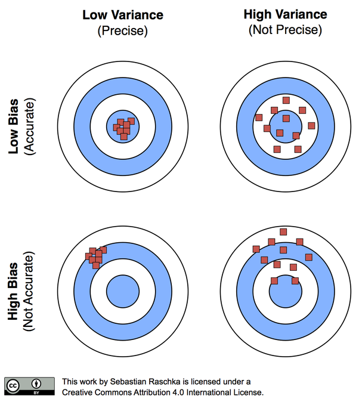

# Sample Statistics
In the previous two units, we studied populations and how to summarise them with statistics when the *entire* population was measured.  In other words, the measurce of center (the "mean") and measure of spread ("standard deviation") were the summary of all observations.

In the case of yield monitor, these are appropriate statistics.  In most every other agricultural reality, however, we cannot measure every individual in a population.  Instead, we only have enough *sample* the population, that is, measure a subset of individuals from the population.

This, of course, raises questions.  Was the sample (our subset) representative of the population?  If we took another random sample, would we calculate a similar mean or standard deviation?  And, perhaps, how far off could the mean of our sample be from the true population mean?

In other words, there is always uncertainty that statistics calculated from samples represent the true values of a population.  You might even say we lack complete confidence that a mean value calculated from a sample will closely estimate the mean of a population.

Enter statistics.  We can measure the variance of sample means to estimate the distribution of sample means around the true population mean.  Indeed, this is fundamental concept of research and statistics -- using the measured variance of sample statistics to determine how accurate the are in predicting population statistics.

## Samples
To measure the variation of sample means, we need at least two samples to compare.  Ideally we can gather even more.  As we will see, the more samples included in our estimates of the population mean, the more accurate we are likely to be.

A second comment, which may seem intuitive -- but at the retail level may be overlooked -- is randomization.  Samples, for example individual plants, or areas where yield will be measured, are ideally selected at random.  In reality, the plants or areas selected for measures may be less than random. When I used to count weed populations, we used square quadrats (frames) to consistently define the area that was measured.  We would throw them into different areas of the plot and count weeds where ever they landed.

The most important thing about selecting samples, however, is that the researcher work to minimize bias.  Bias is when the samples selected consistently overestimate or underestimate the population mean.  The most aggregious example of this would be a researcher who consistently and purposely sampled the highest- or lowest-measuring parts of a field.  

But bias can enter in other ways.  For example, if our weed populations were very uneven, our thrown quadrat might be more likely to skid to a stop in weedy areas.  A researcher might unconsciously choose taller plants to sample.  In August, we might be tempted to sample a corn field from the edge than walk into that sweltering, allergenic hell. 

Remember, our goal is to represent a population as accurately and as unbiasedly as our resources allow.  Accuracy means our sample means are close to the population mean.  Unbiased means our sample means are equivalently scattered above and below the population mean.




## Case Study
Once more, we will work with the Iowa soybean yield dataset from Units 1 and 2.

```{r, yield_dataset, include=FALSE}
library(sf)
library(tidyverse)
library(rcompanion)
library(plotly)

yield = st_read("data-unit-3/merriweather_yield_map/merriweather_yield_map.shp")

```

Let's review the structure of this dataset:
```{r, review_structure}

head(yield)

```

And map the field:
```{r, plot_field}
plot(yield["yield_bu"])
```

In Unit 2, we learned how to describe these data using the normal distribution model.  We learned about how the area under the normal distribution curve corresponds to the proportion of individuals within a certain range of values.  We also discussed how this proportion gave way to inferences about probability.  For example, the area under the curve that corresponded with yields from 70.0 to 79.9 represented the proportion of individuals in the yield population.  But it also represented the probability that, were you to measure selected areas at random, you would measure a yield between 70.0 and 79.9.


## Distribution of Sample Means
In the last unit, we sampled the yield from 1000 locations in the field and counted the number of observations that were equal to or greater than 70 and equal to or less than 80.

What would happen if we only sampled from 1 location.  What would be our sample mean and how close would it be to the population mean?

```{r}
set.seed(1776)
yield_sample = sample(yield$yield_bu, 1) %>%
      as.data.frame()
names(yield_sample) = c("yield")
ggplot(yield_sample, aes(x=yield)) +
  geom_histogram(fill="white", color="black") +
  geom_vline(xintercept = mean(yield$yield_bu), color = "red") +
  geom_vline(xintercept = mean(yield_sample$yield), color = "blue") +
  lims(x=c(55,105))
```


What would happen if we only sampled twice?

```{r}
set.seed(1776)
yield_sample = sample(yield$yield_bu, 2) %>%
      as.data.frame()
names(yield_sample) = c("yield")
ggplot(yield_sample, aes(x=yield)) +
  geom_histogram(fill="white", color="black") +
  geom_vline(xintercept = mean(yield$yield_bu), color = "red") +
  geom_vline(xintercept = mean(yield_sample$yield), color = "blue") +
  lims(x=c(55,105))
```

What would happen if we only sampled four times?

```{r}
set.seed(1776)
yield_sample = sample(yield$yield_bu, 4) %>%
      as.data.frame()
names(yield_sample) = c("yield")
ggplot(yield_sample, aes(x=yield)) +
  geom_histogram(fill="white", color="black") +
  geom_vline(xintercept = mean(yield$yield_bu), color = "red") +
  geom_vline(xintercept = mean(yield_sample$yield), color = "blue") +
  lims(x=c(55,105))
```

What would happen if we only sampled 15 times?

```{r}
set.seed(1776)
yield_sample = sample(yield$yield_bu, 15) %>%
      as.data.frame()
names(yield_sample) = c("yield")
ggplot(yield_sample, aes(x=yield)) +
  geom_histogram(fill="white", color="black") +
  geom_vline(xintercept = mean(yield$yield_bu), color = "red") +
  geom_vline(xintercept = mean(yield_sample$yield), color = "blue") +
  lims(x=c(55,105))
```

Nineteen times?
```{r}
set.seed(1776)
yield_sample = sample(yield$yield_bu, 19) %>%
      as.data.frame()
names(yield_sample) = c("yield")
ggplot(yield_sample, aes(x=yield)) +
  geom_histogram(fill="white", color="black") +
  geom_vline(xintercept = mean(yield$yield_bu), color = "red") +
  geom_vline(xintercept = mean(yield_sample$yield), color = "blue") +
  lims(x=c(55,105))
```

Click on this link to access an app to help you further understand this concept: app_central_limit_theorem_normal


## Central Limit Theorem

The Central Limit Theorem states that sample means are normally distributed around the population mean.  This concept is so powerful because it allows us to calculate the probability that that a sample mean is a given distance away from the population mean.  In our yield data, for example, the Central Limit Theorem allows us to assign a probability that we would observe a sample mean of 75 bushels/acre, if the population mean is 80 bushels per acre.  More on how we calculate this in a little bit.

What is even more powerful about the Central Limit Theorem is that our sample means are likely to be normally distributed, even if the population does not follow a perfect normal distribution.

Let's take this concept to the extreme.  Suppose we had a population where every value occurred with the same frequency.  This is known as a uniform distribution.  Click on the following link to visit an app where we can explore how the sample distribution changes in response to sampling an uniform distribution: app_central_limit_theorem_uniform


## Standard Error
When we describe the spread of a normally-distributed population -- that is, all of the individuals about which we want to make inferences -- we use the population mean and standard deviation.

When we sample (measure subsets) of a population, we again use two statistics.  The *sample mean* describes the center of the samples..  The spread of the sample means is described by the *standard error of the mean* (often abbreviated to *standard error*).  The standard error is related to the standard deviation as follows:

$$SE = \frac{\sigma}{\sqrt n} $$

The standard error, SE, is equal to the standard deviation, divided by the square root of the number of samples.  This denominator is very important -- it means that our standard error grows as the number of samples increases.  Why is this important?  

The sample mean is an estimate of the true population mean.  The distribution around the sample mean describes not only the sample means, the range of possible values for the true mean.  I realize this is a fuzzy concept.  By studying the distribution of our sample values, we are able to describe the probability that the population mean is a given value.

To better understand this, please visit this link: app_number_of_samples

If you take away nothing else from this lesson, understand whether you collect 2 or 3 samples has tremendous implications for your estimate of the population mean.  4 samples is much better than 3.  Do everything you can to fight for those first few samples.  Collect as many as you can afford, especially if you are below 10 samples.

## Degrees of Freedom
In Unit 1 we first came across degrees of freedom, which was the number of observations in a population or sample, minus 1.  Degrees of Freedom are again used below in calculating the t-distribution.  So what are they and why do we use them.  Turns out there are two explanations.

In the first explanation, "degrees of freedom" refer to the number of individuals or samples that can vary independently given a fixed mean.  So for an individual data point to be free, it must be able to assume any value within a given distribution.  Since the population mean is a fixed number, only n-1 of the data are able to vary.  The last data point is determined by the value of all the other data points, plus the population mean. 

Confusing, huh?  Who starts measuring samples thinking that the data point is fixed, in any case?  But if you think about it, the purpose of the sample is approximate a real population mean out there -- which is indeed fixed.  It's just waiting for us to figure it out.  So if our sample mean is equal to the population mean (which we generally assume), then the sample mean is also fixed.  But it is a very weird way of thinking.

Yet this is the answer beloved by all the textbooks, so you should know about it.

The second answer I like better: samples normally underestimate the true population variance.  This is because the sample variance is calculated from the distribution of the data around the sample mean.  Sample data will always be closer to the sample mean -- which is by definition based on the data themselves -- then the population mean.

Think about this a minute.  Your sample data could be crazy high or low compared to the overall population.  But that dataset will define a mean, and the variance of the population will be estimated from that mean.  In many cases, it turns out that using n-1 degrees of freedom will increase the value of the sample variance so it is closer to the population variance.

## The t-Distribution
In the last unit, we used the Z-distribution to calculate the probability of observing an individual of a given value in a population, given its population mean and standard deviation.  Recall that about 68% of individuals were expected to have values within one standard deviation, or Z, of the population mean.  Approximately 95% of individuals were expected to have values within 1.96 standard deviations of the population mean.  Alternatively, we can ask what the probability is of observing individuals of a particular or greater value in the population, given its mean and standard deviation.

We can ask a similar question of our sample data: what is the probability the population mean is a given value or greater, given the sample mean?  As with the Z-distribution, the distance between the sample mean and hypothesized population mean will determine this probability.  

There is one problem, however, with using the Z-distribution: it is only applicable when the population standard deviation is *known*.  When we sample from a population, we do not know it's true standard deviation.  Instead, we are estimating it from our samples.  This requires we use a different distribution: the t-distribution.

In comparison with the Z-distribution differs from the Z-distribution in that it's shape changes as the number of samples increases.  Notice in the animation above that when the number of samples is low, the distribution is wider and has a shorter peak.  As the number of samples increase, the curve becomes narrower and taller.  This has implications for the relationship between the distance of a hypothetical population mean from the sample mean, and the probability of it being that distant.

We can prove this to ourselves using the shadeDist function in R that was introduced in the last unit.  The first argument to this function is c(-1,1), which tells r how many standard errors to shade above and below the population mean (0 in this demonstration).  The second argument, "dt", simply tells R to use the t-distribution.  

```{r}
library(fastGraph)
shadeDist( c(-1, 1), "dt", parm2 = 4, lower.tail = FALSE )
```

The last argument, "lower.tail = FALSE, tells R to shade the area between the t-values and zero and calculate its probability.  If we set that argument to "TRUE", R would shade the area beyond the t-values and calculate its probability.

The third argument, parm1 = 2, requires greater explanation.  2 is the degrees of freedom.  Whenever we use sample data, the degrees of freedom is equal to one less than the number of samples.  In this example, 2 degrees of freedom means 3 samples were taken from the population.  

With 4 degrees of freedom, there is about a 63% probability the population mean is within 1 standard error of the mean.  Let's decrease the sample mean to 3 degrees of freedom

```{r}
library(fastGraph)
shadeDist( c(-1, 1), "dt", parm2 = 3, lower.tail = FALSE )
```

With only 3 degrees of freedom (4 samples), there is only a 61% probability the population mean is within one standard error of the mean.

Now change the parm2 from 3 to 1, which would be our degree of freedom if we only had two samples.  You should see the probability that the population mean is within 1 standard error of the sample mean fall to 50%.

Set parm2 to 10 degrees of freedom (11 samples), and the probability should increase to about 66%.  Set parm2 to 30 degress of freedom, and the probability the population mean is within 1 standard error of the mean increases to 67%.  When parm2 is 50 degrees of freedom (51 samples) the probability is about 68%.  At this point, the t-distribution curve approximates the shape of the z-distribution curve.


We can sum up the relationship between the t-value and probability with this plot.  The probability of the popualation mean being within one standard error of the population mean is represented by by the red line.  The probability of of the population mean being within 2 standard errors of the mean is represented by the blue line.  As you can see, the probability of the population mean being within 1 or 2 standard errors of the sample mean increases with the degrees of freedom (df).  Exact values can be examined by tracing the curves with your mouse.

```{r}

df = c(1:100) %>%
  as.data.frame()
names(df) = "df"

p_from_tdf = df %>%
  mutate(p1 = ((pt(1, df)) -0.5) * 2) %>%
  mutate(p2 = ((pt(2, df)) -0.5) * 2) %>%
  gather(t, p, p1, p2) %>%
  mutate(t=gsub("p", "", t)) 
  


p = p_from_tdf %>%
  ggplot(aes(x=df, y=p, group=t)) +
  geom_point(aes(color=t))
ggplotly(p)
```


Conversely, the t-value associated with a given proportion / probability will also decrease as the degrees of freedom increase.  The read line represents the t-values that define the area with a 68% chance of including the population mean.  The blue line represents the t-values that define the area with a 95% chance of including the population mean.  Exact values can be examined by tracing the curves with your mouse. Notice the t-value associated with a 68% chance of including the population mean approaches 1, while the t-value associated with a 95% chance approaches about 1.98.

```{r}

df = c(2:100) %>%
  as.data.frame()
names(df) = "df"


t_from_pdf = df %>%
  mutate(t68 = qt(0.84, df)) %>%
  mutate(t95 = qt(0.975, df)) %>%
  gather(p, t, t68, t95) %>%
  mutate(p=gsub("t", "", p)) 

p = t_from_pdf %>%
  ggplot(aes(x=df, y=t, group=p)) +
  geom_point(aes(color=p))
ggplotly(p)

```


*Takeaway:* the number of samples affects not only the standard error, but the t-distribution curve we use to solve for the probability that a value will occur, given our sample mean.


## Confidence Interval
The importance of the number of samples the standard error, and the t-distribution becomes even more apparent with the use of confidence interval.  A confidence interval is a range of values around the sample mean that are selected to have a given probability of including the true population mean.  Suppose we want to define, based on a sample size of 4 from the soybean field above, a range of values around our sample mean that has a 95% probability of including the true sample mean.

The 95% confidence interval is equal to the sample mean, plus and minus the product of the standard error and t-value associated with 0.975 in each tail:

$$CI = \bar x + t \times se$$

Where CI is the confidence interval, t is determined by the degrees of freedom, and se is the standard error of the mean

Since the t-value associated with a given probability in each tail decreases with the degrees of freedom, the confidence interval narrows as the degrees of freedom increase -- even when the standard error is unaffected.  

Lets sample our yield population 4 times, using the same code we did earlier

```{r}
# setting the seed the same as before means the same 4 samples will be pulled
set.seed(1776)
# collect 4 samples 
yield_sample = sample(yield$yield_bu, 4) 
#print results
yield_sample
```

We can then calculate the sample mean, sample standard deviation, and standard error of the mean.

```{r}
sample_mean = mean(yield_sample)
sample_sd = sd(yield_sample)
sample_se = sample_sd/sqrt(4)

sample_mean
sample_se
```

We can then determine the t-value we need to construct our confidence interval and multiply it by our standard error to determine the confidence interval.  To get the upper limit of the 95% confidence interval, we request the t-value above which only 2.5% of the samples are expected to exist.  In other words, we ask R for the t-value below which 95% of the samples are expected to exist.

```{r}
# t-value associated with 3 df
upper_t = qt(0.975, 3)
upper_t

```

We can then add this to the sample mean to get our upper confidence limit.

```{r}
upper_limit = sample_mean + upper_t
upper_limit
```

We can repeate the process to determine the lower limit.  This time, however, we ask R for the t-value below which only 2.5% of the samples are expected to exist.

```{r}
lower_t = qt(0.025, 3)
lower_t

lower_limit = sample_mean + lower_t
lower_limit

```

You will notice that "lower_t", the t-value that measures from the sample mean to the lower limit of the confidence interval, is just the negative of "upper_t".  Since the normal distribution is symmetrical around the mean, we can just determine the upper limit and use its negative as the lower limit of our confidence interval.

Finally, we can put this all together and express it as follows.  The confidence interval for the population mean, based on the sample mean is:

$$ CI = 80.2 \pm 3.2 $$

We can also express the interval by its lower and upper confidence limits.
$$(77.0, 83.4)$$
We can confirm this interval includes the true population mean, which is 80.1.


## Confidence Interval and Probability

Lets return to the concept of 95% confidence.  This means if we were to collect 100 sets of 4 samples each, 95% of them would estimate confidence intervals that include the true population mean.  The remaining 5% would not. 

Click on this link to better explore this concept: app_confidence_interval

Again, both the standard error and the t-value we use for calculating the confidence interval decrease as the number of samples decrease, so the confidence interval itself will decrease as well.

Click on this link to better explore this concept: app_ci_width


```{r eval=FALSE, include=FALSE}

set.seed(1776)
i=2
hist_list = list()
for(i in c(2:100)){
  yield_sample = sample(yield$yield_bu, i) %>%
      as.data.frame()
  plot_data$no_of_samples = i
  plot_data$sample_mean = mean(yield_sample$.)
  plot_data$std_dev = sd(yield_sample$.)
  plot_data$std_err = plot_data$std_dev/sqrt(i)
  plot_data$pop_mean = mean(yield$yield_bu)
  hist_list[[i]] = plot_data
  i = i+1
}
  
hist_df = do.call(rbind.data.frame, hist_list) %>%
  group_by(no_of_samples) %>%
  summarise(sample_mean = mean(sample_mean),
            std_err = mean(std_err)) %>%
  ungroup() %>% 
  mutate(df = no_of_samples - 1) %>%
  mutate(t_value = qt(0.975,df)) %>%
  mutate(upper_limit = sample_mean + t_value*std_err) %>%
  mutate(lower_limit = sample_mean - t_value*std_err) %>%
  mutate(error_bar_length = t_value*std_err) %>%
  mutate(pop_mean = mean(yield$yield_bu)) %>%
  mutate(color_name = if_else(upper_limit<pop_mean | lower_limit>pop_mean, "red", "black"))


ui = fluidPage(
  sidebarLayout(
    sidebarPanel(
      sliderInput("no_samples", "Select number of samples", min = 2, max = 100, step=1, value = 2, 
                  animate = animationOptions(interval = 200))
    ),
    mainPanel(
      plotOutput("plot", height="300px")
    )
  )
)

server = function(input, output ){
  output$plot = renderPlot({
    hist_df %>%
      filter(no_of_samples == input$no_samples) %>%
      ggplot(aes(x=0, y=sample_mean, group=color_name)) +
        geom_point(size = 6) +
      geom_hline(aes(yintercept=mean(yield$yield_bu)), color="blue", size=2, alpha=0.3) +
      geom_errorbar(aes(x=0, ymin=lower_limit, ymax=upper_limit, color=color_name), width=0.2, size=2) +
      # scale_color_manual(values = c("red", "black")) +
      scale_color_identity() +
      lims(x=c(-1, 1), y=c(0, 160)) + 
      coord_flip()
  })
}

shinyApp(ui, server)

```

As the number of samples increases, the confidence interval shrinks.  95 out of 100 times, however, the confidence interval will still include the true population mean.  In other words, as our sample size increases, our sample mean becomes less biased (far to either side of the population mean), and it's accuracy (the proximity of the sample mean and  population mean) increases.  In conclusion, the greater the number of samples, the better our estimate of the population mean.

In the next unit, we will use these concepts to analyze our first experimental data: a side by side trial where we will us the confidence interval for the difference between two treatments to test whether they are different.


## Exercise: Standard Error
Just as the standard deviation describes the distribution of individuals around a population mean, so the standard error of the mean describes the distribution of samples around their sample mean.  In fact, the standard error of the mean is simply the standard deviation of the samples around the sample mean.

### Case Study: Tomatoes
Once again, we will work with the tomato, barley, cotton, and peanut datasets.  Let's load the tomato dataset and look at its top six rows of data.

```{r}
tomato = read.csv("data-unit-3/exercise_data/tomato_uniformity.csv")
head(tomato)
```

### Calculating Standard Error
The standard error of the mean is equal to the population standard deviation, divided by the square root of the number of samples.  We can calculate these as follows.  To get the standard deviation, use the sd() function. 

```{r}
yield = tomato$yield  # define the column of interest

tomato_sd = sd(yield)
```

Then we can divide the standard deviation by the square root of n to get the standard error of the mean.  What would be the standard error of our sample mean, if we took 4 samples?

```{r}
tomato_se = tomato_sd / sqrt(4)
tomato_se
```

We will talk more about the t-distribution in the next exercise, but for now lets assume about 95% of the sample means should be within about two standard errors of the mean of their distribution.  Two times the standard error is about 10.6, so we would expect 95% of sample means to be within 50.3 +/-10.6, or (39.7, 60.9).  

Don't worry about understanding the code below.  Just run it and observe the plot.  In the plot below, we have simulated 1000 sample means, each based on four samples, from the tomato yield population.  We can see the range (39.7, 60.9) does include most of the population, with the exception of the tails.  

```{r}
library(tidyverse)
set.seed(2003)
sample_list = list()
for(i in c(1:1000)){
  samples = mean(sample(yield, 4))%>%
    as.data.frame() 
  sample_list[[i]] = samples
}
sample_list_df = do.call(rbind.data.frame, sample_list)
names(sample_list_df) = "yield"
pop_mean = mean(yield)
ggplot(sample_list_df, aes(x=yield)) +
  geom_histogram(fill="white", color="black") +
  geom_vline(xintercept = pop_mean, color = "red") 

```

What would be the standard error of our sample mean if we took 7 samples?
```{r}
tomato_se = tomato_sd / sqrt(7)
tomato_se
```


### Practice: Barley
Now let's practice calculating the standard error.  What would be the standard error of our sample mean if we took 8 samples?  I'll get you started.  First, let's load the "barley_uniformity.csv" data and inspect the first six rows.

```{r}
barley = read.csv("data-unit-3/exercise_data/barley_uniformity.csv")
head(barley)
```

Next lets define the column of interest and create a histograma of its distribution.
```{r}
barley_yield = barley$yield
hist(barley_yield)
```

Remember, we need to know the standard deviation in order to calculate the standard error of the sample mean.

```{r}
barley_sd = sd(barley_yield)

```

What would the standard error of the sample mean be if we took two samples?

```{r}
barley_se = barley_sd/sqrt(2)
barley_se
```

The standard error woud be about 22.0.

Try calculating additional standard errors.  Here are some of the values you should get.

4 samples, se=15.6
5 samples, se=13.9
7 samples, se=11.8


### Practice: Cotton

Calculate the standard errors of sample means from the "cotton_uniformity.csv" dataset, for sets of 3, 4, and 6 samples.  You should get:

3 samples = 0.13
4 samples = 0.11
6 samples = 0.09


## Exercise: t-Distribution
This week, we are introduced to the t-distribution.  The t-distribution describes the distribution of sample means around their mean value.  Contrast this with the Z-distribution, which describes the distribution of individuals around the population mean.

The most critical way in which the t-distribution is different from the Z-distribution is the shape of the t-distribution changes shape with the number of samples used to calculate the sample mean.  As the number of samples increases, the t-distribution narrows in width, and expands in height.


### Plotting the Distribution
In the lecture, we once again used the "shadeDist" function from the fastGraph package.  Use install.packages("fastGraph") to install fastGraph in your account if you did not do so in the last unit.  Then use library(fastgraph) to tell R to run that package in the current section.

We can use the shadeDist function to observe how the difference of the t-Distribution changes with the number of samples taken.  Say we want to see the t-distribution for a sample size of 2.  We will shade the area from t=-1 to t=1 for reference.

```{r}
library(fastGraph)
shadeDist(c(-1,1), "dt", 1, lower.tail=FALSE ) # t with 15 d.f. and non-centrality parameter=3
```

Remember, we must provide four arguments to the shadeDist function.  The first, "c(-1,1)", is the range of t-values.  The second, "dt", tells R we are modeling the t-distribution.  The third, 3 is the degrees of freedom associated with t, which is always one less than the number of samples.  the final argument, "lower.tail=FALSE", tells R to shade the middle of the plot.

Now lets change the number of samples to 4.
```{r}
shadeDist(c(-1,1), "dt", 3, lower.tail=FALSE ) # t with 15 d.f. and non-centrality parameter=3
```

We can see the shaded area gets wider, meaning the distribution is getting narrower.  In we increase to 6, the shape doesn't seem to change much, yet the proportion of the curve that is between t=-1 and t=1 increases.
```{r}
shadeDist(c(-1,1), "dt", 5, lower.tail=FALSE ) # t with 15 d.f. and non-centrality parameter=3
```

If we increase to n=20, the curve continues to narrow.
```{r}
shadeDist(c(-1,1), "dt", 19, lower.tail=FALSE ) # t with 15 d.f. and non-centrality parameter=3
```

### Calculating T
To create the plot above, we entered t-values, and the degree of freedom.  R not only drew the plot, but calculate the probability of observing sample means within the given range.

To calculate t, we need to supply the degrees of freedom and the target probability to which t should respond.  We will use the "qt" function in R to do this.

Let's say we want to know the t-values that, given four samples per mean, would be expected to include 50% of potential sample means?  In that case, we are interested in the middle 50% of the distribution.  There will be 25% of the distribution below this range, and 25% above.  So, for the lower t-value, we will tell R to calculate the t-value below which 25% of sample means are expected to occur.

```{r}
qt(0.25,3)
```

In the argument above, we told R to calculate the t-value associated with the lower 0.25 of the population, and 3 degrees of freedom (for 4 samples).  For the upper t-value, we want the value where 75% of the distribution is lower.


```{r}
qt(0.75,3)

```

As you can see, the upper and lower limit are symmetrical -- they only differ in sign.  We can use the shadeDist from above to check our work, by plugging in the t-values we just calculated.

```{r}
shadeDist(c(-0.7649,0.7649), "dt", 3, lower.tail=FALSE ) # t with 15 d.f. and non-centrality parameter=3

```

As we can see, the defined proportion equals our target.

What if we want the t-values that bind the middle 68% of potential sample means?  Then we would have 32% of the distribution outside this range.  16% of sample means would be expected to be below the range, and 16% percent above.

The t-value associated with the lower range, again assuming 3 df, would be:
```{r}
qt(0.16,3)
```
And the t-value associated with the upper range would be:
```{r}
qt(0.84,3)
```

How about the t-values that would be expected to define the range where 90% of sample means would be expected?
```{r}
qt(0.05,3)
qt(0.95,3)
```

And, finally, 95%?

```{r}
qt(0.025,3)
qt(0.975,3)
```

### Practice
Calculate the t-values that would define the middle 60% of potential sample means if there were 10 samples.

The lower limit is:
```{r}
qt(0.2,9)
```

What is the upper limit?

Q: What is the range of t-values associated with 70% of potential sample means, if the number of samples is 12?
A: (-1.09, 1.09)

Q: What is the range of t-values associated with 80% of potential sample means, if the number of samples is 14?
A: (-1.35, 1.35)

Q: What is the range of t-values associated with 90% of potential sample means, if the number of samples is 17?
A: (-1.75, 1.75)

Q: What is the range of t-values associated with 95% of potential sample means, if the number of samples is 20?
A: (-2.09, 2.09)

Q: What is the range of t-values associated with 95% of potential sample means, if the number of samples is 20?
A: (-2.86, 2.86)


## Exercise: Confidence Interval for Sample Mean
In the last part of this lesson, we learned how the standard error and t-distribution can be combined to define a confidence interval: a range of values around the sample mean that we are confident will, in a given percentage of trials, include the true population mean.  The confidence interval is bound by upper and lower confidence limits that are the product of the t-value and standard error.  

### Calculating the Confidence Interval
Once we understand how to calculate the standard error and t-value, the confidence interval is easily constructed:

1) multiply the standard error times the t-value
2) find the lower confidence limit by subtracting the product from step 1 from the sample mean 
3) find the upper confidence limit by adding the product from step 1 to the sample mean 
4) report the confidence interval in parentheses, like this (lower confidence limit, upper confidence limit)

### Case Study: Peanut Sample 1

In the data folder there are nine sample sets, of different size from the peanut trial.  Let's load the first
```{r}

peanut = read.csv("data-unit-3/exercise_data/peanut_sample_1.csv")
head(peanut)

```

Let's create a new variable, "yield", from the yield column in the peanut data frame.   
```{r}
yield = peanut$yield

```

First, lets calculate the sample mean and standard deviation.
```{r}
yield_mean = mean(yield)
yield_sd = sd(yield)
```

Remember how to calculate the standard error?  Right, divide the standard deviation by the square root of the number of samples.  In this case, we know it is 2, but if we were dealing with a larger sample, it might be easier to let excel do the counting.  So lets use the "length()" argument to do that.

```{r}
no_samples = length(yield)
```

Finally, we can calculate the standard error.
```{r}
yield_se = yield_sd/sqrt(no_samples)
```

Now, we need to calculate the t-value to use in calculating the confidence interval.  For this first example, we want a 90% confidence interval.  So we need to tell R to calculate the value of t that leaves 5% of the distribution in each tail.  That means the upper tail will begin at 100% - 5, or 95%.  We can now use the "qt" function in R to calculate t.

```{r}
t_value = qt(0.95, 1)
```

Where did the 1 come from?  Remember, that is the degrees of freedom, which is equal to the number of samples minus 1.  We have two samples in this first example, thus we have 1 degree of freedom.  

We now know that our standard error is 0.46 and our t_value is about 6.31.  The last step is to add and subtract the product of the standard error and t-value from the sample mean.

```{r}
lower_limit = yield_mean - (yield_se*t_value)
upper_limit = yield_mean + (yield_se*t_value)

lower_limit
upper_limit
```

So our confidence interval is (-1.06, 4.74).  Now we know the yield cannot possibly be less than zero.  But because the sample mean is close to zero, and because our sample size is so small, the confidence interval is so wide that its lower limit is negative.  This illustrates an important part of statistics or data science -- never underestimate the importance of domain knowledge, that is, your knowledge of the science it is trying to represent.

One last thing: whenever you report a confidence interval, you should report it's confidence level and degrees of freedom, too.  So we would report the above as:

CI(0.90, 1) = (-1.06, 4.74)


### Case Study: Peanut Sample 2
Let's go through this one a little faster.

```{r}
peanut_2 = read.csv("data-unit-3/exercise_data/peanut_sample_2.csv")
head(peanut_2)

```

First, lets calculate the sample mean, standard deviation, and standard error.
```{r}
yield_2 = peanut_2$yield
yield_mean_2 = mean(yield_2)
yield_sd_2 = sd(yield_2)
no_samples_2 = length(yield_2)
yield_se_2 = yield_sd_2/sqrt(no_samples_2)
```

This time we want a 95% confidence interval, so we want our distribution to have 2.5% in the top tail.  100% - 2.5% = 97.5%.  We have 5 samples - 1 = 4 degrees of freedom

```{r}
t_value_2 = qt(0.975, 4)
```

Finally, add and subtract the product of the standard error and t-value from the sample mean.

```{r}
lower_limit_2 = yield_mean_2 - (yield_se_2*t_value_2)
upper_limit_2 = yield_mean_2 + (yield_se_2*t_value_2)

lower_limit_2
upper_limit_2
```

Our confidence interval is now CI(0.95, 4) = (1.50, 2.30)

### Practice
Datasets peanut_sample_3.csv through peanut_sample_9.csv are available for your practice.  The answers for the 95% confidence intervals are given below.


```{r}

# change the sample number in the code below to access datasets 3 through 9
peanut = read.csv("data-unit-3/exercise_data/peanut_sample_3.csv")
peanut_mu = mean(peanut$yield)
peanut_sd = sd(peanut$yield)
peanut_no_samples = length(peanut$yield)
peanut_se = peanut_sd / sqrt(peanut_no_samples)
df=peanut_no_samples-1

peanut_t = qt(0.975, df=df)

upper_conf_limit = peanut_mu + (peanut_se*peanut_t)
lower_conf_limit = peanut_mu - (peanut_se*peanut_t)

paste0("(", round(lower_conf_limit,2), ", ", round(upper_conf_limit,2), ")")
```


peanut_sample_3.csv: (1.95, 2.41)
peanut_sample_4.csv: (1.98, 2.34)
peanut_sample_5.csv: (1.86, 2.65)
peanut_sample_6.csv: (1.98, 2.57)
peanut_sample_7.csv: (2.09, 2.42)
peanut_sample_8.csv: (2.12, 2.49)
peanut_sample_9.csv: (1.42, 2.15)