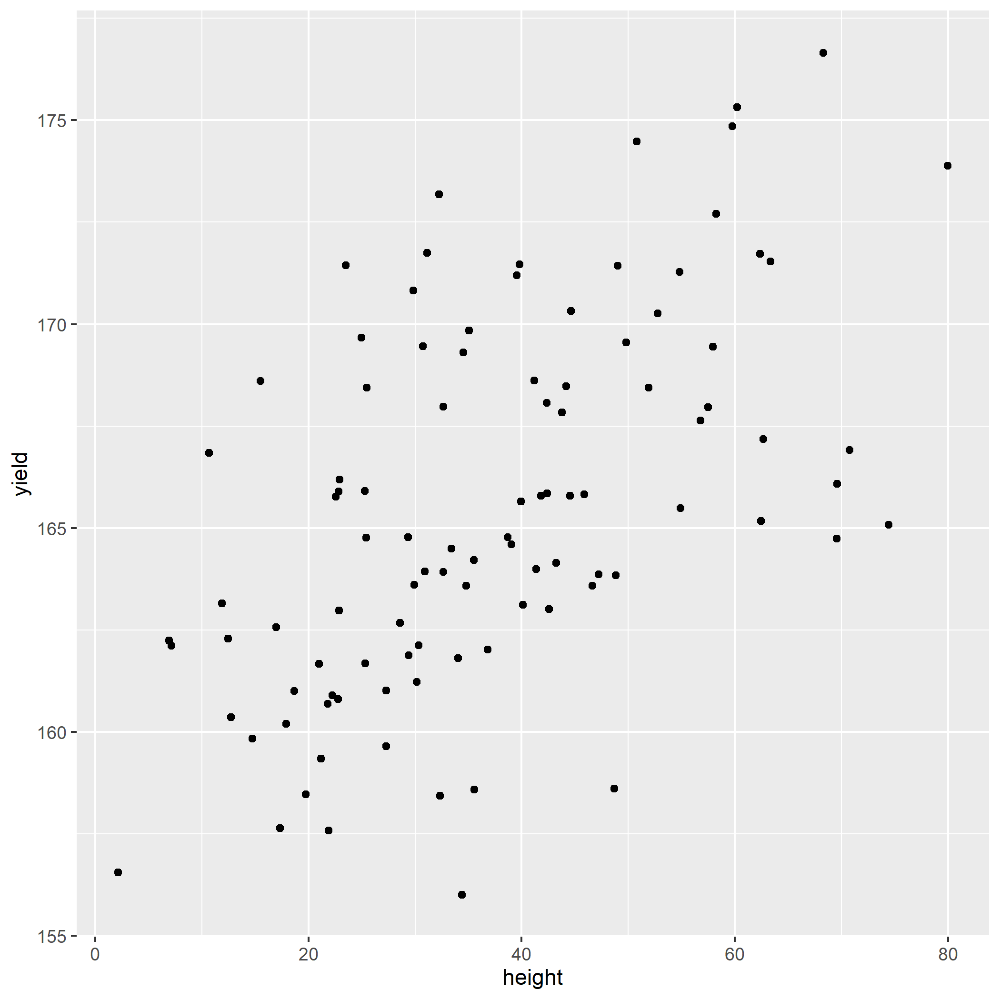
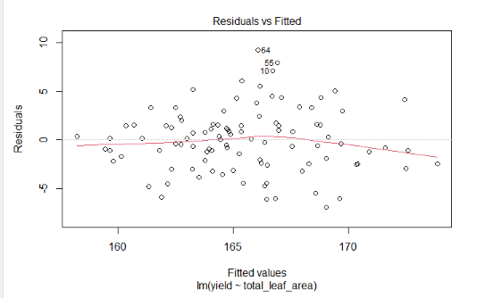
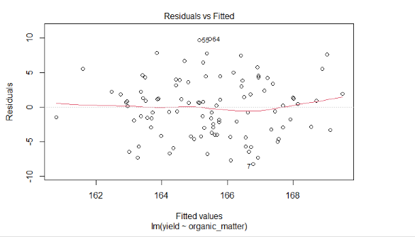
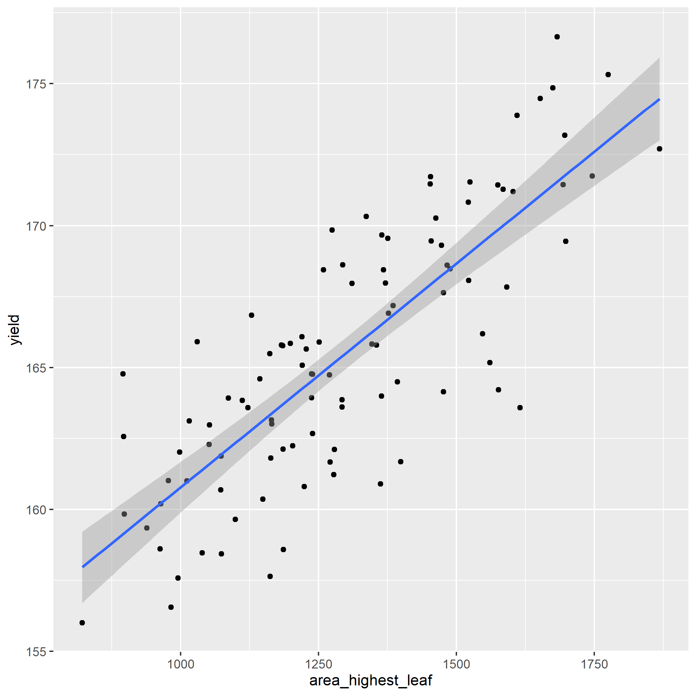
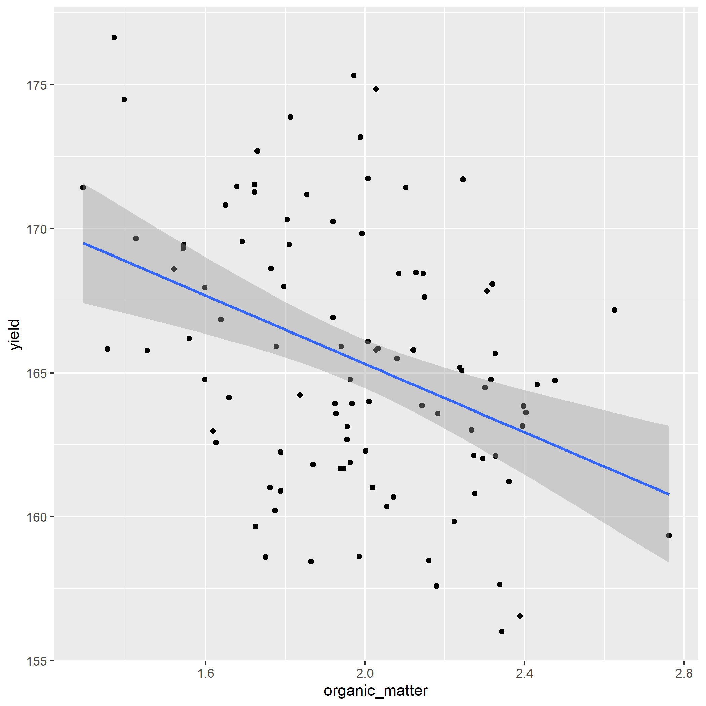

# Correlation and Simple Regression
Let's review our progress so far.

In Units 1 to 3, we learned about populations, distributions, and samples.  A population was a group of individuals in which we were interested.  We use statistics to describe the spread or distribution of a population.  When it is not possible to measure every individual in a population, a sample or subset can be used to estimate the frequency with which different values would be observed were the whole population measured.

In Units 4 and 5, we learned how to test whether two populations were different.  The t-distribution allowed us to calculate the probability the two populations were the same, in spite of a measured difference.  When the two populations were managed differently, the t-test could be used to test whether they, and therefore their management practices, caused different outcomes.

In Units 6 and 7, we learned how to test differences among multiple qualitative treatments.  By qualitative, we mean there was no natural ranking of treatments: they were identified by name, and not a numeric value that occurred along a scale.  Different hybrids, herbicides, and cropping systems are all examples of qualitative treatments.  Different experimental designs allowed us to reduce error, or unexplained variation among experimental units in a trial.  Factorial trials allowed us to test multiple factors and once, as well as test for any interactions among factors.

In Unit 8, we learned about to test for differences among multiple qualitative treatments.  The LSD and Tukey tests can be used to test the difference among treatments.  Contrasts can be used to compare intuitive groupings of treatments.  We learned how to report results in tables and plots.  

In Units 9 and 10, we will learn to work with quantitative treatments.  Quantitative treatments can be ranked.  The most obvious example would be rate trials for fertilizers, crop protection products, or crop seeds.  What makes this situation different is that we are trying to describe a relationship between $x$ and $y$ along within a range of x values, rather at only at discrete values of x.


## Correlation
There are two ways of analyzing the relationship between two quantitative variables.  If our hypothesis is that an change in $x$, the independent variable (for example, pre-planting nitrogen fertilation rate), *causes* a change in $y$, the dependent variable (for example, yield), then we use a *regression model* to analyze the data.  Not only can the relationship between tested for significance -- the model itself can be used to predict $y$ for any value of $x$ within the range of those in the dataset.

Sometimes, however, we don't know whether $x$ causes $y$, or $y$ causes $x$.  This is the chicken-and-egg scenario.  Outside animal science, however, we can run into this situation in crop development when we look at the allocation of biomass to different plant parts or different chemical components of tissue.

### Case Study: Cucumber
In this study, cucumbers were grown the their number of leaves, branches, early fruits, and total fruits were measured.  

First, let's load the data and look at its structure.
```{r}
library(tidyverse)
library(ggplot2)
cucumber = read.csv("data-unit-10/cucumber_traits.csv")
head(cucumber)
```

What is the relationship between branches and leaves?  Let's plot the data.
```{r}
ggplot(cucumber, aes(x=branches, y = leaves)) +
  geom_point()
```

We don't know whether leaves cause more branches.  You might argue that more branches provide more places for leaves to form.  But you could equally argue that the number of leaves affects the production of photosynthates for additional branching.

Similarly, what is the relationship between earlyfruit and the number of branches?

```{r}
ggplot(cucumber, aes(x=branches, y=earlyfruit)) +
  geom_point()
```

In both cases, we can see that as one variable increases, so does the other.  But we don't know whether the increase in one causes the increase in the other, or whether there is another variable (measured or unmeasured, that causes both to increase).`

## Correlation

Correlation doesn't measure *causation*.  Instead, it measures *association*. The first way to identify correlations is to plot variables as we have just done.  But, of course, it is hard for us to measure the strength of the association just by eye.  In addition, it is good to have a way of directly measuring the strengh of the correlation.  Our measure in this case is the *correlation coefficient*, $r$. r varies between –1 and 1.  Values near 0 indicate little or no association between Y and X.  Values close to 1 indicate a strong, positive relationship between Y and X.  A positive relationship means that as X increases, so does Y.  Conversely, values close to 1 indicate a strong, negative relationship between Y and X.  A negative relationship means that as X increases, Y decreases.  

Experiment with the application found at the following link:

https://marin-harbur.shinyapps.io/10-correlation/


What happens as you adjust the value of r using the slider control?

For the cucumber datasets above, the correlations are shown below:

```{r}

cor_branches_leaves = round(cor(cucumber$branches, cucumber$leaves),2)

plot1 = ggplot(cucumber, aes(x=branches, y = leaves)) +
  geom_point() +
  geom_text(x=140, y=0.9*max(cucumber$leaves), label = paste0("r = ", cor_branches_leaves))

cor_branches_earlyfruit = round(cor(cucumber$branches, cucumber$earlyfruit),2)
max_earlyfruit = max(cucumber$earlyfruit)

plot2 = ggplot(cucumber, aes(x=branches, y = earlyfruit)) +
  geom_point() +
  geom_text(data=cucumber, x=140, y=0.9*max(cucumber$earlyfruit), label = paste0("r = ", cor_branches_earlyfruit))

require(gridExtra)
grid.arrange(plot1, plot2, ncol=2)

```


### How Is r Calcuated (optional reading)

Something that bothered me for years was understanding what r represented – how did we get from a cloud of data to that number?.  The formula is readily available, but how does it work?  To find the explanation in plain English is really hard to find, so I hope you enjoy this!

To understand this, let's consider you are in Marshalltown, Iowa, waiting for the next Derecho.  You want to go visit your friends, however, who are similarly waiting in Des Moines for whatever doom 2020 will bring there.  How will you get there?


First, you could go "as the crow flies" on Routes 330 and 65.  This is the shortest distance between Marshalltown and Des Moines.  In mathematical terms this is know as the "Euclidian Distance".  Now you probably know the Eucidian Distance by a different name, the one you learned in eigth grade geometry.  Yes, it is the hypotenuse, the diagonal on a right triangle!

Second, you might want to stop in Ames to take some barbecue or pizza to your friends in Des Moines.  In that case, you would travel a right angle, "horizontally" along US 30-and then "vertically" down I-35.  You might call this "going out of your way".  The mathematical term is "Manhattan Distance".  No, not Kansas.  The Manhattan distance is named for the grid system of streets in the upper two thirds of Manhattan.  The avenues for the vertical axes and the streets form the horizontal axes.

As you might remember, the length of the hypotenuse of a right triangle is calculated as: 

$$z^2 = x^2 + y^2$$

Where $z$ is the distance as the crow flies, $x$ is the horizontal distance, and $y$ is the vertical distance.  This is the Euclidian Distance.  The Manhattan distance, by contrast, is simply $x + y$.

Now what if we were simply driving from Marshalltown to Ames?  Would the Euclidian distance and the Manhattan distance be so different?  No, because both Marshalltown and Ames are roughly on the x-axis?  Similarly, what if we drove from Ames to Des Moines?  The Euclidian distance and Manhattan distance would again be similar, because we were travelling across the x-axis.

The difference between the Euclidian distance and the Manhattan distance is greatest when we must travel at a 45 degree angle from the X axis.  We can demonstrate this with the following plot.  Every point below is four units from the origin ($x=0,y=0$).  Notice that when the point is on the x or y axis, the Euclidian distance and Manhattan distance are equal.  But as the angle increases to zero, the Euclidian distance decreases, reaching its lowest value when x=y and the angle from the axis is 45 degrees.

In the plot below, each point has a Manhattan distance ($x+y$) of 4.  The Euclidian distance is shown beside each point.  We can see the Euclidian distance is least when $y=x=2$.  

```{r}
x = c(4,3,2,1,0)
y = c(0,1,2,3,4)

distance_example = cbind(x,y) %>%
  as.data.frame() %>%
  mutate(euclidian_distance = sqrt(x^2 + y^2),
         manhattan_distance = x+y,
         id = row_number(),
         id = as.factor(id),
         euclidian_distance = round(euclidian_distance, 1))

ggplot(distance_example, aes(x=x, y=y, group=id, label = euclidian_distance)) +
  geom_point(aes(color=id), size=5) +
  geom_segment(aes(x = 0, y = 0, xend = x, yend = y, color=id), arrow = arrow(length = unit(7, "mm")), size=1) +
  geom_text(aes(x = x + 0.3, y= y + 0.3, color = id), size=6) + 
  coord_fixed() + 
  lims(x=c(0,4.5), y=c(0, 4.5)) + 
  theme(legend.position = "none")
  

```

Conversely, in the plot below, each point is the same Euclidean distance (4 units) from the origin ($x=0,y=0$).  The Manhattan distance is shown beside each point.  We can see the Manhattan distance is greatest when the point is at a 45 degree angle from the origin.
```{r}
x = c(4,3.85,3.4, 2.83,2,1,0)
z = 4

distance_example_2 = cbind(x,z) %>%
  as.data.frame() %>%
  mutate(euclidian_distance = z,
         y= sqrt(z^2 -  x^2),
         manhattan_distance = x+y,
         id = row_number(),
         id = as.factor(id),
         manhattan_distance = round(manhattan_distance, 1))

ggplot(distance_example_2, aes(x=x, y=y, group=id, label = manhattan_distance)) +
  geom_point(aes(color=id), size=5) +
  geom_segment(aes(x = 0, y = 0, xend = x, yend = y, color=id), arrow = arrow(length = unit(7, "mm")), size=1) +
  geom_text(aes(x = x + 0.3, y= y + 0.3, color = id), size=6) + 
  coord_fixed() +
  lims(x=c(0,4.5), y=c(0, 4.5)) + 
  theme(legend.position = "none")
  

```

The calculation of the correlation coefficient, $r$, depends on this concept of *covariance* between $x$ and $y$.  The covariance is calculated as:

$$S_{xy} = \sum(x_i - \bar{x})(y_i-\bar{y}) $$

Let's go back to our cucumber data.  We will calculate the difference of each point from the $\bar{x}$ and $\bar{y}$.  The points are plotted below.

```{r}
cucumber_cov = cucumber %>%
  mutate(branches_delta = branches - mean(branches),
         leaves_delta = leaves - mean(leaves),
         cov = branches_delta * leaves_delta)

ggplot(cucumber_cov, aes(x= branches_delta, y=leaves_delta)) +
  geom_point() +
  geom_vline(xintercept=0) +
  geom_hline(yintercept=0) +
  lims(x=c(-100, 100), y=c(-700, 700))
  
```

What we have now are four quandrants.  The differences between them are important important because they affect the *sign* of the covariance.  Remember, the covariance of each point is the product of the x-distance and the y-distance of each point.  

```{r}
ggplot(cucumber_cov, aes(x= branches_delta, y=leaves_delta)) +
  geom_point() +
  geom_vline(xintercept=0) +
  geom_hline(yintercept=0) +
  geom_text(x=50, y=400, label="I", size = 20, color="darkgrey", ) +
  geom_text(x=50, y=-400, label="II", size = 20, color="darkgrey") +
  geom_text(x=-50, y=-400, label="III", size = 20, color="darkgrey") +
  geom_text(x=-50, y=400, label="IV", size = 20, color="darkgrey") +
  lims(x=c(-100, 100), y=c(-700, 700))
```

In quadrant I, both the x-distance and y-distance are positive, so their product will be positive.  In quadrant II, the x-distance is still positive but the y-distance is negative, so their product will be negative.  In quadrant III, both x-distance and y-distance are negative, so their negatives will cancel each other and the product will be positive.  Finally, quadrant IV, will have a positve x-distance and negative y-distance and have a negative sign.  

```{r}
ggplot(cucumber_cov, aes(x= branches_delta, y=leaves_delta)) +
  geom_point() +
  geom_vline(xintercept=0) +
  geom_hline(yintercept=0) +
  geom_text(x=50, y=400, label="+", size = 25, color="darkgrey", ) +
  geom_text(x=50, y=-355, label="-", size = 25, color="darkgrey") +
  geom_text(x=-50, y=-400, label="+", size = 25, color="darkgrey") +
  geom_text(x=-50, y=445, label="-", size = 25, color="darkgrey") +
  lims(x=c(-100, 100), y=c(-700, 700))
```

Enough already!  How does all this determine r?  It's simple -- the stronger the association between x and y, the more linear the arrangement of the observations in the plot above.  The more linear the arrangement, the more the points will be in diagonal quadrants.  In the plot above, any observations that fall in quadrant I or III will contribute to the positive value of r.  Any points that fall in quadrants II or IV will subtract from the value or r.

In that way, a loose distribution of points around all four quadrants, which would indicate x and y are weakly associated, would be penalized with an r score close to zero.  A distribution concentrated in quadrants I and III would have a positive r value closer to 1, indicating a *positive* association between x and y.  Conversely, a distribution concentrated in quadrants II and IV would have a negative r value closer to -1, and a *negative* association between x and y.

One last detail.  Why is r always between -1 and 1?  To understand that, we look at the complete calculation of r.

$$r=\frac{S_{xy}}{\sqrt{S_{xx}}\cdot\sqrt{S_{yy}}} $$

You don't need to memorize this equation.  Here is what it is doing, in plain English.  $S_{xy}$ is the covariance.  It tells us, for each point, how it's x and y value vary together.  $S_{xx}$ is the sum of squares of x.  It sums the distances of each point from the origin ($x=0,y=0$) along the x axis.  $S_{yy}$ is the sum of squares of y.  It is the total y distance of points from the origin.  By multiplying the square root of $S_{xx}$ and $S_{yy}$, we calculate the maximum theoretical covariance that the points in our measure could have. 

r is, after all this, a proportion.  It is the measured covariance of the points, divided by the covariance they would have if they fell in a straight line.  

I hope you enjoy this explanation.  I don't like to go into great detail about calculations, but one of my greatest hangups with  statistics is how little effort is often made to explain where the statistics actually come from.  If you look to Wikipedia for an explanation, you usually get a formula that assumes you have an advanced degree in calculus.  Why does this have to be so hard?

Statistics is the end, about describing the *shape* of the data.  How widely are the observations distributed?  How far do they have to be from the mean to be too improbabe to be the result of chance?  Do the points fall in a line or not?  There is beauty in these shapes, as well as awe that persons, decades and even millenia before digital computers, discovered how to describe them with formulas.

Then again, it's not like they had *Tiger King* to watch.


## Regression
Regression describes a relationship between an independent variable (usually represented by the letter $y$) and one or more dependent variables ($x_x$, $x_2$, etc).  Regression differs from correlation in that the model assumes that the value of $x$ is substantially determined by the value of $x$.  Instead of describing the *association* between $y$ and $x$, we now refer to causation – how $X$ determines the value of $Y$.

Regression analysis may be conducted simply to test the hypothesis that a change in one variable drives a change in another, for example, that an increase in herbicide rate causes an increase in weed control.  Regression, however, can also be used to predict the value of y based on intermediate values of x, that is, values of x between those used to fit or "train" the regression model.

The prediction of values of y for intermediate values of x is called *interpolation*.  In the word interpolation we see "inter", meaning between, and "pole", meaning end.  So interpolation is the prediction of values between actually sampled values.  If we try to make predictions for y outside of the range of values of x in which the model was trained , this is known as *extrapolation*, and should be approached very cautiously.

If you hear a data scientist discuss a predictive model, it is this very concept to which they refer. To be fair, there are many tools besides regression that are used in predictive models.  We will discuss those toward the end of this course.  But the regression is commonly used and one of the more intuitive predictive tools in data science.

In this lesson, we will learn about one common kind of regression, simple linear regression.  This means we will learn how to fit a cloud of data with a straight line that summarizes the relationship between $Y$ and $X$.  This assumes, of course, that it is appropriate to use a straight line to model that relationship, and there are ways for us to test that we will learn at the end of this lesson.


### Case Study

A trial was conducted in Waseca, Minnesota, to model corn response to nitrogen.  Yields are per plot, not per acre.
```{r}
nitrogen = read.csv("data-unit-10/nitrogen_waseca.csv")
head(nitrogen)
```

The first thing we should do with any data, but especially data we plan to fit with a linear regression model, is to visually examine the data. Here, we will create a scatterplot with yield on the Y-axis and nitro (the nitrogen rate) on the X-axis.  

```{r}
ggplot(data=nitrogen, aes(x=nitro, y=yield)) +
  geom_point()
```

We can see that nitrogen waw applied at three rates.  It is easy to check these five rates using the unique command in R.
```{r}
unique(nitrogen$nitro)
```

We can see that the centers of the distribution appear to fall in a straight line, so we are confident we can model the data with simple linear regression.

### Linear Equation
Simple linear regression, unlike correlation, fits the data could with an equation.  In Unit 5, we revisited middle school, where you learned that a line can be defined by the following equation:
$$ y = mx + b $$
Where $y$ and $x$ define the coordinate of a point along that line, $m$ is equal to the slope or “rise” (the change in the value of y with each unit change in $x$, and $b$ is the $y$-intercept (where the line crosses the y-axis.  The y-intercept can be seen as the “anchor” of the line; the slope describes how the line is pivoted on that anchor.  

In statistics we use a slightly different equation – same concept, different annotation

$$\hat{y} = \hat{\alpha} + \hat{\beta} x$$

The y intercept is represented by the greek letter $\alpha$, the slope is represented by the letter $\beta$.   $y$, α, and β all have hat-like symbols called carats ($\hat{}$) above them to signify they are estimates, not known population values.  This is because the regression line for the population is being estimated from a sample.  $\hat{y}$ is also an estimate, since it is calculated using the estimated values $\hat{\alpha}$ and $\hat{\beta}$.  Only x, which in experiments is manipulated, is a known value.

### Calculating the Regression Equation
We can easily add a regression line to our scatter plot.
```{r}
ggplot(data=nitrogen, aes(x=nitro, y=yield)) +
  geom_point() +
  geom_smooth(method=lm, se=FALSE)
```

The blue line represents the regression model for the relationship between yield and nitro.  Of course, it would be nice to see the linear equation as well, which we can estimate using the *lm()* function of R.

```{r}

regression_model = lm(yield~nitro, nitrogen)
regression_model
```
The cofficients above define our regression model.  The number given under "(Intercept)" is the estimate of the y-intercept, or $\hat{\alpha}$.  The number under nitro is the estimate of the slope, or $\hat{\beta}$.  Knowing that, we can construct our regression equation:

$$\hat{y} = \hat{\alpha} + \hat{\beta} x$$
$$\hat{y} = 8.476 + 0.04903x$$

This tells us that the yield with 0 units of n is about 8.5, and for each unit of nitrogen yield increases about 0.05 units.  If we had 50 units of nitrogen, our yield would be:

$$\hat{y} = 8.476 + 0.04903(50) = 10.9275 $$

Since nitrogen was only measured to three significant digits, we will round the predicted value to 10.9.

If we had 15 units of nitrogen, our yield would be:
$$\hat{y} = 8.476 + 0.04903(15) = 9.21145 $$

Which rounds to 9.21.  So how is the regression line calculated?

### Least-Squares Estimate
The regression line is fit to the data using a method known as the least-squares estimate.  To understand this concept we must recognize the goal of a regression equation is to make the most precise estimate for Y as possible.  We are not estimating X, which is already known.  Thus, the regression line crosses the data cloud in a way that minimizes the vertical distance (Y-distance) of observations from the regression line.  The horizontal distance (X-distance) is not fit by the line.

```{r eval=FALSE, include=FALSE}
library(fitdistrplus)
set.seed(0)
dat <- nitrogen %>%
  rename(x=nitro,
         y=yield)

## breaks: where you want to compute densities
breaks <- c(-33.6, unique(nitrogen$nitro))
dat$section <- cut(dat$x, breaks)

## Get the residuals
dat$res <- residuals(lm(y ~ x, data=dat))

## Compute densities for each section, and flip the axes, and add means of sections
## Note: the densities need to be scaled in relation to the section size (2000 here)
dens <- do.call(rbind, lapply(split(dat, dat$section), function(x) {
   d <- density(x$res, n=12)
    res <- data.frame(x=max(x$x)- d$y*25, y=d$x+mean(x$y))
    res <- res[order(res$y), ]
    ## Get some data for normal lines as well
    xs <- seq(min(x$res), max(x$res), len=12)
    res <- rbind(res, data.frame(y=xs + mean(x$y),
                                 x=max(x$x) - 25*dnorm(xs, 0, sd(x$res))))
    res$type <- rep(c("empirical", "normal"), each=12)
    res
}))
dens$section <- rep(levels(dat$section), each=24)

## Plot both empirical and theoretical
ggplot(dat, aes(x, y)) +
  geom_point() +
  geom_smooth(method="lm", fill=NA, lwd=2) +
  geom_path(data=dens, aes(x, y, group=interaction(section,type), color=type), lwd=1.1) +
  theme_bw() +
  geom_vline(xintercept=breaks, lty=2)
```

```{r, fig.width=8, fig.height=8}
## Sample data

nitrogen$res <- residuals(lm(yield ~ nitro, data=nitrogen))
nitrogen$pred = predict(lm(yield ~ nitro, data=nitrogen))
nitrogen_final = nitrogen %>%
  mutate(rep2 = gsub("R", "", rep)) %>%
  mutate(rep2 = as.numeric(rep2)) %>%
  mutate(xpos = nitro + ((rep2-2)*0.8))
ggplot(data=nitrogen_final, aes(x=nitro, y=yield)) +
  geom_point() +
  geom_smooth(method=lm, se=FALSE) +
  geom_segment(aes(x=xpos, xend=xpos, y=yield, yend=pred, color=rep), size=1.5, arrow = arrow(length = unit(0.01, "npc")))


```

In the plot above, the distances of each the four points to the regression line are highlighted by arrows.  The arrows are staggered ("jittered", in plot lingo) so you can see them more easily.  Note how the line falls closely to the middle of the points at each level of R.

Follow the link below to an appl that will allow you to adjust the slope of a regression line and observe the change in the error sum of squares, which measures the sums of the differences between observed values and the value predicted by the regression line. 

https://marin-harbur.shinyapps.io/10-least-squares/


You should have observed the position of the regression line that minimizes the sum of squares is identical to that fit using the least squares regression technique.  

The line is fit using two steps.  First the slope is determined, in an approach that is laughably simple -- after you understand it.

$$\hat{\beta} = \frac{S_{xy}}{S_{xx}}$$

What is so simple about this?  Let’s remember what the covariance and sum of squares represents.  The covariance is the sum of the manhattan distances of each individual from the “center” of the sample, which is the point located at ($\bar{x}, \bar{y}$).  For each point, the Manhattan distance is the product of the horizontal distance of an individual from $\bar{x}$, multiplied by the sum of the vertical distance of an individual from $\bar{y}$. 

The sum of squares for $x$, ($S_{xx}$) is the sum of the squared distances of each individual from the $\bar{x}$.

We can re-write the fraction above as:

$$\hat{\beta} = \frac{\sum{(x_i - \bar{x})(y_i - \bar{y})}}{\sum(x_i - \bar{x})(x_i - \bar{x})} $$

In the equation above, we can cancel out $(x_i - \bar{x})$ from the numerator and denominator so that we are left with:

$$\hat{\beta} = \frac{\sum{(y_i - \bar{y})}}{\sum(x_i - \bar{x})} $$
)
In other words, the change in y over the change in y.

Once we solve for slope ($\hat{\beta}$) we can solve for the y-intercept ($\hat{\alpha}$).  Alpha-hat is equal to the 

$$\hat{\alpha} = \hat{y} - \hat{\beta}\bar{x} $$

This equation tells us how much the line descends (or ascends) from the point ($\bar{x}, \bar{y}$) to where x=0 (in other words, the Y axis).

### Significance of Coefficients
What else can we learn from our linear model?  We can use the *summary()* command in R to get additional information.

```{r}
summary(regression_model)

```

Of particular interest in this output is the "Coefficients:" section.  It shows the coefficient estimates, as we saw before.  But it also provides information on the standard error of these estimates and tests whether they are significantly different.

Again, both $\hat{\beta}$ and the $\hat{\alpha}$ are estimates.  The slope of the least-squares line in the actual population may tilt a more downward or upward than this estimate.  Similarly, the line may be higher or lower in the actual population, depending on the actual Y axis.  We cannot know the actual slope and y-intercept of the population.  But from the sample we can define confidence intervals for both values, and calculate the probability that they differ from hypothetical values by chance.

We forego the discussion how these values are calculated – most computer programs readily provide these -- and instead focus on what they represent.  The confidence interval for the Y-intercept represents a range of values that is likely (at the level we specify, often 95%) to contain the true Y-intercept for the true regression line through the population.  

In some cases, we are interested if the estimated intercept differs from some hypothetical value – in that case we can simply check whether how the true population Y-intercept compares to a hypothetical value.  If the value falls outside the confidence interval, we conclude the values are significantly different.  In other words, there is low probability the true Y-intercept is equal to the hypothetical value.

More often, we are interested in whether the slope is significantly different than zero.  This question can be represented by a pair of hypotheses:
$$ H_o: \beta = 0$$
$$ H_a: \beta \ne 0$$

The null hypothesis, $H_o$, is the slope of the true regression line is equal to zero.  In other words, $y$ does not change in a consistent manner with changes in $x$.  Put more bluntly: there is no significant relationship between $y$ and $x$.  The alternative hypothesis, Ha, is the slope of the true regression line is *not* equal to zero.  Y *does* vary with X in a consistent way, so there is a significant relationship between Y and X in the population.

The significance of the difference of the slope from zero may be tested two ways.  First, a t-test will directly test the probability that β≠0.  Second, the significance of the linear model may be tested using an Analysis of Variance, as we learned in Units 5 and 6.

### Analysis of Variance
Similarly, we can use the *summary.aov()* command in R to generate an analysis of variance of our results.

```{r}
summary.aov(regression_model)
```

This analysis of variance works the same as those you learned previously.  The variance described by the relationship between Y and X (in this example identified by the "nitro" term) is compared to the random variance among data points.  If the model describes substantially more variance than explained by the random location of the data points, the model can be judged to be significant.  

For a linear regression model, the degree of freedom associated with the effect of $x$ on $y$ is always 1.  The concept behind this is that if you know the mean and one of the two endpoints, you can predict the other endpoint.  The residuals will have $n-1$ degrees of freedom, where $n$ is the total number of observations.  

Notice that the F-value is the square of the calculated t-value for slope in the coefficients table.  This is always the case.

### Measuring Model Fit with R-Square
Let's return to the summary of the regression model.  

```{r}
summary(regression_model)
```

At the bottom is another important statistic, *Multiple R-squared*, or $R^2$.  How well the model fits the data can be measured with the statistic $R^2$.  Yes, this is the square of the correlation coefficient we learned earlier.  $R^2$ describes the proportion of the total sum of squares described by the regression model: it is calculated by dividing the model sum of squares. 

The total sum of squares in the model above is $21.71 + 12.01 = 33.72$.  We can confirm the $R^2$ from the model summary by dividing the model sum of squares, $21.71$, by this total, $33.72$.  $21.71 \div 33.72 = 0.6439$.  This means that 64% of the variation between observed values can be explained by the relationship between yield and nitrogen rate. 

$R^2$ has a minimum possible value of 0 (no relationship at all between y and x) and 1 (perfect linear relationship between y and x).  Along with the model coefficients and the analysis of variance, it is the most important measure of model fit.


### Checking whether the Linear Model is Appropriate
As stated earlier, the simple linear regression model is a predictive model – that is, it is not only useful for establishing a linear relationship between Y and X – it can also be used under the correct circumstances to predict Y given a known value of X.  But while a model can be generated in seconds, there are a couple of cautions we must observe.

First, we must be sure it was appropriate to fit our data with a linear model.  We can do this by plotting the residuals around the regression line. The *ggResidpanel* package in R allows us to quickly inspect residuals.  All we do use run *resid_panel()* function with two arguments: the name of our model ("regression_model") and the plot we want (plots = "resid").  

```{r}
library(ggResidpanel)
resid_panel(regression_model, plots = "resid")
```

In my mind, the residual plot is roughly equivalent to taking the regression plot above and shifting it so the regression line is horizontal.  There are a few more differences, however.  The horizontal axis is the y-value predicted by the model for each value of x.  The vertical axis is the standardized difference (the actual difference divided by the mean standard deviation across all observations) of each observed value from that predicted for it.  The better the regression model fits the observations the closer the points will fall to the blue line.   

The key thing we are checking is whether there is any pattern to how the regression line fits the data.  Does it tend to overpredict or underpredict the observed values of x?  Are the points randomly scattered about the line, or do they seem to form a curve?

In this example, we only modelled a subset of the nitrogen study data.  I intentionally left out the higher rates.  Why?  Let's plot the complete dataset.

```{r}
library(agridat)
complete_nitrogen = hernandez.nitrogen
ggplot(complete_nitrogen, aes(x=nitro, y=yield)) +
  geom_point()

```

We can see the complete dataset does not follow a linear pattern.  What would a regression line, fit to this data, look like?

```{r}
ggplot(complete_nitrogen, aes(x=nitro, y=yield)) +
  geom_point() +
  geom_smooth(method = "lm", se = FALSE)

```

We can see how the regression line appears seems to overpredict the observed values for at low and high values of nitrogen and underpredict the intermediat values.

What does our regression model look like?
```{r}
bad_model = lm(yield~nitro, data = complete_nitrogen)
summary(bad_model)
summary.aov(bad_model)
```

The model is still highly significant, even though it is obvious it doesn't fit the data!  Why?  Because the simple linear regression model only tests whether the slope is different from zero.  Let's look at the residuals:

```{r}
resid_panel(bad_model, plots="resid")
```

As we expect, there is a clear pattern to the data.  It curves over the regression line and back down again.  If we want to model the complete nitrogen response curve, we will need to use a nonlinear model, which we will learn in the next unit.  

## Extrapolation
The above example also illustrates why we should not extrapolate: because we do not know how the relationship between x and y may change. In addition, the accuracy of the regression model decreases as one moves away from the middle of the regression line.  

Given the uncertainty of the estimated intercept, the entire true regression line may be higher or lower – i.e. every point on the line might be one unit higher or lower than estimated by our estimated regression model.  There is also uncertainty in our estimate of slope – the true regression line may have greater or less slope than our estimate.  When we combine the two sources of uncertainty, we end up with a plot like this:

```{r}
ggplot(regression_model, aes(x=nitro, y=yield)) +
  geom_point() +
  geom_smooth(method = "lm", se=TRUE)
```

The dark grey area around the line represents the standard error of the prediction.  The least error in our estimated regression line – and the error in any prediction made from it occurs closer at $\bar{x}$.  As the distance from $\bar{x}$ increases, so does the uncertainty of the Y-value predicted from it.  At first, that increase in uncertainty is small, but it increases rapidly as we approach the outer data points fit with the model.  

We have greater certainty in our predictions when we predict y for values of x between the least and greatest x values used in fitting the model.  This method of prediction is called interpolation – we are estimating Y for X values within the range of values used to estimate the model.  

Estimating Y for X values outside the range of values used to estimate the model is called extrapolation, and should be avoided.  Not only is our current model less reliable outside the data range used to fit the model – we should not even assume that the relationship between Y and X is linear outside the of the range of data we have analyzed.  For example, the middle a typical growth curve (often called “sigmoidal”, from sigma, the Greek word for “S”) is linear, but each end curves sharply.  

When we make predictions outside of the range of x values used to fit our model, this is extrapolation.  We can now see why it should be avoided.


## Exercise: Sccatterplots and Regression
This week's lesson is a marked shift from previous units.  Until now, we have worked with independent variables (our X variables) that were categorical: they had names that represented their value.  This week, we begin working with both continuous X and Y variables.  As we have learned in this lecture, the simplest way to establish a relationship between variables is to examine scatterplots and calculate the correlation coefficients.

### Case Study: Corn Data
*Allometry* is the study of the different parts of an organism an how their sizes are related.  In the the word allometry, we can see the root of the word "allocate".  Thus, allometry seeks to understand how the allocation of biomass to one part of an organism may be related to the allocation of biomass to another part.  In agronomy, this can provide valuable insight into the relative importance of bigger leaves, taller plants, or larger stalks to grain yield.

Let's begin by loading our data.  This dataset is a simulated based on statistics published by Fred Warren and Robert Fenley in 1970.

```{r}
library(tidyverse)
allometry = read.csv("data-unit-10/exercise_data/corn_allometry.csv")

head(allometry)
```

The first thing we want to do is to examine our data with a scatterplot.  The quickest way to do this is with the *plot()* command.  This will give us a matrix (a grid) with all possible scatterplots, based on our dataset.  
```{r}
plot(allometry)
```

This is called a *scatterplot matrix*.  The variable listed in each column defines the position of the points on the X axis for every plot in that column.  The variable listed in each row defines the position of the points on the Y axis for every plot in that row.  So if we look at the plot directly to the right of yield second plot from left in top column column, its Y-axis is yield and its X axis is total leaves (total leaf biomass).

Of course, this matrix is crowded.  If we want to highlight a single scatterplot, we can use ggplot.

```{r}
allometry %>%                                 # the data frame to feed to ggplot
  ggplot(aes(x=total_leaves, y=yield)) +      # tells R where to locate each point
  geom_point()                                # tells ggplot to plot points instead of another shape (geom)
```

What can we see in this plot?  Yield and total leaves seel to be correlated.  As total_leaves increased, so did yield.

We can quantify the correlation between yield and total leaves using the *cor.test()* function and the two variables.

```{r}
cor.test(allometry$yield, allometry$total_leaves)
```

The output looks very similar to the t-test we learned earlier.  It lists the measured value for t.  It includes the probability that t is zero, which is also the probability that the correlation we measured is equal to zero.  It also includes, at the bottom, the correlation coefficient (cor), which in this case is 0.55.

What if we have a lot of variables?  As we did with the scatter plot matrix, we can buid a correlation matrix that shows all the correlations among variables.  Again, the code is very simple.  

```{r}
cor(allometry)
```

If we look along the row corresponding to yield, we see six columns whose names include yield, total_leaves, total_leaf_area, etc.  Whereever the yield row intersects these colums, we can read the correlation coefficient.  For example, where yield intersets yield, the correlation coefficient is 1.0  This makes sense-- yield should be perfectly correlated with itself.  If we look at where the yield row intersects the stalk_circ column, we see a regression coefficient of 0.49. 


### Practice 1
Using the above dataset, calculate a scatter plot for height and corn yield, with corn_height on the X-axis and yield on the Y-axis. Your plot should look like.



### Practice 2
Using the above dataset, calculate the correlation between height and yield using the cor.test() function.  Your estimate for the correlation coefficient (the number at the bottom of the output) should be 0.49.
```{r}
cor.test(allometry$stalk_circ, allometry$yield)
```

### Practice 3
Load the dataset "data/corn_fertility.csv".  These data evaluate the response of yield to corn fertility characteristics.
```{r}
fertility = read.csv("data-unit-10/exercise_data/corn_fertility.csv")
head(fertility)

```

Create a scatterplot matrix for all variables in the fertility dataset.

### Practice 4
Create a correlation matrix for all the variables in the fertility dataset.


## Exercise: Simple Linear Regression
In the previous exercise, we learned about scatter plots and correlation.  Correlation is used to measure the association between variables, with no assumptions about the direction of causation between variables.  We often use correlation with exploratory work, whereas we use regression when our understanding of a topic has grown to incorporate basic knowledge of a science.  For example, we know that the rate of photosynthesis of a plant is generally a response to the intensity of photosynthetic radiation (that is, light), instead of the other way around.  When we use regression, we fit a model to the data.  We then test whether that model explains a significant amount of the variation among our samples, and use it as a linear equation to quantify the relationship between Y and X.


### Case Study: Corn Allometry
Using our data from the scatterplots and correlation exercise, we will construct simple linear regression models, evaluate their significance, and write the linear model from its coefficients.

```{r}
library(tidyverse)
allometry = read.csv("data-unit-10/exercise_data/corn_allometry.csv")
head(allometry)
```

### Fitting the regression model
The regression model is fit using a very similar approach to that used for the analysis of variance.  In fact, the only thing that is different is that we use *lm()* to define the linear model, instead of *aov()*.  We will model yield as a function of total_leaves (total leaf dry matter).

```{r}
model_yield_total_leaves = lm(yield ~ total_leaves, data=allometry)
```

### Examining the residuals
An important step that is easy to forget (in fact, I almost did just now) is to plot the residuals.  The residuals are the differences between the values predicted by the regression model and the observed values.  We observe the residuals to make sure they are randomly distributed around the regression line, represented by the dotted line at Y=0 below.  We can use the the *plot()* function with our model to get the residual plot.  
```{r}
plot(model_yield_total_leaves, which=1)  # the "which=1" argument tells R to plot the residuals
```

The red line is not a linear regression line, but a LOESS (locally estimated scatterplot smoothing) -- a nonlinear model that can bend to fit the data more closely.  If a linear model is appropriate to fit the relationship between Y and X, the red line will be close to (but rarely exactly) linear.  The above plot suggests linear regression is appropriate.  What we want to beware of is a red line that rises way above zero on either end and dips way below zero in the middle, or vice versa.  Those scenarios suggest the relationship between Y and X may be curvedinstead of linear.

### Viewing the Model Coefficients
A lot of information is included in the linear model output.  Rather than wade through it in one big chunck, we will use a package called *broom* to break it into more digestible pieces.  We can use the *tidy()* format to summarise the coefficients.

```{r}
library(broom)
tidy(model_yield_total_leaves)
```

Remember, our regression line is defined as: 

Y = alpha + Beta*x, where alpha is the y-intercept and Beta is the slope.  In the output, the (Intercept) row provides information on alpha.  The estimate column contains its estimated value, 67.47.  R automatically tests whether the estimated value of the intercept is significantly different from zero.  That measure is given in the p.value column.  We see that alpha is significantly different from zero.  Much of the time, this insight isn't particularly interesting -- there are many relationships between Y and X where the y-intercept is not zero.  For example, if we studied the relationship between yield and nitrogen, we would likely observe a yield above zero, even if our nitrogen rate was zero.

The second row provides information on Beta.  Its estimated value is 1.26.  We see from its p.value that Beta is also significantly different from zero.  Unlike alpha, this p.vaue is very interesting to us.  If our p.value is significantly different from zero, then we can reject the hypothesis that there is no relationship between yield and total_leaves.  Our model explains a significant amount of the observed variation among our samples.

### More measures of model fit
The *anova()* function will generate an ANOVA table for our results.  We interpret this model the same as we have done previously.  
```{r}
anova(model_yield_total_leaves)
```

The F-value is the ratio of the variance explained by our model to the variance explained by random variation among individuals.  In this case, total_leaves is our independent variable.  Since our model is based on a regression line, it only has one degree of freedom.  This is because if we know the slope and any one point on that line, we can predict its y-value of any point as long as we know its x value.  Don't get hung up on this -- just know that the linear model is supposed to have 1 degree of freedom.

Our F-value is large and the probability of encountering that an F-value that large by chance is given by Pr(>F).  That value is very low, so we conclude our model explains a significant amount of the observed variation.  You may also not that the p.value for the slope of the regression model and the Pr(>F) above are identical -- 3.083-09.  This is because the significance of the model is based entirely on the significance of the slope. 

One other important statistic can be gotten from the *glance()* function.  We are interested in the statistic all the way to the left: r.squared.
```{r}
glance(model_yield_total_leaves)
```

r.squared is the percentage of the total variataion explained by the regression model.  In this case, 30.25% of the variation is explained by our regression model.  r.squared can be as great as 1, in which case the observerd values and predicted values are identical, and as little as zero, in which case there is no relationship between the dependent variable (Y) and the independent variable (X).  Our r.squared value of 0.3025 does not suggest a strong relationship between yield and total number of leaves.  That said, biological systems are very complicated -- studying them outdoors makes them moreso.  Given this complexity, an r.squared of 0.30 is worth attention.


### Practice 1
Lets now model yield as a function of the total_leaf_area.  First, lets fit the regression model.

```{r}
```

Next, plot the residuals. Your results should look like:




Next, let's view the model coefficients
```{r}
```

What do you notice about the relationship between yield and total leaf area?  Is it significant?  Does yield increase or decrease with total leaf area?

Using the coefficients above, write the regression model.

Use the glance() function to develop additional model fit statistics.  

```{r}
```

You should see an r.squared of 0.50.

### Practice 2
Now lets work with our corn fertility data.  
```{r}
fertility = read.csv("data-unit-10/exercise_data/corn_fertility.csv")
head(fertility)

```

Create a simple linear regression model for yield as a function of organic matter.
```{r}

```

Next, plot the residuals. Your results should look like:
```{r}

```



What do you notice about the residuals?  Is there strong indiciation that a linear model might be inappropriate?

Next, let's view the model coefficients
```{r}
library(broom)

```

What do you notice about the relationship between yield and organic matter?  Is it significant?  Does yield increase or decrease with organic matter?

Using the coefficients above, write the regression model.

Use the glance() function to develop additional model fit statistics.  

```{r}

```

You should see an r.squared of 0.15.

## Exercise: Making Predictions from Regression Models.
Now that we have created our linear models and ascertained that they explain a significant amount of the variance in our data, we want to use them to visualize the relationship between our Y and X variables.  Furthermore, we may want to use them to make predictions for specific values of X.

### Case Study
We will continue to work with our corn allometry dataset.

```{r}
library(tidyverse)
allometry = read.csv("data-unit-10/exercise_data/corn_allometry.csv")
head(allometry)
```

### Creating and Testing our Model
What effect does stalk circumference have on yield?  Let's find out.
```{r}
model_circumference = lm(yield ~ stalk_circ, data=allometry)

```

We will again us tools from the *broom()* package to present clear results.  First, we examine our coefficients.
```{r}
library(broom)
tidy(model_circumference)
```

We see the slope of our model is significantly different than zero.  There is a significant relationship between stalk circumference and yield.  How strong is this relationship?
```{r}
glance(model_circumference)
```

We see the r.squared is about 0.24 .  Not particularly strong, but meaningful just the same.

### Visualizing the Regression Model
Let's visualize this relationship using *ggplot()*.
```{r}
model_circumference %>%
  ggplot(aes(x=stalk_circ, y=yield)) +
  geom_point() +
  geom_smooth(method = "lm", se=TRUE)
```

Above, we first created a scatter plot, based on the stalk circumference and yield associated with each observation.  The first two lines of plot creation, ggplot() and geom_point() shoud be increasingly familiar to you.

The next line, uses the *geom_smooth()* function to add our regression model.  The argument *method="lm"* tells R to fit a linear model to the data.  This model is identical to that we used in our regression analysis.  The second argument, *se=TRUE*, tells R to shade the confidence interval around the regression line.  

Remember, our regression line is an estimate, based on samples.  Our model parameters, including our slope, are estimates, complete with standard errors.  The confidence interval is based on the slope of our line.  Because a change in the slope of the line would be more pronounced at the ends of our regression line than the middle (think of it like a propeller), our confidence interval has a convex (or hourglass) shape to it.  We are 95% confident the actual relationship between Y and X is included in this confidence interval.

### Making Predictions with the Regression Model
Once we have defined a simple linear regression model, it is easy to make predictions with it.

First, we need to create a new data frame with the values of stalk circumference for which we want to make predictions.  We use the *data.frame()* function to create the data.frame.  Next, we define the first column of the data.frame, stalk_circ.  We define it as having 5 values, from 1.5 to 3.5
```{r}
new_stalk_data = data.frame(
  stalk_circ=c(1.5,
               2.0,
               2.5,
               3.0,
               3.5))

new_stalk_data
```

That was probably the hardest part of the prediction.  Now, all we need to do is run the *predict()* function.  This function takes two arguments: 1) the name of the linear model we have developed, and 2) the name of the data.frame with the new values of stalk_circ.
```{r}
predict(model_circumference, new_stalk_data)

```

We can also assign these values to a new column in our new_stalk_data dataframe.  

```{r}
new_stalk_data$yield = predict(model_circumference, new_stalk_data)

new_stalk_data
```

Finally, we can plot these new values using *ggplot()*
```{r}
new_stalk_data %>%
  ggplot(aes(x=stalk_circ, y=yield)) +
  geom_point()
```

### Practice 1
What effect does the area of the highest leaf have on yield?  Let's find out.  

1) Build the linear model
```{r}

```

2) Examine the model coefficients.  The estimate for area_highest_leaf should be about 0.016.
```{r}

```

3) How strong is the relationship between highest leaf area and yield?  Pretty strong: your results should show an r.squared of 0.64.
```{r}

```

3) Create a plot of the regression model using ggplot().  Your plot should look like:



4) Make predictions for the five new leaf area values in the new_leaf_area data.frame 
```{r}

new_leaf_area = data.frame(
  area_highest_leaf = c(900,
                        1000,
                        1100,
                        1200,
                        1300
                        )
)

# Your new table should look like:
#   
# area_highest_leaf	yield
# 900	159.2116
# 1000	160.7872
# 1100	162.3629
# 1200	163.9385
# 1300	165.5141  
```


### Practice 2
We will work with the corn fertility dataset once more.  
```{r}
fertility = read.csv("data-unit-10/exercise_data/corn_fertility.csv")
head(fertility)
```

1) Create the linear model for yield as a function of phosphorus.
```{r}

```

2) Examine the model coefficients.  The estimate for phosphorus should be about -5.94.
```{r}

```

3) How strong is the relationship between highest leaf area and yield?  Not very strong: your results should show an r.squared of 0.15.
```{r}

```

3) Create a plot of the regression model using ggplot().  Your plot should look like:
```{r}

```




4) Make predictions for the five new organic matter values in the new_om data.frame 
```{r}

new_om = data.frame(
  organic_matter = c(1.5,
                     1.8,
                     2.1,
                     2.4,
                     2.7
                     )
)


# Your new table should look like:
#   
# organic_matter	yield
# 1.5	168.2745
# 1.8	166.4925
# 2.1	164.7104
# 2.4	162.9283
# 2.7	161.1463  
# 
``` 