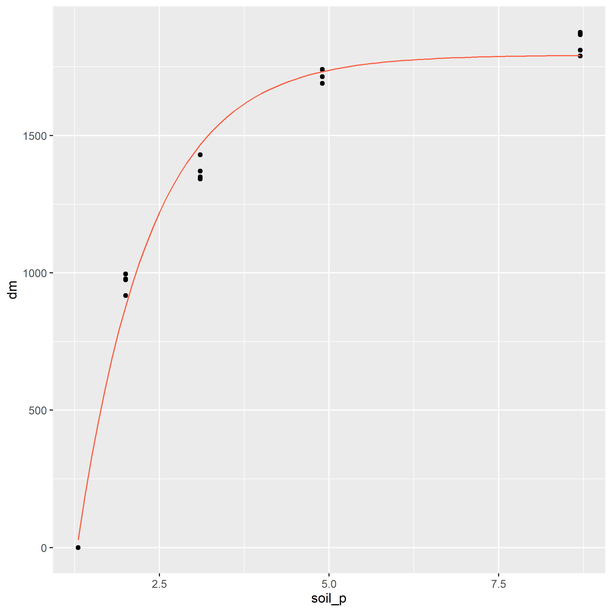

# Nonlinear Relationships and Multiple Linear Regression

In the last unit, we learned how to describe linear relationships between two variables, X and Y.  *Correlation* was used when we wanted to measure the *association* between the two variables. This was appropriate when when, based on our "domain knowledge" (agronomy or our other specialty), we did not have insight into whether one variable affected the other, or whether a third, unknown variable affected the value of both.  *Simple Linear Regression* was used when we had insight into the *causation* that linked two variables: we knew or hypothesized that a single response variable, $Y$, was affected (and could be predicted) by a single predictor variable, $X$.  

Simple linear regression, however, has its limitations.  First, simple linear regression is often too inadequate for modelling more complex systems.  For example, a simple linear regression model might fit the effect of rainfall on corn yield.  But we all realize that a prediction of corn yield based on rainfall alone will not be particularly accurate.  

If we included additional predictor variables, such as a measure of heat (cumulative growing degree days) or soil texture (water holding capacity or clay content), we would likely predict yield more accurately.  *Multiple Linear Regression* allows us to build model the relationship between a response variable, $Y$, and multiple predictor variables, $X_1$, $X_2$, $X_3$, etc.

Second, a linear model assumes the relationship between Y and X can be fit with a straight line.  If you have taken a soil science course, however, you learned about *Leibig's Law of the Minimum* and the *Mitscherlich Equation* that describe the relationship between nutrient availability and plant biomass.  These relationships are curved and need to be fit with *Nonlinear Regression* models.

In this unit, we will learn how to use multiple linear regression to model yield responses to environment.  We will also learn how to model nonlinear relationships, such as fertilizer response and plant growth 


## Multiplie Linear Regression
In multiple linear regression, response variable Y is modeled as a function of multiple X variables:

$$ Y = \mu + X_1 + X_2 + X_3 ... X_n$$

### Case Study: Modelling Yield by County
We are going to work with a county-level dataset from Purdue university that includes soil characteristics, precipitation, corn, and soybean yield.  I've become best-friends with this dataset during the past few years and have combined it with county-level weather data to build complex yield models.  The authors used land use maps to exclude any acres not in crop production.  Click the following link to access a little app with which to appreciate this dataset.

Here is the top of the data.frame:

```{r}
library(tidyverse)
library(sf)
library(urbnmapr)
counties = read.csv("data-unit-11/county_environments.csv")

## get county shapes ##
counties_sf = get_urbn_map("counties", sf = TRUE) %>%
    rename(stco = county_fips) %>%
    mutate(stco = as.numeric(stco))

counties_w_env = counties_sf %>%
  left_join(counties) %>%
  st_as_sf() %>%
  st_transform(4326) %>%
  gather(feature, value, ppt:wheat)

head(counties)
```

How does corn yield respond to soil properties and precipitation in Minnesota and Wisconsin?  Let's say we want to model corn yield as a function of precipitation (ppt), percent sand (sand), percent clay (clay), percent organic matter (om) and soil pH (spH)?  Our linear additive model would be:

$$ Y = \alpha + \beta _1 ppt + \beta _2 sand + \beta _3 clay + \beta _4 om + \beta _5 sph + \epsilon$$ 

First, we need to filter the dataset to MN and WI
```{r, echo=TRUE}
counties_mn_wi = counties %>%
  filter(state %in% c("MN", "WI"))
```

To fit our model, we use the linear model *lm()* function of R.  For multiple regression, we don't list any interactions between the terms.  

```{r}
model_mn_wi = lm(corn ~ ppt + sand + clay + om + sph, data=counties_mn_wi)
summary(model_mn_wi)
```

Let's go through the results.  The first output item, the Call, is the linear model we gave to R.

The second item, residuals, describes the distribution of residuals around the regression model.  We can see the minimum residual is 42 bu/acre below the predicted value.  The maximum residual is 23 bu/acre above the predicted value.  The middle 50% (between 1Q and 3Q) were between 4.3 below and 7.0 above the predicted values.

The Coefficients table is the highlight of our output.  The table shows the estimated slopes $\beta_1, \beta_2, \beta_3...\beta_n$ associated with each environmental factor, plus the individual t-tests of their significance.  We can see that each factor of our model is significant.

In the bottom, we see that three observations were deleted due to missingness (they didn't have a value for each factor).  Two $R^2$s are presented.  The multiple $R^2$ is the proportion of the total variance in the model explained by our regression model.  This is the same concept as for simple linear regression.  Our value is 0.77, which is pretty good for an environmental model like this, especially because we did not include any temperature data.


### Beware of Bloated Models
Multiple Linear Regression is a powerful tool, but it generally pays to be conservative in how many factors you include in a model.  The more terms you include, the more you are likely to encounter problems with overfitting, multicollinearity, and heteroscedasticity.

#### Overfitting 
Every model contains fixed terms (which the model is meant to measure and predict) and random terms, such as error, which are beyond the scope of the model to predict.  Not only that: since the error effect is random, it would be wrong for a model to try to predict it.  If we add enough factors to a model, however, it will do exactly that.  It will *overfit* the data.  The problem with overfitting is that the model contorts itself to fit every nook and crany of one dataset -- but fails to accurately predict values for additional datasets that, randomly, have different error structures.

Here is an analogy.  You let your spouse or best friend borrow your car.  When they return it, the seating settings are completely messed up.  The lumbar support is either poking you in your but or about to break your neck.  You either can't reach the pedals and the steering wheel, or the seat is up so far you cannot even get in the car.  In addition, the climate control is too hot or too cold.  And, seeing what they left on the radio, you start to rethink the whole relationship.

This is exactly the problem with overfitting.  The more we perfect the fit of a model one dataset, the more unlikely it is to make accurate predictions for another dataset.

Adding factors to a model will always increase the $R^2$ value, even if the new factor has nothing to do with what the model is predicting.  For fun, lets create a column that randomly assigns an average number of Grateful Dead concerts attended per person, from 1 to 40, to each county.

```{r}
set.seed(092220)
counties_mn_wi_gd = counties_mn_wi %>%
  mutate(gd_concerts = sample(c(1:40), 159, replace = TRUE))
head(counties_mn_wi_gd)
```

And then let's check out our model:

```{r}
model_mn_wi_gd = lm(corn ~ ppt + sand + clay + om + sph + gd_concerts, data=counties_mn_wi_gd)
summary(model_mn_wi_gd)
```

See? Our Multiple $R^2$ increased slightly from 0.765 to 0.766.  While this example is absurd, it points to a temptation for statisticians and data scientists: keep adding terms until the $Multiple R^2$ is an accepted value.  Less nefariously, the researcher may just thinK the more variables the researcher can add, the better.  We can now see this is wrong.

#### Multicollinearity
Another problem that can occur as we add factors to our model is *multicollinearity*.  Our linear model assumes that each factor has an *independent* effect on the response variable.  We know, however, that is not always the case.  For example, all sorts of weather and soil factors in our model can be related.  Cloudy days associated with precipitation may decrease temperature.  Warm temperatures may reduce soil moisture.  Areas with greater precipitation will tend to have more woody vegetation, leading to lower soil pH and soil organic matter.  Coarser soils, which are better drained, will tend to have lower soil organic matter.

Here is a hypothetical scenario: suppose we look at the regression of yield on precipitation and pH and conclude yield is significantly affected by both of them.  Do we know that soil pH caused the change in yield?  No, it's possible that precipitation affected both pH and yield so that they appeared to change together.  That's not to say we can't include all of these factors in our model.  But we need to make certain that they are directly causing changes *to* the response variable, rather than responding *with* the response variable to a third variable in the model.

#### Heteroscedasticity
The third problem we can have with a multiple linear regression model is that it is *heteroscedastic*.  This indimidating term refers to unequal variances in our model.  That is, the variance of observed yields varies markedly with the value being predicted.  Multiple linear regression, like other linear models, assumes that the variance will be the same along all levels of the factors in the model.  When heteroscedasticity -- unequal variances -- occurs, it jeopardizes our ability to fit the that factor.  Our least squared estimate for that factor will be more influenced by factor levels with greater variances and less influences by levels with lesser variances.  

One of the causes of heteroscedasticity is having many predictors -- each with their own scales of measure and magnitudes -- in a model.  Since linear regression relies on least squares -- that is, minimizing the differences between observed and predicted values -- it will be more includenced by factors with greater variances than factors with small variances, regardless of how strongly each factor is correlated with yield.

The end result is that the regression model will fit the data more poorly.  Its error will be greater and, thus, its F-value and p-value will be reduced.  This may lead us to conclude a factor or the overall model does not explain a significant proportion of the variation in data, when in fact it does.  In other words, we may commit at Type II error.


### Methods for Avoiding Bloated Models
There are multiple approaches, and surely books written, about how to avoid overfitting and multicollinearity in models.  After all that, also, model tuning (selecting the factors to include) seems to be art as much as science.  This section provides an overview of methods used, which you might consider if presented with someone elses results, or if you are trying to construct a model with a few factors on your own.

#### Create a Covariance Matrix
A matrix (not "the matrix") is a mathematical term that describes what you and I would call a table.  So a covariance matrix is a table composed of correlation plots that we can use to inspect the covariance (or relationship) between each possible pair of variables in our dataset.

```{r}
yield_predictors = counties_mn_wi %>%
  dplyr::select(corn, ppt, sand, clay, sph, om) %>%
  na.omit() %>%
  as.data.frame()

plot(yield_predictors)
```

To use the matrix, find the intersection between a column and a row containing two variables whose relationship you want to inspect.  For example, in the fourth column, clay is plotted in relationship to the four other predictor variables, plus the response corn, in our model.  In each plot, clay is on the X-axis, and the intersecting variable is on the Y-axis.  Looking at the matrix, we notice the relationship of clay with sand and soil pH (sph) is visible.  We may wonder, then, if the addition of clay to our model is improving our prediction.

#### Partial Correlation
Another thing we can do to look for multicollinearity is to calculate the partial correlations.  This can also be done with a simple line of code.  Partial correlation shows the individual correlations between variables, with all other variables being held constant.  What this does is allow us to quantify the correlation between two variables without worrying that both may be affected by a third variable.  For example, we can look at the correlation between soil pH  and soil organic matter without worrying that precipitation might be driving changes in both we could mistake for a relationship. 
```{r}
library(psych)
partial.r(yield_predictors)
```

The output of partial correlation is a matrix, which cross-tablulates the correlations among every predictor variables and reports their values in a table.  The output abov tells us that sand and clay are both negatively correlated with corn.  That's odd -- we would expect that as sand decreases, clay would increase, or vice versa -- unless, both are being impacted by a third value, silt, which is not in our model.


#### Cross Validation
A third way to evaluate the performance of a model and to avoid mistaking over-prediction for true model performance is to use cross-validation.  I'll confess to graduating from Iowa State and making it another 15 years in academia and industry without having a clue about how important this is.  If you plan to use your model not only to test hypotheses about variable significance, but to make predictions, the cross-validation is critical.

In cross-validation, the initial data are divided into *training* and *testing* groups.  The model parameters (coefficients for slopes) are solved for using the training dataset.  In general, all models will better fit the data used to train them.  Therefore, the predictive performance of the model is measured using the testing dataset.  In this way, the true performance of the model can be measured.  In addition, the effect of adding or removing factors may be measured.    

We will use a technique that sounds vaguely like an adult-alternative music group -- Repeated 10-Fold Cross Validation.  While the name sounds scary as all get-out, how it works is (pretty) straight forward:

1. Divide the data into 10 groups.
2. Randomly select 9 groups and fit the regression model to them.  These groups are called the "training" dataset
3. Predict the responses for each observation in the tenth dataset, using the model fit to the other 9 datasets.  This 10th dataset is called the "testing" dataset.
4. Use linear regression to determine the strength of the relationship between the predicted value and the actual values.  Review summary statistics in comparing models.

Here is the cross validation of our first yield model for Illinois and Ohio:

```{r}
library(caret)

# Define training control
set.seed(123)
train.control <- trainControl(method = "repeatedcv", 
                              number = 10, repeats = 3)
# Train the model
model <- train(corn ~ ppt + sand + clay + om + sph, data=yield_predictors, method = "lm",
               trControl = train.control)
# Summarize the results
print(model)
```

We can see in the top of the output confirmation we are working with the original 5 predictors.  To measure model performance, let's look particularly at the MRSE and Rsquared statistics at the bottom.  RMSE is the Root Mean Square Error, which you earlier learned is the square root of the Mean Square Error, and equivalent to the standard deviation of our data.  This is expressed in our regression output above as residual standard error.  An RMSE of 10.7 means the distribution of residuals (observed values) around our model predictions has a standard deviation of about 10.7.  Thus 95% of our observed values would be expected to be within 21.4 bushels (2 * 10.7) of the predicted value.  

The Rsquared statistic is the same as we have seen previously, and describes the amount of variation in the observed values explained by the predicted values.


### Tunning and Comparing Models

Here is our original model for reference.  Note that sand has a negative effect (-0.33075) on yield and that it is highly significant (p=0.00248).  
```{r}
full_model = lm(corn ~ ppt + sand + clay + om + sph, data=counties_mn_wi)
summary(full_model)
```

We saw above that clay was strongly correlated with both sand and soil pH.  Let's drop clay from our model and see what happens:
```{r}
model_no_clay = lm(corn ~ ppt + sand + om + sph, data=counties_mn_wi)
summary(model_no_clay)
```
First, let's look at the model fit.  The Multiple R-squared decreased from 0.7651 to 0.7299.  The residual standard error increased from 10.61 to 11.34.  These would suggest the fit of the model has decreased, although we also notice the F-statistic has increased from 97.7 to 102, which suggests the model itself is more strongly detecting the combined effects of the factors on yield,

An additional statistic that we want to watch is the Adjusted R-Squared.  This statistic not only takes into effect the percentage of the variation explained by the model, but how many factors were used to explain that variance.  The model is penalized for according to the number of factors used: of two models that explained the same amount of variation, the one that used more factors would have a lower Adjusted R-square.  We see the adjusted R-square decreased from our first model to the second. 

Now let's go back to sand.  In the first model, it had a negative effect of -0.33075 and was highly significant.  Now it has a positive effect of 5.577e-02 and an insignficant effect on corn yield.  Remember, each factor in a linear regression model should be independent of the other factors.  If we compare the other four factors, we will see their coefficients have changed slightly, but they have remained highly significant.  This suggests that clay was affecting both sand content (after all, if you have more clay, you are likely to have less sand) and yield.  

Let's cross-validate the new model.
```{r}
library(caret)

# Define training control
set.seed(123)
train.control <- trainControl(method = "repeatedcv", 
                              number = 10, repeats = 3)
# Train the model
model <- train(corn ~ ppt + sand + om + sph, data=yield_predictors, method = "lm",
               trControl = train.control)
# Summarize the results
print(model)
```

We see the Rsquared and RMSE (root mean square error) are statistics are slightly lower than the original model in the cross-validation, too.

Since sand was insignificant in the second model, let's remove it and rerun our model.
```{r}
model_no_clay_sand = lm(corn ~ ppt + om + sph, data=counties_mn_wi)
summary(model_no_clay_sand)
```

We see little change in the Multiple R-squared or Adjusted R-squared, but the F-statistic has again increased.  Let's cross-validate the model.
```{r}
library(caret)

# Define training control
set.seed(123)
train.control <- trainControl(method = "repeatedcv", 
                              number = 10, repeats = 3)
# Train the model
model <- train(corn ~ ppt + om + sph, data=yield_predictors, method = "lm",
               trControl = train.control)
# Summarize the results
print(model)
```

We see the new model fits slightly better.

We could go on and on with the process.  We might try adding silt into the model to replace the sand and clay we removed.  Water holding capacity was a factor in the original dataset -- we might try using that as a proxy, too.  But the interations we have gone through show us that bigger models are not necessarily better (not by much, in any case).  While we can build complex models with multiple linear regression, it is better not to when possible.

## Nonlinear Relationships
As mentioned in the introduction, there are many relationships between variables that are nonlinear -- that is, cannot be modelled with a straight line.  In reality, few relationships in agronomy are perfectly linear, so by nonlinear we mean relationships where a linear model would systematically over-predict or underpredict the response variable.  In the plot below, a disease population (infected plants per plot) is modeled as a function of days since infection.  
As with many pest populations, the number of infections increases exponentially with time.  We can see how a linear model would underpredict the number of plants from 7 to 9 days after infection and again from 25 to 27 days after infection, while overpredicting the number of infected plants from 15 to 21 days after infection .  Systematic overpredictions or underpredictions are called *bias*. 

```{r}
library(tidyverse)
exponential = data.frame(x = seq(from=7, to=28, by=2))
exponential_final = exponential %>%
  mutate(y = exp(x/7)) %>%
  mutate(log_y = log(y)) 

exponential_final %>%
  ggplot(aes(x=x, y=y)) +
  geom_point(size=2, color="blue") +
  geom_smooth(method='lm', color = "tomato", se=FALSE) + 
  labs(x = "Days after Infection", y = "Infected Plants per Plot") +
  lims(x = c(7,28), y=c(0,50)) +
  theme(axis.title = element_text(size=18),
        axis.text = element_text(size=14))
  
```

Instead, we can fit the data with an exponential model that reduces the bias and increases the precision of our model:

```{r}
exponential_final %>%
  ggplot(aes(x=x, y=y)) +
  geom_point(size=2, color="blue") +
  geom_smooth(method='loess', color = "tomato", se=FALSE) + 
  labs(x = "Days after Infection", y = "Infected Plants per Plot") +
  lims(x = c(7,28), y=c(0,50)) +
  theme(axis.title = element_text(size=18),
        axis.text = element_text(size=14))
```


### Fitting Nonlinear Responses with Linear Regression
Fitting a relationship with a simple linear regression model is simpler than fitting it with a nonlinear model, which we will soon see.  Exponential relationships, like the one above can be fit by *transforming* the data to a new scale.  This is the same concept as we used in an earlier unit to work with messy data.  

#### Exponential Model
For example, the data above (and many exponential relationships in biology and other disciplines can be transformed using the natural log:

$$ y = log(x)$$

If our original dataset looks like:
```{r}
exponential_final %>%
  dplyr::select(x, y)
```

Where x is the days since infection and y is the mean number of infections per plot.
We can create a new column, log_y with the natural log of infected plants.
```{r}
exponential_final %>%
  dplyr::select(x, y) %>%
  mutate(log_y = log(y))
```

When we fit the log of the infected plants, we see the relationship between the number of infected plants and days since infection is now linear.

```{r}

exponential_final %>%
  ggplot(aes(x=x, y=log_y)) +
  geom_point(size=2, color="blue") +
  geom_smooth(method='loess', color = "tomato", se=FALSE) + 
  labs(x = "Days after Infection", y = "Infected Plants per Plot") +
  lims(x = c(7,28), y=c(0,5)) +
  theme(axis.title = element_text(size=18),
        axis.text = element_text(size=14))
```

We can now fit a linear model to the relationship between infected plants and days after infection.
```{r}
names
infection_linear_model = lm(log_y ~ x, exponential_final)
summary(infection_linear_model)
```

Our linear model, from the equation above, is:

$$ log_y = 0 + 0.1429 \times x$$

Just to test the model, let's predict the number of infected plants when x = 15

```{r}
paste("log_y =", 0 + 0.1429*15)
```

We can see this value is approximately the number of infected plants 15 days after infection in the table above.  Any predicted value can be transformed from the logaritm back to the original scale using the *exp()* function.  Compare this with the original count, y, in the table above.

```{r}
paste("y =", exp(2.1435))
```

#### Parabolic
In nutrient availability and plant density models, we sometimes encounter data that are parabolic -- the relationship between Y and X resembles a $\bigcap$ or $\bigcup$ shape.  These data can be fit with a *quadratic model*.  Remember that beast from eighth grade algebra. Don't worry -- we don't have decompose it!

Let's say we have data from a plant density study in corn:

```{r}
plant_density_data_pre = data.frame(pop = seq(28, 44, 4),
                                yield = c(170, 200, 205, 200,170)) %>%
  mutate(pop2 = pop^2) 
  
pop_model = lm(yield ~ pop + pop2, data = plant_density_data_pre)

plant_density_data = data.frame(pop = seq(28, 44, 2)) %>%
  mutate(pop2 = pop^2)

plant_density_data$yield = predict(pop_model, plant_density_data)

plant_density_data %>%
  ggplot(aes(x = pop, y = yield)) +
  geom_point()

```

The quadratic model is:

$$ Y = \alpha + \beta X + \gamma X^2$$
Where $\alpha$ is the Y-intercept, and $\beta$ and $\gamma$ are the coefficients associated with $X$ and $X^2$.  We can run this model the same as we would a simple regression.

```{r}
pop_model = lm(yield ~ pop + pop2, data = plant_density_data)
summary(pop_model)
```

This output should look very similar to the simple linear regression output.  The only difference is that there are now three coefficients returned: the intercept ($\alpha$ above), the coefficient for pop ($\beta$ above), and the coefficent for pop2 ($\gamma$ above).


### Fitting Nonlinear Responses with Nonlinear Regression
Other nonlinear relationships must be fit with nonlinear regression.  Nonlinear regression differs from linear regression in a couple of ways.  First, a nonlinear regression model may include multiple coefficients, but only X as a predictor variable.  Second, models are not fit to nonlinear data using the same approach (using least square means to solve for slope) as with linear data.  Models are often to nonlinear data often do so using a "trial and error" approach, comparing multiple models before converging on the model that fits best.  To help this process along, data scientists must often "guestimate" the initial values of model parameters and include that in the code. 

#### Monomolecular
In the Monomolecular growth model, the response variable Y initially increases rapidly with increases in X.  Then the rate of increase slows, until Y plateaus and does not increase further with X.  In the example below, the response of corn yield to nitrogen fertilization rate is modelled with the monomolecular (asymptotic) function.

First, we load and plot the data.

```{r}
corn_n_mono = read.csv("data-unit-11/corn_nrate_mono.csv")
p = corn_n_mono %>%
  ggplot(aes(x=n_rate, y=yield)) +
  geom_point(color="blue")


```

Then we fit our nonlinear model.
```{r}
corn_n_mono_asym = stats::nls(yield ~ SSasymp(n_rate,init,m,plateau), data=corn_n_mono)
summary(corn_n_mono_asym)
```

The most important part of this output is the bottom line, "Achieved convergence tolerance".  That means our model successfully fit the data.

Finally, we can add our modelled curve to our initial plot:

```{r}
test_data = data.frame(n_rate = seq(0,240,1))
test_data$pred = predict(corn_n_mono_asym, test_data)

p + geom_line(data = test_data, aes(x=n_rate, y=pred), color="tomato")
```

In the plot above, the points represent observed values, while the red line represents the values predicted by the monomolecular model.  The monomolecular function is often used to represent fertilizer rate or soil nutrient content, since the response to many fertilizers plateaus or "maxes out".  Fertilizer rate recommendations are developed to increase fertilization up to the point where the cost of adding another unit of fertilizer exceeds the benefit of the increase in yield.  The monomolecular function can also measure other "diminishing returns" responses, such as the response of photosynthesis to increasing leaf area.


#### Logistic Model
The *Logistic* and model is often used in "growth analysis", studies that highlight patterns of plant growth, particularly cumulative biomass accumulation over time.  Data generally follow a "sigmoidal", or S-shaped, pattern.  In early growth the rate of biomass accumulation slowly increases.  In the intermediate growth phase, biomass accumulation is rapid and linear.  In the final growth phase, the rate of growth decreases and, if the trial is long enough, may plateau.

In the plot below, total dry matter accumulation (tdm) is shown in relation to days after emergence (dae).  
```{r}

soybean_tdm = read.csv("data-unit-11/soybean_dae_tdm_logis.csv")

p_soy = soybean_tdm %>%
  ggplot(aes(x=dae, y=tdm)) +
  geom_point(color="blue")

p_soy
```

The "S" shape of the data is very pronounced.  Next, we fit a logistic growth curve to the data:

```{r}
soybean_tdm_model = stats::nls(tdm ~ SSlogis(dae, Asym, xmid, scal), data=soybean_tdm)
summary(soybean_tdm_model)
```

We see again in the output that the model achieved convergence tolerance.  Another thing to note is the "Number of iterations to convergence".  It took this model 9 steps to fit the data.  The algorithm will typically quit after 50 unsuccessful attempts.  When that occurs, it may be an indication the data should be fit with a different model.

Here is our data with the fitted prediction model:

```{r}
test_data_soy = data.frame(dae=seq(0,120,1))
test_data_soy$pred = predict(soybean_tdm_model, test_data_soy)

p_soy + geom_line(data = test_data_soy, aes(x=dae, y=pred), color="tomato")
```

We can see this again illustrated in the next plot, which illustrates the effect of wetting period on the intensity of wheat blast. 

```{r}
wheat_blast = read.csv("data-unit-11/wheat_blast_wetting_intensity.csv")
p_wheat = wheat_blast %>%
  ggplot(aes(x=wetting_period, y=intensity)) +
  geom_point(color="blue")

p_wheat
```  
  
We fit the data with the logistic model.
```{r}
wheat_blast_model_logist = stats::nls(intensity ~ SSlogis(wetting_period, Asym, xmid, scal), data=wheat_blast)
summary(wheat_blast_model_logist)
```

Convergence criteria was met.  Here is the data plotted with the logistic model.

```{r}
test_data_wheat_log = data.frame(wetting_period = seq(1,40,1))
test_data_wheat_log$pred = predict(wheat_blast_model_logist, test_data_wheat_log)

p_wheat + geom_line(data=test_data_wheat_log, aes(x=wetting_period, y=pred), color="tomato")

```


#### Starting Variable Values
As mentioned earlier, nonlinear regression algorithms can be difficult to use in that they don't fit a regression model using the least squares approach.  Instead, nonlinear regression "nudges" the different coefficients in its equation until it zeros in on coefficient values that best fit the data.  Often, traditionally, algorithms have not been able to solve for these coefficients from scratch.  The user would have to provide initial coefficient values and hope they were close enough to true values that the nonlinear algorithm could then fit the curve.

What a pain in the butt.  While some coefficients could be easily guessed, others required more complex calculations.  With R, some packages have introduced "self-starting" non-linear models that do not require the user to enter initial values for coefficients.  I have used those to create the examples above and we will cover them in the exercises.  Just be aware, were you to get into more intensive nonlinear modelling, that you may need to specify those variables.

## Summary
Multivariate models (those that model yield or another response to multiple variables) are very powerful tools for unlocking the mysteries of how changes in environment drive what we observe in our research.  However, they require skill to use.  Remember that more variables do not automatically make a better model.  Too many variables can cause our model to overfit our original data, but be less accurate or unbiased in fitting future datasets.  Ask yourself whether it makes sense to include each variable in a model.  Covariance matrixes and partial correlations can help us identify predictor variables that may be correlated with each other instead of the response variable.

Cross validation is also an important tool in assessing how a model will work with future data.  In this unit, we learned a common practice, 10-fold cross validation, in which the data were divided into 10 groups.  Each group took turns being part of the datasets used to train the model, and the dataset used to test it.

Finally, nonlinear regression is used to fit variables that have a nonlinear relationship.  Untlike multiple linear regression, there is usually only one predictor variable in non-linear regression.  In addition, nonlinear regression is often based on a theoretical relationship between the predictor and response variable.  In this unit, we focused on two models: the monomolecular model for relationships between yield and soil fertility, and the logistic model for predicting growth of plants and other organisms.


## Exercise: Multiple Linear Regression
In this exercise, we will learn how to fit a multiple linear regression model to data.

### Case Study: Country Corn Yields
We will use the same dataset as in the lesson.  This time, we will model corn yield as a function of precipitation (ppt), water holding capacity (whc), sand, silt, clay, and organic matter (om) in Iowa and Illinois.  

```{r}
library(tidyverse)
county_corn_data = read.csv("data-unit-11/exercise_data/county_environments.csv")
head(county_corn_data)

ia_and_il_corn = county_corn_data %>%
  filter(state %in% c("IL", "IA"))

head(ia_and_il_corn)

```

### Fitting the Model
Our model statement is the same as that used for single linear regression, except with multiple predictor variables.
```{r}
ia_and_illinois_model = lm(corn ~ ppt + whc + sand + silt + clay + om, data = ia_and_il_corn)
```

### Inspecting the Model
We will again use the *broom()* package and the *tidy()* function to inspect the model coefficients.
```{r}
library(broom)
tidy(ia_and_illinois_model)
```

We notice that three of our predictor variables (sand, silt, clay) have p-values greater than 0.05.  What is the overall performance of the model?  Let's use the *glance()* function to find out.
```{r}
glance(ia_and_illinois_model)
```

The model has an r.squared of about 0.52 and is highly significant.  In the next exercise. we will look more closely at our predictor variables and whether all should be included in our final model. 


### Practice: Thompson Corn Data
For the first practice, we will use a mult-year study of corn yield in several midwestern states. The study was conducted almost a century ago, so don't be surprised by the yields!  Older data aside, this dataset is a good candidate for multiple linear regression.

To prevent this exercise from getting out of hand, I have reduced the predictor variables to four.  In this practice, you will build the initial model and evaluate its coefficients and fit.

The predictor variables are total June precipitation in inches (rain6), total July precipitation (rain7), mean june temperature (temp6), and mean July temperature (June 7).

Build the initial model of yield as a function of rain6, rain7, temp6, and temp7.
```{r}
thompson_corn = read.csv("data-unit-11/exercise_data/thompson_corn.csv")
head(thompson_corn)


thompsom_model =  lm(yield ~ temp6 + rain6 + rain7 + temp7, thompson_corn)
```

Use the tidy() function to review the coefficient values.  Your estimates for rain7 and temp7 should be about 4.00 and 2.31.  Which coefficients are significant?  Insignificant?  
```{r}
library(broom)

tidy(thompsom_model)
```

Examine the model fit using the glance() function.  You should observe an r.squared of 0.55.  How well does the model fit this data?
```{r}
glance(thompsom_model)
```


## Exercise: Avoiding Bloated Models

In the last exercise, we learned how to create a multiple linear regression model with R.  It was a relatively simple process: construct the model using the *lm()* function, then review the coefficients and fit using the tidy() and glance() functions from the broom package.  

It is easy to create models.  Refining them can take a little soul-searching.  In this exercise, we will learn how to construct a covariance matrix to visually inspect for relationships among predictor variables that may weaken our model, calculate partial correlations to quantify those relationships, and how to cross-validate our model to evaluate whether we might be  over-fitting our data  

### Case Study
We will continue with the model we generated in the previous exercise.
```{r}
library(tidyverse)
county_corn_data = read.csv("data-unit-11/exercise_data/county_environments.csv")

ia_and_il_corn = county_corn_data %>%
  filter(state %in% c("IL", "IA"))

ia_and_illinois_model = lm(corn ~ ppt + whc + sand + silt + clay + om, data = ia_and_il_corn)
```

### Covariance Matrix
In the last unit, we were introducted to the covariariance matrix, sometimes also called the correlation matrix.  We will generate that again, using the *plot()* function.  First, however, we will want to narrow down the predictor variables to those of interest.  We can use the *select()* function to drop the other variables.

```{r}
variables_of_interest = ia_and_il_corn %>%
  dplyr::select(ppt, whc, sand, silt, clay, om)

```

We can now plot our covariance matrix.
```{r}
plot(variables_of_interest)
```

Right away, we notice a strong relationship between sand and silt. Sand might also be associated with organic matter.  Other potential relationships include precipitation and organic matter, or clay and sand.  Next, we will use partial correlations to quantify the strength of correlations between predictor variables.  

### Partial Correlation
Partial correlation measure the correlation between two variables while holding the other variables in the dataset constant.  In other words, partial correlation measures the true relationship between the two variables, separate from any effect a third variable may be having on them.

We can generate a matrix with partial correlations using the *psych* package and the *partial.r()* function.
```{r}
library(psych)

partial.r(variables_of_interest)
```

The first two tables, $estimate and $p.value, are the most interesting.  Above we noticed a strong relationship between sand and silt and clay.  Looking at the $estimate table, we see their partial correlations are each 1.0.  If we look at the $p.value table, we see we those correlations are also highly significant.  All three are also weakly correlated with precipitation and water holding capacity.  We will need to look at each of these three variables more closely when we go to tune our model.

### Cross-Validation
In cross validation, we divide our data into two groups.  Most of the data are used to fit or "train" the model.  The remainder of the data are used to "test" how well the model performs by comparing its predictions to the actual observed response of the dependent variable (Y).

We use the *caret* package to cross-validate our data.  Specifically, we use a process called k-fold cross validation.  In k-fold cross-validation, the data are divided into 10 groups.  9 groups are used to train the model, and the remaining group used for the comparison between predicted and observed values.  In the code below, we use 10-fold cross-validation.

The code below is basically plug-and-play.  Everything from library(caret) throught the train.control statement can be left as-is.  The one line that needs to be modified is the train() function.  Replace the terms in brackets below with your desired name for the output, your linear model, and your data frame.

[your model name] = train([your linear model], data=[your data frame], method = "lm", trControl = train.control)


```{r}
library(caret)

# Leave this as-is -- tells R to conduct 10-fold cross validation
set.seed(123)
train.control <- trainControl(method = "repeatedcv", 
                              number = 10, repeats = 3)

# Modify this with your model and dataset
model <- train(corn ~ ppt + whc + sand + silt + clay + om, data=ia_and_il_corn, method = "lm", trControl = train.control)
# Summarize the results
print(model)
```

Our model has an Rsquared of about 0.53 and a root mean-sqare error of 10.6.  In our next model, we will tune our model by subtracting variables to see whether model performance might be improved with fewer predictor variables.


### Practice: Thompson Corn Data
In this practice, let's take our corn model from the last exercise and inspect it for evidence of collinearity.

```{r}
thompson_corn = read.csv("data-unit-11/exercise_data/thompson_corn.csv")

thompsom_model =  lm(yield ~ rain6 + rain7 + temp6 + temp7, thompson_corn)
```

Plot the covariance matrix.  Do you notice any predictor variables that appear correlated?
```{r}


```


Next, plot the partial correlation matrix.  Are any of the predictor variables significantly correlated with each other?
```{r}

```

Finally, cross-validate the model by finishing the code below.  Your cross-validated Rsquared should be about 0.537.
```{r}
library(caret)

# Define training control
set.seed(123)
train.control <- trainControl(method = "repeatedcv", 
                              number = 10, repeats = 3)


```


## Exercise: Tuning the Model

At this point, we have built the multiple regression model and examined the significance of each predictor variable.  We have also identified correlations between individuals.  We have used cross-validation to measure the model's performance on original data, in order to guard against overfitting the data.

Our final phase of model development is to tune the model.  In tuning the model, we test the effect of dropping out variables we think are collinear -- that is, correlated with each other instead of being independent predictors of yield.

### Case Study
We continue to work with the model we built in the other exercises.  Lets start by calling up some of our data from the last exercise.

First, our model:
```{r}
library(tidyverse)
county_corn_data = read.csv("data-unit-11/exercise_data/county_environments.csv")

ia_and_il_corn = county_corn_data %>%
  filter(state %in% c("IL", "IA"))

ia_and_illinois_model = lm(corn ~ ppt + whc + sand + silt + clay + om, data = ia_and_il_corn)
```

Then we define our variables of interest.  
```{r}
variables_of_interest = ia_and_il_corn %>%
  select(ppt, whc, sand, silt, clay, om)

```

Next, the partial correlation matrix:
```{r}
library(psych)
partial.r(variables_of_interest)

```

And, finally, for reference, the cross-validation:
```{r}
library(caret)

# Define training control
set.seed(123)
train.control <- trainControl(method = "repeatedcv", 
                              number = 10, repeats = 3)
# Train the model
model <- train(corn ~ ppt + whc + sand + silt + clay + om, data=ia_and_il_corn, method = "lm",
               trControl = train.control)
# Summarize the results
print(model)
```

### Tuning the Model
In this example, choosing the first term to drop from our model is difficult, given that sand, silt, and clay are similarly correlated with each other.  After reviewing the covariance matrix from the last exercise, however, let's go ahead and drop sand from the sample:

```{r}
model_wo_sand = lm(corn ~ ppt + whc + silt + clay + om, data = ia_and_il_corn)
```

How are the remaining coefficients affected?
```{r}
library(broom)

tidy(model_wo_sand)
```

We can see the slope (estimate) for clay is now significant.  Let's check our fit.
```{r}
glance(model_wo_sand)
```

Our r.squared and adj.r.squared have decreased slightly.  Now lets cross-validate our model.
```{r}
# Define training control
set.seed(123)
train.control <- trainControl(method = "repeatedcv", 
                              number = 10, repeats = 3)
# Train the model
model <- train(corn ~ ppt + whc + silt + clay + om, data=ia_and_il_corn, method = "lm",
               trControl = train.control)
# Summarize the results
print(model)
```

Our Rsquared has decreased ever so slightly from our first model.

Now, let's repeat this process, dropping both sand and silt from the model.

```{r}
model_wo_sand_silt = lm(corn ~ ppt + whc + clay + om, data = ia_and_il_corn)
```

How are the remaining coefficients affected?
```{r}
tidy(model_wo_sand_silt)
```

All of the remaining slopes are now significant.  Next, our model fit:
```{r}
glance(model_wo_sand_silt)
```

Our r.squared and adj.r.squared have again decreased slightly.  Now lets cross-validate our model.
```{r}
# Define training control
set.seed(123)
train.control <- trainControl(method = "repeatedcv", 
                              number = 10, repeats = 3)
# Train the model
model <- train(corn ~ ppt + whc + clay + om, data=ia_and_il_corn, method = "lm", trControl = train.control)
# Summarize the results
print(model)
```

Yes!  We see that our Rsquared is greater than the original model.  Our RMSE (Root Mean Square Error) is also the lowest among the models.  

We could continue this process, perhaps testing what would happen if water-holding capacity (whc) were removed from the model.  But at this point we can see how tuning can reduce the bloat and complexity of our model.  While it may always seem the more data the better, we can now see that is not the case.  From a practical point of view, also, we now have fewer variables to measure and less data to store -- two considerations that can become substantial with larger projects.


### Practice
```{r}
thompson_corn = read.csv("data-unit-11/exercise_data/thompson_corn.csv")

thompsom_model =  lm(yield ~ rain6 + rain7 + temp6 + temp7, thompson_corn)
```

```{r}
tidy(thompsom_model)
```

```{r}
glance(thompsom_model)
```

```{r}
library(caret)

# Define training control
set.seed(123)
train.control <- trainControl(method = "repeatedcv", 
                              number = 10, repeats = 3)
# Train the model
model <- train(yield ~ rain6 + rain7 + temp6 + temp7, data=thompson_corn, method = "lm", trControl = train.control)
# Summarize the results
print(model)
```


```{r}
thompsom_model_wo_temp6 =  lm(yield ~ rain6 + rain7 + temp7, thompson_corn)
```

```{r}
tidy(thompsom_model_wo_temp6)
```

```{r}
glance(thompsom_model_wo_temp6)
```

```{r}
library(caret)

# Define training control
set.seed(123)
train.control <- trainControl(method = "repeatedcv", 
                              number = 10, repeats = 3)
# Train the model
model <- train(yield ~ rain6 + rain7 + temp7, data=thompson_corn, method = "lm", trControl = train.control)
# Summarize the results
print(model)
```


### Practice
Let's synthesize what you found in the first two exercises.  

First, looking at the original model output, we see one of the predictor variables did not have a coefficient whose value was significantly different from zero: temp6.  

Second, looking at the covariance matrix and partial correlation matrix, we note two strong correlations between the predictor variables: temp6 with temp7, and temp6 with rain6.

Both of these suggest that temp6 may not belong in our final model.

With this in mind, create an new model of yield as a function of rain6, rain7, and temp7.
```{r}
thompsom_model_wo_temp6 =  lm(yield ~ rain6 + rain7 + temp7, thompson_corn)

```

Lets see the effect on our coefficients.
```{r}
tidy(thompsom_model_wo_temp6)

```

You should find all the remaining predictors have slopes significantly different than zero.

What about the effect on model fit?
```{r}
glance(thompsom_model_wo_temp6)
```

You should see an r.squared of 0.54.  That is a slight decrease from our original model.

But what about the cross-validated model?  What is the effect on its Rsquared?

```{r}
library(caret)

# Define training control
set.seed(123)
train.control <- trainControl(method = "repeatedcv", 
                              number = 10, repeats = 3)
# Train the model
model <- train(yield ~ rain6 + rain7 + temp7, data=thompson_corn, method = "lm", trControl = train.control)
# Summarize the results
print(model)
```

You should see an Rsquared of 0.538.  This suggests that we were correct in removing temp6 from our model.


## Exercise: Nonlinear Regression

In the other exercises, we focused on multiple linear regression, i.e. using a linear model with multiple predictor variables to explain a complex response.  In this exercise, we will learn to fit data with a nonlinear model.  In our nonlinear model, there is only one predictor variable, but the shape of the model is determined by multiple coefficients, which are fit using nonlinear regression

### Case Study 1: Monomolecular Data
In this example, we will look at the response of corn silage yield to plant population.  We will fit this with a monomolecular, or asymptotic curve.  In this type of curve, the data rise quickly as X increases, but then slope decreases, approaching zero, and the curve plateaus.  This model is often used to fit responses to fertilizer (provided excess rates of the fertilizer are not toxic).  It is also used to describe the yield responses to plant population of many crops, including silage, where crops are grown more for biomass than grain. 


```{r}
library(tidyverse)
silage = read.csv("data-unit-11/exercise_data/corn_silage_pop_mono.csv")
head(silage)
```

First, let's plot our data.  We are going to take the unusual step of assigning our plot to an r object, p.  This stores all the instructions for making the plot, kind of like we store data in a data.frame.  That way, we can easily add our nonlinear regression line to this plot later.
```{r}
p = silage %>%
  ggplot(aes(x=population, y=yield)) +
  geom_point()

p
```

Now, let's fit our nonlinear model. The next line of code is particularly ugly, but you can largely plug-and-play with it.  

[your object name] = stats::nls([your response variable] ~ SSasymp([your predictor variable],init,m,plateau), data=[your data frame])

Change these items
[your object name]: change to whatever object name you would like.
[your response variable]: change to whatever variable you are measuring the response in.  In this case study, it is yield.
[your predictor variable]: change to whatever variable you are using to predict the response.  In this case study, it is population.
[your data frame]: wherever your data ist stored.  In this case, the silage data frame. 

```{r}
silage_mono = stats::nls(yield ~ SSasymp(population,init,m,plateau), data=silage)

summary(silage_mono)
```

Most of the information in the mode summary can be, for our purposes, ignored.  The important part of this output is the bottom line, "Achieved convergence tolerance".  That means our model successfully fit the data.

We can now create a new data frame with predicted yields for populations from 0 to 10.4.  We are going to start by building a data frame with populations from 0 to 10.4.  We will use the *seq()* command to build our sequence of values for population. 

```{r}
silage_predicted = data.frame(                  # this tells R to create a new data frame called silage_predicted 
  population =                                  # this tells R to create a new column named "n_rate"
    seq(from=0,to=10.4,by=0.1)                  # this creates a sequence of numbers from 0 to 10.4, in increments of 0.1
  )

silage_predicted

```

We see the first 10 rows of our new data frame above.  Our next step is to use the *predict()* to create a new column in our data frame.  This column will have the predicted yield for each value of population.
```{r}
silage_predicted$yield = predict(silage_mono, silage_predicted)

```

Finally, we can add our modelled curve to our initial plot.  This is where we reuse our plot earlier, which we saved as p.  We can now add a new geom to p just like we would to a plot if we were creating it the first time around.

*geom_line()* takes three arguments: the name of the data frame, and aes() argument with the x and y coordinates of the predicted values and, finally, a color argument so that our predicted values are easily distinguished from our observed values.
```{r}
p + 
  geom_line(data = silage_predicted, aes(x=population, y=yield), color="tomato")
```


### Case Study 2: Logistic Data
The logistic curve is often used in agronomy to model the absolute growth of plants over time.  A seedling starts out small -- even if it grows rapidly relative to its initial size, the increments of growth will be small on an absolute scale.  It is the same concept as compound interest.  At first, biomass accumumlation seems small.  After a certain amount of time, however, the seedling establishes a leaf area and root mass that supports rapid, linear growth.  This rapid vegetative growth, however, is followed by a transition to seed production, in which growth slows, and ultimately plateaus as seed fill completes.

```{r}
velvetleaf = read.csv("data-unit-11/exercise_data/velveleaf_gdd_lai_gomp.csv")
head(velvetleaf)
```

First, let's plot the original data.
```{r}
pV = velvetleaf %>%
  ggplot(aes(x=gdd, y=la)) +
  geom_point()

pV
```

Next, we need to fit our nonlinear function to the data.  Similar to the monomolecular function, this is an ugly model, but all you need to know is how to switch out variables so it can fit your dataset.

[your object name] = stats::nls([your response variable] ~ SSlogis([your predictor variable], Asym, xmid, scal), data=[your data frame])

Change these items
[your object name]: change to whatever object name you would like.
[your response variable]: change to whatever variable you are measuring the response in.  In this case study, it is yield.
[your predictor variable]: change to whatever variable you are using to predict the response.  In this case study, it is population.
[your data frame]: wherever your data ist stored.  In this case, the silage data frame. 

Below, we will plug in our velvetleaf data
```{r}
velvetleaf_log = stats::nls(la ~ SSlogis(gdd, Asym, xmid, scal), data=velvetleaf)

summary(velvetleaf_log)
```

To construct our curve, we again need a dataset with an appropriate sequence of values for gdd.  In this case, we create a range of values from 100 to 600, in increments of 10.
```{r}
velvetleaf_predicted = data.frame(              # this tells R to create a new data frame called velvetleaf_predicted 
  gdd =                                         # this tells R to create a new column named "gdd"
    seq(from=100,to=600,by=10)                  # this creates a sequence of numbers from 100 to 600, in increments of 10
  )

velvetleaf_predicted

```

We use the *predict()* function the same as we did above.
```{r}
velvetleaf_predicted$la = predict(velvetleaf_log, velvetleaf_predicted)

```

Finally, we can add our modelled curve to our initial plot, pv
```{r}
pV + 
  geom_line(data = velvetleaf_predicted, aes(x=gdd, y=la), color="tomato")

```


### Practice 1
In the following study, we will model ryegrass dry matter (dm) response to soil phosphorus test levels.
```{r}
ryegrass = read.csv("data-unit-11/exercise_data/ryegrass_soil_p_mono.csv")
head(ryegrass)
```

1. Create a scatterplot of the initial ryegrass data.  Assign it to an object (for example, "ryegrass_plot") so you can add the regression line to it later.  
```{r}

```

2. Now fit the monomolecular model to the data.  Print the summary.  You should see an archived convergence tolerance of 2.535e-06.
```{r}

```

3. Next, create a new data frame with soil_p values from 1.3 to 8.7, by 0.1.
```{r}

```

4. Use the *predict()* function to create a new column with the predicted dm for each value of soil_p.
```{r}

```

5. Add the modelled curve to your initial plot.  Your final plot should look like:
```{r}

```



### Practice 2
In this practice, we will fit a logistic curve to the growth of aspergillus, a soil bacteria.

```{r}
aspergillus = read.csv("data-unit-11/exercise_data/aspergillus_hours_density_logist.csv")
head(aspergillus)
```


1. Plot the original data.
```{r}

```

2. Fit the logistic model to the data.
```{r}

```

3. Create a new dataset with hours from 0 to 300 in increments of 10.
```{r}

```

4. Use the predict() function to predict the values of the logistic growth curve.
```{r}

```

5. Finally, add the modelled curve to the initial plot.  
```{r}

```

Your plot should look like:


