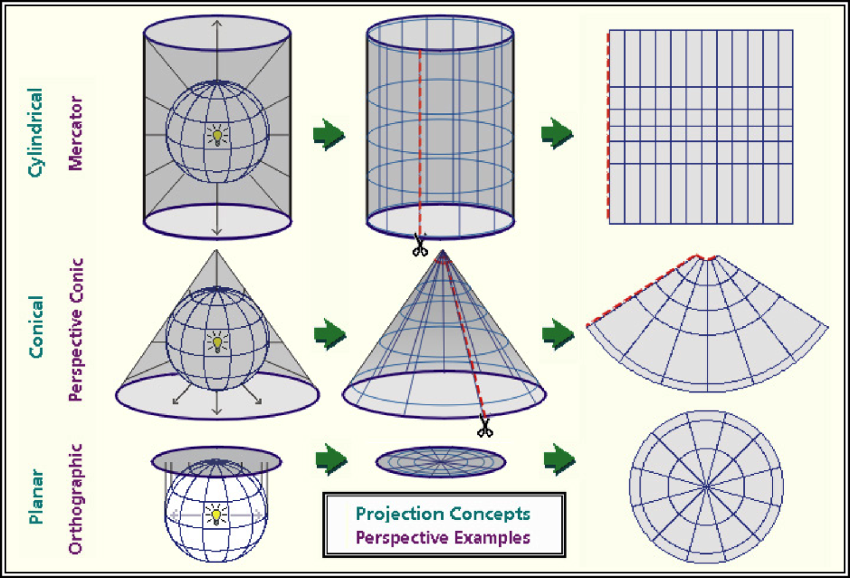

```{r}
knitr::opts_chunk$set(cache = F)
# write("TMP = './temp'", file=file.path(Sys.getenv('R_USER'), 
# '.Renviron'))
```


# Spatial Statistics

One of the most powerful ways I use and present data is to explain spatial patterns in our data.  How does a product perform in Ohio versus Iowa?  What might be the underlying weather or soil causes of these data?  How do they vary with geography?  

Quantitative data and hard numbers are fantastic.  But as we have already seed with plots, visualizations can be much more engaging.  Our minds are evolved to recognize patterns -- in fact, we are so focused on looking for patterns that we need tools like statistics to keep us honest.  So a statistics-based plot or map is a very powerful way to convey information to your audience or customers.

This is a one of two brand-new units in Agronomy 513.  You might not think a statistics software like R might be equipped to work with spatial data, especially after spending the first 11 weeks working with some ugly code.  But R can readily work with shape files and rasters (think of a fertilizer application map), both creating and analyzing them.  We will learn how to overlay polygons to relate soil to yield, and how to create a application map based on gridded soil tests.

This unit will be light on calculations (yea!) and focus more on three key areas.  First, what is projection and why do we need to worry about it if all we want to do is draw a map or average some data?  

Second, what is a shapefile?  How do we make sure it's projection is correct for our analyses and for joining with other shapefiles?  How can layer the shapefile data with soil survey data readily accessible through R?  How can we create an attractive map with our shapefile data?

Finally, we will study rasters.  Rasters organize data in grids of cells that are of equal dimensions.  Using point data from a shapefile, we can use tools like kriging to interpolate (predict) the value of each cell in the raster, creating another kind of map we can use to understand spatial data trends.

## Projection (General)
One of the most challenging concepts for me when I began working with spatial data was *projection*.  To be honest, it is still is a challenging concept for me!  Projection describes how we represent points on the surface of the earth, which is spheroidal, using maps, which are flat.  



As we can see in the figure above, projection differ in how they are positioned relative to the earth's surface.  Some are positioned relative to the equator, others might be centered between the equator and the poles, while yet others may be positioned at the poles.  Each map will represent the center of it's geography better than the edges.  
Each map is a compromise between the representation of boundaries (positions on the earth's surface) and the areas within those boundaries.  Maps that pursue the accurate representation of boundaries on the earth's surface are going to end up distorting the area of geographies outside the focal point of the map.  Maps that accurately represent areas are going to distort the position of geographic boundaries on the earth`s surface.  Thus, there are hundreds of differet projection systems, focused on different areas of the earth, and using different units to describe the position of boarders.


"Whoa, Marin", you may be thinking.  "I'm not trying to represent the world, the United States, Minnesota, or even my county!  It's just a freaking yield map!"  And you would be absolutely correct: none of these projection systems are going to vary much in how they represent the location or area of a single section of land.  

But, in working with spatial data from that field, you will encounter differences among systems in how they locate your field on the face of the earth.  Therefore, it is important we look at a few examples so you understand how to process those data.

We will start in the lower corner with WGS 84.  This is the geographic system with which most of you are probably familiar.  It is also how I roll with most of my analyses.  It's simplistic, but it works just fine for point geographies -- that is, single points on the earth's surface.

### WGS 84 (EPSG: 4236)
WGS 84 refers to "World Geodetic System"; 84 refers to 1984, the latest (!) revision of this system. WGS 84 uses the earth's center as its *origin*.  An origin is the reference point for any map -- each location is then geo-referenced according to its position relative to the origin.  In WGS 84, the position of each location is described by its angle, relative to the origin.  We usually refer to these angles as degrees latitude and longitude.

EPSG (EPSG Geodetic Parameter Dataset) is a set of many, many systems used to describe the coordinates of points on the Earth's surface. and how they are projected onto flat maps.  The EPSG stands for "European Petroleum Survey Group" -- presumably, for the purpose of locating oil fields.  4326 is the code that EPGS uses to represent the WGS 84 system.  

We can map the continental United states using 

```{r}

library(tidyverse)
library(sf)
library(USAboundaries)
usa = us_boundaries() %>%
  filter(!stusps %in% c("AK", "HI", "PR")) %>%
  select("state_name")

usa_4326 = st_transform(usa, 4326)

plot(usa_4326)
```
This is the flat map with which most of us are familiar.  Latitude and longitude are drawn as parallel lines on this map.  The map data are in a shapefile, a format we encountered at the beginning of this course.  Let's look at the top few rows of this shapefile.

```{r}
head(usa_4326)
```

This is a complex dataset, so we will use the Minnesota state boundary as an example.  In the map below, there are two objects.  The pin in the map represents the map origin.  The green dots indicate the Minnesota border.

```{r as.is=TRUE}
library(leaflet)
mn = usa_4326 %>%
  filter(state_name=="Minnesota") %>%
  st_cast("POINT")

origin = data.frame(x=0, y=0, id=1) %>%
  st_as_sf(coords = c("x", "y")) %>%
  st_set_crs(4326)

mn %>%
  leaflet() %>%
  addTiles() %>%
  addCircleMarkers(
    radius = 2,
    color = "darkgreen",
    popup = ~as.character(geometry)
  ) %>%
  addMarkers(
    data=origin
  )
```
Zoom in on Minnesota and click around its borders.  You will notice two things.  First, each point is specified in latitude and longitude. Second, longitude (the first number) is always negative while latitude (the second number) is always positive.

The sign and size of geocordinates in a projection system is defined two things: 1) where it places its origin (its reference point for locating objects on the map) and 2) what measurement units it uses.  In the case of WGS 84, the origin is the intersection of the Prime Meridian and the Equator.  Since all of the continental United States is in the western hemisphere, every state will have a negative longitude and a positive latitude.  Since WGS 84 uses angles, the measurement units will be in degrees, which never exceed the range of (-180, 180) for longitude and (-90,90) for latitude.

```{r}
library(leaflet)

origin = data.frame(x=0, y=0, id=1) %>%
  st_as_sf(coords = c("x", "y")) %>%
  st_set_crs(4326)

origin %>% 
  leaflet() %>%
  addTiles() %>%
  setView(0,0, zoom=1) %>%
  addCircleMarkers() 

```
  
### Mercator (EPSG: 3857)
The Mercator System is commonly used to project data onto a sphere.  If you look at the map below, it is very similar (actually related) to the WGS 84 map above but you may be able to see a slight "dome illusion" to the way the map is displayed. This projection is regularly used by online mapping services.     

```{r}
usa_3857 = st_transform(usa, 3857)

plot(usa_3857)
```

Looking at the top few rows of the Minnesota data points, we can see the units are not latitude and longitude.  In this projection, they are easting and northing: measures of the distance east and north of the origin.  Easting and northing are usually measured in meters

```{r}
mn = usa_3857 %>%
  filter(state_name=="Minnesota") %>%
  st_cast("POINT")

head(mn)
```

The origin for the Mercator projection is again the intersection of Prime Meridian and Equator, so each Minnesota border point will have a negative value for easting and a positive value for northing.     


### US National Atlas Equal Area (EPSG: 2163)
As the name suggests, coordinate systems like the US National Atlas Equal Area project data so that the areas of geographic objects are accurate in the map.  
```{r}
usa_2163 = st_transform(usa, 2163)

plot(usa_2163)
```

This system, like the Mercator above, uses northing and easting units.  But whe we look at our Minnesota border coordinates, we now notice our easting vaues are positive!  What happened?  

```{r}
mn = usa_2163 %>%
  filter(state_name=="Minnesota") %>%
  st_cast("POINT")

head(mn)
```
As you have likely guessed, our origin has change.  For this projection, our origin is in Central South Dakota.
```{r}
library(leaflet)

origin = data.frame(x=0, y=0, id=1) %>%
  st_as_sf(coords = c("x", "y")) %>%
  st_set_crs(2163)

origin=st_transform(origin, 4326)
  
origin %>% 
  leaflet() %>%
  addTiles() %>%
  setView(-100,45, zoom=3) %>%
  addCircleMarkers() 

```


### UTM Zone 11N (EPSG: 2955)

```{r}
usa_2955 = st_transform(usa, 2955)

plot(usa_2955)
```
```{r}
head(usa_2955)
```

Here are the coordinates for the Minnesota border again.
```{r}
mn = usa_2955 %>%
  filter(state_name=="Minnesota") %>%
  st_cast("POINT")

head(mn)
```

```{r}
library(leaflet)

origin = data.frame(x=0 , y=-117, id=1) %>%
  st_as_sf(coords = c("x", "y")) %>%
  st_set_crs(2955) 

origin = st_transform(origin, 4326)
  
origin %>% 
  leaflet() %>%
  addTiles() %>%
  setView(0,0, zoom=1) %>%
  addCircleMarkers() 

```

### Projection Summary
It is good to know some of these basic projections, but by far the most important concept of this unit is that it is important you are aware of the projection system that accompanies your spatial data. If you are assembing data from multiple shapefiles, as we will do below with soil and yield maps, you will need to account for the projections of each shapefile, to make sure they all have the same projection system.  

In addition, different spatial data operations may prefer one projection system over the other. Operations that summarize areas will require projections that are based on area, not geometry.  Similarly, spatial tools like rasters (which divide an area into rectangles or squares), will prefer a system that is square.


## Shape Files

### Case Study: Soybean Yield in Iowa
This is not our first encounter with shapefiles -- we plotted our first shapefile map in the beginning of our course.  Let's return to that dataset!
```{r}
library(tidyverse)
library(sf)

corn_yield = st_read("data-unit-12/merriweather_yield_map/merriweather_yield_map.shp", quiet=TRUE)
```

We can examine this shapefile by typing its name.
```{r}
corn_yield
```

The most useful shapefiles, in my experience, are presented in the "spatial feature" format above.  It is, essentially, a data frame, but with a single, special geometry column that contains multiple measures per row.  The geometry column is, if you will, composed of columns within a column.

Let's ignore the data for now and look at the information (the metadata) at the top of the output.  First, let's note the geometry type is POINT.  Each row of this datafile defines one point.  Shapefiles can be composed of all sorts of objects: points, lines, polygons, sets of multiple polygons, and so forth -- and shapefiles can be converted between formats

Creating a successful map includes telling R what kind of object we intend to draw.  So knowing the formate of a shapefile is critical!a helpful starting point.

Second, look at the geographic CRS.  CRS stands for Coordinate Reference System.  In this case, we are already in the standard WGS 84 format we discussed earler, so our units are latitude and longitude.  

One of the things we will learn this lesson is to use *Leaflet* to create maps.  Leaflet is an awesome applet whose true appreciation would require using four-letter conjunctions inapporpiate for the classroom.  It creates interactive maps that can zoom in, zoom out, and identify the values of individual points.

```{r}
library(RColorBrewer)
pal_yield = colorBin(palette = "RdYlGn", corn_yield$yield_bu)

  corn_yield %>%
  leaflet() %>%
  addCircleMarkers(
    radius = 2,
    fillColor = ~pal_yield(corn_yield$yield_bu),
    weight=0,
    popup = ~as.character(geometry),
    fillOpacity = 1
  ) %>%
  addProviderTiles(provider = providers$Esri.WorldImagery)
```


### SSURGO
The Soil Survey Geographic Database (SSURGO) is maintained by the United States Department of Agriculture.  It contains extensive soil surveys: soil evaluations for properties, susceptibility to weather extremes, suitability for agriculture, recreation, and buildings.  The soil survey used to only be available in county books, which only special libraries had.  Now, you can access all these data through R in seconds and match them precisely to a given map location. 

The SSURGO data is in a database.  A database is a series of tables, all describing different aspects of a data information.  Each table contains 1-3 columns that are keys to match the tables with each other.  Descriptions of the tables an their data can be obtained for SSURGO at:

https://data.nal.usda.gov/system/files/SSURGO_Metadata_-_Table_Column_Descriptions.pdf

Putting all these tables together can be messy -- fortunately, you only need to do it once, after which you can just change the shapefile you feed to the code.  I will give you that code in the exercises this week.

```{r}
library(FedData)

soil_data_sp = as(corn_yield, "Spatial")
soil_map = get_ssurgo(soil_data_sp, "example")
soil_sf = st_as_sf(soil_map$spatial) %>%
  st_set_crs(4326)

mu_point = soil_map$tabular$mapunit %>%
  dplyr::select(musym, muname, mukey)

# get measures of sand, silt, clay, etc
horizon_diagnostics = soil_map$tabular$chorizon %>%
  dplyr::select(hzname, sandtotal.r, silttotal.r, claytotal.r, om.r, awc.r, ksat.r, cec7.r, cokey, chkey)

# soil texture class
texture = soil_map$tabular$chtexturegrp %>%
  filter(rvindicator=="Yes") %>%
  select(texdesc, chkey)

# percent slope and drainage class
slope = soil_map$tabular$component %>%
  select(drainagecl, slope.r, mukey, cokey)

parent_material = soil_map$tabular$copm %>%
  filter(pmorder==1 | is.na(pmorder)) %>%
  select(pmkind, copmgrpkey, copmkey)

pm_group = soil_map$tabular$copmgrp %>%
  select(cokey, copmgrpkey)

component = soil_map$tabular$component %>%
  select(mukey, cokey)

all_soil_data = mu_point %>%
  left_join(component) %>%
  left_join(horizon_diagnostics) %>%
  group_by(mukey) %>%
  filter(chkey==min(chkey)) %>%
  ungroup() %>%
  left_join(texture) %>%
  left_join(slope) %>%
  left_join(pm_group) %>%
  left_join(parent_material) %>%
  select(-c(copmgrpkey, copmkey, musym, cokey))

# hzname = horizon name
# sandtotal.r = percent sand (representative value)
# silttotal.r = percent silt (representative value)
# claytotal.r = percent clay (representative value)
# om.r = percent organic matter (representative value)
# awc.r = amount of plant-available water a soil can hold (v/v) (representative value)
# ksat.r = amount of water that would move vertically through a unit area of saturated soil in unit time under unit hydraulic gradient (representative value)
# cec7.r = cation exchange capacity at pH=7.0 (representative value)
# 

complete_soil_data = soil_sf %>%
  rename_all(tolower) %>%
  mutate(mukey = as.numeric(mukey)) %>%
  left_join(all_soil_data)


```


Here is a SSURGO map of soil organic matter. 

```{r}
library(grDevices)
pal_om = colorNumeric("RdYlGn", complete_soil_data$om.r)

complete_soil_data %>%
  leaflet() %>%
  addProviderTiles(provider = providers$Esri.WorldImagery) %>%
  addCircleMarkers(
    radius = 4,
    weight=0,
    fillColor = ~ pal_om(om.r),
    opacity = 0.8,
    popup = as.character(complete_soil_data$om.r)
  )


```

Here is another map, this time with the percent clay.
```{r}
pal_om = colorNumeric("RdYlGn", complete_soil_data$claytotal.r)

complete_soil_data %>%
  leaflet() %>%
  addProviderTiles(provider = providers$Esri.WorldImagery) %>%
  addCircleMarkers(
    radius = 4,
    weight=0,
    fillColor = ~ pal_om(claytotal.r),
    opacity = 0.8,
    popup = as.character(complete_soil_data$claytotal.r)
  )

```

Now that we have our SSURGO data, we can join it with our yield data and ask questions how yields were grouped by quantitative descriptors, such as soil map unit name ("muname"), texture ("texdesc"), drainage class ("drainagecl"), or parent material ("pmkind").  

```{r}
yield_and_soil = corn_yield %>%
  st_join(complete_soil_data) %>%
  select(yield_bu, muname:pmkind)

knitr::kable(head(yield_and_soil))

```

For example, here are soybean yields by soil texture, which would suggest a trend where soil yield increased with clay content in this field.

```{r}

yield_and_soil %>%
  group_by(texdesc) %>%
  summarise(yield_bu = mean(yield_bu)) %>%
  arrange(-yield_bu) %>%
  knitr::kable()

```


And this table would suggest that soybean preferred poorly drained soil to better-drained soils.  
```{r}

yield_and_soil %>%
  group_by(drainagecl) %>%
  summarise(yield_bu = mean(yield_bu)) %>%
  arrange(-yield_bu) %>%
  knitr::kable()

```

### Operations with Shapes
Above, we subsetted our yield data according to different soil properties.  In some cases, however, we may want to subset or group data by location.  

#### Intersection
Say, for example, we applied a foliar fertilizer treatment to part of the field, as shown in the map below.

```{r}

plot_matrix = rbind(c(-93.1531821855683, 41.6676769366949),
                                   c(-93.1513597019773, 41.6680433043018),
                                   c(-93.1511016153721, 41.6675928161335),
                                   c(-93.1529575127369, 41.6672203948557),
                                   c(-93.1531821855683, 41.6676769366949))

library(sp)
p = Polygon(plot_matrix)
ps = Polygons(list(p), 1)
sps = SpatialPolygons(list(ps))

field_plot_sf = sps %>%
  st_as_sf() %>%
  st_set_crs(4326)

pal_yield = colorBin(palette = "RdYlGn", corn_yield$yield_bu)

  corn_yield %>%
  leaflet() %>%
  addCircleMarkers(
    radius = 2,
    fillColor = ~pal_yield(corn_yield$yield_bu),
    weight=0,
    popup = ~as.character(geometry),
    fillOpacity = 1
  ) %>%
    addPolygons(data=field_plot_sf) %>%
  addProviderTiles(provider = providers$Esri.WorldImagery)


```

How might we find out statistics for yield measures within that applied area?  
```{r}
field_yield_only = st_intersection(field_plot_sf, corn_yield)

pal_yield = colorBin(palette = "RdYlGn", field_yield_only$yield_bu)

field_yield_only %>%
  leaflet() %>%
  addCircleMarkers(
    radius = 2,
    fillColor = ~pal_yield(field_yield_only$yield_bu),
    weight=0,
    popup = ~as.character(geometry),
    fillOpacity = 1
  ) %>%
    addPolygons(data=field_plot_sf)%>%
  addProviderTiles(provider = providers$Esri.WorldImagery)

mean(field_yield_only$yield_bu)
```

#### Difference
What about the yields outside that area?
```{r}

field_yield_outside = st_difference(corn_yield, field_plot_sf)

pal_yield = colorBin(palette = "RdYlGn", field_yield_outside$yield_bu)

field_yield_outside %>%
  leaflet() %>%
  addCircleMarkers(
    radius = 2,
    fillColor = ~pal_yield(field_yield_outside$yield_bu),
    weight=0,
    popup = ~as.character(geometry),
    fillOpacity = 1
  ) %>%
    addPolygons(data=field_plot_sf)%>%
  addProviderTiles(provider = providers$Esri.WorldImagery)

mean(field_yield_outside$yield_bu)
```

#### Union
What if we had two field plot areas?
```{r}
plot_matrix2 = rbind(c(-93.1531821855683, 41.6676769366949),
                                   c(-93.1513597019773, 41.6680433043018),
                                   c(-93.1511016153721, 41.6675928161335),
                                   c(-93.1529575127369, 41.6672203948557),
                                   c(-93.1531821855683, 41.6676769366949))
plot_matrix2[, 1] = plot_matrix2[, 1] -0.00078

plot_matrix2[, 2] = plot_matrix2[, 2] +0.00082


library(sp)
p2 = Polygon(plot_matrix2)
ps2 = Polygons(list(p2), 1)
sps2 = SpatialPolygons(list(ps2))

field_plot_sf2 = sps2 %>%
  st_as_sf() %>%
  st_set_crs(4326)

pal_yield = colorBin(palette = "RdYlGn", corn_yield$yield_bu)

  corn_yield %>%
  leaflet() %>%
  addCircleMarkers(
    radius = 2,
    fillColor = ~pal_yield(corn_yield$yield_bu),
    weight=0,
    popup = ~as.character(geometry),
    fillOpacity = 1
  ) %>%
    addPolygons(data=field_plot_sf) %>%
    addPolygons(data=field_plot_sf2,
                color = "green",
                fillColor = "green",
                fillOpacity = 0.35) %>%
  addProviderTiles(provider = providers$Esri.WorldImagery)


```

If we wanted to analyze two areas together, we could use st_union to combine them:

```{r}
field_plots_unioned = st_union(field_plot_sf, field_plot_sf2)

library(sp)
p2 = Polygon(plot_matrix2)
ps2 = Polygons(list(p2), 1)
sps2 = SpatialPolygons(list(ps2))

field_plot_sf2 = sps2 %>%
  st_as_sf() %>%
  st_set_crs(4326)

pal_yield = colorBin(palette = "RdYlGn", corn_yield$yield_bu)

corn_yield %>%
  leaflet() %>%
  addCircleMarkers(
    radius = 2,
    fillColor = ~pal_yield(corn_yield$yield_bu),
    weight=0,
    popup = ~as.character(geometry),
    fillOpacity = 1
  ) %>%
    addPolygons(data=field_plots_unioned,
                color = "purple",
                fillColor = "purple",
                fillOpacity = 0.35) %>%
  addProviderTiles(provider = providers$Esri.WorldImagery)

mean(corn_yield$yield_bu)


```


gardener@gardensalive.com
service@gardensalive.com

## Rasters


```{r message=FALSE, warning=FALSE}
library(gstat)
library(sp)
library(raster)

point_data = st_read("data-unit-12/Delzer South_grid_sample.shp", quiet=TRUE)
# point_data = st_transform(point_data, 3857)
boundary = st_read("data-unit-12/Delzer South_boundary.shp", quiet=TRUE)
# boundary = st_transform(boundary, 3857)
selected_data = point_data %>%
  filter(attribute=="P_bray")


port = as(boundary, "Spatial")

e <- extent(bbox(port))                  # define boundaries of object
r <- raster(e)                           # create raster object 
dim(r) <- c(10, 10)                      # specify number of cells
projection(r) <- CRS(proj4string(port))  # give it the same projection as port
g <- as(r, 'SpatialPolygonsDataFrame') 

p <- g[port,]
crime_agg1 <- p
crime_agg1$CATEGORY = 0

crime_agg2 <- crime_agg1
crime_agg2$CATEGORY= 0
crime_agg2 <- spTransform(crime_agg2, CRS("+init=epsg:4326"))
qpal <- colorBin("Reds", crime_agg2$CATEGORY, bins=5)

empty_raster = leaflet(crime_agg2) %>%
  addPolygons(stroke = TRUE, opacity = 1,fillOpacity = 0.2, smoothFactor = 0.5,
              color="white", fillColor = "none", weight = 1) %>%
  addProviderTiles(providers$Esri.WorldImagery)


```

```{r}

pal_soil_p = colorBin("RdYlGn", selected_data$measure)

p_soil_cores_map = selected_data %>%
  leaflet() %>%
  addCircleMarkers(
    fillColor = ~pal_soil_p(selected_data$measure),
    weight = 0,
    fillOpacity = 0.8,
    radius = 6
  ) %>%
  addProviderTiles(provider = providers$Esri.WorldImagery) %>%
  addLabelOnlyMarkers(data=selected_data,
                      label = as.character(selected_data$measure),
                      labelOptions = labelOptions(noHide = TRUE
                                                    , direction = 'center'
                                                    , textOnly = TRUE,
                                                  style = list(
                                                    "color" = "white"
                                                  )) )

p_soil_cores_w_raster_map = p_soil_cores_map %>%
   addPolygons(data = crime_agg2, stroke = TRUE, opacity = 1,fillOpacity = 0.2, smoothFactor = 0.5,
              color="white", weight = 1, fillColor = "none")


```


```{r message=FALSE, warning=FALSE}

library(stars)

selected_data = point_data %>%
  filter(attribute=="P_bray")

### make grid
grd = st_bbox(boundary) %>%
  st_as_stars() %>%
  st_crop(boundary) 
# %>%
  # st_set_crs(6505)


# ordinary kriging --------------------------------------------------------
v = variogram(measure~1, selected_data)
m = fit.variogram(v, vgm("Sph"))
kridge_plot = plot(v, model = m) 

lzn.kr1 = gstat::krige(formula = measure~1, selected_data, grd, model=m)
# plot(lzn.kr1[1])

library(leafem)

soil_p_map = leaflet(lzn.kr1[1]) %>%
  addProviderTiles(providers$Esri.WorldImagery) %>%
  addStarsImage(opacity = 0.5) %>%
  addImageQuery(lzn.kr1[1],
                type = "click")

soil_p_map

```


```{r}
# soil p raster map
p_raster_map = lzn.kr1 %>%
  st_as_sf() %>%
  mutate(rec = var1.pred) %>%
  mutate(rec = round(rec, 0))

library(fasterize)
r <- raster(p_raster_map)
dim(r) <- c(10, 10)                      # specify number of cells
projection(r) <- CRS(proj4string(port))
r <- fasterize(p_raster_map, r, field = "rec", fun="min")
r_df = as.data.frame(r, xy=TRUE)

## find centroid coordinates

p_raster_with_values = leaflet(crime_agg2) %>%
  addPolygons(stroke = TRUE, opacity = 1,fillOpacity = 0.2, smoothFactor = 0.5,
              color="white", weight = 1, fillColor = "none") %>%
  addProviderTiles(providers$Esri.WorldImagery) %>%
  addLabelOnlyMarkers(data=r_df,
                      lng= ~x, lat= ~y, 
                      label = as.character(r_df$layer),
                      labelOptions = labelOptions(noHide = TRUE
                                                    , direction = 'center'
                                                    , textOnly = TRUE,
                                                  style = list(
                                                    "color" = "white"
                                                  )) )

```

```{r}
# soil p raster map
p_raster_map = lzn.kr1 %>%
  st_as_sf() %>%
  mutate(rec = var1.pred) %>%
  mutate(rec = round(rec, 0)) 

library(fasterize)
r <- raster(p_raster_map)
dim(r) <- c(10, 10)                      # specify number of cells
projection(r) <- CRS(proj4string(port))
r <- fasterize(p_raster_map, r, field = "rec", fun="min")
r_df = as.data.frame(r, xy=TRUE)


pal_raster = colorBin("RdYlGn", crime_agg2$layer)

p_raster_with_values = leaflet(crime_agg2) %>%
  addPolygons(
    stroke = TRUE, opacity = 1,fillOpacity = 0.2, smoothFactor = 0.5,
              color="white", weight = 1, 
              fillColor = ~pal_raster(crime_agg2$layer)) %>%
  addProviderTiles(providers$Esri.WorldImagery) %>%
  addLabelOnlyMarkers(data=r_df,
                      lng= ~x, lat= ~y, 
                      label = as.character(r_df$layer),
                      labelOptions = labelOptions(noHide = TRUE
                                                    , direction = 'center'
                                                    , textOnly = TRUE,
                                                  style = list(
                                                    "color" = "white"
                                                  )) )

p_raster_with_values
```


```{r}
lzn.kr1$rec = (0.700 - 0.035*lzn.kr1$var1.pred)*200
lzn.kr1$rec = ifelse(lzn.kr1$rec<0, 0, lzn.kr1$rec)

P_prescription_map = leaflet(lzn.kr1["rec"]) %>%
  addProviderTiles(providers$Esri.WorldImagery) %>%
  addStarsImage(opacity = 0.5) %>%
  addImageQuery(lzn.kr1["rec"],
                type = "click")

```
  
```{r}


sf = lzn.kr1 %>%
  st_as_sf() %>%
  mutate(rec = if_else(var1.pred>20, 0, 
                       (0.700 - 0.035*var1.pred)*200))

library(fasterize)
r <- raster(sf, ncol=10, nrow=10)
r <- fasterize(sf, r, field = "rec", fun="min")


P_rec_raster_map = leaflet() %>%
  addProviderTiles(providers$Esri.WorldImagery) %>%
  
  addRasterImage(r,
                 colors = "RdYlGn",
                 opacity = 0.5,
                 group = "Rec Rate") %>%
  addPolygons(data=crime_agg2,
    stroke = TRUE, opacity = 1,fillOpacity = 0.2, smoothFactor = 0.5,
              color="white", weight = 1, 
              fillColor = ~pal_raster(crime_agg2$layer)) %>%
  addLabelOnlyMarkers(data=r_df,
                      lng= ~x, lat= ~y, 
                      label = as.character(r_df$layer),
                      labelOptions = labelOptions(noHide = TRUE
                                                    , direction = 'center'
                                                    , textOnly = TRUE,
                                                  style = list(
                                                    "color" = "white"
                                                  )) ) 

```


In the previous section, we worked with what are often described as vectors or shapes.  That is, points which may or may not have been connected to form lines or polygons.  

A raster is a grid system that we use to describe spatial variation.  In essence, it is a grid system.  Here is the same field we worked with in the previous section, now overlaid with a grid:  

```{r}
empty_raster
```

If you think it looks a little like we took a spreadsheet and trimmed it to fit our field, you are exactly right.  Taking this analogy further, just as a spreadsheet is composed of cells, each containing a different value, so is a raster.  Here it is, filled in with values representing predicted soil P test values:

```{r}
P_rec_raster_map
```

Often, the cells would be colored along a given gradient (say red-yellow-green) according to their values.  This helps us to see spatial trends. 


### Interpolation
To create a raster that represents continuous soil trends across a field, however, we need to do a little modelling.  You see, we start out with a set of soil cores like this:

```{r}
p_soil_cores_map
```

But we are trying to make predictions for each cell of our raster:

```{r}
p_soil_cores_w_raster_map
```
Some cells above one measure, others split a measure with a neighboring cell, and yet others contain no measure at all.  In addition, even cells that contain a measure may have it in different locations relative to the cell center.

When we interpolate a raster, we make an educated guess about the values of cells in which no measure was taken, based on the values of the other cells.  In the following example, the middle cell is missing:

```{r}

set.seed(3)
ie = data.frame(row = rep(c(1:5),5),
                col = rep(c(1:5), each=5),
                cell = c(1:25)) %>%
  # mutate(mean_value = 21) %>% # majority of cells
  mutate(mean_value = if_else(cell %in% c(7:9, 12:14, 17:19), 14, 21)) %>% #center cells
  rowwise() %>%
  mutate(error = rnorm(1,0,3)) %>%
  ungroup() %>%
  mutate(value = round(mean_value + error,1)) 

  
ie_complete = ie %>%
  mutate(cell_cat = case_when(cell==13 ~ "target",
                              cell %in% c(7:9, 17:19, 12, 14) ~ "adjacent",
                              cell %in% c(1:5,6,10,11,15,16,20,21:25) ~ "distant")) 

ie_complete %>% 
  mutate(value = if_else(cell==13, NaN, value)) %>%
  ggplot(aes(x=row, y=col)) +
  geom_tile(aes(fill=cell_cat), color="black") +
  geom_text(aes(label=value)) +
  scale_fill_manual(values = c("darkgrey", "lightgrey", "tomato")) +
  theme(legend.position = "none")


```

The most basic way to interpolate this missing value would be to estimate it's value as the mean value of all cells adjacent to it (dark grey in plot above).   So the value of the missing cell would be equal to:

$$ \text{cell value} = \text{mean}(16.6, 17.9, 13.1, 19.1, 11.6, 11.1, 16.2, 16.2) = 16.6 $$

If we wanted to be a bit more accurate, we might extend out to the next ring of cells around the cell we are trying to estimate.  But we probably would not want them to factor into the mean calculation as much as the first ring of cells -- the difference betwen two measurements tends to increase with distance.  So if they are two units away from the missing cell of, we might weight them so they contribute 1/4th as much to the estimate as the immediately adjacent cells. 

If we were to fill out a table, it would look like this:

```{r}
weight = c(1,1,1,1,1,1,4,4,4,1,1,4,4,4,1,1,4,4,4,1,1,1,1,1,1)/4

weighted_mean_table = ie_complete %>%
  dplyr::select(row, col, cell, value) %>%
  dplyr::mutate(weight = weight) %>%
  mutate(weighted_value = value*weight)

weighted_mean_table

```

The weighted value for each cell is the product of its observed value times its weight.  To calculate the weighted value, we sum the weights and the weighted values.  The weighted mean is then:

$$ \text{weighted mean} = \frac{\sum{\text{weighted value}}}{\sum{\text{weight}}} $$
```{r}
sum_of_weighted_values = sum(weighted_mean_table$weighted_value, na.rm = TRUE)
sum_of_weights = sum(weighted_mean_table$weight, na.rm=TRUE)

weighted_mean = round(sum_of_weighted_values / sum_of_weights,2)
```

In this example, the calculation would look like:

$$ \text{weighted mean} = \frac{220.45}{13} = 17.0$$

What we have just calculated is called the *inverse distance-weighted (IDW) mean* of the surrounding points.  It is a simple, elegant way to estimate the missing value.

### Kriging
The inverse distance-weighted mean, however, is not as accurate as which we are capable.  We assume that the influence of points away from the empty cell decreases exponentially with distance.  We don't consider how we would optimally weight the values of the surrounding cells.

We can develop a more complex, but likely accurate, estimate of the cell value using a different interpolation practice called *kriging*.  (For some reason, I always want to insert a "d" into this term so it rhymes with "bridging".  But it is pronounced KREE-ging.)  The name comes from Danie Krige, a South African geostatician who was interested in locating gold deposits.

I will take you through the basics of kriging.  A more elegant explanation of kriging can be found here: https://pro.arcgis.com/en/pro-app/tool-reference/3d-analyst/how-kriging-works.htm

Kriging evaluates how points of varying differences from each other are correlated. These correlations are plotted in a *semivariogram*.    


X is the distance between point pairs.  Y is the squared difference between each pair of points selected by the software.  Sometimes, pairs will be binned (similar to the binning in histrograms) into according to distance (called "lag") in this analysis.  The squared differences of all pairs within a lag bin are averaged. 

Does this nonlinear function look familiar by any chance?  That's right, it is a monomolecular function!  The curve is described by different terms to which we are used to (and, to be honest, they don't always make much sense.)  In the kriging curve, the *Sill* is the maximum value the curve approaches.  The *Nugget* is the y-intercept.

Otherwise, this curve is fit with nonlinear regression, just like the others we have seen.  The calculated semivariances are then used to weight observations in calculating the weighted me.  In this way, observations are weighted according the the strength of surrounding measurements, according to their measured correlation with distance.

Here is the kridge plot for our soil phosphorus test data.

```{r}
kridge_plot
```
Using this model of the relationship between covariance and distance, then, R can determine how much to weight each observation, based on distance, to estimate values between measurement points.

When we produced our initial raster, the cell size was especially large for simplification of the raster, and to allow the cell values to be shown.  When we build a raster with kriging, however, the cell size can be very small.  This has the effect of getting rid of blockiness and allowing us to better predict and visualize trends in values across the landscape.

Here is our soil phosphorus test map, interpolated by R, using kriging. The red areas are areas of lower P test values.  The green and blue areas have the greatest test values, and the yellow areas are intermediate.

```{r}
soil_p_map
```

### Operations on Kriged Data
Of course, to take this example to completion, we would like to know the P-allication rate for each of the cells within our raster.  The University of Minnesota recommended application rate, based on soil P value and yield goal, is:

$$ P _2 O _5 \text{ recommended rate} = [0.700 - .035 (\text{Bray P ppm})] (\text{yield goal}) $$

We can plug each cell's Bray P test value into this equation.  For example, a point with a test value of 17 would, given a yield goal of 200, have a $P_2O_5$ rate recommendation of: 

$$ P _2 O _5 \text{ recommended rate} = [0.700 - .035 (17)] (\text{200}) = 21$$

Here is the rate recommendation map.

```{r}
P_prescription_map
```

The blue areas now have the highest recommended rates.  Yellow are intermediate.  Red areas should receive no P fertilizer.


## Exercise: Shape Files
If you are downloading data files from your tractor, applicator, or combine, they are probably in shape file format.  Although I will refer to shape file in the singular, a shape file is typically bundled with multiple other files, with the same file name but different extensions: .dbf, .prj, and .shx.  Of these three, the .prj is perhaps the most interesting, as it can be opened to view the projection used to georeference the records in the shape file.

### Case Study
We will work with another soil test shapefile from Minnesota.
```{r}
library(tidyverse)
library(sf)

soil_test_data = st_read("data-unit-12/Burnholdt_grid_sample.shp")
head(soil_test_data)
```

It is always important to inspect datasets before we analyze them.  A particularly important objective in inspecting a shape file dataset is to see what type of *geometry* it includes: POINT, POLYGON, etc.  Some equipment will use POINT geometry -- ie a single georeference to indicate where the center of the equipment was at the time of measure.  Others will use polygons to represent the width and length of the equipment.  Personally, I find the latter format to be overkill, but I have come across it.  (If you ever run into issues with that format, please feel free to contact me.)

We can confirm our measures here are referenced with POINT geometry.

In this exercise, we want to look at soil organic matter (attribute = Om in this file.), so let's isolate those measures.  We can do so using the *filter()* function

```{r}
single_attribute_data = soil_test_data %>%
  filter(attribute=="Om")

```


We are now ready to create our first map of the data.  We will use that wonderful mapping application, leaflet.  The code below consists of four lines.

1) "single_attribute_data" tells R which dataset we are going to use to build the map.
2) "leaflet()" tells R to use that app to build the map
3) "addCircleMarkers" tells R to draw point geometries.  There are many other arguments we will add later to tell R what colors to use, marker size, and what value (if any) to show when the user clicks on a marker.
4) "addProviderTiles" tells R what background to use.  This one (my favorite) uses satellite imagery.


```{r}
# library(leaflet)
# 
# single_attribute_data %>%   # starts with om dataset
#   leaflet() %>%    # starts leaflet
#   addCircleMarkers() %>%    # adds markers as points
#   addProviderTiles(provider = providers$Esri.WorldImagery)
```

Well, that's cool, but what do the points mean?  Let's add some color to this.  To do this, we need to tie the color of the circles to the organic matter level.  We need to create a palette, which we can do with the *colorBin()* function.

My favorite pallette is the red-yellow-green palette we are used to in yield maps.  We will load the *RColorBrewer* package, which defines both individual colors and palettes.  We will then tell R in the colorBin command to use this palette.

```{r}
library(RColorBrewer)
palette_om = colorBin(palette = "RdYlGn", single_attribute_data$measure)
```

We can then color code our points by adding the *fillColor* argument to our plot code. 

```{r}
library(leaflet)

single_attribute_data %>%   # starts with om dataset
  leaflet() %>%    # starts leaflet
  addCircleMarkers(
    fillColor = ~palette_om(measure)
  ) %>%    # adds markers as points
  addProviderTiles(provider = providers$Esri.WorldImagery)
```

Let's make a few more tweaks.  First, the colors are so transparent the wash out, so let's increase their opacity using the argument of that name.
```{r}
single_attribute_data %>%   # starts with om dataset
  leaflet() %>%    # starts leaflet
  addCircleMarkers(
    fillColor = ~palette_om(measure),
    fillOpacity = 0.8
  ) %>%    # adds markers as points
  addProviderTiles(provider = providers$Esri.WorldImagery)
```

Next, the blue border detracts from the cells.  We can set its weight to zero so it disappears.

```{r}
single_attribute_data %>%   # starts with om dataset
  leaflet() %>%    # starts leaflet
  addCircleMarkers(
    fillColor = ~palette_om(measure),
    fillOpacity = 0.8,
    weight = 0
  ) %>%    # adds markers as points
  addProviderTiles(provider = providers$Esri.WorldImagery)
```

Let's make the points a little smaller using the *radius* argument, so they don't so overwhelm the field.
```{r}
single_attribute_data %>%   # starts with om dataset
  leaflet() %>%    # starts leaflet
  addCircleMarkers(
    fillColor = ~palette_om(measure),
    fillOpacity = 0.8,
    weight = 0,
    radius=6
  ) %>%    # adds markers as points
  addProviderTiles(provider = providers$Esri.WorldImagery)
```

Finally, let's add a legend.  We provide a minimum of two arguments to it.  First *values* tells it that the legend will correspond to the values of measure in our dataset.  Second, *pal =* tells R to use the palette we developed for organic matter.  

```{r}
single_attribute_data %>%   # starts with om dataset
  leaflet() %>%    # starts leaflet
  addCircleMarkers(
    fillColor = ~palette_om(measure),
    fillOpacity = 0.8,
    weight = 0,
    radius=6
  ) %>%    # adds markers as points
  addProviderTiles(provider = providers$Esri.WorldImagery) %>%
  addLegend(values = ~measure,
            pal = palette_om)
            
```

There are thousands of other ways to modify this plot, but this little bit should get you far!


### Practice
Using the code above, plot other soil variable.  Run the code below to see a list of the many different attributes you can examine. 
```{r}
unique(soil_test_data$attribute)
```

Experiment with plugging and playing with the above code. (There is *never* shame in re-using code!!!).  Play with the settings for fillOpacity, weight, and radius until they are to your liking.  Also, try some different palettes: "RdBu", "PRgn", or others (list available at https://www.r-graph-gallery.com/38-rcolorbrewers-palettes.html).

```{r}

palette_soil = colorBin(palette = "RdYlGn", single_attribute_data$measure)

single_attribute_data %>%   # starts with om dataset
  leaflet() %>%    # starts leaflet
  addCircleMarkers(
    fillColor = ~palette_soil(measure),
    fillOpacity = 0.8,
    weight = 0,
    radius=6
  ) %>%    # adds markers as points
  addProviderTiles(provider = providers$Esri.WorldImagery) %>%
  addLegend(values = ~measure,
            pal = palette_soil)
```


## Exercise: SSURGO
In this lesson, we saw how the Soil Survey Geographic Database (SSURGO) database can be accessed to gain further insight into fields.

This isn't an exercise so much as a demonstration how those data can be obtained and plotted through R.  It is hear for your use or reference, but not a required part of this lesson.  

We can load our shapefile just as we have done before.  For reasons explained below, it is important to name the dataset "field".

```{r}
library(sf)
library(tidyverse)
library(leaflet)

field = st_read("data-unit-12/exercise_data/yield shape.shp", quiet=TRUE)
```


First, let's create a yield map, just as we learned to in the "shapefile" exercise.  If you have not completed that exercise, please do so before continuing.

```{r}
palette_yield = colorBin("RdYlGn", field$Yld_Vol_Dr)

field %>%   # starts with om dataset
  leaflet() %>%    # starts leaflet
  addCircleMarkers(
    fillColor = ~palette_yield(Yld_Vol_Dr),
    fillOpacity = 0.8,
    weight = 0,
    radius=0.1
  ) %>%    # adds markers as points
  addProviderTiles(provider = providers$Esri.WorldImagery) %>%
  addLegend(values = ~Yld_Vol_Dr,
            pal = palette_yield)
```

This is the one and only time in this course when I will ask you just to run a chunk of code without explaining it line-by-line.  As long as your spatial feature object (the field shapefile) is named "field", just run this chunk as it is.

```{r}

##### Run this as-is: Do not modify !! #######


library(FedData)
library(sp)
soil_data_sp = as(field, "Spatial")
soil_map = get_ssurgo(soil_data_sp, "example")
soil_sf = st_as_sf(soil_map$spatial) %>%
  st_set_crs(4326)

mu_point = soil_map$tabular$mapunit %>%
  dplyr::select(musym, muname, mukey)

# get measures of sand, silt, clay, etc
horizon_diagnostics = soil_map$tabular$chorizon %>%
  dplyr::select(hzname, sandtotal.r, silttotal.r, claytotal.r, om.r, awc.r, ksat.r, cec7.r, cokey, chkey)

# soil texture class
texture = soil_map$tabular$chtexturegrp %>%
  filter(rvindicator=="Yes") %>%
  dplyr::select(texdesc, chkey)

# percent slope and drainage class
slope = soil_map$tabular$component %>%
  dplyr::select(drainagecl, slope.r, mukey, cokey)

parent_material = soil_map$tabular$copm %>%
  filter(pmorder==1 | is.na(pmorder)) %>%
  dplyr::select(pmkind, copmgrpkey, copmkey)

pm_group = soil_map$tabular$copmgrp %>%
  dplyr::select(cokey, copmgrpkey)

component = soil_map$tabular$component %>%
  dplyr::select(mukey, cokey)

all_soil_data = mu_point %>%
  left_join(component) %>%
  left_join(horizon_diagnostics) %>%
  group_by(mukey) %>%
  filter(chkey==min(chkey)) %>%
  ungroup() %>%
  left_join(texture) %>%
  left_join(slope) %>%
  left_join(pm_group) %>%
  left_join(parent_material) %>%
  dplyr::select(-c(copmgrpkey, copmkey, musym, cokey)) 

complete_soil_data = soil_sf %>%
  rename_all(tolower) %>%
  mutate(mukey = as.numeric(mukey)) %>%
  left_join(all_soil_data)


```

The soil variables included in the *complete_soil_data* datset are:

"sandtotal.r"   -   Percent Sand
"silttotal.r"   -   Percent Silt
"claytotal.r"   -   Percent Clay
"om.r"          -   Percent Organic Matter
"awc.r"         -   Available Water Holding Capacity
"ksat.r"        -   Saturated Hydraulic Conductivity (drainage)
"cec7.r"        -   Cation Exchange Capacity
"texdesc"       -   Soil Textural Class (based on percent sand, silt, anda clay)
"drainagecl"    -   Drainage Class (based on hydraulic conductivity)
"slope.r"       -   Slope (percent change per 100 ft travelled)


We can plot any of the above variables by referencing them as "complete_soil_data$" plus the variable of interest.

We can then create a leaflet plot as we have elsewhere in this unit.
```{r}
library(grDevices)
pal_om = colorNumeric("RdYlGn", complete_soil_data$om.r)

complete_soil_data %>%
  leaflet() %>%
  addProviderTiles(provider = providers$Esri.WorldImagery) %>%
  addCircleMarkers(
    radius = 4,
    weight=0,
    fillColor = ~ pal_om(om.r),
    opacity = 0.8,
    popup = as.character(complete_soil_data$om.r)
  )

```


## Exercise: Rasters
In the lecture, we learned that rasters were organized within a grid system, with each cell representing a unique value.  Cells may by colored according to which "bin" their value falls, in order to facilitate the identification of spatial patterns.

### Case Study: Soil Test Data
The following data were collected from a field in Minnesota.  We will create a lime application map.  To start , we need to load two shape files.  The first shape file contains our soil samples.


#### Load and Filter Data
```{r}
library(tidyverse)
library(gstat)
library(sp)
library(raster)
library(stars)
library(leaflet)
library(leafem)


point_data = st_read("data-unit-12/Folie N & SE_grid_sample.shp", quiet=TRUE)
head(point_data)
```

We can see this dataset, much contains POINT geometries -- that is, each row of data is related to a single georeference.

Our second shape file describes the field boundary.  This is very important too -- otherwise we would not know what shape and size our raster should be.

```{r}
boundary = st_read("data-unit-12/Folie N &SE_boundary.shp", quiet=TRUE)

head(boundary)
```

We see the field contains POLYGON geometry and a single row of data, which mainly describes the field name.

Our last step in this section is to filter the data so they only contain buffer pH data.

```{r}
selected_data = point_data %>%
  filter(attribute=="Bph")
```

Without going through all the trouble of building out a map, we can still check the location of our points using leaflet().

```{r}
selected_data %>%
  leaflet() %>%
  addCircleMarkers() %>%
  addProviderTiles(provider = providers$Esri.WorldImagery)
```


#### Build a Grid
To create a raster that matches the size and shape of our field, we need need to create a frame for R to fill in.  We can do this really easily with the following few lines of code from the *stars* package.  We will name our new raster "grd" and build it from our boundary dataset.  To start, we create a rectangular grid based on the boundary box.  This box extends from the point with the lowest X and Y value in a geometry to the point with the greatest X and Y value.  We can determine these points for our boundary using the *st_bbox* function.

```{r}
library(stars)

st_bbox(boundary)
```

The st_as_stars() function coverts the shapefile to a grid for us to fill in with our raster.  The last line uses the *st_crop* function to trim our rectangular raster to the shape of our field.  

```{r}
library(stars)

### make grid
grd = st_bbox(boundary) %>%
  st_as_stars() %>%
  st_crop(boundary) 

```

We can plot the grid using leaflet.  We create a generic map using the *addProviderTiles()* function.  Lastly, we add the grid using *addStarsImage()*.
```{r}
grd %>%
  leaflet()  %>%
  addProviderTiles(provider = providers$Esri.WorldImagery) %>%
  addStarsImage()
```
We won't be able to see the individual cells -- they are tiny -- but we can see it matches the shape of our field. 

#### Build the Semivariogram
There are three steps to building a semivariogram:

1) Define relationship between the measure and distance with the *variogram* function.  This is much like defining a linear model before we summarise it.
2) Fit variogram model using the *fit.variogram* function from the *gstat* package.
3) Visually confirm the model approximately fits the data, by using the *plot* function to show the individual variances (v) and the model (m).

```{r}
v = variogram(measure~1, selected_data)
m = fit.variogram(v, vgm("Sph"))
plot(v, model = m)
```
The *fit.variogram* function takes two arguments.  The first is the name of the data.frame to which the distance, variance ("gamma"), and other statistics should be saved.  

The second argument, vgm("Sph"), tells R to fit the variances with a spherical model.  There are several different models that could be used, but the spherical model is perhaps the most common. 

The model appears to approximately fit the data, so we move to the next step: kriging.

#### Kriging
Kriging is where the map magic happens.  We use our variogram model to predict how related each empty cell in the raster is to each filled cell in the raster, based on their distance.  The strength of that relationship is then used to weight the filled cells as they are averaged to predict the value of each empty cell.

This magic happens with a single line of code, using the *krige* function of the *gstat* package.  There are four arguments to this function:

1) formula: the relationship we are modelling.  "measure ~ 1" means we are modelling the relationship between our measure value and location.  The 1 indicates that the minimum measured value does not have to be equal to zero 
2) selected_data: the data that are being kriged
3) grd: the object we created above that contains the framework or templae for the raster we want to create
4) model=m: tells R to use the semivariogram model, m, we created and inspected above


```{r}
library(gstat)
kriged_data = gstat::krige(formula = measure~1, selected_data, grd, model=m)
```

The object that is returned is a list.  The predicted values are found in the first element of that list.  For the sake of clarity, let's extract that part of the list and rename it.

```{r}
finished_data = kriged_data[1]
```

#### Mapping Kriged Data
We will again use leaflet to map our data.  We will start out by creating our map and adding provider tiles.

```{r}
finished_data %>%
  leaflet() %>%
  addProviderTiles(providers$Esri.WorldImagery)
```

We can now add our raster (stars) image to the map using addStarsImage.  We will set the opacity=0.5 so we can see both the field and the test zones.

We will also set the colors to RdYlGn; we need to load the *RColorBrewer* package to use that palette.
```{r}
library(RColorBrewer)

finished_data %>%
  leaflet() %>%
  addProviderTiles(providers$Esri.WorldImagery) %>%
  addStarsImage(opacity = 0.5,
                colors="RdYlGn")
```

Wow, that's pretty.  But are the red areas the high or low areas?  With one more line, we can add the ability to click on any part of the field and see its interpolated soil BpH test value.  *addImageQuery* only requires two arguments: the dataset, and type="Click" to tell R when to show the value in the upper right corner.
```{r}

finished_data %>%
  leaflet() %>%
  addProviderTiles(providers$Esri.WorldImagery) %>%
  addStarsImage(opacity = 0.5,
                colors="RdYlGn") %>%
  addImageQuery(finished_data,
                type = "click")


```

And, voila, click on any part of the map and the buffer pH is displayed in the upper right corner.

#### Building the Recommendation
Our recommendation only requires two more lines of code.  We will create a new column, "rec", which will consist of the predicted lime application rate based on buffer pH.  If we look at University of Minnesota recommendations, we can see that the recommended rate of 100% effective neutralizing lime is equal to;

$$rate = 37000 - bpH \times 5000   $$

https://extension.umn.edu/liming/lime-needs-minnesota


So lets go ahead and do this.  We will plug "var1.pred" -- the generic raster name for the predicted variable -- into the equation above and solve for the recommended rate.

```{r}
finished_data$rec = (37000 - finished_data$var1.pred*5000)
```

One last thing: if you look at the recommendation table, however, you see the recommended rate is not given for buffer pH above 6.8.  Thus, if the recommendation is less than 3000, we should set it to zero.  Thus we need to use another function, *if_else*.

The if_else function defines the valuable of a variable, based on three arguments:

1) the condition to be tested
2) the value of the variable if the condition is true
3) the value of the variable if the condition is false

```{r}
finished_data$rec = if_else(finished_data$rec<3000, 0, finished_data$rec)
```

In the line above, we revise the value of the rec column.  If it is less than 3000, we set the rec to zero.  If it is 3000 or greater, we use it as-is.

#### Mapping the Recommendation
Finally, we can map the recommendation, similar to how we mapped the test levels above.

```{r}
leaflet(finished_data["rec"]) %>%
  addProviderTiles(providers$Esri.WorldImagery) %>%
  addStarsImage(opacity = 0.5,
                colors = "RdYlGn")
```

#### Add Interactivity
One last thing that would be nice is the ability to click in different parts of the field and see the recommended rate.  We can do that with the *AddImageQuery* function.  There are two arguments.  

The first argument, *finished_data["rec"]* tells R to base values on the "rec" column of the finished_data dataset.  If instead, for example, you wanted to show the value for column named "P_bray" in a dataset named "soil_data", you would use soil_data["P_bray"] in the first line.

The second argument, *type = "click"* tells R to only show the value once you have clicked on an area.

```{r}
leaflet(finished_data["rec"]) %>%
  addProviderTiles(providers$Esri.WorldImagery) %>%
  addStarsImage(opacity = 0.5,
                colors = "RdYlGn") %>%
  addImageQuery(finished_data["rec"],
                type = "click")
```

The green areas above are the ones we should "Go" on -- lime should be applied to them.

### Practice 1
Take the map above and see if you can create soil K raster for the data above.

1) change the selected data below from "Bph" to "K".
```{r}
selected_data = point_data %>%
  filter(attribute=="Bph")
```

2) Create the raster framework.
```{r}
### make grid
grd = st_bbox(boundary) %>%
  st_as_stars() %>%
  st_crop(boundary) 

```

3) Create and examine the variogram.  The model should roughly fit the variances.
```{r}
v = variogram(measure~1, selected_data)
m = fit.variogram(v, vgm("Sph"))
plot(v, model = m)
```

4) Krige the data and extract the predicted (or interpolated) values,
```{r}
kriged_data = gstat::krige(formula = measure~1, selected_data, grd, model=m)

finished_data = kriged_data[1]
```

5) Create the map of soil K values!
```{r}
finished_data %>%
  leaflet() %>%
  addProviderTiles(providers$Esri.WorldImagery) %>%
  addStarsImage(opacity = 0.5,
                colors="RdYlGn") %>%
  addImageQuery(finished_data,
                type = "click")
```

6) Calculate recommended application rates, assuming a 200 bushel/acre yield target.  
Change the code below accordingly.  The K recommendation formula is:

K recommendation = (1.12 - 0.0056*finished_data$var1.pred)*200

just plug that into the first line of code.  K is not recommended for locations that had a soil test greater than 200 ppm, so adjust your recommendation accordingly using the second line of code.

```{r}
finished_data$rec = (37000 - finished_data$var1.pred*5000)
finished_data$rec = if_else(finished_data$rec<3000, 0, finished_data$rec)
```

7) Plot the recommendated rates:
```{r}
leaflet(finished_data["rec"]) %>%
  addProviderTiles(providers$Esri.WorldImagery) %>%
  addStarsImage(opacity = 0.5,
                colors = "RdYlGn") %>%
  addImageQuery(finished_data["rec"],
                type = "click")
```


### Practice 2
Take the map above and see if you can create soil test pH raster for the data above.  You should only need to change "selected_data" to select "Ph".  There is no recommendation rate to create.


4) Krige the data and extract the predicted (or interpolated) values.
```{r}
kriged_data = gstat::krige(formula = measure~1, selected_data, grd, model=m)

finished_data = kriged_data[1]
```

5) Create the map of soil K values!
```{r}
finished_data %>%
  leaflet() %>%
  addProviderTiles(providers$Esri.WorldImagery) %>%
  addStarsImage(opacity = 0.5,
                colors="RdYlGn") %>%
  addImageQuery(finished_data,
                type = "click")
```

