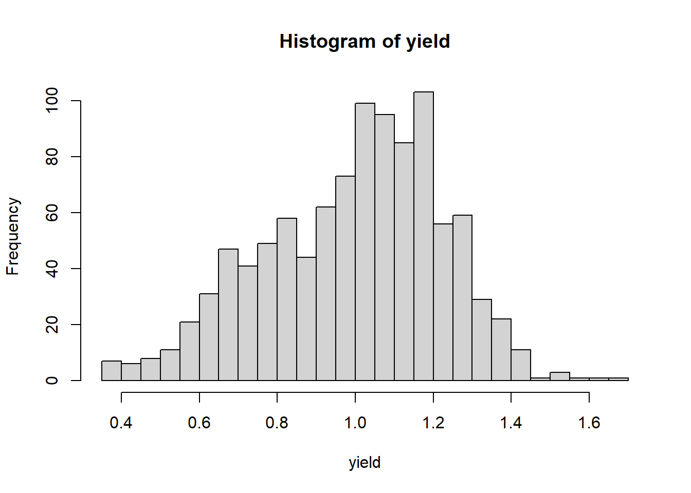
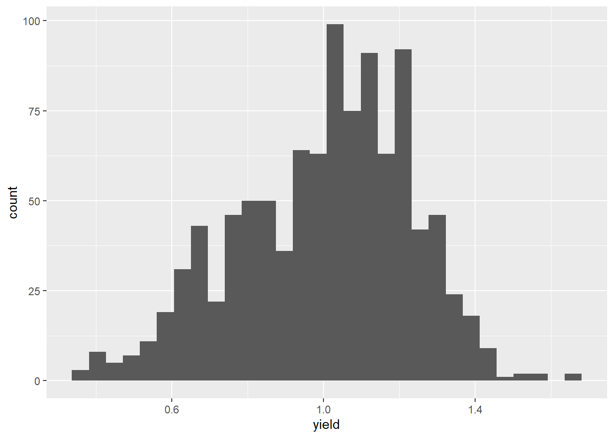
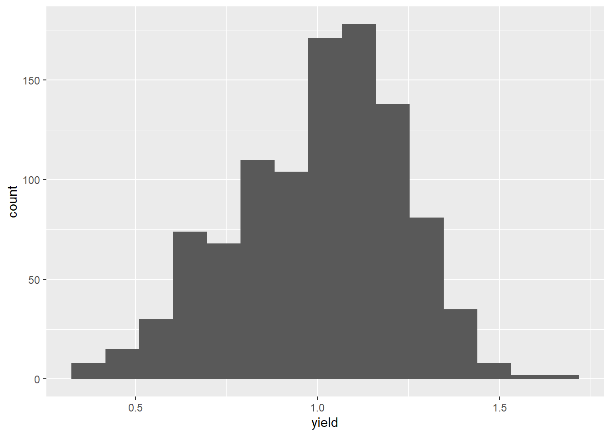
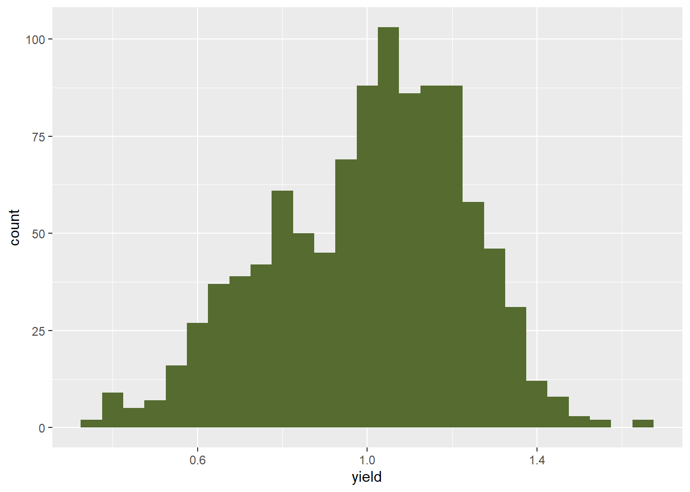

## Exercise: Histograms
One of the most critical -- and I will admit, often overlooked at first by me in my rush to look at treatment differences -- steps in data science is to inspect the data for the shape of its distribution and extreme values.  There are a multiple ways to do this.  This week, we will focus on the histogram.

### Case Study
The first example we will use is a cotton uniformity trial conducted in Greece in 1938.  Yes, I realize it is a bit dated, but the concept is one we deal with every day in agricultural research -- how consistent are our plots.  In other words, what is the variance among plots?

In a uniformity trial, a series of plots are managed identically so that the distribution of their yields can be measured.  These data can be used to determine whether that field is a good site for a research trial.

Our first step is to load the data, which is in a .csv file.


```r
cotton = read.csv("data-unit-1/exercise_data/cotton_uniformity.csv")
```

### Basic Histogram
Drawing a simple histogram in R requires two steps.  First, we need to define the column in which we are interested.  Then we create the histogram.  Since we are using a data frame, we need to tell R which column to plot.  We will, unimaginedly, call this column "yield".  With our second line of code we will create the histogram.  In the third line, we tell R to plot the histogram


```r
yield = cotton$yield
histogram = hist(yield)
```


```r
plot(histogram)
```


And, voila, we have a plot of our histogram.  Each bar represents a range in values, or a "bin".  We can see the upper and lower yield limits of each bins using the "histogram$breaks" command.


```r
histogram$breaks
```

```
##  [1] 0.3 0.4 0.5 0.6 0.7 0.8 0.9 1.0 1.1 1.2 1.3 1.4 1.5 1.6 1.7
```

Alternatively, we could see the midpoints, or yield values that define the middle of each bin, using the "histogram$mids" command.

```r
histogram$mids
```

```
##  [1] 0.35 0.45 0.55 0.65 0.75 0.85 0.95 1.05 1.15 1.25 1.35 1.45 1.55 1.65
```

As we saw in the lesson, varying the number of columns can affect how we see patterns in the data.  In the plot above, we have 14 bars.  Each bar represents a bin width of 0.1.  What if we tell R to use 28 bins to draw the histogram?  We can do that by telling R to use about 28 breaks (divisions between bins).


```r
histogram = hist(yield, breaks = 28)
```



Note that we ended up with 27, not 28 bins, but that each now has a bin width that is 0.05 kg.  We can verify this by again inspecting the data with "histogram$breaks".


```r
histogram$breaks
```

```
##  [1] 0.35 0.40 0.45 0.50 0.55 0.60 0.65 0.70 0.75 0.80 0.85 0.90 0.95 1.00 1.05
## [16] 1.10 1.15 1.20 1.25 1.30 1.35 1.40 1.45 1.50 1.55 1.60 1.65 1.70
```


### Histograms with ggplot
"ggplot2" is a very powerful and population package in R for creating plots.  I spend A LOT of time using ggplot2, essentially any time I am creating plots.  With ggplot, if you can imagine it, you almost certainly can draw it.  There are entire books written on ggplot; rather than focus on it, I will try to weave tidbits throughout this course.

Since ggplot is a package, we need to install and load it before we can use it.  Note: if you are running R on your desktop, you only need to install a package the very first time you use it.  Afterwards, you only need to run library() to load it into the local memory when you need it.

The first line of code calls ggplot().  We use "data=cotton" to tell R we are drawing data from the "cotton" data frame.  

We then need to specify an "aesthetic".  An aesthetic is any property of the plot that relates to a variable, that is, a column in our data frame.  In this case, we use aes(x=yield) to tell R that our aesthetic is positioned horizontally according to the value of yield.

In the second line, we use geom_histogram to tell R we are drawing a histogram.  Knowing this, R will automatically assign bins and count the number of observations in each bin.

```r
# install.packages("ggplot2")
library(ggplot2)

ggplot(data=cotton, aes(x=yield)) +
  geom_histogram()
```

```
## `stat_bin()` using `bins = 30`. Pick better value with `binwidth`.
```



By default, R chooses to create 30 bins.  We can easily specify a different number of bins using the "bins=" argument.


```r
ggplot(data=cotton, aes(x=yield)) +
  geom_histogram(bins=15)
```



Alternatively, we can set a particular binwidth using the "binwidth =" argument.


```r
ggplot(data=cotton, aes(x=yield)) +
  geom_histogram(binwidth=0.05)
```


If we want to make our plot a little less bland, we can tell ggplot to use a different color to fill the bars using the "fill = " argument


```r
ggplot(data=cotton, aes(x=yield)) +
  geom_histogram(binwidth=0.05, fill="darkolivegreen")
```



Finally, we can outline the bars using the "color = " argument.

```r
ggplot(data=cotton, aes(x=yield)) +
  geom_histogram(binwidth=0.05, fill="darkolivegreen", color="black")
```


We will introduce more ways to fine tune our plots as the course goes on.

### Practice
In the data folder there are three practice files: barley_uniformity.csv, peanut_uniformity.csv, and tomato_uniformity.csv.  Practice creating histograms using both the basic and ggplot methods.  To start you off, here is the command to load the barley file.


```r
barley = read.csv("data-unit-1/exercise_data/barley_uniformity.csv")
```


