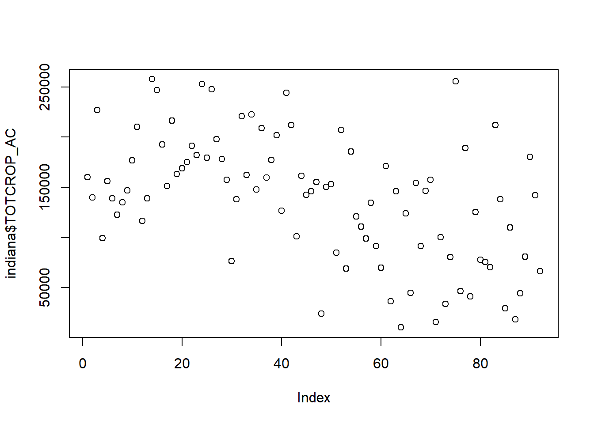
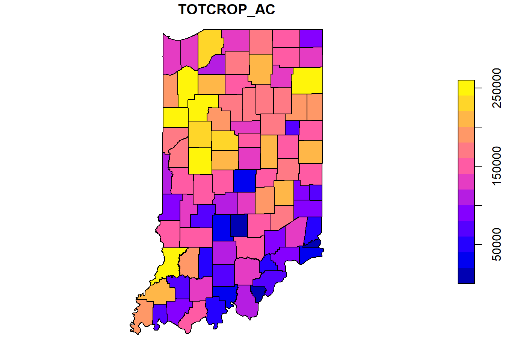
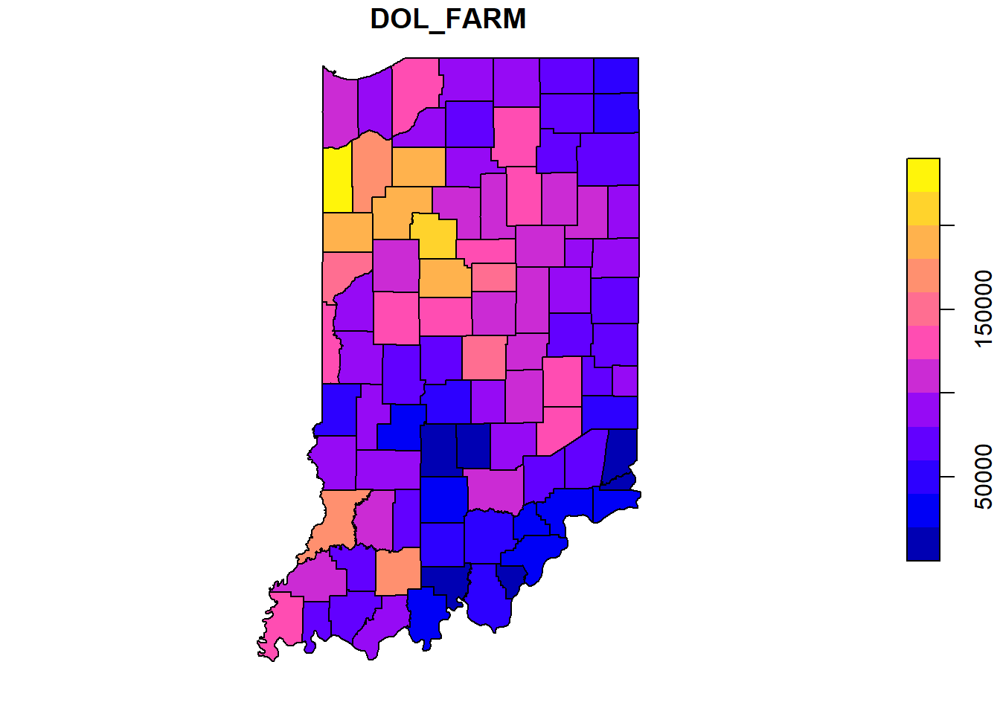
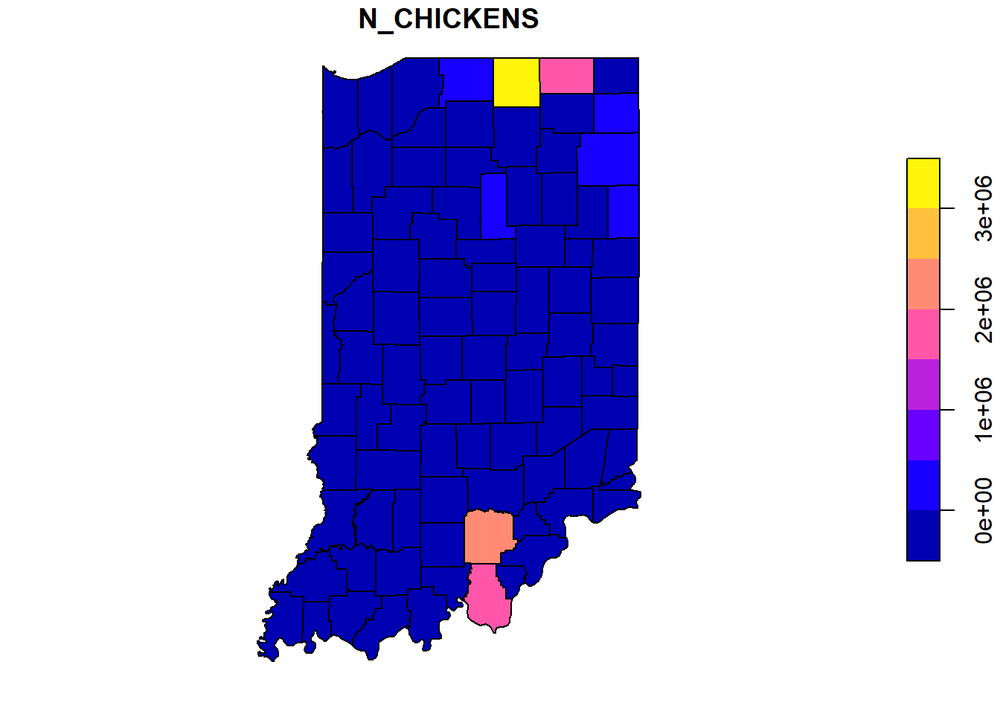

## Exercise: Introduction to Shapefiles
One of my more recent areas of growth as a data scientist has been learning to work with spatial data.  If you have worked with yield monitor data, used ArcGIS, or used an application map to variable-rate your fertilizer, you have worked with spatial data.  Although we won't return to spatial data until later in the course, here is a brief introduction to inporting and inspecting spatial data.

### R Packages
R programming consists of base software plus an ever increasing number of plug-ins called "packages".  These packages provide additional functions (programs) in R that cover everything from agricultural plot design, interactive maps, and advanced plotting techniques, to app development, access to census data, and even modules to teach statistics and generate quizes.

If R tells us that a package is not installed, we can install it using the "install.packages('') command", where the package name is included between the quotes.  This code is shown below, but it is preceded by a hashtag, so that line of code will not be executed by R.  The hashtag can be used to "comment" code or coding notes/explanations to that they can remain inline with the code we want to run, but not be run themselves.


```r
# install.packages('sf', repos='http://cran.us.r-project.org')
library(sf)
```

```
## Warning: package 'sf' was built under R version 4.0.5
```

```
## Linking to GEOS 3.9.0, GDAL 3.2.1, PROJ 7.2.1
```


### Reading Shapefiles
To read in a shapefile, we use the "st_read" command.  Reading in a shapefile is identical to how we read in a .csv file in the previous exercise.  We simply follow st_read with the path to the shapefile, which has a .shp suffix.  We will read in a shapefile from Indiana that includes county summaries for a couple of dozen agricultural statistics.


```r
indiana = st_read("data-unit-1/exercise_data/Agriculture_Census-shp/Agriculture_Census.shp")
```

```
## Reading layer `Agriculture_Census' from data source `C:\Users\559069\OneDrive - Land O'Lakes, Inc\Documents\data-science-for-agricultural-professionals_3\data-unit-1\exercise_data\Agriculture_Census-shp\Agriculture_Census.shp' using driver `ESRI Shapefile'
## Simple feature collection with 92 features and 31 fields
## Geometry type: POLYGON
## Dimension:     XY
## Bounding box:  xmin: -88.08975 ymin: 37.77306 xmax: -84.78768 ymax: 41.76233
## Geodetic CRS:  WGS 84
```

### Examining Spatial Feature Data Frames
Let's inspect the first six rows of the spatial feature data frame using the "head()" command, where the name of the data frame is given between the parentheses.


```r
head(indiana)
```

```
## Simple feature collection with 6 features and 31 fields
## Geometry type: POLYGON
## Dimension:     XY
## Bounding box:  xmin: -87.52704 ymin: 41.16195 xmax: -84.80631 ymax: 41.76233
## Geodetic CRS:  WGS 84
##   OBJECTID AGCENSP020              COUNTY N_FARM TOTCROP_AC HAVCROP_AC DOL_FARM
## 1        1       2515      Elkhart County   1335     160160     143324    92912
## 2        2       2516 Saint Joseph County    666     139661     131004    82849
## 3        3       2517     La Porte County    749     226816     212940   127922
## 4        4       2518      Steuben County    581      99218      71944    44133
## 5        5       2519     Lagrange County   1392     156233     127875    74194
## 6        6       2539         Lake County    442     138929     132551   108206
##   NURS_DOL LVSTOK_DOL SALE_2500 SALE_5000 EXPEN_1000 NURSY_1000 N_CHICKENS
## 1    34688      89350       251       100      96862        514    3005354
## 2    40051      15127       144        71      40479        583        852
## 3    68041      27773       136        60      71666        742      -9999
## 4    16776       8865       236        44      20288          0      -9999
## 5    37364      65915       223       105      83668          0    1870836
## 6    42747       5080       101        30      34712         66          0
##   N_CATTLE N_PIGS CORN_AC WHEAT_AC COTTON_AC SOYBEAN_AC VEGTABL_AC ORCHARD_AC
## 1    42719  73951   64955     3861         0      42251       1338          0
## 2     6440  27430   69251     4073         0      45696        480          0
## 3    24980  27110  113242     4186         0      76809       1125          0
## 4     9257   6859   32152     4483         0      25120        304          0
## 5    39275  69338   61262     3993         0      32666       1182          0
## 6     3204   9435   68344     3101         0      55698       1256          0
##   PECAN_AC IRRGTD_AC N_MACHINE FEMALE_OP MINORTY_OP FAM_FARM igs_DBO_Ag
## 1        0     23524       495        32          0     1164          0
## 2        0     12941       444        44          3      584          0
## 3        0     27090       631        44          0      626          0
## 4        0      1225     -9999        42          0      505          0
## 5        0     23478       315        26          0     1232          0
## 6        0      6211       327        42          3      356          0
##   SHAPE_Leng SHAPE_Area                       geometry
## 1   139058.4 1210349270 POLYGON ((-86.06246 41.7619...
## 2   155098.8 1196846667 POLYGON ((-86.22555 41.7614...
## 3   175216.0 1563031845 POLYGON ((-86.82619 41.7608...
## 4   116305.4  835438144 POLYGON ((-85.19779 41.7605...
## 5   128976.5 1000327995 POLYGON ((-85.29134 41.7606...
## 6   167477.6 1300778609 POLYGON ((-87.52401 41.7135...
```

Spatial feature data frames are very similar to the data frames that were introduced to in the last exercise.  There are a few differences, however.  First, every spatial feature data frame consists of rows of observations that are linked, in the geometry column, with a georeference.  That georeference may be a simple point on the map, or it may be a polygon that defines an area, such as a field, a county, or a state.  

Spatial feature data frames also include some metadata about the geometry of the file, including geometry type (POLYGON in this case, since we are working with county outlines) and -- this is critical -- CRS.  CRS stands for "coordinate reference system".  Coordinate reference system refers to the "projection" we use to draw a map, and the georeferences used to define a place or area.  

Maps are flat representations of a round object, and there are different ways to draw these maps.  We need not go into a deep review of those projects at this point; suffice it to know that each projection represents tradeoffs in how accurately it portrays areas in the center and periphery of the map and how much it represents the curvature.  For most of my work, I use the CRS of 4326.  You know this system more commonly as the latitude/longitude system.

The bounding box defines where the map is centered.  Latitude/longitude maps are more accurate in portraying areas near the center of the map than the periphery, so it is important the map be centered on the area of interest.


### Visualizing Data
To visualize the data, we can use the "plot" function from the sf package.  You might assume we could map a column of data the same way we visualized its contents earlier, by indicating the data frame and column name, separated by the dollar sign.  We will try that with TOTCROP_AC, the total number of acres per county in crop production.


```r
plot(indiana$TOTCROP_AC)
```



Instead of a map, however, this shows us the range of values for TOTCROP_AC in the dataset.  To view a map, we need to first subset the data so it only has two columns: the TOTCROP_AC data and geometry columns.  We can then map these data: 


```r
tot_crop = indiana["TOTCROP_AC"]
plot(tot_crop)
```



No one can resist a pretty map.  The technical name for a map like this, where you color-code political shapes like counties, is "chloropleth."  We are seeing plenty of these in 2020, between the pandemic and the election year.  

Back to happier thoughts.  Let's look at the mean farm income per county.  This is indicated by the "DOL_FARM" column.  Again, we first subset the data and then plot it.

```r
farm_income = indiana["DOL_FARM"]
plot(farm_income)
```



Where are the chickens in Indiana?  Let's find out:

```r
chickens = indiana["N_CHICKENS"]
plot(chickens)
```



It would appear the most finger-lickin' good county is Elkart County, in the far north.  Appropriately, there are also a couple of counties near Kentucky!

### Create Your Own Maps
Where are the hogs in Indiana?  Create a map for "N_PIGS".

Where are most of the wheat acres?  Create a map for "WHEAT_AC".

Which counties have greater farm ownership by minorities?  Create a map for "MINORTY_OP" (note the mispelling).


