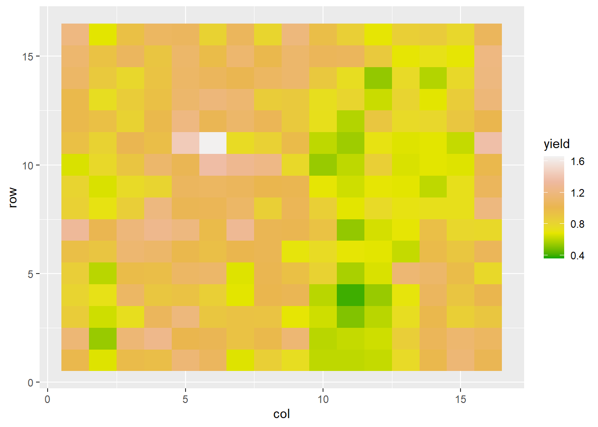

##Exercise: Population Summary Statistics
So far, we have learned two ways to visualize population data.  First, if it is spatial data, we can draw a map that shows where each individual was measured.  Second, with any continuous data (e.g. data that can be measured with a ruler, a balance, a moisture sensor, or a graduated cylinder), we can use a histogram to visualize the relative frequency with which different ranges of values occur in a population.

In this exercise, we are going to learn how to apply summary statistics to the datasets we worked with earlier to quantify aspects of their distributions.

###Case Study
For this example, let's return to the cotton dataset from the previous exercise.  


```r
cotton = read.csv("data-unit-1/exercise_data/cotton_uniformity.csv")
```

The cotton was grown in 1024 plots and sampled for biomass.  We can create a map of sorts for this data with ggplot.


```r
library(ggplot2)

ggplot(cotton, aes(x=col, y=row, fill=yield)) +
  geom_tile() +
  scale_fill_gradientn(colors=terrain.colors(5))
```



### Percentile, Mean, Median, Maximum, and Minimum
We can also use percentiles to help us describe the data even more numerically.  To identify percentiles, the data are numerically ordered (ranked) from lowest to highest.  Each percentile is associated with a number; the percentile is the percentage of all data equal to or less than that number.  We can quicly generate the 0th, 25th, 50th, and 75th, and 100th percentile in R using the summary command.


```r
yield = cotton$yield
summary(yield)
```

```
##    Min. 1st Qu.  Median    Mean 3rd Qu.    Max. 
##  0.3600  0.8375  1.0300  1.0013  1.1700  1.6600
```


This returns six numbers.  The 0th percentile (alternatively referred to as the minimum) is 0.36 -- this is the lowest yield measured in the field.  The 25th percentile (also called the 1st Quartile) is 0.8375.  This means that 25% of all observations were equal to o.8375 or less.  The 50th percentile (also known as the median) was 1.03, meaning half of all observations were equal to 1.03  or less.  75% of observations were less than 1.17, the 75th percentile (or 3rd quartile).  Finally, the 100th percentile (or maximum) recorded for this field was 1.66.

We can also directly calculate the mean, median, max, and min.

```r
mean(yield) # mean yield
```

```
## [1] 1.001309
```

```r
median(yield) # median yield
```

```
## [1] 1.03
```

```r
max(yield) # maximum yield
```

```
## [1] 1.66
```

```r
min(yield) # minimum yield
```

```
## [1] 0.36
```

### Variance and Standard Deviation
It is also simple to calculate variance and standard deviation in R.

```r
var(yield) # variance
```

```
## [1] 0.0523064
```

```r
sd(yield)
```

```
## [1] 0.2287059
```

### Sum of Squares

While it is rare that we summarise a population with the sum of squares, on occasion we may want to calculate it.  R does not have a direct function to calculate the sum of squares, but we can calculate it using the variance and degrees of freedom.

In the lecture portion of this unit, we learned the relation ship between variance and sum of squares was as follows:

$$\sigma^2 = \frac{S_{xx}}{n}$$

Where the left side of the equation (sigma squared) was the variance, Sxx was the sum of squares, and n was the number of individuals in the population.  If we rearrange this equation, we can see that the sum of squares is the product of the variance and n.

$$S_{xx} = \sigma^2 \cdot n$$

We calculated our variance above usinging var().  We can count the number of individuals in the population using the "length()" function.  By multiplying these two statistics together, we can calculate the sum of squares.

```r
variance = var(yield)
N = length(yield)

variance*N
```

```
## [1] 53.56175
```

In the above code, we assigned the population variance to a the variable "variance".  We assigned the population size to the variable N.  Finally, we multiplied these two new variables to calculate the sum of squares.

### Practice
Practice calculating the summary statistics for the barley_uniformity.csv, peanut_uniformity, and tomato uniformity datasets.


