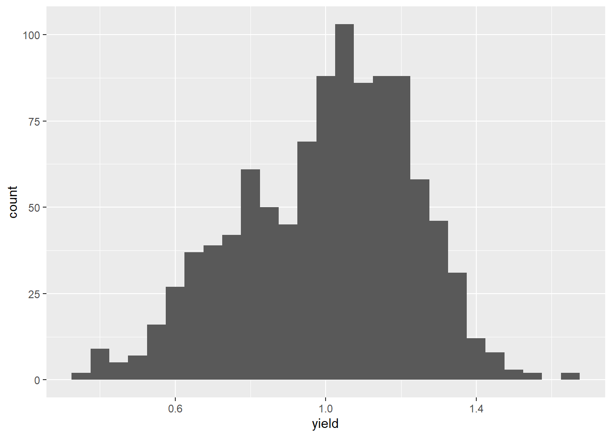
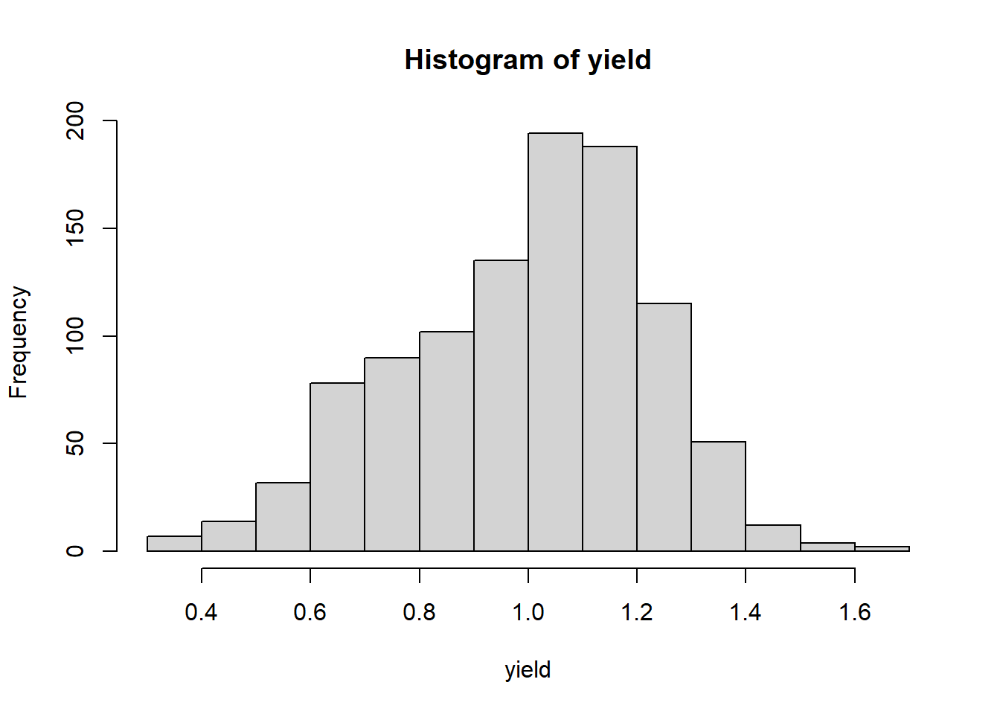

# Population Statistics

## Populations

Almost every statistics text begins with the concept of a
**population**. A population is the complete set of individuals to which
you want to predict values. Let's dwell on this concept, as it is
something that did not hit home for me right away in my career. Again,
the population is all of the individuals for which you are interested in
making a prediction. What do we mean by individuals? Not just people --
individuals can plants, insects, disease, livestock or, indeed, farmers.

Just as important as what individuals are in a population is its extent.
What do you want the individuals to represent? If you are a farmer, do
you want to apply the data from these individuals directly to
themselves, or will you use them to make management decisions for the
entire field, or all the fields in your farm? Will you use the results
this season or to make predictions for future seasons? If you are an
animal nutritionist, will you use rations data to support dairy
Herefords, or beef Angus?

If you are a sales agronomist, will you use the data to support sales on
one farm, a group of farms in one area, or across your entire sales
territory? If you are in Extension, will the individuals you measure be
applicable to your entire county, group of counties, or state? If you
are in industry like me, will your results be applicable to several
states?

This is a very, very critical question, as you design experiments -- or
as you read research conducted by others. To what do or will the results
apply? Obviously, an Iowa farmer should not follow the optimum planting
date determined for a grower in North Carolina, nor should an Ohio
farmer assume our pale clays will be as forgiving as the dark, mellow
loam of southern Minnesota.

Drilling down, you might further consider whether research was conducted
in areas that have similar temperature or rainfall, how different the
soil texture might be to the areas to which you want to apply results.
At the farm level, you might ask how similar the crop rotation, tillage,
or planting methods were to that operation. At the field level, you
might wonder about planting date or the hybrid that was sown.

When you use the results from set of individuals to make predictions
about other individuals, you are making inferences -- you are using
those data to make predictions, whether it be for that same field next
month or next year, or for other locations (areas in a field, fields in
a farm, counties, or states). When we speak of an inference space, then,
that is the total group of individuals to which you will apply your
results. Or, in another word, your population.

In summary, one of the most critical skills you can apply with data
science has no formula and, indeed, little to do with math (at least in
our application). It is to ask yourself, will my experiment represent
the entire population in which I am interested? Indeed, one field trial
likely will not address the entire population in which you are
interested -- it is up to you to determine the population to which you
are comfortable applying those results.

In fact, statistics or data science done without this "domain" knowledge
whether a dataset is useful or experimental results are reasonable can
be disastrous. Just because a model fits one dataset very well or
treatments are significantly different does not mean they should be used
to make decisions. Your competency as an agronomic data scientist
depends on everything you learn in your program of study. Soil science,
crop physiology, and integrated pest management, to name just a few
subjects, are as much a prerequisite as any math course you have taken.

In some cases all of the individuals in a population can be measured --
in such case, we will use the basic statistics described in this unit.
The yield map we will analyze in this unit is a loose example of a case
where we can measure

In most cases, however, it is not physically or financially feasible to
measure all individuals in a population. In that case, subsets of the
population, called samples, are used to estimate the range of
individuals in a population.

## Case Study: Yield Map

For our first case study, we will use a situation where every individual
in our population can be measured: a single soybean field in central
Iowa. In this case, yield data were gathered using a combine monitor. In
case you don't live and breathe field crops like me, combines (the
machines that harvest grain) are usually equipped with a scale that
repeatedly weighs grain as the combine moves across the field. The
moisture of the grain is also recorded. These data are combined with
measures of the combine speed and knowledge of the number of rows
harvested at once to calculate the yield per area of grain, adjusted to
the market standard for grain moisture.

Almost all of you have seen a yield map somewhat like the one below. In
this map, blue circles represent lower yields, while yellow and orange
circles represent higher yields.


We will learn in the Exercises portion of this lesson how to create a
map like this using just a few lines of code.

Each dataset has a structure -- the way data are organized in columns
and rows. To get a sense of the structure of our soybean dataset, we can
examine the first 6 rows of the dataset using R.


```
## 
## Attaching package: 'kableExtra'
```

```
## The following object is masked from 'package:dplyr':
## 
##     group_rows
```

<table>
 <thead>
  <tr>
   <th style="text-align:right;"> DISTANCE </th>
   <th style="text-align:right;"> SWATHWIDTH </th>
   <th style="text-align:right;"> VRYIELDVOL </th>
   <th style="text-align:right;"> Crop </th>
   <th style="text-align:right;"> WetMass </th>
   <th style="text-align:right;"> Moisture </th>
   <th style="text-align:left;"> Time </th>
   <th style="text-align:right;"> Heading </th>
   <th style="text-align:left;"> VARIETY </th>
   <th style="text-align:right;"> Elevation </th>
   <th style="text-align:left;"> IsoTime </th>
   <th style="text-align:right;"> yield_bu </th>
   <th style="text-align:left;"> geometry </th>
  </tr>
 </thead>
<tbody>
  <tr>
   <td style="text-align:right;"> 0.9202733 </td>
   <td style="text-align:right;"> 5 </td>
   <td style="text-align:right;"> 57.38461 </td>
   <td style="text-align:right;"> 174 </td>
   <td style="text-align:right;"> 3443.652 </td>
   <td style="text-align:right;"> 0.00 </td>
   <td style="text-align:left;"> 9/19/2016 4:45:46 PM </td>
   <td style="text-align:right;"> 300.1584 </td>
   <td style="text-align:left;"> 23A42 </td>
   <td style="text-align:right;"> 786.8470 </td>
   <td style="text-align:left;"> 2016-09-19T16:45:46.001Z </td>
   <td style="text-align:right;"> 65.97034 </td>
   <td style="text-align:left;"> POINT (-93.15026 41.66641) </td>
  </tr>
  <tr>
   <td style="text-align:right;"> 2.6919269 </td>
   <td style="text-align:right;"> 5 </td>
   <td style="text-align:right;"> 55.88097 </td>
   <td style="text-align:right;"> 174 </td>
   <td style="text-align:right;"> 3353.411 </td>
   <td style="text-align:right;"> 0.00 </td>
   <td style="text-align:left;"> 9/19/2016 4:45:48 PM </td>
   <td style="text-align:right;"> 303.6084 </td>
   <td style="text-align:left;"> 23A42 </td>
   <td style="text-align:right;"> 786.6140 </td>
   <td style="text-align:left;"> 2016-09-19T16:45:48.004Z </td>
   <td style="text-align:right;"> 64.24158 </td>
   <td style="text-align:left;"> POINT (-93.15028 41.66641) </td>
  </tr>
  <tr>
   <td style="text-align:right;"> 2.6263101 </td>
   <td style="text-align:right;"> 5 </td>
   <td style="text-align:right;"> 80.83788 </td>
   <td style="text-align:right;"> 174 </td>
   <td style="text-align:right;"> 4851.075 </td>
   <td style="text-align:right;"> 0.00 </td>
   <td style="text-align:left;"> 9/19/2016 4:45:49 PM </td>
   <td style="text-align:right;"> 304.3084 </td>
   <td style="text-align:left;"> 23A42 </td>
   <td style="text-align:right;"> 786.1416 </td>
   <td style="text-align:left;"> 2016-09-19T16:45:49.007Z </td>
   <td style="text-align:right;"> 92.93246 </td>
   <td style="text-align:left;"> POINT (-93.15028 41.66642) </td>
  </tr>
  <tr>
   <td style="text-align:right;"> 2.7575437 </td>
   <td style="text-align:right;"> 5 </td>
   <td style="text-align:right;"> 71.76773 </td>
   <td style="text-align:right;"> 174 </td>
   <td style="text-align:right;"> 4306.777 </td>
   <td style="text-align:right;"> 6.22 </td>
   <td style="text-align:left;"> 9/19/2016 4:45:51 PM </td>
   <td style="text-align:right;"> 306.2084 </td>
   <td style="text-align:left;"> 23A42 </td>
   <td style="text-align:right;"> 785.7381 </td>
   <td style="text-align:left;"> 2016-09-19T16:45:51.002Z </td>
   <td style="text-align:right;"> 77.37348 </td>
   <td style="text-align:left;"> POINT (-93.1503 41.66642) </td>
  </tr>
  <tr>
   <td style="text-align:right;"> 2.3966513 </td>
   <td style="text-align:right;"> 5 </td>
   <td style="text-align:right;"> 91.03274 </td>
   <td style="text-align:right;"> 174 </td>
   <td style="text-align:right;"> 5462.851 </td>
   <td style="text-align:right;"> 12.22 </td>
   <td style="text-align:left;"> 9/19/2016 4:45:54 PM </td>
   <td style="text-align:right;"> 309.2284 </td>
   <td style="text-align:left;"> 23A42 </td>
   <td style="text-align:right;"> 785.5937 </td>
   <td style="text-align:left;"> 2016-09-19T16:45:54.002Z </td>
   <td style="text-align:right;"> 91.86380 </td>
   <td style="text-align:left;"> POINT (-93.15032 41.66644) </td>
  </tr>
  <tr>
   <td style="text-align:right;"> 3.1840529 </td>
   <td style="text-align:right;"> 5 </td>
   <td style="text-align:right;"> 65.59037 </td>
   <td style="text-align:right;"> 174 </td>
   <td style="text-align:right;"> 3951.056 </td>
   <td style="text-align:right;"> 13.33 </td>
   <td style="text-align:left;"> 9/19/2016 4:45:55 PM </td>
   <td style="text-align:right;"> 309.7584 </td>
   <td style="text-align:left;"> 23A42 </td>
   <td style="text-align:right;"> 785.7512 </td>
   <td style="text-align:left;"> 2016-09-19T16:45:55.005Z </td>
   <td style="text-align:right;"> 65.60115 </td>
   <td style="text-align:left;"> POINT (-93.15033 41.66644) </td>
  </tr>
</tbody>
</table>

Each row in the above dataset is a **case**, sometimes called an
**instance**. It is an single observation taken within a soybean field.
That case may contain one or more **variables**: specific measurements
or observations recorded for each case. In the dataset above, variables
include *DISTANCE*, *SWATHWIDTH*, *VRYIELDVOL*, *Crop*, *WetMass*, and
many others.

The two most important to us in this lesson are *yield_bu* and
*geometry*. That this dataset has a column named geometry indicates it
is a special kind of dataset called a **shape file** -- a dataset in
which the measures are geo-referenced. That is, we know where on Earth
these measurements were taken. The geometry column in this case
identifies a point with each observation.

## Distributions

At this point, we have two options any time we want to know about
soybean yield in this field. We can pull out this map or the complete
dataset (which has over 6,500 observations) and look at try to
intuitively understand the data. Or we can use statistics which, in a
sense, provide us a formula for approximating the values in our dataset
with just a few numbers.

A **distribution** describes the range of values that occur within a
given variable. What is the range of values in our measured values? In
this example, what are the highest and lowest yields we observed? What
ranges of values occur more frequently? Many times, we want to see
whether the distribution of one

### Histograms

Before we get into the math required to generate these statistics,
however, we should look at the shape of our data. What is the range of
values in our measured values? In this example, what are the highest and
lowest yields we observed? What ranges of values occur more frequently?
Do the observed values make general sense?

One of the easiest and most informative things for us to do is to create
a particular bar chart known as a **histogram**.


In the histogram above, each bar represents range of values. This range
is often referred to as a *bin*. The lowest bin includes values from 50
to 59.0000. The next bin includes values from 60 to 69.9999. And so on.
The height of each bar represents the **frequency** within each range:
the number of individuals in that population that have values within
that range.

Each bin can also be defined by its **midpoint**. The midpoint is the
middle value in each range. For the bin that includes values from 50 to
50.9999, the midpoint is 55. For the bin that includes values from 60 to
60.9999, the midpoint is 65.

In the plot above, the midpoint for each bar is indicated by the orange
bar beneath it.


There are many ways in which we can draw a histogram -- and other
visualizations -- in R. We will learn more in this course about an R
package called `ggplot2`, which can create just about any plot you might
imagine. Here is a simple taste:


```r
ggplot(data=yield, aes(x=yield_bu)) +
  geom_histogram(breaks=seq(50, 110, 10), fill="tomato", color="black")
```


Varying the *bin width* provides us with different perspectives on our
distribution. Wide bins, which each include a greater range of values,
will provide more gross representations of the data, while narrower bins
will provide greater detail. When bins are too narrow, however, there
may be gaps in our histogram where no values occur within particular
bins.

Throughout this course, I have created interactive exercises to help you
better visualize statistical concepts. Often, they will allow you to
observe how changing the variables or the number of observations can
affect a statistical test or visualization.

These exercises are located outside of this textbook. To access them,
please follow links like that below. The exercises may take several
seconds to launch and run in your browser. I apologize for their
slowness -- this is the best platform I have found to date.

Please click on the link below to open an application where you can vary
the bin width and see how it changes your perspective:

<https://marin-harbur.shinyapps.io/01-app-histogram/>

### Percentiles

We can also use **percentiles** to describe the values of a variable
more numerically. Percentiles describe how values the proportional
spread of values, from lowest to highest, within a distribution. To
identify percentiles, the data are numerically ordered (ranked) from
lowest to highest. Each percentile is associated with a number; the
percentile is the percentage of all data equal to or less than that
number. We can quickly generate the 0th, 25th, 50th, and 75th, and 100th
percentile in R:


```r
summary(yield$yield_bu)
```

```
##    Min. 1st Qu.  Median    Mean 3rd Qu.    Max. 
##   55.12   74.96   80.62   80.09   85.44  104.95
```

This returns six numbers. The 0th percentile (alternatively referred to
as the minimum) is 55.12 -- this is the lowest yield measured in the
field. The 25th percentile (also called the 1st Quartile) is 74.96. This
means that 25% of all observations were equal to 74.96 bushels or less.
The 50th percentile (also known as the median) was 80.62, meaning half
of all observations were equal to 80.62 bushels or less. 75% of
observations were less than 85.44, the 75th percentile (or 3rd
quartile). Finally, the 100th percentile (or maximum yield) recorded for
this field was 104.95.

We are now gaining a better sense of the range of observations that were
most common. But we can describe this distribution with even fewer
numbers.

### Normal Distribution Model

Let's overlay a curve, representing the **normal distribution**, on our
histogram. You have probably seen or heard of this curve before. Often
it is called a *bell curve*; in school, it is the *Curve* that many
students count on to bring up their grades. We will learn more about
this distribution in *Lesson 2*.


In a perfect scenario, our curve would pass through the midpoint of each
bar. This rarely happens with real-world data, and especially in
agriculture. The data may be slightly **skewed**, meaning there are more
individuals that measure above the mean than below, or vice versa.

In this example, our data do not appear skewed. Our curve seems a little
too short and wide to exactly fit the data. This is a condition called
**kurtosis**. No, kurtosis doesn't mean that our data stink; they are
just more spread out or compressed than in a "perfect" situation.

No problem. We can -- and should -- conclude it is appropriate to fit
these data with a normal distribution. If we had even more data, the
curve would likely fit them even better.

Many populations can be handily summarized with the normal distribution
curve, but we need to know a couple of statistics about the data. First,
we need to know where the center of the curve should be. Second, we need
to know the width or dispersion of the curve.

### Measures of Center

To mathamatically describe our distribution, we first need a **measure
of center**. The two most common measures of center are the arithmetic
mean and median. The **mean** is the sum of all observations divided by
the number of observations.

$$\displaystyle \mu = \frac{\sum x_i}{n}$$ The $\mu$ symbol (a u with a
tail) signifies the true mean of a population. The $\sum$ symbol (the
character next to $x_i$ which looks like the angry insect alien from *A
Quiet Place*) means "sum". Thus, anytime you see the $\sum$ symbol, we
are summing the variable(s) to its right. $x_i$ is the value $x$ of the
ith individual in the population. Finally, n is the number of
individuals in the population.

For example, if we have a set of number from 1:5, their mean can be
calculated as:

$$
\frac{1+2+3+4+5}{5} = 3
$$ The mean yield for our field is about 80.09 bushels per acre. This
isrepresented by the red line in the histogram below.


Earlier, you were introduced to the median. As discussed, the **median**
is a number such that half of the individuals in the population are
greater and half are less. If we have an odd number of individuals, the
median is the "middle" number as the individuals are ranked from
greatest to least.

$$ \{1,2,3,4,5\} \\ median = 3 $$

If we have an even number of measures, the median is the average of the
middle two individuals in the ranking:

$$\{1,2,3,4,5,6\} \\ median = 3.5 $$

Let's add a blue line to our histogram to represent the median.


As you can see, they are practically identical. When the mean and median
are similar, the number of individuals measuring greater and less than
the mean are roughly equivalent. In this case, our data can be
represented using the normal distribution.

We also need a statistic that tells us how wide to draw the curve. That
statistic is called a measure of dispersion, and we will learn about it
next.

### Measures of Dispersion

To describe the spread of a population, we use one of three related
**measures of disperson**: sum of squares, variance, and standard
deviation. Although there is a little math involved in these three
statistics, please make yourself comfortable with their concepts because
they are *very* important in this course. Almost every statistical test
we will learn during this course is rooted in these measures of
population width.

#### Sum of Squares

The first measure of population width is the **sum of squares**. This is
the sum of the squared differences between each observation and the
mean. The sum of squares of a measurement x is:

$$\displaystyle S_{xx} = (x_i - \mu)^2$$

Where again $x_i$ is the value $x$ of the $ith$ individual in the
population and $\mu$ is the true mean of a population.

Why do we square the differences between the observations and means?
Simply, if we were to add the unsquared differences they would add to
exactly zero. Let's prove this to ourselves. Let's again use the set of
numbers (1, 2, 3, 4, 5). We can measure the distance of each individual
from the mean by subtracting the mean from it. This difference is called
the residual.


```r
sample_data = data.frame(individuals = c(1,2,3,4,5))

library(janitor)
```

```
## 
## Attaching package: 'janitor'
```

```
## The following objects are masked from 'package:stats':
## 
##     chisq.test, fisher.test
```

```r
first_resid_table = sample_data %>%
  mutate(mean = 3) %>%
  mutate(residual = individuals - mean) %>%
  mutate(mean = as.character(mean)) 

first_resid_totals = data.frame(individuals = "Total",
                                mean = "",
                                residual = sum(first_resid_table$residual))

first_resid_table %>%
  rbind(first_resid_totals) %>%
  kbl()
```

<table>
 <thead>
  <tr>
   <th style="text-align:left;"> individuals </th>
   <th style="text-align:left;"> mean </th>
   <th style="text-align:right;"> residual </th>
  </tr>
 </thead>
<tbody>
  <tr>
   <td style="text-align:left;"> 1 </td>
   <td style="text-align:left;"> 3 </td>
   <td style="text-align:right;"> -2 </td>
  </tr>
  <tr>
   <td style="text-align:left;"> 2 </td>
   <td style="text-align:left;"> 3 </td>
   <td style="text-align:right;"> -1 </td>
  </tr>
  <tr>
   <td style="text-align:left;"> 3 </td>
   <td style="text-align:left;"> 3 </td>
   <td style="text-align:right;"> 0 </td>
  </tr>
  <tr>
   <td style="text-align:left;"> 4 </td>
   <td style="text-align:left;"> 3 </td>
   <td style="text-align:right;"> 1 </td>
  </tr>
  <tr>
   <td style="text-align:left;"> 5 </td>
   <td style="text-align:left;"> 3 </td>
   <td style="text-align:right;"> 2 </td>
  </tr>
  <tr>
   <td style="text-align:left;"> Total </td>
   <td style="text-align:left;">  </td>
   <td style="text-align:right;"> 0 </td>
  </tr>
</tbody>
</table>

The first column of the above dataset contains the individual
observations. The second column contains the population mean, repeated
for each observation. The third column is the residuals, which are
calculated by subtracting each observed value from the population mean.

And if we sum these residuals we get zero.

$$ (-2) + (-1) + (0) + (+1) + (+2) = 0 $$

Let's now do this with our field data. The number of residuals (almost
6800) is too many to visualize at once, so we will pick 20 at random.


```r
set.seed(080921)
yield_sample = data.frame(yield = sample(yield$yield_bu, 10))

second_resid_table = yield_sample %>%
  mutate(yield = round(yield,2),
         mean = round(mean(yield),2),
         residual = yield-mean) 

second_resid_totals = data.frame(yield = "Total",
                                mean = "",
                                residual = sum(second_resid_table$residual))

second_resid_table %>%
  rbind(second_resid_totals) %>%
  kbl()
```

<table>
 <thead>
  <tr>
   <th style="text-align:left;"> yield </th>
   <th style="text-align:left;"> mean </th>
   <th style="text-align:right;"> residual </th>
  </tr>
 </thead>
<tbody>
  <tr>
   <td style="text-align:left;"> 83.61 </td>
   <td style="text-align:left;"> 76.52 </td>
   <td style="text-align:right;"> 7.09 </td>
  </tr>
  <tr>
   <td style="text-align:left;"> 86.82 </td>
   <td style="text-align:left;"> 76.52 </td>
   <td style="text-align:right;"> 10.30 </td>
  </tr>
  <tr>
   <td style="text-align:left;"> 68.39 </td>
   <td style="text-align:left;"> 76.52 </td>
   <td style="text-align:right;"> -8.13 </td>
  </tr>
  <tr>
   <td style="text-align:left;"> 81.91 </td>
   <td style="text-align:left;"> 76.52 </td>
   <td style="text-align:right;"> 5.39 </td>
  </tr>
  <tr>
   <td style="text-align:left;"> 80.75 </td>
   <td style="text-align:left;"> 76.52 </td>
   <td style="text-align:right;"> 4.23 </td>
  </tr>
  <tr>
   <td style="text-align:left;"> 57.06 </td>
   <td style="text-align:left;"> 76.52 </td>
   <td style="text-align:right;"> -19.46 </td>
  </tr>
  <tr>
   <td style="text-align:left;"> 62.58 </td>
   <td style="text-align:left;"> 76.52 </td>
   <td style="text-align:right;"> -13.94 </td>
  </tr>
  <tr>
   <td style="text-align:left;"> 86.6 </td>
   <td style="text-align:left;"> 76.52 </td>
   <td style="text-align:right;"> 10.08 </td>
  </tr>
  <tr>
   <td style="text-align:left;"> 80.05 </td>
   <td style="text-align:left;"> 76.52 </td>
   <td style="text-align:right;"> 3.53 </td>
  </tr>
  <tr>
   <td style="text-align:left;"> 77.42 </td>
   <td style="text-align:left;"> 76.52 </td>
   <td style="text-align:right;"> 0.90 </td>
  </tr>
  <tr>
   <td style="text-align:left;"> Total </td>
   <td style="text-align:left;">  </td>
   <td style="text-align:right;"> -0.01 </td>
  </tr>
</tbody>
</table>

If we sum up all the yield residuals, we get -0.04. Not exactly zero,
but close. The difference from zero is the result of rounding errors
during the calculation.

The sum of squares is calculated by squaring each residual and then
summing the residuals. For our example using the set (1, 2, 3, 4, 5):


```r
first_squares_table = first_resid_table %>%
  mutate(square = residual^2)

first_squares_totals = data.frame(individuals = "Total",
                                mean = "",
                                residual = "",
                                square = sum(first_squares_table$square))
first_squares_table %>%
  rbind(first_squares_totals) %>%
  kbl()
```

<table>
 <thead>
  <tr>
   <th style="text-align:left;"> individuals </th>
   <th style="text-align:left;"> mean </th>
   <th style="text-align:left;"> residual </th>
   <th style="text-align:right;"> square </th>
  </tr>
 </thead>
<tbody>
  <tr>
   <td style="text-align:left;"> 1 </td>
   <td style="text-align:left;"> 3 </td>
   <td style="text-align:left;"> -2 </td>
   <td style="text-align:right;"> 4 </td>
  </tr>
  <tr>
   <td style="text-align:left;"> 2 </td>
   <td style="text-align:left;"> 3 </td>
   <td style="text-align:left;"> -1 </td>
   <td style="text-align:right;"> 1 </td>
  </tr>
  <tr>
   <td style="text-align:left;"> 3 </td>
   <td style="text-align:left;"> 3 </td>
   <td style="text-align:left;"> 0 </td>
   <td style="text-align:right;"> 0 </td>
  </tr>
  <tr>
   <td style="text-align:left;"> 4 </td>
   <td style="text-align:left;"> 3 </td>
   <td style="text-align:left;"> 1 </td>
   <td style="text-align:right;"> 1 </td>
  </tr>
  <tr>
   <td style="text-align:left;"> 5 </td>
   <td style="text-align:left;"> 3 </td>
   <td style="text-align:left;"> 2 </td>
   <td style="text-align:right;"> 4 </td>
  </tr>
  <tr>
   <td style="text-align:left;"> Total </td>
   <td style="text-align:left;">  </td>
   <td style="text-align:left;">  </td>
   <td style="text-align:right;"> 10 </td>
  </tr>
</tbody>
</table>

And for our yield data:


```r
second_squares_table = second_resid_table %>%
  mutate(square = round(residual^2,2)) %>%
  mutate(residual = round(residual, 2))

second_squares_totals = data.frame(yield = "Total",
                                mean = "",
                                residual = "",
                                square = sum(second_squares_table$square))
second_squares_table %>%
  rbind(second_squares_totals) %>%
  kbl()
```

<table>
 <thead>
  <tr>
   <th style="text-align:left;"> yield </th>
   <th style="text-align:left;"> mean </th>
   <th style="text-align:left;"> residual </th>
   <th style="text-align:right;"> square </th>
  </tr>
 </thead>
<tbody>
  <tr>
   <td style="text-align:left;"> 83.61 </td>
   <td style="text-align:left;"> 76.52 </td>
   <td style="text-align:left;"> 7.09 </td>
   <td style="text-align:right;"> 50.27 </td>
  </tr>
  <tr>
   <td style="text-align:left;"> 86.82 </td>
   <td style="text-align:left;"> 76.52 </td>
   <td style="text-align:left;"> 10.3 </td>
   <td style="text-align:right;"> 106.09 </td>
  </tr>
  <tr>
   <td style="text-align:left;"> 68.39 </td>
   <td style="text-align:left;"> 76.52 </td>
   <td style="text-align:left;"> -8.13 </td>
   <td style="text-align:right;"> 66.10 </td>
  </tr>
  <tr>
   <td style="text-align:left;"> 81.91 </td>
   <td style="text-align:left;"> 76.52 </td>
   <td style="text-align:left;"> 5.39 </td>
   <td style="text-align:right;"> 29.05 </td>
  </tr>
  <tr>
   <td style="text-align:left;"> 80.75 </td>
   <td style="text-align:left;"> 76.52 </td>
   <td style="text-align:left;"> 4.23 </td>
   <td style="text-align:right;"> 17.89 </td>
  </tr>
  <tr>
   <td style="text-align:left;"> 57.06 </td>
   <td style="text-align:left;"> 76.52 </td>
   <td style="text-align:left;"> -19.46 </td>
   <td style="text-align:right;"> 378.69 </td>
  </tr>
  <tr>
   <td style="text-align:left;"> 62.58 </td>
   <td style="text-align:left;"> 76.52 </td>
   <td style="text-align:left;"> -13.94 </td>
   <td style="text-align:right;"> 194.32 </td>
  </tr>
  <tr>
   <td style="text-align:left;"> 86.6 </td>
   <td style="text-align:left;"> 76.52 </td>
   <td style="text-align:left;"> 10.08 </td>
   <td style="text-align:right;"> 101.61 </td>
  </tr>
  <tr>
   <td style="text-align:left;"> 80.05 </td>
   <td style="text-align:left;"> 76.52 </td>
   <td style="text-align:left;"> 3.53 </td>
   <td style="text-align:right;"> 12.46 </td>
  </tr>
  <tr>
   <td style="text-align:left;"> 77.42 </td>
   <td style="text-align:left;"> 76.52 </td>
   <td style="text-align:left;"> 0.9 </td>
   <td style="text-align:right;"> 0.81 </td>
  </tr>
  <tr>
   <td style="text-align:left;"> Total </td>
   <td style="text-align:left;">  </td>
   <td style="text-align:left;">  </td>
   <td style="text-align:right;"> 957.29 </td>
  </tr>
</tbody>
</table>

#### Variance

The sum of squares helps quantify spread: the larger the sum of squares,
the greater the spread of observations around the population mean. There
is one issue with the sum of squares, though: since the sum of square is
derived from the differences between each observation and the mean, it
is also related to the number of individuals overall in our population.
In our example above, the sum of squares was 10.

Now, let's generate a dataset with two 1s, two 2s, two 3s, two 4s, and
two 5s:


```r
first_squares_table = first_resid_table %>%
  mutate(square = residual^2)

double_squares_table = first_squares_table %>%
  rbind(first_squares_table)

double_squares_totals = data.frame(individuals = "Total",
                                mean = "",
                                residual = "",
                                square = sum(double_squares_table$square))

double_squares_table %>%
  rbind(double_squares_totals) %>%
  kbl()
```

<table>
 <thead>
  <tr>
   <th style="text-align:left;"> individuals </th>
   <th style="text-align:left;"> mean </th>
   <th style="text-align:left;"> residual </th>
   <th style="text-align:right;"> square </th>
  </tr>
 </thead>
<tbody>
  <tr>
   <td style="text-align:left;"> 1 </td>
   <td style="text-align:left;"> 3 </td>
   <td style="text-align:left;"> -2 </td>
   <td style="text-align:right;"> 4 </td>
  </tr>
  <tr>
   <td style="text-align:left;"> 2 </td>
   <td style="text-align:left;"> 3 </td>
   <td style="text-align:left;"> -1 </td>
   <td style="text-align:right;"> 1 </td>
  </tr>
  <tr>
   <td style="text-align:left;"> 3 </td>
   <td style="text-align:left;"> 3 </td>
   <td style="text-align:left;"> 0 </td>
   <td style="text-align:right;"> 0 </td>
  </tr>
  <tr>
   <td style="text-align:left;"> 4 </td>
   <td style="text-align:left;"> 3 </td>
   <td style="text-align:left;"> 1 </td>
   <td style="text-align:right;"> 1 </td>
  </tr>
  <tr>
   <td style="text-align:left;"> 5 </td>
   <td style="text-align:left;"> 3 </td>
   <td style="text-align:left;"> 2 </td>
   <td style="text-align:right;"> 4 </td>
  </tr>
  <tr>
   <td style="text-align:left;"> 1 </td>
   <td style="text-align:left;"> 3 </td>
   <td style="text-align:left;"> -2 </td>
   <td style="text-align:right;"> 4 </td>
  </tr>
  <tr>
   <td style="text-align:left;"> 2 </td>
   <td style="text-align:left;"> 3 </td>
   <td style="text-align:left;"> -1 </td>
   <td style="text-align:right;"> 1 </td>
  </tr>
  <tr>
   <td style="text-align:left;"> 3 </td>
   <td style="text-align:left;"> 3 </td>
   <td style="text-align:left;"> 0 </td>
   <td style="text-align:right;"> 0 </td>
  </tr>
  <tr>
   <td style="text-align:left;"> 4 </td>
   <td style="text-align:left;"> 3 </td>
   <td style="text-align:left;"> 1 </td>
   <td style="text-align:right;"> 1 </td>
  </tr>
  <tr>
   <td style="text-align:left;"> 5 </td>
   <td style="text-align:left;"> 3 </td>
   <td style="text-align:left;"> 2 </td>
   <td style="text-align:right;"> 4 </td>
  </tr>
  <tr>
   <td style="text-align:left;"> Total </td>
   <td style="text-align:left;">  </td>
   <td style="text-align:left;">  </td>
   <td style="text-align:right;"> 20 </td>
  </tr>
</tbody>
</table>

You will notice the sum of squares increases to 20. The spread of the
data did not change: we recorded the same five values. The only
difference is that we observed each value twice.

The moral of this story is this: given any distribution, the sum of
squares will always increase with the number of observations. Thus, if
we want to compare the spread of two different populations with
different numbers of individuals, we need to adjust our interpretation
to allow for the number of observations.

We do this by dividing the sum of squares, $S_{xx}$ by the number of
observations, $n$. In essence, we are calculating an "average" of the
sum of squares. This value is the variance, $\sigma^2$.

$$\sigma^2 = \frac{S_{xx}}{n}$$ We can calculate the variance as
follows.

In our first example, the set {1,2,3,4,5} had a sum of squares of 10. in
that case, the variance would be:

$$\frac{10}{5} = 2
$$

In our second example, the set {1,2,3,4,5,1,2,3,4,5} had a sum of
squares of 20. In that example, the variance would be

$$
\frac{20}{10} = 2
$$

As you can see, the variance is not affected by the size of the dataset,
only by the distribution of its values.

Later on in this course, we will calculate the variance a little
differently:

$$\sigma^2 = \frac{S_{xx}}{n-1}$$ *n-1* is referred to as the **degrees
of freedom**. We use degrees of freedom when we work with samples
(subsets) of a population. In this unit, however, we are working with
populations, so we will not worry about those.

#### Standard Deviation

Our challenge in using the variance to describe population spread is
it's units are not intuitive. When we square the measure we also square
the units of measure. For example the variance of our yield is measured
in units of bushels^2^. Wrap your head around that one. Our solution is
to report our final estimate of population spread in the original units
of measure. To do this, we calculate the square root of the variance.
This statistic is called the standard deviation, $\sigma$.

$$\sigma = \sqrt{(\sigma^2)}$$

For the dataset {1,2,3,4,5}, the sum of squares is 10, the variance 2,
and the standard deviation is:

$$\sigma = \sqrt{2} = 1.4 $$

For our yield dataset, the sum of squares is 957.29, and based on 10
observations. Our variance is therefore:

$$\sigma^2 = \frac{957.29}{10} = 9.57 \text{ bushels}^2 \text{ / acre}^2$$

Our sum of squares is :

$$ \sqrt{9.57 \text{ bushels}^2 \text{ / acre}^2} = 3.09 \text{ bushels / acre }$$

That is enough theory for this first week of class. The remainder of
this lesson will focus on introducing you to RStudioCloud.

## Exercise: Introduction to R

In this course, we program with R using a Integrated Development
Environment (IDE) called **RStudio**. If you are taking Agronomy 513 as
part of the Masters of Agronomy distance learning program at Iowa State
University -- as opposed to reading it in GitBook format, then you are
working with this document in RStudio This document you have just opened
is in a format known as an **R Notebook**. This document allows you to
combine code and commentary into a seamless document.

This sentence is an example of **commentary**. Commentary is anything
you would type in a Word document. If you are writing a report in
RStudio, commentary might include the objective of your research, the
data you collected, how you analyzed the data, etc.

Immediately below is what in R Studio is called a chunk. You can create
a chunk anywhere in a document by typing CTRL+ALT+I. Note that a chunk
always begins with three apostrophes, followed by `{r}`, and always ends
with three more apostrophes, on the last line, by themselves . This
tells the notebook that anything between those two markings is R code to
be run.


```markdown
sample_data = c(1,2,3,4,5) # this creates a vector (a single column of data) and names it "sample_data"
calculation = mean(sample_data) # this calculates the mean for the vector and names it "calculation"
calculation # this tells R to print the value of calculation
```

The code chunk above can be run by clicking on the green arrow in its
upper-right corner. R will run and, if there are no errors, display the
output of the code immediately below the chunk. If you click on the
chunk above, it will create the "sample_data" vector, calculate the mean
of that vector and name it "calculation", and print the value of
calculation, which is 3.

There is nothing magical about the names we have selected. They are just
placeholders for the data.

### Your Very First Code

Now you try it: - create a chunk by pressing CTRL_ALT_I - create a
vector named "my sample data" that containes the numbers 6, 7, 8, 9, and
10. - calculate the mean and assign it to a variable named
"my_calculation" - display the results

[delete this line and create your chunk right here]

Were you successful?

### Reading and Working with Data Frames

Of course, you will soon want to work with your own data, and it is
likely to consist of multiple vectors (columns). That is, you have a
table of data. In R, this is commonly referred to as a "data frame".

To read in data frame, use the read.csv command. In the chunk below, we
will use read.csv to read in a .csv file and assign it to a data frame
named "yield".


```r
yield = read.csv("data-unit-1/exercise_data/sample_dataset_1.csv")
```

The text in quotes is the path to the table of interest. "data/" tells R
the file is in a directory named "data" that is in the same folder as
this file. The rest of the text is simply the file name.

We can view this data frame in two ways. We can simply type its name:


```r
yield
```

```
##    observation    yield
## 1            1 227.2262
## 2            2 218.4626
## 3            3 219.8543
## 4            4 209.2137
## 5            5 218.3676
## 6            6 219.5215
## 7            7 224.6843
## 8            8 221.5054
## 9            9 222.6487
## 10          10 226.4952
```

Or we can view it in more of a spreadsheet enviornment by double
clicking on it in the window to the right, or by typing "view(yield)" in
the console window below.

Once the data frame is created, we can use it in any subsequent chunk.
We can look at the data frame as a whole by typing its name. We can use
a particular column by typing the name of the data frame, followed by
"\$" and the name of the column.


```r
single_column = yield$yield
single_column
```

```
##  [1] 227.2262 218.4626 219.8543 209.2137 218.3676 219.5215 224.6843 221.5054
##  [9] 222.6487 226.4952
```

If you pause after typing "\$", R will display a list of the available
columns. Just click on the one in which you are interested.

### Basic Operations on Columns

We can easily perform statistical summaries now that we have defined
"single_column". As above, we can calculate it's mean:


```r
single_column_mean = mean(single_column)
single_column_mean
```

```
## [1] 220.798
```

Or its median:


```r
single_column_median = median(single_column)
single_column_median
```

```
## [1] 220.6798
```

Its maximum value:


```r
single_column_max = max(single_column)
single_column_max
```

```
## [1] 227.2262
```

Or its minimum value:


```r
single_column_min = min(single_column)
single_column_min
```

```
## [1] 209.2137
```

### Knitting Your Results into a Document

When you are done creating your R notebook, you can knit it into a final
document by clicking on the "Preview" button in the menu bar above:


```r
library(knitr)

include_graphics("data-unit-1/exercise_data/images/knitting.png")
```


If you look in the exercise folder, you will find an .html printout of
this notebook. You can email this file to collaborators, publish it to
the internet, or incorporate it into your creative component.

### Practice

Now you try. There are four practice sets, labelled
intro_to_r\_practice_set_1.csv through intro_to_r\_practice_set_4.csv.
Practice reading in the .csv file and calculating summary statistics as
shown above.

## Exercise: Introduction to Shapefiles

One of my more recent areas of growth as a data scientist has been
learning to work with spatial data. If you have worked with yield
monitor data, used ArcGIS, or used an application map to variable-rate
your fertilizer, you have worked with spatial data. Although we won't
return to spatial data until later in the course, here is a brief
introduction to inporting and inspecting spatial data.

### R Packages

R programming consists of base software plus an ever increasing number
of plug-ins called "packages". These packages provide additional
functions (programs) in R that cover everything from agricultural plot
design, interactive maps, and advanced plotting techniques, to app
development, access to census data, and even modules to teach statistics
and generate quizes.

If R tells us that a package is not installed, we can install it using
the "install.packages('') command", where the package name is included
between the quotes. This code is shown below, but it is preceded by a
hashtag, so that line of code will not be executed by R. The hashtag can
be used to "comment" code or coding notes/explanations to that they can
remain inline with the code we want to run, but not be run themselves.


```r
# install.packages('sf', repos='http://cran.us.r-project.org')
library(sf)
```

### Reading Shapefiles

To read in a shapefile, we use the "st_read" command. Reading in a
shapefile is identical to how we read in a .csv file in the previous
exercise. We simply follow st_read with the path to the shapefile, which
has a .shp suffix. We will read in a shapefile from Indiana that
includes county summaries for a couple of dozen agricultural statistics.


```r
indiana = st_read("data-unit-1/exercise_data/Agriculture_Census-shp/Agriculture_Census.shp")
```

```
## Reading layer `Agriculture_Census' from data source `C:\Users\559069\Documents\data-science-for-agricultural-professionals_3\data-unit-1\exercise_data\Agriculture_Census-shp\Agriculture_Census.shp' using driver `ESRI Shapefile'
## Simple feature collection with 92 features and 31 fields
## Geometry type: POLYGON
## Dimension:     XY
## Bounding box:  xmin: -88.08975 ymin: 37.77306 xmax: -84.78768 ymax: 41.76233
## Geodetic CRS:  WGS 84
```

### Examining Spatial Feature Data Frames

Let's inspect the first six rows of the spatial feature data frame using
the "head()" command, where the name of the data frame is given between
the parentheses.


```r
head(indiana)
```

```
## Simple feature collection with 6 features and 31 fields
## Geometry type: POLYGON
## Dimension:     XY
## Bounding box:  xmin: -87.52704 ymin: 41.16195 xmax: -84.80631 ymax: 41.76233
## Geodetic CRS:  WGS 84
##   OBJECTID AGCENSP020              COUNTY N_FARM TOTCROP_AC HAVCROP_AC DOL_FARM
## 1        1       2515      Elkhart County   1335     160160     143324    92912
## 2        2       2516 Saint Joseph County    666     139661     131004    82849
## 3        3       2517     La Porte County    749     226816     212940   127922
## 4        4       2518      Steuben County    581      99218      71944    44133
## 5        5       2519     Lagrange County   1392     156233     127875    74194
## 6        6       2539         Lake County    442     138929     132551   108206
##   NURS_DOL LVSTOK_DOL SALE_2500 SALE_5000 EXPEN_1000 NURSY_1000 N_CHICKENS
## 1    34688      89350       251       100      96862        514    3005354
## 2    40051      15127       144        71      40479        583        852
## 3    68041      27773       136        60      71666        742      -9999
## 4    16776       8865       236        44      20288          0      -9999
## 5    37364      65915       223       105      83668          0    1870836
## 6    42747       5080       101        30      34712         66          0
##   N_CATTLE N_PIGS CORN_AC WHEAT_AC COTTON_AC SOYBEAN_AC VEGTABL_AC ORCHARD_AC
## 1    42719  73951   64955     3861         0      42251       1338          0
## 2     6440  27430   69251     4073         0      45696        480          0
## 3    24980  27110  113242     4186         0      76809       1125          0
## 4     9257   6859   32152     4483         0      25120        304          0
## 5    39275  69338   61262     3993         0      32666       1182          0
## 6     3204   9435   68344     3101         0      55698       1256          0
##   PECAN_AC IRRGTD_AC N_MACHINE FEMALE_OP MINORTY_OP FAM_FARM igs_DBO_Ag
## 1        0     23524       495        32          0     1164          0
## 2        0     12941       444        44          3      584          0
## 3        0     27090       631        44          0      626          0
## 4        0      1225     -9999        42          0      505          0
## 5        0     23478       315        26          0     1232          0
## 6        0      6211       327        42          3      356          0
##   SHAPE_Leng SHAPE_Area                       geometry
## 1   139058.4 1210349270 POLYGON ((-86.06246 41.7619...
## 2   155098.8 1196846667 POLYGON ((-86.22555 41.7614...
## 3   175216.0 1563031845 POLYGON ((-86.82619 41.7608...
## 4   116305.4  835438144 POLYGON ((-85.19779 41.7605...
## 5   128976.5 1000327995 POLYGON ((-85.29134 41.7606...
## 6   167477.6 1300778609 POLYGON ((-87.52401 41.7135...
```

Spatial feature data frames are very similar to the data frames that
were introduced to in the last exercise. There are a few differences,
however. First, every spatial feature data frame consists of rows of
observations that are linked, in the geometry column, with a
georeference. That georeference may be a simple point on the map, or it
may be a polygon that defines an area, such as a field, a county, or a
state.

Spatial feature data frames also include some metadata about the
geometry of the file, including geometry type (POLYGON in this case,
since we are working with county outlines) and -- this is critical --
CRS. CRS stands for "coordinate reference system". Coordinate reference
system refers to the "projection" we use to draw a map, and the
georeferences used to define a place or area.

Maps are flat representations of a round object, and there are different
ways to draw these maps. We need not go into a deep review of those
projects at this point; suffice it to know that each projection
represents tradeoffs in how accurately it portrays areas in the center
and periphery of the map and how much it represents the curvature. For
most of my work, I use the CRS of 4326. You know this system more
commonly as the latitude/longitude system.

The bounding box defines where the map is centered. Latitude/longitude
maps are more accurate in portraying areas near the center of the map
than the periphery, so it is important the map be centered on the area
of interest.

### Visualizing Data

To visualize the data, we can use the "plot" function from the sf
package. You might assume we could map a column of data the same way we
visualized its contents earlier, by indicating the data frame and column
name, separated by the dollar sign. We will try that with TOTCROP_AC,
the total number of acres per county in crop production.


```r
plot(indiana$TOTCROP_AC)
```



Instead of a map, however, this shows us the range of values for
TOTCROP_AC in the dataset. To view a map, we need to first subset the
data so it only has two columns: the TOTCROP_AC data and geometry
columns. We can then map these data:


```r
tot_crop = indiana["TOTCROP_AC"]
plot(tot_crop)
```


No one can resist a pretty map. The technical name for a map like this,
where you color-code political shapes like counties, is "chloropleth."
We are seeing plenty of these in 2020, between the pandemic and the
election year.

Back to happier thoughts. Let's look at the mean farm income per county.
This is indicated by the "DOL_FARM" column. Again, we first subset the
data and then plot it.


```r
farm_income = indiana["DOL_FARM"]
plot(farm_income)
```


Where are the chickens in Indiana? Let's find out:


```r
chickens = indiana["N_CHICKENS"]
plot(chickens)
```


It would appear the most finger-lickin' good county is Elkart County, in
the far north. Appropriately, there are also a couple of counties near
Kentucky!

### Create Your Own Maps

Where are the hogs in Indiana? Create a map for "N_PIGS".

Where are most of the wheat acres? Create a map for "WHEAT_AC".

Which counties have greater farm ownership by minorities? Create a map
for "MINORTY_OP" (note the mispelling).

## Exercise: Histograms

One of the most critical -- and I will admit, often overlooked at first
by me in my rush to look at treatment differences -- steps in data
science is to inspect the data for the shape of its distribution and
extreme values. There are a multiple ways to do this. This week, we will
focus on the histogram.

### Case Study

The first example we will use is a cotton uniformity trial conducted in
Greece in 1938. Yes, I realize it is a bit dated, but the concept is one
we deal with every day in agricultural research -- how consistent are
our plots. In other words, what is the variance among plots?

In a uniformity trial, a series of plots are managed identically so that
the distribution of their yields can be measured. These data can be used
to determine whether that field is a good site for a research trial.

Our first step is to load the data, which is in a .csv file.


```r
cotton = read.csv("data-unit-1/exercise_data/cotton_uniformity.csv")
```

### Basic Histogram

Drawing a simple histogram in R requires two steps. First, we need to
define the column in which we are interested. Then we create the
histogram. Since we are using a data frame, we need to tell R which
column to plot. We will, unimaginedly, call this column "yield". With
our second line of code we will create the histogram. In the third line,
we tell R to plot the histogram


```r
yield = cotton$yield
histogram = hist(yield)
```



```r
plot(histogram)
```


And, voila, we have a plot of our histogram. Each bar represents a range
in values, or a "bin". We can see the upper and lower yield limits of
each bins using the "histogram\$breaks" command.


```r
histogram$breaks
```

```
##  [1] 0.3 0.4 0.5 0.6 0.7 0.8 0.9 1.0 1.1 1.2 1.3 1.4 1.5 1.6 1.7
```

Alternatively, we could see the midpoints, or yield values that define
the middle of each bin, using the "histogram\$mids" command.


```r
histogram$mids
```

```
##  [1] 0.35 0.45 0.55 0.65 0.75 0.85 0.95 1.05 1.15 1.25 1.35 1.45 1.55 1.65
```

As we saw in the lesson, varying the number of columns can affect how we
see patterns in the data. In the plot above, we have 14 bars. Each bar
represents a bin width of 0.1. What if we tell R to use 28 bins to draw
the histogram? We can do that by telling R to use about 28 breaks
(divisions between bins).


```r
histogram = hist(yield, breaks = 28)
```


Note that we ended up with 27, not 28 bins, but that each now has a bin
width that is 0.05 kg. We can verify this by again inspecting the data
with "histogram\$breaks".


```r
histogram$breaks
```

```
##  [1] 0.35 0.40 0.45 0.50 0.55 0.60 0.65 0.70 0.75 0.80 0.85 0.90 0.95 1.00 1.05
## [16] 1.10 1.15 1.20 1.25 1.30 1.35 1.40 1.45 1.50 1.55 1.60 1.65 1.70
```

### Histograms with ggplot

"ggplot2" is a very powerful and population package in R for creating
plots. I spend A LOT of time using ggplot2, essentially any time I am
creating plots. With ggplot, if you can imagine it, you almost certainly
can draw it. There are entire books written on ggplot; rather than focus
on it, I will try to weave tidbits throughout this course.

Since ggplot is a package, we need to install and load it before we can
use it. Note: if you are running R on your desktop, you only need to
install a package the very first time you use it. Afterwards, you only
need to run library() to load it into the local memory when you need it.

The first line of code calls ggplot(). We use "data=cotton" to tell R we
are drawing data from the "cotton" data frame.

We then need to specify an "aesthetic". An aesthetic is any property of
the plot that relates to a variable, that is, a column in our data
frame. In this case, we use aes(x=yield) to tell R that our aesthetic is
positioned horizontally according to the value of yield.

In the second line, we use geom_histogram to tell R we are drawing a
histogram. Knowing this, R will automatically assign bins and count the
number of observations in each bin.


```r
# install.packages("ggplot2")
library(ggplot2)

ggplot(data=cotton, aes(x=yield)) +
  geom_histogram()
```

```
## `stat_bin()` using `bins = 30`. Pick better value with `binwidth`.
```


By default, R chooses to create 30 bins. We can easily specify a
different number of bins using the "bins=" argument.


```r
ggplot(data=cotton, aes(x=yield)) +
  geom_histogram(bins=15)
```


Alternatively, we can set a particular binwidth using the "binwidth ="
argument.


```r
ggplot(data=cotton, aes(x=yield)) +
  geom_histogram(binwidth=0.05)
```


If we want to make our plot a little less bland, we can tell ggplot to
use a different color to fill the bars using the "fill = " argument


```r
ggplot(data=cotton, aes(x=yield)) +
  geom_histogram(binwidth=0.05, fill="darkolivegreen")
```


Finally, we can outline the bars using the "color = " argument.


```r
ggplot(data=cotton, aes(x=yield)) +
  geom_histogram(binwidth=0.05, fill="darkolivegreen", color="black")
```


We will introduce more ways to fine tune our plots as the course goes
on.

### Practice

In the data folder there are three practice files:
barley_uniformity.csv, peanut_uniformity.csv, and tomato_uniformity.csv.
Practice creating histograms using both the basic and ggplot methods. To
start you off, here is the command to load the barley file.


```r
barley = read.csv("data-unit-1/exercise_data/barley_uniformity.csv")
```
