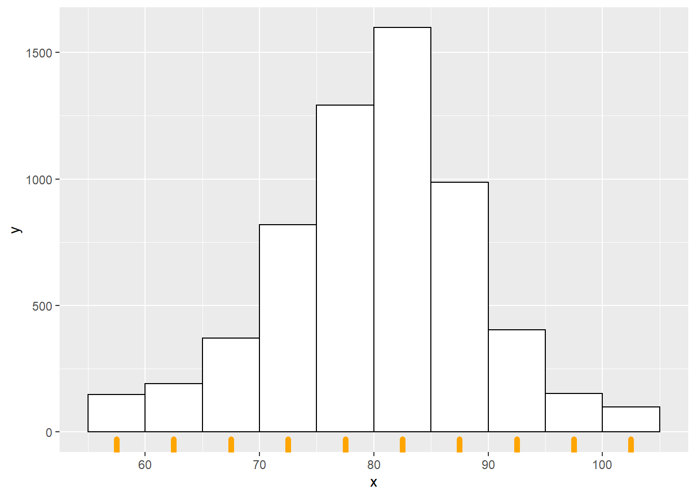
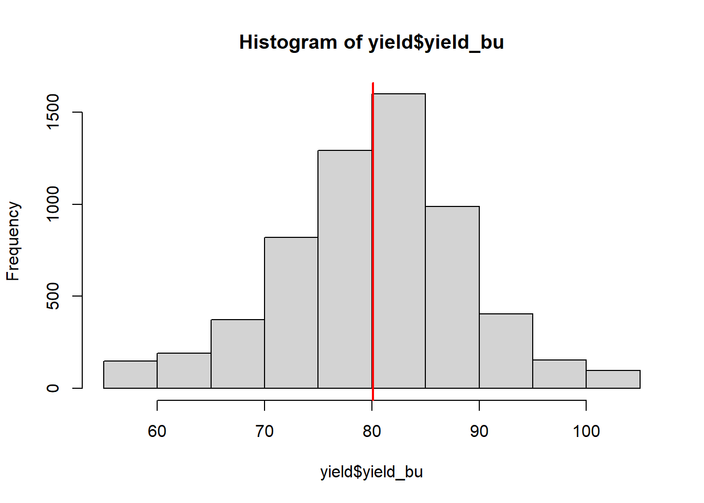
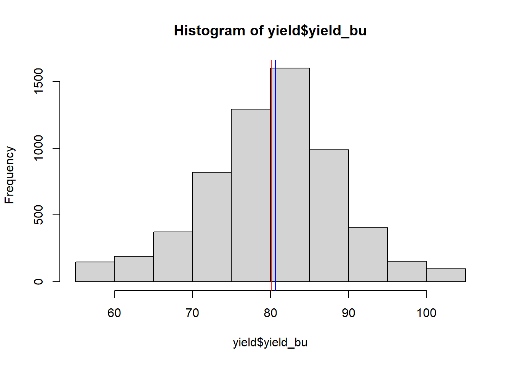
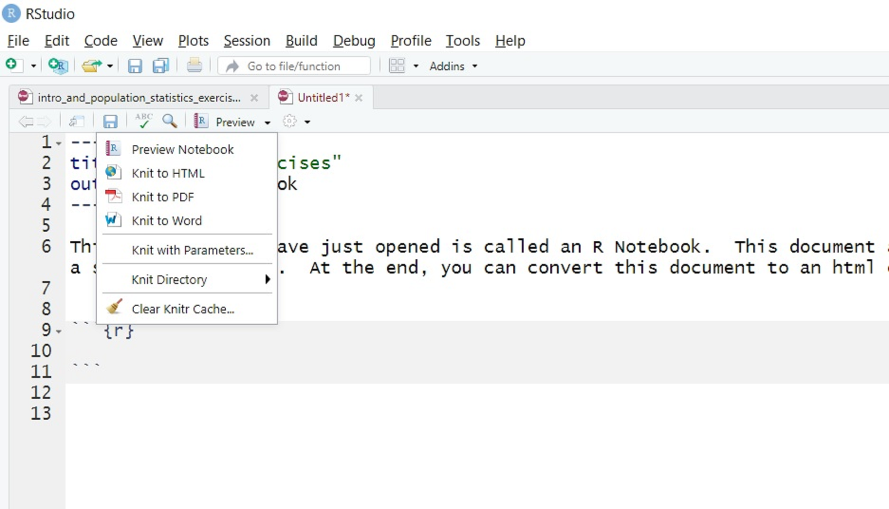
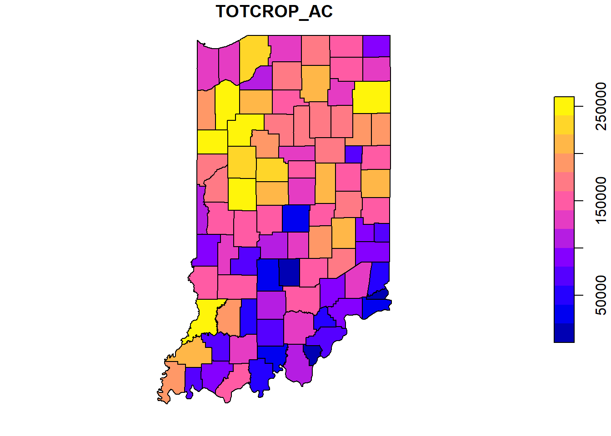
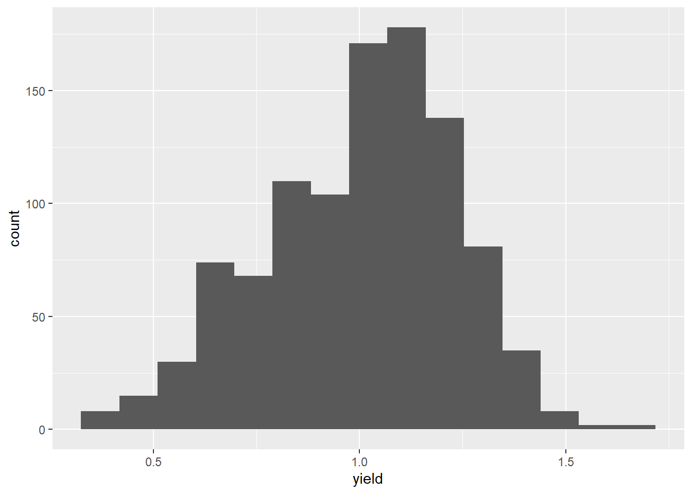
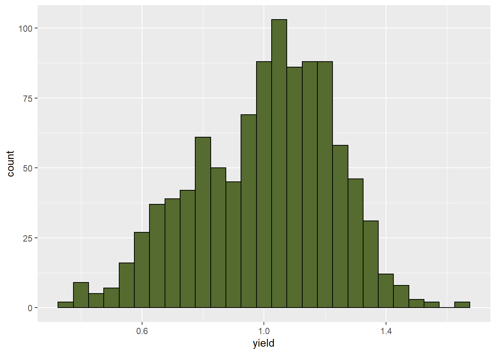

# Population Statistics

## Populations
Almost every statistics text begins with the concept of a population.  A population is the complete set of individuals to which you want to predict values.  Let's dwell on this concept, as it is something that did not hit home for me right away in my career.  Again, the population is all of the individuals for which you are interested in making a prediction. What do we mean by individuals? Not just people -- individuals can plants, insects, disease, livestock or, indeed, farmers.

Just as important as what individuals are in a population is its extent. What do you want the individuals to represent?  If you are a farmer, do you want to apply the data from these individuals directly to themselves, or will you use them to make management decisions for the entire field, or all the fields in your farm?  Will you use the results this season or to make predictions for future seasons?  If you are an animal nutritionist, will you use rations data to support dairy Herefords, or beef Angus?  

If you are a sales agronomist, will you use the data to support sales on one farm, a group of farms in one area, or across your entire sales territory?  If you are in Extension, will the individuals you measure be applicable to your entire county, group of counties, or state?  If you are in industry like me, will your results be applicable to several states?

This is a very, very critical question, as you design experiments -- or as you read research conducted by others.  To what do or will the results apply?  Obviously, an Iowa farmer should not follow the optimum planting date determined for a grower in North Carolina, nor should an Ohio farmer assume our pale clays will be as forgiving as the dark, mellow loam of southern Minnesota.

Drilling down, you might further consider whether research was conducted in areas that have similar temperature or rainfall, how different the soil texture might be to the areas to which you want to apply results.  At the farm level, you might ask how similar the crop rotation, tillage, or planting methods were to that operation.  At the field level, you might wonder about planting date or the hybrid that was sown.

When you use the results from set of individuals to make predictions about other individuals, you are making inferences -- you are using those data to make predictions, whether it be for that same field next month or next year, or for other locations (areas in a field, fields in a farm, counties, or states).  When we speak of an inference space, then, that is the total group of individuals to which you will apply your results.  Or, in another word, your population.

In summary, one of the most critical skills you can apply with data science has no formula and, indeed, little to do with math (at least in our application).  It is to ask yourself, will my experiment represent the entire population in which I am interested?  Indeed, one field trial likely will not address the entire population in which you are interested -- it is up to you to determine the population to which you are comfortable applying those results.  

In fact, statistics or data science done without this "domain" knowledge whether a dataset is useful or experimental results are reasonable can be disasterous.  Just because a model fits one dataset very well or treatments are significantly different does not mean they should be used to make decisions.  Your competency as an agronomic data scientist depends on everything you learn in your program of study.  Soil science, crop physiology, and integrated pest management, to name just a few subjects, are as much a prerequisite as any math course you have taken. 


In some cases all of the individuals in a population can be measured -- in such case, we will use the basic statistics described in this unit.  The yield map we will analyze in this unit is a loose example of a case where we can measure  

In most cases, however, it is not physically or financially feasible to measure all individuals in a population.  In that case, subsets of the population, called samples, are used to estimate the range of individuals in a population. 


## Case Study: Yield Map

For our first case study, we will use a situation where every individual in our population can be measured: a single soybean field in central Iowa.  In this case, yield data were gathered using a combine monitor.  In case you don't live and breathe field crops like me, combines (the machines that harvest grain) are usually equipped with a scale that repeatedly weighs grain as the combine moves across the field.  The moisture of the grain is also recorded.  These data are combined with measures of the combine speed and knowledge of the number of rows harvested at once to calculate the yield per area of grain, adjusted to the market standard for grain moisture.  


```r
library(sf)
library(tidyverse)
library(rcompanion)


yield = st_read("data-unit-1/merriweather_yield_map/merriweather_yield_map.shp")
```

```
## Reading layer `merriweather_yield_map' from data source `C:\Users\559069\Documents\data-science-for-agricultural-professionals_3\data-unit-1\merriweather_yield_map\merriweather_yield_map.shp' using driver `ESRI Shapefile'
## Simple feature collection with 6061 features and 12 fields
## Geometry type: POINT
## Dimension:     XY
## Bounding box:  xmin: -93.15474 ymin: 41.66619 xmax: -93.15026 ymax: 41.66945
## Geodetic CRS:  WGS 84
```

Let's start tearing this dataset apart, using our very first chunk of code.  We can examine the first 6 rows of the dataset using R.  Our data are in a shapefile named "yield".  To view the top six rows of any dataset in R, we use the command "head".

Just click on the button "Run Code" in the upper right corner of the window below.


```r
head(yield)
```

```
## Simple feature collection with 6 features and 12 fields
## Geometry type: POINT
## Dimension:     XY
## Bounding box:  xmin: -93.15033 ymin: 41.66641 xmax: -93.15026 ymax: 41.66644
## Geodetic CRS:  WGS 84
##    DISTANCE SWATHWIDTH VRYIELDVOL Crop  WetMass Moisture                 Time
## 1 0.9202733          5   57.38461  174 3443.652     0.00 9/19/2016 4:45:46 PM
## 2 2.6919269          5   55.88097  174 3353.411     0.00 9/19/2016 4:45:48 PM
## 3 2.6263101          5   80.83788  174 4851.075     0.00 9/19/2016 4:45:49 PM
## 4 2.7575437          5   71.76773  174 4306.777     6.22 9/19/2016 4:45:51 PM
## 5 2.3966513          5   91.03274  174 5462.851    12.22 9/19/2016 4:45:54 PM
## 6 3.1840529          5   65.59037  174 3951.056    13.33 9/19/2016 4:45:55 PM
##    Heading VARIETY Elevation                  IsoTime yield_bu
## 1 300.1584   23A42  786.8470 2016-09-19T16:45:46.001Z 65.97034
## 2 303.6084   23A42  786.6140 2016-09-19T16:45:48.004Z 64.24158
## 3 304.3084   23A42  786.1416 2016-09-19T16:45:49.007Z 92.93246
## 4 306.2084   23A42  785.7381 2016-09-19T16:45:51.002Z 77.37348
## 5 309.2284   23A42  785.5937 2016-09-19T16:45:54.002Z 91.86380
## 6 309.7584   23A42  785.7512 2016-09-19T16:45:55.005Z 65.60115
##                     geometry
## 1 POINT (-93.15026 41.66641)
## 2 POINT (-93.15028 41.66641)
## 3 POINT (-93.15028 41.66642)
## 4  POINT (-93.1503 41.66642)
## 5 POINT (-93.15032 41.66644)
## 6 POINT (-93.15033 41.66644)
```


That's it!  You just ran your first R command!  Seriously, R includes a free software package that allows R to run inside a document like this.  How cool is that!  You could type any R command in the window above and it would run.

This dataset has several columns, but the two most important to us in this lesson are "yield_bu" and "geometry".  Harvest files may not come with a yield column -- in this case, I calculated the yield for you.  I will not get into the formula for that -- after all, this is just the first lesson of the course.  

That this dataset has a column named geometry indicates it is a "shapefile" -- a dataset in which the measures are georeferenced.  That is, we know where these measurements were taken.  The geometry column in this case identifies a point with each observation.

We can see this by plotting the data below. This command has three parts.  Plot tells R to draw a map.  "yield" tells R to use the yield dataset.  "yield_bu" is the column we want to plot -- we place it in quotes and brackets ([]) to tell R to only plot this column.  Otherwise R will plot each of the columns, which will require a longer runtime.


```r
plot(yield["yield_bu"])
```


What do you observe if you replace "yield_bu" with "Moisture" in the above code?  Does one area of the field appear a little drier than the others?


## Distributions
At this point, we have two options any time we want to know about soybean yield in this field.  We can pull out this map or the complete dataset (which has over 6,500 observations) and look at try to intuitively understand the data.  Or we can use statistics which, in a sense, provide us a formula for regenerating our dataset with just a few numbers.

### Histograms

Before we get into the math required to generate these statistics, however, we should look at the "shape" of our data.  One of the easiest and most informative things for us to do is to create a particular bar chart known as a histogram.  


```r
histogram = hist(yield$yield_bu, breaks = 12)
```



```r
plot(histogram)
```


A histogram gives us a quick visualization of our data.  In the histogram above, each bar represents range of values.  This range is often referred to as a *bin*.  The lowest bin includes values from 50 to 59.0000.  The next bin includes values from 60 to 69.9999.  And so on.  The height of each bar represents the number of individuals in that population that have values within that range.

Bins can also be defined by their midpoints.  The midpoint is the middle value in each range.  For the bin that includes values from 50 to 50.9999, the midpoint is 55.  For the bin that includes values from 60 to 60.9999, the midpoint is 65.


In the plot above, the midpoint for each bar is indicated by the orange bar beneath it.

We can also draw a histogram using the power ggplot package from Hadley Wickham, which allows for much greater customization of plots.  We will use this package extensively throughout the course.  Here is just a taste:


```r
ggplot(data=yield, aes(x=yield_bu)) +
  geom_histogram(breaks=seq(50, 110, 10), fill="tomato", color="black")
```


Varying the bin width provides us with different perspectives on our distribution.  Please click on the link below to open an application where you can vary the bin width and see how it changes your perspective.


### Percentiles
We can also use percentiles to help us describe the data even more numerically.  To identify percentiles, the data are numerically ordered (ranked) from lowest to highest.  Each percentile is associated with a number; the percentile is the percentage of all data equal to or less than that number.  We can quicly generate the 0th, 25th, 50th, and 75th, and 100th percentile in R using the summary command.


```r
summary(yield$yield_bu)
```

```
##    Min. 1st Qu.  Median    Mean 3rd Qu.    Max. 
##   55.12   74.96   80.62   80.09   85.44  104.95
```


This returns six numbers.  The 0th percentile (alternatively referred to as the minimum) is 0.00 -- this is the lowest yield measured in the field.  The 25th percentile (also called the 1st Quartile) is 87.16.  This means that 25% of all observations were equal to 86.55 bushels or less.  The 50th percentile (also known as the median) was 97.91, meaning half of all observations were equal to 97.91 bushels or less.  75% of observations were less than 111.13, the 75th percentile (or 3rd quartile).  Finally, the 100th percentile (or maximum yield) recorded for this field was 199.60.

We are now gaining a better sense of the range of observations that were most common.  But we can do even better and describe this distribution with even fewer numbers.


### Normal Distribution Model
Let's overlay a curve, representing the normal distribution model, on our histogram with the following function, plotNormalHistogram.


```r
plotNormalHistogram(yield$yield_bu, breaks = 10)
```


In a perfect situation, our curve would pass through the midpoint of each bar.  This rarely happens with real-world data, and especially in agriculture.  The data may be slightly skewed, meaning there are more individuals that measure above the mean than below, or vice versa.

In this example, our data do not appear skewed.  Our curve seems a little too short and wide to exactly fit the data.  This is a condition called kurtosis.  No, kurtosis doesn't mean that our data stink.  It just means it is a little more spread out or compressed than in a "perfect" situation.

No problem.  We can -- and should -- conclude it is appropriate to fit these data with a normal distribution.  If we had even more data, the curve would likely fit them even better.

Many populations can be handily summarized with the normal distribution curve, but we need to know a couple of statistics about the data.  First, we need to know where the *center* of the curve should be.  Second, we need to know the width or *dispersion* of the curve.

### Measures of Center
To better describe our distribution, we will use the arithematic mean and median.  The mean is the sum of all observations divided by the number of observations.

$$\displaystyle \mu = \frac{\sum x_i}{n}$$
The $\mu$ symbol (a u with a tail) signifies the true mean of a population.  The $\sum$ symbol (the character next to $x_i$ which looks like an angry insect) means "sum".  Thus, anytime you see the $\sum$ symbol, we are summing the variable(s) to its right.  $x_i$ is the value $x$ of the ith individual in the population.  Finally, n is the number of individuals in the population.

For example, if we have a set of number from 1:5, their mean can be calculated as:


```r
(1+2+3+4+5)/5
```

```
## [1] 3
```

R, of course, has a function for this:

```r
x = c(1,2,3,4,5)
mean(x)
```

```
## [1] 3
```
In the example above, we created a vector (a dataset with one column) of numbers by listing within c(...).  We also assigned this vector a name, x.  We won't create too many vectors in this course, but this is how to do it.  Try switching the numbers in between the parentheses above and calculating a mean for that dataset.    

Let's calculate the mean yield for our field.

```r
mean(yield$yield_bu)
```

```
## [1] 80.09084
```

The mean is about 95 bushels per acre.  Where does this fall on our histogram?  After drawing the histogram, we can use additional code to add a reference line:


```r
hist(yield$yield_bu, breaks=10)
abline(v = mean(yield$yield_bu), col="red")
```



We use "abline" to tell R to draw a line on our plot.  "v" tells it to draw a vertical line, "mean(yield$yield_bu) tells it the X position for this vertical line is equal to the mean value of yield_bu, and "col", you guessed it, specifies the line color.  Try changing it to "darkblue".

Earlier, you were introduced to the median.  As discussed, the median is a number such that half of the individuals in the population are greater and half are less.  If we have an odd number of individuals, the median is the "middle" number as the individuals are ranked from greatest to least.


```r
median(c(1,2,3,4,5))
```

```
## [1] 3
```


If we have an even number of measures, the median is the average of the middle two individuals in the ranking:


```r
median(c(1,2,3,4,5,6))
```

```
## [1] 3.5
```


Let's add a second line representing the median.

```r
hist(yield$yield_bu, breaks=10)
abline(v = mean(yield$yield_bu), col="red")
abline(v = median(yield$yield_bu), col="blue")
```



As you can see, they are practically identical.  When the mean and median are similar, the number of individuals measuring greater and less than the mean are roughly equivalent.  In this case, our data can be represented using a model called the normal distribution. 


We also need a statistic that tells us how wide to draw the curve.  That statistic is called a measure of dispersion, and we will learn about it next.


### Measures of Dispersion
To describe the spread of a population, we use three related statistics, which describe the summed difference of all from the mean (sum of squares), the average difference from the mean (variance) and, finally, the difference from the mean in our original units of measurement (standard deviation).  Although there is a little math involved in these three statistics, please make yourself comfortable with their concepts because they are *very* important in this course.  Almost every statistical test we will learn during the next 14 weeks is rooted in these measures of population width.

#### Sum of Squares
The first measure of population width is the Sum of Squares.  This is, simply, the sum of the squared differences between each observation and the mean.  The sum of squares of a measurement x is:

$$\displaystyle S_{xx} = (x_i - \mu)^2$$

Where again $x_i$ is the value $x$ of the $ith$ individual in the population and $\mu$ is the true mean of a population.

Why do we square the differences between the observations and means?  Simply, if we were to add the unsquared differences they would add to exactly zero.  Let's prove this to ourselves.  Let's again use the set of numbers (1, 2, 3, 4, 5).  We can measure the distance of each individual from the mean by subtracting the mean from it.  This difference is called the residual.


```r
individuals = c(1,2,3,4,5)
residuals = individuals - mean(individuals)
residuals
```

```
## [1] -2 -1  0  1  2
```
In the first line of code, we defined our individuals as having values of 1, 2, 3, 4, and 5.  In the second line of code, we subtracted their mean from each of us.  We can see the output -- residuals -- consist of -2, -1, 0, -1, and -2.

And if we sum these residuals we get zero.


```r
sum(residuals)
```

```
## [1] 0
```

Let's now do this with our field data.  The number of residuals (almost 6800) is too many to visualize at once, so we can use the sample function to pick 20 at random.

```r
yield_residuals = yield$yield_bu - mean(yield$yield_bu)
sample(yield_residuals, 20)
```

```
##  [1]  -5.28634023   4.45851427   9.38917800   5.79895521 -14.88565030
##  [6]   5.39363044  -0.53116732  -2.31380546  -5.92308110  -3.38615502
## [11]   5.16231533   5.01444115  -0.13202322   8.57037779  13.56143122
## [16]  -0.04666328  -7.02490869 -23.49283913   4.57137008   8.66187724
```

If we sum up all the yield residuals, what number do we get?  Any guesses before you click "Run Code"?

```r
sum(yield_residuals)
```

```
## [1] 1.139e-11
```
Not exactly zero, but a very, very small number -- a 4 with 10 zeros in front of it.  The difference from zero is the result of rounding errors during the calculation.

The sum of squares is calculated by squaring each residual and then summing the residuals.  For our example using the set (1, 2, 3, 4, 5):


```r
individuals = c(1,2,3,4,5)
residuals = individuals - mean(individuals)
squared_residuals = residuals^2
sum(squared_residuals)
```

```
## [1] 10
```

And for our yield data:

```r
yield_residuals = yield$yield_bu - mean(yield$yield_bu)
squared_yield_residuals = yield_residuals^2
yield_sum_of_squared_residuals = sum(squared_yield_residuals)
yield_sum_of_squared_residuals
```

```
## [1] 461211.3
```


#### Variance

The sum of squares helps quantify spread: the larger the sum of squares, the greater the spread of observations around the population mean.  There is one issue with the sum of squares, though: since the sum of square is derived from the differences between each observation and the mean, it is also related to the number of individuals overall in our population.  In our example above, the sum of squares was 10:


```r
individuals = c(1,2,3,4,5)
residuals = individuals - mean(individuals)
squared_residuals = residuals^2
sum(squared_residuals)
```

```
## [1] 10
```

Change the first line of code above so it reads "individuals = c(1,2,3,4,5,1,2,3,4,5).  You will notice the sum of squares increases to 20.  The spread of the data did not change, only the number of observations.  Given any distribution, the sum of squares will always increase with the number of observations.

If we want to compare the spread of two different populations with different numbers of individuals, we need to adjust our interpretation to allow for the number of observations.  We do this by dividing the sum of squares, $S_{xx}$ by its associated degrees of freedom, $n-1$.  In essense, we are calculating an "average" of the sum of squares.  This value is the variance, $\sigma^2$.

$$\sigma^2 = \frac{S_{xx}}{n}$$
We can calculate the variance as follows.

```r
individuals = c(1,2,3,4,5)
residuals = individuals - mean(individuals)
squared_residuals = residuals^2
sum_squared_residuals = sum(squared_residuals)
variance = sum_squared_residuals / length(residuals)
variance
```

```
## [1] 2
```

We introduced a new function above, "length".  Length gives us the number of individuals in any dataset, in this case 5.

By dividing the sum of squares by the number of individuals, we "average" our sum of squares.  The variance of this dataset is 2.

Change the first line of code above so it reads "individuals = c(1,2,3,4,5,1,2,3,4,5) and run the code again.  The variance will now divide the sum of squares by 10.  The variance will again be 2.

Our yield variance is:

```r
yield_variance = yield_sum_of_squared_residuals/length(yield_residuals)
```


#### Standard Deviation
Our challenge in using the variance to describe population spread is it's units are not intuitive.  When we square the measure we also square the units of measure.  For example the variance of our yield is measured in units of bushels^2^.  Wrap your head around that one.  Our solution is to report our final estimate of population spread in the original units of measure.  To do this, we calculate the square root of the variance.  This statistic is called the standard deviation, $\sigma$.

$$\sigma = \sqrt{(\sigma^2)}$$


```r
sqrt(variance)
```

```
## [1] 1.414214
```


The standard deviation of our yield data is:


```r
sqrt(yield_variance)
```

```
## [1] 8.72324
```

That is enough theory for this first week of class.  The remainder of this lesson will focus on introducing you to RStudioCloud.


## Exercise: Introduction to R 

This document you have just opened is called an R Notebook.  This document allows you to combine code and commentary into a seamless document.  

This sentence is an example of commentary.  Commentary is anything you would type in a Word document.  It can be the identifier for a question, or your response to that question.

Immediately below is what in R Studio is called a chunk.  You can create a chunk anywhere in a document by typing CTRL-ALT_I.  Note that a chunk always begins with ```{r} and always ends with ```.  This tells the notebook that anything between those two markings is R code to be run.


```r
sample_data = c(1,2,3,4,5) # this creates a vector (a single column of data) and names it "sample_data"
calculation = mean(sample_data) # this calculates the mean for the vector and names it "calculation"
calculation # this tells R to print the value of calculation
```

```
## [1] 3
```

The code chunk above can be run by clicking on the green arrow in its upper-right corner.  R will run and, if there are no errors, display the output of the code immediately below the chunk.  If you click on the chunk above, it will create the "sample_data" vector, calculate the mean of that vector and name it "calculation", and print the value of calculation, which is 3.

There is nothing magical about the names we have selected.  They are just placeholders for the data.


### Your Very First Code
Now you try it:
- create a chunk by pressing CTRL_ALT_I
- create a vector named "my sample data" that containes the numbers 6, 7, 8, 9, and 10.
- calculate the mean and assign it to a variable named "my_calculation"
- display the results 

[delete this line and create your chunk right here]

Were you successful?


### Reading and Working with Data Frames
Of course, you will soon want to work with your own data, and it is likely to consist of multiple vectors (columns).  That is, you have a table of data.  In R, this is commonly referred to as a "data frame".

To read in data frame, use the read.csv command.  In the chunk below, we will use read.csv to read in a .csv file and assign it to a data frame named "yield".


```r
yield = read.csv("data-unit-1/exercise_data/sample_dataset_1.csv")
```

The text in quotes is the path to the table of interest.  "data/" tells R the file is in a directory named "data" that is in the same folder as this file.  The rest of the text is simply the file name.

We can view this data frame in two ways.  We can simply type its name:

```r
yield
```

```
##    observation    yield
## 1            1 227.2262
## 2            2 218.4626
## 3            3 219.8543
## 4            4 209.2137
## 5            5 218.3676
## 6            6 219.5215
## 7            7 224.6843
## 8            8 221.5054
## 9            9 222.6487
## 10          10 226.4952
```

Or we can view it in more of a spreadsheet enviornment by double clicking on it in the window to the right, or by typing "view(yield)" in the console window below.

Once the data frame is created, we can use it in any subsequent chunk.  We can look at the data frame as a whole by typing its name.  We can use a particular column by typing the name of the data frame, followed by "$" and the name of the column.


```r
single_column = yield$yield
single_column
```

```
##  [1] 227.2262 218.4626 219.8543 209.2137 218.3676 219.5215 224.6843 221.5054
##  [9] 222.6487 226.4952
```

If you pause after typing "$", R will display a list of the available columns.  Just click on the one in which you are interested.

### Basic Operations on Columns
We can easily perform statistical summaries now that we have defined "single_column".  As above, we can calculate it's mean:

```r
single_column_mean = mean(single_column)
single_column_mean
```

```
## [1] 220.798
```

Or its median:

```r
single_column_median = median(single_column)
single_column_median
```

```
## [1] 220.6798
```

Its maximum value:

```r
single_column_max = max(single_column)
single_column_max
```

```
## [1] 227.2262
```

Or its minimum value:


```r
single_column_min = min(single_column)
single_column_min
```

```
## [1] 209.2137
```


### Knitting Your Results into a Document
When you are done creating your R notebook, you can knit it into a final document by clicking on the "Preview" button in the menu bar above:


```r
library(knitr)


```


If you look in the exercise folder, you will find an .html printout of this notebook.  You can email this file to collaborators, publish it to the internet, or incorporate it into your creative component.

### Practice
Now you try.  There are four practice sets, labelled intro_to_r_practice_set_1.csv through intro_to_r_practice_set_4.csv.  Practice reading in the .csv file and calculating summary statistics as shown above.


## Exercise: Introduction to Shapefiles
One of my more recent areas of growth as a data scientist has been learning to work with spatial data.  If you have worked with yield monitor data, used ArcGIS, or used an application map to variable-rate your fertilizer, you have worked with spatial data.  Although we won't return to spatial data until later in the course, here is a brief introduction to inporting and inspecting spatial data.

### R Packages
R programming consists of base software plus an ever increasing number of plug-ins called "packages".  These packages provide additional functions (programs) in R that cover everything from agricultural plot design, interactive maps, and advanced plotting techniques, to app development, access to census data, and even modules to teach statistics and generate quizes.

If R tells us that a package is not installed, we can install it using the "install.packages('') command", where the package name is included between the quotes.  This code is shown below, but it is preceded by a hashtag, so that line of code will not be executed by R.  The hashtag can be used to "comment" code or coding notes/explanations to that they can remain inline with the code we want to run, but not be run themselves.


```r
# install.packages('sf', repos='http://cran.us.r-project.org')
library(sf)
```


### Reading Shapefiles
To read in a shapefile, we use the "st_read" command.  Reading in a shapefile is identical to how we read in a .csv file in the previous exercise.  We simply follow st_read with the path to the shapefile, which has a .shp suffix.  We will read in a shapefile from Indiana that includes county summaries for a couple of dozen agricultural statistics.


```r
indiana = st_read("data-unit-1/exercise_data/Agriculture_Census-shp/Agriculture_Census.shp")
```

```
## Reading layer `Agriculture_Census' from data source `C:\Users\559069\Documents\data-science-for-agricultural-professionals_3\data-unit-1\exercise_data\Agriculture_Census-shp\Agriculture_Census.shp' using driver `ESRI Shapefile'
## Simple feature collection with 92 features and 31 fields
## Geometry type: POLYGON
## Dimension:     XY
## Bounding box:  xmin: -88.08975 ymin: 37.77306 xmax: -84.78768 ymax: 41.76233
## Geodetic CRS:  WGS 84
```

### Examining Spatial Feature Data Frames
Let's inspect the first six rows of the spatial feature data frame using the "head()" command, where the name of the data frame is given between the parentheses.


```r
head(indiana)
```

```
## Simple feature collection with 6 features and 31 fields
## Geometry type: POLYGON
## Dimension:     XY
## Bounding box:  xmin: -87.52704 ymin: 41.16195 xmax: -84.80631 ymax: 41.76233
## Geodetic CRS:  WGS 84
##   OBJECTID AGCENSP020              COUNTY N_FARM TOTCROP_AC HAVCROP_AC DOL_FARM
## 1        1       2515      Elkhart County   1335     160160     143324    92912
## 2        2       2516 Saint Joseph County    666     139661     131004    82849
## 3        3       2517     La Porte County    749     226816     212940   127922
## 4        4       2518      Steuben County    581      99218      71944    44133
## 5        5       2519     Lagrange County   1392     156233     127875    74194
## 6        6       2539         Lake County    442     138929     132551   108206
##   NURS_DOL LVSTOK_DOL SALE_2500 SALE_5000 EXPEN_1000 NURSY_1000 N_CHICKENS
## 1    34688      89350       251       100      96862        514    3005354
## 2    40051      15127       144        71      40479        583        852
## 3    68041      27773       136        60      71666        742      -9999
## 4    16776       8865       236        44      20288          0      -9999
## 5    37364      65915       223       105      83668          0    1870836
## 6    42747       5080       101        30      34712         66          0
##   N_CATTLE N_PIGS CORN_AC WHEAT_AC COTTON_AC SOYBEAN_AC VEGTABL_AC ORCHARD_AC
## 1    42719  73951   64955     3861         0      42251       1338          0
## 2     6440  27430   69251     4073         0      45696        480          0
## 3    24980  27110  113242     4186         0      76809       1125          0
## 4     9257   6859   32152     4483         0      25120        304          0
## 5    39275  69338   61262     3993         0      32666       1182          0
## 6     3204   9435   68344     3101         0      55698       1256          0
##   PECAN_AC IRRGTD_AC N_MACHINE FEMALE_OP MINORTY_OP FAM_FARM igs_DBO_Ag
## 1        0     23524       495        32          0     1164          0
## 2        0     12941       444        44          3      584          0
## 3        0     27090       631        44          0      626          0
## 4        0      1225     -9999        42          0      505          0
## 5        0     23478       315        26          0     1232          0
## 6        0      6211       327        42          3      356          0
##   SHAPE_Leng SHAPE_Area                       geometry
## 1   139058.4 1210349270 POLYGON ((-86.06246 41.7619...
## 2   155098.8 1196846667 POLYGON ((-86.22555 41.7614...
## 3   175216.0 1563031845 POLYGON ((-86.82619 41.7608...
## 4   116305.4  835438144 POLYGON ((-85.19779 41.7605...
## 5   128976.5 1000327995 POLYGON ((-85.29134 41.7606...
## 6   167477.6 1300778609 POLYGON ((-87.52401 41.7135...
```

Spatial feature data frames are very similar to the data frames that were introduced to in the last exercise.  There are a few differences, however.  First, every spatial feature data frame consists of rows of observations that are linked, in the geometry column, with a georeference.  That georeference may be a simple point on the map, or it may be a polygon that defines an area, such as a field, a county, or a state.  

Spatial feature data frames also include some metadata about the geometry of the file, including geometry type (POLYGON in this case, since we are working with county outlines) and -- this is critical -- CRS.  CRS stands for "coordinate reference system".  Coordinate reference system refers to the "projection" we use to draw a map, and the georeferences used to define a place or area.  

Maps are flat representations of a round object, and there are different ways to draw these maps.  We need not go into a deep review of those projects at this point; suffice it to know that each projection represents tradeoffs in how accurately it portrays areas in the center and periphery of the map and how much it represents the curvature.  For most of my work, I use the CRS of 4326.  You know this system more commonly as the latitude/longitude system.

The bounding box defines where the map is centered.  Latitude/longitude maps are more accurate in portraying areas near the center of the map than the periphery, so it is important the map be centered on the area of interest.


### Visualizing Data
To visualize the data, we can use the "plot" function from the sf package.  You might assume we could map a column of data the same way we visualized its contents earlier, by indicating the data frame and column name, separated by the dollar sign.  We will try that with TOTCROP_AC, the total number of acres per county in crop production.


```r
plot(indiana$TOTCROP_AC)
```


Instead of a map, however, this shows us the range of values for TOTCROP_AC in the dataset.  To view a map, we need to first subset the data so it only has two columns: the TOTCROP_AC data and geometry columns.  We can then map these data: 


```r
tot_crop = indiana["TOTCROP_AC"]
plot(tot_crop)
```



No one can resist a pretty map.  The technical name for a map like this, where you color-code political shapes like counties, is "chloropleth."  We are seeing plenty of these in 2020, between the pandemic and the election year.  

Back to happier thoughts.  Let's look at the mean farm income per county.  This is indicated by the "DOL_FARM" column.  Again, we first subset the data and then plot it.

```r
farm_income = indiana["DOL_FARM"]
plot(farm_income)
```


Where are the chickens in Indiana?  Let's find out:

```r
chickens = indiana["N_CHICKENS"]
plot(chickens)
```


It would appear the most finger-lickin' good county is Elkart County, in the far north.  Appropriately, there are also a couple of counties near Kentucky!

### Create Your Own Maps
Where are the hogs in Indiana?  Create a map for "N_PIGS".

Where are most of the wheat acres?  Create a map for "WHEAT_AC".

Which counties have greater farm ownership by minorities?  Create a map for "MINORTY_OP" (note the mispelling).


## Exercise: Histograms
One of the most critical -- and I will admit, often overlooked at first by me in my rush to look at treatment differences -- steps in data science is to inspect the data for the shape of its distribution and extreme values.  There are a multiple ways to do this.  This week, we will focus on the histogram.

### Case Study
The first example we will use is a cotton uniformity trial conducted in Greece in 1938.  Yes, I realize it is a bit dated, but the concept is one we deal with every day in agricultural research -- how consistent are our plots.  In other words, what is the variance among plots?

In a uniformity trial, a series of plots are managed identically so that the distribution of their yields can be measured.  These data can be used to determine whether that field is a good site for a research trial.

Our first step is to load the data, which is in a .csv file.


```r
cotton = read.csv("data-unit-1/exercise_data/cotton_uniformity.csv")
```

### Basic Histogram
Drawing a simple histogram in R requires two steps.  First, we need to define the column in which we are interested.  Then we create the histogram.  Since we are using a data frame, we need to tell R which column to plot.  We will, unimaginedly, call this column "yield".  With our second line of code we will create the histogram.  In the third line, we tell R to plot the histogram


```r
yield = cotton$yield
histogram = hist(yield)
```


```r
plot(histogram)
```


And, voila, we have a plot of our histogram.  Each bar represents a range in values, or a "bin".  We can see the upper and lower yield limits of each bins using the "histogram$breaks" command.


```r
histogram$breaks
```

```
##  [1] 0.3 0.4 0.5 0.6 0.7 0.8 0.9 1.0 1.1 1.2 1.3 1.4 1.5 1.6 1.7
```

Alternatively, we could see the midpoints, or yield values that define the middle of each bin, using the "histogram$mids" command.

```r
histogram$mids
```

```
##  [1] 0.35 0.45 0.55 0.65 0.75 0.85 0.95 1.05 1.15 1.25 1.35 1.45 1.55 1.65
```

As we saw in the lesson, varying the number of columns can affect how we see patterns in the data.  In the plot above, we have 14 bars.  Each bar represents a bin width of 0.1.  What if we tell R to use 28 bins to draw the histogram?  We can do that by telling R to use about 28 breaks (divisions between bins).


```r
histogram = hist(yield, breaks = 28)
```


Note that we ended up with 27, not 28 bins, but that each now has a bin width that is 0.05 kg.  We can verify this by again inspecting the data with "histogram$breaks".


```r
histogram$breaks
```

```
##  [1] 0.35 0.40 0.45 0.50 0.55 0.60 0.65 0.70 0.75 0.80 0.85 0.90 0.95 1.00 1.05
## [16] 1.10 1.15 1.20 1.25 1.30 1.35 1.40 1.45 1.50 1.55 1.60 1.65 1.70
```


### Histograms with ggplot
"ggplot2" is a very powerful and population package in R for creating plots.  I spend A LOT of time using ggplot2, essentially any time I am creating plots.  With ggplot, if you can imagine it, you almost certainly can draw it.  There are entire books written on ggplot; rather than focus on it, I will try to weave tidbits throughout this course.

Since ggplot is a package, we need to install and load it before we can use it.  Note: if you are running R on your desktop, you only need to install a package the very first time you use it.  Afterwards, you only need to run library() to load it into the local memory when you need it.

The first line of code calls ggplot().  We use "data=cotton" to tell R we are drawing data from the "cotton" data frame.  

We then need to specify an "aesthetic".  An aesthetic is any property of the plot that relates to a variable, that is, a column in our data frame.  In this case, we use aes(x=yield) to tell R that our aesthetic is positioned horizontally according to the value of yield.

In the second line, we use geom_histogram to tell R we are drawing a histogram.  Knowing this, R will automatically assign bins and count the number of observations in each bin.

```r
# install.packages("ggplot2")
library(ggplot2)

ggplot(data=cotton, aes(x=yield)) +
  geom_histogram()
```

```
## `stat_bin()` using `bins = 30`. Pick better value with `binwidth`.
```



By default, R chooses to create 30 bins.  We can easily specify a different number of bins using the "bins=" argument.


```r
ggplot(data=cotton, aes(x=yield)) +
  geom_histogram(bins=15)
```


Alternatively, we can set a particular binwidth using the "binwidth =" argument.


```r
ggplot(data=cotton, aes(x=yield)) +
  geom_histogram(binwidth=0.05)
```


If we want to make our plot a little less bland, we can tell ggplot to use a different color to fill the bars using the "fill = " argument


```r
ggplot(data=cotton, aes(x=yield)) +
  geom_histogram(binwidth=0.05, fill="darkolivegreen")
```


Finally, we can outline the bars using the "color = " argument.

```r
ggplot(data=cotton, aes(x=yield)) +
  geom_histogram(binwidth=0.05, fill="darkolivegreen", color="black")
```



We will introduce more ways to fine tune our plots as the course goes on.

### Practice
In the data folder there are three practice files: barley_uniformity.csv, peanut_uniformity.csv, and tomato_uniformity.csv.  Practice creating histograms using both the basic and ggplot methods.  To start you off, here is the command to load the barley file.


```r
barley = read.csv("data-unit-1/exercise_data/barley_uniformity.csv")
```


