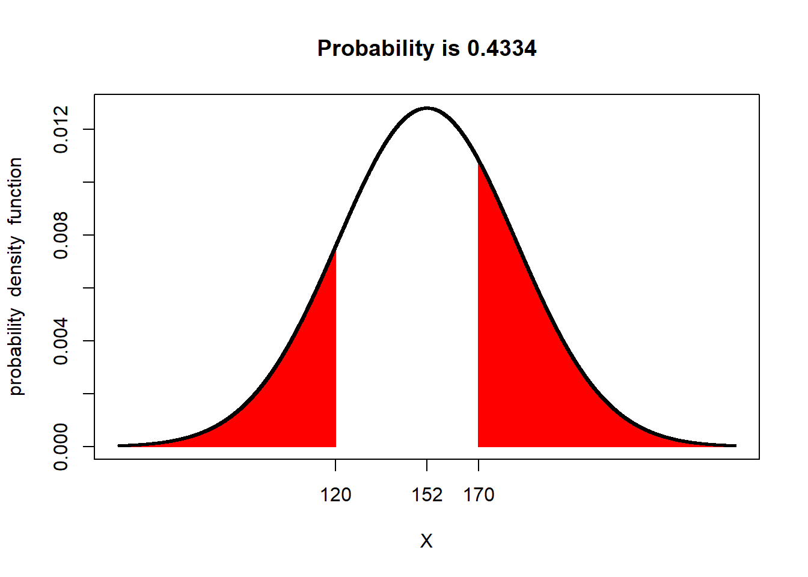

# Distributions and Probability
In this unit we will continue with normal distribution model introduced in the previous unit.  As you will recall, the normal distribution is a symmetrical curve that represents the frequency with which individuals with different particular measured values occur in a population.

The peak of the curve is located at the population mean, $\mu$.  The width of the curve reflects how spread out other individuals are from the mean.  We learned three ways to measure this spread: the sum of squares, the variance, and the standard deviation. These statistics can roughly be thought of as representing the sums of the squared differences, the average of the squared distances, and the distances presented in the original units of measure.  These four statistics -- mean, sum of squares, variance, and standard deviation -- are among the most important you will learn in this course.

## Case Study
This week, we will continue to work with the Iowa soybean yield dataset introduced to us in Unit 1.


Let's review the structure of this dataset:

```r
head(yield)
```

```
## Simple feature collection with 6 features and 12 fields
## Geometry type: POINT
## Dimension:     XY
## Bounding box:  xmin: -93.15033 ymin: 41.66641 xmax: -93.15026 ymax: 41.66644
## Geodetic CRS:  WGS 84
##    DISTANCE SWATHWIDTH VRYIELDVOL Crop  WetMass Moisture                 Time
## 1 0.9202733          5   57.38461  174 3443.652     0.00 9/19/2016 4:45:46 PM
## 2 2.6919269          5   55.88097  174 3353.411     0.00 9/19/2016 4:45:48 PM
## 3 2.6263101          5   80.83788  174 4851.075     0.00 9/19/2016 4:45:49 PM
## 4 2.7575437          5   71.76773  174 4306.777     6.22 9/19/2016 4:45:51 PM
## 5 2.3966513          5   91.03274  174 5462.851    12.22 9/19/2016 4:45:54 PM
## 6 3.1840529          5   65.59037  174 3951.056    13.33 9/19/2016 4:45:55 PM
##    Heading VARIETY Elevation                  IsoTime yield_bu
## 1 300.1584   23A42  786.8470 2016-09-19T16:45:46.001Z 65.97034
## 2 303.6084   23A42  786.6140 2016-09-19T16:45:48.004Z 64.24158
## 3 304.3084   23A42  786.1416 2016-09-19T16:45:49.007Z 92.93246
## 4 306.2084   23A42  785.7381 2016-09-19T16:45:51.002Z 77.37348
## 5 309.2284   23A42  785.5937 2016-09-19T16:45:54.002Z 91.86380
## 6 309.7584   23A42  785.7512 2016-09-19T16:45:55.005Z 65.60115
##                     geometry
## 1 POINT (-93.15026 41.66641)
## 2 POINT (-93.15028 41.66641)
## 3 POINT (-93.15028 41.66642)
## 4  POINT (-93.1503 41.66642)
## 5 POINT (-93.15032 41.66644)
## 6 POINT (-93.15033 41.66644)
```

And map the field:

```r
library(sf)
plot(yield["yield_bu"])
```


## The Normal Distribution Model
Mean, sum of squares, variance, and standard deviation are so important because they allow us to reconstruct the normal distribution model.  Before we go further, what is a model?  Is it frightening we are using that term in the second week of class?

A model is a simplified representation of reality.  No, that doesn't mean that models are "fake" (SMH).  It means that they summarize aspects of data, both measured and predicted.  The normal distribution model describes the relationship between the values of individuals and how frequently they appear in the population.  It's value is it can be reconstructed by knowing just two things about the original dataset -- its mean and its standard deviation.

### The Bell Curve
The normal distribution is also referred to as the "bell curve", since it is taller in the middle and flared on either side.  This shape reflects the tendency of measures within many populations to occur more frequently near the population mean than far from it.  Why does this occur and how do we know this?

As agronomists, we can reflect on what it takes to produce a very good -- or very bad crop.  For a very good crop, many factors need to coincide: temperature, precipitation, soil texture, nitrogen mineralization, proper seed singulation (spacing), pest control, and hybrid or variety selection, to name a few.  We may, in a typical season or within a field, optimize one or two of these conditions, but the possibility of optimizing every one is exceedingly rare.  Thus, if we are measuring yield,  measures near the mean yield will occur more frequently.  Extremely high yields will occur less frequently.

Conversely, very low yields require we manage a crop very badly or that catastrophic weather conditions occur: a hailstorm, flood, or tornado.  A frost at exactly the wrong time during seed germination or a drought.  A planter box running out of seed or a fertilizer nozzle jamming. These things do occur, but less frequently.

The distribution of individuals around the mean is also a the result of measurement inaccuracies.  Carl Friedrich Gauss, who introduced the normal distribution model, showed that it explained the variation in his repeated measurements of the position of stars in the sky.  All measurements of continuous data (those that can be measured with a ruler, a scale, a gradated cylinder, or machine) have variation -- we use the term "accuracy" to explain their variation around the population mean.

### Distribution and Probability
Some areas of mathematics like geometry and algebra produce proven concepts (ie theorems), the product of statistics are almost always probabilities.  To be more specific, most of the statistical tests we will learn can be reduced to the probability that a particular value is observed in a population.  These probabilities include:
- the probability an individual measurement or population mean is observed (normal distribution)
- the difference between two treatments is not zero (t-test and least-significant difference)
- the probability of one measure given another (regression)
- the probability that the spread of individual measures in a population is better predicted by treatment differences than random variation (F-test and analysis of variance)

These probabilities are all calculated from distributions -- the frequency with which individuals appear in a population.  Another way of stating this is that probability is the proportion of individuals in a population that are have measured values within a given range. Examples could include:
- the proportion of individual soybean yield measurements, within one field, that are less than 65 bushels per acre
- the proportion of individual corn fields that have an an average less than 160 bushels per acre
- the proportion of trials in which the difference between two treatments was greater than zero
- the proportion of observations in which the actual crop yield is greater than that predicted from a regression model


### Probability and the Normal Distribution Curve
Probability can be calculated as the proportion of the area underneath the normal distribution that corresponds to a particular range of values.  We can visualize this, but first we need to construct the normal distribution curve for our soybean field.

We need just two data to construct our curve: the mean and standard deviation of our yield.  These are both easily calculated in R.

```r
library(muStat)
yield_mean = mean(yield$yield_bu)
yield_sd = stdev(yield$yield_bu, unbiased = FALSE)

# to see the value of yield_mean and yield_sd, we just type their names and run the code.
yield_mean
```

```
## [1] 80.09084
```

```r
yield_sd
```

```
## [1] 8.72252
```


Now we can build our curve with a single line of code.  The plotDist function in R will reconstruct the  distribution curve for any population, given three arguments, in the following order: what kind of curve to draw, the population mean, and population standard deviation.  
- *dnorm* tells plotDist to draw a normal distribution curve.  This needs to enclosed in quotes 
- *yield_mean* tells plotDist to use the mean we calculated in the previous chunk as the population mean
- *yield_sd* tells plotDist to use the standard deviation we calculated in the previous chunk as the standard deviation


```r
library(fastGraph)
plotDist("dnorm", yield_mean, yield_sd)
```


Let's now shade the area underneath the normal curve corresponding to X values from 70 - 80.  This area will represent the proportion of the population Where individuals were measured to have values between 70 and 80 bushels.

The shade.norm function makes effort painless.  There are five arguments in this function: 
- *xshade* is the range of individuals in our population for which we want to calculate their area under the distribution curve.  We pass this range as a vector using c(minimum, maximum), in this case c(70,80)
- *ddist* tells the function what kind of distribution curve to draw.  "dnorm" tells it to construct a normal distribution curve
- the third value we include (and it must be in this order), is the population mean.  In this case, we pass the variable yield_mean whose value we calculated in the previously
- the fourth value is the population standard deviation, which we have already calculated and assigned to the variable yield_sd
- *lower.tail=FALSE* tells shade.norm to shade the area under the curve between 70 and 80 bushels and to calculate its area.


```r
shadeDist(xshade=c(70,80), ddist = "dnorm", yield_mean, yield_sd, lower.tail = FALSE)
```


Pretty cool, huh?  The red area is the proportion of the soybean yield population that was between 70 and 80 bushels.  shadeDist has also presented us with the proportion of the curve represented by that area, which it has labelled "Probability".  The probabiliity in this case is 0.3722.  What does that number mean?

The total area of the curve is 1.  The proportion of the area under the curve that corresponds with yields from 70 to 80 bushels, then, is 3.967 percent of the area.  This means that 37.22 percent of the individuals in our yield population had values from 70 and 80 bushels

But wait a second -- why is R using the term "Probability"?  Think of it this way.  Imagine you sampled 1000 individuals from our population.  If 37.22 percent of our individuals have values from 70 to 80 bushels, then about 37% of the individuals in your sample should have values from 70 to 80 bushels.  In other words, there is a 37% probability that any individual in the population will have a value from 70 to 80 bushels.  

Let's test this.  Let's randomly sample 1000 individuals from our sample.  Then lets count the number of individuals that have yields between 70 and 80 bushels.  We will run three lines of code here:
- we will use the "sample" function to randomly sample our population and return a vector of those numbers
- we will use the "subset" function to subset our data into those that meet logical conditions and return a dataframe or vector.  We provide two arguments: first, the name of the dataset or vector, and second the conditions.
- we will use the "length" function to count the number of observations


```r
yield_sample = sample(yield$yield_bu, 1000)

# "yield_sample >=70 & yield_sample <=80 tells it to only include measures from 70 to 80 in the subset
yield_subset = subset(yield_sample, yield_sample >=70 & yield_sample <=80)

length(yield_subset)
```

```
## [1] 330
```

Is the proportion predicted by the normal distribution curve exactly that of the actual population?  Probably not.  The normal distribution curve is, after all, a model -- it is an approximation of the actual population.

Run the code above multiple times and observe how the percentages change.  The proportions will vary slightly but generall stay in a range from about 0.32 to 0.37.

We will talk more about sampling in the next unit.  


## The Z-Distribution
The relationship between probability and the normal distribution curve is based on the concept of the Z-distribution.  In essence, Z-distribution describes a normal distribution curve with a population mean of 0 and a standard deviation of 1.


```r
plotDist("dnorm", 0, 1)
```


The Z-distribution helps us understand how probability relates to standard deviation, regardless of the nature of a study or its measurement units.

For example, the proportion of a population within one standard deviation of the mean is about 68 percent:


```r
shadeDist(xshade=c(-1, 1), ddist = "dnorm", 0, 1, lower.tail = FALSE)
```


Similarly, the proportion of a population within 1.96 standard deviations of the mean is about 95 percent:


```r
shadeDist(xshade=c(-1.96, 1.96), ddist = "dnorm", 0, 1, lower.tail = FALSE)
```


Conversely, the proportion of a population beyond 1.96 standard deviations from the mean is about 5 percent.  We can visualize this by changing the last argument of our code to "lower.tail = TRUE". 

```r
shadeDist(xshade=c(-1.96, 1.96), ddist = "dnorm", 0, 1, lower.tail = TRUE)
```


We refer to the upper and lower ends of the distribution as tails.  In a normal distribution we would expect about 2.5% of observations to less than -1.96 standard deviations of the mean.  We can measure the proportion in one tail by changing our argument in the shadeDist command to "xshade = -1.96".


```r
shadeDist(xshade=-1.96, ddist = "dnorm", 0, 1, lower.tail = TRUE)
```


And 2.5% of the population to be more than +1.96 above the mean:


```r
shadeDist(xshade=1.96, ddist = "dnorm", 0, 1, lower.tail = FALSE)
```


Notice we changed the last argument back to "lower.tail = TRUE".  The causes R to shade the area above 1.96 standard deviations of the mean.  

### Important Numbers: 95% and 5%
Above we learned that 95% of a normal distribution is between 1.96 standard deviations of the mean, and that 5% of a normal distribution is outside this range.  Perhaps these numbers sound familiar to you.  Have you ever seen results presented with a 95% confidence interval?  Have you ever read that two treatments were significantly different at the P=0.05 level?

For population statistics, the normal distribution is the origin of those numbers.  As we get further into this course, we will learn about additional distributions -- binomial, chi-square, and F -- and the unique statistical tests they allow.  But the concept will stay the same: identifying whether observed statistical values are more likely to occur (i.e., within the central 95% of values expected in a distribution), or whether the values are unusual (occurring in the remaining 5%).


```r
set.seed(051520)

output = matrix(ncol=1, nrow=100)

for(i in c(1:100)){
  yield_sample = sample(yield$yield_bu, 1000)
  N = length(yield_sample[yield_sample >=80 & yield_sample <=100])
  output[i] = N
}
```


## Exercise: Z-Distribution and Probability

This week, we have just have one exercise.  Its objective is for you gain comfort with the concept of distribution and probability by working with the Z-distribution.  We will learn how to use the plot and probability function we used throughout the lesson.


### Case Study: Barley Data
We were introduced to the barley dataset last week.  These data are from a trial that was conducted to measure the uniformity of plots, that is, how consistent were yield measurements from plots that were treated identically.


```r
barley = read.csv("data-unit-2/exercise_data/barley_uniformity.csv")
```

Let's take a look at the top six rows of the dataset.  We can see the plots are identified by their row nad column locations.  The yields are not per acre, but per plot.


```r
head(barley)
```

```
##   row col yield
## 1  20   1   185
## 2  19   1   169
## 3  18   1   216
## 4  17   1   165
## 5  16   1   133
## 6  15   1   195
```

### Measuring the Population Distribution: Mean and Standard Deviation
Before we can calculate probability, we need to construct the normal distribution curve.  And before we can do that, we need to measure the mean and standard deviation of the barley population.

Let's do a quick visual check to make sure it is approximately normally-distributed.  We will define the column of interest from the dataset as yield and then plot it using the histogram ("hist") function.  Remember, we reference a column from the barley dataframe by typing "barley", the dollar sign "$", and then the name of the column of interest. 


```r
yield = barley$yield
hist(yield)
```


The histogram shows the barley distribution is approximately normal.  No distribution is perfectly normal.  Remember, when we fit the data with the normal distribution, we are using a model distribution, not the actual distribution.  But the model tends to perform very, very well. 

We can quickly calculate the mean and standard deviation using the "mean" and "sd" functions on "yield".

```r
mean(yield)
```

```
## [1] 151.92
```

```r
sd(yield)
```

```
## [1] 31.14029
```

We will assign these to variables we can reference later on, so we don't have to re-enter these repeatedly in our analyses.  Remember, the population mean is symbolized by the Greek letter "mu", so we will call the mean "mu".  We will call the standard deviation "sigma", which is the Greek letter used to symbolize it.


```r
mu = mean(yield)
sigma = sd(yield)
```


### The shadeDist Function
To calculate probabilities, we will use the "shadDist" function which is part of the "fastGraph" package in R.  Remember, packages are groups of functions (calcluations and plots) beyond those in the base R software.  The first time we use fastGraph, we must install it.  (Note: if R asks you to restart dur the installation, go ahead and click "yes".)


```r
# install.packages("fastGraph") #delete pound sign at far left to use this command
```

We can then load the package using the "library(fastGraph)" command.

```r
library(fastGraph)
```

Now we are ready to look at the barley distribution.  We will define the column we are interested in as "an independent "yield" and then plot it's distribution model using shadeDist.  To plot the basic distribution, we have to enter four arguments into shadeDist:

- xshade = NULL : this tells R not to shade any part of the curve
- ddist = "dnorm": this tells R we are working with the normal (Z) distribution
- parm1 = mu : "parm1" is used to pass the appropriate paramenter to R for the distribution we have chosen.  For a normal distribution, the first parameter is the mean.
- parm2 = sigma: "parm2" passes the next appropriate parameter to R for the normal distribution, the standard deviation.


```r
yield = barley$yield
shadeDist(xshade = NULL, 
          ddist = "dnorm", 
          parm1 = mu, 
          parm2 = sigma)
```


And voila, we have our basic normal distribution curve.  The horizontal (X) axis represents the range of observed values.  The vertical axis, titled (probability density function), indicates the proportion of the population that would include a given range of X values.

### Probabilities in Lower Tails
Lets run our first calculation.  What percentage of this population has a yield value less than 100? to answer this, we will pass the following two arguments to shadeDist:

- xshade = 100:  This tells R we want to bisect the curve at X = 100
- lower.tail = TRUE: This tells R we want to measure the area of the curve where X<100.


```r
shadeDist(xshade = 100, 
          ddist = "dnorm", 
          parm1 = mu, 
          parm2 = sigma,
          lower.tail = TRUE)
```


When we run the curve, we see that approximately 4.8 percent of the population has a yield value less than 100.  If we were randomly subsets of this field, we would expect to measure a yield less than 100 in about 4.8 our of 100 samples.  In other words, there is about a 4.8% probability our subset would have a value less than 100.

What is the probability our subset would have a value less than 140?

```r
shadeDist(xshade = 140, 
          ddist = "dnorm", 
          parm1 = mu, 
          parm2 = sigma,
          lower.tail = TRUE)
```


Our probability is about 35%.

### Probabilities in Upper Tails

If we want to measure the probability of higher values, we just need to change the lower.tail argument to "lower.tail = FALSE".  The probability of values gerter than 185 would be about 14%.


```r
shadeDist(xshade = 185, 
          ddist = "dnorm", 
          parm1 = mu, 
          parm2 = sigma,
          lower.tail = FALSE)
```


The probability greater than 170 would be about 28%.


```r
shadeDist(xshade = 170, 
          ddist = "dnorm", 
          parm1 = mu, 
          parm2 = sigma,
          lower.tail = FALSE)
```


### Probabilities Within A Range
Sometimes we would like to measure the probability of a range of values in the middle of our distribution.  To do this, we change our xshade argument to "xshade = c(120, 170)".  We use "c()" whenever we are giving R a set of values to work with.  For xshade, this set only has two values: the lower and upper X values for our area.


```r
shadeDist(xshade = c(120, 170), 
          ddist = "dnorm", 
          parm1 = mu, 
          parm2 = sigma,
          lower.tail = FALSE)
```


The probability of observing individuals with yields between 120 and 170 is about 57%.  What about between 136 and 182?


```r
shadeDist(xshade = c(136, 182), 
          ddist = "dnorm", 
          parm1 = mu, 
          parm2 = sigma,
          lower.tail = FALSE)
```



The probability is about 53%.

### Probabilities Outside a Range
Finally, what if we wanted to measure the probability of observing a value outside the ranges in the previous section.  To do this, we use the "lower.tail=TRUE" argument to the shadeDist function.


```r
shadeDist(xshade = c(120, 170), 
          ddist = "dnorm", 
          parm1 = mu, 
          parm2 = sigma,
          lower.tail = TRUE)
```


The probability of observing individuals with yields less than 120 or greater than 170 is about 43%.  What about outside 136 and 182?


```r
shadeDist(xshade = c(136, 182), 
          ddist = "dnorm", 
          parm1 = mu, 
          parm2 = sigma,
          lower.tail = TRUE)
```


The probability of observing individuals with values less than 136 or greater than 182 is about 47%.

### Probability and SD
We learned during the lesson that about 68% of individuals would be expected to have values with one standard deviation of the mean.  We can use shadeDist to verify that.  First we need to determine the values for the mean minus one standard deviation and the mean plus one standard deviation.  Given that we assigned the mean and standard deviation to the variables mu and sigma above, this is easy.


```r
mu_minus_sigma = mu-sigma
mu_plus_sigma = mu+sigma
print(mu_minus_sigma)
```

```
## [1] 120.7797
```

```r
print(mu_plus_sigma)
```

```
## [1] 183.0603
```

We can see the population mean minus one standard deviation is about 120.8, and the mean plus one standard deviation is about 183.1  since we have assigned these variables to mu_minus_sigma, and mu_plus_sigma, we can pass them directly to the shadeDist function.  Finally, we need to use "lower.tail=FALSE" to tell shadeDist to calculate the percentage of values between these two numbers.


```r
shadeDist(xshade = c(mu_minus_sigma, mu_plus_sigma), 
          ddist = "dnorm", 
          parm1 = mu, 
          parm2 = sigma,
          lower.tail = FALSE)
```


We confirm the percentage of observations between the population mean minus one standard deviation and the population mean plus one standard deviation is about 68%.

We also learned that about 95% of the population occurs between 1.96 standard deviations below the mean and 1.96 standard deviations above the mean.  We can calculate these values as above.

```r
mu_minus_1.96_sigma = mu-(1.96*sigma)
mu_plus_1.96_sigma = mu+(1.96*sigma)
print(mu_minus_1.96_sigma)
```

```
## [1] 90.88502
```

```r
print(mu_plus_1.96_sigma)
```

```
## [1] 212.955
```

We can see the population mean minus one standard deviation is about 90.9, and the mean plus one standard deviation is about 213.0.  


```r
shadeDist(xshade = c(mu_minus_1.96_sigma, mu_plus_1.96_sigma), 
          ddist = "dnorm", 
          parm1 = mu, 
          parm2 = sigma,
          lower.tail = FALSE)
```


We have confirmed 95% of individuals are between 1.96 standard deviations below and above the mean.

### Practice: Cotton Dataset
Let's load the cotton data.


```r
cotton = read.csv("data-unit-2/exercise_data/cotton_uniformity.csv")
```

And examine its top six rows.


```r
head(cotton)
```

```
##   col row yield block
## 1   1   1  1.23    B1
## 2   2   1  0.90    B1
## 3   3   1  0.97    B1
## 4   4   1  1.10    B1
## 5   5   1  0.99    B1
## 6   6   1  1.43    B1
```

The data we want are in the yield column.  Let's isolate those and plot them in a histogram.

```r
cotton_yield = cotton$yield
hist(cotton_yield)
```


Let's calculate our cotton mean and standard deviation.

```r
cotton_mu = mean(cotton_yield)
cotton_sigma = sd(cotton_yield)
print(cotton_mu)
```

```
## [1] 1.001309
```

```r
print(cotton_sigma)
```

```
## [1] 0.2287059
```


Now let's explore: 

1. What is the probability an individual in the cotton popualation has a value less than 0.7?  (You should get a value of about 0.09, or 9%.)


2. What is the probability an individual has a value greater than 1.4?  (You should get a value around 0.4, or 4%.)


3. What is the probability of an individual having a value between 0.7 and 1.4?  (Answer: about 13%)


4. What is the probability of an individual having a value less than 0.7 or greater than 1.4?  (Answer: about 87%)


### Practice: Tomato Dataset

Analyze the tomato_uniformity.csv dataset on your own.  First, load the dataset:

```r
tomato = read.csv("data-unit-2/exercise_data/tomato_uniformity.csv")
```


1. What is the probability an individual will have a value less than 40?  (Answer: about 16%)


2. What is the probability an individual will have a value greater than 60?  (Answer: about 18%)


3. What is the probability an individual will have a value greater than 40 but less than 60? (Answer: about 66%)


4. What is the probability an individual will have a value less than 40 but greater than 60? (Answer: about 34%)


