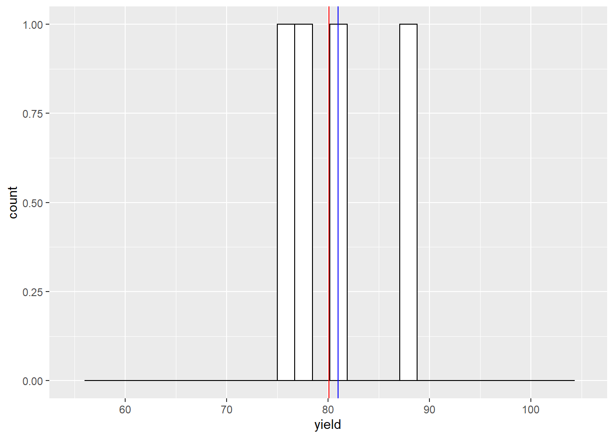
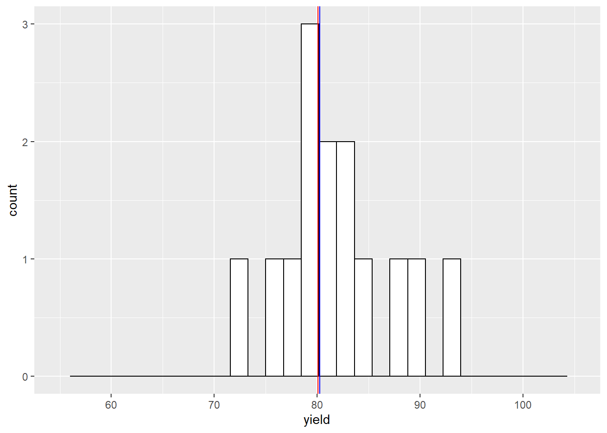

# Sample Statistics

In the previous two units, we studied populations and how to summarize
them with statistics when the *entire* population was measured. In other
words, the measure of center (mean) and measure of spread (standard
deviation) were the summary of all observations.

In the case of a yield monitor map, these are appropriate statistics. In
most every other agricultural reality, however, we cannot measure every
individual in a population. Instead, we only have enough resources to
collect a **sample** the population, that is, measure a subset of
individuals from the population. In this case, we cannot measure the
exact population mean or population standard deviation of the
population. Instead, we can only estimate them using our **sample mean**
or **sample standard deviation**.

This, of course, raises questions. Was the sample representative of the
population? Would another random sample result in a similar estimate of
the population mean or population standard deviation? And, perhaps, how
much could our sample mean deviate from the population mean?

In other words, there is always uncertainty that statistics calculated
from samples represent the true values of a population. You might even
say we lack complete *confidence* that a sample mean will closely
estimate the population mean.

Enter statistics. By taking multiple sets of samples, and calculating
their means, we can use the differences among those sample means to
estimate the distribution of sample means around the true population
mean. Indeed, this is a fundamental concept of research and statistics
-- using the measured variance of samples to determine how accurate they
are in predicting population statistics.

## Samples

To measure the variation of sample means, we need at least two samples
to compare. Ideally we can gather even more. As we will see, the more
samples included in our estimates of the population mean, the more
accurate we are likely to be.

A second comment, which may seem intuitive, but at the retail level may
be overlooked, is randomization. Samples -- for example individual
plants or areas where yield will be measured -- are ideally selected at
random. In reality, the plants or areas selected for measures may be
less than random. When I used to count weed populations, we used square
quadrats (frames) to consistently define the area that was measured. We
would throw them into different areas of the plot and count weeds where
ever they landed.

The most important thing about selecting samples, however, is that the
researcher work to minimize bias. Bias is when the samples selected
consistently overestimate or underestimate the population mean. The most
egregious example of this would be a researcher who consistently and
purposely sampled the highest- or lowest-measuring parts of a field.

But bias can enter in other ways. For example, if our weed populations
were very uneven, our thrown quadrat might be more likely to skid to a
stop in weedy areas. A researcher might unconsciously choose taller
plants to sample. In August, we might be tempted to sample a corn field
from the edge than walk deep into that sweltering, allergenic hell.

Remember, our goal is to generate estimates of population values that
are as precise and accurate as our resources allow. **Precise** means
our sample means have a low variance around the population mean.
**Accurate** means our sample means are equivalently scattered above and
below the population mean.


## Case Study

Once more, we will work with the Iowa soybean yield dataset from Units 1
and 2.


Let's review the structure of this dataset:


```
## Simple feature collection with 6 features and 12 fields
## Geometry type: POINT
## Dimension:     XY
## Bounding box:  xmin: -93.15033 ymin: 41.66641 xmax: -93.15026 ymax: 41.66644
## Geodetic CRS:  WGS 84
##    DISTANCE SWATHWIDTH VRYIELDVOL Crop  WetMass Moisture                 Time
## 1 0.9202733          5   57.38461  174 3443.652     0.00 9/19/2016 4:45:46 PM
## 2 2.6919269          5   55.88097  174 3353.411     0.00 9/19/2016 4:45:48 PM
## 3 2.6263101          5   80.83788  174 4851.075     0.00 9/19/2016 4:45:49 PM
## 4 2.7575437          5   71.76773  174 4306.777     6.22 9/19/2016 4:45:51 PM
## 5 2.3966513          5   91.03274  174 5462.851    12.22 9/19/2016 4:45:54 PM
## 6 3.1840529          5   65.59037  174 3951.056    13.33 9/19/2016 4:45:55 PM
##    Heading VARIETY Elevation                  IsoTime yield_bu
## 1 300.1584   23A42  786.8470 2016-09-19T16:45:46.001Z 65.97034
## 2 303.6084   23A42  786.6140 2016-09-19T16:45:48.004Z 64.24158
## 3 304.3084   23A42  786.1416 2016-09-19T16:45:49.007Z 92.93246
## 4 306.2084   23A42  785.7381 2016-09-19T16:45:51.002Z 77.37348
## 5 309.2284   23A42  785.5937 2016-09-19T16:45:54.002Z 91.86380
## 6 309.7584   23A42  785.7512 2016-09-19T16:45:55.005Z 65.60115
##                     geometry
## 1 POINT (-93.15026 41.66641)
## 2 POINT (-93.15028 41.66641)
## 3 POINT (-93.15028 41.66642)
## 4  POINT (-93.1503 41.66642)
## 5 POINT (-93.15032 41.66644)
## 6 POINT (-93.15033 41.66644)
```

And map the field:


In Unit 2, we learned to describe these data using the normal
distribution model. We learned the area under the normal distribution
curve corresponds to the proportion of individuals within a certain
range of values. We also discussed how this proportion allows inferences
about probability. For example, the area under the curve that
corresponded with yields from 70.0 to 79.9 represented the proportion of
individuals in the yield population that fell within that yield range.
But it also represented the probability that, were you to measure
individual points from the map at random, you would measure a yield
between 70.0 and 79.9.

## Distribution of Sample Means

In the last unit, we sampled the yield from 1000 locations in the field
and counted the number of observations that were equal to or greater
than 70 and equal to or less than 80.

What would happen if we only sampled from one location. What would be
our sample mean and how close would it be to the population mean?

In the histograms below, the red vertical line marks the population
mean. The blue line marks the sample mean.


```r
set.seed(1771)
yield_sample = sample(yield$yield_bu, 1) %>%
      as.data.frame()
names(yield_sample) = c("yield")
ggplot(yield_sample, aes(x=yield)) +
  geom_histogram(fill="white", color="black") +
  geom_vline(xintercept = mean(yield$yield_bu), color = "red") +
  geom_vline(xintercept = mean(yield_sample$yield), color = "blue") +
  lims(x=c(55,105))
```

```
## `stat_bin()` using `bins = 30`. Pick better value with `binwidth`.
```

```
## Warning: Removed 2 rows containing missing values (geom_bar).
```


With one sample, our sample mean is about 8 bushels above the population
mean. What would happen if we sampled twice?


Our sample mean is now about 2 bushels greater than the population mean.
What would happen if we sampled four times?



Our sample mean is now about 1 bushel greater than the population mean.
What would happen if we sampled 15 times?



The sample mean and population mean are almost equal.

Click on this link to access an app to help you further understand this
concept:

<https://marin-harbur.shinyapps.io/03-sampling_from_normal_distn/>

## Central Limit Theorem

The **Central Limit Theorem** states that sample means are normally
distributed around the population mean. This concept is powerful because
it allows us to calculate the probability that that a sample mean is a
given distance away from the population mean. In our yield data, for
example, the Central Limit Theorem allows us to assign a probability
that we would observe a sample mean of 75 bushels/acre, if the
population mean is 80 bushels/acre. More on how we calculate this in a
little bit.

In our yield dataset, the population data are approximately normally
distributed. It makes sense that the sample means would be normally
distributed, too. But the Central Limit Theorem shows us that our sample
means are likely to be normally distributed even if the population *does
not* follow a perfect normal distribution.

Let's take this concept to the extreme. Suppose we had a population
where every value occurred with the same frequency. This is known as a
uniform distribution. Click on the following link to visit an app where
we can explore how the sample distribution changes in response to
sampling an uniform distribution:

<https://marin-harbur.shinyapps.io/03-sampling-from-uniform-distn/>

You will discover that the sample means are normally distributed around
the population mean even when the population itself is not normally
distributed.

## Standard Error

When we describe the spread of a normally-distributed population -- that
is, all of the individuals about which we want to make inferences -- we
use the population mean and standard deviation.

When we sample (measure subsets) of a population, we again use two
statistics. The **sample mean** describes the center of the samples..
The spread of the sample means is described by the **standard error of
the mean** (often abbreviated to **standard error**). The standard error
is related to the standard deviation as follows:

$$SE = \frac{\sigma}{\sqrt n} $$

The standard error, SE, is equal to the standard deviation ($\sigma$),
divided by the square root of the number of samples ($n$). This
denominator is very important -- it means that our standard error grows
as the number of samples increases. Why is this important?

A sample mean is an estimate of the true population mean. The
distribution of sample means the range of possible values for the
population mean. I realize this is a fuzzy concept. This is the key
point: by measuring the distribution of our sample sample means, we are
able to describe the probability that the population mean is a given
value.

To better understand this, please visit this link:

<https://marin-harbur.shinyapps.io/03-sample-distn/>

If you take away nothing else from this lesson, understand whether you
collect 2 or 3 samples has tremendous implications for your estimate of
the population mean. 4 samples is much better than 3. Do everything you
can to fight for those first few samples. Collect as many as you can
afford, especially if you are below 10 samples.

## Degrees of Freedom

In Unit 1, the section on variance briefly introduced **degrees of
freedom**, the number of observations in a population or sample, minus
1. Degrees of Freedom are again used below in calculating the
**t-distribution**. So what are they and why do we use them? Turns out
there are two explanations.

In the first explanation, *degrees of freedom* refers to the number of
individuals or samples that can vary independently given a fixed mean.
So for an individual data point to be free, it must be able to assume
any value within a given distribution. Since the population mean is a
fixed number, only $n-1$ of the data have the freedom to vary. The last
data point is determined by the value of all the other data points and
the population mean.

Confusing, huh? Who starts measuring samples thinking that the data
point is fixed, in any case? But if you think about it, the purpose of
the sample is approximate a real population mean out there -- which is
indeed fixed. It's just waiting for us to figure it out. So if our
sample mean is equal to the population mean (which we generally assume),
then the sample mean is also fixed. But it is a very weird way of
thinking.

Yet this is the answer beloved by all the textbooks, so there you go.

The second answer I like better: samples normally *underestimate* the
true population variance. This is because the sample variance is
calculated from the distribution of the data around the sample mean.
Sample data will always be closer to the sample mean -- which is by
definition based on the data themselves -- then the population mean.

Think about this a minute. Your sample data could be crazy high or low
compared to the overall population. But that dataset will define a mean,
and the variance of the population will be estimated from that mean. In
many cases, it turns out that using $n-1$ degrees of freedom will
increase the value of the sample variance so it is closer to the
population variance.

## The t-Distribution

In the last unit, we used the *Z-distribution* to calculate the
probability of observing an individual of a given value in a population,
given its population mean and standard deviation. Recall that about 68%
of individuals were expected to have values within one standard
deviation, or *Z*, of the population mean. Approximately 95% of
individuals were expected to have values within 1.96 standard deviations
of the population mean. Alternatively, we can ask what the probability
is of observing individuals of a particular or greater value in the
population, given its mean and standard deviation.

We can ask a similar question of our sample data: what is the
probability the population mean is a given value or greater, given the
sample mean? As with the Z-distribution, the distance between the sample
mean and hypothesized population mean will determine this probability.

There is one problem, however, with using the Z-distribution: it is only
applicable when the population standard deviation is *known*. When we
*sample* from a population, we do not know it's true standard deviation.
Instead, we are estimating it from our samples. This requires we use a
different distribution: the t-distribution.

Unlike the Z-distribution, the **t-distribution** changes in shape as
the number of samples increases. Notice in the animation above that,
when the number of samples is low, the distribution is wider and has a
shorter peak. As the number of samples increases, the curve becomes
narrower and taller. This has implications for the relationship between
the distance of a hypothetical population mean from the sample mean, and
the probability of it being that distant.

We can prove this to ourselves with the help of the `shadeDist()`
function we used in Unit 2. You will learn how to plot the
t-distribution in an exercise this week.


With 4 degrees of freedom, there is about a 63% probability the
population mean is within 1 standard error of the mean. Let's decrease
the sample mean to 3 degrees of freedom


With only 3 degrees of freedom (4 samples), there is only a 61%
probability the population mean is within one standard error of the
mean. What if we only had one degree of freedom (two samples)?


You should see the probability that the population mean is within 1
standard error of the sample mean falls to 50%.

If we have 10 degrees of freedom (11 samples), the probability increases
to about 66%.


With 30 degress of freedom the probability the population mean is within
1 standard error of the sample mean increases to 67%.


With 50 degrees of freedom (51 samples) the probability is about 68%. At
this point, the t-distribution curve approximates the shape of the
z-distribution curve.


We can sum up the relationship between the t-value and probability with
this plot. The probability of the population mean being within one
standard error of the population mean is represented by by the red line.
The probability of of the population mean being within 2 standard errors
of the mean is represented by the blue line. As you can see, the
probability of the population mean being within 1 or 2 standard errors
of the sample mean *increases* with the degrees of freedom (df). Exact
values can be examined by tracing the curves with your mouse.


```{=html}
<div id="htmlwidget-c39a3c7c62363ed022ea" style="width:672px;height:480px;" class="plotly html-widget"></div>
<script type="application/json" data-for="htmlwidget-c39a3c7c62363ed022ea">{"x":{"data":[{"x":[1,2,3,4,5,6,7,8,9,10,11,12,13,14,15,16,17,18,19,20,21,22,23,24,25,26,27,28,29,30,31,32,33,34,35,36,37,38,39,40,41,42,43,44,45,46,47,48,49,50],"y":[0.5,0.577350269189626,0.60899778104423,0.626099033699941,0.636782532350877,0.644082316250418,0.649383337179793,0.653406492912666,0.656563603862086,0.65910686769794,0.661199303803798,0.662950942046416,0.664438722134577,0.665718056605343,0.666829864084524,0.667805015347021,0.668667237961321,0.669435068721816,0.670123199078875,0.670743422828291,0.671305316763536,0.671816738119329,0.672284193857141,0.672713118720215,0.673108087308159,0.673472977739384,0.673811099320273,0.674125293128339,0.674418011983806,0.67469138457397,0.674947267276466,0.675187286348902,0.675412872511149,0.675625289473794,0.675825657613961,0.676014973734873,0.676194127644582,0.676363916135592,0.676525054828617,0.676678188251709,0.676823898454046,0.676962712397013,0.677095108320392,0.677221521245691,0.677342347750039,0.67745795012101,0.677568659984033,0.677674781478883,0.677776594049325,0.677874354899755],"text":["t: 1<br />df:  1<br />p: 0.5000000<br />t: 1","t: 1<br />df:  2<br />p: 0.5773503<br />t: 1","t: 1<br />df:  3<br />p: 0.6089978<br />t: 1","t: 1<br />df:  4<br />p: 0.6260990<br />t: 1","t: 1<br />df:  5<br />p: 0.6367825<br />t: 1","t: 1<br />df:  6<br />p: 0.6440823<br />t: 1","t: 1<br />df:  7<br />p: 0.6493833<br />t: 1","t: 1<br />df:  8<br />p: 0.6534065<br />t: 1","t: 1<br />df:  9<br />p: 0.6565636<br />t: 1","t: 1<br />df: 10<br />p: 0.6591069<br />t: 1","t: 1<br />df: 11<br />p: 0.6611993<br />t: 1","t: 1<br />df: 12<br />p: 0.6629509<br />t: 1","t: 1<br />df: 13<br />p: 0.6644387<br />t: 1","t: 1<br />df: 14<br />p: 0.6657181<br />t: 1","t: 1<br />df: 15<br />p: 0.6668299<br />t: 1","t: 1<br />df: 16<br />p: 0.6678050<br />t: 1","t: 1<br />df: 17<br />p: 0.6686672<br />t: 1","t: 1<br />df: 18<br />p: 0.6694351<br />t: 1","t: 1<br />df: 19<br />p: 0.6701232<br />t: 1","t: 1<br />df: 20<br />p: 0.6707434<br />t: 1","t: 1<br />df: 21<br />p: 0.6713053<br />t: 1","t: 1<br />df: 22<br />p: 0.6718167<br />t: 1","t: 1<br />df: 23<br />p: 0.6722842<br />t: 1","t: 1<br />df: 24<br />p: 0.6727131<br />t: 1","t: 1<br />df: 25<br />p: 0.6731081<br />t: 1","t: 1<br />df: 26<br />p: 0.6734730<br />t: 1","t: 1<br />df: 27<br />p: 0.6738111<br />t: 1","t: 1<br />df: 28<br />p: 0.6741253<br />t: 1","t: 1<br />df: 29<br />p: 0.6744180<br />t: 1","t: 1<br />df: 30<br />p: 0.6746914<br />t: 1","t: 1<br />df: 31<br />p: 0.6749473<br />t: 1","t: 1<br />df: 32<br />p: 0.6751873<br />t: 1","t: 1<br />df: 33<br />p: 0.6754129<br />t: 1","t: 1<br />df: 34<br />p: 0.6756253<br />t: 1","t: 1<br />df: 35<br />p: 0.6758257<br />t: 1","t: 1<br />df: 36<br />p: 0.6760150<br />t: 1","t: 1<br />df: 37<br />p: 0.6761941<br />t: 1","t: 1<br />df: 38<br />p: 0.6763639<br />t: 1","t: 1<br />df: 39<br />p: 0.6765251<br />t: 1","t: 1<br />df: 40<br />p: 0.6766782<br />t: 1","t: 1<br />df: 41<br />p: 0.6768239<br />t: 1","t: 1<br />df: 42<br />p: 0.6769627<br />t: 1","t: 1<br />df: 43<br />p: 0.6770951<br />t: 1","t: 1<br />df: 44<br />p: 0.6772215<br />t: 1","t: 1<br />df: 45<br />p: 0.6773423<br />t: 1","t: 1<br />df: 46<br />p: 0.6774580<br />t: 1","t: 1<br />df: 47<br />p: 0.6775687<br />t: 1","t: 1<br />df: 48<br />p: 0.6776748<br />t: 1","t: 1<br />df: 49<br />p: 0.6777766<br />t: 1","t: 1<br />df: 50<br />p: 0.6778744<br />t: 1"],"type":"scatter","mode":"markers","marker":{"autocolorscale":false,"color":"rgba(248,118,109,1)","opacity":1,"size":5.66929133858268,"symbol":"circle","line":{"width":1.88976377952756,"color":"rgba(248,118,109,1)"}},"hoveron":"points","name":"1","legendgroup":"1","showlegend":true,"xaxis":"x","yaxis":"y","hoverinfo":"text","frame":null},{"x":[1,2,3,4,5,6,7,8,9,10,11,12,13,14,15,16,17,18,19,20,21,22,23,24,25,26,27,28,29,30,31,32,33,34,35,36,37,38,39,40,41,42,43,44,45,46,47,48,49,50],"y":[0.704832764699133,0.816496580927726,0.860674031441157,0.883883476483184,0.898060521170142,0.907573688468325,0.914380671437024,0.919483762042737,0.923447176229299,0.926611965229259,0.929196044931965,0.931344985961914,0.933159642351746,0.934712047110888,0.93605499271528,0.937228036485397,0.938261393469881,0.939178534330668,0.939997963613902,0.940734464553429,0.94139998795129,0.942004298297504,0.942555451007917,0.943060150063408,0.943524019573103,0.943951812470487,0.944347572671962,0.944714762358043,0.945056362817033,0.945374955037017,0.945672784632824,0.94595181454561,0.946213768117454,0.94646016452955,0.946692348136803,0.946911512890115,0.947118722779265,0.947314929032333,0.947500984656145,0.947677656784951,0.947845637213081,0.948005551415516,0.948157966303545,0.948303396917609,0.948442312223356,0.948575140147951,0.948702271970294,0.94882406615976,0.948940851742582,0.949052931262307],"text":["t: 2<br />df:  1<br />p: 0.7048328<br />t: 2","t: 2<br />df:  2<br />p: 0.8164966<br />t: 2","t: 2<br />df:  3<br />p: 0.8606740<br />t: 2","t: 2<br />df:  4<br />p: 0.8838835<br />t: 2","t: 2<br />df:  5<br />p: 0.8980605<br />t: 2","t: 2<br />df:  6<br />p: 0.9075737<br />t: 2","t: 2<br />df:  7<br />p: 0.9143807<br />t: 2","t: 2<br />df:  8<br />p: 0.9194838<br />t: 2","t: 2<br />df:  9<br />p: 0.9234472<br />t: 2","t: 2<br />df: 10<br />p: 0.9266120<br />t: 2","t: 2<br />df: 11<br />p: 0.9291960<br />t: 2","t: 2<br />df: 12<br />p: 0.9313450<br />t: 2","t: 2<br />df: 13<br />p: 0.9331596<br />t: 2","t: 2<br />df: 14<br />p: 0.9347120<br />t: 2","t: 2<br />df: 15<br />p: 0.9360550<br />t: 2","t: 2<br />df: 16<br />p: 0.9372280<br />t: 2","t: 2<br />df: 17<br />p: 0.9382614<br />t: 2","t: 2<br />df: 18<br />p: 0.9391785<br />t: 2","t: 2<br />df: 19<br />p: 0.9399980<br />t: 2","t: 2<br />df: 20<br />p: 0.9407345<br />t: 2","t: 2<br />df: 21<br />p: 0.9414000<br />t: 2","t: 2<br />df: 22<br />p: 0.9420043<br />t: 2","t: 2<br />df: 23<br />p: 0.9425555<br />t: 2","t: 2<br />df: 24<br />p: 0.9430602<br />t: 2","t: 2<br />df: 25<br />p: 0.9435240<br />t: 2","t: 2<br />df: 26<br />p: 0.9439518<br />t: 2","t: 2<br />df: 27<br />p: 0.9443476<br />t: 2","t: 2<br />df: 28<br />p: 0.9447148<br />t: 2","t: 2<br />df: 29<br />p: 0.9450564<br />t: 2","t: 2<br />df: 30<br />p: 0.9453750<br />t: 2","t: 2<br />df: 31<br />p: 0.9456728<br />t: 2","t: 2<br />df: 32<br />p: 0.9459518<br />t: 2","t: 2<br />df: 33<br />p: 0.9462138<br />t: 2","t: 2<br />df: 34<br />p: 0.9464602<br />t: 2","t: 2<br />df: 35<br />p: 0.9466923<br />t: 2","t: 2<br />df: 36<br />p: 0.9469115<br />t: 2","t: 2<br />df: 37<br />p: 0.9471187<br />t: 2","t: 2<br />df: 38<br />p: 0.9473149<br />t: 2","t: 2<br />df: 39<br />p: 0.9475010<br />t: 2","t: 2<br />df: 40<br />p: 0.9476777<br />t: 2","t: 2<br />df: 41<br />p: 0.9478456<br />t: 2","t: 2<br />df: 42<br />p: 0.9480056<br />t: 2","t: 2<br />df: 43<br />p: 0.9481580<br />t: 2","t: 2<br />df: 44<br />p: 0.9483034<br />t: 2","t: 2<br />df: 45<br />p: 0.9484423<br />t: 2","t: 2<br />df: 46<br />p: 0.9485751<br />t: 2","t: 2<br />df: 47<br />p: 0.9487023<br />t: 2","t: 2<br />df: 48<br />p: 0.9488241<br />t: 2","t: 2<br />df: 49<br />p: 0.9489409<br />t: 2","t: 2<br />df: 50<br />p: 0.9490529<br />t: 2"],"type":"scatter","mode":"markers","marker":{"autocolorscale":false,"color":"rgba(0,191,196,1)","opacity":1,"size":5.66929133858268,"symbol":"circle","line":{"width":1.88976377952756,"color":"rgba(0,191,196,1)"}},"hoveron":"points","name":"2","legendgroup":"2","showlegend":true,"xaxis":"x","yaxis":"y","hoverinfo":"text","frame":null}],"layout":{"margin":{"t":26.2283105022831,"r":7.30593607305936,"b":40.1826484018265,"l":43.1050228310502},"plot_bgcolor":"rgba(235,235,235,1)","paper_bgcolor":"rgba(255,255,255,1)","font":{"color":"rgba(0,0,0,1)","family":"","size":14.6118721461187},"xaxis":{"domain":[0,1],"automargin":true,"type":"linear","autorange":false,"range":[-1.45,52.45],"tickmode":"array","ticktext":["0","10","20","30","40","50"],"tickvals":[0,10,20,30,40,50],"categoryorder":"array","categoryarray":["0","10","20","30","40","50"],"nticks":null,"ticks":"outside","tickcolor":"rgba(51,51,51,1)","ticklen":3.65296803652968,"tickwidth":0.66417600664176,"showticklabels":true,"tickfont":{"color":"rgba(77,77,77,1)","family":"","size":11.689497716895},"tickangle":-0,"showline":false,"linecolor":null,"linewidth":0,"showgrid":true,"gridcolor":"rgba(255,255,255,1)","gridwidth":0.66417600664176,"zeroline":false,"anchor":"y","title":{"text":"df","font":{"color":"rgba(0,0,0,1)","family":"","size":14.6118721461187}},"hoverformat":".2f"},"yaxis":{"domain":[0,1],"automargin":true,"type":"linear","autorange":false,"range":[0.477547353436885,0.971505577825422],"tickmode":"array","ticktext":["0.5","0.6","0.7","0.8","0.9"],"tickvals":[0.5,0.6,0.7,0.8,0.9],"categoryorder":"array","categoryarray":["0.5","0.6","0.7","0.8","0.9"],"nticks":null,"ticks":"outside","tickcolor":"rgba(51,51,51,1)","ticklen":3.65296803652968,"tickwidth":0.66417600664176,"showticklabels":true,"tickfont":{"color":"rgba(77,77,77,1)","family":"","size":11.689497716895},"tickangle":-0,"showline":false,"linecolor":null,"linewidth":0,"showgrid":true,"gridcolor":"rgba(255,255,255,1)","gridwidth":0.66417600664176,"zeroline":false,"anchor":"x","title":{"text":"p","font":{"color":"rgba(0,0,0,1)","family":"","size":14.6118721461187}},"hoverformat":".2f"},"shapes":[{"type":"rect","fillcolor":null,"line":{"color":null,"width":0,"linetype":[]},"yref":"paper","xref":"paper","x0":0,"x1":1,"y0":0,"y1":1}],"showlegend":true,"legend":{"bgcolor":"rgba(255,255,255,1)","bordercolor":"transparent","borderwidth":1.88976377952756,"font":{"color":"rgba(0,0,0,1)","family":"","size":11.689497716895},"y":0.96751968503937},"annotations":[{"text":"t","x":1.02,"y":1,"showarrow":false,"ax":0,"ay":0,"font":{"color":"rgba(0,0,0,1)","family":"","size":14.6118721461187},"xref":"paper","yref":"paper","textangle":-0,"xanchor":"left","yanchor":"bottom","legendTitle":true}],"hovermode":"closest","barmode":"relative"},"config":{"doubleClick":"reset","showSendToCloud":false},"source":"A","attrs":{"303c753d57":{"colour":{},"x":{},"y":{},"type":"scatter"}},"cur_data":"303c753d57","visdat":{"303c753d57":["function (y) ","x"]},"highlight":{"on":"plotly_click","persistent":false,"dynamic":false,"selectize":false,"opacityDim":0.2,"selected":{"opacity":1},"debounce":0},"shinyEvents":["plotly_hover","plotly_click","plotly_selected","plotly_relayout","plotly_brushed","plotly_brushing","plotly_clickannotation","plotly_doubleclick","plotly_deselect","plotly_afterplot","plotly_sunburstclick"],"base_url":"https://plot.ly"},"evals":[],"jsHooks":[]}</script>
```

Conversely, the t-value associated with a given proportion or
probability will also decrease as the degrees of freedom increase. The
read line represents the t-values that define the area with a 68% chance
of including the population mean. The blue line represents the t-values
that define the area with a 95% chance of including the population mean.
Exact values can be examined by tracing the curves with your mouse.
Notice the t-value associated with a 68% chance of including the
population mean approaches 1, while the t-value associated with a 95%
chance approaches about 1.98.


```{=html}
<div id="htmlwidget-297b6c83467ffa42927d" style="width:672px;height:480px;" class="plotly html-widget"></div>
<script type="application/json" data-for="htmlwidget-297b6c83467ffa42927d">{"x":{"data":[{"x":[2,3,4,5,6,7,8,9,10,11,12,13,14,15,16,17,18,19,20,21,22,23,24,25,26,27,28,29,30,31,32,33,34,35,36,37,38,39,40,41,42,43,44,45,46,47,48,49,50,51,52,53,54,55,56,57,58,59,60,61,62,63,64,65,66,67,68,69,70,71,72,73,74,75,76,77,78,79,80,81,82,83,84,85,86,87,88,89,90,91,92,93,94,95,96,97,98,99,100],"y":[1.31157847467778,1.18892863647702,1.13439663797405,1.10366827295606,1.08397567912796,1.07028739627429,1.0602240025299,1.05251548909581,1.04642261049796,1.04148601211774,1.03740529350532,1.03397576193416,1.03105314588773,1.0285328423444,1.02633716479475,1.02440721171647,1.02269751409714,1.02117241392535,1.01980355411531,1.01856810136818,1.01744746392165,1.016426350566,1.01549206948097,1.01463399850228,1.01384317984093,1.013112006434,1.01243397663771,1.01180350050043,1.01121574539243,1.01066651197068,1.01015213374546,1.00966939517081,1.00921546439204,1.00878783767945,1.00838429324589,1.00800285265016,1.00764174837135,1.0072993964331,1.00697437318342,1.00666539551235,1.00637130392802,1.00609104802069,1.00582367393047,1.00556831350406,1.00532417488059,1.00509053429156,1.00486672889619,1.00465215050263,1.00444624004993,1.00424848274542,1.00405840376827,1.00387556446397,1.00369955896537,1.00353001118565,1.00336657213621,1.0032089175293,1.00305674563075,1.00290977533284,1.00276774442144,1.00263040801501,1.00249753715574,1.00236891753601,1.0022443483451,1.00212364122313,1.0020066193109,1.00189311638528,1.00178297607159,1.00167605112485,1.00157220277313,1.00147130011672,1.00137321957771,1.0012778443952,1.00118506416158,1.00109477439624,1.00100687615312,1.00092127565905,1.00083788398002,1.00075661671308,1.00067739370135,1.00060013877036,1.00052477948377,1.00045124691682,1.00037947544614,1.00030940255437,1.0002409686486,1.00017411689132,1.00010879304298,1.00004494531528,0.999982524234183,0.999921482512129,0.999861774928533,0.999803358218087,0.999746190966206,0.999690233511122,0.99963544785212,0.999581797563487,0.999529247713749,0.999477764789832,0.99942731662579],"text":["p: 68<br />df:   2<br />t: 1.3115785<br />p: 68","p: 68<br />df:   3<br />t: 1.1889286<br />p: 68","p: 68<br />df:   4<br />t: 1.1343966<br />p: 68","p: 68<br />df:   5<br />t: 1.1036683<br />p: 68","p: 68<br />df:   6<br />t: 1.0839757<br />p: 68","p: 68<br />df:   7<br />t: 1.0702874<br />p: 68","p: 68<br />df:   8<br />t: 1.0602240<br />p: 68","p: 68<br />df:   9<br />t: 1.0525155<br />p: 68","p: 68<br />df:  10<br />t: 1.0464226<br />p: 68","p: 68<br />df:  11<br />t: 1.0414860<br />p: 68","p: 68<br />df:  12<br />t: 1.0374053<br />p: 68","p: 68<br />df:  13<br />t: 1.0339758<br />p: 68","p: 68<br />df:  14<br />t: 1.0310531<br />p: 68","p: 68<br />df:  15<br />t: 1.0285328<br />p: 68","p: 68<br />df:  16<br />t: 1.0263372<br />p: 68","p: 68<br />df:  17<br />t: 1.0244072<br />p: 68","p: 68<br />df:  18<br />t: 1.0226975<br />p: 68","p: 68<br />df:  19<br />t: 1.0211724<br />p: 68","p: 68<br />df:  20<br />t: 1.0198036<br />p: 68","p: 68<br />df:  21<br />t: 1.0185681<br />p: 68","p: 68<br />df:  22<br />t: 1.0174475<br />p: 68","p: 68<br />df:  23<br />t: 1.0164264<br />p: 68","p: 68<br />df:  24<br />t: 1.0154921<br />p: 68","p: 68<br />df:  25<br />t: 1.0146340<br />p: 68","p: 68<br />df:  26<br />t: 1.0138432<br />p: 68","p: 68<br />df:  27<br />t: 1.0131120<br />p: 68","p: 68<br />df:  28<br />t: 1.0124340<br />p: 68","p: 68<br />df:  29<br />t: 1.0118035<br />p: 68","p: 68<br />df:  30<br />t: 1.0112157<br />p: 68","p: 68<br />df:  31<br />t: 1.0106665<br />p: 68","p: 68<br />df:  32<br />t: 1.0101521<br />p: 68","p: 68<br />df:  33<br />t: 1.0096694<br />p: 68","p: 68<br />df:  34<br />t: 1.0092155<br />p: 68","p: 68<br />df:  35<br />t: 1.0087878<br />p: 68","p: 68<br />df:  36<br />t: 1.0083843<br />p: 68","p: 68<br />df:  37<br />t: 1.0080029<br />p: 68","p: 68<br />df:  38<br />t: 1.0076417<br />p: 68","p: 68<br />df:  39<br />t: 1.0072994<br />p: 68","p: 68<br />df:  40<br />t: 1.0069744<br />p: 68","p: 68<br />df:  41<br />t: 1.0066654<br />p: 68","p: 68<br />df:  42<br />t: 1.0063713<br />p: 68","p: 68<br />df:  43<br />t: 1.0060910<br />p: 68","p: 68<br />df:  44<br />t: 1.0058237<br />p: 68","p: 68<br />df:  45<br />t: 1.0055683<br />p: 68","p: 68<br />df:  46<br />t: 1.0053242<br />p: 68","p: 68<br />df:  47<br />t: 1.0050905<br />p: 68","p: 68<br />df:  48<br />t: 1.0048667<br />p: 68","p: 68<br />df:  49<br />t: 1.0046522<br />p: 68","p: 68<br />df:  50<br />t: 1.0044462<br />p: 68","p: 68<br />df:  51<br />t: 1.0042485<br />p: 68","p: 68<br />df:  52<br />t: 1.0040584<br />p: 68","p: 68<br />df:  53<br />t: 1.0038756<br />p: 68","p: 68<br />df:  54<br />t: 1.0036996<br />p: 68","p: 68<br />df:  55<br />t: 1.0035300<br />p: 68","p: 68<br />df:  56<br />t: 1.0033666<br />p: 68","p: 68<br />df:  57<br />t: 1.0032089<br />p: 68","p: 68<br />df:  58<br />t: 1.0030567<br />p: 68","p: 68<br />df:  59<br />t: 1.0029098<br />p: 68","p: 68<br />df:  60<br />t: 1.0027677<br />p: 68","p: 68<br />df:  61<br />t: 1.0026304<br />p: 68","p: 68<br />df:  62<br />t: 1.0024975<br />p: 68","p: 68<br />df:  63<br />t: 1.0023689<br />p: 68","p: 68<br />df:  64<br />t: 1.0022443<br />p: 68","p: 68<br />df:  65<br />t: 1.0021236<br />p: 68","p: 68<br />df:  66<br />t: 1.0020066<br />p: 68","p: 68<br />df:  67<br />t: 1.0018931<br />p: 68","p: 68<br />df:  68<br />t: 1.0017830<br />p: 68","p: 68<br />df:  69<br />t: 1.0016761<br />p: 68","p: 68<br />df:  70<br />t: 1.0015722<br />p: 68","p: 68<br />df:  71<br />t: 1.0014713<br />p: 68","p: 68<br />df:  72<br />t: 1.0013732<br />p: 68","p: 68<br />df:  73<br />t: 1.0012778<br />p: 68","p: 68<br />df:  74<br />t: 1.0011851<br />p: 68","p: 68<br />df:  75<br />t: 1.0010948<br />p: 68","p: 68<br />df:  76<br />t: 1.0010069<br />p: 68","p: 68<br />df:  77<br />t: 1.0009213<br />p: 68","p: 68<br />df:  78<br />t: 1.0008379<br />p: 68","p: 68<br />df:  79<br />t: 1.0007566<br />p: 68","p: 68<br />df:  80<br />t: 1.0006774<br />p: 68","p: 68<br />df:  81<br />t: 1.0006001<br />p: 68","p: 68<br />df:  82<br />t: 1.0005248<br />p: 68","p: 68<br />df:  83<br />t: 1.0004512<br />p: 68","p: 68<br />df:  84<br />t: 1.0003795<br />p: 68","p: 68<br />df:  85<br />t: 1.0003094<br />p: 68","p: 68<br />df:  86<br />t: 1.0002410<br />p: 68","p: 68<br />df:  87<br />t: 1.0001741<br />p: 68","p: 68<br />df:  88<br />t: 1.0001088<br />p: 68","p: 68<br />df:  89<br />t: 1.0000449<br />p: 68","p: 68<br />df:  90<br />t: 0.9999825<br />p: 68","p: 68<br />df:  91<br />t: 0.9999215<br />p: 68","p: 68<br />df:  92<br />t: 0.9998618<br />p: 68","p: 68<br />df:  93<br />t: 0.9998034<br />p: 68","p: 68<br />df:  94<br />t: 0.9997462<br />p: 68","p: 68<br />df:  95<br />t: 0.9996902<br />p: 68","p: 68<br />df:  96<br />t: 0.9996354<br />p: 68","p: 68<br />df:  97<br />t: 0.9995818<br />p: 68","p: 68<br />df:  98<br />t: 0.9995292<br />p: 68","p: 68<br />df:  99<br />t: 0.9994778<br />p: 68","p: 68<br />df: 100<br />t: 0.9994273<br />p: 68"],"type":"scatter","mode":"markers","marker":{"autocolorscale":false,"color":"rgba(248,118,109,1)","opacity":1,"size":5.66929133858268,"symbol":"circle","line":{"width":1.88976377952756,"color":"rgba(248,118,109,1)"}},"hoveron":"points","name":"68","legendgroup":"68","showlegend":true,"xaxis":"x","yaxis":"y","hoverinfo":"text","frame":null},{"x":[2,3,4,5,6,7,8,9,10,11,12,13,14,15,16,17,18,19,20,21,22,23,24,25,26,27,28,29,30,31,32,33,34,35,36,37,38,39,40,41,42,43,44,45,46,47,48,49,50,51,52,53,54,55,56,57,58,59,60,61,62,63,64,65,66,67,68,69,70,71,72,73,74,75,76,77,78,79,80,81,82,83,84,85,86,87,88,89,90,91,92,93,94,95,96,97,98,99,100],"y":[4.30265272974946,3.18244630528371,2.77644510519779,2.57058183563631,2.44691185114497,2.36462425159278,2.30600413520417,2.2621571627982,2.22813885198627,2.20098516009164,2.17881282966723,2.16036865646279,2.1447866879178,2.13144954555978,2.11990529922125,2.10981557783332,2.10092204024104,2.09302405440831,2.08596344726586,2.07961384472768,2.07387306790403,2.06865761041905,2.06389856162803,2.0595385527533,2.05552943864287,2.05183051648029,2.04840714179524,2.0452296421327,2.04227245630124,2.03951344639641,2.0369333434601,2.03451529744934,2.03224450931772,2.03010792825034,2.02809400098045,2.02619246302911,2.02439416391197,2.02269092003676,2.02107539030627,2.01954097044138,2.01808170281844,2.01669219922782,2.01536757444376,2.01410338888085,2.01289559891943,2.01174051372977,2.01063475762423,2.00957523712924,2.00855911210076,2.00758377031584,2.00664680506169,2.00574599531787,2.00487928818806,2.00404478328915,2.00324071884787,2.00246545929101,2.00171748414524,2.00099537808827,2.00029782201426,1.99962358499494,1.99897151703338,1.99834054252074,1.99772965431769,1.997137908392,1.99656441895231,1.9960083540253,1.99546893142984,1.99494541510724,1.99443711177119,1.99394336784563,1.99346356666187,1.99299712588985,1.99254349518093,1.99210215400224,1.99167260964466,1.99125439538838,1.99084706881169,1.99045021023013,1.99006342125445,1.9896863234569,1.98931855713657,1.98895978017516,1.98860966697571,1.98826790747722,1.98793420623902,1.98760828158907,1.98728986483117,1.98697869950628,1.98667454070377,1.98637715441862,1.98608631695113,1.98580181434582,1.9855234418666,1.9852510035055,1.98498431152246,1.98472318601398,1.98446745450848,1.98421695158642,1.98397151852355],"text":["p: 95<br />df:   2<br />t: 4.3026527<br />p: 95","p: 95<br />df:   3<br />t: 3.1824463<br />p: 95","p: 95<br />df:   4<br />t: 2.7764451<br />p: 95","p: 95<br />df:   5<br />t: 2.5705818<br />p: 95","p: 95<br />df:   6<br />t: 2.4469119<br />p: 95","p: 95<br />df:   7<br />t: 2.3646243<br />p: 95","p: 95<br />df:   8<br />t: 2.3060041<br />p: 95","p: 95<br />df:   9<br />t: 2.2621572<br />p: 95","p: 95<br />df:  10<br />t: 2.2281389<br />p: 95","p: 95<br />df:  11<br />t: 2.2009852<br />p: 95","p: 95<br />df:  12<br />t: 2.1788128<br />p: 95","p: 95<br />df:  13<br />t: 2.1603687<br />p: 95","p: 95<br />df:  14<br />t: 2.1447867<br />p: 95","p: 95<br />df:  15<br />t: 2.1314495<br />p: 95","p: 95<br />df:  16<br />t: 2.1199053<br />p: 95","p: 95<br />df:  17<br />t: 2.1098156<br />p: 95","p: 95<br />df:  18<br />t: 2.1009220<br />p: 95","p: 95<br />df:  19<br />t: 2.0930241<br />p: 95","p: 95<br />df:  20<br />t: 2.0859634<br />p: 95","p: 95<br />df:  21<br />t: 2.0796138<br />p: 95","p: 95<br />df:  22<br />t: 2.0738731<br />p: 95","p: 95<br />df:  23<br />t: 2.0686576<br />p: 95","p: 95<br />df:  24<br />t: 2.0638986<br />p: 95","p: 95<br />df:  25<br />t: 2.0595386<br />p: 95","p: 95<br />df:  26<br />t: 2.0555294<br />p: 95","p: 95<br />df:  27<br />t: 2.0518305<br />p: 95","p: 95<br />df:  28<br />t: 2.0484071<br />p: 95","p: 95<br />df:  29<br />t: 2.0452296<br />p: 95","p: 95<br />df:  30<br />t: 2.0422725<br />p: 95","p: 95<br />df:  31<br />t: 2.0395134<br />p: 95","p: 95<br />df:  32<br />t: 2.0369333<br />p: 95","p: 95<br />df:  33<br />t: 2.0345153<br />p: 95","p: 95<br />df:  34<br />t: 2.0322445<br />p: 95","p: 95<br />df:  35<br />t: 2.0301079<br />p: 95","p: 95<br />df:  36<br />t: 2.0280940<br />p: 95","p: 95<br />df:  37<br />t: 2.0261925<br />p: 95","p: 95<br />df:  38<br />t: 2.0243942<br />p: 95","p: 95<br />df:  39<br />t: 2.0226909<br />p: 95","p: 95<br />df:  40<br />t: 2.0210754<br />p: 95","p: 95<br />df:  41<br />t: 2.0195410<br />p: 95","p: 95<br />df:  42<br />t: 2.0180817<br />p: 95","p: 95<br />df:  43<br />t: 2.0166922<br />p: 95","p: 95<br />df:  44<br />t: 2.0153676<br />p: 95","p: 95<br />df:  45<br />t: 2.0141034<br />p: 95","p: 95<br />df:  46<br />t: 2.0128956<br />p: 95","p: 95<br />df:  47<br />t: 2.0117405<br />p: 95","p: 95<br />df:  48<br />t: 2.0106348<br />p: 95","p: 95<br />df:  49<br />t: 2.0095752<br />p: 95","p: 95<br />df:  50<br />t: 2.0085591<br />p: 95","p: 95<br />df:  51<br />t: 2.0075838<br />p: 95","p: 95<br />df:  52<br />t: 2.0066468<br />p: 95","p: 95<br />df:  53<br />t: 2.0057460<br />p: 95","p: 95<br />df:  54<br />t: 2.0048793<br />p: 95","p: 95<br />df:  55<br />t: 2.0040448<br />p: 95","p: 95<br />df:  56<br />t: 2.0032407<br />p: 95","p: 95<br />df:  57<br />t: 2.0024655<br />p: 95","p: 95<br />df:  58<br />t: 2.0017175<br />p: 95","p: 95<br />df:  59<br />t: 2.0009954<br />p: 95","p: 95<br />df:  60<br />t: 2.0002978<br />p: 95","p: 95<br />df:  61<br />t: 1.9996236<br />p: 95","p: 95<br />df:  62<br />t: 1.9989715<br />p: 95","p: 95<br />df:  63<br />t: 1.9983405<br />p: 95","p: 95<br />df:  64<br />t: 1.9977297<br />p: 95","p: 95<br />df:  65<br />t: 1.9971379<br />p: 95","p: 95<br />df:  66<br />t: 1.9965644<br />p: 95","p: 95<br />df:  67<br />t: 1.9960084<br />p: 95","p: 95<br />df:  68<br />t: 1.9954689<br />p: 95","p: 95<br />df:  69<br />t: 1.9949454<br />p: 95","p: 95<br />df:  70<br />t: 1.9944371<br />p: 95","p: 95<br />df:  71<br />t: 1.9939434<br />p: 95","p: 95<br />df:  72<br />t: 1.9934636<br />p: 95","p: 95<br />df:  73<br />t: 1.9929971<br />p: 95","p: 95<br />df:  74<br />t: 1.9925435<br />p: 95","p: 95<br />df:  75<br />t: 1.9921022<br />p: 95","p: 95<br />df:  76<br />t: 1.9916726<br />p: 95","p: 95<br />df:  77<br />t: 1.9912544<br />p: 95","p: 95<br />df:  78<br />t: 1.9908471<br />p: 95","p: 95<br />df:  79<br />t: 1.9904502<br />p: 95","p: 95<br />df:  80<br />t: 1.9900634<br />p: 95","p: 95<br />df:  81<br />t: 1.9896863<br />p: 95","p: 95<br />df:  82<br />t: 1.9893186<br />p: 95","p: 95<br />df:  83<br />t: 1.9889598<br />p: 95","p: 95<br />df:  84<br />t: 1.9886097<br />p: 95","p: 95<br />df:  85<br />t: 1.9882679<br />p: 95","p: 95<br />df:  86<br />t: 1.9879342<br />p: 95","p: 95<br />df:  87<br />t: 1.9876083<br />p: 95","p: 95<br />df:  88<br />t: 1.9872899<br />p: 95","p: 95<br />df:  89<br />t: 1.9869787<br />p: 95","p: 95<br />df:  90<br />t: 1.9866745<br />p: 95","p: 95<br />df:  91<br />t: 1.9863772<br />p: 95","p: 95<br />df:  92<br />t: 1.9860863<br />p: 95","p: 95<br />df:  93<br />t: 1.9858018<br />p: 95","p: 95<br />df:  94<br />t: 1.9855234<br />p: 95","p: 95<br />df:  95<br />t: 1.9852510<br />p: 95","p: 95<br />df:  96<br />t: 1.9849843<br />p: 95","p: 95<br />df:  97<br />t: 1.9847232<br />p: 95","p: 95<br />df:  98<br />t: 1.9844675<br />p: 95","p: 95<br />df:  99<br />t: 1.9842170<br />p: 95","p: 95<br />df: 100<br />t: 1.9839715<br />p: 95"],"type":"scatter","mode":"markers","marker":{"autocolorscale":false,"color":"rgba(0,191,196,1)","opacity":1,"size":5.66929133858268,"symbol":"circle","line":{"width":1.88976377952756,"color":"rgba(0,191,196,1)"}},"hoveron":"points","name":"95","legendgroup":"95","showlegend":true,"xaxis":"x","yaxis":"y","hoverinfo":"text","frame":null}],"layout":{"margin":{"t":26.2283105022831,"r":7.30593607305936,"b":40.1826484018265,"l":31.4155251141553},"plot_bgcolor":"rgba(235,235,235,1)","paper_bgcolor":"rgba(255,255,255,1)","font":{"color":"rgba(0,0,0,1)","family":"","size":14.6118721461187},"xaxis":{"domain":[0,1],"automargin":true,"type":"linear","autorange":false,"range":[-2.9,104.9],"tickmode":"array","ticktext":["0","25","50","75","100"],"tickvals":[0,25,50,75,100],"categoryorder":"array","categoryarray":["0","25","50","75","100"],"nticks":null,"ticks":"outside","tickcolor":"rgba(51,51,51,1)","ticklen":3.65296803652968,"tickwidth":0.66417600664176,"showticklabels":true,"tickfont":{"color":"rgba(77,77,77,1)","family":"","size":11.689497716895},"tickangle":-0,"showline":false,"linecolor":null,"linewidth":0,"showgrid":true,"gridcolor":"rgba(255,255,255,1)","gridwidth":0.66417600664176,"zeroline":false,"anchor":"y","title":{"text":"df","font":{"color":"rgba(0,0,0,1)","family":"","size":14.6118721461187}},"hoverformat":".2f"},"yaxis":{"domain":[0,1],"automargin":true,"type":"linear","autorange":false,"range":[0.834266045969606,4.46781400040565],"tickmode":"array","ticktext":["1","2","3","4"],"tickvals":[1,2,3,4],"categoryorder":"array","categoryarray":["1","2","3","4"],"nticks":null,"ticks":"outside","tickcolor":"rgba(51,51,51,1)","ticklen":3.65296803652968,"tickwidth":0.66417600664176,"showticklabels":true,"tickfont":{"color":"rgba(77,77,77,1)","family":"","size":11.689497716895},"tickangle":-0,"showline":false,"linecolor":null,"linewidth":0,"showgrid":true,"gridcolor":"rgba(255,255,255,1)","gridwidth":0.66417600664176,"zeroline":false,"anchor":"x","title":{"text":"t","font":{"color":"rgba(0,0,0,1)","family":"","size":14.6118721461187}},"hoverformat":".2f"},"shapes":[{"type":"rect","fillcolor":null,"line":{"color":null,"width":0,"linetype":[]},"yref":"paper","xref":"paper","x0":0,"x1":1,"y0":0,"y1":1}],"showlegend":true,"legend":{"bgcolor":"rgba(255,255,255,1)","bordercolor":"transparent","borderwidth":1.88976377952756,"font":{"color":"rgba(0,0,0,1)","family":"","size":11.689497716895},"y":0.96751968503937},"annotations":[{"text":"p","x":1.02,"y":1,"showarrow":false,"ax":0,"ay":0,"font":{"color":"rgba(0,0,0,1)","family":"","size":14.6118721461187},"xref":"paper","yref":"paper","textangle":-0,"xanchor":"left","yanchor":"bottom","legendTitle":true}],"hovermode":"closest","barmode":"relative"},"config":{"doubleClick":"reset","showSendToCloud":false},"source":"A","attrs":{"303c36448d7":{"colour":{},"x":{},"y":{},"type":"scatter"}},"cur_data":"303c36448d7","visdat":{"303c36448d7":["function (y) ","x"]},"highlight":{"on":"plotly_click","persistent":false,"dynamic":false,"selectize":false,"opacityDim":0.2,"selected":{"opacity":1},"debounce":0},"shinyEvents":["plotly_hover","plotly_click","plotly_selected","plotly_relayout","plotly_brushed","plotly_brushing","plotly_clickannotation","plotly_doubleclick","plotly_deselect","plotly_afterplot","plotly_sunburstclick"],"base_url":"https://plot.ly"},"evals":[],"jsHooks":[]}</script>
```

*Takeaway:* the number of samples affects not only the standard error,
but the t-distribution curve we use to solve for the probability that a
value will occur, given our sample mean.

## Confidence Interval

The importance of the number of samples the standard error, and the
t-distribution becomes even more apparent with the use of confidence
interval. A **confidence interval** is a range of values around the
sample mean that are selected to have a given probability of including
the true population mean. Suppose we want to define, based on a sample
size of 4 from the soybean field above, a range of values around our
sample mean that has a 95% probability of including the true sample
mean.

The 95% confidence interval is equal to the sample mean, plus and minus
the product of the standard error and t-value associated with 0.975 in
each tail:

$$CI = \bar x + t \times se$$

Where $CI$ is the confidence interval, $\bar{x}$ is the sample mean, $t$
is determined by desired level of confidence (95%) and degrees of
freedom, and $se$ is the standard error of the mean

Since the t-value associated with a given probability in each tail
decreases with the degrees of freedom, the confidence interval narrows
as the degrees of freedom increase -- even when the standard error is
unaffected.

Lets sample our yield population 4 times, using the same code we did
earlier. Although I generally try to confine the coding in this course
to the exercises, I want you to see how we calculate the confidence
interval:

1.  Let's set the seed using `set.seed(1776)`. When R generates what we
    *call* a random sample, it actually uses a very complex algorithm
    that is generally unknown to the user. The **seed** determines where
    that algorithm starts. By setting the seed, we can duplicate our
    random sample the next time we run our script. That way, any
    interpretations of our sample will not change each time it is
    recreated.


```r
# setting the seed the same as before means the same 4 samples will be pulled
set.seed(1776)
```

2.  Now, let's take 4 samples from our population using the `sample()`
    function. That function requires has arguments. First,
    `yield$yield_bu` tells R to sample the `yield_bu` column of the
    `yield` data.frame. The second argment, `size=4`, tells R to take
    four samples.


```r
# collect 4 samples 
yield_sample = sample(yield$yield_bu, size=4) 
#print results
yield_sample
```

```
## [1] 82.40863 71.68231 73.43349 81.27435
```

3.  Next, we can calculate our sample mean and sample standard
    deviation. We will assign these values to the objects `sample_mean`
    and `sample_sd`.

    
    ```r
    sample_mean = mean(yield_sample)
    sample_sd = sd(yield_sample)
    
    sample_mean
    ```
    
    ```
    ## [1] 77.1997
    ```
    
    ```r
    sample_sd
    ```
    
    ```
    ## [1] 5.427144
    ```

4.  Finally, we can calculate the standard error, by dividing
    `sample_sd` by the square root of the number of observations in the
    sample, 4 . We assign this value to the object `sample_se`.


```r
sample_se = sd(yield_sample)/sqrt(4)

sample_se
```

```
## [1] 2.713572
```

5.  At this point, we have everything we need to calculate the
    confidence interval except the t-value. The middle 95% of the of the
    population will look like this:

    

    There will be about 2.5% of the distribution above this range and
    2.5 below it. We can calculate the t-values that define the upper or
    lower boundary of the middle 95% using the `qt()` function. `qt()`
    contains two arguments. `p=0.975`tells R we want the t-value *below*
    which 97.5% of the t-distribution occurs. `df=3` tells R we want the
    t-value associated with 3 degrees of freedom.

    
    ```r
    # t-value associated with 3 df
    upper_t = qt(p=0.975, df=3)
    upper_t
    ```
    
    ```
    ## [1] 3.182446
    ```

6.  Our lower limit is the t-value *below* which only 2.5% of the
    t-distribution occurs.

    
    ```
    ## [1] -3.182446
    ```

    You will notice that "lower_t", the t-value that measures from the
    sample mean to the lower limit of the confidence interval, is just
    the negative of "upper_t". Since the normal distribution is
    symmetrical around the mean, we can just determine the upper limit
    and use its negative as the lower limit of our confidence interval.

7.  We can then calculate our upper confidence limit. The upper limit of
    the confidence interval is equal to:

    $$
    \text{Upper CL} = \bar{x} + t \cdot SE
    $$

    Where $\bar{x}$ is the sample mean, $t$ is the t-value associated
    with the upper limit, and $SE$ is the standard error of the mean.


```r
upper_limit = sample_mean + upper_t*sample_se
upper_limit
```

```
## [1] 85.83549
```

8.  We can repeat the process to determine the lower limit.


```r
lower_limit = sample_mean + lower_t
lower_limit
```

```
## [1] 74.01725
```

9.  Finally, we can put this all together and express it as follows. The
    confidence interval for the population mean, based on the sample
    mean is:

$$ CI = 81.6 \pm 3.2 $$

We can also express the interval by its lower and upper confidence
limits. $$(78.5, 85.4)$$ We can confirm this interval includes the true
population mean, which is 80.1.

## Confidence Interval and Probability

Lets return to the concept of **95% confidence**. This means if we were
to collect 100 sets of 4 samples each, 95% of them would estimate
confidence intervals that include the true population mean. The
remaining 5% would not.

Click on this link to better explore this concept:

<https://marin-harbur.shinyapps.io/03-confidence-interval/>

Again, both the standard error and the t-value we use for calculating
the confidence interval decrease as the number of samples decrease, so
the confidence interval itself will decrease as well.

Click on the link below to explore how the size (or range) of a
confidence interval changes with the number of samples from which it is
calculated:

<https://marin-harbur.shinyapps.io/03-sample-size-conf-interval/>

As the number of samples increases, the confidence interval shrinks. 95
out of 100 times, however, the confidence interval will still include
the true population mean. In other words, as our sample size increases,
our sample mean becomes less biased (far to either side of the
population mean), and it's accuracy (the proximity of the sample mean
and population mean) increases. In conclusion, the greater the number of
samples, the better our estimate of the population mean.

In the next unit, we will use these concepts to analyze our first
experimental data: a side by side trial where we will us the confidence
interval for the difference between two treatments to test whether they
are different.
