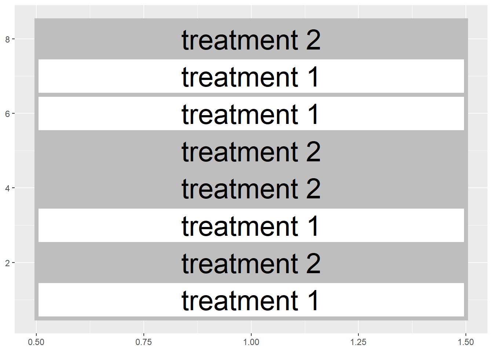
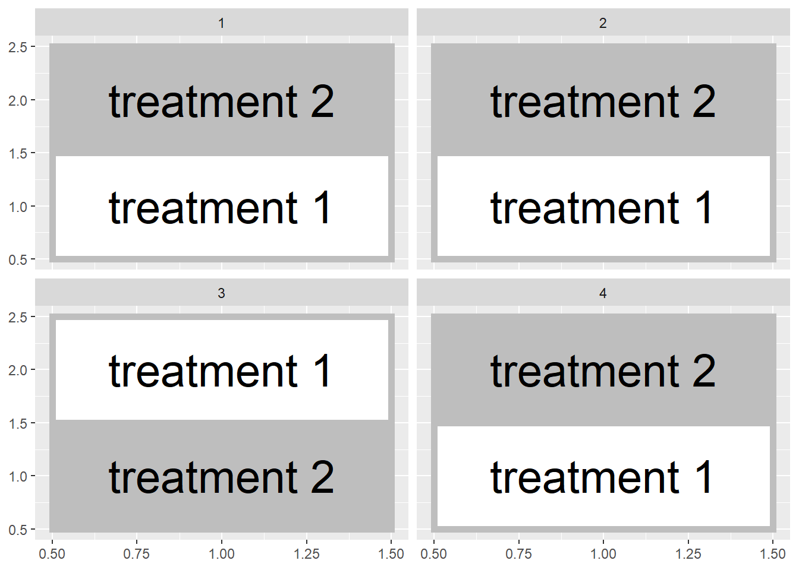
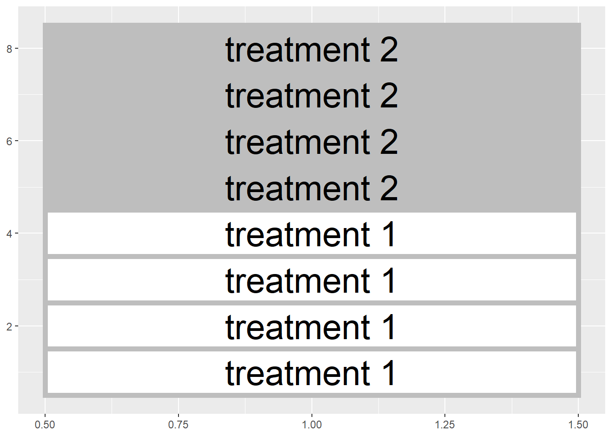
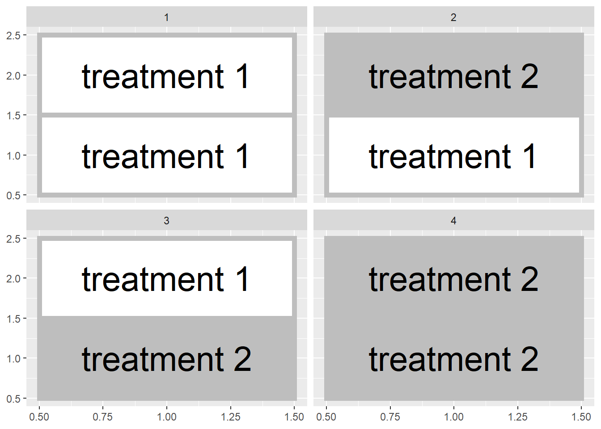
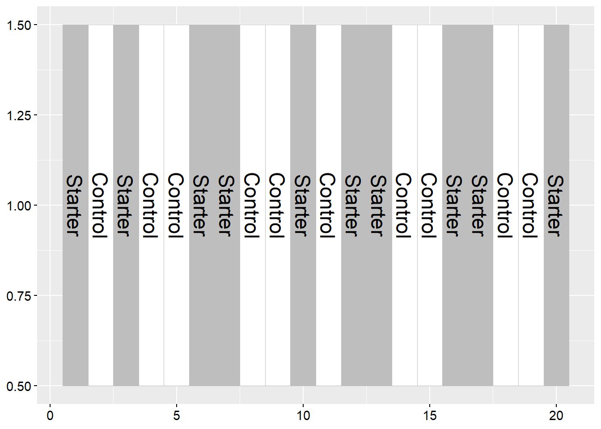
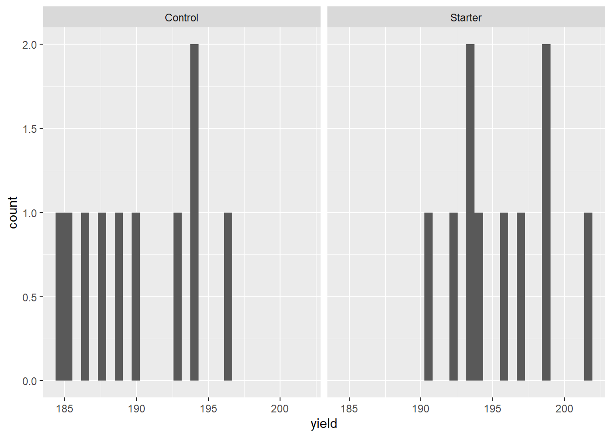
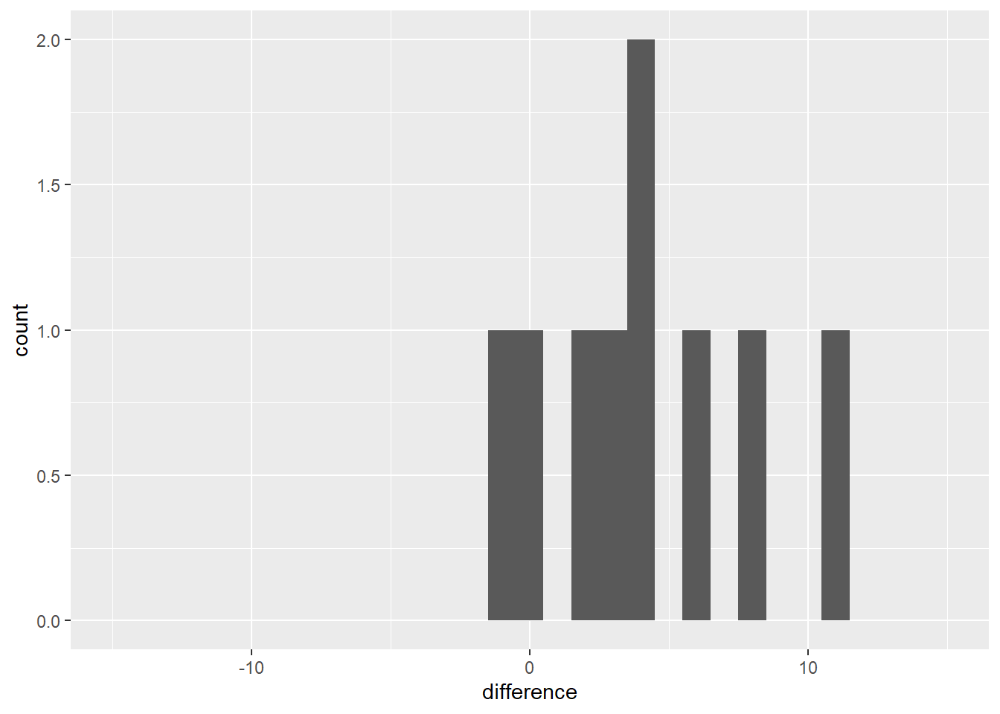
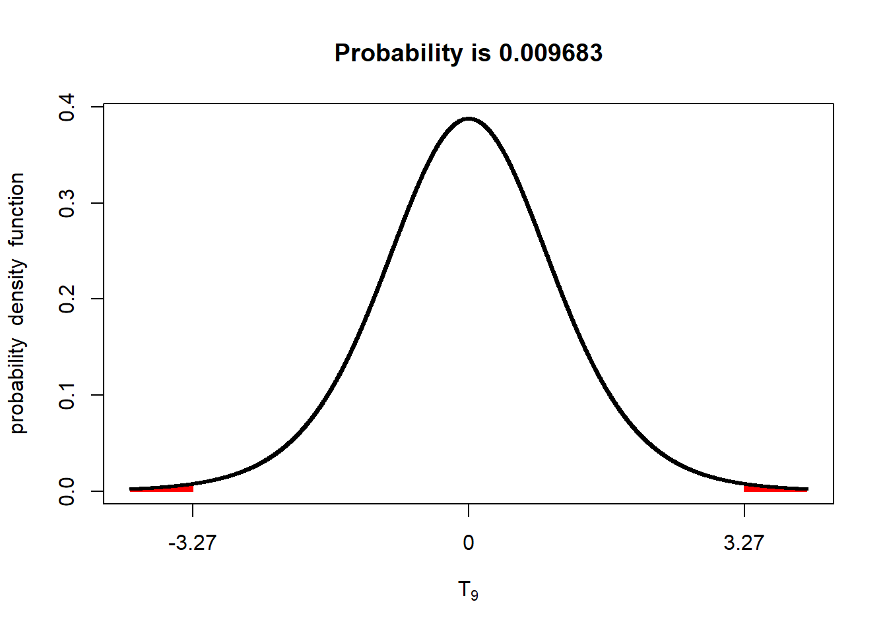

# Two-Treatment Comparisons
Until now, we have worked with a single population.  To recap our progress:
- In Unit 1, we defined a population.  We learned it was the complete group of individuals which we wanted to describe or for which we wanted to make a prediction.  We learned how to describe the center of this population with the population mean, and how to describe its spread using the sum of squares, variance, and standard deviation.
- In Unit 2, used the normal distributionto describe the pattern with which individuals are spread in many populations: individuals with values closer to the population mean were expected to be observed much more frequently that individuals with values that were more extreme.  We learned to use probability toe quantify the likelihood of encountering an invididual within a particular range of values.
- In Unit 3, we used samples, subsets from a population, in place of measuring each individual in that population.  We saw how sample means were distributed normally, from both normally- and non-normally distributed populations.  The standard error was used to describe the spread of individual samples around the sample mean.  The distribution of sample means was described by the t-distribution, which was shorter and wider when the number of samples was low, and taller and narrower when the number of samples was greater.


## Side-by-Side Trials
In this unit, we will finally put our statistical knowledge to work to test treatment differences.  We will work with a simple but important experimental design -- the two-treatment comparison.  Here in Ohio, this is referred to as a "side-by-side" trial, but you may have a different term for it where you work.  If you work for or in support of an agronomy retailer, you have probably conducted these trials.  Typically, you would split one or more fields into treated and untreated fields.  For example, you might "stripe" and individual field with treated and untreated areas: 




Or, you might divide multiple fields in half like this:




In either case, however, a side-by-side deals with two treatments and can be easily analyzed using a t-test.  In these next two units we will compare different designs for side-by-side (or paired) trials, use Excel and R to randomly assign treatments, understand how the t-distribution allows us to test for significance, and run these tests in R.


## Blocked Design
In Unit 1 we learned the hallmarks of a designed trial are the randomzation and replication of treatments.  Each treatment should be observed several times in different experimental units.  Often in our work "experimental unit" is a fancy word for a plot, half a field, or a pot.  

Observing the treatment several times has two benefits.  First, the average of those observations – the sample average – wil likely be closer to the true population average for that treatment than the individual observations.  Second, variation among the observations can be used to give us a sense how much environmental factors outside, in contrast with our treatment, cause our observations to vary.

It is also important to randomize treatments in order to avoid intentional or unintentional biases that might skew our interpretation of results.  For example, one treatment might be biased by always putting it to the north of another treatment or, more insiduously, always putting it in the better half of a field.  Deliberate randomization reduces the probability of either scenario.

That said, reality often intervenes intervenes.  Soil types change across a field, as do microclimates around field edges, management histories, etc.  Though randomization will reduce the likelihood that treatments are concentrated in one of these areas, it may not result in as even a distribution of treatments across the experimental area as we would like.  Even with randomization, we could conceivably with all the treatments in one half of the field:





Or, if we are using multiple fields, both halves of a field could receive the same treatment in a randomized design


 
Blocked experimental designs, place a restriction on the random assignment of treatments to plots.  Instead of assigning treatments randomly within a field or across a state.  We instead force both treatments to occur within a field section or in the same field, so that our treatment maps look more those we showed in the first two figures of this unit.

Here is another way to think about this.  Our statistical test this week is based on comparing two populations.  Each population will receive a different treatment.  We want to design our experiment so that aside from the treatment, the two populations are as identical as possible.  The blocked approach, in general, helps create two populations that are similar.  
 

## Case Study
An in-furrow corn starter (6-24-6 plus proprietary micronutrients) was tested against a control (no -starter) in a trial in western Ohio.  Treatments were blocked (paired) so that each treatment occurred once per block.  Plot numbers are given on the x-axis of the map below.  There were 10 blocks. The data are in a data.frame named "corn_starter".


```r
corn_starter = read.csv("data-unit-4/corn_starter.csv")
```





Examine the corn_starter data.frame using the "head" function.

```r
head(corn_starter)
```

```
##   block plot treatment yield
## 1     1   11   Starter 193.4
## 2     1   12   Control 194.2
## 3     2   21   Starter 192.2
## 4     2   22   Control 189.0
## 5     3   31   Control 193.8
## 6     3   32   Starter 194.2
```
Note the column headings: "trt" refers to the treatment level (Control or Starter) and "value" refers to the measured yield.


Let's make a quick histogram plot of the data using ggplot.  For the first time, in this unit, we are working with two populations: one which received no starter (the control), and another which received starter.  So we will have separate histograms for both populations.

```r
ggplot(data = corn_starter, aes(x=yield)) +
  geom_histogram() +
  facet_grid(~treatment)
```

```
## `stat_bin()` using `bins = 30`. Pick better value with `binwidth`.
```



In the above code, ggplot launches the function to plot our data.  Also on the first line, "aes" specifies the "aesthetics" to be plotted -- these are the variable(s) that define where objects are positioned in the plot.  In this case, yield determines which bin an observation is placed into, so x=value.

The next line tells R to draw a histogram.

The last line tells R to construct a series of plots, one for each level of treatment.  This way, we can compare the distribution of the Control population with that of the Starter population.

The mean yield of the population that population that received starter is greater than the center of the population that received the control (no starter).


```r
corn_starter %>%
  group_by(treatment) %>%
  summarise(yield = mean(yield))
```

```
## # A tibble: 2 x 2
##   treatment yield
##   <chr>     <dbl>
## 1 Control    190.
## 2 Starter    196.
```

Another way to look at this would be to create a new population from the differences between starter and control within each pair.



This can be confusing, so let's slow it down.  We created a new population by subtracting the yield of the control plot from the yield of the starter plot in each pair.  In this new population, individuals with a positive value indicate a block where the starter outyielded the control.  Individuals with a negative value indicate a block where the control outyielded the starter.  We will now work with this new population of differences. 

We see most of the individuals in this new population are greater than 0.  The population mean is 5.6 bushels/acre.  What we want to know is: given the mean we observed (5.59 bushels/acre) and the distribution of this population, what is the probability, were we to repeat the trial, that the population mean would be zero.  

A population mean of zero would mean the starter yield and control yield were the same, i.e. there is no difference between the starter and control.


## Confidence Interval
We can use a confidence interval to determine whether the range of values we are likely to observe includes zero.  Recall, to calculate the confidence interval we need two values: the minimal t-value that is associated with our degrees of freedom and encompases 95% of our population, and the standard error of the difference.

We calculate the minimal t-value using the qt function in R.  

```r
min_t = qt(0.975, df=9)
```

Remember, degrees of freedom is equal to n-1.  Our new population has 10 degrees of freedom, thereofre, df equals 9 above.

We also need to know the standard error of the population.  Given our population is composed of treatment differences, we will call this statistic the *standard error of the difference*.  


```r
sd = sd(corn_differences$difference)
sed = sd/sqrt(10)
pop_mean = mean(corn_differences$difference)
```

In the code above, we first calculated the standard deviation, sd, of of our differences. We divided the standard deviation by the square root of the number of observations to get the standard error of the difference.  Our population mean is 5.59 and the standard error of the difference is about 1.71 We additionally calculated pop_mean, the mean of our population. 

We can now calculate the confidence interval, using min_t and sed:

```r
upper_limit = pop_mean + (min_t * sed)
lower_limit = pop_mean - (min_t * sed)
CI = paste(lower_limit, upper_limit, sep=",")
CI
```

```
## [1] "1.72421086829983,9.45578913170016"
```

The 95% confidence interval ranges from 1.72 to 9.46 bushels per acre and, notably, does not include zero.  Since zero is outside the 95% confidence interval, there is greater than a 95% probability the population mean is not equal to zero.  Another way of saying this is there is less than a 5% probability that the population mean is equal to zero.  Or, finally, the population mean is significantly different from zero at the 5% (or 0.05) level.

Going our population was composed of the difference of starter and control, we can say the starter effect is significantly different from the control at the 5% level. 


## T-Test 
An alternative to the confidence interval is the t-test.  The first step of the t-test is to calculate our observed t-value:

$$ t = \frac{\bar{x} - \mu}{SED} $$
Where $\bar{x}$ is the observed population mean, $\mu$ is the hypothesized population mean (usually 0, meaning no treatment difference), and $SED$ is the standard error of the difference.

In our example above:

$$ t = \frac{5.59 - 0}{1.71} = 3.27$$

Our observed t-value is about 3.27.  If there were no difference between the starter and the control, of course, t would be equal to zero.  So there is a difference between our observed mean and zero of $t=3.27$.  Using R, we can quickly calculate the probability of observing a value $t=3.27$ above -- or below our population mean of 5.59.  


```r
library(fastGraph)
shadeDist(xshade=c(-3.27, 3.27), "dt", parm2 = 9, lower.tail = TRUE)
```



Note that this time with this function we used the argument "lower.tail=TRUE".  This tells R to calculate the probability of values futher than $t=3.27$ both above and below the mean.

Again there were 10 observed differences in our population, so there were 9 degrees of freedom.  The value that is returned is the probability the population mean is actually zero, given the population mean.  The probability of this t-value (sometimes abbreviated as $Pr \ge \lvert t \lvert$) is very low, less tan 0.01, or 1%.


## Exercise: Randomizing Plots
Plot randomzation is a very important -- and very easy to do with R.  Below we will learn how to randomize plots for side-by-side trials in which plots are paired.


### Example 1
For our first example, we create an experimental design with 4 replications of treatments "A" and "B".  We will use the agricolae package to do this.  The agricolae package is 

### The Agricolae Package
To randomize two-treatment trials with paired treatments, we will use the "agricolae" package of R.  


```r
library(agricolae)
```

### Randomizing the Plot
We will use the "design.rcbd" function from the agricolae package.  We need to supply the following arguments to this function:
- trt: a vector with treatment names
- r: the number of replications

We will create a vector called "treatment_names", containing treatments "A" and "B".  We will use the argument r=4 to tell R to generate 4 blocks.


```r
treatment_name=c("A", "B")

plot_plan = design.rcbd(trt = treatment_name, r=4)
```

### Working with Lists
The code above created an object called "plot_plan".  So far in R we have dealt with two kinds of objects: a data frame, which is basically a table of values, and a vector, which can be thought of as a single column of numbers.  "treatment_names" above is an example of a vector.

"plot_plan" is a third type of R object, called a "list".  A list is a collection of other R objects.  It can contain multiple data frames, vectors, single values, etc.  A list is a very useful way to bundle up information, but they can be a little tricky to unpack.

If we just run plot_plan below, we will get two windows.  One will list all of the objects in the list.  The second window will show the plot plan.


```r
plot_plan
```

```
## $parameters
## $parameters$design
## [1] "rcbd"
## 
## $parameters$trt
## [1] "A" "B"
## 
## $parameters$r
## [1] 4
## 
## $parameters$serie
## [1] 2
## 
## $parameters$seed
## [1] 1180078120
## 
## $parameters$kinds
## [1] "Super-Duper"
## 
## $parameters[[7]]
## [1] TRUE
## 
## 
## $sketch
##      [,1] [,2]
## [1,] "B"  "A" 
## [2,] "B"  "A" 
## [3,] "B"  "A" 
## [4,] "A"  "B" 
## 
## $book
##   plots block treatment_name
## 1   101     1              B
## 2   102     1              A
## 3   201     2              B
## 4   202     2              A
## 5   301     3              B
## 6   302     3              A
## 7   401     4              A
## 8   402     4              B
```

We can access this information more directly.  If we type "plot_plan$sketch", we get a plot map of sorts.


```r
plot_plan$sketch
```

```
##      [,1] [,2]
## [1,] "B"  "A" 
## [2,] "B"  "A" 
## [3,] "B"  "A" 
## [4,] "A"  "B"
```

If we type "plot_plan$book", we get a data frame with the plots, block, and treatment_names.


```r
plot_plan$book
```

```
##   plots block treatment_name
## 1   101     1              B
## 2   102     1              A
## 3   201     2              B
## 4   202     2              A
## 5   301     3              B
## 6   302     3              A
## 7   401     4              A
## 8   402     4              B
```

### Example 2
In a field trial, we wish to compare the biomass of two fiber hemp varieties, "Jerry" and "Bob".  We wish to design a paired experimental design with 10 replications.


```r
hemp_variety = c("Jerry", "Bob")

hemp_plot_plan = design.rcbd(trt = hemp_variety, r=10)
```

Here is the plot layout:

```r
hemp_plot_plan$sketch
```

```
##       [,1]    [,2]   
##  [1,] "Bob"   "Jerry"
##  [2,] "Bob"   "Jerry"
##  [3,] "Bob"   "Jerry"
##  [4,] "Bob"   "Jerry"
##  [5,] "Bob"   "Jerry"
##  [6,] "Jerry" "Bob"  
##  [7,] "Jerry" "Bob"  
##  [8,] "Jerry" "Bob"  
##  [9,] "Bob"   "Jerry"
## [10,] "Jerry" "Bob"
```

And here is the table we can cut and paste into our spreadsheet:

```r
hemp_plot_plan$book
```

```
##    plots block hemp_variety
## 1    101     1          Bob
## 2    102     1        Jerry
## 3    201     2          Bob
## 4    202     2        Jerry
## 5    301     3          Bob
## 6    302     3        Jerry
## 7    401     4          Bob
## 8    402     4        Jerry
## 9    501     5          Bob
## 10   502     5        Jerry
## 11   601     6        Jerry
## 12   602     6          Bob
## 13   701     7        Jerry
## 14   702     7          Bob
## 15   801     8        Jerry
## 16   802     8          Bob
## 17   901     9          Bob
## 18   902     9        Jerry
## 19  1001    10        Jerry
## 20  1002    10          Bob
```


## Exercise: Restructuring Columns and Rows
As we move into the treatment comparisons part of our course, it is a good time to talk about how datasets are structured.  Datasets can have a "wide structure, in which the values for different treatments are listed side by side:


```r
library(tidyverse)
Trt_A = c(1:4)
Trt_B = c(5:8)
Rep = c(1:4)
wide_df = cbind(Rep, Trt_A, Trt_B) %>%
  as.data.frame()

wide_df
```

```
##   Rep Trt_A Trt_B
## 1   1     1     5
## 2   2     2     6
## 3   3     3     7
## 4   4     4     8
```

In general, however, we prefer data be in the long form, so that each observation has its own row in the dataset.  In the long form, the data above would be in three columns, the first listing the rep, the second listing the treatment, and the third listing the observed value for that treatment.

To get the data into the correct form, we need to pivot or transpose it: that is, certain columns will become rows, or vice versa.  Fortunately, this is easy to do with the "tidyverse" package in R.  The "tidyverse" and "tidy" data concept are yet another product from Hadley Wickham, who is an alumnus of Iowa State.

Let's run the tidyverse package:


```r
library(tidyverse)
```

The tidyverse package introduces us to a new feature in R: pipes.  Pipes are connections between lines of code that allow us to work on the same dataset with several lines of code at once.  Pipes are signified with the "%>%" string of code.

To make our dataset into the long format, we use the "gather" function to collect the four treatment rows into two rows, one identifying the treatment and the other with the value.  "gather" requires three arguments: 1) the name of the column that will identify the data (often called a key), 2) the observed values, and 3) the columns to be reorganized in the key and value columns.


```r
long_df = wide_df %>%
  gather(Treatment, Value, Trt_A:Trt_B)

long_df
```

```
##   Rep Treatment Value
## 1   1     Trt_A     1
## 2   2     Trt_A     2
## 3   3     Trt_A     3
## 4   4     Trt_A     4
## 5   1     Trt_B     5
## 6   2     Trt_B     6
## 7   3     Trt_B     7
## 8   4     Trt_B     8
```

In the code above, we created a new data frame, "long_df", from the "wide_df" data frame.  We used the "gather" function to create two new columns, "Treatment" and "Value", to contain the treatment name and value associated with each observation.  The pipe ("%>%") told the "gather" function to work with the "wide_df" data.

What if we had a long dataset that we wanted to be wide, so that each treatment had its own column?  Then we would use the "spread" function.  Spread takes two arguments: the column used to identify the values, and the column with the value.  Again, the pipe connects the two lines of code.


```r
wide_again_df = long_df %>%
  spread(Treatment, Value)

wide_again_df
```

```
##   Rep Trt_A Trt_B
## 1   1     1     5
## 2   2     2     6
## 3   3     3     7
## 4   4     4     8
```


### Operations on Data
One of the reasons we may want to restructure data in the wide format is so we can conduct a new statistic from the original values.  For example, as we learn this week, we may want to model the distribution of the differences between Trt A and Trt B.  Once the data is in the wide format above, we calculcate these differences very quickly.

In R, we use the "mutate" function to build new columns.  The argument to "mutate" is usually a mathematical formula.  Say we want to cacluate the differences, row by row, between Trt A and Trt B.  We would use the following mutate command.


```r
trt_differences = wide_again_df %>%
  mutate(Trt_Diff = Trt_A - Trt_B)
trt_differences
```

```
##   Rep Trt_A Trt_B Trt_Diff
## 1   1     1     5       -4
## 2   2     2     6       -4
## 3   3     3     7       -4
## 4   4     4     8       -4
```

We now have a new column of the differences between Trt_A and Trt_B.


### Case Study: Soybean Fungicide
Soybean treated with fungicide applied at R3 was compared with soybean that was untreated.  Data are in the soybean_funcicide.csv

```r
soybean = read.csv("data-unit-4/exercise_data/soybean_fungicide.csv")
soybean
```

```
##    Block Treatment Yield
## 1      1         A  71.5
## 2      1         B  75.1
## 3      2         A  73.5
## 4      2         B  77.7
## 5      3         B  77.7
## 6      3         A  72.4
## 7      4         B  78.2
## 8      4         A  75.0
## 9      5         A  76.4
## 10     5         B  75.9
## 11     6         A  76.5
## 12     6         B  77.5
## 13     7         B  80.7
## 14     7         A  74.8
## 15     8         A  75.6
## 16     8         B  78.4
## 17     9         B  80.7
## 18     9         A  73.2
## 19    10         B  76.9
## 20    10         A  74.6
```

This dataset is currently in the long form.  To calculate the differenced between Treatments A and B, we need need to convert it to the wide form.


```r
soybean_wide = soybean %>%
  spread(Treatment, Yield)
soybean_wide
```

```
##    Block    A    B
## 1      1 71.5 75.1
## 2      2 73.5 77.7
## 3      3 72.4 77.7
## 4      4 75.0 78.2
## 5      5 76.4 75.9
## 6      6 76.5 77.5
## 7      7 74.8 80.7
## 8      8 75.6 78.4
## 9      9 73.2 80.7
## 10    10 74.6 76.9
```

We now have the two treatments in columns A and B.  We can then calculate the difference betwee Treatment A and Treatment B using the mutate function..


```r
diffs = soybean_wide %>%
  mutate(diff = A-B)
diffs
```

```
##    Block    A    B diff
## 1      1 71.5 75.1 -3.6
## 2      2 73.5 77.7 -4.2
## 3      3 72.4 77.7 -5.3
## 4      4 75.0 78.2 -3.2
## 5      5 76.4 75.9  0.5
## 6      6 76.5 77.5 -1.0
## 7      7 74.8 80.7 -5.9
## 8      8 75.6 78.4 -2.8
## 9      9 73.2 80.7 -7.5
## 10    10 74.6 76.9 -2.3
```

### Practice 1

The dataset "darwin.csv" is from a trial by Charles Darwin in which he compared the heights of progeny of corn plants that were self-fertilized and cross-fertilized. Three pairs of plants were grown per pot.  Measurements are in inches.


```r
darwin = read.csv("data-unit-4/exercise_data/darwin.csv")

head(darwin)
```

```
##   pot pair  type height
## 1   I    a cross 23.500
## 2   I    a  self 17.375
## 3   I    b cross 12.000
## 4   I    b  self 20.375
## 5   I    c cross 21.000
## 6   I    c  self 20.000
```

The data are currently in the long format.  We want to convert it to the wide format, where each treatment has its heights in a separate column.  Re-structure the type and height columns using the spread_function.


The first few rows of the resulting dataset should look like:

I	a	23.500	17.375	
I	b	12.000	20.375	
I	c	21.000	20.000	
II	d	22.000	20.000	


### Practice 2
These data are from a trial that compared apple genotypes.


Calculate the difference between the two apple genotypes (Golden and Redspur) by completing the "mutate" function below.


The first two rows should look like:

R1	121.7750	127.5900	-5.81500	
R2	146.7222	126.7625	19.95972	


### Practice 3
Manganese was applied to soybean at the V5 stage near New Baltimore, Ohio.  


```r
manganese = read.csv("data-unit-4/exercise_data/soybean_manganese.csv")
head(manganese)
```

```
##   Block Treatment Yield
## 1     1         A  78.9
## 2     1         B  81.7
## 3     2         A  80.9
## 4     2         B  84.3
## 5     3         B  84.3
## 6     3         A  79.8
```

Convert the data to wide format so the two treatments are in separate columns

The first two rows of the resulting dataset should look like:

1	78.9	81.7		
2	80.9	84.3	

Then calculate the difference between treatments A and B by subtracting treatment B from treatment A.


The first couple of rows of the final dataset should look like:

1	78.9	81.7	-2.8	
2	80.9	84.3	-3.4	


### Practice 4

Data are from a wheat trial where fungicide was applied during flag leaf stage.

```r
wheat = read.csv("data-unit-4/exercise_data/wheat_fungicide.csv")
head(wheat)
```

```
##   Block Treatment Yield
## 1     1         B  95.9
## 2     1         A  93.8
## 3     2         A  92.3
## 4     2         B  97.5
## 5     3         A  98.7
## 6     3         B  98.8
```

Convert the data to wide format.  The first few rows should look like:

1	93.8	95.9		
2	92.3	97.5		
3	98.7	98.8	


Calculate the difference between treatments by subtracting Treatment A from Treatment B.  The first few rows should look like:

1	93.8	95.9	-2.1	
2	92.3	97.5	-5.2	
3	98.7	98.8	-0.1	


## Exercise: Confidence Interval of Difference"

In this unit, we learned that, in the case of two-treatment experiments, we can test whether the populations that receive each treatment are different from each other by testing whether their difference is different from zero. While we will often use the t.test to calculate the probability the two populations are equal, given their measured values, there are times when we may want to report the confidence interval around their difference.  

These confidence intervals also be can be gained from the "t.test", but calculating them manually in these exercises is a good opportunity to sharpen your R skills and hopefully will give you are greater conceptual sense of how the confidence interval works.  

To create the confidence interval for the difference between two populations, there are the following steps:
- calculate the differences between the populations in each pair or block
- calculate the overall mean difference between the two populations
- calculate the standard deviation and standard error of the difference
- look up the appropriate t-value based on the desired level of confidence and degrees of freedom
- add and subtract the product of standard error and t-value from the mean difference.

### Example 1
We will work with the soybean fungicide data from the previous exercise

```r
library(tidyverse)
soybean = read.csv("data-unit-4/exercise_data/soybean_fungicide.csv")
head(soybean)
```

```
##   Block Treatment Yield
## 1     1         A  71.5
## 2     1         B  75.1
## 3     2         A  73.5
## 4     2         B  77.7
## 5     3         B  77.7
## 6     3         A  72.4
```

#### Calculate Differences
We will use the "spread" and "mutate" functions from the previous exercises to calculate a the population difference within each block.


```r
soybean_wide = soybean %>%
  spread(Treatment, Yield)

soybean_diff = soybean_wide %>%
  mutate(diff = A-B)

soybean_diff
```

```
##    Block    A    B diff
## 1      1 71.5 75.1 -3.6
## 2      2 73.5 77.7 -4.2
## 3      3 72.4 77.7 -5.3
## 4      4 75.0 78.2 -3.2
## 5      5 76.4 75.9  0.5
## 6      6 76.5 77.5 -1.0
## 7      7 74.8 80.7 -5.9
## 8      8 75.6 78.4 -2.8
## 9      9 73.2 80.7 -7.5
## 10    10 74.6 76.9 -2.3
```

#### Calculate the Mean Difference
This is the mean for the new column, diff.  As a reminder, soybean_diff$diff tells R to use the diff column of the soybean_diff data frame.

```r
diff_mean = mean(soybean_diff$diff)
diff_mean
```

```
## [1] -3.53
```

#### Calculate the Standard Deviation and Standard Error
We can calculte the standard deviation using the "sd" function.

```r
diff_sd = sd(soybean_diff$diff)
diff_sd
```

```
## [1] 2.351383
```

The standard error is the standard deviation, divided by the square root of the number of observations, n.  In this example, n=10.  We can verify this using the "length" function of R.  We can then calculate the standard error, which we will call "diff_se".


```r
diff_N = length(soybean_diff$diff)

diff_se = diff_sd / sqrt(diff_N)
```

diff_se is the standard error.  The formula we used is equal to 2.35 / sqrt(10).  We just used the variables to save retyping.

#### Calculate the t-value
We calcuate the t-value to use in our confidence interval by using the "qt" function of R.  Remember, the qt function uses two arguments.  The first is the desired level of confidence.  We want a 95% confidence interval, so we will use 0.975.  That will leave 0.025, or 2.5%, beyond the upper and lower limits of our confidence interval.  

The second argument is the degrees of freedom.  Since we have observed ten differences, we have nine degrees of freedom. 


```r
t_value = qt(0.975, 9)
t_value
```

```
## [1] 2.262157
```
Our t_value is approximately 2.26.

#### Calculate the Confidence Interval
The confidence interval is bound by upper and lower confidence limits.  The lower limit is equal to the mean difference minus the product of the standard error of the difference and t-value.  The upper limit is the mean difference plus the product of the standard error of the difference.


```r
lower_limit = diff_mean - (diff_se * t_value)
upper_limit = diff_mean + (diff_se * t_value)

lower_limit
```

```
## [1] -5.212078
```

```r
upper_limit
```

```
## [1] -1.847922
```

The 95% confidence interval, with 9 df, for the difference is (-5.21, -1.85).  Note the confidence interval does not include zero, therefore the two populations (and, thus, the treatments they received) are significantly different at the P<0.05 level.

Which treatment was greater? Since we subtracted B from A, the negative confidence interval indicates B was greater.

### Example 2
We will work with the Darwin corn data.

```r
darwin = read.csv("data-unit-4/exercise_data/darwin.csv")
head(darwin)
```

```
##   pot pair  type height
## 1   I    a cross 23.500
## 2   I    a  self 17.375
## 3   I    b cross 12.000
## 4   I    b  self 20.375
## 5   I    c cross 21.000
## 6   I    c  self 20.000
```


#### Calcuate Differences

```r
darwin_wide = darwin %>%
  spread(type, height)
head(darwin_wide)
```

```
##   pot pair  cross   self
## 1   I    a 23.500 17.375
## 2   I    b 12.000 20.375
## 3   I    c 21.000 20.000
## 4  II    d 22.000 20.000
## 5  II    e 19.125 18.375
## 6  II    f 21.500 18.625
```


```r
darwin_diff = darwin_wide %>%
  mutate(diff = cross - self)
head(darwin_diff)
```

```
##   pot pair  cross   self   diff
## 1   I    a 23.500 17.375  6.125
## 2   I    b 12.000 20.375 -8.375
## 3   I    c 21.000 20.000  1.000
## 4  II    d 22.000 20.000  2.000
## 5  II    e 19.125 18.375  0.750
## 6  II    f 21.500 18.625  2.875
```


#### Calculate Mean Difference

```r
darwin_diff_mean = mean(darwin_diff$diff) 
darwin_diff_mean
```

```
## [1] 2.616667
```

#### Calculate Standard Deviation and Standard Error


```r
darwin_diff_sd = sd(darwin_diff$diff)
darwin_diff_N = length(darwin_diff$diff)

darwin_diff_se = darwin_diff_sd / sqrt(darwin_diff_N)
darwin_diff_se
```

```
## [1] 1.218195
```

#### Calculate the t-value
There were 15 pairs, so there are 14 degrees of freedom.  We will again calculate the t-value for the 95% confidence interval.


```r
darwin_t_value = qt(0.975, 14)
darwin_t_value
```

```
## [1] 2.144787
```

#### Calculate the Confidence Interval

```r
darwin_lower_limit = darwin_diff_mean - (darwin_diff_se * darwin_t_value)
darwin_upper_limit = darwin_diff_mean + (darwin_diff_se * darwin_t_value)

darwin_lower_limit
```

```
## [1] 0.003899165
```

```r
darwin_upper_limit
```

```
## [1] 5.229434
```

The confidence interval was (0.004, 5.229).  It does not include zero, so the difference is significant.  Since we subtracted the self-pollinated values from the cross-pollinated values, the positive difference means the cross-pollinated plants were taller than the self-pollinated plants.


## Exercise: T-Test

The t-test is used to test the probability that two populations are different.  In a two-treatment trial, each population will receive a different treatment (an input or management practice).  In R, we can use the "t.test" function to quickly determine the probability that two treatments are different.

### Case Study 1: Wheat Fungicide
Let's start by loading the data and using the "head" command to examine its structure.  Treatment B was a fungicide applied at flag leaf.  Treatment A is the untreated control.

```r
wheat = read.csv("data-unit-4/exercise_data/wheat_fungicide.csv")
head(wheat)
```

```
##   Block Treatment Yield
## 1     1         B  95.9
## 2     1         A  93.8
## 3     2         A  92.3
## 4     2         B  97.5
## 5     3         A  98.7
## 6     3         B  98.8
```

### T-Test
The t.test function in R requires at least three arguments.  The first is a model statement.  In testing whether populations that receive different treatments have different yields, we are modelling yield as a function of treatment.

We can express this in the following statement:

```r
model = Yield ~ Treatment
```

We can then plug the model statement into our t.test.  The second argument to the t.test, "data=wheat", tells R which data frame to analyze.  The third, "paired=TRUE", tells R the treatments were paired (blocked) in our experiment.  

```r
wheat_t_test = t.test(model, data=wheat, paired=TRUE)

wheat_t_test
```

```
## 
## 	Paired t-test
## 
## data:  Yield by Treatment
## t = -3.7166, df = 9, p-value = 0.004796
## alternative hypothesis: true difference in means is not equal to 0
## 95 percent confidence interval:
##  -5.871641 -1.428359
## sample estimates:
## mean of the differences 
##                   -3.65
```

What would happen if we left out the "paired=TRUE" argument?


```r
wheat_t_test_independent = t.test(model, data=wheat)

wheat_t_test_independent
```

```
## 
## 	Welch Two Sample t-test
## 
## data:  Yield by Treatment
## t = -3.9101, df = 17.91, p-value = 0.001034
## alternative hypothesis: true difference in means is not equal to 0
## 95 percent confidence interval:
##  -5.611876 -1.688124
## sample estimates:
## mean in group A mean in group B 
##           94.65           98.30
```

We notice, that the t-value, degrees of freedom, and p-value are all different.  This is because R analyzes the two treatments as independent populations with their own variances -- instead of analyzing the differences between each pair of treatments.  The df of 17.91 is not a whole number -- this also tells us that R is treating the variances differently and using algorithms it would not use with a paired design.

Lets look at the correct analysis again.

```r
wheat_t_test
```

```
## 
## 	Paired t-test
## 
## data:  Yield by Treatment
## t = -3.7166, df = 9, p-value = 0.004796
## alternative hypothesis: true difference in means is not equal to 0
## 95 percent confidence interval:
##  -5.871641 -1.428359
## sample estimates:
## mean of the differences 
##                   -3.65
```

Highlights of the output include the p-value, and the 95% confidence interval.  The p-value tells us there is about a 0.005, or 0.5% probability that the difference between the treatments is actually zero, give the actual observed difference.  The 95% confidence interval is a range around the measured difference, -3.65, that is likely to include the true difference between the populations.  That the confidence interval does not include zero is a reminder that the difference between the two populations is significant.  

There are a couple of other arguments we may include in the "t.test" function.  Remember that the t-test tests whether the measured difference between populations is different from a hypothetical difference.  Usually, this hypothetical difference is zero, as we can see in the output above where it says "true difference in means is not equal to 0".  But it is good to extra-careful and specify this by including the argument "mu=0" in our t.test function.


```r
wheat_t_test_mu_zero = t.test(model, data=wheat, paired=TRUE, mu=0)

wheat_t_test_mu_zero
```

```
## 
## 	Paired t-test
## 
## data:  Yield by Treatment
## t = -3.7166, df = 9, p-value = 0.004796
## alternative hypothesis: true difference in means is not equal to 0
## 95 percent confidence interval:
##  -5.871641 -1.428359
## sample estimates:
## mean of the differences 
##                   -3.65
```

Occassionally, we might want to test whether the observed difference between populations is something other than 0.  What if in our wheat trial we wanted to test whether the observed difference between populations was different than -1?  In that case, we would specify mu=-1 in our code.


```r
wheat_t_test_mu_1 = t.test(model, data=wheat, paired=TRUE, mu=-1)

wheat_t_test_mu_1
```

```
## 
## 	Paired t-test
## 
## data:  Yield by Treatment
## t = -2.6983, df = 9, p-value = 0.02446
## alternative hypothesis: true difference in means is not equal to -1
## 95 percent confidence interval:
##  -5.871641 -1.428359
## sample estimates:
## mean of the differences 
##                   -3.65
```

We can see that our p-value has changed, as has the "alternative hypothesis" statement.


### Case Study 2: Apple Variety
Lets look at our apple data:

```r
apple = read.csv("data-unit-4/exercise_data/apple_genotype.csv")
head(apple)
```

```
##   rep     gen    yield
## 1  R1  Golden 121.7750
## 2  R1 Redspur 127.5900
## 3  R2  Golden 146.7222
## 4  R2 Redspur 126.7625
## 5  R3  Golden 145.7500
## 6  R3 Redspur 132.9364
```

Our model is now that yield is a function of gen (genotype).  Our model statement is therefore:

```r
apple_model = yield ~ gen
```

And our t-test is as follows:

```r
apple_t_test = t.test(apple_model, data=apple, paired = TRUE, mu=0)

apple_t_test
```

```
## 
## 	Paired t-test
## 
## data:  yield by gen
## t = -0.41501, df = 4, p-value = 0.6994
## alternative hypothesis: true difference in means is not equal to 0
## 95 percent confidence interval:
##  -28.58021  21.14724
## sample estimates:
## mean of the differences 
##               -3.716484
```

We can see from above that our p-value is about 0.70.  Sometimes it snows in April.  And sometimes our treatments aren't significantly different.  If we look at our confidence interval, we can confirm that it includes zero.

### Practice

What is the t-test value for the "data-unit-4/exercise_soybean_fungicide.csv" trial?  Assume the treatments are paired.  Your t-test should reveal a p-value of 0.001048.

What is the t-test value for the "data-unit-4/exercise_soybean_manganese.csv" trial?  Assume the treatments are paired.  Your t-test should reveal a p-value of 0.005143.

