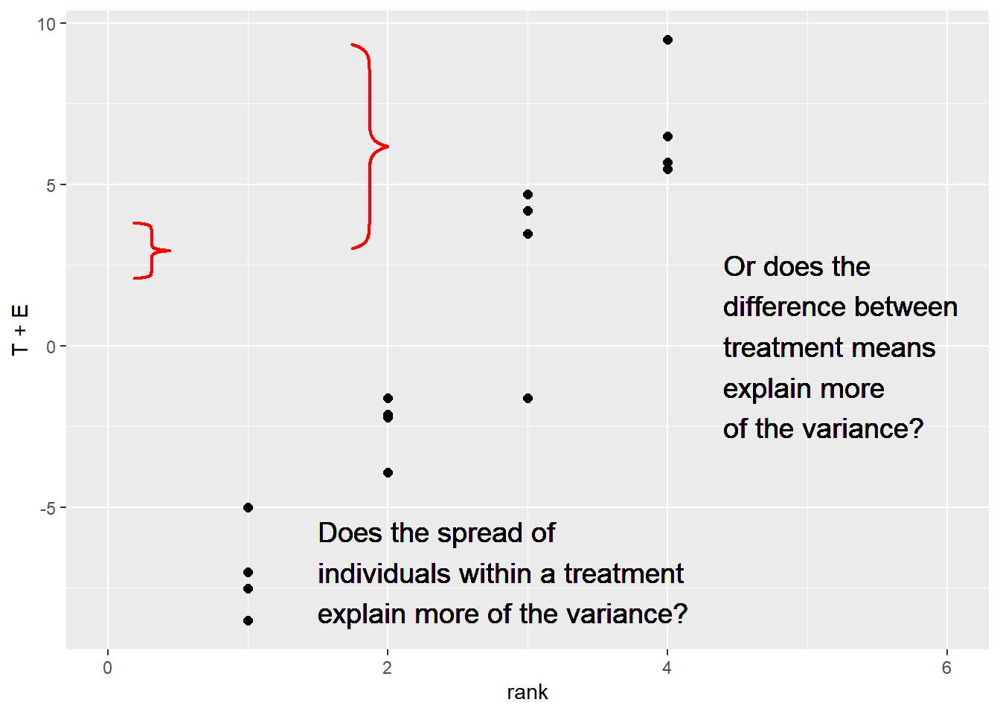

# Multiple Treatment Trials
Here is our course, so far, in a nutshell:

* statistics is all about populations
* when we compare treatments, we are actually comparing populations that have been exposed to different products or management
* when we can measure every individual in that population, we can use the Z-distribution to describe their true population means and variance
* most of the time in agricultural research, however, we must use a samples (subsets from those populations) to *estimate* their population means and variance
* when we use the sample mean to estimate the population mean, we use the t-distribution to descibe the distribution of sample means around the mean of their values
* the distribution of sample means can be used to calculate the probability (the p-value) the true population mean is a hypothetical value
* in a paired t-test of two populations, we create a new population of differences, and calculate the probability its mean is zero
* proper hypotheses and alphas (maximum p-values for significance) can reduce the likelihood we conclude populations are different when they are likely the same, or the same when they are likely different

I include this brutal distillation so you can see how the course has evolved from working with complete populations to samples, from "true" or "certain" estimates of population means to estimates, from working with single populations to comparing differences between two populations.

In the last two units, we learned how to design and evaluate the results of side-by-side trials: trials in fields or parts of fields were divided into two populations that were managed with different treatments or practices.  This was a practical, powerful, jumping-off point for thinking about experiments and their analyses.

Let's face it, however: if we only compared two treatments per experiment in product testing or management trials, our knowledge would advance at a much slower pace.  So in the next three units, we will learn how to design and evaluate trials to test multiple *categorical* treatments.  By *categorical*, we mean treatments we identify by name, not quantity.  Treatments that, in general, cannot be ranked.  Hybrids are a perfect example of categorical treatments.  Herbicides, fungicides, or fertilzers that differ in brand name or chemical composition are also categorical treatments.  Comparisons of cultural practices, such as tillage systems or crop rotations are categorical treatments as well.


## Case Study
For our case study, we will look at a comparison of four hybrids from the Marin Harbur seed company.  We will compare hybrids MH-052672, MH-050877, MH-091678, and MH-032990, which are not coded by relative maturity or parent lines, but represent some of the owner's favorite Grateful Dead concerts:  
- MH-052672 has a great early disease package and is ideal for environments that have heavy morning dews
- MH-050877 is very resilient in poor fertility soils and among the last to have its leaves fire under low nitrogen conditions.  It can also grow well on everything from flatlands to mountains.  
- MH-091678 has a very strong root base that will not be shaken down by late-season wind storms
- MH-032990 offers a very rich performance and responds well to additional inputs.  (This one catches growers' eyes at every field day -- not to blow our own horn.) 


```r
library(tidyverse)
```

```
## -- Attaching packages --------------------------------------- tidyverse 1.3.0 --
```

```
## v ggplot2 3.3.3     v purrr   0.3.4
## v tibble  3.1.0     v dplyr   1.0.5
## v tidyr   1.1.3     v stringr 1.4.0
## v readr   1.4.0     v forcats 0.5.1
```

```
## -- Conflicts ------------------------------------------ tidyverse_conflicts() --
## x dplyr::filter() masks stats::filter()
## x dplyr::lag()    masks stats::lag()
```

```r
hybrid_data = read.csv("data-unit-6/grateful_data.csv")
head(hybrid_data)
```

```
##   plot_number    Hybrid Yield col row
## 1           1 MH-050877 189.5   1   1
## 2           2 MH-052672 186.4   1   2
## 3           3 MH-091678 196.9   1   3
## 4           4 MH-050877 191.2   1   4
## 5           5 MH-091678 191.8   2   1
## 6           6 MH-032990 198.9   2   2
```

The hybrids were grown in a field trial with four replications as shown below.


```r
hybrid_data %>%
  ggplot(aes(x=col, y=row, label=Hybrid)) +
  geom_tile(fill="grey", color="black") +
  geom_text(aes(label = Hybrid))
```


The arrangement of treatments above is a *completely randomized design*.  This means the hybrids were assigned at random among all plots -- there was no grouping or pairing of treatments as in our side-by-side trials earlier.

This design -- to be honest -- is used more often in greenhouse or growth chamber research where the soil or growing media are more uniform.  Still, it is the most appropriate design to start with in discussing multiple treatment trials.

## The Linear Additive Model
In order to understand how we will analyze this trial, let's plot out our data.


```r
hybrid_rank = hybrid_data %>%
  group_by(Hybrid) %>%
  summarise(Yield = mean(Yield)) %>%
  ungroup() %>%
  arrange(Yield) %>%
  mutate(rank = row_number()) %>%
  select(-Yield)

effects_data = hybrid_data %>%
  select(-col, -row) %>%
  mutate(mu = mean(Yield)) %>%
  arrange(Hybrid) %>%
  group_by(Hybrid) %>%
  mutate(T = mean(Yield) - mu) %>%
  ungroup() %>%
  mutate(E = Yield - T - mu) %>%
  left_join(hybrid_rank)
```

```
## Joining, by = "Hybrid"
```

```r
hybrids = unique(effects_data$Hybrid)

  
effects_data %>%
  ggplot(aes(x=rank, y=Yield)) +
  geom_point() +
  geom_text(aes(x=rank-0.1, y=mu+T, label=Hybrid, hjust=1)) +
  lims(x=c(0.5, 4.5))
```


Our treatment means are shown below:


```r
effects_data %>%
  ggplot(aes(x=rank, y=T)) +
  geom_point() +
  geom_text(aes(x=rank-0.1, y=T, label=Hybrid, hjust=1)) +
  geom_text(aes(x=rank+0.1, y=T, label=round(T, 1)), hjust=0) +
  lims(x=c(0.5, 4.5))
```


We can see the plot effects as well.


```r
effects_data %>%
  ggplot(aes(x=rank, y=T+E)) +
  geom_point()+
  geom_text(aes(x=rank-0.1, y=T, label=Hybrid, hjust=1)) +
  geom_text(aes(x=rank+0.1, y=T+E, label=round(E, 1)), hjust=0, size=4) +
  lims(x=c(0.5, 4.5))
```


<!-- As we learned earlier, it is sometimes clearer to observe the plot effects in a residual plot: -->

<!-- ```{r} -->
<!-- effects_data %>% -->
<!--   ggplot(aes(x=rank, y=E)) + -->
<!--   geom_point(size=3, color="tomato")+ -->
<!--   geom_text(aes(x=rank-0.1, y=0.3, label=Hybrid, hjust=1)) + -->
<!--   geom_text(aes(x=rank+0.1, y=E, label=round(E, 1)), hjust=0, size=4) + -->
<!--   geom_hline(aes(yintercept = 0)) + -->
<!--   lims(x=c(0, 4.5)) -->
<!-- ``` -->

We can observe the linear model using this table:

```r
effects_data %>%
  select(Hybrid, mu, T, E, Yield) %>%
  mutate(mu = round(mu, 1),
         T = round(T, 1),
         E = round(E, 1)) %>%
  rename(`Yield (mu + T + E)` = Yield)
```

```
## # A tibble: 16 x 5
##    Hybrid       mu     T     E `Yield (mu + T + E)`
##    <chr>     <dbl> <dbl> <dbl>                <dbl>
##  1 MH-032990  193.   6.8  -1.3                 199.
##  2 MH-032990  193.   6.8  -1.1                 199.
##  3 MH-032990  193.   6.8   2.7                 203.
##  4 MH-032990  193.   6.8  -0.3                 200.
##  5 MH-050877  193.  -2.5  -1.4                 190.
##  6 MH-050877  193.  -2.5   0.2                 191.
##  7 MH-050877  193.  -2.5   0.9                 192.
##  8 MH-050877  193.  -2.5   0.4                 191.
##  9 MH-052672  193.  -7     0                   186.
## 10 MH-052672  193.  -7    -1.5                 185.
## 11 MH-052672  193.  -7     2                   188.
## 12 MH-052672  193.  -7    -0.5                 186.
## 13 MH-091678  193.   2.7   0.8                 197.
## 14 MH-091678  193.   2.7  -4.3                 192.
## 15 MH-091678  193.   2.7   2                   198.
## 16 MH-091678  193.   2.7   1.5                 198.
```

Just as in the side-by-side trials, our statistical test is based on the ratio of the variation among treatment means to the variation among observations within each treatment.


```r
library(grid)
library(pBrackets)

p = effects_data %>%
  ggplot(aes(x=rank, y=T+E)) +
  geom_point(size = 2) +
  lims(x=c(0, 6))
p +  geom_text(aes(x=1.5, y=-7), label="Does the spread of\nindividuals within a treatment\nexplain more of the variance?", 
            hjust=0, vjust=0.5, size=5) +
  geom_text(aes(x=4.4, y=0), label="Or does the\ndifference between\ntreatment means\nexplain more\nof the variance?", 
            hjust=0, vjust=0.5, size=5) 

grid.locator(unit="native") 
# 
grid.brackets(180, 300, 180, 375, h=0.05, lwd=2, col="red")
grid.brackets(473, 60, 473, 335, h=0.05, lwd=2, col="red")
```




## Analysis of Variance
Chances are if you have spent time around agronomic research you have probably heard of *ANOVA*.  


No, not that fine example of Detroit muscle, but a statistical test, the *Analysis of Variance (ANOVA)*.  The ANOVA test performs the comparison described above when there are more than two more populations that differ categorically in their management.  I'll admit the nature of this test was a mystery to me for years, if not decades.  As the name suggests, however, it is simply an analysis (a comparison, in fact) of the different sources of variation as outlined in our linear additive model.  An Analysis of Variance tests two hypotheses:

- Ho: There is no difference among population means.
- Ha: There is a difference among population means.

In our hybrid trial, we can be more specific:

- Ho: There is no difference in yield among populations planted with four different hybrids.
- Ha: There is a difference in yield among populations planted with four different hybrids.

But the nature of the hypotheses stays the same.

## The F statistic 

The Analysis of Variance compares the variance from the treatment effect to the variance from the error effect. It does this by dividing the variance from treatments by the variance from Error:

$$F = \frac{\sigma{^2}_{treatment}}{\sigma{^2}_{error}} $$

The $F-value$ quanitfies the ratio of treatment variance to error variance.  As the ratio of the variance from the treatment effect to the variance from the error effect increases, so does the F-statistic.  In other words, a greater F-statistic suggests a greater treatment effect -- or -- a smaller error effect.


## The ANOVA Table
At this point, it is easier to explain the  

```r
library(broom)
hybrid_test = tidy(aov(Yield ~ Hybrid, hybrid_data))

hybrid_test
```

```
## # A tibble: 2 x 6
##   term         df sumsq meansq statistic     p.value
##   <chr>     <dbl> <dbl>  <dbl>     <dbl>       <dbl>
## 1 Hybrid        3 434.  145.        38.4  0.00000197
## 2 Residuals    12  45.2   3.76      NA   NA
```

```r
summary(hybrid_test)
```

```
##      term                 df            sumsq            meansq       
##  Length:2           Min.   : 3.00   Min.   : 45.17   Min.   :  3.764  
##  Class :character   1st Qu.: 5.25   1st Qu.:142.41   1st Qu.: 39.000  
##  Mode  :character   Median : 7.50   Median :239.65   Median : 74.237  
##                     Mean   : 7.50   Mean   :239.65   Mean   : 74.237  
##                     3rd Qu.: 9.75   3rd Qu.:336.89   3rd Qu.:109.473  
##                     Max.   :12.00   Max.   :434.13   Max.   :144.709  
##                                                                       
##    statistic        p.value     
##  Min.   :38.44   Min.   :2e-06  
##  1st Qu.:38.44   1st Qu.:2e-06  
##  Median :38.44   Median :2e-06  
##  Mean   :38.44   Mean   :2e-06  
##  3rd Qu.:38.44   3rd Qu.:2e-06  
##  Max.   :38.44   Max.   :2e-06  
##  NA's   :1       NA's   :1
```

As we did with the t-test a couple of units ago, lets go through the ANOVA output column by column, row by row.

### Source of Variation
The furthest column to the left, *term* specifies the two effects in our linear additive model: the Hybrid and Residual effects.  As mentioned in the last chapter, the term Residual is often used to describe the "leftover" variation among observations that a model cannot explain.  In this case, it refers to the variation remaining when the Hybrid effect is accounted for.  This column is also often referred to as the *Source of Variation* column.

### Sum of Squares
Let's skip the df column for a moment to expain the column titled *sumsq* in this output.  This column lists the sums of squares associated with the Hybrid and Residual Effect.  Remember, the sum of squares is the sum of the squared differences between the individuals and the population mean.  Also, we need to calculate the sum of squares before calculating variance

The Hybrid sum of squares based on the the difference between the treatment mean and the population mean for each observation in the experiment. In the table below we have mu, the population mean, and T, the effect or difference between the treatment mean and mu.  We square T for each of the 16 observations to create a new column, T-square


```r
trt_ss = effects_data %>%
  select(Hybrid, mu, T) %>%
  mutate(`T-square` = T^2)

# %>% 
#   mutate(mu = round(mu, 1),
#          T = round(T, 1)) 
trt_ss
```

```
## # A tibble: 16 x 4
##    Hybrid       mu     T `T-square`
##    <chr>     <dbl> <dbl>      <dbl>
##  1 MH-032990  193.  6.79      46.1 
##  2 MH-032990  193.  6.79      46.1 
##  3 MH-032990  193.  6.79      46.1 
##  4 MH-032990  193.  6.79      46.1 
##  5 MH-050877  193. -2.46       6.06
##  6 MH-050877  193. -2.46       6.06
##  7 MH-050877  193. -2.46       6.06
##  8 MH-050877  193. -2.46       6.06
##  9 MH-052672  193. -7.01      49.2 
## 10 MH-052672  193. -7.01      49.2 
## 11 MH-052672  193. -7.01      49.2 
## 12 MH-052672  193. -7.01      49.2 
## 13 MH-091678  193.  2.69       7.22
## 14 MH-091678  193.  2.69       7.22
## 15 MH-091678  193.  2.69       7.22
## 16 MH-091678  193.  2.69       7.22
```

We then sum the squares of T to get the Hybrid sum of squares.


```r
sum(trt_ss$`T-square`)
```

```
## [1] 434.1275
```

We use a similar approach to calculate the Error (or Residual) sum of squares.  This time we square the error effect (the difference between the observed value and the treatment mean) for each observation in the trial.  


```r
err_ss = effects_data %>%
  select(Hybrid, mu, E) %>%
  mutate(`E-square` = E^2)

err_ss
```

```
## # A tibble: 16 x 4
##    Hybrid       mu      E `E-square`
##    <chr>     <dbl>  <dbl>      <dbl>
##  1 MH-032990  193. -1.30      1.69  
##  2 MH-032990  193. -1.10      1.21  
##  3 MH-032990  193.  2.7       7.29  
##  4 MH-032990  193. -0.300     0.0900
##  5 MH-050877  193. -1.45      2.10  
##  6 MH-050877  193.  0.25      0.0625
##  7 MH-050877  193.  0.85      0.723 
##  8 MH-050877  193.  0.35      0.123 
##  9 MH-052672  193.  0         0     
## 10 MH-052672  193. -1.5       2.25  
## 11 MH-052672  193.  2         4     
## 12 MH-052672  193. -0.5       0.25  
## 13 MH-091678  193.  0.8       0.64  
## 14 MH-091678  193. -4.30     18.5   
## 15 MH-091678  193.  2         4     
## 16 MH-091678  193.  1.5       2.25
```

We again sum the squared error effects to get the Error or Residual sum of squares.


```r
sum(err_ss$`E-square`)
```

```
## [1] 45.17
```

### Degrees of Freedom
The *df* column above refers to the degrees of freedom.  Remember, the variance is equal to the sum of squares, divided by its degrees of freedom.  The hybrid sum of squares is simply the number of treatments minus 1.  In this example, there were 4 hybrids, so there were three degress of freedom for the Hybrid effect.  The concept behind the hybrid degrees of freedom is that if we know the means for three hybrids, as well as the population mean, then we can calculate the fourth hybrid mean, as it is determined by the first three hybrids and the population mean.  Degrees of freedom are a weird concept, so try not to overanalyze them.

The degrees of freedom for the error or residual effect are a little more confusing.  The degrees of freedom are equal to the Hybrid degrees of freedom, times the number of replications.  In this case, the error degrees of freedom are 12.  The idea behind this is: if for a hybrid you know the values of three observations, plus the hybrid mean, you can calculate the value of the fourth observation.

### Mean Square
In the Analysis of Variance, the Sum of Squares, divided by the degrees of freedom, is referred to as the "Mean Square".  As we now know, the mean squares are also the variances attributable to the Hybrid and Error terms of our linear model.  Our hybrid mean square is about 144.7; the error mean square is about 3.8.

### F-Value
THe F-Value, as introduced earler, is equal to the hybrid variance, divided by the error variance.  In the ANOVA table, F is calculated as the hybrid mean square divided by the error mean square.  When the F-value is 1, it means the treatment effect and error effect have equal variances, and equally describe the variance among observed values.  In other words, knowing the treatment each plot received adds nothing to our understanding of observed differences.


### P-value
The F-value is the summary calculation for the relative sizes of our Hybrid and Error variances.  It's value is 38.4, which means the Hybrid variance is over 38 times the size of the Error variance.  In other words, the Hybrid variance accounts for much, much more of the variation in our observations than the Error variance.  But, given this measured F-value, what is the probability the true F-value is 1, meaning the Hybrid and Error variances are the same?    

To calculate the probability our F-value could be the product of chance, we use the F-distribution.  The shape of the F-distribution, like the t-distribution, changes with the number of replications (which changes the Error degrees of freedom).  It also changes with the treatment degrees of freedom.

Please click the link below to access an app where you will be able to adjust the number of treatments and number of replications:

https://marin-harbur.shinyapps.io/06-f-distribution/

Adjust those two inputs and observe the change in the response curve.  In addition, adjust the desired level of significance and obsere how the shaded area changes.  Please ignore the different color ranges under the curve when you see them: any shaded area under the curve indicates significance.

The F-distribution is one-tailed -- we are only interested in the proportion remaining in the upper tail.  If we were to visualize the boundary for the areas representing $P\ge0.05$ for our example above, we would test whether F was in the following portion of the tail.

As we can see, our observed F of 38.4 is much greater than what we would need for significance at $P\ge0.05$.  What about $P\ge0.01$?


```r
library(sjPlot)

dist_f(p = 0.01, deg.f1 = 3, deg.f2 = 12, xmax = 10)
```


Our value is also way beyond the F-value we would need for $P\ge0.05$.


## Visualizing How the Anova Table Relates to Variance

Please follow the following link to an app that will allow you to simulate a corn trial with three treatments:

https://marin-harbur.shinyapps.io/06-anova-variances/

Use your observations to address the following four questions in Discussion 6.1:

1) What do you observe when distance between the trt means increases?
2) what do you observe when the pooled standard deviation decreases?
3) Set the treatment means to treatment 1 = 180, treatment 2 = 188, and treatment 3 = 192.  What do you observe about the shapes of the distribution curve for the treatment means (black curve) and treatment 2 (green curve)?
4) What does an F-value of 1 mean?


##Exercise: Completely Randomized Design Anova
In this unit we were introduced to the Analysis of Variance (ANOVA) and the most basic experimental design, the Completely Randomized Design.  Running an analysis of variance for this trial is very easy, as we will now see.  

### Case Study: Barley

```r
barley_data = read.csv("data-unit-6/exercise_data/barley_crd.csv")
head(barley_data)
```

```
##   rep gen yield
## 1  S1 G01  0.05
## 2  S1 G02  0.00
## 3  S1 G03  0.00
## 4  S1 G04  0.10
## 5  S1 G05  0.25
## 6  S1 G06  0.05
```

### ANOVA
There are two steps to conducting a basic ANOVA analysis.  First, define the model.  We will use the *lm()* function to create a linear model.  We need to provide two arguments to lm().  First, the model itself.  We are going to model yield as a function of gen, that is, that yield differs among levels of gen.  We express this as "yield~gen"  The second argument is simply the dataset in which these variables are located: "barley".  

```r
barley_model = lm(yield~gen, data = barley_data)
```

The second step is to use the command *anova()* to generate an ANOVA table from the model.


```r
anova(barley_model)
```

```
## Analysis of Variance Table
## 
## Response: yield
##           Df Sum Sq Mean Sq F value    Pr(>F)    
## gen        9  19604 2178.25   3.599 0.0008369 ***
## Residuals 80  48420  605.24                      
## ---
## Signif. codes:  0 '***' 0.001 '**' 0.01 '*' 0.05 '.' 0.1 ' ' 1
```

It's that simple.

### Calculating the Coefficient of Variation
The Coefficient of Variation (CV) is a quality-control measurement for research.  It essentially asks: were our experimental units (plots or pots) consistent enough for us to properyl observe the difference among treatments?  Or was our trial, in essence, sloppy?

Mathematically, the CV is calculated as:

$$CV = \frac{\sqrt{EMS}}{\mu} \times 100 $$

Where MSE is the Error (or Residual) Mean Square and $\mu$ is the population mean.  In the barley example, the EMS is 605.2.  THe population mean for yield is 20.71 

So the CV is equal to:
$$CV = \frac{\sqrt{605.2}}{20.71} = \frac{24.60}{20.71} = 118.75 $$
We can quickly calculate this for any model we create using the *cv.model()* function in the *agricolae* package.

```r
library(agricolae)
cv.model(barley_model)
```

```
## [1] 118.7551
```

This is a really, really large CV.  In fact, I checked my math a few times before I accepted it was correct.  In corn research, I like to see a CV below 10.  For soybean I prefer a CV below 5.  Any greater than that, and a trial will be closely examined and potentially excluded from analysis.  Before using a CV to evaluate the quality of a trial, however, you should be familiar with CVs experienced by previous researchers in your discipline.  


### Practice: Beet Data


```r
beet_data = read.csv("data-unit-6/exercise_data/beets_crd.csv")
head(beet_data)
```

```
##   plot fert yield
## 1    1 None  2.45
## 2    2    P  6.71
## 3    3    K  3.22
## 4    4   PK  6.34
## 5    5   PN  6.48
## 6    6   KN  3.70
```

Model the relationship of yield and fert by completing the analysis of variance below.  Your Pr(>F) for fert should be 1.299e-10. You will need to "uncomment" (delete the hashtags) to run this code.

```r
# beet_model = lm( , data = )
# summary.aov(beet_model)
```

Calculate the Coefficient of Variance (CV) using the cv.model() function.  Your CV should be 17.38.

```r
# cv.model()
```


### Practice: Potato Data


```r
potato_data = read.csv("data-unit-6/exercise_data/potato_crd.csv")
head(potato_data)
```

```
##   inf trt row col
## 1   9  F3   4   1
## 2  12   O   4   2
## 3  18  S6   4   3
## 4  10 F12   4   4
## 5  24  S6   4   5
## 6  17 S12   4   6
```

Model the relationship between infection (inf) and treatment (trt) using the analysis of variance.  You should get Pr(>F) = 0.0103.


Calculate the Coefficient of Variance (CV) using the cv.model() function.  


## Exercise: "Treatment Means"
The next step in a multiple treatment trial is to summarise the treatment means.  Below you will learn how to calculate means and display them using a bar plot.

### Case Study: Barley 
This is the same dataset we used in the previous exercise.

```r
library(tidyverse)
barley_data = read.csv("data-unit-6/exercise_data/barley_crd.csv")
head(barley_data)
```

```
##   rep gen yield
## 1  S1 G01  0.05
## 2  S1 G02  0.00
## 3  S1 G03  0.00
## 4  S1 G04  0.10
## 5  S1 G05  0.25
## 6  S1 G06  0.05
```


### Calculating Treatment Means
We can create a new dataset, containing treatment means, using another couple of functions from the *tidyverse* package: *group_by()* and *summarise()*.  We will also use the "pipe", %>%, to feed the results of one line to the next.

We start with "barley %>%", which feeds the barley dataset to the next line.  There, we use the group_by() command to tell R we want to group the observations by gen (genetics).  This means any summary calculations on the data will be done separately by level for the gen factor.  Finally, we tell the data which variables to summarise.  We use the summarise command to tell R to create a new variable, yield_mean, which is equal to the mean of observed yield values for each level of gen.


```r
barley_means = barley_data %>%
  group_by(gen) %>%
  summarise(yield_mean=mean(yield))

barley_means
```

```
## # A tibble: 10 x 2
##    gen   yield_mean
##    <chr>      <dbl>
##  1 G01         4.2 
##  2 G02         4.77
##  3 G03         7.34
##  4 G04         9.57
##  5 G05        14   
##  6 G06        21.8 
##  7 G07        24.2 
##  8 G08        34.8 
##  9 G09        37.2 
## 10 G10        49.3
```

We can see now that our values range from 4.20 to 49.33.  Since the original data only had two decimal places, we should probably round these results.  We can do that quickly using the *mutate()* and *round()* commands to our code.  mutate tells R to create a new column.  The round() function takes two arguments: the variable to round, and the number of decimal places to round to.  In this case, we will create a new variable with the same name, yield_mean, as the old variable.  The value of the new yield mean will be equal to the old yield mean, rounded to two decimal places.


```r
barley_means = barley_data %>%
  group_by(gen) %>%
  summarise(yield_mean=mean(yield)) %>%
  mutate(yield_mean = round(yield_mean, 2))

barley_means
```

```
## # A tibble: 10 x 2
##    gen   yield_mean
##    <chr>      <dbl>
##  1 G01         4.2 
##  2 G02         4.77
##  3 G03         7.34
##  4 G04         9.57
##  5 G05        14   
##  6 G06        21.8 
##  7 G07        24.2 
##  8 G08        34.8 
##  9 G09        37.2 
## 10 G10        49.3
```

### Plotting the Means
We can use the *ggplot()* function in R to plot our results.  The first line, the ggplot() statement, uses "data = " to define the data frame, and the aes() argument to declare the aesthetics to be plotted.  Aesthetics are any information in the chart whose position or appearance are dependent on variables from the dataset.  In other words, anything in the chart that might change with the value of an observation.  In this case, the x-position of our data to be plotted will be defined by gen. The y-position will be defined by yield.

The second line defines a "geom", the type of geometry that will be used to represent the data.  In this case, we will use geom_bar() to contstruct a bar plot.  The final thing we need to do is to tell R whether the height of each bar should be determined by the number of observations, another statistical summary, or the value for y we declared in the initial ggplot statement.  In this case, we want to use the value we declared above, yield_mean, to determine the top of the bars.  The stats="identity" tells R to do just that.


```r
ggplot(data=barley_means, aes(x=gen, y=yield_mean)) +
  geom_bar(stat="identity")
```


There are all sorts of things we can do in R with our plots.  Say we wanted to change the labels on the x or y axes.  We just add those using the "labs()" option:


```r
ggplot(data=barley_means, aes(x=gen, y=yield_mean)) +
  geom_bar(stat="identity") +
  labs(x = "Genotype", y = "Yield Mean")
```


We can change the bar color by adding the *fill()* command to geom_bar.


```r
ggplot(data=barley_means, aes(x=gen, y=yield_mean)) +
  geom_bar(stat="identity", fill="darkgreen") +
  labs(x = "Genotype", y = "Yield Mean") 
```


We can include the actual value above each bar by adding a second geometry, geom_text.  The aes() argument to geom_text tells it what variable to use as the label (it also tells it where to place the label).  In addition to the aes() argument, "vjust=-0.03" tells R to adjust the label upward a few points so it doesn't touch the bar.  The font size is increased with "size = 3.5".

```r
ggplot(data=barley_means, aes(x=gen, y=yield_mean)) +
  geom_bar(stat="identity", fill="darkgreen") +
  labs(x = "Genotype", y = "Yield Mean") +
  geom_text(aes(label=yield_mean), vjust=-0.3, size=3.5)
```


### Practice: Beet Data


```r
beet_data = read.csv("data-unit-6/exercise_data/beets_crd.csv")
head(beet_data)
```

```
##   plot fert yield
## 1    1 None  2.45
## 2    2    P  6.71
## 3    3    K  3.22
## 4    4   PK  6.34
## 5    5   PN  6.48
## 6    6   KN  3.70
```


Calculate the yield mean by fertilizer level by completing the code below. Remember, you will need to uncomment (remove hashtags from) the code before you can run it.  (Hint: you can add or remove multiple lines of comments by highlighting those lines and typing CTRL-SHIFT-C.)

```r
# beet_means = beet_data %>%
#   group_by() %>%
#   summarise()
```


Create a simple bar plot using ggplot() and geom_bar().

```r
# ggplot(data=beet_means, aes(x= , y= )) +
#   geom_bar(stat = )
```

### Practice: Potato Data


```r
potato_data = read.csv("data-unit-6/exercise_data/potato_crd.csv")
head(potato_data)
```

```
##   inf trt row col
## 1   9  F3   4   1
## 2  12   O   4   2
## 3  18  S6   4   3
## 4  10 F12   4   4
## 5  24  S6   4   5
## 6  17 S12   4   6
```

Calculate the mean infection (inf) by treatment (trt) and assign it to the data frame "potato_means".


Use the potato_means data frame to create a simple bar plot.


