# Multiple Treatment Designs
In the last unit, we were introduced to multiple-treatment experiments, using an example with which many of you are familiar: a hybrid research or demonstration trial.  Recall how the analysis of variance worked: we compared two sources of variation to see how much of that variation each of them explained.  There were two effects in our original trial: treatment and error

$$ Y_{ij}=\mu + T_i + \epsilon_{i(j)}$$

The Analysis of Variance (ANOVA) was used to calculate and compare these variances.  First, the sums of squares from the treatment means and the error (the summed distributions of observations around each treatment mean) were calculated.  By dividing the sum of squares by their degrees of freedom, the we obtained the treatment and error mean squares, also known as their variances.  The F-value was derived from the ratio of the treatment variance to the error variance.  Finally, the probability that the difference among treatments was zero, given the F-value we observed, was calculated using the F-distribution.

This experimental design is known as a *Completely Randomized Design*.  It is the simplest multiple-treatment design there is.  In this unit, we will learn two other designs commonly used in trials:

- Randomized Complete Block Design
- Two-Way Factorial Design

These designs, we will see, use additional sources of variation to either expand the number of treatments we can evaluate, or reduce the error (unexplained variation) in our trials so that we can better identify treatment effects.


## Randomized Complete Block Design
If you have participated in agronomic research, you have likely heard references to a Randomized Complete Block Design (RCBD).  We first discussed blocking when we learned about side-by-side trials.  When we block treatments, we force treatments to occur in closer proximity to each other than they likely would were they assigned at random.  The best way to understand this is to look at a plot map.


```r
library(tidyverse)
```

```
## -- Attaching packages --------------------------------------- tidyverse 1.3.0 --
```

```
## v ggplot2 3.3.3     v purrr   0.3.4
## v tibble  3.1.0     v dplyr   1.0.5
## v tidyr   1.1.3     v stringr 1.4.0
## v readr   1.4.0     v forcats 0.5.1
```

```
## -- Conflicts ------------------------------------------ tidyverse_conflicts() --
## x dplyr::filter() masks stats::filter()
## x dplyr::lag()    masks stats::lag()
```

```r
col = rep(1:4, each=4)
row = rep(1:4, 4)

block = rep(1:4, each=4)

set.seed(5)
crd = sample(col, 16, replace = FALSE)
rcbd_list = list()
for(i in c(1:4)){
  set.seed(i)
  z = sample(1:4, 4, replace = FALSE)
  rcbd_list[[i]] = z
}

rcbd = do.call(c, rcbd_list)

dataset = cbind(col, row, block, crd, rcbd) %>%
  as.data.frame() %>%
  gather(design, treatment, crd, rcbd) %>%
  mutate(design = toupper(design)) %>%
  mutate(block_effect = case_when(col==1 ~ 3,
                                  col==2 ~ 1,
                                  col==3 ~ -1,
                                  col==4 ~ -3)) 

dataset %>%
  ggplot(aes(x=col, y=row, label=treatment)) +
  geom_tile(fill="grey", color="black") +
  geom_text(aes(label = treatment)) +
  facet_grid(. ~ design)
```

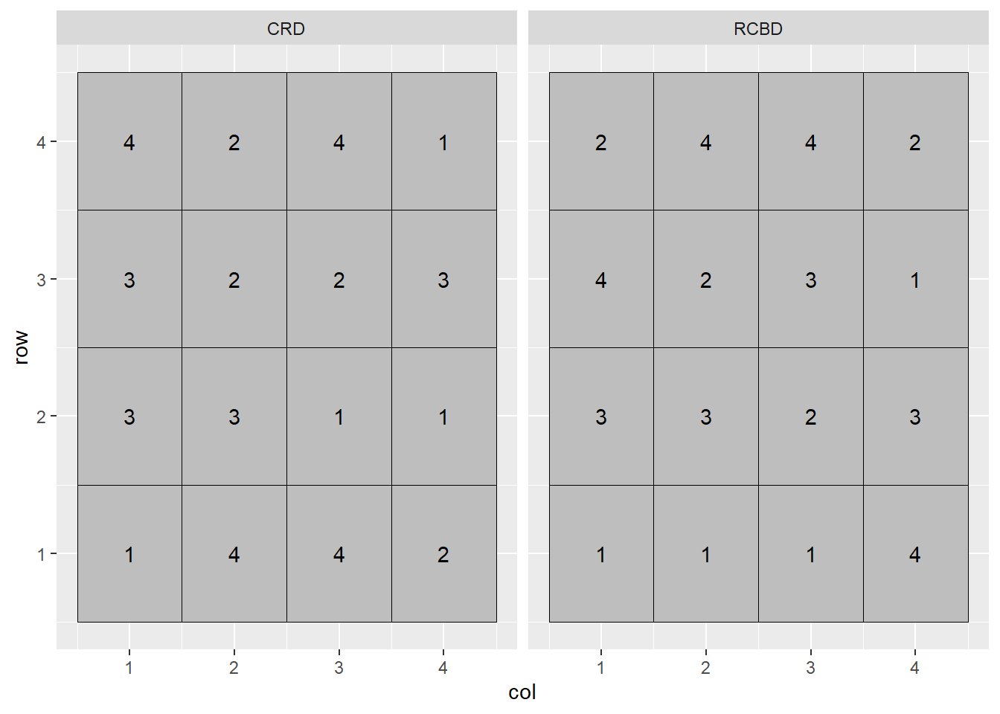

In the plot above, the Completely Randomized Design (CRD) is shown on the left, and the Randomized Complete Block Design (RCBD) on the right.  In the Completely Randomized Design, any treatment can occur anywhere in the the plot.  Note that in the left plot, treatment 3 occurs twice in the first column of plots while treatment 2 does not occur at all.  Treatment 2 occurs twice in the second column, but there is no treatment 1.  In the Randomized Complete Block Design, each treatment must occur once, and only once, per column.  In this case, the treatments are blocked on column.

Why block?  Let's suppose each column in the plot map above has a different soil type, with soils transitioning from more productive to less productive as columns increase from 1 to 4:


```r
dataset %>%
  ggplot(aes(x=col, y=row, label=treatment)) +
  geom_tile(aes(fill=as.factor(col)), color="black") +
  geom_text(aes(label = treatment)) +
  scale_fill_manual(values = c("lightgreen", "yellow2", "orange1", "tomato")) + 
  facet_grid(. ~ design) +
  theme(legend.position = "none")
```


Note that treatment 3 occurs three times in the more productive soils of columns 1 and 2, and only once in the less productive soils of columns 3 and 4.  Conversely, treatment 1 occurs three times in the less productive soils of columns 3 and 4, but only once in the more productive soil of columns 1 or 2.

If the mean effect of treatment 3 is greater than the mean effect of treatment 1, how will we distinguish the effects of treatment and error?  It is a moot question: we can't.  Our linear model is *additive*:

$$ Y_{ij}=\mu + T_i + \epsilon_{i(j)}$$

The term additive is important: it means we assume that treatment and error effects do not interact -- they independently add or subtract from the population mean.  If the measured effect of treatment is dependent on plot error, the model fails.  

The plot on the right has blocked treatments according to column.  Doing that allows us to remove the effect of soil type, which consistently varies from column to column, from the effect of error, which is random.  Our linear model changes as well:

$$ Y_{ij}=\mu + B_i + T_j + BT_{ij}$$

Where $Y_{ij}$ is the individual value, $\mu$ is the population mean, $B_i$ is the block effect, $T_j$ is the treatment effect, and $BT_{ij}$ is the interaction of block and treatment, also known as the error effect.

### Case Study: Randomized Complete Block Design
A field trial outside Goshen, Indiana,  evaluated the effect of seed treatments on soybean yield.  Treatments were as follows:
- A: untreated
- B: metalaxyl only
- C: metalaxyl + insecticide
- D: metalaxyl + insecticide + nematicide

Treatments were arranged in a Randomized Complete Block Design.


```r
library(tidyverse)

st = data.frame(obs=c(1:16))
set.seed(041383)
mu = rep(c(68.3))
Block = rep(1:4, each=4)
B = rep(c(-2.2, -0.8, 0.3, 1.2), each = 4)
Treatment = rep(c("A","B","C","D"), 4)
T = rep(c(-1.1, -0.3, 0.8, 1.6), 4)
BT = rnorm(n=16, mean = 0, sd = 1)

st_data = st %>%
  cbind(Block, Treatment, mu, B, T, BT) %>%
  mutate(BT = round(BT,1)) %>%
  mutate(Y = mu+B+T+BT) %>%
  group_by(Block) %>%
  sample_n(4) %>%
  ungroup() %>%
  select(-obs) %>%
  mutate(Block = as.factor(Block))

st_data$row = rep(1:4, 4)

  
st_data %>%
  mutate(plot_label = paste0("Treatment ", Treatment, "\n", Y)) %>%
  ggplot(aes(x=block, y=row, label=plot_label)) +
  geom_tile(fill="grey", color="black") +
  geom_text(aes(label = plot_label))
```


#### Linear Additive Model
In this example, the linear additive model is:

$$ Y_{ij}=\mu + B_i + T_j + BT_{ij}$$

Or, with regard to our particular trial:

$$ Yield = Population \space Mean + Block \space Effect + Treatment \space Effect + Block \times Treatment \space Interaction$$

We can see how the additive model works in the following table:

```r
st_effects = st_data %>%
  select(Block, row, Treatment, mu, B, T, BT, Y)

knitr::kable(st_effects)
```


|Block | row|Treatment |   mu|    B|    T|   BT|    Y|
|:-----|---:|:---------|----:|----:|----:|----:|----:|
|1     |   1|D         | 68.3| -2.2|  1.6| -1.1| 66.6|
|1     |   2|A         | 68.3| -2.2| -1.1| -0.8| 64.2|
|1     |   3|C         | 68.3| -2.2|  0.8|  0.2| 67.1|
|1     |   4|B         | 68.3| -2.2| -0.3| -1.5| 64.3|
|2     |   1|C         | 68.3| -0.8|  0.8| -0.4| 67.9|
|2     |   2|A         | 68.3| -0.8| -1.1| -0.4| 66.0|
|2     |   3|D         | 68.3| -0.8|  1.6| -1.3| 67.8|
|2     |   4|B         | 68.3| -0.8| -0.3| -0.1| 67.1|
|3     |   1|C         | 68.3|  0.3|  0.8|  1.0| 70.4|
|3     |   2|B         | 68.3|  0.3| -0.3|  1.5| 69.8|
|3     |   3|A         | 68.3|  0.3| -1.1|  1.3| 68.8|
|3     |   4|D         | 68.3|  0.3|  1.6| -1.6| 68.6|
|4     |   1|A         | 68.3|  1.2| -1.1| -0.1| 68.3|
|4     |   2|B         | 68.3|  1.2| -0.3|  2.0| 71.2|
|4     |   3|D         | 68.3|  1.2|  1.6|  0.4| 71.5|
|4     |   4|C         | 68.3|  1.2|  0.8|  0.1| 70.4|

In the first row of the table, we see that the observed yield, Y, is:

$$ Y = 68.3 + (-2.2) + (1.3) + (-1.1) = 66.3 $$

Similarly, in the fifth row:

$$ Y = 68.3 + (-0.8) + (0.5) + (-0.4) = 67.6 $$


#### Analysis of Variance
We can use the linear additive model above with R to create the proper linear model:


```r
model = aov(Y ~ Block + Treatment, st_data)
anova(model)
```

```
## Analysis of Variance Table
## 
## Response: Y
##           Df Sum Sq Mean Sq F value    Pr(>F)    
## Block      3 56.250 18.7500 23.7175 0.0001313 ***
## Treatment  3 10.485  3.4950  4.4209 0.0359018 *  
## Residuals  9  7.115  0.7906                      
## ---
## Signif. codes:  0 '***' 0.001 '**' 0.01 '*' 0.05 '.' 0.1 ' ' 1
```

Note that in the above model, we only specify the Block and Treatment sources of variation. Any source of variation not included in the model and, if you will "leftover" from the model, is pooled into the Residuals, or error.  In the model above, the interaction of Block and Treatment (BT) is not specified, for it is the source of any variation we observe from plot to plot.

Two sources of variation are tested above: Block and Treatment.  The F-value for both is calculated by dividing their Mean Square by the Residual (or Error) Mean Square.  The probability that the difference among blocks or treatment is zero, given their observed F-value, is reported in the $Pr(>F)$ column.

The Block effect is usually of less interest in analyzing table results.  If it is insignificant, that may indicate we don't need to block in this location in the future, but in the vast majority of trials there will be at least some benefit to blocking.

The most important effect of blocking is seen upon examining the Sum of Squares ("Sum Sq") column.  Here we can see just how much the Residual Sum of Squares was reduced by including blocks in the model.  Had we not included the Block term in our model, our Residual Sum of Squares would have been about 63.4.  Even given the greater residual degress of freedom (which would have included the three degrees of freedom that were assigned to Block, the residual mean square would have been about $64\div12 = 5.3$.  Without even calculating F, we can see the error mean square would have been larger than the treatment mean square, meaning there was more variance within treatments than between them.  The Treatment effect would not have been significant.


## Factorial Design
Agronomy is all about interactions.  How do hybrids differ in their response to nitrogen?  Response to fungicide?  Does a fungicide increase yield more when it is sprayed on corn at V5 or VT?  Does the effect of a starter fertilizer depend whether it is applied in-row or in a 2x2 band?  How does a crop respond to popuation in 30-inch rows vs 15-inch rows?

To grow a successful crop requires not a single input, but dozens, some of which we can manage and others we can't.  So the issue of how different treatments interact is critical.  It is also often more efficient and informative for us to study these interactions together in a single trial, than to study them separately in two or more trials.

Before we go further, some nomenclature.  In factorial design, treatments that differ in a single variable are called levels, and these levels together compose a factor.  Here are some examples of levels and factors:

- multiple micronutrient products all applied at the V5 stage in corn -- the product composition is the level, the timing the factor
- a single fungicide product, applied at V5, V10, or VT in corn -- the timing is the level, the fungicide composition the factor
- a single adjuvant, tested with different nozzles -- the nozzle is the level, the adjuvant composition the factor
- multiple hybrids, grown in rotation following soybean -- the hybrid is the level, the crop rotation is the factor

As you may have anticipated, a factorial design combines two or more factors, each containing two or more levels.  For example:

- Factor "Composition" includes two levels of foliar micronutrient product: Mn and Zn
- Factor Timing" includes two levels of timing: V5 and VT

In a factorial designm, every level of factor Composition will occur with every level of factor Timing.  We can visualize these treatment combinations the same way we might visualize a Punnet square in Mendalian genetics.  The main effects are given on the axes and the particular treatment combinations are in the cells.


```r
factorial_trts_1 = data.frame(Timing = c("V5", "VT", "V5", "VT"),
                              Composition = c("Mn", "Mn", "Zn", "Zn"),
                              trt = c("Mn @ V5",  "Mn @ VT", "Zn @ V5", "Zn @ VT"))

factorial_trts_1 %>%
  ggplot(aes(x=Timing, y=Composition)) +
  geom_tile(color="black", fill="grey") +
  geom_text(aes(label = trt), size=6) +
  theme(axis.title = element_text(size=18),
        axis.text = element_text(size=14))
```

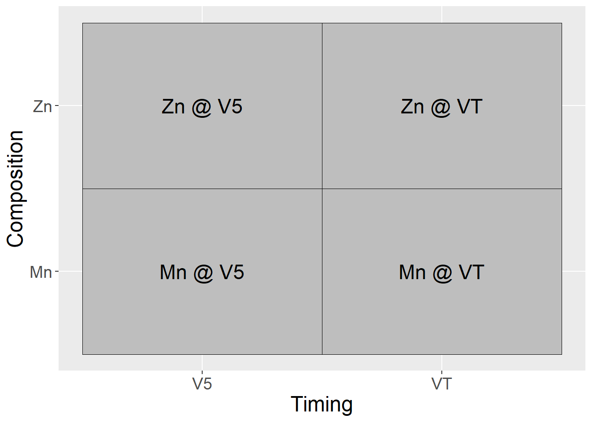

In another example:
- Factor "Composition" consists of two adjuvant ingredients: guar (G) or an polyacrylamide (P)
- Nozzles are Flat Fan (F) or AI nozzle (A)

Our treatments in the factorial design, then, are:


```r
factorial_trts_2 = data.frame(Nozzle = c("FF", "AI", "FF", "AI"),
                              Composition = c("G", "G", "P", "P"),
                              trt = c("FF x G",  "AI x G", "FF x P", "AI x P"))

factorial_trts_2 %>%
  ggplot(aes(x=Nozzle, y=Composition)) +
  geom_tile(color="black", fill="grey") +
  geom_text(aes(label = trt), size=6) +
  theme(axis.title = element_text(size=18),
        axis.text = element_text(size=14))
```


### Case Study 1
Our case study is a clover forage trial conducted in New Zealand from 1992 to 1994.  This dataset is publically available as part of the *agridat* package in R.  For this first case study, we will focus on a subset of the data.  The two factors were sulfur (S) and phosphorus (P) fertilizer.  Sulfur was applied at 0, 11.25, or 22.5 kg/ha, while phosphorus was applied at 0, 40, and 80 kg/ha.  Yield is reported in tons/hectare.

Factorial trials are often nicknames by the number of levels of each factor.  In this case, we have a $three-by-three$, or $3\times3$ trial.  We can visualize the factorial combinations as producing the following nine treatments:


```r
factorial_trts_3_main = data.frame(Sulfur = rep(c(0, 11.25, 22.5),3),
                              Phosphorus = rep(c(0,80,160), each=3))

factorial_trts_3_combos = factorial_trts_3_main %>%
  mutate(trt = paste0("S = ", Sulfur, "\n", "P = ", Phosphorus))
                              
factorial_trts_3_combos %>%
  ggplot(aes(x=Sulfur, y=Phosphorus)) +
  geom_tile(color="black", fill="grey") +
  geom_text(aes(label = trt), size=6) +
  theme(axis.title = element_text(size=18),
        axis.text = element_text(size=14))
```


```r
library(agridat)
library(tidyverse)
clover = sinclair.clover

clover_dataset = clover %>%
  filter(S %in% c(0, 11.25, 22.50)) %>%
  filter(P %in% c(0, 80, 160)) %>%
  mutate(S = as.factor(S),
         P = as.factor(P))


clover_data = data.frame(block = rep(1:4, each=9),
                         treatment = rep(1:9, 4),
                         sulfur = rep(clover_dataset$S,4),
                         phosphorus = rep(clover_dataset$P,4),
                         s_p_means = rep(clover_dataset$yield,4))

clover_effects = clover_data %>%
  mutate(mu = mean(s_p_means)) %>%
  group_by(sulfur) %>%
  mutate(S = mean(s_p_means) - mu) %>%
  ungroup() %>%
  group_by(phosphorus) %>%
  mutate(P = mean(s_p_means) - mu) %>%
  ungroup() %>%
  group_by(sulfur, phosphorus) %>%
  mutate(SP = mean(s_p_means) - (mu + S + P)) %>%
  ungroup() %>%
  select(-treatment, -s_p_means) %>%
  mutate(mu = round(mu,2),
         S = round(S,2),
         P = round(S,2),
         SP = round(SP,2))


set.seed(073020)
clover_final = clover_effects %>%
  mutate(Error = rnorm(36, 0, 0.4)) %>%
  mutate(Error = round(Error, 1)) %>%
  mutate(Yield = mu + S + P + SP + Error) 
```


When we deal with factorial designs, it is important to visualize the data.  We can observe the data patterns using a line plot.  We see clover yield increased with sulfur and phosphorus.  We notice, however, the difference in yield between P=80 and P=160 is greater when S=0 than when S=11.25 or S=22.5.  We also notice the difference betwee sulfur=0 and sulfur=22.5 is greater for P=160 than P=0.  


```r
clover_final %>%
  group_by(sulfur, phosphorus) %>%
  summarise(Yield = mean(Yield)) %>%
  ungroup() %>%
  ggplot(aes(x=sulfur, y=Yield, group=phosphorus)) +
  geom_line(aes(color=phosphorus), size=2) +
  theme(axis.text = element_text(size=12),
        axis.title = element_text(size=14),
        legend.text = element_text(size=12),
        legend.title = element_text(size=14))
```

```
## `summarise()` has grouped output by 'sulfur'. You can override using the `.groups` argument.
```


These differences are called *interactions* and are the most interesting part of a factorial design.  In this case, it is no surprise that crop yield increases with sulfur fertiliztion in a sulfur soil.  It is interesting, however, that the response to sulfur is appears to be dependent on phosphorus fertilization, and lends support to Liebig's *Law of the Minimum*, which states that addition of a particular nutrient will not increase yield if other nutrients are more deficient.  

#### Linear Additive Model
For our trial with two factors, the linear model is:

$$ Y_{ijk} = \mu + S_i + P_j + SP_{ij} + \epsilon_{ij(k)} $$
Each observed value, then, is the sum (additive value) of the population mean ($\mu$), sulfur effect ($S$), phosphorus effect ($P$), the interaction of sulfur and phosphorus ($SP$), and the error ($\epsilon$).  As in previous models, error is the random source of variation due to environmental and instrumental inconsistency.  $S_i$ and $P_j$ are described as *main effects*.  $SP_{ij}$ is the interaction.

In the table below, the effects from this linear model are broken out:

```r
knitr::kable(clover_final)
```


| block|sulfur |phosphorus |   mu|     S|     P|    SP| Error| Yield|
|-----:|:------|:----------|----:|-----:|-----:|-----:|-----:|-----:|
|     1|0      |0          | 5.72| -2.06| -2.06|  0.37|  -0.1|  1.87|
|     1|0      |80         | 5.72| -2.06| -2.06| -0.38|   0.2|  1.42|
|     1|0      |160        | 5.72| -2.06| -2.06|  0.01|   0.1|  1.71|
|     1|11.25  |0          | 5.72|  0.24|  0.24|  0.29|   0.2|  6.69|
|     1|11.25  |80         | 5.72|  0.24|  0.24|  0.16|  -0.4|  5.96|
|     1|11.25  |160        | 5.72|  0.24|  0.24| -0.44|   0.0|  5.76|
|     1|22.5   |0          | 5.72|  1.81|  1.81| -0.66|   0.6|  9.28|
|     1|22.5   |80         | 5.72|  1.81|  1.81|  0.23|   0.2|  9.77|
|     1|22.5   |160        | 5.72|  1.81|  1.81|  0.43|  -0.3|  9.47|
|     2|0      |0          | 5.72| -2.06| -2.06|  0.37|   0.4|  2.37|
|     2|0      |80         | 5.72| -2.06| -2.06| -0.38|   0.0|  1.22|
|     2|0      |160        | 5.72| -2.06| -2.06|  0.01|   0.2|  1.81|
|     2|11.25  |0          | 5.72|  0.24|  0.24|  0.29|   1.0|  7.49|
|     2|11.25  |80         | 5.72|  0.24|  0.24|  0.16|   0.1|  6.46|
|     2|11.25  |160        | 5.72|  0.24|  0.24| -0.44|  -0.4|  5.36|
|     2|22.5   |0          | 5.72|  1.81|  1.81| -0.66|  -0.2|  8.48|
|     2|22.5   |80         | 5.72|  1.81|  1.81|  0.23|  -0.1|  9.47|
|     2|22.5   |160        | 5.72|  1.81|  1.81|  0.43|   0.2|  9.97|
|     3|0      |0          | 5.72| -2.06| -2.06|  0.37|   0.4|  2.37|
|     3|0      |80         | 5.72| -2.06| -2.06| -0.38|  -0.1|  1.12|
|     3|0      |160        | 5.72| -2.06| -2.06|  0.01|   0.7|  2.31|
|     3|11.25  |0          | 5.72|  0.24|  0.24|  0.29|   0.2|  6.69|
|     3|11.25  |80         | 5.72|  0.24|  0.24|  0.16|  -0.6|  5.76|
|     3|11.25  |160        | 5.72|  0.24|  0.24| -0.44|   0.9|  6.66|
|     3|22.5   |0          | 5.72|  1.81|  1.81| -0.66|   0.4|  9.08|
|     3|22.5   |80         | 5.72|  1.81|  1.81|  0.23|  -0.3|  9.27|
|     3|22.5   |160        | 5.72|  1.81|  1.81|  0.43|   0.0|  9.77|
|     4|0      |0          | 5.72| -2.06| -2.06|  0.37|   0.4|  2.37|
|     4|0      |80         | 5.72| -2.06| -2.06| -0.38|  -0.6|  0.62|
|     4|0      |160        | 5.72| -2.06| -2.06|  0.01|   0.4|  2.01|
|     4|11.25  |0          | 5.72|  0.24|  0.24|  0.29|  -0.2|  6.29|
|     4|11.25  |80         | 5.72|  0.24|  0.24|  0.16|   0.2|  6.56|
|     4|11.25  |160        | 5.72|  0.24|  0.24| -0.44|  -0.1|  5.66|
|     4|22.5   |0          | 5.72|  1.81|  1.81| -0.66|  -0.3|  8.38|
|     4|22.5   |80         | 5.72|  1.81|  1.81|  0.23|   0.2|  9.77|
|     4|22.5   |160        | 5.72|  1.81|  1.81|  0.43|  -0.3|  9.47|


#### Analysis of Variance
In R, we use the same approach as previous weeks.  All terms from the linear model, except the population mean and error, are included in the model statement.


```r
library(broom)
# define the model
model = aov(Yield ~ sulfur + phosphorus + sulfur:phosphorus, data = clover_final)
#run the anova
anova_tab = tidy(model)

knitr::kable(anova_tab)
```


|term              | df|       sumsq|      meansq|   statistic|   p.value|
|:-----------------|--:|-----------:|-----------:|-----------:|---------:|
|sulfur            |  2| 349.0468222| 174.5234111| 1227.117734| 0.0000000|
|phosphorus        |  2|   0.6720889|   0.3360444|    2.362812| 0.1133374|
|sulfur:phosphorus |  4|   5.7705111|   1.4426278|   10.143477| 0.0000381|
|Residuals         | 27|   3.8400000|   0.1422222|          NA|        NA|

In the table, we see that the main effect of sulfur is significant at the $P \le 0.05$ level. The phosphorus effect is not significant.  The interaction (sulfur:phosphorus) effect is also significant at the $P\le0.05$ level.

When an interaction is significant, we should examine the effect of one factor independently at each level of the other.  We can group analyses of one factor by levels of another factor using the *group_by* command in R.  In this case we will tell R to run the analysis of variance for the sulfur effect separately for each level of P.    


```r
library(broom)
slice_1 = clover_final %>%
  group_by(phosphorus) %>%
  do(tidy(aov(.$Yield ~ .$sulfur))) %>%
  as.data.frame() %>%
  mutate(term = gsub("[.][$]", "", term))

knitr::kable(slice_1)
```


|phosphorus |term      | df|     sumsq|     meansq| statistic| p.value|
|:----------|:---------|--:|---------:|----------:|---------:|-------:|
|0          |sulfur    |  2|  90.33447| 45.1672333|  264.8242|       0|
|0          |Residuals |  9|   1.53500|  0.1705556|        NA|      NA|
|80         |sulfur    |  2| 145.58927| 72.7946333|  671.9505|       0|
|80         |Residuals |  9|   0.97500|  0.1083333|        NA|      NA|
|160        |sulfur    |  2| 118.89360| 59.4468000|  402.2716|       0|
|160        |Residuals |  9|   1.33000|  0.1477778|        NA|      NA|

We see that the effect of sulfur is significant at each level of phosphorus.  We can group analyses of phosphorusby each level of sulfur.


```r
library(broom)
slice_2 = clover_final %>%
  group_by(sulfur) %>%
  do(tidy(aov(.$Yield ~ .$phosphorus))) %>%
  as.data.frame() %>%
  mutate(term = gsub("[.][$]", "", term))

knitr::kable(slice_2)
```


|sulfur |term       | df|    sumsq|    meansq| statistic|   p.value|
|:------|:----------|--:|--------:|---------:|---------:|---------:|
|0      |phosphorus |  2| 2.869267| 1.4346333| 17.331141| 0.0008196|
|0      |Residuals  |  9| 0.745000| 0.0827778|        NA|        NA|
|11.25  |phosphorus |  2| 1.782067| 0.8910333|  3.734249| 0.0659399|
|11.25  |Residuals  |  9| 2.147500| 0.2386111|        NA|        NA|
|22.5   |phosphorus |  2| 1.791267| 0.8956333|  8.507335| 0.0084258|
|22.5   |Residuals  |  9| 0.947500| 0.1052778|        NA|        NA|

Whoa, what is going on here!  We can now see the phosphorus effect is significant at S=0 and S=22.5, and almost significant at S=11.25.  If we look at the line plot above, we see that phosphorus increases yield when S=0 and S=11.25, but decreases yield when S=22.5.  The positive and negative effects cancelled each out when we looked at the overall analysis of variance -- the interaction *masked* the sulfur effect so that its significance was not reflected in the results.

This demonstrates why it is so important to investigate interactions before making inferences about treatments.  If we concluded from the first analysis of variance that sulfur affected yield, we would have been accurate.  But if we had not analyzed the phosphorus effect separately by sulfur level, we would have erroneously concluded it did not affect yield.  

### Case Study 2
For the second case study, we are going to look at an experiment where turnips were planted at different densities in different row spacings.  There were 5 densities and 4 row widths.  This trial also blocked treatments, so it combines the randomized complete block and factorial designs.

#### Linear Additive Model
The linear additive model for this trial is:
$$Y_{ijk} =  B_i + D_j + S_k + DS_{jk} + BDS_{ijk}$$
In this model, $Y_{ijk}$ is yield, $B_i$ is block, $D_j$ is density, $S_k$ is row spacing, $DS_{jk}$ is the interaction of planting density and row spacing, and $BDS_{ijk}$ is the interaction of block, density, and row width, which is used as the residual or error term in this model.  We can see the additive effects of the factor levels and their interactions in the table below.


```r
library(agridat)
turnip = mead.turnip

turnip_data = turnip %>%
  filter(!spacing %in% c(32)) %>%
  filter(density %in% c(8,20,32)) %>%
  mutate(spacing = as.factor(spacing),
         density = as.factor(density))

turnip_effects = turnip_data %>%
  mutate(mu = mean(yield)) %>%
  group_by(block) %>%
  mutate(B = mean(yield) - mu) %>%
  ungroup() %>%
  group_by(spacing) %>%
  mutate(S = mean(yield) - mu) %>%
  ungroup() %>%
  group_by(density) %>%
  mutate(D = mean(yield) - mu) %>%
  ungroup() %>%
  group_by(spacing, density) %>%
  mutate(SD = mean(yield) - (mu + B + S + D)) %>%
  ungroup() %>%
  mutate(Error = yield - (mu + B + S + D + SD)) %>%
  mutate(mu = round(mu,2),
         B = round(B,2),
         S = round(S,2),
         D = round(D,2),
         SD = round(SD,2),
         Error = round(Error, 2)) 
  
turnip_final = turnip_effects %>%
  mutate(yield = if_else(spacing==16 & density==32, yield-0.4, yield)) %>%
  mutate(yield = if_else(spacing==8 & density==32, yield+0.5, yield)) %>%
  mutate(yield = if_else(spacing==4 & density==32, yield+0.3, yield))%>%
  mutate(yield = if_else(spacing==16 & density==8, yield+3.2, yield))

#turnip_data

knitr::kable(turnip_final)
```


| yield|block |spacing |density |   mu|     B|     S|     D|    SD| Error|
|-----:|:-----|:-------|:-------|----:|-----:|-----:|-----:|-----:|-----:|
|  2.40|B1    |4       |8       | 2.67| -0.26|  0.02| -0.17|  0.29| -0.16|
|  2.56|B1    |4       |20      | 2.67| -0.26|  0.02|  0.11|  0.18| -0.16|
|  2.78|B1    |4       |32      | 2.67| -0.26|  0.02|  0.06|  0.30| -0.31|
|  2.33|B1    |8       |8       | 2.67| -0.26|  0.08| -0.17|  0.32| -0.32|
|  2.56|B1    |8       |20      | 2.67| -0.26|  0.08|  0.11|  0.21| -0.26|
|  3.03|B1    |8       |32      | 2.67| -0.26|  0.08|  0.06|  0.25| -0.27|
|  5.21|B1    |16      |8       | 2.67| -0.26| -0.10| -0.17|  0.17| -0.30|
|  2.56|B1    |16      |20      | 2.67| -0.26| -0.10|  0.11|  0.38| -0.25|
|  1.90|B1    |16      |32      | 2.67| -0.26| -0.10|  0.06|  0.23| -0.30|
|  2.60|B2    |4       |8       | 2.67|  0.07|  0.02| -0.17| -0.03|  0.04|
|  2.89|B2    |4       |20      | 2.67|  0.07|  0.02|  0.11| -0.15|  0.17|
|  3.06|B2    |4       |32      | 2.67|  0.07|  0.02|  0.06| -0.02| -0.03|
|  2.63|B2    |8       |8       | 2.67|  0.07|  0.08| -0.17| -0.01| -0.02|
|  2.69|B2    |8       |20      | 2.67|  0.07|  0.08|  0.11| -0.11| -0.13|
|  3.48|B2    |8       |32      | 2.67|  0.07|  0.08|  0.06| -0.08|  0.18|
|  5.57|B2    |16      |8       | 2.67|  0.07| -0.10| -0.17| -0.16|  0.06|
|  3.04|B2    |16      |20      | 2.67|  0.07| -0.10|  0.11|  0.06|  0.23|
|  2.31|B2    |16      |32      | 2.67|  0.07| -0.10|  0.06| -0.10|  0.11|
|  2.67|B3    |4       |8       | 2.67|  0.19|  0.02| -0.17| -0.16|  0.11|
|  2.71|B3    |4       |20      | 2.67|  0.19|  0.02|  0.11| -0.27| -0.01|
|  3.44|B3    |4       |32      | 2.67|  0.19|  0.02|  0.06| -0.15|  0.35|
|  2.98|B3    |8       |8       | 2.67|  0.19|  0.08| -0.17| -0.13|  0.33|
|  3.21|B3    |8       |20      | 2.67|  0.19|  0.08|  0.11| -0.24|  0.39|
|  3.39|B3    |8       |32      | 2.67|  0.19|  0.08|  0.06| -0.21|  0.09|
|  5.76|B3    |16      |8       | 2.67|  0.19| -0.10| -0.17| -0.29|  0.25|
|  2.83|B3    |16      |20      | 2.67|  0.19| -0.10|  0.11| -0.07|  0.02|
|  2.40|B3    |16      |32      | 2.67|  0.19| -0.10|  0.06| -0.22|  0.20|

As we did before, we visually inspect the data for insights into how they may interact.


```r
turnip_final %>%
  group_by(density, spacing) %>%
  summarise(yield = mean(yield)) %>%
  ungroup() %>%
  ggplot(aes(x=spacing, y=yield, group=density)) +
  geom_line(aes(color=density), size=2) 
```

```
## `summarise()` has grouped output by 'density'. You can override using the `.groups` argument.
```

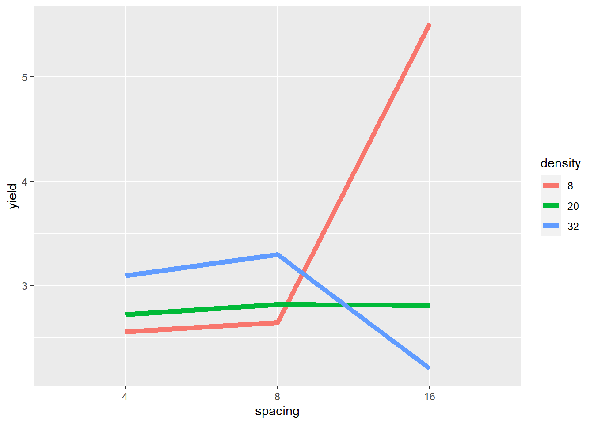

The plot gives critical insight into these data.  Increasing spacing from 4 to 8 to 16 seems to cause a slight increase in yield where density=20.  But where density=8, yield seems to increase rapidly between row spacing 8 and row spacing 16.  Where density = 32, yield increases slighty with row spacing from 4 to 8, and then decreases markedly from 8 to 16. 

The mean yield, averaged across row spacings, changes little across planting densities -- even though the yields change dramatically within each of the individual row spacings.  If we did not visually examine the data above, and instead relied on the ANOVA to alert us to an affect, we could miss this very important insight.


#### Analysis of Variance
Our analysis of variance is similar to that we ran for the first case study, except for it now includes the block term.


```r
model = aov(yield ~ block + density + spacing + density:spacing, data = turnip_final)
anova_tab = anova(model)

knitr::kable(anova_tab)
```


|                | Df|     Sum Sq|   Mean Sq|   F value|   Pr(>F)|
|:---------------|--:|----------:|---------:|---------:|--------:|
|block           |  2|  0.9770963| 0.4885481|  25.06684| 1.17e-05|
|density         |  2|  3.3854519| 1.6927259|  86.85182| 0.00e+00|
|spacing         |  2|  2.6353852| 1.3176926|  67.60929| 0.00e+00|
|density:spacing |  4| 16.3880593| 4.0970148| 210.21312| 0.00e+00|
|Residuals       | 16|  0.3118370| 0.0194898|        NA|       NA|

The planting density and plant spacing main effects were significant, as was their interacton.  

Was the spacing effect significant at each level of density?  We can slice the data to find this out.  

```r
library(broom)
slice_1 = turnip_final %>%
  group_by(density) %>%
  do(tidy(aov(.$yield ~ .$spacing))) %>%
  as.data.frame() %>%
  mutate(term = gsub("[.][$]", "", term))

knitr::kable(slice_1)
```


|density |term      | df|      sumsq|    meansq|   statistic|   p.value|
|:-------|:---------|--:|----------:|---------:|-----------:|---------:|
|8       |spacing   |  2| 16.9677556| 8.4838778| 125.0694513| 0.0000129|
|8       |Residuals |  6|  0.4070000| 0.0678333|          NA|        NA|
|20      |spacing   |  2|  0.0182000| 0.0091000|   0.1341523| 0.8770078|
|20      |Residuals |  6|  0.4070000| 0.0678333|          NA|        NA|
|32      |spacing   |  2|  2.0374889| 1.0187444|  12.8701572| 0.0067549|
|32      |Residuals |  6|  0.4749333| 0.0791556|          NA|        NA|

We can see above that the effect of spacing on yield is only significant at $P\le0.05$ density=8 and density=32.  If we examining the effect of density separately for each level of spacing:


```r
library(broom)
slice_2 = turnip_final %>%
  group_by(spacing) %>%
  do(tidy(aov(.$yield ~ .$density))) %>%
  as.data.frame() %>%
  mutate(term = gsub("[.][$]", "", term))

knitr::kable(slice_2)
```


|spacing |term      | df|      sumsq|    meansq|  statistic|   p.value|
|:-------|:---------|--:|----------:|---------:|----------:|---------:|
|4       |density   |  2|  0.4540667| 0.2270333|   4.347447| 0.0680698|
|4       |Residuals |  6|  0.3133333| 0.0522222|         NA|        NA|
|8       |density   |  2|  0.6872889| 0.3436444|   3.670979| 0.0909484|
|8       |Residuals |  6|  0.5616667| 0.0936111|         NA|        NA|
|16      |density   |  2| 18.6321556| 9.3160778| 135.037365| 0.0000103|
|16      |Residuals |  6|  0.4139333| 0.0689889|         NA|        NA|

We similarly see that density is only significant at $P\le0.05$ where spacing=16.

In this trial, both main (density and spacing) effects are significant.  But if don't explore and explain our analysis further, we might miss how the both the magnitude of and the rank rank of row spacing effects on yield changes with plant density.  

### Discussing Interactions
In factorial experiments, there are three kinds of interaction that may occur.  We can have no interaction, a spreading interaction, or a crossover interaction.  

#### No Interaction
Where there is no interaction, the treatments effects are simply additive -- the observed value of each observation in the plot above is the sum of the effect of the level of Factor A plus the effect of the level of Factor B.  The difference between levels of Factor A are consistent across levels of Factor B, and vice versa.  If we plot the data using a line plot, it will look like this:


```r
factA = rep(c(1,2,3), 2)
Y = c(1:6)
factB = rep(c("T1", "T2"), each=3)

dataset = cbind(factA, Y, factB) %>%
  as.data.frame() %>%
  mutate(factA=as.numeric(factA),
         Y=as.numeric(Y)) 

dataset %>%
  ggplot(aes(x=factA, y=Y, group=factB)) +
  geom_line(aes(color=factB), size=2) +
  labs(x="Factor A", legend="Factor B", color="Factor B")
```


In a bar plot, it should look like this:


```r
dataset %>%
  ggplot(aes(x=factA, y=Y, group=factB)) +
  geom_bar(stat="identity", aes(fill=factB), position = "dodge") +
  labs(x="Factor A", legend="Factor B", fill="Factor B")
```

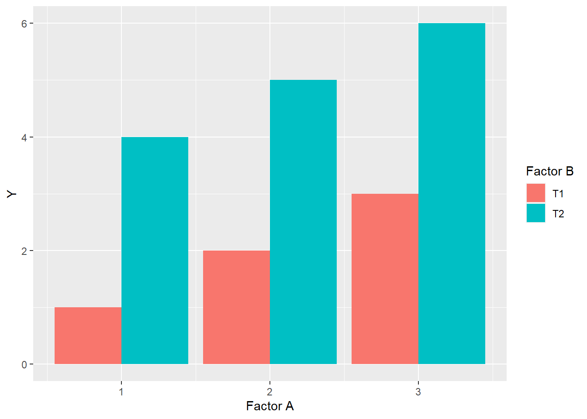

Finally, there will be no change in the ranking of levels within factors.  Rank is the order of levels according to their obseved effects, from least to greatest.  For factor A, the ranking of levels within Factor A is $1 > 2 > 3$, while within Factor B, level T2 always ranks higher than level T1.

#### Spreading Interaction
In a spreading interaction, the ranking of levels within factors does not change, but the difference between them does.  

```r
factA = rep(c(1,2,3), 2)
Y = c(1,2,3,4,6,8)
factB = rep(c("T1", "T2"), each=3)

dataset = cbind(factA, Y, factB) %>%
  as.data.frame() %>%
  mutate(factA=as.numeric(factA),
         Y=as.numeric(Y)) 

dataset %>%
  ggplot(aes(x=factA, y=Y, group=factB)) +
  geom_line(aes(color=factB), size=2) +
  labs(x="Factor A", legend="Factor B", color="Factor B")
```


In the above plot, we can see the levels of Factor A still rank $1<2<3$ in their effect on the observed value Y, for both level T1 and level T2 of Factor B.  We also note that the levels of Factor B rank $T1<T2$ at each level of Factor A. In this spreading interaction, however, the difference between T1 and T2 of factor B increases as the levels of Factor A increase.  Similarly, the differences among levels of Factor A are greater for level T2 than level T1 of Factor B.  

We saw a spreading interaction before in Case Study 1.  The effect of sulfur increased with the level of phosphorus, and vice versa.  

#### Crossover Interaction
A crossover interaction is similar to a spreading interacton in that the differences between levels within one factor change with the levels of a second factor, but different in that the ranking of levels changes as well.  In addition, as we saw above, crossover reactions can mask the effects of factor levels.  


```r
factA = rep(c(1,2,3), 2)
Y = c(1,2,3,4,3,2)
factB = rep(c("T1", "T2"), each=3)

dataset = cbind(factA, Y, factB) %>%
  as.data.frame() %>%
  mutate(factA=as.numeric(factA),
         Y=as.numeric(Y)) 

dataset %>%
  ggplot(aes(x=factA, y=Y, group=factB)) +
  geom_line(aes(color=factB), size=2) +
  labs(x="Factor A", legend="Factor B", color="Factor B")
```

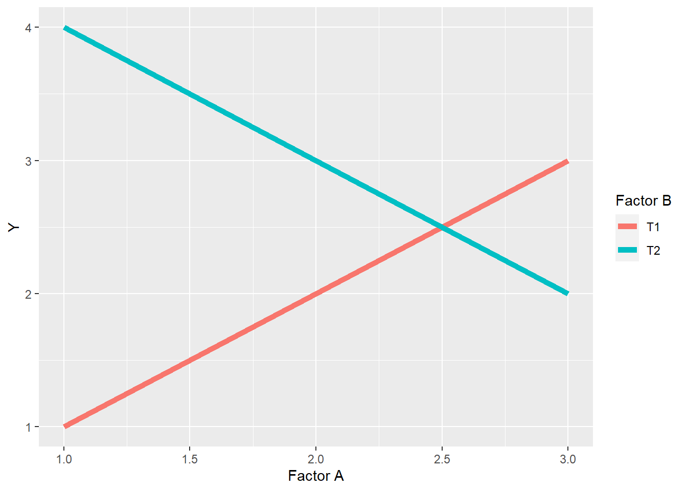

In the plot above, the ranking of levels within Factor B is $T2>T1$ for levels 1 and 2 of Factor A, but $T1>T2$ for level 3 of Factor A.  In other words, whether T2 is greater than T1 depends on the level of Factor A.  In addition, the levels of Factor B behave differently in response to the levels of Factor A.  Level T1 of Factor B increases with the level of Factor B, while level T2 decreases.

We observed a crossover reaction in Case Study 2 above, where the effect of the widest row spacing on yield was greater than the narrow row spacings at the lowest planting density, but was less than the narrow spacings at the greatest planting density.  

#### Discussing Interactions
Interactions are exciting.  Spreading interactions show us how the proper combination of of management practices or inputs can have a combined effect that is greater than the individual effect of inputs.  Conversely, crossover interactions show us how the advantage of one practice can be lost with the mismanagement of a second practice.  This is the essence of agronomy.

When we identify spreading interactions, we learn how to build more productive *cropping systems*, as opposed to one-off solutions.  Don't get me wrong -- there are some wonderful one-off solutions.  But almost every input or practice can be made more effective by understanding how it interacts with other practices.  In addition, trials can be designed to test how the effect of that input interacts with different environmental conditions, such as temperature and precipitation.

Interactions should always be highlighted when discussing the findings of an Analysis of Variance.  The essense of an interaction is that the effect of one factor is *dependent* on the level of a second factor.  If you don't discuss the interaction between factors, you don't completely describe the effect of either factor.

As we saw above, crossover interactions can mask the effects of factors.  In the second case study, had we simply concluded from the main effect that yield did not differ with plant density, we would have failed to report what the data actually show: yield differs profoundly with plant density -- but that row spacing affects the direction of that difference.   


## Split-Plot Design
The *Split-Plot Design* is a special kind of factorial experiment, in which one factor is nested within another.  Let's jump to an illustration.


```r
library(agricolae)

main_factor = c("A","B")
sub_factor = c("A","B","C","D","E")
trt_rand = design.split(main_factor,
                        sub_factor,
                        r=2,
                        design = "rcbd",
                        seed=2)

plot_map = trt_rand$book 

plot_map %>%
  ggplot(aes(x=plots, y=splots), group=main_factor) +
  geom_tile(aes(fill=main_factor), color="black") +
  geom_text(aes(label=sub_factor))
```


In the experiment show above, there are two factors: the main factor and the sub-factor.  The main factor has two levels, while the sub-factor has 5 levels.  The design is a randomized complete block design.  As with any randomized complete block design, all treatments must occur once within each block.

Main factor levels are indicated by color.  Sub-factor levels are indicated by letter.

In the above plot map, the main factors occur once in Block 1 (plots 101 and 102) and Block 2 (plots 103 and 104).  Within each occurrence of the main factor, all five levels of the sub-factor are nested.  The levels of the main factor are randomized within each block, and the levels of the subfactor are randomized within each main plot.

So now that we know what a split-plot design looks like, we will address the question: why would we want to do this?  The first answer has to do with practicality.  Say the first factor is composed of fungicide treatments that we are going to apply with a Hagge applicator with a 100 ft boom.  The second factor is composed of treatments (hybrid, in-furrow fertilizer, etc) that can be apply in 20-foot widths.  We can apply our treatments much more easily if we use a split-plot design and nest the second factor (the sub-factor) within the first factor (the main factor).

The second answer is that a thoughtfully-designed split-plot experiment will be more sensitive to differences among levels of the sub-factor than a randomized complete block trial.  This is because, no matter how hard we try, plots that are closer together are more likely to be similar than plots that are further apart.  By putting the sub-factor treatments close together, we can better estimate and test treatment effects.

The greater sensitivity to subfactor treatments, however, comes at a cost: we sacrifice some of our ability to detect differences among levels of our main factor.  Sometimes, however, the levels of the main plot factor are so markedly different that we know we will detect differences among them, even if they are placed further apart.  Plus, we may be more interested in the interaction between the main factor and sub-factor, and our ability to estimate and test this interaction, too, is enhanced by the split plot design.

###Case Study: Habenero Peppers
If you are a chili pepper fan like me, you enjoy habanero chilies, also called "Scotch bonnets" in strict moderation.  They are hotter than the jalapeno, but not devastating like the Carolina Reaper.  In this study, habanero peppers were grown in pots of soils characterized by their color.  They were harvested at two stages of ripening, green and orange, and their polyphenol concentrations measured.  Soil was the main factor and harvest time the subfactor.


```r
habanero = read.csv("data-unit-7/habenero.csv")
head(habanero)
```

```
##   block  soil harvest_stage total_polyphenols
## 1    R1   red         green         109.84958
## 2    R1   red        orange         186.71777
## 3    R1 brown         green         130.53991
## 4    R1 brown        orange         207.00041
## 5    R1 black         green          97.86705
## 6    R1 black        orange         212.19618
```

## Linear Additive Model

$$ Y_{ijk} = \mu + M_{j} + Error(B_i + BM_{ij}) + S_{k} + MS_{ik} + Error(BS_{ik}+BMS_{ijk})$$
Bear with me.  We can break this model down in to two sections.  Let's start with the first three terms.  These focus on explaining the observed variance among the main plots.  

$B_i$ is the effect of block $i$

$M_j$ is the effect of level $j$ of the main factor 

$Error(BM_{ij})$ is the error (unexplained variance) associated with the block $i$ and level $j$ of the main factor.  When we calculate the F-value for the main factor, we use this error term.  

The second three terms focus on explaining the observed variance among subplots.

$S_k$ is the effect of level $k$ of the sub-factor 

$MS_{ik}$ is the interaction between level $i$ of the main factor and level $k$ of the subfactor

$Error(BS_{ik}+BMS_{ijk})$ is the unexplained variance associated with the given levels of the sub factor and the main factor - sub-factor interaction.  It is used in testing the significance of both those effects

Ugh.  What a dumpster fire.  Let's look at the ANOVA table for our habenero trial to make more sense of this.


```r
habanero_model = aov(total_polyphenols ~ soil + harvest_stage + soil:harvest_stage + Error(block:soil), data=habanero)
```

```
## Warning in aov(total_polyphenols ~ soil + harvest_stage + soil:harvest_stage + :
## Error() model is singular
```

```r
summary(habanero_model)
```

```
## 
## Error: block:soil
##           Df Sum Sq Mean Sq F value  Pr(>F)   
## soil       2 1322.7   661.3   8.691 0.00791 **
## Residuals  9  684.9    76.1                   
## ---
## Signif. codes:  0 '***' 0.001 '**' 0.01 '*' 0.05 '.' 0.1 ' ' 1
## 
## Error: Within
##                    Df Sum Sq Mean Sq F value  Pr(>F)    
## harvest_stage       1  42120   42120  176.72 3.2e-07 ***
## soil:harvest_stage  2   5938    2969   12.46 0.00256 ** 
## Residuals           9   2145     238                    
## ---
## Signif. codes:  0 '***' 0.001 '**' 0.01 '*' 0.05 '.' 0.1 ' ' 1
```

We have two ANOVA tables.  The top table evaluates the effect of soil in our main plots.  Looking at the degrees of freedom, we can see we have *3 soils - 1 = 2* degrees of freedom for soil and *(4 blocks - 1) x 3 = 9* degrees of freedom for the error.  The F-value is the ratio of the mean square for soil and the mean square for the main factor error (residuals).

The second table evalulates the effect of of the harvest stage and the interaction between soil and harvest stage in the subplots.  There are *2 stages - 1 = 1* degree of freedom for harvest stage and *(3 soils - 1) x (2 stages - 1) = 2 degrees of freedom for the interaction.  The F-values for the harvest stage and interaction effects are the ratios of their mean squares to the mean square for the subplot error (residuals).

We analyze the ANOVA results the same as we would for any factorial trial.  Looking at our table, we see significant results for soil, harvest stage, and their interaction.  So lets go straight to the interaction plot.  


```r
habanero %>%
  group_by(soil, harvest_stage) %>%
  summarise(total_polyphenols = mean(total_polyphenols)) %>%
  ungroup() %>%
  ggplot(aes(x=harvest_stage, y=total_polyphenols, group = soil)) +
  geom_line(aes(color=soil))
```

```
## `summarise()` has grouped output by 'soil'. You can override using the `.groups` argument.
```

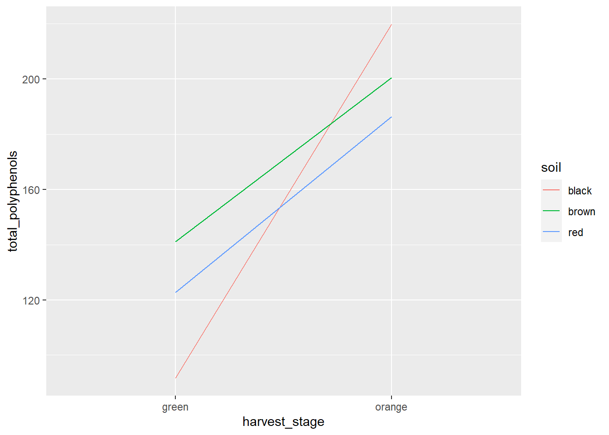

We can see the the total polyphenol concentration was affected by harvest stage in each soil.  Orange habaneros had greater total polyphenos than green ones.  Furthermore, we can see that black soils produced the fewest total polyphenols when habaneros where harvested green, but the most when they were harvested orange.

Looking at our interaction tables, we see soil has a significant effect on total polyphenols at both harvest stages.


```r
library(broom)
slice_1 = habanero %>%
  group_by(harvest_stage) %>%
  do(tidy(aov(.$total_polyphenols ~ .$block + .$soil))) %>%
  as.data.frame() %>%
  mutate(term = gsub("[.][$]", "", term))

knitr::kable(slice_1)
```


|harvest_stage |term      | df|     sumsq|     meansq|  statistic|   p.value|
|:-------------|:---------|--:|---------:|----------:|----------:|---------:|
|green         |block     |  3|  312.1119|  104.03731|  0.4324894| 0.7375426|
|green         |soil      |  2| 5006.9642| 2503.48208| 10.4071271| 0.0112036|
|green         |Residuals |  6| 1443.3275|  240.55458|         NA|        NA|
|orange        |block     |  3|   79.2278|   26.40927|  0.1592069| 0.9199513|
|orange        |soil      |  2| 2253.3551| 1126.67757|  6.7921174| 0.0287564|
|orange        |Residuals |  6|  995.2810|  165.88017|         NA|        NA|

And that harvest stage had a significant effect at each level of soil.


```r
library(broom)
slice_2 = habanero %>%
  group_by(soil) %>%
  do(tidy(aov(.$total_polyphenols ~ .$block + .$harvest_stage))) %>%
  as.data.frame() %>%
  mutate(term = gsub("[.][$]", "", term))

knitr::kable(slice_2)
```


|soil  |term          | df|       sumsq|      meansq|  statistic|   p.value|
|:-----|:-------------|--:|-----------:|-----------:|----------:|---------:|
|black |block         |  3|    79.03859|    26.34620|  0.0555253| 0.9798439|
|black |harvest_stage |  1| 32872.72483| 32872.72483| 69.2801410| 0.0036344|
|black |Residuals     |  3|  1423.46960|   474.48987|         NA|        NA|
|brown |block         |  3|   214.87947|    71.62649|  0.5937286| 0.6605111|
|brown |harvest_stage |  1|  7062.17490|  7062.17490| 58.5400106| 0.0046367|
|brown |Residuals     |  3|   361.91529|   120.63843|         NA|        NA|
|red   |block         |  3|   390.95481|   130.31827|  1.0869202| 0.4734925|
|red   |harvest_stage |  1|  8122.82365|  8122.82365| 67.7484520| 0.0037542|
|red   |Residuals     |  3|   359.69045|   119.89682|         NA|        NA|


## Conclusion
Experimental design of multiple treatment experiments plays a critical role in the quality of our data and the inferences that can be made.  In most cases, you will probably run randomized complete block design experiments with a single factor, where blocking will reduce the error among plots within each block.

The factorial design allows greater efficiency if you are interested in studying two factors. It is also the only way to study the interaction between two factors.

Finally, where one factor is known to be more subtle (and therefore, harder to test signficance for) than a second factor, or where differences in equipment size make it more practical to nest one factor inside the other, the split-plot design can be very useful.


## Exercise: Randomized Complete Block Design
While the lecture is long this week, fortunately running the analyses in R is very fast.  We start the exercies with the Randomized Complete Block Design.  To run a Randomized Complete Block Design, we will again use same analysis of variance approach we did last week. We only need two lines of code: the first to define the model we wish to test, and the second to tell R to summarise the results.

### Case Study
Barley varieties were compared using a Randomized Complete Block Design.  Yield is in grams per plot.  Five varieties were grown in three replicates. 


```r
library(tidyverse)
barley = read.csv("data-unit-7/exercise_data/barley_besag.csv")
head(barley)
```

```
##   block gen yield
## 1     1 G37 10.92
## 2     1 G55 12.07
## 3     1 G58  9.51
## 4     1 G63  9.23
## 5     1 G09  8.03
## 6     2 G37 10.24
```

### ANOVA
For this analysis of variance, we need two lines of code.  The first is the model statement:

```r
barley_model = aov(yield ~ block + gen, data=barley)
```

In the above code:

* barley_model defines the object to which the ANOVA results will be saved
* "aov" tells R to run an analysis of variance
* "yield ~ block + gen" tells R our linear additive model.  When using R, we leave out mu and the error term -- R knows to calculate these.
* "data=barley" tells R to fit our ANOVA model to the barley dataset

Reviewing our results is simple:

```r
summary(barley_model)
```

```
##             Df Sum Sq Mean Sq F value   Pr(>F)    
## block        1  2.611   2.611   7.476 0.023066 *  
## gen          4 19.758   4.940  14.142 0.000642 ***
## Residuals    9  3.144   0.349                     
## ---
## Signif. codes:  0 '***' 0.001 '**' 0.01 '*' 0.05 '.' 0.1 ' ' 1
```

In our result above, we see the effect of barley variety (gen) is highly significant.

### Plotting the Results
Although we get into the presentation of treatment means in more detail late in the course, lets take a quick look at our treatment means.  We will use ggplot.


```r
barley_plot = ggplot(barley, aes(x=gen, y=yield)) +
  geom_bar(stat = "summary", fun="mean")
```

In the plot above:
* barley is the object to which we are saving the plot
* ggplot() starts the ggplot function
* "ggplot(barley, aes(x=gen, y=yield))" tells R that our plot will be based on the barley dataset.  Anything in ggplot that occurs in aes() brackets is an "aesthetic".  An aesthetic is any value that is based on a variable from our plot and changes in value from treatment to treatment.  x=gen tells R the horizontal position of whatever we draw (points, parts, etc.) is determined by the gen variable.  y=yield tells R the vertical position (height) of our object is based on the yield variable.
* "geom_bar" tells R we want to draw bars with our data.
* With geom bar, we can also calculate summary statistics on the fly.  stat="summary" tells R we are going to calculate a summary statistic.  fun="mean" tells R to use the mean as that statistic.

Now we can display the plot at any time by running barley_plot:

```r
barley_plot
```

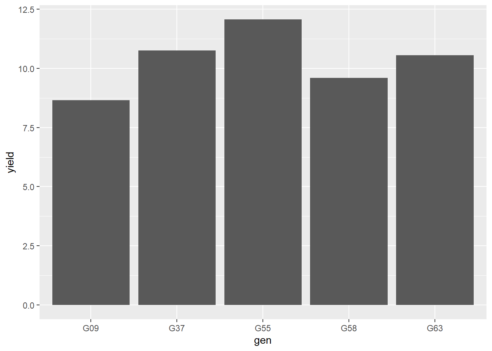

This is so drab!  While I don't want you to get bogged down in formatting plots, let's tweak a few details just so you can see the power of ggplot to make publication-quality plots.

Let's change the bar color by adding the "fill" command to our code:


```r
barley_plot = ggplot(barley, aes(x=gen, y=yield)) +
  geom_bar(stat = "summary", fun="mean", fill="darkolivegreen")

barley_plot
```

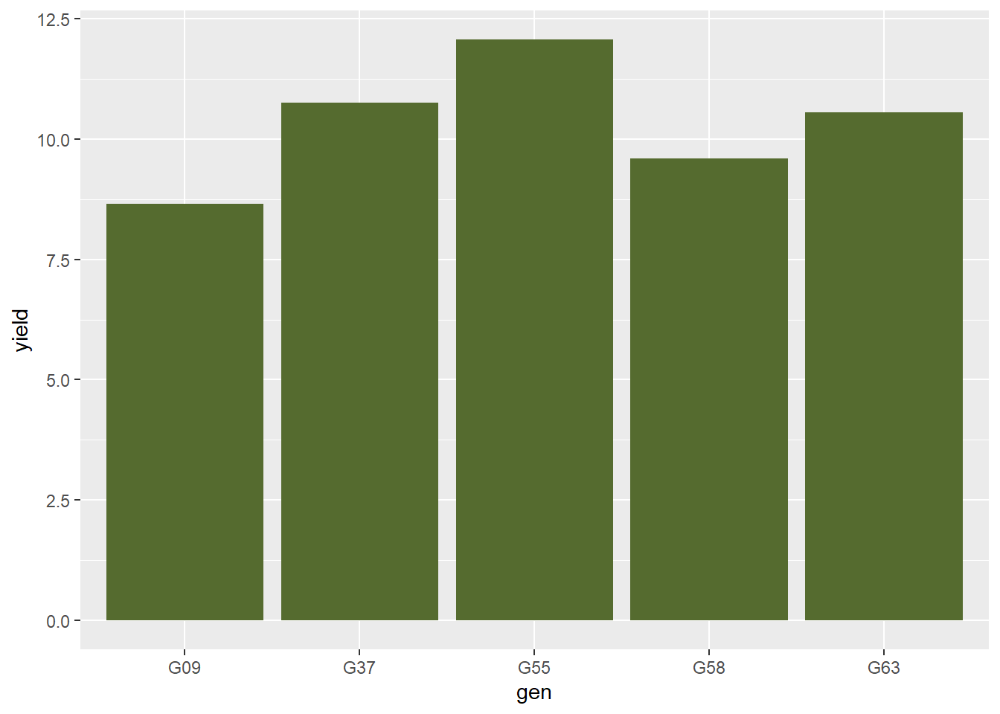

Let's draw a black line around the outside of the bars by adding "color" to our geom_bar statement.

```r
barley_plot = ggplot(barley, aes(x=gen, y=yield)) +
  geom_bar(stat = "summary", fun="mean", fill="darkolivegreen", color="black")
barley_plot
```


Let's make the outline a little thicker using the size command:

```r
barley_plot = ggplot(barley, aes(x=gen, y=yield)) +
  geom_bar(stat = "summary", fun="mean", fill="darkolivegreen", color="black", size=1.5)
barley_plot
```

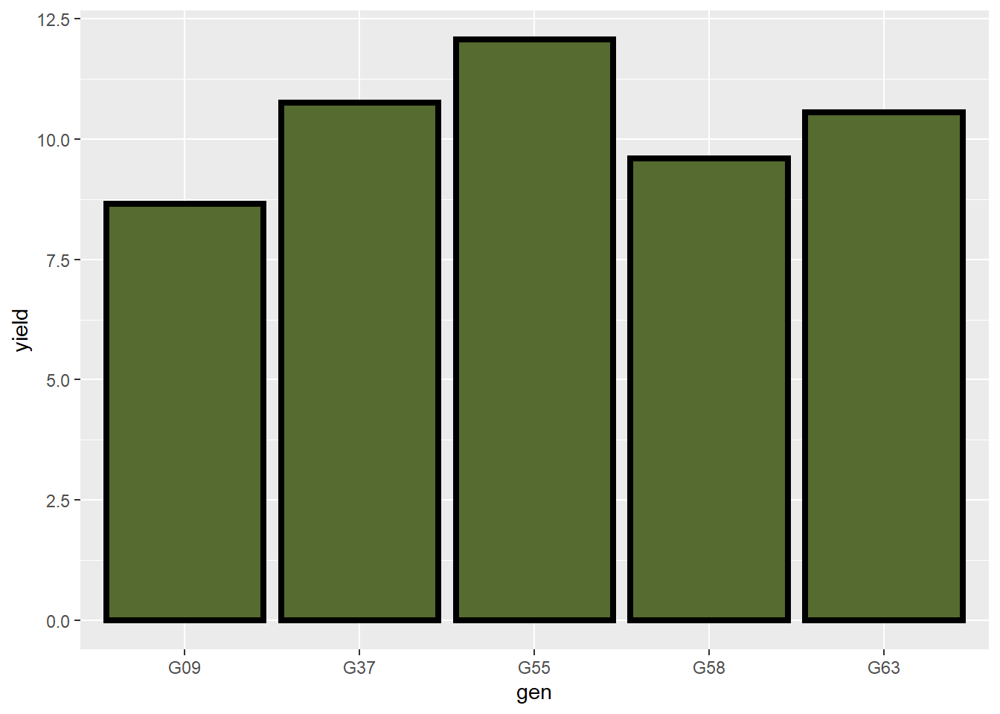

The axis titles are little hard to read.  We can change text formatting, legend formatting, and other objects using the "theme" function.  In the theme function below, let's change the "axis.title" size using the "element_text" command and setting the size to 18.

```r
barley_plot = ggplot(barley, aes(x=gen, y=yield)) +
  geom_bar(stat = "summary", fun="mean", fill="darkolivegreen", color="black") +
  theme(axis.title = element_text(size=18))
barley_plot
```

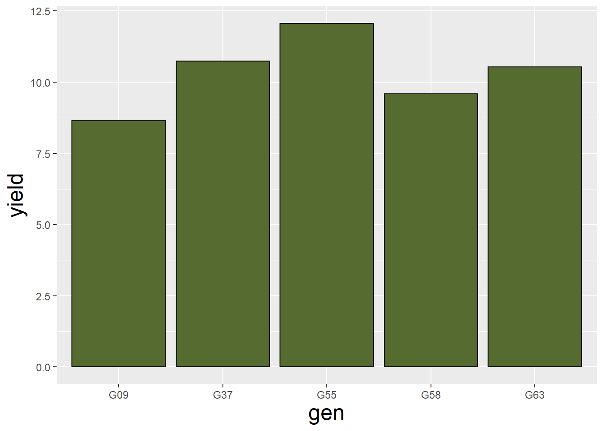

Let's similarly increase the size of the axis.text (tick labels) to 14pt. 

```r
barley_plot = ggplot(barley, aes(x=gen, y=yield)) +
  geom_bar(stat = "summary", fun="mean", fill="darkolivegreen", color="black") +
  theme(axis.title = element_text(size=18),
        axis.text = element_text(size=14))
barley_plot
```

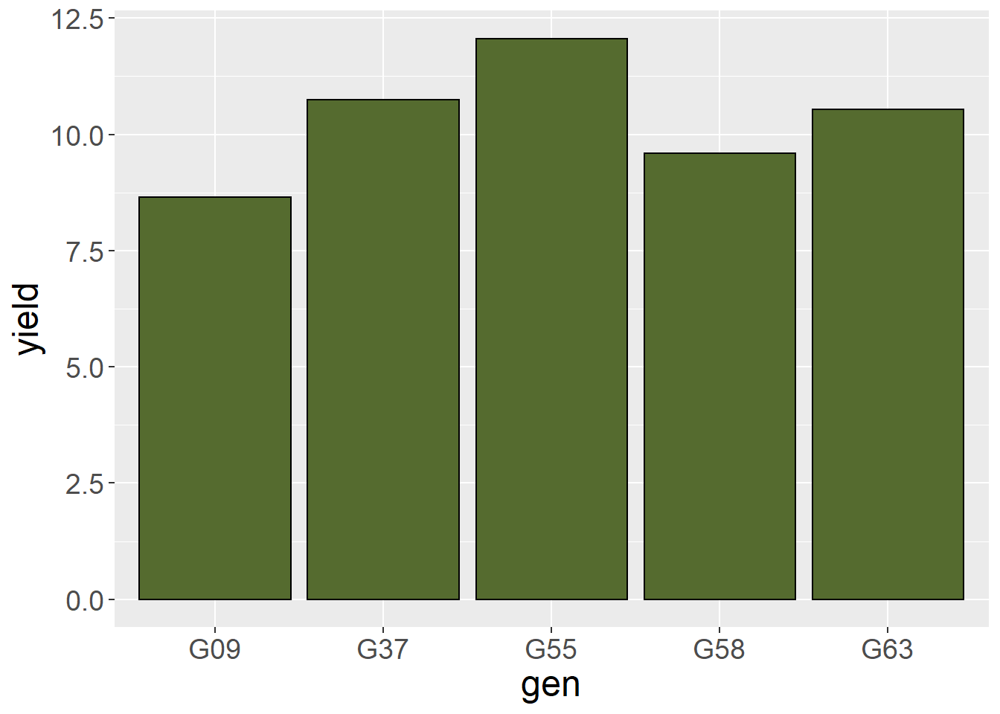

Finally, let's rename our axis titles using the lab() command.

```r
barley_plot = ggplot(barley, aes(x=gen, y=yield)) +
  geom_bar(stat = "summary", fun="mean", fill="darkolivegreen", color="black") +
  theme(axis.title = element_text(size=18),
        axis.text = element_text(size=14)) +
  labs(x="variety", y="Yield (tons ha-1)")
barley_plot
```

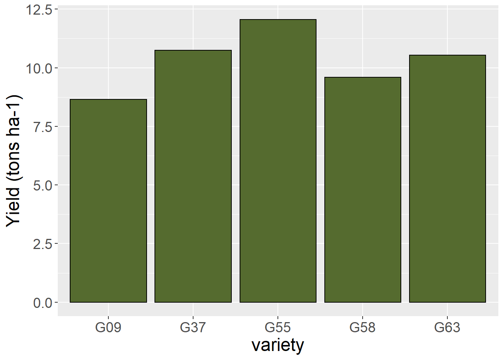

Like I said, I don't want you to get too bogged down in formatting your plots.  And, yes, a simple plot like this could be made just as quickly in Excel.  But building the plot in R Studio has multiple advantages.  First, you don't have to cut and paste your data to Excel.  Second, you don't have to copy your completed chart back to R or your report document.  You can include it right in your R Notebook with your data.  That way, if you are working on your creative component, you can have one document, instead of multiple documents all over the place.  Third, if you are working on the multiple plots, you can coordinate them by reusing your theme code from plot to plot, rather than having to click and change each field in each plot.  Finally, and most importantly, you have way more options for creating your plot in R than just about any software I know!


### Practice
Navy bean varieties were evaluated in a randomized complete block trial .  

```r
beans = read.csv("data-unit-7/exercise_data/besag_beans.csv")
head(beans)
```

```
##   block     gen yield
## 1    R1   Maris   350
## 2    R1   Dwarf   230
## 3    R1  Minica   355
## 4    R1  Stella   370
## 5    R1 Topless   280
## 6    R1 Metissa   185
```

Run the analysis in R.  Your output should match the following:


             Df Sum Sq Mean Sq F value  Pr(>F)    
block        23 294256   12794   2.324 0.00182 ** 
gen           5 719695  143939  26.147 < 2e-16 ***
Residuals   115 633063    5505                    

Signif. codes:  0 *** 0.001 ** 0.01 * 0.05 . 0.1   1

What do you conclude from the analysis of variance?


## Exercise: Factorial ANOVA
For the second exercise this week, we will work with factorial experimental designs.  Remember, a factorial design has two or more factors; within each factor are two or more levels, which we commonly refer to as treatments.  For a factorial design, our analysis becomes a little more complex, but not terribly so.  Factorial experiments may have Completely Randomized Designs or Randomized Complete Block Designs.  The latter is more common.

### Case Study: Biochar
For our case study, we will use a dataset inspired from a recent paper:

Ahmad, M.; Wang, X.; Hilger, T.H.; Luqman, M.; Nazli, F.; Hussain, A.; Zahir, Z.A.; Latif, M.; Saeed, Q.; Malik, H.A.; Mustafa, A. Evaluating Biochar-Microbe Synergies for Improved Growth, Yield of Maize, and Post-Harvest Soil Characteristics in a Semi-Arid Climate. Agronomy 2020, 10, 1055.

This trial, in Pakistan, looked at the factorial effects of biochar soil amendments and and seed innoculum on maize growth.  I am not an expert on biochar -- it is basically an amendment made from burned crop residues -- a charcoal of sorts.  More information can be found in the paper above, which is open-source. 


```r
library(tidyverse)
biochar = read.csv("data-unit-7/exercise_data/biochar_innoculum.csv")
head(biochar)
```

```
##   Block Innoculation                      Amendment    Yield
## 1    B1   Inoculated                        Control 7.426576
## 2    B1   Inoculated Egyptian.acacia.biochar..0.1.. 6.848225
## 3    B1   Inoculated Egyptian.acacia.biochar..0.2.. 8.130492
## 4    B1   Inoculated             FYM.biochar..0.1.. 6.349240
## 5    B1   Inoculated             FYM.biochar..0.2.. 8.463009
## 6    B1   Inoculated     Wheat.straw.biochar..0.1.. 7.647091
```

I tend to skip over the treatments, so let's discuss them in greater detail.  There are 2 levels of the Innoculation factor: innoculated, or not Innoculated.  There are 7 levels of the factor biochar: one control plus 6 biochar treatments of different sources and rates.  There are 6 blocks.  Yield is reported in tons per hectare.

### ANOVA
We use the same two lines of code we have used for other analyses of variance.  First, our model statement.  Before we enter that, let's review the linear additive model for this factorial experiment:

Yield = mu + Block + Innoculation + Amendment + Innoculation*Amendment + Error

This includes the effect of Block (which is assumed, by nature of the design, to not interact with the Innoculation or Amendment factors), Innoculation, Amendment, and their interaction, Innoculation*Amendment.

Having identified the linear additive model, we can write out model statement in R.

```r
biochar_model = aov(Yield ~ Block + Innoculation + Amendment + Innoculation:Amendment, data = biochar)
```

Just the same as for other trials, the statement above defines an object, "biochar" model, and assigns it the output of an analysis of variance (aov), based on our linear model and the dataset "biochar".

We can look at the ANOVA table by using the *summary()* function.


```r
summary(biochar_model)
```

```
##                        Df Sum Sq Mean Sq F value   Pr(>F)    
## Block                   5  26.98   5.396   8.782 2.09e-06 ***
## Innoculation            1   4.24   4.244   6.907 0.010703 *  
## Amendment               6  19.10   3.183   5.181 0.000208 ***
## Innoculation:Amendment  6   4.44   0.740   1.205 0.315335    
## Residuals              65  39.94   0.614                     
## ---
## Signif. codes:  0 '***' 0.001 '**' 0.01 '*' 0.05 '.' 0.1 ' ' 1
```

Looking first at our main effects, we see the effects of both factors, Innoculation aren Amendment, are significant at the P=0.05 level.  The interaction is not significant.


### Interaction Plots
As we learned in the lecture, it is important when analyzing factorial design experiments to plot the interactions between the data.  Although line plots are normally used in the final presentation of qualitative factors like products and practices, they are useful to visualize the nature of interactions.

The first step in creating our plot is to create a dataset of means.  To do this, we need to group our data using the *group_by()* function, calculate the means for each combination of Innoculation and Amendment, and *ungroup()* the data. We can link these functions with "%>%"


```r
grouped_data = biochar %>%     # this feeds the biochar dataset to the next line
  group_by(Innoculation, Amendment) %>%     # group by the interactions of Innoculation and Amendment
  summarise(Yield = mean(Yield)) %>%     # calculate the means for the interactions
  ungroup()    # ungroup the data for further processing
```

```
## `summarise()` has grouped output by 'Innoculation'. You can override using the `.groups` argument.
```

```r
grouped_data
```

```
## # A tibble: 14 x 3
##    Innoculation  Amendment                      Yield
##    <chr>         <chr>                          <dbl>
##  1 Inoculated    Control                         8.38
##  2 Inoculated    Egyptian.acacia.biochar..0.1..  7.84
##  3 Inoculated    Egyptian.acacia.biochar..0.2..  8.05
##  4 Inoculated    FYM.biochar..0.1..              8.33
##  5 Inoculated    FYM.biochar..0.2..              9.19
##  6 Inoculated    Wheat.straw.biochar..0.1..      8.75
##  7 Inoculated    Wheat.straw.biochar..0.2..      9.57
##  8 Un-Inoculated Control                         7.45
##  9 Un-Inoculated Egyptian.acacia.biochar..0.1..  7.54
## 10 Un-Inoculated Egyptian.acacia.biochar..0.2..  8.13
## 11 Un-Inoculated FYM.biochar..0.1..              8.16
## 12 Un-Inoculated FYM.biochar..0.2..              8.20
## 13 Un-Inoculated Wheat.straw.biochar..0.1..      8.86
## 14 Un-Inoculated Wheat.straw.biochar..0.2..      8.62
```

We can now feed our grouped data into ggplot to create our line plot.  The aes() argument tells R that the position of the  points connected by our lines will be determined by their level of the Innoculation factor and their Yield.  It further tells R that lines should be drawn between points with the same level of the Amendment factor. 


```r
grouped_data %>%
  ggplot(aes(x=Innoculation, y=Yield, group=Amendment)) 
```


We need to add one more line telling R what shapes (geometries) to draw.  We add the *geom_line* argument.  In it we include an aes() argument to associate line color to with level of Innoclulation.


```r
grouped_data %>%
  ggplot(aes(x=Innoculation, y=Yield, group=Amendment)) +
  geom_line(aes(color=Amendment))
```

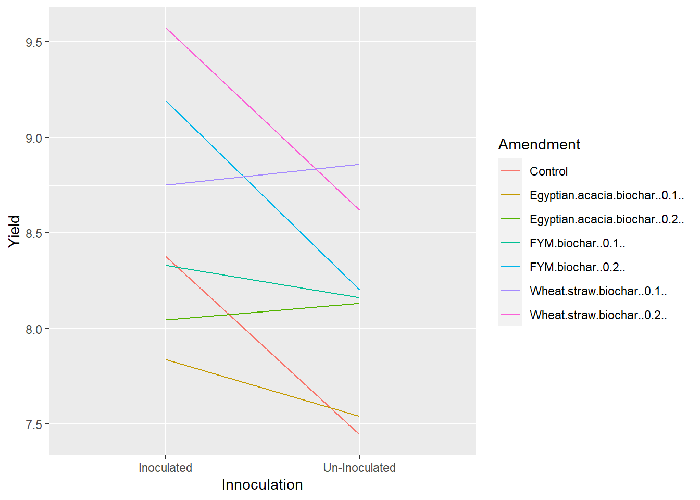
Our plot above reflects our ANOVA results.  Maize yield with most amendments decreased when the crop was un-innoculated.  The maize response was flat or even slightly increased for a few levels of Amendment, but the interaction only had a P-value of about 0.32, so the interaction was not significant.  Similarly, the ranking of Amendments changed somewhat with level of Innoculation, but not enough to be significant.


### Testing Factors Individually
Sometimes we may want to know whether one factor has a significant effect at each level of the other factor.
To do this requires three lines of code.  The last is a little tricky, but we will get there.

The first couple of lines should look familiar.  We take the biochar data.frame, and we use group_by to group it by Innoculation level.

The third line requires further explation.  What we ae doing is telling R to run a separate analysis of variance for Amendment at each level of Innnoculation.  

*aov(.$Yield ~ .$Block + .$Amendment))* is our anova model, but it looks different than the ones we have specified before.  Normally we would just write: *aov(Yield ~ Block + Amendment, data = biochar)*.  We can't do that here, though, because the model is using the data groups fed by the group_by() function just above.  Instead, the ".$" tells R that each term in the model is a column from the data that is being fed to it.  

*tidy* tells R to return the anova as a data.frame()  This allows us to stack the ANOVAs for different levels of Innoculant on top of each other.  *tidy* is part of the *broom* package, so we use *library(broom)* to load that package before we begin.

Finally, *do()* is the magical command that tells R to, well, do something -- anything -- with the groups of data that are fed to it.  

So when we put it all together, the third line tells R to *do* something with the two levels of Innoculant, specifically to create *tidy* data.frames of the analyses of variance for both of them.


```r
library(broom)

biochar %>%
  group_by(Innoculation) %>%
  do(tidy(aov(.$Yield ~ .$Block + .$Amendment)))
```

```
## # A tibble: 6 x 7
## # Groups:   Innoculation [2]
##   Innoculation  term           df sumsq meansq statistic     p.value
##   <chr>         <chr>       <dbl> <dbl>  <dbl>     <dbl>       <dbl>
## 1 Inoculated    .$Block         5 22.1   4.42      11.6   0.00000272
## 2 Inoculated    .$Amendment     6 14.0   2.33       6.10  0.000291  
## 3 Inoculated    Residuals      30 11.5   0.382     NA    NA         
## 4 Un-Inoculated .$Block         5 13.3   2.67       4.00  0.00669   
## 5 Un-Inoculated .$Amendment     6  9.58  1.60       2.39  0.0521    
## 6 Un-Inoculated Residuals      30 20.0   0.667     NA    NA
```

We can see from the output that the effect of Amendment is significant at both levels of Innoculant.

What about the other way around?  We simply take the code above and reverse the positions of Amendment and Innoculation.


```r
biochar %>%
  group_by(Amendment) %>%
  do(tidy(aov(.$Yield ~ .$Block + .$Innoculation)))
```

```
## # A tibble: 21 x 7
## # Groups:   Amendment [7]
##    Amendment                  term           df   sumsq meansq statistic p.value
##    <chr>                      <chr>       <dbl>   <dbl>  <dbl>     <dbl>   <dbl>
##  1 Control                    .$Block         5  2.26   0.452     1.27    0.401 
##  2 Control                    .$Innocula~     1  2.61   2.61      7.32    0.0425
##  3 Control                    Residuals       5  1.78   0.357    NA      NA     
##  4 Egyptian.acacia.biochar..~ .$Block         5  4.01   0.801     1.68    0.292 
##  5 Egyptian.acacia.biochar..~ .$Innocula~     1  0.266  0.266     0.556   0.489 
##  6 Egyptian.acacia.biochar..~ Residuals       5  2.39   0.478    NA      NA     
##  7 Egyptian.acacia.biochar..~ .$Block         5  4.67   0.934     0.779   0.604 
##  8 Egyptian.acacia.biochar..~ .$Innocula~     1  0.0225 0.0225    0.0188  0.896 
##  9 Egyptian.acacia.biochar..~ Residuals       5  5.99   1.20     NA      NA     
## 10 FYM.biochar..0.1..         .$Block         5 12.3    2.47      3.30    0.108 
## # ... with 11 more rows
```

We see the effect of Innoculant on yield is only significant for the Control and Wheat Straw Biochar 2X rate.  It is insignificant with all other levels of Amendment.

### Bar Plots
Similar to the other exercise, we can also create a bar plot of the treatment means.  We have two factors, however, so we will need to tweak our code.  The first thing to do is to pick one of the factors to be plotted along the X axis.  Lets go with the Amendment factor.  We can create a simple bar graph for our Amendment treatments


```r
ggplot(data=biochar, aes(x=Amendment, y=Yield)) +
  geom_bar(stat="summary", fun="mean")
```

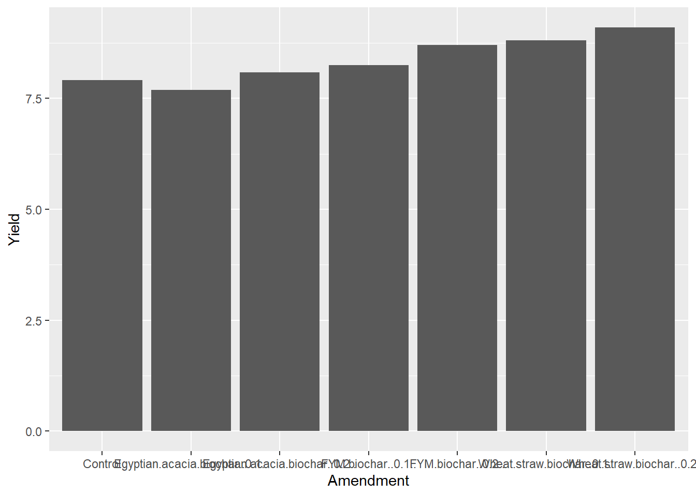

The treatment names are running together a little, so lets add a theme argument with "angle = " to pitch those at a 45 degree angle to the axis and "hjust=1) to right-justify them from the axis.


```r
ggplot(data=biochar, aes(x=Amendment, y=Yield)) +
  geom_bar(stat="summary", fun="mean") +
  theme(axis.text.x = element_text(angle = 45, hjust = 1))
```


We can plot the innoculum effect the same way, just substituting "Innoculation" for "Amendment" in our code above.


```r
ggplot(data=biochar, aes(x=Innoculation, y=Yield)) +
  geom_bar(stat="summary", fun="mean")
```


Of course, in a factorial experiment, we may want to see both treatments together.  In the plot below, we will plot Amendment along the X axis, Yield on the Y axis, and group the bars by level of Innoculation.  Our plot starts out similar to the Amendment plot above.  But in the first line we need to add the argument "group=Innoculation".  This tells R we will group our bars by the level of innoculation.  

To our second line, we need to add an aesthetics argument (aes).  Why?  Because we want the color of the bar to change with the valuable of a variable, in this case the level of innoculation.  Our complete argmument reads "aes(fill = Innoculation)"


```r
ggplot(data=biochar, aes(x=Amendment, y=Yield, group=Innoculation)) +  # add group statement to this line
  geom_bar(stat="summary", fun="mean", aes(fill=Innoculation)) +  # add fill statement to this line
  theme(axis.text.x = element_text(angle = 45, hjust = 1))
```


Ok, we've got different colored bars -- but they are stacked!  We want them side-by-side.  So we need to add one more argument to our second line: position="dodge".  This tells R to position the bars so they "dodge" each other.  It's a weird choice of words, but technically it works.


```r
ggplot(data=biochar, aes(x=Amendment, y=Yield, group=Innoculation)) +  # add group statement to this line
  geom_bar(stat="summary", fun="mean", aes(fill=Innoculation), position="dodge") +  # add fill statement to this line
  theme(axis.text.x = element_text(angle = 45, hjust = 1))
```

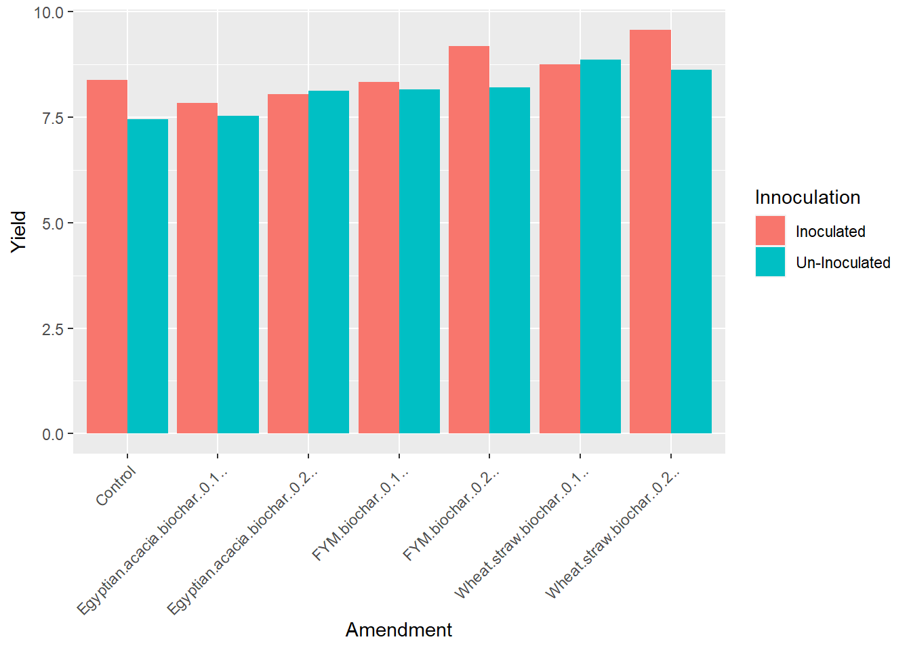

And Voila, we have our plot.  Whew, those color bars are high-contrast, which is great for accessibility.  If we want to change the colors to something closer to our preferred palate, however, 


```r
ggplot(data=biochar, aes(x=Amendment, y=Yield, group=Innoculation)) +  # add group statement to this line
  geom_bar(stat="summary", fun="mean", aes(fill=Innoculation), position="dodge") +  # add fill statement to this line
  theme(axis.text.x = element_text(angle = 45, hjust = 1)) +
  scale_fill_manual(values = c("darkgreen", "orange"))
```

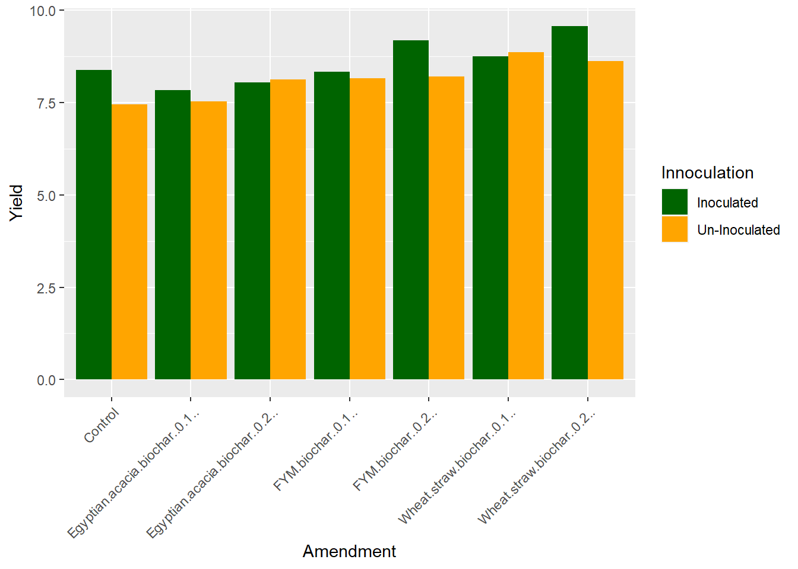

### Practice
For practice we have a dataset inspired by "Plant population and row spacing effects on corn: Plant growth, phenology, and grain yield" (2020), published by Brad J. Bernhard  Frederick E. Below in Agronomy Journal.  The article is open source.

In this study, corn was grown with two row spacings and four plant populations.  The trial was a complete random block design.   

```r
corn = read.csv("data-unit-7/exercise_data/corn_pop_spacing.csv")
head(corn)
```

```
##   block    pop spacing    yield
## 1     1  94000      76 16.90595
## 2     1  94000      51 16.72022
## 3     1 109000      76 15.69209
## 4     1 109000      51 18.51509
## 5     1 124000      76 16.26873
## 6     1 124000      51 17.26152
```

We need to do a couple of things to our dataset before we can run an analysis of variance.  We need to reformat the data for block, pop, and spacing.  Although I did not intend to make this part of the exercise, I'm glad it is in here.

ANOVA is based on named effects.  But if we look under the words block, pop, and spacing, we see the expression "<int>".  The problem is that we are using numbers to represent our treatments.  If we run the analysis of variance on these data as-is, our table will look like this:


           Df Sum Sq Mean Sq F value   Pr(>F)    
block        1 17.808  17.808  24.850 3.17e-05 ***
pop          1  2.028   2.028   2.831  0.10402    
spacing      1  5.550   5.550   7.745  0.00971 ** 
pop:spacing  1  1.318   1.318   1.839  0.18633    
Residuals   27 19.349   0.717                     

If you see nothing wrong, be comforted this has happened to me *many* times.  But look again, particularly at the degrees of freedom.  Do you see it now?  We have four blocks in this trial, so we should have three degrees of freedom.  We have four populations, so again we should have three degrees of freedom.  Our degrees of freedom for population should be equal to the population degrees of freedom (4-1 = 3) times the spacing degrees of freedom (2-1 = 1), or three degrees.

What is going on is R thingks we want to create a regression model, and it will just have to be patient because we don't get to that until Unit 9!  To tell R to run this analysis correctly, let's tell it to treat block, pop, and spacing as the factors they are, rather than as integers.  

We are going to use the "as.factor" command to tell R these variables are factors.  We use the ominous sounding command "mutate" to change our variables. 

```r
corn_fixed = corn %>%  # the "%>%" tells R to take the corn dataset and use it in the next line of code
  mutate(block = as.factor(block),  # mutate tells R to change the variables according to the formula given
         pop = as.factor(pop),
         spacing = as.factor(spacing))
```

#### ANOVA
Now, run your ANOVA on the new dataset, corn_fixed.  The degrees of freedom will be correct.  Your ANOVA output should look like:


            Df Sum Sq Mean Sq F value   Pr(>F)    
block        3 18.791   6.264  12.841 5.53e-05 ***
pop          3  6.860   2.287   4.688  0.01169 *  
spacing      1  5.550   5.550  11.379  0.00287 ** 
pop:spacing  3  4.609   1.536   3.150  0.04645 *  
Residuals   21 10.243   0.488                     


Signif. codes:  0 *** 0.001 ** 0.01 * 0.05 . 0.1   1


#### Test Factors Individually
Test the effect of spacing at each level of pop.  Your results should look like:

   pop    term         df sumsq meansq statistic p.value
   <fct>  <chr>     <dbl> <dbl>  <dbl>     <dbl>   <dbl>
 1 94000  .$block       3 2.20   0.733      5.93  0.0889
 2 94000  .$spacing     1 0.336  0.336      2.72  0.198 
 3 94000  Residuals     3 0.371  0.124     NA    NA     
 4 109000 .$block       3 6.00   2.00       1.74  0.330 
 5 109000 .$spacing     1 4.65   4.65       4.05  0.138 
 6 109000 Residuals     3 3.45   1.15      NA    NA     
 7 124000 .$block       3 5.88   1.96       3.01  0.195 
 8 124000 .$spacing     1 3.72   3.72       5.71  0.0968
 9 124000 Residuals     3 1.95   0.651     NA    NA     
10 139000 .$block       3 8.70   2.90      18.0   0.0201
11 139000 .$spacing     1 1.46   1.46       9.07  0.0571
12 139000 Residuals     3 0.482  0.161     NA    NA     

Test the effects of pop at each level of spacing.  Your results should look like:

  spacing term         df sumsq meansq statistic  p.value
  <fct>   <chr>     <dbl> <dbl>  <dbl>     <dbl>    <dbl>
1 51      .$block       3  8.24  2.75       5.25  0.0228 
2 51      .$pop         3  8.06  2.69       5.13  0.0243 
3 51      Residuals     9  4.71  0.523     NA    NA      
4 76      .$block       3 11.3   3.76       7.03  0.00984
5 76      .$pop         3  3.41  1.14       2.13  0.167  
6 76      Residuals     9  4.81  0.534     NA    NA    


## Exercise: Split-Plot Design

The split-plot design is similar to the factorial design but, as we learned in the lecture, has two error terms: one for the main factor, and the second for the sub-factor.  This requires we use different R code than for the factorial design.

### Case Study: Corn-Soybean Systems Trial
A cropping systems trial was conducted in Wisconsin to investigate the combined effects of tillage and in-furrow fungicide on soybean yield.  This dataset was inspired by the following article, which is open-source:

Potratz, DJ, Mourtzinis, S, Gaska, J, Lauer, J, Arriaga, FJ, Conley, SP. Striptill, other management strategies, and their interactive effects on corn grain and soybean seed yield. Agronomy Journal. 2020; 112: 72 80. https://doi.org/10.1002/agj2.20067

The trial was a split-plot design with two levels of tillage (no-till, NT, and strip-till, ST) as the main factor and two levels of fungicide (Fungicide and No Fungicide) as the sub-factor.  There were four replications.  Main factor levels were blocked.


```r
library(tidyverse)
soybean = read.csv("data-unit-7/exercise_data/tillage_fungicide_soybean.csv")
head(soybean)
```

```
##   block tillage    fungicide    yield
## 1    B1      NT    Fungicide 3.698314
## 2    B1      NT No Fungicide 3.452027
## 3    B1      ST    Fungicide 4.059679
## 4    B1      ST No Fungicide 3.867225
## 5    B2      NT    Fungicide 4.045291
## 6    B2      NT No Fungicide 3.902678
```

### ANOVA
Lets first construct our linear model:

Y = mu + T + Error(B + BT) + F + TF + Error(BF + BTF)

So our anova output should include include the effects of tillage (T), fungicide (F), and their interaction (TF).  We also need to tell R to use the interaction of block and tillage to test the main factor tillage effect.  We code this in R as follows.


```r
soybean_model = aov(yield ~ tillage + fungicide + tillage:fungicide + Error(block:tillage), data=soybean)
```

```
## Warning in aov(yield ~ tillage + fungicide + tillage:fungicide +
## Error(block:tillage), : Error() model is singular
```

```r
soybean_model = with(soybean, sp.plot(block, tillage, fungicide, yield))
```

```
## 
## ANALYSIS SPLIT PLOT:  yield 
## Class level information
## 
## tillage 	:  NT ST 
## fungicide 	:  Fungicide No Fungicide 
## block 	:  B1 B2 B3 B4 
## 
## Number of observations:  16 
## 
## Analysis of Variance Table
## 
## Response: yield
##                   Df  Sum Sq Mean Sq F value   Pr(>F)   
## block              3 2.17303 0.72434 90.9367 0.001920 **
## tillage            1 0.38181 0.38181 47.9344 0.006177 **
## Ea                 3 0.02390 0.00797                    
## fungicide          1 0.26756 0.26756 23.4352 0.002878 **
## tillage:fungicide  1 0.00017 0.00017  0.0147 0.907315   
## Eb                 6 0.06850 0.01142                    
## ---
## Signif. codes:  0 '***' 0.001 '**' 0.01 '*' 0.05 '.' 0.1 ' ' 1
## 
## cv(a) = 2.1 %, cv(b) = 2.5 %, Mean = 4.289329
```

Of particular note is the new "Error" term we have added.  This tells R which error to use for testing the tillage effect.

The ANOVA output is created using the *summary()* function.  

```r
summary(soybean_model)
```

```
##       Length Class  Mode   
## ANOVA 5      anova  list   
## gl.a  1      -none- numeric
## gl.b  1      -none- numeric
## Ea    1      -none- numeric
## Eb    1      -none- numeric
```

As we saw in lecture, the ANOVA output for a split-plot experiment includes two tables.  The top table tests the main factor effect.  At the top of that table, it specifies we are using the block:tillage interaction as our error term.  The bottom table tests the sub-factor effect and the interaction between the main factor and the sub-factor.  

We can see tillage did not have an effect.  Fungicide did affect yield.    

### Interaction Plot
Although the interaction is not singificant, we can still draw a line plot to visualize the relationship between tillage and fungicide effects.  First, we need to create a summary dataset with mean yields for the interactions of tillage and fugicide.


```r
soybean_group = soybean %>%    # build new dataframe, soybean_group, on summary of soybean dataframe
  group_by(tillage, fungicide) %>%   # summarise based on interaction of tillage and fungicide
  summarise(yield = mean(yield)) %>%   # summarise by means across replications
  ungroup()    # ungroup for further processing
```

```
## `summarise()` has grouped output by 'tillage'. You can override using the `.groups` argument.
```


Then we create our line plot.  We can start the plot with the ggplot() function.  The aes() argument tells R to position the data points according to their tillage level and yield.  It also tells R to group the points by fungicide level.


```r
soybean_group %>%
  ggplot(aes(x=tillage, y=yield, group=fungicide))
```

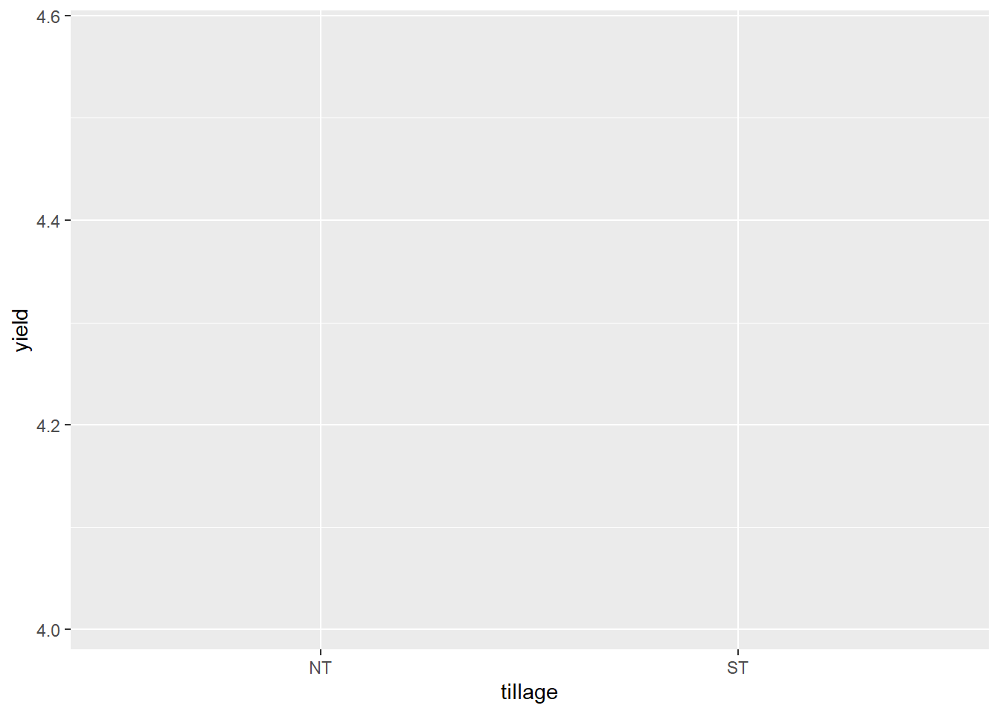


Next we add line geometries to our plot using geom_line().  We use another aes() argument to tell R to differentiate line color by level of fungicide.

```r
soybean_group %>%
  ggplot(aes(x=tillage, y=yield, group=fungicide)) +
  geom_line(aes(color=fungicide))
```

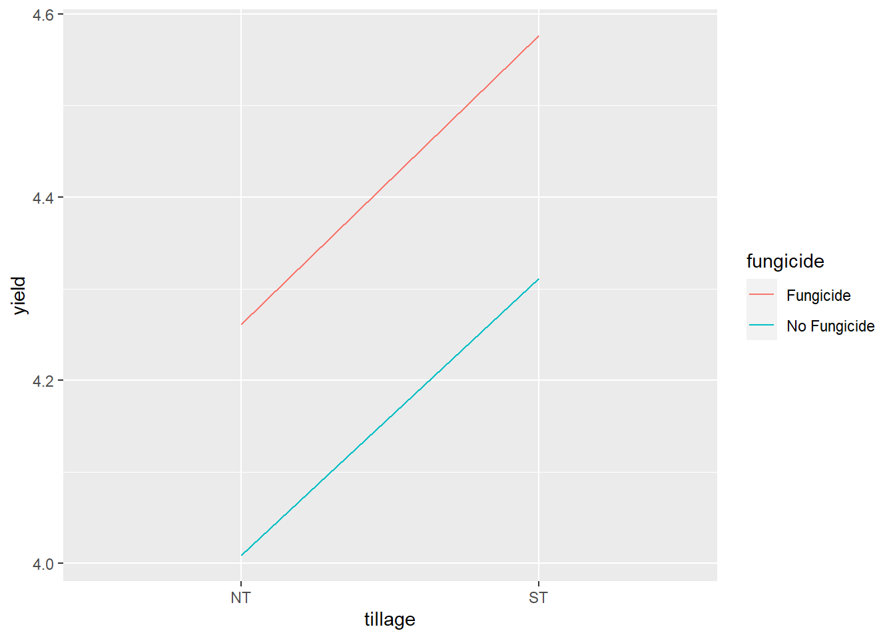


### Bar plot
We can create a bar plot just as we did for the factorial trial.

First, we tell ggplot with the aes() argument to position the bars according to their tillage level and their yield, and to group means with the same fungicide level together so they are the same color. 

```r
soybean %>%
  ggplot(aes(x=tillage, y=yield, group=fungicide))
```


Then we add our geometry with the geom_bar() argument.  We will add an aes() argument to tell R that bar color should be matched to fungicide level. We also need to use the *stat="summary"* argument that the statistic to be plotted is a summary statistic to be calculated.  The we need to tell it with *fun="mean"* that the statistic to be calculated is the mean.


```r
soybean %>%
  ggplot(aes(x=tillage, y=yield, group=fungicide)) +
  geom_bar(aes(fill=fungicide), stat = "summary", fun="mean")
```

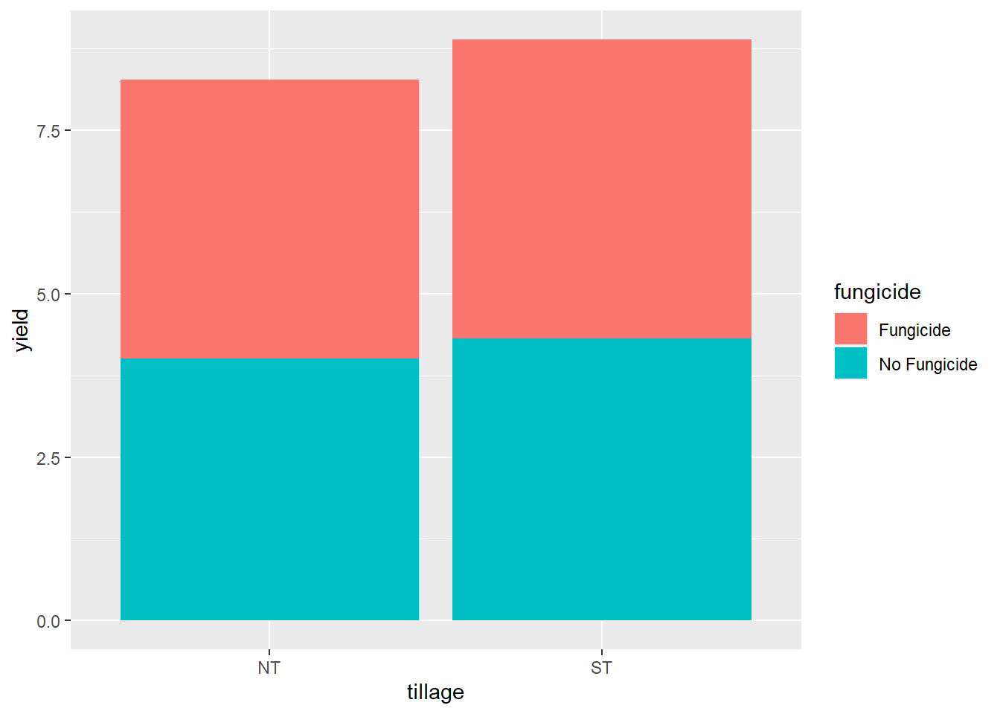

Whoops!  We need to add a final argument to geom_bar(), to tell it to plot the two levels of fungicide next to each other, instead of stacking them.  We add *position="dodge"* accordingly. 


```r
soybean %>%
  ggplot(aes(x=tillage, y=yield, group=fungicide)) +
  geom_bar(aes(fill=fungicide), stat = "summary", fun="mean", position="dodge")
```

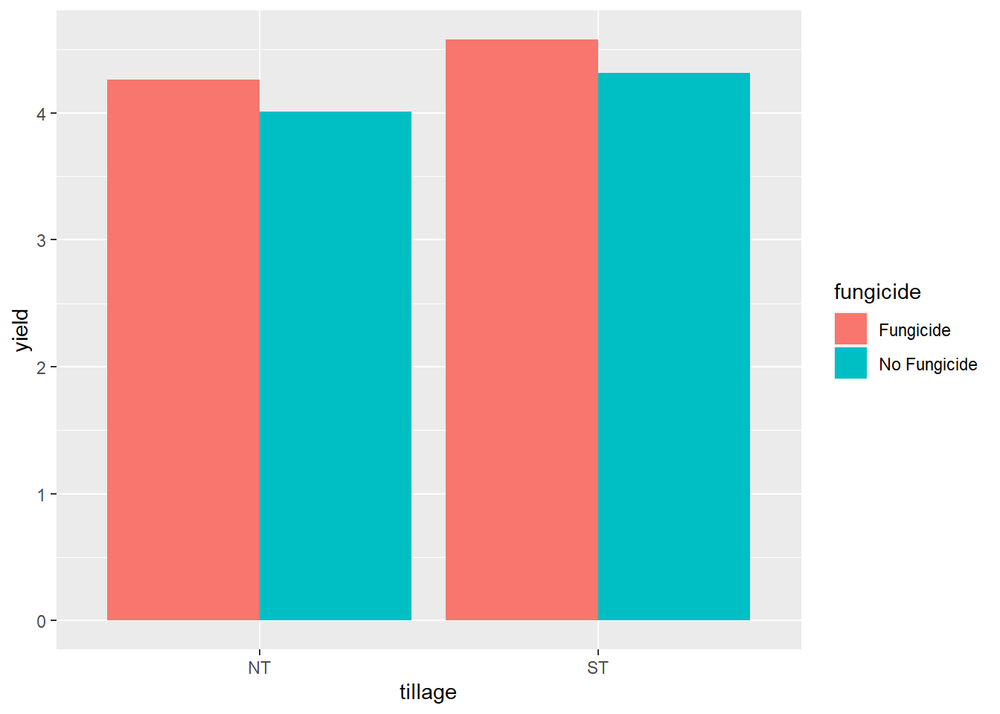

Finally, if we want, we can add a couple of theme() arguments to increase the font size of the axis titles and labels.


```r
soybean %>%
  ggplot(aes(x=tillage, y=yield, group=fungicide)) +
  geom_bar(aes(fill=fungicide), stat = "summary", fun="mean", position="dodge") +
  theme(axis.title = element_text(size=18),
        axis.text = element_text(size=14))  # element_text() tells R we are modifying the font, as opposed to the position of the axis title
```


### Practice
The same study above produced a corn dataset.  The main factor was rotation and the sub-factor was fungicide.  

```r
corn = read.csv("data-unit-7/exercise_data/rotation_fungicide_corn.csv")
head(corn)
```

```
##   block rotation    fungicide    yield
## 1    B1       CS    Fungicide 12.95823
## 2    B1       CS No Fungicide 12.40752
## 3    B1       CC    Fungicide 11.49778
## 4    B1       CC No Fungicide 11.60836
## 5    B2       CS    Fungicide 14.19937
## 6    B2       CS No Fungicide 13.69898
```

#### ANOVA
Create an analysis of variance for the data above.  Your results should look like:

Error: block:rotation
          Df Sum Sq Mean Sq F value Pr(>F)
rotation   1   4.99   4.987   0.896   0.38
Residuals  6  33.39   5.565               

Error: Within
                   Df Sum Sq Mean Sq F value   Pr(>F)    
fungicide           1 0.1309  0.1309   64.19 0.000202 ***
rotation:fungicide  1 0.3492  0.3492  171.19 1.23e-05 ***
Residuals           6 0.0122  0.0020                     

Signif. codes:  0 *** 0.001 ** 0.01 * 0.05 . 0.1   1

#### Test Factors Individually
First, test the effect of rotation at each level of fungicide.  Your results should look like:

  fungicide    term          df    sumsq   meansq statistic     p.value
  <fct>        <chr>      <dbl>    <dbl>    <dbl>     <dbl>       <dbl>
1 Fungicide    .$block        3 16.6     5.52         6385.  0.00000333
2 Fungicide    .$rotation     1  3.99    3.99         4612.  0.00000703
3 Fungicide    Residuals      3  0.00259 0.000865       NA  NA         
4 No Fungicide .$block        3 16.8     5.61         6068.  0.00000359
5 No Fungicide .$rotation     1  1.35    1.35         1458.  0.0000395 
6 No Fungicide Residuals      3  0.00277 0.000925       NA  NA         

Second, test the effect of fungicide at each level of rotation.  Your results should look like:

  rotation term           df    sumsq  meansq statistic     p.value
  <fct>    <chr>       <dbl>    <dbl>   <dbl>     <dbl>       <dbl>
1 CC       .$block         3 16.7     5.58       4075.   0.00000652
2 CC       .$fungicide     1  0.0262  0.0262       19.2  0.0220    
3 CC       Residuals       3  0.00410 0.00137      NA   NA         
4 CS       .$block         3 16.7     5.56       2049.   0.0000183 
5 CS       .$fungicide     1  0.454   0.454       167.   0.000997  
6 CS       Residuals       3  0.00814 0.00271      NA   NA    


#### Create a line plot to view the interaction between rotation and fungicide.


## Exercise: Experimental Design

Now that you have been introoduced to four powerful experimental designs -- completely randomized, randomized complete block, factorial, and split-plot, how can you use R to create your plot layout and randomize your treatments?  

Of course, R has a package for that.  We will use the *agricolae()* packages and its multiple tools for experimental design.

### Completely Randomized Design
We have a hemp trial with five varieties: "China Cat", "Eyes", "Scarlet", "Fire", and "Tower".  How do we randomize it?  We use the *design.crd()* function.


```r
library(agricolae)

# First, we need to define the varieties as a vector:
varieties = c("China Cat", "Eyes", "Scarlet", "Fire", "Tower")

# Then we define the number of replications we want:
reps = 6

# One more thing we can do is provide a "seed".  A seed tells R where to start in randomizing the plot.  This is often useful in case we need to recreate a set of random numbers.  In case we need to recreate this plot map from scratch, we will provide a seed.
seed_no = 910


# then we just feed these to the design.crd argument
crd = design.crd(trt=varieties, r=reps, seed = seed_no)
```

design.crd outputs a list (a collection of R objects).  To view the treatment assignments in our new plot plan, "crd", we add "$book" to the end of it.

```r
crd$book
```

```
##    plots r varieties
## 1    101 1      Fire
## 2    102 1      Eyes
## 3    103 2      Eyes
## 4    104 1   Scarlet
## 5    105 2   Scarlet
## 6    106 2      Fire
## 7    107 3      Eyes
## 8    108 3      Fire
## 9    109 4      Eyes
## 10   110 1     Tower
## 11   111 4      Fire
## 12   112 2     Tower
## 13   113 5      Fire
## 14   114 1 China Cat
## 15   115 5      Eyes
## 16   116 2 China Cat
## 17   117 3 China Cat
## 18   118 3   Scarlet
## 19   119 3     Tower
## 20   120 4   Scarlet
## 21   121 4     Tower
## 22   122 6      Eyes
## 23   123 6      Fire
## 24   124 5     Tower
## 25   125 5   Scarlet
## 26   126 4 China Cat
## 27   127 6     Tower
## 28   128 5 China Cat
## 29   129 6 China Cat
## 30   130 6   Scarlet
```


### Randomized Complete Block Design
What if we want to block our treatments?  For this, we use the *design.rcbd()* function.  The values we feed to it will be identical to the completely randomized design above.


```r
# First, we need to define the varieties as a vector:
varieties = c("China Cat", "Eyes", "Scarlet", "Fire", "Tower")

# Then we define the number of replications we want:
reps = 6

# One more thing we can do is provide a "seed".  A seed tells R where to start in randomizing the plot.  This is often useful in case we need to recreate a set of random numbers.  In case we need to recreate this plot map from scratch, we will provide a seed.
seed_no = 910

rcbd = design.rcbd(trt = varieties, r=reps, seed = seed_no)
```

We can review our treatment assignments using "rcbd$book".

```r
rcbd$book
```

```
##    plots block varieties
## 1    101     1 China Cat
## 2    102     1      Fire
## 3    103     1   Scarlet
## 4    104     1      Eyes
## 5    105     1     Tower
## 6    201     2      Fire
## 7    202     2      Eyes
## 8    203     2     Tower
## 9    204     2   Scarlet
## 10   205     2 China Cat
## 11   301     3      Fire
## 12   302     3 China Cat
## 13   303     3   Scarlet
## 14   304     3     Tower
## 15   305     3      Eyes
## 16   401     4      Fire
## 17   402     4   Scarlet
## 18   403     4 China Cat
## 19   404     4      Eyes
## 20   405     4     Tower
## 21   501     5 China Cat
## 22   502     5   Scarlet
## 23   503     5     Tower
## 24   504     5      Eyes
## 25   505     5      Fire
## 26   601     6     Tower
## 27   602     6   Scarlet
## 28   603     6      Fire
## 29   604     6      Eyes
## 30   605     6 China Cat
```

We can save this data.frame to our local directory -- for use in our spreadsheet -- using the *write.csv()* function.


```r
# the write.csv arguments are (name of data.frame, filename, row.names=FALSE)
write.csv(rcbd$book, "field_book.csv", row.names = FALSE)
```


### Factorial Design
We use the *design.ab()* function to create our plot layout.  

The factorial experimental design is slightly different.  We cannot give R named treatments.  We can only tell it how many treatments are in each factor.  Let's say we wanted to run a factorial experiment with three levels of hemp variety and two levels of soil amdendments.  We would call this a "3 x 2" factorial.

One additonal change is we can tell R whether to arrange our treatments in a completely randomized design or a randomized complete block design.  We will use the *design = "rcbd"* argment to tell R to create a randomized complete block design.  (If we wanted to create a completely randomized design, we would use *design="crd"* instead 

```r
# the line below tells R that we have three levels of the first factor and two levels of the second factor.
factors = c(3,2)
reps = 4
seed_no=910

fact = design.ab(trt = factors, r = reps, seed = seed_no, design = "rcbd")
```

We can again review our treatment assignments by using *$book*. 

```r
fact$book
```

```
##    plots block A B
## 1    101     1 1 1
## 2    102     1 2 1
## 3    103     1 1 2
## 4    104     1 2 2
## 5    105     1 3 1
## 6    106     1 3 2
## 7    107     2 2 2
## 8    108     2 1 1
## 9    109     2 2 1
## 10   110     2 3 1
## 11   111     2 3 2
## 12   112     2 1 2
## 13   113     3 2 2
## 14   114     3 1 1
## 15   115     3 1 2
## 16   116     3 3 1
## 17   117     3 2 1
## 18   118     3 3 2
## 19   119     4 2 2
## 20   120     4 3 1
## 21   121     4 2 1
## 22   122     4 3 2
## 23   123     4 1 2
## 24   124     4 1 1
```

### Split-Plot Design
Lets say we are going to use equipment to spread our compost.  The applicator creates a 6-meter swath, while our three varieties are being grown in plots 2 meters wide.  We deside to conduct a split plot trial with soil amendment as our main factor and variety as our sub-factor.

For the split plot design, will define the levels of our two factors, varieties and amendments, by name


```r
# First, we need to define the varieties as a vector:
varieties = c("Eyes", "Scarlet", "Fire")

# Second, we define our amendment treatments
amendments = c("control", "compost")
# 
# Then we define the number of replications we want:
reps = 4

# One more thing we can do is provide a "seed".  A seed tells R where to start in randomizing the plot.  This is often useful in case we need to recreate a set of random numbers.  In case we need to recreate this plot map from scratch, we will provide a seed.
seed_no = 910

# The design.split() function is similar to the factorial design.ab function above.  The main difference is we now define a "trt1" and a "trt2".  trt1 is the factor you want in the main plots; trt2 is the factor you want in the subplots.  The other arguments are the same.
# 
spdesign = design.split(trt1 = amendments, trt2 = varieties, r=4, seed = seed_no, design = "rcbd")
```

Our treatment assignments are below:

```r
spdesign$book
```

```
##    plots splots block amendments varieties
## 1    101      1     1    control   Scarlet
## 2    101      2     1    control      Eyes
## 3    101      3     1    control      Fire
## 4    102      1     1    compost      Eyes
## 5    102      2     1    compost      Fire
## 6    102      3     1    compost   Scarlet
## 7    103      1     2    control      Fire
## 8    103      2     2    control      Eyes
## 9    103      3     2    control   Scarlet
## 10   104      1     2    compost      Fire
## 11   104      2     2    compost      Eyes
## 12   104      3     2    compost   Scarlet
## 13   105      1     3    compost      Eyes
## 14   105      2     3    compost      Fire
## 15   105      3     3    compost   Scarlet
## 16   106      1     3    control      Eyes
## 17   106      2     3    control      Fire
## 18   106      3     3    control   Scarlet
## 19   107      1     4    compost   Scarlet
## 20   107      2     4    compost      Fire
## 21   107      3     4    compost      Eyes
## 22   108      1     4    control      Fire
## 23   108      2     4    control   Scarlet
## 24   108      3     4    control      Eyes
```

### Practice
We now have a new hemp trial comparing varieties "Chicago", "New York", and "Detroit".  The critics say they're all on the same "street" (whatever), but we would like to compare them.

#### Completely Randomized Design
Create a completely randomized design with 4 replicates.  Please use seed_no=123 so our results will match.  

```r
varieties = c("Chicago", "New York", "Detroit")
reps=4
seed_no=123
```

Your plan should look like:

   plots r varieties
1    101 1  New York
2    102 1   Detroit
3    103 1   Chicago
4    104 2   Chicago
5    105 2   Detroit
6    106 3   Chicago
7    107 3   Detroit
8    108 2  New York
9    109 4   Detroit
10   110 3  New York
11   111 4   Chicago
12   112 4  New York


#### Randomized Complete Block Design
Create a randomized complete block design using the same three varieties as above.  Please again use seed_no=123 so our results will match.


```r
varieties = c("Chicago", "New York", "Detroit")
reps=4
seed_no=123
```

Your plan should look like:

   plots block varieties
1    101     1   Detroit
2    102     1   Chicago
3    103     1  New York
4    201     2   Detroit
5    202     2   Chicago
6    203     2  New York
7    301     3  New York
8    302     3   Chicago
9    303     3   Detroit
10   401     4  New York
11   402     4   Detroit
12   403     4   Chicago

#### Factorial Design
Now lets take our 3 levels of hemp variety and treat each with two levels of foliar spray (control and kelp).  We will arrange our treatments in blocked (design="rcbd") factorial design.  We will use 2 reps (only to keep our practice data set small -- more reps would be better!).  Please again use seed_no=123


```r
factors = c(3,2)
reps=2
seed_no=123
```

Your results should look like:
   plots block A B
1    101     1 1 1
2    102     1 3 2
3    103     1 2 2
4    104     1 1 2
5    105     1 3 1
6    106     1 2 1
7    107     2 2 2
8    108     2 1 2
9    109     2 3 2
10   110     2 1 1
11   111     2 3 1
12   112     2 2 1


#### Split Plot Design
Now lets suppose we had a 9-meter spray boom and variety plots that were 3-meters wide.  Lets design a split plot trial with foliar spray as the main factor and hemp variety as the subfactor. We will block the main plots (design="rcbd").  Please again use seed_no=123 and fill in the remaining code.


```r
varieties = c("Chicago", "New York", "Detroit")
foliar = c("control", "kelp")
reps=2
seed_no=123
```

Your results should look like:

   plots splots block  foliar varieties
1    101      1     1 control   Chicago
2    101      2     1 control  New York
3    101      3     1 control   Detroit
4    102      1     1    kelp  New York
5    102      2     1    kelp   Chicago
6    102      3     1    kelp   Detroit
7    103      1     2 control  New York
8    103      2     2 control   Detroit
9    103      3     2 control   Chicago
10   104      1     2    kelp  New York
11   104      2     2    kelp   Chicago
12   104      3     2    kelp   Detroit

