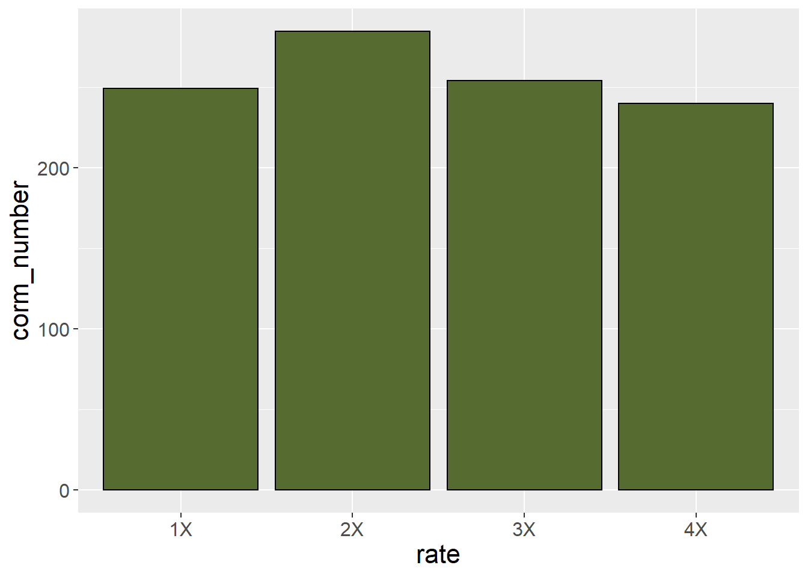
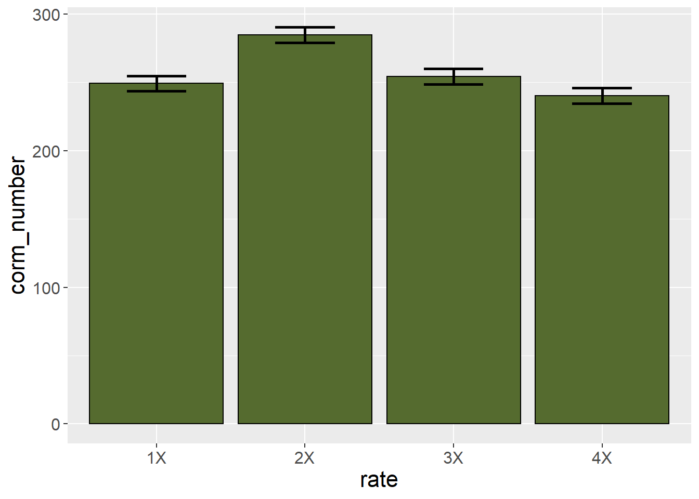

# Means Separation and Data Presentation

The previous two units focused on the design and analysis of effects in multiple treatment files.  Our focus was to determine whether treat ent effects explained more of the variation among individuals in a population than error (or residual) effects, which are based on unexplained differences among individuals.

In the first half of this unit, we will learn three common tools used for testing the differences *between* treatments.  This is often the key purpose of a research trial.  We know going in that some treatments will be different.  But we don't how they will rank, and whether the difference between them will be great enough to infer one is better than another.

In the second half, we will learn how to present treatment means in tables and plots.  Proper data allows the reader to not only grasp results, but even incorporate some of your findings into their own work 


## Case Study
Our sample dataset is inspired by Salas, M.C.; Montero, J.L.; Diaz, J.G.; Berti, F.; Quintero, M.F.; Guzmán, M.; Orsini, F. Defining Optimal Strength of the Nutrient Solution for Soilless Cultivation of Saffron in the Mediterranean. Agronomy 2020, 10, 1311.

Saffron is a spice made from the anthers of the saffron flow.  It has a nuanced, sweet, complex flavor, and is used in dishes from Cornish saffron rolls to Spanish paella to Iranian tahdig.  It comes from the anthers of the field-grown saffron flower and must be hand picked, making it very expensive.

In this study, saffron was grown hydroponically in 15-L pots filled with perlite, with four nutrient concentrations as defined by electroconductivity (EC): low (EC 2.0), medium (EC 2.5), high (EC 3.0), and very high (EC 4.0).  The effect of the solutions on corm production (needed to propagate the crop) was measured.  


```r
library(tidyverse)
```

```
## -- Attaching packages --------------------------------------- tidyverse 1.3.0 --
```

```
## v ggplot2 3.3.3     v purrr   0.3.4
## v tibble  3.1.0     v dplyr   1.0.5
## v tidyr   1.1.3     v stringr 1.4.0
## v readr   1.4.0     v forcats 0.5.1
```

```
## -- Conflicts ------------------------------------------ tidyverse_conflicts() --
## x dplyr::filter() masks stats::filter()
## x dplyr::lag()    masks stats::lag()
```

```r
saffron = read.csv("data-unit-8/saffron.csv")
head(saffron)
```

```
##   plot block rate corm_number
## 1    1     1   1X         246
## 2    2     1   4X         240
## 3    3     1   3X         254
## 4    4     1   2X         285
## 5    5     2   4X         233
## 6    6     2   3X         251
```

## Least Significant Difference
Perhaps the most straightforward method of means separation is the infamous Least Significant Difference test.  Not to be confused with the psychadelic parties in Marin County, California, the LSD test is as simple as this: 

* calculate the least significant difference
* any treatment differences that are equal to or greater than the least significant difference are -- you guessed it -- significant

The least significant difference is calculated as follows:

$$LSD_{df, \alpha} = t_{df, \alpha} \cdot SED$$

Where $LSD_{df, \alpha}$ is the least significant difference, given the degrees of freedom associated with the error effect and the desired signifance. 

Does this formula look vaguely familiar?  Does it remind you of what you were doing back in Unit 4?  Great, because this is the same formula we used to calculate the distance between confidence limits and the sample mean back when we learned t-tests.  Back then, we saw how the confidence interval was used to test the probability our observed difference between treatments was different from zero.  Recall if zero fell outside our confidence interval, we inferred the two treatments were different.  Similarly, if the difference between two treatments is greater than the least significant difference, we infer the treatments are significantly different.  

In R, we use a function, *LSD.test()*, which is part of the *agricolae* package, to calculate the LSD.  First, however, lets run an analysis of variance on our t
data.  The experiment was a randomized complete block design, so our linear additive model is:

$$ Y_{ij} = \mu +B_i + T_j + BT_{ij}$$

Where $Y_{ij}$ is the number of corms, $\mu$ is the overall population mean for the trial, $B_i$ is the block effect, $T_j$ is the treatment effect, and $BT_{ij}$ is the block effect.

Our analysis of variance result is below.  The effect of fertilization rate is highly significant.  And this brings us to an important rule for using the LSD test.  We only use the LSD test to separate means *if* the treatment effect is significant in our analysis of variance.  Doing otherwise can lead to errors, as we will discuss below.


```r
saffron$block = as.factor(saffron$block)
saffron_model = aov(corm_number ~ block + rate, saffron)
summary(saffron_model)
```

```
##             Df Sum Sq Mean Sq F value   Pr(>F)    
## block        3     85    28.4   2.465    0.129    
## rate         3   4473  1490.9 129.333 1.02e-07 ***
## Residuals    9    104    11.5                     
## ---
## Signif. codes:  0 '***' 0.001 '**' 0.01 '*' 0.05 '.' 0.1 ' ' 1
```

## LSD Output in R

Now that we know the effect of fertilization rate is highly significant, we want to know how the individual treatments rank, and whether they are significantly different from one another.  The results of our LSD test are below.


```r
library(agricolae)
lsd = LSD.test(saffron_model, "rate")
lsd
```

```
## $statistics
##    MSerror Df    Mean      CV  t.value     LSD
##   11.52778  9 257.125 1.32047 2.262157 5.43101
## 
## $parameters
##         test p.ajusted name.t ntr alpha
##   Fisher-LSD      none   rate   4  0.05
## 
## $means
##    corm_number      std r      LCL      UCL Min Max    Q25   Q50    Q75
## 1X      249.25 4.272002 4 245.4097 253.0903 246 255 246.00 248.0 251.25
## 2X      284.75 2.629956 4 280.9097 288.5903 281 287 284.00 285.5 286.25
## 3X      254.25 2.872281 4 250.4097 258.0903 251 258 253.25 254.0 255.00
## 4X      240.25 5.439056 4 236.4097 244.0903 233 246 238.25 241.0 243.00
## 
## $comparison
## NULL
## 
## $groups
##    corm_number groups
## 2X      284.75      a
## 3X      254.25      b
## 1X      249.25      b
## 4X      240.25      c
## 
## attr(,"class")
## [1] "group"
```

Lets unpack this piece by peace.  The output from the LSD test is in a list of tables.  

### Statistics Table
Let's start with the `$statistics` table.  This explains how our LSD was calculated:

* MSerror is the error or residual mean square.  It should match that value from the ANOVA table above.  Recall that MSerror is an estimate the variance within treatments -- that is, the variation among plots unexplained by our model.  Therefore, its square root is the standard deviation of the observations within each treatment.  

* DF is the degrees of freedom, which is used to calculate our t.value

* Mean is just that -- the overall mean of the trial.

* CV is the coefficient of variance.  By dividing the standard deviation by the mean, and multiplying by 100, we arrive at this value.  Recall from Unit 6 that the CV is a measure of the quality control of the trial: how consistent were our experimental units?

* The t-value is based on the degrees of freedom and $\alpha$, the desired p-value (often 0.05) to be used to to test significance.  

* LSD is the product of the t-value and the standard error of the difference, which can be derived from MSerror and the number of replicates.

This is a lot to absorb, I realize.  The most important two statistics for you to understand from this table are the CV and LSD.  The other numbers are intermediate values, although if you list the LSD in a report you should also report the degrees of freedom used to calculate the t-value.

### Means Table
The `$means` table explains the distribution of observations within a treatment level around their sample mean.  Most of these concepts we discussed in Unit 4.  The statistics are:

* corm_number:  These are our sample means for each level of treatment
* std: the standard error of the sample mean.  This is unique to the sample mean for each treatment.
* r: the number of replicates per treatment level
* LCL and UCL: the lower confidence limit and upper confidence limit for each mean.  These are calculated just as we did in Unit 4.

The remainder of the statistics show the minimum and maximum values, and the quartiles.

### Groups Table
Often, the $groups table is the most interesting, for it tests the differences among levels of a treatment.  The treatment means among levels are ranked from greatest to least.

* corm_number: again, the sample mean for each level of treatment
* group: this groups treatments that are statistically equivalent.  Any means followed by the same letter are considered equal.  In the table above, the mean corm numbers associated with the 1X and 3X rates of fertilizer are considered equal.  Any means not followed by the same letter are consisdered statistically different at the p-level chosen to test those differences.  The 2X rate produced significantly greater corm numbers than the other fertilizer rates.  The 4X rate produced statistically lesser corm numbers than the other fertilizer rates.  

## Comparisonwise versus Experimentwise Error
It is important LSD tests not be used indiscriminatly to separate means.  The problem is that each time we test the difference between two means, we have a 5% chance of committing a type I error.  This is the probability of committing a Type I error in *that* comparison.  This is known as the *comparisonwise error rate*.

The probability of committing a type I error across all the comparisons is known as the *experimentwise error rate*.  If we only conduct one comparison, our experimentwise error rate is equal to the comparisonwise error rate.  But if we conduct two comparisons, our experimentwise error rate is equal to the probability that comparisonwise errors will not occur in both comparison.

We can demonstrate this with some simple calculations.  Before we start our comparisons, there is a 100% chance we have not committed an experimentwise Type I error.  We cold express this as: 

$$ \text{Experimentwise Error} = 1 $$

If we once comparison, there is 5% probability of a comparisonwise Type I error -- and a 95% chance the error will not occur.  We can express this as 

$$ \text{Experimentwise Error} = 1 - 0.95 = 0.05 $$

If we have two comparisons, there is a 95% probability a comparisonwise Type I error won't occur in the first comparison -- and a 95% probability it won't occur in the second comparison.  But the probability it doesn't occur in both comparisons is 0.95 * 0.95: 

$$ \text{Experimentwise Error} = 1 - 0.95 \times 0.95 = 1 - 0.9025 = 0.0975  $$

Now the Experimentwise error rate is 0.0975, or 9.75%.

What about three comparisons?

$$ \text{Experimentwise Error} = 1 - 0.95 \times 0.95 \times 0.95 = 1 - 0.8573 = 0.1427 $$

The Experimentwise error rate is now 0.1427, or 14.27%.

Finally, what if we had 10 comparisons?  

$$ \text{Experimentwise Error} = 1 - 0.95^{10} = 1 - 0.5987 = 0.4013$$
Our experimentwise error rate is now about 0.40, or 40%.

As the number of our comparisons increases, so does the probability of an experimentwise error.  How can we avoid this?  The first method, mentioned above, is to not use the LSD test unless the ANOVA shows a significant treatment effect.  We call this approach the *F-protected LSD test*.

The second approach is to use a multiple range test that increases its minimum significant difference for comparing treatments as the number of treatments increases.


## Tukey's Honest Significant Difference
If we are going to be comparing many treatments, it is better to use a minimum significant difference, like Tukey's Honest Significant Different (HSD) Test.  Tukey's HSD is calculated very similarly to the least significant difference:

$$ \text{Tukey's HSD} = Q_{\alpha, df, k} \text{ } \cdot SED $$

The difference in Tukey's HSD is that we use Q, the "studentized range distribution" (you can just call it Q in this course) in place of the t-distribution.  Q differs from t in that its value is determined not only by $\alpha$, the desired probability of a Type I error, and $df$, the degrees of freedom associated with the error mean square, but also $k$, the number of treatments.

The plot below includes four "Q" distribution curves, associated with 3, 5, 6, and 10 treatments.  Observe how the distributions shift to the right as the number of treatments increases.  This means that the minimum difference for significance also increases with the number of treatments.


```r
tukey_list = list()
for(k in c(3:10)){
  x_ptukey <- seq(0, 8, by = 0.005)                       # Specify x-values for ptukey function
  y_ptukey <- ptukey(x_ptukey, nmeans = k, df = 3*k)     # Apply ptukey function
  tukey_df = data.frame(x_ptukey) %>%
    cbind(y_ptukey) %>%
    mutate(change = y_ptukey - lag(y_ptukey)) %>%
    mutate(midpoint = (x_ptukey + lag(x_ptukey))/2) %>%
    mutate(no_trt = k) %>%
    as.data.frame()
  i=k-2
  tukey_list[[i]] = tukey_df
}
  
tukey_df_all = bind_rows(tukey_list)

tukey_df_all %>%
  filter(no_trt %in% c(3,5,8,10)) %>%
  mutate(no_trt = as.factor(no_trt)) %>%
  ggplot(aes(x=midpoint, y=change, group=no_trt)) +
  geom_point(aes(color=no_trt))
```

```
## Warning: Removed 4 rows containing missing values (geom_point).
```


The Tukey test output below is very similar to the LSD test output.  The "\$statistics" section is identical to that of the LSD output, except it now reports the minimum significant difference instead of the least significant difference.  In the "\$parameters" section, the "Studentized Range" value (Q) is given in place of the t-value.  The "\$groups" section can be interpreted the same for the minimum significant difference as for the least significant difference.


```r
tukey = HSD.test(saffron_model, "rate", group=TRUE)
tukey
```

```
## $statistics
##    MSerror Df    Mean      CV      MSD
##   11.52778  9 257.125 1.32047 7.494846
## 
## $parameters
##    test name.t ntr StudentizedRange alpha
##   Tukey   rate   4          4.41489  0.05
## 
## $means
##    corm_number      std r Min Max    Q25   Q50    Q75
## 1X      249.25 4.272002 4 246 255 246.00 248.0 251.25
## 2X      284.75 2.629956 4 281 287 284.00 285.5 286.25
## 3X      254.25 2.872281 4 251 258 253.25 254.0 255.00
## 4X      240.25 5.439056 4 233 246 238.25 241.0 243.00
## 
## $comparison
## NULL
## 
## $groups
##    corm_number groups
## 2X      284.75      a
## 3X      254.25      b
## 1X      249.25      b
## 4X      240.25      c
## 
## attr(,"class")
## [1] "group"
```

Unlike the LSD test, the Tukey test does not need to be "protected" by first examing whether the Analysis of Variance treatment effect is significant.  That said, the Tukey test is unlikely to indicate a significant difference between treatments without the ANOVA treatment effect being significant as well.


## Linear Contrast
The last type of means comparison we will learn in this lesson is the linear contrast.  Unlike the LSD and Tukey tests, linear contrasts may be used to separate two groups of treatments.  While a lot of math may be introduced to the curious, in a linear contrast the statistician defines two groups of treatments through the use of *coefficients*; R then calculates their means and standard errors, and compares them using a t-test. There are multiple ways we can use a linear contrast, and our saffron dataset is a great way to introduce them.

### Coefficients
Recall how a t-test between two treatments works.  We calculate $t$ as:

$$ t = \frac{(\bar{x}_1-\bar{x}_2) - (\mu_1-\mu_2)}{SED}$$
Where $\bar{x}_1 -\bar{x}_2$ is the difference between sample means, $(\mu_1-\mu_2)$ is the hypothesized difference between treatments (usually zero), and SED is the standard error of the difference.

For most situations, we could simplify the above equation to:

$$ t = \frac{\bar{x}_1-\bar{x}_2}{SED}$$

What about if we are comparing more than two treatments?  For our saffron example, what if we wanted to calculate the difference between the mean of the two lower rates (1X and 2X) and the mean of the two higher rates (3X and 4X)?  Lets call this difference $L$.  We would calculate this difference as:

$$ L = \frac{\bar{x}_{1X} + \bar{x}_{2X}}{2} - \frac{\bar{x}_{3X} + \bar{x}_{4X}}{2} $$

All we are doing above is 1) calculating the means for the two groups and 2) subtracting the mean of the 3X and 4X rates from the mean of the 1X and 2X rates.  Now let's express this same formula a little differently.  What we are doing in the above equation is multiplying each number by $1/2$:

$$ L = \frac{1}{2}(\bar{x}_{1X} + \bar{x}_{2X}) - \frac{1}{2}(\bar{x}_{3X} + \bar{x}_{4X})$$

In addition (bear with me!), when we subtract the mean of treatments 3X and 4X, it is the equivalent of adding the negative value of their mean to the mean of treatments 1X and 2X:

$$ L = \frac{1}{2}(\bar{x}_{1X} + \bar{x}_{2X}) + (- \frac{1}{2}(\bar{x}_{3X} + \bar{x}_{4X}))$$

Finally, we can arrange the equation above as:

$$ L = \frac{1}{2}\bar{x}_{1X} + \frac{1}{2}\bar{x}_{2X} - \frac{1}{2}\bar{x}_{3X} - \frac{1}{2}\bar{x}_{4X} + $$

The reason for this tortuous algebra flashback is to show you where the contrast coefficients come from.  Each of the $\frac{1}{2}$s in the equation above is a contrast coefficient.

Let's demonstrate this with our saffron data.  Our saffron treatment means are:


```r
saffron_means = saffron %>%
  group_by(rate) %>%
  summarise(corm_number = mean(corm_number)) %>%
  ungroup()

saffron_means
```

```
## # A tibble: 4 x 2
##   rate  corm_number
##   <chr>       <dbl>
## 1 1X           249.
## 2 2X           285.
## 3 3X           254.
## 4 4X           240.
```

Now let's add in a column with our coefficients:


```r
saffron_coefficients = saffron_means %>%
  mutate(coefficient = c(1/2, 1/2, -1/2, -1/2))

saffron_coefficients
```

```
## # A tibble: 4 x 3
##   rate  corm_number coefficient
##   <chr>       <dbl>       <dbl>
## 1 1X           249.         0.5
## 2 2X           285.         0.5
## 3 3X           254.        -0.5
## 4 4X           240.        -0.5
```

We see that R has converted these to decimals.  We then create a new column, "mean_x_coefficient", that is the product of the original mean and the coefficient.  We see these products are approximately half the value of the original sample mean (some may be less than half because of rounding errors).


```r
saffron_products = saffron_coefficients %>%
  mutate(mean_x_coefficient =  corm_number * coefficient)

saffron_products
```

```
## # A tibble: 4 x 4
##   rate  corm_number coefficient mean_x_coefficient
##   <chr>       <dbl>       <dbl>              <dbl>
## 1 1X           249.         0.5               125.
## 2 2X           285.         0.5               142.
## 3 3X           254.        -0.5              -127.
## 4 4X           240.        -0.5              -120.
```

Finally, we can sum the mean_x_coefficient column to get the total difference among treatments.


```r
total_difference = sum(saffron_products$mean_x_coefficient)

paste("total difference = ", total_difference, sep="")
```

```
## [1] "total difference = 19.75"
```

One critical rule about requirements is their sum must always equal zero.  Otherwise you are not completely identifying two groups to compare.  Using coefficients that do not sum to zero can also suggest you are weighting one group unfairly compared to another.  


###Contrast Calculations

To calculate $t$, of course, we must divide $L$ by the standard error of the difference:

$$ t = \frac{L}{SED}$$

So how is the standard error of the difference calculated?

Well, we know that the error mean square from our ANOVA is equal to the mean variance within treatments.  And we know that if we take the square root of a variance, we get the standard deviation.  And if we divide the standard deviation by the number of observations in each sample mean, we get the standard error.  

In a paired t-test, where we are simply calculating a standard error for one set of numbers, the differences between each pair, the standard error of the difference is calculated the same as the standard error:

$$ SED = SE = \frac{s}{\sqrt{n}} $$

Where $s$ is the standard deviation and $n$ is the number of observations (reps) per treatment.  This formula is equal to that below, where we use the variance, $s^2$, in place of the standard deviation.
 
$$ SED = \sqrt{\frac{s^2}{n}} $$

When we work with two-treatment trials where the treatments are not paired or blocked, we account for the variance and number replicates individually.  For treatment levels "1" and 2", the standard errror of the difference becomes 
$$ SED = \sqrt{\frac{s_1^2}{n_1} + \frac{s_2^2}{n_2}} $$

In most trials, however, we assume that the variances and number of replications are equal among treatments.  So we can also express the above trial as:

$$ SED = \sqrt\frac{2 \cdot s^2}{n}$$

Recall that in the analsis of variance for a multiple treatment trial, the error mean squares *is* the mean variance within treatments. So the equation above is equivalent to:

$$ SED = \sqrt\frac{2\cdot EMS}{n}$$

In a linear contrast, however, our standard error of the difference must be scaled according to the coefficients we use, since we are no longer comparing two treatments, but multiple.  So our equation becomes:

$$ SED = c \cdot \sqrt{\frac{EMS}{n}} $$

Where $c$ is the square root of the sum of the squared constants is the For our example above, this sum, $c$, would be:

$$ c = s\sqrt{\sum (\frac{1}{2})^2 + (\frac{1}{2})^2 + (- \frac{1}{2})^2 + (- \frac{1}{2})^2} $$

Which is equal to: 

$$ c = \sqrt{\frac{1}{4} + \frac{1}{4} +\frac{1}{4} +\frac{1}{4}} = \sqrt{1} = 1$$

We can now calculate the standard error of the difference for our contrast.  First, lets go back to our analysis of variance.


```r
saffron_model = aov(corm_number ~ rate, saffron)
summary(saffron_model)
```

```
##             Df Sum Sq Mean Sq F value   Pr(>F)    
## rate         3   4473  1490.9   94.66 1.28e-08 ***
## Residuals   12    189    15.7                     
## ---
## Signif. codes:  0 '***' 0.001 '**' 0.01 '*' 0.05 '.' 0.1 ' ' 1
```

We can see from the ANOVA output thtat our error mean square is 15.75.  We know from the design itself that we had 4 replicates

So our final standard error of the difference for our contrast is:

$$ SED = 1 \cdot \sqrt{\frac{15.75}{4}} = 1 \cdot \sqrt{3.9375} = 1.984 $$

  
The t-value for our test, would then be:

$$ t =  \frac{L}{SED} = \frac{19.75}{1.984} = 9.954 $$ 

The probability of a t-value of 10, given the 12 degrees of freedom associated with the error sum of squares, would be:


```r
pt(9.954,12, lower.tail = FALSE)
```

```
## [1] 1.882084e-07
```


### Linear Contrasts with R
We can automate linear contrast testing, of course, using R and the *glht()* function of the *multcomp* package.  First, we need to define a matrix (table) of contrast coefficients for R.  To get the coefficients in the correct order, lets double check the order in which the rate levels are listed in R.  It is important to make sure our treatment is classified as a factor.  We can do this using the *as.factor()* function

```r
saffron$rate = as.factor(saffron$rate)
```

We can then list the order of the levels in treatment rate:

```r
levels(saffron$rate)
```

```
## [1] "1X" "2X" "3X" "4X"
```

We can see they follow the order 1X, 2X, 3X, 4X.  We will therefore form a matrix, K, with the appropriate coefficients.


```r
K = matrix(c(1/2, 1/2, -1/2, -1/2),1)

K
```

```
##      [,1] [,2] [,3] [,4]
## [1,]  0.5  0.5 -0.5 -0.5
```

We are now ready to run our contrast.  First, we need to slightly alter our ANOVA model by adding a zero (0) between the tilde (~) and the treatment name.  This is one of of those one-off ideosyncrasities of R.      


```r
library(multcomp)
```

```
## Loading required package: mvtnorm
```

```
## Loading required package: survival
```

```
## Loading required package: TH.data
```

```
## Loading required package: MASS
```

```
## 
## Attaching package: 'MASS'
```

```
## The following object is masked from 'package:dplyr':
## 
##     select
```

```
## 
## Attaching package: 'TH.data'
```

```
## The following object is masked from 'package:MASS':
## 
##     geyser
```

```r
saffron_model_for_contrast = aov(corm_number ~ 0 + rate, saffron)

low_vs_high = glht(saffron_model_for_contrast, linfct=K)
summary(low_vs_high)
```

```
## 
## 	 Simultaneous Tests for General Linear Hypotheses
## 
## Fit: aov(formula = corm_number ~ 0 + rate, data = saffron)
## 
## Linear Hypotheses:
##        Estimate Std. Error t value Pr(>|t|)    
## 1 == 0   19.750      1.984   9.953 3.77e-07 ***
## ---
## Signif. codes:  0 '***' 0.001 '**' 0.01 '*' 0.05 '.' 0.1 ' ' 1
## (Adjusted p values reported -- single-step method)
```

And there we have it, our contrast in seconds.  Now let's interpret this.  Estimate is the difference between groups.  Since we subtracted the mean of the 3x and 4X rates from the mean of the 1X and 2X rates, the positive estimate value indicates the lower rates produced greater corm numbers than the higher rates.  

"Std. Error" is the standard error of the difference, as we calculated above.  The t-value is equal to the estimate divided by the standard error of the difference.  Finally, "Pr(>|t|)" is the probability of observing the t-value by chance.  In this case, it is $3.77 \times 10^{-7}$, very close to zero.  We conclude the lower two rates, as a group, produce greater corms than the upper two rates as a group.

We can quickly as other questions of our data.  For example, do the middle two rates (2X and 3X) produce a greater corm number than the lowest (1X and highest (4X) rates?  Again, let's examine the order of our rate levels.


```r
levels(saffron$rate)
```

```
## [1] "1X" "2X" "3X" "4X"
```

In order to subtract the mean corm number of rates 1X and 4X from the mean corm number of rates 2X and 3X, we will need to calculate the difference as:

$$ L = (-\frac{1}{2})\bar{x}_{1X} + (\frac{1}{2})\bar{x}_{2X} + (\frac{1}{2})\bar{x}_{3X} + (- \frac{1}{2})\bar{x}_{4X} + $$

So our contrasts coefficients would be $-\frac{1}{2}$, $\frac{1}{2}$, $\frac{1}{2}$, $-\frac{1}{2}$.  Our contrast maxtrix is then:


```r
K = matrix(c(-1/2, 1/2, 1/2, -1/2),1)

K
```

```
##      [,1] [,2] [,3] [,4]
## [1,] -0.5  0.5  0.5 -0.5
```

We are now ready to run our contrast.  First, we need to slightly alter our ANOVA model by adding a zero (0) between the tilde (~) and the treatment name.  This is one of of those one-off ideosyncrasities of R.      


```r
library(multcomp)

saffron_model_for_contrast = aov(corm_number ~ 0 + rate, saffron)

low_high_vs_middle = glht(saffron_model_for_contrast, linfct=K)
summary(low_high_vs_middle)
```

```
## 
## 	 Simultaneous Tests for General Linear Hypotheses
## 
## Fit: aov(formula = corm_number ~ 0 + rate, data = saffron)
## 
## Linear Hypotheses:
##        Estimate Std. Error t value Pr(>|t|)    
## 1 == 0   24.750      1.984   12.47 3.14e-08 ***
## ---
## Signif. codes:  0 '***' 0.001 '**' 0.01 '*' 0.05 '.' 0.1 ' ' 1
## (Adjusted p values reported -- single-step method)
```

We see this estimated difference is even greater than the previous contrast.  The significant t-value suggests there may be a parabolic (curved) response of corm number to nutrient solution rate.  Indeed, if we plot the mean, we can see a parabolic response 


```r
saffron_means %>%
  ggplot(aes(x=rate, y=corm_number)) +
  geom_point(size = 3, color="blue")
```


## Means Presentation
Something I have always overlooked in teaching this course is also something that is most basic: once we have separated our means, how do we present them to others?  There are two ways to present means: in a table, or in a plot.  Both have advantages and disadvantages. In a table, you provide raw statistics (treatment means, standard errors, and perhaps, means groupings from an LSD or Tukey test).  A reader can use these values to recalculate your statistics, say, if they wanted to separate the means at p=0.10, p=0.1, or p=0.001.

A figure, one the otherhand, allows the reader to quickly grasp treatment differences, or patterns among treatments.  In addition, they are colorful and -- lets face it -- more inviting than a dense table of numbers.

Whichever format we use, however, we need to present our treatment means and some reference for the reader to gauge whether those means are statistically equal or different.

### Means Tables
Tables can be tricky, especially when many types of measures are included.  If we are reporting results from a factorial experiment, we may be tempted to list the levels of one factor down rows, and the other factor across columns.  I would generally discourage this, however, unless required to fit the table neatly into a publication space.  Generally, the long form of means presentation is best.

In the long form of data, cases (individual observations or treatment means) are listed down the rows.  Measurements from each cases are listed across rows.

For our saffron data, our table would start like this:

```r
final_table = saffron_means

knitr::kable(final_table)
```


|rate | corm_number|
|:----|-----------:|
|1X   |      249.25|
|2X   |      284.75|
|3X   |      254.25|
|4X   |      240.25|

To this table, we may wish to add the standard error of the difference.  Remember, the standard error of the difference for an LSD or Tukey test is equal to:

$$ SED = \sqrt{\frac{(2 \cdot EMS)}{n}} $$

So for our saffron trial, where the error mean square is 15.75 (we can get this from either the ANOVA table or the LSD output)and the number of replications is 4, the standard error of the difference is:

$$ SED = \sqrt{\frac{(2 \cdot 15.75)}{4}} = \sqrt{7.875} = 2.80 $$

We can add this below the means

```r
final_table = saffron_means %>%
  mutate(rate = as.character(rate)) %>%
  rbind(c("SED", 2.80))

knitr::kable(final_table)
```


|rate |corm_number |
|:----|:-----------|
|1X   |249.25      |
|2X   |284.75      |
|3X   |254.25      |
|4X   |240.25      |
|SED  |2.8         |

It is also important to indicate the number of replications of the treatments.  We can add another row to the table with N.


```r
final_table = saffron_means %>%
  mutate(rate = as.character(rate)) %>%
  rbind(c("SED", 2.80)) %>%
  rbind(c("N", 4))

knitr::kable(final_table)
```


|rate |corm_number |
|:----|:-----------|
|1X   |249.25      |
|2X   |284.75      |
|3X   |254.25      |
|4X   |240.25      |
|SED  |2.8         |
|N    |4           |

We should add the LSD, to make it easy for readers to compare treatments.  We will want also, to include the $\alpha$ which was used to calcualate the LSD.  That way, the reader will know whether the risk of a Type I error -- that the LSD will separate treatments that are not truely different -- is 5% or some other probability.  


```r
final_table = saffron_means %>%
  mutate(rate = as.character(rate)) %>%
  rbind(c("SED", 2.80)) %>%
  rbind(c("N", 4)) %>%
  rbind(c("LSD (0.05)", 6.11)) 

knitr::kable(final_table)
```


|rate       |corm_number |
|:----------|:-----------|
|1X         |249.25      |
|2X         |284.75      |
|3X         |254.25      |
|4X         |240.25      |
|SED        |2.8         |
|N          |4           |
|LSD (0.05) |6.11        |

We might want to include the p-value from the ANOVA table, so the reader knows that the LSD is protected.  The p-value for the saffron trial is $1.28 \times 10^{-8}$.  This is an extremely small number.  It is acceptable for us to simplify this in the table, indicating that the probability of F was less than 0.001.


```r
final_table = saffron_means %>%
  mutate(rate = as.character(rate)) %>%
  rbind(c("SED", 2.80)) %>%
  rbind(c("N", 4)) %>%
  rbind(c("LSD (0.05)", 6.11)) %>%
  rbind(c("Pr<F", "<0.001"))

knitr::kable(final_table)
```


|rate       |corm_number |
|:----------|:-----------|
|1X         |249.25      |
|2X         |284.75      |
|3X         |254.25      |
|4X         |240.25      |
|SED        |2.8         |
|N          |4           |
|LSD (0.05) |6.11        |
|Pr<F       |<0.001      |

Finally, if imperial (pounds, acres, etc) or metric units were used to measure the response variable, it is important to indicate that in the table.  Indicating those in parentheses after the variable name is appropriate.   

### Plotting Means
When we work with categorical treatments (that is, treatments levels that are defined by words), or even numerical variables treated as categorical variables (as in the saffron example) we should use a *bar plot*, not a line plot, to visualize the data.  An easy way to determine whether a bar plot should be used is this: if you are using an LSD or Tukey's test to separate your means, you should use a bar plot.  A line plot, which suggests treatment levels are numerically related to (higher or lower than) each other should be used to fit regression models, where the analysis defines a continuous relationship between Y and X.

A basic bar plot will has a bar representing each treatment mean. The treatment level is indicated along the x (horizontal) axis.  The sample mean is indicated along the y (vertical) axis.  The bar height indicates the sample mean.  


```r
saffron_means %>%
  ggplot(aes(x=rate, y=corm_number)) +
  geom_bar(stat="identity", color="black", fill = "darkolivegreen") +
  theme(axis.text = element_text(size=12),
        axis.title = element_text(size=16))
```



This plot, however, does not provide the viewer any sense of whether corm number is significantly different among treatments.  For that purpose, we can add error bars.


```r
saffron_means %>%
  ggplot(aes(x=rate, y=corm_number)) +
  geom_bar(stat="identity", color="black", fill = "darkolivegreen") +
  geom_errorbar(aes(ymin=corm_number-1.81, ymax=corm_number+1.81), width=0.4, size=1) +
  theme(axis.text = element_text(size=12),
        axis.title = element_text(size=16))
```


These error bars stretch from one standard error of the mean below the sample mean to one standard error of the mean above the sample mean.  As a general rule of thumb, the least significant difference is approximately 2 standard errors of the mean.  If the error bars from two treatment levels don't overlap, then the two treatments are likely different.  We can see in the plot that the corm number for the 1X and 3X fertilizer rates are very similar.    

Alternatively, we could set the error bar height equal to the least significant difference itself.


```r
saffron_means %>%
  ggplot(aes(x=rate, y=corm_number)) +
  geom_bar(stat="identity", color="black", fill = "darkolivegreen") +
  geom_errorbar(aes(ymin=corm_number-5.63, ymax=corm_number+5.63), width=0.4, size=1) +
  theme(axis.text = element_text(size=12),
        axis.title = element_text(size=16))
```



This allows the viewer to use the actual LSD to separate treatment means.  If the range of the error bar from one treatment does not include the mean of another treatment, then the two treatments are not equal.

Significant differences among treatments can also be indicated by including letter groupings from an LSD or Tukey's test.


```r
lsd$groups %>%
  rownames_to_column(var="rate") %>%
  ggplot(aes(x=rate, y=corm_number)) +
  geom_bar(stat="identity", color="black", fill = "darkolivegreen") +
  geom_text(aes(x=rate, y=corm_number+15, label=groups), size=6) +
  theme(axis.text = element_text(size=12),
        axis.title = element_text(size=16))
```


We will learn more about graphics in the exercises this unit.  A very comprehensive resource for creating plots in R is *R Graphics Cookbook*, by Winston Chang.  An online copy is available at https://r-graphics.org/.  Print copies can also be purchased from common booksellers.  This book explains not only how to create plots, but how to adjust labels, legends, axis lables, and so on.


## Exercise: LSD and Tukey's HSD

In the lecture, we learned two ways of grouping treatment means: by *Least Significant Difference" and by *Tukey's HSD (Honest Significant Difference.  Both of these tests can be run very quicly in R.

### Case Study: Common Bean
The yield of organically-grown common bean was assessed following four crops: conventional broccoli, green_manure, fallow, and organic broccoli.   Yield is in tons per hectare.  We wish to separate the treatment means.


```r
common_bean = read.csv("data-unit-8/exercise_data/common_bean.csv")
head(common_bean)
```

```
##   block        prev_crop fresh_weight
## 1     1    conv_broccoli     52.15924
## 2     1     green_manure     49.82191
## 3     1 organic_broccoli     36.80926
## 4     1           fallow     54.05342
## 5     2    conv_broccoli     52.79726
## 6     2           fallow     47.68364
```

First, we need to create our linear model and run our analysis of variance.  The trial is a randomized complete block design, so our linear model is:

fresh_weight = mu + block + prev_crop + error

Our model statement in R is:

```r
common_bean_model = aov(fresh_weight ~ block + prev_crop, data=common_bean)
```

Our analysis of variance is:

```r
summary(common_bean_model)
```

```
##             Df Sum Sq Mean Sq F value Pr(>F)   
## block        1    2.4    2.37   0.179 0.6802   
## prev_crop    3  428.9  142.98  10.835 0.0013 **
## Residuals   11  145.1   13.20                  
## ---
## Signif. codes:  0 '***' 0.001 '**' 0.01 '*' 0.05 '.' 0.1 ' ' 1
```

We see the effect of previous crop is significant, so now we want to separate the treatment means.

### Least Significant Difference
Both the least significant test and Tukey's Honest Significant Test will be run using functions from the *agricolae* package.  We load the agricolae package to our session using the *library()* command


```r
library(agricolae)
```

After this.  We can run the least significant test using tne *LSD.test()* function.  This argument takes two arguments: a linear model, and the treatment we wish to separate (which must be given in quotes).  We can simply reference the common_bean_model created above.

```r
lsd_common_bean = LSD.test(common_bean_model, "prev_crop")
lsd_common_bean
```

```
## $statistics
##    MSerror Df     Mean       CV  t.value      LSD
##   13.19522 11 48.04057 7.561363 2.200985 5.653408
## 
## $parameters
##         test p.ajusted    name.t ntr alpha
##   Fisher-LSD      none prev_crop   4  0.05
## 
## $means
##                  fresh_weight      std r      LCL      UCL      Min      Max
## conv_broccoli        52.79032 1.242884 4 48.79276 56.78788 51.68091 54.52386
## fallow               50.53382 2.718281 4 46.53625 54.53138 47.68364 54.05342
## green_manure         49.52910 5.135442 4 45.53153 53.52666 44.06679 56.34669
## organic_broccoli     39.30905 3.723475 4 35.31149 43.30662 36.10887 44.26354
##                       Q25      Q50      Q75
## conv_broccoli    52.03966 52.47825 53.22891
## fallow           48.93562 50.19911 51.79730
## green_manure     46.92744 48.85145 51.45311
## organic_broccoli 36.63416 38.43190 41.10679
## 
## $comparison
## NULL
## 
## $groups
##                  fresh_weight groups
## conv_broccoli        52.79032      a
## fallow               50.53382      a
## green_manure         49.52910      a
## organic_broccoli     39.30905      b
## 
## attr(,"class")
## [1] "group"
```

The test results are returned in a list, which in R is a collection of objects grouped under one name ("lsd_common_bean" in our code above).  We can reference different parts of this list the same way you would reference columns within a data frame: using the dollar sign to separate the list name and the object.  For example, if we just wanted to look at our $statistics, we would type:

```r
lsd_common_bean$statistics
```

```
##    MSerror Df     Mean       CV  t.value      LSD
##   13.19522 11 48.04057 7.561363 2.200985 5.653408
```

We can reference the means groupings, as well:

```r
lsd_common_bean$groups
```

```
##                  fresh_weight groups
## conv_broccoli        52.79032      a
## fallow               50.53382      a
## green_manure         49.52910      a
## organic_broccoli     39.30905      b
```

This selectivity is handy if we are writing a report and just want to reference part of the output.

In the grouping above, we see that common bean fresh weight was statistically similar following conventional broccoli, fallow, and green manure.  Common bean fresh weight following organic broccoli, however, was statistically less than following the other three treatments.

### Tukey HSD
We can separate the means, very similarly, using Tukey's Honest Significant Difference.  We use the *HSD.test()* function.  The first two arguments are the same as for the LSD.test(): the linear model and treatment (in quotes) we wish to separate.  We add a third argument, "group = TRUE".  This tells the HSD.test to return a letter-grouping of treatment means.  


```r
common_bean_hsd = HSD.test(common_bean_model, "prev_crop", group = TRUE)
common_bean_hsd
```

```
## $statistics
##    MSerror Df     Mean       CV      MSD
##   13.19522 11 48.04057 7.561363 7.730267
## 
## $parameters
##    test    name.t ntr StudentizedRange alpha
##   Tukey prev_crop   4         4.256143  0.05
## 
## $means
##                  fresh_weight      std r      Min      Max      Q25      Q50
## conv_broccoli        52.79032 1.242884 4 51.68091 54.52386 52.03966 52.47825
## fallow               50.53382 2.718281 4 47.68364 54.05342 48.93562 50.19911
## green_manure         49.52910 5.135442 4 44.06679 56.34669 46.92744 48.85145
## organic_broccoli     39.30905 3.723475 4 36.10887 44.26354 36.63416 38.43190
##                       Q75
## conv_broccoli    53.22891
## fallow           51.79730
## green_manure     51.45311
## organic_broccoli 41.10679
## 
## $comparison
## NULL
## 
## $groups
##                  fresh_weight groups
## conv_broccoli        52.79032      a
## fallow               50.53382      a
## green_manure         49.52910      a
## organic_broccoli     39.30905      b
## 
## attr(,"class")
## [1] "group"
```

The HSD.test output, like the lsd output is a list.  We can again reference individual tables within it:


```r
common_bean_hsd$groups
```

```
##                  fresh_weight groups
## conv_broccoli        52.79032      a
## fallow               50.53382      a
## green_manure         49.52910      a
## organic_broccoli     39.30905      b
```

### Practice: Apple
Apple yield was measured after treatment with four biostimulants.  The design was a randomized complete block.  The yield was measured in tons per hectare.

```r
apple = read.csv("data-unit-8/exercise_data/apple.csv")
```

#### Analysis of Variance
Run the analysis of variance.  Your results should be:

            Df Sum Sq Mean Sq F value  Pr(>F)   
block        1   0.40    0.40   0.076 0.78800   
foliar_trt   3 162.10   54.03  10.345 0.00156 **
Residuals   11  57.45    5.22                   

Signif. codes:  0 ‘***’ 0.001 ‘**’ 0.01 ‘*’ 0.05 ‘.’ 0.1 ‘ ’ 1


#### Least Significant Difference
Run the Least Significant Difference test on the treatment means.  Your results should look like:

$statistics
   MSerror Df     Mean       CV  t.value     LSD
  5.222995 11 47.96522 4.764676 2.200985 3.55682

$parameters
        test p.ajusted     name.t ntr alpha
  Fisher-LSD      none foliar_trt   4  0.05

$means
                yield      std r      LCL      UCL      Min      Max      Q25      Q50      Q75
conv         45.70984 1.678378 4 43.19478 48.22489 44.44665 48.15233 44.71817 45.12018 46.11185
conv+calcium 44.08293 1.274706 4 41.56788 46.59798 42.34804 45.30697 43.58313 44.33835 44.83815
conv+seaweed 51.90854 2.073312 4 49.39349 54.42359 50.18903 54.78184 50.51099 51.33165 52.72920
conv+si+zn   50.15958 3.246956 4 47.64452 52.67463 46.88179 54.60709 48.55789 49.57471 51.17639

$comparison
NULL

$groups
                yield groups
conv+seaweed 51.90854      a
conv+si+zn   50.15958      a
conv         45.70984      b
conv+calcium 44.08293      b

attr(,"class")
[1] "group"


#### Tukey's HSD
Run the Honest Significant Difference test on the treatment means.  Your results should look like:

$statistics
   MSerror Df     Mean       CV      MSD
  5.222995 11 47.96522 4.764676 4.863468

$parameters
   test     name.t ntr StudentizedRange alpha
  Tukey foliar_trt   4         4.256143  0.05

$means
                yield      std r      Min      Max      Q25      Q50      Q75
conv         45.70984 1.678378 4 44.44665 48.15233 44.71817 45.12018 46.11185
conv+calcium 44.08293 1.274706 4 42.34804 45.30697 43.58313 44.33835 44.83815
conv+seaweed 51.90854 2.073312 4 50.18903 54.78184 50.51099 51.33165 52.72920
conv+si+zn   50.15958 3.246956 4 46.88179 54.60709 48.55789 49.57471 51.17639

$comparison
NULL

$groups
                yield groups
conv+seaweed 51.90854      a
conv+si+zn   50.15958     ab
conv         45.70984     bc
conv+calcium 44.08293      c

attr(,"class")
[1] "group"


### Practice: Wheat Treatment with Mildew

Four foliar treatments against powdery mildew in wheat were tested in Rothemsted, England, for their effect on grain yield.  The same fungicide was tested with four timings: 0 (none), 1 (early), 2 (late), R (repeated).

The treatment was a randomized complete block design.  Yield was measured in tons per hectare.


```r
wheat_mildew = read.csv("data-unit-8/exercise_data/mildew.csv")
head(wheat_mildew)
```

```
##   plot trt block yield
## 1    1  T2    B1  5.73
## 2    2   R    B1  6.08
## 3    3  T0    B1  5.26
## 4    4  T1    B1  5.89
## 5    5  T0    B2  5.37
## 6    6  T2    B2  5.95
```

#### Analysis of Variance
Run the analysis of variance on the response of wheat yield to fungicide treatment.  Your results should look like: 

            Df Sum Sq Mean Sq F value   Pr(>F)    
block        8  5.085  0.6356   17.53 2.79e-08 ***
trt          3  3.129  1.0432   28.77 4.05e-08 ***
Residuals   24  0.870  0.0363                     

Signif. codes:  0 ‘***’ 0.001 ‘**’ 0.01 ‘*’ 0.05 ‘.’ 0.1 ‘ ’ 1

#### Least Significant Difference
Run the Least Significant Difference test on the treatment means.  Your results should look like:

$statistics
     MSerror Df     Mean       CV  t.value       LSD
  0.03625532 24 5.801944 3.281802 2.063899 0.1852542

$parameters
        test p.ajusted name.t ntr alpha
  Fisher-LSD      none    trt   4  0.05

$means
      yield       std r      LCL      UCL  Min  Max  Q25  Q50  Q75
R  5.942222 0.4649403 9 5.811228 6.073217 5.06 6.54 5.76 6.01 6.18
T0 5.310000 0.4519956 9 5.179006 5.440994 4.38 5.82 5.16 5.26 5.73
T1 5.867778 0.4602928 9 5.736783 5.998772 5.04 6.45 5.59 5.89 6.26
T2 6.087778 0.3347304 9 5.956783 6.218772 5.63 6.48 5.76 6.14 6.43

$comparison
NULL

$groups
      yield groups
T2 6.087778      a
R  5.942222     ab
T1 5.867778      b
T0 5.310000      c

attr(,"class")
[1] "group"


#### Tukey's Honest Significant Difference Test
Run the HSD test on the treatment means.  Your results should look like:

$statistics
     MSerror Df     Mean       CV       MSD
  0.03625532 24 5.801944 3.281802 0.2476109

$parameters
   test name.t ntr StudentizedRange alpha
  Tukey    trt   4         3.901262  0.05

$means
      yield       std r  Min  Max  Q25  Q50  Q75
R  5.942222 0.4649403 9 5.06 6.54 5.76 6.01 6.18
T0 5.310000 0.4519956 9 4.38 5.82 5.16 5.26 5.73
T1 5.867778 0.4602928 9 5.04 6.45 5.59 5.89 6.26
T2 6.087778 0.3347304 9 5.63 6.48 5.76 6.14 6.43

$comparison
NULL

$groups
      yield groups
T2 6.087778      a
R  5.942222      a
T1 5.867778      a
T0 5.310000      b


## Exercise: Linear Contrasts

Linear contrasts are different from least significant difference (LSD) or Tukey's honest significant difference (HSD) tests in that they can test groups of treatments.  As we learned in the lecture, the simplest way to think of a linear constrast is as a t-test between two groups.

We also learned in the lecture that we use contrast coefficients to define these groups.  The coefficients for one group should add up to 1; the coefficients of the other group should add up to -1.  That way, we subtract the average value for treatments in one group from the average value for treatments in the other group.

### Case Study: Winter Canola Cultivar Trial.
Six winter canola cultivars were tested in a randomized complete block trial in Manitoba.  Yield is in kg / ha.


```r
canola = read.csv("data-unit-8/exercise_data/canola_gd.csv")
head(canola)
```

```
##   block cultivar    yield
## 1     1      Bob 1508.424
## 2     2      Bob 1962.072
## 3     3      Bob 1364.861
## 4     4      Bob 1832.715
## 5     1    Donna 1212.190
## 6     2    Donna 1629.680
```

#### ANOVA
First, let's run our analysis of variance

```r
canola_model = aov(yield ~ block + cultivar, data = canola)
summary(canola_model)
```

```
##             Df  Sum Sq Mean Sq F value   Pr(>F)    
## block        1   18600   18600   0.171 0.684822    
## cultivar     5 4551035  910207   8.344 0.000388 ***
## Residuals   17 1854462  109086                     
## ---
## Signif. codes:  0 '***' 0.001 '**' 0.01 '*' 0.05 '.' 0.1 ' ' 1
```

#### Least Significant Difference Test
Next, lets run an LSD test.

```r
library(agricolae)
lsd_canola = LSD.test(canola_model, "cultivar")
lsd_canola
```

```
## $statistics
##   MSerror Df     Mean       CV  t.value      LSD
##    109086 17 2296.983 14.37894 2.109816 492.7357
## 
## $parameters
##         test p.ajusted   name.t ntr alpha
##   Fisher-LSD      none cultivar   6  0.05
## 
## $means
##           yield      std r      LCL      UCL      Min      Max      Q25
## Bill   2296.268 326.6421 4 1947.851 2644.685 1865.903 2614.081 2142.888
## Bob    1667.018 277.4666 4 1318.601 2015.435 1364.861 1962.072 1472.533
## Donna  1833.282 514.0721 4 1484.865 2181.699 1212.190 2358.635 1525.308
## Jerry  2669.161 176.6376 4 2320.745 3017.578 2545.158 2923.794 2552.218
## Mickey 2406.509 263.5791 4 2058.092 2754.926 2130.413 2656.553 2207.614
## Phil   2909.658 275.1842 4 2561.242 3258.075 2565.683 3218.583 2776.782
##             Q50      Q75
## Bill   2352.545 2505.925
## Bob    1670.570 1865.055
## Donna  1881.152 2189.126
## Jerry  2603.847 2720.790
## Mickey 2419.535 2618.430
## Phil   2927.183 3060.060
## 
## $comparison
## NULL
## 
## $groups
##           yield groups
## Phil   2909.658      a
## Jerry  2669.161     ab
## Mickey 2406.509      b
## Bill   2296.268     bc
## Donna  1833.282     cd
## Bob    1667.018      d
## 
## attr(,"class")
## [1] "group"
```

#### Contrasts
Contrasts should be based on specific questions we want to ask of the data.  In this case, there are two  questions we would like to answer with contrasts.

First, cultivars "Donna" and "Bob" are from a line of canola called "PITB".  Sometimes they perform well, but other times their performance can be rather discordant.  Our first question is, do cultivars from the PITB line perform worse than cultivars from other lines.

Cultivars "Mickey" and "Bill" are from the "FOTM" line of cultivars.  They regularly perform better than cultivars with "PITB" pedigrees.  But in bad seasons they have a field performance that has been likened to "sneakers in a drier".  Meanwhile, cultivars "Phil" and "Jerry", from the DKSTR line, under appropriate growing conditions, have a performance potential that is almose unlimited.  Our second question, then, is whether cultivars from the DKSTR outperform those from the FOTM line.

#### Figuring Out Which Coefficients to Use
To answer these questions, we need to define our coefficients.  The order of the coefficients must reflect the order of the factor levels in R.  To determine this order we use the *levels()* function.


```r
levels(canola$cultivar)
```

```
## NULL
```

What coefficients do we use, then?  Our first hypothesis is that "Bob" and "Donna" perform worse than others.  

1) So we will assign a -1 to both those cultivars. 

Coefficients: 0 -1 -1 0 0 0

2) Since we are comparing against the other four cultivars, we assign them +1:

Coefficients: +1 -1 -1 +1 +1 +1

3) The coefficients of each group must sum to 1.  So we will divide the coefficients for Bob and Donna by 2:

Coefficients: +1 -1/2 -1/2 +1 +1 +1

4) And we will divide the coefficients for the other cultivars by 4:

Coefficients: +1/4 -1/2 -1/2 +1/4 +1/4 +1/4

5) Now, let's check our math.  The coefficients for Bob and Donna should sum to -1

Coefficients: 0 -1/2 -1/2 0 0 0 = -1

6) The coefficients for the other four cultivars should sum to 1.

Coefficients: +1/4 0 0 +1/4 +1/4 +1/4 = 1

7) Finally, all the coefficients together should sum to zero:

Coefficients: +1/4 -1/2 -1/2 +1/4 +1/4 +1/4 = 0


#### Telling R the Coefficients to Use
Running the linear coefficient in R requires we define a "coefficient matrix".  A matrix is a slightly more primative version of the data.frame -- still akin to a table, but its rows and columns tend to be defined by numbers instead of names.

To create a coefficient matrix in R, we need to define it as follows:

K = matrix(c(insert coefficients here),1)

"c(coefficients)" tells R to fill in the coefficients across columns.  The ",1" that follows tells R to put those values in the first row. That second part of the matrix, the ",1" is *really important*.  In creating this lesson, I spent at least a half-hour trying to figure out why one of my contrasts would not work.  It was because I had written it:

K_bd_vs_others = matrix(c(+1/4, -1/2, -1/2, +1/4, +1/4, +1/4))

Instead of:

K_bd_vs_others = matrix(c(+1/4, -1/2, -1/2, +1/4, +1/4, +1/4), 1)


```r
K_bd_vs_others = matrix(c(+1/4, -1/2, -1/2, +1/4, +1/4, +1/4),1)

K_bd_vs_others
```

```
##      [,1] [,2] [,3] [,4] [,5] [,6]
## [1,] 0.25 -0.5 -0.5 0.25 0.25 0.25
```

Above is our coefficient matrix for "Bob" and "Donna" versus the others.  

Now let's create our second matrix, for "Mickey" and "Bill" versus "Phil" and "Jerry".  Let's check the order of the factor levels again.


```r
levels(canola$cultivar)
```

```
## NULL
```

Our hypothesis is that "Phil" and "Jerry" perform better than "Mickey" and "Bill", so we will assign them the initial coefficients of 1 

1) So we will assign a -1 to both those cultivars. 

Coefficients: 0 0 0 1 0 1

2) We then assign Mickey and Bill the coefficients -1:

Coefficients: -1 0 0 +1 -1 +1

"Donna" and "Bob" are assigned the coefficient zero since they are not involved in this comparison.

3) The coefficients of each group must sum to 1.  So we will divide the coefficients for "Jerry" and "Phil" by 2:

Coefficients: -1 0 0 +1/2 -1 +1/2

4) We do the same with "Mickey" and "Bill":

Coefficients: -1/2 0 0 +1/2 -1/2 +1/2

5) Now, let's check our math.  The coefficients for Jerry and Phil should sum to 1

Coefficients: -0 0 0 +1/2 0 +1/2 = 1

6) The coefficients for Mickey and Bill should sum to -1.

Coefficients: -1/2 0 0 0 -1/2 0 = -1

Finally, all the coefficients together should sum to zero:

Coefficients: -1/2 0 0 +1/2 -1/2 +1/2 = 0

Our correlation coefficient for our second contrast, then, is:


```r
K_jp_vs_mb = matrix(c(-1/2, 0, 0, +1/2, -1/2, +1/2),1)
K_jp_vs_mb
```

```
##      [,1] [,2] [,3] [,4] [,5] [,6]
## [1,] -0.5    0    0  0.5 -0.5  0.5
```


### Running the Contrast
Defining the contrast coefficients is difficult. Running the contrast afterwards is relatively easy.  We use the *ghlt()* function from the *multicomp()* package.  "glht" stands for "generalized linear hypothesis test". 

*glht()* requires two arguments: a linear model, and the coefficient contrast we created above.  The linear model is a little different than what we defined for the ANOVA above.  It only contains the terms "0" and the treatment name:


```r
canola_contrast_model = aov(yield ~ 0 + cultivar, data=canola)
```

The reason for this is because our contrast is isolating the effect of cultivar.  The zero forces our contrast to calculate the actual difference between the two groups' means (which we may like to report).

Now we can run our contrast

```r
library(multcomp)

bd_vs_others = glht(canola_contrast_model, linfct = K_bd_vs_others)
```

We will use *summary()* to summarise these results.


```r
summary(bd_vs_others)
```

```
## 
## 	 Simultaneous Tests for General Linear Hypotheses
## 
## Fit: aov(formula = yield ~ 0 + cultivar, data = canola)
## 
## Linear Hypotheses:
##        Estimate Std. Error t value Pr(>|t|)    
## 1 == 0    820.2      139.7   5.872 1.47e-05 ***
## ---
## Signif. codes:  0 '***' 0.001 '**' 0.01 '*' 0.05 '.' 0.1 ' ' 1
## (Adjusted p values reported -- single-step method)
```

Ok, let's review our results.  The Estimate, 820.2 kg / ha, is the difference between the group means.  Since we subracted the mean of Bob and Donna from the mean of the other four cultivars, we concluded that Bob and Donna as a group yielded *less* than the other four cultivars as a group.  

The Estimate was divided by Std. Error, the standard error of the difference, to produce the t value of 5.872.  The probability of observing a t-value of this size or greater, if in fact the true difference between groups was zero, is very small, 1.47 x 10^-5.  The difference between groups is significant.

We conclude that cultivars from the PITB line yielded worse than other cultivars as a group.

We can now run the second contrast, Jerry and Phil versus Mickey and Bill.  We again use the canola_contrast_model as our linear model, and this time, the coefficient matrix K_jp_vs_mb


```r
jp_vs_mb = glht(canola_contrast_model, linfct=K_jp_vs_mb)
summary(jp_vs_mb)
```

```
## 
## 	 Simultaneous Tests for General Linear Hypotheses
## 
## Fit: aov(formula = yield ~ 0 + cultivar, data = canola)
## 
## Linear Hypotheses:
##        Estimate Std. Error t value Pr(>|t|)  
## 1 == 0    438.0      161.3   2.716   0.0142 *
## ---
## Signif. codes:  0 '***' 0.001 '**' 0.01 '*' 0.05 '.' 0.1 ' ' 1
## (Adjusted p values reported -- single-step method)
```

The mean of Jerry and Phill was 438.0 kg/ha greater than the mean of Mickey and Bill.  (Note: when you look at the Estimate, always ask yourself whether the number, based on treatment means, makes sense.  The first time I ran this contrast, for example, the estimate was greater than 2000.  This caused me to review my contrast coefficients, where I discovered one of the coefficients was positive when it should have been negative.)

Our t value again has a probability of occuring by chance of less than P=0.05, so the difference between the mean of Jerry and the mean of Phil and Mickey and Bill is significant.  We conclude that cultivars from the DKSTR line yielded better than cultivars from the FOTM line.


### Practice: Corn Nitrogen Source and Timing
This is a really powerful example of how contrasts can be used, not just to test significances, but generate much broader understandings than either the ANOVA or LSD/HSD alone would allow.  Our practice data set is from a nitrogen management trial was conducted near Whitehouse, Ohio, to compare 7 nitrogen management strategies in corn.  All treatments (other than the control) provided 200 units (lbs) total N during the growing season.


```r
n_source_timing = read.csv("data-unit-8/exercise_data/corn_nitrogen_source_timing.csv")
head(n_source_timing)
```

```
##           trt    yield block  B      Error
## 1     control 147.9109    B1 -4  3.9108674
## 2      aa_pre 178.1029    B1 -4 -1.8970790
## 3     aa_post 173.5400    B1 -4  5.5400054
## 4 aa_pre_post 184.2516    B1 -4 -2.7483991
## 5     uan_pre 170.4471    B1 -4 -0.5529385
## 6    uan_post 165.4751    B1 -4 -1.5249071
```

Lets look at the seven levels of nitrogen treatment:


```r
levels(n_source_timing$trt)
```

```
## NULL
```

Treatment abbreviations are: "aa" = anhydrous amonia, "uan" = urea ammonium nitrate, "pre" = pre-plant, and "post" = post-emergence (sidedress).

#### ANOVA

First, let's look at our analysis of variance:

```r
corn_nitrogen_model  = aov(yield ~ block + trt, data=n_source_timing)
summary(corn_nitrogen_model)
```

```
##             Df Sum Sq Mean Sq F value   Pr(>F)    
## block        3    283    94.3   2.414      0.1    
## trt          6   3421   570.1  14.591 4.81e-06 ***
## Residuals   18    703    39.1                     
## ---
## Signif. codes:  0 '***' 0.001 '**' 0.01 '*' 0.05 '.' 0.1 ' ' 1
```

Our nitrogen treatments are significantly different.  What does the least significant test tell us differences among treatment means?


```r
lsd = LSD.test(corn_nitrogen_model, "trt")
lsd$groups
```

```
##                 yield groups
## aa_pre_post  191.2750      a
## aa_pre       181.7686      b
## uan_pre_post 179.3731      b
## uan_pre      175.9014     bc
## aa_post      174.7789     bc
## uan_post     167.9677      c
## control      153.2038      d
```

We have four questions:
1) is the mean yield of the six nitrogen treatments significantly different from the untreated control?

2) is the mean yield of preplant nitrogen treatments significantly different from the mean of postemergence nitrogen treatments?

3) is the mean yield of anhydrous ammonia treatments significantly different from the mean of urea ammonium nitrate treatments? 

4) is the mean yield of split application treatments significantly different from the mean of single application treatments? 

#### Nitrogen Treatments vs Control
Lets walk through this one together.  What contrast coefficients do we use?  Lets first double-check the order of factor levels (treatments):


```r
levels(n_source_timing$trt)
```

```
## NULL
```

So we will assign -1 to the control treatment and 1 to all other treatments:

coefficients: 1 1 1 -1 1 1 1

The coefficients assigned to each group should add up to an absolute value.  Since there are six nitrogen treatments, we need to divide each of their coefficients by six.

coefficients: 1/6 1/6 1/6 -1 1/6 1/6 1/6

Now, if we check, we will see the coefficients assigned to the six nitrogen treatments sum to 1, the control coefficient is zero, and the sum of all coefficients is 0.

Now let's define our first contrast coefficient matrix by filling in the matrix below:


```r
K_n_vs_control = matrix(c(1/6, 1/6, 1/6, -1, 1/6, 1/6, 1/6), 1)  # don't forget the ", 1" after the coefficients!
```

We need to define our nitrogen contrast model.  Remember, the model only has 0 and the factor name on the right side of the equation.  Complete our equation below.


```r
n_contrast_model = aov(yield ~ 0 + trt, data=n_source_timing)
```

Finally, run the contrast using the glht() and summary() functions below:


```r
n_vs_control = glht(n_contrast_model, linfct=K_n_vs_control)
summary(n_vs_control)
```

```
## 
## 	 Simultaneous Tests for General Linear Hypotheses
## 
## Fit: aov(formula = yield ~ 0 + trt, data = n_source_timing)
## 
## Linear Hypotheses:
##        Estimate Std. Error t value Pr(>|t|)    
## 1 == 0   25.307      3.701   6.838 9.26e-07 ***
## ---
## Signif. codes:  0 '***' 0.001 '**' 0.01 '*' 0.05 '.' 0.1 ' ' 1
## (Adjusted p values reported -- single-step method)
```

What do you conclude?

#### Preplant vs Postemergence Treatments
Compare the two pre-plant treatments ("_pre") to the two post-emergence ("_post") treatments.  Your results should look like:

```r
K_pre_vs_post = matrix(c(1/2,-1/2,0,0,1/2,-1/2,0),1)
pre_vs_post = glht(n_contrast_model, K_pre_vs_post)
summary(pre_vs_post)
```

```
## 
## 	 Simultaneous Tests for General Linear Hypotheses
## 
## Fit: aov(formula = yield ~ 0 + trt, data = n_source_timing)
## 
## Linear Hypotheses:
##        Estimate Std. Error t value Pr(>|t|)  
## 1 == 0   -7.462      3.427  -2.178    0.041 *
## ---
## Signif. codes:  0 '***' 0.001 '**' 0.01 '*' 0.05 '.' 0.1 ' ' 1
## (Adjusted p values reported -- single-step method)
```

	 Simultaneous Tests for General Linear Hypotheses

Fit: aov(formula = yield ~ 0 + trt, data = n_source_timing)

Linear Hypotheses:
       Estimate Std. Error t value Pr(>|t|)  
1 == 0   -7.462      3.427  -2.178    0.041 *
Signif. codes:  0 ‘***’ 0.001 ‘**’ 0.01 ‘*’ 0.05 ‘.’ 0.1 ‘ ’ 1
(Adjusted p values reported -- single-step method)


#### Anhydrous Ammonian vs Urea Ammonium Nitrate
Compare the three anhydrous ammonia ("aa_") treatments to the three urea ammonium nitrate ("_uan") treatments.  Your results should look like:

```r
K_aa_vs_uan = matrix(c(1/3,1/3,1/3,0,-1/3,-1/3,-1/3),1)
aa_vs_uan = glht(n_contrast_model, K_aa_vs_uan)
summary(aa_vs_uan)
```

```
## 
## 	 Simultaneous Tests for General Linear Hypotheses
## 
## Fit: aov(formula = yield ~ 0 + trt, data = n_source_timing)
## 
## Linear Hypotheses:
##        Estimate Std. Error t value Pr(>|t|)   
## 1 == 0    8.193      2.798   2.929  0.00803 **
## ---
## Signif. codes:  0 '***' 0.001 '**' 0.01 '*' 0.05 '.' 0.1 ' ' 1
## (Adjusted p values reported -- single-step method)
```
	 Simultaneous Tests for General Linear Hypotheses

Fit: aov(formula = yield ~ 0 + trt, data = n_source_timing)

Linear Hypotheses:
       Estimate Std. Error t value Pr(>|t|)   
1 == 0    8.193      2.798   2.929  0.00803 **
Signif. codes:  0 ‘***’ 0.001 ‘**’ 0.01 ‘*’ 0.05 ‘.’ 0.1 ‘ ’ 1
(Adjusted p values reported -- single-step method)


#### Split vs Single Applications
Compare the two split application ("_pre_post") treatments to the four single-application ("_pre" or "_post") treatments.  Your results should look like:

```r
K_split_vs_single = matrix(c(-1/4, -1/4, 1/2,0,-1/4,-1/4,1/2),1)
split_vs_single = glht(n_contrast_model, K_split_vs_single)
summary(split_vs_single)
```

```
## 
## 	 Simultaneous Tests for General Linear Hypotheses
## 
## Fit: aov(formula = yield ~ 0 + trt, data = n_source_timing)
## 
## Linear Hypotheses:
##        Estimate Std. Error t value Pr(>|t|)   
## 1 == 0   10.220      2.967   3.444  0.00243 **
## ---
## Signif. codes:  0 '***' 0.001 '**' 0.01 '*' 0.05 '.' 0.1 ' ' 1
## (Adjusted p values reported -- single-step method)
```

	 Simultaneous Tests for General Linear Hypotheses

Fit: aov(formula = yield ~ 0 + trt, data = n_source_timing)

Linear Hypotheses:
       Estimate Std. Error t value Pr(>|t|)   
1 == 0   10.220      2.967   3.444  0.00243 **
  
Signif. codes:  0 ‘***’ 0.001 ‘**’ 0.01 ‘*’ 0.05 ‘.’ 0.1 ‘ ’ 1
(Adjusted p values reported -- single-step method)


attr(,"class")
[1] "group"


## Exercise: Means Tables

Rarely have I seen a statistics course that addresses how to present your summarise your data for others to use.  Sure, you learn about tests and P-values.  But how do you summarise your data for a report publication or presentation?  I don't want to go too deep in the weeds, but I want you to be aware how to organize your data, and how R can be used to present it.

### Case Study: Corn Nitrogen Source and Timing
This is the same dataset we used for practice in the linear contrasts exercise.  Seven N fertilizer treatments (6 combinations of source and timing, plus one unfertilized control) were tested in a randomized complete block trial near Whitehouse, Ohio.


```r
corn_n = read.csv("data-unit-8/exercise_data/corn_nitrogen_source_timing.csv")
head(corn_n)
```

```
##           trt    yield block  B      Error
## 1     control 147.9109    B1 -4  3.9108674
## 2      aa_pre 178.1029    B1 -4 -1.8970790
## 3     aa_post 173.5400    B1 -4  5.5400054
## 4 aa_pre_post 184.2516    B1 -4 -2.7483991
## 5     uan_pre 170.4471    B1 -4 -0.5529385
## 6    uan_post 165.4751    B1 -4 -1.5249071
```


#### Calculating Means
We can quicly calculate means using the LSD.test() function from the *agricolae* package.


```r
corn_n_model = aov(yield ~ block + trt, data=corn_n)
summary(corn_n_model)
```

```
##             Df Sum Sq Mean Sq F value   Pr(>F)    
## block        3    283    94.3   2.414      0.1    
## trt          6   3421   570.1  14.591 4.81e-06 ***
## Residuals   18    703    39.1                     
## ---
## Signif. codes:  0 '***' 0.001 '**' 0.01 '*' 0.05 '.' 0.1 ' ' 1
```

```r
library(agricolae)
lsd = LSD.test(corn_n_model, "trt")
lsd
```

```
## $statistics
##    MSerror Df     Mean       CV  t.value      LSD
##   39.07036 18 174.8955 3.573922 2.100922 9.285785
## 
## $parameters
##         test p.ajusted name.t ntr alpha
##   Fisher-LSD      none    trt   7  0.05
## 
## $means
##                 yield       std r      LCL      UCL      Min      Max      Q25
## aa_post      174.7789  3.277009 4 168.2129 181.3449 170.7412 177.8955 172.8403
## aa_pre       181.7686  7.217879 4 175.2026 188.3347 174.6550 191.2908 177.2409
## aa_pre_post  191.2750  5.197261 4 184.7089 197.8410 184.2516 196.7370 189.6756
## control      153.2038  7.242153 4 146.6378 159.7699 147.6271 163.0634 147.8399
## uan_post     167.9677  1.734666 4 161.4016 174.5337 165.4751 169.4693 167.5775
## uan_pre      175.9014 12.448641 4 169.3354 182.4675 162.5066 191.5746 168.4619
## uan_pre_post 179.3731  5.336127 4 172.8070 185.9391 171.7472 184.1562 178.2194
##                   Q50      Q75
## aa_post      175.2394 177.1780
## aa_pre       180.5644 185.0921
## aa_pre_post  192.0556 193.6550
## control      151.0624 156.4262
## uan_post     168.4631 168.8533
## uan_pre      174.7623 182.2018
## uan_pre_post 180.7945 181.9482
## 
## $comparison
## NULL
## 
## $groups
##                 yield groups
## aa_pre_post  191.2750      a
## aa_pre       181.7686      b
## uan_pre_post 179.3731      b
## uan_pre      175.9014     bc
## aa_post      174.7789     bc
## uan_post     167.9677      c
## control      153.2038      d
## 
## attr(,"class")
## [1] "group"
```

We can create a separate table with just the $groups section:

```r
trt_means=lsd$groups
trt_means
```

```
##                 yield groups
## aa_pre_post  191.2750      a
## aa_pre       181.7686      b
## uan_pre_post 179.3731      b
## uan_pre      175.9014     bc
## aa_post      174.7789     bc
## uan_post     167.9677      c
## control      153.2038      d
```
One thing we need to fix are the row_names.  These are our treatment names and we want them in a column for our final table.  The *rownames_to_column()* argument quickly fixes this (and is a trick it took me quite a while to figure out!).  The rownames_to_column function takes one argument, *vars = ""*, which tells R what to name the new column.


```r
table_w_trt_column = trt_means %>%
  rownames_to_column(var = "trt")

table_w_trt_column
```

```
##            trt    yield groups
## 1  aa_pre_post 191.2750      a
## 2       aa_pre 181.7686      b
## 3 uan_pre_post 179.3731      b
## 4      uan_pre 175.9014     bc
## 5      aa_post 174.7789     bc
## 6     uan_post 167.9677      c
## 7      control 153.2038      d
```

#### Additional Statistics to Include
It would be good to add some additional statistics to this, particularly the standard error of the difference and the number of replicatons.  We can calculate the standard error of the difference from the Error Mean Square  given in the LSD output.  First, let's start by retrieving the error mean square from the $statistics section of our lsd output.  This is a case where we can use multiple dollar signs to drill down through the list and dataframe within the list, to get to the individual statistic.

```r
ems = lsd$statistics$MSerror
ems
```

```
## [1] 39.07036
```

Here is another important trick.  Analyses of variance and LSD outputs rarely report the standard error of the difference.  But we can quickly calculate it if we know the error mean square and the number of replicates:

SED = sqrt(2 *EMS / r)

Where r is the number of replicates.  We will set r as a variable and call it into the equation (that way we can call it into our table later as well.)


```r
r = 4

sed = sqrt(2 * ems/r)
sed
```

```
## [1] 4.419862
```


Now we can add the standard error of the difference and the number of replicates to the bottom of the column yield.  We will put the name of the statistic in the "treatment" column and the value of the statistic in the "yield" column.  All we need to do is use the *add_row()* function and tell R what the value of treatment and yield are in this new row.

```r
table_w_stats = table_w_trt_column %>%
  add_row(trt="SED", yield=sed) %>%
  add_row(trt="Number of Reps", yield=r)

table_w_stats
```

```
##              trt      yield groups
## 1    aa_pre_post 191.274962      a
## 2         aa_pre 181.768650      b
## 3   uan_pre_post 179.373088      b
## 4        uan_pre 175.901428     bc
## 5        aa_post 174.778906     bc
## 6       uan_post 167.967676      c
## 7        control 153.203813      d
## 8            SED   4.419862   <NA>
## 9 Number of Reps   4.000000   <NA>
```


#### Making a Presentation-Quality Table
At this point, our table content is complete.  If we are going to include this in a document or presentation, however, we need to spruce it up a little.  While there are multiple packages to create tables in R, I think that the *gt* table is one you are most likely to use.  

We'll start loading the gt package, then using the *gt()* function to flow in the means table we have created above.  This will create a preliminary table.

```r
library(gt)

gt_tbl = gt(table_w_stats)

gt_tbl
```

```{=html}
<style>html {
  font-family: -apple-system, BlinkMacSystemFont, 'Segoe UI', Roboto, Oxygen, Ubuntu, Cantarell, 'Helvetica Neue', 'Fira Sans', 'Droid Sans', Arial, sans-serif;
}

#wvpzaiscbj .gt_table {
  display: table;
  border-collapse: collapse;
  margin-left: auto;
  margin-right: auto;
  color: #333333;
  font-size: 16px;
  font-weight: normal;
  font-style: normal;
  background-color: #FFFFFF;
  width: auto;
  border-top-style: solid;
  border-top-width: 2px;
  border-top-color: #A8A8A8;
  border-right-style: none;
  border-right-width: 2px;
  border-right-color: #D3D3D3;
  border-bottom-style: solid;
  border-bottom-width: 2px;
  border-bottom-color: #A8A8A8;
  border-left-style: none;
  border-left-width: 2px;
  border-left-color: #D3D3D3;
}

#wvpzaiscbj .gt_heading {
  background-color: #FFFFFF;
  text-align: center;
  border-bottom-color: #FFFFFF;
  border-left-style: none;
  border-left-width: 1px;
  border-left-color: #D3D3D3;
  border-right-style: none;
  border-right-width: 1px;
  border-right-color: #D3D3D3;
}

#wvpzaiscbj .gt_title {
  color: #333333;
  font-size: 125%;
  font-weight: initial;
  padding-top: 4px;
  padding-bottom: 4px;
  border-bottom-color: #FFFFFF;
  border-bottom-width: 0;
}

#wvpzaiscbj .gt_subtitle {
  color: #333333;
  font-size: 85%;
  font-weight: initial;
  padding-top: 0;
  padding-bottom: 4px;
  border-top-color: #FFFFFF;
  border-top-width: 0;
}

#wvpzaiscbj .gt_bottom_border {
  border-bottom-style: solid;
  border-bottom-width: 2px;
  border-bottom-color: #D3D3D3;
}

#wvpzaiscbj .gt_col_headings {
  border-top-style: solid;
  border-top-width: 2px;
  border-top-color: #D3D3D3;
  border-bottom-style: solid;
  border-bottom-width: 2px;
  border-bottom-color: #D3D3D3;
  border-left-style: none;
  border-left-width: 1px;
  border-left-color: #D3D3D3;
  border-right-style: none;
  border-right-width: 1px;
  border-right-color: #D3D3D3;
}

#wvpzaiscbj .gt_col_heading {
  color: #333333;
  background-color: #FFFFFF;
  font-size: 100%;
  font-weight: normal;
  text-transform: inherit;
  border-left-style: none;
  border-left-width: 1px;
  border-left-color: #D3D3D3;
  border-right-style: none;
  border-right-width: 1px;
  border-right-color: #D3D3D3;
  vertical-align: bottom;
  padding-top: 5px;
  padding-bottom: 6px;
  padding-left: 5px;
  padding-right: 5px;
  overflow-x: hidden;
}

#wvpzaiscbj .gt_column_spanner_outer {
  color: #333333;
  background-color: #FFFFFF;
  font-size: 100%;
  font-weight: normal;
  text-transform: inherit;
  padding-top: 0;
  padding-bottom: 0;
  padding-left: 4px;
  padding-right: 4px;
}

#wvpzaiscbj .gt_column_spanner_outer:first-child {
  padding-left: 0;
}

#wvpzaiscbj .gt_column_spanner_outer:last-child {
  padding-right: 0;
}

#wvpzaiscbj .gt_column_spanner {
  border-bottom-style: solid;
  border-bottom-width: 2px;
  border-bottom-color: #D3D3D3;
  vertical-align: bottom;
  padding-top: 5px;
  padding-bottom: 6px;
  overflow-x: hidden;
  display: inline-block;
  width: 100%;
}

#wvpzaiscbj .gt_group_heading {
  padding: 8px;
  color: #333333;
  background-color: #FFFFFF;
  font-size: 100%;
  font-weight: initial;
  text-transform: inherit;
  border-top-style: solid;
  border-top-width: 2px;
  border-top-color: #D3D3D3;
  border-bottom-style: solid;
  border-bottom-width: 2px;
  border-bottom-color: #D3D3D3;
  border-left-style: none;
  border-left-width: 1px;
  border-left-color: #D3D3D3;
  border-right-style: none;
  border-right-width: 1px;
  border-right-color: #D3D3D3;
  vertical-align: middle;
}

#wvpzaiscbj .gt_empty_group_heading {
  padding: 0.5px;
  color: #333333;
  background-color: #FFFFFF;
  font-size: 100%;
  font-weight: initial;
  border-top-style: solid;
  border-top-width: 2px;
  border-top-color: #D3D3D3;
  border-bottom-style: solid;
  border-bottom-width: 2px;
  border-bottom-color: #D3D3D3;
  vertical-align: middle;
}

#wvpzaiscbj .gt_from_md > :first-child {
  margin-top: 0;
}

#wvpzaiscbj .gt_from_md > :last-child {
  margin-bottom: 0;
}

#wvpzaiscbj .gt_row {
  padding-top: 8px;
  padding-bottom: 8px;
  padding-left: 5px;
  padding-right: 5px;
  margin: 10px;
  border-top-style: solid;
  border-top-width: 1px;
  border-top-color: #D3D3D3;
  border-left-style: none;
  border-left-width: 1px;
  border-left-color: #D3D3D3;
  border-right-style: none;
  border-right-width: 1px;
  border-right-color: #D3D3D3;
  vertical-align: middle;
  overflow-x: hidden;
}

#wvpzaiscbj .gt_stub {
  color: #333333;
  background-color: #FFFFFF;
  font-size: 100%;
  font-weight: initial;
  text-transform: inherit;
  border-right-style: solid;
  border-right-width: 2px;
  border-right-color: #D3D3D3;
  padding-left: 12px;
}

#wvpzaiscbj .gt_summary_row {
  color: #333333;
  background-color: #FFFFFF;
  text-transform: inherit;
  padding-top: 8px;
  padding-bottom: 8px;
  padding-left: 5px;
  padding-right: 5px;
}

#wvpzaiscbj .gt_first_summary_row {
  padding-top: 8px;
  padding-bottom: 8px;
  padding-left: 5px;
  padding-right: 5px;
  border-top-style: solid;
  border-top-width: 2px;
  border-top-color: #D3D3D3;
}

#wvpzaiscbj .gt_grand_summary_row {
  color: #333333;
  background-color: #FFFFFF;
  text-transform: inherit;
  padding-top: 8px;
  padding-bottom: 8px;
  padding-left: 5px;
  padding-right: 5px;
}

#wvpzaiscbj .gt_first_grand_summary_row {
  padding-top: 8px;
  padding-bottom: 8px;
  padding-left: 5px;
  padding-right: 5px;
  border-top-style: double;
  border-top-width: 6px;
  border-top-color: #D3D3D3;
}

#wvpzaiscbj .gt_striped {
  background-color: rgba(128, 128, 128, 0.05);
}

#wvpzaiscbj .gt_table_body {
  border-top-style: solid;
  border-top-width: 2px;
  border-top-color: #D3D3D3;
  border-bottom-style: solid;
  border-bottom-width: 2px;
  border-bottom-color: #D3D3D3;
}

#wvpzaiscbj .gt_footnotes {
  color: #333333;
  background-color: #FFFFFF;
  border-bottom-style: none;
  border-bottom-width: 2px;
  border-bottom-color: #D3D3D3;
  border-left-style: none;
  border-left-width: 2px;
  border-left-color: #D3D3D3;
  border-right-style: none;
  border-right-width: 2px;
  border-right-color: #D3D3D3;
}

#wvpzaiscbj .gt_footnote {
  margin: 0px;
  font-size: 90%;
  padding: 4px;
}

#wvpzaiscbj .gt_sourcenotes {
  color: #333333;
  background-color: #FFFFFF;
  border-bottom-style: none;
  border-bottom-width: 2px;
  border-bottom-color: #D3D3D3;
  border-left-style: none;
  border-left-width: 2px;
  border-left-color: #D3D3D3;
  border-right-style: none;
  border-right-width: 2px;
  border-right-color: #D3D3D3;
}

#wvpzaiscbj .gt_sourcenote {
  font-size: 90%;
  padding: 4px;
}

#wvpzaiscbj .gt_left {
  text-align: left;
}

#wvpzaiscbj .gt_center {
  text-align: center;
}

#wvpzaiscbj .gt_right {
  text-align: right;
  font-variant-numeric: tabular-nums;
}

#wvpzaiscbj .gt_font_normal {
  font-weight: normal;
}

#wvpzaiscbj .gt_font_bold {
  font-weight: bold;
}

#wvpzaiscbj .gt_font_italic {
  font-style: italic;
}

#wvpzaiscbj .gt_super {
  font-size: 65%;
}

#wvpzaiscbj .gt_footnote_marks {
  font-style: italic;
  font-size: 65%;
}
</style>
<div id="wvpzaiscbj" style="overflow-x:auto;overflow-y:auto;width:auto;height:auto;"><table class="gt_table">
  
  <thead class="gt_col_headings">
    <tr>
      <th class="gt_col_heading gt_columns_bottom_border gt_left" rowspan="1" colspan="1">trt</th>
      <th class="gt_col_heading gt_columns_bottom_border gt_right" rowspan="1" colspan="1">yield</th>
      <th class="gt_col_heading gt_columns_bottom_border gt_left" rowspan="1" colspan="1">groups</th>
    </tr>
  </thead>
  <tbody class="gt_table_body">
    <tr>
      <td class="gt_row gt_left">aa_pre_post</td>
      <td class="gt_row gt_right">191.274962</td>
      <td class="gt_row gt_left">a</td>
    </tr>
    <tr>
      <td class="gt_row gt_left">aa_pre</td>
      <td class="gt_row gt_right">181.768650</td>
      <td class="gt_row gt_left">b</td>
    </tr>
    <tr>
      <td class="gt_row gt_left">uan_pre_post</td>
      <td class="gt_row gt_right">179.373088</td>
      <td class="gt_row gt_left">b</td>
    </tr>
    <tr>
      <td class="gt_row gt_left">uan_pre</td>
      <td class="gt_row gt_right">175.901428</td>
      <td class="gt_row gt_left">bc</td>
    </tr>
    <tr>
      <td class="gt_row gt_left">aa_post</td>
      <td class="gt_row gt_right">174.778906</td>
      <td class="gt_row gt_left">bc</td>
    </tr>
    <tr>
      <td class="gt_row gt_left">uan_post</td>
      <td class="gt_row gt_right">167.967676</td>
      <td class="gt_row gt_left">c</td>
    </tr>
    <tr>
      <td class="gt_row gt_left">control</td>
      <td class="gt_row gt_right">153.203813</td>
      <td class="gt_row gt_left">d</td>
    </tr>
    <tr>
      <td class="gt_row gt_left">SED</td>
      <td class="gt_row gt_right">4.419862</td>
      <td class="gt_row gt_left">NA</td>
    </tr>
    <tr>
      <td class="gt_row gt_left">Number of Reps</td>
      <td class="gt_row gt_right">4.000000</td>
      <td class="gt_row gt_left">NA</td>
    </tr>
  </tbody>
  
  
</table></div>
```

##### Choose Decimal Places
One of the first things we notice is that the means in our middle column, yield, has have way too many decimal places.  We can correct this with the *fmt_number()* function.  This function takes two arguments.  First, "columns - vars(yield) tells R which column to format.  The second argument, "decimals=1", tells the number of decimal places to round to. 


```r
gt_tbl %>%
  fmt_number(columns = vars(yield), decimals = 1) 
```

```{=html}
<style>html {
  font-family: -apple-system, BlinkMacSystemFont, 'Segoe UI', Roboto, Oxygen, Ubuntu, Cantarell, 'Helvetica Neue', 'Fira Sans', 'Droid Sans', Arial, sans-serif;
}

#gdhzdpescy .gt_table {
  display: table;
  border-collapse: collapse;
  margin-left: auto;
  margin-right: auto;
  color: #333333;
  font-size: 16px;
  font-weight: normal;
  font-style: normal;
  background-color: #FFFFFF;
  width: auto;
  border-top-style: solid;
  border-top-width: 2px;
  border-top-color: #A8A8A8;
  border-right-style: none;
  border-right-width: 2px;
  border-right-color: #D3D3D3;
  border-bottom-style: solid;
  border-bottom-width: 2px;
  border-bottom-color: #A8A8A8;
  border-left-style: none;
  border-left-width: 2px;
  border-left-color: #D3D3D3;
}

#gdhzdpescy .gt_heading {
  background-color: #FFFFFF;
  text-align: center;
  border-bottom-color: #FFFFFF;
  border-left-style: none;
  border-left-width: 1px;
  border-left-color: #D3D3D3;
  border-right-style: none;
  border-right-width: 1px;
  border-right-color: #D3D3D3;
}

#gdhzdpescy .gt_title {
  color: #333333;
  font-size: 125%;
  font-weight: initial;
  padding-top: 4px;
  padding-bottom: 4px;
  border-bottom-color: #FFFFFF;
  border-bottom-width: 0;
}

#gdhzdpescy .gt_subtitle {
  color: #333333;
  font-size: 85%;
  font-weight: initial;
  padding-top: 0;
  padding-bottom: 4px;
  border-top-color: #FFFFFF;
  border-top-width: 0;
}

#gdhzdpescy .gt_bottom_border {
  border-bottom-style: solid;
  border-bottom-width: 2px;
  border-bottom-color: #D3D3D3;
}

#gdhzdpescy .gt_col_headings {
  border-top-style: solid;
  border-top-width: 2px;
  border-top-color: #D3D3D3;
  border-bottom-style: solid;
  border-bottom-width: 2px;
  border-bottom-color: #D3D3D3;
  border-left-style: none;
  border-left-width: 1px;
  border-left-color: #D3D3D3;
  border-right-style: none;
  border-right-width: 1px;
  border-right-color: #D3D3D3;
}

#gdhzdpescy .gt_col_heading {
  color: #333333;
  background-color: #FFFFFF;
  font-size: 100%;
  font-weight: normal;
  text-transform: inherit;
  border-left-style: none;
  border-left-width: 1px;
  border-left-color: #D3D3D3;
  border-right-style: none;
  border-right-width: 1px;
  border-right-color: #D3D3D3;
  vertical-align: bottom;
  padding-top: 5px;
  padding-bottom: 6px;
  padding-left: 5px;
  padding-right: 5px;
  overflow-x: hidden;
}

#gdhzdpescy .gt_column_spanner_outer {
  color: #333333;
  background-color: #FFFFFF;
  font-size: 100%;
  font-weight: normal;
  text-transform: inherit;
  padding-top: 0;
  padding-bottom: 0;
  padding-left: 4px;
  padding-right: 4px;
}

#gdhzdpescy .gt_column_spanner_outer:first-child {
  padding-left: 0;
}

#gdhzdpescy .gt_column_spanner_outer:last-child {
  padding-right: 0;
}

#gdhzdpescy .gt_column_spanner {
  border-bottom-style: solid;
  border-bottom-width: 2px;
  border-bottom-color: #D3D3D3;
  vertical-align: bottom;
  padding-top: 5px;
  padding-bottom: 6px;
  overflow-x: hidden;
  display: inline-block;
  width: 100%;
}

#gdhzdpescy .gt_group_heading {
  padding: 8px;
  color: #333333;
  background-color: #FFFFFF;
  font-size: 100%;
  font-weight: initial;
  text-transform: inherit;
  border-top-style: solid;
  border-top-width: 2px;
  border-top-color: #D3D3D3;
  border-bottom-style: solid;
  border-bottom-width: 2px;
  border-bottom-color: #D3D3D3;
  border-left-style: none;
  border-left-width: 1px;
  border-left-color: #D3D3D3;
  border-right-style: none;
  border-right-width: 1px;
  border-right-color: #D3D3D3;
  vertical-align: middle;
}

#gdhzdpescy .gt_empty_group_heading {
  padding: 0.5px;
  color: #333333;
  background-color: #FFFFFF;
  font-size: 100%;
  font-weight: initial;
  border-top-style: solid;
  border-top-width: 2px;
  border-top-color: #D3D3D3;
  border-bottom-style: solid;
  border-bottom-width: 2px;
  border-bottom-color: #D3D3D3;
  vertical-align: middle;
}

#gdhzdpescy .gt_from_md > :first-child {
  margin-top: 0;
}

#gdhzdpescy .gt_from_md > :last-child {
  margin-bottom: 0;
}

#gdhzdpescy .gt_row {
  padding-top: 8px;
  padding-bottom: 8px;
  padding-left: 5px;
  padding-right: 5px;
  margin: 10px;
  border-top-style: solid;
  border-top-width: 1px;
  border-top-color: #D3D3D3;
  border-left-style: none;
  border-left-width: 1px;
  border-left-color: #D3D3D3;
  border-right-style: none;
  border-right-width: 1px;
  border-right-color: #D3D3D3;
  vertical-align: middle;
  overflow-x: hidden;
}

#gdhzdpescy .gt_stub {
  color: #333333;
  background-color: #FFFFFF;
  font-size: 100%;
  font-weight: initial;
  text-transform: inherit;
  border-right-style: solid;
  border-right-width: 2px;
  border-right-color: #D3D3D3;
  padding-left: 12px;
}

#gdhzdpescy .gt_summary_row {
  color: #333333;
  background-color: #FFFFFF;
  text-transform: inherit;
  padding-top: 8px;
  padding-bottom: 8px;
  padding-left: 5px;
  padding-right: 5px;
}

#gdhzdpescy .gt_first_summary_row {
  padding-top: 8px;
  padding-bottom: 8px;
  padding-left: 5px;
  padding-right: 5px;
  border-top-style: solid;
  border-top-width: 2px;
  border-top-color: #D3D3D3;
}

#gdhzdpescy .gt_grand_summary_row {
  color: #333333;
  background-color: #FFFFFF;
  text-transform: inherit;
  padding-top: 8px;
  padding-bottom: 8px;
  padding-left: 5px;
  padding-right: 5px;
}

#gdhzdpescy .gt_first_grand_summary_row {
  padding-top: 8px;
  padding-bottom: 8px;
  padding-left: 5px;
  padding-right: 5px;
  border-top-style: double;
  border-top-width: 6px;
  border-top-color: #D3D3D3;
}

#gdhzdpescy .gt_striped {
  background-color: rgba(128, 128, 128, 0.05);
}

#gdhzdpescy .gt_table_body {
  border-top-style: solid;
  border-top-width: 2px;
  border-top-color: #D3D3D3;
  border-bottom-style: solid;
  border-bottom-width: 2px;
  border-bottom-color: #D3D3D3;
}

#gdhzdpescy .gt_footnotes {
  color: #333333;
  background-color: #FFFFFF;
  border-bottom-style: none;
  border-bottom-width: 2px;
  border-bottom-color: #D3D3D3;
  border-left-style: none;
  border-left-width: 2px;
  border-left-color: #D3D3D3;
  border-right-style: none;
  border-right-width: 2px;
  border-right-color: #D3D3D3;
}

#gdhzdpescy .gt_footnote {
  margin: 0px;
  font-size: 90%;
  padding: 4px;
}

#gdhzdpescy .gt_sourcenotes {
  color: #333333;
  background-color: #FFFFFF;
  border-bottom-style: none;
  border-bottom-width: 2px;
  border-bottom-color: #D3D3D3;
  border-left-style: none;
  border-left-width: 2px;
  border-left-color: #D3D3D3;
  border-right-style: none;
  border-right-width: 2px;
  border-right-color: #D3D3D3;
}

#gdhzdpescy .gt_sourcenote {
  font-size: 90%;
  padding: 4px;
}

#gdhzdpescy .gt_left {
  text-align: left;
}

#gdhzdpescy .gt_center {
  text-align: center;
}

#gdhzdpescy .gt_right {
  text-align: right;
  font-variant-numeric: tabular-nums;
}

#gdhzdpescy .gt_font_normal {
  font-weight: normal;
}

#gdhzdpescy .gt_font_bold {
  font-weight: bold;
}

#gdhzdpescy .gt_font_italic {
  font-style: italic;
}

#gdhzdpescy .gt_super {
  font-size: 65%;
}

#gdhzdpescy .gt_footnote_marks {
  font-style: italic;
  font-size: 65%;
}
</style>
<div id="gdhzdpescy" style="overflow-x:auto;overflow-y:auto;width:auto;height:auto;"><table class="gt_table">
  
  <thead class="gt_col_headings">
    <tr>
      <th class="gt_col_heading gt_columns_bottom_border gt_left" rowspan="1" colspan="1">trt</th>
      <th class="gt_col_heading gt_columns_bottom_border gt_right" rowspan="1" colspan="1">yield</th>
      <th class="gt_col_heading gt_columns_bottom_border gt_left" rowspan="1" colspan="1">groups</th>
    </tr>
  </thead>
  <tbody class="gt_table_body">
    <tr>
      <td class="gt_row gt_left">aa_pre_post</td>
      <td class="gt_row gt_right">191.3</td>
      <td class="gt_row gt_left">a</td>
    </tr>
    <tr>
      <td class="gt_row gt_left">aa_pre</td>
      <td class="gt_row gt_right">181.8</td>
      <td class="gt_row gt_left">b</td>
    </tr>
    <tr>
      <td class="gt_row gt_left">uan_pre_post</td>
      <td class="gt_row gt_right">179.4</td>
      <td class="gt_row gt_left">b</td>
    </tr>
    <tr>
      <td class="gt_row gt_left">uan_pre</td>
      <td class="gt_row gt_right">175.9</td>
      <td class="gt_row gt_left">bc</td>
    </tr>
    <tr>
      <td class="gt_row gt_left">aa_post</td>
      <td class="gt_row gt_right">174.8</td>
      <td class="gt_row gt_left">bc</td>
    </tr>
    <tr>
      <td class="gt_row gt_left">uan_post</td>
      <td class="gt_row gt_right">168.0</td>
      <td class="gt_row gt_left">c</td>
    </tr>
    <tr>
      <td class="gt_row gt_left">control</td>
      <td class="gt_row gt_right">153.2</td>
      <td class="gt_row gt_left">d</td>
    </tr>
    <tr>
      <td class="gt_row gt_left">SED</td>
      <td class="gt_row gt_right">4.4</td>
      <td class="gt_row gt_left">NA</td>
    </tr>
    <tr>
      <td class="gt_row gt_left">Number of Reps</td>
      <td class="gt_row gt_right">4.0</td>
      <td class="gt_row gt_left">NA</td>
    </tr>
  </tbody>
  
  
</table></div>
```

##### Adjust Table Width
Our table looks a little skinny, so let's adjust the width.  We can do this with the cols_width function.  The "everything() argument tells R to set each of the columns to the same width.  "~200px" sets the width at 200px.


```r
gt_tbl %>%
  fmt_number(columns = vars(yield), decimals = 1) %>%
  cols_width(everything() ~ "200px")  
```

```{=html}
<style>html {
  font-family: -apple-system, BlinkMacSystemFont, 'Segoe UI', Roboto, Oxygen, Ubuntu, Cantarell, 'Helvetica Neue', 'Fira Sans', 'Droid Sans', Arial, sans-serif;
}

#yseptlggom .gt_table {
  display: table;
  border-collapse: collapse;
  margin-left: auto;
  margin-right: auto;
  color: #333333;
  font-size: 16px;
  font-weight: normal;
  font-style: normal;
  background-color: #FFFFFF;
  width: auto;
  border-top-style: solid;
  border-top-width: 2px;
  border-top-color: #A8A8A8;
  border-right-style: none;
  border-right-width: 2px;
  border-right-color: #D3D3D3;
  border-bottom-style: solid;
  border-bottom-width: 2px;
  border-bottom-color: #A8A8A8;
  border-left-style: none;
  border-left-width: 2px;
  border-left-color: #D3D3D3;
}

#yseptlggom .gt_heading {
  background-color: #FFFFFF;
  text-align: center;
  border-bottom-color: #FFFFFF;
  border-left-style: none;
  border-left-width: 1px;
  border-left-color: #D3D3D3;
  border-right-style: none;
  border-right-width: 1px;
  border-right-color: #D3D3D3;
}

#yseptlggom .gt_title {
  color: #333333;
  font-size: 125%;
  font-weight: initial;
  padding-top: 4px;
  padding-bottom: 4px;
  border-bottom-color: #FFFFFF;
  border-bottom-width: 0;
}

#yseptlggom .gt_subtitle {
  color: #333333;
  font-size: 85%;
  font-weight: initial;
  padding-top: 0;
  padding-bottom: 4px;
  border-top-color: #FFFFFF;
  border-top-width: 0;
}

#yseptlggom .gt_bottom_border {
  border-bottom-style: solid;
  border-bottom-width: 2px;
  border-bottom-color: #D3D3D3;
}

#yseptlggom .gt_col_headings {
  border-top-style: solid;
  border-top-width: 2px;
  border-top-color: #D3D3D3;
  border-bottom-style: solid;
  border-bottom-width: 2px;
  border-bottom-color: #D3D3D3;
  border-left-style: none;
  border-left-width: 1px;
  border-left-color: #D3D3D3;
  border-right-style: none;
  border-right-width: 1px;
  border-right-color: #D3D3D3;
}

#yseptlggom .gt_col_heading {
  color: #333333;
  background-color: #FFFFFF;
  font-size: 100%;
  font-weight: normal;
  text-transform: inherit;
  border-left-style: none;
  border-left-width: 1px;
  border-left-color: #D3D3D3;
  border-right-style: none;
  border-right-width: 1px;
  border-right-color: #D3D3D3;
  vertical-align: bottom;
  padding-top: 5px;
  padding-bottom: 6px;
  padding-left: 5px;
  padding-right: 5px;
  overflow-x: hidden;
}

#yseptlggom .gt_column_spanner_outer {
  color: #333333;
  background-color: #FFFFFF;
  font-size: 100%;
  font-weight: normal;
  text-transform: inherit;
  padding-top: 0;
  padding-bottom: 0;
  padding-left: 4px;
  padding-right: 4px;
}

#yseptlggom .gt_column_spanner_outer:first-child {
  padding-left: 0;
}

#yseptlggom .gt_column_spanner_outer:last-child {
  padding-right: 0;
}

#yseptlggom .gt_column_spanner {
  border-bottom-style: solid;
  border-bottom-width: 2px;
  border-bottom-color: #D3D3D3;
  vertical-align: bottom;
  padding-top: 5px;
  padding-bottom: 6px;
  overflow-x: hidden;
  display: inline-block;
  width: 100%;
}

#yseptlggom .gt_group_heading {
  padding: 8px;
  color: #333333;
  background-color: #FFFFFF;
  font-size: 100%;
  font-weight: initial;
  text-transform: inherit;
  border-top-style: solid;
  border-top-width: 2px;
  border-top-color: #D3D3D3;
  border-bottom-style: solid;
  border-bottom-width: 2px;
  border-bottom-color: #D3D3D3;
  border-left-style: none;
  border-left-width: 1px;
  border-left-color: #D3D3D3;
  border-right-style: none;
  border-right-width: 1px;
  border-right-color: #D3D3D3;
  vertical-align: middle;
}

#yseptlggom .gt_empty_group_heading {
  padding: 0.5px;
  color: #333333;
  background-color: #FFFFFF;
  font-size: 100%;
  font-weight: initial;
  border-top-style: solid;
  border-top-width: 2px;
  border-top-color: #D3D3D3;
  border-bottom-style: solid;
  border-bottom-width: 2px;
  border-bottom-color: #D3D3D3;
  vertical-align: middle;
}

#yseptlggom .gt_from_md > :first-child {
  margin-top: 0;
}

#yseptlggom .gt_from_md > :last-child {
  margin-bottom: 0;
}

#yseptlggom .gt_row {
  padding-top: 8px;
  padding-bottom: 8px;
  padding-left: 5px;
  padding-right: 5px;
  margin: 10px;
  border-top-style: solid;
  border-top-width: 1px;
  border-top-color: #D3D3D3;
  border-left-style: none;
  border-left-width: 1px;
  border-left-color: #D3D3D3;
  border-right-style: none;
  border-right-width: 1px;
  border-right-color: #D3D3D3;
  vertical-align: middle;
  overflow-x: hidden;
}

#yseptlggom .gt_stub {
  color: #333333;
  background-color: #FFFFFF;
  font-size: 100%;
  font-weight: initial;
  text-transform: inherit;
  border-right-style: solid;
  border-right-width: 2px;
  border-right-color: #D3D3D3;
  padding-left: 12px;
}

#yseptlggom .gt_summary_row {
  color: #333333;
  background-color: #FFFFFF;
  text-transform: inherit;
  padding-top: 8px;
  padding-bottom: 8px;
  padding-left: 5px;
  padding-right: 5px;
}

#yseptlggom .gt_first_summary_row {
  padding-top: 8px;
  padding-bottom: 8px;
  padding-left: 5px;
  padding-right: 5px;
  border-top-style: solid;
  border-top-width: 2px;
  border-top-color: #D3D3D3;
}

#yseptlggom .gt_grand_summary_row {
  color: #333333;
  background-color: #FFFFFF;
  text-transform: inherit;
  padding-top: 8px;
  padding-bottom: 8px;
  padding-left: 5px;
  padding-right: 5px;
}

#yseptlggom .gt_first_grand_summary_row {
  padding-top: 8px;
  padding-bottom: 8px;
  padding-left: 5px;
  padding-right: 5px;
  border-top-style: double;
  border-top-width: 6px;
  border-top-color: #D3D3D3;
}

#yseptlggom .gt_striped {
  background-color: rgba(128, 128, 128, 0.05);
}

#yseptlggom .gt_table_body {
  border-top-style: solid;
  border-top-width: 2px;
  border-top-color: #D3D3D3;
  border-bottom-style: solid;
  border-bottom-width: 2px;
  border-bottom-color: #D3D3D3;
}

#yseptlggom .gt_footnotes {
  color: #333333;
  background-color: #FFFFFF;
  border-bottom-style: none;
  border-bottom-width: 2px;
  border-bottom-color: #D3D3D3;
  border-left-style: none;
  border-left-width: 2px;
  border-left-color: #D3D3D3;
  border-right-style: none;
  border-right-width: 2px;
  border-right-color: #D3D3D3;
}

#yseptlggom .gt_footnote {
  margin: 0px;
  font-size: 90%;
  padding: 4px;
}

#yseptlggom .gt_sourcenotes {
  color: #333333;
  background-color: #FFFFFF;
  border-bottom-style: none;
  border-bottom-width: 2px;
  border-bottom-color: #D3D3D3;
  border-left-style: none;
  border-left-width: 2px;
  border-left-color: #D3D3D3;
  border-right-style: none;
  border-right-width: 2px;
  border-right-color: #D3D3D3;
}

#yseptlggom .gt_sourcenote {
  font-size: 90%;
  padding: 4px;
}

#yseptlggom .gt_left {
  text-align: left;
}

#yseptlggom .gt_center {
  text-align: center;
}

#yseptlggom .gt_right {
  text-align: right;
  font-variant-numeric: tabular-nums;
}

#yseptlggom .gt_font_normal {
  font-weight: normal;
}

#yseptlggom .gt_font_bold {
  font-weight: bold;
}

#yseptlggom .gt_font_italic {
  font-style: italic;
}

#yseptlggom .gt_super {
  font-size: 65%;
}

#yseptlggom .gt_footnote_marks {
  font-style: italic;
  font-size: 65%;
}
</style>
<div id="yseptlggom" style="overflow-x:auto;overflow-y:auto;width:auto;height:auto;"><table class="gt_table" style="table-layout: fixed;; width: 0px">
  <colgroup>
    <col style="width:200px;"/>
    <col style="width:200px;"/>
    <col style="width:200px;"/>
  </colgroup>
  
  <thead class="gt_col_headings">
    <tr>
      <th class="gt_col_heading gt_columns_bottom_border gt_left" rowspan="1" colspan="1">trt</th>
      <th class="gt_col_heading gt_columns_bottom_border gt_right" rowspan="1" colspan="1">yield</th>
      <th class="gt_col_heading gt_columns_bottom_border gt_left" rowspan="1" colspan="1">groups</th>
    </tr>
  </thead>
  <tbody class="gt_table_body">
    <tr>
      <td class="gt_row gt_left">aa_pre_post</td>
      <td class="gt_row gt_right">191.3</td>
      <td class="gt_row gt_left">a</td>
    </tr>
    <tr>
      <td class="gt_row gt_left">aa_pre</td>
      <td class="gt_row gt_right">181.8</td>
      <td class="gt_row gt_left">b</td>
    </tr>
    <tr>
      <td class="gt_row gt_left">uan_pre_post</td>
      <td class="gt_row gt_right">179.4</td>
      <td class="gt_row gt_left">b</td>
    </tr>
    <tr>
      <td class="gt_row gt_left">uan_pre</td>
      <td class="gt_row gt_right">175.9</td>
      <td class="gt_row gt_left">bc</td>
    </tr>
    <tr>
      <td class="gt_row gt_left">aa_post</td>
      <td class="gt_row gt_right">174.8</td>
      <td class="gt_row gt_left">bc</td>
    </tr>
    <tr>
      <td class="gt_row gt_left">uan_post</td>
      <td class="gt_row gt_right">168.0</td>
      <td class="gt_row gt_left">c</td>
    </tr>
    <tr>
      <td class="gt_row gt_left">control</td>
      <td class="gt_row gt_right">153.2</td>
      <td class="gt_row gt_left">d</td>
    </tr>
    <tr>
      <td class="gt_row gt_left">SED</td>
      <td class="gt_row gt_right">4.4</td>
      <td class="gt_row gt_left">NA</td>
    </tr>
    <tr>
      <td class="gt_row gt_left">Number of Reps</td>
      <td class="gt_row gt_right">4.0</td>
      <td class="gt_row gt_left">NA</td>
    </tr>
  </tbody>
  
  
</table></div>
```

##### Align Columns
We use the *cols_align()* function to align our columns.  The first argument to this function, "cols_align = ", specifies whether the column(s) should be aligned to the left, center, or right.  The second argument, "columns = vars()" tells R which columns to which the alignment should be applied.


```r
gt_tbl %>%
  fmt_number(columns = vars(yield), decimals = 1) %>%
  cols_width(everything() ~ "200px")  %>%
  cols_align(align = "left", columns = vars(trt)) %>%
  cols_align(align = "center", columns = vars(yield, groups)) 
```

```{=html}
<style>html {
  font-family: -apple-system, BlinkMacSystemFont, 'Segoe UI', Roboto, Oxygen, Ubuntu, Cantarell, 'Helvetica Neue', 'Fira Sans', 'Droid Sans', Arial, sans-serif;
}

#uecwtzusdo .gt_table {
  display: table;
  border-collapse: collapse;
  margin-left: auto;
  margin-right: auto;
  color: #333333;
  font-size: 16px;
  font-weight: normal;
  font-style: normal;
  background-color: #FFFFFF;
  width: auto;
  border-top-style: solid;
  border-top-width: 2px;
  border-top-color: #A8A8A8;
  border-right-style: none;
  border-right-width: 2px;
  border-right-color: #D3D3D3;
  border-bottom-style: solid;
  border-bottom-width: 2px;
  border-bottom-color: #A8A8A8;
  border-left-style: none;
  border-left-width: 2px;
  border-left-color: #D3D3D3;
}

#uecwtzusdo .gt_heading {
  background-color: #FFFFFF;
  text-align: center;
  border-bottom-color: #FFFFFF;
  border-left-style: none;
  border-left-width: 1px;
  border-left-color: #D3D3D3;
  border-right-style: none;
  border-right-width: 1px;
  border-right-color: #D3D3D3;
}

#uecwtzusdo .gt_title {
  color: #333333;
  font-size: 125%;
  font-weight: initial;
  padding-top: 4px;
  padding-bottom: 4px;
  border-bottom-color: #FFFFFF;
  border-bottom-width: 0;
}

#uecwtzusdo .gt_subtitle {
  color: #333333;
  font-size: 85%;
  font-weight: initial;
  padding-top: 0;
  padding-bottom: 4px;
  border-top-color: #FFFFFF;
  border-top-width: 0;
}

#uecwtzusdo .gt_bottom_border {
  border-bottom-style: solid;
  border-bottom-width: 2px;
  border-bottom-color: #D3D3D3;
}

#uecwtzusdo .gt_col_headings {
  border-top-style: solid;
  border-top-width: 2px;
  border-top-color: #D3D3D3;
  border-bottom-style: solid;
  border-bottom-width: 2px;
  border-bottom-color: #D3D3D3;
  border-left-style: none;
  border-left-width: 1px;
  border-left-color: #D3D3D3;
  border-right-style: none;
  border-right-width: 1px;
  border-right-color: #D3D3D3;
}

#uecwtzusdo .gt_col_heading {
  color: #333333;
  background-color: #FFFFFF;
  font-size: 100%;
  font-weight: normal;
  text-transform: inherit;
  border-left-style: none;
  border-left-width: 1px;
  border-left-color: #D3D3D3;
  border-right-style: none;
  border-right-width: 1px;
  border-right-color: #D3D3D3;
  vertical-align: bottom;
  padding-top: 5px;
  padding-bottom: 6px;
  padding-left: 5px;
  padding-right: 5px;
  overflow-x: hidden;
}

#uecwtzusdo .gt_column_spanner_outer {
  color: #333333;
  background-color: #FFFFFF;
  font-size: 100%;
  font-weight: normal;
  text-transform: inherit;
  padding-top: 0;
  padding-bottom: 0;
  padding-left: 4px;
  padding-right: 4px;
}

#uecwtzusdo .gt_column_spanner_outer:first-child {
  padding-left: 0;
}

#uecwtzusdo .gt_column_spanner_outer:last-child {
  padding-right: 0;
}

#uecwtzusdo .gt_column_spanner {
  border-bottom-style: solid;
  border-bottom-width: 2px;
  border-bottom-color: #D3D3D3;
  vertical-align: bottom;
  padding-top: 5px;
  padding-bottom: 6px;
  overflow-x: hidden;
  display: inline-block;
  width: 100%;
}

#uecwtzusdo .gt_group_heading {
  padding: 8px;
  color: #333333;
  background-color: #FFFFFF;
  font-size: 100%;
  font-weight: initial;
  text-transform: inherit;
  border-top-style: solid;
  border-top-width: 2px;
  border-top-color: #D3D3D3;
  border-bottom-style: solid;
  border-bottom-width: 2px;
  border-bottom-color: #D3D3D3;
  border-left-style: none;
  border-left-width: 1px;
  border-left-color: #D3D3D3;
  border-right-style: none;
  border-right-width: 1px;
  border-right-color: #D3D3D3;
  vertical-align: middle;
}

#uecwtzusdo .gt_empty_group_heading {
  padding: 0.5px;
  color: #333333;
  background-color: #FFFFFF;
  font-size: 100%;
  font-weight: initial;
  border-top-style: solid;
  border-top-width: 2px;
  border-top-color: #D3D3D3;
  border-bottom-style: solid;
  border-bottom-width: 2px;
  border-bottom-color: #D3D3D3;
  vertical-align: middle;
}

#uecwtzusdo .gt_from_md > :first-child {
  margin-top: 0;
}

#uecwtzusdo .gt_from_md > :last-child {
  margin-bottom: 0;
}

#uecwtzusdo .gt_row {
  padding-top: 8px;
  padding-bottom: 8px;
  padding-left: 5px;
  padding-right: 5px;
  margin: 10px;
  border-top-style: solid;
  border-top-width: 1px;
  border-top-color: #D3D3D3;
  border-left-style: none;
  border-left-width: 1px;
  border-left-color: #D3D3D3;
  border-right-style: none;
  border-right-width: 1px;
  border-right-color: #D3D3D3;
  vertical-align: middle;
  overflow-x: hidden;
}

#uecwtzusdo .gt_stub {
  color: #333333;
  background-color: #FFFFFF;
  font-size: 100%;
  font-weight: initial;
  text-transform: inherit;
  border-right-style: solid;
  border-right-width: 2px;
  border-right-color: #D3D3D3;
  padding-left: 12px;
}

#uecwtzusdo .gt_summary_row {
  color: #333333;
  background-color: #FFFFFF;
  text-transform: inherit;
  padding-top: 8px;
  padding-bottom: 8px;
  padding-left: 5px;
  padding-right: 5px;
}

#uecwtzusdo .gt_first_summary_row {
  padding-top: 8px;
  padding-bottom: 8px;
  padding-left: 5px;
  padding-right: 5px;
  border-top-style: solid;
  border-top-width: 2px;
  border-top-color: #D3D3D3;
}

#uecwtzusdo .gt_grand_summary_row {
  color: #333333;
  background-color: #FFFFFF;
  text-transform: inherit;
  padding-top: 8px;
  padding-bottom: 8px;
  padding-left: 5px;
  padding-right: 5px;
}

#uecwtzusdo .gt_first_grand_summary_row {
  padding-top: 8px;
  padding-bottom: 8px;
  padding-left: 5px;
  padding-right: 5px;
  border-top-style: double;
  border-top-width: 6px;
  border-top-color: #D3D3D3;
}

#uecwtzusdo .gt_striped {
  background-color: rgba(128, 128, 128, 0.05);
}

#uecwtzusdo .gt_table_body {
  border-top-style: solid;
  border-top-width: 2px;
  border-top-color: #D3D3D3;
  border-bottom-style: solid;
  border-bottom-width: 2px;
  border-bottom-color: #D3D3D3;
}

#uecwtzusdo .gt_footnotes {
  color: #333333;
  background-color: #FFFFFF;
  border-bottom-style: none;
  border-bottom-width: 2px;
  border-bottom-color: #D3D3D3;
  border-left-style: none;
  border-left-width: 2px;
  border-left-color: #D3D3D3;
  border-right-style: none;
  border-right-width: 2px;
  border-right-color: #D3D3D3;
}

#uecwtzusdo .gt_footnote {
  margin: 0px;
  font-size: 90%;
  padding: 4px;
}

#uecwtzusdo .gt_sourcenotes {
  color: #333333;
  background-color: #FFFFFF;
  border-bottom-style: none;
  border-bottom-width: 2px;
  border-bottom-color: #D3D3D3;
  border-left-style: none;
  border-left-width: 2px;
  border-left-color: #D3D3D3;
  border-right-style: none;
  border-right-width: 2px;
  border-right-color: #D3D3D3;
}

#uecwtzusdo .gt_sourcenote {
  font-size: 90%;
  padding: 4px;
}

#uecwtzusdo .gt_left {
  text-align: left;
}

#uecwtzusdo .gt_center {
  text-align: center;
}

#uecwtzusdo .gt_right {
  text-align: right;
  font-variant-numeric: tabular-nums;
}

#uecwtzusdo .gt_font_normal {
  font-weight: normal;
}

#uecwtzusdo .gt_font_bold {
  font-weight: bold;
}

#uecwtzusdo .gt_font_italic {
  font-style: italic;
}

#uecwtzusdo .gt_super {
  font-size: 65%;
}

#uecwtzusdo .gt_footnote_marks {
  font-style: italic;
  font-size: 65%;
}
</style>
<div id="uecwtzusdo" style="overflow-x:auto;overflow-y:auto;width:auto;height:auto;"><table class="gt_table" style="table-layout: fixed;; width: 0px">
  <colgroup>
    <col style="width:200px;"/>
    <col style="width:200px;"/>
    <col style="width:200px;"/>
  </colgroup>
  
  <thead class="gt_col_headings">
    <tr>
      <th class="gt_col_heading gt_columns_bottom_border gt_left" rowspan="1" colspan="1">trt</th>
      <th class="gt_col_heading gt_columns_bottom_border gt_center" rowspan="1" colspan="1">yield</th>
      <th class="gt_col_heading gt_columns_bottom_border gt_center" rowspan="1" colspan="1">groups</th>
    </tr>
  </thead>
  <tbody class="gt_table_body">
    <tr>
      <td class="gt_row gt_left">aa_pre_post</td>
      <td class="gt_row gt_center">191.3</td>
      <td class="gt_row gt_center">a</td>
    </tr>
    <tr>
      <td class="gt_row gt_left">aa_pre</td>
      <td class="gt_row gt_center">181.8</td>
      <td class="gt_row gt_center">b</td>
    </tr>
    <tr>
      <td class="gt_row gt_left">uan_pre_post</td>
      <td class="gt_row gt_center">179.4</td>
      <td class="gt_row gt_center">b</td>
    </tr>
    <tr>
      <td class="gt_row gt_left">uan_pre</td>
      <td class="gt_row gt_center">175.9</td>
      <td class="gt_row gt_center">bc</td>
    </tr>
    <tr>
      <td class="gt_row gt_left">aa_post</td>
      <td class="gt_row gt_center">174.8</td>
      <td class="gt_row gt_center">bc</td>
    </tr>
    <tr>
      <td class="gt_row gt_left">uan_post</td>
      <td class="gt_row gt_center">168.0</td>
      <td class="gt_row gt_center">c</td>
    </tr>
    <tr>
      <td class="gt_row gt_left">control</td>
      <td class="gt_row gt_center">153.2</td>
      <td class="gt_row gt_center">d</td>
    </tr>
    <tr>
      <td class="gt_row gt_left">SED</td>
      <td class="gt_row gt_center">4.4</td>
      <td class="gt_row gt_center">NA</td>
    </tr>
    <tr>
      <td class="gt_row gt_left">Number of Reps</td>
      <td class="gt_row gt_center">4.0</td>
      <td class="gt_row gt_center">NA</td>
    </tr>
  </tbody>
  
  
</table></div>
```

##### Assign Formal Column Headers
While it is great to use simple column names when we are processing our data, when we go to present a table we should use more formal column headings.  We use the function *cols_label()*.  We specify the current column name and desired name in our argument.  For example, the current name of the left column is trt, but we want to rename it "Treatment".

The second argument is a little fancier.  We want to rename our column so that it includes "Yield" and the measurement units, "bu/acre".  But we want to use the more scientifically accepted practice of foregoing the forward-slash "/" and instead write "bu acre-1" where the "-1" is in superscript.  

To get a superscript "-1", we need to use a couple of html arguments: "<sup>" specifices the following text is superscript; </sup> ends the superscript text.

So our text argument is "Yield (bu acre<sup>-1</sup>)".  To have R render it in html, however, we need to place our text string inside the *html()* function.


```r
gt_tbl %>%
  fmt_number(columns = vars(yield), decimals = 1) %>%
  cols_width(everything() ~ "200px")  %>%
  cols_align(align = "left", columns = vars(trt)) %>%
  cols_align(align = "center", columns = vars(yield, groups)) %>%
  cols_label(trt = "Treatment",
             yield = html("Yield (bu acre<sup>-1</sup>)"),
             groups = "LSD Groupings") 
```

```{=html}
<style>html {
  font-family: -apple-system, BlinkMacSystemFont, 'Segoe UI', Roboto, Oxygen, Ubuntu, Cantarell, 'Helvetica Neue', 'Fira Sans', 'Droid Sans', Arial, sans-serif;
}

#ysramzbqnd .gt_table {
  display: table;
  border-collapse: collapse;
  margin-left: auto;
  margin-right: auto;
  color: #333333;
  font-size: 16px;
  font-weight: normal;
  font-style: normal;
  background-color: #FFFFFF;
  width: auto;
  border-top-style: solid;
  border-top-width: 2px;
  border-top-color: #A8A8A8;
  border-right-style: none;
  border-right-width: 2px;
  border-right-color: #D3D3D3;
  border-bottom-style: solid;
  border-bottom-width: 2px;
  border-bottom-color: #A8A8A8;
  border-left-style: none;
  border-left-width: 2px;
  border-left-color: #D3D3D3;
}

#ysramzbqnd .gt_heading {
  background-color: #FFFFFF;
  text-align: center;
  border-bottom-color: #FFFFFF;
  border-left-style: none;
  border-left-width: 1px;
  border-left-color: #D3D3D3;
  border-right-style: none;
  border-right-width: 1px;
  border-right-color: #D3D3D3;
}

#ysramzbqnd .gt_title {
  color: #333333;
  font-size: 125%;
  font-weight: initial;
  padding-top: 4px;
  padding-bottom: 4px;
  border-bottom-color: #FFFFFF;
  border-bottom-width: 0;
}

#ysramzbqnd .gt_subtitle {
  color: #333333;
  font-size: 85%;
  font-weight: initial;
  padding-top: 0;
  padding-bottom: 4px;
  border-top-color: #FFFFFF;
  border-top-width: 0;
}

#ysramzbqnd .gt_bottom_border {
  border-bottom-style: solid;
  border-bottom-width: 2px;
  border-bottom-color: #D3D3D3;
}

#ysramzbqnd .gt_col_headings {
  border-top-style: solid;
  border-top-width: 2px;
  border-top-color: #D3D3D3;
  border-bottom-style: solid;
  border-bottom-width: 2px;
  border-bottom-color: #D3D3D3;
  border-left-style: none;
  border-left-width: 1px;
  border-left-color: #D3D3D3;
  border-right-style: none;
  border-right-width: 1px;
  border-right-color: #D3D3D3;
}

#ysramzbqnd .gt_col_heading {
  color: #333333;
  background-color: #FFFFFF;
  font-size: 100%;
  font-weight: normal;
  text-transform: inherit;
  border-left-style: none;
  border-left-width: 1px;
  border-left-color: #D3D3D3;
  border-right-style: none;
  border-right-width: 1px;
  border-right-color: #D3D3D3;
  vertical-align: bottom;
  padding-top: 5px;
  padding-bottom: 6px;
  padding-left: 5px;
  padding-right: 5px;
  overflow-x: hidden;
}

#ysramzbqnd .gt_column_spanner_outer {
  color: #333333;
  background-color: #FFFFFF;
  font-size: 100%;
  font-weight: normal;
  text-transform: inherit;
  padding-top: 0;
  padding-bottom: 0;
  padding-left: 4px;
  padding-right: 4px;
}

#ysramzbqnd .gt_column_spanner_outer:first-child {
  padding-left: 0;
}

#ysramzbqnd .gt_column_spanner_outer:last-child {
  padding-right: 0;
}

#ysramzbqnd .gt_column_spanner {
  border-bottom-style: solid;
  border-bottom-width: 2px;
  border-bottom-color: #D3D3D3;
  vertical-align: bottom;
  padding-top: 5px;
  padding-bottom: 6px;
  overflow-x: hidden;
  display: inline-block;
  width: 100%;
}

#ysramzbqnd .gt_group_heading {
  padding: 8px;
  color: #333333;
  background-color: #FFFFFF;
  font-size: 100%;
  font-weight: initial;
  text-transform: inherit;
  border-top-style: solid;
  border-top-width: 2px;
  border-top-color: #D3D3D3;
  border-bottom-style: solid;
  border-bottom-width: 2px;
  border-bottom-color: #D3D3D3;
  border-left-style: none;
  border-left-width: 1px;
  border-left-color: #D3D3D3;
  border-right-style: none;
  border-right-width: 1px;
  border-right-color: #D3D3D3;
  vertical-align: middle;
}

#ysramzbqnd .gt_empty_group_heading {
  padding: 0.5px;
  color: #333333;
  background-color: #FFFFFF;
  font-size: 100%;
  font-weight: initial;
  border-top-style: solid;
  border-top-width: 2px;
  border-top-color: #D3D3D3;
  border-bottom-style: solid;
  border-bottom-width: 2px;
  border-bottom-color: #D3D3D3;
  vertical-align: middle;
}

#ysramzbqnd .gt_from_md > :first-child {
  margin-top: 0;
}

#ysramzbqnd .gt_from_md > :last-child {
  margin-bottom: 0;
}

#ysramzbqnd .gt_row {
  padding-top: 8px;
  padding-bottom: 8px;
  padding-left: 5px;
  padding-right: 5px;
  margin: 10px;
  border-top-style: solid;
  border-top-width: 1px;
  border-top-color: #D3D3D3;
  border-left-style: none;
  border-left-width: 1px;
  border-left-color: #D3D3D3;
  border-right-style: none;
  border-right-width: 1px;
  border-right-color: #D3D3D3;
  vertical-align: middle;
  overflow-x: hidden;
}

#ysramzbqnd .gt_stub {
  color: #333333;
  background-color: #FFFFFF;
  font-size: 100%;
  font-weight: initial;
  text-transform: inherit;
  border-right-style: solid;
  border-right-width: 2px;
  border-right-color: #D3D3D3;
  padding-left: 12px;
}

#ysramzbqnd .gt_summary_row {
  color: #333333;
  background-color: #FFFFFF;
  text-transform: inherit;
  padding-top: 8px;
  padding-bottom: 8px;
  padding-left: 5px;
  padding-right: 5px;
}

#ysramzbqnd .gt_first_summary_row {
  padding-top: 8px;
  padding-bottom: 8px;
  padding-left: 5px;
  padding-right: 5px;
  border-top-style: solid;
  border-top-width: 2px;
  border-top-color: #D3D3D3;
}

#ysramzbqnd .gt_grand_summary_row {
  color: #333333;
  background-color: #FFFFFF;
  text-transform: inherit;
  padding-top: 8px;
  padding-bottom: 8px;
  padding-left: 5px;
  padding-right: 5px;
}

#ysramzbqnd .gt_first_grand_summary_row {
  padding-top: 8px;
  padding-bottom: 8px;
  padding-left: 5px;
  padding-right: 5px;
  border-top-style: double;
  border-top-width: 6px;
  border-top-color: #D3D3D3;
}

#ysramzbqnd .gt_striped {
  background-color: rgba(128, 128, 128, 0.05);
}

#ysramzbqnd .gt_table_body {
  border-top-style: solid;
  border-top-width: 2px;
  border-top-color: #D3D3D3;
  border-bottom-style: solid;
  border-bottom-width: 2px;
  border-bottom-color: #D3D3D3;
}

#ysramzbqnd .gt_footnotes {
  color: #333333;
  background-color: #FFFFFF;
  border-bottom-style: none;
  border-bottom-width: 2px;
  border-bottom-color: #D3D3D3;
  border-left-style: none;
  border-left-width: 2px;
  border-left-color: #D3D3D3;
  border-right-style: none;
  border-right-width: 2px;
  border-right-color: #D3D3D3;
}

#ysramzbqnd .gt_footnote {
  margin: 0px;
  font-size: 90%;
  padding: 4px;
}

#ysramzbqnd .gt_sourcenotes {
  color: #333333;
  background-color: #FFFFFF;
  border-bottom-style: none;
  border-bottom-width: 2px;
  border-bottom-color: #D3D3D3;
  border-left-style: none;
  border-left-width: 2px;
  border-left-color: #D3D3D3;
  border-right-style: none;
  border-right-width: 2px;
  border-right-color: #D3D3D3;
}

#ysramzbqnd .gt_sourcenote {
  font-size: 90%;
  padding: 4px;
}

#ysramzbqnd .gt_left {
  text-align: left;
}

#ysramzbqnd .gt_center {
  text-align: center;
}

#ysramzbqnd .gt_right {
  text-align: right;
  font-variant-numeric: tabular-nums;
}

#ysramzbqnd .gt_font_normal {
  font-weight: normal;
}

#ysramzbqnd .gt_font_bold {
  font-weight: bold;
}

#ysramzbqnd .gt_font_italic {
  font-style: italic;
}

#ysramzbqnd .gt_super {
  font-size: 65%;
}

#ysramzbqnd .gt_footnote_marks {
  font-style: italic;
  font-size: 65%;
}
</style>
<div id="ysramzbqnd" style="overflow-x:auto;overflow-y:auto;width:auto;height:auto;"><table class="gt_table" style="table-layout: fixed;; width: 0px">
  <colgroup>
    <col style="width:200px;"/>
    <col style="width:200px;"/>
    <col style="width:200px;"/>
  </colgroup>
  
  <thead class="gt_col_headings">
    <tr>
      <th class="gt_col_heading gt_columns_bottom_border gt_left" rowspan="1" colspan="1">Treatment</th>
      <th class="gt_col_heading gt_columns_bottom_border gt_center" rowspan="1" colspan="1">Yield (bu acre<sup>-1</sup>)</th>
      <th class="gt_col_heading gt_columns_bottom_border gt_center" rowspan="1" colspan="1">LSD Groupings</th>
    </tr>
  </thead>
  <tbody class="gt_table_body">
    <tr>
      <td class="gt_row gt_left">aa_pre_post</td>
      <td class="gt_row gt_center">191.3</td>
      <td class="gt_row gt_center">a</td>
    </tr>
    <tr>
      <td class="gt_row gt_left">aa_pre</td>
      <td class="gt_row gt_center">181.8</td>
      <td class="gt_row gt_center">b</td>
    </tr>
    <tr>
      <td class="gt_row gt_left">uan_pre_post</td>
      <td class="gt_row gt_center">179.4</td>
      <td class="gt_row gt_center">b</td>
    </tr>
    <tr>
      <td class="gt_row gt_left">uan_pre</td>
      <td class="gt_row gt_center">175.9</td>
      <td class="gt_row gt_center">bc</td>
    </tr>
    <tr>
      <td class="gt_row gt_left">aa_post</td>
      <td class="gt_row gt_center">174.8</td>
      <td class="gt_row gt_center">bc</td>
    </tr>
    <tr>
      <td class="gt_row gt_left">uan_post</td>
      <td class="gt_row gt_center">168.0</td>
      <td class="gt_row gt_center">c</td>
    </tr>
    <tr>
      <td class="gt_row gt_left">control</td>
      <td class="gt_row gt_center">153.2</td>
      <td class="gt_row gt_center">d</td>
    </tr>
    <tr>
      <td class="gt_row gt_left">SED</td>
      <td class="gt_row gt_center">4.4</td>
      <td class="gt_row gt_center">NA</td>
    </tr>
    <tr>
      <td class="gt_row gt_left">Number of Reps</td>
      <td class="gt_row gt_center">4.0</td>
      <td class="gt_row gt_center">NA</td>
    </tr>
  </tbody>
  
  
</table></div>
```

##### Table Aesthetics
At this point, our table is essentially complete.  But we would like tweak a couple of things.  The first thing we want to do is remove those "NA"s and just leave those cells blank.  The *fmt_missing()* function will take care of that for us.  The first argument, "columns = TRUE", tells R to search the entire table for occurrences of "NA".  The second argument, missing_text = "", specifies they be replaced with a blank ("").


```r
gt_tbl %>%
  fmt_number(columns = vars(yield), decimals = 1) %>%
  cols_width(everything() ~ "200px")  %>%
  cols_align(align = "left", columns = vars(trt)) %>%
  cols_align(align = "center", columns = vars(yield, groups)) %>%
  cols_label(trt = "Treatment",
             yield = html("Yield (bu acre<sup>-1</sup>)"),
             groups = "LSD Groupings") %>%
  fmt_missing(columns = TRUE, missing_text = "")
```

```{=html}
<style>html {
  font-family: -apple-system, BlinkMacSystemFont, 'Segoe UI', Roboto, Oxygen, Ubuntu, Cantarell, 'Helvetica Neue', 'Fira Sans', 'Droid Sans', Arial, sans-serif;
}

#arwzkhnlqm .gt_table {
  display: table;
  border-collapse: collapse;
  margin-left: auto;
  margin-right: auto;
  color: #333333;
  font-size: 16px;
  font-weight: normal;
  font-style: normal;
  background-color: #FFFFFF;
  width: auto;
  border-top-style: solid;
  border-top-width: 2px;
  border-top-color: #A8A8A8;
  border-right-style: none;
  border-right-width: 2px;
  border-right-color: #D3D3D3;
  border-bottom-style: solid;
  border-bottom-width: 2px;
  border-bottom-color: #A8A8A8;
  border-left-style: none;
  border-left-width: 2px;
  border-left-color: #D3D3D3;
}

#arwzkhnlqm .gt_heading {
  background-color: #FFFFFF;
  text-align: center;
  border-bottom-color: #FFFFFF;
  border-left-style: none;
  border-left-width: 1px;
  border-left-color: #D3D3D3;
  border-right-style: none;
  border-right-width: 1px;
  border-right-color: #D3D3D3;
}

#arwzkhnlqm .gt_title {
  color: #333333;
  font-size: 125%;
  font-weight: initial;
  padding-top: 4px;
  padding-bottom: 4px;
  border-bottom-color: #FFFFFF;
  border-bottom-width: 0;
}

#arwzkhnlqm .gt_subtitle {
  color: #333333;
  font-size: 85%;
  font-weight: initial;
  padding-top: 0;
  padding-bottom: 4px;
  border-top-color: #FFFFFF;
  border-top-width: 0;
}

#arwzkhnlqm .gt_bottom_border {
  border-bottom-style: solid;
  border-bottom-width: 2px;
  border-bottom-color: #D3D3D3;
}

#arwzkhnlqm .gt_col_headings {
  border-top-style: solid;
  border-top-width: 2px;
  border-top-color: #D3D3D3;
  border-bottom-style: solid;
  border-bottom-width: 2px;
  border-bottom-color: #D3D3D3;
  border-left-style: none;
  border-left-width: 1px;
  border-left-color: #D3D3D3;
  border-right-style: none;
  border-right-width: 1px;
  border-right-color: #D3D3D3;
}

#arwzkhnlqm .gt_col_heading {
  color: #333333;
  background-color: #FFFFFF;
  font-size: 100%;
  font-weight: normal;
  text-transform: inherit;
  border-left-style: none;
  border-left-width: 1px;
  border-left-color: #D3D3D3;
  border-right-style: none;
  border-right-width: 1px;
  border-right-color: #D3D3D3;
  vertical-align: bottom;
  padding-top: 5px;
  padding-bottom: 6px;
  padding-left: 5px;
  padding-right: 5px;
  overflow-x: hidden;
}

#arwzkhnlqm .gt_column_spanner_outer {
  color: #333333;
  background-color: #FFFFFF;
  font-size: 100%;
  font-weight: normal;
  text-transform: inherit;
  padding-top: 0;
  padding-bottom: 0;
  padding-left: 4px;
  padding-right: 4px;
}

#arwzkhnlqm .gt_column_spanner_outer:first-child {
  padding-left: 0;
}

#arwzkhnlqm .gt_column_spanner_outer:last-child {
  padding-right: 0;
}

#arwzkhnlqm .gt_column_spanner {
  border-bottom-style: solid;
  border-bottom-width: 2px;
  border-bottom-color: #D3D3D3;
  vertical-align: bottom;
  padding-top: 5px;
  padding-bottom: 6px;
  overflow-x: hidden;
  display: inline-block;
  width: 100%;
}

#arwzkhnlqm .gt_group_heading {
  padding: 8px;
  color: #333333;
  background-color: #FFFFFF;
  font-size: 100%;
  font-weight: initial;
  text-transform: inherit;
  border-top-style: solid;
  border-top-width: 2px;
  border-top-color: #D3D3D3;
  border-bottom-style: solid;
  border-bottom-width: 2px;
  border-bottom-color: #D3D3D3;
  border-left-style: none;
  border-left-width: 1px;
  border-left-color: #D3D3D3;
  border-right-style: none;
  border-right-width: 1px;
  border-right-color: #D3D3D3;
  vertical-align: middle;
}

#arwzkhnlqm .gt_empty_group_heading {
  padding: 0.5px;
  color: #333333;
  background-color: #FFFFFF;
  font-size: 100%;
  font-weight: initial;
  border-top-style: solid;
  border-top-width: 2px;
  border-top-color: #D3D3D3;
  border-bottom-style: solid;
  border-bottom-width: 2px;
  border-bottom-color: #D3D3D3;
  vertical-align: middle;
}

#arwzkhnlqm .gt_from_md > :first-child {
  margin-top: 0;
}

#arwzkhnlqm .gt_from_md > :last-child {
  margin-bottom: 0;
}

#arwzkhnlqm .gt_row {
  padding-top: 8px;
  padding-bottom: 8px;
  padding-left: 5px;
  padding-right: 5px;
  margin: 10px;
  border-top-style: solid;
  border-top-width: 1px;
  border-top-color: #D3D3D3;
  border-left-style: none;
  border-left-width: 1px;
  border-left-color: #D3D3D3;
  border-right-style: none;
  border-right-width: 1px;
  border-right-color: #D3D3D3;
  vertical-align: middle;
  overflow-x: hidden;
}

#arwzkhnlqm .gt_stub {
  color: #333333;
  background-color: #FFFFFF;
  font-size: 100%;
  font-weight: initial;
  text-transform: inherit;
  border-right-style: solid;
  border-right-width: 2px;
  border-right-color: #D3D3D3;
  padding-left: 12px;
}

#arwzkhnlqm .gt_summary_row {
  color: #333333;
  background-color: #FFFFFF;
  text-transform: inherit;
  padding-top: 8px;
  padding-bottom: 8px;
  padding-left: 5px;
  padding-right: 5px;
}

#arwzkhnlqm .gt_first_summary_row {
  padding-top: 8px;
  padding-bottom: 8px;
  padding-left: 5px;
  padding-right: 5px;
  border-top-style: solid;
  border-top-width: 2px;
  border-top-color: #D3D3D3;
}

#arwzkhnlqm .gt_grand_summary_row {
  color: #333333;
  background-color: #FFFFFF;
  text-transform: inherit;
  padding-top: 8px;
  padding-bottom: 8px;
  padding-left: 5px;
  padding-right: 5px;
}

#arwzkhnlqm .gt_first_grand_summary_row {
  padding-top: 8px;
  padding-bottom: 8px;
  padding-left: 5px;
  padding-right: 5px;
  border-top-style: double;
  border-top-width: 6px;
  border-top-color: #D3D3D3;
}

#arwzkhnlqm .gt_striped {
  background-color: rgba(128, 128, 128, 0.05);
}

#arwzkhnlqm .gt_table_body {
  border-top-style: solid;
  border-top-width: 2px;
  border-top-color: #D3D3D3;
  border-bottom-style: solid;
  border-bottom-width: 2px;
  border-bottom-color: #D3D3D3;
}

#arwzkhnlqm .gt_footnotes {
  color: #333333;
  background-color: #FFFFFF;
  border-bottom-style: none;
  border-bottom-width: 2px;
  border-bottom-color: #D3D3D3;
  border-left-style: none;
  border-left-width: 2px;
  border-left-color: #D3D3D3;
  border-right-style: none;
  border-right-width: 2px;
  border-right-color: #D3D3D3;
}

#arwzkhnlqm .gt_footnote {
  margin: 0px;
  font-size: 90%;
  padding: 4px;
}

#arwzkhnlqm .gt_sourcenotes {
  color: #333333;
  background-color: #FFFFFF;
  border-bottom-style: none;
  border-bottom-width: 2px;
  border-bottom-color: #D3D3D3;
  border-left-style: none;
  border-left-width: 2px;
  border-left-color: #D3D3D3;
  border-right-style: none;
  border-right-width: 2px;
  border-right-color: #D3D3D3;
}

#arwzkhnlqm .gt_sourcenote {
  font-size: 90%;
  padding: 4px;
}

#arwzkhnlqm .gt_left {
  text-align: left;
}

#arwzkhnlqm .gt_center {
  text-align: center;
}

#arwzkhnlqm .gt_right {
  text-align: right;
  font-variant-numeric: tabular-nums;
}

#arwzkhnlqm .gt_font_normal {
  font-weight: normal;
}

#arwzkhnlqm .gt_font_bold {
  font-weight: bold;
}

#arwzkhnlqm .gt_font_italic {
  font-style: italic;
}

#arwzkhnlqm .gt_super {
  font-size: 65%;
}

#arwzkhnlqm .gt_footnote_marks {
  font-style: italic;
  font-size: 65%;
}
</style>
<div id="arwzkhnlqm" style="overflow-x:auto;overflow-y:auto;width:auto;height:auto;"><table class="gt_table" style="table-layout: fixed;; width: 0px">
  <colgroup>
    <col style="width:200px;"/>
    <col style="width:200px;"/>
    <col style="width:200px;"/>
  </colgroup>
  
  <thead class="gt_col_headings">
    <tr>
      <th class="gt_col_heading gt_columns_bottom_border gt_left" rowspan="1" colspan="1">Treatment</th>
      <th class="gt_col_heading gt_columns_bottom_border gt_center" rowspan="1" colspan="1">Yield (bu acre<sup>-1</sup>)</th>
      <th class="gt_col_heading gt_columns_bottom_border gt_center" rowspan="1" colspan="1">LSD Groupings</th>
    </tr>
  </thead>
  <tbody class="gt_table_body">
    <tr>
      <td class="gt_row gt_left">aa_pre_post</td>
      <td class="gt_row gt_center">191.3</td>
      <td class="gt_row gt_center">a</td>
    </tr>
    <tr>
      <td class="gt_row gt_left">aa_pre</td>
      <td class="gt_row gt_center">181.8</td>
      <td class="gt_row gt_center">b</td>
    </tr>
    <tr>
      <td class="gt_row gt_left">uan_pre_post</td>
      <td class="gt_row gt_center">179.4</td>
      <td class="gt_row gt_center">b</td>
    </tr>
    <tr>
      <td class="gt_row gt_left">uan_pre</td>
      <td class="gt_row gt_center">175.9</td>
      <td class="gt_row gt_center">bc</td>
    </tr>
    <tr>
      <td class="gt_row gt_left">aa_post</td>
      <td class="gt_row gt_center">174.8</td>
      <td class="gt_row gt_center">bc</td>
    </tr>
    <tr>
      <td class="gt_row gt_left">uan_post</td>
      <td class="gt_row gt_center">168.0</td>
      <td class="gt_row gt_center">c</td>
    </tr>
    <tr>
      <td class="gt_row gt_left">control</td>
      <td class="gt_row gt_center">153.2</td>
      <td class="gt_row gt_center">d</td>
    </tr>
    <tr>
      <td class="gt_row gt_left">SED</td>
      <td class="gt_row gt_center">4.4</td>
      <td class="gt_row gt_center"></td>
    </tr>
    <tr>
      <td class="gt_row gt_left">Number of Reps</td>
      <td class="gt_row gt_center">4.0</td>
      <td class="gt_row gt_center"></td>
    </tr>
  </tbody>
  
  
</table></div>
```

Finally, we would like to make a couple of the lines a little wider: the top and bottom lines of the table, as well as the line under the column labels.  We can do this with the *tab_options()* function, which then allows us to format dozens of table aspects: lines, fonts, background colors, etc.  We will use a table of "trio.border" arguments to widen those three lines.


```r
gt_tbl %>%
  fmt_number(columns = vars(yield), decimals = 1) %>%
  cols_width(everything() ~ "200px")  %>%
  cols_align(align = "left", columns = vars(trt)) %>%
  cols_align(align = "center", columns = vars(yield, groups)) %>%
  cols_label(trt = "Treatment",
             yield = html("Yield (bu acre<sup>-1</sup>)"),
             groups = "LSD Groupings") %>%
  fmt_missing(columns = TRUE, missing_text = "") %>%
  tab_options(table.border.top.width = 4,
              table.border.bottom.width = 4,
              column_labels.border.bottom.width = 4)
```

```{=html}
<style>html {
  font-family: -apple-system, BlinkMacSystemFont, 'Segoe UI', Roboto, Oxygen, Ubuntu, Cantarell, 'Helvetica Neue', 'Fira Sans', 'Droid Sans', Arial, sans-serif;
}

#prgjgzngzc .gt_table {
  display: table;
  border-collapse: collapse;
  margin-left: auto;
  margin-right: auto;
  color: #333333;
  font-size: 16px;
  font-weight: normal;
  font-style: normal;
  background-color: #FFFFFF;
  width: auto;
  border-top-style: solid;
  border-top-width: 4px;
  border-top-color: #A8A8A8;
  border-right-style: none;
  border-right-width: 2px;
  border-right-color: #D3D3D3;
  border-bottom-style: solid;
  border-bottom-width: 4px;
  border-bottom-color: #A8A8A8;
  border-left-style: none;
  border-left-width: 2px;
  border-left-color: #D3D3D3;
}

#prgjgzngzc .gt_heading {
  background-color: #FFFFFF;
  text-align: center;
  border-bottom-color: #FFFFFF;
  border-left-style: none;
  border-left-width: 1px;
  border-left-color: #D3D3D3;
  border-right-style: none;
  border-right-width: 1px;
  border-right-color: #D3D3D3;
}

#prgjgzngzc .gt_title {
  color: #333333;
  font-size: 125%;
  font-weight: initial;
  padding-top: 4px;
  padding-bottom: 4px;
  border-bottom-color: #FFFFFF;
  border-bottom-width: 0;
}

#prgjgzngzc .gt_subtitle {
  color: #333333;
  font-size: 85%;
  font-weight: initial;
  padding-top: 0;
  padding-bottom: 4px;
  border-top-color: #FFFFFF;
  border-top-width: 0;
}

#prgjgzngzc .gt_bottom_border {
  border-bottom-style: solid;
  border-bottom-width: 2px;
  border-bottom-color: #D3D3D3;
}

#prgjgzngzc .gt_col_headings {
  border-top-style: solid;
  border-top-width: 2px;
  border-top-color: #D3D3D3;
  border-bottom-style: solid;
  border-bottom-width: 4px;
  border-bottom-color: #D3D3D3;
  border-left-style: none;
  border-left-width: 1px;
  border-left-color: #D3D3D3;
  border-right-style: none;
  border-right-width: 1px;
  border-right-color: #D3D3D3;
}

#prgjgzngzc .gt_col_heading {
  color: #333333;
  background-color: #FFFFFF;
  font-size: 100%;
  font-weight: normal;
  text-transform: inherit;
  border-left-style: none;
  border-left-width: 1px;
  border-left-color: #D3D3D3;
  border-right-style: none;
  border-right-width: 1px;
  border-right-color: #D3D3D3;
  vertical-align: bottom;
  padding-top: 5px;
  padding-bottom: 6px;
  padding-left: 5px;
  padding-right: 5px;
  overflow-x: hidden;
}

#prgjgzngzc .gt_column_spanner_outer {
  color: #333333;
  background-color: #FFFFFF;
  font-size: 100%;
  font-weight: normal;
  text-transform: inherit;
  padding-top: 0;
  padding-bottom: 0;
  padding-left: 4px;
  padding-right: 4px;
}

#prgjgzngzc .gt_column_spanner_outer:first-child {
  padding-left: 0;
}

#prgjgzngzc .gt_column_spanner_outer:last-child {
  padding-right: 0;
}

#prgjgzngzc .gt_column_spanner {
  border-bottom-style: solid;
  border-bottom-width: 4px;
  border-bottom-color: #D3D3D3;
  vertical-align: bottom;
  padding-top: 5px;
  padding-bottom: 6px;
  overflow-x: hidden;
  display: inline-block;
  width: 100%;
}

#prgjgzngzc .gt_group_heading {
  padding: 8px;
  color: #333333;
  background-color: #FFFFFF;
  font-size: 100%;
  font-weight: initial;
  text-transform: inherit;
  border-top-style: solid;
  border-top-width: 2px;
  border-top-color: #D3D3D3;
  border-bottom-style: solid;
  border-bottom-width: 2px;
  border-bottom-color: #D3D3D3;
  border-left-style: none;
  border-left-width: 1px;
  border-left-color: #D3D3D3;
  border-right-style: none;
  border-right-width: 1px;
  border-right-color: #D3D3D3;
  vertical-align: middle;
}

#prgjgzngzc .gt_empty_group_heading {
  padding: 0.5px;
  color: #333333;
  background-color: #FFFFFF;
  font-size: 100%;
  font-weight: initial;
  border-top-style: solid;
  border-top-width: 2px;
  border-top-color: #D3D3D3;
  border-bottom-style: solid;
  border-bottom-width: 2px;
  border-bottom-color: #D3D3D3;
  vertical-align: middle;
}

#prgjgzngzc .gt_from_md > :first-child {
  margin-top: 0;
}

#prgjgzngzc .gt_from_md > :last-child {
  margin-bottom: 0;
}

#prgjgzngzc .gt_row {
  padding-top: 8px;
  padding-bottom: 8px;
  padding-left: 5px;
  padding-right: 5px;
  margin: 10px;
  border-top-style: solid;
  border-top-width: 1px;
  border-top-color: #D3D3D3;
  border-left-style: none;
  border-left-width: 1px;
  border-left-color: #D3D3D3;
  border-right-style: none;
  border-right-width: 1px;
  border-right-color: #D3D3D3;
  vertical-align: middle;
  overflow-x: hidden;
}

#prgjgzngzc .gt_stub {
  color: #333333;
  background-color: #FFFFFF;
  font-size: 100%;
  font-weight: initial;
  text-transform: inherit;
  border-right-style: solid;
  border-right-width: 2px;
  border-right-color: #D3D3D3;
  padding-left: 12px;
}

#prgjgzngzc .gt_summary_row {
  color: #333333;
  background-color: #FFFFFF;
  text-transform: inherit;
  padding-top: 8px;
  padding-bottom: 8px;
  padding-left: 5px;
  padding-right: 5px;
}

#prgjgzngzc .gt_first_summary_row {
  padding-top: 8px;
  padding-bottom: 8px;
  padding-left: 5px;
  padding-right: 5px;
  border-top-style: solid;
  border-top-width: 2px;
  border-top-color: #D3D3D3;
}

#prgjgzngzc .gt_grand_summary_row {
  color: #333333;
  background-color: #FFFFFF;
  text-transform: inherit;
  padding-top: 8px;
  padding-bottom: 8px;
  padding-left: 5px;
  padding-right: 5px;
}

#prgjgzngzc .gt_first_grand_summary_row {
  padding-top: 8px;
  padding-bottom: 8px;
  padding-left: 5px;
  padding-right: 5px;
  border-top-style: double;
  border-top-width: 6px;
  border-top-color: #D3D3D3;
}

#prgjgzngzc .gt_striped {
  background-color: rgba(128, 128, 128, 0.05);
}

#prgjgzngzc .gt_table_body {
  border-top-style: solid;
  border-top-width: 2px;
  border-top-color: #D3D3D3;
  border-bottom-style: solid;
  border-bottom-width: 2px;
  border-bottom-color: #D3D3D3;
}

#prgjgzngzc .gt_footnotes {
  color: #333333;
  background-color: #FFFFFF;
  border-bottom-style: none;
  border-bottom-width: 2px;
  border-bottom-color: #D3D3D3;
  border-left-style: none;
  border-left-width: 2px;
  border-left-color: #D3D3D3;
  border-right-style: none;
  border-right-width: 2px;
  border-right-color: #D3D3D3;
}

#prgjgzngzc .gt_footnote {
  margin: 0px;
  font-size: 90%;
  padding: 4px;
}

#prgjgzngzc .gt_sourcenotes {
  color: #333333;
  background-color: #FFFFFF;
  border-bottom-style: none;
  border-bottom-width: 2px;
  border-bottom-color: #D3D3D3;
  border-left-style: none;
  border-left-width: 2px;
  border-left-color: #D3D3D3;
  border-right-style: none;
  border-right-width: 2px;
  border-right-color: #D3D3D3;
}

#prgjgzngzc .gt_sourcenote {
  font-size: 90%;
  padding: 4px;
}

#prgjgzngzc .gt_left {
  text-align: left;
}

#prgjgzngzc .gt_center {
  text-align: center;
}

#prgjgzngzc .gt_right {
  text-align: right;
  font-variant-numeric: tabular-nums;
}

#prgjgzngzc .gt_font_normal {
  font-weight: normal;
}

#prgjgzngzc .gt_font_bold {
  font-weight: bold;
}

#prgjgzngzc .gt_font_italic {
  font-style: italic;
}

#prgjgzngzc .gt_super {
  font-size: 65%;
}

#prgjgzngzc .gt_footnote_marks {
  font-style: italic;
  font-size: 65%;
}
</style>
<div id="prgjgzngzc" style="overflow-x:auto;overflow-y:auto;width:auto;height:auto;"><table class="gt_table" style="table-layout: fixed;; width: 0px">
  <colgroup>
    <col style="width:200px;"/>
    <col style="width:200px;"/>
    <col style="width:200px;"/>
  </colgroup>
  
  <thead class="gt_col_headings">
    <tr>
      <th class="gt_col_heading gt_columns_bottom_border gt_left" rowspan="1" colspan="1">Treatment</th>
      <th class="gt_col_heading gt_columns_bottom_border gt_center" rowspan="1" colspan="1">Yield (bu acre<sup>-1</sup>)</th>
      <th class="gt_col_heading gt_columns_bottom_border gt_center" rowspan="1" colspan="1">LSD Groupings</th>
    </tr>
  </thead>
  <tbody class="gt_table_body">
    <tr>
      <td class="gt_row gt_left">aa_pre_post</td>
      <td class="gt_row gt_center">191.3</td>
      <td class="gt_row gt_center">a</td>
    </tr>
    <tr>
      <td class="gt_row gt_left">aa_pre</td>
      <td class="gt_row gt_center">181.8</td>
      <td class="gt_row gt_center">b</td>
    </tr>
    <tr>
      <td class="gt_row gt_left">uan_pre_post</td>
      <td class="gt_row gt_center">179.4</td>
      <td class="gt_row gt_center">b</td>
    </tr>
    <tr>
      <td class="gt_row gt_left">uan_pre</td>
      <td class="gt_row gt_center">175.9</td>
      <td class="gt_row gt_center">bc</td>
    </tr>
    <tr>
      <td class="gt_row gt_left">aa_post</td>
      <td class="gt_row gt_center">174.8</td>
      <td class="gt_row gt_center">bc</td>
    </tr>
    <tr>
      <td class="gt_row gt_left">uan_post</td>
      <td class="gt_row gt_center">168.0</td>
      <td class="gt_row gt_center">c</td>
    </tr>
    <tr>
      <td class="gt_row gt_left">control</td>
      <td class="gt_row gt_center">153.2</td>
      <td class="gt_row gt_center">d</td>
    </tr>
    <tr>
      <td class="gt_row gt_left">SED</td>
      <td class="gt_row gt_center">4.4</td>
      <td class="gt_row gt_center"></td>
    </tr>
    <tr>
      <td class="gt_row gt_left">Number of Reps</td>
      <td class="gt_row gt_center">4.0</td>
      <td class="gt_row gt_center"></td>
    </tr>
  </tbody>
  
  
</table></div>
```

##### Saving Your Table
Finally, we can assign our table to an object, "corn_n_gt", and save is as an .html file to use it in other documents.

```r
corn_n_gt =  gt_tbl %>%
  fmt_number(columns = vars(yield), decimals = 1) %>%
  cols_width(everything() ~ "200px")  %>%
  cols_align(align = "left", columns = vars(trt)) %>%
  cols_align(align = "center", columns = vars(yield, groups)) %>%
  cols_label(trt = "Treatment",
             yield = html("Yield (bu acre<sup>-1</sup>)"),
             groups = "LSD Groupings") %>%
  fmt_missing(columns = TRUE, missing_text = "") %>%
  tab_options(table.border.top.width = 4,
              table.border.bottom.width = 4,
              column_labels.border.bottom.width = 4)

gtsave(corn_n_gt, "corn_n_means_table.html")
```

We could go on and on, but that is enough for now, and should get you pretty far.  More information on the gt() package can be found at: https://gt.rstudio.com/index.html.  

### Practice: Canola

```r
canola = read.csv("data-unit-8/exercise_data/canola_gd.csv")
head(canola)
```

```
##   block cultivar    yield
## 1     1      Bob 1508.424
## 2     2      Bob 1962.072
## 3     3      Bob 1364.861
## 4     4      Bob 1832.715
## 5     1    Donna 1212.190
## 6     2    Donna 1629.680
```

Since the focus of this exercise is table-building, I will generate the initial lsd means table for you.

```r
library(agricolae)

canola_model = aov(yield ~ block + cultivar, data = canola)

lsd_canola = LSD.test(canola_model, "cultivar")
lsd_canola
```

```
## $statistics
##   MSerror Df     Mean       CV  t.value      LSD
##    109086 17 2296.983 14.37894 2.109816 492.7357
## 
## $parameters
##         test p.ajusted   name.t ntr alpha
##   Fisher-LSD      none cultivar   6  0.05
## 
## $means
##           yield      std r      LCL      UCL      Min      Max      Q25
## Bill   2296.268 326.6421 4 1947.851 2644.685 1865.903 2614.081 2142.888
## Bob    1667.018 277.4666 4 1318.601 2015.435 1364.861 1962.072 1472.533
## Donna  1833.282 514.0721 4 1484.865 2181.699 1212.190 2358.635 1525.308
## Jerry  2669.161 176.6376 4 2320.745 3017.578 2545.158 2923.794 2552.218
## Mickey 2406.509 263.5791 4 2058.092 2754.926 2130.413 2656.553 2207.614
## Phil   2909.658 275.1842 4 2561.242 3258.075 2565.683 3218.583 2776.782
##             Q50      Q75
## Bill   2352.545 2505.925
## Bob    1670.570 1865.055
## Donna  1881.152 2189.126
## Jerry  2603.847 2720.790
## Mickey 2419.535 2618.430
## Phil   2927.183 3060.060
## 
## $comparison
## NULL
## 
## $groups
##           yield groups
## Phil   2909.658      a
## Jerry  2669.161     ab
## Mickey 2406.509      b
## Bill   2296.268     bc
## Donna  1833.282     cd
## Bob    1667.018      d
## 
## attr(,"class")
## [1] "group"
```

First, extract the $groups table from the canola_lsd output.  

```r
canola_means = lsd_canola$groups
```

Next, we need to convert our row names to a column

```r
canola_table_w_trt_column = canola_means %>%
  rownames_to_column(var="cultivar")

canola_table_w_trt_column
```

```
##   cultivar    yield groups
## 1     Phil 2909.658      a
## 2    Jerry 2669.161     ab
## 3   Mickey 2406.509      b
## 4     Bill 2296.268     bc
## 5    Donna 1833.282     cd
## 6      Bob 1667.018      d
```

Finally, we need to calculate the SED and number of reps and add those to the table

```r
r = 4
MSE = lsd_canola$statistics$MSerror

SED = sqrt(2*MSE/r)

canola_table_w_stats = canola_table_w_trt_column %>%
  add_row(cultivar="SED", yield=SED, groups="") %>%
  add_row(cultivar="Number of Reps", yield=r, groups="")

canola_table_w_stats
```

```
##         cultivar     yield groups
## 1           Phil 2909.6584      a
## 2          Jerry 2669.1615     ab
## 3         Mickey 2406.5090      b
## 4           Bill 2296.2682     bc
## 5          Donna 1833.2820     cd
## 6            Bob 1667.0181      d
## 7            SED  233.5444       
## 8 Number of Reps    4.0000
```


At this point, the easiest way for you to make your table is to tweak the code below (this is why coding is so powerful).

You will need to:

* change the name of the data.frame from which you are building the table (line 1)
* change the number of decimals in the fmt_number table to zero (line 2)
* substitute "cultivar" for treatment wherever it occurs in the code (lines 3 and 5)
* change the formal heading for the first column from "Treatment" to "Cultivar"


```r
canola_means_table = gt(canola_table_w_trt_column) %>%
  fmt_number(columns = vars(yield), decimals = 1) %>%
  cols_width(everything() ~ "200px")  %>%
  cols_align(align = "left", columns = vars(cultivar)) %>%
  cols_align(align = "center", columns = vars(yield, groups)) %>%
  cols_label(cultivar = "Cultivar",
             yield = html("Yield (bu acre<sup>-1</sup>)"),
             groups = "LSD Groupings") 

canola_means_table
```

```{=html}
<style>html {
  font-family: -apple-system, BlinkMacSystemFont, 'Segoe UI', Roboto, Oxygen, Ubuntu, Cantarell, 'Helvetica Neue', 'Fira Sans', 'Droid Sans', Arial, sans-serif;
}

#sgjoralxfb .gt_table {
  display: table;
  border-collapse: collapse;
  margin-left: auto;
  margin-right: auto;
  color: #333333;
  font-size: 16px;
  font-weight: normal;
  font-style: normal;
  background-color: #FFFFFF;
  width: auto;
  border-top-style: solid;
  border-top-width: 2px;
  border-top-color: #A8A8A8;
  border-right-style: none;
  border-right-width: 2px;
  border-right-color: #D3D3D3;
  border-bottom-style: solid;
  border-bottom-width: 2px;
  border-bottom-color: #A8A8A8;
  border-left-style: none;
  border-left-width: 2px;
  border-left-color: #D3D3D3;
}

#sgjoralxfb .gt_heading {
  background-color: #FFFFFF;
  text-align: center;
  border-bottom-color: #FFFFFF;
  border-left-style: none;
  border-left-width: 1px;
  border-left-color: #D3D3D3;
  border-right-style: none;
  border-right-width: 1px;
  border-right-color: #D3D3D3;
}

#sgjoralxfb .gt_title {
  color: #333333;
  font-size: 125%;
  font-weight: initial;
  padding-top: 4px;
  padding-bottom: 4px;
  border-bottom-color: #FFFFFF;
  border-bottom-width: 0;
}

#sgjoralxfb .gt_subtitle {
  color: #333333;
  font-size: 85%;
  font-weight: initial;
  padding-top: 0;
  padding-bottom: 4px;
  border-top-color: #FFFFFF;
  border-top-width: 0;
}

#sgjoralxfb .gt_bottom_border {
  border-bottom-style: solid;
  border-bottom-width: 2px;
  border-bottom-color: #D3D3D3;
}

#sgjoralxfb .gt_col_headings {
  border-top-style: solid;
  border-top-width: 2px;
  border-top-color: #D3D3D3;
  border-bottom-style: solid;
  border-bottom-width: 2px;
  border-bottom-color: #D3D3D3;
  border-left-style: none;
  border-left-width: 1px;
  border-left-color: #D3D3D3;
  border-right-style: none;
  border-right-width: 1px;
  border-right-color: #D3D3D3;
}

#sgjoralxfb .gt_col_heading {
  color: #333333;
  background-color: #FFFFFF;
  font-size: 100%;
  font-weight: normal;
  text-transform: inherit;
  border-left-style: none;
  border-left-width: 1px;
  border-left-color: #D3D3D3;
  border-right-style: none;
  border-right-width: 1px;
  border-right-color: #D3D3D3;
  vertical-align: bottom;
  padding-top: 5px;
  padding-bottom: 6px;
  padding-left: 5px;
  padding-right: 5px;
  overflow-x: hidden;
}

#sgjoralxfb .gt_column_spanner_outer {
  color: #333333;
  background-color: #FFFFFF;
  font-size: 100%;
  font-weight: normal;
  text-transform: inherit;
  padding-top: 0;
  padding-bottom: 0;
  padding-left: 4px;
  padding-right: 4px;
}

#sgjoralxfb .gt_column_spanner_outer:first-child {
  padding-left: 0;
}

#sgjoralxfb .gt_column_spanner_outer:last-child {
  padding-right: 0;
}

#sgjoralxfb .gt_column_spanner {
  border-bottom-style: solid;
  border-bottom-width: 2px;
  border-bottom-color: #D3D3D3;
  vertical-align: bottom;
  padding-top: 5px;
  padding-bottom: 6px;
  overflow-x: hidden;
  display: inline-block;
  width: 100%;
}

#sgjoralxfb .gt_group_heading {
  padding: 8px;
  color: #333333;
  background-color: #FFFFFF;
  font-size: 100%;
  font-weight: initial;
  text-transform: inherit;
  border-top-style: solid;
  border-top-width: 2px;
  border-top-color: #D3D3D3;
  border-bottom-style: solid;
  border-bottom-width: 2px;
  border-bottom-color: #D3D3D3;
  border-left-style: none;
  border-left-width: 1px;
  border-left-color: #D3D3D3;
  border-right-style: none;
  border-right-width: 1px;
  border-right-color: #D3D3D3;
  vertical-align: middle;
}

#sgjoralxfb .gt_empty_group_heading {
  padding: 0.5px;
  color: #333333;
  background-color: #FFFFFF;
  font-size: 100%;
  font-weight: initial;
  border-top-style: solid;
  border-top-width: 2px;
  border-top-color: #D3D3D3;
  border-bottom-style: solid;
  border-bottom-width: 2px;
  border-bottom-color: #D3D3D3;
  vertical-align: middle;
}

#sgjoralxfb .gt_from_md > :first-child {
  margin-top: 0;
}

#sgjoralxfb .gt_from_md > :last-child {
  margin-bottom: 0;
}

#sgjoralxfb .gt_row {
  padding-top: 8px;
  padding-bottom: 8px;
  padding-left: 5px;
  padding-right: 5px;
  margin: 10px;
  border-top-style: solid;
  border-top-width: 1px;
  border-top-color: #D3D3D3;
  border-left-style: none;
  border-left-width: 1px;
  border-left-color: #D3D3D3;
  border-right-style: none;
  border-right-width: 1px;
  border-right-color: #D3D3D3;
  vertical-align: middle;
  overflow-x: hidden;
}

#sgjoralxfb .gt_stub {
  color: #333333;
  background-color: #FFFFFF;
  font-size: 100%;
  font-weight: initial;
  text-transform: inherit;
  border-right-style: solid;
  border-right-width: 2px;
  border-right-color: #D3D3D3;
  padding-left: 12px;
}

#sgjoralxfb .gt_summary_row {
  color: #333333;
  background-color: #FFFFFF;
  text-transform: inherit;
  padding-top: 8px;
  padding-bottom: 8px;
  padding-left: 5px;
  padding-right: 5px;
}

#sgjoralxfb .gt_first_summary_row {
  padding-top: 8px;
  padding-bottom: 8px;
  padding-left: 5px;
  padding-right: 5px;
  border-top-style: solid;
  border-top-width: 2px;
  border-top-color: #D3D3D3;
}

#sgjoralxfb .gt_grand_summary_row {
  color: #333333;
  background-color: #FFFFFF;
  text-transform: inherit;
  padding-top: 8px;
  padding-bottom: 8px;
  padding-left: 5px;
  padding-right: 5px;
}

#sgjoralxfb .gt_first_grand_summary_row {
  padding-top: 8px;
  padding-bottom: 8px;
  padding-left: 5px;
  padding-right: 5px;
  border-top-style: double;
  border-top-width: 6px;
  border-top-color: #D3D3D3;
}

#sgjoralxfb .gt_striped {
  background-color: rgba(128, 128, 128, 0.05);
}

#sgjoralxfb .gt_table_body {
  border-top-style: solid;
  border-top-width: 2px;
  border-top-color: #D3D3D3;
  border-bottom-style: solid;
  border-bottom-width: 2px;
  border-bottom-color: #D3D3D3;
}

#sgjoralxfb .gt_footnotes {
  color: #333333;
  background-color: #FFFFFF;
  border-bottom-style: none;
  border-bottom-width: 2px;
  border-bottom-color: #D3D3D3;
  border-left-style: none;
  border-left-width: 2px;
  border-left-color: #D3D3D3;
  border-right-style: none;
  border-right-width: 2px;
  border-right-color: #D3D3D3;
}

#sgjoralxfb .gt_footnote {
  margin: 0px;
  font-size: 90%;
  padding: 4px;
}

#sgjoralxfb .gt_sourcenotes {
  color: #333333;
  background-color: #FFFFFF;
  border-bottom-style: none;
  border-bottom-width: 2px;
  border-bottom-color: #D3D3D3;
  border-left-style: none;
  border-left-width: 2px;
  border-left-color: #D3D3D3;
  border-right-style: none;
  border-right-width: 2px;
  border-right-color: #D3D3D3;
}

#sgjoralxfb .gt_sourcenote {
  font-size: 90%;
  padding: 4px;
}

#sgjoralxfb .gt_left {
  text-align: left;
}

#sgjoralxfb .gt_center {
  text-align: center;
}

#sgjoralxfb .gt_right {
  text-align: right;
  font-variant-numeric: tabular-nums;
}

#sgjoralxfb .gt_font_normal {
  font-weight: normal;
}

#sgjoralxfb .gt_font_bold {
  font-weight: bold;
}

#sgjoralxfb .gt_font_italic {
  font-style: italic;
}

#sgjoralxfb .gt_super {
  font-size: 65%;
}

#sgjoralxfb .gt_footnote_marks {
  font-style: italic;
  font-size: 65%;
}
</style>
<div id="sgjoralxfb" style="overflow-x:auto;overflow-y:auto;width:auto;height:auto;"><table class="gt_table" style="table-layout: fixed;; width: 0px">
  <colgroup>
    <col style="width:200px;"/>
    <col style="width:200px;"/>
    <col style="width:200px;"/>
  </colgroup>
  
  <thead class="gt_col_headings">
    <tr>
      <th class="gt_col_heading gt_columns_bottom_border gt_left" rowspan="1" colspan="1">Cultivar</th>
      <th class="gt_col_heading gt_columns_bottom_border gt_center" rowspan="1" colspan="1">Yield (bu acre<sup>-1</sup>)</th>
      <th class="gt_col_heading gt_columns_bottom_border gt_center" rowspan="1" colspan="1">LSD Groupings</th>
    </tr>
  </thead>
  <tbody class="gt_table_body">
    <tr>
      <td class="gt_row gt_left">Phil</td>
      <td class="gt_row gt_center">2,909.7</td>
      <td class="gt_row gt_center">a</td>
    </tr>
    <tr>
      <td class="gt_row gt_left">Jerry</td>
      <td class="gt_row gt_center">2,669.2</td>
      <td class="gt_row gt_center">ab</td>
    </tr>
    <tr>
      <td class="gt_row gt_left">Mickey</td>
      <td class="gt_row gt_center">2,406.5</td>
      <td class="gt_row gt_center">b</td>
    </tr>
    <tr>
      <td class="gt_row gt_left">Bill</td>
      <td class="gt_row gt_center">2,296.3</td>
      <td class="gt_row gt_center">bc</td>
    </tr>
    <tr>
      <td class="gt_row gt_left">Donna</td>
      <td class="gt_row gt_center">1,833.3</td>
      <td class="gt_row gt_center">cd</td>
    </tr>
    <tr>
      <td class="gt_row gt_left">Bob</td>
      <td class="gt_row gt_center">1,667.0</td>
      <td class="gt_row gt_center">d</td>
    </tr>
  </tbody>
  
  
</table></div>
```


### Practice: Broccoli LSD
Common bean was grown with organic practices following four previous crops.

```r
bean = read.csv("data-unit-8/exercise_data/common_bean.csv")
head(bean)
```

```
##   block        prev_crop fresh_weight
## 1     1    conv_broccoli     52.15924
## 2     1     green_manure     49.82191
## 3     1 organic_broccoli     36.80926
## 4     1           fallow     54.05342
## 5     2    conv_broccoli     52.79726
## 6     2           fallow     47.68364
```

#### Create the LSD Groups table

```r
library(agricolae)
# model statement
# LSD.test
# extract groups table from lsd output
# use rownames_to_column to create new column with rownames
```

#### Prepare the table contents

```r
# r = number of reps
# extract MSE from lsd output
# calculate SED
# use add_rows to add SED and r to lsd groups table
```

#### Create the gt() table

```r
# recycle table from above: 
# change data.frame you feed to gt (line 1)
# adjust decimals as appropriate (line 2)
# change variable references for treatment and, if appropriate, yield (lines 3-5)
# change column labels (lines 5-7)
# 
```

