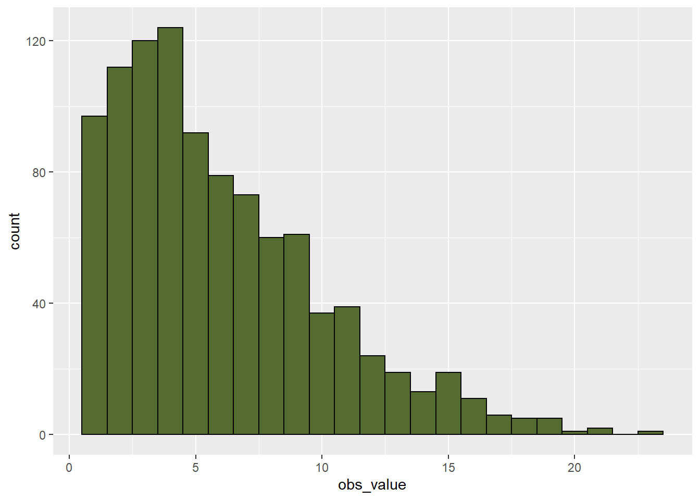
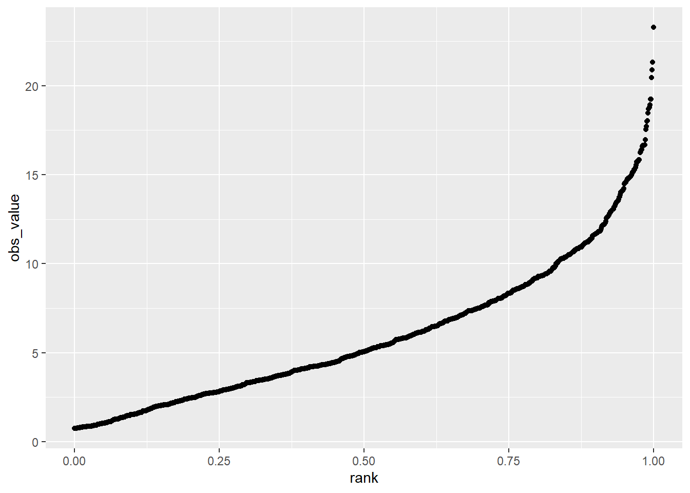
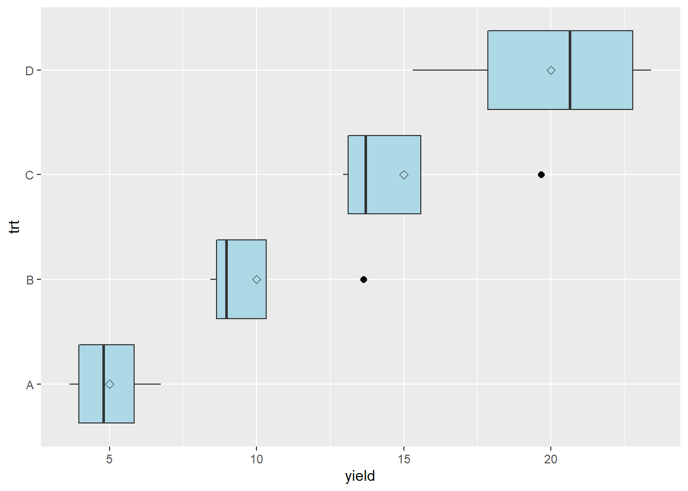
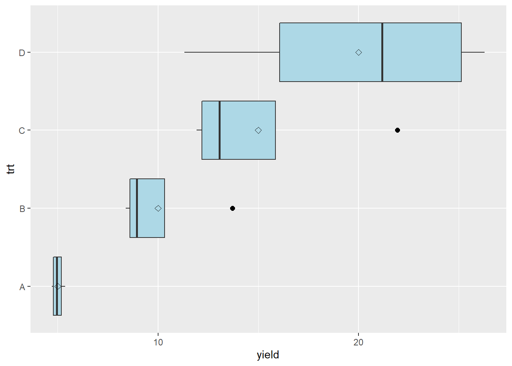
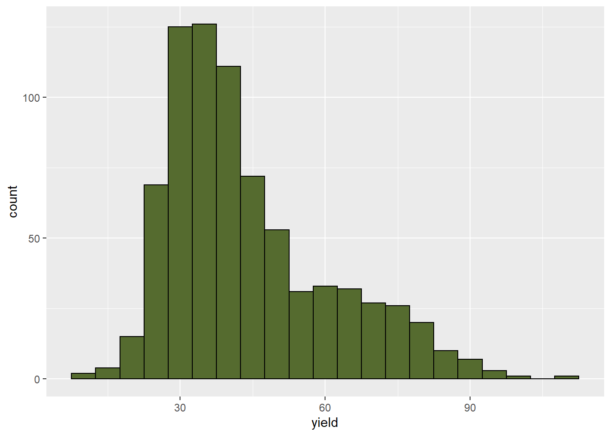
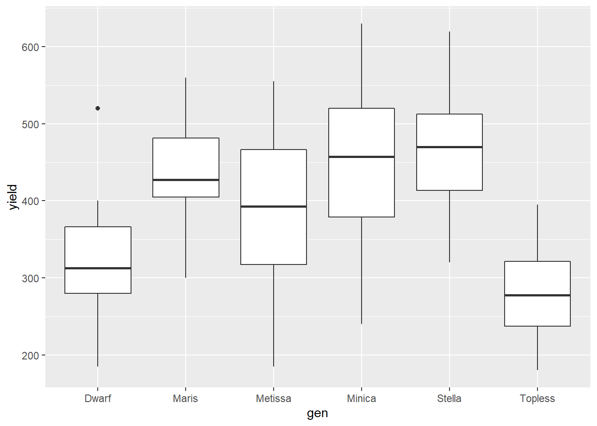
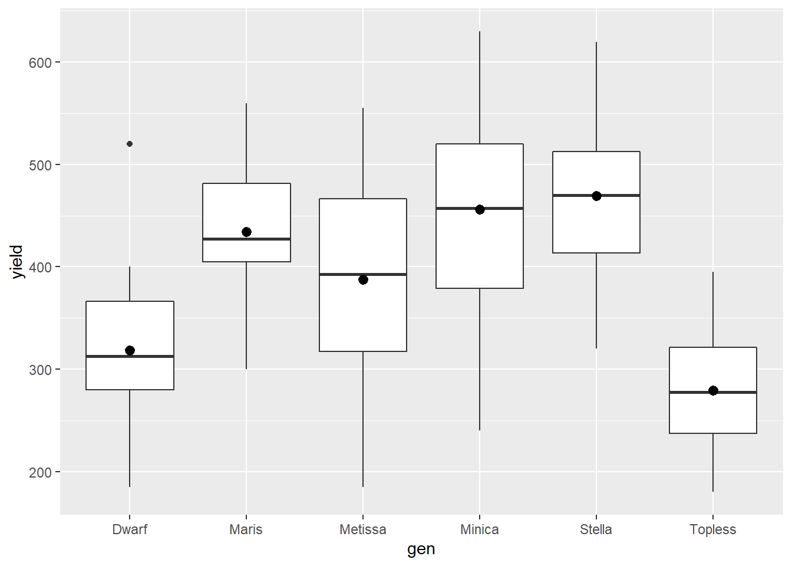
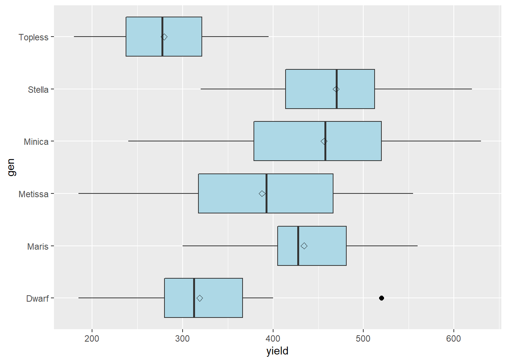
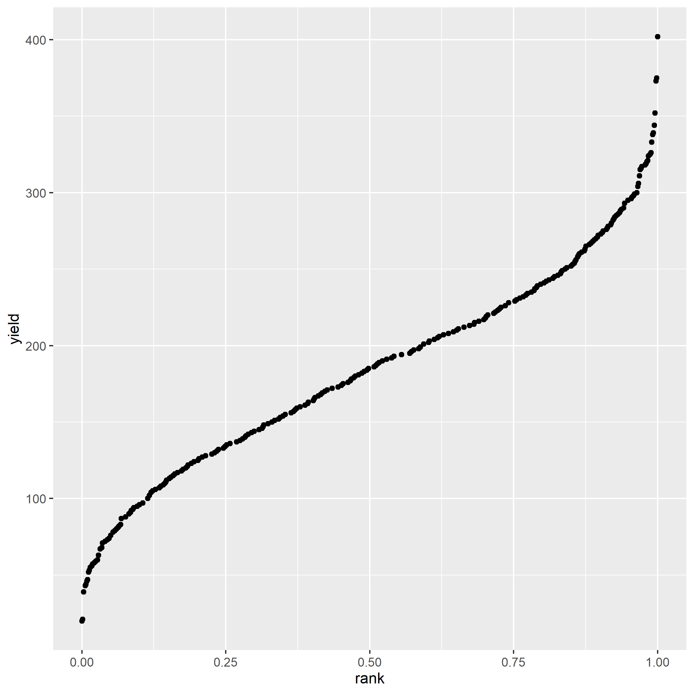
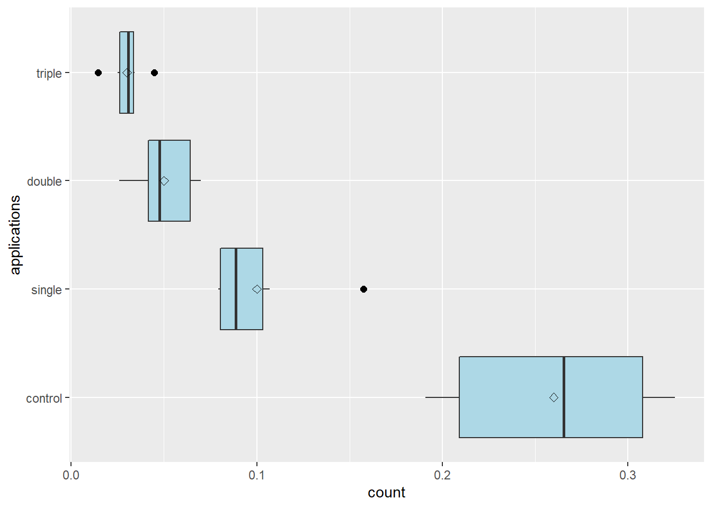

# Messy and Missing Data
You have to love the nice, complete datasets I have served up to you in this and other statistics texts.  Indeed, some trials will work out this way – in general, the simpler the treatment (and the technology used to apply it) the greater your chances of a complete dataset. Planters will jam, nozzles will plug, and if a trial has 12 treatments a couple of them may end up in the wrong plot.  Best to avoid those if possible.  
 
As well, the smaller the experiment, or the more controlled the environment, the greater your odds of a complete dataset.  For that reason, decades of university and industry research has been performed in 10- x 40- plots stacked closely together on manicured, table-top-flat ground.  If you were a seed-breeder, you had dibs on these fields.  If you were an ecologist like me, you might have to head to the back 40 (j/k).  
  
If you can farm in your head or your basement, drop me a note and I will exempt you, with envy from this unit.  For those of us who farm by the acre or section, however, the issue of data quality is an agonizing and sometimes subjective topic – but critical.  Remember, most of our statistics are models, and the saying goes: “junk in, junk out.”  Your models are only as good as the data you use to build them.

Part of your job as a researcher or end-user of any data, before you conduct or read the results from any test, is to ask yourself – are the data reliable enough to support the inferences?  A trial with wildly-different experimental units may bias results – if all the replicates of one treatment end up in the better units and others are concentrated in the poorer ones.  You may falsely recommend a product if you don’t catch this.

At the other extreme, the failure conduct research on similar experimental units will introduce background variance (or noise) that prevents a statistical test from concluding a difference is not the result of chance,  even though the treatments are, in fact, different.  In that case, you may fail to introduce – or adopt – a product or technology with real promise.

In this unit, we will first learn ways to inspect datasets for extreme values which, even given the inherent variability of data, may be suspect.  Boxplots, histograms, and probability plots will be our tools for these exercises.

We will then address the uncomfortable question of what to do when we have missing data, either because a plot was compromised during the trial, or because we rejected that plot because its extreme value.


## Inspecting data for Normal Distributions
I know, I know, it is so exciting to have data!  The hard physical work of the research is done, the data is painstakingly entered into Excel.  Let’s run the ANOVAs and regressions now – if we hurry we can still make it to happy hour!

It is so tempting to jump right into deep analyses as the data roll in.  But it is important to realize these analyses are based on assumptions:

* That the observations for each treatment level are normally distributed around the treatment mean
* That the variance or spread of observations around each level of treatment is roughly equal.
* That experimental units are comparable among treatment levels, so that the treatment and error effects are appropriately separated.

It is very possible, based on the nature of trials, that one or more of these assumptions may be violated.  If you have ever counted weeds in a herbicide trial, you have noted that well-treated plots have weed counts that are consistently near zero – but that weedy checks have wildly variable counts (100, 200, 300 weeds).  Growth analysis (where plants of different sizes are measured) is also prone to messy data issues, because variance in measurements increases numerically as plants grow.  Experimental units (plots) in both commercial and research farm fields can vary because of prior management unknown to the researcher.

### Histograms
In the very first unit of this course Unit 2, you were introduced to the histogram.  Recall the histogram is a vertical bar chart in which the width of bars defines the different ranges into which observations are grouped, and the height represents the count or proportion of observations falling into each range. 

In the data below, we have a dataset with 500 observations of corn yield.  The mean is approximately 180.  We can see the data distribution is approximately normal.  


```r
library(tidyverse)
```

```
## -- Attaching packages --------------------------------------- tidyverse 1.3.0 --
```

```
## v ggplot2 3.3.3     v purrr   0.3.4
## v tibble  3.1.0     v dplyr   1.0.5
## v tidyr   1.1.3     v stringr 1.4.0
## v readr   1.4.0     v forcats 0.5.1
```

```
## -- Conflicts ------------------------------------------ tidyverse_conflicts() --
## x dplyr::filter() masks stats::filter()
## x dplyr::lag()    masks stats::lag()
```

```r
# library(fGarch)
# 
set.seed(082720)
norm_data = data.frame(obs_value = rnorm(500, mean=180, sd=5)) %>%
        mutate(dataset="normal")
# set.seed(5)
# skewed_data = data.frame(obs_value = rsnorm(1000, mean = 20, sd = 10, xi = 100)) %>%
#         mutate(dataset="skewed")
# 
# norm_and_skewed = rbind(norm_data, skewed_data) %>%
#   as.data.frame() %>%
#   dplyr::filter(obs_value>0)
# 
# 
# write.csv(norm_and_skewed, "data/norm_and_skewed.csv", row.names = FALSE)

# norm_and_skewed = read.csv("data/norm_and_skewed.csv")

norm_data %>%
        # filter(dataset=="normal") %>%
        ggplot(aes(x=obs_value)) +
        geom_histogram(breaks = seq(160,200,2), fill="darkolivegreen", color="black")
```


The summary data are shown below.  We can see that the median and mean are both approximately 180 bushels per acre.  We can also see the 1st and 3rd quantiles (equal to the 25th and 75th percentiles) are a little over three bushels from the median.  The minimum and maximum observations are also similarly spaced from the median.


```r
summary(norm_data$obs_value)
```

```
##    Min. 1st Qu.  Median    Mean 3rd Qu.    Max. 
##   164.9   176.8   180.2   180.0   183.4   194.2
```

When we are dealing with data such as pest counts, our data may be non-normal.  Rather than being symmetrical, the data may be skewed to one side or another.  For example, in the dataset below, total velvetleaf dry weight in grams per square meter was measured. If you have worked like me with weed populations, you realize weed competitiveness is all about outracing the crop to the sun.  If the weed loses, which it will in most cases, it will be small.  But the proud few weeds who beat the crop will be huge.  That is reflected in the data below.      


```r
library(fGarch)
```

```
## Loading required package: timeDate
```

```
## Loading required package: timeSeries
```

```
## Loading required package: fBasics
```

```r
set.seed(5)
velvetleaf_skewed = data.frame(obs_value = rsnorm(1000, mean = 6, sd = 4, xi = 50)) 

velvetleaf_skewed %>%
  ggplot(aes(x=obs_value)) +
  geom_histogram(fill="darkolivegreen", color="black", binwidth = 1) 
```



When we look at the histogram, the data are skewed to the right.  The histogram is not symmetrical.  


```r
summary(velvetleaf_skewed$obs_value)
```

```
##    Min. 1st Qu.  Median    Mean 3rd Qu.    Max. 
##  0.7387  2.8225  5.0536  6.0104  8.3332 23.2785
```


When we look at the summary data, we first notice the mean and median are different.  For a dataset this size (1000 observations, we would expect them to be more similar.)  We notice that the first quantile is closer to the median than the third quantile.  The greatest indication the data is skewed, however, is is that the minimum is about 4 plants less than the median, while the maximum is about 18 plants greater. 

Data like this may be transformed (mathematically re-scaled) so that it is more normal for analyses.  We will cover this below.


### Rank Percentile Plots
Another way to inspect the normality of datasets is to use a rank percentile plot.  This plot uses the percentile rank of each observation, from lowest to highest, as the x-value of each point.  The y-value of the point is its observed value.  

The data for our normally-distributed corn yield dataset are plotted in the rank percentile plot below.  Normally-distributed data tend to be strongly linear in the middle of the plot.  If we draw a regression line through the plot, you can see most of the data are close to that line.  The lowest percentile points fall below the line.  That means they are a little lower in value than the normal distribution function might predict.  The opposite is true of the highest percentile points.  This indicates our distribution is a little bit wider than normal, but not enough that we cannot use it for analysis. 


```r
norm_data %>%
  mutate(rank = percent_rank(obs_value)) %>%
  ggplot(aes(x=rank, y=obs_value)) +
  geom_point()
```


Our skewed data, however, shows up quite differently in the rank percentile plot.  We can see that most of the data closely fit a line.  But starting around the 75th percentile, the observed values are much greater than the predicted values -- almost twice as much.  This means the distribution is much wider to the right of the distribution curve than to the left, and that the data are non-normal 

```r
velvetleaf_skewed %>%
        mutate(rank = percent_rank(obs_value)) %>%
        ggplot(aes(x=rank, y=obs_value)) +
        geom_point() 
```




### Box Plots
The first two methods I have shown you, the histogram and rank percentile plots, are useful if you have a few treatments with a large number of replicates.  They are taught in every statistics course and you should know about them.  But, in my experience, they are not useful if you have a trial with fewer replications.  A normal distribution is not going to appear in a histogram if you only have four replicates -- instead you will just see the four individual measurements.  

Box plots, on the other hand, are very useful for inspecting multiple treatments.  In the plot below, boxplots for four corn treatments are shown.  The treatments are labeled A, B, C, and D.  The data are plotted so their treatments are listed along the vertical axis, and their values are listed along the y-axis.


```r
norm_data_mult_trts = data.frame(trt = rep(c("A", "B", "C", "D"), each=4),
                                 mean = rep(c(160,170,180,190), each=4)) 

set.seed(082720)
norm_data_mult_trts = norm_data_mult_trts %>%
  mutate(error = rnorm(16, 0, 5)) %>%
  mutate(yield = mean + error) %>%
  # create outlier
  mutate(yield = if_else(row_number()==8, 195, yield))

norm_data_mult_trts %>%
        ggplot(aes(x=trt, y=yield)) + 
        geom_boxplot(outlier.colour="black", outlier.shape=16,
             outlier.size=2, notch=FALSE, fill="lightblue") +
        coord_flip() +
        stat_summary(fun=mean, geom="point", shape=23, size=2)
```


The boxplots help us understand the distribution of the data.  Lets start with the box, which tells about the spread of the data.  The left side of the box is the 25th percentile, the line in the middle is the 50th percentile (or median), and the right side of the box is the 75th percentile.  So the box shows us the spread of the middle half of the observations for each treatment.

The diamond shown within the box is the mean.  In a normal distribution, the median and mean should be close. 

The lines extending from the left and right side of the box are called whiskers.  The whiskers extend to the lowest and highest observations for a treatment.  The whiskers extend no more more than 1.5 times the *inter-quartile range*, which for the lower whisker is the the difference between the 25th and 50th percentiles, and for the upper whisker is the difference between the 50th and 75th percentiles.

In treatment B, we can see the upper whisker is missing, and instead there is a point to the right of the bar.  If an observation is beyond 1.5 times the interquartile range, the whisker is not shown and the observation is instead represented by a point.  This observation is called an *outlier*, meaning that it outside the range of values expected in a normal distribution.  We will talk more about outliers in the next section.

The boxplot tells us something beyond the distribution of the individual treatments.  If the boxes are markedly different in their width, the data may have substantially different variances.  We should investigate these further using a *mean-variance plot*, and perhaps a statistical *test of heterogeneity*.


## Inspecting Data for Equal Variances
So far, we have learned to use the t-test and analysis of variance to test named treatments (that is, hybrids, management practices, and other products that can be described by name).  These tests generally assume not only that observed values are normally distributed, but that the variances are approximately equal among the different treatments in our experiment.  If the variances are unequal, we may calculate least significant differences (LSDs) or honest  significant differences (HSDs) that are inappropriate.  Among treatments that have smaller variances, our LSD or HSD may be overestimated; among treatments that have larger variances, the LSD or HSD may be underestimated. 

The visual inspection of individual treatment distributions in the box plot above, followed by a scatter plot of the treatment variances versus their means, can give us a visual sense of unequal variances.  These suspicions can then be tested using a Test for Homogeneity that calculates the probability of differences in variances as greater as those observed.

### Mean-Variance Plot
In a mean-variance plot, the treatment means are plotted along the horizontal axis and the variances are plotted along the vertical axis.  The plot for the corn yield dataset we have used so far is shown below.


```r
norm_stats = norm_data_mult_trts %>%
        group_by(trt) %>%
        summarise(mean=mean(yield),
                var=var(yield)) %>%
        ungroup()


ggplot(data=norm_stats, aes(x=mean, y=var)) +
        geom_point(aes(color=trt), size=3)
```


We can see the variance of treatment B is many times greater than that of the other treatments.  In general, we like to see the variances differ by no more than a factor of 2.

In cases where we are dealing with populations that either "thrive or die" based on environment -- particularly pest populations -- we may see relationships between the mean and variance.  Pest count data is often like this.  In our velvetleaf counts, for example, we might find that our greater treatment means are also associated with greater variations in counts between plots.


```r
rnorm2 <- function(n,mean,sd) { mean+sd*scale(rnorm(n)) }
r <- rnorm2(100,4,1)
mean(r)  ## 4
```

```
## [1] 4
```

```r
sd(r)
```

```
## [1] 1
```

```r
set.seed(3)
norm_data_prop_var = data.frame(A = rnorm2(4, 5, sqrt(2)),
                                B = rnorm2(4, 10, sqrt(6)),
                                C = rnorm2(4, 15, sqrt(10)),
                                D = rnorm2(4, 20, sqrt(14))) %>%
  gather(trt, yield)
  
  
  
  


norm_data_prop_var %>%
        ggplot(aes(x=trt, y=yield)) + 
        geom_boxplot(outlier.colour="black", outlier.shape=16,
             outlier.size=2, notch=FALSE, fill="lightblue") +
        coord_flip() +
        stat_summary(fun=mean, geom="point", shape=23, size=2)
```



In this case, the mean-variance plot may show a linear relationship between variance and mean.  

```r
norm_data_prop_var_stats = norm_data_prop_var %>%
        group_by(trt) %>%
        summarise(mean=mean(yield),
                var=var(yield)) %>%
        ungroup()

norm_data_prop_var_stats %>%
  ggplot(aes(x=mean, y=var)) +
        geom_point(aes(color=trt), size=3)
```


Finally, we may observe a dataset in which the distributions not only increase with means, but seem to do so exponentially.


```r
rnorm2 <- function(n,mean,sd) { mean+sd*scale(rnorm(n)) }
r <- rnorm2(100,4,1)
mean(r)  ## 4
```

```
## [1] 4
```

```r
sd(r)
```

```
## [1] 1
```

```r
set.seed(3)
norm_data_prop_sd = data.frame(A = rnorm2(4, 5, 0.3),
                                B = rnorm2(4, 10, 2.5),
                                C = rnorm2(4, 15, 4.7),
                                D = rnorm2(4, 20, 6.9)) %>%
  gather(trt, yield)

norm_data_prop_sd %>%
        ggplot(aes(x=trt, y=yield)) + 
        geom_boxplot(outlier.colour="black", outlier.shape=16,
             outlier.size=2, notch=FALSE, fill="lightblue") +
        coord_flip() +
        stat_summary(fun=mean, geom="point", shape=23, size=2)
```




In this case, the mean-variance plot may show a curved relationship between variance and mean.  

```r
s_norm_stats = norm_data_prop_sd %>%
        group_by(trt) %>%
        summarise(mean=mean(yield),
                var=var(yield),
                sd=sd(yield)) %>%
        ungroup()


ggplot(data=s_norm_stats, aes(x=mean, y=var)) +
        geom_point(aes(color=trt), size=3)
```


We may want to check whether the standard deviation has a more linear relationship to mean.


```r
ggplot(data=s_norm_stats, aes(x=mean, y=sd)) +
        geom_point(aes(color=trt), size=3)
```


The largest mean has a significant difference of 6.9, while the smallest mean has a significant difference of 0.3.  In other words, the largest significant difference is 23 times the smallest significant difference.  


### Homogeneity of Variance Tests
In previous units, we learned how to compare two variances -- using the F-test.  In the Analysis of Variance, we tested whether the variance among treatment means was greater than the variance within treatments.  If the treatment variance was sufficiently greater than the error variance, we concluded the treatment effect explained a significant amount of the variation in observed values.

In this unit, we want to do something similar -- we want to compare the variances associated with multiple treatments to see if they are significantly different.  When data are normally-distributed, the method for comparing multiple variances is *Bartlett's Test*.  (If you continue your statistical travels, you may come across Levene's Test, but that is for non-normal data.)  

Bartlett's test, as best as I can tell (the formula is awful and no one seems willing to explain it), acts like a sum of squares for variances, comparing the variances of the individual treatments to their mean when pooled together.  This is an incomplete explanation, but I hope it will satisfy the curious.  Fortunately for us, the test is easy to implement in R and the output simple.

If we run Bartlett's test on our corn data above, we get the following results.


```r
bartlett.test(yield~trt, norm_data_mult_trts)
```

```
## 
## 	Bartlett test of homogeneity of variances
## 
## data:  yield by trt
## Bartlett's K-squared = 10.355, df = 3, p-value = 0.01578
```

Let's go through the output.  "Bartlett's K-squared" is the statistic produced by the nasty formula I referenced above.  Don't worry about that.  The degrees of freedom refers to the four treatments whose variances we are comparing.  Most important, of course, is our p-value.  There are many opinions on when to transform data -- but I would recommend against transforming data unless the --value is less than 0.01.  I would also recommend running your data on both the transformed and untransformed data and comparing results.  If transformation does not change your inferences, then skip it. 

Here is the Bartlett's test on our velevleaf data where the mean and standard deviation were linearly related:


```r
bartlett.test(yield~trt, norm_data_prop_sd)
```

```
## 
## 	Bartlett test of homogeneity of variances
## 
## data:  yield by trt
## Bartlett's K-squared = 14.217, df = 3, p-value = 0.002625
```

In this case, we will want to analyze both the transformed and untransformed data before deciding which to us for our final inferences.


## Dealing with Messy Data
Dealing with messy data is one of the more uncomfortable aspects of statistics, but also one of the most important.  Our tests and summary statistics are based on assumptions.  For tests, we assume the data are from a populations that have approximately normal distributions.  We also assume they have variances that are equal -- otherwise our mean separation tests will fail.  

And finally, and this is a concept that I learned just while writing this: the validity of our inferences is based on the assumption that our samples represent the population that we are studying.  Which brings us back to outliers.   

### Outliers
Outliers can have a powerful effect in skewing data.  Particularly in smaller datasets (i.e. fewer than 10 replicates per treatment), an outlier can have noticeable effects on a distribution's normality and its variance.  In regression analyses, one outlier can significantly change the slope of the model.

Does this mean that outliers should be omitted from the dataset?  Not necessarily -- first we should inspect the data more closely.  The outlier might be a mistake in recording a measurement.  It could be an inconsistent scale in a combine.  These would be experimental errors that mean the outlier is an *artifact* of our methods, rather than a representative sample from our population.  In that case, we may want to remove that observation from our dataset.

But investigating the outlier may also include examining the location where it was taken.  This can be difficult if you are not the primary researcher and on-site where the data were gathered.  But if you can overlay your plot map with a soils map, or work with aerial imagery, or examine as-applied maps, you may be able to identify differences in environment or management that caused a dramatic difference in the observed value.  

In such a case, you may decide that plot did not represent the environment about which you were trying to draw inferences, and choose to omit it from the dataset.  At the same time, however, knowing that the outlier's environment or management had a dramatic effect on its performance, you may generate new hypotheses about that product.  In fact, you may learn more from your outlier, through the new research it inspires, than you do from the original experiment.  

Also, before removing an outlier, it is a good idea to run your tests with and without it to see whether it changes your conclusions.  When you run your model, look at the standardized residuals.  How many standard errors is the outlier from the predicted value?  As a rule, if an observed value is more than two standard deviations from the predicted value, I scrutinize it before allowing it into the final analysis.  

If you are comparing different treatments, does it change the significance of tests or differences among treatments?  If you are generating a regression model, does the change in slope have a dramatic effect on the values you will predict?  Will the change in slope have a dramatic effect on grower inputs and cost, or will the effect be more modest?

These are important questions, because as uncomfortable as it is to identify and/or remove outliers, working with incomplete datasets can be even nastier.  If the statistical significance of tests or means separations are not affected by the outlier, it is best to leave it in the dataset if possible, especially if treatment replications are limited.

### Non-normal Data and Unequal Variances
Above, we discussed two other problems with data: data that were skewed (or non-normal) and therefore could not be modelled based on the normal distribution, and data were treatment variances were not equal -- they were, in statistical terminology, they suffered from *heterogeneity of variances*.  

Both issues can arise out of trials where observation values vary widely: counts that include rare events or where one treatment (like a check plot) can "blow up" and have a huge value.  Growth studies, where size increases occur at  exponential rates, are another.

These two issues may be similarly addressed by transforming the data.  When we transform data, we use a different measuring system to rescale it.  The easiest example of rescaling data is pH.  Recall pH is the concentration of hydrogen atoms in a solution.  This concentration can range from $0$ to $10^{-14}$

So when is the last time you read that your soil pH was $6.5 \times 10^{-6}$ ?  You wouldnt.  We commonly speak of pH as ranging from 1 (highly acidic) through 7 (neutral) to 14 (highly basic).  Your are used to using the logarithmic scale(10, 1, 0.10, 0.010), rather than the arithmatic scale (1,2,3,4,5).  The decibel scale for sound and the Richter scale for earthquakes also use the logarithmic scale.  

#### Natural Logarithm
There are several ways to transform data, but the one I have most-often used is the natural logarithm
The natural logaritm transformation is often used when we are working with data that have a wide range of values.  What constitutes a wide range of values?  Think growth analysis, or counts of common events (for example, weed counts in a herbicide trial that includes treatments that vary widely in effectiveness).  In these trials, it is not uncommon for observed values to vary by two or more orders of magnitude (powers of 10).

Our process for working with transformed data is as follows:

* Transform the original observations to their natural logs.  
* Calculate the ANOVA
* Cacluate treatment means using transformed data
* Back-transform the treatment means to the original measurement scale so they are more intuitive to users

Lets work with our velvetleaf data above.  Below is the analysis of variance and means separation using the least significant difference test.


```r
library(agricolae)
```

```
## 
## Attaching package: 'agricolae'
```

```
## The following objects are masked from 'package:timeDate':
## 
##     kurtosis, skewness
```

```r
vleaf_model_before = aov(yield~trt, norm_data_prop_sd)
summary(vleaf_model_before)
```

```
##             Df Sum Sq Mean Sq F value  Pr(>F)   
## trt          3  500.0  166.67   8.767 0.00237 **
## Residuals   12  228.1   19.01                   
## ---
## Signif. codes:  0 '***' 0.001 '**' 0.01 '*' 0.05 '.' 0.1 ' ' 1
```

```r
lsd_before = LSD.test(vleaf_model_before, "trt")
lsd_before$groups
```

```
##   yield groups
## D    20      a
## C    15     ab
## B    10     bc
## A     5      c
```

The treatment effect is significant, and some of the treatments are significantly different from each other, but there are also noticeable overlaps.

Now let's transform the data using the natural log.  The original and transformed data are show below.

```r
vleaf_log = norm_data_prop_sd %>%
  mutate(log_yield = log(yield))
vleaf_log
```

```
##    trt     yield log_yield
## 1    A  4.802644  1.569167
## 2    A  5.113508  1.631886
## 3    A  5.369530  1.680740
## 4    A  4.714318  1.550604
## 5    B  9.211467  2.220449
## 6    B  8.401127  2.128366
## 7    B  8.671603  2.160054
## 8    B 13.715802  2.618549
## 9    C 11.933265  2.479330
## 10   C 21.939493  3.088288
## 11   C 13.841261  2.627654
## 12   C 12.285982  2.508459
## 13   D 11.328175  2.427293
## 14   D 26.292831  3.269296
## 15   D 24.739139  3.208387
## 16   D 17.639854  2.870161
```

Now when we run our Bartlett's test, we see the p-value is 0.09 -- there is no longer a significant difference among the treatment variances.

```r
bartlett.test(log_yield~trt, vleaf_log)
```

```
## 
## 	Bartlett test of homogeneity of variances
## 
## data:  log_yield by trt
## Bartlett's K-squared = 6.4701, df = 3, p-value = 0.09085
```


The largest standard deviation is still 6.5 times the smallest standard deviation -- but the difference has decreased dramatically.  When we run our analysis of variance, we see that our p-value has decreased by several orders of magniture.   


```r
vleaf_model_after = aov(log_yield~trt, vleaf_log)
summary(vleaf_model_after)
```

```
##             Df Sum Sq Mean Sq F value   Pr(>F)    
## trt          3  4.043  1.3478   18.95 7.58e-05 ***
## Residuals   12  0.853  0.0711                     
## ---
## Signif. codes:  0 '***' 0.001 '**' 0.01 '*' 0.05 '.' 0.1 ' ' 1
```

When we run our LSD test, we notice more significant differences among the means, especially treatments A and B, which were associated with lower treatment means.

```r
lsd_after = LSD.test(vleaf_model_after, "trt")
lsd_after$groups
```

```
##   log_yield groups
## D  2.943784      a
## C  2.675933     ab
## B  2.281854      b
## A  1.608099      c
```

Our last step is to back-transform the means from our LSD test.


```r
back_transformed_means = lsd_after$groups %>%
  rownames_to_column(var="treatment") %>%
  mutate(yield = exp(log_yield))

back_transformed_means %>%
  select(treatment, yield, groups)
```

```
##   treatment     yield groups
## 1         D 18.987563      a
## 2         C 14.525893     ab
## 3         B  9.794827      b
## 4         A  4.993311      c
```

In the above table, we have back-transformed the means in our LSD table to their original scale. 


## Dealing with Missing Data
Missing data can be very problematic.  Whether missing data are the result of deleting outliers, or plots  lost to weather or human damage, there are three options:

* Drop the treatment entirely from the dataset
* Drop one observation from each of the other treatments; if a Randomized Complete Block Design was used, delete and entire block
* Predict the value for the plot that was omitted or lost

As you see, these are ugly choices to make.  If you drop the treatment entirely from the dataset, you lose all ability to test it agaist the other treatments.  If you drop other replicates or the remainder of a block, you retain all treatments but reduce the degrees of freedom for statistical tests, rendering them less sensitive.

The third option, predicting the value that is missing, comes with its own challenges.  The missing value for a plot is generally calculated using the linear additive model.  For a completely randomized design, the linear model is:

$$Y_{ij} = \mu + T_i + \epsilon_{(i)j} $$

So the missing value would be equal to $\mu + Ti$, where $i$ would be whatever treatment level the missing plot received.

In a randomized complete block design, the the linear additive model is: 

$$Y_{ij} = \mu + B_i + T_j + BT_{ij} $$

The missing value would be equal to $\mu + B_i + T_j$, where $i$ is the block to which the missing plot occurred, and $j$ is the treatment the treatment the missing plot received.

Note that we did not include $\epsilon_{(i)j}$ or $BT_{ij}$ in estimating the missing values.  Although this approach is widely used, this is a shortcome.  When we predict a missing value from the effects of treatment or treatment within block, we are using *mean* effects.  So the predicted value will be exactly the mean for a given treatment or treatment within block.  Because the predicted value is closer to the treatment and block means than it would be otherwise, it will contribute less to the treatment variance than it would normally.  

We can demonstrate this with a normally-distributed dataset.


```r
set.seed(083020)
more_norm_data_1 = data.frame(yield = rnorm(4, mean=165, sd=5.2)) %>%
        mutate(trt="A")
set.seed(083021)
more_norm_data_2 = data.frame(yield = rnorm(4, mean=169, sd=5.2)) %>%
        mutate(trt="B")
set.seed(083022)
more_norm_data_3 = data.frame(yield = rnorm(4, mean=170, sd=5.2)) %>%
        mutate(trt="C")
set.seed(083023)
more_norm_data_4 = data.frame(yield = rnorm(4, mean=172, sd=5.2)) %>%
        mutate(trt="D")

more_norm_data = rbind(more_norm_data_1, more_norm_data_2, more_norm_data_3, more_norm_data_4) %>%
        mutate(trt = as.factor(trt)) %>%   
  mutate(random_no = rnorm(16,0,1)) %>%
  arrange(random_no) %>%
  mutate(plot=row_number()) %>% 
  select(plot, trt, yield) %>%
  mutate(yield = round(yield,1))

more_norm_data
```

```
##    plot trt yield
## 1     1   A 166.8
## 2     2   C 169.9
## 3     3   B 170.6
## 4     4   C 174.9
## 5     5   B 161.8
## 6     6   A 168.3
## 7     7   A 169.2
## 8     8   C 159.9
## 9     9   B 160.8
## 10   10   C 166.2
## 11   11   A 160.3
## 12   12   D 172.1
## 13   13   D 175.4
## 14   14   D 175.3
## 15   15   B 170.6
## 16   16   D 172.2
```

Here is the anova for the original data:


```r
summary.aov(lm(yield~trt, data=more_norm_data))
```

```
##             Df Sum Sq Mean Sq F value Pr(>F)
## trt          3  160.6   53.52   2.418  0.117
## Residuals   12  265.6   22.13
```

And here is the boxplot:


```r
more_norm_data %>%
        ggplot(aes(x=trt, y=yield)) + 
        geom_boxplot(outlier.colour="black", outlier.shape=16,
             outlier.size=2, notch=FALSE, fill="lightblue") +
        coord_flip() +
        stat_summary(fun=mean, geom="point", shape=23, size=2)
```


Here is the table with the treatment and error effects broken out.  Unlike previous effects tables, I have also added the within treatment variance.


```r
more_norm_data_effects = more_norm_data %>%
  mutate(mu = mean(yield)) %>%
  group_by(trt) %>%
  mutate(trt_mean = mean(yield),
         trt_var = var(yield)) %>%
  ungroup() %>%
  mutate(trt_effect = trt_mean - mu) %>%
  mutate(error_effect = yield - trt_effect - mu) %>%
  select(plot, trt, yield, mu, trt_var, trt_effect, error_effect)

knitr::kable(more_norm_data_effects)
```


| plot|trt | yield|       mu|   trt_var| trt_effect| error_effect|
|----:|:---|-----:|--------:|---------:|----------:|------------:|
|    1|A   | 166.8| 168.3938| 16.190000|   -2.24375|        0.650|
|    2|C   | 169.9| 168.3938| 39.922500|   -0.66875|        2.175|
|    3|B   | 170.6| 168.3938| 28.996667|   -2.44375|        4.650|
|    4|C   | 174.9| 168.3938| 39.922500|   -0.66875|        7.175|
|    5|B   | 161.8| 168.3938| 28.996667|   -2.44375|       -4.150|
|    6|A   | 168.3| 168.3938| 16.190000|   -2.24375|        2.150|
|    7|A   | 169.2| 168.3938| 16.190000|   -2.24375|        3.050|
|    8|C   | 159.9| 168.3938| 39.922500|   -0.66875|       -7.825|
|    9|B   | 160.8| 168.3938| 28.996667|   -2.44375|       -5.150|
|   10|C   | 166.2| 168.3938| 39.922500|   -0.66875|       -1.525|
|   11|A   | 160.3| 168.3938| 16.190000|   -2.24375|       -5.850|
|   12|D   | 172.1| 168.3938|  3.416667|    5.35625|       -1.650|
|   13|D   | 175.4| 168.3938|  3.416667|    5.35625|        1.650|
|   14|D   | 175.3| 168.3938|  3.416667|    5.35625|        1.550|
|   15|B   | 170.6| 168.3938| 28.996667|   -2.44375|        4.650|
|   16|D   | 172.2| 168.3938|  3.416667|    5.35625|       -1.550|

Plot 8 has a greater error effect than most other plots.  Let's treat it as an outlier, delete it, and recalculate the treatment means.  Let's delete it and see how that changes the treatment effect for treatment C.


```r
plot_8 = data.frame(plot=8 ,trt="C", yield=NA)

more_norm_data_interp = more_norm_data %>%
  dplyr::filter(!plot==8) %>%
  rbind(plot_8)  %>%
  arrange(plot) %>%
  mutate(mu = mean(yield, na.rm = TRUE)) %>%
  group_by(trt) %>%
  mutate(trt_mean = mean(yield, na.rm = TRUE),
         trt_var = var(yield, na.rm = TRUE)) %>%
  ungroup() %>%
  mutate(trt_effect = trt_mean - mu) %>%
  mutate(error_effect = yield - trt_effect - mu) %>%
  select(plot, trt, yield, mu, trt_var, trt_effect, error_effect)

knitr::kable(more_norm_data_interp)
```


| plot|trt | yield|     mu|   trt_var| trt_effect| error_effect|
|----:|:---|-----:|------:|---------:|----------:|------------:|
|    1|A   | 166.8| 168.96| 16.190000|  -2.810000|    0.6500000|
|    2|C   | 169.9| 168.96| 19.063333|   1.373333|   -0.4333333|
|    3|B   | 170.6| 168.96| 28.996667|  -3.010000|    4.6500000|
|    4|C   | 174.9| 168.96| 19.063333|   1.373333|    4.5666667|
|    5|B   | 161.8| 168.96| 28.996667|  -3.010000|   -4.1500000|
|    6|A   | 168.3| 168.96| 16.190000|  -2.810000|    2.1500000|
|    7|A   | 169.2| 168.96| 16.190000|  -2.810000|    3.0500000|
|    8|C   |    NA| 168.96| 19.063333|   1.373333|           NA|
|    9|B   | 160.8| 168.96| 28.996667|  -3.010000|   -5.1500000|
|   10|C   | 166.2| 168.96| 19.063333|   1.373333|   -4.1333333|
|   11|A   | 160.3| 168.96| 16.190000|  -2.810000|   -5.8500000|
|   12|D   | 172.1| 168.96|  3.416667|   4.790000|   -1.6500000|
|   13|D   | 175.4| 168.96|  3.416667|   4.790000|    1.6500000|
|   14|D   | 175.3| 168.96|  3.416667|   4.790000|    1.5500000|
|   15|B   | 170.6| 168.96| 28.996667|  -3.010000|    4.6500000|
|   16|D   | 172.2| 168.96|  3.416667|   4.790000|   -1.5500000|

We can see that removing the yield data from plot 4 causes the treatment effect of treatment C to change -- in fact, it has gone from negative to positive.  The other treatment effects have also changed.   The within-treatment variance for treatment C has also decreased by about one-third.  When we re-run our analysis of variance, we see the treatment effect is 0.062 -- almost significant at the P=0.05 level.


```r
summary.aov(lm(yield ~ trt, data=more_norm_data_interp))
```

```
##             Df Sum Sq Mean Sq F value Pr(>F)  
## trt          3  165.3   55.09   3.294 0.0617 .
## Residuals   11  183.9   16.72                 
## ---
## Signif. codes:  0 '***' 0.001 '**' 0.01 '*' 0.05 '.' 0.1 ' ' 1
## 1 observation deleted due to missingness
```

What would happen if we estimated the yield for plot 8 using the population mean, mu, and the treatment effect?

$$ Y_{3,4} = \mu + T_i = 168.96	+ 1.37 = 170.33 $$

We see that mu, treatment variance, treatment effect, and error have again changed.  The variance within Treatment 3 has again decreased by about one-third.

```r
plot_8_interp = data.frame(plot=8 ,trt="C", yield=170.33)

more_norm_data_interp_8 = more_norm_data %>%
  dplyr::filter(!plot==8) %>%
  rbind(plot_8_interp) %>%
  arrange(plot) %>%
  mutate(mu = mean(yield, na.rm = TRUE)) %>%
  group_by(trt) %>%
  mutate(trt_mean = mean(yield, na.rm = TRUE),
         trt_var = var(yield, na.rm = TRUE)) %>%
  ungroup() %>%
  mutate(trt_effect = trt_mean - mu) %>%
  mutate(error_effect = yield - trt_effect - mu) %>%
  select(plot, trt, yield, mu, trt_var, trt_effect, error_effect)

knitr::kable(more_norm_data_interp_8)
```


| plot|trt |  yield|       mu|   trt_var| trt_effect| error_effect|
|----:|:---|------:|--------:|---------:|----------:|------------:|
|    1|A   | 166.80| 169.0456| 16.190000|  -2.895625|       0.6500|
|    2|C   | 169.90| 169.0456| 12.708892|   1.286875|      -0.4325|
|    3|B   | 170.60| 169.0456| 28.996667|  -3.095625|       4.6500|
|    4|C   | 174.90| 169.0456| 12.708892|   1.286875|       4.5675|
|    5|B   | 161.80| 169.0456| 28.996667|  -3.095625|      -4.1500|
|    6|A   | 168.30| 169.0456| 16.190000|  -2.895625|       2.1500|
|    7|A   | 169.20| 169.0456| 16.190000|  -2.895625|       3.0500|
|    8|C   | 170.33| 169.0456| 12.708892|   1.286875|      -0.0025|
|    9|B   | 160.80| 169.0456| 28.996667|  -3.095625|      -5.1500|
|   10|C   | 166.20| 169.0456| 12.708892|   1.286875|      -4.1325|
|   11|A   | 160.30| 169.0456| 16.190000|  -2.895625|      -5.8500|
|   12|D   | 172.10| 169.0456|  3.416667|   4.704375|      -1.6500|
|   13|D   | 175.40| 169.0456|  3.416667|   4.704375|       1.6500|
|   14|D   | 175.30| 169.0456|  3.416667|   4.704375|       1.5500|
|   15|B   | 170.60| 169.0456| 28.996667|  -3.095625|       4.6500|
|   16|D   | 172.20| 169.0456|  3.416667|   4.704375|      -1.5500|

And here is the kicker, wait for it...

```r
summary.aov(lm(yield ~ trt, data=more_norm_data_interp_8))
```

```
##             Df Sum Sq Mean Sq F value Pr(>F)  
## trt          3  167.0   55.67   3.632  0.045 *
## Residuals   12  183.9   15.33                 
## ---
## Signif. codes:  0 '***' 0.001 '**' 0.01 '*' 0.05 '.' 0.1 ' ' 1
```

Our treatment differences are now significant.  Why?  Because when we estimate a missing value using only the population mean and treatment effect, we decrease the overall variance.  And why does that happen?  Because we have now created that is almost exactly equal to the treatment mean.  Was there a change in the originally observed values associated with this change in significance?  No.  And this is problem.  But there is a way to reduce it.  


The problem with the model we have used so far is we did not include the error effect in our yield estimate.  If we added it in, our yield estimate for plot 8 would be more appropriate.  Of course, we cannot calculate the error effect because it is random and changes among plots.  But, knowing that error effects are normally distributed around the treatment mean, we can model that distribution and draw an individual from it at random, to use as the error effect in our estimate.


The error distribution has its own mean, which should be close to zero:

```r
err_mean = mean(more_norm_data_interp$error_effect, na.rm=TRUE)
err_mean
```

```
## [1] 1.894781e-15
```

And its own standard deviation:

```r
err_sd = sd(more_norm_data_interp$error_effect, na.rm=TRUE)
err_sd
```

```
## [1] 3.624684
```

Knowing these two parameters, we can select a value for our error effect from that distribution.

```r
set.seed(12)
err_pred = rnorm(1, err_mean, err_sd)
err_pred
```

```
## [1] -5.36659
```

Let's plug that into our yield estimate and see how our statistics change.

$$ Y_{3,4} = \mu + T_i = 168.96	+ 1.37 - 5.37 = 164.96 $$

We see that mu, treatment variance, treatment effect, and error have again changed.  The variance within Treatment 3 has again decreased by about one-third.

```r
plot_8_interp_sd = data.frame(plot=8 ,trt="C", yield=164.96)

more_norm_data_interp_8_sd = more_norm_data %>%
  dplyr::filter(!plot==8) %>%
  rbind(plot_8_interp_sd) %>%
  arrange(plot) %>%
  mutate(mu = mean(yield, na.rm = TRUE)) %>%
  group_by(trt) %>%
  mutate(trt_mean = mean(yield, na.rm = TRUE),
         trt_var = var(yield, na.rm = TRUE)) %>%
  ungroup() %>%
  mutate(trt_effect = trt_mean - mu) %>%
  mutate(error_effect = yield - trt_effect - mu) %>%
  select(plot, trt, yield, mu, trt_var, trt_effect, error_effect)

knitr::kable(more_norm_data_interp_8_sd)
```


| plot|trt |  yield|     mu|   trt_var| trt_effect| error_effect|
|----:|:---|------:|------:|---------:|----------:|------------:|
|    1|A   | 166.80| 168.71| 16.190000|      -2.56|         0.65|
|    2|C   | 169.90| 168.71| 19.927067|       0.28|         0.91|
|    3|B   | 170.60| 168.71| 28.996667|      -2.76|         4.65|
|    4|C   | 174.90| 168.71| 19.927067|       0.28|         5.91|
|    5|B   | 161.80| 168.71| 28.996667|      -2.76|        -4.15|
|    6|A   | 168.30| 168.71| 16.190000|      -2.56|         2.15|
|    7|A   | 169.20| 168.71| 16.190000|      -2.56|         3.05|
|    8|C   | 164.96| 168.71| 19.927067|       0.28|        -4.03|
|    9|B   | 160.80| 168.71| 28.996667|      -2.76|        -5.15|
|   10|C   | 166.20| 168.71| 19.927067|       0.28|        -2.79|
|   11|A   | 160.30| 168.71| 16.190000|      -2.56|        -5.85|
|   12|D   | 172.10| 168.71|  3.416667|       5.04|        -1.65|
|   13|D   | 175.40| 168.71|  3.416667|       5.04|         1.65|
|   14|D   | 175.30| 168.71|  3.416667|       5.04|         1.55|
|   15|B   | 170.60| 168.71| 28.996667|      -2.76|         4.65|
|   16|D   | 172.20| 168.71|  3.416667|       5.04|        -1.55|

When we looks at the ANOVA, we see that the mean square and p-value are approximately the same as they were before the missing value was interpolated.


```r
summary.aov(lm(yield ~ trt, data=more_norm_data_interp_8_sd))
```

```
##             Df Sum Sq Mean Sq F value Pr(>F)  
## trt          3  158.6   52.87   3.086  0.068 .
## Residuals   12  205.6   17.13                 
## ---
## Signif. codes:  0 '***' 0.001 '**' 0.01 '*' 0.05 '.' 0.1 ' ' 1
```

In R, there is a nice package called *mice* that does this for us.  We will learn about it in an exercise this week.

One final note, however: we should not interpolate missing values if 5% or more of the data are missing.  Why?  Because, as we have seen above, that interpolated value can markedly change our interpretation of the data.  Restricting interpolation to datasets where a small percentage of data are missing reduces the leverage one observation has on conclusions from the data.  It also increases the accuracy of the interpolated values.

In smaller datasets, then, we may to use the approaches above.  How important is it to have that treatment in the trial, versus losing a replicaton of the other treatments?  For the latter option, you may want to test whether including or omitting that replicate changes your conclusion from the data.  If not, it may be easiest to drop the replication.


## Summary
Agronomic data are rarely nice and neat.  The scale in which we work (acres and hectares), plus the variations in soil types, equipment performance, weather, weeds and other pests, make it virtually impossible to ensure our experimental units are near-equivalent.  Above all, our subjects are alive and integrate every aspect of their environment into their growth.  Unlike human subjects, corn plants cannot answer a history questionnaire.  Months or years of a trial can be erased by one plugged nozzle, one broken singulator, one strong wind, one "white combine".  It's a nasty business.

It is important that we inspect our data and consider its shortcomings.  We have ways to address these shortcomings.  Outliers may be trimmed, or we may use other techniques to overcome them.  We have also learned how to re-scale data (using logarithms or square roots) so that variances are closer to equal, and how to "fill in" missing values using imputation so that our datasets can be balanced.  

If stuck, consult with other data scientists.  There are "robust" statistics that are based on using the median, rather than the mean, for summaries and tests.  There are also non-parametric tests, some of which we will be introduced to towards the end of this course.  Non-parametric methods don't use linear models -- therefore, they are more insulated from the problems discussed above.  We will learn about these in a future unit.


## Exercise: Visual Data Inspection
Never underestimate the power of data visualizations.  Our ability to see patterns in data is profound.  In this exercise, we will review how to create histograms and learn new tools, including the rank-percentile, box-plot, and mean-variance plot.

### Case Study 1
We will work with a wheat uniformity trial.  In uniformity trials, there are no treatments.  Instead, the wheat yield is measured in gridded plots within a location in order to get a sense of yield consistency (uniformity) or inconsistency (variance).

```r
library(tidyverse)
wheat_uniformity = read.csv("data-unit-9/exercise_data/wheat_uniformity.csv")
head(wheat_uniformity)
```

```
##   row col yield
## 1   1   1    60
## 2   2   1    78
## 3   3   1    94
## 4   4   1    77
## 5   5   1    55
## 6   6   1    46
```

### Histogram
At the beginning of this course, we learned how to use the histogram to quickly learn about the distribution of a dataset.  This is just a reminder how powerful a tool it is.  We will also relate this shape to that of the rank-percentile plot below.  note the data are skewed to the right, with wide tails at both the top and bottom of the distribution.


```r
wheat_uniformity %>%
  ggplot(aes(x=yield)) +
  geom_histogram(fill="darkolivegreen", color="black", binwidth = 5) 
```




### Rank-Percentile
In a rank-percentile plot, data are sorted from least to greatest and then ranked.  This takes just one line of code in R.


```r
ranked_wheat = wheat_uniformity %>%
  mutate(rank = percent_rank(yield))
  
head(ranked_wheat)
```

```
##   row col yield      rank
## 1   1   1    60 0.8096480
## 2   2   1    78 0.9465450
## 3   3   1    94 0.9947849
## 4   4   1    77 0.9426336
## 5   5   1    55 0.7692308
## 6   6   1    46 0.6492829
```

After ranking the oberved values, we create a simple scatter plot of observed value (yield, in this case) and rank.  


```r
ranked_wheat %>%                             # this tells R what dataset to use
  ggplot(aes(x=rank, y=yield)) +             # this creates a plot where rank and yield will determine the location of the points
  geom_point()                               # this will draw the points
```


We notice two things about this curve.  First, it is not symmetric around the median, reflecting the skewed distribution we observed in the histogram above.  Second, if we were to fit a line to the lower two-thirds of the data, we would notice that the entire 75 - 100 percentile range would be above the line.  This suggests a long tail to the right (above the mean).  That the line dips down at the left side of the curve also suggests that tail is longer than normal. 


### Case Study 2
For the box plot, we will use a study of common bean genotypes.

```r
bean_genotypes = read.csv("data-unit-9/exercise_data/bean_genotypes.csv")
```

### Box Plot
The basic box plot can be drawn using the *geom_boxplot()* function.

```r
bean_genotypes %>%                      # dataset to use
  ggplot(aes(x=gen, y=yield)) +         # use gen and type to specify x and y positions
  geom_boxplot()                        # draw box and whisker plots
```



Often a box plot includes the mean.  We can add this using the *stat_summary()* command and *fun=mean*.  The mean will be represented by a black dot.

```r
bean_genotypes %>%                      # dataset to use
  ggplot(aes(x=gen, y=yield)) +         # use gen and type to specify x and y positions
  geom_boxplot() +                      # draw box and whisker plots
  stat_summary(fun=mean)                # draw the mean as a point on the plots
```

```
## Warning: Removed 6 rows containing missing values (geom_segment).
```



We can replicate the style from the lecture using the code below.  Just change out the variable names in the second line to use it with other datasets.

```r
bean_genotypes %>%
  ggplot(aes(x=gen, y=yield)) +                                 # change out the variable names for "x" and "y"
  geom_boxplot(outlier.colour="black", outlier.shape=16,
       outlier.size=2, notch=FALSE, fill="lightblue") +
  coord_flip() +
  stat_summary(fun=mean, geom="point", shape=23, size=2)
```




### Practice

#### Strawberry Uniformity
Load the "data-unit-9/exercise_data/strawberry_uniformity.csv" dataset.  Create a rank probability plot.  Your plot should look like:




## Exercise: Identifying Unequal Variances"
Occassionally, we may encounter data that don't satisfy our assumptions about variance: that it is equal across the treatments in our experiment or, similarly, not correlated with treatment level.  In these cases, it may be useful to transform the data prior to analysis, by calculating and working with the natural logarithms of the original data.

### Case Study: Grape Colapsis in Seed Corn
In this case study, we will use data loosely inspired by graduate work by Benjamin Carl Kaeb at Iowa State University, where the researcher had to log-transform data prior to analyses.  The measurement is grape colapsis count per liter of soil, after being treated during the season with various numbers of insecticide application.

First, lets load and inspect the data.

```r
library(tidyverse)
colapsis = read.csv("data-unit-9/exercise_data/grape_colapsis.csv")
head(colapsis)
```

```
##   applications      count
## 1       triple 0.02496295
## 2       triple 0.01446486
## 3       triple 0.03428771
## 4       triple 0.03020649
## 5       triple 0.04458152
## 6       triple 0.03149647
```

Next, lets create a box plot of our data.

```r
colapsis %>%
        ggplot(aes(x=applications, y=count)) + 
        geom_boxplot(outlier.colour="black", outlier.shape=16,
             outlier.size=2, notch=FALSE, fill="lightblue") +
        coord_flip() +
        stat_summary(fun=mean, geom="point", shape=23, size=2)
```


One thing we notice in the plot above is that our applications are not ordered from lowest (control) to highest (triple).  Lets fix that.  We can use the *factor()* function to rearrange the order of our levels.  We tell R to set the "applications" column of the colapsis dataset as the factor format of itself.  The *levels()* argument tells R the order in which the levels should be listed. 


```r
colapsis$applications = factor(colapsis$applications, levels=c("control", "single", "double", "triple"))

colapsis %>%
        ggplot(aes(x=applications, y=count)) + 
        geom_boxplot(outlier.colour="black", outlier.shape=16,
             outlier.size=2, notch=FALSE, fill="lightblue") +
        coord_flip() +
        stat_summary(fun=mean, geom="point", shape=23, size=2)
```




We can see that there is noticable variation in the spread of observed values among treatments, and that the spread of the observed values seems to increase with the mean number of counts.  

Let's calculate our means and variances by number of applications.


```r
colapsis_mean_var = colapsis %>%    # base calculations on colapsis data frame
  group_by(applications) %>%        # calculate summary by application level
  summarise(mean = mean(count),     # create new variable, mean, which is the mean count per application
            variance = var(count))  # create new variable, variance, which is the count variance per application

colapsis_mean_var
```

```
## # A tibble: 4 x 3
##   applications  mean variance
##   <fct>        <dbl>    <dbl>
## 1 control       0.26 0.00360 
## 2 single        0.1  0.000900
## 3 double        0.05 0.000289
## 4 triple        0.03 0.0001
```

Here is a simple scatter plot of variance as a function of mean.

```r
colapsis_mean_var %>%
  ggplot(aes(x=mean, y=variance)) +
  geom_point()
```


There is a clear trend that variance increases with mean.  We can also see the greatest variance is about 16 times greater than the least variance.  This is problematic -- when we have differences greater than 2X in variances, our analyses may not function properly.


To test whether the variances are equal, we will use the *bartlett.test()* function.  The arguments to this function are the same as a model statement: the model, and the data frame


```r
bartlett.test(count ~ applications, data=colapsis)
```

```
## 
## 	Bartlett test of homogeneity of variances
## 
## data:  count by applications
## Bartlett's K-squared = 14.636, df = 3, p-value = 0.002156
```

We see that the p-value is less than 0.01.  We should consider transforming these data before running an analysis of variance and means separation on them.


### Practice: Pigweed Height
1. Load the data from "data-unit-9/exercise_data/soybean_pigweed_height.csv".  "trt" is the soybean seeding rate.  "height" is the height of pigweed species in inches.


2. Create a summary table of means and variances.  Your results should look like.


trt	mean	variance
rate_100	13.5	5.76
rate_173	12.0	2.89
rate_322	10.5	1.00
rate_470	9.0	0.09

3.  Create a plot of variance as a function of mean.  It shold look like:


4. Create a boxplot of height grouped by trt.  It should look like this.


5. Run the Bartlett's Test for Homogeneity of the variances by treatment.  Your output should look like:

	Bartlett test of homogeneity of variances

data:  height by trt
Bartlett's K-squared = 14.564, df = 3, p-value = 0.00223


###Practice: Pigweed Biomass
Pigweed biomass was also measured in the above experiment.

1. Load the dataset "data-unit-9/exercise_data/soybean_pigweed_biomass.csv"


2. Create a boxplot of biomass by seeding rate


3. Create a table of biomass means and variances by seeding rate.  Your table should look like:


rate	mean	variance
rate_100	2.9	2.56
rate_173	2.4	1.21
rate_322	1.5	0.36
rate_470	0.5	0.01

4. Plot the variance of biomass as a function of seeding rate.  Your plot should look like:


5. Run a Bartlett Test of Homogeneity of Variances on the data.  Your results should look like:


	Bartlett test of homogeneity of variances

data:  biomass by rate
Bartlett's K-squared = 21.387, df = 3, p-value = 8.749e-05


## Exercise: Transforming and Analyzing Data
In this exercise, we will work with the same three datasets in which we identified unequal variances.

### Case Study: Grape Colapsis in Seed Corn

First, lets load and inspect the data.

```r
library(tidyverse)
colapsis = read.csv("data-unit-9/exercise_data/grape_colapsis.csv")
```


In the previous exercise, we determined the variances were unequal, so we will now create a new column in our colapsis dataset with the natural logarithm of the original counts.

```r
colapsis = colapsis %>%
  mutate(log_count = log(count)) # create new variable count_log, based on natural logarithm of count
```

We can run an Analysis of Variance on the transformed data, the same as we would any other dataset.

```r
colapsis_model = aov(log_count ~ applications, data=colapsis)
summary(colapsis_model)
```

```
##              Df Sum Sq Mean Sq F value   Pr(>F)    
## applications  3 16.247   5.416   53.03 1.06e-09 ***
## Residuals    20  2.043   0.102                     
## ---
## Signif. codes:  0 '***' 0.001 '**' 0.01 '*' 0.05 '.' 0.1 ' ' 1
```

Our applications effect is significant.  We will separate the means using the Least Significant Difference.


```r
library(agricolae)
lsd = LSD.test(colapsis_model, "applications")

lsd
```

```
## $statistics
##     MSerror Df      Mean        CV  t.value       LSD
##   0.1021256 20 -2.578757 -12.39244 2.085963 0.3848694
## 
## $parameters
##         test p.ajusted       name.t ntr alpha
##   Fisher-LSD      none applications   4  0.05
## 
## $means
##         log_count       std r       LCL       UCL       Min       Max       Q25
## control -1.370036 0.2364918 6 -1.642180 -1.097892 -1.656177 -1.122266 -1.564864
## double  -3.049637 0.3716377 6 -3.321781 -2.777493 -3.656836 -2.660004 -3.183980
## single  -2.334127 0.2634909 6 -2.606270 -2.061983 -2.536044 -1.849017 -2.519757
## triple  -3.561230 0.3808307 6 -3.833373 -3.289086 -4.236033 -3.110436 -3.642697
##               Q50       Q75
## control -1.338709 -1.177759
## double  -3.047062 -2.754693
## single  -2.424058 -2.270959
## triple  -3.478789 -3.394196
## 
## $comparison
## NULL
## 
## $groups
##         log_count groups
## control -1.370036      a
## single  -2.334127      b
## double  -3.049637      c
## triple  -3.561230      d
## 
## attr(,"class")
## [1] "group"
```

At this point, we have all the data we need to evaluate whether the applications effect is significant, and whether the colapsis count differs with the number of applications per season.  Before we present our means and groupings above, however, we would like to "back-transform" them to our original scale of measurement.  

Recall that we can quickly isolate the $groups table from our LSD.test output.  We will want to convert the rownames to a column before we work further with that data frame, however.  We can use the *rownames_to_columns()* function to create a new column, "applications", with the values from the row names.

```r
means_from_lsd = lsd$groups
means_from_lsd = means_from_lsd %>%
  rownames_to_column(var = "applications")
```


We will now back-transform the natural log by using *e*, Euler's constant (equal to about 2.78) to "cancel it out"  Specifically, we will tell R to calculate e^x, where x is each treatment mean in the transformed data.

```r
means_from_lsd = means_from_lsd %>% 
  mutate(count = exp(log_count))

means_from_lsd
```

```
##   applications log_count groups      count
## 1      control -1.370036      a 0.25409776
## 2       single -2.334127      b 0.09689507
## 3       double -3.049637      c 0.04737613
## 4       triple -3.561230      d 0.02840387
```

Finally, let's get rid of the log_count column and move the groups column to the column furtherst ruight.  We will use the *select()* function.


```r
means_from_lsd = means_from_lsd %>%
  select(applications, count, groups)

means_from_lsd
```

```
##   applications      count groups
## 1      control 0.25409776      a
## 2       single 0.09689507      b
## 3       double 0.04737613      c
## 4       triple 0.02840387      d
```


### Practice: Pigweed Height

1. Load the pigweed height data from the "data/soybean_pigweed_height.csv" file.

```r
pigweed = read.csv("data-unit-9/exercise_data/soybean_pigweed_height.csv")
```

2. Transform the data using the natural log transformation.  

```r
# The first few rows will look like:
# trt	      height	log_height
# rate_100	11.69514	2.459173
# rate_100	16.06706	2.776771
# rate_100	10.88049	2.386971
# rate_100	13.48499	2.601577
# rate_100	16.70968	2.815988
# rate_100	12.16264	2.49836
```


3. Run the ANOVA.  

```r
# Your results should look like:
#             Df Sum Sq Mean Sq F value   Pr(>F)    
# trt          3 0.5162 0.17206    11.6 0.000127 ***
# Residuals   20 0.2966 0.01483  
```


4. Run the LSD test and extract the groups table.


5. Convert the rownames to a column.  

```r
# Your table should look like.
# trt	log_height	groups
# rate_100	2.589808	a
# rate_173	2.477182	ab
# rate_322	2.347396	b
# rate_470	2.196758	c
```


6. Back-transform the means to the original scale.

```r
# Your results should look like:
# trt	log_height	groups	height
# rate_100	2.589808	a	13.327217
# rate_173	2.477182	ab	11.907663
# rate_322	2.347396	b	10.458302
# rate_470	2.196758	c	8.995803
```


7. Use select() to arrange the table so the columns are: trt, height, groups.

```r
# Your results should look like:
# trt	height	groups
# rate_100	13.327217	a
# rate_173	11.907663	ab
# rate_322	10.458302	b
# rate_470	8.995803	c
```


### Practice: Pigweed Biomass

1. Load the pigweed biomass data from the "data/soybean_pigweed_biomass.csv" file.

```r
biomass = read.csv("data-unit-9/exercise_data/soybean_pigweed_biomass.csv")
```

2. Transform the data using the natural log transformation.  

```r
# The first few rows will look like:
# rate	biomass	log_biomass
# rate_100	6.096351	1.8076904
# rate_100	1.828959	0.6037471
# rate_100	2.444420	0.8938077
# rate_100	2.789826	1.0259793
# rate_100	2.105895	0.7447407
# rate_100	2.134549	0.7582552
```


3. Run the ANOVA.  

```r
# Your results should look like:
#             Df Sum Sq Mean Sq F value  Pr(>F)    
# rate         3 10.280   3.427   22.45 1.3e-06 ***
# Residuals   20  3.053   0.153 
```

                  

4. Run the LSD test and extract the groups table.  Your results should look like:

```r
# Your results should look like:
# log_biomass	groups
# rate_100	0.9723701	a
# rate_173	0.7920214	ab
# rate_322	0.3350568	b
# rate_470	-0.7132060	c
```


5. Convert the rownames to a column.  

```r
# Your table should look like:
# rate	log_biomass	groups
# rate_100	0.9723701	a
# rate_173	0.7920214	ab
# rate_322	0.3350568	b
# rate_470	-0.7132060	c  
```


6. Back-transform the means to the original scale.  

```r
# Your results should look like:
# rate	log_biomass	groups	biomass
# rate_100	0.9723701	a	2.6442039
# rate_173	0.7920214	ab	2.2078550
# rate_322	0.3350568	b	1.3980198
# rate_470	-0.7132060	c	0.4900705
```


7. Use select() to arrange the table so the columns are: trt, height, groups.  

```r
# Your results should look like:
# rate	biomass	groups
# rate_100	2.6442039	a
# rate_173	2.2078550	ab
# rate_322	1.3980198	b
# rate_470	0.4900705	c
```


## Exercise: Imputing Missing Data
Despite our best efforts, we occassionally encounter missing data.  In some cases, plots may be lost to inclement weather, equipment failures, or human error.  In other cases, we may fail to record values for every plot.  In some cases, we may delete an outlier.  In each of these cases, we may wish to replace the missing value in order to maintain a complete dataset.


### Case Study: Wheat Genotype Trial
For this example, we will use data from a wheat genotype trial.  

```r
library(tidyverse)
wheat_missing = read.csv("data-unit-9/exercise_data/wheat_missing.csv")
```


```r
wheat_missing %>%
  mutate(missing = if_else(is.na(yield), "yes", "no")) %>%
  mutate(missing = as.factor(missing)) %>%
  ggplot(aes(x=col, y=row)) +
  geom_tile(aes(fill=missing)) +
  scale_fill_manual(values = c("grey", "tomato"))
```


#### Mean Imputation
When we estimate the values of missing data, we *impute* those values.  The simplest way to impute a missing value is to use the mean for that treatment.  For example, we could calculate the mean for each treatment, as we have done below.


```r
genotype_means = wheat_missing %>%
  group_by(gen) %>%
  mutate(mean_yield = mean(yield, na.rm = TRUE)) %>%
  ungroup()

head(genotype_means)
```

```
## # A tibble: 6 x 5
##     col   row gen   yield mean_yield
##   <int> <int> <chr> <dbl>      <dbl>
## 1     1     1 G01    3.38       3.40
## 2     1     2 G02    3.59       3.09
## 3     1     3 G03    4.33       3.05
## 4     1     4 G04    4.54       3.56
## 5     1     5 G05    2.59       2.30
## 6     1     6 G06    2.41       2.53
```

The mean yield is shown in the far right column.  We will now use either the recorded value ("yield") or the mean yield (where "yield" is a missing value) for our final yield.  Don't worry about the code below (although conditional statements *are* cool) -- it is just to set up the rest of this example.

```r
mean_imputed_yields = genotype_means %>%
  mutate(final_yield = if_else(is.na(yield), mean_yield, yield))
```


We now have a complete dataset.  But there is a problem.  Lets look at the variance before imputing the missing values.  We calculate variance using the *var()* function.  Whenever we are calculating a summary statistic -- mean, sd, variance, etc) -- we can add *na.rm = TRUE* to tell R to work around the missing values.  Otherwise, R will return "NA" instead of the statistic.

Here is the variance before:

```r
var(wheat_missing$yield, na.rm = TRUE)
```

```
## [1] 0.6638558
```

And after:

```r
var(mean_imputed_yields$final_yield)
```

```
## [1] 0.6492327
```

What do you notice?  That's right, the variance is decreased between the original dataset and the imputed dataset.  When we use means imputation, we artificially lower the variance.  This increases the probability we will commit a Type I error: determining that two or more populations are significantly different when in fact they are not.  That is why it is better to use the next 

#### Multivariate Imputation by Chained Equations (MICE)
The MICE algorithm is complex and a detailed explanation is beyond the scope of this course.  What you need to know is that

* Instead of estimating a missing value with its treatment mean MICE imputes the missing value using all other variables (hence "multivariate") in the dataset.  In other words, it builds a model and solves for thie missing value.
* Missing values are imputed in a way that preserves the original variance of the dataset.

Here is how we use MICE imputation.  The algorithm is from the package *mice*.  The function is also called *mice().  It takes two arguments.  First, the name of the dataset with missing values.  Second, since MICE works with random numbers, we should set a seed so that we can recreate the exact same imputed values in the future, if necessary.  The third argument, "printFlag = FALSE", tells R not to print a bunch extraneous information.


```r
library(mice)
```

```
## 
## Attaching package: 'mice'
```

```
## The following object is masked from 'package:timeSeries':
## 
##     filter
```

```
## The following object is masked from 'package:stats':
## 
##     filter
```

```
## The following objects are masked from 'package:base':
## 
##     cbind, rbind
```

```r
wheat_imputed = mice(wheat_missing, seed=1, printFlag = FALSE)   # arguments to mice: 1) name of dataset, 2) seed to use for random numbers, 3) don't print extra info.
```

```
## Warning: Number of logged events: 1
```

The output of the *mice()* function is a list with a bunch of information about how the data were imputed: the original dataset, the models used, etc.  We just want the complete dataset, which we can get using the *complete()* function.


```r
wheat_complete = complete(wheat_imputed)
```

Finally, let's compare the variance of the MICE-imputed dataset to that of the original dataset:

```r
var(wheat_complete$yield)
```

```
## [1] 0.6580733
```

We can see the variance is decreased slightly from the original dataset, but not as much as when we imputed the data using the treatment means.

### Practice 1
The yield is missing from row 31 in this dataset.  Fill in the code below Impute the missing value using MICE. If you use seed=3, your imputed value should be 1.402.

```r
library(mice)
peanut = read.csv("data-unit-9/exercise_data/peanut_missing.csv")
peanut_imputed = mice(peanut, seed=34, printFlag = FALSE)   # arguments to mice: 1) name of dataset, 2) seed 
```

```
## Warning: Number of logged events: 2
```

```r
peanut_complete = complete(peanut_imputed)

peanut[31,]
```

```
##    rep   gen yield
## 31  R3 mf447    NA
```

```r
peanut_complete[31,]
```

```
##    rep   gen  yield
## 31  R3 mf447 1.4588
```

### Practice 2
Impute the missing value in the "data/barley_missing.csv" dataset.  Observations 18 and 47 are missing their yield value.  Use seed=3.  Your imputed values should be obs 18 = 377.9 and obs 47 = 362.6

```r
barley_missing = read.csv("data-unit-9/exercise_data/barley_missing.csv")
str(barley_missing)
```

```
## 'data.frame':	60 obs. of  4 variables:
##  $ col  : int  1 3 6 9 11 14 17 19 22 25 ...
##  $ row  : int  1 1 1 1 1 1 1 1 1 1 ...
##  $ gen  : chr  "a" "c" "b" "a" ...
##  $ yield: num  236 291 290 292 321 ...
```

```r
barley_imputed = mice(barley_missing, seed=3, printFlag = FALSE)   # arguments to mice: 1) name of dataset, 2) seed 
```

```
## Warning: Number of logged events: 1
```

```r
barley_complete = complete(barley_imputed)

barley_missing[18,]
```

```
##    col row gen yield
## 18  14   2   c    NA
```

```r
barley_complete[18,]
```

```
##    col row gen yield
## 18  14   2   c 302.2
```

