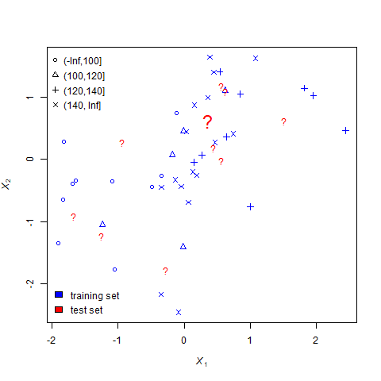
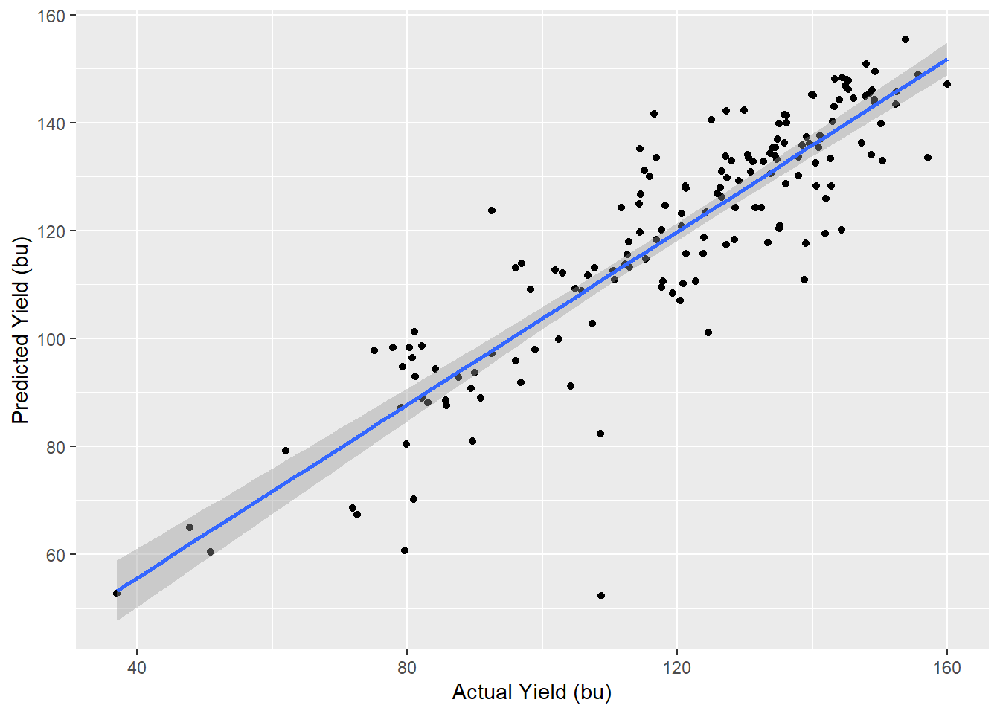
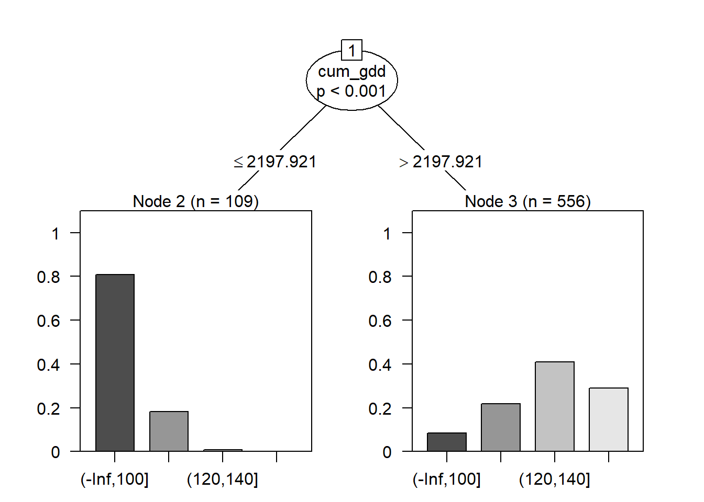
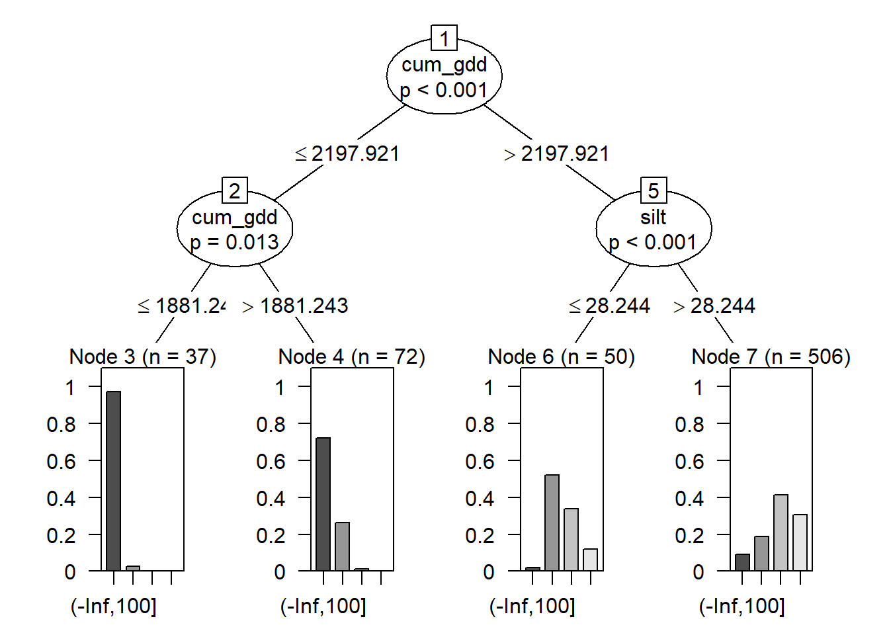
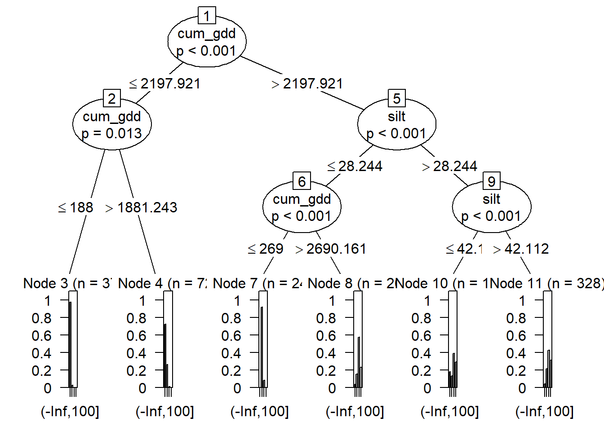
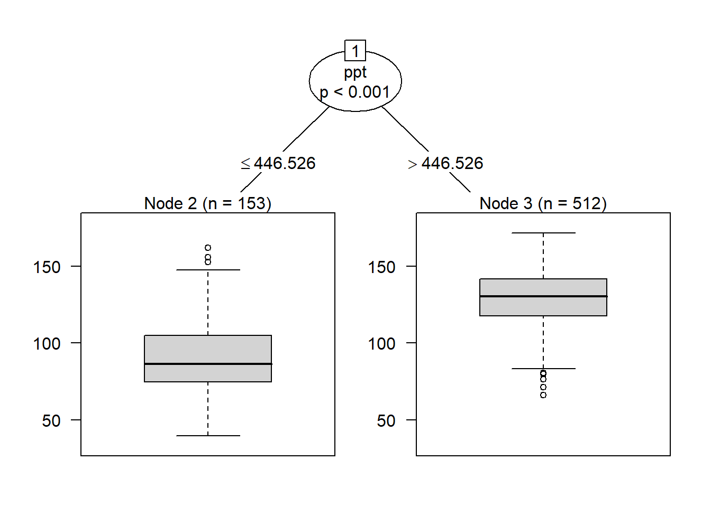
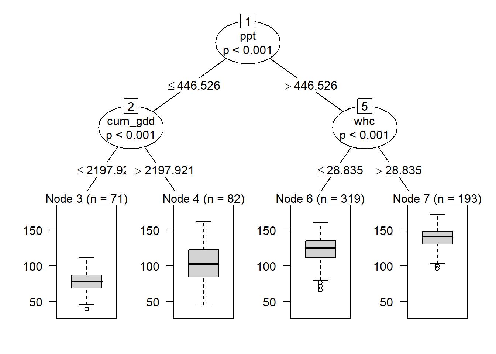
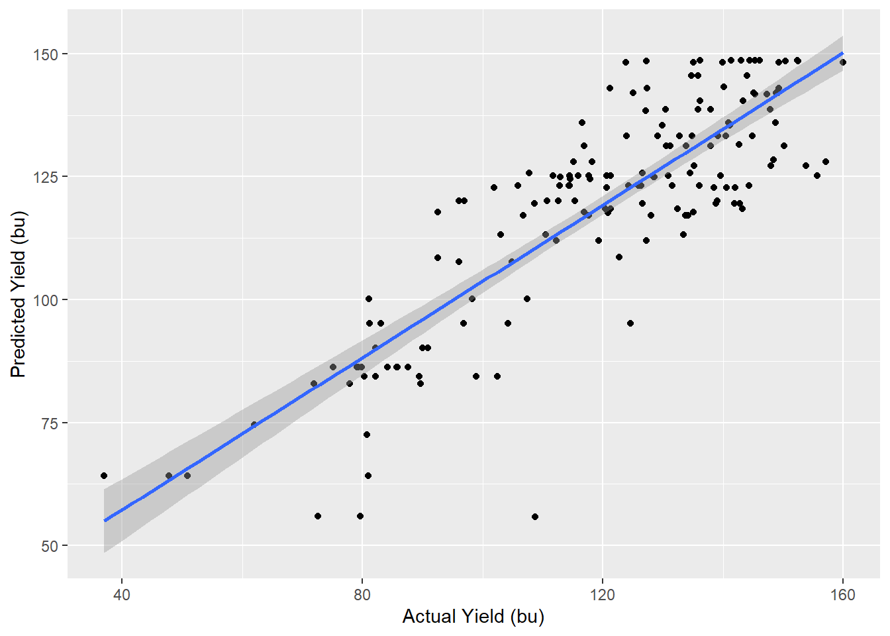
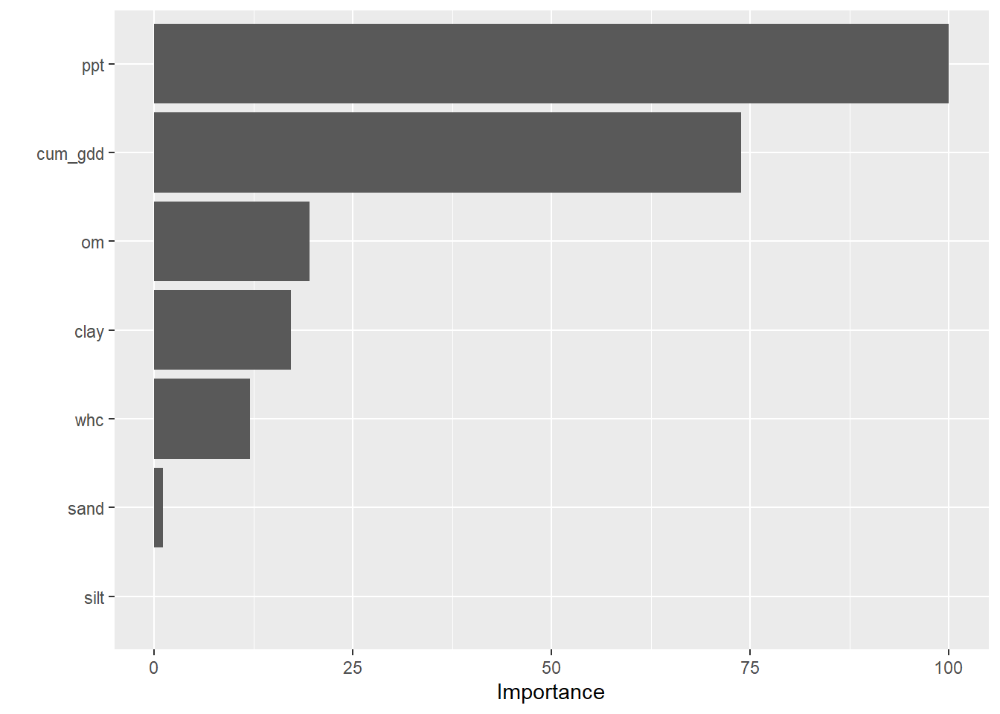

# Machine Learning
Machine Learning is an advanced data science topic that I have struggled over whether to include in this text.  On the one hand, it is not generally considered part of classical statistics.  In addition, unless your plans include becoming a data analyst, you are unlikely to run these analyses on your own.  On the other hand, machine learning is playing an increasing role in agricultural (and all areas of) data.  It is a topic in which I have been immersed during the past couple of years.  

Most importantly, if you are using tools to select hybrids, adjust nitrogen rates, or predict yield, those tools likely incorporate aspects of machine learning.  In your daily lives, machine learning determines what advertisements you see, your social media feed, even the results from your search engines.   This lesson emphasizes literacy about machine learning -- there are no coding exercises included. 

## Machine Learning
To start with, why is it called "machine learning"?  It sounds like statistics-meets-steampunk. To answer this, think about a machine that learns.  In other words: a robot.  In machine learning, we use complex algoritms that, in theory, could be used by artificial intelligence to learn about their environment.  There is a strong predictive component to this: the machine could learn to predict the outcomes of future events by building models based on data it has already obtained.  Hello, Skynet.

This sword, however, is also a plowshare.  Machine learning can help us understand how many variables can simultaneously predict outcomes, in agriculture, medicine, and climate.  Furthermore, machine learning takes a different approach to models than the methods we have learned earlier.  In previous units, we have learned testing methods that were *parameteric*.  We defined a linear model, then used our tests (which were all variations of regression) to parameterize it.  Parameteric => parameter.

We've also learned that parametric methods have their challenges.  One challenge is non-normal or skewed data.  Another is heterogeneity of variances.  These challenges required us to transform the data, a step which can generate confusion in analyzing and summarizing data.  We were also warned when working with multiple linear regression models to beware of multicollinearity (correlations between independent variables) and heteroscedasticity (unequal variances).  

Machine learning uses *nonparametric* tests.  As the name suggests, these do not use parameters.  Instead of regression models, machine learning tools use logical tests (for example, does an observed value fall in a range) to "decide" what value to predict.  They measure the "similarity" between two locations to decide whether an observation in one location is likely to occur in the other.  They figure out how to group similar observations into groups or "clusters".

In this unit, we will study three examples of machine learning.  First, we will see how cluster analysis might be used to divide a sales territory into multiple regions, based on environment. Second, we will learn how to use *nearest-neighbor* analysis to predict yield for a given county, given its similarity to other counties.  Finally, we will learn how *classification trees* can be used to explain yield response to multiple enviornmental factors.

This unit will be more focused on what I call "data literacy" than execution.  I want you to be aware of these three tools, which are being used around you in the agronomy world.  I want you to be able to speak of them, to ask questions, if engaged.  I will resist going deep into the weeds with them, however, because they are often best suited to hundreds (ok) or many thousands (even better) of data points.  It is unlikely you will use them in your Creative Component, or even your day-to-day research.

That said, just a few years ago, neither did I.  Awareness and curiosity in data science are always good -- there is always a more powerful way to address our questions.


## Cluster Analyses 
Cluster analysis takes a set of individuals (sometimes called examples in this analyses) and divides it into a set number of groups, based on the similarities between the individuals.  These groups are defined such that the individuals within a group are very similar to each other, but very different from individuals in other groups.  

By itself, clustering doesn't answer any questions about the values of the individuals in our data set.  Unlike a classification tree or a k-Nearest Neighbor analysis, it cannot be used to interpolate values between data points, or predict the value of a future observation.

To further illustrate cluster analysis, it is described in the data science community as "unsupervised learning." This means that we do not begin with a variable of interest, nor a hypothesis about how changes in one variable relate to changes in another.  

Why would we want to cluster data?  The reason is that sometimes, when we are dealing with many variables, our analyses may become more intuitive if there are ways to break data down into groups.  Clustering is a way of reducing or categorizing our data so it becomes less-overwhelming for us to deal with.

### Case Study: Grouping Midwestern Environments
For example, anytime we are working with environmental data, we have potentially enormous datasets.  Rather than try juggle the meanings of all these quantitative variables in our heads, we may want to desrcibe the data as a series of groups.  For example, we might say that a county in South Dakota is cold and dry, a county in northern Illinois is moderate temperature and moderate wetness, and a farm in western Ohio is warm and rainy.  Great, we now have three groups.  But how would other counties in the midwest sort into these three categories?

For an agronomic testing program, this is a very important question.  If the intent is to address the individual needs of three different environments, we need to define those regions so that a sufficient, but not excessive, number of research locations can be designated within each environment.

Lets start out with dataset of county environments.  The county environments are mostly soil data, which are not expected to change (outside of human influence) in the short term.  Two data are climatic: growing degree days (gdd) and precipitation (ppt). Their values in this dataset reflect a 20-year mean.

Below I have plotted the mean annual precipitation (in millimeters).  We see that precipitation is lowest in the Dakotas and generally increases as we move south and east.


```r
library(readr)
library(tidyverse)
```

```
## -- Attaching packages --------------------------------------- tidyverse 1.3.0 --
```

```
## v ggplot2 3.3.3     v dplyr   1.0.5
## v tibble  3.1.0     v stringr 1.4.0
## v tidyr   1.1.3     v forcats 0.5.1
## v purrr   0.3.4
```

```
## -- Conflicts ------------------------------------------ tidyverse_conflicts() --
## x dplyr::filter() masks stats::filter()
## x dplyr::lag()    masks stats::lag()
```

```r
library(sf)
```

```
## Warning: package 'sf' was built under R version 4.0.5
```

```
## Linking to GEOS 3.9.0, GDAL 3.2.1, PROJ 7.2.1
```

```r
library(leaflet)
library(RColorBrewer)

county_env_sf = st_read("data-unit-13/complete_county_data.shp", quiet=TRUE) 

county_wide_df = county_env_sf %>%
  st_drop_geometry() %>%
  spread(attribt, value)

county_shapes = county_env_sf %>%
  filter(attribt=="sand") %>%
  select(stco, geometry)

clean_data = county_wide_df %>%
  filter(grepl("MI|OH|IN|IL|WI|MN|IA|ND|SD|NE", state)) %>%  
  select(stco, corn, whc, sand, silt, clay, om, ppt, cum_gdd) %>%
  na.omit()


clean_data_w_geo = clean_data %>%
  left_join(county_shapes) %>%
  st_as_sf()
```

```
## Joining, by = "stco"
```

```r
clean_data_w_geo = st_transform(clean_data_w_geo, 4326)

pal_ppt = colorBin("RdYlGn", bins=5, clean_data_w_geo$ppt)

clean_data_w_geo %>%
  leaflet() %>%
  addTiles() %>%
  addPolygons(
    fillColor = ~pal_ppt(ppt),
    fillOpacity = 0.8,
    weight=1,
    color = "black"
  ) %>%
  addLegend(pal = pal_ppt,
            values = ~ppt
  )
```

```{=html}
<div id="htmlwidget-beb8341b9e0fb7e47c70" style="width:672px;height:480px;" class="leaflet html-widget"></div>
<script type="application/json" data-for="htmlwidget-beb8341b9e0fb7e47c70">{"x":{"options":{"crs":{"crsClass":"L.CRS.EPSG3857","code":null,"proj4def":null,"projectedBounds":null,"options":{}}},"calls":[{"method":"addTiles","args":["//{s}.tile.openstreetmap.org/{z}/{x}/{y}.png",null,null,{"minZoom":0,"maxZoom":18,"tileSize":256,"subdomains":"abc","errorTileUrl":"","tms":false,"noWrap":false,"zoomOffset":0,"zoomReverse":false,"opacity":1,"zIndex":1,"detectRetina":false,"attribution":"&copy; <a href=\"http://openstreetmap.org\">OpenStreetMap<\/a> contributors, <a href=\"http://creativecommons.org/licenses/by-sa/2.0/\">CC-BY-SA<\/a>"}]},{"method":"addPolygons","args":[[[[{"lng":[-94.700629,-94.241593,-94.241637,-94.470603,-94.700589,-94.700629],"lat":[41.504148,41.503679,41.157134,41.157566,41.158085,41.504148]}]],[[{"lng":[-94.927587,-94.700589,-94.470603,-94.470779,-94.928459,-94.927587],"lat":[41.158508,41.158085,41.157566,40.899502,40.900653,41.158508]}]],[[{"lng":[-91.6108315885754,-91.591073,-91.551021,-91.54122,-91.533806,-91.491042,-91.465063,-91.461403,-91.445932,-91.441786,-91.397319,-91.37695,-91.371608,-91.369325,-91.261781,-91.246715,-91.217706,-91.21827,-91.217615,-91.215282,-91.216035,-91.220399,-91.224586,-91.229503,-91.232241,-91.233187,-91.233367,-91.232276,-91.22875,-91.207145,-91.2055506500066,-91.203144,-91.201224,-91.200359,-91.200527,-91.199408,-91.198048,-91.19767,-91.198953,-91.200701,-91.204831,-91.206072,-91.207367,-91.21336,-91.21499,-91.21477,-91.20662,-91.203964,-91.201847,-91.188014,-91.181115,-91.171055,-91.154806,-91.137343,-91.132813,-91.129121,-91.117661,-91.107237,-91.085652,-91.079875,-91.07371,-91.071724,-91.071574,-91.072782,-91.072649,-91.071698,-91.069937,-91.061798,-91.05975,-91.058644,-91.057918,-91.05791,-91.059684,-91.062562,-91.066398,-91.071857,-91.079278,-91.087456,-91.107931,-91.113749,-91.119115,-91.12217,-91.123896,-91.124428,-91.134173,-91.135917,-91.138649,-91.141356,-91.143283,-91.1462,-91.1562,-91.160449,-91.170372,-91.175253,-91.177003,-91.177932,-91.178251,-91.177728,-91.175193,-91.177222,-91.605307,-91.610885,-91.6108315885754],"lat":[43.5005300191943,43.500536,43.500539,43.500515,43.50056,43.50069,43.500608,43.500642,43.500588,43.500438,43.500887,43.500482,43.500945,43.500827,43.500993,43.500488,43.50055,43.497228,43.491008,43.484798,43.481142,43.471306,43.465525,43.462607,43.460018,43.457784,43.455168,43.450952,43.445537,43.425031,43.4229485023581,43.419805,43.415903,43.412701,43.408486,43.403032,43.399223,43.395334,43.389835,43.38593,43.378887,43.374976,43.373659,43.370097,43.368006,43.365874,43.352524,43.349852,43.349103,43.347602,43.345926,43.340967,43.334826,43.329757,43.32803,43.32635,43.319332,43.313645,43.29187,43.282773,43.274746,43.271392,43.268193,43.264363,43.262129,43.261014,43.260272,43.259952,43.259074,43.257679,43.255366,43.253968,43.248566,43.243165,43.239293,43.235164,43.228259,43.221891,43.206578,43.202908,43.200366,43.197255,43.193536,43.187886,43.174405,43.173422,43.169993,43.163537,43.156413,43.152405,43.142945,43.140575,43.137384,43.134665,43.131846,43.128875,43.124982,43.118733,43.103771,43.080247,43.081653,43.342137,43.5005300191943]}]],[[{"lng":[-93.097595,-92.639091,-92.637898,-92.639223,-92.686693,-92.689854,-92.7145977730885,-92.742232,-92.757407,-92.828061,-92.827992,-92.835074,-92.857391,-92.863034,-92.879178,-92.889796,-92.903544,-92.941595,-92.957747,-93.085517,-93.097296,-93.097595],"lat":[40.898451,40.898886,40.590853,40.590825,40.589809,40.589884,40.5895641799538,40.589207,40.588908,40.588593,40.588515,40.588484,40.58836,40.588175,40.588341,40.588039,40.58786,40.587743,40.58743,40.584403,40.584014,40.898451]}]],[[{"lng":[-95.092861,-94.744876,-94.744204,-94.700745,-94.700629,-95.04077,-95.040748,-95.09252,-95.092861],"lat":[41.863374,41.862394,41.602185,41.602184,41.504148,41.50469,41.602152,41.602055,41.863374]}]],[[{"lng":[-92.298792,-92.064766,-91.831089,-91.831379,-92.298164,-92.298792],"lat":[42.297527,42.297259,42.299063,41.861851,41.862779,42.297527]}]],[[{"lng":[-92.554492,-92.081661,-92.081446,-92.064187,-92.064766,-92.298792,-92.53351,-92.534015,-92.55433,-92.5543,-92.554492],"lat":[42.642314,42.642056,42.468192,42.468221,42.297259,42.297527,42.297001,42.469592,42.469601,42.555854,42.642314]}]],[[{"lng":[-94.164704,-93.931581,-93.69839,-93.698032,-93.815527,-94.164138,-94.164704],"lat":[42.20992,42.210095,42.209339,41.86337,41.863419,41.863244,42.20992]}]],[[{"lng":[-92.554211,-92.081568,-92.081661,-92.554492,-92.554211],"lat":[42.907112,42.907013,42.642056,42.642314,42.907112]}]],[[{"lng":[-92.081661,-91.607059,-91.608508,-91.597397,-91.596981,-91.831089,-92.064766,-92.064187,-92.081446,-92.081661],"lat":[42.642056,42.643973,42.469275,42.469242,42.296408,42.299063,42.297259,42.468221,42.468192,42.642056]}]],[[{"lng":[-95.388182,-94.91389,-94.914485,-95.38801,-95.388182],"lat":[42.909897,42.9097,42.560309,42.561742,42.909897]}]],[[{"lng":[-93.025144,-92.554211,-92.554492,-92.5543,-93.027,-93.025144],"lat":[42.907549,42.907112,42.642314,42.555854,42.55681,42.907549]}]],[[{"lng":[-94.914485,-94.443024,-94.443033,-94.397671,-94.397526,-94.628806,-94.858412,-94.856689,-94.914487,-94.914485],"lat":[42.560309,42.558843,42.473378,42.4733,42.209161,42.209396,42.209692,42.473996,42.47419,42.560309]}]],[[{"lng":[-95.090851,-94.858412,-94.628806,-94.628724,-94.744876,-95.092861,-95.090851],"lat":[42.210405,42.209692,42.209396,41.862763,41.862394,41.863374,42.210405]}]],[[{"lng":[-95.155293,-95.154722,-95.04077,-94.700629,-94.700589,-94.927587,-95.155851,-95.155293],"lat":[41.500035,41.505211,41.50469,41.504148,41.158085,41.158508,41.159236,41.500035]}]],[[{"lng":[-91.366079,-91.365789,-90.898484,-90.898373,-90.899853,-91.366448,-91.366079],"lat":[41.860068,41.94741,41.946245,41.771392,41.597133,41.598373,41.860068]}]],[[{"lng":[-93.497635,-93.024143,-93.024092,-93.025144,-93.498617,-93.497635],"lat":[43.255468,43.255538,43.212812,42.907549,42.908512,43.255468]}]],[[{"lng":[-95.859377,-95.388182,-95.38801,-95.741611,-95.859949,-95.859377],"lat":[42.909097,42.909897,42.561742,42.561285,42.56062,42.909097]}]],[[{"lng":[-92.554381,-92.080976,-92.081146,-92.081568,-92.554211,-92.554381],"lat":[43.212813,43.212947,43.082794,42.907013,42.907112,43.212813]}]],[[{"lng":[-94.014189,-93.898813,-93.789196,-93.557556,-93.55654,-93.904967,-94.014803,-94.014189],"lat":[41.156762,41.15661,41.162035,41.161271,40.898295,40.89667,40.897031,41.156762]}]],[[{"lng":[-95.388078,-94.913723,-94.91389,-95.388182,-95.388078],"lat":[43.255221,43.255054,42.9097,42.909897,43.255221]}]],[[{"lng":[-91.605307,-91.177222,-91.177264,-91.178761,-91.179457,-91.177894,-91.178087,-91.174692,-91.168283,-91.15749,-91.1568126516435,-91.156743,-91.156562,-91.155519,-91.150906,-91.148001,-91.14655,-91.14543,-91.14554,-91.14909,-91.14988,-91.149784,-91.145517,-91.144315,-91.1438,-91.143878,-91.145868,-91.146182,-91.146177,-91.14556,-91.144706,-91.143375,-91.138,-91.117411,-91.115512,-91.112158,-91.104051,-91.100565,-91.098238,-91.09882,-91.097656,-91.095329,-91.091837,-91.091402,-91.095114,-91.09406,-91.090136,-91.08277,-91.078665,-91.079314,-91.078097,-91.075481,-91.072447,-91.071138,-91.070716,-91.069549,-91.063254,-91.060261,-91.060129,-91.061432,-91.06312,-91.065492,-91.065783,-91.06468,-91.060172,-91.058091,-91.056297,-91.05481,-91.054801,-91.053733,-91.051275,-91.049972,-91.046571,-91.044139,-91.039383,-91.035418,-91.032013,-91.030984,-91.030718,-91.029692,-91.026786,-91.017239,-91.015687,-91.009577,-91.000128,-90.995536,-90.988776,-90.980578,-90.977735,-90.974237,-90.965048,-90.952415,-90.949213,-90.941567,-90.937045,-90.929881,-90.923634,-90.921155,-90.9134,-90.900261,-90.8968978644181,-90.897415,-91.132766,-91.607059,-91.605307],"lat":[43.081653,43.080247,43.072983,43.070578,43.067427,43.064206,43.062044,43.038713,43.019426,42.991475,42.9881698664533,42.98783,42.978226,42.975774,42.970514,42.966155,42.963345,42.958211,42.95651,42.946554,42.941955,42.940244,42.930378,42.926592,42.922877,42.920646,42.914967,42.912338,42.90985,42.90798,42.905964,42.90467,42.903772,42.895837,42.894672,42.891149,42.885971,42.883078,42.875798,42.864421,42.859871,42.85532,42.851225,42.84986,42.834966,42.830813,42.829237,42.829977,42.827678,42.820309,42.806526,42.795466,42.787732,42.783004,42.775502,42.769628,42.763947,42.761847,42.759986,42.757974,42.757273,42.757081,42.753387,42.750914,42.750481,42.749246,42.747341,42.744686,42.740529,42.738238,42.737001,42.736905,42.737167,42.738605,42.738478,42.73734,42.734484,42.73255,42.729684,42.726774,42.724228,42.719566,42.719229,42.720123,42.716189,42.713704,42.708724,42.698932,42.696816,42.695249,42.693233,42.686778,42.685573,42.683844,42.683399,42.684128,42.6855,42.685406,42.682949,42.676254,42.6752621751195,42.645714,42.645844,42.643973,43.081653]}]],[[{"lng":[-90.898484,-90.898373,-90.154221,-90.151579,-90.150916,-90.149733,-90.149112,-90.148096,-90.143776,-90.141167,-90.140061,-90.140613,-90.146033,-90.146225,-90.148599,-90.153834,-90.162141,-90.164135,-90.164939,-90.163847,-90.160648,-90.156902,-90.152659,-90.1516,-90.1518383787674,-90.153362,-90.153584,-90.157019,-90.165065,-90.170041,-90.172765,-90.173006,-90.175051,-90.181401,-90.181901,-90.183765,-90.183973,-90.18172,-90.180643,-90.180954,-90.181973,-90.187969,-90.216889,-90.222263,-90.2423802567555,-90.248631,-90.258622,-90.263286,-90.278633,-90.302782,-90.310708,-90.31522,-90.3163577470743,-90.333874,-90.364178,-90.389642,-90.407931,-90.41168,-90.424809,-90.424201,-90.451379,-90.458462,-90.471723,-90.495786,-90.537616,-90.542816,-90.579131,-90.59242,-90.616353,-90.630679,-90.651454,-90.657436,-90.676373,-90.693059,-90.713902,-90.753034,-90.761883,-90.786212,-90.898373,-90.898484],"lat":[41.946245,42.033548,42.033073,42.030633,42.02944,42.026564,42.022679,42.020014,42.014881,42.008931,42.003252,41.995999,41.988139,41.981329,41.978269,41.974116,41.961293,41.956178,41.948861,41.944934,41.940845,41.938181,41.933058,41.931002,41.92891733574,41.915593,41.906614,41.898019,41.883777,41.876439,41.866149,41.857402,41.853629,41.844647,41.843216,41.83624,41.83307,41.822599,41.811979,41.809354,41.80707,41.803163,41.795335,41.793133,41.7829645079628,41.779805,41.775295,41.772112,41.767358,41.750031,41.742214,41.734264,41.7288847987591,41.739404,41.727803,41.736948,41.729296,41.740638,41.736113,41.750559,41.76446,41.758263,41.773603,41.765887,41.776395,41.765919,41.759129,41.770639,41.756465,41.765354,41.755416,41.764084,41.761023,41.742963,41.734578,41.748998,41.762815,41.771369,41.771392,41.946245]}]],[[{"lng":[-95.670822,-95.323497,-95.090851,-95.092861,-95.557277,-95.672771,-95.670822],"lat":[42.211408,42.210932,42.210405,41.863374,41.863449,41.863147,42.211408]}]],[[{"lng":[-94.28034,-94.164138,-93.815527,-93.814282,-93.790632,-93.790612,-93.896807,-94.241593,-94.241356,-94.280057,-94.28034],"lat":[41.862999,41.863244,41.863419,41.600456,41.600425,41.511916,41.503098,41.503679,41.600971,41.601312,41.862999]}]],[[{"lng":[-92.639091,-92.179072,-92.17978,-92.196162,-92.201669,-92.217603,-92.236484,-92.298754,-92.331205,-92.331445,-92.350776,-92.3508067122935,-92.379691,-92.453745,-92.461609,-92.481692,-92.482394,-92.484588,-92.580278,-92.637898,-92.639091],"lat":[40.898886,40.89972,40.600529,40.600069,40.59998,40.599832,40.599531,40.598469,40.597805,40.597714,40.597274,40.5972731874493,40.596509,40.595288,40.595355,40.594941,40.594894,40.594924,40.592151,40.590853,40.898886]}]],[[{"lng":[-94.014803,-93.904967,-93.55654,-93.556899,-93.558938,-93.560798,-93.56524,-93.56581,-93.566189,-93.597352,-93.656211,-93.659272,-93.661913,-93.668845,-93.677099,-93.690333,-93.722443,-93.728355,-93.737259,-93.742759,-93.750223,-93.770231,-93.7743442708352,-93.815485,-93.818725,-93.84093,-93.853656,-93.898327,-93.899317,-93.900877,-93.913961,-93.935687,-93.936317,-93.937097,-93.938627,-93.939857,-93.963863,-93.976766,-94.015492,-94.014803],"lat":[40.897031,40.89667,40.898295,40.580235,40.580189,40.580304,40.580143,40.580075,40.580117,40.579496,40.578352,40.57833,40.578354,40.578241,40.578127,40.577875,40.577641,40.577547,40.577542,40.577518,40.57772,40.577615,40.5775843690664,40.577278,40.577086,40.576791,40.576606,40.576011,40.575942,40.575874,40.575672,40.57533,40.575284,40.575421,40.575284,40.575192,40.574754,40.574635,40.573914,40.897031]}]],[[{"lng":[-91.607059,-91.132766,-91.134195,-91.130079,-91.363263,-91.596981,-91.597397,-91.608508,-91.607059],"lat":[42.643973,42.645844,42.471269,42.295761,42.296445,42.296408,42.469242,42.469275,42.643973]}]],[[{"lng":[-91.409324,-91.372095,-91.37071,-90.9493828838387,-90.949136,-90.9489900261598,-90.945549,-90.944577,-90.943652,-90.94232,-90.942253,-90.945324,-90.945054,-90.945949,-90.949634,-90.955201,-90.958142,-90.958089,-90.955111,-90.952715,-90.951967,-90.952233,-90.960462,-90.962916,-90.965344,-90.968995,-90.97919,-90.985462,-90.9985,-91.003536,-91.009536,-91.01324,-91.021562,-91.027489,-91.036789,-91.039097,-91.044653,-91.047344,-91.050241,-91.05643,-91.058749,-91.067159,-91.077521,-91.090072,-91.092993,-91.096846,-91.097649,-91.097031,-91.092256,-91.091246,-91.091703,-91.096133,-91.098105,-91.102486,-91.1082,-91.110424,-91.115735,-91.115158,-91.113885,-91.111095,-91.110927,-91.11194,-91.1124335845794,-91.150636,-91.176521,-91.182551,-91.200853,-91.208185,-91.217118,-91.244421,-91.283039,-91.293391,-91.313681,-91.318847,-91.363872,-91.393531,-91.409324],"lat":[40.812682,40.812631,41.074112,41.0727100123937,41.070611,41.0702495855382,41.06173,41.052255,41.048637,41.038472,41.034702,41.019279,41.011917,41.006495,40.995248,40.986805,40.979767,40.976643,40.969858,40.962087,40.958238,40.954047,40.936356,40.924957,40.921633,40.919127,40.915522,40.912141,40.90812,40.905146,40.900565,40.896622,40.884021,40.879173,40.875038,40.873565,40.868356,40.864654,40.858514,40.848387,40.846309,40.841997,40.833405,40.824638,40.821079,40.811617,40.805575,40.802471,40.792909,40.786724,40.779708,40.767134,40.763233,40.757076,40.750935,40.745528,40.725168,40.721895,40.719532,40.708282,40.703262,40.697018,40.6962786908794,40.706203,40.721092,40.7081,40.718697,40.71358,40.732286,40.748403,40.754485,40.772577,40.773266,40.779921,40.790665,40.808618,40.812682]}]],[[{"lng":[-95.3877870925897,-95.375269,-95.374737,-95.250969,-95.250762,-95.244844,-95.214938,-95.180423,-95.167891,-95.167294,-95.154936,-95.122633,-95.114874,-95.054289,-95.053504,-95.034,-95.014245,-94.99446,-94.974359,-94.954477,-94.934625,-94.914955,-94.914905,-94.9146337531381,-94.913723,-95.388078,-95.3877870925897],"lat":[43.5002401628325,43.500322,43.500314,43.500464,43.500406,43.501196,43.500885,43.500774,43.500885,43.500771,43.500449,43.500755,43.500667,43.50086,43.500769,43.500811,43.500872,43.500523,43.500508,43.500467,43.50049,43.50045,43.50045,43.50045,43.255054,43.255221,43.5002401628325]}]],[[{"lng":[-91.132766,-90.897415,-90.8968978644181,-90.88743,-90.867125,-90.852497,-90.84391,-90.832702,-90.797017,-90.788226,-90.778752,-90.769495,-90.760389,-90.743677,-90.731132,-90.720209,-90.709204,-90.706303,-90.702671,-90.700856,-90.700095,-90.693999,-90.692031,-90.687999,-90.687775,-90.686975,-90.685487,-90.679375,-90.677055,-90.672727,-90.661527,-90.659127,-90.654127,-90.645627,-90.643927,-90.640627,-90.636727,-90.636927,-90.642843,-90.648627,-90.655927,-90.656527,-90.656327,-90.654027,-90.646727,-90.624328,-90.606328,-90.590416,-90.582128,-90.570736,-90.567968,-90.565248,-90.560439,-90.558801,-90.558168,-90.55755,-90.555018,-90.548068,-90.517516,-90.506829,-90.500128,-90.495766,-90.490334,-90.487154,-90.484621,-90.480148,-90.477279,-90.474121,-90.473812167653,-90.665029,-90.665551,-90.89802,-91.130079,-91.134195,-91.132766],"lat":[42.645844,42.645714,42.6752621751195,42.67247,42.668728,42.664822,42.663071,42.661662,42.655772,42.653888,42.652965,42.651443,42.649131,42.64556,42.643437,42.640758,42.636078,42.634169,42.630756,42.626445,42.622461,42.614509,42.610366,42.599198,42.594606,42.591774,42.589614,42.581503,42.579215,42.576599,42.567999,42.5579,42.5499,42.5441,42.540401,42.527701,42.518702,42.513202,42.508481,42.498102,42.491703,42.489203,42.483603,42.478503,42.471904,42.458904,42.451505,42.447493,42.444437,42.441701,42.440389,42.438742,42.432897,42.428517,42.420984,42.419258,42.416138,42.413115,42.403019,42.398792,42.395539,42.392406,42.387093,42.385141,42.38453,42.384616,42.383794,42.381729,42.3814582098911,42.382155,42.294699,42.295236,42.295761,42.471269,42.645844]}]],[[{"lng":[-94.914523,-94.887291,-94.874235,-94.872725,-94.860192,-94.857867,-94.854555091254,-94.615916,-94.565665,-94.560838,-94.47042,-94.447048,-94.4428478576855,-94.443137,-94.913723,-94.9146337531381,-94.914523],"lat":[43.50045,43.500502,43.500557,43.500564,43.500546,43.500615,43.5006140281275,43.500544,43.50033,43.500377,43.50034,43.500639,43.5005831709068,43.255014,43.255054,43.50045,43.50045]}]],[[{"lng":[-92.081568,-92.081146,-91.605307,-91.607059,-92.081661,-92.081568],"lat":[42.907013,43.082794,43.081653,42.643973,42.642056,42.907013]}]],[[{"lng":[-93.024092,-92.554381,-92.554211,-93.025144,-93.024092],"lat":[43.212812,43.212813,42.907112,42.907549,43.212812]}]],[[{"lng":[-93.498617,-93.025144,-93.027,-93.499485,-93.498617],"lat":[42.908512,42.907549,42.55681,42.5577,42.908512]}]],[[{"lng":[-95.888697,-95.88669,-95.883643,-95.879027,-95.873335,-95.869982,-95.861695,-95.852776,-95.84662,-95.842824,-95.838879,-95.836903,-95.835232,-95.834156,-95.8342151936933,-95.834523,-95.835815,-95.843745,-95.845342,-95.844852,-95.843921,-95.838601,-95.837303,-95.837186,-95.841309,-95.847084,-95.84849,-95.84859,-95.847785,-95.846938,-95.844073,-95.842521,-95.838735,-95.824989,-95.81959,-95.815933,-95.812083,-95.810709,-95.809474,-95.809775,-95.810886,-95.8134577460103,-95.384964,-95.385254,-95.370618,-95.373883,-95.3739230201308,-95.415406,-95.469319,-95.525392,-95.526682,-95.533182,-95.554959,-95.574046,-95.611069,-95.64184,-95.687442,-95.6875,-95.746443,-95.765645,-95.758895,-95.753148,-95.750053,-95.748858,-95.748626,-95.749685,-95.751271,-95.758045,-95.764412,-95.766823,-95.768926,-95.770083,-95.770442,-95.771325,-95.772832,-95.776251,-95.781909,-95.786568,-95.789485,-95.795489,-95.804307,-95.81415,-95.822913,-95.832177,-95.842801,-95.844827,-95.846034,-95.847931,-95.849828,-95.852615,-95.859378,-95.870481,-95.87528,-95.877015,-95.883178,-95.885349,-95.888907,-95.888697],"lat":[40.736292,40.742101,40.747831,40.753081,40.757616,40.759645,40.762871,40.765631,40.768619,40.771093,40.774545,40.776477,40.779151,40.783016,40.7837840663969,40.787778,40.79063,40.803783,40.811324,40.815307,40.817686,40.826175,40.831164,40.835347,40.845604,40.854174,40.858607,40.861061,40.864328,40.865745,40.869248,40.870266,40.872191,40.875,40.877439,40.879846,40.884239,40.886681,40.891228,40.895447,40.897907,40.901693097976,40.90155,40.728378,40.728241,40.655527,40.580501370976,40.581014,40.58154,40.58209,40.582136,40.582249,40.582629,40.582963,40.583495,40.584234,40.58438,40.584381,40.584935,40.585208,40.588973,40.59284,40.597052,40.599965,40.603355,40.606842,40.609057,40.613759,40.61709,40.61878,40.621264,40.624425,40.635285,40.639393,40.642496,40.647463,40.653272,40.657253,40.659388,40.662384,40.664886,40.66557,40.66724,40.6712,40.677496,40.679867,40.682605,40.694197,40.698147,40.702262,40.708055,40.71248,40.71412,40.714287,40.717579,40.721093,40.731855,40.736292]}]],[[{"lng":[-94.628806,-94.397526,-94.164704,-94.164138,-94.28034,-94.628724,-94.628806],"lat":[42.209396,42.209161,42.20992,41.863244,41.862999,41.862763,42.209396]}]],[[{"lng":[-93.027,-92.5543,-92.55433,-92.534015,-92.53351,-92.76809,-92.767463,-93.001674,-93.002902,-93.027115,-93.027],"lat":[42.55681,42.555854,42.469601,42.469592,42.297001,42.29668,42.21014,42.209267,42.470638,42.470776,42.55681]}]],[[{"lng":[-94.744876,-94.628724,-94.28034,-94.280057,-94.241356,-94.241593,-94.700629,-94.700745,-94.744204,-94.744876],"lat":[41.862394,41.862763,41.862999,41.601312,41.600971,41.503679,41.504148,41.602184,41.602185,41.862394]}]],[[{"lng":[-93.971583,-93.499485,-93.499098,-93.462635,-93.463043,-93.69839,-93.931581,-93.931684,-93.971599,-93.971583],"lat":[42.558139,42.5577,42.470975,42.470802,42.209302,42.209339,42.210095,42.472011,42.472082,42.558139]}]],[[{"lng":[-93.970415,-93.497635,-93.498617,-93.971238,-93.970415],"lat":[43.255358,43.255468,42.908512,42.907762,43.255358]}]],[[{"lng":[-93.499485,-93.027,-93.027115,-93.002902,-93.001674,-93.231722,-93.463043,-93.462635,-93.499098,-93.499485],"lat":[42.5577,42.55681,42.470776,42.470638,42.209267,42.208886,42.209302,42.470802,42.470975,42.5577]}]],[[{"lng":[-96.1390095052264,-95.672771,-95.557277,-95.558143,-95.497793,-95.497997,-95.9961745006599,-95.993943,-95.992833,-95.992599,-95.99267,-95.993891,-95.999529,-96.001161,-96.005079,-96.010028,-96.016474,-96.019686,-96.023182,-96.027289,-96.028439,-96.030593,-96.034305,-96.036603,-96.038101,-96.040701,-96.048118,-96.05369,-96.057935,-96.063638,-96.067527,-96.07307,-96.080493,-96.08822,-96.089714,-96.09409,-96.096186,-96.095851,-96.093613,-96.09182,-96.084786,-96.082406,-96.081178,-96.081152,-96.081843,-96.083417,-96.085771,-96.088683,-96.101496,-96.104465,-96.109387,-96.113833,-96.11583,-96.117558,-96.118105,-96.11795,-96.116233,-96.114146,-96.100701,-96.097728,-96.095046,-96.095415,-96.097933,-96.099837,-96.111483,-96.114978,-96.11812,-96.120983,-96.121726,-96.121711955686,-96.121401,-96.120157,-96.117751,-96.111968,-96.105119,-96.090579,-96.082429,-96.075955,-96.073063,-96.072321,-96.072494,-96.073376,-96.075151,-96.079682,-96.0876,-96.10261,-96.105582,-96.106326,-96.106425,-96.104622,-96.102772,-96.097511,-96.091687,-96.084673,-96.079915,-96.0783,-96.078939,-96.077543,-96.073197,-96.066413,-96.064537,-96.064879,-96.067329,-96.069662,-96.075548,-96.081026,-96.093835,-96.09827,-96.103749,-96.107592,-96.109347,-96.11081,-96.110907,-96.107911,-96.108029,-96.110246,-96.113962,-96.116202,-96.123215,-96.13062,-96.135253,-96.1390095052264],"lat":[41.8663010080218,41.863147,41.863449,41.602383,41.602333,41.506074,41.5069592269492,41.509761,41.512002,41.514174,41.51729,41.523412,41.538679,41.541146,41.544004,41.545533,41.546085,41.545743,41.544364,41.541081,41.539616,41.527292,41.512853,41.509047,41.50799,41.507076,41.507271,41.508859,41.51149,41.516162,41.52034,41.525052,41.528199,41.530595,41.531778,41.539265,41.547192,41.55088,41.558271,41.561086,41.567831,41.571229,41.574274,41.577289,41.580407,41.583339,41.585746,41.58752,41.59158,41.593169,41.596871,41.602277,41.60576,41.609999,41.613495,41.617356,41.621574,41.623975,41.635507,41.639633,41.647365,41.652736,41.658682,41.66103,41.668548,41.67122,41.674399,41.677861,41.68274,41.6829898591487,41.688522,41.69115,41.694221,41.697773,41.699917,41.697425,41.698159,41.701661,41.705004,41.706858,41.708794,41.710674,41.713265,41.717962,41.72218,41.728016,41.731647,41.734591,41.73789,41.744211,41.746339,41.749076,41.750419,41.753314,41.757895,41.761598,41.771353,41.777824,41.783009,41.788913,41.793002,41.79623,41.800628,41.803509,41.807811,41.810144,41.812785,41.814206,41.817151,41.820685,41.823735,41.828172,41.830818,41.840339,41.844397,41.84885,41.853102,41.854869,41.85858,41.860809,41.863128,41.8663010080218]}]],[[{"lng":[-91.718268,-91.715893,-91.485717,-91.370298,-91.37071,-91.372095,-91.409324,-91.718787,-91.718268],"lat":[40.900805,41.162822,41.162405,41.161247,41.074112,40.812631,40.812682,40.813544,40.900805]}]],[[{"lng":[-92.55312804163,-92.464505,-92.4489478123769,-92.408832,-92.40613,-92.388298,-92.368908,-92.279084,-92.277425,-92.198788,-92.178863,-92.103886,-92.08997,-92.079954,-92.0798019678545,-92.080976,-92.554381,-92.55312804163],"lat":[43.500300016729,43.500345,43.5004201689952,43.500614,43.500476,43.500483,43.500454,43.500436,43.500466,43.500527,43.500713,43.500735,43.500684,43.500647,43.5006468106538,43.212947,43.212813,43.500300016729]}]],[[{"lng":[-94.442954,-93.971238,-93.971714,-94.443083,-94.442954],"lat":[42.908073,42.907762,42.644707,42.645164,42.908073]}]],[[{"lng":[-95.741611,-95.38801,-95.387445,-95.322357,-95.323497,-95.670822,-95.669265,-95.741821,-95.741611],"lat":[42.561285,42.561742,42.474796,42.474737,42.210932,42.211408,42.474645,42.474865,42.561285]}]],[[{"lng":[-92.298164,-91.831379,-91.82706,-91.829231,-91.946043,-92.297494,-92.297814,-92.298164],"lat":[41.862779,41.861851,41.600452,41.511457,41.510749,41.50979,41.601535,41.862779]}]],[[{"lng":[-90.89802,-90.665551,-90.665029,-90.473812167653,-90.470273,-90.464788,-90.462619,-90.452724,-90.44632,-90.443874,-90.430546,-90.425363,-90.42135,-90.419027,-90.416535,-90.415937,-90.4162,-90.417125,-90.420075,-90.421047,-90.4203,-90.420454,-90.424326,-90.426909,-90.430735,-90.430884,-90.424098,-90.422181,-90.419326,-90.416315,-90.410471,-90.400653,-90.395883,-90.394749,-90.391108,-90.375129,-90.365138,-90.356964,-90.338169,-90.328273,-90.317947618226,-90.317774,-90.298442,-90.282173,-90.26908,-90.255456,-90.250129,-90.234919,-90.224244,-90.216107,-90.209479,-90.207421,-90.206369,-90.20536,-90.201404,-90.197342,-90.190452,-90.187474,-90.17097,-90.167533,-90.162895,-90.161884,-90.161159,-90.161504,-90.163405,-90.168358,-90.165555,-90.165294,-90.164485,-90.163446,-90.158829,-90.154221,-90.898373,-90.89802],"lat":[42.295236,42.294699,42.382155,42.3814582098911,42.378355,42.369452,42.367253,42.359303,42.357041,42.355218,42.33686,42.332615,42.330472,42.328505,42.325109,42.322699,42.321314,42.319943,42.317681,42.316109,42.31169,42.305374,42.293326,42.290719,42.284211,42.27823,42.266364,42.259899,42.254467,42.251679,42.247749,42.239293,42.233133,42.229059,42.225473,42.214811,42.210526,42.205445,42.203321,42.201047,42.1939090229626,42.193789,42.187576,42.178846,42.1745,42.171821,42.171469,42.165431,42.160028,42.15673,42.15268,42.149109,42.1455,42.139079,42.130937,42.128163,42.125779,42.125423,42.125198,42.122475,42.116718,42.11378,42.106372,42.098912,42.087613,42.075779,42.062638,42.050973,42.042105,42.040407,42.037769,42.033073,42.033548,42.295236]}]],[[{"lng":[-93.347933,-93.231858,-92.765999,-92.766759,-92.757068,-92.756508,-92.871421,-93.328614,-93.328681,-93.348681,-93.347933],"lat":[41.863104,41.862711,41.862373,41.601355,41.601411,41.508794,41.508522,41.507824,41.601148,41.600999,41.863104]}]],[[{"lng":[-92.179974,-91.945571,-91.859875,-91.715893,-91.718268,-92.179072,-92.179974],"lat":[41.162662,41.163578,41.161695,41.162822,40.900805,40.89972,41.162662]}]],[[{"lng":[-91.831379,-91.366079,-91.366448,-91.368521,-91.461847,-91.483995,-91.500698,-91.499639,-91.516012,-91.502103,-91.506494,-91.518579,-91.519828,-91.829231,-91.82706,-91.831379],"lat":[41.861851,41.860068,41.598373,41.423178,41.424226,41.423848,41.446675,41.459767,41.469189,41.47745,41.500751,41.497273,41.51101,41.511457,41.600452,41.861851]}]],[[{"lng":[-91.363263,-91.130079,-90.89802,-90.898373,-90.898484,-91.365789,-91.363263],"lat":[42.296445,42.295761,42.295236,42.033548,41.946245,41.94741,42.296445]}]],[[{"lng":[-92.411995,-92.297494,-91.946043,-91.945571,-92.179974,-92.410233,-92.411995],"lat":[41.509548,41.50979,41.510749,41.163578,41.162662,41.161942,41.509548]}]],[[{"lng":[-94.443137,-94.4428478576855,-94.442835,-94.390597,-94.377466,-94.2479653766318,-94.10988,-94.108068,-94.094339,-94.092894,-93.9707615585371,-93.970415,-93.971238,-94.442954,-94.443137],"lat":[43.255014,43.5005831709068,43.500583,43.500469,43.500379,43.5003325399466,43.500283,43.5003,43.500302,43.500302,43.4996050088943,43.255358,42.907762,42.908073,43.255014]}]],[[{"lng":[-91.718787,-91.409324,-91.393531,-91.363872,-91.318847,-91.313681,-91.293391,-91.283039,-91.244421,-91.217118,-91.208185,-91.200853,-91.182551,-91.176521,-91.150636,-91.1124335845794,-91.115407,-91.119632,-91.12082,-91.122421,-91.123928,-91.138055,-91.154293,-91.185428463588,-91.18698,-91.197906,-91.218437,-91.247851,-91.253074,-91.258249,-91.264953,-91.276175,-91.306524,-91.339719,-91.348733,-91.353989,-91.359873,-91.374252,-91.379752,-91.401482,-91.405241,-91.406373,-91.406851,-91.406202,-91.404125,-91.400725,-91.394475,-91.388067,-91.384531,-91.381857,-91.369059,-91.367876,-91.364211,-91.363683,-91.36391,-91.364915,-91.368074,-91.378144,-91.379907,-91.381468,-91.381769,-91.380965,-91.377625,-91.373721,-91.37245,-91.372554,-91.372921,-91.375746,-91.378422,-91.381958,-91.38836,-91.396996,-91.413011,-91.415695,-91.419422,-91.422324,-91.425662,-91.441243,-91.465116,-91.484507,-91.488597,-91.487955,-91.487829,-91.488481,-91.489816,-91.493644,-91.498093,-91.505272,-91.506745,-91.507427,-91.509063,-91.513993,-91.518392,-91.522333,-91.524612,-91.526425,-91.527057,-91.526555,-91.521388,-91.519012,-91.519134,-91.519935,-91.525,-91.529132,-91.532807,-91.533623,-91.533548,-91.531912,-91.526108,-91.524053,-91.523271,-91.523072,-91.523864,-91.52509,-91.526155,-91.5286,-91.543785,-91.552691,-91.563844,-91.567743,-91.574746,-91.580355,-91.581528,-91.582437,-91.583315,-91.586884,-91.590817,-91.594644,-91.608347,-91.612821,-91.616948,-91.619486,-91.621353,-91.622362,-91.622196,-91.618793,-91.618028,-91.618999,-91.620071,-91.6219,-91.625161,-91.638082,-91.654345,-91.670993,-91.681714,-91.6887,-91.690804,-91.691591,-91.691557,-91.685723,-91.685381,-91.686357,-91.68882,-91.696359,-91.712025,-91.716769,-91.718045,-91.718787],"lat":[40.813544,40.812682,40.808618,40.790665,40.779921,40.773266,40.772577,40.754485,40.748403,40.732286,40.71358,40.718697,40.7081,40.721092,40.706203,40.6962786908794,40.691825,40.675892,40.672777,40.670675,40.669152,40.660893,40.653596,40.6380706559482,40.637297,40.636107,40.638437,40.63839,40.637962,40.636672,40.633893,40.63224,40.626231,40.613488,40.609695,40.606553,40.601805,40.58259,40.57445,40.559458,40.554641,40.551831,40.547557,40.542698,40.539127,40.536789,40.534543,40.533069,40.530948,40.528247,40.512532,40.510479,40.500043,40.494211,40.490122,40.484168,40.474642,40.456394,40.45211,40.44604,40.442555,40.435395,40.426335,40.417891,40.411475,40.4012,40.399108,40.391879,40.38967,40.387632,40.384929,40.383127,40.382277,40.381381,40.378264,40.380939,40.382491,40.386255,40.385257,40.3839,40.400009,40.402465,40.403866,40.404317,40.404317,40.402433,40.401926,40.403512,40.404335,40.405524,40.406775,40.408537,40.408682,40.409648,40.410765,40.413404,40.416689,40.419872,40.426488,40.431298,40.432822,40.433673,40.433483,40.434272,40.436784,40.43832,40.440804,40.44273,40.446634,40.448437,40.450061,40.452254,40.456331,40.457845,40.458625,40.459002,40.458149,40.458769,40.460988,40.46229,40.465664,40.471015,40.472876,40.474703,40.479118,40.487233,40.492292,40.494997,40.50004,40.502377,40.504794,40.507134,40.510072,40.514362,40.51704,40.526286,40.53403,40.539084,40.540817,40.542292,40.5435,40.545541,40.549189,40.550937,40.553035,40.55739,40.559893,40.562222,40.564867,40.576785,40.578892,40.580875,40.583409,40.588148,40.595046,40.59853,40.614047,40.813544]}]],[[{"lng":[-91.831089,-91.596981,-91.363263,-91.365789,-91.366079,-91.831379,-91.831089],"lat":[42.299063,42.296408,42.296445,41.94741,41.860068,41.861851,42.299063]}]],[[{"lng":[-91.483995,-91.461847,-91.368521,-91.369332,-91.071940564762,-91.0719555691705,-91.073233,-91.074841,-91.077505,-91.08688,-91.092034,-91.101142,-91.104462,-91.110304,-91.114186,-91.113648,-91.112333,-91.109562,-91.100829,-91.093018,-91.081445,-91.07298,-91.065899,-91.055069,-91.041536,-91.030029,-91.027214,-91.012557,-91.007586,-90.997906,-90.99496,-90.989663,-90.981311,-90.970851,-90.965905,-90.957246,-90.946627,-90.946259,-90.948207,-90.949383,-90.9493828838387,-91.37071,-91.370298,-91.485717,-91.483995],"lat":[41.423848,41.424226,41.423178,41.336063,41.3335923022153,41.3333583459085,41.31344,41.305578,41.301828,41.294371,41.286911,41.267169,41.262104,41.256088,41.250029,41.241401,41.239003,41.236567,41.230532,41.222635,41.214429,41.207151,41.199517,41.185766,41.166138,41.16354,41.163373,41.165922,41.166183,41.162564,41.160624,41.155716,41.142659,41.130107,41.119559,41.111085,41.096632,41.094734,41.084413,41.072711,41.0727100123937,41.074112,41.161247,41.162405,41.423848]}]],[[{"lng":[-93.557556,-93.327886,-93.099217,-93.097595,-93.55654,-93.557556],"lat":[41.161271,41.160659,41.160867,40.898451,40.898295,41.161271]}]],[[{"lng":[-96.60286,-96.600039,-96.587929,-96.584603,-96.585137,-96.586364,-96.580997,-96.585049,-96.586274,-96.590452,-96.591676,-96.594722,-96.598396,-96.599182,-96.5989289125409,-96.598928,-96.591213,-96.45326,-96.351059,-96.332062,-96.208814,-96.198766,-96.198484,-96.0531625367105,-95.861152,-95.8609457037037,-95.861914,-95.875287,-95.87762,-95.878002,-95.881315,-95.882123,-95.8827,-95.886138,-95.886427,-95.887315,-95.88869,-95.889154,-96.039157,-96.049024,-96.545263,-96.545523,-96.552718,-96.554967,-96.5549681830449,-96.55697,-96.560099,-96.564165,-96.568576,-96.576804,-96.582904,-96.58522,-96.586317,-96.583533,-96.582939,-96.582876,-96.580904,-96.577588,-96.578823,-96.579094,-96.579478,-96.580409,-96.581052,-96.580346,-96.573556,-96.571646,-96.570707,-96.56911,-96.56429,-96.563523,-96.555246,-96.553087,-96.541037,-96.530392,-96.526004,-96.525564,-96.528817,-96.533101,-96.534913,-96.531905,-96.524289,-96.524476,-96.52551,-96.526635,-96.527223,-96.527345,-96.526467,-96.522203,-96.521323,-96.521297,-96.521572,-96.524044,-96.525453,-96.529152,-96.530124,-96.530124,-96.531159,-96.537116,-96.553008,-96.557586,-96.562728,-96.568499,-96.573579,-96.570788,-96.569628,-96.570224,-96.575181,-96.581956,-96.587884,-96.592905,-96.594254,-96.602608,-96.60286],"lat":[43.450907,43.45708,43.464878,43.46961,43.471141,43.478251,43.481384,43.489887,43.491099,43.494298,43.494367,43.493314,43.495074,43.496011,43.5004410269423,43.500457,43.500514,43.50039,43.500333,43.500415,43.500391,43.500312,43.500335,43.5001760360714,43.499966,43.499966,43.257566,43.257709,43.257622,43.257622,43.257787,43.257888,43.257742,43.257588,43.257621,43.257801,43.257821,43.257847,43.258891,43.258574,43.260031,43.259963,43.260107,43.260151,43.2599975664391,43.259096,43.259279,43.260239,43.262662,43.268308,43.26769,43.268878,43.274319,43.276879,43.276536,43.274594,43.2748,43.2788,43.291095,43.293797,43.29511,43.295854,43.297118,43.298204,43.29917,43.298187,43.296701,43.295535,43.294804,43.294804,43.294803,43.29286,43.295556,43.300034,43.309999,43.312467,43.316561,43.328587,43.336473,43.33869,43.347214,43.348151,43.348335,43.351833,43.362257,43.368109,43.368314,43.371947,43.374607,43.375947,43.38564,43.394762,43.396317,43.397735,43.397553,43.39641,43.39561,43.395063,43.404117,43.406792,43.412782,43.417217,43.419228,43.423755,43.427527,43.428601,43.431756,43.432212,43.431685,43.43317,43.434153,43.449649,43.450907]}]],[[{"lng":[-94.241593,-93.896807,-93.790612,-93.789196,-93.898813,-94.014189,-94.241637,-94.241593],"lat":[41.503679,41.503098,41.511916,41.162035,41.15661,41.156762,41.157134,41.503679]}]],[[{"lng":[-92.871421,-92.756508,-92.411995,-92.410233,-92.640361,-92.869771,-92.871421],"lat":[41.508522,41.508794,41.509548,41.161942,41.161298,41.161066,41.508522]}]],[[{"lng":[-93.328614,-92.871421,-92.869771,-93.099217,-93.327886,-93.328407,-93.328614],"lat":[41.507824,41.508522,41.161066,41.160867,41.160659,41.490921,41.507824]}]],[[{"lng":[-93.231722,-93.001674,-92.767463,-92.765999,-93.231858,-93.231722],"lat":[42.208886,42.209267,42.21014,41.862373,41.862711,42.208886]}]],[[{"lng":[-95.883489,-95.881289,-95.8809355605553,-95.384349,-95.384964,-95.8134577460103,-95.814302,-95.818709,-95.830699,-95.833041,-95.836438,-95.837774,-95.839743,-95.840275,-95.837951,-95.829829,-95.828329,-95.829074,-95.830297,-95.833537,-95.838908,-95.844351,-95.852547,-95.860116,-95.863492,-95.867286,-95.869198,-95.869486,-95.868374,-95.865878,-95.859918,-95.859102,-95.859654,-95.860462,-95.861782,-95.869807,-95.879487,-95.881855,-95.882415,-95.881375,-95.878103,-95.870631,-95.865463,-95.863839,-95.862587,-95.863268,-95.86545,-95.865888,-95.868688,-95.878888,-95.882088,-95.883389,-95.883489],"lat":[41.154898,41.159898,41.1602689700412,41.160011,40.90155,40.901693097976,40.902936,40.906818,40.915004,40.917243,40.921642,40.924712,40.93278,40.939942,40.950618,40.963857,40.972378,40.975688,40.978332,40.98266,40.986484,40.989524,40.991738,40.995242,40.99734,41.001599,41.005951,41.009399,41.012703,41.017403,41.025403,41.031599,41.035695,41.037887,41.039427,41.045199,41.053299,41.057211,41.060411,41.065203,41.069587,41.075231,41.080367,41.083507,41.088399,41.093765,41.101266,41.117898,41.124698,41.138098,41.143998,41.150898,41.154898]}]],[[{"lng":[-93.0243476382082,-93.007871,-92.870277,-92.790317,-92.752088,-92.707312,-92.692786,-92.689033,-92.67258,-92.653318,-92.649194,-92.553161,-92.55312804163,-92.554381,-93.024092,-93.024143,-93.0243476382082],"lat":[43.4995721572398,43.499604,43.499548,43.499567,43.500084,43.500069,43.500063,43.500062,43.500055,43.50005,43.500049,43.5003,43.500300016729,43.212813,43.212812,43.255538,43.4995721572398]}]],[[{"lng":[-96.35987,-96.358141,-96.35665510863,-95.670822,-95.672771,-96.1390095052264,-96.142045,-96.144483,-96.146083,-96.146757,-96.14735,-96.148826,-96.152179,-96.158204,-96.161756,-96.161988,-96.160767,-96.159098,-96.154301,-96.142265,-96.139653,-96.136743,-96.136133,-96.136613,-96.143493,-96.144583,-96.143603,-96.142597,-96.135393,-96.133318,-96.129186,-96.1289,-96.129505,-96.132537,-96.141228,-96.156538,-96.16068,-96.168071,-96.174154,-96.177203,-96.184243,-96.186265,-96.190602,-96.191549,-96.192141,-96.189516,-96.184784,-96.183801,-96.183568,-96.184644,-96.188067,-96.194556,-96.206083,-96.215225,-96.217637,-96.221813,-96.223896,-96.225463,-96.229739,-96.236487,-96.240713,-96.242035,-96.24238,-96.241932,-96.238859,-96.227867,-96.223611,-96.22173,-96.221901,-96.223822,-96.225656,-96.232125,-96.238392,-96.246832,-96.254542,-96.256087,-96.261132,-96.263886,-96.268637,-96.271427,-96.272877,-96.2729013791207,-96.275548,-96.278445,-96.279342,-96.279079,-96.276758,-96.274135,-96.271777,-96.267636,-96.266594,-96.267318,-96.2689,-96.272299,-96.275002,-96.279203,-96.28567,-96.301023,-96.305884,-96.310085,-96.313819,-96.316979,-96.319528,-96.325872,-96.33798,-96.342395,-96.347752,-96.349688,-96.350323,-96.347243,-96.348066,-96.349166,-96.351515,-96.359087,-96.35987],"lat":[42.210545,42.214088,42.2151367517153,42.211408,41.863147,41.8663010080218,41.868865,41.871854,41.874988,41.877538,41.884811,41.888132,41.892085,41.897173,41.90182,41.905553,41.908044,41.910057,41.912421,41.915379,41.916838,41.920826,41.92353,41.927167,41.937387,41.941544,41.944512,41.945908,41.952223,41.955732,41.965136,41.969727,41.971673,41.974625,41.978063,41.980137,41.980114,41.978996,41.976864,41.976325,41.976696,41.977417,41.980721,41.982032,41.984461,41.989314,41.99546,41.99776,41.999987,42.002633,42.006323,42.008662,42.009267,42.006701,42.003862,41.997382,41.995456,41.994734,41.99441,41.996428,41.999351,42.000911,42.002899,42.006965,42.012315,42.018651,42.022652,42.026205,42.029558,42.033346,42.035217,42.039145,42.041088,42.041616,42.039454,42.03808,42.038974,42.039858,42.042314,42.044988,42.047238,42.047281245329,42.051976,42.060399,42.07028,42.074026,42.081416,42.085934,42.088697,42.096177,42.103262,42.110265,42.11359,42.118396,42.120779,42.12348,42.125619,42.128042,42.129826,42.132523,42.136338,42.143171,42.146647,42.151487,42.157197,42.160491,42.166806,42.172043,42.17744,42.186721,42.194747,42.197253,42.200485,42.207799,42.210545]}]],[[{"lng":[-93.099217,-92.869771,-92.640361,-92.639091,-93.097595,-93.099217],"lat":[41.160867,41.161066,41.161298,40.898886,40.898451,41.160867]}]],[[{"lng":[-95.384349,-95.155851,-94.927587,-94.928459,-95.384964,-95.384349],"lat":[41.160011,41.159236,41.158508,40.900653,40.90155,41.160011]}]],[[{"lng":[-91.368521,-91.366448,-90.899853,-90.783812,-90.786282,-90.807283,-90.824736,-90.837414,-90.846558,-90.853604,-90.857554,-90.867282,-90.879778,-90.890787,-90.900471,-90.919351,-90.924343,-90.930016,-90.949791,-90.953198,-90.966662,-90.975168,-90.979815,-90.984898,-91.005846,-91.01198,-91.027787,-91.037131,-91.039872,-91.043988,-91.04589,-91.047819,-91.050328,-91.05101,-91.05158,-91.065058,-91.06652,-91.071552,-91.071940564762,-91.369332,-91.368521],"lat":[41.423178,41.598373,41.597133,41.596531,41.452888,41.454466,41.454467,41.455623,41.455141,41.453909,41.452751,41.448215,41.441065,41.435432,41.431154,41.425589,41.42286,41.421404,41.424163,41.425075,41.430051,41.433985,41.434321,41.433869,41.426135,41.425024,41.423603,41.420017,41.418523,41.415897,41.414085,41.4109,41.400049,41.387556,41.385283,41.369101,41.365246,41.339651,41.3335923022153,41.336063,41.423178]}]],[[{"lng":[-95.861914,-95.626713,-95.388078,-95.388182,-95.859377,-95.861914],"lat":[43.257566,43.25845,43.255221,42.909897,42.909097,43.257566]}]],[[{"lng":[-95.8609457037037,-95.834421,-95.821277,-95.741569,-95.740813,-95.514774,-95.486803,-95.486737,-95.475065,-95.454706,-95.454706,-95.4544330261193,-95.434293,-95.434199,-95.387851,-95.387812,-95.3877870925897,-95.388078,-95.626713,-95.861914,-95.8609457037037],"lat":[43.499966,43.499966,43.499965,43.499891,43.499894,43.499865,43.500246,43.500274,43.500335,43.500563,43.500648,43.5006441487053,43.50036,43.500314,43.50024,43.50024,43.5002401628325,43.255221,43.25845,43.257566,43.499966]}]],[[{"lng":[-95.384964,-94.928459,-94.928529,-94.913124,-94.914896,-94.955134,-94.966491,-94.991661,-95.068921,-95.079742,-95.097607,-95.107213,-95.110303,-95.110663,-95.112222,-95.120829,-95.154499,-95.164058,-95.2022644684083,-95.211408,-95.21159,-95.212715,-95.213327,-95.217455,-95.218783,-95.221525,-95.335588,-95.357802,-95.373893,-95.3739230201308,-95.373883,-95.370618,-95.385254,-95.384964],"lat":[40.90155,40.900653,40.727399,40.727285,40.575068,40.575669,40.575839,40.575692,40.57688,40.577007,40.577168,40.577116,40.57716,40.577206,40.577228,40.577413,40.57786,40.578017,40.5785277644034,40.57865,40.578654,40.578679,40.578689,40.578759,40.578781,40.578827,40.579871,40.5801,40.580501,40.580501370976,40.655527,40.728241,40.728378,40.90155]}]],[[{"lng":[-94.913723,-94.443137,-94.442954,-94.91389,-94.913723],"lat":[43.255054,43.255014,42.908073,42.9097,43.255054]}]],[[{"lng":[-96.639704,-96.635886,-96.632314,-96.630485,-96.628741,-96.632212,-96.633168,-96.632142,-96.630311,-96.626406,-96.621875,-96.61949,-96.615579,-96.604559,-96.603784,-96.602575,-96.595283,-96.592493,-96.590757,-96.590913,-96.592155,-96.595664,-96.596008,-96.594983,-96.591039,-96.585699,-96.584488,-96.577937,-96.577813,-96.58238,-96.581604,-96.579772,-96.571353,-96.56284,-96.560572,-96.558584,-96.552184,-96.554203,-96.554709,-96.553772,-96.550847,-96.545502,-96.544321,-96.546556,-96.550439,-96.550469,-96.549659,-96.547327,-96.546394,-96.543908,-96.537851,-96.538438,-96.540396,-96.540116,-96.534395,-96.52774,-96.526357,-96.526563,-96.528886,-96.536007,-96.536564,-96.537353873885,-95.859377,-95.859949,-96.4987844131525,-96.489328,-96.486855,-96.485937,-96.485796,-96.486606,-96.491402,-96.49545,-96.496066,-96.49557,-96.494676,-96.494777,-96.496792,-96.499885,-96.501037,-96.501434,-96.500243,-96.500183,-96.504654,-96.509468,-96.515918,-96.51535,-96.516338,-96.526766,-96.533701,-96.537881,-96.538468,-96.5376,-96.537877,-96.542366,-96.543698,-96.546827,-96.56055,-96.566684,-96.568078,-96.575299,-96.58562,-96.591602,-96.596405,-96.61017,-96.619536,-96.629625,-96.630617,-96.629777,-96.627233,-96.624446,-96.624704,-96.626317,-96.631931,-96.638621,-96.639704],"lat":[42.737071,42.741002,42.745641,42.750378,42.757532,42.761512,42.768325,42.770863,42.770885,42.773518,42.779255,42.784034,42.784996,42.783034,42.78372,42.787767,42.792982,42.801122,42.808255,42.808987,42.809924,42.810426,42.815044,42.815844,42.815365,42.818041,42.818979,42.827645,42.828719,42.833657,42.837521,42.838093,42.837155,42.836309,42.839373,42.839487,42.841864,42.843648,42.846142,42.847501,42.847648,42.849956,42.851282,42.857273,42.863171,42.863742,42.870281,42.87371,42.874464,42.874614,42.878475,42.886111,42.888877,42.889678,42.890659,42.890588,42.891852,42.893755,42.89795,42.900901,42.905656,42.9087912967329,42.909097,42.56062,42.5610511607917,42.5708,42.572198,42.573524,42.575001,42.576062,42.577023,42.579474,42.580872,42.582722,42.584028,42.585741,42.587655,42.588539,42.589247,42.59061,42.592731,42.594106,42.605001,42.61273,42.624994,42.627645,42.630435,42.641184,42.643541,42.646446,42.648092,42.652161,42.655431,42.660736,42.661377,42.661491,42.669198,42.675942,42.676241,42.682665,42.687076,42.688081,42.688514,42.694568,42.700189,42.705102,42.70588,42.708852,42.709947,42.714294,42.725497,42.725951,42.725086,42.734921,42.737071]}]],[[{"lng":[-94.91389,-94.442954,-94.443083,-94.443024,-94.914485,-94.91389],"lat":[42.9097,42.908073,42.645164,42.558843,42.560309,42.9097]}]],[[{"lng":[-93.815527,-93.698032,-93.347933,-93.348681,-93.328681,-93.328614,-93.328407,-93.340787,-93.352531,-93.370763,-93.382048,-93.396759,-93.398114,-93.414265,-93.41226,-93.422854,-93.441286,-93.548242,-93.790612,-93.790632,-93.814282,-93.815527],"lat":[41.863419,41.86337,41.863104,41.600999,41.601148,41.507824,41.490921,41.481998,41.496889,41.486346,41.49566,41.48664,41.501837,41.49236,41.505549,41.511444,41.507589,41.511309,41.511916,41.600425,41.600456,41.863419]}]],[[{"lng":[-96.019817,-96.019224,-96.015986,-96.007334,-95.997903,-95.9961745006599,-95.497997,-95.154722,-95.155293,-95.155851,-95.384349,-95.8809355605553,-95.876289,-95.871912,-95.86964,-95.867344,-95.865072,-95.852788,-95.846188,-95.841888,-95.841288,-95.844088,-95.850188,-95.856788,-95.864789,-95.90969,-95.91459,-95.91829,-95.92319,-95.9232187016371,-95.92599,-95.927491,-95.924891,-95.915091,-95.912591,-95.910891,-95.910891,-95.911391,-95.921291,-95.921891,-95.924976,-95.928691,-95.929591,-95.929591,-95.927491,-95.920291,-95.90589,-95.90429,-95.90429,-95.899069,-95.890152,-95.88239,-95.87689,-95.872889,-95.871489,-95.874689,-95.878189,-95.883089,-95.88869,-95.89929,-95.91379,-95.92209,-95.92569,-95.939291,-95.946891,-95.953091,-95.956691,-95.956791,-95.954891,-95.952191,-95.94099,-95.93549,-95.93099,-95.92879,-95.92929,-95.93519,-95.9369307120276,-95.93749,-95.93689,-95.930778,-95.929721,-95.929889,-95.932297,-95.933169,-95.932193,-95.930705,-95.923905,-95.921833,-95.920577,-95.919865,-95.920281,-95.922529,-95.925713,-95.932921,-95.936801,-95.941969,-95.946465,-95.957017,-95.962329,-95.965481,-95.973449,-95.982962,-95.991018,-96.004708,-96.008833,-96.011757,-96.016389,-96.019542,-96.019817],"lat":[41.48803,41.489296,41.492659,41.497631,41.504789,41.5069592269492,41.506074,41.505211,41.500035,41.159236,41.160011,41.1602689700412,41.165146,41.168122,41.16883,41.168734,41.167802,41.165398,41.166698,41.171098,41.174998,41.180598,41.184798,41.187098,41.188298,41.184398,41.185098,41.186698,41.190998,41.1910461777481,41.195698,41.202198,41.211198,41.222998,41.226998,41.231798,41.233998,41.237998,41.258498,41.264598,41.274572,41.281398,41.285097,41.292297,41.298397,41.301097,41.300897,41.299597,41.293497,41.283861,41.278308,41.281397,41.285097,41.289497,41.295797,41.307097,41.312497,41.316697,41.319097,41.321197,41.320197,41.321097,41.322197,41.328897,41.334096,41.339896,41.345496,41.349196,41.351796,41.353496,41.357496,41.360596,41.364696,41.370096,41.374896,41.384395,41.3909794324524,41.393095,41.396387,41.406179,41.411331,41.415155,41.422123,41.42943,41.431914,41.433894,41.439742,41.442062,41.444302,41.447922,41.451566,41.455766,41.459382,41.463798,41.46519,41.466262,41.466166,41.462814,41.46281,41.46351,41.467318,41.469778,41.470374,41.472342,41.474039,41.476212,41.481556,41.486617,41.48803]}]],[[{"lng":[-92.765999,-92.298164,-92.297814,-92.297494,-92.411995,-92.756508,-92.757068,-92.766759,-92.765999],"lat":[41.862373,41.862779,41.601535,41.50979,41.509548,41.508794,41.601411,41.601355,41.862373]}]],[[{"lng":[-94.470779,-94.014803,-94.015492,-94.034134,-94.080223,-94.080463,-94.089194,-94.091085,-94.2322400446736,-94.28735,-94.294813,-94.310724,-94.324765,-94.336556,-94.336706,-94.358307,-94.429725,-94.460088,-94.470648,-94.471213,-94.470779],"lat":[40.899502,40.897031,40.573914,40.573585,40.572899,40.572899,40.572806,40.572897,40.5719073719895,40.571521,40.571341,40.571524,40.571477,40.571475,40.571452,40.571363,40.571041,40.570947,40.57083,40.570825,40.899502]}]],[[{"lng":[-95.38801,-94.914485,-94.914487,-94.856689,-94.858412,-95.090851,-95.323497,-95.322357,-95.387445,-95.38801],"lat":[42.561742,42.560309,42.47419,42.473996,42.209692,42.210405,42.210932,42.474737,42.474796,42.561742]}]],[[{"lng":[-90.898373,-90.786212,-90.761883,-90.753034,-90.713902,-90.693059,-90.676373,-90.657436,-90.651454,-90.630679,-90.616353,-90.59242,-90.579131,-90.542816,-90.537616,-90.495786,-90.471723,-90.458462,-90.451379,-90.424201,-90.424809,-90.41168,-90.407931,-90.389642,-90.364178,-90.333874,-90.3163577470743,-90.317668,-90.317421,-90.31332,-90.312893,-90.31277,-90.313435,-90.314687,-90.317315,-90.319924,-90.330222,-90.332481,-90.334525,-90.336729,-90.343452,-90.34333,-90.339528,-90.341528,-90.343228,-90.364128,-90.381329,-90.39793,-90.41283,-90.41583,-90.42223,-90.427231,-90.432731,-90.438431,-90.445231,-90.461432,-90.474332,-90.489933,-90.500633,-90.513134,-90.533035,-90.540935,-90.556235,-90.567236,-90.571136,-90.582036,-90.591037,-90.595237,-90.602137,-90.604237,-90.605937,-90.618537,-90.632538,-90.640238,-90.650238,-90.655839,-90.666239,-90.676439,-90.690951,-90.701159,-90.723545,-90.737537,-90.750142,-90.771672,-90.777583,-90.786282,-90.783812,-90.899853,-90.898373],"lat":[41.771392,41.771369,41.762815,41.748998,41.734578,41.742963,41.761023,41.764084,41.755416,41.765354,41.756465,41.770639,41.759129,41.765919,41.776395,41.765887,41.773603,41.758263,41.76446,41.750559,41.736113,41.740638,41.729296,41.736948,41.727803,41.739404,41.7288847987591,41.72269,41.718333,41.709494,41.707528,41.702426,41.698082,41.69483,41.69167,41.689721,41.683954,41.682146,41.679559,41.664532,41.646959,41.640855,41.598633,41.590633,41.587833,41.579633,41.576633,41.572233,41.565333,41.562933,41.554233,41.551533,41.549533,41.544133,41.536133,41.523533,41.519733,41.518233,41.518033,41.519533,41.524933,41.526133,41.524232,41.517532,41.516332,41.515132,41.512832,41.511032,41.506032,41.497032,41.494232,41.485032,41.478732,41.473332,41.465032,41.462132,41.460632,41.460832,41.456643,41.454743,41.452248,41.450127,41.449632,41.450761,41.451261,41.452888,41.596531,41.597133,41.771392]}]],[[{"lng":[-95.557277,-95.092861,-95.09252,-95.040748,-95.04077,-95.154722,-95.497997,-95.497793,-95.558143,-95.557277],"lat":[41.863449,41.863374,41.602055,41.602152,41.50469,41.505211,41.506074,41.602333,41.602383,41.863449]}]],[[{"lng":[-96.571194,-96.565253,-96.559186,-96.552963,-96.55203,-96.552591,-96.553217,-96.554965,-96.5549681830449,-96.554967,-96.552718,-96.545523,-96.545263,-96.049024,-96.039157,-95.889154,-95.88869,-95.887315,-95.886427,-95.886138,-95.8827,-95.882123,-95.881315,-95.878002,-95.87762,-95.875287,-95.861914,-95.859377,-96.537353873885,-96.537837,-96.540229,-96.541628,-96.541689,-96.541098,-96.525536,-96.519994,-96.514888,-96.510749,-96.509472,-96.508069,-96.504857,-96.500308,-96.503132,-96.505028,-96.506148,-96.510693,-96.515922,-96.520246,-96.520773,-96.516724,-96.512237,-96.512203,-96.512886,-96.509986,-96.507337,-96.502728,-96.49782,-96.496699,-96.494341,-96.492693,-96.49167,-96.494416,-96.499187,-96.503209,-96.510995,-96.511804,-96.513085,-96.512916,-96.510802,-96.509146,-96.509145,-96.511605,-96.513873,-96.515752,-96.517319,-96.518431,-96.510256,-96.508916,-96.505239,-96.501748,-96.490365,-96.488839,-96.488155,-96.486722,-96.476905,-96.473165,-96.469953,-96.468207,-96.463094,-96.46085,-96.458201,-96.455209,-96.4541882587125,-96.454088,-96.454526,-96.455337,-96.462636,-96.462855,-96.460516,-96.451877,-96.448134,-96.439335,-96.436589,-96.439615,-96.440801,-96.441644,-96.442711,-96.443431,-96.450361,-96.455544,-96.458854,-96.459978,-96.465099,-96.466537,-96.467384,-96.467292,-96.464896,-96.465146,-96.467146,-96.468802,-96.472395,-96.473834,-96.473777,-96.470781,-96.470626,-96.472158,-96.474912,-96.475571,-96.476697,-96.485264,-96.496454,-96.500759,-96.512458,-96.519273,-96.520961,-96.522084,-96.526865,-96.535741,-96.540088,-96.544902,-96.548184,-96.554937,-96.556313,-96.557317,-96.558995,-96.56044,-96.568505,-96.571194],"lat":[43.238961,43.244241,43.245155,43.247281,43.251117,43.257769,43.259141,43.259999,43.2599975664391,43.260151,43.260107,43.259963,43.260031,43.258574,43.258891,43.257847,43.257821,43.257801,43.257621,43.257588,43.257742,43.257888,43.257787,43.257622,43.257622,43.257709,43.257566,42.909097,42.9087912967329,42.910709,42.918666,42.920678,42.922576,42.924496,42.935511,42.93976,42.943668,42.944397,42.945151,42.948534,42.954659,42.959391,42.968192,42.970844,42.971348,42.97126,42.972886,42.977643,42.980385,42.981458,42.985937,42.988818,42.991424,42.995126,42.996519,42.997066,42.998143,42.998807,43.001819,43.005089,43.009707,43.014551,43.019213,43.019805,43.024701,43.025799,43.028437,43.029962,43.031902,43.03668,43.037297,43.039927,43.039814,43.039388,43.040247,43.042068,43.049917,43.049985,43.048726,43.048632,43.050789,43.051475,43.054013,43.055498,43.062383,43.06355,43.062088,43.06186,43.062981,43.064033,43.067554,43.075053,43.083379189414,43.084197,43.086826,43.088129,43.089614,43.091419,43.09494,43.100474,43.104452,43.113916,43.120842,43.121963,43.123129,43.124687,43.128841,43.133825,43.142237,43.144157,43.143356,43.143516,43.147515,43.150281,43.159608,43.164066,43.182034,43.182971,43.184502,43.184525,43.185644,43.189804,43.198766,43.205099,43.207225,43.209534,43.217351,43.221054,43.222014,43.224183,43.223652,43.220767,43.218556,43.21769,43.21824,43.22096,43.224071,43.22764,43.225698,43.225928,43.226912,43.226775,43.226135,43.224778,43.224126,43.224219,43.231554,43.238961]}]],[[{"lng":[-93.69839,-93.463043,-93.231722,-93.231858,-93.347933,-93.698032,-93.69839],"lat":[42.209339,42.209302,42.208886,41.862711,41.863104,41.86337,42.209339]}]],[[{"lng":[-92.76809,-92.53351,-92.298792,-92.298164,-92.765999,-92.767463,-92.76809],"lat":[42.29668,42.297001,42.297527,41.862779,41.862373,42.21014,42.29668]}]],[[{"lng":[-94.928459,-94.470779,-94.471213,-94.48928,-94.533878,-94.537058,-94.538318,-94.541828,-94.542154,-94.594001,-94.632032,-94.632035122503,-94.682601,-94.714925,-94.716665,-94.773988,-94.811188,-94.819978,-94.823758,-94.896801,-94.901451,-94.914896,-94.913124,-94.928529,-94.928459],"lat":[40.900653,40.899502,40.570825,40.570707,40.570739,40.570763,40.570763,40.570809,40.570809,40.570966,40.571186,40.5711860371102,40.571787,40.572201,40.572201,40.572977,40.573532,40.573714,40.573942,40.574738,40.574877,40.575068,40.727285,40.727399,40.900653]}]],[[{"lng":[-94.470603,-94.241637,-94.014189,-94.014803,-94.470779,-94.470603],"lat":[41.157566,41.157134,41.156762,40.897031,40.899502,41.157566]}]],[[{"lng":[-92.179072,-91.718268,-91.718787,-91.718045,-91.716769,-91.720058,-91.729115,-91.785916,-91.795374,-91.800133,-91.813968,-91.824826,-91.832481,-91.868401,-91.939292,-91.943113186634,-91.947708,-91.970988,-91.998683,-92.029649,-92.067904,-92.069521,-92.082339,-92.0832,-92.092875,-92.096387,-92.17978,-92.179072],"lat":[40.89972,40.900805,40.813544,40.614047,40.59853,40.601527,40.61364,40.611488,40.611101,40.610953,40.610526,40.610191,40.609797,40.608059,40.60615,40.60584170797,40.605471,40.605112,40.604433,40.603713,40.602648,40.602772,40.602176,40.602244,40.602082,40.60183,40.600529,40.89972]}]],[[{"lng":[-92.640361,-92.410233,-92.179974,-92.179072,-92.639091,-92.640361],"lat":[41.161298,41.161942,41.162662,40.89972,40.898886,41.161298]}]],[[{"lng":[-93.790612,-93.548242,-93.441286,-93.422854,-93.41226,-93.414265,-93.398114,-93.396759,-93.382048,-93.370763,-93.352531,-93.340787,-93.328407,-93.327886,-93.557556,-93.789196,-93.790612],"lat":[41.511916,41.511309,41.507589,41.511444,41.505549,41.49236,41.501837,41.48664,41.49566,41.486346,41.496889,41.481998,41.490921,41.160659,41.161271,41.162035,41.511916]}]],[[{"lng":[-91.946043,-91.829231,-91.519828,-91.518579,-91.506494,-91.502103,-91.516012,-91.499639,-91.500698,-91.483995,-91.485717,-91.715893,-91.859875,-91.945571,-91.946043],"lat":[41.510749,41.511457,41.51101,41.497273,41.500751,41.47745,41.469189,41.459767,41.446675,41.423848,41.162405,41.162822,41.161695,41.163578,41.510749]}]],[[{"lng":[-93.55654,-93.097595,-93.097296,-93.098507,-93.135802,-93.260612,-93.317605,-93.345442,-93.3743860081406,-93.441767,-93.465297,-93.466887,-93.524124,-93.527607,-93.528177,-93.548284,-93.553986,-93.556899,-93.55654],"lat":[40.898295,40.898451,40.584014,40.583973,40.582854,40.580797,40.580671,40.580514,40.5803343112705,40.579916,40.580164,40.580072,40.580481,40.580436,40.580367,40.580417,40.580303,40.580235,40.898295]}]],[[{"lng":[-94.443083,-93.971714,-93.971583,-93.971599,-93.931684,-93.931581,-94.164704,-94.397526,-94.397671,-94.443033,-94.443024,-94.443083],"lat":[42.645164,42.644707,42.558139,42.472082,42.472011,42.210095,42.20992,42.209161,42.4733,42.473378,42.558843,42.645164]}]],[[{"lng":[-93.97076,-93.795793,-93.794285,-93.716217,-93.708771,-93.704916,-93.699345,-93.6485330413135,-93.617131,-93.576728,-93.558631,-93.532178,-93.528482,-93.497405,-93.4973499498203,-93.497635,-93.970415,-93.9707615585371,-93.97076],"lat":[43.499605,43.49952,43.499542,43.499563,43.499564,43.499568,43.499576,43.4995586947376,43.499548,43.49952,43.499521,43.499472,43.499471,43.499456,43.4994557652059,43.255468,43.255358,43.4996050088943,43.499605]}]],[[{"lng":[-92.080976,-92.0798019678545,-91.949879,-91.941837,-91.824848,-91.807156,-91.804925,-91.77929,-91.777688,-91.761414,-91.738446,-91.736558,-91.73333,-91.730359,-91.7302174228592,-91.700749,-91.670872,-91.658401,-91.651396,-91.644924,-91.639772,-91.635626,-91.634495,-91.634244,-91.625611,-91.620785,-91.617407,-91.616895,-91.615293,-91.610895,-91.6108315885754,-91.610885,-91.605307,-92.081146,-92.080976],"lat":[43.212947,43.5006468106538,43.500485,43.500554,43.500684,43.500648,43.500716,43.500803,43.500711,43.500637,43.500525,43.500561,43.500623,43.50068,43.5006795266418,43.500581,43.500513,43.500533,43.500454,43.500529,43.500573,43.500463,43.500439,43.500479,43.500727,43.500677,43.500687,43.500663,43.50055,43.50053,43.5005300191943,43.342137,43.081653,43.082794,43.212947]}]],[[{"lng":[-96.4987844131525,-95.859949,-95.741611,-95.741821,-95.669265,-95.670822,-96.35665510863,-96.356591,-96.345055,-96.339086,-96.336323,-96.332044,-96.323723,-96.322827,-96.322868,-96.330004,-96.328955,-96.327706,-96.328905,-96.331331,-96.336003,-96.34145,-96.356389,-96.3564060678816,-96.3608,-96.365792,-96.368454,-96.368507,-96.369212,-96.369969,-96.37179,-96.375307,-96.384169,-96.396269,-96.402957,-96.407998,-96.413895,-96.417786,-96.418168,-96.417918,-96.417093,-96.413994,-96.408436,-96.409153,-96.41498,-96.415509,-96.413609,-96.411808,-96.387608,-96.384307,-96.380707,-96.380107,-96.381307,-96.385407,-96.386007,-96.396107,-96.409408,-96.423892,-96.445508,-96.456348,-96.473339,-96.477454,-96.479384,-96.483592,-96.490089,-96.49297,-96.490802,-96.479909,-96.479009,-96.479809,-96.477709,-96.476962,-96.476952,-96.494699,-96.498997,-96.4987844131525],"lat":[42.5610511607917,42.56062,42.561285,42.474865,42.474645,42.211408,42.2151367517153,42.215182,42.21749,42.218087,42.218922,42.221585,42.229887,42.231461,42.233637,42.240224,42.241885,42.249992,42.254734,42.25943,42.264806,42.269115,42.27648,42.2764931056257,42.279867,42.285875,42.291848,42.303622,42.308344,42.310878,42.314172,42.318339,42.325874,42.330857,42.334156,42.337408,42.343393,42.351449,42.354678,42.3587,42.361443,42.365932,42.376092,42.381491,42.393442,42.400294,42.407894,42.410894,42.432494,42.437294,42.446394,42.451494,42.461694,42.473094,42.474495,42.484095,42.487595,42.48898,42.49063,42.492478,42.503537,42.509589,42.511138,42.510345,42.512441,42.517282,42.520331,42.524195,42.526395,42.529595,42.535595,42.546434,42.556079,42.556745,42.560832,42.5610511607917]}]],[[{"lng":[-93.4973499498203,-93.488261,-93.482009,-93.472804,-93.468563,-93.428509,-93.399035,-93.2718,-93.228861,-93.0491919967323,-93.024429,-93.0243476382082,-93.024143,-93.497635,-93.4973499498203],"lat":[43.4994557652059,43.499417,43.499482,43.4994,43.499473,43.499478,43.499485,43.499356,43.499567,43.4995713943464,43.499572,43.4995721572398,43.255538,43.255468,43.4994557652059]}]],[[{"lng":[-93.971714,-93.971238,-93.498617,-93.499485,-93.971583,-93.971714],"lat":[42.644707,42.907762,42.908512,42.5577,42.558139,42.644707]}]],[[{"lng":[-91.512974,-91.511073,-91.509551,-91.505495,-91.504477,-91.5052253136115,-91.499121,-90.911969,-90.913616,-90.914275,-90.916631,-90.916609,-90.916071,-91.365125,-91.365906,-91.365694,-91.364848,-91.361744,-91.361571,-91.363444,-91.367966,-91.375148,-91.377971,-91.385773,-91.397853,-91.406223,-91.414513,-91.429519,-91.432919,-91.436051,-91.446385,-91.447844,-91.446922,-91.443513,-91.428956,-91.420878,-91.41988,-91.418807,-91.41936,-91.421832,-91.425782,-91.429055,-91.4354775008627,-91.43709,-91.44156,-91.447236,-91.449806,-91.454647,-91.458852,-91.459533,-91.463683,-91.465315,-91.466682,-91.467294,-91.469247,-91.477298,-91.484064,-91.487351,-91.494878,-91.489606,-91.495365,-91.497663,-91.500823,-91.506006,-91.509245,-91.510322,-91.511749,-91.51159,-91.508324,-91.508224,-91.511956,-91.513079,-91.512974],"lat":[40.181062,40.188794,40.191338,40.195606,40.198262,40.2004847001466,40.200056,40.193088,40.104452,39.938302,39.911459,39.845075,39.757168,39.758723,39.764956,39.77491,39.779388,39.785079,39.787548,39.792804,39.800403,39.80886,39.811273,39.815553,39.821122,39.826472,39.829984,39.837801,39.840554,39.84551,39.870394,39.877951,39.883034,39.893583,39.907729,39.914865,39.916533,39.922126,39.927717,39.932973,39.937765,39.940741,39.9452779153574,39.946417,39.951299,39.959502,39.965278,39.971306,39.979015,39.979892,39.981845,39.983995,39.987253,39.990631,39.995327,40.008993,40.019332,40.023201,40.036453,40.057435,40.070951,40.078257,40.090956,40.108126,40.121876,40.127994,40.147091,40.149269,40.156326,40.157665,40.170441,40.178537,40.181062]}]],[[{"lng":[-89.518393,-89.517692,-89.515741,-89.514605,-89.514042,-89.511842,-89.509699,-89.508174,-89.49909,-89.49516,-89.491194,-89.489005,-89.4859297365844,-89.248439,-89.228734,-89.206684,-89.202723,-89.24593,-89.257748,-89.262581,-89.251919,-89.26731,-89.257881,-89.273631,-89.265675,-89.253973,-89.19721,-89.171880551089,-89.175725,-89.179384,-89.181369,-89.182509,-89.180849,-89.178975,-89.173595,-89.17112,-89.166447,-89.160667,-89.138437,-89.132915,-89.140814,-89.14411,-89.149882,-89.161767,-89.170008,-89.177235,-89.185491,-89.192097,-89.195039,-89.195029,-89.198488,-89.200793,-89.205038,-89.225482,-89.234053,-89.238253,-89.245648,-89.25493,-89.259936,-89.264484,-89.280375,-89.283488,-89.283685,-89.294036,-89.307726,-89.30829,-89.310819,-89.309401,-89.307397,-89.304752,-89.301368,-89.291185,-89.277715,-89.266286,-89.260003,-89.257608,-89.263527,-89.266242,-89.269564,-89.274198,-89.278628,-89.29213,-89.3126416196891,-89.317168,-89.322982,-89.331164,-89.345996,-89.362397,-89.378277,-89.381644,-89.383937,-89.384681,-89.385434,-89.385186,-89.378889,-89.375712,-89.375615,-89.37871,-89.384175,-89.38805,-89.393427,-89.407451,-89.41173,-89.414471,-89.42558,-89.435202,-89.438275,-89.456105,-89.461862,-89.462676,-89.467631,-89.4675,-89.458302,-89.457832,-89.458246,-89.458827,-89.460692,-89.46266,-89.470525,-89.479205,-89.4887281875826,-89.489915,-89.496386,-89.502303,-89.506773,-89.513905,-89.517032,-89.51834,-89.518393],"lat":[37.289354,37.29204,37.295362,37.299323,37.303776,37.310825,37.31426,37.315662,37.32149,37.324795,37.331361,37.333368,37.3348292953819,37.335109,37.332142,37.321118,37.289376,37.263943,37.228737,37.201677,37.190892,37.180525,37.146585,37.126968,37.110759,37.099393,37.085808,37.0681839790285,37.062069,37.053012,37.046305,37.037275,37.026843,37.020928,37.011409,37.008072,37.003337,37.000051,36.985089,36.982057,36.979416,36.979133,36.977636,36.972768,36.970298,36.970885,36.973518,36.979995,36.989768,37.000051,37.011723,37.016164,37.020047,37.031077,37.037277,37.042853,37.057783,37.072014,37.064071,37.064814,37.065224,37.065811,37.066736,37.067345,37.069654,37.068371,37.057897,37.053769,37.050432,37.047565,37.044982,37.040408,37.03614,37.028683,37.023288,37.015496,37.00005,36.996302,36.993401,36.990495,36.98867,36.992189,37.0090469003899,37.012767,37.01609,37.019936,37.025521,37.030156,37.039605,37.04301,37.046441,37.048251,37.05513,37.057748,37.070499,37.080505,37.085936,37.094586,37.103267,37.107481,37.111197,37.119307,37.122507,37.12505,37.138235,37.15209,37.161287,37.18812,37.199517,37.203351,37.2182,37.221844,37.240368,37.242594,37.247066,37.248661,37.250577,37.25152,37.253357,37.253052,37.2515074830223,37.251315,37.258474,37.263738,37.268537,37.277164,37.28192,37.285497,37.289354]}]],[[{"lng":[-89.639265,-89.586148,-89.586088,-89.250447,-89.2574,-89.256708,-89.254237,-89.500076,-89.597321,-89.599593,-89.636874,-89.637831,-89.637049,-89.639265],"lat":[38.999129,38.999449,39.028246,39.028145,38.999151,38.917173,38.742019,38.740752,38.743236,38.87453,38.874278,38.918353,38.918364,38.999129]}]],[[{"lng":[-88.9403879812716,-88.786681,-88.7764931385154,-88.76536,-88.70738,-88.7073777163598,-88.705633,-88.939732,-88.9403879812716],"lat":[42.4950459398454,42.491983,42.4920236157416,42.492068,42.493587,42.4935870483795,42.153561,42.15232,42.4950459398454]}]],[[{"lng":[-90.916631,-90.914275,-90.913616,-90.796246,-90.695818,-90.708058,-90.694506,-90.673275,-90.678015,-90.662004,-90.653351,-90.63009,-90.611664,-90.605679,-90.619029,-90.601947,-90.607134,-90.585534,-90.568214,-90.543596,-90.513747,-90.511115,-90.532113,-90.536721,-90.55428,-90.57179,-90.583534,-90.586091,-90.571754,-90.893651,-90.916609,-90.916631],"lat":[39.911459,39.938302,40.104452,40.105768,40.103736,40.09326,40.079378,40.080885,40.05275,40.046778,40.033143,40.023641,40.032912,40.025114,40.015159,40.003317,39.981658,39.97883,39.983815,39.980359,39.987891,39.967605,39.946012,39.923027,39.901364,39.89427,39.87675,39.871413,39.839326,39.84092,39.845075,39.911459]}]],[[{"lng":[-89.862351,-89.631494,-89.166561,-89.163705,-89.172539,-89.224854,-89.259116,-89.283466,-89.334901,-89.337083,-89.356671,-89.466534,-89.466421,-89.638429,-89.638864,-89.857798,-89.857406,-89.862351],"lat":[41.584005,41.584949,41.585289,41.310187,41.30846,41.3131,41.322525,41.312385,41.300877,41.281667,41.233235,41.233873,41.148558,41.148591,41.233862,41.234483,41.518189,41.584005]}]],[[{"lng":[-90.9367782192347,-90.908735,-90.613694,-90.620802,-90.62229,-90.611258,-90.60243,-90.609796,-90.597989,-90.59123,-90.608234,-90.615071,-90.603569,-90.58927,-90.581406,-90.588094,-90.57681,-90.576101,-90.570169,-90.534657,-90.519644,-90.491802,-90.450809944078,-90.462411,-90.467784,-90.472122,-90.482419,-90.483339,-90.483452,-90.482725,-90.486974,-90.500117,-90.507451,-90.516963,-90.531118,-90.54403,-90.545872,-90.555693,-90.566557,-90.576719,-90.583388,-90.595354,-90.625122,-90.628485,-90.635896,-90.639917,-90.647988,-90.653164,-90.657254,-90.6614,-90.663372,-90.665565,-90.6655700805267,-90.669229,-90.671844,-90.675949,-90.676417,-90.676397,-90.678193,-90.682068,-90.683683,-90.687719,-90.688813,-90.69,-90.692403,-90.700595,-90.707885,-90.71158,-90.713629,-90.713585,-90.712541,-90.702136,-90.701187,-90.700424,-90.682744,-90.681994,-90.681086,-90.684518,-90.686051,-90.694945,-90.700464,-90.702923,-90.705168,-90.707902,-90.709146,-90.709953,-90.71048,-90.71437,-90.717404,-90.717427,-90.716677,-90.716597,-90.717113,-90.721835,-90.721188,-90.721593,-90.726981,-90.72996,-90.733976,-90.739087,-90.748877,-90.751599,-90.767648,-90.773887,-90.775673,-90.783789,-90.790675,-90.791689,-90.793461,-90.799346,-90.816851,-90.821306,-90.840106,-90.8475,-90.859113,-90.893777,-90.900095,-90.902656,-90.902905,-90.904862,-90.907999,-90.914658,-90.920976,-90.924601,-90.928745,-90.934007,-90.935729,-90.9367782192347],"lat":[39.3994865557296,39.400208,39.395775,39.381156,39.365089,39.311213,39.292693,39.259812,39.24333,39.198624,39.173445,39.14813,39.117592,39.076036,39.06568,39.045747,39.035938,39.009383,38.99329,38.958499,38.953943,38.966614,38.9677586842657,38.964322,38.961809,38.958838,38.94446,38.942133,38.940436,38.934712,38.925982,38.910408,38.902767,38.898818,38.887078,38.87505,38.874008,38.870785,38.868847,38.868336,38.86903,38.87505,38.888654,38.891617,38.903941,38.908272,38.912106,38.916141,38.92027,38.924989,38.928042,38.934179,38.9341984083332,38.948176,38.952296,38.96214,38.965812,38.984096,38.991851,38.998778,39.000049,39.005374,39.007342,39.012169,39.016656,39.029074,39.042262,39.046798,39.053977,39.055567,39.057064,39.065568,39.070408,39.071787,39.088348,39.090066,39.10059,39.113567,39.117785,39.12968,39.135439,39.138749,39.143152,39.15086,39.155111,39.172924,39.176366,39.185308,39.197414,39.202791,39.206723,39.210414,39.213912,39.224108,39.230176,39.23273,39.251173,39.255894,39.259098,39.261893,39.264126,39.265432,39.280025,39.290544,39.292811,39.297164,39.302908,39.306957,39.309498,39.313087,39.320496,39.323659,39.340438,39.345272,39.35137,39.367343,39.372354,39.375366,39.377534,39.379403,39.380812,39.381956,39.383687,39.385136,39.387544,39.392127,39.397331,39.3994865557296]}]],[[{"lng":[-90.317947618226,-89.91965,-89.913392,-89.688486,-89.684695,-89.686549,-89.685366,-90.1518383787674,-90.1516,-90.152659,-90.156902,-90.160648,-90.163847,-90.164939,-90.164135,-90.162141,-90.153834,-90.148599,-90.146225,-90.146033,-90.140613,-90.140061,-90.141167,-90.143776,-90.148096,-90.149112,-90.149733,-90.150916,-90.151579,-90.154221,-90.158829,-90.163446,-90.164485,-90.165294,-90.165555,-90.168358,-90.163405,-90.161504,-90.161159,-90.161884,-90.162895,-90.167533,-90.17097,-90.187474,-90.190452,-90.197342,-90.201404,-90.20536,-90.206369,-90.207421,-90.209479,-90.216107,-90.224244,-90.234919,-90.250129,-90.255456,-90.26908,-90.282173,-90.298442,-90.317774,-90.317947618226],"lat":[42.1939090229626,42.196824,42.196281,42.199112,42.025788,41.937493,41.93034,41.92891733574,41.931002,41.933058,41.938181,41.940845,41.944934,41.948861,41.956178,41.961293,41.974116,41.978269,41.981329,41.988139,41.995999,42.003252,42.008931,42.014881,42.020014,42.022679,42.026564,42.02944,42.030633,42.033073,42.037769,42.040407,42.042105,42.050973,42.062638,42.075779,42.087613,42.098912,42.106372,42.11378,42.116718,42.122475,42.125198,42.125423,42.125779,42.128163,42.130937,42.139079,42.1455,42.149109,42.15268,42.15673,42.160028,42.165431,42.171469,42.171821,42.1745,42.178846,42.187576,42.193789,42.1939090229626]}]],[[{"lng":[-90.57179,-90.55428,-90.536721,-90.532113,-90.511115,-90.513747,-90.453768,-90.435852,-90.428638,-90.393432,-90.393431,-90.374327,-90.355198,-90.314714,-90.303108,-90.305069,-90.289926,-90.286724,-90.266915,-90.225759,-90.211241,-90.196609,-90.185622,-90.134517,-90.127195,-90.09385,-90.063955,-90.014165,-89.994724,-89.994506,-89.994405,-90.583534,-90.57179],"lat":[39.89427,39.901364,39.923027,39.946012,39.967605,39.987891,40.010843,40.020562,40.060345,40.078759,40.091866,40.121153,40.124245,40.115992,40.093224,40.077253,40.069597,40.055321,40.062288,40.055052,40.059707,40.052499,40.063403,40.062023,40.076706,40.077643,40.101088,40.100417,40.108373,39.901925,39.87286,39.87675,39.89427]}]],[[{"lng":[-88.46366,-88.460418,-88.459957,-88.346987,-87.932858,-87.92876,-87.942103,-87.937645,-88.349187,-88.462207,-88.463174,-88.46366],"lat":[40.223352,40.281935,40.39885,40.398651,40.399401,40.225619,40.225482,39.879803,39.879451,39.879092,40.142196,40.223352]}]],[[{"lng":[-89.535028,-89.478473,-89.478882,-89.425051,-89.425535,-89.425171,-89.409475,-89.392858,-89.373718,-89.362605,-89.353958,-89.329152,-89.303122,-89.296367,-89.260966,-89.246235,-89.233523,-89.217523,-89.18797,-89.156837,-89.141817,-89.139125,-89.02568,-89.025633,-89.139807,-89.530836,-89.533655,-89.534998,-89.535028],"lat":[39.641138,39.640842,39.68396,39.683696,39.747676,39.762022,39.74353,39.74385,39.758707,39.755799,39.772107,39.768804,39.775813,39.789879,39.805093,39.825948,39.813159,39.813224,39.817815,39.803304,39.80091,39.655131,39.654183,39.345838,39.348888,39.348864,39.524592,39.612226,39.641138]}]],[[{"lng":[-88.014205,-87.960179,-87.687622,-87.689166,-87.5316629504044,-87.531624,-87.531608,-87.531489,-87.531355,-87.531355,-87.531646,-87.544013,-87.5544,-87.578331,-87.589084,-87.600397,-87.597946,-87.597545,-87.61005,-87.605543,-87.604075798943,-87.593486,-87.583535,-87.579163,-87.574558,-87.577029,-87.588614,-87.620796,-87.640435,-87.6427769752148,-87.657032,-87.656794,-87.747113,-87.746174,-87.950385,-88.007766,-88.012121,-88.014205],"lat":[39.480762,39.481309,39.487363,39.476758,39.4771101546363,39.469378,39.466225,39.449474,39.437732,39.436656,39.347888,39.352907,39.340488,39.340343,39.333831,39.312904,39.299479,39.296388,39.282232,39.261122,39.2594585150162,39.247452,39.243579,39.232962,39.218404,39.211123,39.197824,39.17479,39.166727,39.1575247870363,39.157594,39.172177,39.172296,39.17922,39.174882,39.173925,39.378968,39.480762]}]],[[{"lng":[-88.695165,-88.693531,-88.361745,-88.36176,-88.258608,-88.257783,-88.283589,-88.284338,-88.272258,-88.296989,-88.285969,-88.253851,-88.564109,-88.698457,-88.695165],"lat":[38.826299,38.914617,38.910847,38.851949,38.847521,38.731139,38.731801,38.681543,38.662546,38.63419,38.619117,38.599502,38.607093,38.606304,38.826299]}]],[[{"lng":[-89.707024,-89.595103,-89.597321,-89.500076,-89.254237,-89.138393,-89.143898,-89.245628,-89.297931,-89.310625,-89.3419,-89.351494,-89.367957,-89.366909,-89.405856,-89.412524,-89.429087,-89.455253,-89.481556,-89.527899,-89.568353,-89.577521,-89.588244,-89.615212,-89.627675,-89.64555,-89.66269,-89.668884,-89.696735,-89.704417,-89.707024],"lat":[38.655152,38.655948,38.743236,38.740752,38.742019,38.736331,38.503088,38.508051,38.505709,38.511979,38.510556,38.518605,38.504941,38.497999,38.495629,38.488676,38.498606,38.479729,38.468465,38.480732,38.476411,38.48316,38.475882,38.472072,38.451087,38.441739,38.445304,38.432078,38.42484,38.415667,38.655152]}]],[[{"lng":[-88.472073,-88.063437,-88.063467,-88.026224,-87.9666,-87.960179,-88.014205,-88.012121,-88.026521,-88.47083,-88.470505,-88.472073],"lat":[39.651588,39.652555,39.681313,39.684867,39.685928,39.481309,39.480762,39.378968,39.377627,39.374515,39.447041,39.651588]}]],[[{"lng":[-88.263378,-88.237978,-88.238291,-88.238369,-88.199584,-88.02375,-88.004466,-87.946149,-87.7593265652386,-87.7416899291898,-87.741662,-87.724661,-87.71096,-87.682359,-87.671462,-87.670512,-87.671894,-87.668982,-87.6415737543747,-87.6399693035935,-87.6355825499074,-87.630953,-87.6309247335441,-87.6247627757383,-87.624052,-87.622944,-87.619852,-87.617433,-87.614163,-87.612291,-87.611659,-87.611659,-87.61268,-87.614188,-87.613556,-87.616537,-87.616251,-87.60945,-87.600549,-87.5871226084357,-87.580948,-87.5805498004265,-87.576347,-87.560646,-87.542845,-87.530745,-87.524141,-87.524044,-87.524944,-87.524844,-87.524642,-87.524742,-87.524642,-87.524641,-87.525041,-87.52494,-87.5256689455744,-87.787302,-87.790305,-87.790408,-87.792793,-87.812262,-87.909453,-87.91193,-88.027688,-88.028758,-88.02916,-88.004655,-87.982659,-87.978956,-87.966758,-87.955558,-87.949758,-87.942462,-87.94138,-87.915223,-87.914552,-87.916322,-87.917089,-87.917304,-87.920082,-87.920445,-87.920251,-87.92067,-87.938989,-88.174096,-88.184215,-88.253302,-88.262876,-88.263255,-88.263378],"lat":[42.066626,42.066926,42.092348,42.154253,42.15426,42.153735,42.153645,42.153173,42.1523619789799,42.1282651594679,42.128227,42.107727,42.095328,42.075729,42.058334,42.05298,42.047972,42.029142,41.9599457113128,41.9558950310555,41.9448200035396,41.933132,41.9330136257679,41.9072085858335,41.904232,41.90202,41.901392,41.898032,41.893418,41.893335,41.892216,41.890708,41.889248,41.888421,41.88448,41.882396,41.868933,41.845233,41.826833,41.81142152182,41.804334,41.8027502025223,41.786034,41.766034,41.752135,41.748235,41.72399,41.708335,41.702635,41.691635,41.634935,41.632435,41.622535,41.563335,41.559235,41.529735,41.4702825579372,41.469839,41.475639,41.528041,41.55854,41.558291,41.556732,41.643933,41.641506,41.669846,41.68553,41.685659,41.686231,41.687432,41.68683,41.693631,41.695231,41.69918,41.703324,41.716605,41.720169,41.771515,41.791233,41.796397,41.862199,41.906841,41.9416,41.994031,41.993429,41.987699,41.987599,41.986377,41.986227,42.015492,42.066626]}]],[[{"lng":[-87.950385,-87.746174,-87.747113,-87.656794,-87.657032,-87.6427769752148,-87.64599,-87.643145,-87.632245,-87.632874,-87.632874,-87.632249,-87.630376,-87.625379,-87.619134,-87.61726,-87.616636,-87.613513,-87.608517,-87.596373,-87.572588,-87.575027,-87.569696,-87.579117,-87.578319,-87.529496,-87.512187,-87.518826,-87.527645,-87.544089,-87.54737,-87.553384,-87.550515,-87.5343549340073,-87.684141,-87.787011,-87.786568,-87.908113,-87.945923,-87.948222,-87.950385],"lat":[39.174882,39.17922,39.172296,39.172177,39.157594,39.1575247870363,39.1449,39.128562,39.118702,39.114297,39.11055,39.106803,39.104305,39.101806,39.100557,39.096186,39.08994,39.085568,39.082445,39.079639,39.057286,39.034062,39.019413,39.001607,38.988786,38.971925,38.954417,38.923205,38.907688,38.895093,38.875614,38.863344,38.85956,38.852494647453,38.852179,38.848857,38.850046,38.850107,38.850108,39.083828,39.174882]}]],[[{"lng":[-88.470906,-88.47083,-88.026521,-88.012121,-88.007766,-88.360654,-88.470865,-88.470906],"lat":[39.215029,39.374515,39.377627,39.378968,39.173925,39.171118,39.171463,39.215029]}]],[[{"lng":[-88.942146,-88.939732,-88.705633,-88.588657,-88.58833,-88.601958,-88.60156,-88.601933,-88.603488,-88.60224,-88.706368,-88.712444,-88.818233,-88.938618,-88.941279,-88.942146],"lat":[42.06505,42.15232,42.153561,42.15359,42.066462,42.066469,42.017925,41.719563,41.713584,41.631389,41.630375,41.630491,41.631351,41.628319,41.891752,42.06505]}]],[[{"lng":[-89.148764,-88.919544,-88.910853,-88.574885,-88.687993,-88.688095,-88.745344,-88.745164,-89.144764,-89.148764],"lat":[40.282038,40.282865,40.282436,40.281501,40.142269,40.098695,40.098813,40.055191,40.048853,40.282038]}]],[[{"lng":[-88.473182,-88.462328,-88.462207,-88.349187,-87.937645,-87.937029,-87.968777,-87.9666,-88.026224,-88.063467,-88.063437,-88.472073,-88.473182],"lat":[39.791837,39.79182,39.879092,39.879451,39.879803,39.792371,39.79235,39.685928,39.684867,39.681313,39.652555,39.651588,39.791837]}]],[[{"lng":[-87.968777,-87.937029,-87.937645,-87.615182,-87.617424,-87.557513,-87.581553,-87.5332268504449,-87.533142,-87.533056,-87.533058,-87.533066,-87.532703,-87.532444,-87.532365,-87.5321962235157,-87.532008,-87.531939,-87.531965,-87.531692,-87.531627,-87.531663,-87.5316629504044,-87.689166,-87.687622,-87.960179,-87.9666,-87.968777],"lat":[39.79235,39.792371,39.879803,39.88163,39.868489,39.868719,39.88229,39.8830000013537,39.810947,39.803922,39.796243,39.781743,39.664868,39.646102,39.646126,39.6073059903329,39.564013,39.545853,39.526937,39.495516,39.491698,39.47712,39.4771101546363,39.476758,39.487363,39.481309,39.685928,39.79235]}]],[[{"lng":[-88.147814,-87.953898,-87.952191,-87.9387,-87.95452,-87.947581,-87.951191,-87.94379,-87.95557,-87.97607,-87.977134,-87.967298,-87.953892,-87.958305,-87.946594,-87.957131,-87.951122,-87.991679,-87.9906,-88.027749,-88.1509,-88.147814],"lat":[38.569086,38.570094,38.542926,38.533675,38.516256,38.505891,38.488815,38.455876,38.42479,38.399928,38.377266,38.353556,38.337009,38.319681,38.308672,38.299884,38.290611,38.269815,38.259715,38.255661,38.256097,38.569086]}]],[[{"lng":[-88.805325,-88.470906,-88.470865,-88.360654,-88.361745,-88.693531,-88.806794,-88.805325],"lat":[39.216263,39.215029,39.171463,39.171118,38.910847,38.914617,38.911676,39.216263]}]],[[{"lng":[-89.2574,-89.250447,-89.250513,-89.140076,-89.136594,-89.027437,-88.805325,-88.806794,-88.693531,-88.695165,-89.030633,-89.138138,-89.138393,-89.254237,-89.256708,-89.2574],"lat":[38.999151,39.028145,39.217512,39.217907,39.217192,39.215454,39.216263,38.911676,38.914617,38.826299,38.822869,38.824244,38.736331,38.742019,38.917173,38.999151]}]],[[{"lng":[-88.459475,-88.234949,-88.2473,-88.131938,-88.118191,-88.117905,-88.004076,-87.935309,-87.931875,-87.932858,-88.346987,-88.459957,-88.459475],"lat":[40.617345,40.618166,40.99456,40.997839,40.516982,40.488086,40.488672,40.485923,40.404328,40.399401,40.398651,40.39885,40.617345]}]],[[{"lng":[-89.164814,-89.145778,-89.145253,-89.136072,-89.1403,-89.132037,-89.119654,-89.115414,-89.11793,-89.13744,-89.131662,-89.129637,-88.704606,-88.706622,-88.70676,-89.151176,-89.150834,-89.177597,-89.164814],"lat":[37.95506,37.985725,38.008768,38.01803,38.033089,38.052492,38.0593,38.085954,38.09631,38.104332,38.103365,38.124747,38.125195,37.906797,37.863338,37.861999,37.950196,37.950311,37.95506]}]],[[{"lng":[-90.450227,-90.445506,-90.444343,-89.986068,-89.989018,-89.87351,-89.872463,-89.882194,-89.885235,-89.889067,-89.908543,-89.92468,-89.948203,-89.975352,-89.983758,-90.03795,-90.052796,-90.050548,-90.06871,-90.06874,-90.09668,-90.107293,-90.118966,-90.137942,-90.157961,-90.180809,-90.199556,-90.451502,-90.450227],"lat":[40.276335,40.627843,40.714667,40.712257,40.625835,40.624482,40.513127,40.505402,40.49248,40.473068,40.445278,40.435921,40.424918,40.404473,40.392636,40.375041,40.347476,40.334229,40.313888,40.2961,40.266685,40.2609,40.235263,40.222593,40.219655,40.196014,40.183945,40.188892,40.276335]}]],[[{"lng":[-88.37453,-88.37452,-88.357462,-88.135985,-88.136053,-88.0920294232753,-88.078529,-88.067364,-88.057576,-88.033309,-88.026382,-88.040271,-88.047947,-88.060212,-88.074042,-88.083671,-88.090884,-88.083204,-88.068922,-88.057555,-88.044249,-88.035456,-88.029382,-88.02803,-88.032438,-88.035827,-88.038769,-88.040873,-88.042602,-88.049942,-88.059588,-88.063802,-88.072538,-88.081925,-88.085901,-88.095759,-88.101844,-88.107088,-88.117803,-88.122412,-88.125033,-88.132341,-88.134282,-88.145434,-88.151646,-88.158207,-88.159372,-88.160187,-88.160062,-88.15864,-88.158374,-88.156827,-88.152691,-88.142225,-88.140752,-88.140226,-88.14094,-88.139973,-88.136164,-88.133410402099,-88.15282,-88.179647,-88.375332,-88.37453],"lat":[37.907678,37.908432,37.909081,37.907794,37.916023,37.8910930817279,37.879118,37.856051,37.84789,37.841917,37.831107,37.822341,37.821727,37.822849,37.82916,37.830175,37.824468,37.810897,37.800983,37.802031,37.808575,37.80952,37.803601,37.799224,37.796361,37.791917,37.784307,37.772082,37.76712,37.754078,37.742608,37.738645,37.733286,37.730389,37.728587,37.723205,37.718036,37.715915,37.712583,37.709685,37.707094,37.697142,37.691498,37.68259,37.675098,37.664542,37.661847,37.657592,37.654332,37.649097,37.639948,37.632801,37.622827,37.603737,37.599158,37.595263,37.590865,37.586451,37.580285,37.5742729944782,37.573799,37.599093,37.599563,37.907678]}]],[[{"lng":[-90.620802,-90.613694,-90.616807,-90.610502,-90.592092,-90.581055,-90.301801,-90.15375,-90.148069,-90.194701,-90.203608,-90.201769,-90.314071,-90.313531,-90.48749,-90.487879,-90.502032,-90.507508,-90.536454,-90.574615,-90.580587,-90.575995,-90.587213,-90.582803,-90.599053,-90.603569,-90.615071,-90.608234,-90.59123,-90.597989,-90.609796,-90.60243,-90.611258,-90.62229,-90.620802],"lat":[39.381156,39.395775,39.423878,39.457447,39.486979,39.521728,39.520192,39.520315,39.261947,39.261966,39.25842,39.225497,39.225053,39.17428,39.175133,39.164074,39.163234,39.185193,39.192857,39.178623,39.184895,39.165167,39.154873,39.144327,39.134475,39.117592,39.14813,39.173445,39.198624,39.24333,39.259812,39.292693,39.311213,39.365089,39.381156]}]],[[{"lng":[-88.59596,-88.252098,-88.244155,-88.240889,-88.251995,-88.58624,-88.59596],"lat":[41.457034,41.463096,41.201546,41.114383,41.114229,41.108293,41.457034]}]],[[{"lng":[-88.704606,-88.702391,-88.370491,-88.37452,-88.37453,-88.706622,-88.704606],"lat":[38.125195,38.256661,38.255413,37.908432,37.907678,37.906797,38.125195]}]],[[{"lng":[-91.506947,-91.504282,-91.504289,-91.505968,-91.506501,-91.505828,-91.503231,-91.500855,-91.498104,-91.4972633213575,-91.490524,-91.489969,-91.490525,-91.492891,-91.493061,-91.492727,-91.489868,-91.486078,-91.471826,-91.469656,-91.466603,-91.46214,-91.452237,-91.447835,-91.446308,-91.444833,-91.439342,-91.429442,-91.426632,-91.419422,-91.415695,-91.413011,-91.396996,-91.38836,-91.381958,-91.378422,-91.375746,-91.372921,-91.372554,-91.37245,-91.373721,-91.377625,-91.380965,-91.381769,-91.381468,-91.379907,-91.378144,-91.368074,-91.364915,-91.36391,-91.363683,-91.364211,-91.367876,-91.369059,-91.381857,-91.384531,-91.388067,-91.394475,-91.400725,-91.404125,-91.406202,-91.406851,-91.406373,-91.405241,-91.401482,-91.379752,-91.374252,-91.359873,-91.353989,-91.348733,-91.339719,-91.306524,-91.276175,-91.264953,-91.258249,-91.253074,-91.247851,-91.218437,-91.197906,-91.18698,-91.185428463588,-91.02263,-90.913894,-90.904216,-90.909756,-90.911969,-91.499121,-91.5052253136115,-91.506664,-91.507269,-91.506947],"lat":[40.21555,40.224299,40.231712,40.234305,40.236304,40.238839,40.243474,40.245722,40.247422,40.2487613186394,40.259498,40.26234,40.264814,40.269923,40.275262,40.278217,40.286048,40.293426,40.31734,40.322409,40.334461,40.342414,40.35367,40.359129,40.361823,40.36317,40.366569,40.370386,40.371988,40.378264,40.381381,40.382277,40.383127,40.384929,40.387632,40.38967,40.391879,40.399108,40.4012,40.411475,40.417891,40.426335,40.435395,40.442555,40.44604,40.45211,40.456394,40.474642,40.484168,40.490122,40.494211,40.500043,40.510479,40.512532,40.528247,40.530948,40.533069,40.534543,40.536789,40.539127,40.542698,40.547557,40.551831,40.554641,40.559458,40.57445,40.58259,40.601805,40.606553,40.609695,40.613488,40.626231,40.63224,40.633893,40.636672,40.637962,40.63839,40.638437,40.636107,40.637297,40.6380706559482,40.634946,40.637748,40.639201,40.284394,40.193088,40.200056,40.2004847001466,40.204758,40.209338,40.21555]}]],[[{"lng":[-88.41522,-88.412112,-88.375332,-88.179647,-88.15282,-88.133410402099,-88.133393,-88.131622,-88.121517,-88.11433,-88.105585,-88.101174,-88.092814,-88.088049,-88.086194,-88.078046,-88.072242,-88.069018,-88.063311,-88.062568,-88.062828,-88.061342239857,-88.061292,-88.062563,-88.064115,-88.06295,-88.062174,-88.062294,-88.064234,-88.067728,-88.068504,-88.072386,-88.077987,-88.084171,-88.087664,-88.09038,-88.091156,-88.091156,-88.095818,-88.109417,-88.12801,-88.132628,-88.135142,-88.157061,-88.171764,-88.175283,-88.188615,-88.206923,-88.225012,-88.237784,-88.255193,-88.281667,-88.297821,-88.312585,-88.317525,-88.321199,-88.330622,-88.333183,-88.348405,-88.358436,-88.3585060078491,-88.361557,-88.365471,-88.371214,-88.373445,-88.377507,-88.387669,-88.39734,-88.404127,-88.408808,-88.413108,-88.4148822824885,-88.41522],"lat":[37.430284,37.599912,37.599563,37.599093,37.573799,37.5742729944782,37.574235,37.572968,37.568166,37.562189,37.55618,37.55133,37.539637,37.535124,37.534186,37.532029,37.528826,37.525297,37.515755,37.513563,37.508123,37.5053265595225,37.505232,37.495951,37.492013,37.489385,37.489057,37.487837,37.484548,37.481593,37.481921,37.483563,37.480146,37.472699,37.471059,37.471059,37.471715,37.472699,37.473025,37.472369,37.470507,37.471555,37.471626,37.466937,37.465612,37.46379,37.461896,37.460188,37.45739,37.456811,37.456748,37.452596,37.446816,37.440591,37.436178,37.434705,37.429316,37.42721,37.410726,37.40486,37.4048167301695,37.402931,37.401663,37.40273,37.404342,37.409825,37.416482,37.421644,37.424146,37.425216,37.424468,37.4236655948133,37.430284]}]],[[{"lng":[-91.154293,-91.138055,-91.123928,-91.122421,-91.12082,-91.119632,-91.115407,-91.1124335845794,-91.11194,-91.110927,-91.111095,-91.113885,-91.115158,-91.115735,-91.110424,-91.1082,-91.102486,-91.098105,-91.096133,-91.091703,-91.091246,-91.092256,-91.097031,-91.097649,-91.096846,-91.092993,-91.090072,-91.077521,-91.067159,-91.058749,-91.05643,-91.050241,-91.047344,-91.044653,-91.039097,-91.036789,-91.027489,-91.021562,-91.01324,-91.009536,-91.003536,-90.9985,-90.985462,-90.97919,-90.968995,-90.965344,-90.962916,-90.960462,-90.952233,-90.951967,-90.952715,-90.955111,-90.958089,-90.958142,-90.955201,-90.949634,-90.945949,-90.945054,-90.945324,-90.942253,-90.94232,-90.943652,-90.944577,-90.945549,-90.9489900261598,-90.785194,-90.789652,-90.904216,-90.913894,-91.02263,-91.185428463588,-91.154293],"lat":[40.653596,40.660893,40.669152,40.670675,40.672777,40.675892,40.691825,40.6962786908794,40.697018,40.703262,40.708282,40.719532,40.721895,40.725168,40.745528,40.750935,40.757076,40.763233,40.767134,40.779708,40.786724,40.792909,40.802471,40.805575,40.811617,40.821079,40.824638,40.833405,40.841997,40.846309,40.848387,40.858514,40.864654,40.868356,40.873565,40.875038,40.879173,40.884021,40.896622,40.900565,40.905146,40.90812,40.912141,40.915522,40.919127,40.921633,40.924957,40.936356,40.954047,40.958238,40.962087,40.969858,40.976643,40.979767,40.986805,40.995248,41.006495,41.011917,41.019279,41.034702,41.038472,41.048637,41.052255,41.06173,41.0702495855382,41.068749,40.63575,40.639201,40.637748,40.634946,40.6380706559482,40.653596]}]],[[{"lng":[-90.433771,-90.43193,-90.407429,-90.376528,-90.369427,-90.352231,-90.332657,-90.317608,-90.304716,-90.241657,-90.216737,-90.196535,-90.179098,-90.185609,-89.862351,-89.857406,-89.857798,-89.867738,-89.868384,-89.875105,-89.984559,-90.208786,-90.437657,-90.433771],"lat":[41.326983,41.456834,41.463134,41.478734,41.496734,41.508832,41.514001,41.508709,41.517791,41.524826,41.537916,41.540126,41.573487,41.584653,41.584005,41.518189,41.234483,41.23443,41.148955,41.149507,41.149366,41.152154,41.151252,41.326983]}]],[[{"lng":[-88.131938,-87.5263065447313,-87.526305,-87.526084,-87.526014,-87.526437,-87.525962,-87.526113,-87.525783,-87.526129,-87.5261290525058,-87.526292,-87.526352,-87.526376,-87.5263789480033,-87.935309,-88.004076,-88.117905,-88.118191,-88.131938],"lat":[40.997839,41.0103549293006,41.010346,40.911914,40.895582,40.894209,40.880618,40.879703,40.854357,40.73695,40.7368850793018,40.535409,40.535111,40.491574,40.4912367109821,40.485923,40.488672,40.488086,40.516982,40.997839]}]],[[{"lng":[-89.680919,-89.665423,-89.656492,-89.595084,-89.177597,-89.150834,-89.151176,-89.153668,-89.250084,-89.450594,-89.453087,-89.472848,-89.5215664634216,-89.5215174256744,-89.521274,-89.520804,-89.519808,-89.516538,-89.513943,-89.509542,-89.494051,-89.486062,-89.481118,-89.477548,-89.47603,-89.475932,-89.476514,-89.478399,-89.485792,-89.506563,-89.510526,-89.515649,-89.517718,-89.517136,-89.51586,-89.515903,-89.516827,-89.516146,-89.513927,-89.51204,-89.512009,-89.514255,-89.516685,-89.521948,-89.52573,-89.531427,-89.538652,-89.566704,-89.573516,-89.583316,-89.587213,-89.591289,-89.596566,-89.602406,-89.608757,-89.612478,-89.615586,-89.616194,-89.615933,-89.616389,-89.617278,-89.624023,-89.62801,-89.63337,-89.645429,-89.64953,-89.658455,-89.663352,-89.665546,-89.667993,-89.666474,-89.66413,-89.66119,-89.660227,-89.66038,-89.66132,-89.663982,-89.669644,-89.6743898653535,-89.680919],"lat":[37.822303,37.828242,37.858594,37.95531,37.950311,37.950196,37.861999,37.600469,37.59844,37.600022,37.580113,37.561925,37.5707784301758,37.5721520897118,37.578971,37.581155,37.582748,37.584504,37.584815,37.584147,37.580116,37.580853,37.582973,37.585885,37.590226,37.592998,37.595554,37.598869,37.607157,37.62505,37.631755,37.636446,37.641217,37.643789,37.645555,37.650803,37.656089,37.667975,37.676575,37.680985,37.685525,37.689923,37.692762,37.696475,37.698441,37.700334,37.701054,37.707189,37.709065,37.713261,37.71751,37.723599,37.732886,37.736492,37.739684,37.740036,37.74235,37.744283,37.748184,37.749167,37.74972,37.74912,37.748135,37.745782,37.746108,37.745498,37.74771,37.750052,37.752095,37.759484,37.764195,37.76851,37.775732,37.781032,37.786296,37.788204,37.790801,37.799922,37.8029885408088,37.822303]}]],[[{"lng":[-88.361745,-88.360654,-88.007766,-87.950385,-87.948222,-87.945923,-88.258608,-88.36176,-88.361745],"lat":[38.910847,39.171118,39.173925,39.174882,39.083828,38.850108,38.847521,38.851949,38.910847]}]],[[{"lng":[-89.147416,-89.144388,-89.033155,-88.922428,-88.698961,-88.702391,-88.704606,-89.129637,-89.149739,-89.147416],"lat":[38.212896,38.473878,38.473963,38.476969,38.474914,38.256661,38.125195,38.124747,38.124945,38.212896]}]],[[{"lng":[-90.599053,-90.582803,-90.587213,-90.575995,-90.580587,-90.574615,-90.536454,-90.507508,-90.502032,-90.487879,-90.48749,-90.313531,-90.314071,-90.201769,-90.203608,-90.194701,-90.148069,-90.145991,-90.273686,-90.2758247170787,-90.277471,-90.283712,-90.298711,-90.306113,-90.309454,-90.317572,-90.324179,-90.333533,-90.346442,-90.383126,-90.395816,-90.406367,-90.413108,-90.424726,-90.433745,-90.440078,-90.450792,-90.450809944078,-90.491802,-90.519644,-90.534657,-90.570169,-90.576101,-90.57681,-90.588094,-90.581406,-90.58927,-90.603569,-90.599053],"lat":[39.134475,39.144327,39.154873,39.165167,39.184895,39.178623,39.192857,39.185193,39.163234,39.164074,39.175133,39.17428,39.225053,39.225497,39.25842,39.261966,39.261947,39.000046,38.999347,38.9234646921715,38.923716,38.924048,38.923395,38.923525,38.92412,38.927912,38.929827,38.933489,38.94079,38.955453,38.960037,38.962554,38.96333,38.963785,38.965526,38.967364,38.967764,38.9677586842657,38.966614,38.953943,38.958499,38.99329,39.009383,39.035938,39.045747,39.06568,39.076036,39.117592,39.134475]}]],[[{"lng":[-90.656527,-90.655927,-90.648627,-90.642843,-90.617731,-90.614589,-90.565441,-90.555862,-90.551165,-90.544799,-90.544347,-90.532254,-90.491716,-90.479446,-90.474955,-90.437011,-90.4263779353442,-90.405927,-90.370673,-90.367874,-90.362652,-90.303823,-90.272864,-90.269335,-90.267143,-90.253121,-90.250622,-90.22319,-90.206073,-90.181572,-90.164363,-90.142922,-90.095004,-90.093026,-90.07367,-90.018665,-90.017028,-89.999314,-89.997213,-89.985645,-89.985072,-89.955291,-89.9270070674952,-89.91965,-90.317947618226,-90.328273,-90.338169,-90.356964,-90.365138,-90.375129,-90.391108,-90.394749,-90.395883,-90.400653,-90.410471,-90.416315,-90.419326,-90.422181,-90.424098,-90.430884,-90.430735,-90.426909,-90.424326,-90.420454,-90.4203,-90.421047,-90.420075,-90.417125,-90.4162,-90.415937,-90.416535,-90.419027,-90.42135,-90.425363,-90.430546,-90.443874,-90.44632,-90.452724,-90.462619,-90.464788,-90.470273,-90.473812167653,-90.474121,-90.477279,-90.480148,-90.484621,-90.487154,-90.490334,-90.495766,-90.500128,-90.506829,-90.517516,-90.548068,-90.555018,-90.55755,-90.558168,-90.558801,-90.560439,-90.565248,-90.567968,-90.570736,-90.582128,-90.590416,-90.606328,-90.624328,-90.646727,-90.654027,-90.656327,-90.656527],"lat":[42.489203,42.491703,42.498102,42.508481,42.508077,42.508053,42.5076,42.507509,42.507691,42.507713,42.507707,42.507573,42.507624,42.507416,42.507484,42.507147,42.5070594287559,42.506891,42.507111,42.507114,42.507048,42.507469,42.507531,42.507726,42.507642,42.50734,42.507521,42.507765,42.507747,42.508068,42.508272,42.508151,42.507885,42.50816,42.508275,42.507288,42.507127,42.506914,42.506755,42.506431,42.506464,42.505626,42.5057840766179,42.196824,42.1939090229626,42.201047,42.203321,42.205445,42.210526,42.214811,42.225473,42.229059,42.233133,42.239293,42.247749,42.251679,42.254467,42.259899,42.266364,42.27823,42.284211,42.290719,42.293326,42.305374,42.31169,42.316109,42.317681,42.319943,42.321314,42.322699,42.325109,42.328505,42.330472,42.332615,42.33686,42.355218,42.357041,42.359303,42.367253,42.369452,42.378355,42.3814582098911,42.381729,42.383794,42.384616,42.38453,42.385141,42.387093,42.392406,42.395539,42.398792,42.403019,42.413115,42.416138,42.419258,42.420984,42.428517,42.432897,42.438742,42.440389,42.441701,42.444437,42.447493,42.451505,42.458904,42.471904,42.478503,42.483603,42.489203]}]],[[{"lng":[-89.044787,-89.041401,-88.836759,-88.818894,-88.708546,-88.71065,-88.728407,-88.908291,-88.902441,-88.929129,-88.963578,-89.003541,-89.044648,-89.044787],"lat":[37.329846,37.596576,37.597508,37.600677,37.599277,37.33709,37.335192,37.335727,37.316503,37.302647,37.29738,37.311242,37.294343,37.329846]}]],[[{"lng":[-88.601958,-88.58833,-88.588657,-88.393762,-88.354183,-88.265601,-88.257689,-88.238369,-88.238291,-88.237978,-88.263378,-88.263255,-88.262876,-88.26241,-88.262492,-88.26279,-88.26279,-88.261952,-88.37532,-88.4045,-88.601933,-88.60156,-88.601958],"lat":[42.066469,42.066462,42.15359,42.1539,42.154224,42.153684,42.154073,42.154253,42.092348,42.066926,42.066626,42.015492,41.986227,41.899234,41.882886,41.812301,41.812132,41.724652,41.72261,41.72227,41.719563,42.017925,42.066469]}]],[[{"lng":[-88.251995,-88.240889,-88.244155,-88.011812,-88.013919,-87.5267678123418,-87.5265703397201,-87.526567,-87.52666,-87.526719,-87.526693,-87.526696,-87.5267,-87.526711,-87.52652,-87.526346,-87.5263065447313,-88.131938,-88.2473,-88.251995],"lat":[41.114229,41.114383,41.201546,41.205604,41.292447,41.2980516032755,41.166096664112,41.163865,41.16009,41.159448,41.153958,41.149222,41.139658,41.121485,41.024837,41.010583,41.0103549293006,40.997839,40.99456,41.114229]}]],[[{"lng":[-88.603488,-88.601933,-88.4045,-88.37532,-88.261952,-88.261468,-88.260662,-88.257274,-88.255348,-88.25429,-88.252098,-88.59596,-88.60224,-88.603488],"lat":[41.713584,41.719563,41.72227,41.72261,41.724652,41.724529,41.695874,41.593469,41.550089,41.520721,41.463096,41.457034,41.631389,41.713584]}]],[[{"lng":[-90.439423,-90.437657,-90.208786,-89.984559,-89.985479,-89.986068,-90.444343,-90.439423],"lat":[41.063995,41.151252,41.152154,41.149366,40.974495,40.712257,40.714667,41.063995]}]],[[{"lng":[-89.1672,-89.045109,-88.938618,-88.818233,-88.712444,-88.706368,-88.60224,-88.59596,-88.58624,-88.930881,-88.93139,-89.047718,-89.047856,-89.162238,-89.163705,-89.166561,-89.1672],"lat":[41.628707,41.62669,41.628319,41.631351,41.630491,41.630375,41.631389,41.457034,41.108293,41.1059,40.92774,40.925749,41.104781,41.10408,41.310187,41.585289,41.628707]}]],[[{"lng":[-88.198683,-88.198314,-88.198647,-88.198601,-88.1995371176412,-88.115285,-88.049782,-87.99018,-87.971279,-87.900242,-87.8976974564735,-87.843594,-87.815872,-87.800477,-87.798071,-87.80337,-87.80537,-87.81657,-87.8208068754553,-87.820858,-87.8267167791231,-87.830986,-87.834769,-87.828569,-87.812267,-87.800066,-87.7593265652386,-87.946149,-88.004466,-88.02375,-88.199584,-88.198683],"lat":[42.241671,42.241612,42.328861,42.415567,42.4960175182669,42.496219,42.495319,42.494519,42.494019,42.49302,42.4929879731052,42.492307,42.49192,42.49192,42.471721,42.420621,42.384721,42.364621,42.3616202092449,42.361584,42.3434968705724,42.330317,42.301522,42.269922,42.231823,42.208024,42.1523619789799,42.153173,42.153645,42.153735,42.15426,42.241671]}]],[[{"lng":[-87.910282,-87.908113,-87.786568,-87.787011,-87.684141,-87.5343549340073,-87.525893,-87.521681,-87.527342,-87.496537,-87.498948,-87.496494,-87.516707,-87.519609,-87.531231,-87.545538,-87.593678,-87.62012,-87.622375,-87.627348,-87.624143,-87.62389,-87.626444,-87.629362,-87.637752,-87.651529,-87.654312,-87.912286,-87.910282],"lat":[38.574932,38.850107,38.850046,38.848857,38.852179,38.852494647453,38.848795,38.826576,38.818121,38.778571,38.757774,38.742728,38.716333,38.697198,38.684036,38.677613,38.667402,38.639489,38.618873,38.60544,38.596955,38.593984,38.591066,38.589971,38.588512,38.568166,38.568061,38.570104,38.574932]}]],[[{"lng":[-89.62933,-89.481335,-89.472552,-89.423379,-89.428648,-89.414627,-89.403108,-89.36052,-89.360682,-88.941279,-88.938618,-89.045109,-89.1672,-89.166561,-89.631494,-89.62933],"lat":[41.901617,41.902241,41.911939,41.907051,41.89404,41.886175,41.902273,41.902641,41.88807,41.891752,41.628319,41.62669,41.628707,41.585289,41.584949,41.901617]}]],[[{"lng":[-88.930881,-88.58624,-88.251995,-88.2473,-88.234949,-88.459475,-88.574502,-88.582355,-88.584272,-88.929331,-88.93139,-88.930881],"lat":[41.1059,41.108293,41.114229,40.99456,40.618166,40.617345,40.61655,40.670792,40.757608,40.753337,40.92774,41.1059]}]],[[{"lng":[-89.602979,-89.26374,-89.26265,-89.148772,-89.148764,-89.144764,-89.143457,-89.217846,-89.40506,-89.404969,-89.483419,-89.483826,-89.578289,-89.579127,-89.60112,-89.601604,-89.601195,-89.602979],"lat":[40.320129,40.325344,40.280919,40.28252,40.282038,40.048853,39.91792,39.91699,39.918304,39.932733,39.93314,39.976733,39.976127,40.092324,40.092265,40.122432,40.218413,40.320129]}]],[[{"lng":[-89.217846,-89.143457,-89.144764,-88.745164,-88.745671,-88.75866,-88.75784,-88.812709,-88.810575,-89.02568,-89.139125,-89.141817,-89.156837,-89.18797,-89.217523,-89.217846],"lat":[39.91699,39.91792,40.048853,40.055191,39.792146,39.792067,39.739907,39.740486,39.653222,39.654183,39.655131,39.80091,39.803304,39.817815,39.813224,39.91699]}]],[[{"lng":[-90.15375,-89.926037,-89.701645,-89.699094,-89.703482,-89.698555,-90.145991,-90.148069,-90.15375],"lat":[39.520315,39.522104,39.523369,39.348049,39.332938,38.998979,39.000046,39.261947,39.520315]}]],[[{"lng":[-90.273686,-90.145991,-89.698555,-89.652929,-89.639265,-89.637049,-89.637831,-89.636874,-89.599593,-89.597321,-89.595103,-89.707024,-90.037105,-90.168909,-90.1813250257207,-90.18261,-90.18641,-90.19521,-90.20221,-90.20921,-90.21201,-90.21191,-90.21141,-90.20991,-90.20521,-90.191309,-90.183409,-90.176309,-90.175109,-90.171309,-90.1665718477622,-90.166409,-90.146708,-90.123107,-90.117707,-90.114707,-90.109107,-90.109407,-90.113327,-90.151508,-90.166409,-90.186909,-90.190309,-90.19521,-90.19761,-90.2092211508743,-90.213519,-90.223041,-90.230336,-90.241703,-90.250248,-90.254033,-90.256993,-90.262792,-90.269872,-90.2758247170787,-90.273686],"lat":[38.999347,39.000046,38.998979,38.999475,38.999129,38.918364,38.918353,38.874278,38.87453,38.743236,38.655948,38.655152,38.658449,38.66065,38.6603814327868,38.66535,38.67475,38.68755,38.69345,38.70275,38.71175,38.71795,38.72135,38.72605,38.73215,38.742949,38.746849,38.754449,38.760249,38.766549,38.7724462711532,38.772649,38.783049,38.798048,38.805748,38.815048,38.837448,38.843548,38.849306,38.867148,38.876348,38.885048,38.886248,38.886748,38.887648,38.8969944327171,38.900454,38.907389,38.91086,38.914828,38.919344,38.920489,38.920763,38.920344,38.922556,38.9234646921715,38.999347]}]],[[{"lng":[-89.143898,-89.138393,-89.138138,-89.030633,-88.695165,-88.698457,-88.698961,-88.922428,-89.033155,-89.144388,-89.143898],"lat":[38.503088,38.736331,38.824244,38.822869,38.826299,38.606304,38.474914,38.476969,38.473963,38.473878,38.503088]}]],[[{"lng":[-89.638528,-89.638429,-89.466421,-89.32927,-89.333484,-89.342248,-89.358597,-89.162238,-89.047856,-89.047718,-89.160278,-89.47233,-89.455306,-89.447693,-89.638727,-89.638528],"lat":[41.141321,41.148591,41.148558,41.147931,41.123673,41.11138,41.103665,41.10408,41.104781,40.925749,40.926799,40.921206,40.935507,40.973246,40.973707,41.141321]}]],[[{"lng":[-90.337548,-90.310386,-90.268144,-90.216138,-90.206144,-90.199556,-90.180809,-90.157961,-90.137942,-90.118966,-90.107293,-90.09668,-90.06874,-90.06871,-90.050548,-90.052796,-90.03795,-89.983758,-89.975352,-89.948203,-89.92468,-89.828484,-89.717104,-89.714927,-89.602979,-89.601195,-89.601604,-89.62029,-89.634524,-89.683807,-89.694344,-89.708102,-89.749196,-89.788053,-89.794367,-89.831769,-89.841505,-89.868249,-89.870559,-89.898118,-89.926058,-89.958872,-89.969618,-89.982562,-89.994724,-90.014165,-90.063955,-90.09385,-90.127195,-90.134517,-90.185622,-90.196609,-90.211241,-90.225759,-90.266915,-90.286724,-90.289926,-90.305069,-90.303108,-90.314714,-90.355198,-90.337548],"lat":[40.136092,40.139296,40.154563,40.150459,40.155789,40.183945,40.196014,40.219655,40.222593,40.235263,40.2609,40.266685,40.2961,40.313888,40.334229,40.347476,40.375041,40.392636,40.404473,40.424918,40.435921,40.43438,40.435655,40.319218,40.320129,40.218413,40.122432,40.136224,40.153575,40.155006,40.14091,40.146603,40.126852,40.130056,40.123805,40.123534,40.1298,40.12972,40.136684,40.127795,40.13995,40.134361,40.142358,40.114377,40.108373,40.100417,40.101088,40.077643,40.076706,40.062023,40.063403,40.052499,40.059707,40.055052,40.062288,40.055321,40.069597,40.077253,40.093224,40.115992,40.124245,40.136092]}]],[[{"lng":[-88.929129,-88.902441,-88.908291,-88.728407,-88.71065,-88.490336,-88.4902761304521,-88.504437,-88.514356,-88.521436,-88.531576,-88.545403,-88.560032,-88.5638451054736,-88.569375,-88.576718,-88.581635,-88.589207,-88.593922,-88.601144,-88.61144,-88.625889,-88.630605,-88.637977,-88.644872,-88.687767,-88.693983,-88.702553,-88.720224,-88.72344,-88.732105,-88.737937,-88.746065,-88.753068,-88.765357,-88.77595,-88.779466,-88.786947,-88.797373,-88.80572,-88.820935,-88.835051,-88.86953,-88.902841,-88.916934,-88.920878,-88.9280189869911,-88.929129],"lat":[37.302647,37.316503,37.335727,37.335192,37.33709,37.159358,37.0678362094544,37.065265,37.065231,37.065584,37.067192,37.070003,37.07601,37.078541595125,37.082213,37.085852,37.090567,37.099655,37.101761,37.107081,37.112745,37.119458,37.121003,37.121309,37.122844,37.139378,37.141155,37.142646,37.140641,37.141194,37.143956,37.146513,37.151564,37.154701,37.162662,37.16878,37.172495,37.178584,37.184854,37.188595,37.192203,37.196486,37.209711,37.219299,37.224291,37.224769,37.2266247234989,37.302647]}]],[[{"lng":[-90.904216,-90.789652,-90.445506,-90.450227,-90.909756,-90.904216],"lat":[40.639201,40.63575,40.627843,40.276335,40.284394,40.639201]}]],[[{"lng":[-88.7073777163598,-88.638653,-88.506912,-88.461397,-88.417396,-88.304692,-88.271691,-88.25009,-88.2169,-88.200172,-88.1995371176412,-88.198601,-88.198647,-88.198314,-88.198683,-88.199584,-88.238369,-88.257689,-88.265601,-88.354183,-88.393762,-88.588657,-88.705633,-88.7073777163598],"lat":[42.4935870483795,42.495043,42.494883,42.494618,42.494618,42.4947727016231,42.494818,42.495823,42.495923,42.496016,42.4960175182669,42.415567,42.328861,42.241612,42.241671,42.15426,42.154253,42.154073,42.153684,42.154224,42.1539,42.15359,42.153561,42.4935870483795]}]],[[{"lng":[-89.26939,-89.133752,-89.134217,-89.101134,-89.101569,-89.044368,-89.04532,-88.9847,-88.986896,-88.929331,-88.584272,-88.582355,-88.574502,-88.459475,-88.459957,-88.460418,-88.574885,-88.910853,-88.919544,-89.148764,-89.148772,-89.26265,-89.26374,-89.26939],"lat":[40.594329,40.596734,40.61149,40.612326,40.625036,40.627428,40.663939,40.664954,40.752297,40.753337,40.757608,40.670792,40.61655,40.617345,40.39885,40.281935,40.281501,40.282436,40.282865,40.282038,40.28252,40.280919,40.325344,40.594329]}]],[[{"lng":[-89.994724,-89.982562,-89.969618,-89.958872,-89.926058,-89.898118,-89.870559,-89.868249,-89.841505,-89.831769,-89.794367,-89.788053,-89.749196,-89.708102,-89.694344,-89.683807,-89.634524,-89.62029,-89.601604,-89.60112,-89.579127,-89.578289,-89.698259,-89.697616,-89.701864,-89.769325,-89.769236,-89.994506,-89.994724],"lat":[40.108373,40.114377,40.142358,40.134361,40.13995,40.127795,40.136684,40.12972,40.1298,40.123534,40.123805,40.130056,40.126852,40.146603,40.14091,40.155006,40.153575,40.136224,40.122432,40.092265,40.092324,39.976127,39.975309,39.938511,39.916787,39.916344,39.902416,39.901925,40.108373]}]],[[{"lng":[-91.114186,-91.110304,-91.104462,-91.101142,-91.092034,-91.08688,-91.077505,-91.074841,-91.073233,-91.0719555691705,-90.433771,-90.437657,-90.439423,-90.550218,-90.785194,-90.9489900261598,-90.949136,-90.9493828838387,-90.949383,-90.948207,-90.946259,-90.946627,-90.957246,-90.965905,-90.970851,-90.981311,-90.989663,-90.99496,-90.997906,-91.007586,-91.012557,-91.027214,-91.030029,-91.041536,-91.055069,-91.065899,-91.07298,-91.081445,-91.093018,-91.100829,-91.109562,-91.112333,-91.113648,-91.114186],"lat":[41.250029,41.256088,41.262104,41.267169,41.286911,41.294371,41.301828,41.305578,41.31344,41.3333583459085,41.326983,41.151252,41.063995,41.064065,41.068749,41.0702495855382,41.070611,41.0727100123937,41.072711,41.084413,41.094734,41.096632,41.111085,41.119559,41.130107,41.142659,41.155716,41.160624,41.162564,41.166183,41.165922,41.163373,41.16354,41.166138,41.185766,41.199517,41.207151,41.214429,41.222635,41.230532,41.236567,41.239003,41.241401,41.250029]}]],[[{"lng":[-90.373819,-90.371719,-90.372519,-90.370819,-90.368219,-90.356318,-90.349743,-90.346118,-90.3434826721311,-90.343118,-90.3407573658894,-90.328517,-90.322317,-90.295316,-90.288815,-90.285215,-90.284015,-90.279215,-90.275915,-90.274914,-90.271314,-90.268814,-90.263814,-90.2637229314809,-90.145336,-90.145608,-90.036078,-90.036018,-89.913226,-89.904082,-89.908756,-89.92,-89.924976,-89.913418,-89.908938,-89.896723,-89.899061,-90.036385,-90.035999,-90.2066844548659,-90.218708,-90.243116,-90.250118,-90.252484,-90.2526647395139,-90.274928,-90.283091,-90.290765,-90.30049,-90.31063,-90.316839,-90.322353,-90.331554,-90.334258,-90.353902,-90.3554305754695,-90.356176,-90.359559,-90.363926,-90.367013,-90.367764,-90.370892,-90.371869,-90.373929,-90.373819],"lat":[38.294454,38.304354,38.323354,38.333554,38.340254,38.360354,38.377609,38.381853,38.3850153934426,38.385453,38.3875062876655,38.398153,38.401753,38.426753,38.438453,38.443453,38.451053,38.472453,38.479553,38.486253,38.496052,38.506152,38.520552,38.5207549526996,38.426266,38.412153,38.323347,38.30885,38.307829,38.29763,38.276372,38.28569,38.273234,38.256294,38.238158,38.230221,38.220755,38.223125,38.13563,38.0879691505846,38.094365,38.112669,38.125054,38.127571,38.1278129416306,38.157615,38.164447,38.170453,38.175246,38.178572,38.179456,38.181593,38.18758,38.189932,38.213855,38.2163058294467,38.217501,38.224525,38.236355,38.250054,38.255807,38.267441,38.273926,38.281853,38.294454]}]],[[{"lng":[-89.699094,-89.701645,-89.533655,-89.530836,-89.139807,-89.140076,-89.250513,-89.250447,-89.586088,-89.586148,-89.639265,-89.652929,-89.698555,-89.703482,-89.699094],"lat":[39.348049,39.523369,39.524592,39.348864,39.348888,39.217907,39.217512,39.028145,39.028246,38.999449,38.999129,38.999475,38.998979,39.332938,39.348049]}]],[[{"lng":[-90.565737,-90.571754,-90.586091,-90.583534,-89.994405,-89.993755,-89.985562,-89.984745,-89.923955,-89.926037,-90.15375,-90.301801,-90.300666,-90.338123,-90.337812,-90.372969,-90.371253,-90.483385,-90.483063,-90.599105,-90.565737],"lat":[39.83007,39.839326,39.871413,39.87675,39.87286,39.785329,39.785356,39.718079,39.558678,39.522104,39.520315,39.520192,39.636541,39.63672,39.665583,39.665781,39.753388,39.753434,39.78924,39.79006,39.83007]}]],[[{"lng":[-88.812709,-88.75784,-88.75866,-88.745671,-88.473182,-88.472073,-88.470505,-88.584273,-88.584518,-88.603126,-88.603409,-88.622316,-88.62239,-88.641626,-88.641468,-88.716875,-88.717539,-88.809051,-88.810575,-88.812709],"lat":[39.740486,39.739907,39.792067,39.792146,39.791837,39.651588,39.447041,39.447582,39.476791,39.477014,39.491562,39.491786,39.506496,39.506689,39.520958,39.521209,39.579299,39.580241,39.653222,39.740486]}]],[[{"lng":[-89.688486,-89.396192,-89.173,-89.172799,-89.091831,-88.939732,-88.942146,-88.941279,-89.360682,-89.36052,-89.403108,-89.414627,-89.428648,-89.423379,-89.472552,-89.481335,-89.62933,-89.628907,-89.685366,-89.686549,-89.684695,-89.688486],"lat":[42.199112,42.201916,42.204241,42.150297,42.150681,42.15232,42.06505,41.891752,41.88807,41.902641,41.902273,41.886175,41.89404,41.907051,41.911939,41.902241,41.901617,41.930044,41.93034,41.937493,42.025788,42.199112]}]],[[{"lng":[-89.986068,-89.985479,-89.638727,-89.447693,-89.455306,-89.47233,-89.499571,-89.524973,-89.528285,-89.562394,-89.554994,-89.546488,-89.553374,-89.557196,-89.592157,-89.615399,-89.610339,-89.622148,-89.658502,-89.654294,-89.658003,-89.675404,-89.691848,-89.73905,-89.770412,-89.812459,-89.872463,-89.87351,-89.989018,-89.986068],"lat":[40.712257,40.974495,40.973707,40.973246,40.935507,40.921206,40.875036,40.849236,40.835621,40.793637,40.747637,40.720205,40.706503,40.701137,40.685015,40.664437,40.65199,40.634897,40.601558,40.579782,40.567438,40.553938,40.560518,40.551142,40.553149,40.541104,40.513127,40.624482,40.625835,40.712257]}]],[[{"lng":[-89.592797,-89.147416,-89.149739,-89.129637,-89.131662,-89.13744,-89.11793,-89.115414,-89.119654,-89.132037,-89.1403,-89.136072,-89.145253,-89.145778,-89.164814,-89.177597,-89.595084,-89.592797],"lat":[38.219271,38.212896,38.124945,38.124747,38.103365,38.104332,38.09631,38.085954,38.0593,38.052492,38.033089,38.01803,38.008768,37.985725,37.95506,37.950311,37.95531,38.219271]}]],[[{"lng":[-88.745164,-88.745344,-88.688095,-88.687993,-88.574885,-88.460418,-88.46366,-88.463174,-88.462207,-88.462328,-88.473182,-88.745671,-88.745164],"lat":[40.055191,40.098813,40.098695,40.142269,40.281501,40.281935,40.223352,40.142196,39.879092,39.79182,39.791837,39.792146,40.055191]}]],[[{"lng":[-91.369953,-91.367406,-91.366047,-91.365125,-90.916071,-90.916609,-90.893651,-90.571754,-90.565737,-90.599105,-90.606247,-90.64599,-90.633491,-90.607668,-90.601116,-90.57662,-90.572293,-90.581055,-90.592092,-90.610502,-90.616807,-90.613694,-90.908735,-90.9367782192347,-90.937419,-90.939025,-90.940766,-90.948299,-90.957459,-90.96748,-90.972465,-90.977618,-90.98302,-90.993789,-91.003692,-91.011954,-91.02361,-91.03827,-91.053058,-91.059439,-91.062414,-91.064305,-91.075309,-91.079769,-91.086292,-91.092869,-91.100307,-91.114305,-91.126638,-91.148275,-91.153628,-91.158606,-91.163634,-91.168419,-91.16982,-91.171641,-91.174232,-91.174651,-91.178012,-91.181936,-91.185921,-91.21664,-91.223328,-91.229317,-91.241225,-91.24356,-91.245914,-91.248779,-91.260475,-91.266765,-91.27614,-91.283329,-91.293788,-91.302485,-91.305348,-91.3066819759012,-91.317814,-91.331603,-91.3453,-91.352749,-91.367753,-91.370009,-91.369953],"lat":[39.745042,39.75388,39.755955,39.758723,39.757168,39.845075,39.84092,39.839326,39.83007,39.79006,39.768431,39.703368,39.673008,39.637483,39.610474,39.559536,39.539166,39.521728,39.486979,39.457447,39.423878,39.395775,39.400208,39.3994865557296,39.400803,39.402744,39.403984,39.407502,39.408996,39.411948,39.414144,39.41829,39.420462,39.422959,39.427603,39.432661,39.438694,39.448436,39.462122,39.46886,39.474122,39.494643,39.502845,39.507728,39.517141,39.529275,39.538695,39.541098,39.542227,39.545798,39.548248,39.553048,39.558566,39.564928,39.569555,39.581899,39.591975,39.593313,39.598196,39.602677,39.605119,39.615124,39.617603,39.620853,39.630067,39.633064,39.637311,39.64088,39.649024,39.656993,39.665759,39.670134,39.674766,39.679631,39.683957,39.6848809168884,39.692591,39.700433,39.709402,39.715279,39.729029,39.732524,39.745042]}]],[[{"lng":[-88.708546,-88.412112,-88.41522,-88.4148822824885,-88.418594,-88.425981,-88.433182,-88.439333,-88.450127,-88.456,-88.465861,-88.470224,-88.476592,-88.478523,-88.482113,-88.482612,-88.484462,-88.486947,-88.49031,-88.494137,-88.500566,-88.505087,-88.508657,-88.511497,-88.514661,-88.515939,-88.509587,-88.506942,-88.509328,-88.508031,-88.500777,-88.492383,-88.487277,-88.484982,-88.47973,-88.478179,-88.471753,-88.466981,-88.458763,-88.450653,-88.447764,-88.441956,-88.439527,-88.437781,-88.433454,-88.433782,-88.431488,-88.429906,-88.428097,-88.424403,-88.424776,-88.434701,-88.435829,-88.443538,-88.443538,-88.442743,-88.444605,-88.458948,-88.476127,-88.482856,-88.490068,-88.4902761304521,-88.490336,-88.71065,-88.708546],"lat":[37.599277,37.599912,37.430284,37.4236655948133,37.421987,37.419441,37.418169,37.416416,37.411717,37.408482,37.400547,37.396255,37.386875,37.375052,37.364615,37.354915,37.345609,37.339596,37.335042,37.327689,37.317822,37.307858,37.303353,37.298527,37.290948,37.284043,37.273398,37.266656,37.26213,37.260261,37.253579,37.248445,37.244077,37.240774,37.229606,37.227251,37.220155,37.217026,37.213536,37.207046,37.203527,37.189036,37.18174,37.180007,37.165871,37.16407,37.160298,37.158668,37.157758,37.152428,37.149901,37.126424,37.125055,37.109192,37.108517,37.107842,37.098601,37.073796,37.068223,37.067114,37.067874,37.0678362094544,37.159358,37.33709,37.599277]}]],[[{"lng":[-89.273631,-89.257881,-89.26731,-89.251919,-89.262581,-89.257748,-89.24593,-89.202723,-89.206684,-89.228734,-89.248439,-89.099277,-89.044787,-89.044648,-89.003541,-88.963578,-88.929129,-88.9280189869911,-88.931745,-88.9330768781631,-88.942111,-88.966831,-88.98326,-89.000968,-89.008532,-89.00592,-89.014003,-89.029981,-89.037568,-89.041263,-89.058036,-89.076221,-89.086526,-89.092934,-89.095753,-89.096669,-89.099047,-89.111189,-89.115579,-89.120465,-89.12202,-89.125072,-89.134931,-89.135847,-89.138231,-89.14132,-89.146596,-89.149797,-89.151294,-89.154504,-89.168087,-89.171880551089,-89.19721,-89.253973,-89.265675,-89.273631],"lat":[37.126968,37.146585,37.180525,37.190892,37.201677,37.228737,37.263943,37.289376,37.321118,37.332142,37.335109,37.333556,37.329846,37.294343,37.311242,37.29738,37.302647,37.2266247234989,37.227593,37.2277494950417,37.228811,37.229891,37.228685,37.224401,37.220583,37.221198,37.21609,37.211144,37.203932,37.202881,37.188767,37.175125,37.165602,37.156439,37.150391,37.1462,37.140967,37.119052,37.115781,37.113487,37.111342,37.108813,37.103278,37.102197,37.096906,37.093865,37.090714,37.089828,37.090487,37.088907,37.074218,37.0681839790285,37.085808,37.099393,37.110759,37.126968]}]],[[{"lng":[-89.466534,-89.356671,-89.337083,-89.334901,-89.283466,-89.259116,-89.224854,-89.172539,-89.163705,-89.162238,-89.358597,-89.342248,-89.333484,-89.32927,-89.466421,-89.466534],"lat":[41.233873,41.233235,41.281667,41.300877,41.312385,41.322525,41.3131,41.30846,41.310187,41.10408,41.103665,41.11138,41.123673,41.147931,41.148558,41.233873]}]],[[{"lng":[-90.2066844548659,-90.035999,-90.036385,-89.899061,-89.703256,-89.592797,-89.595084,-89.656492,-89.665423,-89.680919,-89.6743898653535,-89.677605,-89.68285,-89.696559,-89.702844,-89.71748,-89.729426,-89.732737,-89.736439,-89.739873,-89.749961,-89.754104,-89.757363,-89.761992,-89.765222,-89.774306,-89.779828,-89.782035,-89.786369,-89.793718,-89.796087,-89.80036,-89.799835,-89.797678,-89.798041,-89.799333,-89.803913,-89.813647,-89.836254,-89.842649,-89.844786,-89.851048,-89.862949,-89.866988,-89.876594,-89.881475,-89.897301,-89.901832,-89.913317,-89.923185,-89.937383,-89.9381907218617,-89.950594,-89.952499,-89.971649,-89.973642,-89.974221,-89.974918,-89.968365,-89.962273,-89.959646,-89.947429,-89.937927,-89.932467,-89.925389,-89.924811,-89.925085,-89.933797,-89.935886,-89.93693,-89.93774,-89.942099,-89.95491,-89.978919,-89.986296,-89.997103,-90.00011,-90.008353,-90.03241,-90.045908,-90.049106,-90.051357,-90.052883,-90.053541,-90.055399,-90.057269,-90.059367,-90.065045,-90.072283,-90.080959,-90.08826,-90.093774,-90.11052,-90.117423,-90.126194,-90.126612,-90.126006,-90.126396,-90.128159,-90.130788,-90.144553,-90.158533,-90.161562,-90.163411,-90.17222,-90.2066844548659],"lat":[38.0879691505846,38.13563,38.223125,38.220755,38.219404,38.219271,37.95531,37.858594,37.828242,37.822303,37.8029885408088,37.805066,37.807789,37.814337,37.816812,37.825724,37.835081,37.838507,37.843494,37.84693,37.846984,37.846358,37.847613,37.850657,37.851782,37.852123,37.853896,37.855092,37.851734,37.857054,37.859505,37.868625,37.871367,37.874202,37.879655,37.881517,37.882985,37.88771,37.901802,37.905196,37.905572,37.90398,37.896906,37.893519,37.883294,37.879591,37.871605,37.869822,37.869641,37.870672,37.874693,37.8751107703036,37.881526,37.883218,37.91526,37.917661,37.919217,37.926719,37.931456,37.934363,37.940196,37.940336,37.946193,37.947497,37.95413,37.955823,37.960021,37.959143,37.959581,37.961042,37.964994,37.970121,37.966647,37.962791,37.962198,37.963225,37.964563,37.970179,37.995258,38.000052,38.001715,38.003584,38.005907,38.00844,38.011953,38.014362,38.015543,38.016875,38.017001,38.015428,38.015772,38.017833,38.026547,38.031708,38.040702,38.043981,38.05057,38.054897,38.059644,38.062341,38.069023,38.074735,38.07489,38.074347,38.069636,38.0879691505846]}]],[[{"lng":[-88.296989,-88.272258,-88.284338,-88.283589,-88.257783,-88.258608,-87.945923,-87.908113,-87.910282,-87.912286,-87.953898,-88.147814,-88.148044,-88.253851,-88.285969,-88.296989],"lat":[38.63419,38.662546,38.681543,38.731801,38.731139,38.847521,38.850108,38.850107,38.574932,38.570104,38.570094,38.569086,38.597988,38.599502,38.619117,38.63419]}]],[[{"lng":[-91.071940564762,-91.071552,-91.06652,-91.065058,-91.05158,-91.05101,-91.050328,-91.047819,-91.04589,-91.043988,-91.039872,-91.037131,-91.027787,-91.01198,-91.005846,-90.984898,-90.979815,-90.975168,-90.966662,-90.953198,-90.949791,-90.930016,-90.924343,-90.919351,-90.900471,-90.890787,-90.879778,-90.867282,-90.857554,-90.853604,-90.846558,-90.837414,-90.824736,-90.807283,-90.786282,-90.777583,-90.771672,-90.750142,-90.737537,-90.723545,-90.701159,-90.690951,-90.676439,-90.666239,-90.655839,-90.650238,-90.640238,-90.632538,-90.618537,-90.605937,-90.604237,-90.602137,-90.595237,-90.591037,-90.582036,-90.571136,-90.567236,-90.556235,-90.540935,-90.533035,-90.513134,-90.500633,-90.489933,-90.474332,-90.461432,-90.445231,-90.438431,-90.432731,-90.427231,-90.42223,-90.41583,-90.41283,-90.39793,-90.381329,-90.364128,-90.343228,-90.341528,-90.339528,-90.34333,-90.343452,-90.336729,-90.334525,-90.332481,-90.330222,-90.319924,-90.317315,-90.314687,-90.313435,-90.31277,-90.312893,-90.31332,-90.317421,-90.317668,-90.3163577470743,-90.31522,-90.310708,-90.302782,-90.278633,-90.263286,-90.258622,-90.248631,-90.2423802567555,-90.24717,-90.236773,-90.247917,-90.234705,-90.244956,-90.22679,-90.232703,-90.189532,-90.161233,-90.173913,-90.162465,-90.164842,-90.185609,-90.179098,-90.196535,-90.216737,-90.241657,-90.304716,-90.317608,-90.332657,-90.352231,-90.369427,-90.376528,-90.407429,-90.43193,-90.433771,-91.0719555691705,-91.071940564762],"lat":[41.3335923022153,41.339651,41.365246,41.369101,41.385283,41.387556,41.400049,41.4109,41.414085,41.415897,41.418523,41.420017,41.423603,41.425024,41.426135,41.433869,41.434321,41.433985,41.430051,41.425075,41.424163,41.421404,41.42286,41.425589,41.431154,41.435432,41.441065,41.448215,41.452751,41.453909,41.455141,41.455623,41.454467,41.454466,41.452888,41.451261,41.450761,41.449632,41.450127,41.452248,41.454743,41.456643,41.460832,41.460632,41.462132,41.465032,41.473332,41.478732,41.485032,41.494232,41.497032,41.506032,41.511032,41.512832,41.515132,41.516332,41.517532,41.524232,41.526133,41.524933,41.519533,41.518033,41.518233,41.519733,41.523533,41.536133,41.544133,41.549533,41.551533,41.554233,41.562933,41.565333,41.572233,41.576633,41.579633,41.587833,41.590633,41.598633,41.640855,41.646959,41.664532,41.679559,41.682146,41.683954,41.689721,41.69167,41.69483,41.698082,41.702426,41.707528,41.709494,41.718333,41.72269,41.7288847987591,41.734264,41.742214,41.750031,41.767358,41.772112,41.775295,41.779805,41.7829645079628,41.762609,41.762598,41.746877,41.736111,41.702379,41.692521,41.676573,41.663374,41.643927,41.640069,41.635526,41.597322,41.584653,41.573487,41.540126,41.537916,41.524826,41.517791,41.508709,41.514001,41.508832,41.496734,41.478734,41.463134,41.456834,41.326983,41.3333583459085,41.3335923022153]}]],[[{"lng":[-88.70676,-88.706622,-88.37453,-88.375332,-88.412112,-88.708546,-88.70676],"lat":[37.863338,37.906797,37.907678,37.599563,37.599912,37.599277,37.863338]}]],[[{"lng":[-89.994506,-89.769236,-89.769325,-89.701864,-89.697616,-89.698259,-89.578289,-89.483826,-89.483419,-89.404969,-89.40506,-89.217846,-89.217523,-89.233523,-89.246235,-89.260966,-89.296367,-89.303122,-89.329152,-89.353958,-89.362605,-89.373718,-89.392858,-89.409475,-89.425171,-89.425535,-89.425051,-89.478882,-89.478473,-89.535028,-89.534998,-89.533655,-89.701645,-89.926037,-89.923955,-89.984745,-89.985562,-89.993755,-89.994405,-89.994506],"lat":[39.901925,39.902416,39.916344,39.916787,39.938511,39.975309,39.976127,39.976733,39.93314,39.932733,39.918304,39.91699,39.813224,39.813159,39.825948,39.805093,39.789879,39.775813,39.768804,39.772107,39.755799,39.758707,39.74385,39.74353,39.762022,39.747676,39.683696,39.68396,39.640842,39.641138,39.612226,39.524592,39.523369,39.522104,39.558678,39.718079,39.785356,39.785329,39.87286,39.901925]}]],[[{"lng":[-90.911969,-90.909756,-90.450227,-90.451502,-90.199556,-90.206144,-90.216138,-90.268144,-90.310386,-90.337548,-90.355198,-90.374327,-90.393431,-90.393432,-90.428638,-90.435852,-90.453768,-90.513747,-90.543596,-90.568214,-90.585534,-90.607134,-90.601947,-90.619029,-90.605679,-90.611664,-90.63009,-90.653351,-90.662004,-90.678015,-90.673275,-90.694506,-90.708058,-90.695818,-90.796246,-90.913616,-90.911969],"lat":[40.193088,40.284394,40.276335,40.188892,40.183945,40.155789,40.150459,40.154563,40.139296,40.136092,40.124245,40.121153,40.091866,40.078759,40.060345,40.020562,40.010843,39.987891,39.980359,39.983815,39.97883,39.981658,40.003317,40.015159,40.025114,40.032912,40.023641,40.033143,40.046778,40.05275,40.080885,40.079378,40.09326,40.103736,40.105768,40.104452,40.193088]}]],[[{"lng":[-90.64599,-90.606247,-90.599105,-90.483063,-90.483385,-90.371253,-90.372969,-90.337812,-90.338123,-90.300666,-90.301801,-90.581055,-90.572293,-90.57662,-90.601116,-90.607668,-90.633491,-90.64599],"lat":[39.703368,39.768431,39.79006,39.78924,39.753434,39.753388,39.665781,39.665583,39.63672,39.636541,39.520192,39.521728,39.539166,39.559536,39.610474,39.637483,39.673008,39.703368]}]],[[{"lng":[-89.139807,-89.025633,-89.02568,-88.810575,-88.809051,-88.717539,-88.716875,-88.641468,-88.641626,-88.62239,-88.622316,-88.603409,-88.603126,-88.584518,-88.584273,-88.470505,-88.47083,-88.470906,-88.805325,-89.027437,-89.136594,-89.140076,-89.139807],"lat":[39.348888,39.345838,39.654183,39.653222,39.580241,39.579299,39.521209,39.520958,39.506689,39.506496,39.491786,39.491562,39.477014,39.476791,39.447582,39.447041,39.374515,39.215029,39.216263,39.215454,39.217192,39.217907,39.348888]}]],[[{"lng":[-90.260314,-90.2577725855853,-90.248913,-90.224212,-90.222112,-90.216712,-90.210111,-90.202511,-90.196011,-90.191811,-90.18451,-90.17881,-90.17801,-90.17771,-90.18111,-90.1813250257207,-90.168909,-90.037105,-89.707024,-89.704417,-89.703256,-89.899061,-89.896723,-89.908938,-89.913418,-89.924976,-89.92,-89.908756,-89.904082,-89.913226,-90.036018,-90.036078,-90.145608,-90.145336,-90.2637229314809,-90.260314],"lat":[38.528352,38.53200774918,38.544752,38.575051,38.576451,38.578751,38.583951,38.588651,38.594451,38.598951,38.611551,38.62915,38.63375,38.64275,38.65955,38.6603814327868,38.66065,38.658449,38.655152,38.415667,38.219404,38.220755,38.230221,38.238158,38.256294,38.273234,38.28569,38.276372,38.29763,38.307829,38.30885,38.323347,38.412153,38.426266,38.5207549526996,38.528352]}]],[[{"lng":[-89.984559,-89.875105,-89.868384,-89.867738,-89.857798,-89.638864,-89.638429,-89.638528,-89.638727,-89.985479,-89.984559],"lat":[41.149366,41.149507,41.148955,41.23443,41.234483,41.233862,41.148591,41.141321,40.973707,40.974495,41.149366]}]],[[{"lng":[-89.926484,-89.926374,-89.8375874625297,-89.801897,-89.799704,-89.793957,-89.780302,-89.769643,-89.742395,-89.693487,-89.690088,-89.667596,-89.650324,-89.644176,-89.61341,-89.603523,-89.600001,-89.594779,-89.564407,-89.522542,-89.493216,-89.492612,-89.4843,-89.425162,-89.423926,-89.422567,-89.420991,-89.401432,-89.4014163930295,-89.397809,-89.396192,-89.688486,-89.913392,-89.91965,-89.9270070674952,-89.926484],"lat":[42.505787,42.505788,42.5055426328327,42.505444,42.505421,42.505466,42.505349,42.505322,42.505382,42.505099,42.505191,42.50496,42.504613,42.50452,42.503942,42.503557,42.503672,42.503468,42.502628,42.501889,42.501514,42.501514,42.501426,42.500726,42.500818,42.50068,42.500589,42.500433,42.5004329299029,42.307171,42.201916,42.199112,42.196281,42.196824,42.5057840766179,42.505787]}]],[[{"lng":[-89.908543,-89.889067,-89.885235,-89.882194,-89.872463,-89.812459,-89.770412,-89.73905,-89.691848,-89.675404,-89.658003,-89.654294,-89.658502,-89.622148,-89.610339,-89.615399,-89.592157,-89.557196,-89.553374,-89.546488,-89.554994,-89.330167,-89.327343,-89.269831,-89.26939,-89.26374,-89.602979,-89.714927,-89.717104,-89.828484,-89.92468,-89.908543],"lat":[40.445278,40.473068,40.49248,40.505402,40.513127,40.541104,40.553149,40.551142,40.560518,40.553938,40.567438,40.579782,40.601558,40.634897,40.65199,40.664437,40.685015,40.701137,40.706503,40.720205,40.747637,40.748257,40.615566,40.616097,40.594329,40.325344,40.320129,40.319218,40.435655,40.43438,40.435921,40.445278]}]],[[{"lng":[-89.5217295671219,-89.5215664634216,-89.472848,-89.453087,-89.450594,-89.250084,-89.153668,-89.041401,-89.044787,-89.099277,-89.248439,-89.4859297365844,-89.484211,-89.474569,-89.454723,-89.447556,-89.43604,-89.432836,-89.429738,-89.428185,-89.422037,-89.421054,-89.42132,-89.422465,-89.42594,-89.43413,-89.439769,-89.443493,-89.450969,-89.471201,-89.475525,-89.492051,-89.497689,-89.500231,-89.502917,-89.507459,-89.5124,-89.516447,-89.517051,-89.521093,-89.521925,-89.5217295671219],"lat":[37.5662095222196,37.5707784301758,37.561925,37.580113,37.600022,37.59844,37.600469,37.596576,37.329846,37.333556,37.335109,37.3348292953819,37.335646,37.338165,37.339283,37.340475,37.344441,37.347056,37.351956,37.356158,37.38053,37.387668,37.392077,37.397132,37.407471,37.426847,37.4372,37.442129,37.450069,37.466473,37.471388,37.494008,37.504948,37.512954,37.51787,37.524322,37.52981,37.535558,37.537278,37.553805,37.560735,37.5662095222196]}]],[[{"lng":[-87.942103,-87.92876,-87.932858,-87.931875,-87.935309,-87.5263789480033,-87.526502,-87.526510746795,-87.526549,-87.526809,-87.530054,-87.529992,-87.530828,-87.531133,-87.5314376605081,-87.531439,-87.531759,-87.531561,-87.532308,-87.532308,-87.532287,-87.532331,-87.532542,-87.532683,-87.53279,-87.532776,-87.533227,-87.5332268504449,-87.581553,-87.557513,-87.617424,-87.615182,-87.937645,-87.942103],"lat":[40.225482,40.225619,40.399401,40.404328,40.485923,40.4912367109821,40.477158,40.47687903307,40.475659,40.46217,40.250671,40.250036,40.191812,40.17003,40.1481233164708,40.148027,40.144273,40.133005,40.011587,40.011492,40.000037,39.997776,39.987462,39.977691,39.97501,39.971077,39.883127,39.8830000013537,39.88229,39.868719,39.868489,39.88163,39.879803,40.225482]}]],[[{"lng":[-87.991679,-87.951122,-87.957131,-87.946594,-87.958305,-87.953892,-87.967298,-87.977134,-87.97607,-87.95557,-87.94379,-87.951191,-87.947581,-87.95452,-87.9387,-87.952191,-87.953898,-87.912286,-87.654312,-87.651529,-87.650704,-87.660732,-87.65578,-87.653802,-87.654166,-87.657084,-87.663701,-87.678374,-87.693188,-87.714047,-87.730768,-87.739522,-87.743535,-87.74317,-87.735729,-87.730134,-87.730699,-87.74104,-87.744381942629,-87.745254,-87.779996,-87.806075,-87.822721,-87.832723,-87.831972,-87.830953,-87.832802,-87.840984,-87.845937,-87.854643,-87.863068,-87.866248,-87.860453,-87.86311,-87.868886,-87.87503,-87.880848,-87.884858,-87.887849,-87.897803,-87.908542,-87.91285,-87.917615,-87.919292,-87.915444,-87.909853,-87.909338,-87.916489,-87.924973,-87.937329,-87.94227,-87.951923,-87.948903,-87.942067,-87.946065,-87.956145,-87.958839,-87.957992,-87.960225,-87.965381,-87.968968,-87.970593,-87.969947,-87.981868,-87.987103,-87.9874967178724,-87.9906,-87.991679],"lat":[38.269815,38.290611,38.299884,38.308672,38.319681,38.337009,38.353556,38.377266,38.399928,38.42479,38.455876,38.488815,38.505891,38.516256,38.533675,38.542926,38.570094,38.570104,38.568061,38.568166,38.55624,38.541092,38.521206,38.517382,38.511911,38.507169,38.502931,38.498438,38.488038,38.47988,38.478717,38.475069,38.467774,38.459019,38.452986,38.446518,38.442908,38.435576,38.4144965422212,38.408996,38.370842,38.363143,38.346912,38.324853,38.307241,38.299365,38.29334,38.280105,38.276667,38.275376,38.280267,38.28998,38.305372,38.309823,38.312277,38.310221,38.303725,38.293063,38.285299,38.279482,38.268581,38.268133,38.270078,38.275908,38.28235,38.289335,38.29572,38.299372,38.298659,38.292431,38.278976,38.274253,38.264116,38.260301,38.255319,38.251652,38.244964,38.240096,38.237118,38.236411,38.237389,38.240861,38.243354,38.256444,38.257731,38.2567846438721,38.259715,38.269815]}]],[[{"lng":[-90.785194,-90.550218,-90.439423,-90.444343,-90.445506,-90.789652,-90.785194],"lat":[41.068749,41.064065,41.063995,40.714667,40.627843,40.63575,41.068749]}]],[[{"lng":[-89.704417,-89.696735,-89.668884,-89.66269,-89.64555,-89.627675,-89.615212,-89.588244,-89.577521,-89.568353,-89.527899,-89.481556,-89.455253,-89.429087,-89.412524,-89.405856,-89.366909,-89.367957,-89.351494,-89.3419,-89.310625,-89.297931,-89.245628,-89.143898,-89.144388,-89.147416,-89.592797,-89.703256,-89.704417],"lat":[38.415667,38.42484,38.432078,38.445304,38.441739,38.451087,38.472072,38.475882,38.48316,38.476411,38.480732,38.468465,38.479729,38.498606,38.488676,38.495629,38.497999,38.504941,38.518605,38.510556,38.511979,38.505709,38.508051,38.503088,38.473878,38.212896,38.219271,38.219404,38.415667]}]],[[{"lng":[-88.698961,-88.698457,-88.564109,-88.253851,-88.148044,-88.147814,-88.1509,-88.370491,-88.702391,-88.698961],"lat":[38.474914,38.606304,38.607093,38.599502,38.597988,38.569086,38.256097,38.255413,38.256661,38.474914]}]],[[{"lng":[-88.370491,-88.1509,-88.027749,-87.9906,-87.9874967178724,-87.988037,-87.988794,-87.987277,-87.9852685328856,-87.984929,-87.984234,-87.975819,-87.9595,-87.937162,-87.933759,-87.933768,-87.927468,-87.9255,-87.92783,-87.935135,-87.945472,-87.955872,-87.960482,-87.967349,-87.970793,-87.974445,-87.974219,-87.979926,-87.986958,-87.99831,-88.013118,-88.016729,-88.012131,-88.004697,-87.96221,-87.956878,-87.96126,-87.967226,-87.98877,-88.00133,-88.035332,-88.041845,-88.030884,-88.017631,-88.007631,-88.023331,-88.021879,-88.012574,-88.012929,-88.016311,-88.020868,-88.028218,-88.031989,-88.036688,-88.036124,-88.054122,-88.059902,-88.068948,-88.06519,-88.030199,-88.02006,-88.013355,-88.018693,-88.026569,-88.040861,-88.055373,-88.071449,-88.086237,-88.095662,-88.097892,-88.094956,-88.0920294232753,-88.136053,-88.135985,-88.357462,-88.37452,-88.370491],"lat":[38.255413,38.256097,38.255661,38.259715,38.2567846438721,38.255486,38.248739,38.240742,38.2300649614472,38.22826,38.20996,38.197834,38.184376,38.172189,38.164351,38.156317,38.151946,38.146251,38.141545,38.139428,38.126616,38.132897,38.132095,38.132139,38.128919,38.120836,38.11138,38.10802,38.10715,38.108488,38.103527,38.097257,38.085275,38.083965,38.100054,38.088284,38.078295,38.067105,38.055591,38.051545,38.051145,38.038181,38.030713,38.034745,38.029145,38.015445,37.995959,37.977062,37.966544,37.961574,37.959351,37.958409,37.95859,37.956872,37.942746,37.933029,37.933831,37.928565,37.919684,37.914346,37.9129,37.894854,37.888403,37.891024,37.891767,37.891238,37.895813,37.905713,37.905808,37.901517,37.893689,37.8910930817279,37.916023,37.907794,37.909081,37.908432,38.255413]}]],[[{"lng":[-90.236773,-90.24717,-90.2423802567555,-90.222263,-90.216889,-90.187969,-90.181973,-90.180954,-90.180643,-90.18172,-90.183973,-90.183765,-90.181901,-90.181401,-90.175051,-90.173006,-90.172765,-90.170041,-90.165065,-90.157019,-90.153584,-90.153362,-90.1518383787674,-89.685366,-89.628907,-89.62933,-89.631494,-89.862351,-90.185609,-90.164842,-90.162465,-90.173913,-90.161233,-90.189532,-90.232703,-90.22679,-90.244956,-90.234705,-90.247917,-90.236773],"lat":[41.762598,41.762609,41.7829645079628,41.793133,41.795335,41.803163,41.80707,41.809354,41.811979,41.822599,41.83307,41.83624,41.843216,41.844647,41.853629,41.857402,41.866149,41.876439,41.883777,41.898019,41.906614,41.915593,41.92891733574,41.93034,41.930044,41.901617,41.584949,41.584005,41.584653,41.597322,41.635526,41.640069,41.643927,41.663374,41.676573,41.692521,41.702379,41.736111,41.746877,41.762598]}]],[[{"lng":[-88.261468,-88.20604,-88.202583,-88.186972,-88.148194,-88.030561,-88.02916,-88.028758,-88.027688,-87.91193,-87.909453,-87.812262,-87.792793,-87.790408,-87.790305,-87.787302,-87.5256689455744,-87.525671,-87.525623,-87.52535,-87.526404,-87.526768,-87.5267678123418,-88.013919,-88.011812,-88.244155,-88.252098,-88.25429,-88.255348,-88.257274,-88.260662,-88.261468],"lat":[41.724529,41.725327,41.725206,41.725505,41.726117,41.72893,41.68553,41.669846,41.641506,41.643933,41.556732,41.558291,41.55854,41.528041,41.475639,41.469839,41.4702825579372,41.470115,41.453619,41.380851,41.355812,41.298177,41.2980516032755,41.292447,41.205604,41.201546,41.463096,41.520721,41.550089,41.593469,41.695874,41.724529]}]],[[{"lng":[-89.151176,-88.70676,-88.708546,-88.818894,-88.836759,-89.041401,-89.153668,-89.151176],"lat":[37.861999,37.863338,37.599277,37.600677,37.597508,37.596576,37.600469,37.861999]}]],[[{"lng":[-89.4014163930295,-89.366031,-89.3657987753767,-89.361561,-89.290896,-89.250759,-89.246972,-89.228279,-89.22627,-89.166728,-89.164905,-89.125111,-89.120365,-89.116949,-89.099012,-89.071141,-89.042898,-89.013804,-89.013667,-88.992659,-88.9925591348397,-88.943264,-88.940391,-88.9403879812716,-88.939732,-89.091831,-89.172799,-89.173,-89.396192,-89.397809,-89.4014163930295],"lat":[42.5004329299029,42.500274,42.5002603886239,42.500012,42.498853,42.497994,42.49813,42.498047,42.497957,42.497256,42.497347,42.496957,42.496992,42.49691,42.496499,42.496208,42.496255,42.496097,42.496087,42.496025,42.4960231581706,42.495114,42.495046,42.4950459398454,42.15232,42.150681,42.150297,42.204241,42.201916,42.307171,42.5004329299029]}]],[[{"lng":[-89.562394,-89.528285,-89.524973,-89.499571,-89.47233,-89.160278,-89.047718,-88.93139,-88.929331,-88.986896,-88.9847,-89.04532,-89.044368,-89.101569,-89.101134,-89.134217,-89.133752,-89.26939,-89.269831,-89.327343,-89.330167,-89.554994,-89.562394],"lat":[40.793637,40.835621,40.849236,40.875036,40.921206,40.926799,40.925749,40.92774,40.753337,40.752297,40.664954,40.663939,40.627428,40.625036,40.612326,40.61149,40.596734,40.594329,40.616097,40.615566,40.748257,40.747637,40.793637]}]],[[{"lng":[-85.073861,-84.8029360779022,-84.802935,-84.80217,-84.802538,-84.802266,-84.802119,-84.8021191106487,-84.802181,-84.802094,-84.802127,-84.802157,-84.80222,-84.802193,-84.802135,-84.802265,-84.8022650150351,-85.068479,-85.070385,-85.069429,-85.073861],"lat":[40.917823,40.9225675776629,40.922377,40.800601,40.765515,40.742298,40.728163,40.7281459369047,40.718602,40.702476,40.691405,40.689324,40.674776,40.660298,40.644859,40.572215,40.5722119537295,40.56824,40.655519,40.661042,40.917823]}]],[[{"lng":[-85.338552,-85.30979,-85.309775,-85.307781,-85.192094,-84.8035816909474,-84.803581,-84.80358,-84.8034921474224,-84.803492,-84.803472,-84.803594,-84.803413,-84.80378,-84.803234,-84.803374,-84.8033131127221,-84.803313,-84.8029360779022,-85.073861,-85.33603,-85.335643,-85.338552],"lat":[41.17912,41.179257,41.246997,41.264158,41.264209,41.2712730260283,41.271079,41.270942,41.2525618431087,41.252531,41.173889,41.173203,41.164649,41.14052,41.121414,41.089302,40.9893939621464,40.989209,40.9225675776629,40.917823,40.917082,41.00525,41.17912]}]],[[{"lng":[-86.085601,-85.952005,-85.684515,-85.686783,-85.799834,-85.798804,-85.822851,-85.861924,-85.860573,-86.079899,-86.080272,-86.085601],"lat":[39.344189,39.347373,39.350049,39.130859,39.128897,39.068536,39.069711,39.049337,39.04091,39.036017,39.05027,39.344189]}]],[[{"lng":[-87.526502,-87.5263789480033,-87.526376,-87.526352,-87.526292,-87.5261290525058,-87.267298,-87.09839,-87.096899,-87.095357,-87.093676,-87.526510746795,-87.526502],"lat":[40.477158,40.4912367109821,40.491574,40.535111,40.535409,40.7368850793018,40.736582,40.736541,40.732127,40.562895,40.475745,40.47687903307,40.477158]}]],[[{"lng":[-85.447014,-85.390539,-85.201146,-85.200809,-85.206508,-85.206831,-85.219901,-85.44433,-85.447014],"lat":[40.566929,40.566898,40.567242,40.480697,40.479373,40.379182,40.379034,40.37914,40.566929]}]],[[{"lng":[-86.695804,-86.356454,-86.351821,-86.242365,-86.240902,-86.239739,-86.326293,-86.331407,-86.355262,-86.695071,-86.695804],"lat":[40.178657,40.178109,40.178553,40.180778,39.940753,39.926055,39.924029,39.924145,39.924041,39.92277,40.178657]}]],[[{"lng":[-86.381395,-86.251684,-86.085601,-86.080272,-86.318133,-86.370066,-86.36911,-86.372408,-86.379937,-86.381395],"lat":[39.339752,39.341672,39.344189,39.05027,39.04881,39.048375,39.089643,39.250905,39.25108,39.339752]}]],[[{"lng":[-86.77423,-86.758301,-86.742589,-86.762228,-86.748705,-86.761373,-86.750011,-86.740484,-86.581739,-86.525143,-86.525164,-86.373521,-86.374417,-86.375762,-86.694665,-86.695353,-86.771293,-86.77423],"lat":[40.664026,40.664282,40.681236,40.67989,40.688404,40.697925,40.736027,40.737589,40.735765,40.735445,40.692419,40.69246,40.561361,40.431851,40.432156,40.561874,40.562082,40.664026]}]],[[{"lng":[-86.581532,-86.468509,-86.169012,-86.168548,-86.165725,-86.165024,-86.374417,-86.373521,-86.525164,-86.525143,-86.581739,-86.581532],"lat":[40.910925,40.909889,40.909836,40.750094,40.742887,40.562649,40.561361,40.69246,40.692419,40.735445,40.735765,40.910925]}]],[[{"lng":[-85.99462,-85.993317,-85.956195,-85.957102,-85.884776,-85.884708,-85.866268,-85.866341,-85.847588,-85.847893,-85.821162,-85.821457,-85.793584,-85.719718,-85.56998,-85.496666,-85.496452,-85.478762,-85.4282903713984,-85.419883,-85.415821,-85.415272,-85.4156,-85.417322,-85.423077,-85.425787,-85.4329160541297,-85.433136,-85.441725,-85.458496,-85.462518,-85.466691,-85.472221,-85.474354,-85.47767,-85.479472,-85.481246,-85.482897,-85.491422,-85.498866,-85.516939,-85.527164,-85.536542,-85.553304,-85.575254,-85.587758,-85.603833,-85.607629,-85.620521,-85.620329,-85.621625,-85.629961,-85.632937,-85.638041,-85.6380477399127,-85.638521,-85.638009,-85.638777,-85.646201,-85.653641,-85.659897,-85.668698,-85.675017,-85.683561,-85.738746,-85.744862,-85.750962,-85.761062,-85.766563,-85.765763,-85.765963,-85.773363,-85.780963,-85.791563,-85.7915759433308,-85.793823,-85.783185,-85.796986,-85.760844,-85.807704,-85.96701,-85.99463,-85.99462],"lat":[38.418345,38.48854,38.488956,38.501949,38.503469,38.518152,38.518425,38.547095,38.54714,38.561269,38.561418,38.57539,38.604814,38.60554,38.606155,38.606736,38.59222,38.586178,38.5863257242075,38.573558,38.563558,38.555416,38.546341,38.540763,38.531581,38.52873,38.5240581365235,38.523914,38.520191,38.5144,38.512602,38.51028,38.506279,38.504074,38.49832,38.494533,38.488374,38.485701,38.474702,38.468242,38.461357,38.45829,38.456083,38.45388,38.453292,38.450495,38.442094,38.439295,38.423105,38.421697,38.417089,38.402306,38.395666,38.380338,38.3802883493094,38.376802,38.366115,38.361443,38.342916,38.327108,38.319396,38.310517,38.301317,38.295469,38.269366,38.26717,38.26787,38.27257,38.27767,38.279669,38.280469,38.286169,38.288469,38.288569,38.2885653758674,38.314151,38.320279,38.332881,38.350218,38.404443,38.410847,38.410949,38.418345]}]],[[{"lng":[-87.240379,-87.238964,-87.200107,-87.199012,-87.013062,-87.014533,-86.939981,-86.942409,-86.942473,-87.053646,-87.054578,-87.240737,-87.240379],"lat":[39.259064,39.52062,39.519858,39.607137,39.604787,39.473572,39.473345,39.429356,39.342043,39.342621,39.168086,39.171773,39.259064]}]],[[{"lng":[-86.695637,-86.694665,-86.375762,-86.309249,-86.309325,-86.280829,-86.280755,-86.242992,-86.242743,-86.242365,-86.351821,-86.356454,-86.695804,-86.695637],"lat":[40.214367,40.432156,40.431851,40.431712,40.388372,40.388339,40.373734,40.373661,40.215834,40.180778,40.178553,40.178109,40.178657,40.214367]}]],[[{"lng":[-86.681424,-86.614784,-86.308868,-86.308674,-86.255045,-86.264841,-86.251716,-86.259489,-86.256171,-86.248372,-86.250781,-86.265003,-86.275142,-86.273474,-86.289669,-86.259348,-86.26439,-86.253427,-86.274762,-86.276956,-86.294927,-86.289903,-86.306511,-86.312786,-86.3300185151335,-86.33281,-86.347736,-86.360377,-86.373801,-86.3752467321266,-86.378151,-86.377434,-86.37174,-86.353625,-86.325941,-86.321274,-86.323453,-86.328398,-86.335145,-86.352466,-86.375324,-86.379775,-86.387216,-86.396215,-86.401653,-86.405068,-86.41876,-86.431749,-86.449793,-86.457115,-86.4610338985719,-86.4606,-86.460425,-86.571685,-86.570136,-86.679511,-86.681424],"lat":[38.394767,38.395461,38.394069,38.422875,38.422685,38.411114,38.406132,38.388927,38.365565,38.363692,38.348464,38.362005,38.349515,38.321105,38.316091,38.30614,38.294662,38.291422,38.279956,38.227126,38.223964,38.202692,38.202519,38.178126,38.1811511718017,38.182938,38.195363,38.198796,38.193352,38.190857031937,38.185845,38.171379,38.164183,38.159579,38.154317,38.147418,38.139032,38.132877,38.129242,38.128459,38.130629,38.129274,38.124632,38.107789,38.105396,38.105801,38.117693,38.126121,38.127223,38.124531,38.1211744087398,38.201477,38.206825,38.207539,38.266328,38.263086,38.394767]}]],[[{"lng":[-87.279333,-87.257043,-87.261677,-87.238551,-87.243153,-87.257558,-87.253185,-87.239778,-87.2466,-87.241463,-87.213267,-87.192243,-87.197192,-87.186849,-87.173359,-87.170381,-87.14932,-87.140574,-87.143709,-87.119961,-87.13058,-87.11711,-87.098771,-87.03542,-86.904252,-86.904227,-86.922943,-86.924186,-86.947663,-86.956217,-86.974763,-86.993951,-87.025385,-87.045073,-87.064783,-87.072369,-87.086704,-87.107653,-87.149961,-87.175497,-87.20347,-87.220945,-87.242097,-87.237435,-87.247587,-87.237832,-87.247294,-87.24711,-87.255079,-87.238824,-87.252958,-87.240629,-87.238893,-87.250736,-87.272603,-87.26289,-87.279333],"lat":[38.693314,38.718863,38.733119,38.743235,38.768839,38.767746,38.779596,38.786318,38.807701,38.817476,38.807977,38.814688,38.826562,38.8338,38.829404,38.846936,38.83838,38.843513,38.867361,38.873276,38.885535,38.898983,38.903974,38.90246,38.904204,38.817511,38.817238,38.505358,38.490453,38.503439,38.501953,38.513037,38.507394,38.510865,38.502541,38.5147,38.512846,38.537705,38.515615,38.543954,38.552238,38.538829,38.54493,38.552387,38.569466,38.575721,38.583129,38.600518,38.612804,38.610548,38.631454,38.632128,38.65964,38.654365,38.67982,38.688057,38.693314]}]],[[{"lng":[-85.194084,-84.804729,-84.804729,-84.804551,-84.804457,-84.803919,-84.803956,-84.8039563404477,-84.804015,-84.804046,-84.804133,-84.803926,-84.8035816909474,-85.192094,-85.194084],"lat":[41.526437,41.5301345906643,41.530092,41.500364,41.488224,41.435531,41.426128,41.4260444864396,41.411655,41.408361,41.408292,41.367959,41.2712730260283,41.264209,41.526437]}]],[[{"lng":[-85.132508,-85.065574,-84.8194509686674,-84.819451,-84.819622,-84.819633,-84.819859,-84.819801,-84.819813,-84.820159,-84.819802,-84.819985,-84.820157,-84.826246,-84.831197,-84.839515,-84.849574,-84.860689,-84.888873,-84.893873,-84.897364,-84.897171,-84.894281,-84.889065,-84.882856,-84.8780504775956,-84.898759,-84.912109,-84.933465,-84.94606,-84.953866,-84.969707,-84.998111,-85.003564,-85.016925,-85.024668,-85.040145,-85.058203,-85.058556,-85.084547,-85.097459,-85.11633,-85.115466,-85.132508],"lat":[38.948055,39.307232,39.3051533615449,39.305152,39.27159,39.261855,39.251018,39.247806,39.244334,39.227225,39.157613,39.149081,39.10548,39.10417,39.10192,39.095292,39.088264,39.07814,39.066376,39.062466,39.057378,39.052407,39.049572,39.04082,39.034031,39.0308192384939,39.013241,39.01893,39.006226,39.00627,38.994892,38.992408,38.99654,38.975221,38.982343,38.974498,38.975921,38.958099,38.94897,38.950913,38.935507,38.936237,38.956555,38.948055]}]],[[{"lng":[-85.684515,-85.63063,-85.629327,-85.297575,-85.29654,-85.434958,-85.440054,-85.56632,-85.686783,-85.684515],"lat":[39.350049,39.350205,39.45275,39.453275,39.268291,39.198582,39.195617,39.132761,39.130859,39.350049]}]],[[{"lng":[-85.578589,-85.44433,-85.219901,-85.218758,-85.214386,-85.576197,-85.578589],"lat":[40.379524,40.37914,40.379034,40.306706,40.076889,40.077143,40.379524]}]],[[{"lng":[-87.073067,-87.072369,-87.064783,-87.045073,-87.025385,-86.993951,-86.974763,-86.956217,-86.947663,-86.924186,-86.918156,-86.877623,-86.84418,-86.837462,-86.682359,-86.681424,-86.679511,-86.678992,-86.792152,-86.791497,-87.01749,-87.073141,-87.073067],"lat":[38.232596,38.5147,38.502541,38.510865,38.507394,38.513037,38.501953,38.503439,38.490453,38.505358,38.496986,38.495647,38.51517,38.526468,38.526378,38.394767,38.263086,38.248062,38.2491,38.20513,38.20358,38.203821,38.232596]}]],[[{"lng":[-86.0625749882628,-86.041027,-85.991302,-85.97498,-85.974901,-85.888825,-85.874997,-85.872041,-85.791363,-85.7913348421892,-85.775039,-85.750469,-85.749992,-85.724534,-85.6597500080009,-85.654747,-85.653507,-86.05923,-86.059451,-86.0625749882628],"lat":[41.7605284110677,41.760512,41.759949,41.759849,41.759849,41.759422,41.759341,41.759365,41.759051,41.7590511655936,41.759147,41.75909,41.759091,41.759085,41.7591008018301,41.523347,41.436856,41.435812,41.479154,41.7605284110677]}]],[[{"lng":[-85.301584,-85.221118,-85.183472,-85.185089,-85.034575,-85.036087,-85.29811,-85.301584],"lat":[39.787579,39.788449,39.788397,39.715515,39.714764,39.526213,39.525476,39.787579]}]],[[{"lng":[-86.032817,-86.014139,-85.99462,-85.99463,-85.96701,-85.807704,-85.760844,-85.796986,-85.783185,-85.793823,-85.7915759433308,-85.794063,-85.796063,-85.802563,-85.816164,-85.823764,-85.829364,-85.834864,-85.838064,-85.837964,-85.839664,-85.845464,-85.851436,-85.868564,-85.880264,-85.894764,-85.897664,-85.8995503865442,-85.900604,-85.957576,-85.954667,-85.955224,-85.973786,-85.973689,-85.992358,-85.99527,-86.014115,-86.014312,-86.032559,-86.032817],"lat":[38.417898,38.419079,38.418345,38.410949,38.410847,38.404443,38.350218,38.332881,38.320279,38.314151,38.2885653758674,38.287869,38.286669,38.284969,38.282969,38.280569,38.276769,38.268069,38.257369,38.25117,38.23977,38.23027,38.223189,38.211969,38.203369,38.188469,38.184269,38.1803432766511,38.185701,38.186072,38.213961,38.260501,38.260668,38.275272,38.275379,38.301841,38.301813,38.330718,38.33066,38.417898]}]],[[{"lng":[-87.427385,-87.435013,-87.417438,-87.406667,-87.408526,-87.428756,-87.438755,-87.4199,-87.39299,-87.357583,-87.337865,-87.316316,-87.295296,-87.28195,-87.249683,-87.244898,-87.170128,-87.131525,-87.092148,-87.092563,-87.092142,-87.091352,-87.091006,-87.420221,-87.43984,-87.427385],"lat":[39.982139,40.026293,40.058684,40.127508,40.142956,40.150646,40.165694,40.192258,40.202729,40.210877,40.223866,40.246684,40.256324,40.277604,40.299146,40.309252,40.334831,40.340592,40.366612,40.214806,40.039019,40.034621,39.953009,39.952452,39.959486,39.982139]}]],[[{"lng":[-85.29811,-85.036087,-85.022818,-84.8153550175197,-84.815555,-84.815555,-84.815754,-84.817453,-84.819352,-84.8194509686674,-85.065574,-85.217883,-85.29654,-85.297575,-85.29811],"lat":[39.525476,39.526213,39.524382,39.521950045262,39.511052,39.510952,39.477352,39.391753,39.309454,39.3051533615449,39.307232,39.308474,39.268291,39.453275,39.525476]}]],[[{"lng":[-86.467046,-86.077551,-86.075939,-86.018414,-86.018664,-85.945561,-85.945439,-85.946436,-86.168459,-86.169012,-86.468509,-86.467046],"lat":[41.171442,41.172868,41.084878,41.086118,41.041878,41.042876,41.004035,40.999195,40.996097,40.909836,40.909889,41.171442]}]],[[{"lng":[-87.988037,-87.9874967178724,-87.987103,-87.981868,-87.969947,-87.970593,-87.968968,-87.965381,-87.960225,-87.957992,-87.958839,-87.956145,-87.946065,-87.942067,-87.948903,-87.951923,-87.94227,-87.937329,-87.924973,-87.916489,-87.909338,-87.909853,-87.915444,-87.919292,-87.917615,-87.91285,-87.908542,-87.897803,-87.887849,-87.884858,-87.880848,-87.87503,-87.868886,-87.86311,-87.860453,-87.866248,-87.863068,-87.854643,-87.845937,-87.840984,-87.832802,-87.830953,-87.831972,-87.832723,-87.822721,-87.806075,-87.779996,-87.745254,-87.744381942629,-87.700122,-87.661702,-87.673481,-87.655842,-87.652071,-87.639268,-87.637928,-87.599317,-87.573558,-87.54018,-87.549462,-87.536782,-87.533273,-87.52061,-87.494671,-87.490168,-87.472404,-87.476097,-87.462892,-87.462486,-87.444503,-87.444549,-87.407327,-87.407583,-87.379799,-87.37151,-87.357647,-87.316219,-87.316893,-87.31703,-87.466744,-87.467284,-87.688374,-87.688208,-87.799677,-87.799169,-87.9852685328856,-87.987277,-87.988794,-87.988037],"lat":[38.255486,38.2567846438721,38.257731,38.256444,38.243354,38.240861,38.237389,38.236411,38.237118,38.240096,38.244964,38.251652,38.255319,38.260301,38.264116,38.274253,38.278976,38.292431,38.298659,38.299372,38.29572,38.289335,38.28235,38.275908,38.270078,38.268133,38.268581,38.279482,38.285299,38.293063,38.303725,38.310221,38.312277,38.309823,38.305372,38.28998,38.280267,38.275376,38.276667,38.280105,38.29334,38.299365,38.307241,38.324853,38.346912,38.363143,38.370842,38.408996,38.4144965422212,38.421864,38.435677,38.446475,38.458052,38.449158,38.455523,38.446129,38.450721,38.491078,38.492824,38.511645,38.518453,38.500984,38.503582,38.495692,38.506333,38.513683,38.528013,38.533519,38.46561,38.465489,38.436125,38.43632,38.375501,38.383468,38.376814,38.382413,38.381474,38.246077,38.201753,38.201286,38.165403,38.168419,38.201001,38.201944,38.22858,38.2300649614472,38.240742,38.248739,38.255486]}]],[[{"lng":[-85.864791,-85.638587,-85.448825,-85.447014,-85.44433,-85.578589,-85.862296,-85.862117,-85.863641,-85.864791],"lat":[40.651693,40.653129,40.653607,40.566929,40.37914,40.379524,40.378367,40.406889,40.565525,40.651693]}]],[[{"lng":[-87.240737,-87.054578,-86.683002,-86.682277,-86.682853,-86.904252,-87.03542,-87.098771,-87.129882,-87.241027,-87.240737],"lat":[39.171773,39.168086,39.165746,38.992404,38.904697,38.904204,38.90246,38.903974,38.907315,38.907874,39.171773]}]],[[{"lng":[-86.242743,-85.861903,-85.862489,-85.862395,-85.937587,-86.239739,-86.240902,-86.242365,-86.242743],"lat":[40.215834,40.218936,39.943618,39.928943,39.927137,39.926055,39.940753,40.180778,40.215834]}]],[[{"lng":[-85.953683,-85.938067,-85.937587,-85.862395,-85.862489,-85.576192,-85.576798,-85.596678,-85.596916,-85.633491,-85.633228,-85.951721,-85.953683],"lat":[39.856117,39.869812,39.927137,39.928943,39.943618,39.945756,39.872808,39.872926,39.786519,39.786177,39.698462,39.697136,39.856117]}]],[[{"lng":[-86.3300185151335,-86.312786,-86.306511,-86.289903,-86.294927,-86.276956,-86.274762,-86.253427,-86.26439,-86.259348,-86.289669,-86.273474,-86.275142,-86.265003,-86.250781,-86.248372,-86.256171,-86.259489,-86.251716,-86.264841,-86.255045,-86.032817,-86.032559,-86.014312,-86.014115,-85.99527,-85.992358,-85.973689,-85.973786,-85.955224,-85.954667,-85.957576,-85.900604,-85.8995503865442,-85.908764,-85.909464,-85.905164,-85.904564,-85.906163,-85.913163,-85.915643,-85.916987,-85.918379,-85.919563,-85.921371,-85.922395,-85.9234646455857,-85.925418,-85.930235,-85.934635,-85.939483,-85.9430491946932,-85.9480303121263,-85.951467,-85.958299,-85.976028,-85.996582,-85.9989674348333,-86.009127,-86.020655,-86.029509,-86.032468,-86.035012,-86.035279,-86.033386,-86.034355,-86.036013,-86.038188,-86.042354,-86.045208,-86.048458,-86.053912,-86.061731,-86.064859,-86.071644,-86.074915,-86.07398,-86.075393,-86.080034,-86.087525,-86.095766,-86.108156,-86.118208,-86.12757,-86.141063,-86.16731,-86.172186,-86.178983,-86.190927,-86.206439,-86.220371,-86.225519,-86.233057,-86.249972,-86.261273,-86.266891,-86.26731,-86.273584,-86.27872,-86.278656,-86.271223,-86.271802,-86.287773,-86.304155,-86.317139,-86.3300185151335],"lat":[38.1811511718017,38.178126,38.202519,38.202692,38.223964,38.227126,38.279956,38.291422,38.294662,38.30614,38.316091,38.321105,38.349515,38.362005,38.348464,38.363692,38.365565,38.388927,38.406132,38.411114,38.422685,38.417898,38.33066,38.330718,38.301813,38.301841,38.275379,38.275272,38.260668,38.260501,38.213961,38.186072,38.185701,38.1803432766511,38.161169,38.14007,38.11107,38.10027,38.08617,38.07337,38.06647,38.061846,38.054214,38.041079,38.032135,38.028679,38.0268309156817,38.023456,38.018311,38.014423,38.010951,38.0093610318553,38.0071402282467,38.005608,38.004616,38.00356,38.000073,37.9997794080205,37.998529,37.996116,37.99264,37.9901,37.984814,37.981228,37.970382,37.964621,37.961703,37.95935,37.958018,37.958258,37.959369,37.963571,37.971326,37.975618,37.9872,37.993345,37.995449,37.996948,38.000848,38.005127,38.00893,38.013416,38.015279,38.016011,38.01547,38.009879,38.00992,38.011308,38.016438,38.021876,38.027922,38.03328,38.039305,38.04583,38.052721,38.057125,38.057655,38.067443,38.089303,38.098509,38.130112,38.137874,38.15805,38.167872,38.172907,38.1811511718017]}]],[[{"lng":[-86.695071,-86.355262,-86.331407,-86.326293,-86.325373,-86.327291,-86.326341,-86.335904,-86.465931,-86.465605,-86.65665,-86.643014,-86.641745,-86.687406,-86.686843,-86.695127,-86.695071],"lat":[39.92277,39.924041,39.924145,39.924029,39.866176,39.822492,39.632177,39.631985,39.630032,39.600769,39.601395,39.618029,39.63004,39.630437,39.864842,39.864845,39.92277]}]],[[{"lng":[-85.596678,-85.576798,-85.576192,-85.576197,-85.214386,-85.213496,-85.201473,-85.200945,-85.220728,-85.221118,-85.301584,-85.596916,-85.596678],"lat":[39.872926,39.872808,39.945756,40.077143,40.076889,40.00438,40.004521,39.873799,39.873576,39.788449,39.787579,39.786519,39.872926]}]],[[{"lng":[-86.374417,-86.165024,-86.013325,-85.863641,-85.862117,-86.060645,-86.242812,-86.242992,-86.280755,-86.280829,-86.309325,-86.309249,-86.375762,-86.374417],"lat":[40.561361,40.562649,40.564128,40.565525,40.406889,40.405198,40.402914,40.373661,40.373734,40.388339,40.388372,40.431712,40.431851,40.561361]}]],[[{"lng":[-85.643841,-85.335643,-85.33603,-85.334667,-85.448825,-85.638587,-85.641884,-85.643841],"lat":[41.002305,41.00525,40.917082,40.654413,40.653607,40.653129,40.847903,41.002305]}]],[[{"lng":[-86.318133,-86.080272,-86.079899,-85.860573,-85.861924,-85.822851,-85.798804,-85.795357,-85.804554,-85.819429,-85.841596,-85.869559,-85.881404,-85.888334,-85.892504,-85.901055,-85.916663,-85.938703,-85.948377,-85.960862,-85.976641,-85.984252,-86.014891,-86.040583,-86.064206,-86.075066,-86.091705,-86.102356,-86.134944,-86.184102,-86.197651,-86.224068,-86.237144,-86.254103,-86.275281,-86.280389,-86.317474,-86.318133],"lat":[39.04881,39.05027,39.036017,39.04091,39.049337,39.069711,39.068536,38.807508,38.779906,38.776503,38.741139,38.726171,38.725026,38.734443,38.729632,38.753814,38.74566,38.762425,38.753636,38.764185,38.752393,38.768115,38.756989,38.760888,38.778645,38.774727,38.783399,38.765755,38.762425,38.783588,38.773769,38.779147,38.767797,38.770118,38.763795,38.991028,38.99087,39.04881]}]],[[{"lng":[-87.275882,-87.226372,-87.218862,-87.192361,-87.131339,-87.122124,-87.059724,-87.011028,-86.968125,-86.930079,-86.93017,-86.930759,-86.987438,-86.986438,-87.099793,-87.09839,-87.267298,-87.26905,-87.276449,-87.275882],"lat":[41.218595,41.235507,41.242027,41.265289,41.286245,41.286365,41.26952,41.240908,41.219658,41.236798,41.172318,40.912418,40.912177,40.837921,40.837607,40.736541,40.736582,40.911517,40.911477,41.218595]}]],[[{"lng":[-85.219901,-85.206831,-85.206508,-85.200809,-85.201146,-85.068479,-84.8022650150351,-84.802483,-84.802547,-84.8038280958923,-84.803928,-84.804504,-84.804119,-84.8041185884184,-84.803917,-84.8039175091217,-85.218758,-85.219901],"lat":[40.379034,40.379182,40.479373,40.480697,40.567242,40.56824,40.5722119537295,40.528046,40.50181,40.46540312861,40.462564,40.411555,40.352844,40.3527569382653,40.310115,40.3100935746936,40.306706,40.379034]}]],[[{"lng":[-85.684068,-85.63844,-85.628855,-85.610595,-85.610999,-85.573776,-85.573806,-85.537431,-85.5382,-85.444897,-85.203166,-85.2015826164201,-85.2045,-85.213257,-85.221124,-85.226062,-85.238665,-85.242434,-85.246505,-85.258846,-85.267639,-85.275454,-85.289226,-85.306049,-85.330807,-85.3330518594667,-85.340953,-85.351776,-85.363827,-85.372284,-85.400481,-85.410925,-85.416631,-85.422021,-85.434065,-85.437766,-85.442271,-85.448862,-85.452114,-85.455967,-85.456978,-85.456481,-85.455486,-85.444815,-85.438742,-85.437738,-85.439458,-85.439351,-85.438594,-85.437446,-85.43617,-85.4282903713984,-85.478762,-85.496452,-85.496666,-85.56998,-85.57093,-85.60819,-85.608678,-85.64576,-85.646218,-85.664274,-85.683338,-85.683839,-85.684068],"lat":[38.823873,38.824182,38.817583,38.824247,38.853769,38.853745,38.882658,38.88278,38.912217,38.912998,38.913803,38.6909118349635,38.691692,38.695446,38.700957,38.705456,38.722494,38.726235,38.731821,38.737754,38.739899,38.741172,38.74241,38.741649,38.736705,38.7360828292115,38.733893,38.731638,38.730477,38.730576,38.73598,38.73708,38.736272,38.734834,38.729455,38.726405,38.71985,38.713368,38.709348,38.695655,38.689135,38.685069,38.68209,38.670083,38.659319,38.648898,38.632366,38.610388,38.605405,38.601724,38.598292,38.5863257242075,38.586178,38.59222,38.606736,38.606155,38.678706,38.67874,38.707858,38.708018,38.729859,38.730018,38.736731,38.815406,38.823873]}]],[[{"lng":[-85.799834,-85.686783,-85.56632,-85.440054,-85.444897,-85.5382,-85.537431,-85.573806,-85.573776,-85.610999,-85.610595,-85.628855,-85.63844,-85.684068,-85.683839,-85.733191,-85.77266,-85.795357,-85.798804,-85.799834],"lat":[39.128897,39.130859,39.132761,39.195617,38.912998,38.912217,38.88278,38.882658,38.853745,38.853769,38.824247,38.817583,38.824182,38.823873,38.815406,38.831812,38.809613,38.807508,39.068536,39.128897]}]],[[{"lng":[-86.251621,-86.249885,-85.95208,-85.953164,-85.952005,-86.085601,-86.251684,-86.251621],"lat":[39.516671,39.633645,39.638345,39.383521,39.347373,39.344189,39.341672,39.516671]}]],[[{"lng":[-87.74104,-87.730699,-87.730134,-87.735729,-87.74317,-87.743535,-87.739522,-87.730768,-87.714047,-87.693188,-87.678374,-87.663701,-87.657084,-87.654166,-87.653802,-87.65578,-87.660732,-87.650704,-87.651529,-87.637752,-87.629362,-87.626444,-87.62389,-87.624143,-87.627348,-87.622375,-87.62012,-87.593678,-87.545538,-87.531231,-87.519609,-87.516707,-87.496494,-87.498948,-87.496537,-87.527342,-87.521681,-87.525893,-87.5343549340073,-87.550515,-87.553384,-87.54737,-87.544089,-87.527645,-87.522939,-87.241067,-87.241027,-87.129882,-87.098771,-87.11711,-87.13058,-87.119961,-87.143709,-87.140574,-87.14932,-87.170381,-87.173359,-87.186849,-87.197192,-87.192243,-87.213267,-87.241463,-87.2466,-87.239778,-87.253185,-87.257558,-87.243153,-87.238551,-87.261677,-87.257043,-87.279333,-87.26289,-87.272603,-87.250736,-87.238893,-87.240629,-87.252958,-87.238824,-87.255079,-87.24711,-87.247294,-87.237832,-87.247587,-87.237435,-87.242097,-87.255884,-87.288884,-87.301231,-87.351833,-87.370095,-87.361416,-87.367596,-87.381952,-87.38381,-87.403249,-87.411279,-87.422865,-87.432118,-87.462892,-87.476097,-87.472404,-87.490168,-87.494671,-87.52061,-87.533273,-87.536782,-87.549462,-87.54018,-87.573558,-87.599317,-87.637928,-87.639268,-87.652071,-87.655842,-87.673481,-87.661702,-87.700122,-87.744381942629,-87.74104],"lat":[38.435576,38.442908,38.446518,38.452986,38.459019,38.467774,38.475069,38.478717,38.47988,38.488038,38.498438,38.502931,38.507169,38.511911,38.517382,38.521206,38.541092,38.55624,38.568166,38.588512,38.589971,38.591066,38.593984,38.596955,38.60544,38.618873,38.639489,38.667402,38.677613,38.684036,38.697198,38.716333,38.742728,38.757774,38.778571,38.818121,38.826576,38.848795,38.852494647453,38.85956,38.863344,38.875614,38.895093,38.907688,38.90239,38.901591,38.907874,38.907315,38.903974,38.898983,38.885535,38.873276,38.867361,38.843513,38.83838,38.846936,38.829404,38.8338,38.826562,38.814688,38.807977,38.817476,38.807701,38.786318,38.779596,38.767746,38.768839,38.743235,38.733119,38.718863,38.693314,38.688057,38.67982,38.654365,38.65964,38.632128,38.631454,38.610548,38.612804,38.600518,38.583129,38.575721,38.569466,38.552387,38.54493,38.526585,38.51156,38.510263,38.542247,38.538029,38.523061,38.512944,38.520343,38.537772,38.541404,38.526545,38.539614,38.530515,38.533519,38.528013,38.513683,38.506333,38.495692,38.503582,38.500984,38.518453,38.511645,38.492824,38.491078,38.450721,38.446129,38.455523,38.449158,38.458052,38.446475,38.435677,38.421864,38.4144965422212,38.435576]}]],[[{"lng":[-86.077551,-86.054047,-86.05923,-85.653507,-85.653227,-85.651928,-85.652715,-85.686574,-85.684181,-85.795814,-85.945561,-86.018664,-86.018414,-86.075939,-86.077551],"lat":[41.172868,41.173147,41.435812,41.436856,41.351195,41.294776,41.178489,41.178376,41.046716,41.043588,41.042876,41.041878,41.086118,41.084878,41.172868]}]],[[{"lng":[-85.6597500080009,-85.650738,-85.647683,-85.632714,-85.624987,-85.622608,-85.608312,-85.607548,-85.518251,-85.515959,-85.432471,-85.427553,-85.379133,-85.350174,-85.330623,-85.318129,-85.30814,-85.298365,-85.2921778813506,-85.292099,-85.273713,-85.272951,-85.272216,-85.232835,-85.1967737374204,-85.194084,-85.654747,-85.6597500080009],"lat":[41.7591008018301,41.759103,41.759125,41.759164,41.759093,41.759049,41.759193,41.759079,41.759513,41.759352,41.759684,41.759706,41.759875,41.759908,41.759982,41.759983,41.760097,41.760028,41.7599628308601,41.759962,41.75977,41.759911,41.759999,41.759839,41.7597353928585,41.526437,41.523347,41.7591008018301]}]],[[{"lng":[-86.9327468138127,-86.90913,-86.875429,-86.824828,-86.823628,-86.804427,-86.801578,-86.800707,-86.800611,-86.748096,-86.746521,-86.6413638204539,-86.641186,-86.640044,-86.524222859982,-86.526682,-86.487029,-86.486433,-86.498158,-86.49814,-86.503612,-86.52494,-86.524711,-86.642542,-86.670798,-86.70063,-86.707722,-86.723778,-86.739995,-86.761495,-86.783473,-86.814652,-86.870265,-86.920543,-86.930079,-86.929568,-86.9327468138127],"lat":[41.7110403004295,41.726938,41.737939,41.76024,41.76024,41.76024,41.76024,41.76024,41.760251,41.759967,41.759982,41.7596335891616,41.759633,41.759671,41.7594561006795,41.65044,41.642125,41.570545,41.561083,41.531409,41.519534,41.519675,41.432886,41.432639,41.413873,41.401982,41.380987,41.360357,41.321708,41.307486,41.285465,41.273501,41.264553,41.245028,41.236798,41.248849,41.7110403004295]}]],[[{"lng":[-87.526768,-87.526404,-87.52535,-87.525623,-87.525671,-87.5256689455744,-87.52494,-87.525041,-87.524641,-87.524642,-87.524742,-87.524642,-87.524844,-87.524944,-87.524044,-87.520544,-87.515243,-87.511043,-87.505343,-87.470742,-87.468013,-87.464178,-87.449722,-87.424877,-87.415816,-87.410873,-87.400567,-87.421152,-87.438941,-87.42984,-87.42344,-87.394539,-87.365439,-87.324338,-87.287637,-87.278437,-87.261536,-87.2226440045199,-87.218862,-87.226372,-87.275882,-87.324599,-87.380709,-87.393796,-87.414421,-87.442293,-87.5265703397201,-87.5267678123418,-87.526768],"lat":[41.298177,41.355812,41.380851,41.453619,41.470115,41.4702825579372,41.529735,41.559235,41.563335,41.622535,41.632435,41.634935,41.691635,41.702635,41.708335,41.709935,41.704235,41.696535,41.691535,41.672835,41.672432,41.676876,41.684214,41.690073,41.688183,41.683992,41.677604,41.659516,41.654335,41.646035,41.642835,41.637235,41.629536,41.623036,41.622236,41.619736,41.620336,41.6241608806593,41.242027,41.235507,41.218595,41.186203,41.172652,41.162806,41.162248,41.17341,41.166096664112,41.2980516032755,41.298177]}]],[[{"lng":[-86.682853,-86.682277,-86.317474,-86.280389,-86.275281,-86.290402,-86.310055,-86.308701,-86.460023,-86.683102,-86.682853],"lat":[38.904697,38.992404,38.99087,38.991028,38.763795,38.736323,38.733116,38.688101,38.687576,38.686561,38.904697]}]],[[{"lng":[-85.861903,-85.860242,-85.862296,-85.578589,-85.576197,-85.576192,-85.862489,-85.861903],"lat":[40.218936,40.305696,40.378367,40.379524,40.077143,39.945756,39.943618,40.218936]}]],[[{"lng":[-86.327291,-86.325373,-86.326293,-86.239739,-85.937587,-85.938067,-85.953683,-85.951721,-85.95208,-86.249885,-86.326341,-86.327291],"lat":[39.822492,39.866176,39.924029,39.926055,39.927137,39.869812,39.856117,39.697136,39.638345,39.633645,39.632177,39.822492]}]],[[{"lng":[-86.467108,-86.306783,-86.302289,-86.286216,-86.059451,-86.05923,-86.054047,-86.077551,-86.467046,-86.466603,-86.467108],"lat":[41.476459,41.478447,41.477073,41.47872,41.479154,41.435812,41.173147,41.172868,41.171442,41.432968,41.476459]}]],[[{"lng":[-86.922943,-86.904227,-86.904252,-86.682853,-86.683102,-86.682359,-86.837462,-86.84418,-86.877623,-86.918156,-86.924186,-86.922943],"lat":[38.817238,38.817511,38.904204,38.904697,38.686561,38.526378,38.526468,38.51517,38.495647,38.496986,38.505358,38.817238]}]],[[{"lng":[-86.169012,-86.168459,-85.946436,-85.939525,-85.864791,-85.863641,-86.013325,-86.165024,-86.165725,-86.168548,-86.169012],"lat":[40.909836,40.996097,40.999195,40.650991,40.651693,40.565525,40.564128,40.562649,40.742887,40.750094,40.909836]}]],[[{"lng":[-86.68561,-86.657628,-86.658398,-86.649524,-86.630818,-86.630844,-86.464896,-86.381395,-86.379937,-86.372408,-86.36911,-86.370066,-86.318133,-86.317474,-86.682277,-86.683002,-86.68561],"lat":[39.336043,39.33011,39.350284,39.355519,39.346948,39.340755,39.338291,39.339752,39.25108,39.250905,39.089643,39.048375,39.04881,38.99087,38.992404,39.165746,39.336043]}]],[[{"lng":[-87.092563,-86.695637,-86.695804,-86.695071,-86.695127,-87.009477,-87.091542,-87.091006,-87.091352,-87.092142,-87.092563],"lat":[40.214806,40.214367,40.178657,39.92277,39.864845,39.866705,39.867265,39.953009,40.034621,40.039019,40.214806]}]],[[{"lng":[-86.687561,-86.653942,-86.648319,-86.659594,-86.65665,-86.465605,-86.465931,-86.335904,-86.326341,-86.249885,-86.251621,-86.251684,-86.381395,-86.464896,-86.630844,-86.630818,-86.63191,-86.632206,-86.68571,-86.687561],"lat":[39.521902,39.551966,39.565874,39.579206,39.601395,39.600769,39.630032,39.631985,39.632177,39.633645,39.516671,39.341672,39.339752,39.338291,39.340755,39.346948,39.441086,39.470214,39.470063,39.521902]}]],[[{"lng":[-87.526719,-87.52666,-87.526567,-87.5265703397201,-87.442293,-87.414421,-87.393796,-87.380709,-87.324599,-87.275882,-87.276449,-87.26905,-87.267298,-87.5261290525058,-87.526129,-87.525783,-87.526113,-87.525962,-87.526437,-87.526014,-87.526084,-87.526305,-87.5263065447313,-87.526346,-87.52652,-87.526711,-87.5267,-87.526696,-87.526693,-87.526719],"lat":[41.159448,41.16009,41.163865,41.166096664112,41.17341,41.162248,41.162806,41.172652,41.186203,41.218595,40.911477,40.911517,40.736582,40.7368850793018,40.73695,40.854357,40.879703,40.880618,40.894209,40.895582,40.911914,41.010346,41.0103549293006,41.010583,41.024837,41.121485,41.139658,41.149222,41.153958,41.159448]}]],[[{"lng":[-85.654747,-85.194084,-85.192094,-85.307781,-85.537209,-85.536288,-85.651928,-85.653227,-85.653507,-85.654747],"lat":[41.523347,41.526437,41.264209,41.264158,41.26631,41.295241,41.294776,41.351195,41.436856,41.523347]}]],[[{"lng":[-85.135832,-85.132508,-85.115466,-85.11633,-85.097459,-85.084547,-85.058556,-85.058203,-85.040145,-85.024668,-85.016925,-85.003564,-84.998111,-84.969707,-84.953866,-84.94606,-84.933465,-84.912109,-84.898759,-84.8780504775956,-84.870168,-84.856959,-84.850354,-84.849445,-84.847094,-84.83983,-84.83712,-84.833473,-84.830619,-84.829857,-84.832617,-84.83516,-84.864731,-84.870759,-84.877762,-84.879268,-84.878817,-84.877029,-84.8706197834529,-85.140312,-85.135832],"lat":[38.929578,38.948055,38.956555,38.936237,38.935507,38.950913,38.94897,38.958099,38.975921,38.974498,38.982343,38.975221,38.99654,38.992408,38.994892,39.00627,39.006226,39.01893,39.013241,39.0308192384939,39.025551,39.011528,39.00325,39.000923,38.997309,38.99129,38.988059,38.981522,38.974898,38.969385,38.96146,38.957961,38.934893,38.929231,38.920357,38.916116,38.913405,38.909016,38.9010084241634,38.903194,38.929578]}]],[[{"lng":[-86.683102,-86.460023,-86.308701,-86.308674,-86.308868,-86.614784,-86.681424,-86.682359,-86.683102],"lat":[38.686561,38.687576,38.688101,38.422875,38.394069,38.395461,38.394767,38.526378,38.686561]}]],[[{"lng":[-87.053646,-86.942473,-86.942409,-86.939981,-86.691656,-86.68571,-86.632206,-86.63191,-86.630818,-86.649524,-86.658398,-86.657628,-86.68561,-86.683002,-87.054578,-87.053646],"lat":[39.342621,39.342043,39.429356,39.473345,39.470543,39.470063,39.470214,39.441086,39.346948,39.355519,39.350284,39.33011,39.336043,39.165746,39.168086,39.342621]}]],[[{"lng":[-87.420221,-87.091006,-87.091542,-87.009477,-87.013062,-87.199012,-87.382418,-87.395625,-87.381618,-87.384418,-87.377168,-87.380567,-87.374605,-87.383561,-87.385538,-87.366394,-87.353863,-87.376891,-87.368863,-87.379939,-87.404959,-87.419069,-87.43319,-87.420221],"lat":[39.952452,39.953009,39.867265,39.866705,39.604787,39.607137,39.607937,39.65295,39.694266,39.718573,39.746105,39.766766,39.792498,39.804818,39.833365,39.842871,39.862077,39.873505,39.890471,39.903957,39.910857,39.925711,39.931384,39.952452]}]],[[{"lng":[-86.8147558056318,-86.798293,-86.790518,-86.772367,-86.782628,-86.767352,-86.780316,-86.767213,-86.792448,-86.807235,-86.795016,-86.806261,-86.795555,-86.803569,-86.791316,-86.791497,-86.792152,-86.678992,-86.679511,-86.570136,-86.571685,-86.460425,-86.4606,-86.4610338985719,-86.463248,-86.466081,-86.466217,-86.463858,-86.458795,-86.434046,-86.430091,-86.432789,-86.438236,-86.452192,-86.471903,-86.480393,-86.4907693787391,-86.500051,-86.51176,-86.517289,-86.519404,-86.521825,-86.524969,-86.524385,-86.524656,-86.525671,-86.525844,-86.524888,-86.525174,-86.523831,-86.520503,-86.518575,-86.512588,-86.50939,-86.507043,-86.50662,-86.507831,-86.511005,-86.51924,-86.528279,-86.534156,-86.540722,-86.548507,-86.566256,-86.580322,-86.586542,-86.588581,-86.596125,-86.598452,-86.599848,-86.600096,-86.598151,-86.598317,-86.59939,-86.597476,-86.59732,-86.598108,-86.604624,-86.609163,-86.615215,-86.625763,-86.634271,-86.638265,-86.648028,-86.652516,-86.6552864552676,-86.655296,-86.658268,-86.661637,-86.662495,-86.661233,-86.658374,-86.648727,-86.644754,-86.644039,-86.644143,-86.645513,-86.647081,-86.650087,-86.660888,-86.673038,-86.680929,-86.686015,-86.691994,-86.707816,-86.716138,-86.718462,-86.722247,-86.73146,-86.734718,-86.75099,-86.765054,-86.779993,-86.788044,-86.790597,-86.794985,-86.810913,-86.8147558056318],"lat":[37.9986742364093,38.015528,38.003628,37.998165,38.048438,38.056924,38.078931,38.094347,38.116644,38.117953,38.123544,38.143119,38.156793,38.18143,38.180071,38.20513,38.2491,38.248062,38.263086,38.266328,38.207539,38.206825,38.201477,38.1211744087398,38.119278,38.114437,38.106781,38.101177,38.096404,38.086763,38.078638,38.067171,38.060426,38.05049,38.046218,38.045578,38.0456724842707,38.045757,38.044448,38.042634,38.041241,38.038327,38.027879,38.018609,38.012894,38.007145,37.998385,37.981834,37.968228,37.962169,37.954438,37.951798,37.94695,37.942492,37.936439,37.930719,37.928829,37.92612,37.922163,37.918618,37.917007,37.916871,37.917842,37.922164,37.923145,37.922285,37.921159,37.914289,37.910965,37.906754,37.901218,37.884553,37.88042,37.874753,37.871478,37.870162,37.867382,37.858272,37.855408,37.852857,37.847266,37.843845,37.842718,37.841425,37.841636,37.8425050061127,37.842508,37.844144,37.849714,37.856951,37.862761,37.869376,37.886036,37.894806,37.898202,37.902366,37.906529,37.908621,37.910616,37.913059,37.914903,37.91501,37.913084,37.908529,37.898367,37.894073,37.893123,37.892648,37.89434,37.896587,37.912893,37.93251,37.956522,37.97284,37.980062,37.988982,37.99715,37.9986742364093]}]],[[{"lng":[-87.462892,-87.432118,-87.422865,-87.411279,-87.403249,-87.38381,-87.381952,-87.367596,-87.361416,-87.370095,-87.351833,-87.301231,-87.288884,-87.255884,-87.242097,-87.220945,-87.20347,-87.175497,-87.149961,-87.107653,-87.086704,-87.072369,-87.073067,-87.298388,-87.298218,-87.316893,-87.316219,-87.357647,-87.37151,-87.379799,-87.407583,-87.407327,-87.444549,-87.444503,-87.462486,-87.462892],"lat":[38.533519,38.530515,38.539614,38.526545,38.541404,38.537772,38.520343,38.512944,38.523061,38.538029,38.542247,38.510263,38.51156,38.526585,38.54493,38.538829,38.552238,38.543954,38.515615,38.537705,38.512846,38.5147,38.232596,38.231671,38.245886,38.246077,38.381474,38.382413,38.376814,38.383468,38.375501,38.43632,38.436125,38.465489,38.46561,38.533519]}]],[[{"lng":[-87.22066,-87.187651,-87.160625,-87.160784,-87.125835,-87.120322,-87.066033,-87.027888,-86.93483,-86.9327468138127,-86.929568,-86.930079,-86.968125,-87.011028,-87.059724,-87.122124,-87.131339,-87.192361,-87.218862,-87.2226440045199,-87.22066],"lat":[41.624356,41.629653,41.637266,41.645385,41.650302,41.645701,41.661845,41.674661,41.709638,41.7110403004295,41.248849,41.236798,41.219658,41.240908,41.26952,41.286365,41.286245,41.265289,41.242027,41.6241608806593,41.624356]}]],[[{"lng":[-88.095662,-88.086237,-88.071449,-88.055373,-88.040861,-88.026569,-88.018693,-88.013355,-88.02006,-88.030199,-88.06519,-88.068948,-88.059902,-88.054122,-88.036124,-88.036688,-88.031989,-88.028218,-88.020868,-88.016311,-88.012929,-88.012574,-88.021879,-88.023331,-88.007631,-88.017631,-88.030884,-88.041845,-88.035332,-88.00133,-87.98877,-87.967226,-87.96126,-87.956878,-87.96221,-88.004697,-88.012131,-88.016729,-88.013118,-87.99831,-87.986958,-87.979926,-87.974219,-87.974445,-87.970793,-87.967349,-87.960482,-87.955872,-87.945472,-87.935135,-87.92783,-87.9255,-87.927468,-87.933768,-87.933759,-87.937162,-87.9595,-87.975819,-87.984234,-87.984929,-87.9852685328856,-87.799169,-87.799677,-87.688208,-87.688374,-87.688918,-87.696775,-87.7006847636268,-87.700915,-87.710675,-87.717971,-87.723635,-87.7333,-87.740148,-87.76226,-87.771004,-87.773015,-87.783643,-87.786407,-87.7909,-87.795185,-87.808013,-87.830578,-87.833883,-87.838102,-87.841193,-87.841615,-87.841693,-87.844691,-87.84559,-87.857243,-87.858738,-87.863097,-87.865558,-87.87254,-87.877325,-87.883321,-87.892471,-87.898062,-87.904789,-87.921744,-87.9270921983773,-87.927769,-87.932129,-87.936784,-87.938365,-87.940069,-87.940839,-87.941021,-87.940005,-87.938128,-87.936228,-87.927303,-87.914892,-87.910276,-87.907773,-87.903804,-87.904595,-87.90681,-87.911087,-87.919138,-87.927543,-87.932554,-87.934936,-87.934698,-87.935861,-87.938598,-87.944506,-87.946463,-87.948594,-87.95259,-87.96003,-87.970262,-87.971805,-87.976389,-87.984358,-87.987157,-87.991168,-87.993099,-87.997102,-88.004706,-88.015144,-88.021021,-88.02803,-88.029382,-88.035456,-88.044249,-88.057555,-88.068922,-88.083204,-88.090884,-88.083671,-88.074042,-88.060212,-88.047947,-88.040271,-88.026382,-88.033309,-88.057576,-88.067364,-88.078529,-88.0920294232753,-88.094956,-88.097892,-88.095662],"lat":[37.905808,37.905713,37.895813,37.891238,37.891767,37.891024,37.888403,37.894854,37.9129,37.914346,37.919684,37.928565,37.933831,37.933029,37.942746,37.956872,37.95859,37.958409,37.959351,37.961574,37.966544,37.977062,37.995959,38.015445,38.029145,38.034745,38.030713,38.038181,38.051145,38.051545,38.055591,38.067105,38.078295,38.088284,38.100054,38.083965,38.085275,38.097257,38.103527,38.108488,38.10715,38.10802,38.11138,38.120836,38.128919,38.132139,38.132095,38.132897,38.126616,38.139428,38.141545,38.146251,38.151946,38.156317,38.164351,38.172189,38.184376,38.197834,38.20996,38.22826,38.2300649614472,38.22858,38.201944,38.201001,38.168419,38.12471,38.124843,37.8973691919489,37.897274,37.893898,37.89257,37.892058,37.894346,37.89465,37.890906,37.886261,37.884544,37.877759,37.876556,37.875714,37.875273,37.875191,37.876516,37.877324,37.879769,37.882325,37.883393,37.887685,37.892048,37.893151,37.900649,37.902779,37.911858,37.915056,37.920999,37.924034,37.926238,37.92793,37.927514,37.924892,37.907885,37.9017059445802,37.900924,37.89732,37.892587,37.890802,37.88767,37.883338,37.879168,37.875044,37.870651,37.867937,37.858709,37.849618,37.843416,37.837611,37.817762,37.812526,37.807624,37.805158,37.802128,37.799851,37.797672,37.79522,37.791827,37.789703,37.787914,37.775256,37.773477,37.772344,37.771742,37.773223,37.781856,37.784648,37.788004,37.7918,37.792202,37.794049,37.795756,37.797672,37.800145,37.80193,37.801409,37.799224,37.803601,37.80952,37.808575,37.802031,37.800983,37.810897,37.824468,37.830175,37.82916,37.822849,37.821727,37.822341,37.831107,37.841917,37.84789,37.856051,37.879118,37.8910930817279,37.893689,37.901517,37.905808]}]],[[{"lng":[-86.93017,-86.467046,-86.468509,-86.581532,-86.930759,-86.93017],"lat":[41.172318,41.171442,40.909889,40.910925,40.912418,41.172318]}]],[[{"lng":[-87.013062,-87.009477,-86.695127,-86.686843,-86.687406,-86.641745,-86.643014,-86.65665,-86.659594,-86.648319,-86.653942,-86.687561,-86.68571,-86.691656,-86.939981,-87.014533,-87.013062],"lat":[39.604787,39.866705,39.864845,39.864842,39.630437,39.63004,39.618029,39.601395,39.579206,39.565874,39.551966,39.521902,39.470063,39.470543,39.473345,39.473572,39.604787]}]],[[{"lng":[-85.218758,-84.8039175091217,-84.804098,-84.805627,-84.806175,-84.80634,-84.806347,-84.806766,-84.808291,-84.808305,-84.808706,-84.809737,-84.810099,-84.8109329724325,-85.201473,-85.213496,-85.214386,-85.218758],"lat":[40.306706,40.3100935746936,40.302498,40.223659,40.197995,40.192327,40.192252,40.180128,40.129027,40.127018,40.107216,40.048929,40.034214,40.0050789145627,40.004521,40.00438,40.076889,40.306706]}]],[[{"lng":[-85.440054,-85.434958,-85.29654,-85.217883,-85.065574,-85.132508,-85.135832,-85.202849,-85.203166,-85.444897,-85.440054],"lat":[39.195617,39.198582,39.268291,39.308474,39.307232,38.948055,38.929578,38.928523,38.913803,38.912998,39.195617]}]],[[{"lng":[-85.633491,-85.596916,-85.301584,-85.29811,-85.297575,-85.629327,-85.633228,-85.633491],"lat":[39.786177,39.786519,39.787579,39.525476,39.453275,39.45275,39.698462,39.786177]}]],[[{"lng":[-85.888334,-85.881404,-85.869559,-85.841596,-85.819429,-85.804554,-85.795357,-85.77266,-85.733191,-85.683839,-85.683338,-85.664274,-85.646218,-85.64576,-85.608678,-85.60819,-85.57093,-85.56998,-85.719718,-85.793584,-85.821457,-85.821162,-85.847893,-85.848575,-85.885643,-85.888334],"lat":[38.734443,38.725026,38.726171,38.741139,38.776503,38.779906,38.807508,38.809613,38.831812,38.815406,38.736731,38.730018,38.729859,38.708018,38.707858,38.67874,38.678706,38.606155,38.60554,38.604814,38.57539,38.561418,38.561269,38.576266,38.575412,38.734443]}]],[[{"lng":[-85.95208,-85.951721,-85.633228,-85.629327,-85.63063,-85.684515,-85.952005,-85.953164,-85.95208],"lat":[39.638345,39.697136,39.698462,39.45275,39.350205,39.350049,39.347373,39.383521,39.638345]}]],[[{"lng":[-87.268003,-87.240918,-87.232476,-87.225701,-87.196218,-87.182282,-87.152794,-87.153495,-87.132774,-87.125021,-87.090296,-87.097718,-87.090618,-87.075161,-87.072332,-87.017453,-87.01749,-86.791497,-86.791316,-86.803569,-86.795555,-86.806261,-86.795016,-86.807235,-86.792448,-86.767213,-86.780316,-86.767352,-86.782628,-86.772367,-86.790518,-86.798293,-86.8147558056318,-86.815267,-86.820071,-86.823491,-86.835161,-86.849027,-86.85595,-86.863224,-86.866936,-86.870388,-86.875874,-86.881338,-86.884961,-86.892084,-86.902413,-86.907131,-86.919329,-86.927747,-86.933357,-86.944633,-86.964785,-86.969044,-86.9788342958521,-86.978957,-87.003301,-87.010315,-87.033444,-87.042249,-87.045101,-87.046237,-87.045894,-87.044144,-87.043407,-87.043049,-87.043854,-87.04926,-87.051452,-87.055404,-87.057836,-87.065388,-87.067836,-87.070732,-87.077404,-87.090636,-87.0999,-87.111133,-87.119229,-87.127533,-87.129629,-87.133149,-87.137502,-87.14195,-87.153486,-87.158878,-87.162319,-87.164863,-87.170831,-87.180063,-87.20224,-87.212416,-87.220944,-87.25525,-87.26293,-87.2686936894134,-87.268003],"lat":[37.924766,37.952269,37.948181,37.971667,37.987454,38.010774,38.023577,38.053588,38.05454,38.043866,38.048724,38.056749,38.080272,38.096409,38.11828,38.118301,38.20358,38.20513,38.180071,38.18143,38.156793,38.143119,38.123544,38.117953,38.116644,38.094347,38.078931,38.056924,38.048438,37.998165,38.003628,38.015528,37.9986742364093,37.998877,37.999392,37.998939,37.99375,37.99002,37.987292,37.982495,37.979294,37.975276,37.97077,37.967523,37.964373,37.955929,37.946161,37.943023,37.936664,37.934956,37.934939,37.933534,37.932384,37.932858,37.9302329010012,37.9302,37.922395,37.919668,37.906593,37.898291,37.893775,37.889866,37.887574,37.884025,37.87994,37.875049,37.870796,37.859745,37.853681,37.835297,37.827457,37.810481,37.806065,37.801937,37.796209,37.787808,37.78464,37.782512,37.782848,37.78504,37.786608,37.792208,37.807264,37.816176,37.832384,37.837871,37.840159,37.841215,37.842319,37.841375,37.843791,37.846223,37.849134,37.867326,37.872846,37.8786494389955,37.924766]}]],[[{"lng":[-86.524222859982,-86.519318,-86.501773,-86.265496,-86.2260968887313,-86.22607,-86.21759,-86.127844,-86.12546,-86.12506,-86.0625749882628,-86.059451,-86.286216,-86.302289,-86.306783,-86.467108,-86.466603,-86.524711,-86.52494,-86.503612,-86.49814,-86.498158,-86.486433,-86.487029,-86.526682,-86.524222859982],"lat":[41.7594561006795,41.759447,41.759553,41.760207,41.760016130263,41.760016,41.760016,41.760592,41.76056,41.760576,41.7605284110677,41.479154,41.47872,41.477073,41.478447,41.476459,41.432968,41.432886,41.519675,41.519534,41.531409,41.561083,41.570545,41.642125,41.65044,41.7594561006795]}]],[[{"lng":[-86.930079,-86.920543,-86.870265,-86.814652,-86.783473,-86.761495,-86.739995,-86.723778,-86.707722,-86.70063,-86.670798,-86.642542,-86.524711,-86.466603,-86.467046,-86.93017,-86.930079],"lat":[41.236798,41.245028,41.264553,41.273501,41.285465,41.307486,41.321708,41.360357,41.380987,41.401982,41.413873,41.432639,41.432886,41.432968,41.171442,41.172318,41.236798]}]],[[{"lng":[-85.196637,-85.17223,-85.123102,-85.117267,-85.039436,-85.037817,-84.972803,-84.971551,-84.961562,-84.96086,-84.932484,-84.825196,-84.8251299096574,-84.818873,-84.805883,-84.806134,-84.806074,-84.806065,-84.806042,-84.806018,-84.806082,-84.80621,-84.805673,-84.805696,-84.805812,-84.804729,-84.804729,-85.194084,-85.1967737374204,-85.196637],"lat":[41.759735,41.759618,41.759743,41.7597,41.759985,41.759801,41.759366,41.759527,41.759552,41.759438,41.759691,41.75999,41.7599907212136,41.760059,41.760216,41.743115,41.737603,41.732909,41.720544,41.707485,41.696089,41.67455,41.632342,41.631398,41.61304,41.530231,41.5301345906643,41.526437,41.7597353928585,41.759735]}]],[[{"lng":[-87.64599,-87.6427769752148,-87.640435,-87.620796,-87.588614,-87.577029,-87.574558,-87.579163,-87.583535,-87.593486,-87.604075798943,-87.240379,-87.240737,-87.241027,-87.241067,-87.522939,-87.527645,-87.518826,-87.512187,-87.529496,-87.578319,-87.579117,-87.569696,-87.575027,-87.572588,-87.596373,-87.608517,-87.613513,-87.616636,-87.61726,-87.619134,-87.625379,-87.630376,-87.632249,-87.632874,-87.632874,-87.632245,-87.643145,-87.64599],"lat":[39.1449,39.1575247870363,39.166727,39.17479,39.197824,39.211123,39.218404,39.232962,39.243579,39.247452,39.2594585150162,39.259064,39.171773,38.907874,38.901591,38.90239,38.907688,38.923205,38.954417,38.971925,38.988786,39.001607,39.019413,39.034062,39.057286,39.079639,39.082445,39.085568,39.08994,39.096186,39.100557,39.101806,39.104305,39.106803,39.11055,39.114297,39.118702,39.128562,39.1449]}]],[[{"lng":[-85.202849,-85.135832,-85.140312,-84.8706197834529,-84.870124,-84.867778,-84.860759,-84.830472,-84.819073,-84.812746,-84.800247,-84.788143,-84.786406,-84.785234,-84.784579,-84.785799,-84.788302,-84.791002,-84.793714,-84.794616596501,-84.803247,-84.817169,-84.823363,-84.827488,-84.829958,-84.829886,-84.827098,-84.816506,-84.813939,-84.811645,-84.811752,-84.812877,-84.814641,-84.821378,-84.828714,-84.835672,-84.847918,-84.856904,-84.887919,-84.89393,-84.901874,-84.915234,-84.932977,-84.941071,-84.947644,-84.962535,-84.978723,-84.990006,-84.995939,-84.999949,-85.011772,-85.0235842033963,-85.040938,-85.047967,-85.060264,-85.071928,-85.076369,-85.08218,-85.100963,-85.103313,-85.106979,-85.106902,-85.121357,-85.133049,-85.13868,-85.146861,-85.156158,-85.172528,-85.177112,-85.187278,-85.190507,-85.2015826164201,-85.203166,-85.202849],"lat":[38.928523,38.929578,38.903194,38.9010084241634,38.900389,38.899133,38.897654,38.897256,38.895469,38.895132,38.89107,38.883728,38.88222,38.880439,38.87532,38.869496,38.864325,38.860572,38.857788,38.8571190768614,38.850723,38.84342,38.839196,38.834909,38.830632,38.825405,38.818634,38.80532,38.800209,38.792766,38.789169,38.786087,38.784488,38.783111,38.783208,38.784289,38.788106,38.790224,38.794652,38.793704,38.790604,38.784086,38.777519,38.775627,38.775273,38.778035,38.77928,38.778383,38.776756,38.774715,38.766712,38.7620346655344,38.755163,38.750849,38.744948,38.741567,38.739496,38.735439,38.7268,38.725323,38.72163,38.720789,38.711232,38.702375,38.699168,38.695427,38.692251,38.688082,38.688405,38.687609,38.68795,38.6909118349635,38.913803,38.928523]}]],[[{"lng":[-87.095357,-86.771293,-86.695353,-86.694665,-86.695637,-87.092563,-87.092148,-87.092812,-87.093676,-87.095357],"lat":[40.562895,40.562082,40.561874,40.432156,40.214367,40.214806,40.366612,40.471765,40.475745,40.562895]}]],[[{"lng":[-86.242812,-86.060645,-85.862117,-85.862296,-85.860242,-85.861903,-86.242743,-86.242992,-86.242812],"lat":[40.402914,40.405198,40.406889,40.378367,40.305696,40.218936,40.215834,40.373661,40.402914]}]],[[{"lng":[-85.034575,-85.034408,-84.969515,-84.8141290653226,-84.814129,-84.81453,-84.814619,-84.814323,-84.814705,-84.815156,-84.8150361906572,-84.814955,-84.814955,-84.815155,-84.815355,-84.8153550175197,-85.022818,-85.036087,-85.034575],"lat":[39.714764,39.729263,39.726802,39.7266202480145,39.726556,39.680429,39.669174,39.655814,39.628854,39.568351,39.5676953269799,39.567251,39.566251,39.548051,39.521951,39.521950045262,39.524382,39.526213,39.714764]}]],[[{"lng":[-87.696775,-87.688918,-87.688374,-87.467284,-87.467913,-87.473011,-87.449867,-87.4511762695734,-87.465514,-87.486347,-87.490411,-87.501131,-87.507483,-87.511499,-87.520284,-87.531532,-87.545901,-87.551277,-87.559342,-87.56587,-87.568398,-87.57203,-87.574287,-87.573415,-87.574715,-87.577915,-87.581115,-87.585916,-87.589816,-87.592916,-87.596716,-87.601416,-87.603816,-87.605216,-87.605216,-87.603516,-87.606216,-87.610816,-87.619488,-87.625616,-87.62896,-87.628416,-87.626256,-87.623296,-87.620272,-87.608479,-87.601967,-87.597118,-87.591582,-87.588426,-87.588729,-87.591504,-87.606599,-87.612426,-87.615399,-87.625014,-87.635806,-87.645858,-87.655171,-87.666522,-87.672397,-87.675538,-87.679188,-87.680689,-87.6819,-87.681633,-87.6754,-87.673186,-87.668879,-87.666175,-87.664101,-87.66282,-87.662865,-87.665025,-87.666481,-87.671457,-87.67573,-87.680338,-87.684018,-87.688338,-87.7006847636268,-87.696775],"lat":[38.124843,38.12471,38.168419,38.165403,38.121729,38.035135,38.03517,37.9410807495909,37.93369,37.920218,37.916682,37.909162,37.90673,37.906426,37.912618,37.916298,37.922666,37.925418,37.931146,37.93793,37.941226,37.947466,37.954842,37.962642,37.967742,37.971542,37.973442,37.975442,37.976042,37.975842,37.974842,37.972542,37.968942,37.965142,37.961442,37.958942,37.949642,37.944602,37.938538,37.933442,37.926714,37.92145,37.916138,37.910746,37.906922,37.898794,37.895722,37.892394,37.887194,37.868791,37.860984,37.856642,37.838669,37.83384,37.831974,37.829077,37.827015,37.825899,37.826037,37.827455,37.829127,37.831732,37.836321,37.84062,37.84641,37.855917,37.865946,37.868412,37.871497,37.874146,37.877176,37.881449,37.885578,37.893514,37.895786,37.899498,37.90193,37.903274,37.903498,37.902474,37.8973691919489,38.124843]}]],[[{"lng":[-87.533227,-87.532776,-87.53279,-87.532683,-87.532542,-87.532331,-87.532287,-87.532308,-87.532308,-87.531561,-87.531759,-87.531439,-87.5314376605081,-87.490455,-87.49041,-87.406667,-87.417438,-87.435013,-87.427385,-87.43984,-87.420221,-87.43319,-87.419069,-87.404959,-87.379939,-87.368863,-87.376891,-87.353863,-87.366394,-87.385538,-87.383561,-87.374605,-87.380567,-87.377168,-87.384418,-87.381618,-87.395625,-87.382418,-87.5321962235157,-87.532365,-87.532444,-87.532703,-87.533066,-87.533058,-87.533056,-87.533142,-87.5332268504449,-87.533227],"lat":[39.883127,39.971077,39.97501,39.977691,39.987462,39.997776,40.000037,40.011492,40.011587,40.133005,40.144273,40.148027,40.1481233164708,40.148422,40.127406,40.127508,40.058684,40.026293,39.982139,39.959486,39.952452,39.931384,39.925711,39.910857,39.903957,39.890471,39.873505,39.862077,39.842871,39.833365,39.804818,39.792498,39.766766,39.746105,39.718573,39.694266,39.65295,39.607937,39.6073059903329,39.646126,39.646102,39.664868,39.781743,39.796243,39.803922,39.810947,39.8830000013537,39.883127]}]],[[{"lng":[-87.61005,-87.597545,-87.597946,-87.600397,-87.589084,-87.578331,-87.5544,-87.544013,-87.531646,-87.531355,-87.531355,-87.531489,-87.531608,-87.531624,-87.5316629504044,-87.531663,-87.531627,-87.531692,-87.531965,-87.531939,-87.532008,-87.5321962235157,-87.382418,-87.199012,-87.200107,-87.238964,-87.240379,-87.604075798943,-87.605543,-87.61005],"lat":[39.282232,39.296388,39.299479,39.312904,39.333831,39.340343,39.340488,39.352907,39.347888,39.436656,39.437732,39.449474,39.466225,39.469378,39.4771101546363,39.47712,39.491698,39.495516,39.526937,39.545853,39.564013,39.6073059903329,39.607937,39.607137,39.519858,39.52062,39.259064,39.2594585150162,39.261122,39.282232]}]],[[{"lng":[-85.945439,-85.945561,-85.795814,-85.684181,-85.683198,-85.643841,-85.641884,-85.638587,-85.864791,-85.939525,-85.946436,-85.945439],"lat":[41.004035,41.042876,41.043588,41.046716,41.001909,41.002305,40.847903,40.653129,40.651693,40.650991,40.999195,41.004035]}]],[[{"lng":[-87.531133,-87.530828,-87.529992,-87.530054,-87.526809,-87.526549,-87.526510746795,-87.093676,-87.092812,-87.092148,-87.131525,-87.170128,-87.244898,-87.249683,-87.28195,-87.295296,-87.316316,-87.337865,-87.357583,-87.39299,-87.4199,-87.438755,-87.428756,-87.408526,-87.406667,-87.49041,-87.490455,-87.5314376605081,-87.531133],"lat":[40.17003,40.191812,40.250036,40.250671,40.46217,40.475659,40.47687903307,40.475745,40.471765,40.366612,40.340592,40.334831,40.309252,40.299146,40.277604,40.256324,40.246684,40.223866,40.210877,40.202729,40.192258,40.165694,40.150646,40.142956,40.127508,40.127406,40.148422,40.1481233164708,40.17003]}]],[[{"lng":[-87.467913,-87.467284,-87.466744,-87.31703,-87.316893,-87.298218,-87.298388,-87.073067,-87.073141,-87.01749,-87.017453,-87.072332,-87.075161,-87.090618,-87.097718,-87.090296,-87.125021,-87.132774,-87.153495,-87.152794,-87.182282,-87.196218,-87.225701,-87.232476,-87.240918,-87.268003,-87.2686936894134,-87.26989,-87.27437,-87.302324,-87.3025990430289,-87.320036,-87.331765,-87.334165,-87.335397,-87.344933,-87.352614,-87.35471,-87.358294,-87.361638,-87.363622,-87.372327,-87.372711,-87.372039,-87.372439,-87.380247,-87.40116,-87.402632,-87.418585,-87.428521,-87.436859,-87.447786,-87.450458,-87.4511762695734,-87.449867,-87.473011,-87.467913],"lat":[38.121729,38.165403,38.201286,38.201753,38.246077,38.245886,38.231671,38.232596,38.203821,38.20358,38.118301,38.11828,38.096409,38.080272,38.056749,38.048724,38.043866,38.05454,38.053588,38.023577,38.010774,37.987454,37.971667,37.948181,37.952269,37.924766,37.8786494389955,37.879854,37.882942,37.898445,37.8985582968574,37.905741,37.908253,37.908205,37.907565,37.911164,37.916124,37.918252,37.92054,37.921004,37.922348,37.930028,37.930556,37.931708,37.932044,37.935596,37.941227,37.942267,37.944763,37.944811,37.944192,37.942427,37.941451,37.9410807495909,38.03517,38.035135,38.121729]}]],[[{"lng":[-86.310055,-86.290402,-86.275281,-86.254103,-86.237144,-86.224068,-86.197651,-86.184102,-86.134944,-86.102356,-86.091705,-86.075066,-86.064206,-86.040583,-86.014891,-85.984252,-85.976641,-85.960862,-85.948377,-85.938703,-85.916663,-85.901055,-85.892504,-85.888334,-85.885643,-85.848575,-85.847893,-85.847588,-85.866341,-85.866268,-85.884708,-85.884776,-85.957102,-85.956195,-85.993317,-85.99462,-86.014139,-86.032817,-86.255045,-86.308674,-86.308701,-86.310055],"lat":[38.733116,38.736323,38.763795,38.770118,38.767797,38.779147,38.773769,38.783588,38.762425,38.765755,38.783399,38.774727,38.778645,38.760888,38.756989,38.768115,38.752393,38.764185,38.753636,38.762425,38.74566,38.753814,38.729632,38.734443,38.575412,38.576266,38.561269,38.54714,38.547095,38.518425,38.518152,38.503469,38.501949,38.488956,38.48854,38.418345,38.419079,38.417898,38.422685,38.422875,38.688101,38.733116]}]],[[{"lng":[-85.220728,-85.200945,-85.201473,-84.8109329724325,-84.811212,-84.812193,-84.812357,-84.812411,-84.8124110112002,-84.812698,-84.812787,-84.81305,-84.813464,-84.813549,-84.813674,-84.813703,-84.813793,-84.813852,-84.814179,-84.81412,-84.814209,-84.814179,-84.814189,-84.8141290653226,-84.969515,-85.034408,-85.034575,-85.185089,-85.183472,-85.221118,-85.220728],"lat":[39.873576,39.873799,40.004521,40.0050789145627,39.995331,39.92734,39.921764,39.916916,39.9169150114569,39.891585,39.89083,39.872958,39.853261,39.850773,39.843173,39.843059,39.826771,39.824621,39.814212,39.811398,39.799755,39.786853,39.785569,39.7266202480145,39.726802,39.729263,39.714764,39.715515,39.788397,39.788449,39.873576]}]],[[{"lng":[-85.448825,-85.334667,-85.33603,-85.073861,-85.069429,-85.070385,-85.068479,-85.201146,-85.390539,-85.447014,-85.448825],"lat":[40.653607,40.654413,40.917082,40.917823,40.661042,40.655519,40.56824,40.567242,40.566898,40.566929,40.653607]}]],[[{"lng":[-87.099793,-86.986438,-86.987438,-86.930759,-86.581532,-86.581739,-86.740484,-86.750011,-86.761373,-86.748705,-86.762228,-86.742589,-86.758301,-86.77423,-86.771293,-87.095357,-87.096899,-87.09839,-87.099793],"lat":[40.837607,40.837921,40.912177,40.912418,40.910925,40.735765,40.737589,40.736027,40.697925,40.688404,40.67989,40.681236,40.664282,40.664026,40.562082,40.562895,40.732127,40.736541,40.837607]}]],[[{"lng":[-85.686574,-85.652715,-85.651928,-85.536288,-85.537209,-85.307781,-85.309775,-85.30979,-85.338552,-85.335643,-85.643841,-85.683198,-85.684181,-85.686574],"lat":[41.178376,41.178489,41.294776,41.295241,41.26631,41.264158,41.246997,41.179257,41.17912,41.00525,41.002305,41.001909,41.046716,41.178376]}]],[[{"lng":[-83.888484,-83.3210931197444,-83.321241,-83.314429,-83.300648,-83.295518,-83.296971,-83.298287,-83.2973,-83.290665,-83.284128,-83.273393,-83.276836,-83.289442,-83.307504,-83.314517,-83.315603,-83.313649,-83.308918,-83.308471,-83.318279,-83.3182157340375,-83.886634,-83.888484],"lat":[44.856458,44.8584942845224,44.852962,44.84222,44.829831,44.793397,44.758495,44.754907,44.746134,44.729265,44.721766,44.713901,44.689354,44.652968,44.629816,44.608725,44.595079,44.564588,44.54836,44.539902,44.514416,44.5117342419081,44.508973,44.856458]}]],[[{"lng":[-87.1166178679302,-87.107559,-87.09876,-87.077279,-87.046022,-87.029892,-87.017136,-87.008724,-86.976958,-86.964534,-86.962842,-86.94698,-86.946218,-86.949526,-86.947077,-86.927725,-86.903742,-86.889094,-86.883976,-86.883919,-86.875151,-86.850111,-86.837448,-86.816026,-86.810967,-86.808817,-86.803557,-86.787905,-86.768516,-86.750157,-86.735929,-86.731096,-86.730829,-86.710573,-86.70323,-86.698139,-86.686412,-86.688816,-86.686468,-86.683819,-86.696001,-86.701929,-86.709325,-86.695645,-86.678182,-86.675764,-86.670927,-86.656479,-86.652865,-86.62738,-86.629086,-86.632109,-86.63453,-86.641088,-86.645528,-86.646393,-86.636671,-86.627441,-86.620603,-86.618061,-86.612173,-86.609393,-86.606932,-86.609039,-86.586168,-86.557731,-86.524959,-86.495054,-86.484003,-86.481956,-86.469306,-86.45993,-86.44439,-86.437167,-86.390409,-86.34989,-86.188024,-86.161681,-86.138295,-86.119862,-86.112126,-86.099843,-86.074219,-86.036969,-85.995044,-85.95367,-85.924047,-85.877908,-85.864549264065,-85.864932,-86.364953,-86.365261,-86.615397,-86.615601,-87.11608,-87.1166178679302],"lat":[46.4951625689184,46.496124,46.503609,46.515339,46.519956,46.525599,46.53355,46.532723,46.526581,46.516549,46.509646,46.484567,46.479059,46.476315,46.472064,46.464566,46.466138,46.458499,46.450976,46.441514,46.43728,46.434114,46.434186,46.437892,46.449663,46.460611,46.466669,46.477729,46.479072,46.479109,46.475231,46.47176,46.468057,46.444908,46.439378,46.438624,46.454965,46.463152,46.471655,46.498079,46.50316,46.511571,46.543914,46.555026,46.561039,46.557061,46.556489,46.558453,46.560555,46.53371,46.518144,46.508865,46.504523,46.500438,46.492039,46.485776,46.478298,46.47754,46.483873,46.489452,46.493295,46.492976,46.478531,46.470239,46.463324,46.487434,46.505381,46.524874,46.535965,46.542709,46.551422,46.551928,46.548137,46.54896,46.563194,46.578035,46.654008,46.669475,46.672935,46.657256,46.655044,46.654615,46.657799,46.667627,46.673676,46.676869,46.684733,46.690914,46.6901824613954,46.504758,46.505852,46.331929,46.333263,46.158691,46.158945,46.4951625689184]}]],[[{"lng":[-86.261573,-86.24971,-86.240642,-86.23528,-86.228082,-86.225613,-86.22905,-86.226638,-86.21602,-86.2093519645706,-86.208654,-86.206834,-86.20787162455,-86.208309,-86.2088855875804,-86.137046,-86.126702,-85.881053,-85.782498,-85.545564,-85.543191,-85.764352,-86.2738932808627,-86.261573],"lat":[42.443894,42.480212,42.54,42.564958,42.583397,42.594765,42.637693,42.644922,42.664413,42.6894674687183,42.69209,42.719424,42.7499301617704,42.762789,42.7675396391759,42.768342,42.768402,42.767498,42.7682,42.768139,42.421433,42.420669,42.4192800027482,42.443894]}]],[[{"lng":[-83.890439,-83.880234,-83.882911,-83.881218,-83.513882,-83.3875874543432,-83.384265,-83.381647,-83.368896,-83.368046,-83.363678,-83.359895,-83.348684,-83.337822,-83.316118,-83.315924,-83.319315,-83.318442,-83.30788,-83.298275,-83.290827,-83.291346,-83.280272,-83.277037,-83.271464,-83.265896,-83.271506,-83.287974,-83.302153,-83.340257,-83.357609,-83.36747,-83.399255,-83.433798,-83.442052,-83.453363,-83.454168,-83.446342,-83.435249,-83.431254,-83.435822,-83.438948,-83.450013,-83.443718,-83.438856,-83.433032,-83.425311,-83.404596,-83.398879,-83.39396,-83.352815,-83.320503,-83.3210931197444,-83.888484,-83.890439],"lat":[45.03047,45.030611,45.159505,45.202062,45.207123,45.2071069175998,45.203472,45.203357,45.182168,45.172478,45.166469,45.16302,45.161516,45.14712,45.141958,45.139992,45.137684,45.12893,45.099093,45.090483,45.069157,45.062597,45.045962,45.044767,45.038114,45.026844,45.023417,45.026462,45.032315,45.041545,45.050613,45.062268,45.070364,45.057616,45.051056,45.035331,45.03188,45.016655,45.011883,45.007998,45.000012,45.000011,44.990219,44.952247,44.940843,44.93289,44.926741,44.918761,44.906417,44.903056,44.886164,44.880571,44.8584942845224,44.856458,45.03047]}]],[[{"lng":[-85.425804,-85.423003,-85.406173,-85.3958,-85.378286,-85.381654,-85.380659,-85.377586,-85.366412,-85.366908,-85.372571,-85.376948,-85.380464,-85.386726,-85.3874634587886,-85.222705,-85.223679,-84.857452,-84.857319,-84.847309,-85.291716,-85.327696,-85.316548,-85.332836,-85.348542,-85.37506,-85.381983,-85.4422502592113,-85.425804],"lat":[44.881646,44.895019,44.911773,44.931018,44.998587,45.018407,45.046319,45.055713,45.069023,45.116938,45.126241,45.142881,45.180876,45.189497,45.2075653328157,45.205551,45.117751,45.116707,45.029757,44.858037,44.859608,44.850707,44.823514,44.812372,44.827811,44.829325,44.859568,44.8598168798166,44.881646]}]],[[{"lng":[-84.166107,-83.883977,-83.5652245417928,-83.567744,-83.568915,-83.567714,-83.573071,-83.588004,-83.591361,-83.590437,-83.58409,-83.601173,-83.621078,-83.650116,-83.679654,-83.687892,-83.680108,-83.693214,-83.727916,-83.743806,-83.746779,-83.763774,-83.787863,-83.829077,-83.848276,-83.85493,-83.856128,-83.869406,-83.877694,-83.885328,-83.890145,-83.890912,-83.907388,-83.9083763975913,-84.044843,-84.045409,-84.166377,-84.166107],"lat":[44.161788,44.161786,44.163516602719,44.155899,44.126734,44.119652,44.101298,44.086758,44.079237,44.069569,44.056748,44.054686,44.056186,44.052404,44.036365,44.020709,43.994196,43.98877,44.001508,43.991529,43.988807,43.985158,43.985279,43.989095,43.981594,43.977067,43.972632,43.960719,43.959235,43.946691,43.934672,43.923314,43.918062,43.9104484269877,43.911146,43.996974,43.996901,44.161788]}]],[[{"lng":[-88.678879,-88.551943,-88.552185,-88.4508233189607,-88.455404,-88.475859,-88.477935,-88.483748,-88.482579,-88.473342,-88.462349,-88.482099,-88.497073,-88.496479,-88.476395,-88.455004,-88.438427,-88.433835,-88.415225,-88.385462,-88.382052,-88.404044,-88.389727,-88.372681,-88.368767,-88.349505,-88.31029,-88.281244,-88.261593,-88.244437,-88.167227,-88.155374,-88.143688,-88.132876,-88.150114,-88.187522,-88.212,-88.228837,-88.242661,-88.251217,-88.282829,-88.283423,-88.267697,-88.251574,-88.241948,-88.211287,-88.175197,-88.161913,-88.126927,-88.101315,-88.08187,-88.065192,-88.0445508065543,-88.044709,-87.991389,-87.991546,-88.115843,-88.116571,-88.679392,-88.678879],"lat":[46.851801,46.851795,46.938533,46.9390376826177,46.923321,46.886042,46.85056,46.831727,46.826197,46.806226,46.786711,46.782622,46.764716,46.756494,46.749491,46.759343,46.786714,46.793502,46.811715,46.834367,46.845437,46.847798,46.8671,46.872277,46.857313,46.8606,46.889748,46.906632,46.915516,46.929612,46.958855,46.965069,46.966665,46.962204,46.94363,46.918999,46.909032,46.898314,46.885077,46.871186,46.832012,46.822987,46.821701,46.843556,46.860055,46.884102,46.90458,46.904941,46.90984,46.917207,46.920458,46.918563,46.9124727650012,46.765353,46.765159,46.679113,46.678381,46.419951,46.420139,46.851801]}]],[[{"lng":[-85.545564,-85.309626,-85.074245,-85.071609,-85.298879,-85.543191,-85.545564],"lat":[42.768139,42.769878,42.770784,42.421428,42.419849,42.421433,42.768139]}]],[[{"lng":[-84.167318,-84.166377,-84.045409,-84.044843,-83.9083763975913,-83.910613,-83.917875,-83.926345,-83.929375,-83.945426,-83.954792,-83.956021,-83.954347,-83.939297,-83.909479,-83.897078,-83.852076,-83.830098,-83.817894,-83.800548,-83.756318,-83.731005,-83.6994170918811,-83.699484,-83.698816,-83.817678,-83.817228,-83.916091,-84.050987,-84.05,-84.168127,-84.167318],"lat":[43.825902,43.996901,43.996974,43.911146,43.9104484269877,43.89322,43.856509,43.787398,43.777091,43.759946,43.760932,43.759286,43.750647,43.715369,43.672622,43.664022,43.644922,43.671839,43.673789,43.641386,43.631369,43.623369,43.6016371502565,43.565823,43.478957,43.479052,43.522345,43.522629,43.524064,43.567324,43.568899,43.825902]}]],[[{"lng":[-86.256796,-86.254996,-86.248474,-86.232482,-86.172201,-86.160268,-86.121125,-86.106182,-86.089186,-86.077933,-86.073506,-86.073073003691,-85.937191,-85.81512,-85.817802,-86.2335026627983,-86.223788,-86.220697,-86.22545,-86.231828,-86.25395,-86.259029,-86.256796],"lat":[44.686769,44.691935,44.699046,44.70605,44.720623,44.728189,44.727972,44.731088,44.741496,44.758234,44.769803,44.7783925642798,44.778348,44.774525,44.512969,44.5182776275632,44.549043,44.566742,44.59459,44.609107,44.64808,44.663654,44.686769]}]],[[{"lng":[-86.824828,-86.777227,-86.717037,-86.679355,-86.619442,-86.597899,-86.582197,-86.556421,-86.501322,-86.490122,-86.485223,-86.466262,-86.404146,-86.385179,-86.3648801403901,-86.223563,-86.22294,-86.2260968887313,-86.265496,-86.501773,-86.519318,-86.524222859982,-86.640044,-86.641186,-86.6413638204539,-86.746521,-86.748096,-86.800611,-86.800707,-86.801578,-86.804427,-86.823628,-86.824828],"lat":[41.76024,41.78474,41.819349,41.844793,41.893827,41.918291,41.942241,42.000042,42.08454,42.105139,42.118239,42.134406,42.196379,42.217279,42.2431332189299,42.243379,42.071484,41.760016130263,41.760207,41.759553,41.759447,41.7594561006795,41.759671,41.759633,41.7596335891616,41.759982,41.759967,41.760251,41.76024,41.76024,41.76024,41.76024,41.76024]}]],[[{"lng":[-85.293626,-84.826491,-84.8251299096574,-84.825196,-84.932484,-84.96086,-84.961562,-84.971551,-84.972803,-85.037817,-85.039436,-85.117267,-85.123102,-85.17223,-85.196637,-85.1967737374204,-85.232835,-85.272216,-85.272951,-85.273713,-85.292099,-85.2921778813506,-85.293626],"lat":[42.071553,42.072468,41.7599907212136,41.75999,41.759691,41.759438,41.759552,41.759527,41.759366,41.759801,41.759985,41.7597,41.759743,41.759618,41.759735,41.7597353928585,41.759839,41.759999,41.759911,41.75977,41.759962,41.7599628308601,42.071553]}]],[[{"lng":[-85.298879,-85.071609,-84.718493,-84.709556,-84.826491,-85.293626,-85.299447,-85.298879],"lat":[42.419849,42.421428,42.42152,42.070366,42.072468,42.071553,42.415591,42.419849]}]],[[{"lng":[-86.2260968887313,-86.22294,-85.762943,-85.760186,-85.768832,-85.785875,-85.784807,-85.7913348421892,-85.791363,-85.872041,-85.874997,-85.888825,-85.974901,-85.97498,-85.991302,-86.041027,-86.0625749882628,-86.12506,-86.12546,-86.127844,-86.21759,-86.22607,-86.2260968887313],"lat":[41.760016130263,42.071484,42.069327,41.798814,41.785386,41.77729,41.759528,41.7590511655936,41.759051,41.759365,41.759341,41.759422,41.759849,41.759849,41.759949,41.760512,41.7605284110677,41.760576,41.76056,41.760592,41.760016,41.760016,41.760016130263]}]],[[{"lng":[-85.388593,-85.371593,-85.355478,-85.335016,-85.323941,-85.307646,-85.294848,-85.289568,-85.273789,-85.262996,-85.25505,-85.252193,-85.235629,-85.209673,-85.196704,-85.182471,-85.143651,-85.0959851261272,-85.096533,-85.045967,-85.022839,-85.019077,-85.001803,-84.965066,-84.964787,-84.732687,-84.734303,-84.734799,-84.857452,-85.223679,-85.222705,-85.3874634587886,-85.388593],"lat":[45.23524,45.270834,45.282774,45.294027,45.303355,45.31314,45.316408,45.314052,45.315443,45.319507,45.325675,45.330863,45.339374,45.356937,45.360641,45.360824,45.370369,45.3670008533623,45.335743,45.334655,45.310089,45.290127,45.272328,45.271222,45.291601,45.289382,45.201936,45.114903,45.116707,45.117751,45.205551,45.2075653328157,45.23524]}],[{"lng":[-85.394264,-85.377132,-85.360952,-85.351434,-85.359048,-85.377132,-85.394264],"lat":[45.778531,45.812795,45.817554,45.795663,45.776627,45.769013,45.778531]}],[{"lng":[-85.524448,-85.496951,-85.450206,-85.450206,-85.462581,-85.507263,-85.532009,-85.524448],"lat":[45.829794,45.822232,45.796677,45.776452,45.765864,45.778237,45.798172,45.829794]}],[{"lng":[-85.630016,-85.61985,-85.608653,-85.604521,-85.604951,-85.609295,-85.604881,-85.600842,-85.590769,-85.583724,-85.572309,-85.565132,-85.564774,-85.567128,-85.567781,-85.566441,-85.54956,-85.54375,-85.53562,-85.525237,-85.506133,-85.501267,-85.497656,-85.503758,-85.508818,-85.515678,-85.510895,-85.498777,-85.494154,-85.494016,-85.5028,-85.506104,-85.503767,-85.500451,-85.490252,-85.487026,-85.491347,-85.509276,-85.518038,-85.526895,-85.530273,-85.534064,-85.541129,-85.561634,-85.618049,-85.622741,-85.630016],"lat":[45.598166,45.624547,45.632008,45.639256,45.647599,45.658067,45.681932,45.68886,45.698051,45.700796,45.711449,45.730719,45.745462,45.750419,45.757655,45.760222,45.757266,45.751413,45.750394,45.750462,45.754715,45.754415,45.746246,45.742771,45.742358,45.735782,45.734414,45.726291,45.705378,45.698476,45.690998,45.681148,45.670472,45.664298,45.652122,45.621211,45.609665,45.596475,45.592912,45.59159,45.589253,45.578198,45.575045,45.572213,45.582647,45.586028,45.598166]}],[{"lng":[-85.701809,-85.688849,-85.651866,-85.649353,-85.672187,-85.696872,-85.701809],"lat":[45.736129,45.747238,45.743139,45.722552,45.696633,45.69725,45.736129]}]],[[{"lng":[-84.732687,-84.7323882165596,-84.726192,-84.718904,-84.715996,-84.681967,-84.679546,-84.644822,-84.604712,-84.573631,-84.555496,-84.553311,-84.538998,-84.46168,-84.442348,-84.435415,-84.427495,-84.413642,-84.400283,-84.376403,-84.329537,-84.289685,-84.270238,-84.215268,-84.2042177111417,-84.21072,-84.25202,-84.246613,-84.246634,-84.366827,-84.734303,-84.732687],"lat":[45.289382,45.7879281273374,45.786905,45.777599,45.766174,45.756197,45.749095,45.73999,45.721668,45.710381,45.702268,45.698566,45.690383,45.652404,45.654771,45.664106,45.669201,45.669427,45.663345,45.655565,45.66438,45.653296,45.64479,45.634767,45.6271160041616,45.626232,45.625998,45.282073,45.198718,45.198762,45.201936,45.289382]}]],[[{"lng":[-84.009664,-83.987684,-83.983643,-83.974012,-83.97345,-83.995794,-84.012634,-84.009664],"lat":[46.101332,46.098292,46.08865,46.081552,46.065285,46.076005,46.08728,46.101332]}],[{"lng":[-85.2378731773596,-85.173042,-85.063556,-85.036286,-85.00924,-84.989497,-84.964652,-84.954009,-84.95158,-84.987539,-85.007616,-85.020159,-85.027513,-85.030078,-85.028291,-85.035504,-85.037056,-85.035476,-85.031507,-85.029594,-85.027374,-85.025491,-85.027083,-85.045534,-85.052954,-85.056133,-85.054943,-85.049847,-85.033766,-85.025598,-85.015211,-84.969464,-84.955307,-84.947269,-84.937145,-84.934432,-84.921931,-84.915184,-84.893423,-84.87507,-84.861448,-84.849767,-84.843907,-84.829491,-84.800101,-84.769151,-84.723338,-84.689672,-84.678423,-84.65388,-84.63102,-84.616489,-84.607945,-84.591874,-84.599132,-84.604225,-84.60108,-84.596263,-84.583309,-84.551496,-84.503719,-84.493401,-84.479513,-84.471848,-84.462597,-84.455527,-84.455256,-84.463322,-84.445149,-84.420274,-84.394725,-84.37504,-84.373968,-84.343599,-84.337732,-84.325371,-84.293016,-84.275814,-84.265391,-84.264266,-84.254434,-84.226131,-84.193729,-84.177428,-84.166028,-84.153027,-84.146526,-84.139426,-84.128925,-84.123325,-84.117925,-84.111225,-84.125026,-84.146172,-84.138906,-84.119122,-84.106247,-84.119629,-84.115563,-84.097766,-84.108089,-84.118175,-84.125024,-84.134652,-84.14595,-84.14715,-84.14922,-84.150725,-84.151666,-84.152042,-84.15223,-84.152499,-84.159485,-84.182732,-84.219494,-84.233117,-84.249164,-84.245233,-84.247687,-84.251424,-84.221001,-84.196669,-84.177298,-84.17164,-84.125022,-84.114941,-84.113259,-84.100126,-84.095818,-84.089309,-84.060383,-84.026536,-84.031036,-84.038696,-84.0519,-84.061329,-84.069147,-84.072398,-84.071741,-84.066257,-84.051712,-84.027861,-84.006082,-83.989526,-83.963808,-83.95141,-83.943933,-83.939012,-83.93547,-83.931175,-83.908583,-83.900535,-83.873147,-83.868233,-83.845399,-83.830146,-83.818202,-83.794055,-83.776436,-83.765277,-83.765233,-83.773785,-83.796555,-83.81252,-83.824036,-83.815826,-83.81241,-83.792867,-83.779996,-83.771821,-83.755991,-83.728165,-83.7233,-83.719791,-83.703861,-83.661161,-83.63498,-83.625554,-83.615343,-83.598612,-83.581315,-83.57609,-83.57264,-83.572574,-83.565351,-83.554059,-83.547202,-83.543366,-83.540845,-83.532913,-83.49484,-83.488348,-83.480639,-83.473946,-83.473221,-83.481765,-83.488809,-83.510623,-83.517242,-83.526347,-83.561838,-83.583052,-83.632214,-83.65766,-83.687695,-83.719433,-83.732986,-83.742778,-83.766233,-83.768854,-83.78611,-83.80104,-83.803332,-83.808147,-83.82281,-83.827566,-83.835505,-83.840869,-83.846437,-83.864859,-83.879616,-83.881055,-83.910838,-83.921257,-83.952183,-83.985141,-83.996471,-84.017565,-84.080071,-84.090391,-84.10537,-84.107204,-84.111174,-84.1142838818021,-84.114185,-84.239313,-84.238836,-84.36309,-84.363503,-85.112438,-85.113126,-85.237839,-85.2378731773596],"lat":[46.7557027812565,46.763634,46.757856,46.760435,46.769224,46.772403,46.772845,46.771362,46.769488,46.745483,46.728339,46.712463,46.697451,46.684769,46.675125,46.625021,46.600995,46.581547,46.568703,46.554419,46.553756,46.546397,46.543038,46.537694,46.532827,46.52652,46.51475,46.503963,46.48767,46.483028,46.479712,46.47629,46.480269,46.487399,46.489252,46.480315,46.469962,46.467515,46.465406,46.466781,46.46993,46.460245,46.448661,46.444071,46.446219,46.453523,46.468266,46.483923,46.487694,46.48225,46.484868,46.47187,46.456747,46.445324,46.440212,46.431774,46.424444,46.415144,46.413505,46.418522,46.43919,46.440313,46.432573,46.434289,46.44094,46.453897,46.462785,46.467435,46.489016,46.501077,46.499242,46.508669,46.509098,46.507713,46.505577,46.500021,46.492803,46.492821,46.494393,46.495055,46.500821,46.53392,46.53992,46.52692,46.52622,46.52832,46.531119,46.532219,46.530119,46.520919,46.517619,46.504119,46.470143,46.41852,46.372221,46.337014,46.321963,46.315013,46.268225,46.256512,46.241238,46.233968,46.232885,46.23214,46.224995,46.224184,46.223808,46.223808,46.224184,46.224937,46.226254,46.227875,46.233233,46.23545,46.231992,46.224037,46.206461,46.192571,46.17989,46.175888,46.163062,46.16615,46.183993,46.181731,46.180209,46.174114,46.16886,46.15077,46.147733,46.146432,46.146138,46.131648,46.123186,46.12562,46.11981,46.113482,46.103978,46.09669,46.092441,46.087438,46.079189,46.054784,46.044586,46.032823,46.027833,46.029042,46.031465,46.029226,46.020385,46.017871,46.011471,45.998918,45.993426,45.995075,46.025679,46.022324,46.002425,45.995801,46.004202,46.018363,46.031935,46.051471,46.056688,46.073469,46.103638,46.108529,46.108598,46.101971,46.093515,46.090999,46.092159,46.090957,46.09381,46.101031,46.103366,46.100258,46.103953,46.102212,46.095976,46.090085,46.089613,46.083513,46.074922,46.069895,46.061898,46.058882,46.047868,46.037196,46.021247,46.011328,45.999541,45.999543,45.996164,45.988558,45.984422,45.971873,45.96874,45.929324,45.923614,45.918636,45.912562,45.915919,45.932287,45.945463,45.935389,45.934078,45.937641,45.938002,45.935221,45.932069,45.933375,45.937582,45.943362,45.945693,45.943985,45.941236,45.941843,45.952726,45.953181,45.959465,45.966196,45.968185,45.965613,45.958075,45.965498,45.967133,45.961461,45.959046,45.970822,45.967256,45.972948,45.977161,45.978675,45.978321752175,45.985216,45.98488,46.071457,46.071574,46.157984,46.158191,46.245667,46.245421,46.7557027812565]}]],[[{"lng":[-85.08704,-84.851705,-84.608104,-84.606035,-85.088811,-85.08704],"lat":[44.164239,44.161375,44.160482,43.815218,43.813676,44.164239]}]],[[{"lng":[-84.836889,-84.367795,-84.363659,-84.36366,-84.602761,-84.837085,-84.836889],"lat":[43.118851,43.117938,42.775778,42.769971,42.76988,42.770479,43.118851]}]],[[{"lng":[-84.847309,-84.371757,-84.370643,-84.471035,-84.850929,-84.847309],"lat":[44.858037,44.855029,44.507223,44.510733,44.511069,44.858037]}]],[[{"lng":[-86.692393,-86.67727,-86.665746,-86.644033,-86.626187,-86.620239,-86.622023,-86.636895,-86.648792,-86.661284,-86.691705,-86.712328,-86.692393],"lat":[45.617126,45.613689,45.606239,45.585479,45.573581,45.562279,45.55633,45.542053,45.543243,45.574176,45.595816,45.610939,45.617126]}],[{"lng":[-86.78665,-86.769768,-86.757548,-86.750475,-86.763739,-86.782806,-86.790268,-86.78665],"lat":[45.514562,45.516252,45.504123,45.484135,45.473989,45.486782,45.501886,45.514562]}],[{"lng":[-87.367843,-87.242885,-87.241555,-87.11608,-86.615601,-86.490136,-86.49025,-86.459108,-86.4598661599231,-86.466039,-86.47905,-86.486028,-86.496251,-86.504216,-86.51457,-86.518281,-86.523197,-86.525166,-86.53328,-86.537258,-86.54143,-86.570627,-86.580936,-86.585847,-86.584771,-86.587528,-86.593613,-86.611306,-86.62043,-86.625132,-86.627938,-86.616972,-86.616893,-86.62387,-86.633224,-86.648439,-86.666127,-86.687208,-86.688772,-86.695275,-86.708038,-86.717828,-86.718191,-86.715781,-86.705184,-86.689102,-86.676184,-86.665677,-86.665511,-86.669263,-86.67148,-86.662762,-86.647319,-86.633138,-86.634902,-86.631018,-86.617336,-86.612137,-86.597661,-86.583391,-86.576869,-86.581071,-86.581759,-86.576858,-86.571172,-86.563392,-86.557215,-86.555547,-86.559044,-86.555186,-86.549723,-86.545602,-86.538831,-86.529208,-86.528224,-86.529573,-86.532989,-86.541464,-86.553608,-86.567719,-86.583304,-86.593184,-86.603293,-86.613536,-86.625736,-86.633168,-86.632478,-86.645998,-86.721113,-86.72852,-86.742466,-86.749638,-86.758449,-86.78208,-86.784177,-86.782259,-86.777225,-86.774612,-86.773279,-86.785722,-86.801476,-86.821523,-86.823743,-86.820868,-86.821814,-86.838658,-86.841818,-86.838746,-86.870392,-86.876904,-86.895342,-86.904089,-86.92106,-86.944158,-86.964275,-86.966885,-86.967315,-86.969765,-86.981349,-86.984588,-86.982413,-86.977655,-86.975224,-86.981341,-86.981624,-86.988438,-87.00508,-87.018902,-87.031435,-87.039842,-87.052043,-87.057439,-87.058844,-87.058127,-87.063975,-87.064302,-87.062406,-87.05555,-87.052908,-87.057444,-87.061721,-87.070442,-87.059533,-87.095455,-87.099401,-87.099725,-87.111638,-87.129412,-87.172241,-87.196852,-87.223647,-87.234612,-87.263488,-87.2644461269305,-87.327472,-87.325725,-87.368403,-87.367843],"lat":[45.985313,45.985087,46.158901,46.158945,46.158691,46.158085,45.896329,45.896354,45.7580422203082,45.759741,45.757416,45.746608,45.749255,45.75423,45.752337,45.747688,45.736498,45.720797,45.710849,45.708361,45.70811,45.716412,45.71192,45.704922,45.682007,45.666456,45.665625,45.669733,45.667098,45.663819,45.659293,45.620581,45.606796,45.613262,45.618249,45.615992,45.621689,45.634253,45.639969,45.648175,45.649202,45.668106,45.67732,45.683949,45.690901,45.687862,45.691862,45.702217,45.70903,45.71086,45.72053,45.728964,45.732618,45.747654,45.763536,45.782019,45.783538,45.779356,45.775385,45.778242,45.788502,45.791802,45.794797,45.801473,45.805452,45.804469,45.808172,45.813499,45.822323,45.831696,45.836039,45.836495,45.840083,45.853043,45.856974,45.874974,45.882665,45.890234,45.896476,45.9005,45.898784,45.88511,45.876626,45.875982,45.868295,45.860068,45.843309,45.833888,45.845431,45.848759,45.864719,45.867796,45.867274,45.860195,45.854641,45.82995,45.827183,45.821696,45.811385,45.794517,45.780027,45.770356,45.765486,45.760776,45.757164,45.741831,45.729051,45.722307,45.710087,45.711891,45.711464,45.709546,45.697868,45.695833,45.672761,45.675001,45.684923,45.691895,45.696463,45.705812,45.719873,45.728768,45.75313,45.76616,45.792221,45.810621,45.831718,45.838886,45.837238,45.834245,45.821879,45.812483,45.80151,45.779152,45.76651,45.758828,45.753296,45.751535,45.747983,45.736822,45.732821,45.718779,45.708497,45.701039,45.698614,45.695231,45.685905,45.68171,45.661788,45.636275,45.599338,45.588817,45.552032,45.5501176443222,45.550507,45.898623,45.899217,45.985313]}]],[[{"lng":[-88.135067,-88.13364,-88.127808,-88.122947,-88.120723,-88.114267,-88.111726,-88.109089,-88.106622,-88.098326,-88.088825,-88.087419,-88.084985,-88.08259,-88.081641,-88.077534,-88.075146,-88.073134,-88.073944,-88.081781,-88.083965,-88.095841,-88.100218,-88.101814,-88.105447,-88.105981,-88.106136,-88.105677,-88.104576,-88.101973,-88.099172,-88.095354,-88.095409,-88.096496,-88.102908,-88.104686,-88.115346,-88.1168457401249,-88.117407,-87.615914,-87.617039,-87.617613,-87.696946,-87.697159,-87.846816947262,-87.85548,-87.86432,-87.863874,-87.86305,-87.864141,-87.868111,-87.873339,-87.875813,-87.879812,-87.882261,-87.891905,-87.896032,-87.898363,-87.900005,-87.901299,-87.902707,-87.904657,-87.905873,-87.907771,-87.908933,-87.921999,-87.926611,-87.92913,-87.934585,-87.944113,-87.954459,-87.959277,-87.963452,-87.964725,-87.963996,-87.96697,-87.972451,-87.976835,-87.986429,-87.983392,-87.981789,-87.98087,-87.982617,-87.987942,-87.989831,-87.991447,-87.995876,-88.001593,-88.007043,-88.017588,-88.0236,-88.027228,-88.031124,-88.033568,-88.039729,-88.040221,-88.040892,-88.044697,-88.048514,-88.050634,-88.0582559967311,-88.072091,-88.076375,-88.078361,-88.079764,-88.08859,-88.094047,-88.099616,-88.103247,-88.106351,-88.105518,-88.105355,-88.107506,-88.109506,-88.116024,-88.129461,-88.131834,-88.13611,-88.135067],"lat":[45.821694,45.823128,45.827173,45.829565,45.832995,45.837891,45.839196,45.839492,45.841072,45.850142,45.85586,45.857459,45.862443,45.864944,45.865087,45.863825,45.864832,45.871952,45.875593,45.880516,45.881186,45.880042,45.881205,45.883504,45.896593,45.897091,45.900811,45.904387,45.906847,45.91055,45.912362,45.913895,45.915175,45.917273,45.921869,45.922121,45.922211,45.9217028628049,46.246618,46.246794,45.986006,45.898842,45.898842,45.722987,45.7221550835504,45.726943,45.737139,45.74266,45.74309,45.745697,45.749477,45.750439,45.753888,45.754843,45.754779,45.754055,45.752285,45.752503,45.753497,45.756553,45.757932,45.759163,45.759364,45.75928,45.758297,45.756989,45.75959,45.760364,45.758094,45.757422,45.758414,45.757367,45.75822,45.759461,45.760794,45.764021,45.766319,45.767015,45.769596,45.774696,45.775081,45.776977,45.782944,45.793075,45.794827,45.795393,45.795435,45.794091,45.792192,45.792455,45.790094,45.78919,45.789233,45.789816,45.789626,45.789236,45.786452,45.783718,45.782549,45.780972,45.7807194372151,45.780261,45.781606,45.784249,45.78495,45.784697,45.785658,45.790186,45.791361,45.797573,45.798839,45.800104,45.802668,45.803584,45.804079,45.809288,45.811312,45.819029,45.821694]}]],[[{"lng":[-85.074245,-84.837085,-84.602761,-84.600403,-84.718493,-85.071609,-85.074245],"lat":[42.770784,42.770479,42.76988,42.421984,42.42152,42.421428,42.770784]}]],[[{"lng":[-85.118637,-85.111909,-85.093525,-85.079528,-85.075686,-85.07491,-85.061488,-85.015341,-85.007026,-85.001154,-84.996336,-84.97095,-84.943756,-84.940526,-84.942125,-84.95084,-84.982328,-85.002914,-85.011433,-85.014509,-85.00741,-84.995105,-84.938312,-84.924664,-84.910398,-84.866976,-84.840981,-84.806642,-84.799558,-84.788821,-84.781373,-84.7798,-84.792337,-84.793153,-84.780313,-84.772765,-84.751571,-84.742,-84.734065,-84.7323882165596,-84.732687,-84.964787,-84.965066,-85.001803,-85.019077,-85.022839,-85.045967,-85.096533,-85.0959851261272,-85.054805,-85.043101,-85.032813,-85.022234,-84.959119,-84.91585,-84.912537,-84.912956,-84.916165,-84.922006,-84.980953,-84.990041,-84.990785,-84.994975,-85.040936,-85.069573,-85.088386,-85.109252,-85.115479,-85.119737,-85.118637],"lat":[45.575175,45.585829,45.600121,45.617083,45.623688,45.629242,45.639505,45.651564,45.65636,45.661225,45.669685,45.686334,45.71029,45.721832,45.72846,45.736893,45.75196,45.75394,45.757962,45.760329,45.763168,45.759855,45.759892,45.756897,45.75001,45.752066,45.744751,45.746171,45.74713,45.752283,45.76108,45.76965,45.778497,45.780463,45.787224,45.789301,45.782733,45.784134,45.788205,45.7879281273374,45.289382,45.291601,45.271222,45.272328,45.290127,45.310089,45.334655,45.335743,45.3670008533623,45.364091,45.361506,45.361251,45.366701,45.375973,45.393115,45.402828,45.409776,45.417639,45.421914,45.429382,45.427618,45.425264,45.4234,45.436701,45.459239,45.476928,45.521626,45.539406,45.569026,45.575175]}]],[[{"lng":[-83.932071,-83.695621,-83.460733,-83.453364,-83.689384,-83.686493,-83.922516,-83.929867,-83.929079,-83.932071],"lat":[43.220377,43.221422,43.223131,42.880432,42.871263,42.783263,42.780821,42.949791,43.132782,43.220377]}]],[[{"lng":[-84.608104,-84.375607,-84.368039,-84.166107,-84.166377,-84.167318,-84.366511,-84.366676,-84.606035,-84.608104],"lat":[44.160482,44.160298,44.160538,44.161788,43.996901,43.825902,43.828434,43.81356,43.815218,44.160482]}]],[[{"lng":[-90.418136,-90.348407,-90.327626,-90.306609,-90.265294,-90.237609,-90.164026,-90.100695,-90.04542,-90.028392,-89.996034,-89.985817,-89.973803,-89.957101,-89.918466,-89.892355,-89.8886871806188,-89.862765,-89.864481,-89.74026,-89.74146,-89.365347,-89.365408,-89.009722,-88.990588,-88.9908849086907,-89.09163,-89.125136,-89.161757,-89.166887,-89.194508,-89.201283,-89.203289,-89.205657,-89.218156,-89.219964,-89.276489,-89.276883,-89.495723,-89.533801,-89.638416,-89.667617,-89.764506,-89.908196,-89.90991,-89.918798,-89.9291576329505,-90.120489,-90.121248,-90.12138,-90.121084,-90.119468,-90.118791,-90.119572,-90.120198,-90.120614,-90.119729,-90.117466,-90.116741,-90.116844,-90.118827,-90.119691,-90.119757,-90.120973,-90.122287,-90.122785,-90.122757,-90.122923,-90.126517,-90.131036,-90.133871,-90.134663,-90.134656,-90.13225,-90.133966,-90.135253,-90.13941,-90.144359,-90.146816,-90.148347,-90.152936,-90.157851,-90.158972,-90.158241,-90.158603,-90.163422,-90.166526,-90.166909,-90.166919,-90.174556,-90.17786,-90.179212,-90.180336,-90.189162,-90.190749,-90.193294,-90.192005,-90.189426,-90.188633,-90.188996,-90.193394,-90.201727,-90.204009,-90.211753,-90.214843,-90.214866,-90.216594,-90.220532,-90.222351,-90.228735,-90.230324,-90.23102,-90.230921,-90.229402,-90.230363,-90.231587,-90.236283,-90.243395,-90.246043,-90.248194,-90.25716,-90.25865,-90.260504,-90.263018,-90.265269,-90.265143,-90.265143,-90.266528,-90.26848,-90.27018,-90.270684,-90.270558,-90.270432,-90.270422,-90.274721,-90.271971,-90.272599,-90.277131,-90.278356,-90.27892,-90.283423,-90.285707,-90.292854,-90.294311,-90.294411,-90.298284,-90.303546,-90.306558,-90.307716,-90.312581,-90.313839,-90.313894,-90.316983,-90.317777,-90.314434,-90.311886,-90.310329,-90.310859,-90.320428,-90.324699,-90.326686,-90.328044,-90.327548,-90.331887,-90.336921,-90.344338,-90.347514,-90.349462,-90.350121,-90.35158,-90.353534,-90.355689,-90.357014,-90.357676,-90.3616,-90.369964,-90.374461,-90.387228,-90.39332,-90.395272,-90.395568,-90.398742,-90.400041,-90.400429,-90.402019,-90.405593,-90.407775,-90.414464,-90.414596,-90.41562,-90.418136],"lat":[46.566094,46.600635,46.607744,46.602741,46.618516,46.624485,46.645515,46.655132,46.668272,46.67439,46.693225,46.70319,46.710322,46.716929,46.740324,46.763088,46.7658259189455,46.765344,46.592765,46.592147,46.505247,46.505645,46.332963,46.332575,46.333251,46.0973298417764,46.138505,46.144531,46.151816,46.152868,46.157942,46.159426,46.16002,46.160408,46.162988,46.163319,46.174047,46.174116,46.216301,46.224119,46.243804,46.249797,46.268082,46.296037,46.296402,46.297741,46.2997498928327,46.336852,46.337217,46.338131,46.338656,46.3397,46.342253,46.34418,46.345066,46.34642,46.348504,46.349487,46.350652,46.355153,46.359241,46.359755,46.359748,46.35972,46.360139,46.361259,46.362621,46.363603,46.366889,46.369199,46.371828,46.374947,46.374979,46.381249,46.382118,46.38221,46.384999,46.390255,46.397205,46.399258,46.401293,46.409291,46.413769,46.420485,46.422656,46.434605,46.437576,46.439311,46.439851,46.439656,46.440548,46.45309,46.456746,46.459054,46.460173,46.463143,46.465611,46.467004,46.468101,46.469015,46.472487,46.476074,46.478175,46.490351,46.498181,46.499947,46.501759,46.503403,46.50338,46.501573,46.501732,46.503354,46.504656,46.507992,46.509705,46.509842,46.507121,46.505245,46.504832,46.505357,46.504716,46.503483,46.502822,46.502777,46.503829,46.505089,46.506222,46.507356,46.507167,46.507356,46.508237,46.50956,46.510756,46.51169,46.515416,46.519756,46.521127,46.524487,46.523847,46.522271,46.518868,46.518846,46.520972,46.519876,46.518848,46.51782,46.517432,46.518484,46.518392,46.517113,46.516199,46.516199,46.517319,46.521637,46.523784,46.528695,46.536852,46.539365,46.546287,46.545602,46.54615,46.548046,46.550262,46.553278,46.554076,46.552087,46.547083,46.53808,46.537337,46.537074,46.537553,46.540317,46.540591,46.540271,46.541434,46.540549,46.539212,46.533663,46.532615,46.533941,46.536317,46.542738,46.544384,46.544384,46.544384,46.547584,46.552246,46.55732,46.55732,46.563169,46.566094]}]],[[{"lng":[-85.81512,-85.6402160394454,-85.636097,-85.627982,-85.610776,-85.599256,-85.593571,-85.590985,-85.581717,-85.545891,-85.532931,-85.530649,-85.553509,-85.559524,-85.564509,-85.539703,-85.533553,-85.520205,-85.5221,-85.520034,-85.4926,-85.475204,-85.470462,-85.464944,-85.46665,-85.472258,-85.48574,-85.491286,-85.49249,-85.488624,-85.498007,-85.502182,-85.508617,-85.519096,-85.539924,-85.555894,-85.560231,-85.560488,-85.576566,-85.571301,-85.554326,-85.538285,-85.527216,-85.504775,-85.503935,-85.505244,-85.509251,-85.499591,-85.474796,-85.462916,-85.460445,-85.4422502592113,-85.381983,-85.37506,-85.348542,-85.332836,-85.334,-85.817802,-85.81512],"lat":[44.774525,44.7750505574153,44.771329,44.767508,44.76516,44.765919,44.768783,44.783914,44.807784,44.864024,44.87319,44.889763,44.890924,44.888113,44.895246,44.916779,44.925762,44.960347,44.966727,44.973996,44.989834,44.991053,44.980745,44.961062,44.958844,44.959391,44.953626,44.927585,44.90822,44.901707,44.865451,44.855802,44.847872,44.845339,44.834166,44.818256,44.810072,44.789679,44.760208,44.755293,44.748744,44.746821,44.748235,44.768082,44.772951,44.781594,44.787334,44.803838,44.814959,44.825067,44.835667,44.8598168798166,44.859568,44.829325,44.827811,44.812372,44.512303,44.512969,44.774525]}]],[[{"lng":[-84.845962,-84.60754,-84.369876,-84.367891,-84.367795,-84.836889,-84.835305,-84.845573,-84.845962],"lat":[43.466158,43.466006,43.466044,43.128452,43.117938,43.118851,43.2922,43.292231,43.466158]}]],[[{"lng":[-84.826491,-84.709556,-84.363297,-84.3604162952785,-84.360546,-84.396547,-84.3995471043526,-84.438067,-84.749955,-84.806082,-84.806018,-84.806042,-84.806065,-84.806074,-84.806134,-84.805883,-84.818873,-84.8251299096574,-84.826491],"lat":[42.072468,42.070366,42.073456,41.7066246193358,41.706621,41.705935,41.7058604309323,41.704903,41.698245,41.696089,41.707485,41.720544,41.732909,41.737603,41.743115,41.760216,41.760059,41.7599907212136,42.072468]}]],[[{"lng":[-88.989529,-88.864474,-88.863906,-88.93248,-88.9333293525611,-88.924492,-88.914189,-88.903706,-88.88914,-88.855372,-88.848176,-88.814834,-88.789813,-88.778022,-88.764351,-88.729688,-88.69966,-88.672395,-88.656359,-88.640323,-88.623579,-88.60983,-88.584912,-88.573997,-88.512421220678,-88.298992,-88.298436,-88.2275522695528,-88.228987,-88.236892,-88.242006,-88.24266,-88.23947,-88.236721,-88.231797,-88.232164,-88.239895,-88.247628,-88.249571,-88.250785,-88.255303,-88.262972,-88.272017,-88.281701,-88.28904,-88.289543,-88.28787,-88.287173,-88.288347,-88.297625,-88.340052,-88.346709,-88.349952,-88.353191,-88.353952,-88.359054,-88.367624,-88.373966,-88.385606,-88.404498,-88.411145,-88.443901,-88.44857,-88.4508233189607,-88.552185,-88.551943,-88.678879,-88.679392,-88.991236,-88.989529],"lat":[46.680119,46.679245,46.765013,46.764787,47.0322004757907,47.042156,47.059246,47.086161,47.100575,47.114263,47.115065,47.141399,47.150925,47.150465,47.155762,47.185834,47.204831,47.219137,47.225624,47.226784,47.232352,47.238894,47.242361,47.245989,47.2859484572122,47.286097,47.199782,47.199937822012,47.199042,47.189236,47.174767,47.158426,47.151137,47.149287,47.149609,47.145975,47.139436,47.135981,47.136231,47.140209,47.14364,47.145174,47.143511,47.138212,47.129689,47.126604,47.125374,47.12042,47.114547,47.098505,47.080494,47.079372,47.076377,47.069063,47.058047,47.039739,47.019213,47.012262,47.004522,46.983353,46.977984,46.972251,46.946769,46.9390376826177,46.938533,46.851795,46.851801,46.420139,46.419704,46.680119]}]],[[{"lng":[-83.495788,-83.479567,-83.464448,-83.46314,-83.448642,-83.449288,-83.43261,-83.414047,-83.423443,-83.417483,-83.392859,-83.372466,-83.347907,-83.331788,-83.348915,-83.373871,-83.401115,-83.407146,-83.375056,-83.318656,-83.30569,-83.28231,-83.26898,-83.26185,-83.26153,-83.227093,-83.195688,-83.180618,-83.145407,-83.134881,-83.120659,-83.10782,-83.079297,-83.066026,-83.058741,-83.046577,-83.029868,-83.024604,-82.999283,-82.990728,-82.967439,-82.958688,-82.956658,-82.947368,-82.928884,-82.915976,-82.889831,-82.875889,-82.833103,-82.793205,-82.788298,-82.783198,-82.765018,-82.746255,-82.738992,-82.728528,-82.712235,-82.709839,-82.693505,-82.678642,-82.65545,-82.643166,-82.642899,-82.647467,-82.647784,-82.644345,-82.633641,-82.617955,-82.619079,-82.617213,-82.612224,-82.6062330164376,-83.117844,-83.466592,-83.467403,-83.4732241293124,-83.474962,-83.488334,-83.495788],"lat":[43.772188,43.793625,43.810615,43.82665,43.84448,43.859258,43.885273,43.877026,43.855527,43.841967,43.849096,43.858707,43.868595,43.893901,43.899259,43.904396,43.909151,43.919807,43.919014,43.91762,43.922489,43.938031,43.956132,43.969021,43.973525,43.981003,43.983137,43.982109,43.989441,43.993147,44.00095,44.003245,44.001079,44.003366,44.006224,44.01571,44.041175,44.045174,44.04651,44.048846,44.066138,44.065774,44.063306,44.062187,44.069389,44.070503,44.050952,44.045046,44.036851,44.023247,44.013712,44.009366,44.006845,43.996037,43.989506,43.972615,43.94961,43.948226,43.91798,43.88373,43.867883,43.852468,43.846419,43.84449,43.842684,43.837539,43.831224,43.768596,43.756088,43.746788,43.739771,43.6904373489092,43.675493,43.667621,43.728909,43.731355561883,43.735737,43.743686,43.772188]}]],[[{"lng":[-84.602761,-84.36366,-84.363659,-84.158189,-84.141718,-84.140713,-84.364805,-84.600403,-84.602761],"lat":[42.76988,42.769971,42.775778,42.776639,42.546285,42.424611,42.424694,42.421984,42.76988]}]],[[{"lng":[-85.312513,-85.1936,-84.836889,-84.837085,-85.074245,-85.309626,-85.312513],"lat":[43.118793,43.119534,43.118851,42.770479,42.770784,42.769878,43.118793]}]],[[{"lng":[-83.886634,-83.3182157340375,-83.31761,-83.326824,-83.327171,-83.324616,-83.321553,-83.321648,-83.333757,-83.335248,-83.332533,-83.336988,-83.343738,-83.352115,-83.364312,-83.373607,-83.401822,-83.414301,-83.419236,-83.425762,-83.429689,-83.442731,-83.445805,-83.463049,-83.479531,-83.500392,-83.508839,-83.524817,-83.53771,-83.549096,-83.552872,-83.553834,-83.5652245417928,-83.883977,-83.886634],"lat":[44.508973,44.5117342419081,44.486058,44.444411,44.429234,44.415039,44.409119,44.404502,44.372486,44.357995,44.340464,44.332919,44.329763,44.332366,44.33259,44.327784,44.301831,44.294543,44.2878,44.272487,44.269708,44.265361,44.273378,44.278838,44.28009,44.27661,44.273711,44.261558,44.248171,44.227282,44.210718,44.197956,44.163516602719,44.161786,44.508973]}]],[[{"lng":[-88.991236,-88.679392,-88.116571,-88.117407,-88.1168457401249,-88.118507,-88.121864,-88.126382,-88.127594,-88.12743,-88.126122,-88.127428,-88.141001,-88.145928,-88.146419,-88.146352,-88.158704,-88.163105,-88.163959,-88.170096,-88.172628,-88.175532,-88.178008,-88.189789,-88.191991,-88.196316,-88.197627,-88.202116,-88.201852,-88.209585,-88.211158,-88.215025,-88.222167,-88.223773,-88.227988,-88.23314,-88.239672,-88.242518,-88.244452,-88.245752,-88.246579,-88.245937,-88.246307,-88.249117,-88.250133,-88.250133,-88.254816,-88.256455,-88.259343,-88.26839,-88.283335,-88.292381,-88.295264,-88.296968,-88.300965,-88.30952,-88.316894,-88.320531,-88.328333,-88.330137,-88.334628,-88.380183,-88.385234,-88.384318,-88.388847,-88.395308,-88.399046,-88.402848,-88.409864,-88.411077,-88.414849,-88.416914,-88.420356,-88.423044,-88.422322,-88.423437,-88.426125,-88.43406,-88.435798,-88.439733,-88.443078,-88.448751,-88.450325,-88.454261,-88.453868,-88.454361,-88.458658,-88.465542,-88.470855,-88.474695,-88.475152,-88.474036,-88.476002,-88.478984,-88.486755,-88.492495,-88.497417,-88.498108,-88.496897,-88.496898,-88.498765,-88.500133,-88.505946,-88.506205,-88.507188,-88.509516,-88.514601,-88.523131,-88.526673,-88.532414,-88.533825,-88.53353,-88.534876,-88.539011,-88.541078,-88.550756,-88.554987,-88.565485,-88.571553,-88.572995,-88.58067,-88.589,-88.589755,-88.592874,-88.593302,-88.59386,-88.598093,-88.60144,-88.603965,-88.607438,-88.611466,-88.611563,-88.613063,-88.614176,-88.616405,-88.623947,-88.634055,-88.634842,-88.635598,-88.6375,-88.65776,-88.661312,-88.662902,-88.663697,-88.664802,-88.66436,-88.663609,-88.663923,-88.667464,-88.671267,-88.670939,-88.670115,-88.671458,-88.674606,-88.679132,-88.6833034397318,-88.691662,-88.698716,-88.704687,-88.710328,-88.713049,-88.718397,-88.721319,-88.721125,-88.724801,-88.730675,-88.739994,-88.746422,-88.752176,-88.754033,-88.756295,-88.758618,-88.760044,-88.763767,-88.765208,-88.766156,-88.767104,-88.76761,-88.768305,-88.768692,-88.769712,-88.776187,-88.779915,-88.782104,-88.783891,-88.784007,-88.783635,-88.778734,-88.778628,-88.779221,-88.784411,-88.791796,-88.796182,-88.80067,-88.796242,-88.79579,-88.79646,-88.801761,-88.811948,-88.815629,-88.815427,-88.816489,-88.820592,-88.831544,-88.835249,-88.837991,-88.840584,-88.843903,-88.847599,-88.848464,-88.85027,-88.9327522855634,-88.943279,-88.948698,-88.990807,-88.9908849086907,-88.990588,-88.991236],"lat":[46.419704,46.420139,46.419951,46.246618,45.9217028628049,45.92114,45.92075,45.921499,45.922414,45.923214,45.924639,45.926153,45.930608,45.933646,45.934194,45.935314,45.939064,45.939043,45.93834,45.93947,45.941015,45.944897,45.947111,45.952208,45.95274,45.953311,45.953082,45.949836,45.945173,45.94428,45.944531,45.946976,45.948513,45.948712,45.947688,45.947405,45.948982,45.950363,45.952142,45.954147,45.956597,45.958726,45.962983,45.963663,45.963572,45.963147,45.963538,45.962739,45.959494,45.957486,45.955091,45.951115,45.951253,45.953767,45.956168,45.959369,45.960969,45.959963,45.964054,45.965951,45.968808,45.991654,45.990239,45.988113,45.982675,45.980391,45.980278,45.981194,45.979688,45.979139,45.975483,45.975323,45.976764,45.978547,45.98017,45.98193,45.984102,45.986205,45.988125,45.990456,45.990685,45.98977,45.990181,45.993426,45.996169,45.997518,45.999391,46.000685,46.001004,45.99877,45.996598,45.994655,45.992826,45.991797,45.990949,45.992157,45.995149,45.99636,45.998281,45.999012,46.000393,46.000457,46.013385,46.017134,46.0183,46.019169,46.019926,46.019518,46.020822,46.021212,46.020915,46.019932,46.018104,46.014791,46.013763,46.012896,46.014977,46.015708,46.013811,46.011799,46.006975,46.005077,46.005602,46.01159,46.014447,46.015132,46.017623,46.017599,46.016181,46.010991,46.003332,45.99881,45.990627,45.988775,45.9877,45.988633,45.987999,45.987565,45.985119,45.98496,45.989287,45.988819,45.98873,45.989084,45.989835,45.991337,45.992397,45.993242,45.995048,45.999026,45.999957,45.999957,46.005104,46.010567,46.013538,46.0141695419929,46.015435,46.017903,46.018154,46.016303,46.012668,46.013284,46.018608,46.022013,46.024503,46.026535,46.027308,46.025798,46.023584,46.02246,46.020173,46.019542,46.019815,46.021943,46.022086,46.022149,46.021896,46.021643,46.021201,46.020571,46.018968,46.015931,46.015436,46.016558,46.020934,46.022984,46.024357,46.028875,46.031271,46.031869,46.032709,46.032057,46.033712,46.030036,46.026853,46.024864,46.023605,46.023737,46.021609,46.02232,46.022954,46.023924,46.026261,46.02962,46.03033,46.030176,46.031112,46.03305,46.037161,46.038858,46.040274,46.0736796404744,46.077943,46.080205,46.097298,46.0973298417764,46.333251,46.419704]}]],[[{"lng":[-85.088811,-84.606035,-84.60754,-84.845962,-85.084996,-85.088811],"lat":[43.813676,43.815218,43.466006,43.466158,43.46619,43.813676]}]],[[{"lng":[-84.718493,-84.600403,-84.364805,-84.140713,-84.131136,-84.130771,-84.131963,-84.179835,-84.363297,-84.709556,-84.718493],"lat":[42.42152,42.421984,42.424694,42.424611,42.424567,42.250035,42.071577,42.073791,42.073456,42.070366,42.42152]}]],[[{"lng":[-85.764352,-85.543191,-85.298879,-85.299447,-85.293626,-85.762943,-85.764352],"lat":[42.420669,42.421433,42.419849,42.415591,42.071553,42.069327,42.420669]}]],[[{"lng":[-85.332836,-85.316548,-85.327696,-85.291716,-84.847309,-84.850929,-85.334,-85.332836],"lat":[44.812372,44.823514,44.850707,44.859608,44.858037,44.511069,44.512303,44.812372]}]],[[{"lng":[-85.790448,-85.562538,-85.312376,-85.31225,-85.312513,-85.309626,-85.545564,-85.782498,-85.782106,-85.788503,-85.790662,-85.790448],"lat":[43.293003,43.294271,43.294205,43.206438,43.118793,42.769878,42.768139,42.7682,42.856296,43.030877,43.205167,43.293003]}]],[[{"lng":[-86.041988,-85.821186,-85.564554,-85.562439,-86.037884,-86.038898,-86.040106,-86.041988],"lat":[44.167091,44.164197,44.164893,43.815634,43.815611,43.819915,43.989671,44.167091]}]],[[{"lng":[-83.460708,-83.351709,-83.354418,-83.120396,-83.119027,-83.00043,-82.996257,-82.983647,-83.102891,-83.453364,-83.460733,-83.460708],"lat":[43.232791,43.235193,43.322257,43.327049,43.28368,43.284913,43.154099,42.893741,42.888647,42.880432,43.223131,43.232791]}]],[[{"lng":[-85.792961,-85.782646,-85.775375,-85.769076,-85.768735,-85.771572,-85.78679,-85.792961],"lat":[45.481976,45.491596,45.490154,45.480322,45.467876,45.460571,45.472203,45.481976]}],[{"lng":[-85.88301,-85.858263,-85.834891,-85.825955,-85.833516,-85.873386,-85.88301],"lat":[45.443479,45.440042,45.428356,45.404296,45.378175,45.421482,45.443479]}],[{"lng":[-86.065016,-86.059393,-86.050473,-86.04443,-86.033174,-86.005946,-85.993194,-85.989412,-85.976803,-85.976434,-85.980433,-85.984095,-85.982799,-85.977082,-85.976883,-85.99736,-86.013073,-86.019874,-86.037129,-86.052424,-86.058653,-86.060396,-86.065016],"lat":[45.140266,45.152291,45.158418,45.159582,45.15842,45.155751,45.152805,45.151069,45.138363,45.120706,45.113046,45.087073,45.080787,45.072993,45.06266,45.055929,45.063774,45.071665,45.086576,45.095311,45.100776,45.104617,45.140266]}],[{"lng":[-86.071746,-86.065966,-86.066031,-86.071112,-86.072468,-86.07099,-86.066745,-86.058862,-86.038332,-86.031194,-86.021513,-86.009355,-85.992535,-85.980219,-85.972824,-85.967169,-85.961603,-85.952721,-85.942099,-85.938589,-85.9316,-85.915851,-85.897626,-85.891543,-85.879934,-85.869852,-85.854304,-85.83615,-85.815451,-85.807403,-85.780439,-85.778278,-85.776207,-85.771395,-85.761943,-85.746444,-85.740836,-85.712262,-85.695715,-85.681096,-85.675671,-85.674861,-85.656024,-85.618639,-85.613174,-85.611684,-85.606963,-85.593064,-85.585986,-85.564654,-85.561809,-85.551072,-85.540497,-85.526734,-85.531461,-85.536892,-85.552179,-85.56168,-85.562104,-85.563102,-85.5639,-85.564897,-85.566493,-85.568489,-85.570178,-85.573893,-85.590434,-85.599801,-85.614319,-85.609266,-85.583198,-85.573353,-85.566066,-85.56613,-85.57016,-85.573976,-85.579797,-85.590054,-85.597181,-85.599652,-85.609123,-85.621878,-85.629829,-85.635652,-85.649318,-85.641475,-85.633513,-85.620797,-85.606588,-85.604301,-85.602356,-85.602034,-85.621403,-85.625497,-85.639842,-85.645456,-85.648932,-85.652355,-85.651435,-85.641652,-85.637,-85.640781,-85.6402160394454,-85.81512,-85.937191,-86.073073003691,-86.071746],"lat":[44.804717,44.821522,44.834852,44.86542,44.884788,44.895876,44.905685,44.911012,44.915696,44.907349,44.902774,44.899454,44.900026,44.906136,44.914781,44.929484,44.935567,44.940758,44.954317,44.964559,44.968788,44.968307,44.962014,44.957783,44.943305,44.939031,44.938147,44.940256,44.945631,44.949814,44.977932,44.983075,45.000574,45.015181,45.023454,45.051229,45.055575,45.065622,45.076461,45.092693,45.10554,45.116216,45.145788,45.186771,45.184624,45.181104,45.178477,45.178527,45.180381,45.192546,45.200524,45.210742,45.210169,45.189316,45.177247,45.173385,45.167352,45.15894,45.156954,45.155358,45.154361,45.153962,45.153762,45.153762,45.155145,45.155488,45.153175,45.149286,45.127562,45.11351,45.071304,45.068382,45.059201,45.043633,45.041278,45.043361,45.055145,45.052144,45.040547,45.021749,45.013103,45.004529,45.002483,44.993239,44.974074,44.968189,44.966843,44.974242,44.990662,44.990983,44.974272,44.926743,44.923123,44.921107,44.890255,44.883645,44.87401,44.849092,44.831624,44.810816,44.790078,44.775561,44.7750505574153,44.774525,44.778348,44.7783925642798,44.804717]}],[{"lng":[-86.156689,-86.154557,-86.141644,-86.138095,-86.117908,-86.093166,-86.079103,-86.093451,-86.097094,-86.100315,-86.101894,-86.101214,-86.093536,-86.115699,-86.133655,-86.154824,-86.156689],"lat":[45.010535,45.018102,45.040251,45.043038,45.048478,45.041492,45.030795,45.03166,45.030128,45.02624,45.022811,45.018101,45.007838,44.999093,44.996874,45.002394,45.010535]}]],[[{"lng":[-84.363297,-84.179835,-84.131963,-84.008152,-83.773922,-83.7631499867565,-83.859541,-83.8803874696483,-83.880539,-83.899764,-83.998849,-84.019373,-84.134417,-84.3604162952785,-84.363297],"lat":[42.073456,42.073791,42.071577,42.073598,42.08243,41.7235473309686,41.72125,41.720089435993,41.720081,41.719961,41.716822,41.716668,41.712931,41.7066246193358,42.073456]}]],[[{"lng":[-84.158189,-83.922516,-83.686493,-83.682727,-83.664808,-84.131136,-84.140713,-84.141718,-84.158189],"lat":[42.776639,42.780821,42.783263,42.695582,42.431179,42.424567,42.424611,42.546285,42.776639]}]],[[{"lng":[-85.864932,-85.864549264065,-85.841057,-85.794923,-85.750606,-85.714415,-85.668753,-85.624573,-85.587345,-85.5425169999999,-85.50951,-85.482096,-85.369805,-85.289846,-85.25686,-85.2378731773596,-85.237839,-85.865025,-85.864932],"lat":[46.504758,46.6901824613954,46.688896,46.681083,46.677368,46.677156,46.680404,46.678862,46.674627,46.674263,46.675786,46.680432,46.713754,46.744644,46.75338,46.7557027812565,46.245421,46.244631,46.504758]}]],[[{"lng":[-84.582692,-84.574955,-84.563933,-84.561829,-84.567493,-84.575833,-84.582692],"lat":[45.96312,45.970654,45.966408,45.959077,45.947702,45.955294,45.96312]}],[{"lng":[-84.639863,-84.632855,-84.617414,-84.61067,-84.619417,-84.632855,-84.640179,-84.639863],"lat":[45.978345,45.984873,45.97297,45.965543,45.958356,45.951007,45.958369,45.978345]}],[{"lng":[-84.651336,-84.646876,-84.641804,-84.629437,-84.622515,-84.6082,-84.602922,-84.589272,-84.578328,-84.538395,-84.514441,-84.492951,-84.432472,-84.426724,-84.421267,-84.419696,-84.42159,-84.419335,-84.41091,-84.403208,-84.35602,-84.356312,-84.370241,-84.372248,-84.394292,-84.3956,-84.394038,-84.405852,-84.418902,-84.430026,-84.45104,-84.469183,-84.484128,-84.500892,-84.507476,-84.509301,-84.52506,-84.549902,-84.561562,-84.58195,-84.587572,-84.590198,-84.597043,-84.61184,-84.623863,-84.629239,-84.6397,-84.650783,-84.651336],"lat":[45.862844,45.884642,45.885486,45.882578,45.87753,45.861631,45.85164,45.825795,45.820092,45.807843,45.81012,45.805343,45.786732,45.788194,45.792694,45.799823,45.805651,45.806747,45.797217,45.784394,45.771895,45.769495,45.75619,45.745784,45.735301,45.732925,45.727623,45.722417,45.721712,45.726307,45.727952,45.732246,45.73071,45.737259,45.744644,45.754336,45.764168,45.789859,45.796213,45.802633,45.8067,45.813217,45.822629,45.833429,45.846579,45.850014,45.852624,45.85921,45.862844]}],[{"lng":[-85.865025,-85.237839,-85.113126,-85.112438,-84.363503,-84.36309,-84.238836,-84.239313,-84.114185,-84.1142838818021,-84.140816,-84.17225,-84.17806,-84.238174,-84.254952,-84.330021,-84.353272,-84.376429,-84.428689,-84.437633,-84.443138,-84.463128,-84.480436,-84.483062,-84.482442,-84.484009,-84.507201,-84.514123,-84.514071,-84.525052,-84.532392,-84.534422,-84.534648,-84.530444,-84.533426,-84.540995,-84.544405,-84.563891,-84.581081,-84.586592,-84.609063,-84.647609,-84.656567,-84.66671,-84.675835,-84.687322,-84.692735,-84.6927,-84.686269,-84.684368,-84.685254,-84.687712,-84.703948,-84.723039,-84.730179,-84.738849,-84.73937,-84.733041,-84.718955,-84.713614,-84.713251,-84.734002,-84.721276,-84.715481,-84.701183,-84.702295,-84.706383,-84.720836,-84.722764,-84.725734,-84.746985,-84.792763,-84.831396,-84.838472,-84.837624,-84.842243,-84.852916,-84.873254,-84.879835,-84.902913,-84.917484,-84.937134,-84.973556,-85.003597,-85.01399,-85.055581,-85.088818,-85.102899,-85.130433,-85.140835,-85.152027,-85.19063,-85.197523,-85.222511,-85.266385,-85.287693,-85.316264,-85.335911,-85.356214,-85.366622,-85.381394,-85.393832,-85.412064,-85.426916,-85.441932,-85.442293,-85.440191,-85.44699,-85.480603,-85.5001,-85.512696,-85.52157,-85.540858,-85.603785,-85.617709,-85.648581,-85.654686,-85.663966,-85.697203,-85.724246,-85.743618,-85.770938,-85.790639,-85.810442,-85.817558,-85.825819,-85.832603,-85.842404,-85.861157,-85.8654019629437,-85.865025],"lat":[46.244631,46.245421,46.245667,46.158191,46.157984,46.071574,46.071457,45.98488,45.985216,45.978321752175,45.975308,45.966072,45.969175,45.967595,45.956068,45.956247,45.941663,45.931962,45.958371,45.97375,45.977863,45.968925,45.977764,45.982242,45.985441,45.98825,45.991169,45.987242,45.971292,45.968578,45.969448,45.972762,45.978132,45.991385,46.00572,46.019501,46.02286,46.032459,46.031041,46.026584,46.026418,46.049704,46.052654,46.050486,46.046009,46.03488,46.027019,46.016963,45.979144,45.977499,45.973454,45.97126,45.970901,45.967279,45.961198,45.945792,45.941816,45.932837,45.927449,45.920366,45.916047,45.907026,45.873908,45.865934,45.853092,45.850464,45.848658,45.848107,45.846621,45.837045,45.835597,45.858691,45.872038,45.881512,45.889054,45.898194,45.900111,45.909815,45.915847,45.923673,45.93067,45.955949,45.986134,46.00613,46.010774,46.023148,46.028378,46.032488,46.046076,46.049601,46.050725,46.047622,46.044878,46.060689,46.065779,46.072276,46.086608,46.092595,46.092086,46.086778,46.082044,46.095465,46.101437,46.101964,46.095793,46.093941,46.092593,46.085164,46.096379,46.09694,46.094727,46.091257,46.079581,46.030363,46.008458,45.983695,45.973686,45.967013,45.960158,45.965409,45.965173,45.971349,45.977594,45.980087,45.979447,45.976292,45.967742,45.965247,45.968167,45.9682573438202,46.244631]}]],[[{"lng":[-83.102891,-82.983647,-82.780982,-82.73901,-82.729277,-82.7078409351836,-82.726366,-82.753317,-82.765583,-82.780817,-82.792418,-82.797318,-82.813518,-82.820118,-82.819017,-82.811017,-82.789017,-82.787573,-82.788977,-82.788116,-82.781514,-82.782414,-82.784514,-82.789114,-82.796715,-82.821016,-82.834216,-82.845916,-82.849316,-82.851016,-82.859316,-82.8602132221114,-82.874416,-82.882316,-82.883915,-82.8705717515753,-83.083393,-83.086882,-83.0899,-83.091449,-83.102891],"lat":[42.888647,42.893741,42.896083,42.897541,42.706059,42.6835096985073,42.682768,42.669732,42.655725,42.652232,42.655132,42.654032,42.640833,42.626333,42.616333,42.610933,42.603434,42.5983,42.592661,42.582835,42.571634,42.564834,42.563634,42.568434,42.571034,42.570734,42.567849,42.560634,42.555734,42.548935,42.541935,42.5408416962351,42.523535,42.501035,42.471836,42.451235,42.447153,42.534792,42.593009,42.624208,42.888647]}]],[[{"lng":[-86.380062,-86.362847,-86.351638,-86.343793,-86.327287,-86.316025,-86.300264,-86.26871,-86.251926,-86.248083,-86.24832,-86.251843,-86.251605,-86.248914,-86.243745,-86.238743,-86.2335026627983,-85.817802,-85.821186,-86.041988,-86.180685,-86.221445,-86.3868674627809,-86.380062],"lat":[44.189472,44.208113,44.229429,44.249608,44.263057,44.28421,44.308197,44.345324,44.400984,44.420946,44.434758,44.451632,44.465443,44.483004,44.488929,44.501682,44.5182776275632,44.512969,44.164197,44.167091,44.171343,44.174139,44.1786853596772,44.189472]}]],[[{"lng":[-88.116571,-88.115843,-87.991546,-87.991389,-88.044709,-88.0445508065543,-88.032408,-88.004298,-87.986113,-87.956,-87.900339,-87.874538,-87.846195,-87.841228,-87.827162,-87.816794,-87.813226,-87.793194,-87.782461,-87.77693,-87.776313,-87.778752,-87.776804,-87.765989,-87.755868,-87.746646,-87.741014,-87.73487,-87.736732,-87.734325,-87.731522,-87.727358,-87.713737,-87.69459,-87.685698,-87.68793,-87.687164,-87.680668,-87.674541,-87.673177,-87.674345,-87.672015,-87.662261,-87.65151,-87.641887,-87.6333,-87.628081,-87.607988,-87.595307,-87.590767,-87.582745,-87.573203,-87.523308,-87.524444,-87.503025,-87.49286,-87.467965,-87.466537,-87.467563,-87.464108,-87.451368,-87.442612,-87.411167,-87.403275,-87.383961,-87.381649,-87.392974,-87.392828,-87.382206,-87.375613,-87.3903,-87.393985,-87.38929,-87.381349,-87.366767,-87.351071,-87.310755,-87.258732,-87.202404,-87.175065,-87.12744,-87.1166178679302,-87.11608,-87.241555,-87.242885,-87.367843,-87.617039,-87.615914,-88.117407,-88.116571],"lat":[46.419951,46.678381,46.679113,46.765159,46.765353,46.9124727650012,46.90889,46.906982,46.905957,46.909051,46.909686,46.892578,46.883905,46.884363,46.889713,46.891154,46.888023,46.880822,46.879859,46.876726,46.872591,46.870422,46.866823,46.861316,46.860453,46.865427,46.865247,46.85012,46.847216,46.836955,46.831196,46.827656,46.825534,46.827182,46.83253,46.839159,46.841742,46.842496,46.836964,46.827593,46.82405,46.820415,46.815157,46.812411,46.813733,46.812107,46.805157,46.788408,46.78295,46.753009,46.730527,46.720471,46.688488,46.677586,46.647497,46.642561,46.635623,46.631555,46.626228,46.614811,46.605923,46.602776,46.601669,46.595215,46.59307,46.580059,46.572523,46.570852,46.553681,46.54714,46.542577,46.533183,46.524472,46.517292,46.507303,46.500749,46.492017,46.488255,46.490827,46.497548,46.494014,46.4951625689184,46.158945,46.158901,45.985087,45.985313,45.986006,46.246794,46.246618,46.419951]}]],[[{"lng":[-86.514702,-86.508764,-86.500453,-86.446883,-86.429871,-86.4215761928201,-86.421108,-86.400645,-86.3978744854132,-86.3868674627809,-86.221445,-86.180685,-86.041988,-86.040106,-86.038898,-86.037884,-86.4310644927959,-86.431198,-86.433915,-86.445455,-86.447915,-86.463136,-86.4632197981358,-86.4773656739914,-86.4816058073595,-86.483331,-86.501738,-86.508827,-86.514742,-86.514702],"lat":[44.058119,44.067881,44.075607,44.10597,44.119782,44.1289618516525,44.12948,44.156848,44.161239258217,44.1786853596772,44.174139,44.171343,44.167091,43.989671,43.819915,43.815611,43.8194062208693,43.84072,43.855608,43.889726,43.918089,43.970976,43.971101325828,43.9922574480596,43.9985988567308,44.001179,44.021912,44.032755,44.04792,44.058119]}]],[[{"lng":[-85.562439,-85.088811,-85.084996,-85.562392,-85.562439],"lat":[43.815634,43.813676,43.46619,43.468247,43.815634]}]],[[{"lng":[-87.875424,-87.873568,-87.870905,-87.864677,-87.859418,-87.85683,-87.859603,-87.859773,-87.859131,-87.850969,-87.849322,-87.849668,-87.850533,-87.85181,-87.856216,-87.860432,-87.860127,-87.86195,-87.861697,-87.855298,-87.847429,-87.844815,-87.836008,-87.833042,-87.832456,-87.82743,-87.821057,-87.812976,-87.812971,-87.811469,-87.805773,-87.805873,-87.807388,-87.806891,-87.79896,-87.798362,-87.797824,-87.796409,-87.793447,-87.792769,-87.793215,-87.798794,-87.802267,-87.804203,-87.80472,-87.804528,-87.803364,-87.80339,-87.807159,-87.813737,-87.818791,-87.827215,-87.832296,-87.832968,-87.833591,-87.831689,-87.829346,-87.813745,-87.806104,-87.797536,-87.792372,-87.790874,-87.788798,-87.788326,-87.787292,-87.787534,-87.786767,-87.785647,-87.781255,-87.777199,-87.776238,-87.777671,-87.780845,-87.792016,-87.79588,-87.796179,-87.796983,-87.804481,-87.810194,-87.817277,-87.821818,-87.824102,-87.824676,-87.822693,-87.822425,-87.823672,-87.823868,-87.823164,-87.80329,-87.798903,-87.795355,-87.781623,-87.781007,-87.780737,-87.780808,-87.782226,-87.787727,-87.80188,-87.804993,-87.809075,-87.809181,-87.805076,-87.805081,-87.805867,-87.810144,-87.812338,-87.831442,-87.837343,-87.846816947262,-87.697159,-87.696946,-87.617613,-87.617039,-87.367843,-87.368403,-87.325725,-87.327472,-87.2644461269305,-87.288726,-87.306122,-87.319703,-87.333147,-87.334249,-87.33324,-87.329958,-87.325834,-87.327749,-87.336152,-87.350852,-87.359512,-87.364368,-87.3925,-87.399973,-87.431684,-87.437257,-87.438908,-87.465201,-87.512336,-87.548964,-87.563417,-87.585651,-87.600796,-87.60928,-87.612019,-87.610073,-87.60012,-87.59027,-87.590208,-87.59188,-87.614897,-87.621609,-87.62764,-87.628829,-87.629571,-87.631535,-87.63611,-87.648191,-87.652512,-87.657135,-87.659952,-87.661211,-87.661296,-87.667102,-87.671,-87.672447,-87.678209,-87.678511,-87.676024,-87.675816,-87.683902,-87.688425,-87.692375,-87.695055,-87.700618,-87.703492,-87.707391,-87.708134,-87.711322,-87.717945,-87.723121,-87.724601,-87.727768,-87.730866,-87.735135,-87.736104,-87.736509,-87.73521,-87.741805,-87.741732,-87.739492,-87.736339,-87.72796,-87.726198,-87.726175,-87.727276,-87.726952,-87.722473,-87.721354,-87.721935,-87.72492,-87.725205,-87.724156,-87.718264,-87.717051,-87.713398,-87.712184,-87.711339,-87.71148,-87.709145,-87.707779,-87.709137,-87.703053,-87.69878,-87.698456,-87.699492,-87.698248,-87.693468,-87.690364,-87.687578,-87.687498,-87.679085,-87.675328,-87.667423,-87.665243,-87.663666,-87.6615,-87.662029,-87.661603,-87.65983,-87.655775,-87.648126,-87.647454,-87.647729,-87.648476,-87.650661,-87.653568,-87.656632,-87.655807,-87.656624,-87.657349,-87.673513,-87.674403,-87.67455,-87.675017,-87.682866,-87.685934,-87.690281,-87.693956,-87.699797,-87.704337,-87.706767,-87.708329,-87.718891,-87.733409,-87.737801,-87.738352,-87.750928,-87.751626,-87.751452,-87.754104,-87.762128,-87.769172,-87.771384,-87.773901,-87.783076,-87.787967,-87.790324,-87.800464,-87.810076,-87.823028,-87.823554,-87.824855,-87.826918,-87.829775,-87.832612,-87.835303,-87.836782,-87.838141,-87.848368,-87.850133,-87.851318,-87.851475,-87.849899,-87.850418,-87.852784,-87.858617,-87.860871,-87.863489,-87.864873,-87.865274,-87.865675,-87.867037,-87.86856,-87.871485,-87.871789,-87.875692,-87.875424],"lat":[45.379373,45.381357,45.383116,45.385232,45.388227,45.393106,45.396409,45.397278,45.398967,45.401925,45.403872,45.409518,45.411685,45.413103,45.416101,45.423504,45.429584,45.433072,45.434473,45.441379,45.444177,45.448411,45.450877,45.453596,45.45502,45.458076,45.459955,45.464159,45.4661,45.467991,45.473139,45.47438,45.477031,45.479092,45.485147,45.486564,45.491468,45.494679,45.498372,45.499967,45.505028,45.506287,45.514233,45.524676,45.531244,45.534373,45.537016,45.538272,45.543523,45.548616,45.5521,45.55562,45.558767,45.559461,45.562529,45.568035,45.568776,45.565175,45.562863,45.562124,45.563055,45.564096,45.565947,45.567941,45.574906,45.581376,45.58283,45.58396,45.585682,45.588499,45.597797,45.609204,45.614599,45.616756,45.618846,45.622074,45.623613,45.628933,45.638732,45.643926,45.645589,45.647138,45.653211,45.656077,45.658012,45.659817,45.66192,45.662732,45.666494,45.67014,45.671334,45.67328,45.673934,45.675458,45.680349,45.683053,45.68718,45.693862,45.695796,45.699717,45.700337,45.703556,45.704974,45.706841,45.71023,45.711303,45.714938,45.716919,45.7221550835504,45.722987,45.898842,45.898842,45.986006,45.985313,45.899217,45.898623,45.550507,45.5501176443222,45.501606,45.475513,45.464929,45.447208,45.442315,45.436897,45.431937,45.43004,45.425307,45.41536,45.407743,45.399829,45.388532,45.369028,45.349322,45.316383,45.3055,45.293405,45.273351,45.224252,45.191591,45.18407,45.166394,45.146842,45.13232,45.123377,45.114141,45.103011,45.096406,45.095264,45.094689,45.100064,45.102399,45.103328,45.104039,45.105324,45.106224,45.105918,45.106368,45.108633,45.107568,45.107512,45.108279,45.112566,45.118109,45.120069,45.121294,45.130084,45.131204,45.134089,45.135059,45.144135,45.147433,45.149505,45.150522,45.151188,45.152206,45.154679,45.156004,45.158946,45.161156,45.165141,45.167452,45.169596,45.170913,45.171538,45.172244,45.173389,45.177642,45.197051,45.198201,45.202126,45.204653,45.207956,45.209391,45.21264,45.216129,45.218949,45.223309,45.226847,45.228444,45.229977,45.231539,45.233236,45.238333,45.238743,45.238564,45.239014,45.239965,45.245224,45.254649,45.258343,45.260341,45.267041,45.26942,45.272072,45.276659,45.281512,45.287675,45.29027,45.296283,45.298055,45.305841,45.307907,45.31636,45.317115,45.318257,45.321386,45.326434,45.327608,45.329144,45.330847,45.339396,45.345232,45.350721,45.352243,45.353798,45.354204,45.358617,45.362706,45.367295,45.368752,45.376946,45.378065,45.381649,45.382454,45.38495,45.388711,45.389822,45.389893,45.387927,45.385462,45.383827,45.381218,45.377462,45.364432,45.359635,45.358243,45.355037,45.354169,45.351755,45.349442,45.348401,45.351195,45.35121,45.351226,45.349725,45.352612,45.353444,45.353608,45.351269,45.35265,45.351637,45.350713,45.350538,45.352005,45.352249,45.35098,45.346451,45.345101,45.340676,45.340435,45.341346,45.342335,45.344651,45.347492,45.349497,45.350378,45.351192,45.35302,45.354767,45.355969,45.358213,45.360137,45.360537,45.371546,45.373557,45.377052,45.379373]}]],[[{"lng":[-84.606035,-84.366676,-84.366511,-84.167318,-84.168127,-84.170576,-84.369777,-84.369876,-84.60754,-84.606035],"lat":[43.815218,43.81356,43.828434,43.825902,43.568899,43.481969,43.481573,43.466044,43.466006,43.815218]}]],[[{"lng":[-85.338404,-85.334,-84.850929,-84.855452,-84.851705,-85.08704,-85.334777,-85.338404],"lat":[44.425376,44.512303,44.511069,44.436632,44.161375,44.164239,44.165118,44.425376]}]],[[{"lng":[-83.773922,-83.539396,-83.420622,-83.294814,-83.283988,-83.267372,-83.259911,-83.254728,-83.219079,-83.1858219324552,-83.181475,-83.187246,-83.190535,-83.208647,-83.209379,-83.216897,-83.223354,-83.228502,-83.249204,-83.257009,-83.257292,-83.269521,-83.28713,-83.295982,-83.302904,-83.315859,-83.326024,-83.333642,-83.335961,-83.341557,-83.359467,-83.366187,-83.372445,-83.381955,-83.39622,-83.409596,-83.422316,-83.434204,-83.439612,-83.441668,-83.443364,-83.437516,-83.427308,-83.424076,-83.43436,-83.451897,-83.453832,-83.497733,-83.499733,-83.503433,-83.504334,-83.585235,-83.585544414054,-83.593835,-83.595235,-83.636636,-83.639636,-83.665937,-83.685337,-83.708937,-83.763038,-83.7631499867565,-83.773922],"lat":[42.08243,42.085598,42.087777,42.094378,42.090002,42.069099,42.074284,42.0643,42.048844,42.0293674760258,42.019301,42.007573,42.006172,42.00504,41.995736,41.988561,41.989191,41.987291,41.972402,41.959686,41.950745,41.939042,41.944397,41.944742,41.943073,41.935893,41.924961,41.907261,41.889721,41.879956,41.867849,41.865505,41.874477,41.870877,41.852965,41.830325,41.822278,41.818562,41.813162,41.808646,41.789118,41.769694,41.750214,41.740738,41.737058,41.734486,41.732647,41.731847,41.731647,41.731547,41.731547,41.729348,41.7293408043243,41.729148,41.729148,41.727849,41.727749,41.726949,41.726449,41.72515,41.72355,41.7235473309686,42.08243]}]],[[{"lng":[-85.562392,-85.084996,-84.845962,-84.845573,-84.835305,-84.836889,-85.1936,-85.312513,-85.31225,-85.312376,-85.562538,-85.562392],"lat":[43.468247,43.46619,43.466158,43.292231,43.2922,43.118851,43.119534,43.118793,43.206438,43.294205,43.294271,43.468247]}]],[[{"lng":[-84.366827,-84.246634,-84.022072,-83.881218,-83.882911,-83.880234,-83.890439,-83.888484,-84.213026,-84.371757,-84.366827],"lat":[45.198762,45.198718,45.198424,45.202062,45.159505,45.030611,45.03047,44.856458,44.854797,44.855029,45.198762]}]],[[{"lng":[-86.4621950694767,-86.039491,-86.038953,-85.790448,-85.790662,-85.908388,-85.907435,-86.2719958131653,-86.280756,-86.316259,-86.39575,-86.407832,-86.435124,-86.448743,-86.4621950694767],"lat":[43.4723275153535,43.467447,43.293519,43.293003,43.205167,43.20592,43.118911,43.1183651191642,43.136015,43.195114,43.316225,43.338436,43.396702,43.432013,43.4723275153535]}]],[[{"lng":[-86.039491,-86.037884,-85.562439,-85.562392,-85.562538,-85.790448,-86.038953,-86.039491],"lat":[43.467447,43.815611,43.815634,43.468247,43.294271,43.293003,43.293519,43.467447]}]],[[{"lng":[-83.689384,-83.453364,-83.102891,-83.091449,-83.0899,-83.086882,-83.083393,-83.151779,-83.203558,-83.316825,-83.367896,-83.375469,-83.433672,-83.551907,-83.664808,-83.682727,-83.686493,-83.689384],"lat":[42.871263,42.880432,42.888647,42.624208,42.593009,42.534792,42.447153,42.446012,42.444748,42.442033,42.440774,42.440557,42.438942,42.435166,42.431179,42.695582,42.783263,42.871263]}]],[[{"lng":[-86.540787,-86.538482,-86.529179,-86.510319,-86.481854,-86.461554,-86.445123,-86.437391,-86.431043,-86.4310644927959,-86.037884,-86.039491,-86.4621950694767,-86.468747,-86.479276,-86.520205,-86.529507,-86.538497,-86.540916,-86.540787],"lat":[43.644593,43.658795,43.677889,43.698625,43.725135,43.746685,43.771564,43.789334,43.815975,43.8194062208693,43.815611,43.467447,43.4723275153535,43.491963,43.515335,43.576718,43.593462,43.617501,43.633158,43.644593]}]],[[{"lng":[-84.370643,-83.886634,-83.883977,-84.166107,-84.368039,-84.366324,-84.367995,-84.370643],"lat":[44.507223,44.508973,44.161786,44.161788,44.160538,44.175508,44.20381,44.507223]}]],[[{"lng":[-89.8886871806188,-89.848652,-89.831956,-89.790663,-89.720277,-89.673375,-89.660625,-89.642255,-89.634938,-89.619329,-89.569808,-89.535683,-89.513938,-89.49908,-89.491252,-89.47154,-89.437047,-89.415154,-89.372032,-89.249143,-89.227914,-89.201511,-89.168244,-89.142595,-89.128698,-89.118339,-89.113158,-89.106277,-89.086742,-89.063103,-89.03949,-89.02893,-89.022994,-88.998417,-88.987197,-88.972802,-88.959409,-88.944045,-88.9333293525611,-88.93248,-88.863906,-88.864474,-88.989529,-88.991236,-88.990588,-89.009722,-89.365408,-89.365347,-89.74146,-89.74026,-89.864481,-89.862765,-89.8886871806188],"lat":[46.7658259189455,46.795711,46.804053,46.818469,46.830413,46.833229,46.831056,46.82534,46.819488,46.81889,46.831859,46.835878,46.841835,46.841621,46.838448,46.837359,46.839512,46.843983,46.857386,46.903326,46.912954,46.931149,46.965536,46.984859,46.992599,46.99422,46.989356,46.98648,46.985298,46.988522,46.999419,47.00114,46.99512,46.995314,46.997239,47.002096,47.008496,47.020129,47.0322004757907,46.764787,46.765013,46.679245,46.680119,46.419704,46.333251,46.332575,46.332963,46.505645,46.505247,46.592147,46.592765,46.765344,46.7658259189455]}]],[[{"lng":[-85.564554,-85.334777,-85.08704,-85.088811,-85.562439,-85.564554],"lat":[44.164893,44.165118,44.164239,43.813676,43.815634,44.164893]}]],[[{"lng":[-84.371757,-84.213026,-83.888484,-83.886634,-84.370643,-84.371757],"lat":[44.855029,44.854797,44.856458,44.508973,44.507223,44.855029]}]],[[{"lng":[-84.857452,-84.734799,-84.734303,-84.366827,-84.371757,-84.847309,-84.857319,-84.857452],"lat":[45.116707,45.114903,45.201936,45.198762,44.855029,44.858037,45.029757,45.116707]}]],[[{"lng":[-86.2719958131653,-85.907435,-85.908388,-85.790662,-85.788503,-85.782106,-85.782498,-85.881053,-86.126702,-86.137046,-86.2088855875804,-86.210863,-86.211815,-86.210737,-86.214138,-86.216209,-86.226305,-86.232707,-86.244277,-86.250069,-86.250517,-86.254646,-86.2719958131653],"lat":[43.1183651191642,43.118911,43.20592,43.205167,43.030877,42.856296,42.7682,42.767498,42.768402,42.768342,42.7675396391759,42.783832,42.833236,42.859128,42.883555,42.919007,42.988284,43.015762,43.049681,43.057489,43.066993,43.083409,43.1183651191642]}]],[[{"lng":[-84.25202,-84.21072,-84.2042177111417,-84.196043,-84.180514,-84.157121,-84.139462,-84.128867,-84.126532,-84.126971,-84.122309,-84.116687,-84.109238,-84.095905,-84.075792,-84.056138,-84.039958,-84.036286,-84.028813,-84.009582,-83.99835,-83.978017,-83.939261,-83.909472,-83.881813,-83.85856,-83.841543,-83.806622,-83.788777,-83.773171,-83.755569,-83.737321,-83.721815,-83.697316,-83.667934,-83.64379,-83.599273,-83.570361,-83.550268,-83.546799,-83.545729,-83.538306,-83.520258,-83.514717,-83.496704,-83.488826,-83.477794,-83.445672,-83.43304,-83.42514,-83.422389,-83.401091,-83.388274,-83.385104,-83.381743,-83.388034,-83.412569,-83.41241,-83.405914,-83.3875874543432,-83.513882,-83.881218,-84.022072,-84.246634,-84.246613,-84.25202],"lat":[45.625998,45.626232,45.6271160041616,45.621456,45.604639,45.585305,45.573714,45.562284,45.556616,45.542428,45.523788,45.51305,45.505171,45.497298,45.490537,45.489349,45.493733,45.496245,45.497225,45.495069,45.491158,45.494138,45.493189,45.485784,45.467907,45.446865,45.435287,45.419159,45.416415,45.417302,45.411034,45.410943,45.413304,45.396239,45.384675,45.37171,45.352561,45.347198,45.350832,45.352637,45.358397,45.358167,45.347239,45.34646,45.357536,45.355872,45.341891,45.310612,45.303688,45.296808,45.290775,45.279572,45.276916,45.274195,45.268983,45.254976,45.245807,45.238905,45.227157,45.2071069175998,45.207123,45.202062,45.198424,45.198718,45.282073,45.625998]}]],[[{"lng":[-84.855452,-84.850929,-84.471035,-84.370643,-84.367995,-84.366324,-84.368039,-84.375607,-84.608104,-84.851705,-84.855452],"lat":[44.436632,44.511069,44.510733,44.507223,44.20381,44.175508,44.160538,44.160298,44.160482,44.161375,44.436632]}]],[[{"lng":[-84.369777,-84.170576,-84.168127,-84.05,-84.050987,-83.916091,-83.817228,-83.817678,-83.698816,-83.698509,-83.695258,-83.695621,-83.932071,-83.929079,-84.367891,-84.369876,-84.369777],"lat":[43.481573,43.481969,43.568899,43.567324,43.524064,43.522629,43.522345,43.479052,43.478957,43.392711,43.326048,43.221422,43.220377,43.132782,43.128452,43.466044,43.481573]}]],[[{"lng":[-83.120396,-83.103826,-83.117844,-82.6062330164376,-82.60483,-82.605783,-82.6005,-82.597911,-82.593785,-82.585654,-82.565691,-82.565505,-82.55354,-82.539517,-82.538578,-82.53993,-82.535627,-82.536794,-82.530128,-82.529416,-82.532396,-82.523086,-82.519123,-82.508881,-82.50315682967,-82.996257,-83.00043,-83.119027,-83.120396],"lat":[43.327049,43.327365,43.675493,43.6904373489092,43.678884,43.669489,43.602935,43.590016,43.581467,43.543969,43.502904,43.497063,43.464111,43.437539,43.431594,43.422378,43.368062,43.34851,43.333805,43.316243,43.30577,43.225361,43.212737,43.196748,43.1689455660594,43.154099,43.284913,43.28368,43.327049]}]],[[{"lng":[-86.615397,-86.365261,-86.364953,-85.864932,-85.865025,-85.8654019629437,-85.882442,-85.893196,-85.9091,-85.922737,-85.926213,-85.926017,-85.917238,-85.910264,-85.913769,-85.920581,-85.954063,-85.998868,-86.050956,-86.072067,-86.094753,-86.123567,-86.145714,-86.150173,-86.159415,-86.196618,-86.208255,-86.220546,-86.22906,-86.233613,-86.248008,-86.254768,-86.278007,-86.315981,-86.324232,-86.332625,-86.349134,-86.355062,-86.351658,-86.363808,-86.369918,-86.395809,-86.401656,-86.415971,-86.424828,-86.428423,-86.428946,-86.427183,-86.428294,-86.431921,-86.439661,-86.455534,-86.4598661599231,-86.459108,-86.49025,-86.490136,-86.615601,-86.615397],"lat":[46.333263,46.331929,46.505852,46.504758,46.244631,45.9682573438202,45.96862,45.967253,45.959074,45.948287,45.938093,45.932104,45.927782,45.922112,45.919439,45.920994,45.936629,45.950968,45.962205,45.965313,45.966704,45.964748,45.957372,45.954494,45.953765,45.963185,45.962978,45.958883,45.94857,45.945802,45.944849,45.94864,45.942057,45.915247,45.90608,45.851813,45.83416,45.805355,45.798132,45.790057,45.789254,45.78974,45.795412,45.793793,45.789747,45.785587,45.782524,45.77905,45.77562,45.767756,45.760669,45.75685,45.7580422203082,45.896354,45.896329,46.158085,46.158691,46.333263]}]],[[{"lng":[-84.367891,-83.929079,-83.929867,-83.922516,-84.158189,-84.363659,-84.367795,-84.367891],"lat":[43.128452,43.132782,42.949791,42.780821,42.776639,42.775778,43.117938,43.128452]}]],[[{"lng":[-82.996257,-82.50315682967,-82.501656,-82.494194,-82.490614,-82.486042,-82.471053,-82.457221,-82.422768,-82.415937,-82.422586,-82.424206,-82.42455,-82.423086,-82.420346,-82.412965,-82.416737,-82.428603,-82.447142,-82.455027,-82.46404,-82.469912,-82.470032,-82.46822,-82.468961,-82.472681,-82.47864,-82.482045,-82.481576,-82.480394,-82.471159,-82.467394,-82.467483,-82.483604,-82.48387,-82.494491,-82.510533,-82.509935,-82.518782,-82.523337,-82.548169,-82.549717,-82.554236,-82.555938,-82.569801,-82.57738,-82.579205,-82.583996,-82.589779,-82.604686,-82.607068,-82.611059,-82.616848,-82.624907,-82.633491,-82.640916,-82.64268,-82.648776,-82.661677,-82.666596,-82.679059,-82.686417,-82.683313,-82.692701,-82.681036,-82.689514,-82.702518,-82.711151,-82.713042,-82.700818,-82.687116,-82.679391,-82.681593,-82.690124,-82.689836,-82.675351,-82.664628,-82.668116,-82.65289,-82.640391,-82.630922,-82.623821,-82.625997,-82.641479,-82.653241,-82.659781,-82.674287,-82.6855,-82.700964,-82.706135,-82.7078409351836,-82.729277,-82.73901,-82.780982,-82.983647,-82.996257],"lat":[43.154099,43.1689455660594,43.161656,43.143736,43.118172,43.102486,43.087581,43.061285,43.007956,43.005555,43.000029,42.996938,42.993393,42.988728,42.984451,42.977041,42.966613,42.952001,42.937752,42.926866,42.901456,42.887459,42.881421,42.859107,42.852314,42.836784,42.825187,42.808629,42.805519,42.802272,42.784002,42.769298,42.76191,42.733624,42.71798,42.700823,42.665172,42.637294,42.613888,42.607486,42.591848,42.590338,42.583981,42.582425,42.573551,42.567078,42.56534,42.554041,42.550678,42.548592,42.548843,42.550419,42.554601,42.557229,42.557051,42.554973,42.554333,42.550401,42.541875,42.535084,42.52221,42.518597,42.555493,42.557944,42.574695,42.58876,42.586243,42.590884,42.597904,42.606687,42.60642,42.612281,42.618672,42.625033,42.627148,42.62671,42.627678,42.639192,42.650577,42.641808,42.64211,42.653964,42.667873,42.675095,42.672232,42.678618,42.687049,42.690036,42.689548,42.683578,42.6835096985073,42.706059,42.897541,42.896083,42.893741,43.154099]}]],[[{"lng":[-85.784807,-85.785875,-85.768832,-85.760186,-85.762943,-85.293626,-85.2921778813506,-85.298365,-85.30814,-85.318129,-85.330623,-85.350174,-85.379133,-85.427553,-85.432471,-85.515959,-85.518251,-85.607548,-85.608312,-85.622608,-85.624987,-85.632714,-85.647683,-85.650738,-85.6597500080009,-85.724534,-85.749992,-85.750469,-85.775039,-85.7913348421892,-85.784807],"lat":[41.759528,41.77729,41.785386,41.798814,42.069327,42.071553,41.7599628308601,41.760028,41.760097,41.759983,41.759982,41.759908,41.759875,41.759706,41.759684,41.759352,41.759513,41.759079,41.759193,41.759049,41.759093,41.759164,41.759125,41.759103,41.7591008018301,41.759085,41.759091,41.75909,41.759147,41.7590511655936,41.759528]}]],[[{"lng":[-83.6994170918811,-83.683351,-83.647846,-83.607416,-83.583176,-83.5820121249811,-83.5628477668749,-83.562736,-83.544893,-83.528433,-83.522847,-83.517867,-83.515237,-83.512751,-83.49796,-83.479996,-83.472291,-83.4732241293124,-83.467403,-83.466592,-83.117844,-83.103826,-83.120396,-83.354418,-83.351709,-83.460708,-83.460733,-83.695621,-83.695258,-83.698509,-83.698816,-83.699484,-83.6994170918811],"lat":[43.6016371502565,43.590584,43.60426,43.64028,43.668997,43.6700596338357,43.6875569553122,43.687659,43.707028,43.714283,43.717504,43.718696,43.717781,43.713625,43.707445,43.716012,43.729003,43.731355561883,43.728909,43.667621,43.675493,43.327365,43.327049,43.322257,43.235193,43.232791,43.223131,43.221422,43.326048,43.392711,43.478957,43.565823,43.6016371502565]}]],[[{"lng":[-86.356218,-86.321803,-86.297168,-86.284448,-86.284969,-86.276878,-86.2738932808627,-85.764352,-85.762943,-86.22294,-86.223563,-86.3648801403901,-86.356218],"lat":[42.254166,42.310743,42.358207,42.394563,42.401814,42.413317,42.4192800027482,42.420669,42.069327,42.071484,42.243379,42.2431332189299,42.254166]}]],[[{"lng":[-84.130771,-84.131136,-83.664808,-83.551907,-83.547548,-83.543728,-83.542102,-83.539396,-83.773922,-84.008152,-84.131963,-84.130771],"lat":[42.250035,42.424567,42.431179,42.435166,42.349217,42.262462,42.174344,42.085598,42.08243,42.073598,42.071577,42.250035]}]],[[{"lng":[-83.551907,-83.433672,-83.375469,-83.367896,-83.316825,-83.203558,-83.151779,-83.083393,-82.8705717515753,-82.870347,-82.886113,-82.888413,-82.894013,-82.898413,-82.915114,-82.919114,-82.928815,-82.92397,-82.945415,-82.959416,-82.988619,-83.01832,-83.064121,-83.079721,-83.096521,-83.098542223785,-83.110922,-83.128022,-83.1283964008209,-83.133923,-83.121323,-83.133511,-83.157624,-83.168759,-83.188598,-83.189115,-83.186877,-83.185526,-83.18824,-83.185858,-83.1858219324552,-83.219079,-83.254728,-83.259911,-83.267372,-83.283988,-83.294814,-83.420622,-83.539396,-83.542102,-83.543728,-83.547548,-83.551907],"lat":[42.435166,42.438942,42.440557,42.440774,42.442033,42.444748,42.446012,42.447153,42.451235,42.450888,42.408137,42.398237,42.389437,42.385437,42.378137,42.374437,42.359437,42.352068,42.347337,42.339638,42.332439,42.329739,42.317738,42.308638,42.290138,42.2859975860247,42.260638,42.238839,42.2347721099446,42.17474,42.125742,42.088143,42.085542,42.073601,42.066431,42.061853,42.061206,42.052243,42.031329,42.029451,42.0293674760258,42.048844,42.0643,42.074284,42.069099,42.090002,42.094378,42.087777,42.085598,42.174344,42.262462,42.349217,42.435166]}]],[[{"lng":[-85.817802,-85.334,-85.338404,-85.334777,-85.564554,-85.821186,-85.817802],"lat":[44.512969,44.512303,44.425376,44.165118,44.164893,44.164197,44.512969]}]],[[{"lng":[-93.811464,-93.777905,-93.776024,-93.775257,-93.191068,-93.055943,-93.061529,-93.064867,-93.062678,-93.055844,-93.054847,-93.053871,-93.284475,-93.431831,-93.42963,-93.430717,-93.533936,-93.796281,-93.798154,-93.810407,-93.811464],"lat":[46.584238,46.589671,46.802891,47.030418,47.025192,47.026415,46.76655,46.677801,46.59331,46.579055,46.419269,46.15812,46.159443,46.153991,46.18171,46.246012,46.24715,46.243199,46.248289,46.250948,46.584238]}]],[[{"lng":[-93.51007,-93.019563,-93.01944,-93.020518,-93.227696,-93.227059,-93.226929,-93.283426,-93.280815,-93.278327,-93.296092,-93.311544,-93.373301,-93.412032,-93.425922,-93.485469,-93.51219,-93.51007],"lat":[45.414798,45.41177,45.296929,45.123866,45.124533,45.049937,45.035671,45.035365,45.071716,45.103365,45.121736,45.143778,45.178169,45.198164,45.214732,45.225678,45.245683,45.414798]}]],[[{"lng":[-96.194671,-96.067069,-95.551186,-95.169172,-95.162266,-95.16301,-95.16371,-95.199921,-95.247999,-95.48856,-96.174587,-96.177031,-96.174108,-96.193571,-96.194671],"lat":[47.151149,47.151813,47.151453,47.152515,46.97824,46.80472,46.71764,46.717522,46.716255,46.717539,46.717854,46.805009,46.977375,46.977371,47.151149]}]],[[{"lng":[-95.602315,-95.586733,-95.34254,-95.211966,-95.210953,-94.428702,-94.425723,-94.417716,-94.417747,-94.418543,-94.416317,-94.414272,-94.416279,-94.416387,-94.670214,-94.799934,-95.183216,-95.184984,-95.193705,-95.24632,-95.269705,-95.2773,-95.272566,-95.246849,-95.229133,-95.582887,-95.592487,-95.593788,-95.593199,-95.601978,-95.600743,-95.602315],"lat":[48.538887,48.538533,48.540211,48.539961,48.365971,48.367333,48.363635,48.016525,47.93311,47.845816,47.593873,47.586701,47.444828,47.41183,47.410151,47.409848,47.412773,47.673268,47.872544,47.883266,47.903875,47.943322,47.960205,48.005321,48.019958,48.020557,48.020558,48.172916,48.365445,48.36543,48.495592,48.538887]}]],[[{"lng":[-94.353112,-93.763948,-93.759435,-94.149467,-94.160782,-94.170968,-94.192062,-94.203666,-94.204336,-94.198068,-94.182651,-94.203049,-94.210032,-94.224689,-94.215712,-94.237382,-94.259727,-94.271776,-94.312007,-94.31323,-94.334582,-94.353112],"lat":[45.821967,45.822143,45.559646,45.559066,45.566362,45.589666,45.600851,45.619556,45.646473,45.668642,45.67958,45.678153,45.701104,45.715319,45.72656,45.730331,45.742357,45.775208,45.790589,45.800071,45.802754,45.821967]}]],[[{"lng":[-96.835451,-96.253026,-96.241431,-96.241328,-96.117036,-96.118326,-96.118054,-96.10371,-96.103614,-96.107596,-96.138165,-96.173033,-96.223872,-96.250676,-96.27455,-96.283393,-96.37202,-96.406964,-96.41753,-96.452947585722,-96.452949,-96.452791,-96.453067,-96.454094,-96.456941,-96.457781,-96.46191,-96.466644,-96.468027,-96.468756,-96.469246,-96.4703867757911,-96.479323,-96.482556,-96.489065,-96.502006,-96.508132,-96.521787,-96.530944,-96.539722,-96.545973,-96.562142,-96.571364,-96.578879,-96.584764,-96.60118,-96.617726,-96.631204,-96.640624,-96.647888,-96.662258,-96.670301,-96.675447,-96.680454,-96.683753,-96.692541,-96.702006,-96.710786,-96.72425,-96.731396,-96.732739,-96.736837,-96.738446,-96.742509,-96.743486,-96.743683,-96.745487,-96.752865,-96.760591,-96.76528,-96.781036,-96.784863,-96.79384,-96.799102,-96.801987,-96.835451],"lat":[45.586129,45.585526,45.58561,45.412667,45.411993,45.391529,45.239784,45.239766,45.176675,45.18319,45.193286,45.192862,45.220756,45.219029,45.22266,45.246911,45.26035,45.25652,45.266516,45.2689249938184,45.269059,45.28428,45.298115,45.301546,45.303652,45.30761,45.313884,45.317162,45.318619,45.320564,45.324941,45.3266054662554,45.339644,45.346273,45.357071,45.365473,45.367832,45.375645,45.378495,45.380338,45.38105,45.38609,45.389871,45.392295,45.395705,45.403181,45.408092,45.409238,45.409227,45.410126,45.409011,45.410545,45.410216,45.410499,45.411556,45.417338,45.426247,45.43693,45.451482,45.45702,45.458737,45.466775,45.473499,45.478723,45.480649,45.484439,45.488712,45.502163,45.514895,45.521414,45.535972,45.5413,45.550724,45.554225,45.555414,45.586129]}]],[[{"lng":[-94.371731,-94.337158,-94.318125,-94.290883,-94.272356,-94.256014,-94.252358,-94.218971,-94.214723,-94.151979,-94.141898,-94.114133,-94.109911,-94.073812,-94.062509,-94.046671,-94.044101,-94.003441,-94.005429,-94.024602,-94.014376,-94.011834,-93.768031,-93.767971,-93.767761,-94.247123,-94.368974,-94.36885,-94.371731],"lat":[44.264448,44.256797,44.243101,44.239537,44.224161,44.223657,44.215351,44.21359,44.201384,44.191785,44.193566,44.181113,44.172389,44.158515,44.162825,44.154374,44.162289,44.169286,44.18323,44.222016,44.2171,44.239192,44.239384,44.195836,43.847956,43.847946,43.848047,44.108698,44.264448]}]],[[{"lng":[-95.10748,-94.866259,-94.865824,-94.81488,-94.810028,-94.78063,-94.78649,-94.767602,-94.749782,-94.726233,-94.695043,-94.702775,-94.688426,-94.6929,-94.680683,-94.666062,-94.654035,-94.621429,-94.596118,-94.578754,-94.55486,-94.547027,-94.522958,-94.50922,-94.491333,-94.491686,-94.461354,-94.451849,-94.451833,-94.431566,-94.414184,-94.411245,-94.371731,-94.36885,-94.859803,-95.100221,-95.100998,-95.108777,-95.10748],"lat":[44.281768,44.282372,44.498218,44.48445,44.471307,44.45665,44.451309,44.443025,44.449667,44.433771,44.428258,44.416612,44.417231,44.402191,44.409167,44.394048,44.399416,44.382098,44.385118,44.37206,44.375641,44.364717,44.365391,44.355152,44.359676,44.352254,44.332424,44.333485,44.31656,44.296035,44.286965,44.273168,44.264448,44.108698,44.108016,44.108034,44.194938,44.195044,44.281768]}]],[[{"lng":[-93.064867,-93.061529,-92.797699,-92.658694,-92.638393,-92.301676,-92.292192,-92.292192,-92.291597,-92.291647,-92.291976,-92.292371,-92.29251,-92.292727,-92.292847,-92.29286,-93.054847,-93.055844,-93.062678,-93.064867],"lat":[46.677801,46.76655,46.766346,46.769244,46.766844,46.764134,46.663318,46.663242,46.624941,46.604649,46.503997,46.495585,46.478761,46.431993,46.420876,46.41722,46.419269,46.579055,46.59331,46.677801]}]],[[{"lng":[-94.012236,-93.767367,-93.766442,-93.767041,-93.520706,-93.520431,-93.54123,-93.599813,-93.594234,-93.621967,-93.632132,-93.618141,-93.643947,-93.667961,-93.698273,-93.72127,-93.738596,-93.768039,-93.768176,-93.888831,-93.888636,-94.010494,-94.009864,-94.012236],"lat":[44.978712,44.977964,44.974462,44.890862,44.891502,44.804263,44.804561,44.782347,44.776215,44.760281,44.723534,44.707096,44.692662,44.695259,44.669446,44.662882,44.645883,44.640303,44.67352,44.673409,44.717044,44.717464,44.891898,44.978712]}]],[[{"lng":[-94.787126,-94.659942,-94.663635,-94.663786,-94.671456,-94.670214,-94.416387,-94.416279,-94.396382,-94.377944,-94.327531,-94.117999,-94.095115,-94.079909,-94.061498,-94.027858,-94.041186,-94.042723,-94.027108,-94.006686,-93.986971,-93.973717,-93.93327,-93.901766,-93.888213,-93.845079,-93.847651,-93.819988,-93.77401,-93.786521,-93.776074,-93.782449,-93.796769,-93.812119,-93.796227,-93.77393,-93.775257,-93.776024,-94.34291,-94.345441,-94.330936,-94.327321,-94.332523,-94.339351,-94.341679,-94.34986,-94.343673,-94.360673,-94.370736,-94.381181,-94.426529,-94.460459,-94.483826,-94.507885,-94.534724,-94.556183,-94.585557,-94.607545,-94.622852,-94.653462,-94.721382,-94.731442,-94.728231,-94.751798,-94.779121,-94.785982,-94.787126],"lat":[46.803943,46.803716,46.976926,47.322841,47.322781,47.410151,47.41183,47.444828,47.428073,47.431952,47.415844,47.480744,47.477972,47.468477,47.438162,47.408633,47.402487,47.378833,47.352277,47.349007,47.337435,47.337786,47.304639,47.301611,47.318856,47.316838,47.310086,47.300838,47.30506,47.29944,47.277986,47.261605,47.259447,47.242424,47.217663,47.211335,47.030418,46.802891,46.805529,46.631338,46.631208,46.303484,46.279566,46.284649,46.277705,46.278367,46.286628,46.300008,46.297166,46.309239,46.332336,46.331163,46.315805,46.312863,46.302797,46.307136,46.324378,46.329468,46.326665,46.348678,46.35154,46.368605,46.381241,46.379053,46.394215,46.630612,46.803943]}]],[[{"lng":[-96.036698,-95.24649,-95.24852,-95.482889,-95.484376,-95.482843,-95.504908,-95.529166,-95.525482,-95.498078,-95.519483,-95.545098,-95.535689,-95.560203,-95.576881,-95.615296,-95.614643,-95.633246,-95.641859,-95.655587,-95.672819,-95.672179,-95.709568,-95.71936,-95.736696,-95.74352,-95.770171,-95.804281,-95.82315,-95.824614,-95.860504,-95.869409,-95.883696,-95.980308,-96.003403,-96.012472,-96.036698],"lat":[45.152206,45.152384,44.89131,44.890712,44.796516,44.752505,44.772939,44.770802,44.783059,44.789461,44.801835,44.803528,44.811478,44.823183,44.838896,44.850728,44.859634,44.878062,44.874547,44.889071,44.896596,44.904195,44.903575,44.921524,44.93604,44.944235,44.943545,44.949197,44.965022,44.986884,45.007264,45.023918,45.028013,45.097511,45.122313,45.123726,45.152206]}]],[[{"lng":[-93.141793,-92.841051,-92.843079,-92.848851,-92.850388,-92.850537,-92.850933,-92.853405,-92.862598,-92.865688,-92.869193,-92.869689,-92.868862,-92.871775,-92.870025,-92.870145,-92.875488,-92.876891,-92.878932,-92.882504,-92.883987,-92.885711,-92.887067,-92.887929,-92.886963,-92.886827,-92.888114,-92.888035,-92.886669,-92.88297,-92.882529,-92.8849,-92.886442,-92.886421,-92.883277,-92.884954,-92.883749,-92.881136,-92.871082,-92.846447,-92.843783,-92.834156,-92.823309,-92.812083,-92.801503,-92.790143,-92.785741,-92.775988,-92.773412,-92.770223,-92.764574,-92.756906,-92.745591,-92.726082,-92.724762,-92.72465,-92.728023,-92.727744,-92.726677,-92.724337,-92.715814,-92.71189,-92.702224,-92.695212,-92.691619,-92.686793,-92.680234,-92.677219,-92.661131,-92.653549,-92.652698,-92.646602,-92.646768,-92.649152,-92.650269,-92.649467,-92.646943,-92.646676,-92.648157,-92.65057,-92.650422,-92.658486,-92.664102,-92.669505,-92.676961,-92.678756,-92.678223,-92.679193,-92.696499,-92.70272,-92.703705,-92.704054,-92.699524,-92.69892,-92.698967,-92.699956,-92.704794,-92.709968,-92.727737,-92.732594,-92.737122,-92.7455746560589,-92.802704,-92.815933,-92.822184,-92.825472,-93.01944,-93.019563,-93.022274,-93.141974,-93.141793],"lat":[45.730657,45.730024,45.729163,45.728751,45.727576,45.724376,45.723831,45.723152,45.722241,45.720623,45.717568,45.715142,45.711993,45.699774,45.697272,45.696757,45.689014,45.675289,45.665606,45.659471,45.65487,45.646017,45.644148,45.639006,45.636777,45.633403,45.628377,45.624959,45.61976,45.613738,45.610216,45.605001,45.598679,45.594881,45.589831,45.578818,45.575483,45.573409,45.567581,45.566515,45.566135,45.563096,45.560934,45.561122,45.562854,45.566915,45.567888,45.568478,45.568235,45.566939,45.563592,45.557499,45.553016,45.541112,45.538617,45.536744,45.525652,45.518811,45.514462,45.512223,45.506676,45.503281,45.493046,45.482882,45.476273,45.472271,45.464344,45.462864,45.458278,45.455346,45.454527,45.441635,45.437929,45.429618,45.419168,45.416408,45.414265,45.413227,45.407423,45.403308,45.398507,45.396058,45.393309,45.389111,45.380137,45.376201,45.373604,45.37271,45.363529,45.358472,45.35633,45.35366,45.342421,45.339364,45.336374,45.333716,45.326526,45.321302,45.309288,45.304224,45.300459,45.2958435794944,45.296231,45.296339,45.296341,45.296336,45.296929,45.41177,45.557154,45.558109,45.730657]}]],[[{"lng":[-96.834508,-96.833504,-96.832303,-96.833038,-96.829499,-96.826358,-96.819416,-96.817984,-96.818557,-96.821231,-96.821613,-96.821422,-96.818843,-96.818557,-96.818748,-96.820563,-96.820849,-96.818843,-96.819321,-96.822568,-96.824479,-96.824097,-96.822186,-96.821327,-96.821804,-96.823491,-96.824097,-96.823715,-96.821231,-96.820849,-96.821613,-96.819479,-96.819078,-96.820216,-96.82065,-96.819034,-96.820563,-96.820085,-96.818366,-96.818557,-96.819894,-96.81999,-96.818175,-96.817984,-96.818843,-96.82159,-96.822694,-96.822192,-96.820619,-96.821189,-96.827344,-96.827726,-96.826712,-96.82544,-96.824807,-96.824476,-96.827631,-96.828777,-96.827631,-96.827631,-96.828597,-96.831547,-96.832407,-96.830114,-96.830114,-96.831069,-96.8312096159494,-96.194671,-96.193571,-96.174108,-96.177031,-96.174587,-96.17227,-96.280977,-96.779394,-96.7848147037926,-96.78995,-96.791096,-96.790523,-96.789572,-96.789405,-96.790663,-96.796767,-96.798823,-96.798357,-96.793914,-96.792576,-96.793723,-96.79334,-96.792958,-96.788947,-96.787801,-96.788159,-96.784339,-96.784205,-96.785068,-96.786941,-96.787801,-96.786845,-96.786654,-96.787801,-96.790906,-96.791204,-96.786184,-96.784751,-96.779899,-96.779252,-96.77992,-96.781544,-96.784279,-96.781617,-96.781216,-96.784601,-96.785269,-96.784568,-96.783455,-96.783646,-96.787466,-96.787466,-96.786129,-96.784601,-96.783646,-96.785556,-96.785651,-96.784314,-96.784314,-96.784983,-96.788612,-96.78909,-96.788135,-96.788803,-96.792051,-96.792433,-96.792624,-96.791096,-96.791478,-96.793102,-96.796195,-96.796992,-96.795756,-96.796488,-96.801446,-96.802544,-96.802013,-96.80036,-96.799336,-96.80016,-96.79796,-96.791559,-96.789377,-96.787657,-96.787275,-96.789663,-96.789377,-96.785365,-96.78355,-96.783264,-96.784028,-96.783837,-96.783359,-96.780398,-96.779347,-96.779347,-96.780207,-96.779729,-96.777915,-96.777915,-96.779061,-96.780876,-96.782022,-96.781926,-96.781162,-96.781067,-96.781353,-96.782881,-96.782881,-96.780758,-96.779302,-96.779258,-96.780358,-96.781358,-96.780358,-96.775558,-96.771258,-96.769758,-96.768458,-96.767358,-96.768058,-96.769758,-96.771858,-96.773558,-96.776558,-96.773558,-96.770458,-96.767458,-96.765657,-96.763557,-96.763973,-96.762871,-96.759241,-96.759337,-96.760865,-96.761343,-96.760961,-96.759528,-96.761725,-96.762011,-96.762011,-96.760292,-96.760292,-96.761757,-96.763257,-96.775157,-96.780258,-96.78312,-96.785126,-96.786845,-96.79038,-96.791048,-96.791621,-96.791558,-96.790058,-96.791558,-96.792863,-96.797734,-96.799358,-96.798758,-96.799606,-96.79991,-96.798737,-96.79931,-96.801316,-96.802749,-96.809814,-96.819558,-96.821852,-96.822043,-96.819894,-96.822566,-96.824598,-96.82447,-96.823189,-96.82318,-96.826198,-96.827489,-96.831798,-96.834221,-96.834603,-96.834508],"lat":[47.008867,47.01011,47.015184,47.016029,47.021537,47.023205,47.024914,47.026538,47.02778,47.029977,47.031505,47.032842,47.034179,47.035516,47.037618,47.039528,47.041438,47.047074,47.0529,47.055861,47.059682,47.061497,47.06207,47.06293,47.064362,47.065911,47.070666,47.071717,47.07315,47.073818,47.076302,47.078181,47.081152,47.082111,47.083619,47.087573,47.08977,47.091393,47.093304,47.097888,47.099321,47.100849,47.104193,47.106007,47.107154,47.108457,47.109622,47.111679,47.113712,47.115723,47.120144,47.121481,47.122852,47.123354,47.124968,47.127188,47.129504,47.13151,47.134758,47.136572,47.1398,47.142017,47.143736,47.146793,47.148512,47.149467,47.1505219877248,47.151149,46.977371,46.977375,46.805009,46.717854,46.630709,46.630765,46.630272,46.6294392479,46.631531,46.633155,46.63688,46.639079,46.641639,46.649112,46.653363,46.658071,46.665314,46.669212,46.672173,46.674943,46.676854,46.677427,46.678382,46.679815,46.681879,46.685054,46.686768,46.687636,46.68822,46.691181,46.692805,46.695861,46.700446,46.70297,46.703747,46.71284,46.720495,46.722915,46.727429,46.729149,46.730104,46.732993,46.737197,46.740944,46.743094,46.746246,46.748669,46.750353,46.753123,46.756753,46.758472,46.760956,46.761338,46.762579,46.764394,46.766113,46.766973,46.767546,46.768788,46.771271,46.773373,46.776238,46.777575,46.778339,46.778913,46.780632,46.783688,46.785694,46.7877,46.789881,46.791572,46.807795,46.808709,46.810401,46.811521,46.812464,46.8135,46.815436,46.819664,46.822364,46.827864,46.827435,46.827817,46.829059,46.832306,46.833166,46.834025,46.835936,46.837464,46.838897,46.840234,46.840807,46.841189,46.842144,46.843672,46.845392,46.847302,46.849594,46.850741,46.851696,46.852269,46.853415,46.856472,46.857809,46.859146,46.860483,46.862585,46.86459,46.867163,46.872699,46.875963,46.877063,46.879363,46.880163,46.879163,46.877463,46.877563,46.879563,46.883663,46.884763,46.884763,46.884063,46.884763,46.895663,46.903563,46.906763,46.905163,46.905063,46.909463,46.912507,46.916886,46.918223,46.91956,46.920897,46.922234,46.923858,46.925769,46.927297,46.928347,46.929303,46.932073,46.93341,46.934663,46.935063,46.930863,46.928263,46.925482,46.925769,46.928921,46.929398,46.929876,46.931213,46.934264,46.937664,46.944464,46.946018,46.9464,46.947355,46.952988,46.954316,46.959228,46.962399,46.964118,46.965933,46.965933,46.9639,46.967453,46.969372,46.971091,46.977357,46.990141,46.993309,46.996173,46.998026,46.999965,47.001895,47.001611,47.004353,47.006671,47.007721,47.008867]}]],[[{"lng":[-95.582887,-95.229133,-95.246849,-95.272566,-95.2773,-95.269705,-95.24632,-95.193705,-95.184984,-95.183216,-95.182711,-95.169633,-95.169172,-95.551186,-95.551457,-95.554248,-95.553392,-95.578839,-95.582155,-95.582887],"lat":[48.020557,48.019958,48.005321,47.960205,47.943322,47.903875,47.883266,47.872544,47.673268,47.412773,47.325524,47.325399,47.152515,47.151453,47.497845,47.499893,47.67361,47.673677,47.933966,48.020557]}]],[[{"lng":[-95.462547,-95.121234,-95.108777,-95.100998,-95.100221,-94.859803,-94.859388,-95.100586,-95.452502,-95.462427,-95.462547],"lat":[44.195942,44.195274,44.195044,44.194938,44.108034,44.108016,43.848093,43.847937,43.847953,43.847911,44.195942]}]],[[{"lng":[-94.394384,-94.388922,-94.355302,-94.33977,-94.341679,-94.339351,-94.332523,-94.327321,-94.330936,-94.345441,-94.34291,-93.776024,-93.777905,-93.811464,-93.810407,-93.798154,-93.796281,-93.810912,-93.810362,-94.374592,-94.365929,-94.395718,-94.394384],"lat":[46.228711,46.238166,46.255095,46.270087,46.277705,46.284649,46.279566,46.303484,46.631208,46.631338,46.805529,46.802891,46.589671,46.584238,46.250948,46.248289,46.243199,46.243128,46.156585,46.157093,46.179143,46.211859,46.228711]}]],[[{"lng":[-93.329615,-93.251873,-93.211437,-93.19794,-93.178771,-93.178539,-93.1539,-93.128629,-93.09607,-93.050252,-93.020044,-93.00914,-93.010032,-93.004711,-93.021521,-93.015961,-92.986071,-92.963848,-92.93204,-92.913316,-92.883826,-92.8553,-92.825184,-92.8025794058107,-92.802402,-92.787906,-92.766054,-92.75699,-92.7542,-92.7502,-92.737259,-92.732042,-92.732043,-92.792584,-92.7926,-92.918977,-92.918764,-92.954826,-92.956849,-92.984914,-93.039339,-93.039485,-93.281686,-93.281521,-93.278169,-93.318731,-93.318157,-93.328401,-93.329615],"lat":[44.791086,44.811476,44.839742,44.862,44.880162,44.888338,44.892898,44.919648,44.923287,44.9195,44.89075,44.861846,44.845989,44.814873,44.786753,44.775564,44.775312,44.770063,44.781095,44.774695,44.77439,44.747715,44.750243,44.7457971094334,44.745167,44.737432,44.729604,44.723829,44.722767,44.72212,44.717155,44.7136706398321,44.629493,44.629722,44.542971,44.54325,44.517598,44.507025,44.514552,44.518822,44.515545,44.471871,44.471998,44.543957,44.630751,44.630578,44.717536,44.717529,44.791086]}]],[[{"lng":[-93.04591,-93.041159,-92.678717,-92.678412,-92.689391,-93.045966,-93.04591],"lat":[44.196716,44.196726,44.195516,43.848487,43.84857,43.848467,44.196716]}]],[[{"lng":[-95.76975,-95.14588,-95.146255,-95.139731,-95.13967,-95.758508,-95.758701,-95.76956,-95.76975],"lat":[46.10745,46.106761,45.9328,45.773416,45.758891,45.759932,45.933692,45.93368,46.10745]}]],[[{"lng":[-94.247123,-93.767761,-93.64829,-93.6485330413135,-93.699345,-93.704916,-93.708771,-93.716217,-93.794285,-93.795793,-93.97076,-93.9707615585371,-94.092894,-94.094339,-94.108068,-94.10988,-94.2479653766318,-94.247123],"lat":[43.847946,43.847956,43.848139,43.4995586947376,43.499576,43.499568,43.499564,43.499563,43.499542,43.49952,43.499605,43.4996050088943,43.500302,43.500302,43.5003,43.500283,43.5003325399466,43.847946]}]],[[{"lng":[-92.448965,-92.44883,-92.079292,-91.730424,-91.730507,-91.7302174228592,-91.730359,-91.73333,-91.736558,-91.738446,-91.761414,-91.777688,-91.77929,-91.804925,-91.807156,-91.824848,-91.941837,-91.949879,-92.0798019678545,-92.079954,-92.08997,-92.103886,-92.178863,-92.198788,-92.277425,-92.279084,-92.368908,-92.388298,-92.40613,-92.408832,-92.4489478123769,-92.448965],"lat":[43.834105,43.848274,43.84708,43.846935,43.504326,43.5006795266418,43.50068,43.500623,43.500561,43.500525,43.500637,43.500711,43.500803,43.500716,43.500648,43.500684,43.500554,43.500485,43.5006468106538,43.500647,43.500684,43.500735,43.500713,43.500527,43.500466,43.500436,43.500454,43.500483,43.500476,43.500614,43.5004201689952,43.834105]}]],[[{"lng":[-93.64829,-93.406642,-93.049524,-93.0491919967323,-93.228861,-93.2718,-93.399035,-93.428509,-93.468563,-93.472804,-93.482009,-93.488261,-93.4973499498203,-93.497405,-93.528482,-93.532178,-93.558631,-93.576728,-93.617131,-93.6485330413135,-93.64829],"lat":[43.848139,43.84812,43.848443,43.4995713943464,43.499567,43.499356,43.499485,43.499478,43.499473,43.4994,43.499482,43.499417,43.4994557652059,43.499456,43.499471,43.499472,43.499521,43.49952,43.499548,43.4995586947376,43.848139]}]],[[{"lng":[-93.039485,-93.039339,-92.984914,-92.956849,-92.954826,-92.918764,-92.918977,-92.7926,-92.792584,-92.732043,-92.732042,-92.713198,-92.700948,-92.696491,-92.686511,-92.664699,-92.660988,-92.655807,-92.632105,-92.621733,-92.619779,-92.619774,-92.622571,-92.623348,-92.623163,-92.621456,-92.618025,-92.614569,-92.607141,-92.601516,-92.590467,-92.588797,-92.586216,-92.584711,-92.581591,-92.57885,-92.577148,-92.572943,-92.569434,-92.567226,-92.560796,-92.549777,-92.54928,-92.549685,-92.551182,-92.55151,-92.549957,-92.54806,-92.544346,-92.540551,-92.527337,-92.520878,-92.518358,-92.512564,-92.508759,-92.493808,-92.490472,-92.48474,-92.481001,-92.470209,-92.455105,-92.440745,-92.433256,-92.431101,-92.425774,-92.420702,-92.415089,-92.399281,-92.38904,-92.368298,-92.361518,-92.347567,-92.336114,-92.329013,-92.319938,-92.317357,-92.3162276738383,-92.314071,-92.310827,-92.307957,-92.303527,-92.303046,-92.302466,-92.302961,-92.302215,-92.297122,-92.291005,-92.282364,-92.276784,-92.262476,-92.249071,-92.244884,-92.24201,-92.430277,-92.430629,-92.550733,-92.550871,-92.678717,-93.041159,-93.039485],"lat":[44.471871,44.515545,44.518822,44.514552,44.507025,44.517598,44.54325,44.542971,44.629722,44.629493,44.7136706398321,44.701085,44.693751,44.689436,44.682096,44.66338,44.660884,44.65804,44.649027,44.638983,44.634195,44.629214,44.623518,44.620713,44.618224,44.615017,44.61287,44.61173,44.612433,44.612052,44.605936,44.601698,44.600088,44.599861,44.600863,44.603939,44.605054,44.604649,44.603539,44.60177,44.594956,44.58113,44.577704,44.576,44.573449,44.571607,44.568988,44.567792,44.566986,44.567258,44.573554,44.5752,44.575183,44.571801,44.570325,44.566063,44.566205,44.568067,44.568276,44.565036,44.561886,44.562833,44.5655,44.565786,44.564602,44.562041,44.560359,44.558292,44.557697,44.559182,44.558935,44.557149,44.554004,44.550895,44.54494,44.542512,44.5409661360087,44.538014,44.528756,44.524475,44.519822,44.518646,44.516487,44.503601,44.500298,44.492732,44.485464,44.477707,44.473649,44.465149,44.459524,44.456842,44.454254,44.455321,44.368291,44.368521,44.194916,44.195516,44.196726,44.471871]}]],[[{"lng":[-96.26614,-96.265366,-95.76975,-95.76956,-95.758701,-95.758508,-96.254022,-96.253675,-96.26616,-96.26614],"lat":[46.02161,46.10861,46.10745,45.93368,45.933692,45.759932,45.75982,45.934648,45.93471,46.02161]}]],[[{"lng":[-93.766714,-93.761996,-93.764447,-93.764506,-93.762205,-93.761708,-93.760588,-93.759425,-93.758685,-93.758478,-93.758408,-93.75898,-93.759791,-93.760189,-93.760752,-93.761366,-93.761403,-93.760236,-93.759889,-93.759763,-93.758699,-93.758497,-93.758624,-93.761127,-93.761874,-93.761497,-93.760019,-93.758659,-93.757402,-93.756821,-93.756369,-93.755077,-93.749446,-93.748603,-93.745762,-93.744022,-93.741837,-93.739245,-93.720617,-93.676267,-93.667203,-93.661545,-93.647747,-93.645168,-93.638622,-93.638653,-93.65881,-93.639951,-93.592676,-93.561109,-93.534107,-93.521653,-93.51219,-93.485469,-93.425922,-93.412032,-93.373301,-93.311544,-93.296092,-93.278327,-93.280815,-93.283426,-93.226929,-93.208092,-93.207751,-93.200334,-93.178539,-93.178771,-93.19794,-93.211437,-93.251873,-93.329615,-93.336745,-93.380848,-93.384826,-93.438089,-93.457929,-93.520431,-93.520706,-93.767041,-93.766442,-93.767367,-93.766714],"lat":[45.060232,45.069739,45.070213,45.071054,45.072558,45.072773,45.07298,45.072666,45.07268,45.072909,45.073673,45.074756,45.075,45.074878,45.073697,45.073678,45.074611,45.075342,45.075741,45.077292,45.077348,45.077522,45.07778,45.079941,45.081244,45.081751,45.082472,45.082782,45.082524,45.080942,45.080423,45.079932,45.079028,45.079028,45.080216,45.080354,45.080153,45.080987,45.114444,45.151044,45.154443,45.153274,45.158609,45.161561,45.16562,45.174161,45.194116,45.2093,45.21287,45.226995,45.230606,45.246618,45.245683,45.225678,45.214732,45.198164,45.178169,45.143778,45.121736,45.103365,45.071716,45.035365,45.035671,45.035744,44.953056,44.908934,44.888338,44.880162,44.862,44.839742,44.811476,44.791086,44.786386,44.785691,44.796963,44.813007,44.803363,44.804263,44.891502,44.890862,44.974462,44.977964,45.060232]}]],[[{"lng":[-91.730424,-91.284138,-91.281968,-91.277695,-91.275737,-91.273037,-91.272037,-91.267436,-91.264436,-91.262436,-91.244135,-91.243955,-91.255431,-91.254903,-91.255932,-91.2577734154764,-91.258756,-91.261316,-91.266538,-91.268455,-91.267792,-91.272741,-91.273252,-91.271749,-91.270767,-91.265051,-91.263856,-91.262397,-91.263178,-91.268457,-91.268748,-91.265091,-91.261631,-91.258267,-91.252926,-91.239109,-91.234499,-91.232707,-91.231865,-91.23149,-91.232812,-91.234432,-91.240649,-91.243214,-91.24382,-91.244093,-91.243183,-91.236725,-91.232941,-91.230027,-91.222613,-91.218292,-91.217353,-91.217876,-91.217706,-91.246715,-91.261781,-91.369325,-91.371608,-91.37695,-91.397319,-91.441786,-91.445932,-91.461403,-91.465063,-91.491042,-91.533806,-91.54122,-91.551021,-91.591073,-91.6108315885754,-91.610895,-91.615293,-91.616895,-91.617407,-91.620785,-91.625611,-91.634244,-91.634495,-91.635626,-91.639772,-91.644924,-91.651396,-91.658401,-91.670872,-91.700749,-91.7302174228592,-91.730507,-91.730424],"lat":[43.846935,43.847065,43.842738,43.837741,43.824866,43.818566,43.813766,43.804166,43.800366,43.792166,43.774667,43.773046,43.744876,43.733533,43.729849,43.7256608230861,43.723426,43.71949,43.713947,43.709824,43.695652,43.676609,43.666623,43.654929,43.65308,43.649141,43.647662,43.64176,43.638203,43.627352,43.615348,43.609977,43.606175,43.603484,43.600363,43.58976,43.585529,43.583533,43.581822,43.575595,43.564842,43.561781,43.554995,43.550722,43.54913,43.54562,43.540309,43.53293,43.523967,43.521595,43.517892,43.514434,43.512474,43.508104,43.50055,43.500488,43.500993,43.500827,43.500945,43.500482,43.500887,43.500438,43.500588,43.500642,43.500608,43.50069,43.50056,43.500515,43.500539,43.500536,43.5005300191943,43.50053,43.50055,43.500663,43.500687,43.500677,43.500727,43.500479,43.500439,43.500463,43.500573,43.500529,43.500454,43.500533,43.500513,43.500581,43.5006795266418,43.504326,43.846935]}]],[[{"lng":[-95.183216,-94.799934,-94.670214,-94.671456,-94.663786,-94.663635,-94.659942,-94.787126,-95.16301,-95.162266,-95.169172,-95.169633,-95.182711,-95.183216],"lat":[47.412773,47.409848,47.410151,47.322781,47.322841,46.976926,46.803716,46.803943,46.80472,46.97824,47.152515,47.325399,47.325524,47.412773]}]],[[{"lng":[-93.513683,-93.388888,-93.141793,-93.141974,-93.022274,-93.019563,-93.51007,-93.510704,-93.513683],"lat":[45.734318,45.730714,45.730657,45.558109,45.557154,45.41177,45.414798,45.558772,45.734318]}]],[[{"lng":[-94.418543,-93.776173,-93.775772,-93.081158,-93.083781,-93.082187,-93.061253,-93.065087,-93.06882,-93.0695,-93.06471,-93.066245,-93.056187,-93.055943,-93.191068,-93.775257,-93.77393,-93.796227,-93.812119,-93.796769,-93.782449,-93.776074,-93.786521,-93.77401,-93.819988,-93.847651,-93.845079,-93.888213,-93.901766,-93.93327,-93.973717,-93.986971,-94.006686,-94.027108,-94.042723,-94.041186,-94.027858,-94.061498,-94.079909,-94.095115,-94.117999,-94.327531,-94.377944,-94.396382,-94.416279,-94.414272,-94.416317,-94.418543],"lat":[47.845816,47.846404,47.89895,47.89187,47.82229,47.720382,47.720187,47.499932,47.45789,47.393915,47.371575,47.109319,47.109279,47.026415,47.025192,47.030418,47.211335,47.217663,47.242424,47.259447,47.261605,47.277986,47.29944,47.30506,47.300838,47.310086,47.316838,47.318856,47.301611,47.304639,47.337786,47.337435,47.349007,47.352277,47.378833,47.402487,47.408633,47.438162,47.468477,47.477972,47.480744,47.415844,47.431952,47.428073,47.444828,47.586701,47.593873,47.845816]}]],[[{"lng":[-95.452502,-95.100586,-94.859388,-94.854444,-94.854555091254,-94.857867,-94.860192,-94.872725,-94.874235,-94.887291,-94.914523,-94.9146337531381,-94.914905,-94.914955,-94.934625,-94.954477,-94.974359,-94.99446,-95.014245,-95.034,-95.053504,-95.054289,-95.114874,-95.122633,-95.154936,-95.167294,-95.167891,-95.180423,-95.214938,-95.244844,-95.250762,-95.250969,-95.374737,-95.375269,-95.3877870925897,-95.387812,-95.387851,-95.434199,-95.434293,-95.4544330261193,-95.452502],"lat":[43.847953,43.847937,43.848093,43.848099,43.5006140281275,43.500615,43.500546,43.500564,43.500557,43.500502,43.50045,43.50045,43.50045,43.50045,43.50049,43.500467,43.500508,43.500523,43.500872,43.500811,43.500769,43.50086,43.500667,43.500755,43.500449,43.500771,43.500885,43.500774,43.500885,43.501196,43.500406,43.500464,43.500314,43.500322,43.5002401628325,43.50024,43.50024,43.500314,43.50036,43.5006441487053,43.847953]}]],[[{"lng":[-93.51808,-93.432492,-93.431831,-93.284475,-93.053871,-93.055081,-93.142869,-93.141793,-93.388888,-93.513683,-93.51808],"lat":[45.981789,45.981398,46.153991,46.159443,46.15812,45.981233,45.981005,45.730657,45.730714,45.734318,45.981789]}]],[[{"lng":[-95.255206,-95.13173,-94.762934,-94.76308,-94.763306,-94.758189,-95.24852,-95.24649,-95.246654,-95.255196,-95.255206],"lat":[45.412525,45.412402,45.412861,45.3261,45.239089,44.892097,44.89131,45.152384,45.238683,45.238712,45.412525]}]],[[{"lng":[-97.239209,-97.238025,-97.238387,-97.237297,-97.234214,-97.230833,-97.230403,-97.23149,-97.231397,-97.229039,-96.93096,-96.405408,-96.404924,-96.387472,-96.387835,-97.1630904767802,-97.162717,-97.162099,-97.160863,-97.155791,-97.153447,-97.152459,-97.152211,-97.153942,-97.156413,-97.158267,-97.158762,-97.158638,-97.157402,-97.151638,-97.149616,-97.148998,-97.148874,-97.149616,-97.14974,-97.148429,-97.144922,-97.143654,-97.142915,-97.141585,-97.142237,-97.143931,-97.143684,-97.142818,-97.140841,-97.138246,-97.13738,-97.138246,-97.137504,-97.136145,-97.132931,-97.131448,-97.130707,-97.131325,-97.130089,-97.125639,-97.124774,-97.124033,-97.124175,-97.125887,-97.125887,-97.125269,-97.120819,-97.115043,-97.111559,-97.109515,-97.108466,-97.108276,-97.109651,-97.111921,-97.111179,-97.107814,-97.10591,-97.104566,-97.10179,-97.100551,-97.100674,-97.102652,-97.101539,-97.100009,-97.099811,-97.100674,-97.100056,-97.097708,-97.097337,-97.097584,-97.098697,-97.108655,-97.118286,-97.119027,-97.116926,-97.116185,-97.121253,-97.124328,-97.126398,-97.134229,-97.135588,-97.136083,-97.135094,-97.134847,-97.135341,-97.138996,-97.139611,-97.139488,-97.143176,-97.15006,-97.151043,-97.151289,-97.147478,-97.147478,-97.152588,-97.153871,-97.154854,-97.155223,-97.154854,-97.153871,-97.153256,-97.154116,-97.157067,-97.157804,-97.157797,-97.157093,-97.158102,-97.161231,-97.162959,-97.163535,-97.163699,-97.165921,-97.165921,-97.164874,-97.164874,-97.165624,-97.168497,-97.174045,-97.177045,-97.178611,-97.180028,-97.177747,-97.180991,-97.181116,-97.180366,-97.175727,-97.174275,-97.173811,-97.174355,-97.177243,-97.176993,-97.175618,-97.175618,-97.179071,-97.180116,-97.182365,-97.185488,-97.187113,-97.187362,-97.185738,-97.186238,-97.187737,-97.190486,-97.197982,-97.198857,-97.197982,-97.197857,-97.199981,-97.198107,-97.197982,-97.198857,-97.207688,-97.210541,-97.212706,-97.212553,-97.210809,-97.211161,-97.212926,-97.217992,-97.219095,-97.219185,-97.217463,-97.217549,-97.218666,-97.224505,-97.226394,-97.226823,-97.227854,-97.232147,-97.232319,-97.230859,-97.230859,-97.23146,-97.232491,-97.237541,-97.238882,-97.239209],"lat":[48.968684,48.975143,48.982631,48.985696,48.988966,48.991303,48.993366,48.995995,48.997212,49.000687,48.999984,48.999984,48.71707,48.7171,48.544308,48.5439639241486,48.546765,48.548124,48.549236,48.551173,48.551214,48.552326,48.553933,48.556034,48.557146,48.558753,48.560112,48.564067,48.565921,48.56763,48.569876,48.571977,48.575067,48.576921,48.579516,48.581028,48.581452,48.582358,48.583733,48.59082,48.592595,48.594594,48.597066,48.598425,48.600032,48.604234,48.607324,48.609301,48.612268,48.613256,48.61338,48.613998,48.616593,48.619065,48.621166,48.620919,48.621537,48.623267,48.625387,48.626975,48.629076,48.629694,48.631053,48.629821,48.630266,48.631453,48.632658,48.634396,48.638888,48.642918,48.644525,48.647728,48.652632,48.654416,48.656294,48.658614,48.661951,48.664793,48.666771,48.667926,48.671377,48.679624,48.681355,48.68395,48.685186,48.686298,48.687534,48.691484,48.700573,48.703292,48.705022,48.709348,48.713593,48.719166,48.721101,48.725167,48.726403,48.727763,48.72974,48.733324,48.73456,48.736654,48.738129,48.746611,48.750913,48.754724,48.755707,48.757428,48.763698,48.766033,48.772602,48.773286,48.774515,48.775499,48.776728,48.777712,48.781031,48.781891,48.78312,48.784104,48.78768,48.790024,48.791145,48.791778,48.79293,48.79507,48.799513,48.803792,48.805273,48.807129,48.808253,48.809627,48.811002,48.812108,48.814124,48.815839,48.81845,48.824815,48.828992,48.832741,48.834365,48.836158,48.837261,48.838309,48.842619,48.846483,48.847733,48.849857,48.853105,48.856866,48.861601,48.863725,48.864849,48.866098,48.867598,48.87222,48.87347,48.874594,48.875594,48.880341,48.882215,48.884839,48.886838,48.891086,48.893959,48.898332,48.899831,48.902629,48.90439,48.908143,48.90986,48.91395,48.916649,48.918033,48.919735,48.922078,48.92486,48.927659,48.929892,48.931781,48.9341,48.938651,48.943545,48.945864,48.948955,48.950501,48.958229,48.960891,48.962437,48.963897,48.965341,48.966573,48.968684]}]],[[{"lng":[-94.430302595501,-94.424203,-94.421405,-94.418919,-94.416191,-94.406318,-94.388848,-94.384221,-94.378216,-94.368583,-94.353046,-94.342758,-94.328434,-94.308446,-94.290737,-94.281797,-94.274345,-94.264473,-94.260541,-94.25813,-94.252753,-94.251169,-94.250623,-94.254643,-94.254577,-94.250497,-94.250191,-94.246841,-94.244394,-94.233575,-94.224276,-94.214448,-94.199517,-94.188581,-94.167725,-94.157387,-94.138682,-94.126336,-94.110031,-94.099898,-94.091244,-94.076675,-94.071357,-94.065775,-94.064243,-94.060267,-94.052452,-94.043187,-94.035616,-94.029491,-94.006933,-94.000675,-93.990082,-93.976535,-93.963375,-93.960632,-93.954413,-93.944221,-93.927004,-93.916649,-93.915494,-93.914357,-93.91153,-93.886934,-93.851618,-93.844008,-93.840754,-93.837392,-93.834323,-93.827959,-93.824144,-93.822644,-93.820067,-93.818518,-93.812037,-93.807984,-93.806763,-93.80527,-93.805369,-93.806748,-93.808973,-93.812098,-93.812278,-93.811303,-93.811201,-93.812223,-93.817572,-93.818375,-93.818853,-93.818253,-93.815178,-93.812149,-93.80152,-93.797436,-93.794454,-93.784657,-93.771741,-93.763176,-93.756483,-93.752942,-93.741843,-93.732139,-93.72368,-93.709147,-93.703303,-93.694676,-93.690901,-93.674568,-93.656652,-93.645397,-93.643091,-93.64144,-93.638199,-93.635476,-93.632327,-93.628865,-93.626447,-93.622333,-93.618321,-93.612844,-93.610618,-93.60587,-93.603752,-93.598212,-93.594379,-93.587957,-93.580711,-93.578333,-93.562062,-93.547191,-93.540369,-93.532087,-93.518691,-93.515457,-93.500153,-93.481471,-93.467504,-93.465392,-93.460798,-93.458246,-93.456675,-93.457046,-93.461731,-93.466007,-93.465199,-93.464308,-93.438494,-93.434141,-93.428328,-93.425483,-93.414026,-93.40856,-93.405269,-93.404205,-93.40366,-93.398974,-93.395022,-93.383807,-93.371156,-93.367666,-93.367025,-93.362132,-93.35641,-93.35541,-93.354135,-93.35324,-93.353138,-93.349095,-93.348183,-93.347528,-93.254854,-93.207398,-93.184091,-93.17999,-93.178095,-93.14242,-93.088438,-93.095175,-93.096488,-93.088984,-93.088261,-93.081158,-93.775772,-93.776173,-94.418543,-94.417747,-94.417716,-94.425723,-94.428702,-94.430302595501],"lat":[48.7009500088477,48.705352,48.708756,48.710172,48.710948,48.710535,48.711945,48.711806,48.710272,48.706434,48.704132,48.703382,48.704481,48.710239,48.707747,48.705255,48.699882,48.698919,48.696381,48.691834,48.686325,48.683514,48.678236,48.663888,48.661375,48.656654,48.656323,48.654224,48.653442,48.652336,48.649527,48.649382,48.650996,48.650402,48.648104,48.645766,48.645714,48.644447,48.644192,48.645863,48.643669,48.644203,48.645895,48.646104,48.643717,48.643115,48.64402,48.643416,48.641018,48.640861,48.643193,48.642777,48.639738,48.637573,48.637151,48.636496,48.633744,48.632294,48.63122,48.632156,48.632667,48.63432,48.634673,48.630779,48.630108,48.629395,48.628548,48.627098,48.624954,48.613001,48.610724,48.609067,48.603755,48.595314,48.584944,48.580297,48.577616,48.570299,48.568393,48.561779,48.555897,48.550664,48.549111,48.545543,48.542385,48.540509,48.535833,48.534442,48.532669,48.530046,48.526508,48.524778,48.520551,48.518356,48.516021,48.51549,48.515825,48.516118,48.515366,48.51512,48.517347,48.517995,48.517329,48.518029,48.51715,48.514774,48.514588,48.516297,48.515731,48.517281,48.518294,48.519238,48.522533,48.527702,48.530092,48.53121,48.530985,48.52651,48.52397,48.521876,48.521661,48.522472,48.523326,48.527154,48.528793,48.528881,48.526667,48.52652,48.528897,48.528684,48.529877,48.532453,48.533997,48.534792,48.541202,48.543146,48.545664,48.546668,48.550552,48.555291,48.561834,48.567199,48.57403,48.587291,48.590659,48.591792,48.59338,48.595138,48.599777,48.6013,48.605605,48.608415,48.609344,48.609351,48.607593,48.603905,48.603303,48.605149,48.605085,48.60702,48.608283,48.613832,48.611778,48.611595,48.61235,48.613378,48.615709,48.624935,48.626414,48.62662,48.642784,48.642474,48.628375,48.624926,48.623339,48.624924,48.627597,48.249922,48.067826,48.067923,47.978609,47.89187,47.89895,47.846404,47.845816,47.93311,48.016525,48.363635,48.367333,48.7009500088477]}]],[[{"lng":[-96.452947585722,-96.41753,-96.406964,-96.37202,-96.283393,-96.27455,-96.250676,-96.223872,-96.173033,-96.138165,-96.107596,-96.103614,-96.056283,-96.036698,-96.012472,-96.003403,-95.980308,-95.883696,-95.869409,-95.860504,-95.824614,-95.82315,-95.804281,-95.770171,-95.74352,-95.736696,-95.737309,-95.847452,-95.849009,-96.4515595397173,-96.452009,-96.451853,-96.452047,-96.452347,-96.452092,-96.4520920423924,-96.45224,-96.452177,-96.45221,-96.452219,-96.452026,-96.452418,-96.452353,-96.452304,-96.452162,-96.452152,-96.452315,-96.452947585722],"lat":[45.2689249938184,45.266516,45.25652,45.26035,45.246911,45.22266,45.219029,45.220756,45.192862,45.193286,45.18319,45.176675,45.156466,45.152206,45.123726,45.122313,45.097511,45.028013,45.023918,45.007264,44.986884,44.965022,44.949197,44.943545,44.944235,44.93604,44.891479,44.891799,44.805347,44.8055694812453,44.89008,44.906672,44.910695,44.962734,44.977475,44.977493581617,45.042347,45.050185,45.051602,45.093836,45.095138,45.122677,45.124071,45.178563,45.203109,45.204849,45.208986,45.2689249938184]}]],[[{"lng":[-95.34273,-95.089863,-95.091464,-95.138145,-95.235606,-95.254859,-95.30104,-95.32264,-95.317731,-95.326758,-95.3198947077696,-95.153711,-95.153309,-95.153424,-95.153333,-95.153319,-95.153331,-95.15333,-95.153284,-95.153344,-95.153407,-95.15333,-95.153259,-95.153293,-95.15335,-95.153314,-95.150235,-95.149747,-95.145306,-95.141808,-95.126467,-95.115866,-95.109535,-95.105057,-95.102818,-95.089806,-95.058404,-95.049382,-95.014415,-94.988908,-94.974286,-94.957465,-94.952111,-94.909273,-94.907036,-94.878454,-94.854245,-94.836876,-94.816222,-94.824291,-94.82516,-94.797244,-94.797527,-94.774228,-94.773223,-94.750221,-94.750218,-94.718932,-94.683069,-94.683127,-94.684217,-94.692527,-94.690302,-94.690246,-94.693044,-94.685681,-94.697055,-94.701968,-94.704284,-94.694974,-94.695975,-94.694312,-94.690889,-94.690863,-94.687951,-94.672812,-94.66711,-94.660063,-94.651765,-94.645164,-94.646256,-94.64515,-94.645083,-94.640803,-94.61901,-94.610539,-94.601384,-94.595855,-94.591018,-94.58715,-94.568368,-94.555835,-94.549069,-94.545514,-94.538372,-94.533057,-94.5246,-94.508862,-94.500203,-94.486503,-94.472938,-94.464481,-94.452332,-94.446604,-94.438701,-94.430302595501,-94.428702,-95.210953,-95.211966,-95.34254,-95.34273],"lat":[48.713028,48.713062,48.920618,48.894833,48.88145,48.884474,48.904216,48.935683,48.952444,48.982076,48.9987694520681,48.998903,49.18488,49.249995,49.305655,49.30772,49.308442,49.309287,49.343409,49.343662,49.354397,49.365886,49.367691,49.369107,49.383079,49.384358,49.382964,49.380565,49.37828,49.378301,49.369439,49.366518,49.366315,49.364962,49.363554,49.361114,49.35317,49.353056,49.356405,49.368897,49.367738,49.370186,49.368679,49.350176,49.348508,49.333193,49.324154,49.324068,49.320987,49.308834,49.294283,49.214284,49.197791,49.124994,49.120733,49.099763,48.999992,48.999991,48.883929,48.883376,48.872399,48.86895,48.863711,48.863363,48.853392,48.840119,48.835731,48.831778,48.824284,48.809206,48.799771,48.789352,48.778066,48.778047,48.775896,48.769315,48.766115,48.760288,48.755913,48.749975,48.749975,48.748991,48.744143,48.741171,48.737374,48.731893,48.728356,48.724222,48.719494,48.717599,48.715522,48.716207,48.714653,48.712185,48.70284,48.701262,48.701556,48.700362,48.698175,48.698054,48.696849,48.695503,48.692444,48.6929,48.694889,48.7009500088477,48.367333,48.365971,48.539961,48.540211,48.713028]}]],[[{"lng":[-94.021633,-93.998135,-93.991132,-93.960216,-93.932685,-93.962082,-93.955259,-93.950696,-93.94092,-93.927892,-93.92955,-93.907497,-93.885426,-93.910405,-93.524327,-93.52523,-93.767971,-93.768031,-94.011834,-94.021381,-94.008575,-94.021633],"lat":[44.261605,44.278806,44.295466,44.307062,44.344885,44.364981,44.374,44.406775,44.412347,44.44541,44.45664,44.472847,44.518929,44.543163,44.543618,44.195975,44.195836,44.239384,44.239192,44.239987,44.249963,44.261605]}]],[[{"lng":[-96.452774,-96.452673,-96.452419,-96.452369,-96.452365,-96.452617,-96.4525,-96.452334,-96.452239,-96.452369,-96.452248,-96.452372,-96.452309,-96.452248,-96.452152,-96.452305,-96.452282,-96.452213,-96.452134,-96.452073,-96.451924,-96.451816,-96.452218,-96.452122,-96.451974,-96.45201,-96.452236,-96.452016,-96.4519902127759,-96.451888,-96.45172,-96.451761,-96.4517605285233,-96.09295,-96.0932,-96.08041,-96.07858,-96.446923,-96.4527742996177,-96.452774],"lat":[44.196895,44.254588,44.255274,44.268967,44.271972,44.282702,44.285687,44.297009,44.298655,44.312071,44.313362,44.325991,44.328094,44.340642,44.342219,44.345332,44.354857,44.360149,44.383679,44.38969,44.441549,44.460402,44.470873,44.473043,44.506849,44.516929,44.526871,44.543533,44.5436387679114,44.544058,44.630708,44.631194,44.6313495894722,44.630486,44.54374,44.54313,44.19662,44.196989,44.196779980888,44.196895]}]],[[{"lng":[-96.09295,-95.604001,-95.594817,-95.59357,-96.063778,-96.07858,-96.08041,-96.0932,-96.09295],"lat":[44.630486,44.629945,44.542305,44.19553,44.196425,44.19662,44.54313,44.54374,44.630486]}]],[[{"lng":[-96.067621,-95.562897,-95.554248,-95.551457,-95.551186,-96.067069,-96.067621],"lat":[47.499136,47.500271,47.499893,47.497845,47.151453,47.151813,47.499136]}]],[[{"lng":[-97.1630904767802,-96.387835,-95.602315,-95.600743,-95.601978,-95.593199,-95.593788,-96.173639,-96.183407,-96.261895,-96.500843,-97.1457019134364,-97.145243,-97.142352,-97.14162,-97.141474,-97.14184,-97.142938,-97.144622,-97.146013,-97.146233,-97.141518,-97.141233,-97.138007,-97.139131,-97.138765,-97.13774,-97.134738,-97.134372,-97.137006,-97.137407,-97.135177,-97.135201,-97.135617,-97.137522,-97.138154,-97.13769,-97.136304,-97.136003,-97.136304,-97.139311,-97.140815,-97.141254,-97.13979,-97.135763,-97.135617,-97.138618,-97.138765,-97.138033,-97.133434,-97.129384,-97.127967,-97.127276,-97.127594,-97.129235,-97.129533,-97.129384,-97.127146,-97.127146,-97.128551,-97.130951,-97.131921,-97.131846,-97.13028,-97.125348,-97.12408,-97.11657,-97.116717,-97.117726,-97.12216,-97.125348,-97.127236,-97.128862,-97.129086,-97.128638,-97.127295,-97.123341,-97.12252,-97.122072,-97.122296,-97.126176,-97.126176,-97.127146,-97.130951,-97.131921,-97.132443,-97.131697,-97.13125,-97.129826,-97.127601,-97.127436,-97.127766,-97.131227,-97.133751,-97.134772,-97.134854,-97.131969,-97.131145,-97.131722,-97.137904,-97.138481,-97.137492,-97.137822,-97.139851,-97.143861,-97.147748,-97.147748,-97.147356,-97.146376,-97.144221,-97.142066,-97.140106,-97.140106,-97.14089,-97.143633,-97.145201,-97.145592,-97.145201,-97.143829,-97.140106,-97.135795,-97.135012,-97.1356,-97.138343,-97.142457,-97.142849,-97.142066,-97.136971,-97.1356,-97.1356,-97.137813,-97.139173,-97.139296,-97.136206,-97.13497,-97.134229,-97.135094,-97.137319,-97.137689,-97.137689,-97.137072,-97.133611,-97.132622,-97.132746,-97.134229,-97.141768,-97.143127,-97.144116,-97.143745,-97.142015,-97.141397,-97.142757,-97.144611,-97.144981,-97.143869,-97.140291,-97.139276,-97.138864,-97.140347,-97.146279,-97.147638,-97.148133,-97.153076,-97.151964,-97.149122,-97.148874,-97.150481,-97.153942,-97.159697,-97.1612768424102,-97.163105,-97.1630904767802],"lat":[48.5439639241486,48.544308,48.538887,48.495592,48.36543,48.365445,48.172916,48.173695,48.171993,48.174908,48.174108,48.1732232314736,48.174046,48.176609,48.177781,48.179099,48.181734,48.182686,48.183199,48.18459,48.186054,48.192518,48.193602,48.197587,48.20282,48.20465,48.206188,48.207506,48.210434,48.212537,48.215245,48.217243,48.219156,48.220904,48.221713,48.223104,48.225126,48.226176,48.228082,48.228984,48.230187,48.232032,48.234668,48.235913,48.237596,48.238988,48.242429,48.244991,48.246236,48.249873,48.250429,48.251474,48.253323,48.254383,48.256398,48.257815,48.258785,48.260874,48.262889,48.264816,48.265276,48.266023,48.267589,48.269305,48.270452,48.27125,48.279661,48.281246,48.283488,48.290056,48.291855,48.291827,48.292882,48.295792,48.297657,48.298478,48.298627,48.299299,48.300865,48.301388,48.303701,48.309147,48.310192,48.311609,48.312728,48.315489,48.318324,48.319543,48.320516,48.323319,48.325709,48.326781,48.327935,48.327847,48.328677,48.331314,48.335518,48.339722,48.341123,48.344585,48.34747,48.350602,48.352003,48.353425,48.354503,48.359905,48.366959,48.368723,48.37029,48.37127,48.374209,48.380479,48.382242,48.384006,48.386161,48.388904,48.394195,48.395566,48.397134,48.399289,48.404187,48.406735,48.411829,48.415944,48.416727,48.419471,48.42045,48.422018,48.424369,48.426524,48.428056,48.430528,48.432011,48.434606,48.436337,48.439797,48.442269,48.443505,48.444247,48.447583,48.449067,48.45228,48.456482,48.459942,48.461178,48.464021,48.466246,48.469212,48.473661,48.47465,48.476256,48.477987,48.478975,48.481571,48.48293,48.484722,48.48631,48.494362,48.496834,48.499677,48.501531,48.503384,48.524148,48.529215,48.532305,48.534282,48.536877,48.539102,48.541339,48.5425053390564,48.543855,48.5439639241486]}]],[[{"lng":[-94.854444,-94.368974,-94.247123,-94.2479653766318,-94.377466,-94.390597,-94.442835,-94.4428478576855,-94.447048,-94.47042,-94.560838,-94.565665,-94.615916,-94.854555091254,-94.854444],"lat":[43.848099,43.848047,43.847946,43.5003325399466,43.500379,43.500469,43.500583,43.5005831709068,43.500639,43.50034,43.500377,43.50033,43.500544,43.5006140281275,43.848099]}]],[[{"lng":[-94.501885,-94.256074,-94.012236,-94.009864,-94.010494,-94.254076,-94.254719,-94.497835,-94.498074,-94.497802,-94.502395,-94.501885],"lat":[44.979695,44.979465,44.978712,44.891898,44.717464,44.717855,44.630311,44.629921,44.717171,44.889669,44.892295,44.979695]}]],[[{"lng":[-94.76308,-94.640096,-94.556913,-94.53537,-94.383744,-94.383449,-94.260821,-94.256681,-94.256074,-94.501885,-94.502395,-94.758189,-94.763306,-94.76308],"lat":[45.3261,45.325601,45.325892,45.326104,45.326727,45.282797,45.283941,45.239272,44.979465,44.979695,44.892295,44.892097,45.239089,45.3261]}]],[[{"lng":[-93.810912,-93.796281,-93.533936,-93.430717,-93.42963,-93.431831,-93.432492,-93.51808,-93.513683,-93.510704,-93.759435,-93.763948,-93.768891,-93.810321,-93.810362,-93.810912],"lat":[46.243128,46.243199,46.24715,46.246012,46.18171,46.153991,45.981398,45.981789,45.734318,45.558772,45.559646,45.822143,45.982525,45.98308,46.156585,46.243128]}]],[[{"lng":[-94.653462,-94.622852,-94.607545,-94.585557,-94.556183,-94.534724,-94.507885,-94.483826,-94.460459,-94.426529,-94.381181,-94.370736,-94.360673,-94.343673,-94.34986,-94.341679,-94.33977,-94.355302,-94.388922,-94.394384,-94.395718,-94.365929,-94.374592,-93.810362,-93.810321,-93.768891,-93.763948,-94.353112,-94.334582,-94.31323,-94.312007,-94.271776,-94.5133,-94.64399,-94.643596,-94.647938,-94.653462],"lat":[46.348678,46.326665,46.329468,46.324378,46.307136,46.302797,46.312863,46.315805,46.331163,46.332336,46.309239,46.297166,46.300008,46.286628,46.278367,46.277705,46.270087,46.255095,46.238166,46.228711,46.211859,46.179143,46.157093,46.156585,45.98308,45.982525,45.822143,45.821967,45.802754,45.800071,45.790589,45.775208,45.77438,45.77395,45.932852,46.282396,46.348678]}]],[[{"lng":[-93.049524,-93.045966,-92.689391,-92.689283,-92.448965,-92.4489478123769,-92.464505,-92.55312804163,-92.553161,-92.649194,-92.653318,-92.67258,-92.689033,-92.692786,-92.707312,-92.752088,-92.790317,-92.870277,-93.007871,-93.0243476382082,-93.024429,-93.0491919967323,-93.049524],"lat":[43.848443,43.848467,43.84857,43.833847,43.834105,43.5004201689952,43.500345,43.500300016729,43.5003,43.500049,43.50005,43.500055,43.500062,43.500063,43.500069,43.500084,43.499567,43.499548,43.499604,43.4995721572398,43.499572,43.4995713943464,43.848443]}]],[[{"lng":[-96.063778,-95.59357,-95.462547,-95.462427,-96.05232,-96.06462,-96.063778],"lat":[44.196425,44.19553,44.195942,43.847911,43.84907,43.849039,44.196425]}]],[[{"lng":[-94.78063,-94.6242,-93.92955,-93.927892,-93.94092,-93.950696,-93.955259,-93.962082,-93.932685,-93.960216,-93.991132,-93.998135,-94.021633,-94.008575,-94.021381,-94.011834,-94.014376,-94.024602,-94.005429,-94.003441,-94.044101,-94.046671,-94.062509,-94.073812,-94.109911,-94.114133,-94.141898,-94.151979,-94.214723,-94.218971,-94.252358,-94.256014,-94.272356,-94.290883,-94.318125,-94.337158,-94.371731,-94.411245,-94.414184,-94.431566,-94.451833,-94.451849,-94.461354,-94.491686,-94.491333,-94.50922,-94.522958,-94.547027,-94.55486,-94.578754,-94.596118,-94.621429,-94.654035,-94.666062,-94.680683,-94.6929,-94.688426,-94.702775,-94.695043,-94.726233,-94.749782,-94.767602,-94.78649,-94.78063],"lat":[44.45665,44.45603,44.45664,44.44541,44.412347,44.406775,44.374,44.364981,44.344885,44.307062,44.295466,44.278806,44.261605,44.249963,44.239987,44.239192,44.2171,44.222016,44.18323,44.169286,44.162289,44.154374,44.162825,44.158515,44.172389,44.181113,44.193566,44.191785,44.201384,44.21359,44.215351,44.223657,44.224161,44.239537,44.243101,44.256797,44.264448,44.273168,44.286965,44.296035,44.31656,44.333485,44.332424,44.352254,44.359676,44.355152,44.365391,44.364717,44.375641,44.37206,44.385118,44.382098,44.399416,44.394048,44.409167,44.402191,44.417231,44.416612,44.428258,44.433771,44.449667,44.443025,44.451309,44.45665]}]],[[{"lng":[-96.05232,-95.462427,-95.452502,-95.4544330261193,-95.454706,-95.454706,-95.475065,-95.486737,-95.486803,-95.514774,-95.740813,-95.741569,-95.821277,-95.834421,-95.8609457037037,-95.861152,-96.0531625367105,-96.05232],"lat":[43.84907,43.847911,43.847953,43.5006441487053,43.500648,43.500563,43.500335,43.500274,43.500246,43.499865,43.499894,43.499891,43.499965,43.499966,43.499966,43.499966,43.5001760360714,43.84907]}]],[[{"lng":[-96.864261,-96.862924,-96.859581,-96.858721,-96.860632,-96.861014,-96.860823,-96.85853,-96.860059,-96.859772,-96.85748,-96.85748,-96.859537,-96.859239,-96.858244,-96.858148,-96.859677,-96.859963,-96.859581,-96.85748,-96.856811,-96.859555,-96.859868,-96.859103,-96.855856,-96.85471,-96.854996,-96.858148,-96.85853,-96.85853,-96.857957,-96.856142,-96.855665,-96.855856,-96.85853,-96.85853,-96.857957,-96.857002,-96.851653,-96.8517908344828,-96.067621,-96.067069,-96.194671,-96.8312096159494,-96.83126,-96.828013,-96.822706,-96.822405,-96.822707,-96.82467,-96.824861,-96.824288,-96.822377,-96.822091,-96.824479,-96.824288,-96.825147,-96.829637,-96.829828,-96.829446,-96.826962,-96.826676,-96.826962,-96.828299,-96.830401,-96.831451,-96.832407,-96.832502,-96.831165,-96.83126,-96.833075,-96.8368,-96.838233,-96.838806,-96.838615,-96.83766,-96.832789,-96.83212,-96.833457,-96.835177,-96.835463,-96.833648,-96.833362,-96.833553,-96.836514,-96.835654,-96.835941,-96.838329,-96.839284,-96.838806,-96.835654,-96.835654,-96.837374,-96.837564,-96.836036,-96.833362,-96.832693,-96.832946,-96.8335891121166,-96.83766,-96.838233,-96.838233,-96.837278,-96.83489,-96.834699,-96.835368,-96.840143,-96.840525,-96.839857,-96.840048,-96.841672,-96.841003,-96.840717,-96.84129,-96.842531,-96.842627,-96.842054,-96.839857,-96.838997,-96.839761,-96.842531,-96.8432,-96.842245,-96.840353,-96.84022,-96.841465,-96.844088,-96.843922,-96.832884,-96.832884,-96.835735,-96.837045,-96.841003,-96.842531,-96.841958,-96.841194,-96.836991,-96.836036,-96.835845,-96.836609,-96.835177,-96.835177,-96.836036,-96.838329,-96.83852,-96.835845,-96.836609,-96.840586,-96.844012,-96.845158,-96.843439,-96.844298,-96.846877,-96.848119,-96.849265,-96.849456,-96.852417,-96.852226,-96.849552,-96.848597,-96.848907,-96.852035,-96.853754,-96.852676,-96.848931,-96.846925,-96.845588,-96.841099,-96.840621,-96.840717,-96.841767,-96.845492,-96.845874,-96.844919,-96.84511,-96.848071,-96.852739,-96.852656,-96.853325,-96.858094,-96.861833,-96.86207,-96.861095,-96.861231,-96.863593,-96.864261,-96.864261],"lat":[47.420972,47.422309,47.424028,47.426129,47.427658,47.428995,47.430237,47.433389,47.435681,47.437209,47.440457,47.441603,47.445662,47.451557,47.453351,47.454498,47.456026,47.457363,47.4587,47.460229,47.46319,47.466865,47.470926,47.472837,47.475702,47.478281,47.479618,47.481624,47.482484,47.483917,47.484681,47.48554,47.48726,47.48831,47.489934,47.490889,47.492513,47.493468,47.497098,47.4987520137931,47.499136,47.151813,47.151149,47.1505219877248,47.1509,47.153956,47.156229,47.156914,47.157668,47.159019,47.159783,47.16112,47.162744,47.165036,47.167042,47.170863,47.172295,47.17497,47.176307,47.177262,47.180128,47.181561,47.182802,47.183948,47.184617,47.185572,47.187483,47.188342,47.190826,47.191781,47.193596,47.195028,47.196366,47.197894,47.199613,47.201141,47.203911,47.204866,47.20649,47.207445,47.208401,47.210406,47.211457,47.212794,47.216137,47.219289,47.221009,47.222059,47.223874,47.22502,47.226549,47.227217,47.229254,47.231802,47.233999,47.23505,47.236196,47.237588,47.2380365686549,47.240876,47.241831,47.242882,47.244219,47.246416,47.248135,47.250428,47.253102,47.253866,47.25549,47.256159,47.258164,47.259215,47.261221,47.262463,47.262845,47.263991,47.265328,47.265997,47.267716,47.268767,47.269531,47.270486,47.273351,47.275496,47.276981,47.284041,47.289981,47.29302,47.30449,47.307069,47.310843,47.311391,47.311558,47.312418,47.316907,47.317575,47.318817,47.320059,47.321014,47.323975,47.326267,47.32856,47.329706,47.331043,47.33238,47.335914,47.338684,47.340956,47.346182,47.34943,47.354397,47.356021,47.356785,47.358026,47.359841,47.363662,47.366241,47.367291,47.368247,47.369584,47.370565,47.371876,47.373405,47.374973,47.375363,47.376891,47.381571,47.38415,47.389881,47.391314,47.39246,47.394179,47.396185,47.399815,47.400483,47.403158,47.405909,47.407647,47.408889,47.410317,47.414337,47.415159,47.417056,47.41781,47.418775,47.419539,47.420972]}]],[[{"lng":[-92.689391,-92.678412,-92.678717,-92.550871,-92.508912,-92.470692,-92.318986,-92.318971,-92.079491,-92.079292,-92.44883,-92.448965,-92.689283,-92.689391],"lat":[43.84857,43.848487,44.195516,44.194916,44.194762,44.194551,44.194057,44.107734,44.106988,43.84708,43.848274,43.834105,43.833847,43.84857]}]],[[{"lng":[-96.280977,-96.17227,-96.174587,-95.48856,-95.247999,-95.199921,-95.16371,-95.15554,-95.155418,-95.155422,-95.15557,-95.154256,-95.145791,-95.14588,-95.76975,-96.265366,-96.264647,-96.28,-96.280977],"lat":[46.630765,46.630709,46.717854,46.717539,46.716255,46.717522,46.71764,46.62994,46.449499,46.448784,46.36888,46.282428,46.282368,46.106761,46.10745,46.10861,46.282196,46.28222,46.630765]}]],[[{"lng":[-96.500843,-96.261895,-96.183407,-96.173639,-95.593788,-95.592487,-95.582887,-95.582155,-95.709619,-95.70984,-96.48255,-96.482586,-96.500901,-96.500843],"lat":[48.174108,48.174908,48.171993,48.173695,48.172916,48.020558,48.020557,47.933966,47.935805,47.96433,47.963595,48.021673,48.021656,48.174108]}]],[[{"lng":[-93.142869,-93.055081,-93.053871,-93.054847,-92.29286,-92.292999,-92.292782,-92.292803,-92.29288,-92.292839,-92.29284,-92.293007,-92.293074,-92.293619,-92.293558,-92.293857,-92.293744,-92.2937055830063,-92.29353,-92.294069,-92.294033,-92.298638,-92.306756,-92.319329,-92.327868,-92.329806,-92.332912,-92.335335,-92.338239,-92.33859,-92.341278,-92.343459,-92.343604,-92.342429,-92.343745,-92.344244,-92.346345,-92.349281,-92.350004,-92.350319,-92.349977,-92.35176,-92.357965,-92.362141,-92.372717,-92.381707,-92.392681,-92.408259,-92.410649,-92.420696,-92.428555,-92.435627,-92.442259,-92.444356,-92.444294,-92.44963,-92.451627,-92.452952,-92.453635,-92.453373,-92.456494,-92.462477,-92.464512,-92.464173,-92.463429,-92.461138,-92.46126,-92.464481,-92.469354,-92.472761,-92.479478,-92.484633,-92.490996,-92.502535,-92.519488,-92.522032,-92.527052,-92.530516,-92.537709,-92.545682,-92.548459,-92.549806,-92.550672,-92.549858,-92.551186,-92.551933,-92.561256,-92.569764,-92.574892,-92.580565,-92.590138,-92.60246,-92.608329,-92.614314,-92.62272,-92.627723,-92.62926,-92.636316,-92.638824,-92.639936,-92.640115,-92.638474,-92.639116,-92.656125,-92.659549,-92.670352,-92.676167,-92.676807,-92.675737,-92.676607,-92.683924,-92.698983,-92.703265,-92.707702,-92.712503,-92.721128,-92.734039,-92.736484,-92.736117,-92.739278,-92.739991,-92.745557,-92.74918,-92.759458,-92.761712,-92.765146,-92.765681,-92.764906,-92.761889,-92.760023,-92.757947,-92.757815,-92.75901,-92.761833,-92.76843,-92.772065,-92.776496,-92.779617,-92.781373,-92.784621,-92.798645,-92.80263,-92.803971,-92.805348,-92.809837,-92.812939,-92.816559,-92.826013,-92.828981,-92.830685,-92.835917,-92.841051,-93.141793,-93.142869],"lat":[45.981005,45.981233,46.15812,46.419269,46.41722,46.321894,46.319312,46.314628,46.313752,46.307107,46.304319,46.297987,46.295129,46.244043,46.224578,46.180073,46.166838,46.1573209976466,46.113824,46.078346,46.074377,46.072989,46.07241,46.069289,46.06618,46.065216,46.062697,46.059422,46.052149,46.050111,46.045424,46.04299,46.040917,46.034541,46.028525,46.02743,46.025429,46.023624,46.021888,46.01898,46.016982,46.015685,46.013413,46.013103,46.014198,46.017034,46.01954,46.02663,46.027259,46.026769,46.024241,46.021232,46.016177,46.011777,46.009161,46.002252,46.000441,45.997782,45.996171,45.992913,45.990243,45.98785,45.985038,45.982423,45.981507,45.980216,45.979427,45.976267,45.973811,45.972952,45.973992,45.975872,45.97556,45.979995,45.983917,45.984203,45.983245,45.981918,45.977818,45.970118,45.969056,45.967986,45.960759,45.957039,45.95224,45.951651,45.951006,45.948146,45.948103,45.94625,45.941773,45.940815,45.938112,45.934529,45.935186,45.932682,45.932404,45.934634,45.934166,45.933541,45.932478,45.925971,45.924555,45.924442,45.922937,45.916247,45.912072,45.91093,45.907478,45.90637,45.903939,45.896451,45.896155,45.894901,45.891705,45.883805,45.868108,45.863356,45.859129,45.84758,45.846283,45.841455,45.840717,45.835341,45.833861,45.830183,45.827252,45.824859,45.817928,45.815475,45.811216,45.806574,45.803965,45.801258,45.79801,45.79523,45.790014,45.782563,45.773062,45.764196,45.753654,45.751888,45.749805,45.747493,45.744172,45.742709,45.742037,45.73665,45.733714,45.73312,45.732802,45.730024,45.730657,45.981005]}]],[[{"lng":[-96.453405,-96.453313,-96.453187,-96.4527742996177,-96.446923,-96.07858,-96.063778,-96.06462,-96.4532636118807,-96.453264,-96.453335,-96.453304,-96.453183,-96.453352,-96.453289,-96.453165,-96.453292,-96.453389,-96.453263,-96.453328,-96.453297,-96.453116,-96.453053,-96.453373,-96.453405],"lat":[44.025413,44.03643,44.03835,44.196779980888,44.196989,44.19662,44.196425,43.849039,43.8495059094739,43.849604,43.877029,43.878583,43.87865,43.949122,43.950814,43.96654,43.96718,43.97806,43.980277,43.992871,43.994723,44.006876,44.008887,44.023744,44.025413]}]],[[{"lng":[-97.146672,-97.1457019134364,-96.500843,-96.500901,-96.482586,-96.48255,-96.482092,-96.352708,-96.351727,-95.837177,-95.836827,-95.709148,-95.709619,-95.582155,-95.578839,-95.553392,-95.554248,-95.562897,-96.067621,-96.8517908344828,-96.851844,-96.853317,-96.853286,-96.853052,-96.851749,-96.851367,-96.851749,-96.853181,-96.853468,-96.854204,-96.858454,-96.861422,-96.863245,-96.863551,-96.866363,-96.866363,-96.864739,-96.862379,-96.860524,-96.85471,-96.855092,-96.856429,-96.856716,-96.854614,-96.854232,-96.854423,-96.856429,-96.85662,-96.856238,-96.854328,-96.853755,-96.855092,-96.858002,-96.859057,-96.859153,-96.857427,-96.856852,-96.857236,-96.858673,-96.859153,-96.858769,-96.856661,-96.853689,-96.854073,-96.855894,-96.856373,-96.853273,-96.851293,-96.851964,-96.854743,-96.854456,-96.853114,-96.852826,-96.853785,-96.855618,-96.856903,-96.854812,-96.855421,-96.857112,-96.860255,-96.873671,-96.874078,-96.871005,-96.8706,-96.870871,-96.876355,-96.879496,-96.882393,-96.888573,-96.888166,-96.884515,-96.882857,-96.882376,-96.882882,-96.88697,-96.887607,-96.88571,-96.885573,-96.887126,-96.889627,-96.889726,-96.8910416719539,-96.891922,-96.895271,-96.896724,-96.899352,-96.900264,-96.901719,-96.902971,-96.905273,-96.907236,-96.908928,-96.909909,-96.910144,-96.907266,-96.907604,-96.909769,-96.911527,-96.912846,-96.913762,-96.915242,-96.915242,-96.914405,-96.914856,-96.9155,-96.920119,-96.920321,-96.919811,-96.920391,-96.923544,-96.92348,-96.919471,-96.918556,-96.919131,-96.925089,-96.930574,-96.932809,-96.933316,-96.933011,-96.929319,-96.928506,-96.928505,-96.929051,-96.934173,-96.934463,-96.934209,-96.932648,-96.932684,-96.935555,-96.937859,-96.938435,-96.936909,-96.939179,-96.949585,-96.956635,-96.956501,-96.961926,-96.9644,-96.965316,-96.96535,-96.963521,-96.961554,-96.957283,-96.957216,-96.95786,-96.963523,-96.966068,-96.971698,-96.973585,-96.975131,-96.976088,-96.976176,-96.980579,-96.981168,-96.980947,-96.978894,-96.977946,-96.980391,-96.980726,-96.980137,-96.979327,-96.979327,-96.981683,-96.982272,-96.981725,-96.986685,-96.992963,-96.998295,-96.99789,-96.996364,-96.996816,-96.998144,-97.000356,-97.001759,-97.005557,-97.005857,-97.003356,-97.001556,-97.002456,-97.005356,-97.017356,-97.021256,-97.023156,-97.023156,-97.018955,-97.017955,-97.019355,-97.023355,-97.025355,-97.024955,-97.019155,-97.018955,-97.024955,-97.023955,-97.020155,-97.020255,-97.024155,-97.024955,-97.023555,-97.020355,-97.017254,-97.015054,-97.015354,-97.017254,-97.023754,-97.018054,-97.017754,-97.029654,-97.035754,-97.037354,-97.035554,-97.036054,-97.039154,-97.044954,-97.051054,-97.054554,-97.055554,-97.055154,-97.052554,-97.052454,-97.054054,-97.059054,-97.061454,-97.061854,-97.061554,-97.057854,-97.057153,-97.059353,-97.059153,-97.056481,-97.053537,-97.053089,-97.053553,-97.054945,-97.062257,-97.064289,-97.066762,-97.065411,-97.063012,-97.063289,-97.064927,-97.069284,-97.070654,-97.072239,-97.071911,-97.068987,-97.068711,-97.070411,-97.072257,-97.074015,-97.075641,-97.082895,-97.086986,-97.097772,-97.103052,-97.104483,-97.104697,-97.104154,-97.100771,-97.099431,-97.099798,-97.102165,-97.105226,-97.105616,-97.105475,-97.103879,-97.10395,-97.104872,-97.108428,-97.109535,-97.11147,-97.113194,-97.119773,-97.123205,-97.123666,-97.123135,-97.12104,-97.120592,-97.120702,-97.121586,-97.126862,-97.128279,-97.129453,-97.132176,-97.13252,-97.131956,-97.134299,-97.141401,-97.142133,-97.142279,-97.140295,-97.139497,-97.138911,-97.138911,-97.139643,-97.14195,-97.144242,-97.146745,-97.146672],"lat":[48.171484,48.1732232314736,48.174108,48.021656,48.021673,47.963595,47.847428,47.847328,47.7603,47.760894,47.848219,47.848594,47.935805,47.933966,47.673677,47.67361,47.499893,47.500271,47.499136,47.4987520137931,47.49939,47.501322,47.503881,47.506828,47.507891,47.509037,47.510088,47.511425,47.513813,47.514368,47.514892,47.515873,47.517266,47.520304,47.524893,47.525944,47.527663,47.529055,47.529536,47.535973,47.53731,47.538456,47.540271,47.54285,47.544665,47.545333,47.546957,47.548103,47.548963,47.550491,47.552497,47.554598,47.556578,47.558591,47.559741,47.561658,47.563288,47.564055,47.564534,47.566355,47.56741,47.567889,47.570381,47.57201,47.573352,47.575749,47.579483,47.589264,47.591469,47.594728,47.596261,47.596836,47.597891,47.599808,47.60089,47.602329,47.606328,47.60875,47.61076,47.612175,47.613654,47.614774,47.616832,47.617563,47.618042,47.619181,47.620576,47.633489,47.63845,47.63973,47.640755,47.641714,47.649025,47.650168,47.653049,47.658853,47.661547,47.663443,47.666369,47.668587,47.670643,47.672149192756,47.673157,47.67357,47.674758,47.689473,47.690775,47.691621,47.691576,47.689246,47.688493,47.688722,47.689522,47.691235,47.693976,47.695119,47.697313,47.700512,47.701746,47.701468,47.702369,47.703527,47.704814,47.707003,47.707968,47.710383,47.712394,47.714339,47.716527,47.718201,47.719809,47.722515,47.723863,47.724731,47.729051,47.734352,47.737139,47.738716,47.739949,47.742988,47.744884,47.748037,47.750331,47.752412,47.752956,47.754517,47.755315,47.756804,47.758276,47.760195,47.762411,47.764536,47.768397,47.775228,47.776188,47.779798,47.783292,47.782995,47.783474,47.784937,47.78729,47.788707,47.790147,47.79097,47.792021,47.794601,47.797297,47.798255,47.797884,47.798326,47.799577,47.801544,47.805614,47.806792,47.808337,47.809882,47.811619,47.815662,47.820411,47.821441,47.821809,47.824533,47.825785,47.826668,47.830421,47.837639,47.837911,47.841724,47.843163,47.844398,47.854405,47.858882,47.860915,47.861266,47.863977,47.865277,47.865877,47.867377,47.868677,47.870177,47.871578,47.872578,47.873978,47.874978,47.876878,47.878478,47.880278,47.882078,47.884278,47.886878,47.889778,47.891078,47.894978,47.898078,47.900478,47.902178,47.905278,47.908178,47.908478,47.906378,47.905678,47.907178,47.910278,47.913078,47.915878,47.918078,47.919778,47.927578,47.930179,47.933279,47.936579,47.939379,47.940479,47.941079,47.943379,47.946279,47.949079,47.950779,47.954779,47.957179,47.959679,47.96208,47.96358,47.96448,47.96588,47.96898,47.97048,47.97398,47.97538,47.980556,47.987948,47.990252,47.991612,47.992924,47.995948,47.998508,48.009558,48.011337,48.013179,48.014989,48.015658,48.016176,48.016918,48.019107,48.021395,48.026267,48.027694,48.041765,48.048068,48.051212,48.052725,48.055794,48.058222,48.07108,48.071669,48.072428,48.073094,48.074578,48.077452,48.082106,48.085884,48.089122,48.09044,48.091362,48.09278,48.094517,48.096184,48.097851,48.099824,48.104723,48.105913,48.106188,48.105381,48.106648,48.108004,48.109497,48.112281,48.113365,48.114987,48.116925,48.124277,48.127185,48.133133,48.135829,48.137641,48.139563,48.141833,48.14359,48.144981,48.148056,48.150894,48.153108,48.155304,48.157793,48.159111,48.160202,48.16249,48.168556,48.171484]}]],[[{"lng":[-95.758508,-95.13967,-95.139856,-95.13148,-95.13173,-95.255206,-95.747402,-95.747754,-95.758327,-95.758508],"lat":[45.759932,45.758891,45.585016,45.58503,45.412402,45.412525,45.412313,45.585521,45.585508,45.759932]}]],[[{"lng":[-93.227696,-93.020518,-92.984621,-92.984192,-93.020044,-93.050252,-93.09607,-93.128629,-93.1539,-93.178539,-93.200334,-93.207751,-93.208092,-93.226929,-93.227059,-93.227696],"lat":[45.124533,45.123866,45.123757,44.890814,44.89075,44.9195,44.923287,44.919648,44.892898,44.888338,44.908934,44.953056,45.035744,45.035671,45.049937,45.124533]}]],[[{"lng":[-96.48255,-95.70984,-95.709619,-95.709148,-95.836827,-95.837177,-96.351727,-96.352708,-96.482092,-96.48255],"lat":[47.963595,47.96433,47.935805,47.848594,47.848219,47.760894,47.7603,47.847328,47.847428,47.963595]}]],[[{"lng":[-95.594817,-95.3604,-95.360177,-95.314436,-95.312707,-95.29021,-95.269074,-95.244218,-95.186413,-95.150588,-95.132652,-95.104343,-95.098206,-95.077014,-95.058639,-95.03352,-95.015237,-94.988683,-94.969044,-94.929099,-94.914369,-94.892065,-94.890374,-94.880335,-94.865824,-94.866259,-95.10748,-95.108777,-95.121234,-95.462547,-95.59357,-95.594817],"lat":[44.542305,44.541762,44.69854,44.691973,44.677543,44.661406,44.65921,44.66706,44.624478,44.615168,44.596443,44.587441,44.572032,44.573485,44.562358,44.557245,44.542616,44.546135,44.53376,44.524289,44.515808,44.51844,44.512158,44.516794,44.498218,44.282372,44.281768,44.195044,44.195274,44.195942,44.19553,44.542305]}]],[[{"lng":[-95.482889,-95.24852,-94.758189,-94.502395,-94.497802,-94.498074,-94.629489,-94.624317,-94.6242,-94.78063,-94.810028,-94.81488,-94.865824,-94.880335,-94.890374,-94.892065,-94.914369,-94.929099,-94.969044,-94.988683,-95.015237,-95.03352,-95.058639,-95.077014,-95.098206,-95.104343,-95.132652,-95.150588,-95.186413,-95.244218,-95.269074,-95.29021,-95.312707,-95.314436,-95.360177,-95.401355,-95.441107,-95.455683,-95.477221,-95.482843,-95.484376,-95.482889],"lat":[44.890712,44.89131,44.892097,44.892295,44.889669,44.717171,44.716663,44.539748,44.45603,44.45665,44.471307,44.48445,44.498218,44.516794,44.512158,44.51844,44.515808,44.524289,44.53376,44.546135,44.542616,44.557245,44.562358,44.573485,44.572032,44.587441,44.596443,44.615168,44.624478,44.66706,44.65921,44.661406,44.677543,44.691973,44.69854,44.71904,44.743516,44.740881,44.756133,44.752505,44.796516,44.890712]}]],[[{"lng":[-93.524327,-93.357704,-93.281521,-93.281686,-93.039485,-93.041159,-93.04591,-93.162285,-93.406565,-93.52523,-93.524327],"lat":[44.543618,44.544006,44.543957,44.471998,44.471871,44.196726,44.196716,44.196568,44.196377,44.195975,44.543618]}]],[[{"lng":[-96.453408,-96.45338,-96.453281,-96.453088,-96.4532635931212,-96.4532636118807,-96.06462,-96.05232,-96.0531625367105,-96.198484,-96.198766,-96.208814,-96.332062,-96.351059,-96.45326,-96.453352,-96.453383,-96.453356,-96.453387,-96.453408],"lat":[43.675008,43.689637,43.791435,43.805123,43.8495011683367,43.8495059094739,43.849039,43.84907,43.5001760360714,43.500335,43.500312,43.500391,43.500415,43.500333,43.50039,43.58704,43.588183,43.607544,43.609944,43.675008]}]],[[{"lng":[-96.405408,-95.97539,-95.368698,-95.355819,-95.340962,-95.322946,-95.3198947077696,-95.326758,-95.317731,-95.32264,-95.30104,-95.254859,-95.235606,-95.138145,-95.091464,-95.089863,-95.34273,-95.34254,-95.586733,-95.602315,-96.387835,-96.387472,-96.404924,-96.405408],"lat":[48.999984,48.999984,48.998729,48.998735,48.99874,48.998767,48.9987694520681,48.982076,48.952444,48.935683,48.904216,48.884474,48.88145,48.894833,48.920618,48.713062,48.713028,48.540211,48.538533,48.538887,48.544308,48.7171,48.71707,48.999984]}]],[[{"lng":[-93.891356,-93.90042,-93.892714,-93.902479,-93.87387,-93.860515,-93.857678,-93.836536,-93.815516,-93.792116,-93.768039,-93.738596,-93.72127,-93.698273,-93.667961,-93.643947,-93.618141,-93.632132,-93.621967,-93.594234,-93.599813,-93.54123,-93.520431,-93.457929,-93.438089,-93.384826,-93.380848,-93.336745,-93.329615,-93.328401,-93.318157,-93.318731,-93.278169,-93.281521,-93.357704,-93.524327,-93.910405,-93.891356],"lat":[44.565652,44.569421,44.584985,44.587647,44.606843,44.606198,44.621095,44.618479,44.632985,44.628983,44.640303,44.645883,44.662882,44.669446,44.695259,44.692662,44.707096,44.723534,44.760281,44.776215,44.782347,44.804561,44.804263,44.803363,44.813007,44.796963,44.785691,44.786386,44.791086,44.717529,44.717536,44.630578,44.630751,44.543957,44.544006,44.543618,44.543163,44.565652]}]],[[{"lng":[-94.149467,-93.759435,-93.510704,-93.51007,-93.51219,-93.521653,-93.553111,-93.563987,-93.57939,-93.623222,-93.673369,-93.685845,-93.704602,-93.735646,-93.757787,-93.813963,-93.831139,-93.86759,-93.888878,-93.926929,-93.957401,-93.996209,-94.009814,-94.007947,-94.025662,-94.047327,-94.052192,-94.079197,-94.101659,-94.100303,-94.141989,-94.139461,-94.149058,-94.149467],"lat":[45.559066,45.559646,45.558772,45.414798,45.245683,45.246618,45.266908,45.301238,45.292122,45.295616,45.296206,45.305056,45.297681,45.299886,45.294892,45.318195,45.334779,45.339281,45.363053,45.38572,45.377949,45.401656,45.391149,45.404653,45.40447,45.422861,45.435261,45.43795,45.454782,45.466646,45.493243,45.516366,45.525568,45.559066]}]],[[{"lng":[-94.629489,-94.498074,-94.497835,-94.254719,-94.254076,-94.010494,-93.888636,-93.888831,-93.768176,-93.768039,-93.792116,-93.815516,-93.836536,-93.857678,-93.860515,-93.87387,-93.902479,-93.892714,-93.90042,-93.891356,-93.910405,-93.885426,-93.907497,-93.92955,-94.6242,-94.624317,-94.629489],"lat":[44.716663,44.717171,44.629921,44.630311,44.717855,44.717464,44.717044,44.673409,44.67352,44.640303,44.628983,44.632985,44.618479,44.621095,44.606198,44.606843,44.587647,44.584985,44.569421,44.565652,44.543163,44.518929,44.472847,44.45664,44.45603,44.539748,44.716663]}]],[[{"lng":[-93.095175,-93.088438,-92.984963,-92.954876,-92.95012,-92.949839,-92.929614,-92.909947,-92.894687,-92.728046,-92.657881,-92.634931,-92.627833,-92.625739,-92.625541,-92.626639,-92.626365,-92.625151,-92.625374,-92.631117,-92.631137,-92.631463,-92.629126,-92.627237,-92.630644,-92.636696,-92.647114,-92.654039,-92.661418,-92.684866,-92.698824,-92.701298,-92.709267,-92.708647,-92.712562,-92.687998,-92.663271,-92.656027,-92.575636,-92.537202,-92.51491,-92.507285,-92.492078,-92.48919,-92.484074,-92.482082,-92.480844,-92.481152,-92.475585,-92.456325,-92.456389,-92.47675,-92.469948,-92.453691,-92.441286,-92.437825,-92.432003,-92.428919,-92.426077,-92.416285,-92.406706,-92.397645,-92.393781,-92.389305,-92.387049,-92.388112,-92.387191,-92.386438,-92.383906,-92.384387,-92.384355,-92.383161,-92.378922,-92.378343,-92.378449,-92.377903,-92.372802,-92.369174,-92.362097,-92.353177,-92.349177,-92.341207,-92.33943,-92.336831,-92.335394,-92.333649,-92.332247,-92.325304,-92.321746,-92.314665,-92.280727,-92.269742,-92.273706,-92.290368,-92.294541,-92.292999,-92.295053,-92.295668,-92.301451,-92.294527,-92.306309,-92.304561,-92.295412,-92.288994,-92.26228,-92.222813,-92.219658,-92.216983,-92.206803,-92.207009,-92.207729,-92.203684,-92.194874,-92.194188,-92.193571,-92.178418,-92.178897,-92.177354,-92.162161,-92.145049,-92.143583,-92.092256,-92.083513,-92.077961,-92.066269,-92.055228,-92.048648,-92.045734,-92.045152,-92.047655,-92.046562,-92.037721,-92.030872,-92.000133,-92.01298,-92.012066,-92.007246,-92.006577,-91.989545,-91.980772,-91.977555,-91.977486,-91.977725,-91.976903,-91.975809,-91.971056,-91.970371,-91.972565,-91.971779,-91.97024,-91.959565,-91.954432,-91.954397,-91.953806,-91.952095,-91.952209,-91.957683,-91.957798,-91.959166,-91.957798,-91.953398,-91.951297,-91.945155,-91.941838,-91.940709,-91.937356,-91.929045,-91.920802,-91.915772,-91.907597,-91.906967,-91.905991,-91.903767,-91.89347,-91.884691,-91.867882,-91.864382,-91.845821,-91.839463,-91.834404,-91.831975,-91.815772,-91.814473,-91.809038,-91.798252,-91.787928,-91.790552,-91.792629,-91.7940392854246,-91.806851,-91.826068,-91.834852,-91.841349,-91.871286,-91.883238,-91.906483,-91.914984,-91.952985,-91.985086,-91.997987,-92.013405,-92.058888,-92.062088,-92.086089,-92.094089,-92.088289,-92.06449,-92.025789,-92.01529,-92.020289,-92.03399,-92.08949,-92.10819,-92.11659,-92.13789,-92.14329,-92.143391,-92.141291,-92.146291,-92.148691,-92.155191,-92.167291,-92.174291,-92.178891,-92.189091,-92.191491,-92.193291,-92.197391,-92.201591,-92.204691,-92.205692,-92.205192,-92.198491,-92.183091,-92.177891,-92.176491,-92.176091,-92.177591,-92.181391,-92.187592,-92.192492,-92.199492,-92.204092,-92.205492,-92.202192,-92.201592,-92.202292,-92.207092,-92.212392,-92.216392,-92.223492,-92.228492,-92.235592,-92.242493,-92.256592,-92.259692,-92.265993,-92.270592,-92.272792,-92.274392,-92.278492,-92.283692,-92.286192,-92.287092,-92.287392,-92.291292,-92.292192,-92.292192,-92.301676,-92.638393,-92.658694,-92.797699,-93.061529,-93.055943,-93.056187,-93.066245,-93.06471,-93.0695,-93.06882,-93.065087,-93.061253,-93.082187,-93.083781,-93.081158,-93.088261,-93.088984,-93.096488,-93.095175],"lat":[48.249922,48.627597,48.623731,48.631493,48.630419,48.608269,48.606874,48.596313,48.594915,48.53929,48.546263,48.542873,48.522167,48.518189,48.517549,48.514374,48.51362,48.513048,48.512916,48.508252,48.508077,48.50679,48.505303,48.503383,48.500917,48.499428,48.499905,48.501635,48.496557,48.497611,48.494892,48.484586,48.473091,48.470349,48.463013,48.443889,48.440184,48.436709,48.440827,48.447703,48.448313,48.447875,48.433709,48.430328,48.42953,48.428662,48.426583,48.425349,48.418793,48.414204,48.401134,48.37176,48.351836,48.329514,48.315597,48.309839,48.305063,48.305771,48.304491,48.295463,48.279351,48.265546,48.260562,48.253316,48.249268,48.246732,48.244606,48.244194,48.244696,48.242914,48.24072,48.238367,48.235782,48.233383,48.230801,48.229635,48.223717,48.220268,48.222876,48.230328,48.231404,48.23248,48.234537,48.235383,48.2352,48.233898,48.233876,48.23703,48.237304,48.240527,48.244269,48.248241,48.256747,48.265527,48.27156,48.276404,48.276587,48.278118,48.288608,48.306454,48.316442,48.322977,48.323957,48.342991,48.354933,48.349203,48.34813,48.345114,48.345596,48.346891,48.347812,48.352063,48.350396,48.348728,48.348613,48.351881,48.355285,48.357228,48.363279,48.365651,48.356121,48.354617,48.353865,48.358253,48.359602,48.359213,48.348861,48.347901,48.345776,48.343766,48.33474,48.333183,48.325824,48.321355,48.297391,48.287268,48.280388,48.265421,48.260214,48.247801,48.24714,48.24634,48.245723,48.244626,48.244535,48.247667,48.249358,48.250396,48.252977,48.253594,48.253551,48.251678,48.251199,48.249412,48.247131,48.244394,48.242683,48.23949,48.236296,48.232989,48.232978,48.232647,48.230442,48.230602,48.232019,48.234213,48.235834,48.236747,48.238871,48.238183,48.23777,48.237132,48.23704,48.237699,48.227321,48.219095,48.207031,48.208636,48.209643,48.209804,48.209302,48.211748,48.208664,48.206013,48.2028577572904,47.546817,47.374922,47.135506,46.9396757155772,46.933727,46.927199,46.927135,46.925215,46.908352,46.905728,46.891236,46.883836,46.867037,46.849637,46.838737,46.833727,46.809938,46.804038,46.794339,46.787839,46.773639,46.745439,46.710839,46.706469,46.704039,46.708939,46.74924,46.74914,46.74864,46.73954,46.73464,46.72814,46.72524,46.71594,46.71514,46.71594,46.719941,46.717241,46.716741,46.717541,46.716241,46.711241,46.707641,46.705941,46.704041,46.702541,46.698341,46.696141,46.695241,46.691841,46.690241,46.686341,46.683441,46.680241,46.678941,46.676741,46.670241,46.666941,46.664741,46.658941,46.656641,46.655041,46.651941,46.649941,46.649841,46.652641,46.652941,46.650041,46.649241,46.658741,46.657141,46.651041,46.650741,46.652841,46.657441,46.658641,46.658841,46.660342,46.662842,46.667342,46.668142,46.666042,46.663318,46.764134,46.766844,46.769244,46.766346,46.76655,47.026415,47.109279,47.109319,47.371575,47.393915,47.45789,47.499932,47.720187,47.720382,47.82229,47.89187,47.978609,48.067923,48.067826,48.249922]}]],[[{"lng":[-95.13967,-95.139731,-94.64399,-94.5133,-94.271776,-94.259727,-94.237382,-94.215712,-94.224689,-94.210032,-94.203049,-94.182651,-94.198068,-94.204336,-94.203666,-94.192062,-94.170968,-94.160782,-94.149467,-94.149058,-94.139461,-94.141989,-94.100303,-94.101659,-94.079197,-94.052192,-94.047327,-94.056643,-94.06657,-94.08371,-94.081374,-94.095969,-94.161302,-94.173419,-94.186576,-94.256658,-94.260821,-94.383449,-94.383744,-94.53537,-94.556913,-94.640096,-94.76308,-94.762934,-95.13173,-95.13148,-95.139856,-95.13967],"lat":[45.758891,45.773416,45.77395,45.77438,45.775208,45.742357,45.730331,45.72656,45.715319,45.701104,45.678153,45.67958,45.668642,45.646473,45.619556,45.600851,45.589666,45.566362,45.559066,45.525568,45.516366,45.493243,45.466646,45.454782,45.43795,45.435261,45.422861,45.421054,45.399763,45.379856,45.366844,45.352352,45.301409,45.301422,45.318153,45.306473,45.283941,45.282797,45.326727,45.326104,45.325892,45.325601,45.3261,45.412861,45.412402,45.58503,45.585016,45.758891]}]],[[{"lng":[-93.406565,-93.162285,-93.04591,-93.045966,-93.049524,-93.406642,-93.406565],"lat":[44.196377,44.196568,44.196716,43.848467,43.848443,43.84812,44.196377]}]],[[{"lng":[-96.254022,-95.758508,-95.758327,-95.747754,-95.747402,-96.117036,-96.241328,-96.241431,-96.253026,-96.254022],"lat":[45.75982,45.759932,45.585508,45.585521,45.412313,45.411993,45.412667,45.58561,45.585526,45.75982]}]],[[{"lng":[-96.118326,-96.117036,-95.747402,-95.255206,-95.255196,-95.246654,-95.24649,-96.036698,-96.056283,-96.103614,-96.10371,-96.118054,-96.118326],"lat":[45.391529,45.411993,45.412313,45.412525,45.238712,45.238683,45.152384,45.152206,45.156466,45.176675,45.239766,45.239784,45.391529]}]],[[{"lng":[-95.15557,-94.731442,-94.721382,-94.653462,-94.647938,-94.643596,-94.64399,-95.139731,-95.146255,-95.14588,-95.145791,-95.154256,-95.15557],"lat":[46.36888,46.368605,46.35154,46.348678,46.282396,45.932852,45.77395,45.773416,45.9328,46.106761,46.282368,46.282428,46.36888]}]],[[{"lng":[-96.856657,-96.852392,-96.851621,-96.844211,-96.840746,-96.835769,-96.832659,-96.827428,-96.82616,-96.800156,-96.760866,-96.757174,-96.75035,-96.745086,-96.711157,-96.687224,-96.672665,-96.662595,-96.652226,-96.641941,-96.639685,-96.638726,-96.636646,-96.630512,-96.629426,-96.627778,-96.625347,-96.618195,-96.612512,-96.607621,-96.601863,-96.596704,-96.593216,-96.587093,-96.583085,-96.57974,-96.577484,-96.577534,-96.576544,-96.574517,-96.572984,-96.574417,-96.574667,-96.571871,-96.572651,-96.571354,-96.568772,-96.568281,-96.568053,-96.568315,-96.567268,-96.56442,-96.565541,-96.566534,-96.56703,-96.566562,-96.564002,-96.564317,-96.564518,-96.563672,-96.562525,-96.561334,-96.562135,-96.564803,-96.57035,-96.572384,-96.572483,-96.573605,-96.574064,-96.575869,-96.574264,-96.5765693887837,-96.26614,-96.26616,-96.253675,-96.254022,-96.253026,-96.835451,-96.843957,-96.844334,-96.849444,-96.853646,-96.857751,-96.856657],"lat":[45.609041,45.61484,45.619412,45.639583,45.645294,45.649648,45.651716,45.653067,45.654164,45.668355,45.687518,45.690957,45.698782,45.701576,45.717561,45.725931,45.732336,45.738682,45.746809,45.759871,45.7654,45.770171,45.773702,45.781157,45.784211,45.786239,45.787924,45.791063,45.794442,45.79907,45.806343,45.811801,45.813873,45.816445,45.820024,45.82582,45.833108,45.83793,45.839945,45.843098,45.861602,45.86501,45.866816,45.871846,45.876474,45.886673,45.888072,45.891203,45.898697,45.902902,45.905393,45.909415,45.910883,45.911876,45.915682,45.916931,45.91956,45.921074,45.926256,45.935245,45.937087,45.945655,45.947718,45.950349,45.963595,45.980231,45.989577,46.002309,46.004434,46.007999,46.016545,46.0218456562824,46.02161,45.93471,45.934648,45.75982,45.585526,45.586129,45.594003,45.594375,45.598944,45.602307,45.605962,45.609041]}]],[[{"lng":[-92.550733,-92.430629,-92.430277,-92.24201,-92.237325,-92.232472,-92.221083,-92.215163,-92.195378,-92.17028,-92.162454,-92.139569,-92.124513,-92.121106,-92.115296,-92.111085,-92.097415,-92.087241,-92.0836398321986,-92.078605,-92.072267,-92.061637,-92.056486,-92.053549,-92.046285,-92.038147,-92.019313,-92.008589,-92.006179,-92.002838,-92.000165,-91.993984,-91.987289,-91.983974,-91.978574,-91.974922,-91.970266,-91.9636,-91.959523,-91.95282,-91.949599,-91.941311,-91.928224,-91.92559,-91.918625,-91.916191,-91.913534,-91.913574,-91.91436,-91.921028,-91.924102,-91.924975,-91.924613,-91.922205,-91.920282,-91.905789,-91.898697,-91.896388,-91.895652,-91.89676,-91.896008,-91.889132,-91.887824,-91.88704,-91.887905,-91.892963,-91.892698,-91.88979,-91.880265,-91.877429,-91.876356,-91.876056,-91.875158,-91.872369,-91.864387,-91.8583929427025,-92.079236,-92.079491,-92.318971,-92.318986,-92.470692,-92.508912,-92.550871,-92.550733],"lat":[44.368521,44.368291,44.455321,44.454254,44.449417,44.445434,44.440386,44.438503,44.433792,44.428598,44.427208,44.424673,44.422115,44.420572,44.416056,44.413948,44.411464,44.408848,44.4071887773643,44.404869,44.404017,44.404124,44.402729,44.401375,44.394398,44.388731,44.381217,44.379626,44.378825,44.377118,44.374966,44.3718,44.369119,44.368448,44.368372,44.367516,44.365842,44.362112,44.359404,44.352982,44.348796,44.340978,44.335473,44.333548,44.322671,44.318094,44.311392,44.310392,44.30823,44.301069,44.297095,44.294819,44.291815,44.287811,44.286496,44.281614,44.277172,44.27469,44.273008,44.265447,44.262871,44.25606,44.254171,44.251772,44.246398,44.235149,44.231105,44.226286,44.216555,44.212921,44.209575,44.202728,44.200575,44.199167,44.196574,44.1930031501986,44.192966,44.106988,44.107734,44.194057,44.194551,44.194762,44.194916,44.368521]}]],[[{"lng":[-95.16301,-94.787126,-94.785982,-94.779121,-94.751798,-94.728231,-94.731442,-95.15557,-95.155422,-95.155418,-95.15554,-95.16371,-95.16301],"lat":[46.80472,46.803943,46.630612,46.394215,46.379053,46.381241,46.368605,46.36888,46.448784,46.449499,46.62994,46.71764,46.80472]}]],[[{"lng":[-93.767971,-93.52523,-93.406565,-93.406642,-93.64829,-93.767761,-93.767971],"lat":[44.195836,44.195975,44.196377,43.84812,43.848139,43.847956,44.195836]}]],[[{"lng":[-93.021521,-93.004711,-93.010032,-93.00914,-93.020044,-92.984192,-92.984621,-93.020518,-93.01944,-92.825472,-92.822184,-92.815933,-92.802704,-92.7455746560589,-92.750819,-92.75871,-92.761013,-92.761868,-92.761868,-92.760615,-92.758022,-92.752666,-92.751659,-92.751709,-92.755199,-92.758907,-92.760249,-92.757503,-92.757456,-92.755732,-92.753931,-92.752192,-92.751708,-92.754008,-92.758008,-92.762108,-92.763908,-92.766932,-92.767408,-92.766808,-92.764872,-92.752404,-92.752542,-92.756907,-92.757775,-92.757707,-92.756807,-92.749427,-92.745694,-92.7456477664165,-92.742925,-92.740611,-92.739528,-92.739584,-92.740509,-92.744938,-92.746749,-92.754387,-92.765602,-92.77401,-92.791528,-92.800851,-92.802163,-92.802911,-92.803079,-92.802056,-92.797081,-92.793282,-92.78791,-92.778815,-92.770362,-92.764604,-92.76206,-92.761904,-92.762533,-92.768118,-92.771231,-92.770834,-92.769049,-92.770346,-92.770304,-92.769445,-92.768545,-92.767218,-92.760701,-92.754603,-92.750802,-92.750645,-92.757557,-92.758701,-92.759556,-92.761341,-92.773103,-92.774022,-92.774571,-92.774907,-92.773946,-92.769603,-92.764133,-92.763402,-92.763706,-92.767102,-92.769102,-92.7690926333535,-92.7690904794773,-92.768574,-92.765278,-92.765278,-92.766102,-92.769367,-92.772266,-92.772663,-92.771902,-92.772663,-92.78043,-92.781498,-92.782963,-92.785206,-92.788776,-92.796039,-92.800313,-92.805287,-92.807362,-92.807988,-92.807317,-92.804035,-92.802875,-92.8025794058107,-92.825184,-92.8553,-92.883826,-92.913316,-92.93204,-92.963848,-92.986071,-93.015961,-93.021521],"lat":[44.786753,44.814873,44.845989,44.861846,44.89075,44.890814,45.123757,45.123866,45.296929,45.296336,45.296341,45.296339,45.296231,45.2958435794944,45.29298,45.290965,45.289028,45.287013,45.284938,45.278827,45.274822,45.269565,45.26591,45.261666,45.256733,45.253407,45.2496,45.238308,45.230526,45.225949,45.222905,45.221051,45.218666,45.212766,45.209566,45.207166,45.204866,45.195111,45.190166,45.185466,45.182812,45.173916,45.171772,45.165166,45.160519,45.155466,45.151866,45.138117,45.123112,45.1230586702544,45.119918,45.118454,45.116515,45.115598,45.113396,45.108309,45.107051,45.103146,45.09573,45.089138,45.079647,45.069477,45.067555,45.065403,45.060978,45.057423,45.050648,45.047178,45.043516,45.039327,45.033803,45.028767,45.02432,45.022467,45.020551,45.009115,45.001378,44.994131,44.988195,44.983327,44.978967,44.97215,44.969839,44.968084,44.964979,44.955767,44.941567,44.937299,44.911214,44.908979,44.907857,44.906904,44.901367,44.900083,44.898084,44.892797,44.889997,44.882967,44.875905,44.874167,44.872129,44.866767,44.862167,44.8620286468251,44.8619968322789,44.854368,44.84107,44.837186,44.834966,44.8318,44.828046,44.826337,44.823067,44.821424,44.812589,44.809408,44.798131,44.792303,44.787794,44.782056,44.777379,44.768361,44.758909,44.75147,44.750364,44.748433,44.746847,44.7457971094334,44.750243,44.747715,44.77439,44.774695,44.781095,44.770063,44.775312,44.775564,44.786753]}]],[[{"lng":[-94.859803,-94.36885,-94.368974,-94.854444,-94.859388,-94.859803],"lat":[44.108016,44.108698,43.848047,43.848099,43.848093,44.108016]}]],[[{"lng":[-96.7848147037926,-96.779394,-96.280977,-96.28,-96.264647,-96.265366,-96.26614,-96.5765693887837,-96.577315,-96.57794,-96.573644,-96.566295,-96.560945,-96.559271,-96.556907,-96.556611,-96.558055,-96.558088,-96.554507,-96.556345,-96.556672,-96.557952,-96.559167,-96.563175,-96.565723,-96.56692,-96.562811,-96.563043,-96.570023,-96.571439,-96.570081,-96.56926,-96.574784,-96.577381,-96.579453,-96.580408,-96.577715,-96.577952,-96.57862,-96.580531,-96.582823,-96.583779,-96.583324,-96.584495,-96.585647,-96.586739,-96.587408,-96.587599,-96.587599,-96.587408,-96.587217,-96.587503,-96.588554,-96.588579,-96.587724,-96.587694,-96.584929,-96.584272,-96.583582,-96.584372,-96.584899,-96.586744,-96.591652,-96.59567,-96.59755,-96.598645,-96.598119,-96.594234,-96.592375,-96.591037,-96.590369,-96.590082,-96.590369,-96.590942,-96.59247,-96.594189,-96.594571,-96.593712,-96.593616,-96.594571,-96.595909,-96.59887,-96.599729,-96.599087,-96.596822,-96.595014,-96.595509,-96.598392,-96.598774,-96.598201,-96.5961,-96.596077,-96.596968,-96.599347,-96.600302,-96.598679,-96.599156,-96.60027,-96.60136,-96.598233,-96.598399,-96.60104,-96.599761,-96.601048,-96.608075,-96.614676,-96.619991,-96.620454,-96.618147,-96.62079,-96.628522,-96.629378,-96.629211,-96.631586,-96.640267,-96.644335,-96.645959,-96.647296,-96.646341,-96.646532,-96.650718,-96.655206,-96.658009,-96.658436,-96.666028,-96.667189,-96.669794,-96.669132,-96.678507,-96.680687,-96.682008,-96.684834,-96.688082,-96.688846,-96.688318,-96.688941,-96.69429,-96.696583,-96.696869,-96.696392,-96.696869,-96.69792,-96.701358,-96.702314,-96.702314,-96.701167,-96.701645,-96.703078,-96.706134,-96.706994,-96.707471,-96.709095,-96.71177,-96.715495,-96.718074,-96.718647,-96.717967,-96.716438,-96.716641,-96.717119,-96.718169,-96.718933,-96.718551,-96.715593,-96.714861,-96.715557,-96.717453,-96.720414,-96.721274,-96.720891,-96.72156,-96.72242,-96.724712,-96.726718,-96.726914,-96.735123,-96.736365,-96.73627,-96.735028,-96.735505,-96.737129,-96.737989,-96.737798,-96.73457,-96.733612,-96.735499,-96.737702,-96.735888,-96.735888,-96.738562,-96.736147,-96.737408,-96.738475,-96.74202,-96.744341,-96.744341,-96.742239,-96.742335,-96.745009,-96.745105,-96.745009,-96.743003,-96.742812,-96.743577,-96.746347,-96.744341,-96.744532,-96.746824,-96.748161,-96.74883,-96.748161,-96.746633,-96.744436,-96.746442,-96.748161,-96.7516,-96.752746,-96.753033,-96.752078,-96.752746,-96.755421,-96.756949,-96.756662,-96.757999,-96.76182,-96.762393,-96.76182,-96.762584,-96.763865,-96.766596,-96.770226,-96.772446,-96.772457,-96.772476,-96.771802,-96.772088,-96.774763,-96.775622,-96.774094,-96.774954,-96.778488,-96.778965,-96.778201,-96.779061,-96.783932,-96.784505,-96.783837,-96.784123,-96.784792,-96.7848147037926],"lat":[46.6294392479,46.630272,46.630765,46.28222,46.282196,46.10861,46.02161,46.0218456562824,46.02356,46.026874,46.037911,46.051416,46.055415,46.058272,46.06483,46.06892,46.071159,46.072096,46.083978,46.08688,46.097232,46.102442,46.105024,46.107995,46.111963,46.11475,46.11625,46.119512,46.123756,46.12572,46.127037,46.133686,46.143146,46.144951,46.147601,46.151234,46.162797,46.165843,46.168135,46.169186,46.170905,46.173563,46.174154,46.177123,46.177309,46.177305,46.178164,46.178928,46.180075,46.181221,46.182749,46.183609,46.185233,46.189689,46.191838,46.195262,46.197231,46.198053,46.201047,46.204155,46.204383,46.209912,46.218183,46.21985,46.227733,46.241626,46.243112,46.245329,46.246076,46.247222,46.247891,46.248655,46.249515,46.250183,46.250757,46.251712,46.253335,46.254959,46.256679,46.258302,46.259926,46.26069,46.262123,46.263701,46.267913,46.275135,46.276689,46.28008,46.281417,46.283136,46.286097,46.290536,46.291838,46.292879,46.294407,46.29775,46.299183,46.300406,46.30413,46.312563,46.314482,46.319554,46.330386,46.331139,46.332576,46.337418,46.340135,46.341346,46.344295,46.347607,46.349569,46.350529,46.352654,46.353752,46.351585,46.351908,46.353532,46.358499,46.360982,46.36251,46.363655,46.365964,46.370512,46.373391,46.374566,46.375458,46.384644,46.390037,46.404823,46.407383,46.40784,46.407021,46.40788,46.409409,46.410948,46.413134,46.41428,46.415617,46.416859,46.418483,46.420011,46.42068,46.420584,46.422685,46.423832,46.426506,46.428607,46.429467,46.429754,46.430231,46.432715,46.435294,46.436153,46.436153,46.438255,46.439974,46.442021,46.444567,46.447233,46.448093,46.448666,46.451054,46.451913,46.453867,46.459132,46.463232,46.464474,46.468008,46.470014,46.471446,46.472115,46.472784,46.473166,46.474121,46.476432,46.478897,46.480138,46.48138,46.483863,46.484914,46.485965,46.487875,46.489785,46.494254,46.497224,46.497932,46.50077,46.504973,46.50631,46.509366,46.513478,46.517636,46.525793,46.529036,46.533006,46.53463,46.536827,46.538546,46.540457,46.541125,46.541698,46.54294,46.543609,46.54485,46.546283,46.550104,46.551346,46.555071,46.556408,46.558127,46.559847,46.560706,46.56596,46.574078,46.575798,46.576371,46.577517,46.57895,46.582197,46.58277,46.582866,46.583534,46.585827,46.586878,46.588501,46.589743,46.592991,46.593946,46.594595,46.597957,46.598148,46.600129,46.601491,46.603716,46.605742,46.606315,46.607461,46.609276,46.613288,46.614625,46.616153,46.617873,46.619305,46.620834,46.621598,46.625418,46.627329,46.628666,46.62943,46.6294392479]}]],[[{"lng":[-92.079491,-92.079236,-91.8583929427025,-91.844754,-91.832479,-91.829167,-91.817302,-91.808064,-91.796669,-91.774486,-91.768574,-91.756719,-91.751747,-91.730648,-91.721552,-91.719097,-91.710597,-91.709476,-91.708082,-91.708207,-91.707491,-91.69531,-91.691281,-91.685748,-91.68153,-91.667006,-91.665263,-91.663442,-91.659511,-91.657,-91.652247,-91.647873,-91.644717,-91.6434,-91.640535,-91.638115,-91.633365,-91.6279,-91.623784,-91.615375,-91.610487,-91.607339,-91.60355,-91.597617,-91.59207,-91.582604,-91.580019,-91.573283,-91.559004,-91.547028,-91.533778,-91.524315,-91.507121,-91.502163,-91.494988,-91.48087,-91.478498,-91.468472,-91.463515,-91.457378,-91.440536,-91.43738,-91.432522,-91.429878,-91.42672,-91.425681,-91.4251879792514,-91.424134,-91.412491,-91.410555,-91.407395,-91.406011,-91.395086,-91.385785,-91.375142,-91.366642,-91.364736,-91.363242,-91.357426,-91.356741,-91.351688,-91.347741,-91.346271,-91.342335,-91.338141,-91.328143,-91.320605,-91.31531,-91.313037,-91.310991,-91.301302,-91.298815,-91.296739,-91.291002,-91.284138,-91.730424,-92.079292,-92.079491],"lat":[44.106988,44.192966,44.1930031501986,44.184878,44.180308,44.17835,44.164235,44.159262,44.154335,44.147539,44.143508,44.136804,44.134786,44.1329,44.130342,44.128853,44.12048,44.117565,44.110929,44.105186,44.103906,44.09857,44.097858,44.098419,44.0974,44.086964,44.085041,44.08091,44.074203,44.071409,44.068634,44.064109,44.062782,44.062711,44.063679,44.063285,44.060364,44.055807,44.054106,44.051598,44.04931,44.047357,44.043681,44.034965,44.031372,44.027381,44.026925,44.026901,44.025315,44.022226,44.021433,44.021433,44.01898,44.016856,44.012536,44.008145,44.00803,44.00948,44.009041,44.006301,44.001501,43.999962,43.996827,43.993888,43.9885,43.985113,43.9843219996781,43.982631,43.973411,43.970892,43.965148,43.963929,43.959409,43.954239,43.944289,43.937463,43.934884,43.926563,43.917231,43.916564,43.914545,43.911964,43.910074,43.902697,43.897664,43.893435,43.888491,43.881808,43.875757,43.867381,43.859515,43.856555,43.855165,43.852733,43.847065,43.846935,43.84708,44.106988]}]],[[{"lng":[-94.260821,-94.256658,-94.186576,-94.173419,-94.161302,-94.095969,-94.081374,-94.08371,-94.06657,-94.056643,-94.047327,-94.025662,-94.007947,-94.009814,-93.996209,-93.957401,-93.926929,-93.888878,-93.86759,-93.831139,-93.813963,-93.757787,-93.735646,-93.704602,-93.685845,-93.673369,-93.623222,-93.57939,-93.563987,-93.553111,-93.521653,-93.534107,-93.561109,-93.592676,-93.639951,-93.65881,-93.638653,-93.638622,-93.645168,-93.647747,-93.661545,-93.667203,-93.676267,-93.720617,-93.739245,-93.741837,-93.744022,-93.745762,-93.748603,-93.749446,-93.755077,-93.756369,-93.756821,-93.757402,-93.758659,-93.760019,-93.761497,-93.761874,-93.761127,-93.758624,-93.758497,-93.758699,-93.759763,-93.759889,-93.760236,-93.761403,-93.761366,-93.760752,-93.760189,-93.759791,-93.75898,-93.758408,-93.758478,-93.758685,-93.759425,-93.760588,-93.761708,-93.762205,-93.764506,-93.764447,-93.761996,-93.766714,-93.767367,-94.012236,-94.256074,-94.256681,-94.260821],"lat":[45.283941,45.306473,45.318153,45.301422,45.301409,45.352352,45.366844,45.379856,45.399763,45.421054,45.422861,45.40447,45.404653,45.391149,45.401656,45.377949,45.38572,45.363053,45.339281,45.334779,45.318195,45.294892,45.299886,45.297681,45.305056,45.296206,45.295616,45.292122,45.301238,45.266908,45.246618,45.230606,45.226995,45.21287,45.2093,45.194116,45.174161,45.16562,45.161561,45.158609,45.153274,45.154443,45.151044,45.114444,45.080987,45.080153,45.080354,45.080216,45.079028,45.079028,45.079932,45.080423,45.080942,45.082524,45.082782,45.082472,45.081751,45.081244,45.079941,45.07778,45.077522,45.077348,45.077292,45.075741,45.075342,45.074611,45.073678,45.073697,45.074878,45.075,45.074756,45.073673,45.072909,45.07268,45.072666,45.07298,45.072773,45.072558,45.071054,45.070213,45.069739,45.060232,44.977964,44.978712,44.979465,45.239272,45.283941]}]],[[{"lng":[-96.451829,-96.451559,-96.4515595397173,-95.849009,-95.847452,-95.737309,-95.736696,-95.71936,-95.709568,-95.672179,-95.672819,-95.655587,-95.641859,-95.633246,-95.614643,-95.615296,-95.576881,-95.560203,-95.535689,-95.545098,-95.519483,-95.498078,-95.525482,-95.529166,-95.504908,-95.482843,-95.477221,-95.455683,-95.441107,-95.401355,-95.360177,-95.3604,-95.594817,-95.604001,-96.09295,-96.4517605285233,-96.451543,-96.451232,-96.451573,-96.45138,-96.45162,-96.451823,-96.451888,-96.451829],"lat":[44.797691,44.805468,44.8055694812453,44.805347,44.891799,44.891479,44.93604,44.921524,44.903575,44.904195,44.896596,44.889071,44.874547,44.878062,44.859634,44.850728,44.838896,44.823183,44.811478,44.803528,44.801835,44.789461,44.783059,44.770802,44.772939,44.752505,44.756133,44.740881,44.743516,44.71904,44.69854,44.541762,44.542305,44.629945,44.630486,44.6313495894722,44.703135,44.718375,44.76051,44.761788,44.776191,44.790471,44.792299,44.797691]}]],[[{"lng":[-102.995454,-102.924547,-102.497449,-102.497475,-101.997888,-101.998575,-101.9986182554,-101.998703,-102.000425,-102.000656,-102.000678897073,-102.06093,-102.085122,-102.087555,-102.124628,-102.125429,-102.135269,-102.145356,-102.156393,-102.157965,-102.159439,-102.176698,-102.176993,-102.217867,-102.32823,-102.353384,-102.354283,-102.392696,-102.392767,-102.396359,-102.398575,-102.406176,-102.410346,-102.420173,-102.425358,-102.425397,-102.446419,-102.459586,-102.467563,-102.476024,-102.550947,-102.558579,-102.642555,-102.65162,-102.666684,-102.672474,-102.674077,-102.704871,-102.880252,-102.920482,-102.942069771231,-102.989902,-102.995345,-102.995667903231,-102.995454],"lat":[46.280713,46.281519,46.283196,46.206077,46.20548,46.053461,45.9445558815169,45.944557,45.944581,45.944515,45.9445150406475,45.944622,45.944642,45.944598,45.944813,45.944652,45.944586,45.944659,45.944663,45.944641,45.944641,45.944622,45.944622,45.944711,45.944806,45.944984,45.944901,45.944951,45.944979,45.944916,45.944868,45.944997,45.945079,45.94507,45.94499,45.945041,45.945083,45.945081,45.945159,45.945183,45.945015,45.945129,45.945404,45.94545,45.945307,45.945244,45.945274,45.945072,45.945069,45.945038,45.9450917983927,45.945211,45.945166,45.9451674824132,46.280713]}]],[[{"lng":[-98.467476,-97.961208,-97.706034,-97.706027,-97.681508,-97.682006,-98.033862,-98.439056,-98.439466,-98.46753,-98.467476],"lat":[47.240453,47.240512,47.239978,46.978558,46.978481,46.629928,46.630727,46.63112,46.979658,46.979594,47.240453]}]],[[{"lng":[-99.846613,-99.492919,-99.200306,-99.199911,-99.149357,-99.139356,-99.109312,-99.070443,-99.070351,-99.060211,-99.036844,-99.001038,-99.004288,-98.988601,-98.991253,-98.944798,-98.928858,-98.917497,-98.919997,-98.897697,-98.888896,-98.883396,-98.835394,-98.825094,-98.803893,-98.785391,-98.78319,-98.769754,-98.76729,-98.763589,-98.75061,-98.778622,-98.79456,-98.763029,-98.734987,-98.723587,-98.694816,-98.672086,-98.663485,-98.625684,-98.635284,-98.625384,-98.525555,-98.525516,-98.539084,-98.544776,-99.297204,-99.812167,-99.812133,-99.848165,-99.846613],"lat":[48.371298,48.370946,48.370658,48.155309,48.138428,48.143675,48.107663,48.107857,48.021955,48.021977,48.047403,48.053294,48.041931,48.012998,47.99026,48.002799,47.996983,48.004099,48.017999,48.027099,48.009499,48.024499,48.049,48.0624,48.059901,48.0299,48.0016,47.998689,48.0306,48.001,47.982456,47.973478,47.951614,47.971689,47.981,47.9976,48.003777,48.0004,47.9643,47.936799,47.930999,47.916399,47.915056,47.846276,47.846258,47.847405,47.846811,47.847257,48.021451,48.021536,48.371298]}]],[[{"lng":[-103.666723,-103.099197,-103.032569,-103.032681,-103.230991,-103.231569,-103.60921,-103.609545,-103.666986,-103.666723],"lat":[47.329354,47.328714,47.328692,46.98058,46.980296,46.629764,46.629797,46.979902,46.979789,47.329354]}]],[[{"lng":[-101.496735235167,-101.456737,-101.225915,-101.225187,-101.220754,-101.216182,-101.125434,-100.920577,-100.917939,-100.913634,-100.907107,-100.433981,-100.434351,-100.431642,-100.431676,-100.182706982328,-100.183034,-100.145494,-100.145858,-100.27666,-100.406388,-100.40678,-101.059624,-101.05966,-101.451275,-101.451425,-101.496684,-101.496735235167],"lat":[48.9996403519979,48.99932,48.999531,48.999566,48.999455,48.999469,48.999078,48.99956,48.999571,48.999662,48.999593,48.99941,48.99957,48.999604,48.999398,48.9992302246413,48.718909,48.718875,48.545211,48.544813,48.544657,48.631878,48.632424,48.545337,48.546079,48.720025,48.720078,48.9996403519979]}]],[[{"lng":[-104.045759,-104.045237,-104.045417428123,-103.746554,-102.995454,-102.995667903231,-103.026058,-103.047779,-103.078477,-103.097872,-103.140939,-103.161251,-103.210634,-103.218396,-103.284092,-103.284109,-103.369148,-103.37546,-103.411325,-103.41804,-103.432393,-103.434851,-103.55871,-103.577083,-103.660779,-103.660779,-103.668479,-104.045443,-104.046822,-104.045759],"lat":[46.123946,46.125002,46.2801880730903,46.280112,46.280713,45.9451674824132,45.945307,45.945335,45.945289,45.945262,45.945257,45.945309,45.945222,45.945208,45.945149,45.945152,45.945152,45.944797,45.945264,45.945186,45.945313,45.945291,45.945131,45.945283,45.945231,45.945241,45.945242,45.94531,46.000199,46.123946]}]],[[{"lng":[-102.938776960993,-102.850455,-102.216993,-102.211301,-102.151847,-102.131614,-102.021144,-102.021655,-102.152164,-102.152545,-102.2336,-102.233892,-102.885763,-102.885775,-102.885686,-102.939932,-102.938776960993],"lat":[48.9994577570233,48.999431,48.998553,48.998554,48.998798,48.998842,48.999015,48.807108,48.8072,48.720294,48.72029,48.546339,48.54639,48.633298,48.720488,48.720469,48.9994577570233]}]],[[{"lng":[-100.965156,-100.74937,-100.749334,-100.673285,-100.113261,-100.114637,-100.075229,-100.081198,-100.66189,-100.659545,-100.641817,-100.64008,-100.675739,-100.701869,-100.727996,-100.745458,-100.73843,-100.748293,-100.778156,-100.787809,-100.797939,-100.778478,-100.779477,-100.817587,-100.834782,-100.839414,-100.819089,-100.826507,-100.853668,-100.907902,-100.904043,-100.909195,-100.933367,-100.935983,-100.895729,-100.880487,-100.884241,-100.925455,-100.937483,-100.944716,-100.965156],"lat":[47.156631,47.157245,47.327685,47.327426,47.327262,46.981666,46.981282,46.633396,46.63445,46.650124,46.665728,46.677208,46.673736,46.66048,46.655699,46.665785,46.676416,46.692546,46.686486,46.69063,46.715594,46.720029,46.736571,46.737363,46.749131,46.763776,46.792424,46.818193,46.836087,46.904367,46.93126,46.950915,46.964408,46.98284,47.002713,47.019413,47.047284,47.076898,47.093629,47.139492,47.156631]}]],[[{"lng":[-97.706034,-97.451512,-96.8335891121166,-96.832946,-96.832693,-96.833362,-96.836036,-96.837564,-96.837374,-96.835654,-96.835654,-96.838806,-96.839284,-96.838329,-96.835941,-96.835654,-96.836514,-96.833553,-96.833362,-96.833648,-96.835463,-96.835177,-96.833457,-96.83212,-96.832789,-96.83766,-96.838615,-96.838806,-96.838233,-96.8368,-96.833075,-96.83126,-96.831165,-96.832502,-96.832407,-96.831451,-96.830401,-96.828299,-96.826962,-96.826676,-96.826962,-96.829446,-96.829828,-96.829637,-96.825147,-96.824288,-96.824479,-96.822091,-96.822377,-96.824288,-96.824861,-96.82467,-96.822707,-96.822405,-96.822706,-96.828013,-96.83126,-96.8312096159494,-96.831069,-96.830114,-96.830114,-96.832407,-96.831547,-96.828597,-96.827631,-96.827631,-96.828777,-96.827631,-96.824476,-96.824807,-96.82544,-96.826712,-96.827726,-96.827344,-96.821189,-96.820619,-96.822192,-96.822694,-96.82159,-96.818843,-96.817984,-96.818175,-96.81999,-96.819894,-96.818557,-96.818366,-96.820085,-96.820563,-96.819034,-96.82065,-96.820216,-96.819078,-96.819479,-96.821613,-96.820849,-96.821231,-96.823715,-96.824097,-96.823491,-96.821804,-96.821327,-96.822186,-96.824097,-96.824479,-96.822568,-96.819321,-96.818843,-96.820849,-96.820563,-96.818748,-96.818557,-96.818843,-96.821422,-96.821613,-96.821231,-96.818557,-96.817984,-96.819416,-96.826358,-96.829499,-96.833038,-96.832303,-96.833504,-96.834508,-96.834603,-96.834221,-96.831798,-96.827489,-96.826198,-96.82318,-96.823189,-96.82447,-96.824598,-96.822566,-96.819894,-96.822043,-96.821852,-96.819558,-96.809814,-96.802749,-96.801316,-96.79931,-96.798737,-96.79991,-96.799606,-96.798758,-96.799358,-96.797734,-96.792863,-96.791558,-96.790058,-96.791558,-96.791621,-96.791048,-96.79038,-96.786845,-96.785126,-96.78312,-96.780258,-96.775157,-96.763257,-96.761757,-96.760292,-96.760292,-96.762011,-96.762011,-96.761725,-96.759528,-96.760961,-96.761343,-96.760865,-96.759337,-96.759241,-96.762871,-96.763973,-96.763557,-96.765657,-96.767458,-96.770458,-96.773558,-96.776558,-96.773558,-96.771858,-96.769758,-96.768058,-96.767358,-96.768458,-96.769758,-96.771258,-96.775558,-96.780358,-96.781358,-96.780358,-96.779258,-96.779302,-96.780758,-96.782881,-96.782881,-96.781353,-96.781067,-96.781162,-96.781926,-96.782022,-96.780876,-96.779061,-96.777915,-96.777915,-96.779729,-96.780207,-96.779347,-96.779347,-96.780398,-96.783359,-96.783837,-96.784028,-96.783264,-96.78355,-96.785365,-96.789377,-96.789663,-96.787275,-96.787657,-96.789377,-96.791559,-96.79796,-96.80016,-96.799336,-96.80036,-96.802013,-96.802544,-96.801446,-96.796488,-96.795756,-96.796992,-96.796195,-96.793102,-96.791478,-96.791096,-96.792624,-96.792433,-96.792051,-96.788803,-96.788135,-96.78909,-96.788612,-96.784983,-96.784314,-96.784314,-96.785651,-96.785556,-96.783646,-96.784601,-96.786129,-96.787466,-96.787466,-96.783646,-96.783455,-96.784568,-96.785269,-96.784601,-96.781216,-96.781617,-96.784279,-96.781544,-96.77992,-96.779252,-96.779899,-96.784751,-96.786184,-96.791204,-96.790906,-96.787801,-96.786654,-96.786845,-96.787801,-96.786941,-96.785068,-96.784205,-96.784339,-96.788159,-96.787801,-96.788947,-96.792958,-96.79334,-96.793723,-96.792576,-96.793914,-96.798357,-96.798823,-96.796767,-96.790663,-96.789405,-96.789572,-96.790523,-96.791096,-96.798128,-97.279948,-97.682006,-97.681508,-97.706027,-97.706034],"lat":[47.239978,47.239061,47.2380365686549,47.237588,47.236196,47.23505,47.233999,47.231802,47.229254,47.227217,47.226549,47.22502,47.223874,47.222059,47.221009,47.219289,47.216137,47.212794,47.211457,47.210406,47.208401,47.207445,47.20649,47.204866,47.203911,47.201141,47.199613,47.197894,47.196366,47.195028,47.193596,47.191781,47.190826,47.188342,47.187483,47.185572,47.184617,47.183948,47.182802,47.181561,47.180128,47.177262,47.176307,47.17497,47.172295,47.170863,47.167042,47.165036,47.162744,47.16112,47.159783,47.159019,47.157668,47.156914,47.156229,47.153956,47.1509,47.1505219877248,47.149467,47.148512,47.146793,47.143736,47.142017,47.1398,47.136572,47.134758,47.13151,47.129504,47.127188,47.124968,47.123354,47.122852,47.121481,47.120144,47.115723,47.113712,47.111679,47.109622,47.108457,47.107154,47.106007,47.104193,47.100849,47.099321,47.097888,47.093304,47.091393,47.08977,47.087573,47.083619,47.082111,47.081152,47.078181,47.076302,47.073818,47.07315,47.071717,47.070666,47.065911,47.064362,47.06293,47.06207,47.061497,47.059682,47.055861,47.0529,47.047074,47.041438,47.039528,47.037618,47.035516,47.034179,47.032842,47.031505,47.029977,47.02778,47.026538,47.024914,47.023205,47.021537,47.016029,47.015184,47.01011,47.008867,47.007721,47.006671,47.004353,47.001611,47.001895,46.999965,46.998026,46.996173,46.993309,46.990141,46.977357,46.971091,46.969372,46.967453,46.9639,46.965933,46.965933,46.964118,46.962399,46.959228,46.954316,46.952988,46.947355,46.9464,46.946018,46.944464,46.937664,46.934264,46.931213,46.929876,46.929398,46.928921,46.925769,46.925482,46.928263,46.930863,46.935063,46.934663,46.93341,46.932073,46.929303,46.928347,46.927297,46.925769,46.923858,46.922234,46.920897,46.91956,46.918223,46.916886,46.912507,46.909463,46.905063,46.905163,46.906763,46.903563,46.895663,46.884763,46.884063,46.884763,46.884763,46.883663,46.879563,46.877563,46.877463,46.879163,46.880163,46.879363,46.877063,46.875963,46.872699,46.867163,46.86459,46.862585,46.860483,46.859146,46.857809,46.856472,46.853415,46.852269,46.851696,46.850741,46.849594,46.847302,46.845392,46.843672,46.842144,46.841189,46.840807,46.840234,46.838897,46.837464,46.835936,46.834025,46.833166,46.832306,46.829059,46.827817,46.827435,46.827864,46.822364,46.819664,46.815436,46.8135,46.812464,46.811521,46.810401,46.808709,46.807795,46.791572,46.789881,46.7877,46.785694,46.783688,46.780632,46.778913,46.778339,46.777575,46.776238,46.773373,46.771271,46.768788,46.767546,46.766973,46.766113,46.764394,46.762579,46.761338,46.760956,46.758472,46.756753,46.753123,46.750353,46.748669,46.746246,46.743094,46.740944,46.737197,46.732993,46.730104,46.729149,46.727429,46.722915,46.720495,46.71284,46.703747,46.70297,46.700446,46.695861,46.692805,46.691181,46.68822,46.687636,46.686768,46.685054,46.681879,46.679815,46.678382,46.677427,46.676854,46.674943,46.672173,46.669212,46.665314,46.658071,46.653363,46.649112,46.641639,46.639079,46.63688,46.633155,46.630326,46.629348,46.629928,46.978481,46.978558,47.239978]}]],[[{"lng":[-98.999803372711,-98.869037,-97.9502050115156,-97.949577,-97.927411,-97.927154,-98.318098,-98.970392,-98.970368,-98.99989,-98.999803372711],"lat":[48.9999862956524,49.000205,49.0005151189384,48.717693,48.717653,48.543124,48.543773,48.544232,48.718089,48.718129,48.9999862956524]}]],[[{"lng":[-99.0057543501525,-99.003118,-98.696463,-98.692781,-98.034573,-98.006715,-98.0081016551785,-98.008202,-98.070515,-98.184637,-98.18563,-98.414518,-98.625379,-98.7243745348833,-98.904429,-98.905477,-99.005642,-99.0057543501525],"lat":[45.9399443091284,46.282898,46.2828,46.282648,46.282796,46.282626,45.9360953642803,45.936096,45.93618,45.936183,45.936185,45.936504,45.938228,45.9386863487944,45.93952,45.93952,45.939944,45.9399443091284]}]],[[{"lng":[-104.048652,-104.048824,-104.048883,-104.048893,-104.048719,-104.048643,-104.048746,-104.048744,-104.048807,-104.048701,-104.04877,-104.048872,-104.048698,-104.048627,-104.0488,-104.048555,-104.048616,-104.048478,-104.048736,-103.992467,-103.988925,-103.983786,-103.982361,-103.980868,-103.976459,-103.969479,-103.968611,-103.923261,-103.921976,-103.918921,-103.917428,-103.876905,-103.865336,-103.862738,-103.858363,-103.856072,-103.852287,-103.375467,-103.355491,-102.938776960993,-102.939932,-102.885686,-102.885775,-102.894855,-102.907631,-103.79882,-104.047582044105,-104.047582,-104.047819,-104.047887,-104.047865,-104.047861,-104.047849,-104.047883,-104.04834,-104.048548,-104.048233,-104.048537,-104.048569,-104.0489,-104.048652],"lat":[48.865734,48.867539,48.874008,48.875739,48.879921,48.902609,48.906858,48.912113,48.933636,48.940331,48.943301,48.94963,48.951823,48.957124,48.958997,48.963772,48.966736,48.987007,48.999877,48.999567,48.99958,48.999604,48.999615,48.999581,48.999605,48.999525,48.999525,48.999562,48.999551,48.999551,48.999585,48.999544,48.999591,48.999639,48.999606,48.999572,48.999561,48.998951,48.999584,48.9994577570233,48.720469,48.720488,48.633298,48.633432,48.633083,48.633503,48.6339759112863,48.633984,48.648631,48.649911,48.65745,48.658856,48.663163,48.664191,48.747133,48.751356,48.765636,48.788552,48.797052,48.847387,48.865734]}]],[[{"lng":[-103.099867,-102.642766,-102.642266,-102.624466,-102.561965,-102.499063,-102.472962,-102.415359,-102.385758,-102.375457,-102.358256,-102.335554,-102.262051,-102.261251,-102.291253,-102.285052,-102.263151,-102.265452,-102.252052,-102.231452,-102.20535,-102.205654,-102.144453,-102.144771,-102.525463,-102.525462,-103.032681,-103.032569,-103.099197,-103.099867],"lat":[47.674416,47.673911,47.823713,47.806413,47.780111,47.78001,47.76491,47.752009,47.758008,47.763509,47.79061,47.80111,47.782009,47.762108,47.752808,47.738808,47.727108,47.624307,47.609906,47.598306,47.574506,47.32836,47.328079,47.010307,47.01024,46.981307,46.98058,47.328692,47.328714,47.674416]}]],[[{"lng":[-99.297204,-98.544776,-98.539084,-98.525516,-98.525178,-98.500181,-98.500085,-99.265846,-99.26571,-99.297318,-99.297204],"lat":[47.846811,47.847405,47.846258,47.846276,47.672497,47.672413,47.587228,47.587618,47.672969,47.673004,47.846811]}]],[[{"lng":[-100.66189,-100.081198,-99.915508,-99.916758,-99.878431,-99.8800620862737,-99.880292,-99.965775,-100.005486,-100.06902,-100.084163,-100.108471,-100.110339,-100.14173,-100.152084,-100.170826,-100.274762,-100.275614,-100.284134,-100.285345,-100.294126,-100.410386,-100.420162,-100.424438,-100.430597,-100.462838,-100.499353928538,-100.511793,-100.511948993993,-100.507026,-100.533105,-100.560205,-100.600005,-100.614504,-100.616104,-100.626329,-100.629145,-100.615303,-100.592202,-100.575301,-100.5592,-100.558549,-100.5798,-100.5804,-100.559099,-100.549199,-100.551199,-100.559399,-100.590199,-100.598099,-100.586599,-100.578739,-100.545821,-100.544555,-100.587027,-100.565369,-100.561035,-100.568141,-100.6254,-100.66189],"lat":[46.63445,46.633396,46.632925,46.283171,46.282811,45.9416699059574,45.941672,45.941822,45.94195,45.94217,45.942301,45.942391,45.942367,45.942506,45.942486,45.942514,45.942945,45.942922,45.942951,45.94313,45.943269,45.943453,45.943533,45.943569,45.943638,45.943566,45.9436316399083,45.943654,45.9436539838471,45.966548,46.000496,46.008396,46.049896,46.071796,46.115695,46.126983,46.145608,46.169695,46.196394,46.209394,46.235694,46.249993,46.272294,46.281394,46.307994,46.329293,46.363494,46.381694,46.427894,46.451294,46.492694,46.505556,46.525191,46.533766,46.573435,46.578449,46.587847,46.594025,46.612184,46.63445]}]],[[{"lng":[-99.265846,-98.500085,-98.499246,-99.26628,-99.265846],"lat":[47.587618,47.587228,47.326538,47.327194,47.587618]}]],[[{"lng":[-104.045542,-104.045535,-104.045566,-104.045076,-104.045052,-104.045195,-104.045227,-104.045259,-104.045354,-104.045018,-104.045081,-104.044788,-104.045517,-104.045159,-104.045091,-104.045057,-104.045088,-104.045155,-104.045121,-104.045306619979,-103.666723,-103.666986,-103.609545,-103.60921,-103.800825,-103.800881,-104.045098456003,-104.045271,-104.045271158121,-104.045474,-104.045572,-104.04537,-104.045403,-104.045402,-104.045901,-104.045542],"lat":[46.933887,46.934009,46.941231,47.037589,47.040863,47.053639,47.057502,47.063901,47.078574,47.081202,47.092813,47.12743,47.215666,47.263874,47.265953,47.266868,47.271406,47.27393,47.276969,47.330127855,47.329354,46.979789,46.979902,46.629797,46.629563,46.540747,46.540929906304,46.641449,46.6415014128297,46.708738,46.713881,46.721332,46.722177,46.725423,46.83079,46.933887]}]],[[{"lng":[-97.903434,-97.141233,-97.141518,-97.146233,-97.146013,-97.144622,-97.142938,-97.14184,-97.141474,-97.14162,-97.142352,-97.145243,-97.1457019134364,-97.146672,-97.146745,-97.144242,-97.14195,-97.139643,-97.138911,-97.138911,-97.139497,-97.140295,-97.142279,-97.142133,-97.141401,-97.134299,-97.131956,-97.13252,-97.132176,-97.129453,-97.128279,-97.126862,-97.121586,-97.120702,-97.120592,-97.12104,-97.123135,-97.123666,-97.123205,-97.119773,-97.113194,-97.11147,-97.109535,-97.108428,-97.104872,-97.10395,-97.103879,-97.105475,-97.105616,-97.105226,-97.102165,-97.099798,-97.099431,-97.100771,-97.104154,-97.104697,-97.104483,-97.103052,-97.097772,-97.086986,-97.082895,-97.075641,-97.074015,-97.072257,-97.070411,-97.068711,-97.068987,-97.071911,-97.072239,-97.070654,-97.069284,-97.064927,-97.063289,-97.063012,-97.065411,-97.066762,-97.064289,-97.062257,-97.054945,-97.053553,-97.053089,-97.053537,-97.056481,-97.059153,-97.059353,-97.057153,-97.057854,-97.061554,-97.061854,-97.061454,-97.059054,-97.054054,-97.052454,-97.052554,-97.055154,-97.055554,-97.054554,-97.051054,-97.044954,-97.039154,-97.036054,-97.035554,-97.037354,-97.035754,-97.029654,-97.017754,-97.018054,-97.023754,-97.017254,-97.015354,-97.015054,-97.017254,-97.020355,-97.023555,-97.024955,-97.024155,-97.020255,-97.020155,-97.023955,-97.024955,-97.018955,-97.019155,-97.024955,-97.025355,-97.023355,-97.019355,-97.017955,-97.018955,-97.023156,-97.023156,-97.021256,-97.017356,-97.005356,-97.002456,-97.001556,-97.003356,-97.005857,-97.005557,-97.001759,-97.000356,-96.998144,-96.996816,-96.996364,-96.99789,-96.998295,-96.992963,-96.986685,-96.981725,-96.982272,-96.981683,-96.979327,-96.979327,-96.980137,-96.980726,-96.980391,-96.977946,-96.978894,-96.980947,-96.981168,-96.980579,-96.976176,-96.976088,-96.975131,-96.973585,-96.971698,-96.966068,-96.963523,-96.95786,-96.957216,-96.957283,-96.961554,-96.963521,-96.96535,-96.965316,-96.9644,-96.961926,-96.956501,-96.956635,-96.949585,-96.939179,-96.936909,-96.938435,-96.937859,-96.935555,-96.932684,-96.932648,-96.934209,-96.934463,-96.934173,-96.929051,-96.928505,-96.928506,-96.929319,-96.933011,-96.933316,-96.932809,-96.930574,-96.925089,-96.919131,-96.918556,-96.919471,-96.92348,-96.923544,-96.920391,-96.919811,-96.920321,-96.920119,-96.9155,-96.914856,-96.914405,-96.915242,-96.915242,-96.913762,-96.912846,-96.911527,-96.909769,-96.907604,-96.907266,-96.910144,-96.909909,-96.908928,-96.907236,-96.905273,-96.902971,-96.901719,-96.900264,-96.899352,-96.896724,-96.895271,-96.891922,-96.8910416719539,-97.472745,-97.882405,-97.882179,-97.903599,-97.903434],"lat":[48.194897,48.193602,48.192518,48.186054,48.18459,48.183199,48.182686,48.181734,48.179099,48.177781,48.176609,48.174046,48.1732232314736,48.171484,48.168556,48.16249,48.160202,48.159111,48.157793,48.155304,48.153108,48.150894,48.148056,48.144981,48.14359,48.141833,48.139563,48.137641,48.135829,48.133133,48.127185,48.124277,48.116925,48.114987,48.113365,48.112281,48.109497,48.108004,48.106648,48.105381,48.106188,48.105913,48.104723,48.099824,48.097851,48.096184,48.094517,48.09278,48.091362,48.09044,48.089122,48.085884,48.082106,48.077452,48.074578,48.073094,48.072428,48.071669,48.07108,48.058222,48.055794,48.052725,48.051212,48.048068,48.041765,48.027694,48.026267,48.021395,48.019107,48.016918,48.016176,48.015658,48.014989,48.013179,48.011337,48.009558,47.998508,47.995948,47.992924,47.991612,47.990252,47.987948,47.980556,47.97538,47.97398,47.97048,47.96898,47.96588,47.96448,47.96358,47.96208,47.959679,47.957179,47.954779,47.950779,47.949079,47.946279,47.943379,47.941079,47.940479,47.939379,47.936579,47.933279,47.930179,47.927578,47.919778,47.918078,47.915878,47.913078,47.910278,47.907178,47.905678,47.906378,47.908478,47.908178,47.905278,47.902178,47.900478,47.898078,47.894978,47.891078,47.889778,47.886878,47.884278,47.882078,47.880278,47.878478,47.876878,47.874978,47.873978,47.872578,47.871578,47.870177,47.868677,47.867377,47.865877,47.865277,47.863977,47.861266,47.860915,47.858882,47.854405,47.844398,47.843163,47.841724,47.837911,47.837639,47.830421,47.826668,47.825785,47.824533,47.821809,47.821441,47.820411,47.815662,47.811619,47.809882,47.808337,47.806792,47.805614,47.801544,47.799577,47.798326,47.797884,47.798255,47.797297,47.794601,47.792021,47.79097,47.790147,47.788707,47.78729,47.784937,47.783474,47.782995,47.783292,47.779798,47.776188,47.775228,47.768397,47.764536,47.762411,47.760195,47.758276,47.756804,47.755315,47.754517,47.752956,47.752412,47.750331,47.748037,47.744884,47.742988,47.739949,47.738716,47.737139,47.734352,47.729051,47.724731,47.723863,47.722515,47.719809,47.718201,47.716527,47.714339,47.712394,47.710383,47.707968,47.707003,47.704814,47.703527,47.702369,47.701468,47.701746,47.700512,47.697313,47.695119,47.693976,47.691235,47.689522,47.688722,47.688493,47.689246,47.691576,47.691621,47.690775,47.689473,47.674758,47.67357,47.673157,47.672149192756,47.672051,47.672179,48.020803,48.020897,48.194897]}]],[[{"lng":[-102.096239,-101.718155,-101.718454,-101.299422,-101.29899,-101.048532,-101.048579,-101.025662,-101.044715,-101.058492,-101.087394,-101.091339,-101.116105,-101.10012,-101.143479,-101.167899,-101.170963,-101.198073,-101.189747,-101.21197,-101.228832,-101.246981,-101.301698,-101.299917,-101.36235,-101.386292,-101.407114,-101.414603,-101.42802,-101.458287,-101.49012,-101.497461,-101.485669,-101.517412,-101.534334,-101.527224,-101.554185,-101.574749,-101.591927,-101.606396,-101.622717,-101.638108,-101.644193,-101.660987,-101.719658,-101.737643,-101.746328,-101.755562,-101.766431,-101.779319,-101.802253,-101.825212,-101.842108,-101.856687,-101.843004,-101.849355,-101.874587,-101.894857,-101.894144,-101.937134,-101.965154,-101.991401,-101.998575,-101.997888,-101.998069,-102.046789,-102.051237,-102.096585,-102.096239],"lat":[46.717706,46.718019,46.631222,46.630517,46.371451,46.371393,46.28468,46.284219,46.282144,46.270171,46.275333,46.258055,46.24459,46.2302,46.203347,46.202028,46.191814,46.18377,46.148693,46.156207,46.137831,46.14221,46.133269,46.104844,46.070392,46.07942,46.070812,46.058382,46.060559,46.049996,46.050352,46.041802,46.028189,46.025359,46.030802,46.017182,46.006836,46.025527,46.009551,46.017818,46.037028,46.037127,46.016108,46.011841,46.023439,46.037606,46.028348,46.042517,46.030824,46.038985,46.027931,46.037084,46.029136,46.046267,46.049973,46.073275,46.063371,46.069254,46.056825,46.066358,46.049837,46.047016,46.053461,46.20548,46.283671,46.283746,46.630906,46.631024,46.717706]}]],[[{"lng":[-98.500181,-97.98481,-97.984323,-97.986585,-97.960468,-97.961208,-98.467476,-98.467287,-98.499246,-98.500085,-98.500181],"lat":[47.672413,47.6723,47.665995,47.3261,47.326048,47.240512,47.240453,47.32641,47.326538,47.587228,47.672413]}]],[[{"lng":[-102.928003,-102.096585,-102.051237,-102.046789,-101.998069,-101.997888,-102.497475,-102.497449,-102.924547,-102.928003],"lat":[46.630065,46.631024,46.630906,46.283746,46.283671,46.20548,46.206077,46.283196,46.281519,46.630065]}]],[[{"lng":[-100.113261,-100.033292,-99.480726,-99.481085,-99.446423,-99.44972,-99.915508,-100.081198,-100.075229,-100.114637,-100.113261],"lat":[47.327262,47.327192,47.327076,46.980694,46.980889,46.63163,46.632925,46.633396,46.981282,46.981666,47.327262]}]],[[{"lng":[-99.036639,-98.439056,-98.033862,-98.034573,-98.692781,-98.696463,-99.003118,-99.037367,-99.036639],"lat":[46.630575,46.63112,46.630727,46.282796,46.282648,46.2828,46.282898,46.283151,46.630575]}]],[[{"lng":[-99.915508,-99.44972,-99.036639,-99.037367,-99.044804,-99.878431,-99.916758,-99.915508],"lat":[46.632925,46.63163,46.630575,46.283151,46.282987,46.282811,46.283171,46.632925]}]],[[{"lng":[-101.059802,-101.05966,-101.059624,-100.40678,-100.406388,-100.27666,-100.276401,-100.237332,-100.237092,-100.197558,-100.197996,-100.585161,-100.971325,-100.970497,-101.015024,-101.014138,-101.059915,-101.059802],"lat":[48.458448,48.545337,48.632424,48.631878,48.544657,48.544813,48.371334,48.371246,48.021866,48.021857,47.8476,47.84748,47.848703,48.022645,48.022739,48.371432,48.371453,48.458448]}]],[[{"lng":[-99.878431,-99.044804,-99.037367,-99.003118,-99.0057543501525,-99.092868,-99.102372,-99.212571,-99.213644,-99.221672,-99.222269,-99.257745,-99.276266,-99.283968,-99.297272,-99.317875,-99.344774,-99.34496,-99.378486,-99.385565,-99.40126,-99.490254,-99.49314,-99.58878,-99.61116,-99.671938,-99.692975,-99.718071040168,-99.718073,-99.74787,-99.749325,-99.749494,-99.750396,-99.83868,-99.8800620862737,-99.878431],"lat":[46.282811,46.282987,46.283151,46.282898,45.9399443091284,45.940184,45.940158,45.940108,45.940116,45.940069,45.940071,45.94006,45.940188,45.940195,45.940165,45.940263,45.940299,45.940299,45.940403,45.940407,45.940367,45.940362,45.940383,45.941104,45.941098,45.941062,45.940949,45.9409070032797,45.940907,45.940933,45.940935,45.940956,45.940935,45.941293,45.9416699059574,46.282811]}]],[[{"lng":[-104.045333,-104.044863,-104.045065442605,-104.045069,-104.044797,-104.044621,-104.044109,-104.043912,-104.044241,-104.043742,-104.043242,-104.043199,-104.042384,-104.042432,-104.042567,-104.041869,-104.041662,-104.04223,-104.043329,-104.043497,-104.043933,-104.044162,-104.04412,-104.035759,-104.020397,-104.014411,-104.011569,-103.996772,-103.987399,-103.986237,-103.963186,-103.945885,-103.931185,-103.912284,-103.894512,-103.869353,-103.856929,-103.860988,-103.846999,-103.826455,-103.825744,-103.804256,-103.792156,-103.797764,-103.769082,-103.736559,-103.719894,-103.729603,-103.716664,-103.701177,-103.678676,-103.660576,-103.646475,-103.630075,-103.620274,-103.611074,-103.603871,-103.587005,-103.586773,-103.598274,-103.605574,-103.607974,-103.604274,-103.596074,-103.589313,-103.580373,-103.569673,-103.559873,-103.554431,-103.547572,-103.549573,-103.559173,-103.572973,-103.583374,-103.585274,-103.580174,-103.569374,-103.557073,-103.545473,-103.534473,-103.525472,-103.519972,-103.515472,-103.508872,-103.500472,-103.485072,-103.467871,-103.44367,-103.41997,-103.393369,-103.374369,-103.365468,-103.354268,-103.344968,-103.335168,-103.323567,-103.312367,-103.303367,-103.295966,-103.290566,-103.283966,-103.280166,-103.278566,-103.277666,-103.272866,-103.267766,-103.261665,-103.255265,-103.247865,-103.234865,-103.226678,-103.230665,-103.242865,-103.25362,-103.250465,-103.20189,-103.122524,-103.092975,-103.071429,-103.003784,-102.964688,-102.933178,-102.8997,-102.866762,-102.833662,-102.828477,-102.79479,-102.762314,-102.73756,-102.741635,-102.758333,-102.733162,-102.703661,-102.663487,-102.668041,-102.654684,-102.639766,-102.60836,-102.599405,-102.593862,-102.551964,-102.565902,-102.591561,-102.610462,-102.644764,-102.656165,-102.642266,-102.642766,-103.099867,-103.099197,-103.666723,-104.045306619979,-104.045313,-104.045333],"lat":[47.343452,47.375015,47.3970733821092,47.397461,47.438445,47.45938,47.523595,47.603229,47.612288,47.625016,47.747106,47.747292,47.803256,47.805358,47.808237,47.841699,47.862282,47.891031,47.949554,47.95449,47.971515,47.992836,47.996107,47.994132,47.98823,47.980434,47.971413,47.968712,47.974306,47.979851,47.98472,47.97732,47.96452,47.95752,47.961515,47.97279,47.994042,48.004348,48.009797,47.997015,47.988131,47.991252,48.011624,48.038961,48.055267,48.0454,48.052112,48.077241,48.109325,48.116223,48.122323,48.119223,48.112023,48.112224,48.117324,48.124524,48.132063,48.13105,48.123724,48.118624,48.115924,48.109924,48.106424,48.100224,48.094828,48.091124,48.088224,48.087324,48.087545,48.084224,48.080324,48.071924,48.064724,48.056424,48.046624,48.040524,48.035724,48.034224,48.034224,48.035325,48.033325,48.025725,48.018225,48.010725,48.005858,48.006725,48.019425,48.028725,48.035624,48.027324,48.025324,48.027124,48.029424,48.032524,48.036024,48.039624,48.042023,48.041123,48.039623,48.039623,48.042923,48.047723,48.052723,48.057023,48.061023,48.062123,48.062623,48.061623,48.060323,48.061923,48.070727,48.080922,48.084822,48.091226,48.094922,48.135208,48.143386,48.131859,48.131953,48.1323,48.137959,48.127118,48.123278,48.13702,48.12642,48.123664,48.11913,48.129962,48.116608,48.10076,48.095092,48.088318,48.087918,48.076651,48.050859,48.039252,48.03712,48.046351,48.037246,48.011619,47.997149,47.969028,47.947715,47.939116,47.906715,47.860814,47.823713,47.673911,47.674416,47.328714,47.329354,47.330127855,47.331955,47.343452]}]],[[{"lng":[-102.385565,-101.871862,-100.971325,-100.585161,-100.585106,-100.672408,-100.673285,-100.749334,-100.74937,-100.965156,-100.983219,-100.99282,-100.97622,-100.977629,-101.002822,-101.034623,-101.060424,-101.106426,-101.18387,-101.195263,-101.215442,-101.257031,-101.283833,-101.345735,-101.356635,-101.362536,-101.375436,-101.402537,-101.412338,-101.437638,-101.440139,-101.420139,-101.375437,-101.370559,-101.396552,-101.428037,-101.45417,-101.479654,-101.498705,-101.577908,-101.611423,-101.641696,-101.685444,-101.707537,-101.741827,-101.789707,-101.826148,-101.867294,-101.892017,-101.923651,-101.962847,-102.018349,-102.030249,-102.021648,-102.036648,-102.062249,-102.076249,-102.161251,-102.20535,-102.231452,-102.252052,-102.265452,-102.263151,-102.285052,-102.291253,-102.261251,-102.262051,-102.335554,-102.358256,-102.375457,-102.385758,-102.385565],"lat":[47.84775,47.847589,47.848703,47.84748,47.673912,47.674038,47.327426,47.327685,47.157245,47.156631,47.173692,47.203992,47.234292,47.249992,47.271492,47.286393,47.293293,47.295294,47.279068,47.248805,47.24848,47.264895,47.278296,47.291897,47.324798,47.367998,47.372998,47.402299,47.435499,47.458881,47.477299,47.494399,47.513936,47.52607,47.53779,47.561986,47.563159,47.555414,47.556353,47.534053,47.52879,47.528379,47.538004,47.538278,47.529229,47.506133,47.494402,47.504115,47.505133,47.523329,47.53789,47.535904,47.540204,47.559604,47.572705,47.569405,47.573805,47.565405,47.574506,47.598306,47.609906,47.624307,47.727108,47.738808,47.752808,47.762108,47.782009,47.80111,47.79061,47.763509,47.758008,47.84775]}]],[[{"lng":[-102.20535,-102.161251,-102.076249,-102.062249,-102.036648,-102.021648,-102.030249,-102.018349,-101.962847,-101.923651,-101.892017,-101.867294,-101.826148,-101.789707,-101.741827,-101.707537,-101.685444,-101.641696,-101.611423,-101.577908,-101.498705,-101.479654,-101.45417,-101.428037,-101.396552,-101.370559,-101.375437,-101.420139,-101.440139,-101.437638,-101.412338,-101.402537,-101.375436,-101.362536,-101.356635,-101.345735,-101.283833,-101.257031,-101.257944,-101.764419,-101.764392,-102.096675,-102.144878,-102.144771,-102.144453,-102.205654,-102.20535],"lat":[47.574506,47.565405,47.573805,47.569405,47.572705,47.559604,47.540204,47.535904,47.53789,47.523329,47.505133,47.504115,47.494402,47.506133,47.529229,47.538278,47.538004,47.528379,47.52879,47.534053,47.556353,47.555414,47.563159,47.561986,47.53779,47.52607,47.513936,47.494399,47.477299,47.458881,47.435499,47.402299,47.372998,47.367998,47.324798,47.291897,47.278296,47.264895,47.241347,47.241423,46.981306,46.981159,46.981425,47.010307,47.328079,47.32836,47.574506]}]],[[{"lng":[-102.096675,-101.764392,-100.935983,-100.933367,-100.909195,-100.904043,-100.907902,-100.853668,-100.826507,-100.819089,-100.839414,-100.834782,-100.817587,-100.779477,-100.778478,-100.797939,-100.787809,-100.778156,-100.748293,-100.73843,-100.745458,-100.727996,-100.701869,-100.675739,-100.64008,-100.641817,-100.659545,-100.66189,-100.6254,-100.568141,-100.561035,-100.565369,-100.587027,-100.544555,-100.545821,-100.578739,-100.586599,-100.598099,-100.590199,-100.665897,-100.686469,-100.691922,-100.709867,-100.720504,-100.724731,-100.769534,-100.77403,-100.805562,-100.814873,-100.853699,-100.857966,-100.869612,-100.883182,-100.884552,-100.895431,-100.91895,-100.929059,-100.939727,-100.941508,-100.960813,-100.984415,-101.016701,-101.013941,-101.025662,-101.048579,-101.048532,-101.29899,-101.299422,-101.718454,-101.718155,-102.096239,-102.096675],"lat":[46.981159,46.981306,46.98284,46.964408,46.950915,46.93126,46.904367,46.836087,46.818193,46.792424,46.763776,46.749131,46.737363,46.736571,46.720029,46.715594,46.69063,46.686486,46.692546,46.676416,46.665785,46.655699,46.66048,46.673736,46.677208,46.665728,46.650124,46.63445,46.612184,46.594025,46.587847,46.578449,46.573435,46.533766,46.525191,46.505556,46.492694,46.451294,46.427894,46.406321,46.409737,46.397927,46.392829,46.379745,46.392551,46.397898,46.391707,46.389816,46.384701,46.395432,46.402995,46.389163,46.391041,46.409096,46.39596,46.394983,46.377821,46.374997,46.350018,46.347684,46.318904,46.320392,46.307525,46.284219,46.28468,46.371393,46.371451,46.630517,46.631222,46.718019,46.717706,46.981159]}]],[[{"lng":[-102.885763,-102.233892,-101.973322,-101.973399,-101.922237,-101.922123,-101.871537,-101.871862,-102.385565,-102.385758,-102.415359,-102.472962,-102.499063,-102.561965,-102.624466,-102.642266,-102.656165,-102.644764,-102.610462,-102.591561,-102.565902,-102.551964,-102.593862,-102.599405,-102.60836,-102.639766,-102.654684,-102.668041,-102.663487,-102.703661,-102.733162,-102.758333,-102.741635,-102.73756,-102.762314,-102.79479,-102.828477,-102.828061,-102.885737,-102.885763],"lat":[48.54639,48.546339,48.547133,48.372095,48.37233,48.023173,48.023176,47.847589,47.84775,47.758008,47.752009,47.76491,47.78001,47.780111,47.806413,47.823713,47.860814,47.906715,47.939116,47.947715,47.969028,47.997149,48.011619,48.037246,48.046351,48.03712,48.039252,48.050859,48.076651,48.087918,48.088318,48.095092,48.10076,48.116608,48.129962,48.11913,48.123664,48.37292,48.372578,48.54639]}]],[[{"lng":[-98.525609,-98.422659,-98.4221,-98.292184,-97.903434,-97.903599,-97.882179,-97.882405,-97.98481,-98.500181,-98.525178,-98.525516,-98.525555,-98.525609],"lat":[48.02115,48.021115,48.194824,48.195177,48.194897,48.020897,48.020803,47.672179,47.6723,47.672413,47.672497,47.846276,47.915056,48.02115]}]],[[{"lng":[-101.764419,-101.257944,-101.257031,-101.215442,-101.195263,-101.18387,-101.106426,-101.060424,-101.034623,-101.002822,-100.977629,-100.97622,-100.99282,-100.983219,-100.965156,-100.944716,-100.937483,-100.925455,-100.884241,-100.880487,-100.895729,-100.935983,-101.764392,-101.764419],"lat":[47.241423,47.241347,47.264895,47.24848,47.248805,47.279068,47.295294,47.293293,47.286393,47.271492,47.249992,47.234292,47.203992,47.173692,47.156631,47.139492,47.093629,47.076898,47.047284,47.019413,47.002713,46.98284,46.981306,47.241423]}]],[[{"lng":[-97.9502050115156,-97.77575,-97.411216,-97.229039,-97.231397,-97.23149,-97.230403,-97.230833,-97.234214,-97.237297,-97.238387,-97.238025,-97.239209,-97.238882,-97.237541,-97.232491,-97.23146,-97.230859,-97.230859,-97.232319,-97.232147,-97.227854,-97.226823,-97.226394,-97.224505,-97.218666,-97.217549,-97.217463,-97.219185,-97.219095,-97.217992,-97.212926,-97.211161,-97.210809,-97.212553,-97.212706,-97.210541,-97.207688,-97.198857,-97.197982,-97.198107,-97.199981,-97.197857,-97.197982,-97.198857,-97.197982,-97.190486,-97.187737,-97.186238,-97.185738,-97.187362,-97.187113,-97.185488,-97.182365,-97.180116,-97.179071,-97.175618,-97.175618,-97.176993,-97.177243,-97.174355,-97.173811,-97.174275,-97.175727,-97.180366,-97.181116,-97.180991,-97.177747,-97.180028,-97.178611,-97.177045,-97.174045,-97.168497,-97.165624,-97.164874,-97.164874,-97.165921,-97.165921,-97.163699,-97.163535,-97.162959,-97.161231,-97.158102,-97.157093,-97.157797,-97.157804,-97.157067,-97.154116,-97.153256,-97.153871,-97.154854,-97.155223,-97.154854,-97.153871,-97.152588,-97.147478,-97.147478,-97.151289,-97.151043,-97.15006,-97.143176,-97.139488,-97.139611,-97.138996,-97.135341,-97.134847,-97.135094,-97.136083,-97.135588,-97.134229,-97.126398,-97.124328,-97.121253,-97.116185,-97.116926,-97.119027,-97.118286,-97.108655,-97.098697,-97.097584,-97.097337,-97.097708,-97.100056,-97.100674,-97.099811,-97.100009,-97.101539,-97.102652,-97.100674,-97.100551,-97.10179,-97.104566,-97.10591,-97.107814,-97.111179,-97.111921,-97.109651,-97.108276,-97.108466,-97.109515,-97.111559,-97.115043,-97.120819,-97.125269,-97.125887,-97.125887,-97.124175,-97.124033,-97.124774,-97.125639,-97.130089,-97.131325,-97.130707,-97.131448,-97.132931,-97.136145,-97.137504,-97.138246,-97.13738,-97.138246,-97.140841,-97.142818,-97.143684,-97.143931,-97.142237,-97.141585,-97.142915,-97.143654,-97.144922,-97.148429,-97.14974,-97.149616,-97.148874,-97.148998,-97.149616,-97.151638,-97.157402,-97.158638,-97.158762,-97.158267,-97.156413,-97.153942,-97.152211,-97.152459,-97.153447,-97.155791,-97.160863,-97.162099,-97.162717,-97.1630904767802,-97.163105,-97.1612768424102,-97.927154,-97.927411,-97.949577,-97.9502050115156],"lat":[49.0005151189384,49.000574,49.00051,49.000687,48.997212,48.995995,48.993366,48.991303,48.988966,48.985696,48.982631,48.975143,48.968684,48.966573,48.965341,48.963897,48.962437,48.960891,48.958229,48.950501,48.948955,48.945864,48.943545,48.938651,48.9341,48.931781,48.929892,48.927659,48.92486,48.922078,48.919735,48.918033,48.916649,48.91395,48.90986,48.908143,48.90439,48.902629,48.899831,48.898332,48.893959,48.891086,48.886838,48.884839,48.882215,48.880341,48.875594,48.874594,48.87347,48.87222,48.867598,48.866098,48.864849,48.863725,48.861601,48.856866,48.853105,48.849857,48.847733,48.846483,48.842619,48.838309,48.837261,48.836158,48.834365,48.832741,48.828992,48.824815,48.81845,48.815839,48.814124,48.812108,48.811002,48.809627,48.808253,48.807129,48.805273,48.803792,48.799513,48.79507,48.79293,48.791778,48.791145,48.790024,48.78768,48.784104,48.78312,48.781891,48.781031,48.777712,48.776728,48.775499,48.774515,48.773286,48.772602,48.766033,48.763698,48.757428,48.755707,48.754724,48.750913,48.746611,48.738129,48.736654,48.73456,48.733324,48.72974,48.727763,48.726403,48.725167,48.721101,48.719166,48.713593,48.709348,48.705022,48.703292,48.700573,48.691484,48.687534,48.686298,48.685186,48.68395,48.681355,48.679624,48.671377,48.667926,48.666771,48.664793,48.661951,48.658614,48.656294,48.654416,48.652632,48.647728,48.644525,48.642918,48.638888,48.634396,48.632658,48.631453,48.630266,48.629821,48.631053,48.629694,48.629076,48.626975,48.625387,48.623267,48.621537,48.620919,48.621166,48.619065,48.616593,48.613998,48.61338,48.613256,48.612268,48.609301,48.607324,48.604234,48.600032,48.598425,48.597066,48.594594,48.592595,48.59082,48.583733,48.582358,48.581452,48.581028,48.579516,48.576921,48.575067,48.571977,48.569876,48.56763,48.565921,48.564067,48.560112,48.558753,48.557146,48.556034,48.553933,48.552326,48.551214,48.551173,48.549236,48.548124,48.546765,48.5439639241486,48.543855,48.5425053390564,48.543124,48.717653,48.717693,49.0005151189384]}]],[[{"lng":[-100.27666,-100.145858,-99.493189,-99.492919,-99.846613,-99.848165,-99.812133,-99.812167,-100.069206,-100.197996,-100.197558,-100.237092,-100.237332,-100.276401,-100.27666],"lat":[48.544813,48.545211,48.544834,48.370946,48.371298,48.021536,48.021451,47.847257,47.847301,47.8476,48.021857,48.021866,48.371246,48.371334,48.544813]}]],[[{"lng":[-99.200306,-98.970975,-98.970392,-98.318098,-98.31867,-98.292112,-98.292184,-98.4221,-98.422659,-98.525609,-98.525555,-98.625384,-98.635284,-98.625684,-98.663485,-98.672086,-98.694816,-98.723587,-98.734987,-98.763029,-98.79456,-98.778622,-98.75061,-98.763589,-98.76729,-98.769754,-98.78319,-98.785391,-98.803893,-98.825094,-98.835394,-98.883396,-98.888896,-98.897697,-98.919997,-98.917497,-98.928858,-98.944798,-98.991253,-98.988601,-99.004288,-99.001038,-99.036844,-99.060211,-99.070351,-99.070443,-99.109312,-99.139356,-99.149357,-99.199911,-99.200306],"lat":[48.370658,48.370472,48.544232,48.543773,48.369722,48.369695,48.195177,48.194824,48.021115,48.02115,47.915056,47.916399,47.930999,47.936799,47.9643,48.0004,48.003777,47.9976,47.981,47.971689,47.951614,47.973478,47.982456,48.001,48.0306,47.998689,48.0016,48.0299,48.059901,48.0624,48.049,48.024499,48.009499,48.027099,48.017999,48.004099,47.996983,48.002799,47.99026,48.012998,48.041931,48.053294,48.047403,48.021977,48.021955,48.107857,48.107663,48.143675,48.138428,48.155309,48.370658]}]],[[{"lng":[-98.033862,-97.682006,-97.279948,-97.280568,-98.006715,-98.034573,-98.033862],"lat":[46.630727,46.629928,46.629348,46.282321,46.282626,46.282796,46.630727]}]],[[{"lng":[-102.021655,-102.021144,-101.625438,-101.500437,-101.496735235167,-101.496684,-101.451425,-101.451275,-101.05966,-101.059802,-101.841969,-101.842141,-102.021428,-102.021655],"lat":[48.807108,48.999015,48.999168,48.99967,48.9996403519979,48.720078,48.720025,48.546079,48.545337,48.458448,48.459545,48.720143,48.720283,48.807108]}]],[[{"lng":[-97.279948,-96.798128,-96.791096,-96.78995,-96.7848147037926,-96.784792,-96.784123,-96.783837,-96.784505,-96.783932,-96.779061,-96.778201,-96.778965,-96.778488,-96.774954,-96.774094,-96.775622,-96.774763,-96.772088,-96.771802,-96.772476,-96.772457,-96.772446,-96.770226,-96.766596,-96.763865,-96.762584,-96.76182,-96.762393,-96.76182,-96.757999,-96.756662,-96.756949,-96.755421,-96.752746,-96.752078,-96.753033,-96.752746,-96.7516,-96.748161,-96.746442,-96.744436,-96.746633,-96.748161,-96.74883,-96.748161,-96.746824,-96.744532,-96.744341,-96.746347,-96.743577,-96.742812,-96.743003,-96.745009,-96.745105,-96.745009,-96.742335,-96.742239,-96.744341,-96.744341,-96.74202,-96.738475,-96.737408,-96.736147,-96.738562,-96.735888,-96.735888,-96.737702,-96.735499,-96.733612,-96.73457,-96.737798,-96.737989,-96.737129,-96.735505,-96.735028,-96.73627,-96.736365,-96.735123,-96.726914,-96.726718,-96.724712,-96.72242,-96.72156,-96.720891,-96.721274,-96.720414,-96.717453,-96.715557,-96.714861,-96.715593,-96.718551,-96.718933,-96.718169,-96.717119,-96.716641,-96.716438,-96.717967,-96.718647,-96.718074,-96.715495,-96.71177,-96.709095,-96.707471,-96.706994,-96.706134,-96.703078,-96.701645,-96.701167,-96.702314,-96.702314,-96.701358,-96.69792,-96.696869,-96.696392,-96.696869,-96.696583,-96.69429,-96.688941,-96.688318,-96.688846,-96.688082,-96.684834,-96.682008,-96.680687,-96.678507,-96.669132,-96.669794,-96.667189,-96.666028,-96.658436,-96.658009,-96.655206,-96.650718,-96.646532,-96.646341,-96.647296,-96.645959,-96.644335,-96.640267,-96.631586,-96.629211,-96.629378,-96.628522,-96.62079,-96.618147,-96.620454,-96.619991,-96.614676,-96.608075,-96.601048,-96.599761,-96.60104,-96.598399,-96.598233,-96.60136,-96.60027,-96.599156,-96.598679,-96.600302,-96.599347,-96.596968,-96.596077,-96.5961,-96.598201,-96.598774,-96.598392,-96.595509,-96.595014,-96.596822,-96.599087,-96.599729,-96.59887,-96.595909,-96.594571,-96.593616,-96.593712,-96.594571,-96.594189,-96.59247,-96.590942,-96.590369,-96.590082,-96.590369,-96.591037,-96.592375,-96.594234,-96.598119,-96.598645,-96.59755,-96.59567,-96.591652,-96.586744,-96.584899,-96.584372,-96.583582,-96.584272,-96.584929,-96.587694,-96.587724,-96.588579,-96.588554,-96.587503,-96.587217,-96.587408,-96.587599,-96.587599,-96.587408,-96.586739,-96.585647,-96.584495,-96.583324,-96.583779,-96.582823,-96.580531,-96.57862,-96.577952,-96.577715,-96.580408,-96.579453,-96.577381,-96.574784,-96.56926,-96.570081,-96.571439,-96.570023,-96.563043,-96.562811,-96.56692,-96.565723,-96.563175,-96.559167,-96.557952,-96.556672,-96.556345,-96.554507,-96.558088,-96.558055,-96.556611,-96.556907,-96.559271,-96.560945,-96.566295,-96.573644,-96.57794,-96.577315,-96.5765693887837,-96.574264,-96.575869,-96.574064,-96.573605,-96.572483,-96.572384,-96.57035,-96.564803,-96.562135,-96.561334,-96.562525,-96.563672,-96.576897,-96.597432,-96.607142,-96.618295,-96.639066,-96.659895,-96.680646,-96.701313,-96.791505,-96.805155,-96.998652,-97.000361,-97.019596,-97.103218,-97.118053,-97.144987,-97.2282906022523,-97.228569,-97.259632,-97.259339,-97.280568,-97.279948],"lat":[46.629348,46.630326,46.633155,46.631531,46.6294392479,46.62943,46.628666,46.627329,46.625418,46.621598,46.620834,46.619305,46.617873,46.616153,46.614625,46.613288,46.609276,46.607461,46.606315,46.605742,46.603716,46.601491,46.600129,46.598148,46.597957,46.594595,46.593946,46.592991,46.589743,46.588501,46.586878,46.585827,46.583534,46.582866,46.58277,46.582197,46.57895,46.577517,46.576371,46.575798,46.574078,46.56596,46.560706,46.559847,46.558127,46.556408,46.555071,46.551346,46.550104,46.546283,46.54485,46.543609,46.54294,46.541698,46.541125,46.540457,46.538546,46.536827,46.53463,46.533006,46.529036,46.525793,46.517636,46.513478,46.509366,46.50631,46.504973,46.50077,46.497932,46.497224,46.494254,46.489785,46.487875,46.485965,46.484914,46.483863,46.48138,46.480138,46.478897,46.476432,46.474121,46.473166,46.472784,46.472115,46.471446,46.470014,46.468008,46.464474,46.463232,46.459132,46.453867,46.451913,46.451054,46.448666,46.448093,46.447233,46.444567,46.442021,46.439974,46.438255,46.436153,46.436153,46.435294,46.432715,46.430231,46.429754,46.429467,46.428607,46.426506,46.423832,46.422685,46.420584,46.42068,46.420011,46.418483,46.416859,46.415617,46.41428,46.413134,46.410948,46.409409,46.40788,46.407021,46.40784,46.407383,46.404823,46.390037,46.384644,46.375458,46.374566,46.373391,46.370512,46.365964,46.363655,46.36251,46.360982,46.358499,46.353532,46.351908,46.351585,46.353752,46.352654,46.350529,46.349569,46.347607,46.344295,46.341346,46.340135,46.337418,46.332576,46.331139,46.330386,46.319554,46.314482,46.312563,46.30413,46.300406,46.299183,46.29775,46.294407,46.292879,46.291838,46.290536,46.286097,46.283136,46.281417,46.28008,46.276689,46.275135,46.267913,46.263701,46.262123,46.26069,46.259926,46.258302,46.256679,46.254959,46.253335,46.251712,46.250757,46.250183,46.249515,46.248655,46.247891,46.247222,46.246076,46.245329,46.243112,46.241626,46.227733,46.21985,46.218183,46.209912,46.204383,46.204155,46.201047,46.198053,46.197231,46.195262,46.191838,46.189689,46.185233,46.183609,46.182749,46.181221,46.180075,46.178928,46.178164,46.177305,46.177309,46.177123,46.174154,46.173563,46.170905,46.169186,46.168135,46.165843,46.162797,46.151234,46.147601,46.144951,46.143146,46.133686,46.127037,46.12572,46.123756,46.119512,46.11625,46.11475,46.111963,46.107995,46.105024,46.102442,46.097232,46.08688,46.083978,46.072096,46.071159,46.06892,46.06483,46.058272,46.055415,46.051416,46.037911,46.026874,46.02356,46.0218456562824,46.016545,46.007999,46.004434,46.002309,45.989577,45.980231,45.963595,45.950349,45.947718,45.945655,45.937087,45.935245,45.935259,45.935209,45.935301,45.935407,45.935318,45.93556,45.935716,45.935807,45.935857,45.935431,45.9357,45.935233,45.935382,45.935991,45.935485,45.935278,45.9351410532602,45.99246,45.997185,46.282197,46.282321,46.629348]}]],[[{"lng":[-100.182706982328,-99.91378,-99.913705,-99.861488,-99.861454,-99.5257000007081,-99.525895,-99.493002,-99.493189,-100.145858,-100.145494,-100.183034,-100.182706982328],"lat":[48.9992302246413,48.999049,48.999049,48.999156,48.999202,48.9993092174927,48.718384,48.718359,48.544834,48.545211,48.718875,48.718909,48.9992302246413]}]],[[{"lng":[-98.006715,-97.280568,-97.259339,-97.259632,-97.228569,-97.2282906022523,-97.2283038853974,-97.228323,-97.312184,-97.318899,-97.481967,-97.491892,-97.518944,-97.519035,-97.542598,-97.696691,-97.77704,-97.784575,-97.958718,-97.9787777817296,-97.986893,-98.0081016551785,-98.006715],"lat":[46.282626,46.282321,46.282197,45.997185,45.99246,45.9351410532602,45.9351410314234,45.935141,45.935077,45.935054,45.935138,45.935111,45.935304,45.935304,45.935258,45.935352,45.935393,45.935327,45.935878,45.9359370935895,45.935961,45.9360953642803,46.282626]}]],[[{"lng":[-100.672408,-100.585106,-100.585161,-100.197996,-100.069206,-100.069514,-100.032849,-100.033292,-100.113261,-100.673285,-100.672408],"lat":[47.674038,47.673912,47.84748,47.8476,47.847301,47.67365,47.673621,47.327192,47.327262,47.327426,47.674038]}]],[[{"lng":[-101.998575,-101.991401,-101.965154,-101.937134,-101.894144,-101.894857,-101.874587,-101.849355,-101.843004,-101.856687,-101.842108,-101.825212,-101.802253,-101.779319,-101.766431,-101.755562,-101.746328,-101.737643,-101.719658,-101.660987,-101.644193,-101.638108,-101.622717,-101.606396,-101.591927,-101.574749,-101.554185,-101.527224,-101.534334,-101.517412,-101.485669,-101.497461,-101.49012,-101.458287,-101.42802,-101.414603,-101.407114,-101.386292,-101.36235,-101.299917,-101.301698,-101.246981,-101.228832,-101.21197,-101.189747,-101.198073,-101.170963,-101.167899,-101.143479,-101.10012,-101.116105,-101.091339,-101.087394,-101.058492,-101.044715,-101.025662,-101.013941,-101.016701,-100.984415,-100.960813,-100.941508,-100.939727,-100.929059,-100.91895,-100.895431,-100.884552,-100.883182,-100.869612,-100.857966,-100.853699,-100.814873,-100.805562,-100.77403,-100.769534,-100.724731,-100.720504,-100.709867,-100.691922,-100.686469,-100.665897,-100.590199,-100.559399,-100.551199,-100.549199,-100.559099,-100.5804,-100.5798,-100.558549,-100.5592,-100.575301,-100.592202,-100.615303,-100.629145,-100.626329,-100.616104,-100.614504,-100.600005,-100.560205,-100.533105,-100.507026,-100.511948993993,-100.627681,-100.65082,-100.720865,-100.750407,-100.762072,-100.76211,-100.769751,-100.890176,-100.935582,-100.938989,-100.964411,-100.976565,-100.980693,-101.101334,-101.106826,-101.142571,-101.146076,-101.163241,-101.171074,-101.175693,-101.179103,-101.203787,-101.224006,-101.271524,-101.287223,-101.313272,-101.333871,-101.365283,-101.37069,-101.373769,-101.41989,-101.557276,-101.562156,-101.628597,-101.657631,-101.680574,-101.681819,-101.708785,-101.72338,-101.730069,-101.758611,-101.764277,-101.765293,-101.766177,-101.790054,-101.794606,-101.832991,-101.852642,-101.886838,-101.957439,-101.973749,-101.989501,-101.992187,-101.9986182554,-101.998575],"lat":[46.053461,46.047016,46.049837,46.066358,46.056825,46.069254,46.063371,46.073275,46.049973,46.046267,46.029136,46.037084,46.027931,46.038985,46.030824,46.042517,46.028348,46.037606,46.023439,46.011841,46.016108,46.037127,46.037028,46.017818,46.009551,46.025527,46.006836,46.017182,46.030802,46.025359,46.028189,46.041802,46.050352,46.049996,46.060559,46.058382,46.070812,46.07942,46.070392,46.104844,46.133269,46.14221,46.137831,46.156207,46.148693,46.18377,46.191814,46.202028,46.203347,46.2302,46.24459,46.258055,46.275333,46.270171,46.282144,46.284219,46.307525,46.320392,46.318904,46.347684,46.350018,46.374997,46.377821,46.394983,46.39596,46.409096,46.391041,46.389163,46.402995,46.395432,46.384701,46.389816,46.391707,46.397898,46.392551,46.379745,46.392829,46.397927,46.409737,46.406321,46.427894,46.381694,46.363494,46.329293,46.307994,46.281394,46.272294,46.249993,46.235694,46.209394,46.196394,46.169695,46.145608,46.126983,46.115695,46.071796,46.049896,46.008396,46.000496,45.966548,45.9436539838471,45.943642,45.94368,45.944024,45.943649,45.943803,45.943767,45.943766,45.943861,45.943757,45.943848,45.943822,45.943864,45.944068,45.943841,45.943984,45.943841,45.943842,45.943915,45.943959,45.943983,45.943896,45.943895,45.944025,45.944209,45.944107,45.944164,45.944166,45.944092,45.944198,45.944265,45.943763,45.9441,45.944237,45.944293,45.944387,45.944329,45.944444,45.944348,45.944187,45.944356,45.944478,45.944412,45.944367,45.944322,45.944442,45.944397,45.944464,45.944457,45.944559,45.944484,45.944456,45.944472,45.944471,45.9445558815169,46.053461]}]],[[{"lng":[-104.046103,-104.045045,-104.045098456003,-103.800881,-103.800825,-103.60921,-103.231569,-102.928003,-102.924547,-102.995454,-103.746554,-104.045417428123,-104.045469,-104.045462,-104.045481,-104.046103],"lat":[46.383916,46.509788,46.540929906304,46.540747,46.629563,46.629797,46.629764,46.630065,46.281519,46.280713,46.280112,46.2801880730903,46.324545,46.341895,46.366871,46.383916]}]],[[{"lng":[-103.230991,-103.032681,-102.525462,-102.525463,-102.144771,-102.144878,-102.096675,-102.096239,-102.096585,-102.928003,-103.231569,-103.230991],"lat":[46.980296,46.98058,46.981307,47.01024,47.010307,46.981425,46.981159,46.717706,46.631024,46.630065,46.629764,46.980296]}]],[[{"lng":[-97.984323,-97.98481,-97.882405,-97.472745,-97.474337,-97.451868,-97.451512,-97.706034,-97.961208,-97.960468,-97.986585,-97.984323],"lat":[47.665995,47.6723,47.672179,47.672051,47.324776,47.324468,47.239061,47.239978,47.240512,47.326048,47.3261,47.665995]}]],[[{"lng":[-99.480726,-99.26628,-98.499246,-98.467287,-98.467476,-98.46753,-98.439466,-98.439056,-99.036639,-99.44972,-99.446423,-99.481085,-99.480726],"lat":[47.327076,47.327194,47.326538,47.32641,47.240453,46.979594,46.979658,46.63112,46.630575,46.63163,46.980889,46.980694,47.327076]}]],[[{"lng":[-99.5257000007081,-99.376068,-98.999803372711,-98.99989,-98.970368,-98.970392,-98.970975,-99.200306,-99.492919,-99.493189,-99.493002,-99.525895,-99.5257000007081],"lat":[48.9993092174927,48.999357,48.9999862956524,48.718129,48.718089,48.544232,48.370472,48.370658,48.370946,48.544834,48.718359,48.718384,48.9993092174927]}]],[[{"lng":[-97.472745,-96.8910416719539,-96.889726,-96.889627,-96.887126,-96.885573,-96.88571,-96.887607,-96.88697,-96.882882,-96.882376,-96.882857,-96.884515,-96.888166,-96.888573,-96.882393,-96.879496,-96.876355,-96.870871,-96.8706,-96.871005,-96.874078,-96.873671,-96.860255,-96.857112,-96.855421,-96.854812,-96.856903,-96.855618,-96.853785,-96.852826,-96.853114,-96.854456,-96.854743,-96.851964,-96.851293,-96.853273,-96.856373,-96.855894,-96.854073,-96.853689,-96.856661,-96.858769,-96.859153,-96.858673,-96.857236,-96.856852,-96.857427,-96.859153,-96.859057,-96.858002,-96.855092,-96.853755,-96.854328,-96.856238,-96.85662,-96.856429,-96.854423,-96.854232,-96.854614,-96.856716,-96.856429,-96.855092,-96.85471,-96.860524,-96.862379,-96.864739,-96.866363,-96.866363,-96.863551,-96.863245,-96.861422,-96.858454,-96.854204,-96.853468,-96.853181,-96.851749,-96.851367,-96.851749,-96.853052,-96.853286,-96.853317,-96.851844,-96.8517908344828,-96.851653,-96.857002,-96.857957,-96.85853,-96.85853,-96.855856,-96.855665,-96.856142,-96.857957,-96.85853,-96.85853,-96.858148,-96.854996,-96.85471,-96.855856,-96.859103,-96.859868,-96.859555,-96.856811,-96.85748,-96.859581,-96.859963,-96.859677,-96.858148,-96.858244,-96.859239,-96.859537,-96.85748,-96.85748,-96.859772,-96.860059,-96.85853,-96.860823,-96.861014,-96.860632,-96.858721,-96.859581,-96.862924,-96.864261,-96.864261,-96.863593,-96.861231,-96.861095,-96.86207,-96.861833,-96.858094,-96.853325,-96.852656,-96.852739,-96.848071,-96.84511,-96.844919,-96.845874,-96.845492,-96.841767,-96.840717,-96.840621,-96.841099,-96.845588,-96.846925,-96.848931,-96.852676,-96.853754,-96.852035,-96.848907,-96.848597,-96.849552,-96.852226,-96.852417,-96.849456,-96.849265,-96.848119,-96.846877,-96.844298,-96.843439,-96.845158,-96.844012,-96.840586,-96.836609,-96.835845,-96.83852,-96.838329,-96.836036,-96.835177,-96.835177,-96.836609,-96.835845,-96.836036,-96.836991,-96.841194,-96.841958,-96.842531,-96.841003,-96.837045,-96.835735,-96.832884,-96.832884,-96.843922,-96.844088,-96.841465,-96.84022,-96.840353,-96.842245,-96.8432,-96.842531,-96.839761,-96.838997,-96.839857,-96.842054,-96.842627,-96.842531,-96.84129,-96.840717,-96.841003,-96.841672,-96.840048,-96.839857,-96.840525,-96.840143,-96.835368,-96.834699,-96.83489,-96.837278,-96.838233,-96.838233,-96.83766,-96.8335891121166,-97.451512,-97.451868,-97.474337,-97.472745],"lat":[47.672051,47.672149192756,47.670643,47.668587,47.666369,47.663443,47.661547,47.658853,47.653049,47.650168,47.649025,47.641714,47.640755,47.63973,47.63845,47.633489,47.620576,47.619181,47.618042,47.617563,47.616832,47.614774,47.613654,47.612175,47.61076,47.60875,47.606328,47.602329,47.60089,47.599808,47.597891,47.596836,47.596261,47.594728,47.591469,47.589264,47.579483,47.575749,47.573352,47.57201,47.570381,47.567889,47.56741,47.566355,47.564534,47.564055,47.563288,47.561658,47.559741,47.558591,47.556578,47.554598,47.552497,47.550491,47.548963,47.548103,47.546957,47.545333,47.544665,47.54285,47.540271,47.538456,47.53731,47.535973,47.529536,47.529055,47.527663,47.525944,47.524893,47.520304,47.517266,47.515873,47.514892,47.514368,47.513813,47.511425,47.510088,47.509037,47.507891,47.506828,47.503881,47.501322,47.49939,47.4987520137931,47.497098,47.493468,47.492513,47.490889,47.489934,47.48831,47.48726,47.48554,47.484681,47.483917,47.482484,47.481624,47.479618,47.478281,47.475702,47.472837,47.470926,47.466865,47.46319,47.460229,47.4587,47.457363,47.456026,47.454498,47.453351,47.451557,47.445662,47.441603,47.440457,47.437209,47.435681,47.433389,47.430237,47.428995,47.427658,47.426129,47.424028,47.422309,47.420972,47.419539,47.418775,47.41781,47.417056,47.415159,47.414337,47.410317,47.408889,47.407647,47.405909,47.403158,47.400483,47.399815,47.396185,47.394179,47.39246,47.391314,47.389881,47.38415,47.381571,47.376891,47.375363,47.374973,47.373405,47.371876,47.370565,47.369584,47.368247,47.367291,47.366241,47.363662,47.359841,47.358026,47.356785,47.356021,47.354397,47.34943,47.346182,47.340956,47.338684,47.335914,47.33238,47.331043,47.329706,47.32856,47.326267,47.323975,47.321014,47.320059,47.318817,47.317575,47.316907,47.312418,47.311558,47.311391,47.310843,47.307069,47.30449,47.29302,47.289981,47.284041,47.276981,47.275496,47.273351,47.270486,47.269531,47.268767,47.267716,47.265997,47.265328,47.263991,47.262845,47.262463,47.261221,47.259215,47.258164,47.256159,47.25549,47.253866,47.253102,47.250428,47.248135,47.246416,47.244219,47.242882,47.241831,47.240876,47.2380365686549,47.239061,47.324468,47.324776,47.672051]}]],[[{"lng":[-98.318098,-97.927154,-97.1612768424102,-97.159697,-97.153942,-97.150481,-97.148874,-97.149122,-97.151964,-97.153076,-97.148133,-97.147638,-97.146279,-97.140347,-97.138864,-97.139276,-97.140291,-97.143869,-97.144981,-97.144611,-97.142757,-97.141397,-97.142015,-97.143745,-97.144116,-97.143127,-97.141768,-97.134229,-97.132746,-97.132622,-97.133611,-97.137072,-97.137689,-97.137689,-97.137319,-97.135094,-97.134229,-97.13497,-97.136206,-97.139296,-97.139173,-97.137813,-97.1356,-97.1356,-97.136971,-97.142066,-97.142849,-97.142457,-97.138343,-97.1356,-97.135012,-97.135795,-97.140106,-97.143829,-97.145201,-97.145592,-97.145201,-97.143633,-97.14089,-97.140106,-97.140106,-97.142066,-97.144221,-97.146376,-97.147356,-97.147748,-97.147748,-97.143861,-97.139851,-97.137822,-97.137492,-97.138481,-97.137904,-97.131722,-97.131145,-97.131969,-97.134854,-97.134772,-97.133751,-97.131227,-97.127766,-97.127436,-97.127601,-97.129826,-97.13125,-97.131697,-97.132443,-97.131921,-97.130951,-97.127146,-97.126176,-97.126176,-97.122296,-97.122072,-97.12252,-97.123341,-97.127295,-97.128638,-97.129086,-97.128862,-97.127236,-97.125348,-97.12216,-97.117726,-97.116717,-97.11657,-97.12408,-97.125348,-97.13028,-97.131846,-97.131921,-97.130951,-97.128551,-97.127146,-97.127146,-97.129384,-97.129533,-97.129235,-97.127594,-97.127276,-97.127967,-97.129384,-97.133434,-97.138033,-97.138765,-97.138618,-97.135617,-97.135763,-97.13979,-97.141254,-97.140815,-97.139311,-97.136304,-97.136003,-97.136304,-97.13769,-97.138154,-97.137522,-97.135617,-97.135201,-97.135177,-97.137407,-97.137006,-97.134372,-97.134738,-97.13774,-97.138765,-97.139131,-97.138007,-97.141233,-97.903434,-98.292184,-98.292112,-98.31867,-98.318098],"lat":[48.543773,48.543124,48.5425053390564,48.541339,48.539102,48.536877,48.534282,48.532305,48.529215,48.524148,48.503384,48.501531,48.499677,48.496834,48.494362,48.48631,48.484722,48.48293,48.481571,48.478975,48.477987,48.476256,48.47465,48.473661,48.469212,48.466246,48.464021,48.461178,48.459942,48.456482,48.45228,48.449067,48.447583,48.444247,48.443505,48.442269,48.439797,48.436337,48.434606,48.432011,48.430528,48.428056,48.426524,48.424369,48.422018,48.42045,48.419471,48.416727,48.415944,48.411829,48.406735,48.404187,48.399289,48.397134,48.395566,48.394195,48.388904,48.386161,48.384006,48.382242,48.380479,48.374209,48.37127,48.37029,48.368723,48.366959,48.359905,48.354503,48.353425,48.352003,48.350602,48.34747,48.344585,48.341123,48.339722,48.335518,48.331314,48.328677,48.327847,48.327935,48.326781,48.325709,48.323319,48.320516,48.319543,48.318324,48.315489,48.312728,48.311609,48.310192,48.309147,48.303701,48.301388,48.300865,48.299299,48.298627,48.298478,48.297657,48.295792,48.292882,48.291827,48.291855,48.290056,48.283488,48.281246,48.279661,48.27125,48.270452,48.269305,48.267589,48.266023,48.265276,48.264816,48.262889,48.260874,48.258785,48.257815,48.256398,48.254383,48.253323,48.251474,48.250429,48.249873,48.246236,48.244991,48.242429,48.238988,48.237596,48.235913,48.234668,48.232032,48.230187,48.228984,48.228082,48.226176,48.225126,48.223104,48.221713,48.220904,48.219156,48.217243,48.215245,48.212537,48.210434,48.207506,48.206188,48.20465,48.20282,48.197587,48.193602,48.194897,48.195177,48.369695,48.369722,48.543773]}]],[[{"lng":[-102.2336,-102.152545,-102.152164,-102.021655,-102.021428,-101.842141,-101.841969,-101.059802,-101.059915,-101.014138,-101.015024,-100.970497,-100.971325,-101.871862,-101.871537,-101.922123,-101.922237,-101.973399,-101.973322,-102.233892,-102.2336],"lat":[48.72029,48.720294,48.8072,48.807108,48.720283,48.720143,48.459545,48.458448,48.371453,48.371432,48.022739,48.022645,47.848703,47.847589,48.023176,48.023173,48.37233,48.372095,48.547133,48.546339,48.72029]}]],[[{"lng":[-100.069206,-99.812167,-99.297204,-99.297318,-99.26571,-99.265846,-99.26628,-99.480726,-100.033292,-100.032849,-100.069514,-100.069206],"lat":[47.847301,47.847257,47.846811,47.673004,47.672969,47.587618,47.327194,47.327076,47.327192,47.673621,47.67365,47.847301]}]],[[{"lng":[-104.048212,-104.04793,-104.047586,-104.04762,-104.047582044105,-103.79882,-102.907631,-102.894855,-102.885775,-102.885763,-102.885737,-102.828061,-102.828477,-102.833662,-102.866762,-102.8997,-102.933178,-102.964688,-103.003784,-103.071429,-103.092975,-103.122524,-103.20189,-103.250465,-103.25362,-103.242865,-103.230665,-103.226678,-103.234865,-103.247865,-103.255265,-103.261665,-103.267766,-103.272866,-103.277666,-103.278566,-103.280166,-103.283966,-103.290566,-103.295966,-103.303367,-103.312367,-103.323567,-103.335168,-103.344968,-103.354268,-103.365468,-103.374369,-103.393369,-103.41997,-103.44367,-103.467871,-103.485072,-103.500472,-103.508872,-103.515472,-103.519972,-103.525472,-103.534473,-103.545473,-103.557073,-103.569374,-103.580174,-103.585274,-103.583374,-103.572973,-103.559173,-103.549573,-103.547572,-103.554431,-103.559873,-103.569673,-103.580373,-103.589313,-103.596074,-103.604274,-103.607974,-103.605574,-103.598274,-103.586773,-103.587005,-103.603871,-103.611074,-103.620274,-103.630075,-103.646475,-103.660576,-103.678676,-103.701177,-103.716664,-103.729603,-103.719894,-103.736559,-103.769082,-103.797764,-103.792156,-103.804256,-103.825744,-103.826455,-103.846999,-103.860988,-103.856929,-103.869353,-103.894512,-103.912284,-103.931185,-103.945885,-103.963186,-103.986237,-103.987399,-103.996772,-104.011569,-104.014411,-104.020397,-104.035759,-104.04412,-104.045399,-104.045498,-104.045424,-104.04556,-104.045692,-104.045729,-104.045645,-104.045861,-104.046039,-104.046332,-104.046371,-104.046654,-104.046910665796,-104.046913,-104.046969,-104.047134,-104.04696,-104.04709,-104.047192,-104.047294,-104.047259,-104.047392,-104.047555,-104.048054,-104.047675,-104.047513,-104.047876,-104.047648,-104.047783,-104.047811,-104.047974,-104.048212],"lat":[48.599055,48.62019,48.625644,48.627015,48.6339759112863,48.633503,48.633083,48.633432,48.633298,48.54639,48.372578,48.37292,48.123664,48.12642,48.13702,48.123278,48.127118,48.137959,48.1323,48.131953,48.131859,48.143386,48.135208,48.094922,48.091226,48.084822,48.080922,48.070727,48.061923,48.060323,48.061623,48.062623,48.062123,48.061023,48.057023,48.052723,48.047723,48.042923,48.039623,48.039623,48.041123,48.042023,48.039624,48.036024,48.032524,48.029424,48.027124,48.025324,48.027324,48.035624,48.028725,48.019425,48.006725,48.005858,48.010725,48.018225,48.025725,48.033325,48.035325,48.034224,48.034224,48.035724,48.040524,48.046624,48.056424,48.064724,48.071924,48.080324,48.084224,48.087545,48.087324,48.088224,48.091124,48.094828,48.100224,48.106424,48.109924,48.115924,48.118624,48.123724,48.13105,48.132063,48.124524,48.117324,48.112224,48.112023,48.119223,48.122323,48.116223,48.109325,48.077241,48.052112,48.0454,48.055267,48.038961,48.011624,47.991252,47.988131,47.997015,48.009797,48.004348,47.994042,47.97279,47.961515,47.95752,47.96452,47.97732,47.98472,47.979851,47.974306,47.968712,47.971413,47.980434,47.98823,47.994132,47.996107,48.16439,48.176249,48.192473,48.193913,48.241415,48.244586,48.246179,48.255097,48.256761,48.34229,48.374154,48.374773,48.3893008786193,48.389433,48.390675,48.411057,48.421065,48.445903,48.447251,48.452529,48.452941,48.467086,48.49414,48.500025,48.517852,48.525913,48.530798,48.531489,48.539737,48.56277,48.591606,48.599055]}]],[[{"lng":[-98.724387,-98.72143,-98.282851,-98.278103,-98.27809,-98.723948,-98.724387],"lat":[40.689772,40.698903,40.698284,40.698291,40.350347,40.350391,40.689772]}]],[[{"lng":[-98.300235,-97.834431,-97.834536,-97.833288,-98.295602,-98.295423,-98.300592,-98.300235],"lat":[42.436913,42.437684,42.08975,41.916286,41.914954,42.081436,42.088853,42.436913]}]],[[{"lng":[-101.985523,-101.42592,-101.406466,-101.40726,-101.98463,-101.985523],"lat":[41.74229,41.743059,41.7432,41.395416,41.394712,41.74229]}]],[[{"lng":[-104.052945,-104.052913,-104.052829855868,-103.388959,-103.370391,-103.369024,-103.370452,-103.37762,-103.45276,-104.052287592918,-104.052287,-104.05216,-104.05234,-104.052478,-104.052476,-104.052686,-104.052692,-104.052584,-104.052531,-104.05254,-104.052859,-104.052735,-104.052975,-104.052945],"lat":[41.638167,41.64519,41.6979542235318,41.699765,41.69921,41.437655,41.394677,41.394633,41.393528,41.3932140037803,41.393307,41.407662,41.417865,41.515754,41.522343,41.539111,41.541154,41.55265,41.552723,41.564274,41.592254,41.613676,41.622931,41.638167]}]],[[{"lng":[-100.267622,-100.167605,-99.686959,-99.686834,-100.251224,-100.265474,-100.267622],"lat":[42.086147,42.085848,42.086075,41.740326,41.739817,41.739856,42.086147]}]],[[{"lng":[-98.295602,-97.833288,-97.832462,-97.830493,-97.829846,-97.885492,-97.885339,-98.041328,-98.04146,-98.099797,-98.099523,-98.291344,-98.290964,-98.29576,-98.295602],"lat":[41.914954,41.916286,41.747165,41.742238,41.526174,41.525868,41.511427,41.510534,41.495988,41.495389,41.480777,41.480727,41.737235,41.741178,41.914954]}]],[[{"lng":[-103.444532,-102.773366,-102.749431,-102.747755,-102.746468,-102.741581,-102.742269,-102.702383,-102.7021,-102.697835,-102.827941,-103.363337,-103.401639,-103.401667,-103.444108,-103.444532],"lat":[42.437354,42.439922,42.439934,42.352074,42.249967,42.177721,42.092388,42.092747,42.051323,42.004843,42.000864,42.00293,42.00354,42.090562,42.090708,42.437354]}]],[[{"lng":[-99.253965,-99.2544542492264,-99.254297,-99.234462,-99.195199,-99.161388,-99.151143,-99.139045,-99.135961,-99.08188,-99.080011,-99.0223,-99.021909,-99.00037,-98.962081,-98.919234,-98.919136,-98.903154,-98.899944,-98.823989,-98.801304,-98.764378,-98.742394,-98.665613,-98.663712,-98.568936,-98.565072,-98.49855,-98.495747,-98.490483,-98.478919,-98.467356,-98.461673,-98.458515,-98.45222,-98.448309,-98.447047,-98.445861,-98.444145,-98.439743,-98.437285,-98.434503,-98.430934,-98.426287,-98.42074,-98.407824,-98.399298,-98.386445,-98.375358,-98.358047,-98.34623,-98.342408,-98.33799,-98.335846,-98.333497,-98.332423,-98.329663,-98.325864,-98.319513,-98.3097690850567,-98.310239,-98.305149,-98.340605,-98.359869,-98.416025,-98.462932,-98.490926,-98.531191,-98.548473,-98.58376,-98.656835,-98.67462,-98.710048,-98.763223,-98.797171,-98.818283,-98.840056,-98.8778,-98.888441,-98.954634,-98.982527,-99.016792,-99.05676,-99.096293,-99.128038,-99.153803,-99.180169,-99.208541,-99.257039,-99.253965],"lat":[42.904854,42.998139794357,42.998138,42.998281,42.998107,42.998465,42.998344,42.998508,42.998301,42.998288,42.998357,42.998237,42.998365,42.998273,42.998286,42.998241,42.998242,42.998306,42.998122,42.99831,42.998241,42.998323,42.998343,42.998536,42.998444,42.998537,42.9984,42.99856,42.988032,42.977948,42.963539,42.947556,42.944427,42.943374,42.938389,42.936428,42.935117,42.93062,42.929242,42.928195,42.928393,42.929227,42.931504,42.9321,42.931924,42.92575,42.922465,42.918407,42.913132,42.907516,42.902747,42.900847,42.89776,42.895654,42.891532,42.890501,42.888441,42.8865,42.88454,42.8825596624247,42.784618,42.761207,42.770661,42.767636,42.775674,42.766214,42.7731,42.774618,42.781649,42.779736,42.809021,42.8027,42.80348,42.827899,42.824364,42.830153,42.845588,42.84118,42.84348,42.894077,42.896436,42.886262,42.862595,42.856281,42.84427,42.841884,42.829129,42.822831,42.804296,42.904854]}]],[[{"lng":[-100.198478,-100.187778,-100.145363,-100.133978,-100.11334,-100.055921,-100.007809,-99.968856,-99.947273,-99.898039,-99.862162,-99.855047,-99.837262,-99.816833,-99.778334,-99.752491,-99.711197,-99.677684,-99.676005,-99.663752,-99.662379,-99.686959,-100.167605,-100.167539,-100.183167,-100.18327,-100.198575,-100.198478],"lat":[42.846102,42.83761,42.830215,42.807819,42.799683,42.785438,42.788566,42.772474,42.772994,42.765462,42.769002,42.752853,42.754108,42.742979,42.735173,42.737633,42.727108,42.730903,42.43445,42.434609,42.086009,42.086075,42.085848,42.433281,42.43343,42.781005,42.781021,42.846102]}]],[[{"lng":[-99.425986,-99.207564,-98.748526,-98.721975,-98.72143,-98.724387,-98.82659,-98.868382,-98.906096,-98.975448,-98.997168,-99.080982,-99.114603,-99.179248,-99.244659,-99.302596,-99.331627,-99.376036,-99.411674,-99.417316,-99.416414,-99.426551,-99.425986],"lat":[41.046471,41.047003,41.04664,41.046674,40.698903,40.689772,40.674785,40.659166,40.652722,40.656815,40.652138,40.656979,40.654818,40.660541,40.659391,40.664141,40.671439,40.664262,40.66757,40.670825,40.699738,40.69977,41.046471]}]],[[{"lng":[-96.554866,-96.460374,-96.309645,-96.309389,-96.2729013791207,-96.272877,-96.271427,-96.268637,-96.263886,-96.261132,-96.256087,-96.254542,-96.246832,-96.238392,-96.232125,-96.225656,-96.223822,-96.221901,-96.22173,-96.223611,-96.227867,-96.238859,-96.241932,-96.24238,-96.242035,-96.240713,-96.236487,-96.229739,-96.225463,-96.223896,-96.221813,-96.217637,-96.215225,-96.206083,-96.194556,-96.188067,-96.184644,-96.183568,-96.183801,-96.184784,-96.189516,-96.192141,-96.191549,-96.190602,-96.186265,-96.184243,-96.177203,-96.174154,-96.168071,-96.16068,-96.156538,-96.141228,-96.132537,-96.129505,-96.1289,-96.129186,-96.133318,-96.135393,-96.142597,-96.143603,-96.144583,-96.143493,-96.136613,-96.136133,-96.136743,-96.139653,-96.142265,-96.154301,-96.159098,-96.160767,-96.161988,-96.161756,-96.158204,-96.152179,-96.148826,-96.14735,-96.146757,-96.146083,-96.144483,-96.142045,-96.1390095052264,-96.135253,-96.13062,-96.123215,-96.116202,-96.113962,-96.110246,-96.108029,-96.107911,-96.110907,-96.11081,-96.109347,-96.107592,-96.103749,-96.09827,-96.093835,-96.081026,-96.075548,-96.069662,-96.067329,-96.064879,-96.064537,-96.066413,-96.073197,-96.077543,-96.078939,-96.0783,-96.079915,-96.084673,-96.091687,-96.097511,-96.102772,-96.104622,-96.106425,-96.106326,-96.105582,-96.10261,-96.0876,-96.079682,-96.075151,-96.073376,-96.072494,-96.072321,-96.073063,-96.075955,-96.082429,-96.090579,-96.105119,-96.111968,-96.117751,-96.120157,-96.121401,-96.121711955686,-96.444785,-96.444217,-96.555172,-96.554866],"lat":[42.015875,42.017053,42.015187,42.046692,42.047281245329,42.047238,42.044988,42.042314,42.039858,42.038974,42.03808,42.039454,42.041616,42.041088,42.039145,42.035217,42.033346,42.029558,42.026205,42.022652,42.018651,42.012315,42.006965,42.002899,42.000911,41.999351,41.996428,41.99441,41.994734,41.995456,41.997382,42.003862,42.006701,42.009267,42.008662,42.006323,42.002633,41.999987,41.99776,41.99546,41.989314,41.984461,41.982032,41.980721,41.977417,41.976696,41.976325,41.976864,41.978996,41.980114,41.980137,41.978063,41.974625,41.971673,41.969727,41.965136,41.955732,41.952223,41.945908,41.944512,41.941544,41.937387,41.927167,41.92353,41.920826,41.916838,41.915379,41.912421,41.910057,41.908044,41.905553,41.90182,41.897173,41.892085,41.888132,41.884811,41.877538,41.874988,41.871854,41.868865,41.8663010080218,41.863128,41.860809,41.85858,41.854869,41.853102,41.84885,41.844397,41.840339,41.830818,41.828172,41.823735,41.820685,41.817151,41.814206,41.812785,41.810144,41.807811,41.803509,41.800628,41.79623,41.793002,41.788913,41.783009,41.777824,41.771353,41.761598,41.757895,41.753314,41.750419,41.749076,41.746339,41.744211,41.73789,41.734591,41.731647,41.728016,41.72218,41.717962,41.713265,41.710674,41.708794,41.706858,41.705004,41.701661,41.698159,41.697425,41.699917,41.697773,41.694221,41.69115,41.688522,41.6829898591487,41.683633,41.741775,41.742018,42.015875]}]],[[{"lng":[-97.368186,-97.336869,-97.287761,-97.253519,-97.199268,-97.178464,-97.091208,-97.056831,-97.01573,-96.998721,-96.964703,-96.920964,-96.90591,-96.905862,-96.905788,-96.908233,-96.908507,-96.91094,-97.368118,-97.368186],"lat":[41.396416,41.391691,41.400638,41.384212,41.38584,41.376816,41.39289,41.412531,41.413852,41.419881,41.441801,41.456121,41.456436,41.453389,41.397323,41.394094,41.046091,41.046116,41.046947,41.396416]}]],[[{"lng":[-96.463861,-96.349471,-96.349079,-96.319191,-96.299796,-96.284387,-96.25078,-96.232961,-96.218939,-96.207648,-96.144693,-96.109865,-96.056256,-96.034062,-96.005191,-95.987337,-95.961001,-95.889215,-95.879487,-95.869807,-95.861782,-95.860462,-95.859654,-95.859102,-95.859918,-95.865878,-95.868374,-95.869486,-95.869198,-95.867286,-95.863492,-95.860116,-95.852547,-95.844351,-95.838908,-95.833537,-95.830297,-95.829074,-95.828329,-95.829829,-95.837951,-95.840275,-95.839743,-95.837774,-95.836438,-95.833041,-95.830699,-95.818709,-95.814302,-95.8134577460103,-95.810886,-95.809775,-95.809474,-95.810709,-95.812083,-95.815933,-95.81959,-95.824989,-95.838735,-95.842521,-95.844073,-95.846938,-95.847785,-95.84859,-95.84849,-95.847084,-95.841309,-95.837186,-95.837303,-95.838601,-95.843921,-95.844852,-95.845342,-95.843745,-95.835815,-95.834523,-95.8342151936933,-96.463764,-96.463861],"lat":[41.016069,41.015211,41.044525,41.044998,41.028002,41.021746,41.018754,41.000855,40.994308,40.995628,41.017598,41.048404,41.065356,41.066001,41.060624,41.052717,41.060771,41.058443,41.053299,41.045199,41.039427,41.037887,41.035695,41.031599,41.025403,41.017403,41.012703,41.009399,41.005951,41.001599,40.99734,40.995242,40.991738,40.989524,40.986484,40.98266,40.978332,40.975688,40.972378,40.963857,40.950618,40.939942,40.93278,40.924712,40.921642,40.917243,40.915004,40.906818,40.902936,40.901693097976,40.897907,40.895447,40.891228,40.886681,40.884239,40.879846,40.877439,40.875,40.872191,40.870266,40.869248,40.865745,40.864328,40.861061,40.858607,40.854174,40.845604,40.835347,40.831164,40.826175,40.817686,40.815307,40.811324,40.803783,40.79063,40.787778,40.7837840663969,40.78396,41.016069]}]],[[{"lng":[-97.484921,-97.470529,-97.461666,-97.458772,-97.456383,-97.452177,-97.442279,-97.439114,-97.431951,-97.425543,-97.425087,-97.42319,-97.417066,-97.413422,-97.408315,-97.404442,-97.399303,-97.393966,-97.376695,-97.375337,-97.368643,-97.361784,-97.359569,-97.341181,-97.336156,-97.330749,-97.328511,-97.326348,-97.324457,-97.318066,-97.311091,-97.308853,-97.306677,-97.302075,-97.289859,-97.267946,-97.256752,-97.251764,-97.248556,-97.237868,-97.231929,-97.218825,-97.217411,-97.218269,-97.21783,-97.215059,-97.213957,-97.213084,-97.211654,-97.210126,-97.204726,-97.200431,-97.1876,-97.178488,-97.172083,-97.166978,-97.163857,-97.160351504817,-97.150763,-97.144595,-97.138216,-97.137028,-97.137101,-97.134461,-97.131331,-97.111622,-97.101265,-97.096128,-97.085463,-97.079356,-97.071849,-97.065592,-97.05218,-97.033229,-97.030189,-97.02485,-97.0158249637164,-97.017705,-97.017789,-97.367724,-97.36759,-97.485298,-97.484921],"lat":[42.850368,42.850455,42.849176,42.848322,42.846937,42.846048,42.846224,42.84711,42.851542,42.856658,42.858221,42.861168,42.865918,42.867351,42.868334,42.86775,42.864835,42.86425,42.865195,42.862991,42.858419,42.855123,42.854816,42.855882,42.856802,42.858406,42.859501,42.861289,42.861998,42.863247,42.865821,42.867307,42.867604,42.86566,42.855499,42.852583,42.853913,42.855432,42.855386,42.853139,42.851335,42.845848,42.843519,42.829561,42.827766,42.822977,42.820143,42.813007,42.810684,42.809296,42.806505,42.805485,42.804835,42.80323,42.802925,42.802087,42.801257,42.7997334187348,42.795566,42.790113,42.783428,42.780963,42.778932,42.774494,42.771929,42.76939,42.769697,42.76934,42.770061,42.771406,42.772305,42.772189,42.770187,42.765904,42.763712,42.76243,42.7615990655011,42.437913,42.351347,42.351861,42.438775,42.438578,42.850368]}]],[[{"lng":[-102.05184,-102.051465,-102.051519,-102.051725,-102.051398432508,-101.345365,-101.342788,-102.051553251676,-102.051798,-102.051572,-102.05184],"lat":[40.396396,40.440008,40.520094,40.537839,40.6975418168734,40.698093,40.350444,40.3492139863953,40.360069,40.39308,40.396396]}]],[[{"lng":[-102.082546,-102.082486038791,-101.849982,-101.713573,-101.625424,-101.500424,-101.230325,-101.229203,-101.228104364544,-101.226853,-101.226494,-101.043147,-101.000429,-100.96419,-100.958365,-100.906714,-100.887898,-100.867473,-100.631728,-100.625414,-100.553131,-100.544018,-100.534335,-100.472742,-100.355406,-100.349548,-100.283713,-100.277793,-100.198434,-100.198412688285,-100.198412036875,-100.198478,-100.198575,-100.18327,-100.183167,-100.167539,-100.167605,-100.267622,-100.846129,-101.426557,-102.006204,-102.04028,-102.038169,-102.066689,-102.066905,-102.084961,-102.082546],"lat":[42.999356,42.9993559930387,42.999329,42.99662,42.996238,42.997115,42.997899,42.997854,42.9978736351869,42.997896,42.997901,42.99796,42.99753,42.997886,42.997796,42.99791,42.997881,42.998266,42.998092,42.998584,42.998721,42.998795,42.999017,42.999288,42.99876,42.99874,42.998767,42.998674,42.998542,42.9985420503464,42.9985420518853,42.846102,42.781021,42.781005,42.43343,42.433281,42.085848,42.086147,42.088166,42.092194,42.096338,42.096744,42.443307,42.443463,42.78549,42.785509,42.999356]}]],[[{"lng":[-103.376021,-103.37762,-103.370452,-103.369024,-102.636695,-102.636672,-102.609386,-102.610413,-102.610213,-102.620872,-102.621033,-102.653463,-102.739624,-102.754617,-102.766723,-102.773546,-102.82728,-102.830303,-102.846455,-102.849263,-102.865784,-102.867822,-102.885746,-102.887407,-102.904796,-102.906547,-102.924029,-102.925568,-102.943109,-102.94483,-102.959624,-102.960706,-102.962522,-102.963669,-102.981483,-102.98269,-103.000102,-103.002026,-103.038704,-103.043444,-103.057998,-103.059538,-103.076536,-103.077804,-103.362979,-103.365314,-103.382492446889,-103.376021],"lat":[41.047771,41.394633,41.394677,41.437655,41.439053,41.395256,41.395115,41.221614,41.048207,41.048,41.002597,41.002332,41.00223,41.002361,41.002275,41.002414,41.002143,41.002351,41.002256,41.002301,41.001988,41.002183,41.002131,41.002178,41.002207,41.002276,41.002142,41.00228,41.002051,41.002303,41.002095,41.002059,41.002072,41.002186,41.002112,41.002157,41.0024,41.002486,41.002251,41.002344,41.002368,41.002368,41.002253,41.002298,41.001844,41.001846,41.00223211782,41.047771]}]],[[{"lng":[-98.278103,-97.825723,-97.82478,-97.824114,-98.273571,-98.27809,-98.278103],"lat":[40.698291,40.698555,40.698537,40.350541,40.350359,40.350347,40.698291]}]],[[{"lng":[-97.252578,-97.252425,-97.019911,-96.905922,-96.90591,-96.920964,-96.964703,-96.998721,-97.01573,-97.056831,-97.091208,-97.178464,-97.199268,-97.253519,-97.252578],"lat":[41.395197,41.743085,41.74298,41.742763,41.456436,41.456121,41.441801,41.419881,41.413852,41.412531,41.39289,41.376816,41.38584,41.384212,41.395197]}]],[[{"lng":[-97.019359,-96.82367,-96.555511,-96.554866,-96.555172,-96.905922,-97.019911,-97.019359],"lat":[42.090577,42.090411,42.089957,42.015875,41.742018,41.742763,41.74298,42.090577]}]],[[{"lng":[-100.251224,-99.686834,-99.22183,-99.212016,-99.212465,-99.203261,-99.207564,-99.425986,-100.224235,-100.238155,-100.23433,-100.236179,-100.236106,-100.251098,-100.251224],"lat":[41.739817,41.740326,41.740792,41.740613,41.394235,41.39414,41.047003,41.046471,41.046597,41.046536,41.280019,41.322008,41.393324,41.393298,41.739817]}]],[[{"lng":[-96.726618,-96.726411,-96.721951,-96.722231,-96.6314935504307,-96.628179,-96.625958,-96.611489,-96.608883,-96.603468,-96.595992,-96.591121,-96.584348,-96.57251,-96.567896,-96.557775,-96.548791,-96.538036,-96.531616,-96.528753,-96.525142,-96.520683,-96.518752,-96.517557,-96.515891,-96.508587,-96.505704,-96.501321,-96.489497,-96.478792,-96.475565,-96.465671,-96.459709,-96.445508,-96.423892,-96.409408,-96.396107,-96.386007,-96.385407,-96.381307,-96.380107,-96.380707,-96.384307,-96.387608,-96.411808,-96.413609,-96.415509,-96.41498,-96.409153,-96.408436,-96.413994,-96.417093,-96.417918,-96.418168,-96.417786,-96.413895,-96.407998,-96.402957,-96.396269,-96.384169,-96.375307,-96.37179,-96.369969,-96.369212,-96.368507,-96.368454,-96.365792,-96.3608,-96.3564060678816,-96.726661,-96.726618],"lat":[42.280417,42.429566,42.437461,42.524652,42.5243180024038,42.516963,42.513576,42.506088,42.505218,42.50446,42.504621,42.50541,42.507834,42.515737,42.517877,42.52038,42.520547,42.518131,42.51517,42.513273,42.510234,42.504761,42.500839,42.496902,42.49427,42.486691,42.484723,42.482749,42.480112,42.479635,42.480036,42.483132,42.486037,42.49063,42.48898,42.487595,42.484095,42.474495,42.473094,42.461694,42.451494,42.446394,42.437294,42.432494,42.410894,42.407894,42.400294,42.393442,42.381491,42.376092,42.365932,42.361443,42.3587,42.354678,42.351449,42.343393,42.337408,42.334156,42.330857,42.325874,42.318339,42.314172,42.310878,42.308344,42.303622,42.291848,42.285875,42.279867,42.2764931056257,42.278005,42.280417]}]],[[{"lng":[-103.505099997425,-103.404579,-103.340829,-103.132955,-103.13174,-103.000896634493,-102.792111,-102.792659,-102.773369,-102.773366,-103.444532,-103.480082,-103.480403,-103.503232,-103.505099997425],"lat":[43.0007699609789,43.000737,43.000879,43.000784,43.000783,43.0004736411923,42.99998,42.785165,42.785265,42.439922,42.437354,42.437267,42.784966,42.784787,43.0007699609789]}]],[[{"lng":[-100.224235,-99.425986,-99.426551,-99.416414,-99.417316,-99.444401,-99.528563,-99.543078,-99.583465,-99.622304,-99.643462,-99.699269,-99.981743,-100.223311,-100.224235],"lat":[41.046597,41.046471,40.69977,40.699738,40.670825,40.677892,40.675128,40.680806,40.677194,40.686105,40.684911,40.699969,40.700003,40.700254,41.046597]}]],[[{"lng":[-102.620872,-102.610213,-102.610413,-102.055535,-102.055528,-102.051761,-102.051717524518,-102.070598,-102.124972,-102.19121,-102.209361,-102.2122,-102.231931,-102.267812,-102.2721,-102.291354,-102.292553,-102.292622,-102.292833,-102.364066,-102.379593,-102.469223,-102.470537,-102.487955,-102.556789,-102.566048,-102.575496,-102.575738,-102.578696,-102.621033,-102.620872],"lat":[41.048,41.048207,41.221614,41.221547,41.047457,41.00389,41.0023772508495,41.002423,41.002338,41.002326,41.002442,41.002462,41.002327,41.002383,41.002245,41.002207,41.002207,41.00223,41.002207,41.002174,41.002301,41.002424,41.002382,41.002445,41.002219,41.0022,41.0022,41.002268,41.002291,41.002597,41.048]}]],[[{"lng":[-97.017789,-97.017705,-97.0158249637164,-96.99282,-96.982197,-96.97912,-96.975339,-96.96888,-96.96123,-96.960866,-96.961291,-96.965833,-96.965679,-96.964776,-96.963531,-96.961576,-96.955862,-96.948902,-96.941111,-96.936773,-96.930247,-96.924156,-96.920494,-96.906797,-96.886845,-96.872789,-96.860436,-96.849956,-96.843419,-96.829554,-96.819452,-96.813148,-96.806223,-96.8062188076455,-96.801652,-96.800485,-96.800193,-96.802178,-96.800986,-96.798745,-96.793238,-96.778182,-96.76406,-96.751239,-96.749372,-96.746949,-96.73546,-96.728024,-96.697639,-96.691269,-96.687669,-96.687082,-96.686982,-96.687788,-96.689083,-96.692599,-96.696852,-96.70729,-96.709485,-96.711312,-96.711546,-96.710995,-96.7093,-96.706416,-96.697313,-96.685746,-96.681369,-96.675952,-96.658754,-96.648135,-96.643589,-96.638033,-96.63533,-96.633321,-96.633343,-96.632882,-96.631494,-96.6314935504307,-96.722231,-96.721951,-96.726411,-96.726618,-96.726661,-96.726188,-96.822497,-96.823077,-97.01773,-97.017789],"lat":[42.351347,42.437913,42.7615990655011,42.759481,42.760554,42.76009,42.758321,42.754278,42.740623,42.739089,42.736569,42.727096,42.724532,42.722455,42.720643,42.719841,42.719178,42.719465,42.721569,42.723428,42.726441,42.730327,42.731432,42.7338,42.725222,42.724096,42.720797,42.715034,42.712024,42.708441,42.707774,42.706397,42.704154,42.7041490656603,42.698774,42.692466,42.684346,42.672237,42.669758,42.668243,42.666024,42.662993,42.661985,42.66436,42.665733,42.666223,42.667164,42.666882,42.659143,42.6562,42.653126,42.652093,42.649783,42.645992,42.644081,42.64204,42.637596,42.625317,42.621932,42.617375,42.614758,42.608128,42.603753,42.599413,42.590412,42.577944,42.574486,42.5716,42.566426,42.560877,42.557604,42.55196,42.54764,42.540211,42.531984,42.528987,42.524319,42.5243180024038,42.524652,42.437461,42.429566,42.280417,42.278005,42.264104,42.264292,42.264292,42.264453,42.351347]}]],[[{"lng":[-96.905922,-96.555172,-96.444217,-96.444785,-96.443898,-96.434792,-96.425211,-96.405936,-96.405622,-96.38642,-96.386478,-96.3672,-96.367336,-96.328923,-96.329012,-96.47072,-96.503558,-96.519431,-96.568677,-96.634,-96.691344,-96.710436,-96.746722,-96.773397,-96.819118,-96.837655,-96.905862,-96.90591,-96.905922],"lat":[41.742763,41.742018,41.741775,41.683633,41.523933,41.494928,41.480342,41.48046,41.465821,41.465749,41.451253,41.450953,41.436698,41.436621,41.393136,41.393239,41.396385,41.407837,41.432986,41.434364,41.425663,41.430806,41.449749,41.450129,41.440183,41.445917,41.453389,41.456436,41.742763]}]],[[{"lng":[-96.47072,-96.329012,-95.9393,-95.9369307120276,-95.93519,-95.92929,-95.92879,-95.93099,-95.93549,-95.94099,-95.952191,-95.954891,-95.956791,-95.956691,-95.953091,-95.946891,-95.939291,-95.92569,-95.92209,-95.91379,-95.89929,-95.88869,-95.883089,-95.878189,-95.874689,-95.871489,-95.872889,-95.87689,-95.88239,-95.890152,-95.899069,-95.90429,-95.90429,-95.90589,-95.920291,-95.927491,-95.929591,-95.929591,-95.928691,-95.924976,-95.921891,-95.921291,-95.911391,-95.910891,-95.910891,-95.912591,-95.915091,-95.924891,-95.927491,-95.92599,-95.9232187016371,-96.009134,-96.327399,-96.350676,-96.365558,-96.350807,-96.350598,-96.377914,-96.407608,-96.406973,-96.421439,-96.459336,-96.47072],"lat":[41.393239,41.393136,41.393184,41.3909794324524,41.384395,41.374896,41.370096,41.364696,41.360596,41.357496,41.353496,41.351796,41.349196,41.345496,41.339896,41.334096,41.328897,41.322197,41.321097,41.320197,41.321197,41.319097,41.316697,41.312497,41.307097,41.295797,41.289497,41.285097,41.281397,41.278308,41.283861,41.293497,41.299597,41.300897,41.301097,41.298397,41.292297,41.285097,41.281398,41.274572,41.264598,41.258498,41.237998,41.233998,41.231798,41.226998,41.222998,41.211198,41.202198,41.195698,41.1910461777481,41.1907,41.189999,41.204191,41.234136,41.256248,41.265192,41.298298,41.314614,41.334308,41.364165,41.38014,41.393239]}]],[[{"lng":[-102.051909,-102.051894,-102.051922,-102.051309,-102.051553251676,-101.342788,-101.323353,-101.325042,-101.324036,-101.325513906895,-101.342859,-101.374326,-101.409953,-101.411042549953,-101.417209,-101.542273,-101.625809,-101.627071,-101.804862,-101.807687,-101.832161,-101.841025,-101.904176,-101.916696,-102.051744,-102.052001,-102.051909],"lat":[40.162674,40.229193,40.235344,40.338381,40.3492139863953,40.350444,40.350553,40.329456,40.00271,40.0026868921426,40.00258,40.002521,40.002354,40.0023645110938,40.002424,40.002609,40.002711,40.00262,40.002752,40.002798,40.002933,40.002784,40.003162,40.003142,40.003078,40.148359,40.162674]}]],[[{"lng":[-97.82478,-97.368401,-97.368688,-97.820816,-97.824114,-97.82478],"lat":[40.698537,40.698625,40.350392,40.350545,40.350541,40.698537]}]],[[{"lng":[-99.179403,-98.726827,-98.7263734167054,-98.774941,-98.777203,-98.82059,-98.834456,-98.934792,-98.960919,-98.961009,-98.971721,-98.972287,-98.992135,-99.018701,-99.020338,-99.067021970224,-99.085597,-99.11351,-99.123033,-99.169816,-99.178965,-99.179134,-99.179403],"lat":[40.350681,40.350398,40.0022221837665,40.002336,40.002359,40.002319,40.002363,40.002205,40.002271,40.002317,40.002268,40.002245,40.002192,40.002333,40.002264,40.0021702872539,40.002133,40.002193,40.002165,40.001925,40.001977,40.001977,40.350681]}]],[[{"lng":[-100.781229,-100.777833,-100.223311,-99.981743,-99.981193,-100.095095,-100.094798,-100.197807,-100.366968,-100.758435,-100.777376,-100.779571,-100.781229],"lat":[40.655593,40.700135,40.700254,40.700003,40.438291,40.438656,40.351245,40.350027,40.351502,40.349507,40.349466,40.375005,40.655593]}]],[[{"lng":[-100.197807,-100.094798,-99.642209,-99.630459,-99.6282545420969,-99.628346,-99.719639,-99.731959,-99.746628,-99.756835,-99.764214,-99.772121,-99.77564,-99.813401,-99.906658,-99.930433,-99.944417,-99.948167,-99.986611,-99.990926,-100.177794883236,-100.177823,-100.188181,-100.190323,-100.19359,-100.193596885795,-100.197807],"lat":[40.350027,40.351245,40.3512,40.35112,40.0018659613449,40.001866,40.001808,40.001827,40.00182,40.001342,40.001551,40.001804,40.001647,40.0014,40.001512,40.001516,40.001584,40.001813,40.00155,40.001503,40.0015929864604,40.001593,40.001541,40.001586,40.001573,40.0015728385343,40.350027]}]],[[{"lng":[-96.9164069976229,-96.916055,-96.913399,-96.912637,-96.463632,-96.463667,-96.463712955188,-96.467536,-96.469945,-96.527111,-96.538977,-96.557863,-96.570854,-96.580852,-96.604884,-96.610349,-96.622401,-96.805768,-96.873812,-96.875057,-96.878253,-96.880459,-96.916093,-96.9164069976229],"lat":[40.0015058549306,40.349727,40.352473,40.523625,40.523013,40.262173,40.0009682733452,40.001035,40.000966,40.001031,40.000851,40.000968,40.001091,40.000966,40.000891,40.000881,40.001158,40.0013709706497,40.00145,40.001448,40.001466,40.001448,40.001506,40.0015058549306]}]],[[{"lng":[-102.677582,-102.06665,-102.067918,-101.985523,-101.98463,-102.055256,-102.055535,-102.610413,-102.609386,-102.636672,-102.636695,-102.636476,-102.66487,-102.674194,-102.678384,-102.677582],"lat":[42.005282,42.009195,41.742099,41.74229,41.394712,41.395162,41.221547,41.221614,41.395115,41.395256,41.439053,41.743139,41.743457,41.772002,41.801434,42.005282]}]],[[{"lng":[-99.222733,-98.761155,-98.759133,-99.212016,-99.22183,-99.222733],"lat":[42.087916,42.088518,41.740382,41.740613,41.740792,42.087916]}]],[[{"lng":[-100.095095,-99.981193,-99.981743,-99.699269,-99.643462,-99.642209,-100.094798,-100.095095],"lat":[40.438656,40.438291,40.700003,40.699969,40.684911,40.3512,40.351245,40.438656]}]],[[{"lng":[-102.06665,-102.008562,-102.006204,-101.426557,-101.42592,-101.985523,-102.067918,-102.06665],"lat":[42.009195,42.008901,42.096338,42.092194,41.743059,41.74229,41.742099,42.009195]}]],[[{"lng":[-98.752225,-98.29576,-98.290964,-98.291344,-98.291419,-98.74433,-98.751558,-98.752225],"lat":[41.740372,41.741178,41.737235,41.480727,41.393894,41.394178,41.394084,41.740372]}]],[[{"lng":[-98.721975,-98.287168,-98.282355,-98.282578,-98.282851,-98.72143,-98.721975],"lat":[41.046674,41.046363,41.042367,40.868677,40.698284,40.698903,41.046674]}]],[[{"lng":[-98.282578,-98.275126,-98.206939,-98.169777,-98.146268,-98.100648,-98.088957,-98.054169,-98.026265,-98.000733,-97.970382,-97.966797,-97.88575,-97.874073,-97.828256,-97.827957,-97.826287,-97.825723,-98.278103,-98.282851,-98.282578],"lat":[40.868677,40.879579,40.936593,40.954766,40.984283,41.008723,41.009659,41.037788,41.05351,41.07815,41.090841,41.085616,41.114648,41.123148,41.173439,41.050115,41.046581,40.698555,40.698291,40.698284,40.868677]}]],[[{"lng":[-99.630459,-99.179403,-99.179134,-99.186962,-99.188905,-99.197592,-99.216376,-99.25037,-99.254012,-99.282967,-99.286656,-99.290703,-99.403389,-99.412645,-99.423565,-99.480728,-99.493465,-99.49766,-99.498999,-99.501792,-99.6253240088811,-99.62598,-99.6282545420969,-99.630459],"lat":[40.35112,40.350681,40.001977,40.001977,40.002023,40.002033,40.002016,40.001957,40.002074,40.001879,40.002017,40.001949,40.001969,40.001868,40.00227,40.001942,40.001937,40.001912,40.001957,40.002026,40.001865850441,40.001865,40.0018659613449,40.35112]}]],[[{"lng":[-101.345365,-101.247963,-100.777833,-100.781229,-100.779571,-100.777376,-101.323353,-101.342788,-101.345365],"lat":[40.698093,40.697802,40.700135,40.655593,40.375005,40.349466,40.350553,40.350444,40.698093]}]],[[{"lng":[-101.325513906895,-101.324036,-101.325042,-101.323353,-100.777376,-100.758435,-100.761019,-100.758497,-100.75883,-100.937427,-101.027686,-101.060317,-101.130907,-101.168704,-101.178805,-101.192219,-101.215033,-101.248673,-101.286555,-101.293991,-101.324036,-101.325513906895],"lat":[40.0026868921426,40.00271,40.329456,40.350553,40.349466,40.349507,40.174924,40.156303,40.002302,40.002145,40.002256,40.002307,40.002427,40.002547,40.002468,40.002491,40.002555,40.002543,40.002559,40.002559,40.002696,40.0026868921426]}]],[[{"lng":[-99.257039,-99.208541,-99.180169,-99.153803,-99.128038,-99.096293,-99.05676,-99.016792,-98.982527,-98.954634,-98.888441,-98.8778,-98.840056,-98.818283,-98.797171,-98.763223,-98.710048,-98.67462,-98.656835,-98.58376,-98.548473,-98.531191,-98.490926,-98.462932,-98.416025,-98.359869,-98.340605,-98.305149,-98.305456,-98.300235,-98.300592,-98.761155,-99.222733,-99.234629,-99.234064,-99.244591,-99.245803,-99.256846,-99.257039],"lat":[42.804296,42.822831,42.829129,42.841884,42.84427,42.856281,42.862595,42.886262,42.896436,42.894077,42.84348,42.84118,42.845588,42.830153,42.824364,42.827899,42.80348,42.8027,42.809021,42.779736,42.781649,42.774618,42.7731,42.766214,42.775674,42.767636,42.770661,42.761207,42.43693,42.436913,42.088853,42.088518,42.087916,42.087995,42.434524,42.434639,42.782499,42.782655,42.804296]}]],[[{"lng":[-101.426557,-100.846129,-100.842459,-101.406466,-101.42592,-101.426557],"lat":[42.092194,42.088166,41.740404,41.7432,41.743059,42.092194]}]],[[{"lng":[-98.74433,-98.291419,-98.286584,-98.287168,-98.721975,-98.748526,-98.74433],"lat":[41.394178,41.393894,41.393898,41.046363,41.046674,41.04664,41.394178]}]],[[{"lng":[-97.3691985101944,-97.368688,-96.916055,-96.9164069976229,-97.009165,-97.030803,-97.049663,-97.137866,-97.142448,-97.181775,-97.20019,-97.20231,-97.24508,-97.245169,-97.350272,-97.350896,-97.369103,-97.3691985101944],"lat":[40.0020598794115,40.350392,40.349727,40.0015058549306,40.001463,40.001342,40.001323,40.001814,40.001495,40.00155,40.001549,40.001442,40.001467,40.001513,40.001976,40.00193,40.00206,40.0020598794115]}]],[[{"lng":[-96.463632,-96.455766,-96.067012,-96.066736,-96.463667,-96.463632],"lat":[40.523013,40.522803,40.523148,40.262038,40.262173,40.523013]}]],[[{"lng":[-99.179248,-99.114603,-99.080982,-98.997168,-98.975448,-98.906096,-98.868382,-98.82659,-98.724387,-98.723948,-98.726827,-99.179403,-99.179248],"lat":[40.660541,40.654818,40.656979,40.652138,40.656815,40.652722,40.659166,40.674785,40.689772,40.350391,40.350398,40.350681,40.660541]}]],[[{"lng":[-102.055535,-102.055256,-101.98463,-101.40726,-101.269695,-101.270381,-101.250162,-101.249975,-102.051761,-102.055528,-102.055535],"lat":[41.221547,41.395162,41.394712,41.395416,41.394934,41.047392,41.047385,41.00395,41.00389,41.047457,41.221547]}]],[[{"lng":[-100.198412036875,-100.126896,-100.126427,-100.119297,-100.034389,-100.027815,-100.004757,-99.961204,-99.950921,-99.950411,-99.927645,-99.918401,-99.877697,-99.869885,-99.859945,-99.850037,-99.821868,-99.809373,-99.803328,-99.800306,-99.788247,-99.768524,-99.743138,-99.726788,-99.719177,-99.701446,-99.699234,-99.569277,-99.535375,-99.5340492772214,-99.494287,-99.490798,-99.474531,-99.471353,-99.395568,-99.374268,-99.371121,-99.368628,-99.347283,-99.288045,-99.26271,-99.2544542492264,-99.253965,-99.257039,-99.274937,-99.30016,-99.336428,-99.377971,-99.399571,-99.415222,-99.437057,-99.4625,-99.470428,-99.537491,-99.58169,-99.625393,-99.659861,-99.677684,-99.711197,-99.752491,-99.778334,-99.816833,-99.837262,-99.855047,-99.862162,-99.898039,-99.947273,-99.968856,-100.007809,-100.055921,-100.11334,-100.133978,-100.145363,-100.187778,-100.198478,-100.198412036875],"lat":[42.9985420518853,42.998711,42.99871,42.998689,42.998425,42.998424,42.998392,42.998335,42.998291,42.998286,42.998113,42.998057,42.998094,42.998094,42.997962,42.998171,42.997995,42.998178,42.998064,42.997972,42.998016,42.998125,42.997912,42.997892,42.997899,42.997994,42.99788,42.997995,42.998038,42.9980405812359,42.998118,42.998143,42.998081,42.997967,42.99817,42.998047,42.998093,42.99814,42.998217,42.998152,42.998234,42.998139794357,42.904854,42.804296,42.794827,42.796171,42.780386,42.782214,42.771378,42.772098,42.753615,42.751626,42.738317,42.717626,42.724144,42.724084,42.735106,42.730903,42.727108,42.737633,42.735173,42.742979,42.754108,42.752853,42.769002,42.765462,42.772994,42.772474,42.788566,42.785438,42.799683,42.807819,42.830215,42.83761,42.846102,42.9985420518853]}]],[[{"lng":[-104.053514,-104.052666,-104.052574,-104.052453,-104.052568,-104.052476,-104.052324,-104.052687,-104.052287592918,-103.45276,-103.37762,-103.376021,-103.382492446889,-103.396991,-103.421925,-103.421975,-103.486697,-103.497447,-103.573773995352,-103.574522,-103.750498,-103.858449,-103.877967,-103.896207,-103.906324,-103.953525,-103.971373,-103.972642,-104.018223,-104.023383,-104.039238,-104.053249,-104.053158,-104.053097,-104.053177,-104.053025,-104.053083,-104.053142,-104.053514],"lat":[41.157257,41.275251,41.278019,41.278202,41.316202,41.320961,41.321144,41.330569,41.3932140037803,41.393528,41.394633,41.047771,41.00223211782,41.002558,41.001969,41.002007,41.001914,41.001635,41.0017201653792,41.001721,41.002054,41.001681,41.001673,41.00175,41.001387,41.001596,41.001524,41.001615,41.001617,41.001887,41.001502,41.001406,41.016809,41.018045,41.089725,41.090274,41.104985,41.114457,41.157257]}]],[[{"lng":[-98.3097690850567,-98.297465,-98.280007,-98.268363,-98.258276,-98.25181,-98.24982,-98.24683,-98.231922,-98.226512,-98.224231,-98.219826,-98.204506,-98.189765,-98.171113,-98.167523,-98.163262,-98.1530790534164,-98.14806,-98.146933,-98.137912,-98.129038,-98.127489,-98.107688,-98.1047,-98.094574,-98.087819,-98.082782,-98.067388,-98.062913,-98.061254,-98.059838,-98.056625,-98.051624,-98.044688,-98.042011,-98.037114,-98.035034,-98.017228,-98.013046,-98.005739,-98.002532,-98.000348,-97.992507,-97.977588,-97.962044,-97.953492,-97.950147,-97.936716,-97.932962,-97.921434,-97.915947,-97.908983,-97.905001,-97.89439,-97.890241,-97.888562,-97.884864,-97.879878,-97.878976,-97.875849,-97.875651,-97.876887,-97.877003,-97.875345,-97.865695,-97.857957,-97.84527,-97.834172,-97.828496,-97.825804,-97.817075,-97.801344,-97.788462,-97.774456,-97.76473,-97.753801,-97.750343,-97.72045,-97.70103,-97.686506,-97.668294,-97.657846,-97.646719,-97.6354116902609,-97.620276,-97.611811,-97.603762,-97.59926,-97.591916,-97.574551,-97.561928,-97.547473,-97.531867,-97.515948,-97.504847,-97.500341,-97.499088,-97.49623,-97.49149,-97.484921,-97.485298,-97.834431,-98.300235,-98.305456,-98.305149,-98.310239,-98.3097690850567],"lat":[42.8825596624247,42.880059,42.874996,42.874152,42.87439,42.872824,42.871843,42.868397,42.86114,42.857742,42.855521,42.853157,42.846845,42.841628,42.837114,42.836925,42.837143,42.8390654481446,42.840013,42.839823,42.832728,42.821228,42.820127,42.810633,42.808475,42.799309,42.795789,42.794342,42.784759,42.781119,42.777954,42.772772,42.770781,42.768769,42.768029,42.767316,42.765724,42.764205,42.762411,42.762299,42.764167,42.763264,42.763256,42.765111,42.769923,42.768708,42.76904,42.769619,42.775754,42.778203,42.788352,42.789901,42.794909,42.798872,42.811682,42.815113,42.817251,42.826231,42.835395,42.843673,42.847725,42.850307,42.852663,42.854394,42.858724,42.86286,42.865093,42.867734,42.868794,42.868797,42.867532,42.861781,42.858003,42.853375,42.849774,42.8491,42.849012,42.849493,42.847439,42.843797,42.842435,42.843031,42.844626,42.847602,42.8514487858569,42.856598,42.858367,42.858329,42.856229,42.853837,42.849653,42.847552,42.848028,42.850105,42.853752,42.858477,42.85722,42.855197,42.853231,42.851625,42.850368,42.438578,42.437684,42.436913,42.43693,42.761207,42.784618,42.8825596624247]}]],[[{"lng":[-96.913493,-96.911116,-96.91094,-96.908507,-96.463869,-96.463861,-96.463764,-96.463632,-96.912637,-96.913493],"lat":[40.697948,40.697975,41.046116,41.046091,41.045083,41.016069,40.78396,40.523013,40.523625,40.697948]}]],[[{"lng":[-101.269695,-100.713243,-100.251098,-100.236106,-100.236179,-100.23433,-100.238155,-100.224235,-100.223311,-100.777833,-101.247963,-101.249975,-101.250162,-101.270381,-101.269695],"lat":[41.394934,41.393511,41.393298,41.393324,41.322008,41.280019,41.046536,41.046597,40.700254,40.700135,40.697802,41.00395,41.047385,41.047392,41.394934]}]],[[{"lng":[-100.714847,-100.711711,-100.265474,-100.251224,-100.251098,-100.713243,-100.713617,-100.714847],"lat":[41.544806,41.739761,41.739856,41.739817,41.393298,41.393511,41.523535,41.544806]}]],[[{"lng":[-99.686959,-99.662379,-99.234629,-99.222733,-99.22183,-99.686834,-99.686959],"lat":[42.086075,42.086009,42.087995,42.087916,41.740792,41.740326,42.086075]}]],[[{"lng":[-97.834536,-97.368404,-97.36807,-97.830493,-97.832462,-97.833288,-97.834536],"lat":[42.08975,42.090922,41.743207,41.742238,41.747165,41.916286,42.08975]}]],[[{"lng":[-101.406466,-100.842459,-100.711711,-100.714847,-100.713617,-100.713243,-101.269695,-101.40726,-101.406466],"lat":[41.7432,41.740404,41.739761,41.544806,41.523535,41.393511,41.394934,41.395416,41.7432]}]],[[{"lng":[-98.286584,-98.273892,-98.275408,-98.101546,-98.10166,-98.053133,-98.053137,-97.897943,-97.898268,-97.705497,-97.703765,-97.598461,-97.598253,-97.598205,-97.630991,-97.658554,-97.711847,-97.765999,-97.800529,-97.828256,-97.874073,-97.88575,-97.966797,-97.970382,-98.000733,-98.026265,-98.054169,-98.088957,-98.100648,-98.146268,-98.169777,-98.206939,-98.275126,-98.282578,-98.282355,-98.287168,-98.286584],"lat":[41.393898,41.393855,41.264341,41.264041,41.278654,41.278532,41.293123,41.29363,41.308224,41.309134,41.394876,41.395068,41.333119,41.317247,41.306745,41.304862,41.267207,41.23489,41.193314,41.173439,41.123148,41.114648,41.085616,41.090841,41.07815,41.05351,41.037788,41.009659,41.008723,40.984283,40.954766,40.936593,40.879579,40.868677,41.042367,41.046363,41.393898]}]],[[{"lng":[-103.370392,-103.36262,-103.363337,-102.827941,-102.697835,-102.677582,-102.678384,-102.674194,-102.66487,-102.636476,-102.636695,-103.369024,-103.370391,-103.370392],"lat":[41.743473,41.743548,42.00293,42.000864,42.004843,42.005282,41.801434,41.772002,41.743457,41.743139,41.439053,41.437655,41.69921,41.743473]}]],[[{"lng":[-98.291344,-98.099523,-98.099797,-98.04146,-98.041328,-97.885339,-97.885492,-97.829846,-97.703627,-97.703765,-97.705497,-97.898268,-97.897943,-98.053137,-98.053133,-98.10166,-98.101546,-98.275408,-98.273892,-98.286584,-98.291419,-98.291344],"lat":[41.480727,41.480777,41.495389,41.495988,41.510534,41.511427,41.525868,41.526174,41.526796,41.394876,41.309134,41.308224,41.29363,41.293123,41.278532,41.278654,41.264041,41.264341,41.393855,41.393898,41.393894,41.480727]}]],[[{"lng":[-96.067012,-95.709974,-95.708591,-95.69721,-95.69505,-95.697281,-95.696673,-95.694881,-95.694147,-95.687109,-95.678718,-95.671754,-95.665486,-95.662097,-95.655848,-95.65341,-95.652262,-95.655674,-95.661687,-95.667981,-95.692083,-95.695604,-95.699969,-95.695945,-95.694726,-95.695247,-95.696206,-95.696756,-95.696365,-95.694651,-95.693133,-95.684363,-95.677174,-95.671742,-95.665413,-95.65819,-95.65563,-95.656288,-95.65831,-95.660721,-95.661463,-95.659134,-95.649418,-95.643934,-95.642147,-95.642679,-95.642414,-95.641027,-95.636991,-95.631481,-95.627124,-95.624815,-95.623728,-95.622704,-95.623182,-95.625204,-95.629936,-95.633807,-95.647931,-95.653729,-95.656612,-95.657764,-95.658025,-95.657328,-95.654294,-95.651507,-95.645329,-95.642262,-95.63631,-95.623213,-95.617931,-95.613479,-95.610439,-95.60511,-95.598657,-95.590165,-95.587371,-95.581787,-95.56814,-95.562157,-95.558732,-95.553292,-95.55162,-95.550966,-95.551488,-95.556275,-95.556325,-95.554817342733,-95.554324,-95.552473,-96.010176,-96.066736,-96.067012],"lat":[40.523148,40.523798,40.521551,40.528477,40.533124,40.536985,40.545137,40.55072,40.556942,40.560664,40.56256,40.562626,40.556686,40.549959,40.546609,40.541893,40.538114,40.523557,40.517309,40.51496,40.508133,40.506473,40.505275,40.499051,40.493602,40.486587,40.482113,40.478849,40.475897,40.471452,40.469396,40.463366,40.460158,40.456695,40.451182,40.44188,40.434736,40.428765,40.424538,40.418841,40.415947,40.40869,40.396149,40.386849,40.378243,40.375001,40.369829,40.366399,40.36136,40.35731,40.3528,40.349214,40.346567,40.340856,40.338367,40.334288,40.330994,40.329297,40.325556,40.322582,40.319465,40.315788,40.3127,40.310856,40.307906,40.306684,40.305693,40.306025,40.307675,40.312469,40.313728,40.314233,40.31397,40.312559,40.309809,40.303199,40.301649,40.29958,40.299129,40.297359,40.295774,40.291158,40.288666,40.285947,40.281061,40.270761,40.267714,40.2644598412112,40.263395,40.261904,40.261482,40.262038,40.523148]}]],[[{"lng":[-98.2740168698569,-98.273571,-97.824114,-97.820816,-97.8214959564515,-97.821598,-97.838379,-97.85745,-97.876261,-97.931811,-97.931825546011,-97.972186,-98.010157,-98.014412,-98.047469,-98.050057,-98.068701,-98.076034,-98.099659,-98.142031,-98.172269,-98.179315,-98.193483,-98.250008,-98.268218,-98.274015,-98.2740168698569],"lat":[40.0025159983332,40.350359,40.350541,40.350545,40.0020018388567,40.002004,40.00191,40.002065,40.002102,40.00205,40.0020500230574,40.002114,40.002153,40.002223,40.002186,40.002278,40.002355,40.002301,40.002227,40.002452,40.002438,40.002483,40.002614,40.002307,40.00249,40.002516,40.0025159983332]}]],[[{"lng":[-96.463764,-95.8342151936933,-95.834156,-95.835232,-95.836903,-95.838879,-95.842824,-95.84662,-95.852776,-95.861695,-95.869982,-95.873335,-95.879027,-95.883643,-95.88669,-95.888697,-95.888907,-95.885349,-95.883178,-95.877015,-95.87528,-95.870481,-95.859378,-95.852615,-95.849828,-95.847931,-95.846034,-95.844827,-95.842801,-95.832177,-95.822913,-95.81415,-95.804307,-95.795489,-95.789485,-95.786568,-95.781909,-95.776251,-95.772832,-95.771325,-95.770442,-95.770083,-95.768926,-95.766823,-95.764412,-95.758045,-95.751271,-95.749685,-95.748626,-95.748858,-95.750053,-95.753148,-95.758895,-95.765645,-95.768527,-95.773549,-95.774704,-95.771776,-95.76503,-95.763833,-95.763366,-95.763624,-95.764696,-95.768412,-95.769281,-95.768693,-95.76692,-95.762857,-95.75711,-95.74868,-95.73725,-95.731179,-95.725214,-95.722444,-95.714291,-95.709974,-96.067012,-96.455766,-96.463632,-96.463764],"lat":[40.78396,40.7837840663969,40.783016,40.779151,40.776477,40.774545,40.771093,40.768619,40.765631,40.762871,40.759645,40.757616,40.753081,40.747831,40.742101,40.736292,40.731855,40.721093,40.717579,40.714287,40.71412,40.71248,40.708055,40.702262,40.698147,40.694197,40.682605,40.679867,40.677496,40.6712,40.66724,40.66557,40.664886,40.662384,40.659388,40.657253,40.653272,40.647463,40.642496,40.639393,40.635285,40.624425,40.621264,40.61878,40.61709,40.613759,40.609057,40.606842,40.603355,40.599965,40.597052,40.59284,40.588973,40.585208,40.583296,40.578205,40.573574,40.566133,40.556921,40.553873,40.550797,40.548298,40.545721,40.540347,40.536656,40.534106,40.531563,40.528371,40.52599,40.524275,40.52393,40.525436,40.527773,40.528118,40.527208,40.523798,40.523148,40.522803,40.523013,40.78396]}]],[[{"lng":[-96.463667,-96.066736,-96.010176,-96.010680078436,-96.02409,-96.051691,-96.081395,-96.089781,-96.125788,-96.125937,-96.147167,-96.154246,-96.154365,-96.220171,-96.223839,-96.239172,-96.2392078816029,-96.301066,-96.304555,-96.46364,-96.463712955188,-96.463667],"lat":[40.262173,40.262038,40.261482,40.0006380125524,40.000719,40.000727,40.000603,40.000519,40.000467,40.000432,40.000479,40.00045,40.000495,40.00072,40.000729,40.000691,40.0006909657961,40.000632,40.000629,40.000967,40.0009682733452,40.262173]}]],[[{"lng":[-102.051761,-101.249975,-101.247963,-101.345365,-102.051398432508,-102.051292010743,-102.051292,-102.051614,-102.051717524518,-102.051761],"lat":[41.00389,41.00395,40.697802,40.698093,40.6975418168734,40.7495857464612,40.749591,41.002377,41.0023772508495,41.00389]}]],[[{"lng":[-99.643462,-99.622304,-99.583465,-99.543078,-99.528563,-99.444401,-99.417316,-99.411674,-99.376036,-99.331627,-99.302596,-99.244659,-99.179248,-99.179403,-99.630459,-99.642209,-99.643462],"lat":[40.684911,40.686105,40.677194,40.680806,40.675128,40.677892,40.670825,40.66757,40.664262,40.671439,40.664141,40.659391,40.660541,40.350681,40.35112,40.3512,40.684911]}]],[[{"lng":[-97.834431,-97.485298,-97.36759,-97.367724,-97.368404,-97.834536,-97.834431],"lat":[42.437684,42.438578,42.438775,42.351861,42.090922,42.08975,42.437684]}]],[[{"lng":[-97.830493,-97.36807,-97.252425,-97.252578,-97.253519,-97.287761,-97.336869,-97.368186,-97.450149,-97.522412,-97.570595,-97.598253,-97.598461,-97.703765,-97.703627,-97.829846,-97.830493],"lat":[41.742238,41.743207,41.743085,41.395197,41.384212,41.400638,41.391691,41.396416,41.36878,41.361934,41.337282,41.333119,41.395068,41.394876,41.526796,41.526174,41.742238]}]],[[{"lng":[-97.828256,-97.800529,-97.765999,-97.711847,-97.658554,-97.630991,-97.598205,-97.598253,-97.570595,-97.522412,-97.450149,-97.368186,-97.368118,-97.826287,-97.827957,-97.828256],"lat":[41.173439,41.193314,41.23489,41.267207,41.304862,41.306745,41.317247,41.333119,41.337282,41.361934,41.36878,41.396416,41.046947,41.046581,41.050115,41.173439]}]],[[{"lng":[-100.761019,-100.758435,-100.366968,-100.197807,-100.193596885795,-100.196959,-100.215406,-100.229479,-100.231652,-100.39008,-100.439081,-100.447072,-100.468773,-100.475854,-100.477018,-100.487159,-100.511065,-100.551886,-100.567238,-100.594757,-100.600945,-100.645445,-100.66023,-100.683435,-100.721128,-100.729904,-100.733296,-100.738825845252,-100.752183,-100.75883,-100.758497,-100.761019],"lat":[40.174924,40.349507,40.351502,40.350027,40.0015728385343,40.001494,40.001629,40.001693,40.001623,40.001809,40.001774,40.001795,40.001724,40.001768,40.001752,40.001767,40.00184,40.001889,40.001889,40.001977,40.001906,40.001883,40.002162,40.002234,40.002069,40.002111,40.00227,40.0022284244175,40.002128,40.002302,40.156303,40.174924]}]],[[{"lng":[-96.010680078436,-96.010176,-95.552473,-95.54716,-95.521925,-95.515455,-95.50026,-95.490333,-95.485994,-95.482778,-95.477501,-95.472548,-95.470349,-95.469718,-95.470061,-95.471393,-95.473469,-95.477948,-95.482319,-95.482757,-95.48254,-95.48102,-95.479193,-95.476301,-95.471054,-95.460746,-95.454919,-95.442818,-95.440694,-95.436348,-95.434817,-95.433822,-95.433374,-95.432165,-95.431022,-95.428749,-95.42478,-95.419186,-95.409481,-95.404395,-95.398667,-95.395369,-95.393347,-95.39284,-95.393062,-95.394216,-95.397146,-95.400139,-95.407591,-95.410643,-95.409243,-95.408455,-95.409856,-95.414734,-95.418345,-95.420643,-95.42164,-95.41932,-95.416824,-95.413588,-95.40726,-95.402665,-95.395858,-95.391527,-95.387195,-95.382957,-95.363983,-95.356876,-95.348777,-95.346573,-95.336242,-95.328501,-95.318015,-95.315271,-95.312211,-95.311163,-95.308469,-95.30829,-95.339896,-95.375257,-95.784575,-95.788024,-95.7881114096839,-95.882524,-95.958139,-96.010678,-96.010680078436],"lat":[40.0006380125524,40.261482,40.261904,40.259066,40.24947,40.248505,40.249629,40.248966,40.247825,40.246273,40.24272,40.236078,40.230819,40.227908,40.221507,40.217333,40.213482,40.208643,40.200667,40.197346,40.192283,40.188524,40.185652,40.181988,40.17691,40.169173,40.166577,40.163261,40.162282,40.15872,40.156017,40.152935,40.146114,40.141025,40.138411,40.135577,40.132765,40.130586,40.130052,40.129018,40.126419,40.122811,40.119212,40.115887,40.111175,40.108263,40.105183,40.103238,40.09803,40.091531,40.084166,40.079158,40.07432,40.06982,40.066509,40.062599,40.058952,40.048442,40.043235,40.038424,40.033112,40.030567,40.028038,40.027058,40.02677,40.027112,40.031498,40.031522,40.029297,40.028272,40.019104,40.015657,40.013216,40.01207,40.009395,40.007806,40.002194,39.999998,39.999999,40,40.000463,40.000452,40.0004520166495,40.00047,40.000521,40.000638,40.0006380125524]}]],[[{"lng":[-99.677684,-99.659861,-99.625393,-99.58169,-99.537491,-99.470428,-99.4625,-99.437057,-99.415222,-99.399571,-99.377971,-99.336428,-99.30016,-99.274937,-99.257039,-99.256846,-99.245803,-99.244591,-99.234064,-99.234629,-99.662379,-99.663752,-99.676005,-99.677684],"lat":[42.730903,42.735106,42.724084,42.724144,42.717626,42.738317,42.751626,42.753615,42.772098,42.771378,42.782214,42.780386,42.796171,42.794827,42.804296,42.782655,42.782499,42.434639,42.434524,42.087995,42.086009,42.434609,42.43445,42.730903]}]],[[{"lng":[-97.368401,-96.913493,-96.912637,-96.913399,-96.916055,-97.368688,-97.368401],"lat":[40.698625,40.697948,40.523625,40.352473,40.349727,40.350392,40.698625]}]],[[{"lng":[-96.33287,-96.310983,-96.327399,-96.009134,-95.9232187016371,-95.92319,-95.91829,-95.91459,-95.90969,-95.864789,-95.856788,-95.850188,-95.844088,-95.841288,-95.841888,-95.846188,-95.852788,-95.865072,-95.867344,-95.86964,-95.871912,-95.876289,-95.8809355605553,-95.881289,-95.883489,-95.883389,-95.882088,-95.878888,-95.868688,-95.865888,-95.86545,-95.863268,-95.862587,-95.863839,-95.865463,-95.870631,-95.878103,-95.881375,-95.882415,-95.881855,-95.879487,-95.889215,-95.961001,-95.987337,-96.005191,-96.034062,-96.056256,-96.109865,-96.144693,-96.207648,-96.218939,-96.232961,-96.25078,-96.284387,-96.299796,-96.319191,-96.339805,-96.33287],"lat":[41.099622,41.115338,41.189999,41.1907,41.1910461777481,41.190998,41.186698,41.185098,41.184398,41.188298,41.187098,41.184798,41.180598,41.174998,41.171098,41.166698,41.165398,41.167802,41.168734,41.16883,41.168122,41.165146,41.1602689700412,41.159898,41.154898,41.150898,41.143998,41.138098,41.124698,41.117898,41.101266,41.093765,41.088399,41.083507,41.080367,41.075231,41.069587,41.065203,41.060411,41.057211,41.053299,41.058443,41.060771,41.052717,41.060624,41.066001,41.065356,41.048404,41.017598,40.995628,40.994308,41.000855,41.018754,41.021746,41.028002,41.044998,41.082502,41.099622]}]],[[{"lng":[-96.908233,-96.905788,-96.905862,-96.837655,-96.819118,-96.773397,-96.746722,-96.710436,-96.691344,-96.634,-96.568677,-96.519431,-96.503558,-96.47072,-96.459336,-96.421439,-96.406973,-96.407608,-96.377914,-96.350598,-96.350807,-96.365558,-96.350676,-96.327399,-96.310983,-96.33287,-96.339805,-96.319191,-96.349079,-96.349471,-96.463861,-96.463869,-96.908507,-96.908233],"lat":[41.394094,41.397323,41.453389,41.445917,41.440183,41.450129,41.449749,41.430806,41.425663,41.434364,41.432986,41.407837,41.396385,41.393239,41.38014,41.364165,41.334308,41.314614,41.298298,41.265192,41.256248,41.234136,41.204191,41.189999,41.115338,41.099622,41.082502,41.044998,41.044525,41.015211,41.016069,41.045083,41.046091,41.394094]}]],[[{"lng":[-104.052931,-104.052991,-104.052734,-104.052856,-104.05283,-104.052761,-104.052699,-104.052704176933,-103.433339,-103.401639,-103.363337,-103.36262,-103.370392,-103.370391,-103.388959,-104.052829855868,-104.052774,-104.053026,-104.052931],"lat":[41.906143,41.914973,41.973007,41.975958,41.9946,41.994967,41.998673,42.0017178993875,42.004221,42.00354,42.00293,41.743548,41.743473,41.69921,41.699765,41.6979542235318,41.733401,41.885464,41.906143]}]],[[{"lng":[-97.368118,-96.91094,-96.911116,-96.913493,-97.368401,-97.368118],"lat":[41.046947,41.046116,40.697975,40.697948,40.698625,41.046947]}]],[[{"lng":[-102.792111,-102.487329,-102.440547,-102.082546,-102.084961,-102.066905,-102.066689,-102.038169,-102.04028,-102.006204,-102.008562,-102.06665,-102.677582,-102.697835,-102.7021,-102.702383,-102.742269,-102.741581,-102.746468,-102.747755,-102.749431,-102.773366,-102.773369,-102.792659,-102.792111],"lat":[42.99998,42.999559,42.999609,42.999356,42.785509,42.78549,42.443463,42.443307,42.096744,42.096338,42.008901,42.009195,42.005282,42.004843,42.051323,42.092747,42.092388,42.177721,42.249967,42.352074,42.439934,42.439922,42.785265,42.785165,42.99998]}]],[[{"lng":[-99.203261,-98.751558,-98.74433,-98.748526,-99.207564,-99.203261],"lat":[41.39414,41.394084,41.394178,41.04664,41.047003,41.39414]}]],[[{"lng":[-104.053127,-103.991077,-103.96627,-103.924921,-103.815573,-103.813939,-103.715084,-103.652919,-103.618334,-103.576966,-103.576329,-103.506556,-103.506151,-103.505219,-103.505099997425,-103.503232,-103.480403,-103.480082,-103.444532,-103.444108,-103.401667,-103.401639,-103.433339,-104.052704176933,-104.052729,-104.05288,-104.052967,-104.052954,-104.0526,-104.052738,-104.053001,-104.052547,-104.052761,-104.053125,-104.052793,-104.052776,-104.053107,-104.052775,-104.052775,-104.052773275295,-104.052586,-104.052741,-104.052583,-104.052809,-104.052863,-104.053127],"lat":[43.000585,43.001691,43.001708,43.000918,43.001279,43.001378,43.000983,43.001409,43.000679,43.000746,43.000807,43.000771,43.000771,43.00077,43.0007699609789,42.784787,42.784966,42.437267,42.437354,42.090708,42.090562,42.00354,42.004221,42.0017178993875,42.016318,42.021761,42.075004,42.089077,42.124963,42.133769,42.137254,42.166801,42.170278,42.249962,42.249962,42.25822,42.499964,42.610813,42.61159,42.6117663670529,42.630917,42.633982,42.650062,42.749966,42.754569,43.000585]}]],[[{"lng":[-97.368404,-97.019359,-97.019911,-97.252425,-97.36807,-97.368404],"lat":[42.090922,42.090577,41.74298,41.743085,41.743207,42.090922]}]],[[{"lng":[-97.820816,-97.368688,-97.3691985101944,-97.3691991185285,-97.415833,-97.417826,-97.425443,-97.444662,-97.463285,-97.510264,-97.511381,-97.515308,-97.767746,-97.769204,-97.770776,-97.777155,-97.819426,-97.8214959564515,-97.820816],"lat":[40.350545,40.350392,40.0020598794115,40.0020598786434,40.002001,40.002024,40.002048,40.001958,40.002047,40.001835,40.001899,40.001901,40.001994,40.001995,40.001977,40.002167,40.001958,40.0020018388567,40.350545]}]],[[{"lng":[-100.846129,-100.267622,-100.265474,-100.711711,-100.842459,-100.846129],"lat":[42.088166,42.086147,41.739856,41.739761,41.740404,42.088166]}]],[[{"lng":[-96.822497,-96.726188,-96.726661,-96.3564060678816,-96.356389,-96.34145,-96.336003,-96.331331,-96.328905,-96.327706,-96.328955,-96.330004,-96.322868,-96.322827,-96.323723,-96.332044,-96.336323,-96.339086,-96.345055,-96.356591,-96.35665510863,-96.358141,-96.35987,-96.359087,-96.351515,-96.349166,-96.348066,-96.347243,-96.350323,-96.349688,-96.347752,-96.342395,-96.33798,-96.325872,-96.319528,-96.316979,-96.313819,-96.310085,-96.305884,-96.301023,-96.28567,-96.279203,-96.275002,-96.272299,-96.2689,-96.267318,-96.266594,-96.267636,-96.271777,-96.274135,-96.276758,-96.279079,-96.279342,-96.278445,-96.275548,-96.2729013791207,-96.309389,-96.309645,-96.460374,-96.554866,-96.555511,-96.82367,-96.822497],"lat":[42.264292,42.264104,42.278005,42.2764931056257,42.27648,42.269115,42.264806,42.25943,42.254734,42.249992,42.241885,42.240224,42.233637,42.231461,42.229887,42.221585,42.218922,42.218087,42.21749,42.215182,42.2151367517153,42.214088,42.210545,42.207799,42.200485,42.197253,42.194747,42.186721,42.17744,42.172043,42.166806,42.160491,42.157197,42.151487,42.146647,42.143171,42.136338,42.132523,42.129826,42.128042,42.125619,42.12348,42.120779,42.118396,42.11359,42.110265,42.103262,42.096177,42.088697,42.085934,42.081416,42.074026,42.07028,42.060399,42.051976,42.047281245329,42.046692,42.015187,42.017053,42.015875,42.089957,42.090411,42.264292]}]],[[{"lng":[-99.212016,-98.759133,-98.752225,-98.751558,-99.203261,-99.212465,-99.212016],"lat":[41.740613,41.740382,41.740372,41.394084,41.39414,41.394235,41.740613]}]],[[{"lng":[-96.444785,-96.121711955686,-96.121726,-96.120983,-96.11812,-96.114978,-96.111483,-96.099837,-96.097933,-96.095415,-96.095046,-96.097728,-96.100701,-96.114146,-96.116233,-96.11795,-96.118105,-96.117558,-96.11583,-96.113833,-96.109387,-96.104465,-96.101496,-96.088683,-96.085771,-96.083417,-96.081843,-96.081152,-96.081178,-96.082406,-96.084786,-96.09182,-96.093613,-96.095851,-96.096186,-96.09409,-96.089714,-96.08822,-96.080493,-96.07307,-96.067527,-96.063638,-96.057935,-96.05369,-96.048118,-96.040701,-96.038101,-96.036603,-96.034305,-96.030593,-96.028439,-96.027289,-96.023182,-96.019686,-96.016474,-96.010028,-96.005079,-96.001161,-95.999529,-95.993891,-95.99267,-95.992599,-95.992833,-95.993943,-95.9961745006599,-95.997903,-96.007334,-96.015986,-96.019224,-96.019817,-96.019542,-96.016389,-96.011757,-96.008833,-96.004708,-95.991018,-95.982962,-95.973449,-95.965481,-95.962329,-95.957017,-95.946465,-95.941969,-95.936801,-95.932921,-95.925713,-95.922529,-95.920281,-95.919865,-95.920577,-95.921833,-95.923905,-95.930705,-95.932193,-95.933169,-95.932297,-95.929889,-95.929721,-95.930778,-95.93689,-95.93749,-95.9369307120276,-95.9393,-96.329012,-96.328923,-96.367336,-96.3672,-96.386478,-96.38642,-96.405622,-96.405936,-96.425211,-96.434792,-96.443898,-96.444785],"lat":[41.683633,41.6829898591487,41.68274,41.677861,41.674399,41.67122,41.668548,41.66103,41.658682,41.652736,41.647365,41.639633,41.635507,41.623975,41.621574,41.617356,41.613495,41.609999,41.60576,41.602277,41.596871,41.593169,41.59158,41.58752,41.585746,41.583339,41.580407,41.577289,41.574274,41.571229,41.567831,41.561086,41.558271,41.55088,41.547192,41.539265,41.531778,41.530595,41.528199,41.525052,41.52034,41.516162,41.51149,41.508859,41.507271,41.507076,41.50799,41.509047,41.512853,41.527292,41.539616,41.541081,41.544364,41.545743,41.546085,41.545533,41.544004,41.541146,41.538679,41.523412,41.51729,41.514174,41.512002,41.509761,41.5069592269492,41.504789,41.497631,41.492659,41.489296,41.48803,41.486617,41.481556,41.476212,41.474039,41.472342,41.470374,41.469778,41.467318,41.46351,41.46281,41.462814,41.466166,41.466262,41.46519,41.463798,41.459382,41.455766,41.451566,41.447922,41.444302,41.442062,41.439742,41.433894,41.431914,41.42943,41.422123,41.415155,41.411331,41.406179,41.396387,41.393095,41.3909794324524,41.393184,41.393136,41.436621,41.436698,41.450953,41.451253,41.465749,41.465821,41.48046,41.480342,41.494928,41.523933,41.683633]}]],[[{"lng":[-97.367724,-97.017789,-97.01773,-96.823077,-96.822497,-96.82367,-97.019359,-97.368404,-97.367724],"lat":[42.351861,42.351347,42.264453,42.264292,42.264292,42.090411,42.090577,42.090922,42.351861]}]],[[{"lng":[-98.726827,-98.723948,-98.27809,-98.273571,-98.2740168698569,-98.490533,-98.5044549849831,-98.523053,-98.543186,-98.560578,-98.575219,-98.593342,-98.613755,-98.64071,-98.652494,-98.653833,-98.669724,-98.672819,-98.690287,-98.691443,-98.693096,-98.710404,-98.726295,-98.7263734167054,-98.726827],"lat":[40.350398,40.350391,40.350347,40.350359,40.0025159983332,40.002323,40.0023285653691,40.002336,40.002285,40.002274,40.00248,40.002476,40.0024,40.002493,40.002245,40.002269,40.00241,40.002364,40.002548,40.002505,40.002373,40.00218,40.002222,40.0022221837665,40.350398]}]],[[{"lng":[-98.761155,-98.300592,-98.295423,-98.295602,-98.29576,-98.752225,-98.759133,-98.761155],"lat":[42.088518,42.088853,42.081436,41.914954,41.741178,41.740372,41.740382,42.088518]}]],[[{"lng":[-97.826287,-97.368118,-97.368401,-97.82478,-97.825723,-97.826287],"lat":[41.046581,41.046947,40.698625,40.698537,40.698555,41.046581]}]],[[{"lng":[-83.7053136208764,-83.703374,-83.673018,-83.611592,-83.385637,-83.314589,-83.310418,-83.270817,-83.268268,-83.2675502920792,-83.267694,-83.26851,-83.286514,-83.288885,-83.294193,-83.301951,-83.307832,-83.311448,-83.317542,-83.319101,-83.320099,-83.320531,-83.322383,-83.327636,-83.340004,-83.356445,-83.366661,-83.376302,-83.384755,-83.412039,-83.420194,-83.440404,-83.446989,-83.457055,-83.459809,-83.468059,-83.472157,-83.47642,-83.486477,-83.493342,-83.504365,-83.512571,-83.520953,-83.533339,-83.549298,-83.56187,-83.569098,-83.575121,-83.574754,-83.615736,-83.626922,-83.634018,-83.636208,-83.637377,-83.639396,-83.639954,-83.642994,-83.645914,-83.649737,-83.652916,-83.655425,-83.659304,-83.663911,-83.668111,-83.679484,-83.68552,-83.704006,-83.7053136208764],"lat":[38.6397614234931,38.678991,39.02043,39.01889,39.055197,39.052195,39.042374,39.015791,38.625021,38.6183503098152,38.618221,38.615104,38.599241,38.597977,38.596588,38.598178,38.600824,38.603314,38.609242,38.612233,38.616043,38.622713,38.630615,38.637489,38.645674,38.654009,38.658537,38.661473,38.663171,38.666499,38.668428,38.669361,38.670143,38.673965,38.673617,38.67547,38.678123,38.682261,38.690099,38.694187,38.699256,38.701716,38.703045,38.702105,38.698787,38.695371,38.692842,38.691746,38.692671,38.684145,38.679387,38.673351,38.670584,38.66793,38.659171,38.652468,38.643273,38.637007,38.632753,38.630604,38.629735,38.628592,38.62793,38.628068,38.630036,38.63189,38.639724,38.6397614234931]}]],[[{"lng":[-84.397374,-84.340101,-84.340531,-84.109586,-84.109516,-83.995165,-83.995228,-83.880423,-83.880063,-83.880194,-84.107787,-84.107908,-84.222749,-84.222799,-84.396778,-84.397374],"lat":[40.815941,40.816143,40.859099,40.860994,40.90473,40.905066,40.919843,40.920429,40.819919,40.64469,40.643069,40.657938,40.656948,40.685957,40.684926,40.815941]}]],[[{"lng":[-82.436916,-82.336496,-82.171492,-82.173359,-82.129334,-82.1279,-82.12501,-82.126199,-82.220665,-82.22011,-82.336962,-82.338483,-82.339211,-82.378397,-82.378953,-82.38969,-82.388559,-82.407759,-82.420752,-82.4179,-82.432852,-82.436916],"lat":[41.065379,41.065761,41.063537,40.992046,40.991807,40.900902,40.886263,40.668229,40.66758,40.568206,40.555001,40.638502,40.726683,40.727145,40.787227,40.796026,40.808169,40.808247,40.82333,40.992938,40.992944,41.065379]}]],[[{"lng":[-81.004763,-81.0021167069681,-80.936244,-80.900342,-80.814943,-80.808697,-80.800794,-80.784682,-80.782052,-80.757945,-80.720816,-80.581882,-80.553836,-80.519425,-80.519405,-80.519304,-80.519345,-80.519293557418,-80.519239,-80.519369,-80.519408,-80.519373,-80.519424,-80.519357,-80.519339,-80.519157,-80.519225,-81.003125,-81.003631,-81.004763],"lat":[41.726436,41.8549082048937,41.862352,41.868912,41.897694,41.901606,41.909635,41.911525,41.906635,41.913352,41.919744,41.95761,41.967815,41.977523,41.976158,41.943992,41.929168,41.8495630308932,41.765138,41.752487,41.739359,41.701473,41.671228,41.669767,41.539297,41.528769,41.499924,41.501685,41.715137,41.726436]}]],[[{"lng":[-82.289663,-82.28041,-82.167379,-82.159161,-82.047528,-82.055779,-81.844863,-81.853668,-81.834635,-81.835447,-81.816614,-81.818361,-81.721808,-81.7255834730739,-81.726973,-81.729949,-81.733357,-81.735805,-81.737085,-81.741533,-81.749853,-81.752754,-81.755754,-81.7558150545194,-81.960882,-82.268583,-82.260243,-82.298476,-82.289663],"lat":[39.384195,39.472906,39.466307,39.556574,39.550825,39.460053,39.450216,39.318165,39.317563,39.302807,39.302058,39.272581,39.269597,39.2158352234561,39.215068,39.211884,39.205868,39.196268,39.193836,39.189596,39.186489,39.184676,39.180976,39.1805241965567,39.188744,39.20376,39.292915,39.294996,39.384195]}]],[[{"lng":[-84.45618,-84.396778,-84.222799,-84.222749,-84.107908,-84.107787,-83.880194,-83.879932,-83.908535,-83.993699,-83.993781,-84.002372,-84.339149,-84.338768,-84.434018,-84.434387,-84.455418,-84.455029,-84.455713,-84.45618],"lat":[40.684862,40.684926,40.685957,40.656948,40.657938,40.643069,40.64469,40.538708,40.53539,40.535201,40.483004,40.483115,40.480915,40.378742,40.378246,40.354534,40.358589,40.451305,40.567888,40.684862]}]],[[{"lng":[-81.234053,-81.225924,-81.220395,-81.109937,-80.882892,-80.766269,-80.7029242071106,-80.704602,-80.705994,-80.707322,-80.710042,-80.710554,-80.70881,-80.708106,-80.707002,-80.706702,-80.707702,-80.709102,-80.710203,-80.713003,-80.730704,-80.736804,-80.738604,-80.738504,-80.737104,-80.734304,-80.733104,-80.730904,-80.730904,-80.731504,-80.7332673845788,-80.733304,-80.7363,-80.737389,-80.737341,-80.737805,-80.740509,-80.741901,-80.742045,-80.741085,-80.740045,-80.738717,-80.740126,-80.743166,-80.74627,-80.755135,-80.758527,-80.763375,-80.764479,-80.764511,-80.761312,-80.756784,-80.755936,-80.756432,-80.758304,-80.759296,-80.760656,-80.762592,-80.768272,-80.772641,-80.782849,-80.795714,-80.80053,-80.803394,-80.806018,-80.807618,-80.809283,-80.809683,-80.809011,-80.806179,-80.802339,-80.796162,-80.793989,-80.790156,-80.790761,-80.793131,-80.799898,-80.81643,-80.821279,-81.017087,-81.12713,-81.135026,-81.237316,-81.234053],"lat":[39.95127,40.170075,40.17259,40.167833,40.159495,40.155111,40.1572566856078,40.154823,40.151591,40.144999,40.138311,40.125271,40.118088,40.117256,40.113272,40.110872,40.105372,40.101472,40.099572,40.096872,40.086472,40.080072,40.075672,40.071472,40.064972,40.059672,40.058772,40.049172,40.046672,40.037472,40.0333574359829,40.033272,40.029929,40.027593,40.022969,40.020761,40.015225,40.007929,40.005641,39.996857,39.993929,39.985113,39.970793,39.969113,39.966233,39.961561,39.959241,39.953514,39.95025,39.946602,39.929098,39.920586,39.916554,39.91393,39.910426,39.909466,39.908906,39.908906,39.909642,39.911306,39.917162,39.91969,39.919434,39.918762,39.91713,39.914938,39.910314,39.906106,39.903226,39.897306,39.89161,39.88553,39.882787,39.872252,39.86728,39.863751,39.858912,39.853032,39.849982,39.859875,39.864007,39.865357,39.867828,39.95127]}]],[[{"lng":[-84.052684882421,-83.996297,-83.99312,-83.865679,-83.869762,-83.872214,-83.816859,-83.70535,-83.673018,-83.703374,-83.7053136208764,-83.708164,-83.713405,-83.716933,-83.717915,-83.720779,-83.738207,-83.74992,-83.762445,-83.76509,-83.769347,-83.77216,-83.775761,-83.777141,-83.779961,-83.78362,-83.787113,-83.790676,-83.798549,-83.806317,-83.81388,-83.821854,-83.834015,-83.836696,-83.840595,-83.841689,-83.842506,-83.84274,-83.844676,-83.846207,-83.848734,-83.852085,-83.859028,-83.86653,-83.873168,-83.887107,-83.9039169444849,-83.903971,-83.912922,-83.917217,-83.926986,-83.928591,-83.928454,-83.943978,-83.953546,-83.962123,-83.978814,-83.995447,-84.006104,-84.023113,-84.044486,-84.051642,-84.052684882421],"lat":[38.7713751994327,39.205204,39.254235,39.247333,39.05553,39.021304,39.020173,39.021351,39.02043,38.678991,38.6397614234931,38.639843,38.641591,38.643657,38.645247,38.646704,38.647932,38.649613,38.652103,38.652881,38.65522,38.65815,38.666748,38.671205,38.684907,38.695641,38.699489,38.701676,38.704668,38.706613,38.707446,38.709575,38.716008,38.717857,38.721912,38.724264,38.727019,38.730365,38.737439,38.74229,38.747178,38.751433,38.756793,38.7602,38.762418,38.7656,38.7681517942292,38.76816,38.769763,38.769665,38.771562,38.772203,38.774583,38.783616,38.786172,38.787384,38.787104,38.781912,38.780156,38.775061,38.770572,38.771397,38.7713751994327]}]],[[{"lng":[-84.819352,-84.817453,-84.815754,-84.815555,-84.815555,-84.8153550175197,-84.815355,-84.815155,-84.814955,-84.814955,-84.8150361906572,-84.478927,-84.479213,-84.474246,-84.365232,-84.364736,-84.332038,-84.336719,-84.353209,-84.391125,-84.428363,-84.504644,-84.523544,-84.562614,-84.630047,-84.641814,-84.8194509686674,-84.819352],"lat":[39.309454,39.391753,39.477352,39.510952,39.511052,39.521950045262,39.521951,39.548051,39.566251,39.567251,39.5676953269799,39.56879,39.591024,39.590155,39.589493,39.543843,39.548554,39.455994,39.292287,39.297585,39.298659,39.305957,39.303257,39.30809,39.312056,39.305044,39.3051533615449,39.309454]}]],[[{"lng":[-81.317739,-81.24125,-81.237227,-81.19909,-81.198599,-81.087289,-80.917172,-80.918125,-80.860822,-80.861994,-80.863567,-80.92092,-80.924566,-80.940153,-80.941911,-81.100076,-81.217494,-81.269951,-81.268434,-81.264744,-81.321659,-81.317739],"lat":[40.651579,40.650534,40.723542,40.722208,40.729172,40.727816,40.726934,40.643464,40.64257,40.599404,40.555411,40.556315,40.467975,40.468349,40.4247,40.430596,40.431727,40.433486,40.476714,40.565042,40.566648,40.651579]}]],[[{"lng":[-84.022919,-84.014763,-83.784196,-83.785354,-83.551338,-83.494498,-83.503714,-83.516155,-84.036069,-84.022919],"lat":[40.183945,40.273459,40.260046,40.245213,40.22937,40.225467,40.111468,40.010188,40.040182,40.183945]}]],[[{"lng":[-84.051039,-84.036069,-83.516155,-83.509933,-83.541438,-83.547375,-83.588041,-83.647169,-83.64661,-83.738899,-83.740868,-83.829495,-83.827425,-83.941289,-83.939583,-84.053736,-84.051039],"lat":[39.879807,40.040182,40.010188,40.009911,39.914626,39.903002,39.768778,39.773029,39.775996,39.781293,39.789052,39.797851,39.822651,39.828838,39.843797,39.850458,39.879807]}]],[[{"lng":[-84.320028,-84.282224,-84.261408,-84.259431,-84.006782,-83.99312,-83.996297,-84.052684882421,-84.06341,-84.071491,-84.094334,-84.108836,-84.115655,-84.135088,-84.155912,-84.198358,-84.205592,-84.212904,-84.222059,-84.2253,-84.230181,-84.2304269114375,-84.231306,-84.233265,-84.233727,-84.231837,-84.2319143479989,-84.232132,-84.232343,-84.234453,-84.240155,-84.242689,-84.245647,-84.25701,-84.260797,-84.27491,-84.279916,-84.288164,-84.295076,-84.296466,-84.297255,-84.299362,-84.304698,-84.31368,-84.3199364709232,-84.299328,-84.288288,-84.276377,-84.284304,-84.309356,-84.320028],"lat":[39.223433,39.252263,39.264686,39.270796,39.255068,39.254235,39.205204,38.7713751994327,38.771151,38.770475,38.775246,38.779247,38.782721,38.789485,38.794909,38.80092,38.802588,38.805707,38.813753,38.817665,38.826547,38.8274224447174,38.830552,38.842671,38.853576,38.87287,38.8748661027637,38.880483,38.884325,38.893226,38.900912,38.903187,38.907035,38.923208,38.926593,38.941511,38.945168,38.955789,38.968295,38.985306,38.989694,38.995985,39.006455,39.016981,39.0220809555344,39.174447,39.186487,39.203873,39.213243,39.208774,39.223433]}]],[[{"lng":[-84.006782,-83.977005,-83.670196,-83.585523,-83.576286,-83.590878,-83.784793,-83.80134,-83.813873,-83.835869,-83.834404,-83.865679,-83.99312,-84.006782],"lat":[39.255068,39.569169,39.550254,39.545109,39.544547,39.378736,39.262888,39.231567,39.223044,39.223304,39.245715,39.247333,39.254235,39.255068]}]],[[{"lng":[-81.086686,-81.086679,-80.896032,-80.895813,-80.821635,-80.821923,-80.5197774232307,-80.519764,-80.519002,-80.5190191701796,-80.51902,-80.519081,-80.518992,-80.519058,-80.518991,-80.521917,-80.52566,-80.530093,-80.532737,-80.539541,-80.545892,-80.551126,-80.56072,-80.56784,-80.571936,-80.576736,-80.579856,-80.583633,-80.592049,-80.594065,-80.598764,-80.603876,-80.616002,-80.627171,-80.634355,-80.639379,-80.644963,-80.651716,-80.653972,-80.655188,-80.662564,-80.665892,-80.667957,-80.74732,-80.747112,-80.861994,-80.860822,-80.918125,-80.917172,-81.087289,-81.086686],"lat":[40.898858,40.901609,40.900995,40.930187,40.929775,40.900935,40.9003241991296,40.899858,40.877543,40.8513393981028,40.850073,40.849157,40.801221,40.792298,40.638801,40.636992,40.636068,40.636255,40.63559,40.632122,40.629702,40.628847,40.62368,40.617552,40.615456,40.614224,40.614304,40.61552,40.622496,40.623664,40.625263,40.625064,40.621696,40.619936,40.616095,40.61128,40.603648,40.597744,40.59648,40.596544,40.5916,40.587728,40.582496,40.583327,40.596991,40.599404,40.64257,40.643464,40.726934,40.727816,40.898858]}]],[[{"lng":[-82.184607,-82.0902,-82.085885,-81.709132,-81.712288,-81.61603,-81.622683,-81.66759,-81.670899,-81.716276,-81.721987,-82.187105,-82.182823,-82.195911,-82.184607],"lat":[40.45628,40.452918,40.454101,40.444775,40.370804,40.368118,40.221308,40.222468,40.150976,40.152166,40.152947,40.16688,40.238624,40.239071,40.45628]}]],[[{"lng":[-83.112737,-82.853184,-82.829512,-82.724792,-82.727164,-82.858197,-82.858302,-83.090577,-83.11136,-83.112737],"lat":[40.993447,40.993661,40.996624,40.995638,40.711203,40.712423,40.705019,40.70255,40.702915,40.993447]}]],[[{"lng":[-81.969465,-81.9681302872901,-81.964912,-81.962664,-81.958463,-81.937862,-81.87736,-81.860262,-81.810758,-81.794157,-81.782258,-81.768856,-81.7685757694345,-81.744755,-81.738755,-81.710953,-81.706864,-81.664851,-81.633652,-81.599747,-81.562844,-81.529742,-81.50044,-81.48864,-81.487842,-81.391005,-81.391518,-81.374992,-81.374772,-81.391764,-81.391694,-81.450331,-81.517658,-81.598052,-81.588099,-81.585444,-81.573002,-81.565139,-81.590542,-81.67051,-81.68495,-81.705151,-81.83911,-81.878053,-81.87696,-81.971262,-81.969465],"lat":[41.478017,41.5064221331362,41.505446,41.501341,41.498642,41.491443,41.483445,41.483841,41.495648,41.496648,41.49605,41.491649,41.4915966885891,41.48715,41.48855,41.50175,41.505872,41.53145,41.540458,41.560649,41.587549,41.614548,41.623448,41.631348,41.570051,41.569716,41.445222,41.445286,41.424427,41.424269,41.348272,41.349148,41.350154,41.351157,41.342651,41.308864,41.30265,41.277758,41.277554,41.277255,41.277146,41.277254,41.275562,41.275044,41.350685,41.351268,41.478017]}]],[[{"lng":[-84.812411,-84.812357,-84.812193,-84.811212,-84.8109329724325,-84.810099,-84.809737,-84.808706,-84.808305,-84.808291,-84.806766,-84.806347,-84.80634,-84.806175,-84.805627,-84.804098,-84.8039175091217,-84.803917,-84.8041185884184,-84.599588,-84.434631,-84.432575,-84.436332,-84.425902,-84.485367,-84.8124110112002,-84.812411],"lat":[39.916916,39.921764,39.92734,39.995331,40.0050789145627,40.034214,40.048929,40.107216,40.127018,40.129027,40.180128,40.192252,40.192327,40.197995,40.223659,40.302498,40.3100935746936,40.310115,40.3527569382653,40.353209,40.354259,40.197037,40.180801,39.919622,39.918491,39.9169150114569,39.916916]}]],[[{"lng":[-84.804046,-84.804015,-84.8039563404477,-84.341664,-84.228454,-84.228222,-84.341602,-84.341601,-84.457059,-84.457217,-84.8034921474224,-84.80358,-84.803581,-84.8035816909474,-84.803926,-84.804133,-84.804046],"lat":[41.408361,41.411655,41.4260444864396,41.427568,41.42781,41.165862,41.165524,41.20903,41.209434,41.253485,41.2525618431087,41.270942,41.271079,41.2712730260283,41.367959,41.408292,41.408361]}]],[[{"lng":[-83.248595,-83.165115,-83.020798,-83.022079,-82.924781,-82.929588,-82.744931,-82.750747,-82.761827,-82.971307,-83.005204,-83.169981,-83.17233,-83.248428,-83.248595],"lat":[40.443989,40.439022,40.433795,40.418884,40.415004,40.358123,40.349603,40.276996,40.125855,40.134933,40.136336,40.143087,40.244257,40.244466,40.443989]}]],[[{"lng":[-82.735707,-82.718802,-82.70731,-82.703438,-82.700208,-82.691123,-82.68015,-82.677772,-82.680669,-82.686033,-82.688744,-82.702027,-82.725827,-82.735766,-82.735707],"lat":[41.603361,41.619629,41.619609,41.617734,41.61219,41.611331,41.61897,41.617986,41.594611,41.587246,41.585896,41.585437,41.595199,41.600982,41.603361]}],[{"lng":[-82.952224,-82.90665,-82.856104,-82.819491,-82.749907,-82.73044,-82.6947220531314,-82.687921,-82.658302,-82.617745,-82.616952,-82.55808,-82.513827,-82.499099,-82.481214,-82.460599,-82.431315,-82.398086,-82.361784,-82.3480756474318,-82.345202,-82.345048,-82.342314,-82.841475,-82.844565,-82.847804,-82.952936,-82.952224],"lat":[41.458239,41.460215,41.471923,41.484952,41.477267,41.479343,41.493945145473,41.492324,41.461878,41.431833,41.428425,41.400005,41.384257,41.381541,41.381342,41.386316,41.396866,41.413945,41.426644,41.4284314197845,41.35743,41.353479,41.283554,41.290023,41.362394,41.430516,41.430172,41.458239]}]],[[{"lng":[-82.835492,-82.837616,-82.824254,-82.821496,-82.802476,-82.799213,-82.794383,-82.813096,-82.810797,-82.782495,-82.473423,-82.462813,-82.472402,-82.396594,-82.404246,-82.366051,-82.374531,-82.490329,-82.496123,-82.617546,-82.620088,-82.730272,-82.731518,-82.842953,-82.835492],"lat":[39.637792,39.649606,39.794996,39.824271,39.822953,39.859684,39.910785,39.911663,39.941162,39.939662,39.925065,39.93038,39.837223,39.833057,39.744605,39.74252,39.654959,39.661704,39.602849,39.608605,39.563987,39.569066,39.554445,39.56148,39.637792]}]],[[{"lng":[-83.65333,-83.252435,-83.266737,-83.372714,-83.590878,-83.576286,-83.585523,-83.670196,-83.65333],"lat":[39.716876,39.695438,39.516249,39.377416,39.378736,39.544547,39.545109,39.550254,39.716876]}]],[[{"lng":[-83.25168,-83.255051,-83.212196,-83.210587,-83.206273,-83.170208,-83.169981,-83.005204,-82.971307,-82.761827,-82.767483,-82.773825,-82.782495,-82.810797,-82.813096,-82.794383,-82.799213,-82.802476,-82.821496,-82.824254,-83.243702,-83.252031,-83.225643,-83.250227,-83.245962,-83.259923,-83.25168],"lat":[40.008376,40.048614,40.048069,40.065277,40.107733,40.106927,40.143087,40.136336,40.134933,40.125855,40.051028,39.976125,39.939662,39.941162,39.911663,39.910785,39.859684,39.822953,39.824271,39.794996,39.812503,39.917363,39.932262,39.970328,39.987015,40.004272,40.008376]}]],[[{"lng":[-84.3995471043526,-84.396547,-84.360546,-84.3604162952785,-84.134417,-84.019373,-83.998849,-83.899764,-83.880539,-83.8803874696483,-83.882443,-83.882943,-84.341902,-84.342051,-84.380735,-84.381312,-84.398375,-84.3995471043526],"lat":[41.7058604309323,41.705935,41.706621,41.7066246193358,41.712931,41.716668,41.716822,41.719961,41.720081,41.720089435993,41.617517,41.487543,41.485519,41.514107,41.513942,41.61673,41.61698,41.7058604309323]}]],[[{"lng":[-82.575583,-82.574383,-82.455179,-82.435309,-82.322874,-82.323894,-82.095465,-82.0988733706356,-82.100565,-82.109065,-82.110866,-82.110565,-82.111666,-82.120966,-82.128866,-82.134766,-82.143167,-82.144567,-82.145267,-82.142167,-82.139988,-82.139224,-82.141616,-82.144867,-82.147667,-82.16157,-82.165898,-82.179478,-82.191172,-82.19928,-82.20929,-82.214494,-82.217269,-82.221566,-82.221518,-82.220449,-82.216614,-82.207141,-82.201537,-82.198882,-82.195606,-82.193268,-82.189668,-82.188268,-82.186568,-82.184567,-82.182467,-82.182867,-82.185067,-82.190167,-82.190867,-82.187667,-82.186067,-82.185567,-82.179067,-82.176767,-82.174267,-82.172667,-82.172066,-82.172066,-82.175167,-82.177267,-82.181967,-82.188767,-82.193824,-82.205171,-82.218967,-82.222168,-82.245969,-82.252469,-82.26207,-82.27147,-82.27427,-82.2871015269719,-82.361674,-82.354468,-82.472478,-82.466878,-82.486579,-82.483579,-82.582683,-82.575583],"lat":[38.844478,38.853475,38.844577,39.035079,39.027674,39.013154,39.002778,38.9583193160251,38.955678,38.945579,38.940379,38.935279,38.932579,38.921079,38.909979,38.905579,38.898079,38.891679,38.883479,38.87708,38.870345,38.86502,38.851394,38.84048,38.83698,38.824632,38.822437,38.817376,38.815137,38.808688,38.802672,38.798691,38.79568,38.787187,38.77981,38.773739,38.76835,38.763943,38.760372,38.757725,38.752441,38.741182,38.737382,38.734082,38.722482,38.715882,38.708782,38.705482,38.699182,38.687382,38.680383,38.672683,38.666783,38.659583,38.648883,38.642783,38.633183,38.629684,38.625984,38.619284,38.608484,38.603784,38.599384,38.594984,38.593096,38.591719,38.591683,38.591384,38.598483,38.598783,38.598183,38.595383,38.593683,38.5825881557857,38.585182,38.67607,38.682279,38.741478,38.742978,38.772278,38.779077,38.844478]}]],[[{"lng":[-81.391764,-81.374772,-81.374992,-81.391518,-81.391005,-81.29588,-81.294669,-81.101422,-81.102258,-81.003631,-81.003125,-81.003319,-81.391694,-81.391764],"lat":[41.424269,41.424427,41.445286,41.445222,41.569716,41.56995,41.640889,41.641457,41.714307,41.715137,41.501685,41.34786,41.348272,41.424269]}]],[[{"lng":[-84.092938,-84.055238,-84.053736,-83.939583,-83.941289,-83.827425,-83.829495,-83.740868,-83.738899,-83.64661,-83.647169,-83.648847,-83.65333,-83.670196,-83.977005,-84.114195,-84.092938],"lat":[39.838345,39.835958,39.850458,39.843797,39.828838,39.822651,39.797851,39.789052,39.781293,39.775996,39.773029,39.765844,39.716876,39.550254,39.569169,39.577983,39.838345]}]],[[{"lng":[-81.716276,-81.670899,-81.66759,-81.622683,-81.338057,-81.339565,-81.225924,-81.234053,-81.347838,-81.386006,-81.387312,-81.46275,-81.464108,-81.57859,-81.580313,-81.694146,-81.691104,-81.728611,-81.716276],"lat":[40.152166,40.150976,40.222468,40.221308,40.214253,40.171999,40.170075,39.95127,39.949962,39.950694,39.921396,39.9235,39.89455,39.897683,39.839104,39.842636,39.930756,39.931728,40.152166]}]],[[{"lng":[-84.819813,-84.819801,-84.819859,-84.819633,-84.819622,-84.819451,-84.8194509686674,-84.641814,-84.630047,-84.562614,-84.523544,-84.504644,-84.428363,-84.391125,-84.353209,-84.262461,-84.258902,-84.259431,-84.261408,-84.282224,-84.320028,-84.309356,-84.284304,-84.276377,-84.288288,-84.299328,-84.3199364709232,-84.326539,-84.336339,-84.346039,-84.360439,-84.38684,-84.39414,-84.40094,-84.40254,-84.406941,-84.421467,-84.42573,-84.427913,-84.429841,-84.432341,-84.433141,-84.432641,-84.432941,-84.434641,-84.433941,-84.432841,-84.435541,-84.440642,-84.445242,-84.449793,-84.455342,-84.462042,-84.470542,-84.476243,-84.480943,-84.487743,-84.493743,-84.4958381419558,-84.496543,-84.502062,-84.5060822325253,-84.509743,-84.519543,-84.524644,-84.541344,-84.543544,-84.550844,-84.554444,-84.557544,-84.563944,-84.572144,-84.592408,-84.601682,-84.607928,-84.620112,-84.623732315066,-84.632446,-84.650346,-84.657246,-84.666147,-84.677247,-84.684847,-84.689747,-84.701947,-84.714048,-84.718548,-84.726148,-84.732048,-84.744149,-84.750749,-84.754449,-84.766749,-84.783991,-84.78768,-84.79382,-84.810753,-84.812241,-84.813767,-84.820157,-84.819985,-84.819802,-84.820159,-84.819813],"lat":[39.244334,39.247806,39.251018,39.261855,39.27159,39.305152,39.3051533615449,39.305044,39.312056,39.30809,39.303257,39.305957,39.298659,39.297585,39.292287,39.288379,39.273743,39.270796,39.264686,39.252263,39.223433,39.208774,39.213243,39.203873,39.186487,39.174447,39.0220809555344,39.027463,39.032863,39.036963,39.041362,39.045162,39.045262,39.046362,39.045662,39.045662,39.050938,39.053059,39.054962,39.058262,39.067561,39.072961,39.078261,39.083961,39.086861,39.092461,39.094261,39.102261,39.109661,39.114461,39.117754,39.12036,39.12176,39.12146,39.11916,39.11676,39.11076,39.10246,39.1008138170347,39.10026,39.096641,39.0950807457156,39.09366,39.09206,39.09216,39.09916,39.09966,39.09936,39.09766,39.09486,39.08736,39.08206,39.078088,39.074115,39.073238,39.073457,39.0744265071074,39.07676,39.09166,39.09546,39.09796,39.09826,39.100459,39.104159,39.118959,39.132659,39.137059,39.141958,39.144458,39.147458,39.147358,39.146658,39.138558,39.11806,39.115297,39.112939,39.109142,39.107102,39.106492,39.10548,39.149081,39.157613,39.227225,39.244334]}]],[[{"lng":[-83.881149,-83.421054,-83.420319,-83.45785,-83.457681,-83.476793,-83.476741,-83.514728,-83.515883,-83.880063,-83.880423,-83.881149],"lat":[41.167824,41.16678,40.991889,40.991671,40.948517,40.948379,40.904964,40.905115,40.818134,40.819919,40.920429,41.167824]}]],[[{"lng":[-83.880063,-83.515883,-83.496296,-83.495799,-83.440203,-83.440278,-83.419836,-83.420203,-83.415303,-83.418378,-83.520227,-83.520036,-83.879838,-83.879932,-83.880194,-83.880063],"lat":[40.819919,40.818134,40.81794,40.701617,40.702303,40.687611,40.686823,40.603183,40.515495,40.505232,40.504077,40.509287,40.531861,40.538708,40.64469,40.819919]}]],[[{"lng":[-81.338057,-81.334601,-81.275319,-81.269951,-81.217494,-81.100076,-80.941911,-80.865504,-80.867201,-80.882892,-81.109937,-81.220395,-81.225924,-81.339565,-81.338057],"lat":[40.214253,40.304316,40.303434,40.433486,40.431727,40.430596,40.4247,40.422929,40.379378,40.159495,40.167833,40.17259,40.170075,40.171999,40.214253]}]],[[{"lng":[-84.341902,-83.882943,-83.883234,-83.881149,-84.228222,-84.228454,-84.341664,-84.341902],"lat":[41.485519,41.487543,41.414503,41.167824,41.165862,41.42781,41.427568,41.485519]}]],[[{"lng":[-83.869762,-83.865679,-83.834404,-83.835869,-83.813873,-83.80134,-83.784793,-83.590878,-83.372714,-83.375073,-83.386057,-83.376629,-83.393794,-83.381125,-83.362351,-83.344984,-83.343479,-83.353531,-83.385637,-83.611592,-83.673018,-83.70535,-83.816859,-83.872214,-83.869762],"lat":[39.05553,39.247333,39.245715,39.223304,39.223044,39.231567,39.262888,39.378736,39.377416,39.347827,39.31969,39.290944,39.268048,39.249618,39.240576,39.250604,39.233216,39.197585,39.055197,39.01889,39.02043,39.021351,39.020173,39.021304,39.05553]}]],[[{"lng":[-82.740729,-82.731518,-82.730272,-82.620088,-82.617546,-82.496123,-82.490329,-82.374531,-82.37989,-82.261954,-82.263566,-82.159161,-82.167379,-82.28041,-82.289663,-82.514479,-82.51758,-82.634386,-82.635686,-82.748591,-82.740729],"lat":[39.46835,39.554445,39.569066,39.563987,39.608605,39.602849,39.661704,39.654959,39.596738,39.590592,39.562137,39.556574,39.466307,39.472906,39.384195,39.395767,39.369468,39.375966,39.361566,39.368165,39.46835]}]],[[{"lng":[-82.220665,-82.126199,-81.650045,-81.649199,-81.668971,-81.669654,-81.709132,-82.085885,-82.0902,-82.184607,-82.179069,-82.22011,-82.220665],"lat":[40.66758,40.668229,40.668117,40.635106,40.632863,40.443866,40.444775,40.454101,40.452918,40.45628,40.573112,40.568206,40.66758]}]],[[{"lng":[-82.841475,-82.342314,-82.344003,-82.344086,-82.341285,-82.336496,-82.436916,-82.432852,-82.724792,-82.829512,-82.838538,-82.840087,-82.841475],"lat":[41.290023,41.283554,41.211266,41.202152,41.187947,41.065761,41.065379,40.992944,40.995638,40.996624,41.216999,41.255337,41.290023]}]],[[{"lng":[-82.785891,-82.766692,-82.762892,-82.650087,-82.651486,-82.610985,-82.574483,-82.537068,-82.540282,-82.424677,-82.435309,-82.455179,-82.574383,-82.575583,-82.650039,-82.76069,-82.753391,-82.80709,-82.785891],"lat":[39.168769,39.167768,39.207967,39.202269,39.189567,39.18557,39.18547,39.180983,39.144471,39.137972,39.035079,38.844577,38.853475,38.844478,38.849073,38.854875,38.945373,38.948073,39.168769]}]],[[{"lng":[-80.940153,-80.924566,-80.92092,-80.863567,-80.861994,-80.747112,-80.74732,-80.667957,-80.667781,-80.666917,-80.662708,-80.655316,-80.652436,-80.64138,-80.633107,-80.630483,-80.627507,-80.622195,-80.620883,-80.618003,-80.609058,-80.60245,-80.599194,-80.595494,-80.594794,-80.596094,-80.598294,-80.604395,-80.604895,-80.611195,-80.612295,-80.612995,-80.612295,-80.612695,-80.611795,-80.612195,-80.615195,-80.628096,-80.6296993745958,-80.632196,-80.633596,-80.631596,-80.63074,-80.619196,-80.614396,-80.609695,-80.607595,-80.608695,-80.611796,-80.612796,-80.610796,-80.602895,-80.600495,-80.599895,-80.602895,-80.606596,-80.614896,-80.616796,-80.616196,-80.619297,-80.622497,-80.637098,-80.637198,-80.644598,-80.652098,-80.661543,-80.664299,-80.666299,-80.6681,-80.6726,-80.6796,-80.6818121778124,-80.682008,-80.683705,-80.686137,-80.7029242071106,-80.766269,-80.882892,-80.867201,-80.865504,-80.941911,-80.940153],"lat":[40.468349,40.467975,40.556315,40.555411,40.599404,40.596991,40.583327,40.582496,40.578096,40.573664,40.570176,40.565184,40.562544,40.548417,40.538705,40.537921,40.535793,40.520497,40.512257,40.502049,40.489506,40.484226,40.482566,40.475266,40.471366,40.463366,40.458366,40.449767,40.446667,40.437767,40.434867,40.429367,40.418567,40.407667,40.403867,40.402667,40.399867,40.395867,40.3950066526559,40.393667,40.390467,40.385468,40.3849,40.381768,40.378768,40.374968,40.369568,40.361968,40.355168,40.347668,40.340868,40.327869,40.321169,40.317669,40.307069,40.303869,40.291969,40.285269,40.27227,40.26517,40.26177,40.25427,40.25507,40.25127,40.24497,40.229798,40.21917,40.206271,40.199671,40.192371,40.186371,40.1855662376397,40.185495,40.184215,40.181607,40.1572566856078,40.155111,40.159495,40.379378,40.422929,40.4247,40.468349]}]],[[{"lng":[-82.744931,-82.646503,-82.642837,-82.642796,-82.623609,-82.374898,-82.336962,-82.22011,-82.179069,-82.184607,-82.195911,-82.346317,-82.477273,-82.476114,-82.750747,-82.744931],"lat":[40.349603,40.345076,40.522111,40.550011,40.549879,40.550871,40.555001,40.568206,40.573112,40.45628,40.239071,40.240213,40.24581,40.264703,40.276996,40.349603]}]],[[{"lng":[-81.48864,-81.466038,-81.442645,-81.388632,-81.353229,-81.301626,-81.286925,-81.279925,-81.264224,-81.248672,-81.184368,-81.112885,-81.092716,-81.05192,-81.024525,-81.01049,-81.0021167069681,-81.004763,-81.003631,-81.102258,-81.101422,-81.294669,-81.29588,-81.391005,-81.487842,-81.48864],"lat":[41.631348,41.649148,41.673255,41.707144,41.727743,41.750543,41.760243,41.759944,41.758143,41.761291,41.786671,41.817571,41.822988,41.839557,41.846469,41.853962,41.8549082048937,41.726436,41.715137,41.714307,41.641457,41.640889,41.56995,41.569716,41.570051,41.631348]}]],[[{"lng":[-82.8160118448858,-82.740383,-82.766188,-82.763895,-82.706404,-82.701486,-82.695387,-82.662886,-82.659086,-82.650039,-82.575583,-82.582683,-82.483579,-82.486579,-82.466878,-82.472478,-82.354468,-82.361674,-82.2871015269719,-82.291271,-82.293471,-82.293871,-82.293271,-82.295671,-82.297771,-82.300271,-82.302871,-82.303971,-82.303071,-82.304223,-82.306351,-82.310639,-82.312511,-82.313935,-82.318111,-82.323999,-82.330335,-82.34064,-82.360145,-82.381773,-82.389746,-82.404882,-82.434375,-82.447076,-82.459676,-82.486577,-82.5076755796787,-82.507678,-82.529579,-82.540199,-82.549799,-82.560664,-82.569368,-82.577176,-82.579976,-82.588249,-82.593673,-82.596921,-82.600761,-82.604089,-82.608202,-82.610458,-82.613802,-82.618474,-82.624106,-82.637707,-82.648395,-82.657051,-82.6654809868313,-82.665548,-82.675724,-82.689965,-82.696621,-82.700045,-82.714142,-82.719662,-82.724846,-82.730958,-82.739582,-82.763695,-82.779472,-82.789776,-82.800112,-82.8160118448858],"lat":[38.5707328290844,38.597167,38.644678,38.679974,38.677503,38.690878,38.749977,38.747977,38.762677,38.849073,38.844478,38.779077,38.772278,38.742978,38.741478,38.682279,38.67607,38.585182,38.5825881557857,38.578983,38.575383,38.572683,38.560283,38.538483,38.533283,38.529383,38.523183,38.517683,38.504384,38.496308,38.490692,38.483172,38.476116,38.468084,38.457876,38.449268,38.4445,38.440948,38.438596,38.434783,38.434355,38.439347,38.430082,38.426982,38.424682,38.418082,38.4107828373227,38.410782,38.405182,38.403666,38.403202,38.404338,38.406258,38.40877,38.41013,38.415489,38.421809,38.426705,38.437425,38.459841,38.468049,38.471457,38.474529,38.477089,38.479697,38.484449,38.490368,38.496816,38.5057370829218,38.505808,38.515504,38.53592,38.542112,38.544336,38.550544,38.553664,38.5576,38.559264,38.558991,38.560399,38.559023,38.559951,38.563183,38.5707328290844]}]],[[{"lng":[-82.773825,-82.767483,-82.761827,-82.750747,-82.476114,-82.477273,-82.346317,-82.195911,-82.182823,-82.187105,-82.194786,-82.198728,-82.231695,-82.233974,-82.418666,-82.418179,-82.462813,-82.473423,-82.782495,-82.773825],"lat":[39.976125,40.051028,40.125855,40.276996,40.264703,40.24581,40.240213,40.239071,40.238624,40.16688,40.020694,39.950196,39.951075,39.91326,39.922447,39.927936,39.93038,39.925065,39.939662,39.976125]}]],[[{"lng":[-84.0037,-84.001937,-84.002372,-83.993781,-83.993699,-83.908535,-83.879932,-83.879838,-83.520036,-83.520227,-83.551338,-83.785354,-83.784196,-84.014763,-84.0037],"lat":[40.312927,40.390689,40.483115,40.483004,40.535201,40.53539,40.538708,40.531861,40.509287,40.504077,40.22937,40.245213,40.260046,40.273459,40.312927]}]],[[{"lng":[-82.3480756474318,-82.334182,-82.29158,-82.268479,-82.254678,-82.193375,-82.18885,-82.186174,-82.184774,-82.181598,-82.165373,-82.094169,-82.011966,-81.994565,-81.9681302872901,-81.969465,-81.971262,-81.87696,-81.878053,-81.972485,-81.973895,-82.072465,-82.074266,-82.169875,-82.171492,-82.336496,-82.341285,-82.344086,-82.344003,-82.342314,-82.345048,-82.345202,-82.3480756474318],"lat":[41.4284314197845,41.430243,41.428442,41.430842,41.434441,41.46454,41.468097,41.47344,41.47404,41.471634,41.47444,41.495039,41.515639,41.51444,41.5064221331362,41.478017,41.351268,41.350685,41.275044,41.274829,41.199831,41.19985,41.136456,41.137097,41.063537,41.065761,41.187947,41.202152,41.211266,41.283554,41.353479,41.35743,41.4284314197845]}]],[[{"lng":[-83.882943,-83.882443,-83.8803874696483,-83.859541,-83.7631499867565,-83.763038,-83.708937,-83.685337,-83.665937,-83.639636,-83.636636,-83.595235,-83.593835,-83.585544414054,-83.585235,-83.504334,-83.503433,-83.499733,-83.497733,-83.453832,-83.455626,-83.449001,-83.446032,-83.409531,-83.39263,-83.37573,-83.357073,-83.341817,-83.337985,-83.337977,-83.326825,-83.293928,-83.29068,-83.278455,-83.238191,-83.23166,-83.194524,-83.1657126966893,-83.182375,-83.415919,-83.569934,-83.588034,-83.612734,-83.625634,-83.665635,-83.680084,-83.709496,-83.712432,-83.732649,-83.747217,-83.773282,-83.781681,-83.817547,-83.84562,-83.85426,-83.883234,-83.882943],"lat":[41.487543,41.617517,41.720089435993,41.72125,41.7235473309686,41.72355,41.72515,41.726449,41.726949,41.727749,41.727849,41.729148,41.729148,41.7293408043243,41.729348,41.731547,41.731547,41.731647,41.731847,41.732647,41.727445,41.710719,41.706847,41.691247,41.691947,41.686647,41.687763,41.693518,41.698682,41.70341,41.701562,41.680846,41.676794,41.672078,41.651167,41.644218,41.631008,41.6232455286596,41.623154,41.618938,41.61715,41.60095,41.570751,41.570051,41.549251,41.546859,41.522492,41.492856,41.484684,41.466216,41.463616,41.449341,41.432296,41.425028,41.414451,41.414503,41.487543]}]],[[{"lng":[-83.648847,-83.647169,-83.588041,-83.547375,-83.541438,-83.509933,-83.516155,-83.503714,-83.206273,-83.210587,-83.212196,-83.255051,-83.25168,-83.259923,-83.245962,-83.250227,-83.225643,-83.252031,-83.243702,-83.252435,-83.65333,-83.648847],"lat":[39.765844,39.773029,39.768778,39.903002,39.914626,40.009911,40.010188,40.111468,40.107733,40.065277,40.048069,40.048614,40.008376,40.004272,39.987015,39.970328,39.932262,39.917363,39.812503,39.695438,39.716876,39.765844]}]],[[{"lng":[-81.086312,-81.001695,-81.00236,-81.00229,-80.5191668077946,-80.519167,-80.519012,-80.519012,-80.519012,-80.519056,-80.518992,-80.519192,-80.519125,-80.519092,-80.519088,-80.518999,-80.51896,-80.518928,-80.51896,-80.518927,-80.518989,-80.5190000592316,-80.519091,-80.519891,-80.5198187447909,-80.51979,-80.5197774232307,-80.821923,-80.821635,-80.895813,-80.896032,-81.086679,-81.086312],"lat":[40.988031,40.987783,41.062093,41.134189,41.1333880093236,41.133343,41.125116,41.1250929473499,41.125057,41.125057,41.115958,41.105358,41.100819,41.090658,41.082074,41.075014,41.071866,41.070954,41.061546,41.015387,40.995445,40.9873800011642,40.921061,40.906661,40.9024401511485,40.900761,40.9003241991296,40.900935,40.929775,40.930187,40.900995,40.901609,40.988031]}]],[[{"lng":[-83.419836,-83.304997,-83.304687,-83.11136,-83.090577,-82.858302,-82.859753,-82.957715,-82.958401,-83.016785,-83.020798,-83.165115,-83.248595,-83.248298,-83.248183,-83.418378,-83.415303,-83.420203,-83.419836],"lat":[40.686823,40.687032,40.702006,40.702915,40.70255,40.705019,40.646395,40.635653,40.490664,40.484511,40.433795,40.439022,40.443989,40.500997,40.507034,40.505232,40.515495,40.603183,40.686823]}]],[[{"lng":[-82.171492,-82.169875,-82.074266,-82.072465,-81.973895,-81.972485,-81.878053,-81.83911,-81.705151,-81.68495,-81.68699,-81.688491,-81.977381,-82.129334,-82.173359,-82.171492],"lat":[41.063537,41.137097,41.136456,41.19985,41.199831,41.274829,41.275044,41.275562,41.277254,41.277146,41.135956,40.98859,40.989961,40.991807,40.992046,41.063537]}]],[[{"lng":[-82.322874,-82.306669,-82.268583,-81.960882,-81.7558150545194,-81.756254,-81.754254,-81.744621,-81.743565,-81.744525,-81.744838,-81.744568,-81.742153,-81.742953,-81.743853,-81.745453,-81.7472527006579,-81.747253,-81.752353,-81.760753,-81.764854,-81.775554,-81.781454,-81.785554,-81.790754,-81.798155,-81.803055,-81.807855,-81.810655,-81.812355,-81.813855,-81.814155,-81.813355,-81.811655,-81.808955,-81.803355,-81.800355,-81.793304,-81.786554,-81.772854,-81.767253,-81.764253,-81.764253,-81.765153,-81.767188,-81.771975,-81.774062,-81.775551,-81.776723,-81.776466,-81.775734,-81.779883,-81.78182,-81.780736,-81.778845,-81.77396,-81.769703,-81.756975,-81.756131,-81.758506,-81.759995,-81.762659,-81.766227,-81.76976,-81.774106,-81.781248,-81.785647,-81.793372,-81.796376,-81.806137,-81.814235,-81.819692,-81.825026,-81.827354,-81.831516,-81.838067,-81.844486,-81.84607,-81.845312,-81.848653,-81.855971,-81.858921,-81.874857,-81.889233,-81.892837,-81.898541,-81.908645,-81.910312,-81.915898,-81.926967,-81.928,-81.928352,-81.926671,-81.919098,-81.917757,-81.911936,-81.908341,-81.90091,-81.899953,-81.89847,-81.900595,-81.9066,-81.912443,-81.918214,-81.926561,-81.933186,-81.936828,-81.941829,-81.951447,-81.95926,-81.960832,-81.967769,-81.973871,-81.977455,-81.979371,-81.981158,-81.982032,-81.982761,-81.983761,-81.987061,-81.991361,-81.994961,-82.002261,-82.007062,-82.017562,-82.027262,-82.035963,-82.038763,-82.041563,-82.045663,-82.049163,-82.051563,-82.058764,-82.068864,-82.079364,-82.089065,-82.091565,-82.093165,-82.094865,-82.0988733706356,-82.095465,-82.323894,-82.322874],"lat":[39.027674,39.205494,39.20376,39.188744,39.1805241965567,39.177276,39.171476,39.148413,39.141933,39.138829,39.130898,39.126816,39.116777,39.106578,39.102378,39.098078,39.0953784490132,39.095378,39.089878,39.084078,39.081978,39.078378,39.078078,39.078578,39.079778,39.082878,39.083878,39.083978,39.083278,39.082078,39.079278,39.073478,39.065878,39.059578,39.055178,39.047678,39.044978,39.040353,39.036579,39.026179,39.019979,39.015279,39.006579,39.002579,39.000115,38.996845,38.993682,38.990107,38.985142,38.982048,38.980737,38.972773,38.964935,38.958975,38.955892,38.951645,38.948707,38.937152,38.933545,38.927942,38.925828,38.924121,38.922946,38.92273,38.922965,38.924804,38.926193,38.930204,38.932498,38.942112,38.946168,38.947016,38.946603,38.945898,38.943697,38.937135,38.928746,38.913192,38.910088,38.901407,38.892734,38.89019,38.881174,38.874279,38.873869,38.874582,38.87846,38.879294,38.88427,38.891602,38.893492,38.895371,38.901311,38.908615,38.910604,38.915564,38.917403,38.924338,38.925405,38.929603,38.937671,38.945262,38.954343,38.966595,38.977508,38.987659,38.990414,38.993295,38.996032,38.995227,38.994275,38.992955,38.992413,38.992679,38.993193,38.994351,38.995697,39.001978,39.005478,39.011978,39.018378,39.022478,39.027878,39.029578,39.030078,39.028378,39.025478,39.022678,39.017878,39.003778,38.997278,38.994378,38.990078,38.984878,38.981078,38.975978,38.973778,38.97098,38.964578,38.9583193160251,39.002778,39.013154,39.027674]}]],[[{"lng":[-84.804504,-84.803928,-84.8038280958923,-84.802547,-84.802483,-84.8022650150351,-84.802265,-84.802135,-84.802193,-84.80222,-84.802157,-84.802127,-84.802094,-84.802181,-84.8021191106487,-84.456172,-84.45618,-84.455713,-84.455029,-84.455418,-84.434387,-84.434631,-84.599588,-84.8041185884184,-84.804119,-84.804504],"lat":[40.411555,40.462564,40.46540312861,40.50181,40.528046,40.5722119537295,40.572215,40.644859,40.660298,40.674776,40.689324,40.691405,40.702476,40.718602,40.7281459369047,40.728306,40.684862,40.567888,40.451305,40.358589,40.354534,40.354259,40.353209,40.3527569382653,40.352844,40.411555]}]],[[{"lng":[-84.432575,-84.218658,-84.022919,-84.036069,-84.051039,-84.157223,-84.167065,-84.157671,-84.425902,-84.436332,-84.432575],"lat":[40.197037,40.200004,40.183945,40.040182,39.879807,39.88563,39.912197,39.92297,39.919622,40.180801,40.197037]}]],[[{"lng":[-81.313591,-81.237316,-81.135026,-81.12713,-81.017087,-80.821279,-80.824276,-80.826124,-80.826964,-80.826228,-80.82303,-80.82248,-80.822181,-80.824969,-80.826079,-80.835311,-80.863048,-80.866329,-80.869092,-80.869933,-80.867596,-80.865339,-80.854717,-80.852738,-80.846091,-80.836597,-80.834563,-80.8334627700662,-80.831551,-80.829723,-80.829764,-80.831871,-80.833882,-80.839112,-80.844721,-80.852,-80.854599,-80.861718,-80.863698,-80.865805,-80.86633,-80.86667,-80.865575,-80.866647,-80.869802,-80.870771,-80.870473,-80.87102,-80.876002,-80.88036,-80.892208,-80.896514,-80.906247,-80.91762,-80.925841,-80.933292,-80.936906,-80.943782,-80.970436,-80.978664,-80.987732,-80.993695,-80.996804,-81.00866,-81.020055,-81.0239,-81.026662,-81.030169,-81.038706017301,-81.036791,-81.246808,-81.265347,-81.264261,-81.283075,-81.280588,-81.319125,-81.313591],"lat":[39.869471,39.867828,39.865357,39.864007,39.859875,39.849982,39.847159,39.844238,39.841656,39.835802,39.827484,39.824971,39.811708,39.801092,39.798584,39.79069,39.775197,39.771738,39.766364,39.763555,39.757116,39.753251,39.742592,39.74104,39.737812,39.723925,39.721582,39.7208123504414,39.719475,39.714041,39.711839,39.705655,39.703497,39.701033,39.69944,39.69856,39.697473,39.693625,39.691724,39.686484,39.683167,39.678487,39.662751,39.652616,39.646896,39.642885,39.641764,39.638963,39.627084,39.620706,39.616756,39.616757,39.618431,39.618703,39.617396,39.614812,39.612616,39.606926,39.590127,39.583517,39.577262,39.571253,39.56912,39.562798,39.55541,39.552313,39.548547,39.545211,39.5400475328739,39.572118,39.579037,39.57681,39.605344,39.605796,39.707112,39.70736,39.869471]}]],[[{"lng":[-84.485367,-84.425902,-84.157671,-84.167065,-84.157223,-84.051039,-84.053736,-84.055238,-84.092938,-84.114195,-84.28534,-84.365232,-84.474246,-84.479213,-84.485367],"lat":[39.918491,39.919622,39.92297,39.912197,39.88563,39.879807,39.850458,39.835958,39.838345,39.577983,39.589158,39.589493,39.590155,39.591024,39.918491]}]],[[{"lng":[-82.076639,-81.697442,-81.639886,-81.6432,-81.586132,-81.588185,-81.688884,-81.712706,-81.723511,-81.722217,-81.705075,-81.708527,-81.760959,-81.783455,-81.823158,-81.825757,-81.844863,-82.055779,-82.047528,-82.024219,-82.080224,-82.076639],"lat":[39.77096,39.755572,39.75342,39.665681,39.663993,39.586973,39.590511,39.585107,39.547608,39.53155,39.53099,39.480775,39.488583,39.492572,39.494072,39.449172,39.450216,39.460053,39.550825,39.724686,39.727673,39.77096]}]],[[{"lng":[-83.020798,-83.016785,-82.958401,-82.957715,-82.859753,-82.858302,-82.858197,-82.727164,-82.689113,-82.627191,-82.626165,-82.644977,-82.644117,-82.62476,-82.623609,-82.642796,-82.642837,-82.646503,-82.744931,-82.929588,-82.924781,-83.022079,-83.020798],"lat":[40.433795,40.484511,40.490664,40.635653,40.646395,40.705019,40.712423,40.711203,40.711033,40.709416,40.666132,40.666425,40.63724,40.637283,40.549879,40.550011,40.522111,40.345076,40.349603,40.358123,40.415004,40.418884,40.433795]}]],[[{"lng":[-82.231695,-82.198728,-82.194786,-82.187105,-81.721987,-81.716276,-81.728611,-81.691104,-81.694146,-81.697442,-82.076639,-82.072934,-82.170047,-82.162385,-82.233974,-82.231695],"lat":[39.951075,39.950196,40.020694,40.16688,40.152947,40.152166,39.931728,39.930756,39.842636,39.755572,39.77096,39.816227,39.82075,39.909371,39.91326,39.951075]}]],[[{"lng":[-81.694146,-81.580313,-81.57859,-81.464108,-81.46275,-81.387312,-81.386006,-81.347838,-81.234053,-81.237316,-81.313591,-81.319125,-81.280588,-81.283075,-81.28353,-81.35629,-81.394934,-81.395036,-81.41385,-81.413665,-81.452712,-81.451935,-81.47316,-81.473471,-81.588185,-81.586132,-81.6432,-81.639886,-81.697442,-81.694146],"lat":[39.842636,39.839104,39.897683,39.89455,39.9235,39.921396,39.950694,39.949962,39.95127,39.867828,39.869471,39.70736,39.707112,39.605796,39.591838,39.600865,39.601547,39.615681,39.615874,39.630502,39.631165,39.645449,39.645976,39.583318,39.586973,39.663993,39.665681,39.75342,39.755572,39.842636]}]],[[{"lng":[-82.843602,-82.835118,-82.82572,-82.820409,-82.810487,-82.782719,-82.793069,-82.827011,-82.842099,-82.843602],"lat":[41.647009,41.708971,41.72281,41.724549,41.720524,41.694003,41.664692,41.633701,41.628323,41.647009]}],[{"lng":[-83.415919,-83.182375,-83.1657126966893,-83.145887,-83.103928,-83.086036,-83.066593,-83.043079,-83.028072,-82.999916,-82.969642,-82.934369,-82.897728,-82.8882,-82.875229,-82.869422,-82.85677,-82.855197,-82.859531,-82.852957,-82.847657,-82.834101,-82.820207,-82.794324,-82.785496,-82.77201,-82.749907,-82.717878,-82.710935,-82.711632,-82.721914,-82.719811,-82.713904,-82.710013,-82.6947220531314,-82.73044,-82.749907,-82.819491,-82.856104,-82.90665,-82.952224,-83.067459,-83.338196,-83.338991,-83.414626,-83.415919],"lat":[41.618938,41.623154,41.6232455286596,41.617904,41.613558,41.60668,41.59534,41.567963,41.555656,41.538534,41.524229,41.514353,41.519241,41.522508,41.529684,41.533962,41.548262,41.564114,41.576371,41.583327,41.585639,41.587587,41.570664,41.546486,41.540675,41.54058,41.54647,41.54193,41.536648,41.527201,41.516677,41.510296,41.501697,41.49759,41.493945145473,41.479343,41.477267,41.484952,41.471923,41.460215,41.458239,41.457169,41.457508,41.501189,41.500228,41.618938]}]],[[{"lng":[-84.803413,-84.803594,-84.803472,-84.803492,-84.8034921474224,-84.457217,-84.457059,-84.341601,-84.341602,-84.341911,-84.399486,-84.8033131127221,-84.803374,-84.803234,-84.80378,-84.803413],"lat":[41.164649,41.173203,41.173889,41.252531,41.2525618431087,41.253485,41.209434,41.20903,41.165524,40.990692,40.990315,40.9893939621464,41.089302,41.121414,41.14052,41.164649]}]],[[{"lng":[-82.462813,-82.418179,-82.418666,-82.233974,-82.162385,-82.170047,-82.072934,-82.076639,-82.080224,-82.024219,-82.047528,-82.159161,-82.263566,-82.261954,-82.37989,-82.374531,-82.366051,-82.404246,-82.396594,-82.472402,-82.462813],"lat":[39.93038,39.927936,39.922447,39.91326,39.909371,39.82075,39.816227,39.77096,39.727673,39.724686,39.550825,39.556574,39.562137,39.590592,39.596738,39.654959,39.74252,39.744605,39.833057,39.837223,39.93038]}]],[[{"lng":[-83.252435,-83.243702,-82.824254,-82.837616,-82.835492,-82.842953,-82.731518,-82.740729,-82.998204,-82.980696,-82.978966,-82.98456,-83.266737,-83.252435],"lat":[39.695438,39.812503,39.794996,39.649606,39.637792,39.56148,39.554445,39.46835,39.480061,39.489861,39.500535,39.506754,39.516249,39.695438]}]],[[{"lng":[-83.353531,-82.785891,-82.80709,-82.999898,-83.04362,-83.212107,-83.217234,-83.215252,-83.23406,-83.237687,-83.270817,-83.310418,-83.314589,-83.385637,-83.353531],"lat":[39.197585,39.168769,38.948073,38.956323,38.956939,38.960148,38.971758,38.991922,38.998819,39.009606,39.015791,39.042374,39.052195,39.055197,39.197585]}]],[[{"lng":[-81.393282,-81.393216,-81.39279,-81.392959,-81.392534,-81.392114,-81.391831,-81.391694,-81.003319,-81.003191,-81.00288,-81.00229,-81.00236,-81.001695,-81.086312,-81.183632,-81.195679,-81.203146,-81.357529,-81.393249,-81.393282],"lat":[41.025435,41.04064,41.065326,41.066344,41.100435,41.135722,41.276654,41.348272,41.34786,41.347859,41.271842,41.134189,41.062093,40.987783,40.988031,40.988209,40.988205,40.987989,40.988717,40.988531,41.025435]}]],[[{"lng":[-84.815156,-84.814705,-84.814323,-84.814619,-84.81453,-84.814129,-84.8141290653226,-84.814189,-84.814179,-84.814209,-84.81412,-84.814179,-84.813852,-84.813793,-84.813703,-84.813674,-84.813549,-84.813464,-84.81305,-84.812787,-84.812698,-84.8124110112002,-84.485367,-84.479213,-84.478927,-84.8150361906572,-84.815156],"lat":[39.568351,39.628854,39.655814,39.669174,39.680429,39.726556,39.7266202480145,39.785569,39.786853,39.799755,39.811398,39.814212,39.824621,39.826771,39.843059,39.843173,39.850773,39.853261,39.872958,39.89083,39.891585,39.9169150114569,39.918491,39.591024,39.56879,39.5676953269799,39.568351]}]],[[{"lng":[-84.399486,-84.341911,-84.341602,-84.228222,-83.881149,-83.880423,-83.995228,-83.995165,-84.109516,-84.109586,-84.340531,-84.340969,-84.398407,-84.399486],"lat":[40.990315,40.990692,41.165524,41.165862,41.167824,40.920429,40.919843,40.905066,40.90473,40.860994,40.859099,40.903596,40.903265,40.990315]}]],[[{"lng":[-82.724792,-82.432852,-82.4179,-82.420752,-82.407759,-82.388559,-82.38969,-82.378953,-82.378397,-82.339211,-82.338483,-82.336962,-82.374898,-82.623609,-82.62476,-82.644117,-82.644977,-82.626165,-82.627191,-82.689113,-82.727164,-82.724792],"lat":[40.995638,40.992944,40.992938,40.82333,40.808247,40.808169,40.796026,40.787227,40.727145,40.726683,40.638502,40.555001,40.550871,40.549879,40.637283,40.63724,40.666425,40.666132,40.709416,40.711033,40.711203,40.995638]}]],[[{"lng":[-83.393794,-83.376629,-83.386057,-83.375073,-83.372714,-83.266737,-82.98456,-82.978966,-82.980696,-82.998204,-82.740729,-82.748591,-82.760111,-82.762892,-82.766692,-82.785891,-83.353531,-83.343479,-83.344984,-83.362351,-83.381125,-83.393794],"lat":[39.268048,39.290944,39.31969,39.347827,39.377416,39.516249,39.506754,39.500535,39.489861,39.480061,39.46835,39.368165,39.237644,39.207967,39.167768,39.168769,39.197585,39.233216,39.250604,39.240576,39.249618,39.268048]}]],[[{"lng":[-83.414626,-83.338991,-83.338196,-83.067459,-82.952224,-82.952936,-82.847804,-82.844565,-82.841475,-82.840087,-83.075296,-83.249512,-83.32316,-83.419843,-83.414626],"lat":[41.500228,41.501189,41.457508,41.457169,41.458239,41.430172,41.430516,41.362394,41.290023,41.255337,41.256903,41.253016,41.254889,41.254003,41.500228]}]],[[{"lng":[-83.270817,-83.237687,-83.23406,-83.215252,-83.217234,-83.212107,-83.04362,-82.999898,-82.80709,-82.753391,-82.76069,-82.650039,-82.659086,-82.662886,-82.695387,-82.701486,-82.706404,-82.763895,-82.766188,-82.740383,-82.8160118448858,-82.820161,-82.839538,-82.844306,-82.847186,-82.851314,-82.854291,-82.855795,-82.856791,-82.856291,-82.859391,-82.863291,-82.869592,-82.874892,-82.877592,-82.876892,-82.875292,-82.871192,-82.870392,-82.869892,-82.871292,-82.872592,-82.8743406429508,-82.875492,-82.879492,-82.889193,-82.894193,-82.923694,-82.943147,-82.958895,-82.968695,-82.979395,-82.986095,-82.993996,-82.999296,-83.011816,-83.021752,-83.027917,-83.030702,-83.0308908096218,-83.033014,-83.035964,-83.038442,-83.042338,-83.0447314019964,-83.053104,-83.064319,-83.084226,-83.102746,-83.107436,-83.112372,-83.11786,-83.122547,-83.126311,-83.128973,-83.135046,-83.138572,-83.142836,-83.156926,-83.164744,-83.172647,-83.1914,-83.202453,-83.211027,-83.223076,-83.232404,-83.239515,-83.245572,-83.251103,-83.254558,-83.261126,-83.264011,-83.2675502920792,-83.268268,-83.270817],"lat":[39.015791,39.009606,38.998819,38.991922,38.971758,38.960148,38.956939,38.956323,38.948073,38.945373,38.854875,38.849073,38.762677,38.747977,38.749977,38.690878,38.677503,38.679974,38.644678,38.597167,38.5707328290844,38.572703,38.586159,38.590862,38.595166,38.604334,38.613454,38.620814,38.632878,38.646078,38.660378,38.669277,38.678177,38.682827,38.690177,38.697377,38.704977,38.718377,38.722077,38.728177,38.739376,38.742576,38.745410007541,38.747276,38.751476,38.756076,38.756576,38.750076,38.74328,38.734976,38.728776,38.725976,38.726276,38.728576,38.729376,38.730057,38.72879,38.727143,38.72572,38.7255636114076,38.723805,38.720152,38.716377,38.708319,38.7055427781785,38.695831,38.688976,38.68109,38.677316,38.67522,38.671685,38.666073,38.6592,38.645244,38.640231,38.631719,38.628286,38.625076,38.620547,38.620068,38.620252,38.617598,38.616956,38.618578,38.624158,38.627569,38.628588,38.627936,38.626224,38.623403,38.622723,38.621535,38.6183503098152,38.625021,39.015791]}]],[[{"lng":[-83.421054,-83.419843,-83.32316,-83.249512,-83.075296,-82.840087,-82.838538,-82.829512,-82.853184,-83.112737,-83.420319,-83.421054],"lat":[41.16678,41.254003,41.254889,41.253016,41.256903,41.255337,41.216999,40.996624,40.993661,40.993447,40.991889,41.16678]}]],[[{"lng":[-84.434387,-84.434018,-84.338768,-84.339149,-84.002372,-84.001937,-84.0037,-84.014763,-84.022919,-84.218658,-84.432575,-84.434631,-84.434387],"lat":[40.354534,40.378246,40.378742,40.480915,40.483115,40.390689,40.312927,40.273459,40.183945,40.200004,40.197037,40.354259,40.354534]}]],[[{"lng":[-81.650045,-81.647991,-81.647735,-81.420418,-81.416334,-81.393249,-81.357529,-81.203146,-81.195679,-81.183632,-81.086312,-81.086679,-81.086686,-81.087289,-81.198599,-81.19909,-81.237227,-81.24125,-81.317739,-81.447059,-81.438003,-81.459019,-81.467384,-81.48732,-81.649199,-81.650045],"lat":[40.668117,40.825776,40.914016,40.906504,40.988456,40.988531,40.988717,40.987989,40.988205,40.988209,40.988031,40.901609,40.898858,40.727816,40.729172,40.722208,40.723542,40.650534,40.651579,40.653459,40.662862,40.66692,40.656007,40.652564,40.635106,40.668117]}]],[[{"lng":[-81.68699,-81.68495,-81.67051,-81.590542,-81.565139,-81.573002,-81.585444,-81.588099,-81.598052,-81.517658,-81.450331,-81.391694,-81.391831,-81.392114,-81.392534,-81.392959,-81.39279,-81.393216,-81.393282,-81.393249,-81.416334,-81.420418,-81.647735,-81.647689,-81.688491,-81.68699],"lat":[41.135956,41.277146,41.277255,41.277554,41.277758,41.30265,41.308864,41.342651,41.351157,41.350154,41.349148,41.348272,41.276654,41.135722,41.100435,41.066344,41.065326,41.04064,41.025435,40.988531,40.988456,40.906504,40.914016,40.988563,40.98859,41.135956]}]],[[{"lng":[-81.003319,-81.003125,-80.519225,-80.5192086375407,-80.519169,-80.518993,-80.518993,-80.519025,-80.519249,-80.519217,-80.519249,-80.519345,-80.519345,-80.519293,-80.519293,-80.519311,-80.519281,-80.519281,-80.519281,-80.5192650816021,-80.519265,-80.519129,-80.518794,-80.518996,-80.518993,-80.518893,-80.518693,-80.518893,-80.518893,-80.51883,-80.519144,-80.519115,-80.5191668077946,-81.00229,-81.00288,-81.003191,-81.003319],"lat":[41.34786,41.501685,41.499924,41.4890128693366,41.462581,41.435454,41.416437,41.416438,41.378918,41.372006,41.36103,41.34074,41.340145,41.339654,41.339054,41.339052,41.337174,41.337145,41.335958,41.3335075616322,41.333495,41.312408,41.305509,41.2683,41.268155,41.265155,41.248855,41.232556,41.219356,41.209213,41.171203,41.14552,41.1333880093236,41.134189,41.271842,41.347859,41.34786]}]],[[{"lng":[-81.709132,-81.669654,-81.668971,-81.649199,-81.48732,-81.467384,-81.459019,-81.438003,-81.447059,-81.317739,-81.321659,-81.264744,-81.268434,-81.269951,-81.275319,-81.334601,-81.338057,-81.622683,-81.61603,-81.712288,-81.709132],"lat":[40.444775,40.443866,40.632863,40.635106,40.652564,40.656007,40.66692,40.662862,40.653459,40.651579,40.566648,40.565042,40.476714,40.433486,40.303434,40.304316,40.214253,40.221308,40.368118,40.370804,40.444775]}]],[[{"lng":[-83.520227,-83.418378,-83.248183,-83.248298,-83.248595,-83.248428,-83.17233,-83.169981,-83.170208,-83.206273,-83.503714,-83.494498,-83.551338,-83.520227],"lat":[40.504077,40.505232,40.507034,40.500997,40.443989,40.244466,40.244257,40.143087,40.106927,40.107733,40.111468,40.225467,40.22937,40.504077]}]],[[{"lng":[-84.8033131127221,-84.399486,-84.398407,-84.340969,-84.340531,-84.340101,-84.397374,-84.396778,-84.45618,-84.456172,-84.8021191106487,-84.802119,-84.802266,-84.802538,-84.80217,-84.802935,-84.8029360779022,-84.803313,-84.8033131127221],"lat":[40.9893939621464,40.990315,40.903265,40.903596,40.859099,40.816143,40.815941,40.684926,40.684862,40.728306,40.7281459369047,40.728163,40.742298,40.765515,40.800601,40.922377,40.9225675776629,40.989209,40.9893939621464]}]],[[{"lng":[-82.760111,-82.748591,-82.635686,-82.634386,-82.51758,-82.514479,-82.289663,-82.298476,-82.260243,-82.268583,-82.306669,-82.322874,-82.435309,-82.424677,-82.540282,-82.537068,-82.574483,-82.610985,-82.651486,-82.650087,-82.762892,-82.760111],"lat":[39.237644,39.368165,39.361566,39.375966,39.369468,39.395767,39.384195,39.294996,39.292915,39.20376,39.205494,39.027674,39.035079,39.137972,39.144471,39.180983,39.18547,39.18557,39.189567,39.202269,39.207967,39.237644]}]],[[{"lng":[-84.365232,-84.28534,-84.114195,-83.977005,-84.006782,-84.259431,-84.258902,-84.262461,-84.353209,-84.336719,-84.332038,-84.364736,-84.365232],"lat":[39.589493,39.589158,39.577983,39.569169,39.255068,39.270796,39.273743,39.288379,39.292287,39.455994,39.548554,39.543843,39.589493]}]],[[{"lng":[-81.844863,-81.825757,-81.823158,-81.783455,-81.760959,-81.708527,-81.705075,-81.722217,-81.723511,-81.712706,-81.688884,-81.588185,-81.473471,-81.47316,-81.451935,-81.452712,-81.413665,-81.41385,-81.395036,-81.394934,-81.35629,-81.28353,-81.283075,-81.264261,-81.265347,-81.246808,-81.036791,-81.038706017301,-81.044902,-81.049955,-81.051982,-81.060379,-81.070594,-81.07595,-81.091433,-81.100833,-81.114433,-81.115133,-81.121472141059,-81.124733,-81.128533,-81.132534,-81.134434,-81.138134,-81.152534,-81.16352,-81.170634,-81.179934,-81.182307,-81.185946,-81.190714,-81.200412,-81.205223,-81.208231,-81.210833,-81.211433,-81.21087,-81.211654,-81.213064,-81.217315,-81.221372,-81.223581,-81.24184,-81.249088,-81.259788,-81.270716,-81.275677,-81.281405,-81.297517,-81.304798,-81.319598,-81.326174,-81.335599,-81.342623,-81.347567,-81.356911,-81.3712707002794,-81.375961,-81.379674,-81.384556,-81.391249,-81.393794,-81.395883,-81.400744,-81.40277,-81.406689,-81.412706,-81.420578,-81.428642,-81.435642,-81.446543,-81.456143,-81.467744,-81.473188,-81.4829,-81.489044,-81.503189,-81.513493,-81.524309,-81.53447,-81.542346,-81.557547,-81.559647,-81.560147,-81.565047,-81.565247,-81.567347,-81.570247,-81.585559,-81.588583,-81.59516,-81.603352,-81.608408,-81.613896,-81.621305,-81.643178,-81.656138,-81.670187,-81.678331,-81.683627,-81.689483,-81.69206,-81.69638,-81.696988,-81.696636,-81.695724,-81.692203,-81.691067,-81.691339,-81.692395,-81.694603,-81.700908,-81.711628,-81.724365,-81.7255834730739,-81.721808,-81.818361,-81.816614,-81.835447,-81.834635,-81.853668,-81.844863],"lat":[39.450216,39.449172,39.494072,39.492572,39.488583,39.480775,39.53099,39.53155,39.547608,39.585107,39.590511,39.586973,39.583318,39.645976,39.645449,39.631165,39.630502,39.615874,39.615681,39.601547,39.600865,39.591838,39.605796,39.605344,39.57681,39.579037,39.572118,39.5400475328739,39.5363,39.531893,39.52931,39.522744,39.515991,39.50966,39.496975,39.487175,39.466275,39.466275,39.4577567792019,39.453375,39.449375,39.446275,39.445075,39.443775,39.443175,39.441186,39.439175,39.435121,39.433533,39.430731,39.423562,39.415303,39.410786,39.407147,39.403563,39.402031,39.397112,39.392977,39.390656,39.38759,39.386172,39.386062,39.390276,39.389992,39.386698,39.385914,39.383786,39.379258,39.374378,39.370538,39.36129,39.358186,39.352794,39.348042,39.34577,39.343178,39.3420616369494,39.341697,39.342081,39.343449,39.348814,39.351706,39.355553,39.369221,39.376914,39.38809,39.394618,39.400378,39.405374,39.408474,39.410374,39.409274,39.403774,39.40017,39.389674,39.384074,39.373242,39.36705,39.36161,39.358234,39.352874,39.338774,39.330774,39.317874,39.293874,39.276175,39.270675,39.267675,39.268747,39.269787,39.273387,39.275531,39.276043,39.275339,39.273643,39.277195,39.277355,39.275963,39.273755,39.270939,39.266043,39.263227,39.257035,39.248747,39.246123,39.242859,39.236091,39.230139,39.227947,39.226443,39.224107,39.220844,39.219228,39.216508,39.2158352234561,39.269597,39.272581,39.302058,39.302807,39.317563,39.318165,39.450216]}]],[[{"lng":[-82.129334,-81.977381,-81.688491,-81.647689,-81.647735,-81.647991,-81.650045,-82.126199,-82.12501,-82.1279,-82.129334],"lat":[40.991807,40.989961,40.98859,40.988563,40.914016,40.825776,40.668117,40.668229,40.886263,40.900902,40.991807]}]],[[{"lng":[-84.806082,-84.749955,-84.438067,-84.3995471043526,-84.398375,-84.381312,-84.380735,-84.342051,-84.341902,-84.341664,-84.8039563404477,-84.803956,-84.803919,-84.804457,-84.804551,-84.804729,-84.804729,-84.804729,-84.805812,-84.805696,-84.805673,-84.80621,-84.806082],"lat":[41.696089,41.698245,41.704903,41.7058604309323,41.61698,41.61673,41.513942,41.514107,41.485519,41.427568,41.4260444864396,41.426128,41.435531,41.488224,41.500364,41.530092,41.5301345906643,41.530231,41.61304,41.631398,41.632342,41.67455,41.696089]}]],[[{"lng":[-83.883234,-83.85426,-83.84562,-83.817547,-83.781681,-83.773282,-83.747217,-83.732649,-83.712432,-83.709496,-83.680084,-83.665635,-83.625634,-83.612734,-83.588034,-83.569934,-83.415919,-83.414626,-83.419843,-83.421054,-83.881149,-83.883234],"lat":[41.414503,41.414451,41.425028,41.432296,41.449341,41.463616,41.466216,41.484684,41.492856,41.522492,41.546859,41.549251,41.570051,41.570751,41.60095,41.61715,41.618938,41.500228,41.254003,41.16678,41.167824,41.414503]}]],[[{"lng":[-83.514728,-83.476741,-83.476793,-83.457681,-83.45785,-83.420319,-83.112737,-83.11136,-83.304687,-83.304997,-83.419836,-83.440278,-83.440203,-83.495799,-83.496296,-83.515883,-83.514728],"lat":[40.905115,40.904964,40.948379,40.948517,40.991671,40.991889,40.993447,40.702915,40.702006,40.687032,40.686823,40.687611,40.702303,40.701617,40.81794,40.818134,40.905115]}]],[[{"lng":[-98.807771,-98.331508,-98.331507,-98.325242,-98.325053,-98.320595,-98.705782,-98.794588,-98.796965,-98.806788,-98.807771],"lat":[43.935223,43.937708,43.857838,43.851058,43.579397,43.498651,43.499319,43.499187,43.848575,43.848487,43.935223]}]],[[{"lng":[-98.705762,-97.977791,-97.856226,-97.853028,-97.85366,-98.332042,-98.700453,-98.701331,-98.705707,-98.705762],"lat":[44.634159,44.631602,44.631178,44.544398,44.195233,44.19662,44.196727,44.547292,44.54915,44.634159]}]],[[{"lng":[-102.110819,-101.228179,-101.228104364544,-101.229203,-101.230325,-101.500424,-101.625424,-101.713573,-101.849982,-102.082486038791,-102.081427,-102.108892,-102.110819],"lat":[43.389902,43.389185,42.9978736351869,42.997854,42.997899,42.997115,42.996238,42.99662,42.999329,42.9993559930387,43.12918,43.129258,43.389902]}]],[[{"lng":[-98.162954,-98.147723,-98.139472,-98.117047,-98.112185,-98.123463,-98.106642,-98.098853,-98.092782,-98.113145,-98.110636,-98.094931,-98.102792,-98.109534,-98.103001,-98.093353,-98.089817,-98.077108,-97.637496,-97.6354116902609,-97.646719,-97.657846,-97.668294,-97.686506,-97.70103,-97.72045,-97.750343,-97.753801,-97.76473,-97.774456,-97.788462,-97.801344,-97.817075,-97.825804,-97.828496,-97.834172,-97.84527,-97.857957,-97.865695,-97.875345,-97.877003,-97.876887,-97.875651,-97.875849,-97.878976,-97.879878,-97.884864,-97.888562,-97.890241,-97.89439,-97.905001,-97.908983,-97.915947,-97.921434,-97.932962,-97.936716,-97.950147,-97.953492,-97.962044,-97.977588,-97.992507,-98.000348,-98.002532,-98.005739,-98.013046,-98.017228,-98.035034,-98.037114,-98.042011,-98.044688,-98.051624,-98.056625,-98.059838,-98.061254,-98.062913,-98.067388,-98.082782,-98.087819,-98.094574,-98.1047,-98.107688,-98.127489,-98.129038,-98.137912,-98.146933,-98.14806,-98.1530790534164,-98.162954],"lat":[42.849817,42.849516,42.864744,42.869386,42.891119,42.910372,42.926252,42.968498,42.973921,43.001228,43.02067,43.030555,43.037117,43.087477,43.112682,43.118357,43.152543,43.16833,43.16877,42.8514487858569,42.847602,42.844626,42.843031,42.842435,42.843797,42.847439,42.849493,42.849012,42.8491,42.849774,42.853375,42.858003,42.861781,42.867532,42.868797,42.868794,42.867734,42.865093,42.86286,42.858724,42.854394,42.852663,42.850307,42.847725,42.843673,42.835395,42.826231,42.817251,42.815113,42.811682,42.798872,42.794909,42.789901,42.788352,42.778203,42.775754,42.769619,42.76904,42.768708,42.769923,42.765111,42.763256,42.763264,42.764167,42.762299,42.762411,42.764205,42.765724,42.767316,42.768029,42.768769,42.770781,42.772772,42.777954,42.781119,42.784759,42.794342,42.795789,42.799309,42.808475,42.810633,42.820127,42.821228,42.832728,42.839823,42.840013,42.8390654481446,42.849817]}]],[[{"lng":[-97.128024,-96.885504,-96.4519902127759,-96.452016,-96.452236,-96.45201,-96.451974,-96.452122,-96.452218,-96.451816,-96.451924,-96.452073,-96.452134,-96.452213,-96.452282,-96.452305,-96.452152,-96.452248,-96.452309,-96.452372,-96.452248,-96.452369,-96.452239,-96.452334,-96.4525,-96.452617,-96.452365,-96.452369,-96.452419,-96.452673,-96.452774,-96.4527742996177,-96.889216,-97.129671,-97.128024],"lat":[44.543126,44.543773,44.5436387679114,44.543533,44.526871,44.516929,44.506849,44.473043,44.470873,44.460402,44.441549,44.38969,44.383679,44.360149,44.354857,44.345332,44.342219,44.340642,44.328094,44.325991,44.313362,44.312071,44.298655,44.297009,44.285687,44.282702,44.271972,44.268967,44.255274,44.254588,44.196895,44.196779980888,44.195705,44.195933,44.543126]}]],[[{"lng":[-98.7243745348833,-98.625379,-98.414518,-98.18563,-98.184637,-98.070515,-98.008202,-98.0081016551785,-97.986893,-97.9787777817296,-97.979592,-97.981457,-98.717759,-98.722481,-98.722228,-98.725002,-98.7243745348833],"lat":[45.9386863487944,45.938228,45.936504,45.936185,45.936183,45.93618,45.936096,45.9360953642803,45.935961,45.9359370935895,45.588483,45.240415,45.243732,45.243764,45.584795,45.591252,45.9386863487944]}]],[[{"lng":[-99.469097,-99.456258,-99.42179,-99.406961,-99.407712,-99.419004,-99.41015,-99.366244,-99.339977,-99.307996,-99.329268,-99.352226,-99.363183,-99.355864,-99.327026,-98.926997,-98.807771,-98.806788,-98.796965,-98.794588,-99.297882,-99.282777,-99.283342,-99.323765,-99.339601,-99.343456,-99.355636,-99.375378,-99.391342,-99.429398,-99.458809,-99.469097],"lat":[43.672803,43.686923,43.696316,43.705277,43.728466,43.744826,43.774619,43.792432,43.818636,43.860373,43.882751,43.892312,43.915355,43.934371,43.933453,43.935143,43.935223,43.848487,43.848575,43.499187,43.499856,43.518315,43.531147,43.561131,43.580929,43.615965,43.642347,43.656869,43.658432,43.651979,43.6558,43.672803]}]],[[{"lng":[-99.576571,-99.30018,-99.236719,-98.925953,-98.926997,-99.327026,-99.355864,-99.346229,-99.345995,-99.35372,-99.421362,-99.439546,-99.511334,-99.534366,-99.558435,-99.562536,-99.554,-99.540641,-99.551233,-99.576571],"lat":[44.192421,44.19483,44.196428,44.196575,43.935143,43.933453,43.934371,43.962309,43.981446,43.995329,44.039732,44.046786,44.05499,44.069663,44.091971,44.101519,44.127766,44.150137,44.171215,44.192421]}]],[[{"lng":[-104.057698,-104.05021,-104.039138,-104.039693,-104.039563,-104.039977,-104.040135756493,-103.250457,-103.000648,-102.957281,-102.957371,-102.958819,-102.963646,-102.964125,-103.567653,-103.820639,-103.842925,-103.866805,-103.876829,-103.903114,-103.934523,-103.96745,-104.00333,-104.034638,-104.050072,-104.05587666691,-104.05581,-104.055938,-104.055777,-104.05587,-104.055934,-104.055963,-104.055963,-104.056496,-104.055914,-104.057698],"lat":[44.997431,44.997571,44.99852,45.000552,45.124039,45.124988,45.2128907620416,45.212839,45.212989,45.212851,45.039569,45.035189,44.690613,44.604287,44.604098,44.604777,44.587534,44.589519,44.597536,44.594816,44.579369,44.581871,44.573542,44.580958,44.576643,44.5710157319036,44.691343,44.693881,44.700466,44.723422,44.72372,44.767962,44.768236,44.867034,44.874986,44.997431]}]],[[{"lng":[-100.499353928538,-100.462838,-100.430597,-100.424438,-100.420162,-100.410386,-100.294126,-100.285345,-100.284134,-100.275614,-100.274762,-100.170826,-100.152084,-100.14173,-100.110339,-100.108471,-100.084163,-100.06902,-100.005486,-99.965775,-99.880292,-99.8800620862737,-99.83868,-99.750396,-99.749494,-99.749325,-99.74787,-99.718073,-99.718071040168,-99.717466,-100.430079,-100.416719,-100.406438,-100.380281,-100.337249,-100.317783,-100.308849,-100.309013,-100.351209,-100.375541,-100.382369,-100.380638,-100.387036,-100.417516,-100.462424,-100.488683,-100.499353928538],"lat":[45.9436316399083,45.943566,45.943638,45.943569,45.943533,45.943453,45.943269,45.94313,45.942951,45.942922,45.942945,45.942514,45.942486,45.942506,45.942367,45.942391,45.942301,45.94217,45.94195,45.941822,45.941672,45.9416699059574,45.941293,45.940935,45.940956,45.940935,45.940933,45.940907,45.9409070032797,45.593428,45.594823,45.634652,45.650011,45.660747,45.663191,45.673462,45.689634,45.707842,45.771844,45.815951,45.838614,45.858178,45.869142,45.884006,45.919574,45.93028,45.9436316399083]}]],[[{"lng":[-99.297998,-99.297882,-98.794588,-98.705782,-98.706855,-98.680688,-98.109492,-98.069044,-98.077108,-98.089817,-98.093353,-98.103001,-98.109534,-98.102792,-98.094931,-98.110636,-98.113145,-98.092782,-98.098853,-98.106642,-98.123463,-98.112185,-98.117047,-98.139472,-98.147723,-98.162954,-98.1530790534164,-98.163262,-98.167523,-98.171113,-98.189765,-98.204506,-98.219826,-98.224231,-98.226512,-98.231922,-98.24683,-98.24982,-98.25181,-98.258276,-98.268363,-98.280007,-98.297465,-98.3097690850567,-98.319513,-98.325864,-98.329663,-98.332423,-98.333497,-98.335846,-98.33799,-98.342408,-98.34623,-98.358047,-98.375358,-98.386445,-98.399298,-98.407824,-98.42074,-98.426287,-98.430934,-98.434503,-98.437285,-98.439743,-98.444145,-98.445861,-98.447047,-98.448309,-98.45222,-98.458515,-98.461673,-98.467356,-98.478919,-98.490483,-98.495747,-98.49855,-98.506738,-98.524871,-98.557477,-98.618559,-98.645094,-98.69046,-98.714573,-98.750362,-98.773406,-98.790429,-98.853591,-98.865627,-98.87759,-98.877733,-98.896783,-98.945735,-98.981253,-99.020249,-99.069285,-99.086251,-99.108902,-99.126383,-99.152889,-99.167204,-99.255911,-99.280798,-99.310073,-99.297998],"lat":[43.499669,43.499856,43.499187,43.499319,43.370075,43.373157,43.196838,43.184887,43.16833,43.152543,43.118357,43.112682,43.087477,43.037117,43.030555,43.02067,43.001228,42.973921,42.968498,42.926252,42.910372,42.891119,42.869386,42.864744,42.849516,42.849817,42.8390654481446,42.837143,42.836925,42.837114,42.841628,42.846845,42.853157,42.855521,42.857742,42.86114,42.868397,42.871843,42.872824,42.87439,42.874152,42.874996,42.880059,42.8825596624247,42.88454,42.8865,42.888441,42.890501,42.891532,42.895654,42.89776,42.900847,42.902747,42.907516,42.913132,42.918407,42.922465,42.92575,42.931924,42.9321,42.931504,42.929227,42.928393,42.928195,42.929242,42.93062,42.935117,42.936428,42.938389,42.943374,42.944427,42.947556,42.963539,42.977948,42.988032,42.99856,43.019291,43.039347,43.058965,43.074169,43.07129,43.076556,43.088914,43.129534,43.145919,43.150106,43.154623,43.159554,43.179981,43.22664,43.246909,43.248306,43.258945,43.290614,43.320688,43.339327,43.373003,43.380622,43.426908,43.43521,43.43709,43.444797,43.467935,43.499669]}]],[[{"lng":[-97.981792,-97.494254,-97.494117,-97.49122,-97.491346,-97.492266,-97.853028,-97.856226,-97.977791,-97.977194,-97.982823,-97.981792],"lat":[45.153295,45.151631,44.893654,44.891278,44.804035,44.543884,44.544398,44.631178,44.631602,44.892274,44.892297,45.153295]}]],[[{"lng":[-97.160543,-96.924142,-96.805682,-96.8062188076455,-96.806223,-96.813148,-96.819452,-96.829554,-96.843419,-96.849956,-96.860436,-96.872789,-96.886845,-96.906797,-96.920494,-96.924156,-96.930247,-96.936773,-96.941111,-96.948902,-96.955862,-96.961576,-96.963531,-96.964776,-96.965679,-96.965833,-96.961291,-96.960866,-96.96123,-96.96888,-96.975339,-96.97912,-96.982197,-96.99282,-97.0158249637164,-97.02485,-97.030189,-97.033229,-97.05218,-97.065592,-97.071849,-97.079356,-97.085463,-97.096128,-97.101265,-97.111622,-97.131331,-97.134461,-97.137101,-97.137028,-97.138216,-97.144595,-97.150763,-97.160351504817,-97.160543],"lat":[43.083145,43.083733,43.08367,42.7041490656603,42.704154,42.706397,42.707774,42.708441,42.712024,42.715034,42.720797,42.724096,42.725222,42.7338,42.731432,42.730327,42.726441,42.723428,42.721569,42.719465,42.719178,42.719841,42.720643,42.722455,42.724532,42.727096,42.736569,42.739089,42.740623,42.754278,42.758321,42.76009,42.760554,42.759481,42.7615990655011,42.76243,42.763712,42.765904,42.770187,42.772189,42.772305,42.771406,42.770061,42.76934,42.769697,42.76939,42.771929,42.774494,42.778932,42.780963,42.783428,42.790113,42.795566,42.7997334187348,43.083145]}]],[[{"lng":[-97.494254,-97.239991,-97.226281,-96.883948,-96.882345,-96.88457,-97.491346,-97.49122,-97.494117,-97.494254],"lat":[45.151631,45.151194,45.151826,45.150224,44.97687,44.804436,44.804035,44.891278,44.893654,45.151631]}]],[[{"lng":[-102.000656,-102.000425,-101.998703,-101.9986182554,-101.992187,-101.989501,-101.973749,-101.957439,-101.886838,-101.852642,-101.832991,-101.794606,-101.790054,-101.766177,-101.765293,-101.764277,-101.758611,-101.730069,-101.72338,-101.708785,-101.681819,-101.680574,-101.657631,-101.628597,-101.562156,-101.557276,-101.41989,-101.373769,-101.37069,-101.365283,-101.333871,-101.313272,-101.287223,-101.271524,-101.224006,-101.203787,-101.179103,-101.175693,-101.171074,-101.163241,-101.146076,-101.142571,-101.106826,-101.101334,-100.980693,-100.976565,-100.964411,-100.938989,-100.935582,-100.890176,-100.769751,-100.76211,-100.762072,-100.750407,-100.720865,-100.65082,-100.627681,-100.511948993993,-100.511793,-100.499353928538,-100.488683,-100.462424,-100.417516,-100.387036,-100.380638,-100.382369,-100.375541,-100.351209,-100.309013,-100.308849,-100.317783,-100.337249,-100.380281,-100.406438,-100.416719,-100.430079,-100.450689,-100.475064,-100.486561,-100.479153,-100.443961,-100.391682,-100.365258,-100.341924,-100.610928,-101.47019,-101.99979,-102.000678897073,-102.000656],"lat":[45.944515,45.944581,45.944557,45.9445558815169,45.944471,45.944472,45.944456,45.944484,45.944559,45.944457,45.944464,45.944397,45.944442,45.944322,45.944367,45.944412,45.944478,45.944356,45.944187,45.944348,45.944444,45.944329,45.944387,45.944293,45.944237,45.9441,45.943763,45.944265,45.944198,45.944092,45.944166,45.944164,45.944107,45.944209,45.944025,45.943895,45.943896,45.943983,45.943959,45.943915,45.943842,45.943841,45.943984,45.943841,45.944068,45.943864,45.943822,45.943848,45.943757,45.943861,45.943766,45.943767,45.943803,45.943649,45.944024,45.94368,45.943642,45.9436539838471,45.943654,45.9436316399083,45.93028,45.919574,45.884006,45.869142,45.858178,45.838614,45.815951,45.771844,45.707842,45.689634,45.673462,45.663191,45.660747,45.650011,45.634652,45.594823,45.572354,45.559764,45.536521,45.525103,45.509858,45.511972,45.500109,45.472904,45.47248,45.472416,45.472414,45.9445150406475,45.944515]}]],[[{"lng":[-104.055487996592,-103.375467,-102.687191,-102.700865,-102.695526,-102.725701,-102.737833,-102.733594,-102.758593,-102.778074,-102.791407,-102.803914,-102.817114,-102.810419,-102.813752,-102.831869,-102.846772,-102.8605,-102.871727,-102.9025,-102.919549,-102.922265,-102.932566,-102.958292,-102.974475,-103.001068,-103.000785,-103.148287,-104.054779188357,-104.054786,-104.054787133785,-104.055032,-104.05484,-104.054885,-104.054902,-104.055133,-104.055138,-104.055487996592],"lat":[43.8534759966154,43.856638,43.855599,43.811976,43.79815,43.775806,43.771736,43.764192,43.741137,43.720911,43.721843,43.706938,43.689658,43.688132,43.667592,43.65698,43.665352,43.658803,43.666985,43.674888,43.661217,43.639841,43.618706,43.613532,43.618723,43.605799,43.476847,43.476844,43.4778151089155,43.503072,43.503327935732,43.558603,43.579368,43.583512,43.583852,43.747105,43.750421,43.8534759966154]}]],[[{"lng":[-98.325242,-97.967279,-97.965012,-98.114758,-98.320595,-98.325053,-98.325242],"lat":[43.851058,43.850686,43.49904,43.498297,43.498651,43.579397,43.851058]}]],[[{"lng":[-97.981457,-97.979592,-97.373366,-97.36464,-97.227089,-97.226244,-97.226281,-97.239991,-97.494254,-97.981792,-97.981457],"lat":[45.240415,45.588483,45.587634,45.558728,45.558158,45.297647,45.151826,45.151194,45.151631,45.153295,45.240415]}]],[[{"lng":[-96.88457,-96.882345,-96.4520920423924,-96.452092,-96.452347,-96.452047,-96.451853,-96.452009,-96.4515595397173,-96.451559,-96.451829,-96.451888,-96.451823,-96.45162,-96.45138,-96.451573,-96.451232,-96.451543,-96.4517605285233,-96.451761,-96.45172,-96.451888,-96.4519902127759,-96.885504,-96.88457],"lat":[44.804436,44.97687,44.977493581617,44.977475,44.962734,44.910695,44.906672,44.89008,44.8055694812453,44.805468,44.797691,44.792299,44.790471,44.776191,44.761788,44.76051,44.718375,44.703135,44.6313495894722,44.631194,44.630708,44.544058,44.5436387679114,44.543773,44.804436]}]],[[{"lng":[-101.500979,-101.486593,-101.486348,-101.471065,-101.47019,-100.610928,-100.341924,-100.331472,-100.296899,-100.274176,-100.282324,-100.308234,-100.316659,-100.307384,-100.268054,-100.260223,-100.261342,-100.274993,-100.279,-100.290717,-100.325451,-100.323858,-100.316506,-100.281577,-100.27965,-100.289539,-100.315817,-100.363178,-100.390011,-100.408379,-100.423918,-100.41573,-100.404753,-100.393004,-100.402721,-100.418682,-100.475132,-100.512518,-100.529636,-100.543484,-100.609036,-100.641741,-100.676387,-100.702232,-100.715226,-100.729319,-100.717644,-100.736369,-100.736264,-100.753049,-100.754877,-100.769686,-100.777718,-100.799092,-100.829795,-100.85366,-100.888048,-100.910312,-100.917193,-100.939844,-100.955185,-100.954962,-100.975379,-100.98771,-100.995667,-101.022611,-101.055546,-101.083243,-101.136838,-101.136162,-101.500512,-101.500979],"lat":[45.038336,45.038374,45.38559,45.385581,45.472416,45.47248,45.472904,45.444409,45.412651,45.381845,45.355322,45.332076,45.317904,45.291909,45.26111,45.24681,45.224301,45.198281,45.158894,45.138377,45.099337,45.074164,45.059289,45.033404,45.019558,45.014459,45.015629,45.029104,45.027166,45.011815,44.990006,44.923545,44.897695,44.874983,44.856843,44.843366,44.816432,44.785634,44.766301,44.761087,44.769428,44.791844,44.823162,44.828371,44.82118,44.787905,44.77093,44.763737,44.774396,44.772718,44.760546,44.75818,44.772129,44.763784,44.783248,44.780719,44.769728,44.783737,44.769624,44.762518,44.765517,44.754849,44.751371,44.731961,44.739166,44.724153,44.740147,44.738433,44.747126,44.994074,44.99378,45.038336]}]],[[{"lng":[-98.705782,-98.320595,-98.114758,-98.113196,-98.109492,-98.680688,-98.706855,-98.705782],"lat":[43.499319,43.498651,43.498297,43.484439,43.196838,43.373157,43.370075,43.499319]}]],[[{"lng":[-99.707705,-98.725002,-98.722228,-98.722481,-99.573445,-99.708987,-99.707705],"lat":[45.593391,45.591252,45.584795,45.243764,45.245364,45.245866,45.593391]}]],[[{"lng":[-104.054779188357,-103.148287,-103.000785,-103.000896634493,-103.13174,-103.132955,-103.340829,-103.404579,-103.505099997425,-103.505219,-103.506151,-103.506556,-103.576329,-103.576966,-103.618334,-103.652919,-103.715084,-103.813939,-103.815573,-103.924921,-103.96627,-103.991077,-104.053127,-104.053876,-104.053884,-104.054218,-104.054403,-104.054614,-104.054766,-104.054779188357],"lat":[43.4778151089155,43.476844,43.476847,43.0004736411923,43.000783,43.000784,43.000879,43.000737,43.0007699609789,43.00077,43.000771,43.000771,43.000807,43.000746,43.000679,43.001409,43.000983,43.001378,43.001279,43.000918,43.001708,43.001691,43.000585,43.289801,43.297047,43.30437,43.325914,43.390949,43.428914,43.4778151089155]}]],[[{"lng":[-99.573445,-98.722481,-98.717759,-98.716498,-99.311754,-99.572699,-99.573445],"lat":[45.245364,45.243764,45.243732,44.896925,44.897227,44.897263,45.245364]}]],[[{"lng":[-97.226244,-97.007543,-96.992946,-96.4703867757911,-96.469246,-96.468756,-96.468027,-96.466644,-96.46191,-96.457781,-96.456941,-96.454094,-96.453067,-96.452791,-96.452949,-96.452947585722,-96.452315,-96.452152,-96.452162,-96.452304,-96.452353,-96.452418,-96.452026,-96.452219,-96.45221,-96.452177,-96.45224,-96.4520920423924,-96.882345,-96.883948,-97.226281,-97.226244],"lat":[45.297647,45.296866,45.32688,45.3266054662554,45.324941,45.320564,45.318619,45.317162,45.313884,45.30761,45.303652,45.301546,45.298115,45.28428,45.269059,45.2689249938184,45.208986,45.204849,45.203109,45.178563,45.124071,45.122677,45.095138,45.093836,45.051602,45.050185,45.042347,44.977493581617,44.97687,45.150224,45.151826,45.297647]}]],[[{"lng":[-99.534482,-99.297998,-99.310073,-99.280798,-99.255911,-99.167204,-99.152889,-99.126383,-99.108902,-99.086251,-99.069285,-99.020249,-98.981253,-98.945735,-98.896783,-98.877733,-98.87759,-98.865627,-98.853591,-98.790429,-98.773406,-98.750362,-98.714573,-98.69046,-98.645094,-98.618559,-98.557477,-98.524871,-98.506738,-98.49855,-98.565072,-98.568936,-98.663712,-98.665613,-98.742394,-98.764378,-98.801304,-98.823989,-98.899944,-98.903154,-98.919136,-98.919234,-98.962081,-99.00037,-99.021909,-99.0223,-99.080011,-99.08188,-99.135961,-99.139045,-99.151143,-99.161388,-99.195199,-99.234462,-99.254297,-99.2544542492264,-99.26271,-99.288045,-99.347283,-99.368628,-99.371121,-99.374268,-99.395568,-99.471353,-99.474531,-99.490798,-99.494287,-99.5340492772214,-99.534482],"lat":[43.499648,43.499669,43.467935,43.444797,43.43709,43.43521,43.426908,43.380622,43.373003,43.339327,43.320688,43.290614,43.258945,43.248306,43.246909,43.22664,43.179981,43.159554,43.154623,43.150106,43.145919,43.129534,43.088914,43.076556,43.07129,43.074169,43.058965,43.039347,43.019291,42.99856,42.9984,42.998537,42.998444,42.998536,42.998343,42.998323,42.998241,42.99831,42.998122,42.998306,42.998242,42.998241,42.998286,42.998273,42.998365,42.998237,42.998357,42.998288,42.998301,42.998508,42.998344,42.998465,42.998107,42.998281,42.998138,42.998139794357,42.998234,42.998152,42.998217,42.99814,42.998093,42.998047,42.99817,42.997967,42.998081,42.998143,42.998118,42.9980405812359,43.499648]}]],[[{"lng":[-102.00723,-102.000943,-102.001068,-102.000432,-101.999105,-101.990267,-101.979756,-101.971118,-101.959284,-101.94278,-101.933666,-101.922155,-101.912376,-101.900836,-101.89247,-101.885365,-101.880659,-101.872913,-101.861688,-101.849157,-101.843159,-101.839248,-101.83152,-101.823797,-101.814118,-101.814288,-101.805396,-101.806106,-101.801385,-101.784658,-101.773434,-101.757534,-101.744041,-101.743924,-101.73398,-101.721847,-101.716233,-101.706004,-101.695184,-101.69026,-101.680788,-101.674574,-101.66221,-101.652686,-101.643812,-101.636874,-101.628245,-101.627164,-101.62409,-101.614437,-101.601175,-101.588483,-101.57404,-101.562261,-101.554607,-101.55208,-101.546715,-101.538841,-101.533933,-101.5262,-101.519316,-101.514448,-101.50605,-101.50007,-101.495002,-101.497929,-101.487236,-101.475384,-101.471903,-101.461567,-101.462719,-101.45408,-101.447298,-101.427527,-101.409021,-101.397433,-101.384893,-101.374599,-101.368318,-101.372145,-101.369411,-101.363577,-101.359214,-101.352049,-101.33295,-101.326042,-101.306077,-101.294824,-101.268518,-101.256234,-101.242804,-101.224556,-101.152148,-101.138236,-101.136838,-101.137163,-101.154516,-101.155188,-101.166805,-101.166753,-101.046916,-101.046786,-101.064068,-101.968081,-101.996224,-102.007336,-102.00723],"lat":[44.343785,44.345607,44.510926,44.511663,44.511792,44.52232,44.522837,44.526081,44.528454,44.533666,44.531404,44.530531,44.532885,44.535753,44.537065,44.536212,44.532896,44.532422,44.530611,44.52927,44.527487,44.523963,44.526962,44.531897,44.528451,44.524742,44.528468,44.532875,44.53966,44.540785,44.541079,44.548809,44.559686,44.568102,44.567874,44.569565,44.576074,44.577803,44.575184,44.572392,44.572265,44.58116,44.586269,44.58314,44.5811,44.584027,44.583413,44.579155,44.573239,44.57261,44.576043,44.574521,44.577976,44.573399,44.571443,44.575768,44.574305,44.573885,44.570685,44.570333,44.574276,44.58286,44.585045,44.581569,44.590945,44.596481,44.6022,44.603023,44.609285,44.611311,44.616078,44.631187,44.638129,44.640914,44.649629,44.65678,44.653695,44.658239,44.664653,44.667368,44.673788,44.672408,44.679748,44.687942,44.69065,44.684646,44.684754,44.689319,44.689536,44.696349,44.698721,44.694234,44.7324,44.747092,44.747126,44.689962,44.689947,44.343147,44.343113,44.168085,44.168484,43.99497,43.994929,43.994483,43.994854,43.99453,44.343785]}]],[[{"lng":[-97.491346,-96.88457,-96.885504,-97.128024,-97.492266,-97.491346],"lat":[44.804035,44.804436,44.543773,44.543126,44.543884,44.804035]}]],[[{"lng":[-99.311754,-98.716498,-98.705357,-98.705762,-98.705707,-98.701331,-98.700453,-98.925953,-99.236719,-99.30018,-99.300495,-99.312483,-99.311754],"lat":[44.897227,44.896925,44.89687,44.634159,44.54915,44.547292,44.196727,44.196575,44.196428,44.19483,44.54738,44.547485,44.897227]}]],[[{"lng":[-97.967279,-97.85111,-97.608517,-97.609038,-97.607035,-97.607012,-97.965012,-97.967279],"lat":[43.850686,43.849857,43.849059,43.76261,43.731326,43.499826,43.49904,43.850686]}]],[[{"lng":[-104.045443,-103.668479,-103.660779,-103.660779,-103.577083,-103.55871,-103.434851,-103.432393,-103.41804,-103.411325,-103.37546,-103.369148,-103.284109,-103.284092,-103.218396,-103.210634,-103.161251,-103.140939,-103.097872,-103.078477,-103.047779,-103.026058,-102.995667903231,-102.995345,-102.989902,-102.942069771231,-102.942447,-102.950118,-102.957281,-103.000648,-103.250457,-104.040135756493,-104.040358,-104.040265,-104.040114,-104.04041,-104.040816,-104.041764,-104.041274,-104.041145,-104.041717,-104.041647,-104.041937,-104.042597,-104.043814,-104.044009,-104.04403,-104.044030081588,-104.045443],"lat":[45.94531,45.945242,45.945241,45.945231,45.945283,45.945131,45.945291,45.945313,45.945186,45.945264,45.944797,45.945152,45.945152,45.945149,45.945208,45.945222,45.945309,45.945257,45.945262,45.945289,45.945335,45.945307,45.9451674824132,45.945166,45.945211,45.9450917983927,45.732831,45.386329,45.212851,45.212989,45.212839,45.2128907620416,45.335946,45.345356,45.374214,45.393474,45.462708,45.490789,45.499994,45.503367,45.539122,45.550691,45.557915,45.749998,45.868385,45.871974,45.881975,45.8819786570098,45.94531]}]],[[{"lng":[-100.575796,-100.553448,-100.531767,-100.516682,-100.526498,-99.676398,-99.66367,-99.663508,-99.684033,-99.710264,-99.710694,-99.695752,-99.657972,-99.635067,-99.610311,-99.598767,-99.612249,-99.629573,-99.654536,-99.750392,-99.768681,-99.860349,-99.884485,-99.910322,-99.938217,-99.934803,-99.906162,-99.892101,-99.903449,-99.92303,-99.960573,-99.984421,-100.015817,-100.040628,-100.08533,-100.165704,-100.192032,-100.23247,-100.336361,-100.36539,-100.373836,-100.386376,-100.410258,-100.474868,-100.536136,-100.551396,-100.580034,-100.575796],"lat":[44.491713,44.508979,44.515114,44.534449,44.547422,44.548111,44.548089,44.217517,44.21446,44.193197,44.184581,44.172375,44.168646,44.162114,44.148887,44.123778,44.103694,44.097985,44.101689,44.132819,44.135743,44.123638,44.129582,44.154638,44.195195,44.206095,44.225614,44.241881,44.25827,44.266291,44.264512,44.268338,44.280787,44.286354,44.308451,44.324633,44.322619,44.325557,44.343021,44.355524,44.382887,44.440008,44.45786,44.460367,44.444618,44.44552,44.461842,44.491713]}]],[[{"lng":[-98.114758,-97.965012,-97.607012,-97.40145,-97.399191,-97.637496,-98.077108,-98.069044,-98.109492,-98.113196,-98.114758],"lat":[43.498297,43.49904,43.499826,43.499783,43.169419,43.16877,43.16833,43.184887,43.196838,43.484439,43.498297]}]],[[{"lng":[-99.67305,-99.572699,-99.311754,-99.312483,-99.300495,-99.30018,-99.576571,-99.593941,-99.63235,-99.663508,-99.66367,-99.676398,-99.67305],"lat":[44.897492,44.897263,44.897227,44.547485,44.54738,44.19483,44.192421,44.204045,44.215661,44.217517,44.548089,44.548111,44.897492]}]],[[{"lng":[-102.139158,-102.117009,-102.107435,-102.112294,-102.09889,-102.096181,-102.033477,-102.037122,-102.024455,-102.018887,-102.019147,-102.007336,-101.996224,-101.968081,-101.064068,-101.064326,-101.088371,-101.087093,-101.107966,-101.107095,-101.124837,-101.13794,-101.13439,-101.155644,-101.161493,-101.171728,-101.180599,-101.189335,-101.206008,-101.217768,-101.228264,-101.228179,-102.110819,-102.111131,-102.139051,-102.139158],"lat":[43.700948,43.712759,43.701853,43.69232,43.685181,43.695104,43.689342,43.698785,43.713408,43.708618,43.994492,43.99453,43.994854,43.994483,43.994929,43.84109,43.842601,43.849455,43.846174,43.836743,43.844332,43.841321,43.830598,43.816748,43.830032,43.816229,43.818372,43.802872,43.812109,43.803847,43.788844,43.389185,43.389902,43.476834,43.476676,43.700948]}]],[[{"lng":[-98.925953,-98.700453,-98.332042,-98.331508,-98.807771,-98.926997,-98.925953],"lat":[44.196575,44.196727,44.19662,43.937708,43.935223,43.935143,44.196575]}]],[[{"lng":[-101.064068,-101.046786,-101.046916,-100.367207,-100.366174,-100.339397,-100.33897,-100.345506,-100.357474,-100.365397,-100.374596,-100.377652,-100.388692,-100.400416,-100.408727,-100.414207,-100.415401,-100.413319,-100.416677,-100.424336,-100.435963,-100.440736,-100.448546,-100.453875,-100.466986,-100.469747,-100.467097,-100.465349,-100.467167,-100.472175,-100.471329,-100.473127,-100.479751,-100.484996,-100.487257,-100.494943,-100.503407,-100.511307,-100.516421,-100.515911,-100.518267,-100.528048,-100.532724,-100.546491,-100.556163,-100.559473,-100.561084,-100.558796,-100.553643,-100.549873,-100.549901,-100.551163,-100.561181,-100.57296,-100.579259,-100.58517,-100.592796,-100.5956,-100.602466,-100.611032,-100.611171,-100.619225,-100.630645,-100.637951,-100.640266,-100.63782,-100.637645,-100.643691,-100.655593,-100.663256,-100.668195,-100.665691,-100.660235,-100.656091,-100.653075,-100.656235,-100.666199,-100.674475,-100.677162,-100.681043,-100.685992,-100.6899,-100.694293,-100.698219,-100.696499,-100.697193,-100.700207,-100.702148,-100.703902,-100.710546,-100.716782,-100.719165,-100.720738,-100.72293,-100.723582,-100.725108,-100.731506,-100.734473,-100.738151,-100.736713,-100.727569,-100.72889,-100.736981,-100.742918,-100.74882,-100.749423,-100.744117,-100.744444,-100.744856,-100.747541,-100.747594,-100.749624,-100.753786,-100.757195,-100.75957,-100.757434,-100.755559,-100.757241,-100.761779,-100.766087,-100.779511,-100.787072,-100.787558,-100.784763,-100.779344,-100.77927,-100.784714,-100.790931,-100.791663,-100.789523,-100.786406,-100.787994,-100.79195,-100.796507,-100.801102,-100.804758,-100.801516,-100.796117,-100.794578,-100.79666,-100.803014,-100.805788,-100.805872,-100.814072,-100.823493,-100.830888,-100.835023,-100.835314,-100.840337,-100.839854,-100.846025,-100.853157,-100.85829,-100.866807,-100.870569,-100.876436,-100.875279,-100.873664,-100.873636,-100.879352,-100.882771,-100.895377,-100.898705,-100.898791,-100.894358,-100.897512,-100.904168,-100.910029,-100.907255,-100.905426,-100.898426,-100.897026,-100.901518,-100.907462,-100.917266,-100.92094,-100.927232,-100.936344,-100.941769,-100.944168,-100.950533,-100.956262,-100.955739,-100.957581,-100.96337,-100.96814,-100.972814,-100.973289,-100.968454,-100.962138,-100.95925,-100.959592,-100.965615,-100.973888,-100.981097,-100.98673,-100.985935,-100.996204,-101.001967,-101.011723,-101.020406,-101.026421,-101.030038,-101.030966,-101.027179,-101.02579,-101.027486,-101.028,-101.033311,-101.039461,-101.046776,-101.052408,-101.056437,-101.057377,-101.058317,-101.064326,-101.064068],"lat":[43.994929,43.99497,44.168484,44.168694,43.846978,43.847061,43.716942,43.720782,43.732975,43.736675,43.736013,43.73033,43.727048,43.730729,43.733115,43.735161,43.731902,43.725223,43.719848,43.72031,43.726316,43.730678,43.726895,43.721744,43.722837,43.722045,43.726136,43.7311,43.734489,43.73484,43.73127,43.728832,43.728903,43.733742,43.736986,43.733336,43.729726,43.729127,43.732313,43.738025,43.744166,43.745249,43.740816,43.736976,43.738724,43.739992,43.741632,43.742987,43.741265,43.746221,43.74929,43.75295,43.753451,43.754865,43.765194,43.768613,43.767652,43.765684,43.762957,43.758004,43.749962,43.743398,43.741375,43.738281,43.740039,43.740551,43.745666,43.749101,43.748001,43.743434,43.738731,43.734914,43.735498,43.735644,43.732942,43.730297,43.726827,43.723067,43.717839,43.711896,43.713039,43.713883,43.716238,43.720111,43.721744,43.725153,43.725994,43.725294,43.721861,43.718578,43.719552,43.715868,43.713792,43.714103,43.716409,43.719668,43.721481,43.720892,43.720019,43.716652,43.7143,43.70943,43.710271,43.718171,43.72056,43.724976,43.72764,43.733601,43.73674,43.737588,43.736344,43.734314,43.735881,43.738782,43.73675,43.736043,43.733664,43.731621,43.73143,43.732167,43.72406,43.725063,43.728452,43.727853,43.728924,43.731488,43.730378,43.732474,43.735019,43.734609,43.738039,43.740452,43.741153,43.741167,43.74305,43.746171,43.748949,43.748342,43.751215,43.754875,43.754153,43.75943,43.762366,43.766728,43.768373,43.768994,43.764823,43.762065,43.762145,43.765078,43.770508,43.78178,43.786513,43.783211,43.780296,43.782264,43.786826,43.793348,43.798626,43.801534,43.795424,43.792991,43.793606,43.796095,43.796656,43.800469,43.800205,43.803618,43.807385,43.805607,43.80607,43.80938,43.813729,43.813503,43.815605,43.824681,43.828999,43.831399,43.826819,43.817927,43.812089,43.810286,43.811974,43.816943,43.815811,43.816891,43.82219,43.825311,43.827891,43.827093,43.831185,43.833805,43.832419,43.831022,43.836165,43.841256,43.84534,43.84937,43.84645,43.842104,43.842651,43.842133,43.842873,43.847983,43.8495,43.853141,43.855063,43.85603,43.854032,43.851202,43.852036,43.854375,43.854344,43.850105,43.8456,43.84109,43.994929]}]],[[{"lng":[-97.853028,-97.492266,-97.128024,-97.129671,-97.370115,-97.849492,-97.85366,-97.853028],"lat":[44.544398,44.543884,44.543126,44.195933,44.194971,44.195235,44.195233,44.544398]}]],[[{"lng":[-97.370115,-97.129671,-96.889216,-96.888664,-97.129089,-97.369463,-97.370115],"lat":[44.194971,44.195933,44.195705,43.848385,43.847973,43.848526,44.194971]}]],[[{"lng":[-104.055892,-104.05587666691,-104.050072,-104.034638,-104.00333,-103.96745,-103.934523,-103.903114,-103.876829,-103.866805,-103.842925,-103.820639,-103.567653,-103.569417,-103.574396,-103.453016,-103.452453,-104.054562099418,-104.054487,-104.055389,-104.055927,-104.055892],"lat":[44.543341,44.5710157319036,44.576643,44.580958,44.573542,44.581871,44.579369,44.594816,44.597536,44.589519,44.587534,44.604777,44.604098,44.344246,44.256077,44.256609,44.140772,44.1410809718472,44.180381,44.249983,44.51773,44.543341]}]],[[{"lng":[-96.924841,-96.5989289125409,-96.599182,-96.598396,-96.594722,-96.591676,-96.590452,-96.586274,-96.585049,-96.580997,-96.586364,-96.585137,-96.584603,-96.587929,-96.600039,-96.60286,-96.602608,-96.594254,-96.592905,-96.587884,-96.581956,-96.575181,-96.570224,-96.569628,-96.570788,-96.573579,-96.568499,-96.562728,-96.557586,-96.553008,-96.537116,-96.531159,-96.530124,-96.530124,-96.529152,-96.525453,-96.524044,-96.521572,-96.521297,-96.521323,-96.522203,-96.526467,-96.527345,-96.527223,-96.526635,-96.52551,-96.524476,-96.524289,-96.531905,-96.534913,-96.533101,-96.528817,-96.525564,-96.526004,-96.530392,-96.541037,-96.553087,-96.555246,-96.563523,-96.56429,-96.56911,-96.570707,-96.571646,-96.573556,-96.580346,-96.581052,-96.580409,-96.579478,-96.579094,-96.578823,-96.577588,-96.580904,-96.582876,-96.582939,-96.583533,-96.586317,-96.58522,-96.582904,-96.576804,-96.568576,-96.564165,-96.560099,-96.55697,-96.5549681830449,-96.554965,-96.553217,-96.552591,-96.55203,-96.552963,-96.559186,-96.565253,-96.571194,-96.568505,-96.56044,-96.558995,-96.557317,-96.556313,-96.554937,-96.548184,-96.544902,-96.540088,-96.535741,-96.526865,-96.522084,-96.520961,-96.519273,-96.512458,-96.500759,-96.496454,-96.485264,-96.476697,-96.475571,-96.474912,-96.472158,-96.470626,-96.470781,-96.473777,-96.473834,-96.472395,-96.468802,-96.467146,-96.465146,-96.464896,-96.467292,-96.467384,-96.466537,-96.465099,-96.459978,-96.458854,-96.455544,-96.450361,-96.443431,-96.442711,-96.441644,-96.440801,-96.439615,-96.436589,-96.439335,-96.448134,-96.451877,-96.460516,-96.462855,-96.462636,-96.455337,-96.454526,-96.454088,-96.4541882587125,-96.805682,-96.924142,-96.924841],"lat":[43.500007,43.5004410269423,43.496011,43.495074,43.493314,43.494367,43.494298,43.491099,43.489887,43.481384,43.478251,43.471141,43.46961,43.464878,43.45708,43.450907,43.449649,43.434153,43.43317,43.431685,43.432212,43.431756,43.428601,43.427527,43.423755,43.419228,43.417217,43.412782,43.406792,43.404117,43.395063,43.39561,43.39641,43.397553,43.397735,43.396317,43.394762,43.38564,43.375947,43.374607,43.371947,43.368314,43.368109,43.362257,43.351833,43.348335,43.348151,43.347214,43.33869,43.336473,43.328587,43.316561,43.312467,43.309999,43.300034,43.295556,43.29286,43.294803,43.294804,43.294804,43.295535,43.296701,43.298187,43.29917,43.298204,43.297118,43.295854,43.29511,43.293797,43.291095,43.2788,43.2748,43.274594,43.276536,43.276879,43.274319,43.268878,43.26769,43.268308,43.262662,43.260239,43.259279,43.259096,43.2599975664391,43.259999,43.259141,43.257769,43.251117,43.247281,43.245155,43.244241,43.238961,43.231554,43.224219,43.224126,43.224778,43.226135,43.226775,43.226912,43.225928,43.225698,43.22764,43.224071,43.22096,43.21824,43.21769,43.218556,43.220767,43.223652,43.224183,43.222014,43.221054,43.217351,43.209534,43.207225,43.205099,43.198766,43.189804,43.185644,43.184525,43.184502,43.182971,43.182034,43.164066,43.159608,43.150281,43.147515,43.143516,43.143356,43.144157,43.142237,43.133825,43.128841,43.124687,43.123129,43.121963,43.120842,43.113916,43.104452,43.100474,43.09494,43.091419,43.089614,43.088129,43.086826,43.084197,43.083379189414,43.08367,43.083733,43.500007]}]],[[{"lng":[-100.367247,-99.938217,-99.910322,-99.884485,-99.860349,-99.768681,-99.750392,-99.654536,-99.629573,-99.612249,-99.598767,-99.610311,-99.635067,-99.657972,-99.695752,-99.710694,-99.710264,-99.684033,-99.663508,-99.63235,-99.593941,-99.576571,-99.551233,-99.540641,-99.554,-99.562536,-99.558435,-99.534366,-99.511334,-99.439546,-99.421362,-99.35372,-99.345995,-99.346229,-99.355864,-99.363183,-99.352226,-99.329268,-99.307996,-99.339977,-99.366244,-99.41015,-99.419004,-99.407712,-99.406961,-99.42179,-99.456258,-99.469097,-99.458809,-99.429398,-99.391342,-99.375378,-99.355636,-99.343456,-99.339601,-99.323765,-99.283342,-99.282777,-99.297882,-99.297998,-99.534482,-99.545205,-99.572029,-99.603539,-99.615475,-99.62351,-99.623502,-99.623468,-99.623443,-99.623437,-99.623422,-99.623417,-99.623651,-99.623803,-99.62371,-99.624151,-99.624959,-99.626347,-99.628432,-99.630495,-99.632487,-99.63529,-99.637677,-99.640832,-99.642006,-99.643442,-99.64302,-99.64227,-99.641921,-99.642128,-99.641523,-99.641213,-99.641568,-99.641826,-99.643038,-99.645404,-99.648655,-99.651915,-99.656543,-99.658784,-99.661877,-99.664085,-99.666062,-99.66744,-99.667448,-99.666725,-99.666008,-99.665138,-99.66531,-99.664542,-99.664003,-99.663655,-99.663614,-99.662236,-99.662226,-99.662173,-99.662931,-99.66457,-99.666129,-99.667376,-99.669144,-99.670972,-99.67427,-99.681668,-99.685119,-99.686663,-99.687738,-99.689471,-99.690767,-99.690174,-99.689249,-99.6875,-99.686479,-99.68526,-99.684736,-99.683631,-99.682684,-99.681725,-99.681121,-99.681392,-99.681938,-99.682308,-99.683478,-99.684769,-99.686695,-99.689399,-99.691869,-99.694046,-99.696825,-99.698456,-99.699429,-99.700989,-99.702333,-99.704188,-99.705798,-99.707177,-99.708353,-99.708651,-99.709139,-99.710077,-99.710269,-99.710002,-99.709944,-99.710467,-99.711011,-99.713272,-99.717435,-99.72169,-99.723226,-99.725288,-99.726522,-99.728757,-99.731797,-99.734055,-99.735622,-99.737333,-99.738728,-99.740209,-99.73858,-99.737751,-99.737051,-99.736238,-99.736473,-99.736382,-99.737613,-99.738471,-99.738799,-99.738984,-99.739492,-99.740058,-99.741674,-99.744239,-99.748028,-99.751418,-99.760364,-99.762419,-99.757172,-99.747238,-99.74855,-99.750002,-99.752008,-99.765293,-99.783551,-99.791383,-99.799483,-99.79898,-99.804761,-99.818723,-99.831696,-99.849649,-99.856572,-99.858426,-99.85363,-99.851915,-99.85566,-99.859372,-99.862865,-99.862617,-99.865307,-99.875291,-99.881323,-99.888132,-99.885454,-99.891747,-99.904405,-99.912124,-99.916123,-99.924312,-99.931956,-99.939459,-99.95047,-99.952877,-99.954837,-99.955411,-99.959657,-99.967242,-99.974432,-99.976065,-99.983525,-99.98511,-99.992469,-99.999939,-99.998984,-100.003441,-100.006797,-100.009873,-100.007122,-100.011265,-100.018328,-100.023173,-100.027724,-100.033025,-100.038021,-100.046775,-100.04559,-100.052662,-100.059722,-100.077543,-100.081992,-100.090298,-100.094992,-100.108297,-100.108656,-100.113924,-100.120512,-100.125405,-100.131887,-100.14075,-100.14371,-100.141962,-100.139292,-100.142727,-100.145959,-100.159699,-100.168104,-100.178767,-100.189919,-100.198812,-100.199758,-100.203148,-100.206211,-100.2113,-100.212897,-100.218892,-100.224782,-100.223677,-100.224742,-100.229705,-100.230845,-100.252156,-100.265561,-100.280028,-100.30146,-100.33897,-100.339397,-100.366174,-100.367207,-100.367247],"lat":[44.194621,44.195195,44.154638,44.129582,44.123638,44.135743,44.132819,44.101689,44.097985,44.103694,44.123778,44.148887,44.162114,44.168646,44.172375,44.184581,44.193197,44.21446,44.217517,44.215661,44.204045,44.192421,44.171215,44.150137,44.127766,44.101519,44.091971,44.069663,44.05499,44.046786,44.039732,43.995329,43.981446,43.962309,43.934371,43.915355,43.892312,43.882751,43.860373,43.818636,43.792432,43.774619,43.744826,43.728466,43.705277,43.696316,43.686923,43.672803,43.6558,43.651979,43.658432,43.656869,43.642347,43.615965,43.580929,43.561131,43.531147,43.518315,43.499856,43.499669,43.499648,43.499635,43.499868,43.499813,43.499841,43.514979,43.529182,43.545231,43.571222,43.581678,43.60875,43.643014,43.666597,43.698721,43.722922,43.741834,43.741113,43.740536,43.738963,43.737519,43.736667,43.735821,43.735303,43.735558,43.736319,43.737732,43.739653,43.741667,43.742613,43.745361,43.746859,43.749701,43.751727,43.753437,43.757035,43.760214,43.761701,43.763254,43.76604,43.76655,43.766413,43.765359,43.764732,43.763349,43.761271,43.759043,43.757681,43.755834,43.753635,43.75165,43.750248,43.748282,43.744024,43.742148,43.73899,43.736471,43.734668,43.732936,43.731715,43.730423,43.729627,43.728885,43.728032,43.728056,43.72792,43.728553,43.729673,43.73083,43.733596,43.736083,43.737925,43.739715,43.740881,43.74199,43.742983,43.744285,43.746096,43.747379,43.748716,43.750474,43.752004,43.753888,43.755446,43.757077,43.758484,43.75935,43.760422,43.760242,43.758666,43.756901,43.754944,43.753066,43.752042,43.751524,43.75051,43.749096,43.746781,43.74522,43.743716,43.742369,43.740663,43.738154,43.736124,43.733891,43.732958,43.731501,43.727969,43.724777,43.722468,43.721002,43.719904,43.719101,43.718978,43.719565,43.720304,43.721291,43.722197,43.723717,43.725307,43.727543,43.729377,43.731461,43.733893,43.735322,43.736419,43.73802,43.739692,43.740752,43.745126,43.746701,43.748022,43.748662,43.748292,43.747207,43.741056,43.728679,43.723607,43.714994,43.710143,43.710404,43.710149,43.711154,43.709706,43.710927,43.709917,43.706637,43.699991,43.696082,43.691384,43.698086,43.701333,43.697363,43.693648,43.69168,43.690055,43.691656,43.691987,43.683599,43.674971,43.673439,43.675237,43.680767,43.683487,43.692785,43.698917,43.694499,43.692309,43.687483,43.692129,43.696306,43.697942,43.698067,43.695242,43.692775,43.689869,43.6924,43.692766,43.69038,43.689329,43.693282,43.699336,43.699968,43.696947,43.692381,43.692357,43.697736,43.703225,43.707664,43.704976,43.701757,43.699275,43.700568,43.703967,43.701318,43.697862,43.6926,43.692382,43.69203,43.687048,43.686738,43.68987,43.691268,43.688091,43.68533,43.690982,43.698521,43.702737,43.704207,43.700389,43.699381,43.697902,43.695122,43.696116,43.703789,43.70549,43.705924,43.706161,43.702187,43.698068,43.691396,43.687091,43.684111,43.68635,43.691171,43.700861,43.709442,43.713097,43.71412,43.713856,43.703171,43.709162,43.696795,43.720126,43.716942,43.847061,43.846978,44.168694,44.194621]}]],[[{"lng":[-97.9787777817296,-97.958718,-97.784575,-97.77704,-97.696691,-97.542598,-97.519035,-97.518944,-97.491892,-97.481967,-97.318899,-97.312184,-97.228323,-97.2283038853974,-97.227089,-97.36464,-97.373366,-97.979592,-97.9787777817296],"lat":[45.9359370935895,45.935878,45.935327,45.935393,45.935352,45.935258,45.935304,45.935304,45.935111,45.935138,45.935054,45.935077,45.935141,45.9351410314234,45.558158,45.558728,45.587634,45.588483,45.9359370935895]}]],[[{"lng":[-97.608517,-97.369463,-97.129089,-97.129478,-97.40145,-97.607012,-97.607035,-97.609038,-97.608517],"lat":[43.849059,43.848526,43.847973,43.499683,43.499783,43.499826,43.731326,43.76261,43.849059]}]],[[{"lng":[-99.718071040168,-99.692975,-99.671938,-99.61116,-99.58878,-99.49314,-99.490254,-99.40126,-99.385565,-99.378486,-99.34496,-99.344774,-99.317875,-99.297272,-99.283968,-99.276266,-99.257745,-99.222269,-99.221672,-99.213644,-99.212571,-99.102372,-99.092868,-99.0057543501525,-99.005642,-98.905477,-98.904429,-98.7243745348833,-98.725002,-99.707705,-99.717466,-99.718071040168],"lat":[45.9409070032797,45.940949,45.941062,45.941098,45.941104,45.940383,45.940362,45.940367,45.940407,45.940403,45.940299,45.940299,45.940263,45.940165,45.940195,45.940188,45.94006,45.940071,45.940069,45.940116,45.940108,45.940158,45.940184,45.9399443091284,45.939944,45.93952,45.93952,45.9386863487944,45.591252,45.593391,45.593428,45.9409070032797]}]],[[{"lng":[-103.569417,-103.567653,-102.964125,-102.963646,-102.958819,-102.957371,-101.999994,-102.000432,-102.001068,-102.011081,-102.033327,-102.047133,-102.053987,-102.054877,-102.059086,-102.065834,-102.071723,-102.076034,-102.075534,-102.074234,-102.080734,-102.083134,-102.087734,-102.095334,-102.104634,-102.105634,-102.117035,-102.123435,-102.144098,-102.156822,-102.154081,-102.169776,-102.185845,-102.21295,-102.23626,-102.283829,-102.303276,-102.306148,-102.308381,-102.30446,-102.30207,-102.304654,-102.299269,-102.30207,-102.308625,-102.317173,-102.324048,-102.323459,-102.332878,-102.336648,-102.342489,-102.34605,-102.348718,-102.349858,-102.360115,-102.366613,-102.361097,-102.366277,-102.362547,-102.365203,-102.357183,-102.360553,-102.369787,-102.372409,-102.379346,-102.394266,-102.395359,-102.398112,-102.40127,-102.397102,-102.387162,-102.386754,-102.38717,-102.391198,-102.396673,-102.403084,-102.399907,-102.396341,-102.39379,-102.421373,-102.473485,-102.581451,-102.719383,-102.792426,-102.850954,-102.949403,-103.011774,-103.055617,-103.067003,-103.083743,-103.121318,-103.152858,-103.21832,-103.295767,-103.308762,-103.381385,-103.448984,-103.452453,-103.453016,-103.574396,-103.569417],"lat":[44.344246,44.604098,44.604287,44.690613,45.035189,45.039569,45.038274,44.511663,44.510926,44.505516,44.503964,44.498386,44.490955,44.485081,44.480886,44.478986,44.477094,44.473686,44.470586,44.464686,44.461786,44.457986,44.453886,44.453986,44.445686,44.440186,44.436386,44.438186,44.444154,44.440282,44.437822,44.428494,44.426912,44.440695,44.449664,44.445096,44.433699,44.428773,44.422854,44.417139,44.40674,44.394353,44.385828,44.373936,44.365978,44.36571,44.361523,44.359636,44.35403,44.343965,44.333961,44.324177,44.31348,44.302829,44.294719,44.283624,44.268108,44.263077,44.253941,44.244573,44.231584,44.227485,44.22329,44.211734,44.207148,44.20166,44.192377,44.184226,44.176815,44.176066,44.174828,44.169708,44.165444,44.16071,44.161461,44.160034,44.156373,44.149134,44.145048,44.140086,44.140129,44.140218,44.140497,44.140586,44.140618,44.140587,44.140725,44.14074,44.14077,44.140802,44.140792,44.14079,44.140873,44.140879,44.140788,44.140645,44.140746,44.140772,44.256609,44.256077,44.344246]}]],[[{"lng":[-101.228264,-101.217768,-101.206008,-101.189335,-101.180599,-101.171728,-101.161493,-101.155644,-101.13439,-101.13794,-101.124837,-101.107095,-101.107966,-101.087093,-101.088371,-101.064326,-101.058317,-101.057377,-101.056437,-101.052408,-101.046776,-101.039461,-101.033311,-101.028,-101.027486,-101.02579,-101.027179,-101.030966,-101.030038,-101.026421,-101.020406,-101.011723,-101.001967,-100.996204,-100.985935,-100.98673,-100.981097,-100.973888,-100.965615,-100.959592,-100.95925,-100.962138,-100.968454,-100.973289,-100.972814,-100.96814,-100.96337,-100.957581,-100.955739,-100.956262,-100.950533,-100.944168,-100.941769,-100.936344,-100.927232,-100.92094,-100.917266,-100.907462,-100.901518,-100.897026,-100.898426,-100.905426,-100.907255,-100.910029,-100.904168,-100.897512,-100.894358,-100.898791,-100.898705,-100.895377,-100.882771,-100.879352,-100.873636,-100.873664,-100.875279,-100.876436,-100.870569,-100.866807,-100.85829,-100.853157,-100.846025,-100.839854,-100.840337,-100.835314,-100.835023,-100.830888,-100.823493,-100.814072,-100.805872,-100.805788,-100.803014,-100.79666,-100.794578,-100.796117,-100.801516,-100.804758,-100.801102,-100.796507,-100.79195,-100.787994,-100.786406,-100.789523,-100.791663,-100.790931,-100.784714,-100.77927,-100.779344,-100.784763,-100.787558,-100.787072,-100.779511,-100.766087,-100.761779,-100.757241,-100.755559,-100.757434,-100.75957,-100.757195,-100.753786,-100.749624,-100.747594,-100.747541,-100.744856,-100.744444,-100.744117,-100.749423,-100.74882,-100.742918,-100.736981,-100.72889,-100.727569,-100.736713,-100.738151,-100.734473,-100.731506,-100.725108,-100.723582,-100.72293,-100.720738,-100.719165,-100.716782,-100.710546,-100.703902,-100.702148,-100.700207,-100.697193,-100.696499,-100.698219,-100.694293,-100.6899,-100.685992,-100.681043,-100.677162,-100.674475,-100.666199,-100.656235,-100.653075,-100.656091,-100.660235,-100.665691,-100.668195,-100.663256,-100.655593,-100.643691,-100.637645,-100.63782,-100.640266,-100.637951,-100.630645,-100.619225,-100.611171,-100.611032,-100.602466,-100.5956,-100.592796,-100.58517,-100.579259,-100.57296,-100.561181,-100.551163,-100.549901,-100.549873,-100.553643,-100.558796,-100.561084,-100.559473,-100.556163,-100.546491,-100.532724,-100.528048,-100.518267,-100.515911,-100.516421,-100.511307,-100.503407,-100.494943,-100.487257,-100.484996,-100.479751,-100.473127,-100.471329,-100.472175,-100.467167,-100.465349,-100.467097,-100.469747,-100.466986,-100.453875,-100.448546,-100.440736,-100.435963,-100.424336,-100.416677,-100.413319,-100.415401,-100.414207,-100.408727,-100.400416,-100.388692,-100.377652,-100.374596,-100.365397,-100.357474,-100.345506,-100.33897,-100.30146,-100.280028,-100.265561,-100.252156,-100.230845,-100.230991,-100.214433,-100.214221,-100.332521,-101.228179,-101.228264],"lat":[43.788844,43.803847,43.812109,43.802872,43.818372,43.816229,43.830032,43.816748,43.830598,43.841321,43.844332,43.836743,43.846174,43.849455,43.842601,43.84109,43.8456,43.850105,43.854344,43.854375,43.852036,43.851202,43.854032,43.85603,43.855063,43.853141,43.8495,43.847983,43.842873,43.842133,43.842651,43.842104,43.84645,43.84937,43.84534,43.841256,43.836165,43.831022,43.832419,43.833805,43.831185,43.827093,43.827891,43.825311,43.82219,43.816891,43.815811,43.816943,43.811974,43.810286,43.812089,43.817927,43.826819,43.831399,43.828999,43.824681,43.815605,43.813503,43.813729,43.80938,43.80607,43.805607,43.807385,43.803618,43.800205,43.800469,43.796656,43.796095,43.793606,43.792991,43.795424,43.801534,43.798626,43.793348,43.786826,43.782264,43.780296,43.783211,43.786513,43.78178,43.770508,43.765078,43.762145,43.762065,43.764823,43.768994,43.768373,43.766728,43.762366,43.75943,43.754153,43.754875,43.751215,43.748342,43.748949,43.746171,43.74305,43.741167,43.741153,43.740452,43.738039,43.734609,43.735019,43.732474,43.730378,43.731488,43.728924,43.727853,43.728452,43.725063,43.72406,43.732167,43.73143,43.731621,43.733664,43.736043,43.73675,43.738782,43.735881,43.734314,43.736344,43.737588,43.73674,43.733601,43.72764,43.724976,43.72056,43.718171,43.710271,43.70943,43.7143,43.716652,43.720019,43.720892,43.721481,43.719668,43.716409,43.714103,43.713792,43.715868,43.719552,43.718578,43.721861,43.725294,43.725994,43.725153,43.721744,43.720111,43.716238,43.713883,43.713039,43.711896,43.717839,43.723067,43.726827,43.730297,43.732942,43.735644,43.735498,43.734914,43.738731,43.743434,43.748001,43.749101,43.745666,43.740551,43.740039,43.738281,43.741375,43.743398,43.749962,43.758004,43.762957,43.765684,43.767652,43.768613,43.765194,43.754865,43.753451,43.75295,43.74929,43.746221,43.741265,43.742987,43.741632,43.739992,43.738724,43.736976,43.740816,43.745249,43.744166,43.738025,43.732313,43.729127,43.729726,43.733336,43.736986,43.733742,43.728903,43.728832,43.73127,43.73484,43.734489,43.7311,43.726136,43.722045,43.722837,43.721744,43.726895,43.730678,43.726316,43.72031,43.719848,43.725223,43.731902,43.735161,43.733115,43.730729,43.727048,43.73033,43.736013,43.736675,43.732975,43.720782,43.716942,43.720126,43.696795,43.709162,43.703171,43.713856,43.477981,43.477332,43.390321,43.389965,43.389185,43.788844]}]],[[{"lng":[-97.849492,-97.370115,-97.369463,-97.608517,-97.85111,-97.849492],"lat":[44.195235,44.194971,43.848526,43.849059,43.849857,44.195235]}]],[[{"lng":[-97.129089,-96.888664,-96.504761,-96.4532635931212,-96.453088,-96.453281,-96.45338,-96.453408,-96.453387,-96.453356,-96.453383,-96.453352,-96.45326,-96.591213,-96.598928,-96.5989289125409,-96.924841,-97.129478,-97.129089],"lat":[43.847973,43.848385,43.847694,43.8495011683367,43.805123,43.791435,43.689637,43.675008,43.609944,43.607544,43.588183,43.58704,43.50039,43.500514,43.500457,43.5004410269423,43.500007,43.499683,43.847973]}]],[[{"lng":[-96.889216,-96.4527742996177,-96.453187,-96.453313,-96.453405,-96.453373,-96.453053,-96.453116,-96.453297,-96.453328,-96.453263,-96.453389,-96.453292,-96.453165,-96.453289,-96.453352,-96.453183,-96.453304,-96.453335,-96.453264,-96.4532636118807,-96.4532635931212,-96.504761,-96.888664,-96.889216],"lat":[44.195705,44.196779980888,44.03835,44.03643,44.025413,44.023744,44.008887,44.006876,43.994723,43.992871,43.980277,43.97806,43.96718,43.96654,43.950814,43.949122,43.87865,43.878583,43.877029,43.849604,43.8495059094739,43.8495011683367,43.847694,43.848385,44.195705]}]],[[{"lng":[-104.055488,-104.055077,-104.05495,-104.054562099418,-103.452453,-103.448984,-103.381385,-103.308762,-103.295767,-103.21832,-103.152858,-103.121318,-103.083743,-103.067003,-103.055617,-103.011774,-102.949403,-102.850954,-102.792426,-102.719383,-102.581451,-102.473485,-102.421373,-102.39379,-102.396341,-102.399907,-102.403084,-102.396673,-102.391198,-102.38717,-102.386754,-102.387162,-102.397102,-102.40127,-102.398112,-102.395359,-102.394266,-102.379346,-102.372409,-102.369787,-102.360553,-102.357183,-102.365203,-102.362547,-102.366277,-102.361097,-102.366613,-102.360115,-102.349858,-102.348718,-102.34605,-102.342489,-102.336648,-102.332878,-102.323459,-102.324048,-102.317173,-102.308625,-102.30207,-102.299269,-102.304654,-102.30207,-102.30446,-102.308381,-102.306148,-102.303276,-102.283829,-102.23626,-102.21295,-102.185845,-102.169776,-102.154081,-102.156822,-102.144098,-102.123435,-102.117035,-102.105634,-102.104634,-102.095334,-102.087734,-102.083134,-102.080734,-102.074234,-102.075534,-102.076034,-102.071723,-102.065834,-102.059086,-102.054877,-102.053987,-102.047133,-102.033327,-102.011081,-102.001068,-102.000943,-102.00723,-102.007336,-102.019147,-102.018887,-102.024455,-102.037122,-102.033477,-102.096181,-102.09889,-102.112294,-102.107435,-102.117009,-102.139158,-102.153253,-102.175231,-102.810419,-102.817114,-102.803914,-102.791407,-102.778074,-102.758593,-102.733594,-102.737833,-102.725701,-102.695526,-102.700865,-102.687191,-103.375467,-104.055487996592,-104.055488],"lat":[43.853477,43.936535,43.93809,44.1410809718472,44.140772,44.140746,44.140645,44.140788,44.140879,44.140873,44.14079,44.140792,44.140802,44.14077,44.14074,44.140725,44.140587,44.140618,44.140586,44.140497,44.140218,44.140129,44.140086,44.145048,44.149134,44.156373,44.160034,44.161461,44.16071,44.165444,44.169708,44.174828,44.176066,44.176815,44.184226,44.192377,44.20166,44.207148,44.211734,44.22329,44.227485,44.231584,44.244573,44.253941,44.263077,44.268108,44.283624,44.294719,44.302829,44.31348,44.324177,44.333961,44.343965,44.35403,44.359636,44.361523,44.36571,44.365978,44.373936,44.385828,44.394353,44.40674,44.417139,44.422854,44.428773,44.433699,44.445096,44.449664,44.440695,44.426912,44.428494,44.437822,44.440282,44.444154,44.438186,44.436386,44.440186,44.445686,44.453986,44.453886,44.457986,44.461786,44.464686,44.470586,44.473686,44.477094,44.478986,44.480886,44.485081,44.490955,44.498386,44.503964,44.505516,44.510926,44.345607,44.343785,43.99453,43.994492,43.708618,43.713408,43.698785,43.689342,43.695104,43.685181,43.69232,43.701853,43.712759,43.700948,43.706182,43.687756,43.688132,43.689658,43.706938,43.721843,43.720911,43.741137,43.764192,43.771736,43.775806,43.79815,43.811976,43.855599,43.856638,43.8534759966154,43.853477]}]],[[{"lng":[-102.957281,-102.950118,-102.942447,-102.942069771231,-102.920482,-102.880252,-102.704871,-102.674077,-102.672474,-102.666684,-102.65162,-102.642555,-102.558579,-102.550947,-102.476024,-102.467563,-102.459586,-102.446419,-102.425397,-102.425358,-102.420173,-102.410346,-102.406176,-102.398575,-102.396359,-102.392767,-102.392696,-102.354283,-102.353384,-102.32823,-102.217867,-102.176993,-102.176698,-102.159439,-102.157965,-102.156393,-102.145356,-102.135269,-102.125429,-102.124628,-102.087555,-102.085122,-102.06093,-102.000678897073,-101.99979,-101.999994,-102.957371,-102.957281],"lat":[45.212851,45.386329,45.732831,45.9450917983927,45.945038,45.945069,45.945072,45.945274,45.945244,45.945307,45.94545,45.945404,45.945129,45.945015,45.945183,45.945159,45.945081,45.945083,45.945041,45.94499,45.94507,45.945079,45.944997,45.944868,45.944916,45.944979,45.944951,45.944901,45.944984,45.944806,45.944711,45.944622,45.944622,45.944641,45.944641,45.944663,45.944659,45.944586,45.944652,45.944813,45.944598,45.944642,45.944622,45.9445150406475,45.472414,45.038274,45.039569,45.212851]}]],[[{"lng":[-100.423918,-100.408379,-100.390011,-100.363178,-100.315817,-100.289539,-100.27965,-100.281577,-100.316506,-100.323858,-100.325451,-100.290717,-100.279,-100.274993,-100.261342,-100.260223,-99.708987,-99.573445,-99.572699,-99.67305,-100.404753,-100.41573,-100.423918],"lat":[44.990006,45.011815,45.027166,45.029104,45.015629,45.014459,45.019558,45.033404,45.059289,45.074164,45.099337,45.138377,45.158894,45.198281,45.224301,45.24681,45.245866,45.245364,44.897263,44.897492,44.897695,44.923545,44.990006]}]],[[{"lng":[-97.2282906022523,-97.144987,-97.118053,-97.103218,-97.019596,-97.000361,-96.998652,-96.805155,-96.791505,-96.701313,-96.680646,-96.659895,-96.639066,-96.618295,-96.607142,-96.597432,-96.576897,-96.563672,-96.564518,-96.564317,-96.564002,-96.566562,-96.56703,-96.566534,-96.565541,-96.56442,-96.567268,-96.568315,-96.568053,-96.568281,-96.568772,-96.571354,-96.572651,-96.571871,-96.574667,-96.574417,-96.572984,-96.574517,-96.576544,-96.577534,-96.577484,-96.57974,-96.583085,-96.587093,-96.593216,-96.596704,-96.601863,-96.607621,-96.612512,-96.618195,-96.625347,-96.627778,-96.629426,-96.630512,-96.636646,-96.638726,-96.639685,-96.641941,-96.652226,-96.662595,-96.672665,-96.687224,-96.711157,-96.745086,-96.75035,-96.757174,-96.760866,-96.800156,-96.82616,-96.827428,-96.832659,-96.835769,-96.840746,-96.844211,-96.851621,-96.852392,-96.856657,-96.857751,-96.853646,-96.849444,-96.844334,-96.843957,-96.835451,-96.801987,-96.799102,-96.79384,-96.784863,-96.781036,-96.76528,-96.760591,-96.752865,-96.745487,-96.743683,-96.743486,-96.742509,-96.738446,-96.736837,-96.732739,-96.731396,-96.72425,-96.710786,-96.702006,-96.692541,-96.683753,-96.680454,-96.675447,-96.670301,-96.662258,-96.647888,-96.640624,-96.631204,-96.617726,-96.60118,-96.584764,-96.578879,-96.571364,-96.562142,-96.545973,-96.539722,-96.530944,-96.521787,-96.508132,-96.502006,-96.489065,-96.482556,-96.479323,-96.4703867757911,-96.992946,-97.007543,-97.226244,-97.227089,-97.2283038853974,-97.2282906022523],"lat":[45.9351410532602,45.935278,45.935485,45.935991,45.935382,45.935233,45.9357,45.935431,45.935857,45.935807,45.935716,45.93556,45.935318,45.935407,45.935301,45.935209,45.935259,45.935245,45.926256,45.921074,45.91956,45.916931,45.915682,45.911876,45.910883,45.909415,45.905393,45.902902,45.898697,45.891203,45.888072,45.886673,45.876474,45.871846,45.866816,45.86501,45.861602,45.843098,45.839945,45.83793,45.833108,45.82582,45.820024,45.816445,45.813873,45.811801,45.806343,45.79907,45.794442,45.791063,45.787924,45.786239,45.784211,45.781157,45.773702,45.770171,45.7654,45.759871,45.746809,45.738682,45.732336,45.725931,45.717561,45.701576,45.698782,45.690957,45.687518,45.668355,45.654164,45.653067,45.651716,45.649648,45.645294,45.639583,45.619412,45.61484,45.609041,45.605962,45.602307,45.598944,45.594375,45.594003,45.586129,45.555414,45.554225,45.550724,45.5413,45.535972,45.521414,45.514895,45.502163,45.488712,45.484439,45.480649,45.478723,45.473499,45.466775,45.458737,45.45702,45.451482,45.43693,45.426247,45.417338,45.411556,45.410499,45.410216,45.410545,45.409011,45.410126,45.409227,45.409238,45.408092,45.403181,45.395705,45.392295,45.389871,45.38609,45.38105,45.380338,45.378495,45.375645,45.367832,45.365473,45.357071,45.346273,45.339644,45.3266054662554,45.32688,45.296866,45.297647,45.558158,45.9351410314234,45.9351410532602]}]],[[{"lng":[-98.332042,-97.85366,-97.849492,-97.85111,-97.967279,-98.325242,-98.331507,-98.331508,-98.332042],"lat":[44.19662,44.195233,44.195235,43.849857,43.850686,43.851058,43.857838,43.937708,44.19662]}]],[[{"lng":[-98.717759,-97.981457,-97.981792,-97.982823,-97.977194,-97.977791,-98.705762,-98.705357,-98.716498,-98.717759],"lat":[45.243732,45.240415,45.153295,44.892297,44.892274,44.631602,44.634159,44.89687,44.896925,45.243732]}]],[[{"lng":[-101.166805,-101.155188,-101.154516,-101.137163,-101.136838,-101.083243,-101.055546,-101.022611,-100.995667,-100.98771,-100.975379,-100.954962,-100.955185,-100.939844,-100.917193,-100.910312,-100.888048,-100.85366,-100.829795,-100.799092,-100.777718,-100.769686,-100.754877,-100.753049,-100.736264,-100.736369,-100.717644,-100.685178,-100.680637,-100.630103,-100.613805,-100.613466,-100.624806,-100.642388,-100.645552,-100.640061,-100.620897,-100.593032,-100.537016,-100.526498,-100.516682,-100.531767,-100.553448,-100.575796,-100.580034,-100.551396,-100.536136,-100.474868,-100.410258,-100.386376,-100.373836,-100.36539,-100.336361,-100.23247,-100.192032,-100.165704,-100.08533,-100.040628,-100.015817,-99.984421,-99.960573,-99.92303,-99.903449,-99.892101,-99.906162,-99.934803,-99.938217,-100.367247,-100.367207,-101.046916,-101.166753,-101.166805],"lat":[44.343113,44.343147,44.689947,44.689962,44.747126,44.738433,44.740147,44.724153,44.739166,44.731961,44.751371,44.754849,44.765517,44.762518,44.769624,44.783737,44.769728,44.780719,44.783248,44.763784,44.772129,44.75818,44.760546,44.772718,44.774396,44.763737,44.77093,44.754855,44.747607,44.737213,44.707135,44.68813,44.651552,44.621765,44.597955,44.583723,44.566698,44.556576,44.552603,44.547422,44.534449,44.515114,44.508979,44.491713,44.461842,44.44552,44.444618,44.460367,44.45786,44.440008,44.382887,44.355524,44.343021,44.325557,44.322619,44.324633,44.308451,44.286354,44.280787,44.268338,44.264512,44.266291,44.25827,44.241881,44.225614,44.206095,44.195195,44.194621,44.168694,44.168484,44.168085,44.343113]}]],[[{"lng":[-100.729319,-100.715226,-100.702232,-100.676387,-100.641741,-100.609036,-100.543484,-100.529636,-100.512518,-100.475132,-100.418682,-100.402721,-100.393004,-100.404753,-99.67305,-99.676398,-100.526498,-100.537016,-100.593032,-100.620897,-100.640061,-100.645552,-100.642388,-100.624806,-100.613466,-100.613805,-100.630103,-100.680637,-100.685178,-100.717644,-100.729319],"lat":[44.787905,44.82118,44.828371,44.823162,44.791844,44.769428,44.761087,44.766301,44.785634,44.816432,44.843366,44.856843,44.874983,44.897695,44.897492,44.548111,44.547422,44.552603,44.556576,44.566698,44.583723,44.597955,44.621765,44.651552,44.68813,44.707135,44.737213,44.747607,44.754855,44.77093,44.787905]}]],[[{"lng":[-101.228179,-100.332521,-100.214221,-100.21385,-100.198784,-100.198412688285,-100.198434,-100.277793,-100.283713,-100.349548,-100.355406,-100.472742,-100.534335,-100.544018,-100.553131,-100.625414,-100.631728,-100.867473,-100.887898,-100.906714,-100.958365,-100.96419,-101.000429,-101.043147,-101.226494,-101.226853,-101.228104364544,-101.228179],"lat":[43.389185,43.389965,43.390321,43.128388,43.128528,42.9985420503464,42.998542,42.998674,42.998767,42.99874,42.99876,42.999288,42.999017,42.998795,42.998721,42.998584,42.998092,42.998266,42.997881,42.99791,42.997796,42.997886,42.99753,42.99796,42.997901,42.997896,42.9978736351869,43.389185]}]],[[{"lng":[-100.230845,-100.229705,-100.224742,-100.223677,-100.224782,-100.218892,-100.212897,-100.2113,-100.206211,-100.203148,-100.199758,-100.198812,-100.189919,-100.178767,-100.168104,-100.159699,-100.145959,-100.142727,-100.139292,-100.141962,-100.14371,-100.14075,-100.131887,-100.125405,-100.120512,-100.113924,-100.108656,-100.108297,-100.094992,-100.090298,-100.081992,-100.077543,-100.059722,-100.052662,-100.04559,-100.046775,-100.038021,-100.033025,-100.027724,-100.023173,-100.018328,-100.011265,-100.007122,-100.009873,-100.006797,-100.003441,-99.998984,-99.999939,-99.992469,-99.98511,-99.983525,-99.976065,-99.974432,-99.967242,-99.959657,-99.955411,-99.954837,-99.952877,-99.95047,-99.939459,-99.931956,-99.924312,-99.916123,-99.912124,-99.904405,-99.891747,-99.885454,-99.888132,-99.881323,-99.875291,-99.865307,-99.862617,-99.862865,-99.859372,-99.85566,-99.851915,-99.85363,-99.858426,-99.856572,-99.849649,-99.831696,-99.818723,-99.804761,-99.79898,-99.799483,-99.791383,-99.783551,-99.765293,-99.752008,-99.750002,-99.74855,-99.747238,-99.757172,-99.762419,-99.760364,-99.751418,-99.748028,-99.744239,-99.741674,-99.740058,-99.739492,-99.738984,-99.738799,-99.738471,-99.737613,-99.736382,-99.736473,-99.736238,-99.737051,-99.737751,-99.73858,-99.740209,-99.738728,-99.737333,-99.735622,-99.734055,-99.731797,-99.728757,-99.726522,-99.725288,-99.723226,-99.72169,-99.717435,-99.713272,-99.711011,-99.710467,-99.709944,-99.710002,-99.710269,-99.710077,-99.709139,-99.708651,-99.708353,-99.707177,-99.705798,-99.704188,-99.702333,-99.700989,-99.699429,-99.698456,-99.696825,-99.694046,-99.691869,-99.689399,-99.686695,-99.684769,-99.683478,-99.682308,-99.681938,-99.681392,-99.681121,-99.681725,-99.682684,-99.683631,-99.684736,-99.68526,-99.686479,-99.6875,-99.689249,-99.690174,-99.690767,-99.689471,-99.687738,-99.686663,-99.685119,-99.681668,-99.67427,-99.670972,-99.669144,-99.667376,-99.666129,-99.66457,-99.662931,-99.662173,-99.662226,-99.662236,-99.663614,-99.663655,-99.664003,-99.664542,-99.66531,-99.665138,-99.666008,-99.666725,-99.667448,-99.66744,-99.666062,-99.664085,-99.661877,-99.658784,-99.656543,-99.651915,-99.648655,-99.645404,-99.643038,-99.641826,-99.641568,-99.641213,-99.641523,-99.642128,-99.641921,-99.64227,-99.64302,-99.643442,-99.642006,-99.640832,-99.637677,-99.63529,-99.632487,-99.630495,-99.628432,-99.626347,-99.624959,-99.624151,-99.62371,-99.623803,-99.623651,-99.623417,-99.623422,-99.623437,-99.623443,-99.623468,-99.623502,-99.62351,-99.615475,-99.603539,-99.572029,-99.545205,-99.534482,-99.5340492772214,-99.535375,-99.569277,-99.699234,-99.701446,-99.719177,-99.726788,-99.743138,-99.768524,-99.788247,-99.800306,-99.803328,-99.809373,-99.821868,-99.850037,-99.859945,-99.869885,-99.877697,-99.918401,-99.927645,-99.950411,-99.950921,-99.961204,-100.004757,-100.027815,-100.034389,-100.119297,-100.126427,-100.126896,-100.198412036875,-100.198412688285,-100.198784,-100.21385,-100.214221,-100.214433,-100.230991,-100.230845],"lat":[43.713856,43.71412,43.713097,43.709442,43.700861,43.691171,43.68635,43.684111,43.687091,43.691396,43.698068,43.702187,43.706161,43.705924,43.70549,43.703789,43.696116,43.695122,43.697902,43.699381,43.700389,43.704207,43.702737,43.698521,43.690982,43.68533,43.688091,43.691268,43.68987,43.686738,43.687048,43.69203,43.692382,43.6926,43.697862,43.701318,43.703967,43.700568,43.699275,43.701757,43.704976,43.707664,43.703225,43.697736,43.692357,43.692381,43.696947,43.699968,43.699336,43.693282,43.689329,43.69038,43.692766,43.6924,43.689869,43.692775,43.695242,43.698067,43.697942,43.696306,43.692129,43.687483,43.692309,43.694499,43.698917,43.692785,43.683487,43.680767,43.675237,43.673439,43.674971,43.683599,43.691987,43.691656,43.690055,43.69168,43.693648,43.697363,43.701333,43.698086,43.691384,43.696082,43.699991,43.706637,43.709917,43.710927,43.709706,43.711154,43.710149,43.710404,43.710143,43.714994,43.723607,43.728679,43.741056,43.747207,43.748292,43.748662,43.748022,43.746701,43.745126,43.740752,43.739692,43.73802,43.736419,43.735322,43.733893,43.731461,43.729377,43.727543,43.725307,43.723717,43.722197,43.721291,43.720304,43.719565,43.718978,43.719101,43.719904,43.721002,43.722468,43.724777,43.727969,43.731501,43.732958,43.733891,43.736124,43.738154,43.740663,43.742369,43.743716,43.74522,43.746781,43.749096,43.75051,43.751524,43.752042,43.753066,43.754944,43.756901,43.758666,43.760242,43.760422,43.75935,43.758484,43.757077,43.755446,43.753888,43.752004,43.750474,43.748716,43.747379,43.746096,43.744285,43.742983,43.74199,43.740881,43.739715,43.737925,43.736083,43.733596,43.73083,43.729673,43.728553,43.72792,43.728056,43.728032,43.728885,43.729627,43.730423,43.731715,43.732936,43.734668,43.736471,43.73899,43.742148,43.744024,43.748282,43.750248,43.75165,43.753635,43.755834,43.757681,43.759043,43.761271,43.763349,43.764732,43.765359,43.766413,43.76655,43.76604,43.763254,43.761701,43.760214,43.757035,43.753437,43.751727,43.749701,43.746859,43.745361,43.742613,43.741667,43.739653,43.737732,43.736319,43.735558,43.735303,43.735821,43.736667,43.737519,43.738963,43.740536,43.741113,43.741834,43.722922,43.698721,43.666597,43.643014,43.60875,43.581678,43.571222,43.545231,43.529182,43.514979,43.499841,43.499813,43.499868,43.499635,43.499648,42.9980405812359,42.998038,42.997995,42.99788,42.997994,42.997899,42.997892,42.997912,42.998125,42.998016,42.997972,42.998064,42.998178,42.997995,42.998171,42.997962,42.998094,42.998094,42.998057,42.998113,42.998286,42.998291,42.998335,42.998392,42.998424,42.998425,42.998689,42.99871,42.998711,42.9985420518853,42.9985420503464,43.128528,43.128388,43.390321,43.477332,43.477981,43.713856]}]],[[{"lng":[-97.40145,-97.129478,-96.924841,-96.924142,-97.160543,-97.160544,-97.399191,-97.40145],"lat":[43.499783,43.499683,43.500007,43.083733,43.083145,43.169978,43.169419,43.499783]}]],[[{"lng":[-96.805682,-96.4541882587125,-96.455209,-96.458201,-96.46085,-96.463094,-96.468207,-96.469953,-96.473165,-96.476905,-96.486722,-96.488155,-96.488839,-96.490365,-96.501748,-96.505239,-96.508916,-96.510256,-96.518431,-96.517319,-96.515752,-96.513873,-96.511605,-96.509145,-96.509146,-96.510802,-96.512916,-96.513085,-96.511804,-96.510995,-96.503209,-96.499187,-96.494416,-96.49167,-96.492693,-96.494341,-96.496699,-96.49782,-96.502728,-96.507337,-96.509986,-96.512886,-96.512203,-96.512237,-96.516724,-96.520773,-96.520246,-96.515922,-96.510693,-96.506148,-96.505028,-96.503132,-96.500308,-96.504857,-96.508069,-96.509472,-96.510749,-96.514888,-96.519994,-96.525536,-96.541098,-96.541689,-96.541628,-96.540229,-96.537837,-96.537353873885,-96.536564,-96.536007,-96.528886,-96.526563,-96.526357,-96.52774,-96.534395,-96.540116,-96.540396,-96.538438,-96.537851,-96.543908,-96.546394,-96.547327,-96.549659,-96.550469,-96.550439,-96.546556,-96.544321,-96.545502,-96.550847,-96.553772,-96.554709,-96.554203,-96.552184,-96.558584,-96.560572,-96.56284,-96.571353,-96.579772,-96.581604,-96.58238,-96.577813,-96.577937,-96.584488,-96.585699,-96.591039,-96.594983,-96.596008,-96.595664,-96.592155,-96.590913,-96.590757,-96.592493,-96.595283,-96.602575,-96.603784,-96.604559,-96.615579,-96.61949,-96.621875,-96.626406,-96.630311,-96.632142,-96.633168,-96.632212,-96.628741,-96.630485,-96.632314,-96.635886,-96.639704,-96.638621,-96.631931,-96.626317,-96.624704,-96.624446,-96.627233,-96.629777,-96.630617,-96.629625,-96.619536,-96.61017,-96.596405,-96.591602,-96.58562,-96.575299,-96.568078,-96.566684,-96.56055,-96.546827,-96.543698,-96.542366,-96.537877,-96.5376,-96.538468,-96.537881,-96.533701,-96.526766,-96.516338,-96.51535,-96.515918,-96.509468,-96.504654,-96.500183,-96.500243,-96.501434,-96.501037,-96.499885,-96.496792,-96.494777,-96.494676,-96.49557,-96.496066,-96.49545,-96.491402,-96.486606,-96.485796,-96.485937,-96.486855,-96.489328,-96.4987844131525,-96.498997,-96.494699,-96.476952,-96.476962,-96.477709,-96.479809,-96.479009,-96.479909,-96.490802,-96.49297,-96.490089,-96.483592,-96.479384,-96.477454,-96.473339,-96.456348,-96.445508,-96.459709,-96.465671,-96.475565,-96.478792,-96.489497,-96.501321,-96.505704,-96.508587,-96.515891,-96.517557,-96.518752,-96.520683,-96.525142,-96.528753,-96.531616,-96.538036,-96.548791,-96.557775,-96.567896,-96.57251,-96.584348,-96.591121,-96.595992,-96.603468,-96.608883,-96.611489,-96.625958,-96.628179,-96.6314935504307,-96.631494,-96.632882,-96.633343,-96.633321,-96.63533,-96.638033,-96.643589,-96.648135,-96.658754,-96.675952,-96.681369,-96.685746,-96.697313,-96.706416,-96.7093,-96.710995,-96.711546,-96.711312,-96.709485,-96.70729,-96.696852,-96.692599,-96.689083,-96.687788,-96.686982,-96.687082,-96.687669,-96.691269,-96.697639,-96.728024,-96.73546,-96.746949,-96.749372,-96.751239,-96.76406,-96.778182,-96.793238,-96.798745,-96.800986,-96.802178,-96.800193,-96.800485,-96.801652,-96.8062188076455,-96.805682],"lat":[43.08367,43.083379189414,43.075053,43.067554,43.064033,43.062981,43.06186,43.062088,43.06355,43.062383,43.055498,43.054013,43.051475,43.050789,43.048632,43.048726,43.049985,43.049917,43.042068,43.040247,43.039388,43.039814,43.039927,43.037297,43.03668,43.031902,43.029962,43.028437,43.025799,43.024701,43.019805,43.019213,43.014551,43.009707,43.005089,43.001819,42.998807,42.998143,42.997066,42.996519,42.995126,42.991424,42.988818,42.985937,42.981458,42.980385,42.977643,42.972886,42.97126,42.971348,42.970844,42.968192,42.959391,42.954659,42.948534,42.945151,42.944397,42.943668,42.93976,42.935511,42.924496,42.922576,42.920678,42.918666,42.910709,42.9087912967329,42.905656,42.900901,42.89795,42.893755,42.891852,42.890588,42.890659,42.889678,42.888877,42.886111,42.878475,42.874614,42.874464,42.87371,42.870281,42.863742,42.863171,42.857273,42.851282,42.849956,42.847648,42.847501,42.846142,42.843648,42.841864,42.839487,42.839373,42.836309,42.837155,42.838093,42.837521,42.833657,42.828719,42.827645,42.818979,42.818041,42.815365,42.815844,42.815044,42.810426,42.809924,42.808987,42.808255,42.801122,42.792982,42.787767,42.78372,42.783034,42.784996,42.784034,42.779255,42.773518,42.770885,42.770863,42.768325,42.761512,42.757532,42.750378,42.745641,42.741002,42.737071,42.734921,42.725086,42.725951,42.725497,42.714294,42.709947,42.708852,42.70588,42.705102,42.700189,42.694568,42.688514,42.688081,42.687076,42.682665,42.676241,42.675942,42.669198,42.661491,42.661377,42.660736,42.655431,42.652161,42.648092,42.646446,42.643541,42.641184,42.630435,42.627645,42.624994,42.61273,42.605001,42.594106,42.592731,42.59061,42.589247,42.588539,42.587655,42.585741,42.584028,42.582722,42.580872,42.579474,42.577023,42.576062,42.575001,42.573524,42.572198,42.5708,42.5610511607917,42.560832,42.556745,42.556079,42.546434,42.535595,42.529595,42.526395,42.524195,42.520331,42.517282,42.512441,42.510345,42.511138,42.509589,42.503537,42.492478,42.49063,42.486037,42.483132,42.480036,42.479635,42.480112,42.482749,42.484723,42.486691,42.49427,42.496902,42.500839,42.504761,42.510234,42.513273,42.51517,42.518131,42.520547,42.52038,42.517877,42.515737,42.507834,42.50541,42.504621,42.50446,42.505218,42.506088,42.513576,42.516963,42.5243180024038,42.524319,42.528987,42.531984,42.540211,42.54764,42.55196,42.557604,42.560877,42.566426,42.5716,42.574486,42.577944,42.590412,42.599413,42.603753,42.608128,42.614758,42.617375,42.621932,42.625317,42.637596,42.64204,42.644081,42.645992,42.649783,42.652093,42.653126,42.6562,42.659143,42.666882,42.667164,42.666223,42.665733,42.66436,42.661985,42.662993,42.666024,42.668243,42.669758,42.672237,42.684346,42.692466,42.698774,42.7041490656603,43.08367]}]],[[{"lng":[-100.486561,-100.475064,-100.450689,-100.430079,-99.717466,-99.707705,-99.708987,-100.260223,-100.268054,-100.307384,-100.316659,-100.308234,-100.282324,-100.274176,-100.296899,-100.331472,-100.341924,-100.365258,-100.391682,-100.443961,-100.479153,-100.486561],"lat":[45.536521,45.559764,45.572354,45.594823,45.593428,45.593391,45.245866,45.24681,45.26111,45.291909,45.317904,45.332076,45.355322,45.381845,45.412651,45.444409,45.472904,45.500109,45.511972,45.509858,45.525103,45.536521]}]],[[{"lng":[-97.637496,-97.399191,-97.160544,-97.160543,-97.160351504817,-97.163857,-97.166978,-97.172083,-97.178488,-97.1876,-97.200431,-97.204726,-97.210126,-97.211654,-97.213084,-97.213957,-97.215059,-97.21783,-97.218269,-97.217411,-97.218825,-97.231929,-97.237868,-97.248556,-97.251764,-97.256752,-97.267946,-97.289859,-97.302075,-97.306677,-97.308853,-97.311091,-97.318066,-97.324457,-97.326348,-97.328511,-97.330749,-97.336156,-97.341181,-97.359569,-97.361784,-97.368643,-97.375337,-97.376695,-97.393966,-97.399303,-97.404442,-97.408315,-97.413422,-97.417066,-97.42319,-97.425087,-97.425543,-97.431951,-97.439114,-97.442279,-97.452177,-97.456383,-97.458772,-97.461666,-97.470529,-97.484921,-97.49149,-97.49623,-97.499088,-97.500341,-97.504847,-97.515948,-97.531867,-97.547473,-97.561928,-97.574551,-97.591916,-97.59926,-97.603762,-97.611811,-97.620276,-97.6354116902609,-97.637496],"lat":[43.16877,43.169419,43.169978,43.083145,42.7997334187348,42.801257,42.802087,42.802925,42.80323,42.804835,42.805485,42.806505,42.809296,42.810684,42.813007,42.820143,42.822977,42.827766,42.829561,42.843519,42.845848,42.851335,42.853139,42.855386,42.855432,42.853913,42.852583,42.855499,42.86566,42.867604,42.867307,42.865821,42.863247,42.861998,42.861289,42.859501,42.858406,42.856802,42.855882,42.854816,42.855123,42.858419,42.862991,42.865195,42.86425,42.864835,42.86775,42.868334,42.867351,42.865918,42.861168,42.858221,42.856658,42.851542,42.84711,42.846224,42.846048,42.846937,42.848322,42.849176,42.850455,42.850368,42.851625,42.853231,42.855197,42.85722,42.858477,42.853752,42.850105,42.848028,42.847552,42.849653,42.853837,42.856229,42.858329,42.858367,42.856598,42.8514487858569,43.16877]}]],[[{"lng":[-101.999994,-101.99979,-101.47019,-101.471065,-101.486348,-101.486593,-101.500979,-101.500512,-101.136162,-101.136838,-101.138236,-101.152148,-101.224556,-101.242804,-101.256234,-101.268518,-101.294824,-101.306077,-101.326042,-101.33295,-101.352049,-101.359214,-101.363577,-101.369411,-101.372145,-101.368318,-101.374599,-101.384893,-101.397433,-101.409021,-101.427527,-101.447298,-101.45408,-101.462719,-101.461567,-101.471903,-101.475384,-101.487236,-101.497929,-101.495002,-101.50007,-101.50605,-101.514448,-101.519316,-101.5262,-101.533933,-101.538841,-101.546715,-101.55208,-101.554607,-101.562261,-101.57404,-101.588483,-101.601175,-101.614437,-101.62409,-101.627164,-101.628245,-101.636874,-101.643812,-101.652686,-101.66221,-101.674574,-101.680788,-101.69026,-101.695184,-101.706004,-101.716233,-101.721847,-101.73398,-101.743924,-101.744041,-101.757534,-101.773434,-101.784658,-101.801385,-101.806106,-101.805396,-101.814288,-101.814118,-101.823797,-101.83152,-101.839248,-101.843159,-101.849157,-101.861688,-101.872913,-101.880659,-101.885365,-101.89247,-101.900836,-101.912376,-101.922155,-101.933666,-101.94278,-101.959284,-101.971118,-101.979756,-101.990267,-101.999105,-102.000432,-101.999994],"lat":[45.038274,45.472414,45.472416,45.385581,45.38559,45.038374,45.038336,44.99378,44.994074,44.747126,44.747092,44.7324,44.694234,44.698721,44.696349,44.689536,44.689319,44.684754,44.684646,44.69065,44.687942,44.679748,44.672408,44.673788,44.667368,44.664653,44.658239,44.653695,44.65678,44.649629,44.640914,44.638129,44.631187,44.616078,44.611311,44.609285,44.603023,44.6022,44.596481,44.590945,44.581569,44.585045,44.58286,44.574276,44.570333,44.570685,44.573885,44.574305,44.575768,44.571443,44.573399,44.577976,44.574521,44.576043,44.57261,44.573239,44.579155,44.583413,44.584027,44.5811,44.58314,44.586269,44.58116,44.572265,44.572392,44.575184,44.577803,44.576074,44.569565,44.567874,44.568102,44.559686,44.548809,44.541079,44.540785,44.53966,44.532875,44.528468,44.524742,44.528451,44.531897,44.526962,44.523963,44.527487,44.52927,44.530611,44.532422,44.532896,44.536212,44.537065,44.535753,44.532885,44.530531,44.531404,44.533666,44.528454,44.526081,44.522837,44.52232,44.511792,44.511663,45.038274]}]],[[{"lng":[-90.025953,-90.004801,-90.007056,-89.991416,-89.976919,-89.970482,-89.941713,-89.93299,-89.923387,-89.92043,-89.901502,-89.903595,-89.923811,-89.905013,-89.924833,-89.897585,-89.902783,-89.724746,-89.59798,-89.59795,-89.599547,-89.718733,-89.784901,-89.78702,-89.807672,-89.819192,-89.84125,-89.843374,-89.865132,-89.889778,-89.902839,-89.916193,-89.922308,-89.961221,-89.962948,-89.980676,-89.98316,-89.954449,-89.955268,-89.962601,-89.974295,-90.005887,-89.998977,-90.018767,-90.025953],"lat":[44.091748,44.102677,44.121607,44.126725,44.122538,44.167114,44.163434,44.15036,44.152416,44.178581,44.180576,44.191434,44.190573,44.201604,44.213533,44.229844,44.249473,44.247678,44.245725,43.9821,43.642636,43.643154,43.641051,43.667149,43.677194,43.692583,43.736677,43.75805,43.783414,43.796714,43.814086,43.82152,43.838468,43.864027,43.883399,43.905623,43.915667,43.921986,43.955292,43.979236,43.99606,44.008391,44.024045,44.047719,44.091748]}]],[[{"lng":[-90.465465,-90.457453,-90.455251,-90.457128,-90.455024,-90.449075,-90.437271,-90.417272,-90.395367,-90.39383,-90.393035,-90.394312,-90.400409,-90.403499,-90.413428,-90.429397,-90.464079,-90.465465],"lat":[47.002593,47.012783,47.024,47.044058,47.05347,47.066013,47.073483,47.07757,47.077175,47.075941,47.067877,47.060909,47.046588,47.025366,47.01317,47.00561,46.994636,47.002593]}],[{"lng":[-90.525367,-90.496441,-90.448231,-90.438589,-90.465908,-90.499655,-90.525367],"lat":[46.876205,46.89268,46.904759,46.894877,46.87291,46.86412,46.876205]}],[{"lng":[-90.651834,-90.634507,-90.601153,-90.528804,-90.523298,-90.511623,-90.508157,-90.524056,-90.535368,-90.539947,-90.543583,-90.543852,-90.545872,-90.549104,-90.55328,-90.557319,-90.569169,-90.637124,-90.644144,-90.654805,-90.651834],"lat":[46.925267,46.942944,46.952457,46.968497,46.967604,46.961407,46.956836,46.935664,46.931486,46.92785,46.923002,46.918289,46.916673,46.915461,46.916674,46.918693,46.920309,46.906724,46.908379,46.919259,46.925267]}],[{"lng":[-90.761406,-90.74948,-90.730233,-90.677989,-90.667678,-90.675239,-90.718547,-90.745356,-90.756052,-90.761406],"lat":[46.838923,46.862469,46.873467,46.897527,46.889965,46.881029,46.864531,46.83566,46.830595,46.838923]}],[{"lng":[-90.740544,-90.71511,-90.694487,-90.688988,-90.737107,-90.765291,-90.740544],"lat":[46.964206,46.957332,46.93671,46.917462,46.914712,46.947021,46.964206]}],[{"lng":[-90.776921,-90.760423,-90.687048,-90.650422,-90.643623,-90.608526,-90.575506,-90.560936,-90.544875,-90.553203,-90.609715,-90.634105,-90.671581,-90.712032,-90.767985,-90.776921],"lat":[47.024324,47.03326,47.043557,47.054678,47.041177,47.00727,47.033864,47.037013,47.017383,46.998942,46.991208,46.970983,46.948973,46.98526,47.002327,47.024324]}],[{"lng":[-90.791562,-90.790231,-90.758586,-90.733001,-90.728546,-90.727818,-90.720932,-90.712381,-90.675364,-90.656946,-90.643218,-90.634048,-90.622048,-90.616452,-90.602552,-90.587392,-90.570006,-90.568874,-90.578263,-90.584489,-90.613822,-90.676133,-90.683356,-90.685753,-90.670049,-90.65531,-90.652916,-90.652219,-90.657179,-90.696465,-90.716456,-90.723938,-90.739425,-90.763647,-90.771228,-90.788515,-90.783086,-90.790965,-90.791562],"lat":[46.784983,46.786103,46.796214,46.800219,46.804356,46.810434,46.815897,46.820743,46.833929,46.843476,46.853844,46.864396,46.872872,46.874466,46.872706,46.858056,46.849696,46.847252,46.841653,46.839825,46.837942,46.818986,46.813275,46.805003,46.799496,46.799173,46.797755,46.794511,46.7888,46.78204,46.785418,46.781737,46.768021,46.754927,46.753034,46.753313,46.772939,46.781373,46.784983]}],[{"lng":[-90.927387,-90.918266,-90.909815,-90.905572,-90.873154,-90.86712,-90.829031,-90.794775,-90.770192,-90.755287,-90.756495,-90.74809,-90.739549,-90.73726,-90.694721,-90.627885,-90.586249,-90.558141,-90.5495962766133,-90.55218,-90.425978,-90.426274,-90.303072,-90.303669,-90.300268,-90.302063,-90.676968,-90.925174,-90.924583,-90.924384,-90.927387],"lat":[46.5851317067698,46.58307,46.582703,46.583524,46.601223,46.601911,46.616066,46.624941,46.636127,46.646289,46.664591,46.669817,46.689981,46.692267,46.664402,46.623839,46.599863,46.586384,46.58413846414,46.240851,46.24045,46.15405,46.154849,46.096649,46.067949,45.981349,45.981554,45.981055,46.154616,46.502168,46.5851317067698]}]],[[{"lng":[-92.154888,-92.031417,-91.540294,-91.541322,-91.542234,-91.665647,-92.156465,-92.154888],"lat":[45.639742,45.639928,45.637605,45.292015,45.206538,45.207991,45.209554,45.639742]}]],[[{"lng":[-90.982101,-90.949383,-90.939866,-90.928563,-90.923209,-90.932132,-90.961876,-90.980316,-90.983886,-90.982101],"lat":[46.985855,46.991208,47.001321,47.000726,46.98645,46.962655,46.961465,46.971578,46.979311,46.985855]}],[{"lng":[-91.553853,-91.551408,-91.537115,-91.511077,-91.499696,-91.492429,-91.470181,-91.449327,-91.423713,-91.411799,-91.398256,-91.391469,-91.368819,-91.360804,-91.352191,-91.33825,-91.314815,-91.302295,-91.265866,-91.256705,-91.250806,-91.232733,-91.226796,-91.211647,-91.207524,-91.204439,-91.200107,-91.178292,-91.167601,-91.147837,-91.144266,-91.140165,-91.134668,-91.133337,-91.136512,-91.134948,-91.123109,-91.10549,-91.096565,-91.093714,-91.090916,-91.080951,-91.06822,-91.052991,-91.03989,-91.036622,-91.034518,-91.019141,-91.005199,-90.998848,-90.995149,-90.984617,-90.973755,-90.968419,-90.964865,-90.954537,-90.921811,-90.913838,-90.908598,-90.879621,-90.871126,-90.855874,-90.837716,-90.785606,-90.754552,-90.750858,-90.751031,-90.754734,-90.761567,-90.77017,-90.780972,-90.798936,-90.825696,-90.828057,-90.835607,-90.856531,-90.863542,-90.859445,-90.862333,-90.866586,-90.885021,-90.883396,-90.870396,-90.852704,-90.853829,-90.868468,-90.885869,-90.911281,-90.915152,-90.920835,-90.920936,-90.924487,-90.93868,-90.949621,-90.951543,-90.951476,-90.94193,-90.927387,-90.924384,-90.924583,-91.238381,-91.551282,-91.551622,-91.553853],"lat":[46.517608,46.755666,46.754788,46.757453,46.761243,46.766663,46.768911,46.773303,46.78217,46.78964,46.791213,46.790205,46.793836,46.798136,46.807417,46.817704,46.826825,46.830343,46.833944,46.836887,46.841135,46.860035,46.86361,46.866824,46.865835,46.858816,46.854017,46.844259,46.84476,46.863082,46.870301,46.873201,46.87249,46.870341,46.860975,46.858986,46.856173,46.85762,46.86153,46.879882,46.88267,46.883609,46.878309,46.881325,46.88923,46.893594,46.903053,46.911502,46.916203,46.915975,46.917577,46.925602,46.941304,46.94391,46.94378,46.938429,46.931322,46.9334,46.941305,46.958088,46.961129,46.962232,46.957438,46.926431,46.89827,46.893035,46.887963,46.88488,46.88317,46.876296,46.858989,46.823143,46.803858,46.797415,46.789759,46.788885,46.780565,46.773985,46.768135,46.764408,46.756341,46.746987,46.723293,46.699582,46.693457,46.680375,46.670374,46.663083,46.65841,46.637351,46.631584,46.625417,46.608322,46.602975,46.600621,46.597033,46.588419,46.5851317067698,46.502168,46.154616,46.157908,46.157045,46.502324,46.517608]}]],[[{"lng":[-88.252562,-88.242687,-88.231178,-88.131349,-87.989912015149,-87.99011,-88.002085,-88.009766,-88.009463,-87.998716,-88.001943,-88.012395,-88.016404,-88.027103,-88.036103,-88.041202,-88.042414,-88.005518,-87.970702,-87.943801,-87.929001,-87.917,-87.901177,-87.898888,-87.903689,-87.901179,-87.891717,-87.866884,-87.830848,-87.808819,-87.77516,-87.765774,-87.762376099947,-87.766026,-87.887526,-87.888087,-88.04324,-88.192611,-88.190465,-88.245204,-88.242845,-88.252562],"lat":[44.679813,44.679631,44.672361,44.676929,44.6775869882811,44.668455,44.664035,44.637081,44.630398,44.609288,44.603909,44.602438,44.592092,44.578992,44.576792,44.572581,44.566589,44.539216,44.530292,44.529693,44.535993,44.548093,44.568925,44.574135,44.581317,44.584545,44.588982,44.608434,44.623583,44.636338,44.639281,44.642023,44.6445012385073,44.327184,44.327589,44.240461,44.241018,44.241947,44.586799,44.584746,44.660587,44.679813]}]],[[{"lng":[-92.080553,-92.059317,-92.056113,-92.043914,-92.047753,-92.038838,-92.039585,-92.022788,-92.003146,-91.650248,-91.529101,-91.529741,-91.534049,-91.55712,-91.574409,-91.600956,-91.608647,-91.597223,-91.612971,-91.590792,-91.565664,-91.548752,-91.548367,-91.534245,-91.558276,-91.571157,-91.559004,-91.573283,-91.580019,-91.582604,-91.59207,-91.597617,-91.60355,-91.607339,-91.610487,-91.615375,-91.623784,-91.6279,-91.633365,-91.638115,-91.640535,-91.6434,-91.644717,-91.647873,-91.652247,-91.657,-91.659511,-91.663442,-91.665263,-91.667006,-91.68153,-91.685748,-91.691281,-91.69531,-91.707491,-91.708207,-91.708082,-91.709476,-91.710597,-91.719097,-91.721552,-91.730648,-91.751747,-91.756719,-91.768574,-91.774486,-91.796669,-91.808064,-91.817302,-91.829167,-91.832479,-91.844754,-91.8583929427025,-91.864387,-91.872369,-91.875158,-91.876056,-91.876356,-91.877429,-91.880265,-91.88979,-91.892698,-91.892963,-91.887905,-91.88704,-91.887824,-91.889132,-91.896008,-91.89676,-91.895652,-91.896388,-91.898697,-91.905789,-91.920282,-91.922205,-91.924613,-91.924975,-91.924102,-91.921028,-91.91436,-91.913574,-91.913534,-91.916191,-91.918625,-91.92559,-91.928224,-91.941311,-91.949599,-91.95282,-91.959523,-91.9636,-91.970266,-91.974922,-91.978574,-91.983974,-91.987289,-91.993984,-92.000165,-92.002838,-92.006179,-92.008589,-92.019313,-92.038147,-92.046285,-92.053549,-92.056486,-92.061637,-92.072267,-92.078605,-92.0836398321986,-92.080553],"lat":[44.431818,44.466289,44.488935,44.512375,44.527016,44.546969,44.56421,44.590519,44.596834,44.596649,44.596197,44.246777,44.241002,44.224291,44.222488,44.211048,44.200779,44.187723,44.172157,44.155392,44.14853,44.12439,44.107478,44.096319,44.062437,44.037828,44.025315,44.026901,44.026925,44.027381,44.031372,44.034965,44.043681,44.047357,44.04931,44.051598,44.054106,44.055807,44.060364,44.063285,44.063679,44.062711,44.062782,44.064109,44.068634,44.071409,44.074203,44.08091,44.085041,44.086964,44.0974,44.098419,44.097858,44.09857,44.103906,44.105186,44.110929,44.117565,44.12048,44.128853,44.130342,44.1329,44.134786,44.136804,44.143508,44.147539,44.154335,44.159262,44.164235,44.17835,44.180308,44.184878,44.1930031501986,44.196574,44.199167,44.200575,44.202728,44.209575,44.212921,44.216555,44.226286,44.231105,44.235149,44.246398,44.251772,44.254171,44.25606,44.262871,44.265447,44.273008,44.27469,44.277172,44.281614,44.286496,44.287811,44.291815,44.294819,44.297095,44.301069,44.30823,44.310392,44.311392,44.318094,44.322671,44.333548,44.335473,44.340978,44.348796,44.352982,44.359404,44.362112,44.365842,44.367516,44.368372,44.368448,44.369119,44.3718,44.374966,44.377118,44.378825,44.379626,44.381217,44.388731,44.394398,44.401375,44.402729,44.404124,44.404017,44.404869,44.4071887773643,44.431818]}]],[[{"lng":[-92.885711,-92.883987,-92.882504,-92.878932,-92.876891,-92.875488,-92.870145,-92.870025,-92.871775,-92.868862,-92.869689,-92.869193,-92.865688,-92.862598,-92.853405,-92.850933,-92.850537,-92.850388,-92.848851,-92.843079,-92.841051,-92.835917,-92.830685,-92.828981,-92.826013,-92.816559,-92.812939,-92.809837,-92.805348,-92.803971,-92.80263,-92.798645,-92.784621,-92.781373,-92.779617,-92.776496,-92.772065,-92.76843,-92.761833,-92.75901,-92.757815,-92.757947,-92.760023,-92.761889,-92.764906,-92.765681,-92.765146,-92.761712,-92.759458,-92.74918,-92.745557,-92.739991,-92.739278,-92.736117,-92.736484,-92.734039,-92.721128,-92.712503,-92.707702,-92.703265,-92.698983,-92.683924,-92.676607,-92.675737,-92.676807,-92.676167,-92.670352,-92.659549,-92.656125,-92.639116,-92.638474,-92.640115,-92.639936,-92.638824,-92.636316,-92.62926,-92.627723,-92.62272,-92.614314,-92.608329,-92.60246,-92.590138,-92.580565,-92.574892,-92.569764,-92.561256,-92.551933,-92.551186,-92.549858,-92.550672,-92.549806,-92.548459,-92.545682,-92.537709,-92.530516,-92.527052,-92.522032,-92.519488,-92.502535,-92.490996,-92.484633,-92.479478,-92.472761,-92.469354,-92.464481,-92.46126,-92.461138,-92.463429,-92.464173,-92.464512,-92.462477,-92.456494,-92.453373,-92.453635,-92.452952,-92.451627,-92.44963,-92.444294,-92.444356,-92.442259,-92.435627,-92.428555,-92.420696,-92.410649,-92.408259,-92.392681,-92.381707,-92.372717,-92.362141,-92.357965,-92.35176,-92.349977,-92.350319,-92.350004,-92.349281,-92.346345,-92.344244,-92.343745,-92.342429,-92.343604,-92.343459,-92.341278,-92.33859,-92.338239,-92.335335,-92.332912,-92.329806,-92.327868,-92.319329,-92.306756,-92.298638,-92.294033,-92.294069,-92.29353,-92.2937055830063,-92.049636,-92.050647,-92.033404,-92.031417,-92.154888,-92.154443,-92.528198,-92.529111,-92.887067,-92.885711],"lat":[45.646017,45.65487,45.659471,45.665606,45.675289,45.689014,45.696757,45.697272,45.699774,45.711993,45.715142,45.717568,45.720623,45.722241,45.723152,45.723831,45.724376,45.727576,45.728751,45.729163,45.730024,45.732802,45.73312,45.733714,45.73665,45.742037,45.742709,45.744172,45.747493,45.749805,45.751888,45.753654,45.764196,45.773062,45.782563,45.790014,45.79523,45.79801,45.801258,45.803965,45.806574,45.811216,45.815475,45.817928,45.824859,45.827252,45.830183,45.833861,45.835341,45.840717,45.841455,45.846283,45.84758,45.859129,45.863356,45.868108,45.883805,45.891705,45.894901,45.896155,45.896451,45.903939,45.90637,45.907478,45.91093,45.912072,45.916247,45.922937,45.924442,45.924555,45.925971,45.932478,45.933541,45.934166,45.934634,45.932404,45.932682,45.935186,45.934529,45.938112,45.940815,45.941773,45.94625,45.948103,45.948146,45.951006,45.951651,45.95224,45.957039,45.960759,45.967986,45.969056,45.970118,45.977818,45.981918,45.983245,45.984203,45.983917,45.979995,45.97556,45.975872,45.973992,45.972952,45.973811,45.976267,45.979427,45.980216,45.981507,45.982423,45.985038,45.98785,45.990243,45.992913,45.996171,45.997782,46.000441,46.002252,46.009161,46.011777,46.016177,46.021232,46.024241,46.026769,46.027259,46.02663,46.01954,46.017034,46.014198,46.013103,46.013413,46.015685,46.016982,46.01898,46.021888,46.023624,46.025429,46.02743,46.028525,46.034541,46.040917,46.04299,46.045424,46.050111,46.052149,46.059422,46.062697,46.065216,46.06618,46.069289,46.07241,46.072989,46.074377,46.078346,46.113824,46.1573209976466,46.157597,45.983921,45.98387,45.639928,45.639742,45.725616,45.72868,45.642171,45.644148,45.646017]}]],[[{"lng":[-88.40407,-88.192611,-88.04324,-88.041794,-88.162274,-88.161654,-88.404187,-88.40407],"lat":[44.244102,44.241947,44.241018,43.891692,43.891511,43.937683,43.9382,44.244102]}]],[[{"lng":[-91.665647,-91.542234,-91.541322,-90.925222,-90.92281,-90.923362,-90.922669,-90.922247,-91.650455,-91.651396,-91.65158,-91.666402,-91.665647],"lat":[45.207991,45.206538,45.292015,45.292061,45.119307,45.031143,44.944459,44.857309,44.855951,45.030165,45.120803,45.120823,45.207991]}]],[[{"lng":[-90.923362,-90.433612,-90.315038,-90.316253,-90.316055,-90.558746,-90.801918,-90.801525,-90.922889,-90.92235,-90.922247,-90.922669,-90.923362],"lat":[45.031143,45.030977,45.033829,44.685154,44.424502,44.42221,44.422442,44.509681,44.50984,44.596293,44.857309,44.944459,45.031143]}]],[[{"lng":[-89.784901,-89.718733,-89.599547,-89.245437,-89.126921,-89.12717,-89.006848,-89.006117,-89.008828,-89.009139,-89.363085,-89.363159,-89.720463,-89.727171,-89.71971,-89.703832,-89.677613,-89.655755,-89.617394,-89.60073,-89.599357,-89.617719,-89.642209,-89.673239,-89.688103,-89.730547,-89.734682,-89.717335,-89.763258,-89.782352,-89.785809,-89.784901],"lat":[43.641051,43.643154,43.642636,43.643083,43.64367,43.631724,43.633045,43.458759,43.371637,43.28483,43.281305,43.294036,43.293084,43.301305,43.319745,43.330296,43.361197,43.359821,43.370399,43.380666,43.558041,43.565353,43.563179,43.56942,43.566417,43.570437,43.577466,43.596895,43.603889,43.625645,43.641049,43.641051]}]],[[{"lng":[-91.21499,-91.21336,-91.207367,-91.206072,-91.204831,-91.200701,-91.198953,-91.19767,-91.198048,-91.199408,-91.200527,-91.200359,-91.201224,-91.203144,-91.2055506500066,-90.746685,-90.668561,-90.666012,-90.666786,-90.689863,-90.698213,-90.719334,-90.742455,-90.7633,-90.798291,-90.822794,-90.845746,-90.882949,-90.916218,-90.940087,-90.953078,-90.985685,-91.004427,-91.012071,-91.053033,-91.062211,-91.091017,-91.101442,-91.136552,-91.1568126516435,-91.15749,-91.168283,-91.174692,-91.178087,-91.177894,-91.179457,-91.178761,-91.177264,-91.177222,-91.175193,-91.177728,-91.178251,-91.177932,-91.177003,-91.175253,-91.170372,-91.160449,-91.1562,-91.1462,-91.143283,-91.141356,-91.138649,-91.135917,-91.134173,-91.124428,-91.123896,-91.12217,-91.119115,-91.113749,-91.107931,-91.087456,-91.079278,-91.071857,-91.066398,-91.062562,-91.059684,-91.05791,-91.057918,-91.058644,-91.05975,-91.061798,-91.069937,-91.071698,-91.072649,-91.072782,-91.071574,-91.071724,-91.07371,-91.079875,-91.085652,-91.107237,-91.117661,-91.129121,-91.132813,-91.137343,-91.154806,-91.171055,-91.181115,-91.188014,-91.201847,-91.203964,-91.20662,-91.21477,-91.21499],"lat":[43.368006,43.370097,43.373659,43.374976,43.378887,43.38593,43.389835,43.395334,43.399223,43.403032,43.408486,43.412701,43.415903,43.419805,43.4229485023581,43.424552,43.422994,43.379423,43.171777,43.172972,43.160722,43.150027,43.123596,43.115572,43.109096,43.088146,43.077625,43.073247,43.062722,43.061882,43.043754,43.026096,43.022441,43.013152,43.001494,42.992552,42.994558,43.000124,42.998915,42.9881698664533,42.991475,43.019426,43.038713,43.062044,43.064206,43.067427,43.070578,43.072983,43.080247,43.103771,43.118733,43.124982,43.128875,43.131846,43.134665,43.137384,43.140575,43.142945,43.152405,43.156413,43.163537,43.169993,43.173422,43.174405,43.187886,43.193536,43.197255,43.200366,43.202908,43.206578,43.221891,43.228259,43.235164,43.239293,43.243165,43.248566,43.253968,43.255366,43.257679,43.259074,43.259952,43.260272,43.261014,43.262129,43.264363,43.268193,43.271392,43.274746,43.282773,43.29187,43.313645,43.319332,43.32635,43.32803,43.329757,43.334826,43.340967,43.345926,43.347602,43.349103,43.349852,43.352524,43.365874,43.368006]}]],[[{"lng":[-89.838135,-89.805078,-89.77424,-89.733169,-89.714429,-89.720463,-89.363159,-89.363085,-89.009139,-89.00892,-89.013582,-89.369128,-89.369069,-89.838167,-89.838135],"lat":[43.206057,43.238942,43.239276,43.251326,43.278123,43.293084,43.294036,43.281305,43.28483,43.197721,42.84763,42.845064,42.856471,42.857397,43.206057]}]],[[{"lng":[-89.009139,-89.008828,-89.006117,-89.006848,-88.886052,-88.401041,-88.400426,-88.401544,-88.418439,-88.417987,-88.535843,-89.00892,-89.009139],"lat":[43.28483,43.371637,43.458759,43.633045,43.63354,43.630933,43.543532,43.370029,43.370175,43.194697,43.196048,43.197721,43.28483]}]],[[{"lng":[-86.956198,-86.953389,-86.948272,-86.946297,-86.94751,-86.955204,-86.943041,-86.937393,-86.934276,-86.930511,-86.928045,-86.917686,-86.892893,-86.877502,-86.861472,-86.853145,-86.830353,-86.829143,-86.8309,-86.828661,-86.817069,-86.810055,-86.805868,-86.805415,-86.808303,-86.818073,-86.824383,-86.841432,-86.853103,-86.863563,-86.867743,-86.865499,-86.869041,-86.875117,-86.887802,-86.895055,-86.899488,-86.896667,-86.896928,-86.899891,-86.904898,-86.913995,-86.925681,-86.937368,-86.948087,-86.956129,-86.956198],"lat":[45.352006,45.354715,45.355682,45.35869,45.366434,45.383721,45.41525,45.420966,45.421149,45.417536,45.411273,45.40789,45.40898,45.413981,45.412067,45.405547,45.410852,45.41649,45.426023,45.428539,45.426963,45.422619,45.412903,45.407324,45.406067,45.408147,45.406135,45.389601,45.370861,45.364888,45.353065,45.340981,45.333223,45.33087,45.332259,45.329035,45.322588,45.307275,45.2983,45.295185,45.296839,45.31211,45.3242,45.333065,45.335296,45.342267,45.352006]}],[{"lng":[-87.375403,-87.334158,-87.331962,-87.33622,-87.327284,-87.376777,-87.375403],"lat":[45.199296,45.211669,45.199251,45.173174,45.157363,45.177298,45.199296]}],[{"lng":[-87.729836,-87.71978,-87.718409,-87.721816,-87.720889,-87.705852,-87.688207,-87.6463,-87.637104,-87.610063,-87.581306,-87.573175,-87.550288,-87.530999,-87.515142,-87.501578,-87.478489,-87.437084,-87.433128,-87.420327,-87.419106,-87.419951,-87.410015,-87.405541,-87.384821,-87.383631,-87.385396,-87.393399,-87.406199,-87.405005,-87.398368,-87.393405,-87.387253,-87.374805,-87.360288,-87.336457,-87.322117,-87.302831,-87.28428,-87.264877,-87.260542,-87.260595,-87.257449,-87.250487,-87.240308,-87.242924,-87.238224,-87.231214,-87.221971,-87.21437,-87.195213,-87.175068,-87.167179,-87.163169,-87.147709,-87.13303,-87.123689,-87.119972,-87.119405,-87.121609,-87.122819,-87.116432,-87.108743,-87.078316,-87.071035,-87.057627,-87.0517,-87.043895,-87.034206,-87.017036,-86.994112,-86.983355,-86.97778,-86.970355,-86.974528,-86.984398,-86.984975,-86.982669,-86.976711,-86.973022,-86.978759,-86.985973,-87.002806,-87.005359,-87.00754,-87.032546,-87.040909,-87.045899,-87.045225,-87.028847,-87.033114,-87.045748,-87.054342,-87.051049,-87.048951,-87.048213,-87.057444,-87.063157,-87.079552,-87.081866,-87.091639,-87.121156,-87.124701,-87.124808,-87.139384,-87.154084,-87.163529,-87.181901,-87.189407,-87.188375,-87.17524,-87.1717,-87.17492,-87.186732,-87.204238,-87.215977,-87.217195,-87.206285,-87.204545,-87.267441,-87.27603,-87.282561,-87.304824,-87.313751,-87.320397,-87.318982,-87.337584,-87.343508,-87.353789,-87.368263,-87.3732583322394,-87.7360584417798,-87.729836],"lat":[44.682015,44.693246,44.707811,44.718969,44.724548,44.738225,44.758892,44.798739,44.813575,44.838384,44.851791,44.853118,44.85129,44.857437,44.869596,44.864285,44.863572,44.892718,44.892741,44.887596,44.885378,44.87594,44.86199,44.860047,44.865532,44.885115,44.889964,44.898199,44.90449,44.911806,44.925226,44.934393,44.939421,44.956631,44.987643,45.01353,45.034201,45.052447,45.063694,45.081361,45.092585,45.106007,45.121644,45.131289,45.137886,45.149377,45.167259,45.172887,45.175039,45.165735,45.16311,45.17305,45.183594,45.185331,45.190711,45.192843,45.18989,45.191103,45.20544,45.209783,45.222997,45.24152,45.257003,45.265723,45.280355,45.292838,45.285888,45.284767,45.287758,45.299254,45.298061,45.295368,45.290684,45.278455,45.271823,45.264366,45.258674,45.249117,45.246146,45.246399,45.227333,45.215872,45.211773,45.213694,45.222127,45.222274,45.211535,45.173902,45.158401,45.14637,45.141753,45.134987,45.119968,45.116172,45.108718,45.089124,45.087467,45.079316,45.070783,45.059103,45.055145,45.058311,45.052936,45.042167,45.012565,45.009117,45.00489,44.980887,44.968632,44.948077,44.939753,44.931476,44.927749,44.925463,44.916819,44.906597,44.897839,44.885928,44.875593,44.846851,44.83318,44.814729,44.804603,44.793766,44.784963,44.771335,44.737751,44.719228,44.701915,44.684141,44.6755406746472,44.6770254546693,44.682015]}]],[[{"lng":[-92.293857,-92.293558,-92.293619,-92.293074,-92.293007,-92.29284,-92.292839,-92.29288,-92.292803,-92.292782,-92.292999,-92.29286,-92.292847,-92.292727,-92.29251,-92.292371,-92.291976,-92.291647,-92.291597,-92.292192,-92.292192,-92.292192,-92.291292,-92.287392,-92.287092,-92.286192,-92.283692,-92.278492,-92.274392,-92.272792,-92.270592,-92.265993,-92.259692,-92.256592,-92.242493,-92.235592,-92.228492,-92.223492,-92.216392,-92.212392,-92.207092,-92.202292,-92.201592,-92.202192,-92.205492,-92.204092,-92.199492,-92.192492,-92.187592,-92.181391,-92.177591,-92.176091,-92.176491,-92.177891,-92.183091,-92.198491,-92.205192,-92.205692,-92.204691,-92.201591,-92.197391,-92.193291,-92.191491,-92.189091,-92.178891,-92.174291,-92.167291,-92.155191,-92.148691,-92.146291,-92.141291,-92.143391,-92.14329,-92.13789,-92.11659,-92.10819,-92.08949,-92.03399,-92.020289,-92.01529,-92.007989,-91.987889,-91.973389,-91.961889,-91.942988,-91.886963,-91.857462,-91.840288,-91.820027,-91.790132,-91.74965,-91.645502,-91.590684,-91.574291,-91.551445,-91.551408,-91.553853,-91.551622,-91.551282,-91.561684,-92.049636,-92.2937055830063,-92.293744,-92.293857],"lat":[46.180073,46.224578,46.244043,46.295129,46.297987,46.304319,46.307107,46.313752,46.314628,46.319312,46.321894,46.41722,46.420876,46.431993,46.478761,46.495585,46.503997,46.604649,46.624941,46.663242,46.663318,46.666042,46.668142,46.667342,46.662842,46.660342,46.658841,46.658641,46.657441,46.652841,46.650741,46.651041,46.657141,46.658741,46.649241,46.650041,46.652941,46.652641,46.649841,46.649941,46.651941,46.655041,46.656641,46.658941,46.664741,46.666941,46.670241,46.676741,46.678941,46.680241,46.683441,46.686341,46.690241,46.691841,46.695241,46.696141,46.698341,46.702541,46.704041,46.705941,46.707641,46.711241,46.716241,46.717541,46.716741,46.717241,46.719941,46.71594,46.71514,46.71594,46.72524,46.72814,46.73464,46.73954,46.74864,46.74914,46.74924,46.708939,46.704039,46.706469,46.705039,46.692739,46.686439,46.682539,46.679939,46.690211,46.692362,46.689693,46.690176,46.694675,46.709129,46.734733,46.754331,46.757488,46.755674,46.755666,46.517608,46.502324,46.157045,46.157846,46.157597,46.1573209976466,46.166838,46.180073]}]],[[{"lng":[-92.156465,-91.665647,-91.666402,-91.65158,-91.651396,-91.650455,-91.650361,-92.135202,-92.136348,-92.136113,-92.157072,-92.156465],"lat":[45.209554,45.207991,45.120823,45.120803,45.030165,44.855951,44.683633,44.684363,44.857848,45.121432,45.121608,45.209554]}]],[[{"lng":[-91.650455,-90.922247,-90.92235,-91.043815,-91.165619,-91.529101,-91.650248,-91.650361,-91.650455],"lat":[44.855951,44.857309,44.596293,44.59664,44.596987,44.596197,44.596649,44.683633,44.855951]}]],[[{"lng":[-88.6833034397318,-88.679132,-88.674606,-88.671458,-88.670115,-88.670939,-88.671267,-88.667464,-88.663923,-88.663609,-88.66436,-88.664802,-88.663697,-88.662902,-88.661312,-88.65776,-88.6375,-88.635598,-88.634842,-88.634055,-88.623947,-88.616405,-88.614176,-88.613063,-88.611563,-88.611466,-88.607438,-88.603965,-88.60144,-88.598093,-88.59386,-88.593302,-88.592874,-88.589755,-88.589,-88.58067,-88.572995,-88.571553,-88.565485,-88.554987,-88.550756,-88.541078,-88.539011,-88.534876,-88.53353,-88.533825,-88.532414,-88.526673,-88.523131,-88.514601,-88.509516,-88.507188,-88.506205,-88.505946,-88.500133,-88.498765,-88.496898,-88.496897,-88.498108,-88.497417,-88.492495,-88.486755,-88.478984,-88.476002,-88.474036,-88.475152,-88.474695,-88.470855,-88.465542,-88.458658,-88.454361,-88.453868,-88.454261,-88.450325,-88.448751,-88.443078,-88.439733,-88.435798,-88.43406,-88.426125,-88.423437,-88.422322,-88.423044,-88.420356,-88.416914,-88.414849,-88.411077,-88.409864,-88.402848,-88.399046,-88.395308,-88.388847,-88.384318,-88.385234,-88.380183,-88.334628,-88.330137,-88.328333,-88.320531,-88.316894,-88.30952,-88.300965,-88.296968,-88.295264,-88.292381,-88.283335,-88.26839,-88.259343,-88.256455,-88.254816,-88.250133,-88.250133,-88.249117,-88.246307,-88.245937,-88.246579,-88.245752,-88.244452,-88.242518,-88.239672,-88.23314,-88.227988,-88.223773,-88.222167,-88.215025,-88.211158,-88.209585,-88.201852,-88.202116,-88.197627,-88.196316,-88.191991,-88.189789,-88.178008,-88.175532,-88.172628,-88.170096,-88.163959,-88.163105,-88.158704,-88.146352,-88.146419,-88.145928,-88.141001,-88.127428,-88.126122,-88.12743,-88.127594,-88.126382,-88.121864,-88.118507,-88.1168457401249,-88.115346,-88.104686,-88.102908,-88.096496,-88.095409,-88.095354,-88.099172,-88.101973,-88.104576,-88.105677,-88.106136,-88.105981,-88.105447,-88.101814,-88.100218,-88.095841,-88.083965,-88.081781,-88.073944,-88.073134,-88.075146,-88.077534,-88.081641,-88.08259,-88.084985,-88.087419,-88.088825,-88.098326,-88.106622,-88.109089,-88.111726,-88.114267,-88.120723,-88.122947,-88.127808,-88.13364,-88.135067,-88.13611,-88.131834,-88.129461,-88.116024,-88.109506,-88.107506,-88.105355,-88.105518,-88.106351,-88.103247,-88.099616,-88.094047,-88.08859,-88.079764,-88.078361,-88.076375,-88.072091,-88.0582559967311,-88.059246,-88.425302,-88.675821,-88.674604,-88.6842,-88.6833034397318],"lat":[46.0141695419929,46.013538,46.010567,46.005104,45.999957,45.999957,45.999026,45.995048,45.993242,45.992397,45.991337,45.989835,45.989084,45.98873,45.988819,45.989287,45.98496,45.985119,45.987565,45.987999,45.988633,45.9877,45.988775,45.990627,45.99881,46.003332,46.010991,46.016181,46.017599,46.017623,46.015132,46.014447,46.01159,46.005602,46.005077,46.006975,46.011799,46.013811,46.015708,46.014977,46.012896,46.013763,46.014791,46.018104,46.019932,46.020915,46.021212,46.020822,46.019518,46.019926,46.019169,46.0183,46.017134,46.013385,46.000457,46.000393,45.999012,45.998281,45.99636,45.995149,45.992157,45.990949,45.991797,45.992826,45.994655,45.996598,45.99877,46.001004,46.000685,45.999391,45.997518,45.996169,45.993426,45.990181,45.98977,45.990685,45.990456,45.988125,45.986205,45.984102,45.98193,45.98017,45.978547,45.976764,45.975323,45.975483,45.979139,45.979688,45.981194,45.980278,45.980391,45.982675,45.988113,45.990239,45.991654,45.968808,45.965951,45.964054,45.959963,45.960969,45.959369,45.956168,45.953767,45.951253,45.951115,45.955091,45.957486,45.959494,45.962739,45.963538,45.963147,45.963572,45.963663,45.962983,45.958726,45.956597,45.954147,45.952142,45.950363,45.948982,45.947405,45.947688,45.948712,45.948513,45.946976,45.944531,45.94428,45.945173,45.949836,45.953082,45.953311,45.95274,45.952208,45.947111,45.944897,45.941015,45.93947,45.93834,45.939043,45.939064,45.935314,45.934194,45.933646,45.930608,45.926153,45.924639,45.923214,45.922414,45.921499,45.92075,45.92114,45.9217028628049,45.922211,45.922121,45.921869,45.917273,45.915175,45.913895,45.912362,45.91055,45.906847,45.904387,45.900811,45.897091,45.896593,45.883504,45.881205,45.880042,45.881186,45.880516,45.875593,45.871952,45.864832,45.863825,45.865087,45.864944,45.862443,45.857459,45.85586,45.850142,45.841072,45.839492,45.839196,45.837891,45.832995,45.829565,45.827173,45.823128,45.821694,45.819029,45.811312,45.809288,45.804079,45.803584,45.802668,45.800104,45.798839,45.797573,45.791361,45.790186,45.785658,45.784697,45.78495,45.784249,45.781606,45.780261,45.7807194372151,45.713063,45.722426,45.7229,45.982298,45.982449,46.0141695419929]}]],[[{"lng":[-88.885697,-88.403195,-88.404187,-88.161654,-88.162274,-88.160873,-88.400426,-88.401041,-88.886052,-88.885697],"lat":[43.895184,43.892977,43.9382,43.937683,43.891511,43.542943,43.543532,43.630933,43.63354,43.895184]}]],[[{"lng":[-89.047795,-88.933222,-88.9327522855634,-88.85027,-88.848464,-88.847599,-88.843903,-88.840584,-88.837991,-88.835249,-88.831544,-88.820592,-88.816489,-88.815427,-88.815629,-88.811948,-88.801761,-88.79646,-88.79579,-88.796242,-88.80067,-88.796182,-88.791796,-88.784411,-88.779221,-88.778628,-88.778734,-88.783635,-88.784007,-88.783891,-88.782104,-88.779915,-88.776187,-88.769712,-88.768692,-88.768305,-88.76761,-88.767104,-88.766156,-88.765208,-88.763767,-88.760044,-88.758618,-88.756295,-88.754033,-88.752176,-88.746422,-88.739994,-88.730675,-88.724801,-88.721125,-88.721319,-88.718397,-88.713049,-88.710328,-88.704687,-88.698716,-88.691662,-88.6833034397318,-88.6842,-88.674604,-88.675821,-88.425302,-88.428102,-88.677996,-88.926025,-88.923062,-89.04649,-89.047601,-89.047795],"lat":[45.982345,45.982276,46.0736796404744,46.040274,46.038858,46.037161,46.03305,46.031112,46.030176,46.03033,46.02962,46.026261,46.023924,46.022954,46.02232,46.021609,46.023737,46.023605,46.024864,46.026853,46.030036,46.033712,46.032057,46.032709,46.031869,46.031271,46.028875,46.024357,46.022984,46.020934,46.016558,46.015436,46.015931,46.018968,46.020571,46.021201,46.021643,46.021896,46.022149,46.022086,46.021943,46.019815,46.019542,46.020173,46.02246,46.023584,46.025798,46.027308,46.026535,46.024503,46.022013,46.018608,46.013284,46.012668,46.016303,46.018154,46.017903,46.015435,46.0141695419929,45.982449,45.982298,45.7229,45.722426,45.37701,45.378683,45.378637,45.465137,45.464439,45.895355,45.982345]}]],[[{"lng":[-91.1568126516435,-91.136552,-91.101442,-91.091017,-91.062211,-91.053033,-91.012071,-91.004427,-90.985685,-90.953078,-90.940087,-90.916218,-90.882949,-90.845746,-90.822794,-90.798291,-90.7633,-90.742455,-90.719334,-90.698213,-90.689863,-90.666786,-90.608608,-90.588903,-90.545408,-90.429825,-90.426902,-90.4263779353442,-90.437011,-90.474955,-90.479446,-90.491716,-90.532254,-90.544347,-90.544799,-90.551165,-90.555862,-90.565441,-90.614589,-90.617731,-90.642843,-90.636927,-90.636727,-90.640627,-90.643927,-90.645627,-90.654127,-90.659127,-90.661527,-90.672727,-90.677055,-90.679375,-90.685487,-90.686975,-90.687775,-90.687999,-90.692031,-90.693999,-90.700095,-90.700856,-90.702671,-90.706303,-90.709204,-90.720209,-90.731132,-90.743677,-90.760389,-90.769495,-90.778752,-90.788226,-90.797017,-90.832702,-90.84391,-90.852497,-90.867125,-90.88743,-90.8968978644181,-90.900261,-90.9134,-90.921155,-90.923634,-90.929881,-90.937045,-90.941567,-90.949213,-90.952415,-90.965048,-90.974237,-90.977735,-90.980578,-90.988776,-90.995536,-91.000128,-91.009577,-91.015687,-91.017239,-91.026786,-91.029692,-91.030718,-91.030984,-91.032013,-91.035418,-91.039383,-91.044139,-91.046571,-91.049972,-91.051275,-91.053733,-91.054801,-91.05481,-91.056297,-91.058091,-91.060172,-91.06468,-91.065783,-91.065492,-91.06312,-91.061432,-91.060129,-91.060261,-91.063254,-91.069549,-91.070716,-91.071138,-91.072447,-91.075481,-91.078097,-91.079314,-91.078665,-91.08277,-91.090136,-91.09406,-91.095114,-91.091402,-91.091837,-91.095329,-91.097656,-91.09882,-91.098238,-91.100565,-91.104051,-91.112158,-91.115512,-91.117411,-91.138,-91.143375,-91.144706,-91.14556,-91.146177,-91.146182,-91.145868,-91.143878,-91.1438,-91.144315,-91.145517,-91.149784,-91.14988,-91.14909,-91.14554,-91.14543,-91.14655,-91.148001,-91.150906,-91.155519,-91.156562,-91.156743,-91.1568126516435],"lat":[42.9881698664533,42.998915,43.000124,42.994558,42.992552,43.001494,43.013152,43.022441,43.026096,43.043754,43.061882,43.062722,43.073247,43.077625,43.088146,43.109096,43.115572,43.123596,43.150027,43.160722,43.172972,43.171777,43.185372,43.200688,43.211455,43.20094,42.812862,42.5070594287559,42.507147,42.507484,42.507416,42.507624,42.507573,42.507707,42.507713,42.507691,42.507509,42.5076,42.508053,42.508077,42.508481,42.513202,42.518702,42.527701,42.540401,42.5441,42.5499,42.5579,42.567999,42.576599,42.579215,42.581503,42.589614,42.591774,42.594606,42.599198,42.610366,42.614509,42.622461,42.626445,42.630756,42.634169,42.636078,42.640758,42.643437,42.64556,42.649131,42.651443,42.652965,42.653888,42.655772,42.661662,42.663071,42.664822,42.668728,42.67247,42.6752621751195,42.676254,42.682949,42.685406,42.6855,42.684128,42.683399,42.683844,42.685573,42.686778,42.693233,42.695249,42.696816,42.698932,42.708724,42.713704,42.716189,42.720123,42.719229,42.719566,42.724228,42.726774,42.729684,42.73255,42.734484,42.73734,42.738478,42.738605,42.737167,42.736905,42.737001,42.738238,42.740529,42.744686,42.747341,42.749246,42.750481,42.750914,42.753387,42.757081,42.757273,42.757974,42.759986,42.761847,42.763947,42.769628,42.775502,42.783004,42.787732,42.795466,42.806526,42.820309,42.827678,42.829977,42.829237,42.830813,42.834966,42.84986,42.851225,42.85532,42.859871,42.864421,42.875798,42.883078,42.885971,42.891149,42.894672,42.895837,42.903772,42.90467,42.905964,42.90798,42.90985,42.912338,42.914967,42.920646,42.922877,42.926592,42.930378,42.940244,42.941955,42.946554,42.95651,42.958211,42.963345,42.966155,42.970514,42.975774,42.978226,42.98783,42.9881698664533]}]],[[{"lng":[-89.838167,-89.369069,-89.369128,-89.3657987753767,-89.366031,-89.4014163930295,-89.401432,-89.420991,-89.422567,-89.423926,-89.425162,-89.4843,-89.492612,-89.493216,-89.522542,-89.564407,-89.594779,-89.600001,-89.603523,-89.61341,-89.644176,-89.650324,-89.667596,-89.690088,-89.693487,-89.742395,-89.769643,-89.780302,-89.793957,-89.799704,-89.801897,-89.8375874625297,-89.83841,-89.838167],"lat":[42.857397,42.856471,42.845064,42.5002603886239,42.500274,42.5004329299029,42.500433,42.500589,42.50068,42.500818,42.500726,42.501426,42.501514,42.501514,42.501889,42.502628,42.503468,42.503672,42.503557,42.503942,42.50452,42.504613,42.50496,42.505191,42.505099,42.505382,42.505322,42.505349,42.505466,42.505421,42.505444,42.5055426328327,42.813799,42.857397]}]],[[{"lng":[-89.245375,-89.23902,-89.167886,-89.168018,-89.184992,-89.198299,-89.198324,-89.168121,-89.168612,-88.886193,-88.885697,-88.886052,-89.006848,-89.12717,-89.126921,-89.245437,-89.245375],"lat":[43.759813,43.766493,43.765643,43.810118,43.804316,43.812677,43.876512,43.87647,43.982834,43.983233,43.895184,43.63354,43.633045,43.631724,43.64367,43.643083,43.759813]}]],[[{"lng":[-90.429825,-90.409772,-90.350513,-90.310917,-90.297802,-90.278369,-90.26068,-90.218447,-90.193814,-90.184312,-90.158983,-90.113726,-90.082387,-90.05866,-90.048613,-90.024924,-90.000123,-89.949844,-89.903925,-89.875142,-89.858889,-89.838135,-89.838167,-89.83841,-90.426902,-90.429825],"lat":[43.20094,43.200145,43.209786,43.206617,43.208211,43.19409,43.19777,43.173234,43.164464,43.15756,43.166794,43.160344,43.161143,43.145291,43.166882,43.183322,43.194624,43.193444,43.18814,43.196612,43.195581,43.206057,42.857397,42.813799,42.812862,43.20094]}]],[[{"lng":[-90.5495962766133,-90.537962,-90.525498,-90.505909,-90.47376,-90.437596,-90.418136,-90.41562,-90.414596,-90.414464,-90.407775,-90.405593,-90.402019,-90.400429,-90.400041,-90.398742,-90.395568,-90.395272,-90.39332,-90.387228,-90.374461,-90.369964,-90.3616,-90.357676,-90.357014,-90.355689,-90.353534,-90.35158,-90.350121,-90.349462,-90.347514,-90.344338,-90.336921,-90.331887,-90.327548,-90.328044,-90.326686,-90.324699,-90.320428,-90.310859,-90.310329,-90.311886,-90.314434,-90.317777,-90.316983,-90.313894,-90.313839,-90.312581,-90.307716,-90.306558,-90.303546,-90.298284,-90.294411,-90.294311,-90.292854,-90.285707,-90.283423,-90.27892,-90.278356,-90.277131,-90.272599,-90.271971,-90.274721,-90.270422,-90.270432,-90.270558,-90.270684,-90.27018,-90.26848,-90.266528,-90.265143,-90.265143,-90.265269,-90.263018,-90.260504,-90.25865,-90.25716,-90.248194,-90.246043,-90.243395,-90.236283,-90.231587,-90.230363,-90.229402,-90.230921,-90.23102,-90.230324,-90.228735,-90.222351,-90.220532,-90.216594,-90.214866,-90.214843,-90.211753,-90.204009,-90.201727,-90.193394,-90.188996,-90.188633,-90.189426,-90.192005,-90.193294,-90.190749,-90.189162,-90.180336,-90.179212,-90.17786,-90.174556,-90.166919,-90.166909,-90.166526,-90.163422,-90.158603,-90.158241,-90.158972,-90.157851,-90.152936,-90.148347,-90.146816,-90.144359,-90.13941,-90.135253,-90.133966,-90.13225,-90.134656,-90.134663,-90.133871,-90.131036,-90.126517,-90.122923,-90.122757,-90.122785,-90.122287,-90.120973,-90.119757,-90.119691,-90.118827,-90.116844,-90.116741,-90.117466,-90.119729,-90.120614,-90.120198,-90.119572,-90.118791,-90.119468,-90.121084,-90.12138,-90.121248,-90.120489,-89.9291576329505,-89.928837,-90.043958,-90.302063,-90.300268,-90.303669,-90.303072,-90.426274,-90.425978,-90.55218,-90.5495962766133],"lat":[46.58413846414,46.581081,46.586926,46.589614,46.574178,46.561492,46.566094,46.563169,46.55732,46.55732,46.552246,46.547584,46.544384,46.544384,46.544384,46.542738,46.536317,46.533941,46.532615,46.533663,46.539212,46.540549,46.541434,46.540271,46.540591,46.540317,46.537553,46.537074,46.537337,46.53808,46.547083,46.552087,46.554076,46.553278,46.550262,46.548046,46.54615,46.545602,46.546287,46.539365,46.536852,46.528695,46.523784,46.521637,46.517319,46.516199,46.516199,46.517113,46.518392,46.518484,46.517432,46.51782,46.518848,46.519876,46.520972,46.518846,46.518868,46.522271,46.523847,46.524487,46.521127,46.519756,46.515416,46.51169,46.510756,46.50956,46.508237,46.507356,46.507167,46.507356,46.506222,46.505089,46.503829,46.502777,46.502822,46.503483,46.504716,46.505357,46.504832,46.505245,46.507121,46.509842,46.509705,46.507992,46.504656,46.503354,46.501732,46.501573,46.50338,46.503403,46.501759,46.499947,46.498181,46.490351,46.478175,46.476074,46.472487,46.469015,46.468101,46.467004,46.465611,46.463143,46.460173,46.459054,46.456746,46.45309,46.440548,46.439656,46.439851,46.439311,46.437576,46.434605,46.422656,46.420485,46.413769,46.409291,46.401293,46.399258,46.397205,46.390255,46.384999,46.38221,46.382118,46.381249,46.374979,46.374947,46.371828,46.369199,46.366889,46.363603,46.362621,46.361259,46.360139,46.35972,46.359748,46.359755,46.359241,46.355153,46.350652,46.349487,46.348504,46.34642,46.345066,46.34418,46.342253,46.3397,46.338656,46.338131,46.337217,46.336852,46.2997498928327,45.981967,45.981948,45.981349,46.067949,46.096649,46.154849,46.15405,46.24045,46.240851,46.58413846414]}]],[[{"lng":[-91.165619,-91.043815,-90.92235,-90.922889,-90.801525,-90.801918,-90.558746,-90.316055,-90.317939,-90.31268,-90.312522,-90.435732,-90.553421,-90.904404,-90.921681,-90.947049,-90.977279,-90.973661,-90.973107,-91.151845,-91.151932,-91.153563,-91.165862,-91.165619],"lat":[44.596987,44.59664,44.596293,44.50984,44.509681,44.422442,44.42221,44.424502,44.254276,44.24875,44.155198,44.161129,44.160215,44.158434,44.147418,44.147237,44.129608,44.116585,44.070882,44.070995,44.079665,44.247583,44.250798,44.596987]}]],[[{"lng":[-89.00892,-88.535843,-88.541578,-88.541535,-88.69812,-88.771719,-88.777076,-88.918672,-88.95391,-89.013582,-89.00892],"lat":[43.197721,43.196048,43.019208,42.842996,42.842634,42.842825,42.842694,42.846121,42.846106,42.84763,43.197721]}]],[[{"lng":[-90.312697,-90.312522,-90.31268,-90.080691,-89.902783,-89.897585,-89.924833,-89.905013,-89.923811,-89.903595,-89.901502,-89.92043,-89.923387,-89.93299,-89.941713,-89.970482,-89.976919,-89.991416,-90.007056,-90.004801,-90.025953,-90.018767,-89.998977,-90.005887,-89.974295,-89.962601,-89.955268,-89.954449,-89.98316,-89.980676,-89.962948,-89.961221,-89.922308,-89.916193,-89.902839,-89.889778,-89.865132,-89.843374,-89.84125,-89.819192,-89.807672,-89.78702,-89.784901,-89.785809,-90.312404,-90.312194,-90.312694,-90.312697],"lat":[43.98171,44.155198,44.24875,44.249011,44.249473,44.229844,44.213533,44.201604,44.190573,44.191434,44.180576,44.178581,44.152416,44.15036,44.163434,44.167114,44.122538,44.126725,44.121607,44.102677,44.091748,44.047719,44.024045,44.008391,43.99606,43.979236,43.955292,43.921986,43.915667,43.905623,43.883399,43.864027,43.838468,43.82152,43.814086,43.796714,43.783414,43.75805,43.736677,43.692583,43.677194,43.667149,43.641051,43.641049,43.640988,43.731467,43.981384,43.98171]}]],[[{"lng":[-88.305891,-88.188173,-88.188306,-87.8057677510698,-87.814674,-87.819674,-87.819374,-87.815074,-87.810873,-87.813273,-87.812273,-87.809672,-87.800477,-87.815872,-87.843594,-87.8976974564735,-87.900242,-87.971279,-87.99018,-88.049782,-88.115285,-88.1995371176412,-88.200172,-88.2169,-88.25009,-88.271691,-88.304692,-88.305891],"lat":[42.610817,42.611456,42.669709,42.6681275267379,42.64402,42.61582,42.60662,42.59412,42.58732,42.57922,42.52982,42.51482,42.49192,42.49192,42.492307,42.4929879731052,42.49302,42.494019,42.494519,42.495319,42.496219,42.4960175182669,42.496016,42.495923,42.495823,42.494818,42.4947727016231,42.610817]}]],[[{"lng":[-87.762376099947,-87.756031,-87.750899,-87.748409,-87.7360584417798,-87.3732583322394,-87.393521,-87.401629,-87.40541,-87.418028,-87.437493,-87.446963,-87.468093,-87.483696,-87.483914,-87.490024,-87.498662,-87.506362,-87.511635,-87.517965,-87.517597,-87.521047,-87.533583,-87.5429498405866,-87.766026,-87.762376099947],"lat":[44.6445012385073,44.649129,44.656192,44.667122,44.6770254546693,44.6755406746472,44.640655,44.631191,44.627191,44.62087,44.605071,44.586274,44.551925,44.511354,44.504425,44.477224,44.460686,44.423804,44.414043,44.394356,44.375696,44.367526,44.351111,44.3275124998493,44.327184,44.6445012385073]}]],[[{"lng":[-91.4251879792514,-91.322143,-91.33807,-91.337329,-91.307478,-91.284199,-91.265888,-91.247473,-91.221891,-91.201078,-91.198215,-91.167943,-91.151932,-91.151845,-90.973107,-90.912918,-90.910653,-91.2577734154764,-91.255932,-91.254903,-91.255431,-91.243955,-91.244135,-91.262436,-91.264436,-91.267436,-91.272037,-91.273037,-91.275737,-91.277695,-91.281968,-91.284138,-91.291002,-91.296739,-91.298815,-91.301302,-91.310991,-91.313037,-91.31531,-91.320605,-91.328143,-91.338141,-91.342335,-91.346271,-91.347741,-91.351688,-91.356741,-91.357426,-91.363242,-91.364736,-91.366642,-91.375142,-91.385785,-91.395086,-91.406011,-91.407395,-91.410555,-91.412491,-91.424134,-91.4251879792514],"lat":[43.9843219996781,43.984462,44.007374,44.037499,44.064876,44.060365,44.072211,44.057513,44.053083,44.075392,44.08738,44.08787,44.079665,44.070995,44.070882,44.071522,43.725334,43.7256608230861,43.729849,43.733533,43.744876,43.773046,43.774667,43.792166,43.800366,43.804166,43.813766,43.818566,43.824866,43.837741,43.842738,43.847065,43.852733,43.855165,43.856555,43.859515,43.867381,43.875757,43.881808,43.888491,43.893435,43.897664,43.902697,43.910074,43.911964,43.914545,43.916564,43.917231,43.926563,43.934884,43.937463,43.944289,43.954239,43.959409,43.963929,43.965148,43.970892,43.973411,43.982631,43.9843219996781]}]],[[{"lng":[-90.426902,-89.83841,-89.8375874625297,-89.926374,-89.926484,-89.9270070674952,-89.955291,-89.985072,-89.985645,-89.997213,-89.999314,-90.017028,-90.018665,-90.07367,-90.093026,-90.095004,-90.142922,-90.164363,-90.181572,-90.206073,-90.22319,-90.250622,-90.253121,-90.267143,-90.269335,-90.272864,-90.303823,-90.362652,-90.367874,-90.370673,-90.405927,-90.4263779353442,-90.426902],"lat":[42.812862,42.813799,42.5055426328327,42.505788,42.505787,42.5057840766179,42.505626,42.506464,42.506431,42.506755,42.506914,42.507127,42.507288,42.508275,42.50816,42.507885,42.508151,42.508272,42.508068,42.507747,42.507765,42.507521,42.50734,42.507642,42.507726,42.507531,42.507469,42.507048,42.507114,42.507111,42.506891,42.5070594287559,42.812862]}]],[[{"lng":[-89.424824,-89.364049,-89.125117,-89.04649,-88.923062,-88.926025,-88.677996,-88.680066,-88.638174,-88.641159,-88.982184,-88.98168,-89.223814,-89.224214,-89.425971,-89.424824],"lat":[45.467166,45.469886,45.467361,45.464439,45.465137,45.378637,45.378683,45.204994,45.204815,45.117346,45.118027,45.028917,45.029246,45.118567,45.119098,45.467166]}]],[[{"lng":[-90.046143,-90.042273,-90.043414,-89.428258,-89.424824,-89.425971,-90.043685,-90.046143],"lat":[45.340309,45.381866,45.555082,45.555353,45.467166,45.119098,45.120214,45.340309]}]],[[{"lng":[-88.04324,-87.888087,-87.887526,-87.766026,-87.5429498405866,-87.545382,-87.544716,-87.541155,-87.521755,-87.508419,-87.507419,-87.512903,-87.51966,-87.53994,-87.563181,-87.600882,-87.621082,-87.646583,-87.655183,-87.653483,-87.656083,-87.671316,-87.683361,-87.695503,-87.69892,-87.703951,-87.716037,-87.719041,-87.726803,-87.7313223858007,-88.041794,-88.04324],"lat":[44.241018,44.240461,44.327589,44.327184,44.3275124998493,44.321385,44.306864,44.293143,44.259957,44.229669,44.210803,44.192808,44.17987,44.15969,44.144195,44.131695,44.121895,44.104694,44.081894,44.067194,44.051794,44.03735,44.020139,43.989582,43.965936,43.956651,43.943705,43.937781,43.903133,43.8921842757007,43.891692,44.241018]}]],[[{"lng":[-90.315038,-90.197514,-90.197765,-90.043685,-89.425971,-89.224214,-89.223814,-89.223745,-89.345917,-89.844931,-89.963861,-90.316253,-90.315038],"lat":[45.033829,45.03364,45.120604,45.120214,45.119098,45.118567,45.029246,44.681365,44.68138,44.684945,44.684828,44.685154,45.033829]}]],[[{"lng":[-88.425302,-88.059246,-88.0582559967311,-88.050634,-88.048514,-88.044697,-88.040892,-88.040221,-88.039729,-88.033568,-88.031124,-88.027228,-88.0236,-88.017588,-88.007043,-88.001593,-87.995876,-87.991447,-87.989831,-87.987942,-87.982617,-87.98087,-87.981789,-87.983392,-87.986429,-87.976835,-87.972451,-87.96697,-87.963996,-87.964725,-87.963452,-87.959277,-87.954459,-87.944113,-87.934585,-87.92913,-87.926611,-87.921999,-87.908933,-87.907771,-87.905873,-87.904657,-87.902707,-87.901299,-87.900005,-87.898363,-87.896032,-87.891905,-87.882261,-87.879812,-87.875813,-87.873339,-87.868111,-87.864141,-87.86305,-87.863874,-87.86432,-87.85548,-87.846816947262,-87.837343,-87.831442,-87.812338,-87.810144,-87.805867,-87.805081,-87.805076,-87.809181,-87.809075,-87.804993,-87.80188,-87.787727,-87.782226,-87.780808,-87.780737,-87.781007,-87.781623,-87.795355,-87.798903,-87.80329,-87.823164,-87.823868,-87.823672,-87.822425,-87.822693,-87.824676,-87.824102,-87.821818,-87.817277,-87.810194,-87.804481,-87.796983,-87.796179,-87.79588,-87.792016,-87.780845,-87.777671,-87.776238,-87.777199,-87.781255,-87.785647,-87.786767,-87.787534,-87.787292,-87.788326,-87.788798,-87.790874,-87.792372,-87.797536,-87.806104,-87.813745,-87.829346,-87.831689,-87.833591,-87.832968,-87.832296,-87.827215,-87.818791,-87.813737,-87.807159,-87.80339,-87.803364,-87.804528,-87.80472,-87.804203,-87.802267,-87.798794,-87.793215,-87.792769,-87.793447,-87.796409,-87.797824,-87.798362,-87.79896,-87.806891,-87.807388,-87.805873,-87.805773,-87.811469,-87.812971,-87.812976,-87.821057,-87.82743,-87.832456,-87.833042,-87.836008,-87.844815,-87.847429,-87.855298,-87.861697,-87.86195,-87.860127,-87.860432,-87.856216,-87.85181,-87.850533,-87.849668,-87.849322,-87.850969,-87.859131,-87.859773,-87.859603,-87.85683,-87.859418,-87.864677,-87.870905,-87.873568,-87.875424,-87.875692,-87.871789,-87.871485,-87.86856,-87.867037,-87.865675,-87.865274,-87.864873,-87.863489,-87.860871,-87.858617,-87.852784,-87.850418,-87.849899,-87.851475,-87.851318,-87.850133,-87.848368,-87.838141,-87.836782,-87.835303,-87.832612,-87.829775,-87.826918,-87.824855,-87.823554,-87.823028,-87.810076,-87.800464,-87.790324,-87.787967,-87.783076,-87.773901,-87.771384,-87.769172,-87.762128,-87.754104,-87.751452,-87.751626,-87.750928,-87.738352,-87.737801,-87.733409,-87.718891,-87.708329,-87.706767,-87.704337,-87.699797,-87.693956,-87.690281,-87.685934,-87.682866,-87.675017,-87.67455,-87.674403,-87.673513,-87.657349,-87.656624,-87.655807,-87.656632,-87.653568,-87.650661,-87.648476,-87.647729,-87.647454,-87.648126,-87.655775,-87.65983,-87.661603,-87.662029,-87.6615,-87.663666,-87.665243,-87.667423,-87.675328,-87.679085,-87.687498,-87.687578,-87.690364,-87.693468,-87.698248,-87.699492,-87.698456,-87.69878,-87.703053,-87.709137,-87.707779,-87.709145,-87.71148,-87.711339,-87.712184,-87.713398,-87.717051,-87.718264,-87.724156,-87.725205,-87.72492,-87.721935,-87.721354,-87.722473,-87.726952,-87.727276,-87.726175,-87.726198,-87.72796,-87.736339,-87.739492,-87.741732,-87.741805,-87.73521,-87.736509,-87.736104,-87.735135,-87.730866,-87.727768,-87.724601,-87.723121,-87.717945,-87.711322,-87.708134,-87.707391,-87.703492,-87.700618,-87.695055,-87.692375,-87.688425,-87.683902,-87.675816,-87.676024,-87.678511,-87.678209,-87.672447,-87.671,-87.667102,-87.661296,-87.661211,-87.659952,-87.657135,-87.652512,-87.648191,-87.63611,-87.631535,-87.629571,-87.628829,-87.62764,-87.621609,-87.614897,-87.59188,-87.590208,-87.587147,-87.587992,-87.591583,-87.594718,-87.601849,-87.610395,-87.625748,-87.624693,-87.630298,-87.661964,-87.696492,-87.7626200275805,-87.760071,-87.88333,-87.944436,-87.942995,-88.121152,-88.118879,-88.189247,-88.186356,-88.309063,-88.305811,-88.428102,-88.425302],"lat":[45.722426,45.713063,45.7807194372151,45.780972,45.782549,45.783718,45.786452,45.789236,45.789626,45.789816,45.789233,45.78919,45.790094,45.792455,45.792192,45.794091,45.795435,45.795393,45.794827,45.793075,45.782944,45.776977,45.775081,45.774696,45.769596,45.767015,45.766319,45.764021,45.760794,45.759461,45.75822,45.757367,45.758414,45.757422,45.758094,45.760364,45.75959,45.756989,45.758297,45.75928,45.759364,45.759163,45.757932,45.756553,45.753497,45.752503,45.752285,45.754055,45.754779,45.754843,45.753888,45.750439,45.749477,45.745697,45.74309,45.74266,45.737139,45.726943,45.7221550835504,45.716919,45.714938,45.711303,45.71023,45.706841,45.704974,45.703556,45.700337,45.699717,45.695796,45.693862,45.68718,45.683053,45.680349,45.675458,45.673934,45.67328,45.671334,45.67014,45.666494,45.662732,45.66192,45.659817,45.658012,45.656077,45.653211,45.647138,45.645589,45.643926,45.638732,45.628933,45.623613,45.622074,45.618846,45.616756,45.614599,45.609204,45.597797,45.588499,45.585682,45.58396,45.58283,45.581376,45.574906,45.567941,45.565947,45.564096,45.563055,45.562124,45.562863,45.565175,45.568776,45.568035,45.562529,45.559461,45.558767,45.55562,45.5521,45.548616,45.543523,45.538272,45.537016,45.534373,45.531244,45.524676,45.514233,45.506287,45.505028,45.499967,45.498372,45.494679,45.491468,45.486564,45.485147,45.479092,45.477031,45.47438,45.473139,45.467991,45.4661,45.464159,45.459955,45.458076,45.45502,45.453596,45.450877,45.448411,45.444177,45.441379,45.434473,45.433072,45.429584,45.423504,45.416101,45.413103,45.411685,45.409518,45.403872,45.401925,45.398967,45.397278,45.396409,45.393106,45.388227,45.385232,45.383116,45.381357,45.379373,45.377052,45.373557,45.371546,45.360537,45.360137,45.358213,45.355969,45.354767,45.35302,45.351192,45.350378,45.349497,45.347492,45.344651,45.342335,45.341346,45.340435,45.340676,45.345101,45.346451,45.35098,45.352249,45.352005,45.350538,45.350713,45.351637,45.35265,45.351269,45.353608,45.353444,45.352612,45.349725,45.351226,45.35121,45.351195,45.348401,45.349442,45.351755,45.354169,45.355037,45.358243,45.359635,45.364432,45.377462,45.381218,45.383827,45.385462,45.387927,45.389893,45.389822,45.388711,45.38495,45.382454,45.381649,45.378065,45.376946,45.368752,45.367295,45.362706,45.358617,45.354204,45.353798,45.352243,45.350721,45.345232,45.339396,45.330847,45.329144,45.327608,45.326434,45.321386,45.318257,45.317115,45.31636,45.307907,45.305841,45.298055,45.296283,45.29027,45.287675,45.281512,45.276659,45.272072,45.26942,45.267041,45.260341,45.258343,45.254649,45.245224,45.239965,45.239014,45.238564,45.238743,45.238333,45.233236,45.231539,45.229977,45.228444,45.226847,45.223309,45.218949,45.216129,45.21264,45.209391,45.207956,45.204653,45.202126,45.198201,45.197051,45.177642,45.173389,45.172244,45.171538,45.170913,45.169596,45.167452,45.165141,45.161156,45.158946,45.156004,45.154679,45.152206,45.151188,45.150522,45.149505,45.147433,45.144135,45.135059,45.134089,45.131204,45.130084,45.121294,45.120069,45.118109,45.112566,45.108279,45.107512,45.107568,45.108633,45.106368,45.105918,45.106224,45.105324,45.104039,45.103328,45.102399,45.100064,45.094689,45.095264,45.089495,45.085271,45.083792,45.085134,45.082297,45.075617,45.045157,45.014176,44.976865,44.973035,44.974233,44.965796461784,44.99053,44.993042,44.993057,45.020418,45.023581,45.110197,45.111844,45.197897,45.20158,45.37461,45.37701,45.722426]}]],[[{"lng":[-89.59795,-89.168612,-89.168121,-89.198324,-89.198299,-89.184992,-89.168018,-89.167886,-89.23902,-89.245375,-89.245437,-89.599547,-89.59795],"lat":[43.9821,43.982834,43.87647,43.876512,43.812677,43.804316,43.810118,43.765643,43.766493,43.759813,43.643083,43.642636,43.9821]}]],[[{"lng":[-88.06929,-88.069247,-88.066025,-88.065589,-88.065621,-88.063353,-87.959456,-87.924662,-87.8920897893963,-87.887586,-87.881085,-87.892285,-87.900285,-87.901385,-87.900485,-87.893185,-87.876084,-87.866484,-87.870184,-87.882084,-87.895084,-87.898684,-87.895784,-87.887683,-87.878683,-87.857182,-87.845181,-87.842681,-87.8474165889155,-87.84778,-87.834879,-87.8270210768063,-88.069924,-88.06929],"lat":[42.952374,42.959179,43.104221,43.120591,43.125387,43.192117,43.192405,43.192145,43.192043607892,43.186608,43.170609,43.14871,43.13731,43.13321,43.12591,43.114011,43.099011,43.074412,43.064412,43.051113,43.042313,43.028813,43.015814,43.000514,42.992415,42.978015,42.962015,42.944116,42.893128780651,42.889216,42.856717,42.8422224134625,42.843323,42.952374]}]],[[{"lng":[-90.977279,-90.947049,-90.921681,-90.904404,-90.553421,-90.435732,-90.312522,-90.312697,-90.312694,-90.312194,-90.432832,-90.584881,-90.587213,-90.607057,-90.910653,-90.912918,-90.973107,-90.973661,-90.977279],"lat":[44.129608,44.147237,44.147418,44.158434,44.160215,44.161129,44.155198,43.98171,43.981384,43.731467,43.725893,43.725808,43.729526,43.725985,43.725334,44.071522,44.070882,44.116585,44.129608]}]],[[{"lng":[-88.677996,-88.428102,-88.305811,-88.309063,-88.186356,-88.189247,-88.118879,-88.121152,-87.942995,-87.944436,-87.88333,-87.760071,-87.7626200275805,-87.766872,-87.812989,-87.819525,-87.839028,-87.843433,-87.844299,-87.842719,-87.839561,-87.827751,-87.832764,-87.838359,-87.848324,-87.852789,-87.854681,-87.866237,-87.878218,-87.901137,-87.904484,-87.926816,-87.941453,-87.95156,-87.964714,-87.983494,-87.989717,-87.989912015149,-88.131349,-88.231178,-88.242687,-88.252368,-88.248213,-88.489149,-88.483732,-88.641159,-88.638174,-88.680066,-88.677996],"lat":[45.378683,45.37701,45.37461,45.20158,45.197897,45.111844,45.110197,45.023581,45.020418,44.993057,44.993042,44.99053,44.965796461784,44.965254,44.954013,44.951109,44.931718,44.924355,44.918524,44.912077,44.905607,44.891229,44.880939,44.873987,44.87044,44.86486,44.857771,44.840481,44.839016,44.827365,44.818723,44.778555,44.75608,44.753107,44.74357,44.720196,44.686582,44.6775869882811,44.676929,44.672361,44.679631,44.767056,44.852739,44.855445,45.116887,45.117346,45.204815,45.204994,45.378683]}]],[[{"lng":[-90.042857,-89.425278,-89.300473,-89.300943,-89.258009,-89.175245,-89.17785,-89.121617,-89.047601,-89.04649,-89.125117,-89.364049,-89.424824,-89.428258,-90.043414,-90.042857],"lat":[45.897263,45.898347,45.901463,45.860689,45.861926,45.856579,45.899312,45.895463,45.895355,45.464439,45.467361,45.469886,45.467166,45.555353,45.555082,45.897263]}]],[[{"lng":[-88.736802,-88.606083,-88.245204,-88.190465,-88.192611,-88.40407,-88.524791,-88.73977,-88.736802],"lat":[44.590605,44.590515,44.584746,44.586799,44.241947,44.244102,44.244028,44.243303,44.590605]}]],[[{"lng":[-88.062426,-88.039983,-88.040528,-87.7943205824754,-87.797608,-87.797336,-87.793239,-87.807799,-87.827319,-87.855608,-87.865048,-87.872504,-87.877448,-87.882392,-87.889207,-87.901847,-87.911787,-87.910087,-87.896286,-87.8920897893963,-87.924662,-87.959456,-88.063353,-88.062426],"lat":[43.367289,43.367883,43.542361,43.543034,43.52731,43.510623,43.492783,43.461136,43.434849,43.405441,43.39357,43.380178,43.369235,43.352099,43.307652,43.284117,43.250406,43.235907,43.197108,43.192043607892,43.192145,43.192405,43.192117,43.367289]}]],[[{"lng":[-92.3162276738383,-92.1353,-92.135202,-91.650361,-91.650248,-92.003146,-92.022788,-92.039585,-92.038838,-92.047753,-92.043914,-92.056113,-92.059317,-92.080553,-92.0836398321986,-92.087241,-92.097415,-92.111085,-92.115296,-92.121106,-92.124513,-92.139569,-92.162454,-92.17028,-92.195378,-92.215163,-92.221083,-92.232472,-92.237325,-92.24201,-92.244884,-92.249071,-92.262476,-92.276784,-92.282364,-92.291005,-92.297122,-92.302215,-92.302961,-92.302466,-92.303046,-92.303527,-92.307957,-92.310827,-92.314071,-92.3162276738383],"lat":[44.5409661360087,44.53958,44.684363,44.683633,44.596649,44.596834,44.590519,44.56421,44.546969,44.527016,44.512375,44.488935,44.466289,44.431818,44.4071887773643,44.408848,44.411464,44.413948,44.416056,44.420572,44.422115,44.424673,44.427208,44.428598,44.433792,44.438503,44.440386,44.445434,44.449417,44.454254,44.456842,44.459524,44.465149,44.473649,44.477707,44.485464,44.492732,44.500298,44.503601,44.516487,44.518646,44.519822,44.524475,44.528756,44.538014,44.5409661360087]}]],[[{"lng":[-92.807362,-92.805287,-92.800313,-92.796039,-92.788776,-92.785206,-92.782963,-92.781498,-92.78043,-92.772663,-92.771902,-92.772663,-92.772266,-92.769367,-92.766102,-92.765278,-92.765278,-92.768574,-92.7690904794773,-92.236479,-92.136348,-92.135202,-92.1353,-92.3162276738383,-92.317357,-92.319938,-92.329013,-92.336114,-92.347567,-92.361518,-92.368298,-92.38904,-92.399281,-92.415089,-92.420702,-92.425774,-92.431101,-92.433256,-92.440745,-92.455105,-92.470209,-92.481001,-92.48474,-92.490472,-92.493808,-92.508759,-92.512564,-92.518358,-92.520878,-92.527337,-92.540551,-92.544346,-92.54806,-92.549957,-92.55151,-92.551182,-92.549685,-92.54928,-92.549777,-92.560796,-92.567226,-92.569434,-92.572943,-92.577148,-92.57885,-92.581591,-92.584711,-92.586216,-92.588797,-92.590467,-92.601516,-92.607141,-92.614569,-92.618025,-92.621456,-92.623163,-92.623348,-92.622571,-92.619774,-92.619779,-92.621733,-92.632105,-92.655807,-92.660988,-92.664699,-92.686511,-92.696491,-92.700948,-92.713198,-92.732042,-92.737259,-92.7502,-92.7542,-92.75699,-92.766054,-92.787906,-92.802402,-92.8025794058107,-92.802875,-92.804035,-92.807317,-92.807988,-92.807362],"lat":[44.758909,44.768361,44.777379,44.782056,44.787794,44.792303,44.798131,44.809408,44.812589,44.821424,44.823067,44.826337,44.828046,44.8318,44.834966,44.837186,44.84107,44.854368,44.8619968322789,44.8577,44.857848,44.684363,44.53958,44.5409661360087,44.542512,44.54494,44.550895,44.554004,44.557149,44.558935,44.559182,44.557697,44.558292,44.560359,44.562041,44.564602,44.565786,44.5655,44.562833,44.561886,44.565036,44.568276,44.568067,44.566205,44.566063,44.570325,44.571801,44.575183,44.5752,44.573554,44.567258,44.566986,44.567792,44.568988,44.571607,44.573449,44.576,44.577704,44.58113,44.594956,44.60177,44.603539,44.604649,44.605054,44.603939,44.600863,44.599861,44.600088,44.601698,44.605936,44.612052,44.612433,44.61173,44.61287,44.615017,44.618224,44.620713,44.623518,44.629214,44.634195,44.638983,44.649027,44.65804,44.660884,44.66338,44.682096,44.689436,44.693751,44.701085,44.7136706398321,44.717155,44.72212,44.722767,44.723829,44.729604,44.737432,44.745167,44.7457971094334,44.746847,44.748433,44.750364,44.75147,44.758909]}]],[[{"lng":[-92.888114,-92.886827,-92.886963,-92.887929,-92.887067,-92.529111,-92.528198,-92.154443,-92.154888,-92.156465,-92.758008,-92.754008,-92.751708,-92.752192,-92.753931,-92.755732,-92.757456,-92.757503,-92.760249,-92.758907,-92.755199,-92.751709,-92.751659,-92.752666,-92.758022,-92.760615,-92.761868,-92.761868,-92.761013,-92.75871,-92.750819,-92.7455746560589,-92.737122,-92.732594,-92.727737,-92.709968,-92.704794,-92.699956,-92.698967,-92.69892,-92.699524,-92.704054,-92.703705,-92.70272,-92.696499,-92.679193,-92.678223,-92.678756,-92.676961,-92.669505,-92.664102,-92.658486,-92.650422,-92.65057,-92.648157,-92.646676,-92.646943,-92.649467,-92.650269,-92.649152,-92.646768,-92.646602,-92.652698,-92.653549,-92.661131,-92.677219,-92.680234,-92.686793,-92.691619,-92.695212,-92.702224,-92.71189,-92.715814,-92.724337,-92.726677,-92.727744,-92.728023,-92.72465,-92.724762,-92.726082,-92.745591,-92.756906,-92.764574,-92.770223,-92.773412,-92.775988,-92.785741,-92.790143,-92.801503,-92.812083,-92.823309,-92.834156,-92.843783,-92.846447,-92.871082,-92.881136,-92.883749,-92.884954,-92.883277,-92.886421,-92.886442,-92.8849,-92.882529,-92.88297,-92.886669,-92.888035,-92.888114],"lat":[45.628377,45.633403,45.636777,45.639006,45.644148,45.642171,45.72868,45.725616,45.639742,45.209554,45.209566,45.212766,45.218666,45.221051,45.222905,45.225949,45.230526,45.238308,45.2496,45.253407,45.256733,45.261666,45.26591,45.269565,45.274822,45.278827,45.284938,45.287013,45.289028,45.290965,45.29298,45.2958435794944,45.300459,45.304224,45.309288,45.321302,45.326526,45.333716,45.336374,45.339364,45.342421,45.35366,45.35633,45.358472,45.363529,45.37271,45.373604,45.376201,45.380137,45.389111,45.393309,45.396058,45.398507,45.403308,45.407423,45.413227,45.414265,45.416408,45.419168,45.429618,45.437929,45.441635,45.454527,45.455346,45.458278,45.462864,45.464344,45.472271,45.476273,45.482882,45.493046,45.503281,45.506676,45.512223,45.514462,45.518811,45.525652,45.536744,45.538617,45.541112,45.553016,45.557499,45.563592,45.566939,45.568235,45.568478,45.567888,45.566915,45.562854,45.561122,45.560934,45.563096,45.566135,45.566515,45.567581,45.573409,45.575483,45.578818,45.589831,45.594881,45.598679,45.605001,45.610216,45.613738,45.61976,45.624959,45.628377]}]],[[{"lng":[-89.844931,-89.345917,-89.223745,-89.224813,-89.59798,-89.724746,-89.726622,-89.84441,-89.844931],"lat":[44.684945,44.68138,44.681365,44.243393,44.245725,44.247678,44.511191,44.511542,44.684945]}]],[[{"lng":[-90.678749,-90.678666,-90.676968,-90.302063,-90.043958,-90.042857,-90.043414,-90.042273,-90.678773,-90.67798,-90.67981,-90.678749],"lat":[45.638264,45.953155,45.981554,45.981349,45.981948,45.897263,45.555082,45.381866,45.377907,45.49363,45.53769,45.638264]}]],[[{"lng":[-88.306384,-88.069924,-87.8270210768063,-87.823278,-87.793976,-87.773699,-87.766675,-87.769774,-87.778174,-87.782174,-87.778627,-87.782374,-87.785074,-87.786774,-87.794874,-87.803074,-87.8057677510698,-88.188306,-88.188173,-88.305891,-88.306384],"lat":[42.842095,42.843323,42.8422224134625,42.835318,42.806218,42.793481,42.784896,42.773719,42.762819,42.747719,42.727299,42.708219,42.700819,42.700719,42.689919,42.675419,42.6681275267379,42.669709,42.611456,42.610817,42.842095]}]],[[{"lng":[-90.671652,-90.311069,-90.191964,-90.192176,-90.191963,-90.192281,-90.192015,-90.191938,-90.192451,-90.193814,-90.218447,-90.26068,-90.278369,-90.297802,-90.310917,-90.350513,-90.409772,-90.429825,-90.545408,-90.588903,-90.608608,-90.666786,-90.666012,-90.668561,-90.671652],"lat":[43.552856,43.553991,43.554996,43.532868,43.527319,43.523082,43.511148,43.380083,43.169293,43.164464,43.173234,43.19777,43.19409,43.208211,43.206617,43.209786,43.200145,43.20094,43.211455,43.200688,43.185372,43.171777,43.379423,43.422994,43.552856]}]],[[{"lng":[-89.369128,-89.013582,-88.95391,-88.918672,-88.777076,-88.777137,-88.7764931385154,-88.786681,-88.9403879812716,-88.940391,-88.943264,-88.9925591348397,-88.992659,-89.013667,-89.013804,-89.042898,-89.071141,-89.099012,-89.116949,-89.120365,-89.125111,-89.164905,-89.166728,-89.22627,-89.228279,-89.246972,-89.250759,-89.290896,-89.361561,-89.3657987753767,-89.369128],"lat":[42.845064,42.84763,42.846106,42.846121,42.842694,42.834488,42.4920236157416,42.491983,42.4950459398454,42.495046,42.495114,42.4960231581706,42.496025,42.496087,42.496097,42.496255,42.496208,42.496499,42.49691,42.496992,42.496957,42.497347,42.497256,42.497957,42.498047,42.49813,42.497994,42.498853,42.500012,42.5002603886239,42.845064]}]],[[{"lng":[-91.540294,-90.678749,-90.67981,-90.67798,-90.678773,-90.925343,-90.925222,-91.541322,-91.540294],"lat":[45.637605,45.638264,45.53769,45.49363,45.377907,45.37935,45.292061,45.292015,45.637605]}]],[[{"lng":[-90.312404,-89.785809,-89.782352,-89.763258,-89.717335,-89.734682,-89.730547,-89.688103,-89.673239,-89.642209,-89.617719,-89.599357,-89.60073,-89.617394,-89.655755,-89.677613,-89.703832,-89.71971,-89.727171,-89.720463,-89.714429,-89.733169,-89.77424,-89.805078,-89.838135,-89.858889,-89.875142,-89.903925,-89.949844,-90.000123,-90.024924,-90.048613,-90.05866,-90.082387,-90.113726,-90.158983,-90.184312,-90.193814,-90.192451,-90.191938,-90.192015,-90.192281,-90.191963,-90.192176,-90.191964,-90.311069,-90.312404],"lat":[43.640988,43.641049,43.625645,43.603889,43.596895,43.577466,43.570437,43.566417,43.56942,43.563179,43.565353,43.558041,43.380666,43.370399,43.359821,43.361197,43.330296,43.319745,43.301305,43.293084,43.278123,43.251326,43.239276,43.238942,43.206057,43.195581,43.196612,43.18814,43.193444,43.194624,43.183322,43.166882,43.145291,43.161143,43.160344,43.166794,43.15756,43.164464,43.169293,43.380083,43.511148,43.523082,43.527319,43.532868,43.554996,43.553991,43.640988]}]],[[{"lng":[-91.551282,-91.238381,-90.924583,-90.925174,-90.676968,-90.678666,-90.678749,-91.540294,-91.541806,-91.551805,-91.551282],"lat":[46.157045,46.157908,46.154616,45.981055,45.981554,45.953155,45.638264,45.637605,45.982586,45.983293,46.157045]}]],[[{"lng":[-89.223814,-88.98168,-88.981432,-88.735548,-88.736194,-88.489149,-88.248213,-88.252368,-88.242687,-88.252562,-88.242845,-88.245204,-88.606083,-88.605159,-89.223745,-89.223814],"lat":[45.029246,45.028917,44.942841,44.943178,44.856376,44.855445,44.852739,44.767056,44.679631,44.679813,44.660587,44.584746,44.590515,44.678331,44.681365,45.029246]}]],[[{"lng":[-88.162274,-88.041794,-87.7313223858007,-87.736178,-87.736017,-87.728698,-87.7296,-87.726407,-87.700251,-87.700085,-87.702985,-87.705185,-87.708285,-87.709885,-87.708185,-87.702985,-87.702685,-87.706204,-87.734312,-87.781255,-87.790135,-87.7943205824754,-88.040528,-88.160873,-88.162274],"lat":[43.891511,43.891692,43.8921842757007,43.880421,43.873721,43.852524,43.831782,43.810445,43.76735,43.761395,43.749695,43.745095,43.742895,43.735795,43.722895,43.706395,43.687596,43.679542,43.63919,43.578493,43.563054,43.543034,43.542361,43.542943,43.891511]}]],[[{"lng":[-92.802911,-92.802163,-92.800851,-92.791528,-92.77401,-92.765602,-92.754387,-92.746749,-92.744938,-92.740509,-92.739584,-92.739528,-92.740611,-92.742925,-92.7456477664165,-92.745694,-92.749427,-92.756807,-92.757707,-92.757775,-92.756907,-92.752542,-92.752404,-92.764872,-92.766808,-92.767408,-92.766932,-92.763908,-92.762108,-92.758008,-92.156465,-92.157072,-92.136113,-92.136348,-92.236479,-92.7690904794773,-92.7690926333535,-92.769102,-92.767102,-92.763706,-92.763402,-92.764133,-92.769603,-92.773946,-92.774907,-92.774571,-92.774022,-92.773103,-92.761341,-92.759556,-92.758701,-92.757557,-92.750645,-92.750802,-92.754603,-92.760701,-92.767218,-92.768545,-92.769445,-92.770304,-92.770346,-92.769049,-92.770834,-92.771231,-92.768118,-92.762533,-92.761904,-92.76206,-92.764604,-92.770362,-92.778815,-92.78791,-92.793282,-92.797081,-92.802056,-92.803079,-92.802911],"lat":[45.065403,45.067555,45.069477,45.079647,45.089138,45.09573,45.103146,45.107051,45.108309,45.113396,45.115598,45.116515,45.118454,45.119918,45.1230586702544,45.123112,45.138117,45.151866,45.155466,45.160519,45.165166,45.171772,45.173916,45.182812,45.185466,45.190166,45.195111,45.204866,45.207166,45.209566,45.209554,45.121608,45.121432,44.857848,44.8577,44.8619968322789,44.8620286468251,44.862167,44.866767,44.872129,44.874167,44.875905,44.882967,44.889997,44.892797,44.898084,44.900083,44.901367,44.906904,44.907857,44.908979,44.911214,44.937299,44.941567,44.955767,44.964979,44.968084,44.969839,44.97215,44.978967,44.983327,44.988195,44.994131,45.001378,45.009115,45.020551,45.022467,45.02432,45.028767,45.033803,45.039327,45.043516,45.047178,45.050648,45.057423,45.060978,45.065403]}]],[[{"lng":[-90.925343,-90.678773,-90.042273,-90.046143,-90.043685,-90.197765,-90.197514,-90.315038,-90.433612,-90.923362,-90.92281,-90.925222,-90.925343],"lat":[45.37935,45.377907,45.381866,45.340309,45.120214,45.120604,45.03364,45.033829,45.030977,45.031143,45.119307,45.292061,45.37935]}]],[[{"lng":[-91.597223,-91.608647,-91.600956,-91.574409,-91.55712,-91.534049,-91.529741,-91.529101,-91.165619,-91.165862,-91.153563,-91.151932,-91.167943,-91.198215,-91.201078,-91.221891,-91.247473,-91.265888,-91.284199,-91.307478,-91.337329,-91.33807,-91.322143,-91.4251879792514,-91.425681,-91.42672,-91.429878,-91.432522,-91.43738,-91.440536,-91.457378,-91.463515,-91.468472,-91.478498,-91.48087,-91.494988,-91.502163,-91.507121,-91.524315,-91.533778,-91.547028,-91.559004,-91.571157,-91.558276,-91.534245,-91.548367,-91.548752,-91.565664,-91.590792,-91.612971,-91.597223],"lat":[44.187723,44.200779,44.211048,44.222488,44.224291,44.241002,44.246777,44.596197,44.596987,44.250798,44.247583,44.079665,44.08787,44.08738,44.075392,44.053083,44.057513,44.072211,44.060365,44.064876,44.037499,44.007374,43.984462,43.9843219996781,43.985113,43.9885,43.993888,43.996827,43.999962,44.001501,44.006301,44.009041,44.00948,44.00803,44.008145,44.012536,44.016856,44.01898,44.021433,44.021433,44.022226,44.025315,44.037828,44.062437,44.096319,44.107478,44.12439,44.14853,44.155392,44.172157,44.187723]}]],[[{"lng":[-91.272741,-91.267792,-91.268455,-91.266538,-91.261316,-91.258756,-91.2577734154764,-90.910653,-90.607057,-90.587213,-90.584881,-90.432832,-90.312194,-90.312404,-90.311069,-90.671652,-90.668561,-90.746685,-91.2055506500066,-91.207145,-91.22875,-91.232276,-91.233367,-91.233187,-91.232241,-91.229503,-91.224586,-91.220399,-91.216035,-91.215282,-91.217615,-91.21827,-91.217706,-91.217876,-91.217353,-91.218292,-91.222613,-91.230027,-91.232941,-91.236725,-91.243183,-91.244093,-91.24382,-91.243214,-91.240649,-91.234432,-91.232812,-91.23149,-91.231865,-91.232707,-91.234499,-91.239109,-91.252926,-91.258267,-91.261631,-91.265091,-91.268748,-91.268457,-91.263178,-91.262397,-91.263856,-91.265051,-91.270767,-91.271749,-91.273252,-91.272741],"lat":[43.676609,43.695652,43.709824,43.713947,43.71949,43.723426,43.7256608230861,43.725334,43.725985,43.729526,43.725808,43.725893,43.731467,43.640988,43.553991,43.552856,43.422994,43.424552,43.4229485023581,43.425031,43.445537,43.450952,43.455168,43.457784,43.460018,43.462607,43.465525,43.471306,43.481142,43.484798,43.491008,43.497228,43.50055,43.508104,43.512474,43.514434,43.517892,43.521595,43.523967,43.53293,43.540309,43.54562,43.54913,43.550722,43.554995,43.561781,43.564842,43.575595,43.581822,43.583533,43.585529,43.58976,43.600363,43.603484,43.606175,43.609977,43.615348,43.627352,43.638203,43.64176,43.647662,43.649141,43.65308,43.654929,43.666623,43.676609]}]],[[{"lng":[-90.043958,-89.928837,-89.9291576329505,-89.918798,-89.90991,-89.908196,-89.764506,-89.667617,-89.638416,-89.533801,-89.495723,-89.276883,-89.276489,-89.219964,-89.218156,-89.205657,-89.203289,-89.201283,-89.194508,-89.166887,-89.161757,-89.125136,-89.09163,-88.9908849086907,-88.990807,-88.948698,-88.943279,-88.9327522855634,-88.933222,-89.047795,-89.047601,-89.121617,-89.17785,-89.175245,-89.258009,-89.300943,-89.300473,-89.425278,-90.042857,-90.043958],"lat":[45.981948,45.981967,46.2997498928327,46.297741,46.296402,46.296037,46.268082,46.249797,46.243804,46.224119,46.216301,46.174116,46.174047,46.163319,46.162988,46.160408,46.16002,46.159426,46.157942,46.152868,46.151816,46.144531,46.138505,46.0973298417764,46.097298,46.080205,46.077943,46.0736796404744,45.982276,45.982345,45.895355,45.895463,45.899312,45.856579,45.861926,45.860689,45.901463,45.898347,45.897263,45.981948]}]],[[{"lng":[-88.777076,-88.771719,-88.69812,-88.541535,-88.306384,-88.305891,-88.304692,-88.417396,-88.461397,-88.506912,-88.638653,-88.7073777163598,-88.70738,-88.76536,-88.7764931385154,-88.777137,-88.777076],"lat":[42.842694,42.842825,42.842634,42.842996,42.842095,42.610817,42.4947727016231,42.494618,42.494618,42.494883,42.495043,42.4935870483795,42.493587,42.492068,42.4920236157416,42.834488,42.842694]}]],[[{"lng":[-92.049636,-91.561684,-91.551282,-91.551805,-91.541806,-91.540294,-92.031417,-92.033404,-92.050647,-92.049636],"lat":[46.157597,46.157846,46.157045,45.983293,45.982586,45.637605,45.639928,45.98387,45.983921,46.157597]}]],[[{"lng":[-88.418439,-88.401544,-88.400426,-88.160873,-88.040528,-88.039983,-88.062426,-88.063353,-88.417987,-88.418439],"lat":[43.370175,43.370029,43.543532,43.542943,43.542361,43.367883,43.367289,43.192117,43.194697,43.370175]}]],[[{"lng":[-88.541578,-88.535843,-88.417987,-88.063353,-88.065621,-88.065589,-88.066025,-88.069247,-88.06929,-88.069924,-88.306384,-88.541535,-88.541578],"lat":[43.019208,43.196048,43.194697,43.192117,43.125387,43.120591,43.104221,42.959179,42.952374,42.843323,42.842095,42.842996,43.019208]}]],[[{"lng":[-89.223745,-88.605159,-88.606083,-88.736802,-88.73977,-88.7662,-88.886673,-89.224813,-89.223745],"lat":[44.681365,44.678331,44.590515,44.590605,44.243303,44.243366,44.242622,44.243393,44.681365]}]],[[{"lng":[-89.59798,-89.224813,-88.886673,-88.886193,-89.168612,-89.59795,-89.59798],"lat":[44.245725,44.243393,44.242622,43.983233,43.982834,43.9821,44.245725]}]],[[{"lng":[-88.886673,-88.7662,-88.73977,-88.524791,-88.40407,-88.404187,-88.403195,-88.885697,-88.886193,-88.886673],"lat":[44.242622,44.243366,44.243303,44.244028,44.244102,43.9382,43.892977,43.895184,43.983233,44.242622]}]],[[{"lng":[-90.316055,-90.316253,-89.963861,-89.844931,-89.84441,-89.726622,-89.724746,-89.902783,-90.080691,-90.31268,-90.317939,-90.316055],"lat":[44.424502,44.685154,44.684828,44.684945,44.511542,44.511191,44.247678,44.249473,44.249011,44.24875,44.254276,44.424502]}]]],null,null,{"interactive":true,"className":"","stroke":true,"color":"black","weight":1,"opacity":0.5,"fill":true,"fillColor":["#A6D96A","#1A9641","#A6D96A","#1A9641","#A6D96A","#1A9641","#1A9641","#1A9641","#1A9641","#1A9641","#A6D96A","#1A9641","#A6D96A","#A6D96A","#1A9641","#A6D96A","#1A9641","#A6D96A","#1A9641","#1A9641","#A6D96A","#A6D96A","#A6D96A","#A6D96A","#A6D96A","#1A9641","#1A9641","#1A9641","#A6D96A","#A6D96A","#A6D96A","#A6D96A","#1A9641","#1A9641","#1A9641","#A6D96A","#A6D96A","#1A9641","#1A9641","#1A9641","#A6D96A","#1A9641","#A6D96A","#A6D96A","#1A9641","#A6D96A","#A6D96A","#1A9641","#A6D96A","#1A9641","#1A9641","#A6D96A","#A6D96A","#1A9641","#A6D96A","#1A9641","#1A9641","#A6D96A","#1A9641","#FFFFBF","#A6D96A","#1A9641","#1A9641","#1A9641","#1A9641","#1A9641","#A6D96A","#1A9641","#1A9641","#A6D96A","#A6D96A","#A6D96A","#1A9641","#A6D96A","#A6D96A","#A6D96A","#1A9641","#A6D96A","#1A9641","#1A9641","#A6D96A","#A6D96A","#A6D96A","#FFFFBF","#1A9641","#1A9641","#1A9641","#1A9641","#1A9641","#1A9641","#1A9641","#A6D96A","#1A9641","#A6D96A","#A6D96A","#A6D96A","#A6D96A","#1A9641","#1A9641","#1A9641","#1A9641","#A6D96A","#A6D96A","#A6D96A","#A6D96A","#A6D96A","#A6D96A","#A6D96A","#A6D96A","#A6D96A","#1A9641","#1A9641","#A6D96A","#A6D96A","#A6D96A","#1A9641","#1A9641","#A6D96A","#A6D96A","#A6D96A","#A6D96A","#1A9641","#1A9641","#A6D96A","#A6D96A","#1A9641","#A6D96A","#1A9641","#A6D96A","#A6D96A","#1A9641","#1A9641","#1A9641","#A6D96A","#A6D96A","#A6D96A","#1A9641","#1A9641","#1A9641","#A6D96A","#A6D96A","#1A9641","#A6D96A","#A6D96A","#A6D96A","#A6D96A","#A6D96A","#A6D96A","#1A9641","#A6D96A","#A6D96A","#A6D96A","#A6D96A","#A6D96A","#A6D96A","#1A9641","#A6D96A","#A6D96A","#1A9641","#A6D96A","#A6D96A","#A6D96A","#A6D96A","#A6D96A","#1A9641","#A6D96A","#A6D96A","#A6D96A","#A6D96A","#A6D96A","#1A9641","#A6D96A","#A6D96A","#1A9641","#1A9641","#A6D96A","#1A9641","#1A9641","#A6D96A","#1A9641","#A6D96A","#A6D96A","#A6D96A","#A6D96A","#1A9641","#A6D96A","#A6D96A","#A6D96A","#1A9641","#A6D96A","#1A9641","#A6D96A","#1A9641","#1A9641","#1A9641","#A6D96A","#A6D96A","#1A9641","#A6D96A","#A6D96A","#A6D96A","#A6D96A","#1A9641","#A6D96A","#A6D96A","#1A9641","#1A9641","#A6D96A","#A6D96A","#1A9641","#1A9641","#A6D96A","#1A9641","#1A9641","#A6D96A","#1A9641","#1A9641","#A6D96A","#1A9641","#A6D96A","#1A9641","#1A9641","#A6D96A","#1A9641","#A6D96A","#1A9641","#A6D96A","#1A9641","#A6D96A","#1A9641","#1A9641","#1A9641","#1A9641","#A6D96A","#A6D96A","#1A9641","#A6D96A","#A6D96A","#1A9641","#1A9641","#1A9641","#1A9641","#A6D96A","#A6D96A","#A6D96A","#A6D96A","#1A9641","#1A9641","#1A9641","#A6D96A","#1A9641","#A6D96A","#1A9641","#1A9641","#1A9641","#A6D96A","#A6D96A","#1A9641","#1A9641","#1A9641","#1A9641","#1A9641","#1A9641","#A6D96A","#1A9641","#A6D96A","#1A9641","#A6D96A","#1A9641","#1A9641","#1A9641","#1A9641","#1A9641","#A6D96A","#A6D96A","#A6D96A","#1A9641","#1A9641","#A6D96A","#A6D96A","#1A9641","#1A9641","#A6D96A","#1A9641","#A6D96A","#A6D96A","#1A9641","#1A9641","#1A9641","#A6D96A","#1A9641","#A6D96A","#FFFFBF","#FFFFBF","#A6D96A","#FFFFBF","#FFFFBF","#FFFFBF","#FFFFBF","#A6D96A","#FFFFBF","#FFFFBF","#A6D96A","#A6D96A","#A6D96A","#A6D96A","#FFFFBF","#FFFFBF","#FFFFBF","#FFFFBF","#FFFFBF","#FFFFBF","#FFFFBF","#FFFFBF","#FFFFBF","#FFFFBF","#FFFFBF","#FFFFBF","#FFFFBF","#FFFFBF","#FFFFBF","#A6D96A","#FDAE61","#FFFFBF","#FFFFBF","#FFFFBF","#FFFFBF","#FFFFBF","#FFFFBF","#FFFFBF","#A6D96A","#FFFFBF","#A6D96A","#FFFFBF","#FFFFBF","#FDAE61","#A6D96A","#FFFFBF","#FFFFBF","#FFFFBF","#FFFFBF","#FFFFBF","#FFFFBF","#FFFFBF","#FFFFBF","#FFFFBF","#FFFFBF","#FFFFBF","#FFFFBF","#FFFFBF","#FFFFBF","#FFFFBF","#FFFFBF","#FFFFBF","#FFFFBF","#FFFFBF","#FFFFBF","#FFFFBF","#FFFFBF","#FFFFBF","#A6D96A","#FFFFBF","#FFFFBF","#FFFFBF","#FFFFBF","#FFFFBF","#FFFFBF","#FFFFBF","#A6D96A","#FFFFBF","#A6D96A","#FFFFBF","#FFFFBF","#FFFFBF","#FFFFBF","#A6D96A","#FFFFBF","#FFFFBF","#FFFFBF","#FFFFBF","#A6D96A","#A6D96A","#FFFFBF","#A6D96A","#FFFFBF","#FFFFBF","#A6D96A","#FFFFBF","#FFFFBF","#A6D96A","#FFFFBF","#A6D96A","#A6D96A","#FFFFBF","#A6D96A","#A6D96A","#A6D96A","#A6D96A","#FFFFBF","#A6D96A","#A6D96A","#FFFFBF","#A6D96A","#FFFFBF","#A6D96A","#A6D96A","#A6D96A","#FDAE61","#FFFFBF","#FFFFBF","#FFFFBF","#A6D96A","#FFFFBF","#FFFFBF","#FFFFBF","#FDAE61","#A6D96A","#A6D96A","#A6D96A","#A6D96A","#FFFFBF","#A6D96A","#FFFFBF","#A6D96A","#A6D96A","#FDAE61","#A6D96A","#FFFFBF","#FDAE61","#A6D96A","#FFFFBF","#FDAE61","#FFFFBF","#A6D96A","#FDAE61","#FFFFBF","#FFFFBF","#A6D96A","#FFFFBF","#FFFFBF","#A6D96A","#A6D96A","#A6D96A","#FFFFBF","#FFFFBF","#A6D96A","#FFFFBF","#FFFFBF","#FFFFBF","#FFFFBF","#A6D96A","#FFFFBF","#A6D96A","#A6D96A","#A6D96A","#FFFFBF","#A6D96A","#A6D96A","#FFFFBF","#FDAE61","#FDAE61","#FDAE61","#D7191C","#FDAE61","#D7191C","#D7191C","#FDAE61","#FDAE61","#FDAE61","#FDAE61","#D7191C","#FDAE61","#FDAE61","#FDAE61","#FDAE61","#D7191C","#FDAE61","#FDAE61","#FDAE61","#FDAE61","#FDAE61","#FDAE61","#FDAE61","#FDAE61","#FDAE61","#D7191C","#FDAE61","#FDAE61","#FDAE61","#FDAE61","#FDAE61","#FDAE61","#FDAE61","#FDAE61","#FDAE61","#FDAE61","#FDAE61","#FDAE61","#FDAE61","#FDAE61","#FDAE61","#FDAE61","#D7191C","#FDAE61","#FDAE61","#FDAE61","#FDAE61","#FDAE61","#FDAE61","#FDAE61","#FDAE61","#D7191C","#FFFFBF","#FFFFBF","#FDAE61","#FDAE61","#FFFFBF","#FFFFBF","#FDAE61","#FFFFBF","#FFFFBF","#FFFFBF","#A6D96A","#A6D96A","#A6D96A","#FFFFBF","#FDAE61","#FDAE61","#FDAE61","#A6D96A","#A6D96A","#A6D96A","#FFFFBF","#A6D96A","#FDAE61","#FFFFBF","#FDAE61","#A6D96A","#A6D96A","#A6D96A","#FDAE61","#A6D96A","#FFFFBF","#FFFFBF","#FFFFBF","#A6D96A","#FDAE61","#FFFFBF","#FFFFBF","#FDAE61","#FFFFBF","#FFFFBF","#A6D96A","#FFFFBF","#FFFFBF","#FFFFBF","#FFFFBF","#FFFFBF","#FFFFBF","#A6D96A","#A6D96A","#FFFFBF","#FDAE61","#FFFFBF","#FDAE61","#FFFFBF","#A6D96A","#FFFFBF","#FFFFBF","#FFFFBF","#FFFFBF","#FDAE61","#A6D96A","#FDAE61","#FFFFBF","#A6D96A","#A6D96A","#A6D96A","#A6D96A","#FDAE61","#FFFFBF","#FFFFBF","#A6D96A","#A6D96A","#FFFFBF","#A6D96A","#FFFFBF","#A6D96A","#A6D96A","#A6D96A","#D7191C","#A6D96A","#FDAE61","#FFFFBF","#D7191C","#A6D96A","#A6D96A","#FFFFBF","#A6D96A","#FFFFBF","#A6D96A","#A6D96A","#FFFFBF","#FFFFBF","#A6D96A","#1A9641","#A6D96A","#A6D96A","#A6D96A","#A6D96A","#A6D96A","#A6D96A","#1A9641","#1A9641","#A6D96A","#A6D96A","#A6D96A","#1A9641","#1A9641","#A6D96A","#A6D96A","#A6D96A","#A6D96A","#A6D96A","#A6D96A","#A6D96A","#A6D96A","#A6D96A","#A6D96A","#A6D96A","#A6D96A","#A6D96A","#A6D96A","#1A9641","#A6D96A","#1A9641","#A6D96A","#A6D96A","#A6D96A","#A6D96A","#1A9641","#A6D96A","#A6D96A","#A6D96A","#1A9641","#A6D96A","#A6D96A","#A6D96A","#1A9641","#1A9641","#A6D96A","#A6D96A","#A6D96A","#A6D96A","#A6D96A","#A6D96A","#A6D96A","#A6D96A","#A6D96A","#A6D96A","#1A9641","#A6D96A","#1A9641","#A6D96A","#A6D96A","#A6D96A","#A6D96A","#A6D96A","#A6D96A","#A6D96A","#A6D96A","#A6D96A","#A6D96A","#A6D96A","#A6D96A","#A6D96A","#A6D96A","#A6D96A","#A6D96A","#A6D96A","#A6D96A","#A6D96A","#A6D96A","#A6D96A","#A6D96A","#A6D96A","#1A9641","#1A9641","#1A9641","#A6D96A","#A6D96A","#A6D96A","#A6D96A","#FFFFBF","#FFFFBF","#FDAE61","#FFFFBF","#FFFFBF","#FDAE61","#FFFFBF","#FDAE61","#FDAE61","#FDAE61","#FFFFBF","#FFFFBF","#FFFFBF","#FFFFBF","#FDAE61","#FDAE61","#FFFFBF","#FDAE61","#FFFFBF","#FDAE61","#FFFFBF","#FDAE61","#FDAE61","#FDAE61","#FFFFBF","#FFFFBF","#FDAE61","#FFFFBF","#FDAE61","#FFFFBF","#D7191C","#FDAE61","#FFFFBF","#FDAE61","#FDAE61","#FFFFBF","#FDAE61","#FFFFBF","#FFFFBF","#FDAE61","#FFFFBF","#FDAE61","#FFFFBF","#FFFFBF","#FDAE61","#FDAE61","#FDAE61","#FFFFBF","#FFFFBF","#FFFFBF","#FDAE61","#FDAE61","#FDAE61","#FFFFBF","#FFFFBF","#FDAE61","#FDAE61","#FDAE61","#FDAE61","#FFFFBF","#FFFFBF","#FFFFBF","#FDAE61","#FFFFBF","#FDAE61","#A6D96A","#FFFFBF","#A6D96A","#FFFFBF","#FFFFBF","#A6D96A","#A6D96A","#FFFFBF","#A6D96A","#A6D96A","#A6D96A","#A6D96A","#A6D96A","#A6D96A","#FFFFBF","#A6D96A","#A6D96A","#A6D96A","#FFFFBF","#FFFFBF","#FFFFBF","#A6D96A","#A6D96A","#A6D96A","#A6D96A","#FFFFBF","#A6D96A","#A6D96A","#A6D96A","#A6D96A","#FFFFBF","#A6D96A","#A6D96A","#FFFFBF","#FFFFBF","#FFFFBF","#A6D96A","#FFFFBF","#A6D96A","#A6D96A","#A6D96A","#FFFFBF","#FFFFBF","#FFFFBF","#A6D96A","#A6D96A","#A6D96A","#A6D96A","#A6D96A","#FFFFBF","#A6D96A","#A6D96A","#A6D96A","#A6D96A","#A6D96A","#A6D96A","#FFFFBF","#A6D96A","#A6D96A","#A6D96A","#A6D96A","#A6D96A","#FFFFBF","#A6D96A","#A6D96A","#A6D96A","#A6D96A","#A6D96A","#A6D96A","#FFFFBF","#A6D96A"],"fillOpacity":0.8,"smoothFactor":1,"noClip":false},null,null,null,{"interactive":false,"permanent":false,"direction":"auto","opacity":1,"offset":[0,0],"textsize":"10px","textOnly":false,"className":"","sticky":true},null]},{"method":"addLegend","args":[{"colors":["#D7191C","#FDAE61","#FFFFBF","#A6D96A","#1A9641"],"labels":["200 &ndash; 300","300 &ndash; 400","400 &ndash; 500","500 &ndash; 600","600 &ndash; 700"],"na_color":null,"na_label":"NA","opacity":0.5,"position":"topright","type":"bin","title":"ppt","extra":null,"layerId":null,"className":"info legend","group":null}]}],"limits":{"lat":[36.970298,49.384358],"lng":[-104.057698,-80.518693]}},"evals":[],"jsHooks":[]}</script>
```

Next up, here is a plot of percentage sand. This is a fascinating map.  We can see the path of the glaciers down through Iowa and the Des Moines lobe.  Areas with low sand (red below) are largely below the southern reach of the glacier.  These areas tend to be high in silt.
 
Conversely, we can see the outwash areas (green below) of the Nebraska Sand Hills, central Minnesota, northern Wisconsin, and Western Michigan, where rapid glacial melting sorted parent material, leaving them higher in sand and rock fragments.


```r
pal_sand = colorBin("RdYlGn", bins = 5, clean_data_w_geo$sand)

clean_data_w_geo %>%
  leaflet() %>%
  addTiles() %>%
  addPolygons(
    fillColor = ~pal_sand(sand),
    fillOpacity = 0.8,
    weight=1,
    color = "black"
  ) %>%
  addLegend(pal = pal_sand,
            values = ~sand
  )
```

```{=html}
<div id="htmlwidget-ea1d89908f1f39770ca0" style="width:672px;height:480px;" class="leaflet html-widget"></div>
<script type="application/json" data-for="htmlwidget-ea1d89908f1f39770ca0">{"x":{"options":{"crs":{"crsClass":"L.CRS.EPSG3857","code":null,"proj4def":null,"projectedBounds":null,"options":{}}},"calls":[{"method":"addTiles","args":["//{s}.tile.openstreetmap.org/{z}/{x}/{y}.png",null,null,{"minZoom":0,"maxZoom":18,"tileSize":256,"subdomains":"abc","errorTileUrl":"","tms":false,"noWrap":false,"zoomOffset":0,"zoomReverse":false,"opacity":1,"zIndex":1,"detectRetina":false,"attribution":"&copy; <a href=\"http://openstreetmap.org\">OpenStreetMap<\/a> contributors, <a href=\"http://creativecommons.org/licenses/by-sa/2.0/\">CC-BY-SA<\/a>"}]},{"method":"addPolygons","args":[[[[{"lng":[-94.700629,-94.241593,-94.241637,-94.470603,-94.700589,-94.700629],"lat":[41.504148,41.503679,41.157134,41.157566,41.158085,41.504148]}]],[[{"lng":[-94.927587,-94.700589,-94.470603,-94.470779,-94.928459,-94.927587],"lat":[41.158508,41.158085,41.157566,40.899502,40.900653,41.158508]}]],[[{"lng":[-91.6108315885754,-91.591073,-91.551021,-91.54122,-91.533806,-91.491042,-91.465063,-91.461403,-91.445932,-91.441786,-91.397319,-91.37695,-91.371608,-91.369325,-91.261781,-91.246715,-91.217706,-91.21827,-91.217615,-91.215282,-91.216035,-91.220399,-91.224586,-91.229503,-91.232241,-91.233187,-91.233367,-91.232276,-91.22875,-91.207145,-91.2055506500066,-91.203144,-91.201224,-91.200359,-91.200527,-91.199408,-91.198048,-91.19767,-91.198953,-91.200701,-91.204831,-91.206072,-91.207367,-91.21336,-91.21499,-91.21477,-91.20662,-91.203964,-91.201847,-91.188014,-91.181115,-91.171055,-91.154806,-91.137343,-91.132813,-91.129121,-91.117661,-91.107237,-91.085652,-91.079875,-91.07371,-91.071724,-91.071574,-91.072782,-91.072649,-91.071698,-91.069937,-91.061798,-91.05975,-91.058644,-91.057918,-91.05791,-91.059684,-91.062562,-91.066398,-91.071857,-91.079278,-91.087456,-91.107931,-91.113749,-91.119115,-91.12217,-91.123896,-91.124428,-91.134173,-91.135917,-91.138649,-91.141356,-91.143283,-91.1462,-91.1562,-91.160449,-91.170372,-91.175253,-91.177003,-91.177932,-91.178251,-91.177728,-91.175193,-91.177222,-91.605307,-91.610885,-91.6108315885754],"lat":[43.5005300191943,43.500536,43.500539,43.500515,43.50056,43.50069,43.500608,43.500642,43.500588,43.500438,43.500887,43.500482,43.500945,43.500827,43.500993,43.500488,43.50055,43.497228,43.491008,43.484798,43.481142,43.471306,43.465525,43.462607,43.460018,43.457784,43.455168,43.450952,43.445537,43.425031,43.4229485023581,43.419805,43.415903,43.412701,43.408486,43.403032,43.399223,43.395334,43.389835,43.38593,43.378887,43.374976,43.373659,43.370097,43.368006,43.365874,43.352524,43.349852,43.349103,43.347602,43.345926,43.340967,43.334826,43.329757,43.32803,43.32635,43.319332,43.313645,43.29187,43.282773,43.274746,43.271392,43.268193,43.264363,43.262129,43.261014,43.260272,43.259952,43.259074,43.257679,43.255366,43.253968,43.248566,43.243165,43.239293,43.235164,43.228259,43.221891,43.206578,43.202908,43.200366,43.197255,43.193536,43.187886,43.174405,43.173422,43.169993,43.163537,43.156413,43.152405,43.142945,43.140575,43.137384,43.134665,43.131846,43.128875,43.124982,43.118733,43.103771,43.080247,43.081653,43.342137,43.5005300191943]}]],[[{"lng":[-93.097595,-92.639091,-92.637898,-92.639223,-92.686693,-92.689854,-92.7145977730885,-92.742232,-92.757407,-92.828061,-92.827992,-92.835074,-92.857391,-92.863034,-92.879178,-92.889796,-92.903544,-92.941595,-92.957747,-93.085517,-93.097296,-93.097595],"lat":[40.898451,40.898886,40.590853,40.590825,40.589809,40.589884,40.5895641799538,40.589207,40.588908,40.588593,40.588515,40.588484,40.58836,40.588175,40.588341,40.588039,40.58786,40.587743,40.58743,40.584403,40.584014,40.898451]}]],[[{"lng":[-95.092861,-94.744876,-94.744204,-94.700745,-94.700629,-95.04077,-95.040748,-95.09252,-95.092861],"lat":[41.863374,41.862394,41.602185,41.602184,41.504148,41.50469,41.602152,41.602055,41.863374]}]],[[{"lng":[-92.298792,-92.064766,-91.831089,-91.831379,-92.298164,-92.298792],"lat":[42.297527,42.297259,42.299063,41.861851,41.862779,42.297527]}]],[[{"lng":[-92.554492,-92.081661,-92.081446,-92.064187,-92.064766,-92.298792,-92.53351,-92.534015,-92.55433,-92.5543,-92.554492],"lat":[42.642314,42.642056,42.468192,42.468221,42.297259,42.297527,42.297001,42.469592,42.469601,42.555854,42.642314]}]],[[{"lng":[-94.164704,-93.931581,-93.69839,-93.698032,-93.815527,-94.164138,-94.164704],"lat":[42.20992,42.210095,42.209339,41.86337,41.863419,41.863244,42.20992]}]],[[{"lng":[-92.554211,-92.081568,-92.081661,-92.554492,-92.554211],"lat":[42.907112,42.907013,42.642056,42.642314,42.907112]}]],[[{"lng":[-92.081661,-91.607059,-91.608508,-91.597397,-91.596981,-91.831089,-92.064766,-92.064187,-92.081446,-92.081661],"lat":[42.642056,42.643973,42.469275,42.469242,42.296408,42.299063,42.297259,42.468221,42.468192,42.642056]}]],[[{"lng":[-95.388182,-94.91389,-94.914485,-95.38801,-95.388182],"lat":[42.909897,42.9097,42.560309,42.561742,42.909897]}]],[[{"lng":[-93.025144,-92.554211,-92.554492,-92.5543,-93.027,-93.025144],"lat":[42.907549,42.907112,42.642314,42.555854,42.55681,42.907549]}]],[[{"lng":[-94.914485,-94.443024,-94.443033,-94.397671,-94.397526,-94.628806,-94.858412,-94.856689,-94.914487,-94.914485],"lat":[42.560309,42.558843,42.473378,42.4733,42.209161,42.209396,42.209692,42.473996,42.47419,42.560309]}]],[[{"lng":[-95.090851,-94.858412,-94.628806,-94.628724,-94.744876,-95.092861,-95.090851],"lat":[42.210405,42.209692,42.209396,41.862763,41.862394,41.863374,42.210405]}]],[[{"lng":[-95.155293,-95.154722,-95.04077,-94.700629,-94.700589,-94.927587,-95.155851,-95.155293],"lat":[41.500035,41.505211,41.50469,41.504148,41.158085,41.158508,41.159236,41.500035]}]],[[{"lng":[-91.366079,-91.365789,-90.898484,-90.898373,-90.899853,-91.366448,-91.366079],"lat":[41.860068,41.94741,41.946245,41.771392,41.597133,41.598373,41.860068]}]],[[{"lng":[-93.497635,-93.024143,-93.024092,-93.025144,-93.498617,-93.497635],"lat":[43.255468,43.255538,43.212812,42.907549,42.908512,43.255468]}]],[[{"lng":[-95.859377,-95.388182,-95.38801,-95.741611,-95.859949,-95.859377],"lat":[42.909097,42.909897,42.561742,42.561285,42.56062,42.909097]}]],[[{"lng":[-92.554381,-92.080976,-92.081146,-92.081568,-92.554211,-92.554381],"lat":[43.212813,43.212947,43.082794,42.907013,42.907112,43.212813]}]],[[{"lng":[-94.014189,-93.898813,-93.789196,-93.557556,-93.55654,-93.904967,-94.014803,-94.014189],"lat":[41.156762,41.15661,41.162035,41.161271,40.898295,40.89667,40.897031,41.156762]}]],[[{"lng":[-95.388078,-94.913723,-94.91389,-95.388182,-95.388078],"lat":[43.255221,43.255054,42.9097,42.909897,43.255221]}]],[[{"lng":[-91.605307,-91.177222,-91.177264,-91.178761,-91.179457,-91.177894,-91.178087,-91.174692,-91.168283,-91.15749,-91.1568126516435,-91.156743,-91.156562,-91.155519,-91.150906,-91.148001,-91.14655,-91.14543,-91.14554,-91.14909,-91.14988,-91.149784,-91.145517,-91.144315,-91.1438,-91.143878,-91.145868,-91.146182,-91.146177,-91.14556,-91.144706,-91.143375,-91.138,-91.117411,-91.115512,-91.112158,-91.104051,-91.100565,-91.098238,-91.09882,-91.097656,-91.095329,-91.091837,-91.091402,-91.095114,-91.09406,-91.090136,-91.08277,-91.078665,-91.079314,-91.078097,-91.075481,-91.072447,-91.071138,-91.070716,-91.069549,-91.063254,-91.060261,-91.060129,-91.061432,-91.06312,-91.065492,-91.065783,-91.06468,-91.060172,-91.058091,-91.056297,-91.05481,-91.054801,-91.053733,-91.051275,-91.049972,-91.046571,-91.044139,-91.039383,-91.035418,-91.032013,-91.030984,-91.030718,-91.029692,-91.026786,-91.017239,-91.015687,-91.009577,-91.000128,-90.995536,-90.988776,-90.980578,-90.977735,-90.974237,-90.965048,-90.952415,-90.949213,-90.941567,-90.937045,-90.929881,-90.923634,-90.921155,-90.9134,-90.900261,-90.8968978644181,-90.897415,-91.132766,-91.607059,-91.605307],"lat":[43.081653,43.080247,43.072983,43.070578,43.067427,43.064206,43.062044,43.038713,43.019426,42.991475,42.9881698664533,42.98783,42.978226,42.975774,42.970514,42.966155,42.963345,42.958211,42.95651,42.946554,42.941955,42.940244,42.930378,42.926592,42.922877,42.920646,42.914967,42.912338,42.90985,42.90798,42.905964,42.90467,42.903772,42.895837,42.894672,42.891149,42.885971,42.883078,42.875798,42.864421,42.859871,42.85532,42.851225,42.84986,42.834966,42.830813,42.829237,42.829977,42.827678,42.820309,42.806526,42.795466,42.787732,42.783004,42.775502,42.769628,42.763947,42.761847,42.759986,42.757974,42.757273,42.757081,42.753387,42.750914,42.750481,42.749246,42.747341,42.744686,42.740529,42.738238,42.737001,42.736905,42.737167,42.738605,42.738478,42.73734,42.734484,42.73255,42.729684,42.726774,42.724228,42.719566,42.719229,42.720123,42.716189,42.713704,42.708724,42.698932,42.696816,42.695249,42.693233,42.686778,42.685573,42.683844,42.683399,42.684128,42.6855,42.685406,42.682949,42.676254,42.6752621751195,42.645714,42.645844,42.643973,43.081653]}]],[[{"lng":[-90.898484,-90.898373,-90.154221,-90.151579,-90.150916,-90.149733,-90.149112,-90.148096,-90.143776,-90.141167,-90.140061,-90.140613,-90.146033,-90.146225,-90.148599,-90.153834,-90.162141,-90.164135,-90.164939,-90.163847,-90.160648,-90.156902,-90.152659,-90.1516,-90.1518383787674,-90.153362,-90.153584,-90.157019,-90.165065,-90.170041,-90.172765,-90.173006,-90.175051,-90.181401,-90.181901,-90.183765,-90.183973,-90.18172,-90.180643,-90.180954,-90.181973,-90.187969,-90.216889,-90.222263,-90.2423802567555,-90.248631,-90.258622,-90.263286,-90.278633,-90.302782,-90.310708,-90.31522,-90.3163577470743,-90.333874,-90.364178,-90.389642,-90.407931,-90.41168,-90.424809,-90.424201,-90.451379,-90.458462,-90.471723,-90.495786,-90.537616,-90.542816,-90.579131,-90.59242,-90.616353,-90.630679,-90.651454,-90.657436,-90.676373,-90.693059,-90.713902,-90.753034,-90.761883,-90.786212,-90.898373,-90.898484],"lat":[41.946245,42.033548,42.033073,42.030633,42.02944,42.026564,42.022679,42.020014,42.014881,42.008931,42.003252,41.995999,41.988139,41.981329,41.978269,41.974116,41.961293,41.956178,41.948861,41.944934,41.940845,41.938181,41.933058,41.931002,41.92891733574,41.915593,41.906614,41.898019,41.883777,41.876439,41.866149,41.857402,41.853629,41.844647,41.843216,41.83624,41.83307,41.822599,41.811979,41.809354,41.80707,41.803163,41.795335,41.793133,41.7829645079628,41.779805,41.775295,41.772112,41.767358,41.750031,41.742214,41.734264,41.7288847987591,41.739404,41.727803,41.736948,41.729296,41.740638,41.736113,41.750559,41.76446,41.758263,41.773603,41.765887,41.776395,41.765919,41.759129,41.770639,41.756465,41.765354,41.755416,41.764084,41.761023,41.742963,41.734578,41.748998,41.762815,41.771369,41.771392,41.946245]}]],[[{"lng":[-95.670822,-95.323497,-95.090851,-95.092861,-95.557277,-95.672771,-95.670822],"lat":[42.211408,42.210932,42.210405,41.863374,41.863449,41.863147,42.211408]}]],[[{"lng":[-94.28034,-94.164138,-93.815527,-93.814282,-93.790632,-93.790612,-93.896807,-94.241593,-94.241356,-94.280057,-94.28034],"lat":[41.862999,41.863244,41.863419,41.600456,41.600425,41.511916,41.503098,41.503679,41.600971,41.601312,41.862999]}]],[[{"lng":[-92.639091,-92.179072,-92.17978,-92.196162,-92.201669,-92.217603,-92.236484,-92.298754,-92.331205,-92.331445,-92.350776,-92.3508067122935,-92.379691,-92.453745,-92.461609,-92.481692,-92.482394,-92.484588,-92.580278,-92.637898,-92.639091],"lat":[40.898886,40.89972,40.600529,40.600069,40.59998,40.599832,40.599531,40.598469,40.597805,40.597714,40.597274,40.5972731874493,40.596509,40.595288,40.595355,40.594941,40.594894,40.594924,40.592151,40.590853,40.898886]}]],[[{"lng":[-94.014803,-93.904967,-93.55654,-93.556899,-93.558938,-93.560798,-93.56524,-93.56581,-93.566189,-93.597352,-93.656211,-93.659272,-93.661913,-93.668845,-93.677099,-93.690333,-93.722443,-93.728355,-93.737259,-93.742759,-93.750223,-93.770231,-93.7743442708352,-93.815485,-93.818725,-93.84093,-93.853656,-93.898327,-93.899317,-93.900877,-93.913961,-93.935687,-93.936317,-93.937097,-93.938627,-93.939857,-93.963863,-93.976766,-94.015492,-94.014803],"lat":[40.897031,40.89667,40.898295,40.580235,40.580189,40.580304,40.580143,40.580075,40.580117,40.579496,40.578352,40.57833,40.578354,40.578241,40.578127,40.577875,40.577641,40.577547,40.577542,40.577518,40.57772,40.577615,40.5775843690664,40.577278,40.577086,40.576791,40.576606,40.576011,40.575942,40.575874,40.575672,40.57533,40.575284,40.575421,40.575284,40.575192,40.574754,40.574635,40.573914,40.897031]}]],[[{"lng":[-91.607059,-91.132766,-91.134195,-91.130079,-91.363263,-91.596981,-91.597397,-91.608508,-91.607059],"lat":[42.643973,42.645844,42.471269,42.295761,42.296445,42.296408,42.469242,42.469275,42.643973]}]],[[{"lng":[-91.409324,-91.372095,-91.37071,-90.9493828838387,-90.949136,-90.9489900261598,-90.945549,-90.944577,-90.943652,-90.94232,-90.942253,-90.945324,-90.945054,-90.945949,-90.949634,-90.955201,-90.958142,-90.958089,-90.955111,-90.952715,-90.951967,-90.952233,-90.960462,-90.962916,-90.965344,-90.968995,-90.97919,-90.985462,-90.9985,-91.003536,-91.009536,-91.01324,-91.021562,-91.027489,-91.036789,-91.039097,-91.044653,-91.047344,-91.050241,-91.05643,-91.058749,-91.067159,-91.077521,-91.090072,-91.092993,-91.096846,-91.097649,-91.097031,-91.092256,-91.091246,-91.091703,-91.096133,-91.098105,-91.102486,-91.1082,-91.110424,-91.115735,-91.115158,-91.113885,-91.111095,-91.110927,-91.11194,-91.1124335845794,-91.150636,-91.176521,-91.182551,-91.200853,-91.208185,-91.217118,-91.244421,-91.283039,-91.293391,-91.313681,-91.318847,-91.363872,-91.393531,-91.409324],"lat":[40.812682,40.812631,41.074112,41.0727100123937,41.070611,41.0702495855382,41.06173,41.052255,41.048637,41.038472,41.034702,41.019279,41.011917,41.006495,40.995248,40.986805,40.979767,40.976643,40.969858,40.962087,40.958238,40.954047,40.936356,40.924957,40.921633,40.919127,40.915522,40.912141,40.90812,40.905146,40.900565,40.896622,40.884021,40.879173,40.875038,40.873565,40.868356,40.864654,40.858514,40.848387,40.846309,40.841997,40.833405,40.824638,40.821079,40.811617,40.805575,40.802471,40.792909,40.786724,40.779708,40.767134,40.763233,40.757076,40.750935,40.745528,40.725168,40.721895,40.719532,40.708282,40.703262,40.697018,40.6962786908794,40.706203,40.721092,40.7081,40.718697,40.71358,40.732286,40.748403,40.754485,40.772577,40.773266,40.779921,40.790665,40.808618,40.812682]}]],[[{"lng":[-95.3877870925897,-95.375269,-95.374737,-95.250969,-95.250762,-95.244844,-95.214938,-95.180423,-95.167891,-95.167294,-95.154936,-95.122633,-95.114874,-95.054289,-95.053504,-95.034,-95.014245,-94.99446,-94.974359,-94.954477,-94.934625,-94.914955,-94.914905,-94.9146337531381,-94.913723,-95.388078,-95.3877870925897],"lat":[43.5002401628325,43.500322,43.500314,43.500464,43.500406,43.501196,43.500885,43.500774,43.500885,43.500771,43.500449,43.500755,43.500667,43.50086,43.500769,43.500811,43.500872,43.500523,43.500508,43.500467,43.50049,43.50045,43.50045,43.50045,43.255054,43.255221,43.5002401628325]}]],[[{"lng":[-91.132766,-90.897415,-90.8968978644181,-90.88743,-90.867125,-90.852497,-90.84391,-90.832702,-90.797017,-90.788226,-90.778752,-90.769495,-90.760389,-90.743677,-90.731132,-90.720209,-90.709204,-90.706303,-90.702671,-90.700856,-90.700095,-90.693999,-90.692031,-90.687999,-90.687775,-90.686975,-90.685487,-90.679375,-90.677055,-90.672727,-90.661527,-90.659127,-90.654127,-90.645627,-90.643927,-90.640627,-90.636727,-90.636927,-90.642843,-90.648627,-90.655927,-90.656527,-90.656327,-90.654027,-90.646727,-90.624328,-90.606328,-90.590416,-90.582128,-90.570736,-90.567968,-90.565248,-90.560439,-90.558801,-90.558168,-90.55755,-90.555018,-90.548068,-90.517516,-90.506829,-90.500128,-90.495766,-90.490334,-90.487154,-90.484621,-90.480148,-90.477279,-90.474121,-90.473812167653,-90.665029,-90.665551,-90.89802,-91.130079,-91.134195,-91.132766],"lat":[42.645844,42.645714,42.6752621751195,42.67247,42.668728,42.664822,42.663071,42.661662,42.655772,42.653888,42.652965,42.651443,42.649131,42.64556,42.643437,42.640758,42.636078,42.634169,42.630756,42.626445,42.622461,42.614509,42.610366,42.599198,42.594606,42.591774,42.589614,42.581503,42.579215,42.576599,42.567999,42.5579,42.5499,42.5441,42.540401,42.527701,42.518702,42.513202,42.508481,42.498102,42.491703,42.489203,42.483603,42.478503,42.471904,42.458904,42.451505,42.447493,42.444437,42.441701,42.440389,42.438742,42.432897,42.428517,42.420984,42.419258,42.416138,42.413115,42.403019,42.398792,42.395539,42.392406,42.387093,42.385141,42.38453,42.384616,42.383794,42.381729,42.3814582098911,42.382155,42.294699,42.295236,42.295761,42.471269,42.645844]}]],[[{"lng":[-94.914523,-94.887291,-94.874235,-94.872725,-94.860192,-94.857867,-94.854555091254,-94.615916,-94.565665,-94.560838,-94.47042,-94.447048,-94.4428478576855,-94.443137,-94.913723,-94.9146337531381,-94.914523],"lat":[43.50045,43.500502,43.500557,43.500564,43.500546,43.500615,43.5006140281275,43.500544,43.50033,43.500377,43.50034,43.500639,43.5005831709068,43.255014,43.255054,43.50045,43.50045]}]],[[{"lng":[-92.081568,-92.081146,-91.605307,-91.607059,-92.081661,-92.081568],"lat":[42.907013,43.082794,43.081653,42.643973,42.642056,42.907013]}]],[[{"lng":[-93.024092,-92.554381,-92.554211,-93.025144,-93.024092],"lat":[43.212812,43.212813,42.907112,42.907549,43.212812]}]],[[{"lng":[-93.498617,-93.025144,-93.027,-93.499485,-93.498617],"lat":[42.908512,42.907549,42.55681,42.5577,42.908512]}]],[[{"lng":[-95.888697,-95.88669,-95.883643,-95.879027,-95.873335,-95.869982,-95.861695,-95.852776,-95.84662,-95.842824,-95.838879,-95.836903,-95.835232,-95.834156,-95.8342151936933,-95.834523,-95.835815,-95.843745,-95.845342,-95.844852,-95.843921,-95.838601,-95.837303,-95.837186,-95.841309,-95.847084,-95.84849,-95.84859,-95.847785,-95.846938,-95.844073,-95.842521,-95.838735,-95.824989,-95.81959,-95.815933,-95.812083,-95.810709,-95.809474,-95.809775,-95.810886,-95.8134577460103,-95.384964,-95.385254,-95.370618,-95.373883,-95.3739230201308,-95.415406,-95.469319,-95.525392,-95.526682,-95.533182,-95.554959,-95.574046,-95.611069,-95.64184,-95.687442,-95.6875,-95.746443,-95.765645,-95.758895,-95.753148,-95.750053,-95.748858,-95.748626,-95.749685,-95.751271,-95.758045,-95.764412,-95.766823,-95.768926,-95.770083,-95.770442,-95.771325,-95.772832,-95.776251,-95.781909,-95.786568,-95.789485,-95.795489,-95.804307,-95.81415,-95.822913,-95.832177,-95.842801,-95.844827,-95.846034,-95.847931,-95.849828,-95.852615,-95.859378,-95.870481,-95.87528,-95.877015,-95.883178,-95.885349,-95.888907,-95.888697],"lat":[40.736292,40.742101,40.747831,40.753081,40.757616,40.759645,40.762871,40.765631,40.768619,40.771093,40.774545,40.776477,40.779151,40.783016,40.7837840663969,40.787778,40.79063,40.803783,40.811324,40.815307,40.817686,40.826175,40.831164,40.835347,40.845604,40.854174,40.858607,40.861061,40.864328,40.865745,40.869248,40.870266,40.872191,40.875,40.877439,40.879846,40.884239,40.886681,40.891228,40.895447,40.897907,40.901693097976,40.90155,40.728378,40.728241,40.655527,40.580501370976,40.581014,40.58154,40.58209,40.582136,40.582249,40.582629,40.582963,40.583495,40.584234,40.58438,40.584381,40.584935,40.585208,40.588973,40.59284,40.597052,40.599965,40.603355,40.606842,40.609057,40.613759,40.61709,40.61878,40.621264,40.624425,40.635285,40.639393,40.642496,40.647463,40.653272,40.657253,40.659388,40.662384,40.664886,40.66557,40.66724,40.6712,40.677496,40.679867,40.682605,40.694197,40.698147,40.702262,40.708055,40.71248,40.71412,40.714287,40.717579,40.721093,40.731855,40.736292]}]],[[{"lng":[-94.628806,-94.397526,-94.164704,-94.164138,-94.28034,-94.628724,-94.628806],"lat":[42.209396,42.209161,42.20992,41.863244,41.862999,41.862763,42.209396]}]],[[{"lng":[-93.027,-92.5543,-92.55433,-92.534015,-92.53351,-92.76809,-92.767463,-93.001674,-93.002902,-93.027115,-93.027],"lat":[42.55681,42.555854,42.469601,42.469592,42.297001,42.29668,42.21014,42.209267,42.470638,42.470776,42.55681]}]],[[{"lng":[-94.744876,-94.628724,-94.28034,-94.280057,-94.241356,-94.241593,-94.700629,-94.700745,-94.744204,-94.744876],"lat":[41.862394,41.862763,41.862999,41.601312,41.600971,41.503679,41.504148,41.602184,41.602185,41.862394]}]],[[{"lng":[-93.971583,-93.499485,-93.499098,-93.462635,-93.463043,-93.69839,-93.931581,-93.931684,-93.971599,-93.971583],"lat":[42.558139,42.5577,42.470975,42.470802,42.209302,42.209339,42.210095,42.472011,42.472082,42.558139]}]],[[{"lng":[-93.970415,-93.497635,-93.498617,-93.971238,-93.970415],"lat":[43.255358,43.255468,42.908512,42.907762,43.255358]}]],[[{"lng":[-93.499485,-93.027,-93.027115,-93.002902,-93.001674,-93.231722,-93.463043,-93.462635,-93.499098,-93.499485],"lat":[42.5577,42.55681,42.470776,42.470638,42.209267,42.208886,42.209302,42.470802,42.470975,42.5577]}]],[[{"lng":[-96.1390095052264,-95.672771,-95.557277,-95.558143,-95.497793,-95.497997,-95.9961745006599,-95.993943,-95.992833,-95.992599,-95.99267,-95.993891,-95.999529,-96.001161,-96.005079,-96.010028,-96.016474,-96.019686,-96.023182,-96.027289,-96.028439,-96.030593,-96.034305,-96.036603,-96.038101,-96.040701,-96.048118,-96.05369,-96.057935,-96.063638,-96.067527,-96.07307,-96.080493,-96.08822,-96.089714,-96.09409,-96.096186,-96.095851,-96.093613,-96.09182,-96.084786,-96.082406,-96.081178,-96.081152,-96.081843,-96.083417,-96.085771,-96.088683,-96.101496,-96.104465,-96.109387,-96.113833,-96.11583,-96.117558,-96.118105,-96.11795,-96.116233,-96.114146,-96.100701,-96.097728,-96.095046,-96.095415,-96.097933,-96.099837,-96.111483,-96.114978,-96.11812,-96.120983,-96.121726,-96.121711955686,-96.121401,-96.120157,-96.117751,-96.111968,-96.105119,-96.090579,-96.082429,-96.075955,-96.073063,-96.072321,-96.072494,-96.073376,-96.075151,-96.079682,-96.0876,-96.10261,-96.105582,-96.106326,-96.106425,-96.104622,-96.102772,-96.097511,-96.091687,-96.084673,-96.079915,-96.0783,-96.078939,-96.077543,-96.073197,-96.066413,-96.064537,-96.064879,-96.067329,-96.069662,-96.075548,-96.081026,-96.093835,-96.09827,-96.103749,-96.107592,-96.109347,-96.11081,-96.110907,-96.107911,-96.108029,-96.110246,-96.113962,-96.116202,-96.123215,-96.13062,-96.135253,-96.1390095052264],"lat":[41.8663010080218,41.863147,41.863449,41.602383,41.602333,41.506074,41.5069592269492,41.509761,41.512002,41.514174,41.51729,41.523412,41.538679,41.541146,41.544004,41.545533,41.546085,41.545743,41.544364,41.541081,41.539616,41.527292,41.512853,41.509047,41.50799,41.507076,41.507271,41.508859,41.51149,41.516162,41.52034,41.525052,41.528199,41.530595,41.531778,41.539265,41.547192,41.55088,41.558271,41.561086,41.567831,41.571229,41.574274,41.577289,41.580407,41.583339,41.585746,41.58752,41.59158,41.593169,41.596871,41.602277,41.60576,41.609999,41.613495,41.617356,41.621574,41.623975,41.635507,41.639633,41.647365,41.652736,41.658682,41.66103,41.668548,41.67122,41.674399,41.677861,41.68274,41.6829898591487,41.688522,41.69115,41.694221,41.697773,41.699917,41.697425,41.698159,41.701661,41.705004,41.706858,41.708794,41.710674,41.713265,41.717962,41.72218,41.728016,41.731647,41.734591,41.73789,41.744211,41.746339,41.749076,41.750419,41.753314,41.757895,41.761598,41.771353,41.777824,41.783009,41.788913,41.793002,41.79623,41.800628,41.803509,41.807811,41.810144,41.812785,41.814206,41.817151,41.820685,41.823735,41.828172,41.830818,41.840339,41.844397,41.84885,41.853102,41.854869,41.85858,41.860809,41.863128,41.8663010080218]}]],[[{"lng":[-91.718268,-91.715893,-91.485717,-91.370298,-91.37071,-91.372095,-91.409324,-91.718787,-91.718268],"lat":[40.900805,41.162822,41.162405,41.161247,41.074112,40.812631,40.812682,40.813544,40.900805]}]],[[{"lng":[-92.55312804163,-92.464505,-92.4489478123769,-92.408832,-92.40613,-92.388298,-92.368908,-92.279084,-92.277425,-92.198788,-92.178863,-92.103886,-92.08997,-92.079954,-92.0798019678545,-92.080976,-92.554381,-92.55312804163],"lat":[43.500300016729,43.500345,43.5004201689952,43.500614,43.500476,43.500483,43.500454,43.500436,43.500466,43.500527,43.500713,43.500735,43.500684,43.500647,43.5006468106538,43.212947,43.212813,43.500300016729]}]],[[{"lng":[-94.442954,-93.971238,-93.971714,-94.443083,-94.442954],"lat":[42.908073,42.907762,42.644707,42.645164,42.908073]}]],[[{"lng":[-95.741611,-95.38801,-95.387445,-95.322357,-95.323497,-95.670822,-95.669265,-95.741821,-95.741611],"lat":[42.561285,42.561742,42.474796,42.474737,42.210932,42.211408,42.474645,42.474865,42.561285]}]],[[{"lng":[-92.298164,-91.831379,-91.82706,-91.829231,-91.946043,-92.297494,-92.297814,-92.298164],"lat":[41.862779,41.861851,41.600452,41.511457,41.510749,41.50979,41.601535,41.862779]}]],[[{"lng":[-90.89802,-90.665551,-90.665029,-90.473812167653,-90.470273,-90.464788,-90.462619,-90.452724,-90.44632,-90.443874,-90.430546,-90.425363,-90.42135,-90.419027,-90.416535,-90.415937,-90.4162,-90.417125,-90.420075,-90.421047,-90.4203,-90.420454,-90.424326,-90.426909,-90.430735,-90.430884,-90.424098,-90.422181,-90.419326,-90.416315,-90.410471,-90.400653,-90.395883,-90.394749,-90.391108,-90.375129,-90.365138,-90.356964,-90.338169,-90.328273,-90.317947618226,-90.317774,-90.298442,-90.282173,-90.26908,-90.255456,-90.250129,-90.234919,-90.224244,-90.216107,-90.209479,-90.207421,-90.206369,-90.20536,-90.201404,-90.197342,-90.190452,-90.187474,-90.17097,-90.167533,-90.162895,-90.161884,-90.161159,-90.161504,-90.163405,-90.168358,-90.165555,-90.165294,-90.164485,-90.163446,-90.158829,-90.154221,-90.898373,-90.89802],"lat":[42.295236,42.294699,42.382155,42.3814582098911,42.378355,42.369452,42.367253,42.359303,42.357041,42.355218,42.33686,42.332615,42.330472,42.328505,42.325109,42.322699,42.321314,42.319943,42.317681,42.316109,42.31169,42.305374,42.293326,42.290719,42.284211,42.27823,42.266364,42.259899,42.254467,42.251679,42.247749,42.239293,42.233133,42.229059,42.225473,42.214811,42.210526,42.205445,42.203321,42.201047,42.1939090229626,42.193789,42.187576,42.178846,42.1745,42.171821,42.171469,42.165431,42.160028,42.15673,42.15268,42.149109,42.1455,42.139079,42.130937,42.128163,42.125779,42.125423,42.125198,42.122475,42.116718,42.11378,42.106372,42.098912,42.087613,42.075779,42.062638,42.050973,42.042105,42.040407,42.037769,42.033073,42.033548,42.295236]}]],[[{"lng":[-93.347933,-93.231858,-92.765999,-92.766759,-92.757068,-92.756508,-92.871421,-93.328614,-93.328681,-93.348681,-93.347933],"lat":[41.863104,41.862711,41.862373,41.601355,41.601411,41.508794,41.508522,41.507824,41.601148,41.600999,41.863104]}]],[[{"lng":[-92.179974,-91.945571,-91.859875,-91.715893,-91.718268,-92.179072,-92.179974],"lat":[41.162662,41.163578,41.161695,41.162822,40.900805,40.89972,41.162662]}]],[[{"lng":[-91.831379,-91.366079,-91.366448,-91.368521,-91.461847,-91.483995,-91.500698,-91.499639,-91.516012,-91.502103,-91.506494,-91.518579,-91.519828,-91.829231,-91.82706,-91.831379],"lat":[41.861851,41.860068,41.598373,41.423178,41.424226,41.423848,41.446675,41.459767,41.469189,41.47745,41.500751,41.497273,41.51101,41.511457,41.600452,41.861851]}]],[[{"lng":[-91.363263,-91.130079,-90.89802,-90.898373,-90.898484,-91.365789,-91.363263],"lat":[42.296445,42.295761,42.295236,42.033548,41.946245,41.94741,42.296445]}]],[[{"lng":[-92.411995,-92.297494,-91.946043,-91.945571,-92.179974,-92.410233,-92.411995],"lat":[41.509548,41.50979,41.510749,41.163578,41.162662,41.161942,41.509548]}]],[[{"lng":[-94.443137,-94.4428478576855,-94.442835,-94.390597,-94.377466,-94.2479653766318,-94.10988,-94.108068,-94.094339,-94.092894,-93.9707615585371,-93.970415,-93.971238,-94.442954,-94.443137],"lat":[43.255014,43.5005831709068,43.500583,43.500469,43.500379,43.5003325399466,43.500283,43.5003,43.500302,43.500302,43.4996050088943,43.255358,42.907762,42.908073,43.255014]}]],[[{"lng":[-91.718787,-91.409324,-91.393531,-91.363872,-91.318847,-91.313681,-91.293391,-91.283039,-91.244421,-91.217118,-91.208185,-91.200853,-91.182551,-91.176521,-91.150636,-91.1124335845794,-91.115407,-91.119632,-91.12082,-91.122421,-91.123928,-91.138055,-91.154293,-91.185428463588,-91.18698,-91.197906,-91.218437,-91.247851,-91.253074,-91.258249,-91.264953,-91.276175,-91.306524,-91.339719,-91.348733,-91.353989,-91.359873,-91.374252,-91.379752,-91.401482,-91.405241,-91.406373,-91.406851,-91.406202,-91.404125,-91.400725,-91.394475,-91.388067,-91.384531,-91.381857,-91.369059,-91.367876,-91.364211,-91.363683,-91.36391,-91.364915,-91.368074,-91.378144,-91.379907,-91.381468,-91.381769,-91.380965,-91.377625,-91.373721,-91.37245,-91.372554,-91.372921,-91.375746,-91.378422,-91.381958,-91.38836,-91.396996,-91.413011,-91.415695,-91.419422,-91.422324,-91.425662,-91.441243,-91.465116,-91.484507,-91.488597,-91.487955,-91.487829,-91.488481,-91.489816,-91.493644,-91.498093,-91.505272,-91.506745,-91.507427,-91.509063,-91.513993,-91.518392,-91.522333,-91.524612,-91.526425,-91.527057,-91.526555,-91.521388,-91.519012,-91.519134,-91.519935,-91.525,-91.529132,-91.532807,-91.533623,-91.533548,-91.531912,-91.526108,-91.524053,-91.523271,-91.523072,-91.523864,-91.52509,-91.526155,-91.5286,-91.543785,-91.552691,-91.563844,-91.567743,-91.574746,-91.580355,-91.581528,-91.582437,-91.583315,-91.586884,-91.590817,-91.594644,-91.608347,-91.612821,-91.616948,-91.619486,-91.621353,-91.622362,-91.622196,-91.618793,-91.618028,-91.618999,-91.620071,-91.6219,-91.625161,-91.638082,-91.654345,-91.670993,-91.681714,-91.6887,-91.690804,-91.691591,-91.691557,-91.685723,-91.685381,-91.686357,-91.68882,-91.696359,-91.712025,-91.716769,-91.718045,-91.718787],"lat":[40.813544,40.812682,40.808618,40.790665,40.779921,40.773266,40.772577,40.754485,40.748403,40.732286,40.71358,40.718697,40.7081,40.721092,40.706203,40.6962786908794,40.691825,40.675892,40.672777,40.670675,40.669152,40.660893,40.653596,40.6380706559482,40.637297,40.636107,40.638437,40.63839,40.637962,40.636672,40.633893,40.63224,40.626231,40.613488,40.609695,40.606553,40.601805,40.58259,40.57445,40.559458,40.554641,40.551831,40.547557,40.542698,40.539127,40.536789,40.534543,40.533069,40.530948,40.528247,40.512532,40.510479,40.500043,40.494211,40.490122,40.484168,40.474642,40.456394,40.45211,40.44604,40.442555,40.435395,40.426335,40.417891,40.411475,40.4012,40.399108,40.391879,40.38967,40.387632,40.384929,40.383127,40.382277,40.381381,40.378264,40.380939,40.382491,40.386255,40.385257,40.3839,40.400009,40.402465,40.403866,40.404317,40.404317,40.402433,40.401926,40.403512,40.404335,40.405524,40.406775,40.408537,40.408682,40.409648,40.410765,40.413404,40.416689,40.419872,40.426488,40.431298,40.432822,40.433673,40.433483,40.434272,40.436784,40.43832,40.440804,40.44273,40.446634,40.448437,40.450061,40.452254,40.456331,40.457845,40.458625,40.459002,40.458149,40.458769,40.460988,40.46229,40.465664,40.471015,40.472876,40.474703,40.479118,40.487233,40.492292,40.494997,40.50004,40.502377,40.504794,40.507134,40.510072,40.514362,40.51704,40.526286,40.53403,40.539084,40.540817,40.542292,40.5435,40.545541,40.549189,40.550937,40.553035,40.55739,40.559893,40.562222,40.564867,40.576785,40.578892,40.580875,40.583409,40.588148,40.595046,40.59853,40.614047,40.813544]}]],[[{"lng":[-91.831089,-91.596981,-91.363263,-91.365789,-91.366079,-91.831379,-91.831089],"lat":[42.299063,42.296408,42.296445,41.94741,41.860068,41.861851,42.299063]}]],[[{"lng":[-91.483995,-91.461847,-91.368521,-91.369332,-91.071940564762,-91.0719555691705,-91.073233,-91.074841,-91.077505,-91.08688,-91.092034,-91.101142,-91.104462,-91.110304,-91.114186,-91.113648,-91.112333,-91.109562,-91.100829,-91.093018,-91.081445,-91.07298,-91.065899,-91.055069,-91.041536,-91.030029,-91.027214,-91.012557,-91.007586,-90.997906,-90.99496,-90.989663,-90.981311,-90.970851,-90.965905,-90.957246,-90.946627,-90.946259,-90.948207,-90.949383,-90.9493828838387,-91.37071,-91.370298,-91.485717,-91.483995],"lat":[41.423848,41.424226,41.423178,41.336063,41.3335923022153,41.3333583459085,41.31344,41.305578,41.301828,41.294371,41.286911,41.267169,41.262104,41.256088,41.250029,41.241401,41.239003,41.236567,41.230532,41.222635,41.214429,41.207151,41.199517,41.185766,41.166138,41.16354,41.163373,41.165922,41.166183,41.162564,41.160624,41.155716,41.142659,41.130107,41.119559,41.111085,41.096632,41.094734,41.084413,41.072711,41.0727100123937,41.074112,41.161247,41.162405,41.423848]}]],[[{"lng":[-93.557556,-93.327886,-93.099217,-93.097595,-93.55654,-93.557556],"lat":[41.161271,41.160659,41.160867,40.898451,40.898295,41.161271]}]],[[{"lng":[-96.60286,-96.600039,-96.587929,-96.584603,-96.585137,-96.586364,-96.580997,-96.585049,-96.586274,-96.590452,-96.591676,-96.594722,-96.598396,-96.599182,-96.5989289125409,-96.598928,-96.591213,-96.45326,-96.351059,-96.332062,-96.208814,-96.198766,-96.198484,-96.0531625367105,-95.861152,-95.8609457037037,-95.861914,-95.875287,-95.87762,-95.878002,-95.881315,-95.882123,-95.8827,-95.886138,-95.886427,-95.887315,-95.88869,-95.889154,-96.039157,-96.049024,-96.545263,-96.545523,-96.552718,-96.554967,-96.5549681830449,-96.55697,-96.560099,-96.564165,-96.568576,-96.576804,-96.582904,-96.58522,-96.586317,-96.583533,-96.582939,-96.582876,-96.580904,-96.577588,-96.578823,-96.579094,-96.579478,-96.580409,-96.581052,-96.580346,-96.573556,-96.571646,-96.570707,-96.56911,-96.56429,-96.563523,-96.555246,-96.553087,-96.541037,-96.530392,-96.526004,-96.525564,-96.528817,-96.533101,-96.534913,-96.531905,-96.524289,-96.524476,-96.52551,-96.526635,-96.527223,-96.527345,-96.526467,-96.522203,-96.521323,-96.521297,-96.521572,-96.524044,-96.525453,-96.529152,-96.530124,-96.530124,-96.531159,-96.537116,-96.553008,-96.557586,-96.562728,-96.568499,-96.573579,-96.570788,-96.569628,-96.570224,-96.575181,-96.581956,-96.587884,-96.592905,-96.594254,-96.602608,-96.60286],"lat":[43.450907,43.45708,43.464878,43.46961,43.471141,43.478251,43.481384,43.489887,43.491099,43.494298,43.494367,43.493314,43.495074,43.496011,43.5004410269423,43.500457,43.500514,43.50039,43.500333,43.500415,43.500391,43.500312,43.500335,43.5001760360714,43.499966,43.499966,43.257566,43.257709,43.257622,43.257622,43.257787,43.257888,43.257742,43.257588,43.257621,43.257801,43.257821,43.257847,43.258891,43.258574,43.260031,43.259963,43.260107,43.260151,43.2599975664391,43.259096,43.259279,43.260239,43.262662,43.268308,43.26769,43.268878,43.274319,43.276879,43.276536,43.274594,43.2748,43.2788,43.291095,43.293797,43.29511,43.295854,43.297118,43.298204,43.29917,43.298187,43.296701,43.295535,43.294804,43.294804,43.294803,43.29286,43.295556,43.300034,43.309999,43.312467,43.316561,43.328587,43.336473,43.33869,43.347214,43.348151,43.348335,43.351833,43.362257,43.368109,43.368314,43.371947,43.374607,43.375947,43.38564,43.394762,43.396317,43.397735,43.397553,43.39641,43.39561,43.395063,43.404117,43.406792,43.412782,43.417217,43.419228,43.423755,43.427527,43.428601,43.431756,43.432212,43.431685,43.43317,43.434153,43.449649,43.450907]}]],[[{"lng":[-94.241593,-93.896807,-93.790612,-93.789196,-93.898813,-94.014189,-94.241637,-94.241593],"lat":[41.503679,41.503098,41.511916,41.162035,41.15661,41.156762,41.157134,41.503679]}]],[[{"lng":[-92.871421,-92.756508,-92.411995,-92.410233,-92.640361,-92.869771,-92.871421],"lat":[41.508522,41.508794,41.509548,41.161942,41.161298,41.161066,41.508522]}]],[[{"lng":[-93.328614,-92.871421,-92.869771,-93.099217,-93.327886,-93.328407,-93.328614],"lat":[41.507824,41.508522,41.161066,41.160867,41.160659,41.490921,41.507824]}]],[[{"lng":[-93.231722,-93.001674,-92.767463,-92.765999,-93.231858,-93.231722],"lat":[42.208886,42.209267,42.21014,41.862373,41.862711,42.208886]}]],[[{"lng":[-95.883489,-95.881289,-95.8809355605553,-95.384349,-95.384964,-95.8134577460103,-95.814302,-95.818709,-95.830699,-95.833041,-95.836438,-95.837774,-95.839743,-95.840275,-95.837951,-95.829829,-95.828329,-95.829074,-95.830297,-95.833537,-95.838908,-95.844351,-95.852547,-95.860116,-95.863492,-95.867286,-95.869198,-95.869486,-95.868374,-95.865878,-95.859918,-95.859102,-95.859654,-95.860462,-95.861782,-95.869807,-95.879487,-95.881855,-95.882415,-95.881375,-95.878103,-95.870631,-95.865463,-95.863839,-95.862587,-95.863268,-95.86545,-95.865888,-95.868688,-95.878888,-95.882088,-95.883389,-95.883489],"lat":[41.154898,41.159898,41.1602689700412,41.160011,40.90155,40.901693097976,40.902936,40.906818,40.915004,40.917243,40.921642,40.924712,40.93278,40.939942,40.950618,40.963857,40.972378,40.975688,40.978332,40.98266,40.986484,40.989524,40.991738,40.995242,40.99734,41.001599,41.005951,41.009399,41.012703,41.017403,41.025403,41.031599,41.035695,41.037887,41.039427,41.045199,41.053299,41.057211,41.060411,41.065203,41.069587,41.075231,41.080367,41.083507,41.088399,41.093765,41.101266,41.117898,41.124698,41.138098,41.143998,41.150898,41.154898]}]],[[{"lng":[-93.0243476382082,-93.007871,-92.870277,-92.790317,-92.752088,-92.707312,-92.692786,-92.689033,-92.67258,-92.653318,-92.649194,-92.553161,-92.55312804163,-92.554381,-93.024092,-93.024143,-93.0243476382082],"lat":[43.4995721572398,43.499604,43.499548,43.499567,43.500084,43.500069,43.500063,43.500062,43.500055,43.50005,43.500049,43.5003,43.500300016729,43.212813,43.212812,43.255538,43.4995721572398]}]],[[{"lng":[-96.35987,-96.358141,-96.35665510863,-95.670822,-95.672771,-96.1390095052264,-96.142045,-96.144483,-96.146083,-96.146757,-96.14735,-96.148826,-96.152179,-96.158204,-96.161756,-96.161988,-96.160767,-96.159098,-96.154301,-96.142265,-96.139653,-96.136743,-96.136133,-96.136613,-96.143493,-96.144583,-96.143603,-96.142597,-96.135393,-96.133318,-96.129186,-96.1289,-96.129505,-96.132537,-96.141228,-96.156538,-96.16068,-96.168071,-96.174154,-96.177203,-96.184243,-96.186265,-96.190602,-96.191549,-96.192141,-96.189516,-96.184784,-96.183801,-96.183568,-96.184644,-96.188067,-96.194556,-96.206083,-96.215225,-96.217637,-96.221813,-96.223896,-96.225463,-96.229739,-96.236487,-96.240713,-96.242035,-96.24238,-96.241932,-96.238859,-96.227867,-96.223611,-96.22173,-96.221901,-96.223822,-96.225656,-96.232125,-96.238392,-96.246832,-96.254542,-96.256087,-96.261132,-96.263886,-96.268637,-96.271427,-96.272877,-96.2729013791207,-96.275548,-96.278445,-96.279342,-96.279079,-96.276758,-96.274135,-96.271777,-96.267636,-96.266594,-96.267318,-96.2689,-96.272299,-96.275002,-96.279203,-96.28567,-96.301023,-96.305884,-96.310085,-96.313819,-96.316979,-96.319528,-96.325872,-96.33798,-96.342395,-96.347752,-96.349688,-96.350323,-96.347243,-96.348066,-96.349166,-96.351515,-96.359087,-96.35987],"lat":[42.210545,42.214088,42.2151367517153,42.211408,41.863147,41.8663010080218,41.868865,41.871854,41.874988,41.877538,41.884811,41.888132,41.892085,41.897173,41.90182,41.905553,41.908044,41.910057,41.912421,41.915379,41.916838,41.920826,41.92353,41.927167,41.937387,41.941544,41.944512,41.945908,41.952223,41.955732,41.965136,41.969727,41.971673,41.974625,41.978063,41.980137,41.980114,41.978996,41.976864,41.976325,41.976696,41.977417,41.980721,41.982032,41.984461,41.989314,41.99546,41.99776,41.999987,42.002633,42.006323,42.008662,42.009267,42.006701,42.003862,41.997382,41.995456,41.994734,41.99441,41.996428,41.999351,42.000911,42.002899,42.006965,42.012315,42.018651,42.022652,42.026205,42.029558,42.033346,42.035217,42.039145,42.041088,42.041616,42.039454,42.03808,42.038974,42.039858,42.042314,42.044988,42.047238,42.047281245329,42.051976,42.060399,42.07028,42.074026,42.081416,42.085934,42.088697,42.096177,42.103262,42.110265,42.11359,42.118396,42.120779,42.12348,42.125619,42.128042,42.129826,42.132523,42.136338,42.143171,42.146647,42.151487,42.157197,42.160491,42.166806,42.172043,42.17744,42.186721,42.194747,42.197253,42.200485,42.207799,42.210545]}]],[[{"lng":[-93.099217,-92.869771,-92.640361,-92.639091,-93.097595,-93.099217],"lat":[41.160867,41.161066,41.161298,40.898886,40.898451,41.160867]}]],[[{"lng":[-95.384349,-95.155851,-94.927587,-94.928459,-95.384964,-95.384349],"lat":[41.160011,41.159236,41.158508,40.900653,40.90155,41.160011]}]],[[{"lng":[-91.368521,-91.366448,-90.899853,-90.783812,-90.786282,-90.807283,-90.824736,-90.837414,-90.846558,-90.853604,-90.857554,-90.867282,-90.879778,-90.890787,-90.900471,-90.919351,-90.924343,-90.930016,-90.949791,-90.953198,-90.966662,-90.975168,-90.979815,-90.984898,-91.005846,-91.01198,-91.027787,-91.037131,-91.039872,-91.043988,-91.04589,-91.047819,-91.050328,-91.05101,-91.05158,-91.065058,-91.06652,-91.071552,-91.071940564762,-91.369332,-91.368521],"lat":[41.423178,41.598373,41.597133,41.596531,41.452888,41.454466,41.454467,41.455623,41.455141,41.453909,41.452751,41.448215,41.441065,41.435432,41.431154,41.425589,41.42286,41.421404,41.424163,41.425075,41.430051,41.433985,41.434321,41.433869,41.426135,41.425024,41.423603,41.420017,41.418523,41.415897,41.414085,41.4109,41.400049,41.387556,41.385283,41.369101,41.365246,41.339651,41.3335923022153,41.336063,41.423178]}]],[[{"lng":[-95.861914,-95.626713,-95.388078,-95.388182,-95.859377,-95.861914],"lat":[43.257566,43.25845,43.255221,42.909897,42.909097,43.257566]}]],[[{"lng":[-95.8609457037037,-95.834421,-95.821277,-95.741569,-95.740813,-95.514774,-95.486803,-95.486737,-95.475065,-95.454706,-95.454706,-95.4544330261193,-95.434293,-95.434199,-95.387851,-95.387812,-95.3877870925897,-95.388078,-95.626713,-95.861914,-95.8609457037037],"lat":[43.499966,43.499966,43.499965,43.499891,43.499894,43.499865,43.500246,43.500274,43.500335,43.500563,43.500648,43.5006441487053,43.50036,43.500314,43.50024,43.50024,43.5002401628325,43.255221,43.25845,43.257566,43.499966]}]],[[{"lng":[-95.384964,-94.928459,-94.928529,-94.913124,-94.914896,-94.955134,-94.966491,-94.991661,-95.068921,-95.079742,-95.097607,-95.107213,-95.110303,-95.110663,-95.112222,-95.120829,-95.154499,-95.164058,-95.2022644684083,-95.211408,-95.21159,-95.212715,-95.213327,-95.217455,-95.218783,-95.221525,-95.335588,-95.357802,-95.373893,-95.3739230201308,-95.373883,-95.370618,-95.385254,-95.384964],"lat":[40.90155,40.900653,40.727399,40.727285,40.575068,40.575669,40.575839,40.575692,40.57688,40.577007,40.577168,40.577116,40.57716,40.577206,40.577228,40.577413,40.57786,40.578017,40.5785277644034,40.57865,40.578654,40.578679,40.578689,40.578759,40.578781,40.578827,40.579871,40.5801,40.580501,40.580501370976,40.655527,40.728241,40.728378,40.90155]}]],[[{"lng":[-94.913723,-94.443137,-94.442954,-94.91389,-94.913723],"lat":[43.255054,43.255014,42.908073,42.9097,43.255054]}]],[[{"lng":[-96.639704,-96.635886,-96.632314,-96.630485,-96.628741,-96.632212,-96.633168,-96.632142,-96.630311,-96.626406,-96.621875,-96.61949,-96.615579,-96.604559,-96.603784,-96.602575,-96.595283,-96.592493,-96.590757,-96.590913,-96.592155,-96.595664,-96.596008,-96.594983,-96.591039,-96.585699,-96.584488,-96.577937,-96.577813,-96.58238,-96.581604,-96.579772,-96.571353,-96.56284,-96.560572,-96.558584,-96.552184,-96.554203,-96.554709,-96.553772,-96.550847,-96.545502,-96.544321,-96.546556,-96.550439,-96.550469,-96.549659,-96.547327,-96.546394,-96.543908,-96.537851,-96.538438,-96.540396,-96.540116,-96.534395,-96.52774,-96.526357,-96.526563,-96.528886,-96.536007,-96.536564,-96.537353873885,-95.859377,-95.859949,-96.4987844131525,-96.489328,-96.486855,-96.485937,-96.485796,-96.486606,-96.491402,-96.49545,-96.496066,-96.49557,-96.494676,-96.494777,-96.496792,-96.499885,-96.501037,-96.501434,-96.500243,-96.500183,-96.504654,-96.509468,-96.515918,-96.51535,-96.516338,-96.526766,-96.533701,-96.537881,-96.538468,-96.5376,-96.537877,-96.542366,-96.543698,-96.546827,-96.56055,-96.566684,-96.568078,-96.575299,-96.58562,-96.591602,-96.596405,-96.61017,-96.619536,-96.629625,-96.630617,-96.629777,-96.627233,-96.624446,-96.624704,-96.626317,-96.631931,-96.638621,-96.639704],"lat":[42.737071,42.741002,42.745641,42.750378,42.757532,42.761512,42.768325,42.770863,42.770885,42.773518,42.779255,42.784034,42.784996,42.783034,42.78372,42.787767,42.792982,42.801122,42.808255,42.808987,42.809924,42.810426,42.815044,42.815844,42.815365,42.818041,42.818979,42.827645,42.828719,42.833657,42.837521,42.838093,42.837155,42.836309,42.839373,42.839487,42.841864,42.843648,42.846142,42.847501,42.847648,42.849956,42.851282,42.857273,42.863171,42.863742,42.870281,42.87371,42.874464,42.874614,42.878475,42.886111,42.888877,42.889678,42.890659,42.890588,42.891852,42.893755,42.89795,42.900901,42.905656,42.9087912967329,42.909097,42.56062,42.5610511607917,42.5708,42.572198,42.573524,42.575001,42.576062,42.577023,42.579474,42.580872,42.582722,42.584028,42.585741,42.587655,42.588539,42.589247,42.59061,42.592731,42.594106,42.605001,42.61273,42.624994,42.627645,42.630435,42.641184,42.643541,42.646446,42.648092,42.652161,42.655431,42.660736,42.661377,42.661491,42.669198,42.675942,42.676241,42.682665,42.687076,42.688081,42.688514,42.694568,42.700189,42.705102,42.70588,42.708852,42.709947,42.714294,42.725497,42.725951,42.725086,42.734921,42.737071]}]],[[{"lng":[-94.91389,-94.442954,-94.443083,-94.443024,-94.914485,-94.91389],"lat":[42.9097,42.908073,42.645164,42.558843,42.560309,42.9097]}]],[[{"lng":[-93.815527,-93.698032,-93.347933,-93.348681,-93.328681,-93.328614,-93.328407,-93.340787,-93.352531,-93.370763,-93.382048,-93.396759,-93.398114,-93.414265,-93.41226,-93.422854,-93.441286,-93.548242,-93.790612,-93.790632,-93.814282,-93.815527],"lat":[41.863419,41.86337,41.863104,41.600999,41.601148,41.507824,41.490921,41.481998,41.496889,41.486346,41.49566,41.48664,41.501837,41.49236,41.505549,41.511444,41.507589,41.511309,41.511916,41.600425,41.600456,41.863419]}]],[[{"lng":[-96.019817,-96.019224,-96.015986,-96.007334,-95.997903,-95.9961745006599,-95.497997,-95.154722,-95.155293,-95.155851,-95.384349,-95.8809355605553,-95.876289,-95.871912,-95.86964,-95.867344,-95.865072,-95.852788,-95.846188,-95.841888,-95.841288,-95.844088,-95.850188,-95.856788,-95.864789,-95.90969,-95.91459,-95.91829,-95.92319,-95.9232187016371,-95.92599,-95.927491,-95.924891,-95.915091,-95.912591,-95.910891,-95.910891,-95.911391,-95.921291,-95.921891,-95.924976,-95.928691,-95.929591,-95.929591,-95.927491,-95.920291,-95.90589,-95.90429,-95.90429,-95.899069,-95.890152,-95.88239,-95.87689,-95.872889,-95.871489,-95.874689,-95.878189,-95.883089,-95.88869,-95.89929,-95.91379,-95.92209,-95.92569,-95.939291,-95.946891,-95.953091,-95.956691,-95.956791,-95.954891,-95.952191,-95.94099,-95.93549,-95.93099,-95.92879,-95.92929,-95.93519,-95.9369307120276,-95.93749,-95.93689,-95.930778,-95.929721,-95.929889,-95.932297,-95.933169,-95.932193,-95.930705,-95.923905,-95.921833,-95.920577,-95.919865,-95.920281,-95.922529,-95.925713,-95.932921,-95.936801,-95.941969,-95.946465,-95.957017,-95.962329,-95.965481,-95.973449,-95.982962,-95.991018,-96.004708,-96.008833,-96.011757,-96.016389,-96.019542,-96.019817],"lat":[41.48803,41.489296,41.492659,41.497631,41.504789,41.5069592269492,41.506074,41.505211,41.500035,41.159236,41.160011,41.1602689700412,41.165146,41.168122,41.16883,41.168734,41.167802,41.165398,41.166698,41.171098,41.174998,41.180598,41.184798,41.187098,41.188298,41.184398,41.185098,41.186698,41.190998,41.1910461777481,41.195698,41.202198,41.211198,41.222998,41.226998,41.231798,41.233998,41.237998,41.258498,41.264598,41.274572,41.281398,41.285097,41.292297,41.298397,41.301097,41.300897,41.299597,41.293497,41.283861,41.278308,41.281397,41.285097,41.289497,41.295797,41.307097,41.312497,41.316697,41.319097,41.321197,41.320197,41.321097,41.322197,41.328897,41.334096,41.339896,41.345496,41.349196,41.351796,41.353496,41.357496,41.360596,41.364696,41.370096,41.374896,41.384395,41.3909794324524,41.393095,41.396387,41.406179,41.411331,41.415155,41.422123,41.42943,41.431914,41.433894,41.439742,41.442062,41.444302,41.447922,41.451566,41.455766,41.459382,41.463798,41.46519,41.466262,41.466166,41.462814,41.46281,41.46351,41.467318,41.469778,41.470374,41.472342,41.474039,41.476212,41.481556,41.486617,41.48803]}]],[[{"lng":[-92.765999,-92.298164,-92.297814,-92.297494,-92.411995,-92.756508,-92.757068,-92.766759,-92.765999],"lat":[41.862373,41.862779,41.601535,41.50979,41.509548,41.508794,41.601411,41.601355,41.862373]}]],[[{"lng":[-94.470779,-94.014803,-94.015492,-94.034134,-94.080223,-94.080463,-94.089194,-94.091085,-94.2322400446736,-94.28735,-94.294813,-94.310724,-94.324765,-94.336556,-94.336706,-94.358307,-94.429725,-94.460088,-94.470648,-94.471213,-94.470779],"lat":[40.899502,40.897031,40.573914,40.573585,40.572899,40.572899,40.572806,40.572897,40.5719073719895,40.571521,40.571341,40.571524,40.571477,40.571475,40.571452,40.571363,40.571041,40.570947,40.57083,40.570825,40.899502]}]],[[{"lng":[-95.38801,-94.914485,-94.914487,-94.856689,-94.858412,-95.090851,-95.323497,-95.322357,-95.387445,-95.38801],"lat":[42.561742,42.560309,42.47419,42.473996,42.209692,42.210405,42.210932,42.474737,42.474796,42.561742]}]],[[{"lng":[-90.898373,-90.786212,-90.761883,-90.753034,-90.713902,-90.693059,-90.676373,-90.657436,-90.651454,-90.630679,-90.616353,-90.59242,-90.579131,-90.542816,-90.537616,-90.495786,-90.471723,-90.458462,-90.451379,-90.424201,-90.424809,-90.41168,-90.407931,-90.389642,-90.364178,-90.333874,-90.3163577470743,-90.317668,-90.317421,-90.31332,-90.312893,-90.31277,-90.313435,-90.314687,-90.317315,-90.319924,-90.330222,-90.332481,-90.334525,-90.336729,-90.343452,-90.34333,-90.339528,-90.341528,-90.343228,-90.364128,-90.381329,-90.39793,-90.41283,-90.41583,-90.42223,-90.427231,-90.432731,-90.438431,-90.445231,-90.461432,-90.474332,-90.489933,-90.500633,-90.513134,-90.533035,-90.540935,-90.556235,-90.567236,-90.571136,-90.582036,-90.591037,-90.595237,-90.602137,-90.604237,-90.605937,-90.618537,-90.632538,-90.640238,-90.650238,-90.655839,-90.666239,-90.676439,-90.690951,-90.701159,-90.723545,-90.737537,-90.750142,-90.771672,-90.777583,-90.786282,-90.783812,-90.899853,-90.898373],"lat":[41.771392,41.771369,41.762815,41.748998,41.734578,41.742963,41.761023,41.764084,41.755416,41.765354,41.756465,41.770639,41.759129,41.765919,41.776395,41.765887,41.773603,41.758263,41.76446,41.750559,41.736113,41.740638,41.729296,41.736948,41.727803,41.739404,41.7288847987591,41.72269,41.718333,41.709494,41.707528,41.702426,41.698082,41.69483,41.69167,41.689721,41.683954,41.682146,41.679559,41.664532,41.646959,41.640855,41.598633,41.590633,41.587833,41.579633,41.576633,41.572233,41.565333,41.562933,41.554233,41.551533,41.549533,41.544133,41.536133,41.523533,41.519733,41.518233,41.518033,41.519533,41.524933,41.526133,41.524232,41.517532,41.516332,41.515132,41.512832,41.511032,41.506032,41.497032,41.494232,41.485032,41.478732,41.473332,41.465032,41.462132,41.460632,41.460832,41.456643,41.454743,41.452248,41.450127,41.449632,41.450761,41.451261,41.452888,41.596531,41.597133,41.771392]}]],[[{"lng":[-95.557277,-95.092861,-95.09252,-95.040748,-95.04077,-95.154722,-95.497997,-95.497793,-95.558143,-95.557277],"lat":[41.863449,41.863374,41.602055,41.602152,41.50469,41.505211,41.506074,41.602333,41.602383,41.863449]}]],[[{"lng":[-96.571194,-96.565253,-96.559186,-96.552963,-96.55203,-96.552591,-96.553217,-96.554965,-96.5549681830449,-96.554967,-96.552718,-96.545523,-96.545263,-96.049024,-96.039157,-95.889154,-95.88869,-95.887315,-95.886427,-95.886138,-95.8827,-95.882123,-95.881315,-95.878002,-95.87762,-95.875287,-95.861914,-95.859377,-96.537353873885,-96.537837,-96.540229,-96.541628,-96.541689,-96.541098,-96.525536,-96.519994,-96.514888,-96.510749,-96.509472,-96.508069,-96.504857,-96.500308,-96.503132,-96.505028,-96.506148,-96.510693,-96.515922,-96.520246,-96.520773,-96.516724,-96.512237,-96.512203,-96.512886,-96.509986,-96.507337,-96.502728,-96.49782,-96.496699,-96.494341,-96.492693,-96.49167,-96.494416,-96.499187,-96.503209,-96.510995,-96.511804,-96.513085,-96.512916,-96.510802,-96.509146,-96.509145,-96.511605,-96.513873,-96.515752,-96.517319,-96.518431,-96.510256,-96.508916,-96.505239,-96.501748,-96.490365,-96.488839,-96.488155,-96.486722,-96.476905,-96.473165,-96.469953,-96.468207,-96.463094,-96.46085,-96.458201,-96.455209,-96.4541882587125,-96.454088,-96.454526,-96.455337,-96.462636,-96.462855,-96.460516,-96.451877,-96.448134,-96.439335,-96.436589,-96.439615,-96.440801,-96.441644,-96.442711,-96.443431,-96.450361,-96.455544,-96.458854,-96.459978,-96.465099,-96.466537,-96.467384,-96.467292,-96.464896,-96.465146,-96.467146,-96.468802,-96.472395,-96.473834,-96.473777,-96.470781,-96.470626,-96.472158,-96.474912,-96.475571,-96.476697,-96.485264,-96.496454,-96.500759,-96.512458,-96.519273,-96.520961,-96.522084,-96.526865,-96.535741,-96.540088,-96.544902,-96.548184,-96.554937,-96.556313,-96.557317,-96.558995,-96.56044,-96.568505,-96.571194],"lat":[43.238961,43.244241,43.245155,43.247281,43.251117,43.257769,43.259141,43.259999,43.2599975664391,43.260151,43.260107,43.259963,43.260031,43.258574,43.258891,43.257847,43.257821,43.257801,43.257621,43.257588,43.257742,43.257888,43.257787,43.257622,43.257622,43.257709,43.257566,42.909097,42.9087912967329,42.910709,42.918666,42.920678,42.922576,42.924496,42.935511,42.93976,42.943668,42.944397,42.945151,42.948534,42.954659,42.959391,42.968192,42.970844,42.971348,42.97126,42.972886,42.977643,42.980385,42.981458,42.985937,42.988818,42.991424,42.995126,42.996519,42.997066,42.998143,42.998807,43.001819,43.005089,43.009707,43.014551,43.019213,43.019805,43.024701,43.025799,43.028437,43.029962,43.031902,43.03668,43.037297,43.039927,43.039814,43.039388,43.040247,43.042068,43.049917,43.049985,43.048726,43.048632,43.050789,43.051475,43.054013,43.055498,43.062383,43.06355,43.062088,43.06186,43.062981,43.064033,43.067554,43.075053,43.083379189414,43.084197,43.086826,43.088129,43.089614,43.091419,43.09494,43.100474,43.104452,43.113916,43.120842,43.121963,43.123129,43.124687,43.128841,43.133825,43.142237,43.144157,43.143356,43.143516,43.147515,43.150281,43.159608,43.164066,43.182034,43.182971,43.184502,43.184525,43.185644,43.189804,43.198766,43.205099,43.207225,43.209534,43.217351,43.221054,43.222014,43.224183,43.223652,43.220767,43.218556,43.21769,43.21824,43.22096,43.224071,43.22764,43.225698,43.225928,43.226912,43.226775,43.226135,43.224778,43.224126,43.224219,43.231554,43.238961]}]],[[{"lng":[-93.69839,-93.463043,-93.231722,-93.231858,-93.347933,-93.698032,-93.69839],"lat":[42.209339,42.209302,42.208886,41.862711,41.863104,41.86337,42.209339]}]],[[{"lng":[-92.76809,-92.53351,-92.298792,-92.298164,-92.765999,-92.767463,-92.76809],"lat":[42.29668,42.297001,42.297527,41.862779,41.862373,42.21014,42.29668]}]],[[{"lng":[-94.928459,-94.470779,-94.471213,-94.48928,-94.533878,-94.537058,-94.538318,-94.541828,-94.542154,-94.594001,-94.632032,-94.632035122503,-94.682601,-94.714925,-94.716665,-94.773988,-94.811188,-94.819978,-94.823758,-94.896801,-94.901451,-94.914896,-94.913124,-94.928529,-94.928459],"lat":[40.900653,40.899502,40.570825,40.570707,40.570739,40.570763,40.570763,40.570809,40.570809,40.570966,40.571186,40.5711860371102,40.571787,40.572201,40.572201,40.572977,40.573532,40.573714,40.573942,40.574738,40.574877,40.575068,40.727285,40.727399,40.900653]}]],[[{"lng":[-94.470603,-94.241637,-94.014189,-94.014803,-94.470779,-94.470603],"lat":[41.157566,41.157134,41.156762,40.897031,40.899502,41.157566]}]],[[{"lng":[-92.179072,-91.718268,-91.718787,-91.718045,-91.716769,-91.720058,-91.729115,-91.785916,-91.795374,-91.800133,-91.813968,-91.824826,-91.832481,-91.868401,-91.939292,-91.943113186634,-91.947708,-91.970988,-91.998683,-92.029649,-92.067904,-92.069521,-92.082339,-92.0832,-92.092875,-92.096387,-92.17978,-92.179072],"lat":[40.89972,40.900805,40.813544,40.614047,40.59853,40.601527,40.61364,40.611488,40.611101,40.610953,40.610526,40.610191,40.609797,40.608059,40.60615,40.60584170797,40.605471,40.605112,40.604433,40.603713,40.602648,40.602772,40.602176,40.602244,40.602082,40.60183,40.600529,40.89972]}]],[[{"lng":[-92.640361,-92.410233,-92.179974,-92.179072,-92.639091,-92.640361],"lat":[41.161298,41.161942,41.162662,40.89972,40.898886,41.161298]}]],[[{"lng":[-93.790612,-93.548242,-93.441286,-93.422854,-93.41226,-93.414265,-93.398114,-93.396759,-93.382048,-93.370763,-93.352531,-93.340787,-93.328407,-93.327886,-93.557556,-93.789196,-93.790612],"lat":[41.511916,41.511309,41.507589,41.511444,41.505549,41.49236,41.501837,41.48664,41.49566,41.486346,41.496889,41.481998,41.490921,41.160659,41.161271,41.162035,41.511916]}]],[[{"lng":[-91.946043,-91.829231,-91.519828,-91.518579,-91.506494,-91.502103,-91.516012,-91.499639,-91.500698,-91.483995,-91.485717,-91.715893,-91.859875,-91.945571,-91.946043],"lat":[41.510749,41.511457,41.51101,41.497273,41.500751,41.47745,41.469189,41.459767,41.446675,41.423848,41.162405,41.162822,41.161695,41.163578,41.510749]}]],[[{"lng":[-93.55654,-93.097595,-93.097296,-93.098507,-93.135802,-93.260612,-93.317605,-93.345442,-93.3743860081406,-93.441767,-93.465297,-93.466887,-93.524124,-93.527607,-93.528177,-93.548284,-93.553986,-93.556899,-93.55654],"lat":[40.898295,40.898451,40.584014,40.583973,40.582854,40.580797,40.580671,40.580514,40.5803343112705,40.579916,40.580164,40.580072,40.580481,40.580436,40.580367,40.580417,40.580303,40.580235,40.898295]}]],[[{"lng":[-94.443083,-93.971714,-93.971583,-93.971599,-93.931684,-93.931581,-94.164704,-94.397526,-94.397671,-94.443033,-94.443024,-94.443083],"lat":[42.645164,42.644707,42.558139,42.472082,42.472011,42.210095,42.20992,42.209161,42.4733,42.473378,42.558843,42.645164]}]],[[{"lng":[-93.97076,-93.795793,-93.794285,-93.716217,-93.708771,-93.704916,-93.699345,-93.6485330413135,-93.617131,-93.576728,-93.558631,-93.532178,-93.528482,-93.497405,-93.4973499498203,-93.497635,-93.970415,-93.9707615585371,-93.97076],"lat":[43.499605,43.49952,43.499542,43.499563,43.499564,43.499568,43.499576,43.4995586947376,43.499548,43.49952,43.499521,43.499472,43.499471,43.499456,43.4994557652059,43.255468,43.255358,43.4996050088943,43.499605]}]],[[{"lng":[-92.080976,-92.0798019678545,-91.949879,-91.941837,-91.824848,-91.807156,-91.804925,-91.77929,-91.777688,-91.761414,-91.738446,-91.736558,-91.73333,-91.730359,-91.7302174228592,-91.700749,-91.670872,-91.658401,-91.651396,-91.644924,-91.639772,-91.635626,-91.634495,-91.634244,-91.625611,-91.620785,-91.617407,-91.616895,-91.615293,-91.610895,-91.6108315885754,-91.610885,-91.605307,-92.081146,-92.080976],"lat":[43.212947,43.5006468106538,43.500485,43.500554,43.500684,43.500648,43.500716,43.500803,43.500711,43.500637,43.500525,43.500561,43.500623,43.50068,43.5006795266418,43.500581,43.500513,43.500533,43.500454,43.500529,43.500573,43.500463,43.500439,43.500479,43.500727,43.500677,43.500687,43.500663,43.50055,43.50053,43.5005300191943,43.342137,43.081653,43.082794,43.212947]}]],[[{"lng":[-96.4987844131525,-95.859949,-95.741611,-95.741821,-95.669265,-95.670822,-96.35665510863,-96.356591,-96.345055,-96.339086,-96.336323,-96.332044,-96.323723,-96.322827,-96.322868,-96.330004,-96.328955,-96.327706,-96.328905,-96.331331,-96.336003,-96.34145,-96.356389,-96.3564060678816,-96.3608,-96.365792,-96.368454,-96.368507,-96.369212,-96.369969,-96.37179,-96.375307,-96.384169,-96.396269,-96.402957,-96.407998,-96.413895,-96.417786,-96.418168,-96.417918,-96.417093,-96.413994,-96.408436,-96.409153,-96.41498,-96.415509,-96.413609,-96.411808,-96.387608,-96.384307,-96.380707,-96.380107,-96.381307,-96.385407,-96.386007,-96.396107,-96.409408,-96.423892,-96.445508,-96.456348,-96.473339,-96.477454,-96.479384,-96.483592,-96.490089,-96.49297,-96.490802,-96.479909,-96.479009,-96.479809,-96.477709,-96.476962,-96.476952,-96.494699,-96.498997,-96.4987844131525],"lat":[42.5610511607917,42.56062,42.561285,42.474865,42.474645,42.211408,42.2151367517153,42.215182,42.21749,42.218087,42.218922,42.221585,42.229887,42.231461,42.233637,42.240224,42.241885,42.249992,42.254734,42.25943,42.264806,42.269115,42.27648,42.2764931056257,42.279867,42.285875,42.291848,42.303622,42.308344,42.310878,42.314172,42.318339,42.325874,42.330857,42.334156,42.337408,42.343393,42.351449,42.354678,42.3587,42.361443,42.365932,42.376092,42.381491,42.393442,42.400294,42.407894,42.410894,42.432494,42.437294,42.446394,42.451494,42.461694,42.473094,42.474495,42.484095,42.487595,42.48898,42.49063,42.492478,42.503537,42.509589,42.511138,42.510345,42.512441,42.517282,42.520331,42.524195,42.526395,42.529595,42.535595,42.546434,42.556079,42.556745,42.560832,42.5610511607917]}]],[[{"lng":[-93.4973499498203,-93.488261,-93.482009,-93.472804,-93.468563,-93.428509,-93.399035,-93.2718,-93.228861,-93.0491919967323,-93.024429,-93.0243476382082,-93.024143,-93.497635,-93.4973499498203],"lat":[43.4994557652059,43.499417,43.499482,43.4994,43.499473,43.499478,43.499485,43.499356,43.499567,43.4995713943464,43.499572,43.4995721572398,43.255538,43.255468,43.4994557652059]}]],[[{"lng":[-93.971714,-93.971238,-93.498617,-93.499485,-93.971583,-93.971714],"lat":[42.644707,42.907762,42.908512,42.5577,42.558139,42.644707]}]],[[{"lng":[-91.512974,-91.511073,-91.509551,-91.505495,-91.504477,-91.5052253136115,-91.499121,-90.911969,-90.913616,-90.914275,-90.916631,-90.916609,-90.916071,-91.365125,-91.365906,-91.365694,-91.364848,-91.361744,-91.361571,-91.363444,-91.367966,-91.375148,-91.377971,-91.385773,-91.397853,-91.406223,-91.414513,-91.429519,-91.432919,-91.436051,-91.446385,-91.447844,-91.446922,-91.443513,-91.428956,-91.420878,-91.41988,-91.418807,-91.41936,-91.421832,-91.425782,-91.429055,-91.4354775008627,-91.43709,-91.44156,-91.447236,-91.449806,-91.454647,-91.458852,-91.459533,-91.463683,-91.465315,-91.466682,-91.467294,-91.469247,-91.477298,-91.484064,-91.487351,-91.494878,-91.489606,-91.495365,-91.497663,-91.500823,-91.506006,-91.509245,-91.510322,-91.511749,-91.51159,-91.508324,-91.508224,-91.511956,-91.513079,-91.512974],"lat":[40.181062,40.188794,40.191338,40.195606,40.198262,40.2004847001466,40.200056,40.193088,40.104452,39.938302,39.911459,39.845075,39.757168,39.758723,39.764956,39.77491,39.779388,39.785079,39.787548,39.792804,39.800403,39.80886,39.811273,39.815553,39.821122,39.826472,39.829984,39.837801,39.840554,39.84551,39.870394,39.877951,39.883034,39.893583,39.907729,39.914865,39.916533,39.922126,39.927717,39.932973,39.937765,39.940741,39.9452779153574,39.946417,39.951299,39.959502,39.965278,39.971306,39.979015,39.979892,39.981845,39.983995,39.987253,39.990631,39.995327,40.008993,40.019332,40.023201,40.036453,40.057435,40.070951,40.078257,40.090956,40.108126,40.121876,40.127994,40.147091,40.149269,40.156326,40.157665,40.170441,40.178537,40.181062]}]],[[{"lng":[-89.518393,-89.517692,-89.515741,-89.514605,-89.514042,-89.511842,-89.509699,-89.508174,-89.49909,-89.49516,-89.491194,-89.489005,-89.4859297365844,-89.248439,-89.228734,-89.206684,-89.202723,-89.24593,-89.257748,-89.262581,-89.251919,-89.26731,-89.257881,-89.273631,-89.265675,-89.253973,-89.19721,-89.171880551089,-89.175725,-89.179384,-89.181369,-89.182509,-89.180849,-89.178975,-89.173595,-89.17112,-89.166447,-89.160667,-89.138437,-89.132915,-89.140814,-89.14411,-89.149882,-89.161767,-89.170008,-89.177235,-89.185491,-89.192097,-89.195039,-89.195029,-89.198488,-89.200793,-89.205038,-89.225482,-89.234053,-89.238253,-89.245648,-89.25493,-89.259936,-89.264484,-89.280375,-89.283488,-89.283685,-89.294036,-89.307726,-89.30829,-89.310819,-89.309401,-89.307397,-89.304752,-89.301368,-89.291185,-89.277715,-89.266286,-89.260003,-89.257608,-89.263527,-89.266242,-89.269564,-89.274198,-89.278628,-89.29213,-89.3126416196891,-89.317168,-89.322982,-89.331164,-89.345996,-89.362397,-89.378277,-89.381644,-89.383937,-89.384681,-89.385434,-89.385186,-89.378889,-89.375712,-89.375615,-89.37871,-89.384175,-89.38805,-89.393427,-89.407451,-89.41173,-89.414471,-89.42558,-89.435202,-89.438275,-89.456105,-89.461862,-89.462676,-89.467631,-89.4675,-89.458302,-89.457832,-89.458246,-89.458827,-89.460692,-89.46266,-89.470525,-89.479205,-89.4887281875826,-89.489915,-89.496386,-89.502303,-89.506773,-89.513905,-89.517032,-89.51834,-89.518393],"lat":[37.289354,37.29204,37.295362,37.299323,37.303776,37.310825,37.31426,37.315662,37.32149,37.324795,37.331361,37.333368,37.3348292953819,37.335109,37.332142,37.321118,37.289376,37.263943,37.228737,37.201677,37.190892,37.180525,37.146585,37.126968,37.110759,37.099393,37.085808,37.0681839790285,37.062069,37.053012,37.046305,37.037275,37.026843,37.020928,37.011409,37.008072,37.003337,37.000051,36.985089,36.982057,36.979416,36.979133,36.977636,36.972768,36.970298,36.970885,36.973518,36.979995,36.989768,37.000051,37.011723,37.016164,37.020047,37.031077,37.037277,37.042853,37.057783,37.072014,37.064071,37.064814,37.065224,37.065811,37.066736,37.067345,37.069654,37.068371,37.057897,37.053769,37.050432,37.047565,37.044982,37.040408,37.03614,37.028683,37.023288,37.015496,37.00005,36.996302,36.993401,36.990495,36.98867,36.992189,37.0090469003899,37.012767,37.01609,37.019936,37.025521,37.030156,37.039605,37.04301,37.046441,37.048251,37.05513,37.057748,37.070499,37.080505,37.085936,37.094586,37.103267,37.107481,37.111197,37.119307,37.122507,37.12505,37.138235,37.15209,37.161287,37.18812,37.199517,37.203351,37.2182,37.221844,37.240368,37.242594,37.247066,37.248661,37.250577,37.25152,37.253357,37.253052,37.2515074830223,37.251315,37.258474,37.263738,37.268537,37.277164,37.28192,37.285497,37.289354]}]],[[{"lng":[-89.639265,-89.586148,-89.586088,-89.250447,-89.2574,-89.256708,-89.254237,-89.500076,-89.597321,-89.599593,-89.636874,-89.637831,-89.637049,-89.639265],"lat":[38.999129,38.999449,39.028246,39.028145,38.999151,38.917173,38.742019,38.740752,38.743236,38.87453,38.874278,38.918353,38.918364,38.999129]}]],[[{"lng":[-88.9403879812716,-88.786681,-88.7764931385154,-88.76536,-88.70738,-88.7073777163598,-88.705633,-88.939732,-88.9403879812716],"lat":[42.4950459398454,42.491983,42.4920236157416,42.492068,42.493587,42.4935870483795,42.153561,42.15232,42.4950459398454]}]],[[{"lng":[-90.916631,-90.914275,-90.913616,-90.796246,-90.695818,-90.708058,-90.694506,-90.673275,-90.678015,-90.662004,-90.653351,-90.63009,-90.611664,-90.605679,-90.619029,-90.601947,-90.607134,-90.585534,-90.568214,-90.543596,-90.513747,-90.511115,-90.532113,-90.536721,-90.55428,-90.57179,-90.583534,-90.586091,-90.571754,-90.893651,-90.916609,-90.916631],"lat":[39.911459,39.938302,40.104452,40.105768,40.103736,40.09326,40.079378,40.080885,40.05275,40.046778,40.033143,40.023641,40.032912,40.025114,40.015159,40.003317,39.981658,39.97883,39.983815,39.980359,39.987891,39.967605,39.946012,39.923027,39.901364,39.89427,39.87675,39.871413,39.839326,39.84092,39.845075,39.911459]}]],[[{"lng":[-89.862351,-89.631494,-89.166561,-89.163705,-89.172539,-89.224854,-89.259116,-89.283466,-89.334901,-89.337083,-89.356671,-89.466534,-89.466421,-89.638429,-89.638864,-89.857798,-89.857406,-89.862351],"lat":[41.584005,41.584949,41.585289,41.310187,41.30846,41.3131,41.322525,41.312385,41.300877,41.281667,41.233235,41.233873,41.148558,41.148591,41.233862,41.234483,41.518189,41.584005]}]],[[{"lng":[-90.9367782192347,-90.908735,-90.613694,-90.620802,-90.62229,-90.611258,-90.60243,-90.609796,-90.597989,-90.59123,-90.608234,-90.615071,-90.603569,-90.58927,-90.581406,-90.588094,-90.57681,-90.576101,-90.570169,-90.534657,-90.519644,-90.491802,-90.450809944078,-90.462411,-90.467784,-90.472122,-90.482419,-90.483339,-90.483452,-90.482725,-90.486974,-90.500117,-90.507451,-90.516963,-90.531118,-90.54403,-90.545872,-90.555693,-90.566557,-90.576719,-90.583388,-90.595354,-90.625122,-90.628485,-90.635896,-90.639917,-90.647988,-90.653164,-90.657254,-90.6614,-90.663372,-90.665565,-90.6655700805267,-90.669229,-90.671844,-90.675949,-90.676417,-90.676397,-90.678193,-90.682068,-90.683683,-90.687719,-90.688813,-90.69,-90.692403,-90.700595,-90.707885,-90.71158,-90.713629,-90.713585,-90.712541,-90.702136,-90.701187,-90.700424,-90.682744,-90.681994,-90.681086,-90.684518,-90.686051,-90.694945,-90.700464,-90.702923,-90.705168,-90.707902,-90.709146,-90.709953,-90.71048,-90.71437,-90.717404,-90.717427,-90.716677,-90.716597,-90.717113,-90.721835,-90.721188,-90.721593,-90.726981,-90.72996,-90.733976,-90.739087,-90.748877,-90.751599,-90.767648,-90.773887,-90.775673,-90.783789,-90.790675,-90.791689,-90.793461,-90.799346,-90.816851,-90.821306,-90.840106,-90.8475,-90.859113,-90.893777,-90.900095,-90.902656,-90.902905,-90.904862,-90.907999,-90.914658,-90.920976,-90.924601,-90.928745,-90.934007,-90.935729,-90.9367782192347],"lat":[39.3994865557296,39.400208,39.395775,39.381156,39.365089,39.311213,39.292693,39.259812,39.24333,39.198624,39.173445,39.14813,39.117592,39.076036,39.06568,39.045747,39.035938,39.009383,38.99329,38.958499,38.953943,38.966614,38.9677586842657,38.964322,38.961809,38.958838,38.94446,38.942133,38.940436,38.934712,38.925982,38.910408,38.902767,38.898818,38.887078,38.87505,38.874008,38.870785,38.868847,38.868336,38.86903,38.87505,38.888654,38.891617,38.903941,38.908272,38.912106,38.916141,38.92027,38.924989,38.928042,38.934179,38.9341984083332,38.948176,38.952296,38.96214,38.965812,38.984096,38.991851,38.998778,39.000049,39.005374,39.007342,39.012169,39.016656,39.029074,39.042262,39.046798,39.053977,39.055567,39.057064,39.065568,39.070408,39.071787,39.088348,39.090066,39.10059,39.113567,39.117785,39.12968,39.135439,39.138749,39.143152,39.15086,39.155111,39.172924,39.176366,39.185308,39.197414,39.202791,39.206723,39.210414,39.213912,39.224108,39.230176,39.23273,39.251173,39.255894,39.259098,39.261893,39.264126,39.265432,39.280025,39.290544,39.292811,39.297164,39.302908,39.306957,39.309498,39.313087,39.320496,39.323659,39.340438,39.345272,39.35137,39.367343,39.372354,39.375366,39.377534,39.379403,39.380812,39.381956,39.383687,39.385136,39.387544,39.392127,39.397331,39.3994865557296]}]],[[{"lng":[-90.317947618226,-89.91965,-89.913392,-89.688486,-89.684695,-89.686549,-89.685366,-90.1518383787674,-90.1516,-90.152659,-90.156902,-90.160648,-90.163847,-90.164939,-90.164135,-90.162141,-90.153834,-90.148599,-90.146225,-90.146033,-90.140613,-90.140061,-90.141167,-90.143776,-90.148096,-90.149112,-90.149733,-90.150916,-90.151579,-90.154221,-90.158829,-90.163446,-90.164485,-90.165294,-90.165555,-90.168358,-90.163405,-90.161504,-90.161159,-90.161884,-90.162895,-90.167533,-90.17097,-90.187474,-90.190452,-90.197342,-90.201404,-90.20536,-90.206369,-90.207421,-90.209479,-90.216107,-90.224244,-90.234919,-90.250129,-90.255456,-90.26908,-90.282173,-90.298442,-90.317774,-90.317947618226],"lat":[42.1939090229626,42.196824,42.196281,42.199112,42.025788,41.937493,41.93034,41.92891733574,41.931002,41.933058,41.938181,41.940845,41.944934,41.948861,41.956178,41.961293,41.974116,41.978269,41.981329,41.988139,41.995999,42.003252,42.008931,42.014881,42.020014,42.022679,42.026564,42.02944,42.030633,42.033073,42.037769,42.040407,42.042105,42.050973,42.062638,42.075779,42.087613,42.098912,42.106372,42.11378,42.116718,42.122475,42.125198,42.125423,42.125779,42.128163,42.130937,42.139079,42.1455,42.149109,42.15268,42.15673,42.160028,42.165431,42.171469,42.171821,42.1745,42.178846,42.187576,42.193789,42.1939090229626]}]],[[{"lng":[-90.57179,-90.55428,-90.536721,-90.532113,-90.511115,-90.513747,-90.453768,-90.435852,-90.428638,-90.393432,-90.393431,-90.374327,-90.355198,-90.314714,-90.303108,-90.305069,-90.289926,-90.286724,-90.266915,-90.225759,-90.211241,-90.196609,-90.185622,-90.134517,-90.127195,-90.09385,-90.063955,-90.014165,-89.994724,-89.994506,-89.994405,-90.583534,-90.57179],"lat":[39.89427,39.901364,39.923027,39.946012,39.967605,39.987891,40.010843,40.020562,40.060345,40.078759,40.091866,40.121153,40.124245,40.115992,40.093224,40.077253,40.069597,40.055321,40.062288,40.055052,40.059707,40.052499,40.063403,40.062023,40.076706,40.077643,40.101088,40.100417,40.108373,39.901925,39.87286,39.87675,39.89427]}]],[[{"lng":[-88.46366,-88.460418,-88.459957,-88.346987,-87.932858,-87.92876,-87.942103,-87.937645,-88.349187,-88.462207,-88.463174,-88.46366],"lat":[40.223352,40.281935,40.39885,40.398651,40.399401,40.225619,40.225482,39.879803,39.879451,39.879092,40.142196,40.223352]}]],[[{"lng":[-89.535028,-89.478473,-89.478882,-89.425051,-89.425535,-89.425171,-89.409475,-89.392858,-89.373718,-89.362605,-89.353958,-89.329152,-89.303122,-89.296367,-89.260966,-89.246235,-89.233523,-89.217523,-89.18797,-89.156837,-89.141817,-89.139125,-89.02568,-89.025633,-89.139807,-89.530836,-89.533655,-89.534998,-89.535028],"lat":[39.641138,39.640842,39.68396,39.683696,39.747676,39.762022,39.74353,39.74385,39.758707,39.755799,39.772107,39.768804,39.775813,39.789879,39.805093,39.825948,39.813159,39.813224,39.817815,39.803304,39.80091,39.655131,39.654183,39.345838,39.348888,39.348864,39.524592,39.612226,39.641138]}]],[[{"lng":[-88.014205,-87.960179,-87.687622,-87.689166,-87.5316629504044,-87.531624,-87.531608,-87.531489,-87.531355,-87.531355,-87.531646,-87.544013,-87.5544,-87.578331,-87.589084,-87.600397,-87.597946,-87.597545,-87.61005,-87.605543,-87.604075798943,-87.593486,-87.583535,-87.579163,-87.574558,-87.577029,-87.588614,-87.620796,-87.640435,-87.6427769752148,-87.657032,-87.656794,-87.747113,-87.746174,-87.950385,-88.007766,-88.012121,-88.014205],"lat":[39.480762,39.481309,39.487363,39.476758,39.4771101546363,39.469378,39.466225,39.449474,39.437732,39.436656,39.347888,39.352907,39.340488,39.340343,39.333831,39.312904,39.299479,39.296388,39.282232,39.261122,39.2594585150162,39.247452,39.243579,39.232962,39.218404,39.211123,39.197824,39.17479,39.166727,39.1575247870363,39.157594,39.172177,39.172296,39.17922,39.174882,39.173925,39.378968,39.480762]}]],[[{"lng":[-88.695165,-88.693531,-88.361745,-88.36176,-88.258608,-88.257783,-88.283589,-88.284338,-88.272258,-88.296989,-88.285969,-88.253851,-88.564109,-88.698457,-88.695165],"lat":[38.826299,38.914617,38.910847,38.851949,38.847521,38.731139,38.731801,38.681543,38.662546,38.63419,38.619117,38.599502,38.607093,38.606304,38.826299]}]],[[{"lng":[-89.707024,-89.595103,-89.597321,-89.500076,-89.254237,-89.138393,-89.143898,-89.245628,-89.297931,-89.310625,-89.3419,-89.351494,-89.367957,-89.366909,-89.405856,-89.412524,-89.429087,-89.455253,-89.481556,-89.527899,-89.568353,-89.577521,-89.588244,-89.615212,-89.627675,-89.64555,-89.66269,-89.668884,-89.696735,-89.704417,-89.707024],"lat":[38.655152,38.655948,38.743236,38.740752,38.742019,38.736331,38.503088,38.508051,38.505709,38.511979,38.510556,38.518605,38.504941,38.497999,38.495629,38.488676,38.498606,38.479729,38.468465,38.480732,38.476411,38.48316,38.475882,38.472072,38.451087,38.441739,38.445304,38.432078,38.42484,38.415667,38.655152]}]],[[{"lng":[-88.472073,-88.063437,-88.063467,-88.026224,-87.9666,-87.960179,-88.014205,-88.012121,-88.026521,-88.47083,-88.470505,-88.472073],"lat":[39.651588,39.652555,39.681313,39.684867,39.685928,39.481309,39.480762,39.378968,39.377627,39.374515,39.447041,39.651588]}]],[[{"lng":[-88.263378,-88.237978,-88.238291,-88.238369,-88.199584,-88.02375,-88.004466,-87.946149,-87.7593265652386,-87.7416899291898,-87.741662,-87.724661,-87.71096,-87.682359,-87.671462,-87.670512,-87.671894,-87.668982,-87.6415737543747,-87.6399693035935,-87.6355825499074,-87.630953,-87.6309247335441,-87.6247627757383,-87.624052,-87.622944,-87.619852,-87.617433,-87.614163,-87.612291,-87.611659,-87.611659,-87.61268,-87.614188,-87.613556,-87.616537,-87.616251,-87.60945,-87.600549,-87.5871226084357,-87.580948,-87.5805498004265,-87.576347,-87.560646,-87.542845,-87.530745,-87.524141,-87.524044,-87.524944,-87.524844,-87.524642,-87.524742,-87.524642,-87.524641,-87.525041,-87.52494,-87.5256689455744,-87.787302,-87.790305,-87.790408,-87.792793,-87.812262,-87.909453,-87.91193,-88.027688,-88.028758,-88.02916,-88.004655,-87.982659,-87.978956,-87.966758,-87.955558,-87.949758,-87.942462,-87.94138,-87.915223,-87.914552,-87.916322,-87.917089,-87.917304,-87.920082,-87.920445,-87.920251,-87.92067,-87.938989,-88.174096,-88.184215,-88.253302,-88.262876,-88.263255,-88.263378],"lat":[42.066626,42.066926,42.092348,42.154253,42.15426,42.153735,42.153645,42.153173,42.1523619789799,42.1282651594679,42.128227,42.107727,42.095328,42.075729,42.058334,42.05298,42.047972,42.029142,41.9599457113128,41.9558950310555,41.9448200035396,41.933132,41.9330136257679,41.9072085858335,41.904232,41.90202,41.901392,41.898032,41.893418,41.893335,41.892216,41.890708,41.889248,41.888421,41.88448,41.882396,41.868933,41.845233,41.826833,41.81142152182,41.804334,41.8027502025223,41.786034,41.766034,41.752135,41.748235,41.72399,41.708335,41.702635,41.691635,41.634935,41.632435,41.622535,41.563335,41.559235,41.529735,41.4702825579372,41.469839,41.475639,41.528041,41.55854,41.558291,41.556732,41.643933,41.641506,41.669846,41.68553,41.685659,41.686231,41.687432,41.68683,41.693631,41.695231,41.69918,41.703324,41.716605,41.720169,41.771515,41.791233,41.796397,41.862199,41.906841,41.9416,41.994031,41.993429,41.987699,41.987599,41.986377,41.986227,42.015492,42.066626]}]],[[{"lng":[-87.950385,-87.746174,-87.747113,-87.656794,-87.657032,-87.6427769752148,-87.64599,-87.643145,-87.632245,-87.632874,-87.632874,-87.632249,-87.630376,-87.625379,-87.619134,-87.61726,-87.616636,-87.613513,-87.608517,-87.596373,-87.572588,-87.575027,-87.569696,-87.579117,-87.578319,-87.529496,-87.512187,-87.518826,-87.527645,-87.544089,-87.54737,-87.553384,-87.550515,-87.5343549340073,-87.684141,-87.787011,-87.786568,-87.908113,-87.945923,-87.948222,-87.950385],"lat":[39.174882,39.17922,39.172296,39.172177,39.157594,39.1575247870363,39.1449,39.128562,39.118702,39.114297,39.11055,39.106803,39.104305,39.101806,39.100557,39.096186,39.08994,39.085568,39.082445,39.079639,39.057286,39.034062,39.019413,39.001607,38.988786,38.971925,38.954417,38.923205,38.907688,38.895093,38.875614,38.863344,38.85956,38.852494647453,38.852179,38.848857,38.850046,38.850107,38.850108,39.083828,39.174882]}]],[[{"lng":[-88.470906,-88.47083,-88.026521,-88.012121,-88.007766,-88.360654,-88.470865,-88.470906],"lat":[39.215029,39.374515,39.377627,39.378968,39.173925,39.171118,39.171463,39.215029]}]],[[{"lng":[-88.942146,-88.939732,-88.705633,-88.588657,-88.58833,-88.601958,-88.60156,-88.601933,-88.603488,-88.60224,-88.706368,-88.712444,-88.818233,-88.938618,-88.941279,-88.942146],"lat":[42.06505,42.15232,42.153561,42.15359,42.066462,42.066469,42.017925,41.719563,41.713584,41.631389,41.630375,41.630491,41.631351,41.628319,41.891752,42.06505]}]],[[{"lng":[-89.148764,-88.919544,-88.910853,-88.574885,-88.687993,-88.688095,-88.745344,-88.745164,-89.144764,-89.148764],"lat":[40.282038,40.282865,40.282436,40.281501,40.142269,40.098695,40.098813,40.055191,40.048853,40.282038]}]],[[{"lng":[-88.473182,-88.462328,-88.462207,-88.349187,-87.937645,-87.937029,-87.968777,-87.9666,-88.026224,-88.063467,-88.063437,-88.472073,-88.473182],"lat":[39.791837,39.79182,39.879092,39.879451,39.879803,39.792371,39.79235,39.685928,39.684867,39.681313,39.652555,39.651588,39.791837]}]],[[{"lng":[-87.968777,-87.937029,-87.937645,-87.615182,-87.617424,-87.557513,-87.581553,-87.5332268504449,-87.533142,-87.533056,-87.533058,-87.533066,-87.532703,-87.532444,-87.532365,-87.5321962235157,-87.532008,-87.531939,-87.531965,-87.531692,-87.531627,-87.531663,-87.5316629504044,-87.689166,-87.687622,-87.960179,-87.9666,-87.968777],"lat":[39.79235,39.792371,39.879803,39.88163,39.868489,39.868719,39.88229,39.8830000013537,39.810947,39.803922,39.796243,39.781743,39.664868,39.646102,39.646126,39.6073059903329,39.564013,39.545853,39.526937,39.495516,39.491698,39.47712,39.4771101546363,39.476758,39.487363,39.481309,39.685928,39.79235]}]],[[{"lng":[-88.147814,-87.953898,-87.952191,-87.9387,-87.95452,-87.947581,-87.951191,-87.94379,-87.95557,-87.97607,-87.977134,-87.967298,-87.953892,-87.958305,-87.946594,-87.957131,-87.951122,-87.991679,-87.9906,-88.027749,-88.1509,-88.147814],"lat":[38.569086,38.570094,38.542926,38.533675,38.516256,38.505891,38.488815,38.455876,38.42479,38.399928,38.377266,38.353556,38.337009,38.319681,38.308672,38.299884,38.290611,38.269815,38.259715,38.255661,38.256097,38.569086]}]],[[{"lng":[-88.805325,-88.470906,-88.470865,-88.360654,-88.361745,-88.693531,-88.806794,-88.805325],"lat":[39.216263,39.215029,39.171463,39.171118,38.910847,38.914617,38.911676,39.216263]}]],[[{"lng":[-89.2574,-89.250447,-89.250513,-89.140076,-89.136594,-89.027437,-88.805325,-88.806794,-88.693531,-88.695165,-89.030633,-89.138138,-89.138393,-89.254237,-89.256708,-89.2574],"lat":[38.999151,39.028145,39.217512,39.217907,39.217192,39.215454,39.216263,38.911676,38.914617,38.826299,38.822869,38.824244,38.736331,38.742019,38.917173,38.999151]}]],[[{"lng":[-88.459475,-88.234949,-88.2473,-88.131938,-88.118191,-88.117905,-88.004076,-87.935309,-87.931875,-87.932858,-88.346987,-88.459957,-88.459475],"lat":[40.617345,40.618166,40.99456,40.997839,40.516982,40.488086,40.488672,40.485923,40.404328,40.399401,40.398651,40.39885,40.617345]}]],[[{"lng":[-89.164814,-89.145778,-89.145253,-89.136072,-89.1403,-89.132037,-89.119654,-89.115414,-89.11793,-89.13744,-89.131662,-89.129637,-88.704606,-88.706622,-88.70676,-89.151176,-89.150834,-89.177597,-89.164814],"lat":[37.95506,37.985725,38.008768,38.01803,38.033089,38.052492,38.0593,38.085954,38.09631,38.104332,38.103365,38.124747,38.125195,37.906797,37.863338,37.861999,37.950196,37.950311,37.95506]}]],[[{"lng":[-90.450227,-90.445506,-90.444343,-89.986068,-89.989018,-89.87351,-89.872463,-89.882194,-89.885235,-89.889067,-89.908543,-89.92468,-89.948203,-89.975352,-89.983758,-90.03795,-90.052796,-90.050548,-90.06871,-90.06874,-90.09668,-90.107293,-90.118966,-90.137942,-90.157961,-90.180809,-90.199556,-90.451502,-90.450227],"lat":[40.276335,40.627843,40.714667,40.712257,40.625835,40.624482,40.513127,40.505402,40.49248,40.473068,40.445278,40.435921,40.424918,40.404473,40.392636,40.375041,40.347476,40.334229,40.313888,40.2961,40.266685,40.2609,40.235263,40.222593,40.219655,40.196014,40.183945,40.188892,40.276335]}]],[[{"lng":[-88.37453,-88.37452,-88.357462,-88.135985,-88.136053,-88.0920294232753,-88.078529,-88.067364,-88.057576,-88.033309,-88.026382,-88.040271,-88.047947,-88.060212,-88.074042,-88.083671,-88.090884,-88.083204,-88.068922,-88.057555,-88.044249,-88.035456,-88.029382,-88.02803,-88.032438,-88.035827,-88.038769,-88.040873,-88.042602,-88.049942,-88.059588,-88.063802,-88.072538,-88.081925,-88.085901,-88.095759,-88.101844,-88.107088,-88.117803,-88.122412,-88.125033,-88.132341,-88.134282,-88.145434,-88.151646,-88.158207,-88.159372,-88.160187,-88.160062,-88.15864,-88.158374,-88.156827,-88.152691,-88.142225,-88.140752,-88.140226,-88.14094,-88.139973,-88.136164,-88.133410402099,-88.15282,-88.179647,-88.375332,-88.37453],"lat":[37.907678,37.908432,37.909081,37.907794,37.916023,37.8910930817279,37.879118,37.856051,37.84789,37.841917,37.831107,37.822341,37.821727,37.822849,37.82916,37.830175,37.824468,37.810897,37.800983,37.802031,37.808575,37.80952,37.803601,37.799224,37.796361,37.791917,37.784307,37.772082,37.76712,37.754078,37.742608,37.738645,37.733286,37.730389,37.728587,37.723205,37.718036,37.715915,37.712583,37.709685,37.707094,37.697142,37.691498,37.68259,37.675098,37.664542,37.661847,37.657592,37.654332,37.649097,37.639948,37.632801,37.622827,37.603737,37.599158,37.595263,37.590865,37.586451,37.580285,37.5742729944782,37.573799,37.599093,37.599563,37.907678]}]],[[{"lng":[-90.620802,-90.613694,-90.616807,-90.610502,-90.592092,-90.581055,-90.301801,-90.15375,-90.148069,-90.194701,-90.203608,-90.201769,-90.314071,-90.313531,-90.48749,-90.487879,-90.502032,-90.507508,-90.536454,-90.574615,-90.580587,-90.575995,-90.587213,-90.582803,-90.599053,-90.603569,-90.615071,-90.608234,-90.59123,-90.597989,-90.609796,-90.60243,-90.611258,-90.62229,-90.620802],"lat":[39.381156,39.395775,39.423878,39.457447,39.486979,39.521728,39.520192,39.520315,39.261947,39.261966,39.25842,39.225497,39.225053,39.17428,39.175133,39.164074,39.163234,39.185193,39.192857,39.178623,39.184895,39.165167,39.154873,39.144327,39.134475,39.117592,39.14813,39.173445,39.198624,39.24333,39.259812,39.292693,39.311213,39.365089,39.381156]}]],[[{"lng":[-88.59596,-88.252098,-88.244155,-88.240889,-88.251995,-88.58624,-88.59596],"lat":[41.457034,41.463096,41.201546,41.114383,41.114229,41.108293,41.457034]}]],[[{"lng":[-88.704606,-88.702391,-88.370491,-88.37452,-88.37453,-88.706622,-88.704606],"lat":[38.125195,38.256661,38.255413,37.908432,37.907678,37.906797,38.125195]}]],[[{"lng":[-91.506947,-91.504282,-91.504289,-91.505968,-91.506501,-91.505828,-91.503231,-91.500855,-91.498104,-91.4972633213575,-91.490524,-91.489969,-91.490525,-91.492891,-91.493061,-91.492727,-91.489868,-91.486078,-91.471826,-91.469656,-91.466603,-91.46214,-91.452237,-91.447835,-91.446308,-91.444833,-91.439342,-91.429442,-91.426632,-91.419422,-91.415695,-91.413011,-91.396996,-91.38836,-91.381958,-91.378422,-91.375746,-91.372921,-91.372554,-91.37245,-91.373721,-91.377625,-91.380965,-91.381769,-91.381468,-91.379907,-91.378144,-91.368074,-91.364915,-91.36391,-91.363683,-91.364211,-91.367876,-91.369059,-91.381857,-91.384531,-91.388067,-91.394475,-91.400725,-91.404125,-91.406202,-91.406851,-91.406373,-91.405241,-91.401482,-91.379752,-91.374252,-91.359873,-91.353989,-91.348733,-91.339719,-91.306524,-91.276175,-91.264953,-91.258249,-91.253074,-91.247851,-91.218437,-91.197906,-91.18698,-91.185428463588,-91.02263,-90.913894,-90.904216,-90.909756,-90.911969,-91.499121,-91.5052253136115,-91.506664,-91.507269,-91.506947],"lat":[40.21555,40.224299,40.231712,40.234305,40.236304,40.238839,40.243474,40.245722,40.247422,40.2487613186394,40.259498,40.26234,40.264814,40.269923,40.275262,40.278217,40.286048,40.293426,40.31734,40.322409,40.334461,40.342414,40.35367,40.359129,40.361823,40.36317,40.366569,40.370386,40.371988,40.378264,40.381381,40.382277,40.383127,40.384929,40.387632,40.38967,40.391879,40.399108,40.4012,40.411475,40.417891,40.426335,40.435395,40.442555,40.44604,40.45211,40.456394,40.474642,40.484168,40.490122,40.494211,40.500043,40.510479,40.512532,40.528247,40.530948,40.533069,40.534543,40.536789,40.539127,40.542698,40.547557,40.551831,40.554641,40.559458,40.57445,40.58259,40.601805,40.606553,40.609695,40.613488,40.626231,40.63224,40.633893,40.636672,40.637962,40.63839,40.638437,40.636107,40.637297,40.6380706559482,40.634946,40.637748,40.639201,40.284394,40.193088,40.200056,40.2004847001466,40.204758,40.209338,40.21555]}]],[[{"lng":[-88.41522,-88.412112,-88.375332,-88.179647,-88.15282,-88.133410402099,-88.133393,-88.131622,-88.121517,-88.11433,-88.105585,-88.101174,-88.092814,-88.088049,-88.086194,-88.078046,-88.072242,-88.069018,-88.063311,-88.062568,-88.062828,-88.061342239857,-88.061292,-88.062563,-88.064115,-88.06295,-88.062174,-88.062294,-88.064234,-88.067728,-88.068504,-88.072386,-88.077987,-88.084171,-88.087664,-88.09038,-88.091156,-88.091156,-88.095818,-88.109417,-88.12801,-88.132628,-88.135142,-88.157061,-88.171764,-88.175283,-88.188615,-88.206923,-88.225012,-88.237784,-88.255193,-88.281667,-88.297821,-88.312585,-88.317525,-88.321199,-88.330622,-88.333183,-88.348405,-88.358436,-88.3585060078491,-88.361557,-88.365471,-88.371214,-88.373445,-88.377507,-88.387669,-88.39734,-88.404127,-88.408808,-88.413108,-88.4148822824885,-88.41522],"lat":[37.430284,37.599912,37.599563,37.599093,37.573799,37.5742729944782,37.574235,37.572968,37.568166,37.562189,37.55618,37.55133,37.539637,37.535124,37.534186,37.532029,37.528826,37.525297,37.515755,37.513563,37.508123,37.5053265595225,37.505232,37.495951,37.492013,37.489385,37.489057,37.487837,37.484548,37.481593,37.481921,37.483563,37.480146,37.472699,37.471059,37.471059,37.471715,37.472699,37.473025,37.472369,37.470507,37.471555,37.471626,37.466937,37.465612,37.46379,37.461896,37.460188,37.45739,37.456811,37.456748,37.452596,37.446816,37.440591,37.436178,37.434705,37.429316,37.42721,37.410726,37.40486,37.4048167301695,37.402931,37.401663,37.40273,37.404342,37.409825,37.416482,37.421644,37.424146,37.425216,37.424468,37.4236655948133,37.430284]}]],[[{"lng":[-91.154293,-91.138055,-91.123928,-91.122421,-91.12082,-91.119632,-91.115407,-91.1124335845794,-91.11194,-91.110927,-91.111095,-91.113885,-91.115158,-91.115735,-91.110424,-91.1082,-91.102486,-91.098105,-91.096133,-91.091703,-91.091246,-91.092256,-91.097031,-91.097649,-91.096846,-91.092993,-91.090072,-91.077521,-91.067159,-91.058749,-91.05643,-91.050241,-91.047344,-91.044653,-91.039097,-91.036789,-91.027489,-91.021562,-91.01324,-91.009536,-91.003536,-90.9985,-90.985462,-90.97919,-90.968995,-90.965344,-90.962916,-90.960462,-90.952233,-90.951967,-90.952715,-90.955111,-90.958089,-90.958142,-90.955201,-90.949634,-90.945949,-90.945054,-90.945324,-90.942253,-90.94232,-90.943652,-90.944577,-90.945549,-90.9489900261598,-90.785194,-90.789652,-90.904216,-90.913894,-91.02263,-91.185428463588,-91.154293],"lat":[40.653596,40.660893,40.669152,40.670675,40.672777,40.675892,40.691825,40.6962786908794,40.697018,40.703262,40.708282,40.719532,40.721895,40.725168,40.745528,40.750935,40.757076,40.763233,40.767134,40.779708,40.786724,40.792909,40.802471,40.805575,40.811617,40.821079,40.824638,40.833405,40.841997,40.846309,40.848387,40.858514,40.864654,40.868356,40.873565,40.875038,40.879173,40.884021,40.896622,40.900565,40.905146,40.90812,40.912141,40.915522,40.919127,40.921633,40.924957,40.936356,40.954047,40.958238,40.962087,40.969858,40.976643,40.979767,40.986805,40.995248,41.006495,41.011917,41.019279,41.034702,41.038472,41.048637,41.052255,41.06173,41.0702495855382,41.068749,40.63575,40.639201,40.637748,40.634946,40.6380706559482,40.653596]}]],[[{"lng":[-90.433771,-90.43193,-90.407429,-90.376528,-90.369427,-90.352231,-90.332657,-90.317608,-90.304716,-90.241657,-90.216737,-90.196535,-90.179098,-90.185609,-89.862351,-89.857406,-89.857798,-89.867738,-89.868384,-89.875105,-89.984559,-90.208786,-90.437657,-90.433771],"lat":[41.326983,41.456834,41.463134,41.478734,41.496734,41.508832,41.514001,41.508709,41.517791,41.524826,41.537916,41.540126,41.573487,41.584653,41.584005,41.518189,41.234483,41.23443,41.148955,41.149507,41.149366,41.152154,41.151252,41.326983]}]],[[{"lng":[-88.131938,-87.5263065447313,-87.526305,-87.526084,-87.526014,-87.526437,-87.525962,-87.526113,-87.525783,-87.526129,-87.5261290525058,-87.526292,-87.526352,-87.526376,-87.5263789480033,-87.935309,-88.004076,-88.117905,-88.118191,-88.131938],"lat":[40.997839,41.0103549293006,41.010346,40.911914,40.895582,40.894209,40.880618,40.879703,40.854357,40.73695,40.7368850793018,40.535409,40.535111,40.491574,40.4912367109821,40.485923,40.488672,40.488086,40.516982,40.997839]}]],[[{"lng":[-89.680919,-89.665423,-89.656492,-89.595084,-89.177597,-89.150834,-89.151176,-89.153668,-89.250084,-89.450594,-89.453087,-89.472848,-89.5215664634216,-89.5215174256744,-89.521274,-89.520804,-89.519808,-89.516538,-89.513943,-89.509542,-89.494051,-89.486062,-89.481118,-89.477548,-89.47603,-89.475932,-89.476514,-89.478399,-89.485792,-89.506563,-89.510526,-89.515649,-89.517718,-89.517136,-89.51586,-89.515903,-89.516827,-89.516146,-89.513927,-89.51204,-89.512009,-89.514255,-89.516685,-89.521948,-89.52573,-89.531427,-89.538652,-89.566704,-89.573516,-89.583316,-89.587213,-89.591289,-89.596566,-89.602406,-89.608757,-89.612478,-89.615586,-89.616194,-89.615933,-89.616389,-89.617278,-89.624023,-89.62801,-89.63337,-89.645429,-89.64953,-89.658455,-89.663352,-89.665546,-89.667993,-89.666474,-89.66413,-89.66119,-89.660227,-89.66038,-89.66132,-89.663982,-89.669644,-89.6743898653535,-89.680919],"lat":[37.822303,37.828242,37.858594,37.95531,37.950311,37.950196,37.861999,37.600469,37.59844,37.600022,37.580113,37.561925,37.5707784301758,37.5721520897118,37.578971,37.581155,37.582748,37.584504,37.584815,37.584147,37.580116,37.580853,37.582973,37.585885,37.590226,37.592998,37.595554,37.598869,37.607157,37.62505,37.631755,37.636446,37.641217,37.643789,37.645555,37.650803,37.656089,37.667975,37.676575,37.680985,37.685525,37.689923,37.692762,37.696475,37.698441,37.700334,37.701054,37.707189,37.709065,37.713261,37.71751,37.723599,37.732886,37.736492,37.739684,37.740036,37.74235,37.744283,37.748184,37.749167,37.74972,37.74912,37.748135,37.745782,37.746108,37.745498,37.74771,37.750052,37.752095,37.759484,37.764195,37.76851,37.775732,37.781032,37.786296,37.788204,37.790801,37.799922,37.8029885408088,37.822303]}]],[[{"lng":[-88.361745,-88.360654,-88.007766,-87.950385,-87.948222,-87.945923,-88.258608,-88.36176,-88.361745],"lat":[38.910847,39.171118,39.173925,39.174882,39.083828,38.850108,38.847521,38.851949,38.910847]}]],[[{"lng":[-89.147416,-89.144388,-89.033155,-88.922428,-88.698961,-88.702391,-88.704606,-89.129637,-89.149739,-89.147416],"lat":[38.212896,38.473878,38.473963,38.476969,38.474914,38.256661,38.125195,38.124747,38.124945,38.212896]}]],[[{"lng":[-90.599053,-90.582803,-90.587213,-90.575995,-90.580587,-90.574615,-90.536454,-90.507508,-90.502032,-90.487879,-90.48749,-90.313531,-90.314071,-90.201769,-90.203608,-90.194701,-90.148069,-90.145991,-90.273686,-90.2758247170787,-90.277471,-90.283712,-90.298711,-90.306113,-90.309454,-90.317572,-90.324179,-90.333533,-90.346442,-90.383126,-90.395816,-90.406367,-90.413108,-90.424726,-90.433745,-90.440078,-90.450792,-90.450809944078,-90.491802,-90.519644,-90.534657,-90.570169,-90.576101,-90.57681,-90.588094,-90.581406,-90.58927,-90.603569,-90.599053],"lat":[39.134475,39.144327,39.154873,39.165167,39.184895,39.178623,39.192857,39.185193,39.163234,39.164074,39.175133,39.17428,39.225053,39.225497,39.25842,39.261966,39.261947,39.000046,38.999347,38.9234646921715,38.923716,38.924048,38.923395,38.923525,38.92412,38.927912,38.929827,38.933489,38.94079,38.955453,38.960037,38.962554,38.96333,38.963785,38.965526,38.967364,38.967764,38.9677586842657,38.966614,38.953943,38.958499,38.99329,39.009383,39.035938,39.045747,39.06568,39.076036,39.117592,39.134475]}]],[[{"lng":[-90.656527,-90.655927,-90.648627,-90.642843,-90.617731,-90.614589,-90.565441,-90.555862,-90.551165,-90.544799,-90.544347,-90.532254,-90.491716,-90.479446,-90.474955,-90.437011,-90.4263779353442,-90.405927,-90.370673,-90.367874,-90.362652,-90.303823,-90.272864,-90.269335,-90.267143,-90.253121,-90.250622,-90.22319,-90.206073,-90.181572,-90.164363,-90.142922,-90.095004,-90.093026,-90.07367,-90.018665,-90.017028,-89.999314,-89.997213,-89.985645,-89.985072,-89.955291,-89.9270070674952,-89.91965,-90.317947618226,-90.328273,-90.338169,-90.356964,-90.365138,-90.375129,-90.391108,-90.394749,-90.395883,-90.400653,-90.410471,-90.416315,-90.419326,-90.422181,-90.424098,-90.430884,-90.430735,-90.426909,-90.424326,-90.420454,-90.4203,-90.421047,-90.420075,-90.417125,-90.4162,-90.415937,-90.416535,-90.419027,-90.42135,-90.425363,-90.430546,-90.443874,-90.44632,-90.452724,-90.462619,-90.464788,-90.470273,-90.473812167653,-90.474121,-90.477279,-90.480148,-90.484621,-90.487154,-90.490334,-90.495766,-90.500128,-90.506829,-90.517516,-90.548068,-90.555018,-90.55755,-90.558168,-90.558801,-90.560439,-90.565248,-90.567968,-90.570736,-90.582128,-90.590416,-90.606328,-90.624328,-90.646727,-90.654027,-90.656327,-90.656527],"lat":[42.489203,42.491703,42.498102,42.508481,42.508077,42.508053,42.5076,42.507509,42.507691,42.507713,42.507707,42.507573,42.507624,42.507416,42.507484,42.507147,42.5070594287559,42.506891,42.507111,42.507114,42.507048,42.507469,42.507531,42.507726,42.507642,42.50734,42.507521,42.507765,42.507747,42.508068,42.508272,42.508151,42.507885,42.50816,42.508275,42.507288,42.507127,42.506914,42.506755,42.506431,42.506464,42.505626,42.5057840766179,42.196824,42.1939090229626,42.201047,42.203321,42.205445,42.210526,42.214811,42.225473,42.229059,42.233133,42.239293,42.247749,42.251679,42.254467,42.259899,42.266364,42.27823,42.284211,42.290719,42.293326,42.305374,42.31169,42.316109,42.317681,42.319943,42.321314,42.322699,42.325109,42.328505,42.330472,42.332615,42.33686,42.355218,42.357041,42.359303,42.367253,42.369452,42.378355,42.3814582098911,42.381729,42.383794,42.384616,42.38453,42.385141,42.387093,42.392406,42.395539,42.398792,42.403019,42.413115,42.416138,42.419258,42.420984,42.428517,42.432897,42.438742,42.440389,42.441701,42.444437,42.447493,42.451505,42.458904,42.471904,42.478503,42.483603,42.489203]}]],[[{"lng":[-89.044787,-89.041401,-88.836759,-88.818894,-88.708546,-88.71065,-88.728407,-88.908291,-88.902441,-88.929129,-88.963578,-89.003541,-89.044648,-89.044787],"lat":[37.329846,37.596576,37.597508,37.600677,37.599277,37.33709,37.335192,37.335727,37.316503,37.302647,37.29738,37.311242,37.294343,37.329846]}]],[[{"lng":[-88.601958,-88.58833,-88.588657,-88.393762,-88.354183,-88.265601,-88.257689,-88.238369,-88.238291,-88.237978,-88.263378,-88.263255,-88.262876,-88.26241,-88.262492,-88.26279,-88.26279,-88.261952,-88.37532,-88.4045,-88.601933,-88.60156,-88.601958],"lat":[42.066469,42.066462,42.15359,42.1539,42.154224,42.153684,42.154073,42.154253,42.092348,42.066926,42.066626,42.015492,41.986227,41.899234,41.882886,41.812301,41.812132,41.724652,41.72261,41.72227,41.719563,42.017925,42.066469]}]],[[{"lng":[-88.251995,-88.240889,-88.244155,-88.011812,-88.013919,-87.5267678123418,-87.5265703397201,-87.526567,-87.52666,-87.526719,-87.526693,-87.526696,-87.5267,-87.526711,-87.52652,-87.526346,-87.5263065447313,-88.131938,-88.2473,-88.251995],"lat":[41.114229,41.114383,41.201546,41.205604,41.292447,41.2980516032755,41.166096664112,41.163865,41.16009,41.159448,41.153958,41.149222,41.139658,41.121485,41.024837,41.010583,41.0103549293006,40.997839,40.99456,41.114229]}]],[[{"lng":[-88.603488,-88.601933,-88.4045,-88.37532,-88.261952,-88.261468,-88.260662,-88.257274,-88.255348,-88.25429,-88.252098,-88.59596,-88.60224,-88.603488],"lat":[41.713584,41.719563,41.72227,41.72261,41.724652,41.724529,41.695874,41.593469,41.550089,41.520721,41.463096,41.457034,41.631389,41.713584]}]],[[{"lng":[-90.439423,-90.437657,-90.208786,-89.984559,-89.985479,-89.986068,-90.444343,-90.439423],"lat":[41.063995,41.151252,41.152154,41.149366,40.974495,40.712257,40.714667,41.063995]}]],[[{"lng":[-89.1672,-89.045109,-88.938618,-88.818233,-88.712444,-88.706368,-88.60224,-88.59596,-88.58624,-88.930881,-88.93139,-89.047718,-89.047856,-89.162238,-89.163705,-89.166561,-89.1672],"lat":[41.628707,41.62669,41.628319,41.631351,41.630491,41.630375,41.631389,41.457034,41.108293,41.1059,40.92774,40.925749,41.104781,41.10408,41.310187,41.585289,41.628707]}]],[[{"lng":[-88.198683,-88.198314,-88.198647,-88.198601,-88.1995371176412,-88.115285,-88.049782,-87.99018,-87.971279,-87.900242,-87.8976974564735,-87.843594,-87.815872,-87.800477,-87.798071,-87.80337,-87.80537,-87.81657,-87.8208068754553,-87.820858,-87.8267167791231,-87.830986,-87.834769,-87.828569,-87.812267,-87.800066,-87.7593265652386,-87.946149,-88.004466,-88.02375,-88.199584,-88.198683],"lat":[42.241671,42.241612,42.328861,42.415567,42.4960175182669,42.496219,42.495319,42.494519,42.494019,42.49302,42.4929879731052,42.492307,42.49192,42.49192,42.471721,42.420621,42.384721,42.364621,42.3616202092449,42.361584,42.3434968705724,42.330317,42.301522,42.269922,42.231823,42.208024,42.1523619789799,42.153173,42.153645,42.153735,42.15426,42.241671]}]],[[{"lng":[-87.910282,-87.908113,-87.786568,-87.787011,-87.684141,-87.5343549340073,-87.525893,-87.521681,-87.527342,-87.496537,-87.498948,-87.496494,-87.516707,-87.519609,-87.531231,-87.545538,-87.593678,-87.62012,-87.622375,-87.627348,-87.624143,-87.62389,-87.626444,-87.629362,-87.637752,-87.651529,-87.654312,-87.912286,-87.910282],"lat":[38.574932,38.850107,38.850046,38.848857,38.852179,38.852494647453,38.848795,38.826576,38.818121,38.778571,38.757774,38.742728,38.716333,38.697198,38.684036,38.677613,38.667402,38.639489,38.618873,38.60544,38.596955,38.593984,38.591066,38.589971,38.588512,38.568166,38.568061,38.570104,38.574932]}]],[[{"lng":[-89.62933,-89.481335,-89.472552,-89.423379,-89.428648,-89.414627,-89.403108,-89.36052,-89.360682,-88.941279,-88.938618,-89.045109,-89.1672,-89.166561,-89.631494,-89.62933],"lat":[41.901617,41.902241,41.911939,41.907051,41.89404,41.886175,41.902273,41.902641,41.88807,41.891752,41.628319,41.62669,41.628707,41.585289,41.584949,41.901617]}]],[[{"lng":[-88.930881,-88.58624,-88.251995,-88.2473,-88.234949,-88.459475,-88.574502,-88.582355,-88.584272,-88.929331,-88.93139,-88.930881],"lat":[41.1059,41.108293,41.114229,40.99456,40.618166,40.617345,40.61655,40.670792,40.757608,40.753337,40.92774,41.1059]}]],[[{"lng":[-89.602979,-89.26374,-89.26265,-89.148772,-89.148764,-89.144764,-89.143457,-89.217846,-89.40506,-89.404969,-89.483419,-89.483826,-89.578289,-89.579127,-89.60112,-89.601604,-89.601195,-89.602979],"lat":[40.320129,40.325344,40.280919,40.28252,40.282038,40.048853,39.91792,39.91699,39.918304,39.932733,39.93314,39.976733,39.976127,40.092324,40.092265,40.122432,40.218413,40.320129]}]],[[{"lng":[-89.217846,-89.143457,-89.144764,-88.745164,-88.745671,-88.75866,-88.75784,-88.812709,-88.810575,-89.02568,-89.139125,-89.141817,-89.156837,-89.18797,-89.217523,-89.217846],"lat":[39.91699,39.91792,40.048853,40.055191,39.792146,39.792067,39.739907,39.740486,39.653222,39.654183,39.655131,39.80091,39.803304,39.817815,39.813224,39.91699]}]],[[{"lng":[-90.15375,-89.926037,-89.701645,-89.699094,-89.703482,-89.698555,-90.145991,-90.148069,-90.15375],"lat":[39.520315,39.522104,39.523369,39.348049,39.332938,38.998979,39.000046,39.261947,39.520315]}]],[[{"lng":[-90.273686,-90.145991,-89.698555,-89.652929,-89.639265,-89.637049,-89.637831,-89.636874,-89.599593,-89.597321,-89.595103,-89.707024,-90.037105,-90.168909,-90.1813250257207,-90.18261,-90.18641,-90.19521,-90.20221,-90.20921,-90.21201,-90.21191,-90.21141,-90.20991,-90.20521,-90.191309,-90.183409,-90.176309,-90.175109,-90.171309,-90.1665718477622,-90.166409,-90.146708,-90.123107,-90.117707,-90.114707,-90.109107,-90.109407,-90.113327,-90.151508,-90.166409,-90.186909,-90.190309,-90.19521,-90.19761,-90.2092211508743,-90.213519,-90.223041,-90.230336,-90.241703,-90.250248,-90.254033,-90.256993,-90.262792,-90.269872,-90.2758247170787,-90.273686],"lat":[38.999347,39.000046,38.998979,38.999475,38.999129,38.918364,38.918353,38.874278,38.87453,38.743236,38.655948,38.655152,38.658449,38.66065,38.6603814327868,38.66535,38.67475,38.68755,38.69345,38.70275,38.71175,38.71795,38.72135,38.72605,38.73215,38.742949,38.746849,38.754449,38.760249,38.766549,38.7724462711532,38.772649,38.783049,38.798048,38.805748,38.815048,38.837448,38.843548,38.849306,38.867148,38.876348,38.885048,38.886248,38.886748,38.887648,38.8969944327171,38.900454,38.907389,38.91086,38.914828,38.919344,38.920489,38.920763,38.920344,38.922556,38.9234646921715,38.999347]}]],[[{"lng":[-89.143898,-89.138393,-89.138138,-89.030633,-88.695165,-88.698457,-88.698961,-88.922428,-89.033155,-89.144388,-89.143898],"lat":[38.503088,38.736331,38.824244,38.822869,38.826299,38.606304,38.474914,38.476969,38.473963,38.473878,38.503088]}]],[[{"lng":[-89.638528,-89.638429,-89.466421,-89.32927,-89.333484,-89.342248,-89.358597,-89.162238,-89.047856,-89.047718,-89.160278,-89.47233,-89.455306,-89.447693,-89.638727,-89.638528],"lat":[41.141321,41.148591,41.148558,41.147931,41.123673,41.11138,41.103665,41.10408,41.104781,40.925749,40.926799,40.921206,40.935507,40.973246,40.973707,41.141321]}]],[[{"lng":[-90.337548,-90.310386,-90.268144,-90.216138,-90.206144,-90.199556,-90.180809,-90.157961,-90.137942,-90.118966,-90.107293,-90.09668,-90.06874,-90.06871,-90.050548,-90.052796,-90.03795,-89.983758,-89.975352,-89.948203,-89.92468,-89.828484,-89.717104,-89.714927,-89.602979,-89.601195,-89.601604,-89.62029,-89.634524,-89.683807,-89.694344,-89.708102,-89.749196,-89.788053,-89.794367,-89.831769,-89.841505,-89.868249,-89.870559,-89.898118,-89.926058,-89.958872,-89.969618,-89.982562,-89.994724,-90.014165,-90.063955,-90.09385,-90.127195,-90.134517,-90.185622,-90.196609,-90.211241,-90.225759,-90.266915,-90.286724,-90.289926,-90.305069,-90.303108,-90.314714,-90.355198,-90.337548],"lat":[40.136092,40.139296,40.154563,40.150459,40.155789,40.183945,40.196014,40.219655,40.222593,40.235263,40.2609,40.266685,40.2961,40.313888,40.334229,40.347476,40.375041,40.392636,40.404473,40.424918,40.435921,40.43438,40.435655,40.319218,40.320129,40.218413,40.122432,40.136224,40.153575,40.155006,40.14091,40.146603,40.126852,40.130056,40.123805,40.123534,40.1298,40.12972,40.136684,40.127795,40.13995,40.134361,40.142358,40.114377,40.108373,40.100417,40.101088,40.077643,40.076706,40.062023,40.063403,40.052499,40.059707,40.055052,40.062288,40.055321,40.069597,40.077253,40.093224,40.115992,40.124245,40.136092]}]],[[{"lng":[-88.929129,-88.902441,-88.908291,-88.728407,-88.71065,-88.490336,-88.4902761304521,-88.504437,-88.514356,-88.521436,-88.531576,-88.545403,-88.560032,-88.5638451054736,-88.569375,-88.576718,-88.581635,-88.589207,-88.593922,-88.601144,-88.61144,-88.625889,-88.630605,-88.637977,-88.644872,-88.687767,-88.693983,-88.702553,-88.720224,-88.72344,-88.732105,-88.737937,-88.746065,-88.753068,-88.765357,-88.77595,-88.779466,-88.786947,-88.797373,-88.80572,-88.820935,-88.835051,-88.86953,-88.902841,-88.916934,-88.920878,-88.9280189869911,-88.929129],"lat":[37.302647,37.316503,37.335727,37.335192,37.33709,37.159358,37.0678362094544,37.065265,37.065231,37.065584,37.067192,37.070003,37.07601,37.078541595125,37.082213,37.085852,37.090567,37.099655,37.101761,37.107081,37.112745,37.119458,37.121003,37.121309,37.122844,37.139378,37.141155,37.142646,37.140641,37.141194,37.143956,37.146513,37.151564,37.154701,37.162662,37.16878,37.172495,37.178584,37.184854,37.188595,37.192203,37.196486,37.209711,37.219299,37.224291,37.224769,37.2266247234989,37.302647]}]],[[{"lng":[-90.904216,-90.789652,-90.445506,-90.450227,-90.909756,-90.904216],"lat":[40.639201,40.63575,40.627843,40.276335,40.284394,40.639201]}]],[[{"lng":[-88.7073777163598,-88.638653,-88.506912,-88.461397,-88.417396,-88.304692,-88.271691,-88.25009,-88.2169,-88.200172,-88.1995371176412,-88.198601,-88.198647,-88.198314,-88.198683,-88.199584,-88.238369,-88.257689,-88.265601,-88.354183,-88.393762,-88.588657,-88.705633,-88.7073777163598],"lat":[42.4935870483795,42.495043,42.494883,42.494618,42.494618,42.4947727016231,42.494818,42.495823,42.495923,42.496016,42.4960175182669,42.415567,42.328861,42.241612,42.241671,42.15426,42.154253,42.154073,42.153684,42.154224,42.1539,42.15359,42.153561,42.4935870483795]}]],[[{"lng":[-89.26939,-89.133752,-89.134217,-89.101134,-89.101569,-89.044368,-89.04532,-88.9847,-88.986896,-88.929331,-88.584272,-88.582355,-88.574502,-88.459475,-88.459957,-88.460418,-88.574885,-88.910853,-88.919544,-89.148764,-89.148772,-89.26265,-89.26374,-89.26939],"lat":[40.594329,40.596734,40.61149,40.612326,40.625036,40.627428,40.663939,40.664954,40.752297,40.753337,40.757608,40.670792,40.61655,40.617345,40.39885,40.281935,40.281501,40.282436,40.282865,40.282038,40.28252,40.280919,40.325344,40.594329]}]],[[{"lng":[-89.994724,-89.982562,-89.969618,-89.958872,-89.926058,-89.898118,-89.870559,-89.868249,-89.841505,-89.831769,-89.794367,-89.788053,-89.749196,-89.708102,-89.694344,-89.683807,-89.634524,-89.62029,-89.601604,-89.60112,-89.579127,-89.578289,-89.698259,-89.697616,-89.701864,-89.769325,-89.769236,-89.994506,-89.994724],"lat":[40.108373,40.114377,40.142358,40.134361,40.13995,40.127795,40.136684,40.12972,40.1298,40.123534,40.123805,40.130056,40.126852,40.146603,40.14091,40.155006,40.153575,40.136224,40.122432,40.092265,40.092324,39.976127,39.975309,39.938511,39.916787,39.916344,39.902416,39.901925,40.108373]}]],[[{"lng":[-91.114186,-91.110304,-91.104462,-91.101142,-91.092034,-91.08688,-91.077505,-91.074841,-91.073233,-91.0719555691705,-90.433771,-90.437657,-90.439423,-90.550218,-90.785194,-90.9489900261598,-90.949136,-90.9493828838387,-90.949383,-90.948207,-90.946259,-90.946627,-90.957246,-90.965905,-90.970851,-90.981311,-90.989663,-90.99496,-90.997906,-91.007586,-91.012557,-91.027214,-91.030029,-91.041536,-91.055069,-91.065899,-91.07298,-91.081445,-91.093018,-91.100829,-91.109562,-91.112333,-91.113648,-91.114186],"lat":[41.250029,41.256088,41.262104,41.267169,41.286911,41.294371,41.301828,41.305578,41.31344,41.3333583459085,41.326983,41.151252,41.063995,41.064065,41.068749,41.0702495855382,41.070611,41.0727100123937,41.072711,41.084413,41.094734,41.096632,41.111085,41.119559,41.130107,41.142659,41.155716,41.160624,41.162564,41.166183,41.165922,41.163373,41.16354,41.166138,41.185766,41.199517,41.207151,41.214429,41.222635,41.230532,41.236567,41.239003,41.241401,41.250029]}]],[[{"lng":[-90.373819,-90.371719,-90.372519,-90.370819,-90.368219,-90.356318,-90.349743,-90.346118,-90.3434826721311,-90.343118,-90.3407573658894,-90.328517,-90.322317,-90.295316,-90.288815,-90.285215,-90.284015,-90.279215,-90.275915,-90.274914,-90.271314,-90.268814,-90.263814,-90.2637229314809,-90.145336,-90.145608,-90.036078,-90.036018,-89.913226,-89.904082,-89.908756,-89.92,-89.924976,-89.913418,-89.908938,-89.896723,-89.899061,-90.036385,-90.035999,-90.2066844548659,-90.218708,-90.243116,-90.250118,-90.252484,-90.2526647395139,-90.274928,-90.283091,-90.290765,-90.30049,-90.31063,-90.316839,-90.322353,-90.331554,-90.334258,-90.353902,-90.3554305754695,-90.356176,-90.359559,-90.363926,-90.367013,-90.367764,-90.370892,-90.371869,-90.373929,-90.373819],"lat":[38.294454,38.304354,38.323354,38.333554,38.340254,38.360354,38.377609,38.381853,38.3850153934426,38.385453,38.3875062876655,38.398153,38.401753,38.426753,38.438453,38.443453,38.451053,38.472453,38.479553,38.486253,38.496052,38.506152,38.520552,38.5207549526996,38.426266,38.412153,38.323347,38.30885,38.307829,38.29763,38.276372,38.28569,38.273234,38.256294,38.238158,38.230221,38.220755,38.223125,38.13563,38.0879691505846,38.094365,38.112669,38.125054,38.127571,38.1278129416306,38.157615,38.164447,38.170453,38.175246,38.178572,38.179456,38.181593,38.18758,38.189932,38.213855,38.2163058294467,38.217501,38.224525,38.236355,38.250054,38.255807,38.267441,38.273926,38.281853,38.294454]}]],[[{"lng":[-89.699094,-89.701645,-89.533655,-89.530836,-89.139807,-89.140076,-89.250513,-89.250447,-89.586088,-89.586148,-89.639265,-89.652929,-89.698555,-89.703482,-89.699094],"lat":[39.348049,39.523369,39.524592,39.348864,39.348888,39.217907,39.217512,39.028145,39.028246,38.999449,38.999129,38.999475,38.998979,39.332938,39.348049]}]],[[{"lng":[-90.565737,-90.571754,-90.586091,-90.583534,-89.994405,-89.993755,-89.985562,-89.984745,-89.923955,-89.926037,-90.15375,-90.301801,-90.300666,-90.338123,-90.337812,-90.372969,-90.371253,-90.483385,-90.483063,-90.599105,-90.565737],"lat":[39.83007,39.839326,39.871413,39.87675,39.87286,39.785329,39.785356,39.718079,39.558678,39.522104,39.520315,39.520192,39.636541,39.63672,39.665583,39.665781,39.753388,39.753434,39.78924,39.79006,39.83007]}]],[[{"lng":[-88.812709,-88.75784,-88.75866,-88.745671,-88.473182,-88.472073,-88.470505,-88.584273,-88.584518,-88.603126,-88.603409,-88.622316,-88.62239,-88.641626,-88.641468,-88.716875,-88.717539,-88.809051,-88.810575,-88.812709],"lat":[39.740486,39.739907,39.792067,39.792146,39.791837,39.651588,39.447041,39.447582,39.476791,39.477014,39.491562,39.491786,39.506496,39.506689,39.520958,39.521209,39.579299,39.580241,39.653222,39.740486]}]],[[{"lng":[-89.688486,-89.396192,-89.173,-89.172799,-89.091831,-88.939732,-88.942146,-88.941279,-89.360682,-89.36052,-89.403108,-89.414627,-89.428648,-89.423379,-89.472552,-89.481335,-89.62933,-89.628907,-89.685366,-89.686549,-89.684695,-89.688486],"lat":[42.199112,42.201916,42.204241,42.150297,42.150681,42.15232,42.06505,41.891752,41.88807,41.902641,41.902273,41.886175,41.89404,41.907051,41.911939,41.902241,41.901617,41.930044,41.93034,41.937493,42.025788,42.199112]}]],[[{"lng":[-89.986068,-89.985479,-89.638727,-89.447693,-89.455306,-89.47233,-89.499571,-89.524973,-89.528285,-89.562394,-89.554994,-89.546488,-89.553374,-89.557196,-89.592157,-89.615399,-89.610339,-89.622148,-89.658502,-89.654294,-89.658003,-89.675404,-89.691848,-89.73905,-89.770412,-89.812459,-89.872463,-89.87351,-89.989018,-89.986068],"lat":[40.712257,40.974495,40.973707,40.973246,40.935507,40.921206,40.875036,40.849236,40.835621,40.793637,40.747637,40.720205,40.706503,40.701137,40.685015,40.664437,40.65199,40.634897,40.601558,40.579782,40.567438,40.553938,40.560518,40.551142,40.553149,40.541104,40.513127,40.624482,40.625835,40.712257]}]],[[{"lng":[-89.592797,-89.147416,-89.149739,-89.129637,-89.131662,-89.13744,-89.11793,-89.115414,-89.119654,-89.132037,-89.1403,-89.136072,-89.145253,-89.145778,-89.164814,-89.177597,-89.595084,-89.592797],"lat":[38.219271,38.212896,38.124945,38.124747,38.103365,38.104332,38.09631,38.085954,38.0593,38.052492,38.033089,38.01803,38.008768,37.985725,37.95506,37.950311,37.95531,38.219271]}]],[[{"lng":[-88.745164,-88.745344,-88.688095,-88.687993,-88.574885,-88.460418,-88.46366,-88.463174,-88.462207,-88.462328,-88.473182,-88.745671,-88.745164],"lat":[40.055191,40.098813,40.098695,40.142269,40.281501,40.281935,40.223352,40.142196,39.879092,39.79182,39.791837,39.792146,40.055191]}]],[[{"lng":[-91.369953,-91.367406,-91.366047,-91.365125,-90.916071,-90.916609,-90.893651,-90.571754,-90.565737,-90.599105,-90.606247,-90.64599,-90.633491,-90.607668,-90.601116,-90.57662,-90.572293,-90.581055,-90.592092,-90.610502,-90.616807,-90.613694,-90.908735,-90.9367782192347,-90.937419,-90.939025,-90.940766,-90.948299,-90.957459,-90.96748,-90.972465,-90.977618,-90.98302,-90.993789,-91.003692,-91.011954,-91.02361,-91.03827,-91.053058,-91.059439,-91.062414,-91.064305,-91.075309,-91.079769,-91.086292,-91.092869,-91.100307,-91.114305,-91.126638,-91.148275,-91.153628,-91.158606,-91.163634,-91.168419,-91.16982,-91.171641,-91.174232,-91.174651,-91.178012,-91.181936,-91.185921,-91.21664,-91.223328,-91.229317,-91.241225,-91.24356,-91.245914,-91.248779,-91.260475,-91.266765,-91.27614,-91.283329,-91.293788,-91.302485,-91.305348,-91.3066819759012,-91.317814,-91.331603,-91.3453,-91.352749,-91.367753,-91.370009,-91.369953],"lat":[39.745042,39.75388,39.755955,39.758723,39.757168,39.845075,39.84092,39.839326,39.83007,39.79006,39.768431,39.703368,39.673008,39.637483,39.610474,39.559536,39.539166,39.521728,39.486979,39.457447,39.423878,39.395775,39.400208,39.3994865557296,39.400803,39.402744,39.403984,39.407502,39.408996,39.411948,39.414144,39.41829,39.420462,39.422959,39.427603,39.432661,39.438694,39.448436,39.462122,39.46886,39.474122,39.494643,39.502845,39.507728,39.517141,39.529275,39.538695,39.541098,39.542227,39.545798,39.548248,39.553048,39.558566,39.564928,39.569555,39.581899,39.591975,39.593313,39.598196,39.602677,39.605119,39.615124,39.617603,39.620853,39.630067,39.633064,39.637311,39.64088,39.649024,39.656993,39.665759,39.670134,39.674766,39.679631,39.683957,39.6848809168884,39.692591,39.700433,39.709402,39.715279,39.729029,39.732524,39.745042]}]],[[{"lng":[-88.708546,-88.412112,-88.41522,-88.4148822824885,-88.418594,-88.425981,-88.433182,-88.439333,-88.450127,-88.456,-88.465861,-88.470224,-88.476592,-88.478523,-88.482113,-88.482612,-88.484462,-88.486947,-88.49031,-88.494137,-88.500566,-88.505087,-88.508657,-88.511497,-88.514661,-88.515939,-88.509587,-88.506942,-88.509328,-88.508031,-88.500777,-88.492383,-88.487277,-88.484982,-88.47973,-88.478179,-88.471753,-88.466981,-88.458763,-88.450653,-88.447764,-88.441956,-88.439527,-88.437781,-88.433454,-88.433782,-88.431488,-88.429906,-88.428097,-88.424403,-88.424776,-88.434701,-88.435829,-88.443538,-88.443538,-88.442743,-88.444605,-88.458948,-88.476127,-88.482856,-88.490068,-88.4902761304521,-88.490336,-88.71065,-88.708546],"lat":[37.599277,37.599912,37.430284,37.4236655948133,37.421987,37.419441,37.418169,37.416416,37.411717,37.408482,37.400547,37.396255,37.386875,37.375052,37.364615,37.354915,37.345609,37.339596,37.335042,37.327689,37.317822,37.307858,37.303353,37.298527,37.290948,37.284043,37.273398,37.266656,37.26213,37.260261,37.253579,37.248445,37.244077,37.240774,37.229606,37.227251,37.220155,37.217026,37.213536,37.207046,37.203527,37.189036,37.18174,37.180007,37.165871,37.16407,37.160298,37.158668,37.157758,37.152428,37.149901,37.126424,37.125055,37.109192,37.108517,37.107842,37.098601,37.073796,37.068223,37.067114,37.067874,37.0678362094544,37.159358,37.33709,37.599277]}]],[[{"lng":[-89.273631,-89.257881,-89.26731,-89.251919,-89.262581,-89.257748,-89.24593,-89.202723,-89.206684,-89.228734,-89.248439,-89.099277,-89.044787,-89.044648,-89.003541,-88.963578,-88.929129,-88.9280189869911,-88.931745,-88.9330768781631,-88.942111,-88.966831,-88.98326,-89.000968,-89.008532,-89.00592,-89.014003,-89.029981,-89.037568,-89.041263,-89.058036,-89.076221,-89.086526,-89.092934,-89.095753,-89.096669,-89.099047,-89.111189,-89.115579,-89.120465,-89.12202,-89.125072,-89.134931,-89.135847,-89.138231,-89.14132,-89.146596,-89.149797,-89.151294,-89.154504,-89.168087,-89.171880551089,-89.19721,-89.253973,-89.265675,-89.273631],"lat":[37.126968,37.146585,37.180525,37.190892,37.201677,37.228737,37.263943,37.289376,37.321118,37.332142,37.335109,37.333556,37.329846,37.294343,37.311242,37.29738,37.302647,37.2266247234989,37.227593,37.2277494950417,37.228811,37.229891,37.228685,37.224401,37.220583,37.221198,37.21609,37.211144,37.203932,37.202881,37.188767,37.175125,37.165602,37.156439,37.150391,37.1462,37.140967,37.119052,37.115781,37.113487,37.111342,37.108813,37.103278,37.102197,37.096906,37.093865,37.090714,37.089828,37.090487,37.088907,37.074218,37.0681839790285,37.085808,37.099393,37.110759,37.126968]}]],[[{"lng":[-89.466534,-89.356671,-89.337083,-89.334901,-89.283466,-89.259116,-89.224854,-89.172539,-89.163705,-89.162238,-89.358597,-89.342248,-89.333484,-89.32927,-89.466421,-89.466534],"lat":[41.233873,41.233235,41.281667,41.300877,41.312385,41.322525,41.3131,41.30846,41.310187,41.10408,41.103665,41.11138,41.123673,41.147931,41.148558,41.233873]}]],[[{"lng":[-90.2066844548659,-90.035999,-90.036385,-89.899061,-89.703256,-89.592797,-89.595084,-89.656492,-89.665423,-89.680919,-89.6743898653535,-89.677605,-89.68285,-89.696559,-89.702844,-89.71748,-89.729426,-89.732737,-89.736439,-89.739873,-89.749961,-89.754104,-89.757363,-89.761992,-89.765222,-89.774306,-89.779828,-89.782035,-89.786369,-89.793718,-89.796087,-89.80036,-89.799835,-89.797678,-89.798041,-89.799333,-89.803913,-89.813647,-89.836254,-89.842649,-89.844786,-89.851048,-89.862949,-89.866988,-89.876594,-89.881475,-89.897301,-89.901832,-89.913317,-89.923185,-89.937383,-89.9381907218617,-89.950594,-89.952499,-89.971649,-89.973642,-89.974221,-89.974918,-89.968365,-89.962273,-89.959646,-89.947429,-89.937927,-89.932467,-89.925389,-89.924811,-89.925085,-89.933797,-89.935886,-89.93693,-89.93774,-89.942099,-89.95491,-89.978919,-89.986296,-89.997103,-90.00011,-90.008353,-90.03241,-90.045908,-90.049106,-90.051357,-90.052883,-90.053541,-90.055399,-90.057269,-90.059367,-90.065045,-90.072283,-90.080959,-90.08826,-90.093774,-90.11052,-90.117423,-90.126194,-90.126612,-90.126006,-90.126396,-90.128159,-90.130788,-90.144553,-90.158533,-90.161562,-90.163411,-90.17222,-90.2066844548659],"lat":[38.0879691505846,38.13563,38.223125,38.220755,38.219404,38.219271,37.95531,37.858594,37.828242,37.822303,37.8029885408088,37.805066,37.807789,37.814337,37.816812,37.825724,37.835081,37.838507,37.843494,37.84693,37.846984,37.846358,37.847613,37.850657,37.851782,37.852123,37.853896,37.855092,37.851734,37.857054,37.859505,37.868625,37.871367,37.874202,37.879655,37.881517,37.882985,37.88771,37.901802,37.905196,37.905572,37.90398,37.896906,37.893519,37.883294,37.879591,37.871605,37.869822,37.869641,37.870672,37.874693,37.8751107703036,37.881526,37.883218,37.91526,37.917661,37.919217,37.926719,37.931456,37.934363,37.940196,37.940336,37.946193,37.947497,37.95413,37.955823,37.960021,37.959143,37.959581,37.961042,37.964994,37.970121,37.966647,37.962791,37.962198,37.963225,37.964563,37.970179,37.995258,38.000052,38.001715,38.003584,38.005907,38.00844,38.011953,38.014362,38.015543,38.016875,38.017001,38.015428,38.015772,38.017833,38.026547,38.031708,38.040702,38.043981,38.05057,38.054897,38.059644,38.062341,38.069023,38.074735,38.07489,38.074347,38.069636,38.0879691505846]}]],[[{"lng":[-88.296989,-88.272258,-88.284338,-88.283589,-88.257783,-88.258608,-87.945923,-87.908113,-87.910282,-87.912286,-87.953898,-88.147814,-88.148044,-88.253851,-88.285969,-88.296989],"lat":[38.63419,38.662546,38.681543,38.731801,38.731139,38.847521,38.850108,38.850107,38.574932,38.570104,38.570094,38.569086,38.597988,38.599502,38.619117,38.63419]}]],[[{"lng":[-91.071940564762,-91.071552,-91.06652,-91.065058,-91.05158,-91.05101,-91.050328,-91.047819,-91.04589,-91.043988,-91.039872,-91.037131,-91.027787,-91.01198,-91.005846,-90.984898,-90.979815,-90.975168,-90.966662,-90.953198,-90.949791,-90.930016,-90.924343,-90.919351,-90.900471,-90.890787,-90.879778,-90.867282,-90.857554,-90.853604,-90.846558,-90.837414,-90.824736,-90.807283,-90.786282,-90.777583,-90.771672,-90.750142,-90.737537,-90.723545,-90.701159,-90.690951,-90.676439,-90.666239,-90.655839,-90.650238,-90.640238,-90.632538,-90.618537,-90.605937,-90.604237,-90.602137,-90.595237,-90.591037,-90.582036,-90.571136,-90.567236,-90.556235,-90.540935,-90.533035,-90.513134,-90.500633,-90.489933,-90.474332,-90.461432,-90.445231,-90.438431,-90.432731,-90.427231,-90.42223,-90.41583,-90.41283,-90.39793,-90.381329,-90.364128,-90.343228,-90.341528,-90.339528,-90.34333,-90.343452,-90.336729,-90.334525,-90.332481,-90.330222,-90.319924,-90.317315,-90.314687,-90.313435,-90.31277,-90.312893,-90.31332,-90.317421,-90.317668,-90.3163577470743,-90.31522,-90.310708,-90.302782,-90.278633,-90.263286,-90.258622,-90.248631,-90.2423802567555,-90.24717,-90.236773,-90.247917,-90.234705,-90.244956,-90.22679,-90.232703,-90.189532,-90.161233,-90.173913,-90.162465,-90.164842,-90.185609,-90.179098,-90.196535,-90.216737,-90.241657,-90.304716,-90.317608,-90.332657,-90.352231,-90.369427,-90.376528,-90.407429,-90.43193,-90.433771,-91.0719555691705,-91.071940564762],"lat":[41.3335923022153,41.339651,41.365246,41.369101,41.385283,41.387556,41.400049,41.4109,41.414085,41.415897,41.418523,41.420017,41.423603,41.425024,41.426135,41.433869,41.434321,41.433985,41.430051,41.425075,41.424163,41.421404,41.42286,41.425589,41.431154,41.435432,41.441065,41.448215,41.452751,41.453909,41.455141,41.455623,41.454467,41.454466,41.452888,41.451261,41.450761,41.449632,41.450127,41.452248,41.454743,41.456643,41.460832,41.460632,41.462132,41.465032,41.473332,41.478732,41.485032,41.494232,41.497032,41.506032,41.511032,41.512832,41.515132,41.516332,41.517532,41.524232,41.526133,41.524933,41.519533,41.518033,41.518233,41.519733,41.523533,41.536133,41.544133,41.549533,41.551533,41.554233,41.562933,41.565333,41.572233,41.576633,41.579633,41.587833,41.590633,41.598633,41.640855,41.646959,41.664532,41.679559,41.682146,41.683954,41.689721,41.69167,41.69483,41.698082,41.702426,41.707528,41.709494,41.718333,41.72269,41.7288847987591,41.734264,41.742214,41.750031,41.767358,41.772112,41.775295,41.779805,41.7829645079628,41.762609,41.762598,41.746877,41.736111,41.702379,41.692521,41.676573,41.663374,41.643927,41.640069,41.635526,41.597322,41.584653,41.573487,41.540126,41.537916,41.524826,41.517791,41.508709,41.514001,41.508832,41.496734,41.478734,41.463134,41.456834,41.326983,41.3333583459085,41.3335923022153]}]],[[{"lng":[-88.70676,-88.706622,-88.37453,-88.375332,-88.412112,-88.708546,-88.70676],"lat":[37.863338,37.906797,37.907678,37.599563,37.599912,37.599277,37.863338]}]],[[{"lng":[-89.994506,-89.769236,-89.769325,-89.701864,-89.697616,-89.698259,-89.578289,-89.483826,-89.483419,-89.404969,-89.40506,-89.217846,-89.217523,-89.233523,-89.246235,-89.260966,-89.296367,-89.303122,-89.329152,-89.353958,-89.362605,-89.373718,-89.392858,-89.409475,-89.425171,-89.425535,-89.425051,-89.478882,-89.478473,-89.535028,-89.534998,-89.533655,-89.701645,-89.926037,-89.923955,-89.984745,-89.985562,-89.993755,-89.994405,-89.994506],"lat":[39.901925,39.902416,39.916344,39.916787,39.938511,39.975309,39.976127,39.976733,39.93314,39.932733,39.918304,39.91699,39.813224,39.813159,39.825948,39.805093,39.789879,39.775813,39.768804,39.772107,39.755799,39.758707,39.74385,39.74353,39.762022,39.747676,39.683696,39.68396,39.640842,39.641138,39.612226,39.524592,39.523369,39.522104,39.558678,39.718079,39.785356,39.785329,39.87286,39.901925]}]],[[{"lng":[-90.911969,-90.909756,-90.450227,-90.451502,-90.199556,-90.206144,-90.216138,-90.268144,-90.310386,-90.337548,-90.355198,-90.374327,-90.393431,-90.393432,-90.428638,-90.435852,-90.453768,-90.513747,-90.543596,-90.568214,-90.585534,-90.607134,-90.601947,-90.619029,-90.605679,-90.611664,-90.63009,-90.653351,-90.662004,-90.678015,-90.673275,-90.694506,-90.708058,-90.695818,-90.796246,-90.913616,-90.911969],"lat":[40.193088,40.284394,40.276335,40.188892,40.183945,40.155789,40.150459,40.154563,40.139296,40.136092,40.124245,40.121153,40.091866,40.078759,40.060345,40.020562,40.010843,39.987891,39.980359,39.983815,39.97883,39.981658,40.003317,40.015159,40.025114,40.032912,40.023641,40.033143,40.046778,40.05275,40.080885,40.079378,40.09326,40.103736,40.105768,40.104452,40.193088]}]],[[{"lng":[-90.64599,-90.606247,-90.599105,-90.483063,-90.483385,-90.371253,-90.372969,-90.337812,-90.338123,-90.300666,-90.301801,-90.581055,-90.572293,-90.57662,-90.601116,-90.607668,-90.633491,-90.64599],"lat":[39.703368,39.768431,39.79006,39.78924,39.753434,39.753388,39.665781,39.665583,39.63672,39.636541,39.520192,39.521728,39.539166,39.559536,39.610474,39.637483,39.673008,39.703368]}]],[[{"lng":[-89.139807,-89.025633,-89.02568,-88.810575,-88.809051,-88.717539,-88.716875,-88.641468,-88.641626,-88.62239,-88.622316,-88.603409,-88.603126,-88.584518,-88.584273,-88.470505,-88.47083,-88.470906,-88.805325,-89.027437,-89.136594,-89.140076,-89.139807],"lat":[39.348888,39.345838,39.654183,39.653222,39.580241,39.579299,39.521209,39.520958,39.506689,39.506496,39.491786,39.491562,39.477014,39.476791,39.447582,39.447041,39.374515,39.215029,39.216263,39.215454,39.217192,39.217907,39.348888]}]],[[{"lng":[-90.260314,-90.2577725855853,-90.248913,-90.224212,-90.222112,-90.216712,-90.210111,-90.202511,-90.196011,-90.191811,-90.18451,-90.17881,-90.17801,-90.17771,-90.18111,-90.1813250257207,-90.168909,-90.037105,-89.707024,-89.704417,-89.703256,-89.899061,-89.896723,-89.908938,-89.913418,-89.924976,-89.92,-89.908756,-89.904082,-89.913226,-90.036018,-90.036078,-90.145608,-90.145336,-90.2637229314809,-90.260314],"lat":[38.528352,38.53200774918,38.544752,38.575051,38.576451,38.578751,38.583951,38.588651,38.594451,38.598951,38.611551,38.62915,38.63375,38.64275,38.65955,38.6603814327868,38.66065,38.658449,38.655152,38.415667,38.219404,38.220755,38.230221,38.238158,38.256294,38.273234,38.28569,38.276372,38.29763,38.307829,38.30885,38.323347,38.412153,38.426266,38.5207549526996,38.528352]}]],[[{"lng":[-89.984559,-89.875105,-89.868384,-89.867738,-89.857798,-89.638864,-89.638429,-89.638528,-89.638727,-89.985479,-89.984559],"lat":[41.149366,41.149507,41.148955,41.23443,41.234483,41.233862,41.148591,41.141321,40.973707,40.974495,41.149366]}]],[[{"lng":[-89.926484,-89.926374,-89.8375874625297,-89.801897,-89.799704,-89.793957,-89.780302,-89.769643,-89.742395,-89.693487,-89.690088,-89.667596,-89.650324,-89.644176,-89.61341,-89.603523,-89.600001,-89.594779,-89.564407,-89.522542,-89.493216,-89.492612,-89.4843,-89.425162,-89.423926,-89.422567,-89.420991,-89.401432,-89.4014163930295,-89.397809,-89.396192,-89.688486,-89.913392,-89.91965,-89.9270070674952,-89.926484],"lat":[42.505787,42.505788,42.5055426328327,42.505444,42.505421,42.505466,42.505349,42.505322,42.505382,42.505099,42.505191,42.50496,42.504613,42.50452,42.503942,42.503557,42.503672,42.503468,42.502628,42.501889,42.501514,42.501514,42.501426,42.500726,42.500818,42.50068,42.500589,42.500433,42.5004329299029,42.307171,42.201916,42.199112,42.196281,42.196824,42.5057840766179,42.505787]}]],[[{"lng":[-89.908543,-89.889067,-89.885235,-89.882194,-89.872463,-89.812459,-89.770412,-89.73905,-89.691848,-89.675404,-89.658003,-89.654294,-89.658502,-89.622148,-89.610339,-89.615399,-89.592157,-89.557196,-89.553374,-89.546488,-89.554994,-89.330167,-89.327343,-89.269831,-89.26939,-89.26374,-89.602979,-89.714927,-89.717104,-89.828484,-89.92468,-89.908543],"lat":[40.445278,40.473068,40.49248,40.505402,40.513127,40.541104,40.553149,40.551142,40.560518,40.553938,40.567438,40.579782,40.601558,40.634897,40.65199,40.664437,40.685015,40.701137,40.706503,40.720205,40.747637,40.748257,40.615566,40.616097,40.594329,40.325344,40.320129,40.319218,40.435655,40.43438,40.435921,40.445278]}]],[[{"lng":[-89.5217295671219,-89.5215664634216,-89.472848,-89.453087,-89.450594,-89.250084,-89.153668,-89.041401,-89.044787,-89.099277,-89.248439,-89.4859297365844,-89.484211,-89.474569,-89.454723,-89.447556,-89.43604,-89.432836,-89.429738,-89.428185,-89.422037,-89.421054,-89.42132,-89.422465,-89.42594,-89.43413,-89.439769,-89.443493,-89.450969,-89.471201,-89.475525,-89.492051,-89.497689,-89.500231,-89.502917,-89.507459,-89.5124,-89.516447,-89.517051,-89.521093,-89.521925,-89.5217295671219],"lat":[37.5662095222196,37.5707784301758,37.561925,37.580113,37.600022,37.59844,37.600469,37.596576,37.329846,37.333556,37.335109,37.3348292953819,37.335646,37.338165,37.339283,37.340475,37.344441,37.347056,37.351956,37.356158,37.38053,37.387668,37.392077,37.397132,37.407471,37.426847,37.4372,37.442129,37.450069,37.466473,37.471388,37.494008,37.504948,37.512954,37.51787,37.524322,37.52981,37.535558,37.537278,37.553805,37.560735,37.5662095222196]}]],[[{"lng":[-87.942103,-87.92876,-87.932858,-87.931875,-87.935309,-87.5263789480033,-87.526502,-87.526510746795,-87.526549,-87.526809,-87.530054,-87.529992,-87.530828,-87.531133,-87.5314376605081,-87.531439,-87.531759,-87.531561,-87.532308,-87.532308,-87.532287,-87.532331,-87.532542,-87.532683,-87.53279,-87.532776,-87.533227,-87.5332268504449,-87.581553,-87.557513,-87.617424,-87.615182,-87.937645,-87.942103],"lat":[40.225482,40.225619,40.399401,40.404328,40.485923,40.4912367109821,40.477158,40.47687903307,40.475659,40.46217,40.250671,40.250036,40.191812,40.17003,40.1481233164708,40.148027,40.144273,40.133005,40.011587,40.011492,40.000037,39.997776,39.987462,39.977691,39.97501,39.971077,39.883127,39.8830000013537,39.88229,39.868719,39.868489,39.88163,39.879803,40.225482]}]],[[{"lng":[-87.991679,-87.951122,-87.957131,-87.946594,-87.958305,-87.953892,-87.967298,-87.977134,-87.97607,-87.95557,-87.94379,-87.951191,-87.947581,-87.95452,-87.9387,-87.952191,-87.953898,-87.912286,-87.654312,-87.651529,-87.650704,-87.660732,-87.65578,-87.653802,-87.654166,-87.657084,-87.663701,-87.678374,-87.693188,-87.714047,-87.730768,-87.739522,-87.743535,-87.74317,-87.735729,-87.730134,-87.730699,-87.74104,-87.744381942629,-87.745254,-87.779996,-87.806075,-87.822721,-87.832723,-87.831972,-87.830953,-87.832802,-87.840984,-87.845937,-87.854643,-87.863068,-87.866248,-87.860453,-87.86311,-87.868886,-87.87503,-87.880848,-87.884858,-87.887849,-87.897803,-87.908542,-87.91285,-87.917615,-87.919292,-87.915444,-87.909853,-87.909338,-87.916489,-87.924973,-87.937329,-87.94227,-87.951923,-87.948903,-87.942067,-87.946065,-87.956145,-87.958839,-87.957992,-87.960225,-87.965381,-87.968968,-87.970593,-87.969947,-87.981868,-87.987103,-87.9874967178724,-87.9906,-87.991679],"lat":[38.269815,38.290611,38.299884,38.308672,38.319681,38.337009,38.353556,38.377266,38.399928,38.42479,38.455876,38.488815,38.505891,38.516256,38.533675,38.542926,38.570094,38.570104,38.568061,38.568166,38.55624,38.541092,38.521206,38.517382,38.511911,38.507169,38.502931,38.498438,38.488038,38.47988,38.478717,38.475069,38.467774,38.459019,38.452986,38.446518,38.442908,38.435576,38.4144965422212,38.408996,38.370842,38.363143,38.346912,38.324853,38.307241,38.299365,38.29334,38.280105,38.276667,38.275376,38.280267,38.28998,38.305372,38.309823,38.312277,38.310221,38.303725,38.293063,38.285299,38.279482,38.268581,38.268133,38.270078,38.275908,38.28235,38.289335,38.29572,38.299372,38.298659,38.292431,38.278976,38.274253,38.264116,38.260301,38.255319,38.251652,38.244964,38.240096,38.237118,38.236411,38.237389,38.240861,38.243354,38.256444,38.257731,38.2567846438721,38.259715,38.269815]}]],[[{"lng":[-90.785194,-90.550218,-90.439423,-90.444343,-90.445506,-90.789652,-90.785194],"lat":[41.068749,41.064065,41.063995,40.714667,40.627843,40.63575,41.068749]}]],[[{"lng":[-89.704417,-89.696735,-89.668884,-89.66269,-89.64555,-89.627675,-89.615212,-89.588244,-89.577521,-89.568353,-89.527899,-89.481556,-89.455253,-89.429087,-89.412524,-89.405856,-89.366909,-89.367957,-89.351494,-89.3419,-89.310625,-89.297931,-89.245628,-89.143898,-89.144388,-89.147416,-89.592797,-89.703256,-89.704417],"lat":[38.415667,38.42484,38.432078,38.445304,38.441739,38.451087,38.472072,38.475882,38.48316,38.476411,38.480732,38.468465,38.479729,38.498606,38.488676,38.495629,38.497999,38.504941,38.518605,38.510556,38.511979,38.505709,38.508051,38.503088,38.473878,38.212896,38.219271,38.219404,38.415667]}]],[[{"lng":[-88.698961,-88.698457,-88.564109,-88.253851,-88.148044,-88.147814,-88.1509,-88.370491,-88.702391,-88.698961],"lat":[38.474914,38.606304,38.607093,38.599502,38.597988,38.569086,38.256097,38.255413,38.256661,38.474914]}]],[[{"lng":[-88.370491,-88.1509,-88.027749,-87.9906,-87.9874967178724,-87.988037,-87.988794,-87.987277,-87.9852685328856,-87.984929,-87.984234,-87.975819,-87.9595,-87.937162,-87.933759,-87.933768,-87.927468,-87.9255,-87.92783,-87.935135,-87.945472,-87.955872,-87.960482,-87.967349,-87.970793,-87.974445,-87.974219,-87.979926,-87.986958,-87.99831,-88.013118,-88.016729,-88.012131,-88.004697,-87.96221,-87.956878,-87.96126,-87.967226,-87.98877,-88.00133,-88.035332,-88.041845,-88.030884,-88.017631,-88.007631,-88.023331,-88.021879,-88.012574,-88.012929,-88.016311,-88.020868,-88.028218,-88.031989,-88.036688,-88.036124,-88.054122,-88.059902,-88.068948,-88.06519,-88.030199,-88.02006,-88.013355,-88.018693,-88.026569,-88.040861,-88.055373,-88.071449,-88.086237,-88.095662,-88.097892,-88.094956,-88.0920294232753,-88.136053,-88.135985,-88.357462,-88.37452,-88.370491],"lat":[38.255413,38.256097,38.255661,38.259715,38.2567846438721,38.255486,38.248739,38.240742,38.2300649614472,38.22826,38.20996,38.197834,38.184376,38.172189,38.164351,38.156317,38.151946,38.146251,38.141545,38.139428,38.126616,38.132897,38.132095,38.132139,38.128919,38.120836,38.11138,38.10802,38.10715,38.108488,38.103527,38.097257,38.085275,38.083965,38.100054,38.088284,38.078295,38.067105,38.055591,38.051545,38.051145,38.038181,38.030713,38.034745,38.029145,38.015445,37.995959,37.977062,37.966544,37.961574,37.959351,37.958409,37.95859,37.956872,37.942746,37.933029,37.933831,37.928565,37.919684,37.914346,37.9129,37.894854,37.888403,37.891024,37.891767,37.891238,37.895813,37.905713,37.905808,37.901517,37.893689,37.8910930817279,37.916023,37.907794,37.909081,37.908432,38.255413]}]],[[{"lng":[-90.236773,-90.24717,-90.2423802567555,-90.222263,-90.216889,-90.187969,-90.181973,-90.180954,-90.180643,-90.18172,-90.183973,-90.183765,-90.181901,-90.181401,-90.175051,-90.173006,-90.172765,-90.170041,-90.165065,-90.157019,-90.153584,-90.153362,-90.1518383787674,-89.685366,-89.628907,-89.62933,-89.631494,-89.862351,-90.185609,-90.164842,-90.162465,-90.173913,-90.161233,-90.189532,-90.232703,-90.22679,-90.244956,-90.234705,-90.247917,-90.236773],"lat":[41.762598,41.762609,41.7829645079628,41.793133,41.795335,41.803163,41.80707,41.809354,41.811979,41.822599,41.83307,41.83624,41.843216,41.844647,41.853629,41.857402,41.866149,41.876439,41.883777,41.898019,41.906614,41.915593,41.92891733574,41.93034,41.930044,41.901617,41.584949,41.584005,41.584653,41.597322,41.635526,41.640069,41.643927,41.663374,41.676573,41.692521,41.702379,41.736111,41.746877,41.762598]}]],[[{"lng":[-88.261468,-88.20604,-88.202583,-88.186972,-88.148194,-88.030561,-88.02916,-88.028758,-88.027688,-87.91193,-87.909453,-87.812262,-87.792793,-87.790408,-87.790305,-87.787302,-87.5256689455744,-87.525671,-87.525623,-87.52535,-87.526404,-87.526768,-87.5267678123418,-88.013919,-88.011812,-88.244155,-88.252098,-88.25429,-88.255348,-88.257274,-88.260662,-88.261468],"lat":[41.724529,41.725327,41.725206,41.725505,41.726117,41.72893,41.68553,41.669846,41.641506,41.643933,41.556732,41.558291,41.55854,41.528041,41.475639,41.469839,41.4702825579372,41.470115,41.453619,41.380851,41.355812,41.298177,41.2980516032755,41.292447,41.205604,41.201546,41.463096,41.520721,41.550089,41.593469,41.695874,41.724529]}]],[[{"lng":[-89.151176,-88.70676,-88.708546,-88.818894,-88.836759,-89.041401,-89.153668,-89.151176],"lat":[37.861999,37.863338,37.599277,37.600677,37.597508,37.596576,37.600469,37.861999]}]],[[{"lng":[-89.4014163930295,-89.366031,-89.3657987753767,-89.361561,-89.290896,-89.250759,-89.246972,-89.228279,-89.22627,-89.166728,-89.164905,-89.125111,-89.120365,-89.116949,-89.099012,-89.071141,-89.042898,-89.013804,-89.013667,-88.992659,-88.9925591348397,-88.943264,-88.940391,-88.9403879812716,-88.939732,-89.091831,-89.172799,-89.173,-89.396192,-89.397809,-89.4014163930295],"lat":[42.5004329299029,42.500274,42.5002603886239,42.500012,42.498853,42.497994,42.49813,42.498047,42.497957,42.497256,42.497347,42.496957,42.496992,42.49691,42.496499,42.496208,42.496255,42.496097,42.496087,42.496025,42.4960231581706,42.495114,42.495046,42.4950459398454,42.15232,42.150681,42.150297,42.204241,42.201916,42.307171,42.5004329299029]}]],[[{"lng":[-89.562394,-89.528285,-89.524973,-89.499571,-89.47233,-89.160278,-89.047718,-88.93139,-88.929331,-88.986896,-88.9847,-89.04532,-89.044368,-89.101569,-89.101134,-89.134217,-89.133752,-89.26939,-89.269831,-89.327343,-89.330167,-89.554994,-89.562394],"lat":[40.793637,40.835621,40.849236,40.875036,40.921206,40.926799,40.925749,40.92774,40.753337,40.752297,40.664954,40.663939,40.627428,40.625036,40.612326,40.61149,40.596734,40.594329,40.616097,40.615566,40.748257,40.747637,40.793637]}]],[[{"lng":[-85.073861,-84.8029360779022,-84.802935,-84.80217,-84.802538,-84.802266,-84.802119,-84.8021191106487,-84.802181,-84.802094,-84.802127,-84.802157,-84.80222,-84.802193,-84.802135,-84.802265,-84.8022650150351,-85.068479,-85.070385,-85.069429,-85.073861],"lat":[40.917823,40.9225675776629,40.922377,40.800601,40.765515,40.742298,40.728163,40.7281459369047,40.718602,40.702476,40.691405,40.689324,40.674776,40.660298,40.644859,40.572215,40.5722119537295,40.56824,40.655519,40.661042,40.917823]}]],[[{"lng":[-85.338552,-85.30979,-85.309775,-85.307781,-85.192094,-84.8035816909474,-84.803581,-84.80358,-84.8034921474224,-84.803492,-84.803472,-84.803594,-84.803413,-84.80378,-84.803234,-84.803374,-84.8033131127221,-84.803313,-84.8029360779022,-85.073861,-85.33603,-85.335643,-85.338552],"lat":[41.17912,41.179257,41.246997,41.264158,41.264209,41.2712730260283,41.271079,41.270942,41.2525618431087,41.252531,41.173889,41.173203,41.164649,41.14052,41.121414,41.089302,40.9893939621464,40.989209,40.9225675776629,40.917823,40.917082,41.00525,41.17912]}]],[[{"lng":[-86.085601,-85.952005,-85.684515,-85.686783,-85.799834,-85.798804,-85.822851,-85.861924,-85.860573,-86.079899,-86.080272,-86.085601],"lat":[39.344189,39.347373,39.350049,39.130859,39.128897,39.068536,39.069711,39.049337,39.04091,39.036017,39.05027,39.344189]}]],[[{"lng":[-87.526502,-87.5263789480033,-87.526376,-87.526352,-87.526292,-87.5261290525058,-87.267298,-87.09839,-87.096899,-87.095357,-87.093676,-87.526510746795,-87.526502],"lat":[40.477158,40.4912367109821,40.491574,40.535111,40.535409,40.7368850793018,40.736582,40.736541,40.732127,40.562895,40.475745,40.47687903307,40.477158]}]],[[{"lng":[-85.447014,-85.390539,-85.201146,-85.200809,-85.206508,-85.206831,-85.219901,-85.44433,-85.447014],"lat":[40.566929,40.566898,40.567242,40.480697,40.479373,40.379182,40.379034,40.37914,40.566929]}]],[[{"lng":[-86.695804,-86.356454,-86.351821,-86.242365,-86.240902,-86.239739,-86.326293,-86.331407,-86.355262,-86.695071,-86.695804],"lat":[40.178657,40.178109,40.178553,40.180778,39.940753,39.926055,39.924029,39.924145,39.924041,39.92277,40.178657]}]],[[{"lng":[-86.381395,-86.251684,-86.085601,-86.080272,-86.318133,-86.370066,-86.36911,-86.372408,-86.379937,-86.381395],"lat":[39.339752,39.341672,39.344189,39.05027,39.04881,39.048375,39.089643,39.250905,39.25108,39.339752]}]],[[{"lng":[-86.77423,-86.758301,-86.742589,-86.762228,-86.748705,-86.761373,-86.750011,-86.740484,-86.581739,-86.525143,-86.525164,-86.373521,-86.374417,-86.375762,-86.694665,-86.695353,-86.771293,-86.77423],"lat":[40.664026,40.664282,40.681236,40.67989,40.688404,40.697925,40.736027,40.737589,40.735765,40.735445,40.692419,40.69246,40.561361,40.431851,40.432156,40.561874,40.562082,40.664026]}]],[[{"lng":[-86.581532,-86.468509,-86.169012,-86.168548,-86.165725,-86.165024,-86.374417,-86.373521,-86.525164,-86.525143,-86.581739,-86.581532],"lat":[40.910925,40.909889,40.909836,40.750094,40.742887,40.562649,40.561361,40.69246,40.692419,40.735445,40.735765,40.910925]}]],[[{"lng":[-85.99462,-85.993317,-85.956195,-85.957102,-85.884776,-85.884708,-85.866268,-85.866341,-85.847588,-85.847893,-85.821162,-85.821457,-85.793584,-85.719718,-85.56998,-85.496666,-85.496452,-85.478762,-85.4282903713984,-85.419883,-85.415821,-85.415272,-85.4156,-85.417322,-85.423077,-85.425787,-85.4329160541297,-85.433136,-85.441725,-85.458496,-85.462518,-85.466691,-85.472221,-85.474354,-85.47767,-85.479472,-85.481246,-85.482897,-85.491422,-85.498866,-85.516939,-85.527164,-85.536542,-85.553304,-85.575254,-85.587758,-85.603833,-85.607629,-85.620521,-85.620329,-85.621625,-85.629961,-85.632937,-85.638041,-85.6380477399127,-85.638521,-85.638009,-85.638777,-85.646201,-85.653641,-85.659897,-85.668698,-85.675017,-85.683561,-85.738746,-85.744862,-85.750962,-85.761062,-85.766563,-85.765763,-85.765963,-85.773363,-85.780963,-85.791563,-85.7915759433308,-85.793823,-85.783185,-85.796986,-85.760844,-85.807704,-85.96701,-85.99463,-85.99462],"lat":[38.418345,38.48854,38.488956,38.501949,38.503469,38.518152,38.518425,38.547095,38.54714,38.561269,38.561418,38.57539,38.604814,38.60554,38.606155,38.606736,38.59222,38.586178,38.5863257242075,38.573558,38.563558,38.555416,38.546341,38.540763,38.531581,38.52873,38.5240581365235,38.523914,38.520191,38.5144,38.512602,38.51028,38.506279,38.504074,38.49832,38.494533,38.488374,38.485701,38.474702,38.468242,38.461357,38.45829,38.456083,38.45388,38.453292,38.450495,38.442094,38.439295,38.423105,38.421697,38.417089,38.402306,38.395666,38.380338,38.3802883493094,38.376802,38.366115,38.361443,38.342916,38.327108,38.319396,38.310517,38.301317,38.295469,38.269366,38.26717,38.26787,38.27257,38.27767,38.279669,38.280469,38.286169,38.288469,38.288569,38.2885653758674,38.314151,38.320279,38.332881,38.350218,38.404443,38.410847,38.410949,38.418345]}]],[[{"lng":[-87.240379,-87.238964,-87.200107,-87.199012,-87.013062,-87.014533,-86.939981,-86.942409,-86.942473,-87.053646,-87.054578,-87.240737,-87.240379],"lat":[39.259064,39.52062,39.519858,39.607137,39.604787,39.473572,39.473345,39.429356,39.342043,39.342621,39.168086,39.171773,39.259064]}]],[[{"lng":[-86.695637,-86.694665,-86.375762,-86.309249,-86.309325,-86.280829,-86.280755,-86.242992,-86.242743,-86.242365,-86.351821,-86.356454,-86.695804,-86.695637],"lat":[40.214367,40.432156,40.431851,40.431712,40.388372,40.388339,40.373734,40.373661,40.215834,40.180778,40.178553,40.178109,40.178657,40.214367]}]],[[{"lng":[-86.681424,-86.614784,-86.308868,-86.308674,-86.255045,-86.264841,-86.251716,-86.259489,-86.256171,-86.248372,-86.250781,-86.265003,-86.275142,-86.273474,-86.289669,-86.259348,-86.26439,-86.253427,-86.274762,-86.276956,-86.294927,-86.289903,-86.306511,-86.312786,-86.3300185151335,-86.33281,-86.347736,-86.360377,-86.373801,-86.3752467321266,-86.378151,-86.377434,-86.37174,-86.353625,-86.325941,-86.321274,-86.323453,-86.328398,-86.335145,-86.352466,-86.375324,-86.379775,-86.387216,-86.396215,-86.401653,-86.405068,-86.41876,-86.431749,-86.449793,-86.457115,-86.4610338985719,-86.4606,-86.460425,-86.571685,-86.570136,-86.679511,-86.681424],"lat":[38.394767,38.395461,38.394069,38.422875,38.422685,38.411114,38.406132,38.388927,38.365565,38.363692,38.348464,38.362005,38.349515,38.321105,38.316091,38.30614,38.294662,38.291422,38.279956,38.227126,38.223964,38.202692,38.202519,38.178126,38.1811511718017,38.182938,38.195363,38.198796,38.193352,38.190857031937,38.185845,38.171379,38.164183,38.159579,38.154317,38.147418,38.139032,38.132877,38.129242,38.128459,38.130629,38.129274,38.124632,38.107789,38.105396,38.105801,38.117693,38.126121,38.127223,38.124531,38.1211744087398,38.201477,38.206825,38.207539,38.266328,38.263086,38.394767]}]],[[{"lng":[-87.279333,-87.257043,-87.261677,-87.238551,-87.243153,-87.257558,-87.253185,-87.239778,-87.2466,-87.241463,-87.213267,-87.192243,-87.197192,-87.186849,-87.173359,-87.170381,-87.14932,-87.140574,-87.143709,-87.119961,-87.13058,-87.11711,-87.098771,-87.03542,-86.904252,-86.904227,-86.922943,-86.924186,-86.947663,-86.956217,-86.974763,-86.993951,-87.025385,-87.045073,-87.064783,-87.072369,-87.086704,-87.107653,-87.149961,-87.175497,-87.20347,-87.220945,-87.242097,-87.237435,-87.247587,-87.237832,-87.247294,-87.24711,-87.255079,-87.238824,-87.252958,-87.240629,-87.238893,-87.250736,-87.272603,-87.26289,-87.279333],"lat":[38.693314,38.718863,38.733119,38.743235,38.768839,38.767746,38.779596,38.786318,38.807701,38.817476,38.807977,38.814688,38.826562,38.8338,38.829404,38.846936,38.83838,38.843513,38.867361,38.873276,38.885535,38.898983,38.903974,38.90246,38.904204,38.817511,38.817238,38.505358,38.490453,38.503439,38.501953,38.513037,38.507394,38.510865,38.502541,38.5147,38.512846,38.537705,38.515615,38.543954,38.552238,38.538829,38.54493,38.552387,38.569466,38.575721,38.583129,38.600518,38.612804,38.610548,38.631454,38.632128,38.65964,38.654365,38.67982,38.688057,38.693314]}]],[[{"lng":[-85.194084,-84.804729,-84.804729,-84.804551,-84.804457,-84.803919,-84.803956,-84.8039563404477,-84.804015,-84.804046,-84.804133,-84.803926,-84.8035816909474,-85.192094,-85.194084],"lat":[41.526437,41.5301345906643,41.530092,41.500364,41.488224,41.435531,41.426128,41.4260444864396,41.411655,41.408361,41.408292,41.367959,41.2712730260283,41.264209,41.526437]}]],[[{"lng":[-85.132508,-85.065574,-84.8194509686674,-84.819451,-84.819622,-84.819633,-84.819859,-84.819801,-84.819813,-84.820159,-84.819802,-84.819985,-84.820157,-84.826246,-84.831197,-84.839515,-84.849574,-84.860689,-84.888873,-84.893873,-84.897364,-84.897171,-84.894281,-84.889065,-84.882856,-84.8780504775956,-84.898759,-84.912109,-84.933465,-84.94606,-84.953866,-84.969707,-84.998111,-85.003564,-85.016925,-85.024668,-85.040145,-85.058203,-85.058556,-85.084547,-85.097459,-85.11633,-85.115466,-85.132508],"lat":[38.948055,39.307232,39.3051533615449,39.305152,39.27159,39.261855,39.251018,39.247806,39.244334,39.227225,39.157613,39.149081,39.10548,39.10417,39.10192,39.095292,39.088264,39.07814,39.066376,39.062466,39.057378,39.052407,39.049572,39.04082,39.034031,39.0308192384939,39.013241,39.01893,39.006226,39.00627,38.994892,38.992408,38.99654,38.975221,38.982343,38.974498,38.975921,38.958099,38.94897,38.950913,38.935507,38.936237,38.956555,38.948055]}]],[[{"lng":[-85.684515,-85.63063,-85.629327,-85.297575,-85.29654,-85.434958,-85.440054,-85.56632,-85.686783,-85.684515],"lat":[39.350049,39.350205,39.45275,39.453275,39.268291,39.198582,39.195617,39.132761,39.130859,39.350049]}]],[[{"lng":[-85.578589,-85.44433,-85.219901,-85.218758,-85.214386,-85.576197,-85.578589],"lat":[40.379524,40.37914,40.379034,40.306706,40.076889,40.077143,40.379524]}]],[[{"lng":[-87.073067,-87.072369,-87.064783,-87.045073,-87.025385,-86.993951,-86.974763,-86.956217,-86.947663,-86.924186,-86.918156,-86.877623,-86.84418,-86.837462,-86.682359,-86.681424,-86.679511,-86.678992,-86.792152,-86.791497,-87.01749,-87.073141,-87.073067],"lat":[38.232596,38.5147,38.502541,38.510865,38.507394,38.513037,38.501953,38.503439,38.490453,38.505358,38.496986,38.495647,38.51517,38.526468,38.526378,38.394767,38.263086,38.248062,38.2491,38.20513,38.20358,38.203821,38.232596]}]],[[{"lng":[-86.0625749882628,-86.041027,-85.991302,-85.97498,-85.974901,-85.888825,-85.874997,-85.872041,-85.791363,-85.7913348421892,-85.775039,-85.750469,-85.749992,-85.724534,-85.6597500080009,-85.654747,-85.653507,-86.05923,-86.059451,-86.0625749882628],"lat":[41.7605284110677,41.760512,41.759949,41.759849,41.759849,41.759422,41.759341,41.759365,41.759051,41.7590511655936,41.759147,41.75909,41.759091,41.759085,41.7591008018301,41.523347,41.436856,41.435812,41.479154,41.7605284110677]}]],[[{"lng":[-85.301584,-85.221118,-85.183472,-85.185089,-85.034575,-85.036087,-85.29811,-85.301584],"lat":[39.787579,39.788449,39.788397,39.715515,39.714764,39.526213,39.525476,39.787579]}]],[[{"lng":[-86.032817,-86.014139,-85.99462,-85.99463,-85.96701,-85.807704,-85.760844,-85.796986,-85.783185,-85.793823,-85.7915759433308,-85.794063,-85.796063,-85.802563,-85.816164,-85.823764,-85.829364,-85.834864,-85.838064,-85.837964,-85.839664,-85.845464,-85.851436,-85.868564,-85.880264,-85.894764,-85.897664,-85.8995503865442,-85.900604,-85.957576,-85.954667,-85.955224,-85.973786,-85.973689,-85.992358,-85.99527,-86.014115,-86.014312,-86.032559,-86.032817],"lat":[38.417898,38.419079,38.418345,38.410949,38.410847,38.404443,38.350218,38.332881,38.320279,38.314151,38.2885653758674,38.287869,38.286669,38.284969,38.282969,38.280569,38.276769,38.268069,38.257369,38.25117,38.23977,38.23027,38.223189,38.211969,38.203369,38.188469,38.184269,38.1803432766511,38.185701,38.186072,38.213961,38.260501,38.260668,38.275272,38.275379,38.301841,38.301813,38.330718,38.33066,38.417898]}]],[[{"lng":[-87.427385,-87.435013,-87.417438,-87.406667,-87.408526,-87.428756,-87.438755,-87.4199,-87.39299,-87.357583,-87.337865,-87.316316,-87.295296,-87.28195,-87.249683,-87.244898,-87.170128,-87.131525,-87.092148,-87.092563,-87.092142,-87.091352,-87.091006,-87.420221,-87.43984,-87.427385],"lat":[39.982139,40.026293,40.058684,40.127508,40.142956,40.150646,40.165694,40.192258,40.202729,40.210877,40.223866,40.246684,40.256324,40.277604,40.299146,40.309252,40.334831,40.340592,40.366612,40.214806,40.039019,40.034621,39.953009,39.952452,39.959486,39.982139]}]],[[{"lng":[-85.29811,-85.036087,-85.022818,-84.8153550175197,-84.815555,-84.815555,-84.815754,-84.817453,-84.819352,-84.8194509686674,-85.065574,-85.217883,-85.29654,-85.297575,-85.29811],"lat":[39.525476,39.526213,39.524382,39.521950045262,39.511052,39.510952,39.477352,39.391753,39.309454,39.3051533615449,39.307232,39.308474,39.268291,39.453275,39.525476]}]],[[{"lng":[-86.467046,-86.077551,-86.075939,-86.018414,-86.018664,-85.945561,-85.945439,-85.946436,-86.168459,-86.169012,-86.468509,-86.467046],"lat":[41.171442,41.172868,41.084878,41.086118,41.041878,41.042876,41.004035,40.999195,40.996097,40.909836,40.909889,41.171442]}]],[[{"lng":[-87.988037,-87.9874967178724,-87.987103,-87.981868,-87.969947,-87.970593,-87.968968,-87.965381,-87.960225,-87.957992,-87.958839,-87.956145,-87.946065,-87.942067,-87.948903,-87.951923,-87.94227,-87.937329,-87.924973,-87.916489,-87.909338,-87.909853,-87.915444,-87.919292,-87.917615,-87.91285,-87.908542,-87.897803,-87.887849,-87.884858,-87.880848,-87.87503,-87.868886,-87.86311,-87.860453,-87.866248,-87.863068,-87.854643,-87.845937,-87.840984,-87.832802,-87.830953,-87.831972,-87.832723,-87.822721,-87.806075,-87.779996,-87.745254,-87.744381942629,-87.700122,-87.661702,-87.673481,-87.655842,-87.652071,-87.639268,-87.637928,-87.599317,-87.573558,-87.54018,-87.549462,-87.536782,-87.533273,-87.52061,-87.494671,-87.490168,-87.472404,-87.476097,-87.462892,-87.462486,-87.444503,-87.444549,-87.407327,-87.407583,-87.379799,-87.37151,-87.357647,-87.316219,-87.316893,-87.31703,-87.466744,-87.467284,-87.688374,-87.688208,-87.799677,-87.799169,-87.9852685328856,-87.987277,-87.988794,-87.988037],"lat":[38.255486,38.2567846438721,38.257731,38.256444,38.243354,38.240861,38.237389,38.236411,38.237118,38.240096,38.244964,38.251652,38.255319,38.260301,38.264116,38.274253,38.278976,38.292431,38.298659,38.299372,38.29572,38.289335,38.28235,38.275908,38.270078,38.268133,38.268581,38.279482,38.285299,38.293063,38.303725,38.310221,38.312277,38.309823,38.305372,38.28998,38.280267,38.275376,38.276667,38.280105,38.29334,38.299365,38.307241,38.324853,38.346912,38.363143,38.370842,38.408996,38.4144965422212,38.421864,38.435677,38.446475,38.458052,38.449158,38.455523,38.446129,38.450721,38.491078,38.492824,38.511645,38.518453,38.500984,38.503582,38.495692,38.506333,38.513683,38.528013,38.533519,38.46561,38.465489,38.436125,38.43632,38.375501,38.383468,38.376814,38.382413,38.381474,38.246077,38.201753,38.201286,38.165403,38.168419,38.201001,38.201944,38.22858,38.2300649614472,38.240742,38.248739,38.255486]}]],[[{"lng":[-85.864791,-85.638587,-85.448825,-85.447014,-85.44433,-85.578589,-85.862296,-85.862117,-85.863641,-85.864791],"lat":[40.651693,40.653129,40.653607,40.566929,40.37914,40.379524,40.378367,40.406889,40.565525,40.651693]}]],[[{"lng":[-87.240737,-87.054578,-86.683002,-86.682277,-86.682853,-86.904252,-87.03542,-87.098771,-87.129882,-87.241027,-87.240737],"lat":[39.171773,39.168086,39.165746,38.992404,38.904697,38.904204,38.90246,38.903974,38.907315,38.907874,39.171773]}]],[[{"lng":[-86.242743,-85.861903,-85.862489,-85.862395,-85.937587,-86.239739,-86.240902,-86.242365,-86.242743],"lat":[40.215834,40.218936,39.943618,39.928943,39.927137,39.926055,39.940753,40.180778,40.215834]}]],[[{"lng":[-85.953683,-85.938067,-85.937587,-85.862395,-85.862489,-85.576192,-85.576798,-85.596678,-85.596916,-85.633491,-85.633228,-85.951721,-85.953683],"lat":[39.856117,39.869812,39.927137,39.928943,39.943618,39.945756,39.872808,39.872926,39.786519,39.786177,39.698462,39.697136,39.856117]}]],[[{"lng":[-86.3300185151335,-86.312786,-86.306511,-86.289903,-86.294927,-86.276956,-86.274762,-86.253427,-86.26439,-86.259348,-86.289669,-86.273474,-86.275142,-86.265003,-86.250781,-86.248372,-86.256171,-86.259489,-86.251716,-86.264841,-86.255045,-86.032817,-86.032559,-86.014312,-86.014115,-85.99527,-85.992358,-85.973689,-85.973786,-85.955224,-85.954667,-85.957576,-85.900604,-85.8995503865442,-85.908764,-85.909464,-85.905164,-85.904564,-85.906163,-85.913163,-85.915643,-85.916987,-85.918379,-85.919563,-85.921371,-85.922395,-85.9234646455857,-85.925418,-85.930235,-85.934635,-85.939483,-85.9430491946932,-85.9480303121263,-85.951467,-85.958299,-85.976028,-85.996582,-85.9989674348333,-86.009127,-86.020655,-86.029509,-86.032468,-86.035012,-86.035279,-86.033386,-86.034355,-86.036013,-86.038188,-86.042354,-86.045208,-86.048458,-86.053912,-86.061731,-86.064859,-86.071644,-86.074915,-86.07398,-86.075393,-86.080034,-86.087525,-86.095766,-86.108156,-86.118208,-86.12757,-86.141063,-86.16731,-86.172186,-86.178983,-86.190927,-86.206439,-86.220371,-86.225519,-86.233057,-86.249972,-86.261273,-86.266891,-86.26731,-86.273584,-86.27872,-86.278656,-86.271223,-86.271802,-86.287773,-86.304155,-86.317139,-86.3300185151335],"lat":[38.1811511718017,38.178126,38.202519,38.202692,38.223964,38.227126,38.279956,38.291422,38.294662,38.30614,38.316091,38.321105,38.349515,38.362005,38.348464,38.363692,38.365565,38.388927,38.406132,38.411114,38.422685,38.417898,38.33066,38.330718,38.301813,38.301841,38.275379,38.275272,38.260668,38.260501,38.213961,38.186072,38.185701,38.1803432766511,38.161169,38.14007,38.11107,38.10027,38.08617,38.07337,38.06647,38.061846,38.054214,38.041079,38.032135,38.028679,38.0268309156817,38.023456,38.018311,38.014423,38.010951,38.0093610318553,38.0071402282467,38.005608,38.004616,38.00356,38.000073,37.9997794080205,37.998529,37.996116,37.99264,37.9901,37.984814,37.981228,37.970382,37.964621,37.961703,37.95935,37.958018,37.958258,37.959369,37.963571,37.971326,37.975618,37.9872,37.993345,37.995449,37.996948,38.000848,38.005127,38.00893,38.013416,38.015279,38.016011,38.01547,38.009879,38.00992,38.011308,38.016438,38.021876,38.027922,38.03328,38.039305,38.04583,38.052721,38.057125,38.057655,38.067443,38.089303,38.098509,38.130112,38.137874,38.15805,38.167872,38.172907,38.1811511718017]}]],[[{"lng":[-86.695071,-86.355262,-86.331407,-86.326293,-86.325373,-86.327291,-86.326341,-86.335904,-86.465931,-86.465605,-86.65665,-86.643014,-86.641745,-86.687406,-86.686843,-86.695127,-86.695071],"lat":[39.92277,39.924041,39.924145,39.924029,39.866176,39.822492,39.632177,39.631985,39.630032,39.600769,39.601395,39.618029,39.63004,39.630437,39.864842,39.864845,39.92277]}]],[[{"lng":[-85.596678,-85.576798,-85.576192,-85.576197,-85.214386,-85.213496,-85.201473,-85.200945,-85.220728,-85.221118,-85.301584,-85.596916,-85.596678],"lat":[39.872926,39.872808,39.945756,40.077143,40.076889,40.00438,40.004521,39.873799,39.873576,39.788449,39.787579,39.786519,39.872926]}]],[[{"lng":[-86.374417,-86.165024,-86.013325,-85.863641,-85.862117,-86.060645,-86.242812,-86.242992,-86.280755,-86.280829,-86.309325,-86.309249,-86.375762,-86.374417],"lat":[40.561361,40.562649,40.564128,40.565525,40.406889,40.405198,40.402914,40.373661,40.373734,40.388339,40.388372,40.431712,40.431851,40.561361]}]],[[{"lng":[-85.643841,-85.335643,-85.33603,-85.334667,-85.448825,-85.638587,-85.641884,-85.643841],"lat":[41.002305,41.00525,40.917082,40.654413,40.653607,40.653129,40.847903,41.002305]}]],[[{"lng":[-86.318133,-86.080272,-86.079899,-85.860573,-85.861924,-85.822851,-85.798804,-85.795357,-85.804554,-85.819429,-85.841596,-85.869559,-85.881404,-85.888334,-85.892504,-85.901055,-85.916663,-85.938703,-85.948377,-85.960862,-85.976641,-85.984252,-86.014891,-86.040583,-86.064206,-86.075066,-86.091705,-86.102356,-86.134944,-86.184102,-86.197651,-86.224068,-86.237144,-86.254103,-86.275281,-86.280389,-86.317474,-86.318133],"lat":[39.04881,39.05027,39.036017,39.04091,39.049337,39.069711,39.068536,38.807508,38.779906,38.776503,38.741139,38.726171,38.725026,38.734443,38.729632,38.753814,38.74566,38.762425,38.753636,38.764185,38.752393,38.768115,38.756989,38.760888,38.778645,38.774727,38.783399,38.765755,38.762425,38.783588,38.773769,38.779147,38.767797,38.770118,38.763795,38.991028,38.99087,39.04881]}]],[[{"lng":[-87.275882,-87.226372,-87.218862,-87.192361,-87.131339,-87.122124,-87.059724,-87.011028,-86.968125,-86.930079,-86.93017,-86.930759,-86.987438,-86.986438,-87.099793,-87.09839,-87.267298,-87.26905,-87.276449,-87.275882],"lat":[41.218595,41.235507,41.242027,41.265289,41.286245,41.286365,41.26952,41.240908,41.219658,41.236798,41.172318,40.912418,40.912177,40.837921,40.837607,40.736541,40.736582,40.911517,40.911477,41.218595]}]],[[{"lng":[-85.219901,-85.206831,-85.206508,-85.200809,-85.201146,-85.068479,-84.8022650150351,-84.802483,-84.802547,-84.8038280958923,-84.803928,-84.804504,-84.804119,-84.8041185884184,-84.803917,-84.8039175091217,-85.218758,-85.219901],"lat":[40.379034,40.379182,40.479373,40.480697,40.567242,40.56824,40.5722119537295,40.528046,40.50181,40.46540312861,40.462564,40.411555,40.352844,40.3527569382653,40.310115,40.3100935746936,40.306706,40.379034]}]],[[{"lng":[-85.684068,-85.63844,-85.628855,-85.610595,-85.610999,-85.573776,-85.573806,-85.537431,-85.5382,-85.444897,-85.203166,-85.2015826164201,-85.2045,-85.213257,-85.221124,-85.226062,-85.238665,-85.242434,-85.246505,-85.258846,-85.267639,-85.275454,-85.289226,-85.306049,-85.330807,-85.3330518594667,-85.340953,-85.351776,-85.363827,-85.372284,-85.400481,-85.410925,-85.416631,-85.422021,-85.434065,-85.437766,-85.442271,-85.448862,-85.452114,-85.455967,-85.456978,-85.456481,-85.455486,-85.444815,-85.438742,-85.437738,-85.439458,-85.439351,-85.438594,-85.437446,-85.43617,-85.4282903713984,-85.478762,-85.496452,-85.496666,-85.56998,-85.57093,-85.60819,-85.608678,-85.64576,-85.646218,-85.664274,-85.683338,-85.683839,-85.684068],"lat":[38.823873,38.824182,38.817583,38.824247,38.853769,38.853745,38.882658,38.88278,38.912217,38.912998,38.913803,38.6909118349635,38.691692,38.695446,38.700957,38.705456,38.722494,38.726235,38.731821,38.737754,38.739899,38.741172,38.74241,38.741649,38.736705,38.7360828292115,38.733893,38.731638,38.730477,38.730576,38.73598,38.73708,38.736272,38.734834,38.729455,38.726405,38.71985,38.713368,38.709348,38.695655,38.689135,38.685069,38.68209,38.670083,38.659319,38.648898,38.632366,38.610388,38.605405,38.601724,38.598292,38.5863257242075,38.586178,38.59222,38.606736,38.606155,38.678706,38.67874,38.707858,38.708018,38.729859,38.730018,38.736731,38.815406,38.823873]}]],[[{"lng":[-85.799834,-85.686783,-85.56632,-85.440054,-85.444897,-85.5382,-85.537431,-85.573806,-85.573776,-85.610999,-85.610595,-85.628855,-85.63844,-85.684068,-85.683839,-85.733191,-85.77266,-85.795357,-85.798804,-85.799834],"lat":[39.128897,39.130859,39.132761,39.195617,38.912998,38.912217,38.88278,38.882658,38.853745,38.853769,38.824247,38.817583,38.824182,38.823873,38.815406,38.831812,38.809613,38.807508,39.068536,39.128897]}]],[[{"lng":[-86.251621,-86.249885,-85.95208,-85.953164,-85.952005,-86.085601,-86.251684,-86.251621],"lat":[39.516671,39.633645,39.638345,39.383521,39.347373,39.344189,39.341672,39.516671]}]],[[{"lng":[-87.74104,-87.730699,-87.730134,-87.735729,-87.74317,-87.743535,-87.739522,-87.730768,-87.714047,-87.693188,-87.678374,-87.663701,-87.657084,-87.654166,-87.653802,-87.65578,-87.660732,-87.650704,-87.651529,-87.637752,-87.629362,-87.626444,-87.62389,-87.624143,-87.627348,-87.622375,-87.62012,-87.593678,-87.545538,-87.531231,-87.519609,-87.516707,-87.496494,-87.498948,-87.496537,-87.527342,-87.521681,-87.525893,-87.5343549340073,-87.550515,-87.553384,-87.54737,-87.544089,-87.527645,-87.522939,-87.241067,-87.241027,-87.129882,-87.098771,-87.11711,-87.13058,-87.119961,-87.143709,-87.140574,-87.14932,-87.170381,-87.173359,-87.186849,-87.197192,-87.192243,-87.213267,-87.241463,-87.2466,-87.239778,-87.253185,-87.257558,-87.243153,-87.238551,-87.261677,-87.257043,-87.279333,-87.26289,-87.272603,-87.250736,-87.238893,-87.240629,-87.252958,-87.238824,-87.255079,-87.24711,-87.247294,-87.237832,-87.247587,-87.237435,-87.242097,-87.255884,-87.288884,-87.301231,-87.351833,-87.370095,-87.361416,-87.367596,-87.381952,-87.38381,-87.403249,-87.411279,-87.422865,-87.432118,-87.462892,-87.476097,-87.472404,-87.490168,-87.494671,-87.52061,-87.533273,-87.536782,-87.549462,-87.54018,-87.573558,-87.599317,-87.637928,-87.639268,-87.652071,-87.655842,-87.673481,-87.661702,-87.700122,-87.744381942629,-87.74104],"lat":[38.435576,38.442908,38.446518,38.452986,38.459019,38.467774,38.475069,38.478717,38.47988,38.488038,38.498438,38.502931,38.507169,38.511911,38.517382,38.521206,38.541092,38.55624,38.568166,38.588512,38.589971,38.591066,38.593984,38.596955,38.60544,38.618873,38.639489,38.667402,38.677613,38.684036,38.697198,38.716333,38.742728,38.757774,38.778571,38.818121,38.826576,38.848795,38.852494647453,38.85956,38.863344,38.875614,38.895093,38.907688,38.90239,38.901591,38.907874,38.907315,38.903974,38.898983,38.885535,38.873276,38.867361,38.843513,38.83838,38.846936,38.829404,38.8338,38.826562,38.814688,38.807977,38.817476,38.807701,38.786318,38.779596,38.767746,38.768839,38.743235,38.733119,38.718863,38.693314,38.688057,38.67982,38.654365,38.65964,38.632128,38.631454,38.610548,38.612804,38.600518,38.583129,38.575721,38.569466,38.552387,38.54493,38.526585,38.51156,38.510263,38.542247,38.538029,38.523061,38.512944,38.520343,38.537772,38.541404,38.526545,38.539614,38.530515,38.533519,38.528013,38.513683,38.506333,38.495692,38.503582,38.500984,38.518453,38.511645,38.492824,38.491078,38.450721,38.446129,38.455523,38.449158,38.458052,38.446475,38.435677,38.421864,38.4144965422212,38.435576]}]],[[{"lng":[-86.077551,-86.054047,-86.05923,-85.653507,-85.653227,-85.651928,-85.652715,-85.686574,-85.684181,-85.795814,-85.945561,-86.018664,-86.018414,-86.075939,-86.077551],"lat":[41.172868,41.173147,41.435812,41.436856,41.351195,41.294776,41.178489,41.178376,41.046716,41.043588,41.042876,41.041878,41.086118,41.084878,41.172868]}]],[[{"lng":[-85.6597500080009,-85.650738,-85.647683,-85.632714,-85.624987,-85.622608,-85.608312,-85.607548,-85.518251,-85.515959,-85.432471,-85.427553,-85.379133,-85.350174,-85.330623,-85.318129,-85.30814,-85.298365,-85.2921778813506,-85.292099,-85.273713,-85.272951,-85.272216,-85.232835,-85.1967737374204,-85.194084,-85.654747,-85.6597500080009],"lat":[41.7591008018301,41.759103,41.759125,41.759164,41.759093,41.759049,41.759193,41.759079,41.759513,41.759352,41.759684,41.759706,41.759875,41.759908,41.759982,41.759983,41.760097,41.760028,41.7599628308601,41.759962,41.75977,41.759911,41.759999,41.759839,41.7597353928585,41.526437,41.523347,41.7591008018301]}]],[[{"lng":[-86.9327468138127,-86.90913,-86.875429,-86.824828,-86.823628,-86.804427,-86.801578,-86.800707,-86.800611,-86.748096,-86.746521,-86.6413638204539,-86.641186,-86.640044,-86.524222859982,-86.526682,-86.487029,-86.486433,-86.498158,-86.49814,-86.503612,-86.52494,-86.524711,-86.642542,-86.670798,-86.70063,-86.707722,-86.723778,-86.739995,-86.761495,-86.783473,-86.814652,-86.870265,-86.920543,-86.930079,-86.929568,-86.9327468138127],"lat":[41.7110403004295,41.726938,41.737939,41.76024,41.76024,41.76024,41.76024,41.76024,41.760251,41.759967,41.759982,41.7596335891616,41.759633,41.759671,41.7594561006795,41.65044,41.642125,41.570545,41.561083,41.531409,41.519534,41.519675,41.432886,41.432639,41.413873,41.401982,41.380987,41.360357,41.321708,41.307486,41.285465,41.273501,41.264553,41.245028,41.236798,41.248849,41.7110403004295]}]],[[{"lng":[-87.526768,-87.526404,-87.52535,-87.525623,-87.525671,-87.5256689455744,-87.52494,-87.525041,-87.524641,-87.524642,-87.524742,-87.524642,-87.524844,-87.524944,-87.524044,-87.520544,-87.515243,-87.511043,-87.505343,-87.470742,-87.468013,-87.464178,-87.449722,-87.424877,-87.415816,-87.410873,-87.400567,-87.421152,-87.438941,-87.42984,-87.42344,-87.394539,-87.365439,-87.324338,-87.287637,-87.278437,-87.261536,-87.2226440045199,-87.218862,-87.226372,-87.275882,-87.324599,-87.380709,-87.393796,-87.414421,-87.442293,-87.5265703397201,-87.5267678123418,-87.526768],"lat":[41.298177,41.355812,41.380851,41.453619,41.470115,41.4702825579372,41.529735,41.559235,41.563335,41.622535,41.632435,41.634935,41.691635,41.702635,41.708335,41.709935,41.704235,41.696535,41.691535,41.672835,41.672432,41.676876,41.684214,41.690073,41.688183,41.683992,41.677604,41.659516,41.654335,41.646035,41.642835,41.637235,41.629536,41.623036,41.622236,41.619736,41.620336,41.6241608806593,41.242027,41.235507,41.218595,41.186203,41.172652,41.162806,41.162248,41.17341,41.166096664112,41.2980516032755,41.298177]}]],[[{"lng":[-86.682853,-86.682277,-86.317474,-86.280389,-86.275281,-86.290402,-86.310055,-86.308701,-86.460023,-86.683102,-86.682853],"lat":[38.904697,38.992404,38.99087,38.991028,38.763795,38.736323,38.733116,38.688101,38.687576,38.686561,38.904697]}]],[[{"lng":[-85.861903,-85.860242,-85.862296,-85.578589,-85.576197,-85.576192,-85.862489,-85.861903],"lat":[40.218936,40.305696,40.378367,40.379524,40.077143,39.945756,39.943618,40.218936]}]],[[{"lng":[-86.327291,-86.325373,-86.326293,-86.239739,-85.937587,-85.938067,-85.953683,-85.951721,-85.95208,-86.249885,-86.326341,-86.327291],"lat":[39.822492,39.866176,39.924029,39.926055,39.927137,39.869812,39.856117,39.697136,39.638345,39.633645,39.632177,39.822492]}]],[[{"lng":[-86.467108,-86.306783,-86.302289,-86.286216,-86.059451,-86.05923,-86.054047,-86.077551,-86.467046,-86.466603,-86.467108],"lat":[41.476459,41.478447,41.477073,41.47872,41.479154,41.435812,41.173147,41.172868,41.171442,41.432968,41.476459]}]],[[{"lng":[-86.922943,-86.904227,-86.904252,-86.682853,-86.683102,-86.682359,-86.837462,-86.84418,-86.877623,-86.918156,-86.924186,-86.922943],"lat":[38.817238,38.817511,38.904204,38.904697,38.686561,38.526378,38.526468,38.51517,38.495647,38.496986,38.505358,38.817238]}]],[[{"lng":[-86.169012,-86.168459,-85.946436,-85.939525,-85.864791,-85.863641,-86.013325,-86.165024,-86.165725,-86.168548,-86.169012],"lat":[40.909836,40.996097,40.999195,40.650991,40.651693,40.565525,40.564128,40.562649,40.742887,40.750094,40.909836]}]],[[{"lng":[-86.68561,-86.657628,-86.658398,-86.649524,-86.630818,-86.630844,-86.464896,-86.381395,-86.379937,-86.372408,-86.36911,-86.370066,-86.318133,-86.317474,-86.682277,-86.683002,-86.68561],"lat":[39.336043,39.33011,39.350284,39.355519,39.346948,39.340755,39.338291,39.339752,39.25108,39.250905,39.089643,39.048375,39.04881,38.99087,38.992404,39.165746,39.336043]}]],[[{"lng":[-87.092563,-86.695637,-86.695804,-86.695071,-86.695127,-87.009477,-87.091542,-87.091006,-87.091352,-87.092142,-87.092563],"lat":[40.214806,40.214367,40.178657,39.92277,39.864845,39.866705,39.867265,39.953009,40.034621,40.039019,40.214806]}]],[[{"lng":[-86.687561,-86.653942,-86.648319,-86.659594,-86.65665,-86.465605,-86.465931,-86.335904,-86.326341,-86.249885,-86.251621,-86.251684,-86.381395,-86.464896,-86.630844,-86.630818,-86.63191,-86.632206,-86.68571,-86.687561],"lat":[39.521902,39.551966,39.565874,39.579206,39.601395,39.600769,39.630032,39.631985,39.632177,39.633645,39.516671,39.341672,39.339752,39.338291,39.340755,39.346948,39.441086,39.470214,39.470063,39.521902]}]],[[{"lng":[-87.526719,-87.52666,-87.526567,-87.5265703397201,-87.442293,-87.414421,-87.393796,-87.380709,-87.324599,-87.275882,-87.276449,-87.26905,-87.267298,-87.5261290525058,-87.526129,-87.525783,-87.526113,-87.525962,-87.526437,-87.526014,-87.526084,-87.526305,-87.5263065447313,-87.526346,-87.52652,-87.526711,-87.5267,-87.526696,-87.526693,-87.526719],"lat":[41.159448,41.16009,41.163865,41.166096664112,41.17341,41.162248,41.162806,41.172652,41.186203,41.218595,40.911477,40.911517,40.736582,40.7368850793018,40.73695,40.854357,40.879703,40.880618,40.894209,40.895582,40.911914,41.010346,41.0103549293006,41.010583,41.024837,41.121485,41.139658,41.149222,41.153958,41.159448]}]],[[{"lng":[-85.654747,-85.194084,-85.192094,-85.307781,-85.537209,-85.536288,-85.651928,-85.653227,-85.653507,-85.654747],"lat":[41.523347,41.526437,41.264209,41.264158,41.26631,41.295241,41.294776,41.351195,41.436856,41.523347]}]],[[{"lng":[-85.135832,-85.132508,-85.115466,-85.11633,-85.097459,-85.084547,-85.058556,-85.058203,-85.040145,-85.024668,-85.016925,-85.003564,-84.998111,-84.969707,-84.953866,-84.94606,-84.933465,-84.912109,-84.898759,-84.8780504775956,-84.870168,-84.856959,-84.850354,-84.849445,-84.847094,-84.83983,-84.83712,-84.833473,-84.830619,-84.829857,-84.832617,-84.83516,-84.864731,-84.870759,-84.877762,-84.879268,-84.878817,-84.877029,-84.8706197834529,-85.140312,-85.135832],"lat":[38.929578,38.948055,38.956555,38.936237,38.935507,38.950913,38.94897,38.958099,38.975921,38.974498,38.982343,38.975221,38.99654,38.992408,38.994892,39.00627,39.006226,39.01893,39.013241,39.0308192384939,39.025551,39.011528,39.00325,39.000923,38.997309,38.99129,38.988059,38.981522,38.974898,38.969385,38.96146,38.957961,38.934893,38.929231,38.920357,38.916116,38.913405,38.909016,38.9010084241634,38.903194,38.929578]}]],[[{"lng":[-86.683102,-86.460023,-86.308701,-86.308674,-86.308868,-86.614784,-86.681424,-86.682359,-86.683102],"lat":[38.686561,38.687576,38.688101,38.422875,38.394069,38.395461,38.394767,38.526378,38.686561]}]],[[{"lng":[-87.053646,-86.942473,-86.942409,-86.939981,-86.691656,-86.68571,-86.632206,-86.63191,-86.630818,-86.649524,-86.658398,-86.657628,-86.68561,-86.683002,-87.054578,-87.053646],"lat":[39.342621,39.342043,39.429356,39.473345,39.470543,39.470063,39.470214,39.441086,39.346948,39.355519,39.350284,39.33011,39.336043,39.165746,39.168086,39.342621]}]],[[{"lng":[-87.420221,-87.091006,-87.091542,-87.009477,-87.013062,-87.199012,-87.382418,-87.395625,-87.381618,-87.384418,-87.377168,-87.380567,-87.374605,-87.383561,-87.385538,-87.366394,-87.353863,-87.376891,-87.368863,-87.379939,-87.404959,-87.419069,-87.43319,-87.420221],"lat":[39.952452,39.953009,39.867265,39.866705,39.604787,39.607137,39.607937,39.65295,39.694266,39.718573,39.746105,39.766766,39.792498,39.804818,39.833365,39.842871,39.862077,39.873505,39.890471,39.903957,39.910857,39.925711,39.931384,39.952452]}]],[[{"lng":[-86.8147558056318,-86.798293,-86.790518,-86.772367,-86.782628,-86.767352,-86.780316,-86.767213,-86.792448,-86.807235,-86.795016,-86.806261,-86.795555,-86.803569,-86.791316,-86.791497,-86.792152,-86.678992,-86.679511,-86.570136,-86.571685,-86.460425,-86.4606,-86.4610338985719,-86.463248,-86.466081,-86.466217,-86.463858,-86.458795,-86.434046,-86.430091,-86.432789,-86.438236,-86.452192,-86.471903,-86.480393,-86.4907693787391,-86.500051,-86.51176,-86.517289,-86.519404,-86.521825,-86.524969,-86.524385,-86.524656,-86.525671,-86.525844,-86.524888,-86.525174,-86.523831,-86.520503,-86.518575,-86.512588,-86.50939,-86.507043,-86.50662,-86.507831,-86.511005,-86.51924,-86.528279,-86.534156,-86.540722,-86.548507,-86.566256,-86.580322,-86.586542,-86.588581,-86.596125,-86.598452,-86.599848,-86.600096,-86.598151,-86.598317,-86.59939,-86.597476,-86.59732,-86.598108,-86.604624,-86.609163,-86.615215,-86.625763,-86.634271,-86.638265,-86.648028,-86.652516,-86.6552864552676,-86.655296,-86.658268,-86.661637,-86.662495,-86.661233,-86.658374,-86.648727,-86.644754,-86.644039,-86.644143,-86.645513,-86.647081,-86.650087,-86.660888,-86.673038,-86.680929,-86.686015,-86.691994,-86.707816,-86.716138,-86.718462,-86.722247,-86.73146,-86.734718,-86.75099,-86.765054,-86.779993,-86.788044,-86.790597,-86.794985,-86.810913,-86.8147558056318],"lat":[37.9986742364093,38.015528,38.003628,37.998165,38.048438,38.056924,38.078931,38.094347,38.116644,38.117953,38.123544,38.143119,38.156793,38.18143,38.180071,38.20513,38.2491,38.248062,38.263086,38.266328,38.207539,38.206825,38.201477,38.1211744087398,38.119278,38.114437,38.106781,38.101177,38.096404,38.086763,38.078638,38.067171,38.060426,38.05049,38.046218,38.045578,38.0456724842707,38.045757,38.044448,38.042634,38.041241,38.038327,38.027879,38.018609,38.012894,38.007145,37.998385,37.981834,37.968228,37.962169,37.954438,37.951798,37.94695,37.942492,37.936439,37.930719,37.928829,37.92612,37.922163,37.918618,37.917007,37.916871,37.917842,37.922164,37.923145,37.922285,37.921159,37.914289,37.910965,37.906754,37.901218,37.884553,37.88042,37.874753,37.871478,37.870162,37.867382,37.858272,37.855408,37.852857,37.847266,37.843845,37.842718,37.841425,37.841636,37.8425050061127,37.842508,37.844144,37.849714,37.856951,37.862761,37.869376,37.886036,37.894806,37.898202,37.902366,37.906529,37.908621,37.910616,37.913059,37.914903,37.91501,37.913084,37.908529,37.898367,37.894073,37.893123,37.892648,37.89434,37.896587,37.912893,37.93251,37.956522,37.97284,37.980062,37.988982,37.99715,37.9986742364093]}]],[[{"lng":[-87.462892,-87.432118,-87.422865,-87.411279,-87.403249,-87.38381,-87.381952,-87.367596,-87.361416,-87.370095,-87.351833,-87.301231,-87.288884,-87.255884,-87.242097,-87.220945,-87.20347,-87.175497,-87.149961,-87.107653,-87.086704,-87.072369,-87.073067,-87.298388,-87.298218,-87.316893,-87.316219,-87.357647,-87.37151,-87.379799,-87.407583,-87.407327,-87.444549,-87.444503,-87.462486,-87.462892],"lat":[38.533519,38.530515,38.539614,38.526545,38.541404,38.537772,38.520343,38.512944,38.523061,38.538029,38.542247,38.510263,38.51156,38.526585,38.54493,38.538829,38.552238,38.543954,38.515615,38.537705,38.512846,38.5147,38.232596,38.231671,38.245886,38.246077,38.381474,38.382413,38.376814,38.383468,38.375501,38.43632,38.436125,38.465489,38.46561,38.533519]}]],[[{"lng":[-87.22066,-87.187651,-87.160625,-87.160784,-87.125835,-87.120322,-87.066033,-87.027888,-86.93483,-86.9327468138127,-86.929568,-86.930079,-86.968125,-87.011028,-87.059724,-87.122124,-87.131339,-87.192361,-87.218862,-87.2226440045199,-87.22066],"lat":[41.624356,41.629653,41.637266,41.645385,41.650302,41.645701,41.661845,41.674661,41.709638,41.7110403004295,41.248849,41.236798,41.219658,41.240908,41.26952,41.286365,41.286245,41.265289,41.242027,41.6241608806593,41.624356]}]],[[{"lng":[-88.095662,-88.086237,-88.071449,-88.055373,-88.040861,-88.026569,-88.018693,-88.013355,-88.02006,-88.030199,-88.06519,-88.068948,-88.059902,-88.054122,-88.036124,-88.036688,-88.031989,-88.028218,-88.020868,-88.016311,-88.012929,-88.012574,-88.021879,-88.023331,-88.007631,-88.017631,-88.030884,-88.041845,-88.035332,-88.00133,-87.98877,-87.967226,-87.96126,-87.956878,-87.96221,-88.004697,-88.012131,-88.016729,-88.013118,-87.99831,-87.986958,-87.979926,-87.974219,-87.974445,-87.970793,-87.967349,-87.960482,-87.955872,-87.945472,-87.935135,-87.92783,-87.9255,-87.927468,-87.933768,-87.933759,-87.937162,-87.9595,-87.975819,-87.984234,-87.984929,-87.9852685328856,-87.799169,-87.799677,-87.688208,-87.688374,-87.688918,-87.696775,-87.7006847636268,-87.700915,-87.710675,-87.717971,-87.723635,-87.7333,-87.740148,-87.76226,-87.771004,-87.773015,-87.783643,-87.786407,-87.7909,-87.795185,-87.808013,-87.830578,-87.833883,-87.838102,-87.841193,-87.841615,-87.841693,-87.844691,-87.84559,-87.857243,-87.858738,-87.863097,-87.865558,-87.87254,-87.877325,-87.883321,-87.892471,-87.898062,-87.904789,-87.921744,-87.9270921983773,-87.927769,-87.932129,-87.936784,-87.938365,-87.940069,-87.940839,-87.941021,-87.940005,-87.938128,-87.936228,-87.927303,-87.914892,-87.910276,-87.907773,-87.903804,-87.904595,-87.90681,-87.911087,-87.919138,-87.927543,-87.932554,-87.934936,-87.934698,-87.935861,-87.938598,-87.944506,-87.946463,-87.948594,-87.95259,-87.96003,-87.970262,-87.971805,-87.976389,-87.984358,-87.987157,-87.991168,-87.993099,-87.997102,-88.004706,-88.015144,-88.021021,-88.02803,-88.029382,-88.035456,-88.044249,-88.057555,-88.068922,-88.083204,-88.090884,-88.083671,-88.074042,-88.060212,-88.047947,-88.040271,-88.026382,-88.033309,-88.057576,-88.067364,-88.078529,-88.0920294232753,-88.094956,-88.097892,-88.095662],"lat":[37.905808,37.905713,37.895813,37.891238,37.891767,37.891024,37.888403,37.894854,37.9129,37.914346,37.919684,37.928565,37.933831,37.933029,37.942746,37.956872,37.95859,37.958409,37.959351,37.961574,37.966544,37.977062,37.995959,38.015445,38.029145,38.034745,38.030713,38.038181,38.051145,38.051545,38.055591,38.067105,38.078295,38.088284,38.100054,38.083965,38.085275,38.097257,38.103527,38.108488,38.10715,38.10802,38.11138,38.120836,38.128919,38.132139,38.132095,38.132897,38.126616,38.139428,38.141545,38.146251,38.151946,38.156317,38.164351,38.172189,38.184376,38.197834,38.20996,38.22826,38.2300649614472,38.22858,38.201944,38.201001,38.168419,38.12471,38.124843,37.8973691919489,37.897274,37.893898,37.89257,37.892058,37.894346,37.89465,37.890906,37.886261,37.884544,37.877759,37.876556,37.875714,37.875273,37.875191,37.876516,37.877324,37.879769,37.882325,37.883393,37.887685,37.892048,37.893151,37.900649,37.902779,37.911858,37.915056,37.920999,37.924034,37.926238,37.92793,37.927514,37.924892,37.907885,37.9017059445802,37.900924,37.89732,37.892587,37.890802,37.88767,37.883338,37.879168,37.875044,37.870651,37.867937,37.858709,37.849618,37.843416,37.837611,37.817762,37.812526,37.807624,37.805158,37.802128,37.799851,37.797672,37.79522,37.791827,37.789703,37.787914,37.775256,37.773477,37.772344,37.771742,37.773223,37.781856,37.784648,37.788004,37.7918,37.792202,37.794049,37.795756,37.797672,37.800145,37.80193,37.801409,37.799224,37.803601,37.80952,37.808575,37.802031,37.800983,37.810897,37.824468,37.830175,37.82916,37.822849,37.821727,37.822341,37.831107,37.841917,37.84789,37.856051,37.879118,37.8910930817279,37.893689,37.901517,37.905808]}]],[[{"lng":[-86.93017,-86.467046,-86.468509,-86.581532,-86.930759,-86.93017],"lat":[41.172318,41.171442,40.909889,40.910925,40.912418,41.172318]}]],[[{"lng":[-87.013062,-87.009477,-86.695127,-86.686843,-86.687406,-86.641745,-86.643014,-86.65665,-86.659594,-86.648319,-86.653942,-86.687561,-86.68571,-86.691656,-86.939981,-87.014533,-87.013062],"lat":[39.604787,39.866705,39.864845,39.864842,39.630437,39.63004,39.618029,39.601395,39.579206,39.565874,39.551966,39.521902,39.470063,39.470543,39.473345,39.473572,39.604787]}]],[[{"lng":[-85.218758,-84.8039175091217,-84.804098,-84.805627,-84.806175,-84.80634,-84.806347,-84.806766,-84.808291,-84.808305,-84.808706,-84.809737,-84.810099,-84.8109329724325,-85.201473,-85.213496,-85.214386,-85.218758],"lat":[40.306706,40.3100935746936,40.302498,40.223659,40.197995,40.192327,40.192252,40.180128,40.129027,40.127018,40.107216,40.048929,40.034214,40.0050789145627,40.004521,40.00438,40.076889,40.306706]}]],[[{"lng":[-85.440054,-85.434958,-85.29654,-85.217883,-85.065574,-85.132508,-85.135832,-85.202849,-85.203166,-85.444897,-85.440054],"lat":[39.195617,39.198582,39.268291,39.308474,39.307232,38.948055,38.929578,38.928523,38.913803,38.912998,39.195617]}]],[[{"lng":[-85.633491,-85.596916,-85.301584,-85.29811,-85.297575,-85.629327,-85.633228,-85.633491],"lat":[39.786177,39.786519,39.787579,39.525476,39.453275,39.45275,39.698462,39.786177]}]],[[{"lng":[-85.888334,-85.881404,-85.869559,-85.841596,-85.819429,-85.804554,-85.795357,-85.77266,-85.733191,-85.683839,-85.683338,-85.664274,-85.646218,-85.64576,-85.608678,-85.60819,-85.57093,-85.56998,-85.719718,-85.793584,-85.821457,-85.821162,-85.847893,-85.848575,-85.885643,-85.888334],"lat":[38.734443,38.725026,38.726171,38.741139,38.776503,38.779906,38.807508,38.809613,38.831812,38.815406,38.736731,38.730018,38.729859,38.708018,38.707858,38.67874,38.678706,38.606155,38.60554,38.604814,38.57539,38.561418,38.561269,38.576266,38.575412,38.734443]}]],[[{"lng":[-85.95208,-85.951721,-85.633228,-85.629327,-85.63063,-85.684515,-85.952005,-85.953164,-85.95208],"lat":[39.638345,39.697136,39.698462,39.45275,39.350205,39.350049,39.347373,39.383521,39.638345]}]],[[{"lng":[-87.268003,-87.240918,-87.232476,-87.225701,-87.196218,-87.182282,-87.152794,-87.153495,-87.132774,-87.125021,-87.090296,-87.097718,-87.090618,-87.075161,-87.072332,-87.017453,-87.01749,-86.791497,-86.791316,-86.803569,-86.795555,-86.806261,-86.795016,-86.807235,-86.792448,-86.767213,-86.780316,-86.767352,-86.782628,-86.772367,-86.790518,-86.798293,-86.8147558056318,-86.815267,-86.820071,-86.823491,-86.835161,-86.849027,-86.85595,-86.863224,-86.866936,-86.870388,-86.875874,-86.881338,-86.884961,-86.892084,-86.902413,-86.907131,-86.919329,-86.927747,-86.933357,-86.944633,-86.964785,-86.969044,-86.9788342958521,-86.978957,-87.003301,-87.010315,-87.033444,-87.042249,-87.045101,-87.046237,-87.045894,-87.044144,-87.043407,-87.043049,-87.043854,-87.04926,-87.051452,-87.055404,-87.057836,-87.065388,-87.067836,-87.070732,-87.077404,-87.090636,-87.0999,-87.111133,-87.119229,-87.127533,-87.129629,-87.133149,-87.137502,-87.14195,-87.153486,-87.158878,-87.162319,-87.164863,-87.170831,-87.180063,-87.20224,-87.212416,-87.220944,-87.25525,-87.26293,-87.2686936894134,-87.268003],"lat":[37.924766,37.952269,37.948181,37.971667,37.987454,38.010774,38.023577,38.053588,38.05454,38.043866,38.048724,38.056749,38.080272,38.096409,38.11828,38.118301,38.20358,38.20513,38.180071,38.18143,38.156793,38.143119,38.123544,38.117953,38.116644,38.094347,38.078931,38.056924,38.048438,37.998165,38.003628,38.015528,37.9986742364093,37.998877,37.999392,37.998939,37.99375,37.99002,37.987292,37.982495,37.979294,37.975276,37.97077,37.967523,37.964373,37.955929,37.946161,37.943023,37.936664,37.934956,37.934939,37.933534,37.932384,37.932858,37.9302329010012,37.9302,37.922395,37.919668,37.906593,37.898291,37.893775,37.889866,37.887574,37.884025,37.87994,37.875049,37.870796,37.859745,37.853681,37.835297,37.827457,37.810481,37.806065,37.801937,37.796209,37.787808,37.78464,37.782512,37.782848,37.78504,37.786608,37.792208,37.807264,37.816176,37.832384,37.837871,37.840159,37.841215,37.842319,37.841375,37.843791,37.846223,37.849134,37.867326,37.872846,37.8786494389955,37.924766]}]],[[{"lng":[-86.524222859982,-86.519318,-86.501773,-86.265496,-86.2260968887313,-86.22607,-86.21759,-86.127844,-86.12546,-86.12506,-86.0625749882628,-86.059451,-86.286216,-86.302289,-86.306783,-86.467108,-86.466603,-86.524711,-86.52494,-86.503612,-86.49814,-86.498158,-86.486433,-86.487029,-86.526682,-86.524222859982],"lat":[41.7594561006795,41.759447,41.759553,41.760207,41.760016130263,41.760016,41.760016,41.760592,41.76056,41.760576,41.7605284110677,41.479154,41.47872,41.477073,41.478447,41.476459,41.432968,41.432886,41.519675,41.519534,41.531409,41.561083,41.570545,41.642125,41.65044,41.7594561006795]}]],[[{"lng":[-86.930079,-86.920543,-86.870265,-86.814652,-86.783473,-86.761495,-86.739995,-86.723778,-86.707722,-86.70063,-86.670798,-86.642542,-86.524711,-86.466603,-86.467046,-86.93017,-86.930079],"lat":[41.236798,41.245028,41.264553,41.273501,41.285465,41.307486,41.321708,41.360357,41.380987,41.401982,41.413873,41.432639,41.432886,41.432968,41.171442,41.172318,41.236798]}]],[[{"lng":[-85.196637,-85.17223,-85.123102,-85.117267,-85.039436,-85.037817,-84.972803,-84.971551,-84.961562,-84.96086,-84.932484,-84.825196,-84.8251299096574,-84.818873,-84.805883,-84.806134,-84.806074,-84.806065,-84.806042,-84.806018,-84.806082,-84.80621,-84.805673,-84.805696,-84.805812,-84.804729,-84.804729,-85.194084,-85.1967737374204,-85.196637],"lat":[41.759735,41.759618,41.759743,41.7597,41.759985,41.759801,41.759366,41.759527,41.759552,41.759438,41.759691,41.75999,41.7599907212136,41.760059,41.760216,41.743115,41.737603,41.732909,41.720544,41.707485,41.696089,41.67455,41.632342,41.631398,41.61304,41.530231,41.5301345906643,41.526437,41.7597353928585,41.759735]}]],[[{"lng":[-87.64599,-87.6427769752148,-87.640435,-87.620796,-87.588614,-87.577029,-87.574558,-87.579163,-87.583535,-87.593486,-87.604075798943,-87.240379,-87.240737,-87.241027,-87.241067,-87.522939,-87.527645,-87.518826,-87.512187,-87.529496,-87.578319,-87.579117,-87.569696,-87.575027,-87.572588,-87.596373,-87.608517,-87.613513,-87.616636,-87.61726,-87.619134,-87.625379,-87.630376,-87.632249,-87.632874,-87.632874,-87.632245,-87.643145,-87.64599],"lat":[39.1449,39.1575247870363,39.166727,39.17479,39.197824,39.211123,39.218404,39.232962,39.243579,39.247452,39.2594585150162,39.259064,39.171773,38.907874,38.901591,38.90239,38.907688,38.923205,38.954417,38.971925,38.988786,39.001607,39.019413,39.034062,39.057286,39.079639,39.082445,39.085568,39.08994,39.096186,39.100557,39.101806,39.104305,39.106803,39.11055,39.114297,39.118702,39.128562,39.1449]}]],[[{"lng":[-85.202849,-85.135832,-85.140312,-84.8706197834529,-84.870124,-84.867778,-84.860759,-84.830472,-84.819073,-84.812746,-84.800247,-84.788143,-84.786406,-84.785234,-84.784579,-84.785799,-84.788302,-84.791002,-84.793714,-84.794616596501,-84.803247,-84.817169,-84.823363,-84.827488,-84.829958,-84.829886,-84.827098,-84.816506,-84.813939,-84.811645,-84.811752,-84.812877,-84.814641,-84.821378,-84.828714,-84.835672,-84.847918,-84.856904,-84.887919,-84.89393,-84.901874,-84.915234,-84.932977,-84.941071,-84.947644,-84.962535,-84.978723,-84.990006,-84.995939,-84.999949,-85.011772,-85.0235842033963,-85.040938,-85.047967,-85.060264,-85.071928,-85.076369,-85.08218,-85.100963,-85.103313,-85.106979,-85.106902,-85.121357,-85.133049,-85.13868,-85.146861,-85.156158,-85.172528,-85.177112,-85.187278,-85.190507,-85.2015826164201,-85.203166,-85.202849],"lat":[38.928523,38.929578,38.903194,38.9010084241634,38.900389,38.899133,38.897654,38.897256,38.895469,38.895132,38.89107,38.883728,38.88222,38.880439,38.87532,38.869496,38.864325,38.860572,38.857788,38.8571190768614,38.850723,38.84342,38.839196,38.834909,38.830632,38.825405,38.818634,38.80532,38.800209,38.792766,38.789169,38.786087,38.784488,38.783111,38.783208,38.784289,38.788106,38.790224,38.794652,38.793704,38.790604,38.784086,38.777519,38.775627,38.775273,38.778035,38.77928,38.778383,38.776756,38.774715,38.766712,38.7620346655344,38.755163,38.750849,38.744948,38.741567,38.739496,38.735439,38.7268,38.725323,38.72163,38.720789,38.711232,38.702375,38.699168,38.695427,38.692251,38.688082,38.688405,38.687609,38.68795,38.6909118349635,38.913803,38.928523]}]],[[{"lng":[-87.095357,-86.771293,-86.695353,-86.694665,-86.695637,-87.092563,-87.092148,-87.092812,-87.093676,-87.095357],"lat":[40.562895,40.562082,40.561874,40.432156,40.214367,40.214806,40.366612,40.471765,40.475745,40.562895]}]],[[{"lng":[-86.242812,-86.060645,-85.862117,-85.862296,-85.860242,-85.861903,-86.242743,-86.242992,-86.242812],"lat":[40.402914,40.405198,40.406889,40.378367,40.305696,40.218936,40.215834,40.373661,40.402914]}]],[[{"lng":[-85.034575,-85.034408,-84.969515,-84.8141290653226,-84.814129,-84.81453,-84.814619,-84.814323,-84.814705,-84.815156,-84.8150361906572,-84.814955,-84.814955,-84.815155,-84.815355,-84.8153550175197,-85.022818,-85.036087,-85.034575],"lat":[39.714764,39.729263,39.726802,39.7266202480145,39.726556,39.680429,39.669174,39.655814,39.628854,39.568351,39.5676953269799,39.567251,39.566251,39.548051,39.521951,39.521950045262,39.524382,39.526213,39.714764]}]],[[{"lng":[-87.696775,-87.688918,-87.688374,-87.467284,-87.467913,-87.473011,-87.449867,-87.4511762695734,-87.465514,-87.486347,-87.490411,-87.501131,-87.507483,-87.511499,-87.520284,-87.531532,-87.545901,-87.551277,-87.559342,-87.56587,-87.568398,-87.57203,-87.574287,-87.573415,-87.574715,-87.577915,-87.581115,-87.585916,-87.589816,-87.592916,-87.596716,-87.601416,-87.603816,-87.605216,-87.605216,-87.603516,-87.606216,-87.610816,-87.619488,-87.625616,-87.62896,-87.628416,-87.626256,-87.623296,-87.620272,-87.608479,-87.601967,-87.597118,-87.591582,-87.588426,-87.588729,-87.591504,-87.606599,-87.612426,-87.615399,-87.625014,-87.635806,-87.645858,-87.655171,-87.666522,-87.672397,-87.675538,-87.679188,-87.680689,-87.6819,-87.681633,-87.6754,-87.673186,-87.668879,-87.666175,-87.664101,-87.66282,-87.662865,-87.665025,-87.666481,-87.671457,-87.67573,-87.680338,-87.684018,-87.688338,-87.7006847636268,-87.696775],"lat":[38.124843,38.12471,38.168419,38.165403,38.121729,38.035135,38.03517,37.9410807495909,37.93369,37.920218,37.916682,37.909162,37.90673,37.906426,37.912618,37.916298,37.922666,37.925418,37.931146,37.93793,37.941226,37.947466,37.954842,37.962642,37.967742,37.971542,37.973442,37.975442,37.976042,37.975842,37.974842,37.972542,37.968942,37.965142,37.961442,37.958942,37.949642,37.944602,37.938538,37.933442,37.926714,37.92145,37.916138,37.910746,37.906922,37.898794,37.895722,37.892394,37.887194,37.868791,37.860984,37.856642,37.838669,37.83384,37.831974,37.829077,37.827015,37.825899,37.826037,37.827455,37.829127,37.831732,37.836321,37.84062,37.84641,37.855917,37.865946,37.868412,37.871497,37.874146,37.877176,37.881449,37.885578,37.893514,37.895786,37.899498,37.90193,37.903274,37.903498,37.902474,37.8973691919489,38.124843]}]],[[{"lng":[-87.533227,-87.532776,-87.53279,-87.532683,-87.532542,-87.532331,-87.532287,-87.532308,-87.532308,-87.531561,-87.531759,-87.531439,-87.5314376605081,-87.490455,-87.49041,-87.406667,-87.417438,-87.435013,-87.427385,-87.43984,-87.420221,-87.43319,-87.419069,-87.404959,-87.379939,-87.368863,-87.376891,-87.353863,-87.366394,-87.385538,-87.383561,-87.374605,-87.380567,-87.377168,-87.384418,-87.381618,-87.395625,-87.382418,-87.5321962235157,-87.532365,-87.532444,-87.532703,-87.533066,-87.533058,-87.533056,-87.533142,-87.5332268504449,-87.533227],"lat":[39.883127,39.971077,39.97501,39.977691,39.987462,39.997776,40.000037,40.011492,40.011587,40.133005,40.144273,40.148027,40.1481233164708,40.148422,40.127406,40.127508,40.058684,40.026293,39.982139,39.959486,39.952452,39.931384,39.925711,39.910857,39.903957,39.890471,39.873505,39.862077,39.842871,39.833365,39.804818,39.792498,39.766766,39.746105,39.718573,39.694266,39.65295,39.607937,39.6073059903329,39.646126,39.646102,39.664868,39.781743,39.796243,39.803922,39.810947,39.8830000013537,39.883127]}]],[[{"lng":[-87.61005,-87.597545,-87.597946,-87.600397,-87.589084,-87.578331,-87.5544,-87.544013,-87.531646,-87.531355,-87.531355,-87.531489,-87.531608,-87.531624,-87.5316629504044,-87.531663,-87.531627,-87.531692,-87.531965,-87.531939,-87.532008,-87.5321962235157,-87.382418,-87.199012,-87.200107,-87.238964,-87.240379,-87.604075798943,-87.605543,-87.61005],"lat":[39.282232,39.296388,39.299479,39.312904,39.333831,39.340343,39.340488,39.352907,39.347888,39.436656,39.437732,39.449474,39.466225,39.469378,39.4771101546363,39.47712,39.491698,39.495516,39.526937,39.545853,39.564013,39.6073059903329,39.607937,39.607137,39.519858,39.52062,39.259064,39.2594585150162,39.261122,39.282232]}]],[[{"lng":[-85.945439,-85.945561,-85.795814,-85.684181,-85.683198,-85.643841,-85.641884,-85.638587,-85.864791,-85.939525,-85.946436,-85.945439],"lat":[41.004035,41.042876,41.043588,41.046716,41.001909,41.002305,40.847903,40.653129,40.651693,40.650991,40.999195,41.004035]}]],[[{"lng":[-87.531133,-87.530828,-87.529992,-87.530054,-87.526809,-87.526549,-87.526510746795,-87.093676,-87.092812,-87.092148,-87.131525,-87.170128,-87.244898,-87.249683,-87.28195,-87.295296,-87.316316,-87.337865,-87.357583,-87.39299,-87.4199,-87.438755,-87.428756,-87.408526,-87.406667,-87.49041,-87.490455,-87.5314376605081,-87.531133],"lat":[40.17003,40.191812,40.250036,40.250671,40.46217,40.475659,40.47687903307,40.475745,40.471765,40.366612,40.340592,40.334831,40.309252,40.299146,40.277604,40.256324,40.246684,40.223866,40.210877,40.202729,40.192258,40.165694,40.150646,40.142956,40.127508,40.127406,40.148422,40.1481233164708,40.17003]}]],[[{"lng":[-87.467913,-87.467284,-87.466744,-87.31703,-87.316893,-87.298218,-87.298388,-87.073067,-87.073141,-87.01749,-87.017453,-87.072332,-87.075161,-87.090618,-87.097718,-87.090296,-87.125021,-87.132774,-87.153495,-87.152794,-87.182282,-87.196218,-87.225701,-87.232476,-87.240918,-87.268003,-87.2686936894134,-87.26989,-87.27437,-87.302324,-87.3025990430289,-87.320036,-87.331765,-87.334165,-87.335397,-87.344933,-87.352614,-87.35471,-87.358294,-87.361638,-87.363622,-87.372327,-87.372711,-87.372039,-87.372439,-87.380247,-87.40116,-87.402632,-87.418585,-87.428521,-87.436859,-87.447786,-87.450458,-87.4511762695734,-87.449867,-87.473011,-87.467913],"lat":[38.121729,38.165403,38.201286,38.201753,38.246077,38.245886,38.231671,38.232596,38.203821,38.20358,38.118301,38.11828,38.096409,38.080272,38.056749,38.048724,38.043866,38.05454,38.053588,38.023577,38.010774,37.987454,37.971667,37.948181,37.952269,37.924766,37.8786494389955,37.879854,37.882942,37.898445,37.8985582968574,37.905741,37.908253,37.908205,37.907565,37.911164,37.916124,37.918252,37.92054,37.921004,37.922348,37.930028,37.930556,37.931708,37.932044,37.935596,37.941227,37.942267,37.944763,37.944811,37.944192,37.942427,37.941451,37.9410807495909,38.03517,38.035135,38.121729]}]],[[{"lng":[-86.310055,-86.290402,-86.275281,-86.254103,-86.237144,-86.224068,-86.197651,-86.184102,-86.134944,-86.102356,-86.091705,-86.075066,-86.064206,-86.040583,-86.014891,-85.984252,-85.976641,-85.960862,-85.948377,-85.938703,-85.916663,-85.901055,-85.892504,-85.888334,-85.885643,-85.848575,-85.847893,-85.847588,-85.866341,-85.866268,-85.884708,-85.884776,-85.957102,-85.956195,-85.993317,-85.99462,-86.014139,-86.032817,-86.255045,-86.308674,-86.308701,-86.310055],"lat":[38.733116,38.736323,38.763795,38.770118,38.767797,38.779147,38.773769,38.783588,38.762425,38.765755,38.783399,38.774727,38.778645,38.760888,38.756989,38.768115,38.752393,38.764185,38.753636,38.762425,38.74566,38.753814,38.729632,38.734443,38.575412,38.576266,38.561269,38.54714,38.547095,38.518425,38.518152,38.503469,38.501949,38.488956,38.48854,38.418345,38.419079,38.417898,38.422685,38.422875,38.688101,38.733116]}]],[[{"lng":[-85.220728,-85.200945,-85.201473,-84.8109329724325,-84.811212,-84.812193,-84.812357,-84.812411,-84.8124110112002,-84.812698,-84.812787,-84.81305,-84.813464,-84.813549,-84.813674,-84.813703,-84.813793,-84.813852,-84.814179,-84.81412,-84.814209,-84.814179,-84.814189,-84.8141290653226,-84.969515,-85.034408,-85.034575,-85.185089,-85.183472,-85.221118,-85.220728],"lat":[39.873576,39.873799,40.004521,40.0050789145627,39.995331,39.92734,39.921764,39.916916,39.9169150114569,39.891585,39.89083,39.872958,39.853261,39.850773,39.843173,39.843059,39.826771,39.824621,39.814212,39.811398,39.799755,39.786853,39.785569,39.7266202480145,39.726802,39.729263,39.714764,39.715515,39.788397,39.788449,39.873576]}]],[[{"lng":[-85.448825,-85.334667,-85.33603,-85.073861,-85.069429,-85.070385,-85.068479,-85.201146,-85.390539,-85.447014,-85.448825],"lat":[40.653607,40.654413,40.917082,40.917823,40.661042,40.655519,40.56824,40.567242,40.566898,40.566929,40.653607]}]],[[{"lng":[-87.099793,-86.986438,-86.987438,-86.930759,-86.581532,-86.581739,-86.740484,-86.750011,-86.761373,-86.748705,-86.762228,-86.742589,-86.758301,-86.77423,-86.771293,-87.095357,-87.096899,-87.09839,-87.099793],"lat":[40.837607,40.837921,40.912177,40.912418,40.910925,40.735765,40.737589,40.736027,40.697925,40.688404,40.67989,40.681236,40.664282,40.664026,40.562082,40.562895,40.732127,40.736541,40.837607]}]],[[{"lng":[-85.686574,-85.652715,-85.651928,-85.536288,-85.537209,-85.307781,-85.309775,-85.30979,-85.338552,-85.335643,-85.643841,-85.683198,-85.684181,-85.686574],"lat":[41.178376,41.178489,41.294776,41.295241,41.26631,41.264158,41.246997,41.179257,41.17912,41.00525,41.002305,41.001909,41.046716,41.178376]}]],[[{"lng":[-83.888484,-83.3210931197444,-83.321241,-83.314429,-83.300648,-83.295518,-83.296971,-83.298287,-83.2973,-83.290665,-83.284128,-83.273393,-83.276836,-83.289442,-83.307504,-83.314517,-83.315603,-83.313649,-83.308918,-83.308471,-83.318279,-83.3182157340375,-83.886634,-83.888484],"lat":[44.856458,44.8584942845224,44.852962,44.84222,44.829831,44.793397,44.758495,44.754907,44.746134,44.729265,44.721766,44.713901,44.689354,44.652968,44.629816,44.608725,44.595079,44.564588,44.54836,44.539902,44.514416,44.5117342419081,44.508973,44.856458]}]],[[{"lng":[-87.1166178679302,-87.107559,-87.09876,-87.077279,-87.046022,-87.029892,-87.017136,-87.008724,-86.976958,-86.964534,-86.962842,-86.94698,-86.946218,-86.949526,-86.947077,-86.927725,-86.903742,-86.889094,-86.883976,-86.883919,-86.875151,-86.850111,-86.837448,-86.816026,-86.810967,-86.808817,-86.803557,-86.787905,-86.768516,-86.750157,-86.735929,-86.731096,-86.730829,-86.710573,-86.70323,-86.698139,-86.686412,-86.688816,-86.686468,-86.683819,-86.696001,-86.701929,-86.709325,-86.695645,-86.678182,-86.675764,-86.670927,-86.656479,-86.652865,-86.62738,-86.629086,-86.632109,-86.63453,-86.641088,-86.645528,-86.646393,-86.636671,-86.627441,-86.620603,-86.618061,-86.612173,-86.609393,-86.606932,-86.609039,-86.586168,-86.557731,-86.524959,-86.495054,-86.484003,-86.481956,-86.469306,-86.45993,-86.44439,-86.437167,-86.390409,-86.34989,-86.188024,-86.161681,-86.138295,-86.119862,-86.112126,-86.099843,-86.074219,-86.036969,-85.995044,-85.95367,-85.924047,-85.877908,-85.864549264065,-85.864932,-86.364953,-86.365261,-86.615397,-86.615601,-87.11608,-87.1166178679302],"lat":[46.4951625689184,46.496124,46.503609,46.515339,46.519956,46.525599,46.53355,46.532723,46.526581,46.516549,46.509646,46.484567,46.479059,46.476315,46.472064,46.464566,46.466138,46.458499,46.450976,46.441514,46.43728,46.434114,46.434186,46.437892,46.449663,46.460611,46.466669,46.477729,46.479072,46.479109,46.475231,46.47176,46.468057,46.444908,46.439378,46.438624,46.454965,46.463152,46.471655,46.498079,46.50316,46.511571,46.543914,46.555026,46.561039,46.557061,46.556489,46.558453,46.560555,46.53371,46.518144,46.508865,46.504523,46.500438,46.492039,46.485776,46.478298,46.47754,46.483873,46.489452,46.493295,46.492976,46.478531,46.470239,46.463324,46.487434,46.505381,46.524874,46.535965,46.542709,46.551422,46.551928,46.548137,46.54896,46.563194,46.578035,46.654008,46.669475,46.672935,46.657256,46.655044,46.654615,46.657799,46.667627,46.673676,46.676869,46.684733,46.690914,46.6901824613954,46.504758,46.505852,46.331929,46.333263,46.158691,46.158945,46.4951625689184]}]],[[{"lng":[-86.261573,-86.24971,-86.240642,-86.23528,-86.228082,-86.225613,-86.22905,-86.226638,-86.21602,-86.2093519645706,-86.208654,-86.206834,-86.20787162455,-86.208309,-86.2088855875804,-86.137046,-86.126702,-85.881053,-85.782498,-85.545564,-85.543191,-85.764352,-86.2738932808627,-86.261573],"lat":[42.443894,42.480212,42.54,42.564958,42.583397,42.594765,42.637693,42.644922,42.664413,42.6894674687183,42.69209,42.719424,42.7499301617704,42.762789,42.7675396391759,42.768342,42.768402,42.767498,42.7682,42.768139,42.421433,42.420669,42.4192800027482,42.443894]}]],[[{"lng":[-83.890439,-83.880234,-83.882911,-83.881218,-83.513882,-83.3875874543432,-83.384265,-83.381647,-83.368896,-83.368046,-83.363678,-83.359895,-83.348684,-83.337822,-83.316118,-83.315924,-83.319315,-83.318442,-83.30788,-83.298275,-83.290827,-83.291346,-83.280272,-83.277037,-83.271464,-83.265896,-83.271506,-83.287974,-83.302153,-83.340257,-83.357609,-83.36747,-83.399255,-83.433798,-83.442052,-83.453363,-83.454168,-83.446342,-83.435249,-83.431254,-83.435822,-83.438948,-83.450013,-83.443718,-83.438856,-83.433032,-83.425311,-83.404596,-83.398879,-83.39396,-83.352815,-83.320503,-83.3210931197444,-83.888484,-83.890439],"lat":[45.03047,45.030611,45.159505,45.202062,45.207123,45.2071069175998,45.203472,45.203357,45.182168,45.172478,45.166469,45.16302,45.161516,45.14712,45.141958,45.139992,45.137684,45.12893,45.099093,45.090483,45.069157,45.062597,45.045962,45.044767,45.038114,45.026844,45.023417,45.026462,45.032315,45.041545,45.050613,45.062268,45.070364,45.057616,45.051056,45.035331,45.03188,45.016655,45.011883,45.007998,45.000012,45.000011,44.990219,44.952247,44.940843,44.93289,44.926741,44.918761,44.906417,44.903056,44.886164,44.880571,44.8584942845224,44.856458,45.03047]}]],[[{"lng":[-85.425804,-85.423003,-85.406173,-85.3958,-85.378286,-85.381654,-85.380659,-85.377586,-85.366412,-85.366908,-85.372571,-85.376948,-85.380464,-85.386726,-85.3874634587886,-85.222705,-85.223679,-84.857452,-84.857319,-84.847309,-85.291716,-85.327696,-85.316548,-85.332836,-85.348542,-85.37506,-85.381983,-85.4422502592113,-85.425804],"lat":[44.881646,44.895019,44.911773,44.931018,44.998587,45.018407,45.046319,45.055713,45.069023,45.116938,45.126241,45.142881,45.180876,45.189497,45.2075653328157,45.205551,45.117751,45.116707,45.029757,44.858037,44.859608,44.850707,44.823514,44.812372,44.827811,44.829325,44.859568,44.8598168798166,44.881646]}]],[[{"lng":[-84.166107,-83.883977,-83.5652245417928,-83.567744,-83.568915,-83.567714,-83.573071,-83.588004,-83.591361,-83.590437,-83.58409,-83.601173,-83.621078,-83.650116,-83.679654,-83.687892,-83.680108,-83.693214,-83.727916,-83.743806,-83.746779,-83.763774,-83.787863,-83.829077,-83.848276,-83.85493,-83.856128,-83.869406,-83.877694,-83.885328,-83.890145,-83.890912,-83.907388,-83.9083763975913,-84.044843,-84.045409,-84.166377,-84.166107],"lat":[44.161788,44.161786,44.163516602719,44.155899,44.126734,44.119652,44.101298,44.086758,44.079237,44.069569,44.056748,44.054686,44.056186,44.052404,44.036365,44.020709,43.994196,43.98877,44.001508,43.991529,43.988807,43.985158,43.985279,43.989095,43.981594,43.977067,43.972632,43.960719,43.959235,43.946691,43.934672,43.923314,43.918062,43.9104484269877,43.911146,43.996974,43.996901,44.161788]}]],[[{"lng":[-88.678879,-88.551943,-88.552185,-88.4508233189607,-88.455404,-88.475859,-88.477935,-88.483748,-88.482579,-88.473342,-88.462349,-88.482099,-88.497073,-88.496479,-88.476395,-88.455004,-88.438427,-88.433835,-88.415225,-88.385462,-88.382052,-88.404044,-88.389727,-88.372681,-88.368767,-88.349505,-88.31029,-88.281244,-88.261593,-88.244437,-88.167227,-88.155374,-88.143688,-88.132876,-88.150114,-88.187522,-88.212,-88.228837,-88.242661,-88.251217,-88.282829,-88.283423,-88.267697,-88.251574,-88.241948,-88.211287,-88.175197,-88.161913,-88.126927,-88.101315,-88.08187,-88.065192,-88.0445508065543,-88.044709,-87.991389,-87.991546,-88.115843,-88.116571,-88.679392,-88.678879],"lat":[46.851801,46.851795,46.938533,46.9390376826177,46.923321,46.886042,46.85056,46.831727,46.826197,46.806226,46.786711,46.782622,46.764716,46.756494,46.749491,46.759343,46.786714,46.793502,46.811715,46.834367,46.845437,46.847798,46.8671,46.872277,46.857313,46.8606,46.889748,46.906632,46.915516,46.929612,46.958855,46.965069,46.966665,46.962204,46.94363,46.918999,46.909032,46.898314,46.885077,46.871186,46.832012,46.822987,46.821701,46.843556,46.860055,46.884102,46.90458,46.904941,46.90984,46.917207,46.920458,46.918563,46.9124727650012,46.765353,46.765159,46.679113,46.678381,46.419951,46.420139,46.851801]}]],[[{"lng":[-85.545564,-85.309626,-85.074245,-85.071609,-85.298879,-85.543191,-85.545564],"lat":[42.768139,42.769878,42.770784,42.421428,42.419849,42.421433,42.768139]}]],[[{"lng":[-84.167318,-84.166377,-84.045409,-84.044843,-83.9083763975913,-83.910613,-83.917875,-83.926345,-83.929375,-83.945426,-83.954792,-83.956021,-83.954347,-83.939297,-83.909479,-83.897078,-83.852076,-83.830098,-83.817894,-83.800548,-83.756318,-83.731005,-83.6994170918811,-83.699484,-83.698816,-83.817678,-83.817228,-83.916091,-84.050987,-84.05,-84.168127,-84.167318],"lat":[43.825902,43.996901,43.996974,43.911146,43.9104484269877,43.89322,43.856509,43.787398,43.777091,43.759946,43.760932,43.759286,43.750647,43.715369,43.672622,43.664022,43.644922,43.671839,43.673789,43.641386,43.631369,43.623369,43.6016371502565,43.565823,43.478957,43.479052,43.522345,43.522629,43.524064,43.567324,43.568899,43.825902]}]],[[{"lng":[-86.256796,-86.254996,-86.248474,-86.232482,-86.172201,-86.160268,-86.121125,-86.106182,-86.089186,-86.077933,-86.073506,-86.073073003691,-85.937191,-85.81512,-85.817802,-86.2335026627983,-86.223788,-86.220697,-86.22545,-86.231828,-86.25395,-86.259029,-86.256796],"lat":[44.686769,44.691935,44.699046,44.70605,44.720623,44.728189,44.727972,44.731088,44.741496,44.758234,44.769803,44.7783925642798,44.778348,44.774525,44.512969,44.5182776275632,44.549043,44.566742,44.59459,44.609107,44.64808,44.663654,44.686769]}]],[[{"lng":[-86.824828,-86.777227,-86.717037,-86.679355,-86.619442,-86.597899,-86.582197,-86.556421,-86.501322,-86.490122,-86.485223,-86.466262,-86.404146,-86.385179,-86.3648801403901,-86.223563,-86.22294,-86.2260968887313,-86.265496,-86.501773,-86.519318,-86.524222859982,-86.640044,-86.641186,-86.6413638204539,-86.746521,-86.748096,-86.800611,-86.800707,-86.801578,-86.804427,-86.823628,-86.824828],"lat":[41.76024,41.78474,41.819349,41.844793,41.893827,41.918291,41.942241,42.000042,42.08454,42.105139,42.118239,42.134406,42.196379,42.217279,42.2431332189299,42.243379,42.071484,41.760016130263,41.760207,41.759553,41.759447,41.7594561006795,41.759671,41.759633,41.7596335891616,41.759982,41.759967,41.760251,41.76024,41.76024,41.76024,41.76024,41.76024]}]],[[{"lng":[-85.293626,-84.826491,-84.8251299096574,-84.825196,-84.932484,-84.96086,-84.961562,-84.971551,-84.972803,-85.037817,-85.039436,-85.117267,-85.123102,-85.17223,-85.196637,-85.1967737374204,-85.232835,-85.272216,-85.272951,-85.273713,-85.292099,-85.2921778813506,-85.293626],"lat":[42.071553,42.072468,41.7599907212136,41.75999,41.759691,41.759438,41.759552,41.759527,41.759366,41.759801,41.759985,41.7597,41.759743,41.759618,41.759735,41.7597353928585,41.759839,41.759999,41.759911,41.75977,41.759962,41.7599628308601,42.071553]}]],[[{"lng":[-85.298879,-85.071609,-84.718493,-84.709556,-84.826491,-85.293626,-85.299447,-85.298879],"lat":[42.419849,42.421428,42.42152,42.070366,42.072468,42.071553,42.415591,42.419849]}]],[[{"lng":[-86.2260968887313,-86.22294,-85.762943,-85.760186,-85.768832,-85.785875,-85.784807,-85.7913348421892,-85.791363,-85.872041,-85.874997,-85.888825,-85.974901,-85.97498,-85.991302,-86.041027,-86.0625749882628,-86.12506,-86.12546,-86.127844,-86.21759,-86.22607,-86.2260968887313],"lat":[41.760016130263,42.071484,42.069327,41.798814,41.785386,41.77729,41.759528,41.7590511655936,41.759051,41.759365,41.759341,41.759422,41.759849,41.759849,41.759949,41.760512,41.7605284110677,41.760576,41.76056,41.760592,41.760016,41.760016,41.760016130263]}]],[[{"lng":[-85.388593,-85.371593,-85.355478,-85.335016,-85.323941,-85.307646,-85.294848,-85.289568,-85.273789,-85.262996,-85.25505,-85.252193,-85.235629,-85.209673,-85.196704,-85.182471,-85.143651,-85.0959851261272,-85.096533,-85.045967,-85.022839,-85.019077,-85.001803,-84.965066,-84.964787,-84.732687,-84.734303,-84.734799,-84.857452,-85.223679,-85.222705,-85.3874634587886,-85.388593],"lat":[45.23524,45.270834,45.282774,45.294027,45.303355,45.31314,45.316408,45.314052,45.315443,45.319507,45.325675,45.330863,45.339374,45.356937,45.360641,45.360824,45.370369,45.3670008533623,45.335743,45.334655,45.310089,45.290127,45.272328,45.271222,45.291601,45.289382,45.201936,45.114903,45.116707,45.117751,45.205551,45.2075653328157,45.23524]}],[{"lng":[-85.394264,-85.377132,-85.360952,-85.351434,-85.359048,-85.377132,-85.394264],"lat":[45.778531,45.812795,45.817554,45.795663,45.776627,45.769013,45.778531]}],[{"lng":[-85.524448,-85.496951,-85.450206,-85.450206,-85.462581,-85.507263,-85.532009,-85.524448],"lat":[45.829794,45.822232,45.796677,45.776452,45.765864,45.778237,45.798172,45.829794]}],[{"lng":[-85.630016,-85.61985,-85.608653,-85.604521,-85.604951,-85.609295,-85.604881,-85.600842,-85.590769,-85.583724,-85.572309,-85.565132,-85.564774,-85.567128,-85.567781,-85.566441,-85.54956,-85.54375,-85.53562,-85.525237,-85.506133,-85.501267,-85.497656,-85.503758,-85.508818,-85.515678,-85.510895,-85.498777,-85.494154,-85.494016,-85.5028,-85.506104,-85.503767,-85.500451,-85.490252,-85.487026,-85.491347,-85.509276,-85.518038,-85.526895,-85.530273,-85.534064,-85.541129,-85.561634,-85.618049,-85.622741,-85.630016],"lat":[45.598166,45.624547,45.632008,45.639256,45.647599,45.658067,45.681932,45.68886,45.698051,45.700796,45.711449,45.730719,45.745462,45.750419,45.757655,45.760222,45.757266,45.751413,45.750394,45.750462,45.754715,45.754415,45.746246,45.742771,45.742358,45.735782,45.734414,45.726291,45.705378,45.698476,45.690998,45.681148,45.670472,45.664298,45.652122,45.621211,45.609665,45.596475,45.592912,45.59159,45.589253,45.578198,45.575045,45.572213,45.582647,45.586028,45.598166]}],[{"lng":[-85.701809,-85.688849,-85.651866,-85.649353,-85.672187,-85.696872,-85.701809],"lat":[45.736129,45.747238,45.743139,45.722552,45.696633,45.69725,45.736129]}]],[[{"lng":[-84.732687,-84.7323882165596,-84.726192,-84.718904,-84.715996,-84.681967,-84.679546,-84.644822,-84.604712,-84.573631,-84.555496,-84.553311,-84.538998,-84.46168,-84.442348,-84.435415,-84.427495,-84.413642,-84.400283,-84.376403,-84.329537,-84.289685,-84.270238,-84.215268,-84.2042177111417,-84.21072,-84.25202,-84.246613,-84.246634,-84.366827,-84.734303,-84.732687],"lat":[45.289382,45.7879281273374,45.786905,45.777599,45.766174,45.756197,45.749095,45.73999,45.721668,45.710381,45.702268,45.698566,45.690383,45.652404,45.654771,45.664106,45.669201,45.669427,45.663345,45.655565,45.66438,45.653296,45.64479,45.634767,45.6271160041616,45.626232,45.625998,45.282073,45.198718,45.198762,45.201936,45.289382]}]],[[{"lng":[-84.009664,-83.987684,-83.983643,-83.974012,-83.97345,-83.995794,-84.012634,-84.009664],"lat":[46.101332,46.098292,46.08865,46.081552,46.065285,46.076005,46.08728,46.101332]}],[{"lng":[-85.2378731773596,-85.173042,-85.063556,-85.036286,-85.00924,-84.989497,-84.964652,-84.954009,-84.95158,-84.987539,-85.007616,-85.020159,-85.027513,-85.030078,-85.028291,-85.035504,-85.037056,-85.035476,-85.031507,-85.029594,-85.027374,-85.025491,-85.027083,-85.045534,-85.052954,-85.056133,-85.054943,-85.049847,-85.033766,-85.025598,-85.015211,-84.969464,-84.955307,-84.947269,-84.937145,-84.934432,-84.921931,-84.915184,-84.893423,-84.87507,-84.861448,-84.849767,-84.843907,-84.829491,-84.800101,-84.769151,-84.723338,-84.689672,-84.678423,-84.65388,-84.63102,-84.616489,-84.607945,-84.591874,-84.599132,-84.604225,-84.60108,-84.596263,-84.583309,-84.551496,-84.503719,-84.493401,-84.479513,-84.471848,-84.462597,-84.455527,-84.455256,-84.463322,-84.445149,-84.420274,-84.394725,-84.37504,-84.373968,-84.343599,-84.337732,-84.325371,-84.293016,-84.275814,-84.265391,-84.264266,-84.254434,-84.226131,-84.193729,-84.177428,-84.166028,-84.153027,-84.146526,-84.139426,-84.128925,-84.123325,-84.117925,-84.111225,-84.125026,-84.146172,-84.138906,-84.119122,-84.106247,-84.119629,-84.115563,-84.097766,-84.108089,-84.118175,-84.125024,-84.134652,-84.14595,-84.14715,-84.14922,-84.150725,-84.151666,-84.152042,-84.15223,-84.152499,-84.159485,-84.182732,-84.219494,-84.233117,-84.249164,-84.245233,-84.247687,-84.251424,-84.221001,-84.196669,-84.177298,-84.17164,-84.125022,-84.114941,-84.113259,-84.100126,-84.095818,-84.089309,-84.060383,-84.026536,-84.031036,-84.038696,-84.0519,-84.061329,-84.069147,-84.072398,-84.071741,-84.066257,-84.051712,-84.027861,-84.006082,-83.989526,-83.963808,-83.95141,-83.943933,-83.939012,-83.93547,-83.931175,-83.908583,-83.900535,-83.873147,-83.868233,-83.845399,-83.830146,-83.818202,-83.794055,-83.776436,-83.765277,-83.765233,-83.773785,-83.796555,-83.81252,-83.824036,-83.815826,-83.81241,-83.792867,-83.779996,-83.771821,-83.755991,-83.728165,-83.7233,-83.719791,-83.703861,-83.661161,-83.63498,-83.625554,-83.615343,-83.598612,-83.581315,-83.57609,-83.57264,-83.572574,-83.565351,-83.554059,-83.547202,-83.543366,-83.540845,-83.532913,-83.49484,-83.488348,-83.480639,-83.473946,-83.473221,-83.481765,-83.488809,-83.510623,-83.517242,-83.526347,-83.561838,-83.583052,-83.632214,-83.65766,-83.687695,-83.719433,-83.732986,-83.742778,-83.766233,-83.768854,-83.78611,-83.80104,-83.803332,-83.808147,-83.82281,-83.827566,-83.835505,-83.840869,-83.846437,-83.864859,-83.879616,-83.881055,-83.910838,-83.921257,-83.952183,-83.985141,-83.996471,-84.017565,-84.080071,-84.090391,-84.10537,-84.107204,-84.111174,-84.1142838818021,-84.114185,-84.239313,-84.238836,-84.36309,-84.363503,-85.112438,-85.113126,-85.237839,-85.2378731773596],"lat":[46.7557027812565,46.763634,46.757856,46.760435,46.769224,46.772403,46.772845,46.771362,46.769488,46.745483,46.728339,46.712463,46.697451,46.684769,46.675125,46.625021,46.600995,46.581547,46.568703,46.554419,46.553756,46.546397,46.543038,46.537694,46.532827,46.52652,46.51475,46.503963,46.48767,46.483028,46.479712,46.47629,46.480269,46.487399,46.489252,46.480315,46.469962,46.467515,46.465406,46.466781,46.46993,46.460245,46.448661,46.444071,46.446219,46.453523,46.468266,46.483923,46.487694,46.48225,46.484868,46.47187,46.456747,46.445324,46.440212,46.431774,46.424444,46.415144,46.413505,46.418522,46.43919,46.440313,46.432573,46.434289,46.44094,46.453897,46.462785,46.467435,46.489016,46.501077,46.499242,46.508669,46.509098,46.507713,46.505577,46.500021,46.492803,46.492821,46.494393,46.495055,46.500821,46.53392,46.53992,46.52692,46.52622,46.52832,46.531119,46.532219,46.530119,46.520919,46.517619,46.504119,46.470143,46.41852,46.372221,46.337014,46.321963,46.315013,46.268225,46.256512,46.241238,46.233968,46.232885,46.23214,46.224995,46.224184,46.223808,46.223808,46.224184,46.224937,46.226254,46.227875,46.233233,46.23545,46.231992,46.224037,46.206461,46.192571,46.17989,46.175888,46.163062,46.16615,46.183993,46.181731,46.180209,46.174114,46.16886,46.15077,46.147733,46.146432,46.146138,46.131648,46.123186,46.12562,46.11981,46.113482,46.103978,46.09669,46.092441,46.087438,46.079189,46.054784,46.044586,46.032823,46.027833,46.029042,46.031465,46.029226,46.020385,46.017871,46.011471,45.998918,45.993426,45.995075,46.025679,46.022324,46.002425,45.995801,46.004202,46.018363,46.031935,46.051471,46.056688,46.073469,46.103638,46.108529,46.108598,46.101971,46.093515,46.090999,46.092159,46.090957,46.09381,46.101031,46.103366,46.100258,46.103953,46.102212,46.095976,46.090085,46.089613,46.083513,46.074922,46.069895,46.061898,46.058882,46.047868,46.037196,46.021247,46.011328,45.999541,45.999543,45.996164,45.988558,45.984422,45.971873,45.96874,45.929324,45.923614,45.918636,45.912562,45.915919,45.932287,45.945463,45.935389,45.934078,45.937641,45.938002,45.935221,45.932069,45.933375,45.937582,45.943362,45.945693,45.943985,45.941236,45.941843,45.952726,45.953181,45.959465,45.966196,45.968185,45.965613,45.958075,45.965498,45.967133,45.961461,45.959046,45.970822,45.967256,45.972948,45.977161,45.978675,45.978321752175,45.985216,45.98488,46.071457,46.071574,46.157984,46.158191,46.245667,46.245421,46.7557027812565]}]],[[{"lng":[-85.08704,-84.851705,-84.608104,-84.606035,-85.088811,-85.08704],"lat":[44.164239,44.161375,44.160482,43.815218,43.813676,44.164239]}]],[[{"lng":[-84.836889,-84.367795,-84.363659,-84.36366,-84.602761,-84.837085,-84.836889],"lat":[43.118851,43.117938,42.775778,42.769971,42.76988,42.770479,43.118851]}]],[[{"lng":[-84.847309,-84.371757,-84.370643,-84.471035,-84.850929,-84.847309],"lat":[44.858037,44.855029,44.507223,44.510733,44.511069,44.858037]}]],[[{"lng":[-86.692393,-86.67727,-86.665746,-86.644033,-86.626187,-86.620239,-86.622023,-86.636895,-86.648792,-86.661284,-86.691705,-86.712328,-86.692393],"lat":[45.617126,45.613689,45.606239,45.585479,45.573581,45.562279,45.55633,45.542053,45.543243,45.574176,45.595816,45.610939,45.617126]}],[{"lng":[-86.78665,-86.769768,-86.757548,-86.750475,-86.763739,-86.782806,-86.790268,-86.78665],"lat":[45.514562,45.516252,45.504123,45.484135,45.473989,45.486782,45.501886,45.514562]}],[{"lng":[-87.367843,-87.242885,-87.241555,-87.11608,-86.615601,-86.490136,-86.49025,-86.459108,-86.4598661599231,-86.466039,-86.47905,-86.486028,-86.496251,-86.504216,-86.51457,-86.518281,-86.523197,-86.525166,-86.53328,-86.537258,-86.54143,-86.570627,-86.580936,-86.585847,-86.584771,-86.587528,-86.593613,-86.611306,-86.62043,-86.625132,-86.627938,-86.616972,-86.616893,-86.62387,-86.633224,-86.648439,-86.666127,-86.687208,-86.688772,-86.695275,-86.708038,-86.717828,-86.718191,-86.715781,-86.705184,-86.689102,-86.676184,-86.665677,-86.665511,-86.669263,-86.67148,-86.662762,-86.647319,-86.633138,-86.634902,-86.631018,-86.617336,-86.612137,-86.597661,-86.583391,-86.576869,-86.581071,-86.581759,-86.576858,-86.571172,-86.563392,-86.557215,-86.555547,-86.559044,-86.555186,-86.549723,-86.545602,-86.538831,-86.529208,-86.528224,-86.529573,-86.532989,-86.541464,-86.553608,-86.567719,-86.583304,-86.593184,-86.603293,-86.613536,-86.625736,-86.633168,-86.632478,-86.645998,-86.721113,-86.72852,-86.742466,-86.749638,-86.758449,-86.78208,-86.784177,-86.782259,-86.777225,-86.774612,-86.773279,-86.785722,-86.801476,-86.821523,-86.823743,-86.820868,-86.821814,-86.838658,-86.841818,-86.838746,-86.870392,-86.876904,-86.895342,-86.904089,-86.92106,-86.944158,-86.964275,-86.966885,-86.967315,-86.969765,-86.981349,-86.984588,-86.982413,-86.977655,-86.975224,-86.981341,-86.981624,-86.988438,-87.00508,-87.018902,-87.031435,-87.039842,-87.052043,-87.057439,-87.058844,-87.058127,-87.063975,-87.064302,-87.062406,-87.05555,-87.052908,-87.057444,-87.061721,-87.070442,-87.059533,-87.095455,-87.099401,-87.099725,-87.111638,-87.129412,-87.172241,-87.196852,-87.223647,-87.234612,-87.263488,-87.2644461269305,-87.327472,-87.325725,-87.368403,-87.367843],"lat":[45.985313,45.985087,46.158901,46.158945,46.158691,46.158085,45.896329,45.896354,45.7580422203082,45.759741,45.757416,45.746608,45.749255,45.75423,45.752337,45.747688,45.736498,45.720797,45.710849,45.708361,45.70811,45.716412,45.71192,45.704922,45.682007,45.666456,45.665625,45.669733,45.667098,45.663819,45.659293,45.620581,45.606796,45.613262,45.618249,45.615992,45.621689,45.634253,45.639969,45.648175,45.649202,45.668106,45.67732,45.683949,45.690901,45.687862,45.691862,45.702217,45.70903,45.71086,45.72053,45.728964,45.732618,45.747654,45.763536,45.782019,45.783538,45.779356,45.775385,45.778242,45.788502,45.791802,45.794797,45.801473,45.805452,45.804469,45.808172,45.813499,45.822323,45.831696,45.836039,45.836495,45.840083,45.853043,45.856974,45.874974,45.882665,45.890234,45.896476,45.9005,45.898784,45.88511,45.876626,45.875982,45.868295,45.860068,45.843309,45.833888,45.845431,45.848759,45.864719,45.867796,45.867274,45.860195,45.854641,45.82995,45.827183,45.821696,45.811385,45.794517,45.780027,45.770356,45.765486,45.760776,45.757164,45.741831,45.729051,45.722307,45.710087,45.711891,45.711464,45.709546,45.697868,45.695833,45.672761,45.675001,45.684923,45.691895,45.696463,45.705812,45.719873,45.728768,45.75313,45.76616,45.792221,45.810621,45.831718,45.838886,45.837238,45.834245,45.821879,45.812483,45.80151,45.779152,45.76651,45.758828,45.753296,45.751535,45.747983,45.736822,45.732821,45.718779,45.708497,45.701039,45.698614,45.695231,45.685905,45.68171,45.661788,45.636275,45.599338,45.588817,45.552032,45.5501176443222,45.550507,45.898623,45.899217,45.985313]}]],[[{"lng":[-88.135067,-88.13364,-88.127808,-88.122947,-88.120723,-88.114267,-88.111726,-88.109089,-88.106622,-88.098326,-88.088825,-88.087419,-88.084985,-88.08259,-88.081641,-88.077534,-88.075146,-88.073134,-88.073944,-88.081781,-88.083965,-88.095841,-88.100218,-88.101814,-88.105447,-88.105981,-88.106136,-88.105677,-88.104576,-88.101973,-88.099172,-88.095354,-88.095409,-88.096496,-88.102908,-88.104686,-88.115346,-88.1168457401249,-88.117407,-87.615914,-87.617039,-87.617613,-87.696946,-87.697159,-87.846816947262,-87.85548,-87.86432,-87.863874,-87.86305,-87.864141,-87.868111,-87.873339,-87.875813,-87.879812,-87.882261,-87.891905,-87.896032,-87.898363,-87.900005,-87.901299,-87.902707,-87.904657,-87.905873,-87.907771,-87.908933,-87.921999,-87.926611,-87.92913,-87.934585,-87.944113,-87.954459,-87.959277,-87.963452,-87.964725,-87.963996,-87.96697,-87.972451,-87.976835,-87.986429,-87.983392,-87.981789,-87.98087,-87.982617,-87.987942,-87.989831,-87.991447,-87.995876,-88.001593,-88.007043,-88.017588,-88.0236,-88.027228,-88.031124,-88.033568,-88.039729,-88.040221,-88.040892,-88.044697,-88.048514,-88.050634,-88.0582559967311,-88.072091,-88.076375,-88.078361,-88.079764,-88.08859,-88.094047,-88.099616,-88.103247,-88.106351,-88.105518,-88.105355,-88.107506,-88.109506,-88.116024,-88.129461,-88.131834,-88.13611,-88.135067],"lat":[45.821694,45.823128,45.827173,45.829565,45.832995,45.837891,45.839196,45.839492,45.841072,45.850142,45.85586,45.857459,45.862443,45.864944,45.865087,45.863825,45.864832,45.871952,45.875593,45.880516,45.881186,45.880042,45.881205,45.883504,45.896593,45.897091,45.900811,45.904387,45.906847,45.91055,45.912362,45.913895,45.915175,45.917273,45.921869,45.922121,45.922211,45.9217028628049,46.246618,46.246794,45.986006,45.898842,45.898842,45.722987,45.7221550835504,45.726943,45.737139,45.74266,45.74309,45.745697,45.749477,45.750439,45.753888,45.754843,45.754779,45.754055,45.752285,45.752503,45.753497,45.756553,45.757932,45.759163,45.759364,45.75928,45.758297,45.756989,45.75959,45.760364,45.758094,45.757422,45.758414,45.757367,45.75822,45.759461,45.760794,45.764021,45.766319,45.767015,45.769596,45.774696,45.775081,45.776977,45.782944,45.793075,45.794827,45.795393,45.795435,45.794091,45.792192,45.792455,45.790094,45.78919,45.789233,45.789816,45.789626,45.789236,45.786452,45.783718,45.782549,45.780972,45.7807194372151,45.780261,45.781606,45.784249,45.78495,45.784697,45.785658,45.790186,45.791361,45.797573,45.798839,45.800104,45.802668,45.803584,45.804079,45.809288,45.811312,45.819029,45.821694]}]],[[{"lng":[-85.074245,-84.837085,-84.602761,-84.600403,-84.718493,-85.071609,-85.074245],"lat":[42.770784,42.770479,42.76988,42.421984,42.42152,42.421428,42.770784]}]],[[{"lng":[-85.118637,-85.111909,-85.093525,-85.079528,-85.075686,-85.07491,-85.061488,-85.015341,-85.007026,-85.001154,-84.996336,-84.97095,-84.943756,-84.940526,-84.942125,-84.95084,-84.982328,-85.002914,-85.011433,-85.014509,-85.00741,-84.995105,-84.938312,-84.924664,-84.910398,-84.866976,-84.840981,-84.806642,-84.799558,-84.788821,-84.781373,-84.7798,-84.792337,-84.793153,-84.780313,-84.772765,-84.751571,-84.742,-84.734065,-84.7323882165596,-84.732687,-84.964787,-84.965066,-85.001803,-85.019077,-85.022839,-85.045967,-85.096533,-85.0959851261272,-85.054805,-85.043101,-85.032813,-85.022234,-84.959119,-84.91585,-84.912537,-84.912956,-84.916165,-84.922006,-84.980953,-84.990041,-84.990785,-84.994975,-85.040936,-85.069573,-85.088386,-85.109252,-85.115479,-85.119737,-85.118637],"lat":[45.575175,45.585829,45.600121,45.617083,45.623688,45.629242,45.639505,45.651564,45.65636,45.661225,45.669685,45.686334,45.71029,45.721832,45.72846,45.736893,45.75196,45.75394,45.757962,45.760329,45.763168,45.759855,45.759892,45.756897,45.75001,45.752066,45.744751,45.746171,45.74713,45.752283,45.76108,45.76965,45.778497,45.780463,45.787224,45.789301,45.782733,45.784134,45.788205,45.7879281273374,45.289382,45.291601,45.271222,45.272328,45.290127,45.310089,45.334655,45.335743,45.3670008533623,45.364091,45.361506,45.361251,45.366701,45.375973,45.393115,45.402828,45.409776,45.417639,45.421914,45.429382,45.427618,45.425264,45.4234,45.436701,45.459239,45.476928,45.521626,45.539406,45.569026,45.575175]}]],[[{"lng":[-83.932071,-83.695621,-83.460733,-83.453364,-83.689384,-83.686493,-83.922516,-83.929867,-83.929079,-83.932071],"lat":[43.220377,43.221422,43.223131,42.880432,42.871263,42.783263,42.780821,42.949791,43.132782,43.220377]}]],[[{"lng":[-84.608104,-84.375607,-84.368039,-84.166107,-84.166377,-84.167318,-84.366511,-84.366676,-84.606035,-84.608104],"lat":[44.160482,44.160298,44.160538,44.161788,43.996901,43.825902,43.828434,43.81356,43.815218,44.160482]}]],[[{"lng":[-90.418136,-90.348407,-90.327626,-90.306609,-90.265294,-90.237609,-90.164026,-90.100695,-90.04542,-90.028392,-89.996034,-89.985817,-89.973803,-89.957101,-89.918466,-89.892355,-89.8886871806188,-89.862765,-89.864481,-89.74026,-89.74146,-89.365347,-89.365408,-89.009722,-88.990588,-88.9908849086907,-89.09163,-89.125136,-89.161757,-89.166887,-89.194508,-89.201283,-89.203289,-89.205657,-89.218156,-89.219964,-89.276489,-89.276883,-89.495723,-89.533801,-89.638416,-89.667617,-89.764506,-89.908196,-89.90991,-89.918798,-89.9291576329505,-90.120489,-90.121248,-90.12138,-90.121084,-90.119468,-90.118791,-90.119572,-90.120198,-90.120614,-90.119729,-90.117466,-90.116741,-90.116844,-90.118827,-90.119691,-90.119757,-90.120973,-90.122287,-90.122785,-90.122757,-90.122923,-90.126517,-90.131036,-90.133871,-90.134663,-90.134656,-90.13225,-90.133966,-90.135253,-90.13941,-90.144359,-90.146816,-90.148347,-90.152936,-90.157851,-90.158972,-90.158241,-90.158603,-90.163422,-90.166526,-90.166909,-90.166919,-90.174556,-90.17786,-90.179212,-90.180336,-90.189162,-90.190749,-90.193294,-90.192005,-90.189426,-90.188633,-90.188996,-90.193394,-90.201727,-90.204009,-90.211753,-90.214843,-90.214866,-90.216594,-90.220532,-90.222351,-90.228735,-90.230324,-90.23102,-90.230921,-90.229402,-90.230363,-90.231587,-90.236283,-90.243395,-90.246043,-90.248194,-90.25716,-90.25865,-90.260504,-90.263018,-90.265269,-90.265143,-90.265143,-90.266528,-90.26848,-90.27018,-90.270684,-90.270558,-90.270432,-90.270422,-90.274721,-90.271971,-90.272599,-90.277131,-90.278356,-90.27892,-90.283423,-90.285707,-90.292854,-90.294311,-90.294411,-90.298284,-90.303546,-90.306558,-90.307716,-90.312581,-90.313839,-90.313894,-90.316983,-90.317777,-90.314434,-90.311886,-90.310329,-90.310859,-90.320428,-90.324699,-90.326686,-90.328044,-90.327548,-90.331887,-90.336921,-90.344338,-90.347514,-90.349462,-90.350121,-90.35158,-90.353534,-90.355689,-90.357014,-90.357676,-90.3616,-90.369964,-90.374461,-90.387228,-90.39332,-90.395272,-90.395568,-90.398742,-90.400041,-90.400429,-90.402019,-90.405593,-90.407775,-90.414464,-90.414596,-90.41562,-90.418136],"lat":[46.566094,46.600635,46.607744,46.602741,46.618516,46.624485,46.645515,46.655132,46.668272,46.67439,46.693225,46.70319,46.710322,46.716929,46.740324,46.763088,46.7658259189455,46.765344,46.592765,46.592147,46.505247,46.505645,46.332963,46.332575,46.333251,46.0973298417764,46.138505,46.144531,46.151816,46.152868,46.157942,46.159426,46.16002,46.160408,46.162988,46.163319,46.174047,46.174116,46.216301,46.224119,46.243804,46.249797,46.268082,46.296037,46.296402,46.297741,46.2997498928327,46.336852,46.337217,46.338131,46.338656,46.3397,46.342253,46.34418,46.345066,46.34642,46.348504,46.349487,46.350652,46.355153,46.359241,46.359755,46.359748,46.35972,46.360139,46.361259,46.362621,46.363603,46.366889,46.369199,46.371828,46.374947,46.374979,46.381249,46.382118,46.38221,46.384999,46.390255,46.397205,46.399258,46.401293,46.409291,46.413769,46.420485,46.422656,46.434605,46.437576,46.439311,46.439851,46.439656,46.440548,46.45309,46.456746,46.459054,46.460173,46.463143,46.465611,46.467004,46.468101,46.469015,46.472487,46.476074,46.478175,46.490351,46.498181,46.499947,46.501759,46.503403,46.50338,46.501573,46.501732,46.503354,46.504656,46.507992,46.509705,46.509842,46.507121,46.505245,46.504832,46.505357,46.504716,46.503483,46.502822,46.502777,46.503829,46.505089,46.506222,46.507356,46.507167,46.507356,46.508237,46.50956,46.510756,46.51169,46.515416,46.519756,46.521127,46.524487,46.523847,46.522271,46.518868,46.518846,46.520972,46.519876,46.518848,46.51782,46.517432,46.518484,46.518392,46.517113,46.516199,46.516199,46.517319,46.521637,46.523784,46.528695,46.536852,46.539365,46.546287,46.545602,46.54615,46.548046,46.550262,46.553278,46.554076,46.552087,46.547083,46.53808,46.537337,46.537074,46.537553,46.540317,46.540591,46.540271,46.541434,46.540549,46.539212,46.533663,46.532615,46.533941,46.536317,46.542738,46.544384,46.544384,46.544384,46.547584,46.552246,46.55732,46.55732,46.563169,46.566094]}]],[[{"lng":[-85.81512,-85.6402160394454,-85.636097,-85.627982,-85.610776,-85.599256,-85.593571,-85.590985,-85.581717,-85.545891,-85.532931,-85.530649,-85.553509,-85.559524,-85.564509,-85.539703,-85.533553,-85.520205,-85.5221,-85.520034,-85.4926,-85.475204,-85.470462,-85.464944,-85.46665,-85.472258,-85.48574,-85.491286,-85.49249,-85.488624,-85.498007,-85.502182,-85.508617,-85.519096,-85.539924,-85.555894,-85.560231,-85.560488,-85.576566,-85.571301,-85.554326,-85.538285,-85.527216,-85.504775,-85.503935,-85.505244,-85.509251,-85.499591,-85.474796,-85.462916,-85.460445,-85.4422502592113,-85.381983,-85.37506,-85.348542,-85.332836,-85.334,-85.817802,-85.81512],"lat":[44.774525,44.7750505574153,44.771329,44.767508,44.76516,44.765919,44.768783,44.783914,44.807784,44.864024,44.87319,44.889763,44.890924,44.888113,44.895246,44.916779,44.925762,44.960347,44.966727,44.973996,44.989834,44.991053,44.980745,44.961062,44.958844,44.959391,44.953626,44.927585,44.90822,44.901707,44.865451,44.855802,44.847872,44.845339,44.834166,44.818256,44.810072,44.789679,44.760208,44.755293,44.748744,44.746821,44.748235,44.768082,44.772951,44.781594,44.787334,44.803838,44.814959,44.825067,44.835667,44.8598168798166,44.859568,44.829325,44.827811,44.812372,44.512303,44.512969,44.774525]}]],[[{"lng":[-84.845962,-84.60754,-84.369876,-84.367891,-84.367795,-84.836889,-84.835305,-84.845573,-84.845962],"lat":[43.466158,43.466006,43.466044,43.128452,43.117938,43.118851,43.2922,43.292231,43.466158]}]],[[{"lng":[-84.826491,-84.709556,-84.363297,-84.3604162952785,-84.360546,-84.396547,-84.3995471043526,-84.438067,-84.749955,-84.806082,-84.806018,-84.806042,-84.806065,-84.806074,-84.806134,-84.805883,-84.818873,-84.8251299096574,-84.826491],"lat":[42.072468,42.070366,42.073456,41.7066246193358,41.706621,41.705935,41.7058604309323,41.704903,41.698245,41.696089,41.707485,41.720544,41.732909,41.737603,41.743115,41.760216,41.760059,41.7599907212136,42.072468]}]],[[{"lng":[-88.989529,-88.864474,-88.863906,-88.93248,-88.9333293525611,-88.924492,-88.914189,-88.903706,-88.88914,-88.855372,-88.848176,-88.814834,-88.789813,-88.778022,-88.764351,-88.729688,-88.69966,-88.672395,-88.656359,-88.640323,-88.623579,-88.60983,-88.584912,-88.573997,-88.512421220678,-88.298992,-88.298436,-88.2275522695528,-88.228987,-88.236892,-88.242006,-88.24266,-88.23947,-88.236721,-88.231797,-88.232164,-88.239895,-88.247628,-88.249571,-88.250785,-88.255303,-88.262972,-88.272017,-88.281701,-88.28904,-88.289543,-88.28787,-88.287173,-88.288347,-88.297625,-88.340052,-88.346709,-88.349952,-88.353191,-88.353952,-88.359054,-88.367624,-88.373966,-88.385606,-88.404498,-88.411145,-88.443901,-88.44857,-88.4508233189607,-88.552185,-88.551943,-88.678879,-88.679392,-88.991236,-88.989529],"lat":[46.680119,46.679245,46.765013,46.764787,47.0322004757907,47.042156,47.059246,47.086161,47.100575,47.114263,47.115065,47.141399,47.150925,47.150465,47.155762,47.185834,47.204831,47.219137,47.225624,47.226784,47.232352,47.238894,47.242361,47.245989,47.2859484572122,47.286097,47.199782,47.199937822012,47.199042,47.189236,47.174767,47.158426,47.151137,47.149287,47.149609,47.145975,47.139436,47.135981,47.136231,47.140209,47.14364,47.145174,47.143511,47.138212,47.129689,47.126604,47.125374,47.12042,47.114547,47.098505,47.080494,47.079372,47.076377,47.069063,47.058047,47.039739,47.019213,47.012262,47.004522,46.983353,46.977984,46.972251,46.946769,46.9390376826177,46.938533,46.851795,46.851801,46.420139,46.419704,46.680119]}]],[[{"lng":[-83.495788,-83.479567,-83.464448,-83.46314,-83.448642,-83.449288,-83.43261,-83.414047,-83.423443,-83.417483,-83.392859,-83.372466,-83.347907,-83.331788,-83.348915,-83.373871,-83.401115,-83.407146,-83.375056,-83.318656,-83.30569,-83.28231,-83.26898,-83.26185,-83.26153,-83.227093,-83.195688,-83.180618,-83.145407,-83.134881,-83.120659,-83.10782,-83.079297,-83.066026,-83.058741,-83.046577,-83.029868,-83.024604,-82.999283,-82.990728,-82.967439,-82.958688,-82.956658,-82.947368,-82.928884,-82.915976,-82.889831,-82.875889,-82.833103,-82.793205,-82.788298,-82.783198,-82.765018,-82.746255,-82.738992,-82.728528,-82.712235,-82.709839,-82.693505,-82.678642,-82.65545,-82.643166,-82.642899,-82.647467,-82.647784,-82.644345,-82.633641,-82.617955,-82.619079,-82.617213,-82.612224,-82.6062330164376,-83.117844,-83.466592,-83.467403,-83.4732241293124,-83.474962,-83.488334,-83.495788],"lat":[43.772188,43.793625,43.810615,43.82665,43.84448,43.859258,43.885273,43.877026,43.855527,43.841967,43.849096,43.858707,43.868595,43.893901,43.899259,43.904396,43.909151,43.919807,43.919014,43.91762,43.922489,43.938031,43.956132,43.969021,43.973525,43.981003,43.983137,43.982109,43.989441,43.993147,44.00095,44.003245,44.001079,44.003366,44.006224,44.01571,44.041175,44.045174,44.04651,44.048846,44.066138,44.065774,44.063306,44.062187,44.069389,44.070503,44.050952,44.045046,44.036851,44.023247,44.013712,44.009366,44.006845,43.996037,43.989506,43.972615,43.94961,43.948226,43.91798,43.88373,43.867883,43.852468,43.846419,43.84449,43.842684,43.837539,43.831224,43.768596,43.756088,43.746788,43.739771,43.6904373489092,43.675493,43.667621,43.728909,43.731355561883,43.735737,43.743686,43.772188]}]],[[{"lng":[-84.602761,-84.36366,-84.363659,-84.158189,-84.141718,-84.140713,-84.364805,-84.600403,-84.602761],"lat":[42.76988,42.769971,42.775778,42.776639,42.546285,42.424611,42.424694,42.421984,42.76988]}]],[[{"lng":[-85.312513,-85.1936,-84.836889,-84.837085,-85.074245,-85.309626,-85.312513],"lat":[43.118793,43.119534,43.118851,42.770479,42.770784,42.769878,43.118793]}]],[[{"lng":[-83.886634,-83.3182157340375,-83.31761,-83.326824,-83.327171,-83.324616,-83.321553,-83.321648,-83.333757,-83.335248,-83.332533,-83.336988,-83.343738,-83.352115,-83.364312,-83.373607,-83.401822,-83.414301,-83.419236,-83.425762,-83.429689,-83.442731,-83.445805,-83.463049,-83.479531,-83.500392,-83.508839,-83.524817,-83.53771,-83.549096,-83.552872,-83.553834,-83.5652245417928,-83.883977,-83.886634],"lat":[44.508973,44.5117342419081,44.486058,44.444411,44.429234,44.415039,44.409119,44.404502,44.372486,44.357995,44.340464,44.332919,44.329763,44.332366,44.33259,44.327784,44.301831,44.294543,44.2878,44.272487,44.269708,44.265361,44.273378,44.278838,44.28009,44.27661,44.273711,44.261558,44.248171,44.227282,44.210718,44.197956,44.163516602719,44.161786,44.508973]}]],[[{"lng":[-88.991236,-88.679392,-88.116571,-88.117407,-88.1168457401249,-88.118507,-88.121864,-88.126382,-88.127594,-88.12743,-88.126122,-88.127428,-88.141001,-88.145928,-88.146419,-88.146352,-88.158704,-88.163105,-88.163959,-88.170096,-88.172628,-88.175532,-88.178008,-88.189789,-88.191991,-88.196316,-88.197627,-88.202116,-88.201852,-88.209585,-88.211158,-88.215025,-88.222167,-88.223773,-88.227988,-88.23314,-88.239672,-88.242518,-88.244452,-88.245752,-88.246579,-88.245937,-88.246307,-88.249117,-88.250133,-88.250133,-88.254816,-88.256455,-88.259343,-88.26839,-88.283335,-88.292381,-88.295264,-88.296968,-88.300965,-88.30952,-88.316894,-88.320531,-88.328333,-88.330137,-88.334628,-88.380183,-88.385234,-88.384318,-88.388847,-88.395308,-88.399046,-88.402848,-88.409864,-88.411077,-88.414849,-88.416914,-88.420356,-88.423044,-88.422322,-88.423437,-88.426125,-88.43406,-88.435798,-88.439733,-88.443078,-88.448751,-88.450325,-88.454261,-88.453868,-88.454361,-88.458658,-88.465542,-88.470855,-88.474695,-88.475152,-88.474036,-88.476002,-88.478984,-88.486755,-88.492495,-88.497417,-88.498108,-88.496897,-88.496898,-88.498765,-88.500133,-88.505946,-88.506205,-88.507188,-88.509516,-88.514601,-88.523131,-88.526673,-88.532414,-88.533825,-88.53353,-88.534876,-88.539011,-88.541078,-88.550756,-88.554987,-88.565485,-88.571553,-88.572995,-88.58067,-88.589,-88.589755,-88.592874,-88.593302,-88.59386,-88.598093,-88.60144,-88.603965,-88.607438,-88.611466,-88.611563,-88.613063,-88.614176,-88.616405,-88.623947,-88.634055,-88.634842,-88.635598,-88.6375,-88.65776,-88.661312,-88.662902,-88.663697,-88.664802,-88.66436,-88.663609,-88.663923,-88.667464,-88.671267,-88.670939,-88.670115,-88.671458,-88.674606,-88.679132,-88.6833034397318,-88.691662,-88.698716,-88.704687,-88.710328,-88.713049,-88.718397,-88.721319,-88.721125,-88.724801,-88.730675,-88.739994,-88.746422,-88.752176,-88.754033,-88.756295,-88.758618,-88.760044,-88.763767,-88.765208,-88.766156,-88.767104,-88.76761,-88.768305,-88.768692,-88.769712,-88.776187,-88.779915,-88.782104,-88.783891,-88.784007,-88.783635,-88.778734,-88.778628,-88.779221,-88.784411,-88.791796,-88.796182,-88.80067,-88.796242,-88.79579,-88.79646,-88.801761,-88.811948,-88.815629,-88.815427,-88.816489,-88.820592,-88.831544,-88.835249,-88.837991,-88.840584,-88.843903,-88.847599,-88.848464,-88.85027,-88.9327522855634,-88.943279,-88.948698,-88.990807,-88.9908849086907,-88.990588,-88.991236],"lat":[46.419704,46.420139,46.419951,46.246618,45.9217028628049,45.92114,45.92075,45.921499,45.922414,45.923214,45.924639,45.926153,45.930608,45.933646,45.934194,45.935314,45.939064,45.939043,45.93834,45.93947,45.941015,45.944897,45.947111,45.952208,45.95274,45.953311,45.953082,45.949836,45.945173,45.94428,45.944531,45.946976,45.948513,45.948712,45.947688,45.947405,45.948982,45.950363,45.952142,45.954147,45.956597,45.958726,45.962983,45.963663,45.963572,45.963147,45.963538,45.962739,45.959494,45.957486,45.955091,45.951115,45.951253,45.953767,45.956168,45.959369,45.960969,45.959963,45.964054,45.965951,45.968808,45.991654,45.990239,45.988113,45.982675,45.980391,45.980278,45.981194,45.979688,45.979139,45.975483,45.975323,45.976764,45.978547,45.98017,45.98193,45.984102,45.986205,45.988125,45.990456,45.990685,45.98977,45.990181,45.993426,45.996169,45.997518,45.999391,46.000685,46.001004,45.99877,45.996598,45.994655,45.992826,45.991797,45.990949,45.992157,45.995149,45.99636,45.998281,45.999012,46.000393,46.000457,46.013385,46.017134,46.0183,46.019169,46.019926,46.019518,46.020822,46.021212,46.020915,46.019932,46.018104,46.014791,46.013763,46.012896,46.014977,46.015708,46.013811,46.011799,46.006975,46.005077,46.005602,46.01159,46.014447,46.015132,46.017623,46.017599,46.016181,46.010991,46.003332,45.99881,45.990627,45.988775,45.9877,45.988633,45.987999,45.987565,45.985119,45.98496,45.989287,45.988819,45.98873,45.989084,45.989835,45.991337,45.992397,45.993242,45.995048,45.999026,45.999957,45.999957,46.005104,46.010567,46.013538,46.0141695419929,46.015435,46.017903,46.018154,46.016303,46.012668,46.013284,46.018608,46.022013,46.024503,46.026535,46.027308,46.025798,46.023584,46.02246,46.020173,46.019542,46.019815,46.021943,46.022086,46.022149,46.021896,46.021643,46.021201,46.020571,46.018968,46.015931,46.015436,46.016558,46.020934,46.022984,46.024357,46.028875,46.031271,46.031869,46.032709,46.032057,46.033712,46.030036,46.026853,46.024864,46.023605,46.023737,46.021609,46.02232,46.022954,46.023924,46.026261,46.02962,46.03033,46.030176,46.031112,46.03305,46.037161,46.038858,46.040274,46.0736796404744,46.077943,46.080205,46.097298,46.0973298417764,46.333251,46.419704]}]],[[{"lng":[-85.088811,-84.606035,-84.60754,-84.845962,-85.084996,-85.088811],"lat":[43.813676,43.815218,43.466006,43.466158,43.46619,43.813676]}]],[[{"lng":[-84.718493,-84.600403,-84.364805,-84.140713,-84.131136,-84.130771,-84.131963,-84.179835,-84.363297,-84.709556,-84.718493],"lat":[42.42152,42.421984,42.424694,42.424611,42.424567,42.250035,42.071577,42.073791,42.073456,42.070366,42.42152]}]],[[{"lng":[-85.764352,-85.543191,-85.298879,-85.299447,-85.293626,-85.762943,-85.764352],"lat":[42.420669,42.421433,42.419849,42.415591,42.071553,42.069327,42.420669]}]],[[{"lng":[-85.332836,-85.316548,-85.327696,-85.291716,-84.847309,-84.850929,-85.334,-85.332836],"lat":[44.812372,44.823514,44.850707,44.859608,44.858037,44.511069,44.512303,44.812372]}]],[[{"lng":[-85.790448,-85.562538,-85.312376,-85.31225,-85.312513,-85.309626,-85.545564,-85.782498,-85.782106,-85.788503,-85.790662,-85.790448],"lat":[43.293003,43.294271,43.294205,43.206438,43.118793,42.769878,42.768139,42.7682,42.856296,43.030877,43.205167,43.293003]}]],[[{"lng":[-86.041988,-85.821186,-85.564554,-85.562439,-86.037884,-86.038898,-86.040106,-86.041988],"lat":[44.167091,44.164197,44.164893,43.815634,43.815611,43.819915,43.989671,44.167091]}]],[[{"lng":[-83.460708,-83.351709,-83.354418,-83.120396,-83.119027,-83.00043,-82.996257,-82.983647,-83.102891,-83.453364,-83.460733,-83.460708],"lat":[43.232791,43.235193,43.322257,43.327049,43.28368,43.284913,43.154099,42.893741,42.888647,42.880432,43.223131,43.232791]}]],[[{"lng":[-85.792961,-85.782646,-85.775375,-85.769076,-85.768735,-85.771572,-85.78679,-85.792961],"lat":[45.481976,45.491596,45.490154,45.480322,45.467876,45.460571,45.472203,45.481976]}],[{"lng":[-85.88301,-85.858263,-85.834891,-85.825955,-85.833516,-85.873386,-85.88301],"lat":[45.443479,45.440042,45.428356,45.404296,45.378175,45.421482,45.443479]}],[{"lng":[-86.065016,-86.059393,-86.050473,-86.04443,-86.033174,-86.005946,-85.993194,-85.989412,-85.976803,-85.976434,-85.980433,-85.984095,-85.982799,-85.977082,-85.976883,-85.99736,-86.013073,-86.019874,-86.037129,-86.052424,-86.058653,-86.060396,-86.065016],"lat":[45.140266,45.152291,45.158418,45.159582,45.15842,45.155751,45.152805,45.151069,45.138363,45.120706,45.113046,45.087073,45.080787,45.072993,45.06266,45.055929,45.063774,45.071665,45.086576,45.095311,45.100776,45.104617,45.140266]}],[{"lng":[-86.071746,-86.065966,-86.066031,-86.071112,-86.072468,-86.07099,-86.066745,-86.058862,-86.038332,-86.031194,-86.021513,-86.009355,-85.992535,-85.980219,-85.972824,-85.967169,-85.961603,-85.952721,-85.942099,-85.938589,-85.9316,-85.915851,-85.897626,-85.891543,-85.879934,-85.869852,-85.854304,-85.83615,-85.815451,-85.807403,-85.780439,-85.778278,-85.776207,-85.771395,-85.761943,-85.746444,-85.740836,-85.712262,-85.695715,-85.681096,-85.675671,-85.674861,-85.656024,-85.618639,-85.613174,-85.611684,-85.606963,-85.593064,-85.585986,-85.564654,-85.561809,-85.551072,-85.540497,-85.526734,-85.531461,-85.536892,-85.552179,-85.56168,-85.562104,-85.563102,-85.5639,-85.564897,-85.566493,-85.568489,-85.570178,-85.573893,-85.590434,-85.599801,-85.614319,-85.609266,-85.583198,-85.573353,-85.566066,-85.56613,-85.57016,-85.573976,-85.579797,-85.590054,-85.597181,-85.599652,-85.609123,-85.621878,-85.629829,-85.635652,-85.649318,-85.641475,-85.633513,-85.620797,-85.606588,-85.604301,-85.602356,-85.602034,-85.621403,-85.625497,-85.639842,-85.645456,-85.648932,-85.652355,-85.651435,-85.641652,-85.637,-85.640781,-85.6402160394454,-85.81512,-85.937191,-86.073073003691,-86.071746],"lat":[44.804717,44.821522,44.834852,44.86542,44.884788,44.895876,44.905685,44.911012,44.915696,44.907349,44.902774,44.899454,44.900026,44.906136,44.914781,44.929484,44.935567,44.940758,44.954317,44.964559,44.968788,44.968307,44.962014,44.957783,44.943305,44.939031,44.938147,44.940256,44.945631,44.949814,44.977932,44.983075,45.000574,45.015181,45.023454,45.051229,45.055575,45.065622,45.076461,45.092693,45.10554,45.116216,45.145788,45.186771,45.184624,45.181104,45.178477,45.178527,45.180381,45.192546,45.200524,45.210742,45.210169,45.189316,45.177247,45.173385,45.167352,45.15894,45.156954,45.155358,45.154361,45.153962,45.153762,45.153762,45.155145,45.155488,45.153175,45.149286,45.127562,45.11351,45.071304,45.068382,45.059201,45.043633,45.041278,45.043361,45.055145,45.052144,45.040547,45.021749,45.013103,45.004529,45.002483,44.993239,44.974074,44.968189,44.966843,44.974242,44.990662,44.990983,44.974272,44.926743,44.923123,44.921107,44.890255,44.883645,44.87401,44.849092,44.831624,44.810816,44.790078,44.775561,44.7750505574153,44.774525,44.778348,44.7783925642798,44.804717]}],[{"lng":[-86.156689,-86.154557,-86.141644,-86.138095,-86.117908,-86.093166,-86.079103,-86.093451,-86.097094,-86.100315,-86.101894,-86.101214,-86.093536,-86.115699,-86.133655,-86.154824,-86.156689],"lat":[45.010535,45.018102,45.040251,45.043038,45.048478,45.041492,45.030795,45.03166,45.030128,45.02624,45.022811,45.018101,45.007838,44.999093,44.996874,45.002394,45.010535]}]],[[{"lng":[-84.363297,-84.179835,-84.131963,-84.008152,-83.773922,-83.7631499867565,-83.859541,-83.8803874696483,-83.880539,-83.899764,-83.998849,-84.019373,-84.134417,-84.3604162952785,-84.363297],"lat":[42.073456,42.073791,42.071577,42.073598,42.08243,41.7235473309686,41.72125,41.720089435993,41.720081,41.719961,41.716822,41.716668,41.712931,41.7066246193358,42.073456]}]],[[{"lng":[-84.158189,-83.922516,-83.686493,-83.682727,-83.664808,-84.131136,-84.140713,-84.141718,-84.158189],"lat":[42.776639,42.780821,42.783263,42.695582,42.431179,42.424567,42.424611,42.546285,42.776639]}]],[[{"lng":[-85.864932,-85.864549264065,-85.841057,-85.794923,-85.750606,-85.714415,-85.668753,-85.624573,-85.587345,-85.5425169999999,-85.50951,-85.482096,-85.369805,-85.289846,-85.25686,-85.2378731773596,-85.237839,-85.865025,-85.864932],"lat":[46.504758,46.6901824613954,46.688896,46.681083,46.677368,46.677156,46.680404,46.678862,46.674627,46.674263,46.675786,46.680432,46.713754,46.744644,46.75338,46.7557027812565,46.245421,46.244631,46.504758]}]],[[{"lng":[-84.582692,-84.574955,-84.563933,-84.561829,-84.567493,-84.575833,-84.582692],"lat":[45.96312,45.970654,45.966408,45.959077,45.947702,45.955294,45.96312]}],[{"lng":[-84.639863,-84.632855,-84.617414,-84.61067,-84.619417,-84.632855,-84.640179,-84.639863],"lat":[45.978345,45.984873,45.97297,45.965543,45.958356,45.951007,45.958369,45.978345]}],[{"lng":[-84.651336,-84.646876,-84.641804,-84.629437,-84.622515,-84.6082,-84.602922,-84.589272,-84.578328,-84.538395,-84.514441,-84.492951,-84.432472,-84.426724,-84.421267,-84.419696,-84.42159,-84.419335,-84.41091,-84.403208,-84.35602,-84.356312,-84.370241,-84.372248,-84.394292,-84.3956,-84.394038,-84.405852,-84.418902,-84.430026,-84.45104,-84.469183,-84.484128,-84.500892,-84.507476,-84.509301,-84.52506,-84.549902,-84.561562,-84.58195,-84.587572,-84.590198,-84.597043,-84.61184,-84.623863,-84.629239,-84.6397,-84.650783,-84.651336],"lat":[45.862844,45.884642,45.885486,45.882578,45.87753,45.861631,45.85164,45.825795,45.820092,45.807843,45.81012,45.805343,45.786732,45.788194,45.792694,45.799823,45.805651,45.806747,45.797217,45.784394,45.771895,45.769495,45.75619,45.745784,45.735301,45.732925,45.727623,45.722417,45.721712,45.726307,45.727952,45.732246,45.73071,45.737259,45.744644,45.754336,45.764168,45.789859,45.796213,45.802633,45.8067,45.813217,45.822629,45.833429,45.846579,45.850014,45.852624,45.85921,45.862844]}],[{"lng":[-85.865025,-85.237839,-85.113126,-85.112438,-84.363503,-84.36309,-84.238836,-84.239313,-84.114185,-84.1142838818021,-84.140816,-84.17225,-84.17806,-84.238174,-84.254952,-84.330021,-84.353272,-84.376429,-84.428689,-84.437633,-84.443138,-84.463128,-84.480436,-84.483062,-84.482442,-84.484009,-84.507201,-84.514123,-84.514071,-84.525052,-84.532392,-84.534422,-84.534648,-84.530444,-84.533426,-84.540995,-84.544405,-84.563891,-84.581081,-84.586592,-84.609063,-84.647609,-84.656567,-84.66671,-84.675835,-84.687322,-84.692735,-84.6927,-84.686269,-84.684368,-84.685254,-84.687712,-84.703948,-84.723039,-84.730179,-84.738849,-84.73937,-84.733041,-84.718955,-84.713614,-84.713251,-84.734002,-84.721276,-84.715481,-84.701183,-84.702295,-84.706383,-84.720836,-84.722764,-84.725734,-84.746985,-84.792763,-84.831396,-84.838472,-84.837624,-84.842243,-84.852916,-84.873254,-84.879835,-84.902913,-84.917484,-84.937134,-84.973556,-85.003597,-85.01399,-85.055581,-85.088818,-85.102899,-85.130433,-85.140835,-85.152027,-85.19063,-85.197523,-85.222511,-85.266385,-85.287693,-85.316264,-85.335911,-85.356214,-85.366622,-85.381394,-85.393832,-85.412064,-85.426916,-85.441932,-85.442293,-85.440191,-85.44699,-85.480603,-85.5001,-85.512696,-85.52157,-85.540858,-85.603785,-85.617709,-85.648581,-85.654686,-85.663966,-85.697203,-85.724246,-85.743618,-85.770938,-85.790639,-85.810442,-85.817558,-85.825819,-85.832603,-85.842404,-85.861157,-85.8654019629437,-85.865025],"lat":[46.244631,46.245421,46.245667,46.158191,46.157984,46.071574,46.071457,45.98488,45.985216,45.978321752175,45.975308,45.966072,45.969175,45.967595,45.956068,45.956247,45.941663,45.931962,45.958371,45.97375,45.977863,45.968925,45.977764,45.982242,45.985441,45.98825,45.991169,45.987242,45.971292,45.968578,45.969448,45.972762,45.978132,45.991385,46.00572,46.019501,46.02286,46.032459,46.031041,46.026584,46.026418,46.049704,46.052654,46.050486,46.046009,46.03488,46.027019,46.016963,45.979144,45.977499,45.973454,45.97126,45.970901,45.967279,45.961198,45.945792,45.941816,45.932837,45.927449,45.920366,45.916047,45.907026,45.873908,45.865934,45.853092,45.850464,45.848658,45.848107,45.846621,45.837045,45.835597,45.858691,45.872038,45.881512,45.889054,45.898194,45.900111,45.909815,45.915847,45.923673,45.93067,45.955949,45.986134,46.00613,46.010774,46.023148,46.028378,46.032488,46.046076,46.049601,46.050725,46.047622,46.044878,46.060689,46.065779,46.072276,46.086608,46.092595,46.092086,46.086778,46.082044,46.095465,46.101437,46.101964,46.095793,46.093941,46.092593,46.085164,46.096379,46.09694,46.094727,46.091257,46.079581,46.030363,46.008458,45.983695,45.973686,45.967013,45.960158,45.965409,45.965173,45.971349,45.977594,45.980087,45.979447,45.976292,45.967742,45.965247,45.968167,45.9682573438202,46.244631]}]],[[{"lng":[-83.102891,-82.983647,-82.780982,-82.73901,-82.729277,-82.7078409351836,-82.726366,-82.753317,-82.765583,-82.780817,-82.792418,-82.797318,-82.813518,-82.820118,-82.819017,-82.811017,-82.789017,-82.787573,-82.788977,-82.788116,-82.781514,-82.782414,-82.784514,-82.789114,-82.796715,-82.821016,-82.834216,-82.845916,-82.849316,-82.851016,-82.859316,-82.8602132221114,-82.874416,-82.882316,-82.883915,-82.8705717515753,-83.083393,-83.086882,-83.0899,-83.091449,-83.102891],"lat":[42.888647,42.893741,42.896083,42.897541,42.706059,42.6835096985073,42.682768,42.669732,42.655725,42.652232,42.655132,42.654032,42.640833,42.626333,42.616333,42.610933,42.603434,42.5983,42.592661,42.582835,42.571634,42.564834,42.563634,42.568434,42.571034,42.570734,42.567849,42.560634,42.555734,42.548935,42.541935,42.5408416962351,42.523535,42.501035,42.471836,42.451235,42.447153,42.534792,42.593009,42.624208,42.888647]}]],[[{"lng":[-86.380062,-86.362847,-86.351638,-86.343793,-86.327287,-86.316025,-86.300264,-86.26871,-86.251926,-86.248083,-86.24832,-86.251843,-86.251605,-86.248914,-86.243745,-86.238743,-86.2335026627983,-85.817802,-85.821186,-86.041988,-86.180685,-86.221445,-86.3868674627809,-86.380062],"lat":[44.189472,44.208113,44.229429,44.249608,44.263057,44.28421,44.308197,44.345324,44.400984,44.420946,44.434758,44.451632,44.465443,44.483004,44.488929,44.501682,44.5182776275632,44.512969,44.164197,44.167091,44.171343,44.174139,44.1786853596772,44.189472]}]],[[{"lng":[-88.116571,-88.115843,-87.991546,-87.991389,-88.044709,-88.0445508065543,-88.032408,-88.004298,-87.986113,-87.956,-87.900339,-87.874538,-87.846195,-87.841228,-87.827162,-87.816794,-87.813226,-87.793194,-87.782461,-87.77693,-87.776313,-87.778752,-87.776804,-87.765989,-87.755868,-87.746646,-87.741014,-87.73487,-87.736732,-87.734325,-87.731522,-87.727358,-87.713737,-87.69459,-87.685698,-87.68793,-87.687164,-87.680668,-87.674541,-87.673177,-87.674345,-87.672015,-87.662261,-87.65151,-87.641887,-87.6333,-87.628081,-87.607988,-87.595307,-87.590767,-87.582745,-87.573203,-87.523308,-87.524444,-87.503025,-87.49286,-87.467965,-87.466537,-87.467563,-87.464108,-87.451368,-87.442612,-87.411167,-87.403275,-87.383961,-87.381649,-87.392974,-87.392828,-87.382206,-87.375613,-87.3903,-87.393985,-87.38929,-87.381349,-87.366767,-87.351071,-87.310755,-87.258732,-87.202404,-87.175065,-87.12744,-87.1166178679302,-87.11608,-87.241555,-87.242885,-87.367843,-87.617039,-87.615914,-88.117407,-88.116571],"lat":[46.419951,46.678381,46.679113,46.765159,46.765353,46.9124727650012,46.90889,46.906982,46.905957,46.909051,46.909686,46.892578,46.883905,46.884363,46.889713,46.891154,46.888023,46.880822,46.879859,46.876726,46.872591,46.870422,46.866823,46.861316,46.860453,46.865427,46.865247,46.85012,46.847216,46.836955,46.831196,46.827656,46.825534,46.827182,46.83253,46.839159,46.841742,46.842496,46.836964,46.827593,46.82405,46.820415,46.815157,46.812411,46.813733,46.812107,46.805157,46.788408,46.78295,46.753009,46.730527,46.720471,46.688488,46.677586,46.647497,46.642561,46.635623,46.631555,46.626228,46.614811,46.605923,46.602776,46.601669,46.595215,46.59307,46.580059,46.572523,46.570852,46.553681,46.54714,46.542577,46.533183,46.524472,46.517292,46.507303,46.500749,46.492017,46.488255,46.490827,46.497548,46.494014,46.4951625689184,46.158945,46.158901,45.985087,45.985313,45.986006,46.246794,46.246618,46.419951]}]],[[{"lng":[-86.514702,-86.508764,-86.500453,-86.446883,-86.429871,-86.4215761928201,-86.421108,-86.400645,-86.3978744854132,-86.3868674627809,-86.221445,-86.180685,-86.041988,-86.040106,-86.038898,-86.037884,-86.4310644927959,-86.431198,-86.433915,-86.445455,-86.447915,-86.463136,-86.4632197981358,-86.4773656739914,-86.4816058073595,-86.483331,-86.501738,-86.508827,-86.514742,-86.514702],"lat":[44.058119,44.067881,44.075607,44.10597,44.119782,44.1289618516525,44.12948,44.156848,44.161239258217,44.1786853596772,44.174139,44.171343,44.167091,43.989671,43.819915,43.815611,43.8194062208693,43.84072,43.855608,43.889726,43.918089,43.970976,43.971101325828,43.9922574480596,43.9985988567308,44.001179,44.021912,44.032755,44.04792,44.058119]}]],[[{"lng":[-85.562439,-85.088811,-85.084996,-85.562392,-85.562439],"lat":[43.815634,43.813676,43.46619,43.468247,43.815634]}]],[[{"lng":[-87.875424,-87.873568,-87.870905,-87.864677,-87.859418,-87.85683,-87.859603,-87.859773,-87.859131,-87.850969,-87.849322,-87.849668,-87.850533,-87.85181,-87.856216,-87.860432,-87.860127,-87.86195,-87.861697,-87.855298,-87.847429,-87.844815,-87.836008,-87.833042,-87.832456,-87.82743,-87.821057,-87.812976,-87.812971,-87.811469,-87.805773,-87.805873,-87.807388,-87.806891,-87.79896,-87.798362,-87.797824,-87.796409,-87.793447,-87.792769,-87.793215,-87.798794,-87.802267,-87.804203,-87.80472,-87.804528,-87.803364,-87.80339,-87.807159,-87.813737,-87.818791,-87.827215,-87.832296,-87.832968,-87.833591,-87.831689,-87.829346,-87.813745,-87.806104,-87.797536,-87.792372,-87.790874,-87.788798,-87.788326,-87.787292,-87.787534,-87.786767,-87.785647,-87.781255,-87.777199,-87.776238,-87.777671,-87.780845,-87.792016,-87.79588,-87.796179,-87.796983,-87.804481,-87.810194,-87.817277,-87.821818,-87.824102,-87.824676,-87.822693,-87.822425,-87.823672,-87.823868,-87.823164,-87.80329,-87.798903,-87.795355,-87.781623,-87.781007,-87.780737,-87.780808,-87.782226,-87.787727,-87.80188,-87.804993,-87.809075,-87.809181,-87.805076,-87.805081,-87.805867,-87.810144,-87.812338,-87.831442,-87.837343,-87.846816947262,-87.697159,-87.696946,-87.617613,-87.617039,-87.367843,-87.368403,-87.325725,-87.327472,-87.2644461269305,-87.288726,-87.306122,-87.319703,-87.333147,-87.334249,-87.33324,-87.329958,-87.325834,-87.327749,-87.336152,-87.350852,-87.359512,-87.364368,-87.3925,-87.399973,-87.431684,-87.437257,-87.438908,-87.465201,-87.512336,-87.548964,-87.563417,-87.585651,-87.600796,-87.60928,-87.612019,-87.610073,-87.60012,-87.59027,-87.590208,-87.59188,-87.614897,-87.621609,-87.62764,-87.628829,-87.629571,-87.631535,-87.63611,-87.648191,-87.652512,-87.657135,-87.659952,-87.661211,-87.661296,-87.667102,-87.671,-87.672447,-87.678209,-87.678511,-87.676024,-87.675816,-87.683902,-87.688425,-87.692375,-87.695055,-87.700618,-87.703492,-87.707391,-87.708134,-87.711322,-87.717945,-87.723121,-87.724601,-87.727768,-87.730866,-87.735135,-87.736104,-87.736509,-87.73521,-87.741805,-87.741732,-87.739492,-87.736339,-87.72796,-87.726198,-87.726175,-87.727276,-87.726952,-87.722473,-87.721354,-87.721935,-87.72492,-87.725205,-87.724156,-87.718264,-87.717051,-87.713398,-87.712184,-87.711339,-87.71148,-87.709145,-87.707779,-87.709137,-87.703053,-87.69878,-87.698456,-87.699492,-87.698248,-87.693468,-87.690364,-87.687578,-87.687498,-87.679085,-87.675328,-87.667423,-87.665243,-87.663666,-87.6615,-87.662029,-87.661603,-87.65983,-87.655775,-87.648126,-87.647454,-87.647729,-87.648476,-87.650661,-87.653568,-87.656632,-87.655807,-87.656624,-87.657349,-87.673513,-87.674403,-87.67455,-87.675017,-87.682866,-87.685934,-87.690281,-87.693956,-87.699797,-87.704337,-87.706767,-87.708329,-87.718891,-87.733409,-87.737801,-87.738352,-87.750928,-87.751626,-87.751452,-87.754104,-87.762128,-87.769172,-87.771384,-87.773901,-87.783076,-87.787967,-87.790324,-87.800464,-87.810076,-87.823028,-87.823554,-87.824855,-87.826918,-87.829775,-87.832612,-87.835303,-87.836782,-87.838141,-87.848368,-87.850133,-87.851318,-87.851475,-87.849899,-87.850418,-87.852784,-87.858617,-87.860871,-87.863489,-87.864873,-87.865274,-87.865675,-87.867037,-87.86856,-87.871485,-87.871789,-87.875692,-87.875424],"lat":[45.379373,45.381357,45.383116,45.385232,45.388227,45.393106,45.396409,45.397278,45.398967,45.401925,45.403872,45.409518,45.411685,45.413103,45.416101,45.423504,45.429584,45.433072,45.434473,45.441379,45.444177,45.448411,45.450877,45.453596,45.45502,45.458076,45.459955,45.464159,45.4661,45.467991,45.473139,45.47438,45.477031,45.479092,45.485147,45.486564,45.491468,45.494679,45.498372,45.499967,45.505028,45.506287,45.514233,45.524676,45.531244,45.534373,45.537016,45.538272,45.543523,45.548616,45.5521,45.55562,45.558767,45.559461,45.562529,45.568035,45.568776,45.565175,45.562863,45.562124,45.563055,45.564096,45.565947,45.567941,45.574906,45.581376,45.58283,45.58396,45.585682,45.588499,45.597797,45.609204,45.614599,45.616756,45.618846,45.622074,45.623613,45.628933,45.638732,45.643926,45.645589,45.647138,45.653211,45.656077,45.658012,45.659817,45.66192,45.662732,45.666494,45.67014,45.671334,45.67328,45.673934,45.675458,45.680349,45.683053,45.68718,45.693862,45.695796,45.699717,45.700337,45.703556,45.704974,45.706841,45.71023,45.711303,45.714938,45.716919,45.7221550835504,45.722987,45.898842,45.898842,45.986006,45.985313,45.899217,45.898623,45.550507,45.5501176443222,45.501606,45.475513,45.464929,45.447208,45.442315,45.436897,45.431937,45.43004,45.425307,45.41536,45.407743,45.399829,45.388532,45.369028,45.349322,45.316383,45.3055,45.293405,45.273351,45.224252,45.191591,45.18407,45.166394,45.146842,45.13232,45.123377,45.114141,45.103011,45.096406,45.095264,45.094689,45.100064,45.102399,45.103328,45.104039,45.105324,45.106224,45.105918,45.106368,45.108633,45.107568,45.107512,45.108279,45.112566,45.118109,45.120069,45.121294,45.130084,45.131204,45.134089,45.135059,45.144135,45.147433,45.149505,45.150522,45.151188,45.152206,45.154679,45.156004,45.158946,45.161156,45.165141,45.167452,45.169596,45.170913,45.171538,45.172244,45.173389,45.177642,45.197051,45.198201,45.202126,45.204653,45.207956,45.209391,45.21264,45.216129,45.218949,45.223309,45.226847,45.228444,45.229977,45.231539,45.233236,45.238333,45.238743,45.238564,45.239014,45.239965,45.245224,45.254649,45.258343,45.260341,45.267041,45.26942,45.272072,45.276659,45.281512,45.287675,45.29027,45.296283,45.298055,45.305841,45.307907,45.31636,45.317115,45.318257,45.321386,45.326434,45.327608,45.329144,45.330847,45.339396,45.345232,45.350721,45.352243,45.353798,45.354204,45.358617,45.362706,45.367295,45.368752,45.376946,45.378065,45.381649,45.382454,45.38495,45.388711,45.389822,45.389893,45.387927,45.385462,45.383827,45.381218,45.377462,45.364432,45.359635,45.358243,45.355037,45.354169,45.351755,45.349442,45.348401,45.351195,45.35121,45.351226,45.349725,45.352612,45.353444,45.353608,45.351269,45.35265,45.351637,45.350713,45.350538,45.352005,45.352249,45.35098,45.346451,45.345101,45.340676,45.340435,45.341346,45.342335,45.344651,45.347492,45.349497,45.350378,45.351192,45.35302,45.354767,45.355969,45.358213,45.360137,45.360537,45.371546,45.373557,45.377052,45.379373]}]],[[{"lng":[-84.606035,-84.366676,-84.366511,-84.167318,-84.168127,-84.170576,-84.369777,-84.369876,-84.60754,-84.606035],"lat":[43.815218,43.81356,43.828434,43.825902,43.568899,43.481969,43.481573,43.466044,43.466006,43.815218]}]],[[{"lng":[-85.338404,-85.334,-84.850929,-84.855452,-84.851705,-85.08704,-85.334777,-85.338404],"lat":[44.425376,44.512303,44.511069,44.436632,44.161375,44.164239,44.165118,44.425376]}]],[[{"lng":[-83.773922,-83.539396,-83.420622,-83.294814,-83.283988,-83.267372,-83.259911,-83.254728,-83.219079,-83.1858219324552,-83.181475,-83.187246,-83.190535,-83.208647,-83.209379,-83.216897,-83.223354,-83.228502,-83.249204,-83.257009,-83.257292,-83.269521,-83.28713,-83.295982,-83.302904,-83.315859,-83.326024,-83.333642,-83.335961,-83.341557,-83.359467,-83.366187,-83.372445,-83.381955,-83.39622,-83.409596,-83.422316,-83.434204,-83.439612,-83.441668,-83.443364,-83.437516,-83.427308,-83.424076,-83.43436,-83.451897,-83.453832,-83.497733,-83.499733,-83.503433,-83.504334,-83.585235,-83.585544414054,-83.593835,-83.595235,-83.636636,-83.639636,-83.665937,-83.685337,-83.708937,-83.763038,-83.7631499867565,-83.773922],"lat":[42.08243,42.085598,42.087777,42.094378,42.090002,42.069099,42.074284,42.0643,42.048844,42.0293674760258,42.019301,42.007573,42.006172,42.00504,41.995736,41.988561,41.989191,41.987291,41.972402,41.959686,41.950745,41.939042,41.944397,41.944742,41.943073,41.935893,41.924961,41.907261,41.889721,41.879956,41.867849,41.865505,41.874477,41.870877,41.852965,41.830325,41.822278,41.818562,41.813162,41.808646,41.789118,41.769694,41.750214,41.740738,41.737058,41.734486,41.732647,41.731847,41.731647,41.731547,41.731547,41.729348,41.7293408043243,41.729148,41.729148,41.727849,41.727749,41.726949,41.726449,41.72515,41.72355,41.7235473309686,42.08243]}]],[[{"lng":[-85.562392,-85.084996,-84.845962,-84.845573,-84.835305,-84.836889,-85.1936,-85.312513,-85.31225,-85.312376,-85.562538,-85.562392],"lat":[43.468247,43.46619,43.466158,43.292231,43.2922,43.118851,43.119534,43.118793,43.206438,43.294205,43.294271,43.468247]}]],[[{"lng":[-84.366827,-84.246634,-84.022072,-83.881218,-83.882911,-83.880234,-83.890439,-83.888484,-84.213026,-84.371757,-84.366827],"lat":[45.198762,45.198718,45.198424,45.202062,45.159505,45.030611,45.03047,44.856458,44.854797,44.855029,45.198762]}]],[[{"lng":[-86.4621950694767,-86.039491,-86.038953,-85.790448,-85.790662,-85.908388,-85.907435,-86.2719958131653,-86.280756,-86.316259,-86.39575,-86.407832,-86.435124,-86.448743,-86.4621950694767],"lat":[43.4723275153535,43.467447,43.293519,43.293003,43.205167,43.20592,43.118911,43.1183651191642,43.136015,43.195114,43.316225,43.338436,43.396702,43.432013,43.4723275153535]}]],[[{"lng":[-86.039491,-86.037884,-85.562439,-85.562392,-85.562538,-85.790448,-86.038953,-86.039491],"lat":[43.467447,43.815611,43.815634,43.468247,43.294271,43.293003,43.293519,43.467447]}]],[[{"lng":[-83.689384,-83.453364,-83.102891,-83.091449,-83.0899,-83.086882,-83.083393,-83.151779,-83.203558,-83.316825,-83.367896,-83.375469,-83.433672,-83.551907,-83.664808,-83.682727,-83.686493,-83.689384],"lat":[42.871263,42.880432,42.888647,42.624208,42.593009,42.534792,42.447153,42.446012,42.444748,42.442033,42.440774,42.440557,42.438942,42.435166,42.431179,42.695582,42.783263,42.871263]}]],[[{"lng":[-86.540787,-86.538482,-86.529179,-86.510319,-86.481854,-86.461554,-86.445123,-86.437391,-86.431043,-86.4310644927959,-86.037884,-86.039491,-86.4621950694767,-86.468747,-86.479276,-86.520205,-86.529507,-86.538497,-86.540916,-86.540787],"lat":[43.644593,43.658795,43.677889,43.698625,43.725135,43.746685,43.771564,43.789334,43.815975,43.8194062208693,43.815611,43.467447,43.4723275153535,43.491963,43.515335,43.576718,43.593462,43.617501,43.633158,43.644593]}]],[[{"lng":[-84.370643,-83.886634,-83.883977,-84.166107,-84.368039,-84.366324,-84.367995,-84.370643],"lat":[44.507223,44.508973,44.161786,44.161788,44.160538,44.175508,44.20381,44.507223]}]],[[{"lng":[-89.8886871806188,-89.848652,-89.831956,-89.790663,-89.720277,-89.673375,-89.660625,-89.642255,-89.634938,-89.619329,-89.569808,-89.535683,-89.513938,-89.49908,-89.491252,-89.47154,-89.437047,-89.415154,-89.372032,-89.249143,-89.227914,-89.201511,-89.168244,-89.142595,-89.128698,-89.118339,-89.113158,-89.106277,-89.086742,-89.063103,-89.03949,-89.02893,-89.022994,-88.998417,-88.987197,-88.972802,-88.959409,-88.944045,-88.9333293525611,-88.93248,-88.863906,-88.864474,-88.989529,-88.991236,-88.990588,-89.009722,-89.365408,-89.365347,-89.74146,-89.74026,-89.864481,-89.862765,-89.8886871806188],"lat":[46.7658259189455,46.795711,46.804053,46.818469,46.830413,46.833229,46.831056,46.82534,46.819488,46.81889,46.831859,46.835878,46.841835,46.841621,46.838448,46.837359,46.839512,46.843983,46.857386,46.903326,46.912954,46.931149,46.965536,46.984859,46.992599,46.99422,46.989356,46.98648,46.985298,46.988522,46.999419,47.00114,46.99512,46.995314,46.997239,47.002096,47.008496,47.020129,47.0322004757907,46.764787,46.765013,46.679245,46.680119,46.419704,46.333251,46.332575,46.332963,46.505645,46.505247,46.592147,46.592765,46.765344,46.7658259189455]}]],[[{"lng":[-85.564554,-85.334777,-85.08704,-85.088811,-85.562439,-85.564554],"lat":[44.164893,44.165118,44.164239,43.813676,43.815634,44.164893]}]],[[{"lng":[-84.371757,-84.213026,-83.888484,-83.886634,-84.370643,-84.371757],"lat":[44.855029,44.854797,44.856458,44.508973,44.507223,44.855029]}]],[[{"lng":[-84.857452,-84.734799,-84.734303,-84.366827,-84.371757,-84.847309,-84.857319,-84.857452],"lat":[45.116707,45.114903,45.201936,45.198762,44.855029,44.858037,45.029757,45.116707]}]],[[{"lng":[-86.2719958131653,-85.907435,-85.908388,-85.790662,-85.788503,-85.782106,-85.782498,-85.881053,-86.126702,-86.137046,-86.2088855875804,-86.210863,-86.211815,-86.210737,-86.214138,-86.216209,-86.226305,-86.232707,-86.244277,-86.250069,-86.250517,-86.254646,-86.2719958131653],"lat":[43.1183651191642,43.118911,43.20592,43.205167,43.030877,42.856296,42.7682,42.767498,42.768402,42.768342,42.7675396391759,42.783832,42.833236,42.859128,42.883555,42.919007,42.988284,43.015762,43.049681,43.057489,43.066993,43.083409,43.1183651191642]}]],[[{"lng":[-84.25202,-84.21072,-84.2042177111417,-84.196043,-84.180514,-84.157121,-84.139462,-84.128867,-84.126532,-84.126971,-84.122309,-84.116687,-84.109238,-84.095905,-84.075792,-84.056138,-84.039958,-84.036286,-84.028813,-84.009582,-83.99835,-83.978017,-83.939261,-83.909472,-83.881813,-83.85856,-83.841543,-83.806622,-83.788777,-83.773171,-83.755569,-83.737321,-83.721815,-83.697316,-83.667934,-83.64379,-83.599273,-83.570361,-83.550268,-83.546799,-83.545729,-83.538306,-83.520258,-83.514717,-83.496704,-83.488826,-83.477794,-83.445672,-83.43304,-83.42514,-83.422389,-83.401091,-83.388274,-83.385104,-83.381743,-83.388034,-83.412569,-83.41241,-83.405914,-83.3875874543432,-83.513882,-83.881218,-84.022072,-84.246634,-84.246613,-84.25202],"lat":[45.625998,45.626232,45.6271160041616,45.621456,45.604639,45.585305,45.573714,45.562284,45.556616,45.542428,45.523788,45.51305,45.505171,45.497298,45.490537,45.489349,45.493733,45.496245,45.497225,45.495069,45.491158,45.494138,45.493189,45.485784,45.467907,45.446865,45.435287,45.419159,45.416415,45.417302,45.411034,45.410943,45.413304,45.396239,45.384675,45.37171,45.352561,45.347198,45.350832,45.352637,45.358397,45.358167,45.347239,45.34646,45.357536,45.355872,45.341891,45.310612,45.303688,45.296808,45.290775,45.279572,45.276916,45.274195,45.268983,45.254976,45.245807,45.238905,45.227157,45.2071069175998,45.207123,45.202062,45.198424,45.198718,45.282073,45.625998]}]],[[{"lng":[-84.855452,-84.850929,-84.471035,-84.370643,-84.367995,-84.366324,-84.368039,-84.375607,-84.608104,-84.851705,-84.855452],"lat":[44.436632,44.511069,44.510733,44.507223,44.20381,44.175508,44.160538,44.160298,44.160482,44.161375,44.436632]}]],[[{"lng":[-84.369777,-84.170576,-84.168127,-84.05,-84.050987,-83.916091,-83.817228,-83.817678,-83.698816,-83.698509,-83.695258,-83.695621,-83.932071,-83.929079,-84.367891,-84.369876,-84.369777],"lat":[43.481573,43.481969,43.568899,43.567324,43.524064,43.522629,43.522345,43.479052,43.478957,43.392711,43.326048,43.221422,43.220377,43.132782,43.128452,43.466044,43.481573]}]],[[{"lng":[-83.120396,-83.103826,-83.117844,-82.6062330164376,-82.60483,-82.605783,-82.6005,-82.597911,-82.593785,-82.585654,-82.565691,-82.565505,-82.55354,-82.539517,-82.538578,-82.53993,-82.535627,-82.536794,-82.530128,-82.529416,-82.532396,-82.523086,-82.519123,-82.508881,-82.50315682967,-82.996257,-83.00043,-83.119027,-83.120396],"lat":[43.327049,43.327365,43.675493,43.6904373489092,43.678884,43.669489,43.602935,43.590016,43.581467,43.543969,43.502904,43.497063,43.464111,43.437539,43.431594,43.422378,43.368062,43.34851,43.333805,43.316243,43.30577,43.225361,43.212737,43.196748,43.1689455660594,43.154099,43.284913,43.28368,43.327049]}]],[[{"lng":[-86.615397,-86.365261,-86.364953,-85.864932,-85.865025,-85.8654019629437,-85.882442,-85.893196,-85.9091,-85.922737,-85.926213,-85.926017,-85.917238,-85.910264,-85.913769,-85.920581,-85.954063,-85.998868,-86.050956,-86.072067,-86.094753,-86.123567,-86.145714,-86.150173,-86.159415,-86.196618,-86.208255,-86.220546,-86.22906,-86.233613,-86.248008,-86.254768,-86.278007,-86.315981,-86.324232,-86.332625,-86.349134,-86.355062,-86.351658,-86.363808,-86.369918,-86.395809,-86.401656,-86.415971,-86.424828,-86.428423,-86.428946,-86.427183,-86.428294,-86.431921,-86.439661,-86.455534,-86.4598661599231,-86.459108,-86.49025,-86.490136,-86.615601,-86.615397],"lat":[46.333263,46.331929,46.505852,46.504758,46.244631,45.9682573438202,45.96862,45.967253,45.959074,45.948287,45.938093,45.932104,45.927782,45.922112,45.919439,45.920994,45.936629,45.950968,45.962205,45.965313,45.966704,45.964748,45.957372,45.954494,45.953765,45.963185,45.962978,45.958883,45.94857,45.945802,45.944849,45.94864,45.942057,45.915247,45.90608,45.851813,45.83416,45.805355,45.798132,45.790057,45.789254,45.78974,45.795412,45.793793,45.789747,45.785587,45.782524,45.77905,45.77562,45.767756,45.760669,45.75685,45.7580422203082,45.896354,45.896329,46.158085,46.158691,46.333263]}]],[[{"lng":[-84.367891,-83.929079,-83.929867,-83.922516,-84.158189,-84.363659,-84.367795,-84.367891],"lat":[43.128452,43.132782,42.949791,42.780821,42.776639,42.775778,43.117938,43.128452]}]],[[{"lng":[-82.996257,-82.50315682967,-82.501656,-82.494194,-82.490614,-82.486042,-82.471053,-82.457221,-82.422768,-82.415937,-82.422586,-82.424206,-82.42455,-82.423086,-82.420346,-82.412965,-82.416737,-82.428603,-82.447142,-82.455027,-82.46404,-82.469912,-82.470032,-82.46822,-82.468961,-82.472681,-82.47864,-82.482045,-82.481576,-82.480394,-82.471159,-82.467394,-82.467483,-82.483604,-82.48387,-82.494491,-82.510533,-82.509935,-82.518782,-82.523337,-82.548169,-82.549717,-82.554236,-82.555938,-82.569801,-82.57738,-82.579205,-82.583996,-82.589779,-82.604686,-82.607068,-82.611059,-82.616848,-82.624907,-82.633491,-82.640916,-82.64268,-82.648776,-82.661677,-82.666596,-82.679059,-82.686417,-82.683313,-82.692701,-82.681036,-82.689514,-82.702518,-82.711151,-82.713042,-82.700818,-82.687116,-82.679391,-82.681593,-82.690124,-82.689836,-82.675351,-82.664628,-82.668116,-82.65289,-82.640391,-82.630922,-82.623821,-82.625997,-82.641479,-82.653241,-82.659781,-82.674287,-82.6855,-82.700964,-82.706135,-82.7078409351836,-82.729277,-82.73901,-82.780982,-82.983647,-82.996257],"lat":[43.154099,43.1689455660594,43.161656,43.143736,43.118172,43.102486,43.087581,43.061285,43.007956,43.005555,43.000029,42.996938,42.993393,42.988728,42.984451,42.977041,42.966613,42.952001,42.937752,42.926866,42.901456,42.887459,42.881421,42.859107,42.852314,42.836784,42.825187,42.808629,42.805519,42.802272,42.784002,42.769298,42.76191,42.733624,42.71798,42.700823,42.665172,42.637294,42.613888,42.607486,42.591848,42.590338,42.583981,42.582425,42.573551,42.567078,42.56534,42.554041,42.550678,42.548592,42.548843,42.550419,42.554601,42.557229,42.557051,42.554973,42.554333,42.550401,42.541875,42.535084,42.52221,42.518597,42.555493,42.557944,42.574695,42.58876,42.586243,42.590884,42.597904,42.606687,42.60642,42.612281,42.618672,42.625033,42.627148,42.62671,42.627678,42.639192,42.650577,42.641808,42.64211,42.653964,42.667873,42.675095,42.672232,42.678618,42.687049,42.690036,42.689548,42.683578,42.6835096985073,42.706059,42.897541,42.896083,42.893741,43.154099]}]],[[{"lng":[-85.784807,-85.785875,-85.768832,-85.760186,-85.762943,-85.293626,-85.2921778813506,-85.298365,-85.30814,-85.318129,-85.330623,-85.350174,-85.379133,-85.427553,-85.432471,-85.515959,-85.518251,-85.607548,-85.608312,-85.622608,-85.624987,-85.632714,-85.647683,-85.650738,-85.6597500080009,-85.724534,-85.749992,-85.750469,-85.775039,-85.7913348421892,-85.784807],"lat":[41.759528,41.77729,41.785386,41.798814,42.069327,42.071553,41.7599628308601,41.760028,41.760097,41.759983,41.759982,41.759908,41.759875,41.759706,41.759684,41.759352,41.759513,41.759079,41.759193,41.759049,41.759093,41.759164,41.759125,41.759103,41.7591008018301,41.759085,41.759091,41.75909,41.759147,41.7590511655936,41.759528]}]],[[{"lng":[-83.6994170918811,-83.683351,-83.647846,-83.607416,-83.583176,-83.5820121249811,-83.5628477668749,-83.562736,-83.544893,-83.528433,-83.522847,-83.517867,-83.515237,-83.512751,-83.49796,-83.479996,-83.472291,-83.4732241293124,-83.467403,-83.466592,-83.117844,-83.103826,-83.120396,-83.354418,-83.351709,-83.460708,-83.460733,-83.695621,-83.695258,-83.698509,-83.698816,-83.699484,-83.6994170918811],"lat":[43.6016371502565,43.590584,43.60426,43.64028,43.668997,43.6700596338357,43.6875569553122,43.687659,43.707028,43.714283,43.717504,43.718696,43.717781,43.713625,43.707445,43.716012,43.729003,43.731355561883,43.728909,43.667621,43.675493,43.327365,43.327049,43.322257,43.235193,43.232791,43.223131,43.221422,43.326048,43.392711,43.478957,43.565823,43.6016371502565]}]],[[{"lng":[-86.356218,-86.321803,-86.297168,-86.284448,-86.284969,-86.276878,-86.2738932808627,-85.764352,-85.762943,-86.22294,-86.223563,-86.3648801403901,-86.356218],"lat":[42.254166,42.310743,42.358207,42.394563,42.401814,42.413317,42.4192800027482,42.420669,42.069327,42.071484,42.243379,42.2431332189299,42.254166]}]],[[{"lng":[-84.130771,-84.131136,-83.664808,-83.551907,-83.547548,-83.543728,-83.542102,-83.539396,-83.773922,-84.008152,-84.131963,-84.130771],"lat":[42.250035,42.424567,42.431179,42.435166,42.349217,42.262462,42.174344,42.085598,42.08243,42.073598,42.071577,42.250035]}]],[[{"lng":[-83.551907,-83.433672,-83.375469,-83.367896,-83.316825,-83.203558,-83.151779,-83.083393,-82.8705717515753,-82.870347,-82.886113,-82.888413,-82.894013,-82.898413,-82.915114,-82.919114,-82.928815,-82.92397,-82.945415,-82.959416,-82.988619,-83.01832,-83.064121,-83.079721,-83.096521,-83.098542223785,-83.110922,-83.128022,-83.1283964008209,-83.133923,-83.121323,-83.133511,-83.157624,-83.168759,-83.188598,-83.189115,-83.186877,-83.185526,-83.18824,-83.185858,-83.1858219324552,-83.219079,-83.254728,-83.259911,-83.267372,-83.283988,-83.294814,-83.420622,-83.539396,-83.542102,-83.543728,-83.547548,-83.551907],"lat":[42.435166,42.438942,42.440557,42.440774,42.442033,42.444748,42.446012,42.447153,42.451235,42.450888,42.408137,42.398237,42.389437,42.385437,42.378137,42.374437,42.359437,42.352068,42.347337,42.339638,42.332439,42.329739,42.317738,42.308638,42.290138,42.2859975860247,42.260638,42.238839,42.2347721099446,42.17474,42.125742,42.088143,42.085542,42.073601,42.066431,42.061853,42.061206,42.052243,42.031329,42.029451,42.0293674760258,42.048844,42.0643,42.074284,42.069099,42.090002,42.094378,42.087777,42.085598,42.174344,42.262462,42.349217,42.435166]}]],[[{"lng":[-85.817802,-85.334,-85.338404,-85.334777,-85.564554,-85.821186,-85.817802],"lat":[44.512969,44.512303,44.425376,44.165118,44.164893,44.164197,44.512969]}]],[[{"lng":[-93.811464,-93.777905,-93.776024,-93.775257,-93.191068,-93.055943,-93.061529,-93.064867,-93.062678,-93.055844,-93.054847,-93.053871,-93.284475,-93.431831,-93.42963,-93.430717,-93.533936,-93.796281,-93.798154,-93.810407,-93.811464],"lat":[46.584238,46.589671,46.802891,47.030418,47.025192,47.026415,46.76655,46.677801,46.59331,46.579055,46.419269,46.15812,46.159443,46.153991,46.18171,46.246012,46.24715,46.243199,46.248289,46.250948,46.584238]}]],[[{"lng":[-93.51007,-93.019563,-93.01944,-93.020518,-93.227696,-93.227059,-93.226929,-93.283426,-93.280815,-93.278327,-93.296092,-93.311544,-93.373301,-93.412032,-93.425922,-93.485469,-93.51219,-93.51007],"lat":[45.414798,45.41177,45.296929,45.123866,45.124533,45.049937,45.035671,45.035365,45.071716,45.103365,45.121736,45.143778,45.178169,45.198164,45.214732,45.225678,45.245683,45.414798]}]],[[{"lng":[-96.194671,-96.067069,-95.551186,-95.169172,-95.162266,-95.16301,-95.16371,-95.199921,-95.247999,-95.48856,-96.174587,-96.177031,-96.174108,-96.193571,-96.194671],"lat":[47.151149,47.151813,47.151453,47.152515,46.97824,46.80472,46.71764,46.717522,46.716255,46.717539,46.717854,46.805009,46.977375,46.977371,47.151149]}]],[[{"lng":[-95.602315,-95.586733,-95.34254,-95.211966,-95.210953,-94.428702,-94.425723,-94.417716,-94.417747,-94.418543,-94.416317,-94.414272,-94.416279,-94.416387,-94.670214,-94.799934,-95.183216,-95.184984,-95.193705,-95.24632,-95.269705,-95.2773,-95.272566,-95.246849,-95.229133,-95.582887,-95.592487,-95.593788,-95.593199,-95.601978,-95.600743,-95.602315],"lat":[48.538887,48.538533,48.540211,48.539961,48.365971,48.367333,48.363635,48.016525,47.93311,47.845816,47.593873,47.586701,47.444828,47.41183,47.410151,47.409848,47.412773,47.673268,47.872544,47.883266,47.903875,47.943322,47.960205,48.005321,48.019958,48.020557,48.020558,48.172916,48.365445,48.36543,48.495592,48.538887]}]],[[{"lng":[-94.353112,-93.763948,-93.759435,-94.149467,-94.160782,-94.170968,-94.192062,-94.203666,-94.204336,-94.198068,-94.182651,-94.203049,-94.210032,-94.224689,-94.215712,-94.237382,-94.259727,-94.271776,-94.312007,-94.31323,-94.334582,-94.353112],"lat":[45.821967,45.822143,45.559646,45.559066,45.566362,45.589666,45.600851,45.619556,45.646473,45.668642,45.67958,45.678153,45.701104,45.715319,45.72656,45.730331,45.742357,45.775208,45.790589,45.800071,45.802754,45.821967]}]],[[{"lng":[-96.835451,-96.253026,-96.241431,-96.241328,-96.117036,-96.118326,-96.118054,-96.10371,-96.103614,-96.107596,-96.138165,-96.173033,-96.223872,-96.250676,-96.27455,-96.283393,-96.37202,-96.406964,-96.41753,-96.452947585722,-96.452949,-96.452791,-96.453067,-96.454094,-96.456941,-96.457781,-96.46191,-96.466644,-96.468027,-96.468756,-96.469246,-96.4703867757911,-96.479323,-96.482556,-96.489065,-96.502006,-96.508132,-96.521787,-96.530944,-96.539722,-96.545973,-96.562142,-96.571364,-96.578879,-96.584764,-96.60118,-96.617726,-96.631204,-96.640624,-96.647888,-96.662258,-96.670301,-96.675447,-96.680454,-96.683753,-96.692541,-96.702006,-96.710786,-96.72425,-96.731396,-96.732739,-96.736837,-96.738446,-96.742509,-96.743486,-96.743683,-96.745487,-96.752865,-96.760591,-96.76528,-96.781036,-96.784863,-96.79384,-96.799102,-96.801987,-96.835451],"lat":[45.586129,45.585526,45.58561,45.412667,45.411993,45.391529,45.239784,45.239766,45.176675,45.18319,45.193286,45.192862,45.220756,45.219029,45.22266,45.246911,45.26035,45.25652,45.266516,45.2689249938184,45.269059,45.28428,45.298115,45.301546,45.303652,45.30761,45.313884,45.317162,45.318619,45.320564,45.324941,45.3266054662554,45.339644,45.346273,45.357071,45.365473,45.367832,45.375645,45.378495,45.380338,45.38105,45.38609,45.389871,45.392295,45.395705,45.403181,45.408092,45.409238,45.409227,45.410126,45.409011,45.410545,45.410216,45.410499,45.411556,45.417338,45.426247,45.43693,45.451482,45.45702,45.458737,45.466775,45.473499,45.478723,45.480649,45.484439,45.488712,45.502163,45.514895,45.521414,45.535972,45.5413,45.550724,45.554225,45.555414,45.586129]}]],[[{"lng":[-94.371731,-94.337158,-94.318125,-94.290883,-94.272356,-94.256014,-94.252358,-94.218971,-94.214723,-94.151979,-94.141898,-94.114133,-94.109911,-94.073812,-94.062509,-94.046671,-94.044101,-94.003441,-94.005429,-94.024602,-94.014376,-94.011834,-93.768031,-93.767971,-93.767761,-94.247123,-94.368974,-94.36885,-94.371731],"lat":[44.264448,44.256797,44.243101,44.239537,44.224161,44.223657,44.215351,44.21359,44.201384,44.191785,44.193566,44.181113,44.172389,44.158515,44.162825,44.154374,44.162289,44.169286,44.18323,44.222016,44.2171,44.239192,44.239384,44.195836,43.847956,43.847946,43.848047,44.108698,44.264448]}]],[[{"lng":[-95.10748,-94.866259,-94.865824,-94.81488,-94.810028,-94.78063,-94.78649,-94.767602,-94.749782,-94.726233,-94.695043,-94.702775,-94.688426,-94.6929,-94.680683,-94.666062,-94.654035,-94.621429,-94.596118,-94.578754,-94.55486,-94.547027,-94.522958,-94.50922,-94.491333,-94.491686,-94.461354,-94.451849,-94.451833,-94.431566,-94.414184,-94.411245,-94.371731,-94.36885,-94.859803,-95.100221,-95.100998,-95.108777,-95.10748],"lat":[44.281768,44.282372,44.498218,44.48445,44.471307,44.45665,44.451309,44.443025,44.449667,44.433771,44.428258,44.416612,44.417231,44.402191,44.409167,44.394048,44.399416,44.382098,44.385118,44.37206,44.375641,44.364717,44.365391,44.355152,44.359676,44.352254,44.332424,44.333485,44.31656,44.296035,44.286965,44.273168,44.264448,44.108698,44.108016,44.108034,44.194938,44.195044,44.281768]}]],[[{"lng":[-93.064867,-93.061529,-92.797699,-92.658694,-92.638393,-92.301676,-92.292192,-92.292192,-92.291597,-92.291647,-92.291976,-92.292371,-92.29251,-92.292727,-92.292847,-92.29286,-93.054847,-93.055844,-93.062678,-93.064867],"lat":[46.677801,46.76655,46.766346,46.769244,46.766844,46.764134,46.663318,46.663242,46.624941,46.604649,46.503997,46.495585,46.478761,46.431993,46.420876,46.41722,46.419269,46.579055,46.59331,46.677801]}]],[[{"lng":[-94.012236,-93.767367,-93.766442,-93.767041,-93.520706,-93.520431,-93.54123,-93.599813,-93.594234,-93.621967,-93.632132,-93.618141,-93.643947,-93.667961,-93.698273,-93.72127,-93.738596,-93.768039,-93.768176,-93.888831,-93.888636,-94.010494,-94.009864,-94.012236],"lat":[44.978712,44.977964,44.974462,44.890862,44.891502,44.804263,44.804561,44.782347,44.776215,44.760281,44.723534,44.707096,44.692662,44.695259,44.669446,44.662882,44.645883,44.640303,44.67352,44.673409,44.717044,44.717464,44.891898,44.978712]}]],[[{"lng":[-94.787126,-94.659942,-94.663635,-94.663786,-94.671456,-94.670214,-94.416387,-94.416279,-94.396382,-94.377944,-94.327531,-94.117999,-94.095115,-94.079909,-94.061498,-94.027858,-94.041186,-94.042723,-94.027108,-94.006686,-93.986971,-93.973717,-93.93327,-93.901766,-93.888213,-93.845079,-93.847651,-93.819988,-93.77401,-93.786521,-93.776074,-93.782449,-93.796769,-93.812119,-93.796227,-93.77393,-93.775257,-93.776024,-94.34291,-94.345441,-94.330936,-94.327321,-94.332523,-94.339351,-94.341679,-94.34986,-94.343673,-94.360673,-94.370736,-94.381181,-94.426529,-94.460459,-94.483826,-94.507885,-94.534724,-94.556183,-94.585557,-94.607545,-94.622852,-94.653462,-94.721382,-94.731442,-94.728231,-94.751798,-94.779121,-94.785982,-94.787126],"lat":[46.803943,46.803716,46.976926,47.322841,47.322781,47.410151,47.41183,47.444828,47.428073,47.431952,47.415844,47.480744,47.477972,47.468477,47.438162,47.408633,47.402487,47.378833,47.352277,47.349007,47.337435,47.337786,47.304639,47.301611,47.318856,47.316838,47.310086,47.300838,47.30506,47.29944,47.277986,47.261605,47.259447,47.242424,47.217663,47.211335,47.030418,46.802891,46.805529,46.631338,46.631208,46.303484,46.279566,46.284649,46.277705,46.278367,46.286628,46.300008,46.297166,46.309239,46.332336,46.331163,46.315805,46.312863,46.302797,46.307136,46.324378,46.329468,46.326665,46.348678,46.35154,46.368605,46.381241,46.379053,46.394215,46.630612,46.803943]}]],[[{"lng":[-96.036698,-95.24649,-95.24852,-95.482889,-95.484376,-95.482843,-95.504908,-95.529166,-95.525482,-95.498078,-95.519483,-95.545098,-95.535689,-95.560203,-95.576881,-95.615296,-95.614643,-95.633246,-95.641859,-95.655587,-95.672819,-95.672179,-95.709568,-95.71936,-95.736696,-95.74352,-95.770171,-95.804281,-95.82315,-95.824614,-95.860504,-95.869409,-95.883696,-95.980308,-96.003403,-96.012472,-96.036698],"lat":[45.152206,45.152384,44.89131,44.890712,44.796516,44.752505,44.772939,44.770802,44.783059,44.789461,44.801835,44.803528,44.811478,44.823183,44.838896,44.850728,44.859634,44.878062,44.874547,44.889071,44.896596,44.904195,44.903575,44.921524,44.93604,44.944235,44.943545,44.949197,44.965022,44.986884,45.007264,45.023918,45.028013,45.097511,45.122313,45.123726,45.152206]}]],[[{"lng":[-93.141793,-92.841051,-92.843079,-92.848851,-92.850388,-92.850537,-92.850933,-92.853405,-92.862598,-92.865688,-92.869193,-92.869689,-92.868862,-92.871775,-92.870025,-92.870145,-92.875488,-92.876891,-92.878932,-92.882504,-92.883987,-92.885711,-92.887067,-92.887929,-92.886963,-92.886827,-92.888114,-92.888035,-92.886669,-92.88297,-92.882529,-92.8849,-92.886442,-92.886421,-92.883277,-92.884954,-92.883749,-92.881136,-92.871082,-92.846447,-92.843783,-92.834156,-92.823309,-92.812083,-92.801503,-92.790143,-92.785741,-92.775988,-92.773412,-92.770223,-92.764574,-92.756906,-92.745591,-92.726082,-92.724762,-92.72465,-92.728023,-92.727744,-92.726677,-92.724337,-92.715814,-92.71189,-92.702224,-92.695212,-92.691619,-92.686793,-92.680234,-92.677219,-92.661131,-92.653549,-92.652698,-92.646602,-92.646768,-92.649152,-92.650269,-92.649467,-92.646943,-92.646676,-92.648157,-92.65057,-92.650422,-92.658486,-92.664102,-92.669505,-92.676961,-92.678756,-92.678223,-92.679193,-92.696499,-92.70272,-92.703705,-92.704054,-92.699524,-92.69892,-92.698967,-92.699956,-92.704794,-92.709968,-92.727737,-92.732594,-92.737122,-92.7455746560589,-92.802704,-92.815933,-92.822184,-92.825472,-93.01944,-93.019563,-93.022274,-93.141974,-93.141793],"lat":[45.730657,45.730024,45.729163,45.728751,45.727576,45.724376,45.723831,45.723152,45.722241,45.720623,45.717568,45.715142,45.711993,45.699774,45.697272,45.696757,45.689014,45.675289,45.665606,45.659471,45.65487,45.646017,45.644148,45.639006,45.636777,45.633403,45.628377,45.624959,45.61976,45.613738,45.610216,45.605001,45.598679,45.594881,45.589831,45.578818,45.575483,45.573409,45.567581,45.566515,45.566135,45.563096,45.560934,45.561122,45.562854,45.566915,45.567888,45.568478,45.568235,45.566939,45.563592,45.557499,45.553016,45.541112,45.538617,45.536744,45.525652,45.518811,45.514462,45.512223,45.506676,45.503281,45.493046,45.482882,45.476273,45.472271,45.464344,45.462864,45.458278,45.455346,45.454527,45.441635,45.437929,45.429618,45.419168,45.416408,45.414265,45.413227,45.407423,45.403308,45.398507,45.396058,45.393309,45.389111,45.380137,45.376201,45.373604,45.37271,45.363529,45.358472,45.35633,45.35366,45.342421,45.339364,45.336374,45.333716,45.326526,45.321302,45.309288,45.304224,45.300459,45.2958435794944,45.296231,45.296339,45.296341,45.296336,45.296929,45.41177,45.557154,45.558109,45.730657]}]],[[{"lng":[-96.834508,-96.833504,-96.832303,-96.833038,-96.829499,-96.826358,-96.819416,-96.817984,-96.818557,-96.821231,-96.821613,-96.821422,-96.818843,-96.818557,-96.818748,-96.820563,-96.820849,-96.818843,-96.819321,-96.822568,-96.824479,-96.824097,-96.822186,-96.821327,-96.821804,-96.823491,-96.824097,-96.823715,-96.821231,-96.820849,-96.821613,-96.819479,-96.819078,-96.820216,-96.82065,-96.819034,-96.820563,-96.820085,-96.818366,-96.818557,-96.819894,-96.81999,-96.818175,-96.817984,-96.818843,-96.82159,-96.822694,-96.822192,-96.820619,-96.821189,-96.827344,-96.827726,-96.826712,-96.82544,-96.824807,-96.824476,-96.827631,-96.828777,-96.827631,-96.827631,-96.828597,-96.831547,-96.832407,-96.830114,-96.830114,-96.831069,-96.8312096159494,-96.194671,-96.193571,-96.174108,-96.177031,-96.174587,-96.17227,-96.280977,-96.779394,-96.7848147037926,-96.78995,-96.791096,-96.790523,-96.789572,-96.789405,-96.790663,-96.796767,-96.798823,-96.798357,-96.793914,-96.792576,-96.793723,-96.79334,-96.792958,-96.788947,-96.787801,-96.788159,-96.784339,-96.784205,-96.785068,-96.786941,-96.787801,-96.786845,-96.786654,-96.787801,-96.790906,-96.791204,-96.786184,-96.784751,-96.779899,-96.779252,-96.77992,-96.781544,-96.784279,-96.781617,-96.781216,-96.784601,-96.785269,-96.784568,-96.783455,-96.783646,-96.787466,-96.787466,-96.786129,-96.784601,-96.783646,-96.785556,-96.785651,-96.784314,-96.784314,-96.784983,-96.788612,-96.78909,-96.788135,-96.788803,-96.792051,-96.792433,-96.792624,-96.791096,-96.791478,-96.793102,-96.796195,-96.796992,-96.795756,-96.796488,-96.801446,-96.802544,-96.802013,-96.80036,-96.799336,-96.80016,-96.79796,-96.791559,-96.789377,-96.787657,-96.787275,-96.789663,-96.789377,-96.785365,-96.78355,-96.783264,-96.784028,-96.783837,-96.783359,-96.780398,-96.779347,-96.779347,-96.780207,-96.779729,-96.777915,-96.777915,-96.779061,-96.780876,-96.782022,-96.781926,-96.781162,-96.781067,-96.781353,-96.782881,-96.782881,-96.780758,-96.779302,-96.779258,-96.780358,-96.781358,-96.780358,-96.775558,-96.771258,-96.769758,-96.768458,-96.767358,-96.768058,-96.769758,-96.771858,-96.773558,-96.776558,-96.773558,-96.770458,-96.767458,-96.765657,-96.763557,-96.763973,-96.762871,-96.759241,-96.759337,-96.760865,-96.761343,-96.760961,-96.759528,-96.761725,-96.762011,-96.762011,-96.760292,-96.760292,-96.761757,-96.763257,-96.775157,-96.780258,-96.78312,-96.785126,-96.786845,-96.79038,-96.791048,-96.791621,-96.791558,-96.790058,-96.791558,-96.792863,-96.797734,-96.799358,-96.798758,-96.799606,-96.79991,-96.798737,-96.79931,-96.801316,-96.802749,-96.809814,-96.819558,-96.821852,-96.822043,-96.819894,-96.822566,-96.824598,-96.82447,-96.823189,-96.82318,-96.826198,-96.827489,-96.831798,-96.834221,-96.834603,-96.834508],"lat":[47.008867,47.01011,47.015184,47.016029,47.021537,47.023205,47.024914,47.026538,47.02778,47.029977,47.031505,47.032842,47.034179,47.035516,47.037618,47.039528,47.041438,47.047074,47.0529,47.055861,47.059682,47.061497,47.06207,47.06293,47.064362,47.065911,47.070666,47.071717,47.07315,47.073818,47.076302,47.078181,47.081152,47.082111,47.083619,47.087573,47.08977,47.091393,47.093304,47.097888,47.099321,47.100849,47.104193,47.106007,47.107154,47.108457,47.109622,47.111679,47.113712,47.115723,47.120144,47.121481,47.122852,47.123354,47.124968,47.127188,47.129504,47.13151,47.134758,47.136572,47.1398,47.142017,47.143736,47.146793,47.148512,47.149467,47.1505219877248,47.151149,46.977371,46.977375,46.805009,46.717854,46.630709,46.630765,46.630272,46.6294392479,46.631531,46.633155,46.63688,46.639079,46.641639,46.649112,46.653363,46.658071,46.665314,46.669212,46.672173,46.674943,46.676854,46.677427,46.678382,46.679815,46.681879,46.685054,46.686768,46.687636,46.68822,46.691181,46.692805,46.695861,46.700446,46.70297,46.703747,46.71284,46.720495,46.722915,46.727429,46.729149,46.730104,46.732993,46.737197,46.740944,46.743094,46.746246,46.748669,46.750353,46.753123,46.756753,46.758472,46.760956,46.761338,46.762579,46.764394,46.766113,46.766973,46.767546,46.768788,46.771271,46.773373,46.776238,46.777575,46.778339,46.778913,46.780632,46.783688,46.785694,46.7877,46.789881,46.791572,46.807795,46.808709,46.810401,46.811521,46.812464,46.8135,46.815436,46.819664,46.822364,46.827864,46.827435,46.827817,46.829059,46.832306,46.833166,46.834025,46.835936,46.837464,46.838897,46.840234,46.840807,46.841189,46.842144,46.843672,46.845392,46.847302,46.849594,46.850741,46.851696,46.852269,46.853415,46.856472,46.857809,46.859146,46.860483,46.862585,46.86459,46.867163,46.872699,46.875963,46.877063,46.879363,46.880163,46.879163,46.877463,46.877563,46.879563,46.883663,46.884763,46.884763,46.884063,46.884763,46.895663,46.903563,46.906763,46.905163,46.905063,46.909463,46.912507,46.916886,46.918223,46.91956,46.920897,46.922234,46.923858,46.925769,46.927297,46.928347,46.929303,46.932073,46.93341,46.934663,46.935063,46.930863,46.928263,46.925482,46.925769,46.928921,46.929398,46.929876,46.931213,46.934264,46.937664,46.944464,46.946018,46.9464,46.947355,46.952988,46.954316,46.959228,46.962399,46.964118,46.965933,46.965933,46.9639,46.967453,46.969372,46.971091,46.977357,46.990141,46.993309,46.996173,46.998026,46.999965,47.001895,47.001611,47.004353,47.006671,47.007721,47.008867]}]],[[{"lng":[-95.582887,-95.229133,-95.246849,-95.272566,-95.2773,-95.269705,-95.24632,-95.193705,-95.184984,-95.183216,-95.182711,-95.169633,-95.169172,-95.551186,-95.551457,-95.554248,-95.553392,-95.578839,-95.582155,-95.582887],"lat":[48.020557,48.019958,48.005321,47.960205,47.943322,47.903875,47.883266,47.872544,47.673268,47.412773,47.325524,47.325399,47.152515,47.151453,47.497845,47.499893,47.67361,47.673677,47.933966,48.020557]}]],[[{"lng":[-95.462547,-95.121234,-95.108777,-95.100998,-95.100221,-94.859803,-94.859388,-95.100586,-95.452502,-95.462427,-95.462547],"lat":[44.195942,44.195274,44.195044,44.194938,44.108034,44.108016,43.848093,43.847937,43.847953,43.847911,44.195942]}]],[[{"lng":[-94.394384,-94.388922,-94.355302,-94.33977,-94.341679,-94.339351,-94.332523,-94.327321,-94.330936,-94.345441,-94.34291,-93.776024,-93.777905,-93.811464,-93.810407,-93.798154,-93.796281,-93.810912,-93.810362,-94.374592,-94.365929,-94.395718,-94.394384],"lat":[46.228711,46.238166,46.255095,46.270087,46.277705,46.284649,46.279566,46.303484,46.631208,46.631338,46.805529,46.802891,46.589671,46.584238,46.250948,46.248289,46.243199,46.243128,46.156585,46.157093,46.179143,46.211859,46.228711]}]],[[{"lng":[-93.329615,-93.251873,-93.211437,-93.19794,-93.178771,-93.178539,-93.1539,-93.128629,-93.09607,-93.050252,-93.020044,-93.00914,-93.010032,-93.004711,-93.021521,-93.015961,-92.986071,-92.963848,-92.93204,-92.913316,-92.883826,-92.8553,-92.825184,-92.8025794058107,-92.802402,-92.787906,-92.766054,-92.75699,-92.7542,-92.7502,-92.737259,-92.732042,-92.732043,-92.792584,-92.7926,-92.918977,-92.918764,-92.954826,-92.956849,-92.984914,-93.039339,-93.039485,-93.281686,-93.281521,-93.278169,-93.318731,-93.318157,-93.328401,-93.329615],"lat":[44.791086,44.811476,44.839742,44.862,44.880162,44.888338,44.892898,44.919648,44.923287,44.9195,44.89075,44.861846,44.845989,44.814873,44.786753,44.775564,44.775312,44.770063,44.781095,44.774695,44.77439,44.747715,44.750243,44.7457971094334,44.745167,44.737432,44.729604,44.723829,44.722767,44.72212,44.717155,44.7136706398321,44.629493,44.629722,44.542971,44.54325,44.517598,44.507025,44.514552,44.518822,44.515545,44.471871,44.471998,44.543957,44.630751,44.630578,44.717536,44.717529,44.791086]}]],[[{"lng":[-93.04591,-93.041159,-92.678717,-92.678412,-92.689391,-93.045966,-93.04591],"lat":[44.196716,44.196726,44.195516,43.848487,43.84857,43.848467,44.196716]}]],[[{"lng":[-95.76975,-95.14588,-95.146255,-95.139731,-95.13967,-95.758508,-95.758701,-95.76956,-95.76975],"lat":[46.10745,46.106761,45.9328,45.773416,45.758891,45.759932,45.933692,45.93368,46.10745]}]],[[{"lng":[-94.247123,-93.767761,-93.64829,-93.6485330413135,-93.699345,-93.704916,-93.708771,-93.716217,-93.794285,-93.795793,-93.97076,-93.9707615585371,-94.092894,-94.094339,-94.108068,-94.10988,-94.2479653766318,-94.247123],"lat":[43.847946,43.847956,43.848139,43.4995586947376,43.499576,43.499568,43.499564,43.499563,43.499542,43.49952,43.499605,43.4996050088943,43.500302,43.500302,43.5003,43.500283,43.5003325399466,43.847946]}]],[[{"lng":[-92.448965,-92.44883,-92.079292,-91.730424,-91.730507,-91.7302174228592,-91.730359,-91.73333,-91.736558,-91.738446,-91.761414,-91.777688,-91.77929,-91.804925,-91.807156,-91.824848,-91.941837,-91.949879,-92.0798019678545,-92.079954,-92.08997,-92.103886,-92.178863,-92.198788,-92.277425,-92.279084,-92.368908,-92.388298,-92.40613,-92.408832,-92.4489478123769,-92.448965],"lat":[43.834105,43.848274,43.84708,43.846935,43.504326,43.5006795266418,43.50068,43.500623,43.500561,43.500525,43.500637,43.500711,43.500803,43.500716,43.500648,43.500684,43.500554,43.500485,43.5006468106538,43.500647,43.500684,43.500735,43.500713,43.500527,43.500466,43.500436,43.500454,43.500483,43.500476,43.500614,43.5004201689952,43.834105]}]],[[{"lng":[-93.64829,-93.406642,-93.049524,-93.0491919967323,-93.228861,-93.2718,-93.399035,-93.428509,-93.468563,-93.472804,-93.482009,-93.488261,-93.4973499498203,-93.497405,-93.528482,-93.532178,-93.558631,-93.576728,-93.617131,-93.6485330413135,-93.64829],"lat":[43.848139,43.84812,43.848443,43.4995713943464,43.499567,43.499356,43.499485,43.499478,43.499473,43.4994,43.499482,43.499417,43.4994557652059,43.499456,43.499471,43.499472,43.499521,43.49952,43.499548,43.4995586947376,43.848139]}]],[[{"lng":[-93.039485,-93.039339,-92.984914,-92.956849,-92.954826,-92.918764,-92.918977,-92.7926,-92.792584,-92.732043,-92.732042,-92.713198,-92.700948,-92.696491,-92.686511,-92.664699,-92.660988,-92.655807,-92.632105,-92.621733,-92.619779,-92.619774,-92.622571,-92.623348,-92.623163,-92.621456,-92.618025,-92.614569,-92.607141,-92.601516,-92.590467,-92.588797,-92.586216,-92.584711,-92.581591,-92.57885,-92.577148,-92.572943,-92.569434,-92.567226,-92.560796,-92.549777,-92.54928,-92.549685,-92.551182,-92.55151,-92.549957,-92.54806,-92.544346,-92.540551,-92.527337,-92.520878,-92.518358,-92.512564,-92.508759,-92.493808,-92.490472,-92.48474,-92.481001,-92.470209,-92.455105,-92.440745,-92.433256,-92.431101,-92.425774,-92.420702,-92.415089,-92.399281,-92.38904,-92.368298,-92.361518,-92.347567,-92.336114,-92.329013,-92.319938,-92.317357,-92.3162276738383,-92.314071,-92.310827,-92.307957,-92.303527,-92.303046,-92.302466,-92.302961,-92.302215,-92.297122,-92.291005,-92.282364,-92.276784,-92.262476,-92.249071,-92.244884,-92.24201,-92.430277,-92.430629,-92.550733,-92.550871,-92.678717,-93.041159,-93.039485],"lat":[44.471871,44.515545,44.518822,44.514552,44.507025,44.517598,44.54325,44.542971,44.629722,44.629493,44.7136706398321,44.701085,44.693751,44.689436,44.682096,44.66338,44.660884,44.65804,44.649027,44.638983,44.634195,44.629214,44.623518,44.620713,44.618224,44.615017,44.61287,44.61173,44.612433,44.612052,44.605936,44.601698,44.600088,44.599861,44.600863,44.603939,44.605054,44.604649,44.603539,44.60177,44.594956,44.58113,44.577704,44.576,44.573449,44.571607,44.568988,44.567792,44.566986,44.567258,44.573554,44.5752,44.575183,44.571801,44.570325,44.566063,44.566205,44.568067,44.568276,44.565036,44.561886,44.562833,44.5655,44.565786,44.564602,44.562041,44.560359,44.558292,44.557697,44.559182,44.558935,44.557149,44.554004,44.550895,44.54494,44.542512,44.5409661360087,44.538014,44.528756,44.524475,44.519822,44.518646,44.516487,44.503601,44.500298,44.492732,44.485464,44.477707,44.473649,44.465149,44.459524,44.456842,44.454254,44.455321,44.368291,44.368521,44.194916,44.195516,44.196726,44.471871]}]],[[{"lng":[-96.26614,-96.265366,-95.76975,-95.76956,-95.758701,-95.758508,-96.254022,-96.253675,-96.26616,-96.26614],"lat":[46.02161,46.10861,46.10745,45.93368,45.933692,45.759932,45.75982,45.934648,45.93471,46.02161]}]],[[{"lng":[-93.766714,-93.761996,-93.764447,-93.764506,-93.762205,-93.761708,-93.760588,-93.759425,-93.758685,-93.758478,-93.758408,-93.75898,-93.759791,-93.760189,-93.760752,-93.761366,-93.761403,-93.760236,-93.759889,-93.759763,-93.758699,-93.758497,-93.758624,-93.761127,-93.761874,-93.761497,-93.760019,-93.758659,-93.757402,-93.756821,-93.756369,-93.755077,-93.749446,-93.748603,-93.745762,-93.744022,-93.741837,-93.739245,-93.720617,-93.676267,-93.667203,-93.661545,-93.647747,-93.645168,-93.638622,-93.638653,-93.65881,-93.639951,-93.592676,-93.561109,-93.534107,-93.521653,-93.51219,-93.485469,-93.425922,-93.412032,-93.373301,-93.311544,-93.296092,-93.278327,-93.280815,-93.283426,-93.226929,-93.208092,-93.207751,-93.200334,-93.178539,-93.178771,-93.19794,-93.211437,-93.251873,-93.329615,-93.336745,-93.380848,-93.384826,-93.438089,-93.457929,-93.520431,-93.520706,-93.767041,-93.766442,-93.767367,-93.766714],"lat":[45.060232,45.069739,45.070213,45.071054,45.072558,45.072773,45.07298,45.072666,45.07268,45.072909,45.073673,45.074756,45.075,45.074878,45.073697,45.073678,45.074611,45.075342,45.075741,45.077292,45.077348,45.077522,45.07778,45.079941,45.081244,45.081751,45.082472,45.082782,45.082524,45.080942,45.080423,45.079932,45.079028,45.079028,45.080216,45.080354,45.080153,45.080987,45.114444,45.151044,45.154443,45.153274,45.158609,45.161561,45.16562,45.174161,45.194116,45.2093,45.21287,45.226995,45.230606,45.246618,45.245683,45.225678,45.214732,45.198164,45.178169,45.143778,45.121736,45.103365,45.071716,45.035365,45.035671,45.035744,44.953056,44.908934,44.888338,44.880162,44.862,44.839742,44.811476,44.791086,44.786386,44.785691,44.796963,44.813007,44.803363,44.804263,44.891502,44.890862,44.974462,44.977964,45.060232]}]],[[{"lng":[-91.730424,-91.284138,-91.281968,-91.277695,-91.275737,-91.273037,-91.272037,-91.267436,-91.264436,-91.262436,-91.244135,-91.243955,-91.255431,-91.254903,-91.255932,-91.2577734154764,-91.258756,-91.261316,-91.266538,-91.268455,-91.267792,-91.272741,-91.273252,-91.271749,-91.270767,-91.265051,-91.263856,-91.262397,-91.263178,-91.268457,-91.268748,-91.265091,-91.261631,-91.258267,-91.252926,-91.239109,-91.234499,-91.232707,-91.231865,-91.23149,-91.232812,-91.234432,-91.240649,-91.243214,-91.24382,-91.244093,-91.243183,-91.236725,-91.232941,-91.230027,-91.222613,-91.218292,-91.217353,-91.217876,-91.217706,-91.246715,-91.261781,-91.369325,-91.371608,-91.37695,-91.397319,-91.441786,-91.445932,-91.461403,-91.465063,-91.491042,-91.533806,-91.54122,-91.551021,-91.591073,-91.6108315885754,-91.610895,-91.615293,-91.616895,-91.617407,-91.620785,-91.625611,-91.634244,-91.634495,-91.635626,-91.639772,-91.644924,-91.651396,-91.658401,-91.670872,-91.700749,-91.7302174228592,-91.730507,-91.730424],"lat":[43.846935,43.847065,43.842738,43.837741,43.824866,43.818566,43.813766,43.804166,43.800366,43.792166,43.774667,43.773046,43.744876,43.733533,43.729849,43.7256608230861,43.723426,43.71949,43.713947,43.709824,43.695652,43.676609,43.666623,43.654929,43.65308,43.649141,43.647662,43.64176,43.638203,43.627352,43.615348,43.609977,43.606175,43.603484,43.600363,43.58976,43.585529,43.583533,43.581822,43.575595,43.564842,43.561781,43.554995,43.550722,43.54913,43.54562,43.540309,43.53293,43.523967,43.521595,43.517892,43.514434,43.512474,43.508104,43.50055,43.500488,43.500993,43.500827,43.500945,43.500482,43.500887,43.500438,43.500588,43.500642,43.500608,43.50069,43.50056,43.500515,43.500539,43.500536,43.5005300191943,43.50053,43.50055,43.500663,43.500687,43.500677,43.500727,43.500479,43.500439,43.500463,43.500573,43.500529,43.500454,43.500533,43.500513,43.500581,43.5006795266418,43.504326,43.846935]}]],[[{"lng":[-95.183216,-94.799934,-94.670214,-94.671456,-94.663786,-94.663635,-94.659942,-94.787126,-95.16301,-95.162266,-95.169172,-95.169633,-95.182711,-95.183216],"lat":[47.412773,47.409848,47.410151,47.322781,47.322841,46.976926,46.803716,46.803943,46.80472,46.97824,47.152515,47.325399,47.325524,47.412773]}]],[[{"lng":[-93.513683,-93.388888,-93.141793,-93.141974,-93.022274,-93.019563,-93.51007,-93.510704,-93.513683],"lat":[45.734318,45.730714,45.730657,45.558109,45.557154,45.41177,45.414798,45.558772,45.734318]}]],[[{"lng":[-94.418543,-93.776173,-93.775772,-93.081158,-93.083781,-93.082187,-93.061253,-93.065087,-93.06882,-93.0695,-93.06471,-93.066245,-93.056187,-93.055943,-93.191068,-93.775257,-93.77393,-93.796227,-93.812119,-93.796769,-93.782449,-93.776074,-93.786521,-93.77401,-93.819988,-93.847651,-93.845079,-93.888213,-93.901766,-93.93327,-93.973717,-93.986971,-94.006686,-94.027108,-94.042723,-94.041186,-94.027858,-94.061498,-94.079909,-94.095115,-94.117999,-94.327531,-94.377944,-94.396382,-94.416279,-94.414272,-94.416317,-94.418543],"lat":[47.845816,47.846404,47.89895,47.89187,47.82229,47.720382,47.720187,47.499932,47.45789,47.393915,47.371575,47.109319,47.109279,47.026415,47.025192,47.030418,47.211335,47.217663,47.242424,47.259447,47.261605,47.277986,47.29944,47.30506,47.300838,47.310086,47.316838,47.318856,47.301611,47.304639,47.337786,47.337435,47.349007,47.352277,47.378833,47.402487,47.408633,47.438162,47.468477,47.477972,47.480744,47.415844,47.431952,47.428073,47.444828,47.586701,47.593873,47.845816]}]],[[{"lng":[-95.452502,-95.100586,-94.859388,-94.854444,-94.854555091254,-94.857867,-94.860192,-94.872725,-94.874235,-94.887291,-94.914523,-94.9146337531381,-94.914905,-94.914955,-94.934625,-94.954477,-94.974359,-94.99446,-95.014245,-95.034,-95.053504,-95.054289,-95.114874,-95.122633,-95.154936,-95.167294,-95.167891,-95.180423,-95.214938,-95.244844,-95.250762,-95.250969,-95.374737,-95.375269,-95.3877870925897,-95.387812,-95.387851,-95.434199,-95.434293,-95.4544330261193,-95.452502],"lat":[43.847953,43.847937,43.848093,43.848099,43.5006140281275,43.500615,43.500546,43.500564,43.500557,43.500502,43.50045,43.50045,43.50045,43.50045,43.50049,43.500467,43.500508,43.500523,43.500872,43.500811,43.500769,43.50086,43.500667,43.500755,43.500449,43.500771,43.500885,43.500774,43.500885,43.501196,43.500406,43.500464,43.500314,43.500322,43.5002401628325,43.50024,43.50024,43.500314,43.50036,43.5006441487053,43.847953]}]],[[{"lng":[-93.51808,-93.432492,-93.431831,-93.284475,-93.053871,-93.055081,-93.142869,-93.141793,-93.388888,-93.513683,-93.51808],"lat":[45.981789,45.981398,46.153991,46.159443,46.15812,45.981233,45.981005,45.730657,45.730714,45.734318,45.981789]}]],[[{"lng":[-95.255206,-95.13173,-94.762934,-94.76308,-94.763306,-94.758189,-95.24852,-95.24649,-95.246654,-95.255196,-95.255206],"lat":[45.412525,45.412402,45.412861,45.3261,45.239089,44.892097,44.89131,45.152384,45.238683,45.238712,45.412525]}]],[[{"lng":[-97.239209,-97.238025,-97.238387,-97.237297,-97.234214,-97.230833,-97.230403,-97.23149,-97.231397,-97.229039,-96.93096,-96.405408,-96.404924,-96.387472,-96.387835,-97.1630904767802,-97.162717,-97.162099,-97.160863,-97.155791,-97.153447,-97.152459,-97.152211,-97.153942,-97.156413,-97.158267,-97.158762,-97.158638,-97.157402,-97.151638,-97.149616,-97.148998,-97.148874,-97.149616,-97.14974,-97.148429,-97.144922,-97.143654,-97.142915,-97.141585,-97.142237,-97.143931,-97.143684,-97.142818,-97.140841,-97.138246,-97.13738,-97.138246,-97.137504,-97.136145,-97.132931,-97.131448,-97.130707,-97.131325,-97.130089,-97.125639,-97.124774,-97.124033,-97.124175,-97.125887,-97.125887,-97.125269,-97.120819,-97.115043,-97.111559,-97.109515,-97.108466,-97.108276,-97.109651,-97.111921,-97.111179,-97.107814,-97.10591,-97.104566,-97.10179,-97.100551,-97.100674,-97.102652,-97.101539,-97.100009,-97.099811,-97.100674,-97.100056,-97.097708,-97.097337,-97.097584,-97.098697,-97.108655,-97.118286,-97.119027,-97.116926,-97.116185,-97.121253,-97.124328,-97.126398,-97.134229,-97.135588,-97.136083,-97.135094,-97.134847,-97.135341,-97.138996,-97.139611,-97.139488,-97.143176,-97.15006,-97.151043,-97.151289,-97.147478,-97.147478,-97.152588,-97.153871,-97.154854,-97.155223,-97.154854,-97.153871,-97.153256,-97.154116,-97.157067,-97.157804,-97.157797,-97.157093,-97.158102,-97.161231,-97.162959,-97.163535,-97.163699,-97.165921,-97.165921,-97.164874,-97.164874,-97.165624,-97.168497,-97.174045,-97.177045,-97.178611,-97.180028,-97.177747,-97.180991,-97.181116,-97.180366,-97.175727,-97.174275,-97.173811,-97.174355,-97.177243,-97.176993,-97.175618,-97.175618,-97.179071,-97.180116,-97.182365,-97.185488,-97.187113,-97.187362,-97.185738,-97.186238,-97.187737,-97.190486,-97.197982,-97.198857,-97.197982,-97.197857,-97.199981,-97.198107,-97.197982,-97.198857,-97.207688,-97.210541,-97.212706,-97.212553,-97.210809,-97.211161,-97.212926,-97.217992,-97.219095,-97.219185,-97.217463,-97.217549,-97.218666,-97.224505,-97.226394,-97.226823,-97.227854,-97.232147,-97.232319,-97.230859,-97.230859,-97.23146,-97.232491,-97.237541,-97.238882,-97.239209],"lat":[48.968684,48.975143,48.982631,48.985696,48.988966,48.991303,48.993366,48.995995,48.997212,49.000687,48.999984,48.999984,48.71707,48.7171,48.544308,48.5439639241486,48.546765,48.548124,48.549236,48.551173,48.551214,48.552326,48.553933,48.556034,48.557146,48.558753,48.560112,48.564067,48.565921,48.56763,48.569876,48.571977,48.575067,48.576921,48.579516,48.581028,48.581452,48.582358,48.583733,48.59082,48.592595,48.594594,48.597066,48.598425,48.600032,48.604234,48.607324,48.609301,48.612268,48.613256,48.61338,48.613998,48.616593,48.619065,48.621166,48.620919,48.621537,48.623267,48.625387,48.626975,48.629076,48.629694,48.631053,48.629821,48.630266,48.631453,48.632658,48.634396,48.638888,48.642918,48.644525,48.647728,48.652632,48.654416,48.656294,48.658614,48.661951,48.664793,48.666771,48.667926,48.671377,48.679624,48.681355,48.68395,48.685186,48.686298,48.687534,48.691484,48.700573,48.703292,48.705022,48.709348,48.713593,48.719166,48.721101,48.725167,48.726403,48.727763,48.72974,48.733324,48.73456,48.736654,48.738129,48.746611,48.750913,48.754724,48.755707,48.757428,48.763698,48.766033,48.772602,48.773286,48.774515,48.775499,48.776728,48.777712,48.781031,48.781891,48.78312,48.784104,48.78768,48.790024,48.791145,48.791778,48.79293,48.79507,48.799513,48.803792,48.805273,48.807129,48.808253,48.809627,48.811002,48.812108,48.814124,48.815839,48.81845,48.824815,48.828992,48.832741,48.834365,48.836158,48.837261,48.838309,48.842619,48.846483,48.847733,48.849857,48.853105,48.856866,48.861601,48.863725,48.864849,48.866098,48.867598,48.87222,48.87347,48.874594,48.875594,48.880341,48.882215,48.884839,48.886838,48.891086,48.893959,48.898332,48.899831,48.902629,48.90439,48.908143,48.90986,48.91395,48.916649,48.918033,48.919735,48.922078,48.92486,48.927659,48.929892,48.931781,48.9341,48.938651,48.943545,48.945864,48.948955,48.950501,48.958229,48.960891,48.962437,48.963897,48.965341,48.966573,48.968684]}]],[[{"lng":[-94.430302595501,-94.424203,-94.421405,-94.418919,-94.416191,-94.406318,-94.388848,-94.384221,-94.378216,-94.368583,-94.353046,-94.342758,-94.328434,-94.308446,-94.290737,-94.281797,-94.274345,-94.264473,-94.260541,-94.25813,-94.252753,-94.251169,-94.250623,-94.254643,-94.254577,-94.250497,-94.250191,-94.246841,-94.244394,-94.233575,-94.224276,-94.214448,-94.199517,-94.188581,-94.167725,-94.157387,-94.138682,-94.126336,-94.110031,-94.099898,-94.091244,-94.076675,-94.071357,-94.065775,-94.064243,-94.060267,-94.052452,-94.043187,-94.035616,-94.029491,-94.006933,-94.000675,-93.990082,-93.976535,-93.963375,-93.960632,-93.954413,-93.944221,-93.927004,-93.916649,-93.915494,-93.914357,-93.91153,-93.886934,-93.851618,-93.844008,-93.840754,-93.837392,-93.834323,-93.827959,-93.824144,-93.822644,-93.820067,-93.818518,-93.812037,-93.807984,-93.806763,-93.80527,-93.805369,-93.806748,-93.808973,-93.812098,-93.812278,-93.811303,-93.811201,-93.812223,-93.817572,-93.818375,-93.818853,-93.818253,-93.815178,-93.812149,-93.80152,-93.797436,-93.794454,-93.784657,-93.771741,-93.763176,-93.756483,-93.752942,-93.741843,-93.732139,-93.72368,-93.709147,-93.703303,-93.694676,-93.690901,-93.674568,-93.656652,-93.645397,-93.643091,-93.64144,-93.638199,-93.635476,-93.632327,-93.628865,-93.626447,-93.622333,-93.618321,-93.612844,-93.610618,-93.60587,-93.603752,-93.598212,-93.594379,-93.587957,-93.580711,-93.578333,-93.562062,-93.547191,-93.540369,-93.532087,-93.518691,-93.515457,-93.500153,-93.481471,-93.467504,-93.465392,-93.460798,-93.458246,-93.456675,-93.457046,-93.461731,-93.466007,-93.465199,-93.464308,-93.438494,-93.434141,-93.428328,-93.425483,-93.414026,-93.40856,-93.405269,-93.404205,-93.40366,-93.398974,-93.395022,-93.383807,-93.371156,-93.367666,-93.367025,-93.362132,-93.35641,-93.35541,-93.354135,-93.35324,-93.353138,-93.349095,-93.348183,-93.347528,-93.254854,-93.207398,-93.184091,-93.17999,-93.178095,-93.14242,-93.088438,-93.095175,-93.096488,-93.088984,-93.088261,-93.081158,-93.775772,-93.776173,-94.418543,-94.417747,-94.417716,-94.425723,-94.428702,-94.430302595501],"lat":[48.7009500088477,48.705352,48.708756,48.710172,48.710948,48.710535,48.711945,48.711806,48.710272,48.706434,48.704132,48.703382,48.704481,48.710239,48.707747,48.705255,48.699882,48.698919,48.696381,48.691834,48.686325,48.683514,48.678236,48.663888,48.661375,48.656654,48.656323,48.654224,48.653442,48.652336,48.649527,48.649382,48.650996,48.650402,48.648104,48.645766,48.645714,48.644447,48.644192,48.645863,48.643669,48.644203,48.645895,48.646104,48.643717,48.643115,48.64402,48.643416,48.641018,48.640861,48.643193,48.642777,48.639738,48.637573,48.637151,48.636496,48.633744,48.632294,48.63122,48.632156,48.632667,48.63432,48.634673,48.630779,48.630108,48.629395,48.628548,48.627098,48.624954,48.613001,48.610724,48.609067,48.603755,48.595314,48.584944,48.580297,48.577616,48.570299,48.568393,48.561779,48.555897,48.550664,48.549111,48.545543,48.542385,48.540509,48.535833,48.534442,48.532669,48.530046,48.526508,48.524778,48.520551,48.518356,48.516021,48.51549,48.515825,48.516118,48.515366,48.51512,48.517347,48.517995,48.517329,48.518029,48.51715,48.514774,48.514588,48.516297,48.515731,48.517281,48.518294,48.519238,48.522533,48.527702,48.530092,48.53121,48.530985,48.52651,48.52397,48.521876,48.521661,48.522472,48.523326,48.527154,48.528793,48.528881,48.526667,48.52652,48.528897,48.528684,48.529877,48.532453,48.533997,48.534792,48.541202,48.543146,48.545664,48.546668,48.550552,48.555291,48.561834,48.567199,48.57403,48.587291,48.590659,48.591792,48.59338,48.595138,48.599777,48.6013,48.605605,48.608415,48.609344,48.609351,48.607593,48.603905,48.603303,48.605149,48.605085,48.60702,48.608283,48.613832,48.611778,48.611595,48.61235,48.613378,48.615709,48.624935,48.626414,48.62662,48.642784,48.642474,48.628375,48.624926,48.623339,48.624924,48.627597,48.249922,48.067826,48.067923,47.978609,47.89187,47.89895,47.846404,47.845816,47.93311,48.016525,48.363635,48.367333,48.7009500088477]}]],[[{"lng":[-96.452947585722,-96.41753,-96.406964,-96.37202,-96.283393,-96.27455,-96.250676,-96.223872,-96.173033,-96.138165,-96.107596,-96.103614,-96.056283,-96.036698,-96.012472,-96.003403,-95.980308,-95.883696,-95.869409,-95.860504,-95.824614,-95.82315,-95.804281,-95.770171,-95.74352,-95.736696,-95.737309,-95.847452,-95.849009,-96.4515595397173,-96.452009,-96.451853,-96.452047,-96.452347,-96.452092,-96.4520920423924,-96.45224,-96.452177,-96.45221,-96.452219,-96.452026,-96.452418,-96.452353,-96.452304,-96.452162,-96.452152,-96.452315,-96.452947585722],"lat":[45.2689249938184,45.266516,45.25652,45.26035,45.246911,45.22266,45.219029,45.220756,45.192862,45.193286,45.18319,45.176675,45.156466,45.152206,45.123726,45.122313,45.097511,45.028013,45.023918,45.007264,44.986884,44.965022,44.949197,44.943545,44.944235,44.93604,44.891479,44.891799,44.805347,44.8055694812453,44.89008,44.906672,44.910695,44.962734,44.977475,44.977493581617,45.042347,45.050185,45.051602,45.093836,45.095138,45.122677,45.124071,45.178563,45.203109,45.204849,45.208986,45.2689249938184]}]],[[{"lng":[-95.34273,-95.089863,-95.091464,-95.138145,-95.235606,-95.254859,-95.30104,-95.32264,-95.317731,-95.326758,-95.3198947077696,-95.153711,-95.153309,-95.153424,-95.153333,-95.153319,-95.153331,-95.15333,-95.153284,-95.153344,-95.153407,-95.15333,-95.153259,-95.153293,-95.15335,-95.153314,-95.150235,-95.149747,-95.145306,-95.141808,-95.126467,-95.115866,-95.109535,-95.105057,-95.102818,-95.089806,-95.058404,-95.049382,-95.014415,-94.988908,-94.974286,-94.957465,-94.952111,-94.909273,-94.907036,-94.878454,-94.854245,-94.836876,-94.816222,-94.824291,-94.82516,-94.797244,-94.797527,-94.774228,-94.773223,-94.750221,-94.750218,-94.718932,-94.683069,-94.683127,-94.684217,-94.692527,-94.690302,-94.690246,-94.693044,-94.685681,-94.697055,-94.701968,-94.704284,-94.694974,-94.695975,-94.694312,-94.690889,-94.690863,-94.687951,-94.672812,-94.66711,-94.660063,-94.651765,-94.645164,-94.646256,-94.64515,-94.645083,-94.640803,-94.61901,-94.610539,-94.601384,-94.595855,-94.591018,-94.58715,-94.568368,-94.555835,-94.549069,-94.545514,-94.538372,-94.533057,-94.5246,-94.508862,-94.500203,-94.486503,-94.472938,-94.464481,-94.452332,-94.446604,-94.438701,-94.430302595501,-94.428702,-95.210953,-95.211966,-95.34254,-95.34273],"lat":[48.713028,48.713062,48.920618,48.894833,48.88145,48.884474,48.904216,48.935683,48.952444,48.982076,48.9987694520681,48.998903,49.18488,49.249995,49.305655,49.30772,49.308442,49.309287,49.343409,49.343662,49.354397,49.365886,49.367691,49.369107,49.383079,49.384358,49.382964,49.380565,49.37828,49.378301,49.369439,49.366518,49.366315,49.364962,49.363554,49.361114,49.35317,49.353056,49.356405,49.368897,49.367738,49.370186,49.368679,49.350176,49.348508,49.333193,49.324154,49.324068,49.320987,49.308834,49.294283,49.214284,49.197791,49.124994,49.120733,49.099763,48.999992,48.999991,48.883929,48.883376,48.872399,48.86895,48.863711,48.863363,48.853392,48.840119,48.835731,48.831778,48.824284,48.809206,48.799771,48.789352,48.778066,48.778047,48.775896,48.769315,48.766115,48.760288,48.755913,48.749975,48.749975,48.748991,48.744143,48.741171,48.737374,48.731893,48.728356,48.724222,48.719494,48.717599,48.715522,48.716207,48.714653,48.712185,48.70284,48.701262,48.701556,48.700362,48.698175,48.698054,48.696849,48.695503,48.692444,48.6929,48.694889,48.7009500088477,48.367333,48.365971,48.539961,48.540211,48.713028]}]],[[{"lng":[-94.021633,-93.998135,-93.991132,-93.960216,-93.932685,-93.962082,-93.955259,-93.950696,-93.94092,-93.927892,-93.92955,-93.907497,-93.885426,-93.910405,-93.524327,-93.52523,-93.767971,-93.768031,-94.011834,-94.021381,-94.008575,-94.021633],"lat":[44.261605,44.278806,44.295466,44.307062,44.344885,44.364981,44.374,44.406775,44.412347,44.44541,44.45664,44.472847,44.518929,44.543163,44.543618,44.195975,44.195836,44.239384,44.239192,44.239987,44.249963,44.261605]}]],[[{"lng":[-96.452774,-96.452673,-96.452419,-96.452369,-96.452365,-96.452617,-96.4525,-96.452334,-96.452239,-96.452369,-96.452248,-96.452372,-96.452309,-96.452248,-96.452152,-96.452305,-96.452282,-96.452213,-96.452134,-96.452073,-96.451924,-96.451816,-96.452218,-96.452122,-96.451974,-96.45201,-96.452236,-96.452016,-96.4519902127759,-96.451888,-96.45172,-96.451761,-96.4517605285233,-96.09295,-96.0932,-96.08041,-96.07858,-96.446923,-96.4527742996177,-96.452774],"lat":[44.196895,44.254588,44.255274,44.268967,44.271972,44.282702,44.285687,44.297009,44.298655,44.312071,44.313362,44.325991,44.328094,44.340642,44.342219,44.345332,44.354857,44.360149,44.383679,44.38969,44.441549,44.460402,44.470873,44.473043,44.506849,44.516929,44.526871,44.543533,44.5436387679114,44.544058,44.630708,44.631194,44.6313495894722,44.630486,44.54374,44.54313,44.19662,44.196989,44.196779980888,44.196895]}]],[[{"lng":[-96.09295,-95.604001,-95.594817,-95.59357,-96.063778,-96.07858,-96.08041,-96.0932,-96.09295],"lat":[44.630486,44.629945,44.542305,44.19553,44.196425,44.19662,44.54313,44.54374,44.630486]}]],[[{"lng":[-96.067621,-95.562897,-95.554248,-95.551457,-95.551186,-96.067069,-96.067621],"lat":[47.499136,47.500271,47.499893,47.497845,47.151453,47.151813,47.499136]}]],[[{"lng":[-97.1630904767802,-96.387835,-95.602315,-95.600743,-95.601978,-95.593199,-95.593788,-96.173639,-96.183407,-96.261895,-96.500843,-97.1457019134364,-97.145243,-97.142352,-97.14162,-97.141474,-97.14184,-97.142938,-97.144622,-97.146013,-97.146233,-97.141518,-97.141233,-97.138007,-97.139131,-97.138765,-97.13774,-97.134738,-97.134372,-97.137006,-97.137407,-97.135177,-97.135201,-97.135617,-97.137522,-97.138154,-97.13769,-97.136304,-97.136003,-97.136304,-97.139311,-97.140815,-97.141254,-97.13979,-97.135763,-97.135617,-97.138618,-97.138765,-97.138033,-97.133434,-97.129384,-97.127967,-97.127276,-97.127594,-97.129235,-97.129533,-97.129384,-97.127146,-97.127146,-97.128551,-97.130951,-97.131921,-97.131846,-97.13028,-97.125348,-97.12408,-97.11657,-97.116717,-97.117726,-97.12216,-97.125348,-97.127236,-97.128862,-97.129086,-97.128638,-97.127295,-97.123341,-97.12252,-97.122072,-97.122296,-97.126176,-97.126176,-97.127146,-97.130951,-97.131921,-97.132443,-97.131697,-97.13125,-97.129826,-97.127601,-97.127436,-97.127766,-97.131227,-97.133751,-97.134772,-97.134854,-97.131969,-97.131145,-97.131722,-97.137904,-97.138481,-97.137492,-97.137822,-97.139851,-97.143861,-97.147748,-97.147748,-97.147356,-97.146376,-97.144221,-97.142066,-97.140106,-97.140106,-97.14089,-97.143633,-97.145201,-97.145592,-97.145201,-97.143829,-97.140106,-97.135795,-97.135012,-97.1356,-97.138343,-97.142457,-97.142849,-97.142066,-97.136971,-97.1356,-97.1356,-97.137813,-97.139173,-97.139296,-97.136206,-97.13497,-97.134229,-97.135094,-97.137319,-97.137689,-97.137689,-97.137072,-97.133611,-97.132622,-97.132746,-97.134229,-97.141768,-97.143127,-97.144116,-97.143745,-97.142015,-97.141397,-97.142757,-97.144611,-97.144981,-97.143869,-97.140291,-97.139276,-97.138864,-97.140347,-97.146279,-97.147638,-97.148133,-97.153076,-97.151964,-97.149122,-97.148874,-97.150481,-97.153942,-97.159697,-97.1612768424102,-97.163105,-97.1630904767802],"lat":[48.5439639241486,48.544308,48.538887,48.495592,48.36543,48.365445,48.172916,48.173695,48.171993,48.174908,48.174108,48.1732232314736,48.174046,48.176609,48.177781,48.179099,48.181734,48.182686,48.183199,48.18459,48.186054,48.192518,48.193602,48.197587,48.20282,48.20465,48.206188,48.207506,48.210434,48.212537,48.215245,48.217243,48.219156,48.220904,48.221713,48.223104,48.225126,48.226176,48.228082,48.228984,48.230187,48.232032,48.234668,48.235913,48.237596,48.238988,48.242429,48.244991,48.246236,48.249873,48.250429,48.251474,48.253323,48.254383,48.256398,48.257815,48.258785,48.260874,48.262889,48.264816,48.265276,48.266023,48.267589,48.269305,48.270452,48.27125,48.279661,48.281246,48.283488,48.290056,48.291855,48.291827,48.292882,48.295792,48.297657,48.298478,48.298627,48.299299,48.300865,48.301388,48.303701,48.309147,48.310192,48.311609,48.312728,48.315489,48.318324,48.319543,48.320516,48.323319,48.325709,48.326781,48.327935,48.327847,48.328677,48.331314,48.335518,48.339722,48.341123,48.344585,48.34747,48.350602,48.352003,48.353425,48.354503,48.359905,48.366959,48.368723,48.37029,48.37127,48.374209,48.380479,48.382242,48.384006,48.386161,48.388904,48.394195,48.395566,48.397134,48.399289,48.404187,48.406735,48.411829,48.415944,48.416727,48.419471,48.42045,48.422018,48.424369,48.426524,48.428056,48.430528,48.432011,48.434606,48.436337,48.439797,48.442269,48.443505,48.444247,48.447583,48.449067,48.45228,48.456482,48.459942,48.461178,48.464021,48.466246,48.469212,48.473661,48.47465,48.476256,48.477987,48.478975,48.481571,48.48293,48.484722,48.48631,48.494362,48.496834,48.499677,48.501531,48.503384,48.524148,48.529215,48.532305,48.534282,48.536877,48.539102,48.541339,48.5425053390564,48.543855,48.5439639241486]}]],[[{"lng":[-94.854444,-94.368974,-94.247123,-94.2479653766318,-94.377466,-94.390597,-94.442835,-94.4428478576855,-94.447048,-94.47042,-94.560838,-94.565665,-94.615916,-94.854555091254,-94.854444],"lat":[43.848099,43.848047,43.847946,43.5003325399466,43.500379,43.500469,43.500583,43.5005831709068,43.500639,43.50034,43.500377,43.50033,43.500544,43.5006140281275,43.848099]}]],[[{"lng":[-94.501885,-94.256074,-94.012236,-94.009864,-94.010494,-94.254076,-94.254719,-94.497835,-94.498074,-94.497802,-94.502395,-94.501885],"lat":[44.979695,44.979465,44.978712,44.891898,44.717464,44.717855,44.630311,44.629921,44.717171,44.889669,44.892295,44.979695]}]],[[{"lng":[-94.76308,-94.640096,-94.556913,-94.53537,-94.383744,-94.383449,-94.260821,-94.256681,-94.256074,-94.501885,-94.502395,-94.758189,-94.763306,-94.76308],"lat":[45.3261,45.325601,45.325892,45.326104,45.326727,45.282797,45.283941,45.239272,44.979465,44.979695,44.892295,44.892097,45.239089,45.3261]}]],[[{"lng":[-93.810912,-93.796281,-93.533936,-93.430717,-93.42963,-93.431831,-93.432492,-93.51808,-93.513683,-93.510704,-93.759435,-93.763948,-93.768891,-93.810321,-93.810362,-93.810912],"lat":[46.243128,46.243199,46.24715,46.246012,46.18171,46.153991,45.981398,45.981789,45.734318,45.558772,45.559646,45.822143,45.982525,45.98308,46.156585,46.243128]}]],[[{"lng":[-94.653462,-94.622852,-94.607545,-94.585557,-94.556183,-94.534724,-94.507885,-94.483826,-94.460459,-94.426529,-94.381181,-94.370736,-94.360673,-94.343673,-94.34986,-94.341679,-94.33977,-94.355302,-94.388922,-94.394384,-94.395718,-94.365929,-94.374592,-93.810362,-93.810321,-93.768891,-93.763948,-94.353112,-94.334582,-94.31323,-94.312007,-94.271776,-94.5133,-94.64399,-94.643596,-94.647938,-94.653462],"lat":[46.348678,46.326665,46.329468,46.324378,46.307136,46.302797,46.312863,46.315805,46.331163,46.332336,46.309239,46.297166,46.300008,46.286628,46.278367,46.277705,46.270087,46.255095,46.238166,46.228711,46.211859,46.179143,46.157093,46.156585,45.98308,45.982525,45.822143,45.821967,45.802754,45.800071,45.790589,45.775208,45.77438,45.77395,45.932852,46.282396,46.348678]}]],[[{"lng":[-93.049524,-93.045966,-92.689391,-92.689283,-92.448965,-92.4489478123769,-92.464505,-92.55312804163,-92.553161,-92.649194,-92.653318,-92.67258,-92.689033,-92.692786,-92.707312,-92.752088,-92.790317,-92.870277,-93.007871,-93.0243476382082,-93.024429,-93.0491919967323,-93.049524],"lat":[43.848443,43.848467,43.84857,43.833847,43.834105,43.5004201689952,43.500345,43.500300016729,43.5003,43.500049,43.50005,43.500055,43.500062,43.500063,43.500069,43.500084,43.499567,43.499548,43.499604,43.4995721572398,43.499572,43.4995713943464,43.848443]}]],[[{"lng":[-96.063778,-95.59357,-95.462547,-95.462427,-96.05232,-96.06462,-96.063778],"lat":[44.196425,44.19553,44.195942,43.847911,43.84907,43.849039,44.196425]}]],[[{"lng":[-94.78063,-94.6242,-93.92955,-93.927892,-93.94092,-93.950696,-93.955259,-93.962082,-93.932685,-93.960216,-93.991132,-93.998135,-94.021633,-94.008575,-94.021381,-94.011834,-94.014376,-94.024602,-94.005429,-94.003441,-94.044101,-94.046671,-94.062509,-94.073812,-94.109911,-94.114133,-94.141898,-94.151979,-94.214723,-94.218971,-94.252358,-94.256014,-94.272356,-94.290883,-94.318125,-94.337158,-94.371731,-94.411245,-94.414184,-94.431566,-94.451833,-94.451849,-94.461354,-94.491686,-94.491333,-94.50922,-94.522958,-94.547027,-94.55486,-94.578754,-94.596118,-94.621429,-94.654035,-94.666062,-94.680683,-94.6929,-94.688426,-94.702775,-94.695043,-94.726233,-94.749782,-94.767602,-94.78649,-94.78063],"lat":[44.45665,44.45603,44.45664,44.44541,44.412347,44.406775,44.374,44.364981,44.344885,44.307062,44.295466,44.278806,44.261605,44.249963,44.239987,44.239192,44.2171,44.222016,44.18323,44.169286,44.162289,44.154374,44.162825,44.158515,44.172389,44.181113,44.193566,44.191785,44.201384,44.21359,44.215351,44.223657,44.224161,44.239537,44.243101,44.256797,44.264448,44.273168,44.286965,44.296035,44.31656,44.333485,44.332424,44.352254,44.359676,44.355152,44.365391,44.364717,44.375641,44.37206,44.385118,44.382098,44.399416,44.394048,44.409167,44.402191,44.417231,44.416612,44.428258,44.433771,44.449667,44.443025,44.451309,44.45665]}]],[[{"lng":[-96.05232,-95.462427,-95.452502,-95.4544330261193,-95.454706,-95.454706,-95.475065,-95.486737,-95.486803,-95.514774,-95.740813,-95.741569,-95.821277,-95.834421,-95.8609457037037,-95.861152,-96.0531625367105,-96.05232],"lat":[43.84907,43.847911,43.847953,43.5006441487053,43.500648,43.500563,43.500335,43.500274,43.500246,43.499865,43.499894,43.499891,43.499965,43.499966,43.499966,43.499966,43.5001760360714,43.84907]}]],[[{"lng":[-96.864261,-96.862924,-96.859581,-96.858721,-96.860632,-96.861014,-96.860823,-96.85853,-96.860059,-96.859772,-96.85748,-96.85748,-96.859537,-96.859239,-96.858244,-96.858148,-96.859677,-96.859963,-96.859581,-96.85748,-96.856811,-96.859555,-96.859868,-96.859103,-96.855856,-96.85471,-96.854996,-96.858148,-96.85853,-96.85853,-96.857957,-96.856142,-96.855665,-96.855856,-96.85853,-96.85853,-96.857957,-96.857002,-96.851653,-96.8517908344828,-96.067621,-96.067069,-96.194671,-96.8312096159494,-96.83126,-96.828013,-96.822706,-96.822405,-96.822707,-96.82467,-96.824861,-96.824288,-96.822377,-96.822091,-96.824479,-96.824288,-96.825147,-96.829637,-96.829828,-96.829446,-96.826962,-96.826676,-96.826962,-96.828299,-96.830401,-96.831451,-96.832407,-96.832502,-96.831165,-96.83126,-96.833075,-96.8368,-96.838233,-96.838806,-96.838615,-96.83766,-96.832789,-96.83212,-96.833457,-96.835177,-96.835463,-96.833648,-96.833362,-96.833553,-96.836514,-96.835654,-96.835941,-96.838329,-96.839284,-96.838806,-96.835654,-96.835654,-96.837374,-96.837564,-96.836036,-96.833362,-96.832693,-96.832946,-96.8335891121166,-96.83766,-96.838233,-96.838233,-96.837278,-96.83489,-96.834699,-96.835368,-96.840143,-96.840525,-96.839857,-96.840048,-96.841672,-96.841003,-96.840717,-96.84129,-96.842531,-96.842627,-96.842054,-96.839857,-96.838997,-96.839761,-96.842531,-96.8432,-96.842245,-96.840353,-96.84022,-96.841465,-96.844088,-96.843922,-96.832884,-96.832884,-96.835735,-96.837045,-96.841003,-96.842531,-96.841958,-96.841194,-96.836991,-96.836036,-96.835845,-96.836609,-96.835177,-96.835177,-96.836036,-96.838329,-96.83852,-96.835845,-96.836609,-96.840586,-96.844012,-96.845158,-96.843439,-96.844298,-96.846877,-96.848119,-96.849265,-96.849456,-96.852417,-96.852226,-96.849552,-96.848597,-96.848907,-96.852035,-96.853754,-96.852676,-96.848931,-96.846925,-96.845588,-96.841099,-96.840621,-96.840717,-96.841767,-96.845492,-96.845874,-96.844919,-96.84511,-96.848071,-96.852739,-96.852656,-96.853325,-96.858094,-96.861833,-96.86207,-96.861095,-96.861231,-96.863593,-96.864261,-96.864261],"lat":[47.420972,47.422309,47.424028,47.426129,47.427658,47.428995,47.430237,47.433389,47.435681,47.437209,47.440457,47.441603,47.445662,47.451557,47.453351,47.454498,47.456026,47.457363,47.4587,47.460229,47.46319,47.466865,47.470926,47.472837,47.475702,47.478281,47.479618,47.481624,47.482484,47.483917,47.484681,47.48554,47.48726,47.48831,47.489934,47.490889,47.492513,47.493468,47.497098,47.4987520137931,47.499136,47.151813,47.151149,47.1505219877248,47.1509,47.153956,47.156229,47.156914,47.157668,47.159019,47.159783,47.16112,47.162744,47.165036,47.167042,47.170863,47.172295,47.17497,47.176307,47.177262,47.180128,47.181561,47.182802,47.183948,47.184617,47.185572,47.187483,47.188342,47.190826,47.191781,47.193596,47.195028,47.196366,47.197894,47.199613,47.201141,47.203911,47.204866,47.20649,47.207445,47.208401,47.210406,47.211457,47.212794,47.216137,47.219289,47.221009,47.222059,47.223874,47.22502,47.226549,47.227217,47.229254,47.231802,47.233999,47.23505,47.236196,47.237588,47.2380365686549,47.240876,47.241831,47.242882,47.244219,47.246416,47.248135,47.250428,47.253102,47.253866,47.25549,47.256159,47.258164,47.259215,47.261221,47.262463,47.262845,47.263991,47.265328,47.265997,47.267716,47.268767,47.269531,47.270486,47.273351,47.275496,47.276981,47.284041,47.289981,47.29302,47.30449,47.307069,47.310843,47.311391,47.311558,47.312418,47.316907,47.317575,47.318817,47.320059,47.321014,47.323975,47.326267,47.32856,47.329706,47.331043,47.33238,47.335914,47.338684,47.340956,47.346182,47.34943,47.354397,47.356021,47.356785,47.358026,47.359841,47.363662,47.366241,47.367291,47.368247,47.369584,47.370565,47.371876,47.373405,47.374973,47.375363,47.376891,47.381571,47.38415,47.389881,47.391314,47.39246,47.394179,47.396185,47.399815,47.400483,47.403158,47.405909,47.407647,47.408889,47.410317,47.414337,47.415159,47.417056,47.41781,47.418775,47.419539,47.420972]}]],[[{"lng":[-92.689391,-92.678412,-92.678717,-92.550871,-92.508912,-92.470692,-92.318986,-92.318971,-92.079491,-92.079292,-92.44883,-92.448965,-92.689283,-92.689391],"lat":[43.84857,43.848487,44.195516,44.194916,44.194762,44.194551,44.194057,44.107734,44.106988,43.84708,43.848274,43.834105,43.833847,43.84857]}]],[[{"lng":[-96.280977,-96.17227,-96.174587,-95.48856,-95.247999,-95.199921,-95.16371,-95.15554,-95.155418,-95.155422,-95.15557,-95.154256,-95.145791,-95.14588,-95.76975,-96.265366,-96.264647,-96.28,-96.280977],"lat":[46.630765,46.630709,46.717854,46.717539,46.716255,46.717522,46.71764,46.62994,46.449499,46.448784,46.36888,46.282428,46.282368,46.106761,46.10745,46.10861,46.282196,46.28222,46.630765]}]],[[{"lng":[-96.500843,-96.261895,-96.183407,-96.173639,-95.593788,-95.592487,-95.582887,-95.582155,-95.709619,-95.70984,-96.48255,-96.482586,-96.500901,-96.500843],"lat":[48.174108,48.174908,48.171993,48.173695,48.172916,48.020558,48.020557,47.933966,47.935805,47.96433,47.963595,48.021673,48.021656,48.174108]}]],[[{"lng":[-93.142869,-93.055081,-93.053871,-93.054847,-92.29286,-92.292999,-92.292782,-92.292803,-92.29288,-92.292839,-92.29284,-92.293007,-92.293074,-92.293619,-92.293558,-92.293857,-92.293744,-92.2937055830063,-92.29353,-92.294069,-92.294033,-92.298638,-92.306756,-92.319329,-92.327868,-92.329806,-92.332912,-92.335335,-92.338239,-92.33859,-92.341278,-92.343459,-92.343604,-92.342429,-92.343745,-92.344244,-92.346345,-92.349281,-92.350004,-92.350319,-92.349977,-92.35176,-92.357965,-92.362141,-92.372717,-92.381707,-92.392681,-92.408259,-92.410649,-92.420696,-92.428555,-92.435627,-92.442259,-92.444356,-92.444294,-92.44963,-92.451627,-92.452952,-92.453635,-92.453373,-92.456494,-92.462477,-92.464512,-92.464173,-92.463429,-92.461138,-92.46126,-92.464481,-92.469354,-92.472761,-92.479478,-92.484633,-92.490996,-92.502535,-92.519488,-92.522032,-92.527052,-92.530516,-92.537709,-92.545682,-92.548459,-92.549806,-92.550672,-92.549858,-92.551186,-92.551933,-92.561256,-92.569764,-92.574892,-92.580565,-92.590138,-92.60246,-92.608329,-92.614314,-92.62272,-92.627723,-92.62926,-92.636316,-92.638824,-92.639936,-92.640115,-92.638474,-92.639116,-92.656125,-92.659549,-92.670352,-92.676167,-92.676807,-92.675737,-92.676607,-92.683924,-92.698983,-92.703265,-92.707702,-92.712503,-92.721128,-92.734039,-92.736484,-92.736117,-92.739278,-92.739991,-92.745557,-92.74918,-92.759458,-92.761712,-92.765146,-92.765681,-92.764906,-92.761889,-92.760023,-92.757947,-92.757815,-92.75901,-92.761833,-92.76843,-92.772065,-92.776496,-92.779617,-92.781373,-92.784621,-92.798645,-92.80263,-92.803971,-92.805348,-92.809837,-92.812939,-92.816559,-92.826013,-92.828981,-92.830685,-92.835917,-92.841051,-93.141793,-93.142869],"lat":[45.981005,45.981233,46.15812,46.419269,46.41722,46.321894,46.319312,46.314628,46.313752,46.307107,46.304319,46.297987,46.295129,46.244043,46.224578,46.180073,46.166838,46.1573209976466,46.113824,46.078346,46.074377,46.072989,46.07241,46.069289,46.06618,46.065216,46.062697,46.059422,46.052149,46.050111,46.045424,46.04299,46.040917,46.034541,46.028525,46.02743,46.025429,46.023624,46.021888,46.01898,46.016982,46.015685,46.013413,46.013103,46.014198,46.017034,46.01954,46.02663,46.027259,46.026769,46.024241,46.021232,46.016177,46.011777,46.009161,46.002252,46.000441,45.997782,45.996171,45.992913,45.990243,45.98785,45.985038,45.982423,45.981507,45.980216,45.979427,45.976267,45.973811,45.972952,45.973992,45.975872,45.97556,45.979995,45.983917,45.984203,45.983245,45.981918,45.977818,45.970118,45.969056,45.967986,45.960759,45.957039,45.95224,45.951651,45.951006,45.948146,45.948103,45.94625,45.941773,45.940815,45.938112,45.934529,45.935186,45.932682,45.932404,45.934634,45.934166,45.933541,45.932478,45.925971,45.924555,45.924442,45.922937,45.916247,45.912072,45.91093,45.907478,45.90637,45.903939,45.896451,45.896155,45.894901,45.891705,45.883805,45.868108,45.863356,45.859129,45.84758,45.846283,45.841455,45.840717,45.835341,45.833861,45.830183,45.827252,45.824859,45.817928,45.815475,45.811216,45.806574,45.803965,45.801258,45.79801,45.79523,45.790014,45.782563,45.773062,45.764196,45.753654,45.751888,45.749805,45.747493,45.744172,45.742709,45.742037,45.73665,45.733714,45.73312,45.732802,45.730024,45.730657,45.981005]}]],[[{"lng":[-96.453405,-96.453313,-96.453187,-96.4527742996177,-96.446923,-96.07858,-96.063778,-96.06462,-96.4532636118807,-96.453264,-96.453335,-96.453304,-96.453183,-96.453352,-96.453289,-96.453165,-96.453292,-96.453389,-96.453263,-96.453328,-96.453297,-96.453116,-96.453053,-96.453373,-96.453405],"lat":[44.025413,44.03643,44.03835,44.196779980888,44.196989,44.19662,44.196425,43.849039,43.8495059094739,43.849604,43.877029,43.878583,43.87865,43.949122,43.950814,43.96654,43.96718,43.97806,43.980277,43.992871,43.994723,44.006876,44.008887,44.023744,44.025413]}]],[[{"lng":[-97.146672,-97.1457019134364,-96.500843,-96.500901,-96.482586,-96.48255,-96.482092,-96.352708,-96.351727,-95.837177,-95.836827,-95.709148,-95.709619,-95.582155,-95.578839,-95.553392,-95.554248,-95.562897,-96.067621,-96.8517908344828,-96.851844,-96.853317,-96.853286,-96.853052,-96.851749,-96.851367,-96.851749,-96.853181,-96.853468,-96.854204,-96.858454,-96.861422,-96.863245,-96.863551,-96.866363,-96.866363,-96.864739,-96.862379,-96.860524,-96.85471,-96.855092,-96.856429,-96.856716,-96.854614,-96.854232,-96.854423,-96.856429,-96.85662,-96.856238,-96.854328,-96.853755,-96.855092,-96.858002,-96.859057,-96.859153,-96.857427,-96.856852,-96.857236,-96.858673,-96.859153,-96.858769,-96.856661,-96.853689,-96.854073,-96.855894,-96.856373,-96.853273,-96.851293,-96.851964,-96.854743,-96.854456,-96.853114,-96.852826,-96.853785,-96.855618,-96.856903,-96.854812,-96.855421,-96.857112,-96.860255,-96.873671,-96.874078,-96.871005,-96.8706,-96.870871,-96.876355,-96.879496,-96.882393,-96.888573,-96.888166,-96.884515,-96.882857,-96.882376,-96.882882,-96.88697,-96.887607,-96.88571,-96.885573,-96.887126,-96.889627,-96.889726,-96.8910416719539,-96.891922,-96.895271,-96.896724,-96.899352,-96.900264,-96.901719,-96.902971,-96.905273,-96.907236,-96.908928,-96.909909,-96.910144,-96.907266,-96.907604,-96.909769,-96.911527,-96.912846,-96.913762,-96.915242,-96.915242,-96.914405,-96.914856,-96.9155,-96.920119,-96.920321,-96.919811,-96.920391,-96.923544,-96.92348,-96.919471,-96.918556,-96.919131,-96.925089,-96.930574,-96.932809,-96.933316,-96.933011,-96.929319,-96.928506,-96.928505,-96.929051,-96.934173,-96.934463,-96.934209,-96.932648,-96.932684,-96.935555,-96.937859,-96.938435,-96.936909,-96.939179,-96.949585,-96.956635,-96.956501,-96.961926,-96.9644,-96.965316,-96.96535,-96.963521,-96.961554,-96.957283,-96.957216,-96.95786,-96.963523,-96.966068,-96.971698,-96.973585,-96.975131,-96.976088,-96.976176,-96.980579,-96.981168,-96.980947,-96.978894,-96.977946,-96.980391,-96.980726,-96.980137,-96.979327,-96.979327,-96.981683,-96.982272,-96.981725,-96.986685,-96.992963,-96.998295,-96.99789,-96.996364,-96.996816,-96.998144,-97.000356,-97.001759,-97.005557,-97.005857,-97.003356,-97.001556,-97.002456,-97.005356,-97.017356,-97.021256,-97.023156,-97.023156,-97.018955,-97.017955,-97.019355,-97.023355,-97.025355,-97.024955,-97.019155,-97.018955,-97.024955,-97.023955,-97.020155,-97.020255,-97.024155,-97.024955,-97.023555,-97.020355,-97.017254,-97.015054,-97.015354,-97.017254,-97.023754,-97.018054,-97.017754,-97.029654,-97.035754,-97.037354,-97.035554,-97.036054,-97.039154,-97.044954,-97.051054,-97.054554,-97.055554,-97.055154,-97.052554,-97.052454,-97.054054,-97.059054,-97.061454,-97.061854,-97.061554,-97.057854,-97.057153,-97.059353,-97.059153,-97.056481,-97.053537,-97.053089,-97.053553,-97.054945,-97.062257,-97.064289,-97.066762,-97.065411,-97.063012,-97.063289,-97.064927,-97.069284,-97.070654,-97.072239,-97.071911,-97.068987,-97.068711,-97.070411,-97.072257,-97.074015,-97.075641,-97.082895,-97.086986,-97.097772,-97.103052,-97.104483,-97.104697,-97.104154,-97.100771,-97.099431,-97.099798,-97.102165,-97.105226,-97.105616,-97.105475,-97.103879,-97.10395,-97.104872,-97.108428,-97.109535,-97.11147,-97.113194,-97.119773,-97.123205,-97.123666,-97.123135,-97.12104,-97.120592,-97.120702,-97.121586,-97.126862,-97.128279,-97.129453,-97.132176,-97.13252,-97.131956,-97.134299,-97.141401,-97.142133,-97.142279,-97.140295,-97.139497,-97.138911,-97.138911,-97.139643,-97.14195,-97.144242,-97.146745,-97.146672],"lat":[48.171484,48.1732232314736,48.174108,48.021656,48.021673,47.963595,47.847428,47.847328,47.7603,47.760894,47.848219,47.848594,47.935805,47.933966,47.673677,47.67361,47.499893,47.500271,47.499136,47.4987520137931,47.49939,47.501322,47.503881,47.506828,47.507891,47.509037,47.510088,47.511425,47.513813,47.514368,47.514892,47.515873,47.517266,47.520304,47.524893,47.525944,47.527663,47.529055,47.529536,47.535973,47.53731,47.538456,47.540271,47.54285,47.544665,47.545333,47.546957,47.548103,47.548963,47.550491,47.552497,47.554598,47.556578,47.558591,47.559741,47.561658,47.563288,47.564055,47.564534,47.566355,47.56741,47.567889,47.570381,47.57201,47.573352,47.575749,47.579483,47.589264,47.591469,47.594728,47.596261,47.596836,47.597891,47.599808,47.60089,47.602329,47.606328,47.60875,47.61076,47.612175,47.613654,47.614774,47.616832,47.617563,47.618042,47.619181,47.620576,47.633489,47.63845,47.63973,47.640755,47.641714,47.649025,47.650168,47.653049,47.658853,47.661547,47.663443,47.666369,47.668587,47.670643,47.672149192756,47.673157,47.67357,47.674758,47.689473,47.690775,47.691621,47.691576,47.689246,47.688493,47.688722,47.689522,47.691235,47.693976,47.695119,47.697313,47.700512,47.701746,47.701468,47.702369,47.703527,47.704814,47.707003,47.707968,47.710383,47.712394,47.714339,47.716527,47.718201,47.719809,47.722515,47.723863,47.724731,47.729051,47.734352,47.737139,47.738716,47.739949,47.742988,47.744884,47.748037,47.750331,47.752412,47.752956,47.754517,47.755315,47.756804,47.758276,47.760195,47.762411,47.764536,47.768397,47.775228,47.776188,47.779798,47.783292,47.782995,47.783474,47.784937,47.78729,47.788707,47.790147,47.79097,47.792021,47.794601,47.797297,47.798255,47.797884,47.798326,47.799577,47.801544,47.805614,47.806792,47.808337,47.809882,47.811619,47.815662,47.820411,47.821441,47.821809,47.824533,47.825785,47.826668,47.830421,47.837639,47.837911,47.841724,47.843163,47.844398,47.854405,47.858882,47.860915,47.861266,47.863977,47.865277,47.865877,47.867377,47.868677,47.870177,47.871578,47.872578,47.873978,47.874978,47.876878,47.878478,47.880278,47.882078,47.884278,47.886878,47.889778,47.891078,47.894978,47.898078,47.900478,47.902178,47.905278,47.908178,47.908478,47.906378,47.905678,47.907178,47.910278,47.913078,47.915878,47.918078,47.919778,47.927578,47.930179,47.933279,47.936579,47.939379,47.940479,47.941079,47.943379,47.946279,47.949079,47.950779,47.954779,47.957179,47.959679,47.96208,47.96358,47.96448,47.96588,47.96898,47.97048,47.97398,47.97538,47.980556,47.987948,47.990252,47.991612,47.992924,47.995948,47.998508,48.009558,48.011337,48.013179,48.014989,48.015658,48.016176,48.016918,48.019107,48.021395,48.026267,48.027694,48.041765,48.048068,48.051212,48.052725,48.055794,48.058222,48.07108,48.071669,48.072428,48.073094,48.074578,48.077452,48.082106,48.085884,48.089122,48.09044,48.091362,48.09278,48.094517,48.096184,48.097851,48.099824,48.104723,48.105913,48.106188,48.105381,48.106648,48.108004,48.109497,48.112281,48.113365,48.114987,48.116925,48.124277,48.127185,48.133133,48.135829,48.137641,48.139563,48.141833,48.14359,48.144981,48.148056,48.150894,48.153108,48.155304,48.157793,48.159111,48.160202,48.16249,48.168556,48.171484]}]],[[{"lng":[-95.758508,-95.13967,-95.139856,-95.13148,-95.13173,-95.255206,-95.747402,-95.747754,-95.758327,-95.758508],"lat":[45.759932,45.758891,45.585016,45.58503,45.412402,45.412525,45.412313,45.585521,45.585508,45.759932]}]],[[{"lng":[-93.227696,-93.020518,-92.984621,-92.984192,-93.020044,-93.050252,-93.09607,-93.128629,-93.1539,-93.178539,-93.200334,-93.207751,-93.208092,-93.226929,-93.227059,-93.227696],"lat":[45.124533,45.123866,45.123757,44.890814,44.89075,44.9195,44.923287,44.919648,44.892898,44.888338,44.908934,44.953056,45.035744,45.035671,45.049937,45.124533]}]],[[{"lng":[-96.48255,-95.70984,-95.709619,-95.709148,-95.836827,-95.837177,-96.351727,-96.352708,-96.482092,-96.48255],"lat":[47.963595,47.96433,47.935805,47.848594,47.848219,47.760894,47.7603,47.847328,47.847428,47.963595]}]],[[{"lng":[-95.594817,-95.3604,-95.360177,-95.314436,-95.312707,-95.29021,-95.269074,-95.244218,-95.186413,-95.150588,-95.132652,-95.104343,-95.098206,-95.077014,-95.058639,-95.03352,-95.015237,-94.988683,-94.969044,-94.929099,-94.914369,-94.892065,-94.890374,-94.880335,-94.865824,-94.866259,-95.10748,-95.108777,-95.121234,-95.462547,-95.59357,-95.594817],"lat":[44.542305,44.541762,44.69854,44.691973,44.677543,44.661406,44.65921,44.66706,44.624478,44.615168,44.596443,44.587441,44.572032,44.573485,44.562358,44.557245,44.542616,44.546135,44.53376,44.524289,44.515808,44.51844,44.512158,44.516794,44.498218,44.282372,44.281768,44.195044,44.195274,44.195942,44.19553,44.542305]}]],[[{"lng":[-95.482889,-95.24852,-94.758189,-94.502395,-94.497802,-94.498074,-94.629489,-94.624317,-94.6242,-94.78063,-94.810028,-94.81488,-94.865824,-94.880335,-94.890374,-94.892065,-94.914369,-94.929099,-94.969044,-94.988683,-95.015237,-95.03352,-95.058639,-95.077014,-95.098206,-95.104343,-95.132652,-95.150588,-95.186413,-95.244218,-95.269074,-95.29021,-95.312707,-95.314436,-95.360177,-95.401355,-95.441107,-95.455683,-95.477221,-95.482843,-95.484376,-95.482889],"lat":[44.890712,44.89131,44.892097,44.892295,44.889669,44.717171,44.716663,44.539748,44.45603,44.45665,44.471307,44.48445,44.498218,44.516794,44.512158,44.51844,44.515808,44.524289,44.53376,44.546135,44.542616,44.557245,44.562358,44.573485,44.572032,44.587441,44.596443,44.615168,44.624478,44.66706,44.65921,44.661406,44.677543,44.691973,44.69854,44.71904,44.743516,44.740881,44.756133,44.752505,44.796516,44.890712]}]],[[{"lng":[-93.524327,-93.357704,-93.281521,-93.281686,-93.039485,-93.041159,-93.04591,-93.162285,-93.406565,-93.52523,-93.524327],"lat":[44.543618,44.544006,44.543957,44.471998,44.471871,44.196726,44.196716,44.196568,44.196377,44.195975,44.543618]}]],[[{"lng":[-96.453408,-96.45338,-96.453281,-96.453088,-96.4532635931212,-96.4532636118807,-96.06462,-96.05232,-96.0531625367105,-96.198484,-96.198766,-96.208814,-96.332062,-96.351059,-96.45326,-96.453352,-96.453383,-96.453356,-96.453387,-96.453408],"lat":[43.675008,43.689637,43.791435,43.805123,43.8495011683367,43.8495059094739,43.849039,43.84907,43.5001760360714,43.500335,43.500312,43.500391,43.500415,43.500333,43.50039,43.58704,43.588183,43.607544,43.609944,43.675008]}]],[[{"lng":[-96.405408,-95.97539,-95.368698,-95.355819,-95.340962,-95.322946,-95.3198947077696,-95.326758,-95.317731,-95.32264,-95.30104,-95.254859,-95.235606,-95.138145,-95.091464,-95.089863,-95.34273,-95.34254,-95.586733,-95.602315,-96.387835,-96.387472,-96.404924,-96.405408],"lat":[48.999984,48.999984,48.998729,48.998735,48.99874,48.998767,48.9987694520681,48.982076,48.952444,48.935683,48.904216,48.884474,48.88145,48.894833,48.920618,48.713062,48.713028,48.540211,48.538533,48.538887,48.544308,48.7171,48.71707,48.999984]}]],[[{"lng":[-93.891356,-93.90042,-93.892714,-93.902479,-93.87387,-93.860515,-93.857678,-93.836536,-93.815516,-93.792116,-93.768039,-93.738596,-93.72127,-93.698273,-93.667961,-93.643947,-93.618141,-93.632132,-93.621967,-93.594234,-93.599813,-93.54123,-93.520431,-93.457929,-93.438089,-93.384826,-93.380848,-93.336745,-93.329615,-93.328401,-93.318157,-93.318731,-93.278169,-93.281521,-93.357704,-93.524327,-93.910405,-93.891356],"lat":[44.565652,44.569421,44.584985,44.587647,44.606843,44.606198,44.621095,44.618479,44.632985,44.628983,44.640303,44.645883,44.662882,44.669446,44.695259,44.692662,44.707096,44.723534,44.760281,44.776215,44.782347,44.804561,44.804263,44.803363,44.813007,44.796963,44.785691,44.786386,44.791086,44.717529,44.717536,44.630578,44.630751,44.543957,44.544006,44.543618,44.543163,44.565652]}]],[[{"lng":[-94.149467,-93.759435,-93.510704,-93.51007,-93.51219,-93.521653,-93.553111,-93.563987,-93.57939,-93.623222,-93.673369,-93.685845,-93.704602,-93.735646,-93.757787,-93.813963,-93.831139,-93.86759,-93.888878,-93.926929,-93.957401,-93.996209,-94.009814,-94.007947,-94.025662,-94.047327,-94.052192,-94.079197,-94.101659,-94.100303,-94.141989,-94.139461,-94.149058,-94.149467],"lat":[45.559066,45.559646,45.558772,45.414798,45.245683,45.246618,45.266908,45.301238,45.292122,45.295616,45.296206,45.305056,45.297681,45.299886,45.294892,45.318195,45.334779,45.339281,45.363053,45.38572,45.377949,45.401656,45.391149,45.404653,45.40447,45.422861,45.435261,45.43795,45.454782,45.466646,45.493243,45.516366,45.525568,45.559066]}]],[[{"lng":[-94.629489,-94.498074,-94.497835,-94.254719,-94.254076,-94.010494,-93.888636,-93.888831,-93.768176,-93.768039,-93.792116,-93.815516,-93.836536,-93.857678,-93.860515,-93.87387,-93.902479,-93.892714,-93.90042,-93.891356,-93.910405,-93.885426,-93.907497,-93.92955,-94.6242,-94.624317,-94.629489],"lat":[44.716663,44.717171,44.629921,44.630311,44.717855,44.717464,44.717044,44.673409,44.67352,44.640303,44.628983,44.632985,44.618479,44.621095,44.606198,44.606843,44.587647,44.584985,44.569421,44.565652,44.543163,44.518929,44.472847,44.45664,44.45603,44.539748,44.716663]}]],[[{"lng":[-93.095175,-93.088438,-92.984963,-92.954876,-92.95012,-92.949839,-92.929614,-92.909947,-92.894687,-92.728046,-92.657881,-92.634931,-92.627833,-92.625739,-92.625541,-92.626639,-92.626365,-92.625151,-92.625374,-92.631117,-92.631137,-92.631463,-92.629126,-92.627237,-92.630644,-92.636696,-92.647114,-92.654039,-92.661418,-92.684866,-92.698824,-92.701298,-92.709267,-92.708647,-92.712562,-92.687998,-92.663271,-92.656027,-92.575636,-92.537202,-92.51491,-92.507285,-92.492078,-92.48919,-92.484074,-92.482082,-92.480844,-92.481152,-92.475585,-92.456325,-92.456389,-92.47675,-92.469948,-92.453691,-92.441286,-92.437825,-92.432003,-92.428919,-92.426077,-92.416285,-92.406706,-92.397645,-92.393781,-92.389305,-92.387049,-92.388112,-92.387191,-92.386438,-92.383906,-92.384387,-92.384355,-92.383161,-92.378922,-92.378343,-92.378449,-92.377903,-92.372802,-92.369174,-92.362097,-92.353177,-92.349177,-92.341207,-92.33943,-92.336831,-92.335394,-92.333649,-92.332247,-92.325304,-92.321746,-92.314665,-92.280727,-92.269742,-92.273706,-92.290368,-92.294541,-92.292999,-92.295053,-92.295668,-92.301451,-92.294527,-92.306309,-92.304561,-92.295412,-92.288994,-92.26228,-92.222813,-92.219658,-92.216983,-92.206803,-92.207009,-92.207729,-92.203684,-92.194874,-92.194188,-92.193571,-92.178418,-92.178897,-92.177354,-92.162161,-92.145049,-92.143583,-92.092256,-92.083513,-92.077961,-92.066269,-92.055228,-92.048648,-92.045734,-92.045152,-92.047655,-92.046562,-92.037721,-92.030872,-92.000133,-92.01298,-92.012066,-92.007246,-92.006577,-91.989545,-91.980772,-91.977555,-91.977486,-91.977725,-91.976903,-91.975809,-91.971056,-91.970371,-91.972565,-91.971779,-91.97024,-91.959565,-91.954432,-91.954397,-91.953806,-91.952095,-91.952209,-91.957683,-91.957798,-91.959166,-91.957798,-91.953398,-91.951297,-91.945155,-91.941838,-91.940709,-91.937356,-91.929045,-91.920802,-91.915772,-91.907597,-91.906967,-91.905991,-91.903767,-91.89347,-91.884691,-91.867882,-91.864382,-91.845821,-91.839463,-91.834404,-91.831975,-91.815772,-91.814473,-91.809038,-91.798252,-91.787928,-91.790552,-91.792629,-91.7940392854246,-91.806851,-91.826068,-91.834852,-91.841349,-91.871286,-91.883238,-91.906483,-91.914984,-91.952985,-91.985086,-91.997987,-92.013405,-92.058888,-92.062088,-92.086089,-92.094089,-92.088289,-92.06449,-92.025789,-92.01529,-92.020289,-92.03399,-92.08949,-92.10819,-92.11659,-92.13789,-92.14329,-92.143391,-92.141291,-92.146291,-92.148691,-92.155191,-92.167291,-92.174291,-92.178891,-92.189091,-92.191491,-92.193291,-92.197391,-92.201591,-92.204691,-92.205692,-92.205192,-92.198491,-92.183091,-92.177891,-92.176491,-92.176091,-92.177591,-92.181391,-92.187592,-92.192492,-92.199492,-92.204092,-92.205492,-92.202192,-92.201592,-92.202292,-92.207092,-92.212392,-92.216392,-92.223492,-92.228492,-92.235592,-92.242493,-92.256592,-92.259692,-92.265993,-92.270592,-92.272792,-92.274392,-92.278492,-92.283692,-92.286192,-92.287092,-92.287392,-92.291292,-92.292192,-92.292192,-92.301676,-92.638393,-92.658694,-92.797699,-93.061529,-93.055943,-93.056187,-93.066245,-93.06471,-93.0695,-93.06882,-93.065087,-93.061253,-93.082187,-93.083781,-93.081158,-93.088261,-93.088984,-93.096488,-93.095175],"lat":[48.249922,48.627597,48.623731,48.631493,48.630419,48.608269,48.606874,48.596313,48.594915,48.53929,48.546263,48.542873,48.522167,48.518189,48.517549,48.514374,48.51362,48.513048,48.512916,48.508252,48.508077,48.50679,48.505303,48.503383,48.500917,48.499428,48.499905,48.501635,48.496557,48.497611,48.494892,48.484586,48.473091,48.470349,48.463013,48.443889,48.440184,48.436709,48.440827,48.447703,48.448313,48.447875,48.433709,48.430328,48.42953,48.428662,48.426583,48.425349,48.418793,48.414204,48.401134,48.37176,48.351836,48.329514,48.315597,48.309839,48.305063,48.305771,48.304491,48.295463,48.279351,48.265546,48.260562,48.253316,48.249268,48.246732,48.244606,48.244194,48.244696,48.242914,48.24072,48.238367,48.235782,48.233383,48.230801,48.229635,48.223717,48.220268,48.222876,48.230328,48.231404,48.23248,48.234537,48.235383,48.2352,48.233898,48.233876,48.23703,48.237304,48.240527,48.244269,48.248241,48.256747,48.265527,48.27156,48.276404,48.276587,48.278118,48.288608,48.306454,48.316442,48.322977,48.323957,48.342991,48.354933,48.349203,48.34813,48.345114,48.345596,48.346891,48.347812,48.352063,48.350396,48.348728,48.348613,48.351881,48.355285,48.357228,48.363279,48.365651,48.356121,48.354617,48.353865,48.358253,48.359602,48.359213,48.348861,48.347901,48.345776,48.343766,48.33474,48.333183,48.325824,48.321355,48.297391,48.287268,48.280388,48.265421,48.260214,48.247801,48.24714,48.24634,48.245723,48.244626,48.244535,48.247667,48.249358,48.250396,48.252977,48.253594,48.253551,48.251678,48.251199,48.249412,48.247131,48.244394,48.242683,48.23949,48.236296,48.232989,48.232978,48.232647,48.230442,48.230602,48.232019,48.234213,48.235834,48.236747,48.238871,48.238183,48.23777,48.237132,48.23704,48.237699,48.227321,48.219095,48.207031,48.208636,48.209643,48.209804,48.209302,48.211748,48.208664,48.206013,48.2028577572904,47.546817,47.374922,47.135506,46.9396757155772,46.933727,46.927199,46.927135,46.925215,46.908352,46.905728,46.891236,46.883836,46.867037,46.849637,46.838737,46.833727,46.809938,46.804038,46.794339,46.787839,46.773639,46.745439,46.710839,46.706469,46.704039,46.708939,46.74924,46.74914,46.74864,46.73954,46.73464,46.72814,46.72524,46.71594,46.71514,46.71594,46.719941,46.717241,46.716741,46.717541,46.716241,46.711241,46.707641,46.705941,46.704041,46.702541,46.698341,46.696141,46.695241,46.691841,46.690241,46.686341,46.683441,46.680241,46.678941,46.676741,46.670241,46.666941,46.664741,46.658941,46.656641,46.655041,46.651941,46.649941,46.649841,46.652641,46.652941,46.650041,46.649241,46.658741,46.657141,46.651041,46.650741,46.652841,46.657441,46.658641,46.658841,46.660342,46.662842,46.667342,46.668142,46.666042,46.663318,46.764134,46.766844,46.769244,46.766346,46.76655,47.026415,47.109279,47.109319,47.371575,47.393915,47.45789,47.499932,47.720187,47.720382,47.82229,47.89187,47.978609,48.067923,48.067826,48.249922]}]],[[{"lng":[-95.13967,-95.139731,-94.64399,-94.5133,-94.271776,-94.259727,-94.237382,-94.215712,-94.224689,-94.210032,-94.203049,-94.182651,-94.198068,-94.204336,-94.203666,-94.192062,-94.170968,-94.160782,-94.149467,-94.149058,-94.139461,-94.141989,-94.100303,-94.101659,-94.079197,-94.052192,-94.047327,-94.056643,-94.06657,-94.08371,-94.081374,-94.095969,-94.161302,-94.173419,-94.186576,-94.256658,-94.260821,-94.383449,-94.383744,-94.53537,-94.556913,-94.640096,-94.76308,-94.762934,-95.13173,-95.13148,-95.139856,-95.13967],"lat":[45.758891,45.773416,45.77395,45.77438,45.775208,45.742357,45.730331,45.72656,45.715319,45.701104,45.678153,45.67958,45.668642,45.646473,45.619556,45.600851,45.589666,45.566362,45.559066,45.525568,45.516366,45.493243,45.466646,45.454782,45.43795,45.435261,45.422861,45.421054,45.399763,45.379856,45.366844,45.352352,45.301409,45.301422,45.318153,45.306473,45.283941,45.282797,45.326727,45.326104,45.325892,45.325601,45.3261,45.412861,45.412402,45.58503,45.585016,45.758891]}]],[[{"lng":[-93.406565,-93.162285,-93.04591,-93.045966,-93.049524,-93.406642,-93.406565],"lat":[44.196377,44.196568,44.196716,43.848467,43.848443,43.84812,44.196377]}]],[[{"lng":[-96.254022,-95.758508,-95.758327,-95.747754,-95.747402,-96.117036,-96.241328,-96.241431,-96.253026,-96.254022],"lat":[45.75982,45.759932,45.585508,45.585521,45.412313,45.411993,45.412667,45.58561,45.585526,45.75982]}]],[[{"lng":[-96.118326,-96.117036,-95.747402,-95.255206,-95.255196,-95.246654,-95.24649,-96.036698,-96.056283,-96.103614,-96.10371,-96.118054,-96.118326],"lat":[45.391529,45.411993,45.412313,45.412525,45.238712,45.238683,45.152384,45.152206,45.156466,45.176675,45.239766,45.239784,45.391529]}]],[[{"lng":[-95.15557,-94.731442,-94.721382,-94.653462,-94.647938,-94.643596,-94.64399,-95.139731,-95.146255,-95.14588,-95.145791,-95.154256,-95.15557],"lat":[46.36888,46.368605,46.35154,46.348678,46.282396,45.932852,45.77395,45.773416,45.9328,46.106761,46.282368,46.282428,46.36888]}]],[[{"lng":[-96.856657,-96.852392,-96.851621,-96.844211,-96.840746,-96.835769,-96.832659,-96.827428,-96.82616,-96.800156,-96.760866,-96.757174,-96.75035,-96.745086,-96.711157,-96.687224,-96.672665,-96.662595,-96.652226,-96.641941,-96.639685,-96.638726,-96.636646,-96.630512,-96.629426,-96.627778,-96.625347,-96.618195,-96.612512,-96.607621,-96.601863,-96.596704,-96.593216,-96.587093,-96.583085,-96.57974,-96.577484,-96.577534,-96.576544,-96.574517,-96.572984,-96.574417,-96.574667,-96.571871,-96.572651,-96.571354,-96.568772,-96.568281,-96.568053,-96.568315,-96.567268,-96.56442,-96.565541,-96.566534,-96.56703,-96.566562,-96.564002,-96.564317,-96.564518,-96.563672,-96.562525,-96.561334,-96.562135,-96.564803,-96.57035,-96.572384,-96.572483,-96.573605,-96.574064,-96.575869,-96.574264,-96.5765693887837,-96.26614,-96.26616,-96.253675,-96.254022,-96.253026,-96.835451,-96.843957,-96.844334,-96.849444,-96.853646,-96.857751,-96.856657],"lat":[45.609041,45.61484,45.619412,45.639583,45.645294,45.649648,45.651716,45.653067,45.654164,45.668355,45.687518,45.690957,45.698782,45.701576,45.717561,45.725931,45.732336,45.738682,45.746809,45.759871,45.7654,45.770171,45.773702,45.781157,45.784211,45.786239,45.787924,45.791063,45.794442,45.79907,45.806343,45.811801,45.813873,45.816445,45.820024,45.82582,45.833108,45.83793,45.839945,45.843098,45.861602,45.86501,45.866816,45.871846,45.876474,45.886673,45.888072,45.891203,45.898697,45.902902,45.905393,45.909415,45.910883,45.911876,45.915682,45.916931,45.91956,45.921074,45.926256,45.935245,45.937087,45.945655,45.947718,45.950349,45.963595,45.980231,45.989577,46.002309,46.004434,46.007999,46.016545,46.0218456562824,46.02161,45.93471,45.934648,45.75982,45.585526,45.586129,45.594003,45.594375,45.598944,45.602307,45.605962,45.609041]}]],[[{"lng":[-92.550733,-92.430629,-92.430277,-92.24201,-92.237325,-92.232472,-92.221083,-92.215163,-92.195378,-92.17028,-92.162454,-92.139569,-92.124513,-92.121106,-92.115296,-92.111085,-92.097415,-92.087241,-92.0836398321986,-92.078605,-92.072267,-92.061637,-92.056486,-92.053549,-92.046285,-92.038147,-92.019313,-92.008589,-92.006179,-92.002838,-92.000165,-91.993984,-91.987289,-91.983974,-91.978574,-91.974922,-91.970266,-91.9636,-91.959523,-91.95282,-91.949599,-91.941311,-91.928224,-91.92559,-91.918625,-91.916191,-91.913534,-91.913574,-91.91436,-91.921028,-91.924102,-91.924975,-91.924613,-91.922205,-91.920282,-91.905789,-91.898697,-91.896388,-91.895652,-91.89676,-91.896008,-91.889132,-91.887824,-91.88704,-91.887905,-91.892963,-91.892698,-91.88979,-91.880265,-91.877429,-91.876356,-91.876056,-91.875158,-91.872369,-91.864387,-91.8583929427025,-92.079236,-92.079491,-92.318971,-92.318986,-92.470692,-92.508912,-92.550871,-92.550733],"lat":[44.368521,44.368291,44.455321,44.454254,44.449417,44.445434,44.440386,44.438503,44.433792,44.428598,44.427208,44.424673,44.422115,44.420572,44.416056,44.413948,44.411464,44.408848,44.4071887773643,44.404869,44.404017,44.404124,44.402729,44.401375,44.394398,44.388731,44.381217,44.379626,44.378825,44.377118,44.374966,44.3718,44.369119,44.368448,44.368372,44.367516,44.365842,44.362112,44.359404,44.352982,44.348796,44.340978,44.335473,44.333548,44.322671,44.318094,44.311392,44.310392,44.30823,44.301069,44.297095,44.294819,44.291815,44.287811,44.286496,44.281614,44.277172,44.27469,44.273008,44.265447,44.262871,44.25606,44.254171,44.251772,44.246398,44.235149,44.231105,44.226286,44.216555,44.212921,44.209575,44.202728,44.200575,44.199167,44.196574,44.1930031501986,44.192966,44.106988,44.107734,44.194057,44.194551,44.194762,44.194916,44.368521]}]],[[{"lng":[-95.16301,-94.787126,-94.785982,-94.779121,-94.751798,-94.728231,-94.731442,-95.15557,-95.155422,-95.155418,-95.15554,-95.16371,-95.16301],"lat":[46.80472,46.803943,46.630612,46.394215,46.379053,46.381241,46.368605,46.36888,46.448784,46.449499,46.62994,46.71764,46.80472]}]],[[{"lng":[-93.767971,-93.52523,-93.406565,-93.406642,-93.64829,-93.767761,-93.767971],"lat":[44.195836,44.195975,44.196377,43.84812,43.848139,43.847956,44.195836]}]],[[{"lng":[-93.021521,-93.004711,-93.010032,-93.00914,-93.020044,-92.984192,-92.984621,-93.020518,-93.01944,-92.825472,-92.822184,-92.815933,-92.802704,-92.7455746560589,-92.750819,-92.75871,-92.761013,-92.761868,-92.761868,-92.760615,-92.758022,-92.752666,-92.751659,-92.751709,-92.755199,-92.758907,-92.760249,-92.757503,-92.757456,-92.755732,-92.753931,-92.752192,-92.751708,-92.754008,-92.758008,-92.762108,-92.763908,-92.766932,-92.767408,-92.766808,-92.764872,-92.752404,-92.752542,-92.756907,-92.757775,-92.757707,-92.756807,-92.749427,-92.745694,-92.7456477664165,-92.742925,-92.740611,-92.739528,-92.739584,-92.740509,-92.744938,-92.746749,-92.754387,-92.765602,-92.77401,-92.791528,-92.800851,-92.802163,-92.802911,-92.803079,-92.802056,-92.797081,-92.793282,-92.78791,-92.778815,-92.770362,-92.764604,-92.76206,-92.761904,-92.762533,-92.768118,-92.771231,-92.770834,-92.769049,-92.770346,-92.770304,-92.769445,-92.768545,-92.767218,-92.760701,-92.754603,-92.750802,-92.750645,-92.757557,-92.758701,-92.759556,-92.761341,-92.773103,-92.774022,-92.774571,-92.774907,-92.773946,-92.769603,-92.764133,-92.763402,-92.763706,-92.767102,-92.769102,-92.7690926333535,-92.7690904794773,-92.768574,-92.765278,-92.765278,-92.766102,-92.769367,-92.772266,-92.772663,-92.771902,-92.772663,-92.78043,-92.781498,-92.782963,-92.785206,-92.788776,-92.796039,-92.800313,-92.805287,-92.807362,-92.807988,-92.807317,-92.804035,-92.802875,-92.8025794058107,-92.825184,-92.8553,-92.883826,-92.913316,-92.93204,-92.963848,-92.986071,-93.015961,-93.021521],"lat":[44.786753,44.814873,44.845989,44.861846,44.89075,44.890814,45.123757,45.123866,45.296929,45.296336,45.296341,45.296339,45.296231,45.2958435794944,45.29298,45.290965,45.289028,45.287013,45.284938,45.278827,45.274822,45.269565,45.26591,45.261666,45.256733,45.253407,45.2496,45.238308,45.230526,45.225949,45.222905,45.221051,45.218666,45.212766,45.209566,45.207166,45.204866,45.195111,45.190166,45.185466,45.182812,45.173916,45.171772,45.165166,45.160519,45.155466,45.151866,45.138117,45.123112,45.1230586702544,45.119918,45.118454,45.116515,45.115598,45.113396,45.108309,45.107051,45.103146,45.09573,45.089138,45.079647,45.069477,45.067555,45.065403,45.060978,45.057423,45.050648,45.047178,45.043516,45.039327,45.033803,45.028767,45.02432,45.022467,45.020551,45.009115,45.001378,44.994131,44.988195,44.983327,44.978967,44.97215,44.969839,44.968084,44.964979,44.955767,44.941567,44.937299,44.911214,44.908979,44.907857,44.906904,44.901367,44.900083,44.898084,44.892797,44.889997,44.882967,44.875905,44.874167,44.872129,44.866767,44.862167,44.8620286468251,44.8619968322789,44.854368,44.84107,44.837186,44.834966,44.8318,44.828046,44.826337,44.823067,44.821424,44.812589,44.809408,44.798131,44.792303,44.787794,44.782056,44.777379,44.768361,44.758909,44.75147,44.750364,44.748433,44.746847,44.7457971094334,44.750243,44.747715,44.77439,44.774695,44.781095,44.770063,44.775312,44.775564,44.786753]}]],[[{"lng":[-94.859803,-94.36885,-94.368974,-94.854444,-94.859388,-94.859803],"lat":[44.108016,44.108698,43.848047,43.848099,43.848093,44.108016]}]],[[{"lng":[-96.7848147037926,-96.779394,-96.280977,-96.28,-96.264647,-96.265366,-96.26614,-96.5765693887837,-96.577315,-96.57794,-96.573644,-96.566295,-96.560945,-96.559271,-96.556907,-96.556611,-96.558055,-96.558088,-96.554507,-96.556345,-96.556672,-96.557952,-96.559167,-96.563175,-96.565723,-96.56692,-96.562811,-96.563043,-96.570023,-96.571439,-96.570081,-96.56926,-96.574784,-96.577381,-96.579453,-96.580408,-96.577715,-96.577952,-96.57862,-96.580531,-96.582823,-96.583779,-96.583324,-96.584495,-96.585647,-96.586739,-96.587408,-96.587599,-96.587599,-96.587408,-96.587217,-96.587503,-96.588554,-96.588579,-96.587724,-96.587694,-96.584929,-96.584272,-96.583582,-96.584372,-96.584899,-96.586744,-96.591652,-96.59567,-96.59755,-96.598645,-96.598119,-96.594234,-96.592375,-96.591037,-96.590369,-96.590082,-96.590369,-96.590942,-96.59247,-96.594189,-96.594571,-96.593712,-96.593616,-96.594571,-96.595909,-96.59887,-96.599729,-96.599087,-96.596822,-96.595014,-96.595509,-96.598392,-96.598774,-96.598201,-96.5961,-96.596077,-96.596968,-96.599347,-96.600302,-96.598679,-96.599156,-96.60027,-96.60136,-96.598233,-96.598399,-96.60104,-96.599761,-96.601048,-96.608075,-96.614676,-96.619991,-96.620454,-96.618147,-96.62079,-96.628522,-96.629378,-96.629211,-96.631586,-96.640267,-96.644335,-96.645959,-96.647296,-96.646341,-96.646532,-96.650718,-96.655206,-96.658009,-96.658436,-96.666028,-96.667189,-96.669794,-96.669132,-96.678507,-96.680687,-96.682008,-96.684834,-96.688082,-96.688846,-96.688318,-96.688941,-96.69429,-96.696583,-96.696869,-96.696392,-96.696869,-96.69792,-96.701358,-96.702314,-96.702314,-96.701167,-96.701645,-96.703078,-96.706134,-96.706994,-96.707471,-96.709095,-96.71177,-96.715495,-96.718074,-96.718647,-96.717967,-96.716438,-96.716641,-96.717119,-96.718169,-96.718933,-96.718551,-96.715593,-96.714861,-96.715557,-96.717453,-96.720414,-96.721274,-96.720891,-96.72156,-96.72242,-96.724712,-96.726718,-96.726914,-96.735123,-96.736365,-96.73627,-96.735028,-96.735505,-96.737129,-96.737989,-96.737798,-96.73457,-96.733612,-96.735499,-96.737702,-96.735888,-96.735888,-96.738562,-96.736147,-96.737408,-96.738475,-96.74202,-96.744341,-96.744341,-96.742239,-96.742335,-96.745009,-96.745105,-96.745009,-96.743003,-96.742812,-96.743577,-96.746347,-96.744341,-96.744532,-96.746824,-96.748161,-96.74883,-96.748161,-96.746633,-96.744436,-96.746442,-96.748161,-96.7516,-96.752746,-96.753033,-96.752078,-96.752746,-96.755421,-96.756949,-96.756662,-96.757999,-96.76182,-96.762393,-96.76182,-96.762584,-96.763865,-96.766596,-96.770226,-96.772446,-96.772457,-96.772476,-96.771802,-96.772088,-96.774763,-96.775622,-96.774094,-96.774954,-96.778488,-96.778965,-96.778201,-96.779061,-96.783932,-96.784505,-96.783837,-96.784123,-96.784792,-96.7848147037926],"lat":[46.6294392479,46.630272,46.630765,46.28222,46.282196,46.10861,46.02161,46.0218456562824,46.02356,46.026874,46.037911,46.051416,46.055415,46.058272,46.06483,46.06892,46.071159,46.072096,46.083978,46.08688,46.097232,46.102442,46.105024,46.107995,46.111963,46.11475,46.11625,46.119512,46.123756,46.12572,46.127037,46.133686,46.143146,46.144951,46.147601,46.151234,46.162797,46.165843,46.168135,46.169186,46.170905,46.173563,46.174154,46.177123,46.177309,46.177305,46.178164,46.178928,46.180075,46.181221,46.182749,46.183609,46.185233,46.189689,46.191838,46.195262,46.197231,46.198053,46.201047,46.204155,46.204383,46.209912,46.218183,46.21985,46.227733,46.241626,46.243112,46.245329,46.246076,46.247222,46.247891,46.248655,46.249515,46.250183,46.250757,46.251712,46.253335,46.254959,46.256679,46.258302,46.259926,46.26069,46.262123,46.263701,46.267913,46.275135,46.276689,46.28008,46.281417,46.283136,46.286097,46.290536,46.291838,46.292879,46.294407,46.29775,46.299183,46.300406,46.30413,46.312563,46.314482,46.319554,46.330386,46.331139,46.332576,46.337418,46.340135,46.341346,46.344295,46.347607,46.349569,46.350529,46.352654,46.353752,46.351585,46.351908,46.353532,46.358499,46.360982,46.36251,46.363655,46.365964,46.370512,46.373391,46.374566,46.375458,46.384644,46.390037,46.404823,46.407383,46.40784,46.407021,46.40788,46.409409,46.410948,46.413134,46.41428,46.415617,46.416859,46.418483,46.420011,46.42068,46.420584,46.422685,46.423832,46.426506,46.428607,46.429467,46.429754,46.430231,46.432715,46.435294,46.436153,46.436153,46.438255,46.439974,46.442021,46.444567,46.447233,46.448093,46.448666,46.451054,46.451913,46.453867,46.459132,46.463232,46.464474,46.468008,46.470014,46.471446,46.472115,46.472784,46.473166,46.474121,46.476432,46.478897,46.480138,46.48138,46.483863,46.484914,46.485965,46.487875,46.489785,46.494254,46.497224,46.497932,46.50077,46.504973,46.50631,46.509366,46.513478,46.517636,46.525793,46.529036,46.533006,46.53463,46.536827,46.538546,46.540457,46.541125,46.541698,46.54294,46.543609,46.54485,46.546283,46.550104,46.551346,46.555071,46.556408,46.558127,46.559847,46.560706,46.56596,46.574078,46.575798,46.576371,46.577517,46.57895,46.582197,46.58277,46.582866,46.583534,46.585827,46.586878,46.588501,46.589743,46.592991,46.593946,46.594595,46.597957,46.598148,46.600129,46.601491,46.603716,46.605742,46.606315,46.607461,46.609276,46.613288,46.614625,46.616153,46.617873,46.619305,46.620834,46.621598,46.625418,46.627329,46.628666,46.62943,46.6294392479]}]],[[{"lng":[-92.079491,-92.079236,-91.8583929427025,-91.844754,-91.832479,-91.829167,-91.817302,-91.808064,-91.796669,-91.774486,-91.768574,-91.756719,-91.751747,-91.730648,-91.721552,-91.719097,-91.710597,-91.709476,-91.708082,-91.708207,-91.707491,-91.69531,-91.691281,-91.685748,-91.68153,-91.667006,-91.665263,-91.663442,-91.659511,-91.657,-91.652247,-91.647873,-91.644717,-91.6434,-91.640535,-91.638115,-91.633365,-91.6279,-91.623784,-91.615375,-91.610487,-91.607339,-91.60355,-91.597617,-91.59207,-91.582604,-91.580019,-91.573283,-91.559004,-91.547028,-91.533778,-91.524315,-91.507121,-91.502163,-91.494988,-91.48087,-91.478498,-91.468472,-91.463515,-91.457378,-91.440536,-91.43738,-91.432522,-91.429878,-91.42672,-91.425681,-91.4251879792514,-91.424134,-91.412491,-91.410555,-91.407395,-91.406011,-91.395086,-91.385785,-91.375142,-91.366642,-91.364736,-91.363242,-91.357426,-91.356741,-91.351688,-91.347741,-91.346271,-91.342335,-91.338141,-91.328143,-91.320605,-91.31531,-91.313037,-91.310991,-91.301302,-91.298815,-91.296739,-91.291002,-91.284138,-91.730424,-92.079292,-92.079491],"lat":[44.106988,44.192966,44.1930031501986,44.184878,44.180308,44.17835,44.164235,44.159262,44.154335,44.147539,44.143508,44.136804,44.134786,44.1329,44.130342,44.128853,44.12048,44.117565,44.110929,44.105186,44.103906,44.09857,44.097858,44.098419,44.0974,44.086964,44.085041,44.08091,44.074203,44.071409,44.068634,44.064109,44.062782,44.062711,44.063679,44.063285,44.060364,44.055807,44.054106,44.051598,44.04931,44.047357,44.043681,44.034965,44.031372,44.027381,44.026925,44.026901,44.025315,44.022226,44.021433,44.021433,44.01898,44.016856,44.012536,44.008145,44.00803,44.00948,44.009041,44.006301,44.001501,43.999962,43.996827,43.993888,43.9885,43.985113,43.9843219996781,43.982631,43.973411,43.970892,43.965148,43.963929,43.959409,43.954239,43.944289,43.937463,43.934884,43.926563,43.917231,43.916564,43.914545,43.911964,43.910074,43.902697,43.897664,43.893435,43.888491,43.881808,43.875757,43.867381,43.859515,43.856555,43.855165,43.852733,43.847065,43.846935,43.84708,44.106988]}]],[[{"lng":[-94.260821,-94.256658,-94.186576,-94.173419,-94.161302,-94.095969,-94.081374,-94.08371,-94.06657,-94.056643,-94.047327,-94.025662,-94.007947,-94.009814,-93.996209,-93.957401,-93.926929,-93.888878,-93.86759,-93.831139,-93.813963,-93.757787,-93.735646,-93.704602,-93.685845,-93.673369,-93.623222,-93.57939,-93.563987,-93.553111,-93.521653,-93.534107,-93.561109,-93.592676,-93.639951,-93.65881,-93.638653,-93.638622,-93.645168,-93.647747,-93.661545,-93.667203,-93.676267,-93.720617,-93.739245,-93.741837,-93.744022,-93.745762,-93.748603,-93.749446,-93.755077,-93.756369,-93.756821,-93.757402,-93.758659,-93.760019,-93.761497,-93.761874,-93.761127,-93.758624,-93.758497,-93.758699,-93.759763,-93.759889,-93.760236,-93.761403,-93.761366,-93.760752,-93.760189,-93.759791,-93.75898,-93.758408,-93.758478,-93.758685,-93.759425,-93.760588,-93.761708,-93.762205,-93.764506,-93.764447,-93.761996,-93.766714,-93.767367,-94.012236,-94.256074,-94.256681,-94.260821],"lat":[45.283941,45.306473,45.318153,45.301422,45.301409,45.352352,45.366844,45.379856,45.399763,45.421054,45.422861,45.40447,45.404653,45.391149,45.401656,45.377949,45.38572,45.363053,45.339281,45.334779,45.318195,45.294892,45.299886,45.297681,45.305056,45.296206,45.295616,45.292122,45.301238,45.266908,45.246618,45.230606,45.226995,45.21287,45.2093,45.194116,45.174161,45.16562,45.161561,45.158609,45.153274,45.154443,45.151044,45.114444,45.080987,45.080153,45.080354,45.080216,45.079028,45.079028,45.079932,45.080423,45.080942,45.082524,45.082782,45.082472,45.081751,45.081244,45.079941,45.07778,45.077522,45.077348,45.077292,45.075741,45.075342,45.074611,45.073678,45.073697,45.074878,45.075,45.074756,45.073673,45.072909,45.07268,45.072666,45.07298,45.072773,45.072558,45.071054,45.070213,45.069739,45.060232,44.977964,44.978712,44.979465,45.239272,45.283941]}]],[[{"lng":[-96.451829,-96.451559,-96.4515595397173,-95.849009,-95.847452,-95.737309,-95.736696,-95.71936,-95.709568,-95.672179,-95.672819,-95.655587,-95.641859,-95.633246,-95.614643,-95.615296,-95.576881,-95.560203,-95.535689,-95.545098,-95.519483,-95.498078,-95.525482,-95.529166,-95.504908,-95.482843,-95.477221,-95.455683,-95.441107,-95.401355,-95.360177,-95.3604,-95.594817,-95.604001,-96.09295,-96.4517605285233,-96.451543,-96.451232,-96.451573,-96.45138,-96.45162,-96.451823,-96.451888,-96.451829],"lat":[44.797691,44.805468,44.8055694812453,44.805347,44.891799,44.891479,44.93604,44.921524,44.903575,44.904195,44.896596,44.889071,44.874547,44.878062,44.859634,44.850728,44.838896,44.823183,44.811478,44.803528,44.801835,44.789461,44.783059,44.770802,44.772939,44.752505,44.756133,44.740881,44.743516,44.71904,44.69854,44.541762,44.542305,44.629945,44.630486,44.6313495894722,44.703135,44.718375,44.76051,44.761788,44.776191,44.790471,44.792299,44.797691]}]],[[{"lng":[-102.995454,-102.924547,-102.497449,-102.497475,-101.997888,-101.998575,-101.9986182554,-101.998703,-102.000425,-102.000656,-102.000678897073,-102.06093,-102.085122,-102.087555,-102.124628,-102.125429,-102.135269,-102.145356,-102.156393,-102.157965,-102.159439,-102.176698,-102.176993,-102.217867,-102.32823,-102.353384,-102.354283,-102.392696,-102.392767,-102.396359,-102.398575,-102.406176,-102.410346,-102.420173,-102.425358,-102.425397,-102.446419,-102.459586,-102.467563,-102.476024,-102.550947,-102.558579,-102.642555,-102.65162,-102.666684,-102.672474,-102.674077,-102.704871,-102.880252,-102.920482,-102.942069771231,-102.989902,-102.995345,-102.995667903231,-102.995454],"lat":[46.280713,46.281519,46.283196,46.206077,46.20548,46.053461,45.9445558815169,45.944557,45.944581,45.944515,45.9445150406475,45.944622,45.944642,45.944598,45.944813,45.944652,45.944586,45.944659,45.944663,45.944641,45.944641,45.944622,45.944622,45.944711,45.944806,45.944984,45.944901,45.944951,45.944979,45.944916,45.944868,45.944997,45.945079,45.94507,45.94499,45.945041,45.945083,45.945081,45.945159,45.945183,45.945015,45.945129,45.945404,45.94545,45.945307,45.945244,45.945274,45.945072,45.945069,45.945038,45.9450917983927,45.945211,45.945166,45.9451674824132,46.280713]}]],[[{"lng":[-98.467476,-97.961208,-97.706034,-97.706027,-97.681508,-97.682006,-98.033862,-98.439056,-98.439466,-98.46753,-98.467476],"lat":[47.240453,47.240512,47.239978,46.978558,46.978481,46.629928,46.630727,46.63112,46.979658,46.979594,47.240453]}]],[[{"lng":[-99.846613,-99.492919,-99.200306,-99.199911,-99.149357,-99.139356,-99.109312,-99.070443,-99.070351,-99.060211,-99.036844,-99.001038,-99.004288,-98.988601,-98.991253,-98.944798,-98.928858,-98.917497,-98.919997,-98.897697,-98.888896,-98.883396,-98.835394,-98.825094,-98.803893,-98.785391,-98.78319,-98.769754,-98.76729,-98.763589,-98.75061,-98.778622,-98.79456,-98.763029,-98.734987,-98.723587,-98.694816,-98.672086,-98.663485,-98.625684,-98.635284,-98.625384,-98.525555,-98.525516,-98.539084,-98.544776,-99.297204,-99.812167,-99.812133,-99.848165,-99.846613],"lat":[48.371298,48.370946,48.370658,48.155309,48.138428,48.143675,48.107663,48.107857,48.021955,48.021977,48.047403,48.053294,48.041931,48.012998,47.99026,48.002799,47.996983,48.004099,48.017999,48.027099,48.009499,48.024499,48.049,48.0624,48.059901,48.0299,48.0016,47.998689,48.0306,48.001,47.982456,47.973478,47.951614,47.971689,47.981,47.9976,48.003777,48.0004,47.9643,47.936799,47.930999,47.916399,47.915056,47.846276,47.846258,47.847405,47.846811,47.847257,48.021451,48.021536,48.371298]}]],[[{"lng":[-103.666723,-103.099197,-103.032569,-103.032681,-103.230991,-103.231569,-103.60921,-103.609545,-103.666986,-103.666723],"lat":[47.329354,47.328714,47.328692,46.98058,46.980296,46.629764,46.629797,46.979902,46.979789,47.329354]}]],[[{"lng":[-101.496735235167,-101.456737,-101.225915,-101.225187,-101.220754,-101.216182,-101.125434,-100.920577,-100.917939,-100.913634,-100.907107,-100.433981,-100.434351,-100.431642,-100.431676,-100.182706982328,-100.183034,-100.145494,-100.145858,-100.27666,-100.406388,-100.40678,-101.059624,-101.05966,-101.451275,-101.451425,-101.496684,-101.496735235167],"lat":[48.9996403519979,48.99932,48.999531,48.999566,48.999455,48.999469,48.999078,48.99956,48.999571,48.999662,48.999593,48.99941,48.99957,48.999604,48.999398,48.9992302246413,48.718909,48.718875,48.545211,48.544813,48.544657,48.631878,48.632424,48.545337,48.546079,48.720025,48.720078,48.9996403519979]}]],[[{"lng":[-104.045759,-104.045237,-104.045417428123,-103.746554,-102.995454,-102.995667903231,-103.026058,-103.047779,-103.078477,-103.097872,-103.140939,-103.161251,-103.210634,-103.218396,-103.284092,-103.284109,-103.369148,-103.37546,-103.411325,-103.41804,-103.432393,-103.434851,-103.55871,-103.577083,-103.660779,-103.660779,-103.668479,-104.045443,-104.046822,-104.045759],"lat":[46.123946,46.125002,46.2801880730903,46.280112,46.280713,45.9451674824132,45.945307,45.945335,45.945289,45.945262,45.945257,45.945309,45.945222,45.945208,45.945149,45.945152,45.945152,45.944797,45.945264,45.945186,45.945313,45.945291,45.945131,45.945283,45.945231,45.945241,45.945242,45.94531,46.000199,46.123946]}]],[[{"lng":[-102.938776960993,-102.850455,-102.216993,-102.211301,-102.151847,-102.131614,-102.021144,-102.021655,-102.152164,-102.152545,-102.2336,-102.233892,-102.885763,-102.885775,-102.885686,-102.939932,-102.938776960993],"lat":[48.9994577570233,48.999431,48.998553,48.998554,48.998798,48.998842,48.999015,48.807108,48.8072,48.720294,48.72029,48.546339,48.54639,48.633298,48.720488,48.720469,48.9994577570233]}]],[[{"lng":[-100.965156,-100.74937,-100.749334,-100.673285,-100.113261,-100.114637,-100.075229,-100.081198,-100.66189,-100.659545,-100.641817,-100.64008,-100.675739,-100.701869,-100.727996,-100.745458,-100.73843,-100.748293,-100.778156,-100.787809,-100.797939,-100.778478,-100.779477,-100.817587,-100.834782,-100.839414,-100.819089,-100.826507,-100.853668,-100.907902,-100.904043,-100.909195,-100.933367,-100.935983,-100.895729,-100.880487,-100.884241,-100.925455,-100.937483,-100.944716,-100.965156],"lat":[47.156631,47.157245,47.327685,47.327426,47.327262,46.981666,46.981282,46.633396,46.63445,46.650124,46.665728,46.677208,46.673736,46.66048,46.655699,46.665785,46.676416,46.692546,46.686486,46.69063,46.715594,46.720029,46.736571,46.737363,46.749131,46.763776,46.792424,46.818193,46.836087,46.904367,46.93126,46.950915,46.964408,46.98284,47.002713,47.019413,47.047284,47.076898,47.093629,47.139492,47.156631]}]],[[{"lng":[-97.706034,-97.451512,-96.8335891121166,-96.832946,-96.832693,-96.833362,-96.836036,-96.837564,-96.837374,-96.835654,-96.835654,-96.838806,-96.839284,-96.838329,-96.835941,-96.835654,-96.836514,-96.833553,-96.833362,-96.833648,-96.835463,-96.835177,-96.833457,-96.83212,-96.832789,-96.83766,-96.838615,-96.838806,-96.838233,-96.8368,-96.833075,-96.83126,-96.831165,-96.832502,-96.832407,-96.831451,-96.830401,-96.828299,-96.826962,-96.826676,-96.826962,-96.829446,-96.829828,-96.829637,-96.825147,-96.824288,-96.824479,-96.822091,-96.822377,-96.824288,-96.824861,-96.82467,-96.822707,-96.822405,-96.822706,-96.828013,-96.83126,-96.8312096159494,-96.831069,-96.830114,-96.830114,-96.832407,-96.831547,-96.828597,-96.827631,-96.827631,-96.828777,-96.827631,-96.824476,-96.824807,-96.82544,-96.826712,-96.827726,-96.827344,-96.821189,-96.820619,-96.822192,-96.822694,-96.82159,-96.818843,-96.817984,-96.818175,-96.81999,-96.819894,-96.818557,-96.818366,-96.820085,-96.820563,-96.819034,-96.82065,-96.820216,-96.819078,-96.819479,-96.821613,-96.820849,-96.821231,-96.823715,-96.824097,-96.823491,-96.821804,-96.821327,-96.822186,-96.824097,-96.824479,-96.822568,-96.819321,-96.818843,-96.820849,-96.820563,-96.818748,-96.818557,-96.818843,-96.821422,-96.821613,-96.821231,-96.818557,-96.817984,-96.819416,-96.826358,-96.829499,-96.833038,-96.832303,-96.833504,-96.834508,-96.834603,-96.834221,-96.831798,-96.827489,-96.826198,-96.82318,-96.823189,-96.82447,-96.824598,-96.822566,-96.819894,-96.822043,-96.821852,-96.819558,-96.809814,-96.802749,-96.801316,-96.79931,-96.798737,-96.79991,-96.799606,-96.798758,-96.799358,-96.797734,-96.792863,-96.791558,-96.790058,-96.791558,-96.791621,-96.791048,-96.79038,-96.786845,-96.785126,-96.78312,-96.780258,-96.775157,-96.763257,-96.761757,-96.760292,-96.760292,-96.762011,-96.762011,-96.761725,-96.759528,-96.760961,-96.761343,-96.760865,-96.759337,-96.759241,-96.762871,-96.763973,-96.763557,-96.765657,-96.767458,-96.770458,-96.773558,-96.776558,-96.773558,-96.771858,-96.769758,-96.768058,-96.767358,-96.768458,-96.769758,-96.771258,-96.775558,-96.780358,-96.781358,-96.780358,-96.779258,-96.779302,-96.780758,-96.782881,-96.782881,-96.781353,-96.781067,-96.781162,-96.781926,-96.782022,-96.780876,-96.779061,-96.777915,-96.777915,-96.779729,-96.780207,-96.779347,-96.779347,-96.780398,-96.783359,-96.783837,-96.784028,-96.783264,-96.78355,-96.785365,-96.789377,-96.789663,-96.787275,-96.787657,-96.789377,-96.791559,-96.79796,-96.80016,-96.799336,-96.80036,-96.802013,-96.802544,-96.801446,-96.796488,-96.795756,-96.796992,-96.796195,-96.793102,-96.791478,-96.791096,-96.792624,-96.792433,-96.792051,-96.788803,-96.788135,-96.78909,-96.788612,-96.784983,-96.784314,-96.784314,-96.785651,-96.785556,-96.783646,-96.784601,-96.786129,-96.787466,-96.787466,-96.783646,-96.783455,-96.784568,-96.785269,-96.784601,-96.781216,-96.781617,-96.784279,-96.781544,-96.77992,-96.779252,-96.779899,-96.784751,-96.786184,-96.791204,-96.790906,-96.787801,-96.786654,-96.786845,-96.787801,-96.786941,-96.785068,-96.784205,-96.784339,-96.788159,-96.787801,-96.788947,-96.792958,-96.79334,-96.793723,-96.792576,-96.793914,-96.798357,-96.798823,-96.796767,-96.790663,-96.789405,-96.789572,-96.790523,-96.791096,-96.798128,-97.279948,-97.682006,-97.681508,-97.706027,-97.706034],"lat":[47.239978,47.239061,47.2380365686549,47.237588,47.236196,47.23505,47.233999,47.231802,47.229254,47.227217,47.226549,47.22502,47.223874,47.222059,47.221009,47.219289,47.216137,47.212794,47.211457,47.210406,47.208401,47.207445,47.20649,47.204866,47.203911,47.201141,47.199613,47.197894,47.196366,47.195028,47.193596,47.191781,47.190826,47.188342,47.187483,47.185572,47.184617,47.183948,47.182802,47.181561,47.180128,47.177262,47.176307,47.17497,47.172295,47.170863,47.167042,47.165036,47.162744,47.16112,47.159783,47.159019,47.157668,47.156914,47.156229,47.153956,47.1509,47.1505219877248,47.149467,47.148512,47.146793,47.143736,47.142017,47.1398,47.136572,47.134758,47.13151,47.129504,47.127188,47.124968,47.123354,47.122852,47.121481,47.120144,47.115723,47.113712,47.111679,47.109622,47.108457,47.107154,47.106007,47.104193,47.100849,47.099321,47.097888,47.093304,47.091393,47.08977,47.087573,47.083619,47.082111,47.081152,47.078181,47.076302,47.073818,47.07315,47.071717,47.070666,47.065911,47.064362,47.06293,47.06207,47.061497,47.059682,47.055861,47.0529,47.047074,47.041438,47.039528,47.037618,47.035516,47.034179,47.032842,47.031505,47.029977,47.02778,47.026538,47.024914,47.023205,47.021537,47.016029,47.015184,47.01011,47.008867,47.007721,47.006671,47.004353,47.001611,47.001895,46.999965,46.998026,46.996173,46.993309,46.990141,46.977357,46.971091,46.969372,46.967453,46.9639,46.965933,46.965933,46.964118,46.962399,46.959228,46.954316,46.952988,46.947355,46.9464,46.946018,46.944464,46.937664,46.934264,46.931213,46.929876,46.929398,46.928921,46.925769,46.925482,46.928263,46.930863,46.935063,46.934663,46.93341,46.932073,46.929303,46.928347,46.927297,46.925769,46.923858,46.922234,46.920897,46.91956,46.918223,46.916886,46.912507,46.909463,46.905063,46.905163,46.906763,46.903563,46.895663,46.884763,46.884063,46.884763,46.884763,46.883663,46.879563,46.877563,46.877463,46.879163,46.880163,46.879363,46.877063,46.875963,46.872699,46.867163,46.86459,46.862585,46.860483,46.859146,46.857809,46.856472,46.853415,46.852269,46.851696,46.850741,46.849594,46.847302,46.845392,46.843672,46.842144,46.841189,46.840807,46.840234,46.838897,46.837464,46.835936,46.834025,46.833166,46.832306,46.829059,46.827817,46.827435,46.827864,46.822364,46.819664,46.815436,46.8135,46.812464,46.811521,46.810401,46.808709,46.807795,46.791572,46.789881,46.7877,46.785694,46.783688,46.780632,46.778913,46.778339,46.777575,46.776238,46.773373,46.771271,46.768788,46.767546,46.766973,46.766113,46.764394,46.762579,46.761338,46.760956,46.758472,46.756753,46.753123,46.750353,46.748669,46.746246,46.743094,46.740944,46.737197,46.732993,46.730104,46.729149,46.727429,46.722915,46.720495,46.71284,46.703747,46.70297,46.700446,46.695861,46.692805,46.691181,46.68822,46.687636,46.686768,46.685054,46.681879,46.679815,46.678382,46.677427,46.676854,46.674943,46.672173,46.669212,46.665314,46.658071,46.653363,46.649112,46.641639,46.639079,46.63688,46.633155,46.630326,46.629348,46.629928,46.978481,46.978558,47.239978]}]],[[{"lng":[-98.999803372711,-98.869037,-97.9502050115156,-97.949577,-97.927411,-97.927154,-98.318098,-98.970392,-98.970368,-98.99989,-98.999803372711],"lat":[48.9999862956524,49.000205,49.0005151189384,48.717693,48.717653,48.543124,48.543773,48.544232,48.718089,48.718129,48.9999862956524]}]],[[{"lng":[-99.0057543501525,-99.003118,-98.696463,-98.692781,-98.034573,-98.006715,-98.0081016551785,-98.008202,-98.070515,-98.184637,-98.18563,-98.414518,-98.625379,-98.7243745348833,-98.904429,-98.905477,-99.005642,-99.0057543501525],"lat":[45.9399443091284,46.282898,46.2828,46.282648,46.282796,46.282626,45.9360953642803,45.936096,45.93618,45.936183,45.936185,45.936504,45.938228,45.9386863487944,45.93952,45.93952,45.939944,45.9399443091284]}]],[[{"lng":[-104.048652,-104.048824,-104.048883,-104.048893,-104.048719,-104.048643,-104.048746,-104.048744,-104.048807,-104.048701,-104.04877,-104.048872,-104.048698,-104.048627,-104.0488,-104.048555,-104.048616,-104.048478,-104.048736,-103.992467,-103.988925,-103.983786,-103.982361,-103.980868,-103.976459,-103.969479,-103.968611,-103.923261,-103.921976,-103.918921,-103.917428,-103.876905,-103.865336,-103.862738,-103.858363,-103.856072,-103.852287,-103.375467,-103.355491,-102.938776960993,-102.939932,-102.885686,-102.885775,-102.894855,-102.907631,-103.79882,-104.047582044105,-104.047582,-104.047819,-104.047887,-104.047865,-104.047861,-104.047849,-104.047883,-104.04834,-104.048548,-104.048233,-104.048537,-104.048569,-104.0489,-104.048652],"lat":[48.865734,48.867539,48.874008,48.875739,48.879921,48.902609,48.906858,48.912113,48.933636,48.940331,48.943301,48.94963,48.951823,48.957124,48.958997,48.963772,48.966736,48.987007,48.999877,48.999567,48.99958,48.999604,48.999615,48.999581,48.999605,48.999525,48.999525,48.999562,48.999551,48.999551,48.999585,48.999544,48.999591,48.999639,48.999606,48.999572,48.999561,48.998951,48.999584,48.9994577570233,48.720469,48.720488,48.633298,48.633432,48.633083,48.633503,48.6339759112863,48.633984,48.648631,48.649911,48.65745,48.658856,48.663163,48.664191,48.747133,48.751356,48.765636,48.788552,48.797052,48.847387,48.865734]}]],[[{"lng":[-103.099867,-102.642766,-102.642266,-102.624466,-102.561965,-102.499063,-102.472962,-102.415359,-102.385758,-102.375457,-102.358256,-102.335554,-102.262051,-102.261251,-102.291253,-102.285052,-102.263151,-102.265452,-102.252052,-102.231452,-102.20535,-102.205654,-102.144453,-102.144771,-102.525463,-102.525462,-103.032681,-103.032569,-103.099197,-103.099867],"lat":[47.674416,47.673911,47.823713,47.806413,47.780111,47.78001,47.76491,47.752009,47.758008,47.763509,47.79061,47.80111,47.782009,47.762108,47.752808,47.738808,47.727108,47.624307,47.609906,47.598306,47.574506,47.32836,47.328079,47.010307,47.01024,46.981307,46.98058,47.328692,47.328714,47.674416]}]],[[{"lng":[-99.297204,-98.544776,-98.539084,-98.525516,-98.525178,-98.500181,-98.500085,-99.265846,-99.26571,-99.297318,-99.297204],"lat":[47.846811,47.847405,47.846258,47.846276,47.672497,47.672413,47.587228,47.587618,47.672969,47.673004,47.846811]}]],[[{"lng":[-100.66189,-100.081198,-99.915508,-99.916758,-99.878431,-99.8800620862737,-99.880292,-99.965775,-100.005486,-100.06902,-100.084163,-100.108471,-100.110339,-100.14173,-100.152084,-100.170826,-100.274762,-100.275614,-100.284134,-100.285345,-100.294126,-100.410386,-100.420162,-100.424438,-100.430597,-100.462838,-100.499353928538,-100.511793,-100.511948993993,-100.507026,-100.533105,-100.560205,-100.600005,-100.614504,-100.616104,-100.626329,-100.629145,-100.615303,-100.592202,-100.575301,-100.5592,-100.558549,-100.5798,-100.5804,-100.559099,-100.549199,-100.551199,-100.559399,-100.590199,-100.598099,-100.586599,-100.578739,-100.545821,-100.544555,-100.587027,-100.565369,-100.561035,-100.568141,-100.6254,-100.66189],"lat":[46.63445,46.633396,46.632925,46.283171,46.282811,45.9416699059574,45.941672,45.941822,45.94195,45.94217,45.942301,45.942391,45.942367,45.942506,45.942486,45.942514,45.942945,45.942922,45.942951,45.94313,45.943269,45.943453,45.943533,45.943569,45.943638,45.943566,45.9436316399083,45.943654,45.9436539838471,45.966548,46.000496,46.008396,46.049896,46.071796,46.115695,46.126983,46.145608,46.169695,46.196394,46.209394,46.235694,46.249993,46.272294,46.281394,46.307994,46.329293,46.363494,46.381694,46.427894,46.451294,46.492694,46.505556,46.525191,46.533766,46.573435,46.578449,46.587847,46.594025,46.612184,46.63445]}]],[[{"lng":[-99.265846,-98.500085,-98.499246,-99.26628,-99.265846],"lat":[47.587618,47.587228,47.326538,47.327194,47.587618]}]],[[{"lng":[-104.045542,-104.045535,-104.045566,-104.045076,-104.045052,-104.045195,-104.045227,-104.045259,-104.045354,-104.045018,-104.045081,-104.044788,-104.045517,-104.045159,-104.045091,-104.045057,-104.045088,-104.045155,-104.045121,-104.045306619979,-103.666723,-103.666986,-103.609545,-103.60921,-103.800825,-103.800881,-104.045098456003,-104.045271,-104.045271158121,-104.045474,-104.045572,-104.04537,-104.045403,-104.045402,-104.045901,-104.045542],"lat":[46.933887,46.934009,46.941231,47.037589,47.040863,47.053639,47.057502,47.063901,47.078574,47.081202,47.092813,47.12743,47.215666,47.263874,47.265953,47.266868,47.271406,47.27393,47.276969,47.330127855,47.329354,46.979789,46.979902,46.629797,46.629563,46.540747,46.540929906304,46.641449,46.6415014128297,46.708738,46.713881,46.721332,46.722177,46.725423,46.83079,46.933887]}]],[[{"lng":[-97.903434,-97.141233,-97.141518,-97.146233,-97.146013,-97.144622,-97.142938,-97.14184,-97.141474,-97.14162,-97.142352,-97.145243,-97.1457019134364,-97.146672,-97.146745,-97.144242,-97.14195,-97.139643,-97.138911,-97.138911,-97.139497,-97.140295,-97.142279,-97.142133,-97.141401,-97.134299,-97.131956,-97.13252,-97.132176,-97.129453,-97.128279,-97.126862,-97.121586,-97.120702,-97.120592,-97.12104,-97.123135,-97.123666,-97.123205,-97.119773,-97.113194,-97.11147,-97.109535,-97.108428,-97.104872,-97.10395,-97.103879,-97.105475,-97.105616,-97.105226,-97.102165,-97.099798,-97.099431,-97.100771,-97.104154,-97.104697,-97.104483,-97.103052,-97.097772,-97.086986,-97.082895,-97.075641,-97.074015,-97.072257,-97.070411,-97.068711,-97.068987,-97.071911,-97.072239,-97.070654,-97.069284,-97.064927,-97.063289,-97.063012,-97.065411,-97.066762,-97.064289,-97.062257,-97.054945,-97.053553,-97.053089,-97.053537,-97.056481,-97.059153,-97.059353,-97.057153,-97.057854,-97.061554,-97.061854,-97.061454,-97.059054,-97.054054,-97.052454,-97.052554,-97.055154,-97.055554,-97.054554,-97.051054,-97.044954,-97.039154,-97.036054,-97.035554,-97.037354,-97.035754,-97.029654,-97.017754,-97.018054,-97.023754,-97.017254,-97.015354,-97.015054,-97.017254,-97.020355,-97.023555,-97.024955,-97.024155,-97.020255,-97.020155,-97.023955,-97.024955,-97.018955,-97.019155,-97.024955,-97.025355,-97.023355,-97.019355,-97.017955,-97.018955,-97.023156,-97.023156,-97.021256,-97.017356,-97.005356,-97.002456,-97.001556,-97.003356,-97.005857,-97.005557,-97.001759,-97.000356,-96.998144,-96.996816,-96.996364,-96.99789,-96.998295,-96.992963,-96.986685,-96.981725,-96.982272,-96.981683,-96.979327,-96.979327,-96.980137,-96.980726,-96.980391,-96.977946,-96.978894,-96.980947,-96.981168,-96.980579,-96.976176,-96.976088,-96.975131,-96.973585,-96.971698,-96.966068,-96.963523,-96.95786,-96.957216,-96.957283,-96.961554,-96.963521,-96.96535,-96.965316,-96.9644,-96.961926,-96.956501,-96.956635,-96.949585,-96.939179,-96.936909,-96.938435,-96.937859,-96.935555,-96.932684,-96.932648,-96.934209,-96.934463,-96.934173,-96.929051,-96.928505,-96.928506,-96.929319,-96.933011,-96.933316,-96.932809,-96.930574,-96.925089,-96.919131,-96.918556,-96.919471,-96.92348,-96.923544,-96.920391,-96.919811,-96.920321,-96.920119,-96.9155,-96.914856,-96.914405,-96.915242,-96.915242,-96.913762,-96.912846,-96.911527,-96.909769,-96.907604,-96.907266,-96.910144,-96.909909,-96.908928,-96.907236,-96.905273,-96.902971,-96.901719,-96.900264,-96.899352,-96.896724,-96.895271,-96.891922,-96.8910416719539,-97.472745,-97.882405,-97.882179,-97.903599,-97.903434],"lat":[48.194897,48.193602,48.192518,48.186054,48.18459,48.183199,48.182686,48.181734,48.179099,48.177781,48.176609,48.174046,48.1732232314736,48.171484,48.168556,48.16249,48.160202,48.159111,48.157793,48.155304,48.153108,48.150894,48.148056,48.144981,48.14359,48.141833,48.139563,48.137641,48.135829,48.133133,48.127185,48.124277,48.116925,48.114987,48.113365,48.112281,48.109497,48.108004,48.106648,48.105381,48.106188,48.105913,48.104723,48.099824,48.097851,48.096184,48.094517,48.09278,48.091362,48.09044,48.089122,48.085884,48.082106,48.077452,48.074578,48.073094,48.072428,48.071669,48.07108,48.058222,48.055794,48.052725,48.051212,48.048068,48.041765,48.027694,48.026267,48.021395,48.019107,48.016918,48.016176,48.015658,48.014989,48.013179,48.011337,48.009558,47.998508,47.995948,47.992924,47.991612,47.990252,47.987948,47.980556,47.97538,47.97398,47.97048,47.96898,47.96588,47.96448,47.96358,47.96208,47.959679,47.957179,47.954779,47.950779,47.949079,47.946279,47.943379,47.941079,47.940479,47.939379,47.936579,47.933279,47.930179,47.927578,47.919778,47.918078,47.915878,47.913078,47.910278,47.907178,47.905678,47.906378,47.908478,47.908178,47.905278,47.902178,47.900478,47.898078,47.894978,47.891078,47.889778,47.886878,47.884278,47.882078,47.880278,47.878478,47.876878,47.874978,47.873978,47.872578,47.871578,47.870177,47.868677,47.867377,47.865877,47.865277,47.863977,47.861266,47.860915,47.858882,47.854405,47.844398,47.843163,47.841724,47.837911,47.837639,47.830421,47.826668,47.825785,47.824533,47.821809,47.821441,47.820411,47.815662,47.811619,47.809882,47.808337,47.806792,47.805614,47.801544,47.799577,47.798326,47.797884,47.798255,47.797297,47.794601,47.792021,47.79097,47.790147,47.788707,47.78729,47.784937,47.783474,47.782995,47.783292,47.779798,47.776188,47.775228,47.768397,47.764536,47.762411,47.760195,47.758276,47.756804,47.755315,47.754517,47.752956,47.752412,47.750331,47.748037,47.744884,47.742988,47.739949,47.738716,47.737139,47.734352,47.729051,47.724731,47.723863,47.722515,47.719809,47.718201,47.716527,47.714339,47.712394,47.710383,47.707968,47.707003,47.704814,47.703527,47.702369,47.701468,47.701746,47.700512,47.697313,47.695119,47.693976,47.691235,47.689522,47.688722,47.688493,47.689246,47.691576,47.691621,47.690775,47.689473,47.674758,47.67357,47.673157,47.672149192756,47.672051,47.672179,48.020803,48.020897,48.194897]}]],[[{"lng":[-102.096239,-101.718155,-101.718454,-101.299422,-101.29899,-101.048532,-101.048579,-101.025662,-101.044715,-101.058492,-101.087394,-101.091339,-101.116105,-101.10012,-101.143479,-101.167899,-101.170963,-101.198073,-101.189747,-101.21197,-101.228832,-101.246981,-101.301698,-101.299917,-101.36235,-101.386292,-101.407114,-101.414603,-101.42802,-101.458287,-101.49012,-101.497461,-101.485669,-101.517412,-101.534334,-101.527224,-101.554185,-101.574749,-101.591927,-101.606396,-101.622717,-101.638108,-101.644193,-101.660987,-101.719658,-101.737643,-101.746328,-101.755562,-101.766431,-101.779319,-101.802253,-101.825212,-101.842108,-101.856687,-101.843004,-101.849355,-101.874587,-101.894857,-101.894144,-101.937134,-101.965154,-101.991401,-101.998575,-101.997888,-101.998069,-102.046789,-102.051237,-102.096585,-102.096239],"lat":[46.717706,46.718019,46.631222,46.630517,46.371451,46.371393,46.28468,46.284219,46.282144,46.270171,46.275333,46.258055,46.24459,46.2302,46.203347,46.202028,46.191814,46.18377,46.148693,46.156207,46.137831,46.14221,46.133269,46.104844,46.070392,46.07942,46.070812,46.058382,46.060559,46.049996,46.050352,46.041802,46.028189,46.025359,46.030802,46.017182,46.006836,46.025527,46.009551,46.017818,46.037028,46.037127,46.016108,46.011841,46.023439,46.037606,46.028348,46.042517,46.030824,46.038985,46.027931,46.037084,46.029136,46.046267,46.049973,46.073275,46.063371,46.069254,46.056825,46.066358,46.049837,46.047016,46.053461,46.20548,46.283671,46.283746,46.630906,46.631024,46.717706]}]],[[{"lng":[-98.500181,-97.98481,-97.984323,-97.986585,-97.960468,-97.961208,-98.467476,-98.467287,-98.499246,-98.500085,-98.500181],"lat":[47.672413,47.6723,47.665995,47.3261,47.326048,47.240512,47.240453,47.32641,47.326538,47.587228,47.672413]}]],[[{"lng":[-102.928003,-102.096585,-102.051237,-102.046789,-101.998069,-101.997888,-102.497475,-102.497449,-102.924547,-102.928003],"lat":[46.630065,46.631024,46.630906,46.283746,46.283671,46.20548,46.206077,46.283196,46.281519,46.630065]}]],[[{"lng":[-100.113261,-100.033292,-99.480726,-99.481085,-99.446423,-99.44972,-99.915508,-100.081198,-100.075229,-100.114637,-100.113261],"lat":[47.327262,47.327192,47.327076,46.980694,46.980889,46.63163,46.632925,46.633396,46.981282,46.981666,47.327262]}]],[[{"lng":[-99.036639,-98.439056,-98.033862,-98.034573,-98.692781,-98.696463,-99.003118,-99.037367,-99.036639],"lat":[46.630575,46.63112,46.630727,46.282796,46.282648,46.2828,46.282898,46.283151,46.630575]}]],[[{"lng":[-99.915508,-99.44972,-99.036639,-99.037367,-99.044804,-99.878431,-99.916758,-99.915508],"lat":[46.632925,46.63163,46.630575,46.283151,46.282987,46.282811,46.283171,46.632925]}]],[[{"lng":[-101.059802,-101.05966,-101.059624,-100.40678,-100.406388,-100.27666,-100.276401,-100.237332,-100.237092,-100.197558,-100.197996,-100.585161,-100.971325,-100.970497,-101.015024,-101.014138,-101.059915,-101.059802],"lat":[48.458448,48.545337,48.632424,48.631878,48.544657,48.544813,48.371334,48.371246,48.021866,48.021857,47.8476,47.84748,47.848703,48.022645,48.022739,48.371432,48.371453,48.458448]}]],[[{"lng":[-99.878431,-99.044804,-99.037367,-99.003118,-99.0057543501525,-99.092868,-99.102372,-99.212571,-99.213644,-99.221672,-99.222269,-99.257745,-99.276266,-99.283968,-99.297272,-99.317875,-99.344774,-99.34496,-99.378486,-99.385565,-99.40126,-99.490254,-99.49314,-99.58878,-99.61116,-99.671938,-99.692975,-99.718071040168,-99.718073,-99.74787,-99.749325,-99.749494,-99.750396,-99.83868,-99.8800620862737,-99.878431],"lat":[46.282811,46.282987,46.283151,46.282898,45.9399443091284,45.940184,45.940158,45.940108,45.940116,45.940069,45.940071,45.94006,45.940188,45.940195,45.940165,45.940263,45.940299,45.940299,45.940403,45.940407,45.940367,45.940362,45.940383,45.941104,45.941098,45.941062,45.940949,45.9409070032797,45.940907,45.940933,45.940935,45.940956,45.940935,45.941293,45.9416699059574,46.282811]}]],[[{"lng":[-104.045333,-104.044863,-104.045065442605,-104.045069,-104.044797,-104.044621,-104.044109,-104.043912,-104.044241,-104.043742,-104.043242,-104.043199,-104.042384,-104.042432,-104.042567,-104.041869,-104.041662,-104.04223,-104.043329,-104.043497,-104.043933,-104.044162,-104.04412,-104.035759,-104.020397,-104.014411,-104.011569,-103.996772,-103.987399,-103.986237,-103.963186,-103.945885,-103.931185,-103.912284,-103.894512,-103.869353,-103.856929,-103.860988,-103.846999,-103.826455,-103.825744,-103.804256,-103.792156,-103.797764,-103.769082,-103.736559,-103.719894,-103.729603,-103.716664,-103.701177,-103.678676,-103.660576,-103.646475,-103.630075,-103.620274,-103.611074,-103.603871,-103.587005,-103.586773,-103.598274,-103.605574,-103.607974,-103.604274,-103.596074,-103.589313,-103.580373,-103.569673,-103.559873,-103.554431,-103.547572,-103.549573,-103.559173,-103.572973,-103.583374,-103.585274,-103.580174,-103.569374,-103.557073,-103.545473,-103.534473,-103.525472,-103.519972,-103.515472,-103.508872,-103.500472,-103.485072,-103.467871,-103.44367,-103.41997,-103.393369,-103.374369,-103.365468,-103.354268,-103.344968,-103.335168,-103.323567,-103.312367,-103.303367,-103.295966,-103.290566,-103.283966,-103.280166,-103.278566,-103.277666,-103.272866,-103.267766,-103.261665,-103.255265,-103.247865,-103.234865,-103.226678,-103.230665,-103.242865,-103.25362,-103.250465,-103.20189,-103.122524,-103.092975,-103.071429,-103.003784,-102.964688,-102.933178,-102.8997,-102.866762,-102.833662,-102.828477,-102.79479,-102.762314,-102.73756,-102.741635,-102.758333,-102.733162,-102.703661,-102.663487,-102.668041,-102.654684,-102.639766,-102.60836,-102.599405,-102.593862,-102.551964,-102.565902,-102.591561,-102.610462,-102.644764,-102.656165,-102.642266,-102.642766,-103.099867,-103.099197,-103.666723,-104.045306619979,-104.045313,-104.045333],"lat":[47.343452,47.375015,47.3970733821092,47.397461,47.438445,47.45938,47.523595,47.603229,47.612288,47.625016,47.747106,47.747292,47.803256,47.805358,47.808237,47.841699,47.862282,47.891031,47.949554,47.95449,47.971515,47.992836,47.996107,47.994132,47.98823,47.980434,47.971413,47.968712,47.974306,47.979851,47.98472,47.97732,47.96452,47.95752,47.961515,47.97279,47.994042,48.004348,48.009797,47.997015,47.988131,47.991252,48.011624,48.038961,48.055267,48.0454,48.052112,48.077241,48.109325,48.116223,48.122323,48.119223,48.112023,48.112224,48.117324,48.124524,48.132063,48.13105,48.123724,48.118624,48.115924,48.109924,48.106424,48.100224,48.094828,48.091124,48.088224,48.087324,48.087545,48.084224,48.080324,48.071924,48.064724,48.056424,48.046624,48.040524,48.035724,48.034224,48.034224,48.035325,48.033325,48.025725,48.018225,48.010725,48.005858,48.006725,48.019425,48.028725,48.035624,48.027324,48.025324,48.027124,48.029424,48.032524,48.036024,48.039624,48.042023,48.041123,48.039623,48.039623,48.042923,48.047723,48.052723,48.057023,48.061023,48.062123,48.062623,48.061623,48.060323,48.061923,48.070727,48.080922,48.084822,48.091226,48.094922,48.135208,48.143386,48.131859,48.131953,48.1323,48.137959,48.127118,48.123278,48.13702,48.12642,48.123664,48.11913,48.129962,48.116608,48.10076,48.095092,48.088318,48.087918,48.076651,48.050859,48.039252,48.03712,48.046351,48.037246,48.011619,47.997149,47.969028,47.947715,47.939116,47.906715,47.860814,47.823713,47.673911,47.674416,47.328714,47.329354,47.330127855,47.331955,47.343452]}]],[[{"lng":[-102.385565,-101.871862,-100.971325,-100.585161,-100.585106,-100.672408,-100.673285,-100.749334,-100.74937,-100.965156,-100.983219,-100.99282,-100.97622,-100.977629,-101.002822,-101.034623,-101.060424,-101.106426,-101.18387,-101.195263,-101.215442,-101.257031,-101.283833,-101.345735,-101.356635,-101.362536,-101.375436,-101.402537,-101.412338,-101.437638,-101.440139,-101.420139,-101.375437,-101.370559,-101.396552,-101.428037,-101.45417,-101.479654,-101.498705,-101.577908,-101.611423,-101.641696,-101.685444,-101.707537,-101.741827,-101.789707,-101.826148,-101.867294,-101.892017,-101.923651,-101.962847,-102.018349,-102.030249,-102.021648,-102.036648,-102.062249,-102.076249,-102.161251,-102.20535,-102.231452,-102.252052,-102.265452,-102.263151,-102.285052,-102.291253,-102.261251,-102.262051,-102.335554,-102.358256,-102.375457,-102.385758,-102.385565],"lat":[47.84775,47.847589,47.848703,47.84748,47.673912,47.674038,47.327426,47.327685,47.157245,47.156631,47.173692,47.203992,47.234292,47.249992,47.271492,47.286393,47.293293,47.295294,47.279068,47.248805,47.24848,47.264895,47.278296,47.291897,47.324798,47.367998,47.372998,47.402299,47.435499,47.458881,47.477299,47.494399,47.513936,47.52607,47.53779,47.561986,47.563159,47.555414,47.556353,47.534053,47.52879,47.528379,47.538004,47.538278,47.529229,47.506133,47.494402,47.504115,47.505133,47.523329,47.53789,47.535904,47.540204,47.559604,47.572705,47.569405,47.573805,47.565405,47.574506,47.598306,47.609906,47.624307,47.727108,47.738808,47.752808,47.762108,47.782009,47.80111,47.79061,47.763509,47.758008,47.84775]}]],[[{"lng":[-102.20535,-102.161251,-102.076249,-102.062249,-102.036648,-102.021648,-102.030249,-102.018349,-101.962847,-101.923651,-101.892017,-101.867294,-101.826148,-101.789707,-101.741827,-101.707537,-101.685444,-101.641696,-101.611423,-101.577908,-101.498705,-101.479654,-101.45417,-101.428037,-101.396552,-101.370559,-101.375437,-101.420139,-101.440139,-101.437638,-101.412338,-101.402537,-101.375436,-101.362536,-101.356635,-101.345735,-101.283833,-101.257031,-101.257944,-101.764419,-101.764392,-102.096675,-102.144878,-102.144771,-102.144453,-102.205654,-102.20535],"lat":[47.574506,47.565405,47.573805,47.569405,47.572705,47.559604,47.540204,47.535904,47.53789,47.523329,47.505133,47.504115,47.494402,47.506133,47.529229,47.538278,47.538004,47.528379,47.52879,47.534053,47.556353,47.555414,47.563159,47.561986,47.53779,47.52607,47.513936,47.494399,47.477299,47.458881,47.435499,47.402299,47.372998,47.367998,47.324798,47.291897,47.278296,47.264895,47.241347,47.241423,46.981306,46.981159,46.981425,47.010307,47.328079,47.32836,47.574506]}]],[[{"lng":[-102.096675,-101.764392,-100.935983,-100.933367,-100.909195,-100.904043,-100.907902,-100.853668,-100.826507,-100.819089,-100.839414,-100.834782,-100.817587,-100.779477,-100.778478,-100.797939,-100.787809,-100.778156,-100.748293,-100.73843,-100.745458,-100.727996,-100.701869,-100.675739,-100.64008,-100.641817,-100.659545,-100.66189,-100.6254,-100.568141,-100.561035,-100.565369,-100.587027,-100.544555,-100.545821,-100.578739,-100.586599,-100.598099,-100.590199,-100.665897,-100.686469,-100.691922,-100.709867,-100.720504,-100.724731,-100.769534,-100.77403,-100.805562,-100.814873,-100.853699,-100.857966,-100.869612,-100.883182,-100.884552,-100.895431,-100.91895,-100.929059,-100.939727,-100.941508,-100.960813,-100.984415,-101.016701,-101.013941,-101.025662,-101.048579,-101.048532,-101.29899,-101.299422,-101.718454,-101.718155,-102.096239,-102.096675],"lat":[46.981159,46.981306,46.98284,46.964408,46.950915,46.93126,46.904367,46.836087,46.818193,46.792424,46.763776,46.749131,46.737363,46.736571,46.720029,46.715594,46.69063,46.686486,46.692546,46.676416,46.665785,46.655699,46.66048,46.673736,46.677208,46.665728,46.650124,46.63445,46.612184,46.594025,46.587847,46.578449,46.573435,46.533766,46.525191,46.505556,46.492694,46.451294,46.427894,46.406321,46.409737,46.397927,46.392829,46.379745,46.392551,46.397898,46.391707,46.389816,46.384701,46.395432,46.402995,46.389163,46.391041,46.409096,46.39596,46.394983,46.377821,46.374997,46.350018,46.347684,46.318904,46.320392,46.307525,46.284219,46.28468,46.371393,46.371451,46.630517,46.631222,46.718019,46.717706,46.981159]}]],[[{"lng":[-102.885763,-102.233892,-101.973322,-101.973399,-101.922237,-101.922123,-101.871537,-101.871862,-102.385565,-102.385758,-102.415359,-102.472962,-102.499063,-102.561965,-102.624466,-102.642266,-102.656165,-102.644764,-102.610462,-102.591561,-102.565902,-102.551964,-102.593862,-102.599405,-102.60836,-102.639766,-102.654684,-102.668041,-102.663487,-102.703661,-102.733162,-102.758333,-102.741635,-102.73756,-102.762314,-102.79479,-102.828477,-102.828061,-102.885737,-102.885763],"lat":[48.54639,48.546339,48.547133,48.372095,48.37233,48.023173,48.023176,47.847589,47.84775,47.758008,47.752009,47.76491,47.78001,47.780111,47.806413,47.823713,47.860814,47.906715,47.939116,47.947715,47.969028,47.997149,48.011619,48.037246,48.046351,48.03712,48.039252,48.050859,48.076651,48.087918,48.088318,48.095092,48.10076,48.116608,48.129962,48.11913,48.123664,48.37292,48.372578,48.54639]}]],[[{"lng":[-98.525609,-98.422659,-98.4221,-98.292184,-97.903434,-97.903599,-97.882179,-97.882405,-97.98481,-98.500181,-98.525178,-98.525516,-98.525555,-98.525609],"lat":[48.02115,48.021115,48.194824,48.195177,48.194897,48.020897,48.020803,47.672179,47.6723,47.672413,47.672497,47.846276,47.915056,48.02115]}]],[[{"lng":[-101.764419,-101.257944,-101.257031,-101.215442,-101.195263,-101.18387,-101.106426,-101.060424,-101.034623,-101.002822,-100.977629,-100.97622,-100.99282,-100.983219,-100.965156,-100.944716,-100.937483,-100.925455,-100.884241,-100.880487,-100.895729,-100.935983,-101.764392,-101.764419],"lat":[47.241423,47.241347,47.264895,47.24848,47.248805,47.279068,47.295294,47.293293,47.286393,47.271492,47.249992,47.234292,47.203992,47.173692,47.156631,47.139492,47.093629,47.076898,47.047284,47.019413,47.002713,46.98284,46.981306,47.241423]}]],[[{"lng":[-97.9502050115156,-97.77575,-97.411216,-97.229039,-97.231397,-97.23149,-97.230403,-97.230833,-97.234214,-97.237297,-97.238387,-97.238025,-97.239209,-97.238882,-97.237541,-97.232491,-97.23146,-97.230859,-97.230859,-97.232319,-97.232147,-97.227854,-97.226823,-97.226394,-97.224505,-97.218666,-97.217549,-97.217463,-97.219185,-97.219095,-97.217992,-97.212926,-97.211161,-97.210809,-97.212553,-97.212706,-97.210541,-97.207688,-97.198857,-97.197982,-97.198107,-97.199981,-97.197857,-97.197982,-97.198857,-97.197982,-97.190486,-97.187737,-97.186238,-97.185738,-97.187362,-97.187113,-97.185488,-97.182365,-97.180116,-97.179071,-97.175618,-97.175618,-97.176993,-97.177243,-97.174355,-97.173811,-97.174275,-97.175727,-97.180366,-97.181116,-97.180991,-97.177747,-97.180028,-97.178611,-97.177045,-97.174045,-97.168497,-97.165624,-97.164874,-97.164874,-97.165921,-97.165921,-97.163699,-97.163535,-97.162959,-97.161231,-97.158102,-97.157093,-97.157797,-97.157804,-97.157067,-97.154116,-97.153256,-97.153871,-97.154854,-97.155223,-97.154854,-97.153871,-97.152588,-97.147478,-97.147478,-97.151289,-97.151043,-97.15006,-97.143176,-97.139488,-97.139611,-97.138996,-97.135341,-97.134847,-97.135094,-97.136083,-97.135588,-97.134229,-97.126398,-97.124328,-97.121253,-97.116185,-97.116926,-97.119027,-97.118286,-97.108655,-97.098697,-97.097584,-97.097337,-97.097708,-97.100056,-97.100674,-97.099811,-97.100009,-97.101539,-97.102652,-97.100674,-97.100551,-97.10179,-97.104566,-97.10591,-97.107814,-97.111179,-97.111921,-97.109651,-97.108276,-97.108466,-97.109515,-97.111559,-97.115043,-97.120819,-97.125269,-97.125887,-97.125887,-97.124175,-97.124033,-97.124774,-97.125639,-97.130089,-97.131325,-97.130707,-97.131448,-97.132931,-97.136145,-97.137504,-97.138246,-97.13738,-97.138246,-97.140841,-97.142818,-97.143684,-97.143931,-97.142237,-97.141585,-97.142915,-97.143654,-97.144922,-97.148429,-97.14974,-97.149616,-97.148874,-97.148998,-97.149616,-97.151638,-97.157402,-97.158638,-97.158762,-97.158267,-97.156413,-97.153942,-97.152211,-97.152459,-97.153447,-97.155791,-97.160863,-97.162099,-97.162717,-97.1630904767802,-97.163105,-97.1612768424102,-97.927154,-97.927411,-97.949577,-97.9502050115156],"lat":[49.0005151189384,49.000574,49.00051,49.000687,48.997212,48.995995,48.993366,48.991303,48.988966,48.985696,48.982631,48.975143,48.968684,48.966573,48.965341,48.963897,48.962437,48.960891,48.958229,48.950501,48.948955,48.945864,48.943545,48.938651,48.9341,48.931781,48.929892,48.927659,48.92486,48.922078,48.919735,48.918033,48.916649,48.91395,48.90986,48.908143,48.90439,48.902629,48.899831,48.898332,48.893959,48.891086,48.886838,48.884839,48.882215,48.880341,48.875594,48.874594,48.87347,48.87222,48.867598,48.866098,48.864849,48.863725,48.861601,48.856866,48.853105,48.849857,48.847733,48.846483,48.842619,48.838309,48.837261,48.836158,48.834365,48.832741,48.828992,48.824815,48.81845,48.815839,48.814124,48.812108,48.811002,48.809627,48.808253,48.807129,48.805273,48.803792,48.799513,48.79507,48.79293,48.791778,48.791145,48.790024,48.78768,48.784104,48.78312,48.781891,48.781031,48.777712,48.776728,48.775499,48.774515,48.773286,48.772602,48.766033,48.763698,48.757428,48.755707,48.754724,48.750913,48.746611,48.738129,48.736654,48.73456,48.733324,48.72974,48.727763,48.726403,48.725167,48.721101,48.719166,48.713593,48.709348,48.705022,48.703292,48.700573,48.691484,48.687534,48.686298,48.685186,48.68395,48.681355,48.679624,48.671377,48.667926,48.666771,48.664793,48.661951,48.658614,48.656294,48.654416,48.652632,48.647728,48.644525,48.642918,48.638888,48.634396,48.632658,48.631453,48.630266,48.629821,48.631053,48.629694,48.629076,48.626975,48.625387,48.623267,48.621537,48.620919,48.621166,48.619065,48.616593,48.613998,48.61338,48.613256,48.612268,48.609301,48.607324,48.604234,48.600032,48.598425,48.597066,48.594594,48.592595,48.59082,48.583733,48.582358,48.581452,48.581028,48.579516,48.576921,48.575067,48.571977,48.569876,48.56763,48.565921,48.564067,48.560112,48.558753,48.557146,48.556034,48.553933,48.552326,48.551214,48.551173,48.549236,48.548124,48.546765,48.5439639241486,48.543855,48.5425053390564,48.543124,48.717653,48.717693,49.0005151189384]}]],[[{"lng":[-100.27666,-100.145858,-99.493189,-99.492919,-99.846613,-99.848165,-99.812133,-99.812167,-100.069206,-100.197996,-100.197558,-100.237092,-100.237332,-100.276401,-100.27666],"lat":[48.544813,48.545211,48.544834,48.370946,48.371298,48.021536,48.021451,47.847257,47.847301,47.8476,48.021857,48.021866,48.371246,48.371334,48.544813]}]],[[{"lng":[-99.200306,-98.970975,-98.970392,-98.318098,-98.31867,-98.292112,-98.292184,-98.4221,-98.422659,-98.525609,-98.525555,-98.625384,-98.635284,-98.625684,-98.663485,-98.672086,-98.694816,-98.723587,-98.734987,-98.763029,-98.79456,-98.778622,-98.75061,-98.763589,-98.76729,-98.769754,-98.78319,-98.785391,-98.803893,-98.825094,-98.835394,-98.883396,-98.888896,-98.897697,-98.919997,-98.917497,-98.928858,-98.944798,-98.991253,-98.988601,-99.004288,-99.001038,-99.036844,-99.060211,-99.070351,-99.070443,-99.109312,-99.139356,-99.149357,-99.199911,-99.200306],"lat":[48.370658,48.370472,48.544232,48.543773,48.369722,48.369695,48.195177,48.194824,48.021115,48.02115,47.915056,47.916399,47.930999,47.936799,47.9643,48.0004,48.003777,47.9976,47.981,47.971689,47.951614,47.973478,47.982456,48.001,48.0306,47.998689,48.0016,48.0299,48.059901,48.0624,48.049,48.024499,48.009499,48.027099,48.017999,48.004099,47.996983,48.002799,47.99026,48.012998,48.041931,48.053294,48.047403,48.021977,48.021955,48.107857,48.107663,48.143675,48.138428,48.155309,48.370658]}]],[[{"lng":[-98.033862,-97.682006,-97.279948,-97.280568,-98.006715,-98.034573,-98.033862],"lat":[46.630727,46.629928,46.629348,46.282321,46.282626,46.282796,46.630727]}]],[[{"lng":[-102.021655,-102.021144,-101.625438,-101.500437,-101.496735235167,-101.496684,-101.451425,-101.451275,-101.05966,-101.059802,-101.841969,-101.842141,-102.021428,-102.021655],"lat":[48.807108,48.999015,48.999168,48.99967,48.9996403519979,48.720078,48.720025,48.546079,48.545337,48.458448,48.459545,48.720143,48.720283,48.807108]}]],[[{"lng":[-97.279948,-96.798128,-96.791096,-96.78995,-96.7848147037926,-96.784792,-96.784123,-96.783837,-96.784505,-96.783932,-96.779061,-96.778201,-96.778965,-96.778488,-96.774954,-96.774094,-96.775622,-96.774763,-96.772088,-96.771802,-96.772476,-96.772457,-96.772446,-96.770226,-96.766596,-96.763865,-96.762584,-96.76182,-96.762393,-96.76182,-96.757999,-96.756662,-96.756949,-96.755421,-96.752746,-96.752078,-96.753033,-96.752746,-96.7516,-96.748161,-96.746442,-96.744436,-96.746633,-96.748161,-96.74883,-96.748161,-96.746824,-96.744532,-96.744341,-96.746347,-96.743577,-96.742812,-96.743003,-96.745009,-96.745105,-96.745009,-96.742335,-96.742239,-96.744341,-96.744341,-96.74202,-96.738475,-96.737408,-96.736147,-96.738562,-96.735888,-96.735888,-96.737702,-96.735499,-96.733612,-96.73457,-96.737798,-96.737989,-96.737129,-96.735505,-96.735028,-96.73627,-96.736365,-96.735123,-96.726914,-96.726718,-96.724712,-96.72242,-96.72156,-96.720891,-96.721274,-96.720414,-96.717453,-96.715557,-96.714861,-96.715593,-96.718551,-96.718933,-96.718169,-96.717119,-96.716641,-96.716438,-96.717967,-96.718647,-96.718074,-96.715495,-96.71177,-96.709095,-96.707471,-96.706994,-96.706134,-96.703078,-96.701645,-96.701167,-96.702314,-96.702314,-96.701358,-96.69792,-96.696869,-96.696392,-96.696869,-96.696583,-96.69429,-96.688941,-96.688318,-96.688846,-96.688082,-96.684834,-96.682008,-96.680687,-96.678507,-96.669132,-96.669794,-96.667189,-96.666028,-96.658436,-96.658009,-96.655206,-96.650718,-96.646532,-96.646341,-96.647296,-96.645959,-96.644335,-96.640267,-96.631586,-96.629211,-96.629378,-96.628522,-96.62079,-96.618147,-96.620454,-96.619991,-96.614676,-96.608075,-96.601048,-96.599761,-96.60104,-96.598399,-96.598233,-96.60136,-96.60027,-96.599156,-96.598679,-96.600302,-96.599347,-96.596968,-96.596077,-96.5961,-96.598201,-96.598774,-96.598392,-96.595509,-96.595014,-96.596822,-96.599087,-96.599729,-96.59887,-96.595909,-96.594571,-96.593616,-96.593712,-96.594571,-96.594189,-96.59247,-96.590942,-96.590369,-96.590082,-96.590369,-96.591037,-96.592375,-96.594234,-96.598119,-96.598645,-96.59755,-96.59567,-96.591652,-96.586744,-96.584899,-96.584372,-96.583582,-96.584272,-96.584929,-96.587694,-96.587724,-96.588579,-96.588554,-96.587503,-96.587217,-96.587408,-96.587599,-96.587599,-96.587408,-96.586739,-96.585647,-96.584495,-96.583324,-96.583779,-96.582823,-96.580531,-96.57862,-96.577952,-96.577715,-96.580408,-96.579453,-96.577381,-96.574784,-96.56926,-96.570081,-96.571439,-96.570023,-96.563043,-96.562811,-96.56692,-96.565723,-96.563175,-96.559167,-96.557952,-96.556672,-96.556345,-96.554507,-96.558088,-96.558055,-96.556611,-96.556907,-96.559271,-96.560945,-96.566295,-96.573644,-96.57794,-96.577315,-96.5765693887837,-96.574264,-96.575869,-96.574064,-96.573605,-96.572483,-96.572384,-96.57035,-96.564803,-96.562135,-96.561334,-96.562525,-96.563672,-96.576897,-96.597432,-96.607142,-96.618295,-96.639066,-96.659895,-96.680646,-96.701313,-96.791505,-96.805155,-96.998652,-97.000361,-97.019596,-97.103218,-97.118053,-97.144987,-97.2282906022523,-97.228569,-97.259632,-97.259339,-97.280568,-97.279948],"lat":[46.629348,46.630326,46.633155,46.631531,46.6294392479,46.62943,46.628666,46.627329,46.625418,46.621598,46.620834,46.619305,46.617873,46.616153,46.614625,46.613288,46.609276,46.607461,46.606315,46.605742,46.603716,46.601491,46.600129,46.598148,46.597957,46.594595,46.593946,46.592991,46.589743,46.588501,46.586878,46.585827,46.583534,46.582866,46.58277,46.582197,46.57895,46.577517,46.576371,46.575798,46.574078,46.56596,46.560706,46.559847,46.558127,46.556408,46.555071,46.551346,46.550104,46.546283,46.54485,46.543609,46.54294,46.541698,46.541125,46.540457,46.538546,46.536827,46.53463,46.533006,46.529036,46.525793,46.517636,46.513478,46.509366,46.50631,46.504973,46.50077,46.497932,46.497224,46.494254,46.489785,46.487875,46.485965,46.484914,46.483863,46.48138,46.480138,46.478897,46.476432,46.474121,46.473166,46.472784,46.472115,46.471446,46.470014,46.468008,46.464474,46.463232,46.459132,46.453867,46.451913,46.451054,46.448666,46.448093,46.447233,46.444567,46.442021,46.439974,46.438255,46.436153,46.436153,46.435294,46.432715,46.430231,46.429754,46.429467,46.428607,46.426506,46.423832,46.422685,46.420584,46.42068,46.420011,46.418483,46.416859,46.415617,46.41428,46.413134,46.410948,46.409409,46.40788,46.407021,46.40784,46.407383,46.404823,46.390037,46.384644,46.375458,46.374566,46.373391,46.370512,46.365964,46.363655,46.36251,46.360982,46.358499,46.353532,46.351908,46.351585,46.353752,46.352654,46.350529,46.349569,46.347607,46.344295,46.341346,46.340135,46.337418,46.332576,46.331139,46.330386,46.319554,46.314482,46.312563,46.30413,46.300406,46.299183,46.29775,46.294407,46.292879,46.291838,46.290536,46.286097,46.283136,46.281417,46.28008,46.276689,46.275135,46.267913,46.263701,46.262123,46.26069,46.259926,46.258302,46.256679,46.254959,46.253335,46.251712,46.250757,46.250183,46.249515,46.248655,46.247891,46.247222,46.246076,46.245329,46.243112,46.241626,46.227733,46.21985,46.218183,46.209912,46.204383,46.204155,46.201047,46.198053,46.197231,46.195262,46.191838,46.189689,46.185233,46.183609,46.182749,46.181221,46.180075,46.178928,46.178164,46.177305,46.177309,46.177123,46.174154,46.173563,46.170905,46.169186,46.168135,46.165843,46.162797,46.151234,46.147601,46.144951,46.143146,46.133686,46.127037,46.12572,46.123756,46.119512,46.11625,46.11475,46.111963,46.107995,46.105024,46.102442,46.097232,46.08688,46.083978,46.072096,46.071159,46.06892,46.06483,46.058272,46.055415,46.051416,46.037911,46.026874,46.02356,46.0218456562824,46.016545,46.007999,46.004434,46.002309,45.989577,45.980231,45.963595,45.950349,45.947718,45.945655,45.937087,45.935245,45.935259,45.935209,45.935301,45.935407,45.935318,45.93556,45.935716,45.935807,45.935857,45.935431,45.9357,45.935233,45.935382,45.935991,45.935485,45.935278,45.9351410532602,45.99246,45.997185,46.282197,46.282321,46.629348]}]],[[{"lng":[-100.182706982328,-99.91378,-99.913705,-99.861488,-99.861454,-99.5257000007081,-99.525895,-99.493002,-99.493189,-100.145858,-100.145494,-100.183034,-100.182706982328],"lat":[48.9992302246413,48.999049,48.999049,48.999156,48.999202,48.9993092174927,48.718384,48.718359,48.544834,48.545211,48.718875,48.718909,48.9992302246413]}]],[[{"lng":[-98.006715,-97.280568,-97.259339,-97.259632,-97.228569,-97.2282906022523,-97.2283038853974,-97.228323,-97.312184,-97.318899,-97.481967,-97.491892,-97.518944,-97.519035,-97.542598,-97.696691,-97.77704,-97.784575,-97.958718,-97.9787777817296,-97.986893,-98.0081016551785,-98.006715],"lat":[46.282626,46.282321,46.282197,45.997185,45.99246,45.9351410532602,45.9351410314234,45.935141,45.935077,45.935054,45.935138,45.935111,45.935304,45.935304,45.935258,45.935352,45.935393,45.935327,45.935878,45.9359370935895,45.935961,45.9360953642803,46.282626]}]],[[{"lng":[-100.672408,-100.585106,-100.585161,-100.197996,-100.069206,-100.069514,-100.032849,-100.033292,-100.113261,-100.673285,-100.672408],"lat":[47.674038,47.673912,47.84748,47.8476,47.847301,47.67365,47.673621,47.327192,47.327262,47.327426,47.674038]}]],[[{"lng":[-101.998575,-101.991401,-101.965154,-101.937134,-101.894144,-101.894857,-101.874587,-101.849355,-101.843004,-101.856687,-101.842108,-101.825212,-101.802253,-101.779319,-101.766431,-101.755562,-101.746328,-101.737643,-101.719658,-101.660987,-101.644193,-101.638108,-101.622717,-101.606396,-101.591927,-101.574749,-101.554185,-101.527224,-101.534334,-101.517412,-101.485669,-101.497461,-101.49012,-101.458287,-101.42802,-101.414603,-101.407114,-101.386292,-101.36235,-101.299917,-101.301698,-101.246981,-101.228832,-101.21197,-101.189747,-101.198073,-101.170963,-101.167899,-101.143479,-101.10012,-101.116105,-101.091339,-101.087394,-101.058492,-101.044715,-101.025662,-101.013941,-101.016701,-100.984415,-100.960813,-100.941508,-100.939727,-100.929059,-100.91895,-100.895431,-100.884552,-100.883182,-100.869612,-100.857966,-100.853699,-100.814873,-100.805562,-100.77403,-100.769534,-100.724731,-100.720504,-100.709867,-100.691922,-100.686469,-100.665897,-100.590199,-100.559399,-100.551199,-100.549199,-100.559099,-100.5804,-100.5798,-100.558549,-100.5592,-100.575301,-100.592202,-100.615303,-100.629145,-100.626329,-100.616104,-100.614504,-100.600005,-100.560205,-100.533105,-100.507026,-100.511948993993,-100.627681,-100.65082,-100.720865,-100.750407,-100.762072,-100.76211,-100.769751,-100.890176,-100.935582,-100.938989,-100.964411,-100.976565,-100.980693,-101.101334,-101.106826,-101.142571,-101.146076,-101.163241,-101.171074,-101.175693,-101.179103,-101.203787,-101.224006,-101.271524,-101.287223,-101.313272,-101.333871,-101.365283,-101.37069,-101.373769,-101.41989,-101.557276,-101.562156,-101.628597,-101.657631,-101.680574,-101.681819,-101.708785,-101.72338,-101.730069,-101.758611,-101.764277,-101.765293,-101.766177,-101.790054,-101.794606,-101.832991,-101.852642,-101.886838,-101.957439,-101.973749,-101.989501,-101.992187,-101.9986182554,-101.998575],"lat":[46.053461,46.047016,46.049837,46.066358,46.056825,46.069254,46.063371,46.073275,46.049973,46.046267,46.029136,46.037084,46.027931,46.038985,46.030824,46.042517,46.028348,46.037606,46.023439,46.011841,46.016108,46.037127,46.037028,46.017818,46.009551,46.025527,46.006836,46.017182,46.030802,46.025359,46.028189,46.041802,46.050352,46.049996,46.060559,46.058382,46.070812,46.07942,46.070392,46.104844,46.133269,46.14221,46.137831,46.156207,46.148693,46.18377,46.191814,46.202028,46.203347,46.2302,46.24459,46.258055,46.275333,46.270171,46.282144,46.284219,46.307525,46.320392,46.318904,46.347684,46.350018,46.374997,46.377821,46.394983,46.39596,46.409096,46.391041,46.389163,46.402995,46.395432,46.384701,46.389816,46.391707,46.397898,46.392551,46.379745,46.392829,46.397927,46.409737,46.406321,46.427894,46.381694,46.363494,46.329293,46.307994,46.281394,46.272294,46.249993,46.235694,46.209394,46.196394,46.169695,46.145608,46.126983,46.115695,46.071796,46.049896,46.008396,46.000496,45.966548,45.9436539838471,45.943642,45.94368,45.944024,45.943649,45.943803,45.943767,45.943766,45.943861,45.943757,45.943848,45.943822,45.943864,45.944068,45.943841,45.943984,45.943841,45.943842,45.943915,45.943959,45.943983,45.943896,45.943895,45.944025,45.944209,45.944107,45.944164,45.944166,45.944092,45.944198,45.944265,45.943763,45.9441,45.944237,45.944293,45.944387,45.944329,45.944444,45.944348,45.944187,45.944356,45.944478,45.944412,45.944367,45.944322,45.944442,45.944397,45.944464,45.944457,45.944559,45.944484,45.944456,45.944472,45.944471,45.9445558815169,46.053461]}]],[[{"lng":[-104.046103,-104.045045,-104.045098456003,-103.800881,-103.800825,-103.60921,-103.231569,-102.928003,-102.924547,-102.995454,-103.746554,-104.045417428123,-104.045469,-104.045462,-104.045481,-104.046103],"lat":[46.383916,46.509788,46.540929906304,46.540747,46.629563,46.629797,46.629764,46.630065,46.281519,46.280713,46.280112,46.2801880730903,46.324545,46.341895,46.366871,46.383916]}]],[[{"lng":[-103.230991,-103.032681,-102.525462,-102.525463,-102.144771,-102.144878,-102.096675,-102.096239,-102.096585,-102.928003,-103.231569,-103.230991],"lat":[46.980296,46.98058,46.981307,47.01024,47.010307,46.981425,46.981159,46.717706,46.631024,46.630065,46.629764,46.980296]}]],[[{"lng":[-97.984323,-97.98481,-97.882405,-97.472745,-97.474337,-97.451868,-97.451512,-97.706034,-97.961208,-97.960468,-97.986585,-97.984323],"lat":[47.665995,47.6723,47.672179,47.672051,47.324776,47.324468,47.239061,47.239978,47.240512,47.326048,47.3261,47.665995]}]],[[{"lng":[-99.480726,-99.26628,-98.499246,-98.467287,-98.467476,-98.46753,-98.439466,-98.439056,-99.036639,-99.44972,-99.446423,-99.481085,-99.480726],"lat":[47.327076,47.327194,47.326538,47.32641,47.240453,46.979594,46.979658,46.63112,46.630575,46.63163,46.980889,46.980694,47.327076]}]],[[{"lng":[-99.5257000007081,-99.376068,-98.999803372711,-98.99989,-98.970368,-98.970392,-98.970975,-99.200306,-99.492919,-99.493189,-99.493002,-99.525895,-99.5257000007081],"lat":[48.9993092174927,48.999357,48.9999862956524,48.718129,48.718089,48.544232,48.370472,48.370658,48.370946,48.544834,48.718359,48.718384,48.9993092174927]}]],[[{"lng":[-97.472745,-96.8910416719539,-96.889726,-96.889627,-96.887126,-96.885573,-96.88571,-96.887607,-96.88697,-96.882882,-96.882376,-96.882857,-96.884515,-96.888166,-96.888573,-96.882393,-96.879496,-96.876355,-96.870871,-96.8706,-96.871005,-96.874078,-96.873671,-96.860255,-96.857112,-96.855421,-96.854812,-96.856903,-96.855618,-96.853785,-96.852826,-96.853114,-96.854456,-96.854743,-96.851964,-96.851293,-96.853273,-96.856373,-96.855894,-96.854073,-96.853689,-96.856661,-96.858769,-96.859153,-96.858673,-96.857236,-96.856852,-96.857427,-96.859153,-96.859057,-96.858002,-96.855092,-96.853755,-96.854328,-96.856238,-96.85662,-96.856429,-96.854423,-96.854232,-96.854614,-96.856716,-96.856429,-96.855092,-96.85471,-96.860524,-96.862379,-96.864739,-96.866363,-96.866363,-96.863551,-96.863245,-96.861422,-96.858454,-96.854204,-96.853468,-96.853181,-96.851749,-96.851367,-96.851749,-96.853052,-96.853286,-96.853317,-96.851844,-96.8517908344828,-96.851653,-96.857002,-96.857957,-96.85853,-96.85853,-96.855856,-96.855665,-96.856142,-96.857957,-96.85853,-96.85853,-96.858148,-96.854996,-96.85471,-96.855856,-96.859103,-96.859868,-96.859555,-96.856811,-96.85748,-96.859581,-96.859963,-96.859677,-96.858148,-96.858244,-96.859239,-96.859537,-96.85748,-96.85748,-96.859772,-96.860059,-96.85853,-96.860823,-96.861014,-96.860632,-96.858721,-96.859581,-96.862924,-96.864261,-96.864261,-96.863593,-96.861231,-96.861095,-96.86207,-96.861833,-96.858094,-96.853325,-96.852656,-96.852739,-96.848071,-96.84511,-96.844919,-96.845874,-96.845492,-96.841767,-96.840717,-96.840621,-96.841099,-96.845588,-96.846925,-96.848931,-96.852676,-96.853754,-96.852035,-96.848907,-96.848597,-96.849552,-96.852226,-96.852417,-96.849456,-96.849265,-96.848119,-96.846877,-96.844298,-96.843439,-96.845158,-96.844012,-96.840586,-96.836609,-96.835845,-96.83852,-96.838329,-96.836036,-96.835177,-96.835177,-96.836609,-96.835845,-96.836036,-96.836991,-96.841194,-96.841958,-96.842531,-96.841003,-96.837045,-96.835735,-96.832884,-96.832884,-96.843922,-96.844088,-96.841465,-96.84022,-96.840353,-96.842245,-96.8432,-96.842531,-96.839761,-96.838997,-96.839857,-96.842054,-96.842627,-96.842531,-96.84129,-96.840717,-96.841003,-96.841672,-96.840048,-96.839857,-96.840525,-96.840143,-96.835368,-96.834699,-96.83489,-96.837278,-96.838233,-96.838233,-96.83766,-96.8335891121166,-97.451512,-97.451868,-97.474337,-97.472745],"lat":[47.672051,47.672149192756,47.670643,47.668587,47.666369,47.663443,47.661547,47.658853,47.653049,47.650168,47.649025,47.641714,47.640755,47.63973,47.63845,47.633489,47.620576,47.619181,47.618042,47.617563,47.616832,47.614774,47.613654,47.612175,47.61076,47.60875,47.606328,47.602329,47.60089,47.599808,47.597891,47.596836,47.596261,47.594728,47.591469,47.589264,47.579483,47.575749,47.573352,47.57201,47.570381,47.567889,47.56741,47.566355,47.564534,47.564055,47.563288,47.561658,47.559741,47.558591,47.556578,47.554598,47.552497,47.550491,47.548963,47.548103,47.546957,47.545333,47.544665,47.54285,47.540271,47.538456,47.53731,47.535973,47.529536,47.529055,47.527663,47.525944,47.524893,47.520304,47.517266,47.515873,47.514892,47.514368,47.513813,47.511425,47.510088,47.509037,47.507891,47.506828,47.503881,47.501322,47.49939,47.4987520137931,47.497098,47.493468,47.492513,47.490889,47.489934,47.48831,47.48726,47.48554,47.484681,47.483917,47.482484,47.481624,47.479618,47.478281,47.475702,47.472837,47.470926,47.466865,47.46319,47.460229,47.4587,47.457363,47.456026,47.454498,47.453351,47.451557,47.445662,47.441603,47.440457,47.437209,47.435681,47.433389,47.430237,47.428995,47.427658,47.426129,47.424028,47.422309,47.420972,47.419539,47.418775,47.41781,47.417056,47.415159,47.414337,47.410317,47.408889,47.407647,47.405909,47.403158,47.400483,47.399815,47.396185,47.394179,47.39246,47.391314,47.389881,47.38415,47.381571,47.376891,47.375363,47.374973,47.373405,47.371876,47.370565,47.369584,47.368247,47.367291,47.366241,47.363662,47.359841,47.358026,47.356785,47.356021,47.354397,47.34943,47.346182,47.340956,47.338684,47.335914,47.33238,47.331043,47.329706,47.32856,47.326267,47.323975,47.321014,47.320059,47.318817,47.317575,47.316907,47.312418,47.311558,47.311391,47.310843,47.307069,47.30449,47.29302,47.289981,47.284041,47.276981,47.275496,47.273351,47.270486,47.269531,47.268767,47.267716,47.265997,47.265328,47.263991,47.262845,47.262463,47.261221,47.259215,47.258164,47.256159,47.25549,47.253866,47.253102,47.250428,47.248135,47.246416,47.244219,47.242882,47.241831,47.240876,47.2380365686549,47.239061,47.324468,47.324776,47.672051]}]],[[{"lng":[-98.318098,-97.927154,-97.1612768424102,-97.159697,-97.153942,-97.150481,-97.148874,-97.149122,-97.151964,-97.153076,-97.148133,-97.147638,-97.146279,-97.140347,-97.138864,-97.139276,-97.140291,-97.143869,-97.144981,-97.144611,-97.142757,-97.141397,-97.142015,-97.143745,-97.144116,-97.143127,-97.141768,-97.134229,-97.132746,-97.132622,-97.133611,-97.137072,-97.137689,-97.137689,-97.137319,-97.135094,-97.134229,-97.13497,-97.136206,-97.139296,-97.139173,-97.137813,-97.1356,-97.1356,-97.136971,-97.142066,-97.142849,-97.142457,-97.138343,-97.1356,-97.135012,-97.135795,-97.140106,-97.143829,-97.145201,-97.145592,-97.145201,-97.143633,-97.14089,-97.140106,-97.140106,-97.142066,-97.144221,-97.146376,-97.147356,-97.147748,-97.147748,-97.143861,-97.139851,-97.137822,-97.137492,-97.138481,-97.137904,-97.131722,-97.131145,-97.131969,-97.134854,-97.134772,-97.133751,-97.131227,-97.127766,-97.127436,-97.127601,-97.129826,-97.13125,-97.131697,-97.132443,-97.131921,-97.130951,-97.127146,-97.126176,-97.126176,-97.122296,-97.122072,-97.12252,-97.123341,-97.127295,-97.128638,-97.129086,-97.128862,-97.127236,-97.125348,-97.12216,-97.117726,-97.116717,-97.11657,-97.12408,-97.125348,-97.13028,-97.131846,-97.131921,-97.130951,-97.128551,-97.127146,-97.127146,-97.129384,-97.129533,-97.129235,-97.127594,-97.127276,-97.127967,-97.129384,-97.133434,-97.138033,-97.138765,-97.138618,-97.135617,-97.135763,-97.13979,-97.141254,-97.140815,-97.139311,-97.136304,-97.136003,-97.136304,-97.13769,-97.138154,-97.137522,-97.135617,-97.135201,-97.135177,-97.137407,-97.137006,-97.134372,-97.134738,-97.13774,-97.138765,-97.139131,-97.138007,-97.141233,-97.903434,-98.292184,-98.292112,-98.31867,-98.318098],"lat":[48.543773,48.543124,48.5425053390564,48.541339,48.539102,48.536877,48.534282,48.532305,48.529215,48.524148,48.503384,48.501531,48.499677,48.496834,48.494362,48.48631,48.484722,48.48293,48.481571,48.478975,48.477987,48.476256,48.47465,48.473661,48.469212,48.466246,48.464021,48.461178,48.459942,48.456482,48.45228,48.449067,48.447583,48.444247,48.443505,48.442269,48.439797,48.436337,48.434606,48.432011,48.430528,48.428056,48.426524,48.424369,48.422018,48.42045,48.419471,48.416727,48.415944,48.411829,48.406735,48.404187,48.399289,48.397134,48.395566,48.394195,48.388904,48.386161,48.384006,48.382242,48.380479,48.374209,48.37127,48.37029,48.368723,48.366959,48.359905,48.354503,48.353425,48.352003,48.350602,48.34747,48.344585,48.341123,48.339722,48.335518,48.331314,48.328677,48.327847,48.327935,48.326781,48.325709,48.323319,48.320516,48.319543,48.318324,48.315489,48.312728,48.311609,48.310192,48.309147,48.303701,48.301388,48.300865,48.299299,48.298627,48.298478,48.297657,48.295792,48.292882,48.291827,48.291855,48.290056,48.283488,48.281246,48.279661,48.27125,48.270452,48.269305,48.267589,48.266023,48.265276,48.264816,48.262889,48.260874,48.258785,48.257815,48.256398,48.254383,48.253323,48.251474,48.250429,48.249873,48.246236,48.244991,48.242429,48.238988,48.237596,48.235913,48.234668,48.232032,48.230187,48.228984,48.228082,48.226176,48.225126,48.223104,48.221713,48.220904,48.219156,48.217243,48.215245,48.212537,48.210434,48.207506,48.206188,48.20465,48.20282,48.197587,48.193602,48.194897,48.195177,48.369695,48.369722,48.543773]}]],[[{"lng":[-102.2336,-102.152545,-102.152164,-102.021655,-102.021428,-101.842141,-101.841969,-101.059802,-101.059915,-101.014138,-101.015024,-100.970497,-100.971325,-101.871862,-101.871537,-101.922123,-101.922237,-101.973399,-101.973322,-102.233892,-102.2336],"lat":[48.72029,48.720294,48.8072,48.807108,48.720283,48.720143,48.459545,48.458448,48.371453,48.371432,48.022739,48.022645,47.848703,47.847589,48.023176,48.023173,48.37233,48.372095,48.547133,48.546339,48.72029]}]],[[{"lng":[-100.069206,-99.812167,-99.297204,-99.297318,-99.26571,-99.265846,-99.26628,-99.480726,-100.033292,-100.032849,-100.069514,-100.069206],"lat":[47.847301,47.847257,47.846811,47.673004,47.672969,47.587618,47.327194,47.327076,47.327192,47.673621,47.67365,47.847301]}]],[[{"lng":[-104.048212,-104.04793,-104.047586,-104.04762,-104.047582044105,-103.79882,-102.907631,-102.894855,-102.885775,-102.885763,-102.885737,-102.828061,-102.828477,-102.833662,-102.866762,-102.8997,-102.933178,-102.964688,-103.003784,-103.071429,-103.092975,-103.122524,-103.20189,-103.250465,-103.25362,-103.242865,-103.230665,-103.226678,-103.234865,-103.247865,-103.255265,-103.261665,-103.267766,-103.272866,-103.277666,-103.278566,-103.280166,-103.283966,-103.290566,-103.295966,-103.303367,-103.312367,-103.323567,-103.335168,-103.344968,-103.354268,-103.365468,-103.374369,-103.393369,-103.41997,-103.44367,-103.467871,-103.485072,-103.500472,-103.508872,-103.515472,-103.519972,-103.525472,-103.534473,-103.545473,-103.557073,-103.569374,-103.580174,-103.585274,-103.583374,-103.572973,-103.559173,-103.549573,-103.547572,-103.554431,-103.559873,-103.569673,-103.580373,-103.589313,-103.596074,-103.604274,-103.607974,-103.605574,-103.598274,-103.586773,-103.587005,-103.603871,-103.611074,-103.620274,-103.630075,-103.646475,-103.660576,-103.678676,-103.701177,-103.716664,-103.729603,-103.719894,-103.736559,-103.769082,-103.797764,-103.792156,-103.804256,-103.825744,-103.826455,-103.846999,-103.860988,-103.856929,-103.869353,-103.894512,-103.912284,-103.931185,-103.945885,-103.963186,-103.986237,-103.987399,-103.996772,-104.011569,-104.014411,-104.020397,-104.035759,-104.04412,-104.045399,-104.045498,-104.045424,-104.04556,-104.045692,-104.045729,-104.045645,-104.045861,-104.046039,-104.046332,-104.046371,-104.046654,-104.046910665796,-104.046913,-104.046969,-104.047134,-104.04696,-104.04709,-104.047192,-104.047294,-104.047259,-104.047392,-104.047555,-104.048054,-104.047675,-104.047513,-104.047876,-104.047648,-104.047783,-104.047811,-104.047974,-104.048212],"lat":[48.599055,48.62019,48.625644,48.627015,48.6339759112863,48.633503,48.633083,48.633432,48.633298,48.54639,48.372578,48.37292,48.123664,48.12642,48.13702,48.123278,48.127118,48.137959,48.1323,48.131953,48.131859,48.143386,48.135208,48.094922,48.091226,48.084822,48.080922,48.070727,48.061923,48.060323,48.061623,48.062623,48.062123,48.061023,48.057023,48.052723,48.047723,48.042923,48.039623,48.039623,48.041123,48.042023,48.039624,48.036024,48.032524,48.029424,48.027124,48.025324,48.027324,48.035624,48.028725,48.019425,48.006725,48.005858,48.010725,48.018225,48.025725,48.033325,48.035325,48.034224,48.034224,48.035724,48.040524,48.046624,48.056424,48.064724,48.071924,48.080324,48.084224,48.087545,48.087324,48.088224,48.091124,48.094828,48.100224,48.106424,48.109924,48.115924,48.118624,48.123724,48.13105,48.132063,48.124524,48.117324,48.112224,48.112023,48.119223,48.122323,48.116223,48.109325,48.077241,48.052112,48.0454,48.055267,48.038961,48.011624,47.991252,47.988131,47.997015,48.009797,48.004348,47.994042,47.97279,47.961515,47.95752,47.96452,47.97732,47.98472,47.979851,47.974306,47.968712,47.971413,47.980434,47.98823,47.994132,47.996107,48.16439,48.176249,48.192473,48.193913,48.241415,48.244586,48.246179,48.255097,48.256761,48.34229,48.374154,48.374773,48.3893008786193,48.389433,48.390675,48.411057,48.421065,48.445903,48.447251,48.452529,48.452941,48.467086,48.49414,48.500025,48.517852,48.525913,48.530798,48.531489,48.539737,48.56277,48.591606,48.599055]}]],[[{"lng":[-98.724387,-98.72143,-98.282851,-98.278103,-98.27809,-98.723948,-98.724387],"lat":[40.689772,40.698903,40.698284,40.698291,40.350347,40.350391,40.689772]}]],[[{"lng":[-98.300235,-97.834431,-97.834536,-97.833288,-98.295602,-98.295423,-98.300592,-98.300235],"lat":[42.436913,42.437684,42.08975,41.916286,41.914954,42.081436,42.088853,42.436913]}]],[[{"lng":[-101.985523,-101.42592,-101.406466,-101.40726,-101.98463,-101.985523],"lat":[41.74229,41.743059,41.7432,41.395416,41.394712,41.74229]}]],[[{"lng":[-104.052945,-104.052913,-104.052829855868,-103.388959,-103.370391,-103.369024,-103.370452,-103.37762,-103.45276,-104.052287592918,-104.052287,-104.05216,-104.05234,-104.052478,-104.052476,-104.052686,-104.052692,-104.052584,-104.052531,-104.05254,-104.052859,-104.052735,-104.052975,-104.052945],"lat":[41.638167,41.64519,41.6979542235318,41.699765,41.69921,41.437655,41.394677,41.394633,41.393528,41.3932140037803,41.393307,41.407662,41.417865,41.515754,41.522343,41.539111,41.541154,41.55265,41.552723,41.564274,41.592254,41.613676,41.622931,41.638167]}]],[[{"lng":[-100.267622,-100.167605,-99.686959,-99.686834,-100.251224,-100.265474,-100.267622],"lat":[42.086147,42.085848,42.086075,41.740326,41.739817,41.739856,42.086147]}]],[[{"lng":[-98.295602,-97.833288,-97.832462,-97.830493,-97.829846,-97.885492,-97.885339,-98.041328,-98.04146,-98.099797,-98.099523,-98.291344,-98.290964,-98.29576,-98.295602],"lat":[41.914954,41.916286,41.747165,41.742238,41.526174,41.525868,41.511427,41.510534,41.495988,41.495389,41.480777,41.480727,41.737235,41.741178,41.914954]}]],[[{"lng":[-103.444532,-102.773366,-102.749431,-102.747755,-102.746468,-102.741581,-102.742269,-102.702383,-102.7021,-102.697835,-102.827941,-103.363337,-103.401639,-103.401667,-103.444108,-103.444532],"lat":[42.437354,42.439922,42.439934,42.352074,42.249967,42.177721,42.092388,42.092747,42.051323,42.004843,42.000864,42.00293,42.00354,42.090562,42.090708,42.437354]}]],[[{"lng":[-99.253965,-99.2544542492264,-99.254297,-99.234462,-99.195199,-99.161388,-99.151143,-99.139045,-99.135961,-99.08188,-99.080011,-99.0223,-99.021909,-99.00037,-98.962081,-98.919234,-98.919136,-98.903154,-98.899944,-98.823989,-98.801304,-98.764378,-98.742394,-98.665613,-98.663712,-98.568936,-98.565072,-98.49855,-98.495747,-98.490483,-98.478919,-98.467356,-98.461673,-98.458515,-98.45222,-98.448309,-98.447047,-98.445861,-98.444145,-98.439743,-98.437285,-98.434503,-98.430934,-98.426287,-98.42074,-98.407824,-98.399298,-98.386445,-98.375358,-98.358047,-98.34623,-98.342408,-98.33799,-98.335846,-98.333497,-98.332423,-98.329663,-98.325864,-98.319513,-98.3097690850567,-98.310239,-98.305149,-98.340605,-98.359869,-98.416025,-98.462932,-98.490926,-98.531191,-98.548473,-98.58376,-98.656835,-98.67462,-98.710048,-98.763223,-98.797171,-98.818283,-98.840056,-98.8778,-98.888441,-98.954634,-98.982527,-99.016792,-99.05676,-99.096293,-99.128038,-99.153803,-99.180169,-99.208541,-99.257039,-99.253965],"lat":[42.904854,42.998139794357,42.998138,42.998281,42.998107,42.998465,42.998344,42.998508,42.998301,42.998288,42.998357,42.998237,42.998365,42.998273,42.998286,42.998241,42.998242,42.998306,42.998122,42.99831,42.998241,42.998323,42.998343,42.998536,42.998444,42.998537,42.9984,42.99856,42.988032,42.977948,42.963539,42.947556,42.944427,42.943374,42.938389,42.936428,42.935117,42.93062,42.929242,42.928195,42.928393,42.929227,42.931504,42.9321,42.931924,42.92575,42.922465,42.918407,42.913132,42.907516,42.902747,42.900847,42.89776,42.895654,42.891532,42.890501,42.888441,42.8865,42.88454,42.8825596624247,42.784618,42.761207,42.770661,42.767636,42.775674,42.766214,42.7731,42.774618,42.781649,42.779736,42.809021,42.8027,42.80348,42.827899,42.824364,42.830153,42.845588,42.84118,42.84348,42.894077,42.896436,42.886262,42.862595,42.856281,42.84427,42.841884,42.829129,42.822831,42.804296,42.904854]}]],[[{"lng":[-100.198478,-100.187778,-100.145363,-100.133978,-100.11334,-100.055921,-100.007809,-99.968856,-99.947273,-99.898039,-99.862162,-99.855047,-99.837262,-99.816833,-99.778334,-99.752491,-99.711197,-99.677684,-99.676005,-99.663752,-99.662379,-99.686959,-100.167605,-100.167539,-100.183167,-100.18327,-100.198575,-100.198478],"lat":[42.846102,42.83761,42.830215,42.807819,42.799683,42.785438,42.788566,42.772474,42.772994,42.765462,42.769002,42.752853,42.754108,42.742979,42.735173,42.737633,42.727108,42.730903,42.43445,42.434609,42.086009,42.086075,42.085848,42.433281,42.43343,42.781005,42.781021,42.846102]}]],[[{"lng":[-99.425986,-99.207564,-98.748526,-98.721975,-98.72143,-98.724387,-98.82659,-98.868382,-98.906096,-98.975448,-98.997168,-99.080982,-99.114603,-99.179248,-99.244659,-99.302596,-99.331627,-99.376036,-99.411674,-99.417316,-99.416414,-99.426551,-99.425986],"lat":[41.046471,41.047003,41.04664,41.046674,40.698903,40.689772,40.674785,40.659166,40.652722,40.656815,40.652138,40.656979,40.654818,40.660541,40.659391,40.664141,40.671439,40.664262,40.66757,40.670825,40.699738,40.69977,41.046471]}]],[[{"lng":[-96.554866,-96.460374,-96.309645,-96.309389,-96.2729013791207,-96.272877,-96.271427,-96.268637,-96.263886,-96.261132,-96.256087,-96.254542,-96.246832,-96.238392,-96.232125,-96.225656,-96.223822,-96.221901,-96.22173,-96.223611,-96.227867,-96.238859,-96.241932,-96.24238,-96.242035,-96.240713,-96.236487,-96.229739,-96.225463,-96.223896,-96.221813,-96.217637,-96.215225,-96.206083,-96.194556,-96.188067,-96.184644,-96.183568,-96.183801,-96.184784,-96.189516,-96.192141,-96.191549,-96.190602,-96.186265,-96.184243,-96.177203,-96.174154,-96.168071,-96.16068,-96.156538,-96.141228,-96.132537,-96.129505,-96.1289,-96.129186,-96.133318,-96.135393,-96.142597,-96.143603,-96.144583,-96.143493,-96.136613,-96.136133,-96.136743,-96.139653,-96.142265,-96.154301,-96.159098,-96.160767,-96.161988,-96.161756,-96.158204,-96.152179,-96.148826,-96.14735,-96.146757,-96.146083,-96.144483,-96.142045,-96.1390095052264,-96.135253,-96.13062,-96.123215,-96.116202,-96.113962,-96.110246,-96.108029,-96.107911,-96.110907,-96.11081,-96.109347,-96.107592,-96.103749,-96.09827,-96.093835,-96.081026,-96.075548,-96.069662,-96.067329,-96.064879,-96.064537,-96.066413,-96.073197,-96.077543,-96.078939,-96.0783,-96.079915,-96.084673,-96.091687,-96.097511,-96.102772,-96.104622,-96.106425,-96.106326,-96.105582,-96.10261,-96.0876,-96.079682,-96.075151,-96.073376,-96.072494,-96.072321,-96.073063,-96.075955,-96.082429,-96.090579,-96.105119,-96.111968,-96.117751,-96.120157,-96.121401,-96.121711955686,-96.444785,-96.444217,-96.555172,-96.554866],"lat":[42.015875,42.017053,42.015187,42.046692,42.047281245329,42.047238,42.044988,42.042314,42.039858,42.038974,42.03808,42.039454,42.041616,42.041088,42.039145,42.035217,42.033346,42.029558,42.026205,42.022652,42.018651,42.012315,42.006965,42.002899,42.000911,41.999351,41.996428,41.99441,41.994734,41.995456,41.997382,42.003862,42.006701,42.009267,42.008662,42.006323,42.002633,41.999987,41.99776,41.99546,41.989314,41.984461,41.982032,41.980721,41.977417,41.976696,41.976325,41.976864,41.978996,41.980114,41.980137,41.978063,41.974625,41.971673,41.969727,41.965136,41.955732,41.952223,41.945908,41.944512,41.941544,41.937387,41.927167,41.92353,41.920826,41.916838,41.915379,41.912421,41.910057,41.908044,41.905553,41.90182,41.897173,41.892085,41.888132,41.884811,41.877538,41.874988,41.871854,41.868865,41.8663010080218,41.863128,41.860809,41.85858,41.854869,41.853102,41.84885,41.844397,41.840339,41.830818,41.828172,41.823735,41.820685,41.817151,41.814206,41.812785,41.810144,41.807811,41.803509,41.800628,41.79623,41.793002,41.788913,41.783009,41.777824,41.771353,41.761598,41.757895,41.753314,41.750419,41.749076,41.746339,41.744211,41.73789,41.734591,41.731647,41.728016,41.72218,41.717962,41.713265,41.710674,41.708794,41.706858,41.705004,41.701661,41.698159,41.697425,41.699917,41.697773,41.694221,41.69115,41.688522,41.6829898591487,41.683633,41.741775,41.742018,42.015875]}]],[[{"lng":[-97.368186,-97.336869,-97.287761,-97.253519,-97.199268,-97.178464,-97.091208,-97.056831,-97.01573,-96.998721,-96.964703,-96.920964,-96.90591,-96.905862,-96.905788,-96.908233,-96.908507,-96.91094,-97.368118,-97.368186],"lat":[41.396416,41.391691,41.400638,41.384212,41.38584,41.376816,41.39289,41.412531,41.413852,41.419881,41.441801,41.456121,41.456436,41.453389,41.397323,41.394094,41.046091,41.046116,41.046947,41.396416]}]],[[{"lng":[-96.463861,-96.349471,-96.349079,-96.319191,-96.299796,-96.284387,-96.25078,-96.232961,-96.218939,-96.207648,-96.144693,-96.109865,-96.056256,-96.034062,-96.005191,-95.987337,-95.961001,-95.889215,-95.879487,-95.869807,-95.861782,-95.860462,-95.859654,-95.859102,-95.859918,-95.865878,-95.868374,-95.869486,-95.869198,-95.867286,-95.863492,-95.860116,-95.852547,-95.844351,-95.838908,-95.833537,-95.830297,-95.829074,-95.828329,-95.829829,-95.837951,-95.840275,-95.839743,-95.837774,-95.836438,-95.833041,-95.830699,-95.818709,-95.814302,-95.8134577460103,-95.810886,-95.809775,-95.809474,-95.810709,-95.812083,-95.815933,-95.81959,-95.824989,-95.838735,-95.842521,-95.844073,-95.846938,-95.847785,-95.84859,-95.84849,-95.847084,-95.841309,-95.837186,-95.837303,-95.838601,-95.843921,-95.844852,-95.845342,-95.843745,-95.835815,-95.834523,-95.8342151936933,-96.463764,-96.463861],"lat":[41.016069,41.015211,41.044525,41.044998,41.028002,41.021746,41.018754,41.000855,40.994308,40.995628,41.017598,41.048404,41.065356,41.066001,41.060624,41.052717,41.060771,41.058443,41.053299,41.045199,41.039427,41.037887,41.035695,41.031599,41.025403,41.017403,41.012703,41.009399,41.005951,41.001599,40.99734,40.995242,40.991738,40.989524,40.986484,40.98266,40.978332,40.975688,40.972378,40.963857,40.950618,40.939942,40.93278,40.924712,40.921642,40.917243,40.915004,40.906818,40.902936,40.901693097976,40.897907,40.895447,40.891228,40.886681,40.884239,40.879846,40.877439,40.875,40.872191,40.870266,40.869248,40.865745,40.864328,40.861061,40.858607,40.854174,40.845604,40.835347,40.831164,40.826175,40.817686,40.815307,40.811324,40.803783,40.79063,40.787778,40.7837840663969,40.78396,41.016069]}]],[[{"lng":[-97.484921,-97.470529,-97.461666,-97.458772,-97.456383,-97.452177,-97.442279,-97.439114,-97.431951,-97.425543,-97.425087,-97.42319,-97.417066,-97.413422,-97.408315,-97.404442,-97.399303,-97.393966,-97.376695,-97.375337,-97.368643,-97.361784,-97.359569,-97.341181,-97.336156,-97.330749,-97.328511,-97.326348,-97.324457,-97.318066,-97.311091,-97.308853,-97.306677,-97.302075,-97.289859,-97.267946,-97.256752,-97.251764,-97.248556,-97.237868,-97.231929,-97.218825,-97.217411,-97.218269,-97.21783,-97.215059,-97.213957,-97.213084,-97.211654,-97.210126,-97.204726,-97.200431,-97.1876,-97.178488,-97.172083,-97.166978,-97.163857,-97.160351504817,-97.150763,-97.144595,-97.138216,-97.137028,-97.137101,-97.134461,-97.131331,-97.111622,-97.101265,-97.096128,-97.085463,-97.079356,-97.071849,-97.065592,-97.05218,-97.033229,-97.030189,-97.02485,-97.0158249637164,-97.017705,-97.017789,-97.367724,-97.36759,-97.485298,-97.484921],"lat":[42.850368,42.850455,42.849176,42.848322,42.846937,42.846048,42.846224,42.84711,42.851542,42.856658,42.858221,42.861168,42.865918,42.867351,42.868334,42.86775,42.864835,42.86425,42.865195,42.862991,42.858419,42.855123,42.854816,42.855882,42.856802,42.858406,42.859501,42.861289,42.861998,42.863247,42.865821,42.867307,42.867604,42.86566,42.855499,42.852583,42.853913,42.855432,42.855386,42.853139,42.851335,42.845848,42.843519,42.829561,42.827766,42.822977,42.820143,42.813007,42.810684,42.809296,42.806505,42.805485,42.804835,42.80323,42.802925,42.802087,42.801257,42.7997334187348,42.795566,42.790113,42.783428,42.780963,42.778932,42.774494,42.771929,42.76939,42.769697,42.76934,42.770061,42.771406,42.772305,42.772189,42.770187,42.765904,42.763712,42.76243,42.7615990655011,42.437913,42.351347,42.351861,42.438775,42.438578,42.850368]}]],[[{"lng":[-102.05184,-102.051465,-102.051519,-102.051725,-102.051398432508,-101.345365,-101.342788,-102.051553251676,-102.051798,-102.051572,-102.05184],"lat":[40.396396,40.440008,40.520094,40.537839,40.6975418168734,40.698093,40.350444,40.3492139863953,40.360069,40.39308,40.396396]}]],[[{"lng":[-102.082546,-102.082486038791,-101.849982,-101.713573,-101.625424,-101.500424,-101.230325,-101.229203,-101.228104364544,-101.226853,-101.226494,-101.043147,-101.000429,-100.96419,-100.958365,-100.906714,-100.887898,-100.867473,-100.631728,-100.625414,-100.553131,-100.544018,-100.534335,-100.472742,-100.355406,-100.349548,-100.283713,-100.277793,-100.198434,-100.198412688285,-100.198412036875,-100.198478,-100.198575,-100.18327,-100.183167,-100.167539,-100.167605,-100.267622,-100.846129,-101.426557,-102.006204,-102.04028,-102.038169,-102.066689,-102.066905,-102.084961,-102.082546],"lat":[42.999356,42.9993559930387,42.999329,42.99662,42.996238,42.997115,42.997899,42.997854,42.9978736351869,42.997896,42.997901,42.99796,42.99753,42.997886,42.997796,42.99791,42.997881,42.998266,42.998092,42.998584,42.998721,42.998795,42.999017,42.999288,42.99876,42.99874,42.998767,42.998674,42.998542,42.9985420503464,42.9985420518853,42.846102,42.781021,42.781005,42.43343,42.433281,42.085848,42.086147,42.088166,42.092194,42.096338,42.096744,42.443307,42.443463,42.78549,42.785509,42.999356]}]],[[{"lng":[-103.376021,-103.37762,-103.370452,-103.369024,-102.636695,-102.636672,-102.609386,-102.610413,-102.610213,-102.620872,-102.621033,-102.653463,-102.739624,-102.754617,-102.766723,-102.773546,-102.82728,-102.830303,-102.846455,-102.849263,-102.865784,-102.867822,-102.885746,-102.887407,-102.904796,-102.906547,-102.924029,-102.925568,-102.943109,-102.94483,-102.959624,-102.960706,-102.962522,-102.963669,-102.981483,-102.98269,-103.000102,-103.002026,-103.038704,-103.043444,-103.057998,-103.059538,-103.076536,-103.077804,-103.362979,-103.365314,-103.382492446889,-103.376021],"lat":[41.047771,41.394633,41.394677,41.437655,41.439053,41.395256,41.395115,41.221614,41.048207,41.048,41.002597,41.002332,41.00223,41.002361,41.002275,41.002414,41.002143,41.002351,41.002256,41.002301,41.001988,41.002183,41.002131,41.002178,41.002207,41.002276,41.002142,41.00228,41.002051,41.002303,41.002095,41.002059,41.002072,41.002186,41.002112,41.002157,41.0024,41.002486,41.002251,41.002344,41.002368,41.002368,41.002253,41.002298,41.001844,41.001846,41.00223211782,41.047771]}]],[[{"lng":[-98.278103,-97.825723,-97.82478,-97.824114,-98.273571,-98.27809,-98.278103],"lat":[40.698291,40.698555,40.698537,40.350541,40.350359,40.350347,40.698291]}]],[[{"lng":[-97.252578,-97.252425,-97.019911,-96.905922,-96.90591,-96.920964,-96.964703,-96.998721,-97.01573,-97.056831,-97.091208,-97.178464,-97.199268,-97.253519,-97.252578],"lat":[41.395197,41.743085,41.74298,41.742763,41.456436,41.456121,41.441801,41.419881,41.413852,41.412531,41.39289,41.376816,41.38584,41.384212,41.395197]}]],[[{"lng":[-97.019359,-96.82367,-96.555511,-96.554866,-96.555172,-96.905922,-97.019911,-97.019359],"lat":[42.090577,42.090411,42.089957,42.015875,41.742018,41.742763,41.74298,42.090577]}]],[[{"lng":[-100.251224,-99.686834,-99.22183,-99.212016,-99.212465,-99.203261,-99.207564,-99.425986,-100.224235,-100.238155,-100.23433,-100.236179,-100.236106,-100.251098,-100.251224],"lat":[41.739817,41.740326,41.740792,41.740613,41.394235,41.39414,41.047003,41.046471,41.046597,41.046536,41.280019,41.322008,41.393324,41.393298,41.739817]}]],[[{"lng":[-96.726618,-96.726411,-96.721951,-96.722231,-96.6314935504307,-96.628179,-96.625958,-96.611489,-96.608883,-96.603468,-96.595992,-96.591121,-96.584348,-96.57251,-96.567896,-96.557775,-96.548791,-96.538036,-96.531616,-96.528753,-96.525142,-96.520683,-96.518752,-96.517557,-96.515891,-96.508587,-96.505704,-96.501321,-96.489497,-96.478792,-96.475565,-96.465671,-96.459709,-96.445508,-96.423892,-96.409408,-96.396107,-96.386007,-96.385407,-96.381307,-96.380107,-96.380707,-96.384307,-96.387608,-96.411808,-96.413609,-96.415509,-96.41498,-96.409153,-96.408436,-96.413994,-96.417093,-96.417918,-96.418168,-96.417786,-96.413895,-96.407998,-96.402957,-96.396269,-96.384169,-96.375307,-96.37179,-96.369969,-96.369212,-96.368507,-96.368454,-96.365792,-96.3608,-96.3564060678816,-96.726661,-96.726618],"lat":[42.280417,42.429566,42.437461,42.524652,42.5243180024038,42.516963,42.513576,42.506088,42.505218,42.50446,42.504621,42.50541,42.507834,42.515737,42.517877,42.52038,42.520547,42.518131,42.51517,42.513273,42.510234,42.504761,42.500839,42.496902,42.49427,42.486691,42.484723,42.482749,42.480112,42.479635,42.480036,42.483132,42.486037,42.49063,42.48898,42.487595,42.484095,42.474495,42.473094,42.461694,42.451494,42.446394,42.437294,42.432494,42.410894,42.407894,42.400294,42.393442,42.381491,42.376092,42.365932,42.361443,42.3587,42.354678,42.351449,42.343393,42.337408,42.334156,42.330857,42.325874,42.318339,42.314172,42.310878,42.308344,42.303622,42.291848,42.285875,42.279867,42.2764931056257,42.278005,42.280417]}]],[[{"lng":[-103.505099997425,-103.404579,-103.340829,-103.132955,-103.13174,-103.000896634493,-102.792111,-102.792659,-102.773369,-102.773366,-103.444532,-103.480082,-103.480403,-103.503232,-103.505099997425],"lat":[43.0007699609789,43.000737,43.000879,43.000784,43.000783,43.0004736411923,42.99998,42.785165,42.785265,42.439922,42.437354,42.437267,42.784966,42.784787,43.0007699609789]}]],[[{"lng":[-100.224235,-99.425986,-99.426551,-99.416414,-99.417316,-99.444401,-99.528563,-99.543078,-99.583465,-99.622304,-99.643462,-99.699269,-99.981743,-100.223311,-100.224235],"lat":[41.046597,41.046471,40.69977,40.699738,40.670825,40.677892,40.675128,40.680806,40.677194,40.686105,40.684911,40.699969,40.700003,40.700254,41.046597]}]],[[{"lng":[-102.620872,-102.610213,-102.610413,-102.055535,-102.055528,-102.051761,-102.051717524518,-102.070598,-102.124972,-102.19121,-102.209361,-102.2122,-102.231931,-102.267812,-102.2721,-102.291354,-102.292553,-102.292622,-102.292833,-102.364066,-102.379593,-102.469223,-102.470537,-102.487955,-102.556789,-102.566048,-102.575496,-102.575738,-102.578696,-102.621033,-102.620872],"lat":[41.048,41.048207,41.221614,41.221547,41.047457,41.00389,41.0023772508495,41.002423,41.002338,41.002326,41.002442,41.002462,41.002327,41.002383,41.002245,41.002207,41.002207,41.00223,41.002207,41.002174,41.002301,41.002424,41.002382,41.002445,41.002219,41.0022,41.0022,41.002268,41.002291,41.002597,41.048]}]],[[{"lng":[-97.017789,-97.017705,-97.0158249637164,-96.99282,-96.982197,-96.97912,-96.975339,-96.96888,-96.96123,-96.960866,-96.961291,-96.965833,-96.965679,-96.964776,-96.963531,-96.961576,-96.955862,-96.948902,-96.941111,-96.936773,-96.930247,-96.924156,-96.920494,-96.906797,-96.886845,-96.872789,-96.860436,-96.849956,-96.843419,-96.829554,-96.819452,-96.813148,-96.806223,-96.8062188076455,-96.801652,-96.800485,-96.800193,-96.802178,-96.800986,-96.798745,-96.793238,-96.778182,-96.76406,-96.751239,-96.749372,-96.746949,-96.73546,-96.728024,-96.697639,-96.691269,-96.687669,-96.687082,-96.686982,-96.687788,-96.689083,-96.692599,-96.696852,-96.70729,-96.709485,-96.711312,-96.711546,-96.710995,-96.7093,-96.706416,-96.697313,-96.685746,-96.681369,-96.675952,-96.658754,-96.648135,-96.643589,-96.638033,-96.63533,-96.633321,-96.633343,-96.632882,-96.631494,-96.6314935504307,-96.722231,-96.721951,-96.726411,-96.726618,-96.726661,-96.726188,-96.822497,-96.823077,-97.01773,-97.017789],"lat":[42.351347,42.437913,42.7615990655011,42.759481,42.760554,42.76009,42.758321,42.754278,42.740623,42.739089,42.736569,42.727096,42.724532,42.722455,42.720643,42.719841,42.719178,42.719465,42.721569,42.723428,42.726441,42.730327,42.731432,42.7338,42.725222,42.724096,42.720797,42.715034,42.712024,42.708441,42.707774,42.706397,42.704154,42.7041490656603,42.698774,42.692466,42.684346,42.672237,42.669758,42.668243,42.666024,42.662993,42.661985,42.66436,42.665733,42.666223,42.667164,42.666882,42.659143,42.6562,42.653126,42.652093,42.649783,42.645992,42.644081,42.64204,42.637596,42.625317,42.621932,42.617375,42.614758,42.608128,42.603753,42.599413,42.590412,42.577944,42.574486,42.5716,42.566426,42.560877,42.557604,42.55196,42.54764,42.540211,42.531984,42.528987,42.524319,42.5243180024038,42.524652,42.437461,42.429566,42.280417,42.278005,42.264104,42.264292,42.264292,42.264453,42.351347]}]],[[{"lng":[-96.905922,-96.555172,-96.444217,-96.444785,-96.443898,-96.434792,-96.425211,-96.405936,-96.405622,-96.38642,-96.386478,-96.3672,-96.367336,-96.328923,-96.329012,-96.47072,-96.503558,-96.519431,-96.568677,-96.634,-96.691344,-96.710436,-96.746722,-96.773397,-96.819118,-96.837655,-96.905862,-96.90591,-96.905922],"lat":[41.742763,41.742018,41.741775,41.683633,41.523933,41.494928,41.480342,41.48046,41.465821,41.465749,41.451253,41.450953,41.436698,41.436621,41.393136,41.393239,41.396385,41.407837,41.432986,41.434364,41.425663,41.430806,41.449749,41.450129,41.440183,41.445917,41.453389,41.456436,41.742763]}]],[[{"lng":[-96.47072,-96.329012,-95.9393,-95.9369307120276,-95.93519,-95.92929,-95.92879,-95.93099,-95.93549,-95.94099,-95.952191,-95.954891,-95.956791,-95.956691,-95.953091,-95.946891,-95.939291,-95.92569,-95.92209,-95.91379,-95.89929,-95.88869,-95.883089,-95.878189,-95.874689,-95.871489,-95.872889,-95.87689,-95.88239,-95.890152,-95.899069,-95.90429,-95.90429,-95.90589,-95.920291,-95.927491,-95.929591,-95.929591,-95.928691,-95.924976,-95.921891,-95.921291,-95.911391,-95.910891,-95.910891,-95.912591,-95.915091,-95.924891,-95.927491,-95.92599,-95.9232187016371,-96.009134,-96.327399,-96.350676,-96.365558,-96.350807,-96.350598,-96.377914,-96.407608,-96.406973,-96.421439,-96.459336,-96.47072],"lat":[41.393239,41.393136,41.393184,41.3909794324524,41.384395,41.374896,41.370096,41.364696,41.360596,41.357496,41.353496,41.351796,41.349196,41.345496,41.339896,41.334096,41.328897,41.322197,41.321097,41.320197,41.321197,41.319097,41.316697,41.312497,41.307097,41.295797,41.289497,41.285097,41.281397,41.278308,41.283861,41.293497,41.299597,41.300897,41.301097,41.298397,41.292297,41.285097,41.281398,41.274572,41.264598,41.258498,41.237998,41.233998,41.231798,41.226998,41.222998,41.211198,41.202198,41.195698,41.1910461777481,41.1907,41.189999,41.204191,41.234136,41.256248,41.265192,41.298298,41.314614,41.334308,41.364165,41.38014,41.393239]}]],[[{"lng":[-102.051909,-102.051894,-102.051922,-102.051309,-102.051553251676,-101.342788,-101.323353,-101.325042,-101.324036,-101.325513906895,-101.342859,-101.374326,-101.409953,-101.411042549953,-101.417209,-101.542273,-101.625809,-101.627071,-101.804862,-101.807687,-101.832161,-101.841025,-101.904176,-101.916696,-102.051744,-102.052001,-102.051909],"lat":[40.162674,40.229193,40.235344,40.338381,40.3492139863953,40.350444,40.350553,40.329456,40.00271,40.0026868921426,40.00258,40.002521,40.002354,40.0023645110938,40.002424,40.002609,40.002711,40.00262,40.002752,40.002798,40.002933,40.002784,40.003162,40.003142,40.003078,40.148359,40.162674]}]],[[{"lng":[-97.82478,-97.368401,-97.368688,-97.820816,-97.824114,-97.82478],"lat":[40.698537,40.698625,40.350392,40.350545,40.350541,40.698537]}]],[[{"lng":[-99.179403,-98.726827,-98.7263734167054,-98.774941,-98.777203,-98.82059,-98.834456,-98.934792,-98.960919,-98.961009,-98.971721,-98.972287,-98.992135,-99.018701,-99.020338,-99.067021970224,-99.085597,-99.11351,-99.123033,-99.169816,-99.178965,-99.179134,-99.179403],"lat":[40.350681,40.350398,40.0022221837665,40.002336,40.002359,40.002319,40.002363,40.002205,40.002271,40.002317,40.002268,40.002245,40.002192,40.002333,40.002264,40.0021702872539,40.002133,40.002193,40.002165,40.001925,40.001977,40.001977,40.350681]}]],[[{"lng":[-100.781229,-100.777833,-100.223311,-99.981743,-99.981193,-100.095095,-100.094798,-100.197807,-100.366968,-100.758435,-100.777376,-100.779571,-100.781229],"lat":[40.655593,40.700135,40.700254,40.700003,40.438291,40.438656,40.351245,40.350027,40.351502,40.349507,40.349466,40.375005,40.655593]}]],[[{"lng":[-100.197807,-100.094798,-99.642209,-99.630459,-99.6282545420969,-99.628346,-99.719639,-99.731959,-99.746628,-99.756835,-99.764214,-99.772121,-99.77564,-99.813401,-99.906658,-99.930433,-99.944417,-99.948167,-99.986611,-99.990926,-100.177794883236,-100.177823,-100.188181,-100.190323,-100.19359,-100.193596885795,-100.197807],"lat":[40.350027,40.351245,40.3512,40.35112,40.0018659613449,40.001866,40.001808,40.001827,40.00182,40.001342,40.001551,40.001804,40.001647,40.0014,40.001512,40.001516,40.001584,40.001813,40.00155,40.001503,40.0015929864604,40.001593,40.001541,40.001586,40.001573,40.0015728385343,40.350027]}]],[[{"lng":[-96.9164069976229,-96.916055,-96.913399,-96.912637,-96.463632,-96.463667,-96.463712955188,-96.467536,-96.469945,-96.527111,-96.538977,-96.557863,-96.570854,-96.580852,-96.604884,-96.610349,-96.622401,-96.805768,-96.873812,-96.875057,-96.878253,-96.880459,-96.916093,-96.9164069976229],"lat":[40.0015058549306,40.349727,40.352473,40.523625,40.523013,40.262173,40.0009682733452,40.001035,40.000966,40.001031,40.000851,40.000968,40.001091,40.000966,40.000891,40.000881,40.001158,40.0013709706497,40.00145,40.001448,40.001466,40.001448,40.001506,40.0015058549306]}]],[[{"lng":[-102.677582,-102.06665,-102.067918,-101.985523,-101.98463,-102.055256,-102.055535,-102.610413,-102.609386,-102.636672,-102.636695,-102.636476,-102.66487,-102.674194,-102.678384,-102.677582],"lat":[42.005282,42.009195,41.742099,41.74229,41.394712,41.395162,41.221547,41.221614,41.395115,41.395256,41.439053,41.743139,41.743457,41.772002,41.801434,42.005282]}]],[[{"lng":[-99.222733,-98.761155,-98.759133,-99.212016,-99.22183,-99.222733],"lat":[42.087916,42.088518,41.740382,41.740613,41.740792,42.087916]}]],[[{"lng":[-100.095095,-99.981193,-99.981743,-99.699269,-99.643462,-99.642209,-100.094798,-100.095095],"lat":[40.438656,40.438291,40.700003,40.699969,40.684911,40.3512,40.351245,40.438656]}]],[[{"lng":[-102.06665,-102.008562,-102.006204,-101.426557,-101.42592,-101.985523,-102.067918,-102.06665],"lat":[42.009195,42.008901,42.096338,42.092194,41.743059,41.74229,41.742099,42.009195]}]],[[{"lng":[-98.752225,-98.29576,-98.290964,-98.291344,-98.291419,-98.74433,-98.751558,-98.752225],"lat":[41.740372,41.741178,41.737235,41.480727,41.393894,41.394178,41.394084,41.740372]}]],[[{"lng":[-98.721975,-98.287168,-98.282355,-98.282578,-98.282851,-98.72143,-98.721975],"lat":[41.046674,41.046363,41.042367,40.868677,40.698284,40.698903,41.046674]}]],[[{"lng":[-98.282578,-98.275126,-98.206939,-98.169777,-98.146268,-98.100648,-98.088957,-98.054169,-98.026265,-98.000733,-97.970382,-97.966797,-97.88575,-97.874073,-97.828256,-97.827957,-97.826287,-97.825723,-98.278103,-98.282851,-98.282578],"lat":[40.868677,40.879579,40.936593,40.954766,40.984283,41.008723,41.009659,41.037788,41.05351,41.07815,41.090841,41.085616,41.114648,41.123148,41.173439,41.050115,41.046581,40.698555,40.698291,40.698284,40.868677]}]],[[{"lng":[-99.630459,-99.179403,-99.179134,-99.186962,-99.188905,-99.197592,-99.216376,-99.25037,-99.254012,-99.282967,-99.286656,-99.290703,-99.403389,-99.412645,-99.423565,-99.480728,-99.493465,-99.49766,-99.498999,-99.501792,-99.6253240088811,-99.62598,-99.6282545420969,-99.630459],"lat":[40.35112,40.350681,40.001977,40.001977,40.002023,40.002033,40.002016,40.001957,40.002074,40.001879,40.002017,40.001949,40.001969,40.001868,40.00227,40.001942,40.001937,40.001912,40.001957,40.002026,40.001865850441,40.001865,40.0018659613449,40.35112]}]],[[{"lng":[-101.345365,-101.247963,-100.777833,-100.781229,-100.779571,-100.777376,-101.323353,-101.342788,-101.345365],"lat":[40.698093,40.697802,40.700135,40.655593,40.375005,40.349466,40.350553,40.350444,40.698093]}]],[[{"lng":[-101.325513906895,-101.324036,-101.325042,-101.323353,-100.777376,-100.758435,-100.761019,-100.758497,-100.75883,-100.937427,-101.027686,-101.060317,-101.130907,-101.168704,-101.178805,-101.192219,-101.215033,-101.248673,-101.286555,-101.293991,-101.324036,-101.325513906895],"lat":[40.0026868921426,40.00271,40.329456,40.350553,40.349466,40.349507,40.174924,40.156303,40.002302,40.002145,40.002256,40.002307,40.002427,40.002547,40.002468,40.002491,40.002555,40.002543,40.002559,40.002559,40.002696,40.0026868921426]}]],[[{"lng":[-99.257039,-99.208541,-99.180169,-99.153803,-99.128038,-99.096293,-99.05676,-99.016792,-98.982527,-98.954634,-98.888441,-98.8778,-98.840056,-98.818283,-98.797171,-98.763223,-98.710048,-98.67462,-98.656835,-98.58376,-98.548473,-98.531191,-98.490926,-98.462932,-98.416025,-98.359869,-98.340605,-98.305149,-98.305456,-98.300235,-98.300592,-98.761155,-99.222733,-99.234629,-99.234064,-99.244591,-99.245803,-99.256846,-99.257039],"lat":[42.804296,42.822831,42.829129,42.841884,42.84427,42.856281,42.862595,42.886262,42.896436,42.894077,42.84348,42.84118,42.845588,42.830153,42.824364,42.827899,42.80348,42.8027,42.809021,42.779736,42.781649,42.774618,42.7731,42.766214,42.775674,42.767636,42.770661,42.761207,42.43693,42.436913,42.088853,42.088518,42.087916,42.087995,42.434524,42.434639,42.782499,42.782655,42.804296]}]],[[{"lng":[-101.426557,-100.846129,-100.842459,-101.406466,-101.42592,-101.426557],"lat":[42.092194,42.088166,41.740404,41.7432,41.743059,42.092194]}]],[[{"lng":[-98.74433,-98.291419,-98.286584,-98.287168,-98.721975,-98.748526,-98.74433],"lat":[41.394178,41.393894,41.393898,41.046363,41.046674,41.04664,41.394178]}]],[[{"lng":[-97.3691985101944,-97.368688,-96.916055,-96.9164069976229,-97.009165,-97.030803,-97.049663,-97.137866,-97.142448,-97.181775,-97.20019,-97.20231,-97.24508,-97.245169,-97.350272,-97.350896,-97.369103,-97.3691985101944],"lat":[40.0020598794115,40.350392,40.349727,40.0015058549306,40.001463,40.001342,40.001323,40.001814,40.001495,40.00155,40.001549,40.001442,40.001467,40.001513,40.001976,40.00193,40.00206,40.0020598794115]}]],[[{"lng":[-96.463632,-96.455766,-96.067012,-96.066736,-96.463667,-96.463632],"lat":[40.523013,40.522803,40.523148,40.262038,40.262173,40.523013]}]],[[{"lng":[-99.179248,-99.114603,-99.080982,-98.997168,-98.975448,-98.906096,-98.868382,-98.82659,-98.724387,-98.723948,-98.726827,-99.179403,-99.179248],"lat":[40.660541,40.654818,40.656979,40.652138,40.656815,40.652722,40.659166,40.674785,40.689772,40.350391,40.350398,40.350681,40.660541]}]],[[{"lng":[-102.055535,-102.055256,-101.98463,-101.40726,-101.269695,-101.270381,-101.250162,-101.249975,-102.051761,-102.055528,-102.055535],"lat":[41.221547,41.395162,41.394712,41.395416,41.394934,41.047392,41.047385,41.00395,41.00389,41.047457,41.221547]}]],[[{"lng":[-100.198412036875,-100.126896,-100.126427,-100.119297,-100.034389,-100.027815,-100.004757,-99.961204,-99.950921,-99.950411,-99.927645,-99.918401,-99.877697,-99.869885,-99.859945,-99.850037,-99.821868,-99.809373,-99.803328,-99.800306,-99.788247,-99.768524,-99.743138,-99.726788,-99.719177,-99.701446,-99.699234,-99.569277,-99.535375,-99.5340492772214,-99.494287,-99.490798,-99.474531,-99.471353,-99.395568,-99.374268,-99.371121,-99.368628,-99.347283,-99.288045,-99.26271,-99.2544542492264,-99.253965,-99.257039,-99.274937,-99.30016,-99.336428,-99.377971,-99.399571,-99.415222,-99.437057,-99.4625,-99.470428,-99.537491,-99.58169,-99.625393,-99.659861,-99.677684,-99.711197,-99.752491,-99.778334,-99.816833,-99.837262,-99.855047,-99.862162,-99.898039,-99.947273,-99.968856,-100.007809,-100.055921,-100.11334,-100.133978,-100.145363,-100.187778,-100.198478,-100.198412036875],"lat":[42.9985420518853,42.998711,42.99871,42.998689,42.998425,42.998424,42.998392,42.998335,42.998291,42.998286,42.998113,42.998057,42.998094,42.998094,42.997962,42.998171,42.997995,42.998178,42.998064,42.997972,42.998016,42.998125,42.997912,42.997892,42.997899,42.997994,42.99788,42.997995,42.998038,42.9980405812359,42.998118,42.998143,42.998081,42.997967,42.99817,42.998047,42.998093,42.99814,42.998217,42.998152,42.998234,42.998139794357,42.904854,42.804296,42.794827,42.796171,42.780386,42.782214,42.771378,42.772098,42.753615,42.751626,42.738317,42.717626,42.724144,42.724084,42.735106,42.730903,42.727108,42.737633,42.735173,42.742979,42.754108,42.752853,42.769002,42.765462,42.772994,42.772474,42.788566,42.785438,42.799683,42.807819,42.830215,42.83761,42.846102,42.9985420518853]}]],[[{"lng":[-104.053514,-104.052666,-104.052574,-104.052453,-104.052568,-104.052476,-104.052324,-104.052687,-104.052287592918,-103.45276,-103.37762,-103.376021,-103.382492446889,-103.396991,-103.421925,-103.421975,-103.486697,-103.497447,-103.573773995352,-103.574522,-103.750498,-103.858449,-103.877967,-103.896207,-103.906324,-103.953525,-103.971373,-103.972642,-104.018223,-104.023383,-104.039238,-104.053249,-104.053158,-104.053097,-104.053177,-104.053025,-104.053083,-104.053142,-104.053514],"lat":[41.157257,41.275251,41.278019,41.278202,41.316202,41.320961,41.321144,41.330569,41.3932140037803,41.393528,41.394633,41.047771,41.00223211782,41.002558,41.001969,41.002007,41.001914,41.001635,41.0017201653792,41.001721,41.002054,41.001681,41.001673,41.00175,41.001387,41.001596,41.001524,41.001615,41.001617,41.001887,41.001502,41.001406,41.016809,41.018045,41.089725,41.090274,41.104985,41.114457,41.157257]}]],[[{"lng":[-98.3097690850567,-98.297465,-98.280007,-98.268363,-98.258276,-98.25181,-98.24982,-98.24683,-98.231922,-98.226512,-98.224231,-98.219826,-98.204506,-98.189765,-98.171113,-98.167523,-98.163262,-98.1530790534164,-98.14806,-98.146933,-98.137912,-98.129038,-98.127489,-98.107688,-98.1047,-98.094574,-98.087819,-98.082782,-98.067388,-98.062913,-98.061254,-98.059838,-98.056625,-98.051624,-98.044688,-98.042011,-98.037114,-98.035034,-98.017228,-98.013046,-98.005739,-98.002532,-98.000348,-97.992507,-97.977588,-97.962044,-97.953492,-97.950147,-97.936716,-97.932962,-97.921434,-97.915947,-97.908983,-97.905001,-97.89439,-97.890241,-97.888562,-97.884864,-97.879878,-97.878976,-97.875849,-97.875651,-97.876887,-97.877003,-97.875345,-97.865695,-97.857957,-97.84527,-97.834172,-97.828496,-97.825804,-97.817075,-97.801344,-97.788462,-97.774456,-97.76473,-97.753801,-97.750343,-97.72045,-97.70103,-97.686506,-97.668294,-97.657846,-97.646719,-97.6354116902609,-97.620276,-97.611811,-97.603762,-97.59926,-97.591916,-97.574551,-97.561928,-97.547473,-97.531867,-97.515948,-97.504847,-97.500341,-97.499088,-97.49623,-97.49149,-97.484921,-97.485298,-97.834431,-98.300235,-98.305456,-98.305149,-98.310239,-98.3097690850567],"lat":[42.8825596624247,42.880059,42.874996,42.874152,42.87439,42.872824,42.871843,42.868397,42.86114,42.857742,42.855521,42.853157,42.846845,42.841628,42.837114,42.836925,42.837143,42.8390654481446,42.840013,42.839823,42.832728,42.821228,42.820127,42.810633,42.808475,42.799309,42.795789,42.794342,42.784759,42.781119,42.777954,42.772772,42.770781,42.768769,42.768029,42.767316,42.765724,42.764205,42.762411,42.762299,42.764167,42.763264,42.763256,42.765111,42.769923,42.768708,42.76904,42.769619,42.775754,42.778203,42.788352,42.789901,42.794909,42.798872,42.811682,42.815113,42.817251,42.826231,42.835395,42.843673,42.847725,42.850307,42.852663,42.854394,42.858724,42.86286,42.865093,42.867734,42.868794,42.868797,42.867532,42.861781,42.858003,42.853375,42.849774,42.8491,42.849012,42.849493,42.847439,42.843797,42.842435,42.843031,42.844626,42.847602,42.8514487858569,42.856598,42.858367,42.858329,42.856229,42.853837,42.849653,42.847552,42.848028,42.850105,42.853752,42.858477,42.85722,42.855197,42.853231,42.851625,42.850368,42.438578,42.437684,42.436913,42.43693,42.761207,42.784618,42.8825596624247]}]],[[{"lng":[-96.913493,-96.911116,-96.91094,-96.908507,-96.463869,-96.463861,-96.463764,-96.463632,-96.912637,-96.913493],"lat":[40.697948,40.697975,41.046116,41.046091,41.045083,41.016069,40.78396,40.523013,40.523625,40.697948]}]],[[{"lng":[-101.269695,-100.713243,-100.251098,-100.236106,-100.236179,-100.23433,-100.238155,-100.224235,-100.223311,-100.777833,-101.247963,-101.249975,-101.250162,-101.270381,-101.269695],"lat":[41.394934,41.393511,41.393298,41.393324,41.322008,41.280019,41.046536,41.046597,40.700254,40.700135,40.697802,41.00395,41.047385,41.047392,41.394934]}]],[[{"lng":[-100.714847,-100.711711,-100.265474,-100.251224,-100.251098,-100.713243,-100.713617,-100.714847],"lat":[41.544806,41.739761,41.739856,41.739817,41.393298,41.393511,41.523535,41.544806]}]],[[{"lng":[-99.686959,-99.662379,-99.234629,-99.222733,-99.22183,-99.686834,-99.686959],"lat":[42.086075,42.086009,42.087995,42.087916,41.740792,41.740326,42.086075]}]],[[{"lng":[-97.834536,-97.368404,-97.36807,-97.830493,-97.832462,-97.833288,-97.834536],"lat":[42.08975,42.090922,41.743207,41.742238,41.747165,41.916286,42.08975]}]],[[{"lng":[-101.406466,-100.842459,-100.711711,-100.714847,-100.713617,-100.713243,-101.269695,-101.40726,-101.406466],"lat":[41.7432,41.740404,41.739761,41.544806,41.523535,41.393511,41.394934,41.395416,41.7432]}]],[[{"lng":[-98.286584,-98.273892,-98.275408,-98.101546,-98.10166,-98.053133,-98.053137,-97.897943,-97.898268,-97.705497,-97.703765,-97.598461,-97.598253,-97.598205,-97.630991,-97.658554,-97.711847,-97.765999,-97.800529,-97.828256,-97.874073,-97.88575,-97.966797,-97.970382,-98.000733,-98.026265,-98.054169,-98.088957,-98.100648,-98.146268,-98.169777,-98.206939,-98.275126,-98.282578,-98.282355,-98.287168,-98.286584],"lat":[41.393898,41.393855,41.264341,41.264041,41.278654,41.278532,41.293123,41.29363,41.308224,41.309134,41.394876,41.395068,41.333119,41.317247,41.306745,41.304862,41.267207,41.23489,41.193314,41.173439,41.123148,41.114648,41.085616,41.090841,41.07815,41.05351,41.037788,41.009659,41.008723,40.984283,40.954766,40.936593,40.879579,40.868677,41.042367,41.046363,41.393898]}]],[[{"lng":[-103.370392,-103.36262,-103.363337,-102.827941,-102.697835,-102.677582,-102.678384,-102.674194,-102.66487,-102.636476,-102.636695,-103.369024,-103.370391,-103.370392],"lat":[41.743473,41.743548,42.00293,42.000864,42.004843,42.005282,41.801434,41.772002,41.743457,41.743139,41.439053,41.437655,41.69921,41.743473]}]],[[{"lng":[-98.291344,-98.099523,-98.099797,-98.04146,-98.041328,-97.885339,-97.885492,-97.829846,-97.703627,-97.703765,-97.705497,-97.898268,-97.897943,-98.053137,-98.053133,-98.10166,-98.101546,-98.275408,-98.273892,-98.286584,-98.291419,-98.291344],"lat":[41.480727,41.480777,41.495389,41.495988,41.510534,41.511427,41.525868,41.526174,41.526796,41.394876,41.309134,41.308224,41.29363,41.293123,41.278532,41.278654,41.264041,41.264341,41.393855,41.393898,41.393894,41.480727]}]],[[{"lng":[-96.067012,-95.709974,-95.708591,-95.69721,-95.69505,-95.697281,-95.696673,-95.694881,-95.694147,-95.687109,-95.678718,-95.671754,-95.665486,-95.662097,-95.655848,-95.65341,-95.652262,-95.655674,-95.661687,-95.667981,-95.692083,-95.695604,-95.699969,-95.695945,-95.694726,-95.695247,-95.696206,-95.696756,-95.696365,-95.694651,-95.693133,-95.684363,-95.677174,-95.671742,-95.665413,-95.65819,-95.65563,-95.656288,-95.65831,-95.660721,-95.661463,-95.659134,-95.649418,-95.643934,-95.642147,-95.642679,-95.642414,-95.641027,-95.636991,-95.631481,-95.627124,-95.624815,-95.623728,-95.622704,-95.623182,-95.625204,-95.629936,-95.633807,-95.647931,-95.653729,-95.656612,-95.657764,-95.658025,-95.657328,-95.654294,-95.651507,-95.645329,-95.642262,-95.63631,-95.623213,-95.617931,-95.613479,-95.610439,-95.60511,-95.598657,-95.590165,-95.587371,-95.581787,-95.56814,-95.562157,-95.558732,-95.553292,-95.55162,-95.550966,-95.551488,-95.556275,-95.556325,-95.554817342733,-95.554324,-95.552473,-96.010176,-96.066736,-96.067012],"lat":[40.523148,40.523798,40.521551,40.528477,40.533124,40.536985,40.545137,40.55072,40.556942,40.560664,40.56256,40.562626,40.556686,40.549959,40.546609,40.541893,40.538114,40.523557,40.517309,40.51496,40.508133,40.506473,40.505275,40.499051,40.493602,40.486587,40.482113,40.478849,40.475897,40.471452,40.469396,40.463366,40.460158,40.456695,40.451182,40.44188,40.434736,40.428765,40.424538,40.418841,40.415947,40.40869,40.396149,40.386849,40.378243,40.375001,40.369829,40.366399,40.36136,40.35731,40.3528,40.349214,40.346567,40.340856,40.338367,40.334288,40.330994,40.329297,40.325556,40.322582,40.319465,40.315788,40.3127,40.310856,40.307906,40.306684,40.305693,40.306025,40.307675,40.312469,40.313728,40.314233,40.31397,40.312559,40.309809,40.303199,40.301649,40.29958,40.299129,40.297359,40.295774,40.291158,40.288666,40.285947,40.281061,40.270761,40.267714,40.2644598412112,40.263395,40.261904,40.261482,40.262038,40.523148]}]],[[{"lng":[-98.2740168698569,-98.273571,-97.824114,-97.820816,-97.8214959564515,-97.821598,-97.838379,-97.85745,-97.876261,-97.931811,-97.931825546011,-97.972186,-98.010157,-98.014412,-98.047469,-98.050057,-98.068701,-98.076034,-98.099659,-98.142031,-98.172269,-98.179315,-98.193483,-98.250008,-98.268218,-98.274015,-98.2740168698569],"lat":[40.0025159983332,40.350359,40.350541,40.350545,40.0020018388567,40.002004,40.00191,40.002065,40.002102,40.00205,40.0020500230574,40.002114,40.002153,40.002223,40.002186,40.002278,40.002355,40.002301,40.002227,40.002452,40.002438,40.002483,40.002614,40.002307,40.00249,40.002516,40.0025159983332]}]],[[{"lng":[-96.463764,-95.8342151936933,-95.834156,-95.835232,-95.836903,-95.838879,-95.842824,-95.84662,-95.852776,-95.861695,-95.869982,-95.873335,-95.879027,-95.883643,-95.88669,-95.888697,-95.888907,-95.885349,-95.883178,-95.877015,-95.87528,-95.870481,-95.859378,-95.852615,-95.849828,-95.847931,-95.846034,-95.844827,-95.842801,-95.832177,-95.822913,-95.81415,-95.804307,-95.795489,-95.789485,-95.786568,-95.781909,-95.776251,-95.772832,-95.771325,-95.770442,-95.770083,-95.768926,-95.766823,-95.764412,-95.758045,-95.751271,-95.749685,-95.748626,-95.748858,-95.750053,-95.753148,-95.758895,-95.765645,-95.768527,-95.773549,-95.774704,-95.771776,-95.76503,-95.763833,-95.763366,-95.763624,-95.764696,-95.768412,-95.769281,-95.768693,-95.76692,-95.762857,-95.75711,-95.74868,-95.73725,-95.731179,-95.725214,-95.722444,-95.714291,-95.709974,-96.067012,-96.455766,-96.463632,-96.463764],"lat":[40.78396,40.7837840663969,40.783016,40.779151,40.776477,40.774545,40.771093,40.768619,40.765631,40.762871,40.759645,40.757616,40.753081,40.747831,40.742101,40.736292,40.731855,40.721093,40.717579,40.714287,40.71412,40.71248,40.708055,40.702262,40.698147,40.694197,40.682605,40.679867,40.677496,40.6712,40.66724,40.66557,40.664886,40.662384,40.659388,40.657253,40.653272,40.647463,40.642496,40.639393,40.635285,40.624425,40.621264,40.61878,40.61709,40.613759,40.609057,40.606842,40.603355,40.599965,40.597052,40.59284,40.588973,40.585208,40.583296,40.578205,40.573574,40.566133,40.556921,40.553873,40.550797,40.548298,40.545721,40.540347,40.536656,40.534106,40.531563,40.528371,40.52599,40.524275,40.52393,40.525436,40.527773,40.528118,40.527208,40.523798,40.523148,40.522803,40.523013,40.78396]}]],[[{"lng":[-96.463667,-96.066736,-96.010176,-96.010680078436,-96.02409,-96.051691,-96.081395,-96.089781,-96.125788,-96.125937,-96.147167,-96.154246,-96.154365,-96.220171,-96.223839,-96.239172,-96.2392078816029,-96.301066,-96.304555,-96.46364,-96.463712955188,-96.463667],"lat":[40.262173,40.262038,40.261482,40.0006380125524,40.000719,40.000727,40.000603,40.000519,40.000467,40.000432,40.000479,40.00045,40.000495,40.00072,40.000729,40.000691,40.0006909657961,40.000632,40.000629,40.000967,40.0009682733452,40.262173]}]],[[{"lng":[-102.051761,-101.249975,-101.247963,-101.345365,-102.051398432508,-102.051292010743,-102.051292,-102.051614,-102.051717524518,-102.051761],"lat":[41.00389,41.00395,40.697802,40.698093,40.6975418168734,40.7495857464612,40.749591,41.002377,41.0023772508495,41.00389]}]],[[{"lng":[-99.643462,-99.622304,-99.583465,-99.543078,-99.528563,-99.444401,-99.417316,-99.411674,-99.376036,-99.331627,-99.302596,-99.244659,-99.179248,-99.179403,-99.630459,-99.642209,-99.643462],"lat":[40.684911,40.686105,40.677194,40.680806,40.675128,40.677892,40.670825,40.66757,40.664262,40.671439,40.664141,40.659391,40.660541,40.350681,40.35112,40.3512,40.684911]}]],[[{"lng":[-97.834431,-97.485298,-97.36759,-97.367724,-97.368404,-97.834536,-97.834431],"lat":[42.437684,42.438578,42.438775,42.351861,42.090922,42.08975,42.437684]}]],[[{"lng":[-97.830493,-97.36807,-97.252425,-97.252578,-97.253519,-97.287761,-97.336869,-97.368186,-97.450149,-97.522412,-97.570595,-97.598253,-97.598461,-97.703765,-97.703627,-97.829846,-97.830493],"lat":[41.742238,41.743207,41.743085,41.395197,41.384212,41.400638,41.391691,41.396416,41.36878,41.361934,41.337282,41.333119,41.395068,41.394876,41.526796,41.526174,41.742238]}]],[[{"lng":[-97.828256,-97.800529,-97.765999,-97.711847,-97.658554,-97.630991,-97.598205,-97.598253,-97.570595,-97.522412,-97.450149,-97.368186,-97.368118,-97.826287,-97.827957,-97.828256],"lat":[41.173439,41.193314,41.23489,41.267207,41.304862,41.306745,41.317247,41.333119,41.337282,41.361934,41.36878,41.396416,41.046947,41.046581,41.050115,41.173439]}]],[[{"lng":[-100.761019,-100.758435,-100.366968,-100.197807,-100.193596885795,-100.196959,-100.215406,-100.229479,-100.231652,-100.39008,-100.439081,-100.447072,-100.468773,-100.475854,-100.477018,-100.487159,-100.511065,-100.551886,-100.567238,-100.594757,-100.600945,-100.645445,-100.66023,-100.683435,-100.721128,-100.729904,-100.733296,-100.738825845252,-100.752183,-100.75883,-100.758497,-100.761019],"lat":[40.174924,40.349507,40.351502,40.350027,40.0015728385343,40.001494,40.001629,40.001693,40.001623,40.001809,40.001774,40.001795,40.001724,40.001768,40.001752,40.001767,40.00184,40.001889,40.001889,40.001977,40.001906,40.001883,40.002162,40.002234,40.002069,40.002111,40.00227,40.0022284244175,40.002128,40.002302,40.156303,40.174924]}]],[[{"lng":[-96.010680078436,-96.010176,-95.552473,-95.54716,-95.521925,-95.515455,-95.50026,-95.490333,-95.485994,-95.482778,-95.477501,-95.472548,-95.470349,-95.469718,-95.470061,-95.471393,-95.473469,-95.477948,-95.482319,-95.482757,-95.48254,-95.48102,-95.479193,-95.476301,-95.471054,-95.460746,-95.454919,-95.442818,-95.440694,-95.436348,-95.434817,-95.433822,-95.433374,-95.432165,-95.431022,-95.428749,-95.42478,-95.419186,-95.409481,-95.404395,-95.398667,-95.395369,-95.393347,-95.39284,-95.393062,-95.394216,-95.397146,-95.400139,-95.407591,-95.410643,-95.409243,-95.408455,-95.409856,-95.414734,-95.418345,-95.420643,-95.42164,-95.41932,-95.416824,-95.413588,-95.40726,-95.402665,-95.395858,-95.391527,-95.387195,-95.382957,-95.363983,-95.356876,-95.348777,-95.346573,-95.336242,-95.328501,-95.318015,-95.315271,-95.312211,-95.311163,-95.308469,-95.30829,-95.339896,-95.375257,-95.784575,-95.788024,-95.7881114096839,-95.882524,-95.958139,-96.010678,-96.010680078436],"lat":[40.0006380125524,40.261482,40.261904,40.259066,40.24947,40.248505,40.249629,40.248966,40.247825,40.246273,40.24272,40.236078,40.230819,40.227908,40.221507,40.217333,40.213482,40.208643,40.200667,40.197346,40.192283,40.188524,40.185652,40.181988,40.17691,40.169173,40.166577,40.163261,40.162282,40.15872,40.156017,40.152935,40.146114,40.141025,40.138411,40.135577,40.132765,40.130586,40.130052,40.129018,40.126419,40.122811,40.119212,40.115887,40.111175,40.108263,40.105183,40.103238,40.09803,40.091531,40.084166,40.079158,40.07432,40.06982,40.066509,40.062599,40.058952,40.048442,40.043235,40.038424,40.033112,40.030567,40.028038,40.027058,40.02677,40.027112,40.031498,40.031522,40.029297,40.028272,40.019104,40.015657,40.013216,40.01207,40.009395,40.007806,40.002194,39.999998,39.999999,40,40.000463,40.000452,40.0004520166495,40.00047,40.000521,40.000638,40.0006380125524]}]],[[{"lng":[-99.677684,-99.659861,-99.625393,-99.58169,-99.537491,-99.470428,-99.4625,-99.437057,-99.415222,-99.399571,-99.377971,-99.336428,-99.30016,-99.274937,-99.257039,-99.256846,-99.245803,-99.244591,-99.234064,-99.234629,-99.662379,-99.663752,-99.676005,-99.677684],"lat":[42.730903,42.735106,42.724084,42.724144,42.717626,42.738317,42.751626,42.753615,42.772098,42.771378,42.782214,42.780386,42.796171,42.794827,42.804296,42.782655,42.782499,42.434639,42.434524,42.087995,42.086009,42.434609,42.43445,42.730903]}]],[[{"lng":[-97.368401,-96.913493,-96.912637,-96.913399,-96.916055,-97.368688,-97.368401],"lat":[40.698625,40.697948,40.523625,40.352473,40.349727,40.350392,40.698625]}]],[[{"lng":[-96.33287,-96.310983,-96.327399,-96.009134,-95.9232187016371,-95.92319,-95.91829,-95.91459,-95.90969,-95.864789,-95.856788,-95.850188,-95.844088,-95.841288,-95.841888,-95.846188,-95.852788,-95.865072,-95.867344,-95.86964,-95.871912,-95.876289,-95.8809355605553,-95.881289,-95.883489,-95.883389,-95.882088,-95.878888,-95.868688,-95.865888,-95.86545,-95.863268,-95.862587,-95.863839,-95.865463,-95.870631,-95.878103,-95.881375,-95.882415,-95.881855,-95.879487,-95.889215,-95.961001,-95.987337,-96.005191,-96.034062,-96.056256,-96.109865,-96.144693,-96.207648,-96.218939,-96.232961,-96.25078,-96.284387,-96.299796,-96.319191,-96.339805,-96.33287],"lat":[41.099622,41.115338,41.189999,41.1907,41.1910461777481,41.190998,41.186698,41.185098,41.184398,41.188298,41.187098,41.184798,41.180598,41.174998,41.171098,41.166698,41.165398,41.167802,41.168734,41.16883,41.168122,41.165146,41.1602689700412,41.159898,41.154898,41.150898,41.143998,41.138098,41.124698,41.117898,41.101266,41.093765,41.088399,41.083507,41.080367,41.075231,41.069587,41.065203,41.060411,41.057211,41.053299,41.058443,41.060771,41.052717,41.060624,41.066001,41.065356,41.048404,41.017598,40.995628,40.994308,41.000855,41.018754,41.021746,41.028002,41.044998,41.082502,41.099622]}]],[[{"lng":[-96.908233,-96.905788,-96.905862,-96.837655,-96.819118,-96.773397,-96.746722,-96.710436,-96.691344,-96.634,-96.568677,-96.519431,-96.503558,-96.47072,-96.459336,-96.421439,-96.406973,-96.407608,-96.377914,-96.350598,-96.350807,-96.365558,-96.350676,-96.327399,-96.310983,-96.33287,-96.339805,-96.319191,-96.349079,-96.349471,-96.463861,-96.463869,-96.908507,-96.908233],"lat":[41.394094,41.397323,41.453389,41.445917,41.440183,41.450129,41.449749,41.430806,41.425663,41.434364,41.432986,41.407837,41.396385,41.393239,41.38014,41.364165,41.334308,41.314614,41.298298,41.265192,41.256248,41.234136,41.204191,41.189999,41.115338,41.099622,41.082502,41.044998,41.044525,41.015211,41.016069,41.045083,41.046091,41.394094]}]],[[{"lng":[-104.052931,-104.052991,-104.052734,-104.052856,-104.05283,-104.052761,-104.052699,-104.052704176933,-103.433339,-103.401639,-103.363337,-103.36262,-103.370392,-103.370391,-103.388959,-104.052829855868,-104.052774,-104.053026,-104.052931],"lat":[41.906143,41.914973,41.973007,41.975958,41.9946,41.994967,41.998673,42.0017178993875,42.004221,42.00354,42.00293,41.743548,41.743473,41.69921,41.699765,41.6979542235318,41.733401,41.885464,41.906143]}]],[[{"lng":[-97.368118,-96.91094,-96.911116,-96.913493,-97.368401,-97.368118],"lat":[41.046947,41.046116,40.697975,40.697948,40.698625,41.046947]}]],[[{"lng":[-102.792111,-102.487329,-102.440547,-102.082546,-102.084961,-102.066905,-102.066689,-102.038169,-102.04028,-102.006204,-102.008562,-102.06665,-102.677582,-102.697835,-102.7021,-102.702383,-102.742269,-102.741581,-102.746468,-102.747755,-102.749431,-102.773366,-102.773369,-102.792659,-102.792111],"lat":[42.99998,42.999559,42.999609,42.999356,42.785509,42.78549,42.443463,42.443307,42.096744,42.096338,42.008901,42.009195,42.005282,42.004843,42.051323,42.092747,42.092388,42.177721,42.249967,42.352074,42.439934,42.439922,42.785265,42.785165,42.99998]}]],[[{"lng":[-99.203261,-98.751558,-98.74433,-98.748526,-99.207564,-99.203261],"lat":[41.39414,41.394084,41.394178,41.04664,41.047003,41.39414]}]],[[{"lng":[-104.053127,-103.991077,-103.96627,-103.924921,-103.815573,-103.813939,-103.715084,-103.652919,-103.618334,-103.576966,-103.576329,-103.506556,-103.506151,-103.505219,-103.505099997425,-103.503232,-103.480403,-103.480082,-103.444532,-103.444108,-103.401667,-103.401639,-103.433339,-104.052704176933,-104.052729,-104.05288,-104.052967,-104.052954,-104.0526,-104.052738,-104.053001,-104.052547,-104.052761,-104.053125,-104.052793,-104.052776,-104.053107,-104.052775,-104.052775,-104.052773275295,-104.052586,-104.052741,-104.052583,-104.052809,-104.052863,-104.053127],"lat":[43.000585,43.001691,43.001708,43.000918,43.001279,43.001378,43.000983,43.001409,43.000679,43.000746,43.000807,43.000771,43.000771,43.00077,43.0007699609789,42.784787,42.784966,42.437267,42.437354,42.090708,42.090562,42.00354,42.004221,42.0017178993875,42.016318,42.021761,42.075004,42.089077,42.124963,42.133769,42.137254,42.166801,42.170278,42.249962,42.249962,42.25822,42.499964,42.610813,42.61159,42.6117663670529,42.630917,42.633982,42.650062,42.749966,42.754569,43.000585]}]],[[{"lng":[-97.368404,-97.019359,-97.019911,-97.252425,-97.36807,-97.368404],"lat":[42.090922,42.090577,41.74298,41.743085,41.743207,42.090922]}]],[[{"lng":[-97.820816,-97.368688,-97.3691985101944,-97.3691991185285,-97.415833,-97.417826,-97.425443,-97.444662,-97.463285,-97.510264,-97.511381,-97.515308,-97.767746,-97.769204,-97.770776,-97.777155,-97.819426,-97.8214959564515,-97.820816],"lat":[40.350545,40.350392,40.0020598794115,40.0020598786434,40.002001,40.002024,40.002048,40.001958,40.002047,40.001835,40.001899,40.001901,40.001994,40.001995,40.001977,40.002167,40.001958,40.0020018388567,40.350545]}]],[[{"lng":[-100.846129,-100.267622,-100.265474,-100.711711,-100.842459,-100.846129],"lat":[42.088166,42.086147,41.739856,41.739761,41.740404,42.088166]}]],[[{"lng":[-96.822497,-96.726188,-96.726661,-96.3564060678816,-96.356389,-96.34145,-96.336003,-96.331331,-96.328905,-96.327706,-96.328955,-96.330004,-96.322868,-96.322827,-96.323723,-96.332044,-96.336323,-96.339086,-96.345055,-96.356591,-96.35665510863,-96.358141,-96.35987,-96.359087,-96.351515,-96.349166,-96.348066,-96.347243,-96.350323,-96.349688,-96.347752,-96.342395,-96.33798,-96.325872,-96.319528,-96.316979,-96.313819,-96.310085,-96.305884,-96.301023,-96.28567,-96.279203,-96.275002,-96.272299,-96.2689,-96.267318,-96.266594,-96.267636,-96.271777,-96.274135,-96.276758,-96.279079,-96.279342,-96.278445,-96.275548,-96.2729013791207,-96.309389,-96.309645,-96.460374,-96.554866,-96.555511,-96.82367,-96.822497],"lat":[42.264292,42.264104,42.278005,42.2764931056257,42.27648,42.269115,42.264806,42.25943,42.254734,42.249992,42.241885,42.240224,42.233637,42.231461,42.229887,42.221585,42.218922,42.218087,42.21749,42.215182,42.2151367517153,42.214088,42.210545,42.207799,42.200485,42.197253,42.194747,42.186721,42.17744,42.172043,42.166806,42.160491,42.157197,42.151487,42.146647,42.143171,42.136338,42.132523,42.129826,42.128042,42.125619,42.12348,42.120779,42.118396,42.11359,42.110265,42.103262,42.096177,42.088697,42.085934,42.081416,42.074026,42.07028,42.060399,42.051976,42.047281245329,42.046692,42.015187,42.017053,42.015875,42.089957,42.090411,42.264292]}]],[[{"lng":[-99.212016,-98.759133,-98.752225,-98.751558,-99.203261,-99.212465,-99.212016],"lat":[41.740613,41.740382,41.740372,41.394084,41.39414,41.394235,41.740613]}]],[[{"lng":[-96.444785,-96.121711955686,-96.121726,-96.120983,-96.11812,-96.114978,-96.111483,-96.099837,-96.097933,-96.095415,-96.095046,-96.097728,-96.100701,-96.114146,-96.116233,-96.11795,-96.118105,-96.117558,-96.11583,-96.113833,-96.109387,-96.104465,-96.101496,-96.088683,-96.085771,-96.083417,-96.081843,-96.081152,-96.081178,-96.082406,-96.084786,-96.09182,-96.093613,-96.095851,-96.096186,-96.09409,-96.089714,-96.08822,-96.080493,-96.07307,-96.067527,-96.063638,-96.057935,-96.05369,-96.048118,-96.040701,-96.038101,-96.036603,-96.034305,-96.030593,-96.028439,-96.027289,-96.023182,-96.019686,-96.016474,-96.010028,-96.005079,-96.001161,-95.999529,-95.993891,-95.99267,-95.992599,-95.992833,-95.993943,-95.9961745006599,-95.997903,-96.007334,-96.015986,-96.019224,-96.019817,-96.019542,-96.016389,-96.011757,-96.008833,-96.004708,-95.991018,-95.982962,-95.973449,-95.965481,-95.962329,-95.957017,-95.946465,-95.941969,-95.936801,-95.932921,-95.925713,-95.922529,-95.920281,-95.919865,-95.920577,-95.921833,-95.923905,-95.930705,-95.932193,-95.933169,-95.932297,-95.929889,-95.929721,-95.930778,-95.93689,-95.93749,-95.9369307120276,-95.9393,-96.329012,-96.328923,-96.367336,-96.3672,-96.386478,-96.38642,-96.405622,-96.405936,-96.425211,-96.434792,-96.443898,-96.444785],"lat":[41.683633,41.6829898591487,41.68274,41.677861,41.674399,41.67122,41.668548,41.66103,41.658682,41.652736,41.647365,41.639633,41.635507,41.623975,41.621574,41.617356,41.613495,41.609999,41.60576,41.602277,41.596871,41.593169,41.59158,41.58752,41.585746,41.583339,41.580407,41.577289,41.574274,41.571229,41.567831,41.561086,41.558271,41.55088,41.547192,41.539265,41.531778,41.530595,41.528199,41.525052,41.52034,41.516162,41.51149,41.508859,41.507271,41.507076,41.50799,41.509047,41.512853,41.527292,41.539616,41.541081,41.544364,41.545743,41.546085,41.545533,41.544004,41.541146,41.538679,41.523412,41.51729,41.514174,41.512002,41.509761,41.5069592269492,41.504789,41.497631,41.492659,41.489296,41.48803,41.486617,41.481556,41.476212,41.474039,41.472342,41.470374,41.469778,41.467318,41.46351,41.46281,41.462814,41.466166,41.466262,41.46519,41.463798,41.459382,41.455766,41.451566,41.447922,41.444302,41.442062,41.439742,41.433894,41.431914,41.42943,41.422123,41.415155,41.411331,41.406179,41.396387,41.393095,41.3909794324524,41.393184,41.393136,41.436621,41.436698,41.450953,41.451253,41.465749,41.465821,41.48046,41.480342,41.494928,41.523933,41.683633]}]],[[{"lng":[-97.367724,-97.017789,-97.01773,-96.823077,-96.822497,-96.82367,-97.019359,-97.368404,-97.367724],"lat":[42.351861,42.351347,42.264453,42.264292,42.264292,42.090411,42.090577,42.090922,42.351861]}]],[[{"lng":[-98.726827,-98.723948,-98.27809,-98.273571,-98.2740168698569,-98.490533,-98.5044549849831,-98.523053,-98.543186,-98.560578,-98.575219,-98.593342,-98.613755,-98.64071,-98.652494,-98.653833,-98.669724,-98.672819,-98.690287,-98.691443,-98.693096,-98.710404,-98.726295,-98.7263734167054,-98.726827],"lat":[40.350398,40.350391,40.350347,40.350359,40.0025159983332,40.002323,40.0023285653691,40.002336,40.002285,40.002274,40.00248,40.002476,40.0024,40.002493,40.002245,40.002269,40.00241,40.002364,40.002548,40.002505,40.002373,40.00218,40.002222,40.0022221837665,40.350398]}]],[[{"lng":[-98.761155,-98.300592,-98.295423,-98.295602,-98.29576,-98.752225,-98.759133,-98.761155],"lat":[42.088518,42.088853,42.081436,41.914954,41.741178,41.740372,41.740382,42.088518]}]],[[{"lng":[-97.826287,-97.368118,-97.368401,-97.82478,-97.825723,-97.826287],"lat":[41.046581,41.046947,40.698625,40.698537,40.698555,41.046581]}]],[[{"lng":[-83.7053136208764,-83.703374,-83.673018,-83.611592,-83.385637,-83.314589,-83.310418,-83.270817,-83.268268,-83.2675502920792,-83.267694,-83.26851,-83.286514,-83.288885,-83.294193,-83.301951,-83.307832,-83.311448,-83.317542,-83.319101,-83.320099,-83.320531,-83.322383,-83.327636,-83.340004,-83.356445,-83.366661,-83.376302,-83.384755,-83.412039,-83.420194,-83.440404,-83.446989,-83.457055,-83.459809,-83.468059,-83.472157,-83.47642,-83.486477,-83.493342,-83.504365,-83.512571,-83.520953,-83.533339,-83.549298,-83.56187,-83.569098,-83.575121,-83.574754,-83.615736,-83.626922,-83.634018,-83.636208,-83.637377,-83.639396,-83.639954,-83.642994,-83.645914,-83.649737,-83.652916,-83.655425,-83.659304,-83.663911,-83.668111,-83.679484,-83.68552,-83.704006,-83.7053136208764],"lat":[38.6397614234931,38.678991,39.02043,39.01889,39.055197,39.052195,39.042374,39.015791,38.625021,38.6183503098152,38.618221,38.615104,38.599241,38.597977,38.596588,38.598178,38.600824,38.603314,38.609242,38.612233,38.616043,38.622713,38.630615,38.637489,38.645674,38.654009,38.658537,38.661473,38.663171,38.666499,38.668428,38.669361,38.670143,38.673965,38.673617,38.67547,38.678123,38.682261,38.690099,38.694187,38.699256,38.701716,38.703045,38.702105,38.698787,38.695371,38.692842,38.691746,38.692671,38.684145,38.679387,38.673351,38.670584,38.66793,38.659171,38.652468,38.643273,38.637007,38.632753,38.630604,38.629735,38.628592,38.62793,38.628068,38.630036,38.63189,38.639724,38.6397614234931]}]],[[{"lng":[-84.397374,-84.340101,-84.340531,-84.109586,-84.109516,-83.995165,-83.995228,-83.880423,-83.880063,-83.880194,-84.107787,-84.107908,-84.222749,-84.222799,-84.396778,-84.397374],"lat":[40.815941,40.816143,40.859099,40.860994,40.90473,40.905066,40.919843,40.920429,40.819919,40.64469,40.643069,40.657938,40.656948,40.685957,40.684926,40.815941]}]],[[{"lng":[-82.436916,-82.336496,-82.171492,-82.173359,-82.129334,-82.1279,-82.12501,-82.126199,-82.220665,-82.22011,-82.336962,-82.338483,-82.339211,-82.378397,-82.378953,-82.38969,-82.388559,-82.407759,-82.420752,-82.4179,-82.432852,-82.436916],"lat":[41.065379,41.065761,41.063537,40.992046,40.991807,40.900902,40.886263,40.668229,40.66758,40.568206,40.555001,40.638502,40.726683,40.727145,40.787227,40.796026,40.808169,40.808247,40.82333,40.992938,40.992944,41.065379]}]],[[{"lng":[-81.004763,-81.0021167069681,-80.936244,-80.900342,-80.814943,-80.808697,-80.800794,-80.784682,-80.782052,-80.757945,-80.720816,-80.581882,-80.553836,-80.519425,-80.519405,-80.519304,-80.519345,-80.519293557418,-80.519239,-80.519369,-80.519408,-80.519373,-80.519424,-80.519357,-80.519339,-80.519157,-80.519225,-81.003125,-81.003631,-81.004763],"lat":[41.726436,41.8549082048937,41.862352,41.868912,41.897694,41.901606,41.909635,41.911525,41.906635,41.913352,41.919744,41.95761,41.967815,41.977523,41.976158,41.943992,41.929168,41.8495630308932,41.765138,41.752487,41.739359,41.701473,41.671228,41.669767,41.539297,41.528769,41.499924,41.501685,41.715137,41.726436]}]],[[{"lng":[-82.289663,-82.28041,-82.167379,-82.159161,-82.047528,-82.055779,-81.844863,-81.853668,-81.834635,-81.835447,-81.816614,-81.818361,-81.721808,-81.7255834730739,-81.726973,-81.729949,-81.733357,-81.735805,-81.737085,-81.741533,-81.749853,-81.752754,-81.755754,-81.7558150545194,-81.960882,-82.268583,-82.260243,-82.298476,-82.289663],"lat":[39.384195,39.472906,39.466307,39.556574,39.550825,39.460053,39.450216,39.318165,39.317563,39.302807,39.302058,39.272581,39.269597,39.2158352234561,39.215068,39.211884,39.205868,39.196268,39.193836,39.189596,39.186489,39.184676,39.180976,39.1805241965567,39.188744,39.20376,39.292915,39.294996,39.384195]}]],[[{"lng":[-84.45618,-84.396778,-84.222799,-84.222749,-84.107908,-84.107787,-83.880194,-83.879932,-83.908535,-83.993699,-83.993781,-84.002372,-84.339149,-84.338768,-84.434018,-84.434387,-84.455418,-84.455029,-84.455713,-84.45618],"lat":[40.684862,40.684926,40.685957,40.656948,40.657938,40.643069,40.64469,40.538708,40.53539,40.535201,40.483004,40.483115,40.480915,40.378742,40.378246,40.354534,40.358589,40.451305,40.567888,40.684862]}]],[[{"lng":[-81.234053,-81.225924,-81.220395,-81.109937,-80.882892,-80.766269,-80.7029242071106,-80.704602,-80.705994,-80.707322,-80.710042,-80.710554,-80.70881,-80.708106,-80.707002,-80.706702,-80.707702,-80.709102,-80.710203,-80.713003,-80.730704,-80.736804,-80.738604,-80.738504,-80.737104,-80.734304,-80.733104,-80.730904,-80.730904,-80.731504,-80.7332673845788,-80.733304,-80.7363,-80.737389,-80.737341,-80.737805,-80.740509,-80.741901,-80.742045,-80.741085,-80.740045,-80.738717,-80.740126,-80.743166,-80.74627,-80.755135,-80.758527,-80.763375,-80.764479,-80.764511,-80.761312,-80.756784,-80.755936,-80.756432,-80.758304,-80.759296,-80.760656,-80.762592,-80.768272,-80.772641,-80.782849,-80.795714,-80.80053,-80.803394,-80.806018,-80.807618,-80.809283,-80.809683,-80.809011,-80.806179,-80.802339,-80.796162,-80.793989,-80.790156,-80.790761,-80.793131,-80.799898,-80.81643,-80.821279,-81.017087,-81.12713,-81.135026,-81.237316,-81.234053],"lat":[39.95127,40.170075,40.17259,40.167833,40.159495,40.155111,40.1572566856078,40.154823,40.151591,40.144999,40.138311,40.125271,40.118088,40.117256,40.113272,40.110872,40.105372,40.101472,40.099572,40.096872,40.086472,40.080072,40.075672,40.071472,40.064972,40.059672,40.058772,40.049172,40.046672,40.037472,40.0333574359829,40.033272,40.029929,40.027593,40.022969,40.020761,40.015225,40.007929,40.005641,39.996857,39.993929,39.985113,39.970793,39.969113,39.966233,39.961561,39.959241,39.953514,39.95025,39.946602,39.929098,39.920586,39.916554,39.91393,39.910426,39.909466,39.908906,39.908906,39.909642,39.911306,39.917162,39.91969,39.919434,39.918762,39.91713,39.914938,39.910314,39.906106,39.903226,39.897306,39.89161,39.88553,39.882787,39.872252,39.86728,39.863751,39.858912,39.853032,39.849982,39.859875,39.864007,39.865357,39.867828,39.95127]}]],[[{"lng":[-84.052684882421,-83.996297,-83.99312,-83.865679,-83.869762,-83.872214,-83.816859,-83.70535,-83.673018,-83.703374,-83.7053136208764,-83.708164,-83.713405,-83.716933,-83.717915,-83.720779,-83.738207,-83.74992,-83.762445,-83.76509,-83.769347,-83.77216,-83.775761,-83.777141,-83.779961,-83.78362,-83.787113,-83.790676,-83.798549,-83.806317,-83.81388,-83.821854,-83.834015,-83.836696,-83.840595,-83.841689,-83.842506,-83.84274,-83.844676,-83.846207,-83.848734,-83.852085,-83.859028,-83.86653,-83.873168,-83.887107,-83.9039169444849,-83.903971,-83.912922,-83.917217,-83.926986,-83.928591,-83.928454,-83.943978,-83.953546,-83.962123,-83.978814,-83.995447,-84.006104,-84.023113,-84.044486,-84.051642,-84.052684882421],"lat":[38.7713751994327,39.205204,39.254235,39.247333,39.05553,39.021304,39.020173,39.021351,39.02043,38.678991,38.6397614234931,38.639843,38.641591,38.643657,38.645247,38.646704,38.647932,38.649613,38.652103,38.652881,38.65522,38.65815,38.666748,38.671205,38.684907,38.695641,38.699489,38.701676,38.704668,38.706613,38.707446,38.709575,38.716008,38.717857,38.721912,38.724264,38.727019,38.730365,38.737439,38.74229,38.747178,38.751433,38.756793,38.7602,38.762418,38.7656,38.7681517942292,38.76816,38.769763,38.769665,38.771562,38.772203,38.774583,38.783616,38.786172,38.787384,38.787104,38.781912,38.780156,38.775061,38.770572,38.771397,38.7713751994327]}]],[[{"lng":[-84.819352,-84.817453,-84.815754,-84.815555,-84.815555,-84.8153550175197,-84.815355,-84.815155,-84.814955,-84.814955,-84.8150361906572,-84.478927,-84.479213,-84.474246,-84.365232,-84.364736,-84.332038,-84.336719,-84.353209,-84.391125,-84.428363,-84.504644,-84.523544,-84.562614,-84.630047,-84.641814,-84.8194509686674,-84.819352],"lat":[39.309454,39.391753,39.477352,39.510952,39.511052,39.521950045262,39.521951,39.548051,39.566251,39.567251,39.5676953269799,39.56879,39.591024,39.590155,39.589493,39.543843,39.548554,39.455994,39.292287,39.297585,39.298659,39.305957,39.303257,39.30809,39.312056,39.305044,39.3051533615449,39.309454]}]],[[{"lng":[-81.317739,-81.24125,-81.237227,-81.19909,-81.198599,-81.087289,-80.917172,-80.918125,-80.860822,-80.861994,-80.863567,-80.92092,-80.924566,-80.940153,-80.941911,-81.100076,-81.217494,-81.269951,-81.268434,-81.264744,-81.321659,-81.317739],"lat":[40.651579,40.650534,40.723542,40.722208,40.729172,40.727816,40.726934,40.643464,40.64257,40.599404,40.555411,40.556315,40.467975,40.468349,40.4247,40.430596,40.431727,40.433486,40.476714,40.565042,40.566648,40.651579]}]],[[{"lng":[-84.022919,-84.014763,-83.784196,-83.785354,-83.551338,-83.494498,-83.503714,-83.516155,-84.036069,-84.022919],"lat":[40.183945,40.273459,40.260046,40.245213,40.22937,40.225467,40.111468,40.010188,40.040182,40.183945]}]],[[{"lng":[-84.051039,-84.036069,-83.516155,-83.509933,-83.541438,-83.547375,-83.588041,-83.647169,-83.64661,-83.738899,-83.740868,-83.829495,-83.827425,-83.941289,-83.939583,-84.053736,-84.051039],"lat":[39.879807,40.040182,40.010188,40.009911,39.914626,39.903002,39.768778,39.773029,39.775996,39.781293,39.789052,39.797851,39.822651,39.828838,39.843797,39.850458,39.879807]}]],[[{"lng":[-84.320028,-84.282224,-84.261408,-84.259431,-84.006782,-83.99312,-83.996297,-84.052684882421,-84.06341,-84.071491,-84.094334,-84.108836,-84.115655,-84.135088,-84.155912,-84.198358,-84.205592,-84.212904,-84.222059,-84.2253,-84.230181,-84.2304269114375,-84.231306,-84.233265,-84.233727,-84.231837,-84.2319143479989,-84.232132,-84.232343,-84.234453,-84.240155,-84.242689,-84.245647,-84.25701,-84.260797,-84.27491,-84.279916,-84.288164,-84.295076,-84.296466,-84.297255,-84.299362,-84.304698,-84.31368,-84.3199364709232,-84.299328,-84.288288,-84.276377,-84.284304,-84.309356,-84.320028],"lat":[39.223433,39.252263,39.264686,39.270796,39.255068,39.254235,39.205204,38.7713751994327,38.771151,38.770475,38.775246,38.779247,38.782721,38.789485,38.794909,38.80092,38.802588,38.805707,38.813753,38.817665,38.826547,38.8274224447174,38.830552,38.842671,38.853576,38.87287,38.8748661027637,38.880483,38.884325,38.893226,38.900912,38.903187,38.907035,38.923208,38.926593,38.941511,38.945168,38.955789,38.968295,38.985306,38.989694,38.995985,39.006455,39.016981,39.0220809555344,39.174447,39.186487,39.203873,39.213243,39.208774,39.223433]}]],[[{"lng":[-84.006782,-83.977005,-83.670196,-83.585523,-83.576286,-83.590878,-83.784793,-83.80134,-83.813873,-83.835869,-83.834404,-83.865679,-83.99312,-84.006782],"lat":[39.255068,39.569169,39.550254,39.545109,39.544547,39.378736,39.262888,39.231567,39.223044,39.223304,39.245715,39.247333,39.254235,39.255068]}]],[[{"lng":[-81.086686,-81.086679,-80.896032,-80.895813,-80.821635,-80.821923,-80.5197774232307,-80.519764,-80.519002,-80.5190191701796,-80.51902,-80.519081,-80.518992,-80.519058,-80.518991,-80.521917,-80.52566,-80.530093,-80.532737,-80.539541,-80.545892,-80.551126,-80.56072,-80.56784,-80.571936,-80.576736,-80.579856,-80.583633,-80.592049,-80.594065,-80.598764,-80.603876,-80.616002,-80.627171,-80.634355,-80.639379,-80.644963,-80.651716,-80.653972,-80.655188,-80.662564,-80.665892,-80.667957,-80.74732,-80.747112,-80.861994,-80.860822,-80.918125,-80.917172,-81.087289,-81.086686],"lat":[40.898858,40.901609,40.900995,40.930187,40.929775,40.900935,40.9003241991296,40.899858,40.877543,40.8513393981028,40.850073,40.849157,40.801221,40.792298,40.638801,40.636992,40.636068,40.636255,40.63559,40.632122,40.629702,40.628847,40.62368,40.617552,40.615456,40.614224,40.614304,40.61552,40.622496,40.623664,40.625263,40.625064,40.621696,40.619936,40.616095,40.61128,40.603648,40.597744,40.59648,40.596544,40.5916,40.587728,40.582496,40.583327,40.596991,40.599404,40.64257,40.643464,40.726934,40.727816,40.898858]}]],[[{"lng":[-82.184607,-82.0902,-82.085885,-81.709132,-81.712288,-81.61603,-81.622683,-81.66759,-81.670899,-81.716276,-81.721987,-82.187105,-82.182823,-82.195911,-82.184607],"lat":[40.45628,40.452918,40.454101,40.444775,40.370804,40.368118,40.221308,40.222468,40.150976,40.152166,40.152947,40.16688,40.238624,40.239071,40.45628]}]],[[{"lng":[-83.112737,-82.853184,-82.829512,-82.724792,-82.727164,-82.858197,-82.858302,-83.090577,-83.11136,-83.112737],"lat":[40.993447,40.993661,40.996624,40.995638,40.711203,40.712423,40.705019,40.70255,40.702915,40.993447]}]],[[{"lng":[-81.969465,-81.9681302872901,-81.964912,-81.962664,-81.958463,-81.937862,-81.87736,-81.860262,-81.810758,-81.794157,-81.782258,-81.768856,-81.7685757694345,-81.744755,-81.738755,-81.710953,-81.706864,-81.664851,-81.633652,-81.599747,-81.562844,-81.529742,-81.50044,-81.48864,-81.487842,-81.391005,-81.391518,-81.374992,-81.374772,-81.391764,-81.391694,-81.450331,-81.517658,-81.598052,-81.588099,-81.585444,-81.573002,-81.565139,-81.590542,-81.67051,-81.68495,-81.705151,-81.83911,-81.878053,-81.87696,-81.971262,-81.969465],"lat":[41.478017,41.5064221331362,41.505446,41.501341,41.498642,41.491443,41.483445,41.483841,41.495648,41.496648,41.49605,41.491649,41.4915966885891,41.48715,41.48855,41.50175,41.505872,41.53145,41.540458,41.560649,41.587549,41.614548,41.623448,41.631348,41.570051,41.569716,41.445222,41.445286,41.424427,41.424269,41.348272,41.349148,41.350154,41.351157,41.342651,41.308864,41.30265,41.277758,41.277554,41.277255,41.277146,41.277254,41.275562,41.275044,41.350685,41.351268,41.478017]}]],[[{"lng":[-84.812411,-84.812357,-84.812193,-84.811212,-84.8109329724325,-84.810099,-84.809737,-84.808706,-84.808305,-84.808291,-84.806766,-84.806347,-84.80634,-84.806175,-84.805627,-84.804098,-84.8039175091217,-84.803917,-84.8041185884184,-84.599588,-84.434631,-84.432575,-84.436332,-84.425902,-84.485367,-84.8124110112002,-84.812411],"lat":[39.916916,39.921764,39.92734,39.995331,40.0050789145627,40.034214,40.048929,40.107216,40.127018,40.129027,40.180128,40.192252,40.192327,40.197995,40.223659,40.302498,40.3100935746936,40.310115,40.3527569382653,40.353209,40.354259,40.197037,40.180801,39.919622,39.918491,39.9169150114569,39.916916]}]],[[{"lng":[-84.804046,-84.804015,-84.8039563404477,-84.341664,-84.228454,-84.228222,-84.341602,-84.341601,-84.457059,-84.457217,-84.8034921474224,-84.80358,-84.803581,-84.8035816909474,-84.803926,-84.804133,-84.804046],"lat":[41.408361,41.411655,41.4260444864396,41.427568,41.42781,41.165862,41.165524,41.20903,41.209434,41.253485,41.2525618431087,41.270942,41.271079,41.2712730260283,41.367959,41.408292,41.408361]}]],[[{"lng":[-83.248595,-83.165115,-83.020798,-83.022079,-82.924781,-82.929588,-82.744931,-82.750747,-82.761827,-82.971307,-83.005204,-83.169981,-83.17233,-83.248428,-83.248595],"lat":[40.443989,40.439022,40.433795,40.418884,40.415004,40.358123,40.349603,40.276996,40.125855,40.134933,40.136336,40.143087,40.244257,40.244466,40.443989]}]],[[{"lng":[-82.735707,-82.718802,-82.70731,-82.703438,-82.700208,-82.691123,-82.68015,-82.677772,-82.680669,-82.686033,-82.688744,-82.702027,-82.725827,-82.735766,-82.735707],"lat":[41.603361,41.619629,41.619609,41.617734,41.61219,41.611331,41.61897,41.617986,41.594611,41.587246,41.585896,41.585437,41.595199,41.600982,41.603361]}],[{"lng":[-82.952224,-82.90665,-82.856104,-82.819491,-82.749907,-82.73044,-82.6947220531314,-82.687921,-82.658302,-82.617745,-82.616952,-82.55808,-82.513827,-82.499099,-82.481214,-82.460599,-82.431315,-82.398086,-82.361784,-82.3480756474318,-82.345202,-82.345048,-82.342314,-82.841475,-82.844565,-82.847804,-82.952936,-82.952224],"lat":[41.458239,41.460215,41.471923,41.484952,41.477267,41.479343,41.493945145473,41.492324,41.461878,41.431833,41.428425,41.400005,41.384257,41.381541,41.381342,41.386316,41.396866,41.413945,41.426644,41.4284314197845,41.35743,41.353479,41.283554,41.290023,41.362394,41.430516,41.430172,41.458239]}]],[[{"lng":[-82.835492,-82.837616,-82.824254,-82.821496,-82.802476,-82.799213,-82.794383,-82.813096,-82.810797,-82.782495,-82.473423,-82.462813,-82.472402,-82.396594,-82.404246,-82.366051,-82.374531,-82.490329,-82.496123,-82.617546,-82.620088,-82.730272,-82.731518,-82.842953,-82.835492],"lat":[39.637792,39.649606,39.794996,39.824271,39.822953,39.859684,39.910785,39.911663,39.941162,39.939662,39.925065,39.93038,39.837223,39.833057,39.744605,39.74252,39.654959,39.661704,39.602849,39.608605,39.563987,39.569066,39.554445,39.56148,39.637792]}]],[[{"lng":[-83.65333,-83.252435,-83.266737,-83.372714,-83.590878,-83.576286,-83.585523,-83.670196,-83.65333],"lat":[39.716876,39.695438,39.516249,39.377416,39.378736,39.544547,39.545109,39.550254,39.716876]}]],[[{"lng":[-83.25168,-83.255051,-83.212196,-83.210587,-83.206273,-83.170208,-83.169981,-83.005204,-82.971307,-82.761827,-82.767483,-82.773825,-82.782495,-82.810797,-82.813096,-82.794383,-82.799213,-82.802476,-82.821496,-82.824254,-83.243702,-83.252031,-83.225643,-83.250227,-83.245962,-83.259923,-83.25168],"lat":[40.008376,40.048614,40.048069,40.065277,40.107733,40.106927,40.143087,40.136336,40.134933,40.125855,40.051028,39.976125,39.939662,39.941162,39.911663,39.910785,39.859684,39.822953,39.824271,39.794996,39.812503,39.917363,39.932262,39.970328,39.987015,40.004272,40.008376]}]],[[{"lng":[-84.3995471043526,-84.396547,-84.360546,-84.3604162952785,-84.134417,-84.019373,-83.998849,-83.899764,-83.880539,-83.8803874696483,-83.882443,-83.882943,-84.341902,-84.342051,-84.380735,-84.381312,-84.398375,-84.3995471043526],"lat":[41.7058604309323,41.705935,41.706621,41.7066246193358,41.712931,41.716668,41.716822,41.719961,41.720081,41.720089435993,41.617517,41.487543,41.485519,41.514107,41.513942,41.61673,41.61698,41.7058604309323]}]],[[{"lng":[-82.575583,-82.574383,-82.455179,-82.435309,-82.322874,-82.323894,-82.095465,-82.0988733706356,-82.100565,-82.109065,-82.110866,-82.110565,-82.111666,-82.120966,-82.128866,-82.134766,-82.143167,-82.144567,-82.145267,-82.142167,-82.139988,-82.139224,-82.141616,-82.144867,-82.147667,-82.16157,-82.165898,-82.179478,-82.191172,-82.19928,-82.20929,-82.214494,-82.217269,-82.221566,-82.221518,-82.220449,-82.216614,-82.207141,-82.201537,-82.198882,-82.195606,-82.193268,-82.189668,-82.188268,-82.186568,-82.184567,-82.182467,-82.182867,-82.185067,-82.190167,-82.190867,-82.187667,-82.186067,-82.185567,-82.179067,-82.176767,-82.174267,-82.172667,-82.172066,-82.172066,-82.175167,-82.177267,-82.181967,-82.188767,-82.193824,-82.205171,-82.218967,-82.222168,-82.245969,-82.252469,-82.26207,-82.27147,-82.27427,-82.2871015269719,-82.361674,-82.354468,-82.472478,-82.466878,-82.486579,-82.483579,-82.582683,-82.575583],"lat":[38.844478,38.853475,38.844577,39.035079,39.027674,39.013154,39.002778,38.9583193160251,38.955678,38.945579,38.940379,38.935279,38.932579,38.921079,38.909979,38.905579,38.898079,38.891679,38.883479,38.87708,38.870345,38.86502,38.851394,38.84048,38.83698,38.824632,38.822437,38.817376,38.815137,38.808688,38.802672,38.798691,38.79568,38.787187,38.77981,38.773739,38.76835,38.763943,38.760372,38.757725,38.752441,38.741182,38.737382,38.734082,38.722482,38.715882,38.708782,38.705482,38.699182,38.687382,38.680383,38.672683,38.666783,38.659583,38.648883,38.642783,38.633183,38.629684,38.625984,38.619284,38.608484,38.603784,38.599384,38.594984,38.593096,38.591719,38.591683,38.591384,38.598483,38.598783,38.598183,38.595383,38.593683,38.5825881557857,38.585182,38.67607,38.682279,38.741478,38.742978,38.772278,38.779077,38.844478]}]],[[{"lng":[-81.391764,-81.374772,-81.374992,-81.391518,-81.391005,-81.29588,-81.294669,-81.101422,-81.102258,-81.003631,-81.003125,-81.003319,-81.391694,-81.391764],"lat":[41.424269,41.424427,41.445286,41.445222,41.569716,41.56995,41.640889,41.641457,41.714307,41.715137,41.501685,41.34786,41.348272,41.424269]}]],[[{"lng":[-84.092938,-84.055238,-84.053736,-83.939583,-83.941289,-83.827425,-83.829495,-83.740868,-83.738899,-83.64661,-83.647169,-83.648847,-83.65333,-83.670196,-83.977005,-84.114195,-84.092938],"lat":[39.838345,39.835958,39.850458,39.843797,39.828838,39.822651,39.797851,39.789052,39.781293,39.775996,39.773029,39.765844,39.716876,39.550254,39.569169,39.577983,39.838345]}]],[[{"lng":[-81.716276,-81.670899,-81.66759,-81.622683,-81.338057,-81.339565,-81.225924,-81.234053,-81.347838,-81.386006,-81.387312,-81.46275,-81.464108,-81.57859,-81.580313,-81.694146,-81.691104,-81.728611,-81.716276],"lat":[40.152166,40.150976,40.222468,40.221308,40.214253,40.171999,40.170075,39.95127,39.949962,39.950694,39.921396,39.9235,39.89455,39.897683,39.839104,39.842636,39.930756,39.931728,40.152166]}]],[[{"lng":[-84.819813,-84.819801,-84.819859,-84.819633,-84.819622,-84.819451,-84.8194509686674,-84.641814,-84.630047,-84.562614,-84.523544,-84.504644,-84.428363,-84.391125,-84.353209,-84.262461,-84.258902,-84.259431,-84.261408,-84.282224,-84.320028,-84.309356,-84.284304,-84.276377,-84.288288,-84.299328,-84.3199364709232,-84.326539,-84.336339,-84.346039,-84.360439,-84.38684,-84.39414,-84.40094,-84.40254,-84.406941,-84.421467,-84.42573,-84.427913,-84.429841,-84.432341,-84.433141,-84.432641,-84.432941,-84.434641,-84.433941,-84.432841,-84.435541,-84.440642,-84.445242,-84.449793,-84.455342,-84.462042,-84.470542,-84.476243,-84.480943,-84.487743,-84.493743,-84.4958381419558,-84.496543,-84.502062,-84.5060822325253,-84.509743,-84.519543,-84.524644,-84.541344,-84.543544,-84.550844,-84.554444,-84.557544,-84.563944,-84.572144,-84.592408,-84.601682,-84.607928,-84.620112,-84.623732315066,-84.632446,-84.650346,-84.657246,-84.666147,-84.677247,-84.684847,-84.689747,-84.701947,-84.714048,-84.718548,-84.726148,-84.732048,-84.744149,-84.750749,-84.754449,-84.766749,-84.783991,-84.78768,-84.79382,-84.810753,-84.812241,-84.813767,-84.820157,-84.819985,-84.819802,-84.820159,-84.819813],"lat":[39.244334,39.247806,39.251018,39.261855,39.27159,39.305152,39.3051533615449,39.305044,39.312056,39.30809,39.303257,39.305957,39.298659,39.297585,39.292287,39.288379,39.273743,39.270796,39.264686,39.252263,39.223433,39.208774,39.213243,39.203873,39.186487,39.174447,39.0220809555344,39.027463,39.032863,39.036963,39.041362,39.045162,39.045262,39.046362,39.045662,39.045662,39.050938,39.053059,39.054962,39.058262,39.067561,39.072961,39.078261,39.083961,39.086861,39.092461,39.094261,39.102261,39.109661,39.114461,39.117754,39.12036,39.12176,39.12146,39.11916,39.11676,39.11076,39.10246,39.1008138170347,39.10026,39.096641,39.0950807457156,39.09366,39.09206,39.09216,39.09916,39.09966,39.09936,39.09766,39.09486,39.08736,39.08206,39.078088,39.074115,39.073238,39.073457,39.0744265071074,39.07676,39.09166,39.09546,39.09796,39.09826,39.100459,39.104159,39.118959,39.132659,39.137059,39.141958,39.144458,39.147458,39.147358,39.146658,39.138558,39.11806,39.115297,39.112939,39.109142,39.107102,39.106492,39.10548,39.149081,39.157613,39.227225,39.244334]}]],[[{"lng":[-83.881149,-83.421054,-83.420319,-83.45785,-83.457681,-83.476793,-83.476741,-83.514728,-83.515883,-83.880063,-83.880423,-83.881149],"lat":[41.167824,41.16678,40.991889,40.991671,40.948517,40.948379,40.904964,40.905115,40.818134,40.819919,40.920429,41.167824]}]],[[{"lng":[-83.880063,-83.515883,-83.496296,-83.495799,-83.440203,-83.440278,-83.419836,-83.420203,-83.415303,-83.418378,-83.520227,-83.520036,-83.879838,-83.879932,-83.880194,-83.880063],"lat":[40.819919,40.818134,40.81794,40.701617,40.702303,40.687611,40.686823,40.603183,40.515495,40.505232,40.504077,40.509287,40.531861,40.538708,40.64469,40.819919]}]],[[{"lng":[-81.338057,-81.334601,-81.275319,-81.269951,-81.217494,-81.100076,-80.941911,-80.865504,-80.867201,-80.882892,-81.109937,-81.220395,-81.225924,-81.339565,-81.338057],"lat":[40.214253,40.304316,40.303434,40.433486,40.431727,40.430596,40.4247,40.422929,40.379378,40.159495,40.167833,40.17259,40.170075,40.171999,40.214253]}]],[[{"lng":[-84.341902,-83.882943,-83.883234,-83.881149,-84.228222,-84.228454,-84.341664,-84.341902],"lat":[41.485519,41.487543,41.414503,41.167824,41.165862,41.42781,41.427568,41.485519]}]],[[{"lng":[-83.869762,-83.865679,-83.834404,-83.835869,-83.813873,-83.80134,-83.784793,-83.590878,-83.372714,-83.375073,-83.386057,-83.376629,-83.393794,-83.381125,-83.362351,-83.344984,-83.343479,-83.353531,-83.385637,-83.611592,-83.673018,-83.70535,-83.816859,-83.872214,-83.869762],"lat":[39.05553,39.247333,39.245715,39.223304,39.223044,39.231567,39.262888,39.378736,39.377416,39.347827,39.31969,39.290944,39.268048,39.249618,39.240576,39.250604,39.233216,39.197585,39.055197,39.01889,39.02043,39.021351,39.020173,39.021304,39.05553]}]],[[{"lng":[-82.740729,-82.731518,-82.730272,-82.620088,-82.617546,-82.496123,-82.490329,-82.374531,-82.37989,-82.261954,-82.263566,-82.159161,-82.167379,-82.28041,-82.289663,-82.514479,-82.51758,-82.634386,-82.635686,-82.748591,-82.740729],"lat":[39.46835,39.554445,39.569066,39.563987,39.608605,39.602849,39.661704,39.654959,39.596738,39.590592,39.562137,39.556574,39.466307,39.472906,39.384195,39.395767,39.369468,39.375966,39.361566,39.368165,39.46835]}]],[[{"lng":[-82.220665,-82.126199,-81.650045,-81.649199,-81.668971,-81.669654,-81.709132,-82.085885,-82.0902,-82.184607,-82.179069,-82.22011,-82.220665],"lat":[40.66758,40.668229,40.668117,40.635106,40.632863,40.443866,40.444775,40.454101,40.452918,40.45628,40.573112,40.568206,40.66758]}]],[[{"lng":[-82.841475,-82.342314,-82.344003,-82.344086,-82.341285,-82.336496,-82.436916,-82.432852,-82.724792,-82.829512,-82.838538,-82.840087,-82.841475],"lat":[41.290023,41.283554,41.211266,41.202152,41.187947,41.065761,41.065379,40.992944,40.995638,40.996624,41.216999,41.255337,41.290023]}]],[[{"lng":[-82.785891,-82.766692,-82.762892,-82.650087,-82.651486,-82.610985,-82.574483,-82.537068,-82.540282,-82.424677,-82.435309,-82.455179,-82.574383,-82.575583,-82.650039,-82.76069,-82.753391,-82.80709,-82.785891],"lat":[39.168769,39.167768,39.207967,39.202269,39.189567,39.18557,39.18547,39.180983,39.144471,39.137972,39.035079,38.844577,38.853475,38.844478,38.849073,38.854875,38.945373,38.948073,39.168769]}]],[[{"lng":[-80.940153,-80.924566,-80.92092,-80.863567,-80.861994,-80.747112,-80.74732,-80.667957,-80.667781,-80.666917,-80.662708,-80.655316,-80.652436,-80.64138,-80.633107,-80.630483,-80.627507,-80.622195,-80.620883,-80.618003,-80.609058,-80.60245,-80.599194,-80.595494,-80.594794,-80.596094,-80.598294,-80.604395,-80.604895,-80.611195,-80.612295,-80.612995,-80.612295,-80.612695,-80.611795,-80.612195,-80.615195,-80.628096,-80.6296993745958,-80.632196,-80.633596,-80.631596,-80.63074,-80.619196,-80.614396,-80.609695,-80.607595,-80.608695,-80.611796,-80.612796,-80.610796,-80.602895,-80.600495,-80.599895,-80.602895,-80.606596,-80.614896,-80.616796,-80.616196,-80.619297,-80.622497,-80.637098,-80.637198,-80.644598,-80.652098,-80.661543,-80.664299,-80.666299,-80.6681,-80.6726,-80.6796,-80.6818121778124,-80.682008,-80.683705,-80.686137,-80.7029242071106,-80.766269,-80.882892,-80.867201,-80.865504,-80.941911,-80.940153],"lat":[40.468349,40.467975,40.556315,40.555411,40.599404,40.596991,40.583327,40.582496,40.578096,40.573664,40.570176,40.565184,40.562544,40.548417,40.538705,40.537921,40.535793,40.520497,40.512257,40.502049,40.489506,40.484226,40.482566,40.475266,40.471366,40.463366,40.458366,40.449767,40.446667,40.437767,40.434867,40.429367,40.418567,40.407667,40.403867,40.402667,40.399867,40.395867,40.3950066526559,40.393667,40.390467,40.385468,40.3849,40.381768,40.378768,40.374968,40.369568,40.361968,40.355168,40.347668,40.340868,40.327869,40.321169,40.317669,40.307069,40.303869,40.291969,40.285269,40.27227,40.26517,40.26177,40.25427,40.25507,40.25127,40.24497,40.229798,40.21917,40.206271,40.199671,40.192371,40.186371,40.1855662376397,40.185495,40.184215,40.181607,40.1572566856078,40.155111,40.159495,40.379378,40.422929,40.4247,40.468349]}]],[[{"lng":[-82.744931,-82.646503,-82.642837,-82.642796,-82.623609,-82.374898,-82.336962,-82.22011,-82.179069,-82.184607,-82.195911,-82.346317,-82.477273,-82.476114,-82.750747,-82.744931],"lat":[40.349603,40.345076,40.522111,40.550011,40.549879,40.550871,40.555001,40.568206,40.573112,40.45628,40.239071,40.240213,40.24581,40.264703,40.276996,40.349603]}]],[[{"lng":[-81.48864,-81.466038,-81.442645,-81.388632,-81.353229,-81.301626,-81.286925,-81.279925,-81.264224,-81.248672,-81.184368,-81.112885,-81.092716,-81.05192,-81.024525,-81.01049,-81.0021167069681,-81.004763,-81.003631,-81.102258,-81.101422,-81.294669,-81.29588,-81.391005,-81.487842,-81.48864],"lat":[41.631348,41.649148,41.673255,41.707144,41.727743,41.750543,41.760243,41.759944,41.758143,41.761291,41.786671,41.817571,41.822988,41.839557,41.846469,41.853962,41.8549082048937,41.726436,41.715137,41.714307,41.641457,41.640889,41.56995,41.569716,41.570051,41.631348]}]],[[{"lng":[-82.8160118448858,-82.740383,-82.766188,-82.763895,-82.706404,-82.701486,-82.695387,-82.662886,-82.659086,-82.650039,-82.575583,-82.582683,-82.483579,-82.486579,-82.466878,-82.472478,-82.354468,-82.361674,-82.2871015269719,-82.291271,-82.293471,-82.293871,-82.293271,-82.295671,-82.297771,-82.300271,-82.302871,-82.303971,-82.303071,-82.304223,-82.306351,-82.310639,-82.312511,-82.313935,-82.318111,-82.323999,-82.330335,-82.34064,-82.360145,-82.381773,-82.389746,-82.404882,-82.434375,-82.447076,-82.459676,-82.486577,-82.5076755796787,-82.507678,-82.529579,-82.540199,-82.549799,-82.560664,-82.569368,-82.577176,-82.579976,-82.588249,-82.593673,-82.596921,-82.600761,-82.604089,-82.608202,-82.610458,-82.613802,-82.618474,-82.624106,-82.637707,-82.648395,-82.657051,-82.6654809868313,-82.665548,-82.675724,-82.689965,-82.696621,-82.700045,-82.714142,-82.719662,-82.724846,-82.730958,-82.739582,-82.763695,-82.779472,-82.789776,-82.800112,-82.8160118448858],"lat":[38.5707328290844,38.597167,38.644678,38.679974,38.677503,38.690878,38.749977,38.747977,38.762677,38.849073,38.844478,38.779077,38.772278,38.742978,38.741478,38.682279,38.67607,38.585182,38.5825881557857,38.578983,38.575383,38.572683,38.560283,38.538483,38.533283,38.529383,38.523183,38.517683,38.504384,38.496308,38.490692,38.483172,38.476116,38.468084,38.457876,38.449268,38.4445,38.440948,38.438596,38.434783,38.434355,38.439347,38.430082,38.426982,38.424682,38.418082,38.4107828373227,38.410782,38.405182,38.403666,38.403202,38.404338,38.406258,38.40877,38.41013,38.415489,38.421809,38.426705,38.437425,38.459841,38.468049,38.471457,38.474529,38.477089,38.479697,38.484449,38.490368,38.496816,38.5057370829218,38.505808,38.515504,38.53592,38.542112,38.544336,38.550544,38.553664,38.5576,38.559264,38.558991,38.560399,38.559023,38.559951,38.563183,38.5707328290844]}]],[[{"lng":[-82.773825,-82.767483,-82.761827,-82.750747,-82.476114,-82.477273,-82.346317,-82.195911,-82.182823,-82.187105,-82.194786,-82.198728,-82.231695,-82.233974,-82.418666,-82.418179,-82.462813,-82.473423,-82.782495,-82.773825],"lat":[39.976125,40.051028,40.125855,40.276996,40.264703,40.24581,40.240213,40.239071,40.238624,40.16688,40.020694,39.950196,39.951075,39.91326,39.922447,39.927936,39.93038,39.925065,39.939662,39.976125]}]],[[{"lng":[-84.0037,-84.001937,-84.002372,-83.993781,-83.993699,-83.908535,-83.879932,-83.879838,-83.520036,-83.520227,-83.551338,-83.785354,-83.784196,-84.014763,-84.0037],"lat":[40.312927,40.390689,40.483115,40.483004,40.535201,40.53539,40.538708,40.531861,40.509287,40.504077,40.22937,40.245213,40.260046,40.273459,40.312927]}]],[[{"lng":[-82.3480756474318,-82.334182,-82.29158,-82.268479,-82.254678,-82.193375,-82.18885,-82.186174,-82.184774,-82.181598,-82.165373,-82.094169,-82.011966,-81.994565,-81.9681302872901,-81.969465,-81.971262,-81.87696,-81.878053,-81.972485,-81.973895,-82.072465,-82.074266,-82.169875,-82.171492,-82.336496,-82.341285,-82.344086,-82.344003,-82.342314,-82.345048,-82.345202,-82.3480756474318],"lat":[41.4284314197845,41.430243,41.428442,41.430842,41.434441,41.46454,41.468097,41.47344,41.47404,41.471634,41.47444,41.495039,41.515639,41.51444,41.5064221331362,41.478017,41.351268,41.350685,41.275044,41.274829,41.199831,41.19985,41.136456,41.137097,41.063537,41.065761,41.187947,41.202152,41.211266,41.283554,41.353479,41.35743,41.4284314197845]}]],[[{"lng":[-83.882943,-83.882443,-83.8803874696483,-83.859541,-83.7631499867565,-83.763038,-83.708937,-83.685337,-83.665937,-83.639636,-83.636636,-83.595235,-83.593835,-83.585544414054,-83.585235,-83.504334,-83.503433,-83.499733,-83.497733,-83.453832,-83.455626,-83.449001,-83.446032,-83.409531,-83.39263,-83.37573,-83.357073,-83.341817,-83.337985,-83.337977,-83.326825,-83.293928,-83.29068,-83.278455,-83.238191,-83.23166,-83.194524,-83.1657126966893,-83.182375,-83.415919,-83.569934,-83.588034,-83.612734,-83.625634,-83.665635,-83.680084,-83.709496,-83.712432,-83.732649,-83.747217,-83.773282,-83.781681,-83.817547,-83.84562,-83.85426,-83.883234,-83.882943],"lat":[41.487543,41.617517,41.720089435993,41.72125,41.7235473309686,41.72355,41.72515,41.726449,41.726949,41.727749,41.727849,41.729148,41.729148,41.7293408043243,41.729348,41.731547,41.731547,41.731647,41.731847,41.732647,41.727445,41.710719,41.706847,41.691247,41.691947,41.686647,41.687763,41.693518,41.698682,41.70341,41.701562,41.680846,41.676794,41.672078,41.651167,41.644218,41.631008,41.6232455286596,41.623154,41.618938,41.61715,41.60095,41.570751,41.570051,41.549251,41.546859,41.522492,41.492856,41.484684,41.466216,41.463616,41.449341,41.432296,41.425028,41.414451,41.414503,41.487543]}]],[[{"lng":[-83.648847,-83.647169,-83.588041,-83.547375,-83.541438,-83.509933,-83.516155,-83.503714,-83.206273,-83.210587,-83.212196,-83.255051,-83.25168,-83.259923,-83.245962,-83.250227,-83.225643,-83.252031,-83.243702,-83.252435,-83.65333,-83.648847],"lat":[39.765844,39.773029,39.768778,39.903002,39.914626,40.009911,40.010188,40.111468,40.107733,40.065277,40.048069,40.048614,40.008376,40.004272,39.987015,39.970328,39.932262,39.917363,39.812503,39.695438,39.716876,39.765844]}]],[[{"lng":[-81.086312,-81.001695,-81.00236,-81.00229,-80.5191668077946,-80.519167,-80.519012,-80.519012,-80.519012,-80.519056,-80.518992,-80.519192,-80.519125,-80.519092,-80.519088,-80.518999,-80.51896,-80.518928,-80.51896,-80.518927,-80.518989,-80.5190000592316,-80.519091,-80.519891,-80.5198187447909,-80.51979,-80.5197774232307,-80.821923,-80.821635,-80.895813,-80.896032,-81.086679,-81.086312],"lat":[40.988031,40.987783,41.062093,41.134189,41.1333880093236,41.133343,41.125116,41.1250929473499,41.125057,41.125057,41.115958,41.105358,41.100819,41.090658,41.082074,41.075014,41.071866,41.070954,41.061546,41.015387,40.995445,40.9873800011642,40.921061,40.906661,40.9024401511485,40.900761,40.9003241991296,40.900935,40.929775,40.930187,40.900995,40.901609,40.988031]}]],[[{"lng":[-83.419836,-83.304997,-83.304687,-83.11136,-83.090577,-82.858302,-82.859753,-82.957715,-82.958401,-83.016785,-83.020798,-83.165115,-83.248595,-83.248298,-83.248183,-83.418378,-83.415303,-83.420203,-83.419836],"lat":[40.686823,40.687032,40.702006,40.702915,40.70255,40.705019,40.646395,40.635653,40.490664,40.484511,40.433795,40.439022,40.443989,40.500997,40.507034,40.505232,40.515495,40.603183,40.686823]}]],[[{"lng":[-82.171492,-82.169875,-82.074266,-82.072465,-81.973895,-81.972485,-81.878053,-81.83911,-81.705151,-81.68495,-81.68699,-81.688491,-81.977381,-82.129334,-82.173359,-82.171492],"lat":[41.063537,41.137097,41.136456,41.19985,41.199831,41.274829,41.275044,41.275562,41.277254,41.277146,41.135956,40.98859,40.989961,40.991807,40.992046,41.063537]}]],[[{"lng":[-82.322874,-82.306669,-82.268583,-81.960882,-81.7558150545194,-81.756254,-81.754254,-81.744621,-81.743565,-81.744525,-81.744838,-81.744568,-81.742153,-81.742953,-81.743853,-81.745453,-81.7472527006579,-81.747253,-81.752353,-81.760753,-81.764854,-81.775554,-81.781454,-81.785554,-81.790754,-81.798155,-81.803055,-81.807855,-81.810655,-81.812355,-81.813855,-81.814155,-81.813355,-81.811655,-81.808955,-81.803355,-81.800355,-81.793304,-81.786554,-81.772854,-81.767253,-81.764253,-81.764253,-81.765153,-81.767188,-81.771975,-81.774062,-81.775551,-81.776723,-81.776466,-81.775734,-81.779883,-81.78182,-81.780736,-81.778845,-81.77396,-81.769703,-81.756975,-81.756131,-81.758506,-81.759995,-81.762659,-81.766227,-81.76976,-81.774106,-81.781248,-81.785647,-81.793372,-81.796376,-81.806137,-81.814235,-81.819692,-81.825026,-81.827354,-81.831516,-81.838067,-81.844486,-81.84607,-81.845312,-81.848653,-81.855971,-81.858921,-81.874857,-81.889233,-81.892837,-81.898541,-81.908645,-81.910312,-81.915898,-81.926967,-81.928,-81.928352,-81.926671,-81.919098,-81.917757,-81.911936,-81.908341,-81.90091,-81.899953,-81.89847,-81.900595,-81.9066,-81.912443,-81.918214,-81.926561,-81.933186,-81.936828,-81.941829,-81.951447,-81.95926,-81.960832,-81.967769,-81.973871,-81.977455,-81.979371,-81.981158,-81.982032,-81.982761,-81.983761,-81.987061,-81.991361,-81.994961,-82.002261,-82.007062,-82.017562,-82.027262,-82.035963,-82.038763,-82.041563,-82.045663,-82.049163,-82.051563,-82.058764,-82.068864,-82.079364,-82.089065,-82.091565,-82.093165,-82.094865,-82.0988733706356,-82.095465,-82.323894,-82.322874],"lat":[39.027674,39.205494,39.20376,39.188744,39.1805241965567,39.177276,39.171476,39.148413,39.141933,39.138829,39.130898,39.126816,39.116777,39.106578,39.102378,39.098078,39.0953784490132,39.095378,39.089878,39.084078,39.081978,39.078378,39.078078,39.078578,39.079778,39.082878,39.083878,39.083978,39.083278,39.082078,39.079278,39.073478,39.065878,39.059578,39.055178,39.047678,39.044978,39.040353,39.036579,39.026179,39.019979,39.015279,39.006579,39.002579,39.000115,38.996845,38.993682,38.990107,38.985142,38.982048,38.980737,38.972773,38.964935,38.958975,38.955892,38.951645,38.948707,38.937152,38.933545,38.927942,38.925828,38.924121,38.922946,38.92273,38.922965,38.924804,38.926193,38.930204,38.932498,38.942112,38.946168,38.947016,38.946603,38.945898,38.943697,38.937135,38.928746,38.913192,38.910088,38.901407,38.892734,38.89019,38.881174,38.874279,38.873869,38.874582,38.87846,38.879294,38.88427,38.891602,38.893492,38.895371,38.901311,38.908615,38.910604,38.915564,38.917403,38.924338,38.925405,38.929603,38.937671,38.945262,38.954343,38.966595,38.977508,38.987659,38.990414,38.993295,38.996032,38.995227,38.994275,38.992955,38.992413,38.992679,38.993193,38.994351,38.995697,39.001978,39.005478,39.011978,39.018378,39.022478,39.027878,39.029578,39.030078,39.028378,39.025478,39.022678,39.017878,39.003778,38.997278,38.994378,38.990078,38.984878,38.981078,38.975978,38.973778,38.97098,38.964578,38.9583193160251,39.002778,39.013154,39.027674]}]],[[{"lng":[-84.804504,-84.803928,-84.8038280958923,-84.802547,-84.802483,-84.8022650150351,-84.802265,-84.802135,-84.802193,-84.80222,-84.802157,-84.802127,-84.802094,-84.802181,-84.8021191106487,-84.456172,-84.45618,-84.455713,-84.455029,-84.455418,-84.434387,-84.434631,-84.599588,-84.8041185884184,-84.804119,-84.804504],"lat":[40.411555,40.462564,40.46540312861,40.50181,40.528046,40.5722119537295,40.572215,40.644859,40.660298,40.674776,40.689324,40.691405,40.702476,40.718602,40.7281459369047,40.728306,40.684862,40.567888,40.451305,40.358589,40.354534,40.354259,40.353209,40.3527569382653,40.352844,40.411555]}]],[[{"lng":[-84.432575,-84.218658,-84.022919,-84.036069,-84.051039,-84.157223,-84.167065,-84.157671,-84.425902,-84.436332,-84.432575],"lat":[40.197037,40.200004,40.183945,40.040182,39.879807,39.88563,39.912197,39.92297,39.919622,40.180801,40.197037]}]],[[{"lng":[-81.313591,-81.237316,-81.135026,-81.12713,-81.017087,-80.821279,-80.824276,-80.826124,-80.826964,-80.826228,-80.82303,-80.82248,-80.822181,-80.824969,-80.826079,-80.835311,-80.863048,-80.866329,-80.869092,-80.869933,-80.867596,-80.865339,-80.854717,-80.852738,-80.846091,-80.836597,-80.834563,-80.8334627700662,-80.831551,-80.829723,-80.829764,-80.831871,-80.833882,-80.839112,-80.844721,-80.852,-80.854599,-80.861718,-80.863698,-80.865805,-80.86633,-80.86667,-80.865575,-80.866647,-80.869802,-80.870771,-80.870473,-80.87102,-80.876002,-80.88036,-80.892208,-80.896514,-80.906247,-80.91762,-80.925841,-80.933292,-80.936906,-80.943782,-80.970436,-80.978664,-80.987732,-80.993695,-80.996804,-81.00866,-81.020055,-81.0239,-81.026662,-81.030169,-81.038706017301,-81.036791,-81.246808,-81.265347,-81.264261,-81.283075,-81.280588,-81.319125,-81.313591],"lat":[39.869471,39.867828,39.865357,39.864007,39.859875,39.849982,39.847159,39.844238,39.841656,39.835802,39.827484,39.824971,39.811708,39.801092,39.798584,39.79069,39.775197,39.771738,39.766364,39.763555,39.757116,39.753251,39.742592,39.74104,39.737812,39.723925,39.721582,39.7208123504414,39.719475,39.714041,39.711839,39.705655,39.703497,39.701033,39.69944,39.69856,39.697473,39.693625,39.691724,39.686484,39.683167,39.678487,39.662751,39.652616,39.646896,39.642885,39.641764,39.638963,39.627084,39.620706,39.616756,39.616757,39.618431,39.618703,39.617396,39.614812,39.612616,39.606926,39.590127,39.583517,39.577262,39.571253,39.56912,39.562798,39.55541,39.552313,39.548547,39.545211,39.5400475328739,39.572118,39.579037,39.57681,39.605344,39.605796,39.707112,39.70736,39.869471]}]],[[{"lng":[-84.485367,-84.425902,-84.157671,-84.167065,-84.157223,-84.051039,-84.053736,-84.055238,-84.092938,-84.114195,-84.28534,-84.365232,-84.474246,-84.479213,-84.485367],"lat":[39.918491,39.919622,39.92297,39.912197,39.88563,39.879807,39.850458,39.835958,39.838345,39.577983,39.589158,39.589493,39.590155,39.591024,39.918491]}]],[[{"lng":[-82.076639,-81.697442,-81.639886,-81.6432,-81.586132,-81.588185,-81.688884,-81.712706,-81.723511,-81.722217,-81.705075,-81.708527,-81.760959,-81.783455,-81.823158,-81.825757,-81.844863,-82.055779,-82.047528,-82.024219,-82.080224,-82.076639],"lat":[39.77096,39.755572,39.75342,39.665681,39.663993,39.586973,39.590511,39.585107,39.547608,39.53155,39.53099,39.480775,39.488583,39.492572,39.494072,39.449172,39.450216,39.460053,39.550825,39.724686,39.727673,39.77096]}]],[[{"lng":[-83.020798,-83.016785,-82.958401,-82.957715,-82.859753,-82.858302,-82.858197,-82.727164,-82.689113,-82.627191,-82.626165,-82.644977,-82.644117,-82.62476,-82.623609,-82.642796,-82.642837,-82.646503,-82.744931,-82.929588,-82.924781,-83.022079,-83.020798],"lat":[40.433795,40.484511,40.490664,40.635653,40.646395,40.705019,40.712423,40.711203,40.711033,40.709416,40.666132,40.666425,40.63724,40.637283,40.549879,40.550011,40.522111,40.345076,40.349603,40.358123,40.415004,40.418884,40.433795]}]],[[{"lng":[-82.231695,-82.198728,-82.194786,-82.187105,-81.721987,-81.716276,-81.728611,-81.691104,-81.694146,-81.697442,-82.076639,-82.072934,-82.170047,-82.162385,-82.233974,-82.231695],"lat":[39.951075,39.950196,40.020694,40.16688,40.152947,40.152166,39.931728,39.930756,39.842636,39.755572,39.77096,39.816227,39.82075,39.909371,39.91326,39.951075]}]],[[{"lng":[-81.694146,-81.580313,-81.57859,-81.464108,-81.46275,-81.387312,-81.386006,-81.347838,-81.234053,-81.237316,-81.313591,-81.319125,-81.280588,-81.283075,-81.28353,-81.35629,-81.394934,-81.395036,-81.41385,-81.413665,-81.452712,-81.451935,-81.47316,-81.473471,-81.588185,-81.586132,-81.6432,-81.639886,-81.697442,-81.694146],"lat":[39.842636,39.839104,39.897683,39.89455,39.9235,39.921396,39.950694,39.949962,39.95127,39.867828,39.869471,39.70736,39.707112,39.605796,39.591838,39.600865,39.601547,39.615681,39.615874,39.630502,39.631165,39.645449,39.645976,39.583318,39.586973,39.663993,39.665681,39.75342,39.755572,39.842636]}]],[[{"lng":[-82.843602,-82.835118,-82.82572,-82.820409,-82.810487,-82.782719,-82.793069,-82.827011,-82.842099,-82.843602],"lat":[41.647009,41.708971,41.72281,41.724549,41.720524,41.694003,41.664692,41.633701,41.628323,41.647009]}],[{"lng":[-83.415919,-83.182375,-83.1657126966893,-83.145887,-83.103928,-83.086036,-83.066593,-83.043079,-83.028072,-82.999916,-82.969642,-82.934369,-82.897728,-82.8882,-82.875229,-82.869422,-82.85677,-82.855197,-82.859531,-82.852957,-82.847657,-82.834101,-82.820207,-82.794324,-82.785496,-82.77201,-82.749907,-82.717878,-82.710935,-82.711632,-82.721914,-82.719811,-82.713904,-82.710013,-82.6947220531314,-82.73044,-82.749907,-82.819491,-82.856104,-82.90665,-82.952224,-83.067459,-83.338196,-83.338991,-83.414626,-83.415919],"lat":[41.618938,41.623154,41.6232455286596,41.617904,41.613558,41.60668,41.59534,41.567963,41.555656,41.538534,41.524229,41.514353,41.519241,41.522508,41.529684,41.533962,41.548262,41.564114,41.576371,41.583327,41.585639,41.587587,41.570664,41.546486,41.540675,41.54058,41.54647,41.54193,41.536648,41.527201,41.516677,41.510296,41.501697,41.49759,41.493945145473,41.479343,41.477267,41.484952,41.471923,41.460215,41.458239,41.457169,41.457508,41.501189,41.500228,41.618938]}]],[[{"lng":[-84.803413,-84.803594,-84.803472,-84.803492,-84.8034921474224,-84.457217,-84.457059,-84.341601,-84.341602,-84.341911,-84.399486,-84.8033131127221,-84.803374,-84.803234,-84.80378,-84.803413],"lat":[41.164649,41.173203,41.173889,41.252531,41.2525618431087,41.253485,41.209434,41.20903,41.165524,40.990692,40.990315,40.9893939621464,41.089302,41.121414,41.14052,41.164649]}]],[[{"lng":[-82.462813,-82.418179,-82.418666,-82.233974,-82.162385,-82.170047,-82.072934,-82.076639,-82.080224,-82.024219,-82.047528,-82.159161,-82.263566,-82.261954,-82.37989,-82.374531,-82.366051,-82.404246,-82.396594,-82.472402,-82.462813],"lat":[39.93038,39.927936,39.922447,39.91326,39.909371,39.82075,39.816227,39.77096,39.727673,39.724686,39.550825,39.556574,39.562137,39.590592,39.596738,39.654959,39.74252,39.744605,39.833057,39.837223,39.93038]}]],[[{"lng":[-83.252435,-83.243702,-82.824254,-82.837616,-82.835492,-82.842953,-82.731518,-82.740729,-82.998204,-82.980696,-82.978966,-82.98456,-83.266737,-83.252435],"lat":[39.695438,39.812503,39.794996,39.649606,39.637792,39.56148,39.554445,39.46835,39.480061,39.489861,39.500535,39.506754,39.516249,39.695438]}]],[[{"lng":[-83.353531,-82.785891,-82.80709,-82.999898,-83.04362,-83.212107,-83.217234,-83.215252,-83.23406,-83.237687,-83.270817,-83.310418,-83.314589,-83.385637,-83.353531],"lat":[39.197585,39.168769,38.948073,38.956323,38.956939,38.960148,38.971758,38.991922,38.998819,39.009606,39.015791,39.042374,39.052195,39.055197,39.197585]}]],[[{"lng":[-81.393282,-81.393216,-81.39279,-81.392959,-81.392534,-81.392114,-81.391831,-81.391694,-81.003319,-81.003191,-81.00288,-81.00229,-81.00236,-81.001695,-81.086312,-81.183632,-81.195679,-81.203146,-81.357529,-81.393249,-81.393282],"lat":[41.025435,41.04064,41.065326,41.066344,41.100435,41.135722,41.276654,41.348272,41.34786,41.347859,41.271842,41.134189,41.062093,40.987783,40.988031,40.988209,40.988205,40.987989,40.988717,40.988531,41.025435]}]],[[{"lng":[-84.815156,-84.814705,-84.814323,-84.814619,-84.81453,-84.814129,-84.8141290653226,-84.814189,-84.814179,-84.814209,-84.81412,-84.814179,-84.813852,-84.813793,-84.813703,-84.813674,-84.813549,-84.813464,-84.81305,-84.812787,-84.812698,-84.8124110112002,-84.485367,-84.479213,-84.478927,-84.8150361906572,-84.815156],"lat":[39.568351,39.628854,39.655814,39.669174,39.680429,39.726556,39.7266202480145,39.785569,39.786853,39.799755,39.811398,39.814212,39.824621,39.826771,39.843059,39.843173,39.850773,39.853261,39.872958,39.89083,39.891585,39.9169150114569,39.918491,39.591024,39.56879,39.5676953269799,39.568351]}]],[[{"lng":[-84.399486,-84.341911,-84.341602,-84.228222,-83.881149,-83.880423,-83.995228,-83.995165,-84.109516,-84.109586,-84.340531,-84.340969,-84.398407,-84.399486],"lat":[40.990315,40.990692,41.165524,41.165862,41.167824,40.920429,40.919843,40.905066,40.90473,40.860994,40.859099,40.903596,40.903265,40.990315]}]],[[{"lng":[-82.724792,-82.432852,-82.4179,-82.420752,-82.407759,-82.388559,-82.38969,-82.378953,-82.378397,-82.339211,-82.338483,-82.336962,-82.374898,-82.623609,-82.62476,-82.644117,-82.644977,-82.626165,-82.627191,-82.689113,-82.727164,-82.724792],"lat":[40.995638,40.992944,40.992938,40.82333,40.808247,40.808169,40.796026,40.787227,40.727145,40.726683,40.638502,40.555001,40.550871,40.549879,40.637283,40.63724,40.666425,40.666132,40.709416,40.711033,40.711203,40.995638]}]],[[{"lng":[-83.393794,-83.376629,-83.386057,-83.375073,-83.372714,-83.266737,-82.98456,-82.978966,-82.980696,-82.998204,-82.740729,-82.748591,-82.760111,-82.762892,-82.766692,-82.785891,-83.353531,-83.343479,-83.344984,-83.362351,-83.381125,-83.393794],"lat":[39.268048,39.290944,39.31969,39.347827,39.377416,39.516249,39.506754,39.500535,39.489861,39.480061,39.46835,39.368165,39.237644,39.207967,39.167768,39.168769,39.197585,39.233216,39.250604,39.240576,39.249618,39.268048]}]],[[{"lng":[-83.414626,-83.338991,-83.338196,-83.067459,-82.952224,-82.952936,-82.847804,-82.844565,-82.841475,-82.840087,-83.075296,-83.249512,-83.32316,-83.419843,-83.414626],"lat":[41.500228,41.501189,41.457508,41.457169,41.458239,41.430172,41.430516,41.362394,41.290023,41.255337,41.256903,41.253016,41.254889,41.254003,41.500228]}]],[[{"lng":[-83.270817,-83.237687,-83.23406,-83.215252,-83.217234,-83.212107,-83.04362,-82.999898,-82.80709,-82.753391,-82.76069,-82.650039,-82.659086,-82.662886,-82.695387,-82.701486,-82.706404,-82.763895,-82.766188,-82.740383,-82.8160118448858,-82.820161,-82.839538,-82.844306,-82.847186,-82.851314,-82.854291,-82.855795,-82.856791,-82.856291,-82.859391,-82.863291,-82.869592,-82.874892,-82.877592,-82.876892,-82.875292,-82.871192,-82.870392,-82.869892,-82.871292,-82.872592,-82.8743406429508,-82.875492,-82.879492,-82.889193,-82.894193,-82.923694,-82.943147,-82.958895,-82.968695,-82.979395,-82.986095,-82.993996,-82.999296,-83.011816,-83.021752,-83.027917,-83.030702,-83.0308908096218,-83.033014,-83.035964,-83.038442,-83.042338,-83.0447314019964,-83.053104,-83.064319,-83.084226,-83.102746,-83.107436,-83.112372,-83.11786,-83.122547,-83.126311,-83.128973,-83.135046,-83.138572,-83.142836,-83.156926,-83.164744,-83.172647,-83.1914,-83.202453,-83.211027,-83.223076,-83.232404,-83.239515,-83.245572,-83.251103,-83.254558,-83.261126,-83.264011,-83.2675502920792,-83.268268,-83.270817],"lat":[39.015791,39.009606,38.998819,38.991922,38.971758,38.960148,38.956939,38.956323,38.948073,38.945373,38.854875,38.849073,38.762677,38.747977,38.749977,38.690878,38.677503,38.679974,38.644678,38.597167,38.5707328290844,38.572703,38.586159,38.590862,38.595166,38.604334,38.613454,38.620814,38.632878,38.646078,38.660378,38.669277,38.678177,38.682827,38.690177,38.697377,38.704977,38.718377,38.722077,38.728177,38.739376,38.742576,38.745410007541,38.747276,38.751476,38.756076,38.756576,38.750076,38.74328,38.734976,38.728776,38.725976,38.726276,38.728576,38.729376,38.730057,38.72879,38.727143,38.72572,38.7255636114076,38.723805,38.720152,38.716377,38.708319,38.7055427781785,38.695831,38.688976,38.68109,38.677316,38.67522,38.671685,38.666073,38.6592,38.645244,38.640231,38.631719,38.628286,38.625076,38.620547,38.620068,38.620252,38.617598,38.616956,38.618578,38.624158,38.627569,38.628588,38.627936,38.626224,38.623403,38.622723,38.621535,38.6183503098152,38.625021,39.015791]}]],[[{"lng":[-83.421054,-83.419843,-83.32316,-83.249512,-83.075296,-82.840087,-82.838538,-82.829512,-82.853184,-83.112737,-83.420319,-83.421054],"lat":[41.16678,41.254003,41.254889,41.253016,41.256903,41.255337,41.216999,40.996624,40.993661,40.993447,40.991889,41.16678]}]],[[{"lng":[-84.434387,-84.434018,-84.338768,-84.339149,-84.002372,-84.001937,-84.0037,-84.014763,-84.022919,-84.218658,-84.432575,-84.434631,-84.434387],"lat":[40.354534,40.378246,40.378742,40.480915,40.483115,40.390689,40.312927,40.273459,40.183945,40.200004,40.197037,40.354259,40.354534]}]],[[{"lng":[-81.650045,-81.647991,-81.647735,-81.420418,-81.416334,-81.393249,-81.357529,-81.203146,-81.195679,-81.183632,-81.086312,-81.086679,-81.086686,-81.087289,-81.198599,-81.19909,-81.237227,-81.24125,-81.317739,-81.447059,-81.438003,-81.459019,-81.467384,-81.48732,-81.649199,-81.650045],"lat":[40.668117,40.825776,40.914016,40.906504,40.988456,40.988531,40.988717,40.987989,40.988205,40.988209,40.988031,40.901609,40.898858,40.727816,40.729172,40.722208,40.723542,40.650534,40.651579,40.653459,40.662862,40.66692,40.656007,40.652564,40.635106,40.668117]}]],[[{"lng":[-81.68699,-81.68495,-81.67051,-81.590542,-81.565139,-81.573002,-81.585444,-81.588099,-81.598052,-81.517658,-81.450331,-81.391694,-81.391831,-81.392114,-81.392534,-81.392959,-81.39279,-81.393216,-81.393282,-81.393249,-81.416334,-81.420418,-81.647735,-81.647689,-81.688491,-81.68699],"lat":[41.135956,41.277146,41.277255,41.277554,41.277758,41.30265,41.308864,41.342651,41.351157,41.350154,41.349148,41.348272,41.276654,41.135722,41.100435,41.066344,41.065326,41.04064,41.025435,40.988531,40.988456,40.906504,40.914016,40.988563,40.98859,41.135956]}]],[[{"lng":[-81.003319,-81.003125,-80.519225,-80.5192086375407,-80.519169,-80.518993,-80.518993,-80.519025,-80.519249,-80.519217,-80.519249,-80.519345,-80.519345,-80.519293,-80.519293,-80.519311,-80.519281,-80.519281,-80.519281,-80.5192650816021,-80.519265,-80.519129,-80.518794,-80.518996,-80.518993,-80.518893,-80.518693,-80.518893,-80.518893,-80.51883,-80.519144,-80.519115,-80.5191668077946,-81.00229,-81.00288,-81.003191,-81.003319],"lat":[41.34786,41.501685,41.499924,41.4890128693366,41.462581,41.435454,41.416437,41.416438,41.378918,41.372006,41.36103,41.34074,41.340145,41.339654,41.339054,41.339052,41.337174,41.337145,41.335958,41.3335075616322,41.333495,41.312408,41.305509,41.2683,41.268155,41.265155,41.248855,41.232556,41.219356,41.209213,41.171203,41.14552,41.1333880093236,41.134189,41.271842,41.347859,41.34786]}]],[[{"lng":[-81.709132,-81.669654,-81.668971,-81.649199,-81.48732,-81.467384,-81.459019,-81.438003,-81.447059,-81.317739,-81.321659,-81.264744,-81.268434,-81.269951,-81.275319,-81.334601,-81.338057,-81.622683,-81.61603,-81.712288,-81.709132],"lat":[40.444775,40.443866,40.632863,40.635106,40.652564,40.656007,40.66692,40.662862,40.653459,40.651579,40.566648,40.565042,40.476714,40.433486,40.303434,40.304316,40.214253,40.221308,40.368118,40.370804,40.444775]}]],[[{"lng":[-83.520227,-83.418378,-83.248183,-83.248298,-83.248595,-83.248428,-83.17233,-83.169981,-83.170208,-83.206273,-83.503714,-83.494498,-83.551338,-83.520227],"lat":[40.504077,40.505232,40.507034,40.500997,40.443989,40.244466,40.244257,40.143087,40.106927,40.107733,40.111468,40.225467,40.22937,40.504077]}]],[[{"lng":[-84.8033131127221,-84.399486,-84.398407,-84.340969,-84.340531,-84.340101,-84.397374,-84.396778,-84.45618,-84.456172,-84.8021191106487,-84.802119,-84.802266,-84.802538,-84.80217,-84.802935,-84.8029360779022,-84.803313,-84.8033131127221],"lat":[40.9893939621464,40.990315,40.903265,40.903596,40.859099,40.816143,40.815941,40.684926,40.684862,40.728306,40.7281459369047,40.728163,40.742298,40.765515,40.800601,40.922377,40.9225675776629,40.989209,40.9893939621464]}]],[[{"lng":[-82.760111,-82.748591,-82.635686,-82.634386,-82.51758,-82.514479,-82.289663,-82.298476,-82.260243,-82.268583,-82.306669,-82.322874,-82.435309,-82.424677,-82.540282,-82.537068,-82.574483,-82.610985,-82.651486,-82.650087,-82.762892,-82.760111],"lat":[39.237644,39.368165,39.361566,39.375966,39.369468,39.395767,39.384195,39.294996,39.292915,39.20376,39.205494,39.027674,39.035079,39.137972,39.144471,39.180983,39.18547,39.18557,39.189567,39.202269,39.207967,39.237644]}]],[[{"lng":[-84.365232,-84.28534,-84.114195,-83.977005,-84.006782,-84.259431,-84.258902,-84.262461,-84.353209,-84.336719,-84.332038,-84.364736,-84.365232],"lat":[39.589493,39.589158,39.577983,39.569169,39.255068,39.270796,39.273743,39.288379,39.292287,39.455994,39.548554,39.543843,39.589493]}]],[[{"lng":[-81.844863,-81.825757,-81.823158,-81.783455,-81.760959,-81.708527,-81.705075,-81.722217,-81.723511,-81.712706,-81.688884,-81.588185,-81.473471,-81.47316,-81.451935,-81.452712,-81.413665,-81.41385,-81.395036,-81.394934,-81.35629,-81.28353,-81.283075,-81.264261,-81.265347,-81.246808,-81.036791,-81.038706017301,-81.044902,-81.049955,-81.051982,-81.060379,-81.070594,-81.07595,-81.091433,-81.100833,-81.114433,-81.115133,-81.121472141059,-81.124733,-81.128533,-81.132534,-81.134434,-81.138134,-81.152534,-81.16352,-81.170634,-81.179934,-81.182307,-81.185946,-81.190714,-81.200412,-81.205223,-81.208231,-81.210833,-81.211433,-81.21087,-81.211654,-81.213064,-81.217315,-81.221372,-81.223581,-81.24184,-81.249088,-81.259788,-81.270716,-81.275677,-81.281405,-81.297517,-81.304798,-81.319598,-81.326174,-81.335599,-81.342623,-81.347567,-81.356911,-81.3712707002794,-81.375961,-81.379674,-81.384556,-81.391249,-81.393794,-81.395883,-81.400744,-81.40277,-81.406689,-81.412706,-81.420578,-81.428642,-81.435642,-81.446543,-81.456143,-81.467744,-81.473188,-81.4829,-81.489044,-81.503189,-81.513493,-81.524309,-81.53447,-81.542346,-81.557547,-81.559647,-81.560147,-81.565047,-81.565247,-81.567347,-81.570247,-81.585559,-81.588583,-81.59516,-81.603352,-81.608408,-81.613896,-81.621305,-81.643178,-81.656138,-81.670187,-81.678331,-81.683627,-81.689483,-81.69206,-81.69638,-81.696988,-81.696636,-81.695724,-81.692203,-81.691067,-81.691339,-81.692395,-81.694603,-81.700908,-81.711628,-81.724365,-81.7255834730739,-81.721808,-81.818361,-81.816614,-81.835447,-81.834635,-81.853668,-81.844863],"lat":[39.450216,39.449172,39.494072,39.492572,39.488583,39.480775,39.53099,39.53155,39.547608,39.585107,39.590511,39.586973,39.583318,39.645976,39.645449,39.631165,39.630502,39.615874,39.615681,39.601547,39.600865,39.591838,39.605796,39.605344,39.57681,39.579037,39.572118,39.5400475328739,39.5363,39.531893,39.52931,39.522744,39.515991,39.50966,39.496975,39.487175,39.466275,39.466275,39.4577567792019,39.453375,39.449375,39.446275,39.445075,39.443775,39.443175,39.441186,39.439175,39.435121,39.433533,39.430731,39.423562,39.415303,39.410786,39.407147,39.403563,39.402031,39.397112,39.392977,39.390656,39.38759,39.386172,39.386062,39.390276,39.389992,39.386698,39.385914,39.383786,39.379258,39.374378,39.370538,39.36129,39.358186,39.352794,39.348042,39.34577,39.343178,39.3420616369494,39.341697,39.342081,39.343449,39.348814,39.351706,39.355553,39.369221,39.376914,39.38809,39.394618,39.400378,39.405374,39.408474,39.410374,39.409274,39.403774,39.40017,39.389674,39.384074,39.373242,39.36705,39.36161,39.358234,39.352874,39.338774,39.330774,39.317874,39.293874,39.276175,39.270675,39.267675,39.268747,39.269787,39.273387,39.275531,39.276043,39.275339,39.273643,39.277195,39.277355,39.275963,39.273755,39.270939,39.266043,39.263227,39.257035,39.248747,39.246123,39.242859,39.236091,39.230139,39.227947,39.226443,39.224107,39.220844,39.219228,39.216508,39.2158352234561,39.269597,39.272581,39.302058,39.302807,39.317563,39.318165,39.450216]}]],[[{"lng":[-82.129334,-81.977381,-81.688491,-81.647689,-81.647735,-81.647991,-81.650045,-82.126199,-82.12501,-82.1279,-82.129334],"lat":[40.991807,40.989961,40.98859,40.988563,40.914016,40.825776,40.668117,40.668229,40.886263,40.900902,40.991807]}]],[[{"lng":[-84.806082,-84.749955,-84.438067,-84.3995471043526,-84.398375,-84.381312,-84.380735,-84.342051,-84.341902,-84.341664,-84.8039563404477,-84.803956,-84.803919,-84.804457,-84.804551,-84.804729,-84.804729,-84.804729,-84.805812,-84.805696,-84.805673,-84.80621,-84.806082],"lat":[41.696089,41.698245,41.704903,41.7058604309323,41.61698,41.61673,41.513942,41.514107,41.485519,41.427568,41.4260444864396,41.426128,41.435531,41.488224,41.500364,41.530092,41.5301345906643,41.530231,41.61304,41.631398,41.632342,41.67455,41.696089]}]],[[{"lng":[-83.883234,-83.85426,-83.84562,-83.817547,-83.781681,-83.773282,-83.747217,-83.732649,-83.712432,-83.709496,-83.680084,-83.665635,-83.625634,-83.612734,-83.588034,-83.569934,-83.415919,-83.414626,-83.419843,-83.421054,-83.881149,-83.883234],"lat":[41.414503,41.414451,41.425028,41.432296,41.449341,41.463616,41.466216,41.484684,41.492856,41.522492,41.546859,41.549251,41.570051,41.570751,41.60095,41.61715,41.618938,41.500228,41.254003,41.16678,41.167824,41.414503]}]],[[{"lng":[-83.514728,-83.476741,-83.476793,-83.457681,-83.45785,-83.420319,-83.112737,-83.11136,-83.304687,-83.304997,-83.419836,-83.440278,-83.440203,-83.495799,-83.496296,-83.515883,-83.514728],"lat":[40.905115,40.904964,40.948379,40.948517,40.991671,40.991889,40.993447,40.702915,40.702006,40.687032,40.686823,40.687611,40.702303,40.701617,40.81794,40.818134,40.905115]}]],[[{"lng":[-98.807771,-98.331508,-98.331507,-98.325242,-98.325053,-98.320595,-98.705782,-98.794588,-98.796965,-98.806788,-98.807771],"lat":[43.935223,43.937708,43.857838,43.851058,43.579397,43.498651,43.499319,43.499187,43.848575,43.848487,43.935223]}]],[[{"lng":[-98.705762,-97.977791,-97.856226,-97.853028,-97.85366,-98.332042,-98.700453,-98.701331,-98.705707,-98.705762],"lat":[44.634159,44.631602,44.631178,44.544398,44.195233,44.19662,44.196727,44.547292,44.54915,44.634159]}]],[[{"lng":[-102.110819,-101.228179,-101.228104364544,-101.229203,-101.230325,-101.500424,-101.625424,-101.713573,-101.849982,-102.082486038791,-102.081427,-102.108892,-102.110819],"lat":[43.389902,43.389185,42.9978736351869,42.997854,42.997899,42.997115,42.996238,42.99662,42.999329,42.9993559930387,43.12918,43.129258,43.389902]}]],[[{"lng":[-98.162954,-98.147723,-98.139472,-98.117047,-98.112185,-98.123463,-98.106642,-98.098853,-98.092782,-98.113145,-98.110636,-98.094931,-98.102792,-98.109534,-98.103001,-98.093353,-98.089817,-98.077108,-97.637496,-97.6354116902609,-97.646719,-97.657846,-97.668294,-97.686506,-97.70103,-97.72045,-97.750343,-97.753801,-97.76473,-97.774456,-97.788462,-97.801344,-97.817075,-97.825804,-97.828496,-97.834172,-97.84527,-97.857957,-97.865695,-97.875345,-97.877003,-97.876887,-97.875651,-97.875849,-97.878976,-97.879878,-97.884864,-97.888562,-97.890241,-97.89439,-97.905001,-97.908983,-97.915947,-97.921434,-97.932962,-97.936716,-97.950147,-97.953492,-97.962044,-97.977588,-97.992507,-98.000348,-98.002532,-98.005739,-98.013046,-98.017228,-98.035034,-98.037114,-98.042011,-98.044688,-98.051624,-98.056625,-98.059838,-98.061254,-98.062913,-98.067388,-98.082782,-98.087819,-98.094574,-98.1047,-98.107688,-98.127489,-98.129038,-98.137912,-98.146933,-98.14806,-98.1530790534164,-98.162954],"lat":[42.849817,42.849516,42.864744,42.869386,42.891119,42.910372,42.926252,42.968498,42.973921,43.001228,43.02067,43.030555,43.037117,43.087477,43.112682,43.118357,43.152543,43.16833,43.16877,42.8514487858569,42.847602,42.844626,42.843031,42.842435,42.843797,42.847439,42.849493,42.849012,42.8491,42.849774,42.853375,42.858003,42.861781,42.867532,42.868797,42.868794,42.867734,42.865093,42.86286,42.858724,42.854394,42.852663,42.850307,42.847725,42.843673,42.835395,42.826231,42.817251,42.815113,42.811682,42.798872,42.794909,42.789901,42.788352,42.778203,42.775754,42.769619,42.76904,42.768708,42.769923,42.765111,42.763256,42.763264,42.764167,42.762299,42.762411,42.764205,42.765724,42.767316,42.768029,42.768769,42.770781,42.772772,42.777954,42.781119,42.784759,42.794342,42.795789,42.799309,42.808475,42.810633,42.820127,42.821228,42.832728,42.839823,42.840013,42.8390654481446,42.849817]}]],[[{"lng":[-97.128024,-96.885504,-96.4519902127759,-96.452016,-96.452236,-96.45201,-96.451974,-96.452122,-96.452218,-96.451816,-96.451924,-96.452073,-96.452134,-96.452213,-96.452282,-96.452305,-96.452152,-96.452248,-96.452309,-96.452372,-96.452248,-96.452369,-96.452239,-96.452334,-96.4525,-96.452617,-96.452365,-96.452369,-96.452419,-96.452673,-96.452774,-96.4527742996177,-96.889216,-97.129671,-97.128024],"lat":[44.543126,44.543773,44.5436387679114,44.543533,44.526871,44.516929,44.506849,44.473043,44.470873,44.460402,44.441549,44.38969,44.383679,44.360149,44.354857,44.345332,44.342219,44.340642,44.328094,44.325991,44.313362,44.312071,44.298655,44.297009,44.285687,44.282702,44.271972,44.268967,44.255274,44.254588,44.196895,44.196779980888,44.195705,44.195933,44.543126]}]],[[{"lng":[-98.7243745348833,-98.625379,-98.414518,-98.18563,-98.184637,-98.070515,-98.008202,-98.0081016551785,-97.986893,-97.9787777817296,-97.979592,-97.981457,-98.717759,-98.722481,-98.722228,-98.725002,-98.7243745348833],"lat":[45.9386863487944,45.938228,45.936504,45.936185,45.936183,45.93618,45.936096,45.9360953642803,45.935961,45.9359370935895,45.588483,45.240415,45.243732,45.243764,45.584795,45.591252,45.9386863487944]}]],[[{"lng":[-99.469097,-99.456258,-99.42179,-99.406961,-99.407712,-99.419004,-99.41015,-99.366244,-99.339977,-99.307996,-99.329268,-99.352226,-99.363183,-99.355864,-99.327026,-98.926997,-98.807771,-98.806788,-98.796965,-98.794588,-99.297882,-99.282777,-99.283342,-99.323765,-99.339601,-99.343456,-99.355636,-99.375378,-99.391342,-99.429398,-99.458809,-99.469097],"lat":[43.672803,43.686923,43.696316,43.705277,43.728466,43.744826,43.774619,43.792432,43.818636,43.860373,43.882751,43.892312,43.915355,43.934371,43.933453,43.935143,43.935223,43.848487,43.848575,43.499187,43.499856,43.518315,43.531147,43.561131,43.580929,43.615965,43.642347,43.656869,43.658432,43.651979,43.6558,43.672803]}]],[[{"lng":[-99.576571,-99.30018,-99.236719,-98.925953,-98.926997,-99.327026,-99.355864,-99.346229,-99.345995,-99.35372,-99.421362,-99.439546,-99.511334,-99.534366,-99.558435,-99.562536,-99.554,-99.540641,-99.551233,-99.576571],"lat":[44.192421,44.19483,44.196428,44.196575,43.935143,43.933453,43.934371,43.962309,43.981446,43.995329,44.039732,44.046786,44.05499,44.069663,44.091971,44.101519,44.127766,44.150137,44.171215,44.192421]}]],[[{"lng":[-104.057698,-104.05021,-104.039138,-104.039693,-104.039563,-104.039977,-104.040135756493,-103.250457,-103.000648,-102.957281,-102.957371,-102.958819,-102.963646,-102.964125,-103.567653,-103.820639,-103.842925,-103.866805,-103.876829,-103.903114,-103.934523,-103.96745,-104.00333,-104.034638,-104.050072,-104.05587666691,-104.05581,-104.055938,-104.055777,-104.05587,-104.055934,-104.055963,-104.055963,-104.056496,-104.055914,-104.057698],"lat":[44.997431,44.997571,44.99852,45.000552,45.124039,45.124988,45.2128907620416,45.212839,45.212989,45.212851,45.039569,45.035189,44.690613,44.604287,44.604098,44.604777,44.587534,44.589519,44.597536,44.594816,44.579369,44.581871,44.573542,44.580958,44.576643,44.5710157319036,44.691343,44.693881,44.700466,44.723422,44.72372,44.767962,44.768236,44.867034,44.874986,44.997431]}]],[[{"lng":[-100.499353928538,-100.462838,-100.430597,-100.424438,-100.420162,-100.410386,-100.294126,-100.285345,-100.284134,-100.275614,-100.274762,-100.170826,-100.152084,-100.14173,-100.110339,-100.108471,-100.084163,-100.06902,-100.005486,-99.965775,-99.880292,-99.8800620862737,-99.83868,-99.750396,-99.749494,-99.749325,-99.74787,-99.718073,-99.718071040168,-99.717466,-100.430079,-100.416719,-100.406438,-100.380281,-100.337249,-100.317783,-100.308849,-100.309013,-100.351209,-100.375541,-100.382369,-100.380638,-100.387036,-100.417516,-100.462424,-100.488683,-100.499353928538],"lat":[45.9436316399083,45.943566,45.943638,45.943569,45.943533,45.943453,45.943269,45.94313,45.942951,45.942922,45.942945,45.942514,45.942486,45.942506,45.942367,45.942391,45.942301,45.94217,45.94195,45.941822,45.941672,45.9416699059574,45.941293,45.940935,45.940956,45.940935,45.940933,45.940907,45.9409070032797,45.593428,45.594823,45.634652,45.650011,45.660747,45.663191,45.673462,45.689634,45.707842,45.771844,45.815951,45.838614,45.858178,45.869142,45.884006,45.919574,45.93028,45.9436316399083]}]],[[{"lng":[-99.297998,-99.297882,-98.794588,-98.705782,-98.706855,-98.680688,-98.109492,-98.069044,-98.077108,-98.089817,-98.093353,-98.103001,-98.109534,-98.102792,-98.094931,-98.110636,-98.113145,-98.092782,-98.098853,-98.106642,-98.123463,-98.112185,-98.117047,-98.139472,-98.147723,-98.162954,-98.1530790534164,-98.163262,-98.167523,-98.171113,-98.189765,-98.204506,-98.219826,-98.224231,-98.226512,-98.231922,-98.24683,-98.24982,-98.25181,-98.258276,-98.268363,-98.280007,-98.297465,-98.3097690850567,-98.319513,-98.325864,-98.329663,-98.332423,-98.333497,-98.335846,-98.33799,-98.342408,-98.34623,-98.358047,-98.375358,-98.386445,-98.399298,-98.407824,-98.42074,-98.426287,-98.430934,-98.434503,-98.437285,-98.439743,-98.444145,-98.445861,-98.447047,-98.448309,-98.45222,-98.458515,-98.461673,-98.467356,-98.478919,-98.490483,-98.495747,-98.49855,-98.506738,-98.524871,-98.557477,-98.618559,-98.645094,-98.69046,-98.714573,-98.750362,-98.773406,-98.790429,-98.853591,-98.865627,-98.87759,-98.877733,-98.896783,-98.945735,-98.981253,-99.020249,-99.069285,-99.086251,-99.108902,-99.126383,-99.152889,-99.167204,-99.255911,-99.280798,-99.310073,-99.297998],"lat":[43.499669,43.499856,43.499187,43.499319,43.370075,43.373157,43.196838,43.184887,43.16833,43.152543,43.118357,43.112682,43.087477,43.037117,43.030555,43.02067,43.001228,42.973921,42.968498,42.926252,42.910372,42.891119,42.869386,42.864744,42.849516,42.849817,42.8390654481446,42.837143,42.836925,42.837114,42.841628,42.846845,42.853157,42.855521,42.857742,42.86114,42.868397,42.871843,42.872824,42.87439,42.874152,42.874996,42.880059,42.8825596624247,42.88454,42.8865,42.888441,42.890501,42.891532,42.895654,42.89776,42.900847,42.902747,42.907516,42.913132,42.918407,42.922465,42.92575,42.931924,42.9321,42.931504,42.929227,42.928393,42.928195,42.929242,42.93062,42.935117,42.936428,42.938389,42.943374,42.944427,42.947556,42.963539,42.977948,42.988032,42.99856,43.019291,43.039347,43.058965,43.074169,43.07129,43.076556,43.088914,43.129534,43.145919,43.150106,43.154623,43.159554,43.179981,43.22664,43.246909,43.248306,43.258945,43.290614,43.320688,43.339327,43.373003,43.380622,43.426908,43.43521,43.43709,43.444797,43.467935,43.499669]}]],[[{"lng":[-97.981792,-97.494254,-97.494117,-97.49122,-97.491346,-97.492266,-97.853028,-97.856226,-97.977791,-97.977194,-97.982823,-97.981792],"lat":[45.153295,45.151631,44.893654,44.891278,44.804035,44.543884,44.544398,44.631178,44.631602,44.892274,44.892297,45.153295]}]],[[{"lng":[-97.160543,-96.924142,-96.805682,-96.8062188076455,-96.806223,-96.813148,-96.819452,-96.829554,-96.843419,-96.849956,-96.860436,-96.872789,-96.886845,-96.906797,-96.920494,-96.924156,-96.930247,-96.936773,-96.941111,-96.948902,-96.955862,-96.961576,-96.963531,-96.964776,-96.965679,-96.965833,-96.961291,-96.960866,-96.96123,-96.96888,-96.975339,-96.97912,-96.982197,-96.99282,-97.0158249637164,-97.02485,-97.030189,-97.033229,-97.05218,-97.065592,-97.071849,-97.079356,-97.085463,-97.096128,-97.101265,-97.111622,-97.131331,-97.134461,-97.137101,-97.137028,-97.138216,-97.144595,-97.150763,-97.160351504817,-97.160543],"lat":[43.083145,43.083733,43.08367,42.7041490656603,42.704154,42.706397,42.707774,42.708441,42.712024,42.715034,42.720797,42.724096,42.725222,42.7338,42.731432,42.730327,42.726441,42.723428,42.721569,42.719465,42.719178,42.719841,42.720643,42.722455,42.724532,42.727096,42.736569,42.739089,42.740623,42.754278,42.758321,42.76009,42.760554,42.759481,42.7615990655011,42.76243,42.763712,42.765904,42.770187,42.772189,42.772305,42.771406,42.770061,42.76934,42.769697,42.76939,42.771929,42.774494,42.778932,42.780963,42.783428,42.790113,42.795566,42.7997334187348,43.083145]}]],[[{"lng":[-97.494254,-97.239991,-97.226281,-96.883948,-96.882345,-96.88457,-97.491346,-97.49122,-97.494117,-97.494254],"lat":[45.151631,45.151194,45.151826,45.150224,44.97687,44.804436,44.804035,44.891278,44.893654,45.151631]}]],[[{"lng":[-102.000656,-102.000425,-101.998703,-101.9986182554,-101.992187,-101.989501,-101.973749,-101.957439,-101.886838,-101.852642,-101.832991,-101.794606,-101.790054,-101.766177,-101.765293,-101.764277,-101.758611,-101.730069,-101.72338,-101.708785,-101.681819,-101.680574,-101.657631,-101.628597,-101.562156,-101.557276,-101.41989,-101.373769,-101.37069,-101.365283,-101.333871,-101.313272,-101.287223,-101.271524,-101.224006,-101.203787,-101.179103,-101.175693,-101.171074,-101.163241,-101.146076,-101.142571,-101.106826,-101.101334,-100.980693,-100.976565,-100.964411,-100.938989,-100.935582,-100.890176,-100.769751,-100.76211,-100.762072,-100.750407,-100.720865,-100.65082,-100.627681,-100.511948993993,-100.511793,-100.499353928538,-100.488683,-100.462424,-100.417516,-100.387036,-100.380638,-100.382369,-100.375541,-100.351209,-100.309013,-100.308849,-100.317783,-100.337249,-100.380281,-100.406438,-100.416719,-100.430079,-100.450689,-100.475064,-100.486561,-100.479153,-100.443961,-100.391682,-100.365258,-100.341924,-100.610928,-101.47019,-101.99979,-102.000678897073,-102.000656],"lat":[45.944515,45.944581,45.944557,45.9445558815169,45.944471,45.944472,45.944456,45.944484,45.944559,45.944457,45.944464,45.944397,45.944442,45.944322,45.944367,45.944412,45.944478,45.944356,45.944187,45.944348,45.944444,45.944329,45.944387,45.944293,45.944237,45.9441,45.943763,45.944265,45.944198,45.944092,45.944166,45.944164,45.944107,45.944209,45.944025,45.943895,45.943896,45.943983,45.943959,45.943915,45.943842,45.943841,45.943984,45.943841,45.944068,45.943864,45.943822,45.943848,45.943757,45.943861,45.943766,45.943767,45.943803,45.943649,45.944024,45.94368,45.943642,45.9436539838471,45.943654,45.9436316399083,45.93028,45.919574,45.884006,45.869142,45.858178,45.838614,45.815951,45.771844,45.707842,45.689634,45.673462,45.663191,45.660747,45.650011,45.634652,45.594823,45.572354,45.559764,45.536521,45.525103,45.509858,45.511972,45.500109,45.472904,45.47248,45.472416,45.472414,45.9445150406475,45.944515]}]],[[{"lng":[-104.055487996592,-103.375467,-102.687191,-102.700865,-102.695526,-102.725701,-102.737833,-102.733594,-102.758593,-102.778074,-102.791407,-102.803914,-102.817114,-102.810419,-102.813752,-102.831869,-102.846772,-102.8605,-102.871727,-102.9025,-102.919549,-102.922265,-102.932566,-102.958292,-102.974475,-103.001068,-103.000785,-103.148287,-104.054779188357,-104.054786,-104.054787133785,-104.055032,-104.05484,-104.054885,-104.054902,-104.055133,-104.055138,-104.055487996592],"lat":[43.8534759966154,43.856638,43.855599,43.811976,43.79815,43.775806,43.771736,43.764192,43.741137,43.720911,43.721843,43.706938,43.689658,43.688132,43.667592,43.65698,43.665352,43.658803,43.666985,43.674888,43.661217,43.639841,43.618706,43.613532,43.618723,43.605799,43.476847,43.476844,43.4778151089155,43.503072,43.503327935732,43.558603,43.579368,43.583512,43.583852,43.747105,43.750421,43.8534759966154]}]],[[{"lng":[-98.325242,-97.967279,-97.965012,-98.114758,-98.320595,-98.325053,-98.325242],"lat":[43.851058,43.850686,43.49904,43.498297,43.498651,43.579397,43.851058]}]],[[{"lng":[-97.981457,-97.979592,-97.373366,-97.36464,-97.227089,-97.226244,-97.226281,-97.239991,-97.494254,-97.981792,-97.981457],"lat":[45.240415,45.588483,45.587634,45.558728,45.558158,45.297647,45.151826,45.151194,45.151631,45.153295,45.240415]}]],[[{"lng":[-96.88457,-96.882345,-96.4520920423924,-96.452092,-96.452347,-96.452047,-96.451853,-96.452009,-96.4515595397173,-96.451559,-96.451829,-96.451888,-96.451823,-96.45162,-96.45138,-96.451573,-96.451232,-96.451543,-96.4517605285233,-96.451761,-96.45172,-96.451888,-96.4519902127759,-96.885504,-96.88457],"lat":[44.804436,44.97687,44.977493581617,44.977475,44.962734,44.910695,44.906672,44.89008,44.8055694812453,44.805468,44.797691,44.792299,44.790471,44.776191,44.761788,44.76051,44.718375,44.703135,44.6313495894722,44.631194,44.630708,44.544058,44.5436387679114,44.543773,44.804436]}]],[[{"lng":[-101.500979,-101.486593,-101.486348,-101.471065,-101.47019,-100.610928,-100.341924,-100.331472,-100.296899,-100.274176,-100.282324,-100.308234,-100.316659,-100.307384,-100.268054,-100.260223,-100.261342,-100.274993,-100.279,-100.290717,-100.325451,-100.323858,-100.316506,-100.281577,-100.27965,-100.289539,-100.315817,-100.363178,-100.390011,-100.408379,-100.423918,-100.41573,-100.404753,-100.393004,-100.402721,-100.418682,-100.475132,-100.512518,-100.529636,-100.543484,-100.609036,-100.641741,-100.676387,-100.702232,-100.715226,-100.729319,-100.717644,-100.736369,-100.736264,-100.753049,-100.754877,-100.769686,-100.777718,-100.799092,-100.829795,-100.85366,-100.888048,-100.910312,-100.917193,-100.939844,-100.955185,-100.954962,-100.975379,-100.98771,-100.995667,-101.022611,-101.055546,-101.083243,-101.136838,-101.136162,-101.500512,-101.500979],"lat":[45.038336,45.038374,45.38559,45.385581,45.472416,45.47248,45.472904,45.444409,45.412651,45.381845,45.355322,45.332076,45.317904,45.291909,45.26111,45.24681,45.224301,45.198281,45.158894,45.138377,45.099337,45.074164,45.059289,45.033404,45.019558,45.014459,45.015629,45.029104,45.027166,45.011815,44.990006,44.923545,44.897695,44.874983,44.856843,44.843366,44.816432,44.785634,44.766301,44.761087,44.769428,44.791844,44.823162,44.828371,44.82118,44.787905,44.77093,44.763737,44.774396,44.772718,44.760546,44.75818,44.772129,44.763784,44.783248,44.780719,44.769728,44.783737,44.769624,44.762518,44.765517,44.754849,44.751371,44.731961,44.739166,44.724153,44.740147,44.738433,44.747126,44.994074,44.99378,45.038336]}]],[[{"lng":[-98.705782,-98.320595,-98.114758,-98.113196,-98.109492,-98.680688,-98.706855,-98.705782],"lat":[43.499319,43.498651,43.498297,43.484439,43.196838,43.373157,43.370075,43.499319]}]],[[{"lng":[-99.707705,-98.725002,-98.722228,-98.722481,-99.573445,-99.708987,-99.707705],"lat":[45.593391,45.591252,45.584795,45.243764,45.245364,45.245866,45.593391]}]],[[{"lng":[-104.054779188357,-103.148287,-103.000785,-103.000896634493,-103.13174,-103.132955,-103.340829,-103.404579,-103.505099997425,-103.505219,-103.506151,-103.506556,-103.576329,-103.576966,-103.618334,-103.652919,-103.715084,-103.813939,-103.815573,-103.924921,-103.96627,-103.991077,-104.053127,-104.053876,-104.053884,-104.054218,-104.054403,-104.054614,-104.054766,-104.054779188357],"lat":[43.4778151089155,43.476844,43.476847,43.0004736411923,43.000783,43.000784,43.000879,43.000737,43.0007699609789,43.00077,43.000771,43.000771,43.000807,43.000746,43.000679,43.001409,43.000983,43.001378,43.001279,43.000918,43.001708,43.001691,43.000585,43.289801,43.297047,43.30437,43.325914,43.390949,43.428914,43.4778151089155]}]],[[{"lng":[-99.573445,-98.722481,-98.717759,-98.716498,-99.311754,-99.572699,-99.573445],"lat":[45.245364,45.243764,45.243732,44.896925,44.897227,44.897263,45.245364]}]],[[{"lng":[-97.226244,-97.007543,-96.992946,-96.4703867757911,-96.469246,-96.468756,-96.468027,-96.466644,-96.46191,-96.457781,-96.456941,-96.454094,-96.453067,-96.452791,-96.452949,-96.452947585722,-96.452315,-96.452152,-96.452162,-96.452304,-96.452353,-96.452418,-96.452026,-96.452219,-96.45221,-96.452177,-96.45224,-96.4520920423924,-96.882345,-96.883948,-97.226281,-97.226244],"lat":[45.297647,45.296866,45.32688,45.3266054662554,45.324941,45.320564,45.318619,45.317162,45.313884,45.30761,45.303652,45.301546,45.298115,45.28428,45.269059,45.2689249938184,45.208986,45.204849,45.203109,45.178563,45.124071,45.122677,45.095138,45.093836,45.051602,45.050185,45.042347,44.977493581617,44.97687,45.150224,45.151826,45.297647]}]],[[{"lng":[-99.534482,-99.297998,-99.310073,-99.280798,-99.255911,-99.167204,-99.152889,-99.126383,-99.108902,-99.086251,-99.069285,-99.020249,-98.981253,-98.945735,-98.896783,-98.877733,-98.87759,-98.865627,-98.853591,-98.790429,-98.773406,-98.750362,-98.714573,-98.69046,-98.645094,-98.618559,-98.557477,-98.524871,-98.506738,-98.49855,-98.565072,-98.568936,-98.663712,-98.665613,-98.742394,-98.764378,-98.801304,-98.823989,-98.899944,-98.903154,-98.919136,-98.919234,-98.962081,-99.00037,-99.021909,-99.0223,-99.080011,-99.08188,-99.135961,-99.139045,-99.151143,-99.161388,-99.195199,-99.234462,-99.254297,-99.2544542492264,-99.26271,-99.288045,-99.347283,-99.368628,-99.371121,-99.374268,-99.395568,-99.471353,-99.474531,-99.490798,-99.494287,-99.5340492772214,-99.534482],"lat":[43.499648,43.499669,43.467935,43.444797,43.43709,43.43521,43.426908,43.380622,43.373003,43.339327,43.320688,43.290614,43.258945,43.248306,43.246909,43.22664,43.179981,43.159554,43.154623,43.150106,43.145919,43.129534,43.088914,43.076556,43.07129,43.074169,43.058965,43.039347,43.019291,42.99856,42.9984,42.998537,42.998444,42.998536,42.998343,42.998323,42.998241,42.99831,42.998122,42.998306,42.998242,42.998241,42.998286,42.998273,42.998365,42.998237,42.998357,42.998288,42.998301,42.998508,42.998344,42.998465,42.998107,42.998281,42.998138,42.998139794357,42.998234,42.998152,42.998217,42.99814,42.998093,42.998047,42.99817,42.997967,42.998081,42.998143,42.998118,42.9980405812359,43.499648]}]],[[{"lng":[-102.00723,-102.000943,-102.001068,-102.000432,-101.999105,-101.990267,-101.979756,-101.971118,-101.959284,-101.94278,-101.933666,-101.922155,-101.912376,-101.900836,-101.89247,-101.885365,-101.880659,-101.872913,-101.861688,-101.849157,-101.843159,-101.839248,-101.83152,-101.823797,-101.814118,-101.814288,-101.805396,-101.806106,-101.801385,-101.784658,-101.773434,-101.757534,-101.744041,-101.743924,-101.73398,-101.721847,-101.716233,-101.706004,-101.695184,-101.69026,-101.680788,-101.674574,-101.66221,-101.652686,-101.643812,-101.636874,-101.628245,-101.627164,-101.62409,-101.614437,-101.601175,-101.588483,-101.57404,-101.562261,-101.554607,-101.55208,-101.546715,-101.538841,-101.533933,-101.5262,-101.519316,-101.514448,-101.50605,-101.50007,-101.495002,-101.497929,-101.487236,-101.475384,-101.471903,-101.461567,-101.462719,-101.45408,-101.447298,-101.427527,-101.409021,-101.397433,-101.384893,-101.374599,-101.368318,-101.372145,-101.369411,-101.363577,-101.359214,-101.352049,-101.33295,-101.326042,-101.306077,-101.294824,-101.268518,-101.256234,-101.242804,-101.224556,-101.152148,-101.138236,-101.136838,-101.137163,-101.154516,-101.155188,-101.166805,-101.166753,-101.046916,-101.046786,-101.064068,-101.968081,-101.996224,-102.007336,-102.00723],"lat":[44.343785,44.345607,44.510926,44.511663,44.511792,44.52232,44.522837,44.526081,44.528454,44.533666,44.531404,44.530531,44.532885,44.535753,44.537065,44.536212,44.532896,44.532422,44.530611,44.52927,44.527487,44.523963,44.526962,44.531897,44.528451,44.524742,44.528468,44.532875,44.53966,44.540785,44.541079,44.548809,44.559686,44.568102,44.567874,44.569565,44.576074,44.577803,44.575184,44.572392,44.572265,44.58116,44.586269,44.58314,44.5811,44.584027,44.583413,44.579155,44.573239,44.57261,44.576043,44.574521,44.577976,44.573399,44.571443,44.575768,44.574305,44.573885,44.570685,44.570333,44.574276,44.58286,44.585045,44.581569,44.590945,44.596481,44.6022,44.603023,44.609285,44.611311,44.616078,44.631187,44.638129,44.640914,44.649629,44.65678,44.653695,44.658239,44.664653,44.667368,44.673788,44.672408,44.679748,44.687942,44.69065,44.684646,44.684754,44.689319,44.689536,44.696349,44.698721,44.694234,44.7324,44.747092,44.747126,44.689962,44.689947,44.343147,44.343113,44.168085,44.168484,43.99497,43.994929,43.994483,43.994854,43.99453,44.343785]}]],[[{"lng":[-97.491346,-96.88457,-96.885504,-97.128024,-97.492266,-97.491346],"lat":[44.804035,44.804436,44.543773,44.543126,44.543884,44.804035]}]],[[{"lng":[-99.311754,-98.716498,-98.705357,-98.705762,-98.705707,-98.701331,-98.700453,-98.925953,-99.236719,-99.30018,-99.300495,-99.312483,-99.311754],"lat":[44.897227,44.896925,44.89687,44.634159,44.54915,44.547292,44.196727,44.196575,44.196428,44.19483,44.54738,44.547485,44.897227]}]],[[{"lng":[-97.967279,-97.85111,-97.608517,-97.609038,-97.607035,-97.607012,-97.965012,-97.967279],"lat":[43.850686,43.849857,43.849059,43.76261,43.731326,43.499826,43.49904,43.850686]}]],[[{"lng":[-104.045443,-103.668479,-103.660779,-103.660779,-103.577083,-103.55871,-103.434851,-103.432393,-103.41804,-103.411325,-103.37546,-103.369148,-103.284109,-103.284092,-103.218396,-103.210634,-103.161251,-103.140939,-103.097872,-103.078477,-103.047779,-103.026058,-102.995667903231,-102.995345,-102.989902,-102.942069771231,-102.942447,-102.950118,-102.957281,-103.000648,-103.250457,-104.040135756493,-104.040358,-104.040265,-104.040114,-104.04041,-104.040816,-104.041764,-104.041274,-104.041145,-104.041717,-104.041647,-104.041937,-104.042597,-104.043814,-104.044009,-104.04403,-104.044030081588,-104.045443],"lat":[45.94531,45.945242,45.945241,45.945231,45.945283,45.945131,45.945291,45.945313,45.945186,45.945264,45.944797,45.945152,45.945152,45.945149,45.945208,45.945222,45.945309,45.945257,45.945262,45.945289,45.945335,45.945307,45.9451674824132,45.945166,45.945211,45.9450917983927,45.732831,45.386329,45.212851,45.212989,45.212839,45.2128907620416,45.335946,45.345356,45.374214,45.393474,45.462708,45.490789,45.499994,45.503367,45.539122,45.550691,45.557915,45.749998,45.868385,45.871974,45.881975,45.8819786570098,45.94531]}]],[[{"lng":[-100.575796,-100.553448,-100.531767,-100.516682,-100.526498,-99.676398,-99.66367,-99.663508,-99.684033,-99.710264,-99.710694,-99.695752,-99.657972,-99.635067,-99.610311,-99.598767,-99.612249,-99.629573,-99.654536,-99.750392,-99.768681,-99.860349,-99.884485,-99.910322,-99.938217,-99.934803,-99.906162,-99.892101,-99.903449,-99.92303,-99.960573,-99.984421,-100.015817,-100.040628,-100.08533,-100.165704,-100.192032,-100.23247,-100.336361,-100.36539,-100.373836,-100.386376,-100.410258,-100.474868,-100.536136,-100.551396,-100.580034,-100.575796],"lat":[44.491713,44.508979,44.515114,44.534449,44.547422,44.548111,44.548089,44.217517,44.21446,44.193197,44.184581,44.172375,44.168646,44.162114,44.148887,44.123778,44.103694,44.097985,44.101689,44.132819,44.135743,44.123638,44.129582,44.154638,44.195195,44.206095,44.225614,44.241881,44.25827,44.266291,44.264512,44.268338,44.280787,44.286354,44.308451,44.324633,44.322619,44.325557,44.343021,44.355524,44.382887,44.440008,44.45786,44.460367,44.444618,44.44552,44.461842,44.491713]}]],[[{"lng":[-98.114758,-97.965012,-97.607012,-97.40145,-97.399191,-97.637496,-98.077108,-98.069044,-98.109492,-98.113196,-98.114758],"lat":[43.498297,43.49904,43.499826,43.499783,43.169419,43.16877,43.16833,43.184887,43.196838,43.484439,43.498297]}]],[[{"lng":[-99.67305,-99.572699,-99.311754,-99.312483,-99.300495,-99.30018,-99.576571,-99.593941,-99.63235,-99.663508,-99.66367,-99.676398,-99.67305],"lat":[44.897492,44.897263,44.897227,44.547485,44.54738,44.19483,44.192421,44.204045,44.215661,44.217517,44.548089,44.548111,44.897492]}]],[[{"lng":[-102.139158,-102.117009,-102.107435,-102.112294,-102.09889,-102.096181,-102.033477,-102.037122,-102.024455,-102.018887,-102.019147,-102.007336,-101.996224,-101.968081,-101.064068,-101.064326,-101.088371,-101.087093,-101.107966,-101.107095,-101.124837,-101.13794,-101.13439,-101.155644,-101.161493,-101.171728,-101.180599,-101.189335,-101.206008,-101.217768,-101.228264,-101.228179,-102.110819,-102.111131,-102.139051,-102.139158],"lat":[43.700948,43.712759,43.701853,43.69232,43.685181,43.695104,43.689342,43.698785,43.713408,43.708618,43.994492,43.99453,43.994854,43.994483,43.994929,43.84109,43.842601,43.849455,43.846174,43.836743,43.844332,43.841321,43.830598,43.816748,43.830032,43.816229,43.818372,43.802872,43.812109,43.803847,43.788844,43.389185,43.389902,43.476834,43.476676,43.700948]}]],[[{"lng":[-98.925953,-98.700453,-98.332042,-98.331508,-98.807771,-98.926997,-98.925953],"lat":[44.196575,44.196727,44.19662,43.937708,43.935223,43.935143,44.196575]}]],[[{"lng":[-101.064068,-101.046786,-101.046916,-100.367207,-100.366174,-100.339397,-100.33897,-100.345506,-100.357474,-100.365397,-100.374596,-100.377652,-100.388692,-100.400416,-100.408727,-100.414207,-100.415401,-100.413319,-100.416677,-100.424336,-100.435963,-100.440736,-100.448546,-100.453875,-100.466986,-100.469747,-100.467097,-100.465349,-100.467167,-100.472175,-100.471329,-100.473127,-100.479751,-100.484996,-100.487257,-100.494943,-100.503407,-100.511307,-100.516421,-100.515911,-100.518267,-100.528048,-100.532724,-100.546491,-100.556163,-100.559473,-100.561084,-100.558796,-100.553643,-100.549873,-100.549901,-100.551163,-100.561181,-100.57296,-100.579259,-100.58517,-100.592796,-100.5956,-100.602466,-100.611032,-100.611171,-100.619225,-100.630645,-100.637951,-100.640266,-100.63782,-100.637645,-100.643691,-100.655593,-100.663256,-100.668195,-100.665691,-100.660235,-100.656091,-100.653075,-100.656235,-100.666199,-100.674475,-100.677162,-100.681043,-100.685992,-100.6899,-100.694293,-100.698219,-100.696499,-100.697193,-100.700207,-100.702148,-100.703902,-100.710546,-100.716782,-100.719165,-100.720738,-100.72293,-100.723582,-100.725108,-100.731506,-100.734473,-100.738151,-100.736713,-100.727569,-100.72889,-100.736981,-100.742918,-100.74882,-100.749423,-100.744117,-100.744444,-100.744856,-100.747541,-100.747594,-100.749624,-100.753786,-100.757195,-100.75957,-100.757434,-100.755559,-100.757241,-100.761779,-100.766087,-100.779511,-100.787072,-100.787558,-100.784763,-100.779344,-100.77927,-100.784714,-100.790931,-100.791663,-100.789523,-100.786406,-100.787994,-100.79195,-100.796507,-100.801102,-100.804758,-100.801516,-100.796117,-100.794578,-100.79666,-100.803014,-100.805788,-100.805872,-100.814072,-100.823493,-100.830888,-100.835023,-100.835314,-100.840337,-100.839854,-100.846025,-100.853157,-100.85829,-100.866807,-100.870569,-100.876436,-100.875279,-100.873664,-100.873636,-100.879352,-100.882771,-100.895377,-100.898705,-100.898791,-100.894358,-100.897512,-100.904168,-100.910029,-100.907255,-100.905426,-100.898426,-100.897026,-100.901518,-100.907462,-100.917266,-100.92094,-100.927232,-100.936344,-100.941769,-100.944168,-100.950533,-100.956262,-100.955739,-100.957581,-100.96337,-100.96814,-100.972814,-100.973289,-100.968454,-100.962138,-100.95925,-100.959592,-100.965615,-100.973888,-100.981097,-100.98673,-100.985935,-100.996204,-101.001967,-101.011723,-101.020406,-101.026421,-101.030038,-101.030966,-101.027179,-101.02579,-101.027486,-101.028,-101.033311,-101.039461,-101.046776,-101.052408,-101.056437,-101.057377,-101.058317,-101.064326,-101.064068],"lat":[43.994929,43.99497,44.168484,44.168694,43.846978,43.847061,43.716942,43.720782,43.732975,43.736675,43.736013,43.73033,43.727048,43.730729,43.733115,43.735161,43.731902,43.725223,43.719848,43.72031,43.726316,43.730678,43.726895,43.721744,43.722837,43.722045,43.726136,43.7311,43.734489,43.73484,43.73127,43.728832,43.728903,43.733742,43.736986,43.733336,43.729726,43.729127,43.732313,43.738025,43.744166,43.745249,43.740816,43.736976,43.738724,43.739992,43.741632,43.742987,43.741265,43.746221,43.74929,43.75295,43.753451,43.754865,43.765194,43.768613,43.767652,43.765684,43.762957,43.758004,43.749962,43.743398,43.741375,43.738281,43.740039,43.740551,43.745666,43.749101,43.748001,43.743434,43.738731,43.734914,43.735498,43.735644,43.732942,43.730297,43.726827,43.723067,43.717839,43.711896,43.713039,43.713883,43.716238,43.720111,43.721744,43.725153,43.725994,43.725294,43.721861,43.718578,43.719552,43.715868,43.713792,43.714103,43.716409,43.719668,43.721481,43.720892,43.720019,43.716652,43.7143,43.70943,43.710271,43.718171,43.72056,43.724976,43.72764,43.733601,43.73674,43.737588,43.736344,43.734314,43.735881,43.738782,43.73675,43.736043,43.733664,43.731621,43.73143,43.732167,43.72406,43.725063,43.728452,43.727853,43.728924,43.731488,43.730378,43.732474,43.735019,43.734609,43.738039,43.740452,43.741153,43.741167,43.74305,43.746171,43.748949,43.748342,43.751215,43.754875,43.754153,43.75943,43.762366,43.766728,43.768373,43.768994,43.764823,43.762065,43.762145,43.765078,43.770508,43.78178,43.786513,43.783211,43.780296,43.782264,43.786826,43.793348,43.798626,43.801534,43.795424,43.792991,43.793606,43.796095,43.796656,43.800469,43.800205,43.803618,43.807385,43.805607,43.80607,43.80938,43.813729,43.813503,43.815605,43.824681,43.828999,43.831399,43.826819,43.817927,43.812089,43.810286,43.811974,43.816943,43.815811,43.816891,43.82219,43.825311,43.827891,43.827093,43.831185,43.833805,43.832419,43.831022,43.836165,43.841256,43.84534,43.84937,43.84645,43.842104,43.842651,43.842133,43.842873,43.847983,43.8495,43.853141,43.855063,43.85603,43.854032,43.851202,43.852036,43.854375,43.854344,43.850105,43.8456,43.84109,43.994929]}]],[[{"lng":[-97.853028,-97.492266,-97.128024,-97.129671,-97.370115,-97.849492,-97.85366,-97.853028],"lat":[44.544398,44.543884,44.543126,44.195933,44.194971,44.195235,44.195233,44.544398]}]],[[{"lng":[-97.370115,-97.129671,-96.889216,-96.888664,-97.129089,-97.369463,-97.370115],"lat":[44.194971,44.195933,44.195705,43.848385,43.847973,43.848526,44.194971]}]],[[{"lng":[-104.055892,-104.05587666691,-104.050072,-104.034638,-104.00333,-103.96745,-103.934523,-103.903114,-103.876829,-103.866805,-103.842925,-103.820639,-103.567653,-103.569417,-103.574396,-103.453016,-103.452453,-104.054562099418,-104.054487,-104.055389,-104.055927,-104.055892],"lat":[44.543341,44.5710157319036,44.576643,44.580958,44.573542,44.581871,44.579369,44.594816,44.597536,44.589519,44.587534,44.604777,44.604098,44.344246,44.256077,44.256609,44.140772,44.1410809718472,44.180381,44.249983,44.51773,44.543341]}]],[[{"lng":[-96.924841,-96.5989289125409,-96.599182,-96.598396,-96.594722,-96.591676,-96.590452,-96.586274,-96.585049,-96.580997,-96.586364,-96.585137,-96.584603,-96.587929,-96.600039,-96.60286,-96.602608,-96.594254,-96.592905,-96.587884,-96.581956,-96.575181,-96.570224,-96.569628,-96.570788,-96.573579,-96.568499,-96.562728,-96.557586,-96.553008,-96.537116,-96.531159,-96.530124,-96.530124,-96.529152,-96.525453,-96.524044,-96.521572,-96.521297,-96.521323,-96.522203,-96.526467,-96.527345,-96.527223,-96.526635,-96.52551,-96.524476,-96.524289,-96.531905,-96.534913,-96.533101,-96.528817,-96.525564,-96.526004,-96.530392,-96.541037,-96.553087,-96.555246,-96.563523,-96.56429,-96.56911,-96.570707,-96.571646,-96.573556,-96.580346,-96.581052,-96.580409,-96.579478,-96.579094,-96.578823,-96.577588,-96.580904,-96.582876,-96.582939,-96.583533,-96.586317,-96.58522,-96.582904,-96.576804,-96.568576,-96.564165,-96.560099,-96.55697,-96.5549681830449,-96.554965,-96.553217,-96.552591,-96.55203,-96.552963,-96.559186,-96.565253,-96.571194,-96.568505,-96.56044,-96.558995,-96.557317,-96.556313,-96.554937,-96.548184,-96.544902,-96.540088,-96.535741,-96.526865,-96.522084,-96.520961,-96.519273,-96.512458,-96.500759,-96.496454,-96.485264,-96.476697,-96.475571,-96.474912,-96.472158,-96.470626,-96.470781,-96.473777,-96.473834,-96.472395,-96.468802,-96.467146,-96.465146,-96.464896,-96.467292,-96.467384,-96.466537,-96.465099,-96.459978,-96.458854,-96.455544,-96.450361,-96.443431,-96.442711,-96.441644,-96.440801,-96.439615,-96.436589,-96.439335,-96.448134,-96.451877,-96.460516,-96.462855,-96.462636,-96.455337,-96.454526,-96.454088,-96.4541882587125,-96.805682,-96.924142,-96.924841],"lat":[43.500007,43.5004410269423,43.496011,43.495074,43.493314,43.494367,43.494298,43.491099,43.489887,43.481384,43.478251,43.471141,43.46961,43.464878,43.45708,43.450907,43.449649,43.434153,43.43317,43.431685,43.432212,43.431756,43.428601,43.427527,43.423755,43.419228,43.417217,43.412782,43.406792,43.404117,43.395063,43.39561,43.39641,43.397553,43.397735,43.396317,43.394762,43.38564,43.375947,43.374607,43.371947,43.368314,43.368109,43.362257,43.351833,43.348335,43.348151,43.347214,43.33869,43.336473,43.328587,43.316561,43.312467,43.309999,43.300034,43.295556,43.29286,43.294803,43.294804,43.294804,43.295535,43.296701,43.298187,43.29917,43.298204,43.297118,43.295854,43.29511,43.293797,43.291095,43.2788,43.2748,43.274594,43.276536,43.276879,43.274319,43.268878,43.26769,43.268308,43.262662,43.260239,43.259279,43.259096,43.2599975664391,43.259999,43.259141,43.257769,43.251117,43.247281,43.245155,43.244241,43.238961,43.231554,43.224219,43.224126,43.224778,43.226135,43.226775,43.226912,43.225928,43.225698,43.22764,43.224071,43.22096,43.21824,43.21769,43.218556,43.220767,43.223652,43.224183,43.222014,43.221054,43.217351,43.209534,43.207225,43.205099,43.198766,43.189804,43.185644,43.184525,43.184502,43.182971,43.182034,43.164066,43.159608,43.150281,43.147515,43.143516,43.143356,43.144157,43.142237,43.133825,43.128841,43.124687,43.123129,43.121963,43.120842,43.113916,43.104452,43.100474,43.09494,43.091419,43.089614,43.088129,43.086826,43.084197,43.083379189414,43.08367,43.083733,43.500007]}]],[[{"lng":[-100.367247,-99.938217,-99.910322,-99.884485,-99.860349,-99.768681,-99.750392,-99.654536,-99.629573,-99.612249,-99.598767,-99.610311,-99.635067,-99.657972,-99.695752,-99.710694,-99.710264,-99.684033,-99.663508,-99.63235,-99.593941,-99.576571,-99.551233,-99.540641,-99.554,-99.562536,-99.558435,-99.534366,-99.511334,-99.439546,-99.421362,-99.35372,-99.345995,-99.346229,-99.355864,-99.363183,-99.352226,-99.329268,-99.307996,-99.339977,-99.366244,-99.41015,-99.419004,-99.407712,-99.406961,-99.42179,-99.456258,-99.469097,-99.458809,-99.429398,-99.391342,-99.375378,-99.355636,-99.343456,-99.339601,-99.323765,-99.283342,-99.282777,-99.297882,-99.297998,-99.534482,-99.545205,-99.572029,-99.603539,-99.615475,-99.62351,-99.623502,-99.623468,-99.623443,-99.623437,-99.623422,-99.623417,-99.623651,-99.623803,-99.62371,-99.624151,-99.624959,-99.626347,-99.628432,-99.630495,-99.632487,-99.63529,-99.637677,-99.640832,-99.642006,-99.643442,-99.64302,-99.64227,-99.641921,-99.642128,-99.641523,-99.641213,-99.641568,-99.641826,-99.643038,-99.645404,-99.648655,-99.651915,-99.656543,-99.658784,-99.661877,-99.664085,-99.666062,-99.66744,-99.667448,-99.666725,-99.666008,-99.665138,-99.66531,-99.664542,-99.664003,-99.663655,-99.663614,-99.662236,-99.662226,-99.662173,-99.662931,-99.66457,-99.666129,-99.667376,-99.669144,-99.670972,-99.67427,-99.681668,-99.685119,-99.686663,-99.687738,-99.689471,-99.690767,-99.690174,-99.689249,-99.6875,-99.686479,-99.68526,-99.684736,-99.683631,-99.682684,-99.681725,-99.681121,-99.681392,-99.681938,-99.682308,-99.683478,-99.684769,-99.686695,-99.689399,-99.691869,-99.694046,-99.696825,-99.698456,-99.699429,-99.700989,-99.702333,-99.704188,-99.705798,-99.707177,-99.708353,-99.708651,-99.709139,-99.710077,-99.710269,-99.710002,-99.709944,-99.710467,-99.711011,-99.713272,-99.717435,-99.72169,-99.723226,-99.725288,-99.726522,-99.728757,-99.731797,-99.734055,-99.735622,-99.737333,-99.738728,-99.740209,-99.73858,-99.737751,-99.737051,-99.736238,-99.736473,-99.736382,-99.737613,-99.738471,-99.738799,-99.738984,-99.739492,-99.740058,-99.741674,-99.744239,-99.748028,-99.751418,-99.760364,-99.762419,-99.757172,-99.747238,-99.74855,-99.750002,-99.752008,-99.765293,-99.783551,-99.791383,-99.799483,-99.79898,-99.804761,-99.818723,-99.831696,-99.849649,-99.856572,-99.858426,-99.85363,-99.851915,-99.85566,-99.859372,-99.862865,-99.862617,-99.865307,-99.875291,-99.881323,-99.888132,-99.885454,-99.891747,-99.904405,-99.912124,-99.916123,-99.924312,-99.931956,-99.939459,-99.95047,-99.952877,-99.954837,-99.955411,-99.959657,-99.967242,-99.974432,-99.976065,-99.983525,-99.98511,-99.992469,-99.999939,-99.998984,-100.003441,-100.006797,-100.009873,-100.007122,-100.011265,-100.018328,-100.023173,-100.027724,-100.033025,-100.038021,-100.046775,-100.04559,-100.052662,-100.059722,-100.077543,-100.081992,-100.090298,-100.094992,-100.108297,-100.108656,-100.113924,-100.120512,-100.125405,-100.131887,-100.14075,-100.14371,-100.141962,-100.139292,-100.142727,-100.145959,-100.159699,-100.168104,-100.178767,-100.189919,-100.198812,-100.199758,-100.203148,-100.206211,-100.2113,-100.212897,-100.218892,-100.224782,-100.223677,-100.224742,-100.229705,-100.230845,-100.252156,-100.265561,-100.280028,-100.30146,-100.33897,-100.339397,-100.366174,-100.367207,-100.367247],"lat":[44.194621,44.195195,44.154638,44.129582,44.123638,44.135743,44.132819,44.101689,44.097985,44.103694,44.123778,44.148887,44.162114,44.168646,44.172375,44.184581,44.193197,44.21446,44.217517,44.215661,44.204045,44.192421,44.171215,44.150137,44.127766,44.101519,44.091971,44.069663,44.05499,44.046786,44.039732,43.995329,43.981446,43.962309,43.934371,43.915355,43.892312,43.882751,43.860373,43.818636,43.792432,43.774619,43.744826,43.728466,43.705277,43.696316,43.686923,43.672803,43.6558,43.651979,43.658432,43.656869,43.642347,43.615965,43.580929,43.561131,43.531147,43.518315,43.499856,43.499669,43.499648,43.499635,43.499868,43.499813,43.499841,43.514979,43.529182,43.545231,43.571222,43.581678,43.60875,43.643014,43.666597,43.698721,43.722922,43.741834,43.741113,43.740536,43.738963,43.737519,43.736667,43.735821,43.735303,43.735558,43.736319,43.737732,43.739653,43.741667,43.742613,43.745361,43.746859,43.749701,43.751727,43.753437,43.757035,43.760214,43.761701,43.763254,43.76604,43.76655,43.766413,43.765359,43.764732,43.763349,43.761271,43.759043,43.757681,43.755834,43.753635,43.75165,43.750248,43.748282,43.744024,43.742148,43.73899,43.736471,43.734668,43.732936,43.731715,43.730423,43.729627,43.728885,43.728032,43.728056,43.72792,43.728553,43.729673,43.73083,43.733596,43.736083,43.737925,43.739715,43.740881,43.74199,43.742983,43.744285,43.746096,43.747379,43.748716,43.750474,43.752004,43.753888,43.755446,43.757077,43.758484,43.75935,43.760422,43.760242,43.758666,43.756901,43.754944,43.753066,43.752042,43.751524,43.75051,43.749096,43.746781,43.74522,43.743716,43.742369,43.740663,43.738154,43.736124,43.733891,43.732958,43.731501,43.727969,43.724777,43.722468,43.721002,43.719904,43.719101,43.718978,43.719565,43.720304,43.721291,43.722197,43.723717,43.725307,43.727543,43.729377,43.731461,43.733893,43.735322,43.736419,43.73802,43.739692,43.740752,43.745126,43.746701,43.748022,43.748662,43.748292,43.747207,43.741056,43.728679,43.723607,43.714994,43.710143,43.710404,43.710149,43.711154,43.709706,43.710927,43.709917,43.706637,43.699991,43.696082,43.691384,43.698086,43.701333,43.697363,43.693648,43.69168,43.690055,43.691656,43.691987,43.683599,43.674971,43.673439,43.675237,43.680767,43.683487,43.692785,43.698917,43.694499,43.692309,43.687483,43.692129,43.696306,43.697942,43.698067,43.695242,43.692775,43.689869,43.6924,43.692766,43.69038,43.689329,43.693282,43.699336,43.699968,43.696947,43.692381,43.692357,43.697736,43.703225,43.707664,43.704976,43.701757,43.699275,43.700568,43.703967,43.701318,43.697862,43.6926,43.692382,43.69203,43.687048,43.686738,43.68987,43.691268,43.688091,43.68533,43.690982,43.698521,43.702737,43.704207,43.700389,43.699381,43.697902,43.695122,43.696116,43.703789,43.70549,43.705924,43.706161,43.702187,43.698068,43.691396,43.687091,43.684111,43.68635,43.691171,43.700861,43.709442,43.713097,43.71412,43.713856,43.703171,43.709162,43.696795,43.720126,43.716942,43.847061,43.846978,44.168694,44.194621]}]],[[{"lng":[-97.9787777817296,-97.958718,-97.784575,-97.77704,-97.696691,-97.542598,-97.519035,-97.518944,-97.491892,-97.481967,-97.318899,-97.312184,-97.228323,-97.2283038853974,-97.227089,-97.36464,-97.373366,-97.979592,-97.9787777817296],"lat":[45.9359370935895,45.935878,45.935327,45.935393,45.935352,45.935258,45.935304,45.935304,45.935111,45.935138,45.935054,45.935077,45.935141,45.9351410314234,45.558158,45.558728,45.587634,45.588483,45.9359370935895]}]],[[{"lng":[-97.608517,-97.369463,-97.129089,-97.129478,-97.40145,-97.607012,-97.607035,-97.609038,-97.608517],"lat":[43.849059,43.848526,43.847973,43.499683,43.499783,43.499826,43.731326,43.76261,43.849059]}]],[[{"lng":[-99.718071040168,-99.692975,-99.671938,-99.61116,-99.58878,-99.49314,-99.490254,-99.40126,-99.385565,-99.378486,-99.34496,-99.344774,-99.317875,-99.297272,-99.283968,-99.276266,-99.257745,-99.222269,-99.221672,-99.213644,-99.212571,-99.102372,-99.092868,-99.0057543501525,-99.005642,-98.905477,-98.904429,-98.7243745348833,-98.725002,-99.707705,-99.717466,-99.718071040168],"lat":[45.9409070032797,45.940949,45.941062,45.941098,45.941104,45.940383,45.940362,45.940367,45.940407,45.940403,45.940299,45.940299,45.940263,45.940165,45.940195,45.940188,45.94006,45.940071,45.940069,45.940116,45.940108,45.940158,45.940184,45.9399443091284,45.939944,45.93952,45.93952,45.9386863487944,45.591252,45.593391,45.593428,45.9409070032797]}]],[[{"lng":[-103.569417,-103.567653,-102.964125,-102.963646,-102.958819,-102.957371,-101.999994,-102.000432,-102.001068,-102.011081,-102.033327,-102.047133,-102.053987,-102.054877,-102.059086,-102.065834,-102.071723,-102.076034,-102.075534,-102.074234,-102.080734,-102.083134,-102.087734,-102.095334,-102.104634,-102.105634,-102.117035,-102.123435,-102.144098,-102.156822,-102.154081,-102.169776,-102.185845,-102.21295,-102.23626,-102.283829,-102.303276,-102.306148,-102.308381,-102.30446,-102.30207,-102.304654,-102.299269,-102.30207,-102.308625,-102.317173,-102.324048,-102.323459,-102.332878,-102.336648,-102.342489,-102.34605,-102.348718,-102.349858,-102.360115,-102.366613,-102.361097,-102.366277,-102.362547,-102.365203,-102.357183,-102.360553,-102.369787,-102.372409,-102.379346,-102.394266,-102.395359,-102.398112,-102.40127,-102.397102,-102.387162,-102.386754,-102.38717,-102.391198,-102.396673,-102.403084,-102.399907,-102.396341,-102.39379,-102.421373,-102.473485,-102.581451,-102.719383,-102.792426,-102.850954,-102.949403,-103.011774,-103.055617,-103.067003,-103.083743,-103.121318,-103.152858,-103.21832,-103.295767,-103.308762,-103.381385,-103.448984,-103.452453,-103.453016,-103.574396,-103.569417],"lat":[44.344246,44.604098,44.604287,44.690613,45.035189,45.039569,45.038274,44.511663,44.510926,44.505516,44.503964,44.498386,44.490955,44.485081,44.480886,44.478986,44.477094,44.473686,44.470586,44.464686,44.461786,44.457986,44.453886,44.453986,44.445686,44.440186,44.436386,44.438186,44.444154,44.440282,44.437822,44.428494,44.426912,44.440695,44.449664,44.445096,44.433699,44.428773,44.422854,44.417139,44.40674,44.394353,44.385828,44.373936,44.365978,44.36571,44.361523,44.359636,44.35403,44.343965,44.333961,44.324177,44.31348,44.302829,44.294719,44.283624,44.268108,44.263077,44.253941,44.244573,44.231584,44.227485,44.22329,44.211734,44.207148,44.20166,44.192377,44.184226,44.176815,44.176066,44.174828,44.169708,44.165444,44.16071,44.161461,44.160034,44.156373,44.149134,44.145048,44.140086,44.140129,44.140218,44.140497,44.140586,44.140618,44.140587,44.140725,44.14074,44.14077,44.140802,44.140792,44.14079,44.140873,44.140879,44.140788,44.140645,44.140746,44.140772,44.256609,44.256077,44.344246]}]],[[{"lng":[-101.228264,-101.217768,-101.206008,-101.189335,-101.180599,-101.171728,-101.161493,-101.155644,-101.13439,-101.13794,-101.124837,-101.107095,-101.107966,-101.087093,-101.088371,-101.064326,-101.058317,-101.057377,-101.056437,-101.052408,-101.046776,-101.039461,-101.033311,-101.028,-101.027486,-101.02579,-101.027179,-101.030966,-101.030038,-101.026421,-101.020406,-101.011723,-101.001967,-100.996204,-100.985935,-100.98673,-100.981097,-100.973888,-100.965615,-100.959592,-100.95925,-100.962138,-100.968454,-100.973289,-100.972814,-100.96814,-100.96337,-100.957581,-100.955739,-100.956262,-100.950533,-100.944168,-100.941769,-100.936344,-100.927232,-100.92094,-100.917266,-100.907462,-100.901518,-100.897026,-100.898426,-100.905426,-100.907255,-100.910029,-100.904168,-100.897512,-100.894358,-100.898791,-100.898705,-100.895377,-100.882771,-100.879352,-100.873636,-100.873664,-100.875279,-100.876436,-100.870569,-100.866807,-100.85829,-100.853157,-100.846025,-100.839854,-100.840337,-100.835314,-100.835023,-100.830888,-100.823493,-100.814072,-100.805872,-100.805788,-100.803014,-100.79666,-100.794578,-100.796117,-100.801516,-100.804758,-100.801102,-100.796507,-100.79195,-100.787994,-100.786406,-100.789523,-100.791663,-100.790931,-100.784714,-100.77927,-100.779344,-100.784763,-100.787558,-100.787072,-100.779511,-100.766087,-100.761779,-100.757241,-100.755559,-100.757434,-100.75957,-100.757195,-100.753786,-100.749624,-100.747594,-100.747541,-100.744856,-100.744444,-100.744117,-100.749423,-100.74882,-100.742918,-100.736981,-100.72889,-100.727569,-100.736713,-100.738151,-100.734473,-100.731506,-100.725108,-100.723582,-100.72293,-100.720738,-100.719165,-100.716782,-100.710546,-100.703902,-100.702148,-100.700207,-100.697193,-100.696499,-100.698219,-100.694293,-100.6899,-100.685992,-100.681043,-100.677162,-100.674475,-100.666199,-100.656235,-100.653075,-100.656091,-100.660235,-100.665691,-100.668195,-100.663256,-100.655593,-100.643691,-100.637645,-100.63782,-100.640266,-100.637951,-100.630645,-100.619225,-100.611171,-100.611032,-100.602466,-100.5956,-100.592796,-100.58517,-100.579259,-100.57296,-100.561181,-100.551163,-100.549901,-100.549873,-100.553643,-100.558796,-100.561084,-100.559473,-100.556163,-100.546491,-100.532724,-100.528048,-100.518267,-100.515911,-100.516421,-100.511307,-100.503407,-100.494943,-100.487257,-100.484996,-100.479751,-100.473127,-100.471329,-100.472175,-100.467167,-100.465349,-100.467097,-100.469747,-100.466986,-100.453875,-100.448546,-100.440736,-100.435963,-100.424336,-100.416677,-100.413319,-100.415401,-100.414207,-100.408727,-100.400416,-100.388692,-100.377652,-100.374596,-100.365397,-100.357474,-100.345506,-100.33897,-100.30146,-100.280028,-100.265561,-100.252156,-100.230845,-100.230991,-100.214433,-100.214221,-100.332521,-101.228179,-101.228264],"lat":[43.788844,43.803847,43.812109,43.802872,43.818372,43.816229,43.830032,43.816748,43.830598,43.841321,43.844332,43.836743,43.846174,43.849455,43.842601,43.84109,43.8456,43.850105,43.854344,43.854375,43.852036,43.851202,43.854032,43.85603,43.855063,43.853141,43.8495,43.847983,43.842873,43.842133,43.842651,43.842104,43.84645,43.84937,43.84534,43.841256,43.836165,43.831022,43.832419,43.833805,43.831185,43.827093,43.827891,43.825311,43.82219,43.816891,43.815811,43.816943,43.811974,43.810286,43.812089,43.817927,43.826819,43.831399,43.828999,43.824681,43.815605,43.813503,43.813729,43.80938,43.80607,43.805607,43.807385,43.803618,43.800205,43.800469,43.796656,43.796095,43.793606,43.792991,43.795424,43.801534,43.798626,43.793348,43.786826,43.782264,43.780296,43.783211,43.786513,43.78178,43.770508,43.765078,43.762145,43.762065,43.764823,43.768994,43.768373,43.766728,43.762366,43.75943,43.754153,43.754875,43.751215,43.748342,43.748949,43.746171,43.74305,43.741167,43.741153,43.740452,43.738039,43.734609,43.735019,43.732474,43.730378,43.731488,43.728924,43.727853,43.728452,43.725063,43.72406,43.732167,43.73143,43.731621,43.733664,43.736043,43.73675,43.738782,43.735881,43.734314,43.736344,43.737588,43.73674,43.733601,43.72764,43.724976,43.72056,43.718171,43.710271,43.70943,43.7143,43.716652,43.720019,43.720892,43.721481,43.719668,43.716409,43.714103,43.713792,43.715868,43.719552,43.718578,43.721861,43.725294,43.725994,43.725153,43.721744,43.720111,43.716238,43.713883,43.713039,43.711896,43.717839,43.723067,43.726827,43.730297,43.732942,43.735644,43.735498,43.734914,43.738731,43.743434,43.748001,43.749101,43.745666,43.740551,43.740039,43.738281,43.741375,43.743398,43.749962,43.758004,43.762957,43.765684,43.767652,43.768613,43.765194,43.754865,43.753451,43.75295,43.74929,43.746221,43.741265,43.742987,43.741632,43.739992,43.738724,43.736976,43.740816,43.745249,43.744166,43.738025,43.732313,43.729127,43.729726,43.733336,43.736986,43.733742,43.728903,43.728832,43.73127,43.73484,43.734489,43.7311,43.726136,43.722045,43.722837,43.721744,43.726895,43.730678,43.726316,43.72031,43.719848,43.725223,43.731902,43.735161,43.733115,43.730729,43.727048,43.73033,43.736013,43.736675,43.732975,43.720782,43.716942,43.720126,43.696795,43.709162,43.703171,43.713856,43.477981,43.477332,43.390321,43.389965,43.389185,43.788844]}]],[[{"lng":[-97.849492,-97.370115,-97.369463,-97.608517,-97.85111,-97.849492],"lat":[44.195235,44.194971,43.848526,43.849059,43.849857,44.195235]}]],[[{"lng":[-97.129089,-96.888664,-96.504761,-96.4532635931212,-96.453088,-96.453281,-96.45338,-96.453408,-96.453387,-96.453356,-96.453383,-96.453352,-96.45326,-96.591213,-96.598928,-96.5989289125409,-96.924841,-97.129478,-97.129089],"lat":[43.847973,43.848385,43.847694,43.8495011683367,43.805123,43.791435,43.689637,43.675008,43.609944,43.607544,43.588183,43.58704,43.50039,43.500514,43.500457,43.5004410269423,43.500007,43.499683,43.847973]}]],[[{"lng":[-96.889216,-96.4527742996177,-96.453187,-96.453313,-96.453405,-96.453373,-96.453053,-96.453116,-96.453297,-96.453328,-96.453263,-96.453389,-96.453292,-96.453165,-96.453289,-96.453352,-96.453183,-96.453304,-96.453335,-96.453264,-96.4532636118807,-96.4532635931212,-96.504761,-96.888664,-96.889216],"lat":[44.195705,44.196779980888,44.03835,44.03643,44.025413,44.023744,44.008887,44.006876,43.994723,43.992871,43.980277,43.97806,43.96718,43.96654,43.950814,43.949122,43.87865,43.878583,43.877029,43.849604,43.8495059094739,43.8495011683367,43.847694,43.848385,44.195705]}]],[[{"lng":[-104.055488,-104.055077,-104.05495,-104.054562099418,-103.452453,-103.448984,-103.381385,-103.308762,-103.295767,-103.21832,-103.152858,-103.121318,-103.083743,-103.067003,-103.055617,-103.011774,-102.949403,-102.850954,-102.792426,-102.719383,-102.581451,-102.473485,-102.421373,-102.39379,-102.396341,-102.399907,-102.403084,-102.396673,-102.391198,-102.38717,-102.386754,-102.387162,-102.397102,-102.40127,-102.398112,-102.395359,-102.394266,-102.379346,-102.372409,-102.369787,-102.360553,-102.357183,-102.365203,-102.362547,-102.366277,-102.361097,-102.366613,-102.360115,-102.349858,-102.348718,-102.34605,-102.342489,-102.336648,-102.332878,-102.323459,-102.324048,-102.317173,-102.308625,-102.30207,-102.299269,-102.304654,-102.30207,-102.30446,-102.308381,-102.306148,-102.303276,-102.283829,-102.23626,-102.21295,-102.185845,-102.169776,-102.154081,-102.156822,-102.144098,-102.123435,-102.117035,-102.105634,-102.104634,-102.095334,-102.087734,-102.083134,-102.080734,-102.074234,-102.075534,-102.076034,-102.071723,-102.065834,-102.059086,-102.054877,-102.053987,-102.047133,-102.033327,-102.011081,-102.001068,-102.000943,-102.00723,-102.007336,-102.019147,-102.018887,-102.024455,-102.037122,-102.033477,-102.096181,-102.09889,-102.112294,-102.107435,-102.117009,-102.139158,-102.153253,-102.175231,-102.810419,-102.817114,-102.803914,-102.791407,-102.778074,-102.758593,-102.733594,-102.737833,-102.725701,-102.695526,-102.700865,-102.687191,-103.375467,-104.055487996592,-104.055488],"lat":[43.853477,43.936535,43.93809,44.1410809718472,44.140772,44.140746,44.140645,44.140788,44.140879,44.140873,44.14079,44.140792,44.140802,44.14077,44.14074,44.140725,44.140587,44.140618,44.140586,44.140497,44.140218,44.140129,44.140086,44.145048,44.149134,44.156373,44.160034,44.161461,44.16071,44.165444,44.169708,44.174828,44.176066,44.176815,44.184226,44.192377,44.20166,44.207148,44.211734,44.22329,44.227485,44.231584,44.244573,44.253941,44.263077,44.268108,44.283624,44.294719,44.302829,44.31348,44.324177,44.333961,44.343965,44.35403,44.359636,44.361523,44.36571,44.365978,44.373936,44.385828,44.394353,44.40674,44.417139,44.422854,44.428773,44.433699,44.445096,44.449664,44.440695,44.426912,44.428494,44.437822,44.440282,44.444154,44.438186,44.436386,44.440186,44.445686,44.453986,44.453886,44.457986,44.461786,44.464686,44.470586,44.473686,44.477094,44.478986,44.480886,44.485081,44.490955,44.498386,44.503964,44.505516,44.510926,44.345607,44.343785,43.99453,43.994492,43.708618,43.713408,43.698785,43.689342,43.695104,43.685181,43.69232,43.701853,43.712759,43.700948,43.706182,43.687756,43.688132,43.689658,43.706938,43.721843,43.720911,43.741137,43.764192,43.771736,43.775806,43.79815,43.811976,43.855599,43.856638,43.8534759966154,43.853477]}]],[[{"lng":[-102.957281,-102.950118,-102.942447,-102.942069771231,-102.920482,-102.880252,-102.704871,-102.674077,-102.672474,-102.666684,-102.65162,-102.642555,-102.558579,-102.550947,-102.476024,-102.467563,-102.459586,-102.446419,-102.425397,-102.425358,-102.420173,-102.410346,-102.406176,-102.398575,-102.396359,-102.392767,-102.392696,-102.354283,-102.353384,-102.32823,-102.217867,-102.176993,-102.176698,-102.159439,-102.157965,-102.156393,-102.145356,-102.135269,-102.125429,-102.124628,-102.087555,-102.085122,-102.06093,-102.000678897073,-101.99979,-101.999994,-102.957371,-102.957281],"lat":[45.212851,45.386329,45.732831,45.9450917983927,45.945038,45.945069,45.945072,45.945274,45.945244,45.945307,45.94545,45.945404,45.945129,45.945015,45.945183,45.945159,45.945081,45.945083,45.945041,45.94499,45.94507,45.945079,45.944997,45.944868,45.944916,45.944979,45.944951,45.944901,45.944984,45.944806,45.944711,45.944622,45.944622,45.944641,45.944641,45.944663,45.944659,45.944586,45.944652,45.944813,45.944598,45.944642,45.944622,45.9445150406475,45.472414,45.038274,45.039569,45.212851]}]],[[{"lng":[-100.423918,-100.408379,-100.390011,-100.363178,-100.315817,-100.289539,-100.27965,-100.281577,-100.316506,-100.323858,-100.325451,-100.290717,-100.279,-100.274993,-100.261342,-100.260223,-99.708987,-99.573445,-99.572699,-99.67305,-100.404753,-100.41573,-100.423918],"lat":[44.990006,45.011815,45.027166,45.029104,45.015629,45.014459,45.019558,45.033404,45.059289,45.074164,45.099337,45.138377,45.158894,45.198281,45.224301,45.24681,45.245866,45.245364,44.897263,44.897492,44.897695,44.923545,44.990006]}]],[[{"lng":[-97.2282906022523,-97.144987,-97.118053,-97.103218,-97.019596,-97.000361,-96.998652,-96.805155,-96.791505,-96.701313,-96.680646,-96.659895,-96.639066,-96.618295,-96.607142,-96.597432,-96.576897,-96.563672,-96.564518,-96.564317,-96.564002,-96.566562,-96.56703,-96.566534,-96.565541,-96.56442,-96.567268,-96.568315,-96.568053,-96.568281,-96.568772,-96.571354,-96.572651,-96.571871,-96.574667,-96.574417,-96.572984,-96.574517,-96.576544,-96.577534,-96.577484,-96.57974,-96.583085,-96.587093,-96.593216,-96.596704,-96.601863,-96.607621,-96.612512,-96.618195,-96.625347,-96.627778,-96.629426,-96.630512,-96.636646,-96.638726,-96.639685,-96.641941,-96.652226,-96.662595,-96.672665,-96.687224,-96.711157,-96.745086,-96.75035,-96.757174,-96.760866,-96.800156,-96.82616,-96.827428,-96.832659,-96.835769,-96.840746,-96.844211,-96.851621,-96.852392,-96.856657,-96.857751,-96.853646,-96.849444,-96.844334,-96.843957,-96.835451,-96.801987,-96.799102,-96.79384,-96.784863,-96.781036,-96.76528,-96.760591,-96.752865,-96.745487,-96.743683,-96.743486,-96.742509,-96.738446,-96.736837,-96.732739,-96.731396,-96.72425,-96.710786,-96.702006,-96.692541,-96.683753,-96.680454,-96.675447,-96.670301,-96.662258,-96.647888,-96.640624,-96.631204,-96.617726,-96.60118,-96.584764,-96.578879,-96.571364,-96.562142,-96.545973,-96.539722,-96.530944,-96.521787,-96.508132,-96.502006,-96.489065,-96.482556,-96.479323,-96.4703867757911,-96.992946,-97.007543,-97.226244,-97.227089,-97.2283038853974,-97.2282906022523],"lat":[45.9351410532602,45.935278,45.935485,45.935991,45.935382,45.935233,45.9357,45.935431,45.935857,45.935807,45.935716,45.93556,45.935318,45.935407,45.935301,45.935209,45.935259,45.935245,45.926256,45.921074,45.91956,45.916931,45.915682,45.911876,45.910883,45.909415,45.905393,45.902902,45.898697,45.891203,45.888072,45.886673,45.876474,45.871846,45.866816,45.86501,45.861602,45.843098,45.839945,45.83793,45.833108,45.82582,45.820024,45.816445,45.813873,45.811801,45.806343,45.79907,45.794442,45.791063,45.787924,45.786239,45.784211,45.781157,45.773702,45.770171,45.7654,45.759871,45.746809,45.738682,45.732336,45.725931,45.717561,45.701576,45.698782,45.690957,45.687518,45.668355,45.654164,45.653067,45.651716,45.649648,45.645294,45.639583,45.619412,45.61484,45.609041,45.605962,45.602307,45.598944,45.594375,45.594003,45.586129,45.555414,45.554225,45.550724,45.5413,45.535972,45.521414,45.514895,45.502163,45.488712,45.484439,45.480649,45.478723,45.473499,45.466775,45.458737,45.45702,45.451482,45.43693,45.426247,45.417338,45.411556,45.410499,45.410216,45.410545,45.409011,45.410126,45.409227,45.409238,45.408092,45.403181,45.395705,45.392295,45.389871,45.38609,45.38105,45.380338,45.378495,45.375645,45.367832,45.365473,45.357071,45.346273,45.339644,45.3266054662554,45.32688,45.296866,45.297647,45.558158,45.9351410314234,45.9351410532602]}]],[[{"lng":[-98.332042,-97.85366,-97.849492,-97.85111,-97.967279,-98.325242,-98.331507,-98.331508,-98.332042],"lat":[44.19662,44.195233,44.195235,43.849857,43.850686,43.851058,43.857838,43.937708,44.19662]}]],[[{"lng":[-98.717759,-97.981457,-97.981792,-97.982823,-97.977194,-97.977791,-98.705762,-98.705357,-98.716498,-98.717759],"lat":[45.243732,45.240415,45.153295,44.892297,44.892274,44.631602,44.634159,44.89687,44.896925,45.243732]}]],[[{"lng":[-101.166805,-101.155188,-101.154516,-101.137163,-101.136838,-101.083243,-101.055546,-101.022611,-100.995667,-100.98771,-100.975379,-100.954962,-100.955185,-100.939844,-100.917193,-100.910312,-100.888048,-100.85366,-100.829795,-100.799092,-100.777718,-100.769686,-100.754877,-100.753049,-100.736264,-100.736369,-100.717644,-100.685178,-100.680637,-100.630103,-100.613805,-100.613466,-100.624806,-100.642388,-100.645552,-100.640061,-100.620897,-100.593032,-100.537016,-100.526498,-100.516682,-100.531767,-100.553448,-100.575796,-100.580034,-100.551396,-100.536136,-100.474868,-100.410258,-100.386376,-100.373836,-100.36539,-100.336361,-100.23247,-100.192032,-100.165704,-100.08533,-100.040628,-100.015817,-99.984421,-99.960573,-99.92303,-99.903449,-99.892101,-99.906162,-99.934803,-99.938217,-100.367247,-100.367207,-101.046916,-101.166753,-101.166805],"lat":[44.343113,44.343147,44.689947,44.689962,44.747126,44.738433,44.740147,44.724153,44.739166,44.731961,44.751371,44.754849,44.765517,44.762518,44.769624,44.783737,44.769728,44.780719,44.783248,44.763784,44.772129,44.75818,44.760546,44.772718,44.774396,44.763737,44.77093,44.754855,44.747607,44.737213,44.707135,44.68813,44.651552,44.621765,44.597955,44.583723,44.566698,44.556576,44.552603,44.547422,44.534449,44.515114,44.508979,44.491713,44.461842,44.44552,44.444618,44.460367,44.45786,44.440008,44.382887,44.355524,44.343021,44.325557,44.322619,44.324633,44.308451,44.286354,44.280787,44.268338,44.264512,44.266291,44.25827,44.241881,44.225614,44.206095,44.195195,44.194621,44.168694,44.168484,44.168085,44.343113]}]],[[{"lng":[-100.729319,-100.715226,-100.702232,-100.676387,-100.641741,-100.609036,-100.543484,-100.529636,-100.512518,-100.475132,-100.418682,-100.402721,-100.393004,-100.404753,-99.67305,-99.676398,-100.526498,-100.537016,-100.593032,-100.620897,-100.640061,-100.645552,-100.642388,-100.624806,-100.613466,-100.613805,-100.630103,-100.680637,-100.685178,-100.717644,-100.729319],"lat":[44.787905,44.82118,44.828371,44.823162,44.791844,44.769428,44.761087,44.766301,44.785634,44.816432,44.843366,44.856843,44.874983,44.897695,44.897492,44.548111,44.547422,44.552603,44.556576,44.566698,44.583723,44.597955,44.621765,44.651552,44.68813,44.707135,44.737213,44.747607,44.754855,44.77093,44.787905]}]],[[{"lng":[-101.228179,-100.332521,-100.214221,-100.21385,-100.198784,-100.198412688285,-100.198434,-100.277793,-100.283713,-100.349548,-100.355406,-100.472742,-100.534335,-100.544018,-100.553131,-100.625414,-100.631728,-100.867473,-100.887898,-100.906714,-100.958365,-100.96419,-101.000429,-101.043147,-101.226494,-101.226853,-101.228104364544,-101.228179],"lat":[43.389185,43.389965,43.390321,43.128388,43.128528,42.9985420503464,42.998542,42.998674,42.998767,42.99874,42.99876,42.999288,42.999017,42.998795,42.998721,42.998584,42.998092,42.998266,42.997881,42.99791,42.997796,42.997886,42.99753,42.99796,42.997901,42.997896,42.9978736351869,43.389185]}]],[[{"lng":[-100.230845,-100.229705,-100.224742,-100.223677,-100.224782,-100.218892,-100.212897,-100.2113,-100.206211,-100.203148,-100.199758,-100.198812,-100.189919,-100.178767,-100.168104,-100.159699,-100.145959,-100.142727,-100.139292,-100.141962,-100.14371,-100.14075,-100.131887,-100.125405,-100.120512,-100.113924,-100.108656,-100.108297,-100.094992,-100.090298,-100.081992,-100.077543,-100.059722,-100.052662,-100.04559,-100.046775,-100.038021,-100.033025,-100.027724,-100.023173,-100.018328,-100.011265,-100.007122,-100.009873,-100.006797,-100.003441,-99.998984,-99.999939,-99.992469,-99.98511,-99.983525,-99.976065,-99.974432,-99.967242,-99.959657,-99.955411,-99.954837,-99.952877,-99.95047,-99.939459,-99.931956,-99.924312,-99.916123,-99.912124,-99.904405,-99.891747,-99.885454,-99.888132,-99.881323,-99.875291,-99.865307,-99.862617,-99.862865,-99.859372,-99.85566,-99.851915,-99.85363,-99.858426,-99.856572,-99.849649,-99.831696,-99.818723,-99.804761,-99.79898,-99.799483,-99.791383,-99.783551,-99.765293,-99.752008,-99.750002,-99.74855,-99.747238,-99.757172,-99.762419,-99.760364,-99.751418,-99.748028,-99.744239,-99.741674,-99.740058,-99.739492,-99.738984,-99.738799,-99.738471,-99.737613,-99.736382,-99.736473,-99.736238,-99.737051,-99.737751,-99.73858,-99.740209,-99.738728,-99.737333,-99.735622,-99.734055,-99.731797,-99.728757,-99.726522,-99.725288,-99.723226,-99.72169,-99.717435,-99.713272,-99.711011,-99.710467,-99.709944,-99.710002,-99.710269,-99.710077,-99.709139,-99.708651,-99.708353,-99.707177,-99.705798,-99.704188,-99.702333,-99.700989,-99.699429,-99.698456,-99.696825,-99.694046,-99.691869,-99.689399,-99.686695,-99.684769,-99.683478,-99.682308,-99.681938,-99.681392,-99.681121,-99.681725,-99.682684,-99.683631,-99.684736,-99.68526,-99.686479,-99.6875,-99.689249,-99.690174,-99.690767,-99.689471,-99.687738,-99.686663,-99.685119,-99.681668,-99.67427,-99.670972,-99.669144,-99.667376,-99.666129,-99.66457,-99.662931,-99.662173,-99.662226,-99.662236,-99.663614,-99.663655,-99.664003,-99.664542,-99.66531,-99.665138,-99.666008,-99.666725,-99.667448,-99.66744,-99.666062,-99.664085,-99.661877,-99.658784,-99.656543,-99.651915,-99.648655,-99.645404,-99.643038,-99.641826,-99.641568,-99.641213,-99.641523,-99.642128,-99.641921,-99.64227,-99.64302,-99.643442,-99.642006,-99.640832,-99.637677,-99.63529,-99.632487,-99.630495,-99.628432,-99.626347,-99.624959,-99.624151,-99.62371,-99.623803,-99.623651,-99.623417,-99.623422,-99.623437,-99.623443,-99.623468,-99.623502,-99.62351,-99.615475,-99.603539,-99.572029,-99.545205,-99.534482,-99.5340492772214,-99.535375,-99.569277,-99.699234,-99.701446,-99.719177,-99.726788,-99.743138,-99.768524,-99.788247,-99.800306,-99.803328,-99.809373,-99.821868,-99.850037,-99.859945,-99.869885,-99.877697,-99.918401,-99.927645,-99.950411,-99.950921,-99.961204,-100.004757,-100.027815,-100.034389,-100.119297,-100.126427,-100.126896,-100.198412036875,-100.198412688285,-100.198784,-100.21385,-100.214221,-100.214433,-100.230991,-100.230845],"lat":[43.713856,43.71412,43.713097,43.709442,43.700861,43.691171,43.68635,43.684111,43.687091,43.691396,43.698068,43.702187,43.706161,43.705924,43.70549,43.703789,43.696116,43.695122,43.697902,43.699381,43.700389,43.704207,43.702737,43.698521,43.690982,43.68533,43.688091,43.691268,43.68987,43.686738,43.687048,43.69203,43.692382,43.6926,43.697862,43.701318,43.703967,43.700568,43.699275,43.701757,43.704976,43.707664,43.703225,43.697736,43.692357,43.692381,43.696947,43.699968,43.699336,43.693282,43.689329,43.69038,43.692766,43.6924,43.689869,43.692775,43.695242,43.698067,43.697942,43.696306,43.692129,43.687483,43.692309,43.694499,43.698917,43.692785,43.683487,43.680767,43.675237,43.673439,43.674971,43.683599,43.691987,43.691656,43.690055,43.69168,43.693648,43.697363,43.701333,43.698086,43.691384,43.696082,43.699991,43.706637,43.709917,43.710927,43.709706,43.711154,43.710149,43.710404,43.710143,43.714994,43.723607,43.728679,43.741056,43.747207,43.748292,43.748662,43.748022,43.746701,43.745126,43.740752,43.739692,43.73802,43.736419,43.735322,43.733893,43.731461,43.729377,43.727543,43.725307,43.723717,43.722197,43.721291,43.720304,43.719565,43.718978,43.719101,43.719904,43.721002,43.722468,43.724777,43.727969,43.731501,43.732958,43.733891,43.736124,43.738154,43.740663,43.742369,43.743716,43.74522,43.746781,43.749096,43.75051,43.751524,43.752042,43.753066,43.754944,43.756901,43.758666,43.760242,43.760422,43.75935,43.758484,43.757077,43.755446,43.753888,43.752004,43.750474,43.748716,43.747379,43.746096,43.744285,43.742983,43.74199,43.740881,43.739715,43.737925,43.736083,43.733596,43.73083,43.729673,43.728553,43.72792,43.728056,43.728032,43.728885,43.729627,43.730423,43.731715,43.732936,43.734668,43.736471,43.73899,43.742148,43.744024,43.748282,43.750248,43.75165,43.753635,43.755834,43.757681,43.759043,43.761271,43.763349,43.764732,43.765359,43.766413,43.76655,43.76604,43.763254,43.761701,43.760214,43.757035,43.753437,43.751727,43.749701,43.746859,43.745361,43.742613,43.741667,43.739653,43.737732,43.736319,43.735558,43.735303,43.735821,43.736667,43.737519,43.738963,43.740536,43.741113,43.741834,43.722922,43.698721,43.666597,43.643014,43.60875,43.581678,43.571222,43.545231,43.529182,43.514979,43.499841,43.499813,43.499868,43.499635,43.499648,42.9980405812359,42.998038,42.997995,42.99788,42.997994,42.997899,42.997892,42.997912,42.998125,42.998016,42.997972,42.998064,42.998178,42.997995,42.998171,42.997962,42.998094,42.998094,42.998057,42.998113,42.998286,42.998291,42.998335,42.998392,42.998424,42.998425,42.998689,42.99871,42.998711,42.9985420518853,42.9985420503464,43.128528,43.128388,43.390321,43.477332,43.477981,43.713856]}]],[[{"lng":[-97.40145,-97.129478,-96.924841,-96.924142,-97.160543,-97.160544,-97.399191,-97.40145],"lat":[43.499783,43.499683,43.500007,43.083733,43.083145,43.169978,43.169419,43.499783]}]],[[{"lng":[-96.805682,-96.4541882587125,-96.455209,-96.458201,-96.46085,-96.463094,-96.468207,-96.469953,-96.473165,-96.476905,-96.486722,-96.488155,-96.488839,-96.490365,-96.501748,-96.505239,-96.508916,-96.510256,-96.518431,-96.517319,-96.515752,-96.513873,-96.511605,-96.509145,-96.509146,-96.510802,-96.512916,-96.513085,-96.511804,-96.510995,-96.503209,-96.499187,-96.494416,-96.49167,-96.492693,-96.494341,-96.496699,-96.49782,-96.502728,-96.507337,-96.509986,-96.512886,-96.512203,-96.512237,-96.516724,-96.520773,-96.520246,-96.515922,-96.510693,-96.506148,-96.505028,-96.503132,-96.500308,-96.504857,-96.508069,-96.509472,-96.510749,-96.514888,-96.519994,-96.525536,-96.541098,-96.541689,-96.541628,-96.540229,-96.537837,-96.537353873885,-96.536564,-96.536007,-96.528886,-96.526563,-96.526357,-96.52774,-96.534395,-96.540116,-96.540396,-96.538438,-96.537851,-96.543908,-96.546394,-96.547327,-96.549659,-96.550469,-96.550439,-96.546556,-96.544321,-96.545502,-96.550847,-96.553772,-96.554709,-96.554203,-96.552184,-96.558584,-96.560572,-96.56284,-96.571353,-96.579772,-96.581604,-96.58238,-96.577813,-96.577937,-96.584488,-96.585699,-96.591039,-96.594983,-96.596008,-96.595664,-96.592155,-96.590913,-96.590757,-96.592493,-96.595283,-96.602575,-96.603784,-96.604559,-96.615579,-96.61949,-96.621875,-96.626406,-96.630311,-96.632142,-96.633168,-96.632212,-96.628741,-96.630485,-96.632314,-96.635886,-96.639704,-96.638621,-96.631931,-96.626317,-96.624704,-96.624446,-96.627233,-96.629777,-96.630617,-96.629625,-96.619536,-96.61017,-96.596405,-96.591602,-96.58562,-96.575299,-96.568078,-96.566684,-96.56055,-96.546827,-96.543698,-96.542366,-96.537877,-96.5376,-96.538468,-96.537881,-96.533701,-96.526766,-96.516338,-96.51535,-96.515918,-96.509468,-96.504654,-96.500183,-96.500243,-96.501434,-96.501037,-96.499885,-96.496792,-96.494777,-96.494676,-96.49557,-96.496066,-96.49545,-96.491402,-96.486606,-96.485796,-96.485937,-96.486855,-96.489328,-96.4987844131525,-96.498997,-96.494699,-96.476952,-96.476962,-96.477709,-96.479809,-96.479009,-96.479909,-96.490802,-96.49297,-96.490089,-96.483592,-96.479384,-96.477454,-96.473339,-96.456348,-96.445508,-96.459709,-96.465671,-96.475565,-96.478792,-96.489497,-96.501321,-96.505704,-96.508587,-96.515891,-96.517557,-96.518752,-96.520683,-96.525142,-96.528753,-96.531616,-96.538036,-96.548791,-96.557775,-96.567896,-96.57251,-96.584348,-96.591121,-96.595992,-96.603468,-96.608883,-96.611489,-96.625958,-96.628179,-96.6314935504307,-96.631494,-96.632882,-96.633343,-96.633321,-96.63533,-96.638033,-96.643589,-96.648135,-96.658754,-96.675952,-96.681369,-96.685746,-96.697313,-96.706416,-96.7093,-96.710995,-96.711546,-96.711312,-96.709485,-96.70729,-96.696852,-96.692599,-96.689083,-96.687788,-96.686982,-96.687082,-96.687669,-96.691269,-96.697639,-96.728024,-96.73546,-96.746949,-96.749372,-96.751239,-96.76406,-96.778182,-96.793238,-96.798745,-96.800986,-96.802178,-96.800193,-96.800485,-96.801652,-96.8062188076455,-96.805682],"lat":[43.08367,43.083379189414,43.075053,43.067554,43.064033,43.062981,43.06186,43.062088,43.06355,43.062383,43.055498,43.054013,43.051475,43.050789,43.048632,43.048726,43.049985,43.049917,43.042068,43.040247,43.039388,43.039814,43.039927,43.037297,43.03668,43.031902,43.029962,43.028437,43.025799,43.024701,43.019805,43.019213,43.014551,43.009707,43.005089,43.001819,42.998807,42.998143,42.997066,42.996519,42.995126,42.991424,42.988818,42.985937,42.981458,42.980385,42.977643,42.972886,42.97126,42.971348,42.970844,42.968192,42.959391,42.954659,42.948534,42.945151,42.944397,42.943668,42.93976,42.935511,42.924496,42.922576,42.920678,42.918666,42.910709,42.9087912967329,42.905656,42.900901,42.89795,42.893755,42.891852,42.890588,42.890659,42.889678,42.888877,42.886111,42.878475,42.874614,42.874464,42.87371,42.870281,42.863742,42.863171,42.857273,42.851282,42.849956,42.847648,42.847501,42.846142,42.843648,42.841864,42.839487,42.839373,42.836309,42.837155,42.838093,42.837521,42.833657,42.828719,42.827645,42.818979,42.818041,42.815365,42.815844,42.815044,42.810426,42.809924,42.808987,42.808255,42.801122,42.792982,42.787767,42.78372,42.783034,42.784996,42.784034,42.779255,42.773518,42.770885,42.770863,42.768325,42.761512,42.757532,42.750378,42.745641,42.741002,42.737071,42.734921,42.725086,42.725951,42.725497,42.714294,42.709947,42.708852,42.70588,42.705102,42.700189,42.694568,42.688514,42.688081,42.687076,42.682665,42.676241,42.675942,42.669198,42.661491,42.661377,42.660736,42.655431,42.652161,42.648092,42.646446,42.643541,42.641184,42.630435,42.627645,42.624994,42.61273,42.605001,42.594106,42.592731,42.59061,42.589247,42.588539,42.587655,42.585741,42.584028,42.582722,42.580872,42.579474,42.577023,42.576062,42.575001,42.573524,42.572198,42.5708,42.5610511607917,42.560832,42.556745,42.556079,42.546434,42.535595,42.529595,42.526395,42.524195,42.520331,42.517282,42.512441,42.510345,42.511138,42.509589,42.503537,42.492478,42.49063,42.486037,42.483132,42.480036,42.479635,42.480112,42.482749,42.484723,42.486691,42.49427,42.496902,42.500839,42.504761,42.510234,42.513273,42.51517,42.518131,42.520547,42.52038,42.517877,42.515737,42.507834,42.50541,42.504621,42.50446,42.505218,42.506088,42.513576,42.516963,42.5243180024038,42.524319,42.528987,42.531984,42.540211,42.54764,42.55196,42.557604,42.560877,42.566426,42.5716,42.574486,42.577944,42.590412,42.599413,42.603753,42.608128,42.614758,42.617375,42.621932,42.625317,42.637596,42.64204,42.644081,42.645992,42.649783,42.652093,42.653126,42.6562,42.659143,42.666882,42.667164,42.666223,42.665733,42.66436,42.661985,42.662993,42.666024,42.668243,42.669758,42.672237,42.684346,42.692466,42.698774,42.7041490656603,43.08367]}]],[[{"lng":[-100.486561,-100.475064,-100.450689,-100.430079,-99.717466,-99.707705,-99.708987,-100.260223,-100.268054,-100.307384,-100.316659,-100.308234,-100.282324,-100.274176,-100.296899,-100.331472,-100.341924,-100.365258,-100.391682,-100.443961,-100.479153,-100.486561],"lat":[45.536521,45.559764,45.572354,45.594823,45.593428,45.593391,45.245866,45.24681,45.26111,45.291909,45.317904,45.332076,45.355322,45.381845,45.412651,45.444409,45.472904,45.500109,45.511972,45.509858,45.525103,45.536521]}]],[[{"lng":[-97.637496,-97.399191,-97.160544,-97.160543,-97.160351504817,-97.163857,-97.166978,-97.172083,-97.178488,-97.1876,-97.200431,-97.204726,-97.210126,-97.211654,-97.213084,-97.213957,-97.215059,-97.21783,-97.218269,-97.217411,-97.218825,-97.231929,-97.237868,-97.248556,-97.251764,-97.256752,-97.267946,-97.289859,-97.302075,-97.306677,-97.308853,-97.311091,-97.318066,-97.324457,-97.326348,-97.328511,-97.330749,-97.336156,-97.341181,-97.359569,-97.361784,-97.368643,-97.375337,-97.376695,-97.393966,-97.399303,-97.404442,-97.408315,-97.413422,-97.417066,-97.42319,-97.425087,-97.425543,-97.431951,-97.439114,-97.442279,-97.452177,-97.456383,-97.458772,-97.461666,-97.470529,-97.484921,-97.49149,-97.49623,-97.499088,-97.500341,-97.504847,-97.515948,-97.531867,-97.547473,-97.561928,-97.574551,-97.591916,-97.59926,-97.603762,-97.611811,-97.620276,-97.6354116902609,-97.637496],"lat":[43.16877,43.169419,43.169978,43.083145,42.7997334187348,42.801257,42.802087,42.802925,42.80323,42.804835,42.805485,42.806505,42.809296,42.810684,42.813007,42.820143,42.822977,42.827766,42.829561,42.843519,42.845848,42.851335,42.853139,42.855386,42.855432,42.853913,42.852583,42.855499,42.86566,42.867604,42.867307,42.865821,42.863247,42.861998,42.861289,42.859501,42.858406,42.856802,42.855882,42.854816,42.855123,42.858419,42.862991,42.865195,42.86425,42.864835,42.86775,42.868334,42.867351,42.865918,42.861168,42.858221,42.856658,42.851542,42.84711,42.846224,42.846048,42.846937,42.848322,42.849176,42.850455,42.850368,42.851625,42.853231,42.855197,42.85722,42.858477,42.853752,42.850105,42.848028,42.847552,42.849653,42.853837,42.856229,42.858329,42.858367,42.856598,42.8514487858569,43.16877]}]],[[{"lng":[-101.999994,-101.99979,-101.47019,-101.471065,-101.486348,-101.486593,-101.500979,-101.500512,-101.136162,-101.136838,-101.138236,-101.152148,-101.224556,-101.242804,-101.256234,-101.268518,-101.294824,-101.306077,-101.326042,-101.33295,-101.352049,-101.359214,-101.363577,-101.369411,-101.372145,-101.368318,-101.374599,-101.384893,-101.397433,-101.409021,-101.427527,-101.447298,-101.45408,-101.462719,-101.461567,-101.471903,-101.475384,-101.487236,-101.497929,-101.495002,-101.50007,-101.50605,-101.514448,-101.519316,-101.5262,-101.533933,-101.538841,-101.546715,-101.55208,-101.554607,-101.562261,-101.57404,-101.588483,-101.601175,-101.614437,-101.62409,-101.627164,-101.628245,-101.636874,-101.643812,-101.652686,-101.66221,-101.674574,-101.680788,-101.69026,-101.695184,-101.706004,-101.716233,-101.721847,-101.73398,-101.743924,-101.744041,-101.757534,-101.773434,-101.784658,-101.801385,-101.806106,-101.805396,-101.814288,-101.814118,-101.823797,-101.83152,-101.839248,-101.843159,-101.849157,-101.861688,-101.872913,-101.880659,-101.885365,-101.89247,-101.900836,-101.912376,-101.922155,-101.933666,-101.94278,-101.959284,-101.971118,-101.979756,-101.990267,-101.999105,-102.000432,-101.999994],"lat":[45.038274,45.472414,45.472416,45.385581,45.38559,45.038374,45.038336,44.99378,44.994074,44.747126,44.747092,44.7324,44.694234,44.698721,44.696349,44.689536,44.689319,44.684754,44.684646,44.69065,44.687942,44.679748,44.672408,44.673788,44.667368,44.664653,44.658239,44.653695,44.65678,44.649629,44.640914,44.638129,44.631187,44.616078,44.611311,44.609285,44.603023,44.6022,44.596481,44.590945,44.581569,44.585045,44.58286,44.574276,44.570333,44.570685,44.573885,44.574305,44.575768,44.571443,44.573399,44.577976,44.574521,44.576043,44.57261,44.573239,44.579155,44.583413,44.584027,44.5811,44.58314,44.586269,44.58116,44.572265,44.572392,44.575184,44.577803,44.576074,44.569565,44.567874,44.568102,44.559686,44.548809,44.541079,44.540785,44.53966,44.532875,44.528468,44.524742,44.528451,44.531897,44.526962,44.523963,44.527487,44.52927,44.530611,44.532422,44.532896,44.536212,44.537065,44.535753,44.532885,44.530531,44.531404,44.533666,44.528454,44.526081,44.522837,44.52232,44.511792,44.511663,45.038274]}]],[[{"lng":[-90.025953,-90.004801,-90.007056,-89.991416,-89.976919,-89.970482,-89.941713,-89.93299,-89.923387,-89.92043,-89.901502,-89.903595,-89.923811,-89.905013,-89.924833,-89.897585,-89.902783,-89.724746,-89.59798,-89.59795,-89.599547,-89.718733,-89.784901,-89.78702,-89.807672,-89.819192,-89.84125,-89.843374,-89.865132,-89.889778,-89.902839,-89.916193,-89.922308,-89.961221,-89.962948,-89.980676,-89.98316,-89.954449,-89.955268,-89.962601,-89.974295,-90.005887,-89.998977,-90.018767,-90.025953],"lat":[44.091748,44.102677,44.121607,44.126725,44.122538,44.167114,44.163434,44.15036,44.152416,44.178581,44.180576,44.191434,44.190573,44.201604,44.213533,44.229844,44.249473,44.247678,44.245725,43.9821,43.642636,43.643154,43.641051,43.667149,43.677194,43.692583,43.736677,43.75805,43.783414,43.796714,43.814086,43.82152,43.838468,43.864027,43.883399,43.905623,43.915667,43.921986,43.955292,43.979236,43.99606,44.008391,44.024045,44.047719,44.091748]}]],[[{"lng":[-90.465465,-90.457453,-90.455251,-90.457128,-90.455024,-90.449075,-90.437271,-90.417272,-90.395367,-90.39383,-90.393035,-90.394312,-90.400409,-90.403499,-90.413428,-90.429397,-90.464079,-90.465465],"lat":[47.002593,47.012783,47.024,47.044058,47.05347,47.066013,47.073483,47.07757,47.077175,47.075941,47.067877,47.060909,47.046588,47.025366,47.01317,47.00561,46.994636,47.002593]}],[{"lng":[-90.525367,-90.496441,-90.448231,-90.438589,-90.465908,-90.499655,-90.525367],"lat":[46.876205,46.89268,46.904759,46.894877,46.87291,46.86412,46.876205]}],[{"lng":[-90.651834,-90.634507,-90.601153,-90.528804,-90.523298,-90.511623,-90.508157,-90.524056,-90.535368,-90.539947,-90.543583,-90.543852,-90.545872,-90.549104,-90.55328,-90.557319,-90.569169,-90.637124,-90.644144,-90.654805,-90.651834],"lat":[46.925267,46.942944,46.952457,46.968497,46.967604,46.961407,46.956836,46.935664,46.931486,46.92785,46.923002,46.918289,46.916673,46.915461,46.916674,46.918693,46.920309,46.906724,46.908379,46.919259,46.925267]}],[{"lng":[-90.761406,-90.74948,-90.730233,-90.677989,-90.667678,-90.675239,-90.718547,-90.745356,-90.756052,-90.761406],"lat":[46.838923,46.862469,46.873467,46.897527,46.889965,46.881029,46.864531,46.83566,46.830595,46.838923]}],[{"lng":[-90.740544,-90.71511,-90.694487,-90.688988,-90.737107,-90.765291,-90.740544],"lat":[46.964206,46.957332,46.93671,46.917462,46.914712,46.947021,46.964206]}],[{"lng":[-90.776921,-90.760423,-90.687048,-90.650422,-90.643623,-90.608526,-90.575506,-90.560936,-90.544875,-90.553203,-90.609715,-90.634105,-90.671581,-90.712032,-90.767985,-90.776921],"lat":[47.024324,47.03326,47.043557,47.054678,47.041177,47.00727,47.033864,47.037013,47.017383,46.998942,46.991208,46.970983,46.948973,46.98526,47.002327,47.024324]}],[{"lng":[-90.791562,-90.790231,-90.758586,-90.733001,-90.728546,-90.727818,-90.720932,-90.712381,-90.675364,-90.656946,-90.643218,-90.634048,-90.622048,-90.616452,-90.602552,-90.587392,-90.570006,-90.568874,-90.578263,-90.584489,-90.613822,-90.676133,-90.683356,-90.685753,-90.670049,-90.65531,-90.652916,-90.652219,-90.657179,-90.696465,-90.716456,-90.723938,-90.739425,-90.763647,-90.771228,-90.788515,-90.783086,-90.790965,-90.791562],"lat":[46.784983,46.786103,46.796214,46.800219,46.804356,46.810434,46.815897,46.820743,46.833929,46.843476,46.853844,46.864396,46.872872,46.874466,46.872706,46.858056,46.849696,46.847252,46.841653,46.839825,46.837942,46.818986,46.813275,46.805003,46.799496,46.799173,46.797755,46.794511,46.7888,46.78204,46.785418,46.781737,46.768021,46.754927,46.753034,46.753313,46.772939,46.781373,46.784983]}],[{"lng":[-90.927387,-90.918266,-90.909815,-90.905572,-90.873154,-90.86712,-90.829031,-90.794775,-90.770192,-90.755287,-90.756495,-90.74809,-90.739549,-90.73726,-90.694721,-90.627885,-90.586249,-90.558141,-90.5495962766133,-90.55218,-90.425978,-90.426274,-90.303072,-90.303669,-90.300268,-90.302063,-90.676968,-90.925174,-90.924583,-90.924384,-90.927387],"lat":[46.5851317067698,46.58307,46.582703,46.583524,46.601223,46.601911,46.616066,46.624941,46.636127,46.646289,46.664591,46.669817,46.689981,46.692267,46.664402,46.623839,46.599863,46.586384,46.58413846414,46.240851,46.24045,46.15405,46.154849,46.096649,46.067949,45.981349,45.981554,45.981055,46.154616,46.502168,46.5851317067698]}]],[[{"lng":[-92.154888,-92.031417,-91.540294,-91.541322,-91.542234,-91.665647,-92.156465,-92.154888],"lat":[45.639742,45.639928,45.637605,45.292015,45.206538,45.207991,45.209554,45.639742]}]],[[{"lng":[-90.982101,-90.949383,-90.939866,-90.928563,-90.923209,-90.932132,-90.961876,-90.980316,-90.983886,-90.982101],"lat":[46.985855,46.991208,47.001321,47.000726,46.98645,46.962655,46.961465,46.971578,46.979311,46.985855]}],[{"lng":[-91.553853,-91.551408,-91.537115,-91.511077,-91.499696,-91.492429,-91.470181,-91.449327,-91.423713,-91.411799,-91.398256,-91.391469,-91.368819,-91.360804,-91.352191,-91.33825,-91.314815,-91.302295,-91.265866,-91.256705,-91.250806,-91.232733,-91.226796,-91.211647,-91.207524,-91.204439,-91.200107,-91.178292,-91.167601,-91.147837,-91.144266,-91.140165,-91.134668,-91.133337,-91.136512,-91.134948,-91.123109,-91.10549,-91.096565,-91.093714,-91.090916,-91.080951,-91.06822,-91.052991,-91.03989,-91.036622,-91.034518,-91.019141,-91.005199,-90.998848,-90.995149,-90.984617,-90.973755,-90.968419,-90.964865,-90.954537,-90.921811,-90.913838,-90.908598,-90.879621,-90.871126,-90.855874,-90.837716,-90.785606,-90.754552,-90.750858,-90.751031,-90.754734,-90.761567,-90.77017,-90.780972,-90.798936,-90.825696,-90.828057,-90.835607,-90.856531,-90.863542,-90.859445,-90.862333,-90.866586,-90.885021,-90.883396,-90.870396,-90.852704,-90.853829,-90.868468,-90.885869,-90.911281,-90.915152,-90.920835,-90.920936,-90.924487,-90.93868,-90.949621,-90.951543,-90.951476,-90.94193,-90.927387,-90.924384,-90.924583,-91.238381,-91.551282,-91.551622,-91.553853],"lat":[46.517608,46.755666,46.754788,46.757453,46.761243,46.766663,46.768911,46.773303,46.78217,46.78964,46.791213,46.790205,46.793836,46.798136,46.807417,46.817704,46.826825,46.830343,46.833944,46.836887,46.841135,46.860035,46.86361,46.866824,46.865835,46.858816,46.854017,46.844259,46.84476,46.863082,46.870301,46.873201,46.87249,46.870341,46.860975,46.858986,46.856173,46.85762,46.86153,46.879882,46.88267,46.883609,46.878309,46.881325,46.88923,46.893594,46.903053,46.911502,46.916203,46.915975,46.917577,46.925602,46.941304,46.94391,46.94378,46.938429,46.931322,46.9334,46.941305,46.958088,46.961129,46.962232,46.957438,46.926431,46.89827,46.893035,46.887963,46.88488,46.88317,46.876296,46.858989,46.823143,46.803858,46.797415,46.789759,46.788885,46.780565,46.773985,46.768135,46.764408,46.756341,46.746987,46.723293,46.699582,46.693457,46.680375,46.670374,46.663083,46.65841,46.637351,46.631584,46.625417,46.608322,46.602975,46.600621,46.597033,46.588419,46.5851317067698,46.502168,46.154616,46.157908,46.157045,46.502324,46.517608]}]],[[{"lng":[-88.252562,-88.242687,-88.231178,-88.131349,-87.989912015149,-87.99011,-88.002085,-88.009766,-88.009463,-87.998716,-88.001943,-88.012395,-88.016404,-88.027103,-88.036103,-88.041202,-88.042414,-88.005518,-87.970702,-87.943801,-87.929001,-87.917,-87.901177,-87.898888,-87.903689,-87.901179,-87.891717,-87.866884,-87.830848,-87.808819,-87.77516,-87.765774,-87.762376099947,-87.766026,-87.887526,-87.888087,-88.04324,-88.192611,-88.190465,-88.245204,-88.242845,-88.252562],"lat":[44.679813,44.679631,44.672361,44.676929,44.6775869882811,44.668455,44.664035,44.637081,44.630398,44.609288,44.603909,44.602438,44.592092,44.578992,44.576792,44.572581,44.566589,44.539216,44.530292,44.529693,44.535993,44.548093,44.568925,44.574135,44.581317,44.584545,44.588982,44.608434,44.623583,44.636338,44.639281,44.642023,44.6445012385073,44.327184,44.327589,44.240461,44.241018,44.241947,44.586799,44.584746,44.660587,44.679813]}]],[[{"lng":[-92.080553,-92.059317,-92.056113,-92.043914,-92.047753,-92.038838,-92.039585,-92.022788,-92.003146,-91.650248,-91.529101,-91.529741,-91.534049,-91.55712,-91.574409,-91.600956,-91.608647,-91.597223,-91.612971,-91.590792,-91.565664,-91.548752,-91.548367,-91.534245,-91.558276,-91.571157,-91.559004,-91.573283,-91.580019,-91.582604,-91.59207,-91.597617,-91.60355,-91.607339,-91.610487,-91.615375,-91.623784,-91.6279,-91.633365,-91.638115,-91.640535,-91.6434,-91.644717,-91.647873,-91.652247,-91.657,-91.659511,-91.663442,-91.665263,-91.667006,-91.68153,-91.685748,-91.691281,-91.69531,-91.707491,-91.708207,-91.708082,-91.709476,-91.710597,-91.719097,-91.721552,-91.730648,-91.751747,-91.756719,-91.768574,-91.774486,-91.796669,-91.808064,-91.817302,-91.829167,-91.832479,-91.844754,-91.8583929427025,-91.864387,-91.872369,-91.875158,-91.876056,-91.876356,-91.877429,-91.880265,-91.88979,-91.892698,-91.892963,-91.887905,-91.88704,-91.887824,-91.889132,-91.896008,-91.89676,-91.895652,-91.896388,-91.898697,-91.905789,-91.920282,-91.922205,-91.924613,-91.924975,-91.924102,-91.921028,-91.91436,-91.913574,-91.913534,-91.916191,-91.918625,-91.92559,-91.928224,-91.941311,-91.949599,-91.95282,-91.959523,-91.9636,-91.970266,-91.974922,-91.978574,-91.983974,-91.987289,-91.993984,-92.000165,-92.002838,-92.006179,-92.008589,-92.019313,-92.038147,-92.046285,-92.053549,-92.056486,-92.061637,-92.072267,-92.078605,-92.0836398321986,-92.080553],"lat":[44.431818,44.466289,44.488935,44.512375,44.527016,44.546969,44.56421,44.590519,44.596834,44.596649,44.596197,44.246777,44.241002,44.224291,44.222488,44.211048,44.200779,44.187723,44.172157,44.155392,44.14853,44.12439,44.107478,44.096319,44.062437,44.037828,44.025315,44.026901,44.026925,44.027381,44.031372,44.034965,44.043681,44.047357,44.04931,44.051598,44.054106,44.055807,44.060364,44.063285,44.063679,44.062711,44.062782,44.064109,44.068634,44.071409,44.074203,44.08091,44.085041,44.086964,44.0974,44.098419,44.097858,44.09857,44.103906,44.105186,44.110929,44.117565,44.12048,44.128853,44.130342,44.1329,44.134786,44.136804,44.143508,44.147539,44.154335,44.159262,44.164235,44.17835,44.180308,44.184878,44.1930031501986,44.196574,44.199167,44.200575,44.202728,44.209575,44.212921,44.216555,44.226286,44.231105,44.235149,44.246398,44.251772,44.254171,44.25606,44.262871,44.265447,44.273008,44.27469,44.277172,44.281614,44.286496,44.287811,44.291815,44.294819,44.297095,44.301069,44.30823,44.310392,44.311392,44.318094,44.322671,44.333548,44.335473,44.340978,44.348796,44.352982,44.359404,44.362112,44.365842,44.367516,44.368372,44.368448,44.369119,44.3718,44.374966,44.377118,44.378825,44.379626,44.381217,44.388731,44.394398,44.401375,44.402729,44.404124,44.404017,44.404869,44.4071887773643,44.431818]}]],[[{"lng":[-92.885711,-92.883987,-92.882504,-92.878932,-92.876891,-92.875488,-92.870145,-92.870025,-92.871775,-92.868862,-92.869689,-92.869193,-92.865688,-92.862598,-92.853405,-92.850933,-92.850537,-92.850388,-92.848851,-92.843079,-92.841051,-92.835917,-92.830685,-92.828981,-92.826013,-92.816559,-92.812939,-92.809837,-92.805348,-92.803971,-92.80263,-92.798645,-92.784621,-92.781373,-92.779617,-92.776496,-92.772065,-92.76843,-92.761833,-92.75901,-92.757815,-92.757947,-92.760023,-92.761889,-92.764906,-92.765681,-92.765146,-92.761712,-92.759458,-92.74918,-92.745557,-92.739991,-92.739278,-92.736117,-92.736484,-92.734039,-92.721128,-92.712503,-92.707702,-92.703265,-92.698983,-92.683924,-92.676607,-92.675737,-92.676807,-92.676167,-92.670352,-92.659549,-92.656125,-92.639116,-92.638474,-92.640115,-92.639936,-92.638824,-92.636316,-92.62926,-92.627723,-92.62272,-92.614314,-92.608329,-92.60246,-92.590138,-92.580565,-92.574892,-92.569764,-92.561256,-92.551933,-92.551186,-92.549858,-92.550672,-92.549806,-92.548459,-92.545682,-92.537709,-92.530516,-92.527052,-92.522032,-92.519488,-92.502535,-92.490996,-92.484633,-92.479478,-92.472761,-92.469354,-92.464481,-92.46126,-92.461138,-92.463429,-92.464173,-92.464512,-92.462477,-92.456494,-92.453373,-92.453635,-92.452952,-92.451627,-92.44963,-92.444294,-92.444356,-92.442259,-92.435627,-92.428555,-92.420696,-92.410649,-92.408259,-92.392681,-92.381707,-92.372717,-92.362141,-92.357965,-92.35176,-92.349977,-92.350319,-92.350004,-92.349281,-92.346345,-92.344244,-92.343745,-92.342429,-92.343604,-92.343459,-92.341278,-92.33859,-92.338239,-92.335335,-92.332912,-92.329806,-92.327868,-92.319329,-92.306756,-92.298638,-92.294033,-92.294069,-92.29353,-92.2937055830063,-92.049636,-92.050647,-92.033404,-92.031417,-92.154888,-92.154443,-92.528198,-92.529111,-92.887067,-92.885711],"lat":[45.646017,45.65487,45.659471,45.665606,45.675289,45.689014,45.696757,45.697272,45.699774,45.711993,45.715142,45.717568,45.720623,45.722241,45.723152,45.723831,45.724376,45.727576,45.728751,45.729163,45.730024,45.732802,45.73312,45.733714,45.73665,45.742037,45.742709,45.744172,45.747493,45.749805,45.751888,45.753654,45.764196,45.773062,45.782563,45.790014,45.79523,45.79801,45.801258,45.803965,45.806574,45.811216,45.815475,45.817928,45.824859,45.827252,45.830183,45.833861,45.835341,45.840717,45.841455,45.846283,45.84758,45.859129,45.863356,45.868108,45.883805,45.891705,45.894901,45.896155,45.896451,45.903939,45.90637,45.907478,45.91093,45.912072,45.916247,45.922937,45.924442,45.924555,45.925971,45.932478,45.933541,45.934166,45.934634,45.932404,45.932682,45.935186,45.934529,45.938112,45.940815,45.941773,45.94625,45.948103,45.948146,45.951006,45.951651,45.95224,45.957039,45.960759,45.967986,45.969056,45.970118,45.977818,45.981918,45.983245,45.984203,45.983917,45.979995,45.97556,45.975872,45.973992,45.972952,45.973811,45.976267,45.979427,45.980216,45.981507,45.982423,45.985038,45.98785,45.990243,45.992913,45.996171,45.997782,46.000441,46.002252,46.009161,46.011777,46.016177,46.021232,46.024241,46.026769,46.027259,46.02663,46.01954,46.017034,46.014198,46.013103,46.013413,46.015685,46.016982,46.01898,46.021888,46.023624,46.025429,46.02743,46.028525,46.034541,46.040917,46.04299,46.045424,46.050111,46.052149,46.059422,46.062697,46.065216,46.06618,46.069289,46.07241,46.072989,46.074377,46.078346,46.113824,46.1573209976466,46.157597,45.983921,45.98387,45.639928,45.639742,45.725616,45.72868,45.642171,45.644148,45.646017]}]],[[{"lng":[-88.40407,-88.192611,-88.04324,-88.041794,-88.162274,-88.161654,-88.404187,-88.40407],"lat":[44.244102,44.241947,44.241018,43.891692,43.891511,43.937683,43.9382,44.244102]}]],[[{"lng":[-91.665647,-91.542234,-91.541322,-90.925222,-90.92281,-90.923362,-90.922669,-90.922247,-91.650455,-91.651396,-91.65158,-91.666402,-91.665647],"lat":[45.207991,45.206538,45.292015,45.292061,45.119307,45.031143,44.944459,44.857309,44.855951,45.030165,45.120803,45.120823,45.207991]}]],[[{"lng":[-90.923362,-90.433612,-90.315038,-90.316253,-90.316055,-90.558746,-90.801918,-90.801525,-90.922889,-90.92235,-90.922247,-90.922669,-90.923362],"lat":[45.031143,45.030977,45.033829,44.685154,44.424502,44.42221,44.422442,44.509681,44.50984,44.596293,44.857309,44.944459,45.031143]}]],[[{"lng":[-89.784901,-89.718733,-89.599547,-89.245437,-89.126921,-89.12717,-89.006848,-89.006117,-89.008828,-89.009139,-89.363085,-89.363159,-89.720463,-89.727171,-89.71971,-89.703832,-89.677613,-89.655755,-89.617394,-89.60073,-89.599357,-89.617719,-89.642209,-89.673239,-89.688103,-89.730547,-89.734682,-89.717335,-89.763258,-89.782352,-89.785809,-89.784901],"lat":[43.641051,43.643154,43.642636,43.643083,43.64367,43.631724,43.633045,43.458759,43.371637,43.28483,43.281305,43.294036,43.293084,43.301305,43.319745,43.330296,43.361197,43.359821,43.370399,43.380666,43.558041,43.565353,43.563179,43.56942,43.566417,43.570437,43.577466,43.596895,43.603889,43.625645,43.641049,43.641051]}]],[[{"lng":[-91.21499,-91.21336,-91.207367,-91.206072,-91.204831,-91.200701,-91.198953,-91.19767,-91.198048,-91.199408,-91.200527,-91.200359,-91.201224,-91.203144,-91.2055506500066,-90.746685,-90.668561,-90.666012,-90.666786,-90.689863,-90.698213,-90.719334,-90.742455,-90.7633,-90.798291,-90.822794,-90.845746,-90.882949,-90.916218,-90.940087,-90.953078,-90.985685,-91.004427,-91.012071,-91.053033,-91.062211,-91.091017,-91.101442,-91.136552,-91.1568126516435,-91.15749,-91.168283,-91.174692,-91.178087,-91.177894,-91.179457,-91.178761,-91.177264,-91.177222,-91.175193,-91.177728,-91.178251,-91.177932,-91.177003,-91.175253,-91.170372,-91.160449,-91.1562,-91.1462,-91.143283,-91.141356,-91.138649,-91.135917,-91.134173,-91.124428,-91.123896,-91.12217,-91.119115,-91.113749,-91.107931,-91.087456,-91.079278,-91.071857,-91.066398,-91.062562,-91.059684,-91.05791,-91.057918,-91.058644,-91.05975,-91.061798,-91.069937,-91.071698,-91.072649,-91.072782,-91.071574,-91.071724,-91.07371,-91.079875,-91.085652,-91.107237,-91.117661,-91.129121,-91.132813,-91.137343,-91.154806,-91.171055,-91.181115,-91.188014,-91.201847,-91.203964,-91.20662,-91.21477,-91.21499],"lat":[43.368006,43.370097,43.373659,43.374976,43.378887,43.38593,43.389835,43.395334,43.399223,43.403032,43.408486,43.412701,43.415903,43.419805,43.4229485023581,43.424552,43.422994,43.379423,43.171777,43.172972,43.160722,43.150027,43.123596,43.115572,43.109096,43.088146,43.077625,43.073247,43.062722,43.061882,43.043754,43.026096,43.022441,43.013152,43.001494,42.992552,42.994558,43.000124,42.998915,42.9881698664533,42.991475,43.019426,43.038713,43.062044,43.064206,43.067427,43.070578,43.072983,43.080247,43.103771,43.118733,43.124982,43.128875,43.131846,43.134665,43.137384,43.140575,43.142945,43.152405,43.156413,43.163537,43.169993,43.173422,43.174405,43.187886,43.193536,43.197255,43.200366,43.202908,43.206578,43.221891,43.228259,43.235164,43.239293,43.243165,43.248566,43.253968,43.255366,43.257679,43.259074,43.259952,43.260272,43.261014,43.262129,43.264363,43.268193,43.271392,43.274746,43.282773,43.29187,43.313645,43.319332,43.32635,43.32803,43.329757,43.334826,43.340967,43.345926,43.347602,43.349103,43.349852,43.352524,43.365874,43.368006]}]],[[{"lng":[-89.838135,-89.805078,-89.77424,-89.733169,-89.714429,-89.720463,-89.363159,-89.363085,-89.009139,-89.00892,-89.013582,-89.369128,-89.369069,-89.838167,-89.838135],"lat":[43.206057,43.238942,43.239276,43.251326,43.278123,43.293084,43.294036,43.281305,43.28483,43.197721,42.84763,42.845064,42.856471,42.857397,43.206057]}]],[[{"lng":[-89.009139,-89.008828,-89.006117,-89.006848,-88.886052,-88.401041,-88.400426,-88.401544,-88.418439,-88.417987,-88.535843,-89.00892,-89.009139],"lat":[43.28483,43.371637,43.458759,43.633045,43.63354,43.630933,43.543532,43.370029,43.370175,43.194697,43.196048,43.197721,43.28483]}]],[[{"lng":[-86.956198,-86.953389,-86.948272,-86.946297,-86.94751,-86.955204,-86.943041,-86.937393,-86.934276,-86.930511,-86.928045,-86.917686,-86.892893,-86.877502,-86.861472,-86.853145,-86.830353,-86.829143,-86.8309,-86.828661,-86.817069,-86.810055,-86.805868,-86.805415,-86.808303,-86.818073,-86.824383,-86.841432,-86.853103,-86.863563,-86.867743,-86.865499,-86.869041,-86.875117,-86.887802,-86.895055,-86.899488,-86.896667,-86.896928,-86.899891,-86.904898,-86.913995,-86.925681,-86.937368,-86.948087,-86.956129,-86.956198],"lat":[45.352006,45.354715,45.355682,45.35869,45.366434,45.383721,45.41525,45.420966,45.421149,45.417536,45.411273,45.40789,45.40898,45.413981,45.412067,45.405547,45.410852,45.41649,45.426023,45.428539,45.426963,45.422619,45.412903,45.407324,45.406067,45.408147,45.406135,45.389601,45.370861,45.364888,45.353065,45.340981,45.333223,45.33087,45.332259,45.329035,45.322588,45.307275,45.2983,45.295185,45.296839,45.31211,45.3242,45.333065,45.335296,45.342267,45.352006]}],[{"lng":[-87.375403,-87.334158,-87.331962,-87.33622,-87.327284,-87.376777,-87.375403],"lat":[45.199296,45.211669,45.199251,45.173174,45.157363,45.177298,45.199296]}],[{"lng":[-87.729836,-87.71978,-87.718409,-87.721816,-87.720889,-87.705852,-87.688207,-87.6463,-87.637104,-87.610063,-87.581306,-87.573175,-87.550288,-87.530999,-87.515142,-87.501578,-87.478489,-87.437084,-87.433128,-87.420327,-87.419106,-87.419951,-87.410015,-87.405541,-87.384821,-87.383631,-87.385396,-87.393399,-87.406199,-87.405005,-87.398368,-87.393405,-87.387253,-87.374805,-87.360288,-87.336457,-87.322117,-87.302831,-87.28428,-87.264877,-87.260542,-87.260595,-87.257449,-87.250487,-87.240308,-87.242924,-87.238224,-87.231214,-87.221971,-87.21437,-87.195213,-87.175068,-87.167179,-87.163169,-87.147709,-87.13303,-87.123689,-87.119972,-87.119405,-87.121609,-87.122819,-87.116432,-87.108743,-87.078316,-87.071035,-87.057627,-87.0517,-87.043895,-87.034206,-87.017036,-86.994112,-86.983355,-86.97778,-86.970355,-86.974528,-86.984398,-86.984975,-86.982669,-86.976711,-86.973022,-86.978759,-86.985973,-87.002806,-87.005359,-87.00754,-87.032546,-87.040909,-87.045899,-87.045225,-87.028847,-87.033114,-87.045748,-87.054342,-87.051049,-87.048951,-87.048213,-87.057444,-87.063157,-87.079552,-87.081866,-87.091639,-87.121156,-87.124701,-87.124808,-87.139384,-87.154084,-87.163529,-87.181901,-87.189407,-87.188375,-87.17524,-87.1717,-87.17492,-87.186732,-87.204238,-87.215977,-87.217195,-87.206285,-87.204545,-87.267441,-87.27603,-87.282561,-87.304824,-87.313751,-87.320397,-87.318982,-87.337584,-87.343508,-87.353789,-87.368263,-87.3732583322394,-87.7360584417798,-87.729836],"lat":[44.682015,44.693246,44.707811,44.718969,44.724548,44.738225,44.758892,44.798739,44.813575,44.838384,44.851791,44.853118,44.85129,44.857437,44.869596,44.864285,44.863572,44.892718,44.892741,44.887596,44.885378,44.87594,44.86199,44.860047,44.865532,44.885115,44.889964,44.898199,44.90449,44.911806,44.925226,44.934393,44.939421,44.956631,44.987643,45.01353,45.034201,45.052447,45.063694,45.081361,45.092585,45.106007,45.121644,45.131289,45.137886,45.149377,45.167259,45.172887,45.175039,45.165735,45.16311,45.17305,45.183594,45.185331,45.190711,45.192843,45.18989,45.191103,45.20544,45.209783,45.222997,45.24152,45.257003,45.265723,45.280355,45.292838,45.285888,45.284767,45.287758,45.299254,45.298061,45.295368,45.290684,45.278455,45.271823,45.264366,45.258674,45.249117,45.246146,45.246399,45.227333,45.215872,45.211773,45.213694,45.222127,45.222274,45.211535,45.173902,45.158401,45.14637,45.141753,45.134987,45.119968,45.116172,45.108718,45.089124,45.087467,45.079316,45.070783,45.059103,45.055145,45.058311,45.052936,45.042167,45.012565,45.009117,45.00489,44.980887,44.968632,44.948077,44.939753,44.931476,44.927749,44.925463,44.916819,44.906597,44.897839,44.885928,44.875593,44.846851,44.83318,44.814729,44.804603,44.793766,44.784963,44.771335,44.737751,44.719228,44.701915,44.684141,44.6755406746472,44.6770254546693,44.682015]}]],[[{"lng":[-92.293857,-92.293558,-92.293619,-92.293074,-92.293007,-92.29284,-92.292839,-92.29288,-92.292803,-92.292782,-92.292999,-92.29286,-92.292847,-92.292727,-92.29251,-92.292371,-92.291976,-92.291647,-92.291597,-92.292192,-92.292192,-92.292192,-92.291292,-92.287392,-92.287092,-92.286192,-92.283692,-92.278492,-92.274392,-92.272792,-92.270592,-92.265993,-92.259692,-92.256592,-92.242493,-92.235592,-92.228492,-92.223492,-92.216392,-92.212392,-92.207092,-92.202292,-92.201592,-92.202192,-92.205492,-92.204092,-92.199492,-92.192492,-92.187592,-92.181391,-92.177591,-92.176091,-92.176491,-92.177891,-92.183091,-92.198491,-92.205192,-92.205692,-92.204691,-92.201591,-92.197391,-92.193291,-92.191491,-92.189091,-92.178891,-92.174291,-92.167291,-92.155191,-92.148691,-92.146291,-92.141291,-92.143391,-92.14329,-92.13789,-92.11659,-92.10819,-92.08949,-92.03399,-92.020289,-92.01529,-92.007989,-91.987889,-91.973389,-91.961889,-91.942988,-91.886963,-91.857462,-91.840288,-91.820027,-91.790132,-91.74965,-91.645502,-91.590684,-91.574291,-91.551445,-91.551408,-91.553853,-91.551622,-91.551282,-91.561684,-92.049636,-92.2937055830063,-92.293744,-92.293857],"lat":[46.180073,46.224578,46.244043,46.295129,46.297987,46.304319,46.307107,46.313752,46.314628,46.319312,46.321894,46.41722,46.420876,46.431993,46.478761,46.495585,46.503997,46.604649,46.624941,46.663242,46.663318,46.666042,46.668142,46.667342,46.662842,46.660342,46.658841,46.658641,46.657441,46.652841,46.650741,46.651041,46.657141,46.658741,46.649241,46.650041,46.652941,46.652641,46.649841,46.649941,46.651941,46.655041,46.656641,46.658941,46.664741,46.666941,46.670241,46.676741,46.678941,46.680241,46.683441,46.686341,46.690241,46.691841,46.695241,46.696141,46.698341,46.702541,46.704041,46.705941,46.707641,46.711241,46.716241,46.717541,46.716741,46.717241,46.719941,46.71594,46.71514,46.71594,46.72524,46.72814,46.73464,46.73954,46.74864,46.74914,46.74924,46.708939,46.704039,46.706469,46.705039,46.692739,46.686439,46.682539,46.679939,46.690211,46.692362,46.689693,46.690176,46.694675,46.709129,46.734733,46.754331,46.757488,46.755674,46.755666,46.517608,46.502324,46.157045,46.157846,46.157597,46.1573209976466,46.166838,46.180073]}]],[[{"lng":[-92.156465,-91.665647,-91.666402,-91.65158,-91.651396,-91.650455,-91.650361,-92.135202,-92.136348,-92.136113,-92.157072,-92.156465],"lat":[45.209554,45.207991,45.120823,45.120803,45.030165,44.855951,44.683633,44.684363,44.857848,45.121432,45.121608,45.209554]}]],[[{"lng":[-91.650455,-90.922247,-90.92235,-91.043815,-91.165619,-91.529101,-91.650248,-91.650361,-91.650455],"lat":[44.855951,44.857309,44.596293,44.59664,44.596987,44.596197,44.596649,44.683633,44.855951]}]],[[{"lng":[-88.6833034397318,-88.679132,-88.674606,-88.671458,-88.670115,-88.670939,-88.671267,-88.667464,-88.663923,-88.663609,-88.66436,-88.664802,-88.663697,-88.662902,-88.661312,-88.65776,-88.6375,-88.635598,-88.634842,-88.634055,-88.623947,-88.616405,-88.614176,-88.613063,-88.611563,-88.611466,-88.607438,-88.603965,-88.60144,-88.598093,-88.59386,-88.593302,-88.592874,-88.589755,-88.589,-88.58067,-88.572995,-88.571553,-88.565485,-88.554987,-88.550756,-88.541078,-88.539011,-88.534876,-88.53353,-88.533825,-88.532414,-88.526673,-88.523131,-88.514601,-88.509516,-88.507188,-88.506205,-88.505946,-88.500133,-88.498765,-88.496898,-88.496897,-88.498108,-88.497417,-88.492495,-88.486755,-88.478984,-88.476002,-88.474036,-88.475152,-88.474695,-88.470855,-88.465542,-88.458658,-88.454361,-88.453868,-88.454261,-88.450325,-88.448751,-88.443078,-88.439733,-88.435798,-88.43406,-88.426125,-88.423437,-88.422322,-88.423044,-88.420356,-88.416914,-88.414849,-88.411077,-88.409864,-88.402848,-88.399046,-88.395308,-88.388847,-88.384318,-88.385234,-88.380183,-88.334628,-88.330137,-88.328333,-88.320531,-88.316894,-88.30952,-88.300965,-88.296968,-88.295264,-88.292381,-88.283335,-88.26839,-88.259343,-88.256455,-88.254816,-88.250133,-88.250133,-88.249117,-88.246307,-88.245937,-88.246579,-88.245752,-88.244452,-88.242518,-88.239672,-88.23314,-88.227988,-88.223773,-88.222167,-88.215025,-88.211158,-88.209585,-88.201852,-88.202116,-88.197627,-88.196316,-88.191991,-88.189789,-88.178008,-88.175532,-88.172628,-88.170096,-88.163959,-88.163105,-88.158704,-88.146352,-88.146419,-88.145928,-88.141001,-88.127428,-88.126122,-88.12743,-88.127594,-88.126382,-88.121864,-88.118507,-88.1168457401249,-88.115346,-88.104686,-88.102908,-88.096496,-88.095409,-88.095354,-88.099172,-88.101973,-88.104576,-88.105677,-88.106136,-88.105981,-88.105447,-88.101814,-88.100218,-88.095841,-88.083965,-88.081781,-88.073944,-88.073134,-88.075146,-88.077534,-88.081641,-88.08259,-88.084985,-88.087419,-88.088825,-88.098326,-88.106622,-88.109089,-88.111726,-88.114267,-88.120723,-88.122947,-88.127808,-88.13364,-88.135067,-88.13611,-88.131834,-88.129461,-88.116024,-88.109506,-88.107506,-88.105355,-88.105518,-88.106351,-88.103247,-88.099616,-88.094047,-88.08859,-88.079764,-88.078361,-88.076375,-88.072091,-88.0582559967311,-88.059246,-88.425302,-88.675821,-88.674604,-88.6842,-88.6833034397318],"lat":[46.0141695419929,46.013538,46.010567,46.005104,45.999957,45.999957,45.999026,45.995048,45.993242,45.992397,45.991337,45.989835,45.989084,45.98873,45.988819,45.989287,45.98496,45.985119,45.987565,45.987999,45.988633,45.9877,45.988775,45.990627,45.99881,46.003332,46.010991,46.016181,46.017599,46.017623,46.015132,46.014447,46.01159,46.005602,46.005077,46.006975,46.011799,46.013811,46.015708,46.014977,46.012896,46.013763,46.014791,46.018104,46.019932,46.020915,46.021212,46.020822,46.019518,46.019926,46.019169,46.0183,46.017134,46.013385,46.000457,46.000393,45.999012,45.998281,45.99636,45.995149,45.992157,45.990949,45.991797,45.992826,45.994655,45.996598,45.99877,46.001004,46.000685,45.999391,45.997518,45.996169,45.993426,45.990181,45.98977,45.990685,45.990456,45.988125,45.986205,45.984102,45.98193,45.98017,45.978547,45.976764,45.975323,45.975483,45.979139,45.979688,45.981194,45.980278,45.980391,45.982675,45.988113,45.990239,45.991654,45.968808,45.965951,45.964054,45.959963,45.960969,45.959369,45.956168,45.953767,45.951253,45.951115,45.955091,45.957486,45.959494,45.962739,45.963538,45.963147,45.963572,45.963663,45.962983,45.958726,45.956597,45.954147,45.952142,45.950363,45.948982,45.947405,45.947688,45.948712,45.948513,45.946976,45.944531,45.94428,45.945173,45.949836,45.953082,45.953311,45.95274,45.952208,45.947111,45.944897,45.941015,45.93947,45.93834,45.939043,45.939064,45.935314,45.934194,45.933646,45.930608,45.926153,45.924639,45.923214,45.922414,45.921499,45.92075,45.92114,45.9217028628049,45.922211,45.922121,45.921869,45.917273,45.915175,45.913895,45.912362,45.91055,45.906847,45.904387,45.900811,45.897091,45.896593,45.883504,45.881205,45.880042,45.881186,45.880516,45.875593,45.871952,45.864832,45.863825,45.865087,45.864944,45.862443,45.857459,45.85586,45.850142,45.841072,45.839492,45.839196,45.837891,45.832995,45.829565,45.827173,45.823128,45.821694,45.819029,45.811312,45.809288,45.804079,45.803584,45.802668,45.800104,45.798839,45.797573,45.791361,45.790186,45.785658,45.784697,45.78495,45.784249,45.781606,45.780261,45.7807194372151,45.713063,45.722426,45.7229,45.982298,45.982449,46.0141695419929]}]],[[{"lng":[-88.885697,-88.403195,-88.404187,-88.161654,-88.162274,-88.160873,-88.400426,-88.401041,-88.886052,-88.885697],"lat":[43.895184,43.892977,43.9382,43.937683,43.891511,43.542943,43.543532,43.630933,43.63354,43.895184]}]],[[{"lng":[-89.047795,-88.933222,-88.9327522855634,-88.85027,-88.848464,-88.847599,-88.843903,-88.840584,-88.837991,-88.835249,-88.831544,-88.820592,-88.816489,-88.815427,-88.815629,-88.811948,-88.801761,-88.79646,-88.79579,-88.796242,-88.80067,-88.796182,-88.791796,-88.784411,-88.779221,-88.778628,-88.778734,-88.783635,-88.784007,-88.783891,-88.782104,-88.779915,-88.776187,-88.769712,-88.768692,-88.768305,-88.76761,-88.767104,-88.766156,-88.765208,-88.763767,-88.760044,-88.758618,-88.756295,-88.754033,-88.752176,-88.746422,-88.739994,-88.730675,-88.724801,-88.721125,-88.721319,-88.718397,-88.713049,-88.710328,-88.704687,-88.698716,-88.691662,-88.6833034397318,-88.6842,-88.674604,-88.675821,-88.425302,-88.428102,-88.677996,-88.926025,-88.923062,-89.04649,-89.047601,-89.047795],"lat":[45.982345,45.982276,46.0736796404744,46.040274,46.038858,46.037161,46.03305,46.031112,46.030176,46.03033,46.02962,46.026261,46.023924,46.022954,46.02232,46.021609,46.023737,46.023605,46.024864,46.026853,46.030036,46.033712,46.032057,46.032709,46.031869,46.031271,46.028875,46.024357,46.022984,46.020934,46.016558,46.015436,46.015931,46.018968,46.020571,46.021201,46.021643,46.021896,46.022149,46.022086,46.021943,46.019815,46.019542,46.020173,46.02246,46.023584,46.025798,46.027308,46.026535,46.024503,46.022013,46.018608,46.013284,46.012668,46.016303,46.018154,46.017903,46.015435,46.0141695419929,45.982449,45.982298,45.7229,45.722426,45.37701,45.378683,45.378637,45.465137,45.464439,45.895355,45.982345]}]],[[{"lng":[-91.1568126516435,-91.136552,-91.101442,-91.091017,-91.062211,-91.053033,-91.012071,-91.004427,-90.985685,-90.953078,-90.940087,-90.916218,-90.882949,-90.845746,-90.822794,-90.798291,-90.7633,-90.742455,-90.719334,-90.698213,-90.689863,-90.666786,-90.608608,-90.588903,-90.545408,-90.429825,-90.426902,-90.4263779353442,-90.437011,-90.474955,-90.479446,-90.491716,-90.532254,-90.544347,-90.544799,-90.551165,-90.555862,-90.565441,-90.614589,-90.617731,-90.642843,-90.636927,-90.636727,-90.640627,-90.643927,-90.645627,-90.654127,-90.659127,-90.661527,-90.672727,-90.677055,-90.679375,-90.685487,-90.686975,-90.687775,-90.687999,-90.692031,-90.693999,-90.700095,-90.700856,-90.702671,-90.706303,-90.709204,-90.720209,-90.731132,-90.743677,-90.760389,-90.769495,-90.778752,-90.788226,-90.797017,-90.832702,-90.84391,-90.852497,-90.867125,-90.88743,-90.8968978644181,-90.900261,-90.9134,-90.921155,-90.923634,-90.929881,-90.937045,-90.941567,-90.949213,-90.952415,-90.965048,-90.974237,-90.977735,-90.980578,-90.988776,-90.995536,-91.000128,-91.009577,-91.015687,-91.017239,-91.026786,-91.029692,-91.030718,-91.030984,-91.032013,-91.035418,-91.039383,-91.044139,-91.046571,-91.049972,-91.051275,-91.053733,-91.054801,-91.05481,-91.056297,-91.058091,-91.060172,-91.06468,-91.065783,-91.065492,-91.06312,-91.061432,-91.060129,-91.060261,-91.063254,-91.069549,-91.070716,-91.071138,-91.072447,-91.075481,-91.078097,-91.079314,-91.078665,-91.08277,-91.090136,-91.09406,-91.095114,-91.091402,-91.091837,-91.095329,-91.097656,-91.09882,-91.098238,-91.100565,-91.104051,-91.112158,-91.115512,-91.117411,-91.138,-91.143375,-91.144706,-91.14556,-91.146177,-91.146182,-91.145868,-91.143878,-91.1438,-91.144315,-91.145517,-91.149784,-91.14988,-91.14909,-91.14554,-91.14543,-91.14655,-91.148001,-91.150906,-91.155519,-91.156562,-91.156743,-91.1568126516435],"lat":[42.9881698664533,42.998915,43.000124,42.994558,42.992552,43.001494,43.013152,43.022441,43.026096,43.043754,43.061882,43.062722,43.073247,43.077625,43.088146,43.109096,43.115572,43.123596,43.150027,43.160722,43.172972,43.171777,43.185372,43.200688,43.211455,43.20094,42.812862,42.5070594287559,42.507147,42.507484,42.507416,42.507624,42.507573,42.507707,42.507713,42.507691,42.507509,42.5076,42.508053,42.508077,42.508481,42.513202,42.518702,42.527701,42.540401,42.5441,42.5499,42.5579,42.567999,42.576599,42.579215,42.581503,42.589614,42.591774,42.594606,42.599198,42.610366,42.614509,42.622461,42.626445,42.630756,42.634169,42.636078,42.640758,42.643437,42.64556,42.649131,42.651443,42.652965,42.653888,42.655772,42.661662,42.663071,42.664822,42.668728,42.67247,42.6752621751195,42.676254,42.682949,42.685406,42.6855,42.684128,42.683399,42.683844,42.685573,42.686778,42.693233,42.695249,42.696816,42.698932,42.708724,42.713704,42.716189,42.720123,42.719229,42.719566,42.724228,42.726774,42.729684,42.73255,42.734484,42.73734,42.738478,42.738605,42.737167,42.736905,42.737001,42.738238,42.740529,42.744686,42.747341,42.749246,42.750481,42.750914,42.753387,42.757081,42.757273,42.757974,42.759986,42.761847,42.763947,42.769628,42.775502,42.783004,42.787732,42.795466,42.806526,42.820309,42.827678,42.829977,42.829237,42.830813,42.834966,42.84986,42.851225,42.85532,42.859871,42.864421,42.875798,42.883078,42.885971,42.891149,42.894672,42.895837,42.903772,42.90467,42.905964,42.90798,42.90985,42.912338,42.914967,42.920646,42.922877,42.926592,42.930378,42.940244,42.941955,42.946554,42.95651,42.958211,42.963345,42.966155,42.970514,42.975774,42.978226,42.98783,42.9881698664533]}]],[[{"lng":[-89.838167,-89.369069,-89.369128,-89.3657987753767,-89.366031,-89.4014163930295,-89.401432,-89.420991,-89.422567,-89.423926,-89.425162,-89.4843,-89.492612,-89.493216,-89.522542,-89.564407,-89.594779,-89.600001,-89.603523,-89.61341,-89.644176,-89.650324,-89.667596,-89.690088,-89.693487,-89.742395,-89.769643,-89.780302,-89.793957,-89.799704,-89.801897,-89.8375874625297,-89.83841,-89.838167],"lat":[42.857397,42.856471,42.845064,42.5002603886239,42.500274,42.5004329299029,42.500433,42.500589,42.50068,42.500818,42.500726,42.501426,42.501514,42.501514,42.501889,42.502628,42.503468,42.503672,42.503557,42.503942,42.50452,42.504613,42.50496,42.505191,42.505099,42.505382,42.505322,42.505349,42.505466,42.505421,42.505444,42.5055426328327,42.813799,42.857397]}]],[[{"lng":[-89.245375,-89.23902,-89.167886,-89.168018,-89.184992,-89.198299,-89.198324,-89.168121,-89.168612,-88.886193,-88.885697,-88.886052,-89.006848,-89.12717,-89.126921,-89.245437,-89.245375],"lat":[43.759813,43.766493,43.765643,43.810118,43.804316,43.812677,43.876512,43.87647,43.982834,43.983233,43.895184,43.63354,43.633045,43.631724,43.64367,43.643083,43.759813]}]],[[{"lng":[-90.429825,-90.409772,-90.350513,-90.310917,-90.297802,-90.278369,-90.26068,-90.218447,-90.193814,-90.184312,-90.158983,-90.113726,-90.082387,-90.05866,-90.048613,-90.024924,-90.000123,-89.949844,-89.903925,-89.875142,-89.858889,-89.838135,-89.838167,-89.83841,-90.426902,-90.429825],"lat":[43.20094,43.200145,43.209786,43.206617,43.208211,43.19409,43.19777,43.173234,43.164464,43.15756,43.166794,43.160344,43.161143,43.145291,43.166882,43.183322,43.194624,43.193444,43.18814,43.196612,43.195581,43.206057,42.857397,42.813799,42.812862,43.20094]}]],[[{"lng":[-90.5495962766133,-90.537962,-90.525498,-90.505909,-90.47376,-90.437596,-90.418136,-90.41562,-90.414596,-90.414464,-90.407775,-90.405593,-90.402019,-90.400429,-90.400041,-90.398742,-90.395568,-90.395272,-90.39332,-90.387228,-90.374461,-90.369964,-90.3616,-90.357676,-90.357014,-90.355689,-90.353534,-90.35158,-90.350121,-90.349462,-90.347514,-90.344338,-90.336921,-90.331887,-90.327548,-90.328044,-90.326686,-90.324699,-90.320428,-90.310859,-90.310329,-90.311886,-90.314434,-90.317777,-90.316983,-90.313894,-90.313839,-90.312581,-90.307716,-90.306558,-90.303546,-90.298284,-90.294411,-90.294311,-90.292854,-90.285707,-90.283423,-90.27892,-90.278356,-90.277131,-90.272599,-90.271971,-90.274721,-90.270422,-90.270432,-90.270558,-90.270684,-90.27018,-90.26848,-90.266528,-90.265143,-90.265143,-90.265269,-90.263018,-90.260504,-90.25865,-90.25716,-90.248194,-90.246043,-90.243395,-90.236283,-90.231587,-90.230363,-90.229402,-90.230921,-90.23102,-90.230324,-90.228735,-90.222351,-90.220532,-90.216594,-90.214866,-90.214843,-90.211753,-90.204009,-90.201727,-90.193394,-90.188996,-90.188633,-90.189426,-90.192005,-90.193294,-90.190749,-90.189162,-90.180336,-90.179212,-90.17786,-90.174556,-90.166919,-90.166909,-90.166526,-90.163422,-90.158603,-90.158241,-90.158972,-90.157851,-90.152936,-90.148347,-90.146816,-90.144359,-90.13941,-90.135253,-90.133966,-90.13225,-90.134656,-90.134663,-90.133871,-90.131036,-90.126517,-90.122923,-90.122757,-90.122785,-90.122287,-90.120973,-90.119757,-90.119691,-90.118827,-90.116844,-90.116741,-90.117466,-90.119729,-90.120614,-90.120198,-90.119572,-90.118791,-90.119468,-90.121084,-90.12138,-90.121248,-90.120489,-89.9291576329505,-89.928837,-90.043958,-90.302063,-90.300268,-90.303669,-90.303072,-90.426274,-90.425978,-90.55218,-90.5495962766133],"lat":[46.58413846414,46.581081,46.586926,46.589614,46.574178,46.561492,46.566094,46.563169,46.55732,46.55732,46.552246,46.547584,46.544384,46.544384,46.544384,46.542738,46.536317,46.533941,46.532615,46.533663,46.539212,46.540549,46.541434,46.540271,46.540591,46.540317,46.537553,46.537074,46.537337,46.53808,46.547083,46.552087,46.554076,46.553278,46.550262,46.548046,46.54615,46.545602,46.546287,46.539365,46.536852,46.528695,46.523784,46.521637,46.517319,46.516199,46.516199,46.517113,46.518392,46.518484,46.517432,46.51782,46.518848,46.519876,46.520972,46.518846,46.518868,46.522271,46.523847,46.524487,46.521127,46.519756,46.515416,46.51169,46.510756,46.50956,46.508237,46.507356,46.507167,46.507356,46.506222,46.505089,46.503829,46.502777,46.502822,46.503483,46.504716,46.505357,46.504832,46.505245,46.507121,46.509842,46.509705,46.507992,46.504656,46.503354,46.501732,46.501573,46.50338,46.503403,46.501759,46.499947,46.498181,46.490351,46.478175,46.476074,46.472487,46.469015,46.468101,46.467004,46.465611,46.463143,46.460173,46.459054,46.456746,46.45309,46.440548,46.439656,46.439851,46.439311,46.437576,46.434605,46.422656,46.420485,46.413769,46.409291,46.401293,46.399258,46.397205,46.390255,46.384999,46.38221,46.382118,46.381249,46.374979,46.374947,46.371828,46.369199,46.366889,46.363603,46.362621,46.361259,46.360139,46.35972,46.359748,46.359755,46.359241,46.355153,46.350652,46.349487,46.348504,46.34642,46.345066,46.34418,46.342253,46.3397,46.338656,46.338131,46.337217,46.336852,46.2997498928327,45.981967,45.981948,45.981349,46.067949,46.096649,46.154849,46.15405,46.24045,46.240851,46.58413846414]}]],[[{"lng":[-91.165619,-91.043815,-90.92235,-90.922889,-90.801525,-90.801918,-90.558746,-90.316055,-90.317939,-90.31268,-90.312522,-90.435732,-90.553421,-90.904404,-90.921681,-90.947049,-90.977279,-90.973661,-90.973107,-91.151845,-91.151932,-91.153563,-91.165862,-91.165619],"lat":[44.596987,44.59664,44.596293,44.50984,44.509681,44.422442,44.42221,44.424502,44.254276,44.24875,44.155198,44.161129,44.160215,44.158434,44.147418,44.147237,44.129608,44.116585,44.070882,44.070995,44.079665,44.247583,44.250798,44.596987]}]],[[{"lng":[-89.00892,-88.535843,-88.541578,-88.541535,-88.69812,-88.771719,-88.777076,-88.918672,-88.95391,-89.013582,-89.00892],"lat":[43.197721,43.196048,43.019208,42.842996,42.842634,42.842825,42.842694,42.846121,42.846106,42.84763,43.197721]}]],[[{"lng":[-90.312697,-90.312522,-90.31268,-90.080691,-89.902783,-89.897585,-89.924833,-89.905013,-89.923811,-89.903595,-89.901502,-89.92043,-89.923387,-89.93299,-89.941713,-89.970482,-89.976919,-89.991416,-90.007056,-90.004801,-90.025953,-90.018767,-89.998977,-90.005887,-89.974295,-89.962601,-89.955268,-89.954449,-89.98316,-89.980676,-89.962948,-89.961221,-89.922308,-89.916193,-89.902839,-89.889778,-89.865132,-89.843374,-89.84125,-89.819192,-89.807672,-89.78702,-89.784901,-89.785809,-90.312404,-90.312194,-90.312694,-90.312697],"lat":[43.98171,44.155198,44.24875,44.249011,44.249473,44.229844,44.213533,44.201604,44.190573,44.191434,44.180576,44.178581,44.152416,44.15036,44.163434,44.167114,44.122538,44.126725,44.121607,44.102677,44.091748,44.047719,44.024045,44.008391,43.99606,43.979236,43.955292,43.921986,43.915667,43.905623,43.883399,43.864027,43.838468,43.82152,43.814086,43.796714,43.783414,43.75805,43.736677,43.692583,43.677194,43.667149,43.641051,43.641049,43.640988,43.731467,43.981384,43.98171]}]],[[{"lng":[-88.305891,-88.188173,-88.188306,-87.8057677510698,-87.814674,-87.819674,-87.819374,-87.815074,-87.810873,-87.813273,-87.812273,-87.809672,-87.800477,-87.815872,-87.843594,-87.8976974564735,-87.900242,-87.971279,-87.99018,-88.049782,-88.115285,-88.1995371176412,-88.200172,-88.2169,-88.25009,-88.271691,-88.304692,-88.305891],"lat":[42.610817,42.611456,42.669709,42.6681275267379,42.64402,42.61582,42.60662,42.59412,42.58732,42.57922,42.52982,42.51482,42.49192,42.49192,42.492307,42.4929879731052,42.49302,42.494019,42.494519,42.495319,42.496219,42.4960175182669,42.496016,42.495923,42.495823,42.494818,42.4947727016231,42.610817]}]],[[{"lng":[-87.762376099947,-87.756031,-87.750899,-87.748409,-87.7360584417798,-87.3732583322394,-87.393521,-87.401629,-87.40541,-87.418028,-87.437493,-87.446963,-87.468093,-87.483696,-87.483914,-87.490024,-87.498662,-87.506362,-87.511635,-87.517965,-87.517597,-87.521047,-87.533583,-87.5429498405866,-87.766026,-87.762376099947],"lat":[44.6445012385073,44.649129,44.656192,44.667122,44.6770254546693,44.6755406746472,44.640655,44.631191,44.627191,44.62087,44.605071,44.586274,44.551925,44.511354,44.504425,44.477224,44.460686,44.423804,44.414043,44.394356,44.375696,44.367526,44.351111,44.3275124998493,44.327184,44.6445012385073]}]],[[{"lng":[-91.4251879792514,-91.322143,-91.33807,-91.337329,-91.307478,-91.284199,-91.265888,-91.247473,-91.221891,-91.201078,-91.198215,-91.167943,-91.151932,-91.151845,-90.973107,-90.912918,-90.910653,-91.2577734154764,-91.255932,-91.254903,-91.255431,-91.243955,-91.244135,-91.262436,-91.264436,-91.267436,-91.272037,-91.273037,-91.275737,-91.277695,-91.281968,-91.284138,-91.291002,-91.296739,-91.298815,-91.301302,-91.310991,-91.313037,-91.31531,-91.320605,-91.328143,-91.338141,-91.342335,-91.346271,-91.347741,-91.351688,-91.356741,-91.357426,-91.363242,-91.364736,-91.366642,-91.375142,-91.385785,-91.395086,-91.406011,-91.407395,-91.410555,-91.412491,-91.424134,-91.4251879792514],"lat":[43.9843219996781,43.984462,44.007374,44.037499,44.064876,44.060365,44.072211,44.057513,44.053083,44.075392,44.08738,44.08787,44.079665,44.070995,44.070882,44.071522,43.725334,43.7256608230861,43.729849,43.733533,43.744876,43.773046,43.774667,43.792166,43.800366,43.804166,43.813766,43.818566,43.824866,43.837741,43.842738,43.847065,43.852733,43.855165,43.856555,43.859515,43.867381,43.875757,43.881808,43.888491,43.893435,43.897664,43.902697,43.910074,43.911964,43.914545,43.916564,43.917231,43.926563,43.934884,43.937463,43.944289,43.954239,43.959409,43.963929,43.965148,43.970892,43.973411,43.982631,43.9843219996781]}]],[[{"lng":[-90.426902,-89.83841,-89.8375874625297,-89.926374,-89.926484,-89.9270070674952,-89.955291,-89.985072,-89.985645,-89.997213,-89.999314,-90.017028,-90.018665,-90.07367,-90.093026,-90.095004,-90.142922,-90.164363,-90.181572,-90.206073,-90.22319,-90.250622,-90.253121,-90.267143,-90.269335,-90.272864,-90.303823,-90.362652,-90.367874,-90.370673,-90.405927,-90.4263779353442,-90.426902],"lat":[42.812862,42.813799,42.5055426328327,42.505788,42.505787,42.5057840766179,42.505626,42.506464,42.506431,42.506755,42.506914,42.507127,42.507288,42.508275,42.50816,42.507885,42.508151,42.508272,42.508068,42.507747,42.507765,42.507521,42.50734,42.507642,42.507726,42.507531,42.507469,42.507048,42.507114,42.507111,42.506891,42.5070594287559,42.812862]}]],[[{"lng":[-89.424824,-89.364049,-89.125117,-89.04649,-88.923062,-88.926025,-88.677996,-88.680066,-88.638174,-88.641159,-88.982184,-88.98168,-89.223814,-89.224214,-89.425971,-89.424824],"lat":[45.467166,45.469886,45.467361,45.464439,45.465137,45.378637,45.378683,45.204994,45.204815,45.117346,45.118027,45.028917,45.029246,45.118567,45.119098,45.467166]}]],[[{"lng":[-90.046143,-90.042273,-90.043414,-89.428258,-89.424824,-89.425971,-90.043685,-90.046143],"lat":[45.340309,45.381866,45.555082,45.555353,45.467166,45.119098,45.120214,45.340309]}]],[[{"lng":[-88.04324,-87.888087,-87.887526,-87.766026,-87.5429498405866,-87.545382,-87.544716,-87.541155,-87.521755,-87.508419,-87.507419,-87.512903,-87.51966,-87.53994,-87.563181,-87.600882,-87.621082,-87.646583,-87.655183,-87.653483,-87.656083,-87.671316,-87.683361,-87.695503,-87.69892,-87.703951,-87.716037,-87.719041,-87.726803,-87.7313223858007,-88.041794,-88.04324],"lat":[44.241018,44.240461,44.327589,44.327184,44.3275124998493,44.321385,44.306864,44.293143,44.259957,44.229669,44.210803,44.192808,44.17987,44.15969,44.144195,44.131695,44.121895,44.104694,44.081894,44.067194,44.051794,44.03735,44.020139,43.989582,43.965936,43.956651,43.943705,43.937781,43.903133,43.8921842757007,43.891692,44.241018]}]],[[{"lng":[-90.315038,-90.197514,-90.197765,-90.043685,-89.425971,-89.224214,-89.223814,-89.223745,-89.345917,-89.844931,-89.963861,-90.316253,-90.315038],"lat":[45.033829,45.03364,45.120604,45.120214,45.119098,45.118567,45.029246,44.681365,44.68138,44.684945,44.684828,44.685154,45.033829]}]],[[{"lng":[-88.425302,-88.059246,-88.0582559967311,-88.050634,-88.048514,-88.044697,-88.040892,-88.040221,-88.039729,-88.033568,-88.031124,-88.027228,-88.0236,-88.017588,-88.007043,-88.001593,-87.995876,-87.991447,-87.989831,-87.987942,-87.982617,-87.98087,-87.981789,-87.983392,-87.986429,-87.976835,-87.972451,-87.96697,-87.963996,-87.964725,-87.963452,-87.959277,-87.954459,-87.944113,-87.934585,-87.92913,-87.926611,-87.921999,-87.908933,-87.907771,-87.905873,-87.904657,-87.902707,-87.901299,-87.900005,-87.898363,-87.896032,-87.891905,-87.882261,-87.879812,-87.875813,-87.873339,-87.868111,-87.864141,-87.86305,-87.863874,-87.86432,-87.85548,-87.846816947262,-87.837343,-87.831442,-87.812338,-87.810144,-87.805867,-87.805081,-87.805076,-87.809181,-87.809075,-87.804993,-87.80188,-87.787727,-87.782226,-87.780808,-87.780737,-87.781007,-87.781623,-87.795355,-87.798903,-87.80329,-87.823164,-87.823868,-87.823672,-87.822425,-87.822693,-87.824676,-87.824102,-87.821818,-87.817277,-87.810194,-87.804481,-87.796983,-87.796179,-87.79588,-87.792016,-87.780845,-87.777671,-87.776238,-87.777199,-87.781255,-87.785647,-87.786767,-87.787534,-87.787292,-87.788326,-87.788798,-87.790874,-87.792372,-87.797536,-87.806104,-87.813745,-87.829346,-87.831689,-87.833591,-87.832968,-87.832296,-87.827215,-87.818791,-87.813737,-87.807159,-87.80339,-87.803364,-87.804528,-87.80472,-87.804203,-87.802267,-87.798794,-87.793215,-87.792769,-87.793447,-87.796409,-87.797824,-87.798362,-87.79896,-87.806891,-87.807388,-87.805873,-87.805773,-87.811469,-87.812971,-87.812976,-87.821057,-87.82743,-87.832456,-87.833042,-87.836008,-87.844815,-87.847429,-87.855298,-87.861697,-87.86195,-87.860127,-87.860432,-87.856216,-87.85181,-87.850533,-87.849668,-87.849322,-87.850969,-87.859131,-87.859773,-87.859603,-87.85683,-87.859418,-87.864677,-87.870905,-87.873568,-87.875424,-87.875692,-87.871789,-87.871485,-87.86856,-87.867037,-87.865675,-87.865274,-87.864873,-87.863489,-87.860871,-87.858617,-87.852784,-87.850418,-87.849899,-87.851475,-87.851318,-87.850133,-87.848368,-87.838141,-87.836782,-87.835303,-87.832612,-87.829775,-87.826918,-87.824855,-87.823554,-87.823028,-87.810076,-87.800464,-87.790324,-87.787967,-87.783076,-87.773901,-87.771384,-87.769172,-87.762128,-87.754104,-87.751452,-87.751626,-87.750928,-87.738352,-87.737801,-87.733409,-87.718891,-87.708329,-87.706767,-87.704337,-87.699797,-87.693956,-87.690281,-87.685934,-87.682866,-87.675017,-87.67455,-87.674403,-87.673513,-87.657349,-87.656624,-87.655807,-87.656632,-87.653568,-87.650661,-87.648476,-87.647729,-87.647454,-87.648126,-87.655775,-87.65983,-87.661603,-87.662029,-87.6615,-87.663666,-87.665243,-87.667423,-87.675328,-87.679085,-87.687498,-87.687578,-87.690364,-87.693468,-87.698248,-87.699492,-87.698456,-87.69878,-87.703053,-87.709137,-87.707779,-87.709145,-87.71148,-87.711339,-87.712184,-87.713398,-87.717051,-87.718264,-87.724156,-87.725205,-87.72492,-87.721935,-87.721354,-87.722473,-87.726952,-87.727276,-87.726175,-87.726198,-87.72796,-87.736339,-87.739492,-87.741732,-87.741805,-87.73521,-87.736509,-87.736104,-87.735135,-87.730866,-87.727768,-87.724601,-87.723121,-87.717945,-87.711322,-87.708134,-87.707391,-87.703492,-87.700618,-87.695055,-87.692375,-87.688425,-87.683902,-87.675816,-87.676024,-87.678511,-87.678209,-87.672447,-87.671,-87.667102,-87.661296,-87.661211,-87.659952,-87.657135,-87.652512,-87.648191,-87.63611,-87.631535,-87.629571,-87.628829,-87.62764,-87.621609,-87.614897,-87.59188,-87.590208,-87.587147,-87.587992,-87.591583,-87.594718,-87.601849,-87.610395,-87.625748,-87.624693,-87.630298,-87.661964,-87.696492,-87.7626200275805,-87.760071,-87.88333,-87.944436,-87.942995,-88.121152,-88.118879,-88.189247,-88.186356,-88.309063,-88.305811,-88.428102,-88.425302],"lat":[45.722426,45.713063,45.7807194372151,45.780972,45.782549,45.783718,45.786452,45.789236,45.789626,45.789816,45.789233,45.78919,45.790094,45.792455,45.792192,45.794091,45.795435,45.795393,45.794827,45.793075,45.782944,45.776977,45.775081,45.774696,45.769596,45.767015,45.766319,45.764021,45.760794,45.759461,45.75822,45.757367,45.758414,45.757422,45.758094,45.760364,45.75959,45.756989,45.758297,45.75928,45.759364,45.759163,45.757932,45.756553,45.753497,45.752503,45.752285,45.754055,45.754779,45.754843,45.753888,45.750439,45.749477,45.745697,45.74309,45.74266,45.737139,45.726943,45.7221550835504,45.716919,45.714938,45.711303,45.71023,45.706841,45.704974,45.703556,45.700337,45.699717,45.695796,45.693862,45.68718,45.683053,45.680349,45.675458,45.673934,45.67328,45.671334,45.67014,45.666494,45.662732,45.66192,45.659817,45.658012,45.656077,45.653211,45.647138,45.645589,45.643926,45.638732,45.628933,45.623613,45.622074,45.618846,45.616756,45.614599,45.609204,45.597797,45.588499,45.585682,45.58396,45.58283,45.581376,45.574906,45.567941,45.565947,45.564096,45.563055,45.562124,45.562863,45.565175,45.568776,45.568035,45.562529,45.559461,45.558767,45.55562,45.5521,45.548616,45.543523,45.538272,45.537016,45.534373,45.531244,45.524676,45.514233,45.506287,45.505028,45.499967,45.498372,45.494679,45.491468,45.486564,45.485147,45.479092,45.477031,45.47438,45.473139,45.467991,45.4661,45.464159,45.459955,45.458076,45.45502,45.453596,45.450877,45.448411,45.444177,45.441379,45.434473,45.433072,45.429584,45.423504,45.416101,45.413103,45.411685,45.409518,45.403872,45.401925,45.398967,45.397278,45.396409,45.393106,45.388227,45.385232,45.383116,45.381357,45.379373,45.377052,45.373557,45.371546,45.360537,45.360137,45.358213,45.355969,45.354767,45.35302,45.351192,45.350378,45.349497,45.347492,45.344651,45.342335,45.341346,45.340435,45.340676,45.345101,45.346451,45.35098,45.352249,45.352005,45.350538,45.350713,45.351637,45.35265,45.351269,45.353608,45.353444,45.352612,45.349725,45.351226,45.35121,45.351195,45.348401,45.349442,45.351755,45.354169,45.355037,45.358243,45.359635,45.364432,45.377462,45.381218,45.383827,45.385462,45.387927,45.389893,45.389822,45.388711,45.38495,45.382454,45.381649,45.378065,45.376946,45.368752,45.367295,45.362706,45.358617,45.354204,45.353798,45.352243,45.350721,45.345232,45.339396,45.330847,45.329144,45.327608,45.326434,45.321386,45.318257,45.317115,45.31636,45.307907,45.305841,45.298055,45.296283,45.29027,45.287675,45.281512,45.276659,45.272072,45.26942,45.267041,45.260341,45.258343,45.254649,45.245224,45.239965,45.239014,45.238564,45.238743,45.238333,45.233236,45.231539,45.229977,45.228444,45.226847,45.223309,45.218949,45.216129,45.21264,45.209391,45.207956,45.204653,45.202126,45.198201,45.197051,45.177642,45.173389,45.172244,45.171538,45.170913,45.169596,45.167452,45.165141,45.161156,45.158946,45.156004,45.154679,45.152206,45.151188,45.150522,45.149505,45.147433,45.144135,45.135059,45.134089,45.131204,45.130084,45.121294,45.120069,45.118109,45.112566,45.108279,45.107512,45.107568,45.108633,45.106368,45.105918,45.106224,45.105324,45.104039,45.103328,45.102399,45.100064,45.094689,45.095264,45.089495,45.085271,45.083792,45.085134,45.082297,45.075617,45.045157,45.014176,44.976865,44.973035,44.974233,44.965796461784,44.99053,44.993042,44.993057,45.020418,45.023581,45.110197,45.111844,45.197897,45.20158,45.37461,45.37701,45.722426]}]],[[{"lng":[-89.59795,-89.168612,-89.168121,-89.198324,-89.198299,-89.184992,-89.168018,-89.167886,-89.23902,-89.245375,-89.245437,-89.599547,-89.59795],"lat":[43.9821,43.982834,43.87647,43.876512,43.812677,43.804316,43.810118,43.765643,43.766493,43.759813,43.643083,43.642636,43.9821]}]],[[{"lng":[-88.06929,-88.069247,-88.066025,-88.065589,-88.065621,-88.063353,-87.959456,-87.924662,-87.8920897893963,-87.887586,-87.881085,-87.892285,-87.900285,-87.901385,-87.900485,-87.893185,-87.876084,-87.866484,-87.870184,-87.882084,-87.895084,-87.898684,-87.895784,-87.887683,-87.878683,-87.857182,-87.845181,-87.842681,-87.8474165889155,-87.84778,-87.834879,-87.8270210768063,-88.069924,-88.06929],"lat":[42.952374,42.959179,43.104221,43.120591,43.125387,43.192117,43.192405,43.192145,43.192043607892,43.186608,43.170609,43.14871,43.13731,43.13321,43.12591,43.114011,43.099011,43.074412,43.064412,43.051113,43.042313,43.028813,43.015814,43.000514,42.992415,42.978015,42.962015,42.944116,42.893128780651,42.889216,42.856717,42.8422224134625,42.843323,42.952374]}]],[[{"lng":[-90.977279,-90.947049,-90.921681,-90.904404,-90.553421,-90.435732,-90.312522,-90.312697,-90.312694,-90.312194,-90.432832,-90.584881,-90.587213,-90.607057,-90.910653,-90.912918,-90.973107,-90.973661,-90.977279],"lat":[44.129608,44.147237,44.147418,44.158434,44.160215,44.161129,44.155198,43.98171,43.981384,43.731467,43.725893,43.725808,43.729526,43.725985,43.725334,44.071522,44.070882,44.116585,44.129608]}]],[[{"lng":[-88.677996,-88.428102,-88.305811,-88.309063,-88.186356,-88.189247,-88.118879,-88.121152,-87.942995,-87.944436,-87.88333,-87.760071,-87.7626200275805,-87.766872,-87.812989,-87.819525,-87.839028,-87.843433,-87.844299,-87.842719,-87.839561,-87.827751,-87.832764,-87.838359,-87.848324,-87.852789,-87.854681,-87.866237,-87.878218,-87.901137,-87.904484,-87.926816,-87.941453,-87.95156,-87.964714,-87.983494,-87.989717,-87.989912015149,-88.131349,-88.231178,-88.242687,-88.252368,-88.248213,-88.489149,-88.483732,-88.641159,-88.638174,-88.680066,-88.677996],"lat":[45.378683,45.37701,45.37461,45.20158,45.197897,45.111844,45.110197,45.023581,45.020418,44.993057,44.993042,44.99053,44.965796461784,44.965254,44.954013,44.951109,44.931718,44.924355,44.918524,44.912077,44.905607,44.891229,44.880939,44.873987,44.87044,44.86486,44.857771,44.840481,44.839016,44.827365,44.818723,44.778555,44.75608,44.753107,44.74357,44.720196,44.686582,44.6775869882811,44.676929,44.672361,44.679631,44.767056,44.852739,44.855445,45.116887,45.117346,45.204815,45.204994,45.378683]}]],[[{"lng":[-90.042857,-89.425278,-89.300473,-89.300943,-89.258009,-89.175245,-89.17785,-89.121617,-89.047601,-89.04649,-89.125117,-89.364049,-89.424824,-89.428258,-90.043414,-90.042857],"lat":[45.897263,45.898347,45.901463,45.860689,45.861926,45.856579,45.899312,45.895463,45.895355,45.464439,45.467361,45.469886,45.467166,45.555353,45.555082,45.897263]}]],[[{"lng":[-88.736802,-88.606083,-88.245204,-88.190465,-88.192611,-88.40407,-88.524791,-88.73977,-88.736802],"lat":[44.590605,44.590515,44.584746,44.586799,44.241947,44.244102,44.244028,44.243303,44.590605]}]],[[{"lng":[-88.062426,-88.039983,-88.040528,-87.7943205824754,-87.797608,-87.797336,-87.793239,-87.807799,-87.827319,-87.855608,-87.865048,-87.872504,-87.877448,-87.882392,-87.889207,-87.901847,-87.911787,-87.910087,-87.896286,-87.8920897893963,-87.924662,-87.959456,-88.063353,-88.062426],"lat":[43.367289,43.367883,43.542361,43.543034,43.52731,43.510623,43.492783,43.461136,43.434849,43.405441,43.39357,43.380178,43.369235,43.352099,43.307652,43.284117,43.250406,43.235907,43.197108,43.192043607892,43.192145,43.192405,43.192117,43.367289]}]],[[{"lng":[-92.3162276738383,-92.1353,-92.135202,-91.650361,-91.650248,-92.003146,-92.022788,-92.039585,-92.038838,-92.047753,-92.043914,-92.056113,-92.059317,-92.080553,-92.0836398321986,-92.087241,-92.097415,-92.111085,-92.115296,-92.121106,-92.124513,-92.139569,-92.162454,-92.17028,-92.195378,-92.215163,-92.221083,-92.232472,-92.237325,-92.24201,-92.244884,-92.249071,-92.262476,-92.276784,-92.282364,-92.291005,-92.297122,-92.302215,-92.302961,-92.302466,-92.303046,-92.303527,-92.307957,-92.310827,-92.314071,-92.3162276738383],"lat":[44.5409661360087,44.53958,44.684363,44.683633,44.596649,44.596834,44.590519,44.56421,44.546969,44.527016,44.512375,44.488935,44.466289,44.431818,44.4071887773643,44.408848,44.411464,44.413948,44.416056,44.420572,44.422115,44.424673,44.427208,44.428598,44.433792,44.438503,44.440386,44.445434,44.449417,44.454254,44.456842,44.459524,44.465149,44.473649,44.477707,44.485464,44.492732,44.500298,44.503601,44.516487,44.518646,44.519822,44.524475,44.528756,44.538014,44.5409661360087]}]],[[{"lng":[-92.807362,-92.805287,-92.800313,-92.796039,-92.788776,-92.785206,-92.782963,-92.781498,-92.78043,-92.772663,-92.771902,-92.772663,-92.772266,-92.769367,-92.766102,-92.765278,-92.765278,-92.768574,-92.7690904794773,-92.236479,-92.136348,-92.135202,-92.1353,-92.3162276738383,-92.317357,-92.319938,-92.329013,-92.336114,-92.347567,-92.361518,-92.368298,-92.38904,-92.399281,-92.415089,-92.420702,-92.425774,-92.431101,-92.433256,-92.440745,-92.455105,-92.470209,-92.481001,-92.48474,-92.490472,-92.493808,-92.508759,-92.512564,-92.518358,-92.520878,-92.527337,-92.540551,-92.544346,-92.54806,-92.549957,-92.55151,-92.551182,-92.549685,-92.54928,-92.549777,-92.560796,-92.567226,-92.569434,-92.572943,-92.577148,-92.57885,-92.581591,-92.584711,-92.586216,-92.588797,-92.590467,-92.601516,-92.607141,-92.614569,-92.618025,-92.621456,-92.623163,-92.623348,-92.622571,-92.619774,-92.619779,-92.621733,-92.632105,-92.655807,-92.660988,-92.664699,-92.686511,-92.696491,-92.700948,-92.713198,-92.732042,-92.737259,-92.7502,-92.7542,-92.75699,-92.766054,-92.787906,-92.802402,-92.8025794058107,-92.802875,-92.804035,-92.807317,-92.807988,-92.807362],"lat":[44.758909,44.768361,44.777379,44.782056,44.787794,44.792303,44.798131,44.809408,44.812589,44.821424,44.823067,44.826337,44.828046,44.8318,44.834966,44.837186,44.84107,44.854368,44.8619968322789,44.8577,44.857848,44.684363,44.53958,44.5409661360087,44.542512,44.54494,44.550895,44.554004,44.557149,44.558935,44.559182,44.557697,44.558292,44.560359,44.562041,44.564602,44.565786,44.5655,44.562833,44.561886,44.565036,44.568276,44.568067,44.566205,44.566063,44.570325,44.571801,44.575183,44.5752,44.573554,44.567258,44.566986,44.567792,44.568988,44.571607,44.573449,44.576,44.577704,44.58113,44.594956,44.60177,44.603539,44.604649,44.605054,44.603939,44.600863,44.599861,44.600088,44.601698,44.605936,44.612052,44.612433,44.61173,44.61287,44.615017,44.618224,44.620713,44.623518,44.629214,44.634195,44.638983,44.649027,44.65804,44.660884,44.66338,44.682096,44.689436,44.693751,44.701085,44.7136706398321,44.717155,44.72212,44.722767,44.723829,44.729604,44.737432,44.745167,44.7457971094334,44.746847,44.748433,44.750364,44.75147,44.758909]}]],[[{"lng":[-92.888114,-92.886827,-92.886963,-92.887929,-92.887067,-92.529111,-92.528198,-92.154443,-92.154888,-92.156465,-92.758008,-92.754008,-92.751708,-92.752192,-92.753931,-92.755732,-92.757456,-92.757503,-92.760249,-92.758907,-92.755199,-92.751709,-92.751659,-92.752666,-92.758022,-92.760615,-92.761868,-92.761868,-92.761013,-92.75871,-92.750819,-92.7455746560589,-92.737122,-92.732594,-92.727737,-92.709968,-92.704794,-92.699956,-92.698967,-92.69892,-92.699524,-92.704054,-92.703705,-92.70272,-92.696499,-92.679193,-92.678223,-92.678756,-92.676961,-92.669505,-92.664102,-92.658486,-92.650422,-92.65057,-92.648157,-92.646676,-92.646943,-92.649467,-92.650269,-92.649152,-92.646768,-92.646602,-92.652698,-92.653549,-92.661131,-92.677219,-92.680234,-92.686793,-92.691619,-92.695212,-92.702224,-92.71189,-92.715814,-92.724337,-92.726677,-92.727744,-92.728023,-92.72465,-92.724762,-92.726082,-92.745591,-92.756906,-92.764574,-92.770223,-92.773412,-92.775988,-92.785741,-92.790143,-92.801503,-92.812083,-92.823309,-92.834156,-92.843783,-92.846447,-92.871082,-92.881136,-92.883749,-92.884954,-92.883277,-92.886421,-92.886442,-92.8849,-92.882529,-92.88297,-92.886669,-92.888035,-92.888114],"lat":[45.628377,45.633403,45.636777,45.639006,45.644148,45.642171,45.72868,45.725616,45.639742,45.209554,45.209566,45.212766,45.218666,45.221051,45.222905,45.225949,45.230526,45.238308,45.2496,45.253407,45.256733,45.261666,45.26591,45.269565,45.274822,45.278827,45.284938,45.287013,45.289028,45.290965,45.29298,45.2958435794944,45.300459,45.304224,45.309288,45.321302,45.326526,45.333716,45.336374,45.339364,45.342421,45.35366,45.35633,45.358472,45.363529,45.37271,45.373604,45.376201,45.380137,45.389111,45.393309,45.396058,45.398507,45.403308,45.407423,45.413227,45.414265,45.416408,45.419168,45.429618,45.437929,45.441635,45.454527,45.455346,45.458278,45.462864,45.464344,45.472271,45.476273,45.482882,45.493046,45.503281,45.506676,45.512223,45.514462,45.518811,45.525652,45.536744,45.538617,45.541112,45.553016,45.557499,45.563592,45.566939,45.568235,45.568478,45.567888,45.566915,45.562854,45.561122,45.560934,45.563096,45.566135,45.566515,45.567581,45.573409,45.575483,45.578818,45.589831,45.594881,45.598679,45.605001,45.610216,45.613738,45.61976,45.624959,45.628377]}]],[[{"lng":[-89.844931,-89.345917,-89.223745,-89.224813,-89.59798,-89.724746,-89.726622,-89.84441,-89.844931],"lat":[44.684945,44.68138,44.681365,44.243393,44.245725,44.247678,44.511191,44.511542,44.684945]}]],[[{"lng":[-90.678749,-90.678666,-90.676968,-90.302063,-90.043958,-90.042857,-90.043414,-90.042273,-90.678773,-90.67798,-90.67981,-90.678749],"lat":[45.638264,45.953155,45.981554,45.981349,45.981948,45.897263,45.555082,45.381866,45.377907,45.49363,45.53769,45.638264]}]],[[{"lng":[-88.306384,-88.069924,-87.8270210768063,-87.823278,-87.793976,-87.773699,-87.766675,-87.769774,-87.778174,-87.782174,-87.778627,-87.782374,-87.785074,-87.786774,-87.794874,-87.803074,-87.8057677510698,-88.188306,-88.188173,-88.305891,-88.306384],"lat":[42.842095,42.843323,42.8422224134625,42.835318,42.806218,42.793481,42.784896,42.773719,42.762819,42.747719,42.727299,42.708219,42.700819,42.700719,42.689919,42.675419,42.6681275267379,42.669709,42.611456,42.610817,42.842095]}]],[[{"lng":[-90.671652,-90.311069,-90.191964,-90.192176,-90.191963,-90.192281,-90.192015,-90.191938,-90.192451,-90.193814,-90.218447,-90.26068,-90.278369,-90.297802,-90.310917,-90.350513,-90.409772,-90.429825,-90.545408,-90.588903,-90.608608,-90.666786,-90.666012,-90.668561,-90.671652],"lat":[43.552856,43.553991,43.554996,43.532868,43.527319,43.523082,43.511148,43.380083,43.169293,43.164464,43.173234,43.19777,43.19409,43.208211,43.206617,43.209786,43.200145,43.20094,43.211455,43.200688,43.185372,43.171777,43.379423,43.422994,43.552856]}]],[[{"lng":[-89.369128,-89.013582,-88.95391,-88.918672,-88.777076,-88.777137,-88.7764931385154,-88.786681,-88.9403879812716,-88.940391,-88.943264,-88.9925591348397,-88.992659,-89.013667,-89.013804,-89.042898,-89.071141,-89.099012,-89.116949,-89.120365,-89.125111,-89.164905,-89.166728,-89.22627,-89.228279,-89.246972,-89.250759,-89.290896,-89.361561,-89.3657987753767,-89.369128],"lat":[42.845064,42.84763,42.846106,42.846121,42.842694,42.834488,42.4920236157416,42.491983,42.4950459398454,42.495046,42.495114,42.4960231581706,42.496025,42.496087,42.496097,42.496255,42.496208,42.496499,42.49691,42.496992,42.496957,42.497347,42.497256,42.497957,42.498047,42.49813,42.497994,42.498853,42.500012,42.5002603886239,42.845064]}]],[[{"lng":[-91.540294,-90.678749,-90.67981,-90.67798,-90.678773,-90.925343,-90.925222,-91.541322,-91.540294],"lat":[45.637605,45.638264,45.53769,45.49363,45.377907,45.37935,45.292061,45.292015,45.637605]}]],[[{"lng":[-90.312404,-89.785809,-89.782352,-89.763258,-89.717335,-89.734682,-89.730547,-89.688103,-89.673239,-89.642209,-89.617719,-89.599357,-89.60073,-89.617394,-89.655755,-89.677613,-89.703832,-89.71971,-89.727171,-89.720463,-89.714429,-89.733169,-89.77424,-89.805078,-89.838135,-89.858889,-89.875142,-89.903925,-89.949844,-90.000123,-90.024924,-90.048613,-90.05866,-90.082387,-90.113726,-90.158983,-90.184312,-90.193814,-90.192451,-90.191938,-90.192015,-90.192281,-90.191963,-90.192176,-90.191964,-90.311069,-90.312404],"lat":[43.640988,43.641049,43.625645,43.603889,43.596895,43.577466,43.570437,43.566417,43.56942,43.563179,43.565353,43.558041,43.380666,43.370399,43.359821,43.361197,43.330296,43.319745,43.301305,43.293084,43.278123,43.251326,43.239276,43.238942,43.206057,43.195581,43.196612,43.18814,43.193444,43.194624,43.183322,43.166882,43.145291,43.161143,43.160344,43.166794,43.15756,43.164464,43.169293,43.380083,43.511148,43.523082,43.527319,43.532868,43.554996,43.553991,43.640988]}]],[[{"lng":[-91.551282,-91.238381,-90.924583,-90.925174,-90.676968,-90.678666,-90.678749,-91.540294,-91.541806,-91.551805,-91.551282],"lat":[46.157045,46.157908,46.154616,45.981055,45.981554,45.953155,45.638264,45.637605,45.982586,45.983293,46.157045]}]],[[{"lng":[-89.223814,-88.98168,-88.981432,-88.735548,-88.736194,-88.489149,-88.248213,-88.252368,-88.242687,-88.252562,-88.242845,-88.245204,-88.606083,-88.605159,-89.223745,-89.223814],"lat":[45.029246,45.028917,44.942841,44.943178,44.856376,44.855445,44.852739,44.767056,44.679631,44.679813,44.660587,44.584746,44.590515,44.678331,44.681365,45.029246]}]],[[{"lng":[-88.162274,-88.041794,-87.7313223858007,-87.736178,-87.736017,-87.728698,-87.7296,-87.726407,-87.700251,-87.700085,-87.702985,-87.705185,-87.708285,-87.709885,-87.708185,-87.702985,-87.702685,-87.706204,-87.734312,-87.781255,-87.790135,-87.7943205824754,-88.040528,-88.160873,-88.162274],"lat":[43.891511,43.891692,43.8921842757007,43.880421,43.873721,43.852524,43.831782,43.810445,43.76735,43.761395,43.749695,43.745095,43.742895,43.735795,43.722895,43.706395,43.687596,43.679542,43.63919,43.578493,43.563054,43.543034,43.542361,43.542943,43.891511]}]],[[{"lng":[-92.802911,-92.802163,-92.800851,-92.791528,-92.77401,-92.765602,-92.754387,-92.746749,-92.744938,-92.740509,-92.739584,-92.739528,-92.740611,-92.742925,-92.7456477664165,-92.745694,-92.749427,-92.756807,-92.757707,-92.757775,-92.756907,-92.752542,-92.752404,-92.764872,-92.766808,-92.767408,-92.766932,-92.763908,-92.762108,-92.758008,-92.156465,-92.157072,-92.136113,-92.136348,-92.236479,-92.7690904794773,-92.7690926333535,-92.769102,-92.767102,-92.763706,-92.763402,-92.764133,-92.769603,-92.773946,-92.774907,-92.774571,-92.774022,-92.773103,-92.761341,-92.759556,-92.758701,-92.757557,-92.750645,-92.750802,-92.754603,-92.760701,-92.767218,-92.768545,-92.769445,-92.770304,-92.770346,-92.769049,-92.770834,-92.771231,-92.768118,-92.762533,-92.761904,-92.76206,-92.764604,-92.770362,-92.778815,-92.78791,-92.793282,-92.797081,-92.802056,-92.803079,-92.802911],"lat":[45.065403,45.067555,45.069477,45.079647,45.089138,45.09573,45.103146,45.107051,45.108309,45.113396,45.115598,45.116515,45.118454,45.119918,45.1230586702544,45.123112,45.138117,45.151866,45.155466,45.160519,45.165166,45.171772,45.173916,45.182812,45.185466,45.190166,45.195111,45.204866,45.207166,45.209566,45.209554,45.121608,45.121432,44.857848,44.8577,44.8619968322789,44.8620286468251,44.862167,44.866767,44.872129,44.874167,44.875905,44.882967,44.889997,44.892797,44.898084,44.900083,44.901367,44.906904,44.907857,44.908979,44.911214,44.937299,44.941567,44.955767,44.964979,44.968084,44.969839,44.97215,44.978967,44.983327,44.988195,44.994131,45.001378,45.009115,45.020551,45.022467,45.02432,45.028767,45.033803,45.039327,45.043516,45.047178,45.050648,45.057423,45.060978,45.065403]}]],[[{"lng":[-90.925343,-90.678773,-90.042273,-90.046143,-90.043685,-90.197765,-90.197514,-90.315038,-90.433612,-90.923362,-90.92281,-90.925222,-90.925343],"lat":[45.37935,45.377907,45.381866,45.340309,45.120214,45.120604,45.03364,45.033829,45.030977,45.031143,45.119307,45.292061,45.37935]}]],[[{"lng":[-91.597223,-91.608647,-91.600956,-91.574409,-91.55712,-91.534049,-91.529741,-91.529101,-91.165619,-91.165862,-91.153563,-91.151932,-91.167943,-91.198215,-91.201078,-91.221891,-91.247473,-91.265888,-91.284199,-91.307478,-91.337329,-91.33807,-91.322143,-91.4251879792514,-91.425681,-91.42672,-91.429878,-91.432522,-91.43738,-91.440536,-91.457378,-91.463515,-91.468472,-91.478498,-91.48087,-91.494988,-91.502163,-91.507121,-91.524315,-91.533778,-91.547028,-91.559004,-91.571157,-91.558276,-91.534245,-91.548367,-91.548752,-91.565664,-91.590792,-91.612971,-91.597223],"lat":[44.187723,44.200779,44.211048,44.222488,44.224291,44.241002,44.246777,44.596197,44.596987,44.250798,44.247583,44.079665,44.08787,44.08738,44.075392,44.053083,44.057513,44.072211,44.060365,44.064876,44.037499,44.007374,43.984462,43.9843219996781,43.985113,43.9885,43.993888,43.996827,43.999962,44.001501,44.006301,44.009041,44.00948,44.00803,44.008145,44.012536,44.016856,44.01898,44.021433,44.021433,44.022226,44.025315,44.037828,44.062437,44.096319,44.107478,44.12439,44.14853,44.155392,44.172157,44.187723]}]],[[{"lng":[-91.272741,-91.267792,-91.268455,-91.266538,-91.261316,-91.258756,-91.2577734154764,-90.910653,-90.607057,-90.587213,-90.584881,-90.432832,-90.312194,-90.312404,-90.311069,-90.671652,-90.668561,-90.746685,-91.2055506500066,-91.207145,-91.22875,-91.232276,-91.233367,-91.233187,-91.232241,-91.229503,-91.224586,-91.220399,-91.216035,-91.215282,-91.217615,-91.21827,-91.217706,-91.217876,-91.217353,-91.218292,-91.222613,-91.230027,-91.232941,-91.236725,-91.243183,-91.244093,-91.24382,-91.243214,-91.240649,-91.234432,-91.232812,-91.23149,-91.231865,-91.232707,-91.234499,-91.239109,-91.252926,-91.258267,-91.261631,-91.265091,-91.268748,-91.268457,-91.263178,-91.262397,-91.263856,-91.265051,-91.270767,-91.271749,-91.273252,-91.272741],"lat":[43.676609,43.695652,43.709824,43.713947,43.71949,43.723426,43.7256608230861,43.725334,43.725985,43.729526,43.725808,43.725893,43.731467,43.640988,43.553991,43.552856,43.422994,43.424552,43.4229485023581,43.425031,43.445537,43.450952,43.455168,43.457784,43.460018,43.462607,43.465525,43.471306,43.481142,43.484798,43.491008,43.497228,43.50055,43.508104,43.512474,43.514434,43.517892,43.521595,43.523967,43.53293,43.540309,43.54562,43.54913,43.550722,43.554995,43.561781,43.564842,43.575595,43.581822,43.583533,43.585529,43.58976,43.600363,43.603484,43.606175,43.609977,43.615348,43.627352,43.638203,43.64176,43.647662,43.649141,43.65308,43.654929,43.666623,43.676609]}]],[[{"lng":[-90.043958,-89.928837,-89.9291576329505,-89.918798,-89.90991,-89.908196,-89.764506,-89.667617,-89.638416,-89.533801,-89.495723,-89.276883,-89.276489,-89.219964,-89.218156,-89.205657,-89.203289,-89.201283,-89.194508,-89.166887,-89.161757,-89.125136,-89.09163,-88.9908849086907,-88.990807,-88.948698,-88.943279,-88.9327522855634,-88.933222,-89.047795,-89.047601,-89.121617,-89.17785,-89.175245,-89.258009,-89.300943,-89.300473,-89.425278,-90.042857,-90.043958],"lat":[45.981948,45.981967,46.2997498928327,46.297741,46.296402,46.296037,46.268082,46.249797,46.243804,46.224119,46.216301,46.174116,46.174047,46.163319,46.162988,46.160408,46.16002,46.159426,46.157942,46.152868,46.151816,46.144531,46.138505,46.0973298417764,46.097298,46.080205,46.077943,46.0736796404744,45.982276,45.982345,45.895355,45.895463,45.899312,45.856579,45.861926,45.860689,45.901463,45.898347,45.897263,45.981948]}]],[[{"lng":[-88.777076,-88.771719,-88.69812,-88.541535,-88.306384,-88.305891,-88.304692,-88.417396,-88.461397,-88.506912,-88.638653,-88.7073777163598,-88.70738,-88.76536,-88.7764931385154,-88.777137,-88.777076],"lat":[42.842694,42.842825,42.842634,42.842996,42.842095,42.610817,42.4947727016231,42.494618,42.494618,42.494883,42.495043,42.4935870483795,42.493587,42.492068,42.4920236157416,42.834488,42.842694]}]],[[{"lng":[-92.049636,-91.561684,-91.551282,-91.551805,-91.541806,-91.540294,-92.031417,-92.033404,-92.050647,-92.049636],"lat":[46.157597,46.157846,46.157045,45.983293,45.982586,45.637605,45.639928,45.98387,45.983921,46.157597]}]],[[{"lng":[-88.418439,-88.401544,-88.400426,-88.160873,-88.040528,-88.039983,-88.062426,-88.063353,-88.417987,-88.418439],"lat":[43.370175,43.370029,43.543532,43.542943,43.542361,43.367883,43.367289,43.192117,43.194697,43.370175]}]],[[{"lng":[-88.541578,-88.535843,-88.417987,-88.063353,-88.065621,-88.065589,-88.066025,-88.069247,-88.06929,-88.069924,-88.306384,-88.541535,-88.541578],"lat":[43.019208,43.196048,43.194697,43.192117,43.125387,43.120591,43.104221,42.959179,42.952374,42.843323,42.842095,42.842996,43.019208]}]],[[{"lng":[-89.223745,-88.605159,-88.606083,-88.736802,-88.73977,-88.7662,-88.886673,-89.224813,-89.223745],"lat":[44.681365,44.678331,44.590515,44.590605,44.243303,44.243366,44.242622,44.243393,44.681365]}]],[[{"lng":[-89.59798,-89.224813,-88.886673,-88.886193,-89.168612,-89.59795,-89.59798],"lat":[44.245725,44.243393,44.242622,43.983233,43.982834,43.9821,44.245725]}]],[[{"lng":[-88.886673,-88.7662,-88.73977,-88.524791,-88.40407,-88.404187,-88.403195,-88.885697,-88.886193,-88.886673],"lat":[44.242622,44.243366,44.243303,44.244028,44.244102,43.9382,43.892977,43.895184,43.983233,44.242622]}]],[[{"lng":[-90.316055,-90.316253,-89.963861,-89.844931,-89.84441,-89.726622,-89.724746,-89.902783,-90.080691,-90.31268,-90.317939,-90.316055],"lat":[44.424502,44.685154,44.684828,44.684945,44.511542,44.511191,44.247678,44.249473,44.249011,44.24875,44.254276,44.424502]}]]],null,null,{"interactive":true,"className":"","stroke":true,"color":"black","weight":1,"opacity":0.5,"fill":true,"fillColor":["#D7191C","#D7191C","#D7191C","#D7191C","#D7191C","#FDAE61","#FFFFBF","#FFFFBF","#FFFFBF","#FFFFBF","#FDAE61","#FFFFBF","#FDAE61","#FDAE61","#D7191C","#D7191C","#FFFFBF","#D7191C","#FFFFBF","#D7191C","#FDAE61","#D7191C","#FDAE61","#D7191C","#FDAE61","#D7191C","#FDAE61","#FDAE61","#D7191C","#FDAE61","#D7191C","#FDAE61","#FDAE61","#FFFFBF","#FDAE61","#D7191C","#FDAE61","#D7191C","#FDAE61","#FDAE61","#FDAE61","#FDAE61","#D7191C","#D7191C","#FFFFBF","#FDAE61","#D7191C","#D7191C","#D7191C","#D7191C","#D7191C","#D7191C","#FDAE61","#D7191C","#FDAE61","#D7191C","#FDAE61","#FDAE61","#D7191C","#D7191C","#D7191C","#D7191C","#D7191C","#D7191C","#D7191C","#FDAE61","#D7191C","#D7191C","#D7191C","#FDAE61","#D7191C","#FDAE61","#D7191C","#FDAE61","#D7191C","#FDAE61","#FDAE61","#D7191C","#D7191C","#FDAE61","#FDAE61","#D7191C","#D7191C","#D7191C","#FFFFBF","#D7191C","#D7191C","#D7191C","#D7191C","#D7191C","#D7191C","#D7191C","#D7191C","#FDAE61","#FDAE61","#D7191C","#D7191C","#FFFFBF","#FDAE61","#D7191C","#FDAE61","#D7191C","#FDAE61","#D7191C","#D7191C","#D7191C","#D7191C","#D7191C","#D7191C","#D7191C","#D7191C","#D7191C","#D7191C","#FDAE61","#D7191C","#D7191C","#D7191C","#D7191C","#D7191C","#D7191C","#D7191C","#D7191C","#D7191C","#D7191C","#D7191C","#D7191C","#D7191C","#D7191C","#D7191C","#FDAE61","#D7191C","#D7191C","#D7191C","#D7191C","#D7191C","#FDAE61","#D7191C","#D7191C","#D7191C","#D7191C","#D7191C","#D7191C","#FDAE61","#FDAE61","#D7191C","#D7191C","#D7191C","#D7191C","#FDAE61","#FDAE61","#D7191C","#D7191C","#D7191C","#D7191C","#D7191C","#D7191C","#D7191C","#FFFFBF","#D7191C","#D7191C","#FFFFBF","#D7191C","#D7191C","#D7191C","#D7191C","#D7191C","#D7191C","#D7191C","#D7191C","#D7191C","#D7191C","#D7191C","#D7191C","#D7191C","#D7191C","#D7191C","#D7191C","#D7191C","#D7191C","#D7191C","#D7191C","#D7191C","#D7191C","#D7191C","#D7191C","#D7191C","#D7191C","#FDAE61","#D7191C","#D7191C","#D7191C","#D7191C","#D7191C","#D7191C","#D7191C","#FDAE61","#D7191C","#D7191C","#FDAE61","#D7191C","#D7191C","#FDAE61","#FDAE61","#FDAE61","#FDAE61","#FDAE61","#D7191C","#FDAE61","#FFFFBF","#D7191C","#D7191C","#FDAE61","#D7191C","#FDAE61","#FDAE61","#D7191C","#FDAE61","#FDAE61","#D7191C","#A6D96A","#FDAE61","#D7191C","#FDAE61","#FDAE61","#A6D96A","#D7191C","#FDAE61","#FDAE61","#FDAE61","#FDAE61","#D7191C","#FDAE61","#FDAE61","#FDAE61","#FDAE61","#FDAE61","#A6D96A","#FDAE61","#D7191C","#D7191C","#FDAE61","#FDAE61","#FFFFBF","#A6D96A","#A6D96A","#FDAE61","#D7191C","#FDAE61","#FDAE61","#A6D96A","#FDAE61","#FDAE61","#D7191C","#FDAE61","#FDAE61","#A6D96A","#FFFFBF","#D7191C","#D7191C","#FDAE61","#FDAE61","#D7191C","#D7191C","#FFFFBF","#D7191C","#A6D96A","#FDAE61","#FDAE61","#FDAE61","#FDAE61","#D7191C","#FDAE61","#D7191C","#FFFFBF","#1A9641","#FFFFBF","#FDAE61","#D7191C","#FDAE61","#D7191C","#FDAE61","#D7191C","#FDAE61","#FDAE61","#FDAE61","#FDAE61","#D7191C","#D7191C","#FDAE61","#D7191C","#FFFFBF","#FDAE61","#FFFFBF","#A6D96A","#A6D96A","#FFFFBF","#A6D96A","#FFFFBF","#FFFFBF","#A6D96A","#FFFFBF","#1A9641","#A6D96A","#A6D96A","#A6D96A","#A6D96A","#A6D96A","#A6D96A","#D7191C","#FFFFBF","#FFFFBF","#1A9641","#A6D96A","#A6D96A","#FFFFBF","#A6D96A","#FFFFBF","#FFFFBF","#A6D96A","#A6D96A","#FFFFBF","#FFFFBF","#A6D96A","#FFFFBF","#FFFFBF","#FFFFBF","#FFFFBF","#A6D96A","#FFFFBF","#A6D96A","#A6D96A","#1A9641","#FFFFBF","#A6D96A","#FFFFBF","#A6D96A","#FDAE61","#FFFFBF","#A6D96A","#FDAE61","#FFFFBF","#1A9641","#A6D96A","#FFFFBF","#A6D96A","#A6D96A","#FFFFBF","#A6D96A","#FFFFBF","#A6D96A","#FFFFBF","#A6D96A","#A6D96A","#FFFFBF","#A6D96A","#FFFFBF","#FDAE61","#FFFFBF","#FFFFBF","#A6D96A","#FFFFBF","#FFFFBF","#A6D96A","#FFFFBF","#FFFFBF","#A6D96A","#FFFFBF","#FDAE61","#A6D96A","#FFFFBF","#A6D96A","#FFFFBF","#A6D96A","#A6D96A","#FFFFBF","#A6D96A","#FFFFBF","#FFFFBF","#A6D96A","#FDAE61","#FDAE61","#FFFFBF","#FFFFBF","#FDAE61","#A6D96A","#FDAE61","#FFFFBF","#FDAE61","#FFFFBF","#FDAE61","#A6D96A","#FFFFBF","#FDAE61","#FFFFBF","#FDAE61","#D7191C","#FDAE61","#FDAE61","#FDAE61","#FDAE61","#D7191C","#A6D96A","#A6D96A","#FFFFBF","#FDAE61","#FFFFBF","#FFFFBF","#FDAE61","#FDAE61","#FDAE61","#FDAE61","#FDAE61","#FDAE61","#FDAE61","#FDAE61","#FDAE61","#FDAE61","#FDAE61","#FFFFBF","#FFFFBF","#A6D96A","#FFFFBF","#FDAE61","#FDAE61","#FDAE61","#FDAE61","#FDAE61","#A6D96A","#FFFFBF","#1A9641","#FDAE61","#FDAE61","#FFFFBF","#FFFFBF","#FFFFBF","#FDAE61","#FDAE61","#FDAE61","#D7191C","#FFFFBF","#FDAE61","#1A9641","#FDAE61","#FDAE61","#FFFFBF","#FDAE61","#FDAE61","#FDAE61","#A6D96A","#FDAE61","#D7191C","#1A9641","#FDAE61","#FFFFBF","#FDAE61","#FDAE61","#D7191C","#FFFFBF","#FDAE61","#FFFFBF","#FDAE61","#FFFFBF","#FDAE61","#FDAE61","#FDAE61","#FDAE61","#FFFFBF","#FDAE61","#FDAE61","#FFFFBF","#FDAE61","#FDAE61","#FFFFBF","#FDAE61","#FFFFBF","#FDAE61","#FDAE61","#FFFFBF","#FFFFBF","#FDAE61","#A6D96A","#FDAE61","#FFFFBF","#FFFFBF","#FFFFBF","#FDAE61","#FDAE61","#FDAE61","#FDAE61","#FDAE61","#FFFFBF","#FDAE61","#FDAE61","#FFFFBF","#FDAE61","#FFFFBF","#FDAE61","#FDAE61","#FFFFBF","#FDAE61","#FFFFBF","#FDAE61","#FDAE61","#FDAE61","#FFFFBF","#FFFFBF","#FDAE61","#FDAE61","#FDAE61","#FDAE61","#FFFFBF","#FDAE61","#D7191C","#FFFFBF","#1A9641","#FFFFBF","#1A9641","#D7191C","#FFFFBF","#FDAE61","#A6D96A","#FDAE61","#D7191C","#D7191C","#D7191C","#FDAE61","#FFFFBF","#1A9641","#FDAE61","#D7191C","#D7191C","#D7191C","#FDAE61","#D7191C","#FDAE61","#FDAE61","#FFFFBF","#D7191C","#D7191C","#FDAE61","#A6D96A","#D7191C","#D7191C","#D7191C","#D7191C","#D7191C","#FFFFBF","#A6D96A","#D7191C","#1A9641","#FDAE61","#FFFFBF","#D7191C","#D7191C","#FFFFBF","#FDAE61","#1A9641","#1A9641","#FDAE61","#D7191C","#D7191C","#FDAE61","#FFFFBF","#A6D96A","#A6D96A","#FDAE61","#D7191C","#FFFFBF","#FFFFBF","#FFFFBF","#FDAE61","#1A9641","#A6D96A","#A6D96A","#FDAE61","#D7191C","#D7191C","#D7191C","#D7191C","#FFFFBF","#D7191C","#FFFFBF","#D7191C","#D7191C","#D7191C","#D7191C","#1A9641","#D7191C","#D7191C","#D7191C","#FFFFBF","#D7191C","#FFFFBF","#FDAE61","#A6D96A","#FDAE61","#D7191C","#1A9641","#D7191C","#FDAE61","#D7191C","#D7191C","#D7191C","#1A9641","#D7191C","#D7191C","#FDAE61","#FDAE61","#FDAE61","#D7191C","#FDAE61","#FDAE61","#D7191C","#FDAE61","#FDAE61","#FDAE61","#FDAE61","#FDAE61","#FDAE61","#FDAE61","#FDAE61","#FDAE61","#FDAE61","#FDAE61","#D7191C","#FDAE61","#FDAE61","#FDAE61","#FDAE61","#FDAE61","#FFFFBF","#FDAE61","#FDAE61","#FDAE61","#D7191C","#FDAE61","#FDAE61","#FDAE61","#D7191C","#FDAE61","#FDAE61","#FDAE61","#FDAE61","#FDAE61","#FDAE61","#FDAE61","#FDAE61","#FFFFBF","#FDAE61","#FDAE61","#FDAE61","#FDAE61","#FDAE61","#FDAE61","#FDAE61","#FDAE61","#FDAE61","#FDAE61","#FDAE61","#FDAE61","#D7191C","#FDAE61","#D7191C","#FDAE61","#D7191C","#D7191C","#D7191C","#D7191C","#FDAE61","#FDAE61","#FDAE61","#FDAE61","#FDAE61","#D7191C","#FDAE61","#FDAE61","#FDAE61","#D7191C","#FDAE61","#FDAE61","#FDAE61","#FDAE61","#FDAE61","#FDAE61","#D7191C","#D7191C","#FDAE61","#FDAE61","#D7191C","#FDAE61","#FDAE61","#FDAE61","#FDAE61","#FDAE61","#FDAE61","#FDAE61","#FDAE61","#FDAE61","#FDAE61","#D7191C","#D7191C","#FDAE61","#FDAE61","#D7191C","#FDAE61","#FDAE61","#FDAE61","#FDAE61","#FDAE61","#FDAE61","#FDAE61","#FDAE61","#FDAE61","#FDAE61","#FDAE61","#FDAE61","#FDAE61","#FDAE61","#FDAE61","#FDAE61","#FDAE61","#FDAE61","#FDAE61","#FFFFBF","#D7191C","#FDAE61","#FDAE61","#FDAE61","#FDAE61","#D7191C","#FDAE61","#D7191C","#FDAE61","#D7191C","#D7191C","#FDAE61","#FDAE61","#FFFFBF","#FDAE61","#FDAE61","#FDAE61","#D7191C","#FDAE61","#FDAE61","#FDAE61","#D7191C","#FDAE61","#FDAE61","#FDAE61","#D7191C","#D7191C","#FFFFBF","#D7191C","#FDAE61","#D7191C","#FDAE61","#FDAE61","#FDAE61","#A6D96A","#FFFFBF","#FFFFBF","#FDAE61","#FDAE61","#FDAE61","#A6D96A","#FDAE61","#FFFFBF","#FFFFBF","#FFFFBF","#D7191C","#FDAE61","#FDAE61","#FFFFBF","#FDAE61","#A6D96A","#FFFFBF","#A6D96A","#FDAE61","#A6D96A","#D7191C","#FDAE61","#FFFFBF","#D7191C","#FFFFBF","#FFFFBF","#FFFFBF","#FFFFBF","#FDAE61","#FDAE61","#FDAE61","#D7191C","#FFFFBF","#FFFFBF","#FDAE61","#FFFFBF","#A6D96A","#A6D96A","#D7191C","#FDAE61","#A6D96A","#1A9641","#FFFFBF","#FDAE61","#FFFFBF","#FDAE61","#A6D96A","#A6D96A","#FFFFBF","#FDAE61","#FDAE61","#FFFFBF","#FFFFBF","#FDAE61","#A6D96A","#A6D96A","#FDAE61","#FFFFBF","#FFFFBF","#FFFFBF","#FDAE61","#1A9641","#FFFFBF","#A6D96A","#FFFFBF","#FFFFBF","#A6D96A","#A6D96A","#FDAE61","#FFFFBF"],"fillOpacity":0.8,"smoothFactor":1,"noClip":false},null,null,null,{"interactive":false,"permanent":false,"direction":"auto","opacity":1,"offset":[0,0],"textsize":"10px","textOnly":false,"className":"","sticky":true},null]},{"method":"addLegend","args":[{"colors":["#D7191C","#FDAE61","#FFFFBF","#A6D96A","#1A9641"],"labels":["0 &ndash; 20","20 &ndash; 40","40 &ndash; 60","60 &ndash; 80","80 &ndash; 100"],"na_color":null,"na_label":"NA","opacity":0.5,"position":"topright","type":"bin","title":"sand","extra":null,"layerId":null,"className":"info legend","group":null}]}],"limits":{"lat":[36.970298,49.384358],"lng":[-104.057698,-80.518693]}},"evals":[],"jsHooks":[]}</script>
```

We can continue looking at different variables, and through that process might arrive at a general conclusions.  Counties that are further south or east tend to receive greater precipitation and more growing degree days (GDD). Counties that are further north and east tend to have more sand and less silt or clay in their soils.

But where do these boundaries end?  Say you have a product, like pyraclostrobin, that may reduce heat, and you want to test it across a range of environments that differ in temperature, precipitation and soil courseness.  How would you sort your counties into three groups?  This is where cluster analysis becomes very handy.  

### Scaling
When we conduct a cluster analysis, we must remember to scale the data first.  Clustering works by evaluating the distance between points.  The distance between points $p$ and $q$ is calculated as:

$$dist(p,q) = \sqrt{(p_1 - q_1)^2 + (p_2 - q_2)^2 ... (p_n - q_n)^2} $$

Remember, this distance is Euclidean -- it is the same concept by which we calculate the hypotenuse of a triangle, only in this case we are working with a many more dimensions.  Euclidean distance is commonly described when we refer to "as the crow flies" -- it is the shortest distance between two points.  

Cluster analysis will work to minimise the overall distance.  If one variable has a much wider range of values than another, it will be weighted more heavily by the clustering algorithm.  For example, in our dataset above, growing degree days range from 1351 to 4441, a difference of almost 3100.  Precipitation, on the other hand, only ranges from 253 to 694, a different of 341.  Yet we would agree the that growing degree days and precipitation are equally important to growing corn!  

The solution is to *scale* the data so that each variable has a comparable range of values. Below are the cumulative growing degree days, precipitation, and percent clay values for the first 10 counties in our dataset.  You can see how they differ in the range of their values.  


```r
cluster_vars_only = clean_data %>%
  select(whc, sand, silt, clay, om, ppt, cum_gdd) %>%
  na.omit()

cluster_vars_only %>%
  filter(row_number() <= 10) %>%
  select(cum_gdd, ppt, clay) %>%
  kableExtra::kbl()
```

<table>
 <thead>
  <tr>
   <th style="text-align:right;"> cum_gdd </th>
   <th style="text-align:right;"> ppt </th>
   <th style="text-align:right;"> clay </th>
  </tr>
 </thead>
<tbody>
  <tr>
   <td style="text-align:right;"> 3140.368 </td>
   <td style="text-align:right;"> 598.4478 </td>
   <td style="text-align:right;"> 33.73933 </td>
  </tr>
  <tr>
   <td style="text-align:right;"> 3145.911 </td>
   <td style="text-align:right;"> 609.1156 </td>
   <td style="text-align:right;"> 34.32862 </td>
  </tr>
  <tr>
   <td style="text-align:right;"> 2633.780 </td>
   <td style="text-align:right;"> 599.4642 </td>
   <td style="text-align:right;"> 28.56537 </td>
  </tr>
  <tr>
   <td style="text-align:right;"> 3241.873 </td>
   <td style="text-align:right;"> 659.3385 </td>
   <td style="text-align:right;"> 37.16523 </td>
  </tr>
  <tr>
   <td style="text-align:right;"> 2989.952 </td>
   <td style="text-align:right;"> 598.6462 </td>
   <td style="text-align:right;"> 30.46776 </td>
  </tr>
  <tr>
   <td style="text-align:right;"> 2869.339 </td>
   <td style="text-align:right;"> 606.5850 </td>
   <td style="text-align:right;"> 26.67489 </td>
  </tr>
  <tr>
   <td style="text-align:right;"> 2796.425 </td>
   <td style="text-align:right;"> 612.5765 </td>
   <td style="text-align:right;"> 21.99091 </td>
  </tr>
  <tr>
   <td style="text-align:right;"> 2971.723 </td>
   <td style="text-align:right;"> 611.0333 </td>
   <td style="text-align:right;"> 21.81959 </td>
  </tr>
  <tr>
   <td style="text-align:right;"> 2727.186 </td>
   <td style="text-align:right;"> 618.2398 </td>
   <td style="text-align:right;"> 21.67287 </td>
  </tr>
  <tr>
   <td style="text-align:right;"> 2683.756 </td>
   <td style="text-align:right;"> 620.8813 </td>
   <td style="text-align:right;"> 21.66446 </td>
  </tr>
</tbody>
</table>
Here are those same 10 counties, with their values for cum_gdd, ppt, and clay scaled.  One of the easiest ways to scale the data are to convert their original values to Z-scores, based on their normal distributions.  We do this exactly the way we calculated Z-scores in Unit 2.

We can see, for each variable, values fall mainly between -1 and 1.

```r
cluster_ready_data = cluster_vars_only %>%
  scale()

cluster_ready_data %>%
  as.data.frame() %>%
  filter(row_number() <= 10) %>%
  select(cum_gdd, ppt, clay)
```

```
##        cum_gdd       ppt       clay
## 1   0.55154310 0.8572820  1.1905194
## 2   0.56106037 0.9708866  1.2651893
## 3  -0.31828780 0.8681063  0.5349214
## 4   0.72583066 1.5057241  1.6246202
## 5   0.29327347 0.8593956  0.7759755
## 6   0.08617543 0.9439380  0.2953761
## 7  -0.03902028 1.0077425 -0.2981361
## 8   0.26197313 0.9913093 -0.3198444
## 9  -0.15790581 1.0680532 -0.3384352
## 10 -0.23247627 1.0961831 -0.3395009
```

### Clustering Animation

```r
library(animation)
km_animation_data = cluster_ready_data %>%
  as.data.frame() %>%
  select(cum_gdd, silt) %>%
  as.matrix()
```


Using two variable, cum_gdd and silt and the animation below, lets walk through how clustering works.  


In the plot above, cum_gdd is on the X-axis and silt is on the Y-axis.  The clustering process consists of three major steps:

1) The clustering process starts by choosing randomly identifying three points in the plot.  These will serve as the center of our three clusters.  

2) The algorithm then creates a Voronoi map.  This stage is labelled in the animation as "Find cluster?".  A voroni map draws boundaries that are equidistant between the cluster centers  Each observation is assigned to a cluster according to where it falls in the Voronoi map.  

3) The middle point (the *Centroid* ) of each cluster is calculated, and becomes the cluster center. This stage is labelled in the animation as "Move cluster".  Note that the centroid is not selected to be equidistant from the edges of the cluster, but to minimize the sum of its distances from the observations. Of course, once we move the cluster centers, we need to redraw our voroni map.

Steps 2 and 3 repeat until the map converges and there is no further movement in the cluster centers.  At this point, the cluster centers have been identified.


```r
set.seed(112020)
kmean_silt_gdd = kmeans(km_animation_data, 3)

kmean_silt_gdd$centers %>%
  as.data.frame() %>%
  rownames_to_column("cluster") %>%
  kableExtra::kbl()
```

<table>
 <thead>
  <tr>
   <th style="text-align:left;"> cluster </th>
   <th style="text-align:right;"> cum_gdd </th>
   <th style="text-align:right;"> silt </th>
  </tr>
 </thead>
<tbody>
  <tr>
   <td style="text-align:left;"> 1 </td>
   <td style="text-align:right;"> 1.0216779 </td>
   <td style="text-align:right;"> 1.0371599 </td>
  </tr>
  <tr>
   <td style="text-align:left;"> 2 </td>
   <td style="text-align:right;"> -1.1298028 </td>
   <td style="text-align:right;"> -1.1363927 </td>
  </tr>
  <tr>
   <td style="text-align:left;"> 3 </td>
   <td style="text-align:right;"> -0.0745362 </td>
   <td style="text-align:right;"> -0.0827493 </td>
  </tr>
</tbody>
</table>
The table above contains the final center estimates from the cluster algorithm.  Cluster 1 is warmer and has siltier soil.  Cluster 2 has medium numbers of growing degree days and silt.  Cluster 3 is cooler and has soils lower in clay.

### County Cluster Analysis
Now, let's run the cluster analysis with all of our variables.  The cluster enters within each variable are shown below.


```r
# cluster identification
clusters = kmeans(cluster_ready_data, 3)

clusters$centers %>%
  kableExtra::kbl() 
```

<table>
 <thead>
  <tr>
   <th style="text-align:right;"> whc </th>
   <th style="text-align:right;"> sand </th>
   <th style="text-align:right;"> silt </th>
   <th style="text-align:right;"> clay </th>
   <th style="text-align:right;"> om </th>
   <th style="text-align:right;"> ppt </th>
   <th style="text-align:right;"> cum_gdd </th>
  </tr>
 </thead>
<tbody>
  <tr>
   <td style="text-align:right;"> 0.4188589 </td>
   <td style="text-align:right;"> -0.7234396 </td>
   <td style="text-align:right;"> 0.7811347 </td>
   <td style="text-align:right;"> 0.4051389 </td>
   <td style="text-align:right;"> -0.4065930 </td>
   <td style="text-align:right;"> 0.7064892 </td>
   <td style="text-align:right;"> 0.7585691 </td>
  </tr>
  <tr>
   <td style="text-align:right;"> -0.0152348 </td>
   <td style="text-align:right;"> 0.1147455 </td>
   <td style="text-align:right;"> -0.3219194 </td>
   <td style="text-align:right;"> 0.2808926 </td>
   <td style="text-align:right;"> 0.1693996 </td>
   <td style="text-align:right;"> -0.7947552 </td>
   <td style="text-align:right;"> -0.6478638 </td>
  </tr>
  <tr>
   <td style="text-align:right;"> -1.0435272 </td>
   <td style="text-align:right;"> 1.6497023 </td>
   <td style="text-align:right;"> -1.4394576 </td>
   <td style="text-align:right;"> -1.5196343 </td>
   <td style="text-align:right;"> 0.7460924 </td>
   <td style="text-align:right;"> -0.4326339 </td>
   <td style="text-align:right;"> -0.8192046 </td>
  </tr>
</tbody>
</table>


```r
# classify centers and rejoin with original data
centers = as.data.frame(clusters$centers) %>%
  rownames_to_column("cluster") %>%
  gather(attribute, value, -cluster) %>%
  mutate(named_value = case_when(value < -0.45 ~ "low",
                                 value > 0.45 ~ "high",
                                 value >= -0.45 & value <=0.45 ~ "ave")) %>%
  dplyr::select(-value) %>%
  spread(attribute, named_value) %>%
  mutate(cluster = as.numeric(cluster)) %>%
  rename(om_class = om,
         ppt_class = ppt,
         clay_class = clay,
         silt_class = silt,
         sand_class = sand,
         whc_class = whc,
         gdd_class = cum_gdd)
    
cluster_df <- clusters$cluster %>%
  enframe(name=NULL, value="cluster")

classified_data <-  cluster_ready_data %>%
  cbind(cluster_df) %>%
  left_join(centers, by="cluster") 

centers %>%
  kableExtra::kbl()
```

<table>
 <thead>
  <tr>
   <th style="text-align:right;"> cluster </th>
   <th style="text-align:left;"> clay_class </th>
   <th style="text-align:left;"> gdd_class </th>
   <th style="text-align:left;"> om_class </th>
   <th style="text-align:left;"> ppt_class </th>
   <th style="text-align:left;"> sand_class </th>
   <th style="text-align:left;"> silt_class </th>
   <th style="text-align:left;"> whc_class </th>
  </tr>
 </thead>
<tbody>
  <tr>
   <td style="text-align:right;"> 1 </td>
   <td style="text-align:left;"> ave </td>
   <td style="text-align:left;"> high </td>
   <td style="text-align:left;"> ave </td>
   <td style="text-align:left;"> high </td>
   <td style="text-align:left;"> low </td>
   <td style="text-align:left;"> high </td>
   <td style="text-align:left;"> ave </td>
  </tr>
  <tr>
   <td style="text-align:right;"> 2 </td>
   <td style="text-align:left;"> ave </td>
   <td style="text-align:left;"> low </td>
   <td style="text-align:left;"> ave </td>
   <td style="text-align:left;"> low </td>
   <td style="text-align:left;"> ave </td>
   <td style="text-align:left;"> ave </td>
   <td style="text-align:left;"> ave </td>
  </tr>
  <tr>
   <td style="text-align:right;"> 3 </td>
   <td style="text-align:left;"> low </td>
   <td style="text-align:left;"> low </td>
   <td style="text-align:left;"> high </td>
   <td style="text-align:left;"> ave </td>
   <td style="text-align:left;"> high </td>
   <td style="text-align:left;"> low </td>
   <td style="text-align:left;"> low </td>
  </tr>
</tbody>
</table>
We can now plot our clusters on a map.  Cluster 1, which has a greater growing degree days, precipitation and silt, accounts for much of the lower third of our map.  Cluster 2, which has lower growing degree days and precipitation, accounts for most of northwestern quarter of counties.  Cluster 3, which is most remarkable for its higher sand content, accounts for parts of Nebraska, central Wisconsin and counties to the south and east of Lake Michigan.
  

```r
classified_data_w_geo = clean_data_w_geo %>%
  select(stco, geometry) %>%
  cbind(classified_data) %>%
  st_as_sf()
classified_data_w_geo = st_transform(classified_data_w_geo, 4326)

pal_ppt = colorFactor("RdYlGn", classified_data_w_geo$cluster)

classified_data_w_geo %>%
  leaflet() %>%
  addTiles() %>%
  addPolygons(
    fillColor = ~pal_ppt(cluster),
    fillOpacity = 0.8,
    weight=1,
    color = "black",
    popup = paste0("om: ", classified_data_w_geo$om_class, "<br>",
                   "ppt: ", classified_data_w_geo$ppt_class, "<br>",
                   "clay: ", classified_data_w_geo$clay_class, "<br>", 
                   "silt: ", classified_data_w_geo$silt_class, "<br>",
                   "sand: ", classified_data_w_geo$sand_class, "<br>",
                   "whc: ", classified_data_w_geo$whc_class, "<br>",
                   "gdd: ", classified_data_w_geo$gdd_class)
  ) %>%
  addLegend(pal = pal_ppt,
            values = ~cluster
  )
```

```{=html}
<div id="htmlwidget-54646d95482d27169d13" style="width:672px;height:480px;" class="leaflet html-widget"></div>
<script type="application/json" data-for="htmlwidget-54646d95482d27169d13">{"x":{"options":{"crs":{"crsClass":"L.CRS.EPSG3857","code":null,"proj4def":null,"projectedBounds":null,"options":{}}},"calls":[{"method":"addTiles","args":["//{s}.tile.openstreetmap.org/{z}/{x}/{y}.png",null,null,{"minZoom":0,"maxZoom":18,"tileSize":256,"subdomains":"abc","errorTileUrl":"","tms":false,"noWrap":false,"zoomOffset":0,"zoomReverse":false,"opacity":1,"zIndex":1,"detectRetina":false,"attribution":"&copy; <a href=\"http://openstreetmap.org\">OpenStreetMap<\/a> contributors, <a href=\"http://creativecommons.org/licenses/by-sa/2.0/\">CC-BY-SA<\/a>"}]},{"method":"addPolygons","args":[[[[{"lng":[-94.700629,-94.241593,-94.241637,-94.470603,-94.700589,-94.700629],"lat":[41.504148,41.503679,41.157134,41.157566,41.158085,41.504148]}]],[[{"lng":[-94.927587,-94.700589,-94.470603,-94.470779,-94.928459,-94.927587],"lat":[41.158508,41.158085,41.157566,40.899502,40.900653,41.158508]}]],[[{"lng":[-91.6108315885754,-91.591073,-91.551021,-91.54122,-91.533806,-91.491042,-91.465063,-91.461403,-91.445932,-91.441786,-91.397319,-91.37695,-91.371608,-91.369325,-91.261781,-91.246715,-91.217706,-91.21827,-91.217615,-91.215282,-91.216035,-91.220399,-91.224586,-91.229503,-91.232241,-91.233187,-91.233367,-91.232276,-91.22875,-91.207145,-91.2055506500066,-91.203144,-91.201224,-91.200359,-91.200527,-91.199408,-91.198048,-91.19767,-91.198953,-91.200701,-91.204831,-91.206072,-91.207367,-91.21336,-91.21499,-91.21477,-91.20662,-91.203964,-91.201847,-91.188014,-91.181115,-91.171055,-91.154806,-91.137343,-91.132813,-91.129121,-91.117661,-91.107237,-91.085652,-91.079875,-91.07371,-91.071724,-91.071574,-91.072782,-91.072649,-91.071698,-91.069937,-91.061798,-91.05975,-91.058644,-91.057918,-91.05791,-91.059684,-91.062562,-91.066398,-91.071857,-91.079278,-91.087456,-91.107931,-91.113749,-91.119115,-91.12217,-91.123896,-91.124428,-91.134173,-91.135917,-91.138649,-91.141356,-91.143283,-91.1462,-91.1562,-91.160449,-91.170372,-91.175253,-91.177003,-91.177932,-91.178251,-91.177728,-91.175193,-91.177222,-91.605307,-91.610885,-91.6108315885754],"lat":[43.5005300191943,43.500536,43.500539,43.500515,43.50056,43.50069,43.500608,43.500642,43.500588,43.500438,43.500887,43.500482,43.500945,43.500827,43.500993,43.500488,43.50055,43.497228,43.491008,43.484798,43.481142,43.471306,43.465525,43.462607,43.460018,43.457784,43.455168,43.450952,43.445537,43.425031,43.4229485023581,43.419805,43.415903,43.412701,43.408486,43.403032,43.399223,43.395334,43.389835,43.38593,43.378887,43.374976,43.373659,43.370097,43.368006,43.365874,43.352524,43.349852,43.349103,43.347602,43.345926,43.340967,43.334826,43.329757,43.32803,43.32635,43.319332,43.313645,43.29187,43.282773,43.274746,43.271392,43.268193,43.264363,43.262129,43.261014,43.260272,43.259952,43.259074,43.257679,43.255366,43.253968,43.248566,43.243165,43.239293,43.235164,43.228259,43.221891,43.206578,43.202908,43.200366,43.197255,43.193536,43.187886,43.174405,43.173422,43.169993,43.163537,43.156413,43.152405,43.142945,43.140575,43.137384,43.134665,43.131846,43.128875,43.124982,43.118733,43.103771,43.080247,43.081653,43.342137,43.5005300191943]}]],[[{"lng":[-93.097595,-92.639091,-92.637898,-92.639223,-92.686693,-92.689854,-92.7145977730885,-92.742232,-92.757407,-92.828061,-92.827992,-92.835074,-92.857391,-92.863034,-92.879178,-92.889796,-92.903544,-92.941595,-92.957747,-93.085517,-93.097296,-93.097595],"lat":[40.898451,40.898886,40.590853,40.590825,40.589809,40.589884,40.5895641799538,40.589207,40.588908,40.588593,40.588515,40.588484,40.58836,40.588175,40.588341,40.588039,40.58786,40.587743,40.58743,40.584403,40.584014,40.898451]}]],[[{"lng":[-95.092861,-94.744876,-94.744204,-94.700745,-94.700629,-95.04077,-95.040748,-95.09252,-95.092861],"lat":[41.863374,41.862394,41.602185,41.602184,41.504148,41.50469,41.602152,41.602055,41.863374]}]],[[{"lng":[-92.298792,-92.064766,-91.831089,-91.831379,-92.298164,-92.298792],"lat":[42.297527,42.297259,42.299063,41.861851,41.862779,42.297527]}]],[[{"lng":[-92.554492,-92.081661,-92.081446,-92.064187,-92.064766,-92.298792,-92.53351,-92.534015,-92.55433,-92.5543,-92.554492],"lat":[42.642314,42.642056,42.468192,42.468221,42.297259,42.297527,42.297001,42.469592,42.469601,42.555854,42.642314]}]],[[{"lng":[-94.164704,-93.931581,-93.69839,-93.698032,-93.815527,-94.164138,-94.164704],"lat":[42.20992,42.210095,42.209339,41.86337,41.863419,41.863244,42.20992]}]],[[{"lng":[-92.554211,-92.081568,-92.081661,-92.554492,-92.554211],"lat":[42.907112,42.907013,42.642056,42.642314,42.907112]}]],[[{"lng":[-92.081661,-91.607059,-91.608508,-91.597397,-91.596981,-91.831089,-92.064766,-92.064187,-92.081446,-92.081661],"lat":[42.642056,42.643973,42.469275,42.469242,42.296408,42.299063,42.297259,42.468221,42.468192,42.642056]}]],[[{"lng":[-95.388182,-94.91389,-94.914485,-95.38801,-95.388182],"lat":[42.909897,42.9097,42.560309,42.561742,42.909897]}]],[[{"lng":[-93.025144,-92.554211,-92.554492,-92.5543,-93.027,-93.025144],"lat":[42.907549,42.907112,42.642314,42.555854,42.55681,42.907549]}]],[[{"lng":[-94.914485,-94.443024,-94.443033,-94.397671,-94.397526,-94.628806,-94.858412,-94.856689,-94.914487,-94.914485],"lat":[42.560309,42.558843,42.473378,42.4733,42.209161,42.209396,42.209692,42.473996,42.47419,42.560309]}]],[[{"lng":[-95.090851,-94.858412,-94.628806,-94.628724,-94.744876,-95.092861,-95.090851],"lat":[42.210405,42.209692,42.209396,41.862763,41.862394,41.863374,42.210405]}]],[[{"lng":[-95.155293,-95.154722,-95.04077,-94.700629,-94.700589,-94.927587,-95.155851,-95.155293],"lat":[41.500035,41.505211,41.50469,41.504148,41.158085,41.158508,41.159236,41.500035]}]],[[{"lng":[-91.366079,-91.365789,-90.898484,-90.898373,-90.899853,-91.366448,-91.366079],"lat":[41.860068,41.94741,41.946245,41.771392,41.597133,41.598373,41.860068]}]],[[{"lng":[-93.497635,-93.024143,-93.024092,-93.025144,-93.498617,-93.497635],"lat":[43.255468,43.255538,43.212812,42.907549,42.908512,43.255468]}]],[[{"lng":[-95.859377,-95.388182,-95.38801,-95.741611,-95.859949,-95.859377],"lat":[42.909097,42.909897,42.561742,42.561285,42.56062,42.909097]}]],[[{"lng":[-92.554381,-92.080976,-92.081146,-92.081568,-92.554211,-92.554381],"lat":[43.212813,43.212947,43.082794,42.907013,42.907112,43.212813]}]],[[{"lng":[-94.014189,-93.898813,-93.789196,-93.557556,-93.55654,-93.904967,-94.014803,-94.014189],"lat":[41.156762,41.15661,41.162035,41.161271,40.898295,40.89667,40.897031,41.156762]}]],[[{"lng":[-95.388078,-94.913723,-94.91389,-95.388182,-95.388078],"lat":[43.255221,43.255054,42.9097,42.909897,43.255221]}]],[[{"lng":[-91.605307,-91.177222,-91.177264,-91.178761,-91.179457,-91.177894,-91.178087,-91.174692,-91.168283,-91.15749,-91.1568126516435,-91.156743,-91.156562,-91.155519,-91.150906,-91.148001,-91.14655,-91.14543,-91.14554,-91.14909,-91.14988,-91.149784,-91.145517,-91.144315,-91.1438,-91.143878,-91.145868,-91.146182,-91.146177,-91.14556,-91.144706,-91.143375,-91.138,-91.117411,-91.115512,-91.112158,-91.104051,-91.100565,-91.098238,-91.09882,-91.097656,-91.095329,-91.091837,-91.091402,-91.095114,-91.09406,-91.090136,-91.08277,-91.078665,-91.079314,-91.078097,-91.075481,-91.072447,-91.071138,-91.070716,-91.069549,-91.063254,-91.060261,-91.060129,-91.061432,-91.06312,-91.065492,-91.065783,-91.06468,-91.060172,-91.058091,-91.056297,-91.05481,-91.054801,-91.053733,-91.051275,-91.049972,-91.046571,-91.044139,-91.039383,-91.035418,-91.032013,-91.030984,-91.030718,-91.029692,-91.026786,-91.017239,-91.015687,-91.009577,-91.000128,-90.995536,-90.988776,-90.980578,-90.977735,-90.974237,-90.965048,-90.952415,-90.949213,-90.941567,-90.937045,-90.929881,-90.923634,-90.921155,-90.9134,-90.900261,-90.8968978644181,-90.897415,-91.132766,-91.607059,-91.605307],"lat":[43.081653,43.080247,43.072983,43.070578,43.067427,43.064206,43.062044,43.038713,43.019426,42.991475,42.9881698664533,42.98783,42.978226,42.975774,42.970514,42.966155,42.963345,42.958211,42.95651,42.946554,42.941955,42.940244,42.930378,42.926592,42.922877,42.920646,42.914967,42.912338,42.90985,42.90798,42.905964,42.90467,42.903772,42.895837,42.894672,42.891149,42.885971,42.883078,42.875798,42.864421,42.859871,42.85532,42.851225,42.84986,42.834966,42.830813,42.829237,42.829977,42.827678,42.820309,42.806526,42.795466,42.787732,42.783004,42.775502,42.769628,42.763947,42.761847,42.759986,42.757974,42.757273,42.757081,42.753387,42.750914,42.750481,42.749246,42.747341,42.744686,42.740529,42.738238,42.737001,42.736905,42.737167,42.738605,42.738478,42.73734,42.734484,42.73255,42.729684,42.726774,42.724228,42.719566,42.719229,42.720123,42.716189,42.713704,42.708724,42.698932,42.696816,42.695249,42.693233,42.686778,42.685573,42.683844,42.683399,42.684128,42.6855,42.685406,42.682949,42.676254,42.6752621751195,42.645714,42.645844,42.643973,43.081653]}]],[[{"lng":[-90.898484,-90.898373,-90.154221,-90.151579,-90.150916,-90.149733,-90.149112,-90.148096,-90.143776,-90.141167,-90.140061,-90.140613,-90.146033,-90.146225,-90.148599,-90.153834,-90.162141,-90.164135,-90.164939,-90.163847,-90.160648,-90.156902,-90.152659,-90.1516,-90.1518383787674,-90.153362,-90.153584,-90.157019,-90.165065,-90.170041,-90.172765,-90.173006,-90.175051,-90.181401,-90.181901,-90.183765,-90.183973,-90.18172,-90.180643,-90.180954,-90.181973,-90.187969,-90.216889,-90.222263,-90.2423802567555,-90.248631,-90.258622,-90.263286,-90.278633,-90.302782,-90.310708,-90.31522,-90.3163577470743,-90.333874,-90.364178,-90.389642,-90.407931,-90.41168,-90.424809,-90.424201,-90.451379,-90.458462,-90.471723,-90.495786,-90.537616,-90.542816,-90.579131,-90.59242,-90.616353,-90.630679,-90.651454,-90.657436,-90.676373,-90.693059,-90.713902,-90.753034,-90.761883,-90.786212,-90.898373,-90.898484],"lat":[41.946245,42.033548,42.033073,42.030633,42.02944,42.026564,42.022679,42.020014,42.014881,42.008931,42.003252,41.995999,41.988139,41.981329,41.978269,41.974116,41.961293,41.956178,41.948861,41.944934,41.940845,41.938181,41.933058,41.931002,41.92891733574,41.915593,41.906614,41.898019,41.883777,41.876439,41.866149,41.857402,41.853629,41.844647,41.843216,41.83624,41.83307,41.822599,41.811979,41.809354,41.80707,41.803163,41.795335,41.793133,41.7829645079628,41.779805,41.775295,41.772112,41.767358,41.750031,41.742214,41.734264,41.7288847987591,41.739404,41.727803,41.736948,41.729296,41.740638,41.736113,41.750559,41.76446,41.758263,41.773603,41.765887,41.776395,41.765919,41.759129,41.770639,41.756465,41.765354,41.755416,41.764084,41.761023,41.742963,41.734578,41.748998,41.762815,41.771369,41.771392,41.946245]}]],[[{"lng":[-95.670822,-95.323497,-95.090851,-95.092861,-95.557277,-95.672771,-95.670822],"lat":[42.211408,42.210932,42.210405,41.863374,41.863449,41.863147,42.211408]}]],[[{"lng":[-94.28034,-94.164138,-93.815527,-93.814282,-93.790632,-93.790612,-93.896807,-94.241593,-94.241356,-94.280057,-94.28034],"lat":[41.862999,41.863244,41.863419,41.600456,41.600425,41.511916,41.503098,41.503679,41.600971,41.601312,41.862999]}]],[[{"lng":[-92.639091,-92.179072,-92.17978,-92.196162,-92.201669,-92.217603,-92.236484,-92.298754,-92.331205,-92.331445,-92.350776,-92.3508067122935,-92.379691,-92.453745,-92.461609,-92.481692,-92.482394,-92.484588,-92.580278,-92.637898,-92.639091],"lat":[40.898886,40.89972,40.600529,40.600069,40.59998,40.599832,40.599531,40.598469,40.597805,40.597714,40.597274,40.5972731874493,40.596509,40.595288,40.595355,40.594941,40.594894,40.594924,40.592151,40.590853,40.898886]}]],[[{"lng":[-94.014803,-93.904967,-93.55654,-93.556899,-93.558938,-93.560798,-93.56524,-93.56581,-93.566189,-93.597352,-93.656211,-93.659272,-93.661913,-93.668845,-93.677099,-93.690333,-93.722443,-93.728355,-93.737259,-93.742759,-93.750223,-93.770231,-93.7743442708352,-93.815485,-93.818725,-93.84093,-93.853656,-93.898327,-93.899317,-93.900877,-93.913961,-93.935687,-93.936317,-93.937097,-93.938627,-93.939857,-93.963863,-93.976766,-94.015492,-94.014803],"lat":[40.897031,40.89667,40.898295,40.580235,40.580189,40.580304,40.580143,40.580075,40.580117,40.579496,40.578352,40.57833,40.578354,40.578241,40.578127,40.577875,40.577641,40.577547,40.577542,40.577518,40.57772,40.577615,40.5775843690664,40.577278,40.577086,40.576791,40.576606,40.576011,40.575942,40.575874,40.575672,40.57533,40.575284,40.575421,40.575284,40.575192,40.574754,40.574635,40.573914,40.897031]}]],[[{"lng":[-91.607059,-91.132766,-91.134195,-91.130079,-91.363263,-91.596981,-91.597397,-91.608508,-91.607059],"lat":[42.643973,42.645844,42.471269,42.295761,42.296445,42.296408,42.469242,42.469275,42.643973]}]],[[{"lng":[-91.409324,-91.372095,-91.37071,-90.9493828838387,-90.949136,-90.9489900261598,-90.945549,-90.944577,-90.943652,-90.94232,-90.942253,-90.945324,-90.945054,-90.945949,-90.949634,-90.955201,-90.958142,-90.958089,-90.955111,-90.952715,-90.951967,-90.952233,-90.960462,-90.962916,-90.965344,-90.968995,-90.97919,-90.985462,-90.9985,-91.003536,-91.009536,-91.01324,-91.021562,-91.027489,-91.036789,-91.039097,-91.044653,-91.047344,-91.050241,-91.05643,-91.058749,-91.067159,-91.077521,-91.090072,-91.092993,-91.096846,-91.097649,-91.097031,-91.092256,-91.091246,-91.091703,-91.096133,-91.098105,-91.102486,-91.1082,-91.110424,-91.115735,-91.115158,-91.113885,-91.111095,-91.110927,-91.11194,-91.1124335845794,-91.150636,-91.176521,-91.182551,-91.200853,-91.208185,-91.217118,-91.244421,-91.283039,-91.293391,-91.313681,-91.318847,-91.363872,-91.393531,-91.409324],"lat":[40.812682,40.812631,41.074112,41.0727100123937,41.070611,41.0702495855382,41.06173,41.052255,41.048637,41.038472,41.034702,41.019279,41.011917,41.006495,40.995248,40.986805,40.979767,40.976643,40.969858,40.962087,40.958238,40.954047,40.936356,40.924957,40.921633,40.919127,40.915522,40.912141,40.90812,40.905146,40.900565,40.896622,40.884021,40.879173,40.875038,40.873565,40.868356,40.864654,40.858514,40.848387,40.846309,40.841997,40.833405,40.824638,40.821079,40.811617,40.805575,40.802471,40.792909,40.786724,40.779708,40.767134,40.763233,40.757076,40.750935,40.745528,40.725168,40.721895,40.719532,40.708282,40.703262,40.697018,40.6962786908794,40.706203,40.721092,40.7081,40.718697,40.71358,40.732286,40.748403,40.754485,40.772577,40.773266,40.779921,40.790665,40.808618,40.812682]}]],[[{"lng":[-95.3877870925897,-95.375269,-95.374737,-95.250969,-95.250762,-95.244844,-95.214938,-95.180423,-95.167891,-95.167294,-95.154936,-95.122633,-95.114874,-95.054289,-95.053504,-95.034,-95.014245,-94.99446,-94.974359,-94.954477,-94.934625,-94.914955,-94.914905,-94.9146337531381,-94.913723,-95.388078,-95.3877870925897],"lat":[43.5002401628325,43.500322,43.500314,43.500464,43.500406,43.501196,43.500885,43.500774,43.500885,43.500771,43.500449,43.500755,43.500667,43.50086,43.500769,43.500811,43.500872,43.500523,43.500508,43.500467,43.50049,43.50045,43.50045,43.50045,43.255054,43.255221,43.5002401628325]}]],[[{"lng":[-91.132766,-90.897415,-90.8968978644181,-90.88743,-90.867125,-90.852497,-90.84391,-90.832702,-90.797017,-90.788226,-90.778752,-90.769495,-90.760389,-90.743677,-90.731132,-90.720209,-90.709204,-90.706303,-90.702671,-90.700856,-90.700095,-90.693999,-90.692031,-90.687999,-90.687775,-90.686975,-90.685487,-90.679375,-90.677055,-90.672727,-90.661527,-90.659127,-90.654127,-90.645627,-90.643927,-90.640627,-90.636727,-90.636927,-90.642843,-90.648627,-90.655927,-90.656527,-90.656327,-90.654027,-90.646727,-90.624328,-90.606328,-90.590416,-90.582128,-90.570736,-90.567968,-90.565248,-90.560439,-90.558801,-90.558168,-90.55755,-90.555018,-90.548068,-90.517516,-90.506829,-90.500128,-90.495766,-90.490334,-90.487154,-90.484621,-90.480148,-90.477279,-90.474121,-90.473812167653,-90.665029,-90.665551,-90.89802,-91.130079,-91.134195,-91.132766],"lat":[42.645844,42.645714,42.6752621751195,42.67247,42.668728,42.664822,42.663071,42.661662,42.655772,42.653888,42.652965,42.651443,42.649131,42.64556,42.643437,42.640758,42.636078,42.634169,42.630756,42.626445,42.622461,42.614509,42.610366,42.599198,42.594606,42.591774,42.589614,42.581503,42.579215,42.576599,42.567999,42.5579,42.5499,42.5441,42.540401,42.527701,42.518702,42.513202,42.508481,42.498102,42.491703,42.489203,42.483603,42.478503,42.471904,42.458904,42.451505,42.447493,42.444437,42.441701,42.440389,42.438742,42.432897,42.428517,42.420984,42.419258,42.416138,42.413115,42.403019,42.398792,42.395539,42.392406,42.387093,42.385141,42.38453,42.384616,42.383794,42.381729,42.3814582098911,42.382155,42.294699,42.295236,42.295761,42.471269,42.645844]}]],[[{"lng":[-94.914523,-94.887291,-94.874235,-94.872725,-94.860192,-94.857867,-94.854555091254,-94.615916,-94.565665,-94.560838,-94.47042,-94.447048,-94.4428478576855,-94.443137,-94.913723,-94.9146337531381,-94.914523],"lat":[43.50045,43.500502,43.500557,43.500564,43.500546,43.500615,43.5006140281275,43.500544,43.50033,43.500377,43.50034,43.500639,43.5005831709068,43.255014,43.255054,43.50045,43.50045]}]],[[{"lng":[-92.081568,-92.081146,-91.605307,-91.607059,-92.081661,-92.081568],"lat":[42.907013,43.082794,43.081653,42.643973,42.642056,42.907013]}]],[[{"lng":[-93.024092,-92.554381,-92.554211,-93.025144,-93.024092],"lat":[43.212812,43.212813,42.907112,42.907549,43.212812]}]],[[{"lng":[-93.498617,-93.025144,-93.027,-93.499485,-93.498617],"lat":[42.908512,42.907549,42.55681,42.5577,42.908512]}]],[[{"lng":[-95.888697,-95.88669,-95.883643,-95.879027,-95.873335,-95.869982,-95.861695,-95.852776,-95.84662,-95.842824,-95.838879,-95.836903,-95.835232,-95.834156,-95.8342151936933,-95.834523,-95.835815,-95.843745,-95.845342,-95.844852,-95.843921,-95.838601,-95.837303,-95.837186,-95.841309,-95.847084,-95.84849,-95.84859,-95.847785,-95.846938,-95.844073,-95.842521,-95.838735,-95.824989,-95.81959,-95.815933,-95.812083,-95.810709,-95.809474,-95.809775,-95.810886,-95.8134577460103,-95.384964,-95.385254,-95.370618,-95.373883,-95.3739230201308,-95.415406,-95.469319,-95.525392,-95.526682,-95.533182,-95.554959,-95.574046,-95.611069,-95.64184,-95.687442,-95.6875,-95.746443,-95.765645,-95.758895,-95.753148,-95.750053,-95.748858,-95.748626,-95.749685,-95.751271,-95.758045,-95.764412,-95.766823,-95.768926,-95.770083,-95.770442,-95.771325,-95.772832,-95.776251,-95.781909,-95.786568,-95.789485,-95.795489,-95.804307,-95.81415,-95.822913,-95.832177,-95.842801,-95.844827,-95.846034,-95.847931,-95.849828,-95.852615,-95.859378,-95.870481,-95.87528,-95.877015,-95.883178,-95.885349,-95.888907,-95.888697],"lat":[40.736292,40.742101,40.747831,40.753081,40.757616,40.759645,40.762871,40.765631,40.768619,40.771093,40.774545,40.776477,40.779151,40.783016,40.7837840663969,40.787778,40.79063,40.803783,40.811324,40.815307,40.817686,40.826175,40.831164,40.835347,40.845604,40.854174,40.858607,40.861061,40.864328,40.865745,40.869248,40.870266,40.872191,40.875,40.877439,40.879846,40.884239,40.886681,40.891228,40.895447,40.897907,40.901693097976,40.90155,40.728378,40.728241,40.655527,40.580501370976,40.581014,40.58154,40.58209,40.582136,40.582249,40.582629,40.582963,40.583495,40.584234,40.58438,40.584381,40.584935,40.585208,40.588973,40.59284,40.597052,40.599965,40.603355,40.606842,40.609057,40.613759,40.61709,40.61878,40.621264,40.624425,40.635285,40.639393,40.642496,40.647463,40.653272,40.657253,40.659388,40.662384,40.664886,40.66557,40.66724,40.6712,40.677496,40.679867,40.682605,40.694197,40.698147,40.702262,40.708055,40.71248,40.71412,40.714287,40.717579,40.721093,40.731855,40.736292]}]],[[{"lng":[-94.628806,-94.397526,-94.164704,-94.164138,-94.28034,-94.628724,-94.628806],"lat":[42.209396,42.209161,42.20992,41.863244,41.862999,41.862763,42.209396]}]],[[{"lng":[-93.027,-92.5543,-92.55433,-92.534015,-92.53351,-92.76809,-92.767463,-93.001674,-93.002902,-93.027115,-93.027],"lat":[42.55681,42.555854,42.469601,42.469592,42.297001,42.29668,42.21014,42.209267,42.470638,42.470776,42.55681]}]],[[{"lng":[-94.744876,-94.628724,-94.28034,-94.280057,-94.241356,-94.241593,-94.700629,-94.700745,-94.744204,-94.744876],"lat":[41.862394,41.862763,41.862999,41.601312,41.600971,41.503679,41.504148,41.602184,41.602185,41.862394]}]],[[{"lng":[-93.971583,-93.499485,-93.499098,-93.462635,-93.463043,-93.69839,-93.931581,-93.931684,-93.971599,-93.971583],"lat":[42.558139,42.5577,42.470975,42.470802,42.209302,42.209339,42.210095,42.472011,42.472082,42.558139]}]],[[{"lng":[-93.970415,-93.497635,-93.498617,-93.971238,-93.970415],"lat":[43.255358,43.255468,42.908512,42.907762,43.255358]}]],[[{"lng":[-93.499485,-93.027,-93.027115,-93.002902,-93.001674,-93.231722,-93.463043,-93.462635,-93.499098,-93.499485],"lat":[42.5577,42.55681,42.470776,42.470638,42.209267,42.208886,42.209302,42.470802,42.470975,42.5577]}]],[[{"lng":[-96.1390095052264,-95.672771,-95.557277,-95.558143,-95.497793,-95.497997,-95.9961745006599,-95.993943,-95.992833,-95.992599,-95.99267,-95.993891,-95.999529,-96.001161,-96.005079,-96.010028,-96.016474,-96.019686,-96.023182,-96.027289,-96.028439,-96.030593,-96.034305,-96.036603,-96.038101,-96.040701,-96.048118,-96.05369,-96.057935,-96.063638,-96.067527,-96.07307,-96.080493,-96.08822,-96.089714,-96.09409,-96.096186,-96.095851,-96.093613,-96.09182,-96.084786,-96.082406,-96.081178,-96.081152,-96.081843,-96.083417,-96.085771,-96.088683,-96.101496,-96.104465,-96.109387,-96.113833,-96.11583,-96.117558,-96.118105,-96.11795,-96.116233,-96.114146,-96.100701,-96.097728,-96.095046,-96.095415,-96.097933,-96.099837,-96.111483,-96.114978,-96.11812,-96.120983,-96.121726,-96.121711955686,-96.121401,-96.120157,-96.117751,-96.111968,-96.105119,-96.090579,-96.082429,-96.075955,-96.073063,-96.072321,-96.072494,-96.073376,-96.075151,-96.079682,-96.0876,-96.10261,-96.105582,-96.106326,-96.106425,-96.104622,-96.102772,-96.097511,-96.091687,-96.084673,-96.079915,-96.0783,-96.078939,-96.077543,-96.073197,-96.066413,-96.064537,-96.064879,-96.067329,-96.069662,-96.075548,-96.081026,-96.093835,-96.09827,-96.103749,-96.107592,-96.109347,-96.11081,-96.110907,-96.107911,-96.108029,-96.110246,-96.113962,-96.116202,-96.123215,-96.13062,-96.135253,-96.1390095052264],"lat":[41.8663010080218,41.863147,41.863449,41.602383,41.602333,41.506074,41.5069592269492,41.509761,41.512002,41.514174,41.51729,41.523412,41.538679,41.541146,41.544004,41.545533,41.546085,41.545743,41.544364,41.541081,41.539616,41.527292,41.512853,41.509047,41.50799,41.507076,41.507271,41.508859,41.51149,41.516162,41.52034,41.525052,41.528199,41.530595,41.531778,41.539265,41.547192,41.55088,41.558271,41.561086,41.567831,41.571229,41.574274,41.577289,41.580407,41.583339,41.585746,41.58752,41.59158,41.593169,41.596871,41.602277,41.60576,41.609999,41.613495,41.617356,41.621574,41.623975,41.635507,41.639633,41.647365,41.652736,41.658682,41.66103,41.668548,41.67122,41.674399,41.677861,41.68274,41.6829898591487,41.688522,41.69115,41.694221,41.697773,41.699917,41.697425,41.698159,41.701661,41.705004,41.706858,41.708794,41.710674,41.713265,41.717962,41.72218,41.728016,41.731647,41.734591,41.73789,41.744211,41.746339,41.749076,41.750419,41.753314,41.757895,41.761598,41.771353,41.777824,41.783009,41.788913,41.793002,41.79623,41.800628,41.803509,41.807811,41.810144,41.812785,41.814206,41.817151,41.820685,41.823735,41.828172,41.830818,41.840339,41.844397,41.84885,41.853102,41.854869,41.85858,41.860809,41.863128,41.8663010080218]}]],[[{"lng":[-91.718268,-91.715893,-91.485717,-91.370298,-91.37071,-91.372095,-91.409324,-91.718787,-91.718268],"lat":[40.900805,41.162822,41.162405,41.161247,41.074112,40.812631,40.812682,40.813544,40.900805]}]],[[{"lng":[-92.55312804163,-92.464505,-92.4489478123769,-92.408832,-92.40613,-92.388298,-92.368908,-92.279084,-92.277425,-92.198788,-92.178863,-92.103886,-92.08997,-92.079954,-92.0798019678545,-92.080976,-92.554381,-92.55312804163],"lat":[43.500300016729,43.500345,43.5004201689952,43.500614,43.500476,43.500483,43.500454,43.500436,43.500466,43.500527,43.500713,43.500735,43.500684,43.500647,43.5006468106538,43.212947,43.212813,43.500300016729]}]],[[{"lng":[-94.442954,-93.971238,-93.971714,-94.443083,-94.442954],"lat":[42.908073,42.907762,42.644707,42.645164,42.908073]}]],[[{"lng":[-95.741611,-95.38801,-95.387445,-95.322357,-95.323497,-95.670822,-95.669265,-95.741821,-95.741611],"lat":[42.561285,42.561742,42.474796,42.474737,42.210932,42.211408,42.474645,42.474865,42.561285]}]],[[{"lng":[-92.298164,-91.831379,-91.82706,-91.829231,-91.946043,-92.297494,-92.297814,-92.298164],"lat":[41.862779,41.861851,41.600452,41.511457,41.510749,41.50979,41.601535,41.862779]}]],[[{"lng":[-90.89802,-90.665551,-90.665029,-90.473812167653,-90.470273,-90.464788,-90.462619,-90.452724,-90.44632,-90.443874,-90.430546,-90.425363,-90.42135,-90.419027,-90.416535,-90.415937,-90.4162,-90.417125,-90.420075,-90.421047,-90.4203,-90.420454,-90.424326,-90.426909,-90.430735,-90.430884,-90.424098,-90.422181,-90.419326,-90.416315,-90.410471,-90.400653,-90.395883,-90.394749,-90.391108,-90.375129,-90.365138,-90.356964,-90.338169,-90.328273,-90.317947618226,-90.317774,-90.298442,-90.282173,-90.26908,-90.255456,-90.250129,-90.234919,-90.224244,-90.216107,-90.209479,-90.207421,-90.206369,-90.20536,-90.201404,-90.197342,-90.190452,-90.187474,-90.17097,-90.167533,-90.162895,-90.161884,-90.161159,-90.161504,-90.163405,-90.168358,-90.165555,-90.165294,-90.164485,-90.163446,-90.158829,-90.154221,-90.898373,-90.89802],"lat":[42.295236,42.294699,42.382155,42.3814582098911,42.378355,42.369452,42.367253,42.359303,42.357041,42.355218,42.33686,42.332615,42.330472,42.328505,42.325109,42.322699,42.321314,42.319943,42.317681,42.316109,42.31169,42.305374,42.293326,42.290719,42.284211,42.27823,42.266364,42.259899,42.254467,42.251679,42.247749,42.239293,42.233133,42.229059,42.225473,42.214811,42.210526,42.205445,42.203321,42.201047,42.1939090229626,42.193789,42.187576,42.178846,42.1745,42.171821,42.171469,42.165431,42.160028,42.15673,42.15268,42.149109,42.1455,42.139079,42.130937,42.128163,42.125779,42.125423,42.125198,42.122475,42.116718,42.11378,42.106372,42.098912,42.087613,42.075779,42.062638,42.050973,42.042105,42.040407,42.037769,42.033073,42.033548,42.295236]}]],[[{"lng":[-93.347933,-93.231858,-92.765999,-92.766759,-92.757068,-92.756508,-92.871421,-93.328614,-93.328681,-93.348681,-93.347933],"lat":[41.863104,41.862711,41.862373,41.601355,41.601411,41.508794,41.508522,41.507824,41.601148,41.600999,41.863104]}]],[[{"lng":[-92.179974,-91.945571,-91.859875,-91.715893,-91.718268,-92.179072,-92.179974],"lat":[41.162662,41.163578,41.161695,41.162822,40.900805,40.89972,41.162662]}]],[[{"lng":[-91.831379,-91.366079,-91.366448,-91.368521,-91.461847,-91.483995,-91.500698,-91.499639,-91.516012,-91.502103,-91.506494,-91.518579,-91.519828,-91.829231,-91.82706,-91.831379],"lat":[41.861851,41.860068,41.598373,41.423178,41.424226,41.423848,41.446675,41.459767,41.469189,41.47745,41.500751,41.497273,41.51101,41.511457,41.600452,41.861851]}]],[[{"lng":[-91.363263,-91.130079,-90.89802,-90.898373,-90.898484,-91.365789,-91.363263],"lat":[42.296445,42.295761,42.295236,42.033548,41.946245,41.94741,42.296445]}]],[[{"lng":[-92.411995,-92.297494,-91.946043,-91.945571,-92.179974,-92.410233,-92.411995],"lat":[41.509548,41.50979,41.510749,41.163578,41.162662,41.161942,41.509548]}]],[[{"lng":[-94.443137,-94.4428478576855,-94.442835,-94.390597,-94.377466,-94.2479653766318,-94.10988,-94.108068,-94.094339,-94.092894,-93.9707615585371,-93.970415,-93.971238,-94.442954,-94.443137],"lat":[43.255014,43.5005831709068,43.500583,43.500469,43.500379,43.5003325399466,43.500283,43.5003,43.500302,43.500302,43.4996050088943,43.255358,42.907762,42.908073,43.255014]}]],[[{"lng":[-91.718787,-91.409324,-91.393531,-91.363872,-91.318847,-91.313681,-91.293391,-91.283039,-91.244421,-91.217118,-91.208185,-91.200853,-91.182551,-91.176521,-91.150636,-91.1124335845794,-91.115407,-91.119632,-91.12082,-91.122421,-91.123928,-91.138055,-91.154293,-91.185428463588,-91.18698,-91.197906,-91.218437,-91.247851,-91.253074,-91.258249,-91.264953,-91.276175,-91.306524,-91.339719,-91.348733,-91.353989,-91.359873,-91.374252,-91.379752,-91.401482,-91.405241,-91.406373,-91.406851,-91.406202,-91.404125,-91.400725,-91.394475,-91.388067,-91.384531,-91.381857,-91.369059,-91.367876,-91.364211,-91.363683,-91.36391,-91.364915,-91.368074,-91.378144,-91.379907,-91.381468,-91.381769,-91.380965,-91.377625,-91.373721,-91.37245,-91.372554,-91.372921,-91.375746,-91.378422,-91.381958,-91.38836,-91.396996,-91.413011,-91.415695,-91.419422,-91.422324,-91.425662,-91.441243,-91.465116,-91.484507,-91.488597,-91.487955,-91.487829,-91.488481,-91.489816,-91.493644,-91.498093,-91.505272,-91.506745,-91.507427,-91.509063,-91.513993,-91.518392,-91.522333,-91.524612,-91.526425,-91.527057,-91.526555,-91.521388,-91.519012,-91.519134,-91.519935,-91.525,-91.529132,-91.532807,-91.533623,-91.533548,-91.531912,-91.526108,-91.524053,-91.523271,-91.523072,-91.523864,-91.52509,-91.526155,-91.5286,-91.543785,-91.552691,-91.563844,-91.567743,-91.574746,-91.580355,-91.581528,-91.582437,-91.583315,-91.586884,-91.590817,-91.594644,-91.608347,-91.612821,-91.616948,-91.619486,-91.621353,-91.622362,-91.622196,-91.618793,-91.618028,-91.618999,-91.620071,-91.6219,-91.625161,-91.638082,-91.654345,-91.670993,-91.681714,-91.6887,-91.690804,-91.691591,-91.691557,-91.685723,-91.685381,-91.686357,-91.68882,-91.696359,-91.712025,-91.716769,-91.718045,-91.718787],"lat":[40.813544,40.812682,40.808618,40.790665,40.779921,40.773266,40.772577,40.754485,40.748403,40.732286,40.71358,40.718697,40.7081,40.721092,40.706203,40.6962786908794,40.691825,40.675892,40.672777,40.670675,40.669152,40.660893,40.653596,40.6380706559482,40.637297,40.636107,40.638437,40.63839,40.637962,40.636672,40.633893,40.63224,40.626231,40.613488,40.609695,40.606553,40.601805,40.58259,40.57445,40.559458,40.554641,40.551831,40.547557,40.542698,40.539127,40.536789,40.534543,40.533069,40.530948,40.528247,40.512532,40.510479,40.500043,40.494211,40.490122,40.484168,40.474642,40.456394,40.45211,40.44604,40.442555,40.435395,40.426335,40.417891,40.411475,40.4012,40.399108,40.391879,40.38967,40.387632,40.384929,40.383127,40.382277,40.381381,40.378264,40.380939,40.382491,40.386255,40.385257,40.3839,40.400009,40.402465,40.403866,40.404317,40.404317,40.402433,40.401926,40.403512,40.404335,40.405524,40.406775,40.408537,40.408682,40.409648,40.410765,40.413404,40.416689,40.419872,40.426488,40.431298,40.432822,40.433673,40.433483,40.434272,40.436784,40.43832,40.440804,40.44273,40.446634,40.448437,40.450061,40.452254,40.456331,40.457845,40.458625,40.459002,40.458149,40.458769,40.460988,40.46229,40.465664,40.471015,40.472876,40.474703,40.479118,40.487233,40.492292,40.494997,40.50004,40.502377,40.504794,40.507134,40.510072,40.514362,40.51704,40.526286,40.53403,40.539084,40.540817,40.542292,40.5435,40.545541,40.549189,40.550937,40.553035,40.55739,40.559893,40.562222,40.564867,40.576785,40.578892,40.580875,40.583409,40.588148,40.595046,40.59853,40.614047,40.813544]}]],[[{"lng":[-91.831089,-91.596981,-91.363263,-91.365789,-91.366079,-91.831379,-91.831089],"lat":[42.299063,42.296408,42.296445,41.94741,41.860068,41.861851,42.299063]}]],[[{"lng":[-91.483995,-91.461847,-91.368521,-91.369332,-91.071940564762,-91.0719555691705,-91.073233,-91.074841,-91.077505,-91.08688,-91.092034,-91.101142,-91.104462,-91.110304,-91.114186,-91.113648,-91.112333,-91.109562,-91.100829,-91.093018,-91.081445,-91.07298,-91.065899,-91.055069,-91.041536,-91.030029,-91.027214,-91.012557,-91.007586,-90.997906,-90.99496,-90.989663,-90.981311,-90.970851,-90.965905,-90.957246,-90.946627,-90.946259,-90.948207,-90.949383,-90.9493828838387,-91.37071,-91.370298,-91.485717,-91.483995],"lat":[41.423848,41.424226,41.423178,41.336063,41.3335923022153,41.3333583459085,41.31344,41.305578,41.301828,41.294371,41.286911,41.267169,41.262104,41.256088,41.250029,41.241401,41.239003,41.236567,41.230532,41.222635,41.214429,41.207151,41.199517,41.185766,41.166138,41.16354,41.163373,41.165922,41.166183,41.162564,41.160624,41.155716,41.142659,41.130107,41.119559,41.111085,41.096632,41.094734,41.084413,41.072711,41.0727100123937,41.074112,41.161247,41.162405,41.423848]}]],[[{"lng":[-93.557556,-93.327886,-93.099217,-93.097595,-93.55654,-93.557556],"lat":[41.161271,41.160659,41.160867,40.898451,40.898295,41.161271]}]],[[{"lng":[-96.60286,-96.600039,-96.587929,-96.584603,-96.585137,-96.586364,-96.580997,-96.585049,-96.586274,-96.590452,-96.591676,-96.594722,-96.598396,-96.599182,-96.5989289125409,-96.598928,-96.591213,-96.45326,-96.351059,-96.332062,-96.208814,-96.198766,-96.198484,-96.0531625367105,-95.861152,-95.8609457037037,-95.861914,-95.875287,-95.87762,-95.878002,-95.881315,-95.882123,-95.8827,-95.886138,-95.886427,-95.887315,-95.88869,-95.889154,-96.039157,-96.049024,-96.545263,-96.545523,-96.552718,-96.554967,-96.5549681830449,-96.55697,-96.560099,-96.564165,-96.568576,-96.576804,-96.582904,-96.58522,-96.586317,-96.583533,-96.582939,-96.582876,-96.580904,-96.577588,-96.578823,-96.579094,-96.579478,-96.580409,-96.581052,-96.580346,-96.573556,-96.571646,-96.570707,-96.56911,-96.56429,-96.563523,-96.555246,-96.553087,-96.541037,-96.530392,-96.526004,-96.525564,-96.528817,-96.533101,-96.534913,-96.531905,-96.524289,-96.524476,-96.52551,-96.526635,-96.527223,-96.527345,-96.526467,-96.522203,-96.521323,-96.521297,-96.521572,-96.524044,-96.525453,-96.529152,-96.530124,-96.530124,-96.531159,-96.537116,-96.553008,-96.557586,-96.562728,-96.568499,-96.573579,-96.570788,-96.569628,-96.570224,-96.575181,-96.581956,-96.587884,-96.592905,-96.594254,-96.602608,-96.60286],"lat":[43.450907,43.45708,43.464878,43.46961,43.471141,43.478251,43.481384,43.489887,43.491099,43.494298,43.494367,43.493314,43.495074,43.496011,43.5004410269423,43.500457,43.500514,43.50039,43.500333,43.500415,43.500391,43.500312,43.500335,43.5001760360714,43.499966,43.499966,43.257566,43.257709,43.257622,43.257622,43.257787,43.257888,43.257742,43.257588,43.257621,43.257801,43.257821,43.257847,43.258891,43.258574,43.260031,43.259963,43.260107,43.260151,43.2599975664391,43.259096,43.259279,43.260239,43.262662,43.268308,43.26769,43.268878,43.274319,43.276879,43.276536,43.274594,43.2748,43.2788,43.291095,43.293797,43.29511,43.295854,43.297118,43.298204,43.29917,43.298187,43.296701,43.295535,43.294804,43.294804,43.294803,43.29286,43.295556,43.300034,43.309999,43.312467,43.316561,43.328587,43.336473,43.33869,43.347214,43.348151,43.348335,43.351833,43.362257,43.368109,43.368314,43.371947,43.374607,43.375947,43.38564,43.394762,43.396317,43.397735,43.397553,43.39641,43.39561,43.395063,43.404117,43.406792,43.412782,43.417217,43.419228,43.423755,43.427527,43.428601,43.431756,43.432212,43.431685,43.43317,43.434153,43.449649,43.450907]}]],[[{"lng":[-94.241593,-93.896807,-93.790612,-93.789196,-93.898813,-94.014189,-94.241637,-94.241593],"lat":[41.503679,41.503098,41.511916,41.162035,41.15661,41.156762,41.157134,41.503679]}]],[[{"lng":[-92.871421,-92.756508,-92.411995,-92.410233,-92.640361,-92.869771,-92.871421],"lat":[41.508522,41.508794,41.509548,41.161942,41.161298,41.161066,41.508522]}]],[[{"lng":[-93.328614,-92.871421,-92.869771,-93.099217,-93.327886,-93.328407,-93.328614],"lat":[41.507824,41.508522,41.161066,41.160867,41.160659,41.490921,41.507824]}]],[[{"lng":[-93.231722,-93.001674,-92.767463,-92.765999,-93.231858,-93.231722],"lat":[42.208886,42.209267,42.21014,41.862373,41.862711,42.208886]}]],[[{"lng":[-95.883489,-95.881289,-95.8809355605553,-95.384349,-95.384964,-95.8134577460103,-95.814302,-95.818709,-95.830699,-95.833041,-95.836438,-95.837774,-95.839743,-95.840275,-95.837951,-95.829829,-95.828329,-95.829074,-95.830297,-95.833537,-95.838908,-95.844351,-95.852547,-95.860116,-95.863492,-95.867286,-95.869198,-95.869486,-95.868374,-95.865878,-95.859918,-95.859102,-95.859654,-95.860462,-95.861782,-95.869807,-95.879487,-95.881855,-95.882415,-95.881375,-95.878103,-95.870631,-95.865463,-95.863839,-95.862587,-95.863268,-95.86545,-95.865888,-95.868688,-95.878888,-95.882088,-95.883389,-95.883489],"lat":[41.154898,41.159898,41.1602689700412,41.160011,40.90155,40.901693097976,40.902936,40.906818,40.915004,40.917243,40.921642,40.924712,40.93278,40.939942,40.950618,40.963857,40.972378,40.975688,40.978332,40.98266,40.986484,40.989524,40.991738,40.995242,40.99734,41.001599,41.005951,41.009399,41.012703,41.017403,41.025403,41.031599,41.035695,41.037887,41.039427,41.045199,41.053299,41.057211,41.060411,41.065203,41.069587,41.075231,41.080367,41.083507,41.088399,41.093765,41.101266,41.117898,41.124698,41.138098,41.143998,41.150898,41.154898]}]],[[{"lng":[-93.0243476382082,-93.007871,-92.870277,-92.790317,-92.752088,-92.707312,-92.692786,-92.689033,-92.67258,-92.653318,-92.649194,-92.553161,-92.55312804163,-92.554381,-93.024092,-93.024143,-93.0243476382082],"lat":[43.4995721572398,43.499604,43.499548,43.499567,43.500084,43.500069,43.500063,43.500062,43.500055,43.50005,43.500049,43.5003,43.500300016729,43.212813,43.212812,43.255538,43.4995721572398]}]],[[{"lng":[-96.35987,-96.358141,-96.35665510863,-95.670822,-95.672771,-96.1390095052264,-96.142045,-96.144483,-96.146083,-96.146757,-96.14735,-96.148826,-96.152179,-96.158204,-96.161756,-96.161988,-96.160767,-96.159098,-96.154301,-96.142265,-96.139653,-96.136743,-96.136133,-96.136613,-96.143493,-96.144583,-96.143603,-96.142597,-96.135393,-96.133318,-96.129186,-96.1289,-96.129505,-96.132537,-96.141228,-96.156538,-96.16068,-96.168071,-96.174154,-96.177203,-96.184243,-96.186265,-96.190602,-96.191549,-96.192141,-96.189516,-96.184784,-96.183801,-96.183568,-96.184644,-96.188067,-96.194556,-96.206083,-96.215225,-96.217637,-96.221813,-96.223896,-96.225463,-96.229739,-96.236487,-96.240713,-96.242035,-96.24238,-96.241932,-96.238859,-96.227867,-96.223611,-96.22173,-96.221901,-96.223822,-96.225656,-96.232125,-96.238392,-96.246832,-96.254542,-96.256087,-96.261132,-96.263886,-96.268637,-96.271427,-96.272877,-96.2729013791207,-96.275548,-96.278445,-96.279342,-96.279079,-96.276758,-96.274135,-96.271777,-96.267636,-96.266594,-96.267318,-96.2689,-96.272299,-96.275002,-96.279203,-96.28567,-96.301023,-96.305884,-96.310085,-96.313819,-96.316979,-96.319528,-96.325872,-96.33798,-96.342395,-96.347752,-96.349688,-96.350323,-96.347243,-96.348066,-96.349166,-96.351515,-96.359087,-96.35987],"lat":[42.210545,42.214088,42.2151367517153,42.211408,41.863147,41.8663010080218,41.868865,41.871854,41.874988,41.877538,41.884811,41.888132,41.892085,41.897173,41.90182,41.905553,41.908044,41.910057,41.912421,41.915379,41.916838,41.920826,41.92353,41.927167,41.937387,41.941544,41.944512,41.945908,41.952223,41.955732,41.965136,41.969727,41.971673,41.974625,41.978063,41.980137,41.980114,41.978996,41.976864,41.976325,41.976696,41.977417,41.980721,41.982032,41.984461,41.989314,41.99546,41.99776,41.999987,42.002633,42.006323,42.008662,42.009267,42.006701,42.003862,41.997382,41.995456,41.994734,41.99441,41.996428,41.999351,42.000911,42.002899,42.006965,42.012315,42.018651,42.022652,42.026205,42.029558,42.033346,42.035217,42.039145,42.041088,42.041616,42.039454,42.03808,42.038974,42.039858,42.042314,42.044988,42.047238,42.047281245329,42.051976,42.060399,42.07028,42.074026,42.081416,42.085934,42.088697,42.096177,42.103262,42.110265,42.11359,42.118396,42.120779,42.12348,42.125619,42.128042,42.129826,42.132523,42.136338,42.143171,42.146647,42.151487,42.157197,42.160491,42.166806,42.172043,42.17744,42.186721,42.194747,42.197253,42.200485,42.207799,42.210545]}]],[[{"lng":[-93.099217,-92.869771,-92.640361,-92.639091,-93.097595,-93.099217],"lat":[41.160867,41.161066,41.161298,40.898886,40.898451,41.160867]}]],[[{"lng":[-95.384349,-95.155851,-94.927587,-94.928459,-95.384964,-95.384349],"lat":[41.160011,41.159236,41.158508,40.900653,40.90155,41.160011]}]],[[{"lng":[-91.368521,-91.366448,-90.899853,-90.783812,-90.786282,-90.807283,-90.824736,-90.837414,-90.846558,-90.853604,-90.857554,-90.867282,-90.879778,-90.890787,-90.900471,-90.919351,-90.924343,-90.930016,-90.949791,-90.953198,-90.966662,-90.975168,-90.979815,-90.984898,-91.005846,-91.01198,-91.027787,-91.037131,-91.039872,-91.043988,-91.04589,-91.047819,-91.050328,-91.05101,-91.05158,-91.065058,-91.06652,-91.071552,-91.071940564762,-91.369332,-91.368521],"lat":[41.423178,41.598373,41.597133,41.596531,41.452888,41.454466,41.454467,41.455623,41.455141,41.453909,41.452751,41.448215,41.441065,41.435432,41.431154,41.425589,41.42286,41.421404,41.424163,41.425075,41.430051,41.433985,41.434321,41.433869,41.426135,41.425024,41.423603,41.420017,41.418523,41.415897,41.414085,41.4109,41.400049,41.387556,41.385283,41.369101,41.365246,41.339651,41.3335923022153,41.336063,41.423178]}]],[[{"lng":[-95.861914,-95.626713,-95.388078,-95.388182,-95.859377,-95.861914],"lat":[43.257566,43.25845,43.255221,42.909897,42.909097,43.257566]}]],[[{"lng":[-95.8609457037037,-95.834421,-95.821277,-95.741569,-95.740813,-95.514774,-95.486803,-95.486737,-95.475065,-95.454706,-95.454706,-95.4544330261193,-95.434293,-95.434199,-95.387851,-95.387812,-95.3877870925897,-95.388078,-95.626713,-95.861914,-95.8609457037037],"lat":[43.499966,43.499966,43.499965,43.499891,43.499894,43.499865,43.500246,43.500274,43.500335,43.500563,43.500648,43.5006441487053,43.50036,43.500314,43.50024,43.50024,43.5002401628325,43.255221,43.25845,43.257566,43.499966]}]],[[{"lng":[-95.384964,-94.928459,-94.928529,-94.913124,-94.914896,-94.955134,-94.966491,-94.991661,-95.068921,-95.079742,-95.097607,-95.107213,-95.110303,-95.110663,-95.112222,-95.120829,-95.154499,-95.164058,-95.2022644684083,-95.211408,-95.21159,-95.212715,-95.213327,-95.217455,-95.218783,-95.221525,-95.335588,-95.357802,-95.373893,-95.3739230201308,-95.373883,-95.370618,-95.385254,-95.384964],"lat":[40.90155,40.900653,40.727399,40.727285,40.575068,40.575669,40.575839,40.575692,40.57688,40.577007,40.577168,40.577116,40.57716,40.577206,40.577228,40.577413,40.57786,40.578017,40.5785277644034,40.57865,40.578654,40.578679,40.578689,40.578759,40.578781,40.578827,40.579871,40.5801,40.580501,40.580501370976,40.655527,40.728241,40.728378,40.90155]}]],[[{"lng":[-94.913723,-94.443137,-94.442954,-94.91389,-94.913723],"lat":[43.255054,43.255014,42.908073,42.9097,43.255054]}]],[[{"lng":[-96.639704,-96.635886,-96.632314,-96.630485,-96.628741,-96.632212,-96.633168,-96.632142,-96.630311,-96.626406,-96.621875,-96.61949,-96.615579,-96.604559,-96.603784,-96.602575,-96.595283,-96.592493,-96.590757,-96.590913,-96.592155,-96.595664,-96.596008,-96.594983,-96.591039,-96.585699,-96.584488,-96.577937,-96.577813,-96.58238,-96.581604,-96.579772,-96.571353,-96.56284,-96.560572,-96.558584,-96.552184,-96.554203,-96.554709,-96.553772,-96.550847,-96.545502,-96.544321,-96.546556,-96.550439,-96.550469,-96.549659,-96.547327,-96.546394,-96.543908,-96.537851,-96.538438,-96.540396,-96.540116,-96.534395,-96.52774,-96.526357,-96.526563,-96.528886,-96.536007,-96.536564,-96.537353873885,-95.859377,-95.859949,-96.4987844131525,-96.489328,-96.486855,-96.485937,-96.485796,-96.486606,-96.491402,-96.49545,-96.496066,-96.49557,-96.494676,-96.494777,-96.496792,-96.499885,-96.501037,-96.501434,-96.500243,-96.500183,-96.504654,-96.509468,-96.515918,-96.51535,-96.516338,-96.526766,-96.533701,-96.537881,-96.538468,-96.5376,-96.537877,-96.542366,-96.543698,-96.546827,-96.56055,-96.566684,-96.568078,-96.575299,-96.58562,-96.591602,-96.596405,-96.61017,-96.619536,-96.629625,-96.630617,-96.629777,-96.627233,-96.624446,-96.624704,-96.626317,-96.631931,-96.638621,-96.639704],"lat":[42.737071,42.741002,42.745641,42.750378,42.757532,42.761512,42.768325,42.770863,42.770885,42.773518,42.779255,42.784034,42.784996,42.783034,42.78372,42.787767,42.792982,42.801122,42.808255,42.808987,42.809924,42.810426,42.815044,42.815844,42.815365,42.818041,42.818979,42.827645,42.828719,42.833657,42.837521,42.838093,42.837155,42.836309,42.839373,42.839487,42.841864,42.843648,42.846142,42.847501,42.847648,42.849956,42.851282,42.857273,42.863171,42.863742,42.870281,42.87371,42.874464,42.874614,42.878475,42.886111,42.888877,42.889678,42.890659,42.890588,42.891852,42.893755,42.89795,42.900901,42.905656,42.9087912967329,42.909097,42.56062,42.5610511607917,42.5708,42.572198,42.573524,42.575001,42.576062,42.577023,42.579474,42.580872,42.582722,42.584028,42.585741,42.587655,42.588539,42.589247,42.59061,42.592731,42.594106,42.605001,42.61273,42.624994,42.627645,42.630435,42.641184,42.643541,42.646446,42.648092,42.652161,42.655431,42.660736,42.661377,42.661491,42.669198,42.675942,42.676241,42.682665,42.687076,42.688081,42.688514,42.694568,42.700189,42.705102,42.70588,42.708852,42.709947,42.714294,42.725497,42.725951,42.725086,42.734921,42.737071]}]],[[{"lng":[-94.91389,-94.442954,-94.443083,-94.443024,-94.914485,-94.91389],"lat":[42.9097,42.908073,42.645164,42.558843,42.560309,42.9097]}]],[[{"lng":[-93.815527,-93.698032,-93.347933,-93.348681,-93.328681,-93.328614,-93.328407,-93.340787,-93.352531,-93.370763,-93.382048,-93.396759,-93.398114,-93.414265,-93.41226,-93.422854,-93.441286,-93.548242,-93.790612,-93.790632,-93.814282,-93.815527],"lat":[41.863419,41.86337,41.863104,41.600999,41.601148,41.507824,41.490921,41.481998,41.496889,41.486346,41.49566,41.48664,41.501837,41.49236,41.505549,41.511444,41.507589,41.511309,41.511916,41.600425,41.600456,41.863419]}]],[[{"lng":[-96.019817,-96.019224,-96.015986,-96.007334,-95.997903,-95.9961745006599,-95.497997,-95.154722,-95.155293,-95.155851,-95.384349,-95.8809355605553,-95.876289,-95.871912,-95.86964,-95.867344,-95.865072,-95.852788,-95.846188,-95.841888,-95.841288,-95.844088,-95.850188,-95.856788,-95.864789,-95.90969,-95.91459,-95.91829,-95.92319,-95.9232187016371,-95.92599,-95.927491,-95.924891,-95.915091,-95.912591,-95.910891,-95.910891,-95.911391,-95.921291,-95.921891,-95.924976,-95.928691,-95.929591,-95.929591,-95.927491,-95.920291,-95.90589,-95.90429,-95.90429,-95.899069,-95.890152,-95.88239,-95.87689,-95.872889,-95.871489,-95.874689,-95.878189,-95.883089,-95.88869,-95.89929,-95.91379,-95.92209,-95.92569,-95.939291,-95.946891,-95.953091,-95.956691,-95.956791,-95.954891,-95.952191,-95.94099,-95.93549,-95.93099,-95.92879,-95.92929,-95.93519,-95.9369307120276,-95.93749,-95.93689,-95.930778,-95.929721,-95.929889,-95.932297,-95.933169,-95.932193,-95.930705,-95.923905,-95.921833,-95.920577,-95.919865,-95.920281,-95.922529,-95.925713,-95.932921,-95.936801,-95.941969,-95.946465,-95.957017,-95.962329,-95.965481,-95.973449,-95.982962,-95.991018,-96.004708,-96.008833,-96.011757,-96.016389,-96.019542,-96.019817],"lat":[41.48803,41.489296,41.492659,41.497631,41.504789,41.5069592269492,41.506074,41.505211,41.500035,41.159236,41.160011,41.1602689700412,41.165146,41.168122,41.16883,41.168734,41.167802,41.165398,41.166698,41.171098,41.174998,41.180598,41.184798,41.187098,41.188298,41.184398,41.185098,41.186698,41.190998,41.1910461777481,41.195698,41.202198,41.211198,41.222998,41.226998,41.231798,41.233998,41.237998,41.258498,41.264598,41.274572,41.281398,41.285097,41.292297,41.298397,41.301097,41.300897,41.299597,41.293497,41.283861,41.278308,41.281397,41.285097,41.289497,41.295797,41.307097,41.312497,41.316697,41.319097,41.321197,41.320197,41.321097,41.322197,41.328897,41.334096,41.339896,41.345496,41.349196,41.351796,41.353496,41.357496,41.360596,41.364696,41.370096,41.374896,41.384395,41.3909794324524,41.393095,41.396387,41.406179,41.411331,41.415155,41.422123,41.42943,41.431914,41.433894,41.439742,41.442062,41.444302,41.447922,41.451566,41.455766,41.459382,41.463798,41.46519,41.466262,41.466166,41.462814,41.46281,41.46351,41.467318,41.469778,41.470374,41.472342,41.474039,41.476212,41.481556,41.486617,41.48803]}]],[[{"lng":[-92.765999,-92.298164,-92.297814,-92.297494,-92.411995,-92.756508,-92.757068,-92.766759,-92.765999],"lat":[41.862373,41.862779,41.601535,41.50979,41.509548,41.508794,41.601411,41.601355,41.862373]}]],[[{"lng":[-94.470779,-94.014803,-94.015492,-94.034134,-94.080223,-94.080463,-94.089194,-94.091085,-94.2322400446736,-94.28735,-94.294813,-94.310724,-94.324765,-94.336556,-94.336706,-94.358307,-94.429725,-94.460088,-94.470648,-94.471213,-94.470779],"lat":[40.899502,40.897031,40.573914,40.573585,40.572899,40.572899,40.572806,40.572897,40.5719073719895,40.571521,40.571341,40.571524,40.571477,40.571475,40.571452,40.571363,40.571041,40.570947,40.57083,40.570825,40.899502]}]],[[{"lng":[-95.38801,-94.914485,-94.914487,-94.856689,-94.858412,-95.090851,-95.323497,-95.322357,-95.387445,-95.38801],"lat":[42.561742,42.560309,42.47419,42.473996,42.209692,42.210405,42.210932,42.474737,42.474796,42.561742]}]],[[{"lng":[-90.898373,-90.786212,-90.761883,-90.753034,-90.713902,-90.693059,-90.676373,-90.657436,-90.651454,-90.630679,-90.616353,-90.59242,-90.579131,-90.542816,-90.537616,-90.495786,-90.471723,-90.458462,-90.451379,-90.424201,-90.424809,-90.41168,-90.407931,-90.389642,-90.364178,-90.333874,-90.3163577470743,-90.317668,-90.317421,-90.31332,-90.312893,-90.31277,-90.313435,-90.314687,-90.317315,-90.319924,-90.330222,-90.332481,-90.334525,-90.336729,-90.343452,-90.34333,-90.339528,-90.341528,-90.343228,-90.364128,-90.381329,-90.39793,-90.41283,-90.41583,-90.42223,-90.427231,-90.432731,-90.438431,-90.445231,-90.461432,-90.474332,-90.489933,-90.500633,-90.513134,-90.533035,-90.540935,-90.556235,-90.567236,-90.571136,-90.582036,-90.591037,-90.595237,-90.602137,-90.604237,-90.605937,-90.618537,-90.632538,-90.640238,-90.650238,-90.655839,-90.666239,-90.676439,-90.690951,-90.701159,-90.723545,-90.737537,-90.750142,-90.771672,-90.777583,-90.786282,-90.783812,-90.899853,-90.898373],"lat":[41.771392,41.771369,41.762815,41.748998,41.734578,41.742963,41.761023,41.764084,41.755416,41.765354,41.756465,41.770639,41.759129,41.765919,41.776395,41.765887,41.773603,41.758263,41.76446,41.750559,41.736113,41.740638,41.729296,41.736948,41.727803,41.739404,41.7288847987591,41.72269,41.718333,41.709494,41.707528,41.702426,41.698082,41.69483,41.69167,41.689721,41.683954,41.682146,41.679559,41.664532,41.646959,41.640855,41.598633,41.590633,41.587833,41.579633,41.576633,41.572233,41.565333,41.562933,41.554233,41.551533,41.549533,41.544133,41.536133,41.523533,41.519733,41.518233,41.518033,41.519533,41.524933,41.526133,41.524232,41.517532,41.516332,41.515132,41.512832,41.511032,41.506032,41.497032,41.494232,41.485032,41.478732,41.473332,41.465032,41.462132,41.460632,41.460832,41.456643,41.454743,41.452248,41.450127,41.449632,41.450761,41.451261,41.452888,41.596531,41.597133,41.771392]}]],[[{"lng":[-95.557277,-95.092861,-95.09252,-95.040748,-95.04077,-95.154722,-95.497997,-95.497793,-95.558143,-95.557277],"lat":[41.863449,41.863374,41.602055,41.602152,41.50469,41.505211,41.506074,41.602333,41.602383,41.863449]}]],[[{"lng":[-96.571194,-96.565253,-96.559186,-96.552963,-96.55203,-96.552591,-96.553217,-96.554965,-96.5549681830449,-96.554967,-96.552718,-96.545523,-96.545263,-96.049024,-96.039157,-95.889154,-95.88869,-95.887315,-95.886427,-95.886138,-95.8827,-95.882123,-95.881315,-95.878002,-95.87762,-95.875287,-95.861914,-95.859377,-96.537353873885,-96.537837,-96.540229,-96.541628,-96.541689,-96.541098,-96.525536,-96.519994,-96.514888,-96.510749,-96.509472,-96.508069,-96.504857,-96.500308,-96.503132,-96.505028,-96.506148,-96.510693,-96.515922,-96.520246,-96.520773,-96.516724,-96.512237,-96.512203,-96.512886,-96.509986,-96.507337,-96.502728,-96.49782,-96.496699,-96.494341,-96.492693,-96.49167,-96.494416,-96.499187,-96.503209,-96.510995,-96.511804,-96.513085,-96.512916,-96.510802,-96.509146,-96.509145,-96.511605,-96.513873,-96.515752,-96.517319,-96.518431,-96.510256,-96.508916,-96.505239,-96.501748,-96.490365,-96.488839,-96.488155,-96.486722,-96.476905,-96.473165,-96.469953,-96.468207,-96.463094,-96.46085,-96.458201,-96.455209,-96.4541882587125,-96.454088,-96.454526,-96.455337,-96.462636,-96.462855,-96.460516,-96.451877,-96.448134,-96.439335,-96.436589,-96.439615,-96.440801,-96.441644,-96.442711,-96.443431,-96.450361,-96.455544,-96.458854,-96.459978,-96.465099,-96.466537,-96.467384,-96.467292,-96.464896,-96.465146,-96.467146,-96.468802,-96.472395,-96.473834,-96.473777,-96.470781,-96.470626,-96.472158,-96.474912,-96.475571,-96.476697,-96.485264,-96.496454,-96.500759,-96.512458,-96.519273,-96.520961,-96.522084,-96.526865,-96.535741,-96.540088,-96.544902,-96.548184,-96.554937,-96.556313,-96.557317,-96.558995,-96.56044,-96.568505,-96.571194],"lat":[43.238961,43.244241,43.245155,43.247281,43.251117,43.257769,43.259141,43.259999,43.2599975664391,43.260151,43.260107,43.259963,43.260031,43.258574,43.258891,43.257847,43.257821,43.257801,43.257621,43.257588,43.257742,43.257888,43.257787,43.257622,43.257622,43.257709,43.257566,42.909097,42.9087912967329,42.910709,42.918666,42.920678,42.922576,42.924496,42.935511,42.93976,42.943668,42.944397,42.945151,42.948534,42.954659,42.959391,42.968192,42.970844,42.971348,42.97126,42.972886,42.977643,42.980385,42.981458,42.985937,42.988818,42.991424,42.995126,42.996519,42.997066,42.998143,42.998807,43.001819,43.005089,43.009707,43.014551,43.019213,43.019805,43.024701,43.025799,43.028437,43.029962,43.031902,43.03668,43.037297,43.039927,43.039814,43.039388,43.040247,43.042068,43.049917,43.049985,43.048726,43.048632,43.050789,43.051475,43.054013,43.055498,43.062383,43.06355,43.062088,43.06186,43.062981,43.064033,43.067554,43.075053,43.083379189414,43.084197,43.086826,43.088129,43.089614,43.091419,43.09494,43.100474,43.104452,43.113916,43.120842,43.121963,43.123129,43.124687,43.128841,43.133825,43.142237,43.144157,43.143356,43.143516,43.147515,43.150281,43.159608,43.164066,43.182034,43.182971,43.184502,43.184525,43.185644,43.189804,43.198766,43.205099,43.207225,43.209534,43.217351,43.221054,43.222014,43.224183,43.223652,43.220767,43.218556,43.21769,43.21824,43.22096,43.224071,43.22764,43.225698,43.225928,43.226912,43.226775,43.226135,43.224778,43.224126,43.224219,43.231554,43.238961]}]],[[{"lng":[-93.69839,-93.463043,-93.231722,-93.231858,-93.347933,-93.698032,-93.69839],"lat":[42.209339,42.209302,42.208886,41.862711,41.863104,41.86337,42.209339]}]],[[{"lng":[-92.76809,-92.53351,-92.298792,-92.298164,-92.765999,-92.767463,-92.76809],"lat":[42.29668,42.297001,42.297527,41.862779,41.862373,42.21014,42.29668]}]],[[{"lng":[-94.928459,-94.470779,-94.471213,-94.48928,-94.533878,-94.537058,-94.538318,-94.541828,-94.542154,-94.594001,-94.632032,-94.632035122503,-94.682601,-94.714925,-94.716665,-94.773988,-94.811188,-94.819978,-94.823758,-94.896801,-94.901451,-94.914896,-94.913124,-94.928529,-94.928459],"lat":[40.900653,40.899502,40.570825,40.570707,40.570739,40.570763,40.570763,40.570809,40.570809,40.570966,40.571186,40.5711860371102,40.571787,40.572201,40.572201,40.572977,40.573532,40.573714,40.573942,40.574738,40.574877,40.575068,40.727285,40.727399,40.900653]}]],[[{"lng":[-94.470603,-94.241637,-94.014189,-94.014803,-94.470779,-94.470603],"lat":[41.157566,41.157134,41.156762,40.897031,40.899502,41.157566]}]],[[{"lng":[-92.179072,-91.718268,-91.718787,-91.718045,-91.716769,-91.720058,-91.729115,-91.785916,-91.795374,-91.800133,-91.813968,-91.824826,-91.832481,-91.868401,-91.939292,-91.943113186634,-91.947708,-91.970988,-91.998683,-92.029649,-92.067904,-92.069521,-92.082339,-92.0832,-92.092875,-92.096387,-92.17978,-92.179072],"lat":[40.89972,40.900805,40.813544,40.614047,40.59853,40.601527,40.61364,40.611488,40.611101,40.610953,40.610526,40.610191,40.609797,40.608059,40.60615,40.60584170797,40.605471,40.605112,40.604433,40.603713,40.602648,40.602772,40.602176,40.602244,40.602082,40.60183,40.600529,40.89972]}]],[[{"lng":[-92.640361,-92.410233,-92.179974,-92.179072,-92.639091,-92.640361],"lat":[41.161298,41.161942,41.162662,40.89972,40.898886,41.161298]}]],[[{"lng":[-93.790612,-93.548242,-93.441286,-93.422854,-93.41226,-93.414265,-93.398114,-93.396759,-93.382048,-93.370763,-93.352531,-93.340787,-93.328407,-93.327886,-93.557556,-93.789196,-93.790612],"lat":[41.511916,41.511309,41.507589,41.511444,41.505549,41.49236,41.501837,41.48664,41.49566,41.486346,41.496889,41.481998,41.490921,41.160659,41.161271,41.162035,41.511916]}]],[[{"lng":[-91.946043,-91.829231,-91.519828,-91.518579,-91.506494,-91.502103,-91.516012,-91.499639,-91.500698,-91.483995,-91.485717,-91.715893,-91.859875,-91.945571,-91.946043],"lat":[41.510749,41.511457,41.51101,41.497273,41.500751,41.47745,41.469189,41.459767,41.446675,41.423848,41.162405,41.162822,41.161695,41.163578,41.510749]}]],[[{"lng":[-93.55654,-93.097595,-93.097296,-93.098507,-93.135802,-93.260612,-93.317605,-93.345442,-93.3743860081406,-93.441767,-93.465297,-93.466887,-93.524124,-93.527607,-93.528177,-93.548284,-93.553986,-93.556899,-93.55654],"lat":[40.898295,40.898451,40.584014,40.583973,40.582854,40.580797,40.580671,40.580514,40.5803343112705,40.579916,40.580164,40.580072,40.580481,40.580436,40.580367,40.580417,40.580303,40.580235,40.898295]}]],[[{"lng":[-94.443083,-93.971714,-93.971583,-93.971599,-93.931684,-93.931581,-94.164704,-94.397526,-94.397671,-94.443033,-94.443024,-94.443083],"lat":[42.645164,42.644707,42.558139,42.472082,42.472011,42.210095,42.20992,42.209161,42.4733,42.473378,42.558843,42.645164]}]],[[{"lng":[-93.97076,-93.795793,-93.794285,-93.716217,-93.708771,-93.704916,-93.699345,-93.6485330413135,-93.617131,-93.576728,-93.558631,-93.532178,-93.528482,-93.497405,-93.4973499498203,-93.497635,-93.970415,-93.9707615585371,-93.97076],"lat":[43.499605,43.49952,43.499542,43.499563,43.499564,43.499568,43.499576,43.4995586947376,43.499548,43.49952,43.499521,43.499472,43.499471,43.499456,43.4994557652059,43.255468,43.255358,43.4996050088943,43.499605]}]],[[{"lng":[-92.080976,-92.0798019678545,-91.949879,-91.941837,-91.824848,-91.807156,-91.804925,-91.77929,-91.777688,-91.761414,-91.738446,-91.736558,-91.73333,-91.730359,-91.7302174228592,-91.700749,-91.670872,-91.658401,-91.651396,-91.644924,-91.639772,-91.635626,-91.634495,-91.634244,-91.625611,-91.620785,-91.617407,-91.616895,-91.615293,-91.610895,-91.6108315885754,-91.610885,-91.605307,-92.081146,-92.080976],"lat":[43.212947,43.5006468106538,43.500485,43.500554,43.500684,43.500648,43.500716,43.500803,43.500711,43.500637,43.500525,43.500561,43.500623,43.50068,43.5006795266418,43.500581,43.500513,43.500533,43.500454,43.500529,43.500573,43.500463,43.500439,43.500479,43.500727,43.500677,43.500687,43.500663,43.50055,43.50053,43.5005300191943,43.342137,43.081653,43.082794,43.212947]}]],[[{"lng":[-96.4987844131525,-95.859949,-95.741611,-95.741821,-95.669265,-95.670822,-96.35665510863,-96.356591,-96.345055,-96.339086,-96.336323,-96.332044,-96.323723,-96.322827,-96.322868,-96.330004,-96.328955,-96.327706,-96.328905,-96.331331,-96.336003,-96.34145,-96.356389,-96.3564060678816,-96.3608,-96.365792,-96.368454,-96.368507,-96.369212,-96.369969,-96.37179,-96.375307,-96.384169,-96.396269,-96.402957,-96.407998,-96.413895,-96.417786,-96.418168,-96.417918,-96.417093,-96.413994,-96.408436,-96.409153,-96.41498,-96.415509,-96.413609,-96.411808,-96.387608,-96.384307,-96.380707,-96.380107,-96.381307,-96.385407,-96.386007,-96.396107,-96.409408,-96.423892,-96.445508,-96.456348,-96.473339,-96.477454,-96.479384,-96.483592,-96.490089,-96.49297,-96.490802,-96.479909,-96.479009,-96.479809,-96.477709,-96.476962,-96.476952,-96.494699,-96.498997,-96.4987844131525],"lat":[42.5610511607917,42.56062,42.561285,42.474865,42.474645,42.211408,42.2151367517153,42.215182,42.21749,42.218087,42.218922,42.221585,42.229887,42.231461,42.233637,42.240224,42.241885,42.249992,42.254734,42.25943,42.264806,42.269115,42.27648,42.2764931056257,42.279867,42.285875,42.291848,42.303622,42.308344,42.310878,42.314172,42.318339,42.325874,42.330857,42.334156,42.337408,42.343393,42.351449,42.354678,42.3587,42.361443,42.365932,42.376092,42.381491,42.393442,42.400294,42.407894,42.410894,42.432494,42.437294,42.446394,42.451494,42.461694,42.473094,42.474495,42.484095,42.487595,42.48898,42.49063,42.492478,42.503537,42.509589,42.511138,42.510345,42.512441,42.517282,42.520331,42.524195,42.526395,42.529595,42.535595,42.546434,42.556079,42.556745,42.560832,42.5610511607917]}]],[[{"lng":[-93.4973499498203,-93.488261,-93.482009,-93.472804,-93.468563,-93.428509,-93.399035,-93.2718,-93.228861,-93.0491919967323,-93.024429,-93.0243476382082,-93.024143,-93.497635,-93.4973499498203],"lat":[43.4994557652059,43.499417,43.499482,43.4994,43.499473,43.499478,43.499485,43.499356,43.499567,43.4995713943464,43.499572,43.4995721572398,43.255538,43.255468,43.4994557652059]}]],[[{"lng":[-93.971714,-93.971238,-93.498617,-93.499485,-93.971583,-93.971714],"lat":[42.644707,42.907762,42.908512,42.5577,42.558139,42.644707]}]],[[{"lng":[-91.512974,-91.511073,-91.509551,-91.505495,-91.504477,-91.5052253136115,-91.499121,-90.911969,-90.913616,-90.914275,-90.916631,-90.916609,-90.916071,-91.365125,-91.365906,-91.365694,-91.364848,-91.361744,-91.361571,-91.363444,-91.367966,-91.375148,-91.377971,-91.385773,-91.397853,-91.406223,-91.414513,-91.429519,-91.432919,-91.436051,-91.446385,-91.447844,-91.446922,-91.443513,-91.428956,-91.420878,-91.41988,-91.418807,-91.41936,-91.421832,-91.425782,-91.429055,-91.4354775008627,-91.43709,-91.44156,-91.447236,-91.449806,-91.454647,-91.458852,-91.459533,-91.463683,-91.465315,-91.466682,-91.467294,-91.469247,-91.477298,-91.484064,-91.487351,-91.494878,-91.489606,-91.495365,-91.497663,-91.500823,-91.506006,-91.509245,-91.510322,-91.511749,-91.51159,-91.508324,-91.508224,-91.511956,-91.513079,-91.512974],"lat":[40.181062,40.188794,40.191338,40.195606,40.198262,40.2004847001466,40.200056,40.193088,40.104452,39.938302,39.911459,39.845075,39.757168,39.758723,39.764956,39.77491,39.779388,39.785079,39.787548,39.792804,39.800403,39.80886,39.811273,39.815553,39.821122,39.826472,39.829984,39.837801,39.840554,39.84551,39.870394,39.877951,39.883034,39.893583,39.907729,39.914865,39.916533,39.922126,39.927717,39.932973,39.937765,39.940741,39.9452779153574,39.946417,39.951299,39.959502,39.965278,39.971306,39.979015,39.979892,39.981845,39.983995,39.987253,39.990631,39.995327,40.008993,40.019332,40.023201,40.036453,40.057435,40.070951,40.078257,40.090956,40.108126,40.121876,40.127994,40.147091,40.149269,40.156326,40.157665,40.170441,40.178537,40.181062]}]],[[{"lng":[-89.518393,-89.517692,-89.515741,-89.514605,-89.514042,-89.511842,-89.509699,-89.508174,-89.49909,-89.49516,-89.491194,-89.489005,-89.4859297365844,-89.248439,-89.228734,-89.206684,-89.202723,-89.24593,-89.257748,-89.262581,-89.251919,-89.26731,-89.257881,-89.273631,-89.265675,-89.253973,-89.19721,-89.171880551089,-89.175725,-89.179384,-89.181369,-89.182509,-89.180849,-89.178975,-89.173595,-89.17112,-89.166447,-89.160667,-89.138437,-89.132915,-89.140814,-89.14411,-89.149882,-89.161767,-89.170008,-89.177235,-89.185491,-89.192097,-89.195039,-89.195029,-89.198488,-89.200793,-89.205038,-89.225482,-89.234053,-89.238253,-89.245648,-89.25493,-89.259936,-89.264484,-89.280375,-89.283488,-89.283685,-89.294036,-89.307726,-89.30829,-89.310819,-89.309401,-89.307397,-89.304752,-89.301368,-89.291185,-89.277715,-89.266286,-89.260003,-89.257608,-89.263527,-89.266242,-89.269564,-89.274198,-89.278628,-89.29213,-89.3126416196891,-89.317168,-89.322982,-89.331164,-89.345996,-89.362397,-89.378277,-89.381644,-89.383937,-89.384681,-89.385434,-89.385186,-89.378889,-89.375712,-89.375615,-89.37871,-89.384175,-89.38805,-89.393427,-89.407451,-89.41173,-89.414471,-89.42558,-89.435202,-89.438275,-89.456105,-89.461862,-89.462676,-89.467631,-89.4675,-89.458302,-89.457832,-89.458246,-89.458827,-89.460692,-89.46266,-89.470525,-89.479205,-89.4887281875826,-89.489915,-89.496386,-89.502303,-89.506773,-89.513905,-89.517032,-89.51834,-89.518393],"lat":[37.289354,37.29204,37.295362,37.299323,37.303776,37.310825,37.31426,37.315662,37.32149,37.324795,37.331361,37.333368,37.3348292953819,37.335109,37.332142,37.321118,37.289376,37.263943,37.228737,37.201677,37.190892,37.180525,37.146585,37.126968,37.110759,37.099393,37.085808,37.0681839790285,37.062069,37.053012,37.046305,37.037275,37.026843,37.020928,37.011409,37.008072,37.003337,37.000051,36.985089,36.982057,36.979416,36.979133,36.977636,36.972768,36.970298,36.970885,36.973518,36.979995,36.989768,37.000051,37.011723,37.016164,37.020047,37.031077,37.037277,37.042853,37.057783,37.072014,37.064071,37.064814,37.065224,37.065811,37.066736,37.067345,37.069654,37.068371,37.057897,37.053769,37.050432,37.047565,37.044982,37.040408,37.03614,37.028683,37.023288,37.015496,37.00005,36.996302,36.993401,36.990495,36.98867,36.992189,37.0090469003899,37.012767,37.01609,37.019936,37.025521,37.030156,37.039605,37.04301,37.046441,37.048251,37.05513,37.057748,37.070499,37.080505,37.085936,37.094586,37.103267,37.107481,37.111197,37.119307,37.122507,37.12505,37.138235,37.15209,37.161287,37.18812,37.199517,37.203351,37.2182,37.221844,37.240368,37.242594,37.247066,37.248661,37.250577,37.25152,37.253357,37.253052,37.2515074830223,37.251315,37.258474,37.263738,37.268537,37.277164,37.28192,37.285497,37.289354]}]],[[{"lng":[-89.639265,-89.586148,-89.586088,-89.250447,-89.2574,-89.256708,-89.254237,-89.500076,-89.597321,-89.599593,-89.636874,-89.637831,-89.637049,-89.639265],"lat":[38.999129,38.999449,39.028246,39.028145,38.999151,38.917173,38.742019,38.740752,38.743236,38.87453,38.874278,38.918353,38.918364,38.999129]}]],[[{"lng":[-88.9403879812716,-88.786681,-88.7764931385154,-88.76536,-88.70738,-88.7073777163598,-88.705633,-88.939732,-88.9403879812716],"lat":[42.4950459398454,42.491983,42.4920236157416,42.492068,42.493587,42.4935870483795,42.153561,42.15232,42.4950459398454]}]],[[{"lng":[-90.916631,-90.914275,-90.913616,-90.796246,-90.695818,-90.708058,-90.694506,-90.673275,-90.678015,-90.662004,-90.653351,-90.63009,-90.611664,-90.605679,-90.619029,-90.601947,-90.607134,-90.585534,-90.568214,-90.543596,-90.513747,-90.511115,-90.532113,-90.536721,-90.55428,-90.57179,-90.583534,-90.586091,-90.571754,-90.893651,-90.916609,-90.916631],"lat":[39.911459,39.938302,40.104452,40.105768,40.103736,40.09326,40.079378,40.080885,40.05275,40.046778,40.033143,40.023641,40.032912,40.025114,40.015159,40.003317,39.981658,39.97883,39.983815,39.980359,39.987891,39.967605,39.946012,39.923027,39.901364,39.89427,39.87675,39.871413,39.839326,39.84092,39.845075,39.911459]}]],[[{"lng":[-89.862351,-89.631494,-89.166561,-89.163705,-89.172539,-89.224854,-89.259116,-89.283466,-89.334901,-89.337083,-89.356671,-89.466534,-89.466421,-89.638429,-89.638864,-89.857798,-89.857406,-89.862351],"lat":[41.584005,41.584949,41.585289,41.310187,41.30846,41.3131,41.322525,41.312385,41.300877,41.281667,41.233235,41.233873,41.148558,41.148591,41.233862,41.234483,41.518189,41.584005]}]],[[{"lng":[-90.9367782192347,-90.908735,-90.613694,-90.620802,-90.62229,-90.611258,-90.60243,-90.609796,-90.597989,-90.59123,-90.608234,-90.615071,-90.603569,-90.58927,-90.581406,-90.588094,-90.57681,-90.576101,-90.570169,-90.534657,-90.519644,-90.491802,-90.450809944078,-90.462411,-90.467784,-90.472122,-90.482419,-90.483339,-90.483452,-90.482725,-90.486974,-90.500117,-90.507451,-90.516963,-90.531118,-90.54403,-90.545872,-90.555693,-90.566557,-90.576719,-90.583388,-90.595354,-90.625122,-90.628485,-90.635896,-90.639917,-90.647988,-90.653164,-90.657254,-90.6614,-90.663372,-90.665565,-90.6655700805267,-90.669229,-90.671844,-90.675949,-90.676417,-90.676397,-90.678193,-90.682068,-90.683683,-90.687719,-90.688813,-90.69,-90.692403,-90.700595,-90.707885,-90.71158,-90.713629,-90.713585,-90.712541,-90.702136,-90.701187,-90.700424,-90.682744,-90.681994,-90.681086,-90.684518,-90.686051,-90.694945,-90.700464,-90.702923,-90.705168,-90.707902,-90.709146,-90.709953,-90.71048,-90.71437,-90.717404,-90.717427,-90.716677,-90.716597,-90.717113,-90.721835,-90.721188,-90.721593,-90.726981,-90.72996,-90.733976,-90.739087,-90.748877,-90.751599,-90.767648,-90.773887,-90.775673,-90.783789,-90.790675,-90.791689,-90.793461,-90.799346,-90.816851,-90.821306,-90.840106,-90.8475,-90.859113,-90.893777,-90.900095,-90.902656,-90.902905,-90.904862,-90.907999,-90.914658,-90.920976,-90.924601,-90.928745,-90.934007,-90.935729,-90.9367782192347],"lat":[39.3994865557296,39.400208,39.395775,39.381156,39.365089,39.311213,39.292693,39.259812,39.24333,39.198624,39.173445,39.14813,39.117592,39.076036,39.06568,39.045747,39.035938,39.009383,38.99329,38.958499,38.953943,38.966614,38.9677586842657,38.964322,38.961809,38.958838,38.94446,38.942133,38.940436,38.934712,38.925982,38.910408,38.902767,38.898818,38.887078,38.87505,38.874008,38.870785,38.868847,38.868336,38.86903,38.87505,38.888654,38.891617,38.903941,38.908272,38.912106,38.916141,38.92027,38.924989,38.928042,38.934179,38.9341984083332,38.948176,38.952296,38.96214,38.965812,38.984096,38.991851,38.998778,39.000049,39.005374,39.007342,39.012169,39.016656,39.029074,39.042262,39.046798,39.053977,39.055567,39.057064,39.065568,39.070408,39.071787,39.088348,39.090066,39.10059,39.113567,39.117785,39.12968,39.135439,39.138749,39.143152,39.15086,39.155111,39.172924,39.176366,39.185308,39.197414,39.202791,39.206723,39.210414,39.213912,39.224108,39.230176,39.23273,39.251173,39.255894,39.259098,39.261893,39.264126,39.265432,39.280025,39.290544,39.292811,39.297164,39.302908,39.306957,39.309498,39.313087,39.320496,39.323659,39.340438,39.345272,39.35137,39.367343,39.372354,39.375366,39.377534,39.379403,39.380812,39.381956,39.383687,39.385136,39.387544,39.392127,39.397331,39.3994865557296]}]],[[{"lng":[-90.317947618226,-89.91965,-89.913392,-89.688486,-89.684695,-89.686549,-89.685366,-90.1518383787674,-90.1516,-90.152659,-90.156902,-90.160648,-90.163847,-90.164939,-90.164135,-90.162141,-90.153834,-90.148599,-90.146225,-90.146033,-90.140613,-90.140061,-90.141167,-90.143776,-90.148096,-90.149112,-90.149733,-90.150916,-90.151579,-90.154221,-90.158829,-90.163446,-90.164485,-90.165294,-90.165555,-90.168358,-90.163405,-90.161504,-90.161159,-90.161884,-90.162895,-90.167533,-90.17097,-90.187474,-90.190452,-90.197342,-90.201404,-90.20536,-90.206369,-90.207421,-90.209479,-90.216107,-90.224244,-90.234919,-90.250129,-90.255456,-90.26908,-90.282173,-90.298442,-90.317774,-90.317947618226],"lat":[42.1939090229626,42.196824,42.196281,42.199112,42.025788,41.937493,41.93034,41.92891733574,41.931002,41.933058,41.938181,41.940845,41.944934,41.948861,41.956178,41.961293,41.974116,41.978269,41.981329,41.988139,41.995999,42.003252,42.008931,42.014881,42.020014,42.022679,42.026564,42.02944,42.030633,42.033073,42.037769,42.040407,42.042105,42.050973,42.062638,42.075779,42.087613,42.098912,42.106372,42.11378,42.116718,42.122475,42.125198,42.125423,42.125779,42.128163,42.130937,42.139079,42.1455,42.149109,42.15268,42.15673,42.160028,42.165431,42.171469,42.171821,42.1745,42.178846,42.187576,42.193789,42.1939090229626]}]],[[{"lng":[-90.57179,-90.55428,-90.536721,-90.532113,-90.511115,-90.513747,-90.453768,-90.435852,-90.428638,-90.393432,-90.393431,-90.374327,-90.355198,-90.314714,-90.303108,-90.305069,-90.289926,-90.286724,-90.266915,-90.225759,-90.211241,-90.196609,-90.185622,-90.134517,-90.127195,-90.09385,-90.063955,-90.014165,-89.994724,-89.994506,-89.994405,-90.583534,-90.57179],"lat":[39.89427,39.901364,39.923027,39.946012,39.967605,39.987891,40.010843,40.020562,40.060345,40.078759,40.091866,40.121153,40.124245,40.115992,40.093224,40.077253,40.069597,40.055321,40.062288,40.055052,40.059707,40.052499,40.063403,40.062023,40.076706,40.077643,40.101088,40.100417,40.108373,39.901925,39.87286,39.87675,39.89427]}]],[[{"lng":[-88.46366,-88.460418,-88.459957,-88.346987,-87.932858,-87.92876,-87.942103,-87.937645,-88.349187,-88.462207,-88.463174,-88.46366],"lat":[40.223352,40.281935,40.39885,40.398651,40.399401,40.225619,40.225482,39.879803,39.879451,39.879092,40.142196,40.223352]}]],[[{"lng":[-89.535028,-89.478473,-89.478882,-89.425051,-89.425535,-89.425171,-89.409475,-89.392858,-89.373718,-89.362605,-89.353958,-89.329152,-89.303122,-89.296367,-89.260966,-89.246235,-89.233523,-89.217523,-89.18797,-89.156837,-89.141817,-89.139125,-89.02568,-89.025633,-89.139807,-89.530836,-89.533655,-89.534998,-89.535028],"lat":[39.641138,39.640842,39.68396,39.683696,39.747676,39.762022,39.74353,39.74385,39.758707,39.755799,39.772107,39.768804,39.775813,39.789879,39.805093,39.825948,39.813159,39.813224,39.817815,39.803304,39.80091,39.655131,39.654183,39.345838,39.348888,39.348864,39.524592,39.612226,39.641138]}]],[[{"lng":[-88.014205,-87.960179,-87.687622,-87.689166,-87.5316629504044,-87.531624,-87.531608,-87.531489,-87.531355,-87.531355,-87.531646,-87.544013,-87.5544,-87.578331,-87.589084,-87.600397,-87.597946,-87.597545,-87.61005,-87.605543,-87.604075798943,-87.593486,-87.583535,-87.579163,-87.574558,-87.577029,-87.588614,-87.620796,-87.640435,-87.6427769752148,-87.657032,-87.656794,-87.747113,-87.746174,-87.950385,-88.007766,-88.012121,-88.014205],"lat":[39.480762,39.481309,39.487363,39.476758,39.4771101546363,39.469378,39.466225,39.449474,39.437732,39.436656,39.347888,39.352907,39.340488,39.340343,39.333831,39.312904,39.299479,39.296388,39.282232,39.261122,39.2594585150162,39.247452,39.243579,39.232962,39.218404,39.211123,39.197824,39.17479,39.166727,39.1575247870363,39.157594,39.172177,39.172296,39.17922,39.174882,39.173925,39.378968,39.480762]}]],[[{"lng":[-88.695165,-88.693531,-88.361745,-88.36176,-88.258608,-88.257783,-88.283589,-88.284338,-88.272258,-88.296989,-88.285969,-88.253851,-88.564109,-88.698457,-88.695165],"lat":[38.826299,38.914617,38.910847,38.851949,38.847521,38.731139,38.731801,38.681543,38.662546,38.63419,38.619117,38.599502,38.607093,38.606304,38.826299]}]],[[{"lng":[-89.707024,-89.595103,-89.597321,-89.500076,-89.254237,-89.138393,-89.143898,-89.245628,-89.297931,-89.310625,-89.3419,-89.351494,-89.367957,-89.366909,-89.405856,-89.412524,-89.429087,-89.455253,-89.481556,-89.527899,-89.568353,-89.577521,-89.588244,-89.615212,-89.627675,-89.64555,-89.66269,-89.668884,-89.696735,-89.704417,-89.707024],"lat":[38.655152,38.655948,38.743236,38.740752,38.742019,38.736331,38.503088,38.508051,38.505709,38.511979,38.510556,38.518605,38.504941,38.497999,38.495629,38.488676,38.498606,38.479729,38.468465,38.480732,38.476411,38.48316,38.475882,38.472072,38.451087,38.441739,38.445304,38.432078,38.42484,38.415667,38.655152]}]],[[{"lng":[-88.472073,-88.063437,-88.063467,-88.026224,-87.9666,-87.960179,-88.014205,-88.012121,-88.026521,-88.47083,-88.470505,-88.472073],"lat":[39.651588,39.652555,39.681313,39.684867,39.685928,39.481309,39.480762,39.378968,39.377627,39.374515,39.447041,39.651588]}]],[[{"lng":[-88.263378,-88.237978,-88.238291,-88.238369,-88.199584,-88.02375,-88.004466,-87.946149,-87.7593265652386,-87.7416899291898,-87.741662,-87.724661,-87.71096,-87.682359,-87.671462,-87.670512,-87.671894,-87.668982,-87.6415737543747,-87.6399693035935,-87.6355825499074,-87.630953,-87.6309247335441,-87.6247627757383,-87.624052,-87.622944,-87.619852,-87.617433,-87.614163,-87.612291,-87.611659,-87.611659,-87.61268,-87.614188,-87.613556,-87.616537,-87.616251,-87.60945,-87.600549,-87.5871226084357,-87.580948,-87.5805498004265,-87.576347,-87.560646,-87.542845,-87.530745,-87.524141,-87.524044,-87.524944,-87.524844,-87.524642,-87.524742,-87.524642,-87.524641,-87.525041,-87.52494,-87.5256689455744,-87.787302,-87.790305,-87.790408,-87.792793,-87.812262,-87.909453,-87.91193,-88.027688,-88.028758,-88.02916,-88.004655,-87.982659,-87.978956,-87.966758,-87.955558,-87.949758,-87.942462,-87.94138,-87.915223,-87.914552,-87.916322,-87.917089,-87.917304,-87.920082,-87.920445,-87.920251,-87.92067,-87.938989,-88.174096,-88.184215,-88.253302,-88.262876,-88.263255,-88.263378],"lat":[42.066626,42.066926,42.092348,42.154253,42.15426,42.153735,42.153645,42.153173,42.1523619789799,42.1282651594679,42.128227,42.107727,42.095328,42.075729,42.058334,42.05298,42.047972,42.029142,41.9599457113128,41.9558950310555,41.9448200035396,41.933132,41.9330136257679,41.9072085858335,41.904232,41.90202,41.901392,41.898032,41.893418,41.893335,41.892216,41.890708,41.889248,41.888421,41.88448,41.882396,41.868933,41.845233,41.826833,41.81142152182,41.804334,41.8027502025223,41.786034,41.766034,41.752135,41.748235,41.72399,41.708335,41.702635,41.691635,41.634935,41.632435,41.622535,41.563335,41.559235,41.529735,41.4702825579372,41.469839,41.475639,41.528041,41.55854,41.558291,41.556732,41.643933,41.641506,41.669846,41.68553,41.685659,41.686231,41.687432,41.68683,41.693631,41.695231,41.69918,41.703324,41.716605,41.720169,41.771515,41.791233,41.796397,41.862199,41.906841,41.9416,41.994031,41.993429,41.987699,41.987599,41.986377,41.986227,42.015492,42.066626]}]],[[{"lng":[-87.950385,-87.746174,-87.747113,-87.656794,-87.657032,-87.6427769752148,-87.64599,-87.643145,-87.632245,-87.632874,-87.632874,-87.632249,-87.630376,-87.625379,-87.619134,-87.61726,-87.616636,-87.613513,-87.608517,-87.596373,-87.572588,-87.575027,-87.569696,-87.579117,-87.578319,-87.529496,-87.512187,-87.518826,-87.527645,-87.544089,-87.54737,-87.553384,-87.550515,-87.5343549340073,-87.684141,-87.787011,-87.786568,-87.908113,-87.945923,-87.948222,-87.950385],"lat":[39.174882,39.17922,39.172296,39.172177,39.157594,39.1575247870363,39.1449,39.128562,39.118702,39.114297,39.11055,39.106803,39.104305,39.101806,39.100557,39.096186,39.08994,39.085568,39.082445,39.079639,39.057286,39.034062,39.019413,39.001607,38.988786,38.971925,38.954417,38.923205,38.907688,38.895093,38.875614,38.863344,38.85956,38.852494647453,38.852179,38.848857,38.850046,38.850107,38.850108,39.083828,39.174882]}]],[[{"lng":[-88.470906,-88.47083,-88.026521,-88.012121,-88.007766,-88.360654,-88.470865,-88.470906],"lat":[39.215029,39.374515,39.377627,39.378968,39.173925,39.171118,39.171463,39.215029]}]],[[{"lng":[-88.942146,-88.939732,-88.705633,-88.588657,-88.58833,-88.601958,-88.60156,-88.601933,-88.603488,-88.60224,-88.706368,-88.712444,-88.818233,-88.938618,-88.941279,-88.942146],"lat":[42.06505,42.15232,42.153561,42.15359,42.066462,42.066469,42.017925,41.719563,41.713584,41.631389,41.630375,41.630491,41.631351,41.628319,41.891752,42.06505]}]],[[{"lng":[-89.148764,-88.919544,-88.910853,-88.574885,-88.687993,-88.688095,-88.745344,-88.745164,-89.144764,-89.148764],"lat":[40.282038,40.282865,40.282436,40.281501,40.142269,40.098695,40.098813,40.055191,40.048853,40.282038]}]],[[{"lng":[-88.473182,-88.462328,-88.462207,-88.349187,-87.937645,-87.937029,-87.968777,-87.9666,-88.026224,-88.063467,-88.063437,-88.472073,-88.473182],"lat":[39.791837,39.79182,39.879092,39.879451,39.879803,39.792371,39.79235,39.685928,39.684867,39.681313,39.652555,39.651588,39.791837]}]],[[{"lng":[-87.968777,-87.937029,-87.937645,-87.615182,-87.617424,-87.557513,-87.581553,-87.5332268504449,-87.533142,-87.533056,-87.533058,-87.533066,-87.532703,-87.532444,-87.532365,-87.5321962235157,-87.532008,-87.531939,-87.531965,-87.531692,-87.531627,-87.531663,-87.5316629504044,-87.689166,-87.687622,-87.960179,-87.9666,-87.968777],"lat":[39.79235,39.792371,39.879803,39.88163,39.868489,39.868719,39.88229,39.8830000013537,39.810947,39.803922,39.796243,39.781743,39.664868,39.646102,39.646126,39.6073059903329,39.564013,39.545853,39.526937,39.495516,39.491698,39.47712,39.4771101546363,39.476758,39.487363,39.481309,39.685928,39.79235]}]],[[{"lng":[-88.147814,-87.953898,-87.952191,-87.9387,-87.95452,-87.947581,-87.951191,-87.94379,-87.95557,-87.97607,-87.977134,-87.967298,-87.953892,-87.958305,-87.946594,-87.957131,-87.951122,-87.991679,-87.9906,-88.027749,-88.1509,-88.147814],"lat":[38.569086,38.570094,38.542926,38.533675,38.516256,38.505891,38.488815,38.455876,38.42479,38.399928,38.377266,38.353556,38.337009,38.319681,38.308672,38.299884,38.290611,38.269815,38.259715,38.255661,38.256097,38.569086]}]],[[{"lng":[-88.805325,-88.470906,-88.470865,-88.360654,-88.361745,-88.693531,-88.806794,-88.805325],"lat":[39.216263,39.215029,39.171463,39.171118,38.910847,38.914617,38.911676,39.216263]}]],[[{"lng":[-89.2574,-89.250447,-89.250513,-89.140076,-89.136594,-89.027437,-88.805325,-88.806794,-88.693531,-88.695165,-89.030633,-89.138138,-89.138393,-89.254237,-89.256708,-89.2574],"lat":[38.999151,39.028145,39.217512,39.217907,39.217192,39.215454,39.216263,38.911676,38.914617,38.826299,38.822869,38.824244,38.736331,38.742019,38.917173,38.999151]}]],[[{"lng":[-88.459475,-88.234949,-88.2473,-88.131938,-88.118191,-88.117905,-88.004076,-87.935309,-87.931875,-87.932858,-88.346987,-88.459957,-88.459475],"lat":[40.617345,40.618166,40.99456,40.997839,40.516982,40.488086,40.488672,40.485923,40.404328,40.399401,40.398651,40.39885,40.617345]}]],[[{"lng":[-89.164814,-89.145778,-89.145253,-89.136072,-89.1403,-89.132037,-89.119654,-89.115414,-89.11793,-89.13744,-89.131662,-89.129637,-88.704606,-88.706622,-88.70676,-89.151176,-89.150834,-89.177597,-89.164814],"lat":[37.95506,37.985725,38.008768,38.01803,38.033089,38.052492,38.0593,38.085954,38.09631,38.104332,38.103365,38.124747,38.125195,37.906797,37.863338,37.861999,37.950196,37.950311,37.95506]}]],[[{"lng":[-90.450227,-90.445506,-90.444343,-89.986068,-89.989018,-89.87351,-89.872463,-89.882194,-89.885235,-89.889067,-89.908543,-89.92468,-89.948203,-89.975352,-89.983758,-90.03795,-90.052796,-90.050548,-90.06871,-90.06874,-90.09668,-90.107293,-90.118966,-90.137942,-90.157961,-90.180809,-90.199556,-90.451502,-90.450227],"lat":[40.276335,40.627843,40.714667,40.712257,40.625835,40.624482,40.513127,40.505402,40.49248,40.473068,40.445278,40.435921,40.424918,40.404473,40.392636,40.375041,40.347476,40.334229,40.313888,40.2961,40.266685,40.2609,40.235263,40.222593,40.219655,40.196014,40.183945,40.188892,40.276335]}]],[[{"lng":[-88.37453,-88.37452,-88.357462,-88.135985,-88.136053,-88.0920294232753,-88.078529,-88.067364,-88.057576,-88.033309,-88.026382,-88.040271,-88.047947,-88.060212,-88.074042,-88.083671,-88.090884,-88.083204,-88.068922,-88.057555,-88.044249,-88.035456,-88.029382,-88.02803,-88.032438,-88.035827,-88.038769,-88.040873,-88.042602,-88.049942,-88.059588,-88.063802,-88.072538,-88.081925,-88.085901,-88.095759,-88.101844,-88.107088,-88.117803,-88.122412,-88.125033,-88.132341,-88.134282,-88.145434,-88.151646,-88.158207,-88.159372,-88.160187,-88.160062,-88.15864,-88.158374,-88.156827,-88.152691,-88.142225,-88.140752,-88.140226,-88.14094,-88.139973,-88.136164,-88.133410402099,-88.15282,-88.179647,-88.375332,-88.37453],"lat":[37.907678,37.908432,37.909081,37.907794,37.916023,37.8910930817279,37.879118,37.856051,37.84789,37.841917,37.831107,37.822341,37.821727,37.822849,37.82916,37.830175,37.824468,37.810897,37.800983,37.802031,37.808575,37.80952,37.803601,37.799224,37.796361,37.791917,37.784307,37.772082,37.76712,37.754078,37.742608,37.738645,37.733286,37.730389,37.728587,37.723205,37.718036,37.715915,37.712583,37.709685,37.707094,37.697142,37.691498,37.68259,37.675098,37.664542,37.661847,37.657592,37.654332,37.649097,37.639948,37.632801,37.622827,37.603737,37.599158,37.595263,37.590865,37.586451,37.580285,37.5742729944782,37.573799,37.599093,37.599563,37.907678]}]],[[{"lng":[-90.620802,-90.613694,-90.616807,-90.610502,-90.592092,-90.581055,-90.301801,-90.15375,-90.148069,-90.194701,-90.203608,-90.201769,-90.314071,-90.313531,-90.48749,-90.487879,-90.502032,-90.507508,-90.536454,-90.574615,-90.580587,-90.575995,-90.587213,-90.582803,-90.599053,-90.603569,-90.615071,-90.608234,-90.59123,-90.597989,-90.609796,-90.60243,-90.611258,-90.62229,-90.620802],"lat":[39.381156,39.395775,39.423878,39.457447,39.486979,39.521728,39.520192,39.520315,39.261947,39.261966,39.25842,39.225497,39.225053,39.17428,39.175133,39.164074,39.163234,39.185193,39.192857,39.178623,39.184895,39.165167,39.154873,39.144327,39.134475,39.117592,39.14813,39.173445,39.198624,39.24333,39.259812,39.292693,39.311213,39.365089,39.381156]}]],[[{"lng":[-88.59596,-88.252098,-88.244155,-88.240889,-88.251995,-88.58624,-88.59596],"lat":[41.457034,41.463096,41.201546,41.114383,41.114229,41.108293,41.457034]}]],[[{"lng":[-88.704606,-88.702391,-88.370491,-88.37452,-88.37453,-88.706622,-88.704606],"lat":[38.125195,38.256661,38.255413,37.908432,37.907678,37.906797,38.125195]}]],[[{"lng":[-91.506947,-91.504282,-91.504289,-91.505968,-91.506501,-91.505828,-91.503231,-91.500855,-91.498104,-91.4972633213575,-91.490524,-91.489969,-91.490525,-91.492891,-91.493061,-91.492727,-91.489868,-91.486078,-91.471826,-91.469656,-91.466603,-91.46214,-91.452237,-91.447835,-91.446308,-91.444833,-91.439342,-91.429442,-91.426632,-91.419422,-91.415695,-91.413011,-91.396996,-91.38836,-91.381958,-91.378422,-91.375746,-91.372921,-91.372554,-91.37245,-91.373721,-91.377625,-91.380965,-91.381769,-91.381468,-91.379907,-91.378144,-91.368074,-91.364915,-91.36391,-91.363683,-91.364211,-91.367876,-91.369059,-91.381857,-91.384531,-91.388067,-91.394475,-91.400725,-91.404125,-91.406202,-91.406851,-91.406373,-91.405241,-91.401482,-91.379752,-91.374252,-91.359873,-91.353989,-91.348733,-91.339719,-91.306524,-91.276175,-91.264953,-91.258249,-91.253074,-91.247851,-91.218437,-91.197906,-91.18698,-91.185428463588,-91.02263,-90.913894,-90.904216,-90.909756,-90.911969,-91.499121,-91.5052253136115,-91.506664,-91.507269,-91.506947],"lat":[40.21555,40.224299,40.231712,40.234305,40.236304,40.238839,40.243474,40.245722,40.247422,40.2487613186394,40.259498,40.26234,40.264814,40.269923,40.275262,40.278217,40.286048,40.293426,40.31734,40.322409,40.334461,40.342414,40.35367,40.359129,40.361823,40.36317,40.366569,40.370386,40.371988,40.378264,40.381381,40.382277,40.383127,40.384929,40.387632,40.38967,40.391879,40.399108,40.4012,40.411475,40.417891,40.426335,40.435395,40.442555,40.44604,40.45211,40.456394,40.474642,40.484168,40.490122,40.494211,40.500043,40.510479,40.512532,40.528247,40.530948,40.533069,40.534543,40.536789,40.539127,40.542698,40.547557,40.551831,40.554641,40.559458,40.57445,40.58259,40.601805,40.606553,40.609695,40.613488,40.626231,40.63224,40.633893,40.636672,40.637962,40.63839,40.638437,40.636107,40.637297,40.6380706559482,40.634946,40.637748,40.639201,40.284394,40.193088,40.200056,40.2004847001466,40.204758,40.209338,40.21555]}]],[[{"lng":[-88.41522,-88.412112,-88.375332,-88.179647,-88.15282,-88.133410402099,-88.133393,-88.131622,-88.121517,-88.11433,-88.105585,-88.101174,-88.092814,-88.088049,-88.086194,-88.078046,-88.072242,-88.069018,-88.063311,-88.062568,-88.062828,-88.061342239857,-88.061292,-88.062563,-88.064115,-88.06295,-88.062174,-88.062294,-88.064234,-88.067728,-88.068504,-88.072386,-88.077987,-88.084171,-88.087664,-88.09038,-88.091156,-88.091156,-88.095818,-88.109417,-88.12801,-88.132628,-88.135142,-88.157061,-88.171764,-88.175283,-88.188615,-88.206923,-88.225012,-88.237784,-88.255193,-88.281667,-88.297821,-88.312585,-88.317525,-88.321199,-88.330622,-88.333183,-88.348405,-88.358436,-88.3585060078491,-88.361557,-88.365471,-88.371214,-88.373445,-88.377507,-88.387669,-88.39734,-88.404127,-88.408808,-88.413108,-88.4148822824885,-88.41522],"lat":[37.430284,37.599912,37.599563,37.599093,37.573799,37.5742729944782,37.574235,37.572968,37.568166,37.562189,37.55618,37.55133,37.539637,37.535124,37.534186,37.532029,37.528826,37.525297,37.515755,37.513563,37.508123,37.5053265595225,37.505232,37.495951,37.492013,37.489385,37.489057,37.487837,37.484548,37.481593,37.481921,37.483563,37.480146,37.472699,37.471059,37.471059,37.471715,37.472699,37.473025,37.472369,37.470507,37.471555,37.471626,37.466937,37.465612,37.46379,37.461896,37.460188,37.45739,37.456811,37.456748,37.452596,37.446816,37.440591,37.436178,37.434705,37.429316,37.42721,37.410726,37.40486,37.4048167301695,37.402931,37.401663,37.40273,37.404342,37.409825,37.416482,37.421644,37.424146,37.425216,37.424468,37.4236655948133,37.430284]}]],[[{"lng":[-91.154293,-91.138055,-91.123928,-91.122421,-91.12082,-91.119632,-91.115407,-91.1124335845794,-91.11194,-91.110927,-91.111095,-91.113885,-91.115158,-91.115735,-91.110424,-91.1082,-91.102486,-91.098105,-91.096133,-91.091703,-91.091246,-91.092256,-91.097031,-91.097649,-91.096846,-91.092993,-91.090072,-91.077521,-91.067159,-91.058749,-91.05643,-91.050241,-91.047344,-91.044653,-91.039097,-91.036789,-91.027489,-91.021562,-91.01324,-91.009536,-91.003536,-90.9985,-90.985462,-90.97919,-90.968995,-90.965344,-90.962916,-90.960462,-90.952233,-90.951967,-90.952715,-90.955111,-90.958089,-90.958142,-90.955201,-90.949634,-90.945949,-90.945054,-90.945324,-90.942253,-90.94232,-90.943652,-90.944577,-90.945549,-90.9489900261598,-90.785194,-90.789652,-90.904216,-90.913894,-91.02263,-91.185428463588,-91.154293],"lat":[40.653596,40.660893,40.669152,40.670675,40.672777,40.675892,40.691825,40.6962786908794,40.697018,40.703262,40.708282,40.719532,40.721895,40.725168,40.745528,40.750935,40.757076,40.763233,40.767134,40.779708,40.786724,40.792909,40.802471,40.805575,40.811617,40.821079,40.824638,40.833405,40.841997,40.846309,40.848387,40.858514,40.864654,40.868356,40.873565,40.875038,40.879173,40.884021,40.896622,40.900565,40.905146,40.90812,40.912141,40.915522,40.919127,40.921633,40.924957,40.936356,40.954047,40.958238,40.962087,40.969858,40.976643,40.979767,40.986805,40.995248,41.006495,41.011917,41.019279,41.034702,41.038472,41.048637,41.052255,41.06173,41.0702495855382,41.068749,40.63575,40.639201,40.637748,40.634946,40.6380706559482,40.653596]}]],[[{"lng":[-90.433771,-90.43193,-90.407429,-90.376528,-90.369427,-90.352231,-90.332657,-90.317608,-90.304716,-90.241657,-90.216737,-90.196535,-90.179098,-90.185609,-89.862351,-89.857406,-89.857798,-89.867738,-89.868384,-89.875105,-89.984559,-90.208786,-90.437657,-90.433771],"lat":[41.326983,41.456834,41.463134,41.478734,41.496734,41.508832,41.514001,41.508709,41.517791,41.524826,41.537916,41.540126,41.573487,41.584653,41.584005,41.518189,41.234483,41.23443,41.148955,41.149507,41.149366,41.152154,41.151252,41.326983]}]],[[{"lng":[-88.131938,-87.5263065447313,-87.526305,-87.526084,-87.526014,-87.526437,-87.525962,-87.526113,-87.525783,-87.526129,-87.5261290525058,-87.526292,-87.526352,-87.526376,-87.5263789480033,-87.935309,-88.004076,-88.117905,-88.118191,-88.131938],"lat":[40.997839,41.0103549293006,41.010346,40.911914,40.895582,40.894209,40.880618,40.879703,40.854357,40.73695,40.7368850793018,40.535409,40.535111,40.491574,40.4912367109821,40.485923,40.488672,40.488086,40.516982,40.997839]}]],[[{"lng":[-89.680919,-89.665423,-89.656492,-89.595084,-89.177597,-89.150834,-89.151176,-89.153668,-89.250084,-89.450594,-89.453087,-89.472848,-89.5215664634216,-89.5215174256744,-89.521274,-89.520804,-89.519808,-89.516538,-89.513943,-89.509542,-89.494051,-89.486062,-89.481118,-89.477548,-89.47603,-89.475932,-89.476514,-89.478399,-89.485792,-89.506563,-89.510526,-89.515649,-89.517718,-89.517136,-89.51586,-89.515903,-89.516827,-89.516146,-89.513927,-89.51204,-89.512009,-89.514255,-89.516685,-89.521948,-89.52573,-89.531427,-89.538652,-89.566704,-89.573516,-89.583316,-89.587213,-89.591289,-89.596566,-89.602406,-89.608757,-89.612478,-89.615586,-89.616194,-89.615933,-89.616389,-89.617278,-89.624023,-89.62801,-89.63337,-89.645429,-89.64953,-89.658455,-89.663352,-89.665546,-89.667993,-89.666474,-89.66413,-89.66119,-89.660227,-89.66038,-89.66132,-89.663982,-89.669644,-89.6743898653535,-89.680919],"lat":[37.822303,37.828242,37.858594,37.95531,37.950311,37.950196,37.861999,37.600469,37.59844,37.600022,37.580113,37.561925,37.5707784301758,37.5721520897118,37.578971,37.581155,37.582748,37.584504,37.584815,37.584147,37.580116,37.580853,37.582973,37.585885,37.590226,37.592998,37.595554,37.598869,37.607157,37.62505,37.631755,37.636446,37.641217,37.643789,37.645555,37.650803,37.656089,37.667975,37.676575,37.680985,37.685525,37.689923,37.692762,37.696475,37.698441,37.700334,37.701054,37.707189,37.709065,37.713261,37.71751,37.723599,37.732886,37.736492,37.739684,37.740036,37.74235,37.744283,37.748184,37.749167,37.74972,37.74912,37.748135,37.745782,37.746108,37.745498,37.74771,37.750052,37.752095,37.759484,37.764195,37.76851,37.775732,37.781032,37.786296,37.788204,37.790801,37.799922,37.8029885408088,37.822303]}]],[[{"lng":[-88.361745,-88.360654,-88.007766,-87.950385,-87.948222,-87.945923,-88.258608,-88.36176,-88.361745],"lat":[38.910847,39.171118,39.173925,39.174882,39.083828,38.850108,38.847521,38.851949,38.910847]}]],[[{"lng":[-89.147416,-89.144388,-89.033155,-88.922428,-88.698961,-88.702391,-88.704606,-89.129637,-89.149739,-89.147416],"lat":[38.212896,38.473878,38.473963,38.476969,38.474914,38.256661,38.125195,38.124747,38.124945,38.212896]}]],[[{"lng":[-90.599053,-90.582803,-90.587213,-90.575995,-90.580587,-90.574615,-90.536454,-90.507508,-90.502032,-90.487879,-90.48749,-90.313531,-90.314071,-90.201769,-90.203608,-90.194701,-90.148069,-90.145991,-90.273686,-90.2758247170787,-90.277471,-90.283712,-90.298711,-90.306113,-90.309454,-90.317572,-90.324179,-90.333533,-90.346442,-90.383126,-90.395816,-90.406367,-90.413108,-90.424726,-90.433745,-90.440078,-90.450792,-90.450809944078,-90.491802,-90.519644,-90.534657,-90.570169,-90.576101,-90.57681,-90.588094,-90.581406,-90.58927,-90.603569,-90.599053],"lat":[39.134475,39.144327,39.154873,39.165167,39.184895,39.178623,39.192857,39.185193,39.163234,39.164074,39.175133,39.17428,39.225053,39.225497,39.25842,39.261966,39.261947,39.000046,38.999347,38.9234646921715,38.923716,38.924048,38.923395,38.923525,38.92412,38.927912,38.929827,38.933489,38.94079,38.955453,38.960037,38.962554,38.96333,38.963785,38.965526,38.967364,38.967764,38.9677586842657,38.966614,38.953943,38.958499,38.99329,39.009383,39.035938,39.045747,39.06568,39.076036,39.117592,39.134475]}]],[[{"lng":[-90.656527,-90.655927,-90.648627,-90.642843,-90.617731,-90.614589,-90.565441,-90.555862,-90.551165,-90.544799,-90.544347,-90.532254,-90.491716,-90.479446,-90.474955,-90.437011,-90.4263779353442,-90.405927,-90.370673,-90.367874,-90.362652,-90.303823,-90.272864,-90.269335,-90.267143,-90.253121,-90.250622,-90.22319,-90.206073,-90.181572,-90.164363,-90.142922,-90.095004,-90.093026,-90.07367,-90.018665,-90.017028,-89.999314,-89.997213,-89.985645,-89.985072,-89.955291,-89.9270070674952,-89.91965,-90.317947618226,-90.328273,-90.338169,-90.356964,-90.365138,-90.375129,-90.391108,-90.394749,-90.395883,-90.400653,-90.410471,-90.416315,-90.419326,-90.422181,-90.424098,-90.430884,-90.430735,-90.426909,-90.424326,-90.420454,-90.4203,-90.421047,-90.420075,-90.417125,-90.4162,-90.415937,-90.416535,-90.419027,-90.42135,-90.425363,-90.430546,-90.443874,-90.44632,-90.452724,-90.462619,-90.464788,-90.470273,-90.473812167653,-90.474121,-90.477279,-90.480148,-90.484621,-90.487154,-90.490334,-90.495766,-90.500128,-90.506829,-90.517516,-90.548068,-90.555018,-90.55755,-90.558168,-90.558801,-90.560439,-90.565248,-90.567968,-90.570736,-90.582128,-90.590416,-90.606328,-90.624328,-90.646727,-90.654027,-90.656327,-90.656527],"lat":[42.489203,42.491703,42.498102,42.508481,42.508077,42.508053,42.5076,42.507509,42.507691,42.507713,42.507707,42.507573,42.507624,42.507416,42.507484,42.507147,42.5070594287559,42.506891,42.507111,42.507114,42.507048,42.507469,42.507531,42.507726,42.507642,42.50734,42.507521,42.507765,42.507747,42.508068,42.508272,42.508151,42.507885,42.50816,42.508275,42.507288,42.507127,42.506914,42.506755,42.506431,42.506464,42.505626,42.5057840766179,42.196824,42.1939090229626,42.201047,42.203321,42.205445,42.210526,42.214811,42.225473,42.229059,42.233133,42.239293,42.247749,42.251679,42.254467,42.259899,42.266364,42.27823,42.284211,42.290719,42.293326,42.305374,42.31169,42.316109,42.317681,42.319943,42.321314,42.322699,42.325109,42.328505,42.330472,42.332615,42.33686,42.355218,42.357041,42.359303,42.367253,42.369452,42.378355,42.3814582098911,42.381729,42.383794,42.384616,42.38453,42.385141,42.387093,42.392406,42.395539,42.398792,42.403019,42.413115,42.416138,42.419258,42.420984,42.428517,42.432897,42.438742,42.440389,42.441701,42.444437,42.447493,42.451505,42.458904,42.471904,42.478503,42.483603,42.489203]}]],[[{"lng":[-89.044787,-89.041401,-88.836759,-88.818894,-88.708546,-88.71065,-88.728407,-88.908291,-88.902441,-88.929129,-88.963578,-89.003541,-89.044648,-89.044787],"lat":[37.329846,37.596576,37.597508,37.600677,37.599277,37.33709,37.335192,37.335727,37.316503,37.302647,37.29738,37.311242,37.294343,37.329846]}]],[[{"lng":[-88.601958,-88.58833,-88.588657,-88.393762,-88.354183,-88.265601,-88.257689,-88.238369,-88.238291,-88.237978,-88.263378,-88.263255,-88.262876,-88.26241,-88.262492,-88.26279,-88.26279,-88.261952,-88.37532,-88.4045,-88.601933,-88.60156,-88.601958],"lat":[42.066469,42.066462,42.15359,42.1539,42.154224,42.153684,42.154073,42.154253,42.092348,42.066926,42.066626,42.015492,41.986227,41.899234,41.882886,41.812301,41.812132,41.724652,41.72261,41.72227,41.719563,42.017925,42.066469]}]],[[{"lng":[-88.251995,-88.240889,-88.244155,-88.011812,-88.013919,-87.5267678123418,-87.5265703397201,-87.526567,-87.52666,-87.526719,-87.526693,-87.526696,-87.5267,-87.526711,-87.52652,-87.526346,-87.5263065447313,-88.131938,-88.2473,-88.251995],"lat":[41.114229,41.114383,41.201546,41.205604,41.292447,41.2980516032755,41.166096664112,41.163865,41.16009,41.159448,41.153958,41.149222,41.139658,41.121485,41.024837,41.010583,41.0103549293006,40.997839,40.99456,41.114229]}]],[[{"lng":[-88.603488,-88.601933,-88.4045,-88.37532,-88.261952,-88.261468,-88.260662,-88.257274,-88.255348,-88.25429,-88.252098,-88.59596,-88.60224,-88.603488],"lat":[41.713584,41.719563,41.72227,41.72261,41.724652,41.724529,41.695874,41.593469,41.550089,41.520721,41.463096,41.457034,41.631389,41.713584]}]],[[{"lng":[-90.439423,-90.437657,-90.208786,-89.984559,-89.985479,-89.986068,-90.444343,-90.439423],"lat":[41.063995,41.151252,41.152154,41.149366,40.974495,40.712257,40.714667,41.063995]}]],[[{"lng":[-89.1672,-89.045109,-88.938618,-88.818233,-88.712444,-88.706368,-88.60224,-88.59596,-88.58624,-88.930881,-88.93139,-89.047718,-89.047856,-89.162238,-89.163705,-89.166561,-89.1672],"lat":[41.628707,41.62669,41.628319,41.631351,41.630491,41.630375,41.631389,41.457034,41.108293,41.1059,40.92774,40.925749,41.104781,41.10408,41.310187,41.585289,41.628707]}]],[[{"lng":[-88.198683,-88.198314,-88.198647,-88.198601,-88.1995371176412,-88.115285,-88.049782,-87.99018,-87.971279,-87.900242,-87.8976974564735,-87.843594,-87.815872,-87.800477,-87.798071,-87.80337,-87.80537,-87.81657,-87.8208068754553,-87.820858,-87.8267167791231,-87.830986,-87.834769,-87.828569,-87.812267,-87.800066,-87.7593265652386,-87.946149,-88.004466,-88.02375,-88.199584,-88.198683],"lat":[42.241671,42.241612,42.328861,42.415567,42.4960175182669,42.496219,42.495319,42.494519,42.494019,42.49302,42.4929879731052,42.492307,42.49192,42.49192,42.471721,42.420621,42.384721,42.364621,42.3616202092449,42.361584,42.3434968705724,42.330317,42.301522,42.269922,42.231823,42.208024,42.1523619789799,42.153173,42.153645,42.153735,42.15426,42.241671]}]],[[{"lng":[-87.910282,-87.908113,-87.786568,-87.787011,-87.684141,-87.5343549340073,-87.525893,-87.521681,-87.527342,-87.496537,-87.498948,-87.496494,-87.516707,-87.519609,-87.531231,-87.545538,-87.593678,-87.62012,-87.622375,-87.627348,-87.624143,-87.62389,-87.626444,-87.629362,-87.637752,-87.651529,-87.654312,-87.912286,-87.910282],"lat":[38.574932,38.850107,38.850046,38.848857,38.852179,38.852494647453,38.848795,38.826576,38.818121,38.778571,38.757774,38.742728,38.716333,38.697198,38.684036,38.677613,38.667402,38.639489,38.618873,38.60544,38.596955,38.593984,38.591066,38.589971,38.588512,38.568166,38.568061,38.570104,38.574932]}]],[[{"lng":[-89.62933,-89.481335,-89.472552,-89.423379,-89.428648,-89.414627,-89.403108,-89.36052,-89.360682,-88.941279,-88.938618,-89.045109,-89.1672,-89.166561,-89.631494,-89.62933],"lat":[41.901617,41.902241,41.911939,41.907051,41.89404,41.886175,41.902273,41.902641,41.88807,41.891752,41.628319,41.62669,41.628707,41.585289,41.584949,41.901617]}]],[[{"lng":[-88.930881,-88.58624,-88.251995,-88.2473,-88.234949,-88.459475,-88.574502,-88.582355,-88.584272,-88.929331,-88.93139,-88.930881],"lat":[41.1059,41.108293,41.114229,40.99456,40.618166,40.617345,40.61655,40.670792,40.757608,40.753337,40.92774,41.1059]}]],[[{"lng":[-89.602979,-89.26374,-89.26265,-89.148772,-89.148764,-89.144764,-89.143457,-89.217846,-89.40506,-89.404969,-89.483419,-89.483826,-89.578289,-89.579127,-89.60112,-89.601604,-89.601195,-89.602979],"lat":[40.320129,40.325344,40.280919,40.28252,40.282038,40.048853,39.91792,39.91699,39.918304,39.932733,39.93314,39.976733,39.976127,40.092324,40.092265,40.122432,40.218413,40.320129]}]],[[{"lng":[-89.217846,-89.143457,-89.144764,-88.745164,-88.745671,-88.75866,-88.75784,-88.812709,-88.810575,-89.02568,-89.139125,-89.141817,-89.156837,-89.18797,-89.217523,-89.217846],"lat":[39.91699,39.91792,40.048853,40.055191,39.792146,39.792067,39.739907,39.740486,39.653222,39.654183,39.655131,39.80091,39.803304,39.817815,39.813224,39.91699]}]],[[{"lng":[-90.15375,-89.926037,-89.701645,-89.699094,-89.703482,-89.698555,-90.145991,-90.148069,-90.15375],"lat":[39.520315,39.522104,39.523369,39.348049,39.332938,38.998979,39.000046,39.261947,39.520315]}]],[[{"lng":[-90.273686,-90.145991,-89.698555,-89.652929,-89.639265,-89.637049,-89.637831,-89.636874,-89.599593,-89.597321,-89.595103,-89.707024,-90.037105,-90.168909,-90.1813250257207,-90.18261,-90.18641,-90.19521,-90.20221,-90.20921,-90.21201,-90.21191,-90.21141,-90.20991,-90.20521,-90.191309,-90.183409,-90.176309,-90.175109,-90.171309,-90.1665718477622,-90.166409,-90.146708,-90.123107,-90.117707,-90.114707,-90.109107,-90.109407,-90.113327,-90.151508,-90.166409,-90.186909,-90.190309,-90.19521,-90.19761,-90.2092211508743,-90.213519,-90.223041,-90.230336,-90.241703,-90.250248,-90.254033,-90.256993,-90.262792,-90.269872,-90.2758247170787,-90.273686],"lat":[38.999347,39.000046,38.998979,38.999475,38.999129,38.918364,38.918353,38.874278,38.87453,38.743236,38.655948,38.655152,38.658449,38.66065,38.6603814327868,38.66535,38.67475,38.68755,38.69345,38.70275,38.71175,38.71795,38.72135,38.72605,38.73215,38.742949,38.746849,38.754449,38.760249,38.766549,38.7724462711532,38.772649,38.783049,38.798048,38.805748,38.815048,38.837448,38.843548,38.849306,38.867148,38.876348,38.885048,38.886248,38.886748,38.887648,38.8969944327171,38.900454,38.907389,38.91086,38.914828,38.919344,38.920489,38.920763,38.920344,38.922556,38.9234646921715,38.999347]}]],[[{"lng":[-89.143898,-89.138393,-89.138138,-89.030633,-88.695165,-88.698457,-88.698961,-88.922428,-89.033155,-89.144388,-89.143898],"lat":[38.503088,38.736331,38.824244,38.822869,38.826299,38.606304,38.474914,38.476969,38.473963,38.473878,38.503088]}]],[[{"lng":[-89.638528,-89.638429,-89.466421,-89.32927,-89.333484,-89.342248,-89.358597,-89.162238,-89.047856,-89.047718,-89.160278,-89.47233,-89.455306,-89.447693,-89.638727,-89.638528],"lat":[41.141321,41.148591,41.148558,41.147931,41.123673,41.11138,41.103665,41.10408,41.104781,40.925749,40.926799,40.921206,40.935507,40.973246,40.973707,41.141321]}]],[[{"lng":[-90.337548,-90.310386,-90.268144,-90.216138,-90.206144,-90.199556,-90.180809,-90.157961,-90.137942,-90.118966,-90.107293,-90.09668,-90.06874,-90.06871,-90.050548,-90.052796,-90.03795,-89.983758,-89.975352,-89.948203,-89.92468,-89.828484,-89.717104,-89.714927,-89.602979,-89.601195,-89.601604,-89.62029,-89.634524,-89.683807,-89.694344,-89.708102,-89.749196,-89.788053,-89.794367,-89.831769,-89.841505,-89.868249,-89.870559,-89.898118,-89.926058,-89.958872,-89.969618,-89.982562,-89.994724,-90.014165,-90.063955,-90.09385,-90.127195,-90.134517,-90.185622,-90.196609,-90.211241,-90.225759,-90.266915,-90.286724,-90.289926,-90.305069,-90.303108,-90.314714,-90.355198,-90.337548],"lat":[40.136092,40.139296,40.154563,40.150459,40.155789,40.183945,40.196014,40.219655,40.222593,40.235263,40.2609,40.266685,40.2961,40.313888,40.334229,40.347476,40.375041,40.392636,40.404473,40.424918,40.435921,40.43438,40.435655,40.319218,40.320129,40.218413,40.122432,40.136224,40.153575,40.155006,40.14091,40.146603,40.126852,40.130056,40.123805,40.123534,40.1298,40.12972,40.136684,40.127795,40.13995,40.134361,40.142358,40.114377,40.108373,40.100417,40.101088,40.077643,40.076706,40.062023,40.063403,40.052499,40.059707,40.055052,40.062288,40.055321,40.069597,40.077253,40.093224,40.115992,40.124245,40.136092]}]],[[{"lng":[-88.929129,-88.902441,-88.908291,-88.728407,-88.71065,-88.490336,-88.4902761304521,-88.504437,-88.514356,-88.521436,-88.531576,-88.545403,-88.560032,-88.5638451054736,-88.569375,-88.576718,-88.581635,-88.589207,-88.593922,-88.601144,-88.61144,-88.625889,-88.630605,-88.637977,-88.644872,-88.687767,-88.693983,-88.702553,-88.720224,-88.72344,-88.732105,-88.737937,-88.746065,-88.753068,-88.765357,-88.77595,-88.779466,-88.786947,-88.797373,-88.80572,-88.820935,-88.835051,-88.86953,-88.902841,-88.916934,-88.920878,-88.9280189869911,-88.929129],"lat":[37.302647,37.316503,37.335727,37.335192,37.33709,37.159358,37.0678362094544,37.065265,37.065231,37.065584,37.067192,37.070003,37.07601,37.078541595125,37.082213,37.085852,37.090567,37.099655,37.101761,37.107081,37.112745,37.119458,37.121003,37.121309,37.122844,37.139378,37.141155,37.142646,37.140641,37.141194,37.143956,37.146513,37.151564,37.154701,37.162662,37.16878,37.172495,37.178584,37.184854,37.188595,37.192203,37.196486,37.209711,37.219299,37.224291,37.224769,37.2266247234989,37.302647]}]],[[{"lng":[-90.904216,-90.789652,-90.445506,-90.450227,-90.909756,-90.904216],"lat":[40.639201,40.63575,40.627843,40.276335,40.284394,40.639201]}]],[[{"lng":[-88.7073777163598,-88.638653,-88.506912,-88.461397,-88.417396,-88.304692,-88.271691,-88.25009,-88.2169,-88.200172,-88.1995371176412,-88.198601,-88.198647,-88.198314,-88.198683,-88.199584,-88.238369,-88.257689,-88.265601,-88.354183,-88.393762,-88.588657,-88.705633,-88.7073777163598],"lat":[42.4935870483795,42.495043,42.494883,42.494618,42.494618,42.4947727016231,42.494818,42.495823,42.495923,42.496016,42.4960175182669,42.415567,42.328861,42.241612,42.241671,42.15426,42.154253,42.154073,42.153684,42.154224,42.1539,42.15359,42.153561,42.4935870483795]}]],[[{"lng":[-89.26939,-89.133752,-89.134217,-89.101134,-89.101569,-89.044368,-89.04532,-88.9847,-88.986896,-88.929331,-88.584272,-88.582355,-88.574502,-88.459475,-88.459957,-88.460418,-88.574885,-88.910853,-88.919544,-89.148764,-89.148772,-89.26265,-89.26374,-89.26939],"lat":[40.594329,40.596734,40.61149,40.612326,40.625036,40.627428,40.663939,40.664954,40.752297,40.753337,40.757608,40.670792,40.61655,40.617345,40.39885,40.281935,40.281501,40.282436,40.282865,40.282038,40.28252,40.280919,40.325344,40.594329]}]],[[{"lng":[-89.994724,-89.982562,-89.969618,-89.958872,-89.926058,-89.898118,-89.870559,-89.868249,-89.841505,-89.831769,-89.794367,-89.788053,-89.749196,-89.708102,-89.694344,-89.683807,-89.634524,-89.62029,-89.601604,-89.60112,-89.579127,-89.578289,-89.698259,-89.697616,-89.701864,-89.769325,-89.769236,-89.994506,-89.994724],"lat":[40.108373,40.114377,40.142358,40.134361,40.13995,40.127795,40.136684,40.12972,40.1298,40.123534,40.123805,40.130056,40.126852,40.146603,40.14091,40.155006,40.153575,40.136224,40.122432,40.092265,40.092324,39.976127,39.975309,39.938511,39.916787,39.916344,39.902416,39.901925,40.108373]}]],[[{"lng":[-91.114186,-91.110304,-91.104462,-91.101142,-91.092034,-91.08688,-91.077505,-91.074841,-91.073233,-91.0719555691705,-90.433771,-90.437657,-90.439423,-90.550218,-90.785194,-90.9489900261598,-90.949136,-90.9493828838387,-90.949383,-90.948207,-90.946259,-90.946627,-90.957246,-90.965905,-90.970851,-90.981311,-90.989663,-90.99496,-90.997906,-91.007586,-91.012557,-91.027214,-91.030029,-91.041536,-91.055069,-91.065899,-91.07298,-91.081445,-91.093018,-91.100829,-91.109562,-91.112333,-91.113648,-91.114186],"lat":[41.250029,41.256088,41.262104,41.267169,41.286911,41.294371,41.301828,41.305578,41.31344,41.3333583459085,41.326983,41.151252,41.063995,41.064065,41.068749,41.0702495855382,41.070611,41.0727100123937,41.072711,41.084413,41.094734,41.096632,41.111085,41.119559,41.130107,41.142659,41.155716,41.160624,41.162564,41.166183,41.165922,41.163373,41.16354,41.166138,41.185766,41.199517,41.207151,41.214429,41.222635,41.230532,41.236567,41.239003,41.241401,41.250029]}]],[[{"lng":[-90.373819,-90.371719,-90.372519,-90.370819,-90.368219,-90.356318,-90.349743,-90.346118,-90.3434826721311,-90.343118,-90.3407573658894,-90.328517,-90.322317,-90.295316,-90.288815,-90.285215,-90.284015,-90.279215,-90.275915,-90.274914,-90.271314,-90.268814,-90.263814,-90.2637229314809,-90.145336,-90.145608,-90.036078,-90.036018,-89.913226,-89.904082,-89.908756,-89.92,-89.924976,-89.913418,-89.908938,-89.896723,-89.899061,-90.036385,-90.035999,-90.2066844548659,-90.218708,-90.243116,-90.250118,-90.252484,-90.2526647395139,-90.274928,-90.283091,-90.290765,-90.30049,-90.31063,-90.316839,-90.322353,-90.331554,-90.334258,-90.353902,-90.3554305754695,-90.356176,-90.359559,-90.363926,-90.367013,-90.367764,-90.370892,-90.371869,-90.373929,-90.373819],"lat":[38.294454,38.304354,38.323354,38.333554,38.340254,38.360354,38.377609,38.381853,38.3850153934426,38.385453,38.3875062876655,38.398153,38.401753,38.426753,38.438453,38.443453,38.451053,38.472453,38.479553,38.486253,38.496052,38.506152,38.520552,38.5207549526996,38.426266,38.412153,38.323347,38.30885,38.307829,38.29763,38.276372,38.28569,38.273234,38.256294,38.238158,38.230221,38.220755,38.223125,38.13563,38.0879691505846,38.094365,38.112669,38.125054,38.127571,38.1278129416306,38.157615,38.164447,38.170453,38.175246,38.178572,38.179456,38.181593,38.18758,38.189932,38.213855,38.2163058294467,38.217501,38.224525,38.236355,38.250054,38.255807,38.267441,38.273926,38.281853,38.294454]}]],[[{"lng":[-89.699094,-89.701645,-89.533655,-89.530836,-89.139807,-89.140076,-89.250513,-89.250447,-89.586088,-89.586148,-89.639265,-89.652929,-89.698555,-89.703482,-89.699094],"lat":[39.348049,39.523369,39.524592,39.348864,39.348888,39.217907,39.217512,39.028145,39.028246,38.999449,38.999129,38.999475,38.998979,39.332938,39.348049]}]],[[{"lng":[-90.565737,-90.571754,-90.586091,-90.583534,-89.994405,-89.993755,-89.985562,-89.984745,-89.923955,-89.926037,-90.15375,-90.301801,-90.300666,-90.338123,-90.337812,-90.372969,-90.371253,-90.483385,-90.483063,-90.599105,-90.565737],"lat":[39.83007,39.839326,39.871413,39.87675,39.87286,39.785329,39.785356,39.718079,39.558678,39.522104,39.520315,39.520192,39.636541,39.63672,39.665583,39.665781,39.753388,39.753434,39.78924,39.79006,39.83007]}]],[[{"lng":[-88.812709,-88.75784,-88.75866,-88.745671,-88.473182,-88.472073,-88.470505,-88.584273,-88.584518,-88.603126,-88.603409,-88.622316,-88.62239,-88.641626,-88.641468,-88.716875,-88.717539,-88.809051,-88.810575,-88.812709],"lat":[39.740486,39.739907,39.792067,39.792146,39.791837,39.651588,39.447041,39.447582,39.476791,39.477014,39.491562,39.491786,39.506496,39.506689,39.520958,39.521209,39.579299,39.580241,39.653222,39.740486]}]],[[{"lng":[-89.688486,-89.396192,-89.173,-89.172799,-89.091831,-88.939732,-88.942146,-88.941279,-89.360682,-89.36052,-89.403108,-89.414627,-89.428648,-89.423379,-89.472552,-89.481335,-89.62933,-89.628907,-89.685366,-89.686549,-89.684695,-89.688486],"lat":[42.199112,42.201916,42.204241,42.150297,42.150681,42.15232,42.06505,41.891752,41.88807,41.902641,41.902273,41.886175,41.89404,41.907051,41.911939,41.902241,41.901617,41.930044,41.93034,41.937493,42.025788,42.199112]}]],[[{"lng":[-89.986068,-89.985479,-89.638727,-89.447693,-89.455306,-89.47233,-89.499571,-89.524973,-89.528285,-89.562394,-89.554994,-89.546488,-89.553374,-89.557196,-89.592157,-89.615399,-89.610339,-89.622148,-89.658502,-89.654294,-89.658003,-89.675404,-89.691848,-89.73905,-89.770412,-89.812459,-89.872463,-89.87351,-89.989018,-89.986068],"lat":[40.712257,40.974495,40.973707,40.973246,40.935507,40.921206,40.875036,40.849236,40.835621,40.793637,40.747637,40.720205,40.706503,40.701137,40.685015,40.664437,40.65199,40.634897,40.601558,40.579782,40.567438,40.553938,40.560518,40.551142,40.553149,40.541104,40.513127,40.624482,40.625835,40.712257]}]],[[{"lng":[-89.592797,-89.147416,-89.149739,-89.129637,-89.131662,-89.13744,-89.11793,-89.115414,-89.119654,-89.132037,-89.1403,-89.136072,-89.145253,-89.145778,-89.164814,-89.177597,-89.595084,-89.592797],"lat":[38.219271,38.212896,38.124945,38.124747,38.103365,38.104332,38.09631,38.085954,38.0593,38.052492,38.033089,38.01803,38.008768,37.985725,37.95506,37.950311,37.95531,38.219271]}]],[[{"lng":[-88.745164,-88.745344,-88.688095,-88.687993,-88.574885,-88.460418,-88.46366,-88.463174,-88.462207,-88.462328,-88.473182,-88.745671,-88.745164],"lat":[40.055191,40.098813,40.098695,40.142269,40.281501,40.281935,40.223352,40.142196,39.879092,39.79182,39.791837,39.792146,40.055191]}]],[[{"lng":[-91.369953,-91.367406,-91.366047,-91.365125,-90.916071,-90.916609,-90.893651,-90.571754,-90.565737,-90.599105,-90.606247,-90.64599,-90.633491,-90.607668,-90.601116,-90.57662,-90.572293,-90.581055,-90.592092,-90.610502,-90.616807,-90.613694,-90.908735,-90.9367782192347,-90.937419,-90.939025,-90.940766,-90.948299,-90.957459,-90.96748,-90.972465,-90.977618,-90.98302,-90.993789,-91.003692,-91.011954,-91.02361,-91.03827,-91.053058,-91.059439,-91.062414,-91.064305,-91.075309,-91.079769,-91.086292,-91.092869,-91.100307,-91.114305,-91.126638,-91.148275,-91.153628,-91.158606,-91.163634,-91.168419,-91.16982,-91.171641,-91.174232,-91.174651,-91.178012,-91.181936,-91.185921,-91.21664,-91.223328,-91.229317,-91.241225,-91.24356,-91.245914,-91.248779,-91.260475,-91.266765,-91.27614,-91.283329,-91.293788,-91.302485,-91.305348,-91.3066819759012,-91.317814,-91.331603,-91.3453,-91.352749,-91.367753,-91.370009,-91.369953],"lat":[39.745042,39.75388,39.755955,39.758723,39.757168,39.845075,39.84092,39.839326,39.83007,39.79006,39.768431,39.703368,39.673008,39.637483,39.610474,39.559536,39.539166,39.521728,39.486979,39.457447,39.423878,39.395775,39.400208,39.3994865557296,39.400803,39.402744,39.403984,39.407502,39.408996,39.411948,39.414144,39.41829,39.420462,39.422959,39.427603,39.432661,39.438694,39.448436,39.462122,39.46886,39.474122,39.494643,39.502845,39.507728,39.517141,39.529275,39.538695,39.541098,39.542227,39.545798,39.548248,39.553048,39.558566,39.564928,39.569555,39.581899,39.591975,39.593313,39.598196,39.602677,39.605119,39.615124,39.617603,39.620853,39.630067,39.633064,39.637311,39.64088,39.649024,39.656993,39.665759,39.670134,39.674766,39.679631,39.683957,39.6848809168884,39.692591,39.700433,39.709402,39.715279,39.729029,39.732524,39.745042]}]],[[{"lng":[-88.708546,-88.412112,-88.41522,-88.4148822824885,-88.418594,-88.425981,-88.433182,-88.439333,-88.450127,-88.456,-88.465861,-88.470224,-88.476592,-88.478523,-88.482113,-88.482612,-88.484462,-88.486947,-88.49031,-88.494137,-88.500566,-88.505087,-88.508657,-88.511497,-88.514661,-88.515939,-88.509587,-88.506942,-88.509328,-88.508031,-88.500777,-88.492383,-88.487277,-88.484982,-88.47973,-88.478179,-88.471753,-88.466981,-88.458763,-88.450653,-88.447764,-88.441956,-88.439527,-88.437781,-88.433454,-88.433782,-88.431488,-88.429906,-88.428097,-88.424403,-88.424776,-88.434701,-88.435829,-88.443538,-88.443538,-88.442743,-88.444605,-88.458948,-88.476127,-88.482856,-88.490068,-88.4902761304521,-88.490336,-88.71065,-88.708546],"lat":[37.599277,37.599912,37.430284,37.4236655948133,37.421987,37.419441,37.418169,37.416416,37.411717,37.408482,37.400547,37.396255,37.386875,37.375052,37.364615,37.354915,37.345609,37.339596,37.335042,37.327689,37.317822,37.307858,37.303353,37.298527,37.290948,37.284043,37.273398,37.266656,37.26213,37.260261,37.253579,37.248445,37.244077,37.240774,37.229606,37.227251,37.220155,37.217026,37.213536,37.207046,37.203527,37.189036,37.18174,37.180007,37.165871,37.16407,37.160298,37.158668,37.157758,37.152428,37.149901,37.126424,37.125055,37.109192,37.108517,37.107842,37.098601,37.073796,37.068223,37.067114,37.067874,37.0678362094544,37.159358,37.33709,37.599277]}]],[[{"lng":[-89.273631,-89.257881,-89.26731,-89.251919,-89.262581,-89.257748,-89.24593,-89.202723,-89.206684,-89.228734,-89.248439,-89.099277,-89.044787,-89.044648,-89.003541,-88.963578,-88.929129,-88.9280189869911,-88.931745,-88.9330768781631,-88.942111,-88.966831,-88.98326,-89.000968,-89.008532,-89.00592,-89.014003,-89.029981,-89.037568,-89.041263,-89.058036,-89.076221,-89.086526,-89.092934,-89.095753,-89.096669,-89.099047,-89.111189,-89.115579,-89.120465,-89.12202,-89.125072,-89.134931,-89.135847,-89.138231,-89.14132,-89.146596,-89.149797,-89.151294,-89.154504,-89.168087,-89.171880551089,-89.19721,-89.253973,-89.265675,-89.273631],"lat":[37.126968,37.146585,37.180525,37.190892,37.201677,37.228737,37.263943,37.289376,37.321118,37.332142,37.335109,37.333556,37.329846,37.294343,37.311242,37.29738,37.302647,37.2266247234989,37.227593,37.2277494950417,37.228811,37.229891,37.228685,37.224401,37.220583,37.221198,37.21609,37.211144,37.203932,37.202881,37.188767,37.175125,37.165602,37.156439,37.150391,37.1462,37.140967,37.119052,37.115781,37.113487,37.111342,37.108813,37.103278,37.102197,37.096906,37.093865,37.090714,37.089828,37.090487,37.088907,37.074218,37.0681839790285,37.085808,37.099393,37.110759,37.126968]}]],[[{"lng":[-89.466534,-89.356671,-89.337083,-89.334901,-89.283466,-89.259116,-89.224854,-89.172539,-89.163705,-89.162238,-89.358597,-89.342248,-89.333484,-89.32927,-89.466421,-89.466534],"lat":[41.233873,41.233235,41.281667,41.300877,41.312385,41.322525,41.3131,41.30846,41.310187,41.10408,41.103665,41.11138,41.123673,41.147931,41.148558,41.233873]}]],[[{"lng":[-90.2066844548659,-90.035999,-90.036385,-89.899061,-89.703256,-89.592797,-89.595084,-89.656492,-89.665423,-89.680919,-89.6743898653535,-89.677605,-89.68285,-89.696559,-89.702844,-89.71748,-89.729426,-89.732737,-89.736439,-89.739873,-89.749961,-89.754104,-89.757363,-89.761992,-89.765222,-89.774306,-89.779828,-89.782035,-89.786369,-89.793718,-89.796087,-89.80036,-89.799835,-89.797678,-89.798041,-89.799333,-89.803913,-89.813647,-89.836254,-89.842649,-89.844786,-89.851048,-89.862949,-89.866988,-89.876594,-89.881475,-89.897301,-89.901832,-89.913317,-89.923185,-89.937383,-89.9381907218617,-89.950594,-89.952499,-89.971649,-89.973642,-89.974221,-89.974918,-89.968365,-89.962273,-89.959646,-89.947429,-89.937927,-89.932467,-89.925389,-89.924811,-89.925085,-89.933797,-89.935886,-89.93693,-89.93774,-89.942099,-89.95491,-89.978919,-89.986296,-89.997103,-90.00011,-90.008353,-90.03241,-90.045908,-90.049106,-90.051357,-90.052883,-90.053541,-90.055399,-90.057269,-90.059367,-90.065045,-90.072283,-90.080959,-90.08826,-90.093774,-90.11052,-90.117423,-90.126194,-90.126612,-90.126006,-90.126396,-90.128159,-90.130788,-90.144553,-90.158533,-90.161562,-90.163411,-90.17222,-90.2066844548659],"lat":[38.0879691505846,38.13563,38.223125,38.220755,38.219404,38.219271,37.95531,37.858594,37.828242,37.822303,37.8029885408088,37.805066,37.807789,37.814337,37.816812,37.825724,37.835081,37.838507,37.843494,37.84693,37.846984,37.846358,37.847613,37.850657,37.851782,37.852123,37.853896,37.855092,37.851734,37.857054,37.859505,37.868625,37.871367,37.874202,37.879655,37.881517,37.882985,37.88771,37.901802,37.905196,37.905572,37.90398,37.896906,37.893519,37.883294,37.879591,37.871605,37.869822,37.869641,37.870672,37.874693,37.8751107703036,37.881526,37.883218,37.91526,37.917661,37.919217,37.926719,37.931456,37.934363,37.940196,37.940336,37.946193,37.947497,37.95413,37.955823,37.960021,37.959143,37.959581,37.961042,37.964994,37.970121,37.966647,37.962791,37.962198,37.963225,37.964563,37.970179,37.995258,38.000052,38.001715,38.003584,38.005907,38.00844,38.011953,38.014362,38.015543,38.016875,38.017001,38.015428,38.015772,38.017833,38.026547,38.031708,38.040702,38.043981,38.05057,38.054897,38.059644,38.062341,38.069023,38.074735,38.07489,38.074347,38.069636,38.0879691505846]}]],[[{"lng":[-88.296989,-88.272258,-88.284338,-88.283589,-88.257783,-88.258608,-87.945923,-87.908113,-87.910282,-87.912286,-87.953898,-88.147814,-88.148044,-88.253851,-88.285969,-88.296989],"lat":[38.63419,38.662546,38.681543,38.731801,38.731139,38.847521,38.850108,38.850107,38.574932,38.570104,38.570094,38.569086,38.597988,38.599502,38.619117,38.63419]}]],[[{"lng":[-91.071940564762,-91.071552,-91.06652,-91.065058,-91.05158,-91.05101,-91.050328,-91.047819,-91.04589,-91.043988,-91.039872,-91.037131,-91.027787,-91.01198,-91.005846,-90.984898,-90.979815,-90.975168,-90.966662,-90.953198,-90.949791,-90.930016,-90.924343,-90.919351,-90.900471,-90.890787,-90.879778,-90.867282,-90.857554,-90.853604,-90.846558,-90.837414,-90.824736,-90.807283,-90.786282,-90.777583,-90.771672,-90.750142,-90.737537,-90.723545,-90.701159,-90.690951,-90.676439,-90.666239,-90.655839,-90.650238,-90.640238,-90.632538,-90.618537,-90.605937,-90.604237,-90.602137,-90.595237,-90.591037,-90.582036,-90.571136,-90.567236,-90.556235,-90.540935,-90.533035,-90.513134,-90.500633,-90.489933,-90.474332,-90.461432,-90.445231,-90.438431,-90.432731,-90.427231,-90.42223,-90.41583,-90.41283,-90.39793,-90.381329,-90.364128,-90.343228,-90.341528,-90.339528,-90.34333,-90.343452,-90.336729,-90.334525,-90.332481,-90.330222,-90.319924,-90.317315,-90.314687,-90.313435,-90.31277,-90.312893,-90.31332,-90.317421,-90.317668,-90.3163577470743,-90.31522,-90.310708,-90.302782,-90.278633,-90.263286,-90.258622,-90.248631,-90.2423802567555,-90.24717,-90.236773,-90.247917,-90.234705,-90.244956,-90.22679,-90.232703,-90.189532,-90.161233,-90.173913,-90.162465,-90.164842,-90.185609,-90.179098,-90.196535,-90.216737,-90.241657,-90.304716,-90.317608,-90.332657,-90.352231,-90.369427,-90.376528,-90.407429,-90.43193,-90.433771,-91.0719555691705,-91.071940564762],"lat":[41.3335923022153,41.339651,41.365246,41.369101,41.385283,41.387556,41.400049,41.4109,41.414085,41.415897,41.418523,41.420017,41.423603,41.425024,41.426135,41.433869,41.434321,41.433985,41.430051,41.425075,41.424163,41.421404,41.42286,41.425589,41.431154,41.435432,41.441065,41.448215,41.452751,41.453909,41.455141,41.455623,41.454467,41.454466,41.452888,41.451261,41.450761,41.449632,41.450127,41.452248,41.454743,41.456643,41.460832,41.460632,41.462132,41.465032,41.473332,41.478732,41.485032,41.494232,41.497032,41.506032,41.511032,41.512832,41.515132,41.516332,41.517532,41.524232,41.526133,41.524933,41.519533,41.518033,41.518233,41.519733,41.523533,41.536133,41.544133,41.549533,41.551533,41.554233,41.562933,41.565333,41.572233,41.576633,41.579633,41.587833,41.590633,41.598633,41.640855,41.646959,41.664532,41.679559,41.682146,41.683954,41.689721,41.69167,41.69483,41.698082,41.702426,41.707528,41.709494,41.718333,41.72269,41.7288847987591,41.734264,41.742214,41.750031,41.767358,41.772112,41.775295,41.779805,41.7829645079628,41.762609,41.762598,41.746877,41.736111,41.702379,41.692521,41.676573,41.663374,41.643927,41.640069,41.635526,41.597322,41.584653,41.573487,41.540126,41.537916,41.524826,41.517791,41.508709,41.514001,41.508832,41.496734,41.478734,41.463134,41.456834,41.326983,41.3333583459085,41.3335923022153]}]],[[{"lng":[-88.70676,-88.706622,-88.37453,-88.375332,-88.412112,-88.708546,-88.70676],"lat":[37.863338,37.906797,37.907678,37.599563,37.599912,37.599277,37.863338]}]],[[{"lng":[-89.994506,-89.769236,-89.769325,-89.701864,-89.697616,-89.698259,-89.578289,-89.483826,-89.483419,-89.404969,-89.40506,-89.217846,-89.217523,-89.233523,-89.246235,-89.260966,-89.296367,-89.303122,-89.329152,-89.353958,-89.362605,-89.373718,-89.392858,-89.409475,-89.425171,-89.425535,-89.425051,-89.478882,-89.478473,-89.535028,-89.534998,-89.533655,-89.701645,-89.926037,-89.923955,-89.984745,-89.985562,-89.993755,-89.994405,-89.994506],"lat":[39.901925,39.902416,39.916344,39.916787,39.938511,39.975309,39.976127,39.976733,39.93314,39.932733,39.918304,39.91699,39.813224,39.813159,39.825948,39.805093,39.789879,39.775813,39.768804,39.772107,39.755799,39.758707,39.74385,39.74353,39.762022,39.747676,39.683696,39.68396,39.640842,39.641138,39.612226,39.524592,39.523369,39.522104,39.558678,39.718079,39.785356,39.785329,39.87286,39.901925]}]],[[{"lng":[-90.911969,-90.909756,-90.450227,-90.451502,-90.199556,-90.206144,-90.216138,-90.268144,-90.310386,-90.337548,-90.355198,-90.374327,-90.393431,-90.393432,-90.428638,-90.435852,-90.453768,-90.513747,-90.543596,-90.568214,-90.585534,-90.607134,-90.601947,-90.619029,-90.605679,-90.611664,-90.63009,-90.653351,-90.662004,-90.678015,-90.673275,-90.694506,-90.708058,-90.695818,-90.796246,-90.913616,-90.911969],"lat":[40.193088,40.284394,40.276335,40.188892,40.183945,40.155789,40.150459,40.154563,40.139296,40.136092,40.124245,40.121153,40.091866,40.078759,40.060345,40.020562,40.010843,39.987891,39.980359,39.983815,39.97883,39.981658,40.003317,40.015159,40.025114,40.032912,40.023641,40.033143,40.046778,40.05275,40.080885,40.079378,40.09326,40.103736,40.105768,40.104452,40.193088]}]],[[{"lng":[-90.64599,-90.606247,-90.599105,-90.483063,-90.483385,-90.371253,-90.372969,-90.337812,-90.338123,-90.300666,-90.301801,-90.581055,-90.572293,-90.57662,-90.601116,-90.607668,-90.633491,-90.64599],"lat":[39.703368,39.768431,39.79006,39.78924,39.753434,39.753388,39.665781,39.665583,39.63672,39.636541,39.520192,39.521728,39.539166,39.559536,39.610474,39.637483,39.673008,39.703368]}]],[[{"lng":[-89.139807,-89.025633,-89.02568,-88.810575,-88.809051,-88.717539,-88.716875,-88.641468,-88.641626,-88.62239,-88.622316,-88.603409,-88.603126,-88.584518,-88.584273,-88.470505,-88.47083,-88.470906,-88.805325,-89.027437,-89.136594,-89.140076,-89.139807],"lat":[39.348888,39.345838,39.654183,39.653222,39.580241,39.579299,39.521209,39.520958,39.506689,39.506496,39.491786,39.491562,39.477014,39.476791,39.447582,39.447041,39.374515,39.215029,39.216263,39.215454,39.217192,39.217907,39.348888]}]],[[{"lng":[-90.260314,-90.2577725855853,-90.248913,-90.224212,-90.222112,-90.216712,-90.210111,-90.202511,-90.196011,-90.191811,-90.18451,-90.17881,-90.17801,-90.17771,-90.18111,-90.1813250257207,-90.168909,-90.037105,-89.707024,-89.704417,-89.703256,-89.899061,-89.896723,-89.908938,-89.913418,-89.924976,-89.92,-89.908756,-89.904082,-89.913226,-90.036018,-90.036078,-90.145608,-90.145336,-90.2637229314809,-90.260314],"lat":[38.528352,38.53200774918,38.544752,38.575051,38.576451,38.578751,38.583951,38.588651,38.594451,38.598951,38.611551,38.62915,38.63375,38.64275,38.65955,38.6603814327868,38.66065,38.658449,38.655152,38.415667,38.219404,38.220755,38.230221,38.238158,38.256294,38.273234,38.28569,38.276372,38.29763,38.307829,38.30885,38.323347,38.412153,38.426266,38.5207549526996,38.528352]}]],[[{"lng":[-89.984559,-89.875105,-89.868384,-89.867738,-89.857798,-89.638864,-89.638429,-89.638528,-89.638727,-89.985479,-89.984559],"lat":[41.149366,41.149507,41.148955,41.23443,41.234483,41.233862,41.148591,41.141321,40.973707,40.974495,41.149366]}]],[[{"lng":[-89.926484,-89.926374,-89.8375874625297,-89.801897,-89.799704,-89.793957,-89.780302,-89.769643,-89.742395,-89.693487,-89.690088,-89.667596,-89.650324,-89.644176,-89.61341,-89.603523,-89.600001,-89.594779,-89.564407,-89.522542,-89.493216,-89.492612,-89.4843,-89.425162,-89.423926,-89.422567,-89.420991,-89.401432,-89.4014163930295,-89.397809,-89.396192,-89.688486,-89.913392,-89.91965,-89.9270070674952,-89.926484],"lat":[42.505787,42.505788,42.5055426328327,42.505444,42.505421,42.505466,42.505349,42.505322,42.505382,42.505099,42.505191,42.50496,42.504613,42.50452,42.503942,42.503557,42.503672,42.503468,42.502628,42.501889,42.501514,42.501514,42.501426,42.500726,42.500818,42.50068,42.500589,42.500433,42.5004329299029,42.307171,42.201916,42.199112,42.196281,42.196824,42.5057840766179,42.505787]}]],[[{"lng":[-89.908543,-89.889067,-89.885235,-89.882194,-89.872463,-89.812459,-89.770412,-89.73905,-89.691848,-89.675404,-89.658003,-89.654294,-89.658502,-89.622148,-89.610339,-89.615399,-89.592157,-89.557196,-89.553374,-89.546488,-89.554994,-89.330167,-89.327343,-89.269831,-89.26939,-89.26374,-89.602979,-89.714927,-89.717104,-89.828484,-89.92468,-89.908543],"lat":[40.445278,40.473068,40.49248,40.505402,40.513127,40.541104,40.553149,40.551142,40.560518,40.553938,40.567438,40.579782,40.601558,40.634897,40.65199,40.664437,40.685015,40.701137,40.706503,40.720205,40.747637,40.748257,40.615566,40.616097,40.594329,40.325344,40.320129,40.319218,40.435655,40.43438,40.435921,40.445278]}]],[[{"lng":[-89.5217295671219,-89.5215664634216,-89.472848,-89.453087,-89.450594,-89.250084,-89.153668,-89.041401,-89.044787,-89.099277,-89.248439,-89.4859297365844,-89.484211,-89.474569,-89.454723,-89.447556,-89.43604,-89.432836,-89.429738,-89.428185,-89.422037,-89.421054,-89.42132,-89.422465,-89.42594,-89.43413,-89.439769,-89.443493,-89.450969,-89.471201,-89.475525,-89.492051,-89.497689,-89.500231,-89.502917,-89.507459,-89.5124,-89.516447,-89.517051,-89.521093,-89.521925,-89.5217295671219],"lat":[37.5662095222196,37.5707784301758,37.561925,37.580113,37.600022,37.59844,37.600469,37.596576,37.329846,37.333556,37.335109,37.3348292953819,37.335646,37.338165,37.339283,37.340475,37.344441,37.347056,37.351956,37.356158,37.38053,37.387668,37.392077,37.397132,37.407471,37.426847,37.4372,37.442129,37.450069,37.466473,37.471388,37.494008,37.504948,37.512954,37.51787,37.524322,37.52981,37.535558,37.537278,37.553805,37.560735,37.5662095222196]}]],[[{"lng":[-87.942103,-87.92876,-87.932858,-87.931875,-87.935309,-87.5263789480033,-87.526502,-87.526510746795,-87.526549,-87.526809,-87.530054,-87.529992,-87.530828,-87.531133,-87.5314376605081,-87.531439,-87.531759,-87.531561,-87.532308,-87.532308,-87.532287,-87.532331,-87.532542,-87.532683,-87.53279,-87.532776,-87.533227,-87.5332268504449,-87.581553,-87.557513,-87.617424,-87.615182,-87.937645,-87.942103],"lat":[40.225482,40.225619,40.399401,40.404328,40.485923,40.4912367109821,40.477158,40.47687903307,40.475659,40.46217,40.250671,40.250036,40.191812,40.17003,40.1481233164708,40.148027,40.144273,40.133005,40.011587,40.011492,40.000037,39.997776,39.987462,39.977691,39.97501,39.971077,39.883127,39.8830000013537,39.88229,39.868719,39.868489,39.88163,39.879803,40.225482]}]],[[{"lng":[-87.991679,-87.951122,-87.957131,-87.946594,-87.958305,-87.953892,-87.967298,-87.977134,-87.97607,-87.95557,-87.94379,-87.951191,-87.947581,-87.95452,-87.9387,-87.952191,-87.953898,-87.912286,-87.654312,-87.651529,-87.650704,-87.660732,-87.65578,-87.653802,-87.654166,-87.657084,-87.663701,-87.678374,-87.693188,-87.714047,-87.730768,-87.739522,-87.743535,-87.74317,-87.735729,-87.730134,-87.730699,-87.74104,-87.744381942629,-87.745254,-87.779996,-87.806075,-87.822721,-87.832723,-87.831972,-87.830953,-87.832802,-87.840984,-87.845937,-87.854643,-87.863068,-87.866248,-87.860453,-87.86311,-87.868886,-87.87503,-87.880848,-87.884858,-87.887849,-87.897803,-87.908542,-87.91285,-87.917615,-87.919292,-87.915444,-87.909853,-87.909338,-87.916489,-87.924973,-87.937329,-87.94227,-87.951923,-87.948903,-87.942067,-87.946065,-87.956145,-87.958839,-87.957992,-87.960225,-87.965381,-87.968968,-87.970593,-87.969947,-87.981868,-87.987103,-87.9874967178724,-87.9906,-87.991679],"lat":[38.269815,38.290611,38.299884,38.308672,38.319681,38.337009,38.353556,38.377266,38.399928,38.42479,38.455876,38.488815,38.505891,38.516256,38.533675,38.542926,38.570094,38.570104,38.568061,38.568166,38.55624,38.541092,38.521206,38.517382,38.511911,38.507169,38.502931,38.498438,38.488038,38.47988,38.478717,38.475069,38.467774,38.459019,38.452986,38.446518,38.442908,38.435576,38.4144965422212,38.408996,38.370842,38.363143,38.346912,38.324853,38.307241,38.299365,38.29334,38.280105,38.276667,38.275376,38.280267,38.28998,38.305372,38.309823,38.312277,38.310221,38.303725,38.293063,38.285299,38.279482,38.268581,38.268133,38.270078,38.275908,38.28235,38.289335,38.29572,38.299372,38.298659,38.292431,38.278976,38.274253,38.264116,38.260301,38.255319,38.251652,38.244964,38.240096,38.237118,38.236411,38.237389,38.240861,38.243354,38.256444,38.257731,38.2567846438721,38.259715,38.269815]}]],[[{"lng":[-90.785194,-90.550218,-90.439423,-90.444343,-90.445506,-90.789652,-90.785194],"lat":[41.068749,41.064065,41.063995,40.714667,40.627843,40.63575,41.068749]}]],[[{"lng":[-89.704417,-89.696735,-89.668884,-89.66269,-89.64555,-89.627675,-89.615212,-89.588244,-89.577521,-89.568353,-89.527899,-89.481556,-89.455253,-89.429087,-89.412524,-89.405856,-89.366909,-89.367957,-89.351494,-89.3419,-89.310625,-89.297931,-89.245628,-89.143898,-89.144388,-89.147416,-89.592797,-89.703256,-89.704417],"lat":[38.415667,38.42484,38.432078,38.445304,38.441739,38.451087,38.472072,38.475882,38.48316,38.476411,38.480732,38.468465,38.479729,38.498606,38.488676,38.495629,38.497999,38.504941,38.518605,38.510556,38.511979,38.505709,38.508051,38.503088,38.473878,38.212896,38.219271,38.219404,38.415667]}]],[[{"lng":[-88.698961,-88.698457,-88.564109,-88.253851,-88.148044,-88.147814,-88.1509,-88.370491,-88.702391,-88.698961],"lat":[38.474914,38.606304,38.607093,38.599502,38.597988,38.569086,38.256097,38.255413,38.256661,38.474914]}]],[[{"lng":[-88.370491,-88.1509,-88.027749,-87.9906,-87.9874967178724,-87.988037,-87.988794,-87.987277,-87.9852685328856,-87.984929,-87.984234,-87.975819,-87.9595,-87.937162,-87.933759,-87.933768,-87.927468,-87.9255,-87.92783,-87.935135,-87.945472,-87.955872,-87.960482,-87.967349,-87.970793,-87.974445,-87.974219,-87.979926,-87.986958,-87.99831,-88.013118,-88.016729,-88.012131,-88.004697,-87.96221,-87.956878,-87.96126,-87.967226,-87.98877,-88.00133,-88.035332,-88.041845,-88.030884,-88.017631,-88.007631,-88.023331,-88.021879,-88.012574,-88.012929,-88.016311,-88.020868,-88.028218,-88.031989,-88.036688,-88.036124,-88.054122,-88.059902,-88.068948,-88.06519,-88.030199,-88.02006,-88.013355,-88.018693,-88.026569,-88.040861,-88.055373,-88.071449,-88.086237,-88.095662,-88.097892,-88.094956,-88.0920294232753,-88.136053,-88.135985,-88.357462,-88.37452,-88.370491],"lat":[38.255413,38.256097,38.255661,38.259715,38.2567846438721,38.255486,38.248739,38.240742,38.2300649614472,38.22826,38.20996,38.197834,38.184376,38.172189,38.164351,38.156317,38.151946,38.146251,38.141545,38.139428,38.126616,38.132897,38.132095,38.132139,38.128919,38.120836,38.11138,38.10802,38.10715,38.108488,38.103527,38.097257,38.085275,38.083965,38.100054,38.088284,38.078295,38.067105,38.055591,38.051545,38.051145,38.038181,38.030713,38.034745,38.029145,38.015445,37.995959,37.977062,37.966544,37.961574,37.959351,37.958409,37.95859,37.956872,37.942746,37.933029,37.933831,37.928565,37.919684,37.914346,37.9129,37.894854,37.888403,37.891024,37.891767,37.891238,37.895813,37.905713,37.905808,37.901517,37.893689,37.8910930817279,37.916023,37.907794,37.909081,37.908432,38.255413]}]],[[{"lng":[-90.236773,-90.24717,-90.2423802567555,-90.222263,-90.216889,-90.187969,-90.181973,-90.180954,-90.180643,-90.18172,-90.183973,-90.183765,-90.181901,-90.181401,-90.175051,-90.173006,-90.172765,-90.170041,-90.165065,-90.157019,-90.153584,-90.153362,-90.1518383787674,-89.685366,-89.628907,-89.62933,-89.631494,-89.862351,-90.185609,-90.164842,-90.162465,-90.173913,-90.161233,-90.189532,-90.232703,-90.22679,-90.244956,-90.234705,-90.247917,-90.236773],"lat":[41.762598,41.762609,41.7829645079628,41.793133,41.795335,41.803163,41.80707,41.809354,41.811979,41.822599,41.83307,41.83624,41.843216,41.844647,41.853629,41.857402,41.866149,41.876439,41.883777,41.898019,41.906614,41.915593,41.92891733574,41.93034,41.930044,41.901617,41.584949,41.584005,41.584653,41.597322,41.635526,41.640069,41.643927,41.663374,41.676573,41.692521,41.702379,41.736111,41.746877,41.762598]}]],[[{"lng":[-88.261468,-88.20604,-88.202583,-88.186972,-88.148194,-88.030561,-88.02916,-88.028758,-88.027688,-87.91193,-87.909453,-87.812262,-87.792793,-87.790408,-87.790305,-87.787302,-87.5256689455744,-87.525671,-87.525623,-87.52535,-87.526404,-87.526768,-87.5267678123418,-88.013919,-88.011812,-88.244155,-88.252098,-88.25429,-88.255348,-88.257274,-88.260662,-88.261468],"lat":[41.724529,41.725327,41.725206,41.725505,41.726117,41.72893,41.68553,41.669846,41.641506,41.643933,41.556732,41.558291,41.55854,41.528041,41.475639,41.469839,41.4702825579372,41.470115,41.453619,41.380851,41.355812,41.298177,41.2980516032755,41.292447,41.205604,41.201546,41.463096,41.520721,41.550089,41.593469,41.695874,41.724529]}]],[[{"lng":[-89.151176,-88.70676,-88.708546,-88.818894,-88.836759,-89.041401,-89.153668,-89.151176],"lat":[37.861999,37.863338,37.599277,37.600677,37.597508,37.596576,37.600469,37.861999]}]],[[{"lng":[-89.4014163930295,-89.366031,-89.3657987753767,-89.361561,-89.290896,-89.250759,-89.246972,-89.228279,-89.22627,-89.166728,-89.164905,-89.125111,-89.120365,-89.116949,-89.099012,-89.071141,-89.042898,-89.013804,-89.013667,-88.992659,-88.9925591348397,-88.943264,-88.940391,-88.9403879812716,-88.939732,-89.091831,-89.172799,-89.173,-89.396192,-89.397809,-89.4014163930295],"lat":[42.5004329299029,42.500274,42.5002603886239,42.500012,42.498853,42.497994,42.49813,42.498047,42.497957,42.497256,42.497347,42.496957,42.496992,42.49691,42.496499,42.496208,42.496255,42.496097,42.496087,42.496025,42.4960231581706,42.495114,42.495046,42.4950459398454,42.15232,42.150681,42.150297,42.204241,42.201916,42.307171,42.5004329299029]}]],[[{"lng":[-89.562394,-89.528285,-89.524973,-89.499571,-89.47233,-89.160278,-89.047718,-88.93139,-88.929331,-88.986896,-88.9847,-89.04532,-89.044368,-89.101569,-89.101134,-89.134217,-89.133752,-89.26939,-89.269831,-89.327343,-89.330167,-89.554994,-89.562394],"lat":[40.793637,40.835621,40.849236,40.875036,40.921206,40.926799,40.925749,40.92774,40.753337,40.752297,40.664954,40.663939,40.627428,40.625036,40.612326,40.61149,40.596734,40.594329,40.616097,40.615566,40.748257,40.747637,40.793637]}]],[[{"lng":[-85.073861,-84.8029360779022,-84.802935,-84.80217,-84.802538,-84.802266,-84.802119,-84.8021191106487,-84.802181,-84.802094,-84.802127,-84.802157,-84.80222,-84.802193,-84.802135,-84.802265,-84.8022650150351,-85.068479,-85.070385,-85.069429,-85.073861],"lat":[40.917823,40.9225675776629,40.922377,40.800601,40.765515,40.742298,40.728163,40.7281459369047,40.718602,40.702476,40.691405,40.689324,40.674776,40.660298,40.644859,40.572215,40.5722119537295,40.56824,40.655519,40.661042,40.917823]}]],[[{"lng":[-85.338552,-85.30979,-85.309775,-85.307781,-85.192094,-84.8035816909474,-84.803581,-84.80358,-84.8034921474224,-84.803492,-84.803472,-84.803594,-84.803413,-84.80378,-84.803234,-84.803374,-84.8033131127221,-84.803313,-84.8029360779022,-85.073861,-85.33603,-85.335643,-85.338552],"lat":[41.17912,41.179257,41.246997,41.264158,41.264209,41.2712730260283,41.271079,41.270942,41.2525618431087,41.252531,41.173889,41.173203,41.164649,41.14052,41.121414,41.089302,40.9893939621464,40.989209,40.9225675776629,40.917823,40.917082,41.00525,41.17912]}]],[[{"lng":[-86.085601,-85.952005,-85.684515,-85.686783,-85.799834,-85.798804,-85.822851,-85.861924,-85.860573,-86.079899,-86.080272,-86.085601],"lat":[39.344189,39.347373,39.350049,39.130859,39.128897,39.068536,39.069711,39.049337,39.04091,39.036017,39.05027,39.344189]}]],[[{"lng":[-87.526502,-87.5263789480033,-87.526376,-87.526352,-87.526292,-87.5261290525058,-87.267298,-87.09839,-87.096899,-87.095357,-87.093676,-87.526510746795,-87.526502],"lat":[40.477158,40.4912367109821,40.491574,40.535111,40.535409,40.7368850793018,40.736582,40.736541,40.732127,40.562895,40.475745,40.47687903307,40.477158]}]],[[{"lng":[-85.447014,-85.390539,-85.201146,-85.200809,-85.206508,-85.206831,-85.219901,-85.44433,-85.447014],"lat":[40.566929,40.566898,40.567242,40.480697,40.479373,40.379182,40.379034,40.37914,40.566929]}]],[[{"lng":[-86.695804,-86.356454,-86.351821,-86.242365,-86.240902,-86.239739,-86.326293,-86.331407,-86.355262,-86.695071,-86.695804],"lat":[40.178657,40.178109,40.178553,40.180778,39.940753,39.926055,39.924029,39.924145,39.924041,39.92277,40.178657]}]],[[{"lng":[-86.381395,-86.251684,-86.085601,-86.080272,-86.318133,-86.370066,-86.36911,-86.372408,-86.379937,-86.381395],"lat":[39.339752,39.341672,39.344189,39.05027,39.04881,39.048375,39.089643,39.250905,39.25108,39.339752]}]],[[{"lng":[-86.77423,-86.758301,-86.742589,-86.762228,-86.748705,-86.761373,-86.750011,-86.740484,-86.581739,-86.525143,-86.525164,-86.373521,-86.374417,-86.375762,-86.694665,-86.695353,-86.771293,-86.77423],"lat":[40.664026,40.664282,40.681236,40.67989,40.688404,40.697925,40.736027,40.737589,40.735765,40.735445,40.692419,40.69246,40.561361,40.431851,40.432156,40.561874,40.562082,40.664026]}]],[[{"lng":[-86.581532,-86.468509,-86.169012,-86.168548,-86.165725,-86.165024,-86.374417,-86.373521,-86.525164,-86.525143,-86.581739,-86.581532],"lat":[40.910925,40.909889,40.909836,40.750094,40.742887,40.562649,40.561361,40.69246,40.692419,40.735445,40.735765,40.910925]}]],[[{"lng":[-85.99462,-85.993317,-85.956195,-85.957102,-85.884776,-85.884708,-85.866268,-85.866341,-85.847588,-85.847893,-85.821162,-85.821457,-85.793584,-85.719718,-85.56998,-85.496666,-85.496452,-85.478762,-85.4282903713984,-85.419883,-85.415821,-85.415272,-85.4156,-85.417322,-85.423077,-85.425787,-85.4329160541297,-85.433136,-85.441725,-85.458496,-85.462518,-85.466691,-85.472221,-85.474354,-85.47767,-85.479472,-85.481246,-85.482897,-85.491422,-85.498866,-85.516939,-85.527164,-85.536542,-85.553304,-85.575254,-85.587758,-85.603833,-85.607629,-85.620521,-85.620329,-85.621625,-85.629961,-85.632937,-85.638041,-85.6380477399127,-85.638521,-85.638009,-85.638777,-85.646201,-85.653641,-85.659897,-85.668698,-85.675017,-85.683561,-85.738746,-85.744862,-85.750962,-85.761062,-85.766563,-85.765763,-85.765963,-85.773363,-85.780963,-85.791563,-85.7915759433308,-85.793823,-85.783185,-85.796986,-85.760844,-85.807704,-85.96701,-85.99463,-85.99462],"lat":[38.418345,38.48854,38.488956,38.501949,38.503469,38.518152,38.518425,38.547095,38.54714,38.561269,38.561418,38.57539,38.604814,38.60554,38.606155,38.606736,38.59222,38.586178,38.5863257242075,38.573558,38.563558,38.555416,38.546341,38.540763,38.531581,38.52873,38.5240581365235,38.523914,38.520191,38.5144,38.512602,38.51028,38.506279,38.504074,38.49832,38.494533,38.488374,38.485701,38.474702,38.468242,38.461357,38.45829,38.456083,38.45388,38.453292,38.450495,38.442094,38.439295,38.423105,38.421697,38.417089,38.402306,38.395666,38.380338,38.3802883493094,38.376802,38.366115,38.361443,38.342916,38.327108,38.319396,38.310517,38.301317,38.295469,38.269366,38.26717,38.26787,38.27257,38.27767,38.279669,38.280469,38.286169,38.288469,38.288569,38.2885653758674,38.314151,38.320279,38.332881,38.350218,38.404443,38.410847,38.410949,38.418345]}]],[[{"lng":[-87.240379,-87.238964,-87.200107,-87.199012,-87.013062,-87.014533,-86.939981,-86.942409,-86.942473,-87.053646,-87.054578,-87.240737,-87.240379],"lat":[39.259064,39.52062,39.519858,39.607137,39.604787,39.473572,39.473345,39.429356,39.342043,39.342621,39.168086,39.171773,39.259064]}]],[[{"lng":[-86.695637,-86.694665,-86.375762,-86.309249,-86.309325,-86.280829,-86.280755,-86.242992,-86.242743,-86.242365,-86.351821,-86.356454,-86.695804,-86.695637],"lat":[40.214367,40.432156,40.431851,40.431712,40.388372,40.388339,40.373734,40.373661,40.215834,40.180778,40.178553,40.178109,40.178657,40.214367]}]],[[{"lng":[-86.681424,-86.614784,-86.308868,-86.308674,-86.255045,-86.264841,-86.251716,-86.259489,-86.256171,-86.248372,-86.250781,-86.265003,-86.275142,-86.273474,-86.289669,-86.259348,-86.26439,-86.253427,-86.274762,-86.276956,-86.294927,-86.289903,-86.306511,-86.312786,-86.3300185151335,-86.33281,-86.347736,-86.360377,-86.373801,-86.3752467321266,-86.378151,-86.377434,-86.37174,-86.353625,-86.325941,-86.321274,-86.323453,-86.328398,-86.335145,-86.352466,-86.375324,-86.379775,-86.387216,-86.396215,-86.401653,-86.405068,-86.41876,-86.431749,-86.449793,-86.457115,-86.4610338985719,-86.4606,-86.460425,-86.571685,-86.570136,-86.679511,-86.681424],"lat":[38.394767,38.395461,38.394069,38.422875,38.422685,38.411114,38.406132,38.388927,38.365565,38.363692,38.348464,38.362005,38.349515,38.321105,38.316091,38.30614,38.294662,38.291422,38.279956,38.227126,38.223964,38.202692,38.202519,38.178126,38.1811511718017,38.182938,38.195363,38.198796,38.193352,38.190857031937,38.185845,38.171379,38.164183,38.159579,38.154317,38.147418,38.139032,38.132877,38.129242,38.128459,38.130629,38.129274,38.124632,38.107789,38.105396,38.105801,38.117693,38.126121,38.127223,38.124531,38.1211744087398,38.201477,38.206825,38.207539,38.266328,38.263086,38.394767]}]],[[{"lng":[-87.279333,-87.257043,-87.261677,-87.238551,-87.243153,-87.257558,-87.253185,-87.239778,-87.2466,-87.241463,-87.213267,-87.192243,-87.197192,-87.186849,-87.173359,-87.170381,-87.14932,-87.140574,-87.143709,-87.119961,-87.13058,-87.11711,-87.098771,-87.03542,-86.904252,-86.904227,-86.922943,-86.924186,-86.947663,-86.956217,-86.974763,-86.993951,-87.025385,-87.045073,-87.064783,-87.072369,-87.086704,-87.107653,-87.149961,-87.175497,-87.20347,-87.220945,-87.242097,-87.237435,-87.247587,-87.237832,-87.247294,-87.24711,-87.255079,-87.238824,-87.252958,-87.240629,-87.238893,-87.250736,-87.272603,-87.26289,-87.279333],"lat":[38.693314,38.718863,38.733119,38.743235,38.768839,38.767746,38.779596,38.786318,38.807701,38.817476,38.807977,38.814688,38.826562,38.8338,38.829404,38.846936,38.83838,38.843513,38.867361,38.873276,38.885535,38.898983,38.903974,38.90246,38.904204,38.817511,38.817238,38.505358,38.490453,38.503439,38.501953,38.513037,38.507394,38.510865,38.502541,38.5147,38.512846,38.537705,38.515615,38.543954,38.552238,38.538829,38.54493,38.552387,38.569466,38.575721,38.583129,38.600518,38.612804,38.610548,38.631454,38.632128,38.65964,38.654365,38.67982,38.688057,38.693314]}]],[[{"lng":[-85.194084,-84.804729,-84.804729,-84.804551,-84.804457,-84.803919,-84.803956,-84.8039563404477,-84.804015,-84.804046,-84.804133,-84.803926,-84.8035816909474,-85.192094,-85.194084],"lat":[41.526437,41.5301345906643,41.530092,41.500364,41.488224,41.435531,41.426128,41.4260444864396,41.411655,41.408361,41.408292,41.367959,41.2712730260283,41.264209,41.526437]}]],[[{"lng":[-85.132508,-85.065574,-84.8194509686674,-84.819451,-84.819622,-84.819633,-84.819859,-84.819801,-84.819813,-84.820159,-84.819802,-84.819985,-84.820157,-84.826246,-84.831197,-84.839515,-84.849574,-84.860689,-84.888873,-84.893873,-84.897364,-84.897171,-84.894281,-84.889065,-84.882856,-84.8780504775956,-84.898759,-84.912109,-84.933465,-84.94606,-84.953866,-84.969707,-84.998111,-85.003564,-85.016925,-85.024668,-85.040145,-85.058203,-85.058556,-85.084547,-85.097459,-85.11633,-85.115466,-85.132508],"lat":[38.948055,39.307232,39.3051533615449,39.305152,39.27159,39.261855,39.251018,39.247806,39.244334,39.227225,39.157613,39.149081,39.10548,39.10417,39.10192,39.095292,39.088264,39.07814,39.066376,39.062466,39.057378,39.052407,39.049572,39.04082,39.034031,39.0308192384939,39.013241,39.01893,39.006226,39.00627,38.994892,38.992408,38.99654,38.975221,38.982343,38.974498,38.975921,38.958099,38.94897,38.950913,38.935507,38.936237,38.956555,38.948055]}]],[[{"lng":[-85.684515,-85.63063,-85.629327,-85.297575,-85.29654,-85.434958,-85.440054,-85.56632,-85.686783,-85.684515],"lat":[39.350049,39.350205,39.45275,39.453275,39.268291,39.198582,39.195617,39.132761,39.130859,39.350049]}]],[[{"lng":[-85.578589,-85.44433,-85.219901,-85.218758,-85.214386,-85.576197,-85.578589],"lat":[40.379524,40.37914,40.379034,40.306706,40.076889,40.077143,40.379524]}]],[[{"lng":[-87.073067,-87.072369,-87.064783,-87.045073,-87.025385,-86.993951,-86.974763,-86.956217,-86.947663,-86.924186,-86.918156,-86.877623,-86.84418,-86.837462,-86.682359,-86.681424,-86.679511,-86.678992,-86.792152,-86.791497,-87.01749,-87.073141,-87.073067],"lat":[38.232596,38.5147,38.502541,38.510865,38.507394,38.513037,38.501953,38.503439,38.490453,38.505358,38.496986,38.495647,38.51517,38.526468,38.526378,38.394767,38.263086,38.248062,38.2491,38.20513,38.20358,38.203821,38.232596]}]],[[{"lng":[-86.0625749882628,-86.041027,-85.991302,-85.97498,-85.974901,-85.888825,-85.874997,-85.872041,-85.791363,-85.7913348421892,-85.775039,-85.750469,-85.749992,-85.724534,-85.6597500080009,-85.654747,-85.653507,-86.05923,-86.059451,-86.0625749882628],"lat":[41.7605284110677,41.760512,41.759949,41.759849,41.759849,41.759422,41.759341,41.759365,41.759051,41.7590511655936,41.759147,41.75909,41.759091,41.759085,41.7591008018301,41.523347,41.436856,41.435812,41.479154,41.7605284110677]}]],[[{"lng":[-85.301584,-85.221118,-85.183472,-85.185089,-85.034575,-85.036087,-85.29811,-85.301584],"lat":[39.787579,39.788449,39.788397,39.715515,39.714764,39.526213,39.525476,39.787579]}]],[[{"lng":[-86.032817,-86.014139,-85.99462,-85.99463,-85.96701,-85.807704,-85.760844,-85.796986,-85.783185,-85.793823,-85.7915759433308,-85.794063,-85.796063,-85.802563,-85.816164,-85.823764,-85.829364,-85.834864,-85.838064,-85.837964,-85.839664,-85.845464,-85.851436,-85.868564,-85.880264,-85.894764,-85.897664,-85.8995503865442,-85.900604,-85.957576,-85.954667,-85.955224,-85.973786,-85.973689,-85.992358,-85.99527,-86.014115,-86.014312,-86.032559,-86.032817],"lat":[38.417898,38.419079,38.418345,38.410949,38.410847,38.404443,38.350218,38.332881,38.320279,38.314151,38.2885653758674,38.287869,38.286669,38.284969,38.282969,38.280569,38.276769,38.268069,38.257369,38.25117,38.23977,38.23027,38.223189,38.211969,38.203369,38.188469,38.184269,38.1803432766511,38.185701,38.186072,38.213961,38.260501,38.260668,38.275272,38.275379,38.301841,38.301813,38.330718,38.33066,38.417898]}]],[[{"lng":[-87.427385,-87.435013,-87.417438,-87.406667,-87.408526,-87.428756,-87.438755,-87.4199,-87.39299,-87.357583,-87.337865,-87.316316,-87.295296,-87.28195,-87.249683,-87.244898,-87.170128,-87.131525,-87.092148,-87.092563,-87.092142,-87.091352,-87.091006,-87.420221,-87.43984,-87.427385],"lat":[39.982139,40.026293,40.058684,40.127508,40.142956,40.150646,40.165694,40.192258,40.202729,40.210877,40.223866,40.246684,40.256324,40.277604,40.299146,40.309252,40.334831,40.340592,40.366612,40.214806,40.039019,40.034621,39.953009,39.952452,39.959486,39.982139]}]],[[{"lng":[-85.29811,-85.036087,-85.022818,-84.8153550175197,-84.815555,-84.815555,-84.815754,-84.817453,-84.819352,-84.8194509686674,-85.065574,-85.217883,-85.29654,-85.297575,-85.29811],"lat":[39.525476,39.526213,39.524382,39.521950045262,39.511052,39.510952,39.477352,39.391753,39.309454,39.3051533615449,39.307232,39.308474,39.268291,39.453275,39.525476]}]],[[{"lng":[-86.467046,-86.077551,-86.075939,-86.018414,-86.018664,-85.945561,-85.945439,-85.946436,-86.168459,-86.169012,-86.468509,-86.467046],"lat":[41.171442,41.172868,41.084878,41.086118,41.041878,41.042876,41.004035,40.999195,40.996097,40.909836,40.909889,41.171442]}]],[[{"lng":[-87.988037,-87.9874967178724,-87.987103,-87.981868,-87.969947,-87.970593,-87.968968,-87.965381,-87.960225,-87.957992,-87.958839,-87.956145,-87.946065,-87.942067,-87.948903,-87.951923,-87.94227,-87.937329,-87.924973,-87.916489,-87.909338,-87.909853,-87.915444,-87.919292,-87.917615,-87.91285,-87.908542,-87.897803,-87.887849,-87.884858,-87.880848,-87.87503,-87.868886,-87.86311,-87.860453,-87.866248,-87.863068,-87.854643,-87.845937,-87.840984,-87.832802,-87.830953,-87.831972,-87.832723,-87.822721,-87.806075,-87.779996,-87.745254,-87.744381942629,-87.700122,-87.661702,-87.673481,-87.655842,-87.652071,-87.639268,-87.637928,-87.599317,-87.573558,-87.54018,-87.549462,-87.536782,-87.533273,-87.52061,-87.494671,-87.490168,-87.472404,-87.476097,-87.462892,-87.462486,-87.444503,-87.444549,-87.407327,-87.407583,-87.379799,-87.37151,-87.357647,-87.316219,-87.316893,-87.31703,-87.466744,-87.467284,-87.688374,-87.688208,-87.799677,-87.799169,-87.9852685328856,-87.987277,-87.988794,-87.988037],"lat":[38.255486,38.2567846438721,38.257731,38.256444,38.243354,38.240861,38.237389,38.236411,38.237118,38.240096,38.244964,38.251652,38.255319,38.260301,38.264116,38.274253,38.278976,38.292431,38.298659,38.299372,38.29572,38.289335,38.28235,38.275908,38.270078,38.268133,38.268581,38.279482,38.285299,38.293063,38.303725,38.310221,38.312277,38.309823,38.305372,38.28998,38.280267,38.275376,38.276667,38.280105,38.29334,38.299365,38.307241,38.324853,38.346912,38.363143,38.370842,38.408996,38.4144965422212,38.421864,38.435677,38.446475,38.458052,38.449158,38.455523,38.446129,38.450721,38.491078,38.492824,38.511645,38.518453,38.500984,38.503582,38.495692,38.506333,38.513683,38.528013,38.533519,38.46561,38.465489,38.436125,38.43632,38.375501,38.383468,38.376814,38.382413,38.381474,38.246077,38.201753,38.201286,38.165403,38.168419,38.201001,38.201944,38.22858,38.2300649614472,38.240742,38.248739,38.255486]}]],[[{"lng":[-85.864791,-85.638587,-85.448825,-85.447014,-85.44433,-85.578589,-85.862296,-85.862117,-85.863641,-85.864791],"lat":[40.651693,40.653129,40.653607,40.566929,40.37914,40.379524,40.378367,40.406889,40.565525,40.651693]}]],[[{"lng":[-87.240737,-87.054578,-86.683002,-86.682277,-86.682853,-86.904252,-87.03542,-87.098771,-87.129882,-87.241027,-87.240737],"lat":[39.171773,39.168086,39.165746,38.992404,38.904697,38.904204,38.90246,38.903974,38.907315,38.907874,39.171773]}]],[[{"lng":[-86.242743,-85.861903,-85.862489,-85.862395,-85.937587,-86.239739,-86.240902,-86.242365,-86.242743],"lat":[40.215834,40.218936,39.943618,39.928943,39.927137,39.926055,39.940753,40.180778,40.215834]}]],[[{"lng":[-85.953683,-85.938067,-85.937587,-85.862395,-85.862489,-85.576192,-85.576798,-85.596678,-85.596916,-85.633491,-85.633228,-85.951721,-85.953683],"lat":[39.856117,39.869812,39.927137,39.928943,39.943618,39.945756,39.872808,39.872926,39.786519,39.786177,39.698462,39.697136,39.856117]}]],[[{"lng":[-86.3300185151335,-86.312786,-86.306511,-86.289903,-86.294927,-86.276956,-86.274762,-86.253427,-86.26439,-86.259348,-86.289669,-86.273474,-86.275142,-86.265003,-86.250781,-86.248372,-86.256171,-86.259489,-86.251716,-86.264841,-86.255045,-86.032817,-86.032559,-86.014312,-86.014115,-85.99527,-85.992358,-85.973689,-85.973786,-85.955224,-85.954667,-85.957576,-85.900604,-85.8995503865442,-85.908764,-85.909464,-85.905164,-85.904564,-85.906163,-85.913163,-85.915643,-85.916987,-85.918379,-85.919563,-85.921371,-85.922395,-85.9234646455857,-85.925418,-85.930235,-85.934635,-85.939483,-85.9430491946932,-85.9480303121263,-85.951467,-85.958299,-85.976028,-85.996582,-85.9989674348333,-86.009127,-86.020655,-86.029509,-86.032468,-86.035012,-86.035279,-86.033386,-86.034355,-86.036013,-86.038188,-86.042354,-86.045208,-86.048458,-86.053912,-86.061731,-86.064859,-86.071644,-86.074915,-86.07398,-86.075393,-86.080034,-86.087525,-86.095766,-86.108156,-86.118208,-86.12757,-86.141063,-86.16731,-86.172186,-86.178983,-86.190927,-86.206439,-86.220371,-86.225519,-86.233057,-86.249972,-86.261273,-86.266891,-86.26731,-86.273584,-86.27872,-86.278656,-86.271223,-86.271802,-86.287773,-86.304155,-86.317139,-86.3300185151335],"lat":[38.1811511718017,38.178126,38.202519,38.202692,38.223964,38.227126,38.279956,38.291422,38.294662,38.30614,38.316091,38.321105,38.349515,38.362005,38.348464,38.363692,38.365565,38.388927,38.406132,38.411114,38.422685,38.417898,38.33066,38.330718,38.301813,38.301841,38.275379,38.275272,38.260668,38.260501,38.213961,38.186072,38.185701,38.1803432766511,38.161169,38.14007,38.11107,38.10027,38.08617,38.07337,38.06647,38.061846,38.054214,38.041079,38.032135,38.028679,38.0268309156817,38.023456,38.018311,38.014423,38.010951,38.0093610318553,38.0071402282467,38.005608,38.004616,38.00356,38.000073,37.9997794080205,37.998529,37.996116,37.99264,37.9901,37.984814,37.981228,37.970382,37.964621,37.961703,37.95935,37.958018,37.958258,37.959369,37.963571,37.971326,37.975618,37.9872,37.993345,37.995449,37.996948,38.000848,38.005127,38.00893,38.013416,38.015279,38.016011,38.01547,38.009879,38.00992,38.011308,38.016438,38.021876,38.027922,38.03328,38.039305,38.04583,38.052721,38.057125,38.057655,38.067443,38.089303,38.098509,38.130112,38.137874,38.15805,38.167872,38.172907,38.1811511718017]}]],[[{"lng":[-86.695071,-86.355262,-86.331407,-86.326293,-86.325373,-86.327291,-86.326341,-86.335904,-86.465931,-86.465605,-86.65665,-86.643014,-86.641745,-86.687406,-86.686843,-86.695127,-86.695071],"lat":[39.92277,39.924041,39.924145,39.924029,39.866176,39.822492,39.632177,39.631985,39.630032,39.600769,39.601395,39.618029,39.63004,39.630437,39.864842,39.864845,39.92277]}]],[[{"lng":[-85.596678,-85.576798,-85.576192,-85.576197,-85.214386,-85.213496,-85.201473,-85.200945,-85.220728,-85.221118,-85.301584,-85.596916,-85.596678],"lat":[39.872926,39.872808,39.945756,40.077143,40.076889,40.00438,40.004521,39.873799,39.873576,39.788449,39.787579,39.786519,39.872926]}]],[[{"lng":[-86.374417,-86.165024,-86.013325,-85.863641,-85.862117,-86.060645,-86.242812,-86.242992,-86.280755,-86.280829,-86.309325,-86.309249,-86.375762,-86.374417],"lat":[40.561361,40.562649,40.564128,40.565525,40.406889,40.405198,40.402914,40.373661,40.373734,40.388339,40.388372,40.431712,40.431851,40.561361]}]],[[{"lng":[-85.643841,-85.335643,-85.33603,-85.334667,-85.448825,-85.638587,-85.641884,-85.643841],"lat":[41.002305,41.00525,40.917082,40.654413,40.653607,40.653129,40.847903,41.002305]}]],[[{"lng":[-86.318133,-86.080272,-86.079899,-85.860573,-85.861924,-85.822851,-85.798804,-85.795357,-85.804554,-85.819429,-85.841596,-85.869559,-85.881404,-85.888334,-85.892504,-85.901055,-85.916663,-85.938703,-85.948377,-85.960862,-85.976641,-85.984252,-86.014891,-86.040583,-86.064206,-86.075066,-86.091705,-86.102356,-86.134944,-86.184102,-86.197651,-86.224068,-86.237144,-86.254103,-86.275281,-86.280389,-86.317474,-86.318133],"lat":[39.04881,39.05027,39.036017,39.04091,39.049337,39.069711,39.068536,38.807508,38.779906,38.776503,38.741139,38.726171,38.725026,38.734443,38.729632,38.753814,38.74566,38.762425,38.753636,38.764185,38.752393,38.768115,38.756989,38.760888,38.778645,38.774727,38.783399,38.765755,38.762425,38.783588,38.773769,38.779147,38.767797,38.770118,38.763795,38.991028,38.99087,39.04881]}]],[[{"lng":[-87.275882,-87.226372,-87.218862,-87.192361,-87.131339,-87.122124,-87.059724,-87.011028,-86.968125,-86.930079,-86.93017,-86.930759,-86.987438,-86.986438,-87.099793,-87.09839,-87.267298,-87.26905,-87.276449,-87.275882],"lat":[41.218595,41.235507,41.242027,41.265289,41.286245,41.286365,41.26952,41.240908,41.219658,41.236798,41.172318,40.912418,40.912177,40.837921,40.837607,40.736541,40.736582,40.911517,40.911477,41.218595]}]],[[{"lng":[-85.219901,-85.206831,-85.206508,-85.200809,-85.201146,-85.068479,-84.8022650150351,-84.802483,-84.802547,-84.8038280958923,-84.803928,-84.804504,-84.804119,-84.8041185884184,-84.803917,-84.8039175091217,-85.218758,-85.219901],"lat":[40.379034,40.379182,40.479373,40.480697,40.567242,40.56824,40.5722119537295,40.528046,40.50181,40.46540312861,40.462564,40.411555,40.352844,40.3527569382653,40.310115,40.3100935746936,40.306706,40.379034]}]],[[{"lng":[-85.684068,-85.63844,-85.628855,-85.610595,-85.610999,-85.573776,-85.573806,-85.537431,-85.5382,-85.444897,-85.203166,-85.2015826164201,-85.2045,-85.213257,-85.221124,-85.226062,-85.238665,-85.242434,-85.246505,-85.258846,-85.267639,-85.275454,-85.289226,-85.306049,-85.330807,-85.3330518594667,-85.340953,-85.351776,-85.363827,-85.372284,-85.400481,-85.410925,-85.416631,-85.422021,-85.434065,-85.437766,-85.442271,-85.448862,-85.452114,-85.455967,-85.456978,-85.456481,-85.455486,-85.444815,-85.438742,-85.437738,-85.439458,-85.439351,-85.438594,-85.437446,-85.43617,-85.4282903713984,-85.478762,-85.496452,-85.496666,-85.56998,-85.57093,-85.60819,-85.608678,-85.64576,-85.646218,-85.664274,-85.683338,-85.683839,-85.684068],"lat":[38.823873,38.824182,38.817583,38.824247,38.853769,38.853745,38.882658,38.88278,38.912217,38.912998,38.913803,38.6909118349635,38.691692,38.695446,38.700957,38.705456,38.722494,38.726235,38.731821,38.737754,38.739899,38.741172,38.74241,38.741649,38.736705,38.7360828292115,38.733893,38.731638,38.730477,38.730576,38.73598,38.73708,38.736272,38.734834,38.729455,38.726405,38.71985,38.713368,38.709348,38.695655,38.689135,38.685069,38.68209,38.670083,38.659319,38.648898,38.632366,38.610388,38.605405,38.601724,38.598292,38.5863257242075,38.586178,38.59222,38.606736,38.606155,38.678706,38.67874,38.707858,38.708018,38.729859,38.730018,38.736731,38.815406,38.823873]}]],[[{"lng":[-85.799834,-85.686783,-85.56632,-85.440054,-85.444897,-85.5382,-85.537431,-85.573806,-85.573776,-85.610999,-85.610595,-85.628855,-85.63844,-85.684068,-85.683839,-85.733191,-85.77266,-85.795357,-85.798804,-85.799834],"lat":[39.128897,39.130859,39.132761,39.195617,38.912998,38.912217,38.88278,38.882658,38.853745,38.853769,38.824247,38.817583,38.824182,38.823873,38.815406,38.831812,38.809613,38.807508,39.068536,39.128897]}]],[[{"lng":[-86.251621,-86.249885,-85.95208,-85.953164,-85.952005,-86.085601,-86.251684,-86.251621],"lat":[39.516671,39.633645,39.638345,39.383521,39.347373,39.344189,39.341672,39.516671]}]],[[{"lng":[-87.74104,-87.730699,-87.730134,-87.735729,-87.74317,-87.743535,-87.739522,-87.730768,-87.714047,-87.693188,-87.678374,-87.663701,-87.657084,-87.654166,-87.653802,-87.65578,-87.660732,-87.650704,-87.651529,-87.637752,-87.629362,-87.626444,-87.62389,-87.624143,-87.627348,-87.622375,-87.62012,-87.593678,-87.545538,-87.531231,-87.519609,-87.516707,-87.496494,-87.498948,-87.496537,-87.527342,-87.521681,-87.525893,-87.5343549340073,-87.550515,-87.553384,-87.54737,-87.544089,-87.527645,-87.522939,-87.241067,-87.241027,-87.129882,-87.098771,-87.11711,-87.13058,-87.119961,-87.143709,-87.140574,-87.14932,-87.170381,-87.173359,-87.186849,-87.197192,-87.192243,-87.213267,-87.241463,-87.2466,-87.239778,-87.253185,-87.257558,-87.243153,-87.238551,-87.261677,-87.257043,-87.279333,-87.26289,-87.272603,-87.250736,-87.238893,-87.240629,-87.252958,-87.238824,-87.255079,-87.24711,-87.247294,-87.237832,-87.247587,-87.237435,-87.242097,-87.255884,-87.288884,-87.301231,-87.351833,-87.370095,-87.361416,-87.367596,-87.381952,-87.38381,-87.403249,-87.411279,-87.422865,-87.432118,-87.462892,-87.476097,-87.472404,-87.490168,-87.494671,-87.52061,-87.533273,-87.536782,-87.549462,-87.54018,-87.573558,-87.599317,-87.637928,-87.639268,-87.652071,-87.655842,-87.673481,-87.661702,-87.700122,-87.744381942629,-87.74104],"lat":[38.435576,38.442908,38.446518,38.452986,38.459019,38.467774,38.475069,38.478717,38.47988,38.488038,38.498438,38.502931,38.507169,38.511911,38.517382,38.521206,38.541092,38.55624,38.568166,38.588512,38.589971,38.591066,38.593984,38.596955,38.60544,38.618873,38.639489,38.667402,38.677613,38.684036,38.697198,38.716333,38.742728,38.757774,38.778571,38.818121,38.826576,38.848795,38.852494647453,38.85956,38.863344,38.875614,38.895093,38.907688,38.90239,38.901591,38.907874,38.907315,38.903974,38.898983,38.885535,38.873276,38.867361,38.843513,38.83838,38.846936,38.829404,38.8338,38.826562,38.814688,38.807977,38.817476,38.807701,38.786318,38.779596,38.767746,38.768839,38.743235,38.733119,38.718863,38.693314,38.688057,38.67982,38.654365,38.65964,38.632128,38.631454,38.610548,38.612804,38.600518,38.583129,38.575721,38.569466,38.552387,38.54493,38.526585,38.51156,38.510263,38.542247,38.538029,38.523061,38.512944,38.520343,38.537772,38.541404,38.526545,38.539614,38.530515,38.533519,38.528013,38.513683,38.506333,38.495692,38.503582,38.500984,38.518453,38.511645,38.492824,38.491078,38.450721,38.446129,38.455523,38.449158,38.458052,38.446475,38.435677,38.421864,38.4144965422212,38.435576]}]],[[{"lng":[-86.077551,-86.054047,-86.05923,-85.653507,-85.653227,-85.651928,-85.652715,-85.686574,-85.684181,-85.795814,-85.945561,-86.018664,-86.018414,-86.075939,-86.077551],"lat":[41.172868,41.173147,41.435812,41.436856,41.351195,41.294776,41.178489,41.178376,41.046716,41.043588,41.042876,41.041878,41.086118,41.084878,41.172868]}]],[[{"lng":[-85.6597500080009,-85.650738,-85.647683,-85.632714,-85.624987,-85.622608,-85.608312,-85.607548,-85.518251,-85.515959,-85.432471,-85.427553,-85.379133,-85.350174,-85.330623,-85.318129,-85.30814,-85.298365,-85.2921778813506,-85.292099,-85.273713,-85.272951,-85.272216,-85.232835,-85.1967737374204,-85.194084,-85.654747,-85.6597500080009],"lat":[41.7591008018301,41.759103,41.759125,41.759164,41.759093,41.759049,41.759193,41.759079,41.759513,41.759352,41.759684,41.759706,41.759875,41.759908,41.759982,41.759983,41.760097,41.760028,41.7599628308601,41.759962,41.75977,41.759911,41.759999,41.759839,41.7597353928585,41.526437,41.523347,41.7591008018301]}]],[[{"lng":[-86.9327468138127,-86.90913,-86.875429,-86.824828,-86.823628,-86.804427,-86.801578,-86.800707,-86.800611,-86.748096,-86.746521,-86.6413638204539,-86.641186,-86.640044,-86.524222859982,-86.526682,-86.487029,-86.486433,-86.498158,-86.49814,-86.503612,-86.52494,-86.524711,-86.642542,-86.670798,-86.70063,-86.707722,-86.723778,-86.739995,-86.761495,-86.783473,-86.814652,-86.870265,-86.920543,-86.930079,-86.929568,-86.9327468138127],"lat":[41.7110403004295,41.726938,41.737939,41.76024,41.76024,41.76024,41.76024,41.76024,41.760251,41.759967,41.759982,41.7596335891616,41.759633,41.759671,41.7594561006795,41.65044,41.642125,41.570545,41.561083,41.531409,41.519534,41.519675,41.432886,41.432639,41.413873,41.401982,41.380987,41.360357,41.321708,41.307486,41.285465,41.273501,41.264553,41.245028,41.236798,41.248849,41.7110403004295]}]],[[{"lng":[-87.526768,-87.526404,-87.52535,-87.525623,-87.525671,-87.5256689455744,-87.52494,-87.525041,-87.524641,-87.524642,-87.524742,-87.524642,-87.524844,-87.524944,-87.524044,-87.520544,-87.515243,-87.511043,-87.505343,-87.470742,-87.468013,-87.464178,-87.449722,-87.424877,-87.415816,-87.410873,-87.400567,-87.421152,-87.438941,-87.42984,-87.42344,-87.394539,-87.365439,-87.324338,-87.287637,-87.278437,-87.261536,-87.2226440045199,-87.218862,-87.226372,-87.275882,-87.324599,-87.380709,-87.393796,-87.414421,-87.442293,-87.5265703397201,-87.5267678123418,-87.526768],"lat":[41.298177,41.355812,41.380851,41.453619,41.470115,41.4702825579372,41.529735,41.559235,41.563335,41.622535,41.632435,41.634935,41.691635,41.702635,41.708335,41.709935,41.704235,41.696535,41.691535,41.672835,41.672432,41.676876,41.684214,41.690073,41.688183,41.683992,41.677604,41.659516,41.654335,41.646035,41.642835,41.637235,41.629536,41.623036,41.622236,41.619736,41.620336,41.6241608806593,41.242027,41.235507,41.218595,41.186203,41.172652,41.162806,41.162248,41.17341,41.166096664112,41.2980516032755,41.298177]}]],[[{"lng":[-86.682853,-86.682277,-86.317474,-86.280389,-86.275281,-86.290402,-86.310055,-86.308701,-86.460023,-86.683102,-86.682853],"lat":[38.904697,38.992404,38.99087,38.991028,38.763795,38.736323,38.733116,38.688101,38.687576,38.686561,38.904697]}]],[[{"lng":[-85.861903,-85.860242,-85.862296,-85.578589,-85.576197,-85.576192,-85.862489,-85.861903],"lat":[40.218936,40.305696,40.378367,40.379524,40.077143,39.945756,39.943618,40.218936]}]],[[{"lng":[-86.327291,-86.325373,-86.326293,-86.239739,-85.937587,-85.938067,-85.953683,-85.951721,-85.95208,-86.249885,-86.326341,-86.327291],"lat":[39.822492,39.866176,39.924029,39.926055,39.927137,39.869812,39.856117,39.697136,39.638345,39.633645,39.632177,39.822492]}]],[[{"lng":[-86.467108,-86.306783,-86.302289,-86.286216,-86.059451,-86.05923,-86.054047,-86.077551,-86.467046,-86.466603,-86.467108],"lat":[41.476459,41.478447,41.477073,41.47872,41.479154,41.435812,41.173147,41.172868,41.171442,41.432968,41.476459]}]],[[{"lng":[-86.922943,-86.904227,-86.904252,-86.682853,-86.683102,-86.682359,-86.837462,-86.84418,-86.877623,-86.918156,-86.924186,-86.922943],"lat":[38.817238,38.817511,38.904204,38.904697,38.686561,38.526378,38.526468,38.51517,38.495647,38.496986,38.505358,38.817238]}]],[[{"lng":[-86.169012,-86.168459,-85.946436,-85.939525,-85.864791,-85.863641,-86.013325,-86.165024,-86.165725,-86.168548,-86.169012],"lat":[40.909836,40.996097,40.999195,40.650991,40.651693,40.565525,40.564128,40.562649,40.742887,40.750094,40.909836]}]],[[{"lng":[-86.68561,-86.657628,-86.658398,-86.649524,-86.630818,-86.630844,-86.464896,-86.381395,-86.379937,-86.372408,-86.36911,-86.370066,-86.318133,-86.317474,-86.682277,-86.683002,-86.68561],"lat":[39.336043,39.33011,39.350284,39.355519,39.346948,39.340755,39.338291,39.339752,39.25108,39.250905,39.089643,39.048375,39.04881,38.99087,38.992404,39.165746,39.336043]}]],[[{"lng":[-87.092563,-86.695637,-86.695804,-86.695071,-86.695127,-87.009477,-87.091542,-87.091006,-87.091352,-87.092142,-87.092563],"lat":[40.214806,40.214367,40.178657,39.92277,39.864845,39.866705,39.867265,39.953009,40.034621,40.039019,40.214806]}]],[[{"lng":[-86.687561,-86.653942,-86.648319,-86.659594,-86.65665,-86.465605,-86.465931,-86.335904,-86.326341,-86.249885,-86.251621,-86.251684,-86.381395,-86.464896,-86.630844,-86.630818,-86.63191,-86.632206,-86.68571,-86.687561],"lat":[39.521902,39.551966,39.565874,39.579206,39.601395,39.600769,39.630032,39.631985,39.632177,39.633645,39.516671,39.341672,39.339752,39.338291,39.340755,39.346948,39.441086,39.470214,39.470063,39.521902]}]],[[{"lng":[-87.526719,-87.52666,-87.526567,-87.5265703397201,-87.442293,-87.414421,-87.393796,-87.380709,-87.324599,-87.275882,-87.276449,-87.26905,-87.267298,-87.5261290525058,-87.526129,-87.525783,-87.526113,-87.525962,-87.526437,-87.526014,-87.526084,-87.526305,-87.5263065447313,-87.526346,-87.52652,-87.526711,-87.5267,-87.526696,-87.526693,-87.526719],"lat":[41.159448,41.16009,41.163865,41.166096664112,41.17341,41.162248,41.162806,41.172652,41.186203,41.218595,40.911477,40.911517,40.736582,40.7368850793018,40.73695,40.854357,40.879703,40.880618,40.894209,40.895582,40.911914,41.010346,41.0103549293006,41.010583,41.024837,41.121485,41.139658,41.149222,41.153958,41.159448]}]],[[{"lng":[-85.654747,-85.194084,-85.192094,-85.307781,-85.537209,-85.536288,-85.651928,-85.653227,-85.653507,-85.654747],"lat":[41.523347,41.526437,41.264209,41.264158,41.26631,41.295241,41.294776,41.351195,41.436856,41.523347]}]],[[{"lng":[-85.135832,-85.132508,-85.115466,-85.11633,-85.097459,-85.084547,-85.058556,-85.058203,-85.040145,-85.024668,-85.016925,-85.003564,-84.998111,-84.969707,-84.953866,-84.94606,-84.933465,-84.912109,-84.898759,-84.8780504775956,-84.870168,-84.856959,-84.850354,-84.849445,-84.847094,-84.83983,-84.83712,-84.833473,-84.830619,-84.829857,-84.832617,-84.83516,-84.864731,-84.870759,-84.877762,-84.879268,-84.878817,-84.877029,-84.8706197834529,-85.140312,-85.135832],"lat":[38.929578,38.948055,38.956555,38.936237,38.935507,38.950913,38.94897,38.958099,38.975921,38.974498,38.982343,38.975221,38.99654,38.992408,38.994892,39.00627,39.006226,39.01893,39.013241,39.0308192384939,39.025551,39.011528,39.00325,39.000923,38.997309,38.99129,38.988059,38.981522,38.974898,38.969385,38.96146,38.957961,38.934893,38.929231,38.920357,38.916116,38.913405,38.909016,38.9010084241634,38.903194,38.929578]}]],[[{"lng":[-86.683102,-86.460023,-86.308701,-86.308674,-86.308868,-86.614784,-86.681424,-86.682359,-86.683102],"lat":[38.686561,38.687576,38.688101,38.422875,38.394069,38.395461,38.394767,38.526378,38.686561]}]],[[{"lng":[-87.053646,-86.942473,-86.942409,-86.939981,-86.691656,-86.68571,-86.632206,-86.63191,-86.630818,-86.649524,-86.658398,-86.657628,-86.68561,-86.683002,-87.054578,-87.053646],"lat":[39.342621,39.342043,39.429356,39.473345,39.470543,39.470063,39.470214,39.441086,39.346948,39.355519,39.350284,39.33011,39.336043,39.165746,39.168086,39.342621]}]],[[{"lng":[-87.420221,-87.091006,-87.091542,-87.009477,-87.013062,-87.199012,-87.382418,-87.395625,-87.381618,-87.384418,-87.377168,-87.380567,-87.374605,-87.383561,-87.385538,-87.366394,-87.353863,-87.376891,-87.368863,-87.379939,-87.404959,-87.419069,-87.43319,-87.420221],"lat":[39.952452,39.953009,39.867265,39.866705,39.604787,39.607137,39.607937,39.65295,39.694266,39.718573,39.746105,39.766766,39.792498,39.804818,39.833365,39.842871,39.862077,39.873505,39.890471,39.903957,39.910857,39.925711,39.931384,39.952452]}]],[[{"lng":[-86.8147558056318,-86.798293,-86.790518,-86.772367,-86.782628,-86.767352,-86.780316,-86.767213,-86.792448,-86.807235,-86.795016,-86.806261,-86.795555,-86.803569,-86.791316,-86.791497,-86.792152,-86.678992,-86.679511,-86.570136,-86.571685,-86.460425,-86.4606,-86.4610338985719,-86.463248,-86.466081,-86.466217,-86.463858,-86.458795,-86.434046,-86.430091,-86.432789,-86.438236,-86.452192,-86.471903,-86.480393,-86.4907693787391,-86.500051,-86.51176,-86.517289,-86.519404,-86.521825,-86.524969,-86.524385,-86.524656,-86.525671,-86.525844,-86.524888,-86.525174,-86.523831,-86.520503,-86.518575,-86.512588,-86.50939,-86.507043,-86.50662,-86.507831,-86.511005,-86.51924,-86.528279,-86.534156,-86.540722,-86.548507,-86.566256,-86.580322,-86.586542,-86.588581,-86.596125,-86.598452,-86.599848,-86.600096,-86.598151,-86.598317,-86.59939,-86.597476,-86.59732,-86.598108,-86.604624,-86.609163,-86.615215,-86.625763,-86.634271,-86.638265,-86.648028,-86.652516,-86.6552864552676,-86.655296,-86.658268,-86.661637,-86.662495,-86.661233,-86.658374,-86.648727,-86.644754,-86.644039,-86.644143,-86.645513,-86.647081,-86.650087,-86.660888,-86.673038,-86.680929,-86.686015,-86.691994,-86.707816,-86.716138,-86.718462,-86.722247,-86.73146,-86.734718,-86.75099,-86.765054,-86.779993,-86.788044,-86.790597,-86.794985,-86.810913,-86.8147558056318],"lat":[37.9986742364093,38.015528,38.003628,37.998165,38.048438,38.056924,38.078931,38.094347,38.116644,38.117953,38.123544,38.143119,38.156793,38.18143,38.180071,38.20513,38.2491,38.248062,38.263086,38.266328,38.207539,38.206825,38.201477,38.1211744087398,38.119278,38.114437,38.106781,38.101177,38.096404,38.086763,38.078638,38.067171,38.060426,38.05049,38.046218,38.045578,38.0456724842707,38.045757,38.044448,38.042634,38.041241,38.038327,38.027879,38.018609,38.012894,38.007145,37.998385,37.981834,37.968228,37.962169,37.954438,37.951798,37.94695,37.942492,37.936439,37.930719,37.928829,37.92612,37.922163,37.918618,37.917007,37.916871,37.917842,37.922164,37.923145,37.922285,37.921159,37.914289,37.910965,37.906754,37.901218,37.884553,37.88042,37.874753,37.871478,37.870162,37.867382,37.858272,37.855408,37.852857,37.847266,37.843845,37.842718,37.841425,37.841636,37.8425050061127,37.842508,37.844144,37.849714,37.856951,37.862761,37.869376,37.886036,37.894806,37.898202,37.902366,37.906529,37.908621,37.910616,37.913059,37.914903,37.91501,37.913084,37.908529,37.898367,37.894073,37.893123,37.892648,37.89434,37.896587,37.912893,37.93251,37.956522,37.97284,37.980062,37.988982,37.99715,37.9986742364093]}]],[[{"lng":[-87.462892,-87.432118,-87.422865,-87.411279,-87.403249,-87.38381,-87.381952,-87.367596,-87.361416,-87.370095,-87.351833,-87.301231,-87.288884,-87.255884,-87.242097,-87.220945,-87.20347,-87.175497,-87.149961,-87.107653,-87.086704,-87.072369,-87.073067,-87.298388,-87.298218,-87.316893,-87.316219,-87.357647,-87.37151,-87.379799,-87.407583,-87.407327,-87.444549,-87.444503,-87.462486,-87.462892],"lat":[38.533519,38.530515,38.539614,38.526545,38.541404,38.537772,38.520343,38.512944,38.523061,38.538029,38.542247,38.510263,38.51156,38.526585,38.54493,38.538829,38.552238,38.543954,38.515615,38.537705,38.512846,38.5147,38.232596,38.231671,38.245886,38.246077,38.381474,38.382413,38.376814,38.383468,38.375501,38.43632,38.436125,38.465489,38.46561,38.533519]}]],[[{"lng":[-87.22066,-87.187651,-87.160625,-87.160784,-87.125835,-87.120322,-87.066033,-87.027888,-86.93483,-86.9327468138127,-86.929568,-86.930079,-86.968125,-87.011028,-87.059724,-87.122124,-87.131339,-87.192361,-87.218862,-87.2226440045199,-87.22066],"lat":[41.624356,41.629653,41.637266,41.645385,41.650302,41.645701,41.661845,41.674661,41.709638,41.7110403004295,41.248849,41.236798,41.219658,41.240908,41.26952,41.286365,41.286245,41.265289,41.242027,41.6241608806593,41.624356]}]],[[{"lng":[-88.095662,-88.086237,-88.071449,-88.055373,-88.040861,-88.026569,-88.018693,-88.013355,-88.02006,-88.030199,-88.06519,-88.068948,-88.059902,-88.054122,-88.036124,-88.036688,-88.031989,-88.028218,-88.020868,-88.016311,-88.012929,-88.012574,-88.021879,-88.023331,-88.007631,-88.017631,-88.030884,-88.041845,-88.035332,-88.00133,-87.98877,-87.967226,-87.96126,-87.956878,-87.96221,-88.004697,-88.012131,-88.016729,-88.013118,-87.99831,-87.986958,-87.979926,-87.974219,-87.974445,-87.970793,-87.967349,-87.960482,-87.955872,-87.945472,-87.935135,-87.92783,-87.9255,-87.927468,-87.933768,-87.933759,-87.937162,-87.9595,-87.975819,-87.984234,-87.984929,-87.9852685328856,-87.799169,-87.799677,-87.688208,-87.688374,-87.688918,-87.696775,-87.7006847636268,-87.700915,-87.710675,-87.717971,-87.723635,-87.7333,-87.740148,-87.76226,-87.771004,-87.773015,-87.783643,-87.786407,-87.7909,-87.795185,-87.808013,-87.830578,-87.833883,-87.838102,-87.841193,-87.841615,-87.841693,-87.844691,-87.84559,-87.857243,-87.858738,-87.863097,-87.865558,-87.87254,-87.877325,-87.883321,-87.892471,-87.898062,-87.904789,-87.921744,-87.9270921983773,-87.927769,-87.932129,-87.936784,-87.938365,-87.940069,-87.940839,-87.941021,-87.940005,-87.938128,-87.936228,-87.927303,-87.914892,-87.910276,-87.907773,-87.903804,-87.904595,-87.90681,-87.911087,-87.919138,-87.927543,-87.932554,-87.934936,-87.934698,-87.935861,-87.938598,-87.944506,-87.946463,-87.948594,-87.95259,-87.96003,-87.970262,-87.971805,-87.976389,-87.984358,-87.987157,-87.991168,-87.993099,-87.997102,-88.004706,-88.015144,-88.021021,-88.02803,-88.029382,-88.035456,-88.044249,-88.057555,-88.068922,-88.083204,-88.090884,-88.083671,-88.074042,-88.060212,-88.047947,-88.040271,-88.026382,-88.033309,-88.057576,-88.067364,-88.078529,-88.0920294232753,-88.094956,-88.097892,-88.095662],"lat":[37.905808,37.905713,37.895813,37.891238,37.891767,37.891024,37.888403,37.894854,37.9129,37.914346,37.919684,37.928565,37.933831,37.933029,37.942746,37.956872,37.95859,37.958409,37.959351,37.961574,37.966544,37.977062,37.995959,38.015445,38.029145,38.034745,38.030713,38.038181,38.051145,38.051545,38.055591,38.067105,38.078295,38.088284,38.100054,38.083965,38.085275,38.097257,38.103527,38.108488,38.10715,38.10802,38.11138,38.120836,38.128919,38.132139,38.132095,38.132897,38.126616,38.139428,38.141545,38.146251,38.151946,38.156317,38.164351,38.172189,38.184376,38.197834,38.20996,38.22826,38.2300649614472,38.22858,38.201944,38.201001,38.168419,38.12471,38.124843,37.8973691919489,37.897274,37.893898,37.89257,37.892058,37.894346,37.89465,37.890906,37.886261,37.884544,37.877759,37.876556,37.875714,37.875273,37.875191,37.876516,37.877324,37.879769,37.882325,37.883393,37.887685,37.892048,37.893151,37.900649,37.902779,37.911858,37.915056,37.920999,37.924034,37.926238,37.92793,37.927514,37.924892,37.907885,37.9017059445802,37.900924,37.89732,37.892587,37.890802,37.88767,37.883338,37.879168,37.875044,37.870651,37.867937,37.858709,37.849618,37.843416,37.837611,37.817762,37.812526,37.807624,37.805158,37.802128,37.799851,37.797672,37.79522,37.791827,37.789703,37.787914,37.775256,37.773477,37.772344,37.771742,37.773223,37.781856,37.784648,37.788004,37.7918,37.792202,37.794049,37.795756,37.797672,37.800145,37.80193,37.801409,37.799224,37.803601,37.80952,37.808575,37.802031,37.800983,37.810897,37.824468,37.830175,37.82916,37.822849,37.821727,37.822341,37.831107,37.841917,37.84789,37.856051,37.879118,37.8910930817279,37.893689,37.901517,37.905808]}]],[[{"lng":[-86.93017,-86.467046,-86.468509,-86.581532,-86.930759,-86.93017],"lat":[41.172318,41.171442,40.909889,40.910925,40.912418,41.172318]}]],[[{"lng":[-87.013062,-87.009477,-86.695127,-86.686843,-86.687406,-86.641745,-86.643014,-86.65665,-86.659594,-86.648319,-86.653942,-86.687561,-86.68571,-86.691656,-86.939981,-87.014533,-87.013062],"lat":[39.604787,39.866705,39.864845,39.864842,39.630437,39.63004,39.618029,39.601395,39.579206,39.565874,39.551966,39.521902,39.470063,39.470543,39.473345,39.473572,39.604787]}]],[[{"lng":[-85.218758,-84.8039175091217,-84.804098,-84.805627,-84.806175,-84.80634,-84.806347,-84.806766,-84.808291,-84.808305,-84.808706,-84.809737,-84.810099,-84.8109329724325,-85.201473,-85.213496,-85.214386,-85.218758],"lat":[40.306706,40.3100935746936,40.302498,40.223659,40.197995,40.192327,40.192252,40.180128,40.129027,40.127018,40.107216,40.048929,40.034214,40.0050789145627,40.004521,40.00438,40.076889,40.306706]}]],[[{"lng":[-85.440054,-85.434958,-85.29654,-85.217883,-85.065574,-85.132508,-85.135832,-85.202849,-85.203166,-85.444897,-85.440054],"lat":[39.195617,39.198582,39.268291,39.308474,39.307232,38.948055,38.929578,38.928523,38.913803,38.912998,39.195617]}]],[[{"lng":[-85.633491,-85.596916,-85.301584,-85.29811,-85.297575,-85.629327,-85.633228,-85.633491],"lat":[39.786177,39.786519,39.787579,39.525476,39.453275,39.45275,39.698462,39.786177]}]],[[{"lng":[-85.888334,-85.881404,-85.869559,-85.841596,-85.819429,-85.804554,-85.795357,-85.77266,-85.733191,-85.683839,-85.683338,-85.664274,-85.646218,-85.64576,-85.608678,-85.60819,-85.57093,-85.56998,-85.719718,-85.793584,-85.821457,-85.821162,-85.847893,-85.848575,-85.885643,-85.888334],"lat":[38.734443,38.725026,38.726171,38.741139,38.776503,38.779906,38.807508,38.809613,38.831812,38.815406,38.736731,38.730018,38.729859,38.708018,38.707858,38.67874,38.678706,38.606155,38.60554,38.604814,38.57539,38.561418,38.561269,38.576266,38.575412,38.734443]}]],[[{"lng":[-85.95208,-85.951721,-85.633228,-85.629327,-85.63063,-85.684515,-85.952005,-85.953164,-85.95208],"lat":[39.638345,39.697136,39.698462,39.45275,39.350205,39.350049,39.347373,39.383521,39.638345]}]],[[{"lng":[-87.268003,-87.240918,-87.232476,-87.225701,-87.196218,-87.182282,-87.152794,-87.153495,-87.132774,-87.125021,-87.090296,-87.097718,-87.090618,-87.075161,-87.072332,-87.017453,-87.01749,-86.791497,-86.791316,-86.803569,-86.795555,-86.806261,-86.795016,-86.807235,-86.792448,-86.767213,-86.780316,-86.767352,-86.782628,-86.772367,-86.790518,-86.798293,-86.8147558056318,-86.815267,-86.820071,-86.823491,-86.835161,-86.849027,-86.85595,-86.863224,-86.866936,-86.870388,-86.875874,-86.881338,-86.884961,-86.892084,-86.902413,-86.907131,-86.919329,-86.927747,-86.933357,-86.944633,-86.964785,-86.969044,-86.9788342958521,-86.978957,-87.003301,-87.010315,-87.033444,-87.042249,-87.045101,-87.046237,-87.045894,-87.044144,-87.043407,-87.043049,-87.043854,-87.04926,-87.051452,-87.055404,-87.057836,-87.065388,-87.067836,-87.070732,-87.077404,-87.090636,-87.0999,-87.111133,-87.119229,-87.127533,-87.129629,-87.133149,-87.137502,-87.14195,-87.153486,-87.158878,-87.162319,-87.164863,-87.170831,-87.180063,-87.20224,-87.212416,-87.220944,-87.25525,-87.26293,-87.2686936894134,-87.268003],"lat":[37.924766,37.952269,37.948181,37.971667,37.987454,38.010774,38.023577,38.053588,38.05454,38.043866,38.048724,38.056749,38.080272,38.096409,38.11828,38.118301,38.20358,38.20513,38.180071,38.18143,38.156793,38.143119,38.123544,38.117953,38.116644,38.094347,38.078931,38.056924,38.048438,37.998165,38.003628,38.015528,37.9986742364093,37.998877,37.999392,37.998939,37.99375,37.99002,37.987292,37.982495,37.979294,37.975276,37.97077,37.967523,37.964373,37.955929,37.946161,37.943023,37.936664,37.934956,37.934939,37.933534,37.932384,37.932858,37.9302329010012,37.9302,37.922395,37.919668,37.906593,37.898291,37.893775,37.889866,37.887574,37.884025,37.87994,37.875049,37.870796,37.859745,37.853681,37.835297,37.827457,37.810481,37.806065,37.801937,37.796209,37.787808,37.78464,37.782512,37.782848,37.78504,37.786608,37.792208,37.807264,37.816176,37.832384,37.837871,37.840159,37.841215,37.842319,37.841375,37.843791,37.846223,37.849134,37.867326,37.872846,37.8786494389955,37.924766]}]],[[{"lng":[-86.524222859982,-86.519318,-86.501773,-86.265496,-86.2260968887313,-86.22607,-86.21759,-86.127844,-86.12546,-86.12506,-86.0625749882628,-86.059451,-86.286216,-86.302289,-86.306783,-86.467108,-86.466603,-86.524711,-86.52494,-86.503612,-86.49814,-86.498158,-86.486433,-86.487029,-86.526682,-86.524222859982],"lat":[41.7594561006795,41.759447,41.759553,41.760207,41.760016130263,41.760016,41.760016,41.760592,41.76056,41.760576,41.7605284110677,41.479154,41.47872,41.477073,41.478447,41.476459,41.432968,41.432886,41.519675,41.519534,41.531409,41.561083,41.570545,41.642125,41.65044,41.7594561006795]}]],[[{"lng":[-86.930079,-86.920543,-86.870265,-86.814652,-86.783473,-86.761495,-86.739995,-86.723778,-86.707722,-86.70063,-86.670798,-86.642542,-86.524711,-86.466603,-86.467046,-86.93017,-86.930079],"lat":[41.236798,41.245028,41.264553,41.273501,41.285465,41.307486,41.321708,41.360357,41.380987,41.401982,41.413873,41.432639,41.432886,41.432968,41.171442,41.172318,41.236798]}]],[[{"lng":[-85.196637,-85.17223,-85.123102,-85.117267,-85.039436,-85.037817,-84.972803,-84.971551,-84.961562,-84.96086,-84.932484,-84.825196,-84.8251299096574,-84.818873,-84.805883,-84.806134,-84.806074,-84.806065,-84.806042,-84.806018,-84.806082,-84.80621,-84.805673,-84.805696,-84.805812,-84.804729,-84.804729,-85.194084,-85.1967737374204,-85.196637],"lat":[41.759735,41.759618,41.759743,41.7597,41.759985,41.759801,41.759366,41.759527,41.759552,41.759438,41.759691,41.75999,41.7599907212136,41.760059,41.760216,41.743115,41.737603,41.732909,41.720544,41.707485,41.696089,41.67455,41.632342,41.631398,41.61304,41.530231,41.5301345906643,41.526437,41.7597353928585,41.759735]}]],[[{"lng":[-87.64599,-87.6427769752148,-87.640435,-87.620796,-87.588614,-87.577029,-87.574558,-87.579163,-87.583535,-87.593486,-87.604075798943,-87.240379,-87.240737,-87.241027,-87.241067,-87.522939,-87.527645,-87.518826,-87.512187,-87.529496,-87.578319,-87.579117,-87.569696,-87.575027,-87.572588,-87.596373,-87.608517,-87.613513,-87.616636,-87.61726,-87.619134,-87.625379,-87.630376,-87.632249,-87.632874,-87.632874,-87.632245,-87.643145,-87.64599],"lat":[39.1449,39.1575247870363,39.166727,39.17479,39.197824,39.211123,39.218404,39.232962,39.243579,39.247452,39.2594585150162,39.259064,39.171773,38.907874,38.901591,38.90239,38.907688,38.923205,38.954417,38.971925,38.988786,39.001607,39.019413,39.034062,39.057286,39.079639,39.082445,39.085568,39.08994,39.096186,39.100557,39.101806,39.104305,39.106803,39.11055,39.114297,39.118702,39.128562,39.1449]}]],[[{"lng":[-85.202849,-85.135832,-85.140312,-84.8706197834529,-84.870124,-84.867778,-84.860759,-84.830472,-84.819073,-84.812746,-84.800247,-84.788143,-84.786406,-84.785234,-84.784579,-84.785799,-84.788302,-84.791002,-84.793714,-84.794616596501,-84.803247,-84.817169,-84.823363,-84.827488,-84.829958,-84.829886,-84.827098,-84.816506,-84.813939,-84.811645,-84.811752,-84.812877,-84.814641,-84.821378,-84.828714,-84.835672,-84.847918,-84.856904,-84.887919,-84.89393,-84.901874,-84.915234,-84.932977,-84.941071,-84.947644,-84.962535,-84.978723,-84.990006,-84.995939,-84.999949,-85.011772,-85.0235842033963,-85.040938,-85.047967,-85.060264,-85.071928,-85.076369,-85.08218,-85.100963,-85.103313,-85.106979,-85.106902,-85.121357,-85.133049,-85.13868,-85.146861,-85.156158,-85.172528,-85.177112,-85.187278,-85.190507,-85.2015826164201,-85.203166,-85.202849],"lat":[38.928523,38.929578,38.903194,38.9010084241634,38.900389,38.899133,38.897654,38.897256,38.895469,38.895132,38.89107,38.883728,38.88222,38.880439,38.87532,38.869496,38.864325,38.860572,38.857788,38.8571190768614,38.850723,38.84342,38.839196,38.834909,38.830632,38.825405,38.818634,38.80532,38.800209,38.792766,38.789169,38.786087,38.784488,38.783111,38.783208,38.784289,38.788106,38.790224,38.794652,38.793704,38.790604,38.784086,38.777519,38.775627,38.775273,38.778035,38.77928,38.778383,38.776756,38.774715,38.766712,38.7620346655344,38.755163,38.750849,38.744948,38.741567,38.739496,38.735439,38.7268,38.725323,38.72163,38.720789,38.711232,38.702375,38.699168,38.695427,38.692251,38.688082,38.688405,38.687609,38.68795,38.6909118349635,38.913803,38.928523]}]],[[{"lng":[-87.095357,-86.771293,-86.695353,-86.694665,-86.695637,-87.092563,-87.092148,-87.092812,-87.093676,-87.095357],"lat":[40.562895,40.562082,40.561874,40.432156,40.214367,40.214806,40.366612,40.471765,40.475745,40.562895]}]],[[{"lng":[-86.242812,-86.060645,-85.862117,-85.862296,-85.860242,-85.861903,-86.242743,-86.242992,-86.242812],"lat":[40.402914,40.405198,40.406889,40.378367,40.305696,40.218936,40.215834,40.373661,40.402914]}]],[[{"lng":[-85.034575,-85.034408,-84.969515,-84.8141290653226,-84.814129,-84.81453,-84.814619,-84.814323,-84.814705,-84.815156,-84.8150361906572,-84.814955,-84.814955,-84.815155,-84.815355,-84.8153550175197,-85.022818,-85.036087,-85.034575],"lat":[39.714764,39.729263,39.726802,39.7266202480145,39.726556,39.680429,39.669174,39.655814,39.628854,39.568351,39.5676953269799,39.567251,39.566251,39.548051,39.521951,39.521950045262,39.524382,39.526213,39.714764]}]],[[{"lng":[-87.696775,-87.688918,-87.688374,-87.467284,-87.467913,-87.473011,-87.449867,-87.4511762695734,-87.465514,-87.486347,-87.490411,-87.501131,-87.507483,-87.511499,-87.520284,-87.531532,-87.545901,-87.551277,-87.559342,-87.56587,-87.568398,-87.57203,-87.574287,-87.573415,-87.574715,-87.577915,-87.581115,-87.585916,-87.589816,-87.592916,-87.596716,-87.601416,-87.603816,-87.605216,-87.605216,-87.603516,-87.606216,-87.610816,-87.619488,-87.625616,-87.62896,-87.628416,-87.626256,-87.623296,-87.620272,-87.608479,-87.601967,-87.597118,-87.591582,-87.588426,-87.588729,-87.591504,-87.606599,-87.612426,-87.615399,-87.625014,-87.635806,-87.645858,-87.655171,-87.666522,-87.672397,-87.675538,-87.679188,-87.680689,-87.6819,-87.681633,-87.6754,-87.673186,-87.668879,-87.666175,-87.664101,-87.66282,-87.662865,-87.665025,-87.666481,-87.671457,-87.67573,-87.680338,-87.684018,-87.688338,-87.7006847636268,-87.696775],"lat":[38.124843,38.12471,38.168419,38.165403,38.121729,38.035135,38.03517,37.9410807495909,37.93369,37.920218,37.916682,37.909162,37.90673,37.906426,37.912618,37.916298,37.922666,37.925418,37.931146,37.93793,37.941226,37.947466,37.954842,37.962642,37.967742,37.971542,37.973442,37.975442,37.976042,37.975842,37.974842,37.972542,37.968942,37.965142,37.961442,37.958942,37.949642,37.944602,37.938538,37.933442,37.926714,37.92145,37.916138,37.910746,37.906922,37.898794,37.895722,37.892394,37.887194,37.868791,37.860984,37.856642,37.838669,37.83384,37.831974,37.829077,37.827015,37.825899,37.826037,37.827455,37.829127,37.831732,37.836321,37.84062,37.84641,37.855917,37.865946,37.868412,37.871497,37.874146,37.877176,37.881449,37.885578,37.893514,37.895786,37.899498,37.90193,37.903274,37.903498,37.902474,37.8973691919489,38.124843]}]],[[{"lng":[-87.533227,-87.532776,-87.53279,-87.532683,-87.532542,-87.532331,-87.532287,-87.532308,-87.532308,-87.531561,-87.531759,-87.531439,-87.5314376605081,-87.490455,-87.49041,-87.406667,-87.417438,-87.435013,-87.427385,-87.43984,-87.420221,-87.43319,-87.419069,-87.404959,-87.379939,-87.368863,-87.376891,-87.353863,-87.366394,-87.385538,-87.383561,-87.374605,-87.380567,-87.377168,-87.384418,-87.381618,-87.395625,-87.382418,-87.5321962235157,-87.532365,-87.532444,-87.532703,-87.533066,-87.533058,-87.533056,-87.533142,-87.5332268504449,-87.533227],"lat":[39.883127,39.971077,39.97501,39.977691,39.987462,39.997776,40.000037,40.011492,40.011587,40.133005,40.144273,40.148027,40.1481233164708,40.148422,40.127406,40.127508,40.058684,40.026293,39.982139,39.959486,39.952452,39.931384,39.925711,39.910857,39.903957,39.890471,39.873505,39.862077,39.842871,39.833365,39.804818,39.792498,39.766766,39.746105,39.718573,39.694266,39.65295,39.607937,39.6073059903329,39.646126,39.646102,39.664868,39.781743,39.796243,39.803922,39.810947,39.8830000013537,39.883127]}]],[[{"lng":[-87.61005,-87.597545,-87.597946,-87.600397,-87.589084,-87.578331,-87.5544,-87.544013,-87.531646,-87.531355,-87.531355,-87.531489,-87.531608,-87.531624,-87.5316629504044,-87.531663,-87.531627,-87.531692,-87.531965,-87.531939,-87.532008,-87.5321962235157,-87.382418,-87.199012,-87.200107,-87.238964,-87.240379,-87.604075798943,-87.605543,-87.61005],"lat":[39.282232,39.296388,39.299479,39.312904,39.333831,39.340343,39.340488,39.352907,39.347888,39.436656,39.437732,39.449474,39.466225,39.469378,39.4771101546363,39.47712,39.491698,39.495516,39.526937,39.545853,39.564013,39.6073059903329,39.607937,39.607137,39.519858,39.52062,39.259064,39.2594585150162,39.261122,39.282232]}]],[[{"lng":[-85.945439,-85.945561,-85.795814,-85.684181,-85.683198,-85.643841,-85.641884,-85.638587,-85.864791,-85.939525,-85.946436,-85.945439],"lat":[41.004035,41.042876,41.043588,41.046716,41.001909,41.002305,40.847903,40.653129,40.651693,40.650991,40.999195,41.004035]}]],[[{"lng":[-87.531133,-87.530828,-87.529992,-87.530054,-87.526809,-87.526549,-87.526510746795,-87.093676,-87.092812,-87.092148,-87.131525,-87.170128,-87.244898,-87.249683,-87.28195,-87.295296,-87.316316,-87.337865,-87.357583,-87.39299,-87.4199,-87.438755,-87.428756,-87.408526,-87.406667,-87.49041,-87.490455,-87.5314376605081,-87.531133],"lat":[40.17003,40.191812,40.250036,40.250671,40.46217,40.475659,40.47687903307,40.475745,40.471765,40.366612,40.340592,40.334831,40.309252,40.299146,40.277604,40.256324,40.246684,40.223866,40.210877,40.202729,40.192258,40.165694,40.150646,40.142956,40.127508,40.127406,40.148422,40.1481233164708,40.17003]}]],[[{"lng":[-87.467913,-87.467284,-87.466744,-87.31703,-87.316893,-87.298218,-87.298388,-87.073067,-87.073141,-87.01749,-87.017453,-87.072332,-87.075161,-87.090618,-87.097718,-87.090296,-87.125021,-87.132774,-87.153495,-87.152794,-87.182282,-87.196218,-87.225701,-87.232476,-87.240918,-87.268003,-87.2686936894134,-87.26989,-87.27437,-87.302324,-87.3025990430289,-87.320036,-87.331765,-87.334165,-87.335397,-87.344933,-87.352614,-87.35471,-87.358294,-87.361638,-87.363622,-87.372327,-87.372711,-87.372039,-87.372439,-87.380247,-87.40116,-87.402632,-87.418585,-87.428521,-87.436859,-87.447786,-87.450458,-87.4511762695734,-87.449867,-87.473011,-87.467913],"lat":[38.121729,38.165403,38.201286,38.201753,38.246077,38.245886,38.231671,38.232596,38.203821,38.20358,38.118301,38.11828,38.096409,38.080272,38.056749,38.048724,38.043866,38.05454,38.053588,38.023577,38.010774,37.987454,37.971667,37.948181,37.952269,37.924766,37.8786494389955,37.879854,37.882942,37.898445,37.8985582968574,37.905741,37.908253,37.908205,37.907565,37.911164,37.916124,37.918252,37.92054,37.921004,37.922348,37.930028,37.930556,37.931708,37.932044,37.935596,37.941227,37.942267,37.944763,37.944811,37.944192,37.942427,37.941451,37.9410807495909,38.03517,38.035135,38.121729]}]],[[{"lng":[-86.310055,-86.290402,-86.275281,-86.254103,-86.237144,-86.224068,-86.197651,-86.184102,-86.134944,-86.102356,-86.091705,-86.075066,-86.064206,-86.040583,-86.014891,-85.984252,-85.976641,-85.960862,-85.948377,-85.938703,-85.916663,-85.901055,-85.892504,-85.888334,-85.885643,-85.848575,-85.847893,-85.847588,-85.866341,-85.866268,-85.884708,-85.884776,-85.957102,-85.956195,-85.993317,-85.99462,-86.014139,-86.032817,-86.255045,-86.308674,-86.308701,-86.310055],"lat":[38.733116,38.736323,38.763795,38.770118,38.767797,38.779147,38.773769,38.783588,38.762425,38.765755,38.783399,38.774727,38.778645,38.760888,38.756989,38.768115,38.752393,38.764185,38.753636,38.762425,38.74566,38.753814,38.729632,38.734443,38.575412,38.576266,38.561269,38.54714,38.547095,38.518425,38.518152,38.503469,38.501949,38.488956,38.48854,38.418345,38.419079,38.417898,38.422685,38.422875,38.688101,38.733116]}]],[[{"lng":[-85.220728,-85.200945,-85.201473,-84.8109329724325,-84.811212,-84.812193,-84.812357,-84.812411,-84.8124110112002,-84.812698,-84.812787,-84.81305,-84.813464,-84.813549,-84.813674,-84.813703,-84.813793,-84.813852,-84.814179,-84.81412,-84.814209,-84.814179,-84.814189,-84.8141290653226,-84.969515,-85.034408,-85.034575,-85.185089,-85.183472,-85.221118,-85.220728],"lat":[39.873576,39.873799,40.004521,40.0050789145627,39.995331,39.92734,39.921764,39.916916,39.9169150114569,39.891585,39.89083,39.872958,39.853261,39.850773,39.843173,39.843059,39.826771,39.824621,39.814212,39.811398,39.799755,39.786853,39.785569,39.7266202480145,39.726802,39.729263,39.714764,39.715515,39.788397,39.788449,39.873576]}]],[[{"lng":[-85.448825,-85.334667,-85.33603,-85.073861,-85.069429,-85.070385,-85.068479,-85.201146,-85.390539,-85.447014,-85.448825],"lat":[40.653607,40.654413,40.917082,40.917823,40.661042,40.655519,40.56824,40.567242,40.566898,40.566929,40.653607]}]],[[{"lng":[-87.099793,-86.986438,-86.987438,-86.930759,-86.581532,-86.581739,-86.740484,-86.750011,-86.761373,-86.748705,-86.762228,-86.742589,-86.758301,-86.77423,-86.771293,-87.095357,-87.096899,-87.09839,-87.099793],"lat":[40.837607,40.837921,40.912177,40.912418,40.910925,40.735765,40.737589,40.736027,40.697925,40.688404,40.67989,40.681236,40.664282,40.664026,40.562082,40.562895,40.732127,40.736541,40.837607]}]],[[{"lng":[-85.686574,-85.652715,-85.651928,-85.536288,-85.537209,-85.307781,-85.309775,-85.30979,-85.338552,-85.335643,-85.643841,-85.683198,-85.684181,-85.686574],"lat":[41.178376,41.178489,41.294776,41.295241,41.26631,41.264158,41.246997,41.179257,41.17912,41.00525,41.002305,41.001909,41.046716,41.178376]}]],[[{"lng":[-83.888484,-83.3210931197444,-83.321241,-83.314429,-83.300648,-83.295518,-83.296971,-83.298287,-83.2973,-83.290665,-83.284128,-83.273393,-83.276836,-83.289442,-83.307504,-83.314517,-83.315603,-83.313649,-83.308918,-83.308471,-83.318279,-83.3182157340375,-83.886634,-83.888484],"lat":[44.856458,44.8584942845224,44.852962,44.84222,44.829831,44.793397,44.758495,44.754907,44.746134,44.729265,44.721766,44.713901,44.689354,44.652968,44.629816,44.608725,44.595079,44.564588,44.54836,44.539902,44.514416,44.5117342419081,44.508973,44.856458]}]],[[{"lng":[-87.1166178679302,-87.107559,-87.09876,-87.077279,-87.046022,-87.029892,-87.017136,-87.008724,-86.976958,-86.964534,-86.962842,-86.94698,-86.946218,-86.949526,-86.947077,-86.927725,-86.903742,-86.889094,-86.883976,-86.883919,-86.875151,-86.850111,-86.837448,-86.816026,-86.810967,-86.808817,-86.803557,-86.787905,-86.768516,-86.750157,-86.735929,-86.731096,-86.730829,-86.710573,-86.70323,-86.698139,-86.686412,-86.688816,-86.686468,-86.683819,-86.696001,-86.701929,-86.709325,-86.695645,-86.678182,-86.675764,-86.670927,-86.656479,-86.652865,-86.62738,-86.629086,-86.632109,-86.63453,-86.641088,-86.645528,-86.646393,-86.636671,-86.627441,-86.620603,-86.618061,-86.612173,-86.609393,-86.606932,-86.609039,-86.586168,-86.557731,-86.524959,-86.495054,-86.484003,-86.481956,-86.469306,-86.45993,-86.44439,-86.437167,-86.390409,-86.34989,-86.188024,-86.161681,-86.138295,-86.119862,-86.112126,-86.099843,-86.074219,-86.036969,-85.995044,-85.95367,-85.924047,-85.877908,-85.864549264065,-85.864932,-86.364953,-86.365261,-86.615397,-86.615601,-87.11608,-87.1166178679302],"lat":[46.4951625689184,46.496124,46.503609,46.515339,46.519956,46.525599,46.53355,46.532723,46.526581,46.516549,46.509646,46.484567,46.479059,46.476315,46.472064,46.464566,46.466138,46.458499,46.450976,46.441514,46.43728,46.434114,46.434186,46.437892,46.449663,46.460611,46.466669,46.477729,46.479072,46.479109,46.475231,46.47176,46.468057,46.444908,46.439378,46.438624,46.454965,46.463152,46.471655,46.498079,46.50316,46.511571,46.543914,46.555026,46.561039,46.557061,46.556489,46.558453,46.560555,46.53371,46.518144,46.508865,46.504523,46.500438,46.492039,46.485776,46.478298,46.47754,46.483873,46.489452,46.493295,46.492976,46.478531,46.470239,46.463324,46.487434,46.505381,46.524874,46.535965,46.542709,46.551422,46.551928,46.548137,46.54896,46.563194,46.578035,46.654008,46.669475,46.672935,46.657256,46.655044,46.654615,46.657799,46.667627,46.673676,46.676869,46.684733,46.690914,46.6901824613954,46.504758,46.505852,46.331929,46.333263,46.158691,46.158945,46.4951625689184]}]],[[{"lng":[-86.261573,-86.24971,-86.240642,-86.23528,-86.228082,-86.225613,-86.22905,-86.226638,-86.21602,-86.2093519645706,-86.208654,-86.206834,-86.20787162455,-86.208309,-86.2088855875804,-86.137046,-86.126702,-85.881053,-85.782498,-85.545564,-85.543191,-85.764352,-86.2738932808627,-86.261573],"lat":[42.443894,42.480212,42.54,42.564958,42.583397,42.594765,42.637693,42.644922,42.664413,42.6894674687183,42.69209,42.719424,42.7499301617704,42.762789,42.7675396391759,42.768342,42.768402,42.767498,42.7682,42.768139,42.421433,42.420669,42.4192800027482,42.443894]}]],[[{"lng":[-83.890439,-83.880234,-83.882911,-83.881218,-83.513882,-83.3875874543432,-83.384265,-83.381647,-83.368896,-83.368046,-83.363678,-83.359895,-83.348684,-83.337822,-83.316118,-83.315924,-83.319315,-83.318442,-83.30788,-83.298275,-83.290827,-83.291346,-83.280272,-83.277037,-83.271464,-83.265896,-83.271506,-83.287974,-83.302153,-83.340257,-83.357609,-83.36747,-83.399255,-83.433798,-83.442052,-83.453363,-83.454168,-83.446342,-83.435249,-83.431254,-83.435822,-83.438948,-83.450013,-83.443718,-83.438856,-83.433032,-83.425311,-83.404596,-83.398879,-83.39396,-83.352815,-83.320503,-83.3210931197444,-83.888484,-83.890439],"lat":[45.03047,45.030611,45.159505,45.202062,45.207123,45.2071069175998,45.203472,45.203357,45.182168,45.172478,45.166469,45.16302,45.161516,45.14712,45.141958,45.139992,45.137684,45.12893,45.099093,45.090483,45.069157,45.062597,45.045962,45.044767,45.038114,45.026844,45.023417,45.026462,45.032315,45.041545,45.050613,45.062268,45.070364,45.057616,45.051056,45.035331,45.03188,45.016655,45.011883,45.007998,45.000012,45.000011,44.990219,44.952247,44.940843,44.93289,44.926741,44.918761,44.906417,44.903056,44.886164,44.880571,44.8584942845224,44.856458,45.03047]}]],[[{"lng":[-85.425804,-85.423003,-85.406173,-85.3958,-85.378286,-85.381654,-85.380659,-85.377586,-85.366412,-85.366908,-85.372571,-85.376948,-85.380464,-85.386726,-85.3874634587886,-85.222705,-85.223679,-84.857452,-84.857319,-84.847309,-85.291716,-85.327696,-85.316548,-85.332836,-85.348542,-85.37506,-85.381983,-85.4422502592113,-85.425804],"lat":[44.881646,44.895019,44.911773,44.931018,44.998587,45.018407,45.046319,45.055713,45.069023,45.116938,45.126241,45.142881,45.180876,45.189497,45.2075653328157,45.205551,45.117751,45.116707,45.029757,44.858037,44.859608,44.850707,44.823514,44.812372,44.827811,44.829325,44.859568,44.8598168798166,44.881646]}]],[[{"lng":[-84.166107,-83.883977,-83.5652245417928,-83.567744,-83.568915,-83.567714,-83.573071,-83.588004,-83.591361,-83.590437,-83.58409,-83.601173,-83.621078,-83.650116,-83.679654,-83.687892,-83.680108,-83.693214,-83.727916,-83.743806,-83.746779,-83.763774,-83.787863,-83.829077,-83.848276,-83.85493,-83.856128,-83.869406,-83.877694,-83.885328,-83.890145,-83.890912,-83.907388,-83.9083763975913,-84.044843,-84.045409,-84.166377,-84.166107],"lat":[44.161788,44.161786,44.163516602719,44.155899,44.126734,44.119652,44.101298,44.086758,44.079237,44.069569,44.056748,44.054686,44.056186,44.052404,44.036365,44.020709,43.994196,43.98877,44.001508,43.991529,43.988807,43.985158,43.985279,43.989095,43.981594,43.977067,43.972632,43.960719,43.959235,43.946691,43.934672,43.923314,43.918062,43.9104484269877,43.911146,43.996974,43.996901,44.161788]}]],[[{"lng":[-88.678879,-88.551943,-88.552185,-88.4508233189607,-88.455404,-88.475859,-88.477935,-88.483748,-88.482579,-88.473342,-88.462349,-88.482099,-88.497073,-88.496479,-88.476395,-88.455004,-88.438427,-88.433835,-88.415225,-88.385462,-88.382052,-88.404044,-88.389727,-88.372681,-88.368767,-88.349505,-88.31029,-88.281244,-88.261593,-88.244437,-88.167227,-88.155374,-88.143688,-88.132876,-88.150114,-88.187522,-88.212,-88.228837,-88.242661,-88.251217,-88.282829,-88.283423,-88.267697,-88.251574,-88.241948,-88.211287,-88.175197,-88.161913,-88.126927,-88.101315,-88.08187,-88.065192,-88.0445508065543,-88.044709,-87.991389,-87.991546,-88.115843,-88.116571,-88.679392,-88.678879],"lat":[46.851801,46.851795,46.938533,46.9390376826177,46.923321,46.886042,46.85056,46.831727,46.826197,46.806226,46.786711,46.782622,46.764716,46.756494,46.749491,46.759343,46.786714,46.793502,46.811715,46.834367,46.845437,46.847798,46.8671,46.872277,46.857313,46.8606,46.889748,46.906632,46.915516,46.929612,46.958855,46.965069,46.966665,46.962204,46.94363,46.918999,46.909032,46.898314,46.885077,46.871186,46.832012,46.822987,46.821701,46.843556,46.860055,46.884102,46.90458,46.904941,46.90984,46.917207,46.920458,46.918563,46.9124727650012,46.765353,46.765159,46.679113,46.678381,46.419951,46.420139,46.851801]}]],[[{"lng":[-85.545564,-85.309626,-85.074245,-85.071609,-85.298879,-85.543191,-85.545564],"lat":[42.768139,42.769878,42.770784,42.421428,42.419849,42.421433,42.768139]}]],[[{"lng":[-84.167318,-84.166377,-84.045409,-84.044843,-83.9083763975913,-83.910613,-83.917875,-83.926345,-83.929375,-83.945426,-83.954792,-83.956021,-83.954347,-83.939297,-83.909479,-83.897078,-83.852076,-83.830098,-83.817894,-83.800548,-83.756318,-83.731005,-83.6994170918811,-83.699484,-83.698816,-83.817678,-83.817228,-83.916091,-84.050987,-84.05,-84.168127,-84.167318],"lat":[43.825902,43.996901,43.996974,43.911146,43.9104484269877,43.89322,43.856509,43.787398,43.777091,43.759946,43.760932,43.759286,43.750647,43.715369,43.672622,43.664022,43.644922,43.671839,43.673789,43.641386,43.631369,43.623369,43.6016371502565,43.565823,43.478957,43.479052,43.522345,43.522629,43.524064,43.567324,43.568899,43.825902]}]],[[{"lng":[-86.256796,-86.254996,-86.248474,-86.232482,-86.172201,-86.160268,-86.121125,-86.106182,-86.089186,-86.077933,-86.073506,-86.073073003691,-85.937191,-85.81512,-85.817802,-86.2335026627983,-86.223788,-86.220697,-86.22545,-86.231828,-86.25395,-86.259029,-86.256796],"lat":[44.686769,44.691935,44.699046,44.70605,44.720623,44.728189,44.727972,44.731088,44.741496,44.758234,44.769803,44.7783925642798,44.778348,44.774525,44.512969,44.5182776275632,44.549043,44.566742,44.59459,44.609107,44.64808,44.663654,44.686769]}]],[[{"lng":[-86.824828,-86.777227,-86.717037,-86.679355,-86.619442,-86.597899,-86.582197,-86.556421,-86.501322,-86.490122,-86.485223,-86.466262,-86.404146,-86.385179,-86.3648801403901,-86.223563,-86.22294,-86.2260968887313,-86.265496,-86.501773,-86.519318,-86.524222859982,-86.640044,-86.641186,-86.6413638204539,-86.746521,-86.748096,-86.800611,-86.800707,-86.801578,-86.804427,-86.823628,-86.824828],"lat":[41.76024,41.78474,41.819349,41.844793,41.893827,41.918291,41.942241,42.000042,42.08454,42.105139,42.118239,42.134406,42.196379,42.217279,42.2431332189299,42.243379,42.071484,41.760016130263,41.760207,41.759553,41.759447,41.7594561006795,41.759671,41.759633,41.7596335891616,41.759982,41.759967,41.760251,41.76024,41.76024,41.76024,41.76024,41.76024]}]],[[{"lng":[-85.293626,-84.826491,-84.8251299096574,-84.825196,-84.932484,-84.96086,-84.961562,-84.971551,-84.972803,-85.037817,-85.039436,-85.117267,-85.123102,-85.17223,-85.196637,-85.1967737374204,-85.232835,-85.272216,-85.272951,-85.273713,-85.292099,-85.2921778813506,-85.293626],"lat":[42.071553,42.072468,41.7599907212136,41.75999,41.759691,41.759438,41.759552,41.759527,41.759366,41.759801,41.759985,41.7597,41.759743,41.759618,41.759735,41.7597353928585,41.759839,41.759999,41.759911,41.75977,41.759962,41.7599628308601,42.071553]}]],[[{"lng":[-85.298879,-85.071609,-84.718493,-84.709556,-84.826491,-85.293626,-85.299447,-85.298879],"lat":[42.419849,42.421428,42.42152,42.070366,42.072468,42.071553,42.415591,42.419849]}]],[[{"lng":[-86.2260968887313,-86.22294,-85.762943,-85.760186,-85.768832,-85.785875,-85.784807,-85.7913348421892,-85.791363,-85.872041,-85.874997,-85.888825,-85.974901,-85.97498,-85.991302,-86.041027,-86.0625749882628,-86.12506,-86.12546,-86.127844,-86.21759,-86.22607,-86.2260968887313],"lat":[41.760016130263,42.071484,42.069327,41.798814,41.785386,41.77729,41.759528,41.7590511655936,41.759051,41.759365,41.759341,41.759422,41.759849,41.759849,41.759949,41.760512,41.7605284110677,41.760576,41.76056,41.760592,41.760016,41.760016,41.760016130263]}]],[[{"lng":[-85.388593,-85.371593,-85.355478,-85.335016,-85.323941,-85.307646,-85.294848,-85.289568,-85.273789,-85.262996,-85.25505,-85.252193,-85.235629,-85.209673,-85.196704,-85.182471,-85.143651,-85.0959851261272,-85.096533,-85.045967,-85.022839,-85.019077,-85.001803,-84.965066,-84.964787,-84.732687,-84.734303,-84.734799,-84.857452,-85.223679,-85.222705,-85.3874634587886,-85.388593],"lat":[45.23524,45.270834,45.282774,45.294027,45.303355,45.31314,45.316408,45.314052,45.315443,45.319507,45.325675,45.330863,45.339374,45.356937,45.360641,45.360824,45.370369,45.3670008533623,45.335743,45.334655,45.310089,45.290127,45.272328,45.271222,45.291601,45.289382,45.201936,45.114903,45.116707,45.117751,45.205551,45.2075653328157,45.23524]}],[{"lng":[-85.394264,-85.377132,-85.360952,-85.351434,-85.359048,-85.377132,-85.394264],"lat":[45.778531,45.812795,45.817554,45.795663,45.776627,45.769013,45.778531]}],[{"lng":[-85.524448,-85.496951,-85.450206,-85.450206,-85.462581,-85.507263,-85.532009,-85.524448],"lat":[45.829794,45.822232,45.796677,45.776452,45.765864,45.778237,45.798172,45.829794]}],[{"lng":[-85.630016,-85.61985,-85.608653,-85.604521,-85.604951,-85.609295,-85.604881,-85.600842,-85.590769,-85.583724,-85.572309,-85.565132,-85.564774,-85.567128,-85.567781,-85.566441,-85.54956,-85.54375,-85.53562,-85.525237,-85.506133,-85.501267,-85.497656,-85.503758,-85.508818,-85.515678,-85.510895,-85.498777,-85.494154,-85.494016,-85.5028,-85.506104,-85.503767,-85.500451,-85.490252,-85.487026,-85.491347,-85.509276,-85.518038,-85.526895,-85.530273,-85.534064,-85.541129,-85.561634,-85.618049,-85.622741,-85.630016],"lat":[45.598166,45.624547,45.632008,45.639256,45.647599,45.658067,45.681932,45.68886,45.698051,45.700796,45.711449,45.730719,45.745462,45.750419,45.757655,45.760222,45.757266,45.751413,45.750394,45.750462,45.754715,45.754415,45.746246,45.742771,45.742358,45.735782,45.734414,45.726291,45.705378,45.698476,45.690998,45.681148,45.670472,45.664298,45.652122,45.621211,45.609665,45.596475,45.592912,45.59159,45.589253,45.578198,45.575045,45.572213,45.582647,45.586028,45.598166]}],[{"lng":[-85.701809,-85.688849,-85.651866,-85.649353,-85.672187,-85.696872,-85.701809],"lat":[45.736129,45.747238,45.743139,45.722552,45.696633,45.69725,45.736129]}]],[[{"lng":[-84.732687,-84.7323882165596,-84.726192,-84.718904,-84.715996,-84.681967,-84.679546,-84.644822,-84.604712,-84.573631,-84.555496,-84.553311,-84.538998,-84.46168,-84.442348,-84.435415,-84.427495,-84.413642,-84.400283,-84.376403,-84.329537,-84.289685,-84.270238,-84.215268,-84.2042177111417,-84.21072,-84.25202,-84.246613,-84.246634,-84.366827,-84.734303,-84.732687],"lat":[45.289382,45.7879281273374,45.786905,45.777599,45.766174,45.756197,45.749095,45.73999,45.721668,45.710381,45.702268,45.698566,45.690383,45.652404,45.654771,45.664106,45.669201,45.669427,45.663345,45.655565,45.66438,45.653296,45.64479,45.634767,45.6271160041616,45.626232,45.625998,45.282073,45.198718,45.198762,45.201936,45.289382]}]],[[{"lng":[-84.009664,-83.987684,-83.983643,-83.974012,-83.97345,-83.995794,-84.012634,-84.009664],"lat":[46.101332,46.098292,46.08865,46.081552,46.065285,46.076005,46.08728,46.101332]}],[{"lng":[-85.2378731773596,-85.173042,-85.063556,-85.036286,-85.00924,-84.989497,-84.964652,-84.954009,-84.95158,-84.987539,-85.007616,-85.020159,-85.027513,-85.030078,-85.028291,-85.035504,-85.037056,-85.035476,-85.031507,-85.029594,-85.027374,-85.025491,-85.027083,-85.045534,-85.052954,-85.056133,-85.054943,-85.049847,-85.033766,-85.025598,-85.015211,-84.969464,-84.955307,-84.947269,-84.937145,-84.934432,-84.921931,-84.915184,-84.893423,-84.87507,-84.861448,-84.849767,-84.843907,-84.829491,-84.800101,-84.769151,-84.723338,-84.689672,-84.678423,-84.65388,-84.63102,-84.616489,-84.607945,-84.591874,-84.599132,-84.604225,-84.60108,-84.596263,-84.583309,-84.551496,-84.503719,-84.493401,-84.479513,-84.471848,-84.462597,-84.455527,-84.455256,-84.463322,-84.445149,-84.420274,-84.394725,-84.37504,-84.373968,-84.343599,-84.337732,-84.325371,-84.293016,-84.275814,-84.265391,-84.264266,-84.254434,-84.226131,-84.193729,-84.177428,-84.166028,-84.153027,-84.146526,-84.139426,-84.128925,-84.123325,-84.117925,-84.111225,-84.125026,-84.146172,-84.138906,-84.119122,-84.106247,-84.119629,-84.115563,-84.097766,-84.108089,-84.118175,-84.125024,-84.134652,-84.14595,-84.14715,-84.14922,-84.150725,-84.151666,-84.152042,-84.15223,-84.152499,-84.159485,-84.182732,-84.219494,-84.233117,-84.249164,-84.245233,-84.247687,-84.251424,-84.221001,-84.196669,-84.177298,-84.17164,-84.125022,-84.114941,-84.113259,-84.100126,-84.095818,-84.089309,-84.060383,-84.026536,-84.031036,-84.038696,-84.0519,-84.061329,-84.069147,-84.072398,-84.071741,-84.066257,-84.051712,-84.027861,-84.006082,-83.989526,-83.963808,-83.95141,-83.943933,-83.939012,-83.93547,-83.931175,-83.908583,-83.900535,-83.873147,-83.868233,-83.845399,-83.830146,-83.818202,-83.794055,-83.776436,-83.765277,-83.765233,-83.773785,-83.796555,-83.81252,-83.824036,-83.815826,-83.81241,-83.792867,-83.779996,-83.771821,-83.755991,-83.728165,-83.7233,-83.719791,-83.703861,-83.661161,-83.63498,-83.625554,-83.615343,-83.598612,-83.581315,-83.57609,-83.57264,-83.572574,-83.565351,-83.554059,-83.547202,-83.543366,-83.540845,-83.532913,-83.49484,-83.488348,-83.480639,-83.473946,-83.473221,-83.481765,-83.488809,-83.510623,-83.517242,-83.526347,-83.561838,-83.583052,-83.632214,-83.65766,-83.687695,-83.719433,-83.732986,-83.742778,-83.766233,-83.768854,-83.78611,-83.80104,-83.803332,-83.808147,-83.82281,-83.827566,-83.835505,-83.840869,-83.846437,-83.864859,-83.879616,-83.881055,-83.910838,-83.921257,-83.952183,-83.985141,-83.996471,-84.017565,-84.080071,-84.090391,-84.10537,-84.107204,-84.111174,-84.1142838818021,-84.114185,-84.239313,-84.238836,-84.36309,-84.363503,-85.112438,-85.113126,-85.237839,-85.2378731773596],"lat":[46.7557027812565,46.763634,46.757856,46.760435,46.769224,46.772403,46.772845,46.771362,46.769488,46.745483,46.728339,46.712463,46.697451,46.684769,46.675125,46.625021,46.600995,46.581547,46.568703,46.554419,46.553756,46.546397,46.543038,46.537694,46.532827,46.52652,46.51475,46.503963,46.48767,46.483028,46.479712,46.47629,46.480269,46.487399,46.489252,46.480315,46.469962,46.467515,46.465406,46.466781,46.46993,46.460245,46.448661,46.444071,46.446219,46.453523,46.468266,46.483923,46.487694,46.48225,46.484868,46.47187,46.456747,46.445324,46.440212,46.431774,46.424444,46.415144,46.413505,46.418522,46.43919,46.440313,46.432573,46.434289,46.44094,46.453897,46.462785,46.467435,46.489016,46.501077,46.499242,46.508669,46.509098,46.507713,46.505577,46.500021,46.492803,46.492821,46.494393,46.495055,46.500821,46.53392,46.53992,46.52692,46.52622,46.52832,46.531119,46.532219,46.530119,46.520919,46.517619,46.504119,46.470143,46.41852,46.372221,46.337014,46.321963,46.315013,46.268225,46.256512,46.241238,46.233968,46.232885,46.23214,46.224995,46.224184,46.223808,46.223808,46.224184,46.224937,46.226254,46.227875,46.233233,46.23545,46.231992,46.224037,46.206461,46.192571,46.17989,46.175888,46.163062,46.16615,46.183993,46.181731,46.180209,46.174114,46.16886,46.15077,46.147733,46.146432,46.146138,46.131648,46.123186,46.12562,46.11981,46.113482,46.103978,46.09669,46.092441,46.087438,46.079189,46.054784,46.044586,46.032823,46.027833,46.029042,46.031465,46.029226,46.020385,46.017871,46.011471,45.998918,45.993426,45.995075,46.025679,46.022324,46.002425,45.995801,46.004202,46.018363,46.031935,46.051471,46.056688,46.073469,46.103638,46.108529,46.108598,46.101971,46.093515,46.090999,46.092159,46.090957,46.09381,46.101031,46.103366,46.100258,46.103953,46.102212,46.095976,46.090085,46.089613,46.083513,46.074922,46.069895,46.061898,46.058882,46.047868,46.037196,46.021247,46.011328,45.999541,45.999543,45.996164,45.988558,45.984422,45.971873,45.96874,45.929324,45.923614,45.918636,45.912562,45.915919,45.932287,45.945463,45.935389,45.934078,45.937641,45.938002,45.935221,45.932069,45.933375,45.937582,45.943362,45.945693,45.943985,45.941236,45.941843,45.952726,45.953181,45.959465,45.966196,45.968185,45.965613,45.958075,45.965498,45.967133,45.961461,45.959046,45.970822,45.967256,45.972948,45.977161,45.978675,45.978321752175,45.985216,45.98488,46.071457,46.071574,46.157984,46.158191,46.245667,46.245421,46.7557027812565]}]],[[{"lng":[-85.08704,-84.851705,-84.608104,-84.606035,-85.088811,-85.08704],"lat":[44.164239,44.161375,44.160482,43.815218,43.813676,44.164239]}]],[[{"lng":[-84.836889,-84.367795,-84.363659,-84.36366,-84.602761,-84.837085,-84.836889],"lat":[43.118851,43.117938,42.775778,42.769971,42.76988,42.770479,43.118851]}]],[[{"lng":[-84.847309,-84.371757,-84.370643,-84.471035,-84.850929,-84.847309],"lat":[44.858037,44.855029,44.507223,44.510733,44.511069,44.858037]}]],[[{"lng":[-86.692393,-86.67727,-86.665746,-86.644033,-86.626187,-86.620239,-86.622023,-86.636895,-86.648792,-86.661284,-86.691705,-86.712328,-86.692393],"lat":[45.617126,45.613689,45.606239,45.585479,45.573581,45.562279,45.55633,45.542053,45.543243,45.574176,45.595816,45.610939,45.617126]}],[{"lng":[-86.78665,-86.769768,-86.757548,-86.750475,-86.763739,-86.782806,-86.790268,-86.78665],"lat":[45.514562,45.516252,45.504123,45.484135,45.473989,45.486782,45.501886,45.514562]}],[{"lng":[-87.367843,-87.242885,-87.241555,-87.11608,-86.615601,-86.490136,-86.49025,-86.459108,-86.4598661599231,-86.466039,-86.47905,-86.486028,-86.496251,-86.504216,-86.51457,-86.518281,-86.523197,-86.525166,-86.53328,-86.537258,-86.54143,-86.570627,-86.580936,-86.585847,-86.584771,-86.587528,-86.593613,-86.611306,-86.62043,-86.625132,-86.627938,-86.616972,-86.616893,-86.62387,-86.633224,-86.648439,-86.666127,-86.687208,-86.688772,-86.695275,-86.708038,-86.717828,-86.718191,-86.715781,-86.705184,-86.689102,-86.676184,-86.665677,-86.665511,-86.669263,-86.67148,-86.662762,-86.647319,-86.633138,-86.634902,-86.631018,-86.617336,-86.612137,-86.597661,-86.583391,-86.576869,-86.581071,-86.581759,-86.576858,-86.571172,-86.563392,-86.557215,-86.555547,-86.559044,-86.555186,-86.549723,-86.545602,-86.538831,-86.529208,-86.528224,-86.529573,-86.532989,-86.541464,-86.553608,-86.567719,-86.583304,-86.593184,-86.603293,-86.613536,-86.625736,-86.633168,-86.632478,-86.645998,-86.721113,-86.72852,-86.742466,-86.749638,-86.758449,-86.78208,-86.784177,-86.782259,-86.777225,-86.774612,-86.773279,-86.785722,-86.801476,-86.821523,-86.823743,-86.820868,-86.821814,-86.838658,-86.841818,-86.838746,-86.870392,-86.876904,-86.895342,-86.904089,-86.92106,-86.944158,-86.964275,-86.966885,-86.967315,-86.969765,-86.981349,-86.984588,-86.982413,-86.977655,-86.975224,-86.981341,-86.981624,-86.988438,-87.00508,-87.018902,-87.031435,-87.039842,-87.052043,-87.057439,-87.058844,-87.058127,-87.063975,-87.064302,-87.062406,-87.05555,-87.052908,-87.057444,-87.061721,-87.070442,-87.059533,-87.095455,-87.099401,-87.099725,-87.111638,-87.129412,-87.172241,-87.196852,-87.223647,-87.234612,-87.263488,-87.2644461269305,-87.327472,-87.325725,-87.368403,-87.367843],"lat":[45.985313,45.985087,46.158901,46.158945,46.158691,46.158085,45.896329,45.896354,45.7580422203082,45.759741,45.757416,45.746608,45.749255,45.75423,45.752337,45.747688,45.736498,45.720797,45.710849,45.708361,45.70811,45.716412,45.71192,45.704922,45.682007,45.666456,45.665625,45.669733,45.667098,45.663819,45.659293,45.620581,45.606796,45.613262,45.618249,45.615992,45.621689,45.634253,45.639969,45.648175,45.649202,45.668106,45.67732,45.683949,45.690901,45.687862,45.691862,45.702217,45.70903,45.71086,45.72053,45.728964,45.732618,45.747654,45.763536,45.782019,45.783538,45.779356,45.775385,45.778242,45.788502,45.791802,45.794797,45.801473,45.805452,45.804469,45.808172,45.813499,45.822323,45.831696,45.836039,45.836495,45.840083,45.853043,45.856974,45.874974,45.882665,45.890234,45.896476,45.9005,45.898784,45.88511,45.876626,45.875982,45.868295,45.860068,45.843309,45.833888,45.845431,45.848759,45.864719,45.867796,45.867274,45.860195,45.854641,45.82995,45.827183,45.821696,45.811385,45.794517,45.780027,45.770356,45.765486,45.760776,45.757164,45.741831,45.729051,45.722307,45.710087,45.711891,45.711464,45.709546,45.697868,45.695833,45.672761,45.675001,45.684923,45.691895,45.696463,45.705812,45.719873,45.728768,45.75313,45.76616,45.792221,45.810621,45.831718,45.838886,45.837238,45.834245,45.821879,45.812483,45.80151,45.779152,45.76651,45.758828,45.753296,45.751535,45.747983,45.736822,45.732821,45.718779,45.708497,45.701039,45.698614,45.695231,45.685905,45.68171,45.661788,45.636275,45.599338,45.588817,45.552032,45.5501176443222,45.550507,45.898623,45.899217,45.985313]}]],[[{"lng":[-88.135067,-88.13364,-88.127808,-88.122947,-88.120723,-88.114267,-88.111726,-88.109089,-88.106622,-88.098326,-88.088825,-88.087419,-88.084985,-88.08259,-88.081641,-88.077534,-88.075146,-88.073134,-88.073944,-88.081781,-88.083965,-88.095841,-88.100218,-88.101814,-88.105447,-88.105981,-88.106136,-88.105677,-88.104576,-88.101973,-88.099172,-88.095354,-88.095409,-88.096496,-88.102908,-88.104686,-88.115346,-88.1168457401249,-88.117407,-87.615914,-87.617039,-87.617613,-87.696946,-87.697159,-87.846816947262,-87.85548,-87.86432,-87.863874,-87.86305,-87.864141,-87.868111,-87.873339,-87.875813,-87.879812,-87.882261,-87.891905,-87.896032,-87.898363,-87.900005,-87.901299,-87.902707,-87.904657,-87.905873,-87.907771,-87.908933,-87.921999,-87.926611,-87.92913,-87.934585,-87.944113,-87.954459,-87.959277,-87.963452,-87.964725,-87.963996,-87.96697,-87.972451,-87.976835,-87.986429,-87.983392,-87.981789,-87.98087,-87.982617,-87.987942,-87.989831,-87.991447,-87.995876,-88.001593,-88.007043,-88.017588,-88.0236,-88.027228,-88.031124,-88.033568,-88.039729,-88.040221,-88.040892,-88.044697,-88.048514,-88.050634,-88.0582559967311,-88.072091,-88.076375,-88.078361,-88.079764,-88.08859,-88.094047,-88.099616,-88.103247,-88.106351,-88.105518,-88.105355,-88.107506,-88.109506,-88.116024,-88.129461,-88.131834,-88.13611,-88.135067],"lat":[45.821694,45.823128,45.827173,45.829565,45.832995,45.837891,45.839196,45.839492,45.841072,45.850142,45.85586,45.857459,45.862443,45.864944,45.865087,45.863825,45.864832,45.871952,45.875593,45.880516,45.881186,45.880042,45.881205,45.883504,45.896593,45.897091,45.900811,45.904387,45.906847,45.91055,45.912362,45.913895,45.915175,45.917273,45.921869,45.922121,45.922211,45.9217028628049,46.246618,46.246794,45.986006,45.898842,45.898842,45.722987,45.7221550835504,45.726943,45.737139,45.74266,45.74309,45.745697,45.749477,45.750439,45.753888,45.754843,45.754779,45.754055,45.752285,45.752503,45.753497,45.756553,45.757932,45.759163,45.759364,45.75928,45.758297,45.756989,45.75959,45.760364,45.758094,45.757422,45.758414,45.757367,45.75822,45.759461,45.760794,45.764021,45.766319,45.767015,45.769596,45.774696,45.775081,45.776977,45.782944,45.793075,45.794827,45.795393,45.795435,45.794091,45.792192,45.792455,45.790094,45.78919,45.789233,45.789816,45.789626,45.789236,45.786452,45.783718,45.782549,45.780972,45.7807194372151,45.780261,45.781606,45.784249,45.78495,45.784697,45.785658,45.790186,45.791361,45.797573,45.798839,45.800104,45.802668,45.803584,45.804079,45.809288,45.811312,45.819029,45.821694]}]],[[{"lng":[-85.074245,-84.837085,-84.602761,-84.600403,-84.718493,-85.071609,-85.074245],"lat":[42.770784,42.770479,42.76988,42.421984,42.42152,42.421428,42.770784]}]],[[{"lng":[-85.118637,-85.111909,-85.093525,-85.079528,-85.075686,-85.07491,-85.061488,-85.015341,-85.007026,-85.001154,-84.996336,-84.97095,-84.943756,-84.940526,-84.942125,-84.95084,-84.982328,-85.002914,-85.011433,-85.014509,-85.00741,-84.995105,-84.938312,-84.924664,-84.910398,-84.866976,-84.840981,-84.806642,-84.799558,-84.788821,-84.781373,-84.7798,-84.792337,-84.793153,-84.780313,-84.772765,-84.751571,-84.742,-84.734065,-84.7323882165596,-84.732687,-84.964787,-84.965066,-85.001803,-85.019077,-85.022839,-85.045967,-85.096533,-85.0959851261272,-85.054805,-85.043101,-85.032813,-85.022234,-84.959119,-84.91585,-84.912537,-84.912956,-84.916165,-84.922006,-84.980953,-84.990041,-84.990785,-84.994975,-85.040936,-85.069573,-85.088386,-85.109252,-85.115479,-85.119737,-85.118637],"lat":[45.575175,45.585829,45.600121,45.617083,45.623688,45.629242,45.639505,45.651564,45.65636,45.661225,45.669685,45.686334,45.71029,45.721832,45.72846,45.736893,45.75196,45.75394,45.757962,45.760329,45.763168,45.759855,45.759892,45.756897,45.75001,45.752066,45.744751,45.746171,45.74713,45.752283,45.76108,45.76965,45.778497,45.780463,45.787224,45.789301,45.782733,45.784134,45.788205,45.7879281273374,45.289382,45.291601,45.271222,45.272328,45.290127,45.310089,45.334655,45.335743,45.3670008533623,45.364091,45.361506,45.361251,45.366701,45.375973,45.393115,45.402828,45.409776,45.417639,45.421914,45.429382,45.427618,45.425264,45.4234,45.436701,45.459239,45.476928,45.521626,45.539406,45.569026,45.575175]}]],[[{"lng":[-83.932071,-83.695621,-83.460733,-83.453364,-83.689384,-83.686493,-83.922516,-83.929867,-83.929079,-83.932071],"lat":[43.220377,43.221422,43.223131,42.880432,42.871263,42.783263,42.780821,42.949791,43.132782,43.220377]}]],[[{"lng":[-84.608104,-84.375607,-84.368039,-84.166107,-84.166377,-84.167318,-84.366511,-84.366676,-84.606035,-84.608104],"lat":[44.160482,44.160298,44.160538,44.161788,43.996901,43.825902,43.828434,43.81356,43.815218,44.160482]}]],[[{"lng":[-90.418136,-90.348407,-90.327626,-90.306609,-90.265294,-90.237609,-90.164026,-90.100695,-90.04542,-90.028392,-89.996034,-89.985817,-89.973803,-89.957101,-89.918466,-89.892355,-89.8886871806188,-89.862765,-89.864481,-89.74026,-89.74146,-89.365347,-89.365408,-89.009722,-88.990588,-88.9908849086907,-89.09163,-89.125136,-89.161757,-89.166887,-89.194508,-89.201283,-89.203289,-89.205657,-89.218156,-89.219964,-89.276489,-89.276883,-89.495723,-89.533801,-89.638416,-89.667617,-89.764506,-89.908196,-89.90991,-89.918798,-89.9291576329505,-90.120489,-90.121248,-90.12138,-90.121084,-90.119468,-90.118791,-90.119572,-90.120198,-90.120614,-90.119729,-90.117466,-90.116741,-90.116844,-90.118827,-90.119691,-90.119757,-90.120973,-90.122287,-90.122785,-90.122757,-90.122923,-90.126517,-90.131036,-90.133871,-90.134663,-90.134656,-90.13225,-90.133966,-90.135253,-90.13941,-90.144359,-90.146816,-90.148347,-90.152936,-90.157851,-90.158972,-90.158241,-90.158603,-90.163422,-90.166526,-90.166909,-90.166919,-90.174556,-90.17786,-90.179212,-90.180336,-90.189162,-90.190749,-90.193294,-90.192005,-90.189426,-90.188633,-90.188996,-90.193394,-90.201727,-90.204009,-90.211753,-90.214843,-90.214866,-90.216594,-90.220532,-90.222351,-90.228735,-90.230324,-90.23102,-90.230921,-90.229402,-90.230363,-90.231587,-90.236283,-90.243395,-90.246043,-90.248194,-90.25716,-90.25865,-90.260504,-90.263018,-90.265269,-90.265143,-90.265143,-90.266528,-90.26848,-90.27018,-90.270684,-90.270558,-90.270432,-90.270422,-90.274721,-90.271971,-90.272599,-90.277131,-90.278356,-90.27892,-90.283423,-90.285707,-90.292854,-90.294311,-90.294411,-90.298284,-90.303546,-90.306558,-90.307716,-90.312581,-90.313839,-90.313894,-90.316983,-90.317777,-90.314434,-90.311886,-90.310329,-90.310859,-90.320428,-90.324699,-90.326686,-90.328044,-90.327548,-90.331887,-90.336921,-90.344338,-90.347514,-90.349462,-90.350121,-90.35158,-90.353534,-90.355689,-90.357014,-90.357676,-90.3616,-90.369964,-90.374461,-90.387228,-90.39332,-90.395272,-90.395568,-90.398742,-90.400041,-90.400429,-90.402019,-90.405593,-90.407775,-90.414464,-90.414596,-90.41562,-90.418136],"lat":[46.566094,46.600635,46.607744,46.602741,46.618516,46.624485,46.645515,46.655132,46.668272,46.67439,46.693225,46.70319,46.710322,46.716929,46.740324,46.763088,46.7658259189455,46.765344,46.592765,46.592147,46.505247,46.505645,46.332963,46.332575,46.333251,46.0973298417764,46.138505,46.144531,46.151816,46.152868,46.157942,46.159426,46.16002,46.160408,46.162988,46.163319,46.174047,46.174116,46.216301,46.224119,46.243804,46.249797,46.268082,46.296037,46.296402,46.297741,46.2997498928327,46.336852,46.337217,46.338131,46.338656,46.3397,46.342253,46.34418,46.345066,46.34642,46.348504,46.349487,46.350652,46.355153,46.359241,46.359755,46.359748,46.35972,46.360139,46.361259,46.362621,46.363603,46.366889,46.369199,46.371828,46.374947,46.374979,46.381249,46.382118,46.38221,46.384999,46.390255,46.397205,46.399258,46.401293,46.409291,46.413769,46.420485,46.422656,46.434605,46.437576,46.439311,46.439851,46.439656,46.440548,46.45309,46.456746,46.459054,46.460173,46.463143,46.465611,46.467004,46.468101,46.469015,46.472487,46.476074,46.478175,46.490351,46.498181,46.499947,46.501759,46.503403,46.50338,46.501573,46.501732,46.503354,46.504656,46.507992,46.509705,46.509842,46.507121,46.505245,46.504832,46.505357,46.504716,46.503483,46.502822,46.502777,46.503829,46.505089,46.506222,46.507356,46.507167,46.507356,46.508237,46.50956,46.510756,46.51169,46.515416,46.519756,46.521127,46.524487,46.523847,46.522271,46.518868,46.518846,46.520972,46.519876,46.518848,46.51782,46.517432,46.518484,46.518392,46.517113,46.516199,46.516199,46.517319,46.521637,46.523784,46.528695,46.536852,46.539365,46.546287,46.545602,46.54615,46.548046,46.550262,46.553278,46.554076,46.552087,46.547083,46.53808,46.537337,46.537074,46.537553,46.540317,46.540591,46.540271,46.541434,46.540549,46.539212,46.533663,46.532615,46.533941,46.536317,46.542738,46.544384,46.544384,46.544384,46.547584,46.552246,46.55732,46.55732,46.563169,46.566094]}]],[[{"lng":[-85.81512,-85.6402160394454,-85.636097,-85.627982,-85.610776,-85.599256,-85.593571,-85.590985,-85.581717,-85.545891,-85.532931,-85.530649,-85.553509,-85.559524,-85.564509,-85.539703,-85.533553,-85.520205,-85.5221,-85.520034,-85.4926,-85.475204,-85.470462,-85.464944,-85.46665,-85.472258,-85.48574,-85.491286,-85.49249,-85.488624,-85.498007,-85.502182,-85.508617,-85.519096,-85.539924,-85.555894,-85.560231,-85.560488,-85.576566,-85.571301,-85.554326,-85.538285,-85.527216,-85.504775,-85.503935,-85.505244,-85.509251,-85.499591,-85.474796,-85.462916,-85.460445,-85.4422502592113,-85.381983,-85.37506,-85.348542,-85.332836,-85.334,-85.817802,-85.81512],"lat":[44.774525,44.7750505574153,44.771329,44.767508,44.76516,44.765919,44.768783,44.783914,44.807784,44.864024,44.87319,44.889763,44.890924,44.888113,44.895246,44.916779,44.925762,44.960347,44.966727,44.973996,44.989834,44.991053,44.980745,44.961062,44.958844,44.959391,44.953626,44.927585,44.90822,44.901707,44.865451,44.855802,44.847872,44.845339,44.834166,44.818256,44.810072,44.789679,44.760208,44.755293,44.748744,44.746821,44.748235,44.768082,44.772951,44.781594,44.787334,44.803838,44.814959,44.825067,44.835667,44.8598168798166,44.859568,44.829325,44.827811,44.812372,44.512303,44.512969,44.774525]}]],[[{"lng":[-84.845962,-84.60754,-84.369876,-84.367891,-84.367795,-84.836889,-84.835305,-84.845573,-84.845962],"lat":[43.466158,43.466006,43.466044,43.128452,43.117938,43.118851,43.2922,43.292231,43.466158]}]],[[{"lng":[-84.826491,-84.709556,-84.363297,-84.3604162952785,-84.360546,-84.396547,-84.3995471043526,-84.438067,-84.749955,-84.806082,-84.806018,-84.806042,-84.806065,-84.806074,-84.806134,-84.805883,-84.818873,-84.8251299096574,-84.826491],"lat":[42.072468,42.070366,42.073456,41.7066246193358,41.706621,41.705935,41.7058604309323,41.704903,41.698245,41.696089,41.707485,41.720544,41.732909,41.737603,41.743115,41.760216,41.760059,41.7599907212136,42.072468]}]],[[{"lng":[-88.989529,-88.864474,-88.863906,-88.93248,-88.9333293525611,-88.924492,-88.914189,-88.903706,-88.88914,-88.855372,-88.848176,-88.814834,-88.789813,-88.778022,-88.764351,-88.729688,-88.69966,-88.672395,-88.656359,-88.640323,-88.623579,-88.60983,-88.584912,-88.573997,-88.512421220678,-88.298992,-88.298436,-88.2275522695528,-88.228987,-88.236892,-88.242006,-88.24266,-88.23947,-88.236721,-88.231797,-88.232164,-88.239895,-88.247628,-88.249571,-88.250785,-88.255303,-88.262972,-88.272017,-88.281701,-88.28904,-88.289543,-88.28787,-88.287173,-88.288347,-88.297625,-88.340052,-88.346709,-88.349952,-88.353191,-88.353952,-88.359054,-88.367624,-88.373966,-88.385606,-88.404498,-88.411145,-88.443901,-88.44857,-88.4508233189607,-88.552185,-88.551943,-88.678879,-88.679392,-88.991236,-88.989529],"lat":[46.680119,46.679245,46.765013,46.764787,47.0322004757907,47.042156,47.059246,47.086161,47.100575,47.114263,47.115065,47.141399,47.150925,47.150465,47.155762,47.185834,47.204831,47.219137,47.225624,47.226784,47.232352,47.238894,47.242361,47.245989,47.2859484572122,47.286097,47.199782,47.199937822012,47.199042,47.189236,47.174767,47.158426,47.151137,47.149287,47.149609,47.145975,47.139436,47.135981,47.136231,47.140209,47.14364,47.145174,47.143511,47.138212,47.129689,47.126604,47.125374,47.12042,47.114547,47.098505,47.080494,47.079372,47.076377,47.069063,47.058047,47.039739,47.019213,47.012262,47.004522,46.983353,46.977984,46.972251,46.946769,46.9390376826177,46.938533,46.851795,46.851801,46.420139,46.419704,46.680119]}]],[[{"lng":[-83.495788,-83.479567,-83.464448,-83.46314,-83.448642,-83.449288,-83.43261,-83.414047,-83.423443,-83.417483,-83.392859,-83.372466,-83.347907,-83.331788,-83.348915,-83.373871,-83.401115,-83.407146,-83.375056,-83.318656,-83.30569,-83.28231,-83.26898,-83.26185,-83.26153,-83.227093,-83.195688,-83.180618,-83.145407,-83.134881,-83.120659,-83.10782,-83.079297,-83.066026,-83.058741,-83.046577,-83.029868,-83.024604,-82.999283,-82.990728,-82.967439,-82.958688,-82.956658,-82.947368,-82.928884,-82.915976,-82.889831,-82.875889,-82.833103,-82.793205,-82.788298,-82.783198,-82.765018,-82.746255,-82.738992,-82.728528,-82.712235,-82.709839,-82.693505,-82.678642,-82.65545,-82.643166,-82.642899,-82.647467,-82.647784,-82.644345,-82.633641,-82.617955,-82.619079,-82.617213,-82.612224,-82.6062330164376,-83.117844,-83.466592,-83.467403,-83.4732241293124,-83.474962,-83.488334,-83.495788],"lat":[43.772188,43.793625,43.810615,43.82665,43.84448,43.859258,43.885273,43.877026,43.855527,43.841967,43.849096,43.858707,43.868595,43.893901,43.899259,43.904396,43.909151,43.919807,43.919014,43.91762,43.922489,43.938031,43.956132,43.969021,43.973525,43.981003,43.983137,43.982109,43.989441,43.993147,44.00095,44.003245,44.001079,44.003366,44.006224,44.01571,44.041175,44.045174,44.04651,44.048846,44.066138,44.065774,44.063306,44.062187,44.069389,44.070503,44.050952,44.045046,44.036851,44.023247,44.013712,44.009366,44.006845,43.996037,43.989506,43.972615,43.94961,43.948226,43.91798,43.88373,43.867883,43.852468,43.846419,43.84449,43.842684,43.837539,43.831224,43.768596,43.756088,43.746788,43.739771,43.6904373489092,43.675493,43.667621,43.728909,43.731355561883,43.735737,43.743686,43.772188]}]],[[{"lng":[-84.602761,-84.36366,-84.363659,-84.158189,-84.141718,-84.140713,-84.364805,-84.600403,-84.602761],"lat":[42.76988,42.769971,42.775778,42.776639,42.546285,42.424611,42.424694,42.421984,42.76988]}]],[[{"lng":[-85.312513,-85.1936,-84.836889,-84.837085,-85.074245,-85.309626,-85.312513],"lat":[43.118793,43.119534,43.118851,42.770479,42.770784,42.769878,43.118793]}]],[[{"lng":[-83.886634,-83.3182157340375,-83.31761,-83.326824,-83.327171,-83.324616,-83.321553,-83.321648,-83.333757,-83.335248,-83.332533,-83.336988,-83.343738,-83.352115,-83.364312,-83.373607,-83.401822,-83.414301,-83.419236,-83.425762,-83.429689,-83.442731,-83.445805,-83.463049,-83.479531,-83.500392,-83.508839,-83.524817,-83.53771,-83.549096,-83.552872,-83.553834,-83.5652245417928,-83.883977,-83.886634],"lat":[44.508973,44.5117342419081,44.486058,44.444411,44.429234,44.415039,44.409119,44.404502,44.372486,44.357995,44.340464,44.332919,44.329763,44.332366,44.33259,44.327784,44.301831,44.294543,44.2878,44.272487,44.269708,44.265361,44.273378,44.278838,44.28009,44.27661,44.273711,44.261558,44.248171,44.227282,44.210718,44.197956,44.163516602719,44.161786,44.508973]}]],[[{"lng":[-88.991236,-88.679392,-88.116571,-88.117407,-88.1168457401249,-88.118507,-88.121864,-88.126382,-88.127594,-88.12743,-88.126122,-88.127428,-88.141001,-88.145928,-88.146419,-88.146352,-88.158704,-88.163105,-88.163959,-88.170096,-88.172628,-88.175532,-88.178008,-88.189789,-88.191991,-88.196316,-88.197627,-88.202116,-88.201852,-88.209585,-88.211158,-88.215025,-88.222167,-88.223773,-88.227988,-88.23314,-88.239672,-88.242518,-88.244452,-88.245752,-88.246579,-88.245937,-88.246307,-88.249117,-88.250133,-88.250133,-88.254816,-88.256455,-88.259343,-88.26839,-88.283335,-88.292381,-88.295264,-88.296968,-88.300965,-88.30952,-88.316894,-88.320531,-88.328333,-88.330137,-88.334628,-88.380183,-88.385234,-88.384318,-88.388847,-88.395308,-88.399046,-88.402848,-88.409864,-88.411077,-88.414849,-88.416914,-88.420356,-88.423044,-88.422322,-88.423437,-88.426125,-88.43406,-88.435798,-88.439733,-88.443078,-88.448751,-88.450325,-88.454261,-88.453868,-88.454361,-88.458658,-88.465542,-88.470855,-88.474695,-88.475152,-88.474036,-88.476002,-88.478984,-88.486755,-88.492495,-88.497417,-88.498108,-88.496897,-88.496898,-88.498765,-88.500133,-88.505946,-88.506205,-88.507188,-88.509516,-88.514601,-88.523131,-88.526673,-88.532414,-88.533825,-88.53353,-88.534876,-88.539011,-88.541078,-88.550756,-88.554987,-88.565485,-88.571553,-88.572995,-88.58067,-88.589,-88.589755,-88.592874,-88.593302,-88.59386,-88.598093,-88.60144,-88.603965,-88.607438,-88.611466,-88.611563,-88.613063,-88.614176,-88.616405,-88.623947,-88.634055,-88.634842,-88.635598,-88.6375,-88.65776,-88.661312,-88.662902,-88.663697,-88.664802,-88.66436,-88.663609,-88.663923,-88.667464,-88.671267,-88.670939,-88.670115,-88.671458,-88.674606,-88.679132,-88.6833034397318,-88.691662,-88.698716,-88.704687,-88.710328,-88.713049,-88.718397,-88.721319,-88.721125,-88.724801,-88.730675,-88.739994,-88.746422,-88.752176,-88.754033,-88.756295,-88.758618,-88.760044,-88.763767,-88.765208,-88.766156,-88.767104,-88.76761,-88.768305,-88.768692,-88.769712,-88.776187,-88.779915,-88.782104,-88.783891,-88.784007,-88.783635,-88.778734,-88.778628,-88.779221,-88.784411,-88.791796,-88.796182,-88.80067,-88.796242,-88.79579,-88.79646,-88.801761,-88.811948,-88.815629,-88.815427,-88.816489,-88.820592,-88.831544,-88.835249,-88.837991,-88.840584,-88.843903,-88.847599,-88.848464,-88.85027,-88.9327522855634,-88.943279,-88.948698,-88.990807,-88.9908849086907,-88.990588,-88.991236],"lat":[46.419704,46.420139,46.419951,46.246618,45.9217028628049,45.92114,45.92075,45.921499,45.922414,45.923214,45.924639,45.926153,45.930608,45.933646,45.934194,45.935314,45.939064,45.939043,45.93834,45.93947,45.941015,45.944897,45.947111,45.952208,45.95274,45.953311,45.953082,45.949836,45.945173,45.94428,45.944531,45.946976,45.948513,45.948712,45.947688,45.947405,45.948982,45.950363,45.952142,45.954147,45.956597,45.958726,45.962983,45.963663,45.963572,45.963147,45.963538,45.962739,45.959494,45.957486,45.955091,45.951115,45.951253,45.953767,45.956168,45.959369,45.960969,45.959963,45.964054,45.965951,45.968808,45.991654,45.990239,45.988113,45.982675,45.980391,45.980278,45.981194,45.979688,45.979139,45.975483,45.975323,45.976764,45.978547,45.98017,45.98193,45.984102,45.986205,45.988125,45.990456,45.990685,45.98977,45.990181,45.993426,45.996169,45.997518,45.999391,46.000685,46.001004,45.99877,45.996598,45.994655,45.992826,45.991797,45.990949,45.992157,45.995149,45.99636,45.998281,45.999012,46.000393,46.000457,46.013385,46.017134,46.0183,46.019169,46.019926,46.019518,46.020822,46.021212,46.020915,46.019932,46.018104,46.014791,46.013763,46.012896,46.014977,46.015708,46.013811,46.011799,46.006975,46.005077,46.005602,46.01159,46.014447,46.015132,46.017623,46.017599,46.016181,46.010991,46.003332,45.99881,45.990627,45.988775,45.9877,45.988633,45.987999,45.987565,45.985119,45.98496,45.989287,45.988819,45.98873,45.989084,45.989835,45.991337,45.992397,45.993242,45.995048,45.999026,45.999957,45.999957,46.005104,46.010567,46.013538,46.0141695419929,46.015435,46.017903,46.018154,46.016303,46.012668,46.013284,46.018608,46.022013,46.024503,46.026535,46.027308,46.025798,46.023584,46.02246,46.020173,46.019542,46.019815,46.021943,46.022086,46.022149,46.021896,46.021643,46.021201,46.020571,46.018968,46.015931,46.015436,46.016558,46.020934,46.022984,46.024357,46.028875,46.031271,46.031869,46.032709,46.032057,46.033712,46.030036,46.026853,46.024864,46.023605,46.023737,46.021609,46.02232,46.022954,46.023924,46.026261,46.02962,46.03033,46.030176,46.031112,46.03305,46.037161,46.038858,46.040274,46.0736796404744,46.077943,46.080205,46.097298,46.0973298417764,46.333251,46.419704]}]],[[{"lng":[-85.088811,-84.606035,-84.60754,-84.845962,-85.084996,-85.088811],"lat":[43.813676,43.815218,43.466006,43.466158,43.46619,43.813676]}]],[[{"lng":[-84.718493,-84.600403,-84.364805,-84.140713,-84.131136,-84.130771,-84.131963,-84.179835,-84.363297,-84.709556,-84.718493],"lat":[42.42152,42.421984,42.424694,42.424611,42.424567,42.250035,42.071577,42.073791,42.073456,42.070366,42.42152]}]],[[{"lng":[-85.764352,-85.543191,-85.298879,-85.299447,-85.293626,-85.762943,-85.764352],"lat":[42.420669,42.421433,42.419849,42.415591,42.071553,42.069327,42.420669]}]],[[{"lng":[-85.332836,-85.316548,-85.327696,-85.291716,-84.847309,-84.850929,-85.334,-85.332836],"lat":[44.812372,44.823514,44.850707,44.859608,44.858037,44.511069,44.512303,44.812372]}]],[[{"lng":[-85.790448,-85.562538,-85.312376,-85.31225,-85.312513,-85.309626,-85.545564,-85.782498,-85.782106,-85.788503,-85.790662,-85.790448],"lat":[43.293003,43.294271,43.294205,43.206438,43.118793,42.769878,42.768139,42.7682,42.856296,43.030877,43.205167,43.293003]}]],[[{"lng":[-86.041988,-85.821186,-85.564554,-85.562439,-86.037884,-86.038898,-86.040106,-86.041988],"lat":[44.167091,44.164197,44.164893,43.815634,43.815611,43.819915,43.989671,44.167091]}]],[[{"lng":[-83.460708,-83.351709,-83.354418,-83.120396,-83.119027,-83.00043,-82.996257,-82.983647,-83.102891,-83.453364,-83.460733,-83.460708],"lat":[43.232791,43.235193,43.322257,43.327049,43.28368,43.284913,43.154099,42.893741,42.888647,42.880432,43.223131,43.232791]}]],[[{"lng":[-85.792961,-85.782646,-85.775375,-85.769076,-85.768735,-85.771572,-85.78679,-85.792961],"lat":[45.481976,45.491596,45.490154,45.480322,45.467876,45.460571,45.472203,45.481976]}],[{"lng":[-85.88301,-85.858263,-85.834891,-85.825955,-85.833516,-85.873386,-85.88301],"lat":[45.443479,45.440042,45.428356,45.404296,45.378175,45.421482,45.443479]}],[{"lng":[-86.065016,-86.059393,-86.050473,-86.04443,-86.033174,-86.005946,-85.993194,-85.989412,-85.976803,-85.976434,-85.980433,-85.984095,-85.982799,-85.977082,-85.976883,-85.99736,-86.013073,-86.019874,-86.037129,-86.052424,-86.058653,-86.060396,-86.065016],"lat":[45.140266,45.152291,45.158418,45.159582,45.15842,45.155751,45.152805,45.151069,45.138363,45.120706,45.113046,45.087073,45.080787,45.072993,45.06266,45.055929,45.063774,45.071665,45.086576,45.095311,45.100776,45.104617,45.140266]}],[{"lng":[-86.071746,-86.065966,-86.066031,-86.071112,-86.072468,-86.07099,-86.066745,-86.058862,-86.038332,-86.031194,-86.021513,-86.009355,-85.992535,-85.980219,-85.972824,-85.967169,-85.961603,-85.952721,-85.942099,-85.938589,-85.9316,-85.915851,-85.897626,-85.891543,-85.879934,-85.869852,-85.854304,-85.83615,-85.815451,-85.807403,-85.780439,-85.778278,-85.776207,-85.771395,-85.761943,-85.746444,-85.740836,-85.712262,-85.695715,-85.681096,-85.675671,-85.674861,-85.656024,-85.618639,-85.613174,-85.611684,-85.606963,-85.593064,-85.585986,-85.564654,-85.561809,-85.551072,-85.540497,-85.526734,-85.531461,-85.536892,-85.552179,-85.56168,-85.562104,-85.563102,-85.5639,-85.564897,-85.566493,-85.568489,-85.570178,-85.573893,-85.590434,-85.599801,-85.614319,-85.609266,-85.583198,-85.573353,-85.566066,-85.56613,-85.57016,-85.573976,-85.579797,-85.590054,-85.597181,-85.599652,-85.609123,-85.621878,-85.629829,-85.635652,-85.649318,-85.641475,-85.633513,-85.620797,-85.606588,-85.604301,-85.602356,-85.602034,-85.621403,-85.625497,-85.639842,-85.645456,-85.648932,-85.652355,-85.651435,-85.641652,-85.637,-85.640781,-85.6402160394454,-85.81512,-85.937191,-86.073073003691,-86.071746],"lat":[44.804717,44.821522,44.834852,44.86542,44.884788,44.895876,44.905685,44.911012,44.915696,44.907349,44.902774,44.899454,44.900026,44.906136,44.914781,44.929484,44.935567,44.940758,44.954317,44.964559,44.968788,44.968307,44.962014,44.957783,44.943305,44.939031,44.938147,44.940256,44.945631,44.949814,44.977932,44.983075,45.000574,45.015181,45.023454,45.051229,45.055575,45.065622,45.076461,45.092693,45.10554,45.116216,45.145788,45.186771,45.184624,45.181104,45.178477,45.178527,45.180381,45.192546,45.200524,45.210742,45.210169,45.189316,45.177247,45.173385,45.167352,45.15894,45.156954,45.155358,45.154361,45.153962,45.153762,45.153762,45.155145,45.155488,45.153175,45.149286,45.127562,45.11351,45.071304,45.068382,45.059201,45.043633,45.041278,45.043361,45.055145,45.052144,45.040547,45.021749,45.013103,45.004529,45.002483,44.993239,44.974074,44.968189,44.966843,44.974242,44.990662,44.990983,44.974272,44.926743,44.923123,44.921107,44.890255,44.883645,44.87401,44.849092,44.831624,44.810816,44.790078,44.775561,44.7750505574153,44.774525,44.778348,44.7783925642798,44.804717]}],[{"lng":[-86.156689,-86.154557,-86.141644,-86.138095,-86.117908,-86.093166,-86.079103,-86.093451,-86.097094,-86.100315,-86.101894,-86.101214,-86.093536,-86.115699,-86.133655,-86.154824,-86.156689],"lat":[45.010535,45.018102,45.040251,45.043038,45.048478,45.041492,45.030795,45.03166,45.030128,45.02624,45.022811,45.018101,45.007838,44.999093,44.996874,45.002394,45.010535]}]],[[{"lng":[-84.363297,-84.179835,-84.131963,-84.008152,-83.773922,-83.7631499867565,-83.859541,-83.8803874696483,-83.880539,-83.899764,-83.998849,-84.019373,-84.134417,-84.3604162952785,-84.363297],"lat":[42.073456,42.073791,42.071577,42.073598,42.08243,41.7235473309686,41.72125,41.720089435993,41.720081,41.719961,41.716822,41.716668,41.712931,41.7066246193358,42.073456]}]],[[{"lng":[-84.158189,-83.922516,-83.686493,-83.682727,-83.664808,-84.131136,-84.140713,-84.141718,-84.158189],"lat":[42.776639,42.780821,42.783263,42.695582,42.431179,42.424567,42.424611,42.546285,42.776639]}]],[[{"lng":[-85.864932,-85.864549264065,-85.841057,-85.794923,-85.750606,-85.714415,-85.668753,-85.624573,-85.587345,-85.5425169999999,-85.50951,-85.482096,-85.369805,-85.289846,-85.25686,-85.2378731773596,-85.237839,-85.865025,-85.864932],"lat":[46.504758,46.6901824613954,46.688896,46.681083,46.677368,46.677156,46.680404,46.678862,46.674627,46.674263,46.675786,46.680432,46.713754,46.744644,46.75338,46.7557027812565,46.245421,46.244631,46.504758]}]],[[{"lng":[-84.582692,-84.574955,-84.563933,-84.561829,-84.567493,-84.575833,-84.582692],"lat":[45.96312,45.970654,45.966408,45.959077,45.947702,45.955294,45.96312]}],[{"lng":[-84.639863,-84.632855,-84.617414,-84.61067,-84.619417,-84.632855,-84.640179,-84.639863],"lat":[45.978345,45.984873,45.97297,45.965543,45.958356,45.951007,45.958369,45.978345]}],[{"lng":[-84.651336,-84.646876,-84.641804,-84.629437,-84.622515,-84.6082,-84.602922,-84.589272,-84.578328,-84.538395,-84.514441,-84.492951,-84.432472,-84.426724,-84.421267,-84.419696,-84.42159,-84.419335,-84.41091,-84.403208,-84.35602,-84.356312,-84.370241,-84.372248,-84.394292,-84.3956,-84.394038,-84.405852,-84.418902,-84.430026,-84.45104,-84.469183,-84.484128,-84.500892,-84.507476,-84.509301,-84.52506,-84.549902,-84.561562,-84.58195,-84.587572,-84.590198,-84.597043,-84.61184,-84.623863,-84.629239,-84.6397,-84.650783,-84.651336],"lat":[45.862844,45.884642,45.885486,45.882578,45.87753,45.861631,45.85164,45.825795,45.820092,45.807843,45.81012,45.805343,45.786732,45.788194,45.792694,45.799823,45.805651,45.806747,45.797217,45.784394,45.771895,45.769495,45.75619,45.745784,45.735301,45.732925,45.727623,45.722417,45.721712,45.726307,45.727952,45.732246,45.73071,45.737259,45.744644,45.754336,45.764168,45.789859,45.796213,45.802633,45.8067,45.813217,45.822629,45.833429,45.846579,45.850014,45.852624,45.85921,45.862844]}],[{"lng":[-85.865025,-85.237839,-85.113126,-85.112438,-84.363503,-84.36309,-84.238836,-84.239313,-84.114185,-84.1142838818021,-84.140816,-84.17225,-84.17806,-84.238174,-84.254952,-84.330021,-84.353272,-84.376429,-84.428689,-84.437633,-84.443138,-84.463128,-84.480436,-84.483062,-84.482442,-84.484009,-84.507201,-84.514123,-84.514071,-84.525052,-84.532392,-84.534422,-84.534648,-84.530444,-84.533426,-84.540995,-84.544405,-84.563891,-84.581081,-84.586592,-84.609063,-84.647609,-84.656567,-84.66671,-84.675835,-84.687322,-84.692735,-84.6927,-84.686269,-84.684368,-84.685254,-84.687712,-84.703948,-84.723039,-84.730179,-84.738849,-84.73937,-84.733041,-84.718955,-84.713614,-84.713251,-84.734002,-84.721276,-84.715481,-84.701183,-84.702295,-84.706383,-84.720836,-84.722764,-84.725734,-84.746985,-84.792763,-84.831396,-84.838472,-84.837624,-84.842243,-84.852916,-84.873254,-84.879835,-84.902913,-84.917484,-84.937134,-84.973556,-85.003597,-85.01399,-85.055581,-85.088818,-85.102899,-85.130433,-85.140835,-85.152027,-85.19063,-85.197523,-85.222511,-85.266385,-85.287693,-85.316264,-85.335911,-85.356214,-85.366622,-85.381394,-85.393832,-85.412064,-85.426916,-85.441932,-85.442293,-85.440191,-85.44699,-85.480603,-85.5001,-85.512696,-85.52157,-85.540858,-85.603785,-85.617709,-85.648581,-85.654686,-85.663966,-85.697203,-85.724246,-85.743618,-85.770938,-85.790639,-85.810442,-85.817558,-85.825819,-85.832603,-85.842404,-85.861157,-85.8654019629437,-85.865025],"lat":[46.244631,46.245421,46.245667,46.158191,46.157984,46.071574,46.071457,45.98488,45.985216,45.978321752175,45.975308,45.966072,45.969175,45.967595,45.956068,45.956247,45.941663,45.931962,45.958371,45.97375,45.977863,45.968925,45.977764,45.982242,45.985441,45.98825,45.991169,45.987242,45.971292,45.968578,45.969448,45.972762,45.978132,45.991385,46.00572,46.019501,46.02286,46.032459,46.031041,46.026584,46.026418,46.049704,46.052654,46.050486,46.046009,46.03488,46.027019,46.016963,45.979144,45.977499,45.973454,45.97126,45.970901,45.967279,45.961198,45.945792,45.941816,45.932837,45.927449,45.920366,45.916047,45.907026,45.873908,45.865934,45.853092,45.850464,45.848658,45.848107,45.846621,45.837045,45.835597,45.858691,45.872038,45.881512,45.889054,45.898194,45.900111,45.909815,45.915847,45.923673,45.93067,45.955949,45.986134,46.00613,46.010774,46.023148,46.028378,46.032488,46.046076,46.049601,46.050725,46.047622,46.044878,46.060689,46.065779,46.072276,46.086608,46.092595,46.092086,46.086778,46.082044,46.095465,46.101437,46.101964,46.095793,46.093941,46.092593,46.085164,46.096379,46.09694,46.094727,46.091257,46.079581,46.030363,46.008458,45.983695,45.973686,45.967013,45.960158,45.965409,45.965173,45.971349,45.977594,45.980087,45.979447,45.976292,45.967742,45.965247,45.968167,45.9682573438202,46.244631]}]],[[{"lng":[-83.102891,-82.983647,-82.780982,-82.73901,-82.729277,-82.7078409351836,-82.726366,-82.753317,-82.765583,-82.780817,-82.792418,-82.797318,-82.813518,-82.820118,-82.819017,-82.811017,-82.789017,-82.787573,-82.788977,-82.788116,-82.781514,-82.782414,-82.784514,-82.789114,-82.796715,-82.821016,-82.834216,-82.845916,-82.849316,-82.851016,-82.859316,-82.8602132221114,-82.874416,-82.882316,-82.883915,-82.8705717515753,-83.083393,-83.086882,-83.0899,-83.091449,-83.102891],"lat":[42.888647,42.893741,42.896083,42.897541,42.706059,42.6835096985073,42.682768,42.669732,42.655725,42.652232,42.655132,42.654032,42.640833,42.626333,42.616333,42.610933,42.603434,42.5983,42.592661,42.582835,42.571634,42.564834,42.563634,42.568434,42.571034,42.570734,42.567849,42.560634,42.555734,42.548935,42.541935,42.5408416962351,42.523535,42.501035,42.471836,42.451235,42.447153,42.534792,42.593009,42.624208,42.888647]}]],[[{"lng":[-86.380062,-86.362847,-86.351638,-86.343793,-86.327287,-86.316025,-86.300264,-86.26871,-86.251926,-86.248083,-86.24832,-86.251843,-86.251605,-86.248914,-86.243745,-86.238743,-86.2335026627983,-85.817802,-85.821186,-86.041988,-86.180685,-86.221445,-86.3868674627809,-86.380062],"lat":[44.189472,44.208113,44.229429,44.249608,44.263057,44.28421,44.308197,44.345324,44.400984,44.420946,44.434758,44.451632,44.465443,44.483004,44.488929,44.501682,44.5182776275632,44.512969,44.164197,44.167091,44.171343,44.174139,44.1786853596772,44.189472]}]],[[{"lng":[-88.116571,-88.115843,-87.991546,-87.991389,-88.044709,-88.0445508065543,-88.032408,-88.004298,-87.986113,-87.956,-87.900339,-87.874538,-87.846195,-87.841228,-87.827162,-87.816794,-87.813226,-87.793194,-87.782461,-87.77693,-87.776313,-87.778752,-87.776804,-87.765989,-87.755868,-87.746646,-87.741014,-87.73487,-87.736732,-87.734325,-87.731522,-87.727358,-87.713737,-87.69459,-87.685698,-87.68793,-87.687164,-87.680668,-87.674541,-87.673177,-87.674345,-87.672015,-87.662261,-87.65151,-87.641887,-87.6333,-87.628081,-87.607988,-87.595307,-87.590767,-87.582745,-87.573203,-87.523308,-87.524444,-87.503025,-87.49286,-87.467965,-87.466537,-87.467563,-87.464108,-87.451368,-87.442612,-87.411167,-87.403275,-87.383961,-87.381649,-87.392974,-87.392828,-87.382206,-87.375613,-87.3903,-87.393985,-87.38929,-87.381349,-87.366767,-87.351071,-87.310755,-87.258732,-87.202404,-87.175065,-87.12744,-87.1166178679302,-87.11608,-87.241555,-87.242885,-87.367843,-87.617039,-87.615914,-88.117407,-88.116571],"lat":[46.419951,46.678381,46.679113,46.765159,46.765353,46.9124727650012,46.90889,46.906982,46.905957,46.909051,46.909686,46.892578,46.883905,46.884363,46.889713,46.891154,46.888023,46.880822,46.879859,46.876726,46.872591,46.870422,46.866823,46.861316,46.860453,46.865427,46.865247,46.85012,46.847216,46.836955,46.831196,46.827656,46.825534,46.827182,46.83253,46.839159,46.841742,46.842496,46.836964,46.827593,46.82405,46.820415,46.815157,46.812411,46.813733,46.812107,46.805157,46.788408,46.78295,46.753009,46.730527,46.720471,46.688488,46.677586,46.647497,46.642561,46.635623,46.631555,46.626228,46.614811,46.605923,46.602776,46.601669,46.595215,46.59307,46.580059,46.572523,46.570852,46.553681,46.54714,46.542577,46.533183,46.524472,46.517292,46.507303,46.500749,46.492017,46.488255,46.490827,46.497548,46.494014,46.4951625689184,46.158945,46.158901,45.985087,45.985313,45.986006,46.246794,46.246618,46.419951]}]],[[{"lng":[-86.514702,-86.508764,-86.500453,-86.446883,-86.429871,-86.4215761928201,-86.421108,-86.400645,-86.3978744854132,-86.3868674627809,-86.221445,-86.180685,-86.041988,-86.040106,-86.038898,-86.037884,-86.4310644927959,-86.431198,-86.433915,-86.445455,-86.447915,-86.463136,-86.4632197981358,-86.4773656739914,-86.4816058073595,-86.483331,-86.501738,-86.508827,-86.514742,-86.514702],"lat":[44.058119,44.067881,44.075607,44.10597,44.119782,44.1289618516525,44.12948,44.156848,44.161239258217,44.1786853596772,44.174139,44.171343,44.167091,43.989671,43.819915,43.815611,43.8194062208693,43.84072,43.855608,43.889726,43.918089,43.970976,43.971101325828,43.9922574480596,43.9985988567308,44.001179,44.021912,44.032755,44.04792,44.058119]}]],[[{"lng":[-85.562439,-85.088811,-85.084996,-85.562392,-85.562439],"lat":[43.815634,43.813676,43.46619,43.468247,43.815634]}]],[[{"lng":[-87.875424,-87.873568,-87.870905,-87.864677,-87.859418,-87.85683,-87.859603,-87.859773,-87.859131,-87.850969,-87.849322,-87.849668,-87.850533,-87.85181,-87.856216,-87.860432,-87.860127,-87.86195,-87.861697,-87.855298,-87.847429,-87.844815,-87.836008,-87.833042,-87.832456,-87.82743,-87.821057,-87.812976,-87.812971,-87.811469,-87.805773,-87.805873,-87.807388,-87.806891,-87.79896,-87.798362,-87.797824,-87.796409,-87.793447,-87.792769,-87.793215,-87.798794,-87.802267,-87.804203,-87.80472,-87.804528,-87.803364,-87.80339,-87.807159,-87.813737,-87.818791,-87.827215,-87.832296,-87.832968,-87.833591,-87.831689,-87.829346,-87.813745,-87.806104,-87.797536,-87.792372,-87.790874,-87.788798,-87.788326,-87.787292,-87.787534,-87.786767,-87.785647,-87.781255,-87.777199,-87.776238,-87.777671,-87.780845,-87.792016,-87.79588,-87.796179,-87.796983,-87.804481,-87.810194,-87.817277,-87.821818,-87.824102,-87.824676,-87.822693,-87.822425,-87.823672,-87.823868,-87.823164,-87.80329,-87.798903,-87.795355,-87.781623,-87.781007,-87.780737,-87.780808,-87.782226,-87.787727,-87.80188,-87.804993,-87.809075,-87.809181,-87.805076,-87.805081,-87.805867,-87.810144,-87.812338,-87.831442,-87.837343,-87.846816947262,-87.697159,-87.696946,-87.617613,-87.617039,-87.367843,-87.368403,-87.325725,-87.327472,-87.2644461269305,-87.288726,-87.306122,-87.319703,-87.333147,-87.334249,-87.33324,-87.329958,-87.325834,-87.327749,-87.336152,-87.350852,-87.359512,-87.364368,-87.3925,-87.399973,-87.431684,-87.437257,-87.438908,-87.465201,-87.512336,-87.548964,-87.563417,-87.585651,-87.600796,-87.60928,-87.612019,-87.610073,-87.60012,-87.59027,-87.590208,-87.59188,-87.614897,-87.621609,-87.62764,-87.628829,-87.629571,-87.631535,-87.63611,-87.648191,-87.652512,-87.657135,-87.659952,-87.661211,-87.661296,-87.667102,-87.671,-87.672447,-87.678209,-87.678511,-87.676024,-87.675816,-87.683902,-87.688425,-87.692375,-87.695055,-87.700618,-87.703492,-87.707391,-87.708134,-87.711322,-87.717945,-87.723121,-87.724601,-87.727768,-87.730866,-87.735135,-87.736104,-87.736509,-87.73521,-87.741805,-87.741732,-87.739492,-87.736339,-87.72796,-87.726198,-87.726175,-87.727276,-87.726952,-87.722473,-87.721354,-87.721935,-87.72492,-87.725205,-87.724156,-87.718264,-87.717051,-87.713398,-87.712184,-87.711339,-87.71148,-87.709145,-87.707779,-87.709137,-87.703053,-87.69878,-87.698456,-87.699492,-87.698248,-87.693468,-87.690364,-87.687578,-87.687498,-87.679085,-87.675328,-87.667423,-87.665243,-87.663666,-87.6615,-87.662029,-87.661603,-87.65983,-87.655775,-87.648126,-87.647454,-87.647729,-87.648476,-87.650661,-87.653568,-87.656632,-87.655807,-87.656624,-87.657349,-87.673513,-87.674403,-87.67455,-87.675017,-87.682866,-87.685934,-87.690281,-87.693956,-87.699797,-87.704337,-87.706767,-87.708329,-87.718891,-87.733409,-87.737801,-87.738352,-87.750928,-87.751626,-87.751452,-87.754104,-87.762128,-87.769172,-87.771384,-87.773901,-87.783076,-87.787967,-87.790324,-87.800464,-87.810076,-87.823028,-87.823554,-87.824855,-87.826918,-87.829775,-87.832612,-87.835303,-87.836782,-87.838141,-87.848368,-87.850133,-87.851318,-87.851475,-87.849899,-87.850418,-87.852784,-87.858617,-87.860871,-87.863489,-87.864873,-87.865274,-87.865675,-87.867037,-87.86856,-87.871485,-87.871789,-87.875692,-87.875424],"lat":[45.379373,45.381357,45.383116,45.385232,45.388227,45.393106,45.396409,45.397278,45.398967,45.401925,45.403872,45.409518,45.411685,45.413103,45.416101,45.423504,45.429584,45.433072,45.434473,45.441379,45.444177,45.448411,45.450877,45.453596,45.45502,45.458076,45.459955,45.464159,45.4661,45.467991,45.473139,45.47438,45.477031,45.479092,45.485147,45.486564,45.491468,45.494679,45.498372,45.499967,45.505028,45.506287,45.514233,45.524676,45.531244,45.534373,45.537016,45.538272,45.543523,45.548616,45.5521,45.55562,45.558767,45.559461,45.562529,45.568035,45.568776,45.565175,45.562863,45.562124,45.563055,45.564096,45.565947,45.567941,45.574906,45.581376,45.58283,45.58396,45.585682,45.588499,45.597797,45.609204,45.614599,45.616756,45.618846,45.622074,45.623613,45.628933,45.638732,45.643926,45.645589,45.647138,45.653211,45.656077,45.658012,45.659817,45.66192,45.662732,45.666494,45.67014,45.671334,45.67328,45.673934,45.675458,45.680349,45.683053,45.68718,45.693862,45.695796,45.699717,45.700337,45.703556,45.704974,45.706841,45.71023,45.711303,45.714938,45.716919,45.7221550835504,45.722987,45.898842,45.898842,45.986006,45.985313,45.899217,45.898623,45.550507,45.5501176443222,45.501606,45.475513,45.464929,45.447208,45.442315,45.436897,45.431937,45.43004,45.425307,45.41536,45.407743,45.399829,45.388532,45.369028,45.349322,45.316383,45.3055,45.293405,45.273351,45.224252,45.191591,45.18407,45.166394,45.146842,45.13232,45.123377,45.114141,45.103011,45.096406,45.095264,45.094689,45.100064,45.102399,45.103328,45.104039,45.105324,45.106224,45.105918,45.106368,45.108633,45.107568,45.107512,45.108279,45.112566,45.118109,45.120069,45.121294,45.130084,45.131204,45.134089,45.135059,45.144135,45.147433,45.149505,45.150522,45.151188,45.152206,45.154679,45.156004,45.158946,45.161156,45.165141,45.167452,45.169596,45.170913,45.171538,45.172244,45.173389,45.177642,45.197051,45.198201,45.202126,45.204653,45.207956,45.209391,45.21264,45.216129,45.218949,45.223309,45.226847,45.228444,45.229977,45.231539,45.233236,45.238333,45.238743,45.238564,45.239014,45.239965,45.245224,45.254649,45.258343,45.260341,45.267041,45.26942,45.272072,45.276659,45.281512,45.287675,45.29027,45.296283,45.298055,45.305841,45.307907,45.31636,45.317115,45.318257,45.321386,45.326434,45.327608,45.329144,45.330847,45.339396,45.345232,45.350721,45.352243,45.353798,45.354204,45.358617,45.362706,45.367295,45.368752,45.376946,45.378065,45.381649,45.382454,45.38495,45.388711,45.389822,45.389893,45.387927,45.385462,45.383827,45.381218,45.377462,45.364432,45.359635,45.358243,45.355037,45.354169,45.351755,45.349442,45.348401,45.351195,45.35121,45.351226,45.349725,45.352612,45.353444,45.353608,45.351269,45.35265,45.351637,45.350713,45.350538,45.352005,45.352249,45.35098,45.346451,45.345101,45.340676,45.340435,45.341346,45.342335,45.344651,45.347492,45.349497,45.350378,45.351192,45.35302,45.354767,45.355969,45.358213,45.360137,45.360537,45.371546,45.373557,45.377052,45.379373]}]],[[{"lng":[-84.606035,-84.366676,-84.366511,-84.167318,-84.168127,-84.170576,-84.369777,-84.369876,-84.60754,-84.606035],"lat":[43.815218,43.81356,43.828434,43.825902,43.568899,43.481969,43.481573,43.466044,43.466006,43.815218]}]],[[{"lng":[-85.338404,-85.334,-84.850929,-84.855452,-84.851705,-85.08704,-85.334777,-85.338404],"lat":[44.425376,44.512303,44.511069,44.436632,44.161375,44.164239,44.165118,44.425376]}]],[[{"lng":[-83.773922,-83.539396,-83.420622,-83.294814,-83.283988,-83.267372,-83.259911,-83.254728,-83.219079,-83.1858219324552,-83.181475,-83.187246,-83.190535,-83.208647,-83.209379,-83.216897,-83.223354,-83.228502,-83.249204,-83.257009,-83.257292,-83.269521,-83.28713,-83.295982,-83.302904,-83.315859,-83.326024,-83.333642,-83.335961,-83.341557,-83.359467,-83.366187,-83.372445,-83.381955,-83.39622,-83.409596,-83.422316,-83.434204,-83.439612,-83.441668,-83.443364,-83.437516,-83.427308,-83.424076,-83.43436,-83.451897,-83.453832,-83.497733,-83.499733,-83.503433,-83.504334,-83.585235,-83.585544414054,-83.593835,-83.595235,-83.636636,-83.639636,-83.665937,-83.685337,-83.708937,-83.763038,-83.7631499867565,-83.773922],"lat":[42.08243,42.085598,42.087777,42.094378,42.090002,42.069099,42.074284,42.0643,42.048844,42.0293674760258,42.019301,42.007573,42.006172,42.00504,41.995736,41.988561,41.989191,41.987291,41.972402,41.959686,41.950745,41.939042,41.944397,41.944742,41.943073,41.935893,41.924961,41.907261,41.889721,41.879956,41.867849,41.865505,41.874477,41.870877,41.852965,41.830325,41.822278,41.818562,41.813162,41.808646,41.789118,41.769694,41.750214,41.740738,41.737058,41.734486,41.732647,41.731847,41.731647,41.731547,41.731547,41.729348,41.7293408043243,41.729148,41.729148,41.727849,41.727749,41.726949,41.726449,41.72515,41.72355,41.7235473309686,42.08243]}]],[[{"lng":[-85.562392,-85.084996,-84.845962,-84.845573,-84.835305,-84.836889,-85.1936,-85.312513,-85.31225,-85.312376,-85.562538,-85.562392],"lat":[43.468247,43.46619,43.466158,43.292231,43.2922,43.118851,43.119534,43.118793,43.206438,43.294205,43.294271,43.468247]}]],[[{"lng":[-84.366827,-84.246634,-84.022072,-83.881218,-83.882911,-83.880234,-83.890439,-83.888484,-84.213026,-84.371757,-84.366827],"lat":[45.198762,45.198718,45.198424,45.202062,45.159505,45.030611,45.03047,44.856458,44.854797,44.855029,45.198762]}]],[[{"lng":[-86.4621950694767,-86.039491,-86.038953,-85.790448,-85.790662,-85.908388,-85.907435,-86.2719958131653,-86.280756,-86.316259,-86.39575,-86.407832,-86.435124,-86.448743,-86.4621950694767],"lat":[43.4723275153535,43.467447,43.293519,43.293003,43.205167,43.20592,43.118911,43.1183651191642,43.136015,43.195114,43.316225,43.338436,43.396702,43.432013,43.4723275153535]}]],[[{"lng":[-86.039491,-86.037884,-85.562439,-85.562392,-85.562538,-85.790448,-86.038953,-86.039491],"lat":[43.467447,43.815611,43.815634,43.468247,43.294271,43.293003,43.293519,43.467447]}]],[[{"lng":[-83.689384,-83.453364,-83.102891,-83.091449,-83.0899,-83.086882,-83.083393,-83.151779,-83.203558,-83.316825,-83.367896,-83.375469,-83.433672,-83.551907,-83.664808,-83.682727,-83.686493,-83.689384],"lat":[42.871263,42.880432,42.888647,42.624208,42.593009,42.534792,42.447153,42.446012,42.444748,42.442033,42.440774,42.440557,42.438942,42.435166,42.431179,42.695582,42.783263,42.871263]}]],[[{"lng":[-86.540787,-86.538482,-86.529179,-86.510319,-86.481854,-86.461554,-86.445123,-86.437391,-86.431043,-86.4310644927959,-86.037884,-86.039491,-86.4621950694767,-86.468747,-86.479276,-86.520205,-86.529507,-86.538497,-86.540916,-86.540787],"lat":[43.644593,43.658795,43.677889,43.698625,43.725135,43.746685,43.771564,43.789334,43.815975,43.8194062208693,43.815611,43.467447,43.4723275153535,43.491963,43.515335,43.576718,43.593462,43.617501,43.633158,43.644593]}]],[[{"lng":[-84.370643,-83.886634,-83.883977,-84.166107,-84.368039,-84.366324,-84.367995,-84.370643],"lat":[44.507223,44.508973,44.161786,44.161788,44.160538,44.175508,44.20381,44.507223]}]],[[{"lng":[-89.8886871806188,-89.848652,-89.831956,-89.790663,-89.720277,-89.673375,-89.660625,-89.642255,-89.634938,-89.619329,-89.569808,-89.535683,-89.513938,-89.49908,-89.491252,-89.47154,-89.437047,-89.415154,-89.372032,-89.249143,-89.227914,-89.201511,-89.168244,-89.142595,-89.128698,-89.118339,-89.113158,-89.106277,-89.086742,-89.063103,-89.03949,-89.02893,-89.022994,-88.998417,-88.987197,-88.972802,-88.959409,-88.944045,-88.9333293525611,-88.93248,-88.863906,-88.864474,-88.989529,-88.991236,-88.990588,-89.009722,-89.365408,-89.365347,-89.74146,-89.74026,-89.864481,-89.862765,-89.8886871806188],"lat":[46.7658259189455,46.795711,46.804053,46.818469,46.830413,46.833229,46.831056,46.82534,46.819488,46.81889,46.831859,46.835878,46.841835,46.841621,46.838448,46.837359,46.839512,46.843983,46.857386,46.903326,46.912954,46.931149,46.965536,46.984859,46.992599,46.99422,46.989356,46.98648,46.985298,46.988522,46.999419,47.00114,46.99512,46.995314,46.997239,47.002096,47.008496,47.020129,47.0322004757907,46.764787,46.765013,46.679245,46.680119,46.419704,46.333251,46.332575,46.332963,46.505645,46.505247,46.592147,46.592765,46.765344,46.7658259189455]}]],[[{"lng":[-85.564554,-85.334777,-85.08704,-85.088811,-85.562439,-85.564554],"lat":[44.164893,44.165118,44.164239,43.813676,43.815634,44.164893]}]],[[{"lng":[-84.371757,-84.213026,-83.888484,-83.886634,-84.370643,-84.371757],"lat":[44.855029,44.854797,44.856458,44.508973,44.507223,44.855029]}]],[[{"lng":[-84.857452,-84.734799,-84.734303,-84.366827,-84.371757,-84.847309,-84.857319,-84.857452],"lat":[45.116707,45.114903,45.201936,45.198762,44.855029,44.858037,45.029757,45.116707]}]],[[{"lng":[-86.2719958131653,-85.907435,-85.908388,-85.790662,-85.788503,-85.782106,-85.782498,-85.881053,-86.126702,-86.137046,-86.2088855875804,-86.210863,-86.211815,-86.210737,-86.214138,-86.216209,-86.226305,-86.232707,-86.244277,-86.250069,-86.250517,-86.254646,-86.2719958131653],"lat":[43.1183651191642,43.118911,43.20592,43.205167,43.030877,42.856296,42.7682,42.767498,42.768402,42.768342,42.7675396391759,42.783832,42.833236,42.859128,42.883555,42.919007,42.988284,43.015762,43.049681,43.057489,43.066993,43.083409,43.1183651191642]}]],[[{"lng":[-84.25202,-84.21072,-84.2042177111417,-84.196043,-84.180514,-84.157121,-84.139462,-84.128867,-84.126532,-84.126971,-84.122309,-84.116687,-84.109238,-84.095905,-84.075792,-84.056138,-84.039958,-84.036286,-84.028813,-84.009582,-83.99835,-83.978017,-83.939261,-83.909472,-83.881813,-83.85856,-83.841543,-83.806622,-83.788777,-83.773171,-83.755569,-83.737321,-83.721815,-83.697316,-83.667934,-83.64379,-83.599273,-83.570361,-83.550268,-83.546799,-83.545729,-83.538306,-83.520258,-83.514717,-83.496704,-83.488826,-83.477794,-83.445672,-83.43304,-83.42514,-83.422389,-83.401091,-83.388274,-83.385104,-83.381743,-83.388034,-83.412569,-83.41241,-83.405914,-83.3875874543432,-83.513882,-83.881218,-84.022072,-84.246634,-84.246613,-84.25202],"lat":[45.625998,45.626232,45.6271160041616,45.621456,45.604639,45.585305,45.573714,45.562284,45.556616,45.542428,45.523788,45.51305,45.505171,45.497298,45.490537,45.489349,45.493733,45.496245,45.497225,45.495069,45.491158,45.494138,45.493189,45.485784,45.467907,45.446865,45.435287,45.419159,45.416415,45.417302,45.411034,45.410943,45.413304,45.396239,45.384675,45.37171,45.352561,45.347198,45.350832,45.352637,45.358397,45.358167,45.347239,45.34646,45.357536,45.355872,45.341891,45.310612,45.303688,45.296808,45.290775,45.279572,45.276916,45.274195,45.268983,45.254976,45.245807,45.238905,45.227157,45.2071069175998,45.207123,45.202062,45.198424,45.198718,45.282073,45.625998]}]],[[{"lng":[-84.855452,-84.850929,-84.471035,-84.370643,-84.367995,-84.366324,-84.368039,-84.375607,-84.608104,-84.851705,-84.855452],"lat":[44.436632,44.511069,44.510733,44.507223,44.20381,44.175508,44.160538,44.160298,44.160482,44.161375,44.436632]}]],[[{"lng":[-84.369777,-84.170576,-84.168127,-84.05,-84.050987,-83.916091,-83.817228,-83.817678,-83.698816,-83.698509,-83.695258,-83.695621,-83.932071,-83.929079,-84.367891,-84.369876,-84.369777],"lat":[43.481573,43.481969,43.568899,43.567324,43.524064,43.522629,43.522345,43.479052,43.478957,43.392711,43.326048,43.221422,43.220377,43.132782,43.128452,43.466044,43.481573]}]],[[{"lng":[-83.120396,-83.103826,-83.117844,-82.6062330164376,-82.60483,-82.605783,-82.6005,-82.597911,-82.593785,-82.585654,-82.565691,-82.565505,-82.55354,-82.539517,-82.538578,-82.53993,-82.535627,-82.536794,-82.530128,-82.529416,-82.532396,-82.523086,-82.519123,-82.508881,-82.50315682967,-82.996257,-83.00043,-83.119027,-83.120396],"lat":[43.327049,43.327365,43.675493,43.6904373489092,43.678884,43.669489,43.602935,43.590016,43.581467,43.543969,43.502904,43.497063,43.464111,43.437539,43.431594,43.422378,43.368062,43.34851,43.333805,43.316243,43.30577,43.225361,43.212737,43.196748,43.1689455660594,43.154099,43.284913,43.28368,43.327049]}]],[[{"lng":[-86.615397,-86.365261,-86.364953,-85.864932,-85.865025,-85.8654019629437,-85.882442,-85.893196,-85.9091,-85.922737,-85.926213,-85.926017,-85.917238,-85.910264,-85.913769,-85.920581,-85.954063,-85.998868,-86.050956,-86.072067,-86.094753,-86.123567,-86.145714,-86.150173,-86.159415,-86.196618,-86.208255,-86.220546,-86.22906,-86.233613,-86.248008,-86.254768,-86.278007,-86.315981,-86.324232,-86.332625,-86.349134,-86.355062,-86.351658,-86.363808,-86.369918,-86.395809,-86.401656,-86.415971,-86.424828,-86.428423,-86.428946,-86.427183,-86.428294,-86.431921,-86.439661,-86.455534,-86.4598661599231,-86.459108,-86.49025,-86.490136,-86.615601,-86.615397],"lat":[46.333263,46.331929,46.505852,46.504758,46.244631,45.9682573438202,45.96862,45.967253,45.959074,45.948287,45.938093,45.932104,45.927782,45.922112,45.919439,45.920994,45.936629,45.950968,45.962205,45.965313,45.966704,45.964748,45.957372,45.954494,45.953765,45.963185,45.962978,45.958883,45.94857,45.945802,45.944849,45.94864,45.942057,45.915247,45.90608,45.851813,45.83416,45.805355,45.798132,45.790057,45.789254,45.78974,45.795412,45.793793,45.789747,45.785587,45.782524,45.77905,45.77562,45.767756,45.760669,45.75685,45.7580422203082,45.896354,45.896329,46.158085,46.158691,46.333263]}]],[[{"lng":[-84.367891,-83.929079,-83.929867,-83.922516,-84.158189,-84.363659,-84.367795,-84.367891],"lat":[43.128452,43.132782,42.949791,42.780821,42.776639,42.775778,43.117938,43.128452]}]],[[{"lng":[-82.996257,-82.50315682967,-82.501656,-82.494194,-82.490614,-82.486042,-82.471053,-82.457221,-82.422768,-82.415937,-82.422586,-82.424206,-82.42455,-82.423086,-82.420346,-82.412965,-82.416737,-82.428603,-82.447142,-82.455027,-82.46404,-82.469912,-82.470032,-82.46822,-82.468961,-82.472681,-82.47864,-82.482045,-82.481576,-82.480394,-82.471159,-82.467394,-82.467483,-82.483604,-82.48387,-82.494491,-82.510533,-82.509935,-82.518782,-82.523337,-82.548169,-82.549717,-82.554236,-82.555938,-82.569801,-82.57738,-82.579205,-82.583996,-82.589779,-82.604686,-82.607068,-82.611059,-82.616848,-82.624907,-82.633491,-82.640916,-82.64268,-82.648776,-82.661677,-82.666596,-82.679059,-82.686417,-82.683313,-82.692701,-82.681036,-82.689514,-82.702518,-82.711151,-82.713042,-82.700818,-82.687116,-82.679391,-82.681593,-82.690124,-82.689836,-82.675351,-82.664628,-82.668116,-82.65289,-82.640391,-82.630922,-82.623821,-82.625997,-82.641479,-82.653241,-82.659781,-82.674287,-82.6855,-82.700964,-82.706135,-82.7078409351836,-82.729277,-82.73901,-82.780982,-82.983647,-82.996257],"lat":[43.154099,43.1689455660594,43.161656,43.143736,43.118172,43.102486,43.087581,43.061285,43.007956,43.005555,43.000029,42.996938,42.993393,42.988728,42.984451,42.977041,42.966613,42.952001,42.937752,42.926866,42.901456,42.887459,42.881421,42.859107,42.852314,42.836784,42.825187,42.808629,42.805519,42.802272,42.784002,42.769298,42.76191,42.733624,42.71798,42.700823,42.665172,42.637294,42.613888,42.607486,42.591848,42.590338,42.583981,42.582425,42.573551,42.567078,42.56534,42.554041,42.550678,42.548592,42.548843,42.550419,42.554601,42.557229,42.557051,42.554973,42.554333,42.550401,42.541875,42.535084,42.52221,42.518597,42.555493,42.557944,42.574695,42.58876,42.586243,42.590884,42.597904,42.606687,42.60642,42.612281,42.618672,42.625033,42.627148,42.62671,42.627678,42.639192,42.650577,42.641808,42.64211,42.653964,42.667873,42.675095,42.672232,42.678618,42.687049,42.690036,42.689548,42.683578,42.6835096985073,42.706059,42.897541,42.896083,42.893741,43.154099]}]],[[{"lng":[-85.784807,-85.785875,-85.768832,-85.760186,-85.762943,-85.293626,-85.2921778813506,-85.298365,-85.30814,-85.318129,-85.330623,-85.350174,-85.379133,-85.427553,-85.432471,-85.515959,-85.518251,-85.607548,-85.608312,-85.622608,-85.624987,-85.632714,-85.647683,-85.650738,-85.6597500080009,-85.724534,-85.749992,-85.750469,-85.775039,-85.7913348421892,-85.784807],"lat":[41.759528,41.77729,41.785386,41.798814,42.069327,42.071553,41.7599628308601,41.760028,41.760097,41.759983,41.759982,41.759908,41.759875,41.759706,41.759684,41.759352,41.759513,41.759079,41.759193,41.759049,41.759093,41.759164,41.759125,41.759103,41.7591008018301,41.759085,41.759091,41.75909,41.759147,41.7590511655936,41.759528]}]],[[{"lng":[-83.6994170918811,-83.683351,-83.647846,-83.607416,-83.583176,-83.5820121249811,-83.5628477668749,-83.562736,-83.544893,-83.528433,-83.522847,-83.517867,-83.515237,-83.512751,-83.49796,-83.479996,-83.472291,-83.4732241293124,-83.467403,-83.466592,-83.117844,-83.103826,-83.120396,-83.354418,-83.351709,-83.460708,-83.460733,-83.695621,-83.695258,-83.698509,-83.698816,-83.699484,-83.6994170918811],"lat":[43.6016371502565,43.590584,43.60426,43.64028,43.668997,43.6700596338357,43.6875569553122,43.687659,43.707028,43.714283,43.717504,43.718696,43.717781,43.713625,43.707445,43.716012,43.729003,43.731355561883,43.728909,43.667621,43.675493,43.327365,43.327049,43.322257,43.235193,43.232791,43.223131,43.221422,43.326048,43.392711,43.478957,43.565823,43.6016371502565]}]],[[{"lng":[-86.356218,-86.321803,-86.297168,-86.284448,-86.284969,-86.276878,-86.2738932808627,-85.764352,-85.762943,-86.22294,-86.223563,-86.3648801403901,-86.356218],"lat":[42.254166,42.310743,42.358207,42.394563,42.401814,42.413317,42.4192800027482,42.420669,42.069327,42.071484,42.243379,42.2431332189299,42.254166]}]],[[{"lng":[-84.130771,-84.131136,-83.664808,-83.551907,-83.547548,-83.543728,-83.542102,-83.539396,-83.773922,-84.008152,-84.131963,-84.130771],"lat":[42.250035,42.424567,42.431179,42.435166,42.349217,42.262462,42.174344,42.085598,42.08243,42.073598,42.071577,42.250035]}]],[[{"lng":[-83.551907,-83.433672,-83.375469,-83.367896,-83.316825,-83.203558,-83.151779,-83.083393,-82.8705717515753,-82.870347,-82.886113,-82.888413,-82.894013,-82.898413,-82.915114,-82.919114,-82.928815,-82.92397,-82.945415,-82.959416,-82.988619,-83.01832,-83.064121,-83.079721,-83.096521,-83.098542223785,-83.110922,-83.128022,-83.1283964008209,-83.133923,-83.121323,-83.133511,-83.157624,-83.168759,-83.188598,-83.189115,-83.186877,-83.185526,-83.18824,-83.185858,-83.1858219324552,-83.219079,-83.254728,-83.259911,-83.267372,-83.283988,-83.294814,-83.420622,-83.539396,-83.542102,-83.543728,-83.547548,-83.551907],"lat":[42.435166,42.438942,42.440557,42.440774,42.442033,42.444748,42.446012,42.447153,42.451235,42.450888,42.408137,42.398237,42.389437,42.385437,42.378137,42.374437,42.359437,42.352068,42.347337,42.339638,42.332439,42.329739,42.317738,42.308638,42.290138,42.2859975860247,42.260638,42.238839,42.2347721099446,42.17474,42.125742,42.088143,42.085542,42.073601,42.066431,42.061853,42.061206,42.052243,42.031329,42.029451,42.0293674760258,42.048844,42.0643,42.074284,42.069099,42.090002,42.094378,42.087777,42.085598,42.174344,42.262462,42.349217,42.435166]}]],[[{"lng":[-85.817802,-85.334,-85.338404,-85.334777,-85.564554,-85.821186,-85.817802],"lat":[44.512969,44.512303,44.425376,44.165118,44.164893,44.164197,44.512969]}]],[[{"lng":[-93.811464,-93.777905,-93.776024,-93.775257,-93.191068,-93.055943,-93.061529,-93.064867,-93.062678,-93.055844,-93.054847,-93.053871,-93.284475,-93.431831,-93.42963,-93.430717,-93.533936,-93.796281,-93.798154,-93.810407,-93.811464],"lat":[46.584238,46.589671,46.802891,47.030418,47.025192,47.026415,46.76655,46.677801,46.59331,46.579055,46.419269,46.15812,46.159443,46.153991,46.18171,46.246012,46.24715,46.243199,46.248289,46.250948,46.584238]}]],[[{"lng":[-93.51007,-93.019563,-93.01944,-93.020518,-93.227696,-93.227059,-93.226929,-93.283426,-93.280815,-93.278327,-93.296092,-93.311544,-93.373301,-93.412032,-93.425922,-93.485469,-93.51219,-93.51007],"lat":[45.414798,45.41177,45.296929,45.123866,45.124533,45.049937,45.035671,45.035365,45.071716,45.103365,45.121736,45.143778,45.178169,45.198164,45.214732,45.225678,45.245683,45.414798]}]],[[{"lng":[-96.194671,-96.067069,-95.551186,-95.169172,-95.162266,-95.16301,-95.16371,-95.199921,-95.247999,-95.48856,-96.174587,-96.177031,-96.174108,-96.193571,-96.194671],"lat":[47.151149,47.151813,47.151453,47.152515,46.97824,46.80472,46.71764,46.717522,46.716255,46.717539,46.717854,46.805009,46.977375,46.977371,47.151149]}]],[[{"lng":[-95.602315,-95.586733,-95.34254,-95.211966,-95.210953,-94.428702,-94.425723,-94.417716,-94.417747,-94.418543,-94.416317,-94.414272,-94.416279,-94.416387,-94.670214,-94.799934,-95.183216,-95.184984,-95.193705,-95.24632,-95.269705,-95.2773,-95.272566,-95.246849,-95.229133,-95.582887,-95.592487,-95.593788,-95.593199,-95.601978,-95.600743,-95.602315],"lat":[48.538887,48.538533,48.540211,48.539961,48.365971,48.367333,48.363635,48.016525,47.93311,47.845816,47.593873,47.586701,47.444828,47.41183,47.410151,47.409848,47.412773,47.673268,47.872544,47.883266,47.903875,47.943322,47.960205,48.005321,48.019958,48.020557,48.020558,48.172916,48.365445,48.36543,48.495592,48.538887]}]],[[{"lng":[-94.353112,-93.763948,-93.759435,-94.149467,-94.160782,-94.170968,-94.192062,-94.203666,-94.204336,-94.198068,-94.182651,-94.203049,-94.210032,-94.224689,-94.215712,-94.237382,-94.259727,-94.271776,-94.312007,-94.31323,-94.334582,-94.353112],"lat":[45.821967,45.822143,45.559646,45.559066,45.566362,45.589666,45.600851,45.619556,45.646473,45.668642,45.67958,45.678153,45.701104,45.715319,45.72656,45.730331,45.742357,45.775208,45.790589,45.800071,45.802754,45.821967]}]],[[{"lng":[-96.835451,-96.253026,-96.241431,-96.241328,-96.117036,-96.118326,-96.118054,-96.10371,-96.103614,-96.107596,-96.138165,-96.173033,-96.223872,-96.250676,-96.27455,-96.283393,-96.37202,-96.406964,-96.41753,-96.452947585722,-96.452949,-96.452791,-96.453067,-96.454094,-96.456941,-96.457781,-96.46191,-96.466644,-96.468027,-96.468756,-96.469246,-96.4703867757911,-96.479323,-96.482556,-96.489065,-96.502006,-96.508132,-96.521787,-96.530944,-96.539722,-96.545973,-96.562142,-96.571364,-96.578879,-96.584764,-96.60118,-96.617726,-96.631204,-96.640624,-96.647888,-96.662258,-96.670301,-96.675447,-96.680454,-96.683753,-96.692541,-96.702006,-96.710786,-96.72425,-96.731396,-96.732739,-96.736837,-96.738446,-96.742509,-96.743486,-96.743683,-96.745487,-96.752865,-96.760591,-96.76528,-96.781036,-96.784863,-96.79384,-96.799102,-96.801987,-96.835451],"lat":[45.586129,45.585526,45.58561,45.412667,45.411993,45.391529,45.239784,45.239766,45.176675,45.18319,45.193286,45.192862,45.220756,45.219029,45.22266,45.246911,45.26035,45.25652,45.266516,45.2689249938184,45.269059,45.28428,45.298115,45.301546,45.303652,45.30761,45.313884,45.317162,45.318619,45.320564,45.324941,45.3266054662554,45.339644,45.346273,45.357071,45.365473,45.367832,45.375645,45.378495,45.380338,45.38105,45.38609,45.389871,45.392295,45.395705,45.403181,45.408092,45.409238,45.409227,45.410126,45.409011,45.410545,45.410216,45.410499,45.411556,45.417338,45.426247,45.43693,45.451482,45.45702,45.458737,45.466775,45.473499,45.478723,45.480649,45.484439,45.488712,45.502163,45.514895,45.521414,45.535972,45.5413,45.550724,45.554225,45.555414,45.586129]}]],[[{"lng":[-94.371731,-94.337158,-94.318125,-94.290883,-94.272356,-94.256014,-94.252358,-94.218971,-94.214723,-94.151979,-94.141898,-94.114133,-94.109911,-94.073812,-94.062509,-94.046671,-94.044101,-94.003441,-94.005429,-94.024602,-94.014376,-94.011834,-93.768031,-93.767971,-93.767761,-94.247123,-94.368974,-94.36885,-94.371731],"lat":[44.264448,44.256797,44.243101,44.239537,44.224161,44.223657,44.215351,44.21359,44.201384,44.191785,44.193566,44.181113,44.172389,44.158515,44.162825,44.154374,44.162289,44.169286,44.18323,44.222016,44.2171,44.239192,44.239384,44.195836,43.847956,43.847946,43.848047,44.108698,44.264448]}]],[[{"lng":[-95.10748,-94.866259,-94.865824,-94.81488,-94.810028,-94.78063,-94.78649,-94.767602,-94.749782,-94.726233,-94.695043,-94.702775,-94.688426,-94.6929,-94.680683,-94.666062,-94.654035,-94.621429,-94.596118,-94.578754,-94.55486,-94.547027,-94.522958,-94.50922,-94.491333,-94.491686,-94.461354,-94.451849,-94.451833,-94.431566,-94.414184,-94.411245,-94.371731,-94.36885,-94.859803,-95.100221,-95.100998,-95.108777,-95.10748],"lat":[44.281768,44.282372,44.498218,44.48445,44.471307,44.45665,44.451309,44.443025,44.449667,44.433771,44.428258,44.416612,44.417231,44.402191,44.409167,44.394048,44.399416,44.382098,44.385118,44.37206,44.375641,44.364717,44.365391,44.355152,44.359676,44.352254,44.332424,44.333485,44.31656,44.296035,44.286965,44.273168,44.264448,44.108698,44.108016,44.108034,44.194938,44.195044,44.281768]}]],[[{"lng":[-93.064867,-93.061529,-92.797699,-92.658694,-92.638393,-92.301676,-92.292192,-92.292192,-92.291597,-92.291647,-92.291976,-92.292371,-92.29251,-92.292727,-92.292847,-92.29286,-93.054847,-93.055844,-93.062678,-93.064867],"lat":[46.677801,46.76655,46.766346,46.769244,46.766844,46.764134,46.663318,46.663242,46.624941,46.604649,46.503997,46.495585,46.478761,46.431993,46.420876,46.41722,46.419269,46.579055,46.59331,46.677801]}]],[[{"lng":[-94.012236,-93.767367,-93.766442,-93.767041,-93.520706,-93.520431,-93.54123,-93.599813,-93.594234,-93.621967,-93.632132,-93.618141,-93.643947,-93.667961,-93.698273,-93.72127,-93.738596,-93.768039,-93.768176,-93.888831,-93.888636,-94.010494,-94.009864,-94.012236],"lat":[44.978712,44.977964,44.974462,44.890862,44.891502,44.804263,44.804561,44.782347,44.776215,44.760281,44.723534,44.707096,44.692662,44.695259,44.669446,44.662882,44.645883,44.640303,44.67352,44.673409,44.717044,44.717464,44.891898,44.978712]}]],[[{"lng":[-94.787126,-94.659942,-94.663635,-94.663786,-94.671456,-94.670214,-94.416387,-94.416279,-94.396382,-94.377944,-94.327531,-94.117999,-94.095115,-94.079909,-94.061498,-94.027858,-94.041186,-94.042723,-94.027108,-94.006686,-93.986971,-93.973717,-93.93327,-93.901766,-93.888213,-93.845079,-93.847651,-93.819988,-93.77401,-93.786521,-93.776074,-93.782449,-93.796769,-93.812119,-93.796227,-93.77393,-93.775257,-93.776024,-94.34291,-94.345441,-94.330936,-94.327321,-94.332523,-94.339351,-94.341679,-94.34986,-94.343673,-94.360673,-94.370736,-94.381181,-94.426529,-94.460459,-94.483826,-94.507885,-94.534724,-94.556183,-94.585557,-94.607545,-94.622852,-94.653462,-94.721382,-94.731442,-94.728231,-94.751798,-94.779121,-94.785982,-94.787126],"lat":[46.803943,46.803716,46.976926,47.322841,47.322781,47.410151,47.41183,47.444828,47.428073,47.431952,47.415844,47.480744,47.477972,47.468477,47.438162,47.408633,47.402487,47.378833,47.352277,47.349007,47.337435,47.337786,47.304639,47.301611,47.318856,47.316838,47.310086,47.300838,47.30506,47.29944,47.277986,47.261605,47.259447,47.242424,47.217663,47.211335,47.030418,46.802891,46.805529,46.631338,46.631208,46.303484,46.279566,46.284649,46.277705,46.278367,46.286628,46.300008,46.297166,46.309239,46.332336,46.331163,46.315805,46.312863,46.302797,46.307136,46.324378,46.329468,46.326665,46.348678,46.35154,46.368605,46.381241,46.379053,46.394215,46.630612,46.803943]}]],[[{"lng":[-96.036698,-95.24649,-95.24852,-95.482889,-95.484376,-95.482843,-95.504908,-95.529166,-95.525482,-95.498078,-95.519483,-95.545098,-95.535689,-95.560203,-95.576881,-95.615296,-95.614643,-95.633246,-95.641859,-95.655587,-95.672819,-95.672179,-95.709568,-95.71936,-95.736696,-95.74352,-95.770171,-95.804281,-95.82315,-95.824614,-95.860504,-95.869409,-95.883696,-95.980308,-96.003403,-96.012472,-96.036698],"lat":[45.152206,45.152384,44.89131,44.890712,44.796516,44.752505,44.772939,44.770802,44.783059,44.789461,44.801835,44.803528,44.811478,44.823183,44.838896,44.850728,44.859634,44.878062,44.874547,44.889071,44.896596,44.904195,44.903575,44.921524,44.93604,44.944235,44.943545,44.949197,44.965022,44.986884,45.007264,45.023918,45.028013,45.097511,45.122313,45.123726,45.152206]}]],[[{"lng":[-93.141793,-92.841051,-92.843079,-92.848851,-92.850388,-92.850537,-92.850933,-92.853405,-92.862598,-92.865688,-92.869193,-92.869689,-92.868862,-92.871775,-92.870025,-92.870145,-92.875488,-92.876891,-92.878932,-92.882504,-92.883987,-92.885711,-92.887067,-92.887929,-92.886963,-92.886827,-92.888114,-92.888035,-92.886669,-92.88297,-92.882529,-92.8849,-92.886442,-92.886421,-92.883277,-92.884954,-92.883749,-92.881136,-92.871082,-92.846447,-92.843783,-92.834156,-92.823309,-92.812083,-92.801503,-92.790143,-92.785741,-92.775988,-92.773412,-92.770223,-92.764574,-92.756906,-92.745591,-92.726082,-92.724762,-92.72465,-92.728023,-92.727744,-92.726677,-92.724337,-92.715814,-92.71189,-92.702224,-92.695212,-92.691619,-92.686793,-92.680234,-92.677219,-92.661131,-92.653549,-92.652698,-92.646602,-92.646768,-92.649152,-92.650269,-92.649467,-92.646943,-92.646676,-92.648157,-92.65057,-92.650422,-92.658486,-92.664102,-92.669505,-92.676961,-92.678756,-92.678223,-92.679193,-92.696499,-92.70272,-92.703705,-92.704054,-92.699524,-92.69892,-92.698967,-92.699956,-92.704794,-92.709968,-92.727737,-92.732594,-92.737122,-92.7455746560589,-92.802704,-92.815933,-92.822184,-92.825472,-93.01944,-93.019563,-93.022274,-93.141974,-93.141793],"lat":[45.730657,45.730024,45.729163,45.728751,45.727576,45.724376,45.723831,45.723152,45.722241,45.720623,45.717568,45.715142,45.711993,45.699774,45.697272,45.696757,45.689014,45.675289,45.665606,45.659471,45.65487,45.646017,45.644148,45.639006,45.636777,45.633403,45.628377,45.624959,45.61976,45.613738,45.610216,45.605001,45.598679,45.594881,45.589831,45.578818,45.575483,45.573409,45.567581,45.566515,45.566135,45.563096,45.560934,45.561122,45.562854,45.566915,45.567888,45.568478,45.568235,45.566939,45.563592,45.557499,45.553016,45.541112,45.538617,45.536744,45.525652,45.518811,45.514462,45.512223,45.506676,45.503281,45.493046,45.482882,45.476273,45.472271,45.464344,45.462864,45.458278,45.455346,45.454527,45.441635,45.437929,45.429618,45.419168,45.416408,45.414265,45.413227,45.407423,45.403308,45.398507,45.396058,45.393309,45.389111,45.380137,45.376201,45.373604,45.37271,45.363529,45.358472,45.35633,45.35366,45.342421,45.339364,45.336374,45.333716,45.326526,45.321302,45.309288,45.304224,45.300459,45.2958435794944,45.296231,45.296339,45.296341,45.296336,45.296929,45.41177,45.557154,45.558109,45.730657]}]],[[{"lng":[-96.834508,-96.833504,-96.832303,-96.833038,-96.829499,-96.826358,-96.819416,-96.817984,-96.818557,-96.821231,-96.821613,-96.821422,-96.818843,-96.818557,-96.818748,-96.820563,-96.820849,-96.818843,-96.819321,-96.822568,-96.824479,-96.824097,-96.822186,-96.821327,-96.821804,-96.823491,-96.824097,-96.823715,-96.821231,-96.820849,-96.821613,-96.819479,-96.819078,-96.820216,-96.82065,-96.819034,-96.820563,-96.820085,-96.818366,-96.818557,-96.819894,-96.81999,-96.818175,-96.817984,-96.818843,-96.82159,-96.822694,-96.822192,-96.820619,-96.821189,-96.827344,-96.827726,-96.826712,-96.82544,-96.824807,-96.824476,-96.827631,-96.828777,-96.827631,-96.827631,-96.828597,-96.831547,-96.832407,-96.830114,-96.830114,-96.831069,-96.8312096159494,-96.194671,-96.193571,-96.174108,-96.177031,-96.174587,-96.17227,-96.280977,-96.779394,-96.7848147037926,-96.78995,-96.791096,-96.790523,-96.789572,-96.789405,-96.790663,-96.796767,-96.798823,-96.798357,-96.793914,-96.792576,-96.793723,-96.79334,-96.792958,-96.788947,-96.787801,-96.788159,-96.784339,-96.784205,-96.785068,-96.786941,-96.787801,-96.786845,-96.786654,-96.787801,-96.790906,-96.791204,-96.786184,-96.784751,-96.779899,-96.779252,-96.77992,-96.781544,-96.784279,-96.781617,-96.781216,-96.784601,-96.785269,-96.784568,-96.783455,-96.783646,-96.787466,-96.787466,-96.786129,-96.784601,-96.783646,-96.785556,-96.785651,-96.784314,-96.784314,-96.784983,-96.788612,-96.78909,-96.788135,-96.788803,-96.792051,-96.792433,-96.792624,-96.791096,-96.791478,-96.793102,-96.796195,-96.796992,-96.795756,-96.796488,-96.801446,-96.802544,-96.802013,-96.80036,-96.799336,-96.80016,-96.79796,-96.791559,-96.789377,-96.787657,-96.787275,-96.789663,-96.789377,-96.785365,-96.78355,-96.783264,-96.784028,-96.783837,-96.783359,-96.780398,-96.779347,-96.779347,-96.780207,-96.779729,-96.777915,-96.777915,-96.779061,-96.780876,-96.782022,-96.781926,-96.781162,-96.781067,-96.781353,-96.782881,-96.782881,-96.780758,-96.779302,-96.779258,-96.780358,-96.781358,-96.780358,-96.775558,-96.771258,-96.769758,-96.768458,-96.767358,-96.768058,-96.769758,-96.771858,-96.773558,-96.776558,-96.773558,-96.770458,-96.767458,-96.765657,-96.763557,-96.763973,-96.762871,-96.759241,-96.759337,-96.760865,-96.761343,-96.760961,-96.759528,-96.761725,-96.762011,-96.762011,-96.760292,-96.760292,-96.761757,-96.763257,-96.775157,-96.780258,-96.78312,-96.785126,-96.786845,-96.79038,-96.791048,-96.791621,-96.791558,-96.790058,-96.791558,-96.792863,-96.797734,-96.799358,-96.798758,-96.799606,-96.79991,-96.798737,-96.79931,-96.801316,-96.802749,-96.809814,-96.819558,-96.821852,-96.822043,-96.819894,-96.822566,-96.824598,-96.82447,-96.823189,-96.82318,-96.826198,-96.827489,-96.831798,-96.834221,-96.834603,-96.834508],"lat":[47.008867,47.01011,47.015184,47.016029,47.021537,47.023205,47.024914,47.026538,47.02778,47.029977,47.031505,47.032842,47.034179,47.035516,47.037618,47.039528,47.041438,47.047074,47.0529,47.055861,47.059682,47.061497,47.06207,47.06293,47.064362,47.065911,47.070666,47.071717,47.07315,47.073818,47.076302,47.078181,47.081152,47.082111,47.083619,47.087573,47.08977,47.091393,47.093304,47.097888,47.099321,47.100849,47.104193,47.106007,47.107154,47.108457,47.109622,47.111679,47.113712,47.115723,47.120144,47.121481,47.122852,47.123354,47.124968,47.127188,47.129504,47.13151,47.134758,47.136572,47.1398,47.142017,47.143736,47.146793,47.148512,47.149467,47.1505219877248,47.151149,46.977371,46.977375,46.805009,46.717854,46.630709,46.630765,46.630272,46.6294392479,46.631531,46.633155,46.63688,46.639079,46.641639,46.649112,46.653363,46.658071,46.665314,46.669212,46.672173,46.674943,46.676854,46.677427,46.678382,46.679815,46.681879,46.685054,46.686768,46.687636,46.68822,46.691181,46.692805,46.695861,46.700446,46.70297,46.703747,46.71284,46.720495,46.722915,46.727429,46.729149,46.730104,46.732993,46.737197,46.740944,46.743094,46.746246,46.748669,46.750353,46.753123,46.756753,46.758472,46.760956,46.761338,46.762579,46.764394,46.766113,46.766973,46.767546,46.768788,46.771271,46.773373,46.776238,46.777575,46.778339,46.778913,46.780632,46.783688,46.785694,46.7877,46.789881,46.791572,46.807795,46.808709,46.810401,46.811521,46.812464,46.8135,46.815436,46.819664,46.822364,46.827864,46.827435,46.827817,46.829059,46.832306,46.833166,46.834025,46.835936,46.837464,46.838897,46.840234,46.840807,46.841189,46.842144,46.843672,46.845392,46.847302,46.849594,46.850741,46.851696,46.852269,46.853415,46.856472,46.857809,46.859146,46.860483,46.862585,46.86459,46.867163,46.872699,46.875963,46.877063,46.879363,46.880163,46.879163,46.877463,46.877563,46.879563,46.883663,46.884763,46.884763,46.884063,46.884763,46.895663,46.903563,46.906763,46.905163,46.905063,46.909463,46.912507,46.916886,46.918223,46.91956,46.920897,46.922234,46.923858,46.925769,46.927297,46.928347,46.929303,46.932073,46.93341,46.934663,46.935063,46.930863,46.928263,46.925482,46.925769,46.928921,46.929398,46.929876,46.931213,46.934264,46.937664,46.944464,46.946018,46.9464,46.947355,46.952988,46.954316,46.959228,46.962399,46.964118,46.965933,46.965933,46.9639,46.967453,46.969372,46.971091,46.977357,46.990141,46.993309,46.996173,46.998026,46.999965,47.001895,47.001611,47.004353,47.006671,47.007721,47.008867]}]],[[{"lng":[-95.582887,-95.229133,-95.246849,-95.272566,-95.2773,-95.269705,-95.24632,-95.193705,-95.184984,-95.183216,-95.182711,-95.169633,-95.169172,-95.551186,-95.551457,-95.554248,-95.553392,-95.578839,-95.582155,-95.582887],"lat":[48.020557,48.019958,48.005321,47.960205,47.943322,47.903875,47.883266,47.872544,47.673268,47.412773,47.325524,47.325399,47.152515,47.151453,47.497845,47.499893,47.67361,47.673677,47.933966,48.020557]}]],[[{"lng":[-95.462547,-95.121234,-95.108777,-95.100998,-95.100221,-94.859803,-94.859388,-95.100586,-95.452502,-95.462427,-95.462547],"lat":[44.195942,44.195274,44.195044,44.194938,44.108034,44.108016,43.848093,43.847937,43.847953,43.847911,44.195942]}]],[[{"lng":[-94.394384,-94.388922,-94.355302,-94.33977,-94.341679,-94.339351,-94.332523,-94.327321,-94.330936,-94.345441,-94.34291,-93.776024,-93.777905,-93.811464,-93.810407,-93.798154,-93.796281,-93.810912,-93.810362,-94.374592,-94.365929,-94.395718,-94.394384],"lat":[46.228711,46.238166,46.255095,46.270087,46.277705,46.284649,46.279566,46.303484,46.631208,46.631338,46.805529,46.802891,46.589671,46.584238,46.250948,46.248289,46.243199,46.243128,46.156585,46.157093,46.179143,46.211859,46.228711]}]],[[{"lng":[-93.329615,-93.251873,-93.211437,-93.19794,-93.178771,-93.178539,-93.1539,-93.128629,-93.09607,-93.050252,-93.020044,-93.00914,-93.010032,-93.004711,-93.021521,-93.015961,-92.986071,-92.963848,-92.93204,-92.913316,-92.883826,-92.8553,-92.825184,-92.8025794058107,-92.802402,-92.787906,-92.766054,-92.75699,-92.7542,-92.7502,-92.737259,-92.732042,-92.732043,-92.792584,-92.7926,-92.918977,-92.918764,-92.954826,-92.956849,-92.984914,-93.039339,-93.039485,-93.281686,-93.281521,-93.278169,-93.318731,-93.318157,-93.328401,-93.329615],"lat":[44.791086,44.811476,44.839742,44.862,44.880162,44.888338,44.892898,44.919648,44.923287,44.9195,44.89075,44.861846,44.845989,44.814873,44.786753,44.775564,44.775312,44.770063,44.781095,44.774695,44.77439,44.747715,44.750243,44.7457971094334,44.745167,44.737432,44.729604,44.723829,44.722767,44.72212,44.717155,44.7136706398321,44.629493,44.629722,44.542971,44.54325,44.517598,44.507025,44.514552,44.518822,44.515545,44.471871,44.471998,44.543957,44.630751,44.630578,44.717536,44.717529,44.791086]}]],[[{"lng":[-93.04591,-93.041159,-92.678717,-92.678412,-92.689391,-93.045966,-93.04591],"lat":[44.196716,44.196726,44.195516,43.848487,43.84857,43.848467,44.196716]}]],[[{"lng":[-95.76975,-95.14588,-95.146255,-95.139731,-95.13967,-95.758508,-95.758701,-95.76956,-95.76975],"lat":[46.10745,46.106761,45.9328,45.773416,45.758891,45.759932,45.933692,45.93368,46.10745]}]],[[{"lng":[-94.247123,-93.767761,-93.64829,-93.6485330413135,-93.699345,-93.704916,-93.708771,-93.716217,-93.794285,-93.795793,-93.97076,-93.9707615585371,-94.092894,-94.094339,-94.108068,-94.10988,-94.2479653766318,-94.247123],"lat":[43.847946,43.847956,43.848139,43.4995586947376,43.499576,43.499568,43.499564,43.499563,43.499542,43.49952,43.499605,43.4996050088943,43.500302,43.500302,43.5003,43.500283,43.5003325399466,43.847946]}]],[[{"lng":[-92.448965,-92.44883,-92.079292,-91.730424,-91.730507,-91.7302174228592,-91.730359,-91.73333,-91.736558,-91.738446,-91.761414,-91.777688,-91.77929,-91.804925,-91.807156,-91.824848,-91.941837,-91.949879,-92.0798019678545,-92.079954,-92.08997,-92.103886,-92.178863,-92.198788,-92.277425,-92.279084,-92.368908,-92.388298,-92.40613,-92.408832,-92.4489478123769,-92.448965],"lat":[43.834105,43.848274,43.84708,43.846935,43.504326,43.5006795266418,43.50068,43.500623,43.500561,43.500525,43.500637,43.500711,43.500803,43.500716,43.500648,43.500684,43.500554,43.500485,43.5006468106538,43.500647,43.500684,43.500735,43.500713,43.500527,43.500466,43.500436,43.500454,43.500483,43.500476,43.500614,43.5004201689952,43.834105]}]],[[{"lng":[-93.64829,-93.406642,-93.049524,-93.0491919967323,-93.228861,-93.2718,-93.399035,-93.428509,-93.468563,-93.472804,-93.482009,-93.488261,-93.4973499498203,-93.497405,-93.528482,-93.532178,-93.558631,-93.576728,-93.617131,-93.6485330413135,-93.64829],"lat":[43.848139,43.84812,43.848443,43.4995713943464,43.499567,43.499356,43.499485,43.499478,43.499473,43.4994,43.499482,43.499417,43.4994557652059,43.499456,43.499471,43.499472,43.499521,43.49952,43.499548,43.4995586947376,43.848139]}]],[[{"lng":[-93.039485,-93.039339,-92.984914,-92.956849,-92.954826,-92.918764,-92.918977,-92.7926,-92.792584,-92.732043,-92.732042,-92.713198,-92.700948,-92.696491,-92.686511,-92.664699,-92.660988,-92.655807,-92.632105,-92.621733,-92.619779,-92.619774,-92.622571,-92.623348,-92.623163,-92.621456,-92.618025,-92.614569,-92.607141,-92.601516,-92.590467,-92.588797,-92.586216,-92.584711,-92.581591,-92.57885,-92.577148,-92.572943,-92.569434,-92.567226,-92.560796,-92.549777,-92.54928,-92.549685,-92.551182,-92.55151,-92.549957,-92.54806,-92.544346,-92.540551,-92.527337,-92.520878,-92.518358,-92.512564,-92.508759,-92.493808,-92.490472,-92.48474,-92.481001,-92.470209,-92.455105,-92.440745,-92.433256,-92.431101,-92.425774,-92.420702,-92.415089,-92.399281,-92.38904,-92.368298,-92.361518,-92.347567,-92.336114,-92.329013,-92.319938,-92.317357,-92.3162276738383,-92.314071,-92.310827,-92.307957,-92.303527,-92.303046,-92.302466,-92.302961,-92.302215,-92.297122,-92.291005,-92.282364,-92.276784,-92.262476,-92.249071,-92.244884,-92.24201,-92.430277,-92.430629,-92.550733,-92.550871,-92.678717,-93.041159,-93.039485],"lat":[44.471871,44.515545,44.518822,44.514552,44.507025,44.517598,44.54325,44.542971,44.629722,44.629493,44.7136706398321,44.701085,44.693751,44.689436,44.682096,44.66338,44.660884,44.65804,44.649027,44.638983,44.634195,44.629214,44.623518,44.620713,44.618224,44.615017,44.61287,44.61173,44.612433,44.612052,44.605936,44.601698,44.600088,44.599861,44.600863,44.603939,44.605054,44.604649,44.603539,44.60177,44.594956,44.58113,44.577704,44.576,44.573449,44.571607,44.568988,44.567792,44.566986,44.567258,44.573554,44.5752,44.575183,44.571801,44.570325,44.566063,44.566205,44.568067,44.568276,44.565036,44.561886,44.562833,44.5655,44.565786,44.564602,44.562041,44.560359,44.558292,44.557697,44.559182,44.558935,44.557149,44.554004,44.550895,44.54494,44.542512,44.5409661360087,44.538014,44.528756,44.524475,44.519822,44.518646,44.516487,44.503601,44.500298,44.492732,44.485464,44.477707,44.473649,44.465149,44.459524,44.456842,44.454254,44.455321,44.368291,44.368521,44.194916,44.195516,44.196726,44.471871]}]],[[{"lng":[-96.26614,-96.265366,-95.76975,-95.76956,-95.758701,-95.758508,-96.254022,-96.253675,-96.26616,-96.26614],"lat":[46.02161,46.10861,46.10745,45.93368,45.933692,45.759932,45.75982,45.934648,45.93471,46.02161]}]],[[{"lng":[-93.766714,-93.761996,-93.764447,-93.764506,-93.762205,-93.761708,-93.760588,-93.759425,-93.758685,-93.758478,-93.758408,-93.75898,-93.759791,-93.760189,-93.760752,-93.761366,-93.761403,-93.760236,-93.759889,-93.759763,-93.758699,-93.758497,-93.758624,-93.761127,-93.761874,-93.761497,-93.760019,-93.758659,-93.757402,-93.756821,-93.756369,-93.755077,-93.749446,-93.748603,-93.745762,-93.744022,-93.741837,-93.739245,-93.720617,-93.676267,-93.667203,-93.661545,-93.647747,-93.645168,-93.638622,-93.638653,-93.65881,-93.639951,-93.592676,-93.561109,-93.534107,-93.521653,-93.51219,-93.485469,-93.425922,-93.412032,-93.373301,-93.311544,-93.296092,-93.278327,-93.280815,-93.283426,-93.226929,-93.208092,-93.207751,-93.200334,-93.178539,-93.178771,-93.19794,-93.211437,-93.251873,-93.329615,-93.336745,-93.380848,-93.384826,-93.438089,-93.457929,-93.520431,-93.520706,-93.767041,-93.766442,-93.767367,-93.766714],"lat":[45.060232,45.069739,45.070213,45.071054,45.072558,45.072773,45.07298,45.072666,45.07268,45.072909,45.073673,45.074756,45.075,45.074878,45.073697,45.073678,45.074611,45.075342,45.075741,45.077292,45.077348,45.077522,45.07778,45.079941,45.081244,45.081751,45.082472,45.082782,45.082524,45.080942,45.080423,45.079932,45.079028,45.079028,45.080216,45.080354,45.080153,45.080987,45.114444,45.151044,45.154443,45.153274,45.158609,45.161561,45.16562,45.174161,45.194116,45.2093,45.21287,45.226995,45.230606,45.246618,45.245683,45.225678,45.214732,45.198164,45.178169,45.143778,45.121736,45.103365,45.071716,45.035365,45.035671,45.035744,44.953056,44.908934,44.888338,44.880162,44.862,44.839742,44.811476,44.791086,44.786386,44.785691,44.796963,44.813007,44.803363,44.804263,44.891502,44.890862,44.974462,44.977964,45.060232]}]],[[{"lng":[-91.730424,-91.284138,-91.281968,-91.277695,-91.275737,-91.273037,-91.272037,-91.267436,-91.264436,-91.262436,-91.244135,-91.243955,-91.255431,-91.254903,-91.255932,-91.2577734154764,-91.258756,-91.261316,-91.266538,-91.268455,-91.267792,-91.272741,-91.273252,-91.271749,-91.270767,-91.265051,-91.263856,-91.262397,-91.263178,-91.268457,-91.268748,-91.265091,-91.261631,-91.258267,-91.252926,-91.239109,-91.234499,-91.232707,-91.231865,-91.23149,-91.232812,-91.234432,-91.240649,-91.243214,-91.24382,-91.244093,-91.243183,-91.236725,-91.232941,-91.230027,-91.222613,-91.218292,-91.217353,-91.217876,-91.217706,-91.246715,-91.261781,-91.369325,-91.371608,-91.37695,-91.397319,-91.441786,-91.445932,-91.461403,-91.465063,-91.491042,-91.533806,-91.54122,-91.551021,-91.591073,-91.6108315885754,-91.610895,-91.615293,-91.616895,-91.617407,-91.620785,-91.625611,-91.634244,-91.634495,-91.635626,-91.639772,-91.644924,-91.651396,-91.658401,-91.670872,-91.700749,-91.7302174228592,-91.730507,-91.730424],"lat":[43.846935,43.847065,43.842738,43.837741,43.824866,43.818566,43.813766,43.804166,43.800366,43.792166,43.774667,43.773046,43.744876,43.733533,43.729849,43.7256608230861,43.723426,43.71949,43.713947,43.709824,43.695652,43.676609,43.666623,43.654929,43.65308,43.649141,43.647662,43.64176,43.638203,43.627352,43.615348,43.609977,43.606175,43.603484,43.600363,43.58976,43.585529,43.583533,43.581822,43.575595,43.564842,43.561781,43.554995,43.550722,43.54913,43.54562,43.540309,43.53293,43.523967,43.521595,43.517892,43.514434,43.512474,43.508104,43.50055,43.500488,43.500993,43.500827,43.500945,43.500482,43.500887,43.500438,43.500588,43.500642,43.500608,43.50069,43.50056,43.500515,43.500539,43.500536,43.5005300191943,43.50053,43.50055,43.500663,43.500687,43.500677,43.500727,43.500479,43.500439,43.500463,43.500573,43.500529,43.500454,43.500533,43.500513,43.500581,43.5006795266418,43.504326,43.846935]}]],[[{"lng":[-95.183216,-94.799934,-94.670214,-94.671456,-94.663786,-94.663635,-94.659942,-94.787126,-95.16301,-95.162266,-95.169172,-95.169633,-95.182711,-95.183216],"lat":[47.412773,47.409848,47.410151,47.322781,47.322841,46.976926,46.803716,46.803943,46.80472,46.97824,47.152515,47.325399,47.325524,47.412773]}]],[[{"lng":[-93.513683,-93.388888,-93.141793,-93.141974,-93.022274,-93.019563,-93.51007,-93.510704,-93.513683],"lat":[45.734318,45.730714,45.730657,45.558109,45.557154,45.41177,45.414798,45.558772,45.734318]}]],[[{"lng":[-94.418543,-93.776173,-93.775772,-93.081158,-93.083781,-93.082187,-93.061253,-93.065087,-93.06882,-93.0695,-93.06471,-93.066245,-93.056187,-93.055943,-93.191068,-93.775257,-93.77393,-93.796227,-93.812119,-93.796769,-93.782449,-93.776074,-93.786521,-93.77401,-93.819988,-93.847651,-93.845079,-93.888213,-93.901766,-93.93327,-93.973717,-93.986971,-94.006686,-94.027108,-94.042723,-94.041186,-94.027858,-94.061498,-94.079909,-94.095115,-94.117999,-94.327531,-94.377944,-94.396382,-94.416279,-94.414272,-94.416317,-94.418543],"lat":[47.845816,47.846404,47.89895,47.89187,47.82229,47.720382,47.720187,47.499932,47.45789,47.393915,47.371575,47.109319,47.109279,47.026415,47.025192,47.030418,47.211335,47.217663,47.242424,47.259447,47.261605,47.277986,47.29944,47.30506,47.300838,47.310086,47.316838,47.318856,47.301611,47.304639,47.337786,47.337435,47.349007,47.352277,47.378833,47.402487,47.408633,47.438162,47.468477,47.477972,47.480744,47.415844,47.431952,47.428073,47.444828,47.586701,47.593873,47.845816]}]],[[{"lng":[-95.452502,-95.100586,-94.859388,-94.854444,-94.854555091254,-94.857867,-94.860192,-94.872725,-94.874235,-94.887291,-94.914523,-94.9146337531381,-94.914905,-94.914955,-94.934625,-94.954477,-94.974359,-94.99446,-95.014245,-95.034,-95.053504,-95.054289,-95.114874,-95.122633,-95.154936,-95.167294,-95.167891,-95.180423,-95.214938,-95.244844,-95.250762,-95.250969,-95.374737,-95.375269,-95.3877870925897,-95.387812,-95.387851,-95.434199,-95.434293,-95.4544330261193,-95.452502],"lat":[43.847953,43.847937,43.848093,43.848099,43.5006140281275,43.500615,43.500546,43.500564,43.500557,43.500502,43.50045,43.50045,43.50045,43.50045,43.50049,43.500467,43.500508,43.500523,43.500872,43.500811,43.500769,43.50086,43.500667,43.500755,43.500449,43.500771,43.500885,43.500774,43.500885,43.501196,43.500406,43.500464,43.500314,43.500322,43.5002401628325,43.50024,43.50024,43.500314,43.50036,43.5006441487053,43.847953]}]],[[{"lng":[-93.51808,-93.432492,-93.431831,-93.284475,-93.053871,-93.055081,-93.142869,-93.141793,-93.388888,-93.513683,-93.51808],"lat":[45.981789,45.981398,46.153991,46.159443,46.15812,45.981233,45.981005,45.730657,45.730714,45.734318,45.981789]}]],[[{"lng":[-95.255206,-95.13173,-94.762934,-94.76308,-94.763306,-94.758189,-95.24852,-95.24649,-95.246654,-95.255196,-95.255206],"lat":[45.412525,45.412402,45.412861,45.3261,45.239089,44.892097,44.89131,45.152384,45.238683,45.238712,45.412525]}]],[[{"lng":[-97.239209,-97.238025,-97.238387,-97.237297,-97.234214,-97.230833,-97.230403,-97.23149,-97.231397,-97.229039,-96.93096,-96.405408,-96.404924,-96.387472,-96.387835,-97.1630904767802,-97.162717,-97.162099,-97.160863,-97.155791,-97.153447,-97.152459,-97.152211,-97.153942,-97.156413,-97.158267,-97.158762,-97.158638,-97.157402,-97.151638,-97.149616,-97.148998,-97.148874,-97.149616,-97.14974,-97.148429,-97.144922,-97.143654,-97.142915,-97.141585,-97.142237,-97.143931,-97.143684,-97.142818,-97.140841,-97.138246,-97.13738,-97.138246,-97.137504,-97.136145,-97.132931,-97.131448,-97.130707,-97.131325,-97.130089,-97.125639,-97.124774,-97.124033,-97.124175,-97.125887,-97.125887,-97.125269,-97.120819,-97.115043,-97.111559,-97.109515,-97.108466,-97.108276,-97.109651,-97.111921,-97.111179,-97.107814,-97.10591,-97.104566,-97.10179,-97.100551,-97.100674,-97.102652,-97.101539,-97.100009,-97.099811,-97.100674,-97.100056,-97.097708,-97.097337,-97.097584,-97.098697,-97.108655,-97.118286,-97.119027,-97.116926,-97.116185,-97.121253,-97.124328,-97.126398,-97.134229,-97.135588,-97.136083,-97.135094,-97.134847,-97.135341,-97.138996,-97.139611,-97.139488,-97.143176,-97.15006,-97.151043,-97.151289,-97.147478,-97.147478,-97.152588,-97.153871,-97.154854,-97.155223,-97.154854,-97.153871,-97.153256,-97.154116,-97.157067,-97.157804,-97.157797,-97.157093,-97.158102,-97.161231,-97.162959,-97.163535,-97.163699,-97.165921,-97.165921,-97.164874,-97.164874,-97.165624,-97.168497,-97.174045,-97.177045,-97.178611,-97.180028,-97.177747,-97.180991,-97.181116,-97.180366,-97.175727,-97.174275,-97.173811,-97.174355,-97.177243,-97.176993,-97.175618,-97.175618,-97.179071,-97.180116,-97.182365,-97.185488,-97.187113,-97.187362,-97.185738,-97.186238,-97.187737,-97.190486,-97.197982,-97.198857,-97.197982,-97.197857,-97.199981,-97.198107,-97.197982,-97.198857,-97.207688,-97.210541,-97.212706,-97.212553,-97.210809,-97.211161,-97.212926,-97.217992,-97.219095,-97.219185,-97.217463,-97.217549,-97.218666,-97.224505,-97.226394,-97.226823,-97.227854,-97.232147,-97.232319,-97.230859,-97.230859,-97.23146,-97.232491,-97.237541,-97.238882,-97.239209],"lat":[48.968684,48.975143,48.982631,48.985696,48.988966,48.991303,48.993366,48.995995,48.997212,49.000687,48.999984,48.999984,48.71707,48.7171,48.544308,48.5439639241486,48.546765,48.548124,48.549236,48.551173,48.551214,48.552326,48.553933,48.556034,48.557146,48.558753,48.560112,48.564067,48.565921,48.56763,48.569876,48.571977,48.575067,48.576921,48.579516,48.581028,48.581452,48.582358,48.583733,48.59082,48.592595,48.594594,48.597066,48.598425,48.600032,48.604234,48.607324,48.609301,48.612268,48.613256,48.61338,48.613998,48.616593,48.619065,48.621166,48.620919,48.621537,48.623267,48.625387,48.626975,48.629076,48.629694,48.631053,48.629821,48.630266,48.631453,48.632658,48.634396,48.638888,48.642918,48.644525,48.647728,48.652632,48.654416,48.656294,48.658614,48.661951,48.664793,48.666771,48.667926,48.671377,48.679624,48.681355,48.68395,48.685186,48.686298,48.687534,48.691484,48.700573,48.703292,48.705022,48.709348,48.713593,48.719166,48.721101,48.725167,48.726403,48.727763,48.72974,48.733324,48.73456,48.736654,48.738129,48.746611,48.750913,48.754724,48.755707,48.757428,48.763698,48.766033,48.772602,48.773286,48.774515,48.775499,48.776728,48.777712,48.781031,48.781891,48.78312,48.784104,48.78768,48.790024,48.791145,48.791778,48.79293,48.79507,48.799513,48.803792,48.805273,48.807129,48.808253,48.809627,48.811002,48.812108,48.814124,48.815839,48.81845,48.824815,48.828992,48.832741,48.834365,48.836158,48.837261,48.838309,48.842619,48.846483,48.847733,48.849857,48.853105,48.856866,48.861601,48.863725,48.864849,48.866098,48.867598,48.87222,48.87347,48.874594,48.875594,48.880341,48.882215,48.884839,48.886838,48.891086,48.893959,48.898332,48.899831,48.902629,48.90439,48.908143,48.90986,48.91395,48.916649,48.918033,48.919735,48.922078,48.92486,48.927659,48.929892,48.931781,48.9341,48.938651,48.943545,48.945864,48.948955,48.950501,48.958229,48.960891,48.962437,48.963897,48.965341,48.966573,48.968684]}]],[[{"lng":[-94.430302595501,-94.424203,-94.421405,-94.418919,-94.416191,-94.406318,-94.388848,-94.384221,-94.378216,-94.368583,-94.353046,-94.342758,-94.328434,-94.308446,-94.290737,-94.281797,-94.274345,-94.264473,-94.260541,-94.25813,-94.252753,-94.251169,-94.250623,-94.254643,-94.254577,-94.250497,-94.250191,-94.246841,-94.244394,-94.233575,-94.224276,-94.214448,-94.199517,-94.188581,-94.167725,-94.157387,-94.138682,-94.126336,-94.110031,-94.099898,-94.091244,-94.076675,-94.071357,-94.065775,-94.064243,-94.060267,-94.052452,-94.043187,-94.035616,-94.029491,-94.006933,-94.000675,-93.990082,-93.976535,-93.963375,-93.960632,-93.954413,-93.944221,-93.927004,-93.916649,-93.915494,-93.914357,-93.91153,-93.886934,-93.851618,-93.844008,-93.840754,-93.837392,-93.834323,-93.827959,-93.824144,-93.822644,-93.820067,-93.818518,-93.812037,-93.807984,-93.806763,-93.80527,-93.805369,-93.806748,-93.808973,-93.812098,-93.812278,-93.811303,-93.811201,-93.812223,-93.817572,-93.818375,-93.818853,-93.818253,-93.815178,-93.812149,-93.80152,-93.797436,-93.794454,-93.784657,-93.771741,-93.763176,-93.756483,-93.752942,-93.741843,-93.732139,-93.72368,-93.709147,-93.703303,-93.694676,-93.690901,-93.674568,-93.656652,-93.645397,-93.643091,-93.64144,-93.638199,-93.635476,-93.632327,-93.628865,-93.626447,-93.622333,-93.618321,-93.612844,-93.610618,-93.60587,-93.603752,-93.598212,-93.594379,-93.587957,-93.580711,-93.578333,-93.562062,-93.547191,-93.540369,-93.532087,-93.518691,-93.515457,-93.500153,-93.481471,-93.467504,-93.465392,-93.460798,-93.458246,-93.456675,-93.457046,-93.461731,-93.466007,-93.465199,-93.464308,-93.438494,-93.434141,-93.428328,-93.425483,-93.414026,-93.40856,-93.405269,-93.404205,-93.40366,-93.398974,-93.395022,-93.383807,-93.371156,-93.367666,-93.367025,-93.362132,-93.35641,-93.35541,-93.354135,-93.35324,-93.353138,-93.349095,-93.348183,-93.347528,-93.254854,-93.207398,-93.184091,-93.17999,-93.178095,-93.14242,-93.088438,-93.095175,-93.096488,-93.088984,-93.088261,-93.081158,-93.775772,-93.776173,-94.418543,-94.417747,-94.417716,-94.425723,-94.428702,-94.430302595501],"lat":[48.7009500088477,48.705352,48.708756,48.710172,48.710948,48.710535,48.711945,48.711806,48.710272,48.706434,48.704132,48.703382,48.704481,48.710239,48.707747,48.705255,48.699882,48.698919,48.696381,48.691834,48.686325,48.683514,48.678236,48.663888,48.661375,48.656654,48.656323,48.654224,48.653442,48.652336,48.649527,48.649382,48.650996,48.650402,48.648104,48.645766,48.645714,48.644447,48.644192,48.645863,48.643669,48.644203,48.645895,48.646104,48.643717,48.643115,48.64402,48.643416,48.641018,48.640861,48.643193,48.642777,48.639738,48.637573,48.637151,48.636496,48.633744,48.632294,48.63122,48.632156,48.632667,48.63432,48.634673,48.630779,48.630108,48.629395,48.628548,48.627098,48.624954,48.613001,48.610724,48.609067,48.603755,48.595314,48.584944,48.580297,48.577616,48.570299,48.568393,48.561779,48.555897,48.550664,48.549111,48.545543,48.542385,48.540509,48.535833,48.534442,48.532669,48.530046,48.526508,48.524778,48.520551,48.518356,48.516021,48.51549,48.515825,48.516118,48.515366,48.51512,48.517347,48.517995,48.517329,48.518029,48.51715,48.514774,48.514588,48.516297,48.515731,48.517281,48.518294,48.519238,48.522533,48.527702,48.530092,48.53121,48.530985,48.52651,48.52397,48.521876,48.521661,48.522472,48.523326,48.527154,48.528793,48.528881,48.526667,48.52652,48.528897,48.528684,48.529877,48.532453,48.533997,48.534792,48.541202,48.543146,48.545664,48.546668,48.550552,48.555291,48.561834,48.567199,48.57403,48.587291,48.590659,48.591792,48.59338,48.595138,48.599777,48.6013,48.605605,48.608415,48.609344,48.609351,48.607593,48.603905,48.603303,48.605149,48.605085,48.60702,48.608283,48.613832,48.611778,48.611595,48.61235,48.613378,48.615709,48.624935,48.626414,48.62662,48.642784,48.642474,48.628375,48.624926,48.623339,48.624924,48.627597,48.249922,48.067826,48.067923,47.978609,47.89187,47.89895,47.846404,47.845816,47.93311,48.016525,48.363635,48.367333,48.7009500088477]}]],[[{"lng":[-96.452947585722,-96.41753,-96.406964,-96.37202,-96.283393,-96.27455,-96.250676,-96.223872,-96.173033,-96.138165,-96.107596,-96.103614,-96.056283,-96.036698,-96.012472,-96.003403,-95.980308,-95.883696,-95.869409,-95.860504,-95.824614,-95.82315,-95.804281,-95.770171,-95.74352,-95.736696,-95.737309,-95.847452,-95.849009,-96.4515595397173,-96.452009,-96.451853,-96.452047,-96.452347,-96.452092,-96.4520920423924,-96.45224,-96.452177,-96.45221,-96.452219,-96.452026,-96.452418,-96.452353,-96.452304,-96.452162,-96.452152,-96.452315,-96.452947585722],"lat":[45.2689249938184,45.266516,45.25652,45.26035,45.246911,45.22266,45.219029,45.220756,45.192862,45.193286,45.18319,45.176675,45.156466,45.152206,45.123726,45.122313,45.097511,45.028013,45.023918,45.007264,44.986884,44.965022,44.949197,44.943545,44.944235,44.93604,44.891479,44.891799,44.805347,44.8055694812453,44.89008,44.906672,44.910695,44.962734,44.977475,44.977493581617,45.042347,45.050185,45.051602,45.093836,45.095138,45.122677,45.124071,45.178563,45.203109,45.204849,45.208986,45.2689249938184]}]],[[{"lng":[-95.34273,-95.089863,-95.091464,-95.138145,-95.235606,-95.254859,-95.30104,-95.32264,-95.317731,-95.326758,-95.3198947077696,-95.153711,-95.153309,-95.153424,-95.153333,-95.153319,-95.153331,-95.15333,-95.153284,-95.153344,-95.153407,-95.15333,-95.153259,-95.153293,-95.15335,-95.153314,-95.150235,-95.149747,-95.145306,-95.141808,-95.126467,-95.115866,-95.109535,-95.105057,-95.102818,-95.089806,-95.058404,-95.049382,-95.014415,-94.988908,-94.974286,-94.957465,-94.952111,-94.909273,-94.907036,-94.878454,-94.854245,-94.836876,-94.816222,-94.824291,-94.82516,-94.797244,-94.797527,-94.774228,-94.773223,-94.750221,-94.750218,-94.718932,-94.683069,-94.683127,-94.684217,-94.692527,-94.690302,-94.690246,-94.693044,-94.685681,-94.697055,-94.701968,-94.704284,-94.694974,-94.695975,-94.694312,-94.690889,-94.690863,-94.687951,-94.672812,-94.66711,-94.660063,-94.651765,-94.645164,-94.646256,-94.64515,-94.645083,-94.640803,-94.61901,-94.610539,-94.601384,-94.595855,-94.591018,-94.58715,-94.568368,-94.555835,-94.549069,-94.545514,-94.538372,-94.533057,-94.5246,-94.508862,-94.500203,-94.486503,-94.472938,-94.464481,-94.452332,-94.446604,-94.438701,-94.430302595501,-94.428702,-95.210953,-95.211966,-95.34254,-95.34273],"lat":[48.713028,48.713062,48.920618,48.894833,48.88145,48.884474,48.904216,48.935683,48.952444,48.982076,48.9987694520681,48.998903,49.18488,49.249995,49.305655,49.30772,49.308442,49.309287,49.343409,49.343662,49.354397,49.365886,49.367691,49.369107,49.383079,49.384358,49.382964,49.380565,49.37828,49.378301,49.369439,49.366518,49.366315,49.364962,49.363554,49.361114,49.35317,49.353056,49.356405,49.368897,49.367738,49.370186,49.368679,49.350176,49.348508,49.333193,49.324154,49.324068,49.320987,49.308834,49.294283,49.214284,49.197791,49.124994,49.120733,49.099763,48.999992,48.999991,48.883929,48.883376,48.872399,48.86895,48.863711,48.863363,48.853392,48.840119,48.835731,48.831778,48.824284,48.809206,48.799771,48.789352,48.778066,48.778047,48.775896,48.769315,48.766115,48.760288,48.755913,48.749975,48.749975,48.748991,48.744143,48.741171,48.737374,48.731893,48.728356,48.724222,48.719494,48.717599,48.715522,48.716207,48.714653,48.712185,48.70284,48.701262,48.701556,48.700362,48.698175,48.698054,48.696849,48.695503,48.692444,48.6929,48.694889,48.7009500088477,48.367333,48.365971,48.539961,48.540211,48.713028]}]],[[{"lng":[-94.021633,-93.998135,-93.991132,-93.960216,-93.932685,-93.962082,-93.955259,-93.950696,-93.94092,-93.927892,-93.92955,-93.907497,-93.885426,-93.910405,-93.524327,-93.52523,-93.767971,-93.768031,-94.011834,-94.021381,-94.008575,-94.021633],"lat":[44.261605,44.278806,44.295466,44.307062,44.344885,44.364981,44.374,44.406775,44.412347,44.44541,44.45664,44.472847,44.518929,44.543163,44.543618,44.195975,44.195836,44.239384,44.239192,44.239987,44.249963,44.261605]}]],[[{"lng":[-96.452774,-96.452673,-96.452419,-96.452369,-96.452365,-96.452617,-96.4525,-96.452334,-96.452239,-96.452369,-96.452248,-96.452372,-96.452309,-96.452248,-96.452152,-96.452305,-96.452282,-96.452213,-96.452134,-96.452073,-96.451924,-96.451816,-96.452218,-96.452122,-96.451974,-96.45201,-96.452236,-96.452016,-96.4519902127759,-96.451888,-96.45172,-96.451761,-96.4517605285233,-96.09295,-96.0932,-96.08041,-96.07858,-96.446923,-96.4527742996177,-96.452774],"lat":[44.196895,44.254588,44.255274,44.268967,44.271972,44.282702,44.285687,44.297009,44.298655,44.312071,44.313362,44.325991,44.328094,44.340642,44.342219,44.345332,44.354857,44.360149,44.383679,44.38969,44.441549,44.460402,44.470873,44.473043,44.506849,44.516929,44.526871,44.543533,44.5436387679114,44.544058,44.630708,44.631194,44.6313495894722,44.630486,44.54374,44.54313,44.19662,44.196989,44.196779980888,44.196895]}]],[[{"lng":[-96.09295,-95.604001,-95.594817,-95.59357,-96.063778,-96.07858,-96.08041,-96.0932,-96.09295],"lat":[44.630486,44.629945,44.542305,44.19553,44.196425,44.19662,44.54313,44.54374,44.630486]}]],[[{"lng":[-96.067621,-95.562897,-95.554248,-95.551457,-95.551186,-96.067069,-96.067621],"lat":[47.499136,47.500271,47.499893,47.497845,47.151453,47.151813,47.499136]}]],[[{"lng":[-97.1630904767802,-96.387835,-95.602315,-95.600743,-95.601978,-95.593199,-95.593788,-96.173639,-96.183407,-96.261895,-96.500843,-97.1457019134364,-97.145243,-97.142352,-97.14162,-97.141474,-97.14184,-97.142938,-97.144622,-97.146013,-97.146233,-97.141518,-97.141233,-97.138007,-97.139131,-97.138765,-97.13774,-97.134738,-97.134372,-97.137006,-97.137407,-97.135177,-97.135201,-97.135617,-97.137522,-97.138154,-97.13769,-97.136304,-97.136003,-97.136304,-97.139311,-97.140815,-97.141254,-97.13979,-97.135763,-97.135617,-97.138618,-97.138765,-97.138033,-97.133434,-97.129384,-97.127967,-97.127276,-97.127594,-97.129235,-97.129533,-97.129384,-97.127146,-97.127146,-97.128551,-97.130951,-97.131921,-97.131846,-97.13028,-97.125348,-97.12408,-97.11657,-97.116717,-97.117726,-97.12216,-97.125348,-97.127236,-97.128862,-97.129086,-97.128638,-97.127295,-97.123341,-97.12252,-97.122072,-97.122296,-97.126176,-97.126176,-97.127146,-97.130951,-97.131921,-97.132443,-97.131697,-97.13125,-97.129826,-97.127601,-97.127436,-97.127766,-97.131227,-97.133751,-97.134772,-97.134854,-97.131969,-97.131145,-97.131722,-97.137904,-97.138481,-97.137492,-97.137822,-97.139851,-97.143861,-97.147748,-97.147748,-97.147356,-97.146376,-97.144221,-97.142066,-97.140106,-97.140106,-97.14089,-97.143633,-97.145201,-97.145592,-97.145201,-97.143829,-97.140106,-97.135795,-97.135012,-97.1356,-97.138343,-97.142457,-97.142849,-97.142066,-97.136971,-97.1356,-97.1356,-97.137813,-97.139173,-97.139296,-97.136206,-97.13497,-97.134229,-97.135094,-97.137319,-97.137689,-97.137689,-97.137072,-97.133611,-97.132622,-97.132746,-97.134229,-97.141768,-97.143127,-97.144116,-97.143745,-97.142015,-97.141397,-97.142757,-97.144611,-97.144981,-97.143869,-97.140291,-97.139276,-97.138864,-97.140347,-97.146279,-97.147638,-97.148133,-97.153076,-97.151964,-97.149122,-97.148874,-97.150481,-97.153942,-97.159697,-97.1612768424102,-97.163105,-97.1630904767802],"lat":[48.5439639241486,48.544308,48.538887,48.495592,48.36543,48.365445,48.172916,48.173695,48.171993,48.174908,48.174108,48.1732232314736,48.174046,48.176609,48.177781,48.179099,48.181734,48.182686,48.183199,48.18459,48.186054,48.192518,48.193602,48.197587,48.20282,48.20465,48.206188,48.207506,48.210434,48.212537,48.215245,48.217243,48.219156,48.220904,48.221713,48.223104,48.225126,48.226176,48.228082,48.228984,48.230187,48.232032,48.234668,48.235913,48.237596,48.238988,48.242429,48.244991,48.246236,48.249873,48.250429,48.251474,48.253323,48.254383,48.256398,48.257815,48.258785,48.260874,48.262889,48.264816,48.265276,48.266023,48.267589,48.269305,48.270452,48.27125,48.279661,48.281246,48.283488,48.290056,48.291855,48.291827,48.292882,48.295792,48.297657,48.298478,48.298627,48.299299,48.300865,48.301388,48.303701,48.309147,48.310192,48.311609,48.312728,48.315489,48.318324,48.319543,48.320516,48.323319,48.325709,48.326781,48.327935,48.327847,48.328677,48.331314,48.335518,48.339722,48.341123,48.344585,48.34747,48.350602,48.352003,48.353425,48.354503,48.359905,48.366959,48.368723,48.37029,48.37127,48.374209,48.380479,48.382242,48.384006,48.386161,48.388904,48.394195,48.395566,48.397134,48.399289,48.404187,48.406735,48.411829,48.415944,48.416727,48.419471,48.42045,48.422018,48.424369,48.426524,48.428056,48.430528,48.432011,48.434606,48.436337,48.439797,48.442269,48.443505,48.444247,48.447583,48.449067,48.45228,48.456482,48.459942,48.461178,48.464021,48.466246,48.469212,48.473661,48.47465,48.476256,48.477987,48.478975,48.481571,48.48293,48.484722,48.48631,48.494362,48.496834,48.499677,48.501531,48.503384,48.524148,48.529215,48.532305,48.534282,48.536877,48.539102,48.541339,48.5425053390564,48.543855,48.5439639241486]}]],[[{"lng":[-94.854444,-94.368974,-94.247123,-94.2479653766318,-94.377466,-94.390597,-94.442835,-94.4428478576855,-94.447048,-94.47042,-94.560838,-94.565665,-94.615916,-94.854555091254,-94.854444],"lat":[43.848099,43.848047,43.847946,43.5003325399466,43.500379,43.500469,43.500583,43.5005831709068,43.500639,43.50034,43.500377,43.50033,43.500544,43.5006140281275,43.848099]}]],[[{"lng":[-94.501885,-94.256074,-94.012236,-94.009864,-94.010494,-94.254076,-94.254719,-94.497835,-94.498074,-94.497802,-94.502395,-94.501885],"lat":[44.979695,44.979465,44.978712,44.891898,44.717464,44.717855,44.630311,44.629921,44.717171,44.889669,44.892295,44.979695]}]],[[{"lng":[-94.76308,-94.640096,-94.556913,-94.53537,-94.383744,-94.383449,-94.260821,-94.256681,-94.256074,-94.501885,-94.502395,-94.758189,-94.763306,-94.76308],"lat":[45.3261,45.325601,45.325892,45.326104,45.326727,45.282797,45.283941,45.239272,44.979465,44.979695,44.892295,44.892097,45.239089,45.3261]}]],[[{"lng":[-93.810912,-93.796281,-93.533936,-93.430717,-93.42963,-93.431831,-93.432492,-93.51808,-93.513683,-93.510704,-93.759435,-93.763948,-93.768891,-93.810321,-93.810362,-93.810912],"lat":[46.243128,46.243199,46.24715,46.246012,46.18171,46.153991,45.981398,45.981789,45.734318,45.558772,45.559646,45.822143,45.982525,45.98308,46.156585,46.243128]}]],[[{"lng":[-94.653462,-94.622852,-94.607545,-94.585557,-94.556183,-94.534724,-94.507885,-94.483826,-94.460459,-94.426529,-94.381181,-94.370736,-94.360673,-94.343673,-94.34986,-94.341679,-94.33977,-94.355302,-94.388922,-94.394384,-94.395718,-94.365929,-94.374592,-93.810362,-93.810321,-93.768891,-93.763948,-94.353112,-94.334582,-94.31323,-94.312007,-94.271776,-94.5133,-94.64399,-94.643596,-94.647938,-94.653462],"lat":[46.348678,46.326665,46.329468,46.324378,46.307136,46.302797,46.312863,46.315805,46.331163,46.332336,46.309239,46.297166,46.300008,46.286628,46.278367,46.277705,46.270087,46.255095,46.238166,46.228711,46.211859,46.179143,46.157093,46.156585,45.98308,45.982525,45.822143,45.821967,45.802754,45.800071,45.790589,45.775208,45.77438,45.77395,45.932852,46.282396,46.348678]}]],[[{"lng":[-93.049524,-93.045966,-92.689391,-92.689283,-92.448965,-92.4489478123769,-92.464505,-92.55312804163,-92.553161,-92.649194,-92.653318,-92.67258,-92.689033,-92.692786,-92.707312,-92.752088,-92.790317,-92.870277,-93.007871,-93.0243476382082,-93.024429,-93.0491919967323,-93.049524],"lat":[43.848443,43.848467,43.84857,43.833847,43.834105,43.5004201689952,43.500345,43.500300016729,43.5003,43.500049,43.50005,43.500055,43.500062,43.500063,43.500069,43.500084,43.499567,43.499548,43.499604,43.4995721572398,43.499572,43.4995713943464,43.848443]}]],[[{"lng":[-96.063778,-95.59357,-95.462547,-95.462427,-96.05232,-96.06462,-96.063778],"lat":[44.196425,44.19553,44.195942,43.847911,43.84907,43.849039,44.196425]}]],[[{"lng":[-94.78063,-94.6242,-93.92955,-93.927892,-93.94092,-93.950696,-93.955259,-93.962082,-93.932685,-93.960216,-93.991132,-93.998135,-94.021633,-94.008575,-94.021381,-94.011834,-94.014376,-94.024602,-94.005429,-94.003441,-94.044101,-94.046671,-94.062509,-94.073812,-94.109911,-94.114133,-94.141898,-94.151979,-94.214723,-94.218971,-94.252358,-94.256014,-94.272356,-94.290883,-94.318125,-94.337158,-94.371731,-94.411245,-94.414184,-94.431566,-94.451833,-94.451849,-94.461354,-94.491686,-94.491333,-94.50922,-94.522958,-94.547027,-94.55486,-94.578754,-94.596118,-94.621429,-94.654035,-94.666062,-94.680683,-94.6929,-94.688426,-94.702775,-94.695043,-94.726233,-94.749782,-94.767602,-94.78649,-94.78063],"lat":[44.45665,44.45603,44.45664,44.44541,44.412347,44.406775,44.374,44.364981,44.344885,44.307062,44.295466,44.278806,44.261605,44.249963,44.239987,44.239192,44.2171,44.222016,44.18323,44.169286,44.162289,44.154374,44.162825,44.158515,44.172389,44.181113,44.193566,44.191785,44.201384,44.21359,44.215351,44.223657,44.224161,44.239537,44.243101,44.256797,44.264448,44.273168,44.286965,44.296035,44.31656,44.333485,44.332424,44.352254,44.359676,44.355152,44.365391,44.364717,44.375641,44.37206,44.385118,44.382098,44.399416,44.394048,44.409167,44.402191,44.417231,44.416612,44.428258,44.433771,44.449667,44.443025,44.451309,44.45665]}]],[[{"lng":[-96.05232,-95.462427,-95.452502,-95.4544330261193,-95.454706,-95.454706,-95.475065,-95.486737,-95.486803,-95.514774,-95.740813,-95.741569,-95.821277,-95.834421,-95.8609457037037,-95.861152,-96.0531625367105,-96.05232],"lat":[43.84907,43.847911,43.847953,43.5006441487053,43.500648,43.500563,43.500335,43.500274,43.500246,43.499865,43.499894,43.499891,43.499965,43.499966,43.499966,43.499966,43.5001760360714,43.84907]}]],[[{"lng":[-96.864261,-96.862924,-96.859581,-96.858721,-96.860632,-96.861014,-96.860823,-96.85853,-96.860059,-96.859772,-96.85748,-96.85748,-96.859537,-96.859239,-96.858244,-96.858148,-96.859677,-96.859963,-96.859581,-96.85748,-96.856811,-96.859555,-96.859868,-96.859103,-96.855856,-96.85471,-96.854996,-96.858148,-96.85853,-96.85853,-96.857957,-96.856142,-96.855665,-96.855856,-96.85853,-96.85853,-96.857957,-96.857002,-96.851653,-96.8517908344828,-96.067621,-96.067069,-96.194671,-96.8312096159494,-96.83126,-96.828013,-96.822706,-96.822405,-96.822707,-96.82467,-96.824861,-96.824288,-96.822377,-96.822091,-96.824479,-96.824288,-96.825147,-96.829637,-96.829828,-96.829446,-96.826962,-96.826676,-96.826962,-96.828299,-96.830401,-96.831451,-96.832407,-96.832502,-96.831165,-96.83126,-96.833075,-96.8368,-96.838233,-96.838806,-96.838615,-96.83766,-96.832789,-96.83212,-96.833457,-96.835177,-96.835463,-96.833648,-96.833362,-96.833553,-96.836514,-96.835654,-96.835941,-96.838329,-96.839284,-96.838806,-96.835654,-96.835654,-96.837374,-96.837564,-96.836036,-96.833362,-96.832693,-96.832946,-96.8335891121166,-96.83766,-96.838233,-96.838233,-96.837278,-96.83489,-96.834699,-96.835368,-96.840143,-96.840525,-96.839857,-96.840048,-96.841672,-96.841003,-96.840717,-96.84129,-96.842531,-96.842627,-96.842054,-96.839857,-96.838997,-96.839761,-96.842531,-96.8432,-96.842245,-96.840353,-96.84022,-96.841465,-96.844088,-96.843922,-96.832884,-96.832884,-96.835735,-96.837045,-96.841003,-96.842531,-96.841958,-96.841194,-96.836991,-96.836036,-96.835845,-96.836609,-96.835177,-96.835177,-96.836036,-96.838329,-96.83852,-96.835845,-96.836609,-96.840586,-96.844012,-96.845158,-96.843439,-96.844298,-96.846877,-96.848119,-96.849265,-96.849456,-96.852417,-96.852226,-96.849552,-96.848597,-96.848907,-96.852035,-96.853754,-96.852676,-96.848931,-96.846925,-96.845588,-96.841099,-96.840621,-96.840717,-96.841767,-96.845492,-96.845874,-96.844919,-96.84511,-96.848071,-96.852739,-96.852656,-96.853325,-96.858094,-96.861833,-96.86207,-96.861095,-96.861231,-96.863593,-96.864261,-96.864261],"lat":[47.420972,47.422309,47.424028,47.426129,47.427658,47.428995,47.430237,47.433389,47.435681,47.437209,47.440457,47.441603,47.445662,47.451557,47.453351,47.454498,47.456026,47.457363,47.4587,47.460229,47.46319,47.466865,47.470926,47.472837,47.475702,47.478281,47.479618,47.481624,47.482484,47.483917,47.484681,47.48554,47.48726,47.48831,47.489934,47.490889,47.492513,47.493468,47.497098,47.4987520137931,47.499136,47.151813,47.151149,47.1505219877248,47.1509,47.153956,47.156229,47.156914,47.157668,47.159019,47.159783,47.16112,47.162744,47.165036,47.167042,47.170863,47.172295,47.17497,47.176307,47.177262,47.180128,47.181561,47.182802,47.183948,47.184617,47.185572,47.187483,47.188342,47.190826,47.191781,47.193596,47.195028,47.196366,47.197894,47.199613,47.201141,47.203911,47.204866,47.20649,47.207445,47.208401,47.210406,47.211457,47.212794,47.216137,47.219289,47.221009,47.222059,47.223874,47.22502,47.226549,47.227217,47.229254,47.231802,47.233999,47.23505,47.236196,47.237588,47.2380365686549,47.240876,47.241831,47.242882,47.244219,47.246416,47.248135,47.250428,47.253102,47.253866,47.25549,47.256159,47.258164,47.259215,47.261221,47.262463,47.262845,47.263991,47.265328,47.265997,47.267716,47.268767,47.269531,47.270486,47.273351,47.275496,47.276981,47.284041,47.289981,47.29302,47.30449,47.307069,47.310843,47.311391,47.311558,47.312418,47.316907,47.317575,47.318817,47.320059,47.321014,47.323975,47.326267,47.32856,47.329706,47.331043,47.33238,47.335914,47.338684,47.340956,47.346182,47.34943,47.354397,47.356021,47.356785,47.358026,47.359841,47.363662,47.366241,47.367291,47.368247,47.369584,47.370565,47.371876,47.373405,47.374973,47.375363,47.376891,47.381571,47.38415,47.389881,47.391314,47.39246,47.394179,47.396185,47.399815,47.400483,47.403158,47.405909,47.407647,47.408889,47.410317,47.414337,47.415159,47.417056,47.41781,47.418775,47.419539,47.420972]}]],[[{"lng":[-92.689391,-92.678412,-92.678717,-92.550871,-92.508912,-92.470692,-92.318986,-92.318971,-92.079491,-92.079292,-92.44883,-92.448965,-92.689283,-92.689391],"lat":[43.84857,43.848487,44.195516,44.194916,44.194762,44.194551,44.194057,44.107734,44.106988,43.84708,43.848274,43.834105,43.833847,43.84857]}]],[[{"lng":[-96.280977,-96.17227,-96.174587,-95.48856,-95.247999,-95.199921,-95.16371,-95.15554,-95.155418,-95.155422,-95.15557,-95.154256,-95.145791,-95.14588,-95.76975,-96.265366,-96.264647,-96.28,-96.280977],"lat":[46.630765,46.630709,46.717854,46.717539,46.716255,46.717522,46.71764,46.62994,46.449499,46.448784,46.36888,46.282428,46.282368,46.106761,46.10745,46.10861,46.282196,46.28222,46.630765]}]],[[{"lng":[-96.500843,-96.261895,-96.183407,-96.173639,-95.593788,-95.592487,-95.582887,-95.582155,-95.709619,-95.70984,-96.48255,-96.482586,-96.500901,-96.500843],"lat":[48.174108,48.174908,48.171993,48.173695,48.172916,48.020558,48.020557,47.933966,47.935805,47.96433,47.963595,48.021673,48.021656,48.174108]}]],[[{"lng":[-93.142869,-93.055081,-93.053871,-93.054847,-92.29286,-92.292999,-92.292782,-92.292803,-92.29288,-92.292839,-92.29284,-92.293007,-92.293074,-92.293619,-92.293558,-92.293857,-92.293744,-92.2937055830063,-92.29353,-92.294069,-92.294033,-92.298638,-92.306756,-92.319329,-92.327868,-92.329806,-92.332912,-92.335335,-92.338239,-92.33859,-92.341278,-92.343459,-92.343604,-92.342429,-92.343745,-92.344244,-92.346345,-92.349281,-92.350004,-92.350319,-92.349977,-92.35176,-92.357965,-92.362141,-92.372717,-92.381707,-92.392681,-92.408259,-92.410649,-92.420696,-92.428555,-92.435627,-92.442259,-92.444356,-92.444294,-92.44963,-92.451627,-92.452952,-92.453635,-92.453373,-92.456494,-92.462477,-92.464512,-92.464173,-92.463429,-92.461138,-92.46126,-92.464481,-92.469354,-92.472761,-92.479478,-92.484633,-92.490996,-92.502535,-92.519488,-92.522032,-92.527052,-92.530516,-92.537709,-92.545682,-92.548459,-92.549806,-92.550672,-92.549858,-92.551186,-92.551933,-92.561256,-92.569764,-92.574892,-92.580565,-92.590138,-92.60246,-92.608329,-92.614314,-92.62272,-92.627723,-92.62926,-92.636316,-92.638824,-92.639936,-92.640115,-92.638474,-92.639116,-92.656125,-92.659549,-92.670352,-92.676167,-92.676807,-92.675737,-92.676607,-92.683924,-92.698983,-92.703265,-92.707702,-92.712503,-92.721128,-92.734039,-92.736484,-92.736117,-92.739278,-92.739991,-92.745557,-92.74918,-92.759458,-92.761712,-92.765146,-92.765681,-92.764906,-92.761889,-92.760023,-92.757947,-92.757815,-92.75901,-92.761833,-92.76843,-92.772065,-92.776496,-92.779617,-92.781373,-92.784621,-92.798645,-92.80263,-92.803971,-92.805348,-92.809837,-92.812939,-92.816559,-92.826013,-92.828981,-92.830685,-92.835917,-92.841051,-93.141793,-93.142869],"lat":[45.981005,45.981233,46.15812,46.419269,46.41722,46.321894,46.319312,46.314628,46.313752,46.307107,46.304319,46.297987,46.295129,46.244043,46.224578,46.180073,46.166838,46.1573209976466,46.113824,46.078346,46.074377,46.072989,46.07241,46.069289,46.06618,46.065216,46.062697,46.059422,46.052149,46.050111,46.045424,46.04299,46.040917,46.034541,46.028525,46.02743,46.025429,46.023624,46.021888,46.01898,46.016982,46.015685,46.013413,46.013103,46.014198,46.017034,46.01954,46.02663,46.027259,46.026769,46.024241,46.021232,46.016177,46.011777,46.009161,46.002252,46.000441,45.997782,45.996171,45.992913,45.990243,45.98785,45.985038,45.982423,45.981507,45.980216,45.979427,45.976267,45.973811,45.972952,45.973992,45.975872,45.97556,45.979995,45.983917,45.984203,45.983245,45.981918,45.977818,45.970118,45.969056,45.967986,45.960759,45.957039,45.95224,45.951651,45.951006,45.948146,45.948103,45.94625,45.941773,45.940815,45.938112,45.934529,45.935186,45.932682,45.932404,45.934634,45.934166,45.933541,45.932478,45.925971,45.924555,45.924442,45.922937,45.916247,45.912072,45.91093,45.907478,45.90637,45.903939,45.896451,45.896155,45.894901,45.891705,45.883805,45.868108,45.863356,45.859129,45.84758,45.846283,45.841455,45.840717,45.835341,45.833861,45.830183,45.827252,45.824859,45.817928,45.815475,45.811216,45.806574,45.803965,45.801258,45.79801,45.79523,45.790014,45.782563,45.773062,45.764196,45.753654,45.751888,45.749805,45.747493,45.744172,45.742709,45.742037,45.73665,45.733714,45.73312,45.732802,45.730024,45.730657,45.981005]}]],[[{"lng":[-96.453405,-96.453313,-96.453187,-96.4527742996177,-96.446923,-96.07858,-96.063778,-96.06462,-96.4532636118807,-96.453264,-96.453335,-96.453304,-96.453183,-96.453352,-96.453289,-96.453165,-96.453292,-96.453389,-96.453263,-96.453328,-96.453297,-96.453116,-96.453053,-96.453373,-96.453405],"lat":[44.025413,44.03643,44.03835,44.196779980888,44.196989,44.19662,44.196425,43.849039,43.8495059094739,43.849604,43.877029,43.878583,43.87865,43.949122,43.950814,43.96654,43.96718,43.97806,43.980277,43.992871,43.994723,44.006876,44.008887,44.023744,44.025413]}]],[[{"lng":[-97.146672,-97.1457019134364,-96.500843,-96.500901,-96.482586,-96.48255,-96.482092,-96.352708,-96.351727,-95.837177,-95.836827,-95.709148,-95.709619,-95.582155,-95.578839,-95.553392,-95.554248,-95.562897,-96.067621,-96.8517908344828,-96.851844,-96.853317,-96.853286,-96.853052,-96.851749,-96.851367,-96.851749,-96.853181,-96.853468,-96.854204,-96.858454,-96.861422,-96.863245,-96.863551,-96.866363,-96.866363,-96.864739,-96.862379,-96.860524,-96.85471,-96.855092,-96.856429,-96.856716,-96.854614,-96.854232,-96.854423,-96.856429,-96.85662,-96.856238,-96.854328,-96.853755,-96.855092,-96.858002,-96.859057,-96.859153,-96.857427,-96.856852,-96.857236,-96.858673,-96.859153,-96.858769,-96.856661,-96.853689,-96.854073,-96.855894,-96.856373,-96.853273,-96.851293,-96.851964,-96.854743,-96.854456,-96.853114,-96.852826,-96.853785,-96.855618,-96.856903,-96.854812,-96.855421,-96.857112,-96.860255,-96.873671,-96.874078,-96.871005,-96.8706,-96.870871,-96.876355,-96.879496,-96.882393,-96.888573,-96.888166,-96.884515,-96.882857,-96.882376,-96.882882,-96.88697,-96.887607,-96.88571,-96.885573,-96.887126,-96.889627,-96.889726,-96.8910416719539,-96.891922,-96.895271,-96.896724,-96.899352,-96.900264,-96.901719,-96.902971,-96.905273,-96.907236,-96.908928,-96.909909,-96.910144,-96.907266,-96.907604,-96.909769,-96.911527,-96.912846,-96.913762,-96.915242,-96.915242,-96.914405,-96.914856,-96.9155,-96.920119,-96.920321,-96.919811,-96.920391,-96.923544,-96.92348,-96.919471,-96.918556,-96.919131,-96.925089,-96.930574,-96.932809,-96.933316,-96.933011,-96.929319,-96.928506,-96.928505,-96.929051,-96.934173,-96.934463,-96.934209,-96.932648,-96.932684,-96.935555,-96.937859,-96.938435,-96.936909,-96.939179,-96.949585,-96.956635,-96.956501,-96.961926,-96.9644,-96.965316,-96.96535,-96.963521,-96.961554,-96.957283,-96.957216,-96.95786,-96.963523,-96.966068,-96.971698,-96.973585,-96.975131,-96.976088,-96.976176,-96.980579,-96.981168,-96.980947,-96.978894,-96.977946,-96.980391,-96.980726,-96.980137,-96.979327,-96.979327,-96.981683,-96.982272,-96.981725,-96.986685,-96.992963,-96.998295,-96.99789,-96.996364,-96.996816,-96.998144,-97.000356,-97.001759,-97.005557,-97.005857,-97.003356,-97.001556,-97.002456,-97.005356,-97.017356,-97.021256,-97.023156,-97.023156,-97.018955,-97.017955,-97.019355,-97.023355,-97.025355,-97.024955,-97.019155,-97.018955,-97.024955,-97.023955,-97.020155,-97.020255,-97.024155,-97.024955,-97.023555,-97.020355,-97.017254,-97.015054,-97.015354,-97.017254,-97.023754,-97.018054,-97.017754,-97.029654,-97.035754,-97.037354,-97.035554,-97.036054,-97.039154,-97.044954,-97.051054,-97.054554,-97.055554,-97.055154,-97.052554,-97.052454,-97.054054,-97.059054,-97.061454,-97.061854,-97.061554,-97.057854,-97.057153,-97.059353,-97.059153,-97.056481,-97.053537,-97.053089,-97.053553,-97.054945,-97.062257,-97.064289,-97.066762,-97.065411,-97.063012,-97.063289,-97.064927,-97.069284,-97.070654,-97.072239,-97.071911,-97.068987,-97.068711,-97.070411,-97.072257,-97.074015,-97.075641,-97.082895,-97.086986,-97.097772,-97.103052,-97.104483,-97.104697,-97.104154,-97.100771,-97.099431,-97.099798,-97.102165,-97.105226,-97.105616,-97.105475,-97.103879,-97.10395,-97.104872,-97.108428,-97.109535,-97.11147,-97.113194,-97.119773,-97.123205,-97.123666,-97.123135,-97.12104,-97.120592,-97.120702,-97.121586,-97.126862,-97.128279,-97.129453,-97.132176,-97.13252,-97.131956,-97.134299,-97.141401,-97.142133,-97.142279,-97.140295,-97.139497,-97.138911,-97.138911,-97.139643,-97.14195,-97.144242,-97.146745,-97.146672],"lat":[48.171484,48.1732232314736,48.174108,48.021656,48.021673,47.963595,47.847428,47.847328,47.7603,47.760894,47.848219,47.848594,47.935805,47.933966,47.673677,47.67361,47.499893,47.500271,47.499136,47.4987520137931,47.49939,47.501322,47.503881,47.506828,47.507891,47.509037,47.510088,47.511425,47.513813,47.514368,47.514892,47.515873,47.517266,47.520304,47.524893,47.525944,47.527663,47.529055,47.529536,47.535973,47.53731,47.538456,47.540271,47.54285,47.544665,47.545333,47.546957,47.548103,47.548963,47.550491,47.552497,47.554598,47.556578,47.558591,47.559741,47.561658,47.563288,47.564055,47.564534,47.566355,47.56741,47.567889,47.570381,47.57201,47.573352,47.575749,47.579483,47.589264,47.591469,47.594728,47.596261,47.596836,47.597891,47.599808,47.60089,47.602329,47.606328,47.60875,47.61076,47.612175,47.613654,47.614774,47.616832,47.617563,47.618042,47.619181,47.620576,47.633489,47.63845,47.63973,47.640755,47.641714,47.649025,47.650168,47.653049,47.658853,47.661547,47.663443,47.666369,47.668587,47.670643,47.672149192756,47.673157,47.67357,47.674758,47.689473,47.690775,47.691621,47.691576,47.689246,47.688493,47.688722,47.689522,47.691235,47.693976,47.695119,47.697313,47.700512,47.701746,47.701468,47.702369,47.703527,47.704814,47.707003,47.707968,47.710383,47.712394,47.714339,47.716527,47.718201,47.719809,47.722515,47.723863,47.724731,47.729051,47.734352,47.737139,47.738716,47.739949,47.742988,47.744884,47.748037,47.750331,47.752412,47.752956,47.754517,47.755315,47.756804,47.758276,47.760195,47.762411,47.764536,47.768397,47.775228,47.776188,47.779798,47.783292,47.782995,47.783474,47.784937,47.78729,47.788707,47.790147,47.79097,47.792021,47.794601,47.797297,47.798255,47.797884,47.798326,47.799577,47.801544,47.805614,47.806792,47.808337,47.809882,47.811619,47.815662,47.820411,47.821441,47.821809,47.824533,47.825785,47.826668,47.830421,47.837639,47.837911,47.841724,47.843163,47.844398,47.854405,47.858882,47.860915,47.861266,47.863977,47.865277,47.865877,47.867377,47.868677,47.870177,47.871578,47.872578,47.873978,47.874978,47.876878,47.878478,47.880278,47.882078,47.884278,47.886878,47.889778,47.891078,47.894978,47.898078,47.900478,47.902178,47.905278,47.908178,47.908478,47.906378,47.905678,47.907178,47.910278,47.913078,47.915878,47.918078,47.919778,47.927578,47.930179,47.933279,47.936579,47.939379,47.940479,47.941079,47.943379,47.946279,47.949079,47.950779,47.954779,47.957179,47.959679,47.96208,47.96358,47.96448,47.96588,47.96898,47.97048,47.97398,47.97538,47.980556,47.987948,47.990252,47.991612,47.992924,47.995948,47.998508,48.009558,48.011337,48.013179,48.014989,48.015658,48.016176,48.016918,48.019107,48.021395,48.026267,48.027694,48.041765,48.048068,48.051212,48.052725,48.055794,48.058222,48.07108,48.071669,48.072428,48.073094,48.074578,48.077452,48.082106,48.085884,48.089122,48.09044,48.091362,48.09278,48.094517,48.096184,48.097851,48.099824,48.104723,48.105913,48.106188,48.105381,48.106648,48.108004,48.109497,48.112281,48.113365,48.114987,48.116925,48.124277,48.127185,48.133133,48.135829,48.137641,48.139563,48.141833,48.14359,48.144981,48.148056,48.150894,48.153108,48.155304,48.157793,48.159111,48.160202,48.16249,48.168556,48.171484]}]],[[{"lng":[-95.758508,-95.13967,-95.139856,-95.13148,-95.13173,-95.255206,-95.747402,-95.747754,-95.758327,-95.758508],"lat":[45.759932,45.758891,45.585016,45.58503,45.412402,45.412525,45.412313,45.585521,45.585508,45.759932]}]],[[{"lng":[-93.227696,-93.020518,-92.984621,-92.984192,-93.020044,-93.050252,-93.09607,-93.128629,-93.1539,-93.178539,-93.200334,-93.207751,-93.208092,-93.226929,-93.227059,-93.227696],"lat":[45.124533,45.123866,45.123757,44.890814,44.89075,44.9195,44.923287,44.919648,44.892898,44.888338,44.908934,44.953056,45.035744,45.035671,45.049937,45.124533]}]],[[{"lng":[-96.48255,-95.70984,-95.709619,-95.709148,-95.836827,-95.837177,-96.351727,-96.352708,-96.482092,-96.48255],"lat":[47.963595,47.96433,47.935805,47.848594,47.848219,47.760894,47.7603,47.847328,47.847428,47.963595]}]],[[{"lng":[-95.594817,-95.3604,-95.360177,-95.314436,-95.312707,-95.29021,-95.269074,-95.244218,-95.186413,-95.150588,-95.132652,-95.104343,-95.098206,-95.077014,-95.058639,-95.03352,-95.015237,-94.988683,-94.969044,-94.929099,-94.914369,-94.892065,-94.890374,-94.880335,-94.865824,-94.866259,-95.10748,-95.108777,-95.121234,-95.462547,-95.59357,-95.594817],"lat":[44.542305,44.541762,44.69854,44.691973,44.677543,44.661406,44.65921,44.66706,44.624478,44.615168,44.596443,44.587441,44.572032,44.573485,44.562358,44.557245,44.542616,44.546135,44.53376,44.524289,44.515808,44.51844,44.512158,44.516794,44.498218,44.282372,44.281768,44.195044,44.195274,44.195942,44.19553,44.542305]}]],[[{"lng":[-95.482889,-95.24852,-94.758189,-94.502395,-94.497802,-94.498074,-94.629489,-94.624317,-94.6242,-94.78063,-94.810028,-94.81488,-94.865824,-94.880335,-94.890374,-94.892065,-94.914369,-94.929099,-94.969044,-94.988683,-95.015237,-95.03352,-95.058639,-95.077014,-95.098206,-95.104343,-95.132652,-95.150588,-95.186413,-95.244218,-95.269074,-95.29021,-95.312707,-95.314436,-95.360177,-95.401355,-95.441107,-95.455683,-95.477221,-95.482843,-95.484376,-95.482889],"lat":[44.890712,44.89131,44.892097,44.892295,44.889669,44.717171,44.716663,44.539748,44.45603,44.45665,44.471307,44.48445,44.498218,44.516794,44.512158,44.51844,44.515808,44.524289,44.53376,44.546135,44.542616,44.557245,44.562358,44.573485,44.572032,44.587441,44.596443,44.615168,44.624478,44.66706,44.65921,44.661406,44.677543,44.691973,44.69854,44.71904,44.743516,44.740881,44.756133,44.752505,44.796516,44.890712]}]],[[{"lng":[-93.524327,-93.357704,-93.281521,-93.281686,-93.039485,-93.041159,-93.04591,-93.162285,-93.406565,-93.52523,-93.524327],"lat":[44.543618,44.544006,44.543957,44.471998,44.471871,44.196726,44.196716,44.196568,44.196377,44.195975,44.543618]}]],[[{"lng":[-96.453408,-96.45338,-96.453281,-96.453088,-96.4532635931212,-96.4532636118807,-96.06462,-96.05232,-96.0531625367105,-96.198484,-96.198766,-96.208814,-96.332062,-96.351059,-96.45326,-96.453352,-96.453383,-96.453356,-96.453387,-96.453408],"lat":[43.675008,43.689637,43.791435,43.805123,43.8495011683367,43.8495059094739,43.849039,43.84907,43.5001760360714,43.500335,43.500312,43.500391,43.500415,43.500333,43.50039,43.58704,43.588183,43.607544,43.609944,43.675008]}]],[[{"lng":[-96.405408,-95.97539,-95.368698,-95.355819,-95.340962,-95.322946,-95.3198947077696,-95.326758,-95.317731,-95.32264,-95.30104,-95.254859,-95.235606,-95.138145,-95.091464,-95.089863,-95.34273,-95.34254,-95.586733,-95.602315,-96.387835,-96.387472,-96.404924,-96.405408],"lat":[48.999984,48.999984,48.998729,48.998735,48.99874,48.998767,48.9987694520681,48.982076,48.952444,48.935683,48.904216,48.884474,48.88145,48.894833,48.920618,48.713062,48.713028,48.540211,48.538533,48.538887,48.544308,48.7171,48.71707,48.999984]}]],[[{"lng":[-93.891356,-93.90042,-93.892714,-93.902479,-93.87387,-93.860515,-93.857678,-93.836536,-93.815516,-93.792116,-93.768039,-93.738596,-93.72127,-93.698273,-93.667961,-93.643947,-93.618141,-93.632132,-93.621967,-93.594234,-93.599813,-93.54123,-93.520431,-93.457929,-93.438089,-93.384826,-93.380848,-93.336745,-93.329615,-93.328401,-93.318157,-93.318731,-93.278169,-93.281521,-93.357704,-93.524327,-93.910405,-93.891356],"lat":[44.565652,44.569421,44.584985,44.587647,44.606843,44.606198,44.621095,44.618479,44.632985,44.628983,44.640303,44.645883,44.662882,44.669446,44.695259,44.692662,44.707096,44.723534,44.760281,44.776215,44.782347,44.804561,44.804263,44.803363,44.813007,44.796963,44.785691,44.786386,44.791086,44.717529,44.717536,44.630578,44.630751,44.543957,44.544006,44.543618,44.543163,44.565652]}]],[[{"lng":[-94.149467,-93.759435,-93.510704,-93.51007,-93.51219,-93.521653,-93.553111,-93.563987,-93.57939,-93.623222,-93.673369,-93.685845,-93.704602,-93.735646,-93.757787,-93.813963,-93.831139,-93.86759,-93.888878,-93.926929,-93.957401,-93.996209,-94.009814,-94.007947,-94.025662,-94.047327,-94.052192,-94.079197,-94.101659,-94.100303,-94.141989,-94.139461,-94.149058,-94.149467],"lat":[45.559066,45.559646,45.558772,45.414798,45.245683,45.246618,45.266908,45.301238,45.292122,45.295616,45.296206,45.305056,45.297681,45.299886,45.294892,45.318195,45.334779,45.339281,45.363053,45.38572,45.377949,45.401656,45.391149,45.404653,45.40447,45.422861,45.435261,45.43795,45.454782,45.466646,45.493243,45.516366,45.525568,45.559066]}]],[[{"lng":[-94.629489,-94.498074,-94.497835,-94.254719,-94.254076,-94.010494,-93.888636,-93.888831,-93.768176,-93.768039,-93.792116,-93.815516,-93.836536,-93.857678,-93.860515,-93.87387,-93.902479,-93.892714,-93.90042,-93.891356,-93.910405,-93.885426,-93.907497,-93.92955,-94.6242,-94.624317,-94.629489],"lat":[44.716663,44.717171,44.629921,44.630311,44.717855,44.717464,44.717044,44.673409,44.67352,44.640303,44.628983,44.632985,44.618479,44.621095,44.606198,44.606843,44.587647,44.584985,44.569421,44.565652,44.543163,44.518929,44.472847,44.45664,44.45603,44.539748,44.716663]}]],[[{"lng":[-93.095175,-93.088438,-92.984963,-92.954876,-92.95012,-92.949839,-92.929614,-92.909947,-92.894687,-92.728046,-92.657881,-92.634931,-92.627833,-92.625739,-92.625541,-92.626639,-92.626365,-92.625151,-92.625374,-92.631117,-92.631137,-92.631463,-92.629126,-92.627237,-92.630644,-92.636696,-92.647114,-92.654039,-92.661418,-92.684866,-92.698824,-92.701298,-92.709267,-92.708647,-92.712562,-92.687998,-92.663271,-92.656027,-92.575636,-92.537202,-92.51491,-92.507285,-92.492078,-92.48919,-92.484074,-92.482082,-92.480844,-92.481152,-92.475585,-92.456325,-92.456389,-92.47675,-92.469948,-92.453691,-92.441286,-92.437825,-92.432003,-92.428919,-92.426077,-92.416285,-92.406706,-92.397645,-92.393781,-92.389305,-92.387049,-92.388112,-92.387191,-92.386438,-92.383906,-92.384387,-92.384355,-92.383161,-92.378922,-92.378343,-92.378449,-92.377903,-92.372802,-92.369174,-92.362097,-92.353177,-92.349177,-92.341207,-92.33943,-92.336831,-92.335394,-92.333649,-92.332247,-92.325304,-92.321746,-92.314665,-92.280727,-92.269742,-92.273706,-92.290368,-92.294541,-92.292999,-92.295053,-92.295668,-92.301451,-92.294527,-92.306309,-92.304561,-92.295412,-92.288994,-92.26228,-92.222813,-92.219658,-92.216983,-92.206803,-92.207009,-92.207729,-92.203684,-92.194874,-92.194188,-92.193571,-92.178418,-92.178897,-92.177354,-92.162161,-92.145049,-92.143583,-92.092256,-92.083513,-92.077961,-92.066269,-92.055228,-92.048648,-92.045734,-92.045152,-92.047655,-92.046562,-92.037721,-92.030872,-92.000133,-92.01298,-92.012066,-92.007246,-92.006577,-91.989545,-91.980772,-91.977555,-91.977486,-91.977725,-91.976903,-91.975809,-91.971056,-91.970371,-91.972565,-91.971779,-91.97024,-91.959565,-91.954432,-91.954397,-91.953806,-91.952095,-91.952209,-91.957683,-91.957798,-91.959166,-91.957798,-91.953398,-91.951297,-91.945155,-91.941838,-91.940709,-91.937356,-91.929045,-91.920802,-91.915772,-91.907597,-91.906967,-91.905991,-91.903767,-91.89347,-91.884691,-91.867882,-91.864382,-91.845821,-91.839463,-91.834404,-91.831975,-91.815772,-91.814473,-91.809038,-91.798252,-91.787928,-91.790552,-91.792629,-91.7940392854246,-91.806851,-91.826068,-91.834852,-91.841349,-91.871286,-91.883238,-91.906483,-91.914984,-91.952985,-91.985086,-91.997987,-92.013405,-92.058888,-92.062088,-92.086089,-92.094089,-92.088289,-92.06449,-92.025789,-92.01529,-92.020289,-92.03399,-92.08949,-92.10819,-92.11659,-92.13789,-92.14329,-92.143391,-92.141291,-92.146291,-92.148691,-92.155191,-92.167291,-92.174291,-92.178891,-92.189091,-92.191491,-92.193291,-92.197391,-92.201591,-92.204691,-92.205692,-92.205192,-92.198491,-92.183091,-92.177891,-92.176491,-92.176091,-92.177591,-92.181391,-92.187592,-92.192492,-92.199492,-92.204092,-92.205492,-92.202192,-92.201592,-92.202292,-92.207092,-92.212392,-92.216392,-92.223492,-92.228492,-92.235592,-92.242493,-92.256592,-92.259692,-92.265993,-92.270592,-92.272792,-92.274392,-92.278492,-92.283692,-92.286192,-92.287092,-92.287392,-92.291292,-92.292192,-92.292192,-92.301676,-92.638393,-92.658694,-92.797699,-93.061529,-93.055943,-93.056187,-93.066245,-93.06471,-93.0695,-93.06882,-93.065087,-93.061253,-93.082187,-93.083781,-93.081158,-93.088261,-93.088984,-93.096488,-93.095175],"lat":[48.249922,48.627597,48.623731,48.631493,48.630419,48.608269,48.606874,48.596313,48.594915,48.53929,48.546263,48.542873,48.522167,48.518189,48.517549,48.514374,48.51362,48.513048,48.512916,48.508252,48.508077,48.50679,48.505303,48.503383,48.500917,48.499428,48.499905,48.501635,48.496557,48.497611,48.494892,48.484586,48.473091,48.470349,48.463013,48.443889,48.440184,48.436709,48.440827,48.447703,48.448313,48.447875,48.433709,48.430328,48.42953,48.428662,48.426583,48.425349,48.418793,48.414204,48.401134,48.37176,48.351836,48.329514,48.315597,48.309839,48.305063,48.305771,48.304491,48.295463,48.279351,48.265546,48.260562,48.253316,48.249268,48.246732,48.244606,48.244194,48.244696,48.242914,48.24072,48.238367,48.235782,48.233383,48.230801,48.229635,48.223717,48.220268,48.222876,48.230328,48.231404,48.23248,48.234537,48.235383,48.2352,48.233898,48.233876,48.23703,48.237304,48.240527,48.244269,48.248241,48.256747,48.265527,48.27156,48.276404,48.276587,48.278118,48.288608,48.306454,48.316442,48.322977,48.323957,48.342991,48.354933,48.349203,48.34813,48.345114,48.345596,48.346891,48.347812,48.352063,48.350396,48.348728,48.348613,48.351881,48.355285,48.357228,48.363279,48.365651,48.356121,48.354617,48.353865,48.358253,48.359602,48.359213,48.348861,48.347901,48.345776,48.343766,48.33474,48.333183,48.325824,48.321355,48.297391,48.287268,48.280388,48.265421,48.260214,48.247801,48.24714,48.24634,48.245723,48.244626,48.244535,48.247667,48.249358,48.250396,48.252977,48.253594,48.253551,48.251678,48.251199,48.249412,48.247131,48.244394,48.242683,48.23949,48.236296,48.232989,48.232978,48.232647,48.230442,48.230602,48.232019,48.234213,48.235834,48.236747,48.238871,48.238183,48.23777,48.237132,48.23704,48.237699,48.227321,48.219095,48.207031,48.208636,48.209643,48.209804,48.209302,48.211748,48.208664,48.206013,48.2028577572904,47.546817,47.374922,47.135506,46.9396757155772,46.933727,46.927199,46.927135,46.925215,46.908352,46.905728,46.891236,46.883836,46.867037,46.849637,46.838737,46.833727,46.809938,46.804038,46.794339,46.787839,46.773639,46.745439,46.710839,46.706469,46.704039,46.708939,46.74924,46.74914,46.74864,46.73954,46.73464,46.72814,46.72524,46.71594,46.71514,46.71594,46.719941,46.717241,46.716741,46.717541,46.716241,46.711241,46.707641,46.705941,46.704041,46.702541,46.698341,46.696141,46.695241,46.691841,46.690241,46.686341,46.683441,46.680241,46.678941,46.676741,46.670241,46.666941,46.664741,46.658941,46.656641,46.655041,46.651941,46.649941,46.649841,46.652641,46.652941,46.650041,46.649241,46.658741,46.657141,46.651041,46.650741,46.652841,46.657441,46.658641,46.658841,46.660342,46.662842,46.667342,46.668142,46.666042,46.663318,46.764134,46.766844,46.769244,46.766346,46.76655,47.026415,47.109279,47.109319,47.371575,47.393915,47.45789,47.499932,47.720187,47.720382,47.82229,47.89187,47.978609,48.067923,48.067826,48.249922]}]],[[{"lng":[-95.13967,-95.139731,-94.64399,-94.5133,-94.271776,-94.259727,-94.237382,-94.215712,-94.224689,-94.210032,-94.203049,-94.182651,-94.198068,-94.204336,-94.203666,-94.192062,-94.170968,-94.160782,-94.149467,-94.149058,-94.139461,-94.141989,-94.100303,-94.101659,-94.079197,-94.052192,-94.047327,-94.056643,-94.06657,-94.08371,-94.081374,-94.095969,-94.161302,-94.173419,-94.186576,-94.256658,-94.260821,-94.383449,-94.383744,-94.53537,-94.556913,-94.640096,-94.76308,-94.762934,-95.13173,-95.13148,-95.139856,-95.13967],"lat":[45.758891,45.773416,45.77395,45.77438,45.775208,45.742357,45.730331,45.72656,45.715319,45.701104,45.678153,45.67958,45.668642,45.646473,45.619556,45.600851,45.589666,45.566362,45.559066,45.525568,45.516366,45.493243,45.466646,45.454782,45.43795,45.435261,45.422861,45.421054,45.399763,45.379856,45.366844,45.352352,45.301409,45.301422,45.318153,45.306473,45.283941,45.282797,45.326727,45.326104,45.325892,45.325601,45.3261,45.412861,45.412402,45.58503,45.585016,45.758891]}]],[[{"lng":[-93.406565,-93.162285,-93.04591,-93.045966,-93.049524,-93.406642,-93.406565],"lat":[44.196377,44.196568,44.196716,43.848467,43.848443,43.84812,44.196377]}]],[[{"lng":[-96.254022,-95.758508,-95.758327,-95.747754,-95.747402,-96.117036,-96.241328,-96.241431,-96.253026,-96.254022],"lat":[45.75982,45.759932,45.585508,45.585521,45.412313,45.411993,45.412667,45.58561,45.585526,45.75982]}]],[[{"lng":[-96.118326,-96.117036,-95.747402,-95.255206,-95.255196,-95.246654,-95.24649,-96.036698,-96.056283,-96.103614,-96.10371,-96.118054,-96.118326],"lat":[45.391529,45.411993,45.412313,45.412525,45.238712,45.238683,45.152384,45.152206,45.156466,45.176675,45.239766,45.239784,45.391529]}]],[[{"lng":[-95.15557,-94.731442,-94.721382,-94.653462,-94.647938,-94.643596,-94.64399,-95.139731,-95.146255,-95.14588,-95.145791,-95.154256,-95.15557],"lat":[46.36888,46.368605,46.35154,46.348678,46.282396,45.932852,45.77395,45.773416,45.9328,46.106761,46.282368,46.282428,46.36888]}]],[[{"lng":[-96.856657,-96.852392,-96.851621,-96.844211,-96.840746,-96.835769,-96.832659,-96.827428,-96.82616,-96.800156,-96.760866,-96.757174,-96.75035,-96.745086,-96.711157,-96.687224,-96.672665,-96.662595,-96.652226,-96.641941,-96.639685,-96.638726,-96.636646,-96.630512,-96.629426,-96.627778,-96.625347,-96.618195,-96.612512,-96.607621,-96.601863,-96.596704,-96.593216,-96.587093,-96.583085,-96.57974,-96.577484,-96.577534,-96.576544,-96.574517,-96.572984,-96.574417,-96.574667,-96.571871,-96.572651,-96.571354,-96.568772,-96.568281,-96.568053,-96.568315,-96.567268,-96.56442,-96.565541,-96.566534,-96.56703,-96.566562,-96.564002,-96.564317,-96.564518,-96.563672,-96.562525,-96.561334,-96.562135,-96.564803,-96.57035,-96.572384,-96.572483,-96.573605,-96.574064,-96.575869,-96.574264,-96.5765693887837,-96.26614,-96.26616,-96.253675,-96.254022,-96.253026,-96.835451,-96.843957,-96.844334,-96.849444,-96.853646,-96.857751,-96.856657],"lat":[45.609041,45.61484,45.619412,45.639583,45.645294,45.649648,45.651716,45.653067,45.654164,45.668355,45.687518,45.690957,45.698782,45.701576,45.717561,45.725931,45.732336,45.738682,45.746809,45.759871,45.7654,45.770171,45.773702,45.781157,45.784211,45.786239,45.787924,45.791063,45.794442,45.79907,45.806343,45.811801,45.813873,45.816445,45.820024,45.82582,45.833108,45.83793,45.839945,45.843098,45.861602,45.86501,45.866816,45.871846,45.876474,45.886673,45.888072,45.891203,45.898697,45.902902,45.905393,45.909415,45.910883,45.911876,45.915682,45.916931,45.91956,45.921074,45.926256,45.935245,45.937087,45.945655,45.947718,45.950349,45.963595,45.980231,45.989577,46.002309,46.004434,46.007999,46.016545,46.0218456562824,46.02161,45.93471,45.934648,45.75982,45.585526,45.586129,45.594003,45.594375,45.598944,45.602307,45.605962,45.609041]}]],[[{"lng":[-92.550733,-92.430629,-92.430277,-92.24201,-92.237325,-92.232472,-92.221083,-92.215163,-92.195378,-92.17028,-92.162454,-92.139569,-92.124513,-92.121106,-92.115296,-92.111085,-92.097415,-92.087241,-92.0836398321986,-92.078605,-92.072267,-92.061637,-92.056486,-92.053549,-92.046285,-92.038147,-92.019313,-92.008589,-92.006179,-92.002838,-92.000165,-91.993984,-91.987289,-91.983974,-91.978574,-91.974922,-91.970266,-91.9636,-91.959523,-91.95282,-91.949599,-91.941311,-91.928224,-91.92559,-91.918625,-91.916191,-91.913534,-91.913574,-91.91436,-91.921028,-91.924102,-91.924975,-91.924613,-91.922205,-91.920282,-91.905789,-91.898697,-91.896388,-91.895652,-91.89676,-91.896008,-91.889132,-91.887824,-91.88704,-91.887905,-91.892963,-91.892698,-91.88979,-91.880265,-91.877429,-91.876356,-91.876056,-91.875158,-91.872369,-91.864387,-91.8583929427025,-92.079236,-92.079491,-92.318971,-92.318986,-92.470692,-92.508912,-92.550871,-92.550733],"lat":[44.368521,44.368291,44.455321,44.454254,44.449417,44.445434,44.440386,44.438503,44.433792,44.428598,44.427208,44.424673,44.422115,44.420572,44.416056,44.413948,44.411464,44.408848,44.4071887773643,44.404869,44.404017,44.404124,44.402729,44.401375,44.394398,44.388731,44.381217,44.379626,44.378825,44.377118,44.374966,44.3718,44.369119,44.368448,44.368372,44.367516,44.365842,44.362112,44.359404,44.352982,44.348796,44.340978,44.335473,44.333548,44.322671,44.318094,44.311392,44.310392,44.30823,44.301069,44.297095,44.294819,44.291815,44.287811,44.286496,44.281614,44.277172,44.27469,44.273008,44.265447,44.262871,44.25606,44.254171,44.251772,44.246398,44.235149,44.231105,44.226286,44.216555,44.212921,44.209575,44.202728,44.200575,44.199167,44.196574,44.1930031501986,44.192966,44.106988,44.107734,44.194057,44.194551,44.194762,44.194916,44.368521]}]],[[{"lng":[-95.16301,-94.787126,-94.785982,-94.779121,-94.751798,-94.728231,-94.731442,-95.15557,-95.155422,-95.155418,-95.15554,-95.16371,-95.16301],"lat":[46.80472,46.803943,46.630612,46.394215,46.379053,46.381241,46.368605,46.36888,46.448784,46.449499,46.62994,46.71764,46.80472]}]],[[{"lng":[-93.767971,-93.52523,-93.406565,-93.406642,-93.64829,-93.767761,-93.767971],"lat":[44.195836,44.195975,44.196377,43.84812,43.848139,43.847956,44.195836]}]],[[{"lng":[-93.021521,-93.004711,-93.010032,-93.00914,-93.020044,-92.984192,-92.984621,-93.020518,-93.01944,-92.825472,-92.822184,-92.815933,-92.802704,-92.7455746560589,-92.750819,-92.75871,-92.761013,-92.761868,-92.761868,-92.760615,-92.758022,-92.752666,-92.751659,-92.751709,-92.755199,-92.758907,-92.760249,-92.757503,-92.757456,-92.755732,-92.753931,-92.752192,-92.751708,-92.754008,-92.758008,-92.762108,-92.763908,-92.766932,-92.767408,-92.766808,-92.764872,-92.752404,-92.752542,-92.756907,-92.757775,-92.757707,-92.756807,-92.749427,-92.745694,-92.7456477664165,-92.742925,-92.740611,-92.739528,-92.739584,-92.740509,-92.744938,-92.746749,-92.754387,-92.765602,-92.77401,-92.791528,-92.800851,-92.802163,-92.802911,-92.803079,-92.802056,-92.797081,-92.793282,-92.78791,-92.778815,-92.770362,-92.764604,-92.76206,-92.761904,-92.762533,-92.768118,-92.771231,-92.770834,-92.769049,-92.770346,-92.770304,-92.769445,-92.768545,-92.767218,-92.760701,-92.754603,-92.750802,-92.750645,-92.757557,-92.758701,-92.759556,-92.761341,-92.773103,-92.774022,-92.774571,-92.774907,-92.773946,-92.769603,-92.764133,-92.763402,-92.763706,-92.767102,-92.769102,-92.7690926333535,-92.7690904794773,-92.768574,-92.765278,-92.765278,-92.766102,-92.769367,-92.772266,-92.772663,-92.771902,-92.772663,-92.78043,-92.781498,-92.782963,-92.785206,-92.788776,-92.796039,-92.800313,-92.805287,-92.807362,-92.807988,-92.807317,-92.804035,-92.802875,-92.8025794058107,-92.825184,-92.8553,-92.883826,-92.913316,-92.93204,-92.963848,-92.986071,-93.015961,-93.021521],"lat":[44.786753,44.814873,44.845989,44.861846,44.89075,44.890814,45.123757,45.123866,45.296929,45.296336,45.296341,45.296339,45.296231,45.2958435794944,45.29298,45.290965,45.289028,45.287013,45.284938,45.278827,45.274822,45.269565,45.26591,45.261666,45.256733,45.253407,45.2496,45.238308,45.230526,45.225949,45.222905,45.221051,45.218666,45.212766,45.209566,45.207166,45.204866,45.195111,45.190166,45.185466,45.182812,45.173916,45.171772,45.165166,45.160519,45.155466,45.151866,45.138117,45.123112,45.1230586702544,45.119918,45.118454,45.116515,45.115598,45.113396,45.108309,45.107051,45.103146,45.09573,45.089138,45.079647,45.069477,45.067555,45.065403,45.060978,45.057423,45.050648,45.047178,45.043516,45.039327,45.033803,45.028767,45.02432,45.022467,45.020551,45.009115,45.001378,44.994131,44.988195,44.983327,44.978967,44.97215,44.969839,44.968084,44.964979,44.955767,44.941567,44.937299,44.911214,44.908979,44.907857,44.906904,44.901367,44.900083,44.898084,44.892797,44.889997,44.882967,44.875905,44.874167,44.872129,44.866767,44.862167,44.8620286468251,44.8619968322789,44.854368,44.84107,44.837186,44.834966,44.8318,44.828046,44.826337,44.823067,44.821424,44.812589,44.809408,44.798131,44.792303,44.787794,44.782056,44.777379,44.768361,44.758909,44.75147,44.750364,44.748433,44.746847,44.7457971094334,44.750243,44.747715,44.77439,44.774695,44.781095,44.770063,44.775312,44.775564,44.786753]}]],[[{"lng":[-94.859803,-94.36885,-94.368974,-94.854444,-94.859388,-94.859803],"lat":[44.108016,44.108698,43.848047,43.848099,43.848093,44.108016]}]],[[{"lng":[-96.7848147037926,-96.779394,-96.280977,-96.28,-96.264647,-96.265366,-96.26614,-96.5765693887837,-96.577315,-96.57794,-96.573644,-96.566295,-96.560945,-96.559271,-96.556907,-96.556611,-96.558055,-96.558088,-96.554507,-96.556345,-96.556672,-96.557952,-96.559167,-96.563175,-96.565723,-96.56692,-96.562811,-96.563043,-96.570023,-96.571439,-96.570081,-96.56926,-96.574784,-96.577381,-96.579453,-96.580408,-96.577715,-96.577952,-96.57862,-96.580531,-96.582823,-96.583779,-96.583324,-96.584495,-96.585647,-96.586739,-96.587408,-96.587599,-96.587599,-96.587408,-96.587217,-96.587503,-96.588554,-96.588579,-96.587724,-96.587694,-96.584929,-96.584272,-96.583582,-96.584372,-96.584899,-96.586744,-96.591652,-96.59567,-96.59755,-96.598645,-96.598119,-96.594234,-96.592375,-96.591037,-96.590369,-96.590082,-96.590369,-96.590942,-96.59247,-96.594189,-96.594571,-96.593712,-96.593616,-96.594571,-96.595909,-96.59887,-96.599729,-96.599087,-96.596822,-96.595014,-96.595509,-96.598392,-96.598774,-96.598201,-96.5961,-96.596077,-96.596968,-96.599347,-96.600302,-96.598679,-96.599156,-96.60027,-96.60136,-96.598233,-96.598399,-96.60104,-96.599761,-96.601048,-96.608075,-96.614676,-96.619991,-96.620454,-96.618147,-96.62079,-96.628522,-96.629378,-96.629211,-96.631586,-96.640267,-96.644335,-96.645959,-96.647296,-96.646341,-96.646532,-96.650718,-96.655206,-96.658009,-96.658436,-96.666028,-96.667189,-96.669794,-96.669132,-96.678507,-96.680687,-96.682008,-96.684834,-96.688082,-96.688846,-96.688318,-96.688941,-96.69429,-96.696583,-96.696869,-96.696392,-96.696869,-96.69792,-96.701358,-96.702314,-96.702314,-96.701167,-96.701645,-96.703078,-96.706134,-96.706994,-96.707471,-96.709095,-96.71177,-96.715495,-96.718074,-96.718647,-96.717967,-96.716438,-96.716641,-96.717119,-96.718169,-96.718933,-96.718551,-96.715593,-96.714861,-96.715557,-96.717453,-96.720414,-96.721274,-96.720891,-96.72156,-96.72242,-96.724712,-96.726718,-96.726914,-96.735123,-96.736365,-96.73627,-96.735028,-96.735505,-96.737129,-96.737989,-96.737798,-96.73457,-96.733612,-96.735499,-96.737702,-96.735888,-96.735888,-96.738562,-96.736147,-96.737408,-96.738475,-96.74202,-96.744341,-96.744341,-96.742239,-96.742335,-96.745009,-96.745105,-96.745009,-96.743003,-96.742812,-96.743577,-96.746347,-96.744341,-96.744532,-96.746824,-96.748161,-96.74883,-96.748161,-96.746633,-96.744436,-96.746442,-96.748161,-96.7516,-96.752746,-96.753033,-96.752078,-96.752746,-96.755421,-96.756949,-96.756662,-96.757999,-96.76182,-96.762393,-96.76182,-96.762584,-96.763865,-96.766596,-96.770226,-96.772446,-96.772457,-96.772476,-96.771802,-96.772088,-96.774763,-96.775622,-96.774094,-96.774954,-96.778488,-96.778965,-96.778201,-96.779061,-96.783932,-96.784505,-96.783837,-96.784123,-96.784792,-96.7848147037926],"lat":[46.6294392479,46.630272,46.630765,46.28222,46.282196,46.10861,46.02161,46.0218456562824,46.02356,46.026874,46.037911,46.051416,46.055415,46.058272,46.06483,46.06892,46.071159,46.072096,46.083978,46.08688,46.097232,46.102442,46.105024,46.107995,46.111963,46.11475,46.11625,46.119512,46.123756,46.12572,46.127037,46.133686,46.143146,46.144951,46.147601,46.151234,46.162797,46.165843,46.168135,46.169186,46.170905,46.173563,46.174154,46.177123,46.177309,46.177305,46.178164,46.178928,46.180075,46.181221,46.182749,46.183609,46.185233,46.189689,46.191838,46.195262,46.197231,46.198053,46.201047,46.204155,46.204383,46.209912,46.218183,46.21985,46.227733,46.241626,46.243112,46.245329,46.246076,46.247222,46.247891,46.248655,46.249515,46.250183,46.250757,46.251712,46.253335,46.254959,46.256679,46.258302,46.259926,46.26069,46.262123,46.263701,46.267913,46.275135,46.276689,46.28008,46.281417,46.283136,46.286097,46.290536,46.291838,46.292879,46.294407,46.29775,46.299183,46.300406,46.30413,46.312563,46.314482,46.319554,46.330386,46.331139,46.332576,46.337418,46.340135,46.341346,46.344295,46.347607,46.349569,46.350529,46.352654,46.353752,46.351585,46.351908,46.353532,46.358499,46.360982,46.36251,46.363655,46.365964,46.370512,46.373391,46.374566,46.375458,46.384644,46.390037,46.404823,46.407383,46.40784,46.407021,46.40788,46.409409,46.410948,46.413134,46.41428,46.415617,46.416859,46.418483,46.420011,46.42068,46.420584,46.422685,46.423832,46.426506,46.428607,46.429467,46.429754,46.430231,46.432715,46.435294,46.436153,46.436153,46.438255,46.439974,46.442021,46.444567,46.447233,46.448093,46.448666,46.451054,46.451913,46.453867,46.459132,46.463232,46.464474,46.468008,46.470014,46.471446,46.472115,46.472784,46.473166,46.474121,46.476432,46.478897,46.480138,46.48138,46.483863,46.484914,46.485965,46.487875,46.489785,46.494254,46.497224,46.497932,46.50077,46.504973,46.50631,46.509366,46.513478,46.517636,46.525793,46.529036,46.533006,46.53463,46.536827,46.538546,46.540457,46.541125,46.541698,46.54294,46.543609,46.54485,46.546283,46.550104,46.551346,46.555071,46.556408,46.558127,46.559847,46.560706,46.56596,46.574078,46.575798,46.576371,46.577517,46.57895,46.582197,46.58277,46.582866,46.583534,46.585827,46.586878,46.588501,46.589743,46.592991,46.593946,46.594595,46.597957,46.598148,46.600129,46.601491,46.603716,46.605742,46.606315,46.607461,46.609276,46.613288,46.614625,46.616153,46.617873,46.619305,46.620834,46.621598,46.625418,46.627329,46.628666,46.62943,46.6294392479]}]],[[{"lng":[-92.079491,-92.079236,-91.8583929427025,-91.844754,-91.832479,-91.829167,-91.817302,-91.808064,-91.796669,-91.774486,-91.768574,-91.756719,-91.751747,-91.730648,-91.721552,-91.719097,-91.710597,-91.709476,-91.708082,-91.708207,-91.707491,-91.69531,-91.691281,-91.685748,-91.68153,-91.667006,-91.665263,-91.663442,-91.659511,-91.657,-91.652247,-91.647873,-91.644717,-91.6434,-91.640535,-91.638115,-91.633365,-91.6279,-91.623784,-91.615375,-91.610487,-91.607339,-91.60355,-91.597617,-91.59207,-91.582604,-91.580019,-91.573283,-91.559004,-91.547028,-91.533778,-91.524315,-91.507121,-91.502163,-91.494988,-91.48087,-91.478498,-91.468472,-91.463515,-91.457378,-91.440536,-91.43738,-91.432522,-91.429878,-91.42672,-91.425681,-91.4251879792514,-91.424134,-91.412491,-91.410555,-91.407395,-91.406011,-91.395086,-91.385785,-91.375142,-91.366642,-91.364736,-91.363242,-91.357426,-91.356741,-91.351688,-91.347741,-91.346271,-91.342335,-91.338141,-91.328143,-91.320605,-91.31531,-91.313037,-91.310991,-91.301302,-91.298815,-91.296739,-91.291002,-91.284138,-91.730424,-92.079292,-92.079491],"lat":[44.106988,44.192966,44.1930031501986,44.184878,44.180308,44.17835,44.164235,44.159262,44.154335,44.147539,44.143508,44.136804,44.134786,44.1329,44.130342,44.128853,44.12048,44.117565,44.110929,44.105186,44.103906,44.09857,44.097858,44.098419,44.0974,44.086964,44.085041,44.08091,44.074203,44.071409,44.068634,44.064109,44.062782,44.062711,44.063679,44.063285,44.060364,44.055807,44.054106,44.051598,44.04931,44.047357,44.043681,44.034965,44.031372,44.027381,44.026925,44.026901,44.025315,44.022226,44.021433,44.021433,44.01898,44.016856,44.012536,44.008145,44.00803,44.00948,44.009041,44.006301,44.001501,43.999962,43.996827,43.993888,43.9885,43.985113,43.9843219996781,43.982631,43.973411,43.970892,43.965148,43.963929,43.959409,43.954239,43.944289,43.937463,43.934884,43.926563,43.917231,43.916564,43.914545,43.911964,43.910074,43.902697,43.897664,43.893435,43.888491,43.881808,43.875757,43.867381,43.859515,43.856555,43.855165,43.852733,43.847065,43.846935,43.84708,44.106988]}]],[[{"lng":[-94.260821,-94.256658,-94.186576,-94.173419,-94.161302,-94.095969,-94.081374,-94.08371,-94.06657,-94.056643,-94.047327,-94.025662,-94.007947,-94.009814,-93.996209,-93.957401,-93.926929,-93.888878,-93.86759,-93.831139,-93.813963,-93.757787,-93.735646,-93.704602,-93.685845,-93.673369,-93.623222,-93.57939,-93.563987,-93.553111,-93.521653,-93.534107,-93.561109,-93.592676,-93.639951,-93.65881,-93.638653,-93.638622,-93.645168,-93.647747,-93.661545,-93.667203,-93.676267,-93.720617,-93.739245,-93.741837,-93.744022,-93.745762,-93.748603,-93.749446,-93.755077,-93.756369,-93.756821,-93.757402,-93.758659,-93.760019,-93.761497,-93.761874,-93.761127,-93.758624,-93.758497,-93.758699,-93.759763,-93.759889,-93.760236,-93.761403,-93.761366,-93.760752,-93.760189,-93.759791,-93.75898,-93.758408,-93.758478,-93.758685,-93.759425,-93.760588,-93.761708,-93.762205,-93.764506,-93.764447,-93.761996,-93.766714,-93.767367,-94.012236,-94.256074,-94.256681,-94.260821],"lat":[45.283941,45.306473,45.318153,45.301422,45.301409,45.352352,45.366844,45.379856,45.399763,45.421054,45.422861,45.40447,45.404653,45.391149,45.401656,45.377949,45.38572,45.363053,45.339281,45.334779,45.318195,45.294892,45.299886,45.297681,45.305056,45.296206,45.295616,45.292122,45.301238,45.266908,45.246618,45.230606,45.226995,45.21287,45.2093,45.194116,45.174161,45.16562,45.161561,45.158609,45.153274,45.154443,45.151044,45.114444,45.080987,45.080153,45.080354,45.080216,45.079028,45.079028,45.079932,45.080423,45.080942,45.082524,45.082782,45.082472,45.081751,45.081244,45.079941,45.07778,45.077522,45.077348,45.077292,45.075741,45.075342,45.074611,45.073678,45.073697,45.074878,45.075,45.074756,45.073673,45.072909,45.07268,45.072666,45.07298,45.072773,45.072558,45.071054,45.070213,45.069739,45.060232,44.977964,44.978712,44.979465,45.239272,45.283941]}]],[[{"lng":[-96.451829,-96.451559,-96.4515595397173,-95.849009,-95.847452,-95.737309,-95.736696,-95.71936,-95.709568,-95.672179,-95.672819,-95.655587,-95.641859,-95.633246,-95.614643,-95.615296,-95.576881,-95.560203,-95.535689,-95.545098,-95.519483,-95.498078,-95.525482,-95.529166,-95.504908,-95.482843,-95.477221,-95.455683,-95.441107,-95.401355,-95.360177,-95.3604,-95.594817,-95.604001,-96.09295,-96.4517605285233,-96.451543,-96.451232,-96.451573,-96.45138,-96.45162,-96.451823,-96.451888,-96.451829],"lat":[44.797691,44.805468,44.8055694812453,44.805347,44.891799,44.891479,44.93604,44.921524,44.903575,44.904195,44.896596,44.889071,44.874547,44.878062,44.859634,44.850728,44.838896,44.823183,44.811478,44.803528,44.801835,44.789461,44.783059,44.770802,44.772939,44.752505,44.756133,44.740881,44.743516,44.71904,44.69854,44.541762,44.542305,44.629945,44.630486,44.6313495894722,44.703135,44.718375,44.76051,44.761788,44.776191,44.790471,44.792299,44.797691]}]],[[{"lng":[-102.995454,-102.924547,-102.497449,-102.497475,-101.997888,-101.998575,-101.9986182554,-101.998703,-102.000425,-102.000656,-102.000678897073,-102.06093,-102.085122,-102.087555,-102.124628,-102.125429,-102.135269,-102.145356,-102.156393,-102.157965,-102.159439,-102.176698,-102.176993,-102.217867,-102.32823,-102.353384,-102.354283,-102.392696,-102.392767,-102.396359,-102.398575,-102.406176,-102.410346,-102.420173,-102.425358,-102.425397,-102.446419,-102.459586,-102.467563,-102.476024,-102.550947,-102.558579,-102.642555,-102.65162,-102.666684,-102.672474,-102.674077,-102.704871,-102.880252,-102.920482,-102.942069771231,-102.989902,-102.995345,-102.995667903231,-102.995454],"lat":[46.280713,46.281519,46.283196,46.206077,46.20548,46.053461,45.9445558815169,45.944557,45.944581,45.944515,45.9445150406475,45.944622,45.944642,45.944598,45.944813,45.944652,45.944586,45.944659,45.944663,45.944641,45.944641,45.944622,45.944622,45.944711,45.944806,45.944984,45.944901,45.944951,45.944979,45.944916,45.944868,45.944997,45.945079,45.94507,45.94499,45.945041,45.945083,45.945081,45.945159,45.945183,45.945015,45.945129,45.945404,45.94545,45.945307,45.945244,45.945274,45.945072,45.945069,45.945038,45.9450917983927,45.945211,45.945166,45.9451674824132,46.280713]}]],[[{"lng":[-98.467476,-97.961208,-97.706034,-97.706027,-97.681508,-97.682006,-98.033862,-98.439056,-98.439466,-98.46753,-98.467476],"lat":[47.240453,47.240512,47.239978,46.978558,46.978481,46.629928,46.630727,46.63112,46.979658,46.979594,47.240453]}]],[[{"lng":[-99.846613,-99.492919,-99.200306,-99.199911,-99.149357,-99.139356,-99.109312,-99.070443,-99.070351,-99.060211,-99.036844,-99.001038,-99.004288,-98.988601,-98.991253,-98.944798,-98.928858,-98.917497,-98.919997,-98.897697,-98.888896,-98.883396,-98.835394,-98.825094,-98.803893,-98.785391,-98.78319,-98.769754,-98.76729,-98.763589,-98.75061,-98.778622,-98.79456,-98.763029,-98.734987,-98.723587,-98.694816,-98.672086,-98.663485,-98.625684,-98.635284,-98.625384,-98.525555,-98.525516,-98.539084,-98.544776,-99.297204,-99.812167,-99.812133,-99.848165,-99.846613],"lat":[48.371298,48.370946,48.370658,48.155309,48.138428,48.143675,48.107663,48.107857,48.021955,48.021977,48.047403,48.053294,48.041931,48.012998,47.99026,48.002799,47.996983,48.004099,48.017999,48.027099,48.009499,48.024499,48.049,48.0624,48.059901,48.0299,48.0016,47.998689,48.0306,48.001,47.982456,47.973478,47.951614,47.971689,47.981,47.9976,48.003777,48.0004,47.9643,47.936799,47.930999,47.916399,47.915056,47.846276,47.846258,47.847405,47.846811,47.847257,48.021451,48.021536,48.371298]}]],[[{"lng":[-103.666723,-103.099197,-103.032569,-103.032681,-103.230991,-103.231569,-103.60921,-103.609545,-103.666986,-103.666723],"lat":[47.329354,47.328714,47.328692,46.98058,46.980296,46.629764,46.629797,46.979902,46.979789,47.329354]}]],[[{"lng":[-101.496735235167,-101.456737,-101.225915,-101.225187,-101.220754,-101.216182,-101.125434,-100.920577,-100.917939,-100.913634,-100.907107,-100.433981,-100.434351,-100.431642,-100.431676,-100.182706982328,-100.183034,-100.145494,-100.145858,-100.27666,-100.406388,-100.40678,-101.059624,-101.05966,-101.451275,-101.451425,-101.496684,-101.496735235167],"lat":[48.9996403519979,48.99932,48.999531,48.999566,48.999455,48.999469,48.999078,48.99956,48.999571,48.999662,48.999593,48.99941,48.99957,48.999604,48.999398,48.9992302246413,48.718909,48.718875,48.545211,48.544813,48.544657,48.631878,48.632424,48.545337,48.546079,48.720025,48.720078,48.9996403519979]}]],[[{"lng":[-104.045759,-104.045237,-104.045417428123,-103.746554,-102.995454,-102.995667903231,-103.026058,-103.047779,-103.078477,-103.097872,-103.140939,-103.161251,-103.210634,-103.218396,-103.284092,-103.284109,-103.369148,-103.37546,-103.411325,-103.41804,-103.432393,-103.434851,-103.55871,-103.577083,-103.660779,-103.660779,-103.668479,-104.045443,-104.046822,-104.045759],"lat":[46.123946,46.125002,46.2801880730903,46.280112,46.280713,45.9451674824132,45.945307,45.945335,45.945289,45.945262,45.945257,45.945309,45.945222,45.945208,45.945149,45.945152,45.945152,45.944797,45.945264,45.945186,45.945313,45.945291,45.945131,45.945283,45.945231,45.945241,45.945242,45.94531,46.000199,46.123946]}]],[[{"lng":[-102.938776960993,-102.850455,-102.216993,-102.211301,-102.151847,-102.131614,-102.021144,-102.021655,-102.152164,-102.152545,-102.2336,-102.233892,-102.885763,-102.885775,-102.885686,-102.939932,-102.938776960993],"lat":[48.9994577570233,48.999431,48.998553,48.998554,48.998798,48.998842,48.999015,48.807108,48.8072,48.720294,48.72029,48.546339,48.54639,48.633298,48.720488,48.720469,48.9994577570233]}]],[[{"lng":[-100.965156,-100.74937,-100.749334,-100.673285,-100.113261,-100.114637,-100.075229,-100.081198,-100.66189,-100.659545,-100.641817,-100.64008,-100.675739,-100.701869,-100.727996,-100.745458,-100.73843,-100.748293,-100.778156,-100.787809,-100.797939,-100.778478,-100.779477,-100.817587,-100.834782,-100.839414,-100.819089,-100.826507,-100.853668,-100.907902,-100.904043,-100.909195,-100.933367,-100.935983,-100.895729,-100.880487,-100.884241,-100.925455,-100.937483,-100.944716,-100.965156],"lat":[47.156631,47.157245,47.327685,47.327426,47.327262,46.981666,46.981282,46.633396,46.63445,46.650124,46.665728,46.677208,46.673736,46.66048,46.655699,46.665785,46.676416,46.692546,46.686486,46.69063,46.715594,46.720029,46.736571,46.737363,46.749131,46.763776,46.792424,46.818193,46.836087,46.904367,46.93126,46.950915,46.964408,46.98284,47.002713,47.019413,47.047284,47.076898,47.093629,47.139492,47.156631]}]],[[{"lng":[-97.706034,-97.451512,-96.8335891121166,-96.832946,-96.832693,-96.833362,-96.836036,-96.837564,-96.837374,-96.835654,-96.835654,-96.838806,-96.839284,-96.838329,-96.835941,-96.835654,-96.836514,-96.833553,-96.833362,-96.833648,-96.835463,-96.835177,-96.833457,-96.83212,-96.832789,-96.83766,-96.838615,-96.838806,-96.838233,-96.8368,-96.833075,-96.83126,-96.831165,-96.832502,-96.832407,-96.831451,-96.830401,-96.828299,-96.826962,-96.826676,-96.826962,-96.829446,-96.829828,-96.829637,-96.825147,-96.824288,-96.824479,-96.822091,-96.822377,-96.824288,-96.824861,-96.82467,-96.822707,-96.822405,-96.822706,-96.828013,-96.83126,-96.8312096159494,-96.831069,-96.830114,-96.830114,-96.832407,-96.831547,-96.828597,-96.827631,-96.827631,-96.828777,-96.827631,-96.824476,-96.824807,-96.82544,-96.826712,-96.827726,-96.827344,-96.821189,-96.820619,-96.822192,-96.822694,-96.82159,-96.818843,-96.817984,-96.818175,-96.81999,-96.819894,-96.818557,-96.818366,-96.820085,-96.820563,-96.819034,-96.82065,-96.820216,-96.819078,-96.819479,-96.821613,-96.820849,-96.821231,-96.823715,-96.824097,-96.823491,-96.821804,-96.821327,-96.822186,-96.824097,-96.824479,-96.822568,-96.819321,-96.818843,-96.820849,-96.820563,-96.818748,-96.818557,-96.818843,-96.821422,-96.821613,-96.821231,-96.818557,-96.817984,-96.819416,-96.826358,-96.829499,-96.833038,-96.832303,-96.833504,-96.834508,-96.834603,-96.834221,-96.831798,-96.827489,-96.826198,-96.82318,-96.823189,-96.82447,-96.824598,-96.822566,-96.819894,-96.822043,-96.821852,-96.819558,-96.809814,-96.802749,-96.801316,-96.79931,-96.798737,-96.79991,-96.799606,-96.798758,-96.799358,-96.797734,-96.792863,-96.791558,-96.790058,-96.791558,-96.791621,-96.791048,-96.79038,-96.786845,-96.785126,-96.78312,-96.780258,-96.775157,-96.763257,-96.761757,-96.760292,-96.760292,-96.762011,-96.762011,-96.761725,-96.759528,-96.760961,-96.761343,-96.760865,-96.759337,-96.759241,-96.762871,-96.763973,-96.763557,-96.765657,-96.767458,-96.770458,-96.773558,-96.776558,-96.773558,-96.771858,-96.769758,-96.768058,-96.767358,-96.768458,-96.769758,-96.771258,-96.775558,-96.780358,-96.781358,-96.780358,-96.779258,-96.779302,-96.780758,-96.782881,-96.782881,-96.781353,-96.781067,-96.781162,-96.781926,-96.782022,-96.780876,-96.779061,-96.777915,-96.777915,-96.779729,-96.780207,-96.779347,-96.779347,-96.780398,-96.783359,-96.783837,-96.784028,-96.783264,-96.78355,-96.785365,-96.789377,-96.789663,-96.787275,-96.787657,-96.789377,-96.791559,-96.79796,-96.80016,-96.799336,-96.80036,-96.802013,-96.802544,-96.801446,-96.796488,-96.795756,-96.796992,-96.796195,-96.793102,-96.791478,-96.791096,-96.792624,-96.792433,-96.792051,-96.788803,-96.788135,-96.78909,-96.788612,-96.784983,-96.784314,-96.784314,-96.785651,-96.785556,-96.783646,-96.784601,-96.786129,-96.787466,-96.787466,-96.783646,-96.783455,-96.784568,-96.785269,-96.784601,-96.781216,-96.781617,-96.784279,-96.781544,-96.77992,-96.779252,-96.779899,-96.784751,-96.786184,-96.791204,-96.790906,-96.787801,-96.786654,-96.786845,-96.787801,-96.786941,-96.785068,-96.784205,-96.784339,-96.788159,-96.787801,-96.788947,-96.792958,-96.79334,-96.793723,-96.792576,-96.793914,-96.798357,-96.798823,-96.796767,-96.790663,-96.789405,-96.789572,-96.790523,-96.791096,-96.798128,-97.279948,-97.682006,-97.681508,-97.706027,-97.706034],"lat":[47.239978,47.239061,47.2380365686549,47.237588,47.236196,47.23505,47.233999,47.231802,47.229254,47.227217,47.226549,47.22502,47.223874,47.222059,47.221009,47.219289,47.216137,47.212794,47.211457,47.210406,47.208401,47.207445,47.20649,47.204866,47.203911,47.201141,47.199613,47.197894,47.196366,47.195028,47.193596,47.191781,47.190826,47.188342,47.187483,47.185572,47.184617,47.183948,47.182802,47.181561,47.180128,47.177262,47.176307,47.17497,47.172295,47.170863,47.167042,47.165036,47.162744,47.16112,47.159783,47.159019,47.157668,47.156914,47.156229,47.153956,47.1509,47.1505219877248,47.149467,47.148512,47.146793,47.143736,47.142017,47.1398,47.136572,47.134758,47.13151,47.129504,47.127188,47.124968,47.123354,47.122852,47.121481,47.120144,47.115723,47.113712,47.111679,47.109622,47.108457,47.107154,47.106007,47.104193,47.100849,47.099321,47.097888,47.093304,47.091393,47.08977,47.087573,47.083619,47.082111,47.081152,47.078181,47.076302,47.073818,47.07315,47.071717,47.070666,47.065911,47.064362,47.06293,47.06207,47.061497,47.059682,47.055861,47.0529,47.047074,47.041438,47.039528,47.037618,47.035516,47.034179,47.032842,47.031505,47.029977,47.02778,47.026538,47.024914,47.023205,47.021537,47.016029,47.015184,47.01011,47.008867,47.007721,47.006671,47.004353,47.001611,47.001895,46.999965,46.998026,46.996173,46.993309,46.990141,46.977357,46.971091,46.969372,46.967453,46.9639,46.965933,46.965933,46.964118,46.962399,46.959228,46.954316,46.952988,46.947355,46.9464,46.946018,46.944464,46.937664,46.934264,46.931213,46.929876,46.929398,46.928921,46.925769,46.925482,46.928263,46.930863,46.935063,46.934663,46.93341,46.932073,46.929303,46.928347,46.927297,46.925769,46.923858,46.922234,46.920897,46.91956,46.918223,46.916886,46.912507,46.909463,46.905063,46.905163,46.906763,46.903563,46.895663,46.884763,46.884063,46.884763,46.884763,46.883663,46.879563,46.877563,46.877463,46.879163,46.880163,46.879363,46.877063,46.875963,46.872699,46.867163,46.86459,46.862585,46.860483,46.859146,46.857809,46.856472,46.853415,46.852269,46.851696,46.850741,46.849594,46.847302,46.845392,46.843672,46.842144,46.841189,46.840807,46.840234,46.838897,46.837464,46.835936,46.834025,46.833166,46.832306,46.829059,46.827817,46.827435,46.827864,46.822364,46.819664,46.815436,46.8135,46.812464,46.811521,46.810401,46.808709,46.807795,46.791572,46.789881,46.7877,46.785694,46.783688,46.780632,46.778913,46.778339,46.777575,46.776238,46.773373,46.771271,46.768788,46.767546,46.766973,46.766113,46.764394,46.762579,46.761338,46.760956,46.758472,46.756753,46.753123,46.750353,46.748669,46.746246,46.743094,46.740944,46.737197,46.732993,46.730104,46.729149,46.727429,46.722915,46.720495,46.71284,46.703747,46.70297,46.700446,46.695861,46.692805,46.691181,46.68822,46.687636,46.686768,46.685054,46.681879,46.679815,46.678382,46.677427,46.676854,46.674943,46.672173,46.669212,46.665314,46.658071,46.653363,46.649112,46.641639,46.639079,46.63688,46.633155,46.630326,46.629348,46.629928,46.978481,46.978558,47.239978]}]],[[{"lng":[-98.999803372711,-98.869037,-97.9502050115156,-97.949577,-97.927411,-97.927154,-98.318098,-98.970392,-98.970368,-98.99989,-98.999803372711],"lat":[48.9999862956524,49.000205,49.0005151189384,48.717693,48.717653,48.543124,48.543773,48.544232,48.718089,48.718129,48.9999862956524]}]],[[{"lng":[-99.0057543501525,-99.003118,-98.696463,-98.692781,-98.034573,-98.006715,-98.0081016551785,-98.008202,-98.070515,-98.184637,-98.18563,-98.414518,-98.625379,-98.7243745348833,-98.904429,-98.905477,-99.005642,-99.0057543501525],"lat":[45.9399443091284,46.282898,46.2828,46.282648,46.282796,46.282626,45.9360953642803,45.936096,45.93618,45.936183,45.936185,45.936504,45.938228,45.9386863487944,45.93952,45.93952,45.939944,45.9399443091284]}]],[[{"lng":[-104.048652,-104.048824,-104.048883,-104.048893,-104.048719,-104.048643,-104.048746,-104.048744,-104.048807,-104.048701,-104.04877,-104.048872,-104.048698,-104.048627,-104.0488,-104.048555,-104.048616,-104.048478,-104.048736,-103.992467,-103.988925,-103.983786,-103.982361,-103.980868,-103.976459,-103.969479,-103.968611,-103.923261,-103.921976,-103.918921,-103.917428,-103.876905,-103.865336,-103.862738,-103.858363,-103.856072,-103.852287,-103.375467,-103.355491,-102.938776960993,-102.939932,-102.885686,-102.885775,-102.894855,-102.907631,-103.79882,-104.047582044105,-104.047582,-104.047819,-104.047887,-104.047865,-104.047861,-104.047849,-104.047883,-104.04834,-104.048548,-104.048233,-104.048537,-104.048569,-104.0489,-104.048652],"lat":[48.865734,48.867539,48.874008,48.875739,48.879921,48.902609,48.906858,48.912113,48.933636,48.940331,48.943301,48.94963,48.951823,48.957124,48.958997,48.963772,48.966736,48.987007,48.999877,48.999567,48.99958,48.999604,48.999615,48.999581,48.999605,48.999525,48.999525,48.999562,48.999551,48.999551,48.999585,48.999544,48.999591,48.999639,48.999606,48.999572,48.999561,48.998951,48.999584,48.9994577570233,48.720469,48.720488,48.633298,48.633432,48.633083,48.633503,48.6339759112863,48.633984,48.648631,48.649911,48.65745,48.658856,48.663163,48.664191,48.747133,48.751356,48.765636,48.788552,48.797052,48.847387,48.865734]}]],[[{"lng":[-103.099867,-102.642766,-102.642266,-102.624466,-102.561965,-102.499063,-102.472962,-102.415359,-102.385758,-102.375457,-102.358256,-102.335554,-102.262051,-102.261251,-102.291253,-102.285052,-102.263151,-102.265452,-102.252052,-102.231452,-102.20535,-102.205654,-102.144453,-102.144771,-102.525463,-102.525462,-103.032681,-103.032569,-103.099197,-103.099867],"lat":[47.674416,47.673911,47.823713,47.806413,47.780111,47.78001,47.76491,47.752009,47.758008,47.763509,47.79061,47.80111,47.782009,47.762108,47.752808,47.738808,47.727108,47.624307,47.609906,47.598306,47.574506,47.32836,47.328079,47.010307,47.01024,46.981307,46.98058,47.328692,47.328714,47.674416]}]],[[{"lng":[-99.297204,-98.544776,-98.539084,-98.525516,-98.525178,-98.500181,-98.500085,-99.265846,-99.26571,-99.297318,-99.297204],"lat":[47.846811,47.847405,47.846258,47.846276,47.672497,47.672413,47.587228,47.587618,47.672969,47.673004,47.846811]}]],[[{"lng":[-100.66189,-100.081198,-99.915508,-99.916758,-99.878431,-99.8800620862737,-99.880292,-99.965775,-100.005486,-100.06902,-100.084163,-100.108471,-100.110339,-100.14173,-100.152084,-100.170826,-100.274762,-100.275614,-100.284134,-100.285345,-100.294126,-100.410386,-100.420162,-100.424438,-100.430597,-100.462838,-100.499353928538,-100.511793,-100.511948993993,-100.507026,-100.533105,-100.560205,-100.600005,-100.614504,-100.616104,-100.626329,-100.629145,-100.615303,-100.592202,-100.575301,-100.5592,-100.558549,-100.5798,-100.5804,-100.559099,-100.549199,-100.551199,-100.559399,-100.590199,-100.598099,-100.586599,-100.578739,-100.545821,-100.544555,-100.587027,-100.565369,-100.561035,-100.568141,-100.6254,-100.66189],"lat":[46.63445,46.633396,46.632925,46.283171,46.282811,45.9416699059574,45.941672,45.941822,45.94195,45.94217,45.942301,45.942391,45.942367,45.942506,45.942486,45.942514,45.942945,45.942922,45.942951,45.94313,45.943269,45.943453,45.943533,45.943569,45.943638,45.943566,45.9436316399083,45.943654,45.9436539838471,45.966548,46.000496,46.008396,46.049896,46.071796,46.115695,46.126983,46.145608,46.169695,46.196394,46.209394,46.235694,46.249993,46.272294,46.281394,46.307994,46.329293,46.363494,46.381694,46.427894,46.451294,46.492694,46.505556,46.525191,46.533766,46.573435,46.578449,46.587847,46.594025,46.612184,46.63445]}]],[[{"lng":[-99.265846,-98.500085,-98.499246,-99.26628,-99.265846],"lat":[47.587618,47.587228,47.326538,47.327194,47.587618]}]],[[{"lng":[-104.045542,-104.045535,-104.045566,-104.045076,-104.045052,-104.045195,-104.045227,-104.045259,-104.045354,-104.045018,-104.045081,-104.044788,-104.045517,-104.045159,-104.045091,-104.045057,-104.045088,-104.045155,-104.045121,-104.045306619979,-103.666723,-103.666986,-103.609545,-103.60921,-103.800825,-103.800881,-104.045098456003,-104.045271,-104.045271158121,-104.045474,-104.045572,-104.04537,-104.045403,-104.045402,-104.045901,-104.045542],"lat":[46.933887,46.934009,46.941231,47.037589,47.040863,47.053639,47.057502,47.063901,47.078574,47.081202,47.092813,47.12743,47.215666,47.263874,47.265953,47.266868,47.271406,47.27393,47.276969,47.330127855,47.329354,46.979789,46.979902,46.629797,46.629563,46.540747,46.540929906304,46.641449,46.6415014128297,46.708738,46.713881,46.721332,46.722177,46.725423,46.83079,46.933887]}]],[[{"lng":[-97.903434,-97.141233,-97.141518,-97.146233,-97.146013,-97.144622,-97.142938,-97.14184,-97.141474,-97.14162,-97.142352,-97.145243,-97.1457019134364,-97.146672,-97.146745,-97.144242,-97.14195,-97.139643,-97.138911,-97.138911,-97.139497,-97.140295,-97.142279,-97.142133,-97.141401,-97.134299,-97.131956,-97.13252,-97.132176,-97.129453,-97.128279,-97.126862,-97.121586,-97.120702,-97.120592,-97.12104,-97.123135,-97.123666,-97.123205,-97.119773,-97.113194,-97.11147,-97.109535,-97.108428,-97.104872,-97.10395,-97.103879,-97.105475,-97.105616,-97.105226,-97.102165,-97.099798,-97.099431,-97.100771,-97.104154,-97.104697,-97.104483,-97.103052,-97.097772,-97.086986,-97.082895,-97.075641,-97.074015,-97.072257,-97.070411,-97.068711,-97.068987,-97.071911,-97.072239,-97.070654,-97.069284,-97.064927,-97.063289,-97.063012,-97.065411,-97.066762,-97.064289,-97.062257,-97.054945,-97.053553,-97.053089,-97.053537,-97.056481,-97.059153,-97.059353,-97.057153,-97.057854,-97.061554,-97.061854,-97.061454,-97.059054,-97.054054,-97.052454,-97.052554,-97.055154,-97.055554,-97.054554,-97.051054,-97.044954,-97.039154,-97.036054,-97.035554,-97.037354,-97.035754,-97.029654,-97.017754,-97.018054,-97.023754,-97.017254,-97.015354,-97.015054,-97.017254,-97.020355,-97.023555,-97.024955,-97.024155,-97.020255,-97.020155,-97.023955,-97.024955,-97.018955,-97.019155,-97.024955,-97.025355,-97.023355,-97.019355,-97.017955,-97.018955,-97.023156,-97.023156,-97.021256,-97.017356,-97.005356,-97.002456,-97.001556,-97.003356,-97.005857,-97.005557,-97.001759,-97.000356,-96.998144,-96.996816,-96.996364,-96.99789,-96.998295,-96.992963,-96.986685,-96.981725,-96.982272,-96.981683,-96.979327,-96.979327,-96.980137,-96.980726,-96.980391,-96.977946,-96.978894,-96.980947,-96.981168,-96.980579,-96.976176,-96.976088,-96.975131,-96.973585,-96.971698,-96.966068,-96.963523,-96.95786,-96.957216,-96.957283,-96.961554,-96.963521,-96.96535,-96.965316,-96.9644,-96.961926,-96.956501,-96.956635,-96.949585,-96.939179,-96.936909,-96.938435,-96.937859,-96.935555,-96.932684,-96.932648,-96.934209,-96.934463,-96.934173,-96.929051,-96.928505,-96.928506,-96.929319,-96.933011,-96.933316,-96.932809,-96.930574,-96.925089,-96.919131,-96.918556,-96.919471,-96.92348,-96.923544,-96.920391,-96.919811,-96.920321,-96.920119,-96.9155,-96.914856,-96.914405,-96.915242,-96.915242,-96.913762,-96.912846,-96.911527,-96.909769,-96.907604,-96.907266,-96.910144,-96.909909,-96.908928,-96.907236,-96.905273,-96.902971,-96.901719,-96.900264,-96.899352,-96.896724,-96.895271,-96.891922,-96.8910416719539,-97.472745,-97.882405,-97.882179,-97.903599,-97.903434],"lat":[48.194897,48.193602,48.192518,48.186054,48.18459,48.183199,48.182686,48.181734,48.179099,48.177781,48.176609,48.174046,48.1732232314736,48.171484,48.168556,48.16249,48.160202,48.159111,48.157793,48.155304,48.153108,48.150894,48.148056,48.144981,48.14359,48.141833,48.139563,48.137641,48.135829,48.133133,48.127185,48.124277,48.116925,48.114987,48.113365,48.112281,48.109497,48.108004,48.106648,48.105381,48.106188,48.105913,48.104723,48.099824,48.097851,48.096184,48.094517,48.09278,48.091362,48.09044,48.089122,48.085884,48.082106,48.077452,48.074578,48.073094,48.072428,48.071669,48.07108,48.058222,48.055794,48.052725,48.051212,48.048068,48.041765,48.027694,48.026267,48.021395,48.019107,48.016918,48.016176,48.015658,48.014989,48.013179,48.011337,48.009558,47.998508,47.995948,47.992924,47.991612,47.990252,47.987948,47.980556,47.97538,47.97398,47.97048,47.96898,47.96588,47.96448,47.96358,47.96208,47.959679,47.957179,47.954779,47.950779,47.949079,47.946279,47.943379,47.941079,47.940479,47.939379,47.936579,47.933279,47.930179,47.927578,47.919778,47.918078,47.915878,47.913078,47.910278,47.907178,47.905678,47.906378,47.908478,47.908178,47.905278,47.902178,47.900478,47.898078,47.894978,47.891078,47.889778,47.886878,47.884278,47.882078,47.880278,47.878478,47.876878,47.874978,47.873978,47.872578,47.871578,47.870177,47.868677,47.867377,47.865877,47.865277,47.863977,47.861266,47.860915,47.858882,47.854405,47.844398,47.843163,47.841724,47.837911,47.837639,47.830421,47.826668,47.825785,47.824533,47.821809,47.821441,47.820411,47.815662,47.811619,47.809882,47.808337,47.806792,47.805614,47.801544,47.799577,47.798326,47.797884,47.798255,47.797297,47.794601,47.792021,47.79097,47.790147,47.788707,47.78729,47.784937,47.783474,47.782995,47.783292,47.779798,47.776188,47.775228,47.768397,47.764536,47.762411,47.760195,47.758276,47.756804,47.755315,47.754517,47.752956,47.752412,47.750331,47.748037,47.744884,47.742988,47.739949,47.738716,47.737139,47.734352,47.729051,47.724731,47.723863,47.722515,47.719809,47.718201,47.716527,47.714339,47.712394,47.710383,47.707968,47.707003,47.704814,47.703527,47.702369,47.701468,47.701746,47.700512,47.697313,47.695119,47.693976,47.691235,47.689522,47.688722,47.688493,47.689246,47.691576,47.691621,47.690775,47.689473,47.674758,47.67357,47.673157,47.672149192756,47.672051,47.672179,48.020803,48.020897,48.194897]}]],[[{"lng":[-102.096239,-101.718155,-101.718454,-101.299422,-101.29899,-101.048532,-101.048579,-101.025662,-101.044715,-101.058492,-101.087394,-101.091339,-101.116105,-101.10012,-101.143479,-101.167899,-101.170963,-101.198073,-101.189747,-101.21197,-101.228832,-101.246981,-101.301698,-101.299917,-101.36235,-101.386292,-101.407114,-101.414603,-101.42802,-101.458287,-101.49012,-101.497461,-101.485669,-101.517412,-101.534334,-101.527224,-101.554185,-101.574749,-101.591927,-101.606396,-101.622717,-101.638108,-101.644193,-101.660987,-101.719658,-101.737643,-101.746328,-101.755562,-101.766431,-101.779319,-101.802253,-101.825212,-101.842108,-101.856687,-101.843004,-101.849355,-101.874587,-101.894857,-101.894144,-101.937134,-101.965154,-101.991401,-101.998575,-101.997888,-101.998069,-102.046789,-102.051237,-102.096585,-102.096239],"lat":[46.717706,46.718019,46.631222,46.630517,46.371451,46.371393,46.28468,46.284219,46.282144,46.270171,46.275333,46.258055,46.24459,46.2302,46.203347,46.202028,46.191814,46.18377,46.148693,46.156207,46.137831,46.14221,46.133269,46.104844,46.070392,46.07942,46.070812,46.058382,46.060559,46.049996,46.050352,46.041802,46.028189,46.025359,46.030802,46.017182,46.006836,46.025527,46.009551,46.017818,46.037028,46.037127,46.016108,46.011841,46.023439,46.037606,46.028348,46.042517,46.030824,46.038985,46.027931,46.037084,46.029136,46.046267,46.049973,46.073275,46.063371,46.069254,46.056825,46.066358,46.049837,46.047016,46.053461,46.20548,46.283671,46.283746,46.630906,46.631024,46.717706]}]],[[{"lng":[-98.500181,-97.98481,-97.984323,-97.986585,-97.960468,-97.961208,-98.467476,-98.467287,-98.499246,-98.500085,-98.500181],"lat":[47.672413,47.6723,47.665995,47.3261,47.326048,47.240512,47.240453,47.32641,47.326538,47.587228,47.672413]}]],[[{"lng":[-102.928003,-102.096585,-102.051237,-102.046789,-101.998069,-101.997888,-102.497475,-102.497449,-102.924547,-102.928003],"lat":[46.630065,46.631024,46.630906,46.283746,46.283671,46.20548,46.206077,46.283196,46.281519,46.630065]}]],[[{"lng":[-100.113261,-100.033292,-99.480726,-99.481085,-99.446423,-99.44972,-99.915508,-100.081198,-100.075229,-100.114637,-100.113261],"lat":[47.327262,47.327192,47.327076,46.980694,46.980889,46.63163,46.632925,46.633396,46.981282,46.981666,47.327262]}]],[[{"lng":[-99.036639,-98.439056,-98.033862,-98.034573,-98.692781,-98.696463,-99.003118,-99.037367,-99.036639],"lat":[46.630575,46.63112,46.630727,46.282796,46.282648,46.2828,46.282898,46.283151,46.630575]}]],[[{"lng":[-99.915508,-99.44972,-99.036639,-99.037367,-99.044804,-99.878431,-99.916758,-99.915508],"lat":[46.632925,46.63163,46.630575,46.283151,46.282987,46.282811,46.283171,46.632925]}]],[[{"lng":[-101.059802,-101.05966,-101.059624,-100.40678,-100.406388,-100.27666,-100.276401,-100.237332,-100.237092,-100.197558,-100.197996,-100.585161,-100.971325,-100.970497,-101.015024,-101.014138,-101.059915,-101.059802],"lat":[48.458448,48.545337,48.632424,48.631878,48.544657,48.544813,48.371334,48.371246,48.021866,48.021857,47.8476,47.84748,47.848703,48.022645,48.022739,48.371432,48.371453,48.458448]}]],[[{"lng":[-99.878431,-99.044804,-99.037367,-99.003118,-99.0057543501525,-99.092868,-99.102372,-99.212571,-99.213644,-99.221672,-99.222269,-99.257745,-99.276266,-99.283968,-99.297272,-99.317875,-99.344774,-99.34496,-99.378486,-99.385565,-99.40126,-99.490254,-99.49314,-99.58878,-99.61116,-99.671938,-99.692975,-99.718071040168,-99.718073,-99.74787,-99.749325,-99.749494,-99.750396,-99.83868,-99.8800620862737,-99.878431],"lat":[46.282811,46.282987,46.283151,46.282898,45.9399443091284,45.940184,45.940158,45.940108,45.940116,45.940069,45.940071,45.94006,45.940188,45.940195,45.940165,45.940263,45.940299,45.940299,45.940403,45.940407,45.940367,45.940362,45.940383,45.941104,45.941098,45.941062,45.940949,45.9409070032797,45.940907,45.940933,45.940935,45.940956,45.940935,45.941293,45.9416699059574,46.282811]}]],[[{"lng":[-104.045333,-104.044863,-104.045065442605,-104.045069,-104.044797,-104.044621,-104.044109,-104.043912,-104.044241,-104.043742,-104.043242,-104.043199,-104.042384,-104.042432,-104.042567,-104.041869,-104.041662,-104.04223,-104.043329,-104.043497,-104.043933,-104.044162,-104.04412,-104.035759,-104.020397,-104.014411,-104.011569,-103.996772,-103.987399,-103.986237,-103.963186,-103.945885,-103.931185,-103.912284,-103.894512,-103.869353,-103.856929,-103.860988,-103.846999,-103.826455,-103.825744,-103.804256,-103.792156,-103.797764,-103.769082,-103.736559,-103.719894,-103.729603,-103.716664,-103.701177,-103.678676,-103.660576,-103.646475,-103.630075,-103.620274,-103.611074,-103.603871,-103.587005,-103.586773,-103.598274,-103.605574,-103.607974,-103.604274,-103.596074,-103.589313,-103.580373,-103.569673,-103.559873,-103.554431,-103.547572,-103.549573,-103.559173,-103.572973,-103.583374,-103.585274,-103.580174,-103.569374,-103.557073,-103.545473,-103.534473,-103.525472,-103.519972,-103.515472,-103.508872,-103.500472,-103.485072,-103.467871,-103.44367,-103.41997,-103.393369,-103.374369,-103.365468,-103.354268,-103.344968,-103.335168,-103.323567,-103.312367,-103.303367,-103.295966,-103.290566,-103.283966,-103.280166,-103.278566,-103.277666,-103.272866,-103.267766,-103.261665,-103.255265,-103.247865,-103.234865,-103.226678,-103.230665,-103.242865,-103.25362,-103.250465,-103.20189,-103.122524,-103.092975,-103.071429,-103.003784,-102.964688,-102.933178,-102.8997,-102.866762,-102.833662,-102.828477,-102.79479,-102.762314,-102.73756,-102.741635,-102.758333,-102.733162,-102.703661,-102.663487,-102.668041,-102.654684,-102.639766,-102.60836,-102.599405,-102.593862,-102.551964,-102.565902,-102.591561,-102.610462,-102.644764,-102.656165,-102.642266,-102.642766,-103.099867,-103.099197,-103.666723,-104.045306619979,-104.045313,-104.045333],"lat":[47.343452,47.375015,47.3970733821092,47.397461,47.438445,47.45938,47.523595,47.603229,47.612288,47.625016,47.747106,47.747292,47.803256,47.805358,47.808237,47.841699,47.862282,47.891031,47.949554,47.95449,47.971515,47.992836,47.996107,47.994132,47.98823,47.980434,47.971413,47.968712,47.974306,47.979851,47.98472,47.97732,47.96452,47.95752,47.961515,47.97279,47.994042,48.004348,48.009797,47.997015,47.988131,47.991252,48.011624,48.038961,48.055267,48.0454,48.052112,48.077241,48.109325,48.116223,48.122323,48.119223,48.112023,48.112224,48.117324,48.124524,48.132063,48.13105,48.123724,48.118624,48.115924,48.109924,48.106424,48.100224,48.094828,48.091124,48.088224,48.087324,48.087545,48.084224,48.080324,48.071924,48.064724,48.056424,48.046624,48.040524,48.035724,48.034224,48.034224,48.035325,48.033325,48.025725,48.018225,48.010725,48.005858,48.006725,48.019425,48.028725,48.035624,48.027324,48.025324,48.027124,48.029424,48.032524,48.036024,48.039624,48.042023,48.041123,48.039623,48.039623,48.042923,48.047723,48.052723,48.057023,48.061023,48.062123,48.062623,48.061623,48.060323,48.061923,48.070727,48.080922,48.084822,48.091226,48.094922,48.135208,48.143386,48.131859,48.131953,48.1323,48.137959,48.127118,48.123278,48.13702,48.12642,48.123664,48.11913,48.129962,48.116608,48.10076,48.095092,48.088318,48.087918,48.076651,48.050859,48.039252,48.03712,48.046351,48.037246,48.011619,47.997149,47.969028,47.947715,47.939116,47.906715,47.860814,47.823713,47.673911,47.674416,47.328714,47.329354,47.330127855,47.331955,47.343452]}]],[[{"lng":[-102.385565,-101.871862,-100.971325,-100.585161,-100.585106,-100.672408,-100.673285,-100.749334,-100.74937,-100.965156,-100.983219,-100.99282,-100.97622,-100.977629,-101.002822,-101.034623,-101.060424,-101.106426,-101.18387,-101.195263,-101.215442,-101.257031,-101.283833,-101.345735,-101.356635,-101.362536,-101.375436,-101.402537,-101.412338,-101.437638,-101.440139,-101.420139,-101.375437,-101.370559,-101.396552,-101.428037,-101.45417,-101.479654,-101.498705,-101.577908,-101.611423,-101.641696,-101.685444,-101.707537,-101.741827,-101.789707,-101.826148,-101.867294,-101.892017,-101.923651,-101.962847,-102.018349,-102.030249,-102.021648,-102.036648,-102.062249,-102.076249,-102.161251,-102.20535,-102.231452,-102.252052,-102.265452,-102.263151,-102.285052,-102.291253,-102.261251,-102.262051,-102.335554,-102.358256,-102.375457,-102.385758,-102.385565],"lat":[47.84775,47.847589,47.848703,47.84748,47.673912,47.674038,47.327426,47.327685,47.157245,47.156631,47.173692,47.203992,47.234292,47.249992,47.271492,47.286393,47.293293,47.295294,47.279068,47.248805,47.24848,47.264895,47.278296,47.291897,47.324798,47.367998,47.372998,47.402299,47.435499,47.458881,47.477299,47.494399,47.513936,47.52607,47.53779,47.561986,47.563159,47.555414,47.556353,47.534053,47.52879,47.528379,47.538004,47.538278,47.529229,47.506133,47.494402,47.504115,47.505133,47.523329,47.53789,47.535904,47.540204,47.559604,47.572705,47.569405,47.573805,47.565405,47.574506,47.598306,47.609906,47.624307,47.727108,47.738808,47.752808,47.762108,47.782009,47.80111,47.79061,47.763509,47.758008,47.84775]}]],[[{"lng":[-102.20535,-102.161251,-102.076249,-102.062249,-102.036648,-102.021648,-102.030249,-102.018349,-101.962847,-101.923651,-101.892017,-101.867294,-101.826148,-101.789707,-101.741827,-101.707537,-101.685444,-101.641696,-101.611423,-101.577908,-101.498705,-101.479654,-101.45417,-101.428037,-101.396552,-101.370559,-101.375437,-101.420139,-101.440139,-101.437638,-101.412338,-101.402537,-101.375436,-101.362536,-101.356635,-101.345735,-101.283833,-101.257031,-101.257944,-101.764419,-101.764392,-102.096675,-102.144878,-102.144771,-102.144453,-102.205654,-102.20535],"lat":[47.574506,47.565405,47.573805,47.569405,47.572705,47.559604,47.540204,47.535904,47.53789,47.523329,47.505133,47.504115,47.494402,47.506133,47.529229,47.538278,47.538004,47.528379,47.52879,47.534053,47.556353,47.555414,47.563159,47.561986,47.53779,47.52607,47.513936,47.494399,47.477299,47.458881,47.435499,47.402299,47.372998,47.367998,47.324798,47.291897,47.278296,47.264895,47.241347,47.241423,46.981306,46.981159,46.981425,47.010307,47.328079,47.32836,47.574506]}]],[[{"lng":[-102.096675,-101.764392,-100.935983,-100.933367,-100.909195,-100.904043,-100.907902,-100.853668,-100.826507,-100.819089,-100.839414,-100.834782,-100.817587,-100.779477,-100.778478,-100.797939,-100.787809,-100.778156,-100.748293,-100.73843,-100.745458,-100.727996,-100.701869,-100.675739,-100.64008,-100.641817,-100.659545,-100.66189,-100.6254,-100.568141,-100.561035,-100.565369,-100.587027,-100.544555,-100.545821,-100.578739,-100.586599,-100.598099,-100.590199,-100.665897,-100.686469,-100.691922,-100.709867,-100.720504,-100.724731,-100.769534,-100.77403,-100.805562,-100.814873,-100.853699,-100.857966,-100.869612,-100.883182,-100.884552,-100.895431,-100.91895,-100.929059,-100.939727,-100.941508,-100.960813,-100.984415,-101.016701,-101.013941,-101.025662,-101.048579,-101.048532,-101.29899,-101.299422,-101.718454,-101.718155,-102.096239,-102.096675],"lat":[46.981159,46.981306,46.98284,46.964408,46.950915,46.93126,46.904367,46.836087,46.818193,46.792424,46.763776,46.749131,46.737363,46.736571,46.720029,46.715594,46.69063,46.686486,46.692546,46.676416,46.665785,46.655699,46.66048,46.673736,46.677208,46.665728,46.650124,46.63445,46.612184,46.594025,46.587847,46.578449,46.573435,46.533766,46.525191,46.505556,46.492694,46.451294,46.427894,46.406321,46.409737,46.397927,46.392829,46.379745,46.392551,46.397898,46.391707,46.389816,46.384701,46.395432,46.402995,46.389163,46.391041,46.409096,46.39596,46.394983,46.377821,46.374997,46.350018,46.347684,46.318904,46.320392,46.307525,46.284219,46.28468,46.371393,46.371451,46.630517,46.631222,46.718019,46.717706,46.981159]}]],[[{"lng":[-102.885763,-102.233892,-101.973322,-101.973399,-101.922237,-101.922123,-101.871537,-101.871862,-102.385565,-102.385758,-102.415359,-102.472962,-102.499063,-102.561965,-102.624466,-102.642266,-102.656165,-102.644764,-102.610462,-102.591561,-102.565902,-102.551964,-102.593862,-102.599405,-102.60836,-102.639766,-102.654684,-102.668041,-102.663487,-102.703661,-102.733162,-102.758333,-102.741635,-102.73756,-102.762314,-102.79479,-102.828477,-102.828061,-102.885737,-102.885763],"lat":[48.54639,48.546339,48.547133,48.372095,48.37233,48.023173,48.023176,47.847589,47.84775,47.758008,47.752009,47.76491,47.78001,47.780111,47.806413,47.823713,47.860814,47.906715,47.939116,47.947715,47.969028,47.997149,48.011619,48.037246,48.046351,48.03712,48.039252,48.050859,48.076651,48.087918,48.088318,48.095092,48.10076,48.116608,48.129962,48.11913,48.123664,48.37292,48.372578,48.54639]}]],[[{"lng":[-98.525609,-98.422659,-98.4221,-98.292184,-97.903434,-97.903599,-97.882179,-97.882405,-97.98481,-98.500181,-98.525178,-98.525516,-98.525555,-98.525609],"lat":[48.02115,48.021115,48.194824,48.195177,48.194897,48.020897,48.020803,47.672179,47.6723,47.672413,47.672497,47.846276,47.915056,48.02115]}]],[[{"lng":[-101.764419,-101.257944,-101.257031,-101.215442,-101.195263,-101.18387,-101.106426,-101.060424,-101.034623,-101.002822,-100.977629,-100.97622,-100.99282,-100.983219,-100.965156,-100.944716,-100.937483,-100.925455,-100.884241,-100.880487,-100.895729,-100.935983,-101.764392,-101.764419],"lat":[47.241423,47.241347,47.264895,47.24848,47.248805,47.279068,47.295294,47.293293,47.286393,47.271492,47.249992,47.234292,47.203992,47.173692,47.156631,47.139492,47.093629,47.076898,47.047284,47.019413,47.002713,46.98284,46.981306,47.241423]}]],[[{"lng":[-97.9502050115156,-97.77575,-97.411216,-97.229039,-97.231397,-97.23149,-97.230403,-97.230833,-97.234214,-97.237297,-97.238387,-97.238025,-97.239209,-97.238882,-97.237541,-97.232491,-97.23146,-97.230859,-97.230859,-97.232319,-97.232147,-97.227854,-97.226823,-97.226394,-97.224505,-97.218666,-97.217549,-97.217463,-97.219185,-97.219095,-97.217992,-97.212926,-97.211161,-97.210809,-97.212553,-97.212706,-97.210541,-97.207688,-97.198857,-97.197982,-97.198107,-97.199981,-97.197857,-97.197982,-97.198857,-97.197982,-97.190486,-97.187737,-97.186238,-97.185738,-97.187362,-97.187113,-97.185488,-97.182365,-97.180116,-97.179071,-97.175618,-97.175618,-97.176993,-97.177243,-97.174355,-97.173811,-97.174275,-97.175727,-97.180366,-97.181116,-97.180991,-97.177747,-97.180028,-97.178611,-97.177045,-97.174045,-97.168497,-97.165624,-97.164874,-97.164874,-97.165921,-97.165921,-97.163699,-97.163535,-97.162959,-97.161231,-97.158102,-97.157093,-97.157797,-97.157804,-97.157067,-97.154116,-97.153256,-97.153871,-97.154854,-97.155223,-97.154854,-97.153871,-97.152588,-97.147478,-97.147478,-97.151289,-97.151043,-97.15006,-97.143176,-97.139488,-97.139611,-97.138996,-97.135341,-97.134847,-97.135094,-97.136083,-97.135588,-97.134229,-97.126398,-97.124328,-97.121253,-97.116185,-97.116926,-97.119027,-97.118286,-97.108655,-97.098697,-97.097584,-97.097337,-97.097708,-97.100056,-97.100674,-97.099811,-97.100009,-97.101539,-97.102652,-97.100674,-97.100551,-97.10179,-97.104566,-97.10591,-97.107814,-97.111179,-97.111921,-97.109651,-97.108276,-97.108466,-97.109515,-97.111559,-97.115043,-97.120819,-97.125269,-97.125887,-97.125887,-97.124175,-97.124033,-97.124774,-97.125639,-97.130089,-97.131325,-97.130707,-97.131448,-97.132931,-97.136145,-97.137504,-97.138246,-97.13738,-97.138246,-97.140841,-97.142818,-97.143684,-97.143931,-97.142237,-97.141585,-97.142915,-97.143654,-97.144922,-97.148429,-97.14974,-97.149616,-97.148874,-97.148998,-97.149616,-97.151638,-97.157402,-97.158638,-97.158762,-97.158267,-97.156413,-97.153942,-97.152211,-97.152459,-97.153447,-97.155791,-97.160863,-97.162099,-97.162717,-97.1630904767802,-97.163105,-97.1612768424102,-97.927154,-97.927411,-97.949577,-97.9502050115156],"lat":[49.0005151189384,49.000574,49.00051,49.000687,48.997212,48.995995,48.993366,48.991303,48.988966,48.985696,48.982631,48.975143,48.968684,48.966573,48.965341,48.963897,48.962437,48.960891,48.958229,48.950501,48.948955,48.945864,48.943545,48.938651,48.9341,48.931781,48.929892,48.927659,48.92486,48.922078,48.919735,48.918033,48.916649,48.91395,48.90986,48.908143,48.90439,48.902629,48.899831,48.898332,48.893959,48.891086,48.886838,48.884839,48.882215,48.880341,48.875594,48.874594,48.87347,48.87222,48.867598,48.866098,48.864849,48.863725,48.861601,48.856866,48.853105,48.849857,48.847733,48.846483,48.842619,48.838309,48.837261,48.836158,48.834365,48.832741,48.828992,48.824815,48.81845,48.815839,48.814124,48.812108,48.811002,48.809627,48.808253,48.807129,48.805273,48.803792,48.799513,48.79507,48.79293,48.791778,48.791145,48.790024,48.78768,48.784104,48.78312,48.781891,48.781031,48.777712,48.776728,48.775499,48.774515,48.773286,48.772602,48.766033,48.763698,48.757428,48.755707,48.754724,48.750913,48.746611,48.738129,48.736654,48.73456,48.733324,48.72974,48.727763,48.726403,48.725167,48.721101,48.719166,48.713593,48.709348,48.705022,48.703292,48.700573,48.691484,48.687534,48.686298,48.685186,48.68395,48.681355,48.679624,48.671377,48.667926,48.666771,48.664793,48.661951,48.658614,48.656294,48.654416,48.652632,48.647728,48.644525,48.642918,48.638888,48.634396,48.632658,48.631453,48.630266,48.629821,48.631053,48.629694,48.629076,48.626975,48.625387,48.623267,48.621537,48.620919,48.621166,48.619065,48.616593,48.613998,48.61338,48.613256,48.612268,48.609301,48.607324,48.604234,48.600032,48.598425,48.597066,48.594594,48.592595,48.59082,48.583733,48.582358,48.581452,48.581028,48.579516,48.576921,48.575067,48.571977,48.569876,48.56763,48.565921,48.564067,48.560112,48.558753,48.557146,48.556034,48.553933,48.552326,48.551214,48.551173,48.549236,48.548124,48.546765,48.5439639241486,48.543855,48.5425053390564,48.543124,48.717653,48.717693,49.0005151189384]}]],[[{"lng":[-100.27666,-100.145858,-99.493189,-99.492919,-99.846613,-99.848165,-99.812133,-99.812167,-100.069206,-100.197996,-100.197558,-100.237092,-100.237332,-100.276401,-100.27666],"lat":[48.544813,48.545211,48.544834,48.370946,48.371298,48.021536,48.021451,47.847257,47.847301,47.8476,48.021857,48.021866,48.371246,48.371334,48.544813]}]],[[{"lng":[-99.200306,-98.970975,-98.970392,-98.318098,-98.31867,-98.292112,-98.292184,-98.4221,-98.422659,-98.525609,-98.525555,-98.625384,-98.635284,-98.625684,-98.663485,-98.672086,-98.694816,-98.723587,-98.734987,-98.763029,-98.79456,-98.778622,-98.75061,-98.763589,-98.76729,-98.769754,-98.78319,-98.785391,-98.803893,-98.825094,-98.835394,-98.883396,-98.888896,-98.897697,-98.919997,-98.917497,-98.928858,-98.944798,-98.991253,-98.988601,-99.004288,-99.001038,-99.036844,-99.060211,-99.070351,-99.070443,-99.109312,-99.139356,-99.149357,-99.199911,-99.200306],"lat":[48.370658,48.370472,48.544232,48.543773,48.369722,48.369695,48.195177,48.194824,48.021115,48.02115,47.915056,47.916399,47.930999,47.936799,47.9643,48.0004,48.003777,47.9976,47.981,47.971689,47.951614,47.973478,47.982456,48.001,48.0306,47.998689,48.0016,48.0299,48.059901,48.0624,48.049,48.024499,48.009499,48.027099,48.017999,48.004099,47.996983,48.002799,47.99026,48.012998,48.041931,48.053294,48.047403,48.021977,48.021955,48.107857,48.107663,48.143675,48.138428,48.155309,48.370658]}]],[[{"lng":[-98.033862,-97.682006,-97.279948,-97.280568,-98.006715,-98.034573,-98.033862],"lat":[46.630727,46.629928,46.629348,46.282321,46.282626,46.282796,46.630727]}]],[[{"lng":[-102.021655,-102.021144,-101.625438,-101.500437,-101.496735235167,-101.496684,-101.451425,-101.451275,-101.05966,-101.059802,-101.841969,-101.842141,-102.021428,-102.021655],"lat":[48.807108,48.999015,48.999168,48.99967,48.9996403519979,48.720078,48.720025,48.546079,48.545337,48.458448,48.459545,48.720143,48.720283,48.807108]}]],[[{"lng":[-97.279948,-96.798128,-96.791096,-96.78995,-96.7848147037926,-96.784792,-96.784123,-96.783837,-96.784505,-96.783932,-96.779061,-96.778201,-96.778965,-96.778488,-96.774954,-96.774094,-96.775622,-96.774763,-96.772088,-96.771802,-96.772476,-96.772457,-96.772446,-96.770226,-96.766596,-96.763865,-96.762584,-96.76182,-96.762393,-96.76182,-96.757999,-96.756662,-96.756949,-96.755421,-96.752746,-96.752078,-96.753033,-96.752746,-96.7516,-96.748161,-96.746442,-96.744436,-96.746633,-96.748161,-96.74883,-96.748161,-96.746824,-96.744532,-96.744341,-96.746347,-96.743577,-96.742812,-96.743003,-96.745009,-96.745105,-96.745009,-96.742335,-96.742239,-96.744341,-96.744341,-96.74202,-96.738475,-96.737408,-96.736147,-96.738562,-96.735888,-96.735888,-96.737702,-96.735499,-96.733612,-96.73457,-96.737798,-96.737989,-96.737129,-96.735505,-96.735028,-96.73627,-96.736365,-96.735123,-96.726914,-96.726718,-96.724712,-96.72242,-96.72156,-96.720891,-96.721274,-96.720414,-96.717453,-96.715557,-96.714861,-96.715593,-96.718551,-96.718933,-96.718169,-96.717119,-96.716641,-96.716438,-96.717967,-96.718647,-96.718074,-96.715495,-96.71177,-96.709095,-96.707471,-96.706994,-96.706134,-96.703078,-96.701645,-96.701167,-96.702314,-96.702314,-96.701358,-96.69792,-96.696869,-96.696392,-96.696869,-96.696583,-96.69429,-96.688941,-96.688318,-96.688846,-96.688082,-96.684834,-96.682008,-96.680687,-96.678507,-96.669132,-96.669794,-96.667189,-96.666028,-96.658436,-96.658009,-96.655206,-96.650718,-96.646532,-96.646341,-96.647296,-96.645959,-96.644335,-96.640267,-96.631586,-96.629211,-96.629378,-96.628522,-96.62079,-96.618147,-96.620454,-96.619991,-96.614676,-96.608075,-96.601048,-96.599761,-96.60104,-96.598399,-96.598233,-96.60136,-96.60027,-96.599156,-96.598679,-96.600302,-96.599347,-96.596968,-96.596077,-96.5961,-96.598201,-96.598774,-96.598392,-96.595509,-96.595014,-96.596822,-96.599087,-96.599729,-96.59887,-96.595909,-96.594571,-96.593616,-96.593712,-96.594571,-96.594189,-96.59247,-96.590942,-96.590369,-96.590082,-96.590369,-96.591037,-96.592375,-96.594234,-96.598119,-96.598645,-96.59755,-96.59567,-96.591652,-96.586744,-96.584899,-96.584372,-96.583582,-96.584272,-96.584929,-96.587694,-96.587724,-96.588579,-96.588554,-96.587503,-96.587217,-96.587408,-96.587599,-96.587599,-96.587408,-96.586739,-96.585647,-96.584495,-96.583324,-96.583779,-96.582823,-96.580531,-96.57862,-96.577952,-96.577715,-96.580408,-96.579453,-96.577381,-96.574784,-96.56926,-96.570081,-96.571439,-96.570023,-96.563043,-96.562811,-96.56692,-96.565723,-96.563175,-96.559167,-96.557952,-96.556672,-96.556345,-96.554507,-96.558088,-96.558055,-96.556611,-96.556907,-96.559271,-96.560945,-96.566295,-96.573644,-96.57794,-96.577315,-96.5765693887837,-96.574264,-96.575869,-96.574064,-96.573605,-96.572483,-96.572384,-96.57035,-96.564803,-96.562135,-96.561334,-96.562525,-96.563672,-96.576897,-96.597432,-96.607142,-96.618295,-96.639066,-96.659895,-96.680646,-96.701313,-96.791505,-96.805155,-96.998652,-97.000361,-97.019596,-97.103218,-97.118053,-97.144987,-97.2282906022523,-97.228569,-97.259632,-97.259339,-97.280568,-97.279948],"lat":[46.629348,46.630326,46.633155,46.631531,46.6294392479,46.62943,46.628666,46.627329,46.625418,46.621598,46.620834,46.619305,46.617873,46.616153,46.614625,46.613288,46.609276,46.607461,46.606315,46.605742,46.603716,46.601491,46.600129,46.598148,46.597957,46.594595,46.593946,46.592991,46.589743,46.588501,46.586878,46.585827,46.583534,46.582866,46.58277,46.582197,46.57895,46.577517,46.576371,46.575798,46.574078,46.56596,46.560706,46.559847,46.558127,46.556408,46.555071,46.551346,46.550104,46.546283,46.54485,46.543609,46.54294,46.541698,46.541125,46.540457,46.538546,46.536827,46.53463,46.533006,46.529036,46.525793,46.517636,46.513478,46.509366,46.50631,46.504973,46.50077,46.497932,46.497224,46.494254,46.489785,46.487875,46.485965,46.484914,46.483863,46.48138,46.480138,46.478897,46.476432,46.474121,46.473166,46.472784,46.472115,46.471446,46.470014,46.468008,46.464474,46.463232,46.459132,46.453867,46.451913,46.451054,46.448666,46.448093,46.447233,46.444567,46.442021,46.439974,46.438255,46.436153,46.436153,46.435294,46.432715,46.430231,46.429754,46.429467,46.428607,46.426506,46.423832,46.422685,46.420584,46.42068,46.420011,46.418483,46.416859,46.415617,46.41428,46.413134,46.410948,46.409409,46.40788,46.407021,46.40784,46.407383,46.404823,46.390037,46.384644,46.375458,46.374566,46.373391,46.370512,46.365964,46.363655,46.36251,46.360982,46.358499,46.353532,46.351908,46.351585,46.353752,46.352654,46.350529,46.349569,46.347607,46.344295,46.341346,46.340135,46.337418,46.332576,46.331139,46.330386,46.319554,46.314482,46.312563,46.30413,46.300406,46.299183,46.29775,46.294407,46.292879,46.291838,46.290536,46.286097,46.283136,46.281417,46.28008,46.276689,46.275135,46.267913,46.263701,46.262123,46.26069,46.259926,46.258302,46.256679,46.254959,46.253335,46.251712,46.250757,46.250183,46.249515,46.248655,46.247891,46.247222,46.246076,46.245329,46.243112,46.241626,46.227733,46.21985,46.218183,46.209912,46.204383,46.204155,46.201047,46.198053,46.197231,46.195262,46.191838,46.189689,46.185233,46.183609,46.182749,46.181221,46.180075,46.178928,46.178164,46.177305,46.177309,46.177123,46.174154,46.173563,46.170905,46.169186,46.168135,46.165843,46.162797,46.151234,46.147601,46.144951,46.143146,46.133686,46.127037,46.12572,46.123756,46.119512,46.11625,46.11475,46.111963,46.107995,46.105024,46.102442,46.097232,46.08688,46.083978,46.072096,46.071159,46.06892,46.06483,46.058272,46.055415,46.051416,46.037911,46.026874,46.02356,46.0218456562824,46.016545,46.007999,46.004434,46.002309,45.989577,45.980231,45.963595,45.950349,45.947718,45.945655,45.937087,45.935245,45.935259,45.935209,45.935301,45.935407,45.935318,45.93556,45.935716,45.935807,45.935857,45.935431,45.9357,45.935233,45.935382,45.935991,45.935485,45.935278,45.9351410532602,45.99246,45.997185,46.282197,46.282321,46.629348]}]],[[{"lng":[-100.182706982328,-99.91378,-99.913705,-99.861488,-99.861454,-99.5257000007081,-99.525895,-99.493002,-99.493189,-100.145858,-100.145494,-100.183034,-100.182706982328],"lat":[48.9992302246413,48.999049,48.999049,48.999156,48.999202,48.9993092174927,48.718384,48.718359,48.544834,48.545211,48.718875,48.718909,48.9992302246413]}]],[[{"lng":[-98.006715,-97.280568,-97.259339,-97.259632,-97.228569,-97.2282906022523,-97.2283038853974,-97.228323,-97.312184,-97.318899,-97.481967,-97.491892,-97.518944,-97.519035,-97.542598,-97.696691,-97.77704,-97.784575,-97.958718,-97.9787777817296,-97.986893,-98.0081016551785,-98.006715],"lat":[46.282626,46.282321,46.282197,45.997185,45.99246,45.9351410532602,45.9351410314234,45.935141,45.935077,45.935054,45.935138,45.935111,45.935304,45.935304,45.935258,45.935352,45.935393,45.935327,45.935878,45.9359370935895,45.935961,45.9360953642803,46.282626]}]],[[{"lng":[-100.672408,-100.585106,-100.585161,-100.197996,-100.069206,-100.069514,-100.032849,-100.033292,-100.113261,-100.673285,-100.672408],"lat":[47.674038,47.673912,47.84748,47.8476,47.847301,47.67365,47.673621,47.327192,47.327262,47.327426,47.674038]}]],[[{"lng":[-101.998575,-101.991401,-101.965154,-101.937134,-101.894144,-101.894857,-101.874587,-101.849355,-101.843004,-101.856687,-101.842108,-101.825212,-101.802253,-101.779319,-101.766431,-101.755562,-101.746328,-101.737643,-101.719658,-101.660987,-101.644193,-101.638108,-101.622717,-101.606396,-101.591927,-101.574749,-101.554185,-101.527224,-101.534334,-101.517412,-101.485669,-101.497461,-101.49012,-101.458287,-101.42802,-101.414603,-101.407114,-101.386292,-101.36235,-101.299917,-101.301698,-101.246981,-101.228832,-101.21197,-101.189747,-101.198073,-101.170963,-101.167899,-101.143479,-101.10012,-101.116105,-101.091339,-101.087394,-101.058492,-101.044715,-101.025662,-101.013941,-101.016701,-100.984415,-100.960813,-100.941508,-100.939727,-100.929059,-100.91895,-100.895431,-100.884552,-100.883182,-100.869612,-100.857966,-100.853699,-100.814873,-100.805562,-100.77403,-100.769534,-100.724731,-100.720504,-100.709867,-100.691922,-100.686469,-100.665897,-100.590199,-100.559399,-100.551199,-100.549199,-100.559099,-100.5804,-100.5798,-100.558549,-100.5592,-100.575301,-100.592202,-100.615303,-100.629145,-100.626329,-100.616104,-100.614504,-100.600005,-100.560205,-100.533105,-100.507026,-100.511948993993,-100.627681,-100.65082,-100.720865,-100.750407,-100.762072,-100.76211,-100.769751,-100.890176,-100.935582,-100.938989,-100.964411,-100.976565,-100.980693,-101.101334,-101.106826,-101.142571,-101.146076,-101.163241,-101.171074,-101.175693,-101.179103,-101.203787,-101.224006,-101.271524,-101.287223,-101.313272,-101.333871,-101.365283,-101.37069,-101.373769,-101.41989,-101.557276,-101.562156,-101.628597,-101.657631,-101.680574,-101.681819,-101.708785,-101.72338,-101.730069,-101.758611,-101.764277,-101.765293,-101.766177,-101.790054,-101.794606,-101.832991,-101.852642,-101.886838,-101.957439,-101.973749,-101.989501,-101.992187,-101.9986182554,-101.998575],"lat":[46.053461,46.047016,46.049837,46.066358,46.056825,46.069254,46.063371,46.073275,46.049973,46.046267,46.029136,46.037084,46.027931,46.038985,46.030824,46.042517,46.028348,46.037606,46.023439,46.011841,46.016108,46.037127,46.037028,46.017818,46.009551,46.025527,46.006836,46.017182,46.030802,46.025359,46.028189,46.041802,46.050352,46.049996,46.060559,46.058382,46.070812,46.07942,46.070392,46.104844,46.133269,46.14221,46.137831,46.156207,46.148693,46.18377,46.191814,46.202028,46.203347,46.2302,46.24459,46.258055,46.275333,46.270171,46.282144,46.284219,46.307525,46.320392,46.318904,46.347684,46.350018,46.374997,46.377821,46.394983,46.39596,46.409096,46.391041,46.389163,46.402995,46.395432,46.384701,46.389816,46.391707,46.397898,46.392551,46.379745,46.392829,46.397927,46.409737,46.406321,46.427894,46.381694,46.363494,46.329293,46.307994,46.281394,46.272294,46.249993,46.235694,46.209394,46.196394,46.169695,46.145608,46.126983,46.115695,46.071796,46.049896,46.008396,46.000496,45.966548,45.9436539838471,45.943642,45.94368,45.944024,45.943649,45.943803,45.943767,45.943766,45.943861,45.943757,45.943848,45.943822,45.943864,45.944068,45.943841,45.943984,45.943841,45.943842,45.943915,45.943959,45.943983,45.943896,45.943895,45.944025,45.944209,45.944107,45.944164,45.944166,45.944092,45.944198,45.944265,45.943763,45.9441,45.944237,45.944293,45.944387,45.944329,45.944444,45.944348,45.944187,45.944356,45.944478,45.944412,45.944367,45.944322,45.944442,45.944397,45.944464,45.944457,45.944559,45.944484,45.944456,45.944472,45.944471,45.9445558815169,46.053461]}]],[[{"lng":[-104.046103,-104.045045,-104.045098456003,-103.800881,-103.800825,-103.60921,-103.231569,-102.928003,-102.924547,-102.995454,-103.746554,-104.045417428123,-104.045469,-104.045462,-104.045481,-104.046103],"lat":[46.383916,46.509788,46.540929906304,46.540747,46.629563,46.629797,46.629764,46.630065,46.281519,46.280713,46.280112,46.2801880730903,46.324545,46.341895,46.366871,46.383916]}]],[[{"lng":[-103.230991,-103.032681,-102.525462,-102.525463,-102.144771,-102.144878,-102.096675,-102.096239,-102.096585,-102.928003,-103.231569,-103.230991],"lat":[46.980296,46.98058,46.981307,47.01024,47.010307,46.981425,46.981159,46.717706,46.631024,46.630065,46.629764,46.980296]}]],[[{"lng":[-97.984323,-97.98481,-97.882405,-97.472745,-97.474337,-97.451868,-97.451512,-97.706034,-97.961208,-97.960468,-97.986585,-97.984323],"lat":[47.665995,47.6723,47.672179,47.672051,47.324776,47.324468,47.239061,47.239978,47.240512,47.326048,47.3261,47.665995]}]],[[{"lng":[-99.480726,-99.26628,-98.499246,-98.467287,-98.467476,-98.46753,-98.439466,-98.439056,-99.036639,-99.44972,-99.446423,-99.481085,-99.480726],"lat":[47.327076,47.327194,47.326538,47.32641,47.240453,46.979594,46.979658,46.63112,46.630575,46.63163,46.980889,46.980694,47.327076]}]],[[{"lng":[-99.5257000007081,-99.376068,-98.999803372711,-98.99989,-98.970368,-98.970392,-98.970975,-99.200306,-99.492919,-99.493189,-99.493002,-99.525895,-99.5257000007081],"lat":[48.9993092174927,48.999357,48.9999862956524,48.718129,48.718089,48.544232,48.370472,48.370658,48.370946,48.544834,48.718359,48.718384,48.9993092174927]}]],[[{"lng":[-97.472745,-96.8910416719539,-96.889726,-96.889627,-96.887126,-96.885573,-96.88571,-96.887607,-96.88697,-96.882882,-96.882376,-96.882857,-96.884515,-96.888166,-96.888573,-96.882393,-96.879496,-96.876355,-96.870871,-96.8706,-96.871005,-96.874078,-96.873671,-96.860255,-96.857112,-96.855421,-96.854812,-96.856903,-96.855618,-96.853785,-96.852826,-96.853114,-96.854456,-96.854743,-96.851964,-96.851293,-96.853273,-96.856373,-96.855894,-96.854073,-96.853689,-96.856661,-96.858769,-96.859153,-96.858673,-96.857236,-96.856852,-96.857427,-96.859153,-96.859057,-96.858002,-96.855092,-96.853755,-96.854328,-96.856238,-96.85662,-96.856429,-96.854423,-96.854232,-96.854614,-96.856716,-96.856429,-96.855092,-96.85471,-96.860524,-96.862379,-96.864739,-96.866363,-96.866363,-96.863551,-96.863245,-96.861422,-96.858454,-96.854204,-96.853468,-96.853181,-96.851749,-96.851367,-96.851749,-96.853052,-96.853286,-96.853317,-96.851844,-96.8517908344828,-96.851653,-96.857002,-96.857957,-96.85853,-96.85853,-96.855856,-96.855665,-96.856142,-96.857957,-96.85853,-96.85853,-96.858148,-96.854996,-96.85471,-96.855856,-96.859103,-96.859868,-96.859555,-96.856811,-96.85748,-96.859581,-96.859963,-96.859677,-96.858148,-96.858244,-96.859239,-96.859537,-96.85748,-96.85748,-96.859772,-96.860059,-96.85853,-96.860823,-96.861014,-96.860632,-96.858721,-96.859581,-96.862924,-96.864261,-96.864261,-96.863593,-96.861231,-96.861095,-96.86207,-96.861833,-96.858094,-96.853325,-96.852656,-96.852739,-96.848071,-96.84511,-96.844919,-96.845874,-96.845492,-96.841767,-96.840717,-96.840621,-96.841099,-96.845588,-96.846925,-96.848931,-96.852676,-96.853754,-96.852035,-96.848907,-96.848597,-96.849552,-96.852226,-96.852417,-96.849456,-96.849265,-96.848119,-96.846877,-96.844298,-96.843439,-96.845158,-96.844012,-96.840586,-96.836609,-96.835845,-96.83852,-96.838329,-96.836036,-96.835177,-96.835177,-96.836609,-96.835845,-96.836036,-96.836991,-96.841194,-96.841958,-96.842531,-96.841003,-96.837045,-96.835735,-96.832884,-96.832884,-96.843922,-96.844088,-96.841465,-96.84022,-96.840353,-96.842245,-96.8432,-96.842531,-96.839761,-96.838997,-96.839857,-96.842054,-96.842627,-96.842531,-96.84129,-96.840717,-96.841003,-96.841672,-96.840048,-96.839857,-96.840525,-96.840143,-96.835368,-96.834699,-96.83489,-96.837278,-96.838233,-96.838233,-96.83766,-96.8335891121166,-97.451512,-97.451868,-97.474337,-97.472745],"lat":[47.672051,47.672149192756,47.670643,47.668587,47.666369,47.663443,47.661547,47.658853,47.653049,47.650168,47.649025,47.641714,47.640755,47.63973,47.63845,47.633489,47.620576,47.619181,47.618042,47.617563,47.616832,47.614774,47.613654,47.612175,47.61076,47.60875,47.606328,47.602329,47.60089,47.599808,47.597891,47.596836,47.596261,47.594728,47.591469,47.589264,47.579483,47.575749,47.573352,47.57201,47.570381,47.567889,47.56741,47.566355,47.564534,47.564055,47.563288,47.561658,47.559741,47.558591,47.556578,47.554598,47.552497,47.550491,47.548963,47.548103,47.546957,47.545333,47.544665,47.54285,47.540271,47.538456,47.53731,47.535973,47.529536,47.529055,47.527663,47.525944,47.524893,47.520304,47.517266,47.515873,47.514892,47.514368,47.513813,47.511425,47.510088,47.509037,47.507891,47.506828,47.503881,47.501322,47.49939,47.4987520137931,47.497098,47.493468,47.492513,47.490889,47.489934,47.48831,47.48726,47.48554,47.484681,47.483917,47.482484,47.481624,47.479618,47.478281,47.475702,47.472837,47.470926,47.466865,47.46319,47.460229,47.4587,47.457363,47.456026,47.454498,47.453351,47.451557,47.445662,47.441603,47.440457,47.437209,47.435681,47.433389,47.430237,47.428995,47.427658,47.426129,47.424028,47.422309,47.420972,47.419539,47.418775,47.41781,47.417056,47.415159,47.414337,47.410317,47.408889,47.407647,47.405909,47.403158,47.400483,47.399815,47.396185,47.394179,47.39246,47.391314,47.389881,47.38415,47.381571,47.376891,47.375363,47.374973,47.373405,47.371876,47.370565,47.369584,47.368247,47.367291,47.366241,47.363662,47.359841,47.358026,47.356785,47.356021,47.354397,47.34943,47.346182,47.340956,47.338684,47.335914,47.33238,47.331043,47.329706,47.32856,47.326267,47.323975,47.321014,47.320059,47.318817,47.317575,47.316907,47.312418,47.311558,47.311391,47.310843,47.307069,47.30449,47.29302,47.289981,47.284041,47.276981,47.275496,47.273351,47.270486,47.269531,47.268767,47.267716,47.265997,47.265328,47.263991,47.262845,47.262463,47.261221,47.259215,47.258164,47.256159,47.25549,47.253866,47.253102,47.250428,47.248135,47.246416,47.244219,47.242882,47.241831,47.240876,47.2380365686549,47.239061,47.324468,47.324776,47.672051]}]],[[{"lng":[-98.318098,-97.927154,-97.1612768424102,-97.159697,-97.153942,-97.150481,-97.148874,-97.149122,-97.151964,-97.153076,-97.148133,-97.147638,-97.146279,-97.140347,-97.138864,-97.139276,-97.140291,-97.143869,-97.144981,-97.144611,-97.142757,-97.141397,-97.142015,-97.143745,-97.144116,-97.143127,-97.141768,-97.134229,-97.132746,-97.132622,-97.133611,-97.137072,-97.137689,-97.137689,-97.137319,-97.135094,-97.134229,-97.13497,-97.136206,-97.139296,-97.139173,-97.137813,-97.1356,-97.1356,-97.136971,-97.142066,-97.142849,-97.142457,-97.138343,-97.1356,-97.135012,-97.135795,-97.140106,-97.143829,-97.145201,-97.145592,-97.145201,-97.143633,-97.14089,-97.140106,-97.140106,-97.142066,-97.144221,-97.146376,-97.147356,-97.147748,-97.147748,-97.143861,-97.139851,-97.137822,-97.137492,-97.138481,-97.137904,-97.131722,-97.131145,-97.131969,-97.134854,-97.134772,-97.133751,-97.131227,-97.127766,-97.127436,-97.127601,-97.129826,-97.13125,-97.131697,-97.132443,-97.131921,-97.130951,-97.127146,-97.126176,-97.126176,-97.122296,-97.122072,-97.12252,-97.123341,-97.127295,-97.128638,-97.129086,-97.128862,-97.127236,-97.125348,-97.12216,-97.117726,-97.116717,-97.11657,-97.12408,-97.125348,-97.13028,-97.131846,-97.131921,-97.130951,-97.128551,-97.127146,-97.127146,-97.129384,-97.129533,-97.129235,-97.127594,-97.127276,-97.127967,-97.129384,-97.133434,-97.138033,-97.138765,-97.138618,-97.135617,-97.135763,-97.13979,-97.141254,-97.140815,-97.139311,-97.136304,-97.136003,-97.136304,-97.13769,-97.138154,-97.137522,-97.135617,-97.135201,-97.135177,-97.137407,-97.137006,-97.134372,-97.134738,-97.13774,-97.138765,-97.139131,-97.138007,-97.141233,-97.903434,-98.292184,-98.292112,-98.31867,-98.318098],"lat":[48.543773,48.543124,48.5425053390564,48.541339,48.539102,48.536877,48.534282,48.532305,48.529215,48.524148,48.503384,48.501531,48.499677,48.496834,48.494362,48.48631,48.484722,48.48293,48.481571,48.478975,48.477987,48.476256,48.47465,48.473661,48.469212,48.466246,48.464021,48.461178,48.459942,48.456482,48.45228,48.449067,48.447583,48.444247,48.443505,48.442269,48.439797,48.436337,48.434606,48.432011,48.430528,48.428056,48.426524,48.424369,48.422018,48.42045,48.419471,48.416727,48.415944,48.411829,48.406735,48.404187,48.399289,48.397134,48.395566,48.394195,48.388904,48.386161,48.384006,48.382242,48.380479,48.374209,48.37127,48.37029,48.368723,48.366959,48.359905,48.354503,48.353425,48.352003,48.350602,48.34747,48.344585,48.341123,48.339722,48.335518,48.331314,48.328677,48.327847,48.327935,48.326781,48.325709,48.323319,48.320516,48.319543,48.318324,48.315489,48.312728,48.311609,48.310192,48.309147,48.303701,48.301388,48.300865,48.299299,48.298627,48.298478,48.297657,48.295792,48.292882,48.291827,48.291855,48.290056,48.283488,48.281246,48.279661,48.27125,48.270452,48.269305,48.267589,48.266023,48.265276,48.264816,48.262889,48.260874,48.258785,48.257815,48.256398,48.254383,48.253323,48.251474,48.250429,48.249873,48.246236,48.244991,48.242429,48.238988,48.237596,48.235913,48.234668,48.232032,48.230187,48.228984,48.228082,48.226176,48.225126,48.223104,48.221713,48.220904,48.219156,48.217243,48.215245,48.212537,48.210434,48.207506,48.206188,48.20465,48.20282,48.197587,48.193602,48.194897,48.195177,48.369695,48.369722,48.543773]}]],[[{"lng":[-102.2336,-102.152545,-102.152164,-102.021655,-102.021428,-101.842141,-101.841969,-101.059802,-101.059915,-101.014138,-101.015024,-100.970497,-100.971325,-101.871862,-101.871537,-101.922123,-101.922237,-101.973399,-101.973322,-102.233892,-102.2336],"lat":[48.72029,48.720294,48.8072,48.807108,48.720283,48.720143,48.459545,48.458448,48.371453,48.371432,48.022739,48.022645,47.848703,47.847589,48.023176,48.023173,48.37233,48.372095,48.547133,48.546339,48.72029]}]],[[{"lng":[-100.069206,-99.812167,-99.297204,-99.297318,-99.26571,-99.265846,-99.26628,-99.480726,-100.033292,-100.032849,-100.069514,-100.069206],"lat":[47.847301,47.847257,47.846811,47.673004,47.672969,47.587618,47.327194,47.327076,47.327192,47.673621,47.67365,47.847301]}]],[[{"lng":[-104.048212,-104.04793,-104.047586,-104.04762,-104.047582044105,-103.79882,-102.907631,-102.894855,-102.885775,-102.885763,-102.885737,-102.828061,-102.828477,-102.833662,-102.866762,-102.8997,-102.933178,-102.964688,-103.003784,-103.071429,-103.092975,-103.122524,-103.20189,-103.250465,-103.25362,-103.242865,-103.230665,-103.226678,-103.234865,-103.247865,-103.255265,-103.261665,-103.267766,-103.272866,-103.277666,-103.278566,-103.280166,-103.283966,-103.290566,-103.295966,-103.303367,-103.312367,-103.323567,-103.335168,-103.344968,-103.354268,-103.365468,-103.374369,-103.393369,-103.41997,-103.44367,-103.467871,-103.485072,-103.500472,-103.508872,-103.515472,-103.519972,-103.525472,-103.534473,-103.545473,-103.557073,-103.569374,-103.580174,-103.585274,-103.583374,-103.572973,-103.559173,-103.549573,-103.547572,-103.554431,-103.559873,-103.569673,-103.580373,-103.589313,-103.596074,-103.604274,-103.607974,-103.605574,-103.598274,-103.586773,-103.587005,-103.603871,-103.611074,-103.620274,-103.630075,-103.646475,-103.660576,-103.678676,-103.701177,-103.716664,-103.729603,-103.719894,-103.736559,-103.769082,-103.797764,-103.792156,-103.804256,-103.825744,-103.826455,-103.846999,-103.860988,-103.856929,-103.869353,-103.894512,-103.912284,-103.931185,-103.945885,-103.963186,-103.986237,-103.987399,-103.996772,-104.011569,-104.014411,-104.020397,-104.035759,-104.04412,-104.045399,-104.045498,-104.045424,-104.04556,-104.045692,-104.045729,-104.045645,-104.045861,-104.046039,-104.046332,-104.046371,-104.046654,-104.046910665796,-104.046913,-104.046969,-104.047134,-104.04696,-104.04709,-104.047192,-104.047294,-104.047259,-104.047392,-104.047555,-104.048054,-104.047675,-104.047513,-104.047876,-104.047648,-104.047783,-104.047811,-104.047974,-104.048212],"lat":[48.599055,48.62019,48.625644,48.627015,48.6339759112863,48.633503,48.633083,48.633432,48.633298,48.54639,48.372578,48.37292,48.123664,48.12642,48.13702,48.123278,48.127118,48.137959,48.1323,48.131953,48.131859,48.143386,48.135208,48.094922,48.091226,48.084822,48.080922,48.070727,48.061923,48.060323,48.061623,48.062623,48.062123,48.061023,48.057023,48.052723,48.047723,48.042923,48.039623,48.039623,48.041123,48.042023,48.039624,48.036024,48.032524,48.029424,48.027124,48.025324,48.027324,48.035624,48.028725,48.019425,48.006725,48.005858,48.010725,48.018225,48.025725,48.033325,48.035325,48.034224,48.034224,48.035724,48.040524,48.046624,48.056424,48.064724,48.071924,48.080324,48.084224,48.087545,48.087324,48.088224,48.091124,48.094828,48.100224,48.106424,48.109924,48.115924,48.118624,48.123724,48.13105,48.132063,48.124524,48.117324,48.112224,48.112023,48.119223,48.122323,48.116223,48.109325,48.077241,48.052112,48.0454,48.055267,48.038961,48.011624,47.991252,47.988131,47.997015,48.009797,48.004348,47.994042,47.97279,47.961515,47.95752,47.96452,47.97732,47.98472,47.979851,47.974306,47.968712,47.971413,47.980434,47.98823,47.994132,47.996107,48.16439,48.176249,48.192473,48.193913,48.241415,48.244586,48.246179,48.255097,48.256761,48.34229,48.374154,48.374773,48.3893008786193,48.389433,48.390675,48.411057,48.421065,48.445903,48.447251,48.452529,48.452941,48.467086,48.49414,48.500025,48.517852,48.525913,48.530798,48.531489,48.539737,48.56277,48.591606,48.599055]}]],[[{"lng":[-98.724387,-98.72143,-98.282851,-98.278103,-98.27809,-98.723948,-98.724387],"lat":[40.689772,40.698903,40.698284,40.698291,40.350347,40.350391,40.689772]}]],[[{"lng":[-98.300235,-97.834431,-97.834536,-97.833288,-98.295602,-98.295423,-98.300592,-98.300235],"lat":[42.436913,42.437684,42.08975,41.916286,41.914954,42.081436,42.088853,42.436913]}]],[[{"lng":[-101.985523,-101.42592,-101.406466,-101.40726,-101.98463,-101.985523],"lat":[41.74229,41.743059,41.7432,41.395416,41.394712,41.74229]}]],[[{"lng":[-104.052945,-104.052913,-104.052829855868,-103.388959,-103.370391,-103.369024,-103.370452,-103.37762,-103.45276,-104.052287592918,-104.052287,-104.05216,-104.05234,-104.052478,-104.052476,-104.052686,-104.052692,-104.052584,-104.052531,-104.05254,-104.052859,-104.052735,-104.052975,-104.052945],"lat":[41.638167,41.64519,41.6979542235318,41.699765,41.69921,41.437655,41.394677,41.394633,41.393528,41.3932140037803,41.393307,41.407662,41.417865,41.515754,41.522343,41.539111,41.541154,41.55265,41.552723,41.564274,41.592254,41.613676,41.622931,41.638167]}]],[[{"lng":[-100.267622,-100.167605,-99.686959,-99.686834,-100.251224,-100.265474,-100.267622],"lat":[42.086147,42.085848,42.086075,41.740326,41.739817,41.739856,42.086147]}]],[[{"lng":[-98.295602,-97.833288,-97.832462,-97.830493,-97.829846,-97.885492,-97.885339,-98.041328,-98.04146,-98.099797,-98.099523,-98.291344,-98.290964,-98.29576,-98.295602],"lat":[41.914954,41.916286,41.747165,41.742238,41.526174,41.525868,41.511427,41.510534,41.495988,41.495389,41.480777,41.480727,41.737235,41.741178,41.914954]}]],[[{"lng":[-103.444532,-102.773366,-102.749431,-102.747755,-102.746468,-102.741581,-102.742269,-102.702383,-102.7021,-102.697835,-102.827941,-103.363337,-103.401639,-103.401667,-103.444108,-103.444532],"lat":[42.437354,42.439922,42.439934,42.352074,42.249967,42.177721,42.092388,42.092747,42.051323,42.004843,42.000864,42.00293,42.00354,42.090562,42.090708,42.437354]}]],[[{"lng":[-99.253965,-99.2544542492264,-99.254297,-99.234462,-99.195199,-99.161388,-99.151143,-99.139045,-99.135961,-99.08188,-99.080011,-99.0223,-99.021909,-99.00037,-98.962081,-98.919234,-98.919136,-98.903154,-98.899944,-98.823989,-98.801304,-98.764378,-98.742394,-98.665613,-98.663712,-98.568936,-98.565072,-98.49855,-98.495747,-98.490483,-98.478919,-98.467356,-98.461673,-98.458515,-98.45222,-98.448309,-98.447047,-98.445861,-98.444145,-98.439743,-98.437285,-98.434503,-98.430934,-98.426287,-98.42074,-98.407824,-98.399298,-98.386445,-98.375358,-98.358047,-98.34623,-98.342408,-98.33799,-98.335846,-98.333497,-98.332423,-98.329663,-98.325864,-98.319513,-98.3097690850567,-98.310239,-98.305149,-98.340605,-98.359869,-98.416025,-98.462932,-98.490926,-98.531191,-98.548473,-98.58376,-98.656835,-98.67462,-98.710048,-98.763223,-98.797171,-98.818283,-98.840056,-98.8778,-98.888441,-98.954634,-98.982527,-99.016792,-99.05676,-99.096293,-99.128038,-99.153803,-99.180169,-99.208541,-99.257039,-99.253965],"lat":[42.904854,42.998139794357,42.998138,42.998281,42.998107,42.998465,42.998344,42.998508,42.998301,42.998288,42.998357,42.998237,42.998365,42.998273,42.998286,42.998241,42.998242,42.998306,42.998122,42.99831,42.998241,42.998323,42.998343,42.998536,42.998444,42.998537,42.9984,42.99856,42.988032,42.977948,42.963539,42.947556,42.944427,42.943374,42.938389,42.936428,42.935117,42.93062,42.929242,42.928195,42.928393,42.929227,42.931504,42.9321,42.931924,42.92575,42.922465,42.918407,42.913132,42.907516,42.902747,42.900847,42.89776,42.895654,42.891532,42.890501,42.888441,42.8865,42.88454,42.8825596624247,42.784618,42.761207,42.770661,42.767636,42.775674,42.766214,42.7731,42.774618,42.781649,42.779736,42.809021,42.8027,42.80348,42.827899,42.824364,42.830153,42.845588,42.84118,42.84348,42.894077,42.896436,42.886262,42.862595,42.856281,42.84427,42.841884,42.829129,42.822831,42.804296,42.904854]}]],[[{"lng":[-100.198478,-100.187778,-100.145363,-100.133978,-100.11334,-100.055921,-100.007809,-99.968856,-99.947273,-99.898039,-99.862162,-99.855047,-99.837262,-99.816833,-99.778334,-99.752491,-99.711197,-99.677684,-99.676005,-99.663752,-99.662379,-99.686959,-100.167605,-100.167539,-100.183167,-100.18327,-100.198575,-100.198478],"lat":[42.846102,42.83761,42.830215,42.807819,42.799683,42.785438,42.788566,42.772474,42.772994,42.765462,42.769002,42.752853,42.754108,42.742979,42.735173,42.737633,42.727108,42.730903,42.43445,42.434609,42.086009,42.086075,42.085848,42.433281,42.43343,42.781005,42.781021,42.846102]}]],[[{"lng":[-99.425986,-99.207564,-98.748526,-98.721975,-98.72143,-98.724387,-98.82659,-98.868382,-98.906096,-98.975448,-98.997168,-99.080982,-99.114603,-99.179248,-99.244659,-99.302596,-99.331627,-99.376036,-99.411674,-99.417316,-99.416414,-99.426551,-99.425986],"lat":[41.046471,41.047003,41.04664,41.046674,40.698903,40.689772,40.674785,40.659166,40.652722,40.656815,40.652138,40.656979,40.654818,40.660541,40.659391,40.664141,40.671439,40.664262,40.66757,40.670825,40.699738,40.69977,41.046471]}]],[[{"lng":[-96.554866,-96.460374,-96.309645,-96.309389,-96.2729013791207,-96.272877,-96.271427,-96.268637,-96.263886,-96.261132,-96.256087,-96.254542,-96.246832,-96.238392,-96.232125,-96.225656,-96.223822,-96.221901,-96.22173,-96.223611,-96.227867,-96.238859,-96.241932,-96.24238,-96.242035,-96.240713,-96.236487,-96.229739,-96.225463,-96.223896,-96.221813,-96.217637,-96.215225,-96.206083,-96.194556,-96.188067,-96.184644,-96.183568,-96.183801,-96.184784,-96.189516,-96.192141,-96.191549,-96.190602,-96.186265,-96.184243,-96.177203,-96.174154,-96.168071,-96.16068,-96.156538,-96.141228,-96.132537,-96.129505,-96.1289,-96.129186,-96.133318,-96.135393,-96.142597,-96.143603,-96.144583,-96.143493,-96.136613,-96.136133,-96.136743,-96.139653,-96.142265,-96.154301,-96.159098,-96.160767,-96.161988,-96.161756,-96.158204,-96.152179,-96.148826,-96.14735,-96.146757,-96.146083,-96.144483,-96.142045,-96.1390095052264,-96.135253,-96.13062,-96.123215,-96.116202,-96.113962,-96.110246,-96.108029,-96.107911,-96.110907,-96.11081,-96.109347,-96.107592,-96.103749,-96.09827,-96.093835,-96.081026,-96.075548,-96.069662,-96.067329,-96.064879,-96.064537,-96.066413,-96.073197,-96.077543,-96.078939,-96.0783,-96.079915,-96.084673,-96.091687,-96.097511,-96.102772,-96.104622,-96.106425,-96.106326,-96.105582,-96.10261,-96.0876,-96.079682,-96.075151,-96.073376,-96.072494,-96.072321,-96.073063,-96.075955,-96.082429,-96.090579,-96.105119,-96.111968,-96.117751,-96.120157,-96.121401,-96.121711955686,-96.444785,-96.444217,-96.555172,-96.554866],"lat":[42.015875,42.017053,42.015187,42.046692,42.047281245329,42.047238,42.044988,42.042314,42.039858,42.038974,42.03808,42.039454,42.041616,42.041088,42.039145,42.035217,42.033346,42.029558,42.026205,42.022652,42.018651,42.012315,42.006965,42.002899,42.000911,41.999351,41.996428,41.99441,41.994734,41.995456,41.997382,42.003862,42.006701,42.009267,42.008662,42.006323,42.002633,41.999987,41.99776,41.99546,41.989314,41.984461,41.982032,41.980721,41.977417,41.976696,41.976325,41.976864,41.978996,41.980114,41.980137,41.978063,41.974625,41.971673,41.969727,41.965136,41.955732,41.952223,41.945908,41.944512,41.941544,41.937387,41.927167,41.92353,41.920826,41.916838,41.915379,41.912421,41.910057,41.908044,41.905553,41.90182,41.897173,41.892085,41.888132,41.884811,41.877538,41.874988,41.871854,41.868865,41.8663010080218,41.863128,41.860809,41.85858,41.854869,41.853102,41.84885,41.844397,41.840339,41.830818,41.828172,41.823735,41.820685,41.817151,41.814206,41.812785,41.810144,41.807811,41.803509,41.800628,41.79623,41.793002,41.788913,41.783009,41.777824,41.771353,41.761598,41.757895,41.753314,41.750419,41.749076,41.746339,41.744211,41.73789,41.734591,41.731647,41.728016,41.72218,41.717962,41.713265,41.710674,41.708794,41.706858,41.705004,41.701661,41.698159,41.697425,41.699917,41.697773,41.694221,41.69115,41.688522,41.6829898591487,41.683633,41.741775,41.742018,42.015875]}]],[[{"lng":[-97.368186,-97.336869,-97.287761,-97.253519,-97.199268,-97.178464,-97.091208,-97.056831,-97.01573,-96.998721,-96.964703,-96.920964,-96.90591,-96.905862,-96.905788,-96.908233,-96.908507,-96.91094,-97.368118,-97.368186],"lat":[41.396416,41.391691,41.400638,41.384212,41.38584,41.376816,41.39289,41.412531,41.413852,41.419881,41.441801,41.456121,41.456436,41.453389,41.397323,41.394094,41.046091,41.046116,41.046947,41.396416]}]],[[{"lng":[-96.463861,-96.349471,-96.349079,-96.319191,-96.299796,-96.284387,-96.25078,-96.232961,-96.218939,-96.207648,-96.144693,-96.109865,-96.056256,-96.034062,-96.005191,-95.987337,-95.961001,-95.889215,-95.879487,-95.869807,-95.861782,-95.860462,-95.859654,-95.859102,-95.859918,-95.865878,-95.868374,-95.869486,-95.869198,-95.867286,-95.863492,-95.860116,-95.852547,-95.844351,-95.838908,-95.833537,-95.830297,-95.829074,-95.828329,-95.829829,-95.837951,-95.840275,-95.839743,-95.837774,-95.836438,-95.833041,-95.830699,-95.818709,-95.814302,-95.8134577460103,-95.810886,-95.809775,-95.809474,-95.810709,-95.812083,-95.815933,-95.81959,-95.824989,-95.838735,-95.842521,-95.844073,-95.846938,-95.847785,-95.84859,-95.84849,-95.847084,-95.841309,-95.837186,-95.837303,-95.838601,-95.843921,-95.844852,-95.845342,-95.843745,-95.835815,-95.834523,-95.8342151936933,-96.463764,-96.463861],"lat":[41.016069,41.015211,41.044525,41.044998,41.028002,41.021746,41.018754,41.000855,40.994308,40.995628,41.017598,41.048404,41.065356,41.066001,41.060624,41.052717,41.060771,41.058443,41.053299,41.045199,41.039427,41.037887,41.035695,41.031599,41.025403,41.017403,41.012703,41.009399,41.005951,41.001599,40.99734,40.995242,40.991738,40.989524,40.986484,40.98266,40.978332,40.975688,40.972378,40.963857,40.950618,40.939942,40.93278,40.924712,40.921642,40.917243,40.915004,40.906818,40.902936,40.901693097976,40.897907,40.895447,40.891228,40.886681,40.884239,40.879846,40.877439,40.875,40.872191,40.870266,40.869248,40.865745,40.864328,40.861061,40.858607,40.854174,40.845604,40.835347,40.831164,40.826175,40.817686,40.815307,40.811324,40.803783,40.79063,40.787778,40.7837840663969,40.78396,41.016069]}]],[[{"lng":[-97.484921,-97.470529,-97.461666,-97.458772,-97.456383,-97.452177,-97.442279,-97.439114,-97.431951,-97.425543,-97.425087,-97.42319,-97.417066,-97.413422,-97.408315,-97.404442,-97.399303,-97.393966,-97.376695,-97.375337,-97.368643,-97.361784,-97.359569,-97.341181,-97.336156,-97.330749,-97.328511,-97.326348,-97.324457,-97.318066,-97.311091,-97.308853,-97.306677,-97.302075,-97.289859,-97.267946,-97.256752,-97.251764,-97.248556,-97.237868,-97.231929,-97.218825,-97.217411,-97.218269,-97.21783,-97.215059,-97.213957,-97.213084,-97.211654,-97.210126,-97.204726,-97.200431,-97.1876,-97.178488,-97.172083,-97.166978,-97.163857,-97.160351504817,-97.150763,-97.144595,-97.138216,-97.137028,-97.137101,-97.134461,-97.131331,-97.111622,-97.101265,-97.096128,-97.085463,-97.079356,-97.071849,-97.065592,-97.05218,-97.033229,-97.030189,-97.02485,-97.0158249637164,-97.017705,-97.017789,-97.367724,-97.36759,-97.485298,-97.484921],"lat":[42.850368,42.850455,42.849176,42.848322,42.846937,42.846048,42.846224,42.84711,42.851542,42.856658,42.858221,42.861168,42.865918,42.867351,42.868334,42.86775,42.864835,42.86425,42.865195,42.862991,42.858419,42.855123,42.854816,42.855882,42.856802,42.858406,42.859501,42.861289,42.861998,42.863247,42.865821,42.867307,42.867604,42.86566,42.855499,42.852583,42.853913,42.855432,42.855386,42.853139,42.851335,42.845848,42.843519,42.829561,42.827766,42.822977,42.820143,42.813007,42.810684,42.809296,42.806505,42.805485,42.804835,42.80323,42.802925,42.802087,42.801257,42.7997334187348,42.795566,42.790113,42.783428,42.780963,42.778932,42.774494,42.771929,42.76939,42.769697,42.76934,42.770061,42.771406,42.772305,42.772189,42.770187,42.765904,42.763712,42.76243,42.7615990655011,42.437913,42.351347,42.351861,42.438775,42.438578,42.850368]}]],[[{"lng":[-102.05184,-102.051465,-102.051519,-102.051725,-102.051398432508,-101.345365,-101.342788,-102.051553251676,-102.051798,-102.051572,-102.05184],"lat":[40.396396,40.440008,40.520094,40.537839,40.6975418168734,40.698093,40.350444,40.3492139863953,40.360069,40.39308,40.396396]}]],[[{"lng":[-102.082546,-102.082486038791,-101.849982,-101.713573,-101.625424,-101.500424,-101.230325,-101.229203,-101.228104364544,-101.226853,-101.226494,-101.043147,-101.000429,-100.96419,-100.958365,-100.906714,-100.887898,-100.867473,-100.631728,-100.625414,-100.553131,-100.544018,-100.534335,-100.472742,-100.355406,-100.349548,-100.283713,-100.277793,-100.198434,-100.198412688285,-100.198412036875,-100.198478,-100.198575,-100.18327,-100.183167,-100.167539,-100.167605,-100.267622,-100.846129,-101.426557,-102.006204,-102.04028,-102.038169,-102.066689,-102.066905,-102.084961,-102.082546],"lat":[42.999356,42.9993559930387,42.999329,42.99662,42.996238,42.997115,42.997899,42.997854,42.9978736351869,42.997896,42.997901,42.99796,42.99753,42.997886,42.997796,42.99791,42.997881,42.998266,42.998092,42.998584,42.998721,42.998795,42.999017,42.999288,42.99876,42.99874,42.998767,42.998674,42.998542,42.9985420503464,42.9985420518853,42.846102,42.781021,42.781005,42.43343,42.433281,42.085848,42.086147,42.088166,42.092194,42.096338,42.096744,42.443307,42.443463,42.78549,42.785509,42.999356]}]],[[{"lng":[-103.376021,-103.37762,-103.370452,-103.369024,-102.636695,-102.636672,-102.609386,-102.610413,-102.610213,-102.620872,-102.621033,-102.653463,-102.739624,-102.754617,-102.766723,-102.773546,-102.82728,-102.830303,-102.846455,-102.849263,-102.865784,-102.867822,-102.885746,-102.887407,-102.904796,-102.906547,-102.924029,-102.925568,-102.943109,-102.94483,-102.959624,-102.960706,-102.962522,-102.963669,-102.981483,-102.98269,-103.000102,-103.002026,-103.038704,-103.043444,-103.057998,-103.059538,-103.076536,-103.077804,-103.362979,-103.365314,-103.382492446889,-103.376021],"lat":[41.047771,41.394633,41.394677,41.437655,41.439053,41.395256,41.395115,41.221614,41.048207,41.048,41.002597,41.002332,41.00223,41.002361,41.002275,41.002414,41.002143,41.002351,41.002256,41.002301,41.001988,41.002183,41.002131,41.002178,41.002207,41.002276,41.002142,41.00228,41.002051,41.002303,41.002095,41.002059,41.002072,41.002186,41.002112,41.002157,41.0024,41.002486,41.002251,41.002344,41.002368,41.002368,41.002253,41.002298,41.001844,41.001846,41.00223211782,41.047771]}]],[[{"lng":[-98.278103,-97.825723,-97.82478,-97.824114,-98.273571,-98.27809,-98.278103],"lat":[40.698291,40.698555,40.698537,40.350541,40.350359,40.350347,40.698291]}]],[[{"lng":[-97.252578,-97.252425,-97.019911,-96.905922,-96.90591,-96.920964,-96.964703,-96.998721,-97.01573,-97.056831,-97.091208,-97.178464,-97.199268,-97.253519,-97.252578],"lat":[41.395197,41.743085,41.74298,41.742763,41.456436,41.456121,41.441801,41.419881,41.413852,41.412531,41.39289,41.376816,41.38584,41.384212,41.395197]}]],[[{"lng":[-97.019359,-96.82367,-96.555511,-96.554866,-96.555172,-96.905922,-97.019911,-97.019359],"lat":[42.090577,42.090411,42.089957,42.015875,41.742018,41.742763,41.74298,42.090577]}]],[[{"lng":[-100.251224,-99.686834,-99.22183,-99.212016,-99.212465,-99.203261,-99.207564,-99.425986,-100.224235,-100.238155,-100.23433,-100.236179,-100.236106,-100.251098,-100.251224],"lat":[41.739817,41.740326,41.740792,41.740613,41.394235,41.39414,41.047003,41.046471,41.046597,41.046536,41.280019,41.322008,41.393324,41.393298,41.739817]}]],[[{"lng":[-96.726618,-96.726411,-96.721951,-96.722231,-96.6314935504307,-96.628179,-96.625958,-96.611489,-96.608883,-96.603468,-96.595992,-96.591121,-96.584348,-96.57251,-96.567896,-96.557775,-96.548791,-96.538036,-96.531616,-96.528753,-96.525142,-96.520683,-96.518752,-96.517557,-96.515891,-96.508587,-96.505704,-96.501321,-96.489497,-96.478792,-96.475565,-96.465671,-96.459709,-96.445508,-96.423892,-96.409408,-96.396107,-96.386007,-96.385407,-96.381307,-96.380107,-96.380707,-96.384307,-96.387608,-96.411808,-96.413609,-96.415509,-96.41498,-96.409153,-96.408436,-96.413994,-96.417093,-96.417918,-96.418168,-96.417786,-96.413895,-96.407998,-96.402957,-96.396269,-96.384169,-96.375307,-96.37179,-96.369969,-96.369212,-96.368507,-96.368454,-96.365792,-96.3608,-96.3564060678816,-96.726661,-96.726618],"lat":[42.280417,42.429566,42.437461,42.524652,42.5243180024038,42.516963,42.513576,42.506088,42.505218,42.50446,42.504621,42.50541,42.507834,42.515737,42.517877,42.52038,42.520547,42.518131,42.51517,42.513273,42.510234,42.504761,42.500839,42.496902,42.49427,42.486691,42.484723,42.482749,42.480112,42.479635,42.480036,42.483132,42.486037,42.49063,42.48898,42.487595,42.484095,42.474495,42.473094,42.461694,42.451494,42.446394,42.437294,42.432494,42.410894,42.407894,42.400294,42.393442,42.381491,42.376092,42.365932,42.361443,42.3587,42.354678,42.351449,42.343393,42.337408,42.334156,42.330857,42.325874,42.318339,42.314172,42.310878,42.308344,42.303622,42.291848,42.285875,42.279867,42.2764931056257,42.278005,42.280417]}]],[[{"lng":[-103.505099997425,-103.404579,-103.340829,-103.132955,-103.13174,-103.000896634493,-102.792111,-102.792659,-102.773369,-102.773366,-103.444532,-103.480082,-103.480403,-103.503232,-103.505099997425],"lat":[43.0007699609789,43.000737,43.000879,43.000784,43.000783,43.0004736411923,42.99998,42.785165,42.785265,42.439922,42.437354,42.437267,42.784966,42.784787,43.0007699609789]}]],[[{"lng":[-100.224235,-99.425986,-99.426551,-99.416414,-99.417316,-99.444401,-99.528563,-99.543078,-99.583465,-99.622304,-99.643462,-99.699269,-99.981743,-100.223311,-100.224235],"lat":[41.046597,41.046471,40.69977,40.699738,40.670825,40.677892,40.675128,40.680806,40.677194,40.686105,40.684911,40.699969,40.700003,40.700254,41.046597]}]],[[{"lng":[-102.620872,-102.610213,-102.610413,-102.055535,-102.055528,-102.051761,-102.051717524518,-102.070598,-102.124972,-102.19121,-102.209361,-102.2122,-102.231931,-102.267812,-102.2721,-102.291354,-102.292553,-102.292622,-102.292833,-102.364066,-102.379593,-102.469223,-102.470537,-102.487955,-102.556789,-102.566048,-102.575496,-102.575738,-102.578696,-102.621033,-102.620872],"lat":[41.048,41.048207,41.221614,41.221547,41.047457,41.00389,41.0023772508495,41.002423,41.002338,41.002326,41.002442,41.002462,41.002327,41.002383,41.002245,41.002207,41.002207,41.00223,41.002207,41.002174,41.002301,41.002424,41.002382,41.002445,41.002219,41.0022,41.0022,41.002268,41.002291,41.002597,41.048]}]],[[{"lng":[-97.017789,-97.017705,-97.0158249637164,-96.99282,-96.982197,-96.97912,-96.975339,-96.96888,-96.96123,-96.960866,-96.961291,-96.965833,-96.965679,-96.964776,-96.963531,-96.961576,-96.955862,-96.948902,-96.941111,-96.936773,-96.930247,-96.924156,-96.920494,-96.906797,-96.886845,-96.872789,-96.860436,-96.849956,-96.843419,-96.829554,-96.819452,-96.813148,-96.806223,-96.8062188076455,-96.801652,-96.800485,-96.800193,-96.802178,-96.800986,-96.798745,-96.793238,-96.778182,-96.76406,-96.751239,-96.749372,-96.746949,-96.73546,-96.728024,-96.697639,-96.691269,-96.687669,-96.687082,-96.686982,-96.687788,-96.689083,-96.692599,-96.696852,-96.70729,-96.709485,-96.711312,-96.711546,-96.710995,-96.7093,-96.706416,-96.697313,-96.685746,-96.681369,-96.675952,-96.658754,-96.648135,-96.643589,-96.638033,-96.63533,-96.633321,-96.633343,-96.632882,-96.631494,-96.6314935504307,-96.722231,-96.721951,-96.726411,-96.726618,-96.726661,-96.726188,-96.822497,-96.823077,-97.01773,-97.017789],"lat":[42.351347,42.437913,42.7615990655011,42.759481,42.760554,42.76009,42.758321,42.754278,42.740623,42.739089,42.736569,42.727096,42.724532,42.722455,42.720643,42.719841,42.719178,42.719465,42.721569,42.723428,42.726441,42.730327,42.731432,42.7338,42.725222,42.724096,42.720797,42.715034,42.712024,42.708441,42.707774,42.706397,42.704154,42.7041490656603,42.698774,42.692466,42.684346,42.672237,42.669758,42.668243,42.666024,42.662993,42.661985,42.66436,42.665733,42.666223,42.667164,42.666882,42.659143,42.6562,42.653126,42.652093,42.649783,42.645992,42.644081,42.64204,42.637596,42.625317,42.621932,42.617375,42.614758,42.608128,42.603753,42.599413,42.590412,42.577944,42.574486,42.5716,42.566426,42.560877,42.557604,42.55196,42.54764,42.540211,42.531984,42.528987,42.524319,42.5243180024038,42.524652,42.437461,42.429566,42.280417,42.278005,42.264104,42.264292,42.264292,42.264453,42.351347]}]],[[{"lng":[-96.905922,-96.555172,-96.444217,-96.444785,-96.443898,-96.434792,-96.425211,-96.405936,-96.405622,-96.38642,-96.386478,-96.3672,-96.367336,-96.328923,-96.329012,-96.47072,-96.503558,-96.519431,-96.568677,-96.634,-96.691344,-96.710436,-96.746722,-96.773397,-96.819118,-96.837655,-96.905862,-96.90591,-96.905922],"lat":[41.742763,41.742018,41.741775,41.683633,41.523933,41.494928,41.480342,41.48046,41.465821,41.465749,41.451253,41.450953,41.436698,41.436621,41.393136,41.393239,41.396385,41.407837,41.432986,41.434364,41.425663,41.430806,41.449749,41.450129,41.440183,41.445917,41.453389,41.456436,41.742763]}]],[[{"lng":[-96.47072,-96.329012,-95.9393,-95.9369307120276,-95.93519,-95.92929,-95.92879,-95.93099,-95.93549,-95.94099,-95.952191,-95.954891,-95.956791,-95.956691,-95.953091,-95.946891,-95.939291,-95.92569,-95.92209,-95.91379,-95.89929,-95.88869,-95.883089,-95.878189,-95.874689,-95.871489,-95.872889,-95.87689,-95.88239,-95.890152,-95.899069,-95.90429,-95.90429,-95.90589,-95.920291,-95.927491,-95.929591,-95.929591,-95.928691,-95.924976,-95.921891,-95.921291,-95.911391,-95.910891,-95.910891,-95.912591,-95.915091,-95.924891,-95.927491,-95.92599,-95.9232187016371,-96.009134,-96.327399,-96.350676,-96.365558,-96.350807,-96.350598,-96.377914,-96.407608,-96.406973,-96.421439,-96.459336,-96.47072],"lat":[41.393239,41.393136,41.393184,41.3909794324524,41.384395,41.374896,41.370096,41.364696,41.360596,41.357496,41.353496,41.351796,41.349196,41.345496,41.339896,41.334096,41.328897,41.322197,41.321097,41.320197,41.321197,41.319097,41.316697,41.312497,41.307097,41.295797,41.289497,41.285097,41.281397,41.278308,41.283861,41.293497,41.299597,41.300897,41.301097,41.298397,41.292297,41.285097,41.281398,41.274572,41.264598,41.258498,41.237998,41.233998,41.231798,41.226998,41.222998,41.211198,41.202198,41.195698,41.1910461777481,41.1907,41.189999,41.204191,41.234136,41.256248,41.265192,41.298298,41.314614,41.334308,41.364165,41.38014,41.393239]}]],[[{"lng":[-102.051909,-102.051894,-102.051922,-102.051309,-102.051553251676,-101.342788,-101.323353,-101.325042,-101.324036,-101.325513906895,-101.342859,-101.374326,-101.409953,-101.411042549953,-101.417209,-101.542273,-101.625809,-101.627071,-101.804862,-101.807687,-101.832161,-101.841025,-101.904176,-101.916696,-102.051744,-102.052001,-102.051909],"lat":[40.162674,40.229193,40.235344,40.338381,40.3492139863953,40.350444,40.350553,40.329456,40.00271,40.0026868921426,40.00258,40.002521,40.002354,40.0023645110938,40.002424,40.002609,40.002711,40.00262,40.002752,40.002798,40.002933,40.002784,40.003162,40.003142,40.003078,40.148359,40.162674]}]],[[{"lng":[-97.82478,-97.368401,-97.368688,-97.820816,-97.824114,-97.82478],"lat":[40.698537,40.698625,40.350392,40.350545,40.350541,40.698537]}]],[[{"lng":[-99.179403,-98.726827,-98.7263734167054,-98.774941,-98.777203,-98.82059,-98.834456,-98.934792,-98.960919,-98.961009,-98.971721,-98.972287,-98.992135,-99.018701,-99.020338,-99.067021970224,-99.085597,-99.11351,-99.123033,-99.169816,-99.178965,-99.179134,-99.179403],"lat":[40.350681,40.350398,40.0022221837665,40.002336,40.002359,40.002319,40.002363,40.002205,40.002271,40.002317,40.002268,40.002245,40.002192,40.002333,40.002264,40.0021702872539,40.002133,40.002193,40.002165,40.001925,40.001977,40.001977,40.350681]}]],[[{"lng":[-100.781229,-100.777833,-100.223311,-99.981743,-99.981193,-100.095095,-100.094798,-100.197807,-100.366968,-100.758435,-100.777376,-100.779571,-100.781229],"lat":[40.655593,40.700135,40.700254,40.700003,40.438291,40.438656,40.351245,40.350027,40.351502,40.349507,40.349466,40.375005,40.655593]}]],[[{"lng":[-100.197807,-100.094798,-99.642209,-99.630459,-99.6282545420969,-99.628346,-99.719639,-99.731959,-99.746628,-99.756835,-99.764214,-99.772121,-99.77564,-99.813401,-99.906658,-99.930433,-99.944417,-99.948167,-99.986611,-99.990926,-100.177794883236,-100.177823,-100.188181,-100.190323,-100.19359,-100.193596885795,-100.197807],"lat":[40.350027,40.351245,40.3512,40.35112,40.0018659613449,40.001866,40.001808,40.001827,40.00182,40.001342,40.001551,40.001804,40.001647,40.0014,40.001512,40.001516,40.001584,40.001813,40.00155,40.001503,40.0015929864604,40.001593,40.001541,40.001586,40.001573,40.0015728385343,40.350027]}]],[[{"lng":[-96.9164069976229,-96.916055,-96.913399,-96.912637,-96.463632,-96.463667,-96.463712955188,-96.467536,-96.469945,-96.527111,-96.538977,-96.557863,-96.570854,-96.580852,-96.604884,-96.610349,-96.622401,-96.805768,-96.873812,-96.875057,-96.878253,-96.880459,-96.916093,-96.9164069976229],"lat":[40.0015058549306,40.349727,40.352473,40.523625,40.523013,40.262173,40.0009682733452,40.001035,40.000966,40.001031,40.000851,40.000968,40.001091,40.000966,40.000891,40.000881,40.001158,40.0013709706497,40.00145,40.001448,40.001466,40.001448,40.001506,40.0015058549306]}]],[[{"lng":[-102.677582,-102.06665,-102.067918,-101.985523,-101.98463,-102.055256,-102.055535,-102.610413,-102.609386,-102.636672,-102.636695,-102.636476,-102.66487,-102.674194,-102.678384,-102.677582],"lat":[42.005282,42.009195,41.742099,41.74229,41.394712,41.395162,41.221547,41.221614,41.395115,41.395256,41.439053,41.743139,41.743457,41.772002,41.801434,42.005282]}]],[[{"lng":[-99.222733,-98.761155,-98.759133,-99.212016,-99.22183,-99.222733],"lat":[42.087916,42.088518,41.740382,41.740613,41.740792,42.087916]}]],[[{"lng":[-100.095095,-99.981193,-99.981743,-99.699269,-99.643462,-99.642209,-100.094798,-100.095095],"lat":[40.438656,40.438291,40.700003,40.699969,40.684911,40.3512,40.351245,40.438656]}]],[[{"lng":[-102.06665,-102.008562,-102.006204,-101.426557,-101.42592,-101.985523,-102.067918,-102.06665],"lat":[42.009195,42.008901,42.096338,42.092194,41.743059,41.74229,41.742099,42.009195]}]],[[{"lng":[-98.752225,-98.29576,-98.290964,-98.291344,-98.291419,-98.74433,-98.751558,-98.752225],"lat":[41.740372,41.741178,41.737235,41.480727,41.393894,41.394178,41.394084,41.740372]}]],[[{"lng":[-98.721975,-98.287168,-98.282355,-98.282578,-98.282851,-98.72143,-98.721975],"lat":[41.046674,41.046363,41.042367,40.868677,40.698284,40.698903,41.046674]}]],[[{"lng":[-98.282578,-98.275126,-98.206939,-98.169777,-98.146268,-98.100648,-98.088957,-98.054169,-98.026265,-98.000733,-97.970382,-97.966797,-97.88575,-97.874073,-97.828256,-97.827957,-97.826287,-97.825723,-98.278103,-98.282851,-98.282578],"lat":[40.868677,40.879579,40.936593,40.954766,40.984283,41.008723,41.009659,41.037788,41.05351,41.07815,41.090841,41.085616,41.114648,41.123148,41.173439,41.050115,41.046581,40.698555,40.698291,40.698284,40.868677]}]],[[{"lng":[-99.630459,-99.179403,-99.179134,-99.186962,-99.188905,-99.197592,-99.216376,-99.25037,-99.254012,-99.282967,-99.286656,-99.290703,-99.403389,-99.412645,-99.423565,-99.480728,-99.493465,-99.49766,-99.498999,-99.501792,-99.6253240088811,-99.62598,-99.6282545420969,-99.630459],"lat":[40.35112,40.350681,40.001977,40.001977,40.002023,40.002033,40.002016,40.001957,40.002074,40.001879,40.002017,40.001949,40.001969,40.001868,40.00227,40.001942,40.001937,40.001912,40.001957,40.002026,40.001865850441,40.001865,40.0018659613449,40.35112]}]],[[{"lng":[-101.345365,-101.247963,-100.777833,-100.781229,-100.779571,-100.777376,-101.323353,-101.342788,-101.345365],"lat":[40.698093,40.697802,40.700135,40.655593,40.375005,40.349466,40.350553,40.350444,40.698093]}]],[[{"lng":[-101.325513906895,-101.324036,-101.325042,-101.323353,-100.777376,-100.758435,-100.761019,-100.758497,-100.75883,-100.937427,-101.027686,-101.060317,-101.130907,-101.168704,-101.178805,-101.192219,-101.215033,-101.248673,-101.286555,-101.293991,-101.324036,-101.325513906895],"lat":[40.0026868921426,40.00271,40.329456,40.350553,40.349466,40.349507,40.174924,40.156303,40.002302,40.002145,40.002256,40.002307,40.002427,40.002547,40.002468,40.002491,40.002555,40.002543,40.002559,40.002559,40.002696,40.0026868921426]}]],[[{"lng":[-99.257039,-99.208541,-99.180169,-99.153803,-99.128038,-99.096293,-99.05676,-99.016792,-98.982527,-98.954634,-98.888441,-98.8778,-98.840056,-98.818283,-98.797171,-98.763223,-98.710048,-98.67462,-98.656835,-98.58376,-98.548473,-98.531191,-98.490926,-98.462932,-98.416025,-98.359869,-98.340605,-98.305149,-98.305456,-98.300235,-98.300592,-98.761155,-99.222733,-99.234629,-99.234064,-99.244591,-99.245803,-99.256846,-99.257039],"lat":[42.804296,42.822831,42.829129,42.841884,42.84427,42.856281,42.862595,42.886262,42.896436,42.894077,42.84348,42.84118,42.845588,42.830153,42.824364,42.827899,42.80348,42.8027,42.809021,42.779736,42.781649,42.774618,42.7731,42.766214,42.775674,42.767636,42.770661,42.761207,42.43693,42.436913,42.088853,42.088518,42.087916,42.087995,42.434524,42.434639,42.782499,42.782655,42.804296]}]],[[{"lng":[-101.426557,-100.846129,-100.842459,-101.406466,-101.42592,-101.426557],"lat":[42.092194,42.088166,41.740404,41.7432,41.743059,42.092194]}]],[[{"lng":[-98.74433,-98.291419,-98.286584,-98.287168,-98.721975,-98.748526,-98.74433],"lat":[41.394178,41.393894,41.393898,41.046363,41.046674,41.04664,41.394178]}]],[[{"lng":[-97.3691985101944,-97.368688,-96.916055,-96.9164069976229,-97.009165,-97.030803,-97.049663,-97.137866,-97.142448,-97.181775,-97.20019,-97.20231,-97.24508,-97.245169,-97.350272,-97.350896,-97.369103,-97.3691985101944],"lat":[40.0020598794115,40.350392,40.349727,40.0015058549306,40.001463,40.001342,40.001323,40.001814,40.001495,40.00155,40.001549,40.001442,40.001467,40.001513,40.001976,40.00193,40.00206,40.0020598794115]}]],[[{"lng":[-96.463632,-96.455766,-96.067012,-96.066736,-96.463667,-96.463632],"lat":[40.523013,40.522803,40.523148,40.262038,40.262173,40.523013]}]],[[{"lng":[-99.179248,-99.114603,-99.080982,-98.997168,-98.975448,-98.906096,-98.868382,-98.82659,-98.724387,-98.723948,-98.726827,-99.179403,-99.179248],"lat":[40.660541,40.654818,40.656979,40.652138,40.656815,40.652722,40.659166,40.674785,40.689772,40.350391,40.350398,40.350681,40.660541]}]],[[{"lng":[-102.055535,-102.055256,-101.98463,-101.40726,-101.269695,-101.270381,-101.250162,-101.249975,-102.051761,-102.055528,-102.055535],"lat":[41.221547,41.395162,41.394712,41.395416,41.394934,41.047392,41.047385,41.00395,41.00389,41.047457,41.221547]}]],[[{"lng":[-100.198412036875,-100.126896,-100.126427,-100.119297,-100.034389,-100.027815,-100.004757,-99.961204,-99.950921,-99.950411,-99.927645,-99.918401,-99.877697,-99.869885,-99.859945,-99.850037,-99.821868,-99.809373,-99.803328,-99.800306,-99.788247,-99.768524,-99.743138,-99.726788,-99.719177,-99.701446,-99.699234,-99.569277,-99.535375,-99.5340492772214,-99.494287,-99.490798,-99.474531,-99.471353,-99.395568,-99.374268,-99.371121,-99.368628,-99.347283,-99.288045,-99.26271,-99.2544542492264,-99.253965,-99.257039,-99.274937,-99.30016,-99.336428,-99.377971,-99.399571,-99.415222,-99.437057,-99.4625,-99.470428,-99.537491,-99.58169,-99.625393,-99.659861,-99.677684,-99.711197,-99.752491,-99.778334,-99.816833,-99.837262,-99.855047,-99.862162,-99.898039,-99.947273,-99.968856,-100.007809,-100.055921,-100.11334,-100.133978,-100.145363,-100.187778,-100.198478,-100.198412036875],"lat":[42.9985420518853,42.998711,42.99871,42.998689,42.998425,42.998424,42.998392,42.998335,42.998291,42.998286,42.998113,42.998057,42.998094,42.998094,42.997962,42.998171,42.997995,42.998178,42.998064,42.997972,42.998016,42.998125,42.997912,42.997892,42.997899,42.997994,42.99788,42.997995,42.998038,42.9980405812359,42.998118,42.998143,42.998081,42.997967,42.99817,42.998047,42.998093,42.99814,42.998217,42.998152,42.998234,42.998139794357,42.904854,42.804296,42.794827,42.796171,42.780386,42.782214,42.771378,42.772098,42.753615,42.751626,42.738317,42.717626,42.724144,42.724084,42.735106,42.730903,42.727108,42.737633,42.735173,42.742979,42.754108,42.752853,42.769002,42.765462,42.772994,42.772474,42.788566,42.785438,42.799683,42.807819,42.830215,42.83761,42.846102,42.9985420518853]}]],[[{"lng":[-104.053514,-104.052666,-104.052574,-104.052453,-104.052568,-104.052476,-104.052324,-104.052687,-104.052287592918,-103.45276,-103.37762,-103.376021,-103.382492446889,-103.396991,-103.421925,-103.421975,-103.486697,-103.497447,-103.573773995352,-103.574522,-103.750498,-103.858449,-103.877967,-103.896207,-103.906324,-103.953525,-103.971373,-103.972642,-104.018223,-104.023383,-104.039238,-104.053249,-104.053158,-104.053097,-104.053177,-104.053025,-104.053083,-104.053142,-104.053514],"lat":[41.157257,41.275251,41.278019,41.278202,41.316202,41.320961,41.321144,41.330569,41.3932140037803,41.393528,41.394633,41.047771,41.00223211782,41.002558,41.001969,41.002007,41.001914,41.001635,41.0017201653792,41.001721,41.002054,41.001681,41.001673,41.00175,41.001387,41.001596,41.001524,41.001615,41.001617,41.001887,41.001502,41.001406,41.016809,41.018045,41.089725,41.090274,41.104985,41.114457,41.157257]}]],[[{"lng":[-98.3097690850567,-98.297465,-98.280007,-98.268363,-98.258276,-98.25181,-98.24982,-98.24683,-98.231922,-98.226512,-98.224231,-98.219826,-98.204506,-98.189765,-98.171113,-98.167523,-98.163262,-98.1530790534164,-98.14806,-98.146933,-98.137912,-98.129038,-98.127489,-98.107688,-98.1047,-98.094574,-98.087819,-98.082782,-98.067388,-98.062913,-98.061254,-98.059838,-98.056625,-98.051624,-98.044688,-98.042011,-98.037114,-98.035034,-98.017228,-98.013046,-98.005739,-98.002532,-98.000348,-97.992507,-97.977588,-97.962044,-97.953492,-97.950147,-97.936716,-97.932962,-97.921434,-97.915947,-97.908983,-97.905001,-97.89439,-97.890241,-97.888562,-97.884864,-97.879878,-97.878976,-97.875849,-97.875651,-97.876887,-97.877003,-97.875345,-97.865695,-97.857957,-97.84527,-97.834172,-97.828496,-97.825804,-97.817075,-97.801344,-97.788462,-97.774456,-97.76473,-97.753801,-97.750343,-97.72045,-97.70103,-97.686506,-97.668294,-97.657846,-97.646719,-97.6354116902609,-97.620276,-97.611811,-97.603762,-97.59926,-97.591916,-97.574551,-97.561928,-97.547473,-97.531867,-97.515948,-97.504847,-97.500341,-97.499088,-97.49623,-97.49149,-97.484921,-97.485298,-97.834431,-98.300235,-98.305456,-98.305149,-98.310239,-98.3097690850567],"lat":[42.8825596624247,42.880059,42.874996,42.874152,42.87439,42.872824,42.871843,42.868397,42.86114,42.857742,42.855521,42.853157,42.846845,42.841628,42.837114,42.836925,42.837143,42.8390654481446,42.840013,42.839823,42.832728,42.821228,42.820127,42.810633,42.808475,42.799309,42.795789,42.794342,42.784759,42.781119,42.777954,42.772772,42.770781,42.768769,42.768029,42.767316,42.765724,42.764205,42.762411,42.762299,42.764167,42.763264,42.763256,42.765111,42.769923,42.768708,42.76904,42.769619,42.775754,42.778203,42.788352,42.789901,42.794909,42.798872,42.811682,42.815113,42.817251,42.826231,42.835395,42.843673,42.847725,42.850307,42.852663,42.854394,42.858724,42.86286,42.865093,42.867734,42.868794,42.868797,42.867532,42.861781,42.858003,42.853375,42.849774,42.8491,42.849012,42.849493,42.847439,42.843797,42.842435,42.843031,42.844626,42.847602,42.8514487858569,42.856598,42.858367,42.858329,42.856229,42.853837,42.849653,42.847552,42.848028,42.850105,42.853752,42.858477,42.85722,42.855197,42.853231,42.851625,42.850368,42.438578,42.437684,42.436913,42.43693,42.761207,42.784618,42.8825596624247]}]],[[{"lng":[-96.913493,-96.911116,-96.91094,-96.908507,-96.463869,-96.463861,-96.463764,-96.463632,-96.912637,-96.913493],"lat":[40.697948,40.697975,41.046116,41.046091,41.045083,41.016069,40.78396,40.523013,40.523625,40.697948]}]],[[{"lng":[-101.269695,-100.713243,-100.251098,-100.236106,-100.236179,-100.23433,-100.238155,-100.224235,-100.223311,-100.777833,-101.247963,-101.249975,-101.250162,-101.270381,-101.269695],"lat":[41.394934,41.393511,41.393298,41.393324,41.322008,41.280019,41.046536,41.046597,40.700254,40.700135,40.697802,41.00395,41.047385,41.047392,41.394934]}]],[[{"lng":[-100.714847,-100.711711,-100.265474,-100.251224,-100.251098,-100.713243,-100.713617,-100.714847],"lat":[41.544806,41.739761,41.739856,41.739817,41.393298,41.393511,41.523535,41.544806]}]],[[{"lng":[-99.686959,-99.662379,-99.234629,-99.222733,-99.22183,-99.686834,-99.686959],"lat":[42.086075,42.086009,42.087995,42.087916,41.740792,41.740326,42.086075]}]],[[{"lng":[-97.834536,-97.368404,-97.36807,-97.830493,-97.832462,-97.833288,-97.834536],"lat":[42.08975,42.090922,41.743207,41.742238,41.747165,41.916286,42.08975]}]],[[{"lng":[-101.406466,-100.842459,-100.711711,-100.714847,-100.713617,-100.713243,-101.269695,-101.40726,-101.406466],"lat":[41.7432,41.740404,41.739761,41.544806,41.523535,41.393511,41.394934,41.395416,41.7432]}]],[[{"lng":[-98.286584,-98.273892,-98.275408,-98.101546,-98.10166,-98.053133,-98.053137,-97.897943,-97.898268,-97.705497,-97.703765,-97.598461,-97.598253,-97.598205,-97.630991,-97.658554,-97.711847,-97.765999,-97.800529,-97.828256,-97.874073,-97.88575,-97.966797,-97.970382,-98.000733,-98.026265,-98.054169,-98.088957,-98.100648,-98.146268,-98.169777,-98.206939,-98.275126,-98.282578,-98.282355,-98.287168,-98.286584],"lat":[41.393898,41.393855,41.264341,41.264041,41.278654,41.278532,41.293123,41.29363,41.308224,41.309134,41.394876,41.395068,41.333119,41.317247,41.306745,41.304862,41.267207,41.23489,41.193314,41.173439,41.123148,41.114648,41.085616,41.090841,41.07815,41.05351,41.037788,41.009659,41.008723,40.984283,40.954766,40.936593,40.879579,40.868677,41.042367,41.046363,41.393898]}]],[[{"lng":[-103.370392,-103.36262,-103.363337,-102.827941,-102.697835,-102.677582,-102.678384,-102.674194,-102.66487,-102.636476,-102.636695,-103.369024,-103.370391,-103.370392],"lat":[41.743473,41.743548,42.00293,42.000864,42.004843,42.005282,41.801434,41.772002,41.743457,41.743139,41.439053,41.437655,41.69921,41.743473]}]],[[{"lng":[-98.291344,-98.099523,-98.099797,-98.04146,-98.041328,-97.885339,-97.885492,-97.829846,-97.703627,-97.703765,-97.705497,-97.898268,-97.897943,-98.053137,-98.053133,-98.10166,-98.101546,-98.275408,-98.273892,-98.286584,-98.291419,-98.291344],"lat":[41.480727,41.480777,41.495389,41.495988,41.510534,41.511427,41.525868,41.526174,41.526796,41.394876,41.309134,41.308224,41.29363,41.293123,41.278532,41.278654,41.264041,41.264341,41.393855,41.393898,41.393894,41.480727]}]],[[{"lng":[-96.067012,-95.709974,-95.708591,-95.69721,-95.69505,-95.697281,-95.696673,-95.694881,-95.694147,-95.687109,-95.678718,-95.671754,-95.665486,-95.662097,-95.655848,-95.65341,-95.652262,-95.655674,-95.661687,-95.667981,-95.692083,-95.695604,-95.699969,-95.695945,-95.694726,-95.695247,-95.696206,-95.696756,-95.696365,-95.694651,-95.693133,-95.684363,-95.677174,-95.671742,-95.665413,-95.65819,-95.65563,-95.656288,-95.65831,-95.660721,-95.661463,-95.659134,-95.649418,-95.643934,-95.642147,-95.642679,-95.642414,-95.641027,-95.636991,-95.631481,-95.627124,-95.624815,-95.623728,-95.622704,-95.623182,-95.625204,-95.629936,-95.633807,-95.647931,-95.653729,-95.656612,-95.657764,-95.658025,-95.657328,-95.654294,-95.651507,-95.645329,-95.642262,-95.63631,-95.623213,-95.617931,-95.613479,-95.610439,-95.60511,-95.598657,-95.590165,-95.587371,-95.581787,-95.56814,-95.562157,-95.558732,-95.553292,-95.55162,-95.550966,-95.551488,-95.556275,-95.556325,-95.554817342733,-95.554324,-95.552473,-96.010176,-96.066736,-96.067012],"lat":[40.523148,40.523798,40.521551,40.528477,40.533124,40.536985,40.545137,40.55072,40.556942,40.560664,40.56256,40.562626,40.556686,40.549959,40.546609,40.541893,40.538114,40.523557,40.517309,40.51496,40.508133,40.506473,40.505275,40.499051,40.493602,40.486587,40.482113,40.478849,40.475897,40.471452,40.469396,40.463366,40.460158,40.456695,40.451182,40.44188,40.434736,40.428765,40.424538,40.418841,40.415947,40.40869,40.396149,40.386849,40.378243,40.375001,40.369829,40.366399,40.36136,40.35731,40.3528,40.349214,40.346567,40.340856,40.338367,40.334288,40.330994,40.329297,40.325556,40.322582,40.319465,40.315788,40.3127,40.310856,40.307906,40.306684,40.305693,40.306025,40.307675,40.312469,40.313728,40.314233,40.31397,40.312559,40.309809,40.303199,40.301649,40.29958,40.299129,40.297359,40.295774,40.291158,40.288666,40.285947,40.281061,40.270761,40.267714,40.2644598412112,40.263395,40.261904,40.261482,40.262038,40.523148]}]],[[{"lng":[-98.2740168698569,-98.273571,-97.824114,-97.820816,-97.8214959564515,-97.821598,-97.838379,-97.85745,-97.876261,-97.931811,-97.931825546011,-97.972186,-98.010157,-98.014412,-98.047469,-98.050057,-98.068701,-98.076034,-98.099659,-98.142031,-98.172269,-98.179315,-98.193483,-98.250008,-98.268218,-98.274015,-98.2740168698569],"lat":[40.0025159983332,40.350359,40.350541,40.350545,40.0020018388567,40.002004,40.00191,40.002065,40.002102,40.00205,40.0020500230574,40.002114,40.002153,40.002223,40.002186,40.002278,40.002355,40.002301,40.002227,40.002452,40.002438,40.002483,40.002614,40.002307,40.00249,40.002516,40.0025159983332]}]],[[{"lng":[-96.463764,-95.8342151936933,-95.834156,-95.835232,-95.836903,-95.838879,-95.842824,-95.84662,-95.852776,-95.861695,-95.869982,-95.873335,-95.879027,-95.883643,-95.88669,-95.888697,-95.888907,-95.885349,-95.883178,-95.877015,-95.87528,-95.870481,-95.859378,-95.852615,-95.849828,-95.847931,-95.846034,-95.844827,-95.842801,-95.832177,-95.822913,-95.81415,-95.804307,-95.795489,-95.789485,-95.786568,-95.781909,-95.776251,-95.772832,-95.771325,-95.770442,-95.770083,-95.768926,-95.766823,-95.764412,-95.758045,-95.751271,-95.749685,-95.748626,-95.748858,-95.750053,-95.753148,-95.758895,-95.765645,-95.768527,-95.773549,-95.774704,-95.771776,-95.76503,-95.763833,-95.763366,-95.763624,-95.764696,-95.768412,-95.769281,-95.768693,-95.76692,-95.762857,-95.75711,-95.74868,-95.73725,-95.731179,-95.725214,-95.722444,-95.714291,-95.709974,-96.067012,-96.455766,-96.463632,-96.463764],"lat":[40.78396,40.7837840663969,40.783016,40.779151,40.776477,40.774545,40.771093,40.768619,40.765631,40.762871,40.759645,40.757616,40.753081,40.747831,40.742101,40.736292,40.731855,40.721093,40.717579,40.714287,40.71412,40.71248,40.708055,40.702262,40.698147,40.694197,40.682605,40.679867,40.677496,40.6712,40.66724,40.66557,40.664886,40.662384,40.659388,40.657253,40.653272,40.647463,40.642496,40.639393,40.635285,40.624425,40.621264,40.61878,40.61709,40.613759,40.609057,40.606842,40.603355,40.599965,40.597052,40.59284,40.588973,40.585208,40.583296,40.578205,40.573574,40.566133,40.556921,40.553873,40.550797,40.548298,40.545721,40.540347,40.536656,40.534106,40.531563,40.528371,40.52599,40.524275,40.52393,40.525436,40.527773,40.528118,40.527208,40.523798,40.523148,40.522803,40.523013,40.78396]}]],[[{"lng":[-96.463667,-96.066736,-96.010176,-96.010680078436,-96.02409,-96.051691,-96.081395,-96.089781,-96.125788,-96.125937,-96.147167,-96.154246,-96.154365,-96.220171,-96.223839,-96.239172,-96.2392078816029,-96.301066,-96.304555,-96.46364,-96.463712955188,-96.463667],"lat":[40.262173,40.262038,40.261482,40.0006380125524,40.000719,40.000727,40.000603,40.000519,40.000467,40.000432,40.000479,40.00045,40.000495,40.00072,40.000729,40.000691,40.0006909657961,40.000632,40.000629,40.000967,40.0009682733452,40.262173]}]],[[{"lng":[-102.051761,-101.249975,-101.247963,-101.345365,-102.051398432508,-102.051292010743,-102.051292,-102.051614,-102.051717524518,-102.051761],"lat":[41.00389,41.00395,40.697802,40.698093,40.6975418168734,40.7495857464612,40.749591,41.002377,41.0023772508495,41.00389]}]],[[{"lng":[-99.643462,-99.622304,-99.583465,-99.543078,-99.528563,-99.444401,-99.417316,-99.411674,-99.376036,-99.331627,-99.302596,-99.244659,-99.179248,-99.179403,-99.630459,-99.642209,-99.643462],"lat":[40.684911,40.686105,40.677194,40.680806,40.675128,40.677892,40.670825,40.66757,40.664262,40.671439,40.664141,40.659391,40.660541,40.350681,40.35112,40.3512,40.684911]}]],[[{"lng":[-97.834431,-97.485298,-97.36759,-97.367724,-97.368404,-97.834536,-97.834431],"lat":[42.437684,42.438578,42.438775,42.351861,42.090922,42.08975,42.437684]}]],[[{"lng":[-97.830493,-97.36807,-97.252425,-97.252578,-97.253519,-97.287761,-97.336869,-97.368186,-97.450149,-97.522412,-97.570595,-97.598253,-97.598461,-97.703765,-97.703627,-97.829846,-97.830493],"lat":[41.742238,41.743207,41.743085,41.395197,41.384212,41.400638,41.391691,41.396416,41.36878,41.361934,41.337282,41.333119,41.395068,41.394876,41.526796,41.526174,41.742238]}]],[[{"lng":[-97.828256,-97.800529,-97.765999,-97.711847,-97.658554,-97.630991,-97.598205,-97.598253,-97.570595,-97.522412,-97.450149,-97.368186,-97.368118,-97.826287,-97.827957,-97.828256],"lat":[41.173439,41.193314,41.23489,41.267207,41.304862,41.306745,41.317247,41.333119,41.337282,41.361934,41.36878,41.396416,41.046947,41.046581,41.050115,41.173439]}]],[[{"lng":[-100.761019,-100.758435,-100.366968,-100.197807,-100.193596885795,-100.196959,-100.215406,-100.229479,-100.231652,-100.39008,-100.439081,-100.447072,-100.468773,-100.475854,-100.477018,-100.487159,-100.511065,-100.551886,-100.567238,-100.594757,-100.600945,-100.645445,-100.66023,-100.683435,-100.721128,-100.729904,-100.733296,-100.738825845252,-100.752183,-100.75883,-100.758497,-100.761019],"lat":[40.174924,40.349507,40.351502,40.350027,40.0015728385343,40.001494,40.001629,40.001693,40.001623,40.001809,40.001774,40.001795,40.001724,40.001768,40.001752,40.001767,40.00184,40.001889,40.001889,40.001977,40.001906,40.001883,40.002162,40.002234,40.002069,40.002111,40.00227,40.0022284244175,40.002128,40.002302,40.156303,40.174924]}]],[[{"lng":[-96.010680078436,-96.010176,-95.552473,-95.54716,-95.521925,-95.515455,-95.50026,-95.490333,-95.485994,-95.482778,-95.477501,-95.472548,-95.470349,-95.469718,-95.470061,-95.471393,-95.473469,-95.477948,-95.482319,-95.482757,-95.48254,-95.48102,-95.479193,-95.476301,-95.471054,-95.460746,-95.454919,-95.442818,-95.440694,-95.436348,-95.434817,-95.433822,-95.433374,-95.432165,-95.431022,-95.428749,-95.42478,-95.419186,-95.409481,-95.404395,-95.398667,-95.395369,-95.393347,-95.39284,-95.393062,-95.394216,-95.397146,-95.400139,-95.407591,-95.410643,-95.409243,-95.408455,-95.409856,-95.414734,-95.418345,-95.420643,-95.42164,-95.41932,-95.416824,-95.413588,-95.40726,-95.402665,-95.395858,-95.391527,-95.387195,-95.382957,-95.363983,-95.356876,-95.348777,-95.346573,-95.336242,-95.328501,-95.318015,-95.315271,-95.312211,-95.311163,-95.308469,-95.30829,-95.339896,-95.375257,-95.784575,-95.788024,-95.7881114096839,-95.882524,-95.958139,-96.010678,-96.010680078436],"lat":[40.0006380125524,40.261482,40.261904,40.259066,40.24947,40.248505,40.249629,40.248966,40.247825,40.246273,40.24272,40.236078,40.230819,40.227908,40.221507,40.217333,40.213482,40.208643,40.200667,40.197346,40.192283,40.188524,40.185652,40.181988,40.17691,40.169173,40.166577,40.163261,40.162282,40.15872,40.156017,40.152935,40.146114,40.141025,40.138411,40.135577,40.132765,40.130586,40.130052,40.129018,40.126419,40.122811,40.119212,40.115887,40.111175,40.108263,40.105183,40.103238,40.09803,40.091531,40.084166,40.079158,40.07432,40.06982,40.066509,40.062599,40.058952,40.048442,40.043235,40.038424,40.033112,40.030567,40.028038,40.027058,40.02677,40.027112,40.031498,40.031522,40.029297,40.028272,40.019104,40.015657,40.013216,40.01207,40.009395,40.007806,40.002194,39.999998,39.999999,40,40.000463,40.000452,40.0004520166495,40.00047,40.000521,40.000638,40.0006380125524]}]],[[{"lng":[-99.677684,-99.659861,-99.625393,-99.58169,-99.537491,-99.470428,-99.4625,-99.437057,-99.415222,-99.399571,-99.377971,-99.336428,-99.30016,-99.274937,-99.257039,-99.256846,-99.245803,-99.244591,-99.234064,-99.234629,-99.662379,-99.663752,-99.676005,-99.677684],"lat":[42.730903,42.735106,42.724084,42.724144,42.717626,42.738317,42.751626,42.753615,42.772098,42.771378,42.782214,42.780386,42.796171,42.794827,42.804296,42.782655,42.782499,42.434639,42.434524,42.087995,42.086009,42.434609,42.43445,42.730903]}]],[[{"lng":[-97.368401,-96.913493,-96.912637,-96.913399,-96.916055,-97.368688,-97.368401],"lat":[40.698625,40.697948,40.523625,40.352473,40.349727,40.350392,40.698625]}]],[[{"lng":[-96.33287,-96.310983,-96.327399,-96.009134,-95.9232187016371,-95.92319,-95.91829,-95.91459,-95.90969,-95.864789,-95.856788,-95.850188,-95.844088,-95.841288,-95.841888,-95.846188,-95.852788,-95.865072,-95.867344,-95.86964,-95.871912,-95.876289,-95.8809355605553,-95.881289,-95.883489,-95.883389,-95.882088,-95.878888,-95.868688,-95.865888,-95.86545,-95.863268,-95.862587,-95.863839,-95.865463,-95.870631,-95.878103,-95.881375,-95.882415,-95.881855,-95.879487,-95.889215,-95.961001,-95.987337,-96.005191,-96.034062,-96.056256,-96.109865,-96.144693,-96.207648,-96.218939,-96.232961,-96.25078,-96.284387,-96.299796,-96.319191,-96.339805,-96.33287],"lat":[41.099622,41.115338,41.189999,41.1907,41.1910461777481,41.190998,41.186698,41.185098,41.184398,41.188298,41.187098,41.184798,41.180598,41.174998,41.171098,41.166698,41.165398,41.167802,41.168734,41.16883,41.168122,41.165146,41.1602689700412,41.159898,41.154898,41.150898,41.143998,41.138098,41.124698,41.117898,41.101266,41.093765,41.088399,41.083507,41.080367,41.075231,41.069587,41.065203,41.060411,41.057211,41.053299,41.058443,41.060771,41.052717,41.060624,41.066001,41.065356,41.048404,41.017598,40.995628,40.994308,41.000855,41.018754,41.021746,41.028002,41.044998,41.082502,41.099622]}]],[[{"lng":[-96.908233,-96.905788,-96.905862,-96.837655,-96.819118,-96.773397,-96.746722,-96.710436,-96.691344,-96.634,-96.568677,-96.519431,-96.503558,-96.47072,-96.459336,-96.421439,-96.406973,-96.407608,-96.377914,-96.350598,-96.350807,-96.365558,-96.350676,-96.327399,-96.310983,-96.33287,-96.339805,-96.319191,-96.349079,-96.349471,-96.463861,-96.463869,-96.908507,-96.908233],"lat":[41.394094,41.397323,41.453389,41.445917,41.440183,41.450129,41.449749,41.430806,41.425663,41.434364,41.432986,41.407837,41.396385,41.393239,41.38014,41.364165,41.334308,41.314614,41.298298,41.265192,41.256248,41.234136,41.204191,41.189999,41.115338,41.099622,41.082502,41.044998,41.044525,41.015211,41.016069,41.045083,41.046091,41.394094]}]],[[{"lng":[-104.052931,-104.052991,-104.052734,-104.052856,-104.05283,-104.052761,-104.052699,-104.052704176933,-103.433339,-103.401639,-103.363337,-103.36262,-103.370392,-103.370391,-103.388959,-104.052829855868,-104.052774,-104.053026,-104.052931],"lat":[41.906143,41.914973,41.973007,41.975958,41.9946,41.994967,41.998673,42.0017178993875,42.004221,42.00354,42.00293,41.743548,41.743473,41.69921,41.699765,41.6979542235318,41.733401,41.885464,41.906143]}]],[[{"lng":[-97.368118,-96.91094,-96.911116,-96.913493,-97.368401,-97.368118],"lat":[41.046947,41.046116,40.697975,40.697948,40.698625,41.046947]}]],[[{"lng":[-102.792111,-102.487329,-102.440547,-102.082546,-102.084961,-102.066905,-102.066689,-102.038169,-102.04028,-102.006204,-102.008562,-102.06665,-102.677582,-102.697835,-102.7021,-102.702383,-102.742269,-102.741581,-102.746468,-102.747755,-102.749431,-102.773366,-102.773369,-102.792659,-102.792111],"lat":[42.99998,42.999559,42.999609,42.999356,42.785509,42.78549,42.443463,42.443307,42.096744,42.096338,42.008901,42.009195,42.005282,42.004843,42.051323,42.092747,42.092388,42.177721,42.249967,42.352074,42.439934,42.439922,42.785265,42.785165,42.99998]}]],[[{"lng":[-99.203261,-98.751558,-98.74433,-98.748526,-99.207564,-99.203261],"lat":[41.39414,41.394084,41.394178,41.04664,41.047003,41.39414]}]],[[{"lng":[-104.053127,-103.991077,-103.96627,-103.924921,-103.815573,-103.813939,-103.715084,-103.652919,-103.618334,-103.576966,-103.576329,-103.506556,-103.506151,-103.505219,-103.505099997425,-103.503232,-103.480403,-103.480082,-103.444532,-103.444108,-103.401667,-103.401639,-103.433339,-104.052704176933,-104.052729,-104.05288,-104.052967,-104.052954,-104.0526,-104.052738,-104.053001,-104.052547,-104.052761,-104.053125,-104.052793,-104.052776,-104.053107,-104.052775,-104.052775,-104.052773275295,-104.052586,-104.052741,-104.052583,-104.052809,-104.052863,-104.053127],"lat":[43.000585,43.001691,43.001708,43.000918,43.001279,43.001378,43.000983,43.001409,43.000679,43.000746,43.000807,43.000771,43.000771,43.00077,43.0007699609789,42.784787,42.784966,42.437267,42.437354,42.090708,42.090562,42.00354,42.004221,42.0017178993875,42.016318,42.021761,42.075004,42.089077,42.124963,42.133769,42.137254,42.166801,42.170278,42.249962,42.249962,42.25822,42.499964,42.610813,42.61159,42.6117663670529,42.630917,42.633982,42.650062,42.749966,42.754569,43.000585]}]],[[{"lng":[-97.368404,-97.019359,-97.019911,-97.252425,-97.36807,-97.368404],"lat":[42.090922,42.090577,41.74298,41.743085,41.743207,42.090922]}]],[[{"lng":[-97.820816,-97.368688,-97.3691985101944,-97.3691991185285,-97.415833,-97.417826,-97.425443,-97.444662,-97.463285,-97.510264,-97.511381,-97.515308,-97.767746,-97.769204,-97.770776,-97.777155,-97.819426,-97.8214959564515,-97.820816],"lat":[40.350545,40.350392,40.0020598794115,40.0020598786434,40.002001,40.002024,40.002048,40.001958,40.002047,40.001835,40.001899,40.001901,40.001994,40.001995,40.001977,40.002167,40.001958,40.0020018388567,40.350545]}]],[[{"lng":[-100.846129,-100.267622,-100.265474,-100.711711,-100.842459,-100.846129],"lat":[42.088166,42.086147,41.739856,41.739761,41.740404,42.088166]}]],[[{"lng":[-96.822497,-96.726188,-96.726661,-96.3564060678816,-96.356389,-96.34145,-96.336003,-96.331331,-96.328905,-96.327706,-96.328955,-96.330004,-96.322868,-96.322827,-96.323723,-96.332044,-96.336323,-96.339086,-96.345055,-96.356591,-96.35665510863,-96.358141,-96.35987,-96.359087,-96.351515,-96.349166,-96.348066,-96.347243,-96.350323,-96.349688,-96.347752,-96.342395,-96.33798,-96.325872,-96.319528,-96.316979,-96.313819,-96.310085,-96.305884,-96.301023,-96.28567,-96.279203,-96.275002,-96.272299,-96.2689,-96.267318,-96.266594,-96.267636,-96.271777,-96.274135,-96.276758,-96.279079,-96.279342,-96.278445,-96.275548,-96.2729013791207,-96.309389,-96.309645,-96.460374,-96.554866,-96.555511,-96.82367,-96.822497],"lat":[42.264292,42.264104,42.278005,42.2764931056257,42.27648,42.269115,42.264806,42.25943,42.254734,42.249992,42.241885,42.240224,42.233637,42.231461,42.229887,42.221585,42.218922,42.218087,42.21749,42.215182,42.2151367517153,42.214088,42.210545,42.207799,42.200485,42.197253,42.194747,42.186721,42.17744,42.172043,42.166806,42.160491,42.157197,42.151487,42.146647,42.143171,42.136338,42.132523,42.129826,42.128042,42.125619,42.12348,42.120779,42.118396,42.11359,42.110265,42.103262,42.096177,42.088697,42.085934,42.081416,42.074026,42.07028,42.060399,42.051976,42.047281245329,42.046692,42.015187,42.017053,42.015875,42.089957,42.090411,42.264292]}]],[[{"lng":[-99.212016,-98.759133,-98.752225,-98.751558,-99.203261,-99.212465,-99.212016],"lat":[41.740613,41.740382,41.740372,41.394084,41.39414,41.394235,41.740613]}]],[[{"lng":[-96.444785,-96.121711955686,-96.121726,-96.120983,-96.11812,-96.114978,-96.111483,-96.099837,-96.097933,-96.095415,-96.095046,-96.097728,-96.100701,-96.114146,-96.116233,-96.11795,-96.118105,-96.117558,-96.11583,-96.113833,-96.109387,-96.104465,-96.101496,-96.088683,-96.085771,-96.083417,-96.081843,-96.081152,-96.081178,-96.082406,-96.084786,-96.09182,-96.093613,-96.095851,-96.096186,-96.09409,-96.089714,-96.08822,-96.080493,-96.07307,-96.067527,-96.063638,-96.057935,-96.05369,-96.048118,-96.040701,-96.038101,-96.036603,-96.034305,-96.030593,-96.028439,-96.027289,-96.023182,-96.019686,-96.016474,-96.010028,-96.005079,-96.001161,-95.999529,-95.993891,-95.99267,-95.992599,-95.992833,-95.993943,-95.9961745006599,-95.997903,-96.007334,-96.015986,-96.019224,-96.019817,-96.019542,-96.016389,-96.011757,-96.008833,-96.004708,-95.991018,-95.982962,-95.973449,-95.965481,-95.962329,-95.957017,-95.946465,-95.941969,-95.936801,-95.932921,-95.925713,-95.922529,-95.920281,-95.919865,-95.920577,-95.921833,-95.923905,-95.930705,-95.932193,-95.933169,-95.932297,-95.929889,-95.929721,-95.930778,-95.93689,-95.93749,-95.9369307120276,-95.9393,-96.329012,-96.328923,-96.367336,-96.3672,-96.386478,-96.38642,-96.405622,-96.405936,-96.425211,-96.434792,-96.443898,-96.444785],"lat":[41.683633,41.6829898591487,41.68274,41.677861,41.674399,41.67122,41.668548,41.66103,41.658682,41.652736,41.647365,41.639633,41.635507,41.623975,41.621574,41.617356,41.613495,41.609999,41.60576,41.602277,41.596871,41.593169,41.59158,41.58752,41.585746,41.583339,41.580407,41.577289,41.574274,41.571229,41.567831,41.561086,41.558271,41.55088,41.547192,41.539265,41.531778,41.530595,41.528199,41.525052,41.52034,41.516162,41.51149,41.508859,41.507271,41.507076,41.50799,41.509047,41.512853,41.527292,41.539616,41.541081,41.544364,41.545743,41.546085,41.545533,41.544004,41.541146,41.538679,41.523412,41.51729,41.514174,41.512002,41.509761,41.5069592269492,41.504789,41.497631,41.492659,41.489296,41.48803,41.486617,41.481556,41.476212,41.474039,41.472342,41.470374,41.469778,41.467318,41.46351,41.46281,41.462814,41.466166,41.466262,41.46519,41.463798,41.459382,41.455766,41.451566,41.447922,41.444302,41.442062,41.439742,41.433894,41.431914,41.42943,41.422123,41.415155,41.411331,41.406179,41.396387,41.393095,41.3909794324524,41.393184,41.393136,41.436621,41.436698,41.450953,41.451253,41.465749,41.465821,41.48046,41.480342,41.494928,41.523933,41.683633]}]],[[{"lng":[-97.367724,-97.017789,-97.01773,-96.823077,-96.822497,-96.82367,-97.019359,-97.368404,-97.367724],"lat":[42.351861,42.351347,42.264453,42.264292,42.264292,42.090411,42.090577,42.090922,42.351861]}]],[[{"lng":[-98.726827,-98.723948,-98.27809,-98.273571,-98.2740168698569,-98.490533,-98.5044549849831,-98.523053,-98.543186,-98.560578,-98.575219,-98.593342,-98.613755,-98.64071,-98.652494,-98.653833,-98.669724,-98.672819,-98.690287,-98.691443,-98.693096,-98.710404,-98.726295,-98.7263734167054,-98.726827],"lat":[40.350398,40.350391,40.350347,40.350359,40.0025159983332,40.002323,40.0023285653691,40.002336,40.002285,40.002274,40.00248,40.002476,40.0024,40.002493,40.002245,40.002269,40.00241,40.002364,40.002548,40.002505,40.002373,40.00218,40.002222,40.0022221837665,40.350398]}]],[[{"lng":[-98.761155,-98.300592,-98.295423,-98.295602,-98.29576,-98.752225,-98.759133,-98.761155],"lat":[42.088518,42.088853,42.081436,41.914954,41.741178,41.740372,41.740382,42.088518]}]],[[{"lng":[-97.826287,-97.368118,-97.368401,-97.82478,-97.825723,-97.826287],"lat":[41.046581,41.046947,40.698625,40.698537,40.698555,41.046581]}]],[[{"lng":[-83.7053136208764,-83.703374,-83.673018,-83.611592,-83.385637,-83.314589,-83.310418,-83.270817,-83.268268,-83.2675502920792,-83.267694,-83.26851,-83.286514,-83.288885,-83.294193,-83.301951,-83.307832,-83.311448,-83.317542,-83.319101,-83.320099,-83.320531,-83.322383,-83.327636,-83.340004,-83.356445,-83.366661,-83.376302,-83.384755,-83.412039,-83.420194,-83.440404,-83.446989,-83.457055,-83.459809,-83.468059,-83.472157,-83.47642,-83.486477,-83.493342,-83.504365,-83.512571,-83.520953,-83.533339,-83.549298,-83.56187,-83.569098,-83.575121,-83.574754,-83.615736,-83.626922,-83.634018,-83.636208,-83.637377,-83.639396,-83.639954,-83.642994,-83.645914,-83.649737,-83.652916,-83.655425,-83.659304,-83.663911,-83.668111,-83.679484,-83.68552,-83.704006,-83.7053136208764],"lat":[38.6397614234931,38.678991,39.02043,39.01889,39.055197,39.052195,39.042374,39.015791,38.625021,38.6183503098152,38.618221,38.615104,38.599241,38.597977,38.596588,38.598178,38.600824,38.603314,38.609242,38.612233,38.616043,38.622713,38.630615,38.637489,38.645674,38.654009,38.658537,38.661473,38.663171,38.666499,38.668428,38.669361,38.670143,38.673965,38.673617,38.67547,38.678123,38.682261,38.690099,38.694187,38.699256,38.701716,38.703045,38.702105,38.698787,38.695371,38.692842,38.691746,38.692671,38.684145,38.679387,38.673351,38.670584,38.66793,38.659171,38.652468,38.643273,38.637007,38.632753,38.630604,38.629735,38.628592,38.62793,38.628068,38.630036,38.63189,38.639724,38.6397614234931]}]],[[{"lng":[-84.397374,-84.340101,-84.340531,-84.109586,-84.109516,-83.995165,-83.995228,-83.880423,-83.880063,-83.880194,-84.107787,-84.107908,-84.222749,-84.222799,-84.396778,-84.397374],"lat":[40.815941,40.816143,40.859099,40.860994,40.90473,40.905066,40.919843,40.920429,40.819919,40.64469,40.643069,40.657938,40.656948,40.685957,40.684926,40.815941]}]],[[{"lng":[-82.436916,-82.336496,-82.171492,-82.173359,-82.129334,-82.1279,-82.12501,-82.126199,-82.220665,-82.22011,-82.336962,-82.338483,-82.339211,-82.378397,-82.378953,-82.38969,-82.388559,-82.407759,-82.420752,-82.4179,-82.432852,-82.436916],"lat":[41.065379,41.065761,41.063537,40.992046,40.991807,40.900902,40.886263,40.668229,40.66758,40.568206,40.555001,40.638502,40.726683,40.727145,40.787227,40.796026,40.808169,40.808247,40.82333,40.992938,40.992944,41.065379]}]],[[{"lng":[-81.004763,-81.0021167069681,-80.936244,-80.900342,-80.814943,-80.808697,-80.800794,-80.784682,-80.782052,-80.757945,-80.720816,-80.581882,-80.553836,-80.519425,-80.519405,-80.519304,-80.519345,-80.519293557418,-80.519239,-80.519369,-80.519408,-80.519373,-80.519424,-80.519357,-80.519339,-80.519157,-80.519225,-81.003125,-81.003631,-81.004763],"lat":[41.726436,41.8549082048937,41.862352,41.868912,41.897694,41.901606,41.909635,41.911525,41.906635,41.913352,41.919744,41.95761,41.967815,41.977523,41.976158,41.943992,41.929168,41.8495630308932,41.765138,41.752487,41.739359,41.701473,41.671228,41.669767,41.539297,41.528769,41.499924,41.501685,41.715137,41.726436]}]],[[{"lng":[-82.289663,-82.28041,-82.167379,-82.159161,-82.047528,-82.055779,-81.844863,-81.853668,-81.834635,-81.835447,-81.816614,-81.818361,-81.721808,-81.7255834730739,-81.726973,-81.729949,-81.733357,-81.735805,-81.737085,-81.741533,-81.749853,-81.752754,-81.755754,-81.7558150545194,-81.960882,-82.268583,-82.260243,-82.298476,-82.289663],"lat":[39.384195,39.472906,39.466307,39.556574,39.550825,39.460053,39.450216,39.318165,39.317563,39.302807,39.302058,39.272581,39.269597,39.2158352234561,39.215068,39.211884,39.205868,39.196268,39.193836,39.189596,39.186489,39.184676,39.180976,39.1805241965567,39.188744,39.20376,39.292915,39.294996,39.384195]}]],[[{"lng":[-84.45618,-84.396778,-84.222799,-84.222749,-84.107908,-84.107787,-83.880194,-83.879932,-83.908535,-83.993699,-83.993781,-84.002372,-84.339149,-84.338768,-84.434018,-84.434387,-84.455418,-84.455029,-84.455713,-84.45618],"lat":[40.684862,40.684926,40.685957,40.656948,40.657938,40.643069,40.64469,40.538708,40.53539,40.535201,40.483004,40.483115,40.480915,40.378742,40.378246,40.354534,40.358589,40.451305,40.567888,40.684862]}]],[[{"lng":[-81.234053,-81.225924,-81.220395,-81.109937,-80.882892,-80.766269,-80.7029242071106,-80.704602,-80.705994,-80.707322,-80.710042,-80.710554,-80.70881,-80.708106,-80.707002,-80.706702,-80.707702,-80.709102,-80.710203,-80.713003,-80.730704,-80.736804,-80.738604,-80.738504,-80.737104,-80.734304,-80.733104,-80.730904,-80.730904,-80.731504,-80.7332673845788,-80.733304,-80.7363,-80.737389,-80.737341,-80.737805,-80.740509,-80.741901,-80.742045,-80.741085,-80.740045,-80.738717,-80.740126,-80.743166,-80.74627,-80.755135,-80.758527,-80.763375,-80.764479,-80.764511,-80.761312,-80.756784,-80.755936,-80.756432,-80.758304,-80.759296,-80.760656,-80.762592,-80.768272,-80.772641,-80.782849,-80.795714,-80.80053,-80.803394,-80.806018,-80.807618,-80.809283,-80.809683,-80.809011,-80.806179,-80.802339,-80.796162,-80.793989,-80.790156,-80.790761,-80.793131,-80.799898,-80.81643,-80.821279,-81.017087,-81.12713,-81.135026,-81.237316,-81.234053],"lat":[39.95127,40.170075,40.17259,40.167833,40.159495,40.155111,40.1572566856078,40.154823,40.151591,40.144999,40.138311,40.125271,40.118088,40.117256,40.113272,40.110872,40.105372,40.101472,40.099572,40.096872,40.086472,40.080072,40.075672,40.071472,40.064972,40.059672,40.058772,40.049172,40.046672,40.037472,40.0333574359829,40.033272,40.029929,40.027593,40.022969,40.020761,40.015225,40.007929,40.005641,39.996857,39.993929,39.985113,39.970793,39.969113,39.966233,39.961561,39.959241,39.953514,39.95025,39.946602,39.929098,39.920586,39.916554,39.91393,39.910426,39.909466,39.908906,39.908906,39.909642,39.911306,39.917162,39.91969,39.919434,39.918762,39.91713,39.914938,39.910314,39.906106,39.903226,39.897306,39.89161,39.88553,39.882787,39.872252,39.86728,39.863751,39.858912,39.853032,39.849982,39.859875,39.864007,39.865357,39.867828,39.95127]}]],[[{"lng":[-84.052684882421,-83.996297,-83.99312,-83.865679,-83.869762,-83.872214,-83.816859,-83.70535,-83.673018,-83.703374,-83.7053136208764,-83.708164,-83.713405,-83.716933,-83.717915,-83.720779,-83.738207,-83.74992,-83.762445,-83.76509,-83.769347,-83.77216,-83.775761,-83.777141,-83.779961,-83.78362,-83.787113,-83.790676,-83.798549,-83.806317,-83.81388,-83.821854,-83.834015,-83.836696,-83.840595,-83.841689,-83.842506,-83.84274,-83.844676,-83.846207,-83.848734,-83.852085,-83.859028,-83.86653,-83.873168,-83.887107,-83.9039169444849,-83.903971,-83.912922,-83.917217,-83.926986,-83.928591,-83.928454,-83.943978,-83.953546,-83.962123,-83.978814,-83.995447,-84.006104,-84.023113,-84.044486,-84.051642,-84.052684882421],"lat":[38.7713751994327,39.205204,39.254235,39.247333,39.05553,39.021304,39.020173,39.021351,39.02043,38.678991,38.6397614234931,38.639843,38.641591,38.643657,38.645247,38.646704,38.647932,38.649613,38.652103,38.652881,38.65522,38.65815,38.666748,38.671205,38.684907,38.695641,38.699489,38.701676,38.704668,38.706613,38.707446,38.709575,38.716008,38.717857,38.721912,38.724264,38.727019,38.730365,38.737439,38.74229,38.747178,38.751433,38.756793,38.7602,38.762418,38.7656,38.7681517942292,38.76816,38.769763,38.769665,38.771562,38.772203,38.774583,38.783616,38.786172,38.787384,38.787104,38.781912,38.780156,38.775061,38.770572,38.771397,38.7713751994327]}]],[[{"lng":[-84.819352,-84.817453,-84.815754,-84.815555,-84.815555,-84.8153550175197,-84.815355,-84.815155,-84.814955,-84.814955,-84.8150361906572,-84.478927,-84.479213,-84.474246,-84.365232,-84.364736,-84.332038,-84.336719,-84.353209,-84.391125,-84.428363,-84.504644,-84.523544,-84.562614,-84.630047,-84.641814,-84.8194509686674,-84.819352],"lat":[39.309454,39.391753,39.477352,39.510952,39.511052,39.521950045262,39.521951,39.548051,39.566251,39.567251,39.5676953269799,39.56879,39.591024,39.590155,39.589493,39.543843,39.548554,39.455994,39.292287,39.297585,39.298659,39.305957,39.303257,39.30809,39.312056,39.305044,39.3051533615449,39.309454]}]],[[{"lng":[-81.317739,-81.24125,-81.237227,-81.19909,-81.198599,-81.087289,-80.917172,-80.918125,-80.860822,-80.861994,-80.863567,-80.92092,-80.924566,-80.940153,-80.941911,-81.100076,-81.217494,-81.269951,-81.268434,-81.264744,-81.321659,-81.317739],"lat":[40.651579,40.650534,40.723542,40.722208,40.729172,40.727816,40.726934,40.643464,40.64257,40.599404,40.555411,40.556315,40.467975,40.468349,40.4247,40.430596,40.431727,40.433486,40.476714,40.565042,40.566648,40.651579]}]],[[{"lng":[-84.022919,-84.014763,-83.784196,-83.785354,-83.551338,-83.494498,-83.503714,-83.516155,-84.036069,-84.022919],"lat":[40.183945,40.273459,40.260046,40.245213,40.22937,40.225467,40.111468,40.010188,40.040182,40.183945]}]],[[{"lng":[-84.051039,-84.036069,-83.516155,-83.509933,-83.541438,-83.547375,-83.588041,-83.647169,-83.64661,-83.738899,-83.740868,-83.829495,-83.827425,-83.941289,-83.939583,-84.053736,-84.051039],"lat":[39.879807,40.040182,40.010188,40.009911,39.914626,39.903002,39.768778,39.773029,39.775996,39.781293,39.789052,39.797851,39.822651,39.828838,39.843797,39.850458,39.879807]}]],[[{"lng":[-84.320028,-84.282224,-84.261408,-84.259431,-84.006782,-83.99312,-83.996297,-84.052684882421,-84.06341,-84.071491,-84.094334,-84.108836,-84.115655,-84.135088,-84.155912,-84.198358,-84.205592,-84.212904,-84.222059,-84.2253,-84.230181,-84.2304269114375,-84.231306,-84.233265,-84.233727,-84.231837,-84.2319143479989,-84.232132,-84.232343,-84.234453,-84.240155,-84.242689,-84.245647,-84.25701,-84.260797,-84.27491,-84.279916,-84.288164,-84.295076,-84.296466,-84.297255,-84.299362,-84.304698,-84.31368,-84.3199364709232,-84.299328,-84.288288,-84.276377,-84.284304,-84.309356,-84.320028],"lat":[39.223433,39.252263,39.264686,39.270796,39.255068,39.254235,39.205204,38.7713751994327,38.771151,38.770475,38.775246,38.779247,38.782721,38.789485,38.794909,38.80092,38.802588,38.805707,38.813753,38.817665,38.826547,38.8274224447174,38.830552,38.842671,38.853576,38.87287,38.8748661027637,38.880483,38.884325,38.893226,38.900912,38.903187,38.907035,38.923208,38.926593,38.941511,38.945168,38.955789,38.968295,38.985306,38.989694,38.995985,39.006455,39.016981,39.0220809555344,39.174447,39.186487,39.203873,39.213243,39.208774,39.223433]}]],[[{"lng":[-84.006782,-83.977005,-83.670196,-83.585523,-83.576286,-83.590878,-83.784793,-83.80134,-83.813873,-83.835869,-83.834404,-83.865679,-83.99312,-84.006782],"lat":[39.255068,39.569169,39.550254,39.545109,39.544547,39.378736,39.262888,39.231567,39.223044,39.223304,39.245715,39.247333,39.254235,39.255068]}]],[[{"lng":[-81.086686,-81.086679,-80.896032,-80.895813,-80.821635,-80.821923,-80.5197774232307,-80.519764,-80.519002,-80.5190191701796,-80.51902,-80.519081,-80.518992,-80.519058,-80.518991,-80.521917,-80.52566,-80.530093,-80.532737,-80.539541,-80.545892,-80.551126,-80.56072,-80.56784,-80.571936,-80.576736,-80.579856,-80.583633,-80.592049,-80.594065,-80.598764,-80.603876,-80.616002,-80.627171,-80.634355,-80.639379,-80.644963,-80.651716,-80.653972,-80.655188,-80.662564,-80.665892,-80.667957,-80.74732,-80.747112,-80.861994,-80.860822,-80.918125,-80.917172,-81.087289,-81.086686],"lat":[40.898858,40.901609,40.900995,40.930187,40.929775,40.900935,40.9003241991296,40.899858,40.877543,40.8513393981028,40.850073,40.849157,40.801221,40.792298,40.638801,40.636992,40.636068,40.636255,40.63559,40.632122,40.629702,40.628847,40.62368,40.617552,40.615456,40.614224,40.614304,40.61552,40.622496,40.623664,40.625263,40.625064,40.621696,40.619936,40.616095,40.61128,40.603648,40.597744,40.59648,40.596544,40.5916,40.587728,40.582496,40.583327,40.596991,40.599404,40.64257,40.643464,40.726934,40.727816,40.898858]}]],[[{"lng":[-82.184607,-82.0902,-82.085885,-81.709132,-81.712288,-81.61603,-81.622683,-81.66759,-81.670899,-81.716276,-81.721987,-82.187105,-82.182823,-82.195911,-82.184607],"lat":[40.45628,40.452918,40.454101,40.444775,40.370804,40.368118,40.221308,40.222468,40.150976,40.152166,40.152947,40.16688,40.238624,40.239071,40.45628]}]],[[{"lng":[-83.112737,-82.853184,-82.829512,-82.724792,-82.727164,-82.858197,-82.858302,-83.090577,-83.11136,-83.112737],"lat":[40.993447,40.993661,40.996624,40.995638,40.711203,40.712423,40.705019,40.70255,40.702915,40.993447]}]],[[{"lng":[-81.969465,-81.9681302872901,-81.964912,-81.962664,-81.958463,-81.937862,-81.87736,-81.860262,-81.810758,-81.794157,-81.782258,-81.768856,-81.7685757694345,-81.744755,-81.738755,-81.710953,-81.706864,-81.664851,-81.633652,-81.599747,-81.562844,-81.529742,-81.50044,-81.48864,-81.487842,-81.391005,-81.391518,-81.374992,-81.374772,-81.391764,-81.391694,-81.450331,-81.517658,-81.598052,-81.588099,-81.585444,-81.573002,-81.565139,-81.590542,-81.67051,-81.68495,-81.705151,-81.83911,-81.878053,-81.87696,-81.971262,-81.969465],"lat":[41.478017,41.5064221331362,41.505446,41.501341,41.498642,41.491443,41.483445,41.483841,41.495648,41.496648,41.49605,41.491649,41.4915966885891,41.48715,41.48855,41.50175,41.505872,41.53145,41.540458,41.560649,41.587549,41.614548,41.623448,41.631348,41.570051,41.569716,41.445222,41.445286,41.424427,41.424269,41.348272,41.349148,41.350154,41.351157,41.342651,41.308864,41.30265,41.277758,41.277554,41.277255,41.277146,41.277254,41.275562,41.275044,41.350685,41.351268,41.478017]}]],[[{"lng":[-84.812411,-84.812357,-84.812193,-84.811212,-84.8109329724325,-84.810099,-84.809737,-84.808706,-84.808305,-84.808291,-84.806766,-84.806347,-84.80634,-84.806175,-84.805627,-84.804098,-84.8039175091217,-84.803917,-84.8041185884184,-84.599588,-84.434631,-84.432575,-84.436332,-84.425902,-84.485367,-84.8124110112002,-84.812411],"lat":[39.916916,39.921764,39.92734,39.995331,40.0050789145627,40.034214,40.048929,40.107216,40.127018,40.129027,40.180128,40.192252,40.192327,40.197995,40.223659,40.302498,40.3100935746936,40.310115,40.3527569382653,40.353209,40.354259,40.197037,40.180801,39.919622,39.918491,39.9169150114569,39.916916]}]],[[{"lng":[-84.804046,-84.804015,-84.8039563404477,-84.341664,-84.228454,-84.228222,-84.341602,-84.341601,-84.457059,-84.457217,-84.8034921474224,-84.80358,-84.803581,-84.8035816909474,-84.803926,-84.804133,-84.804046],"lat":[41.408361,41.411655,41.4260444864396,41.427568,41.42781,41.165862,41.165524,41.20903,41.209434,41.253485,41.2525618431087,41.270942,41.271079,41.2712730260283,41.367959,41.408292,41.408361]}]],[[{"lng":[-83.248595,-83.165115,-83.020798,-83.022079,-82.924781,-82.929588,-82.744931,-82.750747,-82.761827,-82.971307,-83.005204,-83.169981,-83.17233,-83.248428,-83.248595],"lat":[40.443989,40.439022,40.433795,40.418884,40.415004,40.358123,40.349603,40.276996,40.125855,40.134933,40.136336,40.143087,40.244257,40.244466,40.443989]}]],[[{"lng":[-82.735707,-82.718802,-82.70731,-82.703438,-82.700208,-82.691123,-82.68015,-82.677772,-82.680669,-82.686033,-82.688744,-82.702027,-82.725827,-82.735766,-82.735707],"lat":[41.603361,41.619629,41.619609,41.617734,41.61219,41.611331,41.61897,41.617986,41.594611,41.587246,41.585896,41.585437,41.595199,41.600982,41.603361]}],[{"lng":[-82.952224,-82.90665,-82.856104,-82.819491,-82.749907,-82.73044,-82.6947220531314,-82.687921,-82.658302,-82.617745,-82.616952,-82.55808,-82.513827,-82.499099,-82.481214,-82.460599,-82.431315,-82.398086,-82.361784,-82.3480756474318,-82.345202,-82.345048,-82.342314,-82.841475,-82.844565,-82.847804,-82.952936,-82.952224],"lat":[41.458239,41.460215,41.471923,41.484952,41.477267,41.479343,41.493945145473,41.492324,41.461878,41.431833,41.428425,41.400005,41.384257,41.381541,41.381342,41.386316,41.396866,41.413945,41.426644,41.4284314197845,41.35743,41.353479,41.283554,41.290023,41.362394,41.430516,41.430172,41.458239]}]],[[{"lng":[-82.835492,-82.837616,-82.824254,-82.821496,-82.802476,-82.799213,-82.794383,-82.813096,-82.810797,-82.782495,-82.473423,-82.462813,-82.472402,-82.396594,-82.404246,-82.366051,-82.374531,-82.490329,-82.496123,-82.617546,-82.620088,-82.730272,-82.731518,-82.842953,-82.835492],"lat":[39.637792,39.649606,39.794996,39.824271,39.822953,39.859684,39.910785,39.911663,39.941162,39.939662,39.925065,39.93038,39.837223,39.833057,39.744605,39.74252,39.654959,39.661704,39.602849,39.608605,39.563987,39.569066,39.554445,39.56148,39.637792]}]],[[{"lng":[-83.65333,-83.252435,-83.266737,-83.372714,-83.590878,-83.576286,-83.585523,-83.670196,-83.65333],"lat":[39.716876,39.695438,39.516249,39.377416,39.378736,39.544547,39.545109,39.550254,39.716876]}]],[[{"lng":[-83.25168,-83.255051,-83.212196,-83.210587,-83.206273,-83.170208,-83.169981,-83.005204,-82.971307,-82.761827,-82.767483,-82.773825,-82.782495,-82.810797,-82.813096,-82.794383,-82.799213,-82.802476,-82.821496,-82.824254,-83.243702,-83.252031,-83.225643,-83.250227,-83.245962,-83.259923,-83.25168],"lat":[40.008376,40.048614,40.048069,40.065277,40.107733,40.106927,40.143087,40.136336,40.134933,40.125855,40.051028,39.976125,39.939662,39.941162,39.911663,39.910785,39.859684,39.822953,39.824271,39.794996,39.812503,39.917363,39.932262,39.970328,39.987015,40.004272,40.008376]}]],[[{"lng":[-84.3995471043526,-84.396547,-84.360546,-84.3604162952785,-84.134417,-84.019373,-83.998849,-83.899764,-83.880539,-83.8803874696483,-83.882443,-83.882943,-84.341902,-84.342051,-84.380735,-84.381312,-84.398375,-84.3995471043526],"lat":[41.7058604309323,41.705935,41.706621,41.7066246193358,41.712931,41.716668,41.716822,41.719961,41.720081,41.720089435993,41.617517,41.487543,41.485519,41.514107,41.513942,41.61673,41.61698,41.7058604309323]}]],[[{"lng":[-82.575583,-82.574383,-82.455179,-82.435309,-82.322874,-82.323894,-82.095465,-82.0988733706356,-82.100565,-82.109065,-82.110866,-82.110565,-82.111666,-82.120966,-82.128866,-82.134766,-82.143167,-82.144567,-82.145267,-82.142167,-82.139988,-82.139224,-82.141616,-82.144867,-82.147667,-82.16157,-82.165898,-82.179478,-82.191172,-82.19928,-82.20929,-82.214494,-82.217269,-82.221566,-82.221518,-82.220449,-82.216614,-82.207141,-82.201537,-82.198882,-82.195606,-82.193268,-82.189668,-82.188268,-82.186568,-82.184567,-82.182467,-82.182867,-82.185067,-82.190167,-82.190867,-82.187667,-82.186067,-82.185567,-82.179067,-82.176767,-82.174267,-82.172667,-82.172066,-82.172066,-82.175167,-82.177267,-82.181967,-82.188767,-82.193824,-82.205171,-82.218967,-82.222168,-82.245969,-82.252469,-82.26207,-82.27147,-82.27427,-82.2871015269719,-82.361674,-82.354468,-82.472478,-82.466878,-82.486579,-82.483579,-82.582683,-82.575583],"lat":[38.844478,38.853475,38.844577,39.035079,39.027674,39.013154,39.002778,38.9583193160251,38.955678,38.945579,38.940379,38.935279,38.932579,38.921079,38.909979,38.905579,38.898079,38.891679,38.883479,38.87708,38.870345,38.86502,38.851394,38.84048,38.83698,38.824632,38.822437,38.817376,38.815137,38.808688,38.802672,38.798691,38.79568,38.787187,38.77981,38.773739,38.76835,38.763943,38.760372,38.757725,38.752441,38.741182,38.737382,38.734082,38.722482,38.715882,38.708782,38.705482,38.699182,38.687382,38.680383,38.672683,38.666783,38.659583,38.648883,38.642783,38.633183,38.629684,38.625984,38.619284,38.608484,38.603784,38.599384,38.594984,38.593096,38.591719,38.591683,38.591384,38.598483,38.598783,38.598183,38.595383,38.593683,38.5825881557857,38.585182,38.67607,38.682279,38.741478,38.742978,38.772278,38.779077,38.844478]}]],[[{"lng":[-81.391764,-81.374772,-81.374992,-81.391518,-81.391005,-81.29588,-81.294669,-81.101422,-81.102258,-81.003631,-81.003125,-81.003319,-81.391694,-81.391764],"lat":[41.424269,41.424427,41.445286,41.445222,41.569716,41.56995,41.640889,41.641457,41.714307,41.715137,41.501685,41.34786,41.348272,41.424269]}]],[[{"lng":[-84.092938,-84.055238,-84.053736,-83.939583,-83.941289,-83.827425,-83.829495,-83.740868,-83.738899,-83.64661,-83.647169,-83.648847,-83.65333,-83.670196,-83.977005,-84.114195,-84.092938],"lat":[39.838345,39.835958,39.850458,39.843797,39.828838,39.822651,39.797851,39.789052,39.781293,39.775996,39.773029,39.765844,39.716876,39.550254,39.569169,39.577983,39.838345]}]],[[{"lng":[-81.716276,-81.670899,-81.66759,-81.622683,-81.338057,-81.339565,-81.225924,-81.234053,-81.347838,-81.386006,-81.387312,-81.46275,-81.464108,-81.57859,-81.580313,-81.694146,-81.691104,-81.728611,-81.716276],"lat":[40.152166,40.150976,40.222468,40.221308,40.214253,40.171999,40.170075,39.95127,39.949962,39.950694,39.921396,39.9235,39.89455,39.897683,39.839104,39.842636,39.930756,39.931728,40.152166]}]],[[{"lng":[-84.819813,-84.819801,-84.819859,-84.819633,-84.819622,-84.819451,-84.8194509686674,-84.641814,-84.630047,-84.562614,-84.523544,-84.504644,-84.428363,-84.391125,-84.353209,-84.262461,-84.258902,-84.259431,-84.261408,-84.282224,-84.320028,-84.309356,-84.284304,-84.276377,-84.288288,-84.299328,-84.3199364709232,-84.326539,-84.336339,-84.346039,-84.360439,-84.38684,-84.39414,-84.40094,-84.40254,-84.406941,-84.421467,-84.42573,-84.427913,-84.429841,-84.432341,-84.433141,-84.432641,-84.432941,-84.434641,-84.433941,-84.432841,-84.435541,-84.440642,-84.445242,-84.449793,-84.455342,-84.462042,-84.470542,-84.476243,-84.480943,-84.487743,-84.493743,-84.4958381419558,-84.496543,-84.502062,-84.5060822325253,-84.509743,-84.519543,-84.524644,-84.541344,-84.543544,-84.550844,-84.554444,-84.557544,-84.563944,-84.572144,-84.592408,-84.601682,-84.607928,-84.620112,-84.623732315066,-84.632446,-84.650346,-84.657246,-84.666147,-84.677247,-84.684847,-84.689747,-84.701947,-84.714048,-84.718548,-84.726148,-84.732048,-84.744149,-84.750749,-84.754449,-84.766749,-84.783991,-84.78768,-84.79382,-84.810753,-84.812241,-84.813767,-84.820157,-84.819985,-84.819802,-84.820159,-84.819813],"lat":[39.244334,39.247806,39.251018,39.261855,39.27159,39.305152,39.3051533615449,39.305044,39.312056,39.30809,39.303257,39.305957,39.298659,39.297585,39.292287,39.288379,39.273743,39.270796,39.264686,39.252263,39.223433,39.208774,39.213243,39.203873,39.186487,39.174447,39.0220809555344,39.027463,39.032863,39.036963,39.041362,39.045162,39.045262,39.046362,39.045662,39.045662,39.050938,39.053059,39.054962,39.058262,39.067561,39.072961,39.078261,39.083961,39.086861,39.092461,39.094261,39.102261,39.109661,39.114461,39.117754,39.12036,39.12176,39.12146,39.11916,39.11676,39.11076,39.10246,39.1008138170347,39.10026,39.096641,39.0950807457156,39.09366,39.09206,39.09216,39.09916,39.09966,39.09936,39.09766,39.09486,39.08736,39.08206,39.078088,39.074115,39.073238,39.073457,39.0744265071074,39.07676,39.09166,39.09546,39.09796,39.09826,39.100459,39.104159,39.118959,39.132659,39.137059,39.141958,39.144458,39.147458,39.147358,39.146658,39.138558,39.11806,39.115297,39.112939,39.109142,39.107102,39.106492,39.10548,39.149081,39.157613,39.227225,39.244334]}]],[[{"lng":[-83.881149,-83.421054,-83.420319,-83.45785,-83.457681,-83.476793,-83.476741,-83.514728,-83.515883,-83.880063,-83.880423,-83.881149],"lat":[41.167824,41.16678,40.991889,40.991671,40.948517,40.948379,40.904964,40.905115,40.818134,40.819919,40.920429,41.167824]}]],[[{"lng":[-83.880063,-83.515883,-83.496296,-83.495799,-83.440203,-83.440278,-83.419836,-83.420203,-83.415303,-83.418378,-83.520227,-83.520036,-83.879838,-83.879932,-83.880194,-83.880063],"lat":[40.819919,40.818134,40.81794,40.701617,40.702303,40.687611,40.686823,40.603183,40.515495,40.505232,40.504077,40.509287,40.531861,40.538708,40.64469,40.819919]}]],[[{"lng":[-81.338057,-81.334601,-81.275319,-81.269951,-81.217494,-81.100076,-80.941911,-80.865504,-80.867201,-80.882892,-81.109937,-81.220395,-81.225924,-81.339565,-81.338057],"lat":[40.214253,40.304316,40.303434,40.433486,40.431727,40.430596,40.4247,40.422929,40.379378,40.159495,40.167833,40.17259,40.170075,40.171999,40.214253]}]],[[{"lng":[-84.341902,-83.882943,-83.883234,-83.881149,-84.228222,-84.228454,-84.341664,-84.341902],"lat":[41.485519,41.487543,41.414503,41.167824,41.165862,41.42781,41.427568,41.485519]}]],[[{"lng":[-83.869762,-83.865679,-83.834404,-83.835869,-83.813873,-83.80134,-83.784793,-83.590878,-83.372714,-83.375073,-83.386057,-83.376629,-83.393794,-83.381125,-83.362351,-83.344984,-83.343479,-83.353531,-83.385637,-83.611592,-83.673018,-83.70535,-83.816859,-83.872214,-83.869762],"lat":[39.05553,39.247333,39.245715,39.223304,39.223044,39.231567,39.262888,39.378736,39.377416,39.347827,39.31969,39.290944,39.268048,39.249618,39.240576,39.250604,39.233216,39.197585,39.055197,39.01889,39.02043,39.021351,39.020173,39.021304,39.05553]}]],[[{"lng":[-82.740729,-82.731518,-82.730272,-82.620088,-82.617546,-82.496123,-82.490329,-82.374531,-82.37989,-82.261954,-82.263566,-82.159161,-82.167379,-82.28041,-82.289663,-82.514479,-82.51758,-82.634386,-82.635686,-82.748591,-82.740729],"lat":[39.46835,39.554445,39.569066,39.563987,39.608605,39.602849,39.661704,39.654959,39.596738,39.590592,39.562137,39.556574,39.466307,39.472906,39.384195,39.395767,39.369468,39.375966,39.361566,39.368165,39.46835]}]],[[{"lng":[-82.220665,-82.126199,-81.650045,-81.649199,-81.668971,-81.669654,-81.709132,-82.085885,-82.0902,-82.184607,-82.179069,-82.22011,-82.220665],"lat":[40.66758,40.668229,40.668117,40.635106,40.632863,40.443866,40.444775,40.454101,40.452918,40.45628,40.573112,40.568206,40.66758]}]],[[{"lng":[-82.841475,-82.342314,-82.344003,-82.344086,-82.341285,-82.336496,-82.436916,-82.432852,-82.724792,-82.829512,-82.838538,-82.840087,-82.841475],"lat":[41.290023,41.283554,41.211266,41.202152,41.187947,41.065761,41.065379,40.992944,40.995638,40.996624,41.216999,41.255337,41.290023]}]],[[{"lng":[-82.785891,-82.766692,-82.762892,-82.650087,-82.651486,-82.610985,-82.574483,-82.537068,-82.540282,-82.424677,-82.435309,-82.455179,-82.574383,-82.575583,-82.650039,-82.76069,-82.753391,-82.80709,-82.785891],"lat":[39.168769,39.167768,39.207967,39.202269,39.189567,39.18557,39.18547,39.180983,39.144471,39.137972,39.035079,38.844577,38.853475,38.844478,38.849073,38.854875,38.945373,38.948073,39.168769]}]],[[{"lng":[-80.940153,-80.924566,-80.92092,-80.863567,-80.861994,-80.747112,-80.74732,-80.667957,-80.667781,-80.666917,-80.662708,-80.655316,-80.652436,-80.64138,-80.633107,-80.630483,-80.627507,-80.622195,-80.620883,-80.618003,-80.609058,-80.60245,-80.599194,-80.595494,-80.594794,-80.596094,-80.598294,-80.604395,-80.604895,-80.611195,-80.612295,-80.612995,-80.612295,-80.612695,-80.611795,-80.612195,-80.615195,-80.628096,-80.6296993745958,-80.632196,-80.633596,-80.631596,-80.63074,-80.619196,-80.614396,-80.609695,-80.607595,-80.608695,-80.611796,-80.612796,-80.610796,-80.602895,-80.600495,-80.599895,-80.602895,-80.606596,-80.614896,-80.616796,-80.616196,-80.619297,-80.622497,-80.637098,-80.637198,-80.644598,-80.652098,-80.661543,-80.664299,-80.666299,-80.6681,-80.6726,-80.6796,-80.6818121778124,-80.682008,-80.683705,-80.686137,-80.7029242071106,-80.766269,-80.882892,-80.867201,-80.865504,-80.941911,-80.940153],"lat":[40.468349,40.467975,40.556315,40.555411,40.599404,40.596991,40.583327,40.582496,40.578096,40.573664,40.570176,40.565184,40.562544,40.548417,40.538705,40.537921,40.535793,40.520497,40.512257,40.502049,40.489506,40.484226,40.482566,40.475266,40.471366,40.463366,40.458366,40.449767,40.446667,40.437767,40.434867,40.429367,40.418567,40.407667,40.403867,40.402667,40.399867,40.395867,40.3950066526559,40.393667,40.390467,40.385468,40.3849,40.381768,40.378768,40.374968,40.369568,40.361968,40.355168,40.347668,40.340868,40.327869,40.321169,40.317669,40.307069,40.303869,40.291969,40.285269,40.27227,40.26517,40.26177,40.25427,40.25507,40.25127,40.24497,40.229798,40.21917,40.206271,40.199671,40.192371,40.186371,40.1855662376397,40.185495,40.184215,40.181607,40.1572566856078,40.155111,40.159495,40.379378,40.422929,40.4247,40.468349]}]],[[{"lng":[-82.744931,-82.646503,-82.642837,-82.642796,-82.623609,-82.374898,-82.336962,-82.22011,-82.179069,-82.184607,-82.195911,-82.346317,-82.477273,-82.476114,-82.750747,-82.744931],"lat":[40.349603,40.345076,40.522111,40.550011,40.549879,40.550871,40.555001,40.568206,40.573112,40.45628,40.239071,40.240213,40.24581,40.264703,40.276996,40.349603]}]],[[{"lng":[-81.48864,-81.466038,-81.442645,-81.388632,-81.353229,-81.301626,-81.286925,-81.279925,-81.264224,-81.248672,-81.184368,-81.112885,-81.092716,-81.05192,-81.024525,-81.01049,-81.0021167069681,-81.004763,-81.003631,-81.102258,-81.101422,-81.294669,-81.29588,-81.391005,-81.487842,-81.48864],"lat":[41.631348,41.649148,41.673255,41.707144,41.727743,41.750543,41.760243,41.759944,41.758143,41.761291,41.786671,41.817571,41.822988,41.839557,41.846469,41.853962,41.8549082048937,41.726436,41.715137,41.714307,41.641457,41.640889,41.56995,41.569716,41.570051,41.631348]}]],[[{"lng":[-82.8160118448858,-82.740383,-82.766188,-82.763895,-82.706404,-82.701486,-82.695387,-82.662886,-82.659086,-82.650039,-82.575583,-82.582683,-82.483579,-82.486579,-82.466878,-82.472478,-82.354468,-82.361674,-82.2871015269719,-82.291271,-82.293471,-82.293871,-82.293271,-82.295671,-82.297771,-82.300271,-82.302871,-82.303971,-82.303071,-82.304223,-82.306351,-82.310639,-82.312511,-82.313935,-82.318111,-82.323999,-82.330335,-82.34064,-82.360145,-82.381773,-82.389746,-82.404882,-82.434375,-82.447076,-82.459676,-82.486577,-82.5076755796787,-82.507678,-82.529579,-82.540199,-82.549799,-82.560664,-82.569368,-82.577176,-82.579976,-82.588249,-82.593673,-82.596921,-82.600761,-82.604089,-82.608202,-82.610458,-82.613802,-82.618474,-82.624106,-82.637707,-82.648395,-82.657051,-82.6654809868313,-82.665548,-82.675724,-82.689965,-82.696621,-82.700045,-82.714142,-82.719662,-82.724846,-82.730958,-82.739582,-82.763695,-82.779472,-82.789776,-82.800112,-82.8160118448858],"lat":[38.5707328290844,38.597167,38.644678,38.679974,38.677503,38.690878,38.749977,38.747977,38.762677,38.849073,38.844478,38.779077,38.772278,38.742978,38.741478,38.682279,38.67607,38.585182,38.5825881557857,38.578983,38.575383,38.572683,38.560283,38.538483,38.533283,38.529383,38.523183,38.517683,38.504384,38.496308,38.490692,38.483172,38.476116,38.468084,38.457876,38.449268,38.4445,38.440948,38.438596,38.434783,38.434355,38.439347,38.430082,38.426982,38.424682,38.418082,38.4107828373227,38.410782,38.405182,38.403666,38.403202,38.404338,38.406258,38.40877,38.41013,38.415489,38.421809,38.426705,38.437425,38.459841,38.468049,38.471457,38.474529,38.477089,38.479697,38.484449,38.490368,38.496816,38.5057370829218,38.505808,38.515504,38.53592,38.542112,38.544336,38.550544,38.553664,38.5576,38.559264,38.558991,38.560399,38.559023,38.559951,38.563183,38.5707328290844]}]],[[{"lng":[-82.773825,-82.767483,-82.761827,-82.750747,-82.476114,-82.477273,-82.346317,-82.195911,-82.182823,-82.187105,-82.194786,-82.198728,-82.231695,-82.233974,-82.418666,-82.418179,-82.462813,-82.473423,-82.782495,-82.773825],"lat":[39.976125,40.051028,40.125855,40.276996,40.264703,40.24581,40.240213,40.239071,40.238624,40.16688,40.020694,39.950196,39.951075,39.91326,39.922447,39.927936,39.93038,39.925065,39.939662,39.976125]}]],[[{"lng":[-84.0037,-84.001937,-84.002372,-83.993781,-83.993699,-83.908535,-83.879932,-83.879838,-83.520036,-83.520227,-83.551338,-83.785354,-83.784196,-84.014763,-84.0037],"lat":[40.312927,40.390689,40.483115,40.483004,40.535201,40.53539,40.538708,40.531861,40.509287,40.504077,40.22937,40.245213,40.260046,40.273459,40.312927]}]],[[{"lng":[-82.3480756474318,-82.334182,-82.29158,-82.268479,-82.254678,-82.193375,-82.18885,-82.186174,-82.184774,-82.181598,-82.165373,-82.094169,-82.011966,-81.994565,-81.9681302872901,-81.969465,-81.971262,-81.87696,-81.878053,-81.972485,-81.973895,-82.072465,-82.074266,-82.169875,-82.171492,-82.336496,-82.341285,-82.344086,-82.344003,-82.342314,-82.345048,-82.345202,-82.3480756474318],"lat":[41.4284314197845,41.430243,41.428442,41.430842,41.434441,41.46454,41.468097,41.47344,41.47404,41.471634,41.47444,41.495039,41.515639,41.51444,41.5064221331362,41.478017,41.351268,41.350685,41.275044,41.274829,41.199831,41.19985,41.136456,41.137097,41.063537,41.065761,41.187947,41.202152,41.211266,41.283554,41.353479,41.35743,41.4284314197845]}]],[[{"lng":[-83.882943,-83.882443,-83.8803874696483,-83.859541,-83.7631499867565,-83.763038,-83.708937,-83.685337,-83.665937,-83.639636,-83.636636,-83.595235,-83.593835,-83.585544414054,-83.585235,-83.504334,-83.503433,-83.499733,-83.497733,-83.453832,-83.455626,-83.449001,-83.446032,-83.409531,-83.39263,-83.37573,-83.357073,-83.341817,-83.337985,-83.337977,-83.326825,-83.293928,-83.29068,-83.278455,-83.238191,-83.23166,-83.194524,-83.1657126966893,-83.182375,-83.415919,-83.569934,-83.588034,-83.612734,-83.625634,-83.665635,-83.680084,-83.709496,-83.712432,-83.732649,-83.747217,-83.773282,-83.781681,-83.817547,-83.84562,-83.85426,-83.883234,-83.882943],"lat":[41.487543,41.617517,41.720089435993,41.72125,41.7235473309686,41.72355,41.72515,41.726449,41.726949,41.727749,41.727849,41.729148,41.729148,41.7293408043243,41.729348,41.731547,41.731547,41.731647,41.731847,41.732647,41.727445,41.710719,41.706847,41.691247,41.691947,41.686647,41.687763,41.693518,41.698682,41.70341,41.701562,41.680846,41.676794,41.672078,41.651167,41.644218,41.631008,41.6232455286596,41.623154,41.618938,41.61715,41.60095,41.570751,41.570051,41.549251,41.546859,41.522492,41.492856,41.484684,41.466216,41.463616,41.449341,41.432296,41.425028,41.414451,41.414503,41.487543]}]],[[{"lng":[-83.648847,-83.647169,-83.588041,-83.547375,-83.541438,-83.509933,-83.516155,-83.503714,-83.206273,-83.210587,-83.212196,-83.255051,-83.25168,-83.259923,-83.245962,-83.250227,-83.225643,-83.252031,-83.243702,-83.252435,-83.65333,-83.648847],"lat":[39.765844,39.773029,39.768778,39.903002,39.914626,40.009911,40.010188,40.111468,40.107733,40.065277,40.048069,40.048614,40.008376,40.004272,39.987015,39.970328,39.932262,39.917363,39.812503,39.695438,39.716876,39.765844]}]],[[{"lng":[-81.086312,-81.001695,-81.00236,-81.00229,-80.5191668077946,-80.519167,-80.519012,-80.519012,-80.519012,-80.519056,-80.518992,-80.519192,-80.519125,-80.519092,-80.519088,-80.518999,-80.51896,-80.518928,-80.51896,-80.518927,-80.518989,-80.5190000592316,-80.519091,-80.519891,-80.5198187447909,-80.51979,-80.5197774232307,-80.821923,-80.821635,-80.895813,-80.896032,-81.086679,-81.086312],"lat":[40.988031,40.987783,41.062093,41.134189,41.1333880093236,41.133343,41.125116,41.1250929473499,41.125057,41.125057,41.115958,41.105358,41.100819,41.090658,41.082074,41.075014,41.071866,41.070954,41.061546,41.015387,40.995445,40.9873800011642,40.921061,40.906661,40.9024401511485,40.900761,40.9003241991296,40.900935,40.929775,40.930187,40.900995,40.901609,40.988031]}]],[[{"lng":[-83.419836,-83.304997,-83.304687,-83.11136,-83.090577,-82.858302,-82.859753,-82.957715,-82.958401,-83.016785,-83.020798,-83.165115,-83.248595,-83.248298,-83.248183,-83.418378,-83.415303,-83.420203,-83.419836],"lat":[40.686823,40.687032,40.702006,40.702915,40.70255,40.705019,40.646395,40.635653,40.490664,40.484511,40.433795,40.439022,40.443989,40.500997,40.507034,40.505232,40.515495,40.603183,40.686823]}]],[[{"lng":[-82.171492,-82.169875,-82.074266,-82.072465,-81.973895,-81.972485,-81.878053,-81.83911,-81.705151,-81.68495,-81.68699,-81.688491,-81.977381,-82.129334,-82.173359,-82.171492],"lat":[41.063537,41.137097,41.136456,41.19985,41.199831,41.274829,41.275044,41.275562,41.277254,41.277146,41.135956,40.98859,40.989961,40.991807,40.992046,41.063537]}]],[[{"lng":[-82.322874,-82.306669,-82.268583,-81.960882,-81.7558150545194,-81.756254,-81.754254,-81.744621,-81.743565,-81.744525,-81.744838,-81.744568,-81.742153,-81.742953,-81.743853,-81.745453,-81.7472527006579,-81.747253,-81.752353,-81.760753,-81.764854,-81.775554,-81.781454,-81.785554,-81.790754,-81.798155,-81.803055,-81.807855,-81.810655,-81.812355,-81.813855,-81.814155,-81.813355,-81.811655,-81.808955,-81.803355,-81.800355,-81.793304,-81.786554,-81.772854,-81.767253,-81.764253,-81.764253,-81.765153,-81.767188,-81.771975,-81.774062,-81.775551,-81.776723,-81.776466,-81.775734,-81.779883,-81.78182,-81.780736,-81.778845,-81.77396,-81.769703,-81.756975,-81.756131,-81.758506,-81.759995,-81.762659,-81.766227,-81.76976,-81.774106,-81.781248,-81.785647,-81.793372,-81.796376,-81.806137,-81.814235,-81.819692,-81.825026,-81.827354,-81.831516,-81.838067,-81.844486,-81.84607,-81.845312,-81.848653,-81.855971,-81.858921,-81.874857,-81.889233,-81.892837,-81.898541,-81.908645,-81.910312,-81.915898,-81.926967,-81.928,-81.928352,-81.926671,-81.919098,-81.917757,-81.911936,-81.908341,-81.90091,-81.899953,-81.89847,-81.900595,-81.9066,-81.912443,-81.918214,-81.926561,-81.933186,-81.936828,-81.941829,-81.951447,-81.95926,-81.960832,-81.967769,-81.973871,-81.977455,-81.979371,-81.981158,-81.982032,-81.982761,-81.983761,-81.987061,-81.991361,-81.994961,-82.002261,-82.007062,-82.017562,-82.027262,-82.035963,-82.038763,-82.041563,-82.045663,-82.049163,-82.051563,-82.058764,-82.068864,-82.079364,-82.089065,-82.091565,-82.093165,-82.094865,-82.0988733706356,-82.095465,-82.323894,-82.322874],"lat":[39.027674,39.205494,39.20376,39.188744,39.1805241965567,39.177276,39.171476,39.148413,39.141933,39.138829,39.130898,39.126816,39.116777,39.106578,39.102378,39.098078,39.0953784490132,39.095378,39.089878,39.084078,39.081978,39.078378,39.078078,39.078578,39.079778,39.082878,39.083878,39.083978,39.083278,39.082078,39.079278,39.073478,39.065878,39.059578,39.055178,39.047678,39.044978,39.040353,39.036579,39.026179,39.019979,39.015279,39.006579,39.002579,39.000115,38.996845,38.993682,38.990107,38.985142,38.982048,38.980737,38.972773,38.964935,38.958975,38.955892,38.951645,38.948707,38.937152,38.933545,38.927942,38.925828,38.924121,38.922946,38.92273,38.922965,38.924804,38.926193,38.930204,38.932498,38.942112,38.946168,38.947016,38.946603,38.945898,38.943697,38.937135,38.928746,38.913192,38.910088,38.901407,38.892734,38.89019,38.881174,38.874279,38.873869,38.874582,38.87846,38.879294,38.88427,38.891602,38.893492,38.895371,38.901311,38.908615,38.910604,38.915564,38.917403,38.924338,38.925405,38.929603,38.937671,38.945262,38.954343,38.966595,38.977508,38.987659,38.990414,38.993295,38.996032,38.995227,38.994275,38.992955,38.992413,38.992679,38.993193,38.994351,38.995697,39.001978,39.005478,39.011978,39.018378,39.022478,39.027878,39.029578,39.030078,39.028378,39.025478,39.022678,39.017878,39.003778,38.997278,38.994378,38.990078,38.984878,38.981078,38.975978,38.973778,38.97098,38.964578,38.9583193160251,39.002778,39.013154,39.027674]}]],[[{"lng":[-84.804504,-84.803928,-84.8038280958923,-84.802547,-84.802483,-84.8022650150351,-84.802265,-84.802135,-84.802193,-84.80222,-84.802157,-84.802127,-84.802094,-84.802181,-84.8021191106487,-84.456172,-84.45618,-84.455713,-84.455029,-84.455418,-84.434387,-84.434631,-84.599588,-84.8041185884184,-84.804119,-84.804504],"lat":[40.411555,40.462564,40.46540312861,40.50181,40.528046,40.5722119537295,40.572215,40.644859,40.660298,40.674776,40.689324,40.691405,40.702476,40.718602,40.7281459369047,40.728306,40.684862,40.567888,40.451305,40.358589,40.354534,40.354259,40.353209,40.3527569382653,40.352844,40.411555]}]],[[{"lng":[-84.432575,-84.218658,-84.022919,-84.036069,-84.051039,-84.157223,-84.167065,-84.157671,-84.425902,-84.436332,-84.432575],"lat":[40.197037,40.200004,40.183945,40.040182,39.879807,39.88563,39.912197,39.92297,39.919622,40.180801,40.197037]}]],[[{"lng":[-81.313591,-81.237316,-81.135026,-81.12713,-81.017087,-80.821279,-80.824276,-80.826124,-80.826964,-80.826228,-80.82303,-80.82248,-80.822181,-80.824969,-80.826079,-80.835311,-80.863048,-80.866329,-80.869092,-80.869933,-80.867596,-80.865339,-80.854717,-80.852738,-80.846091,-80.836597,-80.834563,-80.8334627700662,-80.831551,-80.829723,-80.829764,-80.831871,-80.833882,-80.839112,-80.844721,-80.852,-80.854599,-80.861718,-80.863698,-80.865805,-80.86633,-80.86667,-80.865575,-80.866647,-80.869802,-80.870771,-80.870473,-80.87102,-80.876002,-80.88036,-80.892208,-80.896514,-80.906247,-80.91762,-80.925841,-80.933292,-80.936906,-80.943782,-80.970436,-80.978664,-80.987732,-80.993695,-80.996804,-81.00866,-81.020055,-81.0239,-81.026662,-81.030169,-81.038706017301,-81.036791,-81.246808,-81.265347,-81.264261,-81.283075,-81.280588,-81.319125,-81.313591],"lat":[39.869471,39.867828,39.865357,39.864007,39.859875,39.849982,39.847159,39.844238,39.841656,39.835802,39.827484,39.824971,39.811708,39.801092,39.798584,39.79069,39.775197,39.771738,39.766364,39.763555,39.757116,39.753251,39.742592,39.74104,39.737812,39.723925,39.721582,39.7208123504414,39.719475,39.714041,39.711839,39.705655,39.703497,39.701033,39.69944,39.69856,39.697473,39.693625,39.691724,39.686484,39.683167,39.678487,39.662751,39.652616,39.646896,39.642885,39.641764,39.638963,39.627084,39.620706,39.616756,39.616757,39.618431,39.618703,39.617396,39.614812,39.612616,39.606926,39.590127,39.583517,39.577262,39.571253,39.56912,39.562798,39.55541,39.552313,39.548547,39.545211,39.5400475328739,39.572118,39.579037,39.57681,39.605344,39.605796,39.707112,39.70736,39.869471]}]],[[{"lng":[-84.485367,-84.425902,-84.157671,-84.167065,-84.157223,-84.051039,-84.053736,-84.055238,-84.092938,-84.114195,-84.28534,-84.365232,-84.474246,-84.479213,-84.485367],"lat":[39.918491,39.919622,39.92297,39.912197,39.88563,39.879807,39.850458,39.835958,39.838345,39.577983,39.589158,39.589493,39.590155,39.591024,39.918491]}]],[[{"lng":[-82.076639,-81.697442,-81.639886,-81.6432,-81.586132,-81.588185,-81.688884,-81.712706,-81.723511,-81.722217,-81.705075,-81.708527,-81.760959,-81.783455,-81.823158,-81.825757,-81.844863,-82.055779,-82.047528,-82.024219,-82.080224,-82.076639],"lat":[39.77096,39.755572,39.75342,39.665681,39.663993,39.586973,39.590511,39.585107,39.547608,39.53155,39.53099,39.480775,39.488583,39.492572,39.494072,39.449172,39.450216,39.460053,39.550825,39.724686,39.727673,39.77096]}]],[[{"lng":[-83.020798,-83.016785,-82.958401,-82.957715,-82.859753,-82.858302,-82.858197,-82.727164,-82.689113,-82.627191,-82.626165,-82.644977,-82.644117,-82.62476,-82.623609,-82.642796,-82.642837,-82.646503,-82.744931,-82.929588,-82.924781,-83.022079,-83.020798],"lat":[40.433795,40.484511,40.490664,40.635653,40.646395,40.705019,40.712423,40.711203,40.711033,40.709416,40.666132,40.666425,40.63724,40.637283,40.549879,40.550011,40.522111,40.345076,40.349603,40.358123,40.415004,40.418884,40.433795]}]],[[{"lng":[-82.231695,-82.198728,-82.194786,-82.187105,-81.721987,-81.716276,-81.728611,-81.691104,-81.694146,-81.697442,-82.076639,-82.072934,-82.170047,-82.162385,-82.233974,-82.231695],"lat":[39.951075,39.950196,40.020694,40.16688,40.152947,40.152166,39.931728,39.930756,39.842636,39.755572,39.77096,39.816227,39.82075,39.909371,39.91326,39.951075]}]],[[{"lng":[-81.694146,-81.580313,-81.57859,-81.464108,-81.46275,-81.387312,-81.386006,-81.347838,-81.234053,-81.237316,-81.313591,-81.319125,-81.280588,-81.283075,-81.28353,-81.35629,-81.394934,-81.395036,-81.41385,-81.413665,-81.452712,-81.451935,-81.47316,-81.473471,-81.588185,-81.586132,-81.6432,-81.639886,-81.697442,-81.694146],"lat":[39.842636,39.839104,39.897683,39.89455,39.9235,39.921396,39.950694,39.949962,39.95127,39.867828,39.869471,39.70736,39.707112,39.605796,39.591838,39.600865,39.601547,39.615681,39.615874,39.630502,39.631165,39.645449,39.645976,39.583318,39.586973,39.663993,39.665681,39.75342,39.755572,39.842636]}]],[[{"lng":[-82.843602,-82.835118,-82.82572,-82.820409,-82.810487,-82.782719,-82.793069,-82.827011,-82.842099,-82.843602],"lat":[41.647009,41.708971,41.72281,41.724549,41.720524,41.694003,41.664692,41.633701,41.628323,41.647009]}],[{"lng":[-83.415919,-83.182375,-83.1657126966893,-83.145887,-83.103928,-83.086036,-83.066593,-83.043079,-83.028072,-82.999916,-82.969642,-82.934369,-82.897728,-82.8882,-82.875229,-82.869422,-82.85677,-82.855197,-82.859531,-82.852957,-82.847657,-82.834101,-82.820207,-82.794324,-82.785496,-82.77201,-82.749907,-82.717878,-82.710935,-82.711632,-82.721914,-82.719811,-82.713904,-82.710013,-82.6947220531314,-82.73044,-82.749907,-82.819491,-82.856104,-82.90665,-82.952224,-83.067459,-83.338196,-83.338991,-83.414626,-83.415919],"lat":[41.618938,41.623154,41.6232455286596,41.617904,41.613558,41.60668,41.59534,41.567963,41.555656,41.538534,41.524229,41.514353,41.519241,41.522508,41.529684,41.533962,41.548262,41.564114,41.576371,41.583327,41.585639,41.587587,41.570664,41.546486,41.540675,41.54058,41.54647,41.54193,41.536648,41.527201,41.516677,41.510296,41.501697,41.49759,41.493945145473,41.479343,41.477267,41.484952,41.471923,41.460215,41.458239,41.457169,41.457508,41.501189,41.500228,41.618938]}]],[[{"lng":[-84.803413,-84.803594,-84.803472,-84.803492,-84.8034921474224,-84.457217,-84.457059,-84.341601,-84.341602,-84.341911,-84.399486,-84.8033131127221,-84.803374,-84.803234,-84.80378,-84.803413],"lat":[41.164649,41.173203,41.173889,41.252531,41.2525618431087,41.253485,41.209434,41.20903,41.165524,40.990692,40.990315,40.9893939621464,41.089302,41.121414,41.14052,41.164649]}]],[[{"lng":[-82.462813,-82.418179,-82.418666,-82.233974,-82.162385,-82.170047,-82.072934,-82.076639,-82.080224,-82.024219,-82.047528,-82.159161,-82.263566,-82.261954,-82.37989,-82.374531,-82.366051,-82.404246,-82.396594,-82.472402,-82.462813],"lat":[39.93038,39.927936,39.922447,39.91326,39.909371,39.82075,39.816227,39.77096,39.727673,39.724686,39.550825,39.556574,39.562137,39.590592,39.596738,39.654959,39.74252,39.744605,39.833057,39.837223,39.93038]}]],[[{"lng":[-83.252435,-83.243702,-82.824254,-82.837616,-82.835492,-82.842953,-82.731518,-82.740729,-82.998204,-82.980696,-82.978966,-82.98456,-83.266737,-83.252435],"lat":[39.695438,39.812503,39.794996,39.649606,39.637792,39.56148,39.554445,39.46835,39.480061,39.489861,39.500535,39.506754,39.516249,39.695438]}]],[[{"lng":[-83.353531,-82.785891,-82.80709,-82.999898,-83.04362,-83.212107,-83.217234,-83.215252,-83.23406,-83.237687,-83.270817,-83.310418,-83.314589,-83.385637,-83.353531],"lat":[39.197585,39.168769,38.948073,38.956323,38.956939,38.960148,38.971758,38.991922,38.998819,39.009606,39.015791,39.042374,39.052195,39.055197,39.197585]}]],[[{"lng":[-81.393282,-81.393216,-81.39279,-81.392959,-81.392534,-81.392114,-81.391831,-81.391694,-81.003319,-81.003191,-81.00288,-81.00229,-81.00236,-81.001695,-81.086312,-81.183632,-81.195679,-81.203146,-81.357529,-81.393249,-81.393282],"lat":[41.025435,41.04064,41.065326,41.066344,41.100435,41.135722,41.276654,41.348272,41.34786,41.347859,41.271842,41.134189,41.062093,40.987783,40.988031,40.988209,40.988205,40.987989,40.988717,40.988531,41.025435]}]],[[{"lng":[-84.815156,-84.814705,-84.814323,-84.814619,-84.81453,-84.814129,-84.8141290653226,-84.814189,-84.814179,-84.814209,-84.81412,-84.814179,-84.813852,-84.813793,-84.813703,-84.813674,-84.813549,-84.813464,-84.81305,-84.812787,-84.812698,-84.8124110112002,-84.485367,-84.479213,-84.478927,-84.8150361906572,-84.815156],"lat":[39.568351,39.628854,39.655814,39.669174,39.680429,39.726556,39.7266202480145,39.785569,39.786853,39.799755,39.811398,39.814212,39.824621,39.826771,39.843059,39.843173,39.850773,39.853261,39.872958,39.89083,39.891585,39.9169150114569,39.918491,39.591024,39.56879,39.5676953269799,39.568351]}]],[[{"lng":[-84.399486,-84.341911,-84.341602,-84.228222,-83.881149,-83.880423,-83.995228,-83.995165,-84.109516,-84.109586,-84.340531,-84.340969,-84.398407,-84.399486],"lat":[40.990315,40.990692,41.165524,41.165862,41.167824,40.920429,40.919843,40.905066,40.90473,40.860994,40.859099,40.903596,40.903265,40.990315]}]],[[{"lng":[-82.724792,-82.432852,-82.4179,-82.420752,-82.407759,-82.388559,-82.38969,-82.378953,-82.378397,-82.339211,-82.338483,-82.336962,-82.374898,-82.623609,-82.62476,-82.644117,-82.644977,-82.626165,-82.627191,-82.689113,-82.727164,-82.724792],"lat":[40.995638,40.992944,40.992938,40.82333,40.808247,40.808169,40.796026,40.787227,40.727145,40.726683,40.638502,40.555001,40.550871,40.549879,40.637283,40.63724,40.666425,40.666132,40.709416,40.711033,40.711203,40.995638]}]],[[{"lng":[-83.393794,-83.376629,-83.386057,-83.375073,-83.372714,-83.266737,-82.98456,-82.978966,-82.980696,-82.998204,-82.740729,-82.748591,-82.760111,-82.762892,-82.766692,-82.785891,-83.353531,-83.343479,-83.344984,-83.362351,-83.381125,-83.393794],"lat":[39.268048,39.290944,39.31969,39.347827,39.377416,39.516249,39.506754,39.500535,39.489861,39.480061,39.46835,39.368165,39.237644,39.207967,39.167768,39.168769,39.197585,39.233216,39.250604,39.240576,39.249618,39.268048]}]],[[{"lng":[-83.414626,-83.338991,-83.338196,-83.067459,-82.952224,-82.952936,-82.847804,-82.844565,-82.841475,-82.840087,-83.075296,-83.249512,-83.32316,-83.419843,-83.414626],"lat":[41.500228,41.501189,41.457508,41.457169,41.458239,41.430172,41.430516,41.362394,41.290023,41.255337,41.256903,41.253016,41.254889,41.254003,41.500228]}]],[[{"lng":[-83.270817,-83.237687,-83.23406,-83.215252,-83.217234,-83.212107,-83.04362,-82.999898,-82.80709,-82.753391,-82.76069,-82.650039,-82.659086,-82.662886,-82.695387,-82.701486,-82.706404,-82.763895,-82.766188,-82.740383,-82.8160118448858,-82.820161,-82.839538,-82.844306,-82.847186,-82.851314,-82.854291,-82.855795,-82.856791,-82.856291,-82.859391,-82.863291,-82.869592,-82.874892,-82.877592,-82.876892,-82.875292,-82.871192,-82.870392,-82.869892,-82.871292,-82.872592,-82.8743406429508,-82.875492,-82.879492,-82.889193,-82.894193,-82.923694,-82.943147,-82.958895,-82.968695,-82.979395,-82.986095,-82.993996,-82.999296,-83.011816,-83.021752,-83.027917,-83.030702,-83.0308908096218,-83.033014,-83.035964,-83.038442,-83.042338,-83.0447314019964,-83.053104,-83.064319,-83.084226,-83.102746,-83.107436,-83.112372,-83.11786,-83.122547,-83.126311,-83.128973,-83.135046,-83.138572,-83.142836,-83.156926,-83.164744,-83.172647,-83.1914,-83.202453,-83.211027,-83.223076,-83.232404,-83.239515,-83.245572,-83.251103,-83.254558,-83.261126,-83.264011,-83.2675502920792,-83.268268,-83.270817],"lat":[39.015791,39.009606,38.998819,38.991922,38.971758,38.960148,38.956939,38.956323,38.948073,38.945373,38.854875,38.849073,38.762677,38.747977,38.749977,38.690878,38.677503,38.679974,38.644678,38.597167,38.5707328290844,38.572703,38.586159,38.590862,38.595166,38.604334,38.613454,38.620814,38.632878,38.646078,38.660378,38.669277,38.678177,38.682827,38.690177,38.697377,38.704977,38.718377,38.722077,38.728177,38.739376,38.742576,38.745410007541,38.747276,38.751476,38.756076,38.756576,38.750076,38.74328,38.734976,38.728776,38.725976,38.726276,38.728576,38.729376,38.730057,38.72879,38.727143,38.72572,38.7255636114076,38.723805,38.720152,38.716377,38.708319,38.7055427781785,38.695831,38.688976,38.68109,38.677316,38.67522,38.671685,38.666073,38.6592,38.645244,38.640231,38.631719,38.628286,38.625076,38.620547,38.620068,38.620252,38.617598,38.616956,38.618578,38.624158,38.627569,38.628588,38.627936,38.626224,38.623403,38.622723,38.621535,38.6183503098152,38.625021,39.015791]}]],[[{"lng":[-83.421054,-83.419843,-83.32316,-83.249512,-83.075296,-82.840087,-82.838538,-82.829512,-82.853184,-83.112737,-83.420319,-83.421054],"lat":[41.16678,41.254003,41.254889,41.253016,41.256903,41.255337,41.216999,40.996624,40.993661,40.993447,40.991889,41.16678]}]],[[{"lng":[-84.434387,-84.434018,-84.338768,-84.339149,-84.002372,-84.001937,-84.0037,-84.014763,-84.022919,-84.218658,-84.432575,-84.434631,-84.434387],"lat":[40.354534,40.378246,40.378742,40.480915,40.483115,40.390689,40.312927,40.273459,40.183945,40.200004,40.197037,40.354259,40.354534]}]],[[{"lng":[-81.650045,-81.647991,-81.647735,-81.420418,-81.416334,-81.393249,-81.357529,-81.203146,-81.195679,-81.183632,-81.086312,-81.086679,-81.086686,-81.087289,-81.198599,-81.19909,-81.237227,-81.24125,-81.317739,-81.447059,-81.438003,-81.459019,-81.467384,-81.48732,-81.649199,-81.650045],"lat":[40.668117,40.825776,40.914016,40.906504,40.988456,40.988531,40.988717,40.987989,40.988205,40.988209,40.988031,40.901609,40.898858,40.727816,40.729172,40.722208,40.723542,40.650534,40.651579,40.653459,40.662862,40.66692,40.656007,40.652564,40.635106,40.668117]}]],[[{"lng":[-81.68699,-81.68495,-81.67051,-81.590542,-81.565139,-81.573002,-81.585444,-81.588099,-81.598052,-81.517658,-81.450331,-81.391694,-81.391831,-81.392114,-81.392534,-81.392959,-81.39279,-81.393216,-81.393282,-81.393249,-81.416334,-81.420418,-81.647735,-81.647689,-81.688491,-81.68699],"lat":[41.135956,41.277146,41.277255,41.277554,41.277758,41.30265,41.308864,41.342651,41.351157,41.350154,41.349148,41.348272,41.276654,41.135722,41.100435,41.066344,41.065326,41.04064,41.025435,40.988531,40.988456,40.906504,40.914016,40.988563,40.98859,41.135956]}]],[[{"lng":[-81.003319,-81.003125,-80.519225,-80.5192086375407,-80.519169,-80.518993,-80.518993,-80.519025,-80.519249,-80.519217,-80.519249,-80.519345,-80.519345,-80.519293,-80.519293,-80.519311,-80.519281,-80.519281,-80.519281,-80.5192650816021,-80.519265,-80.519129,-80.518794,-80.518996,-80.518993,-80.518893,-80.518693,-80.518893,-80.518893,-80.51883,-80.519144,-80.519115,-80.5191668077946,-81.00229,-81.00288,-81.003191,-81.003319],"lat":[41.34786,41.501685,41.499924,41.4890128693366,41.462581,41.435454,41.416437,41.416438,41.378918,41.372006,41.36103,41.34074,41.340145,41.339654,41.339054,41.339052,41.337174,41.337145,41.335958,41.3335075616322,41.333495,41.312408,41.305509,41.2683,41.268155,41.265155,41.248855,41.232556,41.219356,41.209213,41.171203,41.14552,41.1333880093236,41.134189,41.271842,41.347859,41.34786]}]],[[{"lng":[-81.709132,-81.669654,-81.668971,-81.649199,-81.48732,-81.467384,-81.459019,-81.438003,-81.447059,-81.317739,-81.321659,-81.264744,-81.268434,-81.269951,-81.275319,-81.334601,-81.338057,-81.622683,-81.61603,-81.712288,-81.709132],"lat":[40.444775,40.443866,40.632863,40.635106,40.652564,40.656007,40.66692,40.662862,40.653459,40.651579,40.566648,40.565042,40.476714,40.433486,40.303434,40.304316,40.214253,40.221308,40.368118,40.370804,40.444775]}]],[[{"lng":[-83.520227,-83.418378,-83.248183,-83.248298,-83.248595,-83.248428,-83.17233,-83.169981,-83.170208,-83.206273,-83.503714,-83.494498,-83.551338,-83.520227],"lat":[40.504077,40.505232,40.507034,40.500997,40.443989,40.244466,40.244257,40.143087,40.106927,40.107733,40.111468,40.225467,40.22937,40.504077]}]],[[{"lng":[-84.8033131127221,-84.399486,-84.398407,-84.340969,-84.340531,-84.340101,-84.397374,-84.396778,-84.45618,-84.456172,-84.8021191106487,-84.802119,-84.802266,-84.802538,-84.80217,-84.802935,-84.8029360779022,-84.803313,-84.8033131127221],"lat":[40.9893939621464,40.990315,40.903265,40.903596,40.859099,40.816143,40.815941,40.684926,40.684862,40.728306,40.7281459369047,40.728163,40.742298,40.765515,40.800601,40.922377,40.9225675776629,40.989209,40.9893939621464]}]],[[{"lng":[-82.760111,-82.748591,-82.635686,-82.634386,-82.51758,-82.514479,-82.289663,-82.298476,-82.260243,-82.268583,-82.306669,-82.322874,-82.435309,-82.424677,-82.540282,-82.537068,-82.574483,-82.610985,-82.651486,-82.650087,-82.762892,-82.760111],"lat":[39.237644,39.368165,39.361566,39.375966,39.369468,39.395767,39.384195,39.294996,39.292915,39.20376,39.205494,39.027674,39.035079,39.137972,39.144471,39.180983,39.18547,39.18557,39.189567,39.202269,39.207967,39.237644]}]],[[{"lng":[-84.365232,-84.28534,-84.114195,-83.977005,-84.006782,-84.259431,-84.258902,-84.262461,-84.353209,-84.336719,-84.332038,-84.364736,-84.365232],"lat":[39.589493,39.589158,39.577983,39.569169,39.255068,39.270796,39.273743,39.288379,39.292287,39.455994,39.548554,39.543843,39.589493]}]],[[{"lng":[-81.844863,-81.825757,-81.823158,-81.783455,-81.760959,-81.708527,-81.705075,-81.722217,-81.723511,-81.712706,-81.688884,-81.588185,-81.473471,-81.47316,-81.451935,-81.452712,-81.413665,-81.41385,-81.395036,-81.394934,-81.35629,-81.28353,-81.283075,-81.264261,-81.265347,-81.246808,-81.036791,-81.038706017301,-81.044902,-81.049955,-81.051982,-81.060379,-81.070594,-81.07595,-81.091433,-81.100833,-81.114433,-81.115133,-81.121472141059,-81.124733,-81.128533,-81.132534,-81.134434,-81.138134,-81.152534,-81.16352,-81.170634,-81.179934,-81.182307,-81.185946,-81.190714,-81.200412,-81.205223,-81.208231,-81.210833,-81.211433,-81.21087,-81.211654,-81.213064,-81.217315,-81.221372,-81.223581,-81.24184,-81.249088,-81.259788,-81.270716,-81.275677,-81.281405,-81.297517,-81.304798,-81.319598,-81.326174,-81.335599,-81.342623,-81.347567,-81.356911,-81.3712707002794,-81.375961,-81.379674,-81.384556,-81.391249,-81.393794,-81.395883,-81.400744,-81.40277,-81.406689,-81.412706,-81.420578,-81.428642,-81.435642,-81.446543,-81.456143,-81.467744,-81.473188,-81.4829,-81.489044,-81.503189,-81.513493,-81.524309,-81.53447,-81.542346,-81.557547,-81.559647,-81.560147,-81.565047,-81.565247,-81.567347,-81.570247,-81.585559,-81.588583,-81.59516,-81.603352,-81.608408,-81.613896,-81.621305,-81.643178,-81.656138,-81.670187,-81.678331,-81.683627,-81.689483,-81.69206,-81.69638,-81.696988,-81.696636,-81.695724,-81.692203,-81.691067,-81.691339,-81.692395,-81.694603,-81.700908,-81.711628,-81.724365,-81.7255834730739,-81.721808,-81.818361,-81.816614,-81.835447,-81.834635,-81.853668,-81.844863],"lat":[39.450216,39.449172,39.494072,39.492572,39.488583,39.480775,39.53099,39.53155,39.547608,39.585107,39.590511,39.586973,39.583318,39.645976,39.645449,39.631165,39.630502,39.615874,39.615681,39.601547,39.600865,39.591838,39.605796,39.605344,39.57681,39.579037,39.572118,39.5400475328739,39.5363,39.531893,39.52931,39.522744,39.515991,39.50966,39.496975,39.487175,39.466275,39.466275,39.4577567792019,39.453375,39.449375,39.446275,39.445075,39.443775,39.443175,39.441186,39.439175,39.435121,39.433533,39.430731,39.423562,39.415303,39.410786,39.407147,39.403563,39.402031,39.397112,39.392977,39.390656,39.38759,39.386172,39.386062,39.390276,39.389992,39.386698,39.385914,39.383786,39.379258,39.374378,39.370538,39.36129,39.358186,39.352794,39.348042,39.34577,39.343178,39.3420616369494,39.341697,39.342081,39.343449,39.348814,39.351706,39.355553,39.369221,39.376914,39.38809,39.394618,39.400378,39.405374,39.408474,39.410374,39.409274,39.403774,39.40017,39.389674,39.384074,39.373242,39.36705,39.36161,39.358234,39.352874,39.338774,39.330774,39.317874,39.293874,39.276175,39.270675,39.267675,39.268747,39.269787,39.273387,39.275531,39.276043,39.275339,39.273643,39.277195,39.277355,39.275963,39.273755,39.270939,39.266043,39.263227,39.257035,39.248747,39.246123,39.242859,39.236091,39.230139,39.227947,39.226443,39.224107,39.220844,39.219228,39.216508,39.2158352234561,39.269597,39.272581,39.302058,39.302807,39.317563,39.318165,39.450216]}]],[[{"lng":[-82.129334,-81.977381,-81.688491,-81.647689,-81.647735,-81.647991,-81.650045,-82.126199,-82.12501,-82.1279,-82.129334],"lat":[40.991807,40.989961,40.98859,40.988563,40.914016,40.825776,40.668117,40.668229,40.886263,40.900902,40.991807]}]],[[{"lng":[-84.806082,-84.749955,-84.438067,-84.3995471043526,-84.398375,-84.381312,-84.380735,-84.342051,-84.341902,-84.341664,-84.8039563404477,-84.803956,-84.803919,-84.804457,-84.804551,-84.804729,-84.804729,-84.804729,-84.805812,-84.805696,-84.805673,-84.80621,-84.806082],"lat":[41.696089,41.698245,41.704903,41.7058604309323,41.61698,41.61673,41.513942,41.514107,41.485519,41.427568,41.4260444864396,41.426128,41.435531,41.488224,41.500364,41.530092,41.5301345906643,41.530231,41.61304,41.631398,41.632342,41.67455,41.696089]}]],[[{"lng":[-83.883234,-83.85426,-83.84562,-83.817547,-83.781681,-83.773282,-83.747217,-83.732649,-83.712432,-83.709496,-83.680084,-83.665635,-83.625634,-83.612734,-83.588034,-83.569934,-83.415919,-83.414626,-83.419843,-83.421054,-83.881149,-83.883234],"lat":[41.414503,41.414451,41.425028,41.432296,41.449341,41.463616,41.466216,41.484684,41.492856,41.522492,41.546859,41.549251,41.570051,41.570751,41.60095,41.61715,41.618938,41.500228,41.254003,41.16678,41.167824,41.414503]}]],[[{"lng":[-83.514728,-83.476741,-83.476793,-83.457681,-83.45785,-83.420319,-83.112737,-83.11136,-83.304687,-83.304997,-83.419836,-83.440278,-83.440203,-83.495799,-83.496296,-83.515883,-83.514728],"lat":[40.905115,40.904964,40.948379,40.948517,40.991671,40.991889,40.993447,40.702915,40.702006,40.687032,40.686823,40.687611,40.702303,40.701617,40.81794,40.818134,40.905115]}]],[[{"lng":[-98.807771,-98.331508,-98.331507,-98.325242,-98.325053,-98.320595,-98.705782,-98.794588,-98.796965,-98.806788,-98.807771],"lat":[43.935223,43.937708,43.857838,43.851058,43.579397,43.498651,43.499319,43.499187,43.848575,43.848487,43.935223]}]],[[{"lng":[-98.705762,-97.977791,-97.856226,-97.853028,-97.85366,-98.332042,-98.700453,-98.701331,-98.705707,-98.705762],"lat":[44.634159,44.631602,44.631178,44.544398,44.195233,44.19662,44.196727,44.547292,44.54915,44.634159]}]],[[{"lng":[-102.110819,-101.228179,-101.228104364544,-101.229203,-101.230325,-101.500424,-101.625424,-101.713573,-101.849982,-102.082486038791,-102.081427,-102.108892,-102.110819],"lat":[43.389902,43.389185,42.9978736351869,42.997854,42.997899,42.997115,42.996238,42.99662,42.999329,42.9993559930387,43.12918,43.129258,43.389902]}]],[[{"lng":[-98.162954,-98.147723,-98.139472,-98.117047,-98.112185,-98.123463,-98.106642,-98.098853,-98.092782,-98.113145,-98.110636,-98.094931,-98.102792,-98.109534,-98.103001,-98.093353,-98.089817,-98.077108,-97.637496,-97.6354116902609,-97.646719,-97.657846,-97.668294,-97.686506,-97.70103,-97.72045,-97.750343,-97.753801,-97.76473,-97.774456,-97.788462,-97.801344,-97.817075,-97.825804,-97.828496,-97.834172,-97.84527,-97.857957,-97.865695,-97.875345,-97.877003,-97.876887,-97.875651,-97.875849,-97.878976,-97.879878,-97.884864,-97.888562,-97.890241,-97.89439,-97.905001,-97.908983,-97.915947,-97.921434,-97.932962,-97.936716,-97.950147,-97.953492,-97.962044,-97.977588,-97.992507,-98.000348,-98.002532,-98.005739,-98.013046,-98.017228,-98.035034,-98.037114,-98.042011,-98.044688,-98.051624,-98.056625,-98.059838,-98.061254,-98.062913,-98.067388,-98.082782,-98.087819,-98.094574,-98.1047,-98.107688,-98.127489,-98.129038,-98.137912,-98.146933,-98.14806,-98.1530790534164,-98.162954],"lat":[42.849817,42.849516,42.864744,42.869386,42.891119,42.910372,42.926252,42.968498,42.973921,43.001228,43.02067,43.030555,43.037117,43.087477,43.112682,43.118357,43.152543,43.16833,43.16877,42.8514487858569,42.847602,42.844626,42.843031,42.842435,42.843797,42.847439,42.849493,42.849012,42.8491,42.849774,42.853375,42.858003,42.861781,42.867532,42.868797,42.868794,42.867734,42.865093,42.86286,42.858724,42.854394,42.852663,42.850307,42.847725,42.843673,42.835395,42.826231,42.817251,42.815113,42.811682,42.798872,42.794909,42.789901,42.788352,42.778203,42.775754,42.769619,42.76904,42.768708,42.769923,42.765111,42.763256,42.763264,42.764167,42.762299,42.762411,42.764205,42.765724,42.767316,42.768029,42.768769,42.770781,42.772772,42.777954,42.781119,42.784759,42.794342,42.795789,42.799309,42.808475,42.810633,42.820127,42.821228,42.832728,42.839823,42.840013,42.8390654481446,42.849817]}]],[[{"lng":[-97.128024,-96.885504,-96.4519902127759,-96.452016,-96.452236,-96.45201,-96.451974,-96.452122,-96.452218,-96.451816,-96.451924,-96.452073,-96.452134,-96.452213,-96.452282,-96.452305,-96.452152,-96.452248,-96.452309,-96.452372,-96.452248,-96.452369,-96.452239,-96.452334,-96.4525,-96.452617,-96.452365,-96.452369,-96.452419,-96.452673,-96.452774,-96.4527742996177,-96.889216,-97.129671,-97.128024],"lat":[44.543126,44.543773,44.5436387679114,44.543533,44.526871,44.516929,44.506849,44.473043,44.470873,44.460402,44.441549,44.38969,44.383679,44.360149,44.354857,44.345332,44.342219,44.340642,44.328094,44.325991,44.313362,44.312071,44.298655,44.297009,44.285687,44.282702,44.271972,44.268967,44.255274,44.254588,44.196895,44.196779980888,44.195705,44.195933,44.543126]}]],[[{"lng":[-98.7243745348833,-98.625379,-98.414518,-98.18563,-98.184637,-98.070515,-98.008202,-98.0081016551785,-97.986893,-97.9787777817296,-97.979592,-97.981457,-98.717759,-98.722481,-98.722228,-98.725002,-98.7243745348833],"lat":[45.9386863487944,45.938228,45.936504,45.936185,45.936183,45.93618,45.936096,45.9360953642803,45.935961,45.9359370935895,45.588483,45.240415,45.243732,45.243764,45.584795,45.591252,45.9386863487944]}]],[[{"lng":[-99.469097,-99.456258,-99.42179,-99.406961,-99.407712,-99.419004,-99.41015,-99.366244,-99.339977,-99.307996,-99.329268,-99.352226,-99.363183,-99.355864,-99.327026,-98.926997,-98.807771,-98.806788,-98.796965,-98.794588,-99.297882,-99.282777,-99.283342,-99.323765,-99.339601,-99.343456,-99.355636,-99.375378,-99.391342,-99.429398,-99.458809,-99.469097],"lat":[43.672803,43.686923,43.696316,43.705277,43.728466,43.744826,43.774619,43.792432,43.818636,43.860373,43.882751,43.892312,43.915355,43.934371,43.933453,43.935143,43.935223,43.848487,43.848575,43.499187,43.499856,43.518315,43.531147,43.561131,43.580929,43.615965,43.642347,43.656869,43.658432,43.651979,43.6558,43.672803]}]],[[{"lng":[-99.576571,-99.30018,-99.236719,-98.925953,-98.926997,-99.327026,-99.355864,-99.346229,-99.345995,-99.35372,-99.421362,-99.439546,-99.511334,-99.534366,-99.558435,-99.562536,-99.554,-99.540641,-99.551233,-99.576571],"lat":[44.192421,44.19483,44.196428,44.196575,43.935143,43.933453,43.934371,43.962309,43.981446,43.995329,44.039732,44.046786,44.05499,44.069663,44.091971,44.101519,44.127766,44.150137,44.171215,44.192421]}]],[[{"lng":[-104.057698,-104.05021,-104.039138,-104.039693,-104.039563,-104.039977,-104.040135756493,-103.250457,-103.000648,-102.957281,-102.957371,-102.958819,-102.963646,-102.964125,-103.567653,-103.820639,-103.842925,-103.866805,-103.876829,-103.903114,-103.934523,-103.96745,-104.00333,-104.034638,-104.050072,-104.05587666691,-104.05581,-104.055938,-104.055777,-104.05587,-104.055934,-104.055963,-104.055963,-104.056496,-104.055914,-104.057698],"lat":[44.997431,44.997571,44.99852,45.000552,45.124039,45.124988,45.2128907620416,45.212839,45.212989,45.212851,45.039569,45.035189,44.690613,44.604287,44.604098,44.604777,44.587534,44.589519,44.597536,44.594816,44.579369,44.581871,44.573542,44.580958,44.576643,44.5710157319036,44.691343,44.693881,44.700466,44.723422,44.72372,44.767962,44.768236,44.867034,44.874986,44.997431]}]],[[{"lng":[-100.499353928538,-100.462838,-100.430597,-100.424438,-100.420162,-100.410386,-100.294126,-100.285345,-100.284134,-100.275614,-100.274762,-100.170826,-100.152084,-100.14173,-100.110339,-100.108471,-100.084163,-100.06902,-100.005486,-99.965775,-99.880292,-99.8800620862737,-99.83868,-99.750396,-99.749494,-99.749325,-99.74787,-99.718073,-99.718071040168,-99.717466,-100.430079,-100.416719,-100.406438,-100.380281,-100.337249,-100.317783,-100.308849,-100.309013,-100.351209,-100.375541,-100.382369,-100.380638,-100.387036,-100.417516,-100.462424,-100.488683,-100.499353928538],"lat":[45.9436316399083,45.943566,45.943638,45.943569,45.943533,45.943453,45.943269,45.94313,45.942951,45.942922,45.942945,45.942514,45.942486,45.942506,45.942367,45.942391,45.942301,45.94217,45.94195,45.941822,45.941672,45.9416699059574,45.941293,45.940935,45.940956,45.940935,45.940933,45.940907,45.9409070032797,45.593428,45.594823,45.634652,45.650011,45.660747,45.663191,45.673462,45.689634,45.707842,45.771844,45.815951,45.838614,45.858178,45.869142,45.884006,45.919574,45.93028,45.9436316399083]}]],[[{"lng":[-99.297998,-99.297882,-98.794588,-98.705782,-98.706855,-98.680688,-98.109492,-98.069044,-98.077108,-98.089817,-98.093353,-98.103001,-98.109534,-98.102792,-98.094931,-98.110636,-98.113145,-98.092782,-98.098853,-98.106642,-98.123463,-98.112185,-98.117047,-98.139472,-98.147723,-98.162954,-98.1530790534164,-98.163262,-98.167523,-98.171113,-98.189765,-98.204506,-98.219826,-98.224231,-98.226512,-98.231922,-98.24683,-98.24982,-98.25181,-98.258276,-98.268363,-98.280007,-98.297465,-98.3097690850567,-98.319513,-98.325864,-98.329663,-98.332423,-98.333497,-98.335846,-98.33799,-98.342408,-98.34623,-98.358047,-98.375358,-98.386445,-98.399298,-98.407824,-98.42074,-98.426287,-98.430934,-98.434503,-98.437285,-98.439743,-98.444145,-98.445861,-98.447047,-98.448309,-98.45222,-98.458515,-98.461673,-98.467356,-98.478919,-98.490483,-98.495747,-98.49855,-98.506738,-98.524871,-98.557477,-98.618559,-98.645094,-98.69046,-98.714573,-98.750362,-98.773406,-98.790429,-98.853591,-98.865627,-98.87759,-98.877733,-98.896783,-98.945735,-98.981253,-99.020249,-99.069285,-99.086251,-99.108902,-99.126383,-99.152889,-99.167204,-99.255911,-99.280798,-99.310073,-99.297998],"lat":[43.499669,43.499856,43.499187,43.499319,43.370075,43.373157,43.196838,43.184887,43.16833,43.152543,43.118357,43.112682,43.087477,43.037117,43.030555,43.02067,43.001228,42.973921,42.968498,42.926252,42.910372,42.891119,42.869386,42.864744,42.849516,42.849817,42.8390654481446,42.837143,42.836925,42.837114,42.841628,42.846845,42.853157,42.855521,42.857742,42.86114,42.868397,42.871843,42.872824,42.87439,42.874152,42.874996,42.880059,42.8825596624247,42.88454,42.8865,42.888441,42.890501,42.891532,42.895654,42.89776,42.900847,42.902747,42.907516,42.913132,42.918407,42.922465,42.92575,42.931924,42.9321,42.931504,42.929227,42.928393,42.928195,42.929242,42.93062,42.935117,42.936428,42.938389,42.943374,42.944427,42.947556,42.963539,42.977948,42.988032,42.99856,43.019291,43.039347,43.058965,43.074169,43.07129,43.076556,43.088914,43.129534,43.145919,43.150106,43.154623,43.159554,43.179981,43.22664,43.246909,43.248306,43.258945,43.290614,43.320688,43.339327,43.373003,43.380622,43.426908,43.43521,43.43709,43.444797,43.467935,43.499669]}]],[[{"lng":[-97.981792,-97.494254,-97.494117,-97.49122,-97.491346,-97.492266,-97.853028,-97.856226,-97.977791,-97.977194,-97.982823,-97.981792],"lat":[45.153295,45.151631,44.893654,44.891278,44.804035,44.543884,44.544398,44.631178,44.631602,44.892274,44.892297,45.153295]}]],[[{"lng":[-97.160543,-96.924142,-96.805682,-96.8062188076455,-96.806223,-96.813148,-96.819452,-96.829554,-96.843419,-96.849956,-96.860436,-96.872789,-96.886845,-96.906797,-96.920494,-96.924156,-96.930247,-96.936773,-96.941111,-96.948902,-96.955862,-96.961576,-96.963531,-96.964776,-96.965679,-96.965833,-96.961291,-96.960866,-96.96123,-96.96888,-96.975339,-96.97912,-96.982197,-96.99282,-97.0158249637164,-97.02485,-97.030189,-97.033229,-97.05218,-97.065592,-97.071849,-97.079356,-97.085463,-97.096128,-97.101265,-97.111622,-97.131331,-97.134461,-97.137101,-97.137028,-97.138216,-97.144595,-97.150763,-97.160351504817,-97.160543],"lat":[43.083145,43.083733,43.08367,42.7041490656603,42.704154,42.706397,42.707774,42.708441,42.712024,42.715034,42.720797,42.724096,42.725222,42.7338,42.731432,42.730327,42.726441,42.723428,42.721569,42.719465,42.719178,42.719841,42.720643,42.722455,42.724532,42.727096,42.736569,42.739089,42.740623,42.754278,42.758321,42.76009,42.760554,42.759481,42.7615990655011,42.76243,42.763712,42.765904,42.770187,42.772189,42.772305,42.771406,42.770061,42.76934,42.769697,42.76939,42.771929,42.774494,42.778932,42.780963,42.783428,42.790113,42.795566,42.7997334187348,43.083145]}]],[[{"lng":[-97.494254,-97.239991,-97.226281,-96.883948,-96.882345,-96.88457,-97.491346,-97.49122,-97.494117,-97.494254],"lat":[45.151631,45.151194,45.151826,45.150224,44.97687,44.804436,44.804035,44.891278,44.893654,45.151631]}]],[[{"lng":[-102.000656,-102.000425,-101.998703,-101.9986182554,-101.992187,-101.989501,-101.973749,-101.957439,-101.886838,-101.852642,-101.832991,-101.794606,-101.790054,-101.766177,-101.765293,-101.764277,-101.758611,-101.730069,-101.72338,-101.708785,-101.681819,-101.680574,-101.657631,-101.628597,-101.562156,-101.557276,-101.41989,-101.373769,-101.37069,-101.365283,-101.333871,-101.313272,-101.287223,-101.271524,-101.224006,-101.203787,-101.179103,-101.175693,-101.171074,-101.163241,-101.146076,-101.142571,-101.106826,-101.101334,-100.980693,-100.976565,-100.964411,-100.938989,-100.935582,-100.890176,-100.769751,-100.76211,-100.762072,-100.750407,-100.720865,-100.65082,-100.627681,-100.511948993993,-100.511793,-100.499353928538,-100.488683,-100.462424,-100.417516,-100.387036,-100.380638,-100.382369,-100.375541,-100.351209,-100.309013,-100.308849,-100.317783,-100.337249,-100.380281,-100.406438,-100.416719,-100.430079,-100.450689,-100.475064,-100.486561,-100.479153,-100.443961,-100.391682,-100.365258,-100.341924,-100.610928,-101.47019,-101.99979,-102.000678897073,-102.000656],"lat":[45.944515,45.944581,45.944557,45.9445558815169,45.944471,45.944472,45.944456,45.944484,45.944559,45.944457,45.944464,45.944397,45.944442,45.944322,45.944367,45.944412,45.944478,45.944356,45.944187,45.944348,45.944444,45.944329,45.944387,45.944293,45.944237,45.9441,45.943763,45.944265,45.944198,45.944092,45.944166,45.944164,45.944107,45.944209,45.944025,45.943895,45.943896,45.943983,45.943959,45.943915,45.943842,45.943841,45.943984,45.943841,45.944068,45.943864,45.943822,45.943848,45.943757,45.943861,45.943766,45.943767,45.943803,45.943649,45.944024,45.94368,45.943642,45.9436539838471,45.943654,45.9436316399083,45.93028,45.919574,45.884006,45.869142,45.858178,45.838614,45.815951,45.771844,45.707842,45.689634,45.673462,45.663191,45.660747,45.650011,45.634652,45.594823,45.572354,45.559764,45.536521,45.525103,45.509858,45.511972,45.500109,45.472904,45.47248,45.472416,45.472414,45.9445150406475,45.944515]}]],[[{"lng":[-104.055487996592,-103.375467,-102.687191,-102.700865,-102.695526,-102.725701,-102.737833,-102.733594,-102.758593,-102.778074,-102.791407,-102.803914,-102.817114,-102.810419,-102.813752,-102.831869,-102.846772,-102.8605,-102.871727,-102.9025,-102.919549,-102.922265,-102.932566,-102.958292,-102.974475,-103.001068,-103.000785,-103.148287,-104.054779188357,-104.054786,-104.054787133785,-104.055032,-104.05484,-104.054885,-104.054902,-104.055133,-104.055138,-104.055487996592],"lat":[43.8534759966154,43.856638,43.855599,43.811976,43.79815,43.775806,43.771736,43.764192,43.741137,43.720911,43.721843,43.706938,43.689658,43.688132,43.667592,43.65698,43.665352,43.658803,43.666985,43.674888,43.661217,43.639841,43.618706,43.613532,43.618723,43.605799,43.476847,43.476844,43.4778151089155,43.503072,43.503327935732,43.558603,43.579368,43.583512,43.583852,43.747105,43.750421,43.8534759966154]}]],[[{"lng":[-98.325242,-97.967279,-97.965012,-98.114758,-98.320595,-98.325053,-98.325242],"lat":[43.851058,43.850686,43.49904,43.498297,43.498651,43.579397,43.851058]}]],[[{"lng":[-97.981457,-97.979592,-97.373366,-97.36464,-97.227089,-97.226244,-97.226281,-97.239991,-97.494254,-97.981792,-97.981457],"lat":[45.240415,45.588483,45.587634,45.558728,45.558158,45.297647,45.151826,45.151194,45.151631,45.153295,45.240415]}]],[[{"lng":[-96.88457,-96.882345,-96.4520920423924,-96.452092,-96.452347,-96.452047,-96.451853,-96.452009,-96.4515595397173,-96.451559,-96.451829,-96.451888,-96.451823,-96.45162,-96.45138,-96.451573,-96.451232,-96.451543,-96.4517605285233,-96.451761,-96.45172,-96.451888,-96.4519902127759,-96.885504,-96.88457],"lat":[44.804436,44.97687,44.977493581617,44.977475,44.962734,44.910695,44.906672,44.89008,44.8055694812453,44.805468,44.797691,44.792299,44.790471,44.776191,44.761788,44.76051,44.718375,44.703135,44.6313495894722,44.631194,44.630708,44.544058,44.5436387679114,44.543773,44.804436]}]],[[{"lng":[-101.500979,-101.486593,-101.486348,-101.471065,-101.47019,-100.610928,-100.341924,-100.331472,-100.296899,-100.274176,-100.282324,-100.308234,-100.316659,-100.307384,-100.268054,-100.260223,-100.261342,-100.274993,-100.279,-100.290717,-100.325451,-100.323858,-100.316506,-100.281577,-100.27965,-100.289539,-100.315817,-100.363178,-100.390011,-100.408379,-100.423918,-100.41573,-100.404753,-100.393004,-100.402721,-100.418682,-100.475132,-100.512518,-100.529636,-100.543484,-100.609036,-100.641741,-100.676387,-100.702232,-100.715226,-100.729319,-100.717644,-100.736369,-100.736264,-100.753049,-100.754877,-100.769686,-100.777718,-100.799092,-100.829795,-100.85366,-100.888048,-100.910312,-100.917193,-100.939844,-100.955185,-100.954962,-100.975379,-100.98771,-100.995667,-101.022611,-101.055546,-101.083243,-101.136838,-101.136162,-101.500512,-101.500979],"lat":[45.038336,45.038374,45.38559,45.385581,45.472416,45.47248,45.472904,45.444409,45.412651,45.381845,45.355322,45.332076,45.317904,45.291909,45.26111,45.24681,45.224301,45.198281,45.158894,45.138377,45.099337,45.074164,45.059289,45.033404,45.019558,45.014459,45.015629,45.029104,45.027166,45.011815,44.990006,44.923545,44.897695,44.874983,44.856843,44.843366,44.816432,44.785634,44.766301,44.761087,44.769428,44.791844,44.823162,44.828371,44.82118,44.787905,44.77093,44.763737,44.774396,44.772718,44.760546,44.75818,44.772129,44.763784,44.783248,44.780719,44.769728,44.783737,44.769624,44.762518,44.765517,44.754849,44.751371,44.731961,44.739166,44.724153,44.740147,44.738433,44.747126,44.994074,44.99378,45.038336]}]],[[{"lng":[-98.705782,-98.320595,-98.114758,-98.113196,-98.109492,-98.680688,-98.706855,-98.705782],"lat":[43.499319,43.498651,43.498297,43.484439,43.196838,43.373157,43.370075,43.499319]}]],[[{"lng":[-99.707705,-98.725002,-98.722228,-98.722481,-99.573445,-99.708987,-99.707705],"lat":[45.593391,45.591252,45.584795,45.243764,45.245364,45.245866,45.593391]}]],[[{"lng":[-104.054779188357,-103.148287,-103.000785,-103.000896634493,-103.13174,-103.132955,-103.340829,-103.404579,-103.505099997425,-103.505219,-103.506151,-103.506556,-103.576329,-103.576966,-103.618334,-103.652919,-103.715084,-103.813939,-103.815573,-103.924921,-103.96627,-103.991077,-104.053127,-104.053876,-104.053884,-104.054218,-104.054403,-104.054614,-104.054766,-104.054779188357],"lat":[43.4778151089155,43.476844,43.476847,43.0004736411923,43.000783,43.000784,43.000879,43.000737,43.0007699609789,43.00077,43.000771,43.000771,43.000807,43.000746,43.000679,43.001409,43.000983,43.001378,43.001279,43.000918,43.001708,43.001691,43.000585,43.289801,43.297047,43.30437,43.325914,43.390949,43.428914,43.4778151089155]}]],[[{"lng":[-99.573445,-98.722481,-98.717759,-98.716498,-99.311754,-99.572699,-99.573445],"lat":[45.245364,45.243764,45.243732,44.896925,44.897227,44.897263,45.245364]}]],[[{"lng":[-97.226244,-97.007543,-96.992946,-96.4703867757911,-96.469246,-96.468756,-96.468027,-96.466644,-96.46191,-96.457781,-96.456941,-96.454094,-96.453067,-96.452791,-96.452949,-96.452947585722,-96.452315,-96.452152,-96.452162,-96.452304,-96.452353,-96.452418,-96.452026,-96.452219,-96.45221,-96.452177,-96.45224,-96.4520920423924,-96.882345,-96.883948,-97.226281,-97.226244],"lat":[45.297647,45.296866,45.32688,45.3266054662554,45.324941,45.320564,45.318619,45.317162,45.313884,45.30761,45.303652,45.301546,45.298115,45.28428,45.269059,45.2689249938184,45.208986,45.204849,45.203109,45.178563,45.124071,45.122677,45.095138,45.093836,45.051602,45.050185,45.042347,44.977493581617,44.97687,45.150224,45.151826,45.297647]}]],[[{"lng":[-99.534482,-99.297998,-99.310073,-99.280798,-99.255911,-99.167204,-99.152889,-99.126383,-99.108902,-99.086251,-99.069285,-99.020249,-98.981253,-98.945735,-98.896783,-98.877733,-98.87759,-98.865627,-98.853591,-98.790429,-98.773406,-98.750362,-98.714573,-98.69046,-98.645094,-98.618559,-98.557477,-98.524871,-98.506738,-98.49855,-98.565072,-98.568936,-98.663712,-98.665613,-98.742394,-98.764378,-98.801304,-98.823989,-98.899944,-98.903154,-98.919136,-98.919234,-98.962081,-99.00037,-99.021909,-99.0223,-99.080011,-99.08188,-99.135961,-99.139045,-99.151143,-99.161388,-99.195199,-99.234462,-99.254297,-99.2544542492264,-99.26271,-99.288045,-99.347283,-99.368628,-99.371121,-99.374268,-99.395568,-99.471353,-99.474531,-99.490798,-99.494287,-99.5340492772214,-99.534482],"lat":[43.499648,43.499669,43.467935,43.444797,43.43709,43.43521,43.426908,43.380622,43.373003,43.339327,43.320688,43.290614,43.258945,43.248306,43.246909,43.22664,43.179981,43.159554,43.154623,43.150106,43.145919,43.129534,43.088914,43.076556,43.07129,43.074169,43.058965,43.039347,43.019291,42.99856,42.9984,42.998537,42.998444,42.998536,42.998343,42.998323,42.998241,42.99831,42.998122,42.998306,42.998242,42.998241,42.998286,42.998273,42.998365,42.998237,42.998357,42.998288,42.998301,42.998508,42.998344,42.998465,42.998107,42.998281,42.998138,42.998139794357,42.998234,42.998152,42.998217,42.99814,42.998093,42.998047,42.99817,42.997967,42.998081,42.998143,42.998118,42.9980405812359,43.499648]}]],[[{"lng":[-102.00723,-102.000943,-102.001068,-102.000432,-101.999105,-101.990267,-101.979756,-101.971118,-101.959284,-101.94278,-101.933666,-101.922155,-101.912376,-101.900836,-101.89247,-101.885365,-101.880659,-101.872913,-101.861688,-101.849157,-101.843159,-101.839248,-101.83152,-101.823797,-101.814118,-101.814288,-101.805396,-101.806106,-101.801385,-101.784658,-101.773434,-101.757534,-101.744041,-101.743924,-101.73398,-101.721847,-101.716233,-101.706004,-101.695184,-101.69026,-101.680788,-101.674574,-101.66221,-101.652686,-101.643812,-101.636874,-101.628245,-101.627164,-101.62409,-101.614437,-101.601175,-101.588483,-101.57404,-101.562261,-101.554607,-101.55208,-101.546715,-101.538841,-101.533933,-101.5262,-101.519316,-101.514448,-101.50605,-101.50007,-101.495002,-101.497929,-101.487236,-101.475384,-101.471903,-101.461567,-101.462719,-101.45408,-101.447298,-101.427527,-101.409021,-101.397433,-101.384893,-101.374599,-101.368318,-101.372145,-101.369411,-101.363577,-101.359214,-101.352049,-101.33295,-101.326042,-101.306077,-101.294824,-101.268518,-101.256234,-101.242804,-101.224556,-101.152148,-101.138236,-101.136838,-101.137163,-101.154516,-101.155188,-101.166805,-101.166753,-101.046916,-101.046786,-101.064068,-101.968081,-101.996224,-102.007336,-102.00723],"lat":[44.343785,44.345607,44.510926,44.511663,44.511792,44.52232,44.522837,44.526081,44.528454,44.533666,44.531404,44.530531,44.532885,44.535753,44.537065,44.536212,44.532896,44.532422,44.530611,44.52927,44.527487,44.523963,44.526962,44.531897,44.528451,44.524742,44.528468,44.532875,44.53966,44.540785,44.541079,44.548809,44.559686,44.568102,44.567874,44.569565,44.576074,44.577803,44.575184,44.572392,44.572265,44.58116,44.586269,44.58314,44.5811,44.584027,44.583413,44.579155,44.573239,44.57261,44.576043,44.574521,44.577976,44.573399,44.571443,44.575768,44.574305,44.573885,44.570685,44.570333,44.574276,44.58286,44.585045,44.581569,44.590945,44.596481,44.6022,44.603023,44.609285,44.611311,44.616078,44.631187,44.638129,44.640914,44.649629,44.65678,44.653695,44.658239,44.664653,44.667368,44.673788,44.672408,44.679748,44.687942,44.69065,44.684646,44.684754,44.689319,44.689536,44.696349,44.698721,44.694234,44.7324,44.747092,44.747126,44.689962,44.689947,44.343147,44.343113,44.168085,44.168484,43.99497,43.994929,43.994483,43.994854,43.99453,44.343785]}]],[[{"lng":[-97.491346,-96.88457,-96.885504,-97.128024,-97.492266,-97.491346],"lat":[44.804035,44.804436,44.543773,44.543126,44.543884,44.804035]}]],[[{"lng":[-99.311754,-98.716498,-98.705357,-98.705762,-98.705707,-98.701331,-98.700453,-98.925953,-99.236719,-99.30018,-99.300495,-99.312483,-99.311754],"lat":[44.897227,44.896925,44.89687,44.634159,44.54915,44.547292,44.196727,44.196575,44.196428,44.19483,44.54738,44.547485,44.897227]}]],[[{"lng":[-97.967279,-97.85111,-97.608517,-97.609038,-97.607035,-97.607012,-97.965012,-97.967279],"lat":[43.850686,43.849857,43.849059,43.76261,43.731326,43.499826,43.49904,43.850686]}]],[[{"lng":[-104.045443,-103.668479,-103.660779,-103.660779,-103.577083,-103.55871,-103.434851,-103.432393,-103.41804,-103.411325,-103.37546,-103.369148,-103.284109,-103.284092,-103.218396,-103.210634,-103.161251,-103.140939,-103.097872,-103.078477,-103.047779,-103.026058,-102.995667903231,-102.995345,-102.989902,-102.942069771231,-102.942447,-102.950118,-102.957281,-103.000648,-103.250457,-104.040135756493,-104.040358,-104.040265,-104.040114,-104.04041,-104.040816,-104.041764,-104.041274,-104.041145,-104.041717,-104.041647,-104.041937,-104.042597,-104.043814,-104.044009,-104.04403,-104.044030081588,-104.045443],"lat":[45.94531,45.945242,45.945241,45.945231,45.945283,45.945131,45.945291,45.945313,45.945186,45.945264,45.944797,45.945152,45.945152,45.945149,45.945208,45.945222,45.945309,45.945257,45.945262,45.945289,45.945335,45.945307,45.9451674824132,45.945166,45.945211,45.9450917983927,45.732831,45.386329,45.212851,45.212989,45.212839,45.2128907620416,45.335946,45.345356,45.374214,45.393474,45.462708,45.490789,45.499994,45.503367,45.539122,45.550691,45.557915,45.749998,45.868385,45.871974,45.881975,45.8819786570098,45.94531]}]],[[{"lng":[-100.575796,-100.553448,-100.531767,-100.516682,-100.526498,-99.676398,-99.66367,-99.663508,-99.684033,-99.710264,-99.710694,-99.695752,-99.657972,-99.635067,-99.610311,-99.598767,-99.612249,-99.629573,-99.654536,-99.750392,-99.768681,-99.860349,-99.884485,-99.910322,-99.938217,-99.934803,-99.906162,-99.892101,-99.903449,-99.92303,-99.960573,-99.984421,-100.015817,-100.040628,-100.08533,-100.165704,-100.192032,-100.23247,-100.336361,-100.36539,-100.373836,-100.386376,-100.410258,-100.474868,-100.536136,-100.551396,-100.580034,-100.575796],"lat":[44.491713,44.508979,44.515114,44.534449,44.547422,44.548111,44.548089,44.217517,44.21446,44.193197,44.184581,44.172375,44.168646,44.162114,44.148887,44.123778,44.103694,44.097985,44.101689,44.132819,44.135743,44.123638,44.129582,44.154638,44.195195,44.206095,44.225614,44.241881,44.25827,44.266291,44.264512,44.268338,44.280787,44.286354,44.308451,44.324633,44.322619,44.325557,44.343021,44.355524,44.382887,44.440008,44.45786,44.460367,44.444618,44.44552,44.461842,44.491713]}]],[[{"lng":[-98.114758,-97.965012,-97.607012,-97.40145,-97.399191,-97.637496,-98.077108,-98.069044,-98.109492,-98.113196,-98.114758],"lat":[43.498297,43.49904,43.499826,43.499783,43.169419,43.16877,43.16833,43.184887,43.196838,43.484439,43.498297]}]],[[{"lng":[-99.67305,-99.572699,-99.311754,-99.312483,-99.300495,-99.30018,-99.576571,-99.593941,-99.63235,-99.663508,-99.66367,-99.676398,-99.67305],"lat":[44.897492,44.897263,44.897227,44.547485,44.54738,44.19483,44.192421,44.204045,44.215661,44.217517,44.548089,44.548111,44.897492]}]],[[{"lng":[-102.139158,-102.117009,-102.107435,-102.112294,-102.09889,-102.096181,-102.033477,-102.037122,-102.024455,-102.018887,-102.019147,-102.007336,-101.996224,-101.968081,-101.064068,-101.064326,-101.088371,-101.087093,-101.107966,-101.107095,-101.124837,-101.13794,-101.13439,-101.155644,-101.161493,-101.171728,-101.180599,-101.189335,-101.206008,-101.217768,-101.228264,-101.228179,-102.110819,-102.111131,-102.139051,-102.139158],"lat":[43.700948,43.712759,43.701853,43.69232,43.685181,43.695104,43.689342,43.698785,43.713408,43.708618,43.994492,43.99453,43.994854,43.994483,43.994929,43.84109,43.842601,43.849455,43.846174,43.836743,43.844332,43.841321,43.830598,43.816748,43.830032,43.816229,43.818372,43.802872,43.812109,43.803847,43.788844,43.389185,43.389902,43.476834,43.476676,43.700948]}]],[[{"lng":[-98.925953,-98.700453,-98.332042,-98.331508,-98.807771,-98.926997,-98.925953],"lat":[44.196575,44.196727,44.19662,43.937708,43.935223,43.935143,44.196575]}]],[[{"lng":[-101.064068,-101.046786,-101.046916,-100.367207,-100.366174,-100.339397,-100.33897,-100.345506,-100.357474,-100.365397,-100.374596,-100.377652,-100.388692,-100.400416,-100.408727,-100.414207,-100.415401,-100.413319,-100.416677,-100.424336,-100.435963,-100.440736,-100.448546,-100.453875,-100.466986,-100.469747,-100.467097,-100.465349,-100.467167,-100.472175,-100.471329,-100.473127,-100.479751,-100.484996,-100.487257,-100.494943,-100.503407,-100.511307,-100.516421,-100.515911,-100.518267,-100.528048,-100.532724,-100.546491,-100.556163,-100.559473,-100.561084,-100.558796,-100.553643,-100.549873,-100.549901,-100.551163,-100.561181,-100.57296,-100.579259,-100.58517,-100.592796,-100.5956,-100.602466,-100.611032,-100.611171,-100.619225,-100.630645,-100.637951,-100.640266,-100.63782,-100.637645,-100.643691,-100.655593,-100.663256,-100.668195,-100.665691,-100.660235,-100.656091,-100.653075,-100.656235,-100.666199,-100.674475,-100.677162,-100.681043,-100.685992,-100.6899,-100.694293,-100.698219,-100.696499,-100.697193,-100.700207,-100.702148,-100.703902,-100.710546,-100.716782,-100.719165,-100.720738,-100.72293,-100.723582,-100.725108,-100.731506,-100.734473,-100.738151,-100.736713,-100.727569,-100.72889,-100.736981,-100.742918,-100.74882,-100.749423,-100.744117,-100.744444,-100.744856,-100.747541,-100.747594,-100.749624,-100.753786,-100.757195,-100.75957,-100.757434,-100.755559,-100.757241,-100.761779,-100.766087,-100.779511,-100.787072,-100.787558,-100.784763,-100.779344,-100.77927,-100.784714,-100.790931,-100.791663,-100.789523,-100.786406,-100.787994,-100.79195,-100.796507,-100.801102,-100.804758,-100.801516,-100.796117,-100.794578,-100.79666,-100.803014,-100.805788,-100.805872,-100.814072,-100.823493,-100.830888,-100.835023,-100.835314,-100.840337,-100.839854,-100.846025,-100.853157,-100.85829,-100.866807,-100.870569,-100.876436,-100.875279,-100.873664,-100.873636,-100.879352,-100.882771,-100.895377,-100.898705,-100.898791,-100.894358,-100.897512,-100.904168,-100.910029,-100.907255,-100.905426,-100.898426,-100.897026,-100.901518,-100.907462,-100.917266,-100.92094,-100.927232,-100.936344,-100.941769,-100.944168,-100.950533,-100.956262,-100.955739,-100.957581,-100.96337,-100.96814,-100.972814,-100.973289,-100.968454,-100.962138,-100.95925,-100.959592,-100.965615,-100.973888,-100.981097,-100.98673,-100.985935,-100.996204,-101.001967,-101.011723,-101.020406,-101.026421,-101.030038,-101.030966,-101.027179,-101.02579,-101.027486,-101.028,-101.033311,-101.039461,-101.046776,-101.052408,-101.056437,-101.057377,-101.058317,-101.064326,-101.064068],"lat":[43.994929,43.99497,44.168484,44.168694,43.846978,43.847061,43.716942,43.720782,43.732975,43.736675,43.736013,43.73033,43.727048,43.730729,43.733115,43.735161,43.731902,43.725223,43.719848,43.72031,43.726316,43.730678,43.726895,43.721744,43.722837,43.722045,43.726136,43.7311,43.734489,43.73484,43.73127,43.728832,43.728903,43.733742,43.736986,43.733336,43.729726,43.729127,43.732313,43.738025,43.744166,43.745249,43.740816,43.736976,43.738724,43.739992,43.741632,43.742987,43.741265,43.746221,43.74929,43.75295,43.753451,43.754865,43.765194,43.768613,43.767652,43.765684,43.762957,43.758004,43.749962,43.743398,43.741375,43.738281,43.740039,43.740551,43.745666,43.749101,43.748001,43.743434,43.738731,43.734914,43.735498,43.735644,43.732942,43.730297,43.726827,43.723067,43.717839,43.711896,43.713039,43.713883,43.716238,43.720111,43.721744,43.725153,43.725994,43.725294,43.721861,43.718578,43.719552,43.715868,43.713792,43.714103,43.716409,43.719668,43.721481,43.720892,43.720019,43.716652,43.7143,43.70943,43.710271,43.718171,43.72056,43.724976,43.72764,43.733601,43.73674,43.737588,43.736344,43.734314,43.735881,43.738782,43.73675,43.736043,43.733664,43.731621,43.73143,43.732167,43.72406,43.725063,43.728452,43.727853,43.728924,43.731488,43.730378,43.732474,43.735019,43.734609,43.738039,43.740452,43.741153,43.741167,43.74305,43.746171,43.748949,43.748342,43.751215,43.754875,43.754153,43.75943,43.762366,43.766728,43.768373,43.768994,43.764823,43.762065,43.762145,43.765078,43.770508,43.78178,43.786513,43.783211,43.780296,43.782264,43.786826,43.793348,43.798626,43.801534,43.795424,43.792991,43.793606,43.796095,43.796656,43.800469,43.800205,43.803618,43.807385,43.805607,43.80607,43.80938,43.813729,43.813503,43.815605,43.824681,43.828999,43.831399,43.826819,43.817927,43.812089,43.810286,43.811974,43.816943,43.815811,43.816891,43.82219,43.825311,43.827891,43.827093,43.831185,43.833805,43.832419,43.831022,43.836165,43.841256,43.84534,43.84937,43.84645,43.842104,43.842651,43.842133,43.842873,43.847983,43.8495,43.853141,43.855063,43.85603,43.854032,43.851202,43.852036,43.854375,43.854344,43.850105,43.8456,43.84109,43.994929]}]],[[{"lng":[-97.853028,-97.492266,-97.128024,-97.129671,-97.370115,-97.849492,-97.85366,-97.853028],"lat":[44.544398,44.543884,44.543126,44.195933,44.194971,44.195235,44.195233,44.544398]}]],[[{"lng":[-97.370115,-97.129671,-96.889216,-96.888664,-97.129089,-97.369463,-97.370115],"lat":[44.194971,44.195933,44.195705,43.848385,43.847973,43.848526,44.194971]}]],[[{"lng":[-104.055892,-104.05587666691,-104.050072,-104.034638,-104.00333,-103.96745,-103.934523,-103.903114,-103.876829,-103.866805,-103.842925,-103.820639,-103.567653,-103.569417,-103.574396,-103.453016,-103.452453,-104.054562099418,-104.054487,-104.055389,-104.055927,-104.055892],"lat":[44.543341,44.5710157319036,44.576643,44.580958,44.573542,44.581871,44.579369,44.594816,44.597536,44.589519,44.587534,44.604777,44.604098,44.344246,44.256077,44.256609,44.140772,44.1410809718472,44.180381,44.249983,44.51773,44.543341]}]],[[{"lng":[-96.924841,-96.5989289125409,-96.599182,-96.598396,-96.594722,-96.591676,-96.590452,-96.586274,-96.585049,-96.580997,-96.586364,-96.585137,-96.584603,-96.587929,-96.600039,-96.60286,-96.602608,-96.594254,-96.592905,-96.587884,-96.581956,-96.575181,-96.570224,-96.569628,-96.570788,-96.573579,-96.568499,-96.562728,-96.557586,-96.553008,-96.537116,-96.531159,-96.530124,-96.530124,-96.529152,-96.525453,-96.524044,-96.521572,-96.521297,-96.521323,-96.522203,-96.526467,-96.527345,-96.527223,-96.526635,-96.52551,-96.524476,-96.524289,-96.531905,-96.534913,-96.533101,-96.528817,-96.525564,-96.526004,-96.530392,-96.541037,-96.553087,-96.555246,-96.563523,-96.56429,-96.56911,-96.570707,-96.571646,-96.573556,-96.580346,-96.581052,-96.580409,-96.579478,-96.579094,-96.578823,-96.577588,-96.580904,-96.582876,-96.582939,-96.583533,-96.586317,-96.58522,-96.582904,-96.576804,-96.568576,-96.564165,-96.560099,-96.55697,-96.5549681830449,-96.554965,-96.553217,-96.552591,-96.55203,-96.552963,-96.559186,-96.565253,-96.571194,-96.568505,-96.56044,-96.558995,-96.557317,-96.556313,-96.554937,-96.548184,-96.544902,-96.540088,-96.535741,-96.526865,-96.522084,-96.520961,-96.519273,-96.512458,-96.500759,-96.496454,-96.485264,-96.476697,-96.475571,-96.474912,-96.472158,-96.470626,-96.470781,-96.473777,-96.473834,-96.472395,-96.468802,-96.467146,-96.465146,-96.464896,-96.467292,-96.467384,-96.466537,-96.465099,-96.459978,-96.458854,-96.455544,-96.450361,-96.443431,-96.442711,-96.441644,-96.440801,-96.439615,-96.436589,-96.439335,-96.448134,-96.451877,-96.460516,-96.462855,-96.462636,-96.455337,-96.454526,-96.454088,-96.4541882587125,-96.805682,-96.924142,-96.924841],"lat":[43.500007,43.5004410269423,43.496011,43.495074,43.493314,43.494367,43.494298,43.491099,43.489887,43.481384,43.478251,43.471141,43.46961,43.464878,43.45708,43.450907,43.449649,43.434153,43.43317,43.431685,43.432212,43.431756,43.428601,43.427527,43.423755,43.419228,43.417217,43.412782,43.406792,43.404117,43.395063,43.39561,43.39641,43.397553,43.397735,43.396317,43.394762,43.38564,43.375947,43.374607,43.371947,43.368314,43.368109,43.362257,43.351833,43.348335,43.348151,43.347214,43.33869,43.336473,43.328587,43.316561,43.312467,43.309999,43.300034,43.295556,43.29286,43.294803,43.294804,43.294804,43.295535,43.296701,43.298187,43.29917,43.298204,43.297118,43.295854,43.29511,43.293797,43.291095,43.2788,43.2748,43.274594,43.276536,43.276879,43.274319,43.268878,43.26769,43.268308,43.262662,43.260239,43.259279,43.259096,43.2599975664391,43.259999,43.259141,43.257769,43.251117,43.247281,43.245155,43.244241,43.238961,43.231554,43.224219,43.224126,43.224778,43.226135,43.226775,43.226912,43.225928,43.225698,43.22764,43.224071,43.22096,43.21824,43.21769,43.218556,43.220767,43.223652,43.224183,43.222014,43.221054,43.217351,43.209534,43.207225,43.205099,43.198766,43.189804,43.185644,43.184525,43.184502,43.182971,43.182034,43.164066,43.159608,43.150281,43.147515,43.143516,43.143356,43.144157,43.142237,43.133825,43.128841,43.124687,43.123129,43.121963,43.120842,43.113916,43.104452,43.100474,43.09494,43.091419,43.089614,43.088129,43.086826,43.084197,43.083379189414,43.08367,43.083733,43.500007]}]],[[{"lng":[-100.367247,-99.938217,-99.910322,-99.884485,-99.860349,-99.768681,-99.750392,-99.654536,-99.629573,-99.612249,-99.598767,-99.610311,-99.635067,-99.657972,-99.695752,-99.710694,-99.710264,-99.684033,-99.663508,-99.63235,-99.593941,-99.576571,-99.551233,-99.540641,-99.554,-99.562536,-99.558435,-99.534366,-99.511334,-99.439546,-99.421362,-99.35372,-99.345995,-99.346229,-99.355864,-99.363183,-99.352226,-99.329268,-99.307996,-99.339977,-99.366244,-99.41015,-99.419004,-99.407712,-99.406961,-99.42179,-99.456258,-99.469097,-99.458809,-99.429398,-99.391342,-99.375378,-99.355636,-99.343456,-99.339601,-99.323765,-99.283342,-99.282777,-99.297882,-99.297998,-99.534482,-99.545205,-99.572029,-99.603539,-99.615475,-99.62351,-99.623502,-99.623468,-99.623443,-99.623437,-99.623422,-99.623417,-99.623651,-99.623803,-99.62371,-99.624151,-99.624959,-99.626347,-99.628432,-99.630495,-99.632487,-99.63529,-99.637677,-99.640832,-99.642006,-99.643442,-99.64302,-99.64227,-99.641921,-99.642128,-99.641523,-99.641213,-99.641568,-99.641826,-99.643038,-99.645404,-99.648655,-99.651915,-99.656543,-99.658784,-99.661877,-99.664085,-99.666062,-99.66744,-99.667448,-99.666725,-99.666008,-99.665138,-99.66531,-99.664542,-99.664003,-99.663655,-99.663614,-99.662236,-99.662226,-99.662173,-99.662931,-99.66457,-99.666129,-99.667376,-99.669144,-99.670972,-99.67427,-99.681668,-99.685119,-99.686663,-99.687738,-99.689471,-99.690767,-99.690174,-99.689249,-99.6875,-99.686479,-99.68526,-99.684736,-99.683631,-99.682684,-99.681725,-99.681121,-99.681392,-99.681938,-99.682308,-99.683478,-99.684769,-99.686695,-99.689399,-99.691869,-99.694046,-99.696825,-99.698456,-99.699429,-99.700989,-99.702333,-99.704188,-99.705798,-99.707177,-99.708353,-99.708651,-99.709139,-99.710077,-99.710269,-99.710002,-99.709944,-99.710467,-99.711011,-99.713272,-99.717435,-99.72169,-99.723226,-99.725288,-99.726522,-99.728757,-99.731797,-99.734055,-99.735622,-99.737333,-99.738728,-99.740209,-99.73858,-99.737751,-99.737051,-99.736238,-99.736473,-99.736382,-99.737613,-99.738471,-99.738799,-99.738984,-99.739492,-99.740058,-99.741674,-99.744239,-99.748028,-99.751418,-99.760364,-99.762419,-99.757172,-99.747238,-99.74855,-99.750002,-99.752008,-99.765293,-99.783551,-99.791383,-99.799483,-99.79898,-99.804761,-99.818723,-99.831696,-99.849649,-99.856572,-99.858426,-99.85363,-99.851915,-99.85566,-99.859372,-99.862865,-99.862617,-99.865307,-99.875291,-99.881323,-99.888132,-99.885454,-99.891747,-99.904405,-99.912124,-99.916123,-99.924312,-99.931956,-99.939459,-99.95047,-99.952877,-99.954837,-99.955411,-99.959657,-99.967242,-99.974432,-99.976065,-99.983525,-99.98511,-99.992469,-99.999939,-99.998984,-100.003441,-100.006797,-100.009873,-100.007122,-100.011265,-100.018328,-100.023173,-100.027724,-100.033025,-100.038021,-100.046775,-100.04559,-100.052662,-100.059722,-100.077543,-100.081992,-100.090298,-100.094992,-100.108297,-100.108656,-100.113924,-100.120512,-100.125405,-100.131887,-100.14075,-100.14371,-100.141962,-100.139292,-100.142727,-100.145959,-100.159699,-100.168104,-100.178767,-100.189919,-100.198812,-100.199758,-100.203148,-100.206211,-100.2113,-100.212897,-100.218892,-100.224782,-100.223677,-100.224742,-100.229705,-100.230845,-100.252156,-100.265561,-100.280028,-100.30146,-100.33897,-100.339397,-100.366174,-100.367207,-100.367247],"lat":[44.194621,44.195195,44.154638,44.129582,44.123638,44.135743,44.132819,44.101689,44.097985,44.103694,44.123778,44.148887,44.162114,44.168646,44.172375,44.184581,44.193197,44.21446,44.217517,44.215661,44.204045,44.192421,44.171215,44.150137,44.127766,44.101519,44.091971,44.069663,44.05499,44.046786,44.039732,43.995329,43.981446,43.962309,43.934371,43.915355,43.892312,43.882751,43.860373,43.818636,43.792432,43.774619,43.744826,43.728466,43.705277,43.696316,43.686923,43.672803,43.6558,43.651979,43.658432,43.656869,43.642347,43.615965,43.580929,43.561131,43.531147,43.518315,43.499856,43.499669,43.499648,43.499635,43.499868,43.499813,43.499841,43.514979,43.529182,43.545231,43.571222,43.581678,43.60875,43.643014,43.666597,43.698721,43.722922,43.741834,43.741113,43.740536,43.738963,43.737519,43.736667,43.735821,43.735303,43.735558,43.736319,43.737732,43.739653,43.741667,43.742613,43.745361,43.746859,43.749701,43.751727,43.753437,43.757035,43.760214,43.761701,43.763254,43.76604,43.76655,43.766413,43.765359,43.764732,43.763349,43.761271,43.759043,43.757681,43.755834,43.753635,43.75165,43.750248,43.748282,43.744024,43.742148,43.73899,43.736471,43.734668,43.732936,43.731715,43.730423,43.729627,43.728885,43.728032,43.728056,43.72792,43.728553,43.729673,43.73083,43.733596,43.736083,43.737925,43.739715,43.740881,43.74199,43.742983,43.744285,43.746096,43.747379,43.748716,43.750474,43.752004,43.753888,43.755446,43.757077,43.758484,43.75935,43.760422,43.760242,43.758666,43.756901,43.754944,43.753066,43.752042,43.751524,43.75051,43.749096,43.746781,43.74522,43.743716,43.742369,43.740663,43.738154,43.736124,43.733891,43.732958,43.731501,43.727969,43.724777,43.722468,43.721002,43.719904,43.719101,43.718978,43.719565,43.720304,43.721291,43.722197,43.723717,43.725307,43.727543,43.729377,43.731461,43.733893,43.735322,43.736419,43.73802,43.739692,43.740752,43.745126,43.746701,43.748022,43.748662,43.748292,43.747207,43.741056,43.728679,43.723607,43.714994,43.710143,43.710404,43.710149,43.711154,43.709706,43.710927,43.709917,43.706637,43.699991,43.696082,43.691384,43.698086,43.701333,43.697363,43.693648,43.69168,43.690055,43.691656,43.691987,43.683599,43.674971,43.673439,43.675237,43.680767,43.683487,43.692785,43.698917,43.694499,43.692309,43.687483,43.692129,43.696306,43.697942,43.698067,43.695242,43.692775,43.689869,43.6924,43.692766,43.69038,43.689329,43.693282,43.699336,43.699968,43.696947,43.692381,43.692357,43.697736,43.703225,43.707664,43.704976,43.701757,43.699275,43.700568,43.703967,43.701318,43.697862,43.6926,43.692382,43.69203,43.687048,43.686738,43.68987,43.691268,43.688091,43.68533,43.690982,43.698521,43.702737,43.704207,43.700389,43.699381,43.697902,43.695122,43.696116,43.703789,43.70549,43.705924,43.706161,43.702187,43.698068,43.691396,43.687091,43.684111,43.68635,43.691171,43.700861,43.709442,43.713097,43.71412,43.713856,43.703171,43.709162,43.696795,43.720126,43.716942,43.847061,43.846978,44.168694,44.194621]}]],[[{"lng":[-97.9787777817296,-97.958718,-97.784575,-97.77704,-97.696691,-97.542598,-97.519035,-97.518944,-97.491892,-97.481967,-97.318899,-97.312184,-97.228323,-97.2283038853974,-97.227089,-97.36464,-97.373366,-97.979592,-97.9787777817296],"lat":[45.9359370935895,45.935878,45.935327,45.935393,45.935352,45.935258,45.935304,45.935304,45.935111,45.935138,45.935054,45.935077,45.935141,45.9351410314234,45.558158,45.558728,45.587634,45.588483,45.9359370935895]}]],[[{"lng":[-97.608517,-97.369463,-97.129089,-97.129478,-97.40145,-97.607012,-97.607035,-97.609038,-97.608517],"lat":[43.849059,43.848526,43.847973,43.499683,43.499783,43.499826,43.731326,43.76261,43.849059]}]],[[{"lng":[-99.718071040168,-99.692975,-99.671938,-99.61116,-99.58878,-99.49314,-99.490254,-99.40126,-99.385565,-99.378486,-99.34496,-99.344774,-99.317875,-99.297272,-99.283968,-99.276266,-99.257745,-99.222269,-99.221672,-99.213644,-99.212571,-99.102372,-99.092868,-99.0057543501525,-99.005642,-98.905477,-98.904429,-98.7243745348833,-98.725002,-99.707705,-99.717466,-99.718071040168],"lat":[45.9409070032797,45.940949,45.941062,45.941098,45.941104,45.940383,45.940362,45.940367,45.940407,45.940403,45.940299,45.940299,45.940263,45.940165,45.940195,45.940188,45.94006,45.940071,45.940069,45.940116,45.940108,45.940158,45.940184,45.9399443091284,45.939944,45.93952,45.93952,45.9386863487944,45.591252,45.593391,45.593428,45.9409070032797]}]],[[{"lng":[-103.569417,-103.567653,-102.964125,-102.963646,-102.958819,-102.957371,-101.999994,-102.000432,-102.001068,-102.011081,-102.033327,-102.047133,-102.053987,-102.054877,-102.059086,-102.065834,-102.071723,-102.076034,-102.075534,-102.074234,-102.080734,-102.083134,-102.087734,-102.095334,-102.104634,-102.105634,-102.117035,-102.123435,-102.144098,-102.156822,-102.154081,-102.169776,-102.185845,-102.21295,-102.23626,-102.283829,-102.303276,-102.306148,-102.308381,-102.30446,-102.30207,-102.304654,-102.299269,-102.30207,-102.308625,-102.317173,-102.324048,-102.323459,-102.332878,-102.336648,-102.342489,-102.34605,-102.348718,-102.349858,-102.360115,-102.366613,-102.361097,-102.366277,-102.362547,-102.365203,-102.357183,-102.360553,-102.369787,-102.372409,-102.379346,-102.394266,-102.395359,-102.398112,-102.40127,-102.397102,-102.387162,-102.386754,-102.38717,-102.391198,-102.396673,-102.403084,-102.399907,-102.396341,-102.39379,-102.421373,-102.473485,-102.581451,-102.719383,-102.792426,-102.850954,-102.949403,-103.011774,-103.055617,-103.067003,-103.083743,-103.121318,-103.152858,-103.21832,-103.295767,-103.308762,-103.381385,-103.448984,-103.452453,-103.453016,-103.574396,-103.569417],"lat":[44.344246,44.604098,44.604287,44.690613,45.035189,45.039569,45.038274,44.511663,44.510926,44.505516,44.503964,44.498386,44.490955,44.485081,44.480886,44.478986,44.477094,44.473686,44.470586,44.464686,44.461786,44.457986,44.453886,44.453986,44.445686,44.440186,44.436386,44.438186,44.444154,44.440282,44.437822,44.428494,44.426912,44.440695,44.449664,44.445096,44.433699,44.428773,44.422854,44.417139,44.40674,44.394353,44.385828,44.373936,44.365978,44.36571,44.361523,44.359636,44.35403,44.343965,44.333961,44.324177,44.31348,44.302829,44.294719,44.283624,44.268108,44.263077,44.253941,44.244573,44.231584,44.227485,44.22329,44.211734,44.207148,44.20166,44.192377,44.184226,44.176815,44.176066,44.174828,44.169708,44.165444,44.16071,44.161461,44.160034,44.156373,44.149134,44.145048,44.140086,44.140129,44.140218,44.140497,44.140586,44.140618,44.140587,44.140725,44.14074,44.14077,44.140802,44.140792,44.14079,44.140873,44.140879,44.140788,44.140645,44.140746,44.140772,44.256609,44.256077,44.344246]}]],[[{"lng":[-101.228264,-101.217768,-101.206008,-101.189335,-101.180599,-101.171728,-101.161493,-101.155644,-101.13439,-101.13794,-101.124837,-101.107095,-101.107966,-101.087093,-101.088371,-101.064326,-101.058317,-101.057377,-101.056437,-101.052408,-101.046776,-101.039461,-101.033311,-101.028,-101.027486,-101.02579,-101.027179,-101.030966,-101.030038,-101.026421,-101.020406,-101.011723,-101.001967,-100.996204,-100.985935,-100.98673,-100.981097,-100.973888,-100.965615,-100.959592,-100.95925,-100.962138,-100.968454,-100.973289,-100.972814,-100.96814,-100.96337,-100.957581,-100.955739,-100.956262,-100.950533,-100.944168,-100.941769,-100.936344,-100.927232,-100.92094,-100.917266,-100.907462,-100.901518,-100.897026,-100.898426,-100.905426,-100.907255,-100.910029,-100.904168,-100.897512,-100.894358,-100.898791,-100.898705,-100.895377,-100.882771,-100.879352,-100.873636,-100.873664,-100.875279,-100.876436,-100.870569,-100.866807,-100.85829,-100.853157,-100.846025,-100.839854,-100.840337,-100.835314,-100.835023,-100.830888,-100.823493,-100.814072,-100.805872,-100.805788,-100.803014,-100.79666,-100.794578,-100.796117,-100.801516,-100.804758,-100.801102,-100.796507,-100.79195,-100.787994,-100.786406,-100.789523,-100.791663,-100.790931,-100.784714,-100.77927,-100.779344,-100.784763,-100.787558,-100.787072,-100.779511,-100.766087,-100.761779,-100.757241,-100.755559,-100.757434,-100.75957,-100.757195,-100.753786,-100.749624,-100.747594,-100.747541,-100.744856,-100.744444,-100.744117,-100.749423,-100.74882,-100.742918,-100.736981,-100.72889,-100.727569,-100.736713,-100.738151,-100.734473,-100.731506,-100.725108,-100.723582,-100.72293,-100.720738,-100.719165,-100.716782,-100.710546,-100.703902,-100.702148,-100.700207,-100.697193,-100.696499,-100.698219,-100.694293,-100.6899,-100.685992,-100.681043,-100.677162,-100.674475,-100.666199,-100.656235,-100.653075,-100.656091,-100.660235,-100.665691,-100.668195,-100.663256,-100.655593,-100.643691,-100.637645,-100.63782,-100.640266,-100.637951,-100.630645,-100.619225,-100.611171,-100.611032,-100.602466,-100.5956,-100.592796,-100.58517,-100.579259,-100.57296,-100.561181,-100.551163,-100.549901,-100.549873,-100.553643,-100.558796,-100.561084,-100.559473,-100.556163,-100.546491,-100.532724,-100.528048,-100.518267,-100.515911,-100.516421,-100.511307,-100.503407,-100.494943,-100.487257,-100.484996,-100.479751,-100.473127,-100.471329,-100.472175,-100.467167,-100.465349,-100.467097,-100.469747,-100.466986,-100.453875,-100.448546,-100.440736,-100.435963,-100.424336,-100.416677,-100.413319,-100.415401,-100.414207,-100.408727,-100.400416,-100.388692,-100.377652,-100.374596,-100.365397,-100.357474,-100.345506,-100.33897,-100.30146,-100.280028,-100.265561,-100.252156,-100.230845,-100.230991,-100.214433,-100.214221,-100.332521,-101.228179,-101.228264],"lat":[43.788844,43.803847,43.812109,43.802872,43.818372,43.816229,43.830032,43.816748,43.830598,43.841321,43.844332,43.836743,43.846174,43.849455,43.842601,43.84109,43.8456,43.850105,43.854344,43.854375,43.852036,43.851202,43.854032,43.85603,43.855063,43.853141,43.8495,43.847983,43.842873,43.842133,43.842651,43.842104,43.84645,43.84937,43.84534,43.841256,43.836165,43.831022,43.832419,43.833805,43.831185,43.827093,43.827891,43.825311,43.82219,43.816891,43.815811,43.816943,43.811974,43.810286,43.812089,43.817927,43.826819,43.831399,43.828999,43.824681,43.815605,43.813503,43.813729,43.80938,43.80607,43.805607,43.807385,43.803618,43.800205,43.800469,43.796656,43.796095,43.793606,43.792991,43.795424,43.801534,43.798626,43.793348,43.786826,43.782264,43.780296,43.783211,43.786513,43.78178,43.770508,43.765078,43.762145,43.762065,43.764823,43.768994,43.768373,43.766728,43.762366,43.75943,43.754153,43.754875,43.751215,43.748342,43.748949,43.746171,43.74305,43.741167,43.741153,43.740452,43.738039,43.734609,43.735019,43.732474,43.730378,43.731488,43.728924,43.727853,43.728452,43.725063,43.72406,43.732167,43.73143,43.731621,43.733664,43.736043,43.73675,43.738782,43.735881,43.734314,43.736344,43.737588,43.73674,43.733601,43.72764,43.724976,43.72056,43.718171,43.710271,43.70943,43.7143,43.716652,43.720019,43.720892,43.721481,43.719668,43.716409,43.714103,43.713792,43.715868,43.719552,43.718578,43.721861,43.725294,43.725994,43.725153,43.721744,43.720111,43.716238,43.713883,43.713039,43.711896,43.717839,43.723067,43.726827,43.730297,43.732942,43.735644,43.735498,43.734914,43.738731,43.743434,43.748001,43.749101,43.745666,43.740551,43.740039,43.738281,43.741375,43.743398,43.749962,43.758004,43.762957,43.765684,43.767652,43.768613,43.765194,43.754865,43.753451,43.75295,43.74929,43.746221,43.741265,43.742987,43.741632,43.739992,43.738724,43.736976,43.740816,43.745249,43.744166,43.738025,43.732313,43.729127,43.729726,43.733336,43.736986,43.733742,43.728903,43.728832,43.73127,43.73484,43.734489,43.7311,43.726136,43.722045,43.722837,43.721744,43.726895,43.730678,43.726316,43.72031,43.719848,43.725223,43.731902,43.735161,43.733115,43.730729,43.727048,43.73033,43.736013,43.736675,43.732975,43.720782,43.716942,43.720126,43.696795,43.709162,43.703171,43.713856,43.477981,43.477332,43.390321,43.389965,43.389185,43.788844]}]],[[{"lng":[-97.849492,-97.370115,-97.369463,-97.608517,-97.85111,-97.849492],"lat":[44.195235,44.194971,43.848526,43.849059,43.849857,44.195235]}]],[[{"lng":[-97.129089,-96.888664,-96.504761,-96.4532635931212,-96.453088,-96.453281,-96.45338,-96.453408,-96.453387,-96.453356,-96.453383,-96.453352,-96.45326,-96.591213,-96.598928,-96.5989289125409,-96.924841,-97.129478,-97.129089],"lat":[43.847973,43.848385,43.847694,43.8495011683367,43.805123,43.791435,43.689637,43.675008,43.609944,43.607544,43.588183,43.58704,43.50039,43.500514,43.500457,43.5004410269423,43.500007,43.499683,43.847973]}]],[[{"lng":[-96.889216,-96.4527742996177,-96.453187,-96.453313,-96.453405,-96.453373,-96.453053,-96.453116,-96.453297,-96.453328,-96.453263,-96.453389,-96.453292,-96.453165,-96.453289,-96.453352,-96.453183,-96.453304,-96.453335,-96.453264,-96.4532636118807,-96.4532635931212,-96.504761,-96.888664,-96.889216],"lat":[44.195705,44.196779980888,44.03835,44.03643,44.025413,44.023744,44.008887,44.006876,43.994723,43.992871,43.980277,43.97806,43.96718,43.96654,43.950814,43.949122,43.87865,43.878583,43.877029,43.849604,43.8495059094739,43.8495011683367,43.847694,43.848385,44.195705]}]],[[{"lng":[-104.055488,-104.055077,-104.05495,-104.054562099418,-103.452453,-103.448984,-103.381385,-103.308762,-103.295767,-103.21832,-103.152858,-103.121318,-103.083743,-103.067003,-103.055617,-103.011774,-102.949403,-102.850954,-102.792426,-102.719383,-102.581451,-102.473485,-102.421373,-102.39379,-102.396341,-102.399907,-102.403084,-102.396673,-102.391198,-102.38717,-102.386754,-102.387162,-102.397102,-102.40127,-102.398112,-102.395359,-102.394266,-102.379346,-102.372409,-102.369787,-102.360553,-102.357183,-102.365203,-102.362547,-102.366277,-102.361097,-102.366613,-102.360115,-102.349858,-102.348718,-102.34605,-102.342489,-102.336648,-102.332878,-102.323459,-102.324048,-102.317173,-102.308625,-102.30207,-102.299269,-102.304654,-102.30207,-102.30446,-102.308381,-102.306148,-102.303276,-102.283829,-102.23626,-102.21295,-102.185845,-102.169776,-102.154081,-102.156822,-102.144098,-102.123435,-102.117035,-102.105634,-102.104634,-102.095334,-102.087734,-102.083134,-102.080734,-102.074234,-102.075534,-102.076034,-102.071723,-102.065834,-102.059086,-102.054877,-102.053987,-102.047133,-102.033327,-102.011081,-102.001068,-102.000943,-102.00723,-102.007336,-102.019147,-102.018887,-102.024455,-102.037122,-102.033477,-102.096181,-102.09889,-102.112294,-102.107435,-102.117009,-102.139158,-102.153253,-102.175231,-102.810419,-102.817114,-102.803914,-102.791407,-102.778074,-102.758593,-102.733594,-102.737833,-102.725701,-102.695526,-102.700865,-102.687191,-103.375467,-104.055487996592,-104.055488],"lat":[43.853477,43.936535,43.93809,44.1410809718472,44.140772,44.140746,44.140645,44.140788,44.140879,44.140873,44.14079,44.140792,44.140802,44.14077,44.14074,44.140725,44.140587,44.140618,44.140586,44.140497,44.140218,44.140129,44.140086,44.145048,44.149134,44.156373,44.160034,44.161461,44.16071,44.165444,44.169708,44.174828,44.176066,44.176815,44.184226,44.192377,44.20166,44.207148,44.211734,44.22329,44.227485,44.231584,44.244573,44.253941,44.263077,44.268108,44.283624,44.294719,44.302829,44.31348,44.324177,44.333961,44.343965,44.35403,44.359636,44.361523,44.36571,44.365978,44.373936,44.385828,44.394353,44.40674,44.417139,44.422854,44.428773,44.433699,44.445096,44.449664,44.440695,44.426912,44.428494,44.437822,44.440282,44.444154,44.438186,44.436386,44.440186,44.445686,44.453986,44.453886,44.457986,44.461786,44.464686,44.470586,44.473686,44.477094,44.478986,44.480886,44.485081,44.490955,44.498386,44.503964,44.505516,44.510926,44.345607,44.343785,43.99453,43.994492,43.708618,43.713408,43.698785,43.689342,43.695104,43.685181,43.69232,43.701853,43.712759,43.700948,43.706182,43.687756,43.688132,43.689658,43.706938,43.721843,43.720911,43.741137,43.764192,43.771736,43.775806,43.79815,43.811976,43.855599,43.856638,43.8534759966154,43.853477]}]],[[{"lng":[-102.957281,-102.950118,-102.942447,-102.942069771231,-102.920482,-102.880252,-102.704871,-102.674077,-102.672474,-102.666684,-102.65162,-102.642555,-102.558579,-102.550947,-102.476024,-102.467563,-102.459586,-102.446419,-102.425397,-102.425358,-102.420173,-102.410346,-102.406176,-102.398575,-102.396359,-102.392767,-102.392696,-102.354283,-102.353384,-102.32823,-102.217867,-102.176993,-102.176698,-102.159439,-102.157965,-102.156393,-102.145356,-102.135269,-102.125429,-102.124628,-102.087555,-102.085122,-102.06093,-102.000678897073,-101.99979,-101.999994,-102.957371,-102.957281],"lat":[45.212851,45.386329,45.732831,45.9450917983927,45.945038,45.945069,45.945072,45.945274,45.945244,45.945307,45.94545,45.945404,45.945129,45.945015,45.945183,45.945159,45.945081,45.945083,45.945041,45.94499,45.94507,45.945079,45.944997,45.944868,45.944916,45.944979,45.944951,45.944901,45.944984,45.944806,45.944711,45.944622,45.944622,45.944641,45.944641,45.944663,45.944659,45.944586,45.944652,45.944813,45.944598,45.944642,45.944622,45.9445150406475,45.472414,45.038274,45.039569,45.212851]}]],[[{"lng":[-100.423918,-100.408379,-100.390011,-100.363178,-100.315817,-100.289539,-100.27965,-100.281577,-100.316506,-100.323858,-100.325451,-100.290717,-100.279,-100.274993,-100.261342,-100.260223,-99.708987,-99.573445,-99.572699,-99.67305,-100.404753,-100.41573,-100.423918],"lat":[44.990006,45.011815,45.027166,45.029104,45.015629,45.014459,45.019558,45.033404,45.059289,45.074164,45.099337,45.138377,45.158894,45.198281,45.224301,45.24681,45.245866,45.245364,44.897263,44.897492,44.897695,44.923545,44.990006]}]],[[{"lng":[-97.2282906022523,-97.144987,-97.118053,-97.103218,-97.019596,-97.000361,-96.998652,-96.805155,-96.791505,-96.701313,-96.680646,-96.659895,-96.639066,-96.618295,-96.607142,-96.597432,-96.576897,-96.563672,-96.564518,-96.564317,-96.564002,-96.566562,-96.56703,-96.566534,-96.565541,-96.56442,-96.567268,-96.568315,-96.568053,-96.568281,-96.568772,-96.571354,-96.572651,-96.571871,-96.574667,-96.574417,-96.572984,-96.574517,-96.576544,-96.577534,-96.577484,-96.57974,-96.583085,-96.587093,-96.593216,-96.596704,-96.601863,-96.607621,-96.612512,-96.618195,-96.625347,-96.627778,-96.629426,-96.630512,-96.636646,-96.638726,-96.639685,-96.641941,-96.652226,-96.662595,-96.672665,-96.687224,-96.711157,-96.745086,-96.75035,-96.757174,-96.760866,-96.800156,-96.82616,-96.827428,-96.832659,-96.835769,-96.840746,-96.844211,-96.851621,-96.852392,-96.856657,-96.857751,-96.853646,-96.849444,-96.844334,-96.843957,-96.835451,-96.801987,-96.799102,-96.79384,-96.784863,-96.781036,-96.76528,-96.760591,-96.752865,-96.745487,-96.743683,-96.743486,-96.742509,-96.738446,-96.736837,-96.732739,-96.731396,-96.72425,-96.710786,-96.702006,-96.692541,-96.683753,-96.680454,-96.675447,-96.670301,-96.662258,-96.647888,-96.640624,-96.631204,-96.617726,-96.60118,-96.584764,-96.578879,-96.571364,-96.562142,-96.545973,-96.539722,-96.530944,-96.521787,-96.508132,-96.502006,-96.489065,-96.482556,-96.479323,-96.4703867757911,-96.992946,-97.007543,-97.226244,-97.227089,-97.2283038853974,-97.2282906022523],"lat":[45.9351410532602,45.935278,45.935485,45.935991,45.935382,45.935233,45.9357,45.935431,45.935857,45.935807,45.935716,45.93556,45.935318,45.935407,45.935301,45.935209,45.935259,45.935245,45.926256,45.921074,45.91956,45.916931,45.915682,45.911876,45.910883,45.909415,45.905393,45.902902,45.898697,45.891203,45.888072,45.886673,45.876474,45.871846,45.866816,45.86501,45.861602,45.843098,45.839945,45.83793,45.833108,45.82582,45.820024,45.816445,45.813873,45.811801,45.806343,45.79907,45.794442,45.791063,45.787924,45.786239,45.784211,45.781157,45.773702,45.770171,45.7654,45.759871,45.746809,45.738682,45.732336,45.725931,45.717561,45.701576,45.698782,45.690957,45.687518,45.668355,45.654164,45.653067,45.651716,45.649648,45.645294,45.639583,45.619412,45.61484,45.609041,45.605962,45.602307,45.598944,45.594375,45.594003,45.586129,45.555414,45.554225,45.550724,45.5413,45.535972,45.521414,45.514895,45.502163,45.488712,45.484439,45.480649,45.478723,45.473499,45.466775,45.458737,45.45702,45.451482,45.43693,45.426247,45.417338,45.411556,45.410499,45.410216,45.410545,45.409011,45.410126,45.409227,45.409238,45.408092,45.403181,45.395705,45.392295,45.389871,45.38609,45.38105,45.380338,45.378495,45.375645,45.367832,45.365473,45.357071,45.346273,45.339644,45.3266054662554,45.32688,45.296866,45.297647,45.558158,45.9351410314234,45.9351410532602]}]],[[{"lng":[-98.332042,-97.85366,-97.849492,-97.85111,-97.967279,-98.325242,-98.331507,-98.331508,-98.332042],"lat":[44.19662,44.195233,44.195235,43.849857,43.850686,43.851058,43.857838,43.937708,44.19662]}]],[[{"lng":[-98.717759,-97.981457,-97.981792,-97.982823,-97.977194,-97.977791,-98.705762,-98.705357,-98.716498,-98.717759],"lat":[45.243732,45.240415,45.153295,44.892297,44.892274,44.631602,44.634159,44.89687,44.896925,45.243732]}]],[[{"lng":[-101.166805,-101.155188,-101.154516,-101.137163,-101.136838,-101.083243,-101.055546,-101.022611,-100.995667,-100.98771,-100.975379,-100.954962,-100.955185,-100.939844,-100.917193,-100.910312,-100.888048,-100.85366,-100.829795,-100.799092,-100.777718,-100.769686,-100.754877,-100.753049,-100.736264,-100.736369,-100.717644,-100.685178,-100.680637,-100.630103,-100.613805,-100.613466,-100.624806,-100.642388,-100.645552,-100.640061,-100.620897,-100.593032,-100.537016,-100.526498,-100.516682,-100.531767,-100.553448,-100.575796,-100.580034,-100.551396,-100.536136,-100.474868,-100.410258,-100.386376,-100.373836,-100.36539,-100.336361,-100.23247,-100.192032,-100.165704,-100.08533,-100.040628,-100.015817,-99.984421,-99.960573,-99.92303,-99.903449,-99.892101,-99.906162,-99.934803,-99.938217,-100.367247,-100.367207,-101.046916,-101.166753,-101.166805],"lat":[44.343113,44.343147,44.689947,44.689962,44.747126,44.738433,44.740147,44.724153,44.739166,44.731961,44.751371,44.754849,44.765517,44.762518,44.769624,44.783737,44.769728,44.780719,44.783248,44.763784,44.772129,44.75818,44.760546,44.772718,44.774396,44.763737,44.77093,44.754855,44.747607,44.737213,44.707135,44.68813,44.651552,44.621765,44.597955,44.583723,44.566698,44.556576,44.552603,44.547422,44.534449,44.515114,44.508979,44.491713,44.461842,44.44552,44.444618,44.460367,44.45786,44.440008,44.382887,44.355524,44.343021,44.325557,44.322619,44.324633,44.308451,44.286354,44.280787,44.268338,44.264512,44.266291,44.25827,44.241881,44.225614,44.206095,44.195195,44.194621,44.168694,44.168484,44.168085,44.343113]}]],[[{"lng":[-100.729319,-100.715226,-100.702232,-100.676387,-100.641741,-100.609036,-100.543484,-100.529636,-100.512518,-100.475132,-100.418682,-100.402721,-100.393004,-100.404753,-99.67305,-99.676398,-100.526498,-100.537016,-100.593032,-100.620897,-100.640061,-100.645552,-100.642388,-100.624806,-100.613466,-100.613805,-100.630103,-100.680637,-100.685178,-100.717644,-100.729319],"lat":[44.787905,44.82118,44.828371,44.823162,44.791844,44.769428,44.761087,44.766301,44.785634,44.816432,44.843366,44.856843,44.874983,44.897695,44.897492,44.548111,44.547422,44.552603,44.556576,44.566698,44.583723,44.597955,44.621765,44.651552,44.68813,44.707135,44.737213,44.747607,44.754855,44.77093,44.787905]}]],[[{"lng":[-101.228179,-100.332521,-100.214221,-100.21385,-100.198784,-100.198412688285,-100.198434,-100.277793,-100.283713,-100.349548,-100.355406,-100.472742,-100.534335,-100.544018,-100.553131,-100.625414,-100.631728,-100.867473,-100.887898,-100.906714,-100.958365,-100.96419,-101.000429,-101.043147,-101.226494,-101.226853,-101.228104364544,-101.228179],"lat":[43.389185,43.389965,43.390321,43.128388,43.128528,42.9985420503464,42.998542,42.998674,42.998767,42.99874,42.99876,42.999288,42.999017,42.998795,42.998721,42.998584,42.998092,42.998266,42.997881,42.99791,42.997796,42.997886,42.99753,42.99796,42.997901,42.997896,42.9978736351869,43.389185]}]],[[{"lng":[-100.230845,-100.229705,-100.224742,-100.223677,-100.224782,-100.218892,-100.212897,-100.2113,-100.206211,-100.203148,-100.199758,-100.198812,-100.189919,-100.178767,-100.168104,-100.159699,-100.145959,-100.142727,-100.139292,-100.141962,-100.14371,-100.14075,-100.131887,-100.125405,-100.120512,-100.113924,-100.108656,-100.108297,-100.094992,-100.090298,-100.081992,-100.077543,-100.059722,-100.052662,-100.04559,-100.046775,-100.038021,-100.033025,-100.027724,-100.023173,-100.018328,-100.011265,-100.007122,-100.009873,-100.006797,-100.003441,-99.998984,-99.999939,-99.992469,-99.98511,-99.983525,-99.976065,-99.974432,-99.967242,-99.959657,-99.955411,-99.954837,-99.952877,-99.95047,-99.939459,-99.931956,-99.924312,-99.916123,-99.912124,-99.904405,-99.891747,-99.885454,-99.888132,-99.881323,-99.875291,-99.865307,-99.862617,-99.862865,-99.859372,-99.85566,-99.851915,-99.85363,-99.858426,-99.856572,-99.849649,-99.831696,-99.818723,-99.804761,-99.79898,-99.799483,-99.791383,-99.783551,-99.765293,-99.752008,-99.750002,-99.74855,-99.747238,-99.757172,-99.762419,-99.760364,-99.751418,-99.748028,-99.744239,-99.741674,-99.740058,-99.739492,-99.738984,-99.738799,-99.738471,-99.737613,-99.736382,-99.736473,-99.736238,-99.737051,-99.737751,-99.73858,-99.740209,-99.738728,-99.737333,-99.735622,-99.734055,-99.731797,-99.728757,-99.726522,-99.725288,-99.723226,-99.72169,-99.717435,-99.713272,-99.711011,-99.710467,-99.709944,-99.710002,-99.710269,-99.710077,-99.709139,-99.708651,-99.708353,-99.707177,-99.705798,-99.704188,-99.702333,-99.700989,-99.699429,-99.698456,-99.696825,-99.694046,-99.691869,-99.689399,-99.686695,-99.684769,-99.683478,-99.682308,-99.681938,-99.681392,-99.681121,-99.681725,-99.682684,-99.683631,-99.684736,-99.68526,-99.686479,-99.6875,-99.689249,-99.690174,-99.690767,-99.689471,-99.687738,-99.686663,-99.685119,-99.681668,-99.67427,-99.670972,-99.669144,-99.667376,-99.666129,-99.66457,-99.662931,-99.662173,-99.662226,-99.662236,-99.663614,-99.663655,-99.664003,-99.664542,-99.66531,-99.665138,-99.666008,-99.666725,-99.667448,-99.66744,-99.666062,-99.664085,-99.661877,-99.658784,-99.656543,-99.651915,-99.648655,-99.645404,-99.643038,-99.641826,-99.641568,-99.641213,-99.641523,-99.642128,-99.641921,-99.64227,-99.64302,-99.643442,-99.642006,-99.640832,-99.637677,-99.63529,-99.632487,-99.630495,-99.628432,-99.626347,-99.624959,-99.624151,-99.62371,-99.623803,-99.623651,-99.623417,-99.623422,-99.623437,-99.623443,-99.623468,-99.623502,-99.62351,-99.615475,-99.603539,-99.572029,-99.545205,-99.534482,-99.5340492772214,-99.535375,-99.569277,-99.699234,-99.701446,-99.719177,-99.726788,-99.743138,-99.768524,-99.788247,-99.800306,-99.803328,-99.809373,-99.821868,-99.850037,-99.859945,-99.869885,-99.877697,-99.918401,-99.927645,-99.950411,-99.950921,-99.961204,-100.004757,-100.027815,-100.034389,-100.119297,-100.126427,-100.126896,-100.198412036875,-100.198412688285,-100.198784,-100.21385,-100.214221,-100.214433,-100.230991,-100.230845],"lat":[43.713856,43.71412,43.713097,43.709442,43.700861,43.691171,43.68635,43.684111,43.687091,43.691396,43.698068,43.702187,43.706161,43.705924,43.70549,43.703789,43.696116,43.695122,43.697902,43.699381,43.700389,43.704207,43.702737,43.698521,43.690982,43.68533,43.688091,43.691268,43.68987,43.686738,43.687048,43.69203,43.692382,43.6926,43.697862,43.701318,43.703967,43.700568,43.699275,43.701757,43.704976,43.707664,43.703225,43.697736,43.692357,43.692381,43.696947,43.699968,43.699336,43.693282,43.689329,43.69038,43.692766,43.6924,43.689869,43.692775,43.695242,43.698067,43.697942,43.696306,43.692129,43.687483,43.692309,43.694499,43.698917,43.692785,43.683487,43.680767,43.675237,43.673439,43.674971,43.683599,43.691987,43.691656,43.690055,43.69168,43.693648,43.697363,43.701333,43.698086,43.691384,43.696082,43.699991,43.706637,43.709917,43.710927,43.709706,43.711154,43.710149,43.710404,43.710143,43.714994,43.723607,43.728679,43.741056,43.747207,43.748292,43.748662,43.748022,43.746701,43.745126,43.740752,43.739692,43.73802,43.736419,43.735322,43.733893,43.731461,43.729377,43.727543,43.725307,43.723717,43.722197,43.721291,43.720304,43.719565,43.718978,43.719101,43.719904,43.721002,43.722468,43.724777,43.727969,43.731501,43.732958,43.733891,43.736124,43.738154,43.740663,43.742369,43.743716,43.74522,43.746781,43.749096,43.75051,43.751524,43.752042,43.753066,43.754944,43.756901,43.758666,43.760242,43.760422,43.75935,43.758484,43.757077,43.755446,43.753888,43.752004,43.750474,43.748716,43.747379,43.746096,43.744285,43.742983,43.74199,43.740881,43.739715,43.737925,43.736083,43.733596,43.73083,43.729673,43.728553,43.72792,43.728056,43.728032,43.728885,43.729627,43.730423,43.731715,43.732936,43.734668,43.736471,43.73899,43.742148,43.744024,43.748282,43.750248,43.75165,43.753635,43.755834,43.757681,43.759043,43.761271,43.763349,43.764732,43.765359,43.766413,43.76655,43.76604,43.763254,43.761701,43.760214,43.757035,43.753437,43.751727,43.749701,43.746859,43.745361,43.742613,43.741667,43.739653,43.737732,43.736319,43.735558,43.735303,43.735821,43.736667,43.737519,43.738963,43.740536,43.741113,43.741834,43.722922,43.698721,43.666597,43.643014,43.60875,43.581678,43.571222,43.545231,43.529182,43.514979,43.499841,43.499813,43.499868,43.499635,43.499648,42.9980405812359,42.998038,42.997995,42.99788,42.997994,42.997899,42.997892,42.997912,42.998125,42.998016,42.997972,42.998064,42.998178,42.997995,42.998171,42.997962,42.998094,42.998094,42.998057,42.998113,42.998286,42.998291,42.998335,42.998392,42.998424,42.998425,42.998689,42.99871,42.998711,42.9985420518853,42.9985420503464,43.128528,43.128388,43.390321,43.477332,43.477981,43.713856]}]],[[{"lng":[-97.40145,-97.129478,-96.924841,-96.924142,-97.160543,-97.160544,-97.399191,-97.40145],"lat":[43.499783,43.499683,43.500007,43.083733,43.083145,43.169978,43.169419,43.499783]}]],[[{"lng":[-96.805682,-96.4541882587125,-96.455209,-96.458201,-96.46085,-96.463094,-96.468207,-96.469953,-96.473165,-96.476905,-96.486722,-96.488155,-96.488839,-96.490365,-96.501748,-96.505239,-96.508916,-96.510256,-96.518431,-96.517319,-96.515752,-96.513873,-96.511605,-96.509145,-96.509146,-96.510802,-96.512916,-96.513085,-96.511804,-96.510995,-96.503209,-96.499187,-96.494416,-96.49167,-96.492693,-96.494341,-96.496699,-96.49782,-96.502728,-96.507337,-96.509986,-96.512886,-96.512203,-96.512237,-96.516724,-96.520773,-96.520246,-96.515922,-96.510693,-96.506148,-96.505028,-96.503132,-96.500308,-96.504857,-96.508069,-96.509472,-96.510749,-96.514888,-96.519994,-96.525536,-96.541098,-96.541689,-96.541628,-96.540229,-96.537837,-96.537353873885,-96.536564,-96.536007,-96.528886,-96.526563,-96.526357,-96.52774,-96.534395,-96.540116,-96.540396,-96.538438,-96.537851,-96.543908,-96.546394,-96.547327,-96.549659,-96.550469,-96.550439,-96.546556,-96.544321,-96.545502,-96.550847,-96.553772,-96.554709,-96.554203,-96.552184,-96.558584,-96.560572,-96.56284,-96.571353,-96.579772,-96.581604,-96.58238,-96.577813,-96.577937,-96.584488,-96.585699,-96.591039,-96.594983,-96.596008,-96.595664,-96.592155,-96.590913,-96.590757,-96.592493,-96.595283,-96.602575,-96.603784,-96.604559,-96.615579,-96.61949,-96.621875,-96.626406,-96.630311,-96.632142,-96.633168,-96.632212,-96.628741,-96.630485,-96.632314,-96.635886,-96.639704,-96.638621,-96.631931,-96.626317,-96.624704,-96.624446,-96.627233,-96.629777,-96.630617,-96.629625,-96.619536,-96.61017,-96.596405,-96.591602,-96.58562,-96.575299,-96.568078,-96.566684,-96.56055,-96.546827,-96.543698,-96.542366,-96.537877,-96.5376,-96.538468,-96.537881,-96.533701,-96.526766,-96.516338,-96.51535,-96.515918,-96.509468,-96.504654,-96.500183,-96.500243,-96.501434,-96.501037,-96.499885,-96.496792,-96.494777,-96.494676,-96.49557,-96.496066,-96.49545,-96.491402,-96.486606,-96.485796,-96.485937,-96.486855,-96.489328,-96.4987844131525,-96.498997,-96.494699,-96.476952,-96.476962,-96.477709,-96.479809,-96.479009,-96.479909,-96.490802,-96.49297,-96.490089,-96.483592,-96.479384,-96.477454,-96.473339,-96.456348,-96.445508,-96.459709,-96.465671,-96.475565,-96.478792,-96.489497,-96.501321,-96.505704,-96.508587,-96.515891,-96.517557,-96.518752,-96.520683,-96.525142,-96.528753,-96.531616,-96.538036,-96.548791,-96.557775,-96.567896,-96.57251,-96.584348,-96.591121,-96.595992,-96.603468,-96.608883,-96.611489,-96.625958,-96.628179,-96.6314935504307,-96.631494,-96.632882,-96.633343,-96.633321,-96.63533,-96.638033,-96.643589,-96.648135,-96.658754,-96.675952,-96.681369,-96.685746,-96.697313,-96.706416,-96.7093,-96.710995,-96.711546,-96.711312,-96.709485,-96.70729,-96.696852,-96.692599,-96.689083,-96.687788,-96.686982,-96.687082,-96.687669,-96.691269,-96.697639,-96.728024,-96.73546,-96.746949,-96.749372,-96.751239,-96.76406,-96.778182,-96.793238,-96.798745,-96.800986,-96.802178,-96.800193,-96.800485,-96.801652,-96.8062188076455,-96.805682],"lat":[43.08367,43.083379189414,43.075053,43.067554,43.064033,43.062981,43.06186,43.062088,43.06355,43.062383,43.055498,43.054013,43.051475,43.050789,43.048632,43.048726,43.049985,43.049917,43.042068,43.040247,43.039388,43.039814,43.039927,43.037297,43.03668,43.031902,43.029962,43.028437,43.025799,43.024701,43.019805,43.019213,43.014551,43.009707,43.005089,43.001819,42.998807,42.998143,42.997066,42.996519,42.995126,42.991424,42.988818,42.985937,42.981458,42.980385,42.977643,42.972886,42.97126,42.971348,42.970844,42.968192,42.959391,42.954659,42.948534,42.945151,42.944397,42.943668,42.93976,42.935511,42.924496,42.922576,42.920678,42.918666,42.910709,42.9087912967329,42.905656,42.900901,42.89795,42.893755,42.891852,42.890588,42.890659,42.889678,42.888877,42.886111,42.878475,42.874614,42.874464,42.87371,42.870281,42.863742,42.863171,42.857273,42.851282,42.849956,42.847648,42.847501,42.846142,42.843648,42.841864,42.839487,42.839373,42.836309,42.837155,42.838093,42.837521,42.833657,42.828719,42.827645,42.818979,42.818041,42.815365,42.815844,42.815044,42.810426,42.809924,42.808987,42.808255,42.801122,42.792982,42.787767,42.78372,42.783034,42.784996,42.784034,42.779255,42.773518,42.770885,42.770863,42.768325,42.761512,42.757532,42.750378,42.745641,42.741002,42.737071,42.734921,42.725086,42.725951,42.725497,42.714294,42.709947,42.708852,42.70588,42.705102,42.700189,42.694568,42.688514,42.688081,42.687076,42.682665,42.676241,42.675942,42.669198,42.661491,42.661377,42.660736,42.655431,42.652161,42.648092,42.646446,42.643541,42.641184,42.630435,42.627645,42.624994,42.61273,42.605001,42.594106,42.592731,42.59061,42.589247,42.588539,42.587655,42.585741,42.584028,42.582722,42.580872,42.579474,42.577023,42.576062,42.575001,42.573524,42.572198,42.5708,42.5610511607917,42.560832,42.556745,42.556079,42.546434,42.535595,42.529595,42.526395,42.524195,42.520331,42.517282,42.512441,42.510345,42.511138,42.509589,42.503537,42.492478,42.49063,42.486037,42.483132,42.480036,42.479635,42.480112,42.482749,42.484723,42.486691,42.49427,42.496902,42.500839,42.504761,42.510234,42.513273,42.51517,42.518131,42.520547,42.52038,42.517877,42.515737,42.507834,42.50541,42.504621,42.50446,42.505218,42.506088,42.513576,42.516963,42.5243180024038,42.524319,42.528987,42.531984,42.540211,42.54764,42.55196,42.557604,42.560877,42.566426,42.5716,42.574486,42.577944,42.590412,42.599413,42.603753,42.608128,42.614758,42.617375,42.621932,42.625317,42.637596,42.64204,42.644081,42.645992,42.649783,42.652093,42.653126,42.6562,42.659143,42.666882,42.667164,42.666223,42.665733,42.66436,42.661985,42.662993,42.666024,42.668243,42.669758,42.672237,42.684346,42.692466,42.698774,42.7041490656603,43.08367]}]],[[{"lng":[-100.486561,-100.475064,-100.450689,-100.430079,-99.717466,-99.707705,-99.708987,-100.260223,-100.268054,-100.307384,-100.316659,-100.308234,-100.282324,-100.274176,-100.296899,-100.331472,-100.341924,-100.365258,-100.391682,-100.443961,-100.479153,-100.486561],"lat":[45.536521,45.559764,45.572354,45.594823,45.593428,45.593391,45.245866,45.24681,45.26111,45.291909,45.317904,45.332076,45.355322,45.381845,45.412651,45.444409,45.472904,45.500109,45.511972,45.509858,45.525103,45.536521]}]],[[{"lng":[-97.637496,-97.399191,-97.160544,-97.160543,-97.160351504817,-97.163857,-97.166978,-97.172083,-97.178488,-97.1876,-97.200431,-97.204726,-97.210126,-97.211654,-97.213084,-97.213957,-97.215059,-97.21783,-97.218269,-97.217411,-97.218825,-97.231929,-97.237868,-97.248556,-97.251764,-97.256752,-97.267946,-97.289859,-97.302075,-97.306677,-97.308853,-97.311091,-97.318066,-97.324457,-97.326348,-97.328511,-97.330749,-97.336156,-97.341181,-97.359569,-97.361784,-97.368643,-97.375337,-97.376695,-97.393966,-97.399303,-97.404442,-97.408315,-97.413422,-97.417066,-97.42319,-97.425087,-97.425543,-97.431951,-97.439114,-97.442279,-97.452177,-97.456383,-97.458772,-97.461666,-97.470529,-97.484921,-97.49149,-97.49623,-97.499088,-97.500341,-97.504847,-97.515948,-97.531867,-97.547473,-97.561928,-97.574551,-97.591916,-97.59926,-97.603762,-97.611811,-97.620276,-97.6354116902609,-97.637496],"lat":[43.16877,43.169419,43.169978,43.083145,42.7997334187348,42.801257,42.802087,42.802925,42.80323,42.804835,42.805485,42.806505,42.809296,42.810684,42.813007,42.820143,42.822977,42.827766,42.829561,42.843519,42.845848,42.851335,42.853139,42.855386,42.855432,42.853913,42.852583,42.855499,42.86566,42.867604,42.867307,42.865821,42.863247,42.861998,42.861289,42.859501,42.858406,42.856802,42.855882,42.854816,42.855123,42.858419,42.862991,42.865195,42.86425,42.864835,42.86775,42.868334,42.867351,42.865918,42.861168,42.858221,42.856658,42.851542,42.84711,42.846224,42.846048,42.846937,42.848322,42.849176,42.850455,42.850368,42.851625,42.853231,42.855197,42.85722,42.858477,42.853752,42.850105,42.848028,42.847552,42.849653,42.853837,42.856229,42.858329,42.858367,42.856598,42.8514487858569,43.16877]}]],[[{"lng":[-101.999994,-101.99979,-101.47019,-101.471065,-101.486348,-101.486593,-101.500979,-101.500512,-101.136162,-101.136838,-101.138236,-101.152148,-101.224556,-101.242804,-101.256234,-101.268518,-101.294824,-101.306077,-101.326042,-101.33295,-101.352049,-101.359214,-101.363577,-101.369411,-101.372145,-101.368318,-101.374599,-101.384893,-101.397433,-101.409021,-101.427527,-101.447298,-101.45408,-101.462719,-101.461567,-101.471903,-101.475384,-101.487236,-101.497929,-101.495002,-101.50007,-101.50605,-101.514448,-101.519316,-101.5262,-101.533933,-101.538841,-101.546715,-101.55208,-101.554607,-101.562261,-101.57404,-101.588483,-101.601175,-101.614437,-101.62409,-101.627164,-101.628245,-101.636874,-101.643812,-101.652686,-101.66221,-101.674574,-101.680788,-101.69026,-101.695184,-101.706004,-101.716233,-101.721847,-101.73398,-101.743924,-101.744041,-101.757534,-101.773434,-101.784658,-101.801385,-101.806106,-101.805396,-101.814288,-101.814118,-101.823797,-101.83152,-101.839248,-101.843159,-101.849157,-101.861688,-101.872913,-101.880659,-101.885365,-101.89247,-101.900836,-101.912376,-101.922155,-101.933666,-101.94278,-101.959284,-101.971118,-101.979756,-101.990267,-101.999105,-102.000432,-101.999994],"lat":[45.038274,45.472414,45.472416,45.385581,45.38559,45.038374,45.038336,44.99378,44.994074,44.747126,44.747092,44.7324,44.694234,44.698721,44.696349,44.689536,44.689319,44.684754,44.684646,44.69065,44.687942,44.679748,44.672408,44.673788,44.667368,44.664653,44.658239,44.653695,44.65678,44.649629,44.640914,44.638129,44.631187,44.616078,44.611311,44.609285,44.603023,44.6022,44.596481,44.590945,44.581569,44.585045,44.58286,44.574276,44.570333,44.570685,44.573885,44.574305,44.575768,44.571443,44.573399,44.577976,44.574521,44.576043,44.57261,44.573239,44.579155,44.583413,44.584027,44.5811,44.58314,44.586269,44.58116,44.572265,44.572392,44.575184,44.577803,44.576074,44.569565,44.567874,44.568102,44.559686,44.548809,44.541079,44.540785,44.53966,44.532875,44.528468,44.524742,44.528451,44.531897,44.526962,44.523963,44.527487,44.52927,44.530611,44.532422,44.532896,44.536212,44.537065,44.535753,44.532885,44.530531,44.531404,44.533666,44.528454,44.526081,44.522837,44.52232,44.511792,44.511663,45.038274]}]],[[{"lng":[-90.025953,-90.004801,-90.007056,-89.991416,-89.976919,-89.970482,-89.941713,-89.93299,-89.923387,-89.92043,-89.901502,-89.903595,-89.923811,-89.905013,-89.924833,-89.897585,-89.902783,-89.724746,-89.59798,-89.59795,-89.599547,-89.718733,-89.784901,-89.78702,-89.807672,-89.819192,-89.84125,-89.843374,-89.865132,-89.889778,-89.902839,-89.916193,-89.922308,-89.961221,-89.962948,-89.980676,-89.98316,-89.954449,-89.955268,-89.962601,-89.974295,-90.005887,-89.998977,-90.018767,-90.025953],"lat":[44.091748,44.102677,44.121607,44.126725,44.122538,44.167114,44.163434,44.15036,44.152416,44.178581,44.180576,44.191434,44.190573,44.201604,44.213533,44.229844,44.249473,44.247678,44.245725,43.9821,43.642636,43.643154,43.641051,43.667149,43.677194,43.692583,43.736677,43.75805,43.783414,43.796714,43.814086,43.82152,43.838468,43.864027,43.883399,43.905623,43.915667,43.921986,43.955292,43.979236,43.99606,44.008391,44.024045,44.047719,44.091748]}]],[[{"lng":[-90.465465,-90.457453,-90.455251,-90.457128,-90.455024,-90.449075,-90.437271,-90.417272,-90.395367,-90.39383,-90.393035,-90.394312,-90.400409,-90.403499,-90.413428,-90.429397,-90.464079,-90.465465],"lat":[47.002593,47.012783,47.024,47.044058,47.05347,47.066013,47.073483,47.07757,47.077175,47.075941,47.067877,47.060909,47.046588,47.025366,47.01317,47.00561,46.994636,47.002593]}],[{"lng":[-90.525367,-90.496441,-90.448231,-90.438589,-90.465908,-90.499655,-90.525367],"lat":[46.876205,46.89268,46.904759,46.894877,46.87291,46.86412,46.876205]}],[{"lng":[-90.651834,-90.634507,-90.601153,-90.528804,-90.523298,-90.511623,-90.508157,-90.524056,-90.535368,-90.539947,-90.543583,-90.543852,-90.545872,-90.549104,-90.55328,-90.557319,-90.569169,-90.637124,-90.644144,-90.654805,-90.651834],"lat":[46.925267,46.942944,46.952457,46.968497,46.967604,46.961407,46.956836,46.935664,46.931486,46.92785,46.923002,46.918289,46.916673,46.915461,46.916674,46.918693,46.920309,46.906724,46.908379,46.919259,46.925267]}],[{"lng":[-90.761406,-90.74948,-90.730233,-90.677989,-90.667678,-90.675239,-90.718547,-90.745356,-90.756052,-90.761406],"lat":[46.838923,46.862469,46.873467,46.897527,46.889965,46.881029,46.864531,46.83566,46.830595,46.838923]}],[{"lng":[-90.740544,-90.71511,-90.694487,-90.688988,-90.737107,-90.765291,-90.740544],"lat":[46.964206,46.957332,46.93671,46.917462,46.914712,46.947021,46.964206]}],[{"lng":[-90.776921,-90.760423,-90.687048,-90.650422,-90.643623,-90.608526,-90.575506,-90.560936,-90.544875,-90.553203,-90.609715,-90.634105,-90.671581,-90.712032,-90.767985,-90.776921],"lat":[47.024324,47.03326,47.043557,47.054678,47.041177,47.00727,47.033864,47.037013,47.017383,46.998942,46.991208,46.970983,46.948973,46.98526,47.002327,47.024324]}],[{"lng":[-90.791562,-90.790231,-90.758586,-90.733001,-90.728546,-90.727818,-90.720932,-90.712381,-90.675364,-90.656946,-90.643218,-90.634048,-90.622048,-90.616452,-90.602552,-90.587392,-90.570006,-90.568874,-90.578263,-90.584489,-90.613822,-90.676133,-90.683356,-90.685753,-90.670049,-90.65531,-90.652916,-90.652219,-90.657179,-90.696465,-90.716456,-90.723938,-90.739425,-90.763647,-90.771228,-90.788515,-90.783086,-90.790965,-90.791562],"lat":[46.784983,46.786103,46.796214,46.800219,46.804356,46.810434,46.815897,46.820743,46.833929,46.843476,46.853844,46.864396,46.872872,46.874466,46.872706,46.858056,46.849696,46.847252,46.841653,46.839825,46.837942,46.818986,46.813275,46.805003,46.799496,46.799173,46.797755,46.794511,46.7888,46.78204,46.785418,46.781737,46.768021,46.754927,46.753034,46.753313,46.772939,46.781373,46.784983]}],[{"lng":[-90.927387,-90.918266,-90.909815,-90.905572,-90.873154,-90.86712,-90.829031,-90.794775,-90.770192,-90.755287,-90.756495,-90.74809,-90.739549,-90.73726,-90.694721,-90.627885,-90.586249,-90.558141,-90.5495962766133,-90.55218,-90.425978,-90.426274,-90.303072,-90.303669,-90.300268,-90.302063,-90.676968,-90.925174,-90.924583,-90.924384,-90.927387],"lat":[46.5851317067698,46.58307,46.582703,46.583524,46.601223,46.601911,46.616066,46.624941,46.636127,46.646289,46.664591,46.669817,46.689981,46.692267,46.664402,46.623839,46.599863,46.586384,46.58413846414,46.240851,46.24045,46.15405,46.154849,46.096649,46.067949,45.981349,45.981554,45.981055,46.154616,46.502168,46.5851317067698]}]],[[{"lng":[-92.154888,-92.031417,-91.540294,-91.541322,-91.542234,-91.665647,-92.156465,-92.154888],"lat":[45.639742,45.639928,45.637605,45.292015,45.206538,45.207991,45.209554,45.639742]}]],[[{"lng":[-90.982101,-90.949383,-90.939866,-90.928563,-90.923209,-90.932132,-90.961876,-90.980316,-90.983886,-90.982101],"lat":[46.985855,46.991208,47.001321,47.000726,46.98645,46.962655,46.961465,46.971578,46.979311,46.985855]}],[{"lng":[-91.553853,-91.551408,-91.537115,-91.511077,-91.499696,-91.492429,-91.470181,-91.449327,-91.423713,-91.411799,-91.398256,-91.391469,-91.368819,-91.360804,-91.352191,-91.33825,-91.314815,-91.302295,-91.265866,-91.256705,-91.250806,-91.232733,-91.226796,-91.211647,-91.207524,-91.204439,-91.200107,-91.178292,-91.167601,-91.147837,-91.144266,-91.140165,-91.134668,-91.133337,-91.136512,-91.134948,-91.123109,-91.10549,-91.096565,-91.093714,-91.090916,-91.080951,-91.06822,-91.052991,-91.03989,-91.036622,-91.034518,-91.019141,-91.005199,-90.998848,-90.995149,-90.984617,-90.973755,-90.968419,-90.964865,-90.954537,-90.921811,-90.913838,-90.908598,-90.879621,-90.871126,-90.855874,-90.837716,-90.785606,-90.754552,-90.750858,-90.751031,-90.754734,-90.761567,-90.77017,-90.780972,-90.798936,-90.825696,-90.828057,-90.835607,-90.856531,-90.863542,-90.859445,-90.862333,-90.866586,-90.885021,-90.883396,-90.870396,-90.852704,-90.853829,-90.868468,-90.885869,-90.911281,-90.915152,-90.920835,-90.920936,-90.924487,-90.93868,-90.949621,-90.951543,-90.951476,-90.94193,-90.927387,-90.924384,-90.924583,-91.238381,-91.551282,-91.551622,-91.553853],"lat":[46.517608,46.755666,46.754788,46.757453,46.761243,46.766663,46.768911,46.773303,46.78217,46.78964,46.791213,46.790205,46.793836,46.798136,46.807417,46.817704,46.826825,46.830343,46.833944,46.836887,46.841135,46.860035,46.86361,46.866824,46.865835,46.858816,46.854017,46.844259,46.84476,46.863082,46.870301,46.873201,46.87249,46.870341,46.860975,46.858986,46.856173,46.85762,46.86153,46.879882,46.88267,46.883609,46.878309,46.881325,46.88923,46.893594,46.903053,46.911502,46.916203,46.915975,46.917577,46.925602,46.941304,46.94391,46.94378,46.938429,46.931322,46.9334,46.941305,46.958088,46.961129,46.962232,46.957438,46.926431,46.89827,46.893035,46.887963,46.88488,46.88317,46.876296,46.858989,46.823143,46.803858,46.797415,46.789759,46.788885,46.780565,46.773985,46.768135,46.764408,46.756341,46.746987,46.723293,46.699582,46.693457,46.680375,46.670374,46.663083,46.65841,46.637351,46.631584,46.625417,46.608322,46.602975,46.600621,46.597033,46.588419,46.5851317067698,46.502168,46.154616,46.157908,46.157045,46.502324,46.517608]}]],[[{"lng":[-88.252562,-88.242687,-88.231178,-88.131349,-87.989912015149,-87.99011,-88.002085,-88.009766,-88.009463,-87.998716,-88.001943,-88.012395,-88.016404,-88.027103,-88.036103,-88.041202,-88.042414,-88.005518,-87.970702,-87.943801,-87.929001,-87.917,-87.901177,-87.898888,-87.903689,-87.901179,-87.891717,-87.866884,-87.830848,-87.808819,-87.77516,-87.765774,-87.762376099947,-87.766026,-87.887526,-87.888087,-88.04324,-88.192611,-88.190465,-88.245204,-88.242845,-88.252562],"lat":[44.679813,44.679631,44.672361,44.676929,44.6775869882811,44.668455,44.664035,44.637081,44.630398,44.609288,44.603909,44.602438,44.592092,44.578992,44.576792,44.572581,44.566589,44.539216,44.530292,44.529693,44.535993,44.548093,44.568925,44.574135,44.581317,44.584545,44.588982,44.608434,44.623583,44.636338,44.639281,44.642023,44.6445012385073,44.327184,44.327589,44.240461,44.241018,44.241947,44.586799,44.584746,44.660587,44.679813]}]],[[{"lng":[-92.080553,-92.059317,-92.056113,-92.043914,-92.047753,-92.038838,-92.039585,-92.022788,-92.003146,-91.650248,-91.529101,-91.529741,-91.534049,-91.55712,-91.574409,-91.600956,-91.608647,-91.597223,-91.612971,-91.590792,-91.565664,-91.548752,-91.548367,-91.534245,-91.558276,-91.571157,-91.559004,-91.573283,-91.580019,-91.582604,-91.59207,-91.597617,-91.60355,-91.607339,-91.610487,-91.615375,-91.623784,-91.6279,-91.633365,-91.638115,-91.640535,-91.6434,-91.644717,-91.647873,-91.652247,-91.657,-91.659511,-91.663442,-91.665263,-91.667006,-91.68153,-91.685748,-91.691281,-91.69531,-91.707491,-91.708207,-91.708082,-91.709476,-91.710597,-91.719097,-91.721552,-91.730648,-91.751747,-91.756719,-91.768574,-91.774486,-91.796669,-91.808064,-91.817302,-91.829167,-91.832479,-91.844754,-91.8583929427025,-91.864387,-91.872369,-91.875158,-91.876056,-91.876356,-91.877429,-91.880265,-91.88979,-91.892698,-91.892963,-91.887905,-91.88704,-91.887824,-91.889132,-91.896008,-91.89676,-91.895652,-91.896388,-91.898697,-91.905789,-91.920282,-91.922205,-91.924613,-91.924975,-91.924102,-91.921028,-91.91436,-91.913574,-91.913534,-91.916191,-91.918625,-91.92559,-91.928224,-91.941311,-91.949599,-91.95282,-91.959523,-91.9636,-91.970266,-91.974922,-91.978574,-91.983974,-91.987289,-91.993984,-92.000165,-92.002838,-92.006179,-92.008589,-92.019313,-92.038147,-92.046285,-92.053549,-92.056486,-92.061637,-92.072267,-92.078605,-92.0836398321986,-92.080553],"lat":[44.431818,44.466289,44.488935,44.512375,44.527016,44.546969,44.56421,44.590519,44.596834,44.596649,44.596197,44.246777,44.241002,44.224291,44.222488,44.211048,44.200779,44.187723,44.172157,44.155392,44.14853,44.12439,44.107478,44.096319,44.062437,44.037828,44.025315,44.026901,44.026925,44.027381,44.031372,44.034965,44.043681,44.047357,44.04931,44.051598,44.054106,44.055807,44.060364,44.063285,44.063679,44.062711,44.062782,44.064109,44.068634,44.071409,44.074203,44.08091,44.085041,44.086964,44.0974,44.098419,44.097858,44.09857,44.103906,44.105186,44.110929,44.117565,44.12048,44.128853,44.130342,44.1329,44.134786,44.136804,44.143508,44.147539,44.154335,44.159262,44.164235,44.17835,44.180308,44.184878,44.1930031501986,44.196574,44.199167,44.200575,44.202728,44.209575,44.212921,44.216555,44.226286,44.231105,44.235149,44.246398,44.251772,44.254171,44.25606,44.262871,44.265447,44.273008,44.27469,44.277172,44.281614,44.286496,44.287811,44.291815,44.294819,44.297095,44.301069,44.30823,44.310392,44.311392,44.318094,44.322671,44.333548,44.335473,44.340978,44.348796,44.352982,44.359404,44.362112,44.365842,44.367516,44.368372,44.368448,44.369119,44.3718,44.374966,44.377118,44.378825,44.379626,44.381217,44.388731,44.394398,44.401375,44.402729,44.404124,44.404017,44.404869,44.4071887773643,44.431818]}]],[[{"lng":[-92.885711,-92.883987,-92.882504,-92.878932,-92.876891,-92.875488,-92.870145,-92.870025,-92.871775,-92.868862,-92.869689,-92.869193,-92.865688,-92.862598,-92.853405,-92.850933,-92.850537,-92.850388,-92.848851,-92.843079,-92.841051,-92.835917,-92.830685,-92.828981,-92.826013,-92.816559,-92.812939,-92.809837,-92.805348,-92.803971,-92.80263,-92.798645,-92.784621,-92.781373,-92.779617,-92.776496,-92.772065,-92.76843,-92.761833,-92.75901,-92.757815,-92.757947,-92.760023,-92.761889,-92.764906,-92.765681,-92.765146,-92.761712,-92.759458,-92.74918,-92.745557,-92.739991,-92.739278,-92.736117,-92.736484,-92.734039,-92.721128,-92.712503,-92.707702,-92.703265,-92.698983,-92.683924,-92.676607,-92.675737,-92.676807,-92.676167,-92.670352,-92.659549,-92.656125,-92.639116,-92.638474,-92.640115,-92.639936,-92.638824,-92.636316,-92.62926,-92.627723,-92.62272,-92.614314,-92.608329,-92.60246,-92.590138,-92.580565,-92.574892,-92.569764,-92.561256,-92.551933,-92.551186,-92.549858,-92.550672,-92.549806,-92.548459,-92.545682,-92.537709,-92.530516,-92.527052,-92.522032,-92.519488,-92.502535,-92.490996,-92.484633,-92.479478,-92.472761,-92.469354,-92.464481,-92.46126,-92.461138,-92.463429,-92.464173,-92.464512,-92.462477,-92.456494,-92.453373,-92.453635,-92.452952,-92.451627,-92.44963,-92.444294,-92.444356,-92.442259,-92.435627,-92.428555,-92.420696,-92.410649,-92.408259,-92.392681,-92.381707,-92.372717,-92.362141,-92.357965,-92.35176,-92.349977,-92.350319,-92.350004,-92.349281,-92.346345,-92.344244,-92.343745,-92.342429,-92.343604,-92.343459,-92.341278,-92.33859,-92.338239,-92.335335,-92.332912,-92.329806,-92.327868,-92.319329,-92.306756,-92.298638,-92.294033,-92.294069,-92.29353,-92.2937055830063,-92.049636,-92.050647,-92.033404,-92.031417,-92.154888,-92.154443,-92.528198,-92.529111,-92.887067,-92.885711],"lat":[45.646017,45.65487,45.659471,45.665606,45.675289,45.689014,45.696757,45.697272,45.699774,45.711993,45.715142,45.717568,45.720623,45.722241,45.723152,45.723831,45.724376,45.727576,45.728751,45.729163,45.730024,45.732802,45.73312,45.733714,45.73665,45.742037,45.742709,45.744172,45.747493,45.749805,45.751888,45.753654,45.764196,45.773062,45.782563,45.790014,45.79523,45.79801,45.801258,45.803965,45.806574,45.811216,45.815475,45.817928,45.824859,45.827252,45.830183,45.833861,45.835341,45.840717,45.841455,45.846283,45.84758,45.859129,45.863356,45.868108,45.883805,45.891705,45.894901,45.896155,45.896451,45.903939,45.90637,45.907478,45.91093,45.912072,45.916247,45.922937,45.924442,45.924555,45.925971,45.932478,45.933541,45.934166,45.934634,45.932404,45.932682,45.935186,45.934529,45.938112,45.940815,45.941773,45.94625,45.948103,45.948146,45.951006,45.951651,45.95224,45.957039,45.960759,45.967986,45.969056,45.970118,45.977818,45.981918,45.983245,45.984203,45.983917,45.979995,45.97556,45.975872,45.973992,45.972952,45.973811,45.976267,45.979427,45.980216,45.981507,45.982423,45.985038,45.98785,45.990243,45.992913,45.996171,45.997782,46.000441,46.002252,46.009161,46.011777,46.016177,46.021232,46.024241,46.026769,46.027259,46.02663,46.01954,46.017034,46.014198,46.013103,46.013413,46.015685,46.016982,46.01898,46.021888,46.023624,46.025429,46.02743,46.028525,46.034541,46.040917,46.04299,46.045424,46.050111,46.052149,46.059422,46.062697,46.065216,46.06618,46.069289,46.07241,46.072989,46.074377,46.078346,46.113824,46.1573209976466,46.157597,45.983921,45.98387,45.639928,45.639742,45.725616,45.72868,45.642171,45.644148,45.646017]}]],[[{"lng":[-88.40407,-88.192611,-88.04324,-88.041794,-88.162274,-88.161654,-88.404187,-88.40407],"lat":[44.244102,44.241947,44.241018,43.891692,43.891511,43.937683,43.9382,44.244102]}]],[[{"lng":[-91.665647,-91.542234,-91.541322,-90.925222,-90.92281,-90.923362,-90.922669,-90.922247,-91.650455,-91.651396,-91.65158,-91.666402,-91.665647],"lat":[45.207991,45.206538,45.292015,45.292061,45.119307,45.031143,44.944459,44.857309,44.855951,45.030165,45.120803,45.120823,45.207991]}]],[[{"lng":[-90.923362,-90.433612,-90.315038,-90.316253,-90.316055,-90.558746,-90.801918,-90.801525,-90.922889,-90.92235,-90.922247,-90.922669,-90.923362],"lat":[45.031143,45.030977,45.033829,44.685154,44.424502,44.42221,44.422442,44.509681,44.50984,44.596293,44.857309,44.944459,45.031143]}]],[[{"lng":[-89.784901,-89.718733,-89.599547,-89.245437,-89.126921,-89.12717,-89.006848,-89.006117,-89.008828,-89.009139,-89.363085,-89.363159,-89.720463,-89.727171,-89.71971,-89.703832,-89.677613,-89.655755,-89.617394,-89.60073,-89.599357,-89.617719,-89.642209,-89.673239,-89.688103,-89.730547,-89.734682,-89.717335,-89.763258,-89.782352,-89.785809,-89.784901],"lat":[43.641051,43.643154,43.642636,43.643083,43.64367,43.631724,43.633045,43.458759,43.371637,43.28483,43.281305,43.294036,43.293084,43.301305,43.319745,43.330296,43.361197,43.359821,43.370399,43.380666,43.558041,43.565353,43.563179,43.56942,43.566417,43.570437,43.577466,43.596895,43.603889,43.625645,43.641049,43.641051]}]],[[{"lng":[-91.21499,-91.21336,-91.207367,-91.206072,-91.204831,-91.200701,-91.198953,-91.19767,-91.198048,-91.199408,-91.200527,-91.200359,-91.201224,-91.203144,-91.2055506500066,-90.746685,-90.668561,-90.666012,-90.666786,-90.689863,-90.698213,-90.719334,-90.742455,-90.7633,-90.798291,-90.822794,-90.845746,-90.882949,-90.916218,-90.940087,-90.953078,-90.985685,-91.004427,-91.012071,-91.053033,-91.062211,-91.091017,-91.101442,-91.136552,-91.1568126516435,-91.15749,-91.168283,-91.174692,-91.178087,-91.177894,-91.179457,-91.178761,-91.177264,-91.177222,-91.175193,-91.177728,-91.178251,-91.177932,-91.177003,-91.175253,-91.170372,-91.160449,-91.1562,-91.1462,-91.143283,-91.141356,-91.138649,-91.135917,-91.134173,-91.124428,-91.123896,-91.12217,-91.119115,-91.113749,-91.107931,-91.087456,-91.079278,-91.071857,-91.066398,-91.062562,-91.059684,-91.05791,-91.057918,-91.058644,-91.05975,-91.061798,-91.069937,-91.071698,-91.072649,-91.072782,-91.071574,-91.071724,-91.07371,-91.079875,-91.085652,-91.107237,-91.117661,-91.129121,-91.132813,-91.137343,-91.154806,-91.171055,-91.181115,-91.188014,-91.201847,-91.203964,-91.20662,-91.21477,-91.21499],"lat":[43.368006,43.370097,43.373659,43.374976,43.378887,43.38593,43.389835,43.395334,43.399223,43.403032,43.408486,43.412701,43.415903,43.419805,43.4229485023581,43.424552,43.422994,43.379423,43.171777,43.172972,43.160722,43.150027,43.123596,43.115572,43.109096,43.088146,43.077625,43.073247,43.062722,43.061882,43.043754,43.026096,43.022441,43.013152,43.001494,42.992552,42.994558,43.000124,42.998915,42.9881698664533,42.991475,43.019426,43.038713,43.062044,43.064206,43.067427,43.070578,43.072983,43.080247,43.103771,43.118733,43.124982,43.128875,43.131846,43.134665,43.137384,43.140575,43.142945,43.152405,43.156413,43.163537,43.169993,43.173422,43.174405,43.187886,43.193536,43.197255,43.200366,43.202908,43.206578,43.221891,43.228259,43.235164,43.239293,43.243165,43.248566,43.253968,43.255366,43.257679,43.259074,43.259952,43.260272,43.261014,43.262129,43.264363,43.268193,43.271392,43.274746,43.282773,43.29187,43.313645,43.319332,43.32635,43.32803,43.329757,43.334826,43.340967,43.345926,43.347602,43.349103,43.349852,43.352524,43.365874,43.368006]}]],[[{"lng":[-89.838135,-89.805078,-89.77424,-89.733169,-89.714429,-89.720463,-89.363159,-89.363085,-89.009139,-89.00892,-89.013582,-89.369128,-89.369069,-89.838167,-89.838135],"lat":[43.206057,43.238942,43.239276,43.251326,43.278123,43.293084,43.294036,43.281305,43.28483,43.197721,42.84763,42.845064,42.856471,42.857397,43.206057]}]],[[{"lng":[-89.009139,-89.008828,-89.006117,-89.006848,-88.886052,-88.401041,-88.400426,-88.401544,-88.418439,-88.417987,-88.535843,-89.00892,-89.009139],"lat":[43.28483,43.371637,43.458759,43.633045,43.63354,43.630933,43.543532,43.370029,43.370175,43.194697,43.196048,43.197721,43.28483]}]],[[{"lng":[-86.956198,-86.953389,-86.948272,-86.946297,-86.94751,-86.955204,-86.943041,-86.937393,-86.934276,-86.930511,-86.928045,-86.917686,-86.892893,-86.877502,-86.861472,-86.853145,-86.830353,-86.829143,-86.8309,-86.828661,-86.817069,-86.810055,-86.805868,-86.805415,-86.808303,-86.818073,-86.824383,-86.841432,-86.853103,-86.863563,-86.867743,-86.865499,-86.869041,-86.875117,-86.887802,-86.895055,-86.899488,-86.896667,-86.896928,-86.899891,-86.904898,-86.913995,-86.925681,-86.937368,-86.948087,-86.956129,-86.956198],"lat":[45.352006,45.354715,45.355682,45.35869,45.366434,45.383721,45.41525,45.420966,45.421149,45.417536,45.411273,45.40789,45.40898,45.413981,45.412067,45.405547,45.410852,45.41649,45.426023,45.428539,45.426963,45.422619,45.412903,45.407324,45.406067,45.408147,45.406135,45.389601,45.370861,45.364888,45.353065,45.340981,45.333223,45.33087,45.332259,45.329035,45.322588,45.307275,45.2983,45.295185,45.296839,45.31211,45.3242,45.333065,45.335296,45.342267,45.352006]}],[{"lng":[-87.375403,-87.334158,-87.331962,-87.33622,-87.327284,-87.376777,-87.375403],"lat":[45.199296,45.211669,45.199251,45.173174,45.157363,45.177298,45.199296]}],[{"lng":[-87.729836,-87.71978,-87.718409,-87.721816,-87.720889,-87.705852,-87.688207,-87.6463,-87.637104,-87.610063,-87.581306,-87.573175,-87.550288,-87.530999,-87.515142,-87.501578,-87.478489,-87.437084,-87.433128,-87.420327,-87.419106,-87.419951,-87.410015,-87.405541,-87.384821,-87.383631,-87.385396,-87.393399,-87.406199,-87.405005,-87.398368,-87.393405,-87.387253,-87.374805,-87.360288,-87.336457,-87.322117,-87.302831,-87.28428,-87.264877,-87.260542,-87.260595,-87.257449,-87.250487,-87.240308,-87.242924,-87.238224,-87.231214,-87.221971,-87.21437,-87.195213,-87.175068,-87.167179,-87.163169,-87.147709,-87.13303,-87.123689,-87.119972,-87.119405,-87.121609,-87.122819,-87.116432,-87.108743,-87.078316,-87.071035,-87.057627,-87.0517,-87.043895,-87.034206,-87.017036,-86.994112,-86.983355,-86.97778,-86.970355,-86.974528,-86.984398,-86.984975,-86.982669,-86.976711,-86.973022,-86.978759,-86.985973,-87.002806,-87.005359,-87.00754,-87.032546,-87.040909,-87.045899,-87.045225,-87.028847,-87.033114,-87.045748,-87.054342,-87.051049,-87.048951,-87.048213,-87.057444,-87.063157,-87.079552,-87.081866,-87.091639,-87.121156,-87.124701,-87.124808,-87.139384,-87.154084,-87.163529,-87.181901,-87.189407,-87.188375,-87.17524,-87.1717,-87.17492,-87.186732,-87.204238,-87.215977,-87.217195,-87.206285,-87.204545,-87.267441,-87.27603,-87.282561,-87.304824,-87.313751,-87.320397,-87.318982,-87.337584,-87.343508,-87.353789,-87.368263,-87.3732583322394,-87.7360584417798,-87.729836],"lat":[44.682015,44.693246,44.707811,44.718969,44.724548,44.738225,44.758892,44.798739,44.813575,44.838384,44.851791,44.853118,44.85129,44.857437,44.869596,44.864285,44.863572,44.892718,44.892741,44.887596,44.885378,44.87594,44.86199,44.860047,44.865532,44.885115,44.889964,44.898199,44.90449,44.911806,44.925226,44.934393,44.939421,44.956631,44.987643,45.01353,45.034201,45.052447,45.063694,45.081361,45.092585,45.106007,45.121644,45.131289,45.137886,45.149377,45.167259,45.172887,45.175039,45.165735,45.16311,45.17305,45.183594,45.185331,45.190711,45.192843,45.18989,45.191103,45.20544,45.209783,45.222997,45.24152,45.257003,45.265723,45.280355,45.292838,45.285888,45.284767,45.287758,45.299254,45.298061,45.295368,45.290684,45.278455,45.271823,45.264366,45.258674,45.249117,45.246146,45.246399,45.227333,45.215872,45.211773,45.213694,45.222127,45.222274,45.211535,45.173902,45.158401,45.14637,45.141753,45.134987,45.119968,45.116172,45.108718,45.089124,45.087467,45.079316,45.070783,45.059103,45.055145,45.058311,45.052936,45.042167,45.012565,45.009117,45.00489,44.980887,44.968632,44.948077,44.939753,44.931476,44.927749,44.925463,44.916819,44.906597,44.897839,44.885928,44.875593,44.846851,44.83318,44.814729,44.804603,44.793766,44.784963,44.771335,44.737751,44.719228,44.701915,44.684141,44.6755406746472,44.6770254546693,44.682015]}]],[[{"lng":[-92.293857,-92.293558,-92.293619,-92.293074,-92.293007,-92.29284,-92.292839,-92.29288,-92.292803,-92.292782,-92.292999,-92.29286,-92.292847,-92.292727,-92.29251,-92.292371,-92.291976,-92.291647,-92.291597,-92.292192,-92.292192,-92.292192,-92.291292,-92.287392,-92.287092,-92.286192,-92.283692,-92.278492,-92.274392,-92.272792,-92.270592,-92.265993,-92.259692,-92.256592,-92.242493,-92.235592,-92.228492,-92.223492,-92.216392,-92.212392,-92.207092,-92.202292,-92.201592,-92.202192,-92.205492,-92.204092,-92.199492,-92.192492,-92.187592,-92.181391,-92.177591,-92.176091,-92.176491,-92.177891,-92.183091,-92.198491,-92.205192,-92.205692,-92.204691,-92.201591,-92.197391,-92.193291,-92.191491,-92.189091,-92.178891,-92.174291,-92.167291,-92.155191,-92.148691,-92.146291,-92.141291,-92.143391,-92.14329,-92.13789,-92.11659,-92.10819,-92.08949,-92.03399,-92.020289,-92.01529,-92.007989,-91.987889,-91.973389,-91.961889,-91.942988,-91.886963,-91.857462,-91.840288,-91.820027,-91.790132,-91.74965,-91.645502,-91.590684,-91.574291,-91.551445,-91.551408,-91.553853,-91.551622,-91.551282,-91.561684,-92.049636,-92.2937055830063,-92.293744,-92.293857],"lat":[46.180073,46.224578,46.244043,46.295129,46.297987,46.304319,46.307107,46.313752,46.314628,46.319312,46.321894,46.41722,46.420876,46.431993,46.478761,46.495585,46.503997,46.604649,46.624941,46.663242,46.663318,46.666042,46.668142,46.667342,46.662842,46.660342,46.658841,46.658641,46.657441,46.652841,46.650741,46.651041,46.657141,46.658741,46.649241,46.650041,46.652941,46.652641,46.649841,46.649941,46.651941,46.655041,46.656641,46.658941,46.664741,46.666941,46.670241,46.676741,46.678941,46.680241,46.683441,46.686341,46.690241,46.691841,46.695241,46.696141,46.698341,46.702541,46.704041,46.705941,46.707641,46.711241,46.716241,46.717541,46.716741,46.717241,46.719941,46.71594,46.71514,46.71594,46.72524,46.72814,46.73464,46.73954,46.74864,46.74914,46.74924,46.708939,46.704039,46.706469,46.705039,46.692739,46.686439,46.682539,46.679939,46.690211,46.692362,46.689693,46.690176,46.694675,46.709129,46.734733,46.754331,46.757488,46.755674,46.755666,46.517608,46.502324,46.157045,46.157846,46.157597,46.1573209976466,46.166838,46.180073]}]],[[{"lng":[-92.156465,-91.665647,-91.666402,-91.65158,-91.651396,-91.650455,-91.650361,-92.135202,-92.136348,-92.136113,-92.157072,-92.156465],"lat":[45.209554,45.207991,45.120823,45.120803,45.030165,44.855951,44.683633,44.684363,44.857848,45.121432,45.121608,45.209554]}]],[[{"lng":[-91.650455,-90.922247,-90.92235,-91.043815,-91.165619,-91.529101,-91.650248,-91.650361,-91.650455],"lat":[44.855951,44.857309,44.596293,44.59664,44.596987,44.596197,44.596649,44.683633,44.855951]}]],[[{"lng":[-88.6833034397318,-88.679132,-88.674606,-88.671458,-88.670115,-88.670939,-88.671267,-88.667464,-88.663923,-88.663609,-88.66436,-88.664802,-88.663697,-88.662902,-88.661312,-88.65776,-88.6375,-88.635598,-88.634842,-88.634055,-88.623947,-88.616405,-88.614176,-88.613063,-88.611563,-88.611466,-88.607438,-88.603965,-88.60144,-88.598093,-88.59386,-88.593302,-88.592874,-88.589755,-88.589,-88.58067,-88.572995,-88.571553,-88.565485,-88.554987,-88.550756,-88.541078,-88.539011,-88.534876,-88.53353,-88.533825,-88.532414,-88.526673,-88.523131,-88.514601,-88.509516,-88.507188,-88.506205,-88.505946,-88.500133,-88.498765,-88.496898,-88.496897,-88.498108,-88.497417,-88.492495,-88.486755,-88.478984,-88.476002,-88.474036,-88.475152,-88.474695,-88.470855,-88.465542,-88.458658,-88.454361,-88.453868,-88.454261,-88.450325,-88.448751,-88.443078,-88.439733,-88.435798,-88.43406,-88.426125,-88.423437,-88.422322,-88.423044,-88.420356,-88.416914,-88.414849,-88.411077,-88.409864,-88.402848,-88.399046,-88.395308,-88.388847,-88.384318,-88.385234,-88.380183,-88.334628,-88.330137,-88.328333,-88.320531,-88.316894,-88.30952,-88.300965,-88.296968,-88.295264,-88.292381,-88.283335,-88.26839,-88.259343,-88.256455,-88.254816,-88.250133,-88.250133,-88.249117,-88.246307,-88.245937,-88.246579,-88.245752,-88.244452,-88.242518,-88.239672,-88.23314,-88.227988,-88.223773,-88.222167,-88.215025,-88.211158,-88.209585,-88.201852,-88.202116,-88.197627,-88.196316,-88.191991,-88.189789,-88.178008,-88.175532,-88.172628,-88.170096,-88.163959,-88.163105,-88.158704,-88.146352,-88.146419,-88.145928,-88.141001,-88.127428,-88.126122,-88.12743,-88.127594,-88.126382,-88.121864,-88.118507,-88.1168457401249,-88.115346,-88.104686,-88.102908,-88.096496,-88.095409,-88.095354,-88.099172,-88.101973,-88.104576,-88.105677,-88.106136,-88.105981,-88.105447,-88.101814,-88.100218,-88.095841,-88.083965,-88.081781,-88.073944,-88.073134,-88.075146,-88.077534,-88.081641,-88.08259,-88.084985,-88.087419,-88.088825,-88.098326,-88.106622,-88.109089,-88.111726,-88.114267,-88.120723,-88.122947,-88.127808,-88.13364,-88.135067,-88.13611,-88.131834,-88.129461,-88.116024,-88.109506,-88.107506,-88.105355,-88.105518,-88.106351,-88.103247,-88.099616,-88.094047,-88.08859,-88.079764,-88.078361,-88.076375,-88.072091,-88.0582559967311,-88.059246,-88.425302,-88.675821,-88.674604,-88.6842,-88.6833034397318],"lat":[46.0141695419929,46.013538,46.010567,46.005104,45.999957,45.999957,45.999026,45.995048,45.993242,45.992397,45.991337,45.989835,45.989084,45.98873,45.988819,45.989287,45.98496,45.985119,45.987565,45.987999,45.988633,45.9877,45.988775,45.990627,45.99881,46.003332,46.010991,46.016181,46.017599,46.017623,46.015132,46.014447,46.01159,46.005602,46.005077,46.006975,46.011799,46.013811,46.015708,46.014977,46.012896,46.013763,46.014791,46.018104,46.019932,46.020915,46.021212,46.020822,46.019518,46.019926,46.019169,46.0183,46.017134,46.013385,46.000457,46.000393,45.999012,45.998281,45.99636,45.995149,45.992157,45.990949,45.991797,45.992826,45.994655,45.996598,45.99877,46.001004,46.000685,45.999391,45.997518,45.996169,45.993426,45.990181,45.98977,45.990685,45.990456,45.988125,45.986205,45.984102,45.98193,45.98017,45.978547,45.976764,45.975323,45.975483,45.979139,45.979688,45.981194,45.980278,45.980391,45.982675,45.988113,45.990239,45.991654,45.968808,45.965951,45.964054,45.959963,45.960969,45.959369,45.956168,45.953767,45.951253,45.951115,45.955091,45.957486,45.959494,45.962739,45.963538,45.963147,45.963572,45.963663,45.962983,45.958726,45.956597,45.954147,45.952142,45.950363,45.948982,45.947405,45.947688,45.948712,45.948513,45.946976,45.944531,45.94428,45.945173,45.949836,45.953082,45.953311,45.95274,45.952208,45.947111,45.944897,45.941015,45.93947,45.93834,45.939043,45.939064,45.935314,45.934194,45.933646,45.930608,45.926153,45.924639,45.923214,45.922414,45.921499,45.92075,45.92114,45.9217028628049,45.922211,45.922121,45.921869,45.917273,45.915175,45.913895,45.912362,45.91055,45.906847,45.904387,45.900811,45.897091,45.896593,45.883504,45.881205,45.880042,45.881186,45.880516,45.875593,45.871952,45.864832,45.863825,45.865087,45.864944,45.862443,45.857459,45.85586,45.850142,45.841072,45.839492,45.839196,45.837891,45.832995,45.829565,45.827173,45.823128,45.821694,45.819029,45.811312,45.809288,45.804079,45.803584,45.802668,45.800104,45.798839,45.797573,45.791361,45.790186,45.785658,45.784697,45.78495,45.784249,45.781606,45.780261,45.7807194372151,45.713063,45.722426,45.7229,45.982298,45.982449,46.0141695419929]}]],[[{"lng":[-88.885697,-88.403195,-88.404187,-88.161654,-88.162274,-88.160873,-88.400426,-88.401041,-88.886052,-88.885697],"lat":[43.895184,43.892977,43.9382,43.937683,43.891511,43.542943,43.543532,43.630933,43.63354,43.895184]}]],[[{"lng":[-89.047795,-88.933222,-88.9327522855634,-88.85027,-88.848464,-88.847599,-88.843903,-88.840584,-88.837991,-88.835249,-88.831544,-88.820592,-88.816489,-88.815427,-88.815629,-88.811948,-88.801761,-88.79646,-88.79579,-88.796242,-88.80067,-88.796182,-88.791796,-88.784411,-88.779221,-88.778628,-88.778734,-88.783635,-88.784007,-88.783891,-88.782104,-88.779915,-88.776187,-88.769712,-88.768692,-88.768305,-88.76761,-88.767104,-88.766156,-88.765208,-88.763767,-88.760044,-88.758618,-88.756295,-88.754033,-88.752176,-88.746422,-88.739994,-88.730675,-88.724801,-88.721125,-88.721319,-88.718397,-88.713049,-88.710328,-88.704687,-88.698716,-88.691662,-88.6833034397318,-88.6842,-88.674604,-88.675821,-88.425302,-88.428102,-88.677996,-88.926025,-88.923062,-89.04649,-89.047601,-89.047795],"lat":[45.982345,45.982276,46.0736796404744,46.040274,46.038858,46.037161,46.03305,46.031112,46.030176,46.03033,46.02962,46.026261,46.023924,46.022954,46.02232,46.021609,46.023737,46.023605,46.024864,46.026853,46.030036,46.033712,46.032057,46.032709,46.031869,46.031271,46.028875,46.024357,46.022984,46.020934,46.016558,46.015436,46.015931,46.018968,46.020571,46.021201,46.021643,46.021896,46.022149,46.022086,46.021943,46.019815,46.019542,46.020173,46.02246,46.023584,46.025798,46.027308,46.026535,46.024503,46.022013,46.018608,46.013284,46.012668,46.016303,46.018154,46.017903,46.015435,46.0141695419929,45.982449,45.982298,45.7229,45.722426,45.37701,45.378683,45.378637,45.465137,45.464439,45.895355,45.982345]}]],[[{"lng":[-91.1568126516435,-91.136552,-91.101442,-91.091017,-91.062211,-91.053033,-91.012071,-91.004427,-90.985685,-90.953078,-90.940087,-90.916218,-90.882949,-90.845746,-90.822794,-90.798291,-90.7633,-90.742455,-90.719334,-90.698213,-90.689863,-90.666786,-90.608608,-90.588903,-90.545408,-90.429825,-90.426902,-90.4263779353442,-90.437011,-90.474955,-90.479446,-90.491716,-90.532254,-90.544347,-90.544799,-90.551165,-90.555862,-90.565441,-90.614589,-90.617731,-90.642843,-90.636927,-90.636727,-90.640627,-90.643927,-90.645627,-90.654127,-90.659127,-90.661527,-90.672727,-90.677055,-90.679375,-90.685487,-90.686975,-90.687775,-90.687999,-90.692031,-90.693999,-90.700095,-90.700856,-90.702671,-90.706303,-90.709204,-90.720209,-90.731132,-90.743677,-90.760389,-90.769495,-90.778752,-90.788226,-90.797017,-90.832702,-90.84391,-90.852497,-90.867125,-90.88743,-90.8968978644181,-90.900261,-90.9134,-90.921155,-90.923634,-90.929881,-90.937045,-90.941567,-90.949213,-90.952415,-90.965048,-90.974237,-90.977735,-90.980578,-90.988776,-90.995536,-91.000128,-91.009577,-91.015687,-91.017239,-91.026786,-91.029692,-91.030718,-91.030984,-91.032013,-91.035418,-91.039383,-91.044139,-91.046571,-91.049972,-91.051275,-91.053733,-91.054801,-91.05481,-91.056297,-91.058091,-91.060172,-91.06468,-91.065783,-91.065492,-91.06312,-91.061432,-91.060129,-91.060261,-91.063254,-91.069549,-91.070716,-91.071138,-91.072447,-91.075481,-91.078097,-91.079314,-91.078665,-91.08277,-91.090136,-91.09406,-91.095114,-91.091402,-91.091837,-91.095329,-91.097656,-91.09882,-91.098238,-91.100565,-91.104051,-91.112158,-91.115512,-91.117411,-91.138,-91.143375,-91.144706,-91.14556,-91.146177,-91.146182,-91.145868,-91.143878,-91.1438,-91.144315,-91.145517,-91.149784,-91.14988,-91.14909,-91.14554,-91.14543,-91.14655,-91.148001,-91.150906,-91.155519,-91.156562,-91.156743,-91.1568126516435],"lat":[42.9881698664533,42.998915,43.000124,42.994558,42.992552,43.001494,43.013152,43.022441,43.026096,43.043754,43.061882,43.062722,43.073247,43.077625,43.088146,43.109096,43.115572,43.123596,43.150027,43.160722,43.172972,43.171777,43.185372,43.200688,43.211455,43.20094,42.812862,42.5070594287559,42.507147,42.507484,42.507416,42.507624,42.507573,42.507707,42.507713,42.507691,42.507509,42.5076,42.508053,42.508077,42.508481,42.513202,42.518702,42.527701,42.540401,42.5441,42.5499,42.5579,42.567999,42.576599,42.579215,42.581503,42.589614,42.591774,42.594606,42.599198,42.610366,42.614509,42.622461,42.626445,42.630756,42.634169,42.636078,42.640758,42.643437,42.64556,42.649131,42.651443,42.652965,42.653888,42.655772,42.661662,42.663071,42.664822,42.668728,42.67247,42.6752621751195,42.676254,42.682949,42.685406,42.6855,42.684128,42.683399,42.683844,42.685573,42.686778,42.693233,42.695249,42.696816,42.698932,42.708724,42.713704,42.716189,42.720123,42.719229,42.719566,42.724228,42.726774,42.729684,42.73255,42.734484,42.73734,42.738478,42.738605,42.737167,42.736905,42.737001,42.738238,42.740529,42.744686,42.747341,42.749246,42.750481,42.750914,42.753387,42.757081,42.757273,42.757974,42.759986,42.761847,42.763947,42.769628,42.775502,42.783004,42.787732,42.795466,42.806526,42.820309,42.827678,42.829977,42.829237,42.830813,42.834966,42.84986,42.851225,42.85532,42.859871,42.864421,42.875798,42.883078,42.885971,42.891149,42.894672,42.895837,42.903772,42.90467,42.905964,42.90798,42.90985,42.912338,42.914967,42.920646,42.922877,42.926592,42.930378,42.940244,42.941955,42.946554,42.95651,42.958211,42.963345,42.966155,42.970514,42.975774,42.978226,42.98783,42.9881698664533]}]],[[{"lng":[-89.838167,-89.369069,-89.369128,-89.3657987753767,-89.366031,-89.4014163930295,-89.401432,-89.420991,-89.422567,-89.423926,-89.425162,-89.4843,-89.492612,-89.493216,-89.522542,-89.564407,-89.594779,-89.600001,-89.603523,-89.61341,-89.644176,-89.650324,-89.667596,-89.690088,-89.693487,-89.742395,-89.769643,-89.780302,-89.793957,-89.799704,-89.801897,-89.8375874625297,-89.83841,-89.838167],"lat":[42.857397,42.856471,42.845064,42.5002603886239,42.500274,42.5004329299029,42.500433,42.500589,42.50068,42.500818,42.500726,42.501426,42.501514,42.501514,42.501889,42.502628,42.503468,42.503672,42.503557,42.503942,42.50452,42.504613,42.50496,42.505191,42.505099,42.505382,42.505322,42.505349,42.505466,42.505421,42.505444,42.5055426328327,42.813799,42.857397]}]],[[{"lng":[-89.245375,-89.23902,-89.167886,-89.168018,-89.184992,-89.198299,-89.198324,-89.168121,-89.168612,-88.886193,-88.885697,-88.886052,-89.006848,-89.12717,-89.126921,-89.245437,-89.245375],"lat":[43.759813,43.766493,43.765643,43.810118,43.804316,43.812677,43.876512,43.87647,43.982834,43.983233,43.895184,43.63354,43.633045,43.631724,43.64367,43.643083,43.759813]}]],[[{"lng":[-90.429825,-90.409772,-90.350513,-90.310917,-90.297802,-90.278369,-90.26068,-90.218447,-90.193814,-90.184312,-90.158983,-90.113726,-90.082387,-90.05866,-90.048613,-90.024924,-90.000123,-89.949844,-89.903925,-89.875142,-89.858889,-89.838135,-89.838167,-89.83841,-90.426902,-90.429825],"lat":[43.20094,43.200145,43.209786,43.206617,43.208211,43.19409,43.19777,43.173234,43.164464,43.15756,43.166794,43.160344,43.161143,43.145291,43.166882,43.183322,43.194624,43.193444,43.18814,43.196612,43.195581,43.206057,42.857397,42.813799,42.812862,43.20094]}]],[[{"lng":[-90.5495962766133,-90.537962,-90.525498,-90.505909,-90.47376,-90.437596,-90.418136,-90.41562,-90.414596,-90.414464,-90.407775,-90.405593,-90.402019,-90.400429,-90.400041,-90.398742,-90.395568,-90.395272,-90.39332,-90.387228,-90.374461,-90.369964,-90.3616,-90.357676,-90.357014,-90.355689,-90.353534,-90.35158,-90.350121,-90.349462,-90.347514,-90.344338,-90.336921,-90.331887,-90.327548,-90.328044,-90.326686,-90.324699,-90.320428,-90.310859,-90.310329,-90.311886,-90.314434,-90.317777,-90.316983,-90.313894,-90.313839,-90.312581,-90.307716,-90.306558,-90.303546,-90.298284,-90.294411,-90.294311,-90.292854,-90.285707,-90.283423,-90.27892,-90.278356,-90.277131,-90.272599,-90.271971,-90.274721,-90.270422,-90.270432,-90.270558,-90.270684,-90.27018,-90.26848,-90.266528,-90.265143,-90.265143,-90.265269,-90.263018,-90.260504,-90.25865,-90.25716,-90.248194,-90.246043,-90.243395,-90.236283,-90.231587,-90.230363,-90.229402,-90.230921,-90.23102,-90.230324,-90.228735,-90.222351,-90.220532,-90.216594,-90.214866,-90.214843,-90.211753,-90.204009,-90.201727,-90.193394,-90.188996,-90.188633,-90.189426,-90.192005,-90.193294,-90.190749,-90.189162,-90.180336,-90.179212,-90.17786,-90.174556,-90.166919,-90.166909,-90.166526,-90.163422,-90.158603,-90.158241,-90.158972,-90.157851,-90.152936,-90.148347,-90.146816,-90.144359,-90.13941,-90.135253,-90.133966,-90.13225,-90.134656,-90.134663,-90.133871,-90.131036,-90.126517,-90.122923,-90.122757,-90.122785,-90.122287,-90.120973,-90.119757,-90.119691,-90.118827,-90.116844,-90.116741,-90.117466,-90.119729,-90.120614,-90.120198,-90.119572,-90.118791,-90.119468,-90.121084,-90.12138,-90.121248,-90.120489,-89.9291576329505,-89.928837,-90.043958,-90.302063,-90.300268,-90.303669,-90.303072,-90.426274,-90.425978,-90.55218,-90.5495962766133],"lat":[46.58413846414,46.581081,46.586926,46.589614,46.574178,46.561492,46.566094,46.563169,46.55732,46.55732,46.552246,46.547584,46.544384,46.544384,46.544384,46.542738,46.536317,46.533941,46.532615,46.533663,46.539212,46.540549,46.541434,46.540271,46.540591,46.540317,46.537553,46.537074,46.537337,46.53808,46.547083,46.552087,46.554076,46.553278,46.550262,46.548046,46.54615,46.545602,46.546287,46.539365,46.536852,46.528695,46.523784,46.521637,46.517319,46.516199,46.516199,46.517113,46.518392,46.518484,46.517432,46.51782,46.518848,46.519876,46.520972,46.518846,46.518868,46.522271,46.523847,46.524487,46.521127,46.519756,46.515416,46.51169,46.510756,46.50956,46.508237,46.507356,46.507167,46.507356,46.506222,46.505089,46.503829,46.502777,46.502822,46.503483,46.504716,46.505357,46.504832,46.505245,46.507121,46.509842,46.509705,46.507992,46.504656,46.503354,46.501732,46.501573,46.50338,46.503403,46.501759,46.499947,46.498181,46.490351,46.478175,46.476074,46.472487,46.469015,46.468101,46.467004,46.465611,46.463143,46.460173,46.459054,46.456746,46.45309,46.440548,46.439656,46.439851,46.439311,46.437576,46.434605,46.422656,46.420485,46.413769,46.409291,46.401293,46.399258,46.397205,46.390255,46.384999,46.38221,46.382118,46.381249,46.374979,46.374947,46.371828,46.369199,46.366889,46.363603,46.362621,46.361259,46.360139,46.35972,46.359748,46.359755,46.359241,46.355153,46.350652,46.349487,46.348504,46.34642,46.345066,46.34418,46.342253,46.3397,46.338656,46.338131,46.337217,46.336852,46.2997498928327,45.981967,45.981948,45.981349,46.067949,46.096649,46.154849,46.15405,46.24045,46.240851,46.58413846414]}]],[[{"lng":[-91.165619,-91.043815,-90.92235,-90.922889,-90.801525,-90.801918,-90.558746,-90.316055,-90.317939,-90.31268,-90.312522,-90.435732,-90.553421,-90.904404,-90.921681,-90.947049,-90.977279,-90.973661,-90.973107,-91.151845,-91.151932,-91.153563,-91.165862,-91.165619],"lat":[44.596987,44.59664,44.596293,44.50984,44.509681,44.422442,44.42221,44.424502,44.254276,44.24875,44.155198,44.161129,44.160215,44.158434,44.147418,44.147237,44.129608,44.116585,44.070882,44.070995,44.079665,44.247583,44.250798,44.596987]}]],[[{"lng":[-89.00892,-88.535843,-88.541578,-88.541535,-88.69812,-88.771719,-88.777076,-88.918672,-88.95391,-89.013582,-89.00892],"lat":[43.197721,43.196048,43.019208,42.842996,42.842634,42.842825,42.842694,42.846121,42.846106,42.84763,43.197721]}]],[[{"lng":[-90.312697,-90.312522,-90.31268,-90.080691,-89.902783,-89.897585,-89.924833,-89.905013,-89.923811,-89.903595,-89.901502,-89.92043,-89.923387,-89.93299,-89.941713,-89.970482,-89.976919,-89.991416,-90.007056,-90.004801,-90.025953,-90.018767,-89.998977,-90.005887,-89.974295,-89.962601,-89.955268,-89.954449,-89.98316,-89.980676,-89.962948,-89.961221,-89.922308,-89.916193,-89.902839,-89.889778,-89.865132,-89.843374,-89.84125,-89.819192,-89.807672,-89.78702,-89.784901,-89.785809,-90.312404,-90.312194,-90.312694,-90.312697],"lat":[43.98171,44.155198,44.24875,44.249011,44.249473,44.229844,44.213533,44.201604,44.190573,44.191434,44.180576,44.178581,44.152416,44.15036,44.163434,44.167114,44.122538,44.126725,44.121607,44.102677,44.091748,44.047719,44.024045,44.008391,43.99606,43.979236,43.955292,43.921986,43.915667,43.905623,43.883399,43.864027,43.838468,43.82152,43.814086,43.796714,43.783414,43.75805,43.736677,43.692583,43.677194,43.667149,43.641051,43.641049,43.640988,43.731467,43.981384,43.98171]}]],[[{"lng":[-88.305891,-88.188173,-88.188306,-87.8057677510698,-87.814674,-87.819674,-87.819374,-87.815074,-87.810873,-87.813273,-87.812273,-87.809672,-87.800477,-87.815872,-87.843594,-87.8976974564735,-87.900242,-87.971279,-87.99018,-88.049782,-88.115285,-88.1995371176412,-88.200172,-88.2169,-88.25009,-88.271691,-88.304692,-88.305891],"lat":[42.610817,42.611456,42.669709,42.6681275267379,42.64402,42.61582,42.60662,42.59412,42.58732,42.57922,42.52982,42.51482,42.49192,42.49192,42.492307,42.4929879731052,42.49302,42.494019,42.494519,42.495319,42.496219,42.4960175182669,42.496016,42.495923,42.495823,42.494818,42.4947727016231,42.610817]}]],[[{"lng":[-87.762376099947,-87.756031,-87.750899,-87.748409,-87.7360584417798,-87.3732583322394,-87.393521,-87.401629,-87.40541,-87.418028,-87.437493,-87.446963,-87.468093,-87.483696,-87.483914,-87.490024,-87.498662,-87.506362,-87.511635,-87.517965,-87.517597,-87.521047,-87.533583,-87.5429498405866,-87.766026,-87.762376099947],"lat":[44.6445012385073,44.649129,44.656192,44.667122,44.6770254546693,44.6755406746472,44.640655,44.631191,44.627191,44.62087,44.605071,44.586274,44.551925,44.511354,44.504425,44.477224,44.460686,44.423804,44.414043,44.394356,44.375696,44.367526,44.351111,44.3275124998493,44.327184,44.6445012385073]}]],[[{"lng":[-91.4251879792514,-91.322143,-91.33807,-91.337329,-91.307478,-91.284199,-91.265888,-91.247473,-91.221891,-91.201078,-91.198215,-91.167943,-91.151932,-91.151845,-90.973107,-90.912918,-90.910653,-91.2577734154764,-91.255932,-91.254903,-91.255431,-91.243955,-91.244135,-91.262436,-91.264436,-91.267436,-91.272037,-91.273037,-91.275737,-91.277695,-91.281968,-91.284138,-91.291002,-91.296739,-91.298815,-91.301302,-91.310991,-91.313037,-91.31531,-91.320605,-91.328143,-91.338141,-91.342335,-91.346271,-91.347741,-91.351688,-91.356741,-91.357426,-91.363242,-91.364736,-91.366642,-91.375142,-91.385785,-91.395086,-91.406011,-91.407395,-91.410555,-91.412491,-91.424134,-91.4251879792514],"lat":[43.9843219996781,43.984462,44.007374,44.037499,44.064876,44.060365,44.072211,44.057513,44.053083,44.075392,44.08738,44.08787,44.079665,44.070995,44.070882,44.071522,43.725334,43.7256608230861,43.729849,43.733533,43.744876,43.773046,43.774667,43.792166,43.800366,43.804166,43.813766,43.818566,43.824866,43.837741,43.842738,43.847065,43.852733,43.855165,43.856555,43.859515,43.867381,43.875757,43.881808,43.888491,43.893435,43.897664,43.902697,43.910074,43.911964,43.914545,43.916564,43.917231,43.926563,43.934884,43.937463,43.944289,43.954239,43.959409,43.963929,43.965148,43.970892,43.973411,43.982631,43.9843219996781]}]],[[{"lng":[-90.426902,-89.83841,-89.8375874625297,-89.926374,-89.926484,-89.9270070674952,-89.955291,-89.985072,-89.985645,-89.997213,-89.999314,-90.017028,-90.018665,-90.07367,-90.093026,-90.095004,-90.142922,-90.164363,-90.181572,-90.206073,-90.22319,-90.250622,-90.253121,-90.267143,-90.269335,-90.272864,-90.303823,-90.362652,-90.367874,-90.370673,-90.405927,-90.4263779353442,-90.426902],"lat":[42.812862,42.813799,42.5055426328327,42.505788,42.505787,42.5057840766179,42.505626,42.506464,42.506431,42.506755,42.506914,42.507127,42.507288,42.508275,42.50816,42.507885,42.508151,42.508272,42.508068,42.507747,42.507765,42.507521,42.50734,42.507642,42.507726,42.507531,42.507469,42.507048,42.507114,42.507111,42.506891,42.5070594287559,42.812862]}]],[[{"lng":[-89.424824,-89.364049,-89.125117,-89.04649,-88.923062,-88.926025,-88.677996,-88.680066,-88.638174,-88.641159,-88.982184,-88.98168,-89.223814,-89.224214,-89.425971,-89.424824],"lat":[45.467166,45.469886,45.467361,45.464439,45.465137,45.378637,45.378683,45.204994,45.204815,45.117346,45.118027,45.028917,45.029246,45.118567,45.119098,45.467166]}]],[[{"lng":[-90.046143,-90.042273,-90.043414,-89.428258,-89.424824,-89.425971,-90.043685,-90.046143],"lat":[45.340309,45.381866,45.555082,45.555353,45.467166,45.119098,45.120214,45.340309]}]],[[{"lng":[-88.04324,-87.888087,-87.887526,-87.766026,-87.5429498405866,-87.545382,-87.544716,-87.541155,-87.521755,-87.508419,-87.507419,-87.512903,-87.51966,-87.53994,-87.563181,-87.600882,-87.621082,-87.646583,-87.655183,-87.653483,-87.656083,-87.671316,-87.683361,-87.695503,-87.69892,-87.703951,-87.716037,-87.719041,-87.726803,-87.7313223858007,-88.041794,-88.04324],"lat":[44.241018,44.240461,44.327589,44.327184,44.3275124998493,44.321385,44.306864,44.293143,44.259957,44.229669,44.210803,44.192808,44.17987,44.15969,44.144195,44.131695,44.121895,44.104694,44.081894,44.067194,44.051794,44.03735,44.020139,43.989582,43.965936,43.956651,43.943705,43.937781,43.903133,43.8921842757007,43.891692,44.241018]}]],[[{"lng":[-90.315038,-90.197514,-90.197765,-90.043685,-89.425971,-89.224214,-89.223814,-89.223745,-89.345917,-89.844931,-89.963861,-90.316253,-90.315038],"lat":[45.033829,45.03364,45.120604,45.120214,45.119098,45.118567,45.029246,44.681365,44.68138,44.684945,44.684828,44.685154,45.033829]}]],[[{"lng":[-88.425302,-88.059246,-88.0582559967311,-88.050634,-88.048514,-88.044697,-88.040892,-88.040221,-88.039729,-88.033568,-88.031124,-88.027228,-88.0236,-88.017588,-88.007043,-88.001593,-87.995876,-87.991447,-87.989831,-87.987942,-87.982617,-87.98087,-87.981789,-87.983392,-87.986429,-87.976835,-87.972451,-87.96697,-87.963996,-87.964725,-87.963452,-87.959277,-87.954459,-87.944113,-87.934585,-87.92913,-87.926611,-87.921999,-87.908933,-87.907771,-87.905873,-87.904657,-87.902707,-87.901299,-87.900005,-87.898363,-87.896032,-87.891905,-87.882261,-87.879812,-87.875813,-87.873339,-87.868111,-87.864141,-87.86305,-87.863874,-87.86432,-87.85548,-87.846816947262,-87.837343,-87.831442,-87.812338,-87.810144,-87.805867,-87.805081,-87.805076,-87.809181,-87.809075,-87.804993,-87.80188,-87.787727,-87.782226,-87.780808,-87.780737,-87.781007,-87.781623,-87.795355,-87.798903,-87.80329,-87.823164,-87.823868,-87.823672,-87.822425,-87.822693,-87.824676,-87.824102,-87.821818,-87.817277,-87.810194,-87.804481,-87.796983,-87.796179,-87.79588,-87.792016,-87.780845,-87.777671,-87.776238,-87.777199,-87.781255,-87.785647,-87.786767,-87.787534,-87.787292,-87.788326,-87.788798,-87.790874,-87.792372,-87.797536,-87.806104,-87.813745,-87.829346,-87.831689,-87.833591,-87.832968,-87.832296,-87.827215,-87.818791,-87.813737,-87.807159,-87.80339,-87.803364,-87.804528,-87.80472,-87.804203,-87.802267,-87.798794,-87.793215,-87.792769,-87.793447,-87.796409,-87.797824,-87.798362,-87.79896,-87.806891,-87.807388,-87.805873,-87.805773,-87.811469,-87.812971,-87.812976,-87.821057,-87.82743,-87.832456,-87.833042,-87.836008,-87.844815,-87.847429,-87.855298,-87.861697,-87.86195,-87.860127,-87.860432,-87.856216,-87.85181,-87.850533,-87.849668,-87.849322,-87.850969,-87.859131,-87.859773,-87.859603,-87.85683,-87.859418,-87.864677,-87.870905,-87.873568,-87.875424,-87.875692,-87.871789,-87.871485,-87.86856,-87.867037,-87.865675,-87.865274,-87.864873,-87.863489,-87.860871,-87.858617,-87.852784,-87.850418,-87.849899,-87.851475,-87.851318,-87.850133,-87.848368,-87.838141,-87.836782,-87.835303,-87.832612,-87.829775,-87.826918,-87.824855,-87.823554,-87.823028,-87.810076,-87.800464,-87.790324,-87.787967,-87.783076,-87.773901,-87.771384,-87.769172,-87.762128,-87.754104,-87.751452,-87.751626,-87.750928,-87.738352,-87.737801,-87.733409,-87.718891,-87.708329,-87.706767,-87.704337,-87.699797,-87.693956,-87.690281,-87.685934,-87.682866,-87.675017,-87.67455,-87.674403,-87.673513,-87.657349,-87.656624,-87.655807,-87.656632,-87.653568,-87.650661,-87.648476,-87.647729,-87.647454,-87.648126,-87.655775,-87.65983,-87.661603,-87.662029,-87.6615,-87.663666,-87.665243,-87.667423,-87.675328,-87.679085,-87.687498,-87.687578,-87.690364,-87.693468,-87.698248,-87.699492,-87.698456,-87.69878,-87.703053,-87.709137,-87.707779,-87.709145,-87.71148,-87.711339,-87.712184,-87.713398,-87.717051,-87.718264,-87.724156,-87.725205,-87.72492,-87.721935,-87.721354,-87.722473,-87.726952,-87.727276,-87.726175,-87.726198,-87.72796,-87.736339,-87.739492,-87.741732,-87.741805,-87.73521,-87.736509,-87.736104,-87.735135,-87.730866,-87.727768,-87.724601,-87.723121,-87.717945,-87.711322,-87.708134,-87.707391,-87.703492,-87.700618,-87.695055,-87.692375,-87.688425,-87.683902,-87.675816,-87.676024,-87.678511,-87.678209,-87.672447,-87.671,-87.667102,-87.661296,-87.661211,-87.659952,-87.657135,-87.652512,-87.648191,-87.63611,-87.631535,-87.629571,-87.628829,-87.62764,-87.621609,-87.614897,-87.59188,-87.590208,-87.587147,-87.587992,-87.591583,-87.594718,-87.601849,-87.610395,-87.625748,-87.624693,-87.630298,-87.661964,-87.696492,-87.7626200275805,-87.760071,-87.88333,-87.944436,-87.942995,-88.121152,-88.118879,-88.189247,-88.186356,-88.309063,-88.305811,-88.428102,-88.425302],"lat":[45.722426,45.713063,45.7807194372151,45.780972,45.782549,45.783718,45.786452,45.789236,45.789626,45.789816,45.789233,45.78919,45.790094,45.792455,45.792192,45.794091,45.795435,45.795393,45.794827,45.793075,45.782944,45.776977,45.775081,45.774696,45.769596,45.767015,45.766319,45.764021,45.760794,45.759461,45.75822,45.757367,45.758414,45.757422,45.758094,45.760364,45.75959,45.756989,45.758297,45.75928,45.759364,45.759163,45.757932,45.756553,45.753497,45.752503,45.752285,45.754055,45.754779,45.754843,45.753888,45.750439,45.749477,45.745697,45.74309,45.74266,45.737139,45.726943,45.7221550835504,45.716919,45.714938,45.711303,45.71023,45.706841,45.704974,45.703556,45.700337,45.699717,45.695796,45.693862,45.68718,45.683053,45.680349,45.675458,45.673934,45.67328,45.671334,45.67014,45.666494,45.662732,45.66192,45.659817,45.658012,45.656077,45.653211,45.647138,45.645589,45.643926,45.638732,45.628933,45.623613,45.622074,45.618846,45.616756,45.614599,45.609204,45.597797,45.588499,45.585682,45.58396,45.58283,45.581376,45.574906,45.567941,45.565947,45.564096,45.563055,45.562124,45.562863,45.565175,45.568776,45.568035,45.562529,45.559461,45.558767,45.55562,45.5521,45.548616,45.543523,45.538272,45.537016,45.534373,45.531244,45.524676,45.514233,45.506287,45.505028,45.499967,45.498372,45.494679,45.491468,45.486564,45.485147,45.479092,45.477031,45.47438,45.473139,45.467991,45.4661,45.464159,45.459955,45.458076,45.45502,45.453596,45.450877,45.448411,45.444177,45.441379,45.434473,45.433072,45.429584,45.423504,45.416101,45.413103,45.411685,45.409518,45.403872,45.401925,45.398967,45.397278,45.396409,45.393106,45.388227,45.385232,45.383116,45.381357,45.379373,45.377052,45.373557,45.371546,45.360537,45.360137,45.358213,45.355969,45.354767,45.35302,45.351192,45.350378,45.349497,45.347492,45.344651,45.342335,45.341346,45.340435,45.340676,45.345101,45.346451,45.35098,45.352249,45.352005,45.350538,45.350713,45.351637,45.35265,45.351269,45.353608,45.353444,45.352612,45.349725,45.351226,45.35121,45.351195,45.348401,45.349442,45.351755,45.354169,45.355037,45.358243,45.359635,45.364432,45.377462,45.381218,45.383827,45.385462,45.387927,45.389893,45.389822,45.388711,45.38495,45.382454,45.381649,45.378065,45.376946,45.368752,45.367295,45.362706,45.358617,45.354204,45.353798,45.352243,45.350721,45.345232,45.339396,45.330847,45.329144,45.327608,45.326434,45.321386,45.318257,45.317115,45.31636,45.307907,45.305841,45.298055,45.296283,45.29027,45.287675,45.281512,45.276659,45.272072,45.26942,45.267041,45.260341,45.258343,45.254649,45.245224,45.239965,45.239014,45.238564,45.238743,45.238333,45.233236,45.231539,45.229977,45.228444,45.226847,45.223309,45.218949,45.216129,45.21264,45.209391,45.207956,45.204653,45.202126,45.198201,45.197051,45.177642,45.173389,45.172244,45.171538,45.170913,45.169596,45.167452,45.165141,45.161156,45.158946,45.156004,45.154679,45.152206,45.151188,45.150522,45.149505,45.147433,45.144135,45.135059,45.134089,45.131204,45.130084,45.121294,45.120069,45.118109,45.112566,45.108279,45.107512,45.107568,45.108633,45.106368,45.105918,45.106224,45.105324,45.104039,45.103328,45.102399,45.100064,45.094689,45.095264,45.089495,45.085271,45.083792,45.085134,45.082297,45.075617,45.045157,45.014176,44.976865,44.973035,44.974233,44.965796461784,44.99053,44.993042,44.993057,45.020418,45.023581,45.110197,45.111844,45.197897,45.20158,45.37461,45.37701,45.722426]}]],[[{"lng":[-89.59795,-89.168612,-89.168121,-89.198324,-89.198299,-89.184992,-89.168018,-89.167886,-89.23902,-89.245375,-89.245437,-89.599547,-89.59795],"lat":[43.9821,43.982834,43.87647,43.876512,43.812677,43.804316,43.810118,43.765643,43.766493,43.759813,43.643083,43.642636,43.9821]}]],[[{"lng":[-88.06929,-88.069247,-88.066025,-88.065589,-88.065621,-88.063353,-87.959456,-87.924662,-87.8920897893963,-87.887586,-87.881085,-87.892285,-87.900285,-87.901385,-87.900485,-87.893185,-87.876084,-87.866484,-87.870184,-87.882084,-87.895084,-87.898684,-87.895784,-87.887683,-87.878683,-87.857182,-87.845181,-87.842681,-87.8474165889155,-87.84778,-87.834879,-87.8270210768063,-88.069924,-88.06929],"lat":[42.952374,42.959179,43.104221,43.120591,43.125387,43.192117,43.192405,43.192145,43.192043607892,43.186608,43.170609,43.14871,43.13731,43.13321,43.12591,43.114011,43.099011,43.074412,43.064412,43.051113,43.042313,43.028813,43.015814,43.000514,42.992415,42.978015,42.962015,42.944116,42.893128780651,42.889216,42.856717,42.8422224134625,42.843323,42.952374]}]],[[{"lng":[-90.977279,-90.947049,-90.921681,-90.904404,-90.553421,-90.435732,-90.312522,-90.312697,-90.312694,-90.312194,-90.432832,-90.584881,-90.587213,-90.607057,-90.910653,-90.912918,-90.973107,-90.973661,-90.977279],"lat":[44.129608,44.147237,44.147418,44.158434,44.160215,44.161129,44.155198,43.98171,43.981384,43.731467,43.725893,43.725808,43.729526,43.725985,43.725334,44.071522,44.070882,44.116585,44.129608]}]],[[{"lng":[-88.677996,-88.428102,-88.305811,-88.309063,-88.186356,-88.189247,-88.118879,-88.121152,-87.942995,-87.944436,-87.88333,-87.760071,-87.7626200275805,-87.766872,-87.812989,-87.819525,-87.839028,-87.843433,-87.844299,-87.842719,-87.839561,-87.827751,-87.832764,-87.838359,-87.848324,-87.852789,-87.854681,-87.866237,-87.878218,-87.901137,-87.904484,-87.926816,-87.941453,-87.95156,-87.964714,-87.983494,-87.989717,-87.989912015149,-88.131349,-88.231178,-88.242687,-88.252368,-88.248213,-88.489149,-88.483732,-88.641159,-88.638174,-88.680066,-88.677996],"lat":[45.378683,45.37701,45.37461,45.20158,45.197897,45.111844,45.110197,45.023581,45.020418,44.993057,44.993042,44.99053,44.965796461784,44.965254,44.954013,44.951109,44.931718,44.924355,44.918524,44.912077,44.905607,44.891229,44.880939,44.873987,44.87044,44.86486,44.857771,44.840481,44.839016,44.827365,44.818723,44.778555,44.75608,44.753107,44.74357,44.720196,44.686582,44.6775869882811,44.676929,44.672361,44.679631,44.767056,44.852739,44.855445,45.116887,45.117346,45.204815,45.204994,45.378683]}]],[[{"lng":[-90.042857,-89.425278,-89.300473,-89.300943,-89.258009,-89.175245,-89.17785,-89.121617,-89.047601,-89.04649,-89.125117,-89.364049,-89.424824,-89.428258,-90.043414,-90.042857],"lat":[45.897263,45.898347,45.901463,45.860689,45.861926,45.856579,45.899312,45.895463,45.895355,45.464439,45.467361,45.469886,45.467166,45.555353,45.555082,45.897263]}]],[[{"lng":[-88.736802,-88.606083,-88.245204,-88.190465,-88.192611,-88.40407,-88.524791,-88.73977,-88.736802],"lat":[44.590605,44.590515,44.584746,44.586799,44.241947,44.244102,44.244028,44.243303,44.590605]}]],[[{"lng":[-88.062426,-88.039983,-88.040528,-87.7943205824754,-87.797608,-87.797336,-87.793239,-87.807799,-87.827319,-87.855608,-87.865048,-87.872504,-87.877448,-87.882392,-87.889207,-87.901847,-87.911787,-87.910087,-87.896286,-87.8920897893963,-87.924662,-87.959456,-88.063353,-88.062426],"lat":[43.367289,43.367883,43.542361,43.543034,43.52731,43.510623,43.492783,43.461136,43.434849,43.405441,43.39357,43.380178,43.369235,43.352099,43.307652,43.284117,43.250406,43.235907,43.197108,43.192043607892,43.192145,43.192405,43.192117,43.367289]}]],[[{"lng":[-92.3162276738383,-92.1353,-92.135202,-91.650361,-91.650248,-92.003146,-92.022788,-92.039585,-92.038838,-92.047753,-92.043914,-92.056113,-92.059317,-92.080553,-92.0836398321986,-92.087241,-92.097415,-92.111085,-92.115296,-92.121106,-92.124513,-92.139569,-92.162454,-92.17028,-92.195378,-92.215163,-92.221083,-92.232472,-92.237325,-92.24201,-92.244884,-92.249071,-92.262476,-92.276784,-92.282364,-92.291005,-92.297122,-92.302215,-92.302961,-92.302466,-92.303046,-92.303527,-92.307957,-92.310827,-92.314071,-92.3162276738383],"lat":[44.5409661360087,44.53958,44.684363,44.683633,44.596649,44.596834,44.590519,44.56421,44.546969,44.527016,44.512375,44.488935,44.466289,44.431818,44.4071887773643,44.408848,44.411464,44.413948,44.416056,44.420572,44.422115,44.424673,44.427208,44.428598,44.433792,44.438503,44.440386,44.445434,44.449417,44.454254,44.456842,44.459524,44.465149,44.473649,44.477707,44.485464,44.492732,44.500298,44.503601,44.516487,44.518646,44.519822,44.524475,44.528756,44.538014,44.5409661360087]}]],[[{"lng":[-92.807362,-92.805287,-92.800313,-92.796039,-92.788776,-92.785206,-92.782963,-92.781498,-92.78043,-92.772663,-92.771902,-92.772663,-92.772266,-92.769367,-92.766102,-92.765278,-92.765278,-92.768574,-92.7690904794773,-92.236479,-92.136348,-92.135202,-92.1353,-92.3162276738383,-92.317357,-92.319938,-92.329013,-92.336114,-92.347567,-92.361518,-92.368298,-92.38904,-92.399281,-92.415089,-92.420702,-92.425774,-92.431101,-92.433256,-92.440745,-92.455105,-92.470209,-92.481001,-92.48474,-92.490472,-92.493808,-92.508759,-92.512564,-92.518358,-92.520878,-92.527337,-92.540551,-92.544346,-92.54806,-92.549957,-92.55151,-92.551182,-92.549685,-92.54928,-92.549777,-92.560796,-92.567226,-92.569434,-92.572943,-92.577148,-92.57885,-92.581591,-92.584711,-92.586216,-92.588797,-92.590467,-92.601516,-92.607141,-92.614569,-92.618025,-92.621456,-92.623163,-92.623348,-92.622571,-92.619774,-92.619779,-92.621733,-92.632105,-92.655807,-92.660988,-92.664699,-92.686511,-92.696491,-92.700948,-92.713198,-92.732042,-92.737259,-92.7502,-92.7542,-92.75699,-92.766054,-92.787906,-92.802402,-92.8025794058107,-92.802875,-92.804035,-92.807317,-92.807988,-92.807362],"lat":[44.758909,44.768361,44.777379,44.782056,44.787794,44.792303,44.798131,44.809408,44.812589,44.821424,44.823067,44.826337,44.828046,44.8318,44.834966,44.837186,44.84107,44.854368,44.8619968322789,44.8577,44.857848,44.684363,44.53958,44.5409661360087,44.542512,44.54494,44.550895,44.554004,44.557149,44.558935,44.559182,44.557697,44.558292,44.560359,44.562041,44.564602,44.565786,44.5655,44.562833,44.561886,44.565036,44.568276,44.568067,44.566205,44.566063,44.570325,44.571801,44.575183,44.5752,44.573554,44.567258,44.566986,44.567792,44.568988,44.571607,44.573449,44.576,44.577704,44.58113,44.594956,44.60177,44.603539,44.604649,44.605054,44.603939,44.600863,44.599861,44.600088,44.601698,44.605936,44.612052,44.612433,44.61173,44.61287,44.615017,44.618224,44.620713,44.623518,44.629214,44.634195,44.638983,44.649027,44.65804,44.660884,44.66338,44.682096,44.689436,44.693751,44.701085,44.7136706398321,44.717155,44.72212,44.722767,44.723829,44.729604,44.737432,44.745167,44.7457971094334,44.746847,44.748433,44.750364,44.75147,44.758909]}]],[[{"lng":[-92.888114,-92.886827,-92.886963,-92.887929,-92.887067,-92.529111,-92.528198,-92.154443,-92.154888,-92.156465,-92.758008,-92.754008,-92.751708,-92.752192,-92.753931,-92.755732,-92.757456,-92.757503,-92.760249,-92.758907,-92.755199,-92.751709,-92.751659,-92.752666,-92.758022,-92.760615,-92.761868,-92.761868,-92.761013,-92.75871,-92.750819,-92.7455746560589,-92.737122,-92.732594,-92.727737,-92.709968,-92.704794,-92.699956,-92.698967,-92.69892,-92.699524,-92.704054,-92.703705,-92.70272,-92.696499,-92.679193,-92.678223,-92.678756,-92.676961,-92.669505,-92.664102,-92.658486,-92.650422,-92.65057,-92.648157,-92.646676,-92.646943,-92.649467,-92.650269,-92.649152,-92.646768,-92.646602,-92.652698,-92.653549,-92.661131,-92.677219,-92.680234,-92.686793,-92.691619,-92.695212,-92.702224,-92.71189,-92.715814,-92.724337,-92.726677,-92.727744,-92.728023,-92.72465,-92.724762,-92.726082,-92.745591,-92.756906,-92.764574,-92.770223,-92.773412,-92.775988,-92.785741,-92.790143,-92.801503,-92.812083,-92.823309,-92.834156,-92.843783,-92.846447,-92.871082,-92.881136,-92.883749,-92.884954,-92.883277,-92.886421,-92.886442,-92.8849,-92.882529,-92.88297,-92.886669,-92.888035,-92.888114],"lat":[45.628377,45.633403,45.636777,45.639006,45.644148,45.642171,45.72868,45.725616,45.639742,45.209554,45.209566,45.212766,45.218666,45.221051,45.222905,45.225949,45.230526,45.238308,45.2496,45.253407,45.256733,45.261666,45.26591,45.269565,45.274822,45.278827,45.284938,45.287013,45.289028,45.290965,45.29298,45.2958435794944,45.300459,45.304224,45.309288,45.321302,45.326526,45.333716,45.336374,45.339364,45.342421,45.35366,45.35633,45.358472,45.363529,45.37271,45.373604,45.376201,45.380137,45.389111,45.393309,45.396058,45.398507,45.403308,45.407423,45.413227,45.414265,45.416408,45.419168,45.429618,45.437929,45.441635,45.454527,45.455346,45.458278,45.462864,45.464344,45.472271,45.476273,45.482882,45.493046,45.503281,45.506676,45.512223,45.514462,45.518811,45.525652,45.536744,45.538617,45.541112,45.553016,45.557499,45.563592,45.566939,45.568235,45.568478,45.567888,45.566915,45.562854,45.561122,45.560934,45.563096,45.566135,45.566515,45.567581,45.573409,45.575483,45.578818,45.589831,45.594881,45.598679,45.605001,45.610216,45.613738,45.61976,45.624959,45.628377]}]],[[{"lng":[-89.844931,-89.345917,-89.223745,-89.224813,-89.59798,-89.724746,-89.726622,-89.84441,-89.844931],"lat":[44.684945,44.68138,44.681365,44.243393,44.245725,44.247678,44.511191,44.511542,44.684945]}]],[[{"lng":[-90.678749,-90.678666,-90.676968,-90.302063,-90.043958,-90.042857,-90.043414,-90.042273,-90.678773,-90.67798,-90.67981,-90.678749],"lat":[45.638264,45.953155,45.981554,45.981349,45.981948,45.897263,45.555082,45.381866,45.377907,45.49363,45.53769,45.638264]}]],[[{"lng":[-88.306384,-88.069924,-87.8270210768063,-87.823278,-87.793976,-87.773699,-87.766675,-87.769774,-87.778174,-87.782174,-87.778627,-87.782374,-87.785074,-87.786774,-87.794874,-87.803074,-87.8057677510698,-88.188306,-88.188173,-88.305891,-88.306384],"lat":[42.842095,42.843323,42.8422224134625,42.835318,42.806218,42.793481,42.784896,42.773719,42.762819,42.747719,42.727299,42.708219,42.700819,42.700719,42.689919,42.675419,42.6681275267379,42.669709,42.611456,42.610817,42.842095]}]],[[{"lng":[-90.671652,-90.311069,-90.191964,-90.192176,-90.191963,-90.192281,-90.192015,-90.191938,-90.192451,-90.193814,-90.218447,-90.26068,-90.278369,-90.297802,-90.310917,-90.350513,-90.409772,-90.429825,-90.545408,-90.588903,-90.608608,-90.666786,-90.666012,-90.668561,-90.671652],"lat":[43.552856,43.553991,43.554996,43.532868,43.527319,43.523082,43.511148,43.380083,43.169293,43.164464,43.173234,43.19777,43.19409,43.208211,43.206617,43.209786,43.200145,43.20094,43.211455,43.200688,43.185372,43.171777,43.379423,43.422994,43.552856]}]],[[{"lng":[-89.369128,-89.013582,-88.95391,-88.918672,-88.777076,-88.777137,-88.7764931385154,-88.786681,-88.9403879812716,-88.940391,-88.943264,-88.9925591348397,-88.992659,-89.013667,-89.013804,-89.042898,-89.071141,-89.099012,-89.116949,-89.120365,-89.125111,-89.164905,-89.166728,-89.22627,-89.228279,-89.246972,-89.250759,-89.290896,-89.361561,-89.3657987753767,-89.369128],"lat":[42.845064,42.84763,42.846106,42.846121,42.842694,42.834488,42.4920236157416,42.491983,42.4950459398454,42.495046,42.495114,42.4960231581706,42.496025,42.496087,42.496097,42.496255,42.496208,42.496499,42.49691,42.496992,42.496957,42.497347,42.497256,42.497957,42.498047,42.49813,42.497994,42.498853,42.500012,42.5002603886239,42.845064]}]],[[{"lng":[-91.540294,-90.678749,-90.67981,-90.67798,-90.678773,-90.925343,-90.925222,-91.541322,-91.540294],"lat":[45.637605,45.638264,45.53769,45.49363,45.377907,45.37935,45.292061,45.292015,45.637605]}]],[[{"lng":[-90.312404,-89.785809,-89.782352,-89.763258,-89.717335,-89.734682,-89.730547,-89.688103,-89.673239,-89.642209,-89.617719,-89.599357,-89.60073,-89.617394,-89.655755,-89.677613,-89.703832,-89.71971,-89.727171,-89.720463,-89.714429,-89.733169,-89.77424,-89.805078,-89.838135,-89.858889,-89.875142,-89.903925,-89.949844,-90.000123,-90.024924,-90.048613,-90.05866,-90.082387,-90.113726,-90.158983,-90.184312,-90.193814,-90.192451,-90.191938,-90.192015,-90.192281,-90.191963,-90.192176,-90.191964,-90.311069,-90.312404],"lat":[43.640988,43.641049,43.625645,43.603889,43.596895,43.577466,43.570437,43.566417,43.56942,43.563179,43.565353,43.558041,43.380666,43.370399,43.359821,43.361197,43.330296,43.319745,43.301305,43.293084,43.278123,43.251326,43.239276,43.238942,43.206057,43.195581,43.196612,43.18814,43.193444,43.194624,43.183322,43.166882,43.145291,43.161143,43.160344,43.166794,43.15756,43.164464,43.169293,43.380083,43.511148,43.523082,43.527319,43.532868,43.554996,43.553991,43.640988]}]],[[{"lng":[-91.551282,-91.238381,-90.924583,-90.925174,-90.676968,-90.678666,-90.678749,-91.540294,-91.541806,-91.551805,-91.551282],"lat":[46.157045,46.157908,46.154616,45.981055,45.981554,45.953155,45.638264,45.637605,45.982586,45.983293,46.157045]}]],[[{"lng":[-89.223814,-88.98168,-88.981432,-88.735548,-88.736194,-88.489149,-88.248213,-88.252368,-88.242687,-88.252562,-88.242845,-88.245204,-88.606083,-88.605159,-89.223745,-89.223814],"lat":[45.029246,45.028917,44.942841,44.943178,44.856376,44.855445,44.852739,44.767056,44.679631,44.679813,44.660587,44.584746,44.590515,44.678331,44.681365,45.029246]}]],[[{"lng":[-88.162274,-88.041794,-87.7313223858007,-87.736178,-87.736017,-87.728698,-87.7296,-87.726407,-87.700251,-87.700085,-87.702985,-87.705185,-87.708285,-87.709885,-87.708185,-87.702985,-87.702685,-87.706204,-87.734312,-87.781255,-87.790135,-87.7943205824754,-88.040528,-88.160873,-88.162274],"lat":[43.891511,43.891692,43.8921842757007,43.880421,43.873721,43.852524,43.831782,43.810445,43.76735,43.761395,43.749695,43.745095,43.742895,43.735795,43.722895,43.706395,43.687596,43.679542,43.63919,43.578493,43.563054,43.543034,43.542361,43.542943,43.891511]}]],[[{"lng":[-92.802911,-92.802163,-92.800851,-92.791528,-92.77401,-92.765602,-92.754387,-92.746749,-92.744938,-92.740509,-92.739584,-92.739528,-92.740611,-92.742925,-92.7456477664165,-92.745694,-92.749427,-92.756807,-92.757707,-92.757775,-92.756907,-92.752542,-92.752404,-92.764872,-92.766808,-92.767408,-92.766932,-92.763908,-92.762108,-92.758008,-92.156465,-92.157072,-92.136113,-92.136348,-92.236479,-92.7690904794773,-92.7690926333535,-92.769102,-92.767102,-92.763706,-92.763402,-92.764133,-92.769603,-92.773946,-92.774907,-92.774571,-92.774022,-92.773103,-92.761341,-92.759556,-92.758701,-92.757557,-92.750645,-92.750802,-92.754603,-92.760701,-92.767218,-92.768545,-92.769445,-92.770304,-92.770346,-92.769049,-92.770834,-92.771231,-92.768118,-92.762533,-92.761904,-92.76206,-92.764604,-92.770362,-92.778815,-92.78791,-92.793282,-92.797081,-92.802056,-92.803079,-92.802911],"lat":[45.065403,45.067555,45.069477,45.079647,45.089138,45.09573,45.103146,45.107051,45.108309,45.113396,45.115598,45.116515,45.118454,45.119918,45.1230586702544,45.123112,45.138117,45.151866,45.155466,45.160519,45.165166,45.171772,45.173916,45.182812,45.185466,45.190166,45.195111,45.204866,45.207166,45.209566,45.209554,45.121608,45.121432,44.857848,44.8577,44.8619968322789,44.8620286468251,44.862167,44.866767,44.872129,44.874167,44.875905,44.882967,44.889997,44.892797,44.898084,44.900083,44.901367,44.906904,44.907857,44.908979,44.911214,44.937299,44.941567,44.955767,44.964979,44.968084,44.969839,44.97215,44.978967,44.983327,44.988195,44.994131,45.001378,45.009115,45.020551,45.022467,45.02432,45.028767,45.033803,45.039327,45.043516,45.047178,45.050648,45.057423,45.060978,45.065403]}]],[[{"lng":[-90.925343,-90.678773,-90.042273,-90.046143,-90.043685,-90.197765,-90.197514,-90.315038,-90.433612,-90.923362,-90.92281,-90.925222,-90.925343],"lat":[45.37935,45.377907,45.381866,45.340309,45.120214,45.120604,45.03364,45.033829,45.030977,45.031143,45.119307,45.292061,45.37935]}]],[[{"lng":[-91.597223,-91.608647,-91.600956,-91.574409,-91.55712,-91.534049,-91.529741,-91.529101,-91.165619,-91.165862,-91.153563,-91.151932,-91.167943,-91.198215,-91.201078,-91.221891,-91.247473,-91.265888,-91.284199,-91.307478,-91.337329,-91.33807,-91.322143,-91.4251879792514,-91.425681,-91.42672,-91.429878,-91.432522,-91.43738,-91.440536,-91.457378,-91.463515,-91.468472,-91.478498,-91.48087,-91.494988,-91.502163,-91.507121,-91.524315,-91.533778,-91.547028,-91.559004,-91.571157,-91.558276,-91.534245,-91.548367,-91.548752,-91.565664,-91.590792,-91.612971,-91.597223],"lat":[44.187723,44.200779,44.211048,44.222488,44.224291,44.241002,44.246777,44.596197,44.596987,44.250798,44.247583,44.079665,44.08787,44.08738,44.075392,44.053083,44.057513,44.072211,44.060365,44.064876,44.037499,44.007374,43.984462,43.9843219996781,43.985113,43.9885,43.993888,43.996827,43.999962,44.001501,44.006301,44.009041,44.00948,44.00803,44.008145,44.012536,44.016856,44.01898,44.021433,44.021433,44.022226,44.025315,44.037828,44.062437,44.096319,44.107478,44.12439,44.14853,44.155392,44.172157,44.187723]}]],[[{"lng":[-91.272741,-91.267792,-91.268455,-91.266538,-91.261316,-91.258756,-91.2577734154764,-90.910653,-90.607057,-90.587213,-90.584881,-90.432832,-90.312194,-90.312404,-90.311069,-90.671652,-90.668561,-90.746685,-91.2055506500066,-91.207145,-91.22875,-91.232276,-91.233367,-91.233187,-91.232241,-91.229503,-91.224586,-91.220399,-91.216035,-91.215282,-91.217615,-91.21827,-91.217706,-91.217876,-91.217353,-91.218292,-91.222613,-91.230027,-91.232941,-91.236725,-91.243183,-91.244093,-91.24382,-91.243214,-91.240649,-91.234432,-91.232812,-91.23149,-91.231865,-91.232707,-91.234499,-91.239109,-91.252926,-91.258267,-91.261631,-91.265091,-91.268748,-91.268457,-91.263178,-91.262397,-91.263856,-91.265051,-91.270767,-91.271749,-91.273252,-91.272741],"lat":[43.676609,43.695652,43.709824,43.713947,43.71949,43.723426,43.7256608230861,43.725334,43.725985,43.729526,43.725808,43.725893,43.731467,43.640988,43.553991,43.552856,43.422994,43.424552,43.4229485023581,43.425031,43.445537,43.450952,43.455168,43.457784,43.460018,43.462607,43.465525,43.471306,43.481142,43.484798,43.491008,43.497228,43.50055,43.508104,43.512474,43.514434,43.517892,43.521595,43.523967,43.53293,43.540309,43.54562,43.54913,43.550722,43.554995,43.561781,43.564842,43.575595,43.581822,43.583533,43.585529,43.58976,43.600363,43.603484,43.606175,43.609977,43.615348,43.627352,43.638203,43.64176,43.647662,43.649141,43.65308,43.654929,43.666623,43.676609]}]],[[{"lng":[-90.043958,-89.928837,-89.9291576329505,-89.918798,-89.90991,-89.908196,-89.764506,-89.667617,-89.638416,-89.533801,-89.495723,-89.276883,-89.276489,-89.219964,-89.218156,-89.205657,-89.203289,-89.201283,-89.194508,-89.166887,-89.161757,-89.125136,-89.09163,-88.9908849086907,-88.990807,-88.948698,-88.943279,-88.9327522855634,-88.933222,-89.047795,-89.047601,-89.121617,-89.17785,-89.175245,-89.258009,-89.300943,-89.300473,-89.425278,-90.042857,-90.043958],"lat":[45.981948,45.981967,46.2997498928327,46.297741,46.296402,46.296037,46.268082,46.249797,46.243804,46.224119,46.216301,46.174116,46.174047,46.163319,46.162988,46.160408,46.16002,46.159426,46.157942,46.152868,46.151816,46.144531,46.138505,46.0973298417764,46.097298,46.080205,46.077943,46.0736796404744,45.982276,45.982345,45.895355,45.895463,45.899312,45.856579,45.861926,45.860689,45.901463,45.898347,45.897263,45.981948]}]],[[{"lng":[-88.777076,-88.771719,-88.69812,-88.541535,-88.306384,-88.305891,-88.304692,-88.417396,-88.461397,-88.506912,-88.638653,-88.7073777163598,-88.70738,-88.76536,-88.7764931385154,-88.777137,-88.777076],"lat":[42.842694,42.842825,42.842634,42.842996,42.842095,42.610817,42.4947727016231,42.494618,42.494618,42.494883,42.495043,42.4935870483795,42.493587,42.492068,42.4920236157416,42.834488,42.842694]}]],[[{"lng":[-92.049636,-91.561684,-91.551282,-91.551805,-91.541806,-91.540294,-92.031417,-92.033404,-92.050647,-92.049636],"lat":[46.157597,46.157846,46.157045,45.983293,45.982586,45.637605,45.639928,45.98387,45.983921,46.157597]}]],[[{"lng":[-88.418439,-88.401544,-88.400426,-88.160873,-88.040528,-88.039983,-88.062426,-88.063353,-88.417987,-88.418439],"lat":[43.370175,43.370029,43.543532,43.542943,43.542361,43.367883,43.367289,43.192117,43.194697,43.370175]}]],[[{"lng":[-88.541578,-88.535843,-88.417987,-88.063353,-88.065621,-88.065589,-88.066025,-88.069247,-88.06929,-88.069924,-88.306384,-88.541535,-88.541578],"lat":[43.019208,43.196048,43.194697,43.192117,43.125387,43.120591,43.104221,42.959179,42.952374,42.843323,42.842095,42.842996,43.019208]}]],[[{"lng":[-89.223745,-88.605159,-88.606083,-88.736802,-88.73977,-88.7662,-88.886673,-89.224813,-89.223745],"lat":[44.681365,44.678331,44.590515,44.590605,44.243303,44.243366,44.242622,44.243393,44.681365]}]],[[{"lng":[-89.59798,-89.224813,-88.886673,-88.886193,-89.168612,-89.59795,-89.59798],"lat":[44.245725,44.243393,44.242622,43.983233,43.982834,43.9821,44.245725]}]],[[{"lng":[-88.886673,-88.7662,-88.73977,-88.524791,-88.40407,-88.404187,-88.403195,-88.885697,-88.886193,-88.886673],"lat":[44.242622,44.243366,44.243303,44.244028,44.244102,43.9382,43.892977,43.895184,43.983233,44.242622]}]],[[{"lng":[-90.316055,-90.316253,-89.963861,-89.844931,-89.84441,-89.726622,-89.724746,-89.902783,-90.080691,-90.31268,-90.317939,-90.316055],"lat":[44.424502,44.685154,44.684828,44.684945,44.511542,44.511191,44.247678,44.249473,44.249011,44.24875,44.254276,44.424502]}]]],null,null,{"interactive":true,"className":"","stroke":true,"color":"black","weight":1,"opacity":0.5,"fill":true,"fillColor":["#FC8D59","#FC8D59","#FC8D59","#FC8D59","#FC8D59","#FC8D59","#FC8D59","#FC8D59","#FFFFBF","#FFFFBF","#FC8D59","#FFFFBF","#FC8D59","#FC8D59","#FC8D59","#FC8D59","#FFFFBF","#FC8D59","#FFFFBF","#FC8D59","#FFFFBF","#FC8D59","#FC8D59","#FC8D59","#FC8D59","#FC8D59","#FC8D59","#FC8D59","#FC8D59","#FFFFBF","#FC8D59","#FFFFBF","#FC8D59","#FFFFBF","#FC8D59","#FC8D59","#FC8D59","#FC8D59","#FC8D59","#FC8D59","#FFFFBF","#FC8D59","#FC8D59","#FC8D59","#FFFFBF","#FC8D59","#FC8D59","#FC8D59","#FC8D59","#FC8D59","#FC8D59","#FC8D59","#FC8D59","#FC8D59","#FFFFBF","#FC8D59","#FC8D59","#FC8D59","#FC8D59","#FC8D59","#FC8D59","#FC8D59","#FC8D59","#FC8D59","#FC8D59","#FC8D59","#FC8D59","#FC8D59","#FC8D59","#FC8D59","#FC8D59","#FFFFBF","#FC8D59","#FFFFBF","#FC8D59","#FFFFBF","#FC8D59","#FC8D59","#FC8D59","#FC8D59","#FC8D59","#FC8D59","#FC8D59","#FC8D59","#FC8D59","#FC8D59","#FC8D59","#FC8D59","#FC8D59","#FC8D59","#FC8D59","#FC8D59","#FC8D59","#FC8D59","#FFFFBF","#FC8D59","#FC8D59","#FFFFBF","#FC8D59","#FC8D59","#FC8D59","#FC8D59","#FC8D59","#FC8D59","#FC8D59","#FC8D59","#FC8D59","#FC8D59","#FC8D59","#FC8D59","#FC8D59","#FC8D59","#FC8D59","#FC8D59","#FC8D59","#FC8D59","#FC8D59","#FC8D59","#FC8D59","#FC8D59","#FC8D59","#FC8D59","#FC8D59","#FC8D59","#FC8D59","#FC8D59","#FC8D59","#FC8D59","#FC8D59","#FC8D59","#FC8D59","#FC8D59","#FC8D59","#FC8D59","#FC8D59","#FC8D59","#FC8D59","#FC8D59","#FC8D59","#FC8D59","#FC8D59","#FC8D59","#FC8D59","#FFFFBF","#FC8D59","#FC8D59","#FC8D59","#FFFFBF","#FC8D59","#FC8D59","#FC8D59","#FC8D59","#FC8D59","#FC8D59","#FC8D59","#FC8D59","#FC8D59","#91CF60","#FC8D59","#FC8D59","#FFFFBF","#FC8D59","#FC8D59","#FC8D59","#FC8D59","#FC8D59","#FC8D59","#FC8D59","#FC8D59","#FC8D59","#FC8D59","#FC8D59","#FC8D59","#FC8D59","#FC8D59","#FC8D59","#FC8D59","#FC8D59","#FC8D59","#FC8D59","#FC8D59","#FC8D59","#FC8D59","#FC8D59","#FC8D59","#FC8D59","#FC8D59","#FC8D59","#FC8D59","#FC8D59","#FC8D59","#FC8D59","#FC8D59","#FC8D59","#FC8D59","#FC8D59","#FC8D59","#FC8D59","#FC8D59","#FC8D59","#FC8D59","#FC8D59","#FC8D59","#FC8D59","#FC8D59","#FC8D59","#FC8D59","#FC8D59","#FFFFBF","#FC8D59","#FC8D59","#FC8D59","#FC8D59","#FC8D59","#FFFFBF","#FC8D59","#FC8D59","#FC8D59","#FC8D59","#91CF60","#FC8D59","#FC8D59","#FC8D59","#FC8D59","#91CF60","#FC8D59","#FC8D59","#FC8D59","#FC8D59","#FC8D59","#FC8D59","#FC8D59","#FC8D59","#FC8D59","#FC8D59","#FC8D59","#91CF60","#FC8D59","#FC8D59","#FC8D59","#FC8D59","#FC8D59","#91CF60","#91CF60","#91CF60","#FFFFBF","#FC8D59","#FC8D59","#FC8D59","#91CF60","#FC8D59","#FC8D59","#FC8D59","#FC8D59","#FC8D59","#91CF60","#FFFFBF","#FC8D59","#FC8D59","#FC8D59","#FC8D59","#FC8D59","#FC8D59","#91CF60","#FC8D59","#91CF60","#FC8D59","#FC8D59","#FC8D59","#FC8D59","#FC8D59","#FC8D59","#FC8D59","#91CF60","#91CF60","#91CF60","#FC8D59","#FC8D59","#FC8D59","#FC8D59","#FC8D59","#FC8D59","#FC8D59","#FC8D59","#FC8D59","#FC8D59","#FC8D59","#FC8D59","#FC8D59","#FC8D59","#91CF60","#FFFFBF","#FFFFBF","#91CF60","#91CF60","#91CF60","#91CF60","#FFFFBF","#FFFFBF","#91CF60","#FFFFBF","#91CF60","#91CF60","#91CF60","#91CF60","#91CF60","#91CF60","#91CF60","#FFFFBF","#FFFFBF","#FFFFBF","#91CF60","#91CF60","#91CF60","#FFFFBF","#91CF60","#FFFFBF","#FFFFBF","#91CF60","#91CF60","#FFFFBF","#91CF60","#91CF60","#FFFFBF","#91CF60","#FFFFBF","#FFFFBF","#91CF60","#91CF60","#91CF60","#91CF60","#91CF60","#91CF60","#91CF60","#FFFFBF","#91CF60","#FFFFBF","#91CF60","#91CF60","#FFFFBF","#FFFFBF","#91CF60","#91CF60","#91CF60","#91CF60","#91CF60","#FFFFBF","#91CF60","#FFFFBF","#91CF60","#FFFFBF","#91CF60","#91CF60","#91CF60","#91CF60","#FFFFBF","#FFFFBF","#91CF60","#91CF60","#91CF60","#91CF60","#91CF60","#91CF60","#FFFFBF","#FFFFBF","#91CF60","#FFFFBF","#FFFFBF","#91CF60","#FFFFBF","#91CF60","#FFFFBF","#91CF60","#91CF60","#91CF60","#91CF60","#FFFFBF","#91CF60","#91CF60","#FFFFBF","#FFFFBF","#FFFFBF","#91CF60","#FFFFBF","#91CF60","#FFFFBF","#91CF60","#FFFFBF","#91CF60","#FFFFBF","#91CF60","#91CF60","#FFFFBF","#FFFFBF","#FFFFBF","#FC8D59","#FFFFBF","#FC8D59","#FFFFBF","#FFFFBF","#FC8D59","#91CF60","#91CF60","#FFFFBF","#FFFFBF","#91CF60","#FFFFBF","#FFFFBF","#FFFFBF","#FFFFBF","#FFFFBF","#FFFFBF","#FFFFBF","#FFFFBF","#FFFFBF","#FFFFBF","#FFFFBF","#FFFFBF","#FFFFBF","#91CF60","#91CF60","#FFFFBF","#FFFFBF","#FFFFBF","#FFFFBF","#FFFFBF","#FC8D59","#91CF60","#FFFFBF","#91CF60","#FFFFBF","#FFFFBF","#91CF60","#91CF60","#FFFFBF","#FFFFBF","#FFFFBF","#FFFFBF","#FC8D59","#FFFFBF","#FFFFBF","#91CF60","#FFFFBF","#FFFFBF","#91CF60","#FFFFBF","#FFFFBF","#FFFFBF","#91CF60","#FFFFBF","#FC8D59","#91CF60","#FFFFBF","#91CF60","#FFFFBF","#FFFFBF","#FC8D59","#FFFFBF","#FFFFBF","#FFFFBF","#FFFFBF","#FFFFBF","#FFFFBF","#FFFFBF","#FFFFBF","#FFFFBF","#FFFFBF","#FFFFBF","#FFFFBF","#FFFFBF","#FFFFBF","#FFFFBF","#91CF60","#FFFFBF","#FFFFBF","#FFFFBF","#FFFFBF","#FFFFBF","#FFFFBF","#FFFFBF","#91CF60","#FFFFBF","#FFFFBF","#91CF60","#FFFFBF","#FFFFBF","#FFFFBF","#FFFFBF","#FFFFBF","#FFFFBF","#FFFFBF","#FFFFBF","#FFFFBF","#FFFFBF","#FFFFBF","#FFFFBF","#FFFFBF","#FFFFBF","#FFFFBF","#FFFFBF","#FFFFBF","#FFFFBF","#FFFFBF","#FFFFBF","#FFFFBF","#FFFFBF","#FFFFBF","#FFFFBF","#FFFFBF","#FFFFBF","#FFFFBF","#FFFFBF","#FC8D59","#91CF60","#91CF60","#FFFFBF","#91CF60","#FC8D59","#FFFFBF","#FFFFBF","#91CF60","#FC8D59","#FC8D59","#FC8D59","#FC8D59","#FC8D59","#91CF60","#91CF60","#FFFFBF","#FC8D59","#FC8D59","#FC8D59","#FFFFBF","#FC8D59","#FFFFBF","#FC8D59","#91CF60","#FC8D59","#FC8D59","#FC8D59","#91CF60","#FC8D59","#FC8D59","#FC8D59","#FC8D59","#FC8D59","#91CF60","#91CF60","#FC8D59","#91CF60","#FFFFBF","#FC8D59","#FC8D59","#FC8D59","#FFFFBF","#FC8D59","#91CF60","#91CF60","#FC8D59","#FC8D59","#FC8D59","#FC8D59","#FFFFBF","#91CF60","#91CF60","#FC8D59","#FC8D59","#91CF60","#FFFFBF","#91CF60","#FC8D59","#91CF60","#91CF60","#91CF60","#FC8D59","#FC8D59","#FC8D59","#FC8D59","#FC8D59","#FFFFBF","#FC8D59","#FFFFBF","#FC8D59","#FC8D59","#FC8D59","#FC8D59","#91CF60","#FC8D59","#FC8D59","#FC8D59","#FFFFBF","#FC8D59","#91CF60","#FC8D59","#91CF60","#FC8D59","#FC8D59","#91CF60","#FC8D59","#FC8D59","#FC8D59","#FC8D59","#FC8D59","#91CF60","#FC8D59","#FC8D59","#FC8D59","#FFFFBF","#FC8D59","#FC8D59","#FC8D59","#FC8D59","#FC8D59","#FC8D59","#FC8D59","#FC8D59","#FC8D59","#FC8D59","#FC8D59","#FFFFBF","#FC8D59","#FC8D59","#FC8D59","#FC8D59","#FFFFBF","#FC8D59","#FFFFBF","#FC8D59","#FC8D59","#FC8D59","#FFFFBF","#FC8D59","#FC8D59","#FC8D59","#FC8D59","#FC8D59","#FC8D59","#FC8D59","#FC8D59","#FFFFBF","#FC8D59","#FC8D59","#FC8D59","#FC8D59","#FC8D59","#FC8D59","#FC8D59","#91CF60","#FC8D59","#FC8D59","#FC8D59","#FC8D59","#FFFFBF","#FC8D59","#FFFFBF","#FC8D59","#FC8D59","#FC8D59","#FC8D59","#FC8D59","#FC8D59","#FC8D59","#FC8D59","#FC8D59","#FC8D59","#FC8D59","#FC8D59","#FFFFBF","#FC8D59","#FC8D59","#FC8D59","#FFFFBF","#FC8D59","#FC8D59","#FC8D59","#FC8D59","#FFFFBF","#FC8D59","#FC8D59","#FC8D59","#FFFFBF","#FFFFBF","#FC8D59","#FC8D59","#FC8D59","#FC8D59","#FC8D59","#FC8D59","#FC8D59","#FC8D59","#FFFFBF","#FFFFBF","#FC8D59","#FFFFBF","#FFFFBF","#FFFFBF","#FFFFBF","#FFFFBF","#FFFFBF","#FFFFBF","#FFFFBF","#FFFFBF","#FFFFBF","#FC8D59","#FFFFBF","#FC8D59","#FFFFBF","#FFFFBF","#FFFFBF","#FFFFBF","#FFFFBF","#FFFFBF","#FFFFBF","#FFFFBF","#FFFFBF","#FFFFBF","#FFFFBF","#FFFFBF","#FFFFBF","#FFFFBF","#FFFFBF","#FFFFBF","#FFFFBF","#FFFFBF","#FFFFBF","#FFFFBF","#FFFFBF","#FFFFBF","#FFFFBF","#FFFFBF","#FFFFBF","#FFFFBF","#FFFFBF","#FC8D59","#FFFFBF","#FFFFBF","#FFFFBF","#FFFFBF","#FFFFBF","#FFFFBF","#FFFFBF","#FC8D59","#FFFFBF","#FFFFBF","#FFFFBF","#FFFFBF","#FFFFBF","#FFFFBF","#FFFFBF","#FFFFBF","#FFFFBF","#91CF60","#FFFFBF","#FFFFBF","#FC8D59","#FFFFBF","#FFFFBF","#FFFFBF","#91CF60","#FFFFBF","#91CF60","#FFFFBF","#FFFFBF","#FC8D59","#91CF60","#FFFFBF","#91CF60","#FFFFBF","#FFFFBF","#FC8D59","#FFFFBF","#FFFFBF","#91CF60","#FFFFBF","#91CF60","#91CF60","#91CF60","#FFFFBF","#91CF60","#FC8D59","#FC8D59","#91CF60","#FC8D59","#91CF60","#91CF60","#91CF60","#91CF60","#FFFFBF","#FFFFBF","#FC8D59","#FC8D59","#91CF60","#91CF60","#FFFFBF","#91CF60","#91CF60","#91CF60","#FFFFBF","#FFFFBF","#91CF60","#91CF60","#FFFFBF","#FFFFBF","#FFFFBF","#FC8D59","#91CF60","#91CF60","#91CF60","#FFFFBF","#FC8D59","#FFFFBF","#91CF60","#FFFFBF","#91CF60","#91CF60","#FFFFBF","#91CF60","#91CF60","#FFFFBF","#FC8D59","#91CF60","#FFFFBF","#91CF60","#91CF60","#91CF60","#91CF60","#91CF60","#FFFFBF","#FFFFBF"],"fillOpacity":0.8,"smoothFactor":1,"noClip":false},["om: ave<br>ppt: high<br>clay: ave<br>silt: high<br>sand: low<br>whc: ave<br>gdd: high","om: ave<br>ppt: high<br>clay: ave<br>silt: high<br>sand: low<br>whc: ave<br>gdd: high","om: ave<br>ppt: high<br>clay: ave<br>silt: high<br>sand: low<br>whc: ave<br>gdd: high","om: ave<br>ppt: high<br>clay: ave<br>silt: high<br>sand: low<br>whc: ave<br>gdd: high","om: ave<br>ppt: high<br>clay: ave<br>silt: high<br>sand: low<br>whc: ave<br>gdd: high","om: ave<br>ppt: high<br>clay: ave<br>silt: high<br>sand: low<br>whc: ave<br>gdd: high","om: ave<br>ppt: high<br>clay: ave<br>silt: high<br>sand: low<br>whc: ave<br>gdd: high","om: ave<br>ppt: high<br>clay: ave<br>silt: high<br>sand: low<br>whc: ave<br>gdd: high","om: ave<br>ppt: low<br>clay: ave<br>silt: ave<br>sand: ave<br>whc: ave<br>gdd: low","om: ave<br>ppt: low<br>clay: ave<br>silt: ave<br>sand: ave<br>whc: ave<br>gdd: low","om: ave<br>ppt: high<br>clay: ave<br>silt: high<br>sand: low<br>whc: ave<br>gdd: high","om: ave<br>ppt: low<br>clay: ave<br>silt: ave<br>sand: ave<br>whc: ave<br>gdd: low","om: ave<br>ppt: high<br>clay: ave<br>silt: high<br>sand: low<br>whc: ave<br>gdd: high","om: ave<br>ppt: high<br>clay: ave<br>silt: high<br>sand: low<br>whc: ave<br>gdd: high","om: ave<br>ppt: high<br>clay: ave<br>silt: high<br>sand: low<br>whc: ave<br>gdd: high","om: ave<br>ppt: high<br>clay: ave<br>silt: high<br>sand: low<br>whc: ave<br>gdd: high","om: ave<br>ppt: low<br>clay: ave<br>silt: ave<br>sand: ave<br>whc: ave<br>gdd: low","om: ave<br>ppt: high<br>clay: ave<br>silt: high<br>sand: low<br>whc: ave<br>gdd: high","om: ave<br>ppt: low<br>clay: ave<br>silt: ave<br>sand: ave<br>whc: ave<br>gdd: low","om: ave<br>ppt: high<br>clay: ave<br>silt: high<br>sand: low<br>whc: ave<br>gdd: high","om: ave<br>ppt: low<br>clay: ave<br>silt: ave<br>sand: ave<br>whc: ave<br>gdd: low","om: ave<br>ppt: high<br>clay: ave<br>silt: high<br>sand: low<br>whc: ave<br>gdd: high","om: ave<br>ppt: high<br>clay: ave<br>silt: high<br>sand: low<br>whc: ave<br>gdd: high","om: ave<br>ppt: high<br>clay: ave<br>silt: high<br>sand: low<br>whc: ave<br>gdd: high","om: ave<br>ppt: high<br>clay: ave<br>silt: high<br>sand: low<br>whc: ave<br>gdd: high","om: ave<br>ppt: high<br>clay: ave<br>silt: high<br>sand: low<br>whc: ave<br>gdd: high","om: ave<br>ppt: high<br>clay: ave<br>silt: high<br>sand: low<br>whc: ave<br>gdd: high","om: ave<br>ppt: high<br>clay: ave<br>silt: high<br>sand: low<br>whc: ave<br>gdd: high","om: ave<br>ppt: high<br>clay: ave<br>silt: high<br>sand: low<br>whc: ave<br>gdd: high","om: ave<br>ppt: low<br>clay: ave<br>silt: ave<br>sand: ave<br>whc: ave<br>gdd: low","om: ave<br>ppt: high<br>clay: ave<br>silt: high<br>sand: low<br>whc: ave<br>gdd: high","om: ave<br>ppt: low<br>clay: ave<br>silt: ave<br>sand: ave<br>whc: ave<br>gdd: low","om: ave<br>ppt: high<br>clay: ave<br>silt: high<br>sand: low<br>whc: ave<br>gdd: high","om: ave<br>ppt: low<br>clay: ave<br>silt: ave<br>sand: ave<br>whc: ave<br>gdd: low","om: ave<br>ppt: high<br>clay: ave<br>silt: high<br>sand: low<br>whc: ave<br>gdd: high","om: ave<br>ppt: high<br>clay: ave<br>silt: high<br>sand: low<br>whc: ave<br>gdd: high","om: ave<br>ppt: high<br>clay: ave<br>silt: high<br>sand: low<br>whc: ave<br>gdd: high","om: ave<br>ppt: high<br>clay: ave<br>silt: high<br>sand: low<br>whc: ave<br>gdd: high","om: ave<br>ppt: high<br>clay: ave<br>silt: high<br>sand: low<br>whc: ave<br>gdd: high","om: ave<br>ppt: high<br>clay: ave<br>silt: high<br>sand: low<br>whc: ave<br>gdd: high","om: ave<br>ppt: low<br>clay: ave<br>silt: ave<br>sand: ave<br>whc: ave<br>gdd: low","om: ave<br>ppt: high<br>clay: ave<br>silt: high<br>sand: low<br>whc: ave<br>gdd: high","om: ave<br>ppt: high<br>clay: ave<br>silt: high<br>sand: low<br>whc: ave<br>gdd: high","om: ave<br>ppt: high<br>clay: ave<br>silt: high<br>sand: low<br>whc: ave<br>gdd: high","om: ave<br>ppt: low<br>clay: ave<br>silt: ave<br>sand: ave<br>whc: ave<br>gdd: low","om: ave<br>ppt: high<br>clay: ave<br>silt: high<br>sand: low<br>whc: ave<br>gdd: high","om: ave<br>ppt: high<br>clay: ave<br>silt: high<br>sand: low<br>whc: ave<br>gdd: high","om: ave<br>ppt: high<br>clay: ave<br>silt: high<br>sand: low<br>whc: ave<br>gdd: high","om: ave<br>ppt: high<br>clay: ave<br>silt: high<br>sand: low<br>whc: ave<br>gdd: high","om: ave<br>ppt: high<br>clay: ave<br>silt: high<br>sand: low<br>whc: ave<br>gdd: high","om: ave<br>ppt: high<br>clay: ave<br>silt: high<br>sand: low<br>whc: ave<br>gdd: high","om: ave<br>ppt: high<br>clay: ave<br>silt: high<br>sand: low<br>whc: ave<br>gdd: high","om: ave<br>ppt: high<br>clay: ave<br>silt: high<br>sand: low<br>whc: ave<br>gdd: high","om: ave<br>ppt: high<br>clay: ave<br>silt: high<br>sand: low<br>whc: ave<br>gdd: high","om: ave<br>ppt: low<br>clay: ave<br>silt: ave<br>sand: ave<br>whc: ave<br>gdd: low","om: ave<br>ppt: high<br>clay: ave<br>silt: high<br>sand: low<br>whc: ave<br>gdd: high","om: ave<br>ppt: high<br>clay: ave<br>silt: high<br>sand: low<br>whc: ave<br>gdd: high","om: ave<br>ppt: high<br>clay: ave<br>silt: high<br>sand: low<br>whc: ave<br>gdd: high","om: ave<br>ppt: high<br>clay: ave<br>silt: high<br>sand: low<br>whc: ave<br>gdd: high","om: ave<br>ppt: high<br>clay: ave<br>silt: high<br>sand: low<br>whc: ave<br>gdd: high","om: ave<br>ppt: high<br>clay: ave<br>silt: high<br>sand: low<br>whc: ave<br>gdd: high","om: ave<br>ppt: high<br>clay: ave<br>silt: high<br>sand: low<br>whc: ave<br>gdd: high","om: ave<br>ppt: high<br>clay: ave<br>silt: high<br>sand: low<br>whc: ave<br>gdd: high","om: ave<br>ppt: high<br>clay: ave<br>silt: high<br>sand: low<br>whc: ave<br>gdd: high","om: ave<br>ppt: high<br>clay: ave<br>silt: high<br>sand: low<br>whc: ave<br>gdd: high","om: ave<br>ppt: high<br>clay: ave<br>silt: high<br>sand: low<br>whc: ave<br>gdd: high","om: ave<br>ppt: high<br>clay: ave<br>silt: high<br>sand: low<br>whc: ave<br>gdd: high","om: ave<br>ppt: high<br>clay: ave<br>silt: high<br>sand: low<br>whc: ave<br>gdd: high","om: ave<br>ppt: high<br>clay: ave<br>silt: high<br>sand: low<br>whc: ave<br>gdd: high","om: ave<br>ppt: high<br>clay: ave<br>silt: high<br>sand: low<br>whc: ave<br>gdd: high","om: ave<br>ppt: high<br>clay: ave<br>silt: high<br>sand: low<br>whc: ave<br>gdd: high","om: ave<br>ppt: low<br>clay: ave<br>silt: ave<br>sand: ave<br>whc: ave<br>gdd: low","om: ave<br>ppt: high<br>clay: ave<br>silt: high<br>sand: low<br>whc: ave<br>gdd: high","om: ave<br>ppt: low<br>clay: ave<br>silt: ave<br>sand: ave<br>whc: ave<br>gdd: low","om: ave<br>ppt: high<br>clay: ave<br>silt: high<br>sand: low<br>whc: ave<br>gdd: high","om: ave<br>ppt: low<br>clay: ave<br>silt: ave<br>sand: ave<br>whc: ave<br>gdd: low","om: ave<br>ppt: high<br>clay: ave<br>silt: high<br>sand: low<br>whc: ave<br>gdd: high","om: ave<br>ppt: high<br>clay: ave<br>silt: high<br>sand: low<br>whc: ave<br>gdd: high","om: ave<br>ppt: high<br>clay: ave<br>silt: high<br>sand: low<br>whc: ave<br>gdd: high","om: ave<br>ppt: high<br>clay: ave<br>silt: high<br>sand: low<br>whc: ave<br>gdd: high","om: ave<br>ppt: high<br>clay: ave<br>silt: high<br>sand: low<br>whc: ave<br>gdd: high","om: ave<br>ppt: high<br>clay: ave<br>silt: high<br>sand: low<br>whc: ave<br>gdd: high","om: ave<br>ppt: high<br>clay: ave<br>silt: high<br>sand: low<br>whc: ave<br>gdd: high","om: ave<br>ppt: high<br>clay: ave<br>silt: high<br>sand: low<br>whc: ave<br>gdd: high","om: ave<br>ppt: high<br>clay: ave<br>silt: high<br>sand: low<br>whc: ave<br>gdd: high","om: ave<br>ppt: high<br>clay: ave<br>silt: high<br>sand: low<br>whc: ave<br>gdd: high","om: ave<br>ppt: high<br>clay: ave<br>silt: high<br>sand: low<br>whc: ave<br>gdd: high","om: ave<br>ppt: high<br>clay: ave<br>silt: high<br>sand: low<br>whc: ave<br>gdd: high","om: ave<br>ppt: high<br>clay: ave<br>silt: high<br>sand: low<br>whc: ave<br>gdd: high","om: ave<br>ppt: high<br>clay: ave<br>silt: high<br>sand: low<br>whc: ave<br>gdd: high","om: ave<br>ppt: high<br>clay: ave<br>silt: high<br>sand: low<br>whc: ave<br>gdd: high","om: ave<br>ppt: high<br>clay: ave<br>silt: high<br>sand: low<br>whc: ave<br>gdd: high","om: ave<br>ppt: high<br>clay: ave<br>silt: high<br>sand: low<br>whc: ave<br>gdd: high","om: ave<br>ppt: high<br>clay: ave<br>silt: high<br>sand: low<br>whc: ave<br>gdd: high","om: ave<br>ppt: low<br>clay: ave<br>silt: ave<br>sand: ave<br>whc: ave<br>gdd: low","om: ave<br>ppt: high<br>clay: ave<br>silt: high<br>sand: low<br>whc: ave<br>gdd: high","om: ave<br>ppt: high<br>clay: ave<br>silt: high<br>sand: low<br>whc: ave<br>gdd: high","om: ave<br>ppt: low<br>clay: ave<br>silt: ave<br>sand: ave<br>whc: ave<br>gdd: low","om: ave<br>ppt: high<br>clay: ave<br>silt: high<br>sand: low<br>whc: ave<br>gdd: high","om: ave<br>ppt: high<br>clay: ave<br>silt: high<br>sand: low<br>whc: ave<br>gdd: high","om: ave<br>ppt: high<br>clay: ave<br>silt: high<br>sand: low<br>whc: ave<br>gdd: high","om: ave<br>ppt: high<br>clay: ave<br>silt: high<br>sand: low<br>whc: ave<br>gdd: high","om: ave<br>ppt: high<br>clay: ave<br>silt: high<br>sand: low<br>whc: ave<br>gdd: high","om: ave<br>ppt: high<br>clay: ave<br>silt: high<br>sand: low<br>whc: ave<br>gdd: high","om: ave<br>ppt: high<br>clay: ave<br>silt: high<br>sand: low<br>whc: ave<br>gdd: high","om: ave<br>ppt: high<br>clay: ave<br>silt: high<br>sand: low<br>whc: ave<br>gdd: high","om: ave<br>ppt: high<br>clay: ave<br>silt: high<br>sand: low<br>whc: ave<br>gdd: high","om: ave<br>ppt: high<br>clay: ave<br>silt: high<br>sand: low<br>whc: ave<br>gdd: high","om: ave<br>ppt: high<br>clay: ave<br>silt: high<br>sand: low<br>whc: ave<br>gdd: high","om: ave<br>ppt: high<br>clay: ave<br>silt: high<br>sand: low<br>whc: ave<br>gdd: high","om: ave<br>ppt: high<br>clay: ave<br>silt: high<br>sand: low<br>whc: ave<br>gdd: high","om: ave<br>ppt: high<br>clay: ave<br>silt: high<br>sand: low<br>whc: ave<br>gdd: high","om: ave<br>ppt: high<br>clay: ave<br>silt: high<br>sand: low<br>whc: ave<br>gdd: high","om: ave<br>ppt: high<br>clay: ave<br>silt: high<br>sand: low<br>whc: ave<br>gdd: high","om: ave<br>ppt: high<br>clay: ave<br>silt: high<br>sand: low<br>whc: ave<br>gdd: high","om: ave<br>ppt: high<br>clay: ave<br>silt: high<br>sand: low<br>whc: ave<br>gdd: high","om: ave<br>ppt: high<br>clay: ave<br>silt: high<br>sand: low<br>whc: ave<br>gdd: high","om: ave<br>ppt: high<br>clay: ave<br>silt: high<br>sand: low<br>whc: ave<br>gdd: high","om: ave<br>ppt: high<br>clay: ave<br>silt: high<br>sand: low<br>whc: ave<br>gdd: high","om: ave<br>ppt: high<br>clay: ave<br>silt: high<br>sand: low<br>whc: ave<br>gdd: high","om: ave<br>ppt: high<br>clay: ave<br>silt: high<br>sand: low<br>whc: ave<br>gdd: high","om: ave<br>ppt: high<br>clay: ave<br>silt: high<br>sand: low<br>whc: ave<br>gdd: high","om: ave<br>ppt: high<br>clay: ave<br>silt: high<br>sand: low<br>whc: ave<br>gdd: high","om: ave<br>ppt: high<br>clay: ave<br>silt: high<br>sand: low<br>whc: ave<br>gdd: high","om: ave<br>ppt: high<br>clay: ave<br>silt: high<br>sand: low<br>whc: ave<br>gdd: high","om: ave<br>ppt: high<br>clay: ave<br>silt: high<br>sand: low<br>whc: ave<br>gdd: high","om: ave<br>ppt: high<br>clay: ave<br>silt: high<br>sand: low<br>whc: ave<br>gdd: high","om: ave<br>ppt: high<br>clay: ave<br>silt: high<br>sand: low<br>whc: ave<br>gdd: high","om: ave<br>ppt: high<br>clay: ave<br>silt: high<br>sand: low<br>whc: ave<br>gdd: high","om: ave<br>ppt: high<br>clay: ave<br>silt: high<br>sand: low<br>whc: ave<br>gdd: high","om: ave<br>ppt: high<br>clay: ave<br>silt: high<br>sand: low<br>whc: ave<br>gdd: high","om: ave<br>ppt: high<br>clay: ave<br>silt: high<br>sand: low<br>whc: ave<br>gdd: high","om: ave<br>ppt: high<br>clay: ave<br>silt: high<br>sand: low<br>whc: ave<br>gdd: high","om: ave<br>ppt: high<br>clay: ave<br>silt: high<br>sand: low<br>whc: ave<br>gdd: high","om: ave<br>ppt: high<br>clay: ave<br>silt: high<br>sand: low<br>whc: ave<br>gdd: high","om: ave<br>ppt: high<br>clay: ave<br>silt: high<br>sand: low<br>whc: ave<br>gdd: high","om: ave<br>ppt: high<br>clay: ave<br>silt: high<br>sand: low<br>whc: ave<br>gdd: high","om: ave<br>ppt: high<br>clay: ave<br>silt: high<br>sand: low<br>whc: ave<br>gdd: high","om: ave<br>ppt: high<br>clay: ave<br>silt: high<br>sand: low<br>whc: ave<br>gdd: high","om: ave<br>ppt: high<br>clay: ave<br>silt: high<br>sand: low<br>whc: ave<br>gdd: high","om: ave<br>ppt: high<br>clay: ave<br>silt: high<br>sand: low<br>whc: ave<br>gdd: high","om: ave<br>ppt: high<br>clay: ave<br>silt: high<br>sand: low<br>whc: ave<br>gdd: high","om: ave<br>ppt: high<br>clay: ave<br>silt: high<br>sand: low<br>whc: ave<br>gdd: high","om: ave<br>ppt: low<br>clay: ave<br>silt: ave<br>sand: ave<br>whc: ave<br>gdd: low","om: ave<br>ppt: high<br>clay: ave<br>silt: high<br>sand: low<br>whc: ave<br>gdd: high","om: ave<br>ppt: high<br>clay: ave<br>silt: high<br>sand: low<br>whc: ave<br>gdd: high","om: ave<br>ppt: high<br>clay: ave<br>silt: high<br>sand: low<br>whc: ave<br>gdd: high","om: ave<br>ppt: low<br>clay: ave<br>silt: ave<br>sand: ave<br>whc: ave<br>gdd: low","om: ave<br>ppt: high<br>clay: ave<br>silt: high<br>sand: low<br>whc: ave<br>gdd: high","om: ave<br>ppt: high<br>clay: ave<br>silt: high<br>sand: low<br>whc: ave<br>gdd: high","om: ave<br>ppt: high<br>clay: ave<br>silt: high<br>sand: low<br>whc: ave<br>gdd: high","om: ave<br>ppt: high<br>clay: ave<br>silt: high<br>sand: low<br>whc: ave<br>gdd: high","om: ave<br>ppt: high<br>clay: ave<br>silt: high<br>sand: low<br>whc: ave<br>gdd: high","om: ave<br>ppt: high<br>clay: ave<br>silt: high<br>sand: low<br>whc: ave<br>gdd: high","om: ave<br>ppt: high<br>clay: ave<br>silt: high<br>sand: low<br>whc: ave<br>gdd: high","om: ave<br>ppt: high<br>clay: ave<br>silt: high<br>sand: low<br>whc: ave<br>gdd: high","om: ave<br>ppt: high<br>clay: ave<br>silt: high<br>sand: low<br>whc: ave<br>gdd: high","om: high<br>ppt: ave<br>clay: low<br>silt: low<br>sand: high<br>whc: low<br>gdd: low","om: ave<br>ppt: high<br>clay: ave<br>silt: high<br>sand: low<br>whc: ave<br>gdd: high","om: ave<br>ppt: high<br>clay: ave<br>silt: high<br>sand: low<br>whc: ave<br>gdd: high","om: ave<br>ppt: low<br>clay: ave<br>silt: ave<br>sand: ave<br>whc: ave<br>gdd: low","om: ave<br>ppt: high<br>clay: ave<br>silt: high<br>sand: low<br>whc: ave<br>gdd: high","om: ave<br>ppt: high<br>clay: ave<br>silt: high<br>sand: low<br>whc: ave<br>gdd: high","om: ave<br>ppt: high<br>clay: ave<br>silt: high<br>sand: low<br>whc: ave<br>gdd: high","om: ave<br>ppt: high<br>clay: ave<br>silt: high<br>sand: low<br>whc: ave<br>gdd: high","om: ave<br>ppt: high<br>clay: ave<br>silt: high<br>sand: low<br>whc: ave<br>gdd: high","om: ave<br>ppt: high<br>clay: ave<br>silt: high<br>sand: low<br>whc: ave<br>gdd: high","om: ave<br>ppt: high<br>clay: ave<br>silt: high<br>sand: low<br>whc: ave<br>gdd: high","om: ave<br>ppt: high<br>clay: ave<br>silt: high<br>sand: low<br>whc: ave<br>gdd: high","om: ave<br>ppt: high<br>clay: ave<br>silt: high<br>sand: low<br>whc: ave<br>gdd: high","om: ave<br>ppt: high<br>clay: ave<br>silt: high<br>sand: low<br>whc: ave<br>gdd: high","om: ave<br>ppt: high<br>clay: ave<br>silt: high<br>sand: low<br>whc: ave<br>gdd: high","om: ave<br>ppt: high<br>clay: ave<br>silt: high<br>sand: low<br>whc: ave<br>gdd: high","om: ave<br>ppt: high<br>clay: ave<br>silt: high<br>sand: low<br>whc: ave<br>gdd: high","om: ave<br>ppt: high<br>clay: ave<br>silt: high<br>sand: low<br>whc: ave<br>gdd: high","om: ave<br>ppt: high<br>clay: ave<br>silt: high<br>sand: low<br>whc: ave<br>gdd: high","om: ave<br>ppt: high<br>clay: ave<br>silt: high<br>sand: low<br>whc: ave<br>gdd: high","om: ave<br>ppt: high<br>clay: ave<br>silt: high<br>sand: low<br>whc: ave<br>gdd: high","om: ave<br>ppt: high<br>clay: ave<br>silt: high<br>sand: low<br>whc: ave<br>gdd: high","om: ave<br>ppt: high<br>clay: ave<br>silt: high<br>sand: low<br>whc: ave<br>gdd: high","om: ave<br>ppt: high<br>clay: ave<br>silt: high<br>sand: low<br>whc: ave<br>gdd: high","om: ave<br>ppt: high<br>clay: ave<br>silt: high<br>sand: low<br>whc: ave<br>gdd: high","om: ave<br>ppt: high<br>clay: ave<br>silt: high<br>sand: low<br>whc: ave<br>gdd: high","om: ave<br>ppt: high<br>clay: ave<br>silt: high<br>sand: low<br>whc: ave<br>gdd: high","om: ave<br>ppt: high<br>clay: ave<br>silt: high<br>sand: low<br>whc: ave<br>gdd: high","om: ave<br>ppt: high<br>clay: ave<br>silt: high<br>sand: low<br>whc: ave<br>gdd: high","om: ave<br>ppt: high<br>clay: ave<br>silt: high<br>sand: low<br>whc: ave<br>gdd: high","om: ave<br>ppt: high<br>clay: ave<br>silt: high<br>sand: low<br>whc: ave<br>gdd: high","om: ave<br>ppt: high<br>clay: ave<br>silt: high<br>sand: low<br>whc: ave<br>gdd: high","om: ave<br>ppt: high<br>clay: ave<br>silt: high<br>sand: low<br>whc: ave<br>gdd: high","om: ave<br>ppt: high<br>clay: ave<br>silt: high<br>sand: low<br>whc: ave<br>gdd: high","om: ave<br>ppt: high<br>clay: ave<br>silt: high<br>sand: low<br>whc: ave<br>gdd: high","om: ave<br>ppt: high<br>clay: ave<br>silt: high<br>sand: low<br>whc: ave<br>gdd: high","om: ave<br>ppt: high<br>clay: ave<br>silt: high<br>sand: low<br>whc: ave<br>gdd: high","om: ave<br>ppt: high<br>clay: ave<br>silt: high<br>sand: low<br>whc: ave<br>gdd: high","om: ave<br>ppt: high<br>clay: ave<br>silt: high<br>sand: low<br>whc: ave<br>gdd: high","om: ave<br>ppt: high<br>clay: ave<br>silt: high<br>sand: low<br>whc: ave<br>gdd: high","om: ave<br>ppt: high<br>clay: ave<br>silt: high<br>sand: low<br>whc: ave<br>gdd: high","om: ave<br>ppt: high<br>clay: ave<br>silt: high<br>sand: low<br>whc: ave<br>gdd: high","om: ave<br>ppt: high<br>clay: ave<br>silt: high<br>sand: low<br>whc: ave<br>gdd: high","om: ave<br>ppt: high<br>clay: ave<br>silt: high<br>sand: low<br>whc: ave<br>gdd: high","om: ave<br>ppt: high<br>clay: ave<br>silt: high<br>sand: low<br>whc: ave<br>gdd: high","om: ave<br>ppt: high<br>clay: ave<br>silt: high<br>sand: low<br>whc: ave<br>gdd: high","om: ave<br>ppt: high<br>clay: ave<br>silt: high<br>sand: low<br>whc: ave<br>gdd: high","om: ave<br>ppt: high<br>clay: ave<br>silt: high<br>sand: low<br>whc: ave<br>gdd: high","om: ave<br>ppt: high<br>clay: ave<br>silt: high<br>sand: low<br>whc: ave<br>gdd: high","om: ave<br>ppt: high<br>clay: ave<br>silt: high<br>sand: low<br>whc: ave<br>gdd: high","om: ave<br>ppt: high<br>clay: ave<br>silt: high<br>sand: low<br>whc: ave<br>gdd: high","om: ave<br>ppt: low<br>clay: ave<br>silt: ave<br>sand: ave<br>whc: ave<br>gdd: low","om: ave<br>ppt: high<br>clay: ave<br>silt: high<br>sand: low<br>whc: ave<br>gdd: high","om: ave<br>ppt: high<br>clay: ave<br>silt: high<br>sand: low<br>whc: ave<br>gdd: high","om: ave<br>ppt: high<br>clay: ave<br>silt: high<br>sand: low<br>whc: ave<br>gdd: high","om: ave<br>ppt: high<br>clay: ave<br>silt: high<br>sand: low<br>whc: ave<br>gdd: high","om: ave<br>ppt: high<br>clay: ave<br>silt: high<br>sand: low<br>whc: ave<br>gdd: high","om: ave<br>ppt: low<br>clay: ave<br>silt: ave<br>sand: ave<br>whc: ave<br>gdd: low","om: ave<br>ppt: high<br>clay: ave<br>silt: high<br>sand: low<br>whc: ave<br>gdd: high","om: ave<br>ppt: high<br>clay: ave<br>silt: high<br>sand: low<br>whc: ave<br>gdd: high","om: ave<br>ppt: high<br>clay: ave<br>silt: high<br>sand: low<br>whc: ave<br>gdd: high","om: ave<br>ppt: high<br>clay: ave<br>silt: high<br>sand: low<br>whc: ave<br>gdd: high","om: high<br>ppt: ave<br>clay: low<br>silt: low<br>sand: high<br>whc: low<br>gdd: low","om: ave<br>ppt: high<br>clay: ave<br>silt: high<br>sand: low<br>whc: ave<br>gdd: high","om: ave<br>ppt: high<br>clay: ave<br>silt: high<br>sand: low<br>whc: ave<br>gdd: high","om: ave<br>ppt: high<br>clay: ave<br>silt: high<br>sand: low<br>whc: ave<br>gdd: high","om: ave<br>ppt: high<br>clay: ave<br>silt: high<br>sand: low<br>whc: ave<br>gdd: high","om: high<br>ppt: ave<br>clay: low<br>silt: low<br>sand: high<br>whc: low<br>gdd: low","om: ave<br>ppt: high<br>clay: ave<br>silt: high<br>sand: low<br>whc: ave<br>gdd: high","om: ave<br>ppt: high<br>clay: ave<br>silt: high<br>sand: low<br>whc: ave<br>gdd: high","om: ave<br>ppt: high<br>clay: ave<br>silt: high<br>sand: low<br>whc: ave<br>gdd: high","om: ave<br>ppt: high<br>clay: ave<br>silt: high<br>sand: low<br>whc: ave<br>gdd: high","om: ave<br>ppt: high<br>clay: ave<br>silt: high<br>sand: low<br>whc: ave<br>gdd: high","om: ave<br>ppt: high<br>clay: ave<br>silt: high<br>sand: low<br>whc: ave<br>gdd: high","om: ave<br>ppt: high<br>clay: ave<br>silt: high<br>sand: low<br>whc: ave<br>gdd: high","om: ave<br>ppt: high<br>clay: ave<br>silt: high<br>sand: low<br>whc: ave<br>gdd: high","om: ave<br>ppt: high<br>clay: ave<br>silt: high<br>sand: low<br>whc: ave<br>gdd: high","om: ave<br>ppt: high<br>clay: ave<br>silt: high<br>sand: low<br>whc: ave<br>gdd: high","om: ave<br>ppt: high<br>clay: ave<br>silt: high<br>sand: low<br>whc: ave<br>gdd: high","om: high<br>ppt: ave<br>clay: low<br>silt: low<br>sand: high<br>whc: low<br>gdd: low","om: ave<br>ppt: high<br>clay: ave<br>silt: high<br>sand: low<br>whc: ave<br>gdd: high","om: ave<br>ppt: high<br>clay: ave<br>silt: high<br>sand: low<br>whc: ave<br>gdd: high","om: ave<br>ppt: high<br>clay: ave<br>silt: high<br>sand: low<br>whc: ave<br>gdd: high","om: ave<br>ppt: high<br>clay: ave<br>silt: high<br>sand: low<br>whc: ave<br>gdd: high","om: ave<br>ppt: high<br>clay: ave<br>silt: high<br>sand: low<br>whc: ave<br>gdd: high","om: high<br>ppt: ave<br>clay: low<br>silt: low<br>sand: high<br>whc: low<br>gdd: low","om: high<br>ppt: ave<br>clay: low<br>silt: low<br>sand: high<br>whc: low<br>gdd: low","om: high<br>ppt: ave<br>clay: low<br>silt: low<br>sand: high<br>whc: low<br>gdd: low","om: ave<br>ppt: low<br>clay: ave<br>silt: ave<br>sand: ave<br>whc: ave<br>gdd: low","om: ave<br>ppt: high<br>clay: ave<br>silt: high<br>sand: low<br>whc: ave<br>gdd: high","om: ave<br>ppt: high<br>clay: ave<br>silt: high<br>sand: low<br>whc: ave<br>gdd: high","om: ave<br>ppt: high<br>clay: ave<br>silt: high<br>sand: low<br>whc: ave<br>gdd: high","om: high<br>ppt: ave<br>clay: low<br>silt: low<br>sand: high<br>whc: low<br>gdd: low","om: ave<br>ppt: high<br>clay: ave<br>silt: high<br>sand: low<br>whc: ave<br>gdd: high","om: ave<br>ppt: high<br>clay: ave<br>silt: high<br>sand: low<br>whc: ave<br>gdd: high","om: ave<br>ppt: high<br>clay: ave<br>silt: high<br>sand: low<br>whc: ave<br>gdd: high","om: ave<br>ppt: high<br>clay: ave<br>silt: high<br>sand: low<br>whc: ave<br>gdd: high","om: ave<br>ppt: high<br>clay: ave<br>silt: high<br>sand: low<br>whc: ave<br>gdd: high","om: high<br>ppt: ave<br>clay: low<br>silt: low<br>sand: high<br>whc: low<br>gdd: low","om: ave<br>ppt: low<br>clay: ave<br>silt: ave<br>sand: ave<br>whc: ave<br>gdd: low","om: ave<br>ppt: high<br>clay: ave<br>silt: high<br>sand: low<br>whc: ave<br>gdd: high","om: ave<br>ppt: high<br>clay: ave<br>silt: high<br>sand: low<br>whc: ave<br>gdd: high","om: ave<br>ppt: high<br>clay: ave<br>silt: high<br>sand: low<br>whc: ave<br>gdd: high","om: ave<br>ppt: high<br>clay: ave<br>silt: high<br>sand: low<br>whc: ave<br>gdd: high","om: ave<br>ppt: high<br>clay: ave<br>silt: high<br>sand: low<br>whc: ave<br>gdd: high","om: ave<br>ppt: high<br>clay: ave<br>silt: high<br>sand: low<br>whc: ave<br>gdd: high","om: high<br>ppt: ave<br>clay: low<br>silt: low<br>sand: high<br>whc: low<br>gdd: low","om: ave<br>ppt: high<br>clay: ave<br>silt: high<br>sand: low<br>whc: ave<br>gdd: high","om: high<br>ppt: ave<br>clay: low<br>silt: low<br>sand: high<br>whc: low<br>gdd: low","om: ave<br>ppt: high<br>clay: ave<br>silt: high<br>sand: low<br>whc: ave<br>gdd: high","om: ave<br>ppt: high<br>clay: ave<br>silt: high<br>sand: low<br>whc: ave<br>gdd: high","om: ave<br>ppt: high<br>clay: ave<br>silt: high<br>sand: low<br>whc: ave<br>gdd: high","om: ave<br>ppt: high<br>clay: ave<br>silt: high<br>sand: low<br>whc: ave<br>gdd: high","om: ave<br>ppt: high<br>clay: ave<br>silt: high<br>sand: low<br>whc: ave<br>gdd: high","om: ave<br>ppt: high<br>clay: ave<br>silt: high<br>sand: low<br>whc: ave<br>gdd: high","om: ave<br>ppt: high<br>clay: ave<br>silt: high<br>sand: low<br>whc: ave<br>gdd: high","om: high<br>ppt: ave<br>clay: low<br>silt: low<br>sand: high<br>whc: low<br>gdd: low","om: high<br>ppt: ave<br>clay: low<br>silt: low<br>sand: high<br>whc: low<br>gdd: low","om: high<br>ppt: ave<br>clay: low<br>silt: low<br>sand: high<br>whc: low<br>gdd: low","om: ave<br>ppt: high<br>clay: ave<br>silt: high<br>sand: low<br>whc: ave<br>gdd: high","om: ave<br>ppt: high<br>clay: ave<br>silt: high<br>sand: low<br>whc: ave<br>gdd: high","om: ave<br>ppt: high<br>clay: ave<br>silt: high<br>sand: low<br>whc: ave<br>gdd: high","om: ave<br>ppt: high<br>clay: ave<br>silt: high<br>sand: low<br>whc: ave<br>gdd: high","om: ave<br>ppt: high<br>clay: ave<br>silt: high<br>sand: low<br>whc: ave<br>gdd: high","om: ave<br>ppt: high<br>clay: ave<br>silt: high<br>sand: low<br>whc: ave<br>gdd: high","om: ave<br>ppt: high<br>clay: ave<br>silt: high<br>sand: low<br>whc: ave<br>gdd: high","om: ave<br>ppt: high<br>clay: ave<br>silt: high<br>sand: low<br>whc: ave<br>gdd: high","om: ave<br>ppt: high<br>clay: ave<br>silt: high<br>sand: low<br>whc: ave<br>gdd: high","om: ave<br>ppt: high<br>clay: ave<br>silt: high<br>sand: low<br>whc: ave<br>gdd: high","om: ave<br>ppt: high<br>clay: ave<br>silt: high<br>sand: low<br>whc: ave<br>gdd: high","om: ave<br>ppt: high<br>clay: ave<br>silt: high<br>sand: low<br>whc: ave<br>gdd: high","om: ave<br>ppt: high<br>clay: ave<br>silt: high<br>sand: low<br>whc: ave<br>gdd: high","om: ave<br>ppt: high<br>clay: ave<br>silt: high<br>sand: low<br>whc: ave<br>gdd: high","om: high<br>ppt: ave<br>clay: low<br>silt: low<br>sand: high<br>whc: low<br>gdd: low","om: ave<br>ppt: low<br>clay: ave<br>silt: ave<br>sand: ave<br>whc: ave<br>gdd: low","om: ave<br>ppt: low<br>clay: ave<br>silt: ave<br>sand: ave<br>whc: ave<br>gdd: low","om: high<br>ppt: ave<br>clay: low<br>silt: low<br>sand: high<br>whc: low<br>gdd: low","om: high<br>ppt: ave<br>clay: low<br>silt: low<br>sand: high<br>whc: low<br>gdd: low","om: high<br>ppt: ave<br>clay: low<br>silt: low<br>sand: high<br>whc: low<br>gdd: low","om: high<br>ppt: ave<br>clay: low<br>silt: low<br>sand: high<br>whc: low<br>gdd: low","om: ave<br>ppt: low<br>clay: ave<br>silt: ave<br>sand: ave<br>whc: ave<br>gdd: low","om: ave<br>ppt: low<br>clay: ave<br>silt: ave<br>sand: ave<br>whc: ave<br>gdd: low","om: high<br>ppt: ave<br>clay: low<br>silt: low<br>sand: high<br>whc: low<br>gdd: low","om: ave<br>ppt: low<br>clay: ave<br>silt: ave<br>sand: ave<br>whc: ave<br>gdd: low","om: high<br>ppt: ave<br>clay: low<br>silt: low<br>sand: high<br>whc: low<br>gdd: low","om: high<br>ppt: ave<br>clay: low<br>silt: low<br>sand: high<br>whc: low<br>gdd: low","om: high<br>ppt: ave<br>clay: low<br>silt: low<br>sand: high<br>whc: low<br>gdd: low","om: high<br>ppt: ave<br>clay: low<br>silt: low<br>sand: high<br>whc: low<br>gdd: low","om: high<br>ppt: ave<br>clay: low<br>silt: low<br>sand: high<br>whc: low<br>gdd: low","om: high<br>ppt: ave<br>clay: low<br>silt: low<br>sand: high<br>whc: low<br>gdd: low","om: high<br>ppt: ave<br>clay: low<br>silt: low<br>sand: high<br>whc: low<br>gdd: low","om: ave<br>ppt: low<br>clay: ave<br>silt: ave<br>sand: ave<br>whc: ave<br>gdd: low","om: ave<br>ppt: low<br>clay: ave<br>silt: ave<br>sand: ave<br>whc: ave<br>gdd: low","om: ave<br>ppt: low<br>clay: ave<br>silt: ave<br>sand: ave<br>whc: ave<br>gdd: low","om: high<br>ppt: ave<br>clay: low<br>silt: low<br>sand: high<br>whc: low<br>gdd: low","om: high<br>ppt: ave<br>clay: low<br>silt: low<br>sand: high<br>whc: low<br>gdd: low","om: high<br>ppt: ave<br>clay: low<br>silt: low<br>sand: high<br>whc: low<br>gdd: low","om: ave<br>ppt: low<br>clay: ave<br>silt: ave<br>sand: ave<br>whc: ave<br>gdd: low","om: high<br>ppt: ave<br>clay: low<br>silt: low<br>sand: high<br>whc: low<br>gdd: low","om: ave<br>ppt: low<br>clay: ave<br>silt: ave<br>sand: ave<br>whc: ave<br>gdd: low","om: ave<br>ppt: low<br>clay: ave<br>silt: ave<br>sand: ave<br>whc: ave<br>gdd: low","om: high<br>ppt: ave<br>clay: low<br>silt: low<br>sand: high<br>whc: low<br>gdd: low","om: high<br>ppt: ave<br>clay: low<br>silt: low<br>sand: high<br>whc: low<br>gdd: low","om: ave<br>ppt: low<br>clay: ave<br>silt: ave<br>sand: ave<br>whc: ave<br>gdd: low","om: high<br>ppt: ave<br>clay: low<br>silt: low<br>sand: high<br>whc: low<br>gdd: low","om: high<br>ppt: ave<br>clay: low<br>silt: low<br>sand: high<br>whc: low<br>gdd: low","om: ave<br>ppt: low<br>clay: ave<br>silt: ave<br>sand: ave<br>whc: ave<br>gdd: low","om: high<br>ppt: ave<br>clay: low<br>silt: low<br>sand: high<br>whc: low<br>gdd: low","om: ave<br>ppt: low<br>clay: ave<br>silt: ave<br>sand: ave<br>whc: ave<br>gdd: low","om: ave<br>ppt: low<br>clay: ave<br>silt: ave<br>sand: ave<br>whc: ave<br>gdd: low","om: high<br>ppt: ave<br>clay: low<br>silt: low<br>sand: high<br>whc: low<br>gdd: low","om: high<br>ppt: ave<br>clay: low<br>silt: low<br>sand: high<br>whc: low<br>gdd: low","om: high<br>ppt: ave<br>clay: low<br>silt: low<br>sand: high<br>whc: low<br>gdd: low","om: high<br>ppt: ave<br>clay: low<br>silt: low<br>sand: high<br>whc: low<br>gdd: low","om: high<br>ppt: ave<br>clay: low<br>silt: low<br>sand: high<br>whc: low<br>gdd: low","om: high<br>ppt: ave<br>clay: low<br>silt: low<br>sand: high<br>whc: low<br>gdd: low","om: high<br>ppt: ave<br>clay: low<br>silt: low<br>sand: high<br>whc: low<br>gdd: low","om: ave<br>ppt: low<br>clay: ave<br>silt: ave<br>sand: ave<br>whc: ave<br>gdd: low","om: high<br>ppt: ave<br>clay: low<br>silt: low<br>sand: high<br>whc: low<br>gdd: low","om: ave<br>ppt: low<br>clay: ave<br>silt: ave<br>sand: ave<br>whc: ave<br>gdd: low","om: high<br>ppt: ave<br>clay: low<br>silt: low<br>sand: high<br>whc: low<br>gdd: low","om: high<br>ppt: ave<br>clay: low<br>silt: low<br>sand: high<br>whc: low<br>gdd: low","om: ave<br>ppt: low<br>clay: ave<br>silt: ave<br>sand: ave<br>whc: ave<br>gdd: low","om: ave<br>ppt: low<br>clay: ave<br>silt: ave<br>sand: ave<br>whc: ave<br>gdd: low","om: high<br>ppt: ave<br>clay: low<br>silt: low<br>sand: high<br>whc: low<br>gdd: low","om: high<br>ppt: ave<br>clay: low<br>silt: low<br>sand: high<br>whc: low<br>gdd: low","om: high<br>ppt: ave<br>clay: low<br>silt: low<br>sand: high<br>whc: low<br>gdd: low","om: high<br>ppt: ave<br>clay: low<br>silt: low<br>sand: high<br>whc: low<br>gdd: low","om: high<br>ppt: ave<br>clay: low<br>silt: low<br>sand: high<br>whc: low<br>gdd: low","om: ave<br>ppt: low<br>clay: ave<br>silt: ave<br>sand: ave<br>whc: ave<br>gdd: low","om: high<br>ppt: ave<br>clay: low<br>silt: low<br>sand: high<br>whc: low<br>gdd: low","om: ave<br>ppt: low<br>clay: ave<br>silt: ave<br>sand: ave<br>whc: ave<br>gdd: low","om: high<br>ppt: ave<br>clay: low<br>silt: low<br>sand: high<br>whc: low<br>gdd: low","om: ave<br>ppt: low<br>clay: ave<br>silt: ave<br>sand: ave<br>whc: ave<br>gdd: low","om: high<br>ppt: ave<br>clay: low<br>silt: low<br>sand: high<br>whc: low<br>gdd: low","om: high<br>ppt: ave<br>clay: low<br>silt: low<br>sand: high<br>whc: low<br>gdd: low","om: high<br>ppt: ave<br>clay: low<br>silt: low<br>sand: high<br>whc: low<br>gdd: low","om: high<br>ppt: ave<br>clay: low<br>silt: low<br>sand: high<br>whc: low<br>gdd: low","om: ave<br>ppt: low<br>clay: ave<br>silt: ave<br>sand: ave<br>whc: ave<br>gdd: low","om: ave<br>ppt: low<br>clay: ave<br>silt: ave<br>sand: ave<br>whc: ave<br>gdd: low","om: high<br>ppt: ave<br>clay: low<br>silt: low<br>sand: high<br>whc: low<br>gdd: low","om: high<br>ppt: ave<br>clay: low<br>silt: low<br>sand: high<br>whc: low<br>gdd: low","om: high<br>ppt: ave<br>clay: low<br>silt: low<br>sand: high<br>whc: low<br>gdd: low","om: high<br>ppt: ave<br>clay: low<br>silt: low<br>sand: high<br>whc: low<br>gdd: low","om: high<br>ppt: ave<br>clay: low<br>silt: low<br>sand: high<br>whc: low<br>gdd: low","om: high<br>ppt: ave<br>clay: low<br>silt: low<br>sand: high<br>whc: low<br>gdd: low","om: ave<br>ppt: low<br>clay: ave<br>silt: ave<br>sand: ave<br>whc: ave<br>gdd: low","om: ave<br>ppt: low<br>clay: ave<br>silt: ave<br>sand: ave<br>whc: ave<br>gdd: low","om: high<br>ppt: ave<br>clay: low<br>silt: low<br>sand: high<br>whc: low<br>gdd: low","om: ave<br>ppt: low<br>clay: ave<br>silt: ave<br>sand: ave<br>whc: ave<br>gdd: low","om: ave<br>ppt: low<br>clay: ave<br>silt: ave<br>sand: ave<br>whc: ave<br>gdd: low","om: high<br>ppt: ave<br>clay: low<br>silt: low<br>sand: high<br>whc: low<br>gdd: low","om: ave<br>ppt: low<br>clay: ave<br>silt: ave<br>sand: ave<br>whc: ave<br>gdd: low","om: high<br>ppt: ave<br>clay: low<br>silt: low<br>sand: high<br>whc: low<br>gdd: low","om: ave<br>ppt: low<br>clay: ave<br>silt: ave<br>sand: ave<br>whc: ave<br>gdd: low","om: high<br>ppt: ave<br>clay: low<br>silt: low<br>sand: high<br>whc: low<br>gdd: low","om: high<br>ppt: ave<br>clay: low<br>silt: low<br>sand: high<br>whc: low<br>gdd: low","om: high<br>ppt: ave<br>clay: low<br>silt: low<br>sand: high<br>whc: low<br>gdd: low","om: high<br>ppt: ave<br>clay: low<br>silt: low<br>sand: high<br>whc: low<br>gdd: low","om: ave<br>ppt: low<br>clay: ave<br>silt: ave<br>sand: ave<br>whc: ave<br>gdd: low","om: high<br>ppt: ave<br>clay: low<br>silt: low<br>sand: high<br>whc: low<br>gdd: low","om: high<br>ppt: ave<br>clay: low<br>silt: low<br>sand: high<br>whc: low<br>gdd: low","om: ave<br>ppt: low<br>clay: ave<br>silt: ave<br>sand: ave<br>whc: ave<br>gdd: low","om: ave<br>ppt: low<br>clay: ave<br>silt: ave<br>sand: ave<br>whc: ave<br>gdd: low","om: ave<br>ppt: low<br>clay: ave<br>silt: ave<br>sand: ave<br>whc: ave<br>gdd: low","om: high<br>ppt: ave<br>clay: low<br>silt: low<br>sand: high<br>whc: low<br>gdd: low","om: ave<br>ppt: low<br>clay: ave<br>silt: ave<br>sand: ave<br>whc: ave<br>gdd: low","om: high<br>ppt: ave<br>clay: low<br>silt: low<br>sand: high<br>whc: low<br>gdd: low","om: ave<br>ppt: low<br>clay: ave<br>silt: ave<br>sand: ave<br>whc: ave<br>gdd: low","om: high<br>ppt: ave<br>clay: low<br>silt: low<br>sand: high<br>whc: low<br>gdd: low","om: ave<br>ppt: low<br>clay: ave<br>silt: ave<br>sand: ave<br>whc: ave<br>gdd: low","om: high<br>ppt: ave<br>clay: low<br>silt: low<br>sand: high<br>whc: low<br>gdd: low","om: ave<br>ppt: low<br>clay: ave<br>silt: ave<br>sand: ave<br>whc: ave<br>gdd: low","om: high<br>ppt: ave<br>clay: low<br>silt: low<br>sand: high<br>whc: low<br>gdd: low","om: high<br>ppt: ave<br>clay: low<br>silt: low<br>sand: high<br>whc: low<br>gdd: low","om: ave<br>ppt: low<br>clay: ave<br>silt: ave<br>sand: ave<br>whc: ave<br>gdd: low","om: ave<br>ppt: low<br>clay: ave<br>silt: ave<br>sand: ave<br>whc: ave<br>gdd: low","om: ave<br>ppt: low<br>clay: ave<br>silt: ave<br>sand: ave<br>whc: ave<br>gdd: low","om: ave<br>ppt: high<br>clay: ave<br>silt: high<br>sand: low<br>whc: ave<br>gdd: high","om: ave<br>ppt: low<br>clay: ave<br>silt: ave<br>sand: ave<br>whc: ave<br>gdd: low","om: ave<br>ppt: high<br>clay: ave<br>silt: high<br>sand: low<br>whc: ave<br>gdd: high","om: ave<br>ppt: low<br>clay: ave<br>silt: ave<br>sand: ave<br>whc: ave<br>gdd: low","om: ave<br>ppt: low<br>clay: ave<br>silt: ave<br>sand: ave<br>whc: ave<br>gdd: low","om: ave<br>ppt: high<br>clay: ave<br>silt: high<br>sand: low<br>whc: ave<br>gdd: high","om: high<br>ppt: ave<br>clay: low<br>silt: low<br>sand: high<br>whc: low<br>gdd: low","om: high<br>ppt: ave<br>clay: low<br>silt: low<br>sand: high<br>whc: low<br>gdd: low","om: ave<br>ppt: low<br>clay: ave<br>silt: ave<br>sand: ave<br>whc: ave<br>gdd: low","om: ave<br>ppt: low<br>clay: ave<br>silt: ave<br>sand: ave<br>whc: ave<br>gdd: low","om: high<br>ppt: ave<br>clay: low<br>silt: low<br>sand: high<br>whc: low<br>gdd: low","om: ave<br>ppt: low<br>clay: ave<br>silt: ave<br>sand: ave<br>whc: ave<br>gdd: low","om: ave<br>ppt: low<br>clay: ave<br>silt: ave<br>sand: ave<br>whc: ave<br>gdd: low","om: ave<br>ppt: low<br>clay: ave<br>silt: ave<br>sand: ave<br>whc: ave<br>gdd: low","om: ave<br>ppt: low<br>clay: ave<br>silt: ave<br>sand: ave<br>whc: ave<br>gdd: low","om: ave<br>ppt: low<br>clay: ave<br>silt: ave<br>sand: ave<br>whc: ave<br>gdd: low","om: ave<br>ppt: low<br>clay: ave<br>silt: ave<br>sand: ave<br>whc: ave<br>gdd: low","om: ave<br>ppt: low<br>clay: ave<br>silt: ave<br>sand: ave<br>whc: ave<br>gdd: low","om: ave<br>ppt: low<br>clay: ave<br>silt: ave<br>sand: ave<br>whc: ave<br>gdd: low","om: ave<br>ppt: low<br>clay: ave<br>silt: ave<br>sand: ave<br>whc: ave<br>gdd: low","om: ave<br>ppt: low<br>clay: ave<br>silt: ave<br>sand: ave<br>whc: ave<br>gdd: low","om: ave<br>ppt: low<br>clay: ave<br>silt: ave<br>sand: ave<br>whc: ave<br>gdd: low","om: ave<br>ppt: low<br>clay: ave<br>silt: ave<br>sand: ave<br>whc: ave<br>gdd: low","om: ave<br>ppt: low<br>clay: ave<br>silt: ave<br>sand: ave<br>whc: ave<br>gdd: low","om: high<br>ppt: ave<br>clay: low<br>silt: low<br>sand: high<br>whc: low<br>gdd: low","om: high<br>ppt: ave<br>clay: low<br>silt: low<br>sand: high<br>whc: low<br>gdd: low","om: ave<br>ppt: low<br>clay: ave<br>silt: ave<br>sand: ave<br>whc: ave<br>gdd: low","om: ave<br>ppt: low<br>clay: ave<br>silt: ave<br>sand: ave<br>whc: ave<br>gdd: low","om: ave<br>ppt: low<br>clay: ave<br>silt: ave<br>sand: ave<br>whc: ave<br>gdd: low","om: ave<br>ppt: low<br>clay: ave<br>silt: ave<br>sand: ave<br>whc: ave<br>gdd: low","om: ave<br>ppt: low<br>clay: ave<br>silt: ave<br>sand: ave<br>whc: ave<br>gdd: low","om: ave<br>ppt: high<br>clay: ave<br>silt: high<br>sand: low<br>whc: ave<br>gdd: high","om: high<br>ppt: ave<br>clay: low<br>silt: low<br>sand: high<br>whc: low<br>gdd: low","om: ave<br>ppt: low<br>clay: ave<br>silt: ave<br>sand: ave<br>whc: ave<br>gdd: low","om: high<br>ppt: ave<br>clay: low<br>silt: low<br>sand: high<br>whc: low<br>gdd: low","om: ave<br>ppt: low<br>clay: ave<br>silt: ave<br>sand: ave<br>whc: ave<br>gdd: low","om: ave<br>ppt: low<br>clay: ave<br>silt: ave<br>sand: ave<br>whc: ave<br>gdd: low","om: high<br>ppt: ave<br>clay: low<br>silt: low<br>sand: high<br>whc: low<br>gdd: low","om: high<br>ppt: ave<br>clay: low<br>silt: low<br>sand: high<br>whc: low<br>gdd: low","om: ave<br>ppt: low<br>clay: ave<br>silt: ave<br>sand: ave<br>whc: ave<br>gdd: low","om: ave<br>ppt: low<br>clay: ave<br>silt: ave<br>sand: ave<br>whc: ave<br>gdd: low","om: ave<br>ppt: low<br>clay: ave<br>silt: ave<br>sand: ave<br>whc: ave<br>gdd: low","om: ave<br>ppt: low<br>clay: ave<br>silt: ave<br>sand: ave<br>whc: ave<br>gdd: low","om: ave<br>ppt: high<br>clay: ave<br>silt: high<br>sand: low<br>whc: ave<br>gdd: high","om: ave<br>ppt: low<br>clay: ave<br>silt: ave<br>sand: ave<br>whc: ave<br>gdd: low","om: ave<br>ppt: low<br>clay: ave<br>silt: ave<br>sand: ave<br>whc: ave<br>gdd: low","om: high<br>ppt: ave<br>clay: low<br>silt: low<br>sand: high<br>whc: low<br>gdd: low","om: ave<br>ppt: low<br>clay: ave<br>silt: ave<br>sand: ave<br>whc: ave<br>gdd: low","om: ave<br>ppt: low<br>clay: ave<br>silt: ave<br>sand: ave<br>whc: ave<br>gdd: low","om: high<br>ppt: ave<br>clay: low<br>silt: low<br>sand: high<br>whc: low<br>gdd: low","om: ave<br>ppt: low<br>clay: ave<br>silt: ave<br>sand: ave<br>whc: ave<br>gdd: low","om: ave<br>ppt: low<br>clay: ave<br>silt: ave<br>sand: ave<br>whc: ave<br>gdd: low","om: ave<br>ppt: low<br>clay: ave<br>silt: ave<br>sand: ave<br>whc: ave<br>gdd: low","om: high<br>ppt: ave<br>clay: low<br>silt: low<br>sand: high<br>whc: low<br>gdd: low","om: ave<br>ppt: low<br>clay: ave<br>silt: ave<br>sand: ave<br>whc: ave<br>gdd: low","om: ave<br>ppt: high<br>clay: ave<br>silt: high<br>sand: low<br>whc: ave<br>gdd: high","om: high<br>ppt: ave<br>clay: low<br>silt: low<br>sand: high<br>whc: low<br>gdd: low","om: ave<br>ppt: low<br>clay: ave<br>silt: ave<br>sand: ave<br>whc: ave<br>gdd: low","om: high<br>ppt: ave<br>clay: low<br>silt: low<br>sand: high<br>whc: low<br>gdd: low","om: ave<br>ppt: low<br>clay: ave<br>silt: ave<br>sand: ave<br>whc: ave<br>gdd: low","om: ave<br>ppt: low<br>clay: ave<br>silt: ave<br>sand: ave<br>whc: ave<br>gdd: low","om: ave<br>ppt: high<br>clay: ave<br>silt: high<br>sand: low<br>whc: ave<br>gdd: high","om: ave<br>ppt: low<br>clay: ave<br>silt: ave<br>sand: ave<br>whc: ave<br>gdd: low","om: ave<br>ppt: low<br>clay: ave<br>silt: ave<br>sand: ave<br>whc: ave<br>gdd: low","om: ave<br>ppt: low<br>clay: ave<br>silt: ave<br>sand: ave<br>whc: ave<br>gdd: low","om: ave<br>ppt: low<br>clay: ave<br>silt: ave<br>sand: ave<br>whc: ave<br>gdd: low","om: ave<br>ppt: low<br>clay: ave<br>silt: ave<br>sand: ave<br>whc: ave<br>gdd: low","om: ave<br>ppt: low<br>clay: ave<br>silt: ave<br>sand: ave<br>whc: ave<br>gdd: low","om: ave<br>ppt: low<br>clay: ave<br>silt: ave<br>sand: ave<br>whc: ave<br>gdd: low","om: ave<br>ppt: low<br>clay: ave<br>silt: ave<br>sand: ave<br>whc: ave<br>gdd: low","om: ave<br>ppt: low<br>clay: ave<br>silt: ave<br>sand: ave<br>whc: ave<br>gdd: low","om: ave<br>ppt: low<br>clay: ave<br>silt: ave<br>sand: ave<br>whc: ave<br>gdd: low","om: ave<br>ppt: low<br>clay: ave<br>silt: ave<br>sand: ave<br>whc: ave<br>gdd: low","om: ave<br>ppt: low<br>clay: ave<br>silt: ave<br>sand: ave<br>whc: ave<br>gdd: low","om: ave<br>ppt: low<br>clay: ave<br>silt: ave<br>sand: ave<br>whc: ave<br>gdd: low","om: ave<br>ppt: low<br>clay: ave<br>silt: ave<br>sand: ave<br>whc: ave<br>gdd: low","om: ave<br>ppt: low<br>clay: ave<br>silt: ave<br>sand: ave<br>whc: ave<br>gdd: low","om: high<br>ppt: ave<br>clay: low<br>silt: low<br>sand: high<br>whc: low<br>gdd: low","om: ave<br>ppt: low<br>clay: ave<br>silt: ave<br>sand: ave<br>whc: ave<br>gdd: low","om: ave<br>ppt: low<br>clay: ave<br>silt: ave<br>sand: ave<br>whc: ave<br>gdd: low","om: ave<br>ppt: low<br>clay: ave<br>silt: ave<br>sand: ave<br>whc: ave<br>gdd: low","om: ave<br>ppt: low<br>clay: ave<br>silt: ave<br>sand: ave<br>whc: ave<br>gdd: low","om: ave<br>ppt: low<br>clay: ave<br>silt: ave<br>sand: ave<br>whc: ave<br>gdd: low","om: ave<br>ppt: low<br>clay: ave<br>silt: ave<br>sand: ave<br>whc: ave<br>gdd: low","om: ave<br>ppt: low<br>clay: ave<br>silt: ave<br>sand: ave<br>whc: ave<br>gdd: low","om: high<br>ppt: ave<br>clay: low<br>silt: low<br>sand: high<br>whc: low<br>gdd: low","om: ave<br>ppt: low<br>clay: ave<br>silt: ave<br>sand: ave<br>whc: ave<br>gdd: low","om: ave<br>ppt: low<br>clay: ave<br>silt: ave<br>sand: ave<br>whc: ave<br>gdd: low","om: high<br>ppt: ave<br>clay: low<br>silt: low<br>sand: high<br>whc: low<br>gdd: low","om: ave<br>ppt: low<br>clay: ave<br>silt: ave<br>sand: ave<br>whc: ave<br>gdd: low","om: ave<br>ppt: low<br>clay: ave<br>silt: ave<br>sand: ave<br>whc: ave<br>gdd: low","om: ave<br>ppt: low<br>clay: ave<br>silt: ave<br>sand: ave<br>whc: ave<br>gdd: low","om: ave<br>ppt: low<br>clay: ave<br>silt: ave<br>sand: ave<br>whc: ave<br>gdd: low","om: ave<br>ppt: low<br>clay: ave<br>silt: ave<br>sand: ave<br>whc: ave<br>gdd: low","om: ave<br>ppt: low<br>clay: ave<br>silt: ave<br>sand: ave<br>whc: ave<br>gdd: low","om: ave<br>ppt: low<br>clay: ave<br>silt: ave<br>sand: ave<br>whc: ave<br>gdd: low","om: ave<br>ppt: low<br>clay: ave<br>silt: ave<br>sand: ave<br>whc: ave<br>gdd: low","om: ave<br>ppt: low<br>clay: ave<br>silt: ave<br>sand: ave<br>whc: ave<br>gdd: low","om: ave<br>ppt: low<br>clay: ave<br>silt: ave<br>sand: ave<br>whc: ave<br>gdd: low","om: ave<br>ppt: low<br>clay: ave<br>silt: ave<br>sand: ave<br>whc: ave<br>gdd: low","om: ave<br>ppt: low<br>clay: ave<br>silt: ave<br>sand: ave<br>whc: ave<br>gdd: low","om: ave<br>ppt: low<br>clay: ave<br>silt: ave<br>sand: ave<br>whc: ave<br>gdd: low","om: ave<br>ppt: low<br>clay: ave<br>silt: ave<br>sand: ave<br>whc: ave<br>gdd: low","om: ave<br>ppt: low<br>clay: ave<br>silt: ave<br>sand: ave<br>whc: ave<br>gdd: low","om: ave<br>ppt: low<br>clay: ave<br>silt: ave<br>sand: ave<br>whc: ave<br>gdd: low","om: ave<br>ppt: low<br>clay: ave<br>silt: ave<br>sand: ave<br>whc: ave<br>gdd: low","om: ave<br>ppt: low<br>clay: ave<br>silt: ave<br>sand: ave<br>whc: ave<br>gdd: low","om: ave<br>ppt: low<br>clay: ave<br>silt: ave<br>sand: ave<br>whc: ave<br>gdd: low","om: ave<br>ppt: low<br>clay: ave<br>silt: ave<br>sand: ave<br>whc: ave<br>gdd: low","om: ave<br>ppt: low<br>clay: ave<br>silt: ave<br>sand: ave<br>whc: ave<br>gdd: low","om: ave<br>ppt: low<br>clay: ave<br>silt: ave<br>sand: ave<br>whc: ave<br>gdd: low","om: ave<br>ppt: low<br>clay: ave<br>silt: ave<br>sand: ave<br>whc: ave<br>gdd: low","om: ave<br>ppt: low<br>clay: ave<br>silt: ave<br>sand: ave<br>whc: ave<br>gdd: low","om: ave<br>ppt: low<br>clay: ave<br>silt: ave<br>sand: ave<br>whc: ave<br>gdd: low","om: ave<br>ppt: low<br>clay: ave<br>silt: ave<br>sand: ave<br>whc: ave<br>gdd: low","om: ave<br>ppt: low<br>clay: ave<br>silt: ave<br>sand: ave<br>whc: ave<br>gdd: low","om: ave<br>ppt: low<br>clay: ave<br>silt: ave<br>sand: ave<br>whc: ave<br>gdd: low","om: ave<br>ppt: high<br>clay: ave<br>silt: high<br>sand: low<br>whc: ave<br>gdd: high","om: high<br>ppt: ave<br>clay: low<br>silt: low<br>sand: high<br>whc: low<br>gdd: low","om: high<br>ppt: ave<br>clay: low<br>silt: low<br>sand: high<br>whc: low<br>gdd: low","om: ave<br>ppt: low<br>clay: ave<br>silt: ave<br>sand: ave<br>whc: ave<br>gdd: low","om: high<br>ppt: ave<br>clay: low<br>silt: low<br>sand: high<br>whc: low<br>gdd: low","om: ave<br>ppt: high<br>clay: ave<br>silt: high<br>sand: low<br>whc: ave<br>gdd: high","om: ave<br>ppt: low<br>clay: ave<br>silt: ave<br>sand: ave<br>whc: ave<br>gdd: low","om: ave<br>ppt: low<br>clay: ave<br>silt: ave<br>sand: ave<br>whc: ave<br>gdd: low","om: high<br>ppt: ave<br>clay: low<br>silt: low<br>sand: high<br>whc: low<br>gdd: low","om: ave<br>ppt: high<br>clay: ave<br>silt: high<br>sand: low<br>whc: ave<br>gdd: high","om: ave<br>ppt: high<br>clay: ave<br>silt: high<br>sand: low<br>whc: ave<br>gdd: high","om: ave<br>ppt: high<br>clay: ave<br>silt: high<br>sand: low<br>whc: ave<br>gdd: high","om: ave<br>ppt: high<br>clay: ave<br>silt: high<br>sand: low<br>whc: ave<br>gdd: high","om: ave<br>ppt: high<br>clay: ave<br>silt: high<br>sand: low<br>whc: ave<br>gdd: high","om: high<br>ppt: ave<br>clay: low<br>silt: low<br>sand: high<br>whc: low<br>gdd: low","om: high<br>ppt: ave<br>clay: low<br>silt: low<br>sand: high<br>whc: low<br>gdd: low","om: ave<br>ppt: low<br>clay: ave<br>silt: ave<br>sand: ave<br>whc: ave<br>gdd: low","om: ave<br>ppt: high<br>clay: ave<br>silt: high<br>sand: low<br>whc: ave<br>gdd: high","om: ave<br>ppt: high<br>clay: ave<br>silt: high<br>sand: low<br>whc: ave<br>gdd: high","om: ave<br>ppt: high<br>clay: ave<br>silt: high<br>sand: low<br>whc: ave<br>gdd: high","om: ave<br>ppt: low<br>clay: ave<br>silt: ave<br>sand: ave<br>whc: ave<br>gdd: low","om: ave<br>ppt: high<br>clay: ave<br>silt: high<br>sand: low<br>whc: ave<br>gdd: high","om: ave<br>ppt: low<br>clay: ave<br>silt: ave<br>sand: ave<br>whc: ave<br>gdd: low","om: ave<br>ppt: high<br>clay: ave<br>silt: high<br>sand: low<br>whc: ave<br>gdd: high","om: high<br>ppt: ave<br>clay: low<br>silt: low<br>sand: high<br>whc: low<br>gdd: low","om: ave<br>ppt: high<br>clay: ave<br>silt: high<br>sand: low<br>whc: ave<br>gdd: high","om: ave<br>ppt: high<br>clay: ave<br>silt: high<br>sand: low<br>whc: ave<br>gdd: high","om: ave<br>ppt: high<br>clay: ave<br>silt: high<br>sand: low<br>whc: ave<br>gdd: high","om: high<br>ppt: ave<br>clay: low<br>silt: low<br>sand: high<br>whc: low<br>gdd: low","om: ave<br>ppt: high<br>clay: ave<br>silt: high<br>sand: low<br>whc: ave<br>gdd: high","om: ave<br>ppt: high<br>clay: ave<br>silt: high<br>sand: low<br>whc: ave<br>gdd: high","om: ave<br>ppt: high<br>clay: ave<br>silt: high<br>sand: low<br>whc: ave<br>gdd: high","om: ave<br>ppt: high<br>clay: ave<br>silt: high<br>sand: low<br>whc: ave<br>gdd: high","om: ave<br>ppt: high<br>clay: ave<br>silt: high<br>sand: low<br>whc: ave<br>gdd: high","om: high<br>ppt: ave<br>clay: low<br>silt: low<br>sand: high<br>whc: low<br>gdd: low","om: high<br>ppt: ave<br>clay: low<br>silt: low<br>sand: high<br>whc: low<br>gdd: low","om: ave<br>ppt: high<br>clay: ave<br>silt: high<br>sand: low<br>whc: ave<br>gdd: high","om: high<br>ppt: ave<br>clay: low<br>silt: low<br>sand: high<br>whc: low<br>gdd: low","om: ave<br>ppt: low<br>clay: ave<br>silt: ave<br>sand: ave<br>whc: ave<br>gdd: low","om: ave<br>ppt: high<br>clay: ave<br>silt: high<br>sand: low<br>whc: ave<br>gdd: high","om: ave<br>ppt: high<br>clay: ave<br>silt: high<br>sand: low<br>whc: ave<br>gdd: high","om: ave<br>ppt: high<br>clay: ave<br>silt: high<br>sand: low<br>whc: ave<br>gdd: high","om: ave<br>ppt: low<br>clay: ave<br>silt: ave<br>sand: ave<br>whc: ave<br>gdd: low","om: ave<br>ppt: high<br>clay: ave<br>silt: high<br>sand: low<br>whc: ave<br>gdd: high","om: high<br>ppt: ave<br>clay: low<br>silt: low<br>sand: high<br>whc: low<br>gdd: low","om: high<br>ppt: ave<br>clay: low<br>silt: low<br>sand: high<br>whc: low<br>gdd: low","om: ave<br>ppt: high<br>clay: ave<br>silt: high<br>sand: low<br>whc: ave<br>gdd: high","om: ave<br>ppt: high<br>clay: ave<br>silt: high<br>sand: low<br>whc: ave<br>gdd: high","om: ave<br>ppt: high<br>clay: ave<br>silt: high<br>sand: low<br>whc: ave<br>gdd: high","om: ave<br>ppt: high<br>clay: ave<br>silt: high<br>sand: low<br>whc: ave<br>gdd: high","om: ave<br>ppt: low<br>clay: ave<br>silt: ave<br>sand: ave<br>whc: ave<br>gdd: low","om: high<br>ppt: ave<br>clay: low<br>silt: low<br>sand: high<br>whc: low<br>gdd: low","om: high<br>ppt: ave<br>clay: low<br>silt: low<br>sand: high<br>whc: low<br>gdd: low","om: ave<br>ppt: high<br>clay: ave<br>silt: high<br>sand: low<br>whc: ave<br>gdd: high","om: ave<br>ppt: high<br>clay: ave<br>silt: high<br>sand: low<br>whc: ave<br>gdd: high","om: high<br>ppt: ave<br>clay: low<br>silt: low<br>sand: high<br>whc: low<br>gdd: low","om: ave<br>ppt: low<br>clay: ave<br>silt: ave<br>sand: ave<br>whc: ave<br>gdd: low","om: high<br>ppt: ave<br>clay: low<br>silt: low<br>sand: high<br>whc: low<br>gdd: low","om: ave<br>ppt: high<br>clay: ave<br>silt: high<br>sand: low<br>whc: ave<br>gdd: high","om: high<br>ppt: ave<br>clay: low<br>silt: low<br>sand: high<br>whc: low<br>gdd: low","om: high<br>ppt: ave<br>clay: low<br>silt: low<br>sand: high<br>whc: low<br>gdd: low","om: high<br>ppt: ave<br>clay: low<br>silt: low<br>sand: high<br>whc: low<br>gdd: low","om: ave<br>ppt: high<br>clay: ave<br>silt: high<br>sand: low<br>whc: ave<br>gdd: high","om: ave<br>ppt: high<br>clay: ave<br>silt: high<br>sand: low<br>whc: ave<br>gdd: high","om: ave<br>ppt: high<br>clay: ave<br>silt: high<br>sand: low<br>whc: ave<br>gdd: high","om: ave<br>ppt: high<br>clay: ave<br>silt: high<br>sand: low<br>whc: ave<br>gdd: high","om: ave<br>ppt: high<br>clay: ave<br>silt: high<br>sand: low<br>whc: ave<br>gdd: high","om: ave<br>ppt: low<br>clay: ave<br>silt: ave<br>sand: ave<br>whc: ave<br>gdd: low","om: ave<br>ppt: high<br>clay: ave<br>silt: high<br>sand: low<br>whc: ave<br>gdd: high","om: ave<br>ppt: low<br>clay: ave<br>silt: ave<br>sand: ave<br>whc: ave<br>gdd: low","om: ave<br>ppt: high<br>clay: ave<br>silt: high<br>sand: low<br>whc: ave<br>gdd: high","om: ave<br>ppt: high<br>clay: ave<br>silt: high<br>sand: low<br>whc: ave<br>gdd: high","om: ave<br>ppt: high<br>clay: ave<br>silt: high<br>sand: low<br>whc: ave<br>gdd: high","om: ave<br>ppt: high<br>clay: ave<br>silt: high<br>sand: low<br>whc: ave<br>gdd: high","om: high<br>ppt: ave<br>clay: low<br>silt: low<br>sand: high<br>whc: low<br>gdd: low","om: ave<br>ppt: high<br>clay: ave<br>silt: high<br>sand: low<br>whc: ave<br>gdd: high","om: ave<br>ppt: high<br>clay: ave<br>silt: high<br>sand: low<br>whc: ave<br>gdd: high","om: ave<br>ppt: high<br>clay: ave<br>silt: high<br>sand: low<br>whc: ave<br>gdd: high","om: ave<br>ppt: low<br>clay: ave<br>silt: ave<br>sand: ave<br>whc: ave<br>gdd: low","om: ave<br>ppt: high<br>clay: ave<br>silt: high<br>sand: low<br>whc: ave<br>gdd: high","om: high<br>ppt: ave<br>clay: low<br>silt: low<br>sand: high<br>whc: low<br>gdd: low","om: ave<br>ppt: high<br>clay: ave<br>silt: high<br>sand: low<br>whc: ave<br>gdd: high","om: high<br>ppt: ave<br>clay: low<br>silt: low<br>sand: high<br>whc: low<br>gdd: low","om: ave<br>ppt: high<br>clay: ave<br>silt: high<br>sand: low<br>whc: ave<br>gdd: high","om: ave<br>ppt: high<br>clay: ave<br>silt: high<br>sand: low<br>whc: ave<br>gdd: high","om: high<br>ppt: ave<br>clay: low<br>silt: low<br>sand: high<br>whc: low<br>gdd: low","om: ave<br>ppt: high<br>clay: ave<br>silt: high<br>sand: low<br>whc: ave<br>gdd: high","om: ave<br>ppt: high<br>clay: ave<br>silt: high<br>sand: low<br>whc: ave<br>gdd: high","om: ave<br>ppt: high<br>clay: ave<br>silt: high<br>sand: low<br>whc: ave<br>gdd: high","om: ave<br>ppt: high<br>clay: ave<br>silt: high<br>sand: low<br>whc: ave<br>gdd: high","om: ave<br>ppt: high<br>clay: ave<br>silt: high<br>sand: low<br>whc: ave<br>gdd: high","om: high<br>ppt: ave<br>clay: low<br>silt: low<br>sand: high<br>whc: low<br>gdd: low","om: ave<br>ppt: high<br>clay: ave<br>silt: high<br>sand: low<br>whc: ave<br>gdd: high","om: ave<br>ppt: high<br>clay: ave<br>silt: high<br>sand: low<br>whc: ave<br>gdd: high","om: ave<br>ppt: high<br>clay: ave<br>silt: high<br>sand: low<br>whc: ave<br>gdd: high","om: ave<br>ppt: low<br>clay: ave<br>silt: ave<br>sand: ave<br>whc: ave<br>gdd: low","om: ave<br>ppt: high<br>clay: ave<br>silt: high<br>sand: low<br>whc: ave<br>gdd: high","om: ave<br>ppt: high<br>clay: ave<br>silt: high<br>sand: low<br>whc: ave<br>gdd: high","om: ave<br>ppt: high<br>clay: ave<br>silt: high<br>sand: low<br>whc: ave<br>gdd: high","om: ave<br>ppt: high<br>clay: ave<br>silt: high<br>sand: low<br>whc: ave<br>gdd: high","om: ave<br>ppt: high<br>clay: ave<br>silt: high<br>sand: low<br>whc: ave<br>gdd: high","om: ave<br>ppt: high<br>clay: ave<br>silt: high<br>sand: low<br>whc: ave<br>gdd: high","om: ave<br>ppt: high<br>clay: ave<br>silt: high<br>sand: low<br>whc: ave<br>gdd: high","om: ave<br>ppt: high<br>clay: ave<br>silt: high<br>sand: low<br>whc: ave<br>gdd: high","om: ave<br>ppt: high<br>clay: ave<br>silt: high<br>sand: low<br>whc: ave<br>gdd: high","om: ave<br>ppt: high<br>clay: ave<br>silt: high<br>sand: low<br>whc: ave<br>gdd: high","om: ave<br>ppt: high<br>clay: ave<br>silt: high<br>sand: low<br>whc: ave<br>gdd: high","om: ave<br>ppt: low<br>clay: ave<br>silt: ave<br>sand: ave<br>whc: ave<br>gdd: low","om: ave<br>ppt: high<br>clay: ave<br>silt: high<br>sand: low<br>whc: ave<br>gdd: high","om: ave<br>ppt: high<br>clay: ave<br>silt: high<br>sand: low<br>whc: ave<br>gdd: high","om: ave<br>ppt: high<br>clay: ave<br>silt: high<br>sand: low<br>whc: ave<br>gdd: high","om: ave<br>ppt: high<br>clay: ave<br>silt: high<br>sand: low<br>whc: ave<br>gdd: high","om: ave<br>ppt: low<br>clay: ave<br>silt: ave<br>sand: ave<br>whc: ave<br>gdd: low","om: ave<br>ppt: high<br>clay: ave<br>silt: high<br>sand: low<br>whc: ave<br>gdd: high","om: ave<br>ppt: low<br>clay: ave<br>silt: ave<br>sand: ave<br>whc: ave<br>gdd: low","om: ave<br>ppt: high<br>clay: ave<br>silt: high<br>sand: low<br>whc: ave<br>gdd: high","om: ave<br>ppt: high<br>clay: ave<br>silt: high<br>sand: low<br>whc: ave<br>gdd: high","om: ave<br>ppt: high<br>clay: ave<br>silt: high<br>sand: low<br>whc: ave<br>gdd: high","om: ave<br>ppt: low<br>clay: ave<br>silt: ave<br>sand: ave<br>whc: ave<br>gdd: low","om: ave<br>ppt: high<br>clay: ave<br>silt: high<br>sand: low<br>whc: ave<br>gdd: high","om: ave<br>ppt: high<br>clay: ave<br>silt: high<br>sand: low<br>whc: ave<br>gdd: high","om: ave<br>ppt: high<br>clay: ave<br>silt: high<br>sand: low<br>whc: ave<br>gdd: high","om: ave<br>ppt: high<br>clay: ave<br>silt: high<br>sand: low<br>whc: ave<br>gdd: high","om: ave<br>ppt: high<br>clay: ave<br>silt: high<br>sand: low<br>whc: ave<br>gdd: high","om: ave<br>ppt: high<br>clay: ave<br>silt: high<br>sand: low<br>whc: ave<br>gdd: high","om: ave<br>ppt: high<br>clay: ave<br>silt: high<br>sand: low<br>whc: ave<br>gdd: high","om: ave<br>ppt: high<br>clay: ave<br>silt: high<br>sand: low<br>whc: ave<br>gdd: high","om: ave<br>ppt: low<br>clay: ave<br>silt: ave<br>sand: ave<br>whc: ave<br>gdd: low","om: ave<br>ppt: high<br>clay: ave<br>silt: high<br>sand: low<br>whc: ave<br>gdd: high","om: ave<br>ppt: high<br>clay: ave<br>silt: high<br>sand: low<br>whc: ave<br>gdd: high","om: ave<br>ppt: high<br>clay: ave<br>silt: high<br>sand: low<br>whc: ave<br>gdd: high","om: ave<br>ppt: high<br>clay: ave<br>silt: high<br>sand: low<br>whc: ave<br>gdd: high","om: ave<br>ppt: high<br>clay: ave<br>silt: high<br>sand: low<br>whc: ave<br>gdd: high","om: ave<br>ppt: high<br>clay: ave<br>silt: high<br>sand: low<br>whc: ave<br>gdd: high","om: ave<br>ppt: high<br>clay: ave<br>silt: high<br>sand: low<br>whc: ave<br>gdd: high","om: high<br>ppt: ave<br>clay: low<br>silt: low<br>sand: high<br>whc: low<br>gdd: low","om: ave<br>ppt: high<br>clay: ave<br>silt: high<br>sand: low<br>whc: ave<br>gdd: high","om: ave<br>ppt: high<br>clay: ave<br>silt: high<br>sand: low<br>whc: ave<br>gdd: high","om: ave<br>ppt: high<br>clay: ave<br>silt: high<br>sand: low<br>whc: ave<br>gdd: high","om: ave<br>ppt: high<br>clay: ave<br>silt: high<br>sand: low<br>whc: ave<br>gdd: high","om: ave<br>ppt: low<br>clay: ave<br>silt: ave<br>sand: ave<br>whc: ave<br>gdd: low","om: ave<br>ppt: high<br>clay: ave<br>silt: high<br>sand: low<br>whc: ave<br>gdd: high","om: ave<br>ppt: low<br>clay: ave<br>silt: ave<br>sand: ave<br>whc: ave<br>gdd: low","om: ave<br>ppt: high<br>clay: ave<br>silt: high<br>sand: low<br>whc: ave<br>gdd: high","om: ave<br>ppt: high<br>clay: ave<br>silt: high<br>sand: low<br>whc: ave<br>gdd: high","om: ave<br>ppt: high<br>clay: ave<br>silt: high<br>sand: low<br>whc: ave<br>gdd: high","om: ave<br>ppt: high<br>clay: ave<br>silt: high<br>sand: low<br>whc: ave<br>gdd: high","om: ave<br>ppt: high<br>clay: ave<br>silt: high<br>sand: low<br>whc: ave<br>gdd: high","om: ave<br>ppt: high<br>clay: ave<br>silt: high<br>sand: low<br>whc: ave<br>gdd: high","om: ave<br>ppt: high<br>clay: ave<br>silt: high<br>sand: low<br>whc: ave<br>gdd: high","om: ave<br>ppt: high<br>clay: ave<br>silt: high<br>sand: low<br>whc: ave<br>gdd: high","om: ave<br>ppt: high<br>clay: ave<br>silt: high<br>sand: low<br>whc: ave<br>gdd: high","om: ave<br>ppt: high<br>clay: ave<br>silt: high<br>sand: low<br>whc: ave<br>gdd: high","om: ave<br>ppt: high<br>clay: ave<br>silt: high<br>sand: low<br>whc: ave<br>gdd: high","om: ave<br>ppt: high<br>clay: ave<br>silt: high<br>sand: low<br>whc: ave<br>gdd: high","om: ave<br>ppt: low<br>clay: ave<br>silt: ave<br>sand: ave<br>whc: ave<br>gdd: low","om: ave<br>ppt: high<br>clay: ave<br>silt: high<br>sand: low<br>whc: ave<br>gdd: high","om: ave<br>ppt: high<br>clay: ave<br>silt: high<br>sand: low<br>whc: ave<br>gdd: high","om: ave<br>ppt: high<br>clay: ave<br>silt: high<br>sand: low<br>whc: ave<br>gdd: high","om: ave<br>ppt: low<br>clay: ave<br>silt: ave<br>sand: ave<br>whc: ave<br>gdd: low","om: ave<br>ppt: high<br>clay: ave<br>silt: high<br>sand: low<br>whc: ave<br>gdd: high","om: ave<br>ppt: high<br>clay: ave<br>silt: high<br>sand: low<br>whc: ave<br>gdd: high","om: ave<br>ppt: high<br>clay: ave<br>silt: high<br>sand: low<br>whc: ave<br>gdd: high","om: ave<br>ppt: high<br>clay: ave<br>silt: high<br>sand: low<br>whc: ave<br>gdd: high","om: ave<br>ppt: low<br>clay: ave<br>silt: ave<br>sand: ave<br>whc: ave<br>gdd: low","om: ave<br>ppt: high<br>clay: ave<br>silt: high<br>sand: low<br>whc: ave<br>gdd: high","om: ave<br>ppt: high<br>clay: ave<br>silt: high<br>sand: low<br>whc: ave<br>gdd: high","om: ave<br>ppt: high<br>clay: ave<br>silt: high<br>sand: low<br>whc: ave<br>gdd: high","om: ave<br>ppt: low<br>clay: ave<br>silt: ave<br>sand: ave<br>whc: ave<br>gdd: low","om: ave<br>ppt: low<br>clay: ave<br>silt: ave<br>sand: ave<br>whc: ave<br>gdd: low","om: ave<br>ppt: high<br>clay: ave<br>silt: high<br>sand: low<br>whc: ave<br>gdd: high","om: ave<br>ppt: high<br>clay: ave<br>silt: high<br>sand: low<br>whc: ave<br>gdd: high","om: ave<br>ppt: high<br>clay: ave<br>silt: high<br>sand: low<br>whc: ave<br>gdd: high","om: ave<br>ppt: high<br>clay: ave<br>silt: high<br>sand: low<br>whc: ave<br>gdd: high","om: ave<br>ppt: high<br>clay: ave<br>silt: high<br>sand: low<br>whc: ave<br>gdd: high","om: ave<br>ppt: high<br>clay: ave<br>silt: high<br>sand: low<br>whc: ave<br>gdd: high","om: ave<br>ppt: high<br>clay: ave<br>silt: high<br>sand: low<br>whc: ave<br>gdd: high","om: ave<br>ppt: high<br>clay: ave<br>silt: high<br>sand: low<br>whc: ave<br>gdd: high","om: ave<br>ppt: low<br>clay: ave<br>silt: ave<br>sand: ave<br>whc: ave<br>gdd: low","om: ave<br>ppt: low<br>clay: ave<br>silt: ave<br>sand: ave<br>whc: ave<br>gdd: low","om: ave<br>ppt: high<br>clay: ave<br>silt: high<br>sand: low<br>whc: ave<br>gdd: high","om: ave<br>ppt: low<br>clay: ave<br>silt: ave<br>sand: ave<br>whc: ave<br>gdd: low","om: ave<br>ppt: low<br>clay: ave<br>silt: ave<br>sand: ave<br>whc: ave<br>gdd: low","om: ave<br>ppt: low<br>clay: ave<br>silt: ave<br>sand: ave<br>whc: ave<br>gdd: low","om: ave<br>ppt: low<br>clay: ave<br>silt: ave<br>sand: ave<br>whc: ave<br>gdd: low","om: ave<br>ppt: low<br>clay: ave<br>silt: ave<br>sand: ave<br>whc: ave<br>gdd: low","om: ave<br>ppt: low<br>clay: ave<br>silt: ave<br>sand: ave<br>whc: ave<br>gdd: low","om: ave<br>ppt: low<br>clay: ave<br>silt: ave<br>sand: ave<br>whc: ave<br>gdd: low","om: ave<br>ppt: low<br>clay: ave<br>silt: ave<br>sand: ave<br>whc: ave<br>gdd: low","om: ave<br>ppt: low<br>clay: ave<br>silt: ave<br>sand: ave<br>whc: ave<br>gdd: low","om: ave<br>ppt: low<br>clay: ave<br>silt: ave<br>sand: ave<br>whc: ave<br>gdd: low","om: ave<br>ppt: high<br>clay: ave<br>silt: high<br>sand: low<br>whc: ave<br>gdd: high","om: ave<br>ppt: low<br>clay: ave<br>silt: ave<br>sand: ave<br>whc: ave<br>gdd: low","om: ave<br>ppt: high<br>clay: ave<br>silt: high<br>sand: low<br>whc: ave<br>gdd: high","om: ave<br>ppt: low<br>clay: ave<br>silt: ave<br>sand: ave<br>whc: ave<br>gdd: low","om: ave<br>ppt: low<br>clay: ave<br>silt: ave<br>sand: ave<br>whc: ave<br>gdd: low","om: ave<br>ppt: low<br>clay: ave<br>silt: ave<br>sand: ave<br>whc: ave<br>gdd: low","om: ave<br>ppt: low<br>clay: ave<br>silt: ave<br>sand: ave<br>whc: ave<br>gdd: low","om: ave<br>ppt: low<br>clay: ave<br>silt: ave<br>sand: ave<br>whc: ave<br>gdd: low","om: ave<br>ppt: low<br>clay: ave<br>silt: ave<br>sand: ave<br>whc: ave<br>gdd: low","om: ave<br>ppt: low<br>clay: ave<br>silt: ave<br>sand: ave<br>whc: ave<br>gdd: low","om: ave<br>ppt: low<br>clay: ave<br>silt: ave<br>sand: ave<br>whc: ave<br>gdd: low","om: ave<br>ppt: low<br>clay: ave<br>silt: ave<br>sand: ave<br>whc: ave<br>gdd: low","om: ave<br>ppt: low<br>clay: ave<br>silt: ave<br>sand: ave<br>whc: ave<br>gdd: low","om: ave<br>ppt: low<br>clay: ave<br>silt: ave<br>sand: ave<br>whc: ave<br>gdd: low","om: ave<br>ppt: low<br>clay: ave<br>silt: ave<br>sand: ave<br>whc: ave<br>gdd: low","om: ave<br>ppt: low<br>clay: ave<br>silt: ave<br>sand: ave<br>whc: ave<br>gdd: low","om: ave<br>ppt: low<br>clay: ave<br>silt: ave<br>sand: ave<br>whc: ave<br>gdd: low","om: ave<br>ppt: low<br>clay: ave<br>silt: ave<br>sand: ave<br>whc: ave<br>gdd: low","om: ave<br>ppt: low<br>clay: ave<br>silt: ave<br>sand: ave<br>whc: ave<br>gdd: low","om: ave<br>ppt: low<br>clay: ave<br>silt: ave<br>sand: ave<br>whc: ave<br>gdd: low","om: ave<br>ppt: low<br>clay: ave<br>silt: ave<br>sand: ave<br>whc: ave<br>gdd: low","om: ave<br>ppt: low<br>clay: ave<br>silt: ave<br>sand: ave<br>whc: ave<br>gdd: low","om: ave<br>ppt: low<br>clay: ave<br>silt: ave<br>sand: ave<br>whc: ave<br>gdd: low","om: ave<br>ppt: low<br>clay: ave<br>silt: ave<br>sand: ave<br>whc: ave<br>gdd: low","om: ave<br>ppt: low<br>clay: ave<br>silt: ave<br>sand: ave<br>whc: ave<br>gdd: low","om: ave<br>ppt: low<br>clay: ave<br>silt: ave<br>sand: ave<br>whc: ave<br>gdd: low","om: ave<br>ppt: low<br>clay: ave<br>silt: ave<br>sand: ave<br>whc: ave<br>gdd: low","om: ave<br>ppt: low<br>clay: ave<br>silt: ave<br>sand: ave<br>whc: ave<br>gdd: low","om: ave<br>ppt: low<br>clay: ave<br>silt: ave<br>sand: ave<br>whc: ave<br>gdd: low","om: ave<br>ppt: low<br>clay: ave<br>silt: ave<br>sand: ave<br>whc: ave<br>gdd: low","om: ave<br>ppt: high<br>clay: ave<br>silt: high<br>sand: low<br>whc: ave<br>gdd: high","om: ave<br>ppt: low<br>clay: ave<br>silt: ave<br>sand: ave<br>whc: ave<br>gdd: low","om: ave<br>ppt: low<br>clay: ave<br>silt: ave<br>sand: ave<br>whc: ave<br>gdd: low","om: ave<br>ppt: low<br>clay: ave<br>silt: ave<br>sand: ave<br>whc: ave<br>gdd: low","om: ave<br>ppt: low<br>clay: ave<br>silt: ave<br>sand: ave<br>whc: ave<br>gdd: low","om: ave<br>ppt: low<br>clay: ave<br>silt: ave<br>sand: ave<br>whc: ave<br>gdd: low","om: ave<br>ppt: low<br>clay: ave<br>silt: ave<br>sand: ave<br>whc: ave<br>gdd: low","om: ave<br>ppt: low<br>clay: ave<br>silt: ave<br>sand: ave<br>whc: ave<br>gdd: low","om: ave<br>ppt: high<br>clay: ave<br>silt: high<br>sand: low<br>whc: ave<br>gdd: high","om: ave<br>ppt: low<br>clay: ave<br>silt: ave<br>sand: ave<br>whc: ave<br>gdd: low","om: ave<br>ppt: low<br>clay: ave<br>silt: ave<br>sand: ave<br>whc: ave<br>gdd: low","om: ave<br>ppt: low<br>clay: ave<br>silt: ave<br>sand: ave<br>whc: ave<br>gdd: low","om: ave<br>ppt: low<br>clay: ave<br>silt: ave<br>sand: ave<br>whc: ave<br>gdd: low","om: ave<br>ppt: low<br>clay: ave<br>silt: ave<br>sand: ave<br>whc: ave<br>gdd: low","om: ave<br>ppt: low<br>clay: ave<br>silt: ave<br>sand: ave<br>whc: ave<br>gdd: low","om: ave<br>ppt: low<br>clay: ave<br>silt: ave<br>sand: ave<br>whc: ave<br>gdd: low","om: ave<br>ppt: low<br>clay: ave<br>silt: ave<br>sand: ave<br>whc: ave<br>gdd: low","om: ave<br>ppt: low<br>clay: ave<br>silt: ave<br>sand: ave<br>whc: ave<br>gdd: low","om: high<br>ppt: ave<br>clay: low<br>silt: low<br>sand: high<br>whc: low<br>gdd: low","om: ave<br>ppt: low<br>clay: ave<br>silt: ave<br>sand: ave<br>whc: ave<br>gdd: low","om: ave<br>ppt: low<br>clay: ave<br>silt: ave<br>sand: ave<br>whc: ave<br>gdd: low","om: ave<br>ppt: high<br>clay: ave<br>silt: high<br>sand: low<br>whc: ave<br>gdd: high","om: ave<br>ppt: low<br>clay: ave<br>silt: ave<br>sand: ave<br>whc: ave<br>gdd: low","om: ave<br>ppt: low<br>clay: ave<br>silt: ave<br>sand: ave<br>whc: ave<br>gdd: low","om: ave<br>ppt: low<br>clay: ave<br>silt: ave<br>sand: ave<br>whc: ave<br>gdd: low","om: high<br>ppt: ave<br>clay: low<br>silt: low<br>sand: high<br>whc: low<br>gdd: low","om: ave<br>ppt: low<br>clay: ave<br>silt: ave<br>sand: ave<br>whc: ave<br>gdd: low","om: high<br>ppt: ave<br>clay: low<br>silt: low<br>sand: high<br>whc: low<br>gdd: low","om: ave<br>ppt: low<br>clay: ave<br>silt: ave<br>sand: ave<br>whc: ave<br>gdd: low","om: ave<br>ppt: low<br>clay: ave<br>silt: ave<br>sand: ave<br>whc: ave<br>gdd: low","om: ave<br>ppt: high<br>clay: ave<br>silt: high<br>sand: low<br>whc: ave<br>gdd: high","om: high<br>ppt: ave<br>clay: low<br>silt: low<br>sand: high<br>whc: low<br>gdd: low","om: ave<br>ppt: low<br>clay: ave<br>silt: ave<br>sand: ave<br>whc: ave<br>gdd: low","om: high<br>ppt: ave<br>clay: low<br>silt: low<br>sand: high<br>whc: low<br>gdd: low","om: ave<br>ppt: low<br>clay: ave<br>silt: ave<br>sand: ave<br>whc: ave<br>gdd: low","om: ave<br>ppt: low<br>clay: ave<br>silt: ave<br>sand: ave<br>whc: ave<br>gdd: low","om: ave<br>ppt: high<br>clay: ave<br>silt: high<br>sand: low<br>whc: ave<br>gdd: high","om: ave<br>ppt: low<br>clay: ave<br>silt: ave<br>sand: ave<br>whc: ave<br>gdd: low","om: ave<br>ppt: low<br>clay: ave<br>silt: ave<br>sand: ave<br>whc: ave<br>gdd: low","om: high<br>ppt: ave<br>clay: low<br>silt: low<br>sand: high<br>whc: low<br>gdd: low","om: ave<br>ppt: low<br>clay: ave<br>silt: ave<br>sand: ave<br>whc: ave<br>gdd: low","om: high<br>ppt: ave<br>clay: low<br>silt: low<br>sand: high<br>whc: low<br>gdd: low","om: high<br>ppt: ave<br>clay: low<br>silt: low<br>sand: high<br>whc: low<br>gdd: low","om: high<br>ppt: ave<br>clay: low<br>silt: low<br>sand: high<br>whc: low<br>gdd: low","om: ave<br>ppt: low<br>clay: ave<br>silt: ave<br>sand: ave<br>whc: ave<br>gdd: low","om: high<br>ppt: ave<br>clay: low<br>silt: low<br>sand: high<br>whc: low<br>gdd: low","om: ave<br>ppt: high<br>clay: ave<br>silt: high<br>sand: low<br>whc: ave<br>gdd: high","om: ave<br>ppt: high<br>clay: ave<br>silt: high<br>sand: low<br>whc: ave<br>gdd: high","om: high<br>ppt: ave<br>clay: low<br>silt: low<br>sand: high<br>whc: low<br>gdd: low","om: ave<br>ppt: high<br>clay: ave<br>silt: high<br>sand: low<br>whc: ave<br>gdd: high","om: high<br>ppt: ave<br>clay: low<br>silt: low<br>sand: high<br>whc: low<br>gdd: low","om: high<br>ppt: ave<br>clay: low<br>silt: low<br>sand: high<br>whc: low<br>gdd: low","om: high<br>ppt: ave<br>clay: low<br>silt: low<br>sand: high<br>whc: low<br>gdd: low","om: high<br>ppt: ave<br>clay: low<br>silt: low<br>sand: high<br>whc: low<br>gdd: low","om: ave<br>ppt: low<br>clay: ave<br>silt: ave<br>sand: ave<br>whc: ave<br>gdd: low","om: ave<br>ppt: low<br>clay: ave<br>silt: ave<br>sand: ave<br>whc: ave<br>gdd: low","om: ave<br>ppt: high<br>clay: ave<br>silt: high<br>sand: low<br>whc: ave<br>gdd: high","om: ave<br>ppt: high<br>clay: ave<br>silt: high<br>sand: low<br>whc: ave<br>gdd: high","om: high<br>ppt: ave<br>clay: low<br>silt: low<br>sand: high<br>whc: low<br>gdd: low","om: high<br>ppt: ave<br>clay: low<br>silt: low<br>sand: high<br>whc: low<br>gdd: low","om: ave<br>ppt: low<br>clay: ave<br>silt: ave<br>sand: ave<br>whc: ave<br>gdd: low","om: high<br>ppt: ave<br>clay: low<br>silt: low<br>sand: high<br>whc: low<br>gdd: low","om: high<br>ppt: ave<br>clay: low<br>silt: low<br>sand: high<br>whc: low<br>gdd: low","om: high<br>ppt: ave<br>clay: low<br>silt: low<br>sand: high<br>whc: low<br>gdd: low","om: ave<br>ppt: low<br>clay: ave<br>silt: ave<br>sand: ave<br>whc: ave<br>gdd: low","om: ave<br>ppt: low<br>clay: ave<br>silt: ave<br>sand: ave<br>whc: ave<br>gdd: low","om: high<br>ppt: ave<br>clay: low<br>silt: low<br>sand: high<br>whc: low<br>gdd: low","om: high<br>ppt: ave<br>clay: low<br>silt: low<br>sand: high<br>whc: low<br>gdd: low","om: ave<br>ppt: low<br>clay: ave<br>silt: ave<br>sand: ave<br>whc: ave<br>gdd: low","om: ave<br>ppt: low<br>clay: ave<br>silt: ave<br>sand: ave<br>whc: ave<br>gdd: low","om: ave<br>ppt: low<br>clay: ave<br>silt: ave<br>sand: ave<br>whc: ave<br>gdd: low","om: ave<br>ppt: high<br>clay: ave<br>silt: high<br>sand: low<br>whc: ave<br>gdd: high","om: high<br>ppt: ave<br>clay: low<br>silt: low<br>sand: high<br>whc: low<br>gdd: low","om: high<br>ppt: ave<br>clay: low<br>silt: low<br>sand: high<br>whc: low<br>gdd: low","om: high<br>ppt: ave<br>clay: low<br>silt: low<br>sand: high<br>whc: low<br>gdd: low","om: ave<br>ppt: low<br>clay: ave<br>silt: ave<br>sand: ave<br>whc: ave<br>gdd: low","om: ave<br>ppt: high<br>clay: ave<br>silt: high<br>sand: low<br>whc: ave<br>gdd: high","om: ave<br>ppt: low<br>clay: ave<br>silt: ave<br>sand: ave<br>whc: ave<br>gdd: low","om: high<br>ppt: ave<br>clay: low<br>silt: low<br>sand: high<br>whc: low<br>gdd: low","om: ave<br>ppt: low<br>clay: ave<br>silt: ave<br>sand: ave<br>whc: ave<br>gdd: low","om: high<br>ppt: ave<br>clay: low<br>silt: low<br>sand: high<br>whc: low<br>gdd: low","om: high<br>ppt: ave<br>clay: low<br>silt: low<br>sand: high<br>whc: low<br>gdd: low","om: ave<br>ppt: low<br>clay: ave<br>silt: ave<br>sand: ave<br>whc: ave<br>gdd: low","om: high<br>ppt: ave<br>clay: low<br>silt: low<br>sand: high<br>whc: low<br>gdd: low","om: high<br>ppt: ave<br>clay: low<br>silt: low<br>sand: high<br>whc: low<br>gdd: low","om: ave<br>ppt: low<br>clay: ave<br>silt: ave<br>sand: ave<br>whc: ave<br>gdd: low","om: ave<br>ppt: high<br>clay: ave<br>silt: high<br>sand: low<br>whc: ave<br>gdd: high","om: high<br>ppt: ave<br>clay: low<br>silt: low<br>sand: high<br>whc: low<br>gdd: low","om: ave<br>ppt: low<br>clay: ave<br>silt: ave<br>sand: ave<br>whc: ave<br>gdd: low","om: high<br>ppt: ave<br>clay: low<br>silt: low<br>sand: high<br>whc: low<br>gdd: low","om: high<br>ppt: ave<br>clay: low<br>silt: low<br>sand: high<br>whc: low<br>gdd: low","om: high<br>ppt: ave<br>clay: low<br>silt: low<br>sand: high<br>whc: low<br>gdd: low","om: high<br>ppt: ave<br>clay: low<br>silt: low<br>sand: high<br>whc: low<br>gdd: low","om: high<br>ppt: ave<br>clay: low<br>silt: low<br>sand: high<br>whc: low<br>gdd: low","om: ave<br>ppt: low<br>clay: ave<br>silt: ave<br>sand: ave<br>whc: ave<br>gdd: low","om: ave<br>ppt: low<br>clay: ave<br>silt: ave<br>sand: ave<br>whc: ave<br>gdd: low"],null,null,{"interactive":false,"permanent":false,"direction":"auto","opacity":1,"offset":[0,0],"textsize":"10px","textOnly":false,"className":"","sticky":true},null]},{"method":"addLegend","args":[{"colors":["#FC8D59","#FFFFBF","#91CF60"],"labels":["1","2","3"],"na_color":null,"na_label":"NA","opacity":0.5,"position":"topright","type":"factor","title":"cluster","extra":null,"layerId":null,"className":"info legend","group":null}]}],"limits":{"lat":[36.970298,49.384358],"lng":[-104.057698,-80.518693]}},"evals":[],"jsHooks":[]}</script>
```


## k-Nearest-Neighbors
In *k-Nearest-Neighbors* (kNN) analyses, we again use the Euclidian distance between points.  This time, however, we are not trying to cluster points, but to guess the value of a variable one observation, based on how similar it is to other observations.  

### Case Study: Guessing County Yields based on Environmental Similarity
For this example, we will continue to work with our county environmental dataset.  This dataset includes yields for corn, soybean, and, where applicable, wheat and cotton.  What if, however, our corn yield data were incomplete: that is, not every county had a recorded yield for corn.  How might we go about guessing/estimating/predicting what that corn yield might be?

Well, if you are a farmer and you are interested in a new product -- what might you do?  You might ask around (at least the farmers who aren't bidding against you for rented land) and see whether any of them have used the product and what response they observed.  

In considering their results, however, you might incorporate additional information, namely: how similar are their farming practices to yours?  Are they using the same amount of nitrogen fertilizer?  Do they apply it using the same practices (preplant vs split) as you?  Are they planting the same hybrid?  What is their crop rotation?  What is their tillage system?

In other words, as you ask around about others experiences with that product, you are also, at least intuitively, going to weigh their experiences based on how similar their practices are to yours.  (Come to think of it, this would be great dataset to mock up for a future semester!)

In other words, you would predict your success based on your nearest neighbors, either by physical distance to your farm, or by the similarity (closeness) of your production practices.  If that makes sense, you now understand the concept of nearest neighbors.

For our county data scenario, we will simulate a situation where 20% of our counties are, at random, missing a measure for corn yield.


```r
yield_and_env = clean_data_w_geo
```


```r
library(caret)
```

```
## Loading required package: lattice
```

```
## 
## Attaching package: 'caret'
```

```
## The following object is masked from 'package:purrr':
## 
##     lift
```

```r
set.seed(112120)
trainingRows = createDataPartition(yield_and_env$corn, p=0.80, list = FALSE)
trainPartition = yield_and_env[trainingRows,]
trainData = trainPartition %>%
  st_drop_geometry() %>%
  select(-stco)
testData = yield_and_env[-trainingRows,] 
```


```r
trainPartition = st_transform(trainPartition, 4326)

pal_corn = colorBin("RdYlGn", bins=5, trainPartition$corn)

trainPartition %>%
  leaflet() %>%
  addTiles() %>%
  addPolygons(
    fillColor = ~pal_corn(corn),
    fillOpacity = 0.8,
    weight=1,
    color = "black",
    popup = paste("yield:", as.character(round(trainPartition$corn,1)))
  ) %>%
  addLegend(pal = pal_corn,
            values = ~ppt
  )
```

```{=html}
<div id="htmlwidget-0346162452e5d8d26c4b" style="width:672px;height:480px;" class="leaflet html-widget"></div>
<script type="application/json" data-for="htmlwidget-0346162452e5d8d26c4b">{"x":{"options":{"crs":{"crsClass":"L.CRS.EPSG3857","code":null,"proj4def":null,"projectedBounds":null,"options":{}}},"calls":[{"method":"addTiles","args":["//{s}.tile.openstreetmap.org/{z}/{x}/{y}.png",null,null,{"minZoom":0,"maxZoom":18,"tileSize":256,"subdomains":"abc","errorTileUrl":"","tms":false,"noWrap":false,"zoomOffset":0,"zoomReverse":false,"opacity":1,"zIndex":1,"detectRetina":false,"attribution":"&copy; <a href=\"http://openstreetmap.org\">OpenStreetMap<\/a> contributors, <a href=\"http://creativecommons.org/licenses/by-sa/2.0/\">CC-BY-SA<\/a>"}]},{"method":"addPolygons","args":[[[[{"lng":[-94.700629,-94.241593,-94.241637,-94.470603,-94.700589,-94.700629],"lat":[41.504148,41.503679,41.157134,41.157566,41.158085,41.504148]}]],[[{"lng":[-94.927587,-94.700589,-94.470603,-94.470779,-94.928459,-94.927587],"lat":[41.158508,41.158085,41.157566,40.899502,40.900653,41.158508]}]],[[{"lng":[-91.6108315885754,-91.591073,-91.551021,-91.54122,-91.533806,-91.491042,-91.465063,-91.461403,-91.445932,-91.441786,-91.397319,-91.37695,-91.371608,-91.369325,-91.261781,-91.246715,-91.217706,-91.21827,-91.217615,-91.215282,-91.216035,-91.220399,-91.224586,-91.229503,-91.232241,-91.233187,-91.233367,-91.232276,-91.22875,-91.207145,-91.2055506500066,-91.203144,-91.201224,-91.200359,-91.200527,-91.199408,-91.198048,-91.19767,-91.198953,-91.200701,-91.204831,-91.206072,-91.207367,-91.21336,-91.21499,-91.21477,-91.20662,-91.203964,-91.201847,-91.188014,-91.181115,-91.171055,-91.154806,-91.137343,-91.132813,-91.129121,-91.117661,-91.107237,-91.085652,-91.079875,-91.07371,-91.071724,-91.071574,-91.072782,-91.072649,-91.071698,-91.069937,-91.061798,-91.05975,-91.058644,-91.057918,-91.05791,-91.059684,-91.062562,-91.066398,-91.071857,-91.079278,-91.087456,-91.107931,-91.113749,-91.119115,-91.12217,-91.123896,-91.124428,-91.134173,-91.135917,-91.138649,-91.141356,-91.143283,-91.1462,-91.1562,-91.160449,-91.170372,-91.175253,-91.177003,-91.177932,-91.178251,-91.177728,-91.175193,-91.177222,-91.605307,-91.610885,-91.6108315885754],"lat":[43.5005300191943,43.500536,43.500539,43.500515,43.50056,43.50069,43.500608,43.500642,43.500588,43.500438,43.500887,43.500482,43.500945,43.500827,43.500993,43.500488,43.50055,43.497228,43.491008,43.484798,43.481142,43.471306,43.465525,43.462607,43.460018,43.457784,43.455168,43.450952,43.445537,43.425031,43.4229485023581,43.419805,43.415903,43.412701,43.408486,43.403032,43.399223,43.395334,43.389835,43.38593,43.378887,43.374976,43.373659,43.370097,43.368006,43.365874,43.352524,43.349852,43.349103,43.347602,43.345926,43.340967,43.334826,43.329757,43.32803,43.32635,43.319332,43.313645,43.29187,43.282773,43.274746,43.271392,43.268193,43.264363,43.262129,43.261014,43.260272,43.259952,43.259074,43.257679,43.255366,43.253968,43.248566,43.243165,43.239293,43.235164,43.228259,43.221891,43.206578,43.202908,43.200366,43.197255,43.193536,43.187886,43.174405,43.173422,43.169993,43.163537,43.156413,43.152405,43.142945,43.140575,43.137384,43.134665,43.131846,43.128875,43.124982,43.118733,43.103771,43.080247,43.081653,43.342137,43.5005300191943]}]],[[{"lng":[-93.097595,-92.639091,-92.637898,-92.639223,-92.686693,-92.689854,-92.7145977730885,-92.742232,-92.757407,-92.828061,-92.827992,-92.835074,-92.857391,-92.863034,-92.879178,-92.889796,-92.903544,-92.941595,-92.957747,-93.085517,-93.097296,-93.097595],"lat":[40.898451,40.898886,40.590853,40.590825,40.589809,40.589884,40.5895641799538,40.589207,40.588908,40.588593,40.588515,40.588484,40.58836,40.588175,40.588341,40.588039,40.58786,40.587743,40.58743,40.584403,40.584014,40.898451]}]],[[{"lng":[-95.092861,-94.744876,-94.744204,-94.700745,-94.700629,-95.04077,-95.040748,-95.09252,-95.092861],"lat":[41.863374,41.862394,41.602185,41.602184,41.504148,41.50469,41.602152,41.602055,41.863374]}]],[[{"lng":[-94.164704,-93.931581,-93.69839,-93.698032,-93.815527,-94.164138,-94.164704],"lat":[42.20992,42.210095,42.209339,41.86337,41.863419,41.863244,42.20992]}]],[[{"lng":[-92.554211,-92.081568,-92.081661,-92.554492,-92.554211],"lat":[42.907112,42.907013,42.642056,42.642314,42.907112]}]],[[{"lng":[-95.388182,-94.91389,-94.914485,-95.38801,-95.388182],"lat":[42.909897,42.9097,42.560309,42.561742,42.909897]}]],[[{"lng":[-93.025144,-92.554211,-92.554492,-92.5543,-93.027,-93.025144],"lat":[42.907549,42.907112,42.642314,42.555854,42.55681,42.907549]}]],[[{"lng":[-94.914485,-94.443024,-94.443033,-94.397671,-94.397526,-94.628806,-94.858412,-94.856689,-94.914487,-94.914485],"lat":[42.560309,42.558843,42.473378,42.4733,42.209161,42.209396,42.209692,42.473996,42.47419,42.560309]}]],[[{"lng":[-95.090851,-94.858412,-94.628806,-94.628724,-94.744876,-95.092861,-95.090851],"lat":[42.210405,42.209692,42.209396,41.862763,41.862394,41.863374,42.210405]}]],[[{"lng":[-95.155293,-95.154722,-95.04077,-94.700629,-94.700589,-94.927587,-95.155851,-95.155293],"lat":[41.500035,41.505211,41.50469,41.504148,41.158085,41.158508,41.159236,41.500035]}]],[[{"lng":[-91.366079,-91.365789,-90.898484,-90.898373,-90.899853,-91.366448,-91.366079],"lat":[41.860068,41.94741,41.946245,41.771392,41.597133,41.598373,41.860068]}]],[[{"lng":[-95.859377,-95.388182,-95.38801,-95.741611,-95.859949,-95.859377],"lat":[42.909097,42.909897,42.561742,42.561285,42.56062,42.909097]}]],[[{"lng":[-92.554381,-92.080976,-92.081146,-92.081568,-92.554211,-92.554381],"lat":[43.212813,43.212947,43.082794,42.907013,42.907112,43.212813]}]],[[{"lng":[-95.388078,-94.913723,-94.91389,-95.388182,-95.388078],"lat":[43.255221,43.255054,42.9097,42.909897,43.255221]}]],[[{"lng":[-91.605307,-91.177222,-91.177264,-91.178761,-91.179457,-91.177894,-91.178087,-91.174692,-91.168283,-91.15749,-91.1568126516435,-91.156743,-91.156562,-91.155519,-91.150906,-91.148001,-91.14655,-91.14543,-91.14554,-91.14909,-91.14988,-91.149784,-91.145517,-91.144315,-91.1438,-91.143878,-91.145868,-91.146182,-91.146177,-91.14556,-91.144706,-91.143375,-91.138,-91.117411,-91.115512,-91.112158,-91.104051,-91.100565,-91.098238,-91.09882,-91.097656,-91.095329,-91.091837,-91.091402,-91.095114,-91.09406,-91.090136,-91.08277,-91.078665,-91.079314,-91.078097,-91.075481,-91.072447,-91.071138,-91.070716,-91.069549,-91.063254,-91.060261,-91.060129,-91.061432,-91.06312,-91.065492,-91.065783,-91.06468,-91.060172,-91.058091,-91.056297,-91.05481,-91.054801,-91.053733,-91.051275,-91.049972,-91.046571,-91.044139,-91.039383,-91.035418,-91.032013,-91.030984,-91.030718,-91.029692,-91.026786,-91.017239,-91.015687,-91.009577,-91.000128,-90.995536,-90.988776,-90.980578,-90.977735,-90.974237,-90.965048,-90.952415,-90.949213,-90.941567,-90.937045,-90.929881,-90.923634,-90.921155,-90.9134,-90.900261,-90.8968978644181,-90.897415,-91.132766,-91.607059,-91.605307],"lat":[43.081653,43.080247,43.072983,43.070578,43.067427,43.064206,43.062044,43.038713,43.019426,42.991475,42.9881698664533,42.98783,42.978226,42.975774,42.970514,42.966155,42.963345,42.958211,42.95651,42.946554,42.941955,42.940244,42.930378,42.926592,42.922877,42.920646,42.914967,42.912338,42.90985,42.90798,42.905964,42.90467,42.903772,42.895837,42.894672,42.891149,42.885971,42.883078,42.875798,42.864421,42.859871,42.85532,42.851225,42.84986,42.834966,42.830813,42.829237,42.829977,42.827678,42.820309,42.806526,42.795466,42.787732,42.783004,42.775502,42.769628,42.763947,42.761847,42.759986,42.757974,42.757273,42.757081,42.753387,42.750914,42.750481,42.749246,42.747341,42.744686,42.740529,42.738238,42.737001,42.736905,42.737167,42.738605,42.738478,42.73734,42.734484,42.73255,42.729684,42.726774,42.724228,42.719566,42.719229,42.720123,42.716189,42.713704,42.708724,42.698932,42.696816,42.695249,42.693233,42.686778,42.685573,42.683844,42.683399,42.684128,42.6855,42.685406,42.682949,42.676254,42.6752621751195,42.645714,42.645844,42.643973,43.081653]}]],[[{"lng":[-90.898484,-90.898373,-90.154221,-90.151579,-90.150916,-90.149733,-90.149112,-90.148096,-90.143776,-90.141167,-90.140061,-90.140613,-90.146033,-90.146225,-90.148599,-90.153834,-90.162141,-90.164135,-90.164939,-90.163847,-90.160648,-90.156902,-90.152659,-90.1516,-90.1518383787674,-90.153362,-90.153584,-90.157019,-90.165065,-90.170041,-90.172765,-90.173006,-90.175051,-90.181401,-90.181901,-90.183765,-90.183973,-90.18172,-90.180643,-90.180954,-90.181973,-90.187969,-90.216889,-90.222263,-90.2423802567555,-90.248631,-90.258622,-90.263286,-90.278633,-90.302782,-90.310708,-90.31522,-90.3163577470743,-90.333874,-90.364178,-90.389642,-90.407931,-90.41168,-90.424809,-90.424201,-90.451379,-90.458462,-90.471723,-90.495786,-90.537616,-90.542816,-90.579131,-90.59242,-90.616353,-90.630679,-90.651454,-90.657436,-90.676373,-90.693059,-90.713902,-90.753034,-90.761883,-90.786212,-90.898373,-90.898484],"lat":[41.946245,42.033548,42.033073,42.030633,42.02944,42.026564,42.022679,42.020014,42.014881,42.008931,42.003252,41.995999,41.988139,41.981329,41.978269,41.974116,41.961293,41.956178,41.948861,41.944934,41.940845,41.938181,41.933058,41.931002,41.92891733574,41.915593,41.906614,41.898019,41.883777,41.876439,41.866149,41.857402,41.853629,41.844647,41.843216,41.83624,41.83307,41.822599,41.811979,41.809354,41.80707,41.803163,41.795335,41.793133,41.7829645079628,41.779805,41.775295,41.772112,41.767358,41.750031,41.742214,41.734264,41.7288847987591,41.739404,41.727803,41.736948,41.729296,41.740638,41.736113,41.750559,41.76446,41.758263,41.773603,41.765887,41.776395,41.765919,41.759129,41.770639,41.756465,41.765354,41.755416,41.764084,41.761023,41.742963,41.734578,41.748998,41.762815,41.771369,41.771392,41.946245]}]],[[{"lng":[-95.670822,-95.323497,-95.090851,-95.092861,-95.557277,-95.672771,-95.670822],"lat":[42.211408,42.210932,42.210405,41.863374,41.863449,41.863147,42.211408]}]],[[{"lng":[-94.28034,-94.164138,-93.815527,-93.814282,-93.790632,-93.790612,-93.896807,-94.241593,-94.241356,-94.280057,-94.28034],"lat":[41.862999,41.863244,41.863419,41.600456,41.600425,41.511916,41.503098,41.503679,41.600971,41.601312,41.862999]}]],[[{"lng":[-92.639091,-92.179072,-92.17978,-92.196162,-92.201669,-92.217603,-92.236484,-92.298754,-92.331205,-92.331445,-92.350776,-92.3508067122935,-92.379691,-92.453745,-92.461609,-92.481692,-92.482394,-92.484588,-92.580278,-92.637898,-92.639091],"lat":[40.898886,40.89972,40.600529,40.600069,40.59998,40.599832,40.599531,40.598469,40.597805,40.597714,40.597274,40.5972731874493,40.596509,40.595288,40.595355,40.594941,40.594894,40.594924,40.592151,40.590853,40.898886]}]],[[{"lng":[-94.014803,-93.904967,-93.55654,-93.556899,-93.558938,-93.560798,-93.56524,-93.56581,-93.566189,-93.597352,-93.656211,-93.659272,-93.661913,-93.668845,-93.677099,-93.690333,-93.722443,-93.728355,-93.737259,-93.742759,-93.750223,-93.770231,-93.7743442708352,-93.815485,-93.818725,-93.84093,-93.853656,-93.898327,-93.899317,-93.900877,-93.913961,-93.935687,-93.936317,-93.937097,-93.938627,-93.939857,-93.963863,-93.976766,-94.015492,-94.014803],"lat":[40.897031,40.89667,40.898295,40.580235,40.580189,40.580304,40.580143,40.580075,40.580117,40.579496,40.578352,40.57833,40.578354,40.578241,40.578127,40.577875,40.577641,40.577547,40.577542,40.577518,40.57772,40.577615,40.5775843690664,40.577278,40.577086,40.576791,40.576606,40.576011,40.575942,40.575874,40.575672,40.57533,40.575284,40.575421,40.575284,40.575192,40.574754,40.574635,40.573914,40.897031]}]],[[{"lng":[-91.409324,-91.372095,-91.37071,-90.9493828838387,-90.949136,-90.9489900261598,-90.945549,-90.944577,-90.943652,-90.94232,-90.942253,-90.945324,-90.945054,-90.945949,-90.949634,-90.955201,-90.958142,-90.958089,-90.955111,-90.952715,-90.951967,-90.952233,-90.960462,-90.962916,-90.965344,-90.968995,-90.97919,-90.985462,-90.9985,-91.003536,-91.009536,-91.01324,-91.021562,-91.027489,-91.036789,-91.039097,-91.044653,-91.047344,-91.050241,-91.05643,-91.058749,-91.067159,-91.077521,-91.090072,-91.092993,-91.096846,-91.097649,-91.097031,-91.092256,-91.091246,-91.091703,-91.096133,-91.098105,-91.102486,-91.1082,-91.110424,-91.115735,-91.115158,-91.113885,-91.111095,-91.110927,-91.11194,-91.1124335845794,-91.150636,-91.176521,-91.182551,-91.200853,-91.208185,-91.217118,-91.244421,-91.283039,-91.293391,-91.313681,-91.318847,-91.363872,-91.393531,-91.409324],"lat":[40.812682,40.812631,41.074112,41.0727100123937,41.070611,41.0702495855382,41.06173,41.052255,41.048637,41.038472,41.034702,41.019279,41.011917,41.006495,40.995248,40.986805,40.979767,40.976643,40.969858,40.962087,40.958238,40.954047,40.936356,40.924957,40.921633,40.919127,40.915522,40.912141,40.90812,40.905146,40.900565,40.896622,40.884021,40.879173,40.875038,40.873565,40.868356,40.864654,40.858514,40.848387,40.846309,40.841997,40.833405,40.824638,40.821079,40.811617,40.805575,40.802471,40.792909,40.786724,40.779708,40.767134,40.763233,40.757076,40.750935,40.745528,40.725168,40.721895,40.719532,40.708282,40.703262,40.697018,40.6962786908794,40.706203,40.721092,40.7081,40.718697,40.71358,40.732286,40.748403,40.754485,40.772577,40.773266,40.779921,40.790665,40.808618,40.812682]}]],[[{"lng":[-95.3877870925897,-95.375269,-95.374737,-95.250969,-95.250762,-95.244844,-95.214938,-95.180423,-95.167891,-95.167294,-95.154936,-95.122633,-95.114874,-95.054289,-95.053504,-95.034,-95.014245,-94.99446,-94.974359,-94.954477,-94.934625,-94.914955,-94.914905,-94.9146337531381,-94.913723,-95.388078,-95.3877870925897],"lat":[43.5002401628325,43.500322,43.500314,43.500464,43.500406,43.501196,43.500885,43.500774,43.500885,43.500771,43.500449,43.500755,43.500667,43.50086,43.500769,43.500811,43.500872,43.500523,43.500508,43.500467,43.50049,43.50045,43.50045,43.50045,43.255054,43.255221,43.5002401628325]}]],[[{"lng":[-91.132766,-90.897415,-90.8968978644181,-90.88743,-90.867125,-90.852497,-90.84391,-90.832702,-90.797017,-90.788226,-90.778752,-90.769495,-90.760389,-90.743677,-90.731132,-90.720209,-90.709204,-90.706303,-90.702671,-90.700856,-90.700095,-90.693999,-90.692031,-90.687999,-90.687775,-90.686975,-90.685487,-90.679375,-90.677055,-90.672727,-90.661527,-90.659127,-90.654127,-90.645627,-90.643927,-90.640627,-90.636727,-90.636927,-90.642843,-90.648627,-90.655927,-90.656527,-90.656327,-90.654027,-90.646727,-90.624328,-90.606328,-90.590416,-90.582128,-90.570736,-90.567968,-90.565248,-90.560439,-90.558801,-90.558168,-90.55755,-90.555018,-90.548068,-90.517516,-90.506829,-90.500128,-90.495766,-90.490334,-90.487154,-90.484621,-90.480148,-90.477279,-90.474121,-90.473812167653,-90.665029,-90.665551,-90.89802,-91.130079,-91.134195,-91.132766],"lat":[42.645844,42.645714,42.6752621751195,42.67247,42.668728,42.664822,42.663071,42.661662,42.655772,42.653888,42.652965,42.651443,42.649131,42.64556,42.643437,42.640758,42.636078,42.634169,42.630756,42.626445,42.622461,42.614509,42.610366,42.599198,42.594606,42.591774,42.589614,42.581503,42.579215,42.576599,42.567999,42.5579,42.5499,42.5441,42.540401,42.527701,42.518702,42.513202,42.508481,42.498102,42.491703,42.489203,42.483603,42.478503,42.471904,42.458904,42.451505,42.447493,42.444437,42.441701,42.440389,42.438742,42.432897,42.428517,42.420984,42.419258,42.416138,42.413115,42.403019,42.398792,42.395539,42.392406,42.387093,42.385141,42.38453,42.384616,42.383794,42.381729,42.3814582098911,42.382155,42.294699,42.295236,42.295761,42.471269,42.645844]}]],[[{"lng":[-94.914523,-94.887291,-94.874235,-94.872725,-94.860192,-94.857867,-94.854555091254,-94.615916,-94.565665,-94.560838,-94.47042,-94.447048,-94.4428478576855,-94.443137,-94.913723,-94.9146337531381,-94.914523],"lat":[43.50045,43.500502,43.500557,43.500564,43.500546,43.500615,43.5006140281275,43.500544,43.50033,43.500377,43.50034,43.500639,43.5005831709068,43.255014,43.255054,43.50045,43.50045]}]],[[{"lng":[-92.081568,-92.081146,-91.605307,-91.607059,-92.081661,-92.081568],"lat":[42.907013,43.082794,43.081653,42.643973,42.642056,42.907013]}]],[[{"lng":[-93.024092,-92.554381,-92.554211,-93.025144,-93.024092],"lat":[43.212812,43.212813,42.907112,42.907549,43.212812]}]],[[{"lng":[-93.498617,-93.025144,-93.027,-93.499485,-93.498617],"lat":[42.908512,42.907549,42.55681,42.5577,42.908512]}]],[[{"lng":[-95.888697,-95.88669,-95.883643,-95.879027,-95.873335,-95.869982,-95.861695,-95.852776,-95.84662,-95.842824,-95.838879,-95.836903,-95.835232,-95.834156,-95.8342151936933,-95.834523,-95.835815,-95.843745,-95.845342,-95.844852,-95.843921,-95.838601,-95.837303,-95.837186,-95.841309,-95.847084,-95.84849,-95.84859,-95.847785,-95.846938,-95.844073,-95.842521,-95.838735,-95.824989,-95.81959,-95.815933,-95.812083,-95.810709,-95.809474,-95.809775,-95.810886,-95.8134577460103,-95.384964,-95.385254,-95.370618,-95.373883,-95.3739230201308,-95.415406,-95.469319,-95.525392,-95.526682,-95.533182,-95.554959,-95.574046,-95.611069,-95.64184,-95.687442,-95.6875,-95.746443,-95.765645,-95.758895,-95.753148,-95.750053,-95.748858,-95.748626,-95.749685,-95.751271,-95.758045,-95.764412,-95.766823,-95.768926,-95.770083,-95.770442,-95.771325,-95.772832,-95.776251,-95.781909,-95.786568,-95.789485,-95.795489,-95.804307,-95.81415,-95.822913,-95.832177,-95.842801,-95.844827,-95.846034,-95.847931,-95.849828,-95.852615,-95.859378,-95.870481,-95.87528,-95.877015,-95.883178,-95.885349,-95.888907,-95.888697],"lat":[40.736292,40.742101,40.747831,40.753081,40.757616,40.759645,40.762871,40.765631,40.768619,40.771093,40.774545,40.776477,40.779151,40.783016,40.7837840663969,40.787778,40.79063,40.803783,40.811324,40.815307,40.817686,40.826175,40.831164,40.835347,40.845604,40.854174,40.858607,40.861061,40.864328,40.865745,40.869248,40.870266,40.872191,40.875,40.877439,40.879846,40.884239,40.886681,40.891228,40.895447,40.897907,40.901693097976,40.90155,40.728378,40.728241,40.655527,40.580501370976,40.581014,40.58154,40.58209,40.582136,40.582249,40.582629,40.582963,40.583495,40.584234,40.58438,40.584381,40.584935,40.585208,40.588973,40.59284,40.597052,40.599965,40.603355,40.606842,40.609057,40.613759,40.61709,40.61878,40.621264,40.624425,40.635285,40.639393,40.642496,40.647463,40.653272,40.657253,40.659388,40.662384,40.664886,40.66557,40.66724,40.6712,40.677496,40.679867,40.682605,40.694197,40.698147,40.702262,40.708055,40.71248,40.71412,40.714287,40.717579,40.721093,40.731855,40.736292]}]],[[{"lng":[-94.628806,-94.397526,-94.164704,-94.164138,-94.28034,-94.628724,-94.628806],"lat":[42.209396,42.209161,42.20992,41.863244,41.862999,41.862763,42.209396]}]],[[{"lng":[-93.027,-92.5543,-92.55433,-92.534015,-92.53351,-92.76809,-92.767463,-93.001674,-93.002902,-93.027115,-93.027],"lat":[42.55681,42.555854,42.469601,42.469592,42.297001,42.29668,42.21014,42.209267,42.470638,42.470776,42.55681]}]],[[{"lng":[-93.971583,-93.499485,-93.499098,-93.462635,-93.463043,-93.69839,-93.931581,-93.931684,-93.971599,-93.971583],"lat":[42.558139,42.5577,42.470975,42.470802,42.209302,42.209339,42.210095,42.472011,42.472082,42.558139]}]],[[{"lng":[-93.970415,-93.497635,-93.498617,-93.971238,-93.970415],"lat":[43.255358,43.255468,42.908512,42.907762,43.255358]}]],[[{"lng":[-93.499485,-93.027,-93.027115,-93.002902,-93.001674,-93.231722,-93.463043,-93.462635,-93.499098,-93.499485],"lat":[42.5577,42.55681,42.470776,42.470638,42.209267,42.208886,42.209302,42.470802,42.470975,42.5577]}]],[[{"lng":[-96.1390095052264,-95.672771,-95.557277,-95.558143,-95.497793,-95.497997,-95.9961745006599,-95.993943,-95.992833,-95.992599,-95.99267,-95.993891,-95.999529,-96.001161,-96.005079,-96.010028,-96.016474,-96.019686,-96.023182,-96.027289,-96.028439,-96.030593,-96.034305,-96.036603,-96.038101,-96.040701,-96.048118,-96.05369,-96.057935,-96.063638,-96.067527,-96.07307,-96.080493,-96.08822,-96.089714,-96.09409,-96.096186,-96.095851,-96.093613,-96.09182,-96.084786,-96.082406,-96.081178,-96.081152,-96.081843,-96.083417,-96.085771,-96.088683,-96.101496,-96.104465,-96.109387,-96.113833,-96.11583,-96.117558,-96.118105,-96.11795,-96.116233,-96.114146,-96.100701,-96.097728,-96.095046,-96.095415,-96.097933,-96.099837,-96.111483,-96.114978,-96.11812,-96.120983,-96.121726,-96.121711955686,-96.121401,-96.120157,-96.117751,-96.111968,-96.105119,-96.090579,-96.082429,-96.075955,-96.073063,-96.072321,-96.072494,-96.073376,-96.075151,-96.079682,-96.0876,-96.10261,-96.105582,-96.106326,-96.106425,-96.104622,-96.102772,-96.097511,-96.091687,-96.084673,-96.079915,-96.0783,-96.078939,-96.077543,-96.073197,-96.066413,-96.064537,-96.064879,-96.067329,-96.069662,-96.075548,-96.081026,-96.093835,-96.09827,-96.103749,-96.107592,-96.109347,-96.11081,-96.110907,-96.107911,-96.108029,-96.110246,-96.113962,-96.116202,-96.123215,-96.13062,-96.135253,-96.1390095052264],"lat":[41.8663010080218,41.863147,41.863449,41.602383,41.602333,41.506074,41.5069592269492,41.509761,41.512002,41.514174,41.51729,41.523412,41.538679,41.541146,41.544004,41.545533,41.546085,41.545743,41.544364,41.541081,41.539616,41.527292,41.512853,41.509047,41.50799,41.507076,41.507271,41.508859,41.51149,41.516162,41.52034,41.525052,41.528199,41.530595,41.531778,41.539265,41.547192,41.55088,41.558271,41.561086,41.567831,41.571229,41.574274,41.577289,41.580407,41.583339,41.585746,41.58752,41.59158,41.593169,41.596871,41.602277,41.60576,41.609999,41.613495,41.617356,41.621574,41.623975,41.635507,41.639633,41.647365,41.652736,41.658682,41.66103,41.668548,41.67122,41.674399,41.677861,41.68274,41.6829898591487,41.688522,41.69115,41.694221,41.697773,41.699917,41.697425,41.698159,41.701661,41.705004,41.706858,41.708794,41.710674,41.713265,41.717962,41.72218,41.728016,41.731647,41.734591,41.73789,41.744211,41.746339,41.749076,41.750419,41.753314,41.757895,41.761598,41.771353,41.777824,41.783009,41.788913,41.793002,41.79623,41.800628,41.803509,41.807811,41.810144,41.812785,41.814206,41.817151,41.820685,41.823735,41.828172,41.830818,41.840339,41.844397,41.84885,41.853102,41.854869,41.85858,41.860809,41.863128,41.8663010080218]}]],[[{"lng":[-91.718268,-91.715893,-91.485717,-91.370298,-91.37071,-91.372095,-91.409324,-91.718787,-91.718268],"lat":[40.900805,41.162822,41.162405,41.161247,41.074112,40.812631,40.812682,40.813544,40.900805]}]],[[{"lng":[-92.55312804163,-92.464505,-92.4489478123769,-92.408832,-92.40613,-92.388298,-92.368908,-92.279084,-92.277425,-92.198788,-92.178863,-92.103886,-92.08997,-92.079954,-92.0798019678545,-92.080976,-92.554381,-92.55312804163],"lat":[43.500300016729,43.500345,43.5004201689952,43.500614,43.500476,43.500483,43.500454,43.500436,43.500466,43.500527,43.500713,43.500735,43.500684,43.500647,43.5006468106538,43.212947,43.212813,43.500300016729]}]],[[{"lng":[-94.442954,-93.971238,-93.971714,-94.443083,-94.442954],"lat":[42.908073,42.907762,42.644707,42.645164,42.908073]}]],[[{"lng":[-95.741611,-95.38801,-95.387445,-95.322357,-95.323497,-95.670822,-95.669265,-95.741821,-95.741611],"lat":[42.561285,42.561742,42.474796,42.474737,42.210932,42.211408,42.474645,42.474865,42.561285]}]],[[{"lng":[-90.89802,-90.665551,-90.665029,-90.473812167653,-90.470273,-90.464788,-90.462619,-90.452724,-90.44632,-90.443874,-90.430546,-90.425363,-90.42135,-90.419027,-90.416535,-90.415937,-90.4162,-90.417125,-90.420075,-90.421047,-90.4203,-90.420454,-90.424326,-90.426909,-90.430735,-90.430884,-90.424098,-90.422181,-90.419326,-90.416315,-90.410471,-90.400653,-90.395883,-90.394749,-90.391108,-90.375129,-90.365138,-90.356964,-90.338169,-90.328273,-90.317947618226,-90.317774,-90.298442,-90.282173,-90.26908,-90.255456,-90.250129,-90.234919,-90.224244,-90.216107,-90.209479,-90.207421,-90.206369,-90.20536,-90.201404,-90.197342,-90.190452,-90.187474,-90.17097,-90.167533,-90.162895,-90.161884,-90.161159,-90.161504,-90.163405,-90.168358,-90.165555,-90.165294,-90.164485,-90.163446,-90.158829,-90.154221,-90.898373,-90.89802],"lat":[42.295236,42.294699,42.382155,42.3814582098911,42.378355,42.369452,42.367253,42.359303,42.357041,42.355218,42.33686,42.332615,42.330472,42.328505,42.325109,42.322699,42.321314,42.319943,42.317681,42.316109,42.31169,42.305374,42.293326,42.290719,42.284211,42.27823,42.266364,42.259899,42.254467,42.251679,42.247749,42.239293,42.233133,42.229059,42.225473,42.214811,42.210526,42.205445,42.203321,42.201047,42.1939090229626,42.193789,42.187576,42.178846,42.1745,42.171821,42.171469,42.165431,42.160028,42.15673,42.15268,42.149109,42.1455,42.139079,42.130937,42.128163,42.125779,42.125423,42.125198,42.122475,42.116718,42.11378,42.106372,42.098912,42.087613,42.075779,42.062638,42.050973,42.042105,42.040407,42.037769,42.033073,42.033548,42.295236]}]],[[{"lng":[-93.347933,-93.231858,-92.765999,-92.766759,-92.757068,-92.756508,-92.871421,-93.328614,-93.328681,-93.348681,-93.347933],"lat":[41.863104,41.862711,41.862373,41.601355,41.601411,41.508794,41.508522,41.507824,41.601148,41.600999,41.863104]}]],[[{"lng":[-92.179974,-91.945571,-91.859875,-91.715893,-91.718268,-92.179072,-92.179974],"lat":[41.162662,41.163578,41.161695,41.162822,40.900805,40.89972,41.162662]}]],[[{"lng":[-91.831379,-91.366079,-91.366448,-91.368521,-91.461847,-91.483995,-91.500698,-91.499639,-91.516012,-91.502103,-91.506494,-91.518579,-91.519828,-91.829231,-91.82706,-91.831379],"lat":[41.861851,41.860068,41.598373,41.423178,41.424226,41.423848,41.446675,41.459767,41.469189,41.47745,41.500751,41.497273,41.51101,41.511457,41.600452,41.861851]}]],[[{"lng":[-91.363263,-91.130079,-90.89802,-90.898373,-90.898484,-91.365789,-91.363263],"lat":[42.296445,42.295761,42.295236,42.033548,41.946245,41.94741,42.296445]}]],[[{"lng":[-92.411995,-92.297494,-91.946043,-91.945571,-92.179974,-92.410233,-92.411995],"lat":[41.509548,41.50979,41.510749,41.163578,41.162662,41.161942,41.509548]}]],[[{"lng":[-94.443137,-94.4428478576855,-94.442835,-94.390597,-94.377466,-94.2479653766318,-94.10988,-94.108068,-94.094339,-94.092894,-93.9707615585371,-93.970415,-93.971238,-94.442954,-94.443137],"lat":[43.255014,43.5005831709068,43.500583,43.500469,43.500379,43.5003325399466,43.500283,43.5003,43.500302,43.500302,43.4996050088943,43.255358,42.907762,42.908073,43.255014]}]],[[{"lng":[-91.718787,-91.409324,-91.393531,-91.363872,-91.318847,-91.313681,-91.293391,-91.283039,-91.244421,-91.217118,-91.208185,-91.200853,-91.182551,-91.176521,-91.150636,-91.1124335845794,-91.115407,-91.119632,-91.12082,-91.122421,-91.123928,-91.138055,-91.154293,-91.185428463588,-91.18698,-91.197906,-91.218437,-91.247851,-91.253074,-91.258249,-91.264953,-91.276175,-91.306524,-91.339719,-91.348733,-91.353989,-91.359873,-91.374252,-91.379752,-91.401482,-91.405241,-91.406373,-91.406851,-91.406202,-91.404125,-91.400725,-91.394475,-91.388067,-91.384531,-91.381857,-91.369059,-91.367876,-91.364211,-91.363683,-91.36391,-91.364915,-91.368074,-91.378144,-91.379907,-91.381468,-91.381769,-91.380965,-91.377625,-91.373721,-91.37245,-91.372554,-91.372921,-91.375746,-91.378422,-91.381958,-91.38836,-91.396996,-91.413011,-91.415695,-91.419422,-91.422324,-91.425662,-91.441243,-91.465116,-91.484507,-91.488597,-91.487955,-91.487829,-91.488481,-91.489816,-91.493644,-91.498093,-91.505272,-91.506745,-91.507427,-91.509063,-91.513993,-91.518392,-91.522333,-91.524612,-91.526425,-91.527057,-91.526555,-91.521388,-91.519012,-91.519134,-91.519935,-91.525,-91.529132,-91.532807,-91.533623,-91.533548,-91.531912,-91.526108,-91.524053,-91.523271,-91.523072,-91.523864,-91.52509,-91.526155,-91.5286,-91.543785,-91.552691,-91.563844,-91.567743,-91.574746,-91.580355,-91.581528,-91.582437,-91.583315,-91.586884,-91.590817,-91.594644,-91.608347,-91.612821,-91.616948,-91.619486,-91.621353,-91.622362,-91.622196,-91.618793,-91.618028,-91.618999,-91.620071,-91.6219,-91.625161,-91.638082,-91.654345,-91.670993,-91.681714,-91.6887,-91.690804,-91.691591,-91.691557,-91.685723,-91.685381,-91.686357,-91.68882,-91.696359,-91.712025,-91.716769,-91.718045,-91.718787],"lat":[40.813544,40.812682,40.808618,40.790665,40.779921,40.773266,40.772577,40.754485,40.748403,40.732286,40.71358,40.718697,40.7081,40.721092,40.706203,40.6962786908794,40.691825,40.675892,40.672777,40.670675,40.669152,40.660893,40.653596,40.6380706559482,40.637297,40.636107,40.638437,40.63839,40.637962,40.636672,40.633893,40.63224,40.626231,40.613488,40.609695,40.606553,40.601805,40.58259,40.57445,40.559458,40.554641,40.551831,40.547557,40.542698,40.539127,40.536789,40.534543,40.533069,40.530948,40.528247,40.512532,40.510479,40.500043,40.494211,40.490122,40.484168,40.474642,40.456394,40.45211,40.44604,40.442555,40.435395,40.426335,40.417891,40.411475,40.4012,40.399108,40.391879,40.38967,40.387632,40.384929,40.383127,40.382277,40.381381,40.378264,40.380939,40.382491,40.386255,40.385257,40.3839,40.400009,40.402465,40.403866,40.404317,40.404317,40.402433,40.401926,40.403512,40.404335,40.405524,40.406775,40.408537,40.408682,40.409648,40.410765,40.413404,40.416689,40.419872,40.426488,40.431298,40.432822,40.433673,40.433483,40.434272,40.436784,40.43832,40.440804,40.44273,40.446634,40.448437,40.450061,40.452254,40.456331,40.457845,40.458625,40.459002,40.458149,40.458769,40.460988,40.46229,40.465664,40.471015,40.472876,40.474703,40.479118,40.487233,40.492292,40.494997,40.50004,40.502377,40.504794,40.507134,40.510072,40.514362,40.51704,40.526286,40.53403,40.539084,40.540817,40.542292,40.5435,40.545541,40.549189,40.550937,40.553035,40.55739,40.559893,40.562222,40.564867,40.576785,40.578892,40.580875,40.583409,40.588148,40.595046,40.59853,40.614047,40.813544]}]],[[{"lng":[-91.831089,-91.596981,-91.363263,-91.365789,-91.366079,-91.831379,-91.831089],"lat":[42.299063,42.296408,42.296445,41.94741,41.860068,41.861851,42.299063]}]],[[{"lng":[-91.483995,-91.461847,-91.368521,-91.369332,-91.071940564762,-91.0719555691705,-91.073233,-91.074841,-91.077505,-91.08688,-91.092034,-91.101142,-91.104462,-91.110304,-91.114186,-91.113648,-91.112333,-91.109562,-91.100829,-91.093018,-91.081445,-91.07298,-91.065899,-91.055069,-91.041536,-91.030029,-91.027214,-91.012557,-91.007586,-90.997906,-90.99496,-90.989663,-90.981311,-90.970851,-90.965905,-90.957246,-90.946627,-90.946259,-90.948207,-90.949383,-90.9493828838387,-91.37071,-91.370298,-91.485717,-91.483995],"lat":[41.423848,41.424226,41.423178,41.336063,41.3335923022153,41.3333583459085,41.31344,41.305578,41.301828,41.294371,41.286911,41.267169,41.262104,41.256088,41.250029,41.241401,41.239003,41.236567,41.230532,41.222635,41.214429,41.207151,41.199517,41.185766,41.166138,41.16354,41.163373,41.165922,41.166183,41.162564,41.160624,41.155716,41.142659,41.130107,41.119559,41.111085,41.096632,41.094734,41.084413,41.072711,41.0727100123937,41.074112,41.161247,41.162405,41.423848]}]],[[{"lng":[-93.557556,-93.327886,-93.099217,-93.097595,-93.55654,-93.557556],"lat":[41.161271,41.160659,41.160867,40.898451,40.898295,41.161271]}]],[[{"lng":[-96.60286,-96.600039,-96.587929,-96.584603,-96.585137,-96.586364,-96.580997,-96.585049,-96.586274,-96.590452,-96.591676,-96.594722,-96.598396,-96.599182,-96.5989289125409,-96.598928,-96.591213,-96.45326,-96.351059,-96.332062,-96.208814,-96.198766,-96.198484,-96.0531625367105,-95.861152,-95.8609457037037,-95.861914,-95.875287,-95.87762,-95.878002,-95.881315,-95.882123,-95.8827,-95.886138,-95.886427,-95.887315,-95.88869,-95.889154,-96.039157,-96.049024,-96.545263,-96.545523,-96.552718,-96.554967,-96.5549681830449,-96.55697,-96.560099,-96.564165,-96.568576,-96.576804,-96.582904,-96.58522,-96.586317,-96.583533,-96.582939,-96.582876,-96.580904,-96.577588,-96.578823,-96.579094,-96.579478,-96.580409,-96.581052,-96.580346,-96.573556,-96.571646,-96.570707,-96.56911,-96.56429,-96.563523,-96.555246,-96.553087,-96.541037,-96.530392,-96.526004,-96.525564,-96.528817,-96.533101,-96.534913,-96.531905,-96.524289,-96.524476,-96.52551,-96.526635,-96.527223,-96.527345,-96.526467,-96.522203,-96.521323,-96.521297,-96.521572,-96.524044,-96.525453,-96.529152,-96.530124,-96.530124,-96.531159,-96.537116,-96.553008,-96.557586,-96.562728,-96.568499,-96.573579,-96.570788,-96.569628,-96.570224,-96.575181,-96.581956,-96.587884,-96.592905,-96.594254,-96.602608,-96.60286],"lat":[43.450907,43.45708,43.464878,43.46961,43.471141,43.478251,43.481384,43.489887,43.491099,43.494298,43.494367,43.493314,43.495074,43.496011,43.5004410269423,43.500457,43.500514,43.50039,43.500333,43.500415,43.500391,43.500312,43.500335,43.5001760360714,43.499966,43.499966,43.257566,43.257709,43.257622,43.257622,43.257787,43.257888,43.257742,43.257588,43.257621,43.257801,43.257821,43.257847,43.258891,43.258574,43.260031,43.259963,43.260107,43.260151,43.2599975664391,43.259096,43.259279,43.260239,43.262662,43.268308,43.26769,43.268878,43.274319,43.276879,43.276536,43.274594,43.2748,43.2788,43.291095,43.293797,43.29511,43.295854,43.297118,43.298204,43.29917,43.298187,43.296701,43.295535,43.294804,43.294804,43.294803,43.29286,43.295556,43.300034,43.309999,43.312467,43.316561,43.328587,43.336473,43.33869,43.347214,43.348151,43.348335,43.351833,43.362257,43.368109,43.368314,43.371947,43.374607,43.375947,43.38564,43.394762,43.396317,43.397735,43.397553,43.39641,43.39561,43.395063,43.404117,43.406792,43.412782,43.417217,43.419228,43.423755,43.427527,43.428601,43.431756,43.432212,43.431685,43.43317,43.434153,43.449649,43.450907]}]],[[{"lng":[-93.328614,-92.871421,-92.869771,-93.099217,-93.327886,-93.328407,-93.328614],"lat":[41.507824,41.508522,41.161066,41.160867,41.160659,41.490921,41.507824]}]],[[{"lng":[-93.231722,-93.001674,-92.767463,-92.765999,-93.231858,-93.231722],"lat":[42.208886,42.209267,42.21014,41.862373,41.862711,42.208886]}]],[[{"lng":[-95.883489,-95.881289,-95.8809355605553,-95.384349,-95.384964,-95.8134577460103,-95.814302,-95.818709,-95.830699,-95.833041,-95.836438,-95.837774,-95.839743,-95.840275,-95.837951,-95.829829,-95.828329,-95.829074,-95.830297,-95.833537,-95.838908,-95.844351,-95.852547,-95.860116,-95.863492,-95.867286,-95.869198,-95.869486,-95.868374,-95.865878,-95.859918,-95.859102,-95.859654,-95.860462,-95.861782,-95.869807,-95.879487,-95.881855,-95.882415,-95.881375,-95.878103,-95.870631,-95.865463,-95.863839,-95.862587,-95.863268,-95.86545,-95.865888,-95.868688,-95.878888,-95.882088,-95.883389,-95.883489],"lat":[41.154898,41.159898,41.1602689700412,41.160011,40.90155,40.901693097976,40.902936,40.906818,40.915004,40.917243,40.921642,40.924712,40.93278,40.939942,40.950618,40.963857,40.972378,40.975688,40.978332,40.98266,40.986484,40.989524,40.991738,40.995242,40.99734,41.001599,41.005951,41.009399,41.012703,41.017403,41.025403,41.031599,41.035695,41.037887,41.039427,41.045199,41.053299,41.057211,41.060411,41.065203,41.069587,41.075231,41.080367,41.083507,41.088399,41.093765,41.101266,41.117898,41.124698,41.138098,41.143998,41.150898,41.154898]}]],[[{"lng":[-93.0243476382082,-93.007871,-92.870277,-92.790317,-92.752088,-92.707312,-92.692786,-92.689033,-92.67258,-92.653318,-92.649194,-92.553161,-92.55312804163,-92.554381,-93.024092,-93.024143,-93.0243476382082],"lat":[43.4995721572398,43.499604,43.499548,43.499567,43.500084,43.500069,43.500063,43.500062,43.500055,43.50005,43.500049,43.5003,43.500300016729,43.212813,43.212812,43.255538,43.4995721572398]}]],[[{"lng":[-96.35987,-96.358141,-96.35665510863,-95.670822,-95.672771,-96.1390095052264,-96.142045,-96.144483,-96.146083,-96.146757,-96.14735,-96.148826,-96.152179,-96.158204,-96.161756,-96.161988,-96.160767,-96.159098,-96.154301,-96.142265,-96.139653,-96.136743,-96.136133,-96.136613,-96.143493,-96.144583,-96.143603,-96.142597,-96.135393,-96.133318,-96.129186,-96.1289,-96.129505,-96.132537,-96.141228,-96.156538,-96.16068,-96.168071,-96.174154,-96.177203,-96.184243,-96.186265,-96.190602,-96.191549,-96.192141,-96.189516,-96.184784,-96.183801,-96.183568,-96.184644,-96.188067,-96.194556,-96.206083,-96.215225,-96.217637,-96.221813,-96.223896,-96.225463,-96.229739,-96.236487,-96.240713,-96.242035,-96.24238,-96.241932,-96.238859,-96.227867,-96.223611,-96.22173,-96.221901,-96.223822,-96.225656,-96.232125,-96.238392,-96.246832,-96.254542,-96.256087,-96.261132,-96.263886,-96.268637,-96.271427,-96.272877,-96.2729013791207,-96.275548,-96.278445,-96.279342,-96.279079,-96.276758,-96.274135,-96.271777,-96.267636,-96.266594,-96.267318,-96.2689,-96.272299,-96.275002,-96.279203,-96.28567,-96.301023,-96.305884,-96.310085,-96.313819,-96.316979,-96.319528,-96.325872,-96.33798,-96.342395,-96.347752,-96.349688,-96.350323,-96.347243,-96.348066,-96.349166,-96.351515,-96.359087,-96.35987],"lat":[42.210545,42.214088,42.2151367517153,42.211408,41.863147,41.8663010080218,41.868865,41.871854,41.874988,41.877538,41.884811,41.888132,41.892085,41.897173,41.90182,41.905553,41.908044,41.910057,41.912421,41.915379,41.916838,41.920826,41.92353,41.927167,41.937387,41.941544,41.944512,41.945908,41.952223,41.955732,41.965136,41.969727,41.971673,41.974625,41.978063,41.980137,41.980114,41.978996,41.976864,41.976325,41.976696,41.977417,41.980721,41.982032,41.984461,41.989314,41.99546,41.99776,41.999987,42.002633,42.006323,42.008662,42.009267,42.006701,42.003862,41.997382,41.995456,41.994734,41.99441,41.996428,41.999351,42.000911,42.002899,42.006965,42.012315,42.018651,42.022652,42.026205,42.029558,42.033346,42.035217,42.039145,42.041088,42.041616,42.039454,42.03808,42.038974,42.039858,42.042314,42.044988,42.047238,42.047281245329,42.051976,42.060399,42.07028,42.074026,42.081416,42.085934,42.088697,42.096177,42.103262,42.110265,42.11359,42.118396,42.120779,42.12348,42.125619,42.128042,42.129826,42.132523,42.136338,42.143171,42.146647,42.151487,42.157197,42.160491,42.166806,42.172043,42.17744,42.186721,42.194747,42.197253,42.200485,42.207799,42.210545]}]],[[{"lng":[-93.099217,-92.869771,-92.640361,-92.639091,-93.097595,-93.099217],"lat":[41.160867,41.161066,41.161298,40.898886,40.898451,41.160867]}]],[[{"lng":[-95.384349,-95.155851,-94.927587,-94.928459,-95.384964,-95.384349],"lat":[41.160011,41.159236,41.158508,40.900653,40.90155,41.160011]}]],[[{"lng":[-91.368521,-91.366448,-90.899853,-90.783812,-90.786282,-90.807283,-90.824736,-90.837414,-90.846558,-90.853604,-90.857554,-90.867282,-90.879778,-90.890787,-90.900471,-90.919351,-90.924343,-90.930016,-90.949791,-90.953198,-90.966662,-90.975168,-90.979815,-90.984898,-91.005846,-91.01198,-91.027787,-91.037131,-91.039872,-91.043988,-91.04589,-91.047819,-91.050328,-91.05101,-91.05158,-91.065058,-91.06652,-91.071552,-91.071940564762,-91.369332,-91.368521],"lat":[41.423178,41.598373,41.597133,41.596531,41.452888,41.454466,41.454467,41.455623,41.455141,41.453909,41.452751,41.448215,41.441065,41.435432,41.431154,41.425589,41.42286,41.421404,41.424163,41.425075,41.430051,41.433985,41.434321,41.433869,41.426135,41.425024,41.423603,41.420017,41.418523,41.415897,41.414085,41.4109,41.400049,41.387556,41.385283,41.369101,41.365246,41.339651,41.3335923022153,41.336063,41.423178]}]],[[{"lng":[-95.8609457037037,-95.834421,-95.821277,-95.741569,-95.740813,-95.514774,-95.486803,-95.486737,-95.475065,-95.454706,-95.454706,-95.4544330261193,-95.434293,-95.434199,-95.387851,-95.387812,-95.3877870925897,-95.388078,-95.626713,-95.861914,-95.8609457037037],"lat":[43.499966,43.499966,43.499965,43.499891,43.499894,43.499865,43.500246,43.500274,43.500335,43.500563,43.500648,43.5006441487053,43.50036,43.500314,43.50024,43.50024,43.5002401628325,43.255221,43.25845,43.257566,43.499966]}]],[[{"lng":[-95.384964,-94.928459,-94.928529,-94.913124,-94.914896,-94.955134,-94.966491,-94.991661,-95.068921,-95.079742,-95.097607,-95.107213,-95.110303,-95.110663,-95.112222,-95.120829,-95.154499,-95.164058,-95.2022644684083,-95.211408,-95.21159,-95.212715,-95.213327,-95.217455,-95.218783,-95.221525,-95.335588,-95.357802,-95.373893,-95.3739230201308,-95.373883,-95.370618,-95.385254,-95.384964],"lat":[40.90155,40.900653,40.727399,40.727285,40.575068,40.575669,40.575839,40.575692,40.57688,40.577007,40.577168,40.577116,40.57716,40.577206,40.577228,40.577413,40.57786,40.578017,40.5785277644034,40.57865,40.578654,40.578679,40.578689,40.578759,40.578781,40.578827,40.579871,40.5801,40.580501,40.580501370976,40.655527,40.728241,40.728378,40.90155]}]],[[{"lng":[-94.913723,-94.443137,-94.442954,-94.91389,-94.913723],"lat":[43.255054,43.255014,42.908073,42.9097,43.255054]}]],[[{"lng":[-94.91389,-94.442954,-94.443083,-94.443024,-94.914485,-94.91389],"lat":[42.9097,42.908073,42.645164,42.558843,42.560309,42.9097]}]],[[{"lng":[-93.815527,-93.698032,-93.347933,-93.348681,-93.328681,-93.328614,-93.328407,-93.340787,-93.352531,-93.370763,-93.382048,-93.396759,-93.398114,-93.414265,-93.41226,-93.422854,-93.441286,-93.548242,-93.790612,-93.790632,-93.814282,-93.815527],"lat":[41.863419,41.86337,41.863104,41.600999,41.601148,41.507824,41.490921,41.481998,41.496889,41.486346,41.49566,41.48664,41.501837,41.49236,41.505549,41.511444,41.507589,41.511309,41.511916,41.600425,41.600456,41.863419]}]],[[{"lng":[-96.019817,-96.019224,-96.015986,-96.007334,-95.997903,-95.9961745006599,-95.497997,-95.154722,-95.155293,-95.155851,-95.384349,-95.8809355605553,-95.876289,-95.871912,-95.86964,-95.867344,-95.865072,-95.852788,-95.846188,-95.841888,-95.841288,-95.844088,-95.850188,-95.856788,-95.864789,-95.90969,-95.91459,-95.91829,-95.92319,-95.9232187016371,-95.92599,-95.927491,-95.924891,-95.915091,-95.912591,-95.910891,-95.910891,-95.911391,-95.921291,-95.921891,-95.924976,-95.928691,-95.929591,-95.929591,-95.927491,-95.920291,-95.90589,-95.90429,-95.90429,-95.899069,-95.890152,-95.88239,-95.87689,-95.872889,-95.871489,-95.874689,-95.878189,-95.883089,-95.88869,-95.89929,-95.91379,-95.92209,-95.92569,-95.939291,-95.946891,-95.953091,-95.956691,-95.956791,-95.954891,-95.952191,-95.94099,-95.93549,-95.93099,-95.92879,-95.92929,-95.93519,-95.9369307120276,-95.93749,-95.93689,-95.930778,-95.929721,-95.929889,-95.932297,-95.933169,-95.932193,-95.930705,-95.923905,-95.921833,-95.920577,-95.919865,-95.920281,-95.922529,-95.925713,-95.932921,-95.936801,-95.941969,-95.946465,-95.957017,-95.962329,-95.965481,-95.973449,-95.982962,-95.991018,-96.004708,-96.008833,-96.011757,-96.016389,-96.019542,-96.019817],"lat":[41.48803,41.489296,41.492659,41.497631,41.504789,41.5069592269492,41.506074,41.505211,41.500035,41.159236,41.160011,41.1602689700412,41.165146,41.168122,41.16883,41.168734,41.167802,41.165398,41.166698,41.171098,41.174998,41.180598,41.184798,41.187098,41.188298,41.184398,41.185098,41.186698,41.190998,41.1910461777481,41.195698,41.202198,41.211198,41.222998,41.226998,41.231798,41.233998,41.237998,41.258498,41.264598,41.274572,41.281398,41.285097,41.292297,41.298397,41.301097,41.300897,41.299597,41.293497,41.283861,41.278308,41.281397,41.285097,41.289497,41.295797,41.307097,41.312497,41.316697,41.319097,41.321197,41.320197,41.321097,41.322197,41.328897,41.334096,41.339896,41.345496,41.349196,41.351796,41.353496,41.357496,41.360596,41.364696,41.370096,41.374896,41.384395,41.3909794324524,41.393095,41.396387,41.406179,41.411331,41.415155,41.422123,41.42943,41.431914,41.433894,41.439742,41.442062,41.444302,41.447922,41.451566,41.455766,41.459382,41.463798,41.46519,41.466262,41.466166,41.462814,41.46281,41.46351,41.467318,41.469778,41.470374,41.472342,41.474039,41.476212,41.481556,41.486617,41.48803]}]],[[{"lng":[-92.765999,-92.298164,-92.297814,-92.297494,-92.411995,-92.756508,-92.757068,-92.766759,-92.765999],"lat":[41.862373,41.862779,41.601535,41.50979,41.509548,41.508794,41.601411,41.601355,41.862373]}]],[[{"lng":[-94.470779,-94.014803,-94.015492,-94.034134,-94.080223,-94.080463,-94.089194,-94.091085,-94.2322400446736,-94.28735,-94.294813,-94.310724,-94.324765,-94.336556,-94.336706,-94.358307,-94.429725,-94.460088,-94.470648,-94.471213,-94.470779],"lat":[40.899502,40.897031,40.573914,40.573585,40.572899,40.572899,40.572806,40.572897,40.5719073719895,40.571521,40.571341,40.571524,40.571477,40.571475,40.571452,40.571363,40.571041,40.570947,40.57083,40.570825,40.899502]}]],[[{"lng":[-95.38801,-94.914485,-94.914487,-94.856689,-94.858412,-95.090851,-95.323497,-95.322357,-95.387445,-95.38801],"lat":[42.561742,42.560309,42.47419,42.473996,42.209692,42.210405,42.210932,42.474737,42.474796,42.561742]}]],[[{"lng":[-90.898373,-90.786212,-90.761883,-90.753034,-90.713902,-90.693059,-90.676373,-90.657436,-90.651454,-90.630679,-90.616353,-90.59242,-90.579131,-90.542816,-90.537616,-90.495786,-90.471723,-90.458462,-90.451379,-90.424201,-90.424809,-90.41168,-90.407931,-90.389642,-90.364178,-90.333874,-90.3163577470743,-90.317668,-90.317421,-90.31332,-90.312893,-90.31277,-90.313435,-90.314687,-90.317315,-90.319924,-90.330222,-90.332481,-90.334525,-90.336729,-90.343452,-90.34333,-90.339528,-90.341528,-90.343228,-90.364128,-90.381329,-90.39793,-90.41283,-90.41583,-90.42223,-90.427231,-90.432731,-90.438431,-90.445231,-90.461432,-90.474332,-90.489933,-90.500633,-90.513134,-90.533035,-90.540935,-90.556235,-90.567236,-90.571136,-90.582036,-90.591037,-90.595237,-90.602137,-90.604237,-90.605937,-90.618537,-90.632538,-90.640238,-90.650238,-90.655839,-90.666239,-90.676439,-90.690951,-90.701159,-90.723545,-90.737537,-90.750142,-90.771672,-90.777583,-90.786282,-90.783812,-90.899853,-90.898373],"lat":[41.771392,41.771369,41.762815,41.748998,41.734578,41.742963,41.761023,41.764084,41.755416,41.765354,41.756465,41.770639,41.759129,41.765919,41.776395,41.765887,41.773603,41.758263,41.76446,41.750559,41.736113,41.740638,41.729296,41.736948,41.727803,41.739404,41.7288847987591,41.72269,41.718333,41.709494,41.707528,41.702426,41.698082,41.69483,41.69167,41.689721,41.683954,41.682146,41.679559,41.664532,41.646959,41.640855,41.598633,41.590633,41.587833,41.579633,41.576633,41.572233,41.565333,41.562933,41.554233,41.551533,41.549533,41.544133,41.536133,41.523533,41.519733,41.518233,41.518033,41.519533,41.524933,41.526133,41.524232,41.517532,41.516332,41.515132,41.512832,41.511032,41.506032,41.497032,41.494232,41.485032,41.478732,41.473332,41.465032,41.462132,41.460632,41.460832,41.456643,41.454743,41.452248,41.450127,41.449632,41.450761,41.451261,41.452888,41.596531,41.597133,41.771392]}]],[[{"lng":[-95.557277,-95.092861,-95.09252,-95.040748,-95.04077,-95.154722,-95.497997,-95.497793,-95.558143,-95.557277],"lat":[41.863449,41.863374,41.602055,41.602152,41.50469,41.505211,41.506074,41.602333,41.602383,41.863449]}]],[[{"lng":[-96.571194,-96.565253,-96.559186,-96.552963,-96.55203,-96.552591,-96.553217,-96.554965,-96.5549681830449,-96.554967,-96.552718,-96.545523,-96.545263,-96.049024,-96.039157,-95.889154,-95.88869,-95.887315,-95.886427,-95.886138,-95.8827,-95.882123,-95.881315,-95.878002,-95.87762,-95.875287,-95.861914,-95.859377,-96.537353873885,-96.537837,-96.540229,-96.541628,-96.541689,-96.541098,-96.525536,-96.519994,-96.514888,-96.510749,-96.509472,-96.508069,-96.504857,-96.500308,-96.503132,-96.505028,-96.506148,-96.510693,-96.515922,-96.520246,-96.520773,-96.516724,-96.512237,-96.512203,-96.512886,-96.509986,-96.507337,-96.502728,-96.49782,-96.496699,-96.494341,-96.492693,-96.49167,-96.494416,-96.499187,-96.503209,-96.510995,-96.511804,-96.513085,-96.512916,-96.510802,-96.509146,-96.509145,-96.511605,-96.513873,-96.515752,-96.517319,-96.518431,-96.510256,-96.508916,-96.505239,-96.501748,-96.490365,-96.488839,-96.488155,-96.486722,-96.476905,-96.473165,-96.469953,-96.468207,-96.463094,-96.46085,-96.458201,-96.455209,-96.4541882587125,-96.454088,-96.454526,-96.455337,-96.462636,-96.462855,-96.460516,-96.451877,-96.448134,-96.439335,-96.436589,-96.439615,-96.440801,-96.441644,-96.442711,-96.443431,-96.450361,-96.455544,-96.458854,-96.459978,-96.465099,-96.466537,-96.467384,-96.467292,-96.464896,-96.465146,-96.467146,-96.468802,-96.472395,-96.473834,-96.473777,-96.470781,-96.470626,-96.472158,-96.474912,-96.475571,-96.476697,-96.485264,-96.496454,-96.500759,-96.512458,-96.519273,-96.520961,-96.522084,-96.526865,-96.535741,-96.540088,-96.544902,-96.548184,-96.554937,-96.556313,-96.557317,-96.558995,-96.56044,-96.568505,-96.571194],"lat":[43.238961,43.244241,43.245155,43.247281,43.251117,43.257769,43.259141,43.259999,43.2599975664391,43.260151,43.260107,43.259963,43.260031,43.258574,43.258891,43.257847,43.257821,43.257801,43.257621,43.257588,43.257742,43.257888,43.257787,43.257622,43.257622,43.257709,43.257566,42.909097,42.9087912967329,42.910709,42.918666,42.920678,42.922576,42.924496,42.935511,42.93976,42.943668,42.944397,42.945151,42.948534,42.954659,42.959391,42.968192,42.970844,42.971348,42.97126,42.972886,42.977643,42.980385,42.981458,42.985937,42.988818,42.991424,42.995126,42.996519,42.997066,42.998143,42.998807,43.001819,43.005089,43.009707,43.014551,43.019213,43.019805,43.024701,43.025799,43.028437,43.029962,43.031902,43.03668,43.037297,43.039927,43.039814,43.039388,43.040247,43.042068,43.049917,43.049985,43.048726,43.048632,43.050789,43.051475,43.054013,43.055498,43.062383,43.06355,43.062088,43.06186,43.062981,43.064033,43.067554,43.075053,43.083379189414,43.084197,43.086826,43.088129,43.089614,43.091419,43.09494,43.100474,43.104452,43.113916,43.120842,43.121963,43.123129,43.124687,43.128841,43.133825,43.142237,43.144157,43.143356,43.143516,43.147515,43.150281,43.159608,43.164066,43.182034,43.182971,43.184502,43.184525,43.185644,43.189804,43.198766,43.205099,43.207225,43.209534,43.217351,43.221054,43.222014,43.224183,43.223652,43.220767,43.218556,43.21769,43.21824,43.22096,43.224071,43.22764,43.225698,43.225928,43.226912,43.226775,43.226135,43.224778,43.224126,43.224219,43.231554,43.238961]}]],[[{"lng":[-93.69839,-93.463043,-93.231722,-93.231858,-93.347933,-93.698032,-93.69839],"lat":[42.209339,42.209302,42.208886,41.862711,41.863104,41.86337,42.209339]}]],[[{"lng":[-92.76809,-92.53351,-92.298792,-92.298164,-92.765999,-92.767463,-92.76809],"lat":[42.29668,42.297001,42.297527,41.862779,41.862373,42.21014,42.29668]}]],[[{"lng":[-94.928459,-94.470779,-94.471213,-94.48928,-94.533878,-94.537058,-94.538318,-94.541828,-94.542154,-94.594001,-94.632032,-94.632035122503,-94.682601,-94.714925,-94.716665,-94.773988,-94.811188,-94.819978,-94.823758,-94.896801,-94.901451,-94.914896,-94.913124,-94.928529,-94.928459],"lat":[40.900653,40.899502,40.570825,40.570707,40.570739,40.570763,40.570763,40.570809,40.570809,40.570966,40.571186,40.5711860371102,40.571787,40.572201,40.572201,40.572977,40.573532,40.573714,40.573942,40.574738,40.574877,40.575068,40.727285,40.727399,40.900653]}]],[[{"lng":[-92.640361,-92.410233,-92.179974,-92.179072,-92.639091,-92.640361],"lat":[41.161298,41.161942,41.162662,40.89972,40.898886,41.161298]}]],[[{"lng":[-93.790612,-93.548242,-93.441286,-93.422854,-93.41226,-93.414265,-93.398114,-93.396759,-93.382048,-93.370763,-93.352531,-93.340787,-93.328407,-93.327886,-93.557556,-93.789196,-93.790612],"lat":[41.511916,41.511309,41.507589,41.511444,41.505549,41.49236,41.501837,41.48664,41.49566,41.486346,41.496889,41.481998,41.490921,41.160659,41.161271,41.162035,41.511916]}]],[[{"lng":[-91.946043,-91.829231,-91.519828,-91.518579,-91.506494,-91.502103,-91.516012,-91.499639,-91.500698,-91.483995,-91.485717,-91.715893,-91.859875,-91.945571,-91.946043],"lat":[41.510749,41.511457,41.51101,41.497273,41.500751,41.47745,41.469189,41.459767,41.446675,41.423848,41.162405,41.162822,41.161695,41.163578,41.510749]}]],[[{"lng":[-93.55654,-93.097595,-93.097296,-93.098507,-93.135802,-93.260612,-93.317605,-93.345442,-93.3743860081406,-93.441767,-93.465297,-93.466887,-93.524124,-93.527607,-93.528177,-93.548284,-93.553986,-93.556899,-93.55654],"lat":[40.898295,40.898451,40.584014,40.583973,40.582854,40.580797,40.580671,40.580514,40.5803343112705,40.579916,40.580164,40.580072,40.580481,40.580436,40.580367,40.580417,40.580303,40.580235,40.898295]}]],[[{"lng":[-94.443083,-93.971714,-93.971583,-93.971599,-93.931684,-93.931581,-94.164704,-94.397526,-94.397671,-94.443033,-94.443024,-94.443083],"lat":[42.645164,42.644707,42.558139,42.472082,42.472011,42.210095,42.20992,42.209161,42.4733,42.473378,42.558843,42.645164]}]],[[{"lng":[-93.97076,-93.795793,-93.794285,-93.716217,-93.708771,-93.704916,-93.699345,-93.6485330413135,-93.617131,-93.576728,-93.558631,-93.532178,-93.528482,-93.497405,-93.4973499498203,-93.497635,-93.970415,-93.9707615585371,-93.97076],"lat":[43.499605,43.49952,43.499542,43.499563,43.499564,43.499568,43.499576,43.4995586947376,43.499548,43.49952,43.499521,43.499472,43.499471,43.499456,43.4994557652059,43.255468,43.255358,43.4996050088943,43.499605]}]],[[{"lng":[-92.080976,-92.0798019678545,-91.949879,-91.941837,-91.824848,-91.807156,-91.804925,-91.77929,-91.777688,-91.761414,-91.738446,-91.736558,-91.73333,-91.730359,-91.7302174228592,-91.700749,-91.670872,-91.658401,-91.651396,-91.644924,-91.639772,-91.635626,-91.634495,-91.634244,-91.625611,-91.620785,-91.617407,-91.616895,-91.615293,-91.610895,-91.6108315885754,-91.610885,-91.605307,-92.081146,-92.080976],"lat":[43.212947,43.5006468106538,43.500485,43.500554,43.500684,43.500648,43.500716,43.500803,43.500711,43.500637,43.500525,43.500561,43.500623,43.50068,43.5006795266418,43.500581,43.500513,43.500533,43.500454,43.500529,43.500573,43.500463,43.500439,43.500479,43.500727,43.500677,43.500687,43.500663,43.50055,43.50053,43.5005300191943,43.342137,43.081653,43.082794,43.212947]}]],[[{"lng":[-96.4987844131525,-95.859949,-95.741611,-95.741821,-95.669265,-95.670822,-96.35665510863,-96.356591,-96.345055,-96.339086,-96.336323,-96.332044,-96.323723,-96.322827,-96.322868,-96.330004,-96.328955,-96.327706,-96.328905,-96.331331,-96.336003,-96.34145,-96.356389,-96.3564060678816,-96.3608,-96.365792,-96.368454,-96.368507,-96.369212,-96.369969,-96.37179,-96.375307,-96.384169,-96.396269,-96.402957,-96.407998,-96.413895,-96.417786,-96.418168,-96.417918,-96.417093,-96.413994,-96.408436,-96.409153,-96.41498,-96.415509,-96.413609,-96.411808,-96.387608,-96.384307,-96.380707,-96.380107,-96.381307,-96.385407,-96.386007,-96.396107,-96.409408,-96.423892,-96.445508,-96.456348,-96.473339,-96.477454,-96.479384,-96.483592,-96.490089,-96.49297,-96.490802,-96.479909,-96.479009,-96.479809,-96.477709,-96.476962,-96.476952,-96.494699,-96.498997,-96.4987844131525],"lat":[42.5610511607917,42.56062,42.561285,42.474865,42.474645,42.211408,42.2151367517153,42.215182,42.21749,42.218087,42.218922,42.221585,42.229887,42.231461,42.233637,42.240224,42.241885,42.249992,42.254734,42.25943,42.264806,42.269115,42.27648,42.2764931056257,42.279867,42.285875,42.291848,42.303622,42.308344,42.310878,42.314172,42.318339,42.325874,42.330857,42.334156,42.337408,42.343393,42.351449,42.354678,42.3587,42.361443,42.365932,42.376092,42.381491,42.393442,42.400294,42.407894,42.410894,42.432494,42.437294,42.446394,42.451494,42.461694,42.473094,42.474495,42.484095,42.487595,42.48898,42.49063,42.492478,42.503537,42.509589,42.511138,42.510345,42.512441,42.517282,42.520331,42.524195,42.526395,42.529595,42.535595,42.546434,42.556079,42.556745,42.560832,42.5610511607917]}]],[[{"lng":[-93.4973499498203,-93.488261,-93.482009,-93.472804,-93.468563,-93.428509,-93.399035,-93.2718,-93.228861,-93.0491919967323,-93.024429,-93.0243476382082,-93.024143,-93.497635,-93.4973499498203],"lat":[43.4994557652059,43.499417,43.499482,43.4994,43.499473,43.499478,43.499485,43.499356,43.499567,43.4995713943464,43.499572,43.4995721572398,43.255538,43.255468,43.4994557652059]}]],[[{"lng":[-93.971714,-93.971238,-93.498617,-93.499485,-93.971583,-93.971714],"lat":[42.644707,42.907762,42.908512,42.5577,42.558139,42.644707]}]],[[{"lng":[-91.512974,-91.511073,-91.509551,-91.505495,-91.504477,-91.5052253136115,-91.499121,-90.911969,-90.913616,-90.914275,-90.916631,-90.916609,-90.916071,-91.365125,-91.365906,-91.365694,-91.364848,-91.361744,-91.361571,-91.363444,-91.367966,-91.375148,-91.377971,-91.385773,-91.397853,-91.406223,-91.414513,-91.429519,-91.432919,-91.436051,-91.446385,-91.447844,-91.446922,-91.443513,-91.428956,-91.420878,-91.41988,-91.418807,-91.41936,-91.421832,-91.425782,-91.429055,-91.4354775008627,-91.43709,-91.44156,-91.447236,-91.449806,-91.454647,-91.458852,-91.459533,-91.463683,-91.465315,-91.466682,-91.467294,-91.469247,-91.477298,-91.484064,-91.487351,-91.494878,-91.489606,-91.495365,-91.497663,-91.500823,-91.506006,-91.509245,-91.510322,-91.511749,-91.51159,-91.508324,-91.508224,-91.511956,-91.513079,-91.512974],"lat":[40.181062,40.188794,40.191338,40.195606,40.198262,40.2004847001466,40.200056,40.193088,40.104452,39.938302,39.911459,39.845075,39.757168,39.758723,39.764956,39.77491,39.779388,39.785079,39.787548,39.792804,39.800403,39.80886,39.811273,39.815553,39.821122,39.826472,39.829984,39.837801,39.840554,39.84551,39.870394,39.877951,39.883034,39.893583,39.907729,39.914865,39.916533,39.922126,39.927717,39.932973,39.937765,39.940741,39.9452779153574,39.946417,39.951299,39.959502,39.965278,39.971306,39.979015,39.979892,39.981845,39.983995,39.987253,39.990631,39.995327,40.008993,40.019332,40.023201,40.036453,40.057435,40.070951,40.078257,40.090956,40.108126,40.121876,40.127994,40.147091,40.149269,40.156326,40.157665,40.170441,40.178537,40.181062]}]],[[{"lng":[-89.518393,-89.517692,-89.515741,-89.514605,-89.514042,-89.511842,-89.509699,-89.508174,-89.49909,-89.49516,-89.491194,-89.489005,-89.4859297365844,-89.248439,-89.228734,-89.206684,-89.202723,-89.24593,-89.257748,-89.262581,-89.251919,-89.26731,-89.257881,-89.273631,-89.265675,-89.253973,-89.19721,-89.171880551089,-89.175725,-89.179384,-89.181369,-89.182509,-89.180849,-89.178975,-89.173595,-89.17112,-89.166447,-89.160667,-89.138437,-89.132915,-89.140814,-89.14411,-89.149882,-89.161767,-89.170008,-89.177235,-89.185491,-89.192097,-89.195039,-89.195029,-89.198488,-89.200793,-89.205038,-89.225482,-89.234053,-89.238253,-89.245648,-89.25493,-89.259936,-89.264484,-89.280375,-89.283488,-89.283685,-89.294036,-89.307726,-89.30829,-89.310819,-89.309401,-89.307397,-89.304752,-89.301368,-89.291185,-89.277715,-89.266286,-89.260003,-89.257608,-89.263527,-89.266242,-89.269564,-89.274198,-89.278628,-89.29213,-89.3126416196891,-89.317168,-89.322982,-89.331164,-89.345996,-89.362397,-89.378277,-89.381644,-89.383937,-89.384681,-89.385434,-89.385186,-89.378889,-89.375712,-89.375615,-89.37871,-89.384175,-89.38805,-89.393427,-89.407451,-89.41173,-89.414471,-89.42558,-89.435202,-89.438275,-89.456105,-89.461862,-89.462676,-89.467631,-89.4675,-89.458302,-89.457832,-89.458246,-89.458827,-89.460692,-89.46266,-89.470525,-89.479205,-89.4887281875826,-89.489915,-89.496386,-89.502303,-89.506773,-89.513905,-89.517032,-89.51834,-89.518393],"lat":[37.289354,37.29204,37.295362,37.299323,37.303776,37.310825,37.31426,37.315662,37.32149,37.324795,37.331361,37.333368,37.3348292953819,37.335109,37.332142,37.321118,37.289376,37.263943,37.228737,37.201677,37.190892,37.180525,37.146585,37.126968,37.110759,37.099393,37.085808,37.0681839790285,37.062069,37.053012,37.046305,37.037275,37.026843,37.020928,37.011409,37.008072,37.003337,37.000051,36.985089,36.982057,36.979416,36.979133,36.977636,36.972768,36.970298,36.970885,36.973518,36.979995,36.989768,37.000051,37.011723,37.016164,37.020047,37.031077,37.037277,37.042853,37.057783,37.072014,37.064071,37.064814,37.065224,37.065811,37.066736,37.067345,37.069654,37.068371,37.057897,37.053769,37.050432,37.047565,37.044982,37.040408,37.03614,37.028683,37.023288,37.015496,37.00005,36.996302,36.993401,36.990495,36.98867,36.992189,37.0090469003899,37.012767,37.01609,37.019936,37.025521,37.030156,37.039605,37.04301,37.046441,37.048251,37.05513,37.057748,37.070499,37.080505,37.085936,37.094586,37.103267,37.107481,37.111197,37.119307,37.122507,37.12505,37.138235,37.15209,37.161287,37.18812,37.199517,37.203351,37.2182,37.221844,37.240368,37.242594,37.247066,37.248661,37.250577,37.25152,37.253357,37.253052,37.2515074830223,37.251315,37.258474,37.263738,37.268537,37.277164,37.28192,37.285497,37.289354]}]],[[{"lng":[-89.639265,-89.586148,-89.586088,-89.250447,-89.2574,-89.256708,-89.254237,-89.500076,-89.597321,-89.599593,-89.636874,-89.637831,-89.637049,-89.639265],"lat":[38.999129,38.999449,39.028246,39.028145,38.999151,38.917173,38.742019,38.740752,38.743236,38.87453,38.874278,38.918353,38.918364,38.999129]}]],[[{"lng":[-88.9403879812716,-88.786681,-88.7764931385154,-88.76536,-88.70738,-88.7073777163598,-88.705633,-88.939732,-88.9403879812716],"lat":[42.4950459398454,42.491983,42.4920236157416,42.492068,42.493587,42.4935870483795,42.153561,42.15232,42.4950459398454]}]],[[{"lng":[-90.916631,-90.914275,-90.913616,-90.796246,-90.695818,-90.708058,-90.694506,-90.673275,-90.678015,-90.662004,-90.653351,-90.63009,-90.611664,-90.605679,-90.619029,-90.601947,-90.607134,-90.585534,-90.568214,-90.543596,-90.513747,-90.511115,-90.532113,-90.536721,-90.55428,-90.57179,-90.583534,-90.586091,-90.571754,-90.893651,-90.916609,-90.916631],"lat":[39.911459,39.938302,40.104452,40.105768,40.103736,40.09326,40.079378,40.080885,40.05275,40.046778,40.033143,40.023641,40.032912,40.025114,40.015159,40.003317,39.981658,39.97883,39.983815,39.980359,39.987891,39.967605,39.946012,39.923027,39.901364,39.89427,39.87675,39.871413,39.839326,39.84092,39.845075,39.911459]}]],[[{"lng":[-89.862351,-89.631494,-89.166561,-89.163705,-89.172539,-89.224854,-89.259116,-89.283466,-89.334901,-89.337083,-89.356671,-89.466534,-89.466421,-89.638429,-89.638864,-89.857798,-89.857406,-89.862351],"lat":[41.584005,41.584949,41.585289,41.310187,41.30846,41.3131,41.322525,41.312385,41.300877,41.281667,41.233235,41.233873,41.148558,41.148591,41.233862,41.234483,41.518189,41.584005]}]],[[{"lng":[-90.9367782192347,-90.908735,-90.613694,-90.620802,-90.62229,-90.611258,-90.60243,-90.609796,-90.597989,-90.59123,-90.608234,-90.615071,-90.603569,-90.58927,-90.581406,-90.588094,-90.57681,-90.576101,-90.570169,-90.534657,-90.519644,-90.491802,-90.450809944078,-90.462411,-90.467784,-90.472122,-90.482419,-90.483339,-90.483452,-90.482725,-90.486974,-90.500117,-90.507451,-90.516963,-90.531118,-90.54403,-90.545872,-90.555693,-90.566557,-90.576719,-90.583388,-90.595354,-90.625122,-90.628485,-90.635896,-90.639917,-90.647988,-90.653164,-90.657254,-90.6614,-90.663372,-90.665565,-90.6655700805267,-90.669229,-90.671844,-90.675949,-90.676417,-90.676397,-90.678193,-90.682068,-90.683683,-90.687719,-90.688813,-90.69,-90.692403,-90.700595,-90.707885,-90.71158,-90.713629,-90.713585,-90.712541,-90.702136,-90.701187,-90.700424,-90.682744,-90.681994,-90.681086,-90.684518,-90.686051,-90.694945,-90.700464,-90.702923,-90.705168,-90.707902,-90.709146,-90.709953,-90.71048,-90.71437,-90.717404,-90.717427,-90.716677,-90.716597,-90.717113,-90.721835,-90.721188,-90.721593,-90.726981,-90.72996,-90.733976,-90.739087,-90.748877,-90.751599,-90.767648,-90.773887,-90.775673,-90.783789,-90.790675,-90.791689,-90.793461,-90.799346,-90.816851,-90.821306,-90.840106,-90.8475,-90.859113,-90.893777,-90.900095,-90.902656,-90.902905,-90.904862,-90.907999,-90.914658,-90.920976,-90.924601,-90.928745,-90.934007,-90.935729,-90.9367782192347],"lat":[39.3994865557296,39.400208,39.395775,39.381156,39.365089,39.311213,39.292693,39.259812,39.24333,39.198624,39.173445,39.14813,39.117592,39.076036,39.06568,39.045747,39.035938,39.009383,38.99329,38.958499,38.953943,38.966614,38.9677586842657,38.964322,38.961809,38.958838,38.94446,38.942133,38.940436,38.934712,38.925982,38.910408,38.902767,38.898818,38.887078,38.87505,38.874008,38.870785,38.868847,38.868336,38.86903,38.87505,38.888654,38.891617,38.903941,38.908272,38.912106,38.916141,38.92027,38.924989,38.928042,38.934179,38.9341984083332,38.948176,38.952296,38.96214,38.965812,38.984096,38.991851,38.998778,39.000049,39.005374,39.007342,39.012169,39.016656,39.029074,39.042262,39.046798,39.053977,39.055567,39.057064,39.065568,39.070408,39.071787,39.088348,39.090066,39.10059,39.113567,39.117785,39.12968,39.135439,39.138749,39.143152,39.15086,39.155111,39.172924,39.176366,39.185308,39.197414,39.202791,39.206723,39.210414,39.213912,39.224108,39.230176,39.23273,39.251173,39.255894,39.259098,39.261893,39.264126,39.265432,39.280025,39.290544,39.292811,39.297164,39.302908,39.306957,39.309498,39.313087,39.320496,39.323659,39.340438,39.345272,39.35137,39.367343,39.372354,39.375366,39.377534,39.379403,39.380812,39.381956,39.383687,39.385136,39.387544,39.392127,39.397331,39.3994865557296]}]],[[{"lng":[-90.317947618226,-89.91965,-89.913392,-89.688486,-89.684695,-89.686549,-89.685366,-90.1518383787674,-90.1516,-90.152659,-90.156902,-90.160648,-90.163847,-90.164939,-90.164135,-90.162141,-90.153834,-90.148599,-90.146225,-90.146033,-90.140613,-90.140061,-90.141167,-90.143776,-90.148096,-90.149112,-90.149733,-90.150916,-90.151579,-90.154221,-90.158829,-90.163446,-90.164485,-90.165294,-90.165555,-90.168358,-90.163405,-90.161504,-90.161159,-90.161884,-90.162895,-90.167533,-90.17097,-90.187474,-90.190452,-90.197342,-90.201404,-90.20536,-90.206369,-90.207421,-90.209479,-90.216107,-90.224244,-90.234919,-90.250129,-90.255456,-90.26908,-90.282173,-90.298442,-90.317774,-90.317947618226],"lat":[42.1939090229626,42.196824,42.196281,42.199112,42.025788,41.937493,41.93034,41.92891733574,41.931002,41.933058,41.938181,41.940845,41.944934,41.948861,41.956178,41.961293,41.974116,41.978269,41.981329,41.988139,41.995999,42.003252,42.008931,42.014881,42.020014,42.022679,42.026564,42.02944,42.030633,42.033073,42.037769,42.040407,42.042105,42.050973,42.062638,42.075779,42.087613,42.098912,42.106372,42.11378,42.116718,42.122475,42.125198,42.125423,42.125779,42.128163,42.130937,42.139079,42.1455,42.149109,42.15268,42.15673,42.160028,42.165431,42.171469,42.171821,42.1745,42.178846,42.187576,42.193789,42.1939090229626]}]],[[{"lng":[-90.57179,-90.55428,-90.536721,-90.532113,-90.511115,-90.513747,-90.453768,-90.435852,-90.428638,-90.393432,-90.393431,-90.374327,-90.355198,-90.314714,-90.303108,-90.305069,-90.289926,-90.286724,-90.266915,-90.225759,-90.211241,-90.196609,-90.185622,-90.134517,-90.127195,-90.09385,-90.063955,-90.014165,-89.994724,-89.994506,-89.994405,-90.583534,-90.57179],"lat":[39.89427,39.901364,39.923027,39.946012,39.967605,39.987891,40.010843,40.020562,40.060345,40.078759,40.091866,40.121153,40.124245,40.115992,40.093224,40.077253,40.069597,40.055321,40.062288,40.055052,40.059707,40.052499,40.063403,40.062023,40.076706,40.077643,40.101088,40.100417,40.108373,39.901925,39.87286,39.87675,39.89427]}]],[[{"lng":[-88.46366,-88.460418,-88.459957,-88.346987,-87.932858,-87.92876,-87.942103,-87.937645,-88.349187,-88.462207,-88.463174,-88.46366],"lat":[40.223352,40.281935,40.39885,40.398651,40.399401,40.225619,40.225482,39.879803,39.879451,39.879092,40.142196,40.223352]}]],[[{"lng":[-89.535028,-89.478473,-89.478882,-89.425051,-89.425535,-89.425171,-89.409475,-89.392858,-89.373718,-89.362605,-89.353958,-89.329152,-89.303122,-89.296367,-89.260966,-89.246235,-89.233523,-89.217523,-89.18797,-89.156837,-89.141817,-89.139125,-89.02568,-89.025633,-89.139807,-89.530836,-89.533655,-89.534998,-89.535028],"lat":[39.641138,39.640842,39.68396,39.683696,39.747676,39.762022,39.74353,39.74385,39.758707,39.755799,39.772107,39.768804,39.775813,39.789879,39.805093,39.825948,39.813159,39.813224,39.817815,39.803304,39.80091,39.655131,39.654183,39.345838,39.348888,39.348864,39.524592,39.612226,39.641138]}]],[[{"lng":[-88.695165,-88.693531,-88.361745,-88.36176,-88.258608,-88.257783,-88.283589,-88.284338,-88.272258,-88.296989,-88.285969,-88.253851,-88.564109,-88.698457,-88.695165],"lat":[38.826299,38.914617,38.910847,38.851949,38.847521,38.731139,38.731801,38.681543,38.662546,38.63419,38.619117,38.599502,38.607093,38.606304,38.826299]}]],[[{"lng":[-89.707024,-89.595103,-89.597321,-89.500076,-89.254237,-89.138393,-89.143898,-89.245628,-89.297931,-89.310625,-89.3419,-89.351494,-89.367957,-89.366909,-89.405856,-89.412524,-89.429087,-89.455253,-89.481556,-89.527899,-89.568353,-89.577521,-89.588244,-89.615212,-89.627675,-89.64555,-89.66269,-89.668884,-89.696735,-89.704417,-89.707024],"lat":[38.655152,38.655948,38.743236,38.740752,38.742019,38.736331,38.503088,38.508051,38.505709,38.511979,38.510556,38.518605,38.504941,38.497999,38.495629,38.488676,38.498606,38.479729,38.468465,38.480732,38.476411,38.48316,38.475882,38.472072,38.451087,38.441739,38.445304,38.432078,38.42484,38.415667,38.655152]}]],[[{"lng":[-87.950385,-87.746174,-87.747113,-87.656794,-87.657032,-87.6427769752148,-87.64599,-87.643145,-87.632245,-87.632874,-87.632874,-87.632249,-87.630376,-87.625379,-87.619134,-87.61726,-87.616636,-87.613513,-87.608517,-87.596373,-87.572588,-87.575027,-87.569696,-87.579117,-87.578319,-87.529496,-87.512187,-87.518826,-87.527645,-87.544089,-87.54737,-87.553384,-87.550515,-87.5343549340073,-87.684141,-87.787011,-87.786568,-87.908113,-87.945923,-87.948222,-87.950385],"lat":[39.174882,39.17922,39.172296,39.172177,39.157594,39.1575247870363,39.1449,39.128562,39.118702,39.114297,39.11055,39.106803,39.104305,39.101806,39.100557,39.096186,39.08994,39.085568,39.082445,39.079639,39.057286,39.034062,39.019413,39.001607,38.988786,38.971925,38.954417,38.923205,38.907688,38.895093,38.875614,38.863344,38.85956,38.852494647453,38.852179,38.848857,38.850046,38.850107,38.850108,39.083828,39.174882]}]],[[{"lng":[-88.942146,-88.939732,-88.705633,-88.588657,-88.58833,-88.601958,-88.60156,-88.601933,-88.603488,-88.60224,-88.706368,-88.712444,-88.818233,-88.938618,-88.941279,-88.942146],"lat":[42.06505,42.15232,42.153561,42.15359,42.066462,42.066469,42.017925,41.719563,41.713584,41.631389,41.630375,41.630491,41.631351,41.628319,41.891752,42.06505]}]],[[{"lng":[-88.473182,-88.462328,-88.462207,-88.349187,-87.937645,-87.937029,-87.968777,-87.9666,-88.026224,-88.063467,-88.063437,-88.472073,-88.473182],"lat":[39.791837,39.79182,39.879092,39.879451,39.879803,39.792371,39.79235,39.685928,39.684867,39.681313,39.652555,39.651588,39.791837]}]],[[{"lng":[-88.147814,-87.953898,-87.952191,-87.9387,-87.95452,-87.947581,-87.951191,-87.94379,-87.95557,-87.97607,-87.977134,-87.967298,-87.953892,-87.958305,-87.946594,-87.957131,-87.951122,-87.991679,-87.9906,-88.027749,-88.1509,-88.147814],"lat":[38.569086,38.570094,38.542926,38.533675,38.516256,38.505891,38.488815,38.455876,38.42479,38.399928,38.377266,38.353556,38.337009,38.319681,38.308672,38.299884,38.290611,38.269815,38.259715,38.255661,38.256097,38.569086]}]],[[{"lng":[-88.805325,-88.470906,-88.470865,-88.360654,-88.361745,-88.693531,-88.806794,-88.805325],"lat":[39.216263,39.215029,39.171463,39.171118,38.910847,38.914617,38.911676,39.216263]}]],[[{"lng":[-89.2574,-89.250447,-89.250513,-89.140076,-89.136594,-89.027437,-88.805325,-88.806794,-88.693531,-88.695165,-89.030633,-89.138138,-89.138393,-89.254237,-89.256708,-89.2574],"lat":[38.999151,39.028145,39.217512,39.217907,39.217192,39.215454,39.216263,38.911676,38.914617,38.826299,38.822869,38.824244,38.736331,38.742019,38.917173,38.999151]}]],[[{"lng":[-89.164814,-89.145778,-89.145253,-89.136072,-89.1403,-89.132037,-89.119654,-89.115414,-89.11793,-89.13744,-89.131662,-89.129637,-88.704606,-88.706622,-88.70676,-89.151176,-89.150834,-89.177597,-89.164814],"lat":[37.95506,37.985725,38.008768,38.01803,38.033089,38.052492,38.0593,38.085954,38.09631,38.104332,38.103365,38.124747,38.125195,37.906797,37.863338,37.861999,37.950196,37.950311,37.95506]}]],[[{"lng":[-88.37453,-88.37452,-88.357462,-88.135985,-88.136053,-88.0920294232753,-88.078529,-88.067364,-88.057576,-88.033309,-88.026382,-88.040271,-88.047947,-88.060212,-88.074042,-88.083671,-88.090884,-88.083204,-88.068922,-88.057555,-88.044249,-88.035456,-88.029382,-88.02803,-88.032438,-88.035827,-88.038769,-88.040873,-88.042602,-88.049942,-88.059588,-88.063802,-88.072538,-88.081925,-88.085901,-88.095759,-88.101844,-88.107088,-88.117803,-88.122412,-88.125033,-88.132341,-88.134282,-88.145434,-88.151646,-88.158207,-88.159372,-88.160187,-88.160062,-88.15864,-88.158374,-88.156827,-88.152691,-88.142225,-88.140752,-88.140226,-88.14094,-88.139973,-88.136164,-88.133410402099,-88.15282,-88.179647,-88.375332,-88.37453],"lat":[37.907678,37.908432,37.909081,37.907794,37.916023,37.8910930817279,37.879118,37.856051,37.84789,37.841917,37.831107,37.822341,37.821727,37.822849,37.82916,37.830175,37.824468,37.810897,37.800983,37.802031,37.808575,37.80952,37.803601,37.799224,37.796361,37.791917,37.784307,37.772082,37.76712,37.754078,37.742608,37.738645,37.733286,37.730389,37.728587,37.723205,37.718036,37.715915,37.712583,37.709685,37.707094,37.697142,37.691498,37.68259,37.675098,37.664542,37.661847,37.657592,37.654332,37.649097,37.639948,37.632801,37.622827,37.603737,37.599158,37.595263,37.590865,37.586451,37.580285,37.5742729944782,37.573799,37.599093,37.599563,37.907678]}]],[[{"lng":[-90.620802,-90.613694,-90.616807,-90.610502,-90.592092,-90.581055,-90.301801,-90.15375,-90.148069,-90.194701,-90.203608,-90.201769,-90.314071,-90.313531,-90.48749,-90.487879,-90.502032,-90.507508,-90.536454,-90.574615,-90.580587,-90.575995,-90.587213,-90.582803,-90.599053,-90.603569,-90.615071,-90.608234,-90.59123,-90.597989,-90.609796,-90.60243,-90.611258,-90.62229,-90.620802],"lat":[39.381156,39.395775,39.423878,39.457447,39.486979,39.521728,39.520192,39.520315,39.261947,39.261966,39.25842,39.225497,39.225053,39.17428,39.175133,39.164074,39.163234,39.185193,39.192857,39.178623,39.184895,39.165167,39.154873,39.144327,39.134475,39.117592,39.14813,39.173445,39.198624,39.24333,39.259812,39.292693,39.311213,39.365089,39.381156]}]],[[{"lng":[-88.59596,-88.252098,-88.244155,-88.240889,-88.251995,-88.58624,-88.59596],"lat":[41.457034,41.463096,41.201546,41.114383,41.114229,41.108293,41.457034]}]],[[{"lng":[-91.506947,-91.504282,-91.504289,-91.505968,-91.506501,-91.505828,-91.503231,-91.500855,-91.498104,-91.4972633213575,-91.490524,-91.489969,-91.490525,-91.492891,-91.493061,-91.492727,-91.489868,-91.486078,-91.471826,-91.469656,-91.466603,-91.46214,-91.452237,-91.447835,-91.446308,-91.444833,-91.439342,-91.429442,-91.426632,-91.419422,-91.415695,-91.413011,-91.396996,-91.38836,-91.381958,-91.378422,-91.375746,-91.372921,-91.372554,-91.37245,-91.373721,-91.377625,-91.380965,-91.381769,-91.381468,-91.379907,-91.378144,-91.368074,-91.364915,-91.36391,-91.363683,-91.364211,-91.367876,-91.369059,-91.381857,-91.384531,-91.388067,-91.394475,-91.400725,-91.404125,-91.406202,-91.406851,-91.406373,-91.405241,-91.401482,-91.379752,-91.374252,-91.359873,-91.353989,-91.348733,-91.339719,-91.306524,-91.276175,-91.264953,-91.258249,-91.253074,-91.247851,-91.218437,-91.197906,-91.18698,-91.185428463588,-91.02263,-90.913894,-90.904216,-90.909756,-90.911969,-91.499121,-91.5052253136115,-91.506664,-91.507269,-91.506947],"lat":[40.21555,40.224299,40.231712,40.234305,40.236304,40.238839,40.243474,40.245722,40.247422,40.2487613186394,40.259498,40.26234,40.264814,40.269923,40.275262,40.278217,40.286048,40.293426,40.31734,40.322409,40.334461,40.342414,40.35367,40.359129,40.361823,40.36317,40.366569,40.370386,40.371988,40.378264,40.381381,40.382277,40.383127,40.384929,40.387632,40.38967,40.391879,40.399108,40.4012,40.411475,40.417891,40.426335,40.435395,40.442555,40.44604,40.45211,40.456394,40.474642,40.484168,40.490122,40.494211,40.500043,40.510479,40.512532,40.528247,40.530948,40.533069,40.534543,40.536789,40.539127,40.542698,40.547557,40.551831,40.554641,40.559458,40.57445,40.58259,40.601805,40.606553,40.609695,40.613488,40.626231,40.63224,40.633893,40.636672,40.637962,40.63839,40.638437,40.636107,40.637297,40.6380706559482,40.634946,40.637748,40.639201,40.284394,40.193088,40.200056,40.2004847001466,40.204758,40.209338,40.21555]}]],[[{"lng":[-90.433771,-90.43193,-90.407429,-90.376528,-90.369427,-90.352231,-90.332657,-90.317608,-90.304716,-90.241657,-90.216737,-90.196535,-90.179098,-90.185609,-89.862351,-89.857406,-89.857798,-89.867738,-89.868384,-89.875105,-89.984559,-90.208786,-90.437657,-90.433771],"lat":[41.326983,41.456834,41.463134,41.478734,41.496734,41.508832,41.514001,41.508709,41.517791,41.524826,41.537916,41.540126,41.573487,41.584653,41.584005,41.518189,41.234483,41.23443,41.148955,41.149507,41.149366,41.152154,41.151252,41.326983]}]],[[{"lng":[-88.131938,-87.5263065447313,-87.526305,-87.526084,-87.526014,-87.526437,-87.525962,-87.526113,-87.525783,-87.526129,-87.5261290525058,-87.526292,-87.526352,-87.526376,-87.5263789480033,-87.935309,-88.004076,-88.117905,-88.118191,-88.131938],"lat":[40.997839,41.0103549293006,41.010346,40.911914,40.895582,40.894209,40.880618,40.879703,40.854357,40.73695,40.7368850793018,40.535409,40.535111,40.491574,40.4912367109821,40.485923,40.488672,40.488086,40.516982,40.997839]}]],[[{"lng":[-90.599053,-90.582803,-90.587213,-90.575995,-90.580587,-90.574615,-90.536454,-90.507508,-90.502032,-90.487879,-90.48749,-90.313531,-90.314071,-90.201769,-90.203608,-90.194701,-90.148069,-90.145991,-90.273686,-90.2758247170787,-90.277471,-90.283712,-90.298711,-90.306113,-90.309454,-90.317572,-90.324179,-90.333533,-90.346442,-90.383126,-90.395816,-90.406367,-90.413108,-90.424726,-90.433745,-90.440078,-90.450792,-90.450809944078,-90.491802,-90.519644,-90.534657,-90.570169,-90.576101,-90.57681,-90.588094,-90.581406,-90.58927,-90.603569,-90.599053],"lat":[39.134475,39.144327,39.154873,39.165167,39.184895,39.178623,39.192857,39.185193,39.163234,39.164074,39.175133,39.17428,39.225053,39.225497,39.25842,39.261966,39.261947,39.000046,38.999347,38.9234646921715,38.923716,38.924048,38.923395,38.923525,38.92412,38.927912,38.929827,38.933489,38.94079,38.955453,38.960037,38.962554,38.96333,38.963785,38.965526,38.967364,38.967764,38.9677586842657,38.966614,38.953943,38.958499,38.99329,39.009383,39.035938,39.045747,39.06568,39.076036,39.117592,39.134475]}]],[[{"lng":[-90.656527,-90.655927,-90.648627,-90.642843,-90.617731,-90.614589,-90.565441,-90.555862,-90.551165,-90.544799,-90.544347,-90.532254,-90.491716,-90.479446,-90.474955,-90.437011,-90.4263779353442,-90.405927,-90.370673,-90.367874,-90.362652,-90.303823,-90.272864,-90.269335,-90.267143,-90.253121,-90.250622,-90.22319,-90.206073,-90.181572,-90.164363,-90.142922,-90.095004,-90.093026,-90.07367,-90.018665,-90.017028,-89.999314,-89.997213,-89.985645,-89.985072,-89.955291,-89.9270070674952,-89.91965,-90.317947618226,-90.328273,-90.338169,-90.356964,-90.365138,-90.375129,-90.391108,-90.394749,-90.395883,-90.400653,-90.410471,-90.416315,-90.419326,-90.422181,-90.424098,-90.430884,-90.430735,-90.426909,-90.424326,-90.420454,-90.4203,-90.421047,-90.420075,-90.417125,-90.4162,-90.415937,-90.416535,-90.419027,-90.42135,-90.425363,-90.430546,-90.443874,-90.44632,-90.452724,-90.462619,-90.464788,-90.470273,-90.473812167653,-90.474121,-90.477279,-90.480148,-90.484621,-90.487154,-90.490334,-90.495766,-90.500128,-90.506829,-90.517516,-90.548068,-90.555018,-90.55755,-90.558168,-90.558801,-90.560439,-90.565248,-90.567968,-90.570736,-90.582128,-90.590416,-90.606328,-90.624328,-90.646727,-90.654027,-90.656327,-90.656527],"lat":[42.489203,42.491703,42.498102,42.508481,42.508077,42.508053,42.5076,42.507509,42.507691,42.507713,42.507707,42.507573,42.507624,42.507416,42.507484,42.507147,42.5070594287559,42.506891,42.507111,42.507114,42.507048,42.507469,42.507531,42.507726,42.507642,42.50734,42.507521,42.507765,42.507747,42.508068,42.508272,42.508151,42.507885,42.50816,42.508275,42.507288,42.507127,42.506914,42.506755,42.506431,42.506464,42.505626,42.5057840766179,42.196824,42.1939090229626,42.201047,42.203321,42.205445,42.210526,42.214811,42.225473,42.229059,42.233133,42.239293,42.247749,42.251679,42.254467,42.259899,42.266364,42.27823,42.284211,42.290719,42.293326,42.305374,42.31169,42.316109,42.317681,42.319943,42.321314,42.322699,42.325109,42.328505,42.330472,42.332615,42.33686,42.355218,42.357041,42.359303,42.367253,42.369452,42.378355,42.3814582098911,42.381729,42.383794,42.384616,42.38453,42.385141,42.387093,42.392406,42.395539,42.398792,42.403019,42.413115,42.416138,42.419258,42.420984,42.428517,42.432897,42.438742,42.440389,42.441701,42.444437,42.447493,42.451505,42.458904,42.471904,42.478503,42.483603,42.489203]}]],[[{"lng":[-89.044787,-89.041401,-88.836759,-88.818894,-88.708546,-88.71065,-88.728407,-88.908291,-88.902441,-88.929129,-88.963578,-89.003541,-89.044648,-89.044787],"lat":[37.329846,37.596576,37.597508,37.600677,37.599277,37.33709,37.335192,37.335727,37.316503,37.302647,37.29738,37.311242,37.294343,37.329846]}]],[[{"lng":[-88.251995,-88.240889,-88.244155,-88.011812,-88.013919,-87.5267678123418,-87.5265703397201,-87.526567,-87.52666,-87.526719,-87.526693,-87.526696,-87.5267,-87.526711,-87.52652,-87.526346,-87.5263065447313,-88.131938,-88.2473,-88.251995],"lat":[41.114229,41.114383,41.201546,41.205604,41.292447,41.2980516032755,41.166096664112,41.163865,41.16009,41.159448,41.153958,41.149222,41.139658,41.121485,41.024837,41.010583,41.0103549293006,40.997839,40.99456,41.114229]}]],[[{"lng":[-88.603488,-88.601933,-88.4045,-88.37532,-88.261952,-88.261468,-88.260662,-88.257274,-88.255348,-88.25429,-88.252098,-88.59596,-88.60224,-88.603488],"lat":[41.713584,41.719563,41.72227,41.72261,41.724652,41.724529,41.695874,41.593469,41.550089,41.520721,41.463096,41.457034,41.631389,41.713584]}]],[[{"lng":[-90.439423,-90.437657,-90.208786,-89.984559,-89.985479,-89.986068,-90.444343,-90.439423],"lat":[41.063995,41.151252,41.152154,41.149366,40.974495,40.712257,40.714667,41.063995]}]],[[{"lng":[-89.1672,-89.045109,-88.938618,-88.818233,-88.712444,-88.706368,-88.60224,-88.59596,-88.58624,-88.930881,-88.93139,-89.047718,-89.047856,-89.162238,-89.163705,-89.166561,-89.1672],"lat":[41.628707,41.62669,41.628319,41.631351,41.630491,41.630375,41.631389,41.457034,41.108293,41.1059,40.92774,40.925749,41.104781,41.10408,41.310187,41.585289,41.628707]}]],[[{"lng":[-88.198683,-88.198314,-88.198647,-88.198601,-88.1995371176412,-88.115285,-88.049782,-87.99018,-87.971279,-87.900242,-87.8976974564735,-87.843594,-87.815872,-87.800477,-87.798071,-87.80337,-87.80537,-87.81657,-87.8208068754553,-87.820858,-87.8267167791231,-87.830986,-87.834769,-87.828569,-87.812267,-87.800066,-87.7593265652386,-87.946149,-88.004466,-88.02375,-88.199584,-88.198683],"lat":[42.241671,42.241612,42.328861,42.415567,42.4960175182669,42.496219,42.495319,42.494519,42.494019,42.49302,42.4929879731052,42.492307,42.49192,42.49192,42.471721,42.420621,42.384721,42.364621,42.3616202092449,42.361584,42.3434968705724,42.330317,42.301522,42.269922,42.231823,42.208024,42.1523619789799,42.153173,42.153645,42.153735,42.15426,42.241671]}]],[[{"lng":[-89.62933,-89.481335,-89.472552,-89.423379,-89.428648,-89.414627,-89.403108,-89.36052,-89.360682,-88.941279,-88.938618,-89.045109,-89.1672,-89.166561,-89.631494,-89.62933],"lat":[41.901617,41.902241,41.911939,41.907051,41.89404,41.886175,41.902273,41.902641,41.88807,41.891752,41.628319,41.62669,41.628707,41.585289,41.584949,41.901617]}]],[[{"lng":[-88.930881,-88.58624,-88.251995,-88.2473,-88.234949,-88.459475,-88.574502,-88.582355,-88.584272,-88.929331,-88.93139,-88.930881],"lat":[41.1059,41.108293,41.114229,40.99456,40.618166,40.617345,40.61655,40.670792,40.757608,40.753337,40.92774,41.1059]}]],[[{"lng":[-89.602979,-89.26374,-89.26265,-89.148772,-89.148764,-89.144764,-89.143457,-89.217846,-89.40506,-89.404969,-89.483419,-89.483826,-89.578289,-89.579127,-89.60112,-89.601604,-89.601195,-89.602979],"lat":[40.320129,40.325344,40.280919,40.28252,40.282038,40.048853,39.91792,39.91699,39.918304,39.932733,39.93314,39.976733,39.976127,40.092324,40.092265,40.122432,40.218413,40.320129]}]],[[{"lng":[-89.217846,-89.143457,-89.144764,-88.745164,-88.745671,-88.75866,-88.75784,-88.812709,-88.810575,-89.02568,-89.139125,-89.141817,-89.156837,-89.18797,-89.217523,-89.217846],"lat":[39.91699,39.91792,40.048853,40.055191,39.792146,39.792067,39.739907,39.740486,39.653222,39.654183,39.655131,39.80091,39.803304,39.817815,39.813224,39.91699]}]],[[{"lng":[-90.15375,-89.926037,-89.701645,-89.699094,-89.703482,-89.698555,-90.145991,-90.148069,-90.15375],"lat":[39.520315,39.522104,39.523369,39.348049,39.332938,38.998979,39.000046,39.261947,39.520315]}]],[[{"lng":[-90.273686,-90.145991,-89.698555,-89.652929,-89.639265,-89.637049,-89.637831,-89.636874,-89.599593,-89.597321,-89.595103,-89.707024,-90.037105,-90.168909,-90.1813250257207,-90.18261,-90.18641,-90.19521,-90.20221,-90.20921,-90.21201,-90.21191,-90.21141,-90.20991,-90.20521,-90.191309,-90.183409,-90.176309,-90.175109,-90.171309,-90.1665718477622,-90.166409,-90.146708,-90.123107,-90.117707,-90.114707,-90.109107,-90.109407,-90.113327,-90.151508,-90.166409,-90.186909,-90.190309,-90.19521,-90.19761,-90.2092211508743,-90.213519,-90.223041,-90.230336,-90.241703,-90.250248,-90.254033,-90.256993,-90.262792,-90.269872,-90.2758247170787,-90.273686],"lat":[38.999347,39.000046,38.998979,38.999475,38.999129,38.918364,38.918353,38.874278,38.87453,38.743236,38.655948,38.655152,38.658449,38.66065,38.6603814327868,38.66535,38.67475,38.68755,38.69345,38.70275,38.71175,38.71795,38.72135,38.72605,38.73215,38.742949,38.746849,38.754449,38.760249,38.766549,38.7724462711532,38.772649,38.783049,38.798048,38.805748,38.815048,38.837448,38.843548,38.849306,38.867148,38.876348,38.885048,38.886248,38.886748,38.887648,38.8969944327171,38.900454,38.907389,38.91086,38.914828,38.919344,38.920489,38.920763,38.920344,38.922556,38.9234646921715,38.999347]}]],[[{"lng":[-89.143898,-89.138393,-89.138138,-89.030633,-88.695165,-88.698457,-88.698961,-88.922428,-89.033155,-89.144388,-89.143898],"lat":[38.503088,38.736331,38.824244,38.822869,38.826299,38.606304,38.474914,38.476969,38.473963,38.473878,38.503088]}]],[[{"lng":[-89.638528,-89.638429,-89.466421,-89.32927,-89.333484,-89.342248,-89.358597,-89.162238,-89.047856,-89.047718,-89.160278,-89.47233,-89.455306,-89.447693,-89.638727,-89.638528],"lat":[41.141321,41.148591,41.148558,41.147931,41.123673,41.11138,41.103665,41.10408,41.104781,40.925749,40.926799,40.921206,40.935507,40.973246,40.973707,41.141321]}]],[[{"lng":[-90.904216,-90.789652,-90.445506,-90.450227,-90.909756,-90.904216],"lat":[40.639201,40.63575,40.627843,40.276335,40.284394,40.639201]}]],[[{"lng":[-88.7073777163598,-88.638653,-88.506912,-88.461397,-88.417396,-88.304692,-88.271691,-88.25009,-88.2169,-88.200172,-88.1995371176412,-88.198601,-88.198647,-88.198314,-88.198683,-88.199584,-88.238369,-88.257689,-88.265601,-88.354183,-88.393762,-88.588657,-88.705633,-88.7073777163598],"lat":[42.4935870483795,42.495043,42.494883,42.494618,42.494618,42.4947727016231,42.494818,42.495823,42.495923,42.496016,42.4960175182669,42.415567,42.328861,42.241612,42.241671,42.15426,42.154253,42.154073,42.153684,42.154224,42.1539,42.15359,42.153561,42.4935870483795]}]],[[{"lng":[-89.26939,-89.133752,-89.134217,-89.101134,-89.101569,-89.044368,-89.04532,-88.9847,-88.986896,-88.929331,-88.584272,-88.582355,-88.574502,-88.459475,-88.459957,-88.460418,-88.574885,-88.910853,-88.919544,-89.148764,-89.148772,-89.26265,-89.26374,-89.26939],"lat":[40.594329,40.596734,40.61149,40.612326,40.625036,40.627428,40.663939,40.664954,40.752297,40.753337,40.757608,40.670792,40.61655,40.617345,40.39885,40.281935,40.281501,40.282436,40.282865,40.282038,40.28252,40.280919,40.325344,40.594329]}]],[[{"lng":[-91.114186,-91.110304,-91.104462,-91.101142,-91.092034,-91.08688,-91.077505,-91.074841,-91.073233,-91.0719555691705,-90.433771,-90.437657,-90.439423,-90.550218,-90.785194,-90.9489900261598,-90.949136,-90.9493828838387,-90.949383,-90.948207,-90.946259,-90.946627,-90.957246,-90.965905,-90.970851,-90.981311,-90.989663,-90.99496,-90.997906,-91.007586,-91.012557,-91.027214,-91.030029,-91.041536,-91.055069,-91.065899,-91.07298,-91.081445,-91.093018,-91.100829,-91.109562,-91.112333,-91.113648,-91.114186],"lat":[41.250029,41.256088,41.262104,41.267169,41.286911,41.294371,41.301828,41.305578,41.31344,41.3333583459085,41.326983,41.151252,41.063995,41.064065,41.068749,41.0702495855382,41.070611,41.0727100123937,41.072711,41.084413,41.094734,41.096632,41.111085,41.119559,41.130107,41.142659,41.155716,41.160624,41.162564,41.166183,41.165922,41.163373,41.16354,41.166138,41.185766,41.199517,41.207151,41.214429,41.222635,41.230532,41.236567,41.239003,41.241401,41.250029]}]],[[{"lng":[-90.373819,-90.371719,-90.372519,-90.370819,-90.368219,-90.356318,-90.349743,-90.346118,-90.3434826721311,-90.343118,-90.3407573658894,-90.328517,-90.322317,-90.295316,-90.288815,-90.285215,-90.284015,-90.279215,-90.275915,-90.274914,-90.271314,-90.268814,-90.263814,-90.2637229314809,-90.145336,-90.145608,-90.036078,-90.036018,-89.913226,-89.904082,-89.908756,-89.92,-89.924976,-89.913418,-89.908938,-89.896723,-89.899061,-90.036385,-90.035999,-90.2066844548659,-90.218708,-90.243116,-90.250118,-90.252484,-90.2526647395139,-90.274928,-90.283091,-90.290765,-90.30049,-90.31063,-90.316839,-90.322353,-90.331554,-90.334258,-90.353902,-90.3554305754695,-90.356176,-90.359559,-90.363926,-90.367013,-90.367764,-90.370892,-90.371869,-90.373929,-90.373819],"lat":[38.294454,38.304354,38.323354,38.333554,38.340254,38.360354,38.377609,38.381853,38.3850153934426,38.385453,38.3875062876655,38.398153,38.401753,38.426753,38.438453,38.443453,38.451053,38.472453,38.479553,38.486253,38.496052,38.506152,38.520552,38.5207549526996,38.426266,38.412153,38.323347,38.30885,38.307829,38.29763,38.276372,38.28569,38.273234,38.256294,38.238158,38.230221,38.220755,38.223125,38.13563,38.0879691505846,38.094365,38.112669,38.125054,38.127571,38.1278129416306,38.157615,38.164447,38.170453,38.175246,38.178572,38.179456,38.181593,38.18758,38.189932,38.213855,38.2163058294467,38.217501,38.224525,38.236355,38.250054,38.255807,38.267441,38.273926,38.281853,38.294454]}]],[[{"lng":[-90.565737,-90.571754,-90.586091,-90.583534,-89.994405,-89.993755,-89.985562,-89.984745,-89.923955,-89.926037,-90.15375,-90.301801,-90.300666,-90.338123,-90.337812,-90.372969,-90.371253,-90.483385,-90.483063,-90.599105,-90.565737],"lat":[39.83007,39.839326,39.871413,39.87675,39.87286,39.785329,39.785356,39.718079,39.558678,39.522104,39.520315,39.520192,39.636541,39.63672,39.665583,39.665781,39.753388,39.753434,39.78924,39.79006,39.83007]}]],[[{"lng":[-88.812709,-88.75784,-88.75866,-88.745671,-88.473182,-88.472073,-88.470505,-88.584273,-88.584518,-88.603126,-88.603409,-88.622316,-88.62239,-88.641626,-88.641468,-88.716875,-88.717539,-88.809051,-88.810575,-88.812709],"lat":[39.740486,39.739907,39.792067,39.792146,39.791837,39.651588,39.447041,39.447582,39.476791,39.477014,39.491562,39.491786,39.506496,39.506689,39.520958,39.521209,39.579299,39.580241,39.653222,39.740486]}]],[[{"lng":[-89.688486,-89.396192,-89.173,-89.172799,-89.091831,-88.939732,-88.942146,-88.941279,-89.360682,-89.36052,-89.403108,-89.414627,-89.428648,-89.423379,-89.472552,-89.481335,-89.62933,-89.628907,-89.685366,-89.686549,-89.684695,-89.688486],"lat":[42.199112,42.201916,42.204241,42.150297,42.150681,42.15232,42.06505,41.891752,41.88807,41.902641,41.902273,41.886175,41.89404,41.907051,41.911939,41.902241,41.901617,41.930044,41.93034,41.937493,42.025788,42.199112]}]],[[{"lng":[-89.986068,-89.985479,-89.638727,-89.447693,-89.455306,-89.47233,-89.499571,-89.524973,-89.528285,-89.562394,-89.554994,-89.546488,-89.553374,-89.557196,-89.592157,-89.615399,-89.610339,-89.622148,-89.658502,-89.654294,-89.658003,-89.675404,-89.691848,-89.73905,-89.770412,-89.812459,-89.872463,-89.87351,-89.989018,-89.986068],"lat":[40.712257,40.974495,40.973707,40.973246,40.935507,40.921206,40.875036,40.849236,40.835621,40.793637,40.747637,40.720205,40.706503,40.701137,40.685015,40.664437,40.65199,40.634897,40.601558,40.579782,40.567438,40.553938,40.560518,40.551142,40.553149,40.541104,40.513127,40.624482,40.625835,40.712257]}]],[[{"lng":[-88.745164,-88.745344,-88.688095,-88.687993,-88.574885,-88.460418,-88.46366,-88.463174,-88.462207,-88.462328,-88.473182,-88.745671,-88.745164],"lat":[40.055191,40.098813,40.098695,40.142269,40.281501,40.281935,40.223352,40.142196,39.879092,39.79182,39.791837,39.792146,40.055191]}]],[[{"lng":[-91.369953,-91.367406,-91.366047,-91.365125,-90.916071,-90.916609,-90.893651,-90.571754,-90.565737,-90.599105,-90.606247,-90.64599,-90.633491,-90.607668,-90.601116,-90.57662,-90.572293,-90.581055,-90.592092,-90.610502,-90.616807,-90.613694,-90.908735,-90.9367782192347,-90.937419,-90.939025,-90.940766,-90.948299,-90.957459,-90.96748,-90.972465,-90.977618,-90.98302,-90.993789,-91.003692,-91.011954,-91.02361,-91.03827,-91.053058,-91.059439,-91.062414,-91.064305,-91.075309,-91.079769,-91.086292,-91.092869,-91.100307,-91.114305,-91.126638,-91.148275,-91.153628,-91.158606,-91.163634,-91.168419,-91.16982,-91.171641,-91.174232,-91.174651,-91.178012,-91.181936,-91.185921,-91.21664,-91.223328,-91.229317,-91.241225,-91.24356,-91.245914,-91.248779,-91.260475,-91.266765,-91.27614,-91.283329,-91.293788,-91.302485,-91.305348,-91.3066819759012,-91.317814,-91.331603,-91.3453,-91.352749,-91.367753,-91.370009,-91.369953],"lat":[39.745042,39.75388,39.755955,39.758723,39.757168,39.845075,39.84092,39.839326,39.83007,39.79006,39.768431,39.703368,39.673008,39.637483,39.610474,39.559536,39.539166,39.521728,39.486979,39.457447,39.423878,39.395775,39.400208,39.3994865557296,39.400803,39.402744,39.403984,39.407502,39.408996,39.411948,39.414144,39.41829,39.420462,39.422959,39.427603,39.432661,39.438694,39.448436,39.462122,39.46886,39.474122,39.494643,39.502845,39.507728,39.517141,39.529275,39.538695,39.541098,39.542227,39.545798,39.548248,39.553048,39.558566,39.564928,39.569555,39.581899,39.591975,39.593313,39.598196,39.602677,39.605119,39.615124,39.617603,39.620853,39.630067,39.633064,39.637311,39.64088,39.649024,39.656993,39.665759,39.670134,39.674766,39.679631,39.683957,39.6848809168884,39.692591,39.700433,39.709402,39.715279,39.729029,39.732524,39.745042]}]],[[{"lng":[-88.708546,-88.412112,-88.41522,-88.4148822824885,-88.418594,-88.425981,-88.433182,-88.439333,-88.450127,-88.456,-88.465861,-88.470224,-88.476592,-88.478523,-88.482113,-88.482612,-88.484462,-88.486947,-88.49031,-88.494137,-88.500566,-88.505087,-88.508657,-88.511497,-88.514661,-88.515939,-88.509587,-88.506942,-88.509328,-88.508031,-88.500777,-88.492383,-88.487277,-88.484982,-88.47973,-88.478179,-88.471753,-88.466981,-88.458763,-88.450653,-88.447764,-88.441956,-88.439527,-88.437781,-88.433454,-88.433782,-88.431488,-88.429906,-88.428097,-88.424403,-88.424776,-88.434701,-88.435829,-88.443538,-88.443538,-88.442743,-88.444605,-88.458948,-88.476127,-88.482856,-88.490068,-88.4902761304521,-88.490336,-88.71065,-88.708546],"lat":[37.599277,37.599912,37.430284,37.4236655948133,37.421987,37.419441,37.418169,37.416416,37.411717,37.408482,37.400547,37.396255,37.386875,37.375052,37.364615,37.354915,37.345609,37.339596,37.335042,37.327689,37.317822,37.307858,37.303353,37.298527,37.290948,37.284043,37.273398,37.266656,37.26213,37.260261,37.253579,37.248445,37.244077,37.240774,37.229606,37.227251,37.220155,37.217026,37.213536,37.207046,37.203527,37.189036,37.18174,37.180007,37.165871,37.16407,37.160298,37.158668,37.157758,37.152428,37.149901,37.126424,37.125055,37.109192,37.108517,37.107842,37.098601,37.073796,37.068223,37.067114,37.067874,37.0678362094544,37.159358,37.33709,37.599277]}]],[[{"lng":[-89.273631,-89.257881,-89.26731,-89.251919,-89.262581,-89.257748,-89.24593,-89.202723,-89.206684,-89.228734,-89.248439,-89.099277,-89.044787,-89.044648,-89.003541,-88.963578,-88.929129,-88.9280189869911,-88.931745,-88.9330768781631,-88.942111,-88.966831,-88.98326,-89.000968,-89.008532,-89.00592,-89.014003,-89.029981,-89.037568,-89.041263,-89.058036,-89.076221,-89.086526,-89.092934,-89.095753,-89.096669,-89.099047,-89.111189,-89.115579,-89.120465,-89.12202,-89.125072,-89.134931,-89.135847,-89.138231,-89.14132,-89.146596,-89.149797,-89.151294,-89.154504,-89.168087,-89.171880551089,-89.19721,-89.253973,-89.265675,-89.273631],"lat":[37.126968,37.146585,37.180525,37.190892,37.201677,37.228737,37.263943,37.289376,37.321118,37.332142,37.335109,37.333556,37.329846,37.294343,37.311242,37.29738,37.302647,37.2266247234989,37.227593,37.2277494950417,37.228811,37.229891,37.228685,37.224401,37.220583,37.221198,37.21609,37.211144,37.203932,37.202881,37.188767,37.175125,37.165602,37.156439,37.150391,37.1462,37.140967,37.119052,37.115781,37.113487,37.111342,37.108813,37.103278,37.102197,37.096906,37.093865,37.090714,37.089828,37.090487,37.088907,37.074218,37.0681839790285,37.085808,37.099393,37.110759,37.126968]}]],[[{"lng":[-89.466534,-89.356671,-89.337083,-89.334901,-89.283466,-89.259116,-89.224854,-89.172539,-89.163705,-89.162238,-89.358597,-89.342248,-89.333484,-89.32927,-89.466421,-89.466534],"lat":[41.233873,41.233235,41.281667,41.300877,41.312385,41.322525,41.3131,41.30846,41.310187,41.10408,41.103665,41.11138,41.123673,41.147931,41.148558,41.233873]}]],[[{"lng":[-90.2066844548659,-90.035999,-90.036385,-89.899061,-89.703256,-89.592797,-89.595084,-89.656492,-89.665423,-89.680919,-89.6743898653535,-89.677605,-89.68285,-89.696559,-89.702844,-89.71748,-89.729426,-89.732737,-89.736439,-89.739873,-89.749961,-89.754104,-89.757363,-89.761992,-89.765222,-89.774306,-89.779828,-89.782035,-89.786369,-89.793718,-89.796087,-89.80036,-89.799835,-89.797678,-89.798041,-89.799333,-89.803913,-89.813647,-89.836254,-89.842649,-89.844786,-89.851048,-89.862949,-89.866988,-89.876594,-89.881475,-89.897301,-89.901832,-89.913317,-89.923185,-89.937383,-89.9381907218617,-89.950594,-89.952499,-89.971649,-89.973642,-89.974221,-89.974918,-89.968365,-89.962273,-89.959646,-89.947429,-89.937927,-89.932467,-89.925389,-89.924811,-89.925085,-89.933797,-89.935886,-89.93693,-89.93774,-89.942099,-89.95491,-89.978919,-89.986296,-89.997103,-90.00011,-90.008353,-90.03241,-90.045908,-90.049106,-90.051357,-90.052883,-90.053541,-90.055399,-90.057269,-90.059367,-90.065045,-90.072283,-90.080959,-90.08826,-90.093774,-90.11052,-90.117423,-90.126194,-90.126612,-90.126006,-90.126396,-90.128159,-90.130788,-90.144553,-90.158533,-90.161562,-90.163411,-90.17222,-90.2066844548659],"lat":[38.0879691505846,38.13563,38.223125,38.220755,38.219404,38.219271,37.95531,37.858594,37.828242,37.822303,37.8029885408088,37.805066,37.807789,37.814337,37.816812,37.825724,37.835081,37.838507,37.843494,37.84693,37.846984,37.846358,37.847613,37.850657,37.851782,37.852123,37.853896,37.855092,37.851734,37.857054,37.859505,37.868625,37.871367,37.874202,37.879655,37.881517,37.882985,37.88771,37.901802,37.905196,37.905572,37.90398,37.896906,37.893519,37.883294,37.879591,37.871605,37.869822,37.869641,37.870672,37.874693,37.8751107703036,37.881526,37.883218,37.91526,37.917661,37.919217,37.926719,37.931456,37.934363,37.940196,37.940336,37.946193,37.947497,37.95413,37.955823,37.960021,37.959143,37.959581,37.961042,37.964994,37.970121,37.966647,37.962791,37.962198,37.963225,37.964563,37.970179,37.995258,38.000052,38.001715,38.003584,38.005907,38.00844,38.011953,38.014362,38.015543,38.016875,38.017001,38.015428,38.015772,38.017833,38.026547,38.031708,38.040702,38.043981,38.05057,38.054897,38.059644,38.062341,38.069023,38.074735,38.07489,38.074347,38.069636,38.0879691505846]}]],[[{"lng":[-88.296989,-88.272258,-88.284338,-88.283589,-88.257783,-88.258608,-87.945923,-87.908113,-87.910282,-87.912286,-87.953898,-88.147814,-88.148044,-88.253851,-88.285969,-88.296989],"lat":[38.63419,38.662546,38.681543,38.731801,38.731139,38.847521,38.850108,38.850107,38.574932,38.570104,38.570094,38.569086,38.597988,38.599502,38.619117,38.63419]}]],[[{"lng":[-88.70676,-88.706622,-88.37453,-88.375332,-88.412112,-88.708546,-88.70676],"lat":[37.863338,37.906797,37.907678,37.599563,37.599912,37.599277,37.863338]}]],[[{"lng":[-90.911969,-90.909756,-90.450227,-90.451502,-90.199556,-90.206144,-90.216138,-90.268144,-90.310386,-90.337548,-90.355198,-90.374327,-90.393431,-90.393432,-90.428638,-90.435852,-90.453768,-90.513747,-90.543596,-90.568214,-90.585534,-90.607134,-90.601947,-90.619029,-90.605679,-90.611664,-90.63009,-90.653351,-90.662004,-90.678015,-90.673275,-90.694506,-90.708058,-90.695818,-90.796246,-90.913616,-90.911969],"lat":[40.193088,40.284394,40.276335,40.188892,40.183945,40.155789,40.150459,40.154563,40.139296,40.136092,40.124245,40.121153,40.091866,40.078759,40.060345,40.020562,40.010843,39.987891,39.980359,39.983815,39.97883,39.981658,40.003317,40.015159,40.025114,40.032912,40.023641,40.033143,40.046778,40.05275,40.080885,40.079378,40.09326,40.103736,40.105768,40.104452,40.193088]}]],[[{"lng":[-90.64599,-90.606247,-90.599105,-90.483063,-90.483385,-90.371253,-90.372969,-90.337812,-90.338123,-90.300666,-90.301801,-90.581055,-90.572293,-90.57662,-90.601116,-90.607668,-90.633491,-90.64599],"lat":[39.703368,39.768431,39.79006,39.78924,39.753434,39.753388,39.665781,39.665583,39.63672,39.636541,39.520192,39.521728,39.539166,39.559536,39.610474,39.637483,39.673008,39.703368]}]],[[{"lng":[-89.139807,-89.025633,-89.02568,-88.810575,-88.809051,-88.717539,-88.716875,-88.641468,-88.641626,-88.62239,-88.622316,-88.603409,-88.603126,-88.584518,-88.584273,-88.470505,-88.47083,-88.470906,-88.805325,-89.027437,-89.136594,-89.140076,-89.139807],"lat":[39.348888,39.345838,39.654183,39.653222,39.580241,39.579299,39.521209,39.520958,39.506689,39.506496,39.491786,39.491562,39.477014,39.476791,39.447582,39.447041,39.374515,39.215029,39.216263,39.215454,39.217192,39.217907,39.348888]}]],[[{"lng":[-90.260314,-90.2577725855853,-90.248913,-90.224212,-90.222112,-90.216712,-90.210111,-90.202511,-90.196011,-90.191811,-90.18451,-90.17881,-90.17801,-90.17771,-90.18111,-90.1813250257207,-90.168909,-90.037105,-89.707024,-89.704417,-89.703256,-89.899061,-89.896723,-89.908938,-89.913418,-89.924976,-89.92,-89.908756,-89.904082,-89.913226,-90.036018,-90.036078,-90.145608,-90.145336,-90.2637229314809,-90.260314],"lat":[38.528352,38.53200774918,38.544752,38.575051,38.576451,38.578751,38.583951,38.588651,38.594451,38.598951,38.611551,38.62915,38.63375,38.64275,38.65955,38.6603814327868,38.66065,38.658449,38.655152,38.415667,38.219404,38.220755,38.230221,38.238158,38.256294,38.273234,38.28569,38.276372,38.29763,38.307829,38.30885,38.323347,38.412153,38.426266,38.5207549526996,38.528352]}]],[[{"lng":[-89.984559,-89.875105,-89.868384,-89.867738,-89.857798,-89.638864,-89.638429,-89.638528,-89.638727,-89.985479,-89.984559],"lat":[41.149366,41.149507,41.148955,41.23443,41.234483,41.233862,41.148591,41.141321,40.973707,40.974495,41.149366]}]],[[{"lng":[-89.926484,-89.926374,-89.8375874625297,-89.801897,-89.799704,-89.793957,-89.780302,-89.769643,-89.742395,-89.693487,-89.690088,-89.667596,-89.650324,-89.644176,-89.61341,-89.603523,-89.600001,-89.594779,-89.564407,-89.522542,-89.493216,-89.492612,-89.4843,-89.425162,-89.423926,-89.422567,-89.420991,-89.401432,-89.4014163930295,-89.397809,-89.396192,-89.688486,-89.913392,-89.91965,-89.9270070674952,-89.926484],"lat":[42.505787,42.505788,42.5055426328327,42.505444,42.505421,42.505466,42.505349,42.505322,42.505382,42.505099,42.505191,42.50496,42.504613,42.50452,42.503942,42.503557,42.503672,42.503468,42.502628,42.501889,42.501514,42.501514,42.501426,42.500726,42.500818,42.50068,42.500589,42.500433,42.5004329299029,42.307171,42.201916,42.199112,42.196281,42.196824,42.5057840766179,42.505787]}]],[[{"lng":[-89.908543,-89.889067,-89.885235,-89.882194,-89.872463,-89.812459,-89.770412,-89.73905,-89.691848,-89.675404,-89.658003,-89.654294,-89.658502,-89.622148,-89.610339,-89.615399,-89.592157,-89.557196,-89.553374,-89.546488,-89.554994,-89.330167,-89.327343,-89.269831,-89.26939,-89.26374,-89.602979,-89.714927,-89.717104,-89.828484,-89.92468,-89.908543],"lat":[40.445278,40.473068,40.49248,40.505402,40.513127,40.541104,40.553149,40.551142,40.560518,40.553938,40.567438,40.579782,40.601558,40.634897,40.65199,40.664437,40.685015,40.701137,40.706503,40.720205,40.747637,40.748257,40.615566,40.616097,40.594329,40.325344,40.320129,40.319218,40.435655,40.43438,40.435921,40.445278]}]],[[{"lng":[-89.5217295671219,-89.5215664634216,-89.472848,-89.453087,-89.450594,-89.250084,-89.153668,-89.041401,-89.044787,-89.099277,-89.248439,-89.4859297365844,-89.484211,-89.474569,-89.454723,-89.447556,-89.43604,-89.432836,-89.429738,-89.428185,-89.422037,-89.421054,-89.42132,-89.422465,-89.42594,-89.43413,-89.439769,-89.443493,-89.450969,-89.471201,-89.475525,-89.492051,-89.497689,-89.500231,-89.502917,-89.507459,-89.5124,-89.516447,-89.517051,-89.521093,-89.521925,-89.5217295671219],"lat":[37.5662095222196,37.5707784301758,37.561925,37.580113,37.600022,37.59844,37.600469,37.596576,37.329846,37.333556,37.335109,37.3348292953819,37.335646,37.338165,37.339283,37.340475,37.344441,37.347056,37.351956,37.356158,37.38053,37.387668,37.392077,37.397132,37.407471,37.426847,37.4372,37.442129,37.450069,37.466473,37.471388,37.494008,37.504948,37.512954,37.51787,37.524322,37.52981,37.535558,37.537278,37.553805,37.560735,37.5662095222196]}]],[[{"lng":[-87.942103,-87.92876,-87.932858,-87.931875,-87.935309,-87.5263789480033,-87.526502,-87.526510746795,-87.526549,-87.526809,-87.530054,-87.529992,-87.530828,-87.531133,-87.5314376605081,-87.531439,-87.531759,-87.531561,-87.532308,-87.532308,-87.532287,-87.532331,-87.532542,-87.532683,-87.53279,-87.532776,-87.533227,-87.5332268504449,-87.581553,-87.557513,-87.617424,-87.615182,-87.937645,-87.942103],"lat":[40.225482,40.225619,40.399401,40.404328,40.485923,40.4912367109821,40.477158,40.47687903307,40.475659,40.46217,40.250671,40.250036,40.191812,40.17003,40.1481233164708,40.148027,40.144273,40.133005,40.011587,40.011492,40.000037,39.997776,39.987462,39.977691,39.97501,39.971077,39.883127,39.8830000013537,39.88229,39.868719,39.868489,39.88163,39.879803,40.225482]}]],[[{"lng":[-87.991679,-87.951122,-87.957131,-87.946594,-87.958305,-87.953892,-87.967298,-87.977134,-87.97607,-87.95557,-87.94379,-87.951191,-87.947581,-87.95452,-87.9387,-87.952191,-87.953898,-87.912286,-87.654312,-87.651529,-87.650704,-87.660732,-87.65578,-87.653802,-87.654166,-87.657084,-87.663701,-87.678374,-87.693188,-87.714047,-87.730768,-87.739522,-87.743535,-87.74317,-87.735729,-87.730134,-87.730699,-87.74104,-87.744381942629,-87.745254,-87.779996,-87.806075,-87.822721,-87.832723,-87.831972,-87.830953,-87.832802,-87.840984,-87.845937,-87.854643,-87.863068,-87.866248,-87.860453,-87.86311,-87.868886,-87.87503,-87.880848,-87.884858,-87.887849,-87.897803,-87.908542,-87.91285,-87.917615,-87.919292,-87.915444,-87.909853,-87.909338,-87.916489,-87.924973,-87.937329,-87.94227,-87.951923,-87.948903,-87.942067,-87.946065,-87.956145,-87.958839,-87.957992,-87.960225,-87.965381,-87.968968,-87.970593,-87.969947,-87.981868,-87.987103,-87.9874967178724,-87.9906,-87.991679],"lat":[38.269815,38.290611,38.299884,38.308672,38.319681,38.337009,38.353556,38.377266,38.399928,38.42479,38.455876,38.488815,38.505891,38.516256,38.533675,38.542926,38.570094,38.570104,38.568061,38.568166,38.55624,38.541092,38.521206,38.517382,38.511911,38.507169,38.502931,38.498438,38.488038,38.47988,38.478717,38.475069,38.467774,38.459019,38.452986,38.446518,38.442908,38.435576,38.4144965422212,38.408996,38.370842,38.363143,38.346912,38.324853,38.307241,38.299365,38.29334,38.280105,38.276667,38.275376,38.280267,38.28998,38.305372,38.309823,38.312277,38.310221,38.303725,38.293063,38.285299,38.279482,38.268581,38.268133,38.270078,38.275908,38.28235,38.289335,38.29572,38.299372,38.298659,38.292431,38.278976,38.274253,38.264116,38.260301,38.255319,38.251652,38.244964,38.240096,38.237118,38.236411,38.237389,38.240861,38.243354,38.256444,38.257731,38.2567846438721,38.259715,38.269815]}]],[[{"lng":[-90.785194,-90.550218,-90.439423,-90.444343,-90.445506,-90.789652,-90.785194],"lat":[41.068749,41.064065,41.063995,40.714667,40.627843,40.63575,41.068749]}]],[[{"lng":[-88.698961,-88.698457,-88.564109,-88.253851,-88.148044,-88.147814,-88.1509,-88.370491,-88.702391,-88.698961],"lat":[38.474914,38.606304,38.607093,38.599502,38.597988,38.569086,38.256097,38.255413,38.256661,38.474914]}]],[[{"lng":[-88.370491,-88.1509,-88.027749,-87.9906,-87.9874967178724,-87.988037,-87.988794,-87.987277,-87.9852685328856,-87.984929,-87.984234,-87.975819,-87.9595,-87.937162,-87.933759,-87.933768,-87.927468,-87.9255,-87.92783,-87.935135,-87.945472,-87.955872,-87.960482,-87.967349,-87.970793,-87.974445,-87.974219,-87.979926,-87.986958,-87.99831,-88.013118,-88.016729,-88.012131,-88.004697,-87.96221,-87.956878,-87.96126,-87.967226,-87.98877,-88.00133,-88.035332,-88.041845,-88.030884,-88.017631,-88.007631,-88.023331,-88.021879,-88.012574,-88.012929,-88.016311,-88.020868,-88.028218,-88.031989,-88.036688,-88.036124,-88.054122,-88.059902,-88.068948,-88.06519,-88.030199,-88.02006,-88.013355,-88.018693,-88.026569,-88.040861,-88.055373,-88.071449,-88.086237,-88.095662,-88.097892,-88.094956,-88.0920294232753,-88.136053,-88.135985,-88.357462,-88.37452,-88.370491],"lat":[38.255413,38.256097,38.255661,38.259715,38.2567846438721,38.255486,38.248739,38.240742,38.2300649614472,38.22826,38.20996,38.197834,38.184376,38.172189,38.164351,38.156317,38.151946,38.146251,38.141545,38.139428,38.126616,38.132897,38.132095,38.132139,38.128919,38.120836,38.11138,38.10802,38.10715,38.108488,38.103527,38.097257,38.085275,38.083965,38.100054,38.088284,38.078295,38.067105,38.055591,38.051545,38.051145,38.038181,38.030713,38.034745,38.029145,38.015445,37.995959,37.977062,37.966544,37.961574,37.959351,37.958409,37.95859,37.956872,37.942746,37.933029,37.933831,37.928565,37.919684,37.914346,37.9129,37.894854,37.888403,37.891024,37.891767,37.891238,37.895813,37.905713,37.905808,37.901517,37.893689,37.8910930817279,37.916023,37.907794,37.909081,37.908432,38.255413]}]],[[{"lng":[-90.236773,-90.24717,-90.2423802567555,-90.222263,-90.216889,-90.187969,-90.181973,-90.180954,-90.180643,-90.18172,-90.183973,-90.183765,-90.181901,-90.181401,-90.175051,-90.173006,-90.172765,-90.170041,-90.165065,-90.157019,-90.153584,-90.153362,-90.1518383787674,-89.685366,-89.628907,-89.62933,-89.631494,-89.862351,-90.185609,-90.164842,-90.162465,-90.173913,-90.161233,-90.189532,-90.232703,-90.22679,-90.244956,-90.234705,-90.247917,-90.236773],"lat":[41.762598,41.762609,41.7829645079628,41.793133,41.795335,41.803163,41.80707,41.809354,41.811979,41.822599,41.83307,41.83624,41.843216,41.844647,41.853629,41.857402,41.866149,41.876439,41.883777,41.898019,41.906614,41.915593,41.92891733574,41.93034,41.930044,41.901617,41.584949,41.584005,41.584653,41.597322,41.635526,41.640069,41.643927,41.663374,41.676573,41.692521,41.702379,41.736111,41.746877,41.762598]}]],[[{"lng":[-88.261468,-88.20604,-88.202583,-88.186972,-88.148194,-88.030561,-88.02916,-88.028758,-88.027688,-87.91193,-87.909453,-87.812262,-87.792793,-87.790408,-87.790305,-87.787302,-87.5256689455744,-87.525671,-87.525623,-87.52535,-87.526404,-87.526768,-87.5267678123418,-88.013919,-88.011812,-88.244155,-88.252098,-88.25429,-88.255348,-88.257274,-88.260662,-88.261468],"lat":[41.724529,41.725327,41.725206,41.725505,41.726117,41.72893,41.68553,41.669846,41.641506,41.643933,41.556732,41.558291,41.55854,41.528041,41.475639,41.469839,41.4702825579372,41.470115,41.453619,41.380851,41.355812,41.298177,41.2980516032755,41.292447,41.205604,41.201546,41.463096,41.520721,41.550089,41.593469,41.695874,41.724529]}]],[[{"lng":[-89.151176,-88.70676,-88.708546,-88.818894,-88.836759,-89.041401,-89.153668,-89.151176],"lat":[37.861999,37.863338,37.599277,37.600677,37.597508,37.596576,37.600469,37.861999]}]],[[{"lng":[-89.4014163930295,-89.366031,-89.3657987753767,-89.361561,-89.290896,-89.250759,-89.246972,-89.228279,-89.22627,-89.166728,-89.164905,-89.125111,-89.120365,-89.116949,-89.099012,-89.071141,-89.042898,-89.013804,-89.013667,-88.992659,-88.9925591348397,-88.943264,-88.940391,-88.9403879812716,-88.939732,-89.091831,-89.172799,-89.173,-89.396192,-89.397809,-89.4014163930295],"lat":[42.5004329299029,42.500274,42.5002603886239,42.500012,42.498853,42.497994,42.49813,42.498047,42.497957,42.497256,42.497347,42.496957,42.496992,42.49691,42.496499,42.496208,42.496255,42.496097,42.496087,42.496025,42.4960231581706,42.495114,42.495046,42.4950459398454,42.15232,42.150681,42.150297,42.204241,42.201916,42.307171,42.5004329299029]}]],[[{"lng":[-89.562394,-89.528285,-89.524973,-89.499571,-89.47233,-89.160278,-89.047718,-88.93139,-88.929331,-88.986896,-88.9847,-89.04532,-89.044368,-89.101569,-89.101134,-89.134217,-89.133752,-89.26939,-89.269831,-89.327343,-89.330167,-89.554994,-89.562394],"lat":[40.793637,40.835621,40.849236,40.875036,40.921206,40.926799,40.925749,40.92774,40.753337,40.752297,40.664954,40.663939,40.627428,40.625036,40.612326,40.61149,40.596734,40.594329,40.616097,40.615566,40.748257,40.747637,40.793637]}]],[[{"lng":[-85.073861,-84.8029360779022,-84.802935,-84.80217,-84.802538,-84.802266,-84.802119,-84.8021191106487,-84.802181,-84.802094,-84.802127,-84.802157,-84.80222,-84.802193,-84.802135,-84.802265,-84.8022650150351,-85.068479,-85.070385,-85.069429,-85.073861],"lat":[40.917823,40.9225675776629,40.922377,40.800601,40.765515,40.742298,40.728163,40.7281459369047,40.718602,40.702476,40.691405,40.689324,40.674776,40.660298,40.644859,40.572215,40.5722119537295,40.56824,40.655519,40.661042,40.917823]}]],[[{"lng":[-85.338552,-85.30979,-85.309775,-85.307781,-85.192094,-84.8035816909474,-84.803581,-84.80358,-84.8034921474224,-84.803492,-84.803472,-84.803594,-84.803413,-84.80378,-84.803234,-84.803374,-84.8033131127221,-84.803313,-84.8029360779022,-85.073861,-85.33603,-85.335643,-85.338552],"lat":[41.17912,41.179257,41.246997,41.264158,41.264209,41.2712730260283,41.271079,41.270942,41.2525618431087,41.252531,41.173889,41.173203,41.164649,41.14052,41.121414,41.089302,40.9893939621464,40.989209,40.9225675776629,40.917823,40.917082,41.00525,41.17912]}]],[[{"lng":[-86.085601,-85.952005,-85.684515,-85.686783,-85.799834,-85.798804,-85.822851,-85.861924,-85.860573,-86.079899,-86.080272,-86.085601],"lat":[39.344189,39.347373,39.350049,39.130859,39.128897,39.068536,39.069711,39.049337,39.04091,39.036017,39.05027,39.344189]}]],[[{"lng":[-87.526502,-87.5263789480033,-87.526376,-87.526352,-87.526292,-87.5261290525058,-87.267298,-87.09839,-87.096899,-87.095357,-87.093676,-87.526510746795,-87.526502],"lat":[40.477158,40.4912367109821,40.491574,40.535111,40.535409,40.7368850793018,40.736582,40.736541,40.732127,40.562895,40.475745,40.47687903307,40.477158]}]],[[{"lng":[-85.447014,-85.390539,-85.201146,-85.200809,-85.206508,-85.206831,-85.219901,-85.44433,-85.447014],"lat":[40.566929,40.566898,40.567242,40.480697,40.479373,40.379182,40.379034,40.37914,40.566929]}]],[[{"lng":[-86.695804,-86.356454,-86.351821,-86.242365,-86.240902,-86.239739,-86.326293,-86.331407,-86.355262,-86.695071,-86.695804],"lat":[40.178657,40.178109,40.178553,40.180778,39.940753,39.926055,39.924029,39.924145,39.924041,39.92277,40.178657]}]],[[{"lng":[-86.381395,-86.251684,-86.085601,-86.080272,-86.318133,-86.370066,-86.36911,-86.372408,-86.379937,-86.381395],"lat":[39.339752,39.341672,39.344189,39.05027,39.04881,39.048375,39.089643,39.250905,39.25108,39.339752]}]],[[{"lng":[-86.77423,-86.758301,-86.742589,-86.762228,-86.748705,-86.761373,-86.750011,-86.740484,-86.581739,-86.525143,-86.525164,-86.373521,-86.374417,-86.375762,-86.694665,-86.695353,-86.771293,-86.77423],"lat":[40.664026,40.664282,40.681236,40.67989,40.688404,40.697925,40.736027,40.737589,40.735765,40.735445,40.692419,40.69246,40.561361,40.431851,40.432156,40.561874,40.562082,40.664026]}]],[[{"lng":[-86.581532,-86.468509,-86.169012,-86.168548,-86.165725,-86.165024,-86.374417,-86.373521,-86.525164,-86.525143,-86.581739,-86.581532],"lat":[40.910925,40.909889,40.909836,40.750094,40.742887,40.562649,40.561361,40.69246,40.692419,40.735445,40.735765,40.910925]}]],[[{"lng":[-85.99462,-85.993317,-85.956195,-85.957102,-85.884776,-85.884708,-85.866268,-85.866341,-85.847588,-85.847893,-85.821162,-85.821457,-85.793584,-85.719718,-85.56998,-85.496666,-85.496452,-85.478762,-85.4282903713984,-85.419883,-85.415821,-85.415272,-85.4156,-85.417322,-85.423077,-85.425787,-85.4329160541297,-85.433136,-85.441725,-85.458496,-85.462518,-85.466691,-85.472221,-85.474354,-85.47767,-85.479472,-85.481246,-85.482897,-85.491422,-85.498866,-85.516939,-85.527164,-85.536542,-85.553304,-85.575254,-85.587758,-85.603833,-85.607629,-85.620521,-85.620329,-85.621625,-85.629961,-85.632937,-85.638041,-85.6380477399127,-85.638521,-85.638009,-85.638777,-85.646201,-85.653641,-85.659897,-85.668698,-85.675017,-85.683561,-85.738746,-85.744862,-85.750962,-85.761062,-85.766563,-85.765763,-85.765963,-85.773363,-85.780963,-85.791563,-85.7915759433308,-85.793823,-85.783185,-85.796986,-85.760844,-85.807704,-85.96701,-85.99463,-85.99462],"lat":[38.418345,38.48854,38.488956,38.501949,38.503469,38.518152,38.518425,38.547095,38.54714,38.561269,38.561418,38.57539,38.604814,38.60554,38.606155,38.606736,38.59222,38.586178,38.5863257242075,38.573558,38.563558,38.555416,38.546341,38.540763,38.531581,38.52873,38.5240581365235,38.523914,38.520191,38.5144,38.512602,38.51028,38.506279,38.504074,38.49832,38.494533,38.488374,38.485701,38.474702,38.468242,38.461357,38.45829,38.456083,38.45388,38.453292,38.450495,38.442094,38.439295,38.423105,38.421697,38.417089,38.402306,38.395666,38.380338,38.3802883493094,38.376802,38.366115,38.361443,38.342916,38.327108,38.319396,38.310517,38.301317,38.295469,38.269366,38.26717,38.26787,38.27257,38.27767,38.279669,38.280469,38.286169,38.288469,38.288569,38.2885653758674,38.314151,38.320279,38.332881,38.350218,38.404443,38.410847,38.410949,38.418345]}]],[[{"lng":[-86.695637,-86.694665,-86.375762,-86.309249,-86.309325,-86.280829,-86.280755,-86.242992,-86.242743,-86.242365,-86.351821,-86.356454,-86.695804,-86.695637],"lat":[40.214367,40.432156,40.431851,40.431712,40.388372,40.388339,40.373734,40.373661,40.215834,40.180778,40.178553,40.178109,40.178657,40.214367]}]],[[{"lng":[-86.681424,-86.614784,-86.308868,-86.308674,-86.255045,-86.264841,-86.251716,-86.259489,-86.256171,-86.248372,-86.250781,-86.265003,-86.275142,-86.273474,-86.289669,-86.259348,-86.26439,-86.253427,-86.274762,-86.276956,-86.294927,-86.289903,-86.306511,-86.312786,-86.3300185151335,-86.33281,-86.347736,-86.360377,-86.373801,-86.3752467321266,-86.378151,-86.377434,-86.37174,-86.353625,-86.325941,-86.321274,-86.323453,-86.328398,-86.335145,-86.352466,-86.375324,-86.379775,-86.387216,-86.396215,-86.401653,-86.405068,-86.41876,-86.431749,-86.449793,-86.457115,-86.4610338985719,-86.4606,-86.460425,-86.571685,-86.570136,-86.679511,-86.681424],"lat":[38.394767,38.395461,38.394069,38.422875,38.422685,38.411114,38.406132,38.388927,38.365565,38.363692,38.348464,38.362005,38.349515,38.321105,38.316091,38.30614,38.294662,38.291422,38.279956,38.227126,38.223964,38.202692,38.202519,38.178126,38.1811511718017,38.182938,38.195363,38.198796,38.193352,38.190857031937,38.185845,38.171379,38.164183,38.159579,38.154317,38.147418,38.139032,38.132877,38.129242,38.128459,38.130629,38.129274,38.124632,38.107789,38.105396,38.105801,38.117693,38.126121,38.127223,38.124531,38.1211744087398,38.201477,38.206825,38.207539,38.266328,38.263086,38.394767]}]],[[{"lng":[-87.279333,-87.257043,-87.261677,-87.238551,-87.243153,-87.257558,-87.253185,-87.239778,-87.2466,-87.241463,-87.213267,-87.192243,-87.197192,-87.186849,-87.173359,-87.170381,-87.14932,-87.140574,-87.143709,-87.119961,-87.13058,-87.11711,-87.098771,-87.03542,-86.904252,-86.904227,-86.922943,-86.924186,-86.947663,-86.956217,-86.974763,-86.993951,-87.025385,-87.045073,-87.064783,-87.072369,-87.086704,-87.107653,-87.149961,-87.175497,-87.20347,-87.220945,-87.242097,-87.237435,-87.247587,-87.237832,-87.247294,-87.24711,-87.255079,-87.238824,-87.252958,-87.240629,-87.238893,-87.250736,-87.272603,-87.26289,-87.279333],"lat":[38.693314,38.718863,38.733119,38.743235,38.768839,38.767746,38.779596,38.786318,38.807701,38.817476,38.807977,38.814688,38.826562,38.8338,38.829404,38.846936,38.83838,38.843513,38.867361,38.873276,38.885535,38.898983,38.903974,38.90246,38.904204,38.817511,38.817238,38.505358,38.490453,38.503439,38.501953,38.513037,38.507394,38.510865,38.502541,38.5147,38.512846,38.537705,38.515615,38.543954,38.552238,38.538829,38.54493,38.552387,38.569466,38.575721,38.583129,38.600518,38.612804,38.610548,38.631454,38.632128,38.65964,38.654365,38.67982,38.688057,38.693314]}]],[[{"lng":[-85.194084,-84.804729,-84.804729,-84.804551,-84.804457,-84.803919,-84.803956,-84.8039563404477,-84.804015,-84.804046,-84.804133,-84.803926,-84.8035816909474,-85.192094,-85.194084],"lat":[41.526437,41.5301345906643,41.530092,41.500364,41.488224,41.435531,41.426128,41.4260444864396,41.411655,41.408361,41.408292,41.367959,41.2712730260283,41.264209,41.526437]}]],[[{"lng":[-85.684515,-85.63063,-85.629327,-85.297575,-85.29654,-85.434958,-85.440054,-85.56632,-85.686783,-85.684515],"lat":[39.350049,39.350205,39.45275,39.453275,39.268291,39.198582,39.195617,39.132761,39.130859,39.350049]}]],[[{"lng":[-87.073067,-87.072369,-87.064783,-87.045073,-87.025385,-86.993951,-86.974763,-86.956217,-86.947663,-86.924186,-86.918156,-86.877623,-86.84418,-86.837462,-86.682359,-86.681424,-86.679511,-86.678992,-86.792152,-86.791497,-87.01749,-87.073141,-87.073067],"lat":[38.232596,38.5147,38.502541,38.510865,38.507394,38.513037,38.501953,38.503439,38.490453,38.505358,38.496986,38.495647,38.51517,38.526468,38.526378,38.394767,38.263086,38.248062,38.2491,38.20513,38.20358,38.203821,38.232596]}]],[[{"lng":[-85.301584,-85.221118,-85.183472,-85.185089,-85.034575,-85.036087,-85.29811,-85.301584],"lat":[39.787579,39.788449,39.788397,39.715515,39.714764,39.526213,39.525476,39.787579]}]],[[{"lng":[-86.032817,-86.014139,-85.99462,-85.99463,-85.96701,-85.807704,-85.760844,-85.796986,-85.783185,-85.793823,-85.7915759433308,-85.794063,-85.796063,-85.802563,-85.816164,-85.823764,-85.829364,-85.834864,-85.838064,-85.837964,-85.839664,-85.845464,-85.851436,-85.868564,-85.880264,-85.894764,-85.897664,-85.8995503865442,-85.900604,-85.957576,-85.954667,-85.955224,-85.973786,-85.973689,-85.992358,-85.99527,-86.014115,-86.014312,-86.032559,-86.032817],"lat":[38.417898,38.419079,38.418345,38.410949,38.410847,38.404443,38.350218,38.332881,38.320279,38.314151,38.2885653758674,38.287869,38.286669,38.284969,38.282969,38.280569,38.276769,38.268069,38.257369,38.25117,38.23977,38.23027,38.223189,38.211969,38.203369,38.188469,38.184269,38.1803432766511,38.185701,38.186072,38.213961,38.260501,38.260668,38.275272,38.275379,38.301841,38.301813,38.330718,38.33066,38.417898]}]],[[{"lng":[-87.427385,-87.435013,-87.417438,-87.406667,-87.408526,-87.428756,-87.438755,-87.4199,-87.39299,-87.357583,-87.337865,-87.316316,-87.295296,-87.28195,-87.249683,-87.244898,-87.170128,-87.131525,-87.092148,-87.092563,-87.092142,-87.091352,-87.091006,-87.420221,-87.43984,-87.427385],"lat":[39.982139,40.026293,40.058684,40.127508,40.142956,40.150646,40.165694,40.192258,40.202729,40.210877,40.223866,40.246684,40.256324,40.277604,40.299146,40.309252,40.334831,40.340592,40.366612,40.214806,40.039019,40.034621,39.953009,39.952452,39.959486,39.982139]}]],[[{"lng":[-85.29811,-85.036087,-85.022818,-84.8153550175197,-84.815555,-84.815555,-84.815754,-84.817453,-84.819352,-84.8194509686674,-85.065574,-85.217883,-85.29654,-85.297575,-85.29811],"lat":[39.525476,39.526213,39.524382,39.521950045262,39.511052,39.510952,39.477352,39.391753,39.309454,39.3051533615449,39.307232,39.308474,39.268291,39.453275,39.525476]}]],[[{"lng":[-87.988037,-87.9874967178724,-87.987103,-87.981868,-87.969947,-87.970593,-87.968968,-87.965381,-87.960225,-87.957992,-87.958839,-87.956145,-87.946065,-87.942067,-87.948903,-87.951923,-87.94227,-87.937329,-87.924973,-87.916489,-87.909338,-87.909853,-87.915444,-87.919292,-87.917615,-87.91285,-87.908542,-87.897803,-87.887849,-87.884858,-87.880848,-87.87503,-87.868886,-87.86311,-87.860453,-87.866248,-87.863068,-87.854643,-87.845937,-87.840984,-87.832802,-87.830953,-87.831972,-87.832723,-87.822721,-87.806075,-87.779996,-87.745254,-87.744381942629,-87.700122,-87.661702,-87.673481,-87.655842,-87.652071,-87.639268,-87.637928,-87.599317,-87.573558,-87.54018,-87.549462,-87.536782,-87.533273,-87.52061,-87.494671,-87.490168,-87.472404,-87.476097,-87.462892,-87.462486,-87.444503,-87.444549,-87.407327,-87.407583,-87.379799,-87.37151,-87.357647,-87.316219,-87.316893,-87.31703,-87.466744,-87.467284,-87.688374,-87.688208,-87.799677,-87.799169,-87.9852685328856,-87.987277,-87.988794,-87.988037],"lat":[38.255486,38.2567846438721,38.257731,38.256444,38.243354,38.240861,38.237389,38.236411,38.237118,38.240096,38.244964,38.251652,38.255319,38.260301,38.264116,38.274253,38.278976,38.292431,38.298659,38.299372,38.29572,38.289335,38.28235,38.275908,38.270078,38.268133,38.268581,38.279482,38.285299,38.293063,38.303725,38.310221,38.312277,38.309823,38.305372,38.28998,38.280267,38.275376,38.276667,38.280105,38.29334,38.299365,38.307241,38.324853,38.346912,38.363143,38.370842,38.408996,38.4144965422212,38.421864,38.435677,38.446475,38.458052,38.449158,38.455523,38.446129,38.450721,38.491078,38.492824,38.511645,38.518453,38.500984,38.503582,38.495692,38.506333,38.513683,38.528013,38.533519,38.46561,38.465489,38.436125,38.43632,38.375501,38.383468,38.376814,38.382413,38.381474,38.246077,38.201753,38.201286,38.165403,38.168419,38.201001,38.201944,38.22858,38.2300649614472,38.240742,38.248739,38.255486]}]],[[{"lng":[-86.242743,-85.861903,-85.862489,-85.862395,-85.937587,-86.239739,-86.240902,-86.242365,-86.242743],"lat":[40.215834,40.218936,39.943618,39.928943,39.927137,39.926055,39.940753,40.180778,40.215834]}]],[[{"lng":[-85.953683,-85.938067,-85.937587,-85.862395,-85.862489,-85.576192,-85.576798,-85.596678,-85.596916,-85.633491,-85.633228,-85.951721,-85.953683],"lat":[39.856117,39.869812,39.927137,39.928943,39.943618,39.945756,39.872808,39.872926,39.786519,39.786177,39.698462,39.697136,39.856117]}]],[[{"lng":[-86.3300185151335,-86.312786,-86.306511,-86.289903,-86.294927,-86.276956,-86.274762,-86.253427,-86.26439,-86.259348,-86.289669,-86.273474,-86.275142,-86.265003,-86.250781,-86.248372,-86.256171,-86.259489,-86.251716,-86.264841,-86.255045,-86.032817,-86.032559,-86.014312,-86.014115,-85.99527,-85.992358,-85.973689,-85.973786,-85.955224,-85.954667,-85.957576,-85.900604,-85.8995503865442,-85.908764,-85.909464,-85.905164,-85.904564,-85.906163,-85.913163,-85.915643,-85.916987,-85.918379,-85.919563,-85.921371,-85.922395,-85.9234646455857,-85.925418,-85.930235,-85.934635,-85.939483,-85.9430491946932,-85.9480303121263,-85.951467,-85.958299,-85.976028,-85.996582,-85.9989674348333,-86.009127,-86.020655,-86.029509,-86.032468,-86.035012,-86.035279,-86.033386,-86.034355,-86.036013,-86.038188,-86.042354,-86.045208,-86.048458,-86.053912,-86.061731,-86.064859,-86.071644,-86.074915,-86.07398,-86.075393,-86.080034,-86.087525,-86.095766,-86.108156,-86.118208,-86.12757,-86.141063,-86.16731,-86.172186,-86.178983,-86.190927,-86.206439,-86.220371,-86.225519,-86.233057,-86.249972,-86.261273,-86.266891,-86.26731,-86.273584,-86.27872,-86.278656,-86.271223,-86.271802,-86.287773,-86.304155,-86.317139,-86.3300185151335],"lat":[38.1811511718017,38.178126,38.202519,38.202692,38.223964,38.227126,38.279956,38.291422,38.294662,38.30614,38.316091,38.321105,38.349515,38.362005,38.348464,38.363692,38.365565,38.388927,38.406132,38.411114,38.422685,38.417898,38.33066,38.330718,38.301813,38.301841,38.275379,38.275272,38.260668,38.260501,38.213961,38.186072,38.185701,38.1803432766511,38.161169,38.14007,38.11107,38.10027,38.08617,38.07337,38.06647,38.061846,38.054214,38.041079,38.032135,38.028679,38.0268309156817,38.023456,38.018311,38.014423,38.010951,38.0093610318553,38.0071402282467,38.005608,38.004616,38.00356,38.000073,37.9997794080205,37.998529,37.996116,37.99264,37.9901,37.984814,37.981228,37.970382,37.964621,37.961703,37.95935,37.958018,37.958258,37.959369,37.963571,37.971326,37.975618,37.9872,37.993345,37.995449,37.996948,38.000848,38.005127,38.00893,38.013416,38.015279,38.016011,38.01547,38.009879,38.00992,38.011308,38.016438,38.021876,38.027922,38.03328,38.039305,38.04583,38.052721,38.057125,38.057655,38.067443,38.089303,38.098509,38.130112,38.137874,38.15805,38.167872,38.172907,38.1811511718017]}]],[[{"lng":[-86.695071,-86.355262,-86.331407,-86.326293,-86.325373,-86.327291,-86.326341,-86.335904,-86.465931,-86.465605,-86.65665,-86.643014,-86.641745,-86.687406,-86.686843,-86.695127,-86.695071],"lat":[39.92277,39.924041,39.924145,39.924029,39.866176,39.822492,39.632177,39.631985,39.630032,39.600769,39.601395,39.618029,39.63004,39.630437,39.864842,39.864845,39.92277]}]],[[{"lng":[-86.318133,-86.080272,-86.079899,-85.860573,-85.861924,-85.822851,-85.798804,-85.795357,-85.804554,-85.819429,-85.841596,-85.869559,-85.881404,-85.888334,-85.892504,-85.901055,-85.916663,-85.938703,-85.948377,-85.960862,-85.976641,-85.984252,-86.014891,-86.040583,-86.064206,-86.075066,-86.091705,-86.102356,-86.134944,-86.184102,-86.197651,-86.224068,-86.237144,-86.254103,-86.275281,-86.280389,-86.317474,-86.318133],"lat":[39.04881,39.05027,39.036017,39.04091,39.049337,39.069711,39.068536,38.807508,38.779906,38.776503,38.741139,38.726171,38.725026,38.734443,38.729632,38.753814,38.74566,38.762425,38.753636,38.764185,38.752393,38.768115,38.756989,38.760888,38.778645,38.774727,38.783399,38.765755,38.762425,38.783588,38.773769,38.779147,38.767797,38.770118,38.763795,38.991028,38.99087,39.04881]}]],[[{"lng":[-87.275882,-87.226372,-87.218862,-87.192361,-87.131339,-87.122124,-87.059724,-87.011028,-86.968125,-86.930079,-86.93017,-86.930759,-86.987438,-86.986438,-87.099793,-87.09839,-87.267298,-87.26905,-87.276449,-87.275882],"lat":[41.218595,41.235507,41.242027,41.265289,41.286245,41.286365,41.26952,41.240908,41.219658,41.236798,41.172318,40.912418,40.912177,40.837921,40.837607,40.736541,40.736582,40.911517,40.911477,41.218595]}]],[[{"lng":[-85.219901,-85.206831,-85.206508,-85.200809,-85.201146,-85.068479,-84.8022650150351,-84.802483,-84.802547,-84.8038280958923,-84.803928,-84.804504,-84.804119,-84.8041185884184,-84.803917,-84.8039175091217,-85.218758,-85.219901],"lat":[40.379034,40.379182,40.479373,40.480697,40.567242,40.56824,40.5722119537295,40.528046,40.50181,40.46540312861,40.462564,40.411555,40.352844,40.3527569382653,40.310115,40.3100935746936,40.306706,40.379034]}]],[[{"lng":[-85.684068,-85.63844,-85.628855,-85.610595,-85.610999,-85.573776,-85.573806,-85.537431,-85.5382,-85.444897,-85.203166,-85.2015826164201,-85.2045,-85.213257,-85.221124,-85.226062,-85.238665,-85.242434,-85.246505,-85.258846,-85.267639,-85.275454,-85.289226,-85.306049,-85.330807,-85.3330518594667,-85.340953,-85.351776,-85.363827,-85.372284,-85.400481,-85.410925,-85.416631,-85.422021,-85.434065,-85.437766,-85.442271,-85.448862,-85.452114,-85.455967,-85.456978,-85.456481,-85.455486,-85.444815,-85.438742,-85.437738,-85.439458,-85.439351,-85.438594,-85.437446,-85.43617,-85.4282903713984,-85.478762,-85.496452,-85.496666,-85.56998,-85.57093,-85.60819,-85.608678,-85.64576,-85.646218,-85.664274,-85.683338,-85.683839,-85.684068],"lat":[38.823873,38.824182,38.817583,38.824247,38.853769,38.853745,38.882658,38.88278,38.912217,38.912998,38.913803,38.6909118349635,38.691692,38.695446,38.700957,38.705456,38.722494,38.726235,38.731821,38.737754,38.739899,38.741172,38.74241,38.741649,38.736705,38.7360828292115,38.733893,38.731638,38.730477,38.730576,38.73598,38.73708,38.736272,38.734834,38.729455,38.726405,38.71985,38.713368,38.709348,38.695655,38.689135,38.685069,38.68209,38.670083,38.659319,38.648898,38.632366,38.610388,38.605405,38.601724,38.598292,38.5863257242075,38.586178,38.59222,38.606736,38.606155,38.678706,38.67874,38.707858,38.708018,38.729859,38.730018,38.736731,38.815406,38.823873]}]],[[{"lng":[-85.799834,-85.686783,-85.56632,-85.440054,-85.444897,-85.5382,-85.537431,-85.573806,-85.573776,-85.610999,-85.610595,-85.628855,-85.63844,-85.684068,-85.683839,-85.733191,-85.77266,-85.795357,-85.798804,-85.799834],"lat":[39.128897,39.130859,39.132761,39.195617,38.912998,38.912217,38.88278,38.882658,38.853745,38.853769,38.824247,38.817583,38.824182,38.823873,38.815406,38.831812,38.809613,38.807508,39.068536,39.128897]}]],[[{"lng":[-86.251621,-86.249885,-85.95208,-85.953164,-85.952005,-86.085601,-86.251684,-86.251621],"lat":[39.516671,39.633645,39.638345,39.383521,39.347373,39.344189,39.341672,39.516671]}]],[[{"lng":[-87.74104,-87.730699,-87.730134,-87.735729,-87.74317,-87.743535,-87.739522,-87.730768,-87.714047,-87.693188,-87.678374,-87.663701,-87.657084,-87.654166,-87.653802,-87.65578,-87.660732,-87.650704,-87.651529,-87.637752,-87.629362,-87.626444,-87.62389,-87.624143,-87.627348,-87.622375,-87.62012,-87.593678,-87.545538,-87.531231,-87.519609,-87.516707,-87.496494,-87.498948,-87.496537,-87.527342,-87.521681,-87.525893,-87.5343549340073,-87.550515,-87.553384,-87.54737,-87.544089,-87.527645,-87.522939,-87.241067,-87.241027,-87.129882,-87.098771,-87.11711,-87.13058,-87.119961,-87.143709,-87.140574,-87.14932,-87.170381,-87.173359,-87.186849,-87.197192,-87.192243,-87.213267,-87.241463,-87.2466,-87.239778,-87.253185,-87.257558,-87.243153,-87.238551,-87.261677,-87.257043,-87.279333,-87.26289,-87.272603,-87.250736,-87.238893,-87.240629,-87.252958,-87.238824,-87.255079,-87.24711,-87.247294,-87.237832,-87.247587,-87.237435,-87.242097,-87.255884,-87.288884,-87.301231,-87.351833,-87.370095,-87.361416,-87.367596,-87.381952,-87.38381,-87.403249,-87.411279,-87.422865,-87.432118,-87.462892,-87.476097,-87.472404,-87.490168,-87.494671,-87.52061,-87.533273,-87.536782,-87.549462,-87.54018,-87.573558,-87.599317,-87.637928,-87.639268,-87.652071,-87.655842,-87.673481,-87.661702,-87.700122,-87.744381942629,-87.74104],"lat":[38.435576,38.442908,38.446518,38.452986,38.459019,38.467774,38.475069,38.478717,38.47988,38.488038,38.498438,38.502931,38.507169,38.511911,38.517382,38.521206,38.541092,38.55624,38.568166,38.588512,38.589971,38.591066,38.593984,38.596955,38.60544,38.618873,38.639489,38.667402,38.677613,38.684036,38.697198,38.716333,38.742728,38.757774,38.778571,38.818121,38.826576,38.848795,38.852494647453,38.85956,38.863344,38.875614,38.895093,38.907688,38.90239,38.901591,38.907874,38.907315,38.903974,38.898983,38.885535,38.873276,38.867361,38.843513,38.83838,38.846936,38.829404,38.8338,38.826562,38.814688,38.807977,38.817476,38.807701,38.786318,38.779596,38.767746,38.768839,38.743235,38.733119,38.718863,38.693314,38.688057,38.67982,38.654365,38.65964,38.632128,38.631454,38.610548,38.612804,38.600518,38.583129,38.575721,38.569466,38.552387,38.54493,38.526585,38.51156,38.510263,38.542247,38.538029,38.523061,38.512944,38.520343,38.537772,38.541404,38.526545,38.539614,38.530515,38.533519,38.528013,38.513683,38.506333,38.495692,38.503582,38.500984,38.518453,38.511645,38.492824,38.491078,38.450721,38.446129,38.455523,38.449158,38.458052,38.446475,38.435677,38.421864,38.4144965422212,38.435576]}]],[[{"lng":[-86.077551,-86.054047,-86.05923,-85.653507,-85.653227,-85.651928,-85.652715,-85.686574,-85.684181,-85.795814,-85.945561,-86.018664,-86.018414,-86.075939,-86.077551],"lat":[41.172868,41.173147,41.435812,41.436856,41.351195,41.294776,41.178489,41.178376,41.046716,41.043588,41.042876,41.041878,41.086118,41.084878,41.172868]}]],[[{"lng":[-85.6597500080009,-85.650738,-85.647683,-85.632714,-85.624987,-85.622608,-85.608312,-85.607548,-85.518251,-85.515959,-85.432471,-85.427553,-85.379133,-85.350174,-85.330623,-85.318129,-85.30814,-85.298365,-85.2921778813506,-85.292099,-85.273713,-85.272951,-85.272216,-85.232835,-85.1967737374204,-85.194084,-85.654747,-85.6597500080009],"lat":[41.7591008018301,41.759103,41.759125,41.759164,41.759093,41.759049,41.759193,41.759079,41.759513,41.759352,41.759684,41.759706,41.759875,41.759908,41.759982,41.759983,41.760097,41.760028,41.7599628308601,41.759962,41.75977,41.759911,41.759999,41.759839,41.7597353928585,41.526437,41.523347,41.7591008018301]}]],[[{"lng":[-86.9327468138127,-86.90913,-86.875429,-86.824828,-86.823628,-86.804427,-86.801578,-86.800707,-86.800611,-86.748096,-86.746521,-86.6413638204539,-86.641186,-86.640044,-86.524222859982,-86.526682,-86.487029,-86.486433,-86.498158,-86.49814,-86.503612,-86.52494,-86.524711,-86.642542,-86.670798,-86.70063,-86.707722,-86.723778,-86.739995,-86.761495,-86.783473,-86.814652,-86.870265,-86.920543,-86.930079,-86.929568,-86.9327468138127],"lat":[41.7110403004295,41.726938,41.737939,41.76024,41.76024,41.76024,41.76024,41.76024,41.760251,41.759967,41.759982,41.7596335891616,41.759633,41.759671,41.7594561006795,41.65044,41.642125,41.570545,41.561083,41.531409,41.519534,41.519675,41.432886,41.432639,41.413873,41.401982,41.380987,41.360357,41.321708,41.307486,41.285465,41.273501,41.264553,41.245028,41.236798,41.248849,41.7110403004295]}]],[[{"lng":[-87.526768,-87.526404,-87.52535,-87.525623,-87.525671,-87.5256689455744,-87.52494,-87.525041,-87.524641,-87.524642,-87.524742,-87.524642,-87.524844,-87.524944,-87.524044,-87.520544,-87.515243,-87.511043,-87.505343,-87.470742,-87.468013,-87.464178,-87.449722,-87.424877,-87.415816,-87.410873,-87.400567,-87.421152,-87.438941,-87.42984,-87.42344,-87.394539,-87.365439,-87.324338,-87.287637,-87.278437,-87.261536,-87.2226440045199,-87.218862,-87.226372,-87.275882,-87.324599,-87.380709,-87.393796,-87.414421,-87.442293,-87.5265703397201,-87.5267678123418,-87.526768],"lat":[41.298177,41.355812,41.380851,41.453619,41.470115,41.4702825579372,41.529735,41.559235,41.563335,41.622535,41.632435,41.634935,41.691635,41.702635,41.708335,41.709935,41.704235,41.696535,41.691535,41.672835,41.672432,41.676876,41.684214,41.690073,41.688183,41.683992,41.677604,41.659516,41.654335,41.646035,41.642835,41.637235,41.629536,41.623036,41.622236,41.619736,41.620336,41.6241608806593,41.242027,41.235507,41.218595,41.186203,41.172652,41.162806,41.162248,41.17341,41.166096664112,41.2980516032755,41.298177]}]],[[{"lng":[-86.682853,-86.682277,-86.317474,-86.280389,-86.275281,-86.290402,-86.310055,-86.308701,-86.460023,-86.683102,-86.682853],"lat":[38.904697,38.992404,38.99087,38.991028,38.763795,38.736323,38.733116,38.688101,38.687576,38.686561,38.904697]}]],[[{"lng":[-85.861903,-85.860242,-85.862296,-85.578589,-85.576197,-85.576192,-85.862489,-85.861903],"lat":[40.218936,40.305696,40.378367,40.379524,40.077143,39.945756,39.943618,40.218936]}]],[[{"lng":[-86.467108,-86.306783,-86.302289,-86.286216,-86.059451,-86.05923,-86.054047,-86.077551,-86.467046,-86.466603,-86.467108],"lat":[41.476459,41.478447,41.477073,41.47872,41.479154,41.435812,41.173147,41.172868,41.171442,41.432968,41.476459]}]],[[{"lng":[-86.922943,-86.904227,-86.904252,-86.682853,-86.683102,-86.682359,-86.837462,-86.84418,-86.877623,-86.918156,-86.924186,-86.922943],"lat":[38.817238,38.817511,38.904204,38.904697,38.686561,38.526378,38.526468,38.51517,38.495647,38.496986,38.505358,38.817238]}]],[[{"lng":[-86.169012,-86.168459,-85.946436,-85.939525,-85.864791,-85.863641,-86.013325,-86.165024,-86.165725,-86.168548,-86.169012],"lat":[40.909836,40.996097,40.999195,40.650991,40.651693,40.565525,40.564128,40.562649,40.742887,40.750094,40.909836]}]],[[{"lng":[-86.68561,-86.657628,-86.658398,-86.649524,-86.630818,-86.630844,-86.464896,-86.381395,-86.379937,-86.372408,-86.36911,-86.370066,-86.318133,-86.317474,-86.682277,-86.683002,-86.68561],"lat":[39.336043,39.33011,39.350284,39.355519,39.346948,39.340755,39.338291,39.339752,39.25108,39.250905,39.089643,39.048375,39.04881,38.99087,38.992404,39.165746,39.336043]}]],[[{"lng":[-87.092563,-86.695637,-86.695804,-86.695071,-86.695127,-87.009477,-87.091542,-87.091006,-87.091352,-87.092142,-87.092563],"lat":[40.214806,40.214367,40.178657,39.92277,39.864845,39.866705,39.867265,39.953009,40.034621,40.039019,40.214806]}]],[[{"lng":[-86.687561,-86.653942,-86.648319,-86.659594,-86.65665,-86.465605,-86.465931,-86.335904,-86.326341,-86.249885,-86.251621,-86.251684,-86.381395,-86.464896,-86.630844,-86.630818,-86.63191,-86.632206,-86.68571,-86.687561],"lat":[39.521902,39.551966,39.565874,39.579206,39.601395,39.600769,39.630032,39.631985,39.632177,39.633645,39.516671,39.341672,39.339752,39.338291,39.340755,39.346948,39.441086,39.470214,39.470063,39.521902]}]],[[{"lng":[-87.526719,-87.52666,-87.526567,-87.5265703397201,-87.442293,-87.414421,-87.393796,-87.380709,-87.324599,-87.275882,-87.276449,-87.26905,-87.267298,-87.5261290525058,-87.526129,-87.525783,-87.526113,-87.525962,-87.526437,-87.526014,-87.526084,-87.526305,-87.5263065447313,-87.526346,-87.52652,-87.526711,-87.5267,-87.526696,-87.526693,-87.526719],"lat":[41.159448,41.16009,41.163865,41.166096664112,41.17341,41.162248,41.162806,41.172652,41.186203,41.218595,40.911477,40.911517,40.736582,40.7368850793018,40.73695,40.854357,40.879703,40.880618,40.894209,40.895582,40.911914,41.010346,41.0103549293006,41.010583,41.024837,41.121485,41.139658,41.149222,41.153958,41.159448]}]],[[{"lng":[-85.135832,-85.132508,-85.115466,-85.11633,-85.097459,-85.084547,-85.058556,-85.058203,-85.040145,-85.024668,-85.016925,-85.003564,-84.998111,-84.969707,-84.953866,-84.94606,-84.933465,-84.912109,-84.898759,-84.8780504775956,-84.870168,-84.856959,-84.850354,-84.849445,-84.847094,-84.83983,-84.83712,-84.833473,-84.830619,-84.829857,-84.832617,-84.83516,-84.864731,-84.870759,-84.877762,-84.879268,-84.878817,-84.877029,-84.8706197834529,-85.140312,-85.135832],"lat":[38.929578,38.948055,38.956555,38.936237,38.935507,38.950913,38.94897,38.958099,38.975921,38.974498,38.982343,38.975221,38.99654,38.992408,38.994892,39.00627,39.006226,39.01893,39.013241,39.0308192384939,39.025551,39.011528,39.00325,39.000923,38.997309,38.99129,38.988059,38.981522,38.974898,38.969385,38.96146,38.957961,38.934893,38.929231,38.920357,38.916116,38.913405,38.909016,38.9010084241634,38.903194,38.929578]}]],[[{"lng":[-86.683102,-86.460023,-86.308701,-86.308674,-86.308868,-86.614784,-86.681424,-86.682359,-86.683102],"lat":[38.686561,38.687576,38.688101,38.422875,38.394069,38.395461,38.394767,38.526378,38.686561]}]],[[{"lng":[-87.053646,-86.942473,-86.942409,-86.939981,-86.691656,-86.68571,-86.632206,-86.63191,-86.630818,-86.649524,-86.658398,-86.657628,-86.68561,-86.683002,-87.054578,-87.053646],"lat":[39.342621,39.342043,39.429356,39.473345,39.470543,39.470063,39.470214,39.441086,39.346948,39.355519,39.350284,39.33011,39.336043,39.165746,39.168086,39.342621]}]],[[{"lng":[-87.420221,-87.091006,-87.091542,-87.009477,-87.013062,-87.199012,-87.382418,-87.395625,-87.381618,-87.384418,-87.377168,-87.380567,-87.374605,-87.383561,-87.385538,-87.366394,-87.353863,-87.376891,-87.368863,-87.379939,-87.404959,-87.419069,-87.43319,-87.420221],"lat":[39.952452,39.953009,39.867265,39.866705,39.604787,39.607137,39.607937,39.65295,39.694266,39.718573,39.746105,39.766766,39.792498,39.804818,39.833365,39.842871,39.862077,39.873505,39.890471,39.903957,39.910857,39.925711,39.931384,39.952452]}]],[[{"lng":[-86.8147558056318,-86.798293,-86.790518,-86.772367,-86.782628,-86.767352,-86.780316,-86.767213,-86.792448,-86.807235,-86.795016,-86.806261,-86.795555,-86.803569,-86.791316,-86.791497,-86.792152,-86.678992,-86.679511,-86.570136,-86.571685,-86.460425,-86.4606,-86.4610338985719,-86.463248,-86.466081,-86.466217,-86.463858,-86.458795,-86.434046,-86.430091,-86.432789,-86.438236,-86.452192,-86.471903,-86.480393,-86.4907693787391,-86.500051,-86.51176,-86.517289,-86.519404,-86.521825,-86.524969,-86.524385,-86.524656,-86.525671,-86.525844,-86.524888,-86.525174,-86.523831,-86.520503,-86.518575,-86.512588,-86.50939,-86.507043,-86.50662,-86.507831,-86.511005,-86.51924,-86.528279,-86.534156,-86.540722,-86.548507,-86.566256,-86.580322,-86.586542,-86.588581,-86.596125,-86.598452,-86.599848,-86.600096,-86.598151,-86.598317,-86.59939,-86.597476,-86.59732,-86.598108,-86.604624,-86.609163,-86.615215,-86.625763,-86.634271,-86.638265,-86.648028,-86.652516,-86.6552864552676,-86.655296,-86.658268,-86.661637,-86.662495,-86.661233,-86.658374,-86.648727,-86.644754,-86.644039,-86.644143,-86.645513,-86.647081,-86.650087,-86.660888,-86.673038,-86.680929,-86.686015,-86.691994,-86.707816,-86.716138,-86.718462,-86.722247,-86.73146,-86.734718,-86.75099,-86.765054,-86.779993,-86.788044,-86.790597,-86.794985,-86.810913,-86.8147558056318],"lat":[37.9986742364093,38.015528,38.003628,37.998165,38.048438,38.056924,38.078931,38.094347,38.116644,38.117953,38.123544,38.143119,38.156793,38.18143,38.180071,38.20513,38.2491,38.248062,38.263086,38.266328,38.207539,38.206825,38.201477,38.1211744087398,38.119278,38.114437,38.106781,38.101177,38.096404,38.086763,38.078638,38.067171,38.060426,38.05049,38.046218,38.045578,38.0456724842707,38.045757,38.044448,38.042634,38.041241,38.038327,38.027879,38.018609,38.012894,38.007145,37.998385,37.981834,37.968228,37.962169,37.954438,37.951798,37.94695,37.942492,37.936439,37.930719,37.928829,37.92612,37.922163,37.918618,37.917007,37.916871,37.917842,37.922164,37.923145,37.922285,37.921159,37.914289,37.910965,37.906754,37.901218,37.884553,37.88042,37.874753,37.871478,37.870162,37.867382,37.858272,37.855408,37.852857,37.847266,37.843845,37.842718,37.841425,37.841636,37.8425050061127,37.842508,37.844144,37.849714,37.856951,37.862761,37.869376,37.886036,37.894806,37.898202,37.902366,37.906529,37.908621,37.910616,37.913059,37.914903,37.91501,37.913084,37.908529,37.898367,37.894073,37.893123,37.892648,37.89434,37.896587,37.912893,37.93251,37.956522,37.97284,37.980062,37.988982,37.99715,37.9986742364093]}]],[[{"lng":[-87.462892,-87.432118,-87.422865,-87.411279,-87.403249,-87.38381,-87.381952,-87.367596,-87.361416,-87.370095,-87.351833,-87.301231,-87.288884,-87.255884,-87.242097,-87.220945,-87.20347,-87.175497,-87.149961,-87.107653,-87.086704,-87.072369,-87.073067,-87.298388,-87.298218,-87.316893,-87.316219,-87.357647,-87.37151,-87.379799,-87.407583,-87.407327,-87.444549,-87.444503,-87.462486,-87.462892],"lat":[38.533519,38.530515,38.539614,38.526545,38.541404,38.537772,38.520343,38.512944,38.523061,38.538029,38.542247,38.510263,38.51156,38.526585,38.54493,38.538829,38.552238,38.543954,38.515615,38.537705,38.512846,38.5147,38.232596,38.231671,38.245886,38.246077,38.381474,38.382413,38.376814,38.383468,38.375501,38.43632,38.436125,38.465489,38.46561,38.533519]}]],[[{"lng":[-86.93017,-86.467046,-86.468509,-86.581532,-86.930759,-86.93017],"lat":[41.172318,41.171442,40.909889,40.910925,40.912418,41.172318]}]],[[{"lng":[-87.013062,-87.009477,-86.695127,-86.686843,-86.687406,-86.641745,-86.643014,-86.65665,-86.659594,-86.648319,-86.653942,-86.687561,-86.68571,-86.691656,-86.939981,-87.014533,-87.013062],"lat":[39.604787,39.866705,39.864845,39.864842,39.630437,39.63004,39.618029,39.601395,39.579206,39.565874,39.551966,39.521902,39.470063,39.470543,39.473345,39.473572,39.604787]}]],[[{"lng":[-85.440054,-85.434958,-85.29654,-85.217883,-85.065574,-85.132508,-85.135832,-85.202849,-85.203166,-85.444897,-85.440054],"lat":[39.195617,39.198582,39.268291,39.308474,39.307232,38.948055,38.929578,38.928523,38.913803,38.912998,39.195617]}]],[[{"lng":[-85.633491,-85.596916,-85.301584,-85.29811,-85.297575,-85.629327,-85.633228,-85.633491],"lat":[39.786177,39.786519,39.787579,39.525476,39.453275,39.45275,39.698462,39.786177]}]],[[{"lng":[-85.888334,-85.881404,-85.869559,-85.841596,-85.819429,-85.804554,-85.795357,-85.77266,-85.733191,-85.683839,-85.683338,-85.664274,-85.646218,-85.64576,-85.608678,-85.60819,-85.57093,-85.56998,-85.719718,-85.793584,-85.821457,-85.821162,-85.847893,-85.848575,-85.885643,-85.888334],"lat":[38.734443,38.725026,38.726171,38.741139,38.776503,38.779906,38.807508,38.809613,38.831812,38.815406,38.736731,38.730018,38.729859,38.708018,38.707858,38.67874,38.678706,38.606155,38.60554,38.604814,38.57539,38.561418,38.561269,38.576266,38.575412,38.734443]}]],[[{"lng":[-87.268003,-87.240918,-87.232476,-87.225701,-87.196218,-87.182282,-87.152794,-87.153495,-87.132774,-87.125021,-87.090296,-87.097718,-87.090618,-87.075161,-87.072332,-87.017453,-87.01749,-86.791497,-86.791316,-86.803569,-86.795555,-86.806261,-86.795016,-86.807235,-86.792448,-86.767213,-86.780316,-86.767352,-86.782628,-86.772367,-86.790518,-86.798293,-86.8147558056318,-86.815267,-86.820071,-86.823491,-86.835161,-86.849027,-86.85595,-86.863224,-86.866936,-86.870388,-86.875874,-86.881338,-86.884961,-86.892084,-86.902413,-86.907131,-86.919329,-86.927747,-86.933357,-86.944633,-86.964785,-86.969044,-86.9788342958521,-86.978957,-87.003301,-87.010315,-87.033444,-87.042249,-87.045101,-87.046237,-87.045894,-87.044144,-87.043407,-87.043049,-87.043854,-87.04926,-87.051452,-87.055404,-87.057836,-87.065388,-87.067836,-87.070732,-87.077404,-87.090636,-87.0999,-87.111133,-87.119229,-87.127533,-87.129629,-87.133149,-87.137502,-87.14195,-87.153486,-87.158878,-87.162319,-87.164863,-87.170831,-87.180063,-87.20224,-87.212416,-87.220944,-87.25525,-87.26293,-87.2686936894134,-87.268003],"lat":[37.924766,37.952269,37.948181,37.971667,37.987454,38.010774,38.023577,38.053588,38.05454,38.043866,38.048724,38.056749,38.080272,38.096409,38.11828,38.118301,38.20358,38.20513,38.180071,38.18143,38.156793,38.143119,38.123544,38.117953,38.116644,38.094347,38.078931,38.056924,38.048438,37.998165,38.003628,38.015528,37.9986742364093,37.998877,37.999392,37.998939,37.99375,37.99002,37.987292,37.982495,37.979294,37.975276,37.97077,37.967523,37.964373,37.955929,37.946161,37.943023,37.936664,37.934956,37.934939,37.933534,37.932384,37.932858,37.9302329010012,37.9302,37.922395,37.919668,37.906593,37.898291,37.893775,37.889866,37.887574,37.884025,37.87994,37.875049,37.870796,37.859745,37.853681,37.835297,37.827457,37.810481,37.806065,37.801937,37.796209,37.787808,37.78464,37.782512,37.782848,37.78504,37.786608,37.792208,37.807264,37.816176,37.832384,37.837871,37.840159,37.841215,37.842319,37.841375,37.843791,37.846223,37.849134,37.867326,37.872846,37.8786494389955,37.924766]}]],[[{"lng":[-86.524222859982,-86.519318,-86.501773,-86.265496,-86.2260968887313,-86.22607,-86.21759,-86.127844,-86.12546,-86.12506,-86.0625749882628,-86.059451,-86.286216,-86.302289,-86.306783,-86.467108,-86.466603,-86.524711,-86.52494,-86.503612,-86.49814,-86.498158,-86.486433,-86.487029,-86.526682,-86.524222859982],"lat":[41.7594561006795,41.759447,41.759553,41.760207,41.760016130263,41.760016,41.760016,41.760592,41.76056,41.760576,41.7605284110677,41.479154,41.47872,41.477073,41.478447,41.476459,41.432968,41.432886,41.519675,41.519534,41.531409,41.561083,41.570545,41.642125,41.65044,41.7594561006795]}]],[[{"lng":[-86.930079,-86.920543,-86.870265,-86.814652,-86.783473,-86.761495,-86.739995,-86.723778,-86.707722,-86.70063,-86.670798,-86.642542,-86.524711,-86.466603,-86.467046,-86.93017,-86.930079],"lat":[41.236798,41.245028,41.264553,41.273501,41.285465,41.307486,41.321708,41.360357,41.380987,41.401982,41.413873,41.432639,41.432886,41.432968,41.171442,41.172318,41.236798]}]],[[{"lng":[-85.196637,-85.17223,-85.123102,-85.117267,-85.039436,-85.037817,-84.972803,-84.971551,-84.961562,-84.96086,-84.932484,-84.825196,-84.8251299096574,-84.818873,-84.805883,-84.806134,-84.806074,-84.806065,-84.806042,-84.806018,-84.806082,-84.80621,-84.805673,-84.805696,-84.805812,-84.804729,-84.804729,-85.194084,-85.1967737374204,-85.196637],"lat":[41.759735,41.759618,41.759743,41.7597,41.759985,41.759801,41.759366,41.759527,41.759552,41.759438,41.759691,41.75999,41.7599907212136,41.760059,41.760216,41.743115,41.737603,41.732909,41.720544,41.707485,41.696089,41.67455,41.632342,41.631398,41.61304,41.530231,41.5301345906643,41.526437,41.7597353928585,41.759735]}]],[[{"lng":[-87.64599,-87.6427769752148,-87.640435,-87.620796,-87.588614,-87.577029,-87.574558,-87.579163,-87.583535,-87.593486,-87.604075798943,-87.240379,-87.240737,-87.241027,-87.241067,-87.522939,-87.527645,-87.518826,-87.512187,-87.529496,-87.578319,-87.579117,-87.569696,-87.575027,-87.572588,-87.596373,-87.608517,-87.613513,-87.616636,-87.61726,-87.619134,-87.625379,-87.630376,-87.632249,-87.632874,-87.632874,-87.632245,-87.643145,-87.64599],"lat":[39.1449,39.1575247870363,39.166727,39.17479,39.197824,39.211123,39.218404,39.232962,39.243579,39.247452,39.2594585150162,39.259064,39.171773,38.907874,38.901591,38.90239,38.907688,38.923205,38.954417,38.971925,38.988786,39.001607,39.019413,39.034062,39.057286,39.079639,39.082445,39.085568,39.08994,39.096186,39.100557,39.101806,39.104305,39.106803,39.11055,39.114297,39.118702,39.128562,39.1449]}]],[[{"lng":[-85.202849,-85.135832,-85.140312,-84.8706197834529,-84.870124,-84.867778,-84.860759,-84.830472,-84.819073,-84.812746,-84.800247,-84.788143,-84.786406,-84.785234,-84.784579,-84.785799,-84.788302,-84.791002,-84.793714,-84.794616596501,-84.803247,-84.817169,-84.823363,-84.827488,-84.829958,-84.829886,-84.827098,-84.816506,-84.813939,-84.811645,-84.811752,-84.812877,-84.814641,-84.821378,-84.828714,-84.835672,-84.847918,-84.856904,-84.887919,-84.89393,-84.901874,-84.915234,-84.932977,-84.941071,-84.947644,-84.962535,-84.978723,-84.990006,-84.995939,-84.999949,-85.011772,-85.0235842033963,-85.040938,-85.047967,-85.060264,-85.071928,-85.076369,-85.08218,-85.100963,-85.103313,-85.106979,-85.106902,-85.121357,-85.133049,-85.13868,-85.146861,-85.156158,-85.172528,-85.177112,-85.187278,-85.190507,-85.2015826164201,-85.203166,-85.202849],"lat":[38.928523,38.929578,38.903194,38.9010084241634,38.900389,38.899133,38.897654,38.897256,38.895469,38.895132,38.89107,38.883728,38.88222,38.880439,38.87532,38.869496,38.864325,38.860572,38.857788,38.8571190768614,38.850723,38.84342,38.839196,38.834909,38.830632,38.825405,38.818634,38.80532,38.800209,38.792766,38.789169,38.786087,38.784488,38.783111,38.783208,38.784289,38.788106,38.790224,38.794652,38.793704,38.790604,38.784086,38.777519,38.775627,38.775273,38.778035,38.77928,38.778383,38.776756,38.774715,38.766712,38.7620346655344,38.755163,38.750849,38.744948,38.741567,38.739496,38.735439,38.7268,38.725323,38.72163,38.720789,38.711232,38.702375,38.699168,38.695427,38.692251,38.688082,38.688405,38.687609,38.68795,38.6909118349635,38.913803,38.928523]}]],[[{"lng":[-87.095357,-86.771293,-86.695353,-86.694665,-86.695637,-87.092563,-87.092148,-87.092812,-87.093676,-87.095357],"lat":[40.562895,40.562082,40.561874,40.432156,40.214367,40.214806,40.366612,40.471765,40.475745,40.562895]}]],[[{"lng":[-86.242812,-86.060645,-85.862117,-85.862296,-85.860242,-85.861903,-86.242743,-86.242992,-86.242812],"lat":[40.402914,40.405198,40.406889,40.378367,40.305696,40.218936,40.215834,40.373661,40.402914]}]],[[{"lng":[-85.034575,-85.034408,-84.969515,-84.8141290653226,-84.814129,-84.81453,-84.814619,-84.814323,-84.814705,-84.815156,-84.8150361906572,-84.814955,-84.814955,-84.815155,-84.815355,-84.8153550175197,-85.022818,-85.036087,-85.034575],"lat":[39.714764,39.729263,39.726802,39.7266202480145,39.726556,39.680429,39.669174,39.655814,39.628854,39.568351,39.5676953269799,39.567251,39.566251,39.548051,39.521951,39.521950045262,39.524382,39.526213,39.714764]}]],[[{"lng":[-87.696775,-87.688918,-87.688374,-87.467284,-87.467913,-87.473011,-87.449867,-87.4511762695734,-87.465514,-87.486347,-87.490411,-87.501131,-87.507483,-87.511499,-87.520284,-87.531532,-87.545901,-87.551277,-87.559342,-87.56587,-87.568398,-87.57203,-87.574287,-87.573415,-87.574715,-87.577915,-87.581115,-87.585916,-87.589816,-87.592916,-87.596716,-87.601416,-87.603816,-87.605216,-87.605216,-87.603516,-87.606216,-87.610816,-87.619488,-87.625616,-87.62896,-87.628416,-87.626256,-87.623296,-87.620272,-87.608479,-87.601967,-87.597118,-87.591582,-87.588426,-87.588729,-87.591504,-87.606599,-87.612426,-87.615399,-87.625014,-87.635806,-87.645858,-87.655171,-87.666522,-87.672397,-87.675538,-87.679188,-87.680689,-87.6819,-87.681633,-87.6754,-87.673186,-87.668879,-87.666175,-87.664101,-87.66282,-87.662865,-87.665025,-87.666481,-87.671457,-87.67573,-87.680338,-87.684018,-87.688338,-87.7006847636268,-87.696775],"lat":[38.124843,38.12471,38.168419,38.165403,38.121729,38.035135,38.03517,37.9410807495909,37.93369,37.920218,37.916682,37.909162,37.90673,37.906426,37.912618,37.916298,37.922666,37.925418,37.931146,37.93793,37.941226,37.947466,37.954842,37.962642,37.967742,37.971542,37.973442,37.975442,37.976042,37.975842,37.974842,37.972542,37.968942,37.965142,37.961442,37.958942,37.949642,37.944602,37.938538,37.933442,37.926714,37.92145,37.916138,37.910746,37.906922,37.898794,37.895722,37.892394,37.887194,37.868791,37.860984,37.856642,37.838669,37.83384,37.831974,37.829077,37.827015,37.825899,37.826037,37.827455,37.829127,37.831732,37.836321,37.84062,37.84641,37.855917,37.865946,37.868412,37.871497,37.874146,37.877176,37.881449,37.885578,37.893514,37.895786,37.899498,37.90193,37.903274,37.903498,37.902474,37.8973691919489,38.124843]}]],[[{"lng":[-87.533227,-87.532776,-87.53279,-87.532683,-87.532542,-87.532331,-87.532287,-87.532308,-87.532308,-87.531561,-87.531759,-87.531439,-87.5314376605081,-87.490455,-87.49041,-87.406667,-87.417438,-87.435013,-87.427385,-87.43984,-87.420221,-87.43319,-87.419069,-87.404959,-87.379939,-87.368863,-87.376891,-87.353863,-87.366394,-87.385538,-87.383561,-87.374605,-87.380567,-87.377168,-87.384418,-87.381618,-87.395625,-87.382418,-87.5321962235157,-87.532365,-87.532444,-87.532703,-87.533066,-87.533058,-87.533056,-87.533142,-87.5332268504449,-87.533227],"lat":[39.883127,39.971077,39.97501,39.977691,39.987462,39.997776,40.000037,40.011492,40.011587,40.133005,40.144273,40.148027,40.1481233164708,40.148422,40.127406,40.127508,40.058684,40.026293,39.982139,39.959486,39.952452,39.931384,39.925711,39.910857,39.903957,39.890471,39.873505,39.862077,39.842871,39.833365,39.804818,39.792498,39.766766,39.746105,39.718573,39.694266,39.65295,39.607937,39.6073059903329,39.646126,39.646102,39.664868,39.781743,39.796243,39.803922,39.810947,39.8830000013537,39.883127]}]],[[{"lng":[-87.61005,-87.597545,-87.597946,-87.600397,-87.589084,-87.578331,-87.5544,-87.544013,-87.531646,-87.531355,-87.531355,-87.531489,-87.531608,-87.531624,-87.5316629504044,-87.531663,-87.531627,-87.531692,-87.531965,-87.531939,-87.532008,-87.5321962235157,-87.382418,-87.199012,-87.200107,-87.238964,-87.240379,-87.604075798943,-87.605543,-87.61005],"lat":[39.282232,39.296388,39.299479,39.312904,39.333831,39.340343,39.340488,39.352907,39.347888,39.436656,39.437732,39.449474,39.466225,39.469378,39.4771101546363,39.47712,39.491698,39.495516,39.526937,39.545853,39.564013,39.6073059903329,39.607937,39.607137,39.519858,39.52062,39.259064,39.2594585150162,39.261122,39.282232]}]],[[{"lng":[-85.945439,-85.945561,-85.795814,-85.684181,-85.683198,-85.643841,-85.641884,-85.638587,-85.864791,-85.939525,-85.946436,-85.945439],"lat":[41.004035,41.042876,41.043588,41.046716,41.001909,41.002305,40.847903,40.653129,40.651693,40.650991,40.999195,41.004035]}]],[[{"lng":[-87.531133,-87.530828,-87.529992,-87.530054,-87.526809,-87.526549,-87.526510746795,-87.093676,-87.092812,-87.092148,-87.131525,-87.170128,-87.244898,-87.249683,-87.28195,-87.295296,-87.316316,-87.337865,-87.357583,-87.39299,-87.4199,-87.438755,-87.428756,-87.408526,-87.406667,-87.49041,-87.490455,-87.5314376605081,-87.531133],"lat":[40.17003,40.191812,40.250036,40.250671,40.46217,40.475659,40.47687903307,40.475745,40.471765,40.366612,40.340592,40.334831,40.309252,40.299146,40.277604,40.256324,40.246684,40.223866,40.210877,40.202729,40.192258,40.165694,40.150646,40.142956,40.127508,40.127406,40.148422,40.1481233164708,40.17003]}]],[[{"lng":[-87.467913,-87.467284,-87.466744,-87.31703,-87.316893,-87.298218,-87.298388,-87.073067,-87.073141,-87.01749,-87.017453,-87.072332,-87.075161,-87.090618,-87.097718,-87.090296,-87.125021,-87.132774,-87.153495,-87.152794,-87.182282,-87.196218,-87.225701,-87.232476,-87.240918,-87.268003,-87.2686936894134,-87.26989,-87.27437,-87.302324,-87.3025990430289,-87.320036,-87.331765,-87.334165,-87.335397,-87.344933,-87.352614,-87.35471,-87.358294,-87.361638,-87.363622,-87.372327,-87.372711,-87.372039,-87.372439,-87.380247,-87.40116,-87.402632,-87.418585,-87.428521,-87.436859,-87.447786,-87.450458,-87.4511762695734,-87.449867,-87.473011,-87.467913],"lat":[38.121729,38.165403,38.201286,38.201753,38.246077,38.245886,38.231671,38.232596,38.203821,38.20358,38.118301,38.11828,38.096409,38.080272,38.056749,38.048724,38.043866,38.05454,38.053588,38.023577,38.010774,37.987454,37.971667,37.948181,37.952269,37.924766,37.8786494389955,37.879854,37.882942,37.898445,37.8985582968574,37.905741,37.908253,37.908205,37.907565,37.911164,37.916124,37.918252,37.92054,37.921004,37.922348,37.930028,37.930556,37.931708,37.932044,37.935596,37.941227,37.942267,37.944763,37.944811,37.944192,37.942427,37.941451,37.9410807495909,38.03517,38.035135,38.121729]}]],[[{"lng":[-86.310055,-86.290402,-86.275281,-86.254103,-86.237144,-86.224068,-86.197651,-86.184102,-86.134944,-86.102356,-86.091705,-86.075066,-86.064206,-86.040583,-86.014891,-85.984252,-85.976641,-85.960862,-85.948377,-85.938703,-85.916663,-85.901055,-85.892504,-85.888334,-85.885643,-85.848575,-85.847893,-85.847588,-85.866341,-85.866268,-85.884708,-85.884776,-85.957102,-85.956195,-85.993317,-85.99462,-86.014139,-86.032817,-86.255045,-86.308674,-86.308701,-86.310055],"lat":[38.733116,38.736323,38.763795,38.770118,38.767797,38.779147,38.773769,38.783588,38.762425,38.765755,38.783399,38.774727,38.778645,38.760888,38.756989,38.768115,38.752393,38.764185,38.753636,38.762425,38.74566,38.753814,38.729632,38.734443,38.575412,38.576266,38.561269,38.54714,38.547095,38.518425,38.518152,38.503469,38.501949,38.488956,38.48854,38.418345,38.419079,38.417898,38.422685,38.422875,38.688101,38.733116]}]],[[{"lng":[-85.220728,-85.200945,-85.201473,-84.8109329724325,-84.811212,-84.812193,-84.812357,-84.812411,-84.8124110112002,-84.812698,-84.812787,-84.81305,-84.813464,-84.813549,-84.813674,-84.813703,-84.813793,-84.813852,-84.814179,-84.81412,-84.814209,-84.814179,-84.814189,-84.8141290653226,-84.969515,-85.034408,-85.034575,-85.185089,-85.183472,-85.221118,-85.220728],"lat":[39.873576,39.873799,40.004521,40.0050789145627,39.995331,39.92734,39.921764,39.916916,39.9169150114569,39.891585,39.89083,39.872958,39.853261,39.850773,39.843173,39.843059,39.826771,39.824621,39.814212,39.811398,39.799755,39.786853,39.785569,39.7266202480145,39.726802,39.729263,39.714764,39.715515,39.788397,39.788449,39.873576]}]],[[{"lng":[-85.448825,-85.334667,-85.33603,-85.073861,-85.069429,-85.070385,-85.068479,-85.201146,-85.390539,-85.447014,-85.448825],"lat":[40.653607,40.654413,40.917082,40.917823,40.661042,40.655519,40.56824,40.567242,40.566898,40.566929,40.653607]}]],[[{"lng":[-87.099793,-86.986438,-86.987438,-86.930759,-86.581532,-86.581739,-86.740484,-86.750011,-86.761373,-86.748705,-86.762228,-86.742589,-86.758301,-86.77423,-86.771293,-87.095357,-87.096899,-87.09839,-87.099793],"lat":[40.837607,40.837921,40.912177,40.912418,40.910925,40.735765,40.737589,40.736027,40.697925,40.688404,40.67989,40.681236,40.664282,40.664026,40.562082,40.562895,40.732127,40.736541,40.837607]}]],[[{"lng":[-85.686574,-85.652715,-85.651928,-85.536288,-85.537209,-85.307781,-85.309775,-85.30979,-85.338552,-85.335643,-85.643841,-85.683198,-85.684181,-85.686574],"lat":[41.178376,41.178489,41.294776,41.295241,41.26631,41.264158,41.246997,41.179257,41.17912,41.00525,41.002305,41.001909,41.046716,41.178376]}]],[[{"lng":[-83.888484,-83.3210931197444,-83.321241,-83.314429,-83.300648,-83.295518,-83.296971,-83.298287,-83.2973,-83.290665,-83.284128,-83.273393,-83.276836,-83.289442,-83.307504,-83.314517,-83.315603,-83.313649,-83.308918,-83.308471,-83.318279,-83.3182157340375,-83.886634,-83.888484],"lat":[44.856458,44.8584942845224,44.852962,44.84222,44.829831,44.793397,44.758495,44.754907,44.746134,44.729265,44.721766,44.713901,44.689354,44.652968,44.629816,44.608725,44.595079,44.564588,44.54836,44.539902,44.514416,44.5117342419081,44.508973,44.856458]}]],[[{"lng":[-87.1166178679302,-87.107559,-87.09876,-87.077279,-87.046022,-87.029892,-87.017136,-87.008724,-86.976958,-86.964534,-86.962842,-86.94698,-86.946218,-86.949526,-86.947077,-86.927725,-86.903742,-86.889094,-86.883976,-86.883919,-86.875151,-86.850111,-86.837448,-86.816026,-86.810967,-86.808817,-86.803557,-86.787905,-86.768516,-86.750157,-86.735929,-86.731096,-86.730829,-86.710573,-86.70323,-86.698139,-86.686412,-86.688816,-86.686468,-86.683819,-86.696001,-86.701929,-86.709325,-86.695645,-86.678182,-86.675764,-86.670927,-86.656479,-86.652865,-86.62738,-86.629086,-86.632109,-86.63453,-86.641088,-86.645528,-86.646393,-86.636671,-86.627441,-86.620603,-86.618061,-86.612173,-86.609393,-86.606932,-86.609039,-86.586168,-86.557731,-86.524959,-86.495054,-86.484003,-86.481956,-86.469306,-86.45993,-86.44439,-86.437167,-86.390409,-86.34989,-86.188024,-86.161681,-86.138295,-86.119862,-86.112126,-86.099843,-86.074219,-86.036969,-85.995044,-85.95367,-85.924047,-85.877908,-85.864549264065,-85.864932,-86.364953,-86.365261,-86.615397,-86.615601,-87.11608,-87.1166178679302],"lat":[46.4951625689184,46.496124,46.503609,46.515339,46.519956,46.525599,46.53355,46.532723,46.526581,46.516549,46.509646,46.484567,46.479059,46.476315,46.472064,46.464566,46.466138,46.458499,46.450976,46.441514,46.43728,46.434114,46.434186,46.437892,46.449663,46.460611,46.466669,46.477729,46.479072,46.479109,46.475231,46.47176,46.468057,46.444908,46.439378,46.438624,46.454965,46.463152,46.471655,46.498079,46.50316,46.511571,46.543914,46.555026,46.561039,46.557061,46.556489,46.558453,46.560555,46.53371,46.518144,46.508865,46.504523,46.500438,46.492039,46.485776,46.478298,46.47754,46.483873,46.489452,46.493295,46.492976,46.478531,46.470239,46.463324,46.487434,46.505381,46.524874,46.535965,46.542709,46.551422,46.551928,46.548137,46.54896,46.563194,46.578035,46.654008,46.669475,46.672935,46.657256,46.655044,46.654615,46.657799,46.667627,46.673676,46.676869,46.684733,46.690914,46.6901824613954,46.504758,46.505852,46.331929,46.333263,46.158691,46.158945,46.4951625689184]}]],[[{"lng":[-86.261573,-86.24971,-86.240642,-86.23528,-86.228082,-86.225613,-86.22905,-86.226638,-86.21602,-86.2093519645706,-86.208654,-86.206834,-86.20787162455,-86.208309,-86.2088855875804,-86.137046,-86.126702,-85.881053,-85.782498,-85.545564,-85.543191,-85.764352,-86.2738932808627,-86.261573],"lat":[42.443894,42.480212,42.54,42.564958,42.583397,42.594765,42.637693,42.644922,42.664413,42.6894674687183,42.69209,42.719424,42.7499301617704,42.762789,42.7675396391759,42.768342,42.768402,42.767498,42.7682,42.768139,42.421433,42.420669,42.4192800027482,42.443894]}]],[[{"lng":[-83.890439,-83.880234,-83.882911,-83.881218,-83.513882,-83.3875874543432,-83.384265,-83.381647,-83.368896,-83.368046,-83.363678,-83.359895,-83.348684,-83.337822,-83.316118,-83.315924,-83.319315,-83.318442,-83.30788,-83.298275,-83.290827,-83.291346,-83.280272,-83.277037,-83.271464,-83.265896,-83.271506,-83.287974,-83.302153,-83.340257,-83.357609,-83.36747,-83.399255,-83.433798,-83.442052,-83.453363,-83.454168,-83.446342,-83.435249,-83.431254,-83.435822,-83.438948,-83.450013,-83.443718,-83.438856,-83.433032,-83.425311,-83.404596,-83.398879,-83.39396,-83.352815,-83.320503,-83.3210931197444,-83.888484,-83.890439],"lat":[45.03047,45.030611,45.159505,45.202062,45.207123,45.2071069175998,45.203472,45.203357,45.182168,45.172478,45.166469,45.16302,45.161516,45.14712,45.141958,45.139992,45.137684,45.12893,45.099093,45.090483,45.069157,45.062597,45.045962,45.044767,45.038114,45.026844,45.023417,45.026462,45.032315,45.041545,45.050613,45.062268,45.070364,45.057616,45.051056,45.035331,45.03188,45.016655,45.011883,45.007998,45.000012,45.000011,44.990219,44.952247,44.940843,44.93289,44.926741,44.918761,44.906417,44.903056,44.886164,44.880571,44.8584942845224,44.856458,45.03047]}]],[[{"lng":[-85.425804,-85.423003,-85.406173,-85.3958,-85.378286,-85.381654,-85.380659,-85.377586,-85.366412,-85.366908,-85.372571,-85.376948,-85.380464,-85.386726,-85.3874634587886,-85.222705,-85.223679,-84.857452,-84.857319,-84.847309,-85.291716,-85.327696,-85.316548,-85.332836,-85.348542,-85.37506,-85.381983,-85.4422502592113,-85.425804],"lat":[44.881646,44.895019,44.911773,44.931018,44.998587,45.018407,45.046319,45.055713,45.069023,45.116938,45.126241,45.142881,45.180876,45.189497,45.2075653328157,45.205551,45.117751,45.116707,45.029757,44.858037,44.859608,44.850707,44.823514,44.812372,44.827811,44.829325,44.859568,44.8598168798166,44.881646]}]],[[{"lng":[-84.166107,-83.883977,-83.5652245417928,-83.567744,-83.568915,-83.567714,-83.573071,-83.588004,-83.591361,-83.590437,-83.58409,-83.601173,-83.621078,-83.650116,-83.679654,-83.687892,-83.680108,-83.693214,-83.727916,-83.743806,-83.746779,-83.763774,-83.787863,-83.829077,-83.848276,-83.85493,-83.856128,-83.869406,-83.877694,-83.885328,-83.890145,-83.890912,-83.907388,-83.9083763975913,-84.044843,-84.045409,-84.166377,-84.166107],"lat":[44.161788,44.161786,44.163516602719,44.155899,44.126734,44.119652,44.101298,44.086758,44.079237,44.069569,44.056748,44.054686,44.056186,44.052404,44.036365,44.020709,43.994196,43.98877,44.001508,43.991529,43.988807,43.985158,43.985279,43.989095,43.981594,43.977067,43.972632,43.960719,43.959235,43.946691,43.934672,43.923314,43.918062,43.9104484269877,43.911146,43.996974,43.996901,44.161788]}]],[[{"lng":[-88.678879,-88.551943,-88.552185,-88.4508233189607,-88.455404,-88.475859,-88.477935,-88.483748,-88.482579,-88.473342,-88.462349,-88.482099,-88.497073,-88.496479,-88.476395,-88.455004,-88.438427,-88.433835,-88.415225,-88.385462,-88.382052,-88.404044,-88.389727,-88.372681,-88.368767,-88.349505,-88.31029,-88.281244,-88.261593,-88.244437,-88.167227,-88.155374,-88.143688,-88.132876,-88.150114,-88.187522,-88.212,-88.228837,-88.242661,-88.251217,-88.282829,-88.283423,-88.267697,-88.251574,-88.241948,-88.211287,-88.175197,-88.161913,-88.126927,-88.101315,-88.08187,-88.065192,-88.0445508065543,-88.044709,-87.991389,-87.991546,-88.115843,-88.116571,-88.679392,-88.678879],"lat":[46.851801,46.851795,46.938533,46.9390376826177,46.923321,46.886042,46.85056,46.831727,46.826197,46.806226,46.786711,46.782622,46.764716,46.756494,46.749491,46.759343,46.786714,46.793502,46.811715,46.834367,46.845437,46.847798,46.8671,46.872277,46.857313,46.8606,46.889748,46.906632,46.915516,46.929612,46.958855,46.965069,46.966665,46.962204,46.94363,46.918999,46.909032,46.898314,46.885077,46.871186,46.832012,46.822987,46.821701,46.843556,46.860055,46.884102,46.90458,46.904941,46.90984,46.917207,46.920458,46.918563,46.9124727650012,46.765353,46.765159,46.679113,46.678381,46.419951,46.420139,46.851801]}]],[[{"lng":[-85.545564,-85.309626,-85.074245,-85.071609,-85.298879,-85.543191,-85.545564],"lat":[42.768139,42.769878,42.770784,42.421428,42.419849,42.421433,42.768139]}]],[[{"lng":[-86.256796,-86.254996,-86.248474,-86.232482,-86.172201,-86.160268,-86.121125,-86.106182,-86.089186,-86.077933,-86.073506,-86.073073003691,-85.937191,-85.81512,-85.817802,-86.2335026627983,-86.223788,-86.220697,-86.22545,-86.231828,-86.25395,-86.259029,-86.256796],"lat":[44.686769,44.691935,44.699046,44.70605,44.720623,44.728189,44.727972,44.731088,44.741496,44.758234,44.769803,44.7783925642798,44.778348,44.774525,44.512969,44.5182776275632,44.549043,44.566742,44.59459,44.609107,44.64808,44.663654,44.686769]}]],[[{"lng":[-86.824828,-86.777227,-86.717037,-86.679355,-86.619442,-86.597899,-86.582197,-86.556421,-86.501322,-86.490122,-86.485223,-86.466262,-86.404146,-86.385179,-86.3648801403901,-86.223563,-86.22294,-86.2260968887313,-86.265496,-86.501773,-86.519318,-86.524222859982,-86.640044,-86.641186,-86.6413638204539,-86.746521,-86.748096,-86.800611,-86.800707,-86.801578,-86.804427,-86.823628,-86.824828],"lat":[41.76024,41.78474,41.819349,41.844793,41.893827,41.918291,41.942241,42.000042,42.08454,42.105139,42.118239,42.134406,42.196379,42.217279,42.2431332189299,42.243379,42.071484,41.760016130263,41.760207,41.759553,41.759447,41.7594561006795,41.759671,41.759633,41.7596335891616,41.759982,41.759967,41.760251,41.76024,41.76024,41.76024,41.76024,41.76024]}]],[[{"lng":[-85.293626,-84.826491,-84.8251299096574,-84.825196,-84.932484,-84.96086,-84.961562,-84.971551,-84.972803,-85.037817,-85.039436,-85.117267,-85.123102,-85.17223,-85.196637,-85.1967737374204,-85.232835,-85.272216,-85.272951,-85.273713,-85.292099,-85.2921778813506,-85.293626],"lat":[42.071553,42.072468,41.7599907212136,41.75999,41.759691,41.759438,41.759552,41.759527,41.759366,41.759801,41.759985,41.7597,41.759743,41.759618,41.759735,41.7597353928585,41.759839,41.759999,41.759911,41.75977,41.759962,41.7599628308601,42.071553]}]],[[{"lng":[-86.2260968887313,-86.22294,-85.762943,-85.760186,-85.768832,-85.785875,-85.784807,-85.7913348421892,-85.791363,-85.872041,-85.874997,-85.888825,-85.974901,-85.97498,-85.991302,-86.041027,-86.0625749882628,-86.12506,-86.12546,-86.127844,-86.21759,-86.22607,-86.2260968887313],"lat":[41.760016130263,42.071484,42.069327,41.798814,41.785386,41.77729,41.759528,41.7590511655936,41.759051,41.759365,41.759341,41.759422,41.759849,41.759849,41.759949,41.760512,41.7605284110677,41.760576,41.76056,41.760592,41.760016,41.760016,41.760016130263]}]],[[{"lng":[-85.388593,-85.371593,-85.355478,-85.335016,-85.323941,-85.307646,-85.294848,-85.289568,-85.273789,-85.262996,-85.25505,-85.252193,-85.235629,-85.209673,-85.196704,-85.182471,-85.143651,-85.0959851261272,-85.096533,-85.045967,-85.022839,-85.019077,-85.001803,-84.965066,-84.964787,-84.732687,-84.734303,-84.734799,-84.857452,-85.223679,-85.222705,-85.3874634587886,-85.388593],"lat":[45.23524,45.270834,45.282774,45.294027,45.303355,45.31314,45.316408,45.314052,45.315443,45.319507,45.325675,45.330863,45.339374,45.356937,45.360641,45.360824,45.370369,45.3670008533623,45.335743,45.334655,45.310089,45.290127,45.272328,45.271222,45.291601,45.289382,45.201936,45.114903,45.116707,45.117751,45.205551,45.2075653328157,45.23524]}],[{"lng":[-85.394264,-85.377132,-85.360952,-85.351434,-85.359048,-85.377132,-85.394264],"lat":[45.778531,45.812795,45.817554,45.795663,45.776627,45.769013,45.778531]}],[{"lng":[-85.524448,-85.496951,-85.450206,-85.450206,-85.462581,-85.507263,-85.532009,-85.524448],"lat":[45.829794,45.822232,45.796677,45.776452,45.765864,45.778237,45.798172,45.829794]}],[{"lng":[-85.630016,-85.61985,-85.608653,-85.604521,-85.604951,-85.609295,-85.604881,-85.600842,-85.590769,-85.583724,-85.572309,-85.565132,-85.564774,-85.567128,-85.567781,-85.566441,-85.54956,-85.54375,-85.53562,-85.525237,-85.506133,-85.501267,-85.497656,-85.503758,-85.508818,-85.515678,-85.510895,-85.498777,-85.494154,-85.494016,-85.5028,-85.506104,-85.503767,-85.500451,-85.490252,-85.487026,-85.491347,-85.509276,-85.518038,-85.526895,-85.530273,-85.534064,-85.541129,-85.561634,-85.618049,-85.622741,-85.630016],"lat":[45.598166,45.624547,45.632008,45.639256,45.647599,45.658067,45.681932,45.68886,45.698051,45.700796,45.711449,45.730719,45.745462,45.750419,45.757655,45.760222,45.757266,45.751413,45.750394,45.750462,45.754715,45.754415,45.746246,45.742771,45.742358,45.735782,45.734414,45.726291,45.705378,45.698476,45.690998,45.681148,45.670472,45.664298,45.652122,45.621211,45.609665,45.596475,45.592912,45.59159,45.589253,45.578198,45.575045,45.572213,45.582647,45.586028,45.598166]}],[{"lng":[-85.701809,-85.688849,-85.651866,-85.649353,-85.672187,-85.696872,-85.701809],"lat":[45.736129,45.747238,45.743139,45.722552,45.696633,45.69725,45.736129]}]],[[{"lng":[-84.009664,-83.987684,-83.983643,-83.974012,-83.97345,-83.995794,-84.012634,-84.009664],"lat":[46.101332,46.098292,46.08865,46.081552,46.065285,46.076005,46.08728,46.101332]}],[{"lng":[-85.2378731773596,-85.173042,-85.063556,-85.036286,-85.00924,-84.989497,-84.964652,-84.954009,-84.95158,-84.987539,-85.007616,-85.020159,-85.027513,-85.030078,-85.028291,-85.035504,-85.037056,-85.035476,-85.031507,-85.029594,-85.027374,-85.025491,-85.027083,-85.045534,-85.052954,-85.056133,-85.054943,-85.049847,-85.033766,-85.025598,-85.015211,-84.969464,-84.955307,-84.947269,-84.937145,-84.934432,-84.921931,-84.915184,-84.893423,-84.87507,-84.861448,-84.849767,-84.843907,-84.829491,-84.800101,-84.769151,-84.723338,-84.689672,-84.678423,-84.65388,-84.63102,-84.616489,-84.607945,-84.591874,-84.599132,-84.604225,-84.60108,-84.596263,-84.583309,-84.551496,-84.503719,-84.493401,-84.479513,-84.471848,-84.462597,-84.455527,-84.455256,-84.463322,-84.445149,-84.420274,-84.394725,-84.37504,-84.373968,-84.343599,-84.337732,-84.325371,-84.293016,-84.275814,-84.265391,-84.264266,-84.254434,-84.226131,-84.193729,-84.177428,-84.166028,-84.153027,-84.146526,-84.139426,-84.128925,-84.123325,-84.117925,-84.111225,-84.125026,-84.146172,-84.138906,-84.119122,-84.106247,-84.119629,-84.115563,-84.097766,-84.108089,-84.118175,-84.125024,-84.134652,-84.14595,-84.14715,-84.14922,-84.150725,-84.151666,-84.152042,-84.15223,-84.152499,-84.159485,-84.182732,-84.219494,-84.233117,-84.249164,-84.245233,-84.247687,-84.251424,-84.221001,-84.196669,-84.177298,-84.17164,-84.125022,-84.114941,-84.113259,-84.100126,-84.095818,-84.089309,-84.060383,-84.026536,-84.031036,-84.038696,-84.0519,-84.061329,-84.069147,-84.072398,-84.071741,-84.066257,-84.051712,-84.027861,-84.006082,-83.989526,-83.963808,-83.95141,-83.943933,-83.939012,-83.93547,-83.931175,-83.908583,-83.900535,-83.873147,-83.868233,-83.845399,-83.830146,-83.818202,-83.794055,-83.776436,-83.765277,-83.765233,-83.773785,-83.796555,-83.81252,-83.824036,-83.815826,-83.81241,-83.792867,-83.779996,-83.771821,-83.755991,-83.728165,-83.7233,-83.719791,-83.703861,-83.661161,-83.63498,-83.625554,-83.615343,-83.598612,-83.581315,-83.57609,-83.57264,-83.572574,-83.565351,-83.554059,-83.547202,-83.543366,-83.540845,-83.532913,-83.49484,-83.488348,-83.480639,-83.473946,-83.473221,-83.481765,-83.488809,-83.510623,-83.517242,-83.526347,-83.561838,-83.583052,-83.632214,-83.65766,-83.687695,-83.719433,-83.732986,-83.742778,-83.766233,-83.768854,-83.78611,-83.80104,-83.803332,-83.808147,-83.82281,-83.827566,-83.835505,-83.840869,-83.846437,-83.864859,-83.879616,-83.881055,-83.910838,-83.921257,-83.952183,-83.985141,-83.996471,-84.017565,-84.080071,-84.090391,-84.10537,-84.107204,-84.111174,-84.1142838818021,-84.114185,-84.239313,-84.238836,-84.36309,-84.363503,-85.112438,-85.113126,-85.237839,-85.2378731773596],"lat":[46.7557027812565,46.763634,46.757856,46.760435,46.769224,46.772403,46.772845,46.771362,46.769488,46.745483,46.728339,46.712463,46.697451,46.684769,46.675125,46.625021,46.600995,46.581547,46.568703,46.554419,46.553756,46.546397,46.543038,46.537694,46.532827,46.52652,46.51475,46.503963,46.48767,46.483028,46.479712,46.47629,46.480269,46.487399,46.489252,46.480315,46.469962,46.467515,46.465406,46.466781,46.46993,46.460245,46.448661,46.444071,46.446219,46.453523,46.468266,46.483923,46.487694,46.48225,46.484868,46.47187,46.456747,46.445324,46.440212,46.431774,46.424444,46.415144,46.413505,46.418522,46.43919,46.440313,46.432573,46.434289,46.44094,46.453897,46.462785,46.467435,46.489016,46.501077,46.499242,46.508669,46.509098,46.507713,46.505577,46.500021,46.492803,46.492821,46.494393,46.495055,46.500821,46.53392,46.53992,46.52692,46.52622,46.52832,46.531119,46.532219,46.530119,46.520919,46.517619,46.504119,46.470143,46.41852,46.372221,46.337014,46.321963,46.315013,46.268225,46.256512,46.241238,46.233968,46.232885,46.23214,46.224995,46.224184,46.223808,46.223808,46.224184,46.224937,46.226254,46.227875,46.233233,46.23545,46.231992,46.224037,46.206461,46.192571,46.17989,46.175888,46.163062,46.16615,46.183993,46.181731,46.180209,46.174114,46.16886,46.15077,46.147733,46.146432,46.146138,46.131648,46.123186,46.12562,46.11981,46.113482,46.103978,46.09669,46.092441,46.087438,46.079189,46.054784,46.044586,46.032823,46.027833,46.029042,46.031465,46.029226,46.020385,46.017871,46.011471,45.998918,45.993426,45.995075,46.025679,46.022324,46.002425,45.995801,46.004202,46.018363,46.031935,46.051471,46.056688,46.073469,46.103638,46.108529,46.108598,46.101971,46.093515,46.090999,46.092159,46.090957,46.09381,46.101031,46.103366,46.100258,46.103953,46.102212,46.095976,46.090085,46.089613,46.083513,46.074922,46.069895,46.061898,46.058882,46.047868,46.037196,46.021247,46.011328,45.999541,45.999543,45.996164,45.988558,45.984422,45.971873,45.96874,45.929324,45.923614,45.918636,45.912562,45.915919,45.932287,45.945463,45.935389,45.934078,45.937641,45.938002,45.935221,45.932069,45.933375,45.937582,45.943362,45.945693,45.943985,45.941236,45.941843,45.952726,45.953181,45.959465,45.966196,45.968185,45.965613,45.958075,45.965498,45.967133,45.961461,45.959046,45.970822,45.967256,45.972948,45.977161,45.978675,45.978321752175,45.985216,45.98488,46.071457,46.071574,46.157984,46.158191,46.245667,46.245421,46.7557027812565]}]],[[{"lng":[-84.836889,-84.367795,-84.363659,-84.36366,-84.602761,-84.837085,-84.836889],"lat":[43.118851,43.117938,42.775778,42.769971,42.76988,42.770479,43.118851]}]],[[{"lng":[-84.847309,-84.371757,-84.370643,-84.471035,-84.850929,-84.847309],"lat":[44.858037,44.855029,44.507223,44.510733,44.511069,44.858037]}]],[[{"lng":[-86.692393,-86.67727,-86.665746,-86.644033,-86.626187,-86.620239,-86.622023,-86.636895,-86.648792,-86.661284,-86.691705,-86.712328,-86.692393],"lat":[45.617126,45.613689,45.606239,45.585479,45.573581,45.562279,45.55633,45.542053,45.543243,45.574176,45.595816,45.610939,45.617126]}],[{"lng":[-86.78665,-86.769768,-86.757548,-86.750475,-86.763739,-86.782806,-86.790268,-86.78665],"lat":[45.514562,45.516252,45.504123,45.484135,45.473989,45.486782,45.501886,45.514562]}],[{"lng":[-87.367843,-87.242885,-87.241555,-87.11608,-86.615601,-86.490136,-86.49025,-86.459108,-86.4598661599231,-86.466039,-86.47905,-86.486028,-86.496251,-86.504216,-86.51457,-86.518281,-86.523197,-86.525166,-86.53328,-86.537258,-86.54143,-86.570627,-86.580936,-86.585847,-86.584771,-86.587528,-86.593613,-86.611306,-86.62043,-86.625132,-86.627938,-86.616972,-86.616893,-86.62387,-86.633224,-86.648439,-86.666127,-86.687208,-86.688772,-86.695275,-86.708038,-86.717828,-86.718191,-86.715781,-86.705184,-86.689102,-86.676184,-86.665677,-86.665511,-86.669263,-86.67148,-86.662762,-86.647319,-86.633138,-86.634902,-86.631018,-86.617336,-86.612137,-86.597661,-86.583391,-86.576869,-86.581071,-86.581759,-86.576858,-86.571172,-86.563392,-86.557215,-86.555547,-86.559044,-86.555186,-86.549723,-86.545602,-86.538831,-86.529208,-86.528224,-86.529573,-86.532989,-86.541464,-86.553608,-86.567719,-86.583304,-86.593184,-86.603293,-86.613536,-86.625736,-86.633168,-86.632478,-86.645998,-86.721113,-86.72852,-86.742466,-86.749638,-86.758449,-86.78208,-86.784177,-86.782259,-86.777225,-86.774612,-86.773279,-86.785722,-86.801476,-86.821523,-86.823743,-86.820868,-86.821814,-86.838658,-86.841818,-86.838746,-86.870392,-86.876904,-86.895342,-86.904089,-86.92106,-86.944158,-86.964275,-86.966885,-86.967315,-86.969765,-86.981349,-86.984588,-86.982413,-86.977655,-86.975224,-86.981341,-86.981624,-86.988438,-87.00508,-87.018902,-87.031435,-87.039842,-87.052043,-87.057439,-87.058844,-87.058127,-87.063975,-87.064302,-87.062406,-87.05555,-87.052908,-87.057444,-87.061721,-87.070442,-87.059533,-87.095455,-87.099401,-87.099725,-87.111638,-87.129412,-87.172241,-87.196852,-87.223647,-87.234612,-87.263488,-87.2644461269305,-87.327472,-87.325725,-87.368403,-87.367843],"lat":[45.985313,45.985087,46.158901,46.158945,46.158691,46.158085,45.896329,45.896354,45.7580422203082,45.759741,45.757416,45.746608,45.749255,45.75423,45.752337,45.747688,45.736498,45.720797,45.710849,45.708361,45.70811,45.716412,45.71192,45.704922,45.682007,45.666456,45.665625,45.669733,45.667098,45.663819,45.659293,45.620581,45.606796,45.613262,45.618249,45.615992,45.621689,45.634253,45.639969,45.648175,45.649202,45.668106,45.67732,45.683949,45.690901,45.687862,45.691862,45.702217,45.70903,45.71086,45.72053,45.728964,45.732618,45.747654,45.763536,45.782019,45.783538,45.779356,45.775385,45.778242,45.788502,45.791802,45.794797,45.801473,45.805452,45.804469,45.808172,45.813499,45.822323,45.831696,45.836039,45.836495,45.840083,45.853043,45.856974,45.874974,45.882665,45.890234,45.896476,45.9005,45.898784,45.88511,45.876626,45.875982,45.868295,45.860068,45.843309,45.833888,45.845431,45.848759,45.864719,45.867796,45.867274,45.860195,45.854641,45.82995,45.827183,45.821696,45.811385,45.794517,45.780027,45.770356,45.765486,45.760776,45.757164,45.741831,45.729051,45.722307,45.710087,45.711891,45.711464,45.709546,45.697868,45.695833,45.672761,45.675001,45.684923,45.691895,45.696463,45.705812,45.719873,45.728768,45.75313,45.76616,45.792221,45.810621,45.831718,45.838886,45.837238,45.834245,45.821879,45.812483,45.80151,45.779152,45.76651,45.758828,45.753296,45.751535,45.747983,45.736822,45.732821,45.718779,45.708497,45.701039,45.698614,45.695231,45.685905,45.68171,45.661788,45.636275,45.599338,45.588817,45.552032,45.5501176443222,45.550507,45.898623,45.899217,45.985313]}]],[[{"lng":[-88.135067,-88.13364,-88.127808,-88.122947,-88.120723,-88.114267,-88.111726,-88.109089,-88.106622,-88.098326,-88.088825,-88.087419,-88.084985,-88.08259,-88.081641,-88.077534,-88.075146,-88.073134,-88.073944,-88.081781,-88.083965,-88.095841,-88.100218,-88.101814,-88.105447,-88.105981,-88.106136,-88.105677,-88.104576,-88.101973,-88.099172,-88.095354,-88.095409,-88.096496,-88.102908,-88.104686,-88.115346,-88.1168457401249,-88.117407,-87.615914,-87.617039,-87.617613,-87.696946,-87.697159,-87.846816947262,-87.85548,-87.86432,-87.863874,-87.86305,-87.864141,-87.868111,-87.873339,-87.875813,-87.879812,-87.882261,-87.891905,-87.896032,-87.898363,-87.900005,-87.901299,-87.902707,-87.904657,-87.905873,-87.907771,-87.908933,-87.921999,-87.926611,-87.92913,-87.934585,-87.944113,-87.954459,-87.959277,-87.963452,-87.964725,-87.963996,-87.96697,-87.972451,-87.976835,-87.986429,-87.983392,-87.981789,-87.98087,-87.982617,-87.987942,-87.989831,-87.991447,-87.995876,-88.001593,-88.007043,-88.017588,-88.0236,-88.027228,-88.031124,-88.033568,-88.039729,-88.040221,-88.040892,-88.044697,-88.048514,-88.050634,-88.0582559967311,-88.072091,-88.076375,-88.078361,-88.079764,-88.08859,-88.094047,-88.099616,-88.103247,-88.106351,-88.105518,-88.105355,-88.107506,-88.109506,-88.116024,-88.129461,-88.131834,-88.13611,-88.135067],"lat":[45.821694,45.823128,45.827173,45.829565,45.832995,45.837891,45.839196,45.839492,45.841072,45.850142,45.85586,45.857459,45.862443,45.864944,45.865087,45.863825,45.864832,45.871952,45.875593,45.880516,45.881186,45.880042,45.881205,45.883504,45.896593,45.897091,45.900811,45.904387,45.906847,45.91055,45.912362,45.913895,45.915175,45.917273,45.921869,45.922121,45.922211,45.9217028628049,46.246618,46.246794,45.986006,45.898842,45.898842,45.722987,45.7221550835504,45.726943,45.737139,45.74266,45.74309,45.745697,45.749477,45.750439,45.753888,45.754843,45.754779,45.754055,45.752285,45.752503,45.753497,45.756553,45.757932,45.759163,45.759364,45.75928,45.758297,45.756989,45.75959,45.760364,45.758094,45.757422,45.758414,45.757367,45.75822,45.759461,45.760794,45.764021,45.766319,45.767015,45.769596,45.774696,45.775081,45.776977,45.782944,45.793075,45.794827,45.795393,45.795435,45.794091,45.792192,45.792455,45.790094,45.78919,45.789233,45.789816,45.789626,45.789236,45.786452,45.783718,45.782549,45.780972,45.7807194372151,45.780261,45.781606,45.784249,45.78495,45.784697,45.785658,45.790186,45.791361,45.797573,45.798839,45.800104,45.802668,45.803584,45.804079,45.809288,45.811312,45.819029,45.821694]}]],[[{"lng":[-85.074245,-84.837085,-84.602761,-84.600403,-84.718493,-85.071609,-85.074245],"lat":[42.770784,42.770479,42.76988,42.421984,42.42152,42.421428,42.770784]}]],[[{"lng":[-85.118637,-85.111909,-85.093525,-85.079528,-85.075686,-85.07491,-85.061488,-85.015341,-85.007026,-85.001154,-84.996336,-84.97095,-84.943756,-84.940526,-84.942125,-84.95084,-84.982328,-85.002914,-85.011433,-85.014509,-85.00741,-84.995105,-84.938312,-84.924664,-84.910398,-84.866976,-84.840981,-84.806642,-84.799558,-84.788821,-84.781373,-84.7798,-84.792337,-84.793153,-84.780313,-84.772765,-84.751571,-84.742,-84.734065,-84.7323882165596,-84.732687,-84.964787,-84.965066,-85.001803,-85.019077,-85.022839,-85.045967,-85.096533,-85.0959851261272,-85.054805,-85.043101,-85.032813,-85.022234,-84.959119,-84.91585,-84.912537,-84.912956,-84.916165,-84.922006,-84.980953,-84.990041,-84.990785,-84.994975,-85.040936,-85.069573,-85.088386,-85.109252,-85.115479,-85.119737,-85.118637],"lat":[45.575175,45.585829,45.600121,45.617083,45.623688,45.629242,45.639505,45.651564,45.65636,45.661225,45.669685,45.686334,45.71029,45.721832,45.72846,45.736893,45.75196,45.75394,45.757962,45.760329,45.763168,45.759855,45.759892,45.756897,45.75001,45.752066,45.744751,45.746171,45.74713,45.752283,45.76108,45.76965,45.778497,45.780463,45.787224,45.789301,45.782733,45.784134,45.788205,45.7879281273374,45.289382,45.291601,45.271222,45.272328,45.290127,45.310089,45.334655,45.335743,45.3670008533623,45.364091,45.361506,45.361251,45.366701,45.375973,45.393115,45.402828,45.409776,45.417639,45.421914,45.429382,45.427618,45.425264,45.4234,45.436701,45.459239,45.476928,45.521626,45.539406,45.569026,45.575175]}]],[[{"lng":[-83.932071,-83.695621,-83.460733,-83.453364,-83.689384,-83.686493,-83.922516,-83.929867,-83.929079,-83.932071],"lat":[43.220377,43.221422,43.223131,42.880432,42.871263,42.783263,42.780821,42.949791,43.132782,43.220377]}]],[[{"lng":[-84.608104,-84.375607,-84.368039,-84.166107,-84.166377,-84.167318,-84.366511,-84.366676,-84.606035,-84.608104],"lat":[44.160482,44.160298,44.160538,44.161788,43.996901,43.825902,43.828434,43.81356,43.815218,44.160482]}]],[[{"lng":[-90.418136,-90.348407,-90.327626,-90.306609,-90.265294,-90.237609,-90.164026,-90.100695,-90.04542,-90.028392,-89.996034,-89.985817,-89.973803,-89.957101,-89.918466,-89.892355,-89.8886871806188,-89.862765,-89.864481,-89.74026,-89.74146,-89.365347,-89.365408,-89.009722,-88.990588,-88.9908849086907,-89.09163,-89.125136,-89.161757,-89.166887,-89.194508,-89.201283,-89.203289,-89.205657,-89.218156,-89.219964,-89.276489,-89.276883,-89.495723,-89.533801,-89.638416,-89.667617,-89.764506,-89.908196,-89.90991,-89.918798,-89.9291576329505,-90.120489,-90.121248,-90.12138,-90.121084,-90.119468,-90.118791,-90.119572,-90.120198,-90.120614,-90.119729,-90.117466,-90.116741,-90.116844,-90.118827,-90.119691,-90.119757,-90.120973,-90.122287,-90.122785,-90.122757,-90.122923,-90.126517,-90.131036,-90.133871,-90.134663,-90.134656,-90.13225,-90.133966,-90.135253,-90.13941,-90.144359,-90.146816,-90.148347,-90.152936,-90.157851,-90.158972,-90.158241,-90.158603,-90.163422,-90.166526,-90.166909,-90.166919,-90.174556,-90.17786,-90.179212,-90.180336,-90.189162,-90.190749,-90.193294,-90.192005,-90.189426,-90.188633,-90.188996,-90.193394,-90.201727,-90.204009,-90.211753,-90.214843,-90.214866,-90.216594,-90.220532,-90.222351,-90.228735,-90.230324,-90.23102,-90.230921,-90.229402,-90.230363,-90.231587,-90.236283,-90.243395,-90.246043,-90.248194,-90.25716,-90.25865,-90.260504,-90.263018,-90.265269,-90.265143,-90.265143,-90.266528,-90.26848,-90.27018,-90.270684,-90.270558,-90.270432,-90.270422,-90.274721,-90.271971,-90.272599,-90.277131,-90.278356,-90.27892,-90.283423,-90.285707,-90.292854,-90.294311,-90.294411,-90.298284,-90.303546,-90.306558,-90.307716,-90.312581,-90.313839,-90.313894,-90.316983,-90.317777,-90.314434,-90.311886,-90.310329,-90.310859,-90.320428,-90.324699,-90.326686,-90.328044,-90.327548,-90.331887,-90.336921,-90.344338,-90.347514,-90.349462,-90.350121,-90.35158,-90.353534,-90.355689,-90.357014,-90.357676,-90.3616,-90.369964,-90.374461,-90.387228,-90.39332,-90.395272,-90.395568,-90.398742,-90.400041,-90.400429,-90.402019,-90.405593,-90.407775,-90.414464,-90.414596,-90.41562,-90.418136],"lat":[46.566094,46.600635,46.607744,46.602741,46.618516,46.624485,46.645515,46.655132,46.668272,46.67439,46.693225,46.70319,46.710322,46.716929,46.740324,46.763088,46.7658259189455,46.765344,46.592765,46.592147,46.505247,46.505645,46.332963,46.332575,46.333251,46.0973298417764,46.138505,46.144531,46.151816,46.152868,46.157942,46.159426,46.16002,46.160408,46.162988,46.163319,46.174047,46.174116,46.216301,46.224119,46.243804,46.249797,46.268082,46.296037,46.296402,46.297741,46.2997498928327,46.336852,46.337217,46.338131,46.338656,46.3397,46.342253,46.34418,46.345066,46.34642,46.348504,46.349487,46.350652,46.355153,46.359241,46.359755,46.359748,46.35972,46.360139,46.361259,46.362621,46.363603,46.366889,46.369199,46.371828,46.374947,46.374979,46.381249,46.382118,46.38221,46.384999,46.390255,46.397205,46.399258,46.401293,46.409291,46.413769,46.420485,46.422656,46.434605,46.437576,46.439311,46.439851,46.439656,46.440548,46.45309,46.456746,46.459054,46.460173,46.463143,46.465611,46.467004,46.468101,46.469015,46.472487,46.476074,46.478175,46.490351,46.498181,46.499947,46.501759,46.503403,46.50338,46.501573,46.501732,46.503354,46.504656,46.507992,46.509705,46.509842,46.507121,46.505245,46.504832,46.505357,46.504716,46.503483,46.502822,46.502777,46.503829,46.505089,46.506222,46.507356,46.507167,46.507356,46.508237,46.50956,46.510756,46.51169,46.515416,46.519756,46.521127,46.524487,46.523847,46.522271,46.518868,46.518846,46.520972,46.519876,46.518848,46.51782,46.517432,46.518484,46.518392,46.517113,46.516199,46.516199,46.517319,46.521637,46.523784,46.528695,46.536852,46.539365,46.546287,46.545602,46.54615,46.548046,46.550262,46.553278,46.554076,46.552087,46.547083,46.53808,46.537337,46.537074,46.537553,46.540317,46.540591,46.540271,46.541434,46.540549,46.539212,46.533663,46.532615,46.533941,46.536317,46.542738,46.544384,46.544384,46.544384,46.547584,46.552246,46.55732,46.55732,46.563169,46.566094]}]],[[{"lng":[-85.81512,-85.6402160394454,-85.636097,-85.627982,-85.610776,-85.599256,-85.593571,-85.590985,-85.581717,-85.545891,-85.532931,-85.530649,-85.553509,-85.559524,-85.564509,-85.539703,-85.533553,-85.520205,-85.5221,-85.520034,-85.4926,-85.475204,-85.470462,-85.464944,-85.46665,-85.472258,-85.48574,-85.491286,-85.49249,-85.488624,-85.498007,-85.502182,-85.508617,-85.519096,-85.539924,-85.555894,-85.560231,-85.560488,-85.576566,-85.571301,-85.554326,-85.538285,-85.527216,-85.504775,-85.503935,-85.505244,-85.509251,-85.499591,-85.474796,-85.462916,-85.460445,-85.4422502592113,-85.381983,-85.37506,-85.348542,-85.332836,-85.334,-85.817802,-85.81512],"lat":[44.774525,44.7750505574153,44.771329,44.767508,44.76516,44.765919,44.768783,44.783914,44.807784,44.864024,44.87319,44.889763,44.890924,44.888113,44.895246,44.916779,44.925762,44.960347,44.966727,44.973996,44.989834,44.991053,44.980745,44.961062,44.958844,44.959391,44.953626,44.927585,44.90822,44.901707,44.865451,44.855802,44.847872,44.845339,44.834166,44.818256,44.810072,44.789679,44.760208,44.755293,44.748744,44.746821,44.748235,44.768082,44.772951,44.781594,44.787334,44.803838,44.814959,44.825067,44.835667,44.8598168798166,44.859568,44.829325,44.827811,44.812372,44.512303,44.512969,44.774525]}]],[[{"lng":[-84.826491,-84.709556,-84.363297,-84.3604162952785,-84.360546,-84.396547,-84.3995471043526,-84.438067,-84.749955,-84.806082,-84.806018,-84.806042,-84.806065,-84.806074,-84.806134,-84.805883,-84.818873,-84.8251299096574,-84.826491],"lat":[42.072468,42.070366,42.073456,41.7066246193358,41.706621,41.705935,41.7058604309323,41.704903,41.698245,41.696089,41.707485,41.720544,41.732909,41.737603,41.743115,41.760216,41.760059,41.7599907212136,42.072468]}]],[[{"lng":[-88.989529,-88.864474,-88.863906,-88.93248,-88.9333293525611,-88.924492,-88.914189,-88.903706,-88.88914,-88.855372,-88.848176,-88.814834,-88.789813,-88.778022,-88.764351,-88.729688,-88.69966,-88.672395,-88.656359,-88.640323,-88.623579,-88.60983,-88.584912,-88.573997,-88.512421220678,-88.298992,-88.298436,-88.2275522695528,-88.228987,-88.236892,-88.242006,-88.24266,-88.23947,-88.236721,-88.231797,-88.232164,-88.239895,-88.247628,-88.249571,-88.250785,-88.255303,-88.262972,-88.272017,-88.281701,-88.28904,-88.289543,-88.28787,-88.287173,-88.288347,-88.297625,-88.340052,-88.346709,-88.349952,-88.353191,-88.353952,-88.359054,-88.367624,-88.373966,-88.385606,-88.404498,-88.411145,-88.443901,-88.44857,-88.4508233189607,-88.552185,-88.551943,-88.678879,-88.679392,-88.991236,-88.989529],"lat":[46.680119,46.679245,46.765013,46.764787,47.0322004757907,47.042156,47.059246,47.086161,47.100575,47.114263,47.115065,47.141399,47.150925,47.150465,47.155762,47.185834,47.204831,47.219137,47.225624,47.226784,47.232352,47.238894,47.242361,47.245989,47.2859484572122,47.286097,47.199782,47.199937822012,47.199042,47.189236,47.174767,47.158426,47.151137,47.149287,47.149609,47.145975,47.139436,47.135981,47.136231,47.140209,47.14364,47.145174,47.143511,47.138212,47.129689,47.126604,47.125374,47.12042,47.114547,47.098505,47.080494,47.079372,47.076377,47.069063,47.058047,47.039739,47.019213,47.012262,47.004522,46.983353,46.977984,46.972251,46.946769,46.9390376826177,46.938533,46.851795,46.851801,46.420139,46.419704,46.680119]}]],[[{"lng":[-83.495788,-83.479567,-83.464448,-83.46314,-83.448642,-83.449288,-83.43261,-83.414047,-83.423443,-83.417483,-83.392859,-83.372466,-83.347907,-83.331788,-83.348915,-83.373871,-83.401115,-83.407146,-83.375056,-83.318656,-83.30569,-83.28231,-83.26898,-83.26185,-83.26153,-83.227093,-83.195688,-83.180618,-83.145407,-83.134881,-83.120659,-83.10782,-83.079297,-83.066026,-83.058741,-83.046577,-83.029868,-83.024604,-82.999283,-82.990728,-82.967439,-82.958688,-82.956658,-82.947368,-82.928884,-82.915976,-82.889831,-82.875889,-82.833103,-82.793205,-82.788298,-82.783198,-82.765018,-82.746255,-82.738992,-82.728528,-82.712235,-82.709839,-82.693505,-82.678642,-82.65545,-82.643166,-82.642899,-82.647467,-82.647784,-82.644345,-82.633641,-82.617955,-82.619079,-82.617213,-82.612224,-82.6062330164376,-83.117844,-83.466592,-83.467403,-83.4732241293124,-83.474962,-83.488334,-83.495788],"lat":[43.772188,43.793625,43.810615,43.82665,43.84448,43.859258,43.885273,43.877026,43.855527,43.841967,43.849096,43.858707,43.868595,43.893901,43.899259,43.904396,43.909151,43.919807,43.919014,43.91762,43.922489,43.938031,43.956132,43.969021,43.973525,43.981003,43.983137,43.982109,43.989441,43.993147,44.00095,44.003245,44.001079,44.003366,44.006224,44.01571,44.041175,44.045174,44.04651,44.048846,44.066138,44.065774,44.063306,44.062187,44.069389,44.070503,44.050952,44.045046,44.036851,44.023247,44.013712,44.009366,44.006845,43.996037,43.989506,43.972615,43.94961,43.948226,43.91798,43.88373,43.867883,43.852468,43.846419,43.84449,43.842684,43.837539,43.831224,43.768596,43.756088,43.746788,43.739771,43.6904373489092,43.675493,43.667621,43.728909,43.731355561883,43.735737,43.743686,43.772188]}]],[[{"lng":[-85.312513,-85.1936,-84.836889,-84.837085,-85.074245,-85.309626,-85.312513],"lat":[43.118793,43.119534,43.118851,42.770479,42.770784,42.769878,43.118793]}]],[[{"lng":[-83.886634,-83.3182157340375,-83.31761,-83.326824,-83.327171,-83.324616,-83.321553,-83.321648,-83.333757,-83.335248,-83.332533,-83.336988,-83.343738,-83.352115,-83.364312,-83.373607,-83.401822,-83.414301,-83.419236,-83.425762,-83.429689,-83.442731,-83.445805,-83.463049,-83.479531,-83.500392,-83.508839,-83.524817,-83.53771,-83.549096,-83.552872,-83.553834,-83.5652245417928,-83.883977,-83.886634],"lat":[44.508973,44.5117342419081,44.486058,44.444411,44.429234,44.415039,44.409119,44.404502,44.372486,44.357995,44.340464,44.332919,44.329763,44.332366,44.33259,44.327784,44.301831,44.294543,44.2878,44.272487,44.269708,44.265361,44.273378,44.278838,44.28009,44.27661,44.273711,44.261558,44.248171,44.227282,44.210718,44.197956,44.163516602719,44.161786,44.508973]}]],[[{"lng":[-88.991236,-88.679392,-88.116571,-88.117407,-88.1168457401249,-88.118507,-88.121864,-88.126382,-88.127594,-88.12743,-88.126122,-88.127428,-88.141001,-88.145928,-88.146419,-88.146352,-88.158704,-88.163105,-88.163959,-88.170096,-88.172628,-88.175532,-88.178008,-88.189789,-88.191991,-88.196316,-88.197627,-88.202116,-88.201852,-88.209585,-88.211158,-88.215025,-88.222167,-88.223773,-88.227988,-88.23314,-88.239672,-88.242518,-88.244452,-88.245752,-88.246579,-88.245937,-88.246307,-88.249117,-88.250133,-88.250133,-88.254816,-88.256455,-88.259343,-88.26839,-88.283335,-88.292381,-88.295264,-88.296968,-88.300965,-88.30952,-88.316894,-88.320531,-88.328333,-88.330137,-88.334628,-88.380183,-88.385234,-88.384318,-88.388847,-88.395308,-88.399046,-88.402848,-88.409864,-88.411077,-88.414849,-88.416914,-88.420356,-88.423044,-88.422322,-88.423437,-88.426125,-88.43406,-88.435798,-88.439733,-88.443078,-88.448751,-88.450325,-88.454261,-88.453868,-88.454361,-88.458658,-88.465542,-88.470855,-88.474695,-88.475152,-88.474036,-88.476002,-88.478984,-88.486755,-88.492495,-88.497417,-88.498108,-88.496897,-88.496898,-88.498765,-88.500133,-88.505946,-88.506205,-88.507188,-88.509516,-88.514601,-88.523131,-88.526673,-88.532414,-88.533825,-88.53353,-88.534876,-88.539011,-88.541078,-88.550756,-88.554987,-88.565485,-88.571553,-88.572995,-88.58067,-88.589,-88.589755,-88.592874,-88.593302,-88.59386,-88.598093,-88.60144,-88.603965,-88.607438,-88.611466,-88.611563,-88.613063,-88.614176,-88.616405,-88.623947,-88.634055,-88.634842,-88.635598,-88.6375,-88.65776,-88.661312,-88.662902,-88.663697,-88.664802,-88.66436,-88.663609,-88.663923,-88.667464,-88.671267,-88.670939,-88.670115,-88.671458,-88.674606,-88.679132,-88.6833034397318,-88.691662,-88.698716,-88.704687,-88.710328,-88.713049,-88.718397,-88.721319,-88.721125,-88.724801,-88.730675,-88.739994,-88.746422,-88.752176,-88.754033,-88.756295,-88.758618,-88.760044,-88.763767,-88.765208,-88.766156,-88.767104,-88.76761,-88.768305,-88.768692,-88.769712,-88.776187,-88.779915,-88.782104,-88.783891,-88.784007,-88.783635,-88.778734,-88.778628,-88.779221,-88.784411,-88.791796,-88.796182,-88.80067,-88.796242,-88.79579,-88.79646,-88.801761,-88.811948,-88.815629,-88.815427,-88.816489,-88.820592,-88.831544,-88.835249,-88.837991,-88.840584,-88.843903,-88.847599,-88.848464,-88.85027,-88.9327522855634,-88.943279,-88.948698,-88.990807,-88.9908849086907,-88.990588,-88.991236],"lat":[46.419704,46.420139,46.419951,46.246618,45.9217028628049,45.92114,45.92075,45.921499,45.922414,45.923214,45.924639,45.926153,45.930608,45.933646,45.934194,45.935314,45.939064,45.939043,45.93834,45.93947,45.941015,45.944897,45.947111,45.952208,45.95274,45.953311,45.953082,45.949836,45.945173,45.94428,45.944531,45.946976,45.948513,45.948712,45.947688,45.947405,45.948982,45.950363,45.952142,45.954147,45.956597,45.958726,45.962983,45.963663,45.963572,45.963147,45.963538,45.962739,45.959494,45.957486,45.955091,45.951115,45.951253,45.953767,45.956168,45.959369,45.960969,45.959963,45.964054,45.965951,45.968808,45.991654,45.990239,45.988113,45.982675,45.980391,45.980278,45.981194,45.979688,45.979139,45.975483,45.975323,45.976764,45.978547,45.98017,45.98193,45.984102,45.986205,45.988125,45.990456,45.990685,45.98977,45.990181,45.993426,45.996169,45.997518,45.999391,46.000685,46.001004,45.99877,45.996598,45.994655,45.992826,45.991797,45.990949,45.992157,45.995149,45.99636,45.998281,45.999012,46.000393,46.000457,46.013385,46.017134,46.0183,46.019169,46.019926,46.019518,46.020822,46.021212,46.020915,46.019932,46.018104,46.014791,46.013763,46.012896,46.014977,46.015708,46.013811,46.011799,46.006975,46.005077,46.005602,46.01159,46.014447,46.015132,46.017623,46.017599,46.016181,46.010991,46.003332,45.99881,45.990627,45.988775,45.9877,45.988633,45.987999,45.987565,45.985119,45.98496,45.989287,45.988819,45.98873,45.989084,45.989835,45.991337,45.992397,45.993242,45.995048,45.999026,45.999957,45.999957,46.005104,46.010567,46.013538,46.0141695419929,46.015435,46.017903,46.018154,46.016303,46.012668,46.013284,46.018608,46.022013,46.024503,46.026535,46.027308,46.025798,46.023584,46.02246,46.020173,46.019542,46.019815,46.021943,46.022086,46.022149,46.021896,46.021643,46.021201,46.020571,46.018968,46.015931,46.015436,46.016558,46.020934,46.022984,46.024357,46.028875,46.031271,46.031869,46.032709,46.032057,46.033712,46.030036,46.026853,46.024864,46.023605,46.023737,46.021609,46.02232,46.022954,46.023924,46.026261,46.02962,46.03033,46.030176,46.031112,46.03305,46.037161,46.038858,46.040274,46.0736796404744,46.077943,46.080205,46.097298,46.0973298417764,46.333251,46.419704]}]],[[{"lng":[-84.718493,-84.600403,-84.364805,-84.140713,-84.131136,-84.130771,-84.131963,-84.179835,-84.363297,-84.709556,-84.718493],"lat":[42.42152,42.421984,42.424694,42.424611,42.424567,42.250035,42.071577,42.073791,42.073456,42.070366,42.42152]}]],[[{"lng":[-85.764352,-85.543191,-85.298879,-85.299447,-85.293626,-85.762943,-85.764352],"lat":[42.420669,42.421433,42.419849,42.415591,42.071553,42.069327,42.420669]}]],[[{"lng":[-85.332836,-85.316548,-85.327696,-85.291716,-84.847309,-84.850929,-85.334,-85.332836],"lat":[44.812372,44.823514,44.850707,44.859608,44.858037,44.511069,44.512303,44.812372]}]],[[{"lng":[-85.790448,-85.562538,-85.312376,-85.31225,-85.312513,-85.309626,-85.545564,-85.782498,-85.782106,-85.788503,-85.790662,-85.790448],"lat":[43.293003,43.294271,43.294205,43.206438,43.118793,42.769878,42.768139,42.7682,42.856296,43.030877,43.205167,43.293003]}]],[[{"lng":[-86.041988,-85.821186,-85.564554,-85.562439,-86.037884,-86.038898,-86.040106,-86.041988],"lat":[44.167091,44.164197,44.164893,43.815634,43.815611,43.819915,43.989671,44.167091]}]],[[{"lng":[-84.363297,-84.179835,-84.131963,-84.008152,-83.773922,-83.7631499867565,-83.859541,-83.8803874696483,-83.880539,-83.899764,-83.998849,-84.019373,-84.134417,-84.3604162952785,-84.363297],"lat":[42.073456,42.073791,42.071577,42.073598,42.08243,41.7235473309686,41.72125,41.720089435993,41.720081,41.719961,41.716822,41.716668,41.712931,41.7066246193358,42.073456]}]],[[{"lng":[-84.158189,-83.922516,-83.686493,-83.682727,-83.664808,-84.131136,-84.140713,-84.141718,-84.158189],"lat":[42.776639,42.780821,42.783263,42.695582,42.431179,42.424567,42.424611,42.546285,42.776639]}]],[[{"lng":[-85.864932,-85.864549264065,-85.841057,-85.794923,-85.750606,-85.714415,-85.668753,-85.624573,-85.587345,-85.5425169999999,-85.50951,-85.482096,-85.369805,-85.289846,-85.25686,-85.2378731773596,-85.237839,-85.865025,-85.864932],"lat":[46.504758,46.6901824613954,46.688896,46.681083,46.677368,46.677156,46.680404,46.678862,46.674627,46.674263,46.675786,46.680432,46.713754,46.744644,46.75338,46.7557027812565,46.245421,46.244631,46.504758]}]],[[{"lng":[-84.582692,-84.574955,-84.563933,-84.561829,-84.567493,-84.575833,-84.582692],"lat":[45.96312,45.970654,45.966408,45.959077,45.947702,45.955294,45.96312]}],[{"lng":[-84.639863,-84.632855,-84.617414,-84.61067,-84.619417,-84.632855,-84.640179,-84.639863],"lat":[45.978345,45.984873,45.97297,45.965543,45.958356,45.951007,45.958369,45.978345]}],[{"lng":[-84.651336,-84.646876,-84.641804,-84.629437,-84.622515,-84.6082,-84.602922,-84.589272,-84.578328,-84.538395,-84.514441,-84.492951,-84.432472,-84.426724,-84.421267,-84.419696,-84.42159,-84.419335,-84.41091,-84.403208,-84.35602,-84.356312,-84.370241,-84.372248,-84.394292,-84.3956,-84.394038,-84.405852,-84.418902,-84.430026,-84.45104,-84.469183,-84.484128,-84.500892,-84.507476,-84.509301,-84.52506,-84.549902,-84.561562,-84.58195,-84.587572,-84.590198,-84.597043,-84.61184,-84.623863,-84.629239,-84.6397,-84.650783,-84.651336],"lat":[45.862844,45.884642,45.885486,45.882578,45.87753,45.861631,45.85164,45.825795,45.820092,45.807843,45.81012,45.805343,45.786732,45.788194,45.792694,45.799823,45.805651,45.806747,45.797217,45.784394,45.771895,45.769495,45.75619,45.745784,45.735301,45.732925,45.727623,45.722417,45.721712,45.726307,45.727952,45.732246,45.73071,45.737259,45.744644,45.754336,45.764168,45.789859,45.796213,45.802633,45.8067,45.813217,45.822629,45.833429,45.846579,45.850014,45.852624,45.85921,45.862844]}],[{"lng":[-85.865025,-85.237839,-85.113126,-85.112438,-84.363503,-84.36309,-84.238836,-84.239313,-84.114185,-84.1142838818021,-84.140816,-84.17225,-84.17806,-84.238174,-84.254952,-84.330021,-84.353272,-84.376429,-84.428689,-84.437633,-84.443138,-84.463128,-84.480436,-84.483062,-84.482442,-84.484009,-84.507201,-84.514123,-84.514071,-84.525052,-84.532392,-84.534422,-84.534648,-84.530444,-84.533426,-84.540995,-84.544405,-84.563891,-84.581081,-84.586592,-84.609063,-84.647609,-84.656567,-84.66671,-84.675835,-84.687322,-84.692735,-84.6927,-84.686269,-84.684368,-84.685254,-84.687712,-84.703948,-84.723039,-84.730179,-84.738849,-84.73937,-84.733041,-84.718955,-84.713614,-84.713251,-84.734002,-84.721276,-84.715481,-84.701183,-84.702295,-84.706383,-84.720836,-84.722764,-84.725734,-84.746985,-84.792763,-84.831396,-84.838472,-84.837624,-84.842243,-84.852916,-84.873254,-84.879835,-84.902913,-84.917484,-84.937134,-84.973556,-85.003597,-85.01399,-85.055581,-85.088818,-85.102899,-85.130433,-85.140835,-85.152027,-85.19063,-85.197523,-85.222511,-85.266385,-85.287693,-85.316264,-85.335911,-85.356214,-85.366622,-85.381394,-85.393832,-85.412064,-85.426916,-85.441932,-85.442293,-85.440191,-85.44699,-85.480603,-85.5001,-85.512696,-85.52157,-85.540858,-85.603785,-85.617709,-85.648581,-85.654686,-85.663966,-85.697203,-85.724246,-85.743618,-85.770938,-85.790639,-85.810442,-85.817558,-85.825819,-85.832603,-85.842404,-85.861157,-85.8654019629437,-85.865025],"lat":[46.244631,46.245421,46.245667,46.158191,46.157984,46.071574,46.071457,45.98488,45.985216,45.978321752175,45.975308,45.966072,45.969175,45.967595,45.956068,45.956247,45.941663,45.931962,45.958371,45.97375,45.977863,45.968925,45.977764,45.982242,45.985441,45.98825,45.991169,45.987242,45.971292,45.968578,45.969448,45.972762,45.978132,45.991385,46.00572,46.019501,46.02286,46.032459,46.031041,46.026584,46.026418,46.049704,46.052654,46.050486,46.046009,46.03488,46.027019,46.016963,45.979144,45.977499,45.973454,45.97126,45.970901,45.967279,45.961198,45.945792,45.941816,45.932837,45.927449,45.920366,45.916047,45.907026,45.873908,45.865934,45.853092,45.850464,45.848658,45.848107,45.846621,45.837045,45.835597,45.858691,45.872038,45.881512,45.889054,45.898194,45.900111,45.909815,45.915847,45.923673,45.93067,45.955949,45.986134,46.00613,46.010774,46.023148,46.028378,46.032488,46.046076,46.049601,46.050725,46.047622,46.044878,46.060689,46.065779,46.072276,46.086608,46.092595,46.092086,46.086778,46.082044,46.095465,46.101437,46.101964,46.095793,46.093941,46.092593,46.085164,46.096379,46.09694,46.094727,46.091257,46.079581,46.030363,46.008458,45.983695,45.973686,45.967013,45.960158,45.965409,45.965173,45.971349,45.977594,45.980087,45.979447,45.976292,45.967742,45.965247,45.968167,45.9682573438202,46.244631]}]],[[{"lng":[-83.102891,-82.983647,-82.780982,-82.73901,-82.729277,-82.7078409351836,-82.726366,-82.753317,-82.765583,-82.780817,-82.792418,-82.797318,-82.813518,-82.820118,-82.819017,-82.811017,-82.789017,-82.787573,-82.788977,-82.788116,-82.781514,-82.782414,-82.784514,-82.789114,-82.796715,-82.821016,-82.834216,-82.845916,-82.849316,-82.851016,-82.859316,-82.8602132221114,-82.874416,-82.882316,-82.883915,-82.8705717515753,-83.083393,-83.086882,-83.0899,-83.091449,-83.102891],"lat":[42.888647,42.893741,42.896083,42.897541,42.706059,42.6835096985073,42.682768,42.669732,42.655725,42.652232,42.655132,42.654032,42.640833,42.626333,42.616333,42.610933,42.603434,42.5983,42.592661,42.582835,42.571634,42.564834,42.563634,42.568434,42.571034,42.570734,42.567849,42.560634,42.555734,42.548935,42.541935,42.5408416962351,42.523535,42.501035,42.471836,42.451235,42.447153,42.534792,42.593009,42.624208,42.888647]}]],[[{"lng":[-86.514702,-86.508764,-86.500453,-86.446883,-86.429871,-86.4215761928201,-86.421108,-86.400645,-86.3978744854132,-86.3868674627809,-86.221445,-86.180685,-86.041988,-86.040106,-86.038898,-86.037884,-86.4310644927959,-86.431198,-86.433915,-86.445455,-86.447915,-86.463136,-86.4632197981358,-86.4773656739914,-86.4816058073595,-86.483331,-86.501738,-86.508827,-86.514742,-86.514702],"lat":[44.058119,44.067881,44.075607,44.10597,44.119782,44.1289618516525,44.12948,44.156848,44.161239258217,44.1786853596772,44.174139,44.171343,44.167091,43.989671,43.819915,43.815611,43.8194062208693,43.84072,43.855608,43.889726,43.918089,43.970976,43.971101325828,43.9922574480596,43.9985988567308,44.001179,44.021912,44.032755,44.04792,44.058119]}]],[[{"lng":[-85.562439,-85.088811,-85.084996,-85.562392,-85.562439],"lat":[43.815634,43.813676,43.46619,43.468247,43.815634]}]],[[{"lng":[-84.606035,-84.366676,-84.366511,-84.167318,-84.168127,-84.170576,-84.369777,-84.369876,-84.60754,-84.606035],"lat":[43.815218,43.81356,43.828434,43.825902,43.568899,43.481969,43.481573,43.466044,43.466006,43.815218]}]],[[{"lng":[-85.338404,-85.334,-84.850929,-84.855452,-84.851705,-85.08704,-85.334777,-85.338404],"lat":[44.425376,44.512303,44.511069,44.436632,44.161375,44.164239,44.165118,44.425376]}]],[[{"lng":[-83.773922,-83.539396,-83.420622,-83.294814,-83.283988,-83.267372,-83.259911,-83.254728,-83.219079,-83.1858219324552,-83.181475,-83.187246,-83.190535,-83.208647,-83.209379,-83.216897,-83.223354,-83.228502,-83.249204,-83.257009,-83.257292,-83.269521,-83.28713,-83.295982,-83.302904,-83.315859,-83.326024,-83.333642,-83.335961,-83.341557,-83.359467,-83.366187,-83.372445,-83.381955,-83.39622,-83.409596,-83.422316,-83.434204,-83.439612,-83.441668,-83.443364,-83.437516,-83.427308,-83.424076,-83.43436,-83.451897,-83.453832,-83.497733,-83.499733,-83.503433,-83.504334,-83.585235,-83.585544414054,-83.593835,-83.595235,-83.636636,-83.639636,-83.665937,-83.685337,-83.708937,-83.763038,-83.7631499867565,-83.773922],"lat":[42.08243,42.085598,42.087777,42.094378,42.090002,42.069099,42.074284,42.0643,42.048844,42.0293674760258,42.019301,42.007573,42.006172,42.00504,41.995736,41.988561,41.989191,41.987291,41.972402,41.959686,41.950745,41.939042,41.944397,41.944742,41.943073,41.935893,41.924961,41.907261,41.889721,41.879956,41.867849,41.865505,41.874477,41.870877,41.852965,41.830325,41.822278,41.818562,41.813162,41.808646,41.789118,41.769694,41.750214,41.740738,41.737058,41.734486,41.732647,41.731847,41.731647,41.731547,41.731547,41.729348,41.7293408043243,41.729148,41.729148,41.727849,41.727749,41.726949,41.726449,41.72515,41.72355,41.7235473309686,42.08243]}]],[[{"lng":[-84.366827,-84.246634,-84.022072,-83.881218,-83.882911,-83.880234,-83.890439,-83.888484,-84.213026,-84.371757,-84.366827],"lat":[45.198762,45.198718,45.198424,45.202062,45.159505,45.030611,45.03047,44.856458,44.854797,44.855029,45.198762]}]],[[{"lng":[-86.4621950694767,-86.039491,-86.038953,-85.790448,-85.790662,-85.908388,-85.907435,-86.2719958131653,-86.280756,-86.316259,-86.39575,-86.407832,-86.435124,-86.448743,-86.4621950694767],"lat":[43.4723275153535,43.467447,43.293519,43.293003,43.205167,43.20592,43.118911,43.1183651191642,43.136015,43.195114,43.316225,43.338436,43.396702,43.432013,43.4723275153535]}]],[[{"lng":[-86.039491,-86.037884,-85.562439,-85.562392,-85.562538,-85.790448,-86.038953,-86.039491],"lat":[43.467447,43.815611,43.815634,43.468247,43.294271,43.293003,43.293519,43.467447]}]],[[{"lng":[-83.689384,-83.453364,-83.102891,-83.091449,-83.0899,-83.086882,-83.083393,-83.151779,-83.203558,-83.316825,-83.367896,-83.375469,-83.433672,-83.551907,-83.664808,-83.682727,-83.686493,-83.689384],"lat":[42.871263,42.880432,42.888647,42.624208,42.593009,42.534792,42.447153,42.446012,42.444748,42.442033,42.440774,42.440557,42.438942,42.435166,42.431179,42.695582,42.783263,42.871263]}]],[[{"lng":[-84.370643,-83.886634,-83.883977,-84.166107,-84.368039,-84.366324,-84.367995,-84.370643],"lat":[44.507223,44.508973,44.161786,44.161788,44.160538,44.175508,44.20381,44.507223]}]],[[{"lng":[-89.8886871806188,-89.848652,-89.831956,-89.790663,-89.720277,-89.673375,-89.660625,-89.642255,-89.634938,-89.619329,-89.569808,-89.535683,-89.513938,-89.49908,-89.491252,-89.47154,-89.437047,-89.415154,-89.372032,-89.249143,-89.227914,-89.201511,-89.168244,-89.142595,-89.128698,-89.118339,-89.113158,-89.106277,-89.086742,-89.063103,-89.03949,-89.02893,-89.022994,-88.998417,-88.987197,-88.972802,-88.959409,-88.944045,-88.9333293525611,-88.93248,-88.863906,-88.864474,-88.989529,-88.991236,-88.990588,-89.009722,-89.365408,-89.365347,-89.74146,-89.74026,-89.864481,-89.862765,-89.8886871806188],"lat":[46.7658259189455,46.795711,46.804053,46.818469,46.830413,46.833229,46.831056,46.82534,46.819488,46.81889,46.831859,46.835878,46.841835,46.841621,46.838448,46.837359,46.839512,46.843983,46.857386,46.903326,46.912954,46.931149,46.965536,46.984859,46.992599,46.99422,46.989356,46.98648,46.985298,46.988522,46.999419,47.00114,46.99512,46.995314,46.997239,47.002096,47.008496,47.020129,47.0322004757907,46.764787,46.765013,46.679245,46.680119,46.419704,46.333251,46.332575,46.332963,46.505645,46.505247,46.592147,46.592765,46.765344,46.7658259189455]}]],[[{"lng":[-85.564554,-85.334777,-85.08704,-85.088811,-85.562439,-85.564554],"lat":[44.164893,44.165118,44.164239,43.813676,43.815634,44.164893]}]],[[{"lng":[-86.2719958131653,-85.907435,-85.908388,-85.790662,-85.788503,-85.782106,-85.782498,-85.881053,-86.126702,-86.137046,-86.2088855875804,-86.210863,-86.211815,-86.210737,-86.214138,-86.216209,-86.226305,-86.232707,-86.244277,-86.250069,-86.250517,-86.254646,-86.2719958131653],"lat":[43.1183651191642,43.118911,43.20592,43.205167,43.030877,42.856296,42.7682,42.767498,42.768402,42.768342,42.7675396391759,42.783832,42.833236,42.859128,42.883555,42.919007,42.988284,43.015762,43.049681,43.057489,43.066993,43.083409,43.1183651191642]}]],[[{"lng":[-84.25202,-84.21072,-84.2042177111417,-84.196043,-84.180514,-84.157121,-84.139462,-84.128867,-84.126532,-84.126971,-84.122309,-84.116687,-84.109238,-84.095905,-84.075792,-84.056138,-84.039958,-84.036286,-84.028813,-84.009582,-83.99835,-83.978017,-83.939261,-83.909472,-83.881813,-83.85856,-83.841543,-83.806622,-83.788777,-83.773171,-83.755569,-83.737321,-83.721815,-83.697316,-83.667934,-83.64379,-83.599273,-83.570361,-83.550268,-83.546799,-83.545729,-83.538306,-83.520258,-83.514717,-83.496704,-83.488826,-83.477794,-83.445672,-83.43304,-83.42514,-83.422389,-83.401091,-83.388274,-83.385104,-83.381743,-83.388034,-83.412569,-83.41241,-83.405914,-83.3875874543432,-83.513882,-83.881218,-84.022072,-84.246634,-84.246613,-84.25202],"lat":[45.625998,45.626232,45.6271160041616,45.621456,45.604639,45.585305,45.573714,45.562284,45.556616,45.542428,45.523788,45.51305,45.505171,45.497298,45.490537,45.489349,45.493733,45.496245,45.497225,45.495069,45.491158,45.494138,45.493189,45.485784,45.467907,45.446865,45.435287,45.419159,45.416415,45.417302,45.411034,45.410943,45.413304,45.396239,45.384675,45.37171,45.352561,45.347198,45.350832,45.352637,45.358397,45.358167,45.347239,45.34646,45.357536,45.355872,45.341891,45.310612,45.303688,45.296808,45.290775,45.279572,45.276916,45.274195,45.268983,45.254976,45.245807,45.238905,45.227157,45.2071069175998,45.207123,45.202062,45.198424,45.198718,45.282073,45.625998]}]],[[{"lng":[-83.120396,-83.103826,-83.117844,-82.6062330164376,-82.60483,-82.605783,-82.6005,-82.597911,-82.593785,-82.585654,-82.565691,-82.565505,-82.55354,-82.539517,-82.538578,-82.53993,-82.535627,-82.536794,-82.530128,-82.529416,-82.532396,-82.523086,-82.519123,-82.508881,-82.50315682967,-82.996257,-83.00043,-83.119027,-83.120396],"lat":[43.327049,43.327365,43.675493,43.6904373489092,43.678884,43.669489,43.602935,43.590016,43.581467,43.543969,43.502904,43.497063,43.464111,43.437539,43.431594,43.422378,43.368062,43.34851,43.333805,43.316243,43.30577,43.225361,43.212737,43.196748,43.1689455660594,43.154099,43.284913,43.28368,43.327049]}]],[[{"lng":[-86.615397,-86.365261,-86.364953,-85.864932,-85.865025,-85.8654019629437,-85.882442,-85.893196,-85.9091,-85.922737,-85.926213,-85.926017,-85.917238,-85.910264,-85.913769,-85.920581,-85.954063,-85.998868,-86.050956,-86.072067,-86.094753,-86.123567,-86.145714,-86.150173,-86.159415,-86.196618,-86.208255,-86.220546,-86.22906,-86.233613,-86.248008,-86.254768,-86.278007,-86.315981,-86.324232,-86.332625,-86.349134,-86.355062,-86.351658,-86.363808,-86.369918,-86.395809,-86.401656,-86.415971,-86.424828,-86.428423,-86.428946,-86.427183,-86.428294,-86.431921,-86.439661,-86.455534,-86.4598661599231,-86.459108,-86.49025,-86.490136,-86.615601,-86.615397],"lat":[46.333263,46.331929,46.505852,46.504758,46.244631,45.9682573438202,45.96862,45.967253,45.959074,45.948287,45.938093,45.932104,45.927782,45.922112,45.919439,45.920994,45.936629,45.950968,45.962205,45.965313,45.966704,45.964748,45.957372,45.954494,45.953765,45.963185,45.962978,45.958883,45.94857,45.945802,45.944849,45.94864,45.942057,45.915247,45.90608,45.851813,45.83416,45.805355,45.798132,45.790057,45.789254,45.78974,45.795412,45.793793,45.789747,45.785587,45.782524,45.77905,45.77562,45.767756,45.760669,45.75685,45.7580422203082,45.896354,45.896329,46.158085,46.158691,46.333263]}]],[[{"lng":[-82.996257,-82.50315682967,-82.501656,-82.494194,-82.490614,-82.486042,-82.471053,-82.457221,-82.422768,-82.415937,-82.422586,-82.424206,-82.42455,-82.423086,-82.420346,-82.412965,-82.416737,-82.428603,-82.447142,-82.455027,-82.46404,-82.469912,-82.470032,-82.46822,-82.468961,-82.472681,-82.47864,-82.482045,-82.481576,-82.480394,-82.471159,-82.467394,-82.467483,-82.483604,-82.48387,-82.494491,-82.510533,-82.509935,-82.518782,-82.523337,-82.548169,-82.549717,-82.554236,-82.555938,-82.569801,-82.57738,-82.579205,-82.583996,-82.589779,-82.604686,-82.607068,-82.611059,-82.616848,-82.624907,-82.633491,-82.640916,-82.64268,-82.648776,-82.661677,-82.666596,-82.679059,-82.686417,-82.683313,-82.692701,-82.681036,-82.689514,-82.702518,-82.711151,-82.713042,-82.700818,-82.687116,-82.679391,-82.681593,-82.690124,-82.689836,-82.675351,-82.664628,-82.668116,-82.65289,-82.640391,-82.630922,-82.623821,-82.625997,-82.641479,-82.653241,-82.659781,-82.674287,-82.6855,-82.700964,-82.706135,-82.7078409351836,-82.729277,-82.73901,-82.780982,-82.983647,-82.996257],"lat":[43.154099,43.1689455660594,43.161656,43.143736,43.118172,43.102486,43.087581,43.061285,43.007956,43.005555,43.000029,42.996938,42.993393,42.988728,42.984451,42.977041,42.966613,42.952001,42.937752,42.926866,42.901456,42.887459,42.881421,42.859107,42.852314,42.836784,42.825187,42.808629,42.805519,42.802272,42.784002,42.769298,42.76191,42.733624,42.71798,42.700823,42.665172,42.637294,42.613888,42.607486,42.591848,42.590338,42.583981,42.582425,42.573551,42.567078,42.56534,42.554041,42.550678,42.548592,42.548843,42.550419,42.554601,42.557229,42.557051,42.554973,42.554333,42.550401,42.541875,42.535084,42.52221,42.518597,42.555493,42.557944,42.574695,42.58876,42.586243,42.590884,42.597904,42.606687,42.60642,42.612281,42.618672,42.625033,42.627148,42.62671,42.627678,42.639192,42.650577,42.641808,42.64211,42.653964,42.667873,42.675095,42.672232,42.678618,42.687049,42.690036,42.689548,42.683578,42.6835096985073,42.706059,42.897541,42.896083,42.893741,43.154099]}]],[[{"lng":[-85.784807,-85.785875,-85.768832,-85.760186,-85.762943,-85.293626,-85.2921778813506,-85.298365,-85.30814,-85.318129,-85.330623,-85.350174,-85.379133,-85.427553,-85.432471,-85.515959,-85.518251,-85.607548,-85.608312,-85.622608,-85.624987,-85.632714,-85.647683,-85.650738,-85.6597500080009,-85.724534,-85.749992,-85.750469,-85.775039,-85.7913348421892,-85.784807],"lat":[41.759528,41.77729,41.785386,41.798814,42.069327,42.071553,41.7599628308601,41.760028,41.760097,41.759983,41.759982,41.759908,41.759875,41.759706,41.759684,41.759352,41.759513,41.759079,41.759193,41.759049,41.759093,41.759164,41.759125,41.759103,41.7591008018301,41.759085,41.759091,41.75909,41.759147,41.7590511655936,41.759528]}]],[[{"lng":[-83.6994170918811,-83.683351,-83.647846,-83.607416,-83.583176,-83.5820121249811,-83.5628477668749,-83.562736,-83.544893,-83.528433,-83.522847,-83.517867,-83.515237,-83.512751,-83.49796,-83.479996,-83.472291,-83.4732241293124,-83.467403,-83.466592,-83.117844,-83.103826,-83.120396,-83.354418,-83.351709,-83.460708,-83.460733,-83.695621,-83.695258,-83.698509,-83.698816,-83.699484,-83.6994170918811],"lat":[43.6016371502565,43.590584,43.60426,43.64028,43.668997,43.6700596338357,43.6875569553122,43.687659,43.707028,43.714283,43.717504,43.718696,43.717781,43.713625,43.707445,43.716012,43.729003,43.731355561883,43.728909,43.667621,43.675493,43.327365,43.327049,43.322257,43.235193,43.232791,43.223131,43.221422,43.326048,43.392711,43.478957,43.565823,43.6016371502565]}]],[[{"lng":[-86.356218,-86.321803,-86.297168,-86.284448,-86.284969,-86.276878,-86.2738932808627,-85.764352,-85.762943,-86.22294,-86.223563,-86.3648801403901,-86.356218],"lat":[42.254166,42.310743,42.358207,42.394563,42.401814,42.413317,42.4192800027482,42.420669,42.069327,42.071484,42.243379,42.2431332189299,42.254166]}]],[[{"lng":[-84.130771,-84.131136,-83.664808,-83.551907,-83.547548,-83.543728,-83.542102,-83.539396,-83.773922,-84.008152,-84.131963,-84.130771],"lat":[42.250035,42.424567,42.431179,42.435166,42.349217,42.262462,42.174344,42.085598,42.08243,42.073598,42.071577,42.250035]}]],[[{"lng":[-83.551907,-83.433672,-83.375469,-83.367896,-83.316825,-83.203558,-83.151779,-83.083393,-82.8705717515753,-82.870347,-82.886113,-82.888413,-82.894013,-82.898413,-82.915114,-82.919114,-82.928815,-82.92397,-82.945415,-82.959416,-82.988619,-83.01832,-83.064121,-83.079721,-83.096521,-83.098542223785,-83.110922,-83.128022,-83.1283964008209,-83.133923,-83.121323,-83.133511,-83.157624,-83.168759,-83.188598,-83.189115,-83.186877,-83.185526,-83.18824,-83.185858,-83.1858219324552,-83.219079,-83.254728,-83.259911,-83.267372,-83.283988,-83.294814,-83.420622,-83.539396,-83.542102,-83.543728,-83.547548,-83.551907],"lat":[42.435166,42.438942,42.440557,42.440774,42.442033,42.444748,42.446012,42.447153,42.451235,42.450888,42.408137,42.398237,42.389437,42.385437,42.378137,42.374437,42.359437,42.352068,42.347337,42.339638,42.332439,42.329739,42.317738,42.308638,42.290138,42.2859975860247,42.260638,42.238839,42.2347721099446,42.17474,42.125742,42.088143,42.085542,42.073601,42.066431,42.061853,42.061206,42.052243,42.031329,42.029451,42.0293674760258,42.048844,42.0643,42.074284,42.069099,42.090002,42.094378,42.087777,42.085598,42.174344,42.262462,42.349217,42.435166]}]],[[{"lng":[-85.817802,-85.334,-85.338404,-85.334777,-85.564554,-85.821186,-85.817802],"lat":[44.512969,44.512303,44.425376,44.165118,44.164893,44.164197,44.512969]}]],[[{"lng":[-93.811464,-93.777905,-93.776024,-93.775257,-93.191068,-93.055943,-93.061529,-93.064867,-93.062678,-93.055844,-93.054847,-93.053871,-93.284475,-93.431831,-93.42963,-93.430717,-93.533936,-93.796281,-93.798154,-93.810407,-93.811464],"lat":[46.584238,46.589671,46.802891,47.030418,47.025192,47.026415,46.76655,46.677801,46.59331,46.579055,46.419269,46.15812,46.159443,46.153991,46.18171,46.246012,46.24715,46.243199,46.248289,46.250948,46.584238]}]],[[{"lng":[-93.51007,-93.019563,-93.01944,-93.020518,-93.227696,-93.227059,-93.226929,-93.283426,-93.280815,-93.278327,-93.296092,-93.311544,-93.373301,-93.412032,-93.425922,-93.485469,-93.51219,-93.51007],"lat":[45.414798,45.41177,45.296929,45.123866,45.124533,45.049937,45.035671,45.035365,45.071716,45.103365,45.121736,45.143778,45.178169,45.198164,45.214732,45.225678,45.245683,45.414798]}]],[[{"lng":[-96.194671,-96.067069,-95.551186,-95.169172,-95.162266,-95.16301,-95.16371,-95.199921,-95.247999,-95.48856,-96.174587,-96.177031,-96.174108,-96.193571,-96.194671],"lat":[47.151149,47.151813,47.151453,47.152515,46.97824,46.80472,46.71764,46.717522,46.716255,46.717539,46.717854,46.805009,46.977375,46.977371,47.151149]}]],[[{"lng":[-94.353112,-93.763948,-93.759435,-94.149467,-94.160782,-94.170968,-94.192062,-94.203666,-94.204336,-94.198068,-94.182651,-94.203049,-94.210032,-94.224689,-94.215712,-94.237382,-94.259727,-94.271776,-94.312007,-94.31323,-94.334582,-94.353112],"lat":[45.821967,45.822143,45.559646,45.559066,45.566362,45.589666,45.600851,45.619556,45.646473,45.668642,45.67958,45.678153,45.701104,45.715319,45.72656,45.730331,45.742357,45.775208,45.790589,45.800071,45.802754,45.821967]}]],[[{"lng":[-94.371731,-94.337158,-94.318125,-94.290883,-94.272356,-94.256014,-94.252358,-94.218971,-94.214723,-94.151979,-94.141898,-94.114133,-94.109911,-94.073812,-94.062509,-94.046671,-94.044101,-94.003441,-94.005429,-94.024602,-94.014376,-94.011834,-93.768031,-93.767971,-93.767761,-94.247123,-94.368974,-94.36885,-94.371731],"lat":[44.264448,44.256797,44.243101,44.239537,44.224161,44.223657,44.215351,44.21359,44.201384,44.191785,44.193566,44.181113,44.172389,44.158515,44.162825,44.154374,44.162289,44.169286,44.18323,44.222016,44.2171,44.239192,44.239384,44.195836,43.847956,43.847946,43.848047,44.108698,44.264448]}]],[[{"lng":[-95.10748,-94.866259,-94.865824,-94.81488,-94.810028,-94.78063,-94.78649,-94.767602,-94.749782,-94.726233,-94.695043,-94.702775,-94.688426,-94.6929,-94.680683,-94.666062,-94.654035,-94.621429,-94.596118,-94.578754,-94.55486,-94.547027,-94.522958,-94.50922,-94.491333,-94.491686,-94.461354,-94.451849,-94.451833,-94.431566,-94.414184,-94.411245,-94.371731,-94.36885,-94.859803,-95.100221,-95.100998,-95.108777,-95.10748],"lat":[44.281768,44.282372,44.498218,44.48445,44.471307,44.45665,44.451309,44.443025,44.449667,44.433771,44.428258,44.416612,44.417231,44.402191,44.409167,44.394048,44.399416,44.382098,44.385118,44.37206,44.375641,44.364717,44.365391,44.355152,44.359676,44.352254,44.332424,44.333485,44.31656,44.296035,44.286965,44.273168,44.264448,44.108698,44.108016,44.108034,44.194938,44.195044,44.281768]}]],[[{"lng":[-93.064867,-93.061529,-92.797699,-92.658694,-92.638393,-92.301676,-92.292192,-92.292192,-92.291597,-92.291647,-92.291976,-92.292371,-92.29251,-92.292727,-92.292847,-92.29286,-93.054847,-93.055844,-93.062678,-93.064867],"lat":[46.677801,46.76655,46.766346,46.769244,46.766844,46.764134,46.663318,46.663242,46.624941,46.604649,46.503997,46.495585,46.478761,46.431993,46.420876,46.41722,46.419269,46.579055,46.59331,46.677801]}]],[[{"lng":[-94.012236,-93.767367,-93.766442,-93.767041,-93.520706,-93.520431,-93.54123,-93.599813,-93.594234,-93.621967,-93.632132,-93.618141,-93.643947,-93.667961,-93.698273,-93.72127,-93.738596,-93.768039,-93.768176,-93.888831,-93.888636,-94.010494,-94.009864,-94.012236],"lat":[44.978712,44.977964,44.974462,44.890862,44.891502,44.804263,44.804561,44.782347,44.776215,44.760281,44.723534,44.707096,44.692662,44.695259,44.669446,44.662882,44.645883,44.640303,44.67352,44.673409,44.717044,44.717464,44.891898,44.978712]}]],[[{"lng":[-94.787126,-94.659942,-94.663635,-94.663786,-94.671456,-94.670214,-94.416387,-94.416279,-94.396382,-94.377944,-94.327531,-94.117999,-94.095115,-94.079909,-94.061498,-94.027858,-94.041186,-94.042723,-94.027108,-94.006686,-93.986971,-93.973717,-93.93327,-93.901766,-93.888213,-93.845079,-93.847651,-93.819988,-93.77401,-93.786521,-93.776074,-93.782449,-93.796769,-93.812119,-93.796227,-93.77393,-93.775257,-93.776024,-94.34291,-94.345441,-94.330936,-94.327321,-94.332523,-94.339351,-94.341679,-94.34986,-94.343673,-94.360673,-94.370736,-94.381181,-94.426529,-94.460459,-94.483826,-94.507885,-94.534724,-94.556183,-94.585557,-94.607545,-94.622852,-94.653462,-94.721382,-94.731442,-94.728231,-94.751798,-94.779121,-94.785982,-94.787126],"lat":[46.803943,46.803716,46.976926,47.322841,47.322781,47.410151,47.41183,47.444828,47.428073,47.431952,47.415844,47.480744,47.477972,47.468477,47.438162,47.408633,47.402487,47.378833,47.352277,47.349007,47.337435,47.337786,47.304639,47.301611,47.318856,47.316838,47.310086,47.300838,47.30506,47.29944,47.277986,47.261605,47.259447,47.242424,47.217663,47.211335,47.030418,46.802891,46.805529,46.631338,46.631208,46.303484,46.279566,46.284649,46.277705,46.278367,46.286628,46.300008,46.297166,46.309239,46.332336,46.331163,46.315805,46.312863,46.302797,46.307136,46.324378,46.329468,46.326665,46.348678,46.35154,46.368605,46.381241,46.379053,46.394215,46.630612,46.803943]}]],[[{"lng":[-96.036698,-95.24649,-95.24852,-95.482889,-95.484376,-95.482843,-95.504908,-95.529166,-95.525482,-95.498078,-95.519483,-95.545098,-95.535689,-95.560203,-95.576881,-95.615296,-95.614643,-95.633246,-95.641859,-95.655587,-95.672819,-95.672179,-95.709568,-95.71936,-95.736696,-95.74352,-95.770171,-95.804281,-95.82315,-95.824614,-95.860504,-95.869409,-95.883696,-95.980308,-96.003403,-96.012472,-96.036698],"lat":[45.152206,45.152384,44.89131,44.890712,44.796516,44.752505,44.772939,44.770802,44.783059,44.789461,44.801835,44.803528,44.811478,44.823183,44.838896,44.850728,44.859634,44.878062,44.874547,44.889071,44.896596,44.904195,44.903575,44.921524,44.93604,44.944235,44.943545,44.949197,44.965022,44.986884,45.007264,45.023918,45.028013,45.097511,45.122313,45.123726,45.152206]}]],[[{"lng":[-93.141793,-92.841051,-92.843079,-92.848851,-92.850388,-92.850537,-92.850933,-92.853405,-92.862598,-92.865688,-92.869193,-92.869689,-92.868862,-92.871775,-92.870025,-92.870145,-92.875488,-92.876891,-92.878932,-92.882504,-92.883987,-92.885711,-92.887067,-92.887929,-92.886963,-92.886827,-92.888114,-92.888035,-92.886669,-92.88297,-92.882529,-92.8849,-92.886442,-92.886421,-92.883277,-92.884954,-92.883749,-92.881136,-92.871082,-92.846447,-92.843783,-92.834156,-92.823309,-92.812083,-92.801503,-92.790143,-92.785741,-92.775988,-92.773412,-92.770223,-92.764574,-92.756906,-92.745591,-92.726082,-92.724762,-92.72465,-92.728023,-92.727744,-92.726677,-92.724337,-92.715814,-92.71189,-92.702224,-92.695212,-92.691619,-92.686793,-92.680234,-92.677219,-92.661131,-92.653549,-92.652698,-92.646602,-92.646768,-92.649152,-92.650269,-92.649467,-92.646943,-92.646676,-92.648157,-92.65057,-92.650422,-92.658486,-92.664102,-92.669505,-92.676961,-92.678756,-92.678223,-92.679193,-92.696499,-92.70272,-92.703705,-92.704054,-92.699524,-92.69892,-92.698967,-92.699956,-92.704794,-92.709968,-92.727737,-92.732594,-92.737122,-92.7455746560589,-92.802704,-92.815933,-92.822184,-92.825472,-93.01944,-93.019563,-93.022274,-93.141974,-93.141793],"lat":[45.730657,45.730024,45.729163,45.728751,45.727576,45.724376,45.723831,45.723152,45.722241,45.720623,45.717568,45.715142,45.711993,45.699774,45.697272,45.696757,45.689014,45.675289,45.665606,45.659471,45.65487,45.646017,45.644148,45.639006,45.636777,45.633403,45.628377,45.624959,45.61976,45.613738,45.610216,45.605001,45.598679,45.594881,45.589831,45.578818,45.575483,45.573409,45.567581,45.566515,45.566135,45.563096,45.560934,45.561122,45.562854,45.566915,45.567888,45.568478,45.568235,45.566939,45.563592,45.557499,45.553016,45.541112,45.538617,45.536744,45.525652,45.518811,45.514462,45.512223,45.506676,45.503281,45.493046,45.482882,45.476273,45.472271,45.464344,45.462864,45.458278,45.455346,45.454527,45.441635,45.437929,45.429618,45.419168,45.416408,45.414265,45.413227,45.407423,45.403308,45.398507,45.396058,45.393309,45.389111,45.380137,45.376201,45.373604,45.37271,45.363529,45.358472,45.35633,45.35366,45.342421,45.339364,45.336374,45.333716,45.326526,45.321302,45.309288,45.304224,45.300459,45.2958435794944,45.296231,45.296339,45.296341,45.296336,45.296929,45.41177,45.557154,45.558109,45.730657]}]],[[{"lng":[-96.834508,-96.833504,-96.832303,-96.833038,-96.829499,-96.826358,-96.819416,-96.817984,-96.818557,-96.821231,-96.821613,-96.821422,-96.818843,-96.818557,-96.818748,-96.820563,-96.820849,-96.818843,-96.819321,-96.822568,-96.824479,-96.824097,-96.822186,-96.821327,-96.821804,-96.823491,-96.824097,-96.823715,-96.821231,-96.820849,-96.821613,-96.819479,-96.819078,-96.820216,-96.82065,-96.819034,-96.820563,-96.820085,-96.818366,-96.818557,-96.819894,-96.81999,-96.818175,-96.817984,-96.818843,-96.82159,-96.822694,-96.822192,-96.820619,-96.821189,-96.827344,-96.827726,-96.826712,-96.82544,-96.824807,-96.824476,-96.827631,-96.828777,-96.827631,-96.827631,-96.828597,-96.831547,-96.832407,-96.830114,-96.830114,-96.831069,-96.8312096159494,-96.194671,-96.193571,-96.174108,-96.177031,-96.174587,-96.17227,-96.280977,-96.779394,-96.7848147037926,-96.78995,-96.791096,-96.790523,-96.789572,-96.789405,-96.790663,-96.796767,-96.798823,-96.798357,-96.793914,-96.792576,-96.793723,-96.79334,-96.792958,-96.788947,-96.787801,-96.788159,-96.784339,-96.784205,-96.785068,-96.786941,-96.787801,-96.786845,-96.786654,-96.787801,-96.790906,-96.791204,-96.786184,-96.784751,-96.779899,-96.779252,-96.77992,-96.781544,-96.784279,-96.781617,-96.781216,-96.784601,-96.785269,-96.784568,-96.783455,-96.783646,-96.787466,-96.787466,-96.786129,-96.784601,-96.783646,-96.785556,-96.785651,-96.784314,-96.784314,-96.784983,-96.788612,-96.78909,-96.788135,-96.788803,-96.792051,-96.792433,-96.792624,-96.791096,-96.791478,-96.793102,-96.796195,-96.796992,-96.795756,-96.796488,-96.801446,-96.802544,-96.802013,-96.80036,-96.799336,-96.80016,-96.79796,-96.791559,-96.789377,-96.787657,-96.787275,-96.789663,-96.789377,-96.785365,-96.78355,-96.783264,-96.784028,-96.783837,-96.783359,-96.780398,-96.779347,-96.779347,-96.780207,-96.779729,-96.777915,-96.777915,-96.779061,-96.780876,-96.782022,-96.781926,-96.781162,-96.781067,-96.781353,-96.782881,-96.782881,-96.780758,-96.779302,-96.779258,-96.780358,-96.781358,-96.780358,-96.775558,-96.771258,-96.769758,-96.768458,-96.767358,-96.768058,-96.769758,-96.771858,-96.773558,-96.776558,-96.773558,-96.770458,-96.767458,-96.765657,-96.763557,-96.763973,-96.762871,-96.759241,-96.759337,-96.760865,-96.761343,-96.760961,-96.759528,-96.761725,-96.762011,-96.762011,-96.760292,-96.760292,-96.761757,-96.763257,-96.775157,-96.780258,-96.78312,-96.785126,-96.786845,-96.79038,-96.791048,-96.791621,-96.791558,-96.790058,-96.791558,-96.792863,-96.797734,-96.799358,-96.798758,-96.799606,-96.79991,-96.798737,-96.79931,-96.801316,-96.802749,-96.809814,-96.819558,-96.821852,-96.822043,-96.819894,-96.822566,-96.824598,-96.82447,-96.823189,-96.82318,-96.826198,-96.827489,-96.831798,-96.834221,-96.834603,-96.834508],"lat":[47.008867,47.01011,47.015184,47.016029,47.021537,47.023205,47.024914,47.026538,47.02778,47.029977,47.031505,47.032842,47.034179,47.035516,47.037618,47.039528,47.041438,47.047074,47.0529,47.055861,47.059682,47.061497,47.06207,47.06293,47.064362,47.065911,47.070666,47.071717,47.07315,47.073818,47.076302,47.078181,47.081152,47.082111,47.083619,47.087573,47.08977,47.091393,47.093304,47.097888,47.099321,47.100849,47.104193,47.106007,47.107154,47.108457,47.109622,47.111679,47.113712,47.115723,47.120144,47.121481,47.122852,47.123354,47.124968,47.127188,47.129504,47.13151,47.134758,47.136572,47.1398,47.142017,47.143736,47.146793,47.148512,47.149467,47.1505219877248,47.151149,46.977371,46.977375,46.805009,46.717854,46.630709,46.630765,46.630272,46.6294392479,46.631531,46.633155,46.63688,46.639079,46.641639,46.649112,46.653363,46.658071,46.665314,46.669212,46.672173,46.674943,46.676854,46.677427,46.678382,46.679815,46.681879,46.685054,46.686768,46.687636,46.68822,46.691181,46.692805,46.695861,46.700446,46.70297,46.703747,46.71284,46.720495,46.722915,46.727429,46.729149,46.730104,46.732993,46.737197,46.740944,46.743094,46.746246,46.748669,46.750353,46.753123,46.756753,46.758472,46.760956,46.761338,46.762579,46.764394,46.766113,46.766973,46.767546,46.768788,46.771271,46.773373,46.776238,46.777575,46.778339,46.778913,46.780632,46.783688,46.785694,46.7877,46.789881,46.791572,46.807795,46.808709,46.810401,46.811521,46.812464,46.8135,46.815436,46.819664,46.822364,46.827864,46.827435,46.827817,46.829059,46.832306,46.833166,46.834025,46.835936,46.837464,46.838897,46.840234,46.840807,46.841189,46.842144,46.843672,46.845392,46.847302,46.849594,46.850741,46.851696,46.852269,46.853415,46.856472,46.857809,46.859146,46.860483,46.862585,46.86459,46.867163,46.872699,46.875963,46.877063,46.879363,46.880163,46.879163,46.877463,46.877563,46.879563,46.883663,46.884763,46.884763,46.884063,46.884763,46.895663,46.903563,46.906763,46.905163,46.905063,46.909463,46.912507,46.916886,46.918223,46.91956,46.920897,46.922234,46.923858,46.925769,46.927297,46.928347,46.929303,46.932073,46.93341,46.934663,46.935063,46.930863,46.928263,46.925482,46.925769,46.928921,46.929398,46.929876,46.931213,46.934264,46.937664,46.944464,46.946018,46.9464,46.947355,46.952988,46.954316,46.959228,46.962399,46.964118,46.965933,46.965933,46.9639,46.967453,46.969372,46.971091,46.977357,46.990141,46.993309,46.996173,46.998026,46.999965,47.001895,47.001611,47.004353,47.006671,47.007721,47.008867]}]],[[{"lng":[-95.582887,-95.229133,-95.246849,-95.272566,-95.2773,-95.269705,-95.24632,-95.193705,-95.184984,-95.183216,-95.182711,-95.169633,-95.169172,-95.551186,-95.551457,-95.554248,-95.553392,-95.578839,-95.582155,-95.582887],"lat":[48.020557,48.019958,48.005321,47.960205,47.943322,47.903875,47.883266,47.872544,47.673268,47.412773,47.325524,47.325399,47.152515,47.151453,47.497845,47.499893,47.67361,47.673677,47.933966,48.020557]}]],[[{"lng":[-95.462547,-95.121234,-95.108777,-95.100998,-95.100221,-94.859803,-94.859388,-95.100586,-95.452502,-95.462427,-95.462547],"lat":[44.195942,44.195274,44.195044,44.194938,44.108034,44.108016,43.848093,43.847937,43.847953,43.847911,44.195942]}]],[[{"lng":[-94.394384,-94.388922,-94.355302,-94.33977,-94.341679,-94.339351,-94.332523,-94.327321,-94.330936,-94.345441,-94.34291,-93.776024,-93.777905,-93.811464,-93.810407,-93.798154,-93.796281,-93.810912,-93.810362,-94.374592,-94.365929,-94.395718,-94.394384],"lat":[46.228711,46.238166,46.255095,46.270087,46.277705,46.284649,46.279566,46.303484,46.631208,46.631338,46.805529,46.802891,46.589671,46.584238,46.250948,46.248289,46.243199,46.243128,46.156585,46.157093,46.179143,46.211859,46.228711]}]],[[{"lng":[-93.04591,-93.041159,-92.678717,-92.678412,-92.689391,-93.045966,-93.04591],"lat":[44.196716,44.196726,44.195516,43.848487,43.84857,43.848467,44.196716]}]],[[{"lng":[-95.76975,-95.14588,-95.146255,-95.139731,-95.13967,-95.758508,-95.758701,-95.76956,-95.76975],"lat":[46.10745,46.106761,45.9328,45.773416,45.758891,45.759932,45.933692,45.93368,46.10745]}]],[[{"lng":[-94.247123,-93.767761,-93.64829,-93.6485330413135,-93.699345,-93.704916,-93.708771,-93.716217,-93.794285,-93.795793,-93.97076,-93.9707615585371,-94.092894,-94.094339,-94.108068,-94.10988,-94.2479653766318,-94.247123],"lat":[43.847946,43.847956,43.848139,43.4995586947376,43.499576,43.499568,43.499564,43.499563,43.499542,43.49952,43.499605,43.4996050088943,43.500302,43.500302,43.5003,43.500283,43.5003325399466,43.847946]}]],[[{"lng":[-92.448965,-92.44883,-92.079292,-91.730424,-91.730507,-91.7302174228592,-91.730359,-91.73333,-91.736558,-91.738446,-91.761414,-91.777688,-91.77929,-91.804925,-91.807156,-91.824848,-91.941837,-91.949879,-92.0798019678545,-92.079954,-92.08997,-92.103886,-92.178863,-92.198788,-92.277425,-92.279084,-92.368908,-92.388298,-92.40613,-92.408832,-92.4489478123769,-92.448965],"lat":[43.834105,43.848274,43.84708,43.846935,43.504326,43.5006795266418,43.50068,43.500623,43.500561,43.500525,43.500637,43.500711,43.500803,43.500716,43.500648,43.500684,43.500554,43.500485,43.5006468106538,43.500647,43.500684,43.500735,43.500713,43.500527,43.500466,43.500436,43.500454,43.500483,43.500476,43.500614,43.5004201689952,43.834105]}]],[[{"lng":[-93.039485,-93.039339,-92.984914,-92.956849,-92.954826,-92.918764,-92.918977,-92.7926,-92.792584,-92.732043,-92.732042,-92.713198,-92.700948,-92.696491,-92.686511,-92.664699,-92.660988,-92.655807,-92.632105,-92.621733,-92.619779,-92.619774,-92.622571,-92.623348,-92.623163,-92.621456,-92.618025,-92.614569,-92.607141,-92.601516,-92.590467,-92.588797,-92.586216,-92.584711,-92.581591,-92.57885,-92.577148,-92.572943,-92.569434,-92.567226,-92.560796,-92.549777,-92.54928,-92.549685,-92.551182,-92.55151,-92.549957,-92.54806,-92.544346,-92.540551,-92.527337,-92.520878,-92.518358,-92.512564,-92.508759,-92.493808,-92.490472,-92.48474,-92.481001,-92.470209,-92.455105,-92.440745,-92.433256,-92.431101,-92.425774,-92.420702,-92.415089,-92.399281,-92.38904,-92.368298,-92.361518,-92.347567,-92.336114,-92.329013,-92.319938,-92.317357,-92.3162276738383,-92.314071,-92.310827,-92.307957,-92.303527,-92.303046,-92.302466,-92.302961,-92.302215,-92.297122,-92.291005,-92.282364,-92.276784,-92.262476,-92.249071,-92.244884,-92.24201,-92.430277,-92.430629,-92.550733,-92.550871,-92.678717,-93.041159,-93.039485],"lat":[44.471871,44.515545,44.518822,44.514552,44.507025,44.517598,44.54325,44.542971,44.629722,44.629493,44.7136706398321,44.701085,44.693751,44.689436,44.682096,44.66338,44.660884,44.65804,44.649027,44.638983,44.634195,44.629214,44.623518,44.620713,44.618224,44.615017,44.61287,44.61173,44.612433,44.612052,44.605936,44.601698,44.600088,44.599861,44.600863,44.603939,44.605054,44.604649,44.603539,44.60177,44.594956,44.58113,44.577704,44.576,44.573449,44.571607,44.568988,44.567792,44.566986,44.567258,44.573554,44.5752,44.575183,44.571801,44.570325,44.566063,44.566205,44.568067,44.568276,44.565036,44.561886,44.562833,44.5655,44.565786,44.564602,44.562041,44.560359,44.558292,44.557697,44.559182,44.558935,44.557149,44.554004,44.550895,44.54494,44.542512,44.5409661360087,44.538014,44.528756,44.524475,44.519822,44.518646,44.516487,44.503601,44.500298,44.492732,44.485464,44.477707,44.473649,44.465149,44.459524,44.456842,44.454254,44.455321,44.368291,44.368521,44.194916,44.195516,44.196726,44.471871]}]],[[{"lng":[-96.26614,-96.265366,-95.76975,-95.76956,-95.758701,-95.758508,-96.254022,-96.253675,-96.26616,-96.26614],"lat":[46.02161,46.10861,46.10745,45.93368,45.933692,45.759932,45.75982,45.934648,45.93471,46.02161]}]],[[{"lng":[-93.766714,-93.761996,-93.764447,-93.764506,-93.762205,-93.761708,-93.760588,-93.759425,-93.758685,-93.758478,-93.758408,-93.75898,-93.759791,-93.760189,-93.760752,-93.761366,-93.761403,-93.760236,-93.759889,-93.759763,-93.758699,-93.758497,-93.758624,-93.761127,-93.761874,-93.761497,-93.760019,-93.758659,-93.757402,-93.756821,-93.756369,-93.755077,-93.749446,-93.748603,-93.745762,-93.744022,-93.741837,-93.739245,-93.720617,-93.676267,-93.667203,-93.661545,-93.647747,-93.645168,-93.638622,-93.638653,-93.65881,-93.639951,-93.592676,-93.561109,-93.534107,-93.521653,-93.51219,-93.485469,-93.425922,-93.412032,-93.373301,-93.311544,-93.296092,-93.278327,-93.280815,-93.283426,-93.226929,-93.208092,-93.207751,-93.200334,-93.178539,-93.178771,-93.19794,-93.211437,-93.251873,-93.329615,-93.336745,-93.380848,-93.384826,-93.438089,-93.457929,-93.520431,-93.520706,-93.767041,-93.766442,-93.767367,-93.766714],"lat":[45.060232,45.069739,45.070213,45.071054,45.072558,45.072773,45.07298,45.072666,45.07268,45.072909,45.073673,45.074756,45.075,45.074878,45.073697,45.073678,45.074611,45.075342,45.075741,45.077292,45.077348,45.077522,45.07778,45.079941,45.081244,45.081751,45.082472,45.082782,45.082524,45.080942,45.080423,45.079932,45.079028,45.079028,45.080216,45.080354,45.080153,45.080987,45.114444,45.151044,45.154443,45.153274,45.158609,45.161561,45.16562,45.174161,45.194116,45.2093,45.21287,45.226995,45.230606,45.246618,45.245683,45.225678,45.214732,45.198164,45.178169,45.143778,45.121736,45.103365,45.071716,45.035365,45.035671,45.035744,44.953056,44.908934,44.888338,44.880162,44.862,44.839742,44.811476,44.791086,44.786386,44.785691,44.796963,44.813007,44.803363,44.804263,44.891502,44.890862,44.974462,44.977964,45.060232]}]],[[{"lng":[-95.183216,-94.799934,-94.670214,-94.671456,-94.663786,-94.663635,-94.659942,-94.787126,-95.16301,-95.162266,-95.169172,-95.169633,-95.182711,-95.183216],"lat":[47.412773,47.409848,47.410151,47.322781,47.322841,46.976926,46.803716,46.803943,46.80472,46.97824,47.152515,47.325399,47.325524,47.412773]}]],[[{"lng":[-94.418543,-93.776173,-93.775772,-93.081158,-93.083781,-93.082187,-93.061253,-93.065087,-93.06882,-93.0695,-93.06471,-93.066245,-93.056187,-93.055943,-93.191068,-93.775257,-93.77393,-93.796227,-93.812119,-93.796769,-93.782449,-93.776074,-93.786521,-93.77401,-93.819988,-93.847651,-93.845079,-93.888213,-93.901766,-93.93327,-93.973717,-93.986971,-94.006686,-94.027108,-94.042723,-94.041186,-94.027858,-94.061498,-94.079909,-94.095115,-94.117999,-94.327531,-94.377944,-94.396382,-94.416279,-94.414272,-94.416317,-94.418543],"lat":[47.845816,47.846404,47.89895,47.89187,47.82229,47.720382,47.720187,47.499932,47.45789,47.393915,47.371575,47.109319,47.109279,47.026415,47.025192,47.030418,47.211335,47.217663,47.242424,47.259447,47.261605,47.277986,47.29944,47.30506,47.300838,47.310086,47.316838,47.318856,47.301611,47.304639,47.337786,47.337435,47.349007,47.352277,47.378833,47.402487,47.408633,47.438162,47.468477,47.477972,47.480744,47.415844,47.431952,47.428073,47.444828,47.586701,47.593873,47.845816]}]],[[{"lng":[-93.51808,-93.432492,-93.431831,-93.284475,-93.053871,-93.055081,-93.142869,-93.141793,-93.388888,-93.513683,-93.51808],"lat":[45.981789,45.981398,46.153991,46.159443,46.15812,45.981233,45.981005,45.730657,45.730714,45.734318,45.981789]}]],[[{"lng":[-95.255206,-95.13173,-94.762934,-94.76308,-94.763306,-94.758189,-95.24852,-95.24649,-95.246654,-95.255196,-95.255206],"lat":[45.412525,45.412402,45.412861,45.3261,45.239089,44.892097,44.89131,45.152384,45.238683,45.238712,45.412525]}]],[[{"lng":[-94.430302595501,-94.424203,-94.421405,-94.418919,-94.416191,-94.406318,-94.388848,-94.384221,-94.378216,-94.368583,-94.353046,-94.342758,-94.328434,-94.308446,-94.290737,-94.281797,-94.274345,-94.264473,-94.260541,-94.25813,-94.252753,-94.251169,-94.250623,-94.254643,-94.254577,-94.250497,-94.250191,-94.246841,-94.244394,-94.233575,-94.224276,-94.214448,-94.199517,-94.188581,-94.167725,-94.157387,-94.138682,-94.126336,-94.110031,-94.099898,-94.091244,-94.076675,-94.071357,-94.065775,-94.064243,-94.060267,-94.052452,-94.043187,-94.035616,-94.029491,-94.006933,-94.000675,-93.990082,-93.976535,-93.963375,-93.960632,-93.954413,-93.944221,-93.927004,-93.916649,-93.915494,-93.914357,-93.91153,-93.886934,-93.851618,-93.844008,-93.840754,-93.837392,-93.834323,-93.827959,-93.824144,-93.822644,-93.820067,-93.818518,-93.812037,-93.807984,-93.806763,-93.80527,-93.805369,-93.806748,-93.808973,-93.812098,-93.812278,-93.811303,-93.811201,-93.812223,-93.817572,-93.818375,-93.818853,-93.818253,-93.815178,-93.812149,-93.80152,-93.797436,-93.794454,-93.784657,-93.771741,-93.763176,-93.756483,-93.752942,-93.741843,-93.732139,-93.72368,-93.709147,-93.703303,-93.694676,-93.690901,-93.674568,-93.656652,-93.645397,-93.643091,-93.64144,-93.638199,-93.635476,-93.632327,-93.628865,-93.626447,-93.622333,-93.618321,-93.612844,-93.610618,-93.60587,-93.603752,-93.598212,-93.594379,-93.587957,-93.580711,-93.578333,-93.562062,-93.547191,-93.540369,-93.532087,-93.518691,-93.515457,-93.500153,-93.481471,-93.467504,-93.465392,-93.460798,-93.458246,-93.456675,-93.457046,-93.461731,-93.466007,-93.465199,-93.464308,-93.438494,-93.434141,-93.428328,-93.425483,-93.414026,-93.40856,-93.405269,-93.404205,-93.40366,-93.398974,-93.395022,-93.383807,-93.371156,-93.367666,-93.367025,-93.362132,-93.35641,-93.35541,-93.354135,-93.35324,-93.353138,-93.349095,-93.348183,-93.347528,-93.254854,-93.207398,-93.184091,-93.17999,-93.178095,-93.14242,-93.088438,-93.095175,-93.096488,-93.088984,-93.088261,-93.081158,-93.775772,-93.776173,-94.418543,-94.417747,-94.417716,-94.425723,-94.428702,-94.430302595501],"lat":[48.7009500088477,48.705352,48.708756,48.710172,48.710948,48.710535,48.711945,48.711806,48.710272,48.706434,48.704132,48.703382,48.704481,48.710239,48.707747,48.705255,48.699882,48.698919,48.696381,48.691834,48.686325,48.683514,48.678236,48.663888,48.661375,48.656654,48.656323,48.654224,48.653442,48.652336,48.649527,48.649382,48.650996,48.650402,48.648104,48.645766,48.645714,48.644447,48.644192,48.645863,48.643669,48.644203,48.645895,48.646104,48.643717,48.643115,48.64402,48.643416,48.641018,48.640861,48.643193,48.642777,48.639738,48.637573,48.637151,48.636496,48.633744,48.632294,48.63122,48.632156,48.632667,48.63432,48.634673,48.630779,48.630108,48.629395,48.628548,48.627098,48.624954,48.613001,48.610724,48.609067,48.603755,48.595314,48.584944,48.580297,48.577616,48.570299,48.568393,48.561779,48.555897,48.550664,48.549111,48.545543,48.542385,48.540509,48.535833,48.534442,48.532669,48.530046,48.526508,48.524778,48.520551,48.518356,48.516021,48.51549,48.515825,48.516118,48.515366,48.51512,48.517347,48.517995,48.517329,48.518029,48.51715,48.514774,48.514588,48.516297,48.515731,48.517281,48.518294,48.519238,48.522533,48.527702,48.530092,48.53121,48.530985,48.52651,48.52397,48.521876,48.521661,48.522472,48.523326,48.527154,48.528793,48.528881,48.526667,48.52652,48.528897,48.528684,48.529877,48.532453,48.533997,48.534792,48.541202,48.543146,48.545664,48.546668,48.550552,48.555291,48.561834,48.567199,48.57403,48.587291,48.590659,48.591792,48.59338,48.595138,48.599777,48.6013,48.605605,48.608415,48.609344,48.609351,48.607593,48.603905,48.603303,48.605149,48.605085,48.60702,48.608283,48.613832,48.611778,48.611595,48.61235,48.613378,48.615709,48.624935,48.626414,48.62662,48.642784,48.642474,48.628375,48.624926,48.623339,48.624924,48.627597,48.249922,48.067826,48.067923,47.978609,47.89187,47.89895,47.846404,47.845816,47.93311,48.016525,48.363635,48.367333,48.7009500088477]}]],[[{"lng":[-96.452947585722,-96.41753,-96.406964,-96.37202,-96.283393,-96.27455,-96.250676,-96.223872,-96.173033,-96.138165,-96.107596,-96.103614,-96.056283,-96.036698,-96.012472,-96.003403,-95.980308,-95.883696,-95.869409,-95.860504,-95.824614,-95.82315,-95.804281,-95.770171,-95.74352,-95.736696,-95.737309,-95.847452,-95.849009,-96.4515595397173,-96.452009,-96.451853,-96.452047,-96.452347,-96.452092,-96.4520920423924,-96.45224,-96.452177,-96.45221,-96.452219,-96.452026,-96.452418,-96.452353,-96.452304,-96.452162,-96.452152,-96.452315,-96.452947585722],"lat":[45.2689249938184,45.266516,45.25652,45.26035,45.246911,45.22266,45.219029,45.220756,45.192862,45.193286,45.18319,45.176675,45.156466,45.152206,45.123726,45.122313,45.097511,45.028013,45.023918,45.007264,44.986884,44.965022,44.949197,44.943545,44.944235,44.93604,44.891479,44.891799,44.805347,44.8055694812453,44.89008,44.906672,44.910695,44.962734,44.977475,44.977493581617,45.042347,45.050185,45.051602,45.093836,45.095138,45.122677,45.124071,45.178563,45.203109,45.204849,45.208986,45.2689249938184]}]],[[{"lng":[-95.34273,-95.089863,-95.091464,-95.138145,-95.235606,-95.254859,-95.30104,-95.32264,-95.317731,-95.326758,-95.3198947077696,-95.153711,-95.153309,-95.153424,-95.153333,-95.153319,-95.153331,-95.15333,-95.153284,-95.153344,-95.153407,-95.15333,-95.153259,-95.153293,-95.15335,-95.153314,-95.150235,-95.149747,-95.145306,-95.141808,-95.126467,-95.115866,-95.109535,-95.105057,-95.102818,-95.089806,-95.058404,-95.049382,-95.014415,-94.988908,-94.974286,-94.957465,-94.952111,-94.909273,-94.907036,-94.878454,-94.854245,-94.836876,-94.816222,-94.824291,-94.82516,-94.797244,-94.797527,-94.774228,-94.773223,-94.750221,-94.750218,-94.718932,-94.683069,-94.683127,-94.684217,-94.692527,-94.690302,-94.690246,-94.693044,-94.685681,-94.697055,-94.701968,-94.704284,-94.694974,-94.695975,-94.694312,-94.690889,-94.690863,-94.687951,-94.672812,-94.66711,-94.660063,-94.651765,-94.645164,-94.646256,-94.64515,-94.645083,-94.640803,-94.61901,-94.610539,-94.601384,-94.595855,-94.591018,-94.58715,-94.568368,-94.555835,-94.549069,-94.545514,-94.538372,-94.533057,-94.5246,-94.508862,-94.500203,-94.486503,-94.472938,-94.464481,-94.452332,-94.446604,-94.438701,-94.430302595501,-94.428702,-95.210953,-95.211966,-95.34254,-95.34273],"lat":[48.713028,48.713062,48.920618,48.894833,48.88145,48.884474,48.904216,48.935683,48.952444,48.982076,48.9987694520681,48.998903,49.18488,49.249995,49.305655,49.30772,49.308442,49.309287,49.343409,49.343662,49.354397,49.365886,49.367691,49.369107,49.383079,49.384358,49.382964,49.380565,49.37828,49.378301,49.369439,49.366518,49.366315,49.364962,49.363554,49.361114,49.35317,49.353056,49.356405,49.368897,49.367738,49.370186,49.368679,49.350176,49.348508,49.333193,49.324154,49.324068,49.320987,49.308834,49.294283,49.214284,49.197791,49.124994,49.120733,49.099763,48.999992,48.999991,48.883929,48.883376,48.872399,48.86895,48.863711,48.863363,48.853392,48.840119,48.835731,48.831778,48.824284,48.809206,48.799771,48.789352,48.778066,48.778047,48.775896,48.769315,48.766115,48.760288,48.755913,48.749975,48.749975,48.748991,48.744143,48.741171,48.737374,48.731893,48.728356,48.724222,48.719494,48.717599,48.715522,48.716207,48.714653,48.712185,48.70284,48.701262,48.701556,48.700362,48.698175,48.698054,48.696849,48.695503,48.692444,48.6929,48.694889,48.7009500088477,48.367333,48.365971,48.539961,48.540211,48.713028]}]],[[{"lng":[-96.452774,-96.452673,-96.452419,-96.452369,-96.452365,-96.452617,-96.4525,-96.452334,-96.452239,-96.452369,-96.452248,-96.452372,-96.452309,-96.452248,-96.452152,-96.452305,-96.452282,-96.452213,-96.452134,-96.452073,-96.451924,-96.451816,-96.452218,-96.452122,-96.451974,-96.45201,-96.452236,-96.452016,-96.4519902127759,-96.451888,-96.45172,-96.451761,-96.4517605285233,-96.09295,-96.0932,-96.08041,-96.07858,-96.446923,-96.4527742996177,-96.452774],"lat":[44.196895,44.254588,44.255274,44.268967,44.271972,44.282702,44.285687,44.297009,44.298655,44.312071,44.313362,44.325991,44.328094,44.340642,44.342219,44.345332,44.354857,44.360149,44.383679,44.38969,44.441549,44.460402,44.470873,44.473043,44.506849,44.516929,44.526871,44.543533,44.5436387679114,44.544058,44.630708,44.631194,44.6313495894722,44.630486,44.54374,44.54313,44.19662,44.196989,44.196779980888,44.196895]}]],[[{"lng":[-96.09295,-95.604001,-95.594817,-95.59357,-96.063778,-96.07858,-96.08041,-96.0932,-96.09295],"lat":[44.630486,44.629945,44.542305,44.19553,44.196425,44.19662,44.54313,44.54374,44.630486]}]],[[{"lng":[-96.067621,-95.562897,-95.554248,-95.551457,-95.551186,-96.067069,-96.067621],"lat":[47.499136,47.500271,47.499893,47.497845,47.151453,47.151813,47.499136]}]],[[{"lng":[-94.854444,-94.368974,-94.247123,-94.2479653766318,-94.377466,-94.390597,-94.442835,-94.4428478576855,-94.447048,-94.47042,-94.560838,-94.565665,-94.615916,-94.854555091254,-94.854444],"lat":[43.848099,43.848047,43.847946,43.5003325399466,43.500379,43.500469,43.500583,43.5005831709068,43.500639,43.50034,43.500377,43.50033,43.500544,43.5006140281275,43.848099]}]],[[{"lng":[-94.501885,-94.256074,-94.012236,-94.009864,-94.010494,-94.254076,-94.254719,-94.497835,-94.498074,-94.497802,-94.502395,-94.501885],"lat":[44.979695,44.979465,44.978712,44.891898,44.717464,44.717855,44.630311,44.629921,44.717171,44.889669,44.892295,44.979695]}]],[[{"lng":[-94.76308,-94.640096,-94.556913,-94.53537,-94.383744,-94.383449,-94.260821,-94.256681,-94.256074,-94.501885,-94.502395,-94.758189,-94.763306,-94.76308],"lat":[45.3261,45.325601,45.325892,45.326104,45.326727,45.282797,45.283941,45.239272,44.979465,44.979695,44.892295,44.892097,45.239089,45.3261]}]],[[{"lng":[-93.810912,-93.796281,-93.533936,-93.430717,-93.42963,-93.431831,-93.432492,-93.51808,-93.513683,-93.510704,-93.759435,-93.763948,-93.768891,-93.810321,-93.810362,-93.810912],"lat":[46.243128,46.243199,46.24715,46.246012,46.18171,46.153991,45.981398,45.981789,45.734318,45.558772,45.559646,45.822143,45.982525,45.98308,46.156585,46.243128]}]],[[{"lng":[-94.653462,-94.622852,-94.607545,-94.585557,-94.556183,-94.534724,-94.507885,-94.483826,-94.460459,-94.426529,-94.381181,-94.370736,-94.360673,-94.343673,-94.34986,-94.341679,-94.33977,-94.355302,-94.388922,-94.394384,-94.395718,-94.365929,-94.374592,-93.810362,-93.810321,-93.768891,-93.763948,-94.353112,-94.334582,-94.31323,-94.312007,-94.271776,-94.5133,-94.64399,-94.643596,-94.647938,-94.653462],"lat":[46.348678,46.326665,46.329468,46.324378,46.307136,46.302797,46.312863,46.315805,46.331163,46.332336,46.309239,46.297166,46.300008,46.286628,46.278367,46.277705,46.270087,46.255095,46.238166,46.228711,46.211859,46.179143,46.157093,46.156585,45.98308,45.982525,45.822143,45.821967,45.802754,45.800071,45.790589,45.775208,45.77438,45.77395,45.932852,46.282396,46.348678]}]],[[{"lng":[-93.049524,-93.045966,-92.689391,-92.689283,-92.448965,-92.4489478123769,-92.464505,-92.55312804163,-92.553161,-92.649194,-92.653318,-92.67258,-92.689033,-92.692786,-92.707312,-92.752088,-92.790317,-92.870277,-93.007871,-93.0243476382082,-93.024429,-93.0491919967323,-93.049524],"lat":[43.848443,43.848467,43.84857,43.833847,43.834105,43.5004201689952,43.500345,43.500300016729,43.5003,43.500049,43.50005,43.500055,43.500062,43.500063,43.500069,43.500084,43.499567,43.499548,43.499604,43.4995721572398,43.499572,43.4995713943464,43.848443]}]],[[{"lng":[-94.78063,-94.6242,-93.92955,-93.927892,-93.94092,-93.950696,-93.955259,-93.962082,-93.932685,-93.960216,-93.991132,-93.998135,-94.021633,-94.008575,-94.021381,-94.011834,-94.014376,-94.024602,-94.005429,-94.003441,-94.044101,-94.046671,-94.062509,-94.073812,-94.109911,-94.114133,-94.141898,-94.151979,-94.214723,-94.218971,-94.252358,-94.256014,-94.272356,-94.290883,-94.318125,-94.337158,-94.371731,-94.411245,-94.414184,-94.431566,-94.451833,-94.451849,-94.461354,-94.491686,-94.491333,-94.50922,-94.522958,-94.547027,-94.55486,-94.578754,-94.596118,-94.621429,-94.654035,-94.666062,-94.680683,-94.6929,-94.688426,-94.702775,-94.695043,-94.726233,-94.749782,-94.767602,-94.78649,-94.78063],"lat":[44.45665,44.45603,44.45664,44.44541,44.412347,44.406775,44.374,44.364981,44.344885,44.307062,44.295466,44.278806,44.261605,44.249963,44.239987,44.239192,44.2171,44.222016,44.18323,44.169286,44.162289,44.154374,44.162825,44.158515,44.172389,44.181113,44.193566,44.191785,44.201384,44.21359,44.215351,44.223657,44.224161,44.239537,44.243101,44.256797,44.264448,44.273168,44.286965,44.296035,44.31656,44.333485,44.332424,44.352254,44.359676,44.355152,44.365391,44.364717,44.375641,44.37206,44.385118,44.382098,44.399416,44.394048,44.409167,44.402191,44.417231,44.416612,44.428258,44.433771,44.449667,44.443025,44.451309,44.45665]}]],[[{"lng":[-96.280977,-96.17227,-96.174587,-95.48856,-95.247999,-95.199921,-95.16371,-95.15554,-95.155418,-95.155422,-95.15557,-95.154256,-95.145791,-95.14588,-95.76975,-96.265366,-96.264647,-96.28,-96.280977],"lat":[46.630765,46.630709,46.717854,46.717539,46.716255,46.717522,46.71764,46.62994,46.449499,46.448784,46.36888,46.282428,46.282368,46.106761,46.10745,46.10861,46.282196,46.28222,46.630765]}]],[[{"lng":[-96.500843,-96.261895,-96.183407,-96.173639,-95.593788,-95.592487,-95.582887,-95.582155,-95.709619,-95.70984,-96.48255,-96.482586,-96.500901,-96.500843],"lat":[48.174108,48.174908,48.171993,48.173695,48.172916,48.020558,48.020557,47.933966,47.935805,47.96433,47.963595,48.021673,48.021656,48.174108]}]],[[{"lng":[-93.142869,-93.055081,-93.053871,-93.054847,-92.29286,-92.292999,-92.292782,-92.292803,-92.29288,-92.292839,-92.29284,-92.293007,-92.293074,-92.293619,-92.293558,-92.293857,-92.293744,-92.2937055830063,-92.29353,-92.294069,-92.294033,-92.298638,-92.306756,-92.319329,-92.327868,-92.329806,-92.332912,-92.335335,-92.338239,-92.33859,-92.341278,-92.343459,-92.343604,-92.342429,-92.343745,-92.344244,-92.346345,-92.349281,-92.350004,-92.350319,-92.349977,-92.35176,-92.357965,-92.362141,-92.372717,-92.381707,-92.392681,-92.408259,-92.410649,-92.420696,-92.428555,-92.435627,-92.442259,-92.444356,-92.444294,-92.44963,-92.451627,-92.452952,-92.453635,-92.453373,-92.456494,-92.462477,-92.464512,-92.464173,-92.463429,-92.461138,-92.46126,-92.464481,-92.469354,-92.472761,-92.479478,-92.484633,-92.490996,-92.502535,-92.519488,-92.522032,-92.527052,-92.530516,-92.537709,-92.545682,-92.548459,-92.549806,-92.550672,-92.549858,-92.551186,-92.551933,-92.561256,-92.569764,-92.574892,-92.580565,-92.590138,-92.60246,-92.608329,-92.614314,-92.62272,-92.627723,-92.62926,-92.636316,-92.638824,-92.639936,-92.640115,-92.638474,-92.639116,-92.656125,-92.659549,-92.670352,-92.676167,-92.676807,-92.675737,-92.676607,-92.683924,-92.698983,-92.703265,-92.707702,-92.712503,-92.721128,-92.734039,-92.736484,-92.736117,-92.739278,-92.739991,-92.745557,-92.74918,-92.759458,-92.761712,-92.765146,-92.765681,-92.764906,-92.761889,-92.760023,-92.757947,-92.757815,-92.75901,-92.761833,-92.76843,-92.772065,-92.776496,-92.779617,-92.781373,-92.784621,-92.798645,-92.80263,-92.803971,-92.805348,-92.809837,-92.812939,-92.816559,-92.826013,-92.828981,-92.830685,-92.835917,-92.841051,-93.141793,-93.142869],"lat":[45.981005,45.981233,46.15812,46.419269,46.41722,46.321894,46.319312,46.314628,46.313752,46.307107,46.304319,46.297987,46.295129,46.244043,46.224578,46.180073,46.166838,46.1573209976466,46.113824,46.078346,46.074377,46.072989,46.07241,46.069289,46.06618,46.065216,46.062697,46.059422,46.052149,46.050111,46.045424,46.04299,46.040917,46.034541,46.028525,46.02743,46.025429,46.023624,46.021888,46.01898,46.016982,46.015685,46.013413,46.013103,46.014198,46.017034,46.01954,46.02663,46.027259,46.026769,46.024241,46.021232,46.016177,46.011777,46.009161,46.002252,46.000441,45.997782,45.996171,45.992913,45.990243,45.98785,45.985038,45.982423,45.981507,45.980216,45.979427,45.976267,45.973811,45.972952,45.973992,45.975872,45.97556,45.979995,45.983917,45.984203,45.983245,45.981918,45.977818,45.970118,45.969056,45.967986,45.960759,45.957039,45.95224,45.951651,45.951006,45.948146,45.948103,45.94625,45.941773,45.940815,45.938112,45.934529,45.935186,45.932682,45.932404,45.934634,45.934166,45.933541,45.932478,45.925971,45.924555,45.924442,45.922937,45.916247,45.912072,45.91093,45.907478,45.90637,45.903939,45.896451,45.896155,45.894901,45.891705,45.883805,45.868108,45.863356,45.859129,45.84758,45.846283,45.841455,45.840717,45.835341,45.833861,45.830183,45.827252,45.824859,45.817928,45.815475,45.811216,45.806574,45.803965,45.801258,45.79801,45.79523,45.790014,45.782563,45.773062,45.764196,45.753654,45.751888,45.749805,45.747493,45.744172,45.742709,45.742037,45.73665,45.733714,45.73312,45.732802,45.730024,45.730657,45.981005]}]],[[{"lng":[-96.453405,-96.453313,-96.453187,-96.4527742996177,-96.446923,-96.07858,-96.063778,-96.06462,-96.4532636118807,-96.453264,-96.453335,-96.453304,-96.453183,-96.453352,-96.453289,-96.453165,-96.453292,-96.453389,-96.453263,-96.453328,-96.453297,-96.453116,-96.453053,-96.453373,-96.453405],"lat":[44.025413,44.03643,44.03835,44.196779980888,44.196989,44.19662,44.196425,43.849039,43.8495059094739,43.849604,43.877029,43.878583,43.87865,43.949122,43.950814,43.96654,43.96718,43.97806,43.980277,43.992871,43.994723,44.006876,44.008887,44.023744,44.025413]}]],[[{"lng":[-97.146672,-97.1457019134364,-96.500843,-96.500901,-96.482586,-96.48255,-96.482092,-96.352708,-96.351727,-95.837177,-95.836827,-95.709148,-95.709619,-95.582155,-95.578839,-95.553392,-95.554248,-95.562897,-96.067621,-96.8517908344828,-96.851844,-96.853317,-96.853286,-96.853052,-96.851749,-96.851367,-96.851749,-96.853181,-96.853468,-96.854204,-96.858454,-96.861422,-96.863245,-96.863551,-96.866363,-96.866363,-96.864739,-96.862379,-96.860524,-96.85471,-96.855092,-96.856429,-96.856716,-96.854614,-96.854232,-96.854423,-96.856429,-96.85662,-96.856238,-96.854328,-96.853755,-96.855092,-96.858002,-96.859057,-96.859153,-96.857427,-96.856852,-96.857236,-96.858673,-96.859153,-96.858769,-96.856661,-96.853689,-96.854073,-96.855894,-96.856373,-96.853273,-96.851293,-96.851964,-96.854743,-96.854456,-96.853114,-96.852826,-96.853785,-96.855618,-96.856903,-96.854812,-96.855421,-96.857112,-96.860255,-96.873671,-96.874078,-96.871005,-96.8706,-96.870871,-96.876355,-96.879496,-96.882393,-96.888573,-96.888166,-96.884515,-96.882857,-96.882376,-96.882882,-96.88697,-96.887607,-96.88571,-96.885573,-96.887126,-96.889627,-96.889726,-96.8910416719539,-96.891922,-96.895271,-96.896724,-96.899352,-96.900264,-96.901719,-96.902971,-96.905273,-96.907236,-96.908928,-96.909909,-96.910144,-96.907266,-96.907604,-96.909769,-96.911527,-96.912846,-96.913762,-96.915242,-96.915242,-96.914405,-96.914856,-96.9155,-96.920119,-96.920321,-96.919811,-96.920391,-96.923544,-96.92348,-96.919471,-96.918556,-96.919131,-96.925089,-96.930574,-96.932809,-96.933316,-96.933011,-96.929319,-96.928506,-96.928505,-96.929051,-96.934173,-96.934463,-96.934209,-96.932648,-96.932684,-96.935555,-96.937859,-96.938435,-96.936909,-96.939179,-96.949585,-96.956635,-96.956501,-96.961926,-96.9644,-96.965316,-96.96535,-96.963521,-96.961554,-96.957283,-96.957216,-96.95786,-96.963523,-96.966068,-96.971698,-96.973585,-96.975131,-96.976088,-96.976176,-96.980579,-96.981168,-96.980947,-96.978894,-96.977946,-96.980391,-96.980726,-96.980137,-96.979327,-96.979327,-96.981683,-96.982272,-96.981725,-96.986685,-96.992963,-96.998295,-96.99789,-96.996364,-96.996816,-96.998144,-97.000356,-97.001759,-97.005557,-97.005857,-97.003356,-97.001556,-97.002456,-97.005356,-97.017356,-97.021256,-97.023156,-97.023156,-97.018955,-97.017955,-97.019355,-97.023355,-97.025355,-97.024955,-97.019155,-97.018955,-97.024955,-97.023955,-97.020155,-97.020255,-97.024155,-97.024955,-97.023555,-97.020355,-97.017254,-97.015054,-97.015354,-97.017254,-97.023754,-97.018054,-97.017754,-97.029654,-97.035754,-97.037354,-97.035554,-97.036054,-97.039154,-97.044954,-97.051054,-97.054554,-97.055554,-97.055154,-97.052554,-97.052454,-97.054054,-97.059054,-97.061454,-97.061854,-97.061554,-97.057854,-97.057153,-97.059353,-97.059153,-97.056481,-97.053537,-97.053089,-97.053553,-97.054945,-97.062257,-97.064289,-97.066762,-97.065411,-97.063012,-97.063289,-97.064927,-97.069284,-97.070654,-97.072239,-97.071911,-97.068987,-97.068711,-97.070411,-97.072257,-97.074015,-97.075641,-97.082895,-97.086986,-97.097772,-97.103052,-97.104483,-97.104697,-97.104154,-97.100771,-97.099431,-97.099798,-97.102165,-97.105226,-97.105616,-97.105475,-97.103879,-97.10395,-97.104872,-97.108428,-97.109535,-97.11147,-97.113194,-97.119773,-97.123205,-97.123666,-97.123135,-97.12104,-97.120592,-97.120702,-97.121586,-97.126862,-97.128279,-97.129453,-97.132176,-97.13252,-97.131956,-97.134299,-97.141401,-97.142133,-97.142279,-97.140295,-97.139497,-97.138911,-97.138911,-97.139643,-97.14195,-97.144242,-97.146745,-97.146672],"lat":[48.171484,48.1732232314736,48.174108,48.021656,48.021673,47.963595,47.847428,47.847328,47.7603,47.760894,47.848219,47.848594,47.935805,47.933966,47.673677,47.67361,47.499893,47.500271,47.499136,47.4987520137931,47.49939,47.501322,47.503881,47.506828,47.507891,47.509037,47.510088,47.511425,47.513813,47.514368,47.514892,47.515873,47.517266,47.520304,47.524893,47.525944,47.527663,47.529055,47.529536,47.535973,47.53731,47.538456,47.540271,47.54285,47.544665,47.545333,47.546957,47.548103,47.548963,47.550491,47.552497,47.554598,47.556578,47.558591,47.559741,47.561658,47.563288,47.564055,47.564534,47.566355,47.56741,47.567889,47.570381,47.57201,47.573352,47.575749,47.579483,47.589264,47.591469,47.594728,47.596261,47.596836,47.597891,47.599808,47.60089,47.602329,47.606328,47.60875,47.61076,47.612175,47.613654,47.614774,47.616832,47.617563,47.618042,47.619181,47.620576,47.633489,47.63845,47.63973,47.640755,47.641714,47.649025,47.650168,47.653049,47.658853,47.661547,47.663443,47.666369,47.668587,47.670643,47.672149192756,47.673157,47.67357,47.674758,47.689473,47.690775,47.691621,47.691576,47.689246,47.688493,47.688722,47.689522,47.691235,47.693976,47.695119,47.697313,47.700512,47.701746,47.701468,47.702369,47.703527,47.704814,47.707003,47.707968,47.710383,47.712394,47.714339,47.716527,47.718201,47.719809,47.722515,47.723863,47.724731,47.729051,47.734352,47.737139,47.738716,47.739949,47.742988,47.744884,47.748037,47.750331,47.752412,47.752956,47.754517,47.755315,47.756804,47.758276,47.760195,47.762411,47.764536,47.768397,47.775228,47.776188,47.779798,47.783292,47.782995,47.783474,47.784937,47.78729,47.788707,47.790147,47.79097,47.792021,47.794601,47.797297,47.798255,47.797884,47.798326,47.799577,47.801544,47.805614,47.806792,47.808337,47.809882,47.811619,47.815662,47.820411,47.821441,47.821809,47.824533,47.825785,47.826668,47.830421,47.837639,47.837911,47.841724,47.843163,47.844398,47.854405,47.858882,47.860915,47.861266,47.863977,47.865277,47.865877,47.867377,47.868677,47.870177,47.871578,47.872578,47.873978,47.874978,47.876878,47.878478,47.880278,47.882078,47.884278,47.886878,47.889778,47.891078,47.894978,47.898078,47.900478,47.902178,47.905278,47.908178,47.908478,47.906378,47.905678,47.907178,47.910278,47.913078,47.915878,47.918078,47.919778,47.927578,47.930179,47.933279,47.936579,47.939379,47.940479,47.941079,47.943379,47.946279,47.949079,47.950779,47.954779,47.957179,47.959679,47.96208,47.96358,47.96448,47.96588,47.96898,47.97048,47.97398,47.97538,47.980556,47.987948,47.990252,47.991612,47.992924,47.995948,47.998508,48.009558,48.011337,48.013179,48.014989,48.015658,48.016176,48.016918,48.019107,48.021395,48.026267,48.027694,48.041765,48.048068,48.051212,48.052725,48.055794,48.058222,48.07108,48.071669,48.072428,48.073094,48.074578,48.077452,48.082106,48.085884,48.089122,48.09044,48.091362,48.09278,48.094517,48.096184,48.097851,48.099824,48.104723,48.105913,48.106188,48.105381,48.106648,48.108004,48.109497,48.112281,48.113365,48.114987,48.116925,48.124277,48.127185,48.133133,48.135829,48.137641,48.139563,48.141833,48.14359,48.144981,48.148056,48.150894,48.153108,48.155304,48.157793,48.159111,48.160202,48.16249,48.168556,48.171484]}]],[[{"lng":[-95.758508,-95.13967,-95.139856,-95.13148,-95.13173,-95.255206,-95.747402,-95.747754,-95.758327,-95.758508],"lat":[45.759932,45.758891,45.585016,45.58503,45.412402,45.412525,45.412313,45.585521,45.585508,45.759932]}]],[[{"lng":[-93.227696,-93.020518,-92.984621,-92.984192,-93.020044,-93.050252,-93.09607,-93.128629,-93.1539,-93.178539,-93.200334,-93.207751,-93.208092,-93.226929,-93.227059,-93.227696],"lat":[45.124533,45.123866,45.123757,44.890814,44.89075,44.9195,44.923287,44.919648,44.892898,44.888338,44.908934,44.953056,45.035744,45.035671,45.049937,45.124533]}]],[[{"lng":[-96.48255,-95.70984,-95.709619,-95.709148,-95.836827,-95.837177,-96.351727,-96.352708,-96.482092,-96.48255],"lat":[47.963595,47.96433,47.935805,47.848594,47.848219,47.760894,47.7603,47.847328,47.847428,47.963595]}]],[[{"lng":[-95.594817,-95.3604,-95.360177,-95.314436,-95.312707,-95.29021,-95.269074,-95.244218,-95.186413,-95.150588,-95.132652,-95.104343,-95.098206,-95.077014,-95.058639,-95.03352,-95.015237,-94.988683,-94.969044,-94.929099,-94.914369,-94.892065,-94.890374,-94.880335,-94.865824,-94.866259,-95.10748,-95.108777,-95.121234,-95.462547,-95.59357,-95.594817],"lat":[44.542305,44.541762,44.69854,44.691973,44.677543,44.661406,44.65921,44.66706,44.624478,44.615168,44.596443,44.587441,44.572032,44.573485,44.562358,44.557245,44.542616,44.546135,44.53376,44.524289,44.515808,44.51844,44.512158,44.516794,44.498218,44.282372,44.281768,44.195044,44.195274,44.195942,44.19553,44.542305]}]],[[{"lng":[-95.482889,-95.24852,-94.758189,-94.502395,-94.497802,-94.498074,-94.629489,-94.624317,-94.6242,-94.78063,-94.810028,-94.81488,-94.865824,-94.880335,-94.890374,-94.892065,-94.914369,-94.929099,-94.969044,-94.988683,-95.015237,-95.03352,-95.058639,-95.077014,-95.098206,-95.104343,-95.132652,-95.150588,-95.186413,-95.244218,-95.269074,-95.29021,-95.312707,-95.314436,-95.360177,-95.401355,-95.441107,-95.455683,-95.477221,-95.482843,-95.484376,-95.482889],"lat":[44.890712,44.89131,44.892097,44.892295,44.889669,44.717171,44.716663,44.539748,44.45603,44.45665,44.471307,44.48445,44.498218,44.516794,44.512158,44.51844,44.515808,44.524289,44.53376,44.546135,44.542616,44.557245,44.562358,44.573485,44.572032,44.587441,44.596443,44.615168,44.624478,44.66706,44.65921,44.661406,44.677543,44.691973,44.69854,44.71904,44.743516,44.740881,44.756133,44.752505,44.796516,44.890712]}]],[[{"lng":[-93.524327,-93.357704,-93.281521,-93.281686,-93.039485,-93.041159,-93.04591,-93.162285,-93.406565,-93.52523,-93.524327],"lat":[44.543618,44.544006,44.543957,44.471998,44.471871,44.196726,44.196716,44.196568,44.196377,44.195975,44.543618]}]],[[{"lng":[-96.453408,-96.45338,-96.453281,-96.453088,-96.4532635931212,-96.4532636118807,-96.06462,-96.05232,-96.0531625367105,-96.198484,-96.198766,-96.208814,-96.332062,-96.351059,-96.45326,-96.453352,-96.453383,-96.453356,-96.453387,-96.453408],"lat":[43.675008,43.689637,43.791435,43.805123,43.8495011683367,43.8495059094739,43.849039,43.84907,43.5001760360714,43.500335,43.500312,43.500391,43.500415,43.500333,43.50039,43.58704,43.588183,43.607544,43.609944,43.675008]}]],[[{"lng":[-96.405408,-95.97539,-95.368698,-95.355819,-95.340962,-95.322946,-95.3198947077696,-95.326758,-95.317731,-95.32264,-95.30104,-95.254859,-95.235606,-95.138145,-95.091464,-95.089863,-95.34273,-95.34254,-95.586733,-95.602315,-96.387835,-96.387472,-96.404924,-96.405408],"lat":[48.999984,48.999984,48.998729,48.998735,48.99874,48.998767,48.9987694520681,48.982076,48.952444,48.935683,48.904216,48.884474,48.88145,48.894833,48.920618,48.713062,48.713028,48.540211,48.538533,48.538887,48.544308,48.7171,48.71707,48.999984]}]],[[{"lng":[-93.891356,-93.90042,-93.892714,-93.902479,-93.87387,-93.860515,-93.857678,-93.836536,-93.815516,-93.792116,-93.768039,-93.738596,-93.72127,-93.698273,-93.667961,-93.643947,-93.618141,-93.632132,-93.621967,-93.594234,-93.599813,-93.54123,-93.520431,-93.457929,-93.438089,-93.384826,-93.380848,-93.336745,-93.329615,-93.328401,-93.318157,-93.318731,-93.278169,-93.281521,-93.357704,-93.524327,-93.910405,-93.891356],"lat":[44.565652,44.569421,44.584985,44.587647,44.606843,44.606198,44.621095,44.618479,44.632985,44.628983,44.640303,44.645883,44.662882,44.669446,44.695259,44.692662,44.707096,44.723534,44.760281,44.776215,44.782347,44.804561,44.804263,44.803363,44.813007,44.796963,44.785691,44.786386,44.791086,44.717529,44.717536,44.630578,44.630751,44.543957,44.544006,44.543618,44.543163,44.565652]}]],[[{"lng":[-94.149467,-93.759435,-93.510704,-93.51007,-93.51219,-93.521653,-93.553111,-93.563987,-93.57939,-93.623222,-93.673369,-93.685845,-93.704602,-93.735646,-93.757787,-93.813963,-93.831139,-93.86759,-93.888878,-93.926929,-93.957401,-93.996209,-94.009814,-94.007947,-94.025662,-94.047327,-94.052192,-94.079197,-94.101659,-94.100303,-94.141989,-94.139461,-94.149058,-94.149467],"lat":[45.559066,45.559646,45.558772,45.414798,45.245683,45.246618,45.266908,45.301238,45.292122,45.295616,45.296206,45.305056,45.297681,45.299886,45.294892,45.318195,45.334779,45.339281,45.363053,45.38572,45.377949,45.401656,45.391149,45.404653,45.40447,45.422861,45.435261,45.43795,45.454782,45.466646,45.493243,45.516366,45.525568,45.559066]}]],[[{"lng":[-94.629489,-94.498074,-94.497835,-94.254719,-94.254076,-94.010494,-93.888636,-93.888831,-93.768176,-93.768039,-93.792116,-93.815516,-93.836536,-93.857678,-93.860515,-93.87387,-93.902479,-93.892714,-93.90042,-93.891356,-93.910405,-93.885426,-93.907497,-93.92955,-94.6242,-94.624317,-94.629489],"lat":[44.716663,44.717171,44.629921,44.630311,44.717855,44.717464,44.717044,44.673409,44.67352,44.640303,44.628983,44.632985,44.618479,44.621095,44.606198,44.606843,44.587647,44.584985,44.569421,44.565652,44.543163,44.518929,44.472847,44.45664,44.45603,44.539748,44.716663]}]],[[{"lng":[-93.095175,-93.088438,-92.984963,-92.954876,-92.95012,-92.949839,-92.929614,-92.909947,-92.894687,-92.728046,-92.657881,-92.634931,-92.627833,-92.625739,-92.625541,-92.626639,-92.626365,-92.625151,-92.625374,-92.631117,-92.631137,-92.631463,-92.629126,-92.627237,-92.630644,-92.636696,-92.647114,-92.654039,-92.661418,-92.684866,-92.698824,-92.701298,-92.709267,-92.708647,-92.712562,-92.687998,-92.663271,-92.656027,-92.575636,-92.537202,-92.51491,-92.507285,-92.492078,-92.48919,-92.484074,-92.482082,-92.480844,-92.481152,-92.475585,-92.456325,-92.456389,-92.47675,-92.469948,-92.453691,-92.441286,-92.437825,-92.432003,-92.428919,-92.426077,-92.416285,-92.406706,-92.397645,-92.393781,-92.389305,-92.387049,-92.388112,-92.387191,-92.386438,-92.383906,-92.384387,-92.384355,-92.383161,-92.378922,-92.378343,-92.378449,-92.377903,-92.372802,-92.369174,-92.362097,-92.353177,-92.349177,-92.341207,-92.33943,-92.336831,-92.335394,-92.333649,-92.332247,-92.325304,-92.321746,-92.314665,-92.280727,-92.269742,-92.273706,-92.290368,-92.294541,-92.292999,-92.295053,-92.295668,-92.301451,-92.294527,-92.306309,-92.304561,-92.295412,-92.288994,-92.26228,-92.222813,-92.219658,-92.216983,-92.206803,-92.207009,-92.207729,-92.203684,-92.194874,-92.194188,-92.193571,-92.178418,-92.178897,-92.177354,-92.162161,-92.145049,-92.143583,-92.092256,-92.083513,-92.077961,-92.066269,-92.055228,-92.048648,-92.045734,-92.045152,-92.047655,-92.046562,-92.037721,-92.030872,-92.000133,-92.01298,-92.012066,-92.007246,-92.006577,-91.989545,-91.980772,-91.977555,-91.977486,-91.977725,-91.976903,-91.975809,-91.971056,-91.970371,-91.972565,-91.971779,-91.97024,-91.959565,-91.954432,-91.954397,-91.953806,-91.952095,-91.952209,-91.957683,-91.957798,-91.959166,-91.957798,-91.953398,-91.951297,-91.945155,-91.941838,-91.940709,-91.937356,-91.929045,-91.920802,-91.915772,-91.907597,-91.906967,-91.905991,-91.903767,-91.89347,-91.884691,-91.867882,-91.864382,-91.845821,-91.839463,-91.834404,-91.831975,-91.815772,-91.814473,-91.809038,-91.798252,-91.787928,-91.790552,-91.792629,-91.7940392854246,-91.806851,-91.826068,-91.834852,-91.841349,-91.871286,-91.883238,-91.906483,-91.914984,-91.952985,-91.985086,-91.997987,-92.013405,-92.058888,-92.062088,-92.086089,-92.094089,-92.088289,-92.06449,-92.025789,-92.01529,-92.020289,-92.03399,-92.08949,-92.10819,-92.11659,-92.13789,-92.14329,-92.143391,-92.141291,-92.146291,-92.148691,-92.155191,-92.167291,-92.174291,-92.178891,-92.189091,-92.191491,-92.193291,-92.197391,-92.201591,-92.204691,-92.205692,-92.205192,-92.198491,-92.183091,-92.177891,-92.176491,-92.176091,-92.177591,-92.181391,-92.187592,-92.192492,-92.199492,-92.204092,-92.205492,-92.202192,-92.201592,-92.202292,-92.207092,-92.212392,-92.216392,-92.223492,-92.228492,-92.235592,-92.242493,-92.256592,-92.259692,-92.265993,-92.270592,-92.272792,-92.274392,-92.278492,-92.283692,-92.286192,-92.287092,-92.287392,-92.291292,-92.292192,-92.292192,-92.301676,-92.638393,-92.658694,-92.797699,-93.061529,-93.055943,-93.056187,-93.066245,-93.06471,-93.0695,-93.06882,-93.065087,-93.061253,-93.082187,-93.083781,-93.081158,-93.088261,-93.088984,-93.096488,-93.095175],"lat":[48.249922,48.627597,48.623731,48.631493,48.630419,48.608269,48.606874,48.596313,48.594915,48.53929,48.546263,48.542873,48.522167,48.518189,48.517549,48.514374,48.51362,48.513048,48.512916,48.508252,48.508077,48.50679,48.505303,48.503383,48.500917,48.499428,48.499905,48.501635,48.496557,48.497611,48.494892,48.484586,48.473091,48.470349,48.463013,48.443889,48.440184,48.436709,48.440827,48.447703,48.448313,48.447875,48.433709,48.430328,48.42953,48.428662,48.426583,48.425349,48.418793,48.414204,48.401134,48.37176,48.351836,48.329514,48.315597,48.309839,48.305063,48.305771,48.304491,48.295463,48.279351,48.265546,48.260562,48.253316,48.249268,48.246732,48.244606,48.244194,48.244696,48.242914,48.24072,48.238367,48.235782,48.233383,48.230801,48.229635,48.223717,48.220268,48.222876,48.230328,48.231404,48.23248,48.234537,48.235383,48.2352,48.233898,48.233876,48.23703,48.237304,48.240527,48.244269,48.248241,48.256747,48.265527,48.27156,48.276404,48.276587,48.278118,48.288608,48.306454,48.316442,48.322977,48.323957,48.342991,48.354933,48.349203,48.34813,48.345114,48.345596,48.346891,48.347812,48.352063,48.350396,48.348728,48.348613,48.351881,48.355285,48.357228,48.363279,48.365651,48.356121,48.354617,48.353865,48.358253,48.359602,48.359213,48.348861,48.347901,48.345776,48.343766,48.33474,48.333183,48.325824,48.321355,48.297391,48.287268,48.280388,48.265421,48.260214,48.247801,48.24714,48.24634,48.245723,48.244626,48.244535,48.247667,48.249358,48.250396,48.252977,48.253594,48.253551,48.251678,48.251199,48.249412,48.247131,48.244394,48.242683,48.23949,48.236296,48.232989,48.232978,48.232647,48.230442,48.230602,48.232019,48.234213,48.235834,48.236747,48.238871,48.238183,48.23777,48.237132,48.23704,48.237699,48.227321,48.219095,48.207031,48.208636,48.209643,48.209804,48.209302,48.211748,48.208664,48.206013,48.2028577572904,47.546817,47.374922,47.135506,46.9396757155772,46.933727,46.927199,46.927135,46.925215,46.908352,46.905728,46.891236,46.883836,46.867037,46.849637,46.838737,46.833727,46.809938,46.804038,46.794339,46.787839,46.773639,46.745439,46.710839,46.706469,46.704039,46.708939,46.74924,46.74914,46.74864,46.73954,46.73464,46.72814,46.72524,46.71594,46.71514,46.71594,46.719941,46.717241,46.716741,46.717541,46.716241,46.711241,46.707641,46.705941,46.704041,46.702541,46.698341,46.696141,46.695241,46.691841,46.690241,46.686341,46.683441,46.680241,46.678941,46.676741,46.670241,46.666941,46.664741,46.658941,46.656641,46.655041,46.651941,46.649941,46.649841,46.652641,46.652941,46.650041,46.649241,46.658741,46.657141,46.651041,46.650741,46.652841,46.657441,46.658641,46.658841,46.660342,46.662842,46.667342,46.668142,46.666042,46.663318,46.764134,46.766844,46.769244,46.766346,46.76655,47.026415,47.109279,47.109319,47.371575,47.393915,47.45789,47.499932,47.720187,47.720382,47.82229,47.89187,47.978609,48.067923,48.067826,48.249922]}]],[[{"lng":[-96.254022,-95.758508,-95.758327,-95.747754,-95.747402,-96.117036,-96.241328,-96.241431,-96.253026,-96.254022],"lat":[45.75982,45.759932,45.585508,45.585521,45.412313,45.411993,45.412667,45.58561,45.585526,45.75982]}]],[[{"lng":[-96.118326,-96.117036,-95.747402,-95.255206,-95.255196,-95.246654,-95.24649,-96.036698,-96.056283,-96.103614,-96.10371,-96.118054,-96.118326],"lat":[45.391529,45.411993,45.412313,45.412525,45.238712,45.238683,45.152384,45.152206,45.156466,45.176675,45.239766,45.239784,45.391529]}]],[[{"lng":[-95.15557,-94.731442,-94.721382,-94.653462,-94.647938,-94.643596,-94.64399,-95.139731,-95.146255,-95.14588,-95.145791,-95.154256,-95.15557],"lat":[46.36888,46.368605,46.35154,46.348678,46.282396,45.932852,45.77395,45.773416,45.9328,46.106761,46.282368,46.282428,46.36888]}]],[[{"lng":[-96.856657,-96.852392,-96.851621,-96.844211,-96.840746,-96.835769,-96.832659,-96.827428,-96.82616,-96.800156,-96.760866,-96.757174,-96.75035,-96.745086,-96.711157,-96.687224,-96.672665,-96.662595,-96.652226,-96.641941,-96.639685,-96.638726,-96.636646,-96.630512,-96.629426,-96.627778,-96.625347,-96.618195,-96.612512,-96.607621,-96.601863,-96.596704,-96.593216,-96.587093,-96.583085,-96.57974,-96.577484,-96.577534,-96.576544,-96.574517,-96.572984,-96.574417,-96.574667,-96.571871,-96.572651,-96.571354,-96.568772,-96.568281,-96.568053,-96.568315,-96.567268,-96.56442,-96.565541,-96.566534,-96.56703,-96.566562,-96.564002,-96.564317,-96.564518,-96.563672,-96.562525,-96.561334,-96.562135,-96.564803,-96.57035,-96.572384,-96.572483,-96.573605,-96.574064,-96.575869,-96.574264,-96.5765693887837,-96.26614,-96.26616,-96.253675,-96.254022,-96.253026,-96.835451,-96.843957,-96.844334,-96.849444,-96.853646,-96.857751,-96.856657],"lat":[45.609041,45.61484,45.619412,45.639583,45.645294,45.649648,45.651716,45.653067,45.654164,45.668355,45.687518,45.690957,45.698782,45.701576,45.717561,45.725931,45.732336,45.738682,45.746809,45.759871,45.7654,45.770171,45.773702,45.781157,45.784211,45.786239,45.787924,45.791063,45.794442,45.79907,45.806343,45.811801,45.813873,45.816445,45.820024,45.82582,45.833108,45.83793,45.839945,45.843098,45.861602,45.86501,45.866816,45.871846,45.876474,45.886673,45.888072,45.891203,45.898697,45.902902,45.905393,45.909415,45.910883,45.911876,45.915682,45.916931,45.91956,45.921074,45.926256,45.935245,45.937087,45.945655,45.947718,45.950349,45.963595,45.980231,45.989577,46.002309,46.004434,46.007999,46.016545,46.0218456562824,46.02161,45.93471,45.934648,45.75982,45.585526,45.586129,45.594003,45.594375,45.598944,45.602307,45.605962,45.609041]}]],[[{"lng":[-95.16301,-94.787126,-94.785982,-94.779121,-94.751798,-94.728231,-94.731442,-95.15557,-95.155422,-95.155418,-95.15554,-95.16371,-95.16301],"lat":[46.80472,46.803943,46.630612,46.394215,46.379053,46.381241,46.368605,46.36888,46.448784,46.449499,46.62994,46.71764,46.80472]}]],[[{"lng":[-93.021521,-93.004711,-93.010032,-93.00914,-93.020044,-92.984192,-92.984621,-93.020518,-93.01944,-92.825472,-92.822184,-92.815933,-92.802704,-92.7455746560589,-92.750819,-92.75871,-92.761013,-92.761868,-92.761868,-92.760615,-92.758022,-92.752666,-92.751659,-92.751709,-92.755199,-92.758907,-92.760249,-92.757503,-92.757456,-92.755732,-92.753931,-92.752192,-92.751708,-92.754008,-92.758008,-92.762108,-92.763908,-92.766932,-92.767408,-92.766808,-92.764872,-92.752404,-92.752542,-92.756907,-92.757775,-92.757707,-92.756807,-92.749427,-92.745694,-92.7456477664165,-92.742925,-92.740611,-92.739528,-92.739584,-92.740509,-92.744938,-92.746749,-92.754387,-92.765602,-92.77401,-92.791528,-92.800851,-92.802163,-92.802911,-92.803079,-92.802056,-92.797081,-92.793282,-92.78791,-92.778815,-92.770362,-92.764604,-92.76206,-92.761904,-92.762533,-92.768118,-92.771231,-92.770834,-92.769049,-92.770346,-92.770304,-92.769445,-92.768545,-92.767218,-92.760701,-92.754603,-92.750802,-92.750645,-92.757557,-92.758701,-92.759556,-92.761341,-92.773103,-92.774022,-92.774571,-92.774907,-92.773946,-92.769603,-92.764133,-92.763402,-92.763706,-92.767102,-92.769102,-92.7690926333535,-92.7690904794773,-92.768574,-92.765278,-92.765278,-92.766102,-92.769367,-92.772266,-92.772663,-92.771902,-92.772663,-92.78043,-92.781498,-92.782963,-92.785206,-92.788776,-92.796039,-92.800313,-92.805287,-92.807362,-92.807988,-92.807317,-92.804035,-92.802875,-92.8025794058107,-92.825184,-92.8553,-92.883826,-92.913316,-92.93204,-92.963848,-92.986071,-93.015961,-93.021521],"lat":[44.786753,44.814873,44.845989,44.861846,44.89075,44.890814,45.123757,45.123866,45.296929,45.296336,45.296341,45.296339,45.296231,45.2958435794944,45.29298,45.290965,45.289028,45.287013,45.284938,45.278827,45.274822,45.269565,45.26591,45.261666,45.256733,45.253407,45.2496,45.238308,45.230526,45.225949,45.222905,45.221051,45.218666,45.212766,45.209566,45.207166,45.204866,45.195111,45.190166,45.185466,45.182812,45.173916,45.171772,45.165166,45.160519,45.155466,45.151866,45.138117,45.123112,45.1230586702544,45.119918,45.118454,45.116515,45.115598,45.113396,45.108309,45.107051,45.103146,45.09573,45.089138,45.079647,45.069477,45.067555,45.065403,45.060978,45.057423,45.050648,45.047178,45.043516,45.039327,45.033803,45.028767,45.02432,45.022467,45.020551,45.009115,45.001378,44.994131,44.988195,44.983327,44.978967,44.97215,44.969839,44.968084,44.964979,44.955767,44.941567,44.937299,44.911214,44.908979,44.907857,44.906904,44.901367,44.900083,44.898084,44.892797,44.889997,44.882967,44.875905,44.874167,44.872129,44.866767,44.862167,44.8620286468251,44.8619968322789,44.854368,44.84107,44.837186,44.834966,44.8318,44.828046,44.826337,44.823067,44.821424,44.812589,44.809408,44.798131,44.792303,44.787794,44.782056,44.777379,44.768361,44.758909,44.75147,44.750364,44.748433,44.746847,44.7457971094334,44.750243,44.747715,44.77439,44.774695,44.781095,44.770063,44.775312,44.775564,44.786753]}]],[[{"lng":[-94.859803,-94.36885,-94.368974,-94.854444,-94.859388,-94.859803],"lat":[44.108016,44.108698,43.848047,43.848099,43.848093,44.108016]}]],[[{"lng":[-96.7848147037926,-96.779394,-96.280977,-96.28,-96.264647,-96.265366,-96.26614,-96.5765693887837,-96.577315,-96.57794,-96.573644,-96.566295,-96.560945,-96.559271,-96.556907,-96.556611,-96.558055,-96.558088,-96.554507,-96.556345,-96.556672,-96.557952,-96.559167,-96.563175,-96.565723,-96.56692,-96.562811,-96.563043,-96.570023,-96.571439,-96.570081,-96.56926,-96.574784,-96.577381,-96.579453,-96.580408,-96.577715,-96.577952,-96.57862,-96.580531,-96.582823,-96.583779,-96.583324,-96.584495,-96.585647,-96.586739,-96.587408,-96.587599,-96.587599,-96.587408,-96.587217,-96.587503,-96.588554,-96.588579,-96.587724,-96.587694,-96.584929,-96.584272,-96.583582,-96.584372,-96.584899,-96.586744,-96.591652,-96.59567,-96.59755,-96.598645,-96.598119,-96.594234,-96.592375,-96.591037,-96.590369,-96.590082,-96.590369,-96.590942,-96.59247,-96.594189,-96.594571,-96.593712,-96.593616,-96.594571,-96.595909,-96.59887,-96.599729,-96.599087,-96.596822,-96.595014,-96.595509,-96.598392,-96.598774,-96.598201,-96.5961,-96.596077,-96.596968,-96.599347,-96.600302,-96.598679,-96.599156,-96.60027,-96.60136,-96.598233,-96.598399,-96.60104,-96.599761,-96.601048,-96.608075,-96.614676,-96.619991,-96.620454,-96.618147,-96.62079,-96.628522,-96.629378,-96.629211,-96.631586,-96.640267,-96.644335,-96.645959,-96.647296,-96.646341,-96.646532,-96.650718,-96.655206,-96.658009,-96.658436,-96.666028,-96.667189,-96.669794,-96.669132,-96.678507,-96.680687,-96.682008,-96.684834,-96.688082,-96.688846,-96.688318,-96.688941,-96.69429,-96.696583,-96.696869,-96.696392,-96.696869,-96.69792,-96.701358,-96.702314,-96.702314,-96.701167,-96.701645,-96.703078,-96.706134,-96.706994,-96.707471,-96.709095,-96.71177,-96.715495,-96.718074,-96.718647,-96.717967,-96.716438,-96.716641,-96.717119,-96.718169,-96.718933,-96.718551,-96.715593,-96.714861,-96.715557,-96.717453,-96.720414,-96.721274,-96.720891,-96.72156,-96.72242,-96.724712,-96.726718,-96.726914,-96.735123,-96.736365,-96.73627,-96.735028,-96.735505,-96.737129,-96.737989,-96.737798,-96.73457,-96.733612,-96.735499,-96.737702,-96.735888,-96.735888,-96.738562,-96.736147,-96.737408,-96.738475,-96.74202,-96.744341,-96.744341,-96.742239,-96.742335,-96.745009,-96.745105,-96.745009,-96.743003,-96.742812,-96.743577,-96.746347,-96.744341,-96.744532,-96.746824,-96.748161,-96.74883,-96.748161,-96.746633,-96.744436,-96.746442,-96.748161,-96.7516,-96.752746,-96.753033,-96.752078,-96.752746,-96.755421,-96.756949,-96.756662,-96.757999,-96.76182,-96.762393,-96.76182,-96.762584,-96.763865,-96.766596,-96.770226,-96.772446,-96.772457,-96.772476,-96.771802,-96.772088,-96.774763,-96.775622,-96.774094,-96.774954,-96.778488,-96.778965,-96.778201,-96.779061,-96.783932,-96.784505,-96.783837,-96.784123,-96.784792,-96.7848147037926],"lat":[46.6294392479,46.630272,46.630765,46.28222,46.282196,46.10861,46.02161,46.0218456562824,46.02356,46.026874,46.037911,46.051416,46.055415,46.058272,46.06483,46.06892,46.071159,46.072096,46.083978,46.08688,46.097232,46.102442,46.105024,46.107995,46.111963,46.11475,46.11625,46.119512,46.123756,46.12572,46.127037,46.133686,46.143146,46.144951,46.147601,46.151234,46.162797,46.165843,46.168135,46.169186,46.170905,46.173563,46.174154,46.177123,46.177309,46.177305,46.178164,46.178928,46.180075,46.181221,46.182749,46.183609,46.185233,46.189689,46.191838,46.195262,46.197231,46.198053,46.201047,46.204155,46.204383,46.209912,46.218183,46.21985,46.227733,46.241626,46.243112,46.245329,46.246076,46.247222,46.247891,46.248655,46.249515,46.250183,46.250757,46.251712,46.253335,46.254959,46.256679,46.258302,46.259926,46.26069,46.262123,46.263701,46.267913,46.275135,46.276689,46.28008,46.281417,46.283136,46.286097,46.290536,46.291838,46.292879,46.294407,46.29775,46.299183,46.300406,46.30413,46.312563,46.314482,46.319554,46.330386,46.331139,46.332576,46.337418,46.340135,46.341346,46.344295,46.347607,46.349569,46.350529,46.352654,46.353752,46.351585,46.351908,46.353532,46.358499,46.360982,46.36251,46.363655,46.365964,46.370512,46.373391,46.374566,46.375458,46.384644,46.390037,46.404823,46.407383,46.40784,46.407021,46.40788,46.409409,46.410948,46.413134,46.41428,46.415617,46.416859,46.418483,46.420011,46.42068,46.420584,46.422685,46.423832,46.426506,46.428607,46.429467,46.429754,46.430231,46.432715,46.435294,46.436153,46.436153,46.438255,46.439974,46.442021,46.444567,46.447233,46.448093,46.448666,46.451054,46.451913,46.453867,46.459132,46.463232,46.464474,46.468008,46.470014,46.471446,46.472115,46.472784,46.473166,46.474121,46.476432,46.478897,46.480138,46.48138,46.483863,46.484914,46.485965,46.487875,46.489785,46.494254,46.497224,46.497932,46.50077,46.504973,46.50631,46.509366,46.513478,46.517636,46.525793,46.529036,46.533006,46.53463,46.536827,46.538546,46.540457,46.541125,46.541698,46.54294,46.543609,46.54485,46.546283,46.550104,46.551346,46.555071,46.556408,46.558127,46.559847,46.560706,46.56596,46.574078,46.575798,46.576371,46.577517,46.57895,46.582197,46.58277,46.582866,46.583534,46.585827,46.586878,46.588501,46.589743,46.592991,46.593946,46.594595,46.597957,46.598148,46.600129,46.601491,46.603716,46.605742,46.606315,46.607461,46.609276,46.613288,46.614625,46.616153,46.617873,46.619305,46.620834,46.621598,46.625418,46.627329,46.628666,46.62943,46.6294392479]}]],[[{"lng":[-92.079491,-92.079236,-91.8583929427025,-91.844754,-91.832479,-91.829167,-91.817302,-91.808064,-91.796669,-91.774486,-91.768574,-91.756719,-91.751747,-91.730648,-91.721552,-91.719097,-91.710597,-91.709476,-91.708082,-91.708207,-91.707491,-91.69531,-91.691281,-91.685748,-91.68153,-91.667006,-91.665263,-91.663442,-91.659511,-91.657,-91.652247,-91.647873,-91.644717,-91.6434,-91.640535,-91.638115,-91.633365,-91.6279,-91.623784,-91.615375,-91.610487,-91.607339,-91.60355,-91.597617,-91.59207,-91.582604,-91.580019,-91.573283,-91.559004,-91.547028,-91.533778,-91.524315,-91.507121,-91.502163,-91.494988,-91.48087,-91.478498,-91.468472,-91.463515,-91.457378,-91.440536,-91.43738,-91.432522,-91.429878,-91.42672,-91.425681,-91.4251879792514,-91.424134,-91.412491,-91.410555,-91.407395,-91.406011,-91.395086,-91.385785,-91.375142,-91.366642,-91.364736,-91.363242,-91.357426,-91.356741,-91.351688,-91.347741,-91.346271,-91.342335,-91.338141,-91.328143,-91.320605,-91.31531,-91.313037,-91.310991,-91.301302,-91.298815,-91.296739,-91.291002,-91.284138,-91.730424,-92.079292,-92.079491],"lat":[44.106988,44.192966,44.1930031501986,44.184878,44.180308,44.17835,44.164235,44.159262,44.154335,44.147539,44.143508,44.136804,44.134786,44.1329,44.130342,44.128853,44.12048,44.117565,44.110929,44.105186,44.103906,44.09857,44.097858,44.098419,44.0974,44.086964,44.085041,44.08091,44.074203,44.071409,44.068634,44.064109,44.062782,44.062711,44.063679,44.063285,44.060364,44.055807,44.054106,44.051598,44.04931,44.047357,44.043681,44.034965,44.031372,44.027381,44.026925,44.026901,44.025315,44.022226,44.021433,44.021433,44.01898,44.016856,44.012536,44.008145,44.00803,44.00948,44.009041,44.006301,44.001501,43.999962,43.996827,43.993888,43.9885,43.985113,43.9843219996781,43.982631,43.973411,43.970892,43.965148,43.963929,43.959409,43.954239,43.944289,43.937463,43.934884,43.926563,43.917231,43.916564,43.914545,43.911964,43.910074,43.902697,43.897664,43.893435,43.888491,43.881808,43.875757,43.867381,43.859515,43.856555,43.855165,43.852733,43.847065,43.846935,43.84708,44.106988]}]],[[{"lng":[-96.451829,-96.451559,-96.4515595397173,-95.849009,-95.847452,-95.737309,-95.736696,-95.71936,-95.709568,-95.672179,-95.672819,-95.655587,-95.641859,-95.633246,-95.614643,-95.615296,-95.576881,-95.560203,-95.535689,-95.545098,-95.519483,-95.498078,-95.525482,-95.529166,-95.504908,-95.482843,-95.477221,-95.455683,-95.441107,-95.401355,-95.360177,-95.3604,-95.594817,-95.604001,-96.09295,-96.4517605285233,-96.451543,-96.451232,-96.451573,-96.45138,-96.45162,-96.451823,-96.451888,-96.451829],"lat":[44.797691,44.805468,44.8055694812453,44.805347,44.891799,44.891479,44.93604,44.921524,44.903575,44.904195,44.896596,44.889071,44.874547,44.878062,44.859634,44.850728,44.838896,44.823183,44.811478,44.803528,44.801835,44.789461,44.783059,44.770802,44.772939,44.752505,44.756133,44.740881,44.743516,44.71904,44.69854,44.541762,44.542305,44.629945,44.630486,44.6313495894722,44.703135,44.718375,44.76051,44.761788,44.776191,44.790471,44.792299,44.797691]}]],[[{"lng":[-98.467476,-97.961208,-97.706034,-97.706027,-97.681508,-97.682006,-98.033862,-98.439056,-98.439466,-98.46753,-98.467476],"lat":[47.240453,47.240512,47.239978,46.978558,46.978481,46.629928,46.630727,46.63112,46.979658,46.979594,47.240453]}]],[[{"lng":[-99.846613,-99.492919,-99.200306,-99.199911,-99.149357,-99.139356,-99.109312,-99.070443,-99.070351,-99.060211,-99.036844,-99.001038,-99.004288,-98.988601,-98.991253,-98.944798,-98.928858,-98.917497,-98.919997,-98.897697,-98.888896,-98.883396,-98.835394,-98.825094,-98.803893,-98.785391,-98.78319,-98.769754,-98.76729,-98.763589,-98.75061,-98.778622,-98.79456,-98.763029,-98.734987,-98.723587,-98.694816,-98.672086,-98.663485,-98.625684,-98.635284,-98.625384,-98.525555,-98.525516,-98.539084,-98.544776,-99.297204,-99.812167,-99.812133,-99.848165,-99.846613],"lat":[48.371298,48.370946,48.370658,48.155309,48.138428,48.143675,48.107663,48.107857,48.021955,48.021977,48.047403,48.053294,48.041931,48.012998,47.99026,48.002799,47.996983,48.004099,48.017999,48.027099,48.009499,48.024499,48.049,48.0624,48.059901,48.0299,48.0016,47.998689,48.0306,48.001,47.982456,47.973478,47.951614,47.971689,47.981,47.9976,48.003777,48.0004,47.9643,47.936799,47.930999,47.916399,47.915056,47.846276,47.846258,47.847405,47.846811,47.847257,48.021451,48.021536,48.371298]}]],[[{"lng":[-103.666723,-103.099197,-103.032569,-103.032681,-103.230991,-103.231569,-103.60921,-103.609545,-103.666986,-103.666723],"lat":[47.329354,47.328714,47.328692,46.98058,46.980296,46.629764,46.629797,46.979902,46.979789,47.329354]}]],[[{"lng":[-101.496735235167,-101.456737,-101.225915,-101.225187,-101.220754,-101.216182,-101.125434,-100.920577,-100.917939,-100.913634,-100.907107,-100.433981,-100.434351,-100.431642,-100.431676,-100.182706982328,-100.183034,-100.145494,-100.145858,-100.27666,-100.406388,-100.40678,-101.059624,-101.05966,-101.451275,-101.451425,-101.496684,-101.496735235167],"lat":[48.9996403519979,48.99932,48.999531,48.999566,48.999455,48.999469,48.999078,48.99956,48.999571,48.999662,48.999593,48.99941,48.99957,48.999604,48.999398,48.9992302246413,48.718909,48.718875,48.545211,48.544813,48.544657,48.631878,48.632424,48.545337,48.546079,48.720025,48.720078,48.9996403519979]}]],[[{"lng":[-104.045759,-104.045237,-104.045417428123,-103.746554,-102.995454,-102.995667903231,-103.026058,-103.047779,-103.078477,-103.097872,-103.140939,-103.161251,-103.210634,-103.218396,-103.284092,-103.284109,-103.369148,-103.37546,-103.411325,-103.41804,-103.432393,-103.434851,-103.55871,-103.577083,-103.660779,-103.660779,-103.668479,-104.045443,-104.046822,-104.045759],"lat":[46.123946,46.125002,46.2801880730903,46.280112,46.280713,45.9451674824132,45.945307,45.945335,45.945289,45.945262,45.945257,45.945309,45.945222,45.945208,45.945149,45.945152,45.945152,45.944797,45.945264,45.945186,45.945313,45.945291,45.945131,45.945283,45.945231,45.945241,45.945242,45.94531,46.000199,46.123946]}]],[[{"lng":[-102.938776960993,-102.850455,-102.216993,-102.211301,-102.151847,-102.131614,-102.021144,-102.021655,-102.152164,-102.152545,-102.2336,-102.233892,-102.885763,-102.885775,-102.885686,-102.939932,-102.938776960993],"lat":[48.9994577570233,48.999431,48.998553,48.998554,48.998798,48.998842,48.999015,48.807108,48.8072,48.720294,48.72029,48.546339,48.54639,48.633298,48.720488,48.720469,48.9994577570233]}]],[[{"lng":[-100.965156,-100.74937,-100.749334,-100.673285,-100.113261,-100.114637,-100.075229,-100.081198,-100.66189,-100.659545,-100.641817,-100.64008,-100.675739,-100.701869,-100.727996,-100.745458,-100.73843,-100.748293,-100.778156,-100.787809,-100.797939,-100.778478,-100.779477,-100.817587,-100.834782,-100.839414,-100.819089,-100.826507,-100.853668,-100.907902,-100.904043,-100.909195,-100.933367,-100.935983,-100.895729,-100.880487,-100.884241,-100.925455,-100.937483,-100.944716,-100.965156],"lat":[47.156631,47.157245,47.327685,47.327426,47.327262,46.981666,46.981282,46.633396,46.63445,46.650124,46.665728,46.677208,46.673736,46.66048,46.655699,46.665785,46.676416,46.692546,46.686486,46.69063,46.715594,46.720029,46.736571,46.737363,46.749131,46.763776,46.792424,46.818193,46.836087,46.904367,46.93126,46.950915,46.964408,46.98284,47.002713,47.019413,47.047284,47.076898,47.093629,47.139492,47.156631]}]],[[{"lng":[-97.706034,-97.451512,-96.8335891121166,-96.832946,-96.832693,-96.833362,-96.836036,-96.837564,-96.837374,-96.835654,-96.835654,-96.838806,-96.839284,-96.838329,-96.835941,-96.835654,-96.836514,-96.833553,-96.833362,-96.833648,-96.835463,-96.835177,-96.833457,-96.83212,-96.832789,-96.83766,-96.838615,-96.838806,-96.838233,-96.8368,-96.833075,-96.83126,-96.831165,-96.832502,-96.832407,-96.831451,-96.830401,-96.828299,-96.826962,-96.826676,-96.826962,-96.829446,-96.829828,-96.829637,-96.825147,-96.824288,-96.824479,-96.822091,-96.822377,-96.824288,-96.824861,-96.82467,-96.822707,-96.822405,-96.822706,-96.828013,-96.83126,-96.8312096159494,-96.831069,-96.830114,-96.830114,-96.832407,-96.831547,-96.828597,-96.827631,-96.827631,-96.828777,-96.827631,-96.824476,-96.824807,-96.82544,-96.826712,-96.827726,-96.827344,-96.821189,-96.820619,-96.822192,-96.822694,-96.82159,-96.818843,-96.817984,-96.818175,-96.81999,-96.819894,-96.818557,-96.818366,-96.820085,-96.820563,-96.819034,-96.82065,-96.820216,-96.819078,-96.819479,-96.821613,-96.820849,-96.821231,-96.823715,-96.824097,-96.823491,-96.821804,-96.821327,-96.822186,-96.824097,-96.824479,-96.822568,-96.819321,-96.818843,-96.820849,-96.820563,-96.818748,-96.818557,-96.818843,-96.821422,-96.821613,-96.821231,-96.818557,-96.817984,-96.819416,-96.826358,-96.829499,-96.833038,-96.832303,-96.833504,-96.834508,-96.834603,-96.834221,-96.831798,-96.827489,-96.826198,-96.82318,-96.823189,-96.82447,-96.824598,-96.822566,-96.819894,-96.822043,-96.821852,-96.819558,-96.809814,-96.802749,-96.801316,-96.79931,-96.798737,-96.79991,-96.799606,-96.798758,-96.799358,-96.797734,-96.792863,-96.791558,-96.790058,-96.791558,-96.791621,-96.791048,-96.79038,-96.786845,-96.785126,-96.78312,-96.780258,-96.775157,-96.763257,-96.761757,-96.760292,-96.760292,-96.762011,-96.762011,-96.761725,-96.759528,-96.760961,-96.761343,-96.760865,-96.759337,-96.759241,-96.762871,-96.763973,-96.763557,-96.765657,-96.767458,-96.770458,-96.773558,-96.776558,-96.773558,-96.771858,-96.769758,-96.768058,-96.767358,-96.768458,-96.769758,-96.771258,-96.775558,-96.780358,-96.781358,-96.780358,-96.779258,-96.779302,-96.780758,-96.782881,-96.782881,-96.781353,-96.781067,-96.781162,-96.781926,-96.782022,-96.780876,-96.779061,-96.777915,-96.777915,-96.779729,-96.780207,-96.779347,-96.779347,-96.780398,-96.783359,-96.783837,-96.784028,-96.783264,-96.78355,-96.785365,-96.789377,-96.789663,-96.787275,-96.787657,-96.789377,-96.791559,-96.79796,-96.80016,-96.799336,-96.80036,-96.802013,-96.802544,-96.801446,-96.796488,-96.795756,-96.796992,-96.796195,-96.793102,-96.791478,-96.791096,-96.792624,-96.792433,-96.792051,-96.788803,-96.788135,-96.78909,-96.788612,-96.784983,-96.784314,-96.784314,-96.785651,-96.785556,-96.783646,-96.784601,-96.786129,-96.787466,-96.787466,-96.783646,-96.783455,-96.784568,-96.785269,-96.784601,-96.781216,-96.781617,-96.784279,-96.781544,-96.77992,-96.779252,-96.779899,-96.784751,-96.786184,-96.791204,-96.790906,-96.787801,-96.786654,-96.786845,-96.787801,-96.786941,-96.785068,-96.784205,-96.784339,-96.788159,-96.787801,-96.788947,-96.792958,-96.79334,-96.793723,-96.792576,-96.793914,-96.798357,-96.798823,-96.796767,-96.790663,-96.789405,-96.789572,-96.790523,-96.791096,-96.798128,-97.279948,-97.682006,-97.681508,-97.706027,-97.706034],"lat":[47.239978,47.239061,47.2380365686549,47.237588,47.236196,47.23505,47.233999,47.231802,47.229254,47.227217,47.226549,47.22502,47.223874,47.222059,47.221009,47.219289,47.216137,47.212794,47.211457,47.210406,47.208401,47.207445,47.20649,47.204866,47.203911,47.201141,47.199613,47.197894,47.196366,47.195028,47.193596,47.191781,47.190826,47.188342,47.187483,47.185572,47.184617,47.183948,47.182802,47.181561,47.180128,47.177262,47.176307,47.17497,47.172295,47.170863,47.167042,47.165036,47.162744,47.16112,47.159783,47.159019,47.157668,47.156914,47.156229,47.153956,47.1509,47.1505219877248,47.149467,47.148512,47.146793,47.143736,47.142017,47.1398,47.136572,47.134758,47.13151,47.129504,47.127188,47.124968,47.123354,47.122852,47.121481,47.120144,47.115723,47.113712,47.111679,47.109622,47.108457,47.107154,47.106007,47.104193,47.100849,47.099321,47.097888,47.093304,47.091393,47.08977,47.087573,47.083619,47.082111,47.081152,47.078181,47.076302,47.073818,47.07315,47.071717,47.070666,47.065911,47.064362,47.06293,47.06207,47.061497,47.059682,47.055861,47.0529,47.047074,47.041438,47.039528,47.037618,47.035516,47.034179,47.032842,47.031505,47.029977,47.02778,47.026538,47.024914,47.023205,47.021537,47.016029,47.015184,47.01011,47.008867,47.007721,47.006671,47.004353,47.001611,47.001895,46.999965,46.998026,46.996173,46.993309,46.990141,46.977357,46.971091,46.969372,46.967453,46.9639,46.965933,46.965933,46.964118,46.962399,46.959228,46.954316,46.952988,46.947355,46.9464,46.946018,46.944464,46.937664,46.934264,46.931213,46.929876,46.929398,46.928921,46.925769,46.925482,46.928263,46.930863,46.935063,46.934663,46.93341,46.932073,46.929303,46.928347,46.927297,46.925769,46.923858,46.922234,46.920897,46.91956,46.918223,46.916886,46.912507,46.909463,46.905063,46.905163,46.906763,46.903563,46.895663,46.884763,46.884063,46.884763,46.884763,46.883663,46.879563,46.877563,46.877463,46.879163,46.880163,46.879363,46.877063,46.875963,46.872699,46.867163,46.86459,46.862585,46.860483,46.859146,46.857809,46.856472,46.853415,46.852269,46.851696,46.850741,46.849594,46.847302,46.845392,46.843672,46.842144,46.841189,46.840807,46.840234,46.838897,46.837464,46.835936,46.834025,46.833166,46.832306,46.829059,46.827817,46.827435,46.827864,46.822364,46.819664,46.815436,46.8135,46.812464,46.811521,46.810401,46.808709,46.807795,46.791572,46.789881,46.7877,46.785694,46.783688,46.780632,46.778913,46.778339,46.777575,46.776238,46.773373,46.771271,46.768788,46.767546,46.766973,46.766113,46.764394,46.762579,46.761338,46.760956,46.758472,46.756753,46.753123,46.750353,46.748669,46.746246,46.743094,46.740944,46.737197,46.732993,46.730104,46.729149,46.727429,46.722915,46.720495,46.71284,46.703747,46.70297,46.700446,46.695861,46.692805,46.691181,46.68822,46.687636,46.686768,46.685054,46.681879,46.679815,46.678382,46.677427,46.676854,46.674943,46.672173,46.669212,46.665314,46.658071,46.653363,46.649112,46.641639,46.639079,46.63688,46.633155,46.630326,46.629348,46.629928,46.978481,46.978558,47.239978]}]],[[{"lng":[-98.999803372711,-98.869037,-97.9502050115156,-97.949577,-97.927411,-97.927154,-98.318098,-98.970392,-98.970368,-98.99989,-98.999803372711],"lat":[48.9999862956524,49.000205,49.0005151189384,48.717693,48.717653,48.543124,48.543773,48.544232,48.718089,48.718129,48.9999862956524]}]],[[{"lng":[-99.0057543501525,-99.003118,-98.696463,-98.692781,-98.034573,-98.006715,-98.0081016551785,-98.008202,-98.070515,-98.184637,-98.18563,-98.414518,-98.625379,-98.7243745348833,-98.904429,-98.905477,-99.005642,-99.0057543501525],"lat":[45.9399443091284,46.282898,46.2828,46.282648,46.282796,46.282626,45.9360953642803,45.936096,45.93618,45.936183,45.936185,45.936504,45.938228,45.9386863487944,45.93952,45.93952,45.939944,45.9399443091284]}]],[[{"lng":[-104.048652,-104.048824,-104.048883,-104.048893,-104.048719,-104.048643,-104.048746,-104.048744,-104.048807,-104.048701,-104.04877,-104.048872,-104.048698,-104.048627,-104.0488,-104.048555,-104.048616,-104.048478,-104.048736,-103.992467,-103.988925,-103.983786,-103.982361,-103.980868,-103.976459,-103.969479,-103.968611,-103.923261,-103.921976,-103.918921,-103.917428,-103.876905,-103.865336,-103.862738,-103.858363,-103.856072,-103.852287,-103.375467,-103.355491,-102.938776960993,-102.939932,-102.885686,-102.885775,-102.894855,-102.907631,-103.79882,-104.047582044105,-104.047582,-104.047819,-104.047887,-104.047865,-104.047861,-104.047849,-104.047883,-104.04834,-104.048548,-104.048233,-104.048537,-104.048569,-104.0489,-104.048652],"lat":[48.865734,48.867539,48.874008,48.875739,48.879921,48.902609,48.906858,48.912113,48.933636,48.940331,48.943301,48.94963,48.951823,48.957124,48.958997,48.963772,48.966736,48.987007,48.999877,48.999567,48.99958,48.999604,48.999615,48.999581,48.999605,48.999525,48.999525,48.999562,48.999551,48.999551,48.999585,48.999544,48.999591,48.999639,48.999606,48.999572,48.999561,48.998951,48.999584,48.9994577570233,48.720469,48.720488,48.633298,48.633432,48.633083,48.633503,48.6339759112863,48.633984,48.648631,48.649911,48.65745,48.658856,48.663163,48.664191,48.747133,48.751356,48.765636,48.788552,48.797052,48.847387,48.865734]}]],[[{"lng":[-103.099867,-102.642766,-102.642266,-102.624466,-102.561965,-102.499063,-102.472962,-102.415359,-102.385758,-102.375457,-102.358256,-102.335554,-102.262051,-102.261251,-102.291253,-102.285052,-102.263151,-102.265452,-102.252052,-102.231452,-102.20535,-102.205654,-102.144453,-102.144771,-102.525463,-102.525462,-103.032681,-103.032569,-103.099197,-103.099867],"lat":[47.674416,47.673911,47.823713,47.806413,47.780111,47.78001,47.76491,47.752009,47.758008,47.763509,47.79061,47.80111,47.782009,47.762108,47.752808,47.738808,47.727108,47.624307,47.609906,47.598306,47.574506,47.32836,47.328079,47.010307,47.01024,46.981307,46.98058,47.328692,47.328714,47.674416]}]],[[{"lng":[-100.66189,-100.081198,-99.915508,-99.916758,-99.878431,-99.8800620862737,-99.880292,-99.965775,-100.005486,-100.06902,-100.084163,-100.108471,-100.110339,-100.14173,-100.152084,-100.170826,-100.274762,-100.275614,-100.284134,-100.285345,-100.294126,-100.410386,-100.420162,-100.424438,-100.430597,-100.462838,-100.499353928538,-100.511793,-100.511948993993,-100.507026,-100.533105,-100.560205,-100.600005,-100.614504,-100.616104,-100.626329,-100.629145,-100.615303,-100.592202,-100.575301,-100.5592,-100.558549,-100.5798,-100.5804,-100.559099,-100.549199,-100.551199,-100.559399,-100.590199,-100.598099,-100.586599,-100.578739,-100.545821,-100.544555,-100.587027,-100.565369,-100.561035,-100.568141,-100.6254,-100.66189],"lat":[46.63445,46.633396,46.632925,46.283171,46.282811,45.9416699059574,45.941672,45.941822,45.94195,45.94217,45.942301,45.942391,45.942367,45.942506,45.942486,45.942514,45.942945,45.942922,45.942951,45.94313,45.943269,45.943453,45.943533,45.943569,45.943638,45.943566,45.9436316399083,45.943654,45.9436539838471,45.966548,46.000496,46.008396,46.049896,46.071796,46.115695,46.126983,46.145608,46.169695,46.196394,46.209394,46.235694,46.249993,46.272294,46.281394,46.307994,46.329293,46.363494,46.381694,46.427894,46.451294,46.492694,46.505556,46.525191,46.533766,46.573435,46.578449,46.587847,46.594025,46.612184,46.63445]}]],[[{"lng":[-99.265846,-98.500085,-98.499246,-99.26628,-99.265846],"lat":[47.587618,47.587228,47.326538,47.327194,47.587618]}]],[[{"lng":[-104.045542,-104.045535,-104.045566,-104.045076,-104.045052,-104.045195,-104.045227,-104.045259,-104.045354,-104.045018,-104.045081,-104.044788,-104.045517,-104.045159,-104.045091,-104.045057,-104.045088,-104.045155,-104.045121,-104.045306619979,-103.666723,-103.666986,-103.609545,-103.60921,-103.800825,-103.800881,-104.045098456003,-104.045271,-104.045271158121,-104.045474,-104.045572,-104.04537,-104.045403,-104.045402,-104.045901,-104.045542],"lat":[46.933887,46.934009,46.941231,47.037589,47.040863,47.053639,47.057502,47.063901,47.078574,47.081202,47.092813,47.12743,47.215666,47.263874,47.265953,47.266868,47.271406,47.27393,47.276969,47.330127855,47.329354,46.979789,46.979902,46.629797,46.629563,46.540747,46.540929906304,46.641449,46.6415014128297,46.708738,46.713881,46.721332,46.722177,46.725423,46.83079,46.933887]}]],[[{"lng":[-97.903434,-97.141233,-97.141518,-97.146233,-97.146013,-97.144622,-97.142938,-97.14184,-97.141474,-97.14162,-97.142352,-97.145243,-97.1457019134364,-97.146672,-97.146745,-97.144242,-97.14195,-97.139643,-97.138911,-97.138911,-97.139497,-97.140295,-97.142279,-97.142133,-97.141401,-97.134299,-97.131956,-97.13252,-97.132176,-97.129453,-97.128279,-97.126862,-97.121586,-97.120702,-97.120592,-97.12104,-97.123135,-97.123666,-97.123205,-97.119773,-97.113194,-97.11147,-97.109535,-97.108428,-97.104872,-97.10395,-97.103879,-97.105475,-97.105616,-97.105226,-97.102165,-97.099798,-97.099431,-97.100771,-97.104154,-97.104697,-97.104483,-97.103052,-97.097772,-97.086986,-97.082895,-97.075641,-97.074015,-97.072257,-97.070411,-97.068711,-97.068987,-97.071911,-97.072239,-97.070654,-97.069284,-97.064927,-97.063289,-97.063012,-97.065411,-97.066762,-97.064289,-97.062257,-97.054945,-97.053553,-97.053089,-97.053537,-97.056481,-97.059153,-97.059353,-97.057153,-97.057854,-97.061554,-97.061854,-97.061454,-97.059054,-97.054054,-97.052454,-97.052554,-97.055154,-97.055554,-97.054554,-97.051054,-97.044954,-97.039154,-97.036054,-97.035554,-97.037354,-97.035754,-97.029654,-97.017754,-97.018054,-97.023754,-97.017254,-97.015354,-97.015054,-97.017254,-97.020355,-97.023555,-97.024955,-97.024155,-97.020255,-97.020155,-97.023955,-97.024955,-97.018955,-97.019155,-97.024955,-97.025355,-97.023355,-97.019355,-97.017955,-97.018955,-97.023156,-97.023156,-97.021256,-97.017356,-97.005356,-97.002456,-97.001556,-97.003356,-97.005857,-97.005557,-97.001759,-97.000356,-96.998144,-96.996816,-96.996364,-96.99789,-96.998295,-96.992963,-96.986685,-96.981725,-96.982272,-96.981683,-96.979327,-96.979327,-96.980137,-96.980726,-96.980391,-96.977946,-96.978894,-96.980947,-96.981168,-96.980579,-96.976176,-96.976088,-96.975131,-96.973585,-96.971698,-96.966068,-96.963523,-96.95786,-96.957216,-96.957283,-96.961554,-96.963521,-96.96535,-96.965316,-96.9644,-96.961926,-96.956501,-96.956635,-96.949585,-96.939179,-96.936909,-96.938435,-96.937859,-96.935555,-96.932684,-96.932648,-96.934209,-96.934463,-96.934173,-96.929051,-96.928505,-96.928506,-96.929319,-96.933011,-96.933316,-96.932809,-96.930574,-96.925089,-96.919131,-96.918556,-96.919471,-96.92348,-96.923544,-96.920391,-96.919811,-96.920321,-96.920119,-96.9155,-96.914856,-96.914405,-96.915242,-96.915242,-96.913762,-96.912846,-96.911527,-96.909769,-96.907604,-96.907266,-96.910144,-96.909909,-96.908928,-96.907236,-96.905273,-96.902971,-96.901719,-96.900264,-96.899352,-96.896724,-96.895271,-96.891922,-96.8910416719539,-97.472745,-97.882405,-97.882179,-97.903599,-97.903434],"lat":[48.194897,48.193602,48.192518,48.186054,48.18459,48.183199,48.182686,48.181734,48.179099,48.177781,48.176609,48.174046,48.1732232314736,48.171484,48.168556,48.16249,48.160202,48.159111,48.157793,48.155304,48.153108,48.150894,48.148056,48.144981,48.14359,48.141833,48.139563,48.137641,48.135829,48.133133,48.127185,48.124277,48.116925,48.114987,48.113365,48.112281,48.109497,48.108004,48.106648,48.105381,48.106188,48.105913,48.104723,48.099824,48.097851,48.096184,48.094517,48.09278,48.091362,48.09044,48.089122,48.085884,48.082106,48.077452,48.074578,48.073094,48.072428,48.071669,48.07108,48.058222,48.055794,48.052725,48.051212,48.048068,48.041765,48.027694,48.026267,48.021395,48.019107,48.016918,48.016176,48.015658,48.014989,48.013179,48.011337,48.009558,47.998508,47.995948,47.992924,47.991612,47.990252,47.987948,47.980556,47.97538,47.97398,47.97048,47.96898,47.96588,47.96448,47.96358,47.96208,47.959679,47.957179,47.954779,47.950779,47.949079,47.946279,47.943379,47.941079,47.940479,47.939379,47.936579,47.933279,47.930179,47.927578,47.919778,47.918078,47.915878,47.913078,47.910278,47.907178,47.905678,47.906378,47.908478,47.908178,47.905278,47.902178,47.900478,47.898078,47.894978,47.891078,47.889778,47.886878,47.884278,47.882078,47.880278,47.878478,47.876878,47.874978,47.873978,47.872578,47.871578,47.870177,47.868677,47.867377,47.865877,47.865277,47.863977,47.861266,47.860915,47.858882,47.854405,47.844398,47.843163,47.841724,47.837911,47.837639,47.830421,47.826668,47.825785,47.824533,47.821809,47.821441,47.820411,47.815662,47.811619,47.809882,47.808337,47.806792,47.805614,47.801544,47.799577,47.798326,47.797884,47.798255,47.797297,47.794601,47.792021,47.79097,47.790147,47.788707,47.78729,47.784937,47.783474,47.782995,47.783292,47.779798,47.776188,47.775228,47.768397,47.764536,47.762411,47.760195,47.758276,47.756804,47.755315,47.754517,47.752956,47.752412,47.750331,47.748037,47.744884,47.742988,47.739949,47.738716,47.737139,47.734352,47.729051,47.724731,47.723863,47.722515,47.719809,47.718201,47.716527,47.714339,47.712394,47.710383,47.707968,47.707003,47.704814,47.703527,47.702369,47.701468,47.701746,47.700512,47.697313,47.695119,47.693976,47.691235,47.689522,47.688722,47.688493,47.689246,47.691576,47.691621,47.690775,47.689473,47.674758,47.67357,47.673157,47.672149192756,47.672051,47.672179,48.020803,48.020897,48.194897]}]],[[{"lng":[-102.096239,-101.718155,-101.718454,-101.299422,-101.29899,-101.048532,-101.048579,-101.025662,-101.044715,-101.058492,-101.087394,-101.091339,-101.116105,-101.10012,-101.143479,-101.167899,-101.170963,-101.198073,-101.189747,-101.21197,-101.228832,-101.246981,-101.301698,-101.299917,-101.36235,-101.386292,-101.407114,-101.414603,-101.42802,-101.458287,-101.49012,-101.497461,-101.485669,-101.517412,-101.534334,-101.527224,-101.554185,-101.574749,-101.591927,-101.606396,-101.622717,-101.638108,-101.644193,-101.660987,-101.719658,-101.737643,-101.746328,-101.755562,-101.766431,-101.779319,-101.802253,-101.825212,-101.842108,-101.856687,-101.843004,-101.849355,-101.874587,-101.894857,-101.894144,-101.937134,-101.965154,-101.991401,-101.998575,-101.997888,-101.998069,-102.046789,-102.051237,-102.096585,-102.096239],"lat":[46.717706,46.718019,46.631222,46.630517,46.371451,46.371393,46.28468,46.284219,46.282144,46.270171,46.275333,46.258055,46.24459,46.2302,46.203347,46.202028,46.191814,46.18377,46.148693,46.156207,46.137831,46.14221,46.133269,46.104844,46.070392,46.07942,46.070812,46.058382,46.060559,46.049996,46.050352,46.041802,46.028189,46.025359,46.030802,46.017182,46.006836,46.025527,46.009551,46.017818,46.037028,46.037127,46.016108,46.011841,46.023439,46.037606,46.028348,46.042517,46.030824,46.038985,46.027931,46.037084,46.029136,46.046267,46.049973,46.073275,46.063371,46.069254,46.056825,46.066358,46.049837,46.047016,46.053461,46.20548,46.283671,46.283746,46.630906,46.631024,46.717706]}]],[[{"lng":[-98.500181,-97.98481,-97.984323,-97.986585,-97.960468,-97.961208,-98.467476,-98.467287,-98.499246,-98.500085,-98.500181],"lat":[47.672413,47.6723,47.665995,47.3261,47.326048,47.240512,47.240453,47.32641,47.326538,47.587228,47.672413]}]],[[{"lng":[-102.928003,-102.096585,-102.051237,-102.046789,-101.998069,-101.997888,-102.497475,-102.497449,-102.924547,-102.928003],"lat":[46.630065,46.631024,46.630906,46.283746,46.283671,46.20548,46.206077,46.283196,46.281519,46.630065]}]],[[{"lng":[-100.113261,-100.033292,-99.480726,-99.481085,-99.446423,-99.44972,-99.915508,-100.081198,-100.075229,-100.114637,-100.113261],"lat":[47.327262,47.327192,47.327076,46.980694,46.980889,46.63163,46.632925,46.633396,46.981282,46.981666,47.327262]}]],[[{"lng":[-99.036639,-98.439056,-98.033862,-98.034573,-98.692781,-98.696463,-99.003118,-99.037367,-99.036639],"lat":[46.630575,46.63112,46.630727,46.282796,46.282648,46.2828,46.282898,46.283151,46.630575]}]],[[{"lng":[-99.915508,-99.44972,-99.036639,-99.037367,-99.044804,-99.878431,-99.916758,-99.915508],"lat":[46.632925,46.63163,46.630575,46.283151,46.282987,46.282811,46.283171,46.632925]}]],[[{"lng":[-101.059802,-101.05966,-101.059624,-100.40678,-100.406388,-100.27666,-100.276401,-100.237332,-100.237092,-100.197558,-100.197996,-100.585161,-100.971325,-100.970497,-101.015024,-101.014138,-101.059915,-101.059802],"lat":[48.458448,48.545337,48.632424,48.631878,48.544657,48.544813,48.371334,48.371246,48.021866,48.021857,47.8476,47.84748,47.848703,48.022645,48.022739,48.371432,48.371453,48.458448]}]],[[{"lng":[-99.878431,-99.044804,-99.037367,-99.003118,-99.0057543501525,-99.092868,-99.102372,-99.212571,-99.213644,-99.221672,-99.222269,-99.257745,-99.276266,-99.283968,-99.297272,-99.317875,-99.344774,-99.34496,-99.378486,-99.385565,-99.40126,-99.490254,-99.49314,-99.58878,-99.61116,-99.671938,-99.692975,-99.718071040168,-99.718073,-99.74787,-99.749325,-99.749494,-99.750396,-99.83868,-99.8800620862737,-99.878431],"lat":[46.282811,46.282987,46.283151,46.282898,45.9399443091284,45.940184,45.940158,45.940108,45.940116,45.940069,45.940071,45.94006,45.940188,45.940195,45.940165,45.940263,45.940299,45.940299,45.940403,45.940407,45.940367,45.940362,45.940383,45.941104,45.941098,45.941062,45.940949,45.9409070032797,45.940907,45.940933,45.940935,45.940956,45.940935,45.941293,45.9416699059574,46.282811]}]],[[{"lng":[-102.385565,-101.871862,-100.971325,-100.585161,-100.585106,-100.672408,-100.673285,-100.749334,-100.74937,-100.965156,-100.983219,-100.99282,-100.97622,-100.977629,-101.002822,-101.034623,-101.060424,-101.106426,-101.18387,-101.195263,-101.215442,-101.257031,-101.283833,-101.345735,-101.356635,-101.362536,-101.375436,-101.402537,-101.412338,-101.437638,-101.440139,-101.420139,-101.375437,-101.370559,-101.396552,-101.428037,-101.45417,-101.479654,-101.498705,-101.577908,-101.611423,-101.641696,-101.685444,-101.707537,-101.741827,-101.789707,-101.826148,-101.867294,-101.892017,-101.923651,-101.962847,-102.018349,-102.030249,-102.021648,-102.036648,-102.062249,-102.076249,-102.161251,-102.20535,-102.231452,-102.252052,-102.265452,-102.263151,-102.285052,-102.291253,-102.261251,-102.262051,-102.335554,-102.358256,-102.375457,-102.385758,-102.385565],"lat":[47.84775,47.847589,47.848703,47.84748,47.673912,47.674038,47.327426,47.327685,47.157245,47.156631,47.173692,47.203992,47.234292,47.249992,47.271492,47.286393,47.293293,47.295294,47.279068,47.248805,47.24848,47.264895,47.278296,47.291897,47.324798,47.367998,47.372998,47.402299,47.435499,47.458881,47.477299,47.494399,47.513936,47.52607,47.53779,47.561986,47.563159,47.555414,47.556353,47.534053,47.52879,47.528379,47.538004,47.538278,47.529229,47.506133,47.494402,47.504115,47.505133,47.523329,47.53789,47.535904,47.540204,47.559604,47.572705,47.569405,47.573805,47.565405,47.574506,47.598306,47.609906,47.624307,47.727108,47.738808,47.752808,47.762108,47.782009,47.80111,47.79061,47.763509,47.758008,47.84775]}]],[[{"lng":[-102.885763,-102.233892,-101.973322,-101.973399,-101.922237,-101.922123,-101.871537,-101.871862,-102.385565,-102.385758,-102.415359,-102.472962,-102.499063,-102.561965,-102.624466,-102.642266,-102.656165,-102.644764,-102.610462,-102.591561,-102.565902,-102.551964,-102.593862,-102.599405,-102.60836,-102.639766,-102.654684,-102.668041,-102.663487,-102.703661,-102.733162,-102.758333,-102.741635,-102.73756,-102.762314,-102.79479,-102.828477,-102.828061,-102.885737,-102.885763],"lat":[48.54639,48.546339,48.547133,48.372095,48.37233,48.023173,48.023176,47.847589,47.84775,47.758008,47.752009,47.76491,47.78001,47.780111,47.806413,47.823713,47.860814,47.906715,47.939116,47.947715,47.969028,47.997149,48.011619,48.037246,48.046351,48.03712,48.039252,48.050859,48.076651,48.087918,48.088318,48.095092,48.10076,48.116608,48.129962,48.11913,48.123664,48.37292,48.372578,48.54639]}]],[[{"lng":[-98.525609,-98.422659,-98.4221,-98.292184,-97.903434,-97.903599,-97.882179,-97.882405,-97.98481,-98.500181,-98.525178,-98.525516,-98.525555,-98.525609],"lat":[48.02115,48.021115,48.194824,48.195177,48.194897,48.020897,48.020803,47.672179,47.6723,47.672413,47.672497,47.846276,47.915056,48.02115]}]],[[{"lng":[-101.764419,-101.257944,-101.257031,-101.215442,-101.195263,-101.18387,-101.106426,-101.060424,-101.034623,-101.002822,-100.977629,-100.97622,-100.99282,-100.983219,-100.965156,-100.944716,-100.937483,-100.925455,-100.884241,-100.880487,-100.895729,-100.935983,-101.764392,-101.764419],"lat":[47.241423,47.241347,47.264895,47.24848,47.248805,47.279068,47.295294,47.293293,47.286393,47.271492,47.249992,47.234292,47.203992,47.173692,47.156631,47.139492,47.093629,47.076898,47.047284,47.019413,47.002713,46.98284,46.981306,47.241423]}]],[[{"lng":[-97.9502050115156,-97.77575,-97.411216,-97.229039,-97.231397,-97.23149,-97.230403,-97.230833,-97.234214,-97.237297,-97.238387,-97.238025,-97.239209,-97.238882,-97.237541,-97.232491,-97.23146,-97.230859,-97.230859,-97.232319,-97.232147,-97.227854,-97.226823,-97.226394,-97.224505,-97.218666,-97.217549,-97.217463,-97.219185,-97.219095,-97.217992,-97.212926,-97.211161,-97.210809,-97.212553,-97.212706,-97.210541,-97.207688,-97.198857,-97.197982,-97.198107,-97.199981,-97.197857,-97.197982,-97.198857,-97.197982,-97.190486,-97.187737,-97.186238,-97.185738,-97.187362,-97.187113,-97.185488,-97.182365,-97.180116,-97.179071,-97.175618,-97.175618,-97.176993,-97.177243,-97.174355,-97.173811,-97.174275,-97.175727,-97.180366,-97.181116,-97.180991,-97.177747,-97.180028,-97.178611,-97.177045,-97.174045,-97.168497,-97.165624,-97.164874,-97.164874,-97.165921,-97.165921,-97.163699,-97.163535,-97.162959,-97.161231,-97.158102,-97.157093,-97.157797,-97.157804,-97.157067,-97.154116,-97.153256,-97.153871,-97.154854,-97.155223,-97.154854,-97.153871,-97.152588,-97.147478,-97.147478,-97.151289,-97.151043,-97.15006,-97.143176,-97.139488,-97.139611,-97.138996,-97.135341,-97.134847,-97.135094,-97.136083,-97.135588,-97.134229,-97.126398,-97.124328,-97.121253,-97.116185,-97.116926,-97.119027,-97.118286,-97.108655,-97.098697,-97.097584,-97.097337,-97.097708,-97.100056,-97.100674,-97.099811,-97.100009,-97.101539,-97.102652,-97.100674,-97.100551,-97.10179,-97.104566,-97.10591,-97.107814,-97.111179,-97.111921,-97.109651,-97.108276,-97.108466,-97.109515,-97.111559,-97.115043,-97.120819,-97.125269,-97.125887,-97.125887,-97.124175,-97.124033,-97.124774,-97.125639,-97.130089,-97.131325,-97.130707,-97.131448,-97.132931,-97.136145,-97.137504,-97.138246,-97.13738,-97.138246,-97.140841,-97.142818,-97.143684,-97.143931,-97.142237,-97.141585,-97.142915,-97.143654,-97.144922,-97.148429,-97.14974,-97.149616,-97.148874,-97.148998,-97.149616,-97.151638,-97.157402,-97.158638,-97.158762,-97.158267,-97.156413,-97.153942,-97.152211,-97.152459,-97.153447,-97.155791,-97.160863,-97.162099,-97.162717,-97.1630904767802,-97.163105,-97.1612768424102,-97.927154,-97.927411,-97.949577,-97.9502050115156],"lat":[49.0005151189384,49.000574,49.00051,49.000687,48.997212,48.995995,48.993366,48.991303,48.988966,48.985696,48.982631,48.975143,48.968684,48.966573,48.965341,48.963897,48.962437,48.960891,48.958229,48.950501,48.948955,48.945864,48.943545,48.938651,48.9341,48.931781,48.929892,48.927659,48.92486,48.922078,48.919735,48.918033,48.916649,48.91395,48.90986,48.908143,48.90439,48.902629,48.899831,48.898332,48.893959,48.891086,48.886838,48.884839,48.882215,48.880341,48.875594,48.874594,48.87347,48.87222,48.867598,48.866098,48.864849,48.863725,48.861601,48.856866,48.853105,48.849857,48.847733,48.846483,48.842619,48.838309,48.837261,48.836158,48.834365,48.832741,48.828992,48.824815,48.81845,48.815839,48.814124,48.812108,48.811002,48.809627,48.808253,48.807129,48.805273,48.803792,48.799513,48.79507,48.79293,48.791778,48.791145,48.790024,48.78768,48.784104,48.78312,48.781891,48.781031,48.777712,48.776728,48.775499,48.774515,48.773286,48.772602,48.766033,48.763698,48.757428,48.755707,48.754724,48.750913,48.746611,48.738129,48.736654,48.73456,48.733324,48.72974,48.727763,48.726403,48.725167,48.721101,48.719166,48.713593,48.709348,48.705022,48.703292,48.700573,48.691484,48.687534,48.686298,48.685186,48.68395,48.681355,48.679624,48.671377,48.667926,48.666771,48.664793,48.661951,48.658614,48.656294,48.654416,48.652632,48.647728,48.644525,48.642918,48.638888,48.634396,48.632658,48.631453,48.630266,48.629821,48.631053,48.629694,48.629076,48.626975,48.625387,48.623267,48.621537,48.620919,48.621166,48.619065,48.616593,48.613998,48.61338,48.613256,48.612268,48.609301,48.607324,48.604234,48.600032,48.598425,48.597066,48.594594,48.592595,48.59082,48.583733,48.582358,48.581452,48.581028,48.579516,48.576921,48.575067,48.571977,48.569876,48.56763,48.565921,48.564067,48.560112,48.558753,48.557146,48.556034,48.553933,48.552326,48.551214,48.551173,48.549236,48.548124,48.546765,48.5439639241486,48.543855,48.5425053390564,48.543124,48.717653,48.717693,49.0005151189384]}]],[[{"lng":[-100.27666,-100.145858,-99.493189,-99.492919,-99.846613,-99.848165,-99.812133,-99.812167,-100.069206,-100.197996,-100.197558,-100.237092,-100.237332,-100.276401,-100.27666],"lat":[48.544813,48.545211,48.544834,48.370946,48.371298,48.021536,48.021451,47.847257,47.847301,47.8476,48.021857,48.021866,48.371246,48.371334,48.544813]}]],[[{"lng":[-99.200306,-98.970975,-98.970392,-98.318098,-98.31867,-98.292112,-98.292184,-98.4221,-98.422659,-98.525609,-98.525555,-98.625384,-98.635284,-98.625684,-98.663485,-98.672086,-98.694816,-98.723587,-98.734987,-98.763029,-98.79456,-98.778622,-98.75061,-98.763589,-98.76729,-98.769754,-98.78319,-98.785391,-98.803893,-98.825094,-98.835394,-98.883396,-98.888896,-98.897697,-98.919997,-98.917497,-98.928858,-98.944798,-98.991253,-98.988601,-99.004288,-99.001038,-99.036844,-99.060211,-99.070351,-99.070443,-99.109312,-99.139356,-99.149357,-99.199911,-99.200306],"lat":[48.370658,48.370472,48.544232,48.543773,48.369722,48.369695,48.195177,48.194824,48.021115,48.02115,47.915056,47.916399,47.930999,47.936799,47.9643,48.0004,48.003777,47.9976,47.981,47.971689,47.951614,47.973478,47.982456,48.001,48.0306,47.998689,48.0016,48.0299,48.059901,48.0624,48.049,48.024499,48.009499,48.027099,48.017999,48.004099,47.996983,48.002799,47.99026,48.012998,48.041931,48.053294,48.047403,48.021977,48.021955,48.107857,48.107663,48.143675,48.138428,48.155309,48.370658]}]],[[{"lng":[-102.021655,-102.021144,-101.625438,-101.500437,-101.496735235167,-101.496684,-101.451425,-101.451275,-101.05966,-101.059802,-101.841969,-101.842141,-102.021428,-102.021655],"lat":[48.807108,48.999015,48.999168,48.99967,48.9996403519979,48.720078,48.720025,48.546079,48.545337,48.458448,48.459545,48.720143,48.720283,48.807108]}]],[[{"lng":[-97.279948,-96.798128,-96.791096,-96.78995,-96.7848147037926,-96.784792,-96.784123,-96.783837,-96.784505,-96.783932,-96.779061,-96.778201,-96.778965,-96.778488,-96.774954,-96.774094,-96.775622,-96.774763,-96.772088,-96.771802,-96.772476,-96.772457,-96.772446,-96.770226,-96.766596,-96.763865,-96.762584,-96.76182,-96.762393,-96.76182,-96.757999,-96.756662,-96.756949,-96.755421,-96.752746,-96.752078,-96.753033,-96.752746,-96.7516,-96.748161,-96.746442,-96.744436,-96.746633,-96.748161,-96.74883,-96.748161,-96.746824,-96.744532,-96.744341,-96.746347,-96.743577,-96.742812,-96.743003,-96.745009,-96.745105,-96.745009,-96.742335,-96.742239,-96.744341,-96.744341,-96.74202,-96.738475,-96.737408,-96.736147,-96.738562,-96.735888,-96.735888,-96.737702,-96.735499,-96.733612,-96.73457,-96.737798,-96.737989,-96.737129,-96.735505,-96.735028,-96.73627,-96.736365,-96.735123,-96.726914,-96.726718,-96.724712,-96.72242,-96.72156,-96.720891,-96.721274,-96.720414,-96.717453,-96.715557,-96.714861,-96.715593,-96.718551,-96.718933,-96.718169,-96.717119,-96.716641,-96.716438,-96.717967,-96.718647,-96.718074,-96.715495,-96.71177,-96.709095,-96.707471,-96.706994,-96.706134,-96.703078,-96.701645,-96.701167,-96.702314,-96.702314,-96.701358,-96.69792,-96.696869,-96.696392,-96.696869,-96.696583,-96.69429,-96.688941,-96.688318,-96.688846,-96.688082,-96.684834,-96.682008,-96.680687,-96.678507,-96.669132,-96.669794,-96.667189,-96.666028,-96.658436,-96.658009,-96.655206,-96.650718,-96.646532,-96.646341,-96.647296,-96.645959,-96.644335,-96.640267,-96.631586,-96.629211,-96.629378,-96.628522,-96.62079,-96.618147,-96.620454,-96.619991,-96.614676,-96.608075,-96.601048,-96.599761,-96.60104,-96.598399,-96.598233,-96.60136,-96.60027,-96.599156,-96.598679,-96.600302,-96.599347,-96.596968,-96.596077,-96.5961,-96.598201,-96.598774,-96.598392,-96.595509,-96.595014,-96.596822,-96.599087,-96.599729,-96.59887,-96.595909,-96.594571,-96.593616,-96.593712,-96.594571,-96.594189,-96.59247,-96.590942,-96.590369,-96.590082,-96.590369,-96.591037,-96.592375,-96.594234,-96.598119,-96.598645,-96.59755,-96.59567,-96.591652,-96.586744,-96.584899,-96.584372,-96.583582,-96.584272,-96.584929,-96.587694,-96.587724,-96.588579,-96.588554,-96.587503,-96.587217,-96.587408,-96.587599,-96.587599,-96.587408,-96.586739,-96.585647,-96.584495,-96.583324,-96.583779,-96.582823,-96.580531,-96.57862,-96.577952,-96.577715,-96.580408,-96.579453,-96.577381,-96.574784,-96.56926,-96.570081,-96.571439,-96.570023,-96.563043,-96.562811,-96.56692,-96.565723,-96.563175,-96.559167,-96.557952,-96.556672,-96.556345,-96.554507,-96.558088,-96.558055,-96.556611,-96.556907,-96.559271,-96.560945,-96.566295,-96.573644,-96.57794,-96.577315,-96.5765693887837,-96.574264,-96.575869,-96.574064,-96.573605,-96.572483,-96.572384,-96.57035,-96.564803,-96.562135,-96.561334,-96.562525,-96.563672,-96.576897,-96.597432,-96.607142,-96.618295,-96.639066,-96.659895,-96.680646,-96.701313,-96.791505,-96.805155,-96.998652,-97.000361,-97.019596,-97.103218,-97.118053,-97.144987,-97.2282906022523,-97.228569,-97.259632,-97.259339,-97.280568,-97.279948],"lat":[46.629348,46.630326,46.633155,46.631531,46.6294392479,46.62943,46.628666,46.627329,46.625418,46.621598,46.620834,46.619305,46.617873,46.616153,46.614625,46.613288,46.609276,46.607461,46.606315,46.605742,46.603716,46.601491,46.600129,46.598148,46.597957,46.594595,46.593946,46.592991,46.589743,46.588501,46.586878,46.585827,46.583534,46.582866,46.58277,46.582197,46.57895,46.577517,46.576371,46.575798,46.574078,46.56596,46.560706,46.559847,46.558127,46.556408,46.555071,46.551346,46.550104,46.546283,46.54485,46.543609,46.54294,46.541698,46.541125,46.540457,46.538546,46.536827,46.53463,46.533006,46.529036,46.525793,46.517636,46.513478,46.509366,46.50631,46.504973,46.50077,46.497932,46.497224,46.494254,46.489785,46.487875,46.485965,46.484914,46.483863,46.48138,46.480138,46.478897,46.476432,46.474121,46.473166,46.472784,46.472115,46.471446,46.470014,46.468008,46.464474,46.463232,46.459132,46.453867,46.451913,46.451054,46.448666,46.448093,46.447233,46.444567,46.442021,46.439974,46.438255,46.436153,46.436153,46.435294,46.432715,46.430231,46.429754,46.429467,46.428607,46.426506,46.423832,46.422685,46.420584,46.42068,46.420011,46.418483,46.416859,46.415617,46.41428,46.413134,46.410948,46.409409,46.40788,46.407021,46.40784,46.407383,46.404823,46.390037,46.384644,46.375458,46.374566,46.373391,46.370512,46.365964,46.363655,46.36251,46.360982,46.358499,46.353532,46.351908,46.351585,46.353752,46.352654,46.350529,46.349569,46.347607,46.344295,46.341346,46.340135,46.337418,46.332576,46.331139,46.330386,46.319554,46.314482,46.312563,46.30413,46.300406,46.299183,46.29775,46.294407,46.292879,46.291838,46.290536,46.286097,46.283136,46.281417,46.28008,46.276689,46.275135,46.267913,46.263701,46.262123,46.26069,46.259926,46.258302,46.256679,46.254959,46.253335,46.251712,46.250757,46.250183,46.249515,46.248655,46.247891,46.247222,46.246076,46.245329,46.243112,46.241626,46.227733,46.21985,46.218183,46.209912,46.204383,46.204155,46.201047,46.198053,46.197231,46.195262,46.191838,46.189689,46.185233,46.183609,46.182749,46.181221,46.180075,46.178928,46.178164,46.177305,46.177309,46.177123,46.174154,46.173563,46.170905,46.169186,46.168135,46.165843,46.162797,46.151234,46.147601,46.144951,46.143146,46.133686,46.127037,46.12572,46.123756,46.119512,46.11625,46.11475,46.111963,46.107995,46.105024,46.102442,46.097232,46.08688,46.083978,46.072096,46.071159,46.06892,46.06483,46.058272,46.055415,46.051416,46.037911,46.026874,46.02356,46.0218456562824,46.016545,46.007999,46.004434,46.002309,45.989577,45.980231,45.963595,45.950349,45.947718,45.945655,45.937087,45.935245,45.935259,45.935209,45.935301,45.935407,45.935318,45.93556,45.935716,45.935807,45.935857,45.935431,45.9357,45.935233,45.935382,45.935991,45.935485,45.935278,45.9351410532602,45.99246,45.997185,46.282197,46.282321,46.629348]}]],[[{"lng":[-100.182706982328,-99.91378,-99.913705,-99.861488,-99.861454,-99.5257000007081,-99.525895,-99.493002,-99.493189,-100.145858,-100.145494,-100.183034,-100.182706982328],"lat":[48.9992302246413,48.999049,48.999049,48.999156,48.999202,48.9993092174927,48.718384,48.718359,48.544834,48.545211,48.718875,48.718909,48.9992302246413]}]],[[{"lng":[-98.006715,-97.280568,-97.259339,-97.259632,-97.228569,-97.2282906022523,-97.2283038853974,-97.228323,-97.312184,-97.318899,-97.481967,-97.491892,-97.518944,-97.519035,-97.542598,-97.696691,-97.77704,-97.784575,-97.958718,-97.9787777817296,-97.986893,-98.0081016551785,-98.006715],"lat":[46.282626,46.282321,46.282197,45.997185,45.99246,45.9351410532602,45.9351410314234,45.935141,45.935077,45.935054,45.935138,45.935111,45.935304,45.935304,45.935258,45.935352,45.935393,45.935327,45.935878,45.9359370935895,45.935961,45.9360953642803,46.282626]}]],[[{"lng":[-100.672408,-100.585106,-100.585161,-100.197996,-100.069206,-100.069514,-100.032849,-100.033292,-100.113261,-100.673285,-100.672408],"lat":[47.674038,47.673912,47.84748,47.8476,47.847301,47.67365,47.673621,47.327192,47.327262,47.327426,47.674038]}]],[[{"lng":[-101.998575,-101.991401,-101.965154,-101.937134,-101.894144,-101.894857,-101.874587,-101.849355,-101.843004,-101.856687,-101.842108,-101.825212,-101.802253,-101.779319,-101.766431,-101.755562,-101.746328,-101.737643,-101.719658,-101.660987,-101.644193,-101.638108,-101.622717,-101.606396,-101.591927,-101.574749,-101.554185,-101.527224,-101.534334,-101.517412,-101.485669,-101.497461,-101.49012,-101.458287,-101.42802,-101.414603,-101.407114,-101.386292,-101.36235,-101.299917,-101.301698,-101.246981,-101.228832,-101.21197,-101.189747,-101.198073,-101.170963,-101.167899,-101.143479,-101.10012,-101.116105,-101.091339,-101.087394,-101.058492,-101.044715,-101.025662,-101.013941,-101.016701,-100.984415,-100.960813,-100.941508,-100.939727,-100.929059,-100.91895,-100.895431,-100.884552,-100.883182,-100.869612,-100.857966,-100.853699,-100.814873,-100.805562,-100.77403,-100.769534,-100.724731,-100.720504,-100.709867,-100.691922,-100.686469,-100.665897,-100.590199,-100.559399,-100.551199,-100.549199,-100.559099,-100.5804,-100.5798,-100.558549,-100.5592,-100.575301,-100.592202,-100.615303,-100.629145,-100.626329,-100.616104,-100.614504,-100.600005,-100.560205,-100.533105,-100.507026,-100.511948993993,-100.627681,-100.65082,-100.720865,-100.750407,-100.762072,-100.76211,-100.769751,-100.890176,-100.935582,-100.938989,-100.964411,-100.976565,-100.980693,-101.101334,-101.106826,-101.142571,-101.146076,-101.163241,-101.171074,-101.175693,-101.179103,-101.203787,-101.224006,-101.271524,-101.287223,-101.313272,-101.333871,-101.365283,-101.37069,-101.373769,-101.41989,-101.557276,-101.562156,-101.628597,-101.657631,-101.680574,-101.681819,-101.708785,-101.72338,-101.730069,-101.758611,-101.764277,-101.765293,-101.766177,-101.790054,-101.794606,-101.832991,-101.852642,-101.886838,-101.957439,-101.973749,-101.989501,-101.992187,-101.9986182554,-101.998575],"lat":[46.053461,46.047016,46.049837,46.066358,46.056825,46.069254,46.063371,46.073275,46.049973,46.046267,46.029136,46.037084,46.027931,46.038985,46.030824,46.042517,46.028348,46.037606,46.023439,46.011841,46.016108,46.037127,46.037028,46.017818,46.009551,46.025527,46.006836,46.017182,46.030802,46.025359,46.028189,46.041802,46.050352,46.049996,46.060559,46.058382,46.070812,46.07942,46.070392,46.104844,46.133269,46.14221,46.137831,46.156207,46.148693,46.18377,46.191814,46.202028,46.203347,46.2302,46.24459,46.258055,46.275333,46.270171,46.282144,46.284219,46.307525,46.320392,46.318904,46.347684,46.350018,46.374997,46.377821,46.394983,46.39596,46.409096,46.391041,46.389163,46.402995,46.395432,46.384701,46.389816,46.391707,46.397898,46.392551,46.379745,46.392829,46.397927,46.409737,46.406321,46.427894,46.381694,46.363494,46.329293,46.307994,46.281394,46.272294,46.249993,46.235694,46.209394,46.196394,46.169695,46.145608,46.126983,46.115695,46.071796,46.049896,46.008396,46.000496,45.966548,45.9436539838471,45.943642,45.94368,45.944024,45.943649,45.943803,45.943767,45.943766,45.943861,45.943757,45.943848,45.943822,45.943864,45.944068,45.943841,45.943984,45.943841,45.943842,45.943915,45.943959,45.943983,45.943896,45.943895,45.944025,45.944209,45.944107,45.944164,45.944166,45.944092,45.944198,45.944265,45.943763,45.9441,45.944237,45.944293,45.944387,45.944329,45.944444,45.944348,45.944187,45.944356,45.944478,45.944412,45.944367,45.944322,45.944442,45.944397,45.944464,45.944457,45.944559,45.944484,45.944456,45.944472,45.944471,45.9445558815169,46.053461]}]],[[{"lng":[-103.230991,-103.032681,-102.525462,-102.525463,-102.144771,-102.144878,-102.096675,-102.096239,-102.096585,-102.928003,-103.231569,-103.230991],"lat":[46.980296,46.98058,46.981307,47.01024,47.010307,46.981425,46.981159,46.717706,46.631024,46.630065,46.629764,46.980296]}]],[[{"lng":[-97.984323,-97.98481,-97.882405,-97.472745,-97.474337,-97.451868,-97.451512,-97.706034,-97.961208,-97.960468,-97.986585,-97.984323],"lat":[47.665995,47.6723,47.672179,47.672051,47.324776,47.324468,47.239061,47.239978,47.240512,47.326048,47.3261,47.665995]}]],[[{"lng":[-99.480726,-99.26628,-98.499246,-98.467287,-98.467476,-98.46753,-98.439466,-98.439056,-99.036639,-99.44972,-99.446423,-99.481085,-99.480726],"lat":[47.327076,47.327194,47.326538,47.32641,47.240453,46.979594,46.979658,46.63112,46.630575,46.63163,46.980889,46.980694,47.327076]}]],[[{"lng":[-97.472745,-96.8910416719539,-96.889726,-96.889627,-96.887126,-96.885573,-96.88571,-96.887607,-96.88697,-96.882882,-96.882376,-96.882857,-96.884515,-96.888166,-96.888573,-96.882393,-96.879496,-96.876355,-96.870871,-96.8706,-96.871005,-96.874078,-96.873671,-96.860255,-96.857112,-96.855421,-96.854812,-96.856903,-96.855618,-96.853785,-96.852826,-96.853114,-96.854456,-96.854743,-96.851964,-96.851293,-96.853273,-96.856373,-96.855894,-96.854073,-96.853689,-96.856661,-96.858769,-96.859153,-96.858673,-96.857236,-96.856852,-96.857427,-96.859153,-96.859057,-96.858002,-96.855092,-96.853755,-96.854328,-96.856238,-96.85662,-96.856429,-96.854423,-96.854232,-96.854614,-96.856716,-96.856429,-96.855092,-96.85471,-96.860524,-96.862379,-96.864739,-96.866363,-96.866363,-96.863551,-96.863245,-96.861422,-96.858454,-96.854204,-96.853468,-96.853181,-96.851749,-96.851367,-96.851749,-96.853052,-96.853286,-96.853317,-96.851844,-96.8517908344828,-96.851653,-96.857002,-96.857957,-96.85853,-96.85853,-96.855856,-96.855665,-96.856142,-96.857957,-96.85853,-96.85853,-96.858148,-96.854996,-96.85471,-96.855856,-96.859103,-96.859868,-96.859555,-96.856811,-96.85748,-96.859581,-96.859963,-96.859677,-96.858148,-96.858244,-96.859239,-96.859537,-96.85748,-96.85748,-96.859772,-96.860059,-96.85853,-96.860823,-96.861014,-96.860632,-96.858721,-96.859581,-96.862924,-96.864261,-96.864261,-96.863593,-96.861231,-96.861095,-96.86207,-96.861833,-96.858094,-96.853325,-96.852656,-96.852739,-96.848071,-96.84511,-96.844919,-96.845874,-96.845492,-96.841767,-96.840717,-96.840621,-96.841099,-96.845588,-96.846925,-96.848931,-96.852676,-96.853754,-96.852035,-96.848907,-96.848597,-96.849552,-96.852226,-96.852417,-96.849456,-96.849265,-96.848119,-96.846877,-96.844298,-96.843439,-96.845158,-96.844012,-96.840586,-96.836609,-96.835845,-96.83852,-96.838329,-96.836036,-96.835177,-96.835177,-96.836609,-96.835845,-96.836036,-96.836991,-96.841194,-96.841958,-96.842531,-96.841003,-96.837045,-96.835735,-96.832884,-96.832884,-96.843922,-96.844088,-96.841465,-96.84022,-96.840353,-96.842245,-96.8432,-96.842531,-96.839761,-96.838997,-96.839857,-96.842054,-96.842627,-96.842531,-96.84129,-96.840717,-96.841003,-96.841672,-96.840048,-96.839857,-96.840525,-96.840143,-96.835368,-96.834699,-96.83489,-96.837278,-96.838233,-96.838233,-96.83766,-96.8335891121166,-97.451512,-97.451868,-97.474337,-97.472745],"lat":[47.672051,47.672149192756,47.670643,47.668587,47.666369,47.663443,47.661547,47.658853,47.653049,47.650168,47.649025,47.641714,47.640755,47.63973,47.63845,47.633489,47.620576,47.619181,47.618042,47.617563,47.616832,47.614774,47.613654,47.612175,47.61076,47.60875,47.606328,47.602329,47.60089,47.599808,47.597891,47.596836,47.596261,47.594728,47.591469,47.589264,47.579483,47.575749,47.573352,47.57201,47.570381,47.567889,47.56741,47.566355,47.564534,47.564055,47.563288,47.561658,47.559741,47.558591,47.556578,47.554598,47.552497,47.550491,47.548963,47.548103,47.546957,47.545333,47.544665,47.54285,47.540271,47.538456,47.53731,47.535973,47.529536,47.529055,47.527663,47.525944,47.524893,47.520304,47.517266,47.515873,47.514892,47.514368,47.513813,47.511425,47.510088,47.509037,47.507891,47.506828,47.503881,47.501322,47.49939,47.4987520137931,47.497098,47.493468,47.492513,47.490889,47.489934,47.48831,47.48726,47.48554,47.484681,47.483917,47.482484,47.481624,47.479618,47.478281,47.475702,47.472837,47.470926,47.466865,47.46319,47.460229,47.4587,47.457363,47.456026,47.454498,47.453351,47.451557,47.445662,47.441603,47.440457,47.437209,47.435681,47.433389,47.430237,47.428995,47.427658,47.426129,47.424028,47.422309,47.420972,47.419539,47.418775,47.41781,47.417056,47.415159,47.414337,47.410317,47.408889,47.407647,47.405909,47.403158,47.400483,47.399815,47.396185,47.394179,47.39246,47.391314,47.389881,47.38415,47.381571,47.376891,47.375363,47.374973,47.373405,47.371876,47.370565,47.369584,47.368247,47.367291,47.366241,47.363662,47.359841,47.358026,47.356785,47.356021,47.354397,47.34943,47.346182,47.340956,47.338684,47.335914,47.33238,47.331043,47.329706,47.32856,47.326267,47.323975,47.321014,47.320059,47.318817,47.317575,47.316907,47.312418,47.311558,47.311391,47.310843,47.307069,47.30449,47.29302,47.289981,47.284041,47.276981,47.275496,47.273351,47.270486,47.269531,47.268767,47.267716,47.265997,47.265328,47.263991,47.262845,47.262463,47.261221,47.259215,47.258164,47.256159,47.25549,47.253866,47.253102,47.250428,47.248135,47.246416,47.244219,47.242882,47.241831,47.240876,47.2380365686549,47.239061,47.324468,47.324776,47.672051]}]],[[{"lng":[-102.2336,-102.152545,-102.152164,-102.021655,-102.021428,-101.842141,-101.841969,-101.059802,-101.059915,-101.014138,-101.015024,-100.970497,-100.971325,-101.871862,-101.871537,-101.922123,-101.922237,-101.973399,-101.973322,-102.233892,-102.2336],"lat":[48.72029,48.720294,48.8072,48.807108,48.720283,48.720143,48.459545,48.458448,48.371453,48.371432,48.022739,48.022645,47.848703,47.847589,48.023176,48.023173,48.37233,48.372095,48.547133,48.546339,48.72029]}]],[[{"lng":[-100.069206,-99.812167,-99.297204,-99.297318,-99.26571,-99.265846,-99.26628,-99.480726,-100.033292,-100.032849,-100.069514,-100.069206],"lat":[47.847301,47.847257,47.846811,47.673004,47.672969,47.587618,47.327194,47.327076,47.327192,47.673621,47.67365,47.847301]}]],[[{"lng":[-104.048212,-104.04793,-104.047586,-104.04762,-104.047582044105,-103.79882,-102.907631,-102.894855,-102.885775,-102.885763,-102.885737,-102.828061,-102.828477,-102.833662,-102.866762,-102.8997,-102.933178,-102.964688,-103.003784,-103.071429,-103.092975,-103.122524,-103.20189,-103.250465,-103.25362,-103.242865,-103.230665,-103.226678,-103.234865,-103.247865,-103.255265,-103.261665,-103.267766,-103.272866,-103.277666,-103.278566,-103.280166,-103.283966,-103.290566,-103.295966,-103.303367,-103.312367,-103.323567,-103.335168,-103.344968,-103.354268,-103.365468,-103.374369,-103.393369,-103.41997,-103.44367,-103.467871,-103.485072,-103.500472,-103.508872,-103.515472,-103.519972,-103.525472,-103.534473,-103.545473,-103.557073,-103.569374,-103.580174,-103.585274,-103.583374,-103.572973,-103.559173,-103.549573,-103.547572,-103.554431,-103.559873,-103.569673,-103.580373,-103.589313,-103.596074,-103.604274,-103.607974,-103.605574,-103.598274,-103.586773,-103.587005,-103.603871,-103.611074,-103.620274,-103.630075,-103.646475,-103.660576,-103.678676,-103.701177,-103.716664,-103.729603,-103.719894,-103.736559,-103.769082,-103.797764,-103.792156,-103.804256,-103.825744,-103.826455,-103.846999,-103.860988,-103.856929,-103.869353,-103.894512,-103.912284,-103.931185,-103.945885,-103.963186,-103.986237,-103.987399,-103.996772,-104.011569,-104.014411,-104.020397,-104.035759,-104.04412,-104.045399,-104.045498,-104.045424,-104.04556,-104.045692,-104.045729,-104.045645,-104.045861,-104.046039,-104.046332,-104.046371,-104.046654,-104.046910665796,-104.046913,-104.046969,-104.047134,-104.04696,-104.04709,-104.047192,-104.047294,-104.047259,-104.047392,-104.047555,-104.048054,-104.047675,-104.047513,-104.047876,-104.047648,-104.047783,-104.047811,-104.047974,-104.048212],"lat":[48.599055,48.62019,48.625644,48.627015,48.6339759112863,48.633503,48.633083,48.633432,48.633298,48.54639,48.372578,48.37292,48.123664,48.12642,48.13702,48.123278,48.127118,48.137959,48.1323,48.131953,48.131859,48.143386,48.135208,48.094922,48.091226,48.084822,48.080922,48.070727,48.061923,48.060323,48.061623,48.062623,48.062123,48.061023,48.057023,48.052723,48.047723,48.042923,48.039623,48.039623,48.041123,48.042023,48.039624,48.036024,48.032524,48.029424,48.027124,48.025324,48.027324,48.035624,48.028725,48.019425,48.006725,48.005858,48.010725,48.018225,48.025725,48.033325,48.035325,48.034224,48.034224,48.035724,48.040524,48.046624,48.056424,48.064724,48.071924,48.080324,48.084224,48.087545,48.087324,48.088224,48.091124,48.094828,48.100224,48.106424,48.109924,48.115924,48.118624,48.123724,48.13105,48.132063,48.124524,48.117324,48.112224,48.112023,48.119223,48.122323,48.116223,48.109325,48.077241,48.052112,48.0454,48.055267,48.038961,48.011624,47.991252,47.988131,47.997015,48.009797,48.004348,47.994042,47.97279,47.961515,47.95752,47.96452,47.97732,47.98472,47.979851,47.974306,47.968712,47.971413,47.980434,47.98823,47.994132,47.996107,48.16439,48.176249,48.192473,48.193913,48.241415,48.244586,48.246179,48.255097,48.256761,48.34229,48.374154,48.374773,48.3893008786193,48.389433,48.390675,48.411057,48.421065,48.445903,48.447251,48.452529,48.452941,48.467086,48.49414,48.500025,48.517852,48.525913,48.530798,48.531489,48.539737,48.56277,48.591606,48.599055]}]],[[{"lng":[-98.724387,-98.72143,-98.282851,-98.278103,-98.27809,-98.723948,-98.724387],"lat":[40.689772,40.698903,40.698284,40.698291,40.350347,40.350391,40.689772]}]],[[{"lng":[-98.300235,-97.834431,-97.834536,-97.833288,-98.295602,-98.295423,-98.300592,-98.300235],"lat":[42.436913,42.437684,42.08975,41.916286,41.914954,42.081436,42.088853,42.436913]}]],[[{"lng":[-101.985523,-101.42592,-101.406466,-101.40726,-101.98463,-101.985523],"lat":[41.74229,41.743059,41.7432,41.395416,41.394712,41.74229]}]],[[{"lng":[-104.052945,-104.052913,-104.052829855868,-103.388959,-103.370391,-103.369024,-103.370452,-103.37762,-103.45276,-104.052287592918,-104.052287,-104.05216,-104.05234,-104.052478,-104.052476,-104.052686,-104.052692,-104.052584,-104.052531,-104.05254,-104.052859,-104.052735,-104.052975,-104.052945],"lat":[41.638167,41.64519,41.6979542235318,41.699765,41.69921,41.437655,41.394677,41.394633,41.393528,41.3932140037803,41.393307,41.407662,41.417865,41.515754,41.522343,41.539111,41.541154,41.55265,41.552723,41.564274,41.592254,41.613676,41.622931,41.638167]}]],[[{"lng":[-100.267622,-100.167605,-99.686959,-99.686834,-100.251224,-100.265474,-100.267622],"lat":[42.086147,42.085848,42.086075,41.740326,41.739817,41.739856,42.086147]}]],[[{"lng":[-98.295602,-97.833288,-97.832462,-97.830493,-97.829846,-97.885492,-97.885339,-98.041328,-98.04146,-98.099797,-98.099523,-98.291344,-98.290964,-98.29576,-98.295602],"lat":[41.914954,41.916286,41.747165,41.742238,41.526174,41.525868,41.511427,41.510534,41.495988,41.495389,41.480777,41.480727,41.737235,41.741178,41.914954]}]],[[{"lng":[-103.444532,-102.773366,-102.749431,-102.747755,-102.746468,-102.741581,-102.742269,-102.702383,-102.7021,-102.697835,-102.827941,-103.363337,-103.401639,-103.401667,-103.444108,-103.444532],"lat":[42.437354,42.439922,42.439934,42.352074,42.249967,42.177721,42.092388,42.092747,42.051323,42.004843,42.000864,42.00293,42.00354,42.090562,42.090708,42.437354]}]],[[{"lng":[-99.253965,-99.2544542492264,-99.254297,-99.234462,-99.195199,-99.161388,-99.151143,-99.139045,-99.135961,-99.08188,-99.080011,-99.0223,-99.021909,-99.00037,-98.962081,-98.919234,-98.919136,-98.903154,-98.899944,-98.823989,-98.801304,-98.764378,-98.742394,-98.665613,-98.663712,-98.568936,-98.565072,-98.49855,-98.495747,-98.490483,-98.478919,-98.467356,-98.461673,-98.458515,-98.45222,-98.448309,-98.447047,-98.445861,-98.444145,-98.439743,-98.437285,-98.434503,-98.430934,-98.426287,-98.42074,-98.407824,-98.399298,-98.386445,-98.375358,-98.358047,-98.34623,-98.342408,-98.33799,-98.335846,-98.333497,-98.332423,-98.329663,-98.325864,-98.319513,-98.3097690850567,-98.310239,-98.305149,-98.340605,-98.359869,-98.416025,-98.462932,-98.490926,-98.531191,-98.548473,-98.58376,-98.656835,-98.67462,-98.710048,-98.763223,-98.797171,-98.818283,-98.840056,-98.8778,-98.888441,-98.954634,-98.982527,-99.016792,-99.05676,-99.096293,-99.128038,-99.153803,-99.180169,-99.208541,-99.257039,-99.253965],"lat":[42.904854,42.998139794357,42.998138,42.998281,42.998107,42.998465,42.998344,42.998508,42.998301,42.998288,42.998357,42.998237,42.998365,42.998273,42.998286,42.998241,42.998242,42.998306,42.998122,42.99831,42.998241,42.998323,42.998343,42.998536,42.998444,42.998537,42.9984,42.99856,42.988032,42.977948,42.963539,42.947556,42.944427,42.943374,42.938389,42.936428,42.935117,42.93062,42.929242,42.928195,42.928393,42.929227,42.931504,42.9321,42.931924,42.92575,42.922465,42.918407,42.913132,42.907516,42.902747,42.900847,42.89776,42.895654,42.891532,42.890501,42.888441,42.8865,42.88454,42.8825596624247,42.784618,42.761207,42.770661,42.767636,42.775674,42.766214,42.7731,42.774618,42.781649,42.779736,42.809021,42.8027,42.80348,42.827899,42.824364,42.830153,42.845588,42.84118,42.84348,42.894077,42.896436,42.886262,42.862595,42.856281,42.84427,42.841884,42.829129,42.822831,42.804296,42.904854]}]],[[{"lng":[-100.198478,-100.187778,-100.145363,-100.133978,-100.11334,-100.055921,-100.007809,-99.968856,-99.947273,-99.898039,-99.862162,-99.855047,-99.837262,-99.816833,-99.778334,-99.752491,-99.711197,-99.677684,-99.676005,-99.663752,-99.662379,-99.686959,-100.167605,-100.167539,-100.183167,-100.18327,-100.198575,-100.198478],"lat":[42.846102,42.83761,42.830215,42.807819,42.799683,42.785438,42.788566,42.772474,42.772994,42.765462,42.769002,42.752853,42.754108,42.742979,42.735173,42.737633,42.727108,42.730903,42.43445,42.434609,42.086009,42.086075,42.085848,42.433281,42.43343,42.781005,42.781021,42.846102]}]],[[{"lng":[-96.554866,-96.460374,-96.309645,-96.309389,-96.2729013791207,-96.272877,-96.271427,-96.268637,-96.263886,-96.261132,-96.256087,-96.254542,-96.246832,-96.238392,-96.232125,-96.225656,-96.223822,-96.221901,-96.22173,-96.223611,-96.227867,-96.238859,-96.241932,-96.24238,-96.242035,-96.240713,-96.236487,-96.229739,-96.225463,-96.223896,-96.221813,-96.217637,-96.215225,-96.206083,-96.194556,-96.188067,-96.184644,-96.183568,-96.183801,-96.184784,-96.189516,-96.192141,-96.191549,-96.190602,-96.186265,-96.184243,-96.177203,-96.174154,-96.168071,-96.16068,-96.156538,-96.141228,-96.132537,-96.129505,-96.1289,-96.129186,-96.133318,-96.135393,-96.142597,-96.143603,-96.144583,-96.143493,-96.136613,-96.136133,-96.136743,-96.139653,-96.142265,-96.154301,-96.159098,-96.160767,-96.161988,-96.161756,-96.158204,-96.152179,-96.148826,-96.14735,-96.146757,-96.146083,-96.144483,-96.142045,-96.1390095052264,-96.135253,-96.13062,-96.123215,-96.116202,-96.113962,-96.110246,-96.108029,-96.107911,-96.110907,-96.11081,-96.109347,-96.107592,-96.103749,-96.09827,-96.093835,-96.081026,-96.075548,-96.069662,-96.067329,-96.064879,-96.064537,-96.066413,-96.073197,-96.077543,-96.078939,-96.0783,-96.079915,-96.084673,-96.091687,-96.097511,-96.102772,-96.104622,-96.106425,-96.106326,-96.105582,-96.10261,-96.0876,-96.079682,-96.075151,-96.073376,-96.072494,-96.072321,-96.073063,-96.075955,-96.082429,-96.090579,-96.105119,-96.111968,-96.117751,-96.120157,-96.121401,-96.121711955686,-96.444785,-96.444217,-96.555172,-96.554866],"lat":[42.015875,42.017053,42.015187,42.046692,42.047281245329,42.047238,42.044988,42.042314,42.039858,42.038974,42.03808,42.039454,42.041616,42.041088,42.039145,42.035217,42.033346,42.029558,42.026205,42.022652,42.018651,42.012315,42.006965,42.002899,42.000911,41.999351,41.996428,41.99441,41.994734,41.995456,41.997382,42.003862,42.006701,42.009267,42.008662,42.006323,42.002633,41.999987,41.99776,41.99546,41.989314,41.984461,41.982032,41.980721,41.977417,41.976696,41.976325,41.976864,41.978996,41.980114,41.980137,41.978063,41.974625,41.971673,41.969727,41.965136,41.955732,41.952223,41.945908,41.944512,41.941544,41.937387,41.927167,41.92353,41.920826,41.916838,41.915379,41.912421,41.910057,41.908044,41.905553,41.90182,41.897173,41.892085,41.888132,41.884811,41.877538,41.874988,41.871854,41.868865,41.8663010080218,41.863128,41.860809,41.85858,41.854869,41.853102,41.84885,41.844397,41.840339,41.830818,41.828172,41.823735,41.820685,41.817151,41.814206,41.812785,41.810144,41.807811,41.803509,41.800628,41.79623,41.793002,41.788913,41.783009,41.777824,41.771353,41.761598,41.757895,41.753314,41.750419,41.749076,41.746339,41.744211,41.73789,41.734591,41.731647,41.728016,41.72218,41.717962,41.713265,41.710674,41.708794,41.706858,41.705004,41.701661,41.698159,41.697425,41.699917,41.697773,41.694221,41.69115,41.688522,41.6829898591487,41.683633,41.741775,41.742018,42.015875]}]],[[{"lng":[-97.368186,-97.336869,-97.287761,-97.253519,-97.199268,-97.178464,-97.091208,-97.056831,-97.01573,-96.998721,-96.964703,-96.920964,-96.90591,-96.905862,-96.905788,-96.908233,-96.908507,-96.91094,-97.368118,-97.368186],"lat":[41.396416,41.391691,41.400638,41.384212,41.38584,41.376816,41.39289,41.412531,41.413852,41.419881,41.441801,41.456121,41.456436,41.453389,41.397323,41.394094,41.046091,41.046116,41.046947,41.396416]}]],[[{"lng":[-96.463861,-96.349471,-96.349079,-96.319191,-96.299796,-96.284387,-96.25078,-96.232961,-96.218939,-96.207648,-96.144693,-96.109865,-96.056256,-96.034062,-96.005191,-95.987337,-95.961001,-95.889215,-95.879487,-95.869807,-95.861782,-95.860462,-95.859654,-95.859102,-95.859918,-95.865878,-95.868374,-95.869486,-95.869198,-95.867286,-95.863492,-95.860116,-95.852547,-95.844351,-95.838908,-95.833537,-95.830297,-95.829074,-95.828329,-95.829829,-95.837951,-95.840275,-95.839743,-95.837774,-95.836438,-95.833041,-95.830699,-95.818709,-95.814302,-95.8134577460103,-95.810886,-95.809775,-95.809474,-95.810709,-95.812083,-95.815933,-95.81959,-95.824989,-95.838735,-95.842521,-95.844073,-95.846938,-95.847785,-95.84859,-95.84849,-95.847084,-95.841309,-95.837186,-95.837303,-95.838601,-95.843921,-95.844852,-95.845342,-95.843745,-95.835815,-95.834523,-95.8342151936933,-96.463764,-96.463861],"lat":[41.016069,41.015211,41.044525,41.044998,41.028002,41.021746,41.018754,41.000855,40.994308,40.995628,41.017598,41.048404,41.065356,41.066001,41.060624,41.052717,41.060771,41.058443,41.053299,41.045199,41.039427,41.037887,41.035695,41.031599,41.025403,41.017403,41.012703,41.009399,41.005951,41.001599,40.99734,40.995242,40.991738,40.989524,40.986484,40.98266,40.978332,40.975688,40.972378,40.963857,40.950618,40.939942,40.93278,40.924712,40.921642,40.917243,40.915004,40.906818,40.902936,40.901693097976,40.897907,40.895447,40.891228,40.886681,40.884239,40.879846,40.877439,40.875,40.872191,40.870266,40.869248,40.865745,40.864328,40.861061,40.858607,40.854174,40.845604,40.835347,40.831164,40.826175,40.817686,40.815307,40.811324,40.803783,40.79063,40.787778,40.7837840663969,40.78396,41.016069]}]],[[{"lng":[-97.484921,-97.470529,-97.461666,-97.458772,-97.456383,-97.452177,-97.442279,-97.439114,-97.431951,-97.425543,-97.425087,-97.42319,-97.417066,-97.413422,-97.408315,-97.404442,-97.399303,-97.393966,-97.376695,-97.375337,-97.368643,-97.361784,-97.359569,-97.341181,-97.336156,-97.330749,-97.328511,-97.326348,-97.324457,-97.318066,-97.311091,-97.308853,-97.306677,-97.302075,-97.289859,-97.267946,-97.256752,-97.251764,-97.248556,-97.237868,-97.231929,-97.218825,-97.217411,-97.218269,-97.21783,-97.215059,-97.213957,-97.213084,-97.211654,-97.210126,-97.204726,-97.200431,-97.1876,-97.178488,-97.172083,-97.166978,-97.163857,-97.160351504817,-97.150763,-97.144595,-97.138216,-97.137028,-97.137101,-97.134461,-97.131331,-97.111622,-97.101265,-97.096128,-97.085463,-97.079356,-97.071849,-97.065592,-97.05218,-97.033229,-97.030189,-97.02485,-97.0158249637164,-97.017705,-97.017789,-97.367724,-97.36759,-97.485298,-97.484921],"lat":[42.850368,42.850455,42.849176,42.848322,42.846937,42.846048,42.846224,42.84711,42.851542,42.856658,42.858221,42.861168,42.865918,42.867351,42.868334,42.86775,42.864835,42.86425,42.865195,42.862991,42.858419,42.855123,42.854816,42.855882,42.856802,42.858406,42.859501,42.861289,42.861998,42.863247,42.865821,42.867307,42.867604,42.86566,42.855499,42.852583,42.853913,42.855432,42.855386,42.853139,42.851335,42.845848,42.843519,42.829561,42.827766,42.822977,42.820143,42.813007,42.810684,42.809296,42.806505,42.805485,42.804835,42.80323,42.802925,42.802087,42.801257,42.7997334187348,42.795566,42.790113,42.783428,42.780963,42.778932,42.774494,42.771929,42.76939,42.769697,42.76934,42.770061,42.771406,42.772305,42.772189,42.770187,42.765904,42.763712,42.76243,42.7615990655011,42.437913,42.351347,42.351861,42.438775,42.438578,42.850368]}]],[[{"lng":[-102.05184,-102.051465,-102.051519,-102.051725,-102.051398432508,-101.345365,-101.342788,-102.051553251676,-102.051798,-102.051572,-102.05184],"lat":[40.396396,40.440008,40.520094,40.537839,40.6975418168734,40.698093,40.350444,40.3492139863953,40.360069,40.39308,40.396396]}]],[[{"lng":[-103.376021,-103.37762,-103.370452,-103.369024,-102.636695,-102.636672,-102.609386,-102.610413,-102.610213,-102.620872,-102.621033,-102.653463,-102.739624,-102.754617,-102.766723,-102.773546,-102.82728,-102.830303,-102.846455,-102.849263,-102.865784,-102.867822,-102.885746,-102.887407,-102.904796,-102.906547,-102.924029,-102.925568,-102.943109,-102.94483,-102.959624,-102.960706,-102.962522,-102.963669,-102.981483,-102.98269,-103.000102,-103.002026,-103.038704,-103.043444,-103.057998,-103.059538,-103.076536,-103.077804,-103.362979,-103.365314,-103.382492446889,-103.376021],"lat":[41.047771,41.394633,41.394677,41.437655,41.439053,41.395256,41.395115,41.221614,41.048207,41.048,41.002597,41.002332,41.00223,41.002361,41.002275,41.002414,41.002143,41.002351,41.002256,41.002301,41.001988,41.002183,41.002131,41.002178,41.002207,41.002276,41.002142,41.00228,41.002051,41.002303,41.002095,41.002059,41.002072,41.002186,41.002112,41.002157,41.0024,41.002486,41.002251,41.002344,41.002368,41.002368,41.002253,41.002298,41.001844,41.001846,41.00223211782,41.047771]}]],[[{"lng":[-98.278103,-97.825723,-97.82478,-97.824114,-98.273571,-98.27809,-98.278103],"lat":[40.698291,40.698555,40.698537,40.350541,40.350359,40.350347,40.698291]}]],[[{"lng":[-97.252578,-97.252425,-97.019911,-96.905922,-96.90591,-96.920964,-96.964703,-96.998721,-97.01573,-97.056831,-97.091208,-97.178464,-97.199268,-97.253519,-97.252578],"lat":[41.395197,41.743085,41.74298,41.742763,41.456436,41.456121,41.441801,41.419881,41.413852,41.412531,41.39289,41.376816,41.38584,41.384212,41.395197]}]],[[{"lng":[-97.019359,-96.82367,-96.555511,-96.554866,-96.555172,-96.905922,-97.019911,-97.019359],"lat":[42.090577,42.090411,42.089957,42.015875,41.742018,41.742763,41.74298,42.090577]}]],[[{"lng":[-100.251224,-99.686834,-99.22183,-99.212016,-99.212465,-99.203261,-99.207564,-99.425986,-100.224235,-100.238155,-100.23433,-100.236179,-100.236106,-100.251098,-100.251224],"lat":[41.739817,41.740326,41.740792,41.740613,41.394235,41.39414,41.047003,41.046471,41.046597,41.046536,41.280019,41.322008,41.393324,41.393298,41.739817]}]],[[{"lng":[-96.726618,-96.726411,-96.721951,-96.722231,-96.6314935504307,-96.628179,-96.625958,-96.611489,-96.608883,-96.603468,-96.595992,-96.591121,-96.584348,-96.57251,-96.567896,-96.557775,-96.548791,-96.538036,-96.531616,-96.528753,-96.525142,-96.520683,-96.518752,-96.517557,-96.515891,-96.508587,-96.505704,-96.501321,-96.489497,-96.478792,-96.475565,-96.465671,-96.459709,-96.445508,-96.423892,-96.409408,-96.396107,-96.386007,-96.385407,-96.381307,-96.380107,-96.380707,-96.384307,-96.387608,-96.411808,-96.413609,-96.415509,-96.41498,-96.409153,-96.408436,-96.413994,-96.417093,-96.417918,-96.418168,-96.417786,-96.413895,-96.407998,-96.402957,-96.396269,-96.384169,-96.375307,-96.37179,-96.369969,-96.369212,-96.368507,-96.368454,-96.365792,-96.3608,-96.3564060678816,-96.726661,-96.726618],"lat":[42.280417,42.429566,42.437461,42.524652,42.5243180024038,42.516963,42.513576,42.506088,42.505218,42.50446,42.504621,42.50541,42.507834,42.515737,42.517877,42.52038,42.520547,42.518131,42.51517,42.513273,42.510234,42.504761,42.500839,42.496902,42.49427,42.486691,42.484723,42.482749,42.480112,42.479635,42.480036,42.483132,42.486037,42.49063,42.48898,42.487595,42.484095,42.474495,42.473094,42.461694,42.451494,42.446394,42.437294,42.432494,42.410894,42.407894,42.400294,42.393442,42.381491,42.376092,42.365932,42.361443,42.3587,42.354678,42.351449,42.343393,42.337408,42.334156,42.330857,42.325874,42.318339,42.314172,42.310878,42.308344,42.303622,42.291848,42.285875,42.279867,42.2764931056257,42.278005,42.280417]}]],[[{"lng":[-103.505099997425,-103.404579,-103.340829,-103.132955,-103.13174,-103.000896634493,-102.792111,-102.792659,-102.773369,-102.773366,-103.444532,-103.480082,-103.480403,-103.503232,-103.505099997425],"lat":[43.0007699609789,43.000737,43.000879,43.000784,43.000783,43.0004736411923,42.99998,42.785165,42.785265,42.439922,42.437354,42.437267,42.784966,42.784787,43.0007699609789]}]],[[{"lng":[-100.224235,-99.425986,-99.426551,-99.416414,-99.417316,-99.444401,-99.528563,-99.543078,-99.583465,-99.622304,-99.643462,-99.699269,-99.981743,-100.223311,-100.224235],"lat":[41.046597,41.046471,40.69977,40.699738,40.670825,40.677892,40.675128,40.680806,40.677194,40.686105,40.684911,40.699969,40.700003,40.700254,41.046597]}]],[[{"lng":[-102.620872,-102.610213,-102.610413,-102.055535,-102.055528,-102.051761,-102.051717524518,-102.070598,-102.124972,-102.19121,-102.209361,-102.2122,-102.231931,-102.267812,-102.2721,-102.291354,-102.292553,-102.292622,-102.292833,-102.364066,-102.379593,-102.469223,-102.470537,-102.487955,-102.556789,-102.566048,-102.575496,-102.575738,-102.578696,-102.621033,-102.620872],"lat":[41.048,41.048207,41.221614,41.221547,41.047457,41.00389,41.0023772508495,41.002423,41.002338,41.002326,41.002442,41.002462,41.002327,41.002383,41.002245,41.002207,41.002207,41.00223,41.002207,41.002174,41.002301,41.002424,41.002382,41.002445,41.002219,41.0022,41.0022,41.002268,41.002291,41.002597,41.048]}]],[[{"lng":[-97.017789,-97.017705,-97.0158249637164,-96.99282,-96.982197,-96.97912,-96.975339,-96.96888,-96.96123,-96.960866,-96.961291,-96.965833,-96.965679,-96.964776,-96.963531,-96.961576,-96.955862,-96.948902,-96.941111,-96.936773,-96.930247,-96.924156,-96.920494,-96.906797,-96.886845,-96.872789,-96.860436,-96.849956,-96.843419,-96.829554,-96.819452,-96.813148,-96.806223,-96.8062188076455,-96.801652,-96.800485,-96.800193,-96.802178,-96.800986,-96.798745,-96.793238,-96.778182,-96.76406,-96.751239,-96.749372,-96.746949,-96.73546,-96.728024,-96.697639,-96.691269,-96.687669,-96.687082,-96.686982,-96.687788,-96.689083,-96.692599,-96.696852,-96.70729,-96.709485,-96.711312,-96.711546,-96.710995,-96.7093,-96.706416,-96.697313,-96.685746,-96.681369,-96.675952,-96.658754,-96.648135,-96.643589,-96.638033,-96.63533,-96.633321,-96.633343,-96.632882,-96.631494,-96.6314935504307,-96.722231,-96.721951,-96.726411,-96.726618,-96.726661,-96.726188,-96.822497,-96.823077,-97.01773,-97.017789],"lat":[42.351347,42.437913,42.7615990655011,42.759481,42.760554,42.76009,42.758321,42.754278,42.740623,42.739089,42.736569,42.727096,42.724532,42.722455,42.720643,42.719841,42.719178,42.719465,42.721569,42.723428,42.726441,42.730327,42.731432,42.7338,42.725222,42.724096,42.720797,42.715034,42.712024,42.708441,42.707774,42.706397,42.704154,42.7041490656603,42.698774,42.692466,42.684346,42.672237,42.669758,42.668243,42.666024,42.662993,42.661985,42.66436,42.665733,42.666223,42.667164,42.666882,42.659143,42.6562,42.653126,42.652093,42.649783,42.645992,42.644081,42.64204,42.637596,42.625317,42.621932,42.617375,42.614758,42.608128,42.603753,42.599413,42.590412,42.577944,42.574486,42.5716,42.566426,42.560877,42.557604,42.55196,42.54764,42.540211,42.531984,42.528987,42.524319,42.5243180024038,42.524652,42.437461,42.429566,42.280417,42.278005,42.264104,42.264292,42.264292,42.264453,42.351347]}]],[[{"lng":[-96.905922,-96.555172,-96.444217,-96.444785,-96.443898,-96.434792,-96.425211,-96.405936,-96.405622,-96.38642,-96.386478,-96.3672,-96.367336,-96.328923,-96.329012,-96.47072,-96.503558,-96.519431,-96.568677,-96.634,-96.691344,-96.710436,-96.746722,-96.773397,-96.819118,-96.837655,-96.905862,-96.90591,-96.905922],"lat":[41.742763,41.742018,41.741775,41.683633,41.523933,41.494928,41.480342,41.48046,41.465821,41.465749,41.451253,41.450953,41.436698,41.436621,41.393136,41.393239,41.396385,41.407837,41.432986,41.434364,41.425663,41.430806,41.449749,41.450129,41.440183,41.445917,41.453389,41.456436,41.742763]}]],[[{"lng":[-96.47072,-96.329012,-95.9393,-95.9369307120276,-95.93519,-95.92929,-95.92879,-95.93099,-95.93549,-95.94099,-95.952191,-95.954891,-95.956791,-95.956691,-95.953091,-95.946891,-95.939291,-95.92569,-95.92209,-95.91379,-95.89929,-95.88869,-95.883089,-95.878189,-95.874689,-95.871489,-95.872889,-95.87689,-95.88239,-95.890152,-95.899069,-95.90429,-95.90429,-95.90589,-95.920291,-95.927491,-95.929591,-95.929591,-95.928691,-95.924976,-95.921891,-95.921291,-95.911391,-95.910891,-95.910891,-95.912591,-95.915091,-95.924891,-95.927491,-95.92599,-95.9232187016371,-96.009134,-96.327399,-96.350676,-96.365558,-96.350807,-96.350598,-96.377914,-96.407608,-96.406973,-96.421439,-96.459336,-96.47072],"lat":[41.393239,41.393136,41.393184,41.3909794324524,41.384395,41.374896,41.370096,41.364696,41.360596,41.357496,41.353496,41.351796,41.349196,41.345496,41.339896,41.334096,41.328897,41.322197,41.321097,41.320197,41.321197,41.319097,41.316697,41.312497,41.307097,41.295797,41.289497,41.285097,41.281397,41.278308,41.283861,41.293497,41.299597,41.300897,41.301097,41.298397,41.292297,41.285097,41.281398,41.274572,41.264598,41.258498,41.237998,41.233998,41.231798,41.226998,41.222998,41.211198,41.202198,41.195698,41.1910461777481,41.1907,41.189999,41.204191,41.234136,41.256248,41.265192,41.298298,41.314614,41.334308,41.364165,41.38014,41.393239]}]],[[{"lng":[-99.179403,-98.726827,-98.7263734167054,-98.774941,-98.777203,-98.82059,-98.834456,-98.934792,-98.960919,-98.961009,-98.971721,-98.972287,-98.992135,-99.018701,-99.020338,-99.067021970224,-99.085597,-99.11351,-99.123033,-99.169816,-99.178965,-99.179134,-99.179403],"lat":[40.350681,40.350398,40.0022221837665,40.002336,40.002359,40.002319,40.002363,40.002205,40.002271,40.002317,40.002268,40.002245,40.002192,40.002333,40.002264,40.0021702872539,40.002133,40.002193,40.002165,40.001925,40.001977,40.001977,40.350681]}]],[[{"lng":[-100.781229,-100.777833,-100.223311,-99.981743,-99.981193,-100.095095,-100.094798,-100.197807,-100.366968,-100.758435,-100.777376,-100.779571,-100.781229],"lat":[40.655593,40.700135,40.700254,40.700003,40.438291,40.438656,40.351245,40.350027,40.351502,40.349507,40.349466,40.375005,40.655593]}]],[[{"lng":[-102.677582,-102.06665,-102.067918,-101.985523,-101.98463,-102.055256,-102.055535,-102.610413,-102.609386,-102.636672,-102.636695,-102.636476,-102.66487,-102.674194,-102.678384,-102.677582],"lat":[42.005282,42.009195,41.742099,41.74229,41.394712,41.395162,41.221547,41.221614,41.395115,41.395256,41.439053,41.743139,41.743457,41.772002,41.801434,42.005282]}]],[[{"lng":[-100.095095,-99.981193,-99.981743,-99.699269,-99.643462,-99.642209,-100.094798,-100.095095],"lat":[40.438656,40.438291,40.700003,40.699969,40.684911,40.3512,40.351245,40.438656]}]],[[{"lng":[-102.06665,-102.008562,-102.006204,-101.426557,-101.42592,-101.985523,-102.067918,-102.06665],"lat":[42.009195,42.008901,42.096338,42.092194,41.743059,41.74229,41.742099,42.009195]}]],[[{"lng":[-98.752225,-98.29576,-98.290964,-98.291344,-98.291419,-98.74433,-98.751558,-98.752225],"lat":[41.740372,41.741178,41.737235,41.480727,41.393894,41.394178,41.394084,41.740372]}]],[[{"lng":[-98.721975,-98.287168,-98.282355,-98.282578,-98.282851,-98.72143,-98.721975],"lat":[41.046674,41.046363,41.042367,40.868677,40.698284,40.698903,41.046674]}]],[[{"lng":[-98.282578,-98.275126,-98.206939,-98.169777,-98.146268,-98.100648,-98.088957,-98.054169,-98.026265,-98.000733,-97.970382,-97.966797,-97.88575,-97.874073,-97.828256,-97.827957,-97.826287,-97.825723,-98.278103,-98.282851,-98.282578],"lat":[40.868677,40.879579,40.936593,40.954766,40.984283,41.008723,41.009659,41.037788,41.05351,41.07815,41.090841,41.085616,41.114648,41.123148,41.173439,41.050115,41.046581,40.698555,40.698291,40.698284,40.868677]}]],[[{"lng":[-99.630459,-99.179403,-99.179134,-99.186962,-99.188905,-99.197592,-99.216376,-99.25037,-99.254012,-99.282967,-99.286656,-99.290703,-99.403389,-99.412645,-99.423565,-99.480728,-99.493465,-99.49766,-99.498999,-99.501792,-99.6253240088811,-99.62598,-99.6282545420969,-99.630459],"lat":[40.35112,40.350681,40.001977,40.001977,40.002023,40.002033,40.002016,40.001957,40.002074,40.001879,40.002017,40.001949,40.001969,40.001868,40.00227,40.001942,40.001937,40.001912,40.001957,40.002026,40.001865850441,40.001865,40.0018659613449,40.35112]}]],[[{"lng":[-101.345365,-101.247963,-100.777833,-100.781229,-100.779571,-100.777376,-101.323353,-101.342788,-101.345365],"lat":[40.698093,40.697802,40.700135,40.655593,40.375005,40.349466,40.350553,40.350444,40.698093]}]],[[{"lng":[-101.325513906895,-101.324036,-101.325042,-101.323353,-100.777376,-100.758435,-100.761019,-100.758497,-100.75883,-100.937427,-101.027686,-101.060317,-101.130907,-101.168704,-101.178805,-101.192219,-101.215033,-101.248673,-101.286555,-101.293991,-101.324036,-101.325513906895],"lat":[40.0026868921426,40.00271,40.329456,40.350553,40.349466,40.349507,40.174924,40.156303,40.002302,40.002145,40.002256,40.002307,40.002427,40.002547,40.002468,40.002491,40.002555,40.002543,40.002559,40.002559,40.002696,40.0026868921426]}]],[[{"lng":[-99.257039,-99.208541,-99.180169,-99.153803,-99.128038,-99.096293,-99.05676,-99.016792,-98.982527,-98.954634,-98.888441,-98.8778,-98.840056,-98.818283,-98.797171,-98.763223,-98.710048,-98.67462,-98.656835,-98.58376,-98.548473,-98.531191,-98.490926,-98.462932,-98.416025,-98.359869,-98.340605,-98.305149,-98.305456,-98.300235,-98.300592,-98.761155,-99.222733,-99.234629,-99.234064,-99.244591,-99.245803,-99.256846,-99.257039],"lat":[42.804296,42.822831,42.829129,42.841884,42.84427,42.856281,42.862595,42.886262,42.896436,42.894077,42.84348,42.84118,42.845588,42.830153,42.824364,42.827899,42.80348,42.8027,42.809021,42.779736,42.781649,42.774618,42.7731,42.766214,42.775674,42.767636,42.770661,42.761207,42.43693,42.436913,42.088853,42.088518,42.087916,42.087995,42.434524,42.434639,42.782499,42.782655,42.804296]}]],[[{"lng":[-101.426557,-100.846129,-100.842459,-101.406466,-101.42592,-101.426557],"lat":[42.092194,42.088166,41.740404,41.7432,41.743059,42.092194]}]],[[{"lng":[-98.74433,-98.291419,-98.286584,-98.287168,-98.721975,-98.748526,-98.74433],"lat":[41.394178,41.393894,41.393898,41.046363,41.046674,41.04664,41.394178]}]],[[{"lng":[-97.3691985101944,-97.368688,-96.916055,-96.9164069976229,-97.009165,-97.030803,-97.049663,-97.137866,-97.142448,-97.181775,-97.20019,-97.20231,-97.24508,-97.245169,-97.350272,-97.350896,-97.369103,-97.3691985101944],"lat":[40.0020598794115,40.350392,40.349727,40.0015058549306,40.001463,40.001342,40.001323,40.001814,40.001495,40.00155,40.001549,40.001442,40.001467,40.001513,40.001976,40.00193,40.00206,40.0020598794115]}]],[[{"lng":[-99.179248,-99.114603,-99.080982,-98.997168,-98.975448,-98.906096,-98.868382,-98.82659,-98.724387,-98.723948,-98.726827,-99.179403,-99.179248],"lat":[40.660541,40.654818,40.656979,40.652138,40.656815,40.652722,40.659166,40.674785,40.689772,40.350391,40.350398,40.350681,40.660541]}]],[[{"lng":[-102.055535,-102.055256,-101.98463,-101.40726,-101.269695,-101.270381,-101.250162,-101.249975,-102.051761,-102.055528,-102.055535],"lat":[41.221547,41.395162,41.394712,41.395416,41.394934,41.047392,41.047385,41.00395,41.00389,41.047457,41.221547]}]],[[{"lng":[-100.198412036875,-100.126896,-100.126427,-100.119297,-100.034389,-100.027815,-100.004757,-99.961204,-99.950921,-99.950411,-99.927645,-99.918401,-99.877697,-99.869885,-99.859945,-99.850037,-99.821868,-99.809373,-99.803328,-99.800306,-99.788247,-99.768524,-99.743138,-99.726788,-99.719177,-99.701446,-99.699234,-99.569277,-99.535375,-99.5340492772214,-99.494287,-99.490798,-99.474531,-99.471353,-99.395568,-99.374268,-99.371121,-99.368628,-99.347283,-99.288045,-99.26271,-99.2544542492264,-99.253965,-99.257039,-99.274937,-99.30016,-99.336428,-99.377971,-99.399571,-99.415222,-99.437057,-99.4625,-99.470428,-99.537491,-99.58169,-99.625393,-99.659861,-99.677684,-99.711197,-99.752491,-99.778334,-99.816833,-99.837262,-99.855047,-99.862162,-99.898039,-99.947273,-99.968856,-100.007809,-100.055921,-100.11334,-100.133978,-100.145363,-100.187778,-100.198478,-100.198412036875],"lat":[42.9985420518853,42.998711,42.99871,42.998689,42.998425,42.998424,42.998392,42.998335,42.998291,42.998286,42.998113,42.998057,42.998094,42.998094,42.997962,42.998171,42.997995,42.998178,42.998064,42.997972,42.998016,42.998125,42.997912,42.997892,42.997899,42.997994,42.99788,42.997995,42.998038,42.9980405812359,42.998118,42.998143,42.998081,42.997967,42.99817,42.998047,42.998093,42.99814,42.998217,42.998152,42.998234,42.998139794357,42.904854,42.804296,42.794827,42.796171,42.780386,42.782214,42.771378,42.772098,42.753615,42.751626,42.738317,42.717626,42.724144,42.724084,42.735106,42.730903,42.727108,42.737633,42.735173,42.742979,42.754108,42.752853,42.769002,42.765462,42.772994,42.772474,42.788566,42.785438,42.799683,42.807819,42.830215,42.83761,42.846102,42.9985420518853]}]],[[{"lng":[-104.053514,-104.052666,-104.052574,-104.052453,-104.052568,-104.052476,-104.052324,-104.052687,-104.052287592918,-103.45276,-103.37762,-103.376021,-103.382492446889,-103.396991,-103.421925,-103.421975,-103.486697,-103.497447,-103.573773995352,-103.574522,-103.750498,-103.858449,-103.877967,-103.896207,-103.906324,-103.953525,-103.971373,-103.972642,-104.018223,-104.023383,-104.039238,-104.053249,-104.053158,-104.053097,-104.053177,-104.053025,-104.053083,-104.053142,-104.053514],"lat":[41.157257,41.275251,41.278019,41.278202,41.316202,41.320961,41.321144,41.330569,41.3932140037803,41.393528,41.394633,41.047771,41.00223211782,41.002558,41.001969,41.002007,41.001914,41.001635,41.0017201653792,41.001721,41.002054,41.001681,41.001673,41.00175,41.001387,41.001596,41.001524,41.001615,41.001617,41.001887,41.001502,41.001406,41.016809,41.018045,41.089725,41.090274,41.104985,41.114457,41.157257]}]],[[{"lng":[-98.3097690850567,-98.297465,-98.280007,-98.268363,-98.258276,-98.25181,-98.24982,-98.24683,-98.231922,-98.226512,-98.224231,-98.219826,-98.204506,-98.189765,-98.171113,-98.167523,-98.163262,-98.1530790534164,-98.14806,-98.146933,-98.137912,-98.129038,-98.127489,-98.107688,-98.1047,-98.094574,-98.087819,-98.082782,-98.067388,-98.062913,-98.061254,-98.059838,-98.056625,-98.051624,-98.044688,-98.042011,-98.037114,-98.035034,-98.017228,-98.013046,-98.005739,-98.002532,-98.000348,-97.992507,-97.977588,-97.962044,-97.953492,-97.950147,-97.936716,-97.932962,-97.921434,-97.915947,-97.908983,-97.905001,-97.89439,-97.890241,-97.888562,-97.884864,-97.879878,-97.878976,-97.875849,-97.875651,-97.876887,-97.877003,-97.875345,-97.865695,-97.857957,-97.84527,-97.834172,-97.828496,-97.825804,-97.817075,-97.801344,-97.788462,-97.774456,-97.76473,-97.753801,-97.750343,-97.72045,-97.70103,-97.686506,-97.668294,-97.657846,-97.646719,-97.6354116902609,-97.620276,-97.611811,-97.603762,-97.59926,-97.591916,-97.574551,-97.561928,-97.547473,-97.531867,-97.515948,-97.504847,-97.500341,-97.499088,-97.49623,-97.49149,-97.484921,-97.485298,-97.834431,-98.300235,-98.305456,-98.305149,-98.310239,-98.3097690850567],"lat":[42.8825596624247,42.880059,42.874996,42.874152,42.87439,42.872824,42.871843,42.868397,42.86114,42.857742,42.855521,42.853157,42.846845,42.841628,42.837114,42.836925,42.837143,42.8390654481446,42.840013,42.839823,42.832728,42.821228,42.820127,42.810633,42.808475,42.799309,42.795789,42.794342,42.784759,42.781119,42.777954,42.772772,42.770781,42.768769,42.768029,42.767316,42.765724,42.764205,42.762411,42.762299,42.764167,42.763264,42.763256,42.765111,42.769923,42.768708,42.76904,42.769619,42.775754,42.778203,42.788352,42.789901,42.794909,42.798872,42.811682,42.815113,42.817251,42.826231,42.835395,42.843673,42.847725,42.850307,42.852663,42.854394,42.858724,42.86286,42.865093,42.867734,42.868794,42.868797,42.867532,42.861781,42.858003,42.853375,42.849774,42.8491,42.849012,42.849493,42.847439,42.843797,42.842435,42.843031,42.844626,42.847602,42.8514487858569,42.856598,42.858367,42.858329,42.856229,42.853837,42.849653,42.847552,42.848028,42.850105,42.853752,42.858477,42.85722,42.855197,42.853231,42.851625,42.850368,42.438578,42.437684,42.436913,42.43693,42.761207,42.784618,42.8825596624247]}]],[[{"lng":[-100.714847,-100.711711,-100.265474,-100.251224,-100.251098,-100.713243,-100.713617,-100.714847],"lat":[41.544806,41.739761,41.739856,41.739817,41.393298,41.393511,41.523535,41.544806]}]],[[{"lng":[-99.686959,-99.662379,-99.234629,-99.222733,-99.22183,-99.686834,-99.686959],"lat":[42.086075,42.086009,42.087995,42.087916,41.740792,41.740326,42.086075]}]],[[{"lng":[-97.834536,-97.368404,-97.36807,-97.830493,-97.832462,-97.833288,-97.834536],"lat":[42.08975,42.090922,41.743207,41.742238,41.747165,41.916286,42.08975]}]],[[{"lng":[-98.286584,-98.273892,-98.275408,-98.101546,-98.10166,-98.053133,-98.053137,-97.897943,-97.898268,-97.705497,-97.703765,-97.598461,-97.598253,-97.598205,-97.630991,-97.658554,-97.711847,-97.765999,-97.800529,-97.828256,-97.874073,-97.88575,-97.966797,-97.970382,-98.000733,-98.026265,-98.054169,-98.088957,-98.100648,-98.146268,-98.169777,-98.206939,-98.275126,-98.282578,-98.282355,-98.287168,-98.286584],"lat":[41.393898,41.393855,41.264341,41.264041,41.278654,41.278532,41.293123,41.29363,41.308224,41.309134,41.394876,41.395068,41.333119,41.317247,41.306745,41.304862,41.267207,41.23489,41.193314,41.173439,41.123148,41.114648,41.085616,41.090841,41.07815,41.05351,41.037788,41.009659,41.008723,40.984283,40.954766,40.936593,40.879579,40.868677,41.042367,41.046363,41.393898]}]],[[{"lng":[-98.291344,-98.099523,-98.099797,-98.04146,-98.041328,-97.885339,-97.885492,-97.829846,-97.703627,-97.703765,-97.705497,-97.898268,-97.897943,-98.053137,-98.053133,-98.10166,-98.101546,-98.275408,-98.273892,-98.286584,-98.291419,-98.291344],"lat":[41.480727,41.480777,41.495389,41.495988,41.510534,41.511427,41.525868,41.526174,41.526796,41.394876,41.309134,41.308224,41.29363,41.293123,41.278532,41.278654,41.264041,41.264341,41.393855,41.393898,41.393894,41.480727]}]],[[{"lng":[-98.2740168698569,-98.273571,-97.824114,-97.820816,-97.8214959564515,-97.821598,-97.838379,-97.85745,-97.876261,-97.931811,-97.931825546011,-97.972186,-98.010157,-98.014412,-98.047469,-98.050057,-98.068701,-98.076034,-98.099659,-98.142031,-98.172269,-98.179315,-98.193483,-98.250008,-98.268218,-98.274015,-98.2740168698569],"lat":[40.0025159983332,40.350359,40.350541,40.350545,40.0020018388567,40.002004,40.00191,40.002065,40.002102,40.00205,40.0020500230574,40.002114,40.002153,40.002223,40.002186,40.002278,40.002355,40.002301,40.002227,40.002452,40.002438,40.002483,40.002614,40.002307,40.00249,40.002516,40.0025159983332]}]],[[{"lng":[-96.463764,-95.8342151936933,-95.834156,-95.835232,-95.836903,-95.838879,-95.842824,-95.84662,-95.852776,-95.861695,-95.869982,-95.873335,-95.879027,-95.883643,-95.88669,-95.888697,-95.888907,-95.885349,-95.883178,-95.877015,-95.87528,-95.870481,-95.859378,-95.852615,-95.849828,-95.847931,-95.846034,-95.844827,-95.842801,-95.832177,-95.822913,-95.81415,-95.804307,-95.795489,-95.789485,-95.786568,-95.781909,-95.776251,-95.772832,-95.771325,-95.770442,-95.770083,-95.768926,-95.766823,-95.764412,-95.758045,-95.751271,-95.749685,-95.748626,-95.748858,-95.750053,-95.753148,-95.758895,-95.765645,-95.768527,-95.773549,-95.774704,-95.771776,-95.76503,-95.763833,-95.763366,-95.763624,-95.764696,-95.768412,-95.769281,-95.768693,-95.76692,-95.762857,-95.75711,-95.74868,-95.73725,-95.731179,-95.725214,-95.722444,-95.714291,-95.709974,-96.067012,-96.455766,-96.463632,-96.463764],"lat":[40.78396,40.7837840663969,40.783016,40.779151,40.776477,40.774545,40.771093,40.768619,40.765631,40.762871,40.759645,40.757616,40.753081,40.747831,40.742101,40.736292,40.731855,40.721093,40.717579,40.714287,40.71412,40.71248,40.708055,40.702262,40.698147,40.694197,40.682605,40.679867,40.677496,40.6712,40.66724,40.66557,40.664886,40.662384,40.659388,40.657253,40.653272,40.647463,40.642496,40.639393,40.635285,40.624425,40.621264,40.61878,40.61709,40.613759,40.609057,40.606842,40.603355,40.599965,40.597052,40.59284,40.588973,40.585208,40.583296,40.578205,40.573574,40.566133,40.556921,40.553873,40.550797,40.548298,40.545721,40.540347,40.536656,40.534106,40.531563,40.528371,40.52599,40.524275,40.52393,40.525436,40.527773,40.528118,40.527208,40.523798,40.523148,40.522803,40.523013,40.78396]}]],[[{"lng":[-96.463667,-96.066736,-96.010176,-96.010680078436,-96.02409,-96.051691,-96.081395,-96.089781,-96.125788,-96.125937,-96.147167,-96.154246,-96.154365,-96.220171,-96.223839,-96.239172,-96.2392078816029,-96.301066,-96.304555,-96.46364,-96.463712955188,-96.463667],"lat":[40.262173,40.262038,40.261482,40.0006380125524,40.000719,40.000727,40.000603,40.000519,40.000467,40.000432,40.000479,40.00045,40.000495,40.00072,40.000729,40.000691,40.0006909657961,40.000632,40.000629,40.000967,40.0009682733452,40.262173]}]],[[{"lng":[-102.051761,-101.249975,-101.247963,-101.345365,-102.051398432508,-102.051292010743,-102.051292,-102.051614,-102.051717524518,-102.051761],"lat":[41.00389,41.00395,40.697802,40.698093,40.6975418168734,40.7495857464612,40.749591,41.002377,41.0023772508495,41.00389]}]],[[{"lng":[-99.643462,-99.622304,-99.583465,-99.543078,-99.528563,-99.444401,-99.417316,-99.411674,-99.376036,-99.331627,-99.302596,-99.244659,-99.179248,-99.179403,-99.630459,-99.642209,-99.643462],"lat":[40.684911,40.686105,40.677194,40.680806,40.675128,40.677892,40.670825,40.66757,40.664262,40.671439,40.664141,40.659391,40.660541,40.350681,40.35112,40.3512,40.684911]}]],[[{"lng":[-97.834431,-97.485298,-97.36759,-97.367724,-97.368404,-97.834536,-97.834431],"lat":[42.437684,42.438578,42.438775,42.351861,42.090922,42.08975,42.437684]}]],[[{"lng":[-97.830493,-97.36807,-97.252425,-97.252578,-97.253519,-97.287761,-97.336869,-97.368186,-97.450149,-97.522412,-97.570595,-97.598253,-97.598461,-97.703765,-97.703627,-97.829846,-97.830493],"lat":[41.742238,41.743207,41.743085,41.395197,41.384212,41.400638,41.391691,41.396416,41.36878,41.361934,41.337282,41.333119,41.395068,41.394876,41.526796,41.526174,41.742238]}]],[[{"lng":[-97.828256,-97.800529,-97.765999,-97.711847,-97.658554,-97.630991,-97.598205,-97.598253,-97.570595,-97.522412,-97.450149,-97.368186,-97.368118,-97.826287,-97.827957,-97.828256],"lat":[41.173439,41.193314,41.23489,41.267207,41.304862,41.306745,41.317247,41.333119,41.337282,41.361934,41.36878,41.396416,41.046947,41.046581,41.050115,41.173439]}]],[[{"lng":[-100.761019,-100.758435,-100.366968,-100.197807,-100.193596885795,-100.196959,-100.215406,-100.229479,-100.231652,-100.39008,-100.439081,-100.447072,-100.468773,-100.475854,-100.477018,-100.487159,-100.511065,-100.551886,-100.567238,-100.594757,-100.600945,-100.645445,-100.66023,-100.683435,-100.721128,-100.729904,-100.733296,-100.738825845252,-100.752183,-100.75883,-100.758497,-100.761019],"lat":[40.174924,40.349507,40.351502,40.350027,40.0015728385343,40.001494,40.001629,40.001693,40.001623,40.001809,40.001774,40.001795,40.001724,40.001768,40.001752,40.001767,40.00184,40.001889,40.001889,40.001977,40.001906,40.001883,40.002162,40.002234,40.002069,40.002111,40.00227,40.0022284244175,40.002128,40.002302,40.156303,40.174924]}]],[[{"lng":[-96.010680078436,-96.010176,-95.552473,-95.54716,-95.521925,-95.515455,-95.50026,-95.490333,-95.485994,-95.482778,-95.477501,-95.472548,-95.470349,-95.469718,-95.470061,-95.471393,-95.473469,-95.477948,-95.482319,-95.482757,-95.48254,-95.48102,-95.479193,-95.476301,-95.471054,-95.460746,-95.454919,-95.442818,-95.440694,-95.436348,-95.434817,-95.433822,-95.433374,-95.432165,-95.431022,-95.428749,-95.42478,-95.419186,-95.409481,-95.404395,-95.398667,-95.395369,-95.393347,-95.39284,-95.393062,-95.394216,-95.397146,-95.400139,-95.407591,-95.410643,-95.409243,-95.408455,-95.409856,-95.414734,-95.418345,-95.420643,-95.42164,-95.41932,-95.416824,-95.413588,-95.40726,-95.402665,-95.395858,-95.391527,-95.387195,-95.382957,-95.363983,-95.356876,-95.348777,-95.346573,-95.336242,-95.328501,-95.318015,-95.315271,-95.312211,-95.311163,-95.308469,-95.30829,-95.339896,-95.375257,-95.784575,-95.788024,-95.7881114096839,-95.882524,-95.958139,-96.010678,-96.010680078436],"lat":[40.0006380125524,40.261482,40.261904,40.259066,40.24947,40.248505,40.249629,40.248966,40.247825,40.246273,40.24272,40.236078,40.230819,40.227908,40.221507,40.217333,40.213482,40.208643,40.200667,40.197346,40.192283,40.188524,40.185652,40.181988,40.17691,40.169173,40.166577,40.163261,40.162282,40.15872,40.156017,40.152935,40.146114,40.141025,40.138411,40.135577,40.132765,40.130586,40.130052,40.129018,40.126419,40.122811,40.119212,40.115887,40.111175,40.108263,40.105183,40.103238,40.09803,40.091531,40.084166,40.079158,40.07432,40.06982,40.066509,40.062599,40.058952,40.048442,40.043235,40.038424,40.033112,40.030567,40.028038,40.027058,40.02677,40.027112,40.031498,40.031522,40.029297,40.028272,40.019104,40.015657,40.013216,40.01207,40.009395,40.007806,40.002194,39.999998,39.999999,40,40.000463,40.000452,40.0004520166495,40.00047,40.000521,40.000638,40.0006380125524]}]],[[{"lng":[-99.677684,-99.659861,-99.625393,-99.58169,-99.537491,-99.470428,-99.4625,-99.437057,-99.415222,-99.399571,-99.377971,-99.336428,-99.30016,-99.274937,-99.257039,-99.256846,-99.245803,-99.244591,-99.234064,-99.234629,-99.662379,-99.663752,-99.676005,-99.677684],"lat":[42.730903,42.735106,42.724084,42.724144,42.717626,42.738317,42.751626,42.753615,42.772098,42.771378,42.782214,42.780386,42.796171,42.794827,42.804296,42.782655,42.782499,42.434639,42.434524,42.087995,42.086009,42.434609,42.43445,42.730903]}]],[[{"lng":[-96.33287,-96.310983,-96.327399,-96.009134,-95.9232187016371,-95.92319,-95.91829,-95.91459,-95.90969,-95.864789,-95.856788,-95.850188,-95.844088,-95.841288,-95.841888,-95.846188,-95.852788,-95.865072,-95.867344,-95.86964,-95.871912,-95.876289,-95.8809355605553,-95.881289,-95.883489,-95.883389,-95.882088,-95.878888,-95.868688,-95.865888,-95.86545,-95.863268,-95.862587,-95.863839,-95.865463,-95.870631,-95.878103,-95.881375,-95.882415,-95.881855,-95.879487,-95.889215,-95.961001,-95.987337,-96.005191,-96.034062,-96.056256,-96.109865,-96.144693,-96.207648,-96.218939,-96.232961,-96.25078,-96.284387,-96.299796,-96.319191,-96.339805,-96.33287],"lat":[41.099622,41.115338,41.189999,41.1907,41.1910461777481,41.190998,41.186698,41.185098,41.184398,41.188298,41.187098,41.184798,41.180598,41.174998,41.171098,41.166698,41.165398,41.167802,41.168734,41.16883,41.168122,41.165146,41.1602689700412,41.159898,41.154898,41.150898,41.143998,41.138098,41.124698,41.117898,41.101266,41.093765,41.088399,41.083507,41.080367,41.075231,41.069587,41.065203,41.060411,41.057211,41.053299,41.058443,41.060771,41.052717,41.060624,41.066001,41.065356,41.048404,41.017598,40.995628,40.994308,41.000855,41.018754,41.021746,41.028002,41.044998,41.082502,41.099622]}]],[[{"lng":[-104.052931,-104.052991,-104.052734,-104.052856,-104.05283,-104.052761,-104.052699,-104.052704176933,-103.433339,-103.401639,-103.363337,-103.36262,-103.370392,-103.370391,-103.388959,-104.052829855868,-104.052774,-104.053026,-104.052931],"lat":[41.906143,41.914973,41.973007,41.975958,41.9946,41.994967,41.998673,42.0017178993875,42.004221,42.00354,42.00293,41.743548,41.743473,41.69921,41.699765,41.6979542235318,41.733401,41.885464,41.906143]}]],[[{"lng":[-102.792111,-102.487329,-102.440547,-102.082546,-102.084961,-102.066905,-102.066689,-102.038169,-102.04028,-102.006204,-102.008562,-102.06665,-102.677582,-102.697835,-102.7021,-102.702383,-102.742269,-102.741581,-102.746468,-102.747755,-102.749431,-102.773366,-102.773369,-102.792659,-102.792111],"lat":[42.99998,42.999559,42.999609,42.999356,42.785509,42.78549,42.443463,42.443307,42.096744,42.096338,42.008901,42.009195,42.005282,42.004843,42.051323,42.092747,42.092388,42.177721,42.249967,42.352074,42.439934,42.439922,42.785265,42.785165,42.99998]}]],[[{"lng":[-99.203261,-98.751558,-98.74433,-98.748526,-99.207564,-99.203261],"lat":[41.39414,41.394084,41.394178,41.04664,41.047003,41.39414]}]],[[{"lng":[-97.368404,-97.019359,-97.019911,-97.252425,-97.36807,-97.368404],"lat":[42.090922,42.090577,41.74298,41.743085,41.743207,42.090922]}]],[[{"lng":[-97.820816,-97.368688,-97.3691985101944,-97.3691991185285,-97.415833,-97.417826,-97.425443,-97.444662,-97.463285,-97.510264,-97.511381,-97.515308,-97.767746,-97.769204,-97.770776,-97.777155,-97.819426,-97.8214959564515,-97.820816],"lat":[40.350545,40.350392,40.0020598794115,40.0020598786434,40.002001,40.002024,40.002048,40.001958,40.002047,40.001835,40.001899,40.001901,40.001994,40.001995,40.001977,40.002167,40.001958,40.0020018388567,40.350545]}]],[[{"lng":[-100.846129,-100.267622,-100.265474,-100.711711,-100.842459,-100.846129],"lat":[42.088166,42.086147,41.739856,41.739761,41.740404,42.088166]}]],[[{"lng":[-96.822497,-96.726188,-96.726661,-96.3564060678816,-96.356389,-96.34145,-96.336003,-96.331331,-96.328905,-96.327706,-96.328955,-96.330004,-96.322868,-96.322827,-96.323723,-96.332044,-96.336323,-96.339086,-96.345055,-96.356591,-96.35665510863,-96.358141,-96.35987,-96.359087,-96.351515,-96.349166,-96.348066,-96.347243,-96.350323,-96.349688,-96.347752,-96.342395,-96.33798,-96.325872,-96.319528,-96.316979,-96.313819,-96.310085,-96.305884,-96.301023,-96.28567,-96.279203,-96.275002,-96.272299,-96.2689,-96.267318,-96.266594,-96.267636,-96.271777,-96.274135,-96.276758,-96.279079,-96.279342,-96.278445,-96.275548,-96.2729013791207,-96.309389,-96.309645,-96.460374,-96.554866,-96.555511,-96.82367,-96.822497],"lat":[42.264292,42.264104,42.278005,42.2764931056257,42.27648,42.269115,42.264806,42.25943,42.254734,42.249992,42.241885,42.240224,42.233637,42.231461,42.229887,42.221585,42.218922,42.218087,42.21749,42.215182,42.2151367517153,42.214088,42.210545,42.207799,42.200485,42.197253,42.194747,42.186721,42.17744,42.172043,42.166806,42.160491,42.157197,42.151487,42.146647,42.143171,42.136338,42.132523,42.129826,42.128042,42.125619,42.12348,42.120779,42.118396,42.11359,42.110265,42.103262,42.096177,42.088697,42.085934,42.081416,42.074026,42.07028,42.060399,42.051976,42.047281245329,42.046692,42.015187,42.017053,42.015875,42.089957,42.090411,42.264292]}]],[[{"lng":[-99.212016,-98.759133,-98.752225,-98.751558,-99.203261,-99.212465,-99.212016],"lat":[41.740613,41.740382,41.740372,41.394084,41.39414,41.394235,41.740613]}]],[[{"lng":[-96.444785,-96.121711955686,-96.121726,-96.120983,-96.11812,-96.114978,-96.111483,-96.099837,-96.097933,-96.095415,-96.095046,-96.097728,-96.100701,-96.114146,-96.116233,-96.11795,-96.118105,-96.117558,-96.11583,-96.113833,-96.109387,-96.104465,-96.101496,-96.088683,-96.085771,-96.083417,-96.081843,-96.081152,-96.081178,-96.082406,-96.084786,-96.09182,-96.093613,-96.095851,-96.096186,-96.09409,-96.089714,-96.08822,-96.080493,-96.07307,-96.067527,-96.063638,-96.057935,-96.05369,-96.048118,-96.040701,-96.038101,-96.036603,-96.034305,-96.030593,-96.028439,-96.027289,-96.023182,-96.019686,-96.016474,-96.010028,-96.005079,-96.001161,-95.999529,-95.993891,-95.99267,-95.992599,-95.992833,-95.993943,-95.9961745006599,-95.997903,-96.007334,-96.015986,-96.019224,-96.019817,-96.019542,-96.016389,-96.011757,-96.008833,-96.004708,-95.991018,-95.982962,-95.973449,-95.965481,-95.962329,-95.957017,-95.946465,-95.941969,-95.936801,-95.932921,-95.925713,-95.922529,-95.920281,-95.919865,-95.920577,-95.921833,-95.923905,-95.930705,-95.932193,-95.933169,-95.932297,-95.929889,-95.929721,-95.930778,-95.93689,-95.93749,-95.9369307120276,-95.9393,-96.329012,-96.328923,-96.367336,-96.3672,-96.386478,-96.38642,-96.405622,-96.405936,-96.425211,-96.434792,-96.443898,-96.444785],"lat":[41.683633,41.6829898591487,41.68274,41.677861,41.674399,41.67122,41.668548,41.66103,41.658682,41.652736,41.647365,41.639633,41.635507,41.623975,41.621574,41.617356,41.613495,41.609999,41.60576,41.602277,41.596871,41.593169,41.59158,41.58752,41.585746,41.583339,41.580407,41.577289,41.574274,41.571229,41.567831,41.561086,41.558271,41.55088,41.547192,41.539265,41.531778,41.530595,41.528199,41.525052,41.52034,41.516162,41.51149,41.508859,41.507271,41.507076,41.50799,41.509047,41.512853,41.527292,41.539616,41.541081,41.544364,41.545743,41.546085,41.545533,41.544004,41.541146,41.538679,41.523412,41.51729,41.514174,41.512002,41.509761,41.5069592269492,41.504789,41.497631,41.492659,41.489296,41.48803,41.486617,41.481556,41.476212,41.474039,41.472342,41.470374,41.469778,41.467318,41.46351,41.46281,41.462814,41.466166,41.466262,41.46519,41.463798,41.459382,41.455766,41.451566,41.447922,41.444302,41.442062,41.439742,41.433894,41.431914,41.42943,41.422123,41.415155,41.411331,41.406179,41.396387,41.393095,41.3909794324524,41.393184,41.393136,41.436621,41.436698,41.450953,41.451253,41.465749,41.465821,41.48046,41.480342,41.494928,41.523933,41.683633]}]],[[{"lng":[-97.367724,-97.017789,-97.01773,-96.823077,-96.822497,-96.82367,-97.019359,-97.368404,-97.367724],"lat":[42.351861,42.351347,42.264453,42.264292,42.264292,42.090411,42.090577,42.090922,42.351861]}]],[[{"lng":[-98.726827,-98.723948,-98.27809,-98.273571,-98.2740168698569,-98.490533,-98.5044549849831,-98.523053,-98.543186,-98.560578,-98.575219,-98.593342,-98.613755,-98.64071,-98.652494,-98.653833,-98.669724,-98.672819,-98.690287,-98.691443,-98.693096,-98.710404,-98.726295,-98.7263734167054,-98.726827],"lat":[40.350398,40.350391,40.350347,40.350359,40.0025159983332,40.002323,40.0023285653691,40.002336,40.002285,40.002274,40.00248,40.002476,40.0024,40.002493,40.002245,40.002269,40.00241,40.002364,40.002548,40.002505,40.002373,40.00218,40.002222,40.0022221837665,40.350398]}]],[[{"lng":[-98.761155,-98.300592,-98.295423,-98.295602,-98.29576,-98.752225,-98.759133,-98.761155],"lat":[42.088518,42.088853,42.081436,41.914954,41.741178,41.740372,41.740382,42.088518]}]],[[{"lng":[-97.826287,-97.368118,-97.368401,-97.82478,-97.825723,-97.826287],"lat":[41.046581,41.046947,40.698625,40.698537,40.698555,41.046581]}]],[[{"lng":[-83.7053136208764,-83.703374,-83.673018,-83.611592,-83.385637,-83.314589,-83.310418,-83.270817,-83.268268,-83.2675502920792,-83.267694,-83.26851,-83.286514,-83.288885,-83.294193,-83.301951,-83.307832,-83.311448,-83.317542,-83.319101,-83.320099,-83.320531,-83.322383,-83.327636,-83.340004,-83.356445,-83.366661,-83.376302,-83.384755,-83.412039,-83.420194,-83.440404,-83.446989,-83.457055,-83.459809,-83.468059,-83.472157,-83.47642,-83.486477,-83.493342,-83.504365,-83.512571,-83.520953,-83.533339,-83.549298,-83.56187,-83.569098,-83.575121,-83.574754,-83.615736,-83.626922,-83.634018,-83.636208,-83.637377,-83.639396,-83.639954,-83.642994,-83.645914,-83.649737,-83.652916,-83.655425,-83.659304,-83.663911,-83.668111,-83.679484,-83.68552,-83.704006,-83.7053136208764],"lat":[38.6397614234931,38.678991,39.02043,39.01889,39.055197,39.052195,39.042374,39.015791,38.625021,38.6183503098152,38.618221,38.615104,38.599241,38.597977,38.596588,38.598178,38.600824,38.603314,38.609242,38.612233,38.616043,38.622713,38.630615,38.637489,38.645674,38.654009,38.658537,38.661473,38.663171,38.666499,38.668428,38.669361,38.670143,38.673965,38.673617,38.67547,38.678123,38.682261,38.690099,38.694187,38.699256,38.701716,38.703045,38.702105,38.698787,38.695371,38.692842,38.691746,38.692671,38.684145,38.679387,38.673351,38.670584,38.66793,38.659171,38.652468,38.643273,38.637007,38.632753,38.630604,38.629735,38.628592,38.62793,38.628068,38.630036,38.63189,38.639724,38.6397614234931]}]],[[{"lng":[-84.397374,-84.340101,-84.340531,-84.109586,-84.109516,-83.995165,-83.995228,-83.880423,-83.880063,-83.880194,-84.107787,-84.107908,-84.222749,-84.222799,-84.396778,-84.397374],"lat":[40.815941,40.816143,40.859099,40.860994,40.90473,40.905066,40.919843,40.920429,40.819919,40.64469,40.643069,40.657938,40.656948,40.685957,40.684926,40.815941]}]],[[{"lng":[-82.436916,-82.336496,-82.171492,-82.173359,-82.129334,-82.1279,-82.12501,-82.126199,-82.220665,-82.22011,-82.336962,-82.338483,-82.339211,-82.378397,-82.378953,-82.38969,-82.388559,-82.407759,-82.420752,-82.4179,-82.432852,-82.436916],"lat":[41.065379,41.065761,41.063537,40.992046,40.991807,40.900902,40.886263,40.668229,40.66758,40.568206,40.555001,40.638502,40.726683,40.727145,40.787227,40.796026,40.808169,40.808247,40.82333,40.992938,40.992944,41.065379]}]],[[{"lng":[-81.004763,-81.0021167069681,-80.936244,-80.900342,-80.814943,-80.808697,-80.800794,-80.784682,-80.782052,-80.757945,-80.720816,-80.581882,-80.553836,-80.519425,-80.519405,-80.519304,-80.519345,-80.519293557418,-80.519239,-80.519369,-80.519408,-80.519373,-80.519424,-80.519357,-80.519339,-80.519157,-80.519225,-81.003125,-81.003631,-81.004763],"lat":[41.726436,41.8549082048937,41.862352,41.868912,41.897694,41.901606,41.909635,41.911525,41.906635,41.913352,41.919744,41.95761,41.967815,41.977523,41.976158,41.943992,41.929168,41.8495630308932,41.765138,41.752487,41.739359,41.701473,41.671228,41.669767,41.539297,41.528769,41.499924,41.501685,41.715137,41.726436]}]],[[{"lng":[-82.289663,-82.28041,-82.167379,-82.159161,-82.047528,-82.055779,-81.844863,-81.853668,-81.834635,-81.835447,-81.816614,-81.818361,-81.721808,-81.7255834730739,-81.726973,-81.729949,-81.733357,-81.735805,-81.737085,-81.741533,-81.749853,-81.752754,-81.755754,-81.7558150545194,-81.960882,-82.268583,-82.260243,-82.298476,-82.289663],"lat":[39.384195,39.472906,39.466307,39.556574,39.550825,39.460053,39.450216,39.318165,39.317563,39.302807,39.302058,39.272581,39.269597,39.2158352234561,39.215068,39.211884,39.205868,39.196268,39.193836,39.189596,39.186489,39.184676,39.180976,39.1805241965567,39.188744,39.20376,39.292915,39.294996,39.384195]}]],[[{"lng":[-81.234053,-81.225924,-81.220395,-81.109937,-80.882892,-80.766269,-80.7029242071106,-80.704602,-80.705994,-80.707322,-80.710042,-80.710554,-80.70881,-80.708106,-80.707002,-80.706702,-80.707702,-80.709102,-80.710203,-80.713003,-80.730704,-80.736804,-80.738604,-80.738504,-80.737104,-80.734304,-80.733104,-80.730904,-80.730904,-80.731504,-80.7332673845788,-80.733304,-80.7363,-80.737389,-80.737341,-80.737805,-80.740509,-80.741901,-80.742045,-80.741085,-80.740045,-80.738717,-80.740126,-80.743166,-80.74627,-80.755135,-80.758527,-80.763375,-80.764479,-80.764511,-80.761312,-80.756784,-80.755936,-80.756432,-80.758304,-80.759296,-80.760656,-80.762592,-80.768272,-80.772641,-80.782849,-80.795714,-80.80053,-80.803394,-80.806018,-80.807618,-80.809283,-80.809683,-80.809011,-80.806179,-80.802339,-80.796162,-80.793989,-80.790156,-80.790761,-80.793131,-80.799898,-80.81643,-80.821279,-81.017087,-81.12713,-81.135026,-81.237316,-81.234053],"lat":[39.95127,40.170075,40.17259,40.167833,40.159495,40.155111,40.1572566856078,40.154823,40.151591,40.144999,40.138311,40.125271,40.118088,40.117256,40.113272,40.110872,40.105372,40.101472,40.099572,40.096872,40.086472,40.080072,40.075672,40.071472,40.064972,40.059672,40.058772,40.049172,40.046672,40.037472,40.0333574359829,40.033272,40.029929,40.027593,40.022969,40.020761,40.015225,40.007929,40.005641,39.996857,39.993929,39.985113,39.970793,39.969113,39.966233,39.961561,39.959241,39.953514,39.95025,39.946602,39.929098,39.920586,39.916554,39.91393,39.910426,39.909466,39.908906,39.908906,39.909642,39.911306,39.917162,39.91969,39.919434,39.918762,39.91713,39.914938,39.910314,39.906106,39.903226,39.897306,39.89161,39.88553,39.882787,39.872252,39.86728,39.863751,39.858912,39.853032,39.849982,39.859875,39.864007,39.865357,39.867828,39.95127]}]],[[{"lng":[-84.052684882421,-83.996297,-83.99312,-83.865679,-83.869762,-83.872214,-83.816859,-83.70535,-83.673018,-83.703374,-83.7053136208764,-83.708164,-83.713405,-83.716933,-83.717915,-83.720779,-83.738207,-83.74992,-83.762445,-83.76509,-83.769347,-83.77216,-83.775761,-83.777141,-83.779961,-83.78362,-83.787113,-83.790676,-83.798549,-83.806317,-83.81388,-83.821854,-83.834015,-83.836696,-83.840595,-83.841689,-83.842506,-83.84274,-83.844676,-83.846207,-83.848734,-83.852085,-83.859028,-83.86653,-83.873168,-83.887107,-83.9039169444849,-83.903971,-83.912922,-83.917217,-83.926986,-83.928591,-83.928454,-83.943978,-83.953546,-83.962123,-83.978814,-83.995447,-84.006104,-84.023113,-84.044486,-84.051642,-84.052684882421],"lat":[38.7713751994327,39.205204,39.254235,39.247333,39.05553,39.021304,39.020173,39.021351,39.02043,38.678991,38.6397614234931,38.639843,38.641591,38.643657,38.645247,38.646704,38.647932,38.649613,38.652103,38.652881,38.65522,38.65815,38.666748,38.671205,38.684907,38.695641,38.699489,38.701676,38.704668,38.706613,38.707446,38.709575,38.716008,38.717857,38.721912,38.724264,38.727019,38.730365,38.737439,38.74229,38.747178,38.751433,38.756793,38.7602,38.762418,38.7656,38.7681517942292,38.76816,38.769763,38.769665,38.771562,38.772203,38.774583,38.783616,38.786172,38.787384,38.787104,38.781912,38.780156,38.775061,38.770572,38.771397,38.7713751994327]}]],[[{"lng":[-84.819352,-84.817453,-84.815754,-84.815555,-84.815555,-84.8153550175197,-84.815355,-84.815155,-84.814955,-84.814955,-84.8150361906572,-84.478927,-84.479213,-84.474246,-84.365232,-84.364736,-84.332038,-84.336719,-84.353209,-84.391125,-84.428363,-84.504644,-84.523544,-84.562614,-84.630047,-84.641814,-84.8194509686674,-84.819352],"lat":[39.309454,39.391753,39.477352,39.510952,39.511052,39.521950045262,39.521951,39.548051,39.566251,39.567251,39.5676953269799,39.56879,39.591024,39.590155,39.589493,39.543843,39.548554,39.455994,39.292287,39.297585,39.298659,39.305957,39.303257,39.30809,39.312056,39.305044,39.3051533615449,39.309454]}]],[[{"lng":[-81.317739,-81.24125,-81.237227,-81.19909,-81.198599,-81.087289,-80.917172,-80.918125,-80.860822,-80.861994,-80.863567,-80.92092,-80.924566,-80.940153,-80.941911,-81.100076,-81.217494,-81.269951,-81.268434,-81.264744,-81.321659,-81.317739],"lat":[40.651579,40.650534,40.723542,40.722208,40.729172,40.727816,40.726934,40.643464,40.64257,40.599404,40.555411,40.556315,40.467975,40.468349,40.4247,40.430596,40.431727,40.433486,40.476714,40.565042,40.566648,40.651579]}]],[[{"lng":[-84.051039,-84.036069,-83.516155,-83.509933,-83.541438,-83.547375,-83.588041,-83.647169,-83.64661,-83.738899,-83.740868,-83.829495,-83.827425,-83.941289,-83.939583,-84.053736,-84.051039],"lat":[39.879807,40.040182,40.010188,40.009911,39.914626,39.903002,39.768778,39.773029,39.775996,39.781293,39.789052,39.797851,39.822651,39.828838,39.843797,39.850458,39.879807]}]],[[{"lng":[-84.320028,-84.282224,-84.261408,-84.259431,-84.006782,-83.99312,-83.996297,-84.052684882421,-84.06341,-84.071491,-84.094334,-84.108836,-84.115655,-84.135088,-84.155912,-84.198358,-84.205592,-84.212904,-84.222059,-84.2253,-84.230181,-84.2304269114375,-84.231306,-84.233265,-84.233727,-84.231837,-84.2319143479989,-84.232132,-84.232343,-84.234453,-84.240155,-84.242689,-84.245647,-84.25701,-84.260797,-84.27491,-84.279916,-84.288164,-84.295076,-84.296466,-84.297255,-84.299362,-84.304698,-84.31368,-84.3199364709232,-84.299328,-84.288288,-84.276377,-84.284304,-84.309356,-84.320028],"lat":[39.223433,39.252263,39.264686,39.270796,39.255068,39.254235,39.205204,38.7713751994327,38.771151,38.770475,38.775246,38.779247,38.782721,38.789485,38.794909,38.80092,38.802588,38.805707,38.813753,38.817665,38.826547,38.8274224447174,38.830552,38.842671,38.853576,38.87287,38.8748661027637,38.880483,38.884325,38.893226,38.900912,38.903187,38.907035,38.923208,38.926593,38.941511,38.945168,38.955789,38.968295,38.985306,38.989694,38.995985,39.006455,39.016981,39.0220809555344,39.174447,39.186487,39.203873,39.213243,39.208774,39.223433]}]],[[{"lng":[-81.086686,-81.086679,-80.896032,-80.895813,-80.821635,-80.821923,-80.5197774232307,-80.519764,-80.519002,-80.5190191701796,-80.51902,-80.519081,-80.518992,-80.519058,-80.518991,-80.521917,-80.52566,-80.530093,-80.532737,-80.539541,-80.545892,-80.551126,-80.56072,-80.56784,-80.571936,-80.576736,-80.579856,-80.583633,-80.592049,-80.594065,-80.598764,-80.603876,-80.616002,-80.627171,-80.634355,-80.639379,-80.644963,-80.651716,-80.653972,-80.655188,-80.662564,-80.665892,-80.667957,-80.74732,-80.747112,-80.861994,-80.860822,-80.918125,-80.917172,-81.087289,-81.086686],"lat":[40.898858,40.901609,40.900995,40.930187,40.929775,40.900935,40.9003241991296,40.899858,40.877543,40.8513393981028,40.850073,40.849157,40.801221,40.792298,40.638801,40.636992,40.636068,40.636255,40.63559,40.632122,40.629702,40.628847,40.62368,40.617552,40.615456,40.614224,40.614304,40.61552,40.622496,40.623664,40.625263,40.625064,40.621696,40.619936,40.616095,40.61128,40.603648,40.597744,40.59648,40.596544,40.5916,40.587728,40.582496,40.583327,40.596991,40.599404,40.64257,40.643464,40.726934,40.727816,40.898858]}]],[[{"lng":[-82.184607,-82.0902,-82.085885,-81.709132,-81.712288,-81.61603,-81.622683,-81.66759,-81.670899,-81.716276,-81.721987,-82.187105,-82.182823,-82.195911,-82.184607],"lat":[40.45628,40.452918,40.454101,40.444775,40.370804,40.368118,40.221308,40.222468,40.150976,40.152166,40.152947,40.16688,40.238624,40.239071,40.45628]}]],[[{"lng":[-83.112737,-82.853184,-82.829512,-82.724792,-82.727164,-82.858197,-82.858302,-83.090577,-83.11136,-83.112737],"lat":[40.993447,40.993661,40.996624,40.995638,40.711203,40.712423,40.705019,40.70255,40.702915,40.993447]}]],[[{"lng":[-84.812411,-84.812357,-84.812193,-84.811212,-84.8109329724325,-84.810099,-84.809737,-84.808706,-84.808305,-84.808291,-84.806766,-84.806347,-84.80634,-84.806175,-84.805627,-84.804098,-84.8039175091217,-84.803917,-84.8041185884184,-84.599588,-84.434631,-84.432575,-84.436332,-84.425902,-84.485367,-84.8124110112002,-84.812411],"lat":[39.916916,39.921764,39.92734,39.995331,40.0050789145627,40.034214,40.048929,40.107216,40.127018,40.129027,40.180128,40.192252,40.192327,40.197995,40.223659,40.302498,40.3100935746936,40.310115,40.3527569382653,40.353209,40.354259,40.197037,40.180801,39.919622,39.918491,39.9169150114569,39.916916]}]],[[{"lng":[-84.804046,-84.804015,-84.8039563404477,-84.341664,-84.228454,-84.228222,-84.341602,-84.341601,-84.457059,-84.457217,-84.8034921474224,-84.80358,-84.803581,-84.8035816909474,-84.803926,-84.804133,-84.804046],"lat":[41.408361,41.411655,41.4260444864396,41.427568,41.42781,41.165862,41.165524,41.20903,41.209434,41.253485,41.2525618431087,41.270942,41.271079,41.2712730260283,41.367959,41.408292,41.408361]}]],[[{"lng":[-82.735707,-82.718802,-82.70731,-82.703438,-82.700208,-82.691123,-82.68015,-82.677772,-82.680669,-82.686033,-82.688744,-82.702027,-82.725827,-82.735766,-82.735707],"lat":[41.603361,41.619629,41.619609,41.617734,41.61219,41.611331,41.61897,41.617986,41.594611,41.587246,41.585896,41.585437,41.595199,41.600982,41.603361]}],[{"lng":[-82.952224,-82.90665,-82.856104,-82.819491,-82.749907,-82.73044,-82.6947220531314,-82.687921,-82.658302,-82.617745,-82.616952,-82.55808,-82.513827,-82.499099,-82.481214,-82.460599,-82.431315,-82.398086,-82.361784,-82.3480756474318,-82.345202,-82.345048,-82.342314,-82.841475,-82.844565,-82.847804,-82.952936,-82.952224],"lat":[41.458239,41.460215,41.471923,41.484952,41.477267,41.479343,41.493945145473,41.492324,41.461878,41.431833,41.428425,41.400005,41.384257,41.381541,41.381342,41.386316,41.396866,41.413945,41.426644,41.4284314197845,41.35743,41.353479,41.283554,41.290023,41.362394,41.430516,41.430172,41.458239]}]],[[{"lng":[-82.835492,-82.837616,-82.824254,-82.821496,-82.802476,-82.799213,-82.794383,-82.813096,-82.810797,-82.782495,-82.473423,-82.462813,-82.472402,-82.396594,-82.404246,-82.366051,-82.374531,-82.490329,-82.496123,-82.617546,-82.620088,-82.730272,-82.731518,-82.842953,-82.835492],"lat":[39.637792,39.649606,39.794996,39.824271,39.822953,39.859684,39.910785,39.911663,39.941162,39.939662,39.925065,39.93038,39.837223,39.833057,39.744605,39.74252,39.654959,39.661704,39.602849,39.608605,39.563987,39.569066,39.554445,39.56148,39.637792]}]],[[{"lng":[-83.65333,-83.252435,-83.266737,-83.372714,-83.590878,-83.576286,-83.585523,-83.670196,-83.65333],"lat":[39.716876,39.695438,39.516249,39.377416,39.378736,39.544547,39.545109,39.550254,39.716876]}]],[[{"lng":[-83.25168,-83.255051,-83.212196,-83.210587,-83.206273,-83.170208,-83.169981,-83.005204,-82.971307,-82.761827,-82.767483,-82.773825,-82.782495,-82.810797,-82.813096,-82.794383,-82.799213,-82.802476,-82.821496,-82.824254,-83.243702,-83.252031,-83.225643,-83.250227,-83.245962,-83.259923,-83.25168],"lat":[40.008376,40.048614,40.048069,40.065277,40.107733,40.106927,40.143087,40.136336,40.134933,40.125855,40.051028,39.976125,39.939662,39.941162,39.911663,39.910785,39.859684,39.822953,39.824271,39.794996,39.812503,39.917363,39.932262,39.970328,39.987015,40.004272,40.008376]}]],[[{"lng":[-82.575583,-82.574383,-82.455179,-82.435309,-82.322874,-82.323894,-82.095465,-82.0988733706356,-82.100565,-82.109065,-82.110866,-82.110565,-82.111666,-82.120966,-82.128866,-82.134766,-82.143167,-82.144567,-82.145267,-82.142167,-82.139988,-82.139224,-82.141616,-82.144867,-82.147667,-82.16157,-82.165898,-82.179478,-82.191172,-82.19928,-82.20929,-82.214494,-82.217269,-82.221566,-82.221518,-82.220449,-82.216614,-82.207141,-82.201537,-82.198882,-82.195606,-82.193268,-82.189668,-82.188268,-82.186568,-82.184567,-82.182467,-82.182867,-82.185067,-82.190167,-82.190867,-82.187667,-82.186067,-82.185567,-82.179067,-82.176767,-82.174267,-82.172667,-82.172066,-82.172066,-82.175167,-82.177267,-82.181967,-82.188767,-82.193824,-82.205171,-82.218967,-82.222168,-82.245969,-82.252469,-82.26207,-82.27147,-82.27427,-82.2871015269719,-82.361674,-82.354468,-82.472478,-82.466878,-82.486579,-82.483579,-82.582683,-82.575583],"lat":[38.844478,38.853475,38.844577,39.035079,39.027674,39.013154,39.002778,38.9583193160251,38.955678,38.945579,38.940379,38.935279,38.932579,38.921079,38.909979,38.905579,38.898079,38.891679,38.883479,38.87708,38.870345,38.86502,38.851394,38.84048,38.83698,38.824632,38.822437,38.817376,38.815137,38.808688,38.802672,38.798691,38.79568,38.787187,38.77981,38.773739,38.76835,38.763943,38.760372,38.757725,38.752441,38.741182,38.737382,38.734082,38.722482,38.715882,38.708782,38.705482,38.699182,38.687382,38.680383,38.672683,38.666783,38.659583,38.648883,38.642783,38.633183,38.629684,38.625984,38.619284,38.608484,38.603784,38.599384,38.594984,38.593096,38.591719,38.591683,38.591384,38.598483,38.598783,38.598183,38.595383,38.593683,38.5825881557857,38.585182,38.67607,38.682279,38.741478,38.742978,38.772278,38.779077,38.844478]}]],[[{"lng":[-81.391764,-81.374772,-81.374992,-81.391518,-81.391005,-81.29588,-81.294669,-81.101422,-81.102258,-81.003631,-81.003125,-81.003319,-81.391694,-81.391764],"lat":[41.424269,41.424427,41.445286,41.445222,41.569716,41.56995,41.640889,41.641457,41.714307,41.715137,41.501685,41.34786,41.348272,41.424269]}]],[[{"lng":[-84.092938,-84.055238,-84.053736,-83.939583,-83.941289,-83.827425,-83.829495,-83.740868,-83.738899,-83.64661,-83.647169,-83.648847,-83.65333,-83.670196,-83.977005,-84.114195,-84.092938],"lat":[39.838345,39.835958,39.850458,39.843797,39.828838,39.822651,39.797851,39.789052,39.781293,39.775996,39.773029,39.765844,39.716876,39.550254,39.569169,39.577983,39.838345]}]],[[{"lng":[-81.716276,-81.670899,-81.66759,-81.622683,-81.338057,-81.339565,-81.225924,-81.234053,-81.347838,-81.386006,-81.387312,-81.46275,-81.464108,-81.57859,-81.580313,-81.694146,-81.691104,-81.728611,-81.716276],"lat":[40.152166,40.150976,40.222468,40.221308,40.214253,40.171999,40.170075,39.95127,39.949962,39.950694,39.921396,39.9235,39.89455,39.897683,39.839104,39.842636,39.930756,39.931728,40.152166]}]],[[{"lng":[-84.819813,-84.819801,-84.819859,-84.819633,-84.819622,-84.819451,-84.8194509686674,-84.641814,-84.630047,-84.562614,-84.523544,-84.504644,-84.428363,-84.391125,-84.353209,-84.262461,-84.258902,-84.259431,-84.261408,-84.282224,-84.320028,-84.309356,-84.284304,-84.276377,-84.288288,-84.299328,-84.3199364709232,-84.326539,-84.336339,-84.346039,-84.360439,-84.38684,-84.39414,-84.40094,-84.40254,-84.406941,-84.421467,-84.42573,-84.427913,-84.429841,-84.432341,-84.433141,-84.432641,-84.432941,-84.434641,-84.433941,-84.432841,-84.435541,-84.440642,-84.445242,-84.449793,-84.455342,-84.462042,-84.470542,-84.476243,-84.480943,-84.487743,-84.493743,-84.4958381419558,-84.496543,-84.502062,-84.5060822325253,-84.509743,-84.519543,-84.524644,-84.541344,-84.543544,-84.550844,-84.554444,-84.557544,-84.563944,-84.572144,-84.592408,-84.601682,-84.607928,-84.620112,-84.623732315066,-84.632446,-84.650346,-84.657246,-84.666147,-84.677247,-84.684847,-84.689747,-84.701947,-84.714048,-84.718548,-84.726148,-84.732048,-84.744149,-84.750749,-84.754449,-84.766749,-84.783991,-84.78768,-84.79382,-84.810753,-84.812241,-84.813767,-84.820157,-84.819985,-84.819802,-84.820159,-84.819813],"lat":[39.244334,39.247806,39.251018,39.261855,39.27159,39.305152,39.3051533615449,39.305044,39.312056,39.30809,39.303257,39.305957,39.298659,39.297585,39.292287,39.288379,39.273743,39.270796,39.264686,39.252263,39.223433,39.208774,39.213243,39.203873,39.186487,39.174447,39.0220809555344,39.027463,39.032863,39.036963,39.041362,39.045162,39.045262,39.046362,39.045662,39.045662,39.050938,39.053059,39.054962,39.058262,39.067561,39.072961,39.078261,39.083961,39.086861,39.092461,39.094261,39.102261,39.109661,39.114461,39.117754,39.12036,39.12176,39.12146,39.11916,39.11676,39.11076,39.10246,39.1008138170347,39.10026,39.096641,39.0950807457156,39.09366,39.09206,39.09216,39.09916,39.09966,39.09936,39.09766,39.09486,39.08736,39.08206,39.078088,39.074115,39.073238,39.073457,39.0744265071074,39.07676,39.09166,39.09546,39.09796,39.09826,39.100459,39.104159,39.118959,39.132659,39.137059,39.141958,39.144458,39.147458,39.147358,39.146658,39.138558,39.11806,39.115297,39.112939,39.109142,39.107102,39.106492,39.10548,39.149081,39.157613,39.227225,39.244334]}]],[[{"lng":[-83.881149,-83.421054,-83.420319,-83.45785,-83.457681,-83.476793,-83.476741,-83.514728,-83.515883,-83.880063,-83.880423,-83.881149],"lat":[41.167824,41.16678,40.991889,40.991671,40.948517,40.948379,40.904964,40.905115,40.818134,40.819919,40.920429,41.167824]}]],[[{"lng":[-83.880063,-83.515883,-83.496296,-83.495799,-83.440203,-83.440278,-83.419836,-83.420203,-83.415303,-83.418378,-83.520227,-83.520036,-83.879838,-83.879932,-83.880194,-83.880063],"lat":[40.819919,40.818134,40.81794,40.701617,40.702303,40.687611,40.686823,40.603183,40.515495,40.505232,40.504077,40.509287,40.531861,40.538708,40.64469,40.819919]}]],[[{"lng":[-83.869762,-83.865679,-83.834404,-83.835869,-83.813873,-83.80134,-83.784793,-83.590878,-83.372714,-83.375073,-83.386057,-83.376629,-83.393794,-83.381125,-83.362351,-83.344984,-83.343479,-83.353531,-83.385637,-83.611592,-83.673018,-83.70535,-83.816859,-83.872214,-83.869762],"lat":[39.05553,39.247333,39.245715,39.223304,39.223044,39.231567,39.262888,39.378736,39.377416,39.347827,39.31969,39.290944,39.268048,39.249618,39.240576,39.250604,39.233216,39.197585,39.055197,39.01889,39.02043,39.021351,39.020173,39.021304,39.05553]}]],[[{"lng":[-82.740729,-82.731518,-82.730272,-82.620088,-82.617546,-82.496123,-82.490329,-82.374531,-82.37989,-82.261954,-82.263566,-82.159161,-82.167379,-82.28041,-82.289663,-82.514479,-82.51758,-82.634386,-82.635686,-82.748591,-82.740729],"lat":[39.46835,39.554445,39.569066,39.563987,39.608605,39.602849,39.661704,39.654959,39.596738,39.590592,39.562137,39.556574,39.466307,39.472906,39.384195,39.395767,39.369468,39.375966,39.361566,39.368165,39.46835]}]],[[{"lng":[-82.220665,-82.126199,-81.650045,-81.649199,-81.668971,-81.669654,-81.709132,-82.085885,-82.0902,-82.184607,-82.179069,-82.22011,-82.220665],"lat":[40.66758,40.668229,40.668117,40.635106,40.632863,40.443866,40.444775,40.454101,40.452918,40.45628,40.573112,40.568206,40.66758]}]],[[{"lng":[-82.841475,-82.342314,-82.344003,-82.344086,-82.341285,-82.336496,-82.436916,-82.432852,-82.724792,-82.829512,-82.838538,-82.840087,-82.841475],"lat":[41.290023,41.283554,41.211266,41.202152,41.187947,41.065761,41.065379,40.992944,40.995638,40.996624,41.216999,41.255337,41.290023]}]],[[{"lng":[-82.785891,-82.766692,-82.762892,-82.650087,-82.651486,-82.610985,-82.574483,-82.537068,-82.540282,-82.424677,-82.435309,-82.455179,-82.574383,-82.575583,-82.650039,-82.76069,-82.753391,-82.80709,-82.785891],"lat":[39.168769,39.167768,39.207967,39.202269,39.189567,39.18557,39.18547,39.180983,39.144471,39.137972,39.035079,38.844577,38.853475,38.844478,38.849073,38.854875,38.945373,38.948073,39.168769]}]],[[{"lng":[-80.940153,-80.924566,-80.92092,-80.863567,-80.861994,-80.747112,-80.74732,-80.667957,-80.667781,-80.666917,-80.662708,-80.655316,-80.652436,-80.64138,-80.633107,-80.630483,-80.627507,-80.622195,-80.620883,-80.618003,-80.609058,-80.60245,-80.599194,-80.595494,-80.594794,-80.596094,-80.598294,-80.604395,-80.604895,-80.611195,-80.612295,-80.612995,-80.612295,-80.612695,-80.611795,-80.612195,-80.615195,-80.628096,-80.6296993745958,-80.632196,-80.633596,-80.631596,-80.63074,-80.619196,-80.614396,-80.609695,-80.607595,-80.608695,-80.611796,-80.612796,-80.610796,-80.602895,-80.600495,-80.599895,-80.602895,-80.606596,-80.614896,-80.616796,-80.616196,-80.619297,-80.622497,-80.637098,-80.637198,-80.644598,-80.652098,-80.661543,-80.664299,-80.666299,-80.6681,-80.6726,-80.6796,-80.6818121778124,-80.682008,-80.683705,-80.686137,-80.7029242071106,-80.766269,-80.882892,-80.867201,-80.865504,-80.941911,-80.940153],"lat":[40.468349,40.467975,40.556315,40.555411,40.599404,40.596991,40.583327,40.582496,40.578096,40.573664,40.570176,40.565184,40.562544,40.548417,40.538705,40.537921,40.535793,40.520497,40.512257,40.502049,40.489506,40.484226,40.482566,40.475266,40.471366,40.463366,40.458366,40.449767,40.446667,40.437767,40.434867,40.429367,40.418567,40.407667,40.403867,40.402667,40.399867,40.395867,40.3950066526559,40.393667,40.390467,40.385468,40.3849,40.381768,40.378768,40.374968,40.369568,40.361968,40.355168,40.347668,40.340868,40.327869,40.321169,40.317669,40.307069,40.303869,40.291969,40.285269,40.27227,40.26517,40.26177,40.25427,40.25507,40.25127,40.24497,40.229798,40.21917,40.206271,40.199671,40.192371,40.186371,40.1855662376397,40.185495,40.184215,40.181607,40.1572566856078,40.155111,40.159495,40.379378,40.422929,40.4247,40.468349]}]],[[{"lng":[-82.744931,-82.646503,-82.642837,-82.642796,-82.623609,-82.374898,-82.336962,-82.22011,-82.179069,-82.184607,-82.195911,-82.346317,-82.477273,-82.476114,-82.750747,-82.744931],"lat":[40.349603,40.345076,40.522111,40.550011,40.549879,40.550871,40.555001,40.568206,40.573112,40.45628,40.239071,40.240213,40.24581,40.264703,40.276996,40.349603]}]],[[{"lng":[-81.48864,-81.466038,-81.442645,-81.388632,-81.353229,-81.301626,-81.286925,-81.279925,-81.264224,-81.248672,-81.184368,-81.112885,-81.092716,-81.05192,-81.024525,-81.01049,-81.0021167069681,-81.004763,-81.003631,-81.102258,-81.101422,-81.294669,-81.29588,-81.391005,-81.487842,-81.48864],"lat":[41.631348,41.649148,41.673255,41.707144,41.727743,41.750543,41.760243,41.759944,41.758143,41.761291,41.786671,41.817571,41.822988,41.839557,41.846469,41.853962,41.8549082048937,41.726436,41.715137,41.714307,41.641457,41.640889,41.56995,41.569716,41.570051,41.631348]}]],[[{"lng":[-82.8160118448858,-82.740383,-82.766188,-82.763895,-82.706404,-82.701486,-82.695387,-82.662886,-82.659086,-82.650039,-82.575583,-82.582683,-82.483579,-82.486579,-82.466878,-82.472478,-82.354468,-82.361674,-82.2871015269719,-82.291271,-82.293471,-82.293871,-82.293271,-82.295671,-82.297771,-82.300271,-82.302871,-82.303971,-82.303071,-82.304223,-82.306351,-82.310639,-82.312511,-82.313935,-82.318111,-82.323999,-82.330335,-82.34064,-82.360145,-82.381773,-82.389746,-82.404882,-82.434375,-82.447076,-82.459676,-82.486577,-82.5076755796787,-82.507678,-82.529579,-82.540199,-82.549799,-82.560664,-82.569368,-82.577176,-82.579976,-82.588249,-82.593673,-82.596921,-82.600761,-82.604089,-82.608202,-82.610458,-82.613802,-82.618474,-82.624106,-82.637707,-82.648395,-82.657051,-82.6654809868313,-82.665548,-82.675724,-82.689965,-82.696621,-82.700045,-82.714142,-82.719662,-82.724846,-82.730958,-82.739582,-82.763695,-82.779472,-82.789776,-82.800112,-82.8160118448858],"lat":[38.5707328290844,38.597167,38.644678,38.679974,38.677503,38.690878,38.749977,38.747977,38.762677,38.849073,38.844478,38.779077,38.772278,38.742978,38.741478,38.682279,38.67607,38.585182,38.5825881557857,38.578983,38.575383,38.572683,38.560283,38.538483,38.533283,38.529383,38.523183,38.517683,38.504384,38.496308,38.490692,38.483172,38.476116,38.468084,38.457876,38.449268,38.4445,38.440948,38.438596,38.434783,38.434355,38.439347,38.430082,38.426982,38.424682,38.418082,38.4107828373227,38.410782,38.405182,38.403666,38.403202,38.404338,38.406258,38.40877,38.41013,38.415489,38.421809,38.426705,38.437425,38.459841,38.468049,38.471457,38.474529,38.477089,38.479697,38.484449,38.490368,38.496816,38.5057370829218,38.505808,38.515504,38.53592,38.542112,38.544336,38.550544,38.553664,38.5576,38.559264,38.558991,38.560399,38.559023,38.559951,38.563183,38.5707328290844]}]],[[{"lng":[-84.0037,-84.001937,-84.002372,-83.993781,-83.993699,-83.908535,-83.879932,-83.879838,-83.520036,-83.520227,-83.551338,-83.785354,-83.784196,-84.014763,-84.0037],"lat":[40.312927,40.390689,40.483115,40.483004,40.535201,40.53539,40.538708,40.531861,40.509287,40.504077,40.22937,40.245213,40.260046,40.273459,40.312927]}]],[[{"lng":[-83.882943,-83.882443,-83.8803874696483,-83.859541,-83.7631499867565,-83.763038,-83.708937,-83.685337,-83.665937,-83.639636,-83.636636,-83.595235,-83.593835,-83.585544414054,-83.585235,-83.504334,-83.503433,-83.499733,-83.497733,-83.453832,-83.455626,-83.449001,-83.446032,-83.409531,-83.39263,-83.37573,-83.357073,-83.341817,-83.337985,-83.337977,-83.326825,-83.293928,-83.29068,-83.278455,-83.238191,-83.23166,-83.194524,-83.1657126966893,-83.182375,-83.415919,-83.569934,-83.588034,-83.612734,-83.625634,-83.665635,-83.680084,-83.709496,-83.712432,-83.732649,-83.747217,-83.773282,-83.781681,-83.817547,-83.84562,-83.85426,-83.883234,-83.882943],"lat":[41.487543,41.617517,41.720089435993,41.72125,41.7235473309686,41.72355,41.72515,41.726449,41.726949,41.727749,41.727849,41.729148,41.729148,41.7293408043243,41.729348,41.731547,41.731547,41.731647,41.731847,41.732647,41.727445,41.710719,41.706847,41.691247,41.691947,41.686647,41.687763,41.693518,41.698682,41.70341,41.701562,41.680846,41.676794,41.672078,41.651167,41.644218,41.631008,41.6232455286596,41.623154,41.618938,41.61715,41.60095,41.570751,41.570051,41.549251,41.546859,41.522492,41.492856,41.484684,41.466216,41.463616,41.449341,41.432296,41.425028,41.414451,41.414503,41.487543]}]],[[{"lng":[-83.648847,-83.647169,-83.588041,-83.547375,-83.541438,-83.509933,-83.516155,-83.503714,-83.206273,-83.210587,-83.212196,-83.255051,-83.25168,-83.259923,-83.245962,-83.250227,-83.225643,-83.252031,-83.243702,-83.252435,-83.65333,-83.648847],"lat":[39.765844,39.773029,39.768778,39.903002,39.914626,40.009911,40.010188,40.111468,40.107733,40.065277,40.048069,40.048614,40.008376,40.004272,39.987015,39.970328,39.932262,39.917363,39.812503,39.695438,39.716876,39.765844]}]],[[{"lng":[-83.419836,-83.304997,-83.304687,-83.11136,-83.090577,-82.858302,-82.859753,-82.957715,-82.958401,-83.016785,-83.020798,-83.165115,-83.248595,-83.248298,-83.248183,-83.418378,-83.415303,-83.420203,-83.419836],"lat":[40.686823,40.687032,40.702006,40.702915,40.70255,40.705019,40.646395,40.635653,40.490664,40.484511,40.433795,40.439022,40.443989,40.500997,40.507034,40.505232,40.515495,40.603183,40.686823]}]],[[{"lng":[-82.171492,-82.169875,-82.074266,-82.072465,-81.973895,-81.972485,-81.878053,-81.83911,-81.705151,-81.68495,-81.68699,-81.688491,-81.977381,-82.129334,-82.173359,-82.171492],"lat":[41.063537,41.137097,41.136456,41.19985,41.199831,41.274829,41.275044,41.275562,41.277254,41.277146,41.135956,40.98859,40.989961,40.991807,40.992046,41.063537]}]],[[{"lng":[-84.804504,-84.803928,-84.8038280958923,-84.802547,-84.802483,-84.8022650150351,-84.802265,-84.802135,-84.802193,-84.80222,-84.802157,-84.802127,-84.802094,-84.802181,-84.8021191106487,-84.456172,-84.45618,-84.455713,-84.455029,-84.455418,-84.434387,-84.434631,-84.599588,-84.8041185884184,-84.804119,-84.804504],"lat":[40.411555,40.462564,40.46540312861,40.50181,40.528046,40.5722119537295,40.572215,40.644859,40.660298,40.674776,40.689324,40.691405,40.702476,40.718602,40.7281459369047,40.728306,40.684862,40.567888,40.451305,40.358589,40.354534,40.354259,40.353209,40.3527569382653,40.352844,40.411555]}]],[[{"lng":[-81.313591,-81.237316,-81.135026,-81.12713,-81.017087,-80.821279,-80.824276,-80.826124,-80.826964,-80.826228,-80.82303,-80.82248,-80.822181,-80.824969,-80.826079,-80.835311,-80.863048,-80.866329,-80.869092,-80.869933,-80.867596,-80.865339,-80.854717,-80.852738,-80.846091,-80.836597,-80.834563,-80.8334627700662,-80.831551,-80.829723,-80.829764,-80.831871,-80.833882,-80.839112,-80.844721,-80.852,-80.854599,-80.861718,-80.863698,-80.865805,-80.86633,-80.86667,-80.865575,-80.866647,-80.869802,-80.870771,-80.870473,-80.87102,-80.876002,-80.88036,-80.892208,-80.896514,-80.906247,-80.91762,-80.925841,-80.933292,-80.936906,-80.943782,-80.970436,-80.978664,-80.987732,-80.993695,-80.996804,-81.00866,-81.020055,-81.0239,-81.026662,-81.030169,-81.038706017301,-81.036791,-81.246808,-81.265347,-81.264261,-81.283075,-81.280588,-81.319125,-81.313591],"lat":[39.869471,39.867828,39.865357,39.864007,39.859875,39.849982,39.847159,39.844238,39.841656,39.835802,39.827484,39.824971,39.811708,39.801092,39.798584,39.79069,39.775197,39.771738,39.766364,39.763555,39.757116,39.753251,39.742592,39.74104,39.737812,39.723925,39.721582,39.7208123504414,39.719475,39.714041,39.711839,39.705655,39.703497,39.701033,39.69944,39.69856,39.697473,39.693625,39.691724,39.686484,39.683167,39.678487,39.662751,39.652616,39.646896,39.642885,39.641764,39.638963,39.627084,39.620706,39.616756,39.616757,39.618431,39.618703,39.617396,39.614812,39.612616,39.606926,39.590127,39.583517,39.577262,39.571253,39.56912,39.562798,39.55541,39.552313,39.548547,39.545211,39.5400475328739,39.572118,39.579037,39.57681,39.605344,39.605796,39.707112,39.70736,39.869471]}]],[[{"lng":[-84.485367,-84.425902,-84.157671,-84.167065,-84.157223,-84.051039,-84.053736,-84.055238,-84.092938,-84.114195,-84.28534,-84.365232,-84.474246,-84.479213,-84.485367],"lat":[39.918491,39.919622,39.92297,39.912197,39.88563,39.879807,39.850458,39.835958,39.838345,39.577983,39.589158,39.589493,39.590155,39.591024,39.918491]}]],[[{"lng":[-82.076639,-81.697442,-81.639886,-81.6432,-81.586132,-81.588185,-81.688884,-81.712706,-81.723511,-81.722217,-81.705075,-81.708527,-81.760959,-81.783455,-81.823158,-81.825757,-81.844863,-82.055779,-82.047528,-82.024219,-82.080224,-82.076639],"lat":[39.77096,39.755572,39.75342,39.665681,39.663993,39.586973,39.590511,39.585107,39.547608,39.53155,39.53099,39.480775,39.488583,39.492572,39.494072,39.449172,39.450216,39.460053,39.550825,39.724686,39.727673,39.77096]}]],[[{"lng":[-83.020798,-83.016785,-82.958401,-82.957715,-82.859753,-82.858302,-82.858197,-82.727164,-82.689113,-82.627191,-82.626165,-82.644977,-82.644117,-82.62476,-82.623609,-82.642796,-82.642837,-82.646503,-82.744931,-82.929588,-82.924781,-83.022079,-83.020798],"lat":[40.433795,40.484511,40.490664,40.635653,40.646395,40.705019,40.712423,40.711203,40.711033,40.709416,40.666132,40.666425,40.63724,40.637283,40.549879,40.550011,40.522111,40.345076,40.349603,40.358123,40.415004,40.418884,40.433795]}]],[[{"lng":[-82.231695,-82.198728,-82.194786,-82.187105,-81.721987,-81.716276,-81.728611,-81.691104,-81.694146,-81.697442,-82.076639,-82.072934,-82.170047,-82.162385,-82.233974,-82.231695],"lat":[39.951075,39.950196,40.020694,40.16688,40.152947,40.152166,39.931728,39.930756,39.842636,39.755572,39.77096,39.816227,39.82075,39.909371,39.91326,39.951075]}]],[[{"lng":[-81.694146,-81.580313,-81.57859,-81.464108,-81.46275,-81.387312,-81.386006,-81.347838,-81.234053,-81.237316,-81.313591,-81.319125,-81.280588,-81.283075,-81.28353,-81.35629,-81.394934,-81.395036,-81.41385,-81.413665,-81.452712,-81.451935,-81.47316,-81.473471,-81.588185,-81.586132,-81.6432,-81.639886,-81.697442,-81.694146],"lat":[39.842636,39.839104,39.897683,39.89455,39.9235,39.921396,39.950694,39.949962,39.95127,39.867828,39.869471,39.70736,39.707112,39.605796,39.591838,39.600865,39.601547,39.615681,39.615874,39.630502,39.631165,39.645449,39.645976,39.583318,39.586973,39.663993,39.665681,39.75342,39.755572,39.842636]}]],[[{"lng":[-82.843602,-82.835118,-82.82572,-82.820409,-82.810487,-82.782719,-82.793069,-82.827011,-82.842099,-82.843602],"lat":[41.647009,41.708971,41.72281,41.724549,41.720524,41.694003,41.664692,41.633701,41.628323,41.647009]}],[{"lng":[-83.415919,-83.182375,-83.1657126966893,-83.145887,-83.103928,-83.086036,-83.066593,-83.043079,-83.028072,-82.999916,-82.969642,-82.934369,-82.897728,-82.8882,-82.875229,-82.869422,-82.85677,-82.855197,-82.859531,-82.852957,-82.847657,-82.834101,-82.820207,-82.794324,-82.785496,-82.77201,-82.749907,-82.717878,-82.710935,-82.711632,-82.721914,-82.719811,-82.713904,-82.710013,-82.6947220531314,-82.73044,-82.749907,-82.819491,-82.856104,-82.90665,-82.952224,-83.067459,-83.338196,-83.338991,-83.414626,-83.415919],"lat":[41.618938,41.623154,41.6232455286596,41.617904,41.613558,41.60668,41.59534,41.567963,41.555656,41.538534,41.524229,41.514353,41.519241,41.522508,41.529684,41.533962,41.548262,41.564114,41.576371,41.583327,41.585639,41.587587,41.570664,41.546486,41.540675,41.54058,41.54647,41.54193,41.536648,41.527201,41.516677,41.510296,41.501697,41.49759,41.493945145473,41.479343,41.477267,41.484952,41.471923,41.460215,41.458239,41.457169,41.457508,41.501189,41.500228,41.618938]}]],[[{"lng":[-84.803413,-84.803594,-84.803472,-84.803492,-84.8034921474224,-84.457217,-84.457059,-84.341601,-84.341602,-84.341911,-84.399486,-84.8033131127221,-84.803374,-84.803234,-84.80378,-84.803413],"lat":[41.164649,41.173203,41.173889,41.252531,41.2525618431087,41.253485,41.209434,41.20903,41.165524,40.990692,40.990315,40.9893939621464,41.089302,41.121414,41.14052,41.164649]}]],[[{"lng":[-82.462813,-82.418179,-82.418666,-82.233974,-82.162385,-82.170047,-82.072934,-82.076639,-82.080224,-82.024219,-82.047528,-82.159161,-82.263566,-82.261954,-82.37989,-82.374531,-82.366051,-82.404246,-82.396594,-82.472402,-82.462813],"lat":[39.93038,39.927936,39.922447,39.91326,39.909371,39.82075,39.816227,39.77096,39.727673,39.724686,39.550825,39.556574,39.562137,39.590592,39.596738,39.654959,39.74252,39.744605,39.833057,39.837223,39.93038]}]],[[{"lng":[-81.393282,-81.393216,-81.39279,-81.392959,-81.392534,-81.392114,-81.391831,-81.391694,-81.003319,-81.003191,-81.00288,-81.00229,-81.00236,-81.001695,-81.086312,-81.183632,-81.195679,-81.203146,-81.357529,-81.393249,-81.393282],"lat":[41.025435,41.04064,41.065326,41.066344,41.100435,41.135722,41.276654,41.348272,41.34786,41.347859,41.271842,41.134189,41.062093,40.987783,40.988031,40.988209,40.988205,40.987989,40.988717,40.988531,41.025435]}]],[[{"lng":[-84.399486,-84.341911,-84.341602,-84.228222,-83.881149,-83.880423,-83.995228,-83.995165,-84.109516,-84.109586,-84.340531,-84.340969,-84.398407,-84.399486],"lat":[40.990315,40.990692,41.165524,41.165862,41.167824,40.920429,40.919843,40.905066,40.90473,40.860994,40.859099,40.903596,40.903265,40.990315]}]],[[{"lng":[-83.393794,-83.376629,-83.386057,-83.375073,-83.372714,-83.266737,-82.98456,-82.978966,-82.980696,-82.998204,-82.740729,-82.748591,-82.760111,-82.762892,-82.766692,-82.785891,-83.353531,-83.343479,-83.344984,-83.362351,-83.381125,-83.393794],"lat":[39.268048,39.290944,39.31969,39.347827,39.377416,39.516249,39.506754,39.500535,39.489861,39.480061,39.46835,39.368165,39.237644,39.207967,39.167768,39.168769,39.197585,39.233216,39.250604,39.240576,39.249618,39.268048]}]],[[{"lng":[-83.270817,-83.237687,-83.23406,-83.215252,-83.217234,-83.212107,-83.04362,-82.999898,-82.80709,-82.753391,-82.76069,-82.650039,-82.659086,-82.662886,-82.695387,-82.701486,-82.706404,-82.763895,-82.766188,-82.740383,-82.8160118448858,-82.820161,-82.839538,-82.844306,-82.847186,-82.851314,-82.854291,-82.855795,-82.856791,-82.856291,-82.859391,-82.863291,-82.869592,-82.874892,-82.877592,-82.876892,-82.875292,-82.871192,-82.870392,-82.869892,-82.871292,-82.872592,-82.8743406429508,-82.875492,-82.879492,-82.889193,-82.894193,-82.923694,-82.943147,-82.958895,-82.968695,-82.979395,-82.986095,-82.993996,-82.999296,-83.011816,-83.021752,-83.027917,-83.030702,-83.0308908096218,-83.033014,-83.035964,-83.038442,-83.042338,-83.0447314019964,-83.053104,-83.064319,-83.084226,-83.102746,-83.107436,-83.112372,-83.11786,-83.122547,-83.126311,-83.128973,-83.135046,-83.138572,-83.142836,-83.156926,-83.164744,-83.172647,-83.1914,-83.202453,-83.211027,-83.223076,-83.232404,-83.239515,-83.245572,-83.251103,-83.254558,-83.261126,-83.264011,-83.2675502920792,-83.268268,-83.270817],"lat":[39.015791,39.009606,38.998819,38.991922,38.971758,38.960148,38.956939,38.956323,38.948073,38.945373,38.854875,38.849073,38.762677,38.747977,38.749977,38.690878,38.677503,38.679974,38.644678,38.597167,38.5707328290844,38.572703,38.586159,38.590862,38.595166,38.604334,38.613454,38.620814,38.632878,38.646078,38.660378,38.669277,38.678177,38.682827,38.690177,38.697377,38.704977,38.718377,38.722077,38.728177,38.739376,38.742576,38.745410007541,38.747276,38.751476,38.756076,38.756576,38.750076,38.74328,38.734976,38.728776,38.725976,38.726276,38.728576,38.729376,38.730057,38.72879,38.727143,38.72572,38.7255636114076,38.723805,38.720152,38.716377,38.708319,38.7055427781785,38.695831,38.688976,38.68109,38.677316,38.67522,38.671685,38.666073,38.6592,38.645244,38.640231,38.631719,38.628286,38.625076,38.620547,38.620068,38.620252,38.617598,38.616956,38.618578,38.624158,38.627569,38.628588,38.627936,38.626224,38.623403,38.622723,38.621535,38.6183503098152,38.625021,39.015791]}]],[[{"lng":[-83.421054,-83.419843,-83.32316,-83.249512,-83.075296,-82.840087,-82.838538,-82.829512,-82.853184,-83.112737,-83.420319,-83.421054],"lat":[41.16678,41.254003,41.254889,41.253016,41.256903,41.255337,41.216999,40.996624,40.993661,40.993447,40.991889,41.16678]}]],[[{"lng":[-84.434387,-84.434018,-84.338768,-84.339149,-84.002372,-84.001937,-84.0037,-84.014763,-84.022919,-84.218658,-84.432575,-84.434631,-84.434387],"lat":[40.354534,40.378246,40.378742,40.480915,40.483115,40.390689,40.312927,40.273459,40.183945,40.200004,40.197037,40.354259,40.354534]}]],[[{"lng":[-81.650045,-81.647991,-81.647735,-81.420418,-81.416334,-81.393249,-81.357529,-81.203146,-81.195679,-81.183632,-81.086312,-81.086679,-81.086686,-81.087289,-81.198599,-81.19909,-81.237227,-81.24125,-81.317739,-81.447059,-81.438003,-81.459019,-81.467384,-81.48732,-81.649199,-81.650045],"lat":[40.668117,40.825776,40.914016,40.906504,40.988456,40.988531,40.988717,40.987989,40.988205,40.988209,40.988031,40.901609,40.898858,40.727816,40.729172,40.722208,40.723542,40.650534,40.651579,40.653459,40.662862,40.66692,40.656007,40.652564,40.635106,40.668117]}]],[[{"lng":[-81.68699,-81.68495,-81.67051,-81.590542,-81.565139,-81.573002,-81.585444,-81.588099,-81.598052,-81.517658,-81.450331,-81.391694,-81.391831,-81.392114,-81.392534,-81.392959,-81.39279,-81.393216,-81.393282,-81.393249,-81.416334,-81.420418,-81.647735,-81.647689,-81.688491,-81.68699],"lat":[41.135956,41.277146,41.277255,41.277554,41.277758,41.30265,41.308864,41.342651,41.351157,41.350154,41.349148,41.348272,41.276654,41.135722,41.100435,41.066344,41.065326,41.04064,41.025435,40.988531,40.988456,40.906504,40.914016,40.988563,40.98859,41.135956]}]],[[{"lng":[-81.003319,-81.003125,-80.519225,-80.5192086375407,-80.519169,-80.518993,-80.518993,-80.519025,-80.519249,-80.519217,-80.519249,-80.519345,-80.519345,-80.519293,-80.519293,-80.519311,-80.519281,-80.519281,-80.519281,-80.5192650816021,-80.519265,-80.519129,-80.518794,-80.518996,-80.518993,-80.518893,-80.518693,-80.518893,-80.518893,-80.51883,-80.519144,-80.519115,-80.5191668077946,-81.00229,-81.00288,-81.003191,-81.003319],"lat":[41.34786,41.501685,41.499924,41.4890128693366,41.462581,41.435454,41.416437,41.416438,41.378918,41.372006,41.36103,41.34074,41.340145,41.339654,41.339054,41.339052,41.337174,41.337145,41.335958,41.3335075616322,41.333495,41.312408,41.305509,41.2683,41.268155,41.265155,41.248855,41.232556,41.219356,41.209213,41.171203,41.14552,41.1333880093236,41.134189,41.271842,41.347859,41.34786]}]],[[{"lng":[-81.709132,-81.669654,-81.668971,-81.649199,-81.48732,-81.467384,-81.459019,-81.438003,-81.447059,-81.317739,-81.321659,-81.264744,-81.268434,-81.269951,-81.275319,-81.334601,-81.338057,-81.622683,-81.61603,-81.712288,-81.709132],"lat":[40.444775,40.443866,40.632863,40.635106,40.652564,40.656007,40.66692,40.662862,40.653459,40.651579,40.566648,40.565042,40.476714,40.433486,40.303434,40.304316,40.214253,40.221308,40.368118,40.370804,40.444775]}]],[[{"lng":[-83.520227,-83.418378,-83.248183,-83.248298,-83.248595,-83.248428,-83.17233,-83.169981,-83.170208,-83.206273,-83.503714,-83.494498,-83.551338,-83.520227],"lat":[40.504077,40.505232,40.507034,40.500997,40.443989,40.244466,40.244257,40.143087,40.106927,40.107733,40.111468,40.225467,40.22937,40.504077]}]],[[{"lng":[-84.8033131127221,-84.399486,-84.398407,-84.340969,-84.340531,-84.340101,-84.397374,-84.396778,-84.45618,-84.456172,-84.8021191106487,-84.802119,-84.802266,-84.802538,-84.80217,-84.802935,-84.8029360779022,-84.803313,-84.8033131127221],"lat":[40.9893939621464,40.990315,40.903265,40.903596,40.859099,40.816143,40.815941,40.684926,40.684862,40.728306,40.7281459369047,40.728163,40.742298,40.765515,40.800601,40.922377,40.9225675776629,40.989209,40.9893939621464]}]],[[{"lng":[-82.760111,-82.748591,-82.635686,-82.634386,-82.51758,-82.514479,-82.289663,-82.298476,-82.260243,-82.268583,-82.306669,-82.322874,-82.435309,-82.424677,-82.540282,-82.537068,-82.574483,-82.610985,-82.651486,-82.650087,-82.762892,-82.760111],"lat":[39.237644,39.368165,39.361566,39.375966,39.369468,39.395767,39.384195,39.294996,39.292915,39.20376,39.205494,39.027674,39.035079,39.137972,39.144471,39.180983,39.18547,39.18557,39.189567,39.202269,39.207967,39.237644]}]],[[{"lng":[-84.365232,-84.28534,-84.114195,-83.977005,-84.006782,-84.259431,-84.258902,-84.262461,-84.353209,-84.336719,-84.332038,-84.364736,-84.365232],"lat":[39.589493,39.589158,39.577983,39.569169,39.255068,39.270796,39.273743,39.288379,39.292287,39.455994,39.548554,39.543843,39.589493]}]],[[{"lng":[-84.806082,-84.749955,-84.438067,-84.3995471043526,-84.398375,-84.381312,-84.380735,-84.342051,-84.341902,-84.341664,-84.8039563404477,-84.803956,-84.803919,-84.804457,-84.804551,-84.804729,-84.804729,-84.804729,-84.805812,-84.805696,-84.805673,-84.80621,-84.806082],"lat":[41.696089,41.698245,41.704903,41.7058604309323,41.61698,41.61673,41.513942,41.514107,41.485519,41.427568,41.4260444864396,41.426128,41.435531,41.488224,41.500364,41.530092,41.5301345906643,41.530231,41.61304,41.631398,41.632342,41.67455,41.696089]}]],[[{"lng":[-83.883234,-83.85426,-83.84562,-83.817547,-83.781681,-83.773282,-83.747217,-83.732649,-83.712432,-83.709496,-83.680084,-83.665635,-83.625634,-83.612734,-83.588034,-83.569934,-83.415919,-83.414626,-83.419843,-83.421054,-83.881149,-83.883234],"lat":[41.414503,41.414451,41.425028,41.432296,41.449341,41.463616,41.466216,41.484684,41.492856,41.522492,41.546859,41.549251,41.570051,41.570751,41.60095,41.61715,41.618938,41.500228,41.254003,41.16678,41.167824,41.414503]}]],[[{"lng":[-98.807771,-98.331508,-98.331507,-98.325242,-98.325053,-98.320595,-98.705782,-98.794588,-98.796965,-98.806788,-98.807771],"lat":[43.935223,43.937708,43.857838,43.851058,43.579397,43.498651,43.499319,43.499187,43.848575,43.848487,43.935223]}]],[[{"lng":[-98.705762,-97.977791,-97.856226,-97.853028,-97.85366,-98.332042,-98.700453,-98.701331,-98.705707,-98.705762],"lat":[44.634159,44.631602,44.631178,44.544398,44.195233,44.19662,44.196727,44.547292,44.54915,44.634159]}]],[[{"lng":[-102.110819,-101.228179,-101.228104364544,-101.229203,-101.230325,-101.500424,-101.625424,-101.713573,-101.849982,-102.082486038791,-102.081427,-102.108892,-102.110819],"lat":[43.389902,43.389185,42.9978736351869,42.997854,42.997899,42.997115,42.996238,42.99662,42.999329,42.9993559930387,43.12918,43.129258,43.389902]}]],[[{"lng":[-97.128024,-96.885504,-96.4519902127759,-96.452016,-96.452236,-96.45201,-96.451974,-96.452122,-96.452218,-96.451816,-96.451924,-96.452073,-96.452134,-96.452213,-96.452282,-96.452305,-96.452152,-96.452248,-96.452309,-96.452372,-96.452248,-96.452369,-96.452239,-96.452334,-96.4525,-96.452617,-96.452365,-96.452369,-96.452419,-96.452673,-96.452774,-96.4527742996177,-96.889216,-97.129671,-97.128024],"lat":[44.543126,44.543773,44.5436387679114,44.543533,44.526871,44.516929,44.506849,44.473043,44.470873,44.460402,44.441549,44.38969,44.383679,44.360149,44.354857,44.345332,44.342219,44.340642,44.328094,44.325991,44.313362,44.312071,44.298655,44.297009,44.285687,44.282702,44.271972,44.268967,44.255274,44.254588,44.196895,44.196779980888,44.195705,44.195933,44.543126]}]],[[{"lng":[-99.469097,-99.456258,-99.42179,-99.406961,-99.407712,-99.419004,-99.41015,-99.366244,-99.339977,-99.307996,-99.329268,-99.352226,-99.363183,-99.355864,-99.327026,-98.926997,-98.807771,-98.806788,-98.796965,-98.794588,-99.297882,-99.282777,-99.283342,-99.323765,-99.339601,-99.343456,-99.355636,-99.375378,-99.391342,-99.429398,-99.458809,-99.469097],"lat":[43.672803,43.686923,43.696316,43.705277,43.728466,43.744826,43.774619,43.792432,43.818636,43.860373,43.882751,43.892312,43.915355,43.934371,43.933453,43.935143,43.935223,43.848487,43.848575,43.499187,43.499856,43.518315,43.531147,43.561131,43.580929,43.615965,43.642347,43.656869,43.658432,43.651979,43.6558,43.672803]}]],[[{"lng":[-99.576571,-99.30018,-99.236719,-98.925953,-98.926997,-99.327026,-99.355864,-99.346229,-99.345995,-99.35372,-99.421362,-99.439546,-99.511334,-99.534366,-99.558435,-99.562536,-99.554,-99.540641,-99.551233,-99.576571],"lat":[44.192421,44.19483,44.196428,44.196575,43.935143,43.933453,43.934371,43.962309,43.981446,43.995329,44.039732,44.046786,44.05499,44.069663,44.091971,44.101519,44.127766,44.150137,44.171215,44.192421]}]],[[{"lng":[-100.499353928538,-100.462838,-100.430597,-100.424438,-100.420162,-100.410386,-100.294126,-100.285345,-100.284134,-100.275614,-100.274762,-100.170826,-100.152084,-100.14173,-100.110339,-100.108471,-100.084163,-100.06902,-100.005486,-99.965775,-99.880292,-99.8800620862737,-99.83868,-99.750396,-99.749494,-99.749325,-99.74787,-99.718073,-99.718071040168,-99.717466,-100.430079,-100.416719,-100.406438,-100.380281,-100.337249,-100.317783,-100.308849,-100.309013,-100.351209,-100.375541,-100.382369,-100.380638,-100.387036,-100.417516,-100.462424,-100.488683,-100.499353928538],"lat":[45.9436316399083,45.943566,45.943638,45.943569,45.943533,45.943453,45.943269,45.94313,45.942951,45.942922,45.942945,45.942514,45.942486,45.942506,45.942367,45.942391,45.942301,45.94217,45.94195,45.941822,45.941672,45.9416699059574,45.941293,45.940935,45.940956,45.940935,45.940933,45.940907,45.9409070032797,45.593428,45.594823,45.634652,45.650011,45.660747,45.663191,45.673462,45.689634,45.707842,45.771844,45.815951,45.838614,45.858178,45.869142,45.884006,45.919574,45.93028,45.9436316399083]}]],[[{"lng":[-99.297998,-99.297882,-98.794588,-98.705782,-98.706855,-98.680688,-98.109492,-98.069044,-98.077108,-98.089817,-98.093353,-98.103001,-98.109534,-98.102792,-98.094931,-98.110636,-98.113145,-98.092782,-98.098853,-98.106642,-98.123463,-98.112185,-98.117047,-98.139472,-98.147723,-98.162954,-98.1530790534164,-98.163262,-98.167523,-98.171113,-98.189765,-98.204506,-98.219826,-98.224231,-98.226512,-98.231922,-98.24683,-98.24982,-98.25181,-98.258276,-98.268363,-98.280007,-98.297465,-98.3097690850567,-98.319513,-98.325864,-98.329663,-98.332423,-98.333497,-98.335846,-98.33799,-98.342408,-98.34623,-98.358047,-98.375358,-98.386445,-98.399298,-98.407824,-98.42074,-98.426287,-98.430934,-98.434503,-98.437285,-98.439743,-98.444145,-98.445861,-98.447047,-98.448309,-98.45222,-98.458515,-98.461673,-98.467356,-98.478919,-98.490483,-98.495747,-98.49855,-98.506738,-98.524871,-98.557477,-98.618559,-98.645094,-98.69046,-98.714573,-98.750362,-98.773406,-98.790429,-98.853591,-98.865627,-98.87759,-98.877733,-98.896783,-98.945735,-98.981253,-99.020249,-99.069285,-99.086251,-99.108902,-99.126383,-99.152889,-99.167204,-99.255911,-99.280798,-99.310073,-99.297998],"lat":[43.499669,43.499856,43.499187,43.499319,43.370075,43.373157,43.196838,43.184887,43.16833,43.152543,43.118357,43.112682,43.087477,43.037117,43.030555,43.02067,43.001228,42.973921,42.968498,42.926252,42.910372,42.891119,42.869386,42.864744,42.849516,42.849817,42.8390654481446,42.837143,42.836925,42.837114,42.841628,42.846845,42.853157,42.855521,42.857742,42.86114,42.868397,42.871843,42.872824,42.87439,42.874152,42.874996,42.880059,42.8825596624247,42.88454,42.8865,42.888441,42.890501,42.891532,42.895654,42.89776,42.900847,42.902747,42.907516,42.913132,42.918407,42.922465,42.92575,42.931924,42.9321,42.931504,42.929227,42.928393,42.928195,42.929242,42.93062,42.935117,42.936428,42.938389,42.943374,42.944427,42.947556,42.963539,42.977948,42.988032,42.99856,43.019291,43.039347,43.058965,43.074169,43.07129,43.076556,43.088914,43.129534,43.145919,43.150106,43.154623,43.159554,43.179981,43.22664,43.246909,43.248306,43.258945,43.290614,43.320688,43.339327,43.373003,43.380622,43.426908,43.43521,43.43709,43.444797,43.467935,43.499669]}]],[[{"lng":[-97.981792,-97.494254,-97.494117,-97.49122,-97.491346,-97.492266,-97.853028,-97.856226,-97.977791,-97.977194,-97.982823,-97.981792],"lat":[45.153295,45.151631,44.893654,44.891278,44.804035,44.543884,44.544398,44.631178,44.631602,44.892274,44.892297,45.153295]}]],[[{"lng":[-97.160543,-96.924142,-96.805682,-96.8062188076455,-96.806223,-96.813148,-96.819452,-96.829554,-96.843419,-96.849956,-96.860436,-96.872789,-96.886845,-96.906797,-96.920494,-96.924156,-96.930247,-96.936773,-96.941111,-96.948902,-96.955862,-96.961576,-96.963531,-96.964776,-96.965679,-96.965833,-96.961291,-96.960866,-96.96123,-96.96888,-96.975339,-96.97912,-96.982197,-96.99282,-97.0158249637164,-97.02485,-97.030189,-97.033229,-97.05218,-97.065592,-97.071849,-97.079356,-97.085463,-97.096128,-97.101265,-97.111622,-97.131331,-97.134461,-97.137101,-97.137028,-97.138216,-97.144595,-97.150763,-97.160351504817,-97.160543],"lat":[43.083145,43.083733,43.08367,42.7041490656603,42.704154,42.706397,42.707774,42.708441,42.712024,42.715034,42.720797,42.724096,42.725222,42.7338,42.731432,42.730327,42.726441,42.723428,42.721569,42.719465,42.719178,42.719841,42.720643,42.722455,42.724532,42.727096,42.736569,42.739089,42.740623,42.754278,42.758321,42.76009,42.760554,42.759481,42.7615990655011,42.76243,42.763712,42.765904,42.770187,42.772189,42.772305,42.771406,42.770061,42.76934,42.769697,42.76939,42.771929,42.774494,42.778932,42.780963,42.783428,42.790113,42.795566,42.7997334187348,43.083145]}]],[[{"lng":[-97.494254,-97.239991,-97.226281,-96.883948,-96.882345,-96.88457,-97.491346,-97.49122,-97.494117,-97.494254],"lat":[45.151631,45.151194,45.151826,45.150224,44.97687,44.804436,44.804035,44.891278,44.893654,45.151631]}]],[[{"lng":[-102.000656,-102.000425,-101.998703,-101.9986182554,-101.992187,-101.989501,-101.973749,-101.957439,-101.886838,-101.852642,-101.832991,-101.794606,-101.790054,-101.766177,-101.765293,-101.764277,-101.758611,-101.730069,-101.72338,-101.708785,-101.681819,-101.680574,-101.657631,-101.628597,-101.562156,-101.557276,-101.41989,-101.373769,-101.37069,-101.365283,-101.333871,-101.313272,-101.287223,-101.271524,-101.224006,-101.203787,-101.179103,-101.175693,-101.171074,-101.163241,-101.146076,-101.142571,-101.106826,-101.101334,-100.980693,-100.976565,-100.964411,-100.938989,-100.935582,-100.890176,-100.769751,-100.76211,-100.762072,-100.750407,-100.720865,-100.65082,-100.627681,-100.511948993993,-100.511793,-100.499353928538,-100.488683,-100.462424,-100.417516,-100.387036,-100.380638,-100.382369,-100.375541,-100.351209,-100.309013,-100.308849,-100.317783,-100.337249,-100.380281,-100.406438,-100.416719,-100.430079,-100.450689,-100.475064,-100.486561,-100.479153,-100.443961,-100.391682,-100.365258,-100.341924,-100.610928,-101.47019,-101.99979,-102.000678897073,-102.000656],"lat":[45.944515,45.944581,45.944557,45.9445558815169,45.944471,45.944472,45.944456,45.944484,45.944559,45.944457,45.944464,45.944397,45.944442,45.944322,45.944367,45.944412,45.944478,45.944356,45.944187,45.944348,45.944444,45.944329,45.944387,45.944293,45.944237,45.9441,45.943763,45.944265,45.944198,45.944092,45.944166,45.944164,45.944107,45.944209,45.944025,45.943895,45.943896,45.943983,45.943959,45.943915,45.943842,45.943841,45.943984,45.943841,45.944068,45.943864,45.943822,45.943848,45.943757,45.943861,45.943766,45.943767,45.943803,45.943649,45.944024,45.94368,45.943642,45.9436539838471,45.943654,45.9436316399083,45.93028,45.919574,45.884006,45.869142,45.858178,45.838614,45.815951,45.771844,45.707842,45.689634,45.673462,45.663191,45.660747,45.650011,45.634652,45.594823,45.572354,45.559764,45.536521,45.525103,45.509858,45.511972,45.500109,45.472904,45.47248,45.472416,45.472414,45.9445150406475,45.944515]}]],[[{"lng":[-104.055487996592,-103.375467,-102.687191,-102.700865,-102.695526,-102.725701,-102.737833,-102.733594,-102.758593,-102.778074,-102.791407,-102.803914,-102.817114,-102.810419,-102.813752,-102.831869,-102.846772,-102.8605,-102.871727,-102.9025,-102.919549,-102.922265,-102.932566,-102.958292,-102.974475,-103.001068,-103.000785,-103.148287,-104.054779188357,-104.054786,-104.054787133785,-104.055032,-104.05484,-104.054885,-104.054902,-104.055133,-104.055138,-104.055487996592],"lat":[43.8534759966154,43.856638,43.855599,43.811976,43.79815,43.775806,43.771736,43.764192,43.741137,43.720911,43.721843,43.706938,43.689658,43.688132,43.667592,43.65698,43.665352,43.658803,43.666985,43.674888,43.661217,43.639841,43.618706,43.613532,43.618723,43.605799,43.476847,43.476844,43.4778151089155,43.503072,43.503327935732,43.558603,43.579368,43.583512,43.583852,43.747105,43.750421,43.8534759966154]}]],[[{"lng":[-98.325242,-97.967279,-97.965012,-98.114758,-98.320595,-98.325053,-98.325242],"lat":[43.851058,43.850686,43.49904,43.498297,43.498651,43.579397,43.851058]}]],[[{"lng":[-97.981457,-97.979592,-97.373366,-97.36464,-97.227089,-97.226244,-97.226281,-97.239991,-97.494254,-97.981792,-97.981457],"lat":[45.240415,45.588483,45.587634,45.558728,45.558158,45.297647,45.151826,45.151194,45.151631,45.153295,45.240415]}]],[[{"lng":[-96.88457,-96.882345,-96.4520920423924,-96.452092,-96.452347,-96.452047,-96.451853,-96.452009,-96.4515595397173,-96.451559,-96.451829,-96.451888,-96.451823,-96.45162,-96.45138,-96.451573,-96.451232,-96.451543,-96.4517605285233,-96.451761,-96.45172,-96.451888,-96.4519902127759,-96.885504,-96.88457],"lat":[44.804436,44.97687,44.977493581617,44.977475,44.962734,44.910695,44.906672,44.89008,44.8055694812453,44.805468,44.797691,44.792299,44.790471,44.776191,44.761788,44.76051,44.718375,44.703135,44.6313495894722,44.631194,44.630708,44.544058,44.5436387679114,44.543773,44.804436]}]],[[{"lng":[-101.500979,-101.486593,-101.486348,-101.471065,-101.47019,-100.610928,-100.341924,-100.331472,-100.296899,-100.274176,-100.282324,-100.308234,-100.316659,-100.307384,-100.268054,-100.260223,-100.261342,-100.274993,-100.279,-100.290717,-100.325451,-100.323858,-100.316506,-100.281577,-100.27965,-100.289539,-100.315817,-100.363178,-100.390011,-100.408379,-100.423918,-100.41573,-100.404753,-100.393004,-100.402721,-100.418682,-100.475132,-100.512518,-100.529636,-100.543484,-100.609036,-100.641741,-100.676387,-100.702232,-100.715226,-100.729319,-100.717644,-100.736369,-100.736264,-100.753049,-100.754877,-100.769686,-100.777718,-100.799092,-100.829795,-100.85366,-100.888048,-100.910312,-100.917193,-100.939844,-100.955185,-100.954962,-100.975379,-100.98771,-100.995667,-101.022611,-101.055546,-101.083243,-101.136838,-101.136162,-101.500512,-101.500979],"lat":[45.038336,45.038374,45.38559,45.385581,45.472416,45.47248,45.472904,45.444409,45.412651,45.381845,45.355322,45.332076,45.317904,45.291909,45.26111,45.24681,45.224301,45.198281,45.158894,45.138377,45.099337,45.074164,45.059289,45.033404,45.019558,45.014459,45.015629,45.029104,45.027166,45.011815,44.990006,44.923545,44.897695,44.874983,44.856843,44.843366,44.816432,44.785634,44.766301,44.761087,44.769428,44.791844,44.823162,44.828371,44.82118,44.787905,44.77093,44.763737,44.774396,44.772718,44.760546,44.75818,44.772129,44.763784,44.783248,44.780719,44.769728,44.783737,44.769624,44.762518,44.765517,44.754849,44.751371,44.731961,44.739166,44.724153,44.740147,44.738433,44.747126,44.994074,44.99378,45.038336]}]],[[{"lng":[-98.705782,-98.320595,-98.114758,-98.113196,-98.109492,-98.680688,-98.706855,-98.705782],"lat":[43.499319,43.498651,43.498297,43.484439,43.196838,43.373157,43.370075,43.499319]}]],[[{"lng":[-104.054779188357,-103.148287,-103.000785,-103.000896634493,-103.13174,-103.132955,-103.340829,-103.404579,-103.505099997425,-103.505219,-103.506151,-103.506556,-103.576329,-103.576966,-103.618334,-103.652919,-103.715084,-103.813939,-103.815573,-103.924921,-103.96627,-103.991077,-104.053127,-104.053876,-104.053884,-104.054218,-104.054403,-104.054614,-104.054766,-104.054779188357],"lat":[43.4778151089155,43.476844,43.476847,43.0004736411923,43.000783,43.000784,43.000879,43.000737,43.0007699609789,43.00077,43.000771,43.000771,43.000807,43.000746,43.000679,43.001409,43.000983,43.001378,43.001279,43.000918,43.001708,43.001691,43.000585,43.289801,43.297047,43.30437,43.325914,43.390949,43.428914,43.4778151089155]}]],[[{"lng":[-99.573445,-98.722481,-98.717759,-98.716498,-99.311754,-99.572699,-99.573445],"lat":[45.245364,45.243764,45.243732,44.896925,44.897227,44.897263,45.245364]}]],[[{"lng":[-97.226244,-97.007543,-96.992946,-96.4703867757911,-96.469246,-96.468756,-96.468027,-96.466644,-96.46191,-96.457781,-96.456941,-96.454094,-96.453067,-96.452791,-96.452949,-96.452947585722,-96.452315,-96.452152,-96.452162,-96.452304,-96.452353,-96.452418,-96.452026,-96.452219,-96.45221,-96.452177,-96.45224,-96.4520920423924,-96.882345,-96.883948,-97.226281,-97.226244],"lat":[45.297647,45.296866,45.32688,45.3266054662554,45.324941,45.320564,45.318619,45.317162,45.313884,45.30761,45.303652,45.301546,45.298115,45.28428,45.269059,45.2689249938184,45.208986,45.204849,45.203109,45.178563,45.124071,45.122677,45.095138,45.093836,45.051602,45.050185,45.042347,44.977493581617,44.97687,45.150224,45.151826,45.297647]}]],[[{"lng":[-99.534482,-99.297998,-99.310073,-99.280798,-99.255911,-99.167204,-99.152889,-99.126383,-99.108902,-99.086251,-99.069285,-99.020249,-98.981253,-98.945735,-98.896783,-98.877733,-98.87759,-98.865627,-98.853591,-98.790429,-98.773406,-98.750362,-98.714573,-98.69046,-98.645094,-98.618559,-98.557477,-98.524871,-98.506738,-98.49855,-98.565072,-98.568936,-98.663712,-98.665613,-98.742394,-98.764378,-98.801304,-98.823989,-98.899944,-98.903154,-98.919136,-98.919234,-98.962081,-99.00037,-99.021909,-99.0223,-99.080011,-99.08188,-99.135961,-99.139045,-99.151143,-99.161388,-99.195199,-99.234462,-99.254297,-99.2544542492264,-99.26271,-99.288045,-99.347283,-99.368628,-99.371121,-99.374268,-99.395568,-99.471353,-99.474531,-99.490798,-99.494287,-99.5340492772214,-99.534482],"lat":[43.499648,43.499669,43.467935,43.444797,43.43709,43.43521,43.426908,43.380622,43.373003,43.339327,43.320688,43.290614,43.258945,43.248306,43.246909,43.22664,43.179981,43.159554,43.154623,43.150106,43.145919,43.129534,43.088914,43.076556,43.07129,43.074169,43.058965,43.039347,43.019291,42.99856,42.9984,42.998537,42.998444,42.998536,42.998343,42.998323,42.998241,42.99831,42.998122,42.998306,42.998242,42.998241,42.998286,42.998273,42.998365,42.998237,42.998357,42.998288,42.998301,42.998508,42.998344,42.998465,42.998107,42.998281,42.998138,42.998139794357,42.998234,42.998152,42.998217,42.99814,42.998093,42.998047,42.99817,42.997967,42.998081,42.998143,42.998118,42.9980405812359,43.499648]}]],[[{"lng":[-102.00723,-102.000943,-102.001068,-102.000432,-101.999105,-101.990267,-101.979756,-101.971118,-101.959284,-101.94278,-101.933666,-101.922155,-101.912376,-101.900836,-101.89247,-101.885365,-101.880659,-101.872913,-101.861688,-101.849157,-101.843159,-101.839248,-101.83152,-101.823797,-101.814118,-101.814288,-101.805396,-101.806106,-101.801385,-101.784658,-101.773434,-101.757534,-101.744041,-101.743924,-101.73398,-101.721847,-101.716233,-101.706004,-101.695184,-101.69026,-101.680788,-101.674574,-101.66221,-101.652686,-101.643812,-101.636874,-101.628245,-101.627164,-101.62409,-101.614437,-101.601175,-101.588483,-101.57404,-101.562261,-101.554607,-101.55208,-101.546715,-101.538841,-101.533933,-101.5262,-101.519316,-101.514448,-101.50605,-101.50007,-101.495002,-101.497929,-101.487236,-101.475384,-101.471903,-101.461567,-101.462719,-101.45408,-101.447298,-101.427527,-101.409021,-101.397433,-101.384893,-101.374599,-101.368318,-101.372145,-101.369411,-101.363577,-101.359214,-101.352049,-101.33295,-101.326042,-101.306077,-101.294824,-101.268518,-101.256234,-101.242804,-101.224556,-101.152148,-101.138236,-101.136838,-101.137163,-101.154516,-101.155188,-101.166805,-101.166753,-101.046916,-101.046786,-101.064068,-101.968081,-101.996224,-102.007336,-102.00723],"lat":[44.343785,44.345607,44.510926,44.511663,44.511792,44.52232,44.522837,44.526081,44.528454,44.533666,44.531404,44.530531,44.532885,44.535753,44.537065,44.536212,44.532896,44.532422,44.530611,44.52927,44.527487,44.523963,44.526962,44.531897,44.528451,44.524742,44.528468,44.532875,44.53966,44.540785,44.541079,44.548809,44.559686,44.568102,44.567874,44.569565,44.576074,44.577803,44.575184,44.572392,44.572265,44.58116,44.586269,44.58314,44.5811,44.584027,44.583413,44.579155,44.573239,44.57261,44.576043,44.574521,44.577976,44.573399,44.571443,44.575768,44.574305,44.573885,44.570685,44.570333,44.574276,44.58286,44.585045,44.581569,44.590945,44.596481,44.6022,44.603023,44.609285,44.611311,44.616078,44.631187,44.638129,44.640914,44.649629,44.65678,44.653695,44.658239,44.664653,44.667368,44.673788,44.672408,44.679748,44.687942,44.69065,44.684646,44.684754,44.689319,44.689536,44.696349,44.698721,44.694234,44.7324,44.747092,44.747126,44.689962,44.689947,44.343147,44.343113,44.168085,44.168484,43.99497,43.994929,43.994483,43.994854,43.99453,44.343785]}]],[[{"lng":[-97.491346,-96.88457,-96.885504,-97.128024,-97.492266,-97.491346],"lat":[44.804035,44.804436,44.543773,44.543126,44.543884,44.804035]}]],[[{"lng":[-99.311754,-98.716498,-98.705357,-98.705762,-98.705707,-98.701331,-98.700453,-98.925953,-99.236719,-99.30018,-99.300495,-99.312483,-99.311754],"lat":[44.897227,44.896925,44.89687,44.634159,44.54915,44.547292,44.196727,44.196575,44.196428,44.19483,44.54738,44.547485,44.897227]}]],[[{"lng":[-100.575796,-100.553448,-100.531767,-100.516682,-100.526498,-99.676398,-99.66367,-99.663508,-99.684033,-99.710264,-99.710694,-99.695752,-99.657972,-99.635067,-99.610311,-99.598767,-99.612249,-99.629573,-99.654536,-99.750392,-99.768681,-99.860349,-99.884485,-99.910322,-99.938217,-99.934803,-99.906162,-99.892101,-99.903449,-99.92303,-99.960573,-99.984421,-100.015817,-100.040628,-100.08533,-100.165704,-100.192032,-100.23247,-100.336361,-100.36539,-100.373836,-100.386376,-100.410258,-100.474868,-100.536136,-100.551396,-100.580034,-100.575796],"lat":[44.491713,44.508979,44.515114,44.534449,44.547422,44.548111,44.548089,44.217517,44.21446,44.193197,44.184581,44.172375,44.168646,44.162114,44.148887,44.123778,44.103694,44.097985,44.101689,44.132819,44.135743,44.123638,44.129582,44.154638,44.195195,44.206095,44.225614,44.241881,44.25827,44.266291,44.264512,44.268338,44.280787,44.286354,44.308451,44.324633,44.322619,44.325557,44.343021,44.355524,44.382887,44.440008,44.45786,44.460367,44.444618,44.44552,44.461842,44.491713]}]],[[{"lng":[-98.114758,-97.965012,-97.607012,-97.40145,-97.399191,-97.637496,-98.077108,-98.069044,-98.109492,-98.113196,-98.114758],"lat":[43.498297,43.49904,43.499826,43.499783,43.169419,43.16877,43.16833,43.184887,43.196838,43.484439,43.498297]}]],[[{"lng":[-99.67305,-99.572699,-99.311754,-99.312483,-99.300495,-99.30018,-99.576571,-99.593941,-99.63235,-99.663508,-99.66367,-99.676398,-99.67305],"lat":[44.897492,44.897263,44.897227,44.547485,44.54738,44.19483,44.192421,44.204045,44.215661,44.217517,44.548089,44.548111,44.897492]}]],[[{"lng":[-102.139158,-102.117009,-102.107435,-102.112294,-102.09889,-102.096181,-102.033477,-102.037122,-102.024455,-102.018887,-102.019147,-102.007336,-101.996224,-101.968081,-101.064068,-101.064326,-101.088371,-101.087093,-101.107966,-101.107095,-101.124837,-101.13794,-101.13439,-101.155644,-101.161493,-101.171728,-101.180599,-101.189335,-101.206008,-101.217768,-101.228264,-101.228179,-102.110819,-102.111131,-102.139051,-102.139158],"lat":[43.700948,43.712759,43.701853,43.69232,43.685181,43.695104,43.689342,43.698785,43.713408,43.708618,43.994492,43.99453,43.994854,43.994483,43.994929,43.84109,43.842601,43.849455,43.846174,43.836743,43.844332,43.841321,43.830598,43.816748,43.830032,43.816229,43.818372,43.802872,43.812109,43.803847,43.788844,43.389185,43.389902,43.476834,43.476676,43.700948]}]],[[{"lng":[-98.925953,-98.700453,-98.332042,-98.331508,-98.807771,-98.926997,-98.925953],"lat":[44.196575,44.196727,44.19662,43.937708,43.935223,43.935143,44.196575]}]],[[{"lng":[-101.064068,-101.046786,-101.046916,-100.367207,-100.366174,-100.339397,-100.33897,-100.345506,-100.357474,-100.365397,-100.374596,-100.377652,-100.388692,-100.400416,-100.408727,-100.414207,-100.415401,-100.413319,-100.416677,-100.424336,-100.435963,-100.440736,-100.448546,-100.453875,-100.466986,-100.469747,-100.467097,-100.465349,-100.467167,-100.472175,-100.471329,-100.473127,-100.479751,-100.484996,-100.487257,-100.494943,-100.503407,-100.511307,-100.516421,-100.515911,-100.518267,-100.528048,-100.532724,-100.546491,-100.556163,-100.559473,-100.561084,-100.558796,-100.553643,-100.549873,-100.549901,-100.551163,-100.561181,-100.57296,-100.579259,-100.58517,-100.592796,-100.5956,-100.602466,-100.611032,-100.611171,-100.619225,-100.630645,-100.637951,-100.640266,-100.63782,-100.637645,-100.643691,-100.655593,-100.663256,-100.668195,-100.665691,-100.660235,-100.656091,-100.653075,-100.656235,-100.666199,-100.674475,-100.677162,-100.681043,-100.685992,-100.6899,-100.694293,-100.698219,-100.696499,-100.697193,-100.700207,-100.702148,-100.703902,-100.710546,-100.716782,-100.719165,-100.720738,-100.72293,-100.723582,-100.725108,-100.731506,-100.734473,-100.738151,-100.736713,-100.727569,-100.72889,-100.736981,-100.742918,-100.74882,-100.749423,-100.744117,-100.744444,-100.744856,-100.747541,-100.747594,-100.749624,-100.753786,-100.757195,-100.75957,-100.757434,-100.755559,-100.757241,-100.761779,-100.766087,-100.779511,-100.787072,-100.787558,-100.784763,-100.779344,-100.77927,-100.784714,-100.790931,-100.791663,-100.789523,-100.786406,-100.787994,-100.79195,-100.796507,-100.801102,-100.804758,-100.801516,-100.796117,-100.794578,-100.79666,-100.803014,-100.805788,-100.805872,-100.814072,-100.823493,-100.830888,-100.835023,-100.835314,-100.840337,-100.839854,-100.846025,-100.853157,-100.85829,-100.866807,-100.870569,-100.876436,-100.875279,-100.873664,-100.873636,-100.879352,-100.882771,-100.895377,-100.898705,-100.898791,-100.894358,-100.897512,-100.904168,-100.910029,-100.907255,-100.905426,-100.898426,-100.897026,-100.901518,-100.907462,-100.917266,-100.92094,-100.927232,-100.936344,-100.941769,-100.944168,-100.950533,-100.956262,-100.955739,-100.957581,-100.96337,-100.96814,-100.972814,-100.973289,-100.968454,-100.962138,-100.95925,-100.959592,-100.965615,-100.973888,-100.981097,-100.98673,-100.985935,-100.996204,-101.001967,-101.011723,-101.020406,-101.026421,-101.030038,-101.030966,-101.027179,-101.02579,-101.027486,-101.028,-101.033311,-101.039461,-101.046776,-101.052408,-101.056437,-101.057377,-101.058317,-101.064326,-101.064068],"lat":[43.994929,43.99497,44.168484,44.168694,43.846978,43.847061,43.716942,43.720782,43.732975,43.736675,43.736013,43.73033,43.727048,43.730729,43.733115,43.735161,43.731902,43.725223,43.719848,43.72031,43.726316,43.730678,43.726895,43.721744,43.722837,43.722045,43.726136,43.7311,43.734489,43.73484,43.73127,43.728832,43.728903,43.733742,43.736986,43.733336,43.729726,43.729127,43.732313,43.738025,43.744166,43.745249,43.740816,43.736976,43.738724,43.739992,43.741632,43.742987,43.741265,43.746221,43.74929,43.75295,43.753451,43.754865,43.765194,43.768613,43.767652,43.765684,43.762957,43.758004,43.749962,43.743398,43.741375,43.738281,43.740039,43.740551,43.745666,43.749101,43.748001,43.743434,43.738731,43.734914,43.735498,43.735644,43.732942,43.730297,43.726827,43.723067,43.717839,43.711896,43.713039,43.713883,43.716238,43.720111,43.721744,43.725153,43.725994,43.725294,43.721861,43.718578,43.719552,43.715868,43.713792,43.714103,43.716409,43.719668,43.721481,43.720892,43.720019,43.716652,43.7143,43.70943,43.710271,43.718171,43.72056,43.724976,43.72764,43.733601,43.73674,43.737588,43.736344,43.734314,43.735881,43.738782,43.73675,43.736043,43.733664,43.731621,43.73143,43.732167,43.72406,43.725063,43.728452,43.727853,43.728924,43.731488,43.730378,43.732474,43.735019,43.734609,43.738039,43.740452,43.741153,43.741167,43.74305,43.746171,43.748949,43.748342,43.751215,43.754875,43.754153,43.75943,43.762366,43.766728,43.768373,43.768994,43.764823,43.762065,43.762145,43.765078,43.770508,43.78178,43.786513,43.783211,43.780296,43.782264,43.786826,43.793348,43.798626,43.801534,43.795424,43.792991,43.793606,43.796095,43.796656,43.800469,43.800205,43.803618,43.807385,43.805607,43.80607,43.80938,43.813729,43.813503,43.815605,43.824681,43.828999,43.831399,43.826819,43.817927,43.812089,43.810286,43.811974,43.816943,43.815811,43.816891,43.82219,43.825311,43.827891,43.827093,43.831185,43.833805,43.832419,43.831022,43.836165,43.841256,43.84534,43.84937,43.84645,43.842104,43.842651,43.842133,43.842873,43.847983,43.8495,43.853141,43.855063,43.85603,43.854032,43.851202,43.852036,43.854375,43.854344,43.850105,43.8456,43.84109,43.994929]}]],[[{"lng":[-97.853028,-97.492266,-97.128024,-97.129671,-97.370115,-97.849492,-97.85366,-97.853028],"lat":[44.544398,44.543884,44.543126,44.195933,44.194971,44.195235,44.195233,44.544398]}]],[[{"lng":[-97.370115,-97.129671,-96.889216,-96.888664,-97.129089,-97.369463,-97.370115],"lat":[44.194971,44.195933,44.195705,43.848385,43.847973,43.848526,44.194971]}]],[[{"lng":[-104.055892,-104.05587666691,-104.050072,-104.034638,-104.00333,-103.96745,-103.934523,-103.903114,-103.876829,-103.866805,-103.842925,-103.820639,-103.567653,-103.569417,-103.574396,-103.453016,-103.452453,-104.054562099418,-104.054487,-104.055389,-104.055927,-104.055892],"lat":[44.543341,44.5710157319036,44.576643,44.580958,44.573542,44.581871,44.579369,44.594816,44.597536,44.589519,44.587534,44.604777,44.604098,44.344246,44.256077,44.256609,44.140772,44.1410809718472,44.180381,44.249983,44.51773,44.543341]}]],[[{"lng":[-96.924841,-96.5989289125409,-96.599182,-96.598396,-96.594722,-96.591676,-96.590452,-96.586274,-96.585049,-96.580997,-96.586364,-96.585137,-96.584603,-96.587929,-96.600039,-96.60286,-96.602608,-96.594254,-96.592905,-96.587884,-96.581956,-96.575181,-96.570224,-96.569628,-96.570788,-96.573579,-96.568499,-96.562728,-96.557586,-96.553008,-96.537116,-96.531159,-96.530124,-96.530124,-96.529152,-96.525453,-96.524044,-96.521572,-96.521297,-96.521323,-96.522203,-96.526467,-96.527345,-96.527223,-96.526635,-96.52551,-96.524476,-96.524289,-96.531905,-96.534913,-96.533101,-96.528817,-96.525564,-96.526004,-96.530392,-96.541037,-96.553087,-96.555246,-96.563523,-96.56429,-96.56911,-96.570707,-96.571646,-96.573556,-96.580346,-96.581052,-96.580409,-96.579478,-96.579094,-96.578823,-96.577588,-96.580904,-96.582876,-96.582939,-96.583533,-96.586317,-96.58522,-96.582904,-96.576804,-96.568576,-96.564165,-96.560099,-96.55697,-96.5549681830449,-96.554965,-96.553217,-96.552591,-96.55203,-96.552963,-96.559186,-96.565253,-96.571194,-96.568505,-96.56044,-96.558995,-96.557317,-96.556313,-96.554937,-96.548184,-96.544902,-96.540088,-96.535741,-96.526865,-96.522084,-96.520961,-96.519273,-96.512458,-96.500759,-96.496454,-96.485264,-96.476697,-96.475571,-96.474912,-96.472158,-96.470626,-96.470781,-96.473777,-96.473834,-96.472395,-96.468802,-96.467146,-96.465146,-96.464896,-96.467292,-96.467384,-96.466537,-96.465099,-96.459978,-96.458854,-96.455544,-96.450361,-96.443431,-96.442711,-96.441644,-96.440801,-96.439615,-96.436589,-96.439335,-96.448134,-96.451877,-96.460516,-96.462855,-96.462636,-96.455337,-96.454526,-96.454088,-96.4541882587125,-96.805682,-96.924142,-96.924841],"lat":[43.500007,43.5004410269423,43.496011,43.495074,43.493314,43.494367,43.494298,43.491099,43.489887,43.481384,43.478251,43.471141,43.46961,43.464878,43.45708,43.450907,43.449649,43.434153,43.43317,43.431685,43.432212,43.431756,43.428601,43.427527,43.423755,43.419228,43.417217,43.412782,43.406792,43.404117,43.395063,43.39561,43.39641,43.397553,43.397735,43.396317,43.394762,43.38564,43.375947,43.374607,43.371947,43.368314,43.368109,43.362257,43.351833,43.348335,43.348151,43.347214,43.33869,43.336473,43.328587,43.316561,43.312467,43.309999,43.300034,43.295556,43.29286,43.294803,43.294804,43.294804,43.295535,43.296701,43.298187,43.29917,43.298204,43.297118,43.295854,43.29511,43.293797,43.291095,43.2788,43.2748,43.274594,43.276536,43.276879,43.274319,43.268878,43.26769,43.268308,43.262662,43.260239,43.259279,43.259096,43.2599975664391,43.259999,43.259141,43.257769,43.251117,43.247281,43.245155,43.244241,43.238961,43.231554,43.224219,43.224126,43.224778,43.226135,43.226775,43.226912,43.225928,43.225698,43.22764,43.224071,43.22096,43.21824,43.21769,43.218556,43.220767,43.223652,43.224183,43.222014,43.221054,43.217351,43.209534,43.207225,43.205099,43.198766,43.189804,43.185644,43.184525,43.184502,43.182971,43.182034,43.164066,43.159608,43.150281,43.147515,43.143516,43.143356,43.144157,43.142237,43.133825,43.128841,43.124687,43.123129,43.121963,43.120842,43.113916,43.104452,43.100474,43.09494,43.091419,43.089614,43.088129,43.086826,43.084197,43.083379189414,43.08367,43.083733,43.500007]}]],[[{"lng":[-100.367247,-99.938217,-99.910322,-99.884485,-99.860349,-99.768681,-99.750392,-99.654536,-99.629573,-99.612249,-99.598767,-99.610311,-99.635067,-99.657972,-99.695752,-99.710694,-99.710264,-99.684033,-99.663508,-99.63235,-99.593941,-99.576571,-99.551233,-99.540641,-99.554,-99.562536,-99.558435,-99.534366,-99.511334,-99.439546,-99.421362,-99.35372,-99.345995,-99.346229,-99.355864,-99.363183,-99.352226,-99.329268,-99.307996,-99.339977,-99.366244,-99.41015,-99.419004,-99.407712,-99.406961,-99.42179,-99.456258,-99.469097,-99.458809,-99.429398,-99.391342,-99.375378,-99.355636,-99.343456,-99.339601,-99.323765,-99.283342,-99.282777,-99.297882,-99.297998,-99.534482,-99.545205,-99.572029,-99.603539,-99.615475,-99.62351,-99.623502,-99.623468,-99.623443,-99.623437,-99.623422,-99.623417,-99.623651,-99.623803,-99.62371,-99.624151,-99.624959,-99.626347,-99.628432,-99.630495,-99.632487,-99.63529,-99.637677,-99.640832,-99.642006,-99.643442,-99.64302,-99.64227,-99.641921,-99.642128,-99.641523,-99.641213,-99.641568,-99.641826,-99.643038,-99.645404,-99.648655,-99.651915,-99.656543,-99.658784,-99.661877,-99.664085,-99.666062,-99.66744,-99.667448,-99.666725,-99.666008,-99.665138,-99.66531,-99.664542,-99.664003,-99.663655,-99.663614,-99.662236,-99.662226,-99.662173,-99.662931,-99.66457,-99.666129,-99.667376,-99.669144,-99.670972,-99.67427,-99.681668,-99.685119,-99.686663,-99.687738,-99.689471,-99.690767,-99.690174,-99.689249,-99.6875,-99.686479,-99.68526,-99.684736,-99.683631,-99.682684,-99.681725,-99.681121,-99.681392,-99.681938,-99.682308,-99.683478,-99.684769,-99.686695,-99.689399,-99.691869,-99.694046,-99.696825,-99.698456,-99.699429,-99.700989,-99.702333,-99.704188,-99.705798,-99.707177,-99.708353,-99.708651,-99.709139,-99.710077,-99.710269,-99.710002,-99.709944,-99.710467,-99.711011,-99.713272,-99.717435,-99.72169,-99.723226,-99.725288,-99.726522,-99.728757,-99.731797,-99.734055,-99.735622,-99.737333,-99.738728,-99.740209,-99.73858,-99.737751,-99.737051,-99.736238,-99.736473,-99.736382,-99.737613,-99.738471,-99.738799,-99.738984,-99.739492,-99.740058,-99.741674,-99.744239,-99.748028,-99.751418,-99.760364,-99.762419,-99.757172,-99.747238,-99.74855,-99.750002,-99.752008,-99.765293,-99.783551,-99.791383,-99.799483,-99.79898,-99.804761,-99.818723,-99.831696,-99.849649,-99.856572,-99.858426,-99.85363,-99.851915,-99.85566,-99.859372,-99.862865,-99.862617,-99.865307,-99.875291,-99.881323,-99.888132,-99.885454,-99.891747,-99.904405,-99.912124,-99.916123,-99.924312,-99.931956,-99.939459,-99.95047,-99.952877,-99.954837,-99.955411,-99.959657,-99.967242,-99.974432,-99.976065,-99.983525,-99.98511,-99.992469,-99.999939,-99.998984,-100.003441,-100.006797,-100.009873,-100.007122,-100.011265,-100.018328,-100.023173,-100.027724,-100.033025,-100.038021,-100.046775,-100.04559,-100.052662,-100.059722,-100.077543,-100.081992,-100.090298,-100.094992,-100.108297,-100.108656,-100.113924,-100.120512,-100.125405,-100.131887,-100.14075,-100.14371,-100.141962,-100.139292,-100.142727,-100.145959,-100.159699,-100.168104,-100.178767,-100.189919,-100.198812,-100.199758,-100.203148,-100.206211,-100.2113,-100.212897,-100.218892,-100.224782,-100.223677,-100.224742,-100.229705,-100.230845,-100.252156,-100.265561,-100.280028,-100.30146,-100.33897,-100.339397,-100.366174,-100.367207,-100.367247],"lat":[44.194621,44.195195,44.154638,44.129582,44.123638,44.135743,44.132819,44.101689,44.097985,44.103694,44.123778,44.148887,44.162114,44.168646,44.172375,44.184581,44.193197,44.21446,44.217517,44.215661,44.204045,44.192421,44.171215,44.150137,44.127766,44.101519,44.091971,44.069663,44.05499,44.046786,44.039732,43.995329,43.981446,43.962309,43.934371,43.915355,43.892312,43.882751,43.860373,43.818636,43.792432,43.774619,43.744826,43.728466,43.705277,43.696316,43.686923,43.672803,43.6558,43.651979,43.658432,43.656869,43.642347,43.615965,43.580929,43.561131,43.531147,43.518315,43.499856,43.499669,43.499648,43.499635,43.499868,43.499813,43.499841,43.514979,43.529182,43.545231,43.571222,43.581678,43.60875,43.643014,43.666597,43.698721,43.722922,43.741834,43.741113,43.740536,43.738963,43.737519,43.736667,43.735821,43.735303,43.735558,43.736319,43.737732,43.739653,43.741667,43.742613,43.745361,43.746859,43.749701,43.751727,43.753437,43.757035,43.760214,43.761701,43.763254,43.76604,43.76655,43.766413,43.765359,43.764732,43.763349,43.761271,43.759043,43.757681,43.755834,43.753635,43.75165,43.750248,43.748282,43.744024,43.742148,43.73899,43.736471,43.734668,43.732936,43.731715,43.730423,43.729627,43.728885,43.728032,43.728056,43.72792,43.728553,43.729673,43.73083,43.733596,43.736083,43.737925,43.739715,43.740881,43.74199,43.742983,43.744285,43.746096,43.747379,43.748716,43.750474,43.752004,43.753888,43.755446,43.757077,43.758484,43.75935,43.760422,43.760242,43.758666,43.756901,43.754944,43.753066,43.752042,43.751524,43.75051,43.749096,43.746781,43.74522,43.743716,43.742369,43.740663,43.738154,43.736124,43.733891,43.732958,43.731501,43.727969,43.724777,43.722468,43.721002,43.719904,43.719101,43.718978,43.719565,43.720304,43.721291,43.722197,43.723717,43.725307,43.727543,43.729377,43.731461,43.733893,43.735322,43.736419,43.73802,43.739692,43.740752,43.745126,43.746701,43.748022,43.748662,43.748292,43.747207,43.741056,43.728679,43.723607,43.714994,43.710143,43.710404,43.710149,43.711154,43.709706,43.710927,43.709917,43.706637,43.699991,43.696082,43.691384,43.698086,43.701333,43.697363,43.693648,43.69168,43.690055,43.691656,43.691987,43.683599,43.674971,43.673439,43.675237,43.680767,43.683487,43.692785,43.698917,43.694499,43.692309,43.687483,43.692129,43.696306,43.697942,43.698067,43.695242,43.692775,43.689869,43.6924,43.692766,43.69038,43.689329,43.693282,43.699336,43.699968,43.696947,43.692381,43.692357,43.697736,43.703225,43.707664,43.704976,43.701757,43.699275,43.700568,43.703967,43.701318,43.697862,43.6926,43.692382,43.69203,43.687048,43.686738,43.68987,43.691268,43.688091,43.68533,43.690982,43.698521,43.702737,43.704207,43.700389,43.699381,43.697902,43.695122,43.696116,43.703789,43.70549,43.705924,43.706161,43.702187,43.698068,43.691396,43.687091,43.684111,43.68635,43.691171,43.700861,43.709442,43.713097,43.71412,43.713856,43.703171,43.709162,43.696795,43.720126,43.716942,43.847061,43.846978,44.168694,44.194621]}]],[[{"lng":[-97.9787777817296,-97.958718,-97.784575,-97.77704,-97.696691,-97.542598,-97.519035,-97.518944,-97.491892,-97.481967,-97.318899,-97.312184,-97.228323,-97.2283038853974,-97.227089,-97.36464,-97.373366,-97.979592,-97.9787777817296],"lat":[45.9359370935895,45.935878,45.935327,45.935393,45.935352,45.935258,45.935304,45.935304,45.935111,45.935138,45.935054,45.935077,45.935141,45.9351410314234,45.558158,45.558728,45.587634,45.588483,45.9359370935895]}]],[[{"lng":[-97.608517,-97.369463,-97.129089,-97.129478,-97.40145,-97.607012,-97.607035,-97.609038,-97.608517],"lat":[43.849059,43.848526,43.847973,43.499683,43.499783,43.499826,43.731326,43.76261,43.849059]}]],[[{"lng":[-99.718071040168,-99.692975,-99.671938,-99.61116,-99.58878,-99.49314,-99.490254,-99.40126,-99.385565,-99.378486,-99.34496,-99.344774,-99.317875,-99.297272,-99.283968,-99.276266,-99.257745,-99.222269,-99.221672,-99.213644,-99.212571,-99.102372,-99.092868,-99.0057543501525,-99.005642,-98.905477,-98.904429,-98.7243745348833,-98.725002,-99.707705,-99.717466,-99.718071040168],"lat":[45.9409070032797,45.940949,45.941062,45.941098,45.941104,45.940383,45.940362,45.940367,45.940407,45.940403,45.940299,45.940299,45.940263,45.940165,45.940195,45.940188,45.94006,45.940071,45.940069,45.940116,45.940108,45.940158,45.940184,45.9399443091284,45.939944,45.93952,45.93952,45.9386863487944,45.591252,45.593391,45.593428,45.9409070032797]}]],[[{"lng":[-103.569417,-103.567653,-102.964125,-102.963646,-102.958819,-102.957371,-101.999994,-102.000432,-102.001068,-102.011081,-102.033327,-102.047133,-102.053987,-102.054877,-102.059086,-102.065834,-102.071723,-102.076034,-102.075534,-102.074234,-102.080734,-102.083134,-102.087734,-102.095334,-102.104634,-102.105634,-102.117035,-102.123435,-102.144098,-102.156822,-102.154081,-102.169776,-102.185845,-102.21295,-102.23626,-102.283829,-102.303276,-102.306148,-102.308381,-102.30446,-102.30207,-102.304654,-102.299269,-102.30207,-102.308625,-102.317173,-102.324048,-102.323459,-102.332878,-102.336648,-102.342489,-102.34605,-102.348718,-102.349858,-102.360115,-102.366613,-102.361097,-102.366277,-102.362547,-102.365203,-102.357183,-102.360553,-102.369787,-102.372409,-102.379346,-102.394266,-102.395359,-102.398112,-102.40127,-102.397102,-102.387162,-102.386754,-102.38717,-102.391198,-102.396673,-102.403084,-102.399907,-102.396341,-102.39379,-102.421373,-102.473485,-102.581451,-102.719383,-102.792426,-102.850954,-102.949403,-103.011774,-103.055617,-103.067003,-103.083743,-103.121318,-103.152858,-103.21832,-103.295767,-103.308762,-103.381385,-103.448984,-103.452453,-103.453016,-103.574396,-103.569417],"lat":[44.344246,44.604098,44.604287,44.690613,45.035189,45.039569,45.038274,44.511663,44.510926,44.505516,44.503964,44.498386,44.490955,44.485081,44.480886,44.478986,44.477094,44.473686,44.470586,44.464686,44.461786,44.457986,44.453886,44.453986,44.445686,44.440186,44.436386,44.438186,44.444154,44.440282,44.437822,44.428494,44.426912,44.440695,44.449664,44.445096,44.433699,44.428773,44.422854,44.417139,44.40674,44.394353,44.385828,44.373936,44.365978,44.36571,44.361523,44.359636,44.35403,44.343965,44.333961,44.324177,44.31348,44.302829,44.294719,44.283624,44.268108,44.263077,44.253941,44.244573,44.231584,44.227485,44.22329,44.211734,44.207148,44.20166,44.192377,44.184226,44.176815,44.176066,44.174828,44.169708,44.165444,44.16071,44.161461,44.160034,44.156373,44.149134,44.145048,44.140086,44.140129,44.140218,44.140497,44.140586,44.140618,44.140587,44.140725,44.14074,44.14077,44.140802,44.140792,44.14079,44.140873,44.140879,44.140788,44.140645,44.140746,44.140772,44.256609,44.256077,44.344246]}]],[[{"lng":[-101.228264,-101.217768,-101.206008,-101.189335,-101.180599,-101.171728,-101.161493,-101.155644,-101.13439,-101.13794,-101.124837,-101.107095,-101.107966,-101.087093,-101.088371,-101.064326,-101.058317,-101.057377,-101.056437,-101.052408,-101.046776,-101.039461,-101.033311,-101.028,-101.027486,-101.02579,-101.027179,-101.030966,-101.030038,-101.026421,-101.020406,-101.011723,-101.001967,-100.996204,-100.985935,-100.98673,-100.981097,-100.973888,-100.965615,-100.959592,-100.95925,-100.962138,-100.968454,-100.973289,-100.972814,-100.96814,-100.96337,-100.957581,-100.955739,-100.956262,-100.950533,-100.944168,-100.941769,-100.936344,-100.927232,-100.92094,-100.917266,-100.907462,-100.901518,-100.897026,-100.898426,-100.905426,-100.907255,-100.910029,-100.904168,-100.897512,-100.894358,-100.898791,-100.898705,-100.895377,-100.882771,-100.879352,-100.873636,-100.873664,-100.875279,-100.876436,-100.870569,-100.866807,-100.85829,-100.853157,-100.846025,-100.839854,-100.840337,-100.835314,-100.835023,-100.830888,-100.823493,-100.814072,-100.805872,-100.805788,-100.803014,-100.79666,-100.794578,-100.796117,-100.801516,-100.804758,-100.801102,-100.796507,-100.79195,-100.787994,-100.786406,-100.789523,-100.791663,-100.790931,-100.784714,-100.77927,-100.779344,-100.784763,-100.787558,-100.787072,-100.779511,-100.766087,-100.761779,-100.757241,-100.755559,-100.757434,-100.75957,-100.757195,-100.753786,-100.749624,-100.747594,-100.747541,-100.744856,-100.744444,-100.744117,-100.749423,-100.74882,-100.742918,-100.736981,-100.72889,-100.727569,-100.736713,-100.738151,-100.734473,-100.731506,-100.725108,-100.723582,-100.72293,-100.720738,-100.719165,-100.716782,-100.710546,-100.703902,-100.702148,-100.700207,-100.697193,-100.696499,-100.698219,-100.694293,-100.6899,-100.685992,-100.681043,-100.677162,-100.674475,-100.666199,-100.656235,-100.653075,-100.656091,-100.660235,-100.665691,-100.668195,-100.663256,-100.655593,-100.643691,-100.637645,-100.63782,-100.640266,-100.637951,-100.630645,-100.619225,-100.611171,-100.611032,-100.602466,-100.5956,-100.592796,-100.58517,-100.579259,-100.57296,-100.561181,-100.551163,-100.549901,-100.549873,-100.553643,-100.558796,-100.561084,-100.559473,-100.556163,-100.546491,-100.532724,-100.528048,-100.518267,-100.515911,-100.516421,-100.511307,-100.503407,-100.494943,-100.487257,-100.484996,-100.479751,-100.473127,-100.471329,-100.472175,-100.467167,-100.465349,-100.467097,-100.469747,-100.466986,-100.453875,-100.448546,-100.440736,-100.435963,-100.424336,-100.416677,-100.413319,-100.415401,-100.414207,-100.408727,-100.400416,-100.388692,-100.377652,-100.374596,-100.365397,-100.357474,-100.345506,-100.33897,-100.30146,-100.280028,-100.265561,-100.252156,-100.230845,-100.230991,-100.214433,-100.214221,-100.332521,-101.228179,-101.228264],"lat":[43.788844,43.803847,43.812109,43.802872,43.818372,43.816229,43.830032,43.816748,43.830598,43.841321,43.844332,43.836743,43.846174,43.849455,43.842601,43.84109,43.8456,43.850105,43.854344,43.854375,43.852036,43.851202,43.854032,43.85603,43.855063,43.853141,43.8495,43.847983,43.842873,43.842133,43.842651,43.842104,43.84645,43.84937,43.84534,43.841256,43.836165,43.831022,43.832419,43.833805,43.831185,43.827093,43.827891,43.825311,43.82219,43.816891,43.815811,43.816943,43.811974,43.810286,43.812089,43.817927,43.826819,43.831399,43.828999,43.824681,43.815605,43.813503,43.813729,43.80938,43.80607,43.805607,43.807385,43.803618,43.800205,43.800469,43.796656,43.796095,43.793606,43.792991,43.795424,43.801534,43.798626,43.793348,43.786826,43.782264,43.780296,43.783211,43.786513,43.78178,43.770508,43.765078,43.762145,43.762065,43.764823,43.768994,43.768373,43.766728,43.762366,43.75943,43.754153,43.754875,43.751215,43.748342,43.748949,43.746171,43.74305,43.741167,43.741153,43.740452,43.738039,43.734609,43.735019,43.732474,43.730378,43.731488,43.728924,43.727853,43.728452,43.725063,43.72406,43.732167,43.73143,43.731621,43.733664,43.736043,43.73675,43.738782,43.735881,43.734314,43.736344,43.737588,43.73674,43.733601,43.72764,43.724976,43.72056,43.718171,43.710271,43.70943,43.7143,43.716652,43.720019,43.720892,43.721481,43.719668,43.716409,43.714103,43.713792,43.715868,43.719552,43.718578,43.721861,43.725294,43.725994,43.725153,43.721744,43.720111,43.716238,43.713883,43.713039,43.711896,43.717839,43.723067,43.726827,43.730297,43.732942,43.735644,43.735498,43.734914,43.738731,43.743434,43.748001,43.749101,43.745666,43.740551,43.740039,43.738281,43.741375,43.743398,43.749962,43.758004,43.762957,43.765684,43.767652,43.768613,43.765194,43.754865,43.753451,43.75295,43.74929,43.746221,43.741265,43.742987,43.741632,43.739992,43.738724,43.736976,43.740816,43.745249,43.744166,43.738025,43.732313,43.729127,43.729726,43.733336,43.736986,43.733742,43.728903,43.728832,43.73127,43.73484,43.734489,43.7311,43.726136,43.722045,43.722837,43.721744,43.726895,43.730678,43.726316,43.72031,43.719848,43.725223,43.731902,43.735161,43.733115,43.730729,43.727048,43.73033,43.736013,43.736675,43.732975,43.720782,43.716942,43.720126,43.696795,43.709162,43.703171,43.713856,43.477981,43.477332,43.390321,43.389965,43.389185,43.788844]}]],[[{"lng":[-97.129089,-96.888664,-96.504761,-96.4532635931212,-96.453088,-96.453281,-96.45338,-96.453408,-96.453387,-96.453356,-96.453383,-96.453352,-96.45326,-96.591213,-96.598928,-96.5989289125409,-96.924841,-97.129478,-97.129089],"lat":[43.847973,43.848385,43.847694,43.8495011683367,43.805123,43.791435,43.689637,43.675008,43.609944,43.607544,43.588183,43.58704,43.50039,43.500514,43.500457,43.5004410269423,43.500007,43.499683,43.847973]}]],[[{"lng":[-96.889216,-96.4527742996177,-96.453187,-96.453313,-96.453405,-96.453373,-96.453053,-96.453116,-96.453297,-96.453328,-96.453263,-96.453389,-96.453292,-96.453165,-96.453289,-96.453352,-96.453183,-96.453304,-96.453335,-96.453264,-96.4532636118807,-96.4532635931212,-96.504761,-96.888664,-96.889216],"lat":[44.195705,44.196779980888,44.03835,44.03643,44.025413,44.023744,44.008887,44.006876,43.994723,43.992871,43.980277,43.97806,43.96718,43.96654,43.950814,43.949122,43.87865,43.878583,43.877029,43.849604,43.8495059094739,43.8495011683367,43.847694,43.848385,44.195705]}]],[[{"lng":[-104.055488,-104.055077,-104.05495,-104.054562099418,-103.452453,-103.448984,-103.381385,-103.308762,-103.295767,-103.21832,-103.152858,-103.121318,-103.083743,-103.067003,-103.055617,-103.011774,-102.949403,-102.850954,-102.792426,-102.719383,-102.581451,-102.473485,-102.421373,-102.39379,-102.396341,-102.399907,-102.403084,-102.396673,-102.391198,-102.38717,-102.386754,-102.387162,-102.397102,-102.40127,-102.398112,-102.395359,-102.394266,-102.379346,-102.372409,-102.369787,-102.360553,-102.357183,-102.365203,-102.362547,-102.366277,-102.361097,-102.366613,-102.360115,-102.349858,-102.348718,-102.34605,-102.342489,-102.336648,-102.332878,-102.323459,-102.324048,-102.317173,-102.308625,-102.30207,-102.299269,-102.304654,-102.30207,-102.30446,-102.308381,-102.306148,-102.303276,-102.283829,-102.23626,-102.21295,-102.185845,-102.169776,-102.154081,-102.156822,-102.144098,-102.123435,-102.117035,-102.105634,-102.104634,-102.095334,-102.087734,-102.083134,-102.080734,-102.074234,-102.075534,-102.076034,-102.071723,-102.065834,-102.059086,-102.054877,-102.053987,-102.047133,-102.033327,-102.011081,-102.001068,-102.000943,-102.00723,-102.007336,-102.019147,-102.018887,-102.024455,-102.037122,-102.033477,-102.096181,-102.09889,-102.112294,-102.107435,-102.117009,-102.139158,-102.153253,-102.175231,-102.810419,-102.817114,-102.803914,-102.791407,-102.778074,-102.758593,-102.733594,-102.737833,-102.725701,-102.695526,-102.700865,-102.687191,-103.375467,-104.055487996592,-104.055488],"lat":[43.853477,43.936535,43.93809,44.1410809718472,44.140772,44.140746,44.140645,44.140788,44.140879,44.140873,44.14079,44.140792,44.140802,44.14077,44.14074,44.140725,44.140587,44.140618,44.140586,44.140497,44.140218,44.140129,44.140086,44.145048,44.149134,44.156373,44.160034,44.161461,44.16071,44.165444,44.169708,44.174828,44.176066,44.176815,44.184226,44.192377,44.20166,44.207148,44.211734,44.22329,44.227485,44.231584,44.244573,44.253941,44.263077,44.268108,44.283624,44.294719,44.302829,44.31348,44.324177,44.333961,44.343965,44.35403,44.359636,44.361523,44.36571,44.365978,44.373936,44.385828,44.394353,44.40674,44.417139,44.422854,44.428773,44.433699,44.445096,44.449664,44.440695,44.426912,44.428494,44.437822,44.440282,44.444154,44.438186,44.436386,44.440186,44.445686,44.453986,44.453886,44.457986,44.461786,44.464686,44.470586,44.473686,44.477094,44.478986,44.480886,44.485081,44.490955,44.498386,44.503964,44.505516,44.510926,44.345607,44.343785,43.99453,43.994492,43.708618,43.713408,43.698785,43.689342,43.695104,43.685181,43.69232,43.701853,43.712759,43.700948,43.706182,43.687756,43.688132,43.689658,43.706938,43.721843,43.720911,43.741137,43.764192,43.771736,43.775806,43.79815,43.811976,43.855599,43.856638,43.8534759966154,43.853477]}]],[[{"lng":[-102.957281,-102.950118,-102.942447,-102.942069771231,-102.920482,-102.880252,-102.704871,-102.674077,-102.672474,-102.666684,-102.65162,-102.642555,-102.558579,-102.550947,-102.476024,-102.467563,-102.459586,-102.446419,-102.425397,-102.425358,-102.420173,-102.410346,-102.406176,-102.398575,-102.396359,-102.392767,-102.392696,-102.354283,-102.353384,-102.32823,-102.217867,-102.176993,-102.176698,-102.159439,-102.157965,-102.156393,-102.145356,-102.135269,-102.125429,-102.124628,-102.087555,-102.085122,-102.06093,-102.000678897073,-101.99979,-101.999994,-102.957371,-102.957281],"lat":[45.212851,45.386329,45.732831,45.9450917983927,45.945038,45.945069,45.945072,45.945274,45.945244,45.945307,45.94545,45.945404,45.945129,45.945015,45.945183,45.945159,45.945081,45.945083,45.945041,45.94499,45.94507,45.945079,45.944997,45.944868,45.944916,45.944979,45.944951,45.944901,45.944984,45.944806,45.944711,45.944622,45.944622,45.944641,45.944641,45.944663,45.944659,45.944586,45.944652,45.944813,45.944598,45.944642,45.944622,45.9445150406475,45.472414,45.038274,45.039569,45.212851]}]],[[{"lng":[-100.423918,-100.408379,-100.390011,-100.363178,-100.315817,-100.289539,-100.27965,-100.281577,-100.316506,-100.323858,-100.325451,-100.290717,-100.279,-100.274993,-100.261342,-100.260223,-99.708987,-99.573445,-99.572699,-99.67305,-100.404753,-100.41573,-100.423918],"lat":[44.990006,45.011815,45.027166,45.029104,45.015629,45.014459,45.019558,45.033404,45.059289,45.074164,45.099337,45.138377,45.158894,45.198281,45.224301,45.24681,45.245866,45.245364,44.897263,44.897492,44.897695,44.923545,44.990006]}]],[[{"lng":[-97.2282906022523,-97.144987,-97.118053,-97.103218,-97.019596,-97.000361,-96.998652,-96.805155,-96.791505,-96.701313,-96.680646,-96.659895,-96.639066,-96.618295,-96.607142,-96.597432,-96.576897,-96.563672,-96.564518,-96.564317,-96.564002,-96.566562,-96.56703,-96.566534,-96.565541,-96.56442,-96.567268,-96.568315,-96.568053,-96.568281,-96.568772,-96.571354,-96.572651,-96.571871,-96.574667,-96.574417,-96.572984,-96.574517,-96.576544,-96.577534,-96.577484,-96.57974,-96.583085,-96.587093,-96.593216,-96.596704,-96.601863,-96.607621,-96.612512,-96.618195,-96.625347,-96.627778,-96.629426,-96.630512,-96.636646,-96.638726,-96.639685,-96.641941,-96.652226,-96.662595,-96.672665,-96.687224,-96.711157,-96.745086,-96.75035,-96.757174,-96.760866,-96.800156,-96.82616,-96.827428,-96.832659,-96.835769,-96.840746,-96.844211,-96.851621,-96.852392,-96.856657,-96.857751,-96.853646,-96.849444,-96.844334,-96.843957,-96.835451,-96.801987,-96.799102,-96.79384,-96.784863,-96.781036,-96.76528,-96.760591,-96.752865,-96.745487,-96.743683,-96.743486,-96.742509,-96.738446,-96.736837,-96.732739,-96.731396,-96.72425,-96.710786,-96.702006,-96.692541,-96.683753,-96.680454,-96.675447,-96.670301,-96.662258,-96.647888,-96.640624,-96.631204,-96.617726,-96.60118,-96.584764,-96.578879,-96.571364,-96.562142,-96.545973,-96.539722,-96.530944,-96.521787,-96.508132,-96.502006,-96.489065,-96.482556,-96.479323,-96.4703867757911,-96.992946,-97.007543,-97.226244,-97.227089,-97.2283038853974,-97.2282906022523],"lat":[45.9351410532602,45.935278,45.935485,45.935991,45.935382,45.935233,45.9357,45.935431,45.935857,45.935807,45.935716,45.93556,45.935318,45.935407,45.935301,45.935209,45.935259,45.935245,45.926256,45.921074,45.91956,45.916931,45.915682,45.911876,45.910883,45.909415,45.905393,45.902902,45.898697,45.891203,45.888072,45.886673,45.876474,45.871846,45.866816,45.86501,45.861602,45.843098,45.839945,45.83793,45.833108,45.82582,45.820024,45.816445,45.813873,45.811801,45.806343,45.79907,45.794442,45.791063,45.787924,45.786239,45.784211,45.781157,45.773702,45.770171,45.7654,45.759871,45.746809,45.738682,45.732336,45.725931,45.717561,45.701576,45.698782,45.690957,45.687518,45.668355,45.654164,45.653067,45.651716,45.649648,45.645294,45.639583,45.619412,45.61484,45.609041,45.605962,45.602307,45.598944,45.594375,45.594003,45.586129,45.555414,45.554225,45.550724,45.5413,45.535972,45.521414,45.514895,45.502163,45.488712,45.484439,45.480649,45.478723,45.473499,45.466775,45.458737,45.45702,45.451482,45.43693,45.426247,45.417338,45.411556,45.410499,45.410216,45.410545,45.409011,45.410126,45.409227,45.409238,45.408092,45.403181,45.395705,45.392295,45.389871,45.38609,45.38105,45.380338,45.378495,45.375645,45.367832,45.365473,45.357071,45.346273,45.339644,45.3266054662554,45.32688,45.296866,45.297647,45.558158,45.9351410314234,45.9351410532602]}]],[[{"lng":[-98.717759,-97.981457,-97.981792,-97.982823,-97.977194,-97.977791,-98.705762,-98.705357,-98.716498,-98.717759],"lat":[45.243732,45.240415,45.153295,44.892297,44.892274,44.631602,44.634159,44.89687,44.896925,45.243732]}]],[[{"lng":[-101.166805,-101.155188,-101.154516,-101.137163,-101.136838,-101.083243,-101.055546,-101.022611,-100.995667,-100.98771,-100.975379,-100.954962,-100.955185,-100.939844,-100.917193,-100.910312,-100.888048,-100.85366,-100.829795,-100.799092,-100.777718,-100.769686,-100.754877,-100.753049,-100.736264,-100.736369,-100.717644,-100.685178,-100.680637,-100.630103,-100.613805,-100.613466,-100.624806,-100.642388,-100.645552,-100.640061,-100.620897,-100.593032,-100.537016,-100.526498,-100.516682,-100.531767,-100.553448,-100.575796,-100.580034,-100.551396,-100.536136,-100.474868,-100.410258,-100.386376,-100.373836,-100.36539,-100.336361,-100.23247,-100.192032,-100.165704,-100.08533,-100.040628,-100.015817,-99.984421,-99.960573,-99.92303,-99.903449,-99.892101,-99.906162,-99.934803,-99.938217,-100.367247,-100.367207,-101.046916,-101.166753,-101.166805],"lat":[44.343113,44.343147,44.689947,44.689962,44.747126,44.738433,44.740147,44.724153,44.739166,44.731961,44.751371,44.754849,44.765517,44.762518,44.769624,44.783737,44.769728,44.780719,44.783248,44.763784,44.772129,44.75818,44.760546,44.772718,44.774396,44.763737,44.77093,44.754855,44.747607,44.737213,44.707135,44.68813,44.651552,44.621765,44.597955,44.583723,44.566698,44.556576,44.552603,44.547422,44.534449,44.515114,44.508979,44.491713,44.461842,44.44552,44.444618,44.460367,44.45786,44.440008,44.382887,44.355524,44.343021,44.325557,44.322619,44.324633,44.308451,44.286354,44.280787,44.268338,44.264512,44.266291,44.25827,44.241881,44.225614,44.206095,44.195195,44.194621,44.168694,44.168484,44.168085,44.343113]}]],[[{"lng":[-100.729319,-100.715226,-100.702232,-100.676387,-100.641741,-100.609036,-100.543484,-100.529636,-100.512518,-100.475132,-100.418682,-100.402721,-100.393004,-100.404753,-99.67305,-99.676398,-100.526498,-100.537016,-100.593032,-100.620897,-100.640061,-100.645552,-100.642388,-100.624806,-100.613466,-100.613805,-100.630103,-100.680637,-100.685178,-100.717644,-100.729319],"lat":[44.787905,44.82118,44.828371,44.823162,44.791844,44.769428,44.761087,44.766301,44.785634,44.816432,44.843366,44.856843,44.874983,44.897695,44.897492,44.548111,44.547422,44.552603,44.556576,44.566698,44.583723,44.597955,44.621765,44.651552,44.68813,44.707135,44.737213,44.747607,44.754855,44.77093,44.787905]}]],[[{"lng":[-101.228179,-100.332521,-100.214221,-100.21385,-100.198784,-100.198412688285,-100.198434,-100.277793,-100.283713,-100.349548,-100.355406,-100.472742,-100.534335,-100.544018,-100.553131,-100.625414,-100.631728,-100.867473,-100.887898,-100.906714,-100.958365,-100.96419,-101.000429,-101.043147,-101.226494,-101.226853,-101.228104364544,-101.228179],"lat":[43.389185,43.389965,43.390321,43.128388,43.128528,42.9985420503464,42.998542,42.998674,42.998767,42.99874,42.99876,42.999288,42.999017,42.998795,42.998721,42.998584,42.998092,42.998266,42.997881,42.99791,42.997796,42.997886,42.99753,42.99796,42.997901,42.997896,42.9978736351869,43.389185]}]],[[{"lng":[-100.230845,-100.229705,-100.224742,-100.223677,-100.224782,-100.218892,-100.212897,-100.2113,-100.206211,-100.203148,-100.199758,-100.198812,-100.189919,-100.178767,-100.168104,-100.159699,-100.145959,-100.142727,-100.139292,-100.141962,-100.14371,-100.14075,-100.131887,-100.125405,-100.120512,-100.113924,-100.108656,-100.108297,-100.094992,-100.090298,-100.081992,-100.077543,-100.059722,-100.052662,-100.04559,-100.046775,-100.038021,-100.033025,-100.027724,-100.023173,-100.018328,-100.011265,-100.007122,-100.009873,-100.006797,-100.003441,-99.998984,-99.999939,-99.992469,-99.98511,-99.983525,-99.976065,-99.974432,-99.967242,-99.959657,-99.955411,-99.954837,-99.952877,-99.95047,-99.939459,-99.931956,-99.924312,-99.916123,-99.912124,-99.904405,-99.891747,-99.885454,-99.888132,-99.881323,-99.875291,-99.865307,-99.862617,-99.862865,-99.859372,-99.85566,-99.851915,-99.85363,-99.858426,-99.856572,-99.849649,-99.831696,-99.818723,-99.804761,-99.79898,-99.799483,-99.791383,-99.783551,-99.765293,-99.752008,-99.750002,-99.74855,-99.747238,-99.757172,-99.762419,-99.760364,-99.751418,-99.748028,-99.744239,-99.741674,-99.740058,-99.739492,-99.738984,-99.738799,-99.738471,-99.737613,-99.736382,-99.736473,-99.736238,-99.737051,-99.737751,-99.73858,-99.740209,-99.738728,-99.737333,-99.735622,-99.734055,-99.731797,-99.728757,-99.726522,-99.725288,-99.723226,-99.72169,-99.717435,-99.713272,-99.711011,-99.710467,-99.709944,-99.710002,-99.710269,-99.710077,-99.709139,-99.708651,-99.708353,-99.707177,-99.705798,-99.704188,-99.702333,-99.700989,-99.699429,-99.698456,-99.696825,-99.694046,-99.691869,-99.689399,-99.686695,-99.684769,-99.683478,-99.682308,-99.681938,-99.681392,-99.681121,-99.681725,-99.682684,-99.683631,-99.684736,-99.68526,-99.686479,-99.6875,-99.689249,-99.690174,-99.690767,-99.689471,-99.687738,-99.686663,-99.685119,-99.681668,-99.67427,-99.670972,-99.669144,-99.667376,-99.666129,-99.66457,-99.662931,-99.662173,-99.662226,-99.662236,-99.663614,-99.663655,-99.664003,-99.664542,-99.66531,-99.665138,-99.666008,-99.666725,-99.667448,-99.66744,-99.666062,-99.664085,-99.661877,-99.658784,-99.656543,-99.651915,-99.648655,-99.645404,-99.643038,-99.641826,-99.641568,-99.641213,-99.641523,-99.642128,-99.641921,-99.64227,-99.64302,-99.643442,-99.642006,-99.640832,-99.637677,-99.63529,-99.632487,-99.630495,-99.628432,-99.626347,-99.624959,-99.624151,-99.62371,-99.623803,-99.623651,-99.623417,-99.623422,-99.623437,-99.623443,-99.623468,-99.623502,-99.62351,-99.615475,-99.603539,-99.572029,-99.545205,-99.534482,-99.5340492772214,-99.535375,-99.569277,-99.699234,-99.701446,-99.719177,-99.726788,-99.743138,-99.768524,-99.788247,-99.800306,-99.803328,-99.809373,-99.821868,-99.850037,-99.859945,-99.869885,-99.877697,-99.918401,-99.927645,-99.950411,-99.950921,-99.961204,-100.004757,-100.027815,-100.034389,-100.119297,-100.126427,-100.126896,-100.198412036875,-100.198412688285,-100.198784,-100.21385,-100.214221,-100.214433,-100.230991,-100.230845],"lat":[43.713856,43.71412,43.713097,43.709442,43.700861,43.691171,43.68635,43.684111,43.687091,43.691396,43.698068,43.702187,43.706161,43.705924,43.70549,43.703789,43.696116,43.695122,43.697902,43.699381,43.700389,43.704207,43.702737,43.698521,43.690982,43.68533,43.688091,43.691268,43.68987,43.686738,43.687048,43.69203,43.692382,43.6926,43.697862,43.701318,43.703967,43.700568,43.699275,43.701757,43.704976,43.707664,43.703225,43.697736,43.692357,43.692381,43.696947,43.699968,43.699336,43.693282,43.689329,43.69038,43.692766,43.6924,43.689869,43.692775,43.695242,43.698067,43.697942,43.696306,43.692129,43.687483,43.692309,43.694499,43.698917,43.692785,43.683487,43.680767,43.675237,43.673439,43.674971,43.683599,43.691987,43.691656,43.690055,43.69168,43.693648,43.697363,43.701333,43.698086,43.691384,43.696082,43.699991,43.706637,43.709917,43.710927,43.709706,43.711154,43.710149,43.710404,43.710143,43.714994,43.723607,43.728679,43.741056,43.747207,43.748292,43.748662,43.748022,43.746701,43.745126,43.740752,43.739692,43.73802,43.736419,43.735322,43.733893,43.731461,43.729377,43.727543,43.725307,43.723717,43.722197,43.721291,43.720304,43.719565,43.718978,43.719101,43.719904,43.721002,43.722468,43.724777,43.727969,43.731501,43.732958,43.733891,43.736124,43.738154,43.740663,43.742369,43.743716,43.74522,43.746781,43.749096,43.75051,43.751524,43.752042,43.753066,43.754944,43.756901,43.758666,43.760242,43.760422,43.75935,43.758484,43.757077,43.755446,43.753888,43.752004,43.750474,43.748716,43.747379,43.746096,43.744285,43.742983,43.74199,43.740881,43.739715,43.737925,43.736083,43.733596,43.73083,43.729673,43.728553,43.72792,43.728056,43.728032,43.728885,43.729627,43.730423,43.731715,43.732936,43.734668,43.736471,43.73899,43.742148,43.744024,43.748282,43.750248,43.75165,43.753635,43.755834,43.757681,43.759043,43.761271,43.763349,43.764732,43.765359,43.766413,43.76655,43.76604,43.763254,43.761701,43.760214,43.757035,43.753437,43.751727,43.749701,43.746859,43.745361,43.742613,43.741667,43.739653,43.737732,43.736319,43.735558,43.735303,43.735821,43.736667,43.737519,43.738963,43.740536,43.741113,43.741834,43.722922,43.698721,43.666597,43.643014,43.60875,43.581678,43.571222,43.545231,43.529182,43.514979,43.499841,43.499813,43.499868,43.499635,43.499648,42.9980405812359,42.998038,42.997995,42.99788,42.997994,42.997899,42.997892,42.997912,42.998125,42.998016,42.997972,42.998064,42.998178,42.997995,42.998171,42.997962,42.998094,42.998094,42.998057,42.998113,42.998286,42.998291,42.998335,42.998392,42.998424,42.998425,42.998689,42.99871,42.998711,42.9985420518853,42.9985420503464,43.128528,43.128388,43.390321,43.477332,43.477981,43.713856]}]],[[{"lng":[-97.40145,-97.129478,-96.924841,-96.924142,-97.160543,-97.160544,-97.399191,-97.40145],"lat":[43.499783,43.499683,43.500007,43.083733,43.083145,43.169978,43.169419,43.499783]}]],[[{"lng":[-96.805682,-96.4541882587125,-96.455209,-96.458201,-96.46085,-96.463094,-96.468207,-96.469953,-96.473165,-96.476905,-96.486722,-96.488155,-96.488839,-96.490365,-96.501748,-96.505239,-96.508916,-96.510256,-96.518431,-96.517319,-96.515752,-96.513873,-96.511605,-96.509145,-96.509146,-96.510802,-96.512916,-96.513085,-96.511804,-96.510995,-96.503209,-96.499187,-96.494416,-96.49167,-96.492693,-96.494341,-96.496699,-96.49782,-96.502728,-96.507337,-96.509986,-96.512886,-96.512203,-96.512237,-96.516724,-96.520773,-96.520246,-96.515922,-96.510693,-96.506148,-96.505028,-96.503132,-96.500308,-96.504857,-96.508069,-96.509472,-96.510749,-96.514888,-96.519994,-96.525536,-96.541098,-96.541689,-96.541628,-96.540229,-96.537837,-96.537353873885,-96.536564,-96.536007,-96.528886,-96.526563,-96.526357,-96.52774,-96.534395,-96.540116,-96.540396,-96.538438,-96.537851,-96.543908,-96.546394,-96.547327,-96.549659,-96.550469,-96.550439,-96.546556,-96.544321,-96.545502,-96.550847,-96.553772,-96.554709,-96.554203,-96.552184,-96.558584,-96.560572,-96.56284,-96.571353,-96.579772,-96.581604,-96.58238,-96.577813,-96.577937,-96.584488,-96.585699,-96.591039,-96.594983,-96.596008,-96.595664,-96.592155,-96.590913,-96.590757,-96.592493,-96.595283,-96.602575,-96.603784,-96.604559,-96.615579,-96.61949,-96.621875,-96.626406,-96.630311,-96.632142,-96.633168,-96.632212,-96.628741,-96.630485,-96.632314,-96.635886,-96.639704,-96.638621,-96.631931,-96.626317,-96.624704,-96.624446,-96.627233,-96.629777,-96.630617,-96.629625,-96.619536,-96.61017,-96.596405,-96.591602,-96.58562,-96.575299,-96.568078,-96.566684,-96.56055,-96.546827,-96.543698,-96.542366,-96.537877,-96.5376,-96.538468,-96.537881,-96.533701,-96.526766,-96.516338,-96.51535,-96.515918,-96.509468,-96.504654,-96.500183,-96.500243,-96.501434,-96.501037,-96.499885,-96.496792,-96.494777,-96.494676,-96.49557,-96.496066,-96.49545,-96.491402,-96.486606,-96.485796,-96.485937,-96.486855,-96.489328,-96.4987844131525,-96.498997,-96.494699,-96.476952,-96.476962,-96.477709,-96.479809,-96.479009,-96.479909,-96.490802,-96.49297,-96.490089,-96.483592,-96.479384,-96.477454,-96.473339,-96.456348,-96.445508,-96.459709,-96.465671,-96.475565,-96.478792,-96.489497,-96.501321,-96.505704,-96.508587,-96.515891,-96.517557,-96.518752,-96.520683,-96.525142,-96.528753,-96.531616,-96.538036,-96.548791,-96.557775,-96.567896,-96.57251,-96.584348,-96.591121,-96.595992,-96.603468,-96.608883,-96.611489,-96.625958,-96.628179,-96.6314935504307,-96.631494,-96.632882,-96.633343,-96.633321,-96.63533,-96.638033,-96.643589,-96.648135,-96.658754,-96.675952,-96.681369,-96.685746,-96.697313,-96.706416,-96.7093,-96.710995,-96.711546,-96.711312,-96.709485,-96.70729,-96.696852,-96.692599,-96.689083,-96.687788,-96.686982,-96.687082,-96.687669,-96.691269,-96.697639,-96.728024,-96.73546,-96.746949,-96.749372,-96.751239,-96.76406,-96.778182,-96.793238,-96.798745,-96.800986,-96.802178,-96.800193,-96.800485,-96.801652,-96.8062188076455,-96.805682],"lat":[43.08367,43.083379189414,43.075053,43.067554,43.064033,43.062981,43.06186,43.062088,43.06355,43.062383,43.055498,43.054013,43.051475,43.050789,43.048632,43.048726,43.049985,43.049917,43.042068,43.040247,43.039388,43.039814,43.039927,43.037297,43.03668,43.031902,43.029962,43.028437,43.025799,43.024701,43.019805,43.019213,43.014551,43.009707,43.005089,43.001819,42.998807,42.998143,42.997066,42.996519,42.995126,42.991424,42.988818,42.985937,42.981458,42.980385,42.977643,42.972886,42.97126,42.971348,42.970844,42.968192,42.959391,42.954659,42.948534,42.945151,42.944397,42.943668,42.93976,42.935511,42.924496,42.922576,42.920678,42.918666,42.910709,42.9087912967329,42.905656,42.900901,42.89795,42.893755,42.891852,42.890588,42.890659,42.889678,42.888877,42.886111,42.878475,42.874614,42.874464,42.87371,42.870281,42.863742,42.863171,42.857273,42.851282,42.849956,42.847648,42.847501,42.846142,42.843648,42.841864,42.839487,42.839373,42.836309,42.837155,42.838093,42.837521,42.833657,42.828719,42.827645,42.818979,42.818041,42.815365,42.815844,42.815044,42.810426,42.809924,42.808987,42.808255,42.801122,42.792982,42.787767,42.78372,42.783034,42.784996,42.784034,42.779255,42.773518,42.770885,42.770863,42.768325,42.761512,42.757532,42.750378,42.745641,42.741002,42.737071,42.734921,42.725086,42.725951,42.725497,42.714294,42.709947,42.708852,42.70588,42.705102,42.700189,42.694568,42.688514,42.688081,42.687076,42.682665,42.676241,42.675942,42.669198,42.661491,42.661377,42.660736,42.655431,42.652161,42.648092,42.646446,42.643541,42.641184,42.630435,42.627645,42.624994,42.61273,42.605001,42.594106,42.592731,42.59061,42.589247,42.588539,42.587655,42.585741,42.584028,42.582722,42.580872,42.579474,42.577023,42.576062,42.575001,42.573524,42.572198,42.5708,42.5610511607917,42.560832,42.556745,42.556079,42.546434,42.535595,42.529595,42.526395,42.524195,42.520331,42.517282,42.512441,42.510345,42.511138,42.509589,42.503537,42.492478,42.49063,42.486037,42.483132,42.480036,42.479635,42.480112,42.482749,42.484723,42.486691,42.49427,42.496902,42.500839,42.504761,42.510234,42.513273,42.51517,42.518131,42.520547,42.52038,42.517877,42.515737,42.507834,42.50541,42.504621,42.50446,42.505218,42.506088,42.513576,42.516963,42.5243180024038,42.524319,42.528987,42.531984,42.540211,42.54764,42.55196,42.557604,42.560877,42.566426,42.5716,42.574486,42.577944,42.590412,42.599413,42.603753,42.608128,42.614758,42.617375,42.621932,42.625317,42.637596,42.64204,42.644081,42.645992,42.649783,42.652093,42.653126,42.6562,42.659143,42.666882,42.667164,42.666223,42.665733,42.66436,42.661985,42.662993,42.666024,42.668243,42.669758,42.672237,42.684346,42.692466,42.698774,42.7041490656603,43.08367]}]],[[{"lng":[-97.637496,-97.399191,-97.160544,-97.160543,-97.160351504817,-97.163857,-97.166978,-97.172083,-97.178488,-97.1876,-97.200431,-97.204726,-97.210126,-97.211654,-97.213084,-97.213957,-97.215059,-97.21783,-97.218269,-97.217411,-97.218825,-97.231929,-97.237868,-97.248556,-97.251764,-97.256752,-97.267946,-97.289859,-97.302075,-97.306677,-97.308853,-97.311091,-97.318066,-97.324457,-97.326348,-97.328511,-97.330749,-97.336156,-97.341181,-97.359569,-97.361784,-97.368643,-97.375337,-97.376695,-97.393966,-97.399303,-97.404442,-97.408315,-97.413422,-97.417066,-97.42319,-97.425087,-97.425543,-97.431951,-97.439114,-97.442279,-97.452177,-97.456383,-97.458772,-97.461666,-97.470529,-97.484921,-97.49149,-97.49623,-97.499088,-97.500341,-97.504847,-97.515948,-97.531867,-97.547473,-97.561928,-97.574551,-97.591916,-97.59926,-97.603762,-97.611811,-97.620276,-97.6354116902609,-97.637496],"lat":[43.16877,43.169419,43.169978,43.083145,42.7997334187348,42.801257,42.802087,42.802925,42.80323,42.804835,42.805485,42.806505,42.809296,42.810684,42.813007,42.820143,42.822977,42.827766,42.829561,42.843519,42.845848,42.851335,42.853139,42.855386,42.855432,42.853913,42.852583,42.855499,42.86566,42.867604,42.867307,42.865821,42.863247,42.861998,42.861289,42.859501,42.858406,42.856802,42.855882,42.854816,42.855123,42.858419,42.862991,42.865195,42.86425,42.864835,42.86775,42.868334,42.867351,42.865918,42.861168,42.858221,42.856658,42.851542,42.84711,42.846224,42.846048,42.846937,42.848322,42.849176,42.850455,42.850368,42.851625,42.853231,42.855197,42.85722,42.858477,42.853752,42.850105,42.848028,42.847552,42.849653,42.853837,42.856229,42.858329,42.858367,42.856598,42.8514487858569,43.16877]}]],[[{"lng":[-101.999994,-101.99979,-101.47019,-101.471065,-101.486348,-101.486593,-101.500979,-101.500512,-101.136162,-101.136838,-101.138236,-101.152148,-101.224556,-101.242804,-101.256234,-101.268518,-101.294824,-101.306077,-101.326042,-101.33295,-101.352049,-101.359214,-101.363577,-101.369411,-101.372145,-101.368318,-101.374599,-101.384893,-101.397433,-101.409021,-101.427527,-101.447298,-101.45408,-101.462719,-101.461567,-101.471903,-101.475384,-101.487236,-101.497929,-101.495002,-101.50007,-101.50605,-101.514448,-101.519316,-101.5262,-101.533933,-101.538841,-101.546715,-101.55208,-101.554607,-101.562261,-101.57404,-101.588483,-101.601175,-101.614437,-101.62409,-101.627164,-101.628245,-101.636874,-101.643812,-101.652686,-101.66221,-101.674574,-101.680788,-101.69026,-101.695184,-101.706004,-101.716233,-101.721847,-101.73398,-101.743924,-101.744041,-101.757534,-101.773434,-101.784658,-101.801385,-101.806106,-101.805396,-101.814288,-101.814118,-101.823797,-101.83152,-101.839248,-101.843159,-101.849157,-101.861688,-101.872913,-101.880659,-101.885365,-101.89247,-101.900836,-101.912376,-101.922155,-101.933666,-101.94278,-101.959284,-101.971118,-101.979756,-101.990267,-101.999105,-102.000432,-101.999994],"lat":[45.038274,45.472414,45.472416,45.385581,45.38559,45.038374,45.038336,44.99378,44.994074,44.747126,44.747092,44.7324,44.694234,44.698721,44.696349,44.689536,44.689319,44.684754,44.684646,44.69065,44.687942,44.679748,44.672408,44.673788,44.667368,44.664653,44.658239,44.653695,44.65678,44.649629,44.640914,44.638129,44.631187,44.616078,44.611311,44.609285,44.603023,44.6022,44.596481,44.590945,44.581569,44.585045,44.58286,44.574276,44.570333,44.570685,44.573885,44.574305,44.575768,44.571443,44.573399,44.577976,44.574521,44.576043,44.57261,44.573239,44.579155,44.583413,44.584027,44.5811,44.58314,44.586269,44.58116,44.572265,44.572392,44.575184,44.577803,44.576074,44.569565,44.567874,44.568102,44.559686,44.548809,44.541079,44.540785,44.53966,44.532875,44.528468,44.524742,44.528451,44.531897,44.526962,44.523963,44.527487,44.52927,44.530611,44.532422,44.532896,44.536212,44.537065,44.535753,44.532885,44.530531,44.531404,44.533666,44.528454,44.526081,44.522837,44.52232,44.511792,44.511663,45.038274]}]],[[{"lng":[-90.025953,-90.004801,-90.007056,-89.991416,-89.976919,-89.970482,-89.941713,-89.93299,-89.923387,-89.92043,-89.901502,-89.903595,-89.923811,-89.905013,-89.924833,-89.897585,-89.902783,-89.724746,-89.59798,-89.59795,-89.599547,-89.718733,-89.784901,-89.78702,-89.807672,-89.819192,-89.84125,-89.843374,-89.865132,-89.889778,-89.902839,-89.916193,-89.922308,-89.961221,-89.962948,-89.980676,-89.98316,-89.954449,-89.955268,-89.962601,-89.974295,-90.005887,-89.998977,-90.018767,-90.025953],"lat":[44.091748,44.102677,44.121607,44.126725,44.122538,44.167114,44.163434,44.15036,44.152416,44.178581,44.180576,44.191434,44.190573,44.201604,44.213533,44.229844,44.249473,44.247678,44.245725,43.9821,43.642636,43.643154,43.641051,43.667149,43.677194,43.692583,43.736677,43.75805,43.783414,43.796714,43.814086,43.82152,43.838468,43.864027,43.883399,43.905623,43.915667,43.921986,43.955292,43.979236,43.99606,44.008391,44.024045,44.047719,44.091748]}]],[[{"lng":[-90.465465,-90.457453,-90.455251,-90.457128,-90.455024,-90.449075,-90.437271,-90.417272,-90.395367,-90.39383,-90.393035,-90.394312,-90.400409,-90.403499,-90.413428,-90.429397,-90.464079,-90.465465],"lat":[47.002593,47.012783,47.024,47.044058,47.05347,47.066013,47.073483,47.07757,47.077175,47.075941,47.067877,47.060909,47.046588,47.025366,47.01317,47.00561,46.994636,47.002593]}],[{"lng":[-90.525367,-90.496441,-90.448231,-90.438589,-90.465908,-90.499655,-90.525367],"lat":[46.876205,46.89268,46.904759,46.894877,46.87291,46.86412,46.876205]}],[{"lng":[-90.651834,-90.634507,-90.601153,-90.528804,-90.523298,-90.511623,-90.508157,-90.524056,-90.535368,-90.539947,-90.543583,-90.543852,-90.545872,-90.549104,-90.55328,-90.557319,-90.569169,-90.637124,-90.644144,-90.654805,-90.651834],"lat":[46.925267,46.942944,46.952457,46.968497,46.967604,46.961407,46.956836,46.935664,46.931486,46.92785,46.923002,46.918289,46.916673,46.915461,46.916674,46.918693,46.920309,46.906724,46.908379,46.919259,46.925267]}],[{"lng":[-90.761406,-90.74948,-90.730233,-90.677989,-90.667678,-90.675239,-90.718547,-90.745356,-90.756052,-90.761406],"lat":[46.838923,46.862469,46.873467,46.897527,46.889965,46.881029,46.864531,46.83566,46.830595,46.838923]}],[{"lng":[-90.740544,-90.71511,-90.694487,-90.688988,-90.737107,-90.765291,-90.740544],"lat":[46.964206,46.957332,46.93671,46.917462,46.914712,46.947021,46.964206]}],[{"lng":[-90.776921,-90.760423,-90.687048,-90.650422,-90.643623,-90.608526,-90.575506,-90.560936,-90.544875,-90.553203,-90.609715,-90.634105,-90.671581,-90.712032,-90.767985,-90.776921],"lat":[47.024324,47.03326,47.043557,47.054678,47.041177,47.00727,47.033864,47.037013,47.017383,46.998942,46.991208,46.970983,46.948973,46.98526,47.002327,47.024324]}],[{"lng":[-90.791562,-90.790231,-90.758586,-90.733001,-90.728546,-90.727818,-90.720932,-90.712381,-90.675364,-90.656946,-90.643218,-90.634048,-90.622048,-90.616452,-90.602552,-90.587392,-90.570006,-90.568874,-90.578263,-90.584489,-90.613822,-90.676133,-90.683356,-90.685753,-90.670049,-90.65531,-90.652916,-90.652219,-90.657179,-90.696465,-90.716456,-90.723938,-90.739425,-90.763647,-90.771228,-90.788515,-90.783086,-90.790965,-90.791562],"lat":[46.784983,46.786103,46.796214,46.800219,46.804356,46.810434,46.815897,46.820743,46.833929,46.843476,46.853844,46.864396,46.872872,46.874466,46.872706,46.858056,46.849696,46.847252,46.841653,46.839825,46.837942,46.818986,46.813275,46.805003,46.799496,46.799173,46.797755,46.794511,46.7888,46.78204,46.785418,46.781737,46.768021,46.754927,46.753034,46.753313,46.772939,46.781373,46.784983]}],[{"lng":[-90.927387,-90.918266,-90.909815,-90.905572,-90.873154,-90.86712,-90.829031,-90.794775,-90.770192,-90.755287,-90.756495,-90.74809,-90.739549,-90.73726,-90.694721,-90.627885,-90.586249,-90.558141,-90.5495962766133,-90.55218,-90.425978,-90.426274,-90.303072,-90.303669,-90.300268,-90.302063,-90.676968,-90.925174,-90.924583,-90.924384,-90.927387],"lat":[46.5851317067698,46.58307,46.582703,46.583524,46.601223,46.601911,46.616066,46.624941,46.636127,46.646289,46.664591,46.669817,46.689981,46.692267,46.664402,46.623839,46.599863,46.586384,46.58413846414,46.240851,46.24045,46.15405,46.154849,46.096649,46.067949,45.981349,45.981554,45.981055,46.154616,46.502168,46.5851317067698]}]],[[{"lng":[-92.154888,-92.031417,-91.540294,-91.541322,-91.542234,-91.665647,-92.156465,-92.154888],"lat":[45.639742,45.639928,45.637605,45.292015,45.206538,45.207991,45.209554,45.639742]}]],[[{"lng":[-90.982101,-90.949383,-90.939866,-90.928563,-90.923209,-90.932132,-90.961876,-90.980316,-90.983886,-90.982101],"lat":[46.985855,46.991208,47.001321,47.000726,46.98645,46.962655,46.961465,46.971578,46.979311,46.985855]}],[{"lng":[-91.553853,-91.551408,-91.537115,-91.511077,-91.499696,-91.492429,-91.470181,-91.449327,-91.423713,-91.411799,-91.398256,-91.391469,-91.368819,-91.360804,-91.352191,-91.33825,-91.314815,-91.302295,-91.265866,-91.256705,-91.250806,-91.232733,-91.226796,-91.211647,-91.207524,-91.204439,-91.200107,-91.178292,-91.167601,-91.147837,-91.144266,-91.140165,-91.134668,-91.133337,-91.136512,-91.134948,-91.123109,-91.10549,-91.096565,-91.093714,-91.090916,-91.080951,-91.06822,-91.052991,-91.03989,-91.036622,-91.034518,-91.019141,-91.005199,-90.998848,-90.995149,-90.984617,-90.973755,-90.968419,-90.964865,-90.954537,-90.921811,-90.913838,-90.908598,-90.879621,-90.871126,-90.855874,-90.837716,-90.785606,-90.754552,-90.750858,-90.751031,-90.754734,-90.761567,-90.77017,-90.780972,-90.798936,-90.825696,-90.828057,-90.835607,-90.856531,-90.863542,-90.859445,-90.862333,-90.866586,-90.885021,-90.883396,-90.870396,-90.852704,-90.853829,-90.868468,-90.885869,-90.911281,-90.915152,-90.920835,-90.920936,-90.924487,-90.93868,-90.949621,-90.951543,-90.951476,-90.94193,-90.927387,-90.924384,-90.924583,-91.238381,-91.551282,-91.551622,-91.553853],"lat":[46.517608,46.755666,46.754788,46.757453,46.761243,46.766663,46.768911,46.773303,46.78217,46.78964,46.791213,46.790205,46.793836,46.798136,46.807417,46.817704,46.826825,46.830343,46.833944,46.836887,46.841135,46.860035,46.86361,46.866824,46.865835,46.858816,46.854017,46.844259,46.84476,46.863082,46.870301,46.873201,46.87249,46.870341,46.860975,46.858986,46.856173,46.85762,46.86153,46.879882,46.88267,46.883609,46.878309,46.881325,46.88923,46.893594,46.903053,46.911502,46.916203,46.915975,46.917577,46.925602,46.941304,46.94391,46.94378,46.938429,46.931322,46.9334,46.941305,46.958088,46.961129,46.962232,46.957438,46.926431,46.89827,46.893035,46.887963,46.88488,46.88317,46.876296,46.858989,46.823143,46.803858,46.797415,46.789759,46.788885,46.780565,46.773985,46.768135,46.764408,46.756341,46.746987,46.723293,46.699582,46.693457,46.680375,46.670374,46.663083,46.65841,46.637351,46.631584,46.625417,46.608322,46.602975,46.600621,46.597033,46.588419,46.5851317067698,46.502168,46.154616,46.157908,46.157045,46.502324,46.517608]}]],[[{"lng":[-92.080553,-92.059317,-92.056113,-92.043914,-92.047753,-92.038838,-92.039585,-92.022788,-92.003146,-91.650248,-91.529101,-91.529741,-91.534049,-91.55712,-91.574409,-91.600956,-91.608647,-91.597223,-91.612971,-91.590792,-91.565664,-91.548752,-91.548367,-91.534245,-91.558276,-91.571157,-91.559004,-91.573283,-91.580019,-91.582604,-91.59207,-91.597617,-91.60355,-91.607339,-91.610487,-91.615375,-91.623784,-91.6279,-91.633365,-91.638115,-91.640535,-91.6434,-91.644717,-91.647873,-91.652247,-91.657,-91.659511,-91.663442,-91.665263,-91.667006,-91.68153,-91.685748,-91.691281,-91.69531,-91.707491,-91.708207,-91.708082,-91.709476,-91.710597,-91.719097,-91.721552,-91.730648,-91.751747,-91.756719,-91.768574,-91.774486,-91.796669,-91.808064,-91.817302,-91.829167,-91.832479,-91.844754,-91.8583929427025,-91.864387,-91.872369,-91.875158,-91.876056,-91.876356,-91.877429,-91.880265,-91.88979,-91.892698,-91.892963,-91.887905,-91.88704,-91.887824,-91.889132,-91.896008,-91.89676,-91.895652,-91.896388,-91.898697,-91.905789,-91.920282,-91.922205,-91.924613,-91.924975,-91.924102,-91.921028,-91.91436,-91.913574,-91.913534,-91.916191,-91.918625,-91.92559,-91.928224,-91.941311,-91.949599,-91.95282,-91.959523,-91.9636,-91.970266,-91.974922,-91.978574,-91.983974,-91.987289,-91.993984,-92.000165,-92.002838,-92.006179,-92.008589,-92.019313,-92.038147,-92.046285,-92.053549,-92.056486,-92.061637,-92.072267,-92.078605,-92.0836398321986,-92.080553],"lat":[44.431818,44.466289,44.488935,44.512375,44.527016,44.546969,44.56421,44.590519,44.596834,44.596649,44.596197,44.246777,44.241002,44.224291,44.222488,44.211048,44.200779,44.187723,44.172157,44.155392,44.14853,44.12439,44.107478,44.096319,44.062437,44.037828,44.025315,44.026901,44.026925,44.027381,44.031372,44.034965,44.043681,44.047357,44.04931,44.051598,44.054106,44.055807,44.060364,44.063285,44.063679,44.062711,44.062782,44.064109,44.068634,44.071409,44.074203,44.08091,44.085041,44.086964,44.0974,44.098419,44.097858,44.09857,44.103906,44.105186,44.110929,44.117565,44.12048,44.128853,44.130342,44.1329,44.134786,44.136804,44.143508,44.147539,44.154335,44.159262,44.164235,44.17835,44.180308,44.184878,44.1930031501986,44.196574,44.199167,44.200575,44.202728,44.209575,44.212921,44.216555,44.226286,44.231105,44.235149,44.246398,44.251772,44.254171,44.25606,44.262871,44.265447,44.273008,44.27469,44.277172,44.281614,44.286496,44.287811,44.291815,44.294819,44.297095,44.301069,44.30823,44.310392,44.311392,44.318094,44.322671,44.333548,44.335473,44.340978,44.348796,44.352982,44.359404,44.362112,44.365842,44.367516,44.368372,44.368448,44.369119,44.3718,44.374966,44.377118,44.378825,44.379626,44.381217,44.388731,44.394398,44.401375,44.402729,44.404124,44.404017,44.404869,44.4071887773643,44.431818]}]],[[{"lng":[-92.885711,-92.883987,-92.882504,-92.878932,-92.876891,-92.875488,-92.870145,-92.870025,-92.871775,-92.868862,-92.869689,-92.869193,-92.865688,-92.862598,-92.853405,-92.850933,-92.850537,-92.850388,-92.848851,-92.843079,-92.841051,-92.835917,-92.830685,-92.828981,-92.826013,-92.816559,-92.812939,-92.809837,-92.805348,-92.803971,-92.80263,-92.798645,-92.784621,-92.781373,-92.779617,-92.776496,-92.772065,-92.76843,-92.761833,-92.75901,-92.757815,-92.757947,-92.760023,-92.761889,-92.764906,-92.765681,-92.765146,-92.761712,-92.759458,-92.74918,-92.745557,-92.739991,-92.739278,-92.736117,-92.736484,-92.734039,-92.721128,-92.712503,-92.707702,-92.703265,-92.698983,-92.683924,-92.676607,-92.675737,-92.676807,-92.676167,-92.670352,-92.659549,-92.656125,-92.639116,-92.638474,-92.640115,-92.639936,-92.638824,-92.636316,-92.62926,-92.627723,-92.62272,-92.614314,-92.608329,-92.60246,-92.590138,-92.580565,-92.574892,-92.569764,-92.561256,-92.551933,-92.551186,-92.549858,-92.550672,-92.549806,-92.548459,-92.545682,-92.537709,-92.530516,-92.527052,-92.522032,-92.519488,-92.502535,-92.490996,-92.484633,-92.479478,-92.472761,-92.469354,-92.464481,-92.46126,-92.461138,-92.463429,-92.464173,-92.464512,-92.462477,-92.456494,-92.453373,-92.453635,-92.452952,-92.451627,-92.44963,-92.444294,-92.444356,-92.442259,-92.435627,-92.428555,-92.420696,-92.410649,-92.408259,-92.392681,-92.381707,-92.372717,-92.362141,-92.357965,-92.35176,-92.349977,-92.350319,-92.350004,-92.349281,-92.346345,-92.344244,-92.343745,-92.342429,-92.343604,-92.343459,-92.341278,-92.33859,-92.338239,-92.335335,-92.332912,-92.329806,-92.327868,-92.319329,-92.306756,-92.298638,-92.294033,-92.294069,-92.29353,-92.2937055830063,-92.049636,-92.050647,-92.033404,-92.031417,-92.154888,-92.154443,-92.528198,-92.529111,-92.887067,-92.885711],"lat":[45.646017,45.65487,45.659471,45.665606,45.675289,45.689014,45.696757,45.697272,45.699774,45.711993,45.715142,45.717568,45.720623,45.722241,45.723152,45.723831,45.724376,45.727576,45.728751,45.729163,45.730024,45.732802,45.73312,45.733714,45.73665,45.742037,45.742709,45.744172,45.747493,45.749805,45.751888,45.753654,45.764196,45.773062,45.782563,45.790014,45.79523,45.79801,45.801258,45.803965,45.806574,45.811216,45.815475,45.817928,45.824859,45.827252,45.830183,45.833861,45.835341,45.840717,45.841455,45.846283,45.84758,45.859129,45.863356,45.868108,45.883805,45.891705,45.894901,45.896155,45.896451,45.903939,45.90637,45.907478,45.91093,45.912072,45.916247,45.922937,45.924442,45.924555,45.925971,45.932478,45.933541,45.934166,45.934634,45.932404,45.932682,45.935186,45.934529,45.938112,45.940815,45.941773,45.94625,45.948103,45.948146,45.951006,45.951651,45.95224,45.957039,45.960759,45.967986,45.969056,45.970118,45.977818,45.981918,45.983245,45.984203,45.983917,45.979995,45.97556,45.975872,45.973992,45.972952,45.973811,45.976267,45.979427,45.980216,45.981507,45.982423,45.985038,45.98785,45.990243,45.992913,45.996171,45.997782,46.000441,46.002252,46.009161,46.011777,46.016177,46.021232,46.024241,46.026769,46.027259,46.02663,46.01954,46.017034,46.014198,46.013103,46.013413,46.015685,46.016982,46.01898,46.021888,46.023624,46.025429,46.02743,46.028525,46.034541,46.040917,46.04299,46.045424,46.050111,46.052149,46.059422,46.062697,46.065216,46.06618,46.069289,46.07241,46.072989,46.074377,46.078346,46.113824,46.1573209976466,46.157597,45.983921,45.98387,45.639928,45.639742,45.725616,45.72868,45.642171,45.644148,45.646017]}]],[[{"lng":[-88.40407,-88.192611,-88.04324,-88.041794,-88.162274,-88.161654,-88.404187,-88.40407],"lat":[44.244102,44.241947,44.241018,43.891692,43.891511,43.937683,43.9382,44.244102]}]],[[{"lng":[-91.665647,-91.542234,-91.541322,-90.925222,-90.92281,-90.923362,-90.922669,-90.922247,-91.650455,-91.651396,-91.65158,-91.666402,-91.665647],"lat":[45.207991,45.206538,45.292015,45.292061,45.119307,45.031143,44.944459,44.857309,44.855951,45.030165,45.120803,45.120823,45.207991]}]],[[{"lng":[-90.923362,-90.433612,-90.315038,-90.316253,-90.316055,-90.558746,-90.801918,-90.801525,-90.922889,-90.92235,-90.922247,-90.922669,-90.923362],"lat":[45.031143,45.030977,45.033829,44.685154,44.424502,44.42221,44.422442,44.509681,44.50984,44.596293,44.857309,44.944459,45.031143]}]],[[{"lng":[-89.784901,-89.718733,-89.599547,-89.245437,-89.126921,-89.12717,-89.006848,-89.006117,-89.008828,-89.009139,-89.363085,-89.363159,-89.720463,-89.727171,-89.71971,-89.703832,-89.677613,-89.655755,-89.617394,-89.60073,-89.599357,-89.617719,-89.642209,-89.673239,-89.688103,-89.730547,-89.734682,-89.717335,-89.763258,-89.782352,-89.785809,-89.784901],"lat":[43.641051,43.643154,43.642636,43.643083,43.64367,43.631724,43.633045,43.458759,43.371637,43.28483,43.281305,43.294036,43.293084,43.301305,43.319745,43.330296,43.361197,43.359821,43.370399,43.380666,43.558041,43.565353,43.563179,43.56942,43.566417,43.570437,43.577466,43.596895,43.603889,43.625645,43.641049,43.641051]}]],[[{"lng":[-89.838135,-89.805078,-89.77424,-89.733169,-89.714429,-89.720463,-89.363159,-89.363085,-89.009139,-89.00892,-89.013582,-89.369128,-89.369069,-89.838167,-89.838135],"lat":[43.206057,43.238942,43.239276,43.251326,43.278123,43.293084,43.294036,43.281305,43.28483,43.197721,42.84763,42.845064,42.856471,42.857397,43.206057]}]],[[{"lng":[-89.009139,-89.008828,-89.006117,-89.006848,-88.886052,-88.401041,-88.400426,-88.401544,-88.418439,-88.417987,-88.535843,-89.00892,-89.009139],"lat":[43.28483,43.371637,43.458759,43.633045,43.63354,43.630933,43.543532,43.370029,43.370175,43.194697,43.196048,43.197721,43.28483]}]],[[{"lng":[-86.956198,-86.953389,-86.948272,-86.946297,-86.94751,-86.955204,-86.943041,-86.937393,-86.934276,-86.930511,-86.928045,-86.917686,-86.892893,-86.877502,-86.861472,-86.853145,-86.830353,-86.829143,-86.8309,-86.828661,-86.817069,-86.810055,-86.805868,-86.805415,-86.808303,-86.818073,-86.824383,-86.841432,-86.853103,-86.863563,-86.867743,-86.865499,-86.869041,-86.875117,-86.887802,-86.895055,-86.899488,-86.896667,-86.896928,-86.899891,-86.904898,-86.913995,-86.925681,-86.937368,-86.948087,-86.956129,-86.956198],"lat":[45.352006,45.354715,45.355682,45.35869,45.366434,45.383721,45.41525,45.420966,45.421149,45.417536,45.411273,45.40789,45.40898,45.413981,45.412067,45.405547,45.410852,45.41649,45.426023,45.428539,45.426963,45.422619,45.412903,45.407324,45.406067,45.408147,45.406135,45.389601,45.370861,45.364888,45.353065,45.340981,45.333223,45.33087,45.332259,45.329035,45.322588,45.307275,45.2983,45.295185,45.296839,45.31211,45.3242,45.333065,45.335296,45.342267,45.352006]}],[{"lng":[-87.375403,-87.334158,-87.331962,-87.33622,-87.327284,-87.376777,-87.375403],"lat":[45.199296,45.211669,45.199251,45.173174,45.157363,45.177298,45.199296]}],[{"lng":[-87.729836,-87.71978,-87.718409,-87.721816,-87.720889,-87.705852,-87.688207,-87.6463,-87.637104,-87.610063,-87.581306,-87.573175,-87.550288,-87.530999,-87.515142,-87.501578,-87.478489,-87.437084,-87.433128,-87.420327,-87.419106,-87.419951,-87.410015,-87.405541,-87.384821,-87.383631,-87.385396,-87.393399,-87.406199,-87.405005,-87.398368,-87.393405,-87.387253,-87.374805,-87.360288,-87.336457,-87.322117,-87.302831,-87.28428,-87.264877,-87.260542,-87.260595,-87.257449,-87.250487,-87.240308,-87.242924,-87.238224,-87.231214,-87.221971,-87.21437,-87.195213,-87.175068,-87.167179,-87.163169,-87.147709,-87.13303,-87.123689,-87.119972,-87.119405,-87.121609,-87.122819,-87.116432,-87.108743,-87.078316,-87.071035,-87.057627,-87.0517,-87.043895,-87.034206,-87.017036,-86.994112,-86.983355,-86.97778,-86.970355,-86.974528,-86.984398,-86.984975,-86.982669,-86.976711,-86.973022,-86.978759,-86.985973,-87.002806,-87.005359,-87.00754,-87.032546,-87.040909,-87.045899,-87.045225,-87.028847,-87.033114,-87.045748,-87.054342,-87.051049,-87.048951,-87.048213,-87.057444,-87.063157,-87.079552,-87.081866,-87.091639,-87.121156,-87.124701,-87.124808,-87.139384,-87.154084,-87.163529,-87.181901,-87.189407,-87.188375,-87.17524,-87.1717,-87.17492,-87.186732,-87.204238,-87.215977,-87.217195,-87.206285,-87.204545,-87.267441,-87.27603,-87.282561,-87.304824,-87.313751,-87.320397,-87.318982,-87.337584,-87.343508,-87.353789,-87.368263,-87.3732583322394,-87.7360584417798,-87.729836],"lat":[44.682015,44.693246,44.707811,44.718969,44.724548,44.738225,44.758892,44.798739,44.813575,44.838384,44.851791,44.853118,44.85129,44.857437,44.869596,44.864285,44.863572,44.892718,44.892741,44.887596,44.885378,44.87594,44.86199,44.860047,44.865532,44.885115,44.889964,44.898199,44.90449,44.911806,44.925226,44.934393,44.939421,44.956631,44.987643,45.01353,45.034201,45.052447,45.063694,45.081361,45.092585,45.106007,45.121644,45.131289,45.137886,45.149377,45.167259,45.172887,45.175039,45.165735,45.16311,45.17305,45.183594,45.185331,45.190711,45.192843,45.18989,45.191103,45.20544,45.209783,45.222997,45.24152,45.257003,45.265723,45.280355,45.292838,45.285888,45.284767,45.287758,45.299254,45.298061,45.295368,45.290684,45.278455,45.271823,45.264366,45.258674,45.249117,45.246146,45.246399,45.227333,45.215872,45.211773,45.213694,45.222127,45.222274,45.211535,45.173902,45.158401,45.14637,45.141753,45.134987,45.119968,45.116172,45.108718,45.089124,45.087467,45.079316,45.070783,45.059103,45.055145,45.058311,45.052936,45.042167,45.012565,45.009117,45.00489,44.980887,44.968632,44.948077,44.939753,44.931476,44.927749,44.925463,44.916819,44.906597,44.897839,44.885928,44.875593,44.846851,44.83318,44.814729,44.804603,44.793766,44.784963,44.771335,44.737751,44.719228,44.701915,44.684141,44.6755406746472,44.6770254546693,44.682015]}]],[[{"lng":[-92.156465,-91.665647,-91.666402,-91.65158,-91.651396,-91.650455,-91.650361,-92.135202,-92.136348,-92.136113,-92.157072,-92.156465],"lat":[45.209554,45.207991,45.120823,45.120803,45.030165,44.855951,44.683633,44.684363,44.857848,45.121432,45.121608,45.209554]}]],[[{"lng":[-91.650455,-90.922247,-90.92235,-91.043815,-91.165619,-91.529101,-91.650248,-91.650361,-91.650455],"lat":[44.855951,44.857309,44.596293,44.59664,44.596987,44.596197,44.596649,44.683633,44.855951]}]],[[{"lng":[-88.6833034397318,-88.679132,-88.674606,-88.671458,-88.670115,-88.670939,-88.671267,-88.667464,-88.663923,-88.663609,-88.66436,-88.664802,-88.663697,-88.662902,-88.661312,-88.65776,-88.6375,-88.635598,-88.634842,-88.634055,-88.623947,-88.616405,-88.614176,-88.613063,-88.611563,-88.611466,-88.607438,-88.603965,-88.60144,-88.598093,-88.59386,-88.593302,-88.592874,-88.589755,-88.589,-88.58067,-88.572995,-88.571553,-88.565485,-88.554987,-88.550756,-88.541078,-88.539011,-88.534876,-88.53353,-88.533825,-88.532414,-88.526673,-88.523131,-88.514601,-88.509516,-88.507188,-88.506205,-88.505946,-88.500133,-88.498765,-88.496898,-88.496897,-88.498108,-88.497417,-88.492495,-88.486755,-88.478984,-88.476002,-88.474036,-88.475152,-88.474695,-88.470855,-88.465542,-88.458658,-88.454361,-88.453868,-88.454261,-88.450325,-88.448751,-88.443078,-88.439733,-88.435798,-88.43406,-88.426125,-88.423437,-88.422322,-88.423044,-88.420356,-88.416914,-88.414849,-88.411077,-88.409864,-88.402848,-88.399046,-88.395308,-88.388847,-88.384318,-88.385234,-88.380183,-88.334628,-88.330137,-88.328333,-88.320531,-88.316894,-88.30952,-88.300965,-88.296968,-88.295264,-88.292381,-88.283335,-88.26839,-88.259343,-88.256455,-88.254816,-88.250133,-88.250133,-88.249117,-88.246307,-88.245937,-88.246579,-88.245752,-88.244452,-88.242518,-88.239672,-88.23314,-88.227988,-88.223773,-88.222167,-88.215025,-88.211158,-88.209585,-88.201852,-88.202116,-88.197627,-88.196316,-88.191991,-88.189789,-88.178008,-88.175532,-88.172628,-88.170096,-88.163959,-88.163105,-88.158704,-88.146352,-88.146419,-88.145928,-88.141001,-88.127428,-88.126122,-88.12743,-88.127594,-88.126382,-88.121864,-88.118507,-88.1168457401249,-88.115346,-88.104686,-88.102908,-88.096496,-88.095409,-88.095354,-88.099172,-88.101973,-88.104576,-88.105677,-88.106136,-88.105981,-88.105447,-88.101814,-88.100218,-88.095841,-88.083965,-88.081781,-88.073944,-88.073134,-88.075146,-88.077534,-88.081641,-88.08259,-88.084985,-88.087419,-88.088825,-88.098326,-88.106622,-88.109089,-88.111726,-88.114267,-88.120723,-88.122947,-88.127808,-88.13364,-88.135067,-88.13611,-88.131834,-88.129461,-88.116024,-88.109506,-88.107506,-88.105355,-88.105518,-88.106351,-88.103247,-88.099616,-88.094047,-88.08859,-88.079764,-88.078361,-88.076375,-88.072091,-88.0582559967311,-88.059246,-88.425302,-88.675821,-88.674604,-88.6842,-88.6833034397318],"lat":[46.0141695419929,46.013538,46.010567,46.005104,45.999957,45.999957,45.999026,45.995048,45.993242,45.992397,45.991337,45.989835,45.989084,45.98873,45.988819,45.989287,45.98496,45.985119,45.987565,45.987999,45.988633,45.9877,45.988775,45.990627,45.99881,46.003332,46.010991,46.016181,46.017599,46.017623,46.015132,46.014447,46.01159,46.005602,46.005077,46.006975,46.011799,46.013811,46.015708,46.014977,46.012896,46.013763,46.014791,46.018104,46.019932,46.020915,46.021212,46.020822,46.019518,46.019926,46.019169,46.0183,46.017134,46.013385,46.000457,46.000393,45.999012,45.998281,45.99636,45.995149,45.992157,45.990949,45.991797,45.992826,45.994655,45.996598,45.99877,46.001004,46.000685,45.999391,45.997518,45.996169,45.993426,45.990181,45.98977,45.990685,45.990456,45.988125,45.986205,45.984102,45.98193,45.98017,45.978547,45.976764,45.975323,45.975483,45.979139,45.979688,45.981194,45.980278,45.980391,45.982675,45.988113,45.990239,45.991654,45.968808,45.965951,45.964054,45.959963,45.960969,45.959369,45.956168,45.953767,45.951253,45.951115,45.955091,45.957486,45.959494,45.962739,45.963538,45.963147,45.963572,45.963663,45.962983,45.958726,45.956597,45.954147,45.952142,45.950363,45.948982,45.947405,45.947688,45.948712,45.948513,45.946976,45.944531,45.94428,45.945173,45.949836,45.953082,45.953311,45.95274,45.952208,45.947111,45.944897,45.941015,45.93947,45.93834,45.939043,45.939064,45.935314,45.934194,45.933646,45.930608,45.926153,45.924639,45.923214,45.922414,45.921499,45.92075,45.92114,45.9217028628049,45.922211,45.922121,45.921869,45.917273,45.915175,45.913895,45.912362,45.91055,45.906847,45.904387,45.900811,45.897091,45.896593,45.883504,45.881205,45.880042,45.881186,45.880516,45.875593,45.871952,45.864832,45.863825,45.865087,45.864944,45.862443,45.857459,45.85586,45.850142,45.841072,45.839492,45.839196,45.837891,45.832995,45.829565,45.827173,45.823128,45.821694,45.819029,45.811312,45.809288,45.804079,45.803584,45.802668,45.800104,45.798839,45.797573,45.791361,45.790186,45.785658,45.784697,45.78495,45.784249,45.781606,45.780261,45.7807194372151,45.713063,45.722426,45.7229,45.982298,45.982449,46.0141695419929]}]],[[{"lng":[-88.885697,-88.403195,-88.404187,-88.161654,-88.162274,-88.160873,-88.400426,-88.401041,-88.886052,-88.885697],"lat":[43.895184,43.892977,43.9382,43.937683,43.891511,43.542943,43.543532,43.630933,43.63354,43.895184]}]],[[{"lng":[-91.1568126516435,-91.136552,-91.101442,-91.091017,-91.062211,-91.053033,-91.012071,-91.004427,-90.985685,-90.953078,-90.940087,-90.916218,-90.882949,-90.845746,-90.822794,-90.798291,-90.7633,-90.742455,-90.719334,-90.698213,-90.689863,-90.666786,-90.608608,-90.588903,-90.545408,-90.429825,-90.426902,-90.4263779353442,-90.437011,-90.474955,-90.479446,-90.491716,-90.532254,-90.544347,-90.544799,-90.551165,-90.555862,-90.565441,-90.614589,-90.617731,-90.642843,-90.636927,-90.636727,-90.640627,-90.643927,-90.645627,-90.654127,-90.659127,-90.661527,-90.672727,-90.677055,-90.679375,-90.685487,-90.686975,-90.687775,-90.687999,-90.692031,-90.693999,-90.700095,-90.700856,-90.702671,-90.706303,-90.709204,-90.720209,-90.731132,-90.743677,-90.760389,-90.769495,-90.778752,-90.788226,-90.797017,-90.832702,-90.84391,-90.852497,-90.867125,-90.88743,-90.8968978644181,-90.900261,-90.9134,-90.921155,-90.923634,-90.929881,-90.937045,-90.941567,-90.949213,-90.952415,-90.965048,-90.974237,-90.977735,-90.980578,-90.988776,-90.995536,-91.000128,-91.009577,-91.015687,-91.017239,-91.026786,-91.029692,-91.030718,-91.030984,-91.032013,-91.035418,-91.039383,-91.044139,-91.046571,-91.049972,-91.051275,-91.053733,-91.054801,-91.05481,-91.056297,-91.058091,-91.060172,-91.06468,-91.065783,-91.065492,-91.06312,-91.061432,-91.060129,-91.060261,-91.063254,-91.069549,-91.070716,-91.071138,-91.072447,-91.075481,-91.078097,-91.079314,-91.078665,-91.08277,-91.090136,-91.09406,-91.095114,-91.091402,-91.091837,-91.095329,-91.097656,-91.09882,-91.098238,-91.100565,-91.104051,-91.112158,-91.115512,-91.117411,-91.138,-91.143375,-91.144706,-91.14556,-91.146177,-91.146182,-91.145868,-91.143878,-91.1438,-91.144315,-91.145517,-91.149784,-91.14988,-91.14909,-91.14554,-91.14543,-91.14655,-91.148001,-91.150906,-91.155519,-91.156562,-91.156743,-91.1568126516435],"lat":[42.9881698664533,42.998915,43.000124,42.994558,42.992552,43.001494,43.013152,43.022441,43.026096,43.043754,43.061882,43.062722,43.073247,43.077625,43.088146,43.109096,43.115572,43.123596,43.150027,43.160722,43.172972,43.171777,43.185372,43.200688,43.211455,43.20094,42.812862,42.5070594287559,42.507147,42.507484,42.507416,42.507624,42.507573,42.507707,42.507713,42.507691,42.507509,42.5076,42.508053,42.508077,42.508481,42.513202,42.518702,42.527701,42.540401,42.5441,42.5499,42.5579,42.567999,42.576599,42.579215,42.581503,42.589614,42.591774,42.594606,42.599198,42.610366,42.614509,42.622461,42.626445,42.630756,42.634169,42.636078,42.640758,42.643437,42.64556,42.649131,42.651443,42.652965,42.653888,42.655772,42.661662,42.663071,42.664822,42.668728,42.67247,42.6752621751195,42.676254,42.682949,42.685406,42.6855,42.684128,42.683399,42.683844,42.685573,42.686778,42.693233,42.695249,42.696816,42.698932,42.708724,42.713704,42.716189,42.720123,42.719229,42.719566,42.724228,42.726774,42.729684,42.73255,42.734484,42.73734,42.738478,42.738605,42.737167,42.736905,42.737001,42.738238,42.740529,42.744686,42.747341,42.749246,42.750481,42.750914,42.753387,42.757081,42.757273,42.757974,42.759986,42.761847,42.763947,42.769628,42.775502,42.783004,42.787732,42.795466,42.806526,42.820309,42.827678,42.829977,42.829237,42.830813,42.834966,42.84986,42.851225,42.85532,42.859871,42.864421,42.875798,42.883078,42.885971,42.891149,42.894672,42.895837,42.903772,42.90467,42.905964,42.90798,42.90985,42.912338,42.914967,42.920646,42.922877,42.926592,42.930378,42.940244,42.941955,42.946554,42.95651,42.958211,42.963345,42.966155,42.970514,42.975774,42.978226,42.98783,42.9881698664533]}]],[[{"lng":[-89.838167,-89.369069,-89.369128,-89.3657987753767,-89.366031,-89.4014163930295,-89.401432,-89.420991,-89.422567,-89.423926,-89.425162,-89.4843,-89.492612,-89.493216,-89.522542,-89.564407,-89.594779,-89.600001,-89.603523,-89.61341,-89.644176,-89.650324,-89.667596,-89.690088,-89.693487,-89.742395,-89.769643,-89.780302,-89.793957,-89.799704,-89.801897,-89.8375874625297,-89.83841,-89.838167],"lat":[42.857397,42.856471,42.845064,42.5002603886239,42.500274,42.5004329299029,42.500433,42.500589,42.50068,42.500818,42.500726,42.501426,42.501514,42.501514,42.501889,42.502628,42.503468,42.503672,42.503557,42.503942,42.50452,42.504613,42.50496,42.505191,42.505099,42.505382,42.505322,42.505349,42.505466,42.505421,42.505444,42.5055426328327,42.813799,42.857397]}]],[[{"lng":[-89.245375,-89.23902,-89.167886,-89.168018,-89.184992,-89.198299,-89.198324,-89.168121,-89.168612,-88.886193,-88.885697,-88.886052,-89.006848,-89.12717,-89.126921,-89.245437,-89.245375],"lat":[43.759813,43.766493,43.765643,43.810118,43.804316,43.812677,43.876512,43.87647,43.982834,43.983233,43.895184,43.63354,43.633045,43.631724,43.64367,43.643083,43.759813]}]],[[{"lng":[-90.429825,-90.409772,-90.350513,-90.310917,-90.297802,-90.278369,-90.26068,-90.218447,-90.193814,-90.184312,-90.158983,-90.113726,-90.082387,-90.05866,-90.048613,-90.024924,-90.000123,-89.949844,-89.903925,-89.875142,-89.858889,-89.838135,-89.838167,-89.83841,-90.426902,-90.429825],"lat":[43.20094,43.200145,43.209786,43.206617,43.208211,43.19409,43.19777,43.173234,43.164464,43.15756,43.166794,43.160344,43.161143,43.145291,43.166882,43.183322,43.194624,43.193444,43.18814,43.196612,43.195581,43.206057,42.857397,42.813799,42.812862,43.20094]}]],[[{"lng":[-90.5495962766133,-90.537962,-90.525498,-90.505909,-90.47376,-90.437596,-90.418136,-90.41562,-90.414596,-90.414464,-90.407775,-90.405593,-90.402019,-90.400429,-90.400041,-90.398742,-90.395568,-90.395272,-90.39332,-90.387228,-90.374461,-90.369964,-90.3616,-90.357676,-90.357014,-90.355689,-90.353534,-90.35158,-90.350121,-90.349462,-90.347514,-90.344338,-90.336921,-90.331887,-90.327548,-90.328044,-90.326686,-90.324699,-90.320428,-90.310859,-90.310329,-90.311886,-90.314434,-90.317777,-90.316983,-90.313894,-90.313839,-90.312581,-90.307716,-90.306558,-90.303546,-90.298284,-90.294411,-90.294311,-90.292854,-90.285707,-90.283423,-90.27892,-90.278356,-90.277131,-90.272599,-90.271971,-90.274721,-90.270422,-90.270432,-90.270558,-90.270684,-90.27018,-90.26848,-90.266528,-90.265143,-90.265143,-90.265269,-90.263018,-90.260504,-90.25865,-90.25716,-90.248194,-90.246043,-90.243395,-90.236283,-90.231587,-90.230363,-90.229402,-90.230921,-90.23102,-90.230324,-90.228735,-90.222351,-90.220532,-90.216594,-90.214866,-90.214843,-90.211753,-90.204009,-90.201727,-90.193394,-90.188996,-90.188633,-90.189426,-90.192005,-90.193294,-90.190749,-90.189162,-90.180336,-90.179212,-90.17786,-90.174556,-90.166919,-90.166909,-90.166526,-90.163422,-90.158603,-90.158241,-90.158972,-90.157851,-90.152936,-90.148347,-90.146816,-90.144359,-90.13941,-90.135253,-90.133966,-90.13225,-90.134656,-90.134663,-90.133871,-90.131036,-90.126517,-90.122923,-90.122757,-90.122785,-90.122287,-90.120973,-90.119757,-90.119691,-90.118827,-90.116844,-90.116741,-90.117466,-90.119729,-90.120614,-90.120198,-90.119572,-90.118791,-90.119468,-90.121084,-90.12138,-90.121248,-90.120489,-89.9291576329505,-89.928837,-90.043958,-90.302063,-90.300268,-90.303669,-90.303072,-90.426274,-90.425978,-90.55218,-90.5495962766133],"lat":[46.58413846414,46.581081,46.586926,46.589614,46.574178,46.561492,46.566094,46.563169,46.55732,46.55732,46.552246,46.547584,46.544384,46.544384,46.544384,46.542738,46.536317,46.533941,46.532615,46.533663,46.539212,46.540549,46.541434,46.540271,46.540591,46.540317,46.537553,46.537074,46.537337,46.53808,46.547083,46.552087,46.554076,46.553278,46.550262,46.548046,46.54615,46.545602,46.546287,46.539365,46.536852,46.528695,46.523784,46.521637,46.517319,46.516199,46.516199,46.517113,46.518392,46.518484,46.517432,46.51782,46.518848,46.519876,46.520972,46.518846,46.518868,46.522271,46.523847,46.524487,46.521127,46.519756,46.515416,46.51169,46.510756,46.50956,46.508237,46.507356,46.507167,46.507356,46.506222,46.505089,46.503829,46.502777,46.502822,46.503483,46.504716,46.505357,46.504832,46.505245,46.507121,46.509842,46.509705,46.507992,46.504656,46.503354,46.501732,46.501573,46.50338,46.503403,46.501759,46.499947,46.498181,46.490351,46.478175,46.476074,46.472487,46.469015,46.468101,46.467004,46.465611,46.463143,46.460173,46.459054,46.456746,46.45309,46.440548,46.439656,46.439851,46.439311,46.437576,46.434605,46.422656,46.420485,46.413769,46.409291,46.401293,46.399258,46.397205,46.390255,46.384999,46.38221,46.382118,46.381249,46.374979,46.374947,46.371828,46.369199,46.366889,46.363603,46.362621,46.361259,46.360139,46.35972,46.359748,46.359755,46.359241,46.355153,46.350652,46.349487,46.348504,46.34642,46.345066,46.34418,46.342253,46.3397,46.338656,46.338131,46.337217,46.336852,46.2997498928327,45.981967,45.981948,45.981349,46.067949,46.096649,46.154849,46.15405,46.24045,46.240851,46.58413846414]}]],[[{"lng":[-89.00892,-88.535843,-88.541578,-88.541535,-88.69812,-88.771719,-88.777076,-88.918672,-88.95391,-89.013582,-89.00892],"lat":[43.197721,43.196048,43.019208,42.842996,42.842634,42.842825,42.842694,42.846121,42.846106,42.84763,43.197721]}]],[[{"lng":[-90.312697,-90.312522,-90.31268,-90.080691,-89.902783,-89.897585,-89.924833,-89.905013,-89.923811,-89.903595,-89.901502,-89.92043,-89.923387,-89.93299,-89.941713,-89.970482,-89.976919,-89.991416,-90.007056,-90.004801,-90.025953,-90.018767,-89.998977,-90.005887,-89.974295,-89.962601,-89.955268,-89.954449,-89.98316,-89.980676,-89.962948,-89.961221,-89.922308,-89.916193,-89.902839,-89.889778,-89.865132,-89.843374,-89.84125,-89.819192,-89.807672,-89.78702,-89.784901,-89.785809,-90.312404,-90.312194,-90.312694,-90.312697],"lat":[43.98171,44.155198,44.24875,44.249011,44.249473,44.229844,44.213533,44.201604,44.190573,44.191434,44.180576,44.178581,44.152416,44.15036,44.163434,44.167114,44.122538,44.126725,44.121607,44.102677,44.091748,44.047719,44.024045,44.008391,43.99606,43.979236,43.955292,43.921986,43.915667,43.905623,43.883399,43.864027,43.838468,43.82152,43.814086,43.796714,43.783414,43.75805,43.736677,43.692583,43.677194,43.667149,43.641051,43.641049,43.640988,43.731467,43.981384,43.98171]}]],[[{"lng":[-87.762376099947,-87.756031,-87.750899,-87.748409,-87.7360584417798,-87.3732583322394,-87.393521,-87.401629,-87.40541,-87.418028,-87.437493,-87.446963,-87.468093,-87.483696,-87.483914,-87.490024,-87.498662,-87.506362,-87.511635,-87.517965,-87.517597,-87.521047,-87.533583,-87.5429498405866,-87.766026,-87.762376099947],"lat":[44.6445012385073,44.649129,44.656192,44.667122,44.6770254546693,44.6755406746472,44.640655,44.631191,44.627191,44.62087,44.605071,44.586274,44.551925,44.511354,44.504425,44.477224,44.460686,44.423804,44.414043,44.394356,44.375696,44.367526,44.351111,44.3275124998493,44.327184,44.6445012385073]}]],[[{"lng":[-91.4251879792514,-91.322143,-91.33807,-91.337329,-91.307478,-91.284199,-91.265888,-91.247473,-91.221891,-91.201078,-91.198215,-91.167943,-91.151932,-91.151845,-90.973107,-90.912918,-90.910653,-91.2577734154764,-91.255932,-91.254903,-91.255431,-91.243955,-91.244135,-91.262436,-91.264436,-91.267436,-91.272037,-91.273037,-91.275737,-91.277695,-91.281968,-91.284138,-91.291002,-91.296739,-91.298815,-91.301302,-91.310991,-91.313037,-91.31531,-91.320605,-91.328143,-91.338141,-91.342335,-91.346271,-91.347741,-91.351688,-91.356741,-91.357426,-91.363242,-91.364736,-91.366642,-91.375142,-91.385785,-91.395086,-91.406011,-91.407395,-91.410555,-91.412491,-91.424134,-91.4251879792514],"lat":[43.9843219996781,43.984462,44.007374,44.037499,44.064876,44.060365,44.072211,44.057513,44.053083,44.075392,44.08738,44.08787,44.079665,44.070995,44.070882,44.071522,43.725334,43.7256608230861,43.729849,43.733533,43.744876,43.773046,43.774667,43.792166,43.800366,43.804166,43.813766,43.818566,43.824866,43.837741,43.842738,43.847065,43.852733,43.855165,43.856555,43.859515,43.867381,43.875757,43.881808,43.888491,43.893435,43.897664,43.902697,43.910074,43.911964,43.914545,43.916564,43.917231,43.926563,43.934884,43.937463,43.944289,43.954239,43.959409,43.963929,43.965148,43.970892,43.973411,43.982631,43.9843219996781]}]],[[{"lng":[-90.426902,-89.83841,-89.8375874625297,-89.926374,-89.926484,-89.9270070674952,-89.955291,-89.985072,-89.985645,-89.997213,-89.999314,-90.017028,-90.018665,-90.07367,-90.093026,-90.095004,-90.142922,-90.164363,-90.181572,-90.206073,-90.22319,-90.250622,-90.253121,-90.267143,-90.269335,-90.272864,-90.303823,-90.362652,-90.367874,-90.370673,-90.405927,-90.4263779353442,-90.426902],"lat":[42.812862,42.813799,42.5055426328327,42.505788,42.505787,42.5057840766179,42.505626,42.506464,42.506431,42.506755,42.506914,42.507127,42.507288,42.508275,42.50816,42.507885,42.508151,42.508272,42.508068,42.507747,42.507765,42.507521,42.50734,42.507642,42.507726,42.507531,42.507469,42.507048,42.507114,42.507111,42.506891,42.5070594287559,42.812862]}]],[[{"lng":[-90.046143,-90.042273,-90.043414,-89.428258,-89.424824,-89.425971,-90.043685,-90.046143],"lat":[45.340309,45.381866,45.555082,45.555353,45.467166,45.119098,45.120214,45.340309]}]],[[{"lng":[-88.04324,-87.888087,-87.887526,-87.766026,-87.5429498405866,-87.545382,-87.544716,-87.541155,-87.521755,-87.508419,-87.507419,-87.512903,-87.51966,-87.53994,-87.563181,-87.600882,-87.621082,-87.646583,-87.655183,-87.653483,-87.656083,-87.671316,-87.683361,-87.695503,-87.69892,-87.703951,-87.716037,-87.719041,-87.726803,-87.7313223858007,-88.041794,-88.04324],"lat":[44.241018,44.240461,44.327589,44.327184,44.3275124998493,44.321385,44.306864,44.293143,44.259957,44.229669,44.210803,44.192808,44.17987,44.15969,44.144195,44.131695,44.121895,44.104694,44.081894,44.067194,44.051794,44.03735,44.020139,43.989582,43.965936,43.956651,43.943705,43.937781,43.903133,43.8921842757007,43.891692,44.241018]}]],[[{"lng":[-90.315038,-90.197514,-90.197765,-90.043685,-89.425971,-89.224214,-89.223814,-89.223745,-89.345917,-89.844931,-89.963861,-90.316253,-90.315038],"lat":[45.033829,45.03364,45.120604,45.120214,45.119098,45.118567,45.029246,44.681365,44.68138,44.684945,44.684828,44.685154,45.033829]}]],[[{"lng":[-89.59795,-89.168612,-89.168121,-89.198324,-89.198299,-89.184992,-89.168018,-89.167886,-89.23902,-89.245375,-89.245437,-89.599547,-89.59795],"lat":[43.9821,43.982834,43.87647,43.876512,43.812677,43.804316,43.810118,43.765643,43.766493,43.759813,43.643083,43.642636,43.9821]}]],[[{"lng":[-90.977279,-90.947049,-90.921681,-90.904404,-90.553421,-90.435732,-90.312522,-90.312697,-90.312694,-90.312194,-90.432832,-90.584881,-90.587213,-90.607057,-90.910653,-90.912918,-90.973107,-90.973661,-90.977279],"lat":[44.129608,44.147237,44.147418,44.158434,44.160215,44.161129,44.155198,43.98171,43.981384,43.731467,43.725893,43.725808,43.729526,43.725985,43.725334,44.071522,44.070882,44.116585,44.129608]}]],[[{"lng":[-88.677996,-88.428102,-88.305811,-88.309063,-88.186356,-88.189247,-88.118879,-88.121152,-87.942995,-87.944436,-87.88333,-87.760071,-87.7626200275805,-87.766872,-87.812989,-87.819525,-87.839028,-87.843433,-87.844299,-87.842719,-87.839561,-87.827751,-87.832764,-87.838359,-87.848324,-87.852789,-87.854681,-87.866237,-87.878218,-87.901137,-87.904484,-87.926816,-87.941453,-87.95156,-87.964714,-87.983494,-87.989717,-87.989912015149,-88.131349,-88.231178,-88.242687,-88.252368,-88.248213,-88.489149,-88.483732,-88.641159,-88.638174,-88.680066,-88.677996],"lat":[45.378683,45.37701,45.37461,45.20158,45.197897,45.111844,45.110197,45.023581,45.020418,44.993057,44.993042,44.99053,44.965796461784,44.965254,44.954013,44.951109,44.931718,44.924355,44.918524,44.912077,44.905607,44.891229,44.880939,44.873987,44.87044,44.86486,44.857771,44.840481,44.839016,44.827365,44.818723,44.778555,44.75608,44.753107,44.74357,44.720196,44.686582,44.6775869882811,44.676929,44.672361,44.679631,44.767056,44.852739,44.855445,45.116887,45.117346,45.204815,45.204994,45.378683]}]],[[{"lng":[-90.042857,-89.425278,-89.300473,-89.300943,-89.258009,-89.175245,-89.17785,-89.121617,-89.047601,-89.04649,-89.125117,-89.364049,-89.424824,-89.428258,-90.043414,-90.042857],"lat":[45.897263,45.898347,45.901463,45.860689,45.861926,45.856579,45.899312,45.895463,45.895355,45.464439,45.467361,45.469886,45.467166,45.555353,45.555082,45.897263]}]],[[{"lng":[-88.736802,-88.606083,-88.245204,-88.190465,-88.192611,-88.40407,-88.524791,-88.73977,-88.736802],"lat":[44.590605,44.590515,44.584746,44.586799,44.241947,44.244102,44.244028,44.243303,44.590605]}]],[[{"lng":[-88.062426,-88.039983,-88.040528,-87.7943205824754,-87.797608,-87.797336,-87.793239,-87.807799,-87.827319,-87.855608,-87.865048,-87.872504,-87.877448,-87.882392,-87.889207,-87.901847,-87.911787,-87.910087,-87.896286,-87.8920897893963,-87.924662,-87.959456,-88.063353,-88.062426],"lat":[43.367289,43.367883,43.542361,43.543034,43.52731,43.510623,43.492783,43.461136,43.434849,43.405441,43.39357,43.380178,43.369235,43.352099,43.307652,43.284117,43.250406,43.235907,43.197108,43.192043607892,43.192145,43.192405,43.192117,43.367289]}]],[[{"lng":[-92.3162276738383,-92.1353,-92.135202,-91.650361,-91.650248,-92.003146,-92.022788,-92.039585,-92.038838,-92.047753,-92.043914,-92.056113,-92.059317,-92.080553,-92.0836398321986,-92.087241,-92.097415,-92.111085,-92.115296,-92.121106,-92.124513,-92.139569,-92.162454,-92.17028,-92.195378,-92.215163,-92.221083,-92.232472,-92.237325,-92.24201,-92.244884,-92.249071,-92.262476,-92.276784,-92.282364,-92.291005,-92.297122,-92.302215,-92.302961,-92.302466,-92.303046,-92.303527,-92.307957,-92.310827,-92.314071,-92.3162276738383],"lat":[44.5409661360087,44.53958,44.684363,44.683633,44.596649,44.596834,44.590519,44.56421,44.546969,44.527016,44.512375,44.488935,44.466289,44.431818,44.4071887773643,44.408848,44.411464,44.413948,44.416056,44.420572,44.422115,44.424673,44.427208,44.428598,44.433792,44.438503,44.440386,44.445434,44.449417,44.454254,44.456842,44.459524,44.465149,44.473649,44.477707,44.485464,44.492732,44.500298,44.503601,44.516487,44.518646,44.519822,44.524475,44.528756,44.538014,44.5409661360087]}]],[[{"lng":[-92.807362,-92.805287,-92.800313,-92.796039,-92.788776,-92.785206,-92.782963,-92.781498,-92.78043,-92.772663,-92.771902,-92.772663,-92.772266,-92.769367,-92.766102,-92.765278,-92.765278,-92.768574,-92.7690904794773,-92.236479,-92.136348,-92.135202,-92.1353,-92.3162276738383,-92.317357,-92.319938,-92.329013,-92.336114,-92.347567,-92.361518,-92.368298,-92.38904,-92.399281,-92.415089,-92.420702,-92.425774,-92.431101,-92.433256,-92.440745,-92.455105,-92.470209,-92.481001,-92.48474,-92.490472,-92.493808,-92.508759,-92.512564,-92.518358,-92.520878,-92.527337,-92.540551,-92.544346,-92.54806,-92.549957,-92.55151,-92.551182,-92.549685,-92.54928,-92.549777,-92.560796,-92.567226,-92.569434,-92.572943,-92.577148,-92.57885,-92.581591,-92.584711,-92.586216,-92.588797,-92.590467,-92.601516,-92.607141,-92.614569,-92.618025,-92.621456,-92.623163,-92.623348,-92.622571,-92.619774,-92.619779,-92.621733,-92.632105,-92.655807,-92.660988,-92.664699,-92.686511,-92.696491,-92.700948,-92.713198,-92.732042,-92.737259,-92.7502,-92.7542,-92.75699,-92.766054,-92.787906,-92.802402,-92.8025794058107,-92.802875,-92.804035,-92.807317,-92.807988,-92.807362],"lat":[44.758909,44.768361,44.777379,44.782056,44.787794,44.792303,44.798131,44.809408,44.812589,44.821424,44.823067,44.826337,44.828046,44.8318,44.834966,44.837186,44.84107,44.854368,44.8619968322789,44.8577,44.857848,44.684363,44.53958,44.5409661360087,44.542512,44.54494,44.550895,44.554004,44.557149,44.558935,44.559182,44.557697,44.558292,44.560359,44.562041,44.564602,44.565786,44.5655,44.562833,44.561886,44.565036,44.568276,44.568067,44.566205,44.566063,44.570325,44.571801,44.575183,44.5752,44.573554,44.567258,44.566986,44.567792,44.568988,44.571607,44.573449,44.576,44.577704,44.58113,44.594956,44.60177,44.603539,44.604649,44.605054,44.603939,44.600863,44.599861,44.600088,44.601698,44.605936,44.612052,44.612433,44.61173,44.61287,44.615017,44.618224,44.620713,44.623518,44.629214,44.634195,44.638983,44.649027,44.65804,44.660884,44.66338,44.682096,44.689436,44.693751,44.701085,44.7136706398321,44.717155,44.72212,44.722767,44.723829,44.729604,44.737432,44.745167,44.7457971094334,44.746847,44.748433,44.750364,44.75147,44.758909]}]],[[{"lng":[-92.888114,-92.886827,-92.886963,-92.887929,-92.887067,-92.529111,-92.528198,-92.154443,-92.154888,-92.156465,-92.758008,-92.754008,-92.751708,-92.752192,-92.753931,-92.755732,-92.757456,-92.757503,-92.760249,-92.758907,-92.755199,-92.751709,-92.751659,-92.752666,-92.758022,-92.760615,-92.761868,-92.761868,-92.761013,-92.75871,-92.750819,-92.7455746560589,-92.737122,-92.732594,-92.727737,-92.709968,-92.704794,-92.699956,-92.698967,-92.69892,-92.699524,-92.704054,-92.703705,-92.70272,-92.696499,-92.679193,-92.678223,-92.678756,-92.676961,-92.669505,-92.664102,-92.658486,-92.650422,-92.65057,-92.648157,-92.646676,-92.646943,-92.649467,-92.650269,-92.649152,-92.646768,-92.646602,-92.652698,-92.653549,-92.661131,-92.677219,-92.680234,-92.686793,-92.691619,-92.695212,-92.702224,-92.71189,-92.715814,-92.724337,-92.726677,-92.727744,-92.728023,-92.72465,-92.724762,-92.726082,-92.745591,-92.756906,-92.764574,-92.770223,-92.773412,-92.775988,-92.785741,-92.790143,-92.801503,-92.812083,-92.823309,-92.834156,-92.843783,-92.846447,-92.871082,-92.881136,-92.883749,-92.884954,-92.883277,-92.886421,-92.886442,-92.8849,-92.882529,-92.88297,-92.886669,-92.888035,-92.888114],"lat":[45.628377,45.633403,45.636777,45.639006,45.644148,45.642171,45.72868,45.725616,45.639742,45.209554,45.209566,45.212766,45.218666,45.221051,45.222905,45.225949,45.230526,45.238308,45.2496,45.253407,45.256733,45.261666,45.26591,45.269565,45.274822,45.278827,45.284938,45.287013,45.289028,45.290965,45.29298,45.2958435794944,45.300459,45.304224,45.309288,45.321302,45.326526,45.333716,45.336374,45.339364,45.342421,45.35366,45.35633,45.358472,45.363529,45.37271,45.373604,45.376201,45.380137,45.389111,45.393309,45.396058,45.398507,45.403308,45.407423,45.413227,45.414265,45.416408,45.419168,45.429618,45.437929,45.441635,45.454527,45.455346,45.458278,45.462864,45.464344,45.472271,45.476273,45.482882,45.493046,45.503281,45.506676,45.512223,45.514462,45.518811,45.525652,45.536744,45.538617,45.541112,45.553016,45.557499,45.563592,45.566939,45.568235,45.568478,45.567888,45.566915,45.562854,45.561122,45.560934,45.563096,45.566135,45.566515,45.567581,45.573409,45.575483,45.578818,45.589831,45.594881,45.598679,45.605001,45.610216,45.613738,45.61976,45.624959,45.628377]}]],[[{"lng":[-88.306384,-88.069924,-87.8270210768063,-87.823278,-87.793976,-87.773699,-87.766675,-87.769774,-87.778174,-87.782174,-87.778627,-87.782374,-87.785074,-87.786774,-87.794874,-87.803074,-87.8057677510698,-88.188306,-88.188173,-88.305891,-88.306384],"lat":[42.842095,42.843323,42.8422224134625,42.835318,42.806218,42.793481,42.784896,42.773719,42.762819,42.747719,42.727299,42.708219,42.700819,42.700719,42.689919,42.675419,42.6681275267379,42.669709,42.611456,42.610817,42.842095]}]],[[{"lng":[-90.671652,-90.311069,-90.191964,-90.192176,-90.191963,-90.192281,-90.192015,-90.191938,-90.192451,-90.193814,-90.218447,-90.26068,-90.278369,-90.297802,-90.310917,-90.350513,-90.409772,-90.429825,-90.545408,-90.588903,-90.608608,-90.666786,-90.666012,-90.668561,-90.671652],"lat":[43.552856,43.553991,43.554996,43.532868,43.527319,43.523082,43.511148,43.380083,43.169293,43.164464,43.173234,43.19777,43.19409,43.208211,43.206617,43.209786,43.200145,43.20094,43.211455,43.200688,43.185372,43.171777,43.379423,43.422994,43.552856]}]],[[{"lng":[-89.369128,-89.013582,-88.95391,-88.918672,-88.777076,-88.777137,-88.7764931385154,-88.786681,-88.9403879812716,-88.940391,-88.943264,-88.9925591348397,-88.992659,-89.013667,-89.013804,-89.042898,-89.071141,-89.099012,-89.116949,-89.120365,-89.125111,-89.164905,-89.166728,-89.22627,-89.228279,-89.246972,-89.250759,-89.290896,-89.361561,-89.3657987753767,-89.369128],"lat":[42.845064,42.84763,42.846106,42.846121,42.842694,42.834488,42.4920236157416,42.491983,42.4950459398454,42.495046,42.495114,42.4960231581706,42.496025,42.496087,42.496097,42.496255,42.496208,42.496499,42.49691,42.496992,42.496957,42.497347,42.497256,42.497957,42.498047,42.49813,42.497994,42.498853,42.500012,42.5002603886239,42.845064]}]],[[{"lng":[-91.540294,-90.678749,-90.67981,-90.67798,-90.678773,-90.925343,-90.925222,-91.541322,-91.540294],"lat":[45.637605,45.638264,45.53769,45.49363,45.377907,45.37935,45.292061,45.292015,45.637605]}]],[[{"lng":[-90.312404,-89.785809,-89.782352,-89.763258,-89.717335,-89.734682,-89.730547,-89.688103,-89.673239,-89.642209,-89.617719,-89.599357,-89.60073,-89.617394,-89.655755,-89.677613,-89.703832,-89.71971,-89.727171,-89.720463,-89.714429,-89.733169,-89.77424,-89.805078,-89.838135,-89.858889,-89.875142,-89.903925,-89.949844,-90.000123,-90.024924,-90.048613,-90.05866,-90.082387,-90.113726,-90.158983,-90.184312,-90.193814,-90.192451,-90.191938,-90.192015,-90.192281,-90.191963,-90.192176,-90.191964,-90.311069,-90.312404],"lat":[43.640988,43.641049,43.625645,43.603889,43.596895,43.577466,43.570437,43.566417,43.56942,43.563179,43.565353,43.558041,43.380666,43.370399,43.359821,43.361197,43.330296,43.319745,43.301305,43.293084,43.278123,43.251326,43.239276,43.238942,43.206057,43.195581,43.196612,43.18814,43.193444,43.194624,43.183322,43.166882,43.145291,43.161143,43.160344,43.166794,43.15756,43.164464,43.169293,43.380083,43.511148,43.523082,43.527319,43.532868,43.554996,43.553991,43.640988]}]],[[{"lng":[-91.551282,-91.238381,-90.924583,-90.925174,-90.676968,-90.678666,-90.678749,-91.540294,-91.541806,-91.551805,-91.551282],"lat":[46.157045,46.157908,46.154616,45.981055,45.981554,45.953155,45.638264,45.637605,45.982586,45.983293,46.157045]}]],[[{"lng":[-89.223814,-88.98168,-88.981432,-88.735548,-88.736194,-88.489149,-88.248213,-88.252368,-88.242687,-88.252562,-88.242845,-88.245204,-88.606083,-88.605159,-89.223745,-89.223814],"lat":[45.029246,45.028917,44.942841,44.943178,44.856376,44.855445,44.852739,44.767056,44.679631,44.679813,44.660587,44.584746,44.590515,44.678331,44.681365,45.029246]}]],[[{"lng":[-88.162274,-88.041794,-87.7313223858007,-87.736178,-87.736017,-87.728698,-87.7296,-87.726407,-87.700251,-87.700085,-87.702985,-87.705185,-87.708285,-87.709885,-87.708185,-87.702985,-87.702685,-87.706204,-87.734312,-87.781255,-87.790135,-87.7943205824754,-88.040528,-88.160873,-88.162274],"lat":[43.891511,43.891692,43.8921842757007,43.880421,43.873721,43.852524,43.831782,43.810445,43.76735,43.761395,43.749695,43.745095,43.742895,43.735795,43.722895,43.706395,43.687596,43.679542,43.63919,43.578493,43.563054,43.543034,43.542361,43.542943,43.891511]}]],[[{"lng":[-92.802911,-92.802163,-92.800851,-92.791528,-92.77401,-92.765602,-92.754387,-92.746749,-92.744938,-92.740509,-92.739584,-92.739528,-92.740611,-92.742925,-92.7456477664165,-92.745694,-92.749427,-92.756807,-92.757707,-92.757775,-92.756907,-92.752542,-92.752404,-92.764872,-92.766808,-92.767408,-92.766932,-92.763908,-92.762108,-92.758008,-92.156465,-92.157072,-92.136113,-92.136348,-92.236479,-92.7690904794773,-92.7690926333535,-92.769102,-92.767102,-92.763706,-92.763402,-92.764133,-92.769603,-92.773946,-92.774907,-92.774571,-92.774022,-92.773103,-92.761341,-92.759556,-92.758701,-92.757557,-92.750645,-92.750802,-92.754603,-92.760701,-92.767218,-92.768545,-92.769445,-92.770304,-92.770346,-92.769049,-92.770834,-92.771231,-92.768118,-92.762533,-92.761904,-92.76206,-92.764604,-92.770362,-92.778815,-92.78791,-92.793282,-92.797081,-92.802056,-92.803079,-92.802911],"lat":[45.065403,45.067555,45.069477,45.079647,45.089138,45.09573,45.103146,45.107051,45.108309,45.113396,45.115598,45.116515,45.118454,45.119918,45.1230586702544,45.123112,45.138117,45.151866,45.155466,45.160519,45.165166,45.171772,45.173916,45.182812,45.185466,45.190166,45.195111,45.204866,45.207166,45.209566,45.209554,45.121608,45.121432,44.857848,44.8577,44.8619968322789,44.8620286468251,44.862167,44.866767,44.872129,44.874167,44.875905,44.882967,44.889997,44.892797,44.898084,44.900083,44.901367,44.906904,44.907857,44.908979,44.911214,44.937299,44.941567,44.955767,44.964979,44.968084,44.969839,44.97215,44.978967,44.983327,44.988195,44.994131,45.001378,45.009115,45.020551,45.022467,45.02432,45.028767,45.033803,45.039327,45.043516,45.047178,45.050648,45.057423,45.060978,45.065403]}]],[[{"lng":[-91.597223,-91.608647,-91.600956,-91.574409,-91.55712,-91.534049,-91.529741,-91.529101,-91.165619,-91.165862,-91.153563,-91.151932,-91.167943,-91.198215,-91.201078,-91.221891,-91.247473,-91.265888,-91.284199,-91.307478,-91.337329,-91.33807,-91.322143,-91.4251879792514,-91.425681,-91.42672,-91.429878,-91.432522,-91.43738,-91.440536,-91.457378,-91.463515,-91.468472,-91.478498,-91.48087,-91.494988,-91.502163,-91.507121,-91.524315,-91.533778,-91.547028,-91.559004,-91.571157,-91.558276,-91.534245,-91.548367,-91.548752,-91.565664,-91.590792,-91.612971,-91.597223],"lat":[44.187723,44.200779,44.211048,44.222488,44.224291,44.241002,44.246777,44.596197,44.596987,44.250798,44.247583,44.079665,44.08787,44.08738,44.075392,44.053083,44.057513,44.072211,44.060365,44.064876,44.037499,44.007374,43.984462,43.9843219996781,43.985113,43.9885,43.993888,43.996827,43.999962,44.001501,44.006301,44.009041,44.00948,44.00803,44.008145,44.012536,44.016856,44.01898,44.021433,44.021433,44.022226,44.025315,44.037828,44.062437,44.096319,44.107478,44.12439,44.14853,44.155392,44.172157,44.187723]}]],[[{"lng":[-91.272741,-91.267792,-91.268455,-91.266538,-91.261316,-91.258756,-91.2577734154764,-90.910653,-90.607057,-90.587213,-90.584881,-90.432832,-90.312194,-90.312404,-90.311069,-90.671652,-90.668561,-90.746685,-91.2055506500066,-91.207145,-91.22875,-91.232276,-91.233367,-91.233187,-91.232241,-91.229503,-91.224586,-91.220399,-91.216035,-91.215282,-91.217615,-91.21827,-91.217706,-91.217876,-91.217353,-91.218292,-91.222613,-91.230027,-91.232941,-91.236725,-91.243183,-91.244093,-91.24382,-91.243214,-91.240649,-91.234432,-91.232812,-91.23149,-91.231865,-91.232707,-91.234499,-91.239109,-91.252926,-91.258267,-91.261631,-91.265091,-91.268748,-91.268457,-91.263178,-91.262397,-91.263856,-91.265051,-91.270767,-91.271749,-91.273252,-91.272741],"lat":[43.676609,43.695652,43.709824,43.713947,43.71949,43.723426,43.7256608230861,43.725334,43.725985,43.729526,43.725808,43.725893,43.731467,43.640988,43.553991,43.552856,43.422994,43.424552,43.4229485023581,43.425031,43.445537,43.450952,43.455168,43.457784,43.460018,43.462607,43.465525,43.471306,43.481142,43.484798,43.491008,43.497228,43.50055,43.508104,43.512474,43.514434,43.517892,43.521595,43.523967,43.53293,43.540309,43.54562,43.54913,43.550722,43.554995,43.561781,43.564842,43.575595,43.581822,43.583533,43.585529,43.58976,43.600363,43.603484,43.606175,43.609977,43.615348,43.627352,43.638203,43.64176,43.647662,43.649141,43.65308,43.654929,43.666623,43.676609]}]],[[{"lng":[-92.049636,-91.561684,-91.551282,-91.551805,-91.541806,-91.540294,-92.031417,-92.033404,-92.050647,-92.049636],"lat":[46.157597,46.157846,46.157045,45.983293,45.982586,45.637605,45.639928,45.98387,45.983921,46.157597]}]],[[{"lng":[-88.418439,-88.401544,-88.400426,-88.160873,-88.040528,-88.039983,-88.062426,-88.063353,-88.417987,-88.418439],"lat":[43.370175,43.370029,43.543532,43.542943,43.542361,43.367883,43.367289,43.192117,43.194697,43.370175]}]],[[{"lng":[-88.541578,-88.535843,-88.417987,-88.063353,-88.065621,-88.065589,-88.066025,-88.069247,-88.06929,-88.069924,-88.306384,-88.541535,-88.541578],"lat":[43.019208,43.196048,43.194697,43.192117,43.125387,43.120591,43.104221,42.959179,42.952374,42.843323,42.842095,42.842996,43.019208]}]],[[{"lng":[-89.223745,-88.605159,-88.606083,-88.736802,-88.73977,-88.7662,-88.886673,-89.224813,-89.223745],"lat":[44.681365,44.678331,44.590515,44.590605,44.243303,44.243366,44.242622,44.243393,44.681365]}]],[[{"lng":[-88.886673,-88.7662,-88.73977,-88.524791,-88.40407,-88.404187,-88.403195,-88.885697,-88.886193,-88.886673],"lat":[44.242622,44.243366,44.243303,44.244028,44.244102,43.9382,43.892977,43.895184,43.983233,44.242622]}]]],null,null,{"interactive":true,"className":"","stroke":true,"color":"black","weight":1,"opacity":0.5,"fill":true,"fillColor":["#A6D96A","#A6D96A","#66BD63","#D9EF8B","#66BD63","#66BD63","#66BD63","#66BD63","#66BD63","#66BD63","#66BD63","#A6D96A","#66BD63","#66BD63","#66BD63","#66BD63","#66BD63","#66BD63","#66BD63","#66BD63","#D9EF8B","#D9EF8B","#66BD63","#66BD63","#66BD63","#66BD63","#66BD63","#66BD63","#66BD63","#A6D96A","#66BD63","#66BD63","#66BD63","#66BD63","#66BD63","#A6D96A","#A6D96A","#66BD63","#66BD63","#66BD63","#A6D96A","#66BD63","#A6D96A","#A6D96A","#66BD63","#A6D96A","#66BD63","#A6D96A","#66BD63","#A6D96A","#D9EF8B","#66BD63","#A6D96A","#66BD63","#A6D96A","#66BD63","#A6D96A","#D9EF8B","#A6D96A","#A6D96A","#66BD63","#A6D96A","#66BD63","#66BD63","#66BD63","#66BD63","#66BD63","#D9EF8B","#66BD63","#66BD63","#66BD63","#66BD63","#66BD63","#66BD63","#D9EF8B","#A6D96A","#A6D96A","#A6D96A","#D9EF8B","#66BD63","#66BD63","#66BD63","#A6D96A","#66BD63","#66BD63","#A6D96A","#A6D96A","#D9EF8B","#66BD63","#A6D96A","#66BD63","#A6D96A","#66BD63","#66BD63","#66BD63","#66BD63","#D9EF8B","#D9EF8B","#A6D96A","#66BD63","#66BD63","#D9EF8B","#A6D96A","#D9EF8B","#D9EF8B","#A6D96A","#A6D96A","#66BD63","#66BD63","#66BD63","#66BD63","#A6D96A","#A6D96A","#D9EF8B","#A6D96A","#A6D96A","#66BD63","#66BD63","#D9EF8B","#66BD63","#66BD63","#66BD63","#1A9850","#66BD63","#A6D96A","#D9EF8B","#66BD63","#66BD63","#A6D96A","#66BD63","#66BD63","#A6D96A","#66BD63","#66BD63","#66BD63","#66BD63","#66BD63","#A6D96A","#FEE08B","#A6D96A","#66BD63","#D9EF8B","#D9EF8B","#D9EF8B","#A6D96A","#66BD63","#66BD63","#A6D96A","#66BD63","#66BD63","#66BD63","#D9EF8B","#66BD63","#A6D96A","#66BD63","#D9EF8B","#A6D96A","#66BD63","#A6D96A","#D9EF8B","#A6D96A","#66BD63","#A6D96A","#A6D96A","#A6D96A","#66BD63","#A6D96A","#66BD63","#D9EF8B","#66BD63","#66BD63","#D9EF8B","#66BD63","#FEE08B","#A6D96A","#A6D96A","#66BD63","#A6D96A","#A6D96A","#D9EF8B","#66BD63","#A6D96A","#A6D96A","#A6D96A","#A6D96A","#D9EF8B","#A6D96A","#A6D96A","#A6D96A","#A6D96A","#D9EF8B","#A6D96A","#A6D96A","#A6D96A","#A6D96A","#D9EF8B","#A6D96A","#A6D96A","#D9EF8B","#66BD63","#A6D96A","#A6D96A","#A6D96A","#A6D96A","#66BD63","#A6D96A","#66BD63","#D9EF8B","#A6D96A","#A6D96A","#A6D96A","#D9EF8B","#A6D96A","#A6D96A","#A6D96A","#A6D96A","#66BD63","#A6D96A","#A6D96A","#A6D96A","#A6D96A","#D9EF8B","#A6D96A","#D9EF8B","#66BD63","#66BD63","#66BD63","#A6D96A","#66BD63","#A6D96A","#A6D96A","#66BD63","#A6D96A","#D9EF8B","#A6D96A","#A6D96A","#66BD63","#A6D96A","#FDAE61","#FEE08B","#D9EF8B","#FEE08B","#FEE08B","#D9EF8B","#FDAE61","#D9EF8B","#FEE08B","#D9EF8B","#A6D96A","#A6D96A","#FEE08B","#FDAE61","#A6D96A","#FEE08B","#FEE08B","#FDAE61","#A6D96A","#FEE08B","#D9EF8B","#D9EF8B","#FDAE61","#FEE08B","#D9EF8B","#FEE08B","#A6D96A","#A6D96A","#D9EF8B","#FDAE61","#D9EF8B","#D9EF8B","#FEE08B","#D9EF8B","#FEE08B","#A6D96A","#D9EF8B","#FDAE61","#FDAE61","#D9EF8B","#FEE08B","#D9EF8B","#A6D96A","#D9EF8B","#A6D96A","#FEE08B","#D9EF8B","#D9EF8B","#D9EF8B","#D9EF8B","#FDAE61","#D9EF8B","#D9EF8B","#FEE08B","#A6D96A","#FEE08B","#D9EF8B","#A6D96A","#A6D96A","#D9EF8B","#D9EF8B","#D9EF8B","#FEE08B","#FEE08B","#D9EF8B","#FEE08B","#D9EF8B","#66BD63","#66BD63","#FEE08B","#66BD63","#FEE08B","#A6D96A","#D9EF8B","#D9EF8B","#FEE08B","#66BD63","#FEE08B","#66BD63","#D9EF8B","#66BD63","#66BD63","#66BD63","#A6D96A","#A6D96A","#D9EF8B","#FEE08B","#FEE08B","#A6D96A","#FDAE61","#A6D96A","#F46D43","#A6D96A","#A6D96A","#FEE08B","#66BD63","#66BD63","#A6D96A","#D9EF8B","#D9EF8B","#66BD63","#66BD63","#D9EF8B","#FEE08B","#D9EF8B","#A6D96A","#FEE08B","#A6D96A","#FEE08B","#FEE08B","#66BD63","#66BD63","#66BD63","#A6D96A","#FEE08B","#66BD63","#A6D96A","#66BD63","#FDAE61","#A6D96A","#A6D96A","#D9EF8B","#A6D96A","#FEE08B","#A6D96A","#66BD63","#D9EF8B","#66BD63","#A6D96A","#FEE08B","#FDAE61","#F46D43","#FDAE61","#F46D43","#D73027","#FDAE61","#D9EF8B","#FDAE61","#D9EF8B","#FDAE61","#F46D43","#FEE08B","#FEE08B","#F46D43","#FEE08B","#F46D43","#FEE08B","#F46D43","#D9EF8B","#FEE08B","#FDAE61","#FDAE61","#FDAE61","#FDAE61","#F46D43","#FDAE61","#FDAE61","#FEE08B","#FDAE61","#FDAE61","#F46D43","#D9EF8B","#FDAE61","#D9EF8B","#FDAE61","#FEE08B","#F46D43","#FEE08B","#FEE08B","#D9EF8B","#FDAE61","#FDAE61","#FDAE61","#66BD63","#66BD63","#A6D96A","#D9EF8B","#A6D96A","#A6D96A","#A6D96A","#FEE08B","#66BD63","#A6D96A","#A6D96A","#A6D96A","#A6D96A","#66BD63","#A6D96A","#66BD63","#A6D96A","#A6D96A","#66BD63","#A6D96A","#D9EF8B","#1A9850","#A6D96A","#D9EF8B","#A6D96A","#A6D96A","#66BD63","#A6D96A","#A6D96A","#66BD63","#D9EF8B","#A6D96A","#66BD63","#1A9850","#66BD63","#A6D96A","#D9EF8B","#66BD63","#D9EF8B","#66BD63","#A6D96A","#1A9850","#66BD63","#A6D96A","#D9EF8B","#D9EF8B","#A6D96A","#A6D96A","#A6D96A","#66BD63","#A6D96A","#66BD63","#D9EF8B","#FEE08B","#A6D96A","#1A9850","#A6D96A","#66BD63","#66BD63","#A6D96A","#D9EF8B","#66BD63","#A6D96A","#A6D96A","#A6D96A","#66BD63","#A6D96A","#66BD63","#A6D96A","#A6D96A","#66BD63","#A6D96A","#A6D96A","#A6D96A","#A6D96A","#1A9850","#D9EF8B","#A6D96A","#D9EF8B","#D9EF8B","#D9EF8B","#FEE08B","#A6D96A","#A6D96A","#D9EF8B","#66BD63","#A6D96A","#D9EF8B","#A6D96A","#66BD63","#A6D96A","#A6D96A","#A6D96A","#A6D96A","#A6D96A","#A6D96A","#D9EF8B","#D9EF8B","#66BD63","#D9EF8B","#A6D96A","#A6D96A","#A6D96A","#A6D96A","#A6D96A","#A6D96A","#A6D96A","#D9EF8B","#D9EF8B","#A6D96A","#FEE08B","#D9EF8B","#A6D96A","#66BD63","#A6D96A","#A6D96A","#D9EF8B","#A6D96A","#FEE08B","#A6D96A","#D9EF8B","#A6D96A","#A6D96A","#FEE08B","#A6D96A","#A6D96A","#A6D96A","#D9EF8B","#A6D96A","#A6D96A","#D9EF8B","#A6D96A","#A6D96A","#D9EF8B","#D9EF8B","#A6D96A","#D9EF8B","#A6D96A","#A6D96A","#D9EF8B","#A6D96A","#A6D96A","#A6D96A","#FDAE61","#FEE08B","#FEE08B","#D9EF8B","#FDAE61","#FEE08B","#FDAE61","#FEE08B","#FEE08B","#D9EF8B","#D9EF8B","#F46D43","#FEE08B","#FEE08B","#FEE08B","#D9EF8B","#F46D43","#FEE08B","#D9EF8B","#FEE08B","#D9EF8B","#FDAE61","#F46D43","#D9EF8B","#FEE08B","#FEE08B","#FEE08B","#FDAE61","#F46D43","#FDAE61","#FDAE61","#D9EF8B","#D9EF8B","#F46D43","#D9EF8B","#FEE08B","#D9EF8B","#D9EF8B","#FDAE61","#FDAE61","#F46D43","#A6D96A","#A6D96A","#F46D43","#F46D43","#FDAE61","#D9EF8B","#D9EF8B","#FEE08B","#FEE08B","#FEE08B","#FDAE61","#D9EF8B","#A6D96A","#D9EF8B","#F46D43","#D9EF8B","#FEE08B","#D9EF8B","#FEE08B","#A6D96A","#FEE08B","#A6D96A","#D9EF8B","#D9EF8B","#A6D96A","#A6D96A","#A6D96A","#D9EF8B","#A6D96A","#A6D96A","#FEE08B","#A6D96A","#66BD63","#A6D96A","#A6D96A","#A6D96A","#FDAE61","#A6D96A","#D9EF8B","#A6D96A","#A6D96A","#66BD63","#D9EF8B","#A6D96A","#D9EF8B","#D9EF8B","#A6D96A","#D9EF8B","#FDAE61","#A6D96A","#D9EF8B","#A6D96A","#A6D96A","#D9EF8B","#A6D96A","#A6D96A","#A6D96A","#D9EF8B","#A6D96A","#FEE08B","#D9EF8B","#D9EF8B","#A6D96A","#A6D96A","#A6D96A","#FEE08B","#A6D96A","#A6D96A","#D9EF8B","#D9EF8B"],"fillOpacity":0.8,"smoothFactor":1,"noClip":false},["yield: 133","yield: 127.6","yield: 142.6","yield: 112.4","yield: 140.3","yield: 150.8","yield: 149.9","yield: 147.6","yield: 146.5","yield: 148.2","yield: 145.1","yield: 138.7","yield: 151","yield: 150.6","yield: 141.9","yield: 146.4","yield: 147.8","yield: 146.4","yield: 141.5","yield: 144.5","yield: 114.6","yield: 114.4","yield: 140.3","yield: 143.4","yield: 148.2","yield: 148.3","yield: 147","yield: 144.3","yield: 150","yield: 135.7","yield: 148.4","yield: 149.1","yield: 150.5","yield: 149.3","yield: 150.5","yield: 137.9","yield: 134.4","yield: 140.8","yield: 150.4","yield: 147.8","yield: 135.9","yield: 147.9","yield: 125.7","yield: 137.8","yield: 144.7","yield: 132.6","yield: 152.5","yield: 127.1","yield: 142.6","yield: 135.2","yield: 110.2","yield: 145.4","yield: 133","yield: 150.6","yield: 134.7","yield: 147.1","yield: 130.5","yield: 114.4","yield: 134.3","yield: 139.4","yield: 148.4","yield: 127.6","yield: 147.5","yield: 150.4","yield: 146.5","yield: 141.9","yield: 142.9","yield: 110.6","yield: 146.5","yield: 151.2","yield: 142.7","yield: 150.6","yield: 148.5","yield: 145.5","yield: 115.4","yield: 126.4","yield: 129.9","yield: 138.7","yield: 110","yield: 152.9","yield: 148.6","yield: 144.4","yield: 135.1","yield: 146.9","yield: 150.9","yield: 133.4","yield: 122.2","yield: 115.9","yield: 141","yield: 130.7","yield: 150.6","yield: 130.1","yield: 152.9","yield: 150.4","yield: 150.8","yield: 158.5","yield: 110.5","yield: 118.9","yield: 124","yield: 153.1","yield: 148.4","yield: 115","yield: 124.8","yield: 119.1","yield: 102.9","yield: 131.1","yield: 139.2","yield: 141.5","yield: 140.7","yield: 145.3","yield: 140.4","yield: 138.1","yield: 139.2","yield: 104.6","yield: 134.3","yield: 138","yield: 150.2","yield: 147.4","yield: 110.4","yield: 148.3","yield: 141.2","yield: 155.6","yield: 160.6","yield: 141.2","yield: 128.4","yield: 111.3","yield: 147.6","yield: 151.9","yield: 135.5","yield: 152.8","yield: 146.6","yield: 121","yield: 155.3","yield: 157.4","yield: 148.2","yield: 147.6","yield: 159.4","yield: 136.9","yield: 96.5","yield: 121.1","yield: 149.7","yield: 106","yield: 109.8","yield: 115.6","yield: 137.3","yield: 143.3","yield: 141.3","yield: 126.1","yield: 152.9","yield: 142.3","yield: 152.7","yield: 115.5","yield: 144.4","yield: 123","yield: 154.4","yield: 110.5","yield: 125","yield: 143.2","yield: 132.5","yield: 105.4","yield: 135.6","yield: 152.3","yield: 130.4","yield: 134.6","yield: 131.8","yield: 144","yield: 130.8","yield: 141.9","yield: 104.5","yield: 150.7","yield: 141.5","yield: 119.2","yield: 150.4","yield: 98.4","yield: 138.5","yield: 120.4","yield: 141.4","yield: 129.1","yield: 133.8","yield: 105.9","yield: 141.2","yield: 130","yield: 136.3","yield: 137.9","yield: 137.4","yield: 114","yield: 138.6","yield: 120.8","yield: 135.4","yield: 122","yield: 116","yield: 126.1","yield: 133.2","yield: 137.7","yield: 132.4","yield: 118.3","yield: 133.5","yield: 130.8","yield: 117.2","yield: 143.7","yield: 131.2","yield: 125.9","yield: 136.9","yield: 122.7","yield: 145.6","yield: 134.8","yield: 141","yield: 108.9","yield: 125.1","yield: 124.1","yield: 132.1","yield: 116.6","yield: 124.9","yield: 127.5","yield: 137.6","yield: 125","yield: 141.6","yield: 125.3","yield: 123.6","yield: 130.5","yield: 121.1","yield: 116.6","yield: 136.6","yield: 109.2","yield: 142.7","yield: 151.6","yield: 143.1","yield: 133.1","yield: 142.2","yield: 129.9","yield: 135.1","yield: 142.7","yield: 123","yield: 116.1","yield: 131.3","yield: 133.5","yield: 144.2","yield: 129.1","yield: 77.9","yield: 82.1","yield: 118.3","yield: 91.4","yield: 94.7","yield: 117.3","yield: 73.8","yield: 118.1","yield: 83.4","yield: 118","yield: 122.7","yield: 121","yield: 92.7","yield: 76.5","yield: 121.2","yield: 80","yield: 80.4","yield: 72.2","yield: 124.7","yield: 86.2","yield: 109.9","yield: 107.6","yield: 76.5","yield: 84.5","yield: 116.2","yield: 84.4","yield: 134.2","yield: 126.4","yield: 106.4","yield: 74.8","yield: 109.1","yield: 119.8","yield: 83.4","yield: 116.9","yield: 88.3","yield: 128.9","yield: 111.9","yield: 76.1","yield: 76.6","yield: 119.7","yield: 97.1","yield: 104","yield: 125.8","yield: 106.7","yield: 130.2","yield: 92.4","yield: 100.5","yield: 102","yield: 103.9","yield: 106.4","yield: 75.7","yield: 100.2","yield: 113","yield: 95.2","yield: 128.9","yield: 80.7","yield: 117","yield: 125","yield: 130.8","yield: 110.4","yield: 112.5","yield: 111.6","yield: 88.1","yield: 83.2","yield: 101.9","yield: 92.7","yield: 110","yield: 147.8","yield: 145.4","yield: 92.7","yield: 140.6","yield: 83.9","yield: 136.4","yield: 108.5","yield: 107","yield: 83.1","yield: 142.1","yield: 83.7","yield: 149.8","yield: 111.6","yield: 152.1","yield: 145","yield: 149.7","yield: 124.9","yield: 127.5","yield: 103","yield: 80.7","yield: 97.3","yield: 136.2","yield: 79.8","yield: 126.7","yield: 56.8","yield: 122.8","yield: 132.3","yield: 94.2","yield: 152.7","yield: 142","yield: 130.2","yield: 103.9","yield: 102.2","yield: 146.2","yield: 149.9","yield: 111.4","yield: 80.3","yield: 100.9","yield: 124.7","yield: 94.5","yield: 126.6","yield: 98.7","yield: 88.1","yield: 142.6","yield: 145","yield: 145.5","yield: 138.5","yield: 84.3","yield: 140.4","yield: 120.9","yield: 146.7","yield: 66.2","yield: 133.8","yield: 134.5","yield: 101","yield: 122.4","yield: 97.7","yield: 131.8","yield: 152","yield: 110.9","yield: 148.9","yield: 132.2","yield: 91.3","yield: 73.3","yield: 50.9","yield: 61.9","yield: 47.4","yield: 39.5","yield: 72.6","yield: 104","yield: 75.3","yield: 102.6","yield: 68","yield: 55.2","yield: 84.5","yield: 83","yield: 59","yield: 93.7","yield: 58.6","yield: 91.5","yield: 53.2","yield: 102.6","yield: 95.4","yield: 77.6","yield: 69.8","yield: 73.8","yield: 76.9","yield: 50.9","yield: 78.3","yield: 78","yield: 88.2","yield: 67.9","yield: 78.2","yield: 58.1","yield: 110.7","yield: 60.9","yield: 103.6","yield: 63.8","yield: 83.6","yield: 54.7","yield: 99.5","yield: 85.6","yield: 104.8","yield: 67.2","yield: 74.7","yield: 74.6","yield: 158","yield: 143.6","yield: 126","yield: 106.5","yield: 128.1","yield: 136.7","yield: 137.1","yield: 84.2","yield: 147.6","yield: 132.4","yield: 137.9","yield: 120.8","yield: 121.6","yield: 155.8","yield: 123.3","yield: 156.1","yield: 135.6","yield: 129.8","yield: 142.4","yield: 129.6","yield: 117.2","yield: 162","yield: 129","yield: 117.9","yield: 135.8","yield: 128.7","yield: 153.1","yield: 126.2","yield: 129.1","yield: 152.8","yield: 109.8","yield: 135","yield: 158.6","yield: 165","yield: 144","yield: 121.5","yield: 112.8","yield: 153.8","yield: 113.2","yield: 140.7","yield: 137.2","yield: 165","yield: 142.5","yield: 121.5","yield: 101.7","yield: 113.6","yield: 131.3","yield: 125.3","yield: 128.8","yield: 147.2","yield: 131.8","yield: 141.6","yield: 110","yield: 99.6","yield: 137.4","yield: 171.6","yield: 132.9","yield: 142.1","yield: 149.1","yield: 121.4","yield: 115.9","yield: 143.7","yield: 122.4","yield: 139.4","yield: 129.7","yield: 140.3","yield: 122.4","yield: 152.1","yield: 123.5","yield: 123.1","yield: 142.4","yield: 128.1","yield: 123.6","yield: 136.2","yield: 139.1","yield: 162.4","yield: 108.3","yield: 133.3","yield: 118.5","yield: 114.8","yield: 113.3","yield: 97.8","yield: 123.8","yield: 123.5","yield: 100.8","yield: 141.3","yield: 123.1","yield: 118.8","yield: 129.1","yield: 140.1","yield: 136.4","yield: 125.3","yield: 135.4","yield: 131.4","yield: 135.4","yield: 124.5","yield: 111.6","yield: 107.5","yield: 141.2","yield: 111.7","yield: 125.2","yield: 134.3","yield: 131.1","yield: 128.1","yield: 120.4","yield: 122.4","yield: 131.8","yield: 109.5","yield: 102.9","yield: 126.7","yield: 83.2","yield: 106","yield: 130.9","yield: 142.6","yield: 138.2","yield: 132.5","yield: 116.3","yield: 134.5","yield: 99.6","yield: 128.4","yield: 111.2","yield: 125.7","yield: 125.3","yield: 99.2","yield: 130.4","yield: 129","yield: 125.4","yield: 111.8","yield: 134.5","yield: 128.7","yield: 113.9","yield: 130.9","yield: 133.5","yield: 117.4","yield: 108.2","yield: 124","yield: 119.4","yield: 130.9","yield: 136.4","yield: 111","yield: 133.3","yield: 126.3","yield: 135.7","yield: 77","yield: 94.9","yield: 95.3","yield: 115.1","yield: 79.5","yield: 97.2","yield: 74.4","yield: 89.2","yield: 95.9","yield: 119.3","yield: 102.5","yield: 57.9","yield: 98.6","yield: 85.8","yield: 98.2","yield: 104.4","yield: 48.8","yield: 86.4","yield: 101.4","yield: 85.1","yield: 106.4","yield: 71.2","yield: 48","yield: 111.9","yield: 80.4","yield: 89.9","yield: 95.2","yield: 64.2","yield: 47.1","yield: 79.7","yield: 63.2","yield: 104.4","yield: 115.1","yield: 45.7","yield: 118.4","yield: 88.1","yield: 105","yield: 106.2","yield: 78.3","yield: 69.3","yield: 45.4","yield: 121.1","yield: 126.2","yield: 48.5","yield: 50.8","yield: 79.4","yield: 110.8","yield: 101.5","yield: 84.8","yield: 86.6","yield: 95.8","yield: 63.9","yield: 112.2","yield: 126.5","yield: 106.8","yield: 47.8","yield: 112.8","yield: 88.8","yield: 112","yield: 85.7","yield: 130","yield: 96.2","yield: 126.7","yield: 114.7","yield: 111.7","yield: 134.3","yield: 136.8","yield: 135.7","yield: 108.8","yield: 122.7","yield: 122.6","yield: 81.6","yield: 132","yield: 140.2","yield: 132.2","yield: 125.5","yield: 131.2","yield: 79.8","yield: 128.6","yield: 119.5","yield: 120.7","yield: 133.1","yield: 142","yield: 103","yield: 122.9","yield: 109","yield: 105.3","yield: 125.5","yield: 111.7","yield: 79.7","yield: 124","yield: 115.8","yield: 128","yield: 130.5","yield: 112.8","yield: 128.5","yield: 126.5","yield: 135.6","yield: 102.4","yield: 128.3","yield: 96.6","yield: 118","yield: 119.4","yield: 121.5","yield: 125.9","yield: 128.9","yield: 98.5","yield: 121.5","yield: 122.1","yield: 119.4","yield: 117.2"],null,null,{"interactive":false,"permanent":false,"direction":"auto","opacity":1,"offset":[0,0],"textsize":"10px","textOnly":false,"className":"","sticky":true},null]},{"method":"addLegend","args":[{"colors":["#D73027","#F46D43","#FDAE61","#FEE08B","#D9EF8B","#A6D96A","#66BD63","#1A9850"],"labels":["20 &ndash; 40","40 &ndash; 60","60 &ndash; 80","80 &ndash; 100","100 &ndash; 120","120 &ndash; 140","140 &ndash; 160","160 &ndash; 180"],"na_color":null,"na_label":"NA","opacity":0.5,"position":"topright","type":"bin","title":"ppt","extra":null,"layerId":null,"className":"info legend","group":null}]}],"limits":{"lat":[36.970298,49.384358],"lng":[-104.055927,-80.518693]}},"evals":[],"jsHooks":[]}</script>
```

### Scaling
Remember, kNN analysis is like cluster analysis in that it is based on the *distance* between observations.  kNN seeks to identify $k$ neighbors that are most similar to the individual for whom we are trying to predict the missing value.  

Variables with a greater range of values will be more heavily weighted in distance calculations, giving them excessive influence in how we measure distance (similarity). 

The solution to this is to scale the data the same as we did for cluster analysis.

### k-Nearest-Neighbor Animation


In kNN analysis, for each individual for which we are trying to make a prediction, the distance to each other individual is calculated.  As a reminder, the Euclidean distance between points $p$ and $q$ is calculated as:

$$dist(p,q) = \sqrt{(p_1 - q_1)^2 + (p_2 - q_2)^2 ... (p_n - q_n)^2} $$   

The $k$ nearest (most similar) observations are then identified.  What happens next depends on whether the measure we are trying to predict is qualitative or quantitative.  Are we trying to predict a drainage category?  Whether the climate is "hot" vs "cold"?  In these cases, the algorithm will identify the value that occurs most frequently among those neighbors.  This statistic is called the *mode*.  The mode will then become the predicted value for the original individual.  Let's demonstrate this below.

In this animation, corn yield is predicted based on cumulative growing degree days and percent silt.  Because it is easier to illustrate qualitative predictions, corn yield has been categorized within four ranges: 0-100 (circle), 100-120 (triangle), 120-140 (cross), and 140+ ("x").   

The known yields, referred to as the training set, are colored blue.  The individuals for which we are are trying to predict yield are represented by red question marks.

This example uses $k$=5.  That is, the missing values of individuals will be calculated based on the most frequent yield classification of their 5 nearest neighbors.  


  
For each question mark, the nearest-neighbors process undergoes three steps.  

1) Measure the distance between the question mark and every individual for which yield is known.  This step is represented by the dotted lines.
2) Identify the 5 closest neighbors.  This step is represented by the green polygon.
3) Set the missing value equal to the mode of the neighbors.  For example, if most neighbors are triangles (indicating their yields were between 100 and 120), the question mark becomes a triangle.


### Choosing $k$
In the example above, a value of 5 chosen arbitrarily to keep the illustation from becomming too muddled.  How should we choose $k$ in actual analyses?

Your first instinct might be to select a large $k$.  Why?  Because we have learned throughout this course that larger sample sizes reduce the influences of outliers on our predictions.  By choosing a larger k, we reduce the likelihood an extreme value (a bad neighbor?) will unduly skew our prediction.  We reduce the potential for bias.

The flip side of this is: the more neighbors we include, the less "near" they will be to the individual for which we are trying to make a prediction.  We reduce the influence of outlier, but at the same time predict a value that is closer to the population mean, rather than the true missing value.  In other words, a larger $k$ also reduces our precision.

A general rule of thumb is to choose a $k$ equal to the square root of the total number of individuals in the population.  We had 50 individuals in the population above, so we could have set our $k$ equal to 7.

### Model Cross-Validation
When we fit a kNN model, we should also cross-validate it.  In cross-validation, the data are portioned into two groups: a training group and a testing group.  The model is fit using the training group.  It is then used to make predictions for the testing group.  


The animation below illustrates a common cross-validation method, k-fold cross validation.  In this method, the data are divided into k number of groups.  Below, k=10.  Nine of the groups (in blue) is are combined to train the model.  The tenth group (in red) is the testing group, and used to validate the fit.  The animation shows how we sequence throught the 10 groups and evaluate the model fit. 


A linear regression of the predicted test values on the actual test values is then conducted and the regresison coefficient, $R^2$, is calculated.  The Root Mean Square Error is also calculated during the regression.  You will recall the Root MSE is a measure of the standard deviation of the difference between the predicted and actual values.   

### Yield Prediction with Nearest Neighbor Analysis
As mentioned above, nearest neighbor analysis also works with qualitative data.  In this case, the values of the nearest neighbors are averaged for the variable of interest.  In R, there are various functions for running a nearest-neighbor analysis.  The output below was generated using the *caret* package, a very powerful tool which fits and cross-validates models at once.  


```r
library(caret)
ctrl = trainControl(method="repeatedcv", number=10, repeats = 1)

#knn
knnFit = train(corn ~ .,
                data = trainData,
                method = "knn",
                preProc = c("center", "scale"),
                trControl = ctrl)


knnFit
```

```
## k-Nearest Neighbors 
## 
## 665 samples
##   7 predictor
## 
## Pre-processing: centered (7), scaled (7) 
## Resampling: Cross-Validated (10 fold, repeated 1 times) 
## Summary of sample sizes: 599, 599, 598, 599, 597, 598, ... 
## Resampling results across tuning parameters:
## 
##   k  RMSE      Rsquared   MAE     
##   5  11.04766  0.8129430  7.996958
##   7  10.99521  0.8177150  8.001320
##   9  11.07555  0.8157225  8.147071
## 
## RMSE was used to select the optimal model using the smallest value.
## The final value used for the model was k = 7.
```

In the above output, the following are important:

* Resampling: this line tells us how the model was cross-validated (10-fold cross validation)
* Identification of the final value used for the model: Rememember when we discussed how to select the appropriate $k$ (number of neighbors)?  R compares multiple values of $k$.  In this case, it identifies $k$=7 as optimum for model performance.  
* Model statistics table.  Statistics for three levels of $k$ are given: 5, 7, and 9.  RMSE is the root means square error, Rsquared is $R^2$, the regression coefficient, and MAE is Mean Absolute Error (an alternative calculation of error that does not involve squaring the error).

Looking at the table results for k=7, we see the model had an $R^2$ of almost 0.81.  This is pretty impressive, given that were predicting mean county corn yield using relatively few measures of soil and environment.  The RMSE is about 11.1.  Using this with our Z-distribution, we can predict there is a 95% chance the actual corn yield will be within $1.96 \times11.1=21.8$ bushels of the predicted yield.

In this example, as you might have suspected, we did know the corn yield in the counties where it was "missing"; we just selected those counties at random and used them to show how k-nearest-neighbors worked.

So let's use the our nearest-neighbor model to predict the yields in those "missing" counties and compare them to the actual observed yields.  We can use a simple linear regression model for this, where:

$$ Predicted \ \ Yield = \alpha \ \ + \ \beta\ \cdot Actual \ \ Yield $$

Below, the predicted yields (y-axis) are regressed against the actual yields (x-axis).


```r
testData$corn_pred = predict(knnFit, testData)

testData %>%
  ggplot(aes(x=corn, y=corn_pred)) +
  geom_point() +
  geom_smooth(method = "lm") +
  labs(x="Actual Yield (bu)", y="Predicted Yield (bu)")
```

```
## `geom_smooth()` using formula 'y ~ x'
```



We can see the predicted and actual yields are strongly correlated, as evidenced by their linear distribution and proximity to the regression line.  The regression model statistics are shown below.

```r
library(broom)
model = lm(corn_pred~corn, data=testData)
glance(model) %>%
  select(r.squared, sigma, p.value) %>%
  kableExtra::kbl()
```

<table>
 <thead>
  <tr>
   <th style="text-align:right;"> r.squared </th>
   <th style="text-align:right;"> sigma </th>
   <th style="text-align:right;"> p.value </th>
  </tr>
 </thead>
<tbody>
  <tr>
   <td style="text-align:right;"> 0.785811 </td>
   <td style="text-align:right;"> 10.35285 </td>
   <td style="text-align:right;"> 0 </td>
  </tr>
</tbody>
</table>
Above are select statistics for our model.  We see the r.squared, about 0.83 is even better greater than in our cross-validation.  Sigma, the standard deviation, is smaller than in the validation, barely 9 bushels.  Finally, we see the significance of our model is very, very small, meaning the relationship between predicted and actual yield was very strong.  


```r
complete_dataset = testData %>%
  select(-corn) %>%
  rename(corn=corn_pred) %>%
  rbind(trainPartition)
```

Finally, we can fill in the missing county yields in the map with which we started this section.  We see the predicted yields for the missing county seem to be in line with their surrounding counties; there are no islands of extremely high or extremely low yields.  You can see the yield of each county by clicking on it.


```r
pal_corn = colorBin("RdYlGn", bins=5, complete_dataset$corn)

complete_dataset %>%
  leaflet() %>%
  addTiles() %>%
  addPolygons(
    fillColor = ~pal_corn(corn),
    fillOpacity = 0.8,
    weight=1,
    color = "black",
    popup = paste("yield:", as.character(round(complete_dataset$corn,1)))
  ) %>%
  addLegend(pal = pal_corn,
            values = ~corn)
```

```{=html}
<div id="htmlwidget-2c2b7d728326bf309c56" style="width:672px;height:480px;" class="leaflet html-widget"></div>
<script type="application/json" data-for="htmlwidget-2c2b7d728326bf309c56">{"x":{"options":{"crs":{"crsClass":"L.CRS.EPSG3857","code":null,"proj4def":null,"projectedBounds":null,"options":{}}},"calls":[{"method":"addTiles","args":["//{s}.tile.openstreetmap.org/{z}/{x}/{y}.png",null,null,{"minZoom":0,"maxZoom":18,"tileSize":256,"subdomains":"abc","errorTileUrl":"","tms":false,"noWrap":false,"zoomOffset":0,"zoomReverse":false,"opacity":1,"zIndex":1,"detectRetina":false,"attribution":"&copy; <a href=\"http://openstreetmap.org\">OpenStreetMap<\/a> contributors, <a href=\"http://creativecommons.org/licenses/by-sa/2.0/\">CC-BY-SA<\/a>"}]},{"method":"addPolygons","args":[[[[{"lng":[-92.298792,-92.064766,-91.831089,-91.831379,-92.298164,-92.298792],"lat":[42.297527,42.297259,42.299063,41.861851,41.862779,42.297527]}]],[[{"lng":[-92.554492,-92.081661,-92.081446,-92.064187,-92.064766,-92.298792,-92.53351,-92.534015,-92.55433,-92.5543,-92.554492],"lat":[42.642314,42.642056,42.468192,42.468221,42.297259,42.297527,42.297001,42.469592,42.469601,42.555854,42.642314]}]],[[{"lng":[-92.081661,-91.607059,-91.608508,-91.597397,-91.596981,-91.831089,-92.064766,-92.064187,-92.081446,-92.081661],"lat":[42.642056,42.643973,42.469275,42.469242,42.296408,42.299063,42.297259,42.468221,42.468192,42.642056]}]],[[{"lng":[-93.497635,-93.024143,-93.024092,-93.025144,-93.498617,-93.497635],"lat":[43.255468,43.255538,43.212812,42.907549,42.908512,43.255468]}]],[[{"lng":[-94.014189,-93.898813,-93.789196,-93.557556,-93.55654,-93.904967,-94.014803,-94.014189],"lat":[41.156762,41.15661,41.162035,41.161271,40.898295,40.89667,40.897031,41.156762]}]],[[{"lng":[-91.607059,-91.132766,-91.134195,-91.130079,-91.363263,-91.596981,-91.597397,-91.608508,-91.607059],"lat":[42.643973,42.645844,42.471269,42.295761,42.296445,42.296408,42.469242,42.469275,42.643973]}]],[[{"lng":[-94.744876,-94.628724,-94.28034,-94.280057,-94.241356,-94.241593,-94.700629,-94.700745,-94.744204,-94.744876],"lat":[41.862394,41.862763,41.862999,41.601312,41.600971,41.503679,41.504148,41.602184,41.602185,41.862394]}]],[[{"lng":[-92.298164,-91.831379,-91.82706,-91.829231,-91.946043,-92.297494,-92.297814,-92.298164],"lat":[41.862779,41.861851,41.600452,41.511457,41.510749,41.50979,41.601535,41.862779]}]],[[{"lng":[-94.241593,-93.896807,-93.790612,-93.789196,-93.898813,-94.014189,-94.241637,-94.241593],"lat":[41.503679,41.503098,41.511916,41.162035,41.15661,41.156762,41.157134,41.503679]}]],[[{"lng":[-92.871421,-92.756508,-92.411995,-92.410233,-92.640361,-92.869771,-92.871421],"lat":[41.508522,41.508794,41.509548,41.161942,41.161298,41.161066,41.508522]}]],[[{"lng":[-95.861914,-95.626713,-95.388078,-95.388182,-95.859377,-95.861914],"lat":[43.257566,43.25845,43.255221,42.909897,42.909097,43.257566]}]],[[{"lng":[-96.639704,-96.635886,-96.632314,-96.630485,-96.628741,-96.632212,-96.633168,-96.632142,-96.630311,-96.626406,-96.621875,-96.61949,-96.615579,-96.604559,-96.603784,-96.602575,-96.595283,-96.592493,-96.590757,-96.590913,-96.592155,-96.595664,-96.596008,-96.594983,-96.591039,-96.585699,-96.584488,-96.577937,-96.577813,-96.58238,-96.581604,-96.579772,-96.571353,-96.56284,-96.560572,-96.558584,-96.552184,-96.554203,-96.554709,-96.553772,-96.550847,-96.545502,-96.544321,-96.546556,-96.550439,-96.550469,-96.549659,-96.547327,-96.546394,-96.543908,-96.537851,-96.538438,-96.540396,-96.540116,-96.534395,-96.52774,-96.526357,-96.526563,-96.528886,-96.536007,-96.536564,-96.537353873885,-95.859377,-95.859949,-96.4987844131525,-96.489328,-96.486855,-96.485937,-96.485796,-96.486606,-96.491402,-96.49545,-96.496066,-96.49557,-96.494676,-96.494777,-96.496792,-96.499885,-96.501037,-96.501434,-96.500243,-96.500183,-96.504654,-96.509468,-96.515918,-96.51535,-96.516338,-96.526766,-96.533701,-96.537881,-96.538468,-96.5376,-96.537877,-96.542366,-96.543698,-96.546827,-96.56055,-96.566684,-96.568078,-96.575299,-96.58562,-96.591602,-96.596405,-96.61017,-96.619536,-96.629625,-96.630617,-96.629777,-96.627233,-96.624446,-96.624704,-96.626317,-96.631931,-96.638621,-96.639704],"lat":[42.737071,42.741002,42.745641,42.750378,42.757532,42.761512,42.768325,42.770863,42.770885,42.773518,42.779255,42.784034,42.784996,42.783034,42.78372,42.787767,42.792982,42.801122,42.808255,42.808987,42.809924,42.810426,42.815044,42.815844,42.815365,42.818041,42.818979,42.827645,42.828719,42.833657,42.837521,42.838093,42.837155,42.836309,42.839373,42.839487,42.841864,42.843648,42.846142,42.847501,42.847648,42.849956,42.851282,42.857273,42.863171,42.863742,42.870281,42.87371,42.874464,42.874614,42.878475,42.886111,42.888877,42.889678,42.890659,42.890588,42.891852,42.893755,42.89795,42.900901,42.905656,42.9087912967329,42.909097,42.56062,42.5610511607917,42.5708,42.572198,42.573524,42.575001,42.576062,42.577023,42.579474,42.580872,42.582722,42.584028,42.585741,42.587655,42.588539,42.589247,42.59061,42.592731,42.594106,42.605001,42.61273,42.624994,42.627645,42.630435,42.641184,42.643541,42.646446,42.648092,42.652161,42.655431,42.660736,42.661377,42.661491,42.669198,42.675942,42.676241,42.682665,42.687076,42.688081,42.688514,42.694568,42.700189,42.705102,42.70588,42.708852,42.709947,42.714294,42.725497,42.725951,42.725086,42.734921,42.737071]}]],[[{"lng":[-94.470603,-94.241637,-94.014189,-94.014803,-94.470779,-94.470603],"lat":[41.157566,41.157134,41.156762,40.897031,40.899502,41.157566]}]],[[{"lng":[-92.179072,-91.718268,-91.718787,-91.718045,-91.716769,-91.720058,-91.729115,-91.785916,-91.795374,-91.800133,-91.813968,-91.824826,-91.832481,-91.868401,-91.939292,-91.943113186634,-91.947708,-91.970988,-91.998683,-92.029649,-92.067904,-92.069521,-92.082339,-92.0832,-92.092875,-92.096387,-92.17978,-92.179072],"lat":[40.89972,40.900805,40.813544,40.614047,40.59853,40.601527,40.61364,40.611488,40.611101,40.610953,40.610526,40.610191,40.609797,40.608059,40.60615,40.60584170797,40.605471,40.605112,40.604433,40.603713,40.602648,40.602772,40.602176,40.602244,40.602082,40.60183,40.600529,40.89972]}]],[[{"lng":[-88.014205,-87.960179,-87.687622,-87.689166,-87.5316629504044,-87.531624,-87.531608,-87.531489,-87.531355,-87.531355,-87.531646,-87.544013,-87.5544,-87.578331,-87.589084,-87.600397,-87.597946,-87.597545,-87.61005,-87.605543,-87.604075798943,-87.593486,-87.583535,-87.579163,-87.574558,-87.577029,-87.588614,-87.620796,-87.640435,-87.6427769752148,-87.657032,-87.656794,-87.747113,-87.746174,-87.950385,-88.007766,-88.012121,-88.014205],"lat":[39.480762,39.481309,39.487363,39.476758,39.4771101546363,39.469378,39.466225,39.449474,39.437732,39.436656,39.347888,39.352907,39.340488,39.340343,39.333831,39.312904,39.299479,39.296388,39.282232,39.261122,39.2594585150162,39.247452,39.243579,39.232962,39.218404,39.211123,39.197824,39.17479,39.166727,39.1575247870363,39.157594,39.172177,39.172296,39.17922,39.174882,39.173925,39.378968,39.480762]}]],[[{"lng":[-88.472073,-88.063437,-88.063467,-88.026224,-87.9666,-87.960179,-88.014205,-88.012121,-88.026521,-88.47083,-88.470505,-88.472073],"lat":[39.651588,39.652555,39.681313,39.684867,39.685928,39.481309,39.480762,39.378968,39.377627,39.374515,39.447041,39.651588]}]],[[{"lng":[-88.263378,-88.237978,-88.238291,-88.238369,-88.199584,-88.02375,-88.004466,-87.946149,-87.7593265652386,-87.7416899291898,-87.741662,-87.724661,-87.71096,-87.682359,-87.671462,-87.670512,-87.671894,-87.668982,-87.6415737543747,-87.6399693035935,-87.6355825499074,-87.630953,-87.6309247335441,-87.6247627757383,-87.624052,-87.622944,-87.619852,-87.617433,-87.614163,-87.612291,-87.611659,-87.611659,-87.61268,-87.614188,-87.613556,-87.616537,-87.616251,-87.60945,-87.600549,-87.5871226084357,-87.580948,-87.5805498004265,-87.576347,-87.560646,-87.542845,-87.530745,-87.524141,-87.524044,-87.524944,-87.524844,-87.524642,-87.524742,-87.524642,-87.524641,-87.525041,-87.52494,-87.5256689455744,-87.787302,-87.790305,-87.790408,-87.792793,-87.812262,-87.909453,-87.91193,-88.027688,-88.028758,-88.02916,-88.004655,-87.982659,-87.978956,-87.966758,-87.955558,-87.949758,-87.942462,-87.94138,-87.915223,-87.914552,-87.916322,-87.917089,-87.917304,-87.920082,-87.920445,-87.920251,-87.92067,-87.938989,-88.174096,-88.184215,-88.253302,-88.262876,-88.263255,-88.263378],"lat":[42.066626,42.066926,42.092348,42.154253,42.15426,42.153735,42.153645,42.153173,42.1523619789799,42.1282651594679,42.128227,42.107727,42.095328,42.075729,42.058334,42.05298,42.047972,42.029142,41.9599457113128,41.9558950310555,41.9448200035396,41.933132,41.9330136257679,41.9072085858335,41.904232,41.90202,41.901392,41.898032,41.893418,41.893335,41.892216,41.890708,41.889248,41.888421,41.88448,41.882396,41.868933,41.845233,41.826833,41.81142152182,41.804334,41.8027502025223,41.786034,41.766034,41.752135,41.748235,41.72399,41.708335,41.702635,41.691635,41.634935,41.632435,41.622535,41.563335,41.559235,41.529735,41.4702825579372,41.469839,41.475639,41.528041,41.55854,41.558291,41.556732,41.643933,41.641506,41.669846,41.68553,41.685659,41.686231,41.687432,41.68683,41.693631,41.695231,41.69918,41.703324,41.716605,41.720169,41.771515,41.791233,41.796397,41.862199,41.906841,41.9416,41.994031,41.993429,41.987699,41.987599,41.986377,41.986227,42.015492,42.066626]}]],[[{"lng":[-88.470906,-88.47083,-88.026521,-88.012121,-88.007766,-88.360654,-88.470865,-88.470906],"lat":[39.215029,39.374515,39.377627,39.378968,39.173925,39.171118,39.171463,39.215029]}]],[[{"lng":[-89.148764,-88.919544,-88.910853,-88.574885,-88.687993,-88.688095,-88.745344,-88.745164,-89.144764,-89.148764],"lat":[40.282038,40.282865,40.282436,40.281501,40.142269,40.098695,40.098813,40.055191,40.048853,40.282038]}]],[[{"lng":[-87.968777,-87.937029,-87.937645,-87.615182,-87.617424,-87.557513,-87.581553,-87.5332268504449,-87.533142,-87.533056,-87.533058,-87.533066,-87.532703,-87.532444,-87.532365,-87.5321962235157,-87.532008,-87.531939,-87.531965,-87.531692,-87.531627,-87.531663,-87.5316629504044,-87.689166,-87.687622,-87.960179,-87.9666,-87.968777],"lat":[39.79235,39.792371,39.879803,39.88163,39.868489,39.868719,39.88229,39.8830000013537,39.810947,39.803922,39.796243,39.781743,39.664868,39.646102,39.646126,39.6073059903329,39.564013,39.545853,39.526937,39.495516,39.491698,39.47712,39.4771101546363,39.476758,39.487363,39.481309,39.685928,39.79235]}]],[[{"lng":[-88.459475,-88.234949,-88.2473,-88.131938,-88.118191,-88.117905,-88.004076,-87.935309,-87.931875,-87.932858,-88.346987,-88.459957,-88.459475],"lat":[40.617345,40.618166,40.99456,40.997839,40.516982,40.488086,40.488672,40.485923,40.404328,40.399401,40.398651,40.39885,40.617345]}]],[[{"lng":[-90.450227,-90.445506,-90.444343,-89.986068,-89.989018,-89.87351,-89.872463,-89.882194,-89.885235,-89.889067,-89.908543,-89.92468,-89.948203,-89.975352,-89.983758,-90.03795,-90.052796,-90.050548,-90.06871,-90.06874,-90.09668,-90.107293,-90.118966,-90.137942,-90.157961,-90.180809,-90.199556,-90.451502,-90.450227],"lat":[40.276335,40.627843,40.714667,40.712257,40.625835,40.624482,40.513127,40.505402,40.49248,40.473068,40.445278,40.435921,40.424918,40.404473,40.392636,40.375041,40.347476,40.334229,40.313888,40.2961,40.266685,40.2609,40.235263,40.222593,40.219655,40.196014,40.183945,40.188892,40.276335]}]],[[{"lng":[-88.704606,-88.702391,-88.370491,-88.37452,-88.37453,-88.706622,-88.704606],"lat":[38.125195,38.256661,38.255413,37.908432,37.907678,37.906797,38.125195]}]],[[{"lng":[-88.41522,-88.412112,-88.375332,-88.179647,-88.15282,-88.133410402099,-88.133393,-88.131622,-88.121517,-88.11433,-88.105585,-88.101174,-88.092814,-88.088049,-88.086194,-88.078046,-88.072242,-88.069018,-88.063311,-88.062568,-88.062828,-88.061342239857,-88.061292,-88.062563,-88.064115,-88.06295,-88.062174,-88.062294,-88.064234,-88.067728,-88.068504,-88.072386,-88.077987,-88.084171,-88.087664,-88.09038,-88.091156,-88.091156,-88.095818,-88.109417,-88.12801,-88.132628,-88.135142,-88.157061,-88.171764,-88.175283,-88.188615,-88.206923,-88.225012,-88.237784,-88.255193,-88.281667,-88.297821,-88.312585,-88.317525,-88.321199,-88.330622,-88.333183,-88.348405,-88.358436,-88.3585060078491,-88.361557,-88.365471,-88.371214,-88.373445,-88.377507,-88.387669,-88.39734,-88.404127,-88.408808,-88.413108,-88.4148822824885,-88.41522],"lat":[37.430284,37.599912,37.599563,37.599093,37.573799,37.5742729944782,37.574235,37.572968,37.568166,37.562189,37.55618,37.55133,37.539637,37.535124,37.534186,37.532029,37.528826,37.525297,37.515755,37.513563,37.508123,37.5053265595225,37.505232,37.495951,37.492013,37.489385,37.489057,37.487837,37.484548,37.481593,37.481921,37.483563,37.480146,37.472699,37.471059,37.471059,37.471715,37.472699,37.473025,37.472369,37.470507,37.471555,37.471626,37.466937,37.465612,37.46379,37.461896,37.460188,37.45739,37.456811,37.456748,37.452596,37.446816,37.440591,37.436178,37.434705,37.429316,37.42721,37.410726,37.40486,37.4048167301695,37.402931,37.401663,37.40273,37.404342,37.409825,37.416482,37.421644,37.424146,37.425216,37.424468,37.4236655948133,37.430284]}]],[[{"lng":[-91.154293,-91.138055,-91.123928,-91.122421,-91.12082,-91.119632,-91.115407,-91.1124335845794,-91.11194,-91.110927,-91.111095,-91.113885,-91.115158,-91.115735,-91.110424,-91.1082,-91.102486,-91.098105,-91.096133,-91.091703,-91.091246,-91.092256,-91.097031,-91.097649,-91.096846,-91.092993,-91.090072,-91.077521,-91.067159,-91.058749,-91.05643,-91.050241,-91.047344,-91.044653,-91.039097,-91.036789,-91.027489,-91.021562,-91.01324,-91.009536,-91.003536,-90.9985,-90.985462,-90.97919,-90.968995,-90.965344,-90.962916,-90.960462,-90.952233,-90.951967,-90.952715,-90.955111,-90.958089,-90.958142,-90.955201,-90.949634,-90.945949,-90.945054,-90.945324,-90.942253,-90.94232,-90.943652,-90.944577,-90.945549,-90.9489900261598,-90.785194,-90.789652,-90.904216,-90.913894,-91.02263,-91.185428463588,-91.154293],"lat":[40.653596,40.660893,40.669152,40.670675,40.672777,40.675892,40.691825,40.6962786908794,40.697018,40.703262,40.708282,40.719532,40.721895,40.725168,40.745528,40.750935,40.757076,40.763233,40.767134,40.779708,40.786724,40.792909,40.802471,40.805575,40.811617,40.821079,40.824638,40.833405,40.841997,40.846309,40.848387,40.858514,40.864654,40.868356,40.873565,40.875038,40.879173,40.884021,40.896622,40.900565,40.905146,40.90812,40.912141,40.915522,40.919127,40.921633,40.924957,40.936356,40.954047,40.958238,40.962087,40.969858,40.976643,40.979767,40.986805,40.995248,41.006495,41.011917,41.019279,41.034702,41.038472,41.048637,41.052255,41.06173,41.0702495855382,41.068749,40.63575,40.639201,40.637748,40.634946,40.6380706559482,40.653596]}]],[[{"lng":[-89.680919,-89.665423,-89.656492,-89.595084,-89.177597,-89.150834,-89.151176,-89.153668,-89.250084,-89.450594,-89.453087,-89.472848,-89.5215664634216,-89.5215174256744,-89.521274,-89.520804,-89.519808,-89.516538,-89.513943,-89.509542,-89.494051,-89.486062,-89.481118,-89.477548,-89.47603,-89.475932,-89.476514,-89.478399,-89.485792,-89.506563,-89.510526,-89.515649,-89.517718,-89.517136,-89.51586,-89.515903,-89.516827,-89.516146,-89.513927,-89.51204,-89.512009,-89.514255,-89.516685,-89.521948,-89.52573,-89.531427,-89.538652,-89.566704,-89.573516,-89.583316,-89.587213,-89.591289,-89.596566,-89.602406,-89.608757,-89.612478,-89.615586,-89.616194,-89.615933,-89.616389,-89.617278,-89.624023,-89.62801,-89.63337,-89.645429,-89.64953,-89.658455,-89.663352,-89.665546,-89.667993,-89.666474,-89.66413,-89.66119,-89.660227,-89.66038,-89.66132,-89.663982,-89.669644,-89.6743898653535,-89.680919],"lat":[37.822303,37.828242,37.858594,37.95531,37.950311,37.950196,37.861999,37.600469,37.59844,37.600022,37.580113,37.561925,37.5707784301758,37.5721520897118,37.578971,37.581155,37.582748,37.584504,37.584815,37.584147,37.580116,37.580853,37.582973,37.585885,37.590226,37.592998,37.595554,37.598869,37.607157,37.62505,37.631755,37.636446,37.641217,37.643789,37.645555,37.650803,37.656089,37.667975,37.676575,37.680985,37.685525,37.689923,37.692762,37.696475,37.698441,37.700334,37.701054,37.707189,37.709065,37.713261,37.71751,37.723599,37.732886,37.736492,37.739684,37.740036,37.74235,37.744283,37.748184,37.749167,37.74972,37.74912,37.748135,37.745782,37.746108,37.745498,37.74771,37.750052,37.752095,37.759484,37.764195,37.76851,37.775732,37.781032,37.786296,37.788204,37.790801,37.799922,37.8029885408088,37.822303]}]],[[{"lng":[-88.361745,-88.360654,-88.007766,-87.950385,-87.948222,-87.945923,-88.258608,-88.36176,-88.361745],"lat":[38.910847,39.171118,39.173925,39.174882,39.083828,38.850108,38.847521,38.851949,38.910847]}]],[[{"lng":[-89.147416,-89.144388,-89.033155,-88.922428,-88.698961,-88.702391,-88.704606,-89.129637,-89.149739,-89.147416],"lat":[38.212896,38.473878,38.473963,38.476969,38.474914,38.256661,38.125195,38.124747,38.124945,38.212896]}]],[[{"lng":[-88.601958,-88.58833,-88.588657,-88.393762,-88.354183,-88.265601,-88.257689,-88.238369,-88.238291,-88.237978,-88.263378,-88.263255,-88.262876,-88.26241,-88.262492,-88.26279,-88.26279,-88.261952,-88.37532,-88.4045,-88.601933,-88.60156,-88.601958],"lat":[42.066469,42.066462,42.15359,42.1539,42.154224,42.153684,42.154073,42.154253,42.092348,42.066926,42.066626,42.015492,41.986227,41.899234,41.882886,41.812301,41.812132,41.724652,41.72261,41.72227,41.719563,42.017925,42.066469]}]],[[{"lng":[-87.910282,-87.908113,-87.786568,-87.787011,-87.684141,-87.5343549340073,-87.525893,-87.521681,-87.527342,-87.496537,-87.498948,-87.496494,-87.516707,-87.519609,-87.531231,-87.545538,-87.593678,-87.62012,-87.622375,-87.627348,-87.624143,-87.62389,-87.626444,-87.629362,-87.637752,-87.651529,-87.654312,-87.912286,-87.910282],"lat":[38.574932,38.850107,38.850046,38.848857,38.852179,38.852494647453,38.848795,38.826576,38.818121,38.778571,38.757774,38.742728,38.716333,38.697198,38.684036,38.677613,38.667402,38.639489,38.618873,38.60544,38.596955,38.593984,38.591066,38.589971,38.588512,38.568166,38.568061,38.570104,38.574932]}]],[[{"lng":[-90.337548,-90.310386,-90.268144,-90.216138,-90.206144,-90.199556,-90.180809,-90.157961,-90.137942,-90.118966,-90.107293,-90.09668,-90.06874,-90.06871,-90.050548,-90.052796,-90.03795,-89.983758,-89.975352,-89.948203,-89.92468,-89.828484,-89.717104,-89.714927,-89.602979,-89.601195,-89.601604,-89.62029,-89.634524,-89.683807,-89.694344,-89.708102,-89.749196,-89.788053,-89.794367,-89.831769,-89.841505,-89.868249,-89.870559,-89.898118,-89.926058,-89.958872,-89.969618,-89.982562,-89.994724,-90.014165,-90.063955,-90.09385,-90.127195,-90.134517,-90.185622,-90.196609,-90.211241,-90.225759,-90.266915,-90.286724,-90.289926,-90.305069,-90.303108,-90.314714,-90.355198,-90.337548],"lat":[40.136092,40.139296,40.154563,40.150459,40.155789,40.183945,40.196014,40.219655,40.222593,40.235263,40.2609,40.266685,40.2961,40.313888,40.334229,40.347476,40.375041,40.392636,40.404473,40.424918,40.435921,40.43438,40.435655,40.319218,40.320129,40.218413,40.122432,40.136224,40.153575,40.155006,40.14091,40.146603,40.126852,40.130056,40.123805,40.123534,40.1298,40.12972,40.136684,40.127795,40.13995,40.134361,40.142358,40.114377,40.108373,40.100417,40.101088,40.077643,40.076706,40.062023,40.063403,40.052499,40.059707,40.055052,40.062288,40.055321,40.069597,40.077253,40.093224,40.115992,40.124245,40.136092]}]],[[{"lng":[-88.929129,-88.902441,-88.908291,-88.728407,-88.71065,-88.490336,-88.4902761304521,-88.504437,-88.514356,-88.521436,-88.531576,-88.545403,-88.560032,-88.5638451054736,-88.569375,-88.576718,-88.581635,-88.589207,-88.593922,-88.601144,-88.61144,-88.625889,-88.630605,-88.637977,-88.644872,-88.687767,-88.693983,-88.702553,-88.720224,-88.72344,-88.732105,-88.737937,-88.746065,-88.753068,-88.765357,-88.77595,-88.779466,-88.786947,-88.797373,-88.80572,-88.820935,-88.835051,-88.86953,-88.902841,-88.916934,-88.920878,-88.9280189869911,-88.929129],"lat":[37.302647,37.316503,37.335727,37.335192,37.33709,37.159358,37.0678362094544,37.065265,37.065231,37.065584,37.067192,37.070003,37.07601,37.078541595125,37.082213,37.085852,37.090567,37.099655,37.101761,37.107081,37.112745,37.119458,37.121003,37.121309,37.122844,37.139378,37.141155,37.142646,37.140641,37.141194,37.143956,37.146513,37.151564,37.154701,37.162662,37.16878,37.172495,37.178584,37.184854,37.188595,37.192203,37.196486,37.209711,37.219299,37.224291,37.224769,37.2266247234989,37.302647]}]],[[{"lng":[-89.994724,-89.982562,-89.969618,-89.958872,-89.926058,-89.898118,-89.870559,-89.868249,-89.841505,-89.831769,-89.794367,-89.788053,-89.749196,-89.708102,-89.694344,-89.683807,-89.634524,-89.62029,-89.601604,-89.60112,-89.579127,-89.578289,-89.698259,-89.697616,-89.701864,-89.769325,-89.769236,-89.994506,-89.994724],"lat":[40.108373,40.114377,40.142358,40.134361,40.13995,40.127795,40.136684,40.12972,40.1298,40.123534,40.123805,40.130056,40.126852,40.146603,40.14091,40.155006,40.153575,40.136224,40.122432,40.092265,40.092324,39.976127,39.975309,39.938511,39.916787,39.916344,39.902416,39.901925,40.108373]}]],[[{"lng":[-89.699094,-89.701645,-89.533655,-89.530836,-89.139807,-89.140076,-89.250513,-89.250447,-89.586088,-89.586148,-89.639265,-89.652929,-89.698555,-89.703482,-89.699094],"lat":[39.348049,39.523369,39.524592,39.348864,39.348888,39.217907,39.217512,39.028145,39.028246,38.999449,38.999129,38.999475,38.998979,39.332938,39.348049]}]],[[{"lng":[-89.592797,-89.147416,-89.149739,-89.129637,-89.131662,-89.13744,-89.11793,-89.115414,-89.119654,-89.132037,-89.1403,-89.136072,-89.145253,-89.145778,-89.164814,-89.177597,-89.595084,-89.592797],"lat":[38.219271,38.212896,38.124945,38.124747,38.103365,38.104332,38.09631,38.085954,38.0593,38.052492,38.033089,38.01803,38.008768,37.985725,37.95506,37.950311,37.95531,38.219271]}]],[[{"lng":[-91.071940564762,-91.071552,-91.06652,-91.065058,-91.05158,-91.05101,-91.050328,-91.047819,-91.04589,-91.043988,-91.039872,-91.037131,-91.027787,-91.01198,-91.005846,-90.984898,-90.979815,-90.975168,-90.966662,-90.953198,-90.949791,-90.930016,-90.924343,-90.919351,-90.900471,-90.890787,-90.879778,-90.867282,-90.857554,-90.853604,-90.846558,-90.837414,-90.824736,-90.807283,-90.786282,-90.777583,-90.771672,-90.750142,-90.737537,-90.723545,-90.701159,-90.690951,-90.676439,-90.666239,-90.655839,-90.650238,-90.640238,-90.632538,-90.618537,-90.605937,-90.604237,-90.602137,-90.595237,-90.591037,-90.582036,-90.571136,-90.567236,-90.556235,-90.540935,-90.533035,-90.513134,-90.500633,-90.489933,-90.474332,-90.461432,-90.445231,-90.438431,-90.432731,-90.427231,-90.42223,-90.41583,-90.41283,-90.39793,-90.381329,-90.364128,-90.343228,-90.341528,-90.339528,-90.34333,-90.343452,-90.336729,-90.334525,-90.332481,-90.330222,-90.319924,-90.317315,-90.314687,-90.313435,-90.31277,-90.312893,-90.31332,-90.317421,-90.317668,-90.3163577470743,-90.31522,-90.310708,-90.302782,-90.278633,-90.263286,-90.258622,-90.248631,-90.2423802567555,-90.24717,-90.236773,-90.247917,-90.234705,-90.244956,-90.22679,-90.232703,-90.189532,-90.161233,-90.173913,-90.162465,-90.164842,-90.185609,-90.179098,-90.196535,-90.216737,-90.241657,-90.304716,-90.317608,-90.332657,-90.352231,-90.369427,-90.376528,-90.407429,-90.43193,-90.433771,-91.0719555691705,-91.071940564762],"lat":[41.3335923022153,41.339651,41.365246,41.369101,41.385283,41.387556,41.400049,41.4109,41.414085,41.415897,41.418523,41.420017,41.423603,41.425024,41.426135,41.433869,41.434321,41.433985,41.430051,41.425075,41.424163,41.421404,41.42286,41.425589,41.431154,41.435432,41.441065,41.448215,41.452751,41.453909,41.455141,41.455623,41.454467,41.454466,41.452888,41.451261,41.450761,41.449632,41.450127,41.452248,41.454743,41.456643,41.460832,41.460632,41.462132,41.465032,41.473332,41.478732,41.485032,41.494232,41.497032,41.506032,41.511032,41.512832,41.515132,41.516332,41.517532,41.524232,41.526133,41.524933,41.519533,41.518033,41.518233,41.519733,41.523533,41.536133,41.544133,41.549533,41.551533,41.554233,41.562933,41.565333,41.572233,41.576633,41.579633,41.587833,41.590633,41.598633,41.640855,41.646959,41.664532,41.679559,41.682146,41.683954,41.689721,41.69167,41.69483,41.698082,41.702426,41.707528,41.709494,41.718333,41.72269,41.7288847987591,41.734264,41.742214,41.750031,41.767358,41.772112,41.775295,41.779805,41.7829645079628,41.762609,41.762598,41.746877,41.736111,41.702379,41.692521,41.676573,41.663374,41.643927,41.640069,41.635526,41.597322,41.584653,41.573487,41.540126,41.537916,41.524826,41.517791,41.508709,41.514001,41.508832,41.496734,41.478734,41.463134,41.456834,41.326983,41.3333583459085,41.3335923022153]}]],[[{"lng":[-89.994506,-89.769236,-89.769325,-89.701864,-89.697616,-89.698259,-89.578289,-89.483826,-89.483419,-89.404969,-89.40506,-89.217846,-89.217523,-89.233523,-89.246235,-89.260966,-89.296367,-89.303122,-89.329152,-89.353958,-89.362605,-89.373718,-89.392858,-89.409475,-89.425171,-89.425535,-89.425051,-89.478882,-89.478473,-89.535028,-89.534998,-89.533655,-89.701645,-89.926037,-89.923955,-89.984745,-89.985562,-89.993755,-89.994405,-89.994506],"lat":[39.901925,39.902416,39.916344,39.916787,39.938511,39.975309,39.976127,39.976733,39.93314,39.932733,39.918304,39.91699,39.813224,39.813159,39.825948,39.805093,39.789879,39.775813,39.768804,39.772107,39.755799,39.758707,39.74385,39.74353,39.762022,39.747676,39.683696,39.68396,39.640842,39.641138,39.612226,39.524592,39.523369,39.522104,39.558678,39.718079,39.785356,39.785329,39.87286,39.901925]}]],[[{"lng":[-89.704417,-89.696735,-89.668884,-89.66269,-89.64555,-89.627675,-89.615212,-89.588244,-89.577521,-89.568353,-89.527899,-89.481556,-89.455253,-89.429087,-89.412524,-89.405856,-89.366909,-89.367957,-89.351494,-89.3419,-89.310625,-89.297931,-89.245628,-89.143898,-89.144388,-89.147416,-89.592797,-89.703256,-89.704417],"lat":[38.415667,38.42484,38.432078,38.445304,38.441739,38.451087,38.472072,38.475882,38.48316,38.476411,38.480732,38.468465,38.479729,38.498606,38.488676,38.495629,38.497999,38.504941,38.518605,38.510556,38.511979,38.505709,38.508051,38.503088,38.473878,38.212896,38.219271,38.219404,38.415667]}]],[[{"lng":[-87.240379,-87.238964,-87.200107,-87.199012,-87.013062,-87.014533,-86.939981,-86.942409,-86.942473,-87.053646,-87.054578,-87.240737,-87.240379],"lat":[39.259064,39.52062,39.519858,39.607137,39.604787,39.473572,39.473345,39.429356,39.342043,39.342621,39.168086,39.171773,39.259064]}]],[[{"lng":[-85.132508,-85.065574,-84.8194509686674,-84.819451,-84.819622,-84.819633,-84.819859,-84.819801,-84.819813,-84.820159,-84.819802,-84.819985,-84.820157,-84.826246,-84.831197,-84.839515,-84.849574,-84.860689,-84.888873,-84.893873,-84.897364,-84.897171,-84.894281,-84.889065,-84.882856,-84.8780504775956,-84.898759,-84.912109,-84.933465,-84.94606,-84.953866,-84.969707,-84.998111,-85.003564,-85.016925,-85.024668,-85.040145,-85.058203,-85.058556,-85.084547,-85.097459,-85.11633,-85.115466,-85.132508],"lat":[38.948055,39.307232,39.3051533615449,39.305152,39.27159,39.261855,39.251018,39.247806,39.244334,39.227225,39.157613,39.149081,39.10548,39.10417,39.10192,39.095292,39.088264,39.07814,39.066376,39.062466,39.057378,39.052407,39.049572,39.04082,39.034031,39.0308192384939,39.013241,39.01893,39.006226,39.00627,38.994892,38.992408,38.99654,38.975221,38.982343,38.974498,38.975921,38.958099,38.94897,38.950913,38.935507,38.936237,38.956555,38.948055]}]],[[{"lng":[-85.578589,-85.44433,-85.219901,-85.218758,-85.214386,-85.576197,-85.578589],"lat":[40.379524,40.37914,40.379034,40.306706,40.076889,40.077143,40.379524]}]],[[{"lng":[-86.0625749882628,-86.041027,-85.991302,-85.97498,-85.974901,-85.888825,-85.874997,-85.872041,-85.791363,-85.7913348421892,-85.775039,-85.750469,-85.749992,-85.724534,-85.6597500080009,-85.654747,-85.653507,-86.05923,-86.059451,-86.0625749882628],"lat":[41.7605284110677,41.760512,41.759949,41.759849,41.759849,41.759422,41.759341,41.759365,41.759051,41.7590511655936,41.759147,41.75909,41.759091,41.759085,41.7591008018301,41.523347,41.436856,41.435812,41.479154,41.7605284110677]}]],[[{"lng":[-86.467046,-86.077551,-86.075939,-86.018414,-86.018664,-85.945561,-85.945439,-85.946436,-86.168459,-86.169012,-86.468509,-86.467046],"lat":[41.171442,41.172868,41.084878,41.086118,41.041878,41.042876,41.004035,40.999195,40.996097,40.909836,40.909889,41.171442]}]],[[{"lng":[-85.864791,-85.638587,-85.448825,-85.447014,-85.44433,-85.578589,-85.862296,-85.862117,-85.863641,-85.864791],"lat":[40.651693,40.653129,40.653607,40.566929,40.37914,40.379524,40.378367,40.406889,40.565525,40.651693]}]],[[{"lng":[-87.240737,-87.054578,-86.683002,-86.682277,-86.682853,-86.904252,-87.03542,-87.098771,-87.129882,-87.241027,-87.240737],"lat":[39.171773,39.168086,39.165746,38.992404,38.904697,38.904204,38.90246,38.903974,38.907315,38.907874,39.171773]}]],[[{"lng":[-85.596678,-85.576798,-85.576192,-85.576197,-85.214386,-85.213496,-85.201473,-85.200945,-85.220728,-85.221118,-85.301584,-85.596916,-85.596678],"lat":[39.872926,39.872808,39.945756,40.077143,40.076889,40.00438,40.004521,39.873799,39.873576,39.788449,39.787579,39.786519,39.872926]}]],[[{"lng":[-86.374417,-86.165024,-86.013325,-85.863641,-85.862117,-86.060645,-86.242812,-86.242992,-86.280755,-86.280829,-86.309325,-86.309249,-86.375762,-86.374417],"lat":[40.561361,40.562649,40.564128,40.565525,40.406889,40.405198,40.402914,40.373661,40.373734,40.388339,40.388372,40.431712,40.431851,40.561361]}]],[[{"lng":[-85.643841,-85.335643,-85.33603,-85.334667,-85.448825,-85.638587,-85.641884,-85.643841],"lat":[41.002305,41.00525,40.917082,40.654413,40.653607,40.653129,40.847903,41.002305]}]],[[{"lng":[-86.327291,-86.325373,-86.326293,-86.239739,-85.937587,-85.938067,-85.953683,-85.951721,-85.95208,-86.249885,-86.326341,-86.327291],"lat":[39.822492,39.866176,39.924029,39.926055,39.927137,39.869812,39.856117,39.697136,39.638345,39.633645,39.632177,39.822492]}]],[[{"lng":[-85.654747,-85.194084,-85.192094,-85.307781,-85.537209,-85.536288,-85.651928,-85.653227,-85.653507,-85.654747],"lat":[41.523347,41.526437,41.264209,41.264158,41.26631,41.295241,41.294776,41.351195,41.436856,41.523347]}]],[[{"lng":[-87.22066,-87.187651,-87.160625,-87.160784,-87.125835,-87.120322,-87.066033,-87.027888,-86.93483,-86.9327468138127,-86.929568,-86.930079,-86.968125,-87.011028,-87.059724,-87.122124,-87.131339,-87.192361,-87.218862,-87.2226440045199,-87.22066],"lat":[41.624356,41.629653,41.637266,41.645385,41.650302,41.645701,41.661845,41.674661,41.709638,41.7110403004295,41.248849,41.236798,41.219658,41.240908,41.26952,41.286365,41.286245,41.265289,41.242027,41.6241608806593,41.624356]}]],[[{"lng":[-88.095662,-88.086237,-88.071449,-88.055373,-88.040861,-88.026569,-88.018693,-88.013355,-88.02006,-88.030199,-88.06519,-88.068948,-88.059902,-88.054122,-88.036124,-88.036688,-88.031989,-88.028218,-88.020868,-88.016311,-88.012929,-88.012574,-88.021879,-88.023331,-88.007631,-88.017631,-88.030884,-88.041845,-88.035332,-88.00133,-87.98877,-87.967226,-87.96126,-87.956878,-87.96221,-88.004697,-88.012131,-88.016729,-88.013118,-87.99831,-87.986958,-87.979926,-87.974219,-87.974445,-87.970793,-87.967349,-87.960482,-87.955872,-87.945472,-87.935135,-87.92783,-87.9255,-87.927468,-87.933768,-87.933759,-87.937162,-87.9595,-87.975819,-87.984234,-87.984929,-87.9852685328856,-87.799169,-87.799677,-87.688208,-87.688374,-87.688918,-87.696775,-87.7006847636268,-87.700915,-87.710675,-87.717971,-87.723635,-87.7333,-87.740148,-87.76226,-87.771004,-87.773015,-87.783643,-87.786407,-87.7909,-87.795185,-87.808013,-87.830578,-87.833883,-87.838102,-87.841193,-87.841615,-87.841693,-87.844691,-87.84559,-87.857243,-87.858738,-87.863097,-87.865558,-87.87254,-87.877325,-87.883321,-87.892471,-87.898062,-87.904789,-87.921744,-87.9270921983773,-87.927769,-87.932129,-87.936784,-87.938365,-87.940069,-87.940839,-87.941021,-87.940005,-87.938128,-87.936228,-87.927303,-87.914892,-87.910276,-87.907773,-87.903804,-87.904595,-87.90681,-87.911087,-87.919138,-87.927543,-87.932554,-87.934936,-87.934698,-87.935861,-87.938598,-87.944506,-87.946463,-87.948594,-87.95259,-87.96003,-87.970262,-87.971805,-87.976389,-87.984358,-87.987157,-87.991168,-87.993099,-87.997102,-88.004706,-88.015144,-88.021021,-88.02803,-88.029382,-88.035456,-88.044249,-88.057555,-88.068922,-88.083204,-88.090884,-88.083671,-88.074042,-88.060212,-88.047947,-88.040271,-88.026382,-88.033309,-88.057576,-88.067364,-88.078529,-88.0920294232753,-88.094956,-88.097892,-88.095662],"lat":[37.905808,37.905713,37.895813,37.891238,37.891767,37.891024,37.888403,37.894854,37.9129,37.914346,37.919684,37.928565,37.933831,37.933029,37.942746,37.956872,37.95859,37.958409,37.959351,37.961574,37.966544,37.977062,37.995959,38.015445,38.029145,38.034745,38.030713,38.038181,38.051145,38.051545,38.055591,38.067105,38.078295,38.088284,38.100054,38.083965,38.085275,38.097257,38.103527,38.108488,38.10715,38.10802,38.11138,38.120836,38.128919,38.132139,38.132095,38.132897,38.126616,38.139428,38.141545,38.146251,38.151946,38.156317,38.164351,38.172189,38.184376,38.197834,38.20996,38.22826,38.2300649614472,38.22858,38.201944,38.201001,38.168419,38.12471,38.124843,37.8973691919489,37.897274,37.893898,37.89257,37.892058,37.894346,37.89465,37.890906,37.886261,37.884544,37.877759,37.876556,37.875714,37.875273,37.875191,37.876516,37.877324,37.879769,37.882325,37.883393,37.887685,37.892048,37.893151,37.900649,37.902779,37.911858,37.915056,37.920999,37.924034,37.926238,37.92793,37.927514,37.924892,37.907885,37.9017059445802,37.900924,37.89732,37.892587,37.890802,37.88767,37.883338,37.879168,37.875044,37.870651,37.867937,37.858709,37.849618,37.843416,37.837611,37.817762,37.812526,37.807624,37.805158,37.802128,37.799851,37.797672,37.79522,37.791827,37.789703,37.787914,37.775256,37.773477,37.772344,37.771742,37.773223,37.781856,37.784648,37.788004,37.7918,37.792202,37.794049,37.795756,37.797672,37.800145,37.80193,37.801409,37.799224,37.803601,37.80952,37.808575,37.802031,37.800983,37.810897,37.824468,37.830175,37.82916,37.822849,37.821727,37.822341,37.831107,37.841917,37.84789,37.856051,37.879118,37.8910930817279,37.893689,37.901517,37.905808]}]],[[{"lng":[-85.218758,-84.8039175091217,-84.804098,-84.805627,-84.806175,-84.80634,-84.806347,-84.806766,-84.808291,-84.808305,-84.808706,-84.809737,-84.810099,-84.8109329724325,-85.201473,-85.213496,-85.214386,-85.218758],"lat":[40.306706,40.3100935746936,40.302498,40.223659,40.197995,40.192327,40.192252,40.180128,40.129027,40.127018,40.107216,40.048929,40.034214,40.0050789145627,40.004521,40.00438,40.076889,40.306706]}]],[[{"lng":[-85.95208,-85.951721,-85.633228,-85.629327,-85.63063,-85.684515,-85.952005,-85.953164,-85.95208],"lat":[39.638345,39.697136,39.698462,39.45275,39.350205,39.350049,39.347373,39.383521,39.638345]}]],[[{"lng":[-84.167318,-84.166377,-84.045409,-84.044843,-83.9083763975913,-83.910613,-83.917875,-83.926345,-83.929375,-83.945426,-83.954792,-83.956021,-83.954347,-83.939297,-83.909479,-83.897078,-83.852076,-83.830098,-83.817894,-83.800548,-83.756318,-83.731005,-83.6994170918811,-83.699484,-83.698816,-83.817678,-83.817228,-83.916091,-84.050987,-84.05,-84.168127,-84.167318],"lat":[43.825902,43.996901,43.996974,43.911146,43.9104484269877,43.89322,43.856509,43.787398,43.777091,43.759946,43.760932,43.759286,43.750647,43.715369,43.672622,43.664022,43.644922,43.671839,43.673789,43.641386,43.631369,43.623369,43.6016371502565,43.565823,43.478957,43.479052,43.522345,43.522629,43.524064,43.567324,43.568899,43.825902]}]],[[{"lng":[-85.298879,-85.071609,-84.718493,-84.709556,-84.826491,-85.293626,-85.299447,-85.298879],"lat":[42.419849,42.421428,42.42152,42.070366,42.072468,42.071553,42.415591,42.419849]}]],[[{"lng":[-84.732687,-84.7323882165596,-84.726192,-84.718904,-84.715996,-84.681967,-84.679546,-84.644822,-84.604712,-84.573631,-84.555496,-84.553311,-84.538998,-84.46168,-84.442348,-84.435415,-84.427495,-84.413642,-84.400283,-84.376403,-84.329537,-84.289685,-84.270238,-84.215268,-84.2042177111417,-84.21072,-84.25202,-84.246613,-84.246634,-84.366827,-84.734303,-84.732687],"lat":[45.289382,45.7879281273374,45.786905,45.777599,45.766174,45.756197,45.749095,45.73999,45.721668,45.710381,45.702268,45.698566,45.690383,45.652404,45.654771,45.664106,45.669201,45.669427,45.663345,45.655565,45.66438,45.653296,45.64479,45.634767,45.6271160041616,45.626232,45.625998,45.282073,45.198718,45.198762,45.201936,45.289382]}]],[[{"lng":[-85.08704,-84.851705,-84.608104,-84.606035,-85.088811,-85.08704],"lat":[44.164239,44.161375,44.160482,43.815218,43.813676,44.164239]}]],[[{"lng":[-84.845962,-84.60754,-84.369876,-84.367891,-84.367795,-84.836889,-84.835305,-84.845573,-84.845962],"lat":[43.466158,43.466006,43.466044,43.128452,43.117938,43.118851,43.2922,43.292231,43.466158]}]],[[{"lng":[-84.602761,-84.36366,-84.363659,-84.158189,-84.141718,-84.140713,-84.364805,-84.600403,-84.602761],"lat":[42.76988,42.769971,42.775778,42.776639,42.546285,42.424611,42.424694,42.421984,42.76988]}]],[[{"lng":[-85.088811,-84.606035,-84.60754,-84.845962,-85.084996,-85.088811],"lat":[43.813676,43.815218,43.466006,43.466158,43.46619,43.813676]}]],[[{"lng":[-83.460708,-83.351709,-83.354418,-83.120396,-83.119027,-83.00043,-82.996257,-82.983647,-83.102891,-83.453364,-83.460733,-83.460708],"lat":[43.232791,43.235193,43.322257,43.327049,43.28368,43.284913,43.154099,42.893741,42.888647,42.880432,43.223131,43.232791]}]],[[{"lng":[-85.792961,-85.782646,-85.775375,-85.769076,-85.768735,-85.771572,-85.78679,-85.792961],"lat":[45.481976,45.491596,45.490154,45.480322,45.467876,45.460571,45.472203,45.481976]}],[{"lng":[-85.88301,-85.858263,-85.834891,-85.825955,-85.833516,-85.873386,-85.88301],"lat":[45.443479,45.440042,45.428356,45.404296,45.378175,45.421482,45.443479]}],[{"lng":[-86.065016,-86.059393,-86.050473,-86.04443,-86.033174,-86.005946,-85.993194,-85.989412,-85.976803,-85.976434,-85.980433,-85.984095,-85.982799,-85.977082,-85.976883,-85.99736,-86.013073,-86.019874,-86.037129,-86.052424,-86.058653,-86.060396,-86.065016],"lat":[45.140266,45.152291,45.158418,45.159582,45.15842,45.155751,45.152805,45.151069,45.138363,45.120706,45.113046,45.087073,45.080787,45.072993,45.06266,45.055929,45.063774,45.071665,45.086576,45.095311,45.100776,45.104617,45.140266]}],[{"lng":[-86.071746,-86.065966,-86.066031,-86.071112,-86.072468,-86.07099,-86.066745,-86.058862,-86.038332,-86.031194,-86.021513,-86.009355,-85.992535,-85.980219,-85.972824,-85.967169,-85.961603,-85.952721,-85.942099,-85.938589,-85.9316,-85.915851,-85.897626,-85.891543,-85.879934,-85.869852,-85.854304,-85.83615,-85.815451,-85.807403,-85.780439,-85.778278,-85.776207,-85.771395,-85.761943,-85.746444,-85.740836,-85.712262,-85.695715,-85.681096,-85.675671,-85.674861,-85.656024,-85.618639,-85.613174,-85.611684,-85.606963,-85.593064,-85.585986,-85.564654,-85.561809,-85.551072,-85.540497,-85.526734,-85.531461,-85.536892,-85.552179,-85.56168,-85.562104,-85.563102,-85.5639,-85.564897,-85.566493,-85.568489,-85.570178,-85.573893,-85.590434,-85.599801,-85.614319,-85.609266,-85.583198,-85.573353,-85.566066,-85.56613,-85.57016,-85.573976,-85.579797,-85.590054,-85.597181,-85.599652,-85.609123,-85.621878,-85.629829,-85.635652,-85.649318,-85.641475,-85.633513,-85.620797,-85.606588,-85.604301,-85.602356,-85.602034,-85.621403,-85.625497,-85.639842,-85.645456,-85.648932,-85.652355,-85.651435,-85.641652,-85.637,-85.640781,-85.6402160394454,-85.81512,-85.937191,-86.073073003691,-86.071746],"lat":[44.804717,44.821522,44.834852,44.86542,44.884788,44.895876,44.905685,44.911012,44.915696,44.907349,44.902774,44.899454,44.900026,44.906136,44.914781,44.929484,44.935567,44.940758,44.954317,44.964559,44.968788,44.968307,44.962014,44.957783,44.943305,44.939031,44.938147,44.940256,44.945631,44.949814,44.977932,44.983075,45.000574,45.015181,45.023454,45.051229,45.055575,45.065622,45.076461,45.092693,45.10554,45.116216,45.145788,45.186771,45.184624,45.181104,45.178477,45.178527,45.180381,45.192546,45.200524,45.210742,45.210169,45.189316,45.177247,45.173385,45.167352,45.15894,45.156954,45.155358,45.154361,45.153962,45.153762,45.153762,45.155145,45.155488,45.153175,45.149286,45.127562,45.11351,45.071304,45.068382,45.059201,45.043633,45.041278,45.043361,45.055145,45.052144,45.040547,45.021749,45.013103,45.004529,45.002483,44.993239,44.974074,44.968189,44.966843,44.974242,44.990662,44.990983,44.974272,44.926743,44.923123,44.921107,44.890255,44.883645,44.87401,44.849092,44.831624,44.810816,44.790078,44.775561,44.7750505574153,44.774525,44.778348,44.7783925642798,44.804717]}],[{"lng":[-86.156689,-86.154557,-86.141644,-86.138095,-86.117908,-86.093166,-86.079103,-86.093451,-86.097094,-86.100315,-86.101894,-86.101214,-86.093536,-86.115699,-86.133655,-86.154824,-86.156689],"lat":[45.010535,45.018102,45.040251,45.043038,45.048478,45.041492,45.030795,45.03166,45.030128,45.02624,45.022811,45.018101,45.007838,44.999093,44.996874,45.002394,45.010535]}]],[[{"lng":[-86.380062,-86.362847,-86.351638,-86.343793,-86.327287,-86.316025,-86.300264,-86.26871,-86.251926,-86.248083,-86.24832,-86.251843,-86.251605,-86.248914,-86.243745,-86.238743,-86.2335026627983,-85.817802,-85.821186,-86.041988,-86.180685,-86.221445,-86.3868674627809,-86.380062],"lat":[44.189472,44.208113,44.229429,44.249608,44.263057,44.28421,44.308197,44.345324,44.400984,44.420946,44.434758,44.451632,44.465443,44.483004,44.488929,44.501682,44.5182776275632,44.512969,44.164197,44.167091,44.171343,44.174139,44.1786853596772,44.189472]}]],[[{"lng":[-88.116571,-88.115843,-87.991546,-87.991389,-88.044709,-88.0445508065543,-88.032408,-88.004298,-87.986113,-87.956,-87.900339,-87.874538,-87.846195,-87.841228,-87.827162,-87.816794,-87.813226,-87.793194,-87.782461,-87.77693,-87.776313,-87.778752,-87.776804,-87.765989,-87.755868,-87.746646,-87.741014,-87.73487,-87.736732,-87.734325,-87.731522,-87.727358,-87.713737,-87.69459,-87.685698,-87.68793,-87.687164,-87.680668,-87.674541,-87.673177,-87.674345,-87.672015,-87.662261,-87.65151,-87.641887,-87.6333,-87.628081,-87.607988,-87.595307,-87.590767,-87.582745,-87.573203,-87.523308,-87.524444,-87.503025,-87.49286,-87.467965,-87.466537,-87.467563,-87.464108,-87.451368,-87.442612,-87.411167,-87.403275,-87.383961,-87.381649,-87.392974,-87.392828,-87.382206,-87.375613,-87.3903,-87.393985,-87.38929,-87.381349,-87.366767,-87.351071,-87.310755,-87.258732,-87.202404,-87.175065,-87.12744,-87.1166178679302,-87.11608,-87.241555,-87.242885,-87.367843,-87.617039,-87.615914,-88.117407,-88.116571],"lat":[46.419951,46.678381,46.679113,46.765159,46.765353,46.9124727650012,46.90889,46.906982,46.905957,46.909051,46.909686,46.892578,46.883905,46.884363,46.889713,46.891154,46.888023,46.880822,46.879859,46.876726,46.872591,46.870422,46.866823,46.861316,46.860453,46.865427,46.865247,46.85012,46.847216,46.836955,46.831196,46.827656,46.825534,46.827182,46.83253,46.839159,46.841742,46.842496,46.836964,46.827593,46.82405,46.820415,46.815157,46.812411,46.813733,46.812107,46.805157,46.788408,46.78295,46.753009,46.730527,46.720471,46.688488,46.677586,46.647497,46.642561,46.635623,46.631555,46.626228,46.614811,46.605923,46.602776,46.601669,46.595215,46.59307,46.580059,46.572523,46.570852,46.553681,46.54714,46.542577,46.533183,46.524472,46.517292,46.507303,46.500749,46.492017,46.488255,46.490827,46.497548,46.494014,46.4951625689184,46.158945,46.158901,45.985087,45.985313,45.986006,46.246794,46.246618,46.419951]}]],[[{"lng":[-87.875424,-87.873568,-87.870905,-87.864677,-87.859418,-87.85683,-87.859603,-87.859773,-87.859131,-87.850969,-87.849322,-87.849668,-87.850533,-87.85181,-87.856216,-87.860432,-87.860127,-87.86195,-87.861697,-87.855298,-87.847429,-87.844815,-87.836008,-87.833042,-87.832456,-87.82743,-87.821057,-87.812976,-87.812971,-87.811469,-87.805773,-87.805873,-87.807388,-87.806891,-87.79896,-87.798362,-87.797824,-87.796409,-87.793447,-87.792769,-87.793215,-87.798794,-87.802267,-87.804203,-87.80472,-87.804528,-87.803364,-87.80339,-87.807159,-87.813737,-87.818791,-87.827215,-87.832296,-87.832968,-87.833591,-87.831689,-87.829346,-87.813745,-87.806104,-87.797536,-87.792372,-87.790874,-87.788798,-87.788326,-87.787292,-87.787534,-87.786767,-87.785647,-87.781255,-87.777199,-87.776238,-87.777671,-87.780845,-87.792016,-87.79588,-87.796179,-87.796983,-87.804481,-87.810194,-87.817277,-87.821818,-87.824102,-87.824676,-87.822693,-87.822425,-87.823672,-87.823868,-87.823164,-87.80329,-87.798903,-87.795355,-87.781623,-87.781007,-87.780737,-87.780808,-87.782226,-87.787727,-87.80188,-87.804993,-87.809075,-87.809181,-87.805076,-87.805081,-87.805867,-87.810144,-87.812338,-87.831442,-87.837343,-87.846816947262,-87.697159,-87.696946,-87.617613,-87.617039,-87.367843,-87.368403,-87.325725,-87.327472,-87.2644461269305,-87.288726,-87.306122,-87.319703,-87.333147,-87.334249,-87.33324,-87.329958,-87.325834,-87.327749,-87.336152,-87.350852,-87.359512,-87.364368,-87.3925,-87.399973,-87.431684,-87.437257,-87.438908,-87.465201,-87.512336,-87.548964,-87.563417,-87.585651,-87.600796,-87.60928,-87.612019,-87.610073,-87.60012,-87.59027,-87.590208,-87.59188,-87.614897,-87.621609,-87.62764,-87.628829,-87.629571,-87.631535,-87.63611,-87.648191,-87.652512,-87.657135,-87.659952,-87.661211,-87.661296,-87.667102,-87.671,-87.672447,-87.678209,-87.678511,-87.676024,-87.675816,-87.683902,-87.688425,-87.692375,-87.695055,-87.700618,-87.703492,-87.707391,-87.708134,-87.711322,-87.717945,-87.723121,-87.724601,-87.727768,-87.730866,-87.735135,-87.736104,-87.736509,-87.73521,-87.741805,-87.741732,-87.739492,-87.736339,-87.72796,-87.726198,-87.726175,-87.727276,-87.726952,-87.722473,-87.721354,-87.721935,-87.72492,-87.725205,-87.724156,-87.718264,-87.717051,-87.713398,-87.712184,-87.711339,-87.71148,-87.709145,-87.707779,-87.709137,-87.703053,-87.69878,-87.698456,-87.699492,-87.698248,-87.693468,-87.690364,-87.687578,-87.687498,-87.679085,-87.675328,-87.667423,-87.665243,-87.663666,-87.6615,-87.662029,-87.661603,-87.65983,-87.655775,-87.648126,-87.647454,-87.647729,-87.648476,-87.650661,-87.653568,-87.656632,-87.655807,-87.656624,-87.657349,-87.673513,-87.674403,-87.67455,-87.675017,-87.682866,-87.685934,-87.690281,-87.693956,-87.699797,-87.704337,-87.706767,-87.708329,-87.718891,-87.733409,-87.737801,-87.738352,-87.750928,-87.751626,-87.751452,-87.754104,-87.762128,-87.769172,-87.771384,-87.773901,-87.783076,-87.787967,-87.790324,-87.800464,-87.810076,-87.823028,-87.823554,-87.824855,-87.826918,-87.829775,-87.832612,-87.835303,-87.836782,-87.838141,-87.848368,-87.850133,-87.851318,-87.851475,-87.849899,-87.850418,-87.852784,-87.858617,-87.860871,-87.863489,-87.864873,-87.865274,-87.865675,-87.867037,-87.86856,-87.871485,-87.871789,-87.875692,-87.875424],"lat":[45.379373,45.381357,45.383116,45.385232,45.388227,45.393106,45.396409,45.397278,45.398967,45.401925,45.403872,45.409518,45.411685,45.413103,45.416101,45.423504,45.429584,45.433072,45.434473,45.441379,45.444177,45.448411,45.450877,45.453596,45.45502,45.458076,45.459955,45.464159,45.4661,45.467991,45.473139,45.47438,45.477031,45.479092,45.485147,45.486564,45.491468,45.494679,45.498372,45.499967,45.505028,45.506287,45.514233,45.524676,45.531244,45.534373,45.537016,45.538272,45.543523,45.548616,45.5521,45.55562,45.558767,45.559461,45.562529,45.568035,45.568776,45.565175,45.562863,45.562124,45.563055,45.564096,45.565947,45.567941,45.574906,45.581376,45.58283,45.58396,45.585682,45.588499,45.597797,45.609204,45.614599,45.616756,45.618846,45.622074,45.623613,45.628933,45.638732,45.643926,45.645589,45.647138,45.653211,45.656077,45.658012,45.659817,45.66192,45.662732,45.666494,45.67014,45.671334,45.67328,45.673934,45.675458,45.680349,45.683053,45.68718,45.693862,45.695796,45.699717,45.700337,45.703556,45.704974,45.706841,45.71023,45.711303,45.714938,45.716919,45.7221550835504,45.722987,45.898842,45.898842,45.986006,45.985313,45.899217,45.898623,45.550507,45.5501176443222,45.501606,45.475513,45.464929,45.447208,45.442315,45.436897,45.431937,45.43004,45.425307,45.41536,45.407743,45.399829,45.388532,45.369028,45.349322,45.316383,45.3055,45.293405,45.273351,45.224252,45.191591,45.18407,45.166394,45.146842,45.13232,45.123377,45.114141,45.103011,45.096406,45.095264,45.094689,45.100064,45.102399,45.103328,45.104039,45.105324,45.106224,45.105918,45.106368,45.108633,45.107568,45.107512,45.108279,45.112566,45.118109,45.120069,45.121294,45.130084,45.131204,45.134089,45.135059,45.144135,45.147433,45.149505,45.150522,45.151188,45.152206,45.154679,45.156004,45.158946,45.161156,45.165141,45.167452,45.169596,45.170913,45.171538,45.172244,45.173389,45.177642,45.197051,45.198201,45.202126,45.204653,45.207956,45.209391,45.21264,45.216129,45.218949,45.223309,45.226847,45.228444,45.229977,45.231539,45.233236,45.238333,45.238743,45.238564,45.239014,45.239965,45.245224,45.254649,45.258343,45.260341,45.267041,45.26942,45.272072,45.276659,45.281512,45.287675,45.29027,45.296283,45.298055,45.305841,45.307907,45.31636,45.317115,45.318257,45.321386,45.326434,45.327608,45.329144,45.330847,45.339396,45.345232,45.350721,45.352243,45.353798,45.354204,45.358617,45.362706,45.367295,45.368752,45.376946,45.378065,45.381649,45.382454,45.38495,45.388711,45.389822,45.389893,45.387927,45.385462,45.383827,45.381218,45.377462,45.364432,45.359635,45.358243,45.355037,45.354169,45.351755,45.349442,45.348401,45.351195,45.35121,45.351226,45.349725,45.352612,45.353444,45.353608,45.351269,45.35265,45.351637,45.350713,45.350538,45.352005,45.352249,45.35098,45.346451,45.345101,45.340676,45.340435,45.341346,45.342335,45.344651,45.347492,45.349497,45.350378,45.351192,45.35302,45.354767,45.355969,45.358213,45.360137,45.360537,45.371546,45.373557,45.377052,45.379373]}]],[[{"lng":[-85.562392,-85.084996,-84.845962,-84.845573,-84.835305,-84.836889,-85.1936,-85.312513,-85.31225,-85.312376,-85.562538,-85.562392],"lat":[43.468247,43.46619,43.466158,43.292231,43.2922,43.118851,43.119534,43.118793,43.206438,43.294205,43.294271,43.468247]}]],[[{"lng":[-86.540787,-86.538482,-86.529179,-86.510319,-86.481854,-86.461554,-86.445123,-86.437391,-86.431043,-86.4310644927959,-86.037884,-86.039491,-86.4621950694767,-86.468747,-86.479276,-86.520205,-86.529507,-86.538497,-86.540916,-86.540787],"lat":[43.644593,43.658795,43.677889,43.698625,43.725135,43.746685,43.771564,43.789334,43.815975,43.8194062208693,43.815611,43.467447,43.4723275153535,43.491963,43.515335,43.576718,43.593462,43.617501,43.633158,43.644593]}]],[[{"lng":[-84.371757,-84.213026,-83.888484,-83.886634,-84.370643,-84.371757],"lat":[44.855029,44.854797,44.856458,44.508973,44.507223,44.855029]}]],[[{"lng":[-84.857452,-84.734799,-84.734303,-84.366827,-84.371757,-84.847309,-84.857319,-84.857452],"lat":[45.116707,45.114903,45.201936,45.198762,44.855029,44.858037,45.029757,45.116707]}]],[[{"lng":[-84.855452,-84.850929,-84.471035,-84.370643,-84.367995,-84.366324,-84.368039,-84.375607,-84.608104,-84.851705,-84.855452],"lat":[44.436632,44.511069,44.510733,44.507223,44.20381,44.175508,44.160538,44.160298,44.160482,44.161375,44.436632]}]],[[{"lng":[-84.369777,-84.170576,-84.168127,-84.05,-84.050987,-83.916091,-83.817228,-83.817678,-83.698816,-83.698509,-83.695258,-83.695621,-83.932071,-83.929079,-84.367891,-84.369876,-84.369777],"lat":[43.481573,43.481969,43.568899,43.567324,43.524064,43.522629,43.522345,43.479052,43.478957,43.392711,43.326048,43.221422,43.220377,43.132782,43.128452,43.466044,43.481573]}]],[[{"lng":[-84.367891,-83.929079,-83.929867,-83.922516,-84.158189,-84.363659,-84.367795,-84.367891],"lat":[43.128452,43.132782,42.949791,42.780821,42.776639,42.775778,43.117938,43.128452]}]],[[{"lng":[-95.602315,-95.586733,-95.34254,-95.211966,-95.210953,-94.428702,-94.425723,-94.417716,-94.417747,-94.418543,-94.416317,-94.414272,-94.416279,-94.416387,-94.670214,-94.799934,-95.183216,-95.184984,-95.193705,-95.24632,-95.269705,-95.2773,-95.272566,-95.246849,-95.229133,-95.582887,-95.592487,-95.593788,-95.593199,-95.601978,-95.600743,-95.602315],"lat":[48.538887,48.538533,48.540211,48.539961,48.365971,48.367333,48.363635,48.016525,47.93311,47.845816,47.593873,47.586701,47.444828,47.41183,47.410151,47.409848,47.412773,47.673268,47.872544,47.883266,47.903875,47.943322,47.960205,48.005321,48.019958,48.020557,48.020558,48.172916,48.365445,48.36543,48.495592,48.538887]}]],[[{"lng":[-96.835451,-96.253026,-96.241431,-96.241328,-96.117036,-96.118326,-96.118054,-96.10371,-96.103614,-96.107596,-96.138165,-96.173033,-96.223872,-96.250676,-96.27455,-96.283393,-96.37202,-96.406964,-96.41753,-96.452947585722,-96.452949,-96.452791,-96.453067,-96.454094,-96.456941,-96.457781,-96.46191,-96.466644,-96.468027,-96.468756,-96.469246,-96.4703867757911,-96.479323,-96.482556,-96.489065,-96.502006,-96.508132,-96.521787,-96.530944,-96.539722,-96.545973,-96.562142,-96.571364,-96.578879,-96.584764,-96.60118,-96.617726,-96.631204,-96.640624,-96.647888,-96.662258,-96.670301,-96.675447,-96.680454,-96.683753,-96.692541,-96.702006,-96.710786,-96.72425,-96.731396,-96.732739,-96.736837,-96.738446,-96.742509,-96.743486,-96.743683,-96.745487,-96.752865,-96.760591,-96.76528,-96.781036,-96.784863,-96.79384,-96.799102,-96.801987,-96.835451],"lat":[45.586129,45.585526,45.58561,45.412667,45.411993,45.391529,45.239784,45.239766,45.176675,45.18319,45.193286,45.192862,45.220756,45.219029,45.22266,45.246911,45.26035,45.25652,45.266516,45.2689249938184,45.269059,45.28428,45.298115,45.301546,45.303652,45.30761,45.313884,45.317162,45.318619,45.320564,45.324941,45.3266054662554,45.339644,45.346273,45.357071,45.365473,45.367832,45.375645,45.378495,45.380338,45.38105,45.38609,45.389871,45.392295,45.395705,45.403181,45.408092,45.409238,45.409227,45.410126,45.409011,45.410545,45.410216,45.410499,45.411556,45.417338,45.426247,45.43693,45.451482,45.45702,45.458737,45.466775,45.473499,45.478723,45.480649,45.484439,45.488712,45.502163,45.514895,45.521414,45.535972,45.5413,45.550724,45.554225,45.555414,45.586129]}]],[[{"lng":[-93.329615,-93.251873,-93.211437,-93.19794,-93.178771,-93.178539,-93.1539,-93.128629,-93.09607,-93.050252,-93.020044,-93.00914,-93.010032,-93.004711,-93.021521,-93.015961,-92.986071,-92.963848,-92.93204,-92.913316,-92.883826,-92.8553,-92.825184,-92.8025794058107,-92.802402,-92.787906,-92.766054,-92.75699,-92.7542,-92.7502,-92.737259,-92.732042,-92.732043,-92.792584,-92.7926,-92.918977,-92.918764,-92.954826,-92.956849,-92.984914,-93.039339,-93.039485,-93.281686,-93.281521,-93.278169,-93.318731,-93.318157,-93.328401,-93.329615],"lat":[44.791086,44.811476,44.839742,44.862,44.880162,44.888338,44.892898,44.919648,44.923287,44.9195,44.89075,44.861846,44.845989,44.814873,44.786753,44.775564,44.775312,44.770063,44.781095,44.774695,44.77439,44.747715,44.750243,44.7457971094334,44.745167,44.737432,44.729604,44.723829,44.722767,44.72212,44.717155,44.7136706398321,44.629493,44.629722,44.542971,44.54325,44.517598,44.507025,44.514552,44.518822,44.515545,44.471871,44.471998,44.543957,44.630751,44.630578,44.717536,44.717529,44.791086]}]],[[{"lng":[-93.64829,-93.406642,-93.049524,-93.0491919967323,-93.228861,-93.2718,-93.399035,-93.428509,-93.468563,-93.472804,-93.482009,-93.488261,-93.4973499498203,-93.497405,-93.528482,-93.532178,-93.558631,-93.576728,-93.617131,-93.6485330413135,-93.64829],"lat":[43.848139,43.84812,43.848443,43.4995713943464,43.499567,43.499356,43.499485,43.499478,43.499473,43.4994,43.499482,43.499417,43.4994557652059,43.499456,43.499471,43.499472,43.499521,43.49952,43.499548,43.4995586947376,43.848139]}]],[[{"lng":[-91.730424,-91.284138,-91.281968,-91.277695,-91.275737,-91.273037,-91.272037,-91.267436,-91.264436,-91.262436,-91.244135,-91.243955,-91.255431,-91.254903,-91.255932,-91.2577734154764,-91.258756,-91.261316,-91.266538,-91.268455,-91.267792,-91.272741,-91.273252,-91.271749,-91.270767,-91.265051,-91.263856,-91.262397,-91.263178,-91.268457,-91.268748,-91.265091,-91.261631,-91.258267,-91.252926,-91.239109,-91.234499,-91.232707,-91.231865,-91.23149,-91.232812,-91.234432,-91.240649,-91.243214,-91.24382,-91.244093,-91.243183,-91.236725,-91.232941,-91.230027,-91.222613,-91.218292,-91.217353,-91.217876,-91.217706,-91.246715,-91.261781,-91.369325,-91.371608,-91.37695,-91.397319,-91.441786,-91.445932,-91.461403,-91.465063,-91.491042,-91.533806,-91.54122,-91.551021,-91.591073,-91.6108315885754,-91.610895,-91.615293,-91.616895,-91.617407,-91.620785,-91.625611,-91.634244,-91.634495,-91.635626,-91.639772,-91.644924,-91.651396,-91.658401,-91.670872,-91.700749,-91.7302174228592,-91.730507,-91.730424],"lat":[43.846935,43.847065,43.842738,43.837741,43.824866,43.818566,43.813766,43.804166,43.800366,43.792166,43.774667,43.773046,43.744876,43.733533,43.729849,43.7256608230861,43.723426,43.71949,43.713947,43.709824,43.695652,43.676609,43.666623,43.654929,43.65308,43.649141,43.647662,43.64176,43.638203,43.627352,43.615348,43.609977,43.606175,43.603484,43.600363,43.58976,43.585529,43.583533,43.581822,43.575595,43.564842,43.561781,43.554995,43.550722,43.54913,43.54562,43.540309,43.53293,43.523967,43.521595,43.517892,43.514434,43.512474,43.508104,43.50055,43.500488,43.500993,43.500827,43.500945,43.500482,43.500887,43.500438,43.500588,43.500642,43.500608,43.50069,43.50056,43.500515,43.500539,43.500536,43.5005300191943,43.50053,43.50055,43.500663,43.500687,43.500677,43.500727,43.500479,43.500439,43.500463,43.500573,43.500529,43.500454,43.500533,43.500513,43.500581,43.5006795266418,43.504326,43.846935]}]],[[{"lng":[-93.513683,-93.388888,-93.141793,-93.141974,-93.022274,-93.019563,-93.51007,-93.510704,-93.513683],"lat":[45.734318,45.730714,45.730657,45.558109,45.557154,45.41177,45.414798,45.558772,45.734318]}]],[[{"lng":[-95.452502,-95.100586,-94.859388,-94.854444,-94.854555091254,-94.857867,-94.860192,-94.872725,-94.874235,-94.887291,-94.914523,-94.9146337531381,-94.914905,-94.914955,-94.934625,-94.954477,-94.974359,-94.99446,-95.014245,-95.034,-95.053504,-95.054289,-95.114874,-95.122633,-95.154936,-95.167294,-95.167891,-95.180423,-95.214938,-95.244844,-95.250762,-95.250969,-95.374737,-95.375269,-95.3877870925897,-95.387812,-95.387851,-95.434199,-95.434293,-95.4544330261193,-95.452502],"lat":[43.847953,43.847937,43.848093,43.848099,43.5006140281275,43.500615,43.500546,43.500564,43.500557,43.500502,43.50045,43.50045,43.50045,43.50045,43.50049,43.500467,43.500508,43.500523,43.500872,43.500811,43.500769,43.50086,43.500667,43.500755,43.500449,43.500771,43.500885,43.500774,43.500885,43.501196,43.500406,43.500464,43.500314,43.500322,43.5002401628325,43.50024,43.50024,43.500314,43.50036,43.5006441487053,43.847953]}]],[[{"lng":[-97.239209,-97.238025,-97.238387,-97.237297,-97.234214,-97.230833,-97.230403,-97.23149,-97.231397,-97.229039,-96.93096,-96.405408,-96.404924,-96.387472,-96.387835,-97.1630904767802,-97.162717,-97.162099,-97.160863,-97.155791,-97.153447,-97.152459,-97.152211,-97.153942,-97.156413,-97.158267,-97.158762,-97.158638,-97.157402,-97.151638,-97.149616,-97.148998,-97.148874,-97.149616,-97.14974,-97.148429,-97.144922,-97.143654,-97.142915,-97.141585,-97.142237,-97.143931,-97.143684,-97.142818,-97.140841,-97.138246,-97.13738,-97.138246,-97.137504,-97.136145,-97.132931,-97.131448,-97.130707,-97.131325,-97.130089,-97.125639,-97.124774,-97.124033,-97.124175,-97.125887,-97.125887,-97.125269,-97.120819,-97.115043,-97.111559,-97.109515,-97.108466,-97.108276,-97.109651,-97.111921,-97.111179,-97.107814,-97.10591,-97.104566,-97.10179,-97.100551,-97.100674,-97.102652,-97.101539,-97.100009,-97.099811,-97.100674,-97.100056,-97.097708,-97.097337,-97.097584,-97.098697,-97.108655,-97.118286,-97.119027,-97.116926,-97.116185,-97.121253,-97.124328,-97.126398,-97.134229,-97.135588,-97.136083,-97.135094,-97.134847,-97.135341,-97.138996,-97.139611,-97.139488,-97.143176,-97.15006,-97.151043,-97.151289,-97.147478,-97.147478,-97.152588,-97.153871,-97.154854,-97.155223,-97.154854,-97.153871,-97.153256,-97.154116,-97.157067,-97.157804,-97.157797,-97.157093,-97.158102,-97.161231,-97.162959,-97.163535,-97.163699,-97.165921,-97.165921,-97.164874,-97.164874,-97.165624,-97.168497,-97.174045,-97.177045,-97.178611,-97.180028,-97.177747,-97.180991,-97.181116,-97.180366,-97.175727,-97.174275,-97.173811,-97.174355,-97.177243,-97.176993,-97.175618,-97.175618,-97.179071,-97.180116,-97.182365,-97.185488,-97.187113,-97.187362,-97.185738,-97.186238,-97.187737,-97.190486,-97.197982,-97.198857,-97.197982,-97.197857,-97.199981,-97.198107,-97.197982,-97.198857,-97.207688,-97.210541,-97.212706,-97.212553,-97.210809,-97.211161,-97.212926,-97.217992,-97.219095,-97.219185,-97.217463,-97.217549,-97.218666,-97.224505,-97.226394,-97.226823,-97.227854,-97.232147,-97.232319,-97.230859,-97.230859,-97.23146,-97.232491,-97.237541,-97.238882,-97.239209],"lat":[48.968684,48.975143,48.982631,48.985696,48.988966,48.991303,48.993366,48.995995,48.997212,49.000687,48.999984,48.999984,48.71707,48.7171,48.544308,48.5439639241486,48.546765,48.548124,48.549236,48.551173,48.551214,48.552326,48.553933,48.556034,48.557146,48.558753,48.560112,48.564067,48.565921,48.56763,48.569876,48.571977,48.575067,48.576921,48.579516,48.581028,48.581452,48.582358,48.583733,48.59082,48.592595,48.594594,48.597066,48.598425,48.600032,48.604234,48.607324,48.609301,48.612268,48.613256,48.61338,48.613998,48.616593,48.619065,48.621166,48.620919,48.621537,48.623267,48.625387,48.626975,48.629076,48.629694,48.631053,48.629821,48.630266,48.631453,48.632658,48.634396,48.638888,48.642918,48.644525,48.647728,48.652632,48.654416,48.656294,48.658614,48.661951,48.664793,48.666771,48.667926,48.671377,48.679624,48.681355,48.68395,48.685186,48.686298,48.687534,48.691484,48.700573,48.703292,48.705022,48.709348,48.713593,48.719166,48.721101,48.725167,48.726403,48.727763,48.72974,48.733324,48.73456,48.736654,48.738129,48.746611,48.750913,48.754724,48.755707,48.757428,48.763698,48.766033,48.772602,48.773286,48.774515,48.775499,48.776728,48.777712,48.781031,48.781891,48.78312,48.784104,48.78768,48.790024,48.791145,48.791778,48.79293,48.79507,48.799513,48.803792,48.805273,48.807129,48.808253,48.809627,48.811002,48.812108,48.814124,48.815839,48.81845,48.824815,48.828992,48.832741,48.834365,48.836158,48.837261,48.838309,48.842619,48.846483,48.847733,48.849857,48.853105,48.856866,48.861601,48.863725,48.864849,48.866098,48.867598,48.87222,48.87347,48.874594,48.875594,48.880341,48.882215,48.884839,48.886838,48.891086,48.893959,48.898332,48.899831,48.902629,48.90439,48.908143,48.90986,48.91395,48.916649,48.918033,48.919735,48.922078,48.92486,48.927659,48.929892,48.931781,48.9341,48.938651,48.943545,48.945864,48.948955,48.950501,48.958229,48.960891,48.962437,48.963897,48.965341,48.966573,48.968684]}]],[[{"lng":[-94.021633,-93.998135,-93.991132,-93.960216,-93.932685,-93.962082,-93.955259,-93.950696,-93.94092,-93.927892,-93.92955,-93.907497,-93.885426,-93.910405,-93.524327,-93.52523,-93.767971,-93.768031,-94.011834,-94.021381,-94.008575,-94.021633],"lat":[44.261605,44.278806,44.295466,44.307062,44.344885,44.364981,44.374,44.406775,44.412347,44.44541,44.45664,44.472847,44.518929,44.543163,44.543618,44.195975,44.195836,44.239384,44.239192,44.239987,44.249963,44.261605]}]],[[{"lng":[-97.1630904767802,-96.387835,-95.602315,-95.600743,-95.601978,-95.593199,-95.593788,-96.173639,-96.183407,-96.261895,-96.500843,-97.1457019134364,-97.145243,-97.142352,-97.14162,-97.141474,-97.14184,-97.142938,-97.144622,-97.146013,-97.146233,-97.141518,-97.141233,-97.138007,-97.139131,-97.138765,-97.13774,-97.134738,-97.134372,-97.137006,-97.137407,-97.135177,-97.135201,-97.135617,-97.137522,-97.138154,-97.13769,-97.136304,-97.136003,-97.136304,-97.139311,-97.140815,-97.141254,-97.13979,-97.135763,-97.135617,-97.138618,-97.138765,-97.138033,-97.133434,-97.129384,-97.127967,-97.127276,-97.127594,-97.129235,-97.129533,-97.129384,-97.127146,-97.127146,-97.128551,-97.130951,-97.131921,-97.131846,-97.13028,-97.125348,-97.12408,-97.11657,-97.116717,-97.117726,-97.12216,-97.125348,-97.127236,-97.128862,-97.129086,-97.128638,-97.127295,-97.123341,-97.12252,-97.122072,-97.122296,-97.126176,-97.126176,-97.127146,-97.130951,-97.131921,-97.132443,-97.131697,-97.13125,-97.129826,-97.127601,-97.127436,-97.127766,-97.131227,-97.133751,-97.134772,-97.134854,-97.131969,-97.131145,-97.131722,-97.137904,-97.138481,-97.137492,-97.137822,-97.139851,-97.143861,-97.147748,-97.147748,-97.147356,-97.146376,-97.144221,-97.142066,-97.140106,-97.140106,-97.14089,-97.143633,-97.145201,-97.145592,-97.145201,-97.143829,-97.140106,-97.135795,-97.135012,-97.1356,-97.138343,-97.142457,-97.142849,-97.142066,-97.136971,-97.1356,-97.1356,-97.137813,-97.139173,-97.139296,-97.136206,-97.13497,-97.134229,-97.135094,-97.137319,-97.137689,-97.137689,-97.137072,-97.133611,-97.132622,-97.132746,-97.134229,-97.141768,-97.143127,-97.144116,-97.143745,-97.142015,-97.141397,-97.142757,-97.144611,-97.144981,-97.143869,-97.140291,-97.139276,-97.138864,-97.140347,-97.146279,-97.147638,-97.148133,-97.153076,-97.151964,-97.149122,-97.148874,-97.150481,-97.153942,-97.159697,-97.1612768424102,-97.163105,-97.1630904767802],"lat":[48.5439639241486,48.544308,48.538887,48.495592,48.36543,48.365445,48.172916,48.173695,48.171993,48.174908,48.174108,48.1732232314736,48.174046,48.176609,48.177781,48.179099,48.181734,48.182686,48.183199,48.18459,48.186054,48.192518,48.193602,48.197587,48.20282,48.20465,48.206188,48.207506,48.210434,48.212537,48.215245,48.217243,48.219156,48.220904,48.221713,48.223104,48.225126,48.226176,48.228082,48.228984,48.230187,48.232032,48.234668,48.235913,48.237596,48.238988,48.242429,48.244991,48.246236,48.249873,48.250429,48.251474,48.253323,48.254383,48.256398,48.257815,48.258785,48.260874,48.262889,48.264816,48.265276,48.266023,48.267589,48.269305,48.270452,48.27125,48.279661,48.281246,48.283488,48.290056,48.291855,48.291827,48.292882,48.295792,48.297657,48.298478,48.298627,48.299299,48.300865,48.301388,48.303701,48.309147,48.310192,48.311609,48.312728,48.315489,48.318324,48.319543,48.320516,48.323319,48.325709,48.326781,48.327935,48.327847,48.328677,48.331314,48.335518,48.339722,48.341123,48.344585,48.34747,48.350602,48.352003,48.353425,48.354503,48.359905,48.366959,48.368723,48.37029,48.37127,48.374209,48.380479,48.382242,48.384006,48.386161,48.388904,48.394195,48.395566,48.397134,48.399289,48.404187,48.406735,48.411829,48.415944,48.416727,48.419471,48.42045,48.422018,48.424369,48.426524,48.428056,48.430528,48.432011,48.434606,48.436337,48.439797,48.442269,48.443505,48.444247,48.447583,48.449067,48.45228,48.456482,48.459942,48.461178,48.464021,48.466246,48.469212,48.473661,48.47465,48.476256,48.477987,48.478975,48.481571,48.48293,48.484722,48.48631,48.494362,48.496834,48.499677,48.501531,48.503384,48.524148,48.529215,48.532305,48.534282,48.536877,48.539102,48.541339,48.5425053390564,48.543855,48.5439639241486]}]],[[{"lng":[-96.063778,-95.59357,-95.462547,-95.462427,-96.05232,-96.06462,-96.063778],"lat":[44.196425,44.19553,44.195942,43.847911,43.84907,43.849039,44.196425]}]],[[{"lng":[-96.05232,-95.462427,-95.452502,-95.4544330261193,-95.454706,-95.454706,-95.475065,-95.486737,-95.486803,-95.514774,-95.740813,-95.741569,-95.821277,-95.834421,-95.8609457037037,-95.861152,-96.0531625367105,-96.05232],"lat":[43.84907,43.847911,43.847953,43.5006441487053,43.500648,43.500563,43.500335,43.500274,43.500246,43.499865,43.499894,43.499891,43.499965,43.499966,43.499966,43.499966,43.5001760360714,43.84907]}]],[[{"lng":[-96.864261,-96.862924,-96.859581,-96.858721,-96.860632,-96.861014,-96.860823,-96.85853,-96.860059,-96.859772,-96.85748,-96.85748,-96.859537,-96.859239,-96.858244,-96.858148,-96.859677,-96.859963,-96.859581,-96.85748,-96.856811,-96.859555,-96.859868,-96.859103,-96.855856,-96.85471,-96.854996,-96.858148,-96.85853,-96.85853,-96.857957,-96.856142,-96.855665,-96.855856,-96.85853,-96.85853,-96.857957,-96.857002,-96.851653,-96.8517908344828,-96.067621,-96.067069,-96.194671,-96.8312096159494,-96.83126,-96.828013,-96.822706,-96.822405,-96.822707,-96.82467,-96.824861,-96.824288,-96.822377,-96.822091,-96.824479,-96.824288,-96.825147,-96.829637,-96.829828,-96.829446,-96.826962,-96.826676,-96.826962,-96.828299,-96.830401,-96.831451,-96.832407,-96.832502,-96.831165,-96.83126,-96.833075,-96.8368,-96.838233,-96.838806,-96.838615,-96.83766,-96.832789,-96.83212,-96.833457,-96.835177,-96.835463,-96.833648,-96.833362,-96.833553,-96.836514,-96.835654,-96.835941,-96.838329,-96.839284,-96.838806,-96.835654,-96.835654,-96.837374,-96.837564,-96.836036,-96.833362,-96.832693,-96.832946,-96.8335891121166,-96.83766,-96.838233,-96.838233,-96.837278,-96.83489,-96.834699,-96.835368,-96.840143,-96.840525,-96.839857,-96.840048,-96.841672,-96.841003,-96.840717,-96.84129,-96.842531,-96.842627,-96.842054,-96.839857,-96.838997,-96.839761,-96.842531,-96.8432,-96.842245,-96.840353,-96.84022,-96.841465,-96.844088,-96.843922,-96.832884,-96.832884,-96.835735,-96.837045,-96.841003,-96.842531,-96.841958,-96.841194,-96.836991,-96.836036,-96.835845,-96.836609,-96.835177,-96.835177,-96.836036,-96.838329,-96.83852,-96.835845,-96.836609,-96.840586,-96.844012,-96.845158,-96.843439,-96.844298,-96.846877,-96.848119,-96.849265,-96.849456,-96.852417,-96.852226,-96.849552,-96.848597,-96.848907,-96.852035,-96.853754,-96.852676,-96.848931,-96.846925,-96.845588,-96.841099,-96.840621,-96.840717,-96.841767,-96.845492,-96.845874,-96.844919,-96.84511,-96.848071,-96.852739,-96.852656,-96.853325,-96.858094,-96.861833,-96.86207,-96.861095,-96.861231,-96.863593,-96.864261,-96.864261],"lat":[47.420972,47.422309,47.424028,47.426129,47.427658,47.428995,47.430237,47.433389,47.435681,47.437209,47.440457,47.441603,47.445662,47.451557,47.453351,47.454498,47.456026,47.457363,47.4587,47.460229,47.46319,47.466865,47.470926,47.472837,47.475702,47.478281,47.479618,47.481624,47.482484,47.483917,47.484681,47.48554,47.48726,47.48831,47.489934,47.490889,47.492513,47.493468,47.497098,47.4987520137931,47.499136,47.151813,47.151149,47.1505219877248,47.1509,47.153956,47.156229,47.156914,47.157668,47.159019,47.159783,47.16112,47.162744,47.165036,47.167042,47.170863,47.172295,47.17497,47.176307,47.177262,47.180128,47.181561,47.182802,47.183948,47.184617,47.185572,47.187483,47.188342,47.190826,47.191781,47.193596,47.195028,47.196366,47.197894,47.199613,47.201141,47.203911,47.204866,47.20649,47.207445,47.208401,47.210406,47.211457,47.212794,47.216137,47.219289,47.221009,47.222059,47.223874,47.22502,47.226549,47.227217,47.229254,47.231802,47.233999,47.23505,47.236196,47.237588,47.2380365686549,47.240876,47.241831,47.242882,47.244219,47.246416,47.248135,47.250428,47.253102,47.253866,47.25549,47.256159,47.258164,47.259215,47.261221,47.262463,47.262845,47.263991,47.265328,47.265997,47.267716,47.268767,47.269531,47.270486,47.273351,47.275496,47.276981,47.284041,47.289981,47.29302,47.30449,47.307069,47.310843,47.311391,47.311558,47.312418,47.316907,47.317575,47.318817,47.320059,47.321014,47.323975,47.326267,47.32856,47.329706,47.331043,47.33238,47.335914,47.338684,47.340956,47.346182,47.34943,47.354397,47.356021,47.356785,47.358026,47.359841,47.363662,47.366241,47.367291,47.368247,47.369584,47.370565,47.371876,47.373405,47.374973,47.375363,47.376891,47.381571,47.38415,47.389881,47.391314,47.39246,47.394179,47.396185,47.399815,47.400483,47.403158,47.405909,47.407647,47.408889,47.410317,47.414337,47.415159,47.417056,47.41781,47.418775,47.419539,47.420972]}]],[[{"lng":[-92.689391,-92.678412,-92.678717,-92.550871,-92.508912,-92.470692,-92.318986,-92.318971,-92.079491,-92.079292,-92.44883,-92.448965,-92.689283,-92.689391],"lat":[43.84857,43.848487,44.195516,44.194916,44.194762,44.194551,44.194057,44.107734,44.106988,43.84708,43.848274,43.834105,43.833847,43.84857]}]],[[{"lng":[-95.13967,-95.139731,-94.64399,-94.5133,-94.271776,-94.259727,-94.237382,-94.215712,-94.224689,-94.210032,-94.203049,-94.182651,-94.198068,-94.204336,-94.203666,-94.192062,-94.170968,-94.160782,-94.149467,-94.149058,-94.139461,-94.141989,-94.100303,-94.101659,-94.079197,-94.052192,-94.047327,-94.056643,-94.06657,-94.08371,-94.081374,-94.095969,-94.161302,-94.173419,-94.186576,-94.256658,-94.260821,-94.383449,-94.383744,-94.53537,-94.556913,-94.640096,-94.76308,-94.762934,-95.13173,-95.13148,-95.139856,-95.13967],"lat":[45.758891,45.773416,45.77395,45.77438,45.775208,45.742357,45.730331,45.72656,45.715319,45.701104,45.678153,45.67958,45.668642,45.646473,45.619556,45.600851,45.589666,45.566362,45.559066,45.525568,45.516366,45.493243,45.466646,45.454782,45.43795,45.435261,45.422861,45.421054,45.399763,45.379856,45.366844,45.352352,45.301409,45.301422,45.318153,45.306473,45.283941,45.282797,45.326727,45.326104,45.325892,45.325601,45.3261,45.412861,45.412402,45.58503,45.585016,45.758891]}]],[[{"lng":[-93.406565,-93.162285,-93.04591,-93.045966,-93.049524,-93.406642,-93.406565],"lat":[44.196377,44.196568,44.196716,43.848467,43.848443,43.84812,44.196377]}]],[[{"lng":[-92.550733,-92.430629,-92.430277,-92.24201,-92.237325,-92.232472,-92.221083,-92.215163,-92.195378,-92.17028,-92.162454,-92.139569,-92.124513,-92.121106,-92.115296,-92.111085,-92.097415,-92.087241,-92.0836398321986,-92.078605,-92.072267,-92.061637,-92.056486,-92.053549,-92.046285,-92.038147,-92.019313,-92.008589,-92.006179,-92.002838,-92.000165,-91.993984,-91.987289,-91.983974,-91.978574,-91.974922,-91.970266,-91.9636,-91.959523,-91.95282,-91.949599,-91.941311,-91.928224,-91.92559,-91.918625,-91.916191,-91.913534,-91.913574,-91.91436,-91.921028,-91.924102,-91.924975,-91.924613,-91.922205,-91.920282,-91.905789,-91.898697,-91.896388,-91.895652,-91.89676,-91.896008,-91.889132,-91.887824,-91.88704,-91.887905,-91.892963,-91.892698,-91.88979,-91.880265,-91.877429,-91.876356,-91.876056,-91.875158,-91.872369,-91.864387,-91.8583929427025,-92.079236,-92.079491,-92.318971,-92.318986,-92.470692,-92.508912,-92.550871,-92.550733],"lat":[44.368521,44.368291,44.455321,44.454254,44.449417,44.445434,44.440386,44.438503,44.433792,44.428598,44.427208,44.424673,44.422115,44.420572,44.416056,44.413948,44.411464,44.408848,44.4071887773643,44.404869,44.404017,44.404124,44.402729,44.401375,44.394398,44.388731,44.381217,44.379626,44.378825,44.377118,44.374966,44.3718,44.369119,44.368448,44.368372,44.367516,44.365842,44.362112,44.359404,44.352982,44.348796,44.340978,44.335473,44.333548,44.322671,44.318094,44.311392,44.310392,44.30823,44.301069,44.297095,44.294819,44.291815,44.287811,44.286496,44.281614,44.277172,44.27469,44.273008,44.265447,44.262871,44.25606,44.254171,44.251772,44.246398,44.235149,44.231105,44.226286,44.216555,44.212921,44.209575,44.202728,44.200575,44.199167,44.196574,44.1930031501986,44.192966,44.106988,44.107734,44.194057,44.194551,44.194762,44.194916,44.368521]}]],[[{"lng":[-93.767971,-93.52523,-93.406565,-93.406642,-93.64829,-93.767761,-93.767971],"lat":[44.195836,44.195975,44.196377,43.84812,43.848139,43.847956,44.195836]}]],[[{"lng":[-94.260821,-94.256658,-94.186576,-94.173419,-94.161302,-94.095969,-94.081374,-94.08371,-94.06657,-94.056643,-94.047327,-94.025662,-94.007947,-94.009814,-93.996209,-93.957401,-93.926929,-93.888878,-93.86759,-93.831139,-93.813963,-93.757787,-93.735646,-93.704602,-93.685845,-93.673369,-93.623222,-93.57939,-93.563987,-93.553111,-93.521653,-93.534107,-93.561109,-93.592676,-93.639951,-93.65881,-93.638653,-93.638622,-93.645168,-93.647747,-93.661545,-93.667203,-93.676267,-93.720617,-93.739245,-93.741837,-93.744022,-93.745762,-93.748603,-93.749446,-93.755077,-93.756369,-93.756821,-93.757402,-93.758659,-93.760019,-93.761497,-93.761874,-93.761127,-93.758624,-93.758497,-93.758699,-93.759763,-93.759889,-93.760236,-93.761403,-93.761366,-93.760752,-93.760189,-93.759791,-93.75898,-93.758408,-93.758478,-93.758685,-93.759425,-93.760588,-93.761708,-93.762205,-93.764506,-93.764447,-93.761996,-93.766714,-93.767367,-94.012236,-94.256074,-94.256681,-94.260821],"lat":[45.283941,45.306473,45.318153,45.301422,45.301409,45.352352,45.366844,45.379856,45.399763,45.421054,45.422861,45.40447,45.404653,45.391149,45.401656,45.377949,45.38572,45.363053,45.339281,45.334779,45.318195,45.294892,45.299886,45.297681,45.305056,45.296206,45.295616,45.292122,45.301238,45.266908,45.246618,45.230606,45.226995,45.21287,45.2093,45.194116,45.174161,45.16562,45.161561,45.158609,45.153274,45.154443,45.151044,45.114444,45.080987,45.080153,45.080354,45.080216,45.079028,45.079028,45.079932,45.080423,45.080942,45.082524,45.082782,45.082472,45.081751,45.081244,45.079941,45.07778,45.077522,45.077348,45.077292,45.075741,45.075342,45.074611,45.073678,45.073697,45.074878,45.075,45.074756,45.073673,45.072909,45.07268,45.072666,45.07298,45.072773,45.072558,45.071054,45.070213,45.069739,45.060232,44.977964,44.978712,44.979465,45.239272,45.283941]}]],[[{"lng":[-102.995454,-102.924547,-102.497449,-102.497475,-101.997888,-101.998575,-101.9986182554,-101.998703,-102.000425,-102.000656,-102.000678897073,-102.06093,-102.085122,-102.087555,-102.124628,-102.125429,-102.135269,-102.145356,-102.156393,-102.157965,-102.159439,-102.176698,-102.176993,-102.217867,-102.32823,-102.353384,-102.354283,-102.392696,-102.392767,-102.396359,-102.398575,-102.406176,-102.410346,-102.420173,-102.425358,-102.425397,-102.446419,-102.459586,-102.467563,-102.476024,-102.550947,-102.558579,-102.642555,-102.65162,-102.666684,-102.672474,-102.674077,-102.704871,-102.880252,-102.920482,-102.942069771231,-102.989902,-102.995345,-102.995667903231,-102.995454],"lat":[46.280713,46.281519,46.283196,46.206077,46.20548,46.053461,45.9445558815169,45.944557,45.944581,45.944515,45.9445150406475,45.944622,45.944642,45.944598,45.944813,45.944652,45.944586,45.944659,45.944663,45.944641,45.944641,45.944622,45.944622,45.944711,45.944806,45.944984,45.944901,45.944951,45.944979,45.944916,45.944868,45.944997,45.945079,45.94507,45.94499,45.945041,45.945083,45.945081,45.945159,45.945183,45.945015,45.945129,45.945404,45.94545,45.945307,45.945244,45.945274,45.945072,45.945069,45.945038,45.9450917983927,45.945211,45.945166,45.9451674824132,46.280713]}]],[[{"lng":[-99.297204,-98.544776,-98.539084,-98.525516,-98.525178,-98.500181,-98.500085,-99.265846,-99.26571,-99.297318,-99.297204],"lat":[47.846811,47.847405,47.846258,47.846276,47.672497,47.672413,47.587228,47.587618,47.672969,47.673004,47.846811]}]],[[{"lng":[-104.045333,-104.044863,-104.045065442605,-104.045069,-104.044797,-104.044621,-104.044109,-104.043912,-104.044241,-104.043742,-104.043242,-104.043199,-104.042384,-104.042432,-104.042567,-104.041869,-104.041662,-104.04223,-104.043329,-104.043497,-104.043933,-104.044162,-104.04412,-104.035759,-104.020397,-104.014411,-104.011569,-103.996772,-103.987399,-103.986237,-103.963186,-103.945885,-103.931185,-103.912284,-103.894512,-103.869353,-103.856929,-103.860988,-103.846999,-103.826455,-103.825744,-103.804256,-103.792156,-103.797764,-103.769082,-103.736559,-103.719894,-103.729603,-103.716664,-103.701177,-103.678676,-103.660576,-103.646475,-103.630075,-103.620274,-103.611074,-103.603871,-103.587005,-103.586773,-103.598274,-103.605574,-103.607974,-103.604274,-103.596074,-103.589313,-103.580373,-103.569673,-103.559873,-103.554431,-103.547572,-103.549573,-103.559173,-103.572973,-103.583374,-103.585274,-103.580174,-103.569374,-103.557073,-103.545473,-103.534473,-103.525472,-103.519972,-103.515472,-103.508872,-103.500472,-103.485072,-103.467871,-103.44367,-103.41997,-103.393369,-103.374369,-103.365468,-103.354268,-103.344968,-103.335168,-103.323567,-103.312367,-103.303367,-103.295966,-103.290566,-103.283966,-103.280166,-103.278566,-103.277666,-103.272866,-103.267766,-103.261665,-103.255265,-103.247865,-103.234865,-103.226678,-103.230665,-103.242865,-103.25362,-103.250465,-103.20189,-103.122524,-103.092975,-103.071429,-103.003784,-102.964688,-102.933178,-102.8997,-102.866762,-102.833662,-102.828477,-102.79479,-102.762314,-102.73756,-102.741635,-102.758333,-102.733162,-102.703661,-102.663487,-102.668041,-102.654684,-102.639766,-102.60836,-102.599405,-102.593862,-102.551964,-102.565902,-102.591561,-102.610462,-102.644764,-102.656165,-102.642266,-102.642766,-103.099867,-103.099197,-103.666723,-104.045306619979,-104.045313,-104.045333],"lat":[47.343452,47.375015,47.3970733821092,47.397461,47.438445,47.45938,47.523595,47.603229,47.612288,47.625016,47.747106,47.747292,47.803256,47.805358,47.808237,47.841699,47.862282,47.891031,47.949554,47.95449,47.971515,47.992836,47.996107,47.994132,47.98823,47.980434,47.971413,47.968712,47.974306,47.979851,47.98472,47.97732,47.96452,47.95752,47.961515,47.97279,47.994042,48.004348,48.009797,47.997015,47.988131,47.991252,48.011624,48.038961,48.055267,48.0454,48.052112,48.077241,48.109325,48.116223,48.122323,48.119223,48.112023,48.112224,48.117324,48.124524,48.132063,48.13105,48.123724,48.118624,48.115924,48.109924,48.106424,48.100224,48.094828,48.091124,48.088224,48.087324,48.087545,48.084224,48.080324,48.071924,48.064724,48.056424,48.046624,48.040524,48.035724,48.034224,48.034224,48.035325,48.033325,48.025725,48.018225,48.010725,48.005858,48.006725,48.019425,48.028725,48.035624,48.027324,48.025324,48.027124,48.029424,48.032524,48.036024,48.039624,48.042023,48.041123,48.039623,48.039623,48.042923,48.047723,48.052723,48.057023,48.061023,48.062123,48.062623,48.061623,48.060323,48.061923,48.070727,48.080922,48.084822,48.091226,48.094922,48.135208,48.143386,48.131859,48.131953,48.1323,48.137959,48.127118,48.123278,48.13702,48.12642,48.123664,48.11913,48.129962,48.116608,48.10076,48.095092,48.088318,48.087918,48.076651,48.050859,48.039252,48.03712,48.046351,48.037246,48.011619,47.997149,47.969028,47.947715,47.939116,47.906715,47.860814,47.823713,47.673911,47.674416,47.328714,47.329354,47.330127855,47.331955,47.343452]}]],[[{"lng":[-102.20535,-102.161251,-102.076249,-102.062249,-102.036648,-102.021648,-102.030249,-102.018349,-101.962847,-101.923651,-101.892017,-101.867294,-101.826148,-101.789707,-101.741827,-101.707537,-101.685444,-101.641696,-101.611423,-101.577908,-101.498705,-101.479654,-101.45417,-101.428037,-101.396552,-101.370559,-101.375437,-101.420139,-101.440139,-101.437638,-101.412338,-101.402537,-101.375436,-101.362536,-101.356635,-101.345735,-101.283833,-101.257031,-101.257944,-101.764419,-101.764392,-102.096675,-102.144878,-102.144771,-102.144453,-102.205654,-102.20535],"lat":[47.574506,47.565405,47.573805,47.569405,47.572705,47.559604,47.540204,47.535904,47.53789,47.523329,47.505133,47.504115,47.494402,47.506133,47.529229,47.538278,47.538004,47.528379,47.52879,47.534053,47.556353,47.555414,47.563159,47.561986,47.53779,47.52607,47.513936,47.494399,47.477299,47.458881,47.435499,47.402299,47.372998,47.367998,47.324798,47.291897,47.278296,47.264895,47.241347,47.241423,46.981306,46.981159,46.981425,47.010307,47.328079,47.32836,47.574506]}]],[[{"lng":[-102.096675,-101.764392,-100.935983,-100.933367,-100.909195,-100.904043,-100.907902,-100.853668,-100.826507,-100.819089,-100.839414,-100.834782,-100.817587,-100.779477,-100.778478,-100.797939,-100.787809,-100.778156,-100.748293,-100.73843,-100.745458,-100.727996,-100.701869,-100.675739,-100.64008,-100.641817,-100.659545,-100.66189,-100.6254,-100.568141,-100.561035,-100.565369,-100.587027,-100.544555,-100.545821,-100.578739,-100.586599,-100.598099,-100.590199,-100.665897,-100.686469,-100.691922,-100.709867,-100.720504,-100.724731,-100.769534,-100.77403,-100.805562,-100.814873,-100.853699,-100.857966,-100.869612,-100.883182,-100.884552,-100.895431,-100.91895,-100.929059,-100.939727,-100.941508,-100.960813,-100.984415,-101.016701,-101.013941,-101.025662,-101.048579,-101.048532,-101.29899,-101.299422,-101.718454,-101.718155,-102.096239,-102.096675],"lat":[46.981159,46.981306,46.98284,46.964408,46.950915,46.93126,46.904367,46.836087,46.818193,46.792424,46.763776,46.749131,46.737363,46.736571,46.720029,46.715594,46.69063,46.686486,46.692546,46.676416,46.665785,46.655699,46.66048,46.673736,46.677208,46.665728,46.650124,46.63445,46.612184,46.594025,46.587847,46.578449,46.573435,46.533766,46.525191,46.505556,46.492694,46.451294,46.427894,46.406321,46.409737,46.397927,46.392829,46.379745,46.392551,46.397898,46.391707,46.389816,46.384701,46.395432,46.402995,46.389163,46.391041,46.409096,46.39596,46.394983,46.377821,46.374997,46.350018,46.347684,46.318904,46.320392,46.307525,46.284219,46.28468,46.371393,46.371451,46.630517,46.631222,46.718019,46.717706,46.981159]}]],[[{"lng":[-98.033862,-97.682006,-97.279948,-97.280568,-98.006715,-98.034573,-98.033862],"lat":[46.630727,46.629928,46.629348,46.282321,46.282626,46.282796,46.630727]}]],[[{"lng":[-104.046103,-104.045045,-104.045098456003,-103.800881,-103.800825,-103.60921,-103.231569,-102.928003,-102.924547,-102.995454,-103.746554,-104.045417428123,-104.045469,-104.045462,-104.045481,-104.046103],"lat":[46.383916,46.509788,46.540929906304,46.540747,46.629563,46.629797,46.629764,46.630065,46.281519,46.280713,46.280112,46.2801880730903,46.324545,46.341895,46.366871,46.383916]}]],[[{"lng":[-99.5257000007081,-99.376068,-98.999803372711,-98.99989,-98.970368,-98.970392,-98.970975,-99.200306,-99.492919,-99.493189,-99.493002,-99.525895,-99.5257000007081],"lat":[48.9993092174927,48.999357,48.9999862956524,48.718129,48.718089,48.544232,48.370472,48.370658,48.370946,48.544834,48.718359,48.718384,48.9993092174927]}]],[[{"lng":[-98.318098,-97.927154,-97.1612768424102,-97.159697,-97.153942,-97.150481,-97.148874,-97.149122,-97.151964,-97.153076,-97.148133,-97.147638,-97.146279,-97.140347,-97.138864,-97.139276,-97.140291,-97.143869,-97.144981,-97.144611,-97.142757,-97.141397,-97.142015,-97.143745,-97.144116,-97.143127,-97.141768,-97.134229,-97.132746,-97.132622,-97.133611,-97.137072,-97.137689,-97.137689,-97.137319,-97.135094,-97.134229,-97.13497,-97.136206,-97.139296,-97.139173,-97.137813,-97.1356,-97.1356,-97.136971,-97.142066,-97.142849,-97.142457,-97.138343,-97.1356,-97.135012,-97.135795,-97.140106,-97.143829,-97.145201,-97.145592,-97.145201,-97.143633,-97.14089,-97.140106,-97.140106,-97.142066,-97.144221,-97.146376,-97.147356,-97.147748,-97.147748,-97.143861,-97.139851,-97.137822,-97.137492,-97.138481,-97.137904,-97.131722,-97.131145,-97.131969,-97.134854,-97.134772,-97.133751,-97.131227,-97.127766,-97.127436,-97.127601,-97.129826,-97.13125,-97.131697,-97.132443,-97.131921,-97.130951,-97.127146,-97.126176,-97.126176,-97.122296,-97.122072,-97.12252,-97.123341,-97.127295,-97.128638,-97.129086,-97.128862,-97.127236,-97.125348,-97.12216,-97.117726,-97.116717,-97.11657,-97.12408,-97.125348,-97.13028,-97.131846,-97.131921,-97.130951,-97.128551,-97.127146,-97.127146,-97.129384,-97.129533,-97.129235,-97.127594,-97.127276,-97.127967,-97.129384,-97.133434,-97.138033,-97.138765,-97.138618,-97.135617,-97.135763,-97.13979,-97.141254,-97.140815,-97.139311,-97.136304,-97.136003,-97.136304,-97.13769,-97.138154,-97.137522,-97.135617,-97.135201,-97.135177,-97.137407,-97.137006,-97.134372,-97.134738,-97.13774,-97.138765,-97.139131,-97.138007,-97.141233,-97.903434,-98.292184,-98.292112,-98.31867,-98.318098],"lat":[48.543773,48.543124,48.5425053390564,48.541339,48.539102,48.536877,48.534282,48.532305,48.529215,48.524148,48.503384,48.501531,48.499677,48.496834,48.494362,48.48631,48.484722,48.48293,48.481571,48.478975,48.477987,48.476256,48.47465,48.473661,48.469212,48.466246,48.464021,48.461178,48.459942,48.456482,48.45228,48.449067,48.447583,48.444247,48.443505,48.442269,48.439797,48.436337,48.434606,48.432011,48.430528,48.428056,48.426524,48.424369,48.422018,48.42045,48.419471,48.416727,48.415944,48.411829,48.406735,48.404187,48.399289,48.397134,48.395566,48.394195,48.388904,48.386161,48.384006,48.382242,48.380479,48.374209,48.37127,48.37029,48.368723,48.366959,48.359905,48.354503,48.353425,48.352003,48.350602,48.34747,48.344585,48.341123,48.339722,48.335518,48.331314,48.328677,48.327847,48.327935,48.326781,48.325709,48.323319,48.320516,48.319543,48.318324,48.315489,48.312728,48.311609,48.310192,48.309147,48.303701,48.301388,48.300865,48.299299,48.298627,48.298478,48.297657,48.295792,48.292882,48.291827,48.291855,48.290056,48.283488,48.281246,48.279661,48.27125,48.270452,48.269305,48.267589,48.266023,48.265276,48.264816,48.262889,48.260874,48.258785,48.257815,48.256398,48.254383,48.253323,48.251474,48.250429,48.249873,48.246236,48.244991,48.242429,48.238988,48.237596,48.235913,48.234668,48.232032,48.230187,48.228984,48.228082,48.226176,48.225126,48.223104,48.221713,48.220904,48.219156,48.217243,48.215245,48.212537,48.210434,48.207506,48.206188,48.20465,48.20282,48.197587,48.193602,48.194897,48.195177,48.369695,48.369722,48.543773]}]],[[{"lng":[-99.425986,-99.207564,-98.748526,-98.721975,-98.72143,-98.724387,-98.82659,-98.868382,-98.906096,-98.975448,-98.997168,-99.080982,-99.114603,-99.179248,-99.244659,-99.302596,-99.331627,-99.376036,-99.411674,-99.417316,-99.416414,-99.426551,-99.425986],"lat":[41.046471,41.047003,41.04664,41.046674,40.698903,40.689772,40.674785,40.659166,40.652722,40.656815,40.652138,40.656979,40.654818,40.660541,40.659391,40.664141,40.671439,40.664262,40.66757,40.670825,40.699738,40.69977,41.046471]}]],[[{"lng":[-102.082546,-102.082486038791,-101.849982,-101.713573,-101.625424,-101.500424,-101.230325,-101.229203,-101.228104364544,-101.226853,-101.226494,-101.043147,-101.000429,-100.96419,-100.958365,-100.906714,-100.887898,-100.867473,-100.631728,-100.625414,-100.553131,-100.544018,-100.534335,-100.472742,-100.355406,-100.349548,-100.283713,-100.277793,-100.198434,-100.198412688285,-100.198412036875,-100.198478,-100.198575,-100.18327,-100.183167,-100.167539,-100.167605,-100.267622,-100.846129,-101.426557,-102.006204,-102.04028,-102.038169,-102.066689,-102.066905,-102.084961,-102.082546],"lat":[42.999356,42.9993559930387,42.999329,42.99662,42.996238,42.997115,42.997899,42.997854,42.9978736351869,42.997896,42.997901,42.99796,42.99753,42.997886,42.997796,42.99791,42.997881,42.998266,42.998092,42.998584,42.998721,42.998795,42.999017,42.999288,42.99876,42.99874,42.998767,42.998674,42.998542,42.9985420503464,42.9985420518853,42.846102,42.781021,42.781005,42.43343,42.433281,42.085848,42.086147,42.088166,42.092194,42.096338,42.096744,42.443307,42.443463,42.78549,42.785509,42.999356]}]],[[{"lng":[-102.051909,-102.051894,-102.051922,-102.051309,-102.051553251676,-101.342788,-101.323353,-101.325042,-101.324036,-101.325513906895,-101.342859,-101.374326,-101.409953,-101.411042549953,-101.417209,-101.542273,-101.625809,-101.627071,-101.804862,-101.807687,-101.832161,-101.841025,-101.904176,-101.916696,-102.051744,-102.052001,-102.051909],"lat":[40.162674,40.229193,40.235344,40.338381,40.3492139863953,40.350444,40.350553,40.329456,40.00271,40.0026868921426,40.00258,40.002521,40.002354,40.0023645110938,40.002424,40.002609,40.002711,40.00262,40.002752,40.002798,40.002933,40.002784,40.003162,40.003142,40.003078,40.148359,40.162674]}]],[[{"lng":[-97.82478,-97.368401,-97.368688,-97.820816,-97.824114,-97.82478],"lat":[40.698537,40.698625,40.350392,40.350545,40.350541,40.698537]}]],[[{"lng":[-100.197807,-100.094798,-99.642209,-99.630459,-99.6282545420969,-99.628346,-99.719639,-99.731959,-99.746628,-99.756835,-99.764214,-99.772121,-99.77564,-99.813401,-99.906658,-99.930433,-99.944417,-99.948167,-99.986611,-99.990926,-100.177794883236,-100.177823,-100.188181,-100.190323,-100.19359,-100.193596885795,-100.197807],"lat":[40.350027,40.351245,40.3512,40.35112,40.0018659613449,40.001866,40.001808,40.001827,40.00182,40.001342,40.001551,40.001804,40.001647,40.0014,40.001512,40.001516,40.001584,40.001813,40.00155,40.001503,40.0015929864604,40.001593,40.001541,40.001586,40.001573,40.0015728385343,40.350027]}]],[[{"lng":[-96.9164069976229,-96.916055,-96.913399,-96.912637,-96.463632,-96.463667,-96.463712955188,-96.467536,-96.469945,-96.527111,-96.538977,-96.557863,-96.570854,-96.580852,-96.604884,-96.610349,-96.622401,-96.805768,-96.873812,-96.875057,-96.878253,-96.880459,-96.916093,-96.9164069976229],"lat":[40.0015058549306,40.349727,40.352473,40.523625,40.523013,40.262173,40.0009682733452,40.001035,40.000966,40.001031,40.000851,40.000968,40.001091,40.000966,40.000891,40.000881,40.001158,40.0013709706497,40.00145,40.001448,40.001466,40.001448,40.001506,40.0015058549306]}]],[[{"lng":[-99.222733,-98.761155,-98.759133,-99.212016,-99.22183,-99.222733],"lat":[42.087916,42.088518,41.740382,41.740613,41.740792,42.087916]}]],[[{"lng":[-96.463632,-96.455766,-96.067012,-96.066736,-96.463667,-96.463632],"lat":[40.523013,40.522803,40.523148,40.262038,40.262173,40.523013]}]],[[{"lng":[-96.913493,-96.911116,-96.91094,-96.908507,-96.463869,-96.463861,-96.463764,-96.463632,-96.912637,-96.913493],"lat":[40.697948,40.697975,41.046116,41.046091,41.045083,41.016069,40.78396,40.523013,40.523625,40.697948]}]],[[{"lng":[-101.269695,-100.713243,-100.251098,-100.236106,-100.236179,-100.23433,-100.238155,-100.224235,-100.223311,-100.777833,-101.247963,-101.249975,-101.250162,-101.270381,-101.269695],"lat":[41.394934,41.393511,41.393298,41.393324,41.322008,41.280019,41.046536,41.046597,40.700254,40.700135,40.697802,41.00395,41.047385,41.047392,41.394934]}]],[[{"lng":[-101.406466,-100.842459,-100.711711,-100.714847,-100.713617,-100.713243,-101.269695,-101.40726,-101.406466],"lat":[41.7432,41.740404,41.739761,41.544806,41.523535,41.393511,41.394934,41.395416,41.7432]}]],[[{"lng":[-103.370392,-103.36262,-103.363337,-102.827941,-102.697835,-102.677582,-102.678384,-102.674194,-102.66487,-102.636476,-102.636695,-103.369024,-103.370391,-103.370392],"lat":[41.743473,41.743548,42.00293,42.000864,42.004843,42.005282,41.801434,41.772002,41.743457,41.743139,41.439053,41.437655,41.69921,41.743473]}]],[[{"lng":[-96.067012,-95.709974,-95.708591,-95.69721,-95.69505,-95.697281,-95.696673,-95.694881,-95.694147,-95.687109,-95.678718,-95.671754,-95.665486,-95.662097,-95.655848,-95.65341,-95.652262,-95.655674,-95.661687,-95.667981,-95.692083,-95.695604,-95.699969,-95.695945,-95.694726,-95.695247,-95.696206,-95.696756,-95.696365,-95.694651,-95.693133,-95.684363,-95.677174,-95.671742,-95.665413,-95.65819,-95.65563,-95.656288,-95.65831,-95.660721,-95.661463,-95.659134,-95.649418,-95.643934,-95.642147,-95.642679,-95.642414,-95.641027,-95.636991,-95.631481,-95.627124,-95.624815,-95.623728,-95.622704,-95.623182,-95.625204,-95.629936,-95.633807,-95.647931,-95.653729,-95.656612,-95.657764,-95.658025,-95.657328,-95.654294,-95.651507,-95.645329,-95.642262,-95.63631,-95.623213,-95.617931,-95.613479,-95.610439,-95.60511,-95.598657,-95.590165,-95.587371,-95.581787,-95.56814,-95.562157,-95.558732,-95.553292,-95.55162,-95.550966,-95.551488,-95.556275,-95.556325,-95.554817342733,-95.554324,-95.552473,-96.010176,-96.066736,-96.067012],"lat":[40.523148,40.523798,40.521551,40.528477,40.533124,40.536985,40.545137,40.55072,40.556942,40.560664,40.56256,40.562626,40.556686,40.549959,40.546609,40.541893,40.538114,40.523557,40.517309,40.51496,40.508133,40.506473,40.505275,40.499051,40.493602,40.486587,40.482113,40.478849,40.475897,40.471452,40.469396,40.463366,40.460158,40.456695,40.451182,40.44188,40.434736,40.428765,40.424538,40.418841,40.415947,40.40869,40.396149,40.386849,40.378243,40.375001,40.369829,40.366399,40.36136,40.35731,40.3528,40.349214,40.346567,40.340856,40.338367,40.334288,40.330994,40.329297,40.325556,40.322582,40.319465,40.315788,40.3127,40.310856,40.307906,40.306684,40.305693,40.306025,40.307675,40.312469,40.313728,40.314233,40.31397,40.312559,40.309809,40.303199,40.301649,40.29958,40.299129,40.297359,40.295774,40.291158,40.288666,40.285947,40.281061,40.270761,40.267714,40.2644598412112,40.263395,40.261904,40.261482,40.262038,40.523148]}]],[[{"lng":[-97.368401,-96.913493,-96.912637,-96.913399,-96.916055,-97.368688,-97.368401],"lat":[40.698625,40.697948,40.523625,40.352473,40.349727,40.350392,40.698625]}]],[[{"lng":[-96.908233,-96.905788,-96.905862,-96.837655,-96.819118,-96.773397,-96.746722,-96.710436,-96.691344,-96.634,-96.568677,-96.519431,-96.503558,-96.47072,-96.459336,-96.421439,-96.406973,-96.407608,-96.377914,-96.350598,-96.350807,-96.365558,-96.350676,-96.327399,-96.310983,-96.33287,-96.339805,-96.319191,-96.349079,-96.349471,-96.463861,-96.463869,-96.908507,-96.908233],"lat":[41.394094,41.397323,41.453389,41.445917,41.440183,41.450129,41.449749,41.430806,41.425663,41.434364,41.432986,41.407837,41.396385,41.393239,41.38014,41.364165,41.334308,41.314614,41.298298,41.265192,41.256248,41.234136,41.204191,41.189999,41.115338,41.099622,41.082502,41.044998,41.044525,41.015211,41.016069,41.045083,41.046091,41.394094]}]],[[{"lng":[-97.368118,-96.91094,-96.911116,-96.913493,-97.368401,-97.368118],"lat":[41.046947,41.046116,40.697975,40.697948,40.698625,41.046947]}]],[[{"lng":[-104.053127,-103.991077,-103.96627,-103.924921,-103.815573,-103.813939,-103.715084,-103.652919,-103.618334,-103.576966,-103.576329,-103.506556,-103.506151,-103.505219,-103.505099997425,-103.503232,-103.480403,-103.480082,-103.444532,-103.444108,-103.401667,-103.401639,-103.433339,-104.052704176933,-104.052729,-104.05288,-104.052967,-104.052954,-104.0526,-104.052738,-104.053001,-104.052547,-104.052761,-104.053125,-104.052793,-104.052776,-104.053107,-104.052775,-104.052775,-104.052773275295,-104.052586,-104.052741,-104.052583,-104.052809,-104.052863,-104.053127],"lat":[43.000585,43.001691,43.001708,43.000918,43.001279,43.001378,43.000983,43.001409,43.000679,43.000746,43.000807,43.000771,43.000771,43.00077,43.0007699609789,42.784787,42.784966,42.437267,42.437354,42.090708,42.090562,42.00354,42.004221,42.0017178993875,42.016318,42.021761,42.075004,42.089077,42.124963,42.133769,42.137254,42.166801,42.170278,42.249962,42.249962,42.25822,42.499964,42.610813,42.61159,42.6117663670529,42.630917,42.633982,42.650062,42.749966,42.754569,43.000585]}]],[[{"lng":[-84.45618,-84.396778,-84.222799,-84.222749,-84.107908,-84.107787,-83.880194,-83.879932,-83.908535,-83.993699,-83.993781,-84.002372,-84.339149,-84.338768,-84.434018,-84.434387,-84.455418,-84.455029,-84.455713,-84.45618],"lat":[40.684862,40.684926,40.685957,40.656948,40.657938,40.643069,40.64469,40.538708,40.53539,40.535201,40.483004,40.483115,40.480915,40.378742,40.378246,40.354534,40.358589,40.451305,40.567888,40.684862]}]],[[{"lng":[-84.022919,-84.014763,-83.784196,-83.785354,-83.551338,-83.494498,-83.503714,-83.516155,-84.036069,-84.022919],"lat":[40.183945,40.273459,40.260046,40.245213,40.22937,40.225467,40.111468,40.010188,40.040182,40.183945]}]],[[{"lng":[-84.006782,-83.977005,-83.670196,-83.585523,-83.576286,-83.590878,-83.784793,-83.80134,-83.813873,-83.835869,-83.834404,-83.865679,-83.99312,-84.006782],"lat":[39.255068,39.569169,39.550254,39.545109,39.544547,39.378736,39.262888,39.231567,39.223044,39.223304,39.245715,39.247333,39.254235,39.255068]}]],[[{"lng":[-81.969465,-81.9681302872901,-81.964912,-81.962664,-81.958463,-81.937862,-81.87736,-81.860262,-81.810758,-81.794157,-81.782258,-81.768856,-81.7685757694345,-81.744755,-81.738755,-81.710953,-81.706864,-81.664851,-81.633652,-81.599747,-81.562844,-81.529742,-81.50044,-81.48864,-81.487842,-81.391005,-81.391518,-81.374992,-81.374772,-81.391764,-81.391694,-81.450331,-81.517658,-81.598052,-81.588099,-81.585444,-81.573002,-81.565139,-81.590542,-81.67051,-81.68495,-81.705151,-81.83911,-81.878053,-81.87696,-81.971262,-81.969465],"lat":[41.478017,41.5064221331362,41.505446,41.501341,41.498642,41.491443,41.483445,41.483841,41.495648,41.496648,41.49605,41.491649,41.4915966885891,41.48715,41.48855,41.50175,41.505872,41.53145,41.540458,41.560649,41.587549,41.614548,41.623448,41.631348,41.570051,41.569716,41.445222,41.445286,41.424427,41.424269,41.348272,41.349148,41.350154,41.351157,41.342651,41.308864,41.30265,41.277758,41.277554,41.277255,41.277146,41.277254,41.275562,41.275044,41.350685,41.351268,41.478017]}]],[[{"lng":[-83.248595,-83.165115,-83.020798,-83.022079,-82.924781,-82.929588,-82.744931,-82.750747,-82.761827,-82.971307,-83.005204,-83.169981,-83.17233,-83.248428,-83.248595],"lat":[40.443989,40.439022,40.433795,40.418884,40.415004,40.358123,40.349603,40.276996,40.125855,40.134933,40.136336,40.143087,40.244257,40.244466,40.443989]}]],[[{"lng":[-84.3995471043526,-84.396547,-84.360546,-84.3604162952785,-84.134417,-84.019373,-83.998849,-83.899764,-83.880539,-83.8803874696483,-83.882443,-83.882943,-84.341902,-84.342051,-84.380735,-84.381312,-84.398375,-84.3995471043526],"lat":[41.7058604309323,41.705935,41.706621,41.7066246193358,41.712931,41.716668,41.716822,41.719961,41.720081,41.720089435993,41.617517,41.487543,41.485519,41.514107,41.513942,41.61673,41.61698,41.7058604309323]}]],[[{"lng":[-81.338057,-81.334601,-81.275319,-81.269951,-81.217494,-81.100076,-80.941911,-80.865504,-80.867201,-80.882892,-81.109937,-81.220395,-81.225924,-81.339565,-81.338057],"lat":[40.214253,40.304316,40.303434,40.433486,40.431727,40.430596,40.4247,40.422929,40.379378,40.159495,40.167833,40.17259,40.170075,40.171999,40.214253]}]],[[{"lng":[-84.341902,-83.882943,-83.883234,-83.881149,-84.228222,-84.228454,-84.341664,-84.341902],"lat":[41.485519,41.487543,41.414503,41.167824,41.165862,41.42781,41.427568,41.485519]}]],[[{"lng":[-82.773825,-82.767483,-82.761827,-82.750747,-82.476114,-82.477273,-82.346317,-82.195911,-82.182823,-82.187105,-82.194786,-82.198728,-82.231695,-82.233974,-82.418666,-82.418179,-82.462813,-82.473423,-82.782495,-82.773825],"lat":[39.976125,40.051028,40.125855,40.276996,40.264703,40.24581,40.240213,40.239071,40.238624,40.16688,40.020694,39.950196,39.951075,39.91326,39.922447,39.927936,39.93038,39.925065,39.939662,39.976125]}]],[[{"lng":[-82.3480756474318,-82.334182,-82.29158,-82.268479,-82.254678,-82.193375,-82.18885,-82.186174,-82.184774,-82.181598,-82.165373,-82.094169,-82.011966,-81.994565,-81.9681302872901,-81.969465,-81.971262,-81.87696,-81.878053,-81.972485,-81.973895,-82.072465,-82.074266,-82.169875,-82.171492,-82.336496,-82.341285,-82.344086,-82.344003,-82.342314,-82.345048,-82.345202,-82.3480756474318],"lat":[41.4284314197845,41.430243,41.428442,41.430842,41.434441,41.46454,41.468097,41.47344,41.47404,41.471634,41.47444,41.495039,41.515639,41.51444,41.5064221331362,41.478017,41.351268,41.350685,41.275044,41.274829,41.199831,41.19985,41.136456,41.137097,41.063537,41.065761,41.187947,41.202152,41.211266,41.283554,41.353479,41.35743,41.4284314197845]}]],[[{"lng":[-81.086312,-81.001695,-81.00236,-81.00229,-80.5191668077946,-80.519167,-80.519012,-80.519012,-80.519012,-80.519056,-80.518992,-80.519192,-80.519125,-80.519092,-80.519088,-80.518999,-80.51896,-80.518928,-80.51896,-80.518927,-80.518989,-80.5190000592316,-80.519091,-80.519891,-80.5198187447909,-80.51979,-80.5197774232307,-80.821923,-80.821635,-80.895813,-80.896032,-81.086679,-81.086312],"lat":[40.988031,40.987783,41.062093,41.134189,41.1333880093236,41.133343,41.125116,41.1250929473499,41.125057,41.125057,41.115958,41.105358,41.100819,41.090658,41.082074,41.075014,41.071866,41.070954,41.061546,41.015387,40.995445,40.9873800011642,40.921061,40.906661,40.9024401511485,40.900761,40.9003241991296,40.900935,40.929775,40.930187,40.900995,40.901609,40.988031]}]],[[{"lng":[-82.322874,-82.306669,-82.268583,-81.960882,-81.7558150545194,-81.756254,-81.754254,-81.744621,-81.743565,-81.744525,-81.744838,-81.744568,-81.742153,-81.742953,-81.743853,-81.745453,-81.7472527006579,-81.747253,-81.752353,-81.760753,-81.764854,-81.775554,-81.781454,-81.785554,-81.790754,-81.798155,-81.803055,-81.807855,-81.810655,-81.812355,-81.813855,-81.814155,-81.813355,-81.811655,-81.808955,-81.803355,-81.800355,-81.793304,-81.786554,-81.772854,-81.767253,-81.764253,-81.764253,-81.765153,-81.767188,-81.771975,-81.774062,-81.775551,-81.776723,-81.776466,-81.775734,-81.779883,-81.78182,-81.780736,-81.778845,-81.77396,-81.769703,-81.756975,-81.756131,-81.758506,-81.759995,-81.762659,-81.766227,-81.76976,-81.774106,-81.781248,-81.785647,-81.793372,-81.796376,-81.806137,-81.814235,-81.819692,-81.825026,-81.827354,-81.831516,-81.838067,-81.844486,-81.84607,-81.845312,-81.848653,-81.855971,-81.858921,-81.874857,-81.889233,-81.892837,-81.898541,-81.908645,-81.910312,-81.915898,-81.926967,-81.928,-81.928352,-81.926671,-81.919098,-81.917757,-81.911936,-81.908341,-81.90091,-81.899953,-81.89847,-81.900595,-81.9066,-81.912443,-81.918214,-81.926561,-81.933186,-81.936828,-81.941829,-81.951447,-81.95926,-81.960832,-81.967769,-81.973871,-81.977455,-81.979371,-81.981158,-81.982032,-81.982761,-81.983761,-81.987061,-81.991361,-81.994961,-82.002261,-82.007062,-82.017562,-82.027262,-82.035963,-82.038763,-82.041563,-82.045663,-82.049163,-82.051563,-82.058764,-82.068864,-82.079364,-82.089065,-82.091565,-82.093165,-82.094865,-82.0988733706356,-82.095465,-82.323894,-82.322874],"lat":[39.027674,39.205494,39.20376,39.188744,39.1805241965567,39.177276,39.171476,39.148413,39.141933,39.138829,39.130898,39.126816,39.116777,39.106578,39.102378,39.098078,39.0953784490132,39.095378,39.089878,39.084078,39.081978,39.078378,39.078078,39.078578,39.079778,39.082878,39.083878,39.083978,39.083278,39.082078,39.079278,39.073478,39.065878,39.059578,39.055178,39.047678,39.044978,39.040353,39.036579,39.026179,39.019979,39.015279,39.006579,39.002579,39.000115,38.996845,38.993682,38.990107,38.985142,38.982048,38.980737,38.972773,38.964935,38.958975,38.955892,38.951645,38.948707,38.937152,38.933545,38.927942,38.925828,38.924121,38.922946,38.92273,38.922965,38.924804,38.926193,38.930204,38.932498,38.942112,38.946168,38.947016,38.946603,38.945898,38.943697,38.937135,38.928746,38.913192,38.910088,38.901407,38.892734,38.89019,38.881174,38.874279,38.873869,38.874582,38.87846,38.879294,38.88427,38.891602,38.893492,38.895371,38.901311,38.908615,38.910604,38.915564,38.917403,38.924338,38.925405,38.929603,38.937671,38.945262,38.954343,38.966595,38.977508,38.987659,38.990414,38.993295,38.996032,38.995227,38.994275,38.992955,38.992413,38.992679,38.993193,38.994351,38.995697,39.001978,39.005478,39.011978,39.018378,39.022478,39.027878,39.029578,39.030078,39.028378,39.025478,39.022678,39.017878,39.003778,38.997278,38.994378,38.990078,38.984878,38.981078,38.975978,38.973778,38.97098,38.964578,38.9583193160251,39.002778,39.013154,39.027674]}]],[[{"lng":[-84.432575,-84.218658,-84.022919,-84.036069,-84.051039,-84.157223,-84.167065,-84.157671,-84.425902,-84.436332,-84.432575],"lat":[40.197037,40.200004,40.183945,40.040182,39.879807,39.88563,39.912197,39.92297,39.919622,40.180801,40.197037]}]],[[{"lng":[-83.252435,-83.243702,-82.824254,-82.837616,-82.835492,-82.842953,-82.731518,-82.740729,-82.998204,-82.980696,-82.978966,-82.98456,-83.266737,-83.252435],"lat":[39.695438,39.812503,39.794996,39.649606,39.637792,39.56148,39.554445,39.46835,39.480061,39.489861,39.500535,39.506754,39.516249,39.695438]}]],[[{"lng":[-83.353531,-82.785891,-82.80709,-82.999898,-83.04362,-83.212107,-83.217234,-83.215252,-83.23406,-83.237687,-83.270817,-83.310418,-83.314589,-83.385637,-83.353531],"lat":[39.197585,39.168769,38.948073,38.956323,38.956939,38.960148,38.971758,38.991922,38.998819,39.009606,39.015791,39.042374,39.052195,39.055197,39.197585]}]],[[{"lng":[-84.815156,-84.814705,-84.814323,-84.814619,-84.81453,-84.814129,-84.8141290653226,-84.814189,-84.814179,-84.814209,-84.81412,-84.814179,-84.813852,-84.813793,-84.813703,-84.813674,-84.813549,-84.813464,-84.81305,-84.812787,-84.812698,-84.8124110112002,-84.485367,-84.479213,-84.478927,-84.8150361906572,-84.815156],"lat":[39.568351,39.628854,39.655814,39.669174,39.680429,39.726556,39.7266202480145,39.785569,39.786853,39.799755,39.811398,39.814212,39.824621,39.826771,39.843059,39.843173,39.850773,39.853261,39.872958,39.89083,39.891585,39.9169150114569,39.918491,39.591024,39.56879,39.5676953269799,39.568351]}]],[[{"lng":[-82.724792,-82.432852,-82.4179,-82.420752,-82.407759,-82.388559,-82.38969,-82.378953,-82.378397,-82.339211,-82.338483,-82.336962,-82.374898,-82.623609,-82.62476,-82.644117,-82.644977,-82.626165,-82.627191,-82.689113,-82.727164,-82.724792],"lat":[40.995638,40.992944,40.992938,40.82333,40.808247,40.808169,40.796026,40.787227,40.727145,40.726683,40.638502,40.555001,40.550871,40.549879,40.637283,40.63724,40.666425,40.666132,40.709416,40.711033,40.711203,40.995638]}]],[[{"lng":[-83.414626,-83.338991,-83.338196,-83.067459,-82.952224,-82.952936,-82.847804,-82.844565,-82.841475,-82.840087,-83.075296,-83.249512,-83.32316,-83.419843,-83.414626],"lat":[41.500228,41.501189,41.457508,41.457169,41.458239,41.430172,41.430516,41.362394,41.290023,41.255337,41.256903,41.253016,41.254889,41.254003,41.500228]}]],[[{"lng":[-81.844863,-81.825757,-81.823158,-81.783455,-81.760959,-81.708527,-81.705075,-81.722217,-81.723511,-81.712706,-81.688884,-81.588185,-81.473471,-81.47316,-81.451935,-81.452712,-81.413665,-81.41385,-81.395036,-81.394934,-81.35629,-81.28353,-81.283075,-81.264261,-81.265347,-81.246808,-81.036791,-81.038706017301,-81.044902,-81.049955,-81.051982,-81.060379,-81.070594,-81.07595,-81.091433,-81.100833,-81.114433,-81.115133,-81.121472141059,-81.124733,-81.128533,-81.132534,-81.134434,-81.138134,-81.152534,-81.16352,-81.170634,-81.179934,-81.182307,-81.185946,-81.190714,-81.200412,-81.205223,-81.208231,-81.210833,-81.211433,-81.21087,-81.211654,-81.213064,-81.217315,-81.221372,-81.223581,-81.24184,-81.249088,-81.259788,-81.270716,-81.275677,-81.281405,-81.297517,-81.304798,-81.319598,-81.326174,-81.335599,-81.342623,-81.347567,-81.356911,-81.3712707002794,-81.375961,-81.379674,-81.384556,-81.391249,-81.393794,-81.395883,-81.400744,-81.40277,-81.406689,-81.412706,-81.420578,-81.428642,-81.435642,-81.446543,-81.456143,-81.467744,-81.473188,-81.4829,-81.489044,-81.503189,-81.513493,-81.524309,-81.53447,-81.542346,-81.557547,-81.559647,-81.560147,-81.565047,-81.565247,-81.567347,-81.570247,-81.585559,-81.588583,-81.59516,-81.603352,-81.608408,-81.613896,-81.621305,-81.643178,-81.656138,-81.670187,-81.678331,-81.683627,-81.689483,-81.69206,-81.69638,-81.696988,-81.696636,-81.695724,-81.692203,-81.691067,-81.691339,-81.692395,-81.694603,-81.700908,-81.711628,-81.724365,-81.7255834730739,-81.721808,-81.818361,-81.816614,-81.835447,-81.834635,-81.853668,-81.844863],"lat":[39.450216,39.449172,39.494072,39.492572,39.488583,39.480775,39.53099,39.53155,39.547608,39.585107,39.590511,39.586973,39.583318,39.645976,39.645449,39.631165,39.630502,39.615874,39.615681,39.601547,39.600865,39.591838,39.605796,39.605344,39.57681,39.579037,39.572118,39.5400475328739,39.5363,39.531893,39.52931,39.522744,39.515991,39.50966,39.496975,39.487175,39.466275,39.466275,39.4577567792019,39.453375,39.449375,39.446275,39.445075,39.443775,39.443175,39.441186,39.439175,39.435121,39.433533,39.430731,39.423562,39.415303,39.410786,39.407147,39.403563,39.402031,39.397112,39.392977,39.390656,39.38759,39.386172,39.386062,39.390276,39.389992,39.386698,39.385914,39.383786,39.379258,39.374378,39.370538,39.36129,39.358186,39.352794,39.348042,39.34577,39.343178,39.3420616369494,39.341697,39.342081,39.343449,39.348814,39.351706,39.355553,39.369221,39.376914,39.38809,39.394618,39.400378,39.405374,39.408474,39.410374,39.409274,39.403774,39.40017,39.389674,39.384074,39.373242,39.36705,39.36161,39.358234,39.352874,39.338774,39.330774,39.317874,39.293874,39.276175,39.270675,39.267675,39.268747,39.269787,39.273387,39.275531,39.276043,39.275339,39.273643,39.277195,39.277355,39.275963,39.273755,39.270939,39.266043,39.263227,39.257035,39.248747,39.246123,39.242859,39.236091,39.230139,39.227947,39.226443,39.224107,39.220844,39.219228,39.216508,39.2158352234561,39.269597,39.272581,39.302058,39.302807,39.317563,39.318165,39.450216]}]],[[{"lng":[-82.129334,-81.977381,-81.688491,-81.647689,-81.647735,-81.647991,-81.650045,-82.126199,-82.12501,-82.1279,-82.129334],"lat":[40.991807,40.989961,40.98859,40.988563,40.914016,40.825776,40.668117,40.668229,40.886263,40.900902,40.991807]}]],[[{"lng":[-83.514728,-83.476741,-83.476793,-83.457681,-83.45785,-83.420319,-83.112737,-83.11136,-83.304687,-83.304997,-83.419836,-83.440278,-83.440203,-83.495799,-83.496296,-83.515883,-83.514728],"lat":[40.905115,40.904964,40.948379,40.948517,40.991671,40.991889,40.993447,40.702915,40.702006,40.687032,40.686823,40.687611,40.702303,40.701617,40.81794,40.818134,40.905115]}]],[[{"lng":[-98.162954,-98.147723,-98.139472,-98.117047,-98.112185,-98.123463,-98.106642,-98.098853,-98.092782,-98.113145,-98.110636,-98.094931,-98.102792,-98.109534,-98.103001,-98.093353,-98.089817,-98.077108,-97.637496,-97.6354116902609,-97.646719,-97.657846,-97.668294,-97.686506,-97.70103,-97.72045,-97.750343,-97.753801,-97.76473,-97.774456,-97.788462,-97.801344,-97.817075,-97.825804,-97.828496,-97.834172,-97.84527,-97.857957,-97.865695,-97.875345,-97.877003,-97.876887,-97.875651,-97.875849,-97.878976,-97.879878,-97.884864,-97.888562,-97.890241,-97.89439,-97.905001,-97.908983,-97.915947,-97.921434,-97.932962,-97.936716,-97.950147,-97.953492,-97.962044,-97.977588,-97.992507,-98.000348,-98.002532,-98.005739,-98.013046,-98.017228,-98.035034,-98.037114,-98.042011,-98.044688,-98.051624,-98.056625,-98.059838,-98.061254,-98.062913,-98.067388,-98.082782,-98.087819,-98.094574,-98.1047,-98.107688,-98.127489,-98.129038,-98.137912,-98.146933,-98.14806,-98.1530790534164,-98.162954],"lat":[42.849817,42.849516,42.864744,42.869386,42.891119,42.910372,42.926252,42.968498,42.973921,43.001228,43.02067,43.030555,43.037117,43.087477,43.112682,43.118357,43.152543,43.16833,43.16877,42.8514487858569,42.847602,42.844626,42.843031,42.842435,42.843797,42.847439,42.849493,42.849012,42.8491,42.849774,42.853375,42.858003,42.861781,42.867532,42.868797,42.868794,42.867734,42.865093,42.86286,42.858724,42.854394,42.852663,42.850307,42.847725,42.843673,42.835395,42.826231,42.817251,42.815113,42.811682,42.798872,42.794909,42.789901,42.788352,42.778203,42.775754,42.769619,42.76904,42.768708,42.769923,42.765111,42.763256,42.763264,42.764167,42.762299,42.762411,42.764205,42.765724,42.767316,42.768029,42.768769,42.770781,42.772772,42.777954,42.781119,42.784759,42.794342,42.795789,42.799309,42.808475,42.810633,42.820127,42.821228,42.832728,42.839823,42.840013,42.8390654481446,42.849817]}]],[[{"lng":[-98.7243745348833,-98.625379,-98.414518,-98.18563,-98.184637,-98.070515,-98.008202,-98.0081016551785,-97.986893,-97.9787777817296,-97.979592,-97.981457,-98.717759,-98.722481,-98.722228,-98.725002,-98.7243745348833],"lat":[45.9386863487944,45.938228,45.936504,45.936185,45.936183,45.93618,45.936096,45.9360953642803,45.935961,45.9359370935895,45.588483,45.240415,45.243732,45.243764,45.584795,45.591252,45.9386863487944]}]],[[{"lng":[-104.057698,-104.05021,-104.039138,-104.039693,-104.039563,-104.039977,-104.040135756493,-103.250457,-103.000648,-102.957281,-102.957371,-102.958819,-102.963646,-102.964125,-103.567653,-103.820639,-103.842925,-103.866805,-103.876829,-103.903114,-103.934523,-103.96745,-104.00333,-104.034638,-104.050072,-104.05587666691,-104.05581,-104.055938,-104.055777,-104.05587,-104.055934,-104.055963,-104.055963,-104.056496,-104.055914,-104.057698],"lat":[44.997431,44.997571,44.99852,45.000552,45.124039,45.124988,45.2128907620416,45.212839,45.212989,45.212851,45.039569,45.035189,44.690613,44.604287,44.604098,44.604777,44.587534,44.589519,44.597536,44.594816,44.579369,44.581871,44.573542,44.580958,44.576643,44.5710157319036,44.691343,44.693881,44.700466,44.723422,44.72372,44.767962,44.768236,44.867034,44.874986,44.997431]}]],[[{"lng":[-99.707705,-98.725002,-98.722228,-98.722481,-99.573445,-99.708987,-99.707705],"lat":[45.593391,45.591252,45.584795,45.243764,45.245364,45.245866,45.593391]}]],[[{"lng":[-97.967279,-97.85111,-97.608517,-97.609038,-97.607035,-97.607012,-97.965012,-97.967279],"lat":[43.850686,43.849857,43.849059,43.76261,43.731326,43.499826,43.49904,43.850686]}]],[[{"lng":[-104.045443,-103.668479,-103.660779,-103.660779,-103.577083,-103.55871,-103.434851,-103.432393,-103.41804,-103.411325,-103.37546,-103.369148,-103.284109,-103.284092,-103.218396,-103.210634,-103.161251,-103.140939,-103.097872,-103.078477,-103.047779,-103.026058,-102.995667903231,-102.995345,-102.989902,-102.942069771231,-102.942447,-102.950118,-102.957281,-103.000648,-103.250457,-104.040135756493,-104.040358,-104.040265,-104.040114,-104.04041,-104.040816,-104.041764,-104.041274,-104.041145,-104.041717,-104.041647,-104.041937,-104.042597,-104.043814,-104.044009,-104.04403,-104.044030081588,-104.045443],"lat":[45.94531,45.945242,45.945241,45.945231,45.945283,45.945131,45.945291,45.945313,45.945186,45.945264,45.944797,45.945152,45.945152,45.945149,45.945208,45.945222,45.945309,45.945257,45.945262,45.945289,45.945335,45.945307,45.9451674824132,45.945166,45.945211,45.9450917983927,45.732831,45.386329,45.212851,45.212989,45.212839,45.2128907620416,45.335946,45.345356,45.374214,45.393474,45.462708,45.490789,45.499994,45.503367,45.539122,45.550691,45.557915,45.749998,45.868385,45.871974,45.881975,45.8819786570098,45.94531]}]],[[{"lng":[-97.849492,-97.370115,-97.369463,-97.608517,-97.85111,-97.849492],"lat":[44.195235,44.194971,43.848526,43.849059,43.849857,44.195235]}]],[[{"lng":[-98.332042,-97.85366,-97.849492,-97.85111,-97.967279,-98.325242,-98.331507,-98.331508,-98.332042],"lat":[44.19662,44.195233,44.195235,43.849857,43.850686,43.851058,43.857838,43.937708,44.19662]}]],[[{"lng":[-100.486561,-100.475064,-100.450689,-100.430079,-99.717466,-99.707705,-99.708987,-100.260223,-100.268054,-100.307384,-100.316659,-100.308234,-100.282324,-100.274176,-100.296899,-100.331472,-100.341924,-100.365258,-100.391682,-100.443961,-100.479153,-100.486561],"lat":[45.536521,45.559764,45.572354,45.594823,45.593428,45.593391,45.245866,45.24681,45.26111,45.291909,45.317904,45.332076,45.355322,45.381845,45.412651,45.444409,45.472904,45.500109,45.511972,45.509858,45.525103,45.536521]}]],[[{"lng":[-88.252562,-88.242687,-88.231178,-88.131349,-87.989912015149,-87.99011,-88.002085,-88.009766,-88.009463,-87.998716,-88.001943,-88.012395,-88.016404,-88.027103,-88.036103,-88.041202,-88.042414,-88.005518,-87.970702,-87.943801,-87.929001,-87.917,-87.901177,-87.898888,-87.903689,-87.901179,-87.891717,-87.866884,-87.830848,-87.808819,-87.77516,-87.765774,-87.762376099947,-87.766026,-87.887526,-87.888087,-88.04324,-88.192611,-88.190465,-88.245204,-88.242845,-88.252562],"lat":[44.679813,44.679631,44.672361,44.676929,44.6775869882811,44.668455,44.664035,44.637081,44.630398,44.609288,44.603909,44.602438,44.592092,44.578992,44.576792,44.572581,44.566589,44.539216,44.530292,44.529693,44.535993,44.548093,44.568925,44.574135,44.581317,44.584545,44.588982,44.608434,44.623583,44.636338,44.639281,44.642023,44.6445012385073,44.327184,44.327589,44.240461,44.241018,44.241947,44.586799,44.584746,44.660587,44.679813]}]],[[{"lng":[-91.21499,-91.21336,-91.207367,-91.206072,-91.204831,-91.200701,-91.198953,-91.19767,-91.198048,-91.199408,-91.200527,-91.200359,-91.201224,-91.203144,-91.2055506500066,-90.746685,-90.668561,-90.666012,-90.666786,-90.689863,-90.698213,-90.719334,-90.742455,-90.7633,-90.798291,-90.822794,-90.845746,-90.882949,-90.916218,-90.940087,-90.953078,-90.985685,-91.004427,-91.012071,-91.053033,-91.062211,-91.091017,-91.101442,-91.136552,-91.1568126516435,-91.15749,-91.168283,-91.174692,-91.178087,-91.177894,-91.179457,-91.178761,-91.177264,-91.177222,-91.175193,-91.177728,-91.178251,-91.177932,-91.177003,-91.175253,-91.170372,-91.160449,-91.1562,-91.1462,-91.143283,-91.141356,-91.138649,-91.135917,-91.134173,-91.124428,-91.123896,-91.12217,-91.119115,-91.113749,-91.107931,-91.087456,-91.079278,-91.071857,-91.066398,-91.062562,-91.059684,-91.05791,-91.057918,-91.058644,-91.05975,-91.061798,-91.069937,-91.071698,-91.072649,-91.072782,-91.071574,-91.071724,-91.07371,-91.079875,-91.085652,-91.107237,-91.117661,-91.129121,-91.132813,-91.137343,-91.154806,-91.171055,-91.181115,-91.188014,-91.201847,-91.203964,-91.20662,-91.21477,-91.21499],"lat":[43.368006,43.370097,43.373659,43.374976,43.378887,43.38593,43.389835,43.395334,43.399223,43.403032,43.408486,43.412701,43.415903,43.419805,43.4229485023581,43.424552,43.422994,43.379423,43.171777,43.172972,43.160722,43.150027,43.123596,43.115572,43.109096,43.088146,43.077625,43.073247,43.062722,43.061882,43.043754,43.026096,43.022441,43.013152,43.001494,42.992552,42.994558,43.000124,42.998915,42.9881698664533,42.991475,43.019426,43.038713,43.062044,43.064206,43.067427,43.070578,43.072983,43.080247,43.103771,43.118733,43.124982,43.128875,43.131846,43.134665,43.137384,43.140575,43.142945,43.152405,43.156413,43.163537,43.169993,43.173422,43.174405,43.187886,43.193536,43.197255,43.200366,43.202908,43.206578,43.221891,43.228259,43.235164,43.239293,43.243165,43.248566,43.253968,43.255366,43.257679,43.259074,43.259952,43.260272,43.261014,43.262129,43.264363,43.268193,43.271392,43.274746,43.282773,43.29187,43.313645,43.319332,43.32635,43.32803,43.329757,43.334826,43.340967,43.345926,43.347602,43.349103,43.349852,43.352524,43.365874,43.368006]}]],[[{"lng":[-92.293857,-92.293558,-92.293619,-92.293074,-92.293007,-92.29284,-92.292839,-92.29288,-92.292803,-92.292782,-92.292999,-92.29286,-92.292847,-92.292727,-92.29251,-92.292371,-92.291976,-92.291647,-92.291597,-92.292192,-92.292192,-92.292192,-92.291292,-92.287392,-92.287092,-92.286192,-92.283692,-92.278492,-92.274392,-92.272792,-92.270592,-92.265993,-92.259692,-92.256592,-92.242493,-92.235592,-92.228492,-92.223492,-92.216392,-92.212392,-92.207092,-92.202292,-92.201592,-92.202192,-92.205492,-92.204092,-92.199492,-92.192492,-92.187592,-92.181391,-92.177591,-92.176091,-92.176491,-92.177891,-92.183091,-92.198491,-92.205192,-92.205692,-92.204691,-92.201591,-92.197391,-92.193291,-92.191491,-92.189091,-92.178891,-92.174291,-92.167291,-92.155191,-92.148691,-92.146291,-92.141291,-92.143391,-92.14329,-92.13789,-92.11659,-92.10819,-92.08949,-92.03399,-92.020289,-92.01529,-92.007989,-91.987889,-91.973389,-91.961889,-91.942988,-91.886963,-91.857462,-91.840288,-91.820027,-91.790132,-91.74965,-91.645502,-91.590684,-91.574291,-91.551445,-91.551408,-91.553853,-91.551622,-91.551282,-91.561684,-92.049636,-92.2937055830063,-92.293744,-92.293857],"lat":[46.180073,46.224578,46.244043,46.295129,46.297987,46.304319,46.307107,46.313752,46.314628,46.319312,46.321894,46.41722,46.420876,46.431993,46.478761,46.495585,46.503997,46.604649,46.624941,46.663242,46.663318,46.666042,46.668142,46.667342,46.662842,46.660342,46.658841,46.658641,46.657441,46.652841,46.650741,46.651041,46.657141,46.658741,46.649241,46.650041,46.652941,46.652641,46.649841,46.649941,46.651941,46.655041,46.656641,46.658941,46.664741,46.666941,46.670241,46.676741,46.678941,46.680241,46.683441,46.686341,46.690241,46.691841,46.695241,46.696141,46.698341,46.702541,46.704041,46.705941,46.707641,46.711241,46.716241,46.717541,46.716741,46.717241,46.719941,46.71594,46.71514,46.71594,46.72524,46.72814,46.73464,46.73954,46.74864,46.74914,46.74924,46.708939,46.704039,46.706469,46.705039,46.692739,46.686439,46.682539,46.679939,46.690211,46.692362,46.689693,46.690176,46.694675,46.709129,46.734733,46.754331,46.757488,46.755674,46.755666,46.517608,46.502324,46.157045,46.157846,46.157597,46.1573209976466,46.166838,46.180073]}]],[[{"lng":[-89.047795,-88.933222,-88.9327522855634,-88.85027,-88.848464,-88.847599,-88.843903,-88.840584,-88.837991,-88.835249,-88.831544,-88.820592,-88.816489,-88.815427,-88.815629,-88.811948,-88.801761,-88.79646,-88.79579,-88.796242,-88.80067,-88.796182,-88.791796,-88.784411,-88.779221,-88.778628,-88.778734,-88.783635,-88.784007,-88.783891,-88.782104,-88.779915,-88.776187,-88.769712,-88.768692,-88.768305,-88.76761,-88.767104,-88.766156,-88.765208,-88.763767,-88.760044,-88.758618,-88.756295,-88.754033,-88.752176,-88.746422,-88.739994,-88.730675,-88.724801,-88.721125,-88.721319,-88.718397,-88.713049,-88.710328,-88.704687,-88.698716,-88.691662,-88.6833034397318,-88.6842,-88.674604,-88.675821,-88.425302,-88.428102,-88.677996,-88.926025,-88.923062,-89.04649,-89.047601,-89.047795],"lat":[45.982345,45.982276,46.0736796404744,46.040274,46.038858,46.037161,46.03305,46.031112,46.030176,46.03033,46.02962,46.026261,46.023924,46.022954,46.02232,46.021609,46.023737,46.023605,46.024864,46.026853,46.030036,46.033712,46.032057,46.032709,46.031869,46.031271,46.028875,46.024357,46.022984,46.020934,46.016558,46.015436,46.015931,46.018968,46.020571,46.021201,46.021643,46.021896,46.022149,46.022086,46.021943,46.019815,46.019542,46.020173,46.02246,46.023584,46.025798,46.027308,46.026535,46.024503,46.022013,46.018608,46.013284,46.012668,46.016303,46.018154,46.017903,46.015435,46.0141695419929,45.982449,45.982298,45.7229,45.722426,45.37701,45.378683,45.378637,45.465137,45.464439,45.895355,45.982345]}]],[[{"lng":[-91.165619,-91.043815,-90.92235,-90.922889,-90.801525,-90.801918,-90.558746,-90.316055,-90.317939,-90.31268,-90.312522,-90.435732,-90.553421,-90.904404,-90.921681,-90.947049,-90.977279,-90.973661,-90.973107,-91.151845,-91.151932,-91.153563,-91.165862,-91.165619],"lat":[44.596987,44.59664,44.596293,44.50984,44.509681,44.422442,44.42221,44.424502,44.254276,44.24875,44.155198,44.161129,44.160215,44.158434,44.147418,44.147237,44.129608,44.116585,44.070882,44.070995,44.079665,44.247583,44.250798,44.596987]}]],[[{"lng":[-88.305891,-88.188173,-88.188306,-87.8057677510698,-87.814674,-87.819674,-87.819374,-87.815074,-87.810873,-87.813273,-87.812273,-87.809672,-87.800477,-87.815872,-87.843594,-87.8976974564735,-87.900242,-87.971279,-87.99018,-88.049782,-88.115285,-88.1995371176412,-88.200172,-88.2169,-88.25009,-88.271691,-88.304692,-88.305891],"lat":[42.610817,42.611456,42.669709,42.6681275267379,42.64402,42.61582,42.60662,42.59412,42.58732,42.57922,42.52982,42.51482,42.49192,42.49192,42.492307,42.4929879731052,42.49302,42.494019,42.494519,42.495319,42.496219,42.4960175182669,42.496016,42.495923,42.495823,42.494818,42.4947727016231,42.610817]}]],[[{"lng":[-89.424824,-89.364049,-89.125117,-89.04649,-88.923062,-88.926025,-88.677996,-88.680066,-88.638174,-88.641159,-88.982184,-88.98168,-89.223814,-89.224214,-89.425971,-89.424824],"lat":[45.467166,45.469886,45.467361,45.464439,45.465137,45.378637,45.378683,45.204994,45.204815,45.117346,45.118027,45.028917,45.029246,45.118567,45.119098,45.467166]}]],[[{"lng":[-88.425302,-88.059246,-88.0582559967311,-88.050634,-88.048514,-88.044697,-88.040892,-88.040221,-88.039729,-88.033568,-88.031124,-88.027228,-88.0236,-88.017588,-88.007043,-88.001593,-87.995876,-87.991447,-87.989831,-87.987942,-87.982617,-87.98087,-87.981789,-87.983392,-87.986429,-87.976835,-87.972451,-87.96697,-87.963996,-87.964725,-87.963452,-87.959277,-87.954459,-87.944113,-87.934585,-87.92913,-87.926611,-87.921999,-87.908933,-87.907771,-87.905873,-87.904657,-87.902707,-87.901299,-87.900005,-87.898363,-87.896032,-87.891905,-87.882261,-87.879812,-87.875813,-87.873339,-87.868111,-87.864141,-87.86305,-87.863874,-87.86432,-87.85548,-87.846816947262,-87.837343,-87.831442,-87.812338,-87.810144,-87.805867,-87.805081,-87.805076,-87.809181,-87.809075,-87.804993,-87.80188,-87.787727,-87.782226,-87.780808,-87.780737,-87.781007,-87.781623,-87.795355,-87.798903,-87.80329,-87.823164,-87.823868,-87.823672,-87.822425,-87.822693,-87.824676,-87.824102,-87.821818,-87.817277,-87.810194,-87.804481,-87.796983,-87.796179,-87.79588,-87.792016,-87.780845,-87.777671,-87.776238,-87.777199,-87.781255,-87.785647,-87.786767,-87.787534,-87.787292,-87.788326,-87.788798,-87.790874,-87.792372,-87.797536,-87.806104,-87.813745,-87.829346,-87.831689,-87.833591,-87.832968,-87.832296,-87.827215,-87.818791,-87.813737,-87.807159,-87.80339,-87.803364,-87.804528,-87.80472,-87.804203,-87.802267,-87.798794,-87.793215,-87.792769,-87.793447,-87.796409,-87.797824,-87.798362,-87.79896,-87.806891,-87.807388,-87.805873,-87.805773,-87.811469,-87.812971,-87.812976,-87.821057,-87.82743,-87.832456,-87.833042,-87.836008,-87.844815,-87.847429,-87.855298,-87.861697,-87.86195,-87.860127,-87.860432,-87.856216,-87.85181,-87.850533,-87.849668,-87.849322,-87.850969,-87.859131,-87.859773,-87.859603,-87.85683,-87.859418,-87.864677,-87.870905,-87.873568,-87.875424,-87.875692,-87.871789,-87.871485,-87.86856,-87.867037,-87.865675,-87.865274,-87.864873,-87.863489,-87.860871,-87.858617,-87.852784,-87.850418,-87.849899,-87.851475,-87.851318,-87.850133,-87.848368,-87.838141,-87.836782,-87.835303,-87.832612,-87.829775,-87.826918,-87.824855,-87.823554,-87.823028,-87.810076,-87.800464,-87.790324,-87.787967,-87.783076,-87.773901,-87.771384,-87.769172,-87.762128,-87.754104,-87.751452,-87.751626,-87.750928,-87.738352,-87.737801,-87.733409,-87.718891,-87.708329,-87.706767,-87.704337,-87.699797,-87.693956,-87.690281,-87.685934,-87.682866,-87.675017,-87.67455,-87.674403,-87.673513,-87.657349,-87.656624,-87.655807,-87.656632,-87.653568,-87.650661,-87.648476,-87.647729,-87.647454,-87.648126,-87.655775,-87.65983,-87.661603,-87.662029,-87.6615,-87.663666,-87.665243,-87.667423,-87.675328,-87.679085,-87.687498,-87.687578,-87.690364,-87.693468,-87.698248,-87.699492,-87.698456,-87.69878,-87.703053,-87.709137,-87.707779,-87.709145,-87.71148,-87.711339,-87.712184,-87.713398,-87.717051,-87.718264,-87.724156,-87.725205,-87.72492,-87.721935,-87.721354,-87.722473,-87.726952,-87.727276,-87.726175,-87.726198,-87.72796,-87.736339,-87.739492,-87.741732,-87.741805,-87.73521,-87.736509,-87.736104,-87.735135,-87.730866,-87.727768,-87.724601,-87.723121,-87.717945,-87.711322,-87.708134,-87.707391,-87.703492,-87.700618,-87.695055,-87.692375,-87.688425,-87.683902,-87.675816,-87.676024,-87.678511,-87.678209,-87.672447,-87.671,-87.667102,-87.661296,-87.661211,-87.659952,-87.657135,-87.652512,-87.648191,-87.63611,-87.631535,-87.629571,-87.628829,-87.62764,-87.621609,-87.614897,-87.59188,-87.590208,-87.587147,-87.587992,-87.591583,-87.594718,-87.601849,-87.610395,-87.625748,-87.624693,-87.630298,-87.661964,-87.696492,-87.7626200275805,-87.760071,-87.88333,-87.944436,-87.942995,-88.121152,-88.118879,-88.189247,-88.186356,-88.309063,-88.305811,-88.428102,-88.425302],"lat":[45.722426,45.713063,45.7807194372151,45.780972,45.782549,45.783718,45.786452,45.789236,45.789626,45.789816,45.789233,45.78919,45.790094,45.792455,45.792192,45.794091,45.795435,45.795393,45.794827,45.793075,45.782944,45.776977,45.775081,45.774696,45.769596,45.767015,45.766319,45.764021,45.760794,45.759461,45.75822,45.757367,45.758414,45.757422,45.758094,45.760364,45.75959,45.756989,45.758297,45.75928,45.759364,45.759163,45.757932,45.756553,45.753497,45.752503,45.752285,45.754055,45.754779,45.754843,45.753888,45.750439,45.749477,45.745697,45.74309,45.74266,45.737139,45.726943,45.7221550835504,45.716919,45.714938,45.711303,45.71023,45.706841,45.704974,45.703556,45.700337,45.699717,45.695796,45.693862,45.68718,45.683053,45.680349,45.675458,45.673934,45.67328,45.671334,45.67014,45.666494,45.662732,45.66192,45.659817,45.658012,45.656077,45.653211,45.647138,45.645589,45.643926,45.638732,45.628933,45.623613,45.622074,45.618846,45.616756,45.614599,45.609204,45.597797,45.588499,45.585682,45.58396,45.58283,45.581376,45.574906,45.567941,45.565947,45.564096,45.563055,45.562124,45.562863,45.565175,45.568776,45.568035,45.562529,45.559461,45.558767,45.55562,45.5521,45.548616,45.543523,45.538272,45.537016,45.534373,45.531244,45.524676,45.514233,45.506287,45.505028,45.499967,45.498372,45.494679,45.491468,45.486564,45.485147,45.479092,45.477031,45.47438,45.473139,45.467991,45.4661,45.464159,45.459955,45.458076,45.45502,45.453596,45.450877,45.448411,45.444177,45.441379,45.434473,45.433072,45.429584,45.423504,45.416101,45.413103,45.411685,45.409518,45.403872,45.401925,45.398967,45.397278,45.396409,45.393106,45.388227,45.385232,45.383116,45.381357,45.379373,45.377052,45.373557,45.371546,45.360537,45.360137,45.358213,45.355969,45.354767,45.35302,45.351192,45.350378,45.349497,45.347492,45.344651,45.342335,45.341346,45.340435,45.340676,45.345101,45.346451,45.35098,45.352249,45.352005,45.350538,45.350713,45.351637,45.35265,45.351269,45.353608,45.353444,45.352612,45.349725,45.351226,45.35121,45.351195,45.348401,45.349442,45.351755,45.354169,45.355037,45.358243,45.359635,45.364432,45.377462,45.381218,45.383827,45.385462,45.387927,45.389893,45.389822,45.388711,45.38495,45.382454,45.381649,45.378065,45.376946,45.368752,45.367295,45.362706,45.358617,45.354204,45.353798,45.352243,45.350721,45.345232,45.339396,45.330847,45.329144,45.327608,45.326434,45.321386,45.318257,45.317115,45.31636,45.307907,45.305841,45.298055,45.296283,45.29027,45.287675,45.281512,45.276659,45.272072,45.26942,45.267041,45.260341,45.258343,45.254649,45.245224,45.239965,45.239014,45.238564,45.238743,45.238333,45.233236,45.231539,45.229977,45.228444,45.226847,45.223309,45.218949,45.216129,45.21264,45.209391,45.207956,45.204653,45.202126,45.198201,45.197051,45.177642,45.173389,45.172244,45.171538,45.170913,45.169596,45.167452,45.165141,45.161156,45.158946,45.156004,45.154679,45.152206,45.151188,45.150522,45.149505,45.147433,45.144135,45.135059,45.134089,45.131204,45.130084,45.121294,45.120069,45.118109,45.112566,45.108279,45.107512,45.107568,45.108633,45.106368,45.105918,45.106224,45.105324,45.104039,45.103328,45.102399,45.100064,45.094689,45.095264,45.089495,45.085271,45.083792,45.085134,45.082297,45.075617,45.045157,45.014176,44.976865,44.973035,44.974233,44.965796461784,44.99053,44.993042,44.993057,45.020418,45.023581,45.110197,45.111844,45.197897,45.20158,45.37461,45.37701,45.722426]}]],[[{"lng":[-88.06929,-88.069247,-88.066025,-88.065589,-88.065621,-88.063353,-87.959456,-87.924662,-87.8920897893963,-87.887586,-87.881085,-87.892285,-87.900285,-87.901385,-87.900485,-87.893185,-87.876084,-87.866484,-87.870184,-87.882084,-87.895084,-87.898684,-87.895784,-87.887683,-87.878683,-87.857182,-87.845181,-87.842681,-87.8474165889155,-87.84778,-87.834879,-87.8270210768063,-88.069924,-88.06929],"lat":[42.952374,42.959179,43.104221,43.120591,43.125387,43.192117,43.192405,43.192145,43.192043607892,43.186608,43.170609,43.14871,43.13731,43.13321,43.12591,43.114011,43.099011,43.074412,43.064412,43.051113,43.042313,43.028813,43.015814,43.000514,42.992415,42.978015,42.962015,42.944116,42.893128780651,42.889216,42.856717,42.8422224134625,42.843323,42.952374]}]],[[{"lng":[-89.844931,-89.345917,-89.223745,-89.224813,-89.59798,-89.724746,-89.726622,-89.84441,-89.844931],"lat":[44.684945,44.68138,44.681365,44.243393,44.245725,44.247678,44.511191,44.511542,44.684945]}]],[[{"lng":[-90.678749,-90.678666,-90.676968,-90.302063,-90.043958,-90.042857,-90.043414,-90.042273,-90.678773,-90.67798,-90.67981,-90.678749],"lat":[45.638264,45.953155,45.981554,45.981349,45.981948,45.897263,45.555082,45.381866,45.377907,45.49363,45.53769,45.638264]}]],[[{"lng":[-90.925343,-90.678773,-90.042273,-90.046143,-90.043685,-90.197765,-90.197514,-90.315038,-90.433612,-90.923362,-90.92281,-90.925222,-90.925343],"lat":[45.37935,45.377907,45.381866,45.340309,45.120214,45.120604,45.03364,45.033829,45.030977,45.031143,45.119307,45.292061,45.37935]}]],[[{"lng":[-90.043958,-89.928837,-89.9291576329505,-89.918798,-89.90991,-89.908196,-89.764506,-89.667617,-89.638416,-89.533801,-89.495723,-89.276883,-89.276489,-89.219964,-89.218156,-89.205657,-89.203289,-89.201283,-89.194508,-89.166887,-89.161757,-89.125136,-89.09163,-88.9908849086907,-88.990807,-88.948698,-88.943279,-88.9327522855634,-88.933222,-89.047795,-89.047601,-89.121617,-89.17785,-89.175245,-89.258009,-89.300943,-89.300473,-89.425278,-90.042857,-90.043958],"lat":[45.981948,45.981967,46.2997498928327,46.297741,46.296402,46.296037,46.268082,46.249797,46.243804,46.224119,46.216301,46.174116,46.174047,46.163319,46.162988,46.160408,46.16002,46.159426,46.157942,46.152868,46.151816,46.144531,46.138505,46.0973298417764,46.097298,46.080205,46.077943,46.0736796404744,45.982276,45.982345,45.895355,45.895463,45.899312,45.856579,45.861926,45.860689,45.901463,45.898347,45.897263,45.981948]}]],[[{"lng":[-88.777076,-88.771719,-88.69812,-88.541535,-88.306384,-88.305891,-88.304692,-88.417396,-88.461397,-88.506912,-88.638653,-88.7073777163598,-88.70738,-88.76536,-88.7764931385154,-88.777137,-88.777076],"lat":[42.842694,42.842825,42.842634,42.842996,42.842095,42.610817,42.4947727016231,42.494618,42.494618,42.494883,42.495043,42.4935870483795,42.493587,42.492068,42.4920236157416,42.834488,42.842694]}]],[[{"lng":[-89.59798,-89.224813,-88.886673,-88.886193,-89.168612,-89.59795,-89.59798],"lat":[44.245725,44.243393,44.242622,43.983233,43.982834,43.9821,44.245725]}]],[[{"lng":[-90.316055,-90.316253,-89.963861,-89.844931,-89.84441,-89.726622,-89.724746,-89.902783,-90.080691,-90.31268,-90.317939,-90.316055],"lat":[44.424502,44.685154,44.684828,44.684945,44.511542,44.511191,44.247678,44.249473,44.249011,44.24875,44.254276,44.424502]}]],[[{"lng":[-94.700629,-94.241593,-94.241637,-94.470603,-94.700589,-94.700629],"lat":[41.504148,41.503679,41.157134,41.157566,41.158085,41.504148]}]],[[{"lng":[-94.927587,-94.700589,-94.470603,-94.470779,-94.928459,-94.927587],"lat":[41.158508,41.158085,41.157566,40.899502,40.900653,41.158508]}]],[[{"lng":[-91.6108315885754,-91.591073,-91.551021,-91.54122,-91.533806,-91.491042,-91.465063,-91.461403,-91.445932,-91.441786,-91.397319,-91.37695,-91.371608,-91.369325,-91.261781,-91.246715,-91.217706,-91.21827,-91.217615,-91.215282,-91.216035,-91.220399,-91.224586,-91.229503,-91.232241,-91.233187,-91.233367,-91.232276,-91.22875,-91.207145,-91.2055506500066,-91.203144,-91.201224,-91.200359,-91.200527,-91.199408,-91.198048,-91.19767,-91.198953,-91.200701,-91.204831,-91.206072,-91.207367,-91.21336,-91.21499,-91.21477,-91.20662,-91.203964,-91.201847,-91.188014,-91.181115,-91.171055,-91.154806,-91.137343,-91.132813,-91.129121,-91.117661,-91.107237,-91.085652,-91.079875,-91.07371,-91.071724,-91.071574,-91.072782,-91.072649,-91.071698,-91.069937,-91.061798,-91.05975,-91.058644,-91.057918,-91.05791,-91.059684,-91.062562,-91.066398,-91.071857,-91.079278,-91.087456,-91.107931,-91.113749,-91.119115,-91.12217,-91.123896,-91.124428,-91.134173,-91.135917,-91.138649,-91.141356,-91.143283,-91.1462,-91.1562,-91.160449,-91.170372,-91.175253,-91.177003,-91.177932,-91.178251,-91.177728,-91.175193,-91.177222,-91.605307,-91.610885,-91.6108315885754],"lat":[43.5005300191943,43.500536,43.500539,43.500515,43.50056,43.50069,43.500608,43.500642,43.500588,43.500438,43.500887,43.500482,43.500945,43.500827,43.500993,43.500488,43.50055,43.497228,43.491008,43.484798,43.481142,43.471306,43.465525,43.462607,43.460018,43.457784,43.455168,43.450952,43.445537,43.425031,43.4229485023581,43.419805,43.415903,43.412701,43.408486,43.403032,43.399223,43.395334,43.389835,43.38593,43.378887,43.374976,43.373659,43.370097,43.368006,43.365874,43.352524,43.349852,43.349103,43.347602,43.345926,43.340967,43.334826,43.329757,43.32803,43.32635,43.319332,43.313645,43.29187,43.282773,43.274746,43.271392,43.268193,43.264363,43.262129,43.261014,43.260272,43.259952,43.259074,43.257679,43.255366,43.253968,43.248566,43.243165,43.239293,43.235164,43.228259,43.221891,43.206578,43.202908,43.200366,43.197255,43.193536,43.187886,43.174405,43.173422,43.169993,43.163537,43.156413,43.152405,43.142945,43.140575,43.137384,43.134665,43.131846,43.128875,43.124982,43.118733,43.103771,43.080247,43.081653,43.342137,43.5005300191943]}]],[[{"lng":[-93.097595,-92.639091,-92.637898,-92.639223,-92.686693,-92.689854,-92.7145977730885,-92.742232,-92.757407,-92.828061,-92.827992,-92.835074,-92.857391,-92.863034,-92.879178,-92.889796,-92.903544,-92.941595,-92.957747,-93.085517,-93.097296,-93.097595],"lat":[40.898451,40.898886,40.590853,40.590825,40.589809,40.589884,40.5895641799538,40.589207,40.588908,40.588593,40.588515,40.588484,40.58836,40.588175,40.588341,40.588039,40.58786,40.587743,40.58743,40.584403,40.584014,40.898451]}]],[[{"lng":[-95.092861,-94.744876,-94.744204,-94.700745,-94.700629,-95.04077,-95.040748,-95.09252,-95.092861],"lat":[41.863374,41.862394,41.602185,41.602184,41.504148,41.50469,41.602152,41.602055,41.863374]}]],[[{"lng":[-94.164704,-93.931581,-93.69839,-93.698032,-93.815527,-94.164138,-94.164704],"lat":[42.20992,42.210095,42.209339,41.86337,41.863419,41.863244,42.20992]}]],[[{"lng":[-92.554211,-92.081568,-92.081661,-92.554492,-92.554211],"lat":[42.907112,42.907013,42.642056,42.642314,42.907112]}]],[[{"lng":[-95.388182,-94.91389,-94.914485,-95.38801,-95.388182],"lat":[42.909897,42.9097,42.560309,42.561742,42.909897]}]],[[{"lng":[-93.025144,-92.554211,-92.554492,-92.5543,-93.027,-93.025144],"lat":[42.907549,42.907112,42.642314,42.555854,42.55681,42.907549]}]],[[{"lng":[-94.914485,-94.443024,-94.443033,-94.397671,-94.397526,-94.628806,-94.858412,-94.856689,-94.914487,-94.914485],"lat":[42.560309,42.558843,42.473378,42.4733,42.209161,42.209396,42.209692,42.473996,42.47419,42.560309]}]],[[{"lng":[-95.090851,-94.858412,-94.628806,-94.628724,-94.744876,-95.092861,-95.090851],"lat":[42.210405,42.209692,42.209396,41.862763,41.862394,41.863374,42.210405]}]],[[{"lng":[-95.155293,-95.154722,-95.04077,-94.700629,-94.700589,-94.927587,-95.155851,-95.155293],"lat":[41.500035,41.505211,41.50469,41.504148,41.158085,41.158508,41.159236,41.500035]}]],[[{"lng":[-91.366079,-91.365789,-90.898484,-90.898373,-90.899853,-91.366448,-91.366079],"lat":[41.860068,41.94741,41.946245,41.771392,41.597133,41.598373,41.860068]}]],[[{"lng":[-95.859377,-95.388182,-95.38801,-95.741611,-95.859949,-95.859377],"lat":[42.909097,42.909897,42.561742,42.561285,42.56062,42.909097]}]],[[{"lng":[-92.554381,-92.080976,-92.081146,-92.081568,-92.554211,-92.554381],"lat":[43.212813,43.212947,43.082794,42.907013,42.907112,43.212813]}]],[[{"lng":[-95.388078,-94.913723,-94.91389,-95.388182,-95.388078],"lat":[43.255221,43.255054,42.9097,42.909897,43.255221]}]],[[{"lng":[-91.605307,-91.177222,-91.177264,-91.178761,-91.179457,-91.177894,-91.178087,-91.174692,-91.168283,-91.15749,-91.1568126516435,-91.156743,-91.156562,-91.155519,-91.150906,-91.148001,-91.14655,-91.14543,-91.14554,-91.14909,-91.14988,-91.149784,-91.145517,-91.144315,-91.1438,-91.143878,-91.145868,-91.146182,-91.146177,-91.14556,-91.144706,-91.143375,-91.138,-91.117411,-91.115512,-91.112158,-91.104051,-91.100565,-91.098238,-91.09882,-91.097656,-91.095329,-91.091837,-91.091402,-91.095114,-91.09406,-91.090136,-91.08277,-91.078665,-91.079314,-91.078097,-91.075481,-91.072447,-91.071138,-91.070716,-91.069549,-91.063254,-91.060261,-91.060129,-91.061432,-91.06312,-91.065492,-91.065783,-91.06468,-91.060172,-91.058091,-91.056297,-91.05481,-91.054801,-91.053733,-91.051275,-91.049972,-91.046571,-91.044139,-91.039383,-91.035418,-91.032013,-91.030984,-91.030718,-91.029692,-91.026786,-91.017239,-91.015687,-91.009577,-91.000128,-90.995536,-90.988776,-90.980578,-90.977735,-90.974237,-90.965048,-90.952415,-90.949213,-90.941567,-90.937045,-90.929881,-90.923634,-90.921155,-90.9134,-90.900261,-90.8968978644181,-90.897415,-91.132766,-91.607059,-91.605307],"lat":[43.081653,43.080247,43.072983,43.070578,43.067427,43.064206,43.062044,43.038713,43.019426,42.991475,42.9881698664533,42.98783,42.978226,42.975774,42.970514,42.966155,42.963345,42.958211,42.95651,42.946554,42.941955,42.940244,42.930378,42.926592,42.922877,42.920646,42.914967,42.912338,42.90985,42.90798,42.905964,42.90467,42.903772,42.895837,42.894672,42.891149,42.885971,42.883078,42.875798,42.864421,42.859871,42.85532,42.851225,42.84986,42.834966,42.830813,42.829237,42.829977,42.827678,42.820309,42.806526,42.795466,42.787732,42.783004,42.775502,42.769628,42.763947,42.761847,42.759986,42.757974,42.757273,42.757081,42.753387,42.750914,42.750481,42.749246,42.747341,42.744686,42.740529,42.738238,42.737001,42.736905,42.737167,42.738605,42.738478,42.73734,42.734484,42.73255,42.729684,42.726774,42.724228,42.719566,42.719229,42.720123,42.716189,42.713704,42.708724,42.698932,42.696816,42.695249,42.693233,42.686778,42.685573,42.683844,42.683399,42.684128,42.6855,42.685406,42.682949,42.676254,42.6752621751195,42.645714,42.645844,42.643973,43.081653]}]],[[{"lng":[-90.898484,-90.898373,-90.154221,-90.151579,-90.150916,-90.149733,-90.149112,-90.148096,-90.143776,-90.141167,-90.140061,-90.140613,-90.146033,-90.146225,-90.148599,-90.153834,-90.162141,-90.164135,-90.164939,-90.163847,-90.160648,-90.156902,-90.152659,-90.1516,-90.1518383787674,-90.153362,-90.153584,-90.157019,-90.165065,-90.170041,-90.172765,-90.173006,-90.175051,-90.181401,-90.181901,-90.183765,-90.183973,-90.18172,-90.180643,-90.180954,-90.181973,-90.187969,-90.216889,-90.222263,-90.2423802567555,-90.248631,-90.258622,-90.263286,-90.278633,-90.302782,-90.310708,-90.31522,-90.3163577470743,-90.333874,-90.364178,-90.389642,-90.407931,-90.41168,-90.424809,-90.424201,-90.451379,-90.458462,-90.471723,-90.495786,-90.537616,-90.542816,-90.579131,-90.59242,-90.616353,-90.630679,-90.651454,-90.657436,-90.676373,-90.693059,-90.713902,-90.753034,-90.761883,-90.786212,-90.898373,-90.898484],"lat":[41.946245,42.033548,42.033073,42.030633,42.02944,42.026564,42.022679,42.020014,42.014881,42.008931,42.003252,41.995999,41.988139,41.981329,41.978269,41.974116,41.961293,41.956178,41.948861,41.944934,41.940845,41.938181,41.933058,41.931002,41.92891733574,41.915593,41.906614,41.898019,41.883777,41.876439,41.866149,41.857402,41.853629,41.844647,41.843216,41.83624,41.83307,41.822599,41.811979,41.809354,41.80707,41.803163,41.795335,41.793133,41.7829645079628,41.779805,41.775295,41.772112,41.767358,41.750031,41.742214,41.734264,41.7288847987591,41.739404,41.727803,41.736948,41.729296,41.740638,41.736113,41.750559,41.76446,41.758263,41.773603,41.765887,41.776395,41.765919,41.759129,41.770639,41.756465,41.765354,41.755416,41.764084,41.761023,41.742963,41.734578,41.748998,41.762815,41.771369,41.771392,41.946245]}]],[[{"lng":[-95.670822,-95.323497,-95.090851,-95.092861,-95.557277,-95.672771,-95.670822],"lat":[42.211408,42.210932,42.210405,41.863374,41.863449,41.863147,42.211408]}]],[[{"lng":[-94.28034,-94.164138,-93.815527,-93.814282,-93.790632,-93.790612,-93.896807,-94.241593,-94.241356,-94.280057,-94.28034],"lat":[41.862999,41.863244,41.863419,41.600456,41.600425,41.511916,41.503098,41.503679,41.600971,41.601312,41.862999]}]],[[{"lng":[-92.639091,-92.179072,-92.17978,-92.196162,-92.201669,-92.217603,-92.236484,-92.298754,-92.331205,-92.331445,-92.350776,-92.3508067122935,-92.379691,-92.453745,-92.461609,-92.481692,-92.482394,-92.484588,-92.580278,-92.637898,-92.639091],"lat":[40.898886,40.89972,40.600529,40.600069,40.59998,40.599832,40.599531,40.598469,40.597805,40.597714,40.597274,40.5972731874493,40.596509,40.595288,40.595355,40.594941,40.594894,40.594924,40.592151,40.590853,40.898886]}]],[[{"lng":[-94.014803,-93.904967,-93.55654,-93.556899,-93.558938,-93.560798,-93.56524,-93.56581,-93.566189,-93.597352,-93.656211,-93.659272,-93.661913,-93.668845,-93.677099,-93.690333,-93.722443,-93.728355,-93.737259,-93.742759,-93.750223,-93.770231,-93.7743442708352,-93.815485,-93.818725,-93.84093,-93.853656,-93.898327,-93.899317,-93.900877,-93.913961,-93.935687,-93.936317,-93.937097,-93.938627,-93.939857,-93.963863,-93.976766,-94.015492,-94.014803],"lat":[40.897031,40.89667,40.898295,40.580235,40.580189,40.580304,40.580143,40.580075,40.580117,40.579496,40.578352,40.57833,40.578354,40.578241,40.578127,40.577875,40.577641,40.577547,40.577542,40.577518,40.57772,40.577615,40.5775843690664,40.577278,40.577086,40.576791,40.576606,40.576011,40.575942,40.575874,40.575672,40.57533,40.575284,40.575421,40.575284,40.575192,40.574754,40.574635,40.573914,40.897031]}]],[[{"lng":[-91.409324,-91.372095,-91.37071,-90.9493828838387,-90.949136,-90.9489900261598,-90.945549,-90.944577,-90.943652,-90.94232,-90.942253,-90.945324,-90.945054,-90.945949,-90.949634,-90.955201,-90.958142,-90.958089,-90.955111,-90.952715,-90.951967,-90.952233,-90.960462,-90.962916,-90.965344,-90.968995,-90.97919,-90.985462,-90.9985,-91.003536,-91.009536,-91.01324,-91.021562,-91.027489,-91.036789,-91.039097,-91.044653,-91.047344,-91.050241,-91.05643,-91.058749,-91.067159,-91.077521,-91.090072,-91.092993,-91.096846,-91.097649,-91.097031,-91.092256,-91.091246,-91.091703,-91.096133,-91.098105,-91.102486,-91.1082,-91.110424,-91.115735,-91.115158,-91.113885,-91.111095,-91.110927,-91.11194,-91.1124335845794,-91.150636,-91.176521,-91.182551,-91.200853,-91.208185,-91.217118,-91.244421,-91.283039,-91.293391,-91.313681,-91.318847,-91.363872,-91.393531,-91.409324],"lat":[40.812682,40.812631,41.074112,41.0727100123937,41.070611,41.0702495855382,41.06173,41.052255,41.048637,41.038472,41.034702,41.019279,41.011917,41.006495,40.995248,40.986805,40.979767,40.976643,40.969858,40.962087,40.958238,40.954047,40.936356,40.924957,40.921633,40.919127,40.915522,40.912141,40.90812,40.905146,40.900565,40.896622,40.884021,40.879173,40.875038,40.873565,40.868356,40.864654,40.858514,40.848387,40.846309,40.841997,40.833405,40.824638,40.821079,40.811617,40.805575,40.802471,40.792909,40.786724,40.779708,40.767134,40.763233,40.757076,40.750935,40.745528,40.725168,40.721895,40.719532,40.708282,40.703262,40.697018,40.6962786908794,40.706203,40.721092,40.7081,40.718697,40.71358,40.732286,40.748403,40.754485,40.772577,40.773266,40.779921,40.790665,40.808618,40.812682]}]],[[{"lng":[-95.3877870925897,-95.375269,-95.374737,-95.250969,-95.250762,-95.244844,-95.214938,-95.180423,-95.167891,-95.167294,-95.154936,-95.122633,-95.114874,-95.054289,-95.053504,-95.034,-95.014245,-94.99446,-94.974359,-94.954477,-94.934625,-94.914955,-94.914905,-94.9146337531381,-94.913723,-95.388078,-95.3877870925897],"lat":[43.5002401628325,43.500322,43.500314,43.500464,43.500406,43.501196,43.500885,43.500774,43.500885,43.500771,43.500449,43.500755,43.500667,43.50086,43.500769,43.500811,43.500872,43.500523,43.500508,43.500467,43.50049,43.50045,43.50045,43.50045,43.255054,43.255221,43.5002401628325]}]],[[{"lng":[-91.132766,-90.897415,-90.8968978644181,-90.88743,-90.867125,-90.852497,-90.84391,-90.832702,-90.797017,-90.788226,-90.778752,-90.769495,-90.760389,-90.743677,-90.731132,-90.720209,-90.709204,-90.706303,-90.702671,-90.700856,-90.700095,-90.693999,-90.692031,-90.687999,-90.687775,-90.686975,-90.685487,-90.679375,-90.677055,-90.672727,-90.661527,-90.659127,-90.654127,-90.645627,-90.643927,-90.640627,-90.636727,-90.636927,-90.642843,-90.648627,-90.655927,-90.656527,-90.656327,-90.654027,-90.646727,-90.624328,-90.606328,-90.590416,-90.582128,-90.570736,-90.567968,-90.565248,-90.560439,-90.558801,-90.558168,-90.55755,-90.555018,-90.548068,-90.517516,-90.506829,-90.500128,-90.495766,-90.490334,-90.487154,-90.484621,-90.480148,-90.477279,-90.474121,-90.473812167653,-90.665029,-90.665551,-90.89802,-91.130079,-91.134195,-91.132766],"lat":[42.645844,42.645714,42.6752621751195,42.67247,42.668728,42.664822,42.663071,42.661662,42.655772,42.653888,42.652965,42.651443,42.649131,42.64556,42.643437,42.640758,42.636078,42.634169,42.630756,42.626445,42.622461,42.614509,42.610366,42.599198,42.594606,42.591774,42.589614,42.581503,42.579215,42.576599,42.567999,42.5579,42.5499,42.5441,42.540401,42.527701,42.518702,42.513202,42.508481,42.498102,42.491703,42.489203,42.483603,42.478503,42.471904,42.458904,42.451505,42.447493,42.444437,42.441701,42.440389,42.438742,42.432897,42.428517,42.420984,42.419258,42.416138,42.413115,42.403019,42.398792,42.395539,42.392406,42.387093,42.385141,42.38453,42.384616,42.383794,42.381729,42.3814582098911,42.382155,42.294699,42.295236,42.295761,42.471269,42.645844]}]],[[{"lng":[-94.914523,-94.887291,-94.874235,-94.872725,-94.860192,-94.857867,-94.854555091254,-94.615916,-94.565665,-94.560838,-94.47042,-94.447048,-94.4428478576855,-94.443137,-94.913723,-94.9146337531381,-94.914523],"lat":[43.50045,43.500502,43.500557,43.500564,43.500546,43.500615,43.5006140281275,43.500544,43.50033,43.500377,43.50034,43.500639,43.5005831709068,43.255014,43.255054,43.50045,43.50045]}]],[[{"lng":[-92.081568,-92.081146,-91.605307,-91.607059,-92.081661,-92.081568],"lat":[42.907013,43.082794,43.081653,42.643973,42.642056,42.907013]}]],[[{"lng":[-93.024092,-92.554381,-92.554211,-93.025144,-93.024092],"lat":[43.212812,43.212813,42.907112,42.907549,43.212812]}]],[[{"lng":[-93.498617,-93.025144,-93.027,-93.499485,-93.498617],"lat":[42.908512,42.907549,42.55681,42.5577,42.908512]}]],[[{"lng":[-95.888697,-95.88669,-95.883643,-95.879027,-95.873335,-95.869982,-95.861695,-95.852776,-95.84662,-95.842824,-95.838879,-95.836903,-95.835232,-95.834156,-95.8342151936933,-95.834523,-95.835815,-95.843745,-95.845342,-95.844852,-95.843921,-95.838601,-95.837303,-95.837186,-95.841309,-95.847084,-95.84849,-95.84859,-95.847785,-95.846938,-95.844073,-95.842521,-95.838735,-95.824989,-95.81959,-95.815933,-95.812083,-95.810709,-95.809474,-95.809775,-95.810886,-95.8134577460103,-95.384964,-95.385254,-95.370618,-95.373883,-95.3739230201308,-95.415406,-95.469319,-95.525392,-95.526682,-95.533182,-95.554959,-95.574046,-95.611069,-95.64184,-95.687442,-95.6875,-95.746443,-95.765645,-95.758895,-95.753148,-95.750053,-95.748858,-95.748626,-95.749685,-95.751271,-95.758045,-95.764412,-95.766823,-95.768926,-95.770083,-95.770442,-95.771325,-95.772832,-95.776251,-95.781909,-95.786568,-95.789485,-95.795489,-95.804307,-95.81415,-95.822913,-95.832177,-95.842801,-95.844827,-95.846034,-95.847931,-95.849828,-95.852615,-95.859378,-95.870481,-95.87528,-95.877015,-95.883178,-95.885349,-95.888907,-95.888697],"lat":[40.736292,40.742101,40.747831,40.753081,40.757616,40.759645,40.762871,40.765631,40.768619,40.771093,40.774545,40.776477,40.779151,40.783016,40.7837840663969,40.787778,40.79063,40.803783,40.811324,40.815307,40.817686,40.826175,40.831164,40.835347,40.845604,40.854174,40.858607,40.861061,40.864328,40.865745,40.869248,40.870266,40.872191,40.875,40.877439,40.879846,40.884239,40.886681,40.891228,40.895447,40.897907,40.901693097976,40.90155,40.728378,40.728241,40.655527,40.580501370976,40.581014,40.58154,40.58209,40.582136,40.582249,40.582629,40.582963,40.583495,40.584234,40.58438,40.584381,40.584935,40.585208,40.588973,40.59284,40.597052,40.599965,40.603355,40.606842,40.609057,40.613759,40.61709,40.61878,40.621264,40.624425,40.635285,40.639393,40.642496,40.647463,40.653272,40.657253,40.659388,40.662384,40.664886,40.66557,40.66724,40.6712,40.677496,40.679867,40.682605,40.694197,40.698147,40.702262,40.708055,40.71248,40.71412,40.714287,40.717579,40.721093,40.731855,40.736292]}]],[[{"lng":[-94.628806,-94.397526,-94.164704,-94.164138,-94.28034,-94.628724,-94.628806],"lat":[42.209396,42.209161,42.20992,41.863244,41.862999,41.862763,42.209396]}]],[[{"lng":[-93.027,-92.5543,-92.55433,-92.534015,-92.53351,-92.76809,-92.767463,-93.001674,-93.002902,-93.027115,-93.027],"lat":[42.55681,42.555854,42.469601,42.469592,42.297001,42.29668,42.21014,42.209267,42.470638,42.470776,42.55681]}]],[[{"lng":[-93.971583,-93.499485,-93.499098,-93.462635,-93.463043,-93.69839,-93.931581,-93.931684,-93.971599,-93.971583],"lat":[42.558139,42.5577,42.470975,42.470802,42.209302,42.209339,42.210095,42.472011,42.472082,42.558139]}]],[[{"lng":[-93.970415,-93.497635,-93.498617,-93.971238,-93.970415],"lat":[43.255358,43.255468,42.908512,42.907762,43.255358]}]],[[{"lng":[-93.499485,-93.027,-93.027115,-93.002902,-93.001674,-93.231722,-93.463043,-93.462635,-93.499098,-93.499485],"lat":[42.5577,42.55681,42.470776,42.470638,42.209267,42.208886,42.209302,42.470802,42.470975,42.5577]}]],[[{"lng":[-96.1390095052264,-95.672771,-95.557277,-95.558143,-95.497793,-95.497997,-95.9961745006599,-95.993943,-95.992833,-95.992599,-95.99267,-95.993891,-95.999529,-96.001161,-96.005079,-96.010028,-96.016474,-96.019686,-96.023182,-96.027289,-96.028439,-96.030593,-96.034305,-96.036603,-96.038101,-96.040701,-96.048118,-96.05369,-96.057935,-96.063638,-96.067527,-96.07307,-96.080493,-96.08822,-96.089714,-96.09409,-96.096186,-96.095851,-96.093613,-96.09182,-96.084786,-96.082406,-96.081178,-96.081152,-96.081843,-96.083417,-96.085771,-96.088683,-96.101496,-96.104465,-96.109387,-96.113833,-96.11583,-96.117558,-96.118105,-96.11795,-96.116233,-96.114146,-96.100701,-96.097728,-96.095046,-96.095415,-96.097933,-96.099837,-96.111483,-96.114978,-96.11812,-96.120983,-96.121726,-96.121711955686,-96.121401,-96.120157,-96.117751,-96.111968,-96.105119,-96.090579,-96.082429,-96.075955,-96.073063,-96.072321,-96.072494,-96.073376,-96.075151,-96.079682,-96.0876,-96.10261,-96.105582,-96.106326,-96.106425,-96.104622,-96.102772,-96.097511,-96.091687,-96.084673,-96.079915,-96.0783,-96.078939,-96.077543,-96.073197,-96.066413,-96.064537,-96.064879,-96.067329,-96.069662,-96.075548,-96.081026,-96.093835,-96.09827,-96.103749,-96.107592,-96.109347,-96.11081,-96.110907,-96.107911,-96.108029,-96.110246,-96.113962,-96.116202,-96.123215,-96.13062,-96.135253,-96.1390095052264],"lat":[41.8663010080218,41.863147,41.863449,41.602383,41.602333,41.506074,41.5069592269492,41.509761,41.512002,41.514174,41.51729,41.523412,41.538679,41.541146,41.544004,41.545533,41.546085,41.545743,41.544364,41.541081,41.539616,41.527292,41.512853,41.509047,41.50799,41.507076,41.507271,41.508859,41.51149,41.516162,41.52034,41.525052,41.528199,41.530595,41.531778,41.539265,41.547192,41.55088,41.558271,41.561086,41.567831,41.571229,41.574274,41.577289,41.580407,41.583339,41.585746,41.58752,41.59158,41.593169,41.596871,41.602277,41.60576,41.609999,41.613495,41.617356,41.621574,41.623975,41.635507,41.639633,41.647365,41.652736,41.658682,41.66103,41.668548,41.67122,41.674399,41.677861,41.68274,41.6829898591487,41.688522,41.69115,41.694221,41.697773,41.699917,41.697425,41.698159,41.701661,41.705004,41.706858,41.708794,41.710674,41.713265,41.717962,41.72218,41.728016,41.731647,41.734591,41.73789,41.744211,41.746339,41.749076,41.750419,41.753314,41.757895,41.761598,41.771353,41.777824,41.783009,41.788913,41.793002,41.79623,41.800628,41.803509,41.807811,41.810144,41.812785,41.814206,41.817151,41.820685,41.823735,41.828172,41.830818,41.840339,41.844397,41.84885,41.853102,41.854869,41.85858,41.860809,41.863128,41.8663010080218]}]],[[{"lng":[-91.718268,-91.715893,-91.485717,-91.370298,-91.37071,-91.372095,-91.409324,-91.718787,-91.718268],"lat":[40.900805,41.162822,41.162405,41.161247,41.074112,40.812631,40.812682,40.813544,40.900805]}]],[[{"lng":[-92.55312804163,-92.464505,-92.4489478123769,-92.408832,-92.40613,-92.388298,-92.368908,-92.279084,-92.277425,-92.198788,-92.178863,-92.103886,-92.08997,-92.079954,-92.0798019678545,-92.080976,-92.554381,-92.55312804163],"lat":[43.500300016729,43.500345,43.5004201689952,43.500614,43.500476,43.500483,43.500454,43.500436,43.500466,43.500527,43.500713,43.500735,43.500684,43.500647,43.5006468106538,43.212947,43.212813,43.500300016729]}]],[[{"lng":[-94.442954,-93.971238,-93.971714,-94.443083,-94.442954],"lat":[42.908073,42.907762,42.644707,42.645164,42.908073]}]],[[{"lng":[-95.741611,-95.38801,-95.387445,-95.322357,-95.323497,-95.670822,-95.669265,-95.741821,-95.741611],"lat":[42.561285,42.561742,42.474796,42.474737,42.210932,42.211408,42.474645,42.474865,42.561285]}]],[[{"lng":[-90.89802,-90.665551,-90.665029,-90.473812167653,-90.470273,-90.464788,-90.462619,-90.452724,-90.44632,-90.443874,-90.430546,-90.425363,-90.42135,-90.419027,-90.416535,-90.415937,-90.4162,-90.417125,-90.420075,-90.421047,-90.4203,-90.420454,-90.424326,-90.426909,-90.430735,-90.430884,-90.424098,-90.422181,-90.419326,-90.416315,-90.410471,-90.400653,-90.395883,-90.394749,-90.391108,-90.375129,-90.365138,-90.356964,-90.338169,-90.328273,-90.317947618226,-90.317774,-90.298442,-90.282173,-90.26908,-90.255456,-90.250129,-90.234919,-90.224244,-90.216107,-90.209479,-90.207421,-90.206369,-90.20536,-90.201404,-90.197342,-90.190452,-90.187474,-90.17097,-90.167533,-90.162895,-90.161884,-90.161159,-90.161504,-90.163405,-90.168358,-90.165555,-90.165294,-90.164485,-90.163446,-90.158829,-90.154221,-90.898373,-90.89802],"lat":[42.295236,42.294699,42.382155,42.3814582098911,42.378355,42.369452,42.367253,42.359303,42.357041,42.355218,42.33686,42.332615,42.330472,42.328505,42.325109,42.322699,42.321314,42.319943,42.317681,42.316109,42.31169,42.305374,42.293326,42.290719,42.284211,42.27823,42.266364,42.259899,42.254467,42.251679,42.247749,42.239293,42.233133,42.229059,42.225473,42.214811,42.210526,42.205445,42.203321,42.201047,42.1939090229626,42.193789,42.187576,42.178846,42.1745,42.171821,42.171469,42.165431,42.160028,42.15673,42.15268,42.149109,42.1455,42.139079,42.130937,42.128163,42.125779,42.125423,42.125198,42.122475,42.116718,42.11378,42.106372,42.098912,42.087613,42.075779,42.062638,42.050973,42.042105,42.040407,42.037769,42.033073,42.033548,42.295236]}]],[[{"lng":[-93.347933,-93.231858,-92.765999,-92.766759,-92.757068,-92.756508,-92.871421,-93.328614,-93.328681,-93.348681,-93.347933],"lat":[41.863104,41.862711,41.862373,41.601355,41.601411,41.508794,41.508522,41.507824,41.601148,41.600999,41.863104]}]],[[{"lng":[-92.179974,-91.945571,-91.859875,-91.715893,-91.718268,-92.179072,-92.179974],"lat":[41.162662,41.163578,41.161695,41.162822,40.900805,40.89972,41.162662]}]],[[{"lng":[-91.831379,-91.366079,-91.366448,-91.368521,-91.461847,-91.483995,-91.500698,-91.499639,-91.516012,-91.502103,-91.506494,-91.518579,-91.519828,-91.829231,-91.82706,-91.831379],"lat":[41.861851,41.860068,41.598373,41.423178,41.424226,41.423848,41.446675,41.459767,41.469189,41.47745,41.500751,41.497273,41.51101,41.511457,41.600452,41.861851]}]],[[{"lng":[-91.363263,-91.130079,-90.89802,-90.898373,-90.898484,-91.365789,-91.363263],"lat":[42.296445,42.295761,42.295236,42.033548,41.946245,41.94741,42.296445]}]],[[{"lng":[-92.411995,-92.297494,-91.946043,-91.945571,-92.179974,-92.410233,-92.411995],"lat":[41.509548,41.50979,41.510749,41.163578,41.162662,41.161942,41.509548]}]],[[{"lng":[-94.443137,-94.4428478576855,-94.442835,-94.390597,-94.377466,-94.2479653766318,-94.10988,-94.108068,-94.094339,-94.092894,-93.9707615585371,-93.970415,-93.971238,-94.442954,-94.443137],"lat":[43.255014,43.5005831709068,43.500583,43.500469,43.500379,43.5003325399466,43.500283,43.5003,43.500302,43.500302,43.4996050088943,43.255358,42.907762,42.908073,43.255014]}]],[[{"lng":[-91.718787,-91.409324,-91.393531,-91.363872,-91.318847,-91.313681,-91.293391,-91.283039,-91.244421,-91.217118,-91.208185,-91.200853,-91.182551,-91.176521,-91.150636,-91.1124335845794,-91.115407,-91.119632,-91.12082,-91.122421,-91.123928,-91.138055,-91.154293,-91.185428463588,-91.18698,-91.197906,-91.218437,-91.247851,-91.253074,-91.258249,-91.264953,-91.276175,-91.306524,-91.339719,-91.348733,-91.353989,-91.359873,-91.374252,-91.379752,-91.401482,-91.405241,-91.406373,-91.406851,-91.406202,-91.404125,-91.400725,-91.394475,-91.388067,-91.384531,-91.381857,-91.369059,-91.367876,-91.364211,-91.363683,-91.36391,-91.364915,-91.368074,-91.378144,-91.379907,-91.381468,-91.381769,-91.380965,-91.377625,-91.373721,-91.37245,-91.372554,-91.372921,-91.375746,-91.378422,-91.381958,-91.38836,-91.396996,-91.413011,-91.415695,-91.419422,-91.422324,-91.425662,-91.441243,-91.465116,-91.484507,-91.488597,-91.487955,-91.487829,-91.488481,-91.489816,-91.493644,-91.498093,-91.505272,-91.506745,-91.507427,-91.509063,-91.513993,-91.518392,-91.522333,-91.524612,-91.526425,-91.527057,-91.526555,-91.521388,-91.519012,-91.519134,-91.519935,-91.525,-91.529132,-91.532807,-91.533623,-91.533548,-91.531912,-91.526108,-91.524053,-91.523271,-91.523072,-91.523864,-91.52509,-91.526155,-91.5286,-91.543785,-91.552691,-91.563844,-91.567743,-91.574746,-91.580355,-91.581528,-91.582437,-91.583315,-91.586884,-91.590817,-91.594644,-91.608347,-91.612821,-91.616948,-91.619486,-91.621353,-91.622362,-91.622196,-91.618793,-91.618028,-91.618999,-91.620071,-91.6219,-91.625161,-91.638082,-91.654345,-91.670993,-91.681714,-91.6887,-91.690804,-91.691591,-91.691557,-91.685723,-91.685381,-91.686357,-91.68882,-91.696359,-91.712025,-91.716769,-91.718045,-91.718787],"lat":[40.813544,40.812682,40.808618,40.790665,40.779921,40.773266,40.772577,40.754485,40.748403,40.732286,40.71358,40.718697,40.7081,40.721092,40.706203,40.6962786908794,40.691825,40.675892,40.672777,40.670675,40.669152,40.660893,40.653596,40.6380706559482,40.637297,40.636107,40.638437,40.63839,40.637962,40.636672,40.633893,40.63224,40.626231,40.613488,40.609695,40.606553,40.601805,40.58259,40.57445,40.559458,40.554641,40.551831,40.547557,40.542698,40.539127,40.536789,40.534543,40.533069,40.530948,40.528247,40.512532,40.510479,40.500043,40.494211,40.490122,40.484168,40.474642,40.456394,40.45211,40.44604,40.442555,40.435395,40.426335,40.417891,40.411475,40.4012,40.399108,40.391879,40.38967,40.387632,40.384929,40.383127,40.382277,40.381381,40.378264,40.380939,40.382491,40.386255,40.385257,40.3839,40.400009,40.402465,40.403866,40.404317,40.404317,40.402433,40.401926,40.403512,40.404335,40.405524,40.406775,40.408537,40.408682,40.409648,40.410765,40.413404,40.416689,40.419872,40.426488,40.431298,40.432822,40.433673,40.433483,40.434272,40.436784,40.43832,40.440804,40.44273,40.446634,40.448437,40.450061,40.452254,40.456331,40.457845,40.458625,40.459002,40.458149,40.458769,40.460988,40.46229,40.465664,40.471015,40.472876,40.474703,40.479118,40.487233,40.492292,40.494997,40.50004,40.502377,40.504794,40.507134,40.510072,40.514362,40.51704,40.526286,40.53403,40.539084,40.540817,40.542292,40.5435,40.545541,40.549189,40.550937,40.553035,40.55739,40.559893,40.562222,40.564867,40.576785,40.578892,40.580875,40.583409,40.588148,40.595046,40.59853,40.614047,40.813544]}]],[[{"lng":[-91.831089,-91.596981,-91.363263,-91.365789,-91.366079,-91.831379,-91.831089],"lat":[42.299063,42.296408,42.296445,41.94741,41.860068,41.861851,42.299063]}]],[[{"lng":[-91.483995,-91.461847,-91.368521,-91.369332,-91.071940564762,-91.0719555691705,-91.073233,-91.074841,-91.077505,-91.08688,-91.092034,-91.101142,-91.104462,-91.110304,-91.114186,-91.113648,-91.112333,-91.109562,-91.100829,-91.093018,-91.081445,-91.07298,-91.065899,-91.055069,-91.041536,-91.030029,-91.027214,-91.012557,-91.007586,-90.997906,-90.99496,-90.989663,-90.981311,-90.970851,-90.965905,-90.957246,-90.946627,-90.946259,-90.948207,-90.949383,-90.9493828838387,-91.37071,-91.370298,-91.485717,-91.483995],"lat":[41.423848,41.424226,41.423178,41.336063,41.3335923022153,41.3333583459085,41.31344,41.305578,41.301828,41.294371,41.286911,41.267169,41.262104,41.256088,41.250029,41.241401,41.239003,41.236567,41.230532,41.222635,41.214429,41.207151,41.199517,41.185766,41.166138,41.16354,41.163373,41.165922,41.166183,41.162564,41.160624,41.155716,41.142659,41.130107,41.119559,41.111085,41.096632,41.094734,41.084413,41.072711,41.0727100123937,41.074112,41.161247,41.162405,41.423848]}]],[[{"lng":[-93.557556,-93.327886,-93.099217,-93.097595,-93.55654,-93.557556],"lat":[41.161271,41.160659,41.160867,40.898451,40.898295,41.161271]}]],[[{"lng":[-96.60286,-96.600039,-96.587929,-96.584603,-96.585137,-96.586364,-96.580997,-96.585049,-96.586274,-96.590452,-96.591676,-96.594722,-96.598396,-96.599182,-96.5989289125409,-96.598928,-96.591213,-96.45326,-96.351059,-96.332062,-96.208814,-96.198766,-96.198484,-96.0531625367105,-95.861152,-95.8609457037037,-95.861914,-95.875287,-95.87762,-95.878002,-95.881315,-95.882123,-95.8827,-95.886138,-95.886427,-95.887315,-95.88869,-95.889154,-96.039157,-96.049024,-96.545263,-96.545523,-96.552718,-96.554967,-96.5549681830449,-96.55697,-96.560099,-96.564165,-96.568576,-96.576804,-96.582904,-96.58522,-96.586317,-96.583533,-96.582939,-96.582876,-96.580904,-96.577588,-96.578823,-96.579094,-96.579478,-96.580409,-96.581052,-96.580346,-96.573556,-96.571646,-96.570707,-96.56911,-96.56429,-96.563523,-96.555246,-96.553087,-96.541037,-96.530392,-96.526004,-96.525564,-96.528817,-96.533101,-96.534913,-96.531905,-96.524289,-96.524476,-96.52551,-96.526635,-96.527223,-96.527345,-96.526467,-96.522203,-96.521323,-96.521297,-96.521572,-96.524044,-96.525453,-96.529152,-96.530124,-96.530124,-96.531159,-96.537116,-96.553008,-96.557586,-96.562728,-96.568499,-96.573579,-96.570788,-96.569628,-96.570224,-96.575181,-96.581956,-96.587884,-96.592905,-96.594254,-96.602608,-96.60286],"lat":[43.450907,43.45708,43.464878,43.46961,43.471141,43.478251,43.481384,43.489887,43.491099,43.494298,43.494367,43.493314,43.495074,43.496011,43.5004410269423,43.500457,43.500514,43.50039,43.500333,43.500415,43.500391,43.500312,43.500335,43.5001760360714,43.499966,43.499966,43.257566,43.257709,43.257622,43.257622,43.257787,43.257888,43.257742,43.257588,43.257621,43.257801,43.257821,43.257847,43.258891,43.258574,43.260031,43.259963,43.260107,43.260151,43.2599975664391,43.259096,43.259279,43.260239,43.262662,43.268308,43.26769,43.268878,43.274319,43.276879,43.276536,43.274594,43.2748,43.2788,43.291095,43.293797,43.29511,43.295854,43.297118,43.298204,43.29917,43.298187,43.296701,43.295535,43.294804,43.294804,43.294803,43.29286,43.295556,43.300034,43.309999,43.312467,43.316561,43.328587,43.336473,43.33869,43.347214,43.348151,43.348335,43.351833,43.362257,43.368109,43.368314,43.371947,43.374607,43.375947,43.38564,43.394762,43.396317,43.397735,43.397553,43.39641,43.39561,43.395063,43.404117,43.406792,43.412782,43.417217,43.419228,43.423755,43.427527,43.428601,43.431756,43.432212,43.431685,43.43317,43.434153,43.449649,43.450907]}]],[[{"lng":[-93.328614,-92.871421,-92.869771,-93.099217,-93.327886,-93.328407,-93.328614],"lat":[41.507824,41.508522,41.161066,41.160867,41.160659,41.490921,41.507824]}]],[[{"lng":[-93.231722,-93.001674,-92.767463,-92.765999,-93.231858,-93.231722],"lat":[42.208886,42.209267,42.21014,41.862373,41.862711,42.208886]}]],[[{"lng":[-95.883489,-95.881289,-95.8809355605553,-95.384349,-95.384964,-95.8134577460103,-95.814302,-95.818709,-95.830699,-95.833041,-95.836438,-95.837774,-95.839743,-95.840275,-95.837951,-95.829829,-95.828329,-95.829074,-95.830297,-95.833537,-95.838908,-95.844351,-95.852547,-95.860116,-95.863492,-95.867286,-95.869198,-95.869486,-95.868374,-95.865878,-95.859918,-95.859102,-95.859654,-95.860462,-95.861782,-95.869807,-95.879487,-95.881855,-95.882415,-95.881375,-95.878103,-95.870631,-95.865463,-95.863839,-95.862587,-95.863268,-95.86545,-95.865888,-95.868688,-95.878888,-95.882088,-95.883389,-95.883489],"lat":[41.154898,41.159898,41.1602689700412,41.160011,40.90155,40.901693097976,40.902936,40.906818,40.915004,40.917243,40.921642,40.924712,40.93278,40.939942,40.950618,40.963857,40.972378,40.975688,40.978332,40.98266,40.986484,40.989524,40.991738,40.995242,40.99734,41.001599,41.005951,41.009399,41.012703,41.017403,41.025403,41.031599,41.035695,41.037887,41.039427,41.045199,41.053299,41.057211,41.060411,41.065203,41.069587,41.075231,41.080367,41.083507,41.088399,41.093765,41.101266,41.117898,41.124698,41.138098,41.143998,41.150898,41.154898]}]],[[{"lng":[-93.0243476382082,-93.007871,-92.870277,-92.790317,-92.752088,-92.707312,-92.692786,-92.689033,-92.67258,-92.653318,-92.649194,-92.553161,-92.55312804163,-92.554381,-93.024092,-93.024143,-93.0243476382082],"lat":[43.4995721572398,43.499604,43.499548,43.499567,43.500084,43.500069,43.500063,43.500062,43.500055,43.50005,43.500049,43.5003,43.500300016729,43.212813,43.212812,43.255538,43.4995721572398]}]],[[{"lng":[-96.35987,-96.358141,-96.35665510863,-95.670822,-95.672771,-96.1390095052264,-96.142045,-96.144483,-96.146083,-96.146757,-96.14735,-96.148826,-96.152179,-96.158204,-96.161756,-96.161988,-96.160767,-96.159098,-96.154301,-96.142265,-96.139653,-96.136743,-96.136133,-96.136613,-96.143493,-96.144583,-96.143603,-96.142597,-96.135393,-96.133318,-96.129186,-96.1289,-96.129505,-96.132537,-96.141228,-96.156538,-96.16068,-96.168071,-96.174154,-96.177203,-96.184243,-96.186265,-96.190602,-96.191549,-96.192141,-96.189516,-96.184784,-96.183801,-96.183568,-96.184644,-96.188067,-96.194556,-96.206083,-96.215225,-96.217637,-96.221813,-96.223896,-96.225463,-96.229739,-96.236487,-96.240713,-96.242035,-96.24238,-96.241932,-96.238859,-96.227867,-96.223611,-96.22173,-96.221901,-96.223822,-96.225656,-96.232125,-96.238392,-96.246832,-96.254542,-96.256087,-96.261132,-96.263886,-96.268637,-96.271427,-96.272877,-96.2729013791207,-96.275548,-96.278445,-96.279342,-96.279079,-96.276758,-96.274135,-96.271777,-96.267636,-96.266594,-96.267318,-96.2689,-96.272299,-96.275002,-96.279203,-96.28567,-96.301023,-96.305884,-96.310085,-96.313819,-96.316979,-96.319528,-96.325872,-96.33798,-96.342395,-96.347752,-96.349688,-96.350323,-96.347243,-96.348066,-96.349166,-96.351515,-96.359087,-96.35987],"lat":[42.210545,42.214088,42.2151367517153,42.211408,41.863147,41.8663010080218,41.868865,41.871854,41.874988,41.877538,41.884811,41.888132,41.892085,41.897173,41.90182,41.905553,41.908044,41.910057,41.912421,41.915379,41.916838,41.920826,41.92353,41.927167,41.937387,41.941544,41.944512,41.945908,41.952223,41.955732,41.965136,41.969727,41.971673,41.974625,41.978063,41.980137,41.980114,41.978996,41.976864,41.976325,41.976696,41.977417,41.980721,41.982032,41.984461,41.989314,41.99546,41.99776,41.999987,42.002633,42.006323,42.008662,42.009267,42.006701,42.003862,41.997382,41.995456,41.994734,41.99441,41.996428,41.999351,42.000911,42.002899,42.006965,42.012315,42.018651,42.022652,42.026205,42.029558,42.033346,42.035217,42.039145,42.041088,42.041616,42.039454,42.03808,42.038974,42.039858,42.042314,42.044988,42.047238,42.047281245329,42.051976,42.060399,42.07028,42.074026,42.081416,42.085934,42.088697,42.096177,42.103262,42.110265,42.11359,42.118396,42.120779,42.12348,42.125619,42.128042,42.129826,42.132523,42.136338,42.143171,42.146647,42.151487,42.157197,42.160491,42.166806,42.172043,42.17744,42.186721,42.194747,42.197253,42.200485,42.207799,42.210545]}]],[[{"lng":[-93.099217,-92.869771,-92.640361,-92.639091,-93.097595,-93.099217],"lat":[41.160867,41.161066,41.161298,40.898886,40.898451,41.160867]}]],[[{"lng":[-95.384349,-95.155851,-94.927587,-94.928459,-95.384964,-95.384349],"lat":[41.160011,41.159236,41.158508,40.900653,40.90155,41.160011]}]],[[{"lng":[-91.368521,-91.366448,-90.899853,-90.783812,-90.786282,-90.807283,-90.824736,-90.837414,-90.846558,-90.853604,-90.857554,-90.867282,-90.879778,-90.890787,-90.900471,-90.919351,-90.924343,-90.930016,-90.949791,-90.953198,-90.966662,-90.975168,-90.979815,-90.984898,-91.005846,-91.01198,-91.027787,-91.037131,-91.039872,-91.043988,-91.04589,-91.047819,-91.050328,-91.05101,-91.05158,-91.065058,-91.06652,-91.071552,-91.071940564762,-91.369332,-91.368521],"lat":[41.423178,41.598373,41.597133,41.596531,41.452888,41.454466,41.454467,41.455623,41.455141,41.453909,41.452751,41.448215,41.441065,41.435432,41.431154,41.425589,41.42286,41.421404,41.424163,41.425075,41.430051,41.433985,41.434321,41.433869,41.426135,41.425024,41.423603,41.420017,41.418523,41.415897,41.414085,41.4109,41.400049,41.387556,41.385283,41.369101,41.365246,41.339651,41.3335923022153,41.336063,41.423178]}]],[[{"lng":[-95.8609457037037,-95.834421,-95.821277,-95.741569,-95.740813,-95.514774,-95.486803,-95.486737,-95.475065,-95.454706,-95.454706,-95.4544330261193,-95.434293,-95.434199,-95.387851,-95.387812,-95.3877870925897,-95.388078,-95.626713,-95.861914,-95.8609457037037],"lat":[43.499966,43.499966,43.499965,43.499891,43.499894,43.499865,43.500246,43.500274,43.500335,43.500563,43.500648,43.5006441487053,43.50036,43.500314,43.50024,43.50024,43.5002401628325,43.255221,43.25845,43.257566,43.499966]}]],[[{"lng":[-95.384964,-94.928459,-94.928529,-94.913124,-94.914896,-94.955134,-94.966491,-94.991661,-95.068921,-95.079742,-95.097607,-95.107213,-95.110303,-95.110663,-95.112222,-95.120829,-95.154499,-95.164058,-95.2022644684083,-95.211408,-95.21159,-95.212715,-95.213327,-95.217455,-95.218783,-95.221525,-95.335588,-95.357802,-95.373893,-95.3739230201308,-95.373883,-95.370618,-95.385254,-95.384964],"lat":[40.90155,40.900653,40.727399,40.727285,40.575068,40.575669,40.575839,40.575692,40.57688,40.577007,40.577168,40.577116,40.57716,40.577206,40.577228,40.577413,40.57786,40.578017,40.5785277644034,40.57865,40.578654,40.578679,40.578689,40.578759,40.578781,40.578827,40.579871,40.5801,40.580501,40.580501370976,40.655527,40.728241,40.728378,40.90155]}]],[[{"lng":[-94.913723,-94.443137,-94.442954,-94.91389,-94.913723],"lat":[43.255054,43.255014,42.908073,42.9097,43.255054]}]],[[{"lng":[-94.91389,-94.442954,-94.443083,-94.443024,-94.914485,-94.91389],"lat":[42.9097,42.908073,42.645164,42.558843,42.560309,42.9097]}]],[[{"lng":[-93.815527,-93.698032,-93.347933,-93.348681,-93.328681,-93.328614,-93.328407,-93.340787,-93.352531,-93.370763,-93.382048,-93.396759,-93.398114,-93.414265,-93.41226,-93.422854,-93.441286,-93.548242,-93.790612,-93.790632,-93.814282,-93.815527],"lat":[41.863419,41.86337,41.863104,41.600999,41.601148,41.507824,41.490921,41.481998,41.496889,41.486346,41.49566,41.48664,41.501837,41.49236,41.505549,41.511444,41.507589,41.511309,41.511916,41.600425,41.600456,41.863419]}]],[[{"lng":[-96.019817,-96.019224,-96.015986,-96.007334,-95.997903,-95.9961745006599,-95.497997,-95.154722,-95.155293,-95.155851,-95.384349,-95.8809355605553,-95.876289,-95.871912,-95.86964,-95.867344,-95.865072,-95.852788,-95.846188,-95.841888,-95.841288,-95.844088,-95.850188,-95.856788,-95.864789,-95.90969,-95.91459,-95.91829,-95.92319,-95.9232187016371,-95.92599,-95.927491,-95.924891,-95.915091,-95.912591,-95.910891,-95.910891,-95.911391,-95.921291,-95.921891,-95.924976,-95.928691,-95.929591,-95.929591,-95.927491,-95.920291,-95.90589,-95.90429,-95.90429,-95.899069,-95.890152,-95.88239,-95.87689,-95.872889,-95.871489,-95.874689,-95.878189,-95.883089,-95.88869,-95.89929,-95.91379,-95.92209,-95.92569,-95.939291,-95.946891,-95.953091,-95.956691,-95.956791,-95.954891,-95.952191,-95.94099,-95.93549,-95.93099,-95.92879,-95.92929,-95.93519,-95.9369307120276,-95.93749,-95.93689,-95.930778,-95.929721,-95.929889,-95.932297,-95.933169,-95.932193,-95.930705,-95.923905,-95.921833,-95.920577,-95.919865,-95.920281,-95.922529,-95.925713,-95.932921,-95.936801,-95.941969,-95.946465,-95.957017,-95.962329,-95.965481,-95.973449,-95.982962,-95.991018,-96.004708,-96.008833,-96.011757,-96.016389,-96.019542,-96.019817],"lat":[41.48803,41.489296,41.492659,41.497631,41.504789,41.5069592269492,41.506074,41.505211,41.500035,41.159236,41.160011,41.1602689700412,41.165146,41.168122,41.16883,41.168734,41.167802,41.165398,41.166698,41.171098,41.174998,41.180598,41.184798,41.187098,41.188298,41.184398,41.185098,41.186698,41.190998,41.1910461777481,41.195698,41.202198,41.211198,41.222998,41.226998,41.231798,41.233998,41.237998,41.258498,41.264598,41.274572,41.281398,41.285097,41.292297,41.298397,41.301097,41.300897,41.299597,41.293497,41.283861,41.278308,41.281397,41.285097,41.289497,41.295797,41.307097,41.312497,41.316697,41.319097,41.321197,41.320197,41.321097,41.322197,41.328897,41.334096,41.339896,41.345496,41.349196,41.351796,41.353496,41.357496,41.360596,41.364696,41.370096,41.374896,41.384395,41.3909794324524,41.393095,41.396387,41.406179,41.411331,41.415155,41.422123,41.42943,41.431914,41.433894,41.439742,41.442062,41.444302,41.447922,41.451566,41.455766,41.459382,41.463798,41.46519,41.466262,41.466166,41.462814,41.46281,41.46351,41.467318,41.469778,41.470374,41.472342,41.474039,41.476212,41.481556,41.486617,41.48803]}]],[[{"lng":[-92.765999,-92.298164,-92.297814,-92.297494,-92.411995,-92.756508,-92.757068,-92.766759,-92.765999],"lat":[41.862373,41.862779,41.601535,41.50979,41.509548,41.508794,41.601411,41.601355,41.862373]}]],[[{"lng":[-94.470779,-94.014803,-94.015492,-94.034134,-94.080223,-94.080463,-94.089194,-94.091085,-94.2322400446736,-94.28735,-94.294813,-94.310724,-94.324765,-94.336556,-94.336706,-94.358307,-94.429725,-94.460088,-94.470648,-94.471213,-94.470779],"lat":[40.899502,40.897031,40.573914,40.573585,40.572899,40.572899,40.572806,40.572897,40.5719073719895,40.571521,40.571341,40.571524,40.571477,40.571475,40.571452,40.571363,40.571041,40.570947,40.57083,40.570825,40.899502]}]],[[{"lng":[-95.38801,-94.914485,-94.914487,-94.856689,-94.858412,-95.090851,-95.323497,-95.322357,-95.387445,-95.38801],"lat":[42.561742,42.560309,42.47419,42.473996,42.209692,42.210405,42.210932,42.474737,42.474796,42.561742]}]],[[{"lng":[-90.898373,-90.786212,-90.761883,-90.753034,-90.713902,-90.693059,-90.676373,-90.657436,-90.651454,-90.630679,-90.616353,-90.59242,-90.579131,-90.542816,-90.537616,-90.495786,-90.471723,-90.458462,-90.451379,-90.424201,-90.424809,-90.41168,-90.407931,-90.389642,-90.364178,-90.333874,-90.3163577470743,-90.317668,-90.317421,-90.31332,-90.312893,-90.31277,-90.313435,-90.314687,-90.317315,-90.319924,-90.330222,-90.332481,-90.334525,-90.336729,-90.343452,-90.34333,-90.339528,-90.341528,-90.343228,-90.364128,-90.381329,-90.39793,-90.41283,-90.41583,-90.42223,-90.427231,-90.432731,-90.438431,-90.445231,-90.461432,-90.474332,-90.489933,-90.500633,-90.513134,-90.533035,-90.540935,-90.556235,-90.567236,-90.571136,-90.582036,-90.591037,-90.595237,-90.602137,-90.604237,-90.605937,-90.618537,-90.632538,-90.640238,-90.650238,-90.655839,-90.666239,-90.676439,-90.690951,-90.701159,-90.723545,-90.737537,-90.750142,-90.771672,-90.777583,-90.786282,-90.783812,-90.899853,-90.898373],"lat":[41.771392,41.771369,41.762815,41.748998,41.734578,41.742963,41.761023,41.764084,41.755416,41.765354,41.756465,41.770639,41.759129,41.765919,41.776395,41.765887,41.773603,41.758263,41.76446,41.750559,41.736113,41.740638,41.729296,41.736948,41.727803,41.739404,41.7288847987591,41.72269,41.718333,41.709494,41.707528,41.702426,41.698082,41.69483,41.69167,41.689721,41.683954,41.682146,41.679559,41.664532,41.646959,41.640855,41.598633,41.590633,41.587833,41.579633,41.576633,41.572233,41.565333,41.562933,41.554233,41.551533,41.549533,41.544133,41.536133,41.523533,41.519733,41.518233,41.518033,41.519533,41.524933,41.526133,41.524232,41.517532,41.516332,41.515132,41.512832,41.511032,41.506032,41.497032,41.494232,41.485032,41.478732,41.473332,41.465032,41.462132,41.460632,41.460832,41.456643,41.454743,41.452248,41.450127,41.449632,41.450761,41.451261,41.452888,41.596531,41.597133,41.771392]}]],[[{"lng":[-95.557277,-95.092861,-95.09252,-95.040748,-95.04077,-95.154722,-95.497997,-95.497793,-95.558143,-95.557277],"lat":[41.863449,41.863374,41.602055,41.602152,41.50469,41.505211,41.506074,41.602333,41.602383,41.863449]}]],[[{"lng":[-96.571194,-96.565253,-96.559186,-96.552963,-96.55203,-96.552591,-96.553217,-96.554965,-96.5549681830449,-96.554967,-96.552718,-96.545523,-96.545263,-96.049024,-96.039157,-95.889154,-95.88869,-95.887315,-95.886427,-95.886138,-95.8827,-95.882123,-95.881315,-95.878002,-95.87762,-95.875287,-95.861914,-95.859377,-96.537353873885,-96.537837,-96.540229,-96.541628,-96.541689,-96.541098,-96.525536,-96.519994,-96.514888,-96.510749,-96.509472,-96.508069,-96.504857,-96.500308,-96.503132,-96.505028,-96.506148,-96.510693,-96.515922,-96.520246,-96.520773,-96.516724,-96.512237,-96.512203,-96.512886,-96.509986,-96.507337,-96.502728,-96.49782,-96.496699,-96.494341,-96.492693,-96.49167,-96.494416,-96.499187,-96.503209,-96.510995,-96.511804,-96.513085,-96.512916,-96.510802,-96.509146,-96.509145,-96.511605,-96.513873,-96.515752,-96.517319,-96.518431,-96.510256,-96.508916,-96.505239,-96.501748,-96.490365,-96.488839,-96.488155,-96.486722,-96.476905,-96.473165,-96.469953,-96.468207,-96.463094,-96.46085,-96.458201,-96.455209,-96.4541882587125,-96.454088,-96.454526,-96.455337,-96.462636,-96.462855,-96.460516,-96.451877,-96.448134,-96.439335,-96.436589,-96.439615,-96.440801,-96.441644,-96.442711,-96.443431,-96.450361,-96.455544,-96.458854,-96.459978,-96.465099,-96.466537,-96.467384,-96.467292,-96.464896,-96.465146,-96.467146,-96.468802,-96.472395,-96.473834,-96.473777,-96.470781,-96.470626,-96.472158,-96.474912,-96.475571,-96.476697,-96.485264,-96.496454,-96.500759,-96.512458,-96.519273,-96.520961,-96.522084,-96.526865,-96.535741,-96.540088,-96.544902,-96.548184,-96.554937,-96.556313,-96.557317,-96.558995,-96.56044,-96.568505,-96.571194],"lat":[43.238961,43.244241,43.245155,43.247281,43.251117,43.257769,43.259141,43.259999,43.2599975664391,43.260151,43.260107,43.259963,43.260031,43.258574,43.258891,43.257847,43.257821,43.257801,43.257621,43.257588,43.257742,43.257888,43.257787,43.257622,43.257622,43.257709,43.257566,42.909097,42.9087912967329,42.910709,42.918666,42.920678,42.922576,42.924496,42.935511,42.93976,42.943668,42.944397,42.945151,42.948534,42.954659,42.959391,42.968192,42.970844,42.971348,42.97126,42.972886,42.977643,42.980385,42.981458,42.985937,42.988818,42.991424,42.995126,42.996519,42.997066,42.998143,42.998807,43.001819,43.005089,43.009707,43.014551,43.019213,43.019805,43.024701,43.025799,43.028437,43.029962,43.031902,43.03668,43.037297,43.039927,43.039814,43.039388,43.040247,43.042068,43.049917,43.049985,43.048726,43.048632,43.050789,43.051475,43.054013,43.055498,43.062383,43.06355,43.062088,43.06186,43.062981,43.064033,43.067554,43.075053,43.083379189414,43.084197,43.086826,43.088129,43.089614,43.091419,43.09494,43.100474,43.104452,43.113916,43.120842,43.121963,43.123129,43.124687,43.128841,43.133825,43.142237,43.144157,43.143356,43.143516,43.147515,43.150281,43.159608,43.164066,43.182034,43.182971,43.184502,43.184525,43.185644,43.189804,43.198766,43.205099,43.207225,43.209534,43.217351,43.221054,43.222014,43.224183,43.223652,43.220767,43.218556,43.21769,43.21824,43.22096,43.224071,43.22764,43.225698,43.225928,43.226912,43.226775,43.226135,43.224778,43.224126,43.224219,43.231554,43.238961]}]],[[{"lng":[-93.69839,-93.463043,-93.231722,-93.231858,-93.347933,-93.698032,-93.69839],"lat":[42.209339,42.209302,42.208886,41.862711,41.863104,41.86337,42.209339]}]],[[{"lng":[-92.76809,-92.53351,-92.298792,-92.298164,-92.765999,-92.767463,-92.76809],"lat":[42.29668,42.297001,42.297527,41.862779,41.862373,42.21014,42.29668]}]],[[{"lng":[-94.928459,-94.470779,-94.471213,-94.48928,-94.533878,-94.537058,-94.538318,-94.541828,-94.542154,-94.594001,-94.632032,-94.632035122503,-94.682601,-94.714925,-94.716665,-94.773988,-94.811188,-94.819978,-94.823758,-94.896801,-94.901451,-94.914896,-94.913124,-94.928529,-94.928459],"lat":[40.900653,40.899502,40.570825,40.570707,40.570739,40.570763,40.570763,40.570809,40.570809,40.570966,40.571186,40.5711860371102,40.571787,40.572201,40.572201,40.572977,40.573532,40.573714,40.573942,40.574738,40.574877,40.575068,40.727285,40.727399,40.900653]}]],[[{"lng":[-92.640361,-92.410233,-92.179974,-92.179072,-92.639091,-92.640361],"lat":[41.161298,41.161942,41.162662,40.89972,40.898886,41.161298]}]],[[{"lng":[-93.790612,-93.548242,-93.441286,-93.422854,-93.41226,-93.414265,-93.398114,-93.396759,-93.382048,-93.370763,-93.352531,-93.340787,-93.328407,-93.327886,-93.557556,-93.789196,-93.790612],"lat":[41.511916,41.511309,41.507589,41.511444,41.505549,41.49236,41.501837,41.48664,41.49566,41.486346,41.496889,41.481998,41.490921,41.160659,41.161271,41.162035,41.511916]}]],[[{"lng":[-91.946043,-91.829231,-91.519828,-91.518579,-91.506494,-91.502103,-91.516012,-91.499639,-91.500698,-91.483995,-91.485717,-91.715893,-91.859875,-91.945571,-91.946043],"lat":[41.510749,41.511457,41.51101,41.497273,41.500751,41.47745,41.469189,41.459767,41.446675,41.423848,41.162405,41.162822,41.161695,41.163578,41.510749]}]],[[{"lng":[-93.55654,-93.097595,-93.097296,-93.098507,-93.135802,-93.260612,-93.317605,-93.345442,-93.3743860081406,-93.441767,-93.465297,-93.466887,-93.524124,-93.527607,-93.528177,-93.548284,-93.553986,-93.556899,-93.55654],"lat":[40.898295,40.898451,40.584014,40.583973,40.582854,40.580797,40.580671,40.580514,40.5803343112705,40.579916,40.580164,40.580072,40.580481,40.580436,40.580367,40.580417,40.580303,40.580235,40.898295]}]],[[{"lng":[-94.443083,-93.971714,-93.971583,-93.971599,-93.931684,-93.931581,-94.164704,-94.397526,-94.397671,-94.443033,-94.443024,-94.443083],"lat":[42.645164,42.644707,42.558139,42.472082,42.472011,42.210095,42.20992,42.209161,42.4733,42.473378,42.558843,42.645164]}]],[[{"lng":[-93.97076,-93.795793,-93.794285,-93.716217,-93.708771,-93.704916,-93.699345,-93.6485330413135,-93.617131,-93.576728,-93.558631,-93.532178,-93.528482,-93.497405,-93.4973499498203,-93.497635,-93.970415,-93.9707615585371,-93.97076],"lat":[43.499605,43.49952,43.499542,43.499563,43.499564,43.499568,43.499576,43.4995586947376,43.499548,43.49952,43.499521,43.499472,43.499471,43.499456,43.4994557652059,43.255468,43.255358,43.4996050088943,43.499605]}]],[[{"lng":[-92.080976,-92.0798019678545,-91.949879,-91.941837,-91.824848,-91.807156,-91.804925,-91.77929,-91.777688,-91.761414,-91.738446,-91.736558,-91.73333,-91.730359,-91.7302174228592,-91.700749,-91.670872,-91.658401,-91.651396,-91.644924,-91.639772,-91.635626,-91.634495,-91.634244,-91.625611,-91.620785,-91.617407,-91.616895,-91.615293,-91.610895,-91.6108315885754,-91.610885,-91.605307,-92.081146,-92.080976],"lat":[43.212947,43.5006468106538,43.500485,43.500554,43.500684,43.500648,43.500716,43.500803,43.500711,43.500637,43.500525,43.500561,43.500623,43.50068,43.5006795266418,43.500581,43.500513,43.500533,43.500454,43.500529,43.500573,43.500463,43.500439,43.500479,43.500727,43.500677,43.500687,43.500663,43.50055,43.50053,43.5005300191943,43.342137,43.081653,43.082794,43.212947]}]],[[{"lng":[-96.4987844131525,-95.859949,-95.741611,-95.741821,-95.669265,-95.670822,-96.35665510863,-96.356591,-96.345055,-96.339086,-96.336323,-96.332044,-96.323723,-96.322827,-96.322868,-96.330004,-96.328955,-96.327706,-96.328905,-96.331331,-96.336003,-96.34145,-96.356389,-96.3564060678816,-96.3608,-96.365792,-96.368454,-96.368507,-96.369212,-96.369969,-96.37179,-96.375307,-96.384169,-96.396269,-96.402957,-96.407998,-96.413895,-96.417786,-96.418168,-96.417918,-96.417093,-96.413994,-96.408436,-96.409153,-96.41498,-96.415509,-96.413609,-96.411808,-96.387608,-96.384307,-96.380707,-96.380107,-96.381307,-96.385407,-96.386007,-96.396107,-96.409408,-96.423892,-96.445508,-96.456348,-96.473339,-96.477454,-96.479384,-96.483592,-96.490089,-96.49297,-96.490802,-96.479909,-96.479009,-96.479809,-96.477709,-96.476962,-96.476952,-96.494699,-96.498997,-96.4987844131525],"lat":[42.5610511607917,42.56062,42.561285,42.474865,42.474645,42.211408,42.2151367517153,42.215182,42.21749,42.218087,42.218922,42.221585,42.229887,42.231461,42.233637,42.240224,42.241885,42.249992,42.254734,42.25943,42.264806,42.269115,42.27648,42.2764931056257,42.279867,42.285875,42.291848,42.303622,42.308344,42.310878,42.314172,42.318339,42.325874,42.330857,42.334156,42.337408,42.343393,42.351449,42.354678,42.3587,42.361443,42.365932,42.376092,42.381491,42.393442,42.400294,42.407894,42.410894,42.432494,42.437294,42.446394,42.451494,42.461694,42.473094,42.474495,42.484095,42.487595,42.48898,42.49063,42.492478,42.503537,42.509589,42.511138,42.510345,42.512441,42.517282,42.520331,42.524195,42.526395,42.529595,42.535595,42.546434,42.556079,42.556745,42.560832,42.5610511607917]}]],[[{"lng":[-93.4973499498203,-93.488261,-93.482009,-93.472804,-93.468563,-93.428509,-93.399035,-93.2718,-93.228861,-93.0491919967323,-93.024429,-93.0243476382082,-93.024143,-93.497635,-93.4973499498203],"lat":[43.4994557652059,43.499417,43.499482,43.4994,43.499473,43.499478,43.499485,43.499356,43.499567,43.4995713943464,43.499572,43.4995721572398,43.255538,43.255468,43.4994557652059]}]],[[{"lng":[-93.971714,-93.971238,-93.498617,-93.499485,-93.971583,-93.971714],"lat":[42.644707,42.907762,42.908512,42.5577,42.558139,42.644707]}]],[[{"lng":[-91.512974,-91.511073,-91.509551,-91.505495,-91.504477,-91.5052253136115,-91.499121,-90.911969,-90.913616,-90.914275,-90.916631,-90.916609,-90.916071,-91.365125,-91.365906,-91.365694,-91.364848,-91.361744,-91.361571,-91.363444,-91.367966,-91.375148,-91.377971,-91.385773,-91.397853,-91.406223,-91.414513,-91.429519,-91.432919,-91.436051,-91.446385,-91.447844,-91.446922,-91.443513,-91.428956,-91.420878,-91.41988,-91.418807,-91.41936,-91.421832,-91.425782,-91.429055,-91.4354775008627,-91.43709,-91.44156,-91.447236,-91.449806,-91.454647,-91.458852,-91.459533,-91.463683,-91.465315,-91.466682,-91.467294,-91.469247,-91.477298,-91.484064,-91.487351,-91.494878,-91.489606,-91.495365,-91.497663,-91.500823,-91.506006,-91.509245,-91.510322,-91.511749,-91.51159,-91.508324,-91.508224,-91.511956,-91.513079,-91.512974],"lat":[40.181062,40.188794,40.191338,40.195606,40.198262,40.2004847001466,40.200056,40.193088,40.104452,39.938302,39.911459,39.845075,39.757168,39.758723,39.764956,39.77491,39.779388,39.785079,39.787548,39.792804,39.800403,39.80886,39.811273,39.815553,39.821122,39.826472,39.829984,39.837801,39.840554,39.84551,39.870394,39.877951,39.883034,39.893583,39.907729,39.914865,39.916533,39.922126,39.927717,39.932973,39.937765,39.940741,39.9452779153574,39.946417,39.951299,39.959502,39.965278,39.971306,39.979015,39.979892,39.981845,39.983995,39.987253,39.990631,39.995327,40.008993,40.019332,40.023201,40.036453,40.057435,40.070951,40.078257,40.090956,40.108126,40.121876,40.127994,40.147091,40.149269,40.156326,40.157665,40.170441,40.178537,40.181062]}]],[[{"lng":[-89.518393,-89.517692,-89.515741,-89.514605,-89.514042,-89.511842,-89.509699,-89.508174,-89.49909,-89.49516,-89.491194,-89.489005,-89.4859297365844,-89.248439,-89.228734,-89.206684,-89.202723,-89.24593,-89.257748,-89.262581,-89.251919,-89.26731,-89.257881,-89.273631,-89.265675,-89.253973,-89.19721,-89.171880551089,-89.175725,-89.179384,-89.181369,-89.182509,-89.180849,-89.178975,-89.173595,-89.17112,-89.166447,-89.160667,-89.138437,-89.132915,-89.140814,-89.14411,-89.149882,-89.161767,-89.170008,-89.177235,-89.185491,-89.192097,-89.195039,-89.195029,-89.198488,-89.200793,-89.205038,-89.225482,-89.234053,-89.238253,-89.245648,-89.25493,-89.259936,-89.264484,-89.280375,-89.283488,-89.283685,-89.294036,-89.307726,-89.30829,-89.310819,-89.309401,-89.307397,-89.304752,-89.301368,-89.291185,-89.277715,-89.266286,-89.260003,-89.257608,-89.263527,-89.266242,-89.269564,-89.274198,-89.278628,-89.29213,-89.3126416196891,-89.317168,-89.322982,-89.331164,-89.345996,-89.362397,-89.378277,-89.381644,-89.383937,-89.384681,-89.385434,-89.385186,-89.378889,-89.375712,-89.375615,-89.37871,-89.384175,-89.38805,-89.393427,-89.407451,-89.41173,-89.414471,-89.42558,-89.435202,-89.438275,-89.456105,-89.461862,-89.462676,-89.467631,-89.4675,-89.458302,-89.457832,-89.458246,-89.458827,-89.460692,-89.46266,-89.470525,-89.479205,-89.4887281875826,-89.489915,-89.496386,-89.502303,-89.506773,-89.513905,-89.517032,-89.51834,-89.518393],"lat":[37.289354,37.29204,37.295362,37.299323,37.303776,37.310825,37.31426,37.315662,37.32149,37.324795,37.331361,37.333368,37.3348292953819,37.335109,37.332142,37.321118,37.289376,37.263943,37.228737,37.201677,37.190892,37.180525,37.146585,37.126968,37.110759,37.099393,37.085808,37.0681839790285,37.062069,37.053012,37.046305,37.037275,37.026843,37.020928,37.011409,37.008072,37.003337,37.000051,36.985089,36.982057,36.979416,36.979133,36.977636,36.972768,36.970298,36.970885,36.973518,36.979995,36.989768,37.000051,37.011723,37.016164,37.020047,37.031077,37.037277,37.042853,37.057783,37.072014,37.064071,37.064814,37.065224,37.065811,37.066736,37.067345,37.069654,37.068371,37.057897,37.053769,37.050432,37.047565,37.044982,37.040408,37.03614,37.028683,37.023288,37.015496,37.00005,36.996302,36.993401,36.990495,36.98867,36.992189,37.0090469003899,37.012767,37.01609,37.019936,37.025521,37.030156,37.039605,37.04301,37.046441,37.048251,37.05513,37.057748,37.070499,37.080505,37.085936,37.094586,37.103267,37.107481,37.111197,37.119307,37.122507,37.12505,37.138235,37.15209,37.161287,37.18812,37.199517,37.203351,37.2182,37.221844,37.240368,37.242594,37.247066,37.248661,37.250577,37.25152,37.253357,37.253052,37.2515074830223,37.251315,37.258474,37.263738,37.268537,37.277164,37.28192,37.285497,37.289354]}]],[[{"lng":[-89.639265,-89.586148,-89.586088,-89.250447,-89.2574,-89.256708,-89.254237,-89.500076,-89.597321,-89.599593,-89.636874,-89.637831,-89.637049,-89.639265],"lat":[38.999129,38.999449,39.028246,39.028145,38.999151,38.917173,38.742019,38.740752,38.743236,38.87453,38.874278,38.918353,38.918364,38.999129]}]],[[{"lng":[-88.9403879812716,-88.786681,-88.7764931385154,-88.76536,-88.70738,-88.7073777163598,-88.705633,-88.939732,-88.9403879812716],"lat":[42.4950459398454,42.491983,42.4920236157416,42.492068,42.493587,42.4935870483795,42.153561,42.15232,42.4950459398454]}]],[[{"lng":[-90.916631,-90.914275,-90.913616,-90.796246,-90.695818,-90.708058,-90.694506,-90.673275,-90.678015,-90.662004,-90.653351,-90.63009,-90.611664,-90.605679,-90.619029,-90.601947,-90.607134,-90.585534,-90.568214,-90.543596,-90.513747,-90.511115,-90.532113,-90.536721,-90.55428,-90.57179,-90.583534,-90.586091,-90.571754,-90.893651,-90.916609,-90.916631],"lat":[39.911459,39.938302,40.104452,40.105768,40.103736,40.09326,40.079378,40.080885,40.05275,40.046778,40.033143,40.023641,40.032912,40.025114,40.015159,40.003317,39.981658,39.97883,39.983815,39.980359,39.987891,39.967605,39.946012,39.923027,39.901364,39.89427,39.87675,39.871413,39.839326,39.84092,39.845075,39.911459]}]],[[{"lng":[-89.862351,-89.631494,-89.166561,-89.163705,-89.172539,-89.224854,-89.259116,-89.283466,-89.334901,-89.337083,-89.356671,-89.466534,-89.466421,-89.638429,-89.638864,-89.857798,-89.857406,-89.862351],"lat":[41.584005,41.584949,41.585289,41.310187,41.30846,41.3131,41.322525,41.312385,41.300877,41.281667,41.233235,41.233873,41.148558,41.148591,41.233862,41.234483,41.518189,41.584005]}]],[[{"lng":[-90.9367782192347,-90.908735,-90.613694,-90.620802,-90.62229,-90.611258,-90.60243,-90.609796,-90.597989,-90.59123,-90.608234,-90.615071,-90.603569,-90.58927,-90.581406,-90.588094,-90.57681,-90.576101,-90.570169,-90.534657,-90.519644,-90.491802,-90.450809944078,-90.462411,-90.467784,-90.472122,-90.482419,-90.483339,-90.483452,-90.482725,-90.486974,-90.500117,-90.507451,-90.516963,-90.531118,-90.54403,-90.545872,-90.555693,-90.566557,-90.576719,-90.583388,-90.595354,-90.625122,-90.628485,-90.635896,-90.639917,-90.647988,-90.653164,-90.657254,-90.6614,-90.663372,-90.665565,-90.6655700805267,-90.669229,-90.671844,-90.675949,-90.676417,-90.676397,-90.678193,-90.682068,-90.683683,-90.687719,-90.688813,-90.69,-90.692403,-90.700595,-90.707885,-90.71158,-90.713629,-90.713585,-90.712541,-90.702136,-90.701187,-90.700424,-90.682744,-90.681994,-90.681086,-90.684518,-90.686051,-90.694945,-90.700464,-90.702923,-90.705168,-90.707902,-90.709146,-90.709953,-90.71048,-90.71437,-90.717404,-90.717427,-90.716677,-90.716597,-90.717113,-90.721835,-90.721188,-90.721593,-90.726981,-90.72996,-90.733976,-90.739087,-90.748877,-90.751599,-90.767648,-90.773887,-90.775673,-90.783789,-90.790675,-90.791689,-90.793461,-90.799346,-90.816851,-90.821306,-90.840106,-90.8475,-90.859113,-90.893777,-90.900095,-90.902656,-90.902905,-90.904862,-90.907999,-90.914658,-90.920976,-90.924601,-90.928745,-90.934007,-90.935729,-90.9367782192347],"lat":[39.3994865557296,39.400208,39.395775,39.381156,39.365089,39.311213,39.292693,39.259812,39.24333,39.198624,39.173445,39.14813,39.117592,39.076036,39.06568,39.045747,39.035938,39.009383,38.99329,38.958499,38.953943,38.966614,38.9677586842657,38.964322,38.961809,38.958838,38.94446,38.942133,38.940436,38.934712,38.925982,38.910408,38.902767,38.898818,38.887078,38.87505,38.874008,38.870785,38.868847,38.868336,38.86903,38.87505,38.888654,38.891617,38.903941,38.908272,38.912106,38.916141,38.92027,38.924989,38.928042,38.934179,38.9341984083332,38.948176,38.952296,38.96214,38.965812,38.984096,38.991851,38.998778,39.000049,39.005374,39.007342,39.012169,39.016656,39.029074,39.042262,39.046798,39.053977,39.055567,39.057064,39.065568,39.070408,39.071787,39.088348,39.090066,39.10059,39.113567,39.117785,39.12968,39.135439,39.138749,39.143152,39.15086,39.155111,39.172924,39.176366,39.185308,39.197414,39.202791,39.206723,39.210414,39.213912,39.224108,39.230176,39.23273,39.251173,39.255894,39.259098,39.261893,39.264126,39.265432,39.280025,39.290544,39.292811,39.297164,39.302908,39.306957,39.309498,39.313087,39.320496,39.323659,39.340438,39.345272,39.35137,39.367343,39.372354,39.375366,39.377534,39.379403,39.380812,39.381956,39.383687,39.385136,39.387544,39.392127,39.397331,39.3994865557296]}]],[[{"lng":[-90.317947618226,-89.91965,-89.913392,-89.688486,-89.684695,-89.686549,-89.685366,-90.1518383787674,-90.1516,-90.152659,-90.156902,-90.160648,-90.163847,-90.164939,-90.164135,-90.162141,-90.153834,-90.148599,-90.146225,-90.146033,-90.140613,-90.140061,-90.141167,-90.143776,-90.148096,-90.149112,-90.149733,-90.150916,-90.151579,-90.154221,-90.158829,-90.163446,-90.164485,-90.165294,-90.165555,-90.168358,-90.163405,-90.161504,-90.161159,-90.161884,-90.162895,-90.167533,-90.17097,-90.187474,-90.190452,-90.197342,-90.201404,-90.20536,-90.206369,-90.207421,-90.209479,-90.216107,-90.224244,-90.234919,-90.250129,-90.255456,-90.26908,-90.282173,-90.298442,-90.317774,-90.317947618226],"lat":[42.1939090229626,42.196824,42.196281,42.199112,42.025788,41.937493,41.93034,41.92891733574,41.931002,41.933058,41.938181,41.940845,41.944934,41.948861,41.956178,41.961293,41.974116,41.978269,41.981329,41.988139,41.995999,42.003252,42.008931,42.014881,42.020014,42.022679,42.026564,42.02944,42.030633,42.033073,42.037769,42.040407,42.042105,42.050973,42.062638,42.075779,42.087613,42.098912,42.106372,42.11378,42.116718,42.122475,42.125198,42.125423,42.125779,42.128163,42.130937,42.139079,42.1455,42.149109,42.15268,42.15673,42.160028,42.165431,42.171469,42.171821,42.1745,42.178846,42.187576,42.193789,42.1939090229626]}]],[[{"lng":[-90.57179,-90.55428,-90.536721,-90.532113,-90.511115,-90.513747,-90.453768,-90.435852,-90.428638,-90.393432,-90.393431,-90.374327,-90.355198,-90.314714,-90.303108,-90.305069,-90.289926,-90.286724,-90.266915,-90.225759,-90.211241,-90.196609,-90.185622,-90.134517,-90.127195,-90.09385,-90.063955,-90.014165,-89.994724,-89.994506,-89.994405,-90.583534,-90.57179],"lat":[39.89427,39.901364,39.923027,39.946012,39.967605,39.987891,40.010843,40.020562,40.060345,40.078759,40.091866,40.121153,40.124245,40.115992,40.093224,40.077253,40.069597,40.055321,40.062288,40.055052,40.059707,40.052499,40.063403,40.062023,40.076706,40.077643,40.101088,40.100417,40.108373,39.901925,39.87286,39.87675,39.89427]}]],[[{"lng":[-88.46366,-88.460418,-88.459957,-88.346987,-87.932858,-87.92876,-87.942103,-87.937645,-88.349187,-88.462207,-88.463174,-88.46366],"lat":[40.223352,40.281935,40.39885,40.398651,40.399401,40.225619,40.225482,39.879803,39.879451,39.879092,40.142196,40.223352]}]],[[{"lng":[-89.535028,-89.478473,-89.478882,-89.425051,-89.425535,-89.425171,-89.409475,-89.392858,-89.373718,-89.362605,-89.353958,-89.329152,-89.303122,-89.296367,-89.260966,-89.246235,-89.233523,-89.217523,-89.18797,-89.156837,-89.141817,-89.139125,-89.02568,-89.025633,-89.139807,-89.530836,-89.533655,-89.534998,-89.535028],"lat":[39.641138,39.640842,39.68396,39.683696,39.747676,39.762022,39.74353,39.74385,39.758707,39.755799,39.772107,39.768804,39.775813,39.789879,39.805093,39.825948,39.813159,39.813224,39.817815,39.803304,39.80091,39.655131,39.654183,39.345838,39.348888,39.348864,39.524592,39.612226,39.641138]}]],[[{"lng":[-88.695165,-88.693531,-88.361745,-88.36176,-88.258608,-88.257783,-88.283589,-88.284338,-88.272258,-88.296989,-88.285969,-88.253851,-88.564109,-88.698457,-88.695165],"lat":[38.826299,38.914617,38.910847,38.851949,38.847521,38.731139,38.731801,38.681543,38.662546,38.63419,38.619117,38.599502,38.607093,38.606304,38.826299]}]],[[{"lng":[-89.707024,-89.595103,-89.597321,-89.500076,-89.254237,-89.138393,-89.143898,-89.245628,-89.297931,-89.310625,-89.3419,-89.351494,-89.367957,-89.366909,-89.405856,-89.412524,-89.429087,-89.455253,-89.481556,-89.527899,-89.568353,-89.577521,-89.588244,-89.615212,-89.627675,-89.64555,-89.66269,-89.668884,-89.696735,-89.704417,-89.707024],"lat":[38.655152,38.655948,38.743236,38.740752,38.742019,38.736331,38.503088,38.508051,38.505709,38.511979,38.510556,38.518605,38.504941,38.497999,38.495629,38.488676,38.498606,38.479729,38.468465,38.480732,38.476411,38.48316,38.475882,38.472072,38.451087,38.441739,38.445304,38.432078,38.42484,38.415667,38.655152]}]],[[{"lng":[-87.950385,-87.746174,-87.747113,-87.656794,-87.657032,-87.6427769752148,-87.64599,-87.643145,-87.632245,-87.632874,-87.632874,-87.632249,-87.630376,-87.625379,-87.619134,-87.61726,-87.616636,-87.613513,-87.608517,-87.596373,-87.572588,-87.575027,-87.569696,-87.579117,-87.578319,-87.529496,-87.512187,-87.518826,-87.527645,-87.544089,-87.54737,-87.553384,-87.550515,-87.5343549340073,-87.684141,-87.787011,-87.786568,-87.908113,-87.945923,-87.948222,-87.950385],"lat":[39.174882,39.17922,39.172296,39.172177,39.157594,39.1575247870363,39.1449,39.128562,39.118702,39.114297,39.11055,39.106803,39.104305,39.101806,39.100557,39.096186,39.08994,39.085568,39.082445,39.079639,39.057286,39.034062,39.019413,39.001607,38.988786,38.971925,38.954417,38.923205,38.907688,38.895093,38.875614,38.863344,38.85956,38.852494647453,38.852179,38.848857,38.850046,38.850107,38.850108,39.083828,39.174882]}]],[[{"lng":[-88.942146,-88.939732,-88.705633,-88.588657,-88.58833,-88.601958,-88.60156,-88.601933,-88.603488,-88.60224,-88.706368,-88.712444,-88.818233,-88.938618,-88.941279,-88.942146],"lat":[42.06505,42.15232,42.153561,42.15359,42.066462,42.066469,42.017925,41.719563,41.713584,41.631389,41.630375,41.630491,41.631351,41.628319,41.891752,42.06505]}]],[[{"lng":[-88.473182,-88.462328,-88.462207,-88.349187,-87.937645,-87.937029,-87.968777,-87.9666,-88.026224,-88.063467,-88.063437,-88.472073,-88.473182],"lat":[39.791837,39.79182,39.879092,39.879451,39.879803,39.792371,39.79235,39.685928,39.684867,39.681313,39.652555,39.651588,39.791837]}]],[[{"lng":[-88.147814,-87.953898,-87.952191,-87.9387,-87.95452,-87.947581,-87.951191,-87.94379,-87.95557,-87.97607,-87.977134,-87.967298,-87.953892,-87.958305,-87.946594,-87.957131,-87.951122,-87.991679,-87.9906,-88.027749,-88.1509,-88.147814],"lat":[38.569086,38.570094,38.542926,38.533675,38.516256,38.505891,38.488815,38.455876,38.42479,38.399928,38.377266,38.353556,38.337009,38.319681,38.308672,38.299884,38.290611,38.269815,38.259715,38.255661,38.256097,38.569086]}]],[[{"lng":[-88.805325,-88.470906,-88.470865,-88.360654,-88.361745,-88.693531,-88.806794,-88.805325],"lat":[39.216263,39.215029,39.171463,39.171118,38.910847,38.914617,38.911676,39.216263]}]],[[{"lng":[-89.2574,-89.250447,-89.250513,-89.140076,-89.136594,-89.027437,-88.805325,-88.806794,-88.693531,-88.695165,-89.030633,-89.138138,-89.138393,-89.254237,-89.256708,-89.2574],"lat":[38.999151,39.028145,39.217512,39.217907,39.217192,39.215454,39.216263,38.911676,38.914617,38.826299,38.822869,38.824244,38.736331,38.742019,38.917173,38.999151]}]],[[{"lng":[-89.164814,-89.145778,-89.145253,-89.136072,-89.1403,-89.132037,-89.119654,-89.115414,-89.11793,-89.13744,-89.131662,-89.129637,-88.704606,-88.706622,-88.70676,-89.151176,-89.150834,-89.177597,-89.164814],"lat":[37.95506,37.985725,38.008768,38.01803,38.033089,38.052492,38.0593,38.085954,38.09631,38.104332,38.103365,38.124747,38.125195,37.906797,37.863338,37.861999,37.950196,37.950311,37.95506]}]],[[{"lng":[-88.37453,-88.37452,-88.357462,-88.135985,-88.136053,-88.0920294232753,-88.078529,-88.067364,-88.057576,-88.033309,-88.026382,-88.040271,-88.047947,-88.060212,-88.074042,-88.083671,-88.090884,-88.083204,-88.068922,-88.057555,-88.044249,-88.035456,-88.029382,-88.02803,-88.032438,-88.035827,-88.038769,-88.040873,-88.042602,-88.049942,-88.059588,-88.063802,-88.072538,-88.081925,-88.085901,-88.095759,-88.101844,-88.107088,-88.117803,-88.122412,-88.125033,-88.132341,-88.134282,-88.145434,-88.151646,-88.158207,-88.159372,-88.160187,-88.160062,-88.15864,-88.158374,-88.156827,-88.152691,-88.142225,-88.140752,-88.140226,-88.14094,-88.139973,-88.136164,-88.133410402099,-88.15282,-88.179647,-88.375332,-88.37453],"lat":[37.907678,37.908432,37.909081,37.907794,37.916023,37.8910930817279,37.879118,37.856051,37.84789,37.841917,37.831107,37.822341,37.821727,37.822849,37.82916,37.830175,37.824468,37.810897,37.800983,37.802031,37.808575,37.80952,37.803601,37.799224,37.796361,37.791917,37.784307,37.772082,37.76712,37.754078,37.742608,37.738645,37.733286,37.730389,37.728587,37.723205,37.718036,37.715915,37.712583,37.709685,37.707094,37.697142,37.691498,37.68259,37.675098,37.664542,37.661847,37.657592,37.654332,37.649097,37.639948,37.632801,37.622827,37.603737,37.599158,37.595263,37.590865,37.586451,37.580285,37.5742729944782,37.573799,37.599093,37.599563,37.907678]}]],[[{"lng":[-90.620802,-90.613694,-90.616807,-90.610502,-90.592092,-90.581055,-90.301801,-90.15375,-90.148069,-90.194701,-90.203608,-90.201769,-90.314071,-90.313531,-90.48749,-90.487879,-90.502032,-90.507508,-90.536454,-90.574615,-90.580587,-90.575995,-90.587213,-90.582803,-90.599053,-90.603569,-90.615071,-90.608234,-90.59123,-90.597989,-90.609796,-90.60243,-90.611258,-90.62229,-90.620802],"lat":[39.381156,39.395775,39.423878,39.457447,39.486979,39.521728,39.520192,39.520315,39.261947,39.261966,39.25842,39.225497,39.225053,39.17428,39.175133,39.164074,39.163234,39.185193,39.192857,39.178623,39.184895,39.165167,39.154873,39.144327,39.134475,39.117592,39.14813,39.173445,39.198624,39.24333,39.259812,39.292693,39.311213,39.365089,39.381156]}]],[[{"lng":[-88.59596,-88.252098,-88.244155,-88.240889,-88.251995,-88.58624,-88.59596],"lat":[41.457034,41.463096,41.201546,41.114383,41.114229,41.108293,41.457034]}]],[[{"lng":[-91.506947,-91.504282,-91.504289,-91.505968,-91.506501,-91.505828,-91.503231,-91.500855,-91.498104,-91.4972633213575,-91.490524,-91.489969,-91.490525,-91.492891,-91.493061,-91.492727,-91.489868,-91.486078,-91.471826,-91.469656,-91.466603,-91.46214,-91.452237,-91.447835,-91.446308,-91.444833,-91.439342,-91.429442,-91.426632,-91.419422,-91.415695,-91.413011,-91.396996,-91.38836,-91.381958,-91.378422,-91.375746,-91.372921,-91.372554,-91.37245,-91.373721,-91.377625,-91.380965,-91.381769,-91.381468,-91.379907,-91.378144,-91.368074,-91.364915,-91.36391,-91.363683,-91.364211,-91.367876,-91.369059,-91.381857,-91.384531,-91.388067,-91.394475,-91.400725,-91.404125,-91.406202,-91.406851,-91.406373,-91.405241,-91.401482,-91.379752,-91.374252,-91.359873,-91.353989,-91.348733,-91.339719,-91.306524,-91.276175,-91.264953,-91.258249,-91.253074,-91.247851,-91.218437,-91.197906,-91.18698,-91.185428463588,-91.02263,-90.913894,-90.904216,-90.909756,-90.911969,-91.499121,-91.5052253136115,-91.506664,-91.507269,-91.506947],"lat":[40.21555,40.224299,40.231712,40.234305,40.236304,40.238839,40.243474,40.245722,40.247422,40.2487613186394,40.259498,40.26234,40.264814,40.269923,40.275262,40.278217,40.286048,40.293426,40.31734,40.322409,40.334461,40.342414,40.35367,40.359129,40.361823,40.36317,40.366569,40.370386,40.371988,40.378264,40.381381,40.382277,40.383127,40.384929,40.387632,40.38967,40.391879,40.399108,40.4012,40.411475,40.417891,40.426335,40.435395,40.442555,40.44604,40.45211,40.456394,40.474642,40.484168,40.490122,40.494211,40.500043,40.510479,40.512532,40.528247,40.530948,40.533069,40.534543,40.536789,40.539127,40.542698,40.547557,40.551831,40.554641,40.559458,40.57445,40.58259,40.601805,40.606553,40.609695,40.613488,40.626231,40.63224,40.633893,40.636672,40.637962,40.63839,40.638437,40.636107,40.637297,40.6380706559482,40.634946,40.637748,40.639201,40.284394,40.193088,40.200056,40.2004847001466,40.204758,40.209338,40.21555]}]],[[{"lng":[-90.433771,-90.43193,-90.407429,-90.376528,-90.369427,-90.352231,-90.332657,-90.317608,-90.304716,-90.241657,-90.216737,-90.196535,-90.179098,-90.185609,-89.862351,-89.857406,-89.857798,-89.867738,-89.868384,-89.875105,-89.984559,-90.208786,-90.437657,-90.433771],"lat":[41.326983,41.456834,41.463134,41.478734,41.496734,41.508832,41.514001,41.508709,41.517791,41.524826,41.537916,41.540126,41.573487,41.584653,41.584005,41.518189,41.234483,41.23443,41.148955,41.149507,41.149366,41.152154,41.151252,41.326983]}]],[[{"lng":[-88.131938,-87.5263065447313,-87.526305,-87.526084,-87.526014,-87.526437,-87.525962,-87.526113,-87.525783,-87.526129,-87.5261290525058,-87.526292,-87.526352,-87.526376,-87.5263789480033,-87.935309,-88.004076,-88.117905,-88.118191,-88.131938],"lat":[40.997839,41.0103549293006,41.010346,40.911914,40.895582,40.894209,40.880618,40.879703,40.854357,40.73695,40.7368850793018,40.535409,40.535111,40.491574,40.4912367109821,40.485923,40.488672,40.488086,40.516982,40.997839]}]],[[{"lng":[-90.599053,-90.582803,-90.587213,-90.575995,-90.580587,-90.574615,-90.536454,-90.507508,-90.502032,-90.487879,-90.48749,-90.313531,-90.314071,-90.201769,-90.203608,-90.194701,-90.148069,-90.145991,-90.273686,-90.2758247170787,-90.277471,-90.283712,-90.298711,-90.306113,-90.309454,-90.317572,-90.324179,-90.333533,-90.346442,-90.383126,-90.395816,-90.406367,-90.413108,-90.424726,-90.433745,-90.440078,-90.450792,-90.450809944078,-90.491802,-90.519644,-90.534657,-90.570169,-90.576101,-90.57681,-90.588094,-90.581406,-90.58927,-90.603569,-90.599053],"lat":[39.134475,39.144327,39.154873,39.165167,39.184895,39.178623,39.192857,39.185193,39.163234,39.164074,39.175133,39.17428,39.225053,39.225497,39.25842,39.261966,39.261947,39.000046,38.999347,38.9234646921715,38.923716,38.924048,38.923395,38.923525,38.92412,38.927912,38.929827,38.933489,38.94079,38.955453,38.960037,38.962554,38.96333,38.963785,38.965526,38.967364,38.967764,38.9677586842657,38.966614,38.953943,38.958499,38.99329,39.009383,39.035938,39.045747,39.06568,39.076036,39.117592,39.134475]}]],[[{"lng":[-90.656527,-90.655927,-90.648627,-90.642843,-90.617731,-90.614589,-90.565441,-90.555862,-90.551165,-90.544799,-90.544347,-90.532254,-90.491716,-90.479446,-90.474955,-90.437011,-90.4263779353442,-90.405927,-90.370673,-90.367874,-90.362652,-90.303823,-90.272864,-90.269335,-90.267143,-90.253121,-90.250622,-90.22319,-90.206073,-90.181572,-90.164363,-90.142922,-90.095004,-90.093026,-90.07367,-90.018665,-90.017028,-89.999314,-89.997213,-89.985645,-89.985072,-89.955291,-89.9270070674952,-89.91965,-90.317947618226,-90.328273,-90.338169,-90.356964,-90.365138,-90.375129,-90.391108,-90.394749,-90.395883,-90.400653,-90.410471,-90.416315,-90.419326,-90.422181,-90.424098,-90.430884,-90.430735,-90.426909,-90.424326,-90.420454,-90.4203,-90.421047,-90.420075,-90.417125,-90.4162,-90.415937,-90.416535,-90.419027,-90.42135,-90.425363,-90.430546,-90.443874,-90.44632,-90.452724,-90.462619,-90.464788,-90.470273,-90.473812167653,-90.474121,-90.477279,-90.480148,-90.484621,-90.487154,-90.490334,-90.495766,-90.500128,-90.506829,-90.517516,-90.548068,-90.555018,-90.55755,-90.558168,-90.558801,-90.560439,-90.565248,-90.567968,-90.570736,-90.582128,-90.590416,-90.606328,-90.624328,-90.646727,-90.654027,-90.656327,-90.656527],"lat":[42.489203,42.491703,42.498102,42.508481,42.508077,42.508053,42.5076,42.507509,42.507691,42.507713,42.507707,42.507573,42.507624,42.507416,42.507484,42.507147,42.5070594287559,42.506891,42.507111,42.507114,42.507048,42.507469,42.507531,42.507726,42.507642,42.50734,42.507521,42.507765,42.507747,42.508068,42.508272,42.508151,42.507885,42.50816,42.508275,42.507288,42.507127,42.506914,42.506755,42.506431,42.506464,42.505626,42.5057840766179,42.196824,42.1939090229626,42.201047,42.203321,42.205445,42.210526,42.214811,42.225473,42.229059,42.233133,42.239293,42.247749,42.251679,42.254467,42.259899,42.266364,42.27823,42.284211,42.290719,42.293326,42.305374,42.31169,42.316109,42.317681,42.319943,42.321314,42.322699,42.325109,42.328505,42.330472,42.332615,42.33686,42.355218,42.357041,42.359303,42.367253,42.369452,42.378355,42.3814582098911,42.381729,42.383794,42.384616,42.38453,42.385141,42.387093,42.392406,42.395539,42.398792,42.403019,42.413115,42.416138,42.419258,42.420984,42.428517,42.432897,42.438742,42.440389,42.441701,42.444437,42.447493,42.451505,42.458904,42.471904,42.478503,42.483603,42.489203]}]],[[{"lng":[-89.044787,-89.041401,-88.836759,-88.818894,-88.708546,-88.71065,-88.728407,-88.908291,-88.902441,-88.929129,-88.963578,-89.003541,-89.044648,-89.044787],"lat":[37.329846,37.596576,37.597508,37.600677,37.599277,37.33709,37.335192,37.335727,37.316503,37.302647,37.29738,37.311242,37.294343,37.329846]}]],[[{"lng":[-88.251995,-88.240889,-88.244155,-88.011812,-88.013919,-87.5267678123418,-87.5265703397201,-87.526567,-87.52666,-87.526719,-87.526693,-87.526696,-87.5267,-87.526711,-87.52652,-87.526346,-87.5263065447313,-88.131938,-88.2473,-88.251995],"lat":[41.114229,41.114383,41.201546,41.205604,41.292447,41.2980516032755,41.166096664112,41.163865,41.16009,41.159448,41.153958,41.149222,41.139658,41.121485,41.024837,41.010583,41.0103549293006,40.997839,40.99456,41.114229]}]],[[{"lng":[-88.603488,-88.601933,-88.4045,-88.37532,-88.261952,-88.261468,-88.260662,-88.257274,-88.255348,-88.25429,-88.252098,-88.59596,-88.60224,-88.603488],"lat":[41.713584,41.719563,41.72227,41.72261,41.724652,41.724529,41.695874,41.593469,41.550089,41.520721,41.463096,41.457034,41.631389,41.713584]}]],[[{"lng":[-90.439423,-90.437657,-90.208786,-89.984559,-89.985479,-89.986068,-90.444343,-90.439423],"lat":[41.063995,41.151252,41.152154,41.149366,40.974495,40.712257,40.714667,41.063995]}]],[[{"lng":[-89.1672,-89.045109,-88.938618,-88.818233,-88.712444,-88.706368,-88.60224,-88.59596,-88.58624,-88.930881,-88.93139,-89.047718,-89.047856,-89.162238,-89.163705,-89.166561,-89.1672],"lat":[41.628707,41.62669,41.628319,41.631351,41.630491,41.630375,41.631389,41.457034,41.108293,41.1059,40.92774,40.925749,41.104781,41.10408,41.310187,41.585289,41.628707]}]],[[{"lng":[-88.198683,-88.198314,-88.198647,-88.198601,-88.1995371176412,-88.115285,-88.049782,-87.99018,-87.971279,-87.900242,-87.8976974564735,-87.843594,-87.815872,-87.800477,-87.798071,-87.80337,-87.80537,-87.81657,-87.8208068754553,-87.820858,-87.8267167791231,-87.830986,-87.834769,-87.828569,-87.812267,-87.800066,-87.7593265652386,-87.946149,-88.004466,-88.02375,-88.199584,-88.198683],"lat":[42.241671,42.241612,42.328861,42.415567,42.4960175182669,42.496219,42.495319,42.494519,42.494019,42.49302,42.4929879731052,42.492307,42.49192,42.49192,42.471721,42.420621,42.384721,42.364621,42.3616202092449,42.361584,42.3434968705724,42.330317,42.301522,42.269922,42.231823,42.208024,42.1523619789799,42.153173,42.153645,42.153735,42.15426,42.241671]}]],[[{"lng":[-89.62933,-89.481335,-89.472552,-89.423379,-89.428648,-89.414627,-89.403108,-89.36052,-89.360682,-88.941279,-88.938618,-89.045109,-89.1672,-89.166561,-89.631494,-89.62933],"lat":[41.901617,41.902241,41.911939,41.907051,41.89404,41.886175,41.902273,41.902641,41.88807,41.891752,41.628319,41.62669,41.628707,41.585289,41.584949,41.901617]}]],[[{"lng":[-88.930881,-88.58624,-88.251995,-88.2473,-88.234949,-88.459475,-88.574502,-88.582355,-88.584272,-88.929331,-88.93139,-88.930881],"lat":[41.1059,41.108293,41.114229,40.99456,40.618166,40.617345,40.61655,40.670792,40.757608,40.753337,40.92774,41.1059]}]],[[{"lng":[-89.602979,-89.26374,-89.26265,-89.148772,-89.148764,-89.144764,-89.143457,-89.217846,-89.40506,-89.404969,-89.483419,-89.483826,-89.578289,-89.579127,-89.60112,-89.601604,-89.601195,-89.602979],"lat":[40.320129,40.325344,40.280919,40.28252,40.282038,40.048853,39.91792,39.91699,39.918304,39.932733,39.93314,39.976733,39.976127,40.092324,40.092265,40.122432,40.218413,40.320129]}]],[[{"lng":[-89.217846,-89.143457,-89.144764,-88.745164,-88.745671,-88.75866,-88.75784,-88.812709,-88.810575,-89.02568,-89.139125,-89.141817,-89.156837,-89.18797,-89.217523,-89.217846],"lat":[39.91699,39.91792,40.048853,40.055191,39.792146,39.792067,39.739907,39.740486,39.653222,39.654183,39.655131,39.80091,39.803304,39.817815,39.813224,39.91699]}]],[[{"lng":[-90.15375,-89.926037,-89.701645,-89.699094,-89.703482,-89.698555,-90.145991,-90.148069,-90.15375],"lat":[39.520315,39.522104,39.523369,39.348049,39.332938,38.998979,39.000046,39.261947,39.520315]}]],[[{"lng":[-90.273686,-90.145991,-89.698555,-89.652929,-89.639265,-89.637049,-89.637831,-89.636874,-89.599593,-89.597321,-89.595103,-89.707024,-90.037105,-90.168909,-90.1813250257207,-90.18261,-90.18641,-90.19521,-90.20221,-90.20921,-90.21201,-90.21191,-90.21141,-90.20991,-90.20521,-90.191309,-90.183409,-90.176309,-90.175109,-90.171309,-90.1665718477622,-90.166409,-90.146708,-90.123107,-90.117707,-90.114707,-90.109107,-90.109407,-90.113327,-90.151508,-90.166409,-90.186909,-90.190309,-90.19521,-90.19761,-90.2092211508743,-90.213519,-90.223041,-90.230336,-90.241703,-90.250248,-90.254033,-90.256993,-90.262792,-90.269872,-90.2758247170787,-90.273686],"lat":[38.999347,39.000046,38.998979,38.999475,38.999129,38.918364,38.918353,38.874278,38.87453,38.743236,38.655948,38.655152,38.658449,38.66065,38.6603814327868,38.66535,38.67475,38.68755,38.69345,38.70275,38.71175,38.71795,38.72135,38.72605,38.73215,38.742949,38.746849,38.754449,38.760249,38.766549,38.7724462711532,38.772649,38.783049,38.798048,38.805748,38.815048,38.837448,38.843548,38.849306,38.867148,38.876348,38.885048,38.886248,38.886748,38.887648,38.8969944327171,38.900454,38.907389,38.91086,38.914828,38.919344,38.920489,38.920763,38.920344,38.922556,38.9234646921715,38.999347]}]],[[{"lng":[-89.143898,-89.138393,-89.138138,-89.030633,-88.695165,-88.698457,-88.698961,-88.922428,-89.033155,-89.144388,-89.143898],"lat":[38.503088,38.736331,38.824244,38.822869,38.826299,38.606304,38.474914,38.476969,38.473963,38.473878,38.503088]}]],[[{"lng":[-89.638528,-89.638429,-89.466421,-89.32927,-89.333484,-89.342248,-89.358597,-89.162238,-89.047856,-89.047718,-89.160278,-89.47233,-89.455306,-89.447693,-89.638727,-89.638528],"lat":[41.141321,41.148591,41.148558,41.147931,41.123673,41.11138,41.103665,41.10408,41.104781,40.925749,40.926799,40.921206,40.935507,40.973246,40.973707,41.141321]}]],[[{"lng":[-90.904216,-90.789652,-90.445506,-90.450227,-90.909756,-90.904216],"lat":[40.639201,40.63575,40.627843,40.276335,40.284394,40.639201]}]],[[{"lng":[-88.7073777163598,-88.638653,-88.506912,-88.461397,-88.417396,-88.304692,-88.271691,-88.25009,-88.2169,-88.200172,-88.1995371176412,-88.198601,-88.198647,-88.198314,-88.198683,-88.199584,-88.238369,-88.257689,-88.265601,-88.354183,-88.393762,-88.588657,-88.705633,-88.7073777163598],"lat":[42.4935870483795,42.495043,42.494883,42.494618,42.494618,42.4947727016231,42.494818,42.495823,42.495923,42.496016,42.4960175182669,42.415567,42.328861,42.241612,42.241671,42.15426,42.154253,42.154073,42.153684,42.154224,42.1539,42.15359,42.153561,42.4935870483795]}]],[[{"lng":[-89.26939,-89.133752,-89.134217,-89.101134,-89.101569,-89.044368,-89.04532,-88.9847,-88.986896,-88.929331,-88.584272,-88.582355,-88.574502,-88.459475,-88.459957,-88.460418,-88.574885,-88.910853,-88.919544,-89.148764,-89.148772,-89.26265,-89.26374,-89.26939],"lat":[40.594329,40.596734,40.61149,40.612326,40.625036,40.627428,40.663939,40.664954,40.752297,40.753337,40.757608,40.670792,40.61655,40.617345,40.39885,40.281935,40.281501,40.282436,40.282865,40.282038,40.28252,40.280919,40.325344,40.594329]}]],[[{"lng":[-91.114186,-91.110304,-91.104462,-91.101142,-91.092034,-91.08688,-91.077505,-91.074841,-91.073233,-91.0719555691705,-90.433771,-90.437657,-90.439423,-90.550218,-90.785194,-90.9489900261598,-90.949136,-90.9493828838387,-90.949383,-90.948207,-90.946259,-90.946627,-90.957246,-90.965905,-90.970851,-90.981311,-90.989663,-90.99496,-90.997906,-91.007586,-91.012557,-91.027214,-91.030029,-91.041536,-91.055069,-91.065899,-91.07298,-91.081445,-91.093018,-91.100829,-91.109562,-91.112333,-91.113648,-91.114186],"lat":[41.250029,41.256088,41.262104,41.267169,41.286911,41.294371,41.301828,41.305578,41.31344,41.3333583459085,41.326983,41.151252,41.063995,41.064065,41.068749,41.0702495855382,41.070611,41.0727100123937,41.072711,41.084413,41.094734,41.096632,41.111085,41.119559,41.130107,41.142659,41.155716,41.160624,41.162564,41.166183,41.165922,41.163373,41.16354,41.166138,41.185766,41.199517,41.207151,41.214429,41.222635,41.230532,41.236567,41.239003,41.241401,41.250029]}]],[[{"lng":[-90.373819,-90.371719,-90.372519,-90.370819,-90.368219,-90.356318,-90.349743,-90.346118,-90.3434826721311,-90.343118,-90.3407573658894,-90.328517,-90.322317,-90.295316,-90.288815,-90.285215,-90.284015,-90.279215,-90.275915,-90.274914,-90.271314,-90.268814,-90.263814,-90.2637229314809,-90.145336,-90.145608,-90.036078,-90.036018,-89.913226,-89.904082,-89.908756,-89.92,-89.924976,-89.913418,-89.908938,-89.896723,-89.899061,-90.036385,-90.035999,-90.2066844548659,-90.218708,-90.243116,-90.250118,-90.252484,-90.2526647395139,-90.274928,-90.283091,-90.290765,-90.30049,-90.31063,-90.316839,-90.322353,-90.331554,-90.334258,-90.353902,-90.3554305754695,-90.356176,-90.359559,-90.363926,-90.367013,-90.367764,-90.370892,-90.371869,-90.373929,-90.373819],"lat":[38.294454,38.304354,38.323354,38.333554,38.340254,38.360354,38.377609,38.381853,38.3850153934426,38.385453,38.3875062876655,38.398153,38.401753,38.426753,38.438453,38.443453,38.451053,38.472453,38.479553,38.486253,38.496052,38.506152,38.520552,38.5207549526996,38.426266,38.412153,38.323347,38.30885,38.307829,38.29763,38.276372,38.28569,38.273234,38.256294,38.238158,38.230221,38.220755,38.223125,38.13563,38.0879691505846,38.094365,38.112669,38.125054,38.127571,38.1278129416306,38.157615,38.164447,38.170453,38.175246,38.178572,38.179456,38.181593,38.18758,38.189932,38.213855,38.2163058294467,38.217501,38.224525,38.236355,38.250054,38.255807,38.267441,38.273926,38.281853,38.294454]}]],[[{"lng":[-90.565737,-90.571754,-90.586091,-90.583534,-89.994405,-89.993755,-89.985562,-89.984745,-89.923955,-89.926037,-90.15375,-90.301801,-90.300666,-90.338123,-90.337812,-90.372969,-90.371253,-90.483385,-90.483063,-90.599105,-90.565737],"lat":[39.83007,39.839326,39.871413,39.87675,39.87286,39.785329,39.785356,39.718079,39.558678,39.522104,39.520315,39.520192,39.636541,39.63672,39.665583,39.665781,39.753388,39.753434,39.78924,39.79006,39.83007]}]],[[{"lng":[-88.812709,-88.75784,-88.75866,-88.745671,-88.473182,-88.472073,-88.470505,-88.584273,-88.584518,-88.603126,-88.603409,-88.622316,-88.62239,-88.641626,-88.641468,-88.716875,-88.717539,-88.809051,-88.810575,-88.812709],"lat":[39.740486,39.739907,39.792067,39.792146,39.791837,39.651588,39.447041,39.447582,39.476791,39.477014,39.491562,39.491786,39.506496,39.506689,39.520958,39.521209,39.579299,39.580241,39.653222,39.740486]}]],[[{"lng":[-89.688486,-89.396192,-89.173,-89.172799,-89.091831,-88.939732,-88.942146,-88.941279,-89.360682,-89.36052,-89.403108,-89.414627,-89.428648,-89.423379,-89.472552,-89.481335,-89.62933,-89.628907,-89.685366,-89.686549,-89.684695,-89.688486],"lat":[42.199112,42.201916,42.204241,42.150297,42.150681,42.15232,42.06505,41.891752,41.88807,41.902641,41.902273,41.886175,41.89404,41.907051,41.911939,41.902241,41.901617,41.930044,41.93034,41.937493,42.025788,42.199112]}]],[[{"lng":[-89.986068,-89.985479,-89.638727,-89.447693,-89.455306,-89.47233,-89.499571,-89.524973,-89.528285,-89.562394,-89.554994,-89.546488,-89.553374,-89.557196,-89.592157,-89.615399,-89.610339,-89.622148,-89.658502,-89.654294,-89.658003,-89.675404,-89.691848,-89.73905,-89.770412,-89.812459,-89.872463,-89.87351,-89.989018,-89.986068],"lat":[40.712257,40.974495,40.973707,40.973246,40.935507,40.921206,40.875036,40.849236,40.835621,40.793637,40.747637,40.720205,40.706503,40.701137,40.685015,40.664437,40.65199,40.634897,40.601558,40.579782,40.567438,40.553938,40.560518,40.551142,40.553149,40.541104,40.513127,40.624482,40.625835,40.712257]}]],[[{"lng":[-88.745164,-88.745344,-88.688095,-88.687993,-88.574885,-88.460418,-88.46366,-88.463174,-88.462207,-88.462328,-88.473182,-88.745671,-88.745164],"lat":[40.055191,40.098813,40.098695,40.142269,40.281501,40.281935,40.223352,40.142196,39.879092,39.79182,39.791837,39.792146,40.055191]}]],[[{"lng":[-91.369953,-91.367406,-91.366047,-91.365125,-90.916071,-90.916609,-90.893651,-90.571754,-90.565737,-90.599105,-90.606247,-90.64599,-90.633491,-90.607668,-90.601116,-90.57662,-90.572293,-90.581055,-90.592092,-90.610502,-90.616807,-90.613694,-90.908735,-90.9367782192347,-90.937419,-90.939025,-90.940766,-90.948299,-90.957459,-90.96748,-90.972465,-90.977618,-90.98302,-90.993789,-91.003692,-91.011954,-91.02361,-91.03827,-91.053058,-91.059439,-91.062414,-91.064305,-91.075309,-91.079769,-91.086292,-91.092869,-91.100307,-91.114305,-91.126638,-91.148275,-91.153628,-91.158606,-91.163634,-91.168419,-91.16982,-91.171641,-91.174232,-91.174651,-91.178012,-91.181936,-91.185921,-91.21664,-91.223328,-91.229317,-91.241225,-91.24356,-91.245914,-91.248779,-91.260475,-91.266765,-91.27614,-91.283329,-91.293788,-91.302485,-91.305348,-91.3066819759012,-91.317814,-91.331603,-91.3453,-91.352749,-91.367753,-91.370009,-91.369953],"lat":[39.745042,39.75388,39.755955,39.758723,39.757168,39.845075,39.84092,39.839326,39.83007,39.79006,39.768431,39.703368,39.673008,39.637483,39.610474,39.559536,39.539166,39.521728,39.486979,39.457447,39.423878,39.395775,39.400208,39.3994865557296,39.400803,39.402744,39.403984,39.407502,39.408996,39.411948,39.414144,39.41829,39.420462,39.422959,39.427603,39.432661,39.438694,39.448436,39.462122,39.46886,39.474122,39.494643,39.502845,39.507728,39.517141,39.529275,39.538695,39.541098,39.542227,39.545798,39.548248,39.553048,39.558566,39.564928,39.569555,39.581899,39.591975,39.593313,39.598196,39.602677,39.605119,39.615124,39.617603,39.620853,39.630067,39.633064,39.637311,39.64088,39.649024,39.656993,39.665759,39.670134,39.674766,39.679631,39.683957,39.6848809168884,39.692591,39.700433,39.709402,39.715279,39.729029,39.732524,39.745042]}]],[[{"lng":[-88.708546,-88.412112,-88.41522,-88.4148822824885,-88.418594,-88.425981,-88.433182,-88.439333,-88.450127,-88.456,-88.465861,-88.470224,-88.476592,-88.478523,-88.482113,-88.482612,-88.484462,-88.486947,-88.49031,-88.494137,-88.500566,-88.505087,-88.508657,-88.511497,-88.514661,-88.515939,-88.509587,-88.506942,-88.509328,-88.508031,-88.500777,-88.492383,-88.487277,-88.484982,-88.47973,-88.478179,-88.471753,-88.466981,-88.458763,-88.450653,-88.447764,-88.441956,-88.439527,-88.437781,-88.433454,-88.433782,-88.431488,-88.429906,-88.428097,-88.424403,-88.424776,-88.434701,-88.435829,-88.443538,-88.443538,-88.442743,-88.444605,-88.458948,-88.476127,-88.482856,-88.490068,-88.4902761304521,-88.490336,-88.71065,-88.708546],"lat":[37.599277,37.599912,37.430284,37.4236655948133,37.421987,37.419441,37.418169,37.416416,37.411717,37.408482,37.400547,37.396255,37.386875,37.375052,37.364615,37.354915,37.345609,37.339596,37.335042,37.327689,37.317822,37.307858,37.303353,37.298527,37.290948,37.284043,37.273398,37.266656,37.26213,37.260261,37.253579,37.248445,37.244077,37.240774,37.229606,37.227251,37.220155,37.217026,37.213536,37.207046,37.203527,37.189036,37.18174,37.180007,37.165871,37.16407,37.160298,37.158668,37.157758,37.152428,37.149901,37.126424,37.125055,37.109192,37.108517,37.107842,37.098601,37.073796,37.068223,37.067114,37.067874,37.0678362094544,37.159358,37.33709,37.599277]}]],[[{"lng":[-89.273631,-89.257881,-89.26731,-89.251919,-89.262581,-89.257748,-89.24593,-89.202723,-89.206684,-89.228734,-89.248439,-89.099277,-89.044787,-89.044648,-89.003541,-88.963578,-88.929129,-88.9280189869911,-88.931745,-88.9330768781631,-88.942111,-88.966831,-88.98326,-89.000968,-89.008532,-89.00592,-89.014003,-89.029981,-89.037568,-89.041263,-89.058036,-89.076221,-89.086526,-89.092934,-89.095753,-89.096669,-89.099047,-89.111189,-89.115579,-89.120465,-89.12202,-89.125072,-89.134931,-89.135847,-89.138231,-89.14132,-89.146596,-89.149797,-89.151294,-89.154504,-89.168087,-89.171880551089,-89.19721,-89.253973,-89.265675,-89.273631],"lat":[37.126968,37.146585,37.180525,37.190892,37.201677,37.228737,37.263943,37.289376,37.321118,37.332142,37.335109,37.333556,37.329846,37.294343,37.311242,37.29738,37.302647,37.2266247234989,37.227593,37.2277494950417,37.228811,37.229891,37.228685,37.224401,37.220583,37.221198,37.21609,37.211144,37.203932,37.202881,37.188767,37.175125,37.165602,37.156439,37.150391,37.1462,37.140967,37.119052,37.115781,37.113487,37.111342,37.108813,37.103278,37.102197,37.096906,37.093865,37.090714,37.089828,37.090487,37.088907,37.074218,37.0681839790285,37.085808,37.099393,37.110759,37.126968]}]],[[{"lng":[-89.466534,-89.356671,-89.337083,-89.334901,-89.283466,-89.259116,-89.224854,-89.172539,-89.163705,-89.162238,-89.358597,-89.342248,-89.333484,-89.32927,-89.466421,-89.466534],"lat":[41.233873,41.233235,41.281667,41.300877,41.312385,41.322525,41.3131,41.30846,41.310187,41.10408,41.103665,41.11138,41.123673,41.147931,41.148558,41.233873]}]],[[{"lng":[-90.2066844548659,-90.035999,-90.036385,-89.899061,-89.703256,-89.592797,-89.595084,-89.656492,-89.665423,-89.680919,-89.6743898653535,-89.677605,-89.68285,-89.696559,-89.702844,-89.71748,-89.729426,-89.732737,-89.736439,-89.739873,-89.749961,-89.754104,-89.757363,-89.761992,-89.765222,-89.774306,-89.779828,-89.782035,-89.786369,-89.793718,-89.796087,-89.80036,-89.799835,-89.797678,-89.798041,-89.799333,-89.803913,-89.813647,-89.836254,-89.842649,-89.844786,-89.851048,-89.862949,-89.866988,-89.876594,-89.881475,-89.897301,-89.901832,-89.913317,-89.923185,-89.937383,-89.9381907218617,-89.950594,-89.952499,-89.971649,-89.973642,-89.974221,-89.974918,-89.968365,-89.962273,-89.959646,-89.947429,-89.937927,-89.932467,-89.925389,-89.924811,-89.925085,-89.933797,-89.935886,-89.93693,-89.93774,-89.942099,-89.95491,-89.978919,-89.986296,-89.997103,-90.00011,-90.008353,-90.03241,-90.045908,-90.049106,-90.051357,-90.052883,-90.053541,-90.055399,-90.057269,-90.059367,-90.065045,-90.072283,-90.080959,-90.08826,-90.093774,-90.11052,-90.117423,-90.126194,-90.126612,-90.126006,-90.126396,-90.128159,-90.130788,-90.144553,-90.158533,-90.161562,-90.163411,-90.17222,-90.2066844548659],"lat":[38.0879691505846,38.13563,38.223125,38.220755,38.219404,38.219271,37.95531,37.858594,37.828242,37.822303,37.8029885408088,37.805066,37.807789,37.814337,37.816812,37.825724,37.835081,37.838507,37.843494,37.84693,37.846984,37.846358,37.847613,37.850657,37.851782,37.852123,37.853896,37.855092,37.851734,37.857054,37.859505,37.868625,37.871367,37.874202,37.879655,37.881517,37.882985,37.88771,37.901802,37.905196,37.905572,37.90398,37.896906,37.893519,37.883294,37.879591,37.871605,37.869822,37.869641,37.870672,37.874693,37.8751107703036,37.881526,37.883218,37.91526,37.917661,37.919217,37.926719,37.931456,37.934363,37.940196,37.940336,37.946193,37.947497,37.95413,37.955823,37.960021,37.959143,37.959581,37.961042,37.964994,37.970121,37.966647,37.962791,37.962198,37.963225,37.964563,37.970179,37.995258,38.000052,38.001715,38.003584,38.005907,38.00844,38.011953,38.014362,38.015543,38.016875,38.017001,38.015428,38.015772,38.017833,38.026547,38.031708,38.040702,38.043981,38.05057,38.054897,38.059644,38.062341,38.069023,38.074735,38.07489,38.074347,38.069636,38.0879691505846]}]],[[{"lng":[-88.296989,-88.272258,-88.284338,-88.283589,-88.257783,-88.258608,-87.945923,-87.908113,-87.910282,-87.912286,-87.953898,-88.147814,-88.148044,-88.253851,-88.285969,-88.296989],"lat":[38.63419,38.662546,38.681543,38.731801,38.731139,38.847521,38.850108,38.850107,38.574932,38.570104,38.570094,38.569086,38.597988,38.599502,38.619117,38.63419]}]],[[{"lng":[-88.70676,-88.706622,-88.37453,-88.375332,-88.412112,-88.708546,-88.70676],"lat":[37.863338,37.906797,37.907678,37.599563,37.599912,37.599277,37.863338]}]],[[{"lng":[-90.911969,-90.909756,-90.450227,-90.451502,-90.199556,-90.206144,-90.216138,-90.268144,-90.310386,-90.337548,-90.355198,-90.374327,-90.393431,-90.393432,-90.428638,-90.435852,-90.453768,-90.513747,-90.543596,-90.568214,-90.585534,-90.607134,-90.601947,-90.619029,-90.605679,-90.611664,-90.63009,-90.653351,-90.662004,-90.678015,-90.673275,-90.694506,-90.708058,-90.695818,-90.796246,-90.913616,-90.911969],"lat":[40.193088,40.284394,40.276335,40.188892,40.183945,40.155789,40.150459,40.154563,40.139296,40.136092,40.124245,40.121153,40.091866,40.078759,40.060345,40.020562,40.010843,39.987891,39.980359,39.983815,39.97883,39.981658,40.003317,40.015159,40.025114,40.032912,40.023641,40.033143,40.046778,40.05275,40.080885,40.079378,40.09326,40.103736,40.105768,40.104452,40.193088]}]],[[{"lng":[-90.64599,-90.606247,-90.599105,-90.483063,-90.483385,-90.371253,-90.372969,-90.337812,-90.338123,-90.300666,-90.301801,-90.581055,-90.572293,-90.57662,-90.601116,-90.607668,-90.633491,-90.64599],"lat":[39.703368,39.768431,39.79006,39.78924,39.753434,39.753388,39.665781,39.665583,39.63672,39.636541,39.520192,39.521728,39.539166,39.559536,39.610474,39.637483,39.673008,39.703368]}]],[[{"lng":[-89.139807,-89.025633,-89.02568,-88.810575,-88.809051,-88.717539,-88.716875,-88.641468,-88.641626,-88.62239,-88.622316,-88.603409,-88.603126,-88.584518,-88.584273,-88.470505,-88.47083,-88.470906,-88.805325,-89.027437,-89.136594,-89.140076,-89.139807],"lat":[39.348888,39.345838,39.654183,39.653222,39.580241,39.579299,39.521209,39.520958,39.506689,39.506496,39.491786,39.491562,39.477014,39.476791,39.447582,39.447041,39.374515,39.215029,39.216263,39.215454,39.217192,39.217907,39.348888]}]],[[{"lng":[-90.260314,-90.2577725855853,-90.248913,-90.224212,-90.222112,-90.216712,-90.210111,-90.202511,-90.196011,-90.191811,-90.18451,-90.17881,-90.17801,-90.17771,-90.18111,-90.1813250257207,-90.168909,-90.037105,-89.707024,-89.704417,-89.703256,-89.899061,-89.896723,-89.908938,-89.913418,-89.924976,-89.92,-89.908756,-89.904082,-89.913226,-90.036018,-90.036078,-90.145608,-90.145336,-90.2637229314809,-90.260314],"lat":[38.528352,38.53200774918,38.544752,38.575051,38.576451,38.578751,38.583951,38.588651,38.594451,38.598951,38.611551,38.62915,38.63375,38.64275,38.65955,38.6603814327868,38.66065,38.658449,38.655152,38.415667,38.219404,38.220755,38.230221,38.238158,38.256294,38.273234,38.28569,38.276372,38.29763,38.307829,38.30885,38.323347,38.412153,38.426266,38.5207549526996,38.528352]}]],[[{"lng":[-89.984559,-89.875105,-89.868384,-89.867738,-89.857798,-89.638864,-89.638429,-89.638528,-89.638727,-89.985479,-89.984559],"lat":[41.149366,41.149507,41.148955,41.23443,41.234483,41.233862,41.148591,41.141321,40.973707,40.974495,41.149366]}]],[[{"lng":[-89.926484,-89.926374,-89.8375874625297,-89.801897,-89.799704,-89.793957,-89.780302,-89.769643,-89.742395,-89.693487,-89.690088,-89.667596,-89.650324,-89.644176,-89.61341,-89.603523,-89.600001,-89.594779,-89.564407,-89.522542,-89.493216,-89.492612,-89.4843,-89.425162,-89.423926,-89.422567,-89.420991,-89.401432,-89.4014163930295,-89.397809,-89.396192,-89.688486,-89.913392,-89.91965,-89.9270070674952,-89.926484],"lat":[42.505787,42.505788,42.5055426328327,42.505444,42.505421,42.505466,42.505349,42.505322,42.505382,42.505099,42.505191,42.50496,42.504613,42.50452,42.503942,42.503557,42.503672,42.503468,42.502628,42.501889,42.501514,42.501514,42.501426,42.500726,42.500818,42.50068,42.500589,42.500433,42.5004329299029,42.307171,42.201916,42.199112,42.196281,42.196824,42.5057840766179,42.505787]}]],[[{"lng":[-89.908543,-89.889067,-89.885235,-89.882194,-89.872463,-89.812459,-89.770412,-89.73905,-89.691848,-89.675404,-89.658003,-89.654294,-89.658502,-89.622148,-89.610339,-89.615399,-89.592157,-89.557196,-89.553374,-89.546488,-89.554994,-89.330167,-89.327343,-89.269831,-89.26939,-89.26374,-89.602979,-89.714927,-89.717104,-89.828484,-89.92468,-89.908543],"lat":[40.445278,40.473068,40.49248,40.505402,40.513127,40.541104,40.553149,40.551142,40.560518,40.553938,40.567438,40.579782,40.601558,40.634897,40.65199,40.664437,40.685015,40.701137,40.706503,40.720205,40.747637,40.748257,40.615566,40.616097,40.594329,40.325344,40.320129,40.319218,40.435655,40.43438,40.435921,40.445278]}]],[[{"lng":[-89.5217295671219,-89.5215664634216,-89.472848,-89.453087,-89.450594,-89.250084,-89.153668,-89.041401,-89.044787,-89.099277,-89.248439,-89.4859297365844,-89.484211,-89.474569,-89.454723,-89.447556,-89.43604,-89.432836,-89.429738,-89.428185,-89.422037,-89.421054,-89.42132,-89.422465,-89.42594,-89.43413,-89.439769,-89.443493,-89.450969,-89.471201,-89.475525,-89.492051,-89.497689,-89.500231,-89.502917,-89.507459,-89.5124,-89.516447,-89.517051,-89.521093,-89.521925,-89.5217295671219],"lat":[37.5662095222196,37.5707784301758,37.561925,37.580113,37.600022,37.59844,37.600469,37.596576,37.329846,37.333556,37.335109,37.3348292953819,37.335646,37.338165,37.339283,37.340475,37.344441,37.347056,37.351956,37.356158,37.38053,37.387668,37.392077,37.397132,37.407471,37.426847,37.4372,37.442129,37.450069,37.466473,37.471388,37.494008,37.504948,37.512954,37.51787,37.524322,37.52981,37.535558,37.537278,37.553805,37.560735,37.5662095222196]}]],[[{"lng":[-87.942103,-87.92876,-87.932858,-87.931875,-87.935309,-87.5263789480033,-87.526502,-87.526510746795,-87.526549,-87.526809,-87.530054,-87.529992,-87.530828,-87.531133,-87.5314376605081,-87.531439,-87.531759,-87.531561,-87.532308,-87.532308,-87.532287,-87.532331,-87.532542,-87.532683,-87.53279,-87.532776,-87.533227,-87.5332268504449,-87.581553,-87.557513,-87.617424,-87.615182,-87.937645,-87.942103],"lat":[40.225482,40.225619,40.399401,40.404328,40.485923,40.4912367109821,40.477158,40.47687903307,40.475659,40.46217,40.250671,40.250036,40.191812,40.17003,40.1481233164708,40.148027,40.144273,40.133005,40.011587,40.011492,40.000037,39.997776,39.987462,39.977691,39.97501,39.971077,39.883127,39.8830000013537,39.88229,39.868719,39.868489,39.88163,39.879803,40.225482]}]],[[{"lng":[-87.991679,-87.951122,-87.957131,-87.946594,-87.958305,-87.953892,-87.967298,-87.977134,-87.97607,-87.95557,-87.94379,-87.951191,-87.947581,-87.95452,-87.9387,-87.952191,-87.953898,-87.912286,-87.654312,-87.651529,-87.650704,-87.660732,-87.65578,-87.653802,-87.654166,-87.657084,-87.663701,-87.678374,-87.693188,-87.714047,-87.730768,-87.739522,-87.743535,-87.74317,-87.735729,-87.730134,-87.730699,-87.74104,-87.744381942629,-87.745254,-87.779996,-87.806075,-87.822721,-87.832723,-87.831972,-87.830953,-87.832802,-87.840984,-87.845937,-87.854643,-87.863068,-87.866248,-87.860453,-87.86311,-87.868886,-87.87503,-87.880848,-87.884858,-87.887849,-87.897803,-87.908542,-87.91285,-87.917615,-87.919292,-87.915444,-87.909853,-87.909338,-87.916489,-87.924973,-87.937329,-87.94227,-87.951923,-87.948903,-87.942067,-87.946065,-87.956145,-87.958839,-87.957992,-87.960225,-87.965381,-87.968968,-87.970593,-87.969947,-87.981868,-87.987103,-87.9874967178724,-87.9906,-87.991679],"lat":[38.269815,38.290611,38.299884,38.308672,38.319681,38.337009,38.353556,38.377266,38.399928,38.42479,38.455876,38.488815,38.505891,38.516256,38.533675,38.542926,38.570094,38.570104,38.568061,38.568166,38.55624,38.541092,38.521206,38.517382,38.511911,38.507169,38.502931,38.498438,38.488038,38.47988,38.478717,38.475069,38.467774,38.459019,38.452986,38.446518,38.442908,38.435576,38.4144965422212,38.408996,38.370842,38.363143,38.346912,38.324853,38.307241,38.299365,38.29334,38.280105,38.276667,38.275376,38.280267,38.28998,38.305372,38.309823,38.312277,38.310221,38.303725,38.293063,38.285299,38.279482,38.268581,38.268133,38.270078,38.275908,38.28235,38.289335,38.29572,38.299372,38.298659,38.292431,38.278976,38.274253,38.264116,38.260301,38.255319,38.251652,38.244964,38.240096,38.237118,38.236411,38.237389,38.240861,38.243354,38.256444,38.257731,38.2567846438721,38.259715,38.269815]}]],[[{"lng":[-90.785194,-90.550218,-90.439423,-90.444343,-90.445506,-90.789652,-90.785194],"lat":[41.068749,41.064065,41.063995,40.714667,40.627843,40.63575,41.068749]}]],[[{"lng":[-88.698961,-88.698457,-88.564109,-88.253851,-88.148044,-88.147814,-88.1509,-88.370491,-88.702391,-88.698961],"lat":[38.474914,38.606304,38.607093,38.599502,38.597988,38.569086,38.256097,38.255413,38.256661,38.474914]}]],[[{"lng":[-88.370491,-88.1509,-88.027749,-87.9906,-87.9874967178724,-87.988037,-87.988794,-87.987277,-87.9852685328856,-87.984929,-87.984234,-87.975819,-87.9595,-87.937162,-87.933759,-87.933768,-87.927468,-87.9255,-87.92783,-87.935135,-87.945472,-87.955872,-87.960482,-87.967349,-87.970793,-87.974445,-87.974219,-87.979926,-87.986958,-87.99831,-88.013118,-88.016729,-88.012131,-88.004697,-87.96221,-87.956878,-87.96126,-87.967226,-87.98877,-88.00133,-88.035332,-88.041845,-88.030884,-88.017631,-88.007631,-88.023331,-88.021879,-88.012574,-88.012929,-88.016311,-88.020868,-88.028218,-88.031989,-88.036688,-88.036124,-88.054122,-88.059902,-88.068948,-88.06519,-88.030199,-88.02006,-88.013355,-88.018693,-88.026569,-88.040861,-88.055373,-88.071449,-88.086237,-88.095662,-88.097892,-88.094956,-88.0920294232753,-88.136053,-88.135985,-88.357462,-88.37452,-88.370491],"lat":[38.255413,38.256097,38.255661,38.259715,38.2567846438721,38.255486,38.248739,38.240742,38.2300649614472,38.22826,38.20996,38.197834,38.184376,38.172189,38.164351,38.156317,38.151946,38.146251,38.141545,38.139428,38.126616,38.132897,38.132095,38.132139,38.128919,38.120836,38.11138,38.10802,38.10715,38.108488,38.103527,38.097257,38.085275,38.083965,38.100054,38.088284,38.078295,38.067105,38.055591,38.051545,38.051145,38.038181,38.030713,38.034745,38.029145,38.015445,37.995959,37.977062,37.966544,37.961574,37.959351,37.958409,37.95859,37.956872,37.942746,37.933029,37.933831,37.928565,37.919684,37.914346,37.9129,37.894854,37.888403,37.891024,37.891767,37.891238,37.895813,37.905713,37.905808,37.901517,37.893689,37.8910930817279,37.916023,37.907794,37.909081,37.908432,38.255413]}]],[[{"lng":[-90.236773,-90.24717,-90.2423802567555,-90.222263,-90.216889,-90.187969,-90.181973,-90.180954,-90.180643,-90.18172,-90.183973,-90.183765,-90.181901,-90.181401,-90.175051,-90.173006,-90.172765,-90.170041,-90.165065,-90.157019,-90.153584,-90.153362,-90.1518383787674,-89.685366,-89.628907,-89.62933,-89.631494,-89.862351,-90.185609,-90.164842,-90.162465,-90.173913,-90.161233,-90.189532,-90.232703,-90.22679,-90.244956,-90.234705,-90.247917,-90.236773],"lat":[41.762598,41.762609,41.7829645079628,41.793133,41.795335,41.803163,41.80707,41.809354,41.811979,41.822599,41.83307,41.83624,41.843216,41.844647,41.853629,41.857402,41.866149,41.876439,41.883777,41.898019,41.906614,41.915593,41.92891733574,41.93034,41.930044,41.901617,41.584949,41.584005,41.584653,41.597322,41.635526,41.640069,41.643927,41.663374,41.676573,41.692521,41.702379,41.736111,41.746877,41.762598]}]],[[{"lng":[-88.261468,-88.20604,-88.202583,-88.186972,-88.148194,-88.030561,-88.02916,-88.028758,-88.027688,-87.91193,-87.909453,-87.812262,-87.792793,-87.790408,-87.790305,-87.787302,-87.5256689455744,-87.525671,-87.525623,-87.52535,-87.526404,-87.526768,-87.5267678123418,-88.013919,-88.011812,-88.244155,-88.252098,-88.25429,-88.255348,-88.257274,-88.260662,-88.261468],"lat":[41.724529,41.725327,41.725206,41.725505,41.726117,41.72893,41.68553,41.669846,41.641506,41.643933,41.556732,41.558291,41.55854,41.528041,41.475639,41.469839,41.4702825579372,41.470115,41.453619,41.380851,41.355812,41.298177,41.2980516032755,41.292447,41.205604,41.201546,41.463096,41.520721,41.550089,41.593469,41.695874,41.724529]}]],[[{"lng":[-89.151176,-88.70676,-88.708546,-88.818894,-88.836759,-89.041401,-89.153668,-89.151176],"lat":[37.861999,37.863338,37.599277,37.600677,37.597508,37.596576,37.600469,37.861999]}]],[[{"lng":[-89.4014163930295,-89.366031,-89.3657987753767,-89.361561,-89.290896,-89.250759,-89.246972,-89.228279,-89.22627,-89.166728,-89.164905,-89.125111,-89.120365,-89.116949,-89.099012,-89.071141,-89.042898,-89.013804,-89.013667,-88.992659,-88.9925591348397,-88.943264,-88.940391,-88.9403879812716,-88.939732,-89.091831,-89.172799,-89.173,-89.396192,-89.397809,-89.4014163930295],"lat":[42.5004329299029,42.500274,42.5002603886239,42.500012,42.498853,42.497994,42.49813,42.498047,42.497957,42.497256,42.497347,42.496957,42.496992,42.49691,42.496499,42.496208,42.496255,42.496097,42.496087,42.496025,42.4960231581706,42.495114,42.495046,42.4950459398454,42.15232,42.150681,42.150297,42.204241,42.201916,42.307171,42.5004329299029]}]],[[{"lng":[-89.562394,-89.528285,-89.524973,-89.499571,-89.47233,-89.160278,-89.047718,-88.93139,-88.929331,-88.986896,-88.9847,-89.04532,-89.044368,-89.101569,-89.101134,-89.134217,-89.133752,-89.26939,-89.269831,-89.327343,-89.330167,-89.554994,-89.562394],"lat":[40.793637,40.835621,40.849236,40.875036,40.921206,40.926799,40.925749,40.92774,40.753337,40.752297,40.664954,40.663939,40.627428,40.625036,40.612326,40.61149,40.596734,40.594329,40.616097,40.615566,40.748257,40.747637,40.793637]}]],[[{"lng":[-85.073861,-84.8029360779022,-84.802935,-84.80217,-84.802538,-84.802266,-84.802119,-84.8021191106487,-84.802181,-84.802094,-84.802127,-84.802157,-84.80222,-84.802193,-84.802135,-84.802265,-84.8022650150351,-85.068479,-85.070385,-85.069429,-85.073861],"lat":[40.917823,40.9225675776629,40.922377,40.800601,40.765515,40.742298,40.728163,40.7281459369047,40.718602,40.702476,40.691405,40.689324,40.674776,40.660298,40.644859,40.572215,40.5722119537295,40.56824,40.655519,40.661042,40.917823]}]],[[{"lng":[-85.338552,-85.30979,-85.309775,-85.307781,-85.192094,-84.8035816909474,-84.803581,-84.80358,-84.8034921474224,-84.803492,-84.803472,-84.803594,-84.803413,-84.80378,-84.803234,-84.803374,-84.8033131127221,-84.803313,-84.8029360779022,-85.073861,-85.33603,-85.335643,-85.338552],"lat":[41.17912,41.179257,41.246997,41.264158,41.264209,41.2712730260283,41.271079,41.270942,41.2525618431087,41.252531,41.173889,41.173203,41.164649,41.14052,41.121414,41.089302,40.9893939621464,40.989209,40.9225675776629,40.917823,40.917082,41.00525,41.17912]}]],[[{"lng":[-86.085601,-85.952005,-85.684515,-85.686783,-85.799834,-85.798804,-85.822851,-85.861924,-85.860573,-86.079899,-86.080272,-86.085601],"lat":[39.344189,39.347373,39.350049,39.130859,39.128897,39.068536,39.069711,39.049337,39.04091,39.036017,39.05027,39.344189]}]],[[{"lng":[-87.526502,-87.5263789480033,-87.526376,-87.526352,-87.526292,-87.5261290525058,-87.267298,-87.09839,-87.096899,-87.095357,-87.093676,-87.526510746795,-87.526502],"lat":[40.477158,40.4912367109821,40.491574,40.535111,40.535409,40.7368850793018,40.736582,40.736541,40.732127,40.562895,40.475745,40.47687903307,40.477158]}]],[[{"lng":[-85.447014,-85.390539,-85.201146,-85.200809,-85.206508,-85.206831,-85.219901,-85.44433,-85.447014],"lat":[40.566929,40.566898,40.567242,40.480697,40.479373,40.379182,40.379034,40.37914,40.566929]}]],[[{"lng":[-86.695804,-86.356454,-86.351821,-86.242365,-86.240902,-86.239739,-86.326293,-86.331407,-86.355262,-86.695071,-86.695804],"lat":[40.178657,40.178109,40.178553,40.180778,39.940753,39.926055,39.924029,39.924145,39.924041,39.92277,40.178657]}]],[[{"lng":[-86.381395,-86.251684,-86.085601,-86.080272,-86.318133,-86.370066,-86.36911,-86.372408,-86.379937,-86.381395],"lat":[39.339752,39.341672,39.344189,39.05027,39.04881,39.048375,39.089643,39.250905,39.25108,39.339752]}]],[[{"lng":[-86.77423,-86.758301,-86.742589,-86.762228,-86.748705,-86.761373,-86.750011,-86.740484,-86.581739,-86.525143,-86.525164,-86.373521,-86.374417,-86.375762,-86.694665,-86.695353,-86.771293,-86.77423],"lat":[40.664026,40.664282,40.681236,40.67989,40.688404,40.697925,40.736027,40.737589,40.735765,40.735445,40.692419,40.69246,40.561361,40.431851,40.432156,40.561874,40.562082,40.664026]}]],[[{"lng":[-86.581532,-86.468509,-86.169012,-86.168548,-86.165725,-86.165024,-86.374417,-86.373521,-86.525164,-86.525143,-86.581739,-86.581532],"lat":[40.910925,40.909889,40.909836,40.750094,40.742887,40.562649,40.561361,40.69246,40.692419,40.735445,40.735765,40.910925]}]],[[{"lng":[-85.99462,-85.993317,-85.956195,-85.957102,-85.884776,-85.884708,-85.866268,-85.866341,-85.847588,-85.847893,-85.821162,-85.821457,-85.793584,-85.719718,-85.56998,-85.496666,-85.496452,-85.478762,-85.4282903713984,-85.419883,-85.415821,-85.415272,-85.4156,-85.417322,-85.423077,-85.425787,-85.4329160541297,-85.433136,-85.441725,-85.458496,-85.462518,-85.466691,-85.472221,-85.474354,-85.47767,-85.479472,-85.481246,-85.482897,-85.491422,-85.498866,-85.516939,-85.527164,-85.536542,-85.553304,-85.575254,-85.587758,-85.603833,-85.607629,-85.620521,-85.620329,-85.621625,-85.629961,-85.632937,-85.638041,-85.6380477399127,-85.638521,-85.638009,-85.638777,-85.646201,-85.653641,-85.659897,-85.668698,-85.675017,-85.683561,-85.738746,-85.744862,-85.750962,-85.761062,-85.766563,-85.765763,-85.765963,-85.773363,-85.780963,-85.791563,-85.7915759433308,-85.793823,-85.783185,-85.796986,-85.760844,-85.807704,-85.96701,-85.99463,-85.99462],"lat":[38.418345,38.48854,38.488956,38.501949,38.503469,38.518152,38.518425,38.547095,38.54714,38.561269,38.561418,38.57539,38.604814,38.60554,38.606155,38.606736,38.59222,38.586178,38.5863257242075,38.573558,38.563558,38.555416,38.546341,38.540763,38.531581,38.52873,38.5240581365235,38.523914,38.520191,38.5144,38.512602,38.51028,38.506279,38.504074,38.49832,38.494533,38.488374,38.485701,38.474702,38.468242,38.461357,38.45829,38.456083,38.45388,38.453292,38.450495,38.442094,38.439295,38.423105,38.421697,38.417089,38.402306,38.395666,38.380338,38.3802883493094,38.376802,38.366115,38.361443,38.342916,38.327108,38.319396,38.310517,38.301317,38.295469,38.269366,38.26717,38.26787,38.27257,38.27767,38.279669,38.280469,38.286169,38.288469,38.288569,38.2885653758674,38.314151,38.320279,38.332881,38.350218,38.404443,38.410847,38.410949,38.418345]}]],[[{"lng":[-86.695637,-86.694665,-86.375762,-86.309249,-86.309325,-86.280829,-86.280755,-86.242992,-86.242743,-86.242365,-86.351821,-86.356454,-86.695804,-86.695637],"lat":[40.214367,40.432156,40.431851,40.431712,40.388372,40.388339,40.373734,40.373661,40.215834,40.180778,40.178553,40.178109,40.178657,40.214367]}]],[[{"lng":[-86.681424,-86.614784,-86.308868,-86.308674,-86.255045,-86.264841,-86.251716,-86.259489,-86.256171,-86.248372,-86.250781,-86.265003,-86.275142,-86.273474,-86.289669,-86.259348,-86.26439,-86.253427,-86.274762,-86.276956,-86.294927,-86.289903,-86.306511,-86.312786,-86.3300185151335,-86.33281,-86.347736,-86.360377,-86.373801,-86.3752467321266,-86.378151,-86.377434,-86.37174,-86.353625,-86.325941,-86.321274,-86.323453,-86.328398,-86.335145,-86.352466,-86.375324,-86.379775,-86.387216,-86.396215,-86.401653,-86.405068,-86.41876,-86.431749,-86.449793,-86.457115,-86.4610338985719,-86.4606,-86.460425,-86.571685,-86.570136,-86.679511,-86.681424],"lat":[38.394767,38.395461,38.394069,38.422875,38.422685,38.411114,38.406132,38.388927,38.365565,38.363692,38.348464,38.362005,38.349515,38.321105,38.316091,38.30614,38.294662,38.291422,38.279956,38.227126,38.223964,38.202692,38.202519,38.178126,38.1811511718017,38.182938,38.195363,38.198796,38.193352,38.190857031937,38.185845,38.171379,38.164183,38.159579,38.154317,38.147418,38.139032,38.132877,38.129242,38.128459,38.130629,38.129274,38.124632,38.107789,38.105396,38.105801,38.117693,38.126121,38.127223,38.124531,38.1211744087398,38.201477,38.206825,38.207539,38.266328,38.263086,38.394767]}]],[[{"lng":[-87.279333,-87.257043,-87.261677,-87.238551,-87.243153,-87.257558,-87.253185,-87.239778,-87.2466,-87.241463,-87.213267,-87.192243,-87.197192,-87.186849,-87.173359,-87.170381,-87.14932,-87.140574,-87.143709,-87.119961,-87.13058,-87.11711,-87.098771,-87.03542,-86.904252,-86.904227,-86.922943,-86.924186,-86.947663,-86.956217,-86.974763,-86.993951,-87.025385,-87.045073,-87.064783,-87.072369,-87.086704,-87.107653,-87.149961,-87.175497,-87.20347,-87.220945,-87.242097,-87.237435,-87.247587,-87.237832,-87.247294,-87.24711,-87.255079,-87.238824,-87.252958,-87.240629,-87.238893,-87.250736,-87.272603,-87.26289,-87.279333],"lat":[38.693314,38.718863,38.733119,38.743235,38.768839,38.767746,38.779596,38.786318,38.807701,38.817476,38.807977,38.814688,38.826562,38.8338,38.829404,38.846936,38.83838,38.843513,38.867361,38.873276,38.885535,38.898983,38.903974,38.90246,38.904204,38.817511,38.817238,38.505358,38.490453,38.503439,38.501953,38.513037,38.507394,38.510865,38.502541,38.5147,38.512846,38.537705,38.515615,38.543954,38.552238,38.538829,38.54493,38.552387,38.569466,38.575721,38.583129,38.600518,38.612804,38.610548,38.631454,38.632128,38.65964,38.654365,38.67982,38.688057,38.693314]}]],[[{"lng":[-85.194084,-84.804729,-84.804729,-84.804551,-84.804457,-84.803919,-84.803956,-84.8039563404477,-84.804015,-84.804046,-84.804133,-84.803926,-84.8035816909474,-85.192094,-85.194084],"lat":[41.526437,41.5301345906643,41.530092,41.500364,41.488224,41.435531,41.426128,41.4260444864396,41.411655,41.408361,41.408292,41.367959,41.2712730260283,41.264209,41.526437]}]],[[{"lng":[-85.684515,-85.63063,-85.629327,-85.297575,-85.29654,-85.434958,-85.440054,-85.56632,-85.686783,-85.684515],"lat":[39.350049,39.350205,39.45275,39.453275,39.268291,39.198582,39.195617,39.132761,39.130859,39.350049]}]],[[{"lng":[-87.073067,-87.072369,-87.064783,-87.045073,-87.025385,-86.993951,-86.974763,-86.956217,-86.947663,-86.924186,-86.918156,-86.877623,-86.84418,-86.837462,-86.682359,-86.681424,-86.679511,-86.678992,-86.792152,-86.791497,-87.01749,-87.073141,-87.073067],"lat":[38.232596,38.5147,38.502541,38.510865,38.507394,38.513037,38.501953,38.503439,38.490453,38.505358,38.496986,38.495647,38.51517,38.526468,38.526378,38.394767,38.263086,38.248062,38.2491,38.20513,38.20358,38.203821,38.232596]}]],[[{"lng":[-85.301584,-85.221118,-85.183472,-85.185089,-85.034575,-85.036087,-85.29811,-85.301584],"lat":[39.787579,39.788449,39.788397,39.715515,39.714764,39.526213,39.525476,39.787579]}]],[[{"lng":[-86.032817,-86.014139,-85.99462,-85.99463,-85.96701,-85.807704,-85.760844,-85.796986,-85.783185,-85.793823,-85.7915759433308,-85.794063,-85.796063,-85.802563,-85.816164,-85.823764,-85.829364,-85.834864,-85.838064,-85.837964,-85.839664,-85.845464,-85.851436,-85.868564,-85.880264,-85.894764,-85.897664,-85.8995503865442,-85.900604,-85.957576,-85.954667,-85.955224,-85.973786,-85.973689,-85.992358,-85.99527,-86.014115,-86.014312,-86.032559,-86.032817],"lat":[38.417898,38.419079,38.418345,38.410949,38.410847,38.404443,38.350218,38.332881,38.320279,38.314151,38.2885653758674,38.287869,38.286669,38.284969,38.282969,38.280569,38.276769,38.268069,38.257369,38.25117,38.23977,38.23027,38.223189,38.211969,38.203369,38.188469,38.184269,38.1803432766511,38.185701,38.186072,38.213961,38.260501,38.260668,38.275272,38.275379,38.301841,38.301813,38.330718,38.33066,38.417898]}]],[[{"lng":[-87.427385,-87.435013,-87.417438,-87.406667,-87.408526,-87.428756,-87.438755,-87.4199,-87.39299,-87.357583,-87.337865,-87.316316,-87.295296,-87.28195,-87.249683,-87.244898,-87.170128,-87.131525,-87.092148,-87.092563,-87.092142,-87.091352,-87.091006,-87.420221,-87.43984,-87.427385],"lat":[39.982139,40.026293,40.058684,40.127508,40.142956,40.150646,40.165694,40.192258,40.202729,40.210877,40.223866,40.246684,40.256324,40.277604,40.299146,40.309252,40.334831,40.340592,40.366612,40.214806,40.039019,40.034621,39.953009,39.952452,39.959486,39.982139]}]],[[{"lng":[-85.29811,-85.036087,-85.022818,-84.8153550175197,-84.815555,-84.815555,-84.815754,-84.817453,-84.819352,-84.8194509686674,-85.065574,-85.217883,-85.29654,-85.297575,-85.29811],"lat":[39.525476,39.526213,39.524382,39.521950045262,39.511052,39.510952,39.477352,39.391753,39.309454,39.3051533615449,39.307232,39.308474,39.268291,39.453275,39.525476]}]],[[{"lng":[-87.988037,-87.9874967178724,-87.987103,-87.981868,-87.969947,-87.970593,-87.968968,-87.965381,-87.960225,-87.957992,-87.958839,-87.956145,-87.946065,-87.942067,-87.948903,-87.951923,-87.94227,-87.937329,-87.924973,-87.916489,-87.909338,-87.909853,-87.915444,-87.919292,-87.917615,-87.91285,-87.908542,-87.897803,-87.887849,-87.884858,-87.880848,-87.87503,-87.868886,-87.86311,-87.860453,-87.866248,-87.863068,-87.854643,-87.845937,-87.840984,-87.832802,-87.830953,-87.831972,-87.832723,-87.822721,-87.806075,-87.779996,-87.745254,-87.744381942629,-87.700122,-87.661702,-87.673481,-87.655842,-87.652071,-87.639268,-87.637928,-87.599317,-87.573558,-87.54018,-87.549462,-87.536782,-87.533273,-87.52061,-87.494671,-87.490168,-87.472404,-87.476097,-87.462892,-87.462486,-87.444503,-87.444549,-87.407327,-87.407583,-87.379799,-87.37151,-87.357647,-87.316219,-87.316893,-87.31703,-87.466744,-87.467284,-87.688374,-87.688208,-87.799677,-87.799169,-87.9852685328856,-87.987277,-87.988794,-87.988037],"lat":[38.255486,38.2567846438721,38.257731,38.256444,38.243354,38.240861,38.237389,38.236411,38.237118,38.240096,38.244964,38.251652,38.255319,38.260301,38.264116,38.274253,38.278976,38.292431,38.298659,38.299372,38.29572,38.289335,38.28235,38.275908,38.270078,38.268133,38.268581,38.279482,38.285299,38.293063,38.303725,38.310221,38.312277,38.309823,38.305372,38.28998,38.280267,38.275376,38.276667,38.280105,38.29334,38.299365,38.307241,38.324853,38.346912,38.363143,38.370842,38.408996,38.4144965422212,38.421864,38.435677,38.446475,38.458052,38.449158,38.455523,38.446129,38.450721,38.491078,38.492824,38.511645,38.518453,38.500984,38.503582,38.495692,38.506333,38.513683,38.528013,38.533519,38.46561,38.465489,38.436125,38.43632,38.375501,38.383468,38.376814,38.382413,38.381474,38.246077,38.201753,38.201286,38.165403,38.168419,38.201001,38.201944,38.22858,38.2300649614472,38.240742,38.248739,38.255486]}]],[[{"lng":[-86.242743,-85.861903,-85.862489,-85.862395,-85.937587,-86.239739,-86.240902,-86.242365,-86.242743],"lat":[40.215834,40.218936,39.943618,39.928943,39.927137,39.926055,39.940753,40.180778,40.215834]}]],[[{"lng":[-85.953683,-85.938067,-85.937587,-85.862395,-85.862489,-85.576192,-85.576798,-85.596678,-85.596916,-85.633491,-85.633228,-85.951721,-85.953683],"lat":[39.856117,39.869812,39.927137,39.928943,39.943618,39.945756,39.872808,39.872926,39.786519,39.786177,39.698462,39.697136,39.856117]}]],[[{"lng":[-86.3300185151335,-86.312786,-86.306511,-86.289903,-86.294927,-86.276956,-86.274762,-86.253427,-86.26439,-86.259348,-86.289669,-86.273474,-86.275142,-86.265003,-86.250781,-86.248372,-86.256171,-86.259489,-86.251716,-86.264841,-86.255045,-86.032817,-86.032559,-86.014312,-86.014115,-85.99527,-85.992358,-85.973689,-85.973786,-85.955224,-85.954667,-85.957576,-85.900604,-85.8995503865442,-85.908764,-85.909464,-85.905164,-85.904564,-85.906163,-85.913163,-85.915643,-85.916987,-85.918379,-85.919563,-85.921371,-85.922395,-85.9234646455857,-85.925418,-85.930235,-85.934635,-85.939483,-85.9430491946932,-85.9480303121263,-85.951467,-85.958299,-85.976028,-85.996582,-85.9989674348333,-86.009127,-86.020655,-86.029509,-86.032468,-86.035012,-86.035279,-86.033386,-86.034355,-86.036013,-86.038188,-86.042354,-86.045208,-86.048458,-86.053912,-86.061731,-86.064859,-86.071644,-86.074915,-86.07398,-86.075393,-86.080034,-86.087525,-86.095766,-86.108156,-86.118208,-86.12757,-86.141063,-86.16731,-86.172186,-86.178983,-86.190927,-86.206439,-86.220371,-86.225519,-86.233057,-86.249972,-86.261273,-86.266891,-86.26731,-86.273584,-86.27872,-86.278656,-86.271223,-86.271802,-86.287773,-86.304155,-86.317139,-86.3300185151335],"lat":[38.1811511718017,38.178126,38.202519,38.202692,38.223964,38.227126,38.279956,38.291422,38.294662,38.30614,38.316091,38.321105,38.349515,38.362005,38.348464,38.363692,38.365565,38.388927,38.406132,38.411114,38.422685,38.417898,38.33066,38.330718,38.301813,38.301841,38.275379,38.275272,38.260668,38.260501,38.213961,38.186072,38.185701,38.1803432766511,38.161169,38.14007,38.11107,38.10027,38.08617,38.07337,38.06647,38.061846,38.054214,38.041079,38.032135,38.028679,38.0268309156817,38.023456,38.018311,38.014423,38.010951,38.0093610318553,38.0071402282467,38.005608,38.004616,38.00356,38.000073,37.9997794080205,37.998529,37.996116,37.99264,37.9901,37.984814,37.981228,37.970382,37.964621,37.961703,37.95935,37.958018,37.958258,37.959369,37.963571,37.971326,37.975618,37.9872,37.993345,37.995449,37.996948,38.000848,38.005127,38.00893,38.013416,38.015279,38.016011,38.01547,38.009879,38.00992,38.011308,38.016438,38.021876,38.027922,38.03328,38.039305,38.04583,38.052721,38.057125,38.057655,38.067443,38.089303,38.098509,38.130112,38.137874,38.15805,38.167872,38.172907,38.1811511718017]}]],[[{"lng":[-86.695071,-86.355262,-86.331407,-86.326293,-86.325373,-86.327291,-86.326341,-86.335904,-86.465931,-86.465605,-86.65665,-86.643014,-86.641745,-86.687406,-86.686843,-86.695127,-86.695071],"lat":[39.92277,39.924041,39.924145,39.924029,39.866176,39.822492,39.632177,39.631985,39.630032,39.600769,39.601395,39.618029,39.63004,39.630437,39.864842,39.864845,39.92277]}]],[[{"lng":[-86.318133,-86.080272,-86.079899,-85.860573,-85.861924,-85.822851,-85.798804,-85.795357,-85.804554,-85.819429,-85.841596,-85.869559,-85.881404,-85.888334,-85.892504,-85.901055,-85.916663,-85.938703,-85.948377,-85.960862,-85.976641,-85.984252,-86.014891,-86.040583,-86.064206,-86.075066,-86.091705,-86.102356,-86.134944,-86.184102,-86.197651,-86.224068,-86.237144,-86.254103,-86.275281,-86.280389,-86.317474,-86.318133],"lat":[39.04881,39.05027,39.036017,39.04091,39.049337,39.069711,39.068536,38.807508,38.779906,38.776503,38.741139,38.726171,38.725026,38.734443,38.729632,38.753814,38.74566,38.762425,38.753636,38.764185,38.752393,38.768115,38.756989,38.760888,38.778645,38.774727,38.783399,38.765755,38.762425,38.783588,38.773769,38.779147,38.767797,38.770118,38.763795,38.991028,38.99087,39.04881]}]],[[{"lng":[-87.275882,-87.226372,-87.218862,-87.192361,-87.131339,-87.122124,-87.059724,-87.011028,-86.968125,-86.930079,-86.93017,-86.930759,-86.987438,-86.986438,-87.099793,-87.09839,-87.267298,-87.26905,-87.276449,-87.275882],"lat":[41.218595,41.235507,41.242027,41.265289,41.286245,41.286365,41.26952,41.240908,41.219658,41.236798,41.172318,40.912418,40.912177,40.837921,40.837607,40.736541,40.736582,40.911517,40.911477,41.218595]}]],[[{"lng":[-85.219901,-85.206831,-85.206508,-85.200809,-85.201146,-85.068479,-84.8022650150351,-84.802483,-84.802547,-84.8038280958923,-84.803928,-84.804504,-84.804119,-84.8041185884184,-84.803917,-84.8039175091217,-85.218758,-85.219901],"lat":[40.379034,40.379182,40.479373,40.480697,40.567242,40.56824,40.5722119537295,40.528046,40.50181,40.46540312861,40.462564,40.411555,40.352844,40.3527569382653,40.310115,40.3100935746936,40.306706,40.379034]}]],[[{"lng":[-85.684068,-85.63844,-85.628855,-85.610595,-85.610999,-85.573776,-85.573806,-85.537431,-85.5382,-85.444897,-85.203166,-85.2015826164201,-85.2045,-85.213257,-85.221124,-85.226062,-85.238665,-85.242434,-85.246505,-85.258846,-85.267639,-85.275454,-85.289226,-85.306049,-85.330807,-85.3330518594667,-85.340953,-85.351776,-85.363827,-85.372284,-85.400481,-85.410925,-85.416631,-85.422021,-85.434065,-85.437766,-85.442271,-85.448862,-85.452114,-85.455967,-85.456978,-85.456481,-85.455486,-85.444815,-85.438742,-85.437738,-85.439458,-85.439351,-85.438594,-85.437446,-85.43617,-85.4282903713984,-85.478762,-85.496452,-85.496666,-85.56998,-85.57093,-85.60819,-85.608678,-85.64576,-85.646218,-85.664274,-85.683338,-85.683839,-85.684068],"lat":[38.823873,38.824182,38.817583,38.824247,38.853769,38.853745,38.882658,38.88278,38.912217,38.912998,38.913803,38.6909118349635,38.691692,38.695446,38.700957,38.705456,38.722494,38.726235,38.731821,38.737754,38.739899,38.741172,38.74241,38.741649,38.736705,38.7360828292115,38.733893,38.731638,38.730477,38.730576,38.73598,38.73708,38.736272,38.734834,38.729455,38.726405,38.71985,38.713368,38.709348,38.695655,38.689135,38.685069,38.68209,38.670083,38.659319,38.648898,38.632366,38.610388,38.605405,38.601724,38.598292,38.5863257242075,38.586178,38.59222,38.606736,38.606155,38.678706,38.67874,38.707858,38.708018,38.729859,38.730018,38.736731,38.815406,38.823873]}]],[[{"lng":[-85.799834,-85.686783,-85.56632,-85.440054,-85.444897,-85.5382,-85.537431,-85.573806,-85.573776,-85.610999,-85.610595,-85.628855,-85.63844,-85.684068,-85.683839,-85.733191,-85.77266,-85.795357,-85.798804,-85.799834],"lat":[39.128897,39.130859,39.132761,39.195617,38.912998,38.912217,38.88278,38.882658,38.853745,38.853769,38.824247,38.817583,38.824182,38.823873,38.815406,38.831812,38.809613,38.807508,39.068536,39.128897]}]],[[{"lng":[-86.251621,-86.249885,-85.95208,-85.953164,-85.952005,-86.085601,-86.251684,-86.251621],"lat":[39.516671,39.633645,39.638345,39.383521,39.347373,39.344189,39.341672,39.516671]}]],[[{"lng":[-87.74104,-87.730699,-87.730134,-87.735729,-87.74317,-87.743535,-87.739522,-87.730768,-87.714047,-87.693188,-87.678374,-87.663701,-87.657084,-87.654166,-87.653802,-87.65578,-87.660732,-87.650704,-87.651529,-87.637752,-87.629362,-87.626444,-87.62389,-87.624143,-87.627348,-87.622375,-87.62012,-87.593678,-87.545538,-87.531231,-87.519609,-87.516707,-87.496494,-87.498948,-87.496537,-87.527342,-87.521681,-87.525893,-87.5343549340073,-87.550515,-87.553384,-87.54737,-87.544089,-87.527645,-87.522939,-87.241067,-87.241027,-87.129882,-87.098771,-87.11711,-87.13058,-87.119961,-87.143709,-87.140574,-87.14932,-87.170381,-87.173359,-87.186849,-87.197192,-87.192243,-87.213267,-87.241463,-87.2466,-87.239778,-87.253185,-87.257558,-87.243153,-87.238551,-87.261677,-87.257043,-87.279333,-87.26289,-87.272603,-87.250736,-87.238893,-87.240629,-87.252958,-87.238824,-87.255079,-87.24711,-87.247294,-87.237832,-87.247587,-87.237435,-87.242097,-87.255884,-87.288884,-87.301231,-87.351833,-87.370095,-87.361416,-87.367596,-87.381952,-87.38381,-87.403249,-87.411279,-87.422865,-87.432118,-87.462892,-87.476097,-87.472404,-87.490168,-87.494671,-87.52061,-87.533273,-87.536782,-87.549462,-87.54018,-87.573558,-87.599317,-87.637928,-87.639268,-87.652071,-87.655842,-87.673481,-87.661702,-87.700122,-87.744381942629,-87.74104],"lat":[38.435576,38.442908,38.446518,38.452986,38.459019,38.467774,38.475069,38.478717,38.47988,38.488038,38.498438,38.502931,38.507169,38.511911,38.517382,38.521206,38.541092,38.55624,38.568166,38.588512,38.589971,38.591066,38.593984,38.596955,38.60544,38.618873,38.639489,38.667402,38.677613,38.684036,38.697198,38.716333,38.742728,38.757774,38.778571,38.818121,38.826576,38.848795,38.852494647453,38.85956,38.863344,38.875614,38.895093,38.907688,38.90239,38.901591,38.907874,38.907315,38.903974,38.898983,38.885535,38.873276,38.867361,38.843513,38.83838,38.846936,38.829404,38.8338,38.826562,38.814688,38.807977,38.817476,38.807701,38.786318,38.779596,38.767746,38.768839,38.743235,38.733119,38.718863,38.693314,38.688057,38.67982,38.654365,38.65964,38.632128,38.631454,38.610548,38.612804,38.600518,38.583129,38.575721,38.569466,38.552387,38.54493,38.526585,38.51156,38.510263,38.542247,38.538029,38.523061,38.512944,38.520343,38.537772,38.541404,38.526545,38.539614,38.530515,38.533519,38.528013,38.513683,38.506333,38.495692,38.503582,38.500984,38.518453,38.511645,38.492824,38.491078,38.450721,38.446129,38.455523,38.449158,38.458052,38.446475,38.435677,38.421864,38.4144965422212,38.435576]}]],[[{"lng":[-86.077551,-86.054047,-86.05923,-85.653507,-85.653227,-85.651928,-85.652715,-85.686574,-85.684181,-85.795814,-85.945561,-86.018664,-86.018414,-86.075939,-86.077551],"lat":[41.172868,41.173147,41.435812,41.436856,41.351195,41.294776,41.178489,41.178376,41.046716,41.043588,41.042876,41.041878,41.086118,41.084878,41.172868]}]],[[{"lng":[-85.6597500080009,-85.650738,-85.647683,-85.632714,-85.624987,-85.622608,-85.608312,-85.607548,-85.518251,-85.515959,-85.432471,-85.427553,-85.379133,-85.350174,-85.330623,-85.318129,-85.30814,-85.298365,-85.2921778813506,-85.292099,-85.273713,-85.272951,-85.272216,-85.232835,-85.1967737374204,-85.194084,-85.654747,-85.6597500080009],"lat":[41.7591008018301,41.759103,41.759125,41.759164,41.759093,41.759049,41.759193,41.759079,41.759513,41.759352,41.759684,41.759706,41.759875,41.759908,41.759982,41.759983,41.760097,41.760028,41.7599628308601,41.759962,41.75977,41.759911,41.759999,41.759839,41.7597353928585,41.526437,41.523347,41.7591008018301]}]],[[{"lng":[-86.9327468138127,-86.90913,-86.875429,-86.824828,-86.823628,-86.804427,-86.801578,-86.800707,-86.800611,-86.748096,-86.746521,-86.6413638204539,-86.641186,-86.640044,-86.524222859982,-86.526682,-86.487029,-86.486433,-86.498158,-86.49814,-86.503612,-86.52494,-86.524711,-86.642542,-86.670798,-86.70063,-86.707722,-86.723778,-86.739995,-86.761495,-86.783473,-86.814652,-86.870265,-86.920543,-86.930079,-86.929568,-86.9327468138127],"lat":[41.7110403004295,41.726938,41.737939,41.76024,41.76024,41.76024,41.76024,41.76024,41.760251,41.759967,41.759982,41.7596335891616,41.759633,41.759671,41.7594561006795,41.65044,41.642125,41.570545,41.561083,41.531409,41.519534,41.519675,41.432886,41.432639,41.413873,41.401982,41.380987,41.360357,41.321708,41.307486,41.285465,41.273501,41.264553,41.245028,41.236798,41.248849,41.7110403004295]}]],[[{"lng":[-87.526768,-87.526404,-87.52535,-87.525623,-87.525671,-87.5256689455744,-87.52494,-87.525041,-87.524641,-87.524642,-87.524742,-87.524642,-87.524844,-87.524944,-87.524044,-87.520544,-87.515243,-87.511043,-87.505343,-87.470742,-87.468013,-87.464178,-87.449722,-87.424877,-87.415816,-87.410873,-87.400567,-87.421152,-87.438941,-87.42984,-87.42344,-87.394539,-87.365439,-87.324338,-87.287637,-87.278437,-87.261536,-87.2226440045199,-87.218862,-87.226372,-87.275882,-87.324599,-87.380709,-87.393796,-87.414421,-87.442293,-87.5265703397201,-87.5267678123418,-87.526768],"lat":[41.298177,41.355812,41.380851,41.453619,41.470115,41.4702825579372,41.529735,41.559235,41.563335,41.622535,41.632435,41.634935,41.691635,41.702635,41.708335,41.709935,41.704235,41.696535,41.691535,41.672835,41.672432,41.676876,41.684214,41.690073,41.688183,41.683992,41.677604,41.659516,41.654335,41.646035,41.642835,41.637235,41.629536,41.623036,41.622236,41.619736,41.620336,41.6241608806593,41.242027,41.235507,41.218595,41.186203,41.172652,41.162806,41.162248,41.17341,41.166096664112,41.2980516032755,41.298177]}]],[[{"lng":[-86.682853,-86.682277,-86.317474,-86.280389,-86.275281,-86.290402,-86.310055,-86.308701,-86.460023,-86.683102,-86.682853],"lat":[38.904697,38.992404,38.99087,38.991028,38.763795,38.736323,38.733116,38.688101,38.687576,38.686561,38.904697]}]],[[{"lng":[-85.861903,-85.860242,-85.862296,-85.578589,-85.576197,-85.576192,-85.862489,-85.861903],"lat":[40.218936,40.305696,40.378367,40.379524,40.077143,39.945756,39.943618,40.218936]}]],[[{"lng":[-86.467108,-86.306783,-86.302289,-86.286216,-86.059451,-86.05923,-86.054047,-86.077551,-86.467046,-86.466603,-86.467108],"lat":[41.476459,41.478447,41.477073,41.47872,41.479154,41.435812,41.173147,41.172868,41.171442,41.432968,41.476459]}]],[[{"lng":[-86.922943,-86.904227,-86.904252,-86.682853,-86.683102,-86.682359,-86.837462,-86.84418,-86.877623,-86.918156,-86.924186,-86.922943],"lat":[38.817238,38.817511,38.904204,38.904697,38.686561,38.526378,38.526468,38.51517,38.495647,38.496986,38.505358,38.817238]}]],[[{"lng":[-86.169012,-86.168459,-85.946436,-85.939525,-85.864791,-85.863641,-86.013325,-86.165024,-86.165725,-86.168548,-86.169012],"lat":[40.909836,40.996097,40.999195,40.650991,40.651693,40.565525,40.564128,40.562649,40.742887,40.750094,40.909836]}]],[[{"lng":[-86.68561,-86.657628,-86.658398,-86.649524,-86.630818,-86.630844,-86.464896,-86.381395,-86.379937,-86.372408,-86.36911,-86.370066,-86.318133,-86.317474,-86.682277,-86.683002,-86.68561],"lat":[39.336043,39.33011,39.350284,39.355519,39.346948,39.340755,39.338291,39.339752,39.25108,39.250905,39.089643,39.048375,39.04881,38.99087,38.992404,39.165746,39.336043]}]],[[{"lng":[-87.092563,-86.695637,-86.695804,-86.695071,-86.695127,-87.009477,-87.091542,-87.091006,-87.091352,-87.092142,-87.092563],"lat":[40.214806,40.214367,40.178657,39.92277,39.864845,39.866705,39.867265,39.953009,40.034621,40.039019,40.214806]}]],[[{"lng":[-86.687561,-86.653942,-86.648319,-86.659594,-86.65665,-86.465605,-86.465931,-86.335904,-86.326341,-86.249885,-86.251621,-86.251684,-86.381395,-86.464896,-86.630844,-86.630818,-86.63191,-86.632206,-86.68571,-86.687561],"lat":[39.521902,39.551966,39.565874,39.579206,39.601395,39.600769,39.630032,39.631985,39.632177,39.633645,39.516671,39.341672,39.339752,39.338291,39.340755,39.346948,39.441086,39.470214,39.470063,39.521902]}]],[[{"lng":[-87.526719,-87.52666,-87.526567,-87.5265703397201,-87.442293,-87.414421,-87.393796,-87.380709,-87.324599,-87.275882,-87.276449,-87.26905,-87.267298,-87.5261290525058,-87.526129,-87.525783,-87.526113,-87.525962,-87.526437,-87.526014,-87.526084,-87.526305,-87.5263065447313,-87.526346,-87.52652,-87.526711,-87.5267,-87.526696,-87.526693,-87.526719],"lat":[41.159448,41.16009,41.163865,41.166096664112,41.17341,41.162248,41.162806,41.172652,41.186203,41.218595,40.911477,40.911517,40.736582,40.7368850793018,40.73695,40.854357,40.879703,40.880618,40.894209,40.895582,40.911914,41.010346,41.0103549293006,41.010583,41.024837,41.121485,41.139658,41.149222,41.153958,41.159448]}]],[[{"lng":[-85.135832,-85.132508,-85.115466,-85.11633,-85.097459,-85.084547,-85.058556,-85.058203,-85.040145,-85.024668,-85.016925,-85.003564,-84.998111,-84.969707,-84.953866,-84.94606,-84.933465,-84.912109,-84.898759,-84.8780504775956,-84.870168,-84.856959,-84.850354,-84.849445,-84.847094,-84.83983,-84.83712,-84.833473,-84.830619,-84.829857,-84.832617,-84.83516,-84.864731,-84.870759,-84.877762,-84.879268,-84.878817,-84.877029,-84.8706197834529,-85.140312,-85.135832],"lat":[38.929578,38.948055,38.956555,38.936237,38.935507,38.950913,38.94897,38.958099,38.975921,38.974498,38.982343,38.975221,38.99654,38.992408,38.994892,39.00627,39.006226,39.01893,39.013241,39.0308192384939,39.025551,39.011528,39.00325,39.000923,38.997309,38.99129,38.988059,38.981522,38.974898,38.969385,38.96146,38.957961,38.934893,38.929231,38.920357,38.916116,38.913405,38.909016,38.9010084241634,38.903194,38.929578]}]],[[{"lng":[-86.683102,-86.460023,-86.308701,-86.308674,-86.308868,-86.614784,-86.681424,-86.682359,-86.683102],"lat":[38.686561,38.687576,38.688101,38.422875,38.394069,38.395461,38.394767,38.526378,38.686561]}]],[[{"lng":[-87.053646,-86.942473,-86.942409,-86.939981,-86.691656,-86.68571,-86.632206,-86.63191,-86.630818,-86.649524,-86.658398,-86.657628,-86.68561,-86.683002,-87.054578,-87.053646],"lat":[39.342621,39.342043,39.429356,39.473345,39.470543,39.470063,39.470214,39.441086,39.346948,39.355519,39.350284,39.33011,39.336043,39.165746,39.168086,39.342621]}]],[[{"lng":[-87.420221,-87.091006,-87.091542,-87.009477,-87.013062,-87.199012,-87.382418,-87.395625,-87.381618,-87.384418,-87.377168,-87.380567,-87.374605,-87.383561,-87.385538,-87.366394,-87.353863,-87.376891,-87.368863,-87.379939,-87.404959,-87.419069,-87.43319,-87.420221],"lat":[39.952452,39.953009,39.867265,39.866705,39.604787,39.607137,39.607937,39.65295,39.694266,39.718573,39.746105,39.766766,39.792498,39.804818,39.833365,39.842871,39.862077,39.873505,39.890471,39.903957,39.910857,39.925711,39.931384,39.952452]}]],[[{"lng":[-86.8147558056318,-86.798293,-86.790518,-86.772367,-86.782628,-86.767352,-86.780316,-86.767213,-86.792448,-86.807235,-86.795016,-86.806261,-86.795555,-86.803569,-86.791316,-86.791497,-86.792152,-86.678992,-86.679511,-86.570136,-86.571685,-86.460425,-86.4606,-86.4610338985719,-86.463248,-86.466081,-86.466217,-86.463858,-86.458795,-86.434046,-86.430091,-86.432789,-86.438236,-86.452192,-86.471903,-86.480393,-86.4907693787391,-86.500051,-86.51176,-86.517289,-86.519404,-86.521825,-86.524969,-86.524385,-86.524656,-86.525671,-86.525844,-86.524888,-86.525174,-86.523831,-86.520503,-86.518575,-86.512588,-86.50939,-86.507043,-86.50662,-86.507831,-86.511005,-86.51924,-86.528279,-86.534156,-86.540722,-86.548507,-86.566256,-86.580322,-86.586542,-86.588581,-86.596125,-86.598452,-86.599848,-86.600096,-86.598151,-86.598317,-86.59939,-86.597476,-86.59732,-86.598108,-86.604624,-86.609163,-86.615215,-86.625763,-86.634271,-86.638265,-86.648028,-86.652516,-86.6552864552676,-86.655296,-86.658268,-86.661637,-86.662495,-86.661233,-86.658374,-86.648727,-86.644754,-86.644039,-86.644143,-86.645513,-86.647081,-86.650087,-86.660888,-86.673038,-86.680929,-86.686015,-86.691994,-86.707816,-86.716138,-86.718462,-86.722247,-86.73146,-86.734718,-86.75099,-86.765054,-86.779993,-86.788044,-86.790597,-86.794985,-86.810913,-86.8147558056318],"lat":[37.9986742364093,38.015528,38.003628,37.998165,38.048438,38.056924,38.078931,38.094347,38.116644,38.117953,38.123544,38.143119,38.156793,38.18143,38.180071,38.20513,38.2491,38.248062,38.263086,38.266328,38.207539,38.206825,38.201477,38.1211744087398,38.119278,38.114437,38.106781,38.101177,38.096404,38.086763,38.078638,38.067171,38.060426,38.05049,38.046218,38.045578,38.0456724842707,38.045757,38.044448,38.042634,38.041241,38.038327,38.027879,38.018609,38.012894,38.007145,37.998385,37.981834,37.968228,37.962169,37.954438,37.951798,37.94695,37.942492,37.936439,37.930719,37.928829,37.92612,37.922163,37.918618,37.917007,37.916871,37.917842,37.922164,37.923145,37.922285,37.921159,37.914289,37.910965,37.906754,37.901218,37.884553,37.88042,37.874753,37.871478,37.870162,37.867382,37.858272,37.855408,37.852857,37.847266,37.843845,37.842718,37.841425,37.841636,37.8425050061127,37.842508,37.844144,37.849714,37.856951,37.862761,37.869376,37.886036,37.894806,37.898202,37.902366,37.906529,37.908621,37.910616,37.913059,37.914903,37.91501,37.913084,37.908529,37.898367,37.894073,37.893123,37.892648,37.89434,37.896587,37.912893,37.93251,37.956522,37.97284,37.980062,37.988982,37.99715,37.9986742364093]}]],[[{"lng":[-87.462892,-87.432118,-87.422865,-87.411279,-87.403249,-87.38381,-87.381952,-87.367596,-87.361416,-87.370095,-87.351833,-87.301231,-87.288884,-87.255884,-87.242097,-87.220945,-87.20347,-87.175497,-87.149961,-87.107653,-87.086704,-87.072369,-87.073067,-87.298388,-87.298218,-87.316893,-87.316219,-87.357647,-87.37151,-87.379799,-87.407583,-87.407327,-87.444549,-87.444503,-87.462486,-87.462892],"lat":[38.533519,38.530515,38.539614,38.526545,38.541404,38.537772,38.520343,38.512944,38.523061,38.538029,38.542247,38.510263,38.51156,38.526585,38.54493,38.538829,38.552238,38.543954,38.515615,38.537705,38.512846,38.5147,38.232596,38.231671,38.245886,38.246077,38.381474,38.382413,38.376814,38.383468,38.375501,38.43632,38.436125,38.465489,38.46561,38.533519]}]],[[{"lng":[-86.93017,-86.467046,-86.468509,-86.581532,-86.930759,-86.93017],"lat":[41.172318,41.171442,40.909889,40.910925,40.912418,41.172318]}]],[[{"lng":[-87.013062,-87.009477,-86.695127,-86.686843,-86.687406,-86.641745,-86.643014,-86.65665,-86.659594,-86.648319,-86.653942,-86.687561,-86.68571,-86.691656,-86.939981,-87.014533,-87.013062],"lat":[39.604787,39.866705,39.864845,39.864842,39.630437,39.63004,39.618029,39.601395,39.579206,39.565874,39.551966,39.521902,39.470063,39.470543,39.473345,39.473572,39.604787]}]],[[{"lng":[-85.440054,-85.434958,-85.29654,-85.217883,-85.065574,-85.132508,-85.135832,-85.202849,-85.203166,-85.444897,-85.440054],"lat":[39.195617,39.198582,39.268291,39.308474,39.307232,38.948055,38.929578,38.928523,38.913803,38.912998,39.195617]}]],[[{"lng":[-85.633491,-85.596916,-85.301584,-85.29811,-85.297575,-85.629327,-85.633228,-85.633491],"lat":[39.786177,39.786519,39.787579,39.525476,39.453275,39.45275,39.698462,39.786177]}]],[[{"lng":[-85.888334,-85.881404,-85.869559,-85.841596,-85.819429,-85.804554,-85.795357,-85.77266,-85.733191,-85.683839,-85.683338,-85.664274,-85.646218,-85.64576,-85.608678,-85.60819,-85.57093,-85.56998,-85.719718,-85.793584,-85.821457,-85.821162,-85.847893,-85.848575,-85.885643,-85.888334],"lat":[38.734443,38.725026,38.726171,38.741139,38.776503,38.779906,38.807508,38.809613,38.831812,38.815406,38.736731,38.730018,38.729859,38.708018,38.707858,38.67874,38.678706,38.606155,38.60554,38.604814,38.57539,38.561418,38.561269,38.576266,38.575412,38.734443]}]],[[{"lng":[-87.268003,-87.240918,-87.232476,-87.225701,-87.196218,-87.182282,-87.152794,-87.153495,-87.132774,-87.125021,-87.090296,-87.097718,-87.090618,-87.075161,-87.072332,-87.017453,-87.01749,-86.791497,-86.791316,-86.803569,-86.795555,-86.806261,-86.795016,-86.807235,-86.792448,-86.767213,-86.780316,-86.767352,-86.782628,-86.772367,-86.790518,-86.798293,-86.8147558056318,-86.815267,-86.820071,-86.823491,-86.835161,-86.849027,-86.85595,-86.863224,-86.866936,-86.870388,-86.875874,-86.881338,-86.884961,-86.892084,-86.902413,-86.907131,-86.919329,-86.927747,-86.933357,-86.944633,-86.964785,-86.969044,-86.9788342958521,-86.978957,-87.003301,-87.010315,-87.033444,-87.042249,-87.045101,-87.046237,-87.045894,-87.044144,-87.043407,-87.043049,-87.043854,-87.04926,-87.051452,-87.055404,-87.057836,-87.065388,-87.067836,-87.070732,-87.077404,-87.090636,-87.0999,-87.111133,-87.119229,-87.127533,-87.129629,-87.133149,-87.137502,-87.14195,-87.153486,-87.158878,-87.162319,-87.164863,-87.170831,-87.180063,-87.20224,-87.212416,-87.220944,-87.25525,-87.26293,-87.2686936894134,-87.268003],"lat":[37.924766,37.952269,37.948181,37.971667,37.987454,38.010774,38.023577,38.053588,38.05454,38.043866,38.048724,38.056749,38.080272,38.096409,38.11828,38.118301,38.20358,38.20513,38.180071,38.18143,38.156793,38.143119,38.123544,38.117953,38.116644,38.094347,38.078931,38.056924,38.048438,37.998165,38.003628,38.015528,37.9986742364093,37.998877,37.999392,37.998939,37.99375,37.99002,37.987292,37.982495,37.979294,37.975276,37.97077,37.967523,37.964373,37.955929,37.946161,37.943023,37.936664,37.934956,37.934939,37.933534,37.932384,37.932858,37.9302329010012,37.9302,37.922395,37.919668,37.906593,37.898291,37.893775,37.889866,37.887574,37.884025,37.87994,37.875049,37.870796,37.859745,37.853681,37.835297,37.827457,37.810481,37.806065,37.801937,37.796209,37.787808,37.78464,37.782512,37.782848,37.78504,37.786608,37.792208,37.807264,37.816176,37.832384,37.837871,37.840159,37.841215,37.842319,37.841375,37.843791,37.846223,37.849134,37.867326,37.872846,37.8786494389955,37.924766]}]],[[{"lng":[-86.524222859982,-86.519318,-86.501773,-86.265496,-86.2260968887313,-86.22607,-86.21759,-86.127844,-86.12546,-86.12506,-86.0625749882628,-86.059451,-86.286216,-86.302289,-86.306783,-86.467108,-86.466603,-86.524711,-86.52494,-86.503612,-86.49814,-86.498158,-86.486433,-86.487029,-86.526682,-86.524222859982],"lat":[41.7594561006795,41.759447,41.759553,41.760207,41.760016130263,41.760016,41.760016,41.760592,41.76056,41.760576,41.7605284110677,41.479154,41.47872,41.477073,41.478447,41.476459,41.432968,41.432886,41.519675,41.519534,41.531409,41.561083,41.570545,41.642125,41.65044,41.7594561006795]}]],[[{"lng":[-86.930079,-86.920543,-86.870265,-86.814652,-86.783473,-86.761495,-86.739995,-86.723778,-86.707722,-86.70063,-86.670798,-86.642542,-86.524711,-86.466603,-86.467046,-86.93017,-86.930079],"lat":[41.236798,41.245028,41.264553,41.273501,41.285465,41.307486,41.321708,41.360357,41.380987,41.401982,41.413873,41.432639,41.432886,41.432968,41.171442,41.172318,41.236798]}]],[[{"lng":[-85.196637,-85.17223,-85.123102,-85.117267,-85.039436,-85.037817,-84.972803,-84.971551,-84.961562,-84.96086,-84.932484,-84.825196,-84.8251299096574,-84.818873,-84.805883,-84.806134,-84.806074,-84.806065,-84.806042,-84.806018,-84.806082,-84.80621,-84.805673,-84.805696,-84.805812,-84.804729,-84.804729,-85.194084,-85.1967737374204,-85.196637],"lat":[41.759735,41.759618,41.759743,41.7597,41.759985,41.759801,41.759366,41.759527,41.759552,41.759438,41.759691,41.75999,41.7599907212136,41.760059,41.760216,41.743115,41.737603,41.732909,41.720544,41.707485,41.696089,41.67455,41.632342,41.631398,41.61304,41.530231,41.5301345906643,41.526437,41.7597353928585,41.759735]}]],[[{"lng":[-87.64599,-87.6427769752148,-87.640435,-87.620796,-87.588614,-87.577029,-87.574558,-87.579163,-87.583535,-87.593486,-87.604075798943,-87.240379,-87.240737,-87.241027,-87.241067,-87.522939,-87.527645,-87.518826,-87.512187,-87.529496,-87.578319,-87.579117,-87.569696,-87.575027,-87.572588,-87.596373,-87.608517,-87.613513,-87.616636,-87.61726,-87.619134,-87.625379,-87.630376,-87.632249,-87.632874,-87.632874,-87.632245,-87.643145,-87.64599],"lat":[39.1449,39.1575247870363,39.166727,39.17479,39.197824,39.211123,39.218404,39.232962,39.243579,39.247452,39.2594585150162,39.259064,39.171773,38.907874,38.901591,38.90239,38.907688,38.923205,38.954417,38.971925,38.988786,39.001607,39.019413,39.034062,39.057286,39.079639,39.082445,39.085568,39.08994,39.096186,39.100557,39.101806,39.104305,39.106803,39.11055,39.114297,39.118702,39.128562,39.1449]}]],[[{"lng":[-85.202849,-85.135832,-85.140312,-84.8706197834529,-84.870124,-84.867778,-84.860759,-84.830472,-84.819073,-84.812746,-84.800247,-84.788143,-84.786406,-84.785234,-84.784579,-84.785799,-84.788302,-84.791002,-84.793714,-84.794616596501,-84.803247,-84.817169,-84.823363,-84.827488,-84.829958,-84.829886,-84.827098,-84.816506,-84.813939,-84.811645,-84.811752,-84.812877,-84.814641,-84.821378,-84.828714,-84.835672,-84.847918,-84.856904,-84.887919,-84.89393,-84.901874,-84.915234,-84.932977,-84.941071,-84.947644,-84.962535,-84.978723,-84.990006,-84.995939,-84.999949,-85.011772,-85.0235842033963,-85.040938,-85.047967,-85.060264,-85.071928,-85.076369,-85.08218,-85.100963,-85.103313,-85.106979,-85.106902,-85.121357,-85.133049,-85.13868,-85.146861,-85.156158,-85.172528,-85.177112,-85.187278,-85.190507,-85.2015826164201,-85.203166,-85.202849],"lat":[38.928523,38.929578,38.903194,38.9010084241634,38.900389,38.899133,38.897654,38.897256,38.895469,38.895132,38.89107,38.883728,38.88222,38.880439,38.87532,38.869496,38.864325,38.860572,38.857788,38.8571190768614,38.850723,38.84342,38.839196,38.834909,38.830632,38.825405,38.818634,38.80532,38.800209,38.792766,38.789169,38.786087,38.784488,38.783111,38.783208,38.784289,38.788106,38.790224,38.794652,38.793704,38.790604,38.784086,38.777519,38.775627,38.775273,38.778035,38.77928,38.778383,38.776756,38.774715,38.766712,38.7620346655344,38.755163,38.750849,38.744948,38.741567,38.739496,38.735439,38.7268,38.725323,38.72163,38.720789,38.711232,38.702375,38.699168,38.695427,38.692251,38.688082,38.688405,38.687609,38.68795,38.6909118349635,38.913803,38.928523]}]],[[{"lng":[-87.095357,-86.771293,-86.695353,-86.694665,-86.695637,-87.092563,-87.092148,-87.092812,-87.093676,-87.095357],"lat":[40.562895,40.562082,40.561874,40.432156,40.214367,40.214806,40.366612,40.471765,40.475745,40.562895]}]],[[{"lng":[-86.242812,-86.060645,-85.862117,-85.862296,-85.860242,-85.861903,-86.242743,-86.242992,-86.242812],"lat":[40.402914,40.405198,40.406889,40.378367,40.305696,40.218936,40.215834,40.373661,40.402914]}]],[[{"lng":[-85.034575,-85.034408,-84.969515,-84.8141290653226,-84.814129,-84.81453,-84.814619,-84.814323,-84.814705,-84.815156,-84.8150361906572,-84.814955,-84.814955,-84.815155,-84.815355,-84.8153550175197,-85.022818,-85.036087,-85.034575],"lat":[39.714764,39.729263,39.726802,39.7266202480145,39.726556,39.680429,39.669174,39.655814,39.628854,39.568351,39.5676953269799,39.567251,39.566251,39.548051,39.521951,39.521950045262,39.524382,39.526213,39.714764]}]],[[{"lng":[-87.696775,-87.688918,-87.688374,-87.467284,-87.467913,-87.473011,-87.449867,-87.4511762695734,-87.465514,-87.486347,-87.490411,-87.501131,-87.507483,-87.511499,-87.520284,-87.531532,-87.545901,-87.551277,-87.559342,-87.56587,-87.568398,-87.57203,-87.574287,-87.573415,-87.574715,-87.577915,-87.581115,-87.585916,-87.589816,-87.592916,-87.596716,-87.601416,-87.603816,-87.605216,-87.605216,-87.603516,-87.606216,-87.610816,-87.619488,-87.625616,-87.62896,-87.628416,-87.626256,-87.623296,-87.620272,-87.608479,-87.601967,-87.597118,-87.591582,-87.588426,-87.588729,-87.591504,-87.606599,-87.612426,-87.615399,-87.625014,-87.635806,-87.645858,-87.655171,-87.666522,-87.672397,-87.675538,-87.679188,-87.680689,-87.6819,-87.681633,-87.6754,-87.673186,-87.668879,-87.666175,-87.664101,-87.66282,-87.662865,-87.665025,-87.666481,-87.671457,-87.67573,-87.680338,-87.684018,-87.688338,-87.7006847636268,-87.696775],"lat":[38.124843,38.12471,38.168419,38.165403,38.121729,38.035135,38.03517,37.9410807495909,37.93369,37.920218,37.916682,37.909162,37.90673,37.906426,37.912618,37.916298,37.922666,37.925418,37.931146,37.93793,37.941226,37.947466,37.954842,37.962642,37.967742,37.971542,37.973442,37.975442,37.976042,37.975842,37.974842,37.972542,37.968942,37.965142,37.961442,37.958942,37.949642,37.944602,37.938538,37.933442,37.926714,37.92145,37.916138,37.910746,37.906922,37.898794,37.895722,37.892394,37.887194,37.868791,37.860984,37.856642,37.838669,37.83384,37.831974,37.829077,37.827015,37.825899,37.826037,37.827455,37.829127,37.831732,37.836321,37.84062,37.84641,37.855917,37.865946,37.868412,37.871497,37.874146,37.877176,37.881449,37.885578,37.893514,37.895786,37.899498,37.90193,37.903274,37.903498,37.902474,37.8973691919489,38.124843]}]],[[{"lng":[-87.533227,-87.532776,-87.53279,-87.532683,-87.532542,-87.532331,-87.532287,-87.532308,-87.532308,-87.531561,-87.531759,-87.531439,-87.5314376605081,-87.490455,-87.49041,-87.406667,-87.417438,-87.435013,-87.427385,-87.43984,-87.420221,-87.43319,-87.419069,-87.404959,-87.379939,-87.368863,-87.376891,-87.353863,-87.366394,-87.385538,-87.383561,-87.374605,-87.380567,-87.377168,-87.384418,-87.381618,-87.395625,-87.382418,-87.5321962235157,-87.532365,-87.532444,-87.532703,-87.533066,-87.533058,-87.533056,-87.533142,-87.5332268504449,-87.533227],"lat":[39.883127,39.971077,39.97501,39.977691,39.987462,39.997776,40.000037,40.011492,40.011587,40.133005,40.144273,40.148027,40.1481233164708,40.148422,40.127406,40.127508,40.058684,40.026293,39.982139,39.959486,39.952452,39.931384,39.925711,39.910857,39.903957,39.890471,39.873505,39.862077,39.842871,39.833365,39.804818,39.792498,39.766766,39.746105,39.718573,39.694266,39.65295,39.607937,39.6073059903329,39.646126,39.646102,39.664868,39.781743,39.796243,39.803922,39.810947,39.8830000013537,39.883127]}]],[[{"lng":[-87.61005,-87.597545,-87.597946,-87.600397,-87.589084,-87.578331,-87.5544,-87.544013,-87.531646,-87.531355,-87.531355,-87.531489,-87.531608,-87.531624,-87.5316629504044,-87.531663,-87.531627,-87.531692,-87.531965,-87.531939,-87.532008,-87.5321962235157,-87.382418,-87.199012,-87.200107,-87.238964,-87.240379,-87.604075798943,-87.605543,-87.61005],"lat":[39.282232,39.296388,39.299479,39.312904,39.333831,39.340343,39.340488,39.352907,39.347888,39.436656,39.437732,39.449474,39.466225,39.469378,39.4771101546363,39.47712,39.491698,39.495516,39.526937,39.545853,39.564013,39.6073059903329,39.607937,39.607137,39.519858,39.52062,39.259064,39.2594585150162,39.261122,39.282232]}]],[[{"lng":[-85.945439,-85.945561,-85.795814,-85.684181,-85.683198,-85.643841,-85.641884,-85.638587,-85.864791,-85.939525,-85.946436,-85.945439],"lat":[41.004035,41.042876,41.043588,41.046716,41.001909,41.002305,40.847903,40.653129,40.651693,40.650991,40.999195,41.004035]}]],[[{"lng":[-87.531133,-87.530828,-87.529992,-87.530054,-87.526809,-87.526549,-87.526510746795,-87.093676,-87.092812,-87.092148,-87.131525,-87.170128,-87.244898,-87.249683,-87.28195,-87.295296,-87.316316,-87.337865,-87.357583,-87.39299,-87.4199,-87.438755,-87.428756,-87.408526,-87.406667,-87.49041,-87.490455,-87.5314376605081,-87.531133],"lat":[40.17003,40.191812,40.250036,40.250671,40.46217,40.475659,40.47687903307,40.475745,40.471765,40.366612,40.340592,40.334831,40.309252,40.299146,40.277604,40.256324,40.246684,40.223866,40.210877,40.202729,40.192258,40.165694,40.150646,40.142956,40.127508,40.127406,40.148422,40.1481233164708,40.17003]}]],[[{"lng":[-87.467913,-87.467284,-87.466744,-87.31703,-87.316893,-87.298218,-87.298388,-87.073067,-87.073141,-87.01749,-87.017453,-87.072332,-87.075161,-87.090618,-87.097718,-87.090296,-87.125021,-87.132774,-87.153495,-87.152794,-87.182282,-87.196218,-87.225701,-87.232476,-87.240918,-87.268003,-87.2686936894134,-87.26989,-87.27437,-87.302324,-87.3025990430289,-87.320036,-87.331765,-87.334165,-87.335397,-87.344933,-87.352614,-87.35471,-87.358294,-87.361638,-87.363622,-87.372327,-87.372711,-87.372039,-87.372439,-87.380247,-87.40116,-87.402632,-87.418585,-87.428521,-87.436859,-87.447786,-87.450458,-87.4511762695734,-87.449867,-87.473011,-87.467913],"lat":[38.121729,38.165403,38.201286,38.201753,38.246077,38.245886,38.231671,38.232596,38.203821,38.20358,38.118301,38.11828,38.096409,38.080272,38.056749,38.048724,38.043866,38.05454,38.053588,38.023577,38.010774,37.987454,37.971667,37.948181,37.952269,37.924766,37.8786494389955,37.879854,37.882942,37.898445,37.8985582968574,37.905741,37.908253,37.908205,37.907565,37.911164,37.916124,37.918252,37.92054,37.921004,37.922348,37.930028,37.930556,37.931708,37.932044,37.935596,37.941227,37.942267,37.944763,37.944811,37.944192,37.942427,37.941451,37.9410807495909,38.03517,38.035135,38.121729]}]],[[{"lng":[-86.310055,-86.290402,-86.275281,-86.254103,-86.237144,-86.224068,-86.197651,-86.184102,-86.134944,-86.102356,-86.091705,-86.075066,-86.064206,-86.040583,-86.014891,-85.984252,-85.976641,-85.960862,-85.948377,-85.938703,-85.916663,-85.901055,-85.892504,-85.888334,-85.885643,-85.848575,-85.847893,-85.847588,-85.866341,-85.866268,-85.884708,-85.884776,-85.957102,-85.956195,-85.993317,-85.99462,-86.014139,-86.032817,-86.255045,-86.308674,-86.308701,-86.310055],"lat":[38.733116,38.736323,38.763795,38.770118,38.767797,38.779147,38.773769,38.783588,38.762425,38.765755,38.783399,38.774727,38.778645,38.760888,38.756989,38.768115,38.752393,38.764185,38.753636,38.762425,38.74566,38.753814,38.729632,38.734443,38.575412,38.576266,38.561269,38.54714,38.547095,38.518425,38.518152,38.503469,38.501949,38.488956,38.48854,38.418345,38.419079,38.417898,38.422685,38.422875,38.688101,38.733116]}]],[[{"lng":[-85.220728,-85.200945,-85.201473,-84.8109329724325,-84.811212,-84.812193,-84.812357,-84.812411,-84.8124110112002,-84.812698,-84.812787,-84.81305,-84.813464,-84.813549,-84.813674,-84.813703,-84.813793,-84.813852,-84.814179,-84.81412,-84.814209,-84.814179,-84.814189,-84.8141290653226,-84.969515,-85.034408,-85.034575,-85.185089,-85.183472,-85.221118,-85.220728],"lat":[39.873576,39.873799,40.004521,40.0050789145627,39.995331,39.92734,39.921764,39.916916,39.9169150114569,39.891585,39.89083,39.872958,39.853261,39.850773,39.843173,39.843059,39.826771,39.824621,39.814212,39.811398,39.799755,39.786853,39.785569,39.7266202480145,39.726802,39.729263,39.714764,39.715515,39.788397,39.788449,39.873576]}]],[[{"lng":[-85.448825,-85.334667,-85.33603,-85.073861,-85.069429,-85.070385,-85.068479,-85.201146,-85.390539,-85.447014,-85.448825],"lat":[40.653607,40.654413,40.917082,40.917823,40.661042,40.655519,40.56824,40.567242,40.566898,40.566929,40.653607]}]],[[{"lng":[-87.099793,-86.986438,-86.987438,-86.930759,-86.581532,-86.581739,-86.740484,-86.750011,-86.761373,-86.748705,-86.762228,-86.742589,-86.758301,-86.77423,-86.771293,-87.095357,-87.096899,-87.09839,-87.099793],"lat":[40.837607,40.837921,40.912177,40.912418,40.910925,40.735765,40.737589,40.736027,40.697925,40.688404,40.67989,40.681236,40.664282,40.664026,40.562082,40.562895,40.732127,40.736541,40.837607]}]],[[{"lng":[-85.686574,-85.652715,-85.651928,-85.536288,-85.537209,-85.307781,-85.309775,-85.30979,-85.338552,-85.335643,-85.643841,-85.683198,-85.684181,-85.686574],"lat":[41.178376,41.178489,41.294776,41.295241,41.26631,41.264158,41.246997,41.179257,41.17912,41.00525,41.002305,41.001909,41.046716,41.178376]}]],[[{"lng":[-83.888484,-83.3210931197444,-83.321241,-83.314429,-83.300648,-83.295518,-83.296971,-83.298287,-83.2973,-83.290665,-83.284128,-83.273393,-83.276836,-83.289442,-83.307504,-83.314517,-83.315603,-83.313649,-83.308918,-83.308471,-83.318279,-83.3182157340375,-83.886634,-83.888484],"lat":[44.856458,44.8584942845224,44.852962,44.84222,44.829831,44.793397,44.758495,44.754907,44.746134,44.729265,44.721766,44.713901,44.689354,44.652968,44.629816,44.608725,44.595079,44.564588,44.54836,44.539902,44.514416,44.5117342419081,44.508973,44.856458]}]],[[{"lng":[-87.1166178679302,-87.107559,-87.09876,-87.077279,-87.046022,-87.029892,-87.017136,-87.008724,-86.976958,-86.964534,-86.962842,-86.94698,-86.946218,-86.949526,-86.947077,-86.927725,-86.903742,-86.889094,-86.883976,-86.883919,-86.875151,-86.850111,-86.837448,-86.816026,-86.810967,-86.808817,-86.803557,-86.787905,-86.768516,-86.750157,-86.735929,-86.731096,-86.730829,-86.710573,-86.70323,-86.698139,-86.686412,-86.688816,-86.686468,-86.683819,-86.696001,-86.701929,-86.709325,-86.695645,-86.678182,-86.675764,-86.670927,-86.656479,-86.652865,-86.62738,-86.629086,-86.632109,-86.63453,-86.641088,-86.645528,-86.646393,-86.636671,-86.627441,-86.620603,-86.618061,-86.612173,-86.609393,-86.606932,-86.609039,-86.586168,-86.557731,-86.524959,-86.495054,-86.484003,-86.481956,-86.469306,-86.45993,-86.44439,-86.437167,-86.390409,-86.34989,-86.188024,-86.161681,-86.138295,-86.119862,-86.112126,-86.099843,-86.074219,-86.036969,-85.995044,-85.95367,-85.924047,-85.877908,-85.864549264065,-85.864932,-86.364953,-86.365261,-86.615397,-86.615601,-87.11608,-87.1166178679302],"lat":[46.4951625689184,46.496124,46.503609,46.515339,46.519956,46.525599,46.53355,46.532723,46.526581,46.516549,46.509646,46.484567,46.479059,46.476315,46.472064,46.464566,46.466138,46.458499,46.450976,46.441514,46.43728,46.434114,46.434186,46.437892,46.449663,46.460611,46.466669,46.477729,46.479072,46.479109,46.475231,46.47176,46.468057,46.444908,46.439378,46.438624,46.454965,46.463152,46.471655,46.498079,46.50316,46.511571,46.543914,46.555026,46.561039,46.557061,46.556489,46.558453,46.560555,46.53371,46.518144,46.508865,46.504523,46.500438,46.492039,46.485776,46.478298,46.47754,46.483873,46.489452,46.493295,46.492976,46.478531,46.470239,46.463324,46.487434,46.505381,46.524874,46.535965,46.542709,46.551422,46.551928,46.548137,46.54896,46.563194,46.578035,46.654008,46.669475,46.672935,46.657256,46.655044,46.654615,46.657799,46.667627,46.673676,46.676869,46.684733,46.690914,46.6901824613954,46.504758,46.505852,46.331929,46.333263,46.158691,46.158945,46.4951625689184]}]],[[{"lng":[-86.261573,-86.24971,-86.240642,-86.23528,-86.228082,-86.225613,-86.22905,-86.226638,-86.21602,-86.2093519645706,-86.208654,-86.206834,-86.20787162455,-86.208309,-86.2088855875804,-86.137046,-86.126702,-85.881053,-85.782498,-85.545564,-85.543191,-85.764352,-86.2738932808627,-86.261573],"lat":[42.443894,42.480212,42.54,42.564958,42.583397,42.594765,42.637693,42.644922,42.664413,42.6894674687183,42.69209,42.719424,42.7499301617704,42.762789,42.7675396391759,42.768342,42.768402,42.767498,42.7682,42.768139,42.421433,42.420669,42.4192800027482,42.443894]}]],[[{"lng":[-83.890439,-83.880234,-83.882911,-83.881218,-83.513882,-83.3875874543432,-83.384265,-83.381647,-83.368896,-83.368046,-83.363678,-83.359895,-83.348684,-83.337822,-83.316118,-83.315924,-83.319315,-83.318442,-83.30788,-83.298275,-83.290827,-83.291346,-83.280272,-83.277037,-83.271464,-83.265896,-83.271506,-83.287974,-83.302153,-83.340257,-83.357609,-83.36747,-83.399255,-83.433798,-83.442052,-83.453363,-83.454168,-83.446342,-83.435249,-83.431254,-83.435822,-83.438948,-83.450013,-83.443718,-83.438856,-83.433032,-83.425311,-83.404596,-83.398879,-83.39396,-83.352815,-83.320503,-83.3210931197444,-83.888484,-83.890439],"lat":[45.03047,45.030611,45.159505,45.202062,45.207123,45.2071069175998,45.203472,45.203357,45.182168,45.172478,45.166469,45.16302,45.161516,45.14712,45.141958,45.139992,45.137684,45.12893,45.099093,45.090483,45.069157,45.062597,45.045962,45.044767,45.038114,45.026844,45.023417,45.026462,45.032315,45.041545,45.050613,45.062268,45.070364,45.057616,45.051056,45.035331,45.03188,45.016655,45.011883,45.007998,45.000012,45.000011,44.990219,44.952247,44.940843,44.93289,44.926741,44.918761,44.906417,44.903056,44.886164,44.880571,44.8584942845224,44.856458,45.03047]}]],[[{"lng":[-85.425804,-85.423003,-85.406173,-85.3958,-85.378286,-85.381654,-85.380659,-85.377586,-85.366412,-85.366908,-85.372571,-85.376948,-85.380464,-85.386726,-85.3874634587886,-85.222705,-85.223679,-84.857452,-84.857319,-84.847309,-85.291716,-85.327696,-85.316548,-85.332836,-85.348542,-85.37506,-85.381983,-85.4422502592113,-85.425804],"lat":[44.881646,44.895019,44.911773,44.931018,44.998587,45.018407,45.046319,45.055713,45.069023,45.116938,45.126241,45.142881,45.180876,45.189497,45.2075653328157,45.205551,45.117751,45.116707,45.029757,44.858037,44.859608,44.850707,44.823514,44.812372,44.827811,44.829325,44.859568,44.8598168798166,44.881646]}]],[[{"lng":[-84.166107,-83.883977,-83.5652245417928,-83.567744,-83.568915,-83.567714,-83.573071,-83.588004,-83.591361,-83.590437,-83.58409,-83.601173,-83.621078,-83.650116,-83.679654,-83.687892,-83.680108,-83.693214,-83.727916,-83.743806,-83.746779,-83.763774,-83.787863,-83.829077,-83.848276,-83.85493,-83.856128,-83.869406,-83.877694,-83.885328,-83.890145,-83.890912,-83.907388,-83.9083763975913,-84.044843,-84.045409,-84.166377,-84.166107],"lat":[44.161788,44.161786,44.163516602719,44.155899,44.126734,44.119652,44.101298,44.086758,44.079237,44.069569,44.056748,44.054686,44.056186,44.052404,44.036365,44.020709,43.994196,43.98877,44.001508,43.991529,43.988807,43.985158,43.985279,43.989095,43.981594,43.977067,43.972632,43.960719,43.959235,43.946691,43.934672,43.923314,43.918062,43.9104484269877,43.911146,43.996974,43.996901,44.161788]}]],[[{"lng":[-88.678879,-88.551943,-88.552185,-88.4508233189607,-88.455404,-88.475859,-88.477935,-88.483748,-88.482579,-88.473342,-88.462349,-88.482099,-88.497073,-88.496479,-88.476395,-88.455004,-88.438427,-88.433835,-88.415225,-88.385462,-88.382052,-88.404044,-88.389727,-88.372681,-88.368767,-88.349505,-88.31029,-88.281244,-88.261593,-88.244437,-88.167227,-88.155374,-88.143688,-88.132876,-88.150114,-88.187522,-88.212,-88.228837,-88.242661,-88.251217,-88.282829,-88.283423,-88.267697,-88.251574,-88.241948,-88.211287,-88.175197,-88.161913,-88.126927,-88.101315,-88.08187,-88.065192,-88.0445508065543,-88.044709,-87.991389,-87.991546,-88.115843,-88.116571,-88.679392,-88.678879],"lat":[46.851801,46.851795,46.938533,46.9390376826177,46.923321,46.886042,46.85056,46.831727,46.826197,46.806226,46.786711,46.782622,46.764716,46.756494,46.749491,46.759343,46.786714,46.793502,46.811715,46.834367,46.845437,46.847798,46.8671,46.872277,46.857313,46.8606,46.889748,46.906632,46.915516,46.929612,46.958855,46.965069,46.966665,46.962204,46.94363,46.918999,46.909032,46.898314,46.885077,46.871186,46.832012,46.822987,46.821701,46.843556,46.860055,46.884102,46.90458,46.904941,46.90984,46.917207,46.920458,46.918563,46.9124727650012,46.765353,46.765159,46.679113,46.678381,46.419951,46.420139,46.851801]}]],[[{"lng":[-85.545564,-85.309626,-85.074245,-85.071609,-85.298879,-85.543191,-85.545564],"lat":[42.768139,42.769878,42.770784,42.421428,42.419849,42.421433,42.768139]}]],[[{"lng":[-86.256796,-86.254996,-86.248474,-86.232482,-86.172201,-86.160268,-86.121125,-86.106182,-86.089186,-86.077933,-86.073506,-86.073073003691,-85.937191,-85.81512,-85.817802,-86.2335026627983,-86.223788,-86.220697,-86.22545,-86.231828,-86.25395,-86.259029,-86.256796],"lat":[44.686769,44.691935,44.699046,44.70605,44.720623,44.728189,44.727972,44.731088,44.741496,44.758234,44.769803,44.7783925642798,44.778348,44.774525,44.512969,44.5182776275632,44.549043,44.566742,44.59459,44.609107,44.64808,44.663654,44.686769]}]],[[{"lng":[-86.824828,-86.777227,-86.717037,-86.679355,-86.619442,-86.597899,-86.582197,-86.556421,-86.501322,-86.490122,-86.485223,-86.466262,-86.404146,-86.385179,-86.3648801403901,-86.223563,-86.22294,-86.2260968887313,-86.265496,-86.501773,-86.519318,-86.524222859982,-86.640044,-86.641186,-86.6413638204539,-86.746521,-86.748096,-86.800611,-86.800707,-86.801578,-86.804427,-86.823628,-86.824828],"lat":[41.76024,41.78474,41.819349,41.844793,41.893827,41.918291,41.942241,42.000042,42.08454,42.105139,42.118239,42.134406,42.196379,42.217279,42.2431332189299,42.243379,42.071484,41.760016130263,41.760207,41.759553,41.759447,41.7594561006795,41.759671,41.759633,41.7596335891616,41.759982,41.759967,41.760251,41.76024,41.76024,41.76024,41.76024,41.76024]}]],[[{"lng":[-85.293626,-84.826491,-84.8251299096574,-84.825196,-84.932484,-84.96086,-84.961562,-84.971551,-84.972803,-85.037817,-85.039436,-85.117267,-85.123102,-85.17223,-85.196637,-85.1967737374204,-85.232835,-85.272216,-85.272951,-85.273713,-85.292099,-85.2921778813506,-85.293626],"lat":[42.071553,42.072468,41.7599907212136,41.75999,41.759691,41.759438,41.759552,41.759527,41.759366,41.759801,41.759985,41.7597,41.759743,41.759618,41.759735,41.7597353928585,41.759839,41.759999,41.759911,41.75977,41.759962,41.7599628308601,42.071553]}]],[[{"lng":[-86.2260968887313,-86.22294,-85.762943,-85.760186,-85.768832,-85.785875,-85.784807,-85.7913348421892,-85.791363,-85.872041,-85.874997,-85.888825,-85.974901,-85.97498,-85.991302,-86.041027,-86.0625749882628,-86.12506,-86.12546,-86.127844,-86.21759,-86.22607,-86.2260968887313],"lat":[41.760016130263,42.071484,42.069327,41.798814,41.785386,41.77729,41.759528,41.7590511655936,41.759051,41.759365,41.759341,41.759422,41.759849,41.759849,41.759949,41.760512,41.7605284110677,41.760576,41.76056,41.760592,41.760016,41.760016,41.760016130263]}]],[[{"lng":[-85.388593,-85.371593,-85.355478,-85.335016,-85.323941,-85.307646,-85.294848,-85.289568,-85.273789,-85.262996,-85.25505,-85.252193,-85.235629,-85.209673,-85.196704,-85.182471,-85.143651,-85.0959851261272,-85.096533,-85.045967,-85.022839,-85.019077,-85.001803,-84.965066,-84.964787,-84.732687,-84.734303,-84.734799,-84.857452,-85.223679,-85.222705,-85.3874634587886,-85.388593],"lat":[45.23524,45.270834,45.282774,45.294027,45.303355,45.31314,45.316408,45.314052,45.315443,45.319507,45.325675,45.330863,45.339374,45.356937,45.360641,45.360824,45.370369,45.3670008533623,45.335743,45.334655,45.310089,45.290127,45.272328,45.271222,45.291601,45.289382,45.201936,45.114903,45.116707,45.117751,45.205551,45.2075653328157,45.23524]}],[{"lng":[-85.394264,-85.377132,-85.360952,-85.351434,-85.359048,-85.377132,-85.394264],"lat":[45.778531,45.812795,45.817554,45.795663,45.776627,45.769013,45.778531]}],[{"lng":[-85.524448,-85.496951,-85.450206,-85.450206,-85.462581,-85.507263,-85.532009,-85.524448],"lat":[45.829794,45.822232,45.796677,45.776452,45.765864,45.778237,45.798172,45.829794]}],[{"lng":[-85.630016,-85.61985,-85.608653,-85.604521,-85.604951,-85.609295,-85.604881,-85.600842,-85.590769,-85.583724,-85.572309,-85.565132,-85.564774,-85.567128,-85.567781,-85.566441,-85.54956,-85.54375,-85.53562,-85.525237,-85.506133,-85.501267,-85.497656,-85.503758,-85.508818,-85.515678,-85.510895,-85.498777,-85.494154,-85.494016,-85.5028,-85.506104,-85.503767,-85.500451,-85.490252,-85.487026,-85.491347,-85.509276,-85.518038,-85.526895,-85.530273,-85.534064,-85.541129,-85.561634,-85.618049,-85.622741,-85.630016],"lat":[45.598166,45.624547,45.632008,45.639256,45.647599,45.658067,45.681932,45.68886,45.698051,45.700796,45.711449,45.730719,45.745462,45.750419,45.757655,45.760222,45.757266,45.751413,45.750394,45.750462,45.754715,45.754415,45.746246,45.742771,45.742358,45.735782,45.734414,45.726291,45.705378,45.698476,45.690998,45.681148,45.670472,45.664298,45.652122,45.621211,45.609665,45.596475,45.592912,45.59159,45.589253,45.578198,45.575045,45.572213,45.582647,45.586028,45.598166]}],[{"lng":[-85.701809,-85.688849,-85.651866,-85.649353,-85.672187,-85.696872,-85.701809],"lat":[45.736129,45.747238,45.743139,45.722552,45.696633,45.69725,45.736129]}]],[[{"lng":[-84.009664,-83.987684,-83.983643,-83.974012,-83.97345,-83.995794,-84.012634,-84.009664],"lat":[46.101332,46.098292,46.08865,46.081552,46.065285,46.076005,46.08728,46.101332]}],[{"lng":[-85.2378731773596,-85.173042,-85.063556,-85.036286,-85.00924,-84.989497,-84.964652,-84.954009,-84.95158,-84.987539,-85.007616,-85.020159,-85.027513,-85.030078,-85.028291,-85.035504,-85.037056,-85.035476,-85.031507,-85.029594,-85.027374,-85.025491,-85.027083,-85.045534,-85.052954,-85.056133,-85.054943,-85.049847,-85.033766,-85.025598,-85.015211,-84.969464,-84.955307,-84.947269,-84.937145,-84.934432,-84.921931,-84.915184,-84.893423,-84.87507,-84.861448,-84.849767,-84.843907,-84.829491,-84.800101,-84.769151,-84.723338,-84.689672,-84.678423,-84.65388,-84.63102,-84.616489,-84.607945,-84.591874,-84.599132,-84.604225,-84.60108,-84.596263,-84.583309,-84.551496,-84.503719,-84.493401,-84.479513,-84.471848,-84.462597,-84.455527,-84.455256,-84.463322,-84.445149,-84.420274,-84.394725,-84.37504,-84.373968,-84.343599,-84.337732,-84.325371,-84.293016,-84.275814,-84.265391,-84.264266,-84.254434,-84.226131,-84.193729,-84.177428,-84.166028,-84.153027,-84.146526,-84.139426,-84.128925,-84.123325,-84.117925,-84.111225,-84.125026,-84.146172,-84.138906,-84.119122,-84.106247,-84.119629,-84.115563,-84.097766,-84.108089,-84.118175,-84.125024,-84.134652,-84.14595,-84.14715,-84.14922,-84.150725,-84.151666,-84.152042,-84.15223,-84.152499,-84.159485,-84.182732,-84.219494,-84.233117,-84.249164,-84.245233,-84.247687,-84.251424,-84.221001,-84.196669,-84.177298,-84.17164,-84.125022,-84.114941,-84.113259,-84.100126,-84.095818,-84.089309,-84.060383,-84.026536,-84.031036,-84.038696,-84.0519,-84.061329,-84.069147,-84.072398,-84.071741,-84.066257,-84.051712,-84.027861,-84.006082,-83.989526,-83.963808,-83.95141,-83.943933,-83.939012,-83.93547,-83.931175,-83.908583,-83.900535,-83.873147,-83.868233,-83.845399,-83.830146,-83.818202,-83.794055,-83.776436,-83.765277,-83.765233,-83.773785,-83.796555,-83.81252,-83.824036,-83.815826,-83.81241,-83.792867,-83.779996,-83.771821,-83.755991,-83.728165,-83.7233,-83.719791,-83.703861,-83.661161,-83.63498,-83.625554,-83.615343,-83.598612,-83.581315,-83.57609,-83.57264,-83.572574,-83.565351,-83.554059,-83.547202,-83.543366,-83.540845,-83.532913,-83.49484,-83.488348,-83.480639,-83.473946,-83.473221,-83.481765,-83.488809,-83.510623,-83.517242,-83.526347,-83.561838,-83.583052,-83.632214,-83.65766,-83.687695,-83.719433,-83.732986,-83.742778,-83.766233,-83.768854,-83.78611,-83.80104,-83.803332,-83.808147,-83.82281,-83.827566,-83.835505,-83.840869,-83.846437,-83.864859,-83.879616,-83.881055,-83.910838,-83.921257,-83.952183,-83.985141,-83.996471,-84.017565,-84.080071,-84.090391,-84.10537,-84.107204,-84.111174,-84.1142838818021,-84.114185,-84.239313,-84.238836,-84.36309,-84.363503,-85.112438,-85.113126,-85.237839,-85.2378731773596],"lat":[46.7557027812565,46.763634,46.757856,46.760435,46.769224,46.772403,46.772845,46.771362,46.769488,46.745483,46.728339,46.712463,46.697451,46.684769,46.675125,46.625021,46.600995,46.581547,46.568703,46.554419,46.553756,46.546397,46.543038,46.537694,46.532827,46.52652,46.51475,46.503963,46.48767,46.483028,46.479712,46.47629,46.480269,46.487399,46.489252,46.480315,46.469962,46.467515,46.465406,46.466781,46.46993,46.460245,46.448661,46.444071,46.446219,46.453523,46.468266,46.483923,46.487694,46.48225,46.484868,46.47187,46.456747,46.445324,46.440212,46.431774,46.424444,46.415144,46.413505,46.418522,46.43919,46.440313,46.432573,46.434289,46.44094,46.453897,46.462785,46.467435,46.489016,46.501077,46.499242,46.508669,46.509098,46.507713,46.505577,46.500021,46.492803,46.492821,46.494393,46.495055,46.500821,46.53392,46.53992,46.52692,46.52622,46.52832,46.531119,46.532219,46.530119,46.520919,46.517619,46.504119,46.470143,46.41852,46.372221,46.337014,46.321963,46.315013,46.268225,46.256512,46.241238,46.233968,46.232885,46.23214,46.224995,46.224184,46.223808,46.223808,46.224184,46.224937,46.226254,46.227875,46.233233,46.23545,46.231992,46.224037,46.206461,46.192571,46.17989,46.175888,46.163062,46.16615,46.183993,46.181731,46.180209,46.174114,46.16886,46.15077,46.147733,46.146432,46.146138,46.131648,46.123186,46.12562,46.11981,46.113482,46.103978,46.09669,46.092441,46.087438,46.079189,46.054784,46.044586,46.032823,46.027833,46.029042,46.031465,46.029226,46.020385,46.017871,46.011471,45.998918,45.993426,45.995075,46.025679,46.022324,46.002425,45.995801,46.004202,46.018363,46.031935,46.051471,46.056688,46.073469,46.103638,46.108529,46.108598,46.101971,46.093515,46.090999,46.092159,46.090957,46.09381,46.101031,46.103366,46.100258,46.103953,46.102212,46.095976,46.090085,46.089613,46.083513,46.074922,46.069895,46.061898,46.058882,46.047868,46.037196,46.021247,46.011328,45.999541,45.999543,45.996164,45.988558,45.984422,45.971873,45.96874,45.929324,45.923614,45.918636,45.912562,45.915919,45.932287,45.945463,45.935389,45.934078,45.937641,45.938002,45.935221,45.932069,45.933375,45.937582,45.943362,45.945693,45.943985,45.941236,45.941843,45.952726,45.953181,45.959465,45.966196,45.968185,45.965613,45.958075,45.965498,45.967133,45.961461,45.959046,45.970822,45.967256,45.972948,45.977161,45.978675,45.978321752175,45.985216,45.98488,46.071457,46.071574,46.157984,46.158191,46.245667,46.245421,46.7557027812565]}]],[[{"lng":[-84.836889,-84.367795,-84.363659,-84.36366,-84.602761,-84.837085,-84.836889],"lat":[43.118851,43.117938,42.775778,42.769971,42.76988,42.770479,43.118851]}]],[[{"lng":[-84.847309,-84.371757,-84.370643,-84.471035,-84.850929,-84.847309],"lat":[44.858037,44.855029,44.507223,44.510733,44.511069,44.858037]}]],[[{"lng":[-86.692393,-86.67727,-86.665746,-86.644033,-86.626187,-86.620239,-86.622023,-86.636895,-86.648792,-86.661284,-86.691705,-86.712328,-86.692393],"lat":[45.617126,45.613689,45.606239,45.585479,45.573581,45.562279,45.55633,45.542053,45.543243,45.574176,45.595816,45.610939,45.617126]}],[{"lng":[-86.78665,-86.769768,-86.757548,-86.750475,-86.763739,-86.782806,-86.790268,-86.78665],"lat":[45.514562,45.516252,45.504123,45.484135,45.473989,45.486782,45.501886,45.514562]}],[{"lng":[-87.367843,-87.242885,-87.241555,-87.11608,-86.615601,-86.490136,-86.49025,-86.459108,-86.4598661599231,-86.466039,-86.47905,-86.486028,-86.496251,-86.504216,-86.51457,-86.518281,-86.523197,-86.525166,-86.53328,-86.537258,-86.54143,-86.570627,-86.580936,-86.585847,-86.584771,-86.587528,-86.593613,-86.611306,-86.62043,-86.625132,-86.627938,-86.616972,-86.616893,-86.62387,-86.633224,-86.648439,-86.666127,-86.687208,-86.688772,-86.695275,-86.708038,-86.717828,-86.718191,-86.715781,-86.705184,-86.689102,-86.676184,-86.665677,-86.665511,-86.669263,-86.67148,-86.662762,-86.647319,-86.633138,-86.634902,-86.631018,-86.617336,-86.612137,-86.597661,-86.583391,-86.576869,-86.581071,-86.581759,-86.576858,-86.571172,-86.563392,-86.557215,-86.555547,-86.559044,-86.555186,-86.549723,-86.545602,-86.538831,-86.529208,-86.528224,-86.529573,-86.532989,-86.541464,-86.553608,-86.567719,-86.583304,-86.593184,-86.603293,-86.613536,-86.625736,-86.633168,-86.632478,-86.645998,-86.721113,-86.72852,-86.742466,-86.749638,-86.758449,-86.78208,-86.784177,-86.782259,-86.777225,-86.774612,-86.773279,-86.785722,-86.801476,-86.821523,-86.823743,-86.820868,-86.821814,-86.838658,-86.841818,-86.838746,-86.870392,-86.876904,-86.895342,-86.904089,-86.92106,-86.944158,-86.964275,-86.966885,-86.967315,-86.969765,-86.981349,-86.984588,-86.982413,-86.977655,-86.975224,-86.981341,-86.981624,-86.988438,-87.00508,-87.018902,-87.031435,-87.039842,-87.052043,-87.057439,-87.058844,-87.058127,-87.063975,-87.064302,-87.062406,-87.05555,-87.052908,-87.057444,-87.061721,-87.070442,-87.059533,-87.095455,-87.099401,-87.099725,-87.111638,-87.129412,-87.172241,-87.196852,-87.223647,-87.234612,-87.263488,-87.2644461269305,-87.327472,-87.325725,-87.368403,-87.367843],"lat":[45.985313,45.985087,46.158901,46.158945,46.158691,46.158085,45.896329,45.896354,45.7580422203082,45.759741,45.757416,45.746608,45.749255,45.75423,45.752337,45.747688,45.736498,45.720797,45.710849,45.708361,45.70811,45.716412,45.71192,45.704922,45.682007,45.666456,45.665625,45.669733,45.667098,45.663819,45.659293,45.620581,45.606796,45.613262,45.618249,45.615992,45.621689,45.634253,45.639969,45.648175,45.649202,45.668106,45.67732,45.683949,45.690901,45.687862,45.691862,45.702217,45.70903,45.71086,45.72053,45.728964,45.732618,45.747654,45.763536,45.782019,45.783538,45.779356,45.775385,45.778242,45.788502,45.791802,45.794797,45.801473,45.805452,45.804469,45.808172,45.813499,45.822323,45.831696,45.836039,45.836495,45.840083,45.853043,45.856974,45.874974,45.882665,45.890234,45.896476,45.9005,45.898784,45.88511,45.876626,45.875982,45.868295,45.860068,45.843309,45.833888,45.845431,45.848759,45.864719,45.867796,45.867274,45.860195,45.854641,45.82995,45.827183,45.821696,45.811385,45.794517,45.780027,45.770356,45.765486,45.760776,45.757164,45.741831,45.729051,45.722307,45.710087,45.711891,45.711464,45.709546,45.697868,45.695833,45.672761,45.675001,45.684923,45.691895,45.696463,45.705812,45.719873,45.728768,45.75313,45.76616,45.792221,45.810621,45.831718,45.838886,45.837238,45.834245,45.821879,45.812483,45.80151,45.779152,45.76651,45.758828,45.753296,45.751535,45.747983,45.736822,45.732821,45.718779,45.708497,45.701039,45.698614,45.695231,45.685905,45.68171,45.661788,45.636275,45.599338,45.588817,45.552032,45.5501176443222,45.550507,45.898623,45.899217,45.985313]}]],[[{"lng":[-88.135067,-88.13364,-88.127808,-88.122947,-88.120723,-88.114267,-88.111726,-88.109089,-88.106622,-88.098326,-88.088825,-88.087419,-88.084985,-88.08259,-88.081641,-88.077534,-88.075146,-88.073134,-88.073944,-88.081781,-88.083965,-88.095841,-88.100218,-88.101814,-88.105447,-88.105981,-88.106136,-88.105677,-88.104576,-88.101973,-88.099172,-88.095354,-88.095409,-88.096496,-88.102908,-88.104686,-88.115346,-88.1168457401249,-88.117407,-87.615914,-87.617039,-87.617613,-87.696946,-87.697159,-87.846816947262,-87.85548,-87.86432,-87.863874,-87.86305,-87.864141,-87.868111,-87.873339,-87.875813,-87.879812,-87.882261,-87.891905,-87.896032,-87.898363,-87.900005,-87.901299,-87.902707,-87.904657,-87.905873,-87.907771,-87.908933,-87.921999,-87.926611,-87.92913,-87.934585,-87.944113,-87.954459,-87.959277,-87.963452,-87.964725,-87.963996,-87.96697,-87.972451,-87.976835,-87.986429,-87.983392,-87.981789,-87.98087,-87.982617,-87.987942,-87.989831,-87.991447,-87.995876,-88.001593,-88.007043,-88.017588,-88.0236,-88.027228,-88.031124,-88.033568,-88.039729,-88.040221,-88.040892,-88.044697,-88.048514,-88.050634,-88.0582559967311,-88.072091,-88.076375,-88.078361,-88.079764,-88.08859,-88.094047,-88.099616,-88.103247,-88.106351,-88.105518,-88.105355,-88.107506,-88.109506,-88.116024,-88.129461,-88.131834,-88.13611,-88.135067],"lat":[45.821694,45.823128,45.827173,45.829565,45.832995,45.837891,45.839196,45.839492,45.841072,45.850142,45.85586,45.857459,45.862443,45.864944,45.865087,45.863825,45.864832,45.871952,45.875593,45.880516,45.881186,45.880042,45.881205,45.883504,45.896593,45.897091,45.900811,45.904387,45.906847,45.91055,45.912362,45.913895,45.915175,45.917273,45.921869,45.922121,45.922211,45.9217028628049,46.246618,46.246794,45.986006,45.898842,45.898842,45.722987,45.7221550835504,45.726943,45.737139,45.74266,45.74309,45.745697,45.749477,45.750439,45.753888,45.754843,45.754779,45.754055,45.752285,45.752503,45.753497,45.756553,45.757932,45.759163,45.759364,45.75928,45.758297,45.756989,45.75959,45.760364,45.758094,45.757422,45.758414,45.757367,45.75822,45.759461,45.760794,45.764021,45.766319,45.767015,45.769596,45.774696,45.775081,45.776977,45.782944,45.793075,45.794827,45.795393,45.795435,45.794091,45.792192,45.792455,45.790094,45.78919,45.789233,45.789816,45.789626,45.789236,45.786452,45.783718,45.782549,45.780972,45.7807194372151,45.780261,45.781606,45.784249,45.78495,45.784697,45.785658,45.790186,45.791361,45.797573,45.798839,45.800104,45.802668,45.803584,45.804079,45.809288,45.811312,45.819029,45.821694]}]],[[{"lng":[-85.074245,-84.837085,-84.602761,-84.600403,-84.718493,-85.071609,-85.074245],"lat":[42.770784,42.770479,42.76988,42.421984,42.42152,42.421428,42.770784]}]],[[{"lng":[-85.118637,-85.111909,-85.093525,-85.079528,-85.075686,-85.07491,-85.061488,-85.015341,-85.007026,-85.001154,-84.996336,-84.97095,-84.943756,-84.940526,-84.942125,-84.95084,-84.982328,-85.002914,-85.011433,-85.014509,-85.00741,-84.995105,-84.938312,-84.924664,-84.910398,-84.866976,-84.840981,-84.806642,-84.799558,-84.788821,-84.781373,-84.7798,-84.792337,-84.793153,-84.780313,-84.772765,-84.751571,-84.742,-84.734065,-84.7323882165596,-84.732687,-84.964787,-84.965066,-85.001803,-85.019077,-85.022839,-85.045967,-85.096533,-85.0959851261272,-85.054805,-85.043101,-85.032813,-85.022234,-84.959119,-84.91585,-84.912537,-84.912956,-84.916165,-84.922006,-84.980953,-84.990041,-84.990785,-84.994975,-85.040936,-85.069573,-85.088386,-85.109252,-85.115479,-85.119737,-85.118637],"lat":[45.575175,45.585829,45.600121,45.617083,45.623688,45.629242,45.639505,45.651564,45.65636,45.661225,45.669685,45.686334,45.71029,45.721832,45.72846,45.736893,45.75196,45.75394,45.757962,45.760329,45.763168,45.759855,45.759892,45.756897,45.75001,45.752066,45.744751,45.746171,45.74713,45.752283,45.76108,45.76965,45.778497,45.780463,45.787224,45.789301,45.782733,45.784134,45.788205,45.7879281273374,45.289382,45.291601,45.271222,45.272328,45.290127,45.310089,45.334655,45.335743,45.3670008533623,45.364091,45.361506,45.361251,45.366701,45.375973,45.393115,45.402828,45.409776,45.417639,45.421914,45.429382,45.427618,45.425264,45.4234,45.436701,45.459239,45.476928,45.521626,45.539406,45.569026,45.575175]}]],[[{"lng":[-83.932071,-83.695621,-83.460733,-83.453364,-83.689384,-83.686493,-83.922516,-83.929867,-83.929079,-83.932071],"lat":[43.220377,43.221422,43.223131,42.880432,42.871263,42.783263,42.780821,42.949791,43.132782,43.220377]}]],[[{"lng":[-84.608104,-84.375607,-84.368039,-84.166107,-84.166377,-84.167318,-84.366511,-84.366676,-84.606035,-84.608104],"lat":[44.160482,44.160298,44.160538,44.161788,43.996901,43.825902,43.828434,43.81356,43.815218,44.160482]}]],[[{"lng":[-90.418136,-90.348407,-90.327626,-90.306609,-90.265294,-90.237609,-90.164026,-90.100695,-90.04542,-90.028392,-89.996034,-89.985817,-89.973803,-89.957101,-89.918466,-89.892355,-89.8886871806188,-89.862765,-89.864481,-89.74026,-89.74146,-89.365347,-89.365408,-89.009722,-88.990588,-88.9908849086907,-89.09163,-89.125136,-89.161757,-89.166887,-89.194508,-89.201283,-89.203289,-89.205657,-89.218156,-89.219964,-89.276489,-89.276883,-89.495723,-89.533801,-89.638416,-89.667617,-89.764506,-89.908196,-89.90991,-89.918798,-89.9291576329505,-90.120489,-90.121248,-90.12138,-90.121084,-90.119468,-90.118791,-90.119572,-90.120198,-90.120614,-90.119729,-90.117466,-90.116741,-90.116844,-90.118827,-90.119691,-90.119757,-90.120973,-90.122287,-90.122785,-90.122757,-90.122923,-90.126517,-90.131036,-90.133871,-90.134663,-90.134656,-90.13225,-90.133966,-90.135253,-90.13941,-90.144359,-90.146816,-90.148347,-90.152936,-90.157851,-90.158972,-90.158241,-90.158603,-90.163422,-90.166526,-90.166909,-90.166919,-90.174556,-90.17786,-90.179212,-90.180336,-90.189162,-90.190749,-90.193294,-90.192005,-90.189426,-90.188633,-90.188996,-90.193394,-90.201727,-90.204009,-90.211753,-90.214843,-90.214866,-90.216594,-90.220532,-90.222351,-90.228735,-90.230324,-90.23102,-90.230921,-90.229402,-90.230363,-90.231587,-90.236283,-90.243395,-90.246043,-90.248194,-90.25716,-90.25865,-90.260504,-90.263018,-90.265269,-90.265143,-90.265143,-90.266528,-90.26848,-90.27018,-90.270684,-90.270558,-90.270432,-90.270422,-90.274721,-90.271971,-90.272599,-90.277131,-90.278356,-90.27892,-90.283423,-90.285707,-90.292854,-90.294311,-90.294411,-90.298284,-90.303546,-90.306558,-90.307716,-90.312581,-90.313839,-90.313894,-90.316983,-90.317777,-90.314434,-90.311886,-90.310329,-90.310859,-90.320428,-90.324699,-90.326686,-90.328044,-90.327548,-90.331887,-90.336921,-90.344338,-90.347514,-90.349462,-90.350121,-90.35158,-90.353534,-90.355689,-90.357014,-90.357676,-90.3616,-90.369964,-90.374461,-90.387228,-90.39332,-90.395272,-90.395568,-90.398742,-90.400041,-90.400429,-90.402019,-90.405593,-90.407775,-90.414464,-90.414596,-90.41562,-90.418136],"lat":[46.566094,46.600635,46.607744,46.602741,46.618516,46.624485,46.645515,46.655132,46.668272,46.67439,46.693225,46.70319,46.710322,46.716929,46.740324,46.763088,46.7658259189455,46.765344,46.592765,46.592147,46.505247,46.505645,46.332963,46.332575,46.333251,46.0973298417764,46.138505,46.144531,46.151816,46.152868,46.157942,46.159426,46.16002,46.160408,46.162988,46.163319,46.174047,46.174116,46.216301,46.224119,46.243804,46.249797,46.268082,46.296037,46.296402,46.297741,46.2997498928327,46.336852,46.337217,46.338131,46.338656,46.3397,46.342253,46.34418,46.345066,46.34642,46.348504,46.349487,46.350652,46.355153,46.359241,46.359755,46.359748,46.35972,46.360139,46.361259,46.362621,46.363603,46.366889,46.369199,46.371828,46.374947,46.374979,46.381249,46.382118,46.38221,46.384999,46.390255,46.397205,46.399258,46.401293,46.409291,46.413769,46.420485,46.422656,46.434605,46.437576,46.439311,46.439851,46.439656,46.440548,46.45309,46.456746,46.459054,46.460173,46.463143,46.465611,46.467004,46.468101,46.469015,46.472487,46.476074,46.478175,46.490351,46.498181,46.499947,46.501759,46.503403,46.50338,46.501573,46.501732,46.503354,46.504656,46.507992,46.509705,46.509842,46.507121,46.505245,46.504832,46.505357,46.504716,46.503483,46.502822,46.502777,46.503829,46.505089,46.506222,46.507356,46.507167,46.507356,46.508237,46.50956,46.510756,46.51169,46.515416,46.519756,46.521127,46.524487,46.523847,46.522271,46.518868,46.518846,46.520972,46.519876,46.518848,46.51782,46.517432,46.518484,46.518392,46.517113,46.516199,46.516199,46.517319,46.521637,46.523784,46.528695,46.536852,46.539365,46.546287,46.545602,46.54615,46.548046,46.550262,46.553278,46.554076,46.552087,46.547083,46.53808,46.537337,46.537074,46.537553,46.540317,46.540591,46.540271,46.541434,46.540549,46.539212,46.533663,46.532615,46.533941,46.536317,46.542738,46.544384,46.544384,46.544384,46.547584,46.552246,46.55732,46.55732,46.563169,46.566094]}]],[[{"lng":[-85.81512,-85.6402160394454,-85.636097,-85.627982,-85.610776,-85.599256,-85.593571,-85.590985,-85.581717,-85.545891,-85.532931,-85.530649,-85.553509,-85.559524,-85.564509,-85.539703,-85.533553,-85.520205,-85.5221,-85.520034,-85.4926,-85.475204,-85.470462,-85.464944,-85.46665,-85.472258,-85.48574,-85.491286,-85.49249,-85.488624,-85.498007,-85.502182,-85.508617,-85.519096,-85.539924,-85.555894,-85.560231,-85.560488,-85.576566,-85.571301,-85.554326,-85.538285,-85.527216,-85.504775,-85.503935,-85.505244,-85.509251,-85.499591,-85.474796,-85.462916,-85.460445,-85.4422502592113,-85.381983,-85.37506,-85.348542,-85.332836,-85.334,-85.817802,-85.81512],"lat":[44.774525,44.7750505574153,44.771329,44.767508,44.76516,44.765919,44.768783,44.783914,44.807784,44.864024,44.87319,44.889763,44.890924,44.888113,44.895246,44.916779,44.925762,44.960347,44.966727,44.973996,44.989834,44.991053,44.980745,44.961062,44.958844,44.959391,44.953626,44.927585,44.90822,44.901707,44.865451,44.855802,44.847872,44.845339,44.834166,44.818256,44.810072,44.789679,44.760208,44.755293,44.748744,44.746821,44.748235,44.768082,44.772951,44.781594,44.787334,44.803838,44.814959,44.825067,44.835667,44.8598168798166,44.859568,44.829325,44.827811,44.812372,44.512303,44.512969,44.774525]}]],[[{"lng":[-84.826491,-84.709556,-84.363297,-84.3604162952785,-84.360546,-84.396547,-84.3995471043526,-84.438067,-84.749955,-84.806082,-84.806018,-84.806042,-84.806065,-84.806074,-84.806134,-84.805883,-84.818873,-84.8251299096574,-84.826491],"lat":[42.072468,42.070366,42.073456,41.7066246193358,41.706621,41.705935,41.7058604309323,41.704903,41.698245,41.696089,41.707485,41.720544,41.732909,41.737603,41.743115,41.760216,41.760059,41.7599907212136,42.072468]}]],[[{"lng":[-88.989529,-88.864474,-88.863906,-88.93248,-88.9333293525611,-88.924492,-88.914189,-88.903706,-88.88914,-88.855372,-88.848176,-88.814834,-88.789813,-88.778022,-88.764351,-88.729688,-88.69966,-88.672395,-88.656359,-88.640323,-88.623579,-88.60983,-88.584912,-88.573997,-88.512421220678,-88.298992,-88.298436,-88.2275522695528,-88.228987,-88.236892,-88.242006,-88.24266,-88.23947,-88.236721,-88.231797,-88.232164,-88.239895,-88.247628,-88.249571,-88.250785,-88.255303,-88.262972,-88.272017,-88.281701,-88.28904,-88.289543,-88.28787,-88.287173,-88.288347,-88.297625,-88.340052,-88.346709,-88.349952,-88.353191,-88.353952,-88.359054,-88.367624,-88.373966,-88.385606,-88.404498,-88.411145,-88.443901,-88.44857,-88.4508233189607,-88.552185,-88.551943,-88.678879,-88.679392,-88.991236,-88.989529],"lat":[46.680119,46.679245,46.765013,46.764787,47.0322004757907,47.042156,47.059246,47.086161,47.100575,47.114263,47.115065,47.141399,47.150925,47.150465,47.155762,47.185834,47.204831,47.219137,47.225624,47.226784,47.232352,47.238894,47.242361,47.245989,47.2859484572122,47.286097,47.199782,47.199937822012,47.199042,47.189236,47.174767,47.158426,47.151137,47.149287,47.149609,47.145975,47.139436,47.135981,47.136231,47.140209,47.14364,47.145174,47.143511,47.138212,47.129689,47.126604,47.125374,47.12042,47.114547,47.098505,47.080494,47.079372,47.076377,47.069063,47.058047,47.039739,47.019213,47.012262,47.004522,46.983353,46.977984,46.972251,46.946769,46.9390376826177,46.938533,46.851795,46.851801,46.420139,46.419704,46.680119]}]],[[{"lng":[-83.495788,-83.479567,-83.464448,-83.46314,-83.448642,-83.449288,-83.43261,-83.414047,-83.423443,-83.417483,-83.392859,-83.372466,-83.347907,-83.331788,-83.348915,-83.373871,-83.401115,-83.407146,-83.375056,-83.318656,-83.30569,-83.28231,-83.26898,-83.26185,-83.26153,-83.227093,-83.195688,-83.180618,-83.145407,-83.134881,-83.120659,-83.10782,-83.079297,-83.066026,-83.058741,-83.046577,-83.029868,-83.024604,-82.999283,-82.990728,-82.967439,-82.958688,-82.956658,-82.947368,-82.928884,-82.915976,-82.889831,-82.875889,-82.833103,-82.793205,-82.788298,-82.783198,-82.765018,-82.746255,-82.738992,-82.728528,-82.712235,-82.709839,-82.693505,-82.678642,-82.65545,-82.643166,-82.642899,-82.647467,-82.647784,-82.644345,-82.633641,-82.617955,-82.619079,-82.617213,-82.612224,-82.6062330164376,-83.117844,-83.466592,-83.467403,-83.4732241293124,-83.474962,-83.488334,-83.495788],"lat":[43.772188,43.793625,43.810615,43.82665,43.84448,43.859258,43.885273,43.877026,43.855527,43.841967,43.849096,43.858707,43.868595,43.893901,43.899259,43.904396,43.909151,43.919807,43.919014,43.91762,43.922489,43.938031,43.956132,43.969021,43.973525,43.981003,43.983137,43.982109,43.989441,43.993147,44.00095,44.003245,44.001079,44.003366,44.006224,44.01571,44.041175,44.045174,44.04651,44.048846,44.066138,44.065774,44.063306,44.062187,44.069389,44.070503,44.050952,44.045046,44.036851,44.023247,44.013712,44.009366,44.006845,43.996037,43.989506,43.972615,43.94961,43.948226,43.91798,43.88373,43.867883,43.852468,43.846419,43.84449,43.842684,43.837539,43.831224,43.768596,43.756088,43.746788,43.739771,43.6904373489092,43.675493,43.667621,43.728909,43.731355561883,43.735737,43.743686,43.772188]}]],[[{"lng":[-85.312513,-85.1936,-84.836889,-84.837085,-85.074245,-85.309626,-85.312513],"lat":[43.118793,43.119534,43.118851,42.770479,42.770784,42.769878,43.118793]}]],[[{"lng":[-83.886634,-83.3182157340375,-83.31761,-83.326824,-83.327171,-83.324616,-83.321553,-83.321648,-83.333757,-83.335248,-83.332533,-83.336988,-83.343738,-83.352115,-83.364312,-83.373607,-83.401822,-83.414301,-83.419236,-83.425762,-83.429689,-83.442731,-83.445805,-83.463049,-83.479531,-83.500392,-83.508839,-83.524817,-83.53771,-83.549096,-83.552872,-83.553834,-83.5652245417928,-83.883977,-83.886634],"lat":[44.508973,44.5117342419081,44.486058,44.444411,44.429234,44.415039,44.409119,44.404502,44.372486,44.357995,44.340464,44.332919,44.329763,44.332366,44.33259,44.327784,44.301831,44.294543,44.2878,44.272487,44.269708,44.265361,44.273378,44.278838,44.28009,44.27661,44.273711,44.261558,44.248171,44.227282,44.210718,44.197956,44.163516602719,44.161786,44.508973]}]],[[{"lng":[-88.991236,-88.679392,-88.116571,-88.117407,-88.1168457401249,-88.118507,-88.121864,-88.126382,-88.127594,-88.12743,-88.126122,-88.127428,-88.141001,-88.145928,-88.146419,-88.146352,-88.158704,-88.163105,-88.163959,-88.170096,-88.172628,-88.175532,-88.178008,-88.189789,-88.191991,-88.196316,-88.197627,-88.202116,-88.201852,-88.209585,-88.211158,-88.215025,-88.222167,-88.223773,-88.227988,-88.23314,-88.239672,-88.242518,-88.244452,-88.245752,-88.246579,-88.245937,-88.246307,-88.249117,-88.250133,-88.250133,-88.254816,-88.256455,-88.259343,-88.26839,-88.283335,-88.292381,-88.295264,-88.296968,-88.300965,-88.30952,-88.316894,-88.320531,-88.328333,-88.330137,-88.334628,-88.380183,-88.385234,-88.384318,-88.388847,-88.395308,-88.399046,-88.402848,-88.409864,-88.411077,-88.414849,-88.416914,-88.420356,-88.423044,-88.422322,-88.423437,-88.426125,-88.43406,-88.435798,-88.439733,-88.443078,-88.448751,-88.450325,-88.454261,-88.453868,-88.454361,-88.458658,-88.465542,-88.470855,-88.474695,-88.475152,-88.474036,-88.476002,-88.478984,-88.486755,-88.492495,-88.497417,-88.498108,-88.496897,-88.496898,-88.498765,-88.500133,-88.505946,-88.506205,-88.507188,-88.509516,-88.514601,-88.523131,-88.526673,-88.532414,-88.533825,-88.53353,-88.534876,-88.539011,-88.541078,-88.550756,-88.554987,-88.565485,-88.571553,-88.572995,-88.58067,-88.589,-88.589755,-88.592874,-88.593302,-88.59386,-88.598093,-88.60144,-88.603965,-88.607438,-88.611466,-88.611563,-88.613063,-88.614176,-88.616405,-88.623947,-88.634055,-88.634842,-88.635598,-88.6375,-88.65776,-88.661312,-88.662902,-88.663697,-88.664802,-88.66436,-88.663609,-88.663923,-88.667464,-88.671267,-88.670939,-88.670115,-88.671458,-88.674606,-88.679132,-88.6833034397318,-88.691662,-88.698716,-88.704687,-88.710328,-88.713049,-88.718397,-88.721319,-88.721125,-88.724801,-88.730675,-88.739994,-88.746422,-88.752176,-88.754033,-88.756295,-88.758618,-88.760044,-88.763767,-88.765208,-88.766156,-88.767104,-88.76761,-88.768305,-88.768692,-88.769712,-88.776187,-88.779915,-88.782104,-88.783891,-88.784007,-88.783635,-88.778734,-88.778628,-88.779221,-88.784411,-88.791796,-88.796182,-88.80067,-88.796242,-88.79579,-88.79646,-88.801761,-88.811948,-88.815629,-88.815427,-88.816489,-88.820592,-88.831544,-88.835249,-88.837991,-88.840584,-88.843903,-88.847599,-88.848464,-88.85027,-88.9327522855634,-88.943279,-88.948698,-88.990807,-88.9908849086907,-88.990588,-88.991236],"lat":[46.419704,46.420139,46.419951,46.246618,45.9217028628049,45.92114,45.92075,45.921499,45.922414,45.923214,45.924639,45.926153,45.930608,45.933646,45.934194,45.935314,45.939064,45.939043,45.93834,45.93947,45.941015,45.944897,45.947111,45.952208,45.95274,45.953311,45.953082,45.949836,45.945173,45.94428,45.944531,45.946976,45.948513,45.948712,45.947688,45.947405,45.948982,45.950363,45.952142,45.954147,45.956597,45.958726,45.962983,45.963663,45.963572,45.963147,45.963538,45.962739,45.959494,45.957486,45.955091,45.951115,45.951253,45.953767,45.956168,45.959369,45.960969,45.959963,45.964054,45.965951,45.968808,45.991654,45.990239,45.988113,45.982675,45.980391,45.980278,45.981194,45.979688,45.979139,45.975483,45.975323,45.976764,45.978547,45.98017,45.98193,45.984102,45.986205,45.988125,45.990456,45.990685,45.98977,45.990181,45.993426,45.996169,45.997518,45.999391,46.000685,46.001004,45.99877,45.996598,45.994655,45.992826,45.991797,45.990949,45.992157,45.995149,45.99636,45.998281,45.999012,46.000393,46.000457,46.013385,46.017134,46.0183,46.019169,46.019926,46.019518,46.020822,46.021212,46.020915,46.019932,46.018104,46.014791,46.013763,46.012896,46.014977,46.015708,46.013811,46.011799,46.006975,46.005077,46.005602,46.01159,46.014447,46.015132,46.017623,46.017599,46.016181,46.010991,46.003332,45.99881,45.990627,45.988775,45.9877,45.988633,45.987999,45.987565,45.985119,45.98496,45.989287,45.988819,45.98873,45.989084,45.989835,45.991337,45.992397,45.993242,45.995048,45.999026,45.999957,45.999957,46.005104,46.010567,46.013538,46.0141695419929,46.015435,46.017903,46.018154,46.016303,46.012668,46.013284,46.018608,46.022013,46.024503,46.026535,46.027308,46.025798,46.023584,46.02246,46.020173,46.019542,46.019815,46.021943,46.022086,46.022149,46.021896,46.021643,46.021201,46.020571,46.018968,46.015931,46.015436,46.016558,46.020934,46.022984,46.024357,46.028875,46.031271,46.031869,46.032709,46.032057,46.033712,46.030036,46.026853,46.024864,46.023605,46.023737,46.021609,46.02232,46.022954,46.023924,46.026261,46.02962,46.03033,46.030176,46.031112,46.03305,46.037161,46.038858,46.040274,46.0736796404744,46.077943,46.080205,46.097298,46.0973298417764,46.333251,46.419704]}]],[[{"lng":[-84.718493,-84.600403,-84.364805,-84.140713,-84.131136,-84.130771,-84.131963,-84.179835,-84.363297,-84.709556,-84.718493],"lat":[42.42152,42.421984,42.424694,42.424611,42.424567,42.250035,42.071577,42.073791,42.073456,42.070366,42.42152]}]],[[{"lng":[-85.764352,-85.543191,-85.298879,-85.299447,-85.293626,-85.762943,-85.764352],"lat":[42.420669,42.421433,42.419849,42.415591,42.071553,42.069327,42.420669]}]],[[{"lng":[-85.332836,-85.316548,-85.327696,-85.291716,-84.847309,-84.850929,-85.334,-85.332836],"lat":[44.812372,44.823514,44.850707,44.859608,44.858037,44.511069,44.512303,44.812372]}]],[[{"lng":[-85.790448,-85.562538,-85.312376,-85.31225,-85.312513,-85.309626,-85.545564,-85.782498,-85.782106,-85.788503,-85.790662,-85.790448],"lat":[43.293003,43.294271,43.294205,43.206438,43.118793,42.769878,42.768139,42.7682,42.856296,43.030877,43.205167,43.293003]}]],[[{"lng":[-86.041988,-85.821186,-85.564554,-85.562439,-86.037884,-86.038898,-86.040106,-86.041988],"lat":[44.167091,44.164197,44.164893,43.815634,43.815611,43.819915,43.989671,44.167091]}]],[[{"lng":[-84.363297,-84.179835,-84.131963,-84.008152,-83.773922,-83.7631499867565,-83.859541,-83.8803874696483,-83.880539,-83.899764,-83.998849,-84.019373,-84.134417,-84.3604162952785,-84.363297],"lat":[42.073456,42.073791,42.071577,42.073598,42.08243,41.7235473309686,41.72125,41.720089435993,41.720081,41.719961,41.716822,41.716668,41.712931,41.7066246193358,42.073456]}]],[[{"lng":[-84.158189,-83.922516,-83.686493,-83.682727,-83.664808,-84.131136,-84.140713,-84.141718,-84.158189],"lat":[42.776639,42.780821,42.783263,42.695582,42.431179,42.424567,42.424611,42.546285,42.776639]}]],[[{"lng":[-85.864932,-85.864549264065,-85.841057,-85.794923,-85.750606,-85.714415,-85.668753,-85.624573,-85.587345,-85.5425169999999,-85.50951,-85.482096,-85.369805,-85.289846,-85.25686,-85.2378731773596,-85.237839,-85.865025,-85.864932],"lat":[46.504758,46.6901824613954,46.688896,46.681083,46.677368,46.677156,46.680404,46.678862,46.674627,46.674263,46.675786,46.680432,46.713754,46.744644,46.75338,46.7557027812565,46.245421,46.244631,46.504758]}]],[[{"lng":[-84.582692,-84.574955,-84.563933,-84.561829,-84.567493,-84.575833,-84.582692],"lat":[45.96312,45.970654,45.966408,45.959077,45.947702,45.955294,45.96312]}],[{"lng":[-84.639863,-84.632855,-84.617414,-84.61067,-84.619417,-84.632855,-84.640179,-84.639863],"lat":[45.978345,45.984873,45.97297,45.965543,45.958356,45.951007,45.958369,45.978345]}],[{"lng":[-84.651336,-84.646876,-84.641804,-84.629437,-84.622515,-84.6082,-84.602922,-84.589272,-84.578328,-84.538395,-84.514441,-84.492951,-84.432472,-84.426724,-84.421267,-84.419696,-84.42159,-84.419335,-84.41091,-84.403208,-84.35602,-84.356312,-84.370241,-84.372248,-84.394292,-84.3956,-84.394038,-84.405852,-84.418902,-84.430026,-84.45104,-84.469183,-84.484128,-84.500892,-84.507476,-84.509301,-84.52506,-84.549902,-84.561562,-84.58195,-84.587572,-84.590198,-84.597043,-84.61184,-84.623863,-84.629239,-84.6397,-84.650783,-84.651336],"lat":[45.862844,45.884642,45.885486,45.882578,45.87753,45.861631,45.85164,45.825795,45.820092,45.807843,45.81012,45.805343,45.786732,45.788194,45.792694,45.799823,45.805651,45.806747,45.797217,45.784394,45.771895,45.769495,45.75619,45.745784,45.735301,45.732925,45.727623,45.722417,45.721712,45.726307,45.727952,45.732246,45.73071,45.737259,45.744644,45.754336,45.764168,45.789859,45.796213,45.802633,45.8067,45.813217,45.822629,45.833429,45.846579,45.850014,45.852624,45.85921,45.862844]}],[{"lng":[-85.865025,-85.237839,-85.113126,-85.112438,-84.363503,-84.36309,-84.238836,-84.239313,-84.114185,-84.1142838818021,-84.140816,-84.17225,-84.17806,-84.238174,-84.254952,-84.330021,-84.353272,-84.376429,-84.428689,-84.437633,-84.443138,-84.463128,-84.480436,-84.483062,-84.482442,-84.484009,-84.507201,-84.514123,-84.514071,-84.525052,-84.532392,-84.534422,-84.534648,-84.530444,-84.533426,-84.540995,-84.544405,-84.563891,-84.581081,-84.586592,-84.609063,-84.647609,-84.656567,-84.66671,-84.675835,-84.687322,-84.692735,-84.6927,-84.686269,-84.684368,-84.685254,-84.687712,-84.703948,-84.723039,-84.730179,-84.738849,-84.73937,-84.733041,-84.718955,-84.713614,-84.713251,-84.734002,-84.721276,-84.715481,-84.701183,-84.702295,-84.706383,-84.720836,-84.722764,-84.725734,-84.746985,-84.792763,-84.831396,-84.838472,-84.837624,-84.842243,-84.852916,-84.873254,-84.879835,-84.902913,-84.917484,-84.937134,-84.973556,-85.003597,-85.01399,-85.055581,-85.088818,-85.102899,-85.130433,-85.140835,-85.152027,-85.19063,-85.197523,-85.222511,-85.266385,-85.287693,-85.316264,-85.335911,-85.356214,-85.366622,-85.381394,-85.393832,-85.412064,-85.426916,-85.441932,-85.442293,-85.440191,-85.44699,-85.480603,-85.5001,-85.512696,-85.52157,-85.540858,-85.603785,-85.617709,-85.648581,-85.654686,-85.663966,-85.697203,-85.724246,-85.743618,-85.770938,-85.790639,-85.810442,-85.817558,-85.825819,-85.832603,-85.842404,-85.861157,-85.8654019629437,-85.865025],"lat":[46.244631,46.245421,46.245667,46.158191,46.157984,46.071574,46.071457,45.98488,45.985216,45.978321752175,45.975308,45.966072,45.969175,45.967595,45.956068,45.956247,45.941663,45.931962,45.958371,45.97375,45.977863,45.968925,45.977764,45.982242,45.985441,45.98825,45.991169,45.987242,45.971292,45.968578,45.969448,45.972762,45.978132,45.991385,46.00572,46.019501,46.02286,46.032459,46.031041,46.026584,46.026418,46.049704,46.052654,46.050486,46.046009,46.03488,46.027019,46.016963,45.979144,45.977499,45.973454,45.97126,45.970901,45.967279,45.961198,45.945792,45.941816,45.932837,45.927449,45.920366,45.916047,45.907026,45.873908,45.865934,45.853092,45.850464,45.848658,45.848107,45.846621,45.837045,45.835597,45.858691,45.872038,45.881512,45.889054,45.898194,45.900111,45.909815,45.915847,45.923673,45.93067,45.955949,45.986134,46.00613,46.010774,46.023148,46.028378,46.032488,46.046076,46.049601,46.050725,46.047622,46.044878,46.060689,46.065779,46.072276,46.086608,46.092595,46.092086,46.086778,46.082044,46.095465,46.101437,46.101964,46.095793,46.093941,46.092593,46.085164,46.096379,46.09694,46.094727,46.091257,46.079581,46.030363,46.008458,45.983695,45.973686,45.967013,45.960158,45.965409,45.965173,45.971349,45.977594,45.980087,45.979447,45.976292,45.967742,45.965247,45.968167,45.9682573438202,46.244631]}]],[[{"lng":[-83.102891,-82.983647,-82.780982,-82.73901,-82.729277,-82.7078409351836,-82.726366,-82.753317,-82.765583,-82.780817,-82.792418,-82.797318,-82.813518,-82.820118,-82.819017,-82.811017,-82.789017,-82.787573,-82.788977,-82.788116,-82.781514,-82.782414,-82.784514,-82.789114,-82.796715,-82.821016,-82.834216,-82.845916,-82.849316,-82.851016,-82.859316,-82.8602132221114,-82.874416,-82.882316,-82.883915,-82.8705717515753,-83.083393,-83.086882,-83.0899,-83.091449,-83.102891],"lat":[42.888647,42.893741,42.896083,42.897541,42.706059,42.6835096985073,42.682768,42.669732,42.655725,42.652232,42.655132,42.654032,42.640833,42.626333,42.616333,42.610933,42.603434,42.5983,42.592661,42.582835,42.571634,42.564834,42.563634,42.568434,42.571034,42.570734,42.567849,42.560634,42.555734,42.548935,42.541935,42.5408416962351,42.523535,42.501035,42.471836,42.451235,42.447153,42.534792,42.593009,42.624208,42.888647]}]],[[{"lng":[-86.514702,-86.508764,-86.500453,-86.446883,-86.429871,-86.4215761928201,-86.421108,-86.400645,-86.3978744854132,-86.3868674627809,-86.221445,-86.180685,-86.041988,-86.040106,-86.038898,-86.037884,-86.4310644927959,-86.431198,-86.433915,-86.445455,-86.447915,-86.463136,-86.4632197981358,-86.4773656739914,-86.4816058073595,-86.483331,-86.501738,-86.508827,-86.514742,-86.514702],"lat":[44.058119,44.067881,44.075607,44.10597,44.119782,44.1289618516525,44.12948,44.156848,44.161239258217,44.1786853596772,44.174139,44.171343,44.167091,43.989671,43.819915,43.815611,43.8194062208693,43.84072,43.855608,43.889726,43.918089,43.970976,43.971101325828,43.9922574480596,43.9985988567308,44.001179,44.021912,44.032755,44.04792,44.058119]}]],[[{"lng":[-85.562439,-85.088811,-85.084996,-85.562392,-85.562439],"lat":[43.815634,43.813676,43.46619,43.468247,43.815634]}]],[[{"lng":[-84.606035,-84.366676,-84.366511,-84.167318,-84.168127,-84.170576,-84.369777,-84.369876,-84.60754,-84.606035],"lat":[43.815218,43.81356,43.828434,43.825902,43.568899,43.481969,43.481573,43.466044,43.466006,43.815218]}]],[[{"lng":[-85.338404,-85.334,-84.850929,-84.855452,-84.851705,-85.08704,-85.334777,-85.338404],"lat":[44.425376,44.512303,44.511069,44.436632,44.161375,44.164239,44.165118,44.425376]}]],[[{"lng":[-83.773922,-83.539396,-83.420622,-83.294814,-83.283988,-83.267372,-83.259911,-83.254728,-83.219079,-83.1858219324552,-83.181475,-83.187246,-83.190535,-83.208647,-83.209379,-83.216897,-83.223354,-83.228502,-83.249204,-83.257009,-83.257292,-83.269521,-83.28713,-83.295982,-83.302904,-83.315859,-83.326024,-83.333642,-83.335961,-83.341557,-83.359467,-83.366187,-83.372445,-83.381955,-83.39622,-83.409596,-83.422316,-83.434204,-83.439612,-83.441668,-83.443364,-83.437516,-83.427308,-83.424076,-83.43436,-83.451897,-83.453832,-83.497733,-83.499733,-83.503433,-83.504334,-83.585235,-83.585544414054,-83.593835,-83.595235,-83.636636,-83.639636,-83.665937,-83.685337,-83.708937,-83.763038,-83.7631499867565,-83.773922],"lat":[42.08243,42.085598,42.087777,42.094378,42.090002,42.069099,42.074284,42.0643,42.048844,42.0293674760258,42.019301,42.007573,42.006172,42.00504,41.995736,41.988561,41.989191,41.987291,41.972402,41.959686,41.950745,41.939042,41.944397,41.944742,41.943073,41.935893,41.924961,41.907261,41.889721,41.879956,41.867849,41.865505,41.874477,41.870877,41.852965,41.830325,41.822278,41.818562,41.813162,41.808646,41.789118,41.769694,41.750214,41.740738,41.737058,41.734486,41.732647,41.731847,41.731647,41.731547,41.731547,41.729348,41.7293408043243,41.729148,41.729148,41.727849,41.727749,41.726949,41.726449,41.72515,41.72355,41.7235473309686,42.08243]}]],[[{"lng":[-84.366827,-84.246634,-84.022072,-83.881218,-83.882911,-83.880234,-83.890439,-83.888484,-84.213026,-84.371757,-84.366827],"lat":[45.198762,45.198718,45.198424,45.202062,45.159505,45.030611,45.03047,44.856458,44.854797,44.855029,45.198762]}]],[[{"lng":[-86.4621950694767,-86.039491,-86.038953,-85.790448,-85.790662,-85.908388,-85.907435,-86.2719958131653,-86.280756,-86.316259,-86.39575,-86.407832,-86.435124,-86.448743,-86.4621950694767],"lat":[43.4723275153535,43.467447,43.293519,43.293003,43.205167,43.20592,43.118911,43.1183651191642,43.136015,43.195114,43.316225,43.338436,43.396702,43.432013,43.4723275153535]}]],[[{"lng":[-86.039491,-86.037884,-85.562439,-85.562392,-85.562538,-85.790448,-86.038953,-86.039491],"lat":[43.467447,43.815611,43.815634,43.468247,43.294271,43.293003,43.293519,43.467447]}]],[[{"lng":[-83.689384,-83.453364,-83.102891,-83.091449,-83.0899,-83.086882,-83.083393,-83.151779,-83.203558,-83.316825,-83.367896,-83.375469,-83.433672,-83.551907,-83.664808,-83.682727,-83.686493,-83.689384],"lat":[42.871263,42.880432,42.888647,42.624208,42.593009,42.534792,42.447153,42.446012,42.444748,42.442033,42.440774,42.440557,42.438942,42.435166,42.431179,42.695582,42.783263,42.871263]}]],[[{"lng":[-84.370643,-83.886634,-83.883977,-84.166107,-84.368039,-84.366324,-84.367995,-84.370643],"lat":[44.507223,44.508973,44.161786,44.161788,44.160538,44.175508,44.20381,44.507223]}]],[[{"lng":[-89.8886871806188,-89.848652,-89.831956,-89.790663,-89.720277,-89.673375,-89.660625,-89.642255,-89.634938,-89.619329,-89.569808,-89.535683,-89.513938,-89.49908,-89.491252,-89.47154,-89.437047,-89.415154,-89.372032,-89.249143,-89.227914,-89.201511,-89.168244,-89.142595,-89.128698,-89.118339,-89.113158,-89.106277,-89.086742,-89.063103,-89.03949,-89.02893,-89.022994,-88.998417,-88.987197,-88.972802,-88.959409,-88.944045,-88.9333293525611,-88.93248,-88.863906,-88.864474,-88.989529,-88.991236,-88.990588,-89.009722,-89.365408,-89.365347,-89.74146,-89.74026,-89.864481,-89.862765,-89.8886871806188],"lat":[46.7658259189455,46.795711,46.804053,46.818469,46.830413,46.833229,46.831056,46.82534,46.819488,46.81889,46.831859,46.835878,46.841835,46.841621,46.838448,46.837359,46.839512,46.843983,46.857386,46.903326,46.912954,46.931149,46.965536,46.984859,46.992599,46.99422,46.989356,46.98648,46.985298,46.988522,46.999419,47.00114,46.99512,46.995314,46.997239,47.002096,47.008496,47.020129,47.0322004757907,46.764787,46.765013,46.679245,46.680119,46.419704,46.333251,46.332575,46.332963,46.505645,46.505247,46.592147,46.592765,46.765344,46.7658259189455]}]],[[{"lng":[-85.564554,-85.334777,-85.08704,-85.088811,-85.562439,-85.564554],"lat":[44.164893,44.165118,44.164239,43.813676,43.815634,44.164893]}]],[[{"lng":[-86.2719958131653,-85.907435,-85.908388,-85.790662,-85.788503,-85.782106,-85.782498,-85.881053,-86.126702,-86.137046,-86.2088855875804,-86.210863,-86.211815,-86.210737,-86.214138,-86.216209,-86.226305,-86.232707,-86.244277,-86.250069,-86.250517,-86.254646,-86.2719958131653],"lat":[43.1183651191642,43.118911,43.20592,43.205167,43.030877,42.856296,42.7682,42.767498,42.768402,42.768342,42.7675396391759,42.783832,42.833236,42.859128,42.883555,42.919007,42.988284,43.015762,43.049681,43.057489,43.066993,43.083409,43.1183651191642]}]],[[{"lng":[-84.25202,-84.21072,-84.2042177111417,-84.196043,-84.180514,-84.157121,-84.139462,-84.128867,-84.126532,-84.126971,-84.122309,-84.116687,-84.109238,-84.095905,-84.075792,-84.056138,-84.039958,-84.036286,-84.028813,-84.009582,-83.99835,-83.978017,-83.939261,-83.909472,-83.881813,-83.85856,-83.841543,-83.806622,-83.788777,-83.773171,-83.755569,-83.737321,-83.721815,-83.697316,-83.667934,-83.64379,-83.599273,-83.570361,-83.550268,-83.546799,-83.545729,-83.538306,-83.520258,-83.514717,-83.496704,-83.488826,-83.477794,-83.445672,-83.43304,-83.42514,-83.422389,-83.401091,-83.388274,-83.385104,-83.381743,-83.388034,-83.412569,-83.41241,-83.405914,-83.3875874543432,-83.513882,-83.881218,-84.022072,-84.246634,-84.246613,-84.25202],"lat":[45.625998,45.626232,45.6271160041616,45.621456,45.604639,45.585305,45.573714,45.562284,45.556616,45.542428,45.523788,45.51305,45.505171,45.497298,45.490537,45.489349,45.493733,45.496245,45.497225,45.495069,45.491158,45.494138,45.493189,45.485784,45.467907,45.446865,45.435287,45.419159,45.416415,45.417302,45.411034,45.410943,45.413304,45.396239,45.384675,45.37171,45.352561,45.347198,45.350832,45.352637,45.358397,45.358167,45.347239,45.34646,45.357536,45.355872,45.341891,45.310612,45.303688,45.296808,45.290775,45.279572,45.276916,45.274195,45.268983,45.254976,45.245807,45.238905,45.227157,45.2071069175998,45.207123,45.202062,45.198424,45.198718,45.282073,45.625998]}]],[[{"lng":[-83.120396,-83.103826,-83.117844,-82.6062330164376,-82.60483,-82.605783,-82.6005,-82.597911,-82.593785,-82.585654,-82.565691,-82.565505,-82.55354,-82.539517,-82.538578,-82.53993,-82.535627,-82.536794,-82.530128,-82.529416,-82.532396,-82.523086,-82.519123,-82.508881,-82.50315682967,-82.996257,-83.00043,-83.119027,-83.120396],"lat":[43.327049,43.327365,43.675493,43.6904373489092,43.678884,43.669489,43.602935,43.590016,43.581467,43.543969,43.502904,43.497063,43.464111,43.437539,43.431594,43.422378,43.368062,43.34851,43.333805,43.316243,43.30577,43.225361,43.212737,43.196748,43.1689455660594,43.154099,43.284913,43.28368,43.327049]}]],[[{"lng":[-86.615397,-86.365261,-86.364953,-85.864932,-85.865025,-85.8654019629437,-85.882442,-85.893196,-85.9091,-85.922737,-85.926213,-85.926017,-85.917238,-85.910264,-85.913769,-85.920581,-85.954063,-85.998868,-86.050956,-86.072067,-86.094753,-86.123567,-86.145714,-86.150173,-86.159415,-86.196618,-86.208255,-86.220546,-86.22906,-86.233613,-86.248008,-86.254768,-86.278007,-86.315981,-86.324232,-86.332625,-86.349134,-86.355062,-86.351658,-86.363808,-86.369918,-86.395809,-86.401656,-86.415971,-86.424828,-86.428423,-86.428946,-86.427183,-86.428294,-86.431921,-86.439661,-86.455534,-86.4598661599231,-86.459108,-86.49025,-86.490136,-86.615601,-86.615397],"lat":[46.333263,46.331929,46.505852,46.504758,46.244631,45.9682573438202,45.96862,45.967253,45.959074,45.948287,45.938093,45.932104,45.927782,45.922112,45.919439,45.920994,45.936629,45.950968,45.962205,45.965313,45.966704,45.964748,45.957372,45.954494,45.953765,45.963185,45.962978,45.958883,45.94857,45.945802,45.944849,45.94864,45.942057,45.915247,45.90608,45.851813,45.83416,45.805355,45.798132,45.790057,45.789254,45.78974,45.795412,45.793793,45.789747,45.785587,45.782524,45.77905,45.77562,45.767756,45.760669,45.75685,45.7580422203082,45.896354,45.896329,46.158085,46.158691,46.333263]}]],[[{"lng":[-82.996257,-82.50315682967,-82.501656,-82.494194,-82.490614,-82.486042,-82.471053,-82.457221,-82.422768,-82.415937,-82.422586,-82.424206,-82.42455,-82.423086,-82.420346,-82.412965,-82.416737,-82.428603,-82.447142,-82.455027,-82.46404,-82.469912,-82.470032,-82.46822,-82.468961,-82.472681,-82.47864,-82.482045,-82.481576,-82.480394,-82.471159,-82.467394,-82.467483,-82.483604,-82.48387,-82.494491,-82.510533,-82.509935,-82.518782,-82.523337,-82.548169,-82.549717,-82.554236,-82.555938,-82.569801,-82.57738,-82.579205,-82.583996,-82.589779,-82.604686,-82.607068,-82.611059,-82.616848,-82.624907,-82.633491,-82.640916,-82.64268,-82.648776,-82.661677,-82.666596,-82.679059,-82.686417,-82.683313,-82.692701,-82.681036,-82.689514,-82.702518,-82.711151,-82.713042,-82.700818,-82.687116,-82.679391,-82.681593,-82.690124,-82.689836,-82.675351,-82.664628,-82.668116,-82.65289,-82.640391,-82.630922,-82.623821,-82.625997,-82.641479,-82.653241,-82.659781,-82.674287,-82.6855,-82.700964,-82.706135,-82.7078409351836,-82.729277,-82.73901,-82.780982,-82.983647,-82.996257],"lat":[43.154099,43.1689455660594,43.161656,43.143736,43.118172,43.102486,43.087581,43.061285,43.007956,43.005555,43.000029,42.996938,42.993393,42.988728,42.984451,42.977041,42.966613,42.952001,42.937752,42.926866,42.901456,42.887459,42.881421,42.859107,42.852314,42.836784,42.825187,42.808629,42.805519,42.802272,42.784002,42.769298,42.76191,42.733624,42.71798,42.700823,42.665172,42.637294,42.613888,42.607486,42.591848,42.590338,42.583981,42.582425,42.573551,42.567078,42.56534,42.554041,42.550678,42.548592,42.548843,42.550419,42.554601,42.557229,42.557051,42.554973,42.554333,42.550401,42.541875,42.535084,42.52221,42.518597,42.555493,42.557944,42.574695,42.58876,42.586243,42.590884,42.597904,42.606687,42.60642,42.612281,42.618672,42.625033,42.627148,42.62671,42.627678,42.639192,42.650577,42.641808,42.64211,42.653964,42.667873,42.675095,42.672232,42.678618,42.687049,42.690036,42.689548,42.683578,42.6835096985073,42.706059,42.897541,42.896083,42.893741,43.154099]}]],[[{"lng":[-85.784807,-85.785875,-85.768832,-85.760186,-85.762943,-85.293626,-85.2921778813506,-85.298365,-85.30814,-85.318129,-85.330623,-85.350174,-85.379133,-85.427553,-85.432471,-85.515959,-85.518251,-85.607548,-85.608312,-85.622608,-85.624987,-85.632714,-85.647683,-85.650738,-85.6597500080009,-85.724534,-85.749992,-85.750469,-85.775039,-85.7913348421892,-85.784807],"lat":[41.759528,41.77729,41.785386,41.798814,42.069327,42.071553,41.7599628308601,41.760028,41.760097,41.759983,41.759982,41.759908,41.759875,41.759706,41.759684,41.759352,41.759513,41.759079,41.759193,41.759049,41.759093,41.759164,41.759125,41.759103,41.7591008018301,41.759085,41.759091,41.75909,41.759147,41.7590511655936,41.759528]}]],[[{"lng":[-83.6994170918811,-83.683351,-83.647846,-83.607416,-83.583176,-83.5820121249811,-83.5628477668749,-83.562736,-83.544893,-83.528433,-83.522847,-83.517867,-83.515237,-83.512751,-83.49796,-83.479996,-83.472291,-83.4732241293124,-83.467403,-83.466592,-83.117844,-83.103826,-83.120396,-83.354418,-83.351709,-83.460708,-83.460733,-83.695621,-83.695258,-83.698509,-83.698816,-83.699484,-83.6994170918811],"lat":[43.6016371502565,43.590584,43.60426,43.64028,43.668997,43.6700596338357,43.6875569553122,43.687659,43.707028,43.714283,43.717504,43.718696,43.717781,43.713625,43.707445,43.716012,43.729003,43.731355561883,43.728909,43.667621,43.675493,43.327365,43.327049,43.322257,43.235193,43.232791,43.223131,43.221422,43.326048,43.392711,43.478957,43.565823,43.6016371502565]}]],[[{"lng":[-86.356218,-86.321803,-86.297168,-86.284448,-86.284969,-86.276878,-86.2738932808627,-85.764352,-85.762943,-86.22294,-86.223563,-86.3648801403901,-86.356218],"lat":[42.254166,42.310743,42.358207,42.394563,42.401814,42.413317,42.4192800027482,42.420669,42.069327,42.071484,42.243379,42.2431332189299,42.254166]}]],[[{"lng":[-84.130771,-84.131136,-83.664808,-83.551907,-83.547548,-83.543728,-83.542102,-83.539396,-83.773922,-84.008152,-84.131963,-84.130771],"lat":[42.250035,42.424567,42.431179,42.435166,42.349217,42.262462,42.174344,42.085598,42.08243,42.073598,42.071577,42.250035]}]],[[{"lng":[-83.551907,-83.433672,-83.375469,-83.367896,-83.316825,-83.203558,-83.151779,-83.083393,-82.8705717515753,-82.870347,-82.886113,-82.888413,-82.894013,-82.898413,-82.915114,-82.919114,-82.928815,-82.92397,-82.945415,-82.959416,-82.988619,-83.01832,-83.064121,-83.079721,-83.096521,-83.098542223785,-83.110922,-83.128022,-83.1283964008209,-83.133923,-83.121323,-83.133511,-83.157624,-83.168759,-83.188598,-83.189115,-83.186877,-83.185526,-83.18824,-83.185858,-83.1858219324552,-83.219079,-83.254728,-83.259911,-83.267372,-83.283988,-83.294814,-83.420622,-83.539396,-83.542102,-83.543728,-83.547548,-83.551907],"lat":[42.435166,42.438942,42.440557,42.440774,42.442033,42.444748,42.446012,42.447153,42.451235,42.450888,42.408137,42.398237,42.389437,42.385437,42.378137,42.374437,42.359437,42.352068,42.347337,42.339638,42.332439,42.329739,42.317738,42.308638,42.290138,42.2859975860247,42.260638,42.238839,42.2347721099446,42.17474,42.125742,42.088143,42.085542,42.073601,42.066431,42.061853,42.061206,42.052243,42.031329,42.029451,42.0293674760258,42.048844,42.0643,42.074284,42.069099,42.090002,42.094378,42.087777,42.085598,42.174344,42.262462,42.349217,42.435166]}]],[[{"lng":[-85.817802,-85.334,-85.338404,-85.334777,-85.564554,-85.821186,-85.817802],"lat":[44.512969,44.512303,44.425376,44.165118,44.164893,44.164197,44.512969]}]],[[{"lng":[-93.811464,-93.777905,-93.776024,-93.775257,-93.191068,-93.055943,-93.061529,-93.064867,-93.062678,-93.055844,-93.054847,-93.053871,-93.284475,-93.431831,-93.42963,-93.430717,-93.533936,-93.796281,-93.798154,-93.810407,-93.811464],"lat":[46.584238,46.589671,46.802891,47.030418,47.025192,47.026415,46.76655,46.677801,46.59331,46.579055,46.419269,46.15812,46.159443,46.153991,46.18171,46.246012,46.24715,46.243199,46.248289,46.250948,46.584238]}]],[[{"lng":[-93.51007,-93.019563,-93.01944,-93.020518,-93.227696,-93.227059,-93.226929,-93.283426,-93.280815,-93.278327,-93.296092,-93.311544,-93.373301,-93.412032,-93.425922,-93.485469,-93.51219,-93.51007],"lat":[45.414798,45.41177,45.296929,45.123866,45.124533,45.049937,45.035671,45.035365,45.071716,45.103365,45.121736,45.143778,45.178169,45.198164,45.214732,45.225678,45.245683,45.414798]}]],[[{"lng":[-96.194671,-96.067069,-95.551186,-95.169172,-95.162266,-95.16301,-95.16371,-95.199921,-95.247999,-95.48856,-96.174587,-96.177031,-96.174108,-96.193571,-96.194671],"lat":[47.151149,47.151813,47.151453,47.152515,46.97824,46.80472,46.71764,46.717522,46.716255,46.717539,46.717854,46.805009,46.977375,46.977371,47.151149]}]],[[{"lng":[-94.353112,-93.763948,-93.759435,-94.149467,-94.160782,-94.170968,-94.192062,-94.203666,-94.204336,-94.198068,-94.182651,-94.203049,-94.210032,-94.224689,-94.215712,-94.237382,-94.259727,-94.271776,-94.312007,-94.31323,-94.334582,-94.353112],"lat":[45.821967,45.822143,45.559646,45.559066,45.566362,45.589666,45.600851,45.619556,45.646473,45.668642,45.67958,45.678153,45.701104,45.715319,45.72656,45.730331,45.742357,45.775208,45.790589,45.800071,45.802754,45.821967]}]],[[{"lng":[-94.371731,-94.337158,-94.318125,-94.290883,-94.272356,-94.256014,-94.252358,-94.218971,-94.214723,-94.151979,-94.141898,-94.114133,-94.109911,-94.073812,-94.062509,-94.046671,-94.044101,-94.003441,-94.005429,-94.024602,-94.014376,-94.011834,-93.768031,-93.767971,-93.767761,-94.247123,-94.368974,-94.36885,-94.371731],"lat":[44.264448,44.256797,44.243101,44.239537,44.224161,44.223657,44.215351,44.21359,44.201384,44.191785,44.193566,44.181113,44.172389,44.158515,44.162825,44.154374,44.162289,44.169286,44.18323,44.222016,44.2171,44.239192,44.239384,44.195836,43.847956,43.847946,43.848047,44.108698,44.264448]}]],[[{"lng":[-95.10748,-94.866259,-94.865824,-94.81488,-94.810028,-94.78063,-94.78649,-94.767602,-94.749782,-94.726233,-94.695043,-94.702775,-94.688426,-94.6929,-94.680683,-94.666062,-94.654035,-94.621429,-94.596118,-94.578754,-94.55486,-94.547027,-94.522958,-94.50922,-94.491333,-94.491686,-94.461354,-94.451849,-94.451833,-94.431566,-94.414184,-94.411245,-94.371731,-94.36885,-94.859803,-95.100221,-95.100998,-95.108777,-95.10748],"lat":[44.281768,44.282372,44.498218,44.48445,44.471307,44.45665,44.451309,44.443025,44.449667,44.433771,44.428258,44.416612,44.417231,44.402191,44.409167,44.394048,44.399416,44.382098,44.385118,44.37206,44.375641,44.364717,44.365391,44.355152,44.359676,44.352254,44.332424,44.333485,44.31656,44.296035,44.286965,44.273168,44.264448,44.108698,44.108016,44.108034,44.194938,44.195044,44.281768]}]],[[{"lng":[-93.064867,-93.061529,-92.797699,-92.658694,-92.638393,-92.301676,-92.292192,-92.292192,-92.291597,-92.291647,-92.291976,-92.292371,-92.29251,-92.292727,-92.292847,-92.29286,-93.054847,-93.055844,-93.062678,-93.064867],"lat":[46.677801,46.76655,46.766346,46.769244,46.766844,46.764134,46.663318,46.663242,46.624941,46.604649,46.503997,46.495585,46.478761,46.431993,46.420876,46.41722,46.419269,46.579055,46.59331,46.677801]}]],[[{"lng":[-94.012236,-93.767367,-93.766442,-93.767041,-93.520706,-93.520431,-93.54123,-93.599813,-93.594234,-93.621967,-93.632132,-93.618141,-93.643947,-93.667961,-93.698273,-93.72127,-93.738596,-93.768039,-93.768176,-93.888831,-93.888636,-94.010494,-94.009864,-94.012236],"lat":[44.978712,44.977964,44.974462,44.890862,44.891502,44.804263,44.804561,44.782347,44.776215,44.760281,44.723534,44.707096,44.692662,44.695259,44.669446,44.662882,44.645883,44.640303,44.67352,44.673409,44.717044,44.717464,44.891898,44.978712]}]],[[{"lng":[-94.787126,-94.659942,-94.663635,-94.663786,-94.671456,-94.670214,-94.416387,-94.416279,-94.396382,-94.377944,-94.327531,-94.117999,-94.095115,-94.079909,-94.061498,-94.027858,-94.041186,-94.042723,-94.027108,-94.006686,-93.986971,-93.973717,-93.93327,-93.901766,-93.888213,-93.845079,-93.847651,-93.819988,-93.77401,-93.786521,-93.776074,-93.782449,-93.796769,-93.812119,-93.796227,-93.77393,-93.775257,-93.776024,-94.34291,-94.345441,-94.330936,-94.327321,-94.332523,-94.339351,-94.341679,-94.34986,-94.343673,-94.360673,-94.370736,-94.381181,-94.426529,-94.460459,-94.483826,-94.507885,-94.534724,-94.556183,-94.585557,-94.607545,-94.622852,-94.653462,-94.721382,-94.731442,-94.728231,-94.751798,-94.779121,-94.785982,-94.787126],"lat":[46.803943,46.803716,46.976926,47.322841,47.322781,47.410151,47.41183,47.444828,47.428073,47.431952,47.415844,47.480744,47.477972,47.468477,47.438162,47.408633,47.402487,47.378833,47.352277,47.349007,47.337435,47.337786,47.304639,47.301611,47.318856,47.316838,47.310086,47.300838,47.30506,47.29944,47.277986,47.261605,47.259447,47.242424,47.217663,47.211335,47.030418,46.802891,46.805529,46.631338,46.631208,46.303484,46.279566,46.284649,46.277705,46.278367,46.286628,46.300008,46.297166,46.309239,46.332336,46.331163,46.315805,46.312863,46.302797,46.307136,46.324378,46.329468,46.326665,46.348678,46.35154,46.368605,46.381241,46.379053,46.394215,46.630612,46.803943]}]],[[{"lng":[-96.036698,-95.24649,-95.24852,-95.482889,-95.484376,-95.482843,-95.504908,-95.529166,-95.525482,-95.498078,-95.519483,-95.545098,-95.535689,-95.560203,-95.576881,-95.615296,-95.614643,-95.633246,-95.641859,-95.655587,-95.672819,-95.672179,-95.709568,-95.71936,-95.736696,-95.74352,-95.770171,-95.804281,-95.82315,-95.824614,-95.860504,-95.869409,-95.883696,-95.980308,-96.003403,-96.012472,-96.036698],"lat":[45.152206,45.152384,44.89131,44.890712,44.796516,44.752505,44.772939,44.770802,44.783059,44.789461,44.801835,44.803528,44.811478,44.823183,44.838896,44.850728,44.859634,44.878062,44.874547,44.889071,44.896596,44.904195,44.903575,44.921524,44.93604,44.944235,44.943545,44.949197,44.965022,44.986884,45.007264,45.023918,45.028013,45.097511,45.122313,45.123726,45.152206]}]],[[{"lng":[-93.141793,-92.841051,-92.843079,-92.848851,-92.850388,-92.850537,-92.850933,-92.853405,-92.862598,-92.865688,-92.869193,-92.869689,-92.868862,-92.871775,-92.870025,-92.870145,-92.875488,-92.876891,-92.878932,-92.882504,-92.883987,-92.885711,-92.887067,-92.887929,-92.886963,-92.886827,-92.888114,-92.888035,-92.886669,-92.88297,-92.882529,-92.8849,-92.886442,-92.886421,-92.883277,-92.884954,-92.883749,-92.881136,-92.871082,-92.846447,-92.843783,-92.834156,-92.823309,-92.812083,-92.801503,-92.790143,-92.785741,-92.775988,-92.773412,-92.770223,-92.764574,-92.756906,-92.745591,-92.726082,-92.724762,-92.72465,-92.728023,-92.727744,-92.726677,-92.724337,-92.715814,-92.71189,-92.702224,-92.695212,-92.691619,-92.686793,-92.680234,-92.677219,-92.661131,-92.653549,-92.652698,-92.646602,-92.646768,-92.649152,-92.650269,-92.649467,-92.646943,-92.646676,-92.648157,-92.65057,-92.650422,-92.658486,-92.664102,-92.669505,-92.676961,-92.678756,-92.678223,-92.679193,-92.696499,-92.70272,-92.703705,-92.704054,-92.699524,-92.69892,-92.698967,-92.699956,-92.704794,-92.709968,-92.727737,-92.732594,-92.737122,-92.7455746560589,-92.802704,-92.815933,-92.822184,-92.825472,-93.01944,-93.019563,-93.022274,-93.141974,-93.141793],"lat":[45.730657,45.730024,45.729163,45.728751,45.727576,45.724376,45.723831,45.723152,45.722241,45.720623,45.717568,45.715142,45.711993,45.699774,45.697272,45.696757,45.689014,45.675289,45.665606,45.659471,45.65487,45.646017,45.644148,45.639006,45.636777,45.633403,45.628377,45.624959,45.61976,45.613738,45.610216,45.605001,45.598679,45.594881,45.589831,45.578818,45.575483,45.573409,45.567581,45.566515,45.566135,45.563096,45.560934,45.561122,45.562854,45.566915,45.567888,45.568478,45.568235,45.566939,45.563592,45.557499,45.553016,45.541112,45.538617,45.536744,45.525652,45.518811,45.514462,45.512223,45.506676,45.503281,45.493046,45.482882,45.476273,45.472271,45.464344,45.462864,45.458278,45.455346,45.454527,45.441635,45.437929,45.429618,45.419168,45.416408,45.414265,45.413227,45.407423,45.403308,45.398507,45.396058,45.393309,45.389111,45.380137,45.376201,45.373604,45.37271,45.363529,45.358472,45.35633,45.35366,45.342421,45.339364,45.336374,45.333716,45.326526,45.321302,45.309288,45.304224,45.300459,45.2958435794944,45.296231,45.296339,45.296341,45.296336,45.296929,45.41177,45.557154,45.558109,45.730657]}]],[[{"lng":[-96.834508,-96.833504,-96.832303,-96.833038,-96.829499,-96.826358,-96.819416,-96.817984,-96.818557,-96.821231,-96.821613,-96.821422,-96.818843,-96.818557,-96.818748,-96.820563,-96.820849,-96.818843,-96.819321,-96.822568,-96.824479,-96.824097,-96.822186,-96.821327,-96.821804,-96.823491,-96.824097,-96.823715,-96.821231,-96.820849,-96.821613,-96.819479,-96.819078,-96.820216,-96.82065,-96.819034,-96.820563,-96.820085,-96.818366,-96.818557,-96.819894,-96.81999,-96.818175,-96.817984,-96.818843,-96.82159,-96.822694,-96.822192,-96.820619,-96.821189,-96.827344,-96.827726,-96.826712,-96.82544,-96.824807,-96.824476,-96.827631,-96.828777,-96.827631,-96.827631,-96.828597,-96.831547,-96.832407,-96.830114,-96.830114,-96.831069,-96.8312096159494,-96.194671,-96.193571,-96.174108,-96.177031,-96.174587,-96.17227,-96.280977,-96.779394,-96.7848147037926,-96.78995,-96.791096,-96.790523,-96.789572,-96.789405,-96.790663,-96.796767,-96.798823,-96.798357,-96.793914,-96.792576,-96.793723,-96.79334,-96.792958,-96.788947,-96.787801,-96.788159,-96.784339,-96.784205,-96.785068,-96.786941,-96.787801,-96.786845,-96.786654,-96.787801,-96.790906,-96.791204,-96.786184,-96.784751,-96.779899,-96.779252,-96.77992,-96.781544,-96.784279,-96.781617,-96.781216,-96.784601,-96.785269,-96.784568,-96.783455,-96.783646,-96.787466,-96.787466,-96.786129,-96.784601,-96.783646,-96.785556,-96.785651,-96.784314,-96.784314,-96.784983,-96.788612,-96.78909,-96.788135,-96.788803,-96.792051,-96.792433,-96.792624,-96.791096,-96.791478,-96.793102,-96.796195,-96.796992,-96.795756,-96.796488,-96.801446,-96.802544,-96.802013,-96.80036,-96.799336,-96.80016,-96.79796,-96.791559,-96.789377,-96.787657,-96.787275,-96.789663,-96.789377,-96.785365,-96.78355,-96.783264,-96.784028,-96.783837,-96.783359,-96.780398,-96.779347,-96.779347,-96.780207,-96.779729,-96.777915,-96.777915,-96.779061,-96.780876,-96.782022,-96.781926,-96.781162,-96.781067,-96.781353,-96.782881,-96.782881,-96.780758,-96.779302,-96.779258,-96.780358,-96.781358,-96.780358,-96.775558,-96.771258,-96.769758,-96.768458,-96.767358,-96.768058,-96.769758,-96.771858,-96.773558,-96.776558,-96.773558,-96.770458,-96.767458,-96.765657,-96.763557,-96.763973,-96.762871,-96.759241,-96.759337,-96.760865,-96.761343,-96.760961,-96.759528,-96.761725,-96.762011,-96.762011,-96.760292,-96.760292,-96.761757,-96.763257,-96.775157,-96.780258,-96.78312,-96.785126,-96.786845,-96.79038,-96.791048,-96.791621,-96.791558,-96.790058,-96.791558,-96.792863,-96.797734,-96.799358,-96.798758,-96.799606,-96.79991,-96.798737,-96.79931,-96.801316,-96.802749,-96.809814,-96.819558,-96.821852,-96.822043,-96.819894,-96.822566,-96.824598,-96.82447,-96.823189,-96.82318,-96.826198,-96.827489,-96.831798,-96.834221,-96.834603,-96.834508],"lat":[47.008867,47.01011,47.015184,47.016029,47.021537,47.023205,47.024914,47.026538,47.02778,47.029977,47.031505,47.032842,47.034179,47.035516,47.037618,47.039528,47.041438,47.047074,47.0529,47.055861,47.059682,47.061497,47.06207,47.06293,47.064362,47.065911,47.070666,47.071717,47.07315,47.073818,47.076302,47.078181,47.081152,47.082111,47.083619,47.087573,47.08977,47.091393,47.093304,47.097888,47.099321,47.100849,47.104193,47.106007,47.107154,47.108457,47.109622,47.111679,47.113712,47.115723,47.120144,47.121481,47.122852,47.123354,47.124968,47.127188,47.129504,47.13151,47.134758,47.136572,47.1398,47.142017,47.143736,47.146793,47.148512,47.149467,47.1505219877248,47.151149,46.977371,46.977375,46.805009,46.717854,46.630709,46.630765,46.630272,46.6294392479,46.631531,46.633155,46.63688,46.639079,46.641639,46.649112,46.653363,46.658071,46.665314,46.669212,46.672173,46.674943,46.676854,46.677427,46.678382,46.679815,46.681879,46.685054,46.686768,46.687636,46.68822,46.691181,46.692805,46.695861,46.700446,46.70297,46.703747,46.71284,46.720495,46.722915,46.727429,46.729149,46.730104,46.732993,46.737197,46.740944,46.743094,46.746246,46.748669,46.750353,46.753123,46.756753,46.758472,46.760956,46.761338,46.762579,46.764394,46.766113,46.766973,46.767546,46.768788,46.771271,46.773373,46.776238,46.777575,46.778339,46.778913,46.780632,46.783688,46.785694,46.7877,46.789881,46.791572,46.807795,46.808709,46.810401,46.811521,46.812464,46.8135,46.815436,46.819664,46.822364,46.827864,46.827435,46.827817,46.829059,46.832306,46.833166,46.834025,46.835936,46.837464,46.838897,46.840234,46.840807,46.841189,46.842144,46.843672,46.845392,46.847302,46.849594,46.850741,46.851696,46.852269,46.853415,46.856472,46.857809,46.859146,46.860483,46.862585,46.86459,46.867163,46.872699,46.875963,46.877063,46.879363,46.880163,46.879163,46.877463,46.877563,46.879563,46.883663,46.884763,46.884763,46.884063,46.884763,46.895663,46.903563,46.906763,46.905163,46.905063,46.909463,46.912507,46.916886,46.918223,46.91956,46.920897,46.922234,46.923858,46.925769,46.927297,46.928347,46.929303,46.932073,46.93341,46.934663,46.935063,46.930863,46.928263,46.925482,46.925769,46.928921,46.929398,46.929876,46.931213,46.934264,46.937664,46.944464,46.946018,46.9464,46.947355,46.952988,46.954316,46.959228,46.962399,46.964118,46.965933,46.965933,46.9639,46.967453,46.969372,46.971091,46.977357,46.990141,46.993309,46.996173,46.998026,46.999965,47.001895,47.001611,47.004353,47.006671,47.007721,47.008867]}]],[[{"lng":[-95.582887,-95.229133,-95.246849,-95.272566,-95.2773,-95.269705,-95.24632,-95.193705,-95.184984,-95.183216,-95.182711,-95.169633,-95.169172,-95.551186,-95.551457,-95.554248,-95.553392,-95.578839,-95.582155,-95.582887],"lat":[48.020557,48.019958,48.005321,47.960205,47.943322,47.903875,47.883266,47.872544,47.673268,47.412773,47.325524,47.325399,47.152515,47.151453,47.497845,47.499893,47.67361,47.673677,47.933966,48.020557]}]],[[{"lng":[-95.462547,-95.121234,-95.108777,-95.100998,-95.100221,-94.859803,-94.859388,-95.100586,-95.452502,-95.462427,-95.462547],"lat":[44.195942,44.195274,44.195044,44.194938,44.108034,44.108016,43.848093,43.847937,43.847953,43.847911,44.195942]}]],[[{"lng":[-94.394384,-94.388922,-94.355302,-94.33977,-94.341679,-94.339351,-94.332523,-94.327321,-94.330936,-94.345441,-94.34291,-93.776024,-93.777905,-93.811464,-93.810407,-93.798154,-93.796281,-93.810912,-93.810362,-94.374592,-94.365929,-94.395718,-94.394384],"lat":[46.228711,46.238166,46.255095,46.270087,46.277705,46.284649,46.279566,46.303484,46.631208,46.631338,46.805529,46.802891,46.589671,46.584238,46.250948,46.248289,46.243199,46.243128,46.156585,46.157093,46.179143,46.211859,46.228711]}]],[[{"lng":[-93.04591,-93.041159,-92.678717,-92.678412,-92.689391,-93.045966,-93.04591],"lat":[44.196716,44.196726,44.195516,43.848487,43.84857,43.848467,44.196716]}]],[[{"lng":[-95.76975,-95.14588,-95.146255,-95.139731,-95.13967,-95.758508,-95.758701,-95.76956,-95.76975],"lat":[46.10745,46.106761,45.9328,45.773416,45.758891,45.759932,45.933692,45.93368,46.10745]}]],[[{"lng":[-94.247123,-93.767761,-93.64829,-93.6485330413135,-93.699345,-93.704916,-93.708771,-93.716217,-93.794285,-93.795793,-93.97076,-93.9707615585371,-94.092894,-94.094339,-94.108068,-94.10988,-94.2479653766318,-94.247123],"lat":[43.847946,43.847956,43.848139,43.4995586947376,43.499576,43.499568,43.499564,43.499563,43.499542,43.49952,43.499605,43.4996050088943,43.500302,43.500302,43.5003,43.500283,43.5003325399466,43.847946]}]],[[{"lng":[-92.448965,-92.44883,-92.079292,-91.730424,-91.730507,-91.7302174228592,-91.730359,-91.73333,-91.736558,-91.738446,-91.761414,-91.777688,-91.77929,-91.804925,-91.807156,-91.824848,-91.941837,-91.949879,-92.0798019678545,-92.079954,-92.08997,-92.103886,-92.178863,-92.198788,-92.277425,-92.279084,-92.368908,-92.388298,-92.40613,-92.408832,-92.4489478123769,-92.448965],"lat":[43.834105,43.848274,43.84708,43.846935,43.504326,43.5006795266418,43.50068,43.500623,43.500561,43.500525,43.500637,43.500711,43.500803,43.500716,43.500648,43.500684,43.500554,43.500485,43.5006468106538,43.500647,43.500684,43.500735,43.500713,43.500527,43.500466,43.500436,43.500454,43.500483,43.500476,43.500614,43.5004201689952,43.834105]}]],[[{"lng":[-93.039485,-93.039339,-92.984914,-92.956849,-92.954826,-92.918764,-92.918977,-92.7926,-92.792584,-92.732043,-92.732042,-92.713198,-92.700948,-92.696491,-92.686511,-92.664699,-92.660988,-92.655807,-92.632105,-92.621733,-92.619779,-92.619774,-92.622571,-92.623348,-92.623163,-92.621456,-92.618025,-92.614569,-92.607141,-92.601516,-92.590467,-92.588797,-92.586216,-92.584711,-92.581591,-92.57885,-92.577148,-92.572943,-92.569434,-92.567226,-92.560796,-92.549777,-92.54928,-92.549685,-92.551182,-92.55151,-92.549957,-92.54806,-92.544346,-92.540551,-92.527337,-92.520878,-92.518358,-92.512564,-92.508759,-92.493808,-92.490472,-92.48474,-92.481001,-92.470209,-92.455105,-92.440745,-92.433256,-92.431101,-92.425774,-92.420702,-92.415089,-92.399281,-92.38904,-92.368298,-92.361518,-92.347567,-92.336114,-92.329013,-92.319938,-92.317357,-92.3162276738383,-92.314071,-92.310827,-92.307957,-92.303527,-92.303046,-92.302466,-92.302961,-92.302215,-92.297122,-92.291005,-92.282364,-92.276784,-92.262476,-92.249071,-92.244884,-92.24201,-92.430277,-92.430629,-92.550733,-92.550871,-92.678717,-93.041159,-93.039485],"lat":[44.471871,44.515545,44.518822,44.514552,44.507025,44.517598,44.54325,44.542971,44.629722,44.629493,44.7136706398321,44.701085,44.693751,44.689436,44.682096,44.66338,44.660884,44.65804,44.649027,44.638983,44.634195,44.629214,44.623518,44.620713,44.618224,44.615017,44.61287,44.61173,44.612433,44.612052,44.605936,44.601698,44.600088,44.599861,44.600863,44.603939,44.605054,44.604649,44.603539,44.60177,44.594956,44.58113,44.577704,44.576,44.573449,44.571607,44.568988,44.567792,44.566986,44.567258,44.573554,44.5752,44.575183,44.571801,44.570325,44.566063,44.566205,44.568067,44.568276,44.565036,44.561886,44.562833,44.5655,44.565786,44.564602,44.562041,44.560359,44.558292,44.557697,44.559182,44.558935,44.557149,44.554004,44.550895,44.54494,44.542512,44.5409661360087,44.538014,44.528756,44.524475,44.519822,44.518646,44.516487,44.503601,44.500298,44.492732,44.485464,44.477707,44.473649,44.465149,44.459524,44.456842,44.454254,44.455321,44.368291,44.368521,44.194916,44.195516,44.196726,44.471871]}]],[[{"lng":[-96.26614,-96.265366,-95.76975,-95.76956,-95.758701,-95.758508,-96.254022,-96.253675,-96.26616,-96.26614],"lat":[46.02161,46.10861,46.10745,45.93368,45.933692,45.759932,45.75982,45.934648,45.93471,46.02161]}]],[[{"lng":[-93.766714,-93.761996,-93.764447,-93.764506,-93.762205,-93.761708,-93.760588,-93.759425,-93.758685,-93.758478,-93.758408,-93.75898,-93.759791,-93.760189,-93.760752,-93.761366,-93.761403,-93.760236,-93.759889,-93.759763,-93.758699,-93.758497,-93.758624,-93.761127,-93.761874,-93.761497,-93.760019,-93.758659,-93.757402,-93.756821,-93.756369,-93.755077,-93.749446,-93.748603,-93.745762,-93.744022,-93.741837,-93.739245,-93.720617,-93.676267,-93.667203,-93.661545,-93.647747,-93.645168,-93.638622,-93.638653,-93.65881,-93.639951,-93.592676,-93.561109,-93.534107,-93.521653,-93.51219,-93.485469,-93.425922,-93.412032,-93.373301,-93.311544,-93.296092,-93.278327,-93.280815,-93.283426,-93.226929,-93.208092,-93.207751,-93.200334,-93.178539,-93.178771,-93.19794,-93.211437,-93.251873,-93.329615,-93.336745,-93.380848,-93.384826,-93.438089,-93.457929,-93.520431,-93.520706,-93.767041,-93.766442,-93.767367,-93.766714],"lat":[45.060232,45.069739,45.070213,45.071054,45.072558,45.072773,45.07298,45.072666,45.07268,45.072909,45.073673,45.074756,45.075,45.074878,45.073697,45.073678,45.074611,45.075342,45.075741,45.077292,45.077348,45.077522,45.07778,45.079941,45.081244,45.081751,45.082472,45.082782,45.082524,45.080942,45.080423,45.079932,45.079028,45.079028,45.080216,45.080354,45.080153,45.080987,45.114444,45.151044,45.154443,45.153274,45.158609,45.161561,45.16562,45.174161,45.194116,45.2093,45.21287,45.226995,45.230606,45.246618,45.245683,45.225678,45.214732,45.198164,45.178169,45.143778,45.121736,45.103365,45.071716,45.035365,45.035671,45.035744,44.953056,44.908934,44.888338,44.880162,44.862,44.839742,44.811476,44.791086,44.786386,44.785691,44.796963,44.813007,44.803363,44.804263,44.891502,44.890862,44.974462,44.977964,45.060232]}]],[[{"lng":[-95.183216,-94.799934,-94.670214,-94.671456,-94.663786,-94.663635,-94.659942,-94.787126,-95.16301,-95.162266,-95.169172,-95.169633,-95.182711,-95.183216],"lat":[47.412773,47.409848,47.410151,47.322781,47.322841,46.976926,46.803716,46.803943,46.80472,46.97824,47.152515,47.325399,47.325524,47.412773]}]],[[{"lng":[-94.418543,-93.776173,-93.775772,-93.081158,-93.083781,-93.082187,-93.061253,-93.065087,-93.06882,-93.0695,-93.06471,-93.066245,-93.056187,-93.055943,-93.191068,-93.775257,-93.77393,-93.796227,-93.812119,-93.796769,-93.782449,-93.776074,-93.786521,-93.77401,-93.819988,-93.847651,-93.845079,-93.888213,-93.901766,-93.93327,-93.973717,-93.986971,-94.006686,-94.027108,-94.042723,-94.041186,-94.027858,-94.061498,-94.079909,-94.095115,-94.117999,-94.327531,-94.377944,-94.396382,-94.416279,-94.414272,-94.416317,-94.418543],"lat":[47.845816,47.846404,47.89895,47.89187,47.82229,47.720382,47.720187,47.499932,47.45789,47.393915,47.371575,47.109319,47.109279,47.026415,47.025192,47.030418,47.211335,47.217663,47.242424,47.259447,47.261605,47.277986,47.29944,47.30506,47.300838,47.310086,47.316838,47.318856,47.301611,47.304639,47.337786,47.337435,47.349007,47.352277,47.378833,47.402487,47.408633,47.438162,47.468477,47.477972,47.480744,47.415844,47.431952,47.428073,47.444828,47.586701,47.593873,47.845816]}]],[[{"lng":[-93.51808,-93.432492,-93.431831,-93.284475,-93.053871,-93.055081,-93.142869,-93.141793,-93.388888,-93.513683,-93.51808],"lat":[45.981789,45.981398,46.153991,46.159443,46.15812,45.981233,45.981005,45.730657,45.730714,45.734318,45.981789]}]],[[{"lng":[-95.255206,-95.13173,-94.762934,-94.76308,-94.763306,-94.758189,-95.24852,-95.24649,-95.246654,-95.255196,-95.255206],"lat":[45.412525,45.412402,45.412861,45.3261,45.239089,44.892097,44.89131,45.152384,45.238683,45.238712,45.412525]}]],[[{"lng":[-94.430302595501,-94.424203,-94.421405,-94.418919,-94.416191,-94.406318,-94.388848,-94.384221,-94.378216,-94.368583,-94.353046,-94.342758,-94.328434,-94.308446,-94.290737,-94.281797,-94.274345,-94.264473,-94.260541,-94.25813,-94.252753,-94.251169,-94.250623,-94.254643,-94.254577,-94.250497,-94.250191,-94.246841,-94.244394,-94.233575,-94.224276,-94.214448,-94.199517,-94.188581,-94.167725,-94.157387,-94.138682,-94.126336,-94.110031,-94.099898,-94.091244,-94.076675,-94.071357,-94.065775,-94.064243,-94.060267,-94.052452,-94.043187,-94.035616,-94.029491,-94.006933,-94.000675,-93.990082,-93.976535,-93.963375,-93.960632,-93.954413,-93.944221,-93.927004,-93.916649,-93.915494,-93.914357,-93.91153,-93.886934,-93.851618,-93.844008,-93.840754,-93.837392,-93.834323,-93.827959,-93.824144,-93.822644,-93.820067,-93.818518,-93.812037,-93.807984,-93.806763,-93.80527,-93.805369,-93.806748,-93.808973,-93.812098,-93.812278,-93.811303,-93.811201,-93.812223,-93.817572,-93.818375,-93.818853,-93.818253,-93.815178,-93.812149,-93.80152,-93.797436,-93.794454,-93.784657,-93.771741,-93.763176,-93.756483,-93.752942,-93.741843,-93.732139,-93.72368,-93.709147,-93.703303,-93.694676,-93.690901,-93.674568,-93.656652,-93.645397,-93.643091,-93.64144,-93.638199,-93.635476,-93.632327,-93.628865,-93.626447,-93.622333,-93.618321,-93.612844,-93.610618,-93.60587,-93.603752,-93.598212,-93.594379,-93.587957,-93.580711,-93.578333,-93.562062,-93.547191,-93.540369,-93.532087,-93.518691,-93.515457,-93.500153,-93.481471,-93.467504,-93.465392,-93.460798,-93.458246,-93.456675,-93.457046,-93.461731,-93.466007,-93.465199,-93.464308,-93.438494,-93.434141,-93.428328,-93.425483,-93.414026,-93.40856,-93.405269,-93.404205,-93.40366,-93.398974,-93.395022,-93.383807,-93.371156,-93.367666,-93.367025,-93.362132,-93.35641,-93.35541,-93.354135,-93.35324,-93.353138,-93.349095,-93.348183,-93.347528,-93.254854,-93.207398,-93.184091,-93.17999,-93.178095,-93.14242,-93.088438,-93.095175,-93.096488,-93.088984,-93.088261,-93.081158,-93.775772,-93.776173,-94.418543,-94.417747,-94.417716,-94.425723,-94.428702,-94.430302595501],"lat":[48.7009500088477,48.705352,48.708756,48.710172,48.710948,48.710535,48.711945,48.711806,48.710272,48.706434,48.704132,48.703382,48.704481,48.710239,48.707747,48.705255,48.699882,48.698919,48.696381,48.691834,48.686325,48.683514,48.678236,48.663888,48.661375,48.656654,48.656323,48.654224,48.653442,48.652336,48.649527,48.649382,48.650996,48.650402,48.648104,48.645766,48.645714,48.644447,48.644192,48.645863,48.643669,48.644203,48.645895,48.646104,48.643717,48.643115,48.64402,48.643416,48.641018,48.640861,48.643193,48.642777,48.639738,48.637573,48.637151,48.636496,48.633744,48.632294,48.63122,48.632156,48.632667,48.63432,48.634673,48.630779,48.630108,48.629395,48.628548,48.627098,48.624954,48.613001,48.610724,48.609067,48.603755,48.595314,48.584944,48.580297,48.577616,48.570299,48.568393,48.561779,48.555897,48.550664,48.549111,48.545543,48.542385,48.540509,48.535833,48.534442,48.532669,48.530046,48.526508,48.524778,48.520551,48.518356,48.516021,48.51549,48.515825,48.516118,48.515366,48.51512,48.517347,48.517995,48.517329,48.518029,48.51715,48.514774,48.514588,48.516297,48.515731,48.517281,48.518294,48.519238,48.522533,48.527702,48.530092,48.53121,48.530985,48.52651,48.52397,48.521876,48.521661,48.522472,48.523326,48.527154,48.528793,48.528881,48.526667,48.52652,48.528897,48.528684,48.529877,48.532453,48.533997,48.534792,48.541202,48.543146,48.545664,48.546668,48.550552,48.555291,48.561834,48.567199,48.57403,48.587291,48.590659,48.591792,48.59338,48.595138,48.599777,48.6013,48.605605,48.608415,48.609344,48.609351,48.607593,48.603905,48.603303,48.605149,48.605085,48.60702,48.608283,48.613832,48.611778,48.611595,48.61235,48.613378,48.615709,48.624935,48.626414,48.62662,48.642784,48.642474,48.628375,48.624926,48.623339,48.624924,48.627597,48.249922,48.067826,48.067923,47.978609,47.89187,47.89895,47.846404,47.845816,47.93311,48.016525,48.363635,48.367333,48.7009500088477]}]],[[{"lng":[-96.452947585722,-96.41753,-96.406964,-96.37202,-96.283393,-96.27455,-96.250676,-96.223872,-96.173033,-96.138165,-96.107596,-96.103614,-96.056283,-96.036698,-96.012472,-96.003403,-95.980308,-95.883696,-95.869409,-95.860504,-95.824614,-95.82315,-95.804281,-95.770171,-95.74352,-95.736696,-95.737309,-95.847452,-95.849009,-96.4515595397173,-96.452009,-96.451853,-96.452047,-96.452347,-96.452092,-96.4520920423924,-96.45224,-96.452177,-96.45221,-96.452219,-96.452026,-96.452418,-96.452353,-96.452304,-96.452162,-96.452152,-96.452315,-96.452947585722],"lat":[45.2689249938184,45.266516,45.25652,45.26035,45.246911,45.22266,45.219029,45.220756,45.192862,45.193286,45.18319,45.176675,45.156466,45.152206,45.123726,45.122313,45.097511,45.028013,45.023918,45.007264,44.986884,44.965022,44.949197,44.943545,44.944235,44.93604,44.891479,44.891799,44.805347,44.8055694812453,44.89008,44.906672,44.910695,44.962734,44.977475,44.977493581617,45.042347,45.050185,45.051602,45.093836,45.095138,45.122677,45.124071,45.178563,45.203109,45.204849,45.208986,45.2689249938184]}]],[[{"lng":[-95.34273,-95.089863,-95.091464,-95.138145,-95.235606,-95.254859,-95.30104,-95.32264,-95.317731,-95.326758,-95.3198947077696,-95.153711,-95.153309,-95.153424,-95.153333,-95.153319,-95.153331,-95.15333,-95.153284,-95.153344,-95.153407,-95.15333,-95.153259,-95.153293,-95.15335,-95.153314,-95.150235,-95.149747,-95.145306,-95.141808,-95.126467,-95.115866,-95.109535,-95.105057,-95.102818,-95.089806,-95.058404,-95.049382,-95.014415,-94.988908,-94.974286,-94.957465,-94.952111,-94.909273,-94.907036,-94.878454,-94.854245,-94.836876,-94.816222,-94.824291,-94.82516,-94.797244,-94.797527,-94.774228,-94.773223,-94.750221,-94.750218,-94.718932,-94.683069,-94.683127,-94.684217,-94.692527,-94.690302,-94.690246,-94.693044,-94.685681,-94.697055,-94.701968,-94.704284,-94.694974,-94.695975,-94.694312,-94.690889,-94.690863,-94.687951,-94.672812,-94.66711,-94.660063,-94.651765,-94.645164,-94.646256,-94.64515,-94.645083,-94.640803,-94.61901,-94.610539,-94.601384,-94.595855,-94.591018,-94.58715,-94.568368,-94.555835,-94.549069,-94.545514,-94.538372,-94.533057,-94.5246,-94.508862,-94.500203,-94.486503,-94.472938,-94.464481,-94.452332,-94.446604,-94.438701,-94.430302595501,-94.428702,-95.210953,-95.211966,-95.34254,-95.34273],"lat":[48.713028,48.713062,48.920618,48.894833,48.88145,48.884474,48.904216,48.935683,48.952444,48.982076,48.9987694520681,48.998903,49.18488,49.249995,49.305655,49.30772,49.308442,49.309287,49.343409,49.343662,49.354397,49.365886,49.367691,49.369107,49.383079,49.384358,49.382964,49.380565,49.37828,49.378301,49.369439,49.366518,49.366315,49.364962,49.363554,49.361114,49.35317,49.353056,49.356405,49.368897,49.367738,49.370186,49.368679,49.350176,49.348508,49.333193,49.324154,49.324068,49.320987,49.308834,49.294283,49.214284,49.197791,49.124994,49.120733,49.099763,48.999992,48.999991,48.883929,48.883376,48.872399,48.86895,48.863711,48.863363,48.853392,48.840119,48.835731,48.831778,48.824284,48.809206,48.799771,48.789352,48.778066,48.778047,48.775896,48.769315,48.766115,48.760288,48.755913,48.749975,48.749975,48.748991,48.744143,48.741171,48.737374,48.731893,48.728356,48.724222,48.719494,48.717599,48.715522,48.716207,48.714653,48.712185,48.70284,48.701262,48.701556,48.700362,48.698175,48.698054,48.696849,48.695503,48.692444,48.6929,48.694889,48.7009500088477,48.367333,48.365971,48.539961,48.540211,48.713028]}]],[[{"lng":[-96.452774,-96.452673,-96.452419,-96.452369,-96.452365,-96.452617,-96.4525,-96.452334,-96.452239,-96.452369,-96.452248,-96.452372,-96.452309,-96.452248,-96.452152,-96.452305,-96.452282,-96.452213,-96.452134,-96.452073,-96.451924,-96.451816,-96.452218,-96.452122,-96.451974,-96.45201,-96.452236,-96.452016,-96.4519902127759,-96.451888,-96.45172,-96.451761,-96.4517605285233,-96.09295,-96.0932,-96.08041,-96.07858,-96.446923,-96.4527742996177,-96.452774],"lat":[44.196895,44.254588,44.255274,44.268967,44.271972,44.282702,44.285687,44.297009,44.298655,44.312071,44.313362,44.325991,44.328094,44.340642,44.342219,44.345332,44.354857,44.360149,44.383679,44.38969,44.441549,44.460402,44.470873,44.473043,44.506849,44.516929,44.526871,44.543533,44.5436387679114,44.544058,44.630708,44.631194,44.6313495894722,44.630486,44.54374,44.54313,44.19662,44.196989,44.196779980888,44.196895]}]],[[{"lng":[-96.09295,-95.604001,-95.594817,-95.59357,-96.063778,-96.07858,-96.08041,-96.0932,-96.09295],"lat":[44.630486,44.629945,44.542305,44.19553,44.196425,44.19662,44.54313,44.54374,44.630486]}]],[[{"lng":[-96.067621,-95.562897,-95.554248,-95.551457,-95.551186,-96.067069,-96.067621],"lat":[47.499136,47.500271,47.499893,47.497845,47.151453,47.151813,47.499136]}]],[[{"lng":[-94.854444,-94.368974,-94.247123,-94.2479653766318,-94.377466,-94.390597,-94.442835,-94.4428478576855,-94.447048,-94.47042,-94.560838,-94.565665,-94.615916,-94.854555091254,-94.854444],"lat":[43.848099,43.848047,43.847946,43.5003325399466,43.500379,43.500469,43.500583,43.5005831709068,43.500639,43.50034,43.500377,43.50033,43.500544,43.5006140281275,43.848099]}]],[[{"lng":[-94.501885,-94.256074,-94.012236,-94.009864,-94.010494,-94.254076,-94.254719,-94.497835,-94.498074,-94.497802,-94.502395,-94.501885],"lat":[44.979695,44.979465,44.978712,44.891898,44.717464,44.717855,44.630311,44.629921,44.717171,44.889669,44.892295,44.979695]}]],[[{"lng":[-94.76308,-94.640096,-94.556913,-94.53537,-94.383744,-94.383449,-94.260821,-94.256681,-94.256074,-94.501885,-94.502395,-94.758189,-94.763306,-94.76308],"lat":[45.3261,45.325601,45.325892,45.326104,45.326727,45.282797,45.283941,45.239272,44.979465,44.979695,44.892295,44.892097,45.239089,45.3261]}]],[[{"lng":[-93.810912,-93.796281,-93.533936,-93.430717,-93.42963,-93.431831,-93.432492,-93.51808,-93.513683,-93.510704,-93.759435,-93.763948,-93.768891,-93.810321,-93.810362,-93.810912],"lat":[46.243128,46.243199,46.24715,46.246012,46.18171,46.153991,45.981398,45.981789,45.734318,45.558772,45.559646,45.822143,45.982525,45.98308,46.156585,46.243128]}]],[[{"lng":[-94.653462,-94.622852,-94.607545,-94.585557,-94.556183,-94.534724,-94.507885,-94.483826,-94.460459,-94.426529,-94.381181,-94.370736,-94.360673,-94.343673,-94.34986,-94.341679,-94.33977,-94.355302,-94.388922,-94.394384,-94.395718,-94.365929,-94.374592,-93.810362,-93.810321,-93.768891,-93.763948,-94.353112,-94.334582,-94.31323,-94.312007,-94.271776,-94.5133,-94.64399,-94.643596,-94.647938,-94.653462],"lat":[46.348678,46.326665,46.329468,46.324378,46.307136,46.302797,46.312863,46.315805,46.331163,46.332336,46.309239,46.297166,46.300008,46.286628,46.278367,46.277705,46.270087,46.255095,46.238166,46.228711,46.211859,46.179143,46.157093,46.156585,45.98308,45.982525,45.822143,45.821967,45.802754,45.800071,45.790589,45.775208,45.77438,45.77395,45.932852,46.282396,46.348678]}]],[[{"lng":[-93.049524,-93.045966,-92.689391,-92.689283,-92.448965,-92.4489478123769,-92.464505,-92.55312804163,-92.553161,-92.649194,-92.653318,-92.67258,-92.689033,-92.692786,-92.707312,-92.752088,-92.790317,-92.870277,-93.007871,-93.0243476382082,-93.024429,-93.0491919967323,-93.049524],"lat":[43.848443,43.848467,43.84857,43.833847,43.834105,43.5004201689952,43.500345,43.500300016729,43.5003,43.500049,43.50005,43.500055,43.500062,43.500063,43.500069,43.500084,43.499567,43.499548,43.499604,43.4995721572398,43.499572,43.4995713943464,43.848443]}]],[[{"lng":[-94.78063,-94.6242,-93.92955,-93.927892,-93.94092,-93.950696,-93.955259,-93.962082,-93.932685,-93.960216,-93.991132,-93.998135,-94.021633,-94.008575,-94.021381,-94.011834,-94.014376,-94.024602,-94.005429,-94.003441,-94.044101,-94.046671,-94.062509,-94.073812,-94.109911,-94.114133,-94.141898,-94.151979,-94.214723,-94.218971,-94.252358,-94.256014,-94.272356,-94.290883,-94.318125,-94.337158,-94.371731,-94.411245,-94.414184,-94.431566,-94.451833,-94.451849,-94.461354,-94.491686,-94.491333,-94.50922,-94.522958,-94.547027,-94.55486,-94.578754,-94.596118,-94.621429,-94.654035,-94.666062,-94.680683,-94.6929,-94.688426,-94.702775,-94.695043,-94.726233,-94.749782,-94.767602,-94.78649,-94.78063],"lat":[44.45665,44.45603,44.45664,44.44541,44.412347,44.406775,44.374,44.364981,44.344885,44.307062,44.295466,44.278806,44.261605,44.249963,44.239987,44.239192,44.2171,44.222016,44.18323,44.169286,44.162289,44.154374,44.162825,44.158515,44.172389,44.181113,44.193566,44.191785,44.201384,44.21359,44.215351,44.223657,44.224161,44.239537,44.243101,44.256797,44.264448,44.273168,44.286965,44.296035,44.31656,44.333485,44.332424,44.352254,44.359676,44.355152,44.365391,44.364717,44.375641,44.37206,44.385118,44.382098,44.399416,44.394048,44.409167,44.402191,44.417231,44.416612,44.428258,44.433771,44.449667,44.443025,44.451309,44.45665]}]],[[{"lng":[-96.280977,-96.17227,-96.174587,-95.48856,-95.247999,-95.199921,-95.16371,-95.15554,-95.155418,-95.155422,-95.15557,-95.154256,-95.145791,-95.14588,-95.76975,-96.265366,-96.264647,-96.28,-96.280977],"lat":[46.630765,46.630709,46.717854,46.717539,46.716255,46.717522,46.71764,46.62994,46.449499,46.448784,46.36888,46.282428,46.282368,46.106761,46.10745,46.10861,46.282196,46.28222,46.630765]}]],[[{"lng":[-96.500843,-96.261895,-96.183407,-96.173639,-95.593788,-95.592487,-95.582887,-95.582155,-95.709619,-95.70984,-96.48255,-96.482586,-96.500901,-96.500843],"lat":[48.174108,48.174908,48.171993,48.173695,48.172916,48.020558,48.020557,47.933966,47.935805,47.96433,47.963595,48.021673,48.021656,48.174108]}]],[[{"lng":[-93.142869,-93.055081,-93.053871,-93.054847,-92.29286,-92.292999,-92.292782,-92.292803,-92.29288,-92.292839,-92.29284,-92.293007,-92.293074,-92.293619,-92.293558,-92.293857,-92.293744,-92.2937055830063,-92.29353,-92.294069,-92.294033,-92.298638,-92.306756,-92.319329,-92.327868,-92.329806,-92.332912,-92.335335,-92.338239,-92.33859,-92.341278,-92.343459,-92.343604,-92.342429,-92.343745,-92.344244,-92.346345,-92.349281,-92.350004,-92.350319,-92.349977,-92.35176,-92.357965,-92.362141,-92.372717,-92.381707,-92.392681,-92.408259,-92.410649,-92.420696,-92.428555,-92.435627,-92.442259,-92.444356,-92.444294,-92.44963,-92.451627,-92.452952,-92.453635,-92.453373,-92.456494,-92.462477,-92.464512,-92.464173,-92.463429,-92.461138,-92.46126,-92.464481,-92.469354,-92.472761,-92.479478,-92.484633,-92.490996,-92.502535,-92.519488,-92.522032,-92.527052,-92.530516,-92.537709,-92.545682,-92.548459,-92.549806,-92.550672,-92.549858,-92.551186,-92.551933,-92.561256,-92.569764,-92.574892,-92.580565,-92.590138,-92.60246,-92.608329,-92.614314,-92.62272,-92.627723,-92.62926,-92.636316,-92.638824,-92.639936,-92.640115,-92.638474,-92.639116,-92.656125,-92.659549,-92.670352,-92.676167,-92.676807,-92.675737,-92.676607,-92.683924,-92.698983,-92.703265,-92.707702,-92.712503,-92.721128,-92.734039,-92.736484,-92.736117,-92.739278,-92.739991,-92.745557,-92.74918,-92.759458,-92.761712,-92.765146,-92.765681,-92.764906,-92.761889,-92.760023,-92.757947,-92.757815,-92.75901,-92.761833,-92.76843,-92.772065,-92.776496,-92.779617,-92.781373,-92.784621,-92.798645,-92.80263,-92.803971,-92.805348,-92.809837,-92.812939,-92.816559,-92.826013,-92.828981,-92.830685,-92.835917,-92.841051,-93.141793,-93.142869],"lat":[45.981005,45.981233,46.15812,46.419269,46.41722,46.321894,46.319312,46.314628,46.313752,46.307107,46.304319,46.297987,46.295129,46.244043,46.224578,46.180073,46.166838,46.1573209976466,46.113824,46.078346,46.074377,46.072989,46.07241,46.069289,46.06618,46.065216,46.062697,46.059422,46.052149,46.050111,46.045424,46.04299,46.040917,46.034541,46.028525,46.02743,46.025429,46.023624,46.021888,46.01898,46.016982,46.015685,46.013413,46.013103,46.014198,46.017034,46.01954,46.02663,46.027259,46.026769,46.024241,46.021232,46.016177,46.011777,46.009161,46.002252,46.000441,45.997782,45.996171,45.992913,45.990243,45.98785,45.985038,45.982423,45.981507,45.980216,45.979427,45.976267,45.973811,45.972952,45.973992,45.975872,45.97556,45.979995,45.983917,45.984203,45.983245,45.981918,45.977818,45.970118,45.969056,45.967986,45.960759,45.957039,45.95224,45.951651,45.951006,45.948146,45.948103,45.94625,45.941773,45.940815,45.938112,45.934529,45.935186,45.932682,45.932404,45.934634,45.934166,45.933541,45.932478,45.925971,45.924555,45.924442,45.922937,45.916247,45.912072,45.91093,45.907478,45.90637,45.903939,45.896451,45.896155,45.894901,45.891705,45.883805,45.868108,45.863356,45.859129,45.84758,45.846283,45.841455,45.840717,45.835341,45.833861,45.830183,45.827252,45.824859,45.817928,45.815475,45.811216,45.806574,45.803965,45.801258,45.79801,45.79523,45.790014,45.782563,45.773062,45.764196,45.753654,45.751888,45.749805,45.747493,45.744172,45.742709,45.742037,45.73665,45.733714,45.73312,45.732802,45.730024,45.730657,45.981005]}]],[[{"lng":[-96.453405,-96.453313,-96.453187,-96.4527742996177,-96.446923,-96.07858,-96.063778,-96.06462,-96.4532636118807,-96.453264,-96.453335,-96.453304,-96.453183,-96.453352,-96.453289,-96.453165,-96.453292,-96.453389,-96.453263,-96.453328,-96.453297,-96.453116,-96.453053,-96.453373,-96.453405],"lat":[44.025413,44.03643,44.03835,44.196779980888,44.196989,44.19662,44.196425,43.849039,43.8495059094739,43.849604,43.877029,43.878583,43.87865,43.949122,43.950814,43.96654,43.96718,43.97806,43.980277,43.992871,43.994723,44.006876,44.008887,44.023744,44.025413]}]],[[{"lng":[-97.146672,-97.1457019134364,-96.500843,-96.500901,-96.482586,-96.48255,-96.482092,-96.352708,-96.351727,-95.837177,-95.836827,-95.709148,-95.709619,-95.582155,-95.578839,-95.553392,-95.554248,-95.562897,-96.067621,-96.8517908344828,-96.851844,-96.853317,-96.853286,-96.853052,-96.851749,-96.851367,-96.851749,-96.853181,-96.853468,-96.854204,-96.858454,-96.861422,-96.863245,-96.863551,-96.866363,-96.866363,-96.864739,-96.862379,-96.860524,-96.85471,-96.855092,-96.856429,-96.856716,-96.854614,-96.854232,-96.854423,-96.856429,-96.85662,-96.856238,-96.854328,-96.853755,-96.855092,-96.858002,-96.859057,-96.859153,-96.857427,-96.856852,-96.857236,-96.858673,-96.859153,-96.858769,-96.856661,-96.853689,-96.854073,-96.855894,-96.856373,-96.853273,-96.851293,-96.851964,-96.854743,-96.854456,-96.853114,-96.852826,-96.853785,-96.855618,-96.856903,-96.854812,-96.855421,-96.857112,-96.860255,-96.873671,-96.874078,-96.871005,-96.8706,-96.870871,-96.876355,-96.879496,-96.882393,-96.888573,-96.888166,-96.884515,-96.882857,-96.882376,-96.882882,-96.88697,-96.887607,-96.88571,-96.885573,-96.887126,-96.889627,-96.889726,-96.8910416719539,-96.891922,-96.895271,-96.896724,-96.899352,-96.900264,-96.901719,-96.902971,-96.905273,-96.907236,-96.908928,-96.909909,-96.910144,-96.907266,-96.907604,-96.909769,-96.911527,-96.912846,-96.913762,-96.915242,-96.915242,-96.914405,-96.914856,-96.9155,-96.920119,-96.920321,-96.919811,-96.920391,-96.923544,-96.92348,-96.919471,-96.918556,-96.919131,-96.925089,-96.930574,-96.932809,-96.933316,-96.933011,-96.929319,-96.928506,-96.928505,-96.929051,-96.934173,-96.934463,-96.934209,-96.932648,-96.932684,-96.935555,-96.937859,-96.938435,-96.936909,-96.939179,-96.949585,-96.956635,-96.956501,-96.961926,-96.9644,-96.965316,-96.96535,-96.963521,-96.961554,-96.957283,-96.957216,-96.95786,-96.963523,-96.966068,-96.971698,-96.973585,-96.975131,-96.976088,-96.976176,-96.980579,-96.981168,-96.980947,-96.978894,-96.977946,-96.980391,-96.980726,-96.980137,-96.979327,-96.979327,-96.981683,-96.982272,-96.981725,-96.986685,-96.992963,-96.998295,-96.99789,-96.996364,-96.996816,-96.998144,-97.000356,-97.001759,-97.005557,-97.005857,-97.003356,-97.001556,-97.002456,-97.005356,-97.017356,-97.021256,-97.023156,-97.023156,-97.018955,-97.017955,-97.019355,-97.023355,-97.025355,-97.024955,-97.019155,-97.018955,-97.024955,-97.023955,-97.020155,-97.020255,-97.024155,-97.024955,-97.023555,-97.020355,-97.017254,-97.015054,-97.015354,-97.017254,-97.023754,-97.018054,-97.017754,-97.029654,-97.035754,-97.037354,-97.035554,-97.036054,-97.039154,-97.044954,-97.051054,-97.054554,-97.055554,-97.055154,-97.052554,-97.052454,-97.054054,-97.059054,-97.061454,-97.061854,-97.061554,-97.057854,-97.057153,-97.059353,-97.059153,-97.056481,-97.053537,-97.053089,-97.053553,-97.054945,-97.062257,-97.064289,-97.066762,-97.065411,-97.063012,-97.063289,-97.064927,-97.069284,-97.070654,-97.072239,-97.071911,-97.068987,-97.068711,-97.070411,-97.072257,-97.074015,-97.075641,-97.082895,-97.086986,-97.097772,-97.103052,-97.104483,-97.104697,-97.104154,-97.100771,-97.099431,-97.099798,-97.102165,-97.105226,-97.105616,-97.105475,-97.103879,-97.10395,-97.104872,-97.108428,-97.109535,-97.11147,-97.113194,-97.119773,-97.123205,-97.123666,-97.123135,-97.12104,-97.120592,-97.120702,-97.121586,-97.126862,-97.128279,-97.129453,-97.132176,-97.13252,-97.131956,-97.134299,-97.141401,-97.142133,-97.142279,-97.140295,-97.139497,-97.138911,-97.138911,-97.139643,-97.14195,-97.144242,-97.146745,-97.146672],"lat":[48.171484,48.1732232314736,48.174108,48.021656,48.021673,47.963595,47.847428,47.847328,47.7603,47.760894,47.848219,47.848594,47.935805,47.933966,47.673677,47.67361,47.499893,47.500271,47.499136,47.4987520137931,47.49939,47.501322,47.503881,47.506828,47.507891,47.509037,47.510088,47.511425,47.513813,47.514368,47.514892,47.515873,47.517266,47.520304,47.524893,47.525944,47.527663,47.529055,47.529536,47.535973,47.53731,47.538456,47.540271,47.54285,47.544665,47.545333,47.546957,47.548103,47.548963,47.550491,47.552497,47.554598,47.556578,47.558591,47.559741,47.561658,47.563288,47.564055,47.564534,47.566355,47.56741,47.567889,47.570381,47.57201,47.573352,47.575749,47.579483,47.589264,47.591469,47.594728,47.596261,47.596836,47.597891,47.599808,47.60089,47.602329,47.606328,47.60875,47.61076,47.612175,47.613654,47.614774,47.616832,47.617563,47.618042,47.619181,47.620576,47.633489,47.63845,47.63973,47.640755,47.641714,47.649025,47.650168,47.653049,47.658853,47.661547,47.663443,47.666369,47.668587,47.670643,47.672149192756,47.673157,47.67357,47.674758,47.689473,47.690775,47.691621,47.691576,47.689246,47.688493,47.688722,47.689522,47.691235,47.693976,47.695119,47.697313,47.700512,47.701746,47.701468,47.702369,47.703527,47.704814,47.707003,47.707968,47.710383,47.712394,47.714339,47.716527,47.718201,47.719809,47.722515,47.723863,47.724731,47.729051,47.734352,47.737139,47.738716,47.739949,47.742988,47.744884,47.748037,47.750331,47.752412,47.752956,47.754517,47.755315,47.756804,47.758276,47.760195,47.762411,47.764536,47.768397,47.775228,47.776188,47.779798,47.783292,47.782995,47.783474,47.784937,47.78729,47.788707,47.790147,47.79097,47.792021,47.794601,47.797297,47.798255,47.797884,47.798326,47.799577,47.801544,47.805614,47.806792,47.808337,47.809882,47.811619,47.815662,47.820411,47.821441,47.821809,47.824533,47.825785,47.826668,47.830421,47.837639,47.837911,47.841724,47.843163,47.844398,47.854405,47.858882,47.860915,47.861266,47.863977,47.865277,47.865877,47.867377,47.868677,47.870177,47.871578,47.872578,47.873978,47.874978,47.876878,47.878478,47.880278,47.882078,47.884278,47.886878,47.889778,47.891078,47.894978,47.898078,47.900478,47.902178,47.905278,47.908178,47.908478,47.906378,47.905678,47.907178,47.910278,47.913078,47.915878,47.918078,47.919778,47.927578,47.930179,47.933279,47.936579,47.939379,47.940479,47.941079,47.943379,47.946279,47.949079,47.950779,47.954779,47.957179,47.959679,47.96208,47.96358,47.96448,47.96588,47.96898,47.97048,47.97398,47.97538,47.980556,47.987948,47.990252,47.991612,47.992924,47.995948,47.998508,48.009558,48.011337,48.013179,48.014989,48.015658,48.016176,48.016918,48.019107,48.021395,48.026267,48.027694,48.041765,48.048068,48.051212,48.052725,48.055794,48.058222,48.07108,48.071669,48.072428,48.073094,48.074578,48.077452,48.082106,48.085884,48.089122,48.09044,48.091362,48.09278,48.094517,48.096184,48.097851,48.099824,48.104723,48.105913,48.106188,48.105381,48.106648,48.108004,48.109497,48.112281,48.113365,48.114987,48.116925,48.124277,48.127185,48.133133,48.135829,48.137641,48.139563,48.141833,48.14359,48.144981,48.148056,48.150894,48.153108,48.155304,48.157793,48.159111,48.160202,48.16249,48.168556,48.171484]}]],[[{"lng":[-95.758508,-95.13967,-95.139856,-95.13148,-95.13173,-95.255206,-95.747402,-95.747754,-95.758327,-95.758508],"lat":[45.759932,45.758891,45.585016,45.58503,45.412402,45.412525,45.412313,45.585521,45.585508,45.759932]}]],[[{"lng":[-93.227696,-93.020518,-92.984621,-92.984192,-93.020044,-93.050252,-93.09607,-93.128629,-93.1539,-93.178539,-93.200334,-93.207751,-93.208092,-93.226929,-93.227059,-93.227696],"lat":[45.124533,45.123866,45.123757,44.890814,44.89075,44.9195,44.923287,44.919648,44.892898,44.888338,44.908934,44.953056,45.035744,45.035671,45.049937,45.124533]}]],[[{"lng":[-96.48255,-95.70984,-95.709619,-95.709148,-95.836827,-95.837177,-96.351727,-96.352708,-96.482092,-96.48255],"lat":[47.963595,47.96433,47.935805,47.848594,47.848219,47.760894,47.7603,47.847328,47.847428,47.963595]}]],[[{"lng":[-95.594817,-95.3604,-95.360177,-95.314436,-95.312707,-95.29021,-95.269074,-95.244218,-95.186413,-95.150588,-95.132652,-95.104343,-95.098206,-95.077014,-95.058639,-95.03352,-95.015237,-94.988683,-94.969044,-94.929099,-94.914369,-94.892065,-94.890374,-94.880335,-94.865824,-94.866259,-95.10748,-95.108777,-95.121234,-95.462547,-95.59357,-95.594817],"lat":[44.542305,44.541762,44.69854,44.691973,44.677543,44.661406,44.65921,44.66706,44.624478,44.615168,44.596443,44.587441,44.572032,44.573485,44.562358,44.557245,44.542616,44.546135,44.53376,44.524289,44.515808,44.51844,44.512158,44.516794,44.498218,44.282372,44.281768,44.195044,44.195274,44.195942,44.19553,44.542305]}]],[[{"lng":[-95.482889,-95.24852,-94.758189,-94.502395,-94.497802,-94.498074,-94.629489,-94.624317,-94.6242,-94.78063,-94.810028,-94.81488,-94.865824,-94.880335,-94.890374,-94.892065,-94.914369,-94.929099,-94.969044,-94.988683,-95.015237,-95.03352,-95.058639,-95.077014,-95.098206,-95.104343,-95.132652,-95.150588,-95.186413,-95.244218,-95.269074,-95.29021,-95.312707,-95.314436,-95.360177,-95.401355,-95.441107,-95.455683,-95.477221,-95.482843,-95.484376,-95.482889],"lat":[44.890712,44.89131,44.892097,44.892295,44.889669,44.717171,44.716663,44.539748,44.45603,44.45665,44.471307,44.48445,44.498218,44.516794,44.512158,44.51844,44.515808,44.524289,44.53376,44.546135,44.542616,44.557245,44.562358,44.573485,44.572032,44.587441,44.596443,44.615168,44.624478,44.66706,44.65921,44.661406,44.677543,44.691973,44.69854,44.71904,44.743516,44.740881,44.756133,44.752505,44.796516,44.890712]}]],[[{"lng":[-93.524327,-93.357704,-93.281521,-93.281686,-93.039485,-93.041159,-93.04591,-93.162285,-93.406565,-93.52523,-93.524327],"lat":[44.543618,44.544006,44.543957,44.471998,44.471871,44.196726,44.196716,44.196568,44.196377,44.195975,44.543618]}]],[[{"lng":[-96.453408,-96.45338,-96.453281,-96.453088,-96.4532635931212,-96.4532636118807,-96.06462,-96.05232,-96.0531625367105,-96.198484,-96.198766,-96.208814,-96.332062,-96.351059,-96.45326,-96.453352,-96.453383,-96.453356,-96.453387,-96.453408],"lat":[43.675008,43.689637,43.791435,43.805123,43.8495011683367,43.8495059094739,43.849039,43.84907,43.5001760360714,43.500335,43.500312,43.500391,43.500415,43.500333,43.50039,43.58704,43.588183,43.607544,43.609944,43.675008]}]],[[{"lng":[-96.405408,-95.97539,-95.368698,-95.355819,-95.340962,-95.322946,-95.3198947077696,-95.326758,-95.317731,-95.32264,-95.30104,-95.254859,-95.235606,-95.138145,-95.091464,-95.089863,-95.34273,-95.34254,-95.586733,-95.602315,-96.387835,-96.387472,-96.404924,-96.405408],"lat":[48.999984,48.999984,48.998729,48.998735,48.99874,48.998767,48.9987694520681,48.982076,48.952444,48.935683,48.904216,48.884474,48.88145,48.894833,48.920618,48.713062,48.713028,48.540211,48.538533,48.538887,48.544308,48.7171,48.71707,48.999984]}]],[[{"lng":[-93.891356,-93.90042,-93.892714,-93.902479,-93.87387,-93.860515,-93.857678,-93.836536,-93.815516,-93.792116,-93.768039,-93.738596,-93.72127,-93.698273,-93.667961,-93.643947,-93.618141,-93.632132,-93.621967,-93.594234,-93.599813,-93.54123,-93.520431,-93.457929,-93.438089,-93.384826,-93.380848,-93.336745,-93.329615,-93.328401,-93.318157,-93.318731,-93.278169,-93.281521,-93.357704,-93.524327,-93.910405,-93.891356],"lat":[44.565652,44.569421,44.584985,44.587647,44.606843,44.606198,44.621095,44.618479,44.632985,44.628983,44.640303,44.645883,44.662882,44.669446,44.695259,44.692662,44.707096,44.723534,44.760281,44.776215,44.782347,44.804561,44.804263,44.803363,44.813007,44.796963,44.785691,44.786386,44.791086,44.717529,44.717536,44.630578,44.630751,44.543957,44.544006,44.543618,44.543163,44.565652]}]],[[{"lng":[-94.149467,-93.759435,-93.510704,-93.51007,-93.51219,-93.521653,-93.553111,-93.563987,-93.57939,-93.623222,-93.673369,-93.685845,-93.704602,-93.735646,-93.757787,-93.813963,-93.831139,-93.86759,-93.888878,-93.926929,-93.957401,-93.996209,-94.009814,-94.007947,-94.025662,-94.047327,-94.052192,-94.079197,-94.101659,-94.100303,-94.141989,-94.139461,-94.149058,-94.149467],"lat":[45.559066,45.559646,45.558772,45.414798,45.245683,45.246618,45.266908,45.301238,45.292122,45.295616,45.296206,45.305056,45.297681,45.299886,45.294892,45.318195,45.334779,45.339281,45.363053,45.38572,45.377949,45.401656,45.391149,45.404653,45.40447,45.422861,45.435261,45.43795,45.454782,45.466646,45.493243,45.516366,45.525568,45.559066]}]],[[{"lng":[-94.629489,-94.498074,-94.497835,-94.254719,-94.254076,-94.010494,-93.888636,-93.888831,-93.768176,-93.768039,-93.792116,-93.815516,-93.836536,-93.857678,-93.860515,-93.87387,-93.902479,-93.892714,-93.90042,-93.891356,-93.910405,-93.885426,-93.907497,-93.92955,-94.6242,-94.624317,-94.629489],"lat":[44.716663,44.717171,44.629921,44.630311,44.717855,44.717464,44.717044,44.673409,44.67352,44.640303,44.628983,44.632985,44.618479,44.621095,44.606198,44.606843,44.587647,44.584985,44.569421,44.565652,44.543163,44.518929,44.472847,44.45664,44.45603,44.539748,44.716663]}]],[[{"lng":[-93.095175,-93.088438,-92.984963,-92.954876,-92.95012,-92.949839,-92.929614,-92.909947,-92.894687,-92.728046,-92.657881,-92.634931,-92.627833,-92.625739,-92.625541,-92.626639,-92.626365,-92.625151,-92.625374,-92.631117,-92.631137,-92.631463,-92.629126,-92.627237,-92.630644,-92.636696,-92.647114,-92.654039,-92.661418,-92.684866,-92.698824,-92.701298,-92.709267,-92.708647,-92.712562,-92.687998,-92.663271,-92.656027,-92.575636,-92.537202,-92.51491,-92.507285,-92.492078,-92.48919,-92.484074,-92.482082,-92.480844,-92.481152,-92.475585,-92.456325,-92.456389,-92.47675,-92.469948,-92.453691,-92.441286,-92.437825,-92.432003,-92.428919,-92.426077,-92.416285,-92.406706,-92.397645,-92.393781,-92.389305,-92.387049,-92.388112,-92.387191,-92.386438,-92.383906,-92.384387,-92.384355,-92.383161,-92.378922,-92.378343,-92.378449,-92.377903,-92.372802,-92.369174,-92.362097,-92.353177,-92.349177,-92.341207,-92.33943,-92.336831,-92.335394,-92.333649,-92.332247,-92.325304,-92.321746,-92.314665,-92.280727,-92.269742,-92.273706,-92.290368,-92.294541,-92.292999,-92.295053,-92.295668,-92.301451,-92.294527,-92.306309,-92.304561,-92.295412,-92.288994,-92.26228,-92.222813,-92.219658,-92.216983,-92.206803,-92.207009,-92.207729,-92.203684,-92.194874,-92.194188,-92.193571,-92.178418,-92.178897,-92.177354,-92.162161,-92.145049,-92.143583,-92.092256,-92.083513,-92.077961,-92.066269,-92.055228,-92.048648,-92.045734,-92.045152,-92.047655,-92.046562,-92.037721,-92.030872,-92.000133,-92.01298,-92.012066,-92.007246,-92.006577,-91.989545,-91.980772,-91.977555,-91.977486,-91.977725,-91.976903,-91.975809,-91.971056,-91.970371,-91.972565,-91.971779,-91.97024,-91.959565,-91.954432,-91.954397,-91.953806,-91.952095,-91.952209,-91.957683,-91.957798,-91.959166,-91.957798,-91.953398,-91.951297,-91.945155,-91.941838,-91.940709,-91.937356,-91.929045,-91.920802,-91.915772,-91.907597,-91.906967,-91.905991,-91.903767,-91.89347,-91.884691,-91.867882,-91.864382,-91.845821,-91.839463,-91.834404,-91.831975,-91.815772,-91.814473,-91.809038,-91.798252,-91.787928,-91.790552,-91.792629,-91.7940392854246,-91.806851,-91.826068,-91.834852,-91.841349,-91.871286,-91.883238,-91.906483,-91.914984,-91.952985,-91.985086,-91.997987,-92.013405,-92.058888,-92.062088,-92.086089,-92.094089,-92.088289,-92.06449,-92.025789,-92.01529,-92.020289,-92.03399,-92.08949,-92.10819,-92.11659,-92.13789,-92.14329,-92.143391,-92.141291,-92.146291,-92.148691,-92.155191,-92.167291,-92.174291,-92.178891,-92.189091,-92.191491,-92.193291,-92.197391,-92.201591,-92.204691,-92.205692,-92.205192,-92.198491,-92.183091,-92.177891,-92.176491,-92.176091,-92.177591,-92.181391,-92.187592,-92.192492,-92.199492,-92.204092,-92.205492,-92.202192,-92.201592,-92.202292,-92.207092,-92.212392,-92.216392,-92.223492,-92.228492,-92.235592,-92.242493,-92.256592,-92.259692,-92.265993,-92.270592,-92.272792,-92.274392,-92.278492,-92.283692,-92.286192,-92.287092,-92.287392,-92.291292,-92.292192,-92.292192,-92.301676,-92.638393,-92.658694,-92.797699,-93.061529,-93.055943,-93.056187,-93.066245,-93.06471,-93.0695,-93.06882,-93.065087,-93.061253,-93.082187,-93.083781,-93.081158,-93.088261,-93.088984,-93.096488,-93.095175],"lat":[48.249922,48.627597,48.623731,48.631493,48.630419,48.608269,48.606874,48.596313,48.594915,48.53929,48.546263,48.542873,48.522167,48.518189,48.517549,48.514374,48.51362,48.513048,48.512916,48.508252,48.508077,48.50679,48.505303,48.503383,48.500917,48.499428,48.499905,48.501635,48.496557,48.497611,48.494892,48.484586,48.473091,48.470349,48.463013,48.443889,48.440184,48.436709,48.440827,48.447703,48.448313,48.447875,48.433709,48.430328,48.42953,48.428662,48.426583,48.425349,48.418793,48.414204,48.401134,48.37176,48.351836,48.329514,48.315597,48.309839,48.305063,48.305771,48.304491,48.295463,48.279351,48.265546,48.260562,48.253316,48.249268,48.246732,48.244606,48.244194,48.244696,48.242914,48.24072,48.238367,48.235782,48.233383,48.230801,48.229635,48.223717,48.220268,48.222876,48.230328,48.231404,48.23248,48.234537,48.235383,48.2352,48.233898,48.233876,48.23703,48.237304,48.240527,48.244269,48.248241,48.256747,48.265527,48.27156,48.276404,48.276587,48.278118,48.288608,48.306454,48.316442,48.322977,48.323957,48.342991,48.354933,48.349203,48.34813,48.345114,48.345596,48.346891,48.347812,48.352063,48.350396,48.348728,48.348613,48.351881,48.355285,48.357228,48.363279,48.365651,48.356121,48.354617,48.353865,48.358253,48.359602,48.359213,48.348861,48.347901,48.345776,48.343766,48.33474,48.333183,48.325824,48.321355,48.297391,48.287268,48.280388,48.265421,48.260214,48.247801,48.24714,48.24634,48.245723,48.244626,48.244535,48.247667,48.249358,48.250396,48.252977,48.253594,48.253551,48.251678,48.251199,48.249412,48.247131,48.244394,48.242683,48.23949,48.236296,48.232989,48.232978,48.232647,48.230442,48.230602,48.232019,48.234213,48.235834,48.236747,48.238871,48.238183,48.23777,48.237132,48.23704,48.237699,48.227321,48.219095,48.207031,48.208636,48.209643,48.209804,48.209302,48.211748,48.208664,48.206013,48.2028577572904,47.546817,47.374922,47.135506,46.9396757155772,46.933727,46.927199,46.927135,46.925215,46.908352,46.905728,46.891236,46.883836,46.867037,46.849637,46.838737,46.833727,46.809938,46.804038,46.794339,46.787839,46.773639,46.745439,46.710839,46.706469,46.704039,46.708939,46.74924,46.74914,46.74864,46.73954,46.73464,46.72814,46.72524,46.71594,46.71514,46.71594,46.719941,46.717241,46.716741,46.717541,46.716241,46.711241,46.707641,46.705941,46.704041,46.702541,46.698341,46.696141,46.695241,46.691841,46.690241,46.686341,46.683441,46.680241,46.678941,46.676741,46.670241,46.666941,46.664741,46.658941,46.656641,46.655041,46.651941,46.649941,46.649841,46.652641,46.652941,46.650041,46.649241,46.658741,46.657141,46.651041,46.650741,46.652841,46.657441,46.658641,46.658841,46.660342,46.662842,46.667342,46.668142,46.666042,46.663318,46.764134,46.766844,46.769244,46.766346,46.76655,47.026415,47.109279,47.109319,47.371575,47.393915,47.45789,47.499932,47.720187,47.720382,47.82229,47.89187,47.978609,48.067923,48.067826,48.249922]}]],[[{"lng":[-96.254022,-95.758508,-95.758327,-95.747754,-95.747402,-96.117036,-96.241328,-96.241431,-96.253026,-96.254022],"lat":[45.75982,45.759932,45.585508,45.585521,45.412313,45.411993,45.412667,45.58561,45.585526,45.75982]}]],[[{"lng":[-96.118326,-96.117036,-95.747402,-95.255206,-95.255196,-95.246654,-95.24649,-96.036698,-96.056283,-96.103614,-96.10371,-96.118054,-96.118326],"lat":[45.391529,45.411993,45.412313,45.412525,45.238712,45.238683,45.152384,45.152206,45.156466,45.176675,45.239766,45.239784,45.391529]}]],[[{"lng":[-95.15557,-94.731442,-94.721382,-94.653462,-94.647938,-94.643596,-94.64399,-95.139731,-95.146255,-95.14588,-95.145791,-95.154256,-95.15557],"lat":[46.36888,46.368605,46.35154,46.348678,46.282396,45.932852,45.77395,45.773416,45.9328,46.106761,46.282368,46.282428,46.36888]}]],[[{"lng":[-96.856657,-96.852392,-96.851621,-96.844211,-96.840746,-96.835769,-96.832659,-96.827428,-96.82616,-96.800156,-96.760866,-96.757174,-96.75035,-96.745086,-96.711157,-96.687224,-96.672665,-96.662595,-96.652226,-96.641941,-96.639685,-96.638726,-96.636646,-96.630512,-96.629426,-96.627778,-96.625347,-96.618195,-96.612512,-96.607621,-96.601863,-96.596704,-96.593216,-96.587093,-96.583085,-96.57974,-96.577484,-96.577534,-96.576544,-96.574517,-96.572984,-96.574417,-96.574667,-96.571871,-96.572651,-96.571354,-96.568772,-96.568281,-96.568053,-96.568315,-96.567268,-96.56442,-96.565541,-96.566534,-96.56703,-96.566562,-96.564002,-96.564317,-96.564518,-96.563672,-96.562525,-96.561334,-96.562135,-96.564803,-96.57035,-96.572384,-96.572483,-96.573605,-96.574064,-96.575869,-96.574264,-96.5765693887837,-96.26614,-96.26616,-96.253675,-96.254022,-96.253026,-96.835451,-96.843957,-96.844334,-96.849444,-96.853646,-96.857751,-96.856657],"lat":[45.609041,45.61484,45.619412,45.639583,45.645294,45.649648,45.651716,45.653067,45.654164,45.668355,45.687518,45.690957,45.698782,45.701576,45.717561,45.725931,45.732336,45.738682,45.746809,45.759871,45.7654,45.770171,45.773702,45.781157,45.784211,45.786239,45.787924,45.791063,45.794442,45.79907,45.806343,45.811801,45.813873,45.816445,45.820024,45.82582,45.833108,45.83793,45.839945,45.843098,45.861602,45.86501,45.866816,45.871846,45.876474,45.886673,45.888072,45.891203,45.898697,45.902902,45.905393,45.909415,45.910883,45.911876,45.915682,45.916931,45.91956,45.921074,45.926256,45.935245,45.937087,45.945655,45.947718,45.950349,45.963595,45.980231,45.989577,46.002309,46.004434,46.007999,46.016545,46.0218456562824,46.02161,45.93471,45.934648,45.75982,45.585526,45.586129,45.594003,45.594375,45.598944,45.602307,45.605962,45.609041]}]],[[{"lng":[-95.16301,-94.787126,-94.785982,-94.779121,-94.751798,-94.728231,-94.731442,-95.15557,-95.155422,-95.155418,-95.15554,-95.16371,-95.16301],"lat":[46.80472,46.803943,46.630612,46.394215,46.379053,46.381241,46.368605,46.36888,46.448784,46.449499,46.62994,46.71764,46.80472]}]],[[{"lng":[-93.021521,-93.004711,-93.010032,-93.00914,-93.020044,-92.984192,-92.984621,-93.020518,-93.01944,-92.825472,-92.822184,-92.815933,-92.802704,-92.7455746560589,-92.750819,-92.75871,-92.761013,-92.761868,-92.761868,-92.760615,-92.758022,-92.752666,-92.751659,-92.751709,-92.755199,-92.758907,-92.760249,-92.757503,-92.757456,-92.755732,-92.753931,-92.752192,-92.751708,-92.754008,-92.758008,-92.762108,-92.763908,-92.766932,-92.767408,-92.766808,-92.764872,-92.752404,-92.752542,-92.756907,-92.757775,-92.757707,-92.756807,-92.749427,-92.745694,-92.7456477664165,-92.742925,-92.740611,-92.739528,-92.739584,-92.740509,-92.744938,-92.746749,-92.754387,-92.765602,-92.77401,-92.791528,-92.800851,-92.802163,-92.802911,-92.803079,-92.802056,-92.797081,-92.793282,-92.78791,-92.778815,-92.770362,-92.764604,-92.76206,-92.761904,-92.762533,-92.768118,-92.771231,-92.770834,-92.769049,-92.770346,-92.770304,-92.769445,-92.768545,-92.767218,-92.760701,-92.754603,-92.750802,-92.750645,-92.757557,-92.758701,-92.759556,-92.761341,-92.773103,-92.774022,-92.774571,-92.774907,-92.773946,-92.769603,-92.764133,-92.763402,-92.763706,-92.767102,-92.769102,-92.7690926333535,-92.7690904794773,-92.768574,-92.765278,-92.765278,-92.766102,-92.769367,-92.772266,-92.772663,-92.771902,-92.772663,-92.78043,-92.781498,-92.782963,-92.785206,-92.788776,-92.796039,-92.800313,-92.805287,-92.807362,-92.807988,-92.807317,-92.804035,-92.802875,-92.8025794058107,-92.825184,-92.8553,-92.883826,-92.913316,-92.93204,-92.963848,-92.986071,-93.015961,-93.021521],"lat":[44.786753,44.814873,44.845989,44.861846,44.89075,44.890814,45.123757,45.123866,45.296929,45.296336,45.296341,45.296339,45.296231,45.2958435794944,45.29298,45.290965,45.289028,45.287013,45.284938,45.278827,45.274822,45.269565,45.26591,45.261666,45.256733,45.253407,45.2496,45.238308,45.230526,45.225949,45.222905,45.221051,45.218666,45.212766,45.209566,45.207166,45.204866,45.195111,45.190166,45.185466,45.182812,45.173916,45.171772,45.165166,45.160519,45.155466,45.151866,45.138117,45.123112,45.1230586702544,45.119918,45.118454,45.116515,45.115598,45.113396,45.108309,45.107051,45.103146,45.09573,45.089138,45.079647,45.069477,45.067555,45.065403,45.060978,45.057423,45.050648,45.047178,45.043516,45.039327,45.033803,45.028767,45.02432,45.022467,45.020551,45.009115,45.001378,44.994131,44.988195,44.983327,44.978967,44.97215,44.969839,44.968084,44.964979,44.955767,44.941567,44.937299,44.911214,44.908979,44.907857,44.906904,44.901367,44.900083,44.898084,44.892797,44.889997,44.882967,44.875905,44.874167,44.872129,44.866767,44.862167,44.8620286468251,44.8619968322789,44.854368,44.84107,44.837186,44.834966,44.8318,44.828046,44.826337,44.823067,44.821424,44.812589,44.809408,44.798131,44.792303,44.787794,44.782056,44.777379,44.768361,44.758909,44.75147,44.750364,44.748433,44.746847,44.7457971094334,44.750243,44.747715,44.77439,44.774695,44.781095,44.770063,44.775312,44.775564,44.786753]}]],[[{"lng":[-94.859803,-94.36885,-94.368974,-94.854444,-94.859388,-94.859803],"lat":[44.108016,44.108698,43.848047,43.848099,43.848093,44.108016]}]],[[{"lng":[-96.7848147037926,-96.779394,-96.280977,-96.28,-96.264647,-96.265366,-96.26614,-96.5765693887837,-96.577315,-96.57794,-96.573644,-96.566295,-96.560945,-96.559271,-96.556907,-96.556611,-96.558055,-96.558088,-96.554507,-96.556345,-96.556672,-96.557952,-96.559167,-96.563175,-96.565723,-96.56692,-96.562811,-96.563043,-96.570023,-96.571439,-96.570081,-96.56926,-96.574784,-96.577381,-96.579453,-96.580408,-96.577715,-96.577952,-96.57862,-96.580531,-96.582823,-96.583779,-96.583324,-96.584495,-96.585647,-96.586739,-96.587408,-96.587599,-96.587599,-96.587408,-96.587217,-96.587503,-96.588554,-96.588579,-96.587724,-96.587694,-96.584929,-96.584272,-96.583582,-96.584372,-96.584899,-96.586744,-96.591652,-96.59567,-96.59755,-96.598645,-96.598119,-96.594234,-96.592375,-96.591037,-96.590369,-96.590082,-96.590369,-96.590942,-96.59247,-96.594189,-96.594571,-96.593712,-96.593616,-96.594571,-96.595909,-96.59887,-96.599729,-96.599087,-96.596822,-96.595014,-96.595509,-96.598392,-96.598774,-96.598201,-96.5961,-96.596077,-96.596968,-96.599347,-96.600302,-96.598679,-96.599156,-96.60027,-96.60136,-96.598233,-96.598399,-96.60104,-96.599761,-96.601048,-96.608075,-96.614676,-96.619991,-96.620454,-96.618147,-96.62079,-96.628522,-96.629378,-96.629211,-96.631586,-96.640267,-96.644335,-96.645959,-96.647296,-96.646341,-96.646532,-96.650718,-96.655206,-96.658009,-96.658436,-96.666028,-96.667189,-96.669794,-96.669132,-96.678507,-96.680687,-96.682008,-96.684834,-96.688082,-96.688846,-96.688318,-96.688941,-96.69429,-96.696583,-96.696869,-96.696392,-96.696869,-96.69792,-96.701358,-96.702314,-96.702314,-96.701167,-96.701645,-96.703078,-96.706134,-96.706994,-96.707471,-96.709095,-96.71177,-96.715495,-96.718074,-96.718647,-96.717967,-96.716438,-96.716641,-96.717119,-96.718169,-96.718933,-96.718551,-96.715593,-96.714861,-96.715557,-96.717453,-96.720414,-96.721274,-96.720891,-96.72156,-96.72242,-96.724712,-96.726718,-96.726914,-96.735123,-96.736365,-96.73627,-96.735028,-96.735505,-96.737129,-96.737989,-96.737798,-96.73457,-96.733612,-96.735499,-96.737702,-96.735888,-96.735888,-96.738562,-96.736147,-96.737408,-96.738475,-96.74202,-96.744341,-96.744341,-96.742239,-96.742335,-96.745009,-96.745105,-96.745009,-96.743003,-96.742812,-96.743577,-96.746347,-96.744341,-96.744532,-96.746824,-96.748161,-96.74883,-96.748161,-96.746633,-96.744436,-96.746442,-96.748161,-96.7516,-96.752746,-96.753033,-96.752078,-96.752746,-96.755421,-96.756949,-96.756662,-96.757999,-96.76182,-96.762393,-96.76182,-96.762584,-96.763865,-96.766596,-96.770226,-96.772446,-96.772457,-96.772476,-96.771802,-96.772088,-96.774763,-96.775622,-96.774094,-96.774954,-96.778488,-96.778965,-96.778201,-96.779061,-96.783932,-96.784505,-96.783837,-96.784123,-96.784792,-96.7848147037926],"lat":[46.6294392479,46.630272,46.630765,46.28222,46.282196,46.10861,46.02161,46.0218456562824,46.02356,46.026874,46.037911,46.051416,46.055415,46.058272,46.06483,46.06892,46.071159,46.072096,46.083978,46.08688,46.097232,46.102442,46.105024,46.107995,46.111963,46.11475,46.11625,46.119512,46.123756,46.12572,46.127037,46.133686,46.143146,46.144951,46.147601,46.151234,46.162797,46.165843,46.168135,46.169186,46.170905,46.173563,46.174154,46.177123,46.177309,46.177305,46.178164,46.178928,46.180075,46.181221,46.182749,46.183609,46.185233,46.189689,46.191838,46.195262,46.197231,46.198053,46.201047,46.204155,46.204383,46.209912,46.218183,46.21985,46.227733,46.241626,46.243112,46.245329,46.246076,46.247222,46.247891,46.248655,46.249515,46.250183,46.250757,46.251712,46.253335,46.254959,46.256679,46.258302,46.259926,46.26069,46.262123,46.263701,46.267913,46.275135,46.276689,46.28008,46.281417,46.283136,46.286097,46.290536,46.291838,46.292879,46.294407,46.29775,46.299183,46.300406,46.30413,46.312563,46.314482,46.319554,46.330386,46.331139,46.332576,46.337418,46.340135,46.341346,46.344295,46.347607,46.349569,46.350529,46.352654,46.353752,46.351585,46.351908,46.353532,46.358499,46.360982,46.36251,46.363655,46.365964,46.370512,46.373391,46.374566,46.375458,46.384644,46.390037,46.404823,46.407383,46.40784,46.407021,46.40788,46.409409,46.410948,46.413134,46.41428,46.415617,46.416859,46.418483,46.420011,46.42068,46.420584,46.422685,46.423832,46.426506,46.428607,46.429467,46.429754,46.430231,46.432715,46.435294,46.436153,46.436153,46.438255,46.439974,46.442021,46.444567,46.447233,46.448093,46.448666,46.451054,46.451913,46.453867,46.459132,46.463232,46.464474,46.468008,46.470014,46.471446,46.472115,46.472784,46.473166,46.474121,46.476432,46.478897,46.480138,46.48138,46.483863,46.484914,46.485965,46.487875,46.489785,46.494254,46.497224,46.497932,46.50077,46.504973,46.50631,46.509366,46.513478,46.517636,46.525793,46.529036,46.533006,46.53463,46.536827,46.538546,46.540457,46.541125,46.541698,46.54294,46.543609,46.54485,46.546283,46.550104,46.551346,46.555071,46.556408,46.558127,46.559847,46.560706,46.56596,46.574078,46.575798,46.576371,46.577517,46.57895,46.582197,46.58277,46.582866,46.583534,46.585827,46.586878,46.588501,46.589743,46.592991,46.593946,46.594595,46.597957,46.598148,46.600129,46.601491,46.603716,46.605742,46.606315,46.607461,46.609276,46.613288,46.614625,46.616153,46.617873,46.619305,46.620834,46.621598,46.625418,46.627329,46.628666,46.62943,46.6294392479]}]],[[{"lng":[-92.079491,-92.079236,-91.8583929427025,-91.844754,-91.832479,-91.829167,-91.817302,-91.808064,-91.796669,-91.774486,-91.768574,-91.756719,-91.751747,-91.730648,-91.721552,-91.719097,-91.710597,-91.709476,-91.708082,-91.708207,-91.707491,-91.69531,-91.691281,-91.685748,-91.68153,-91.667006,-91.665263,-91.663442,-91.659511,-91.657,-91.652247,-91.647873,-91.644717,-91.6434,-91.640535,-91.638115,-91.633365,-91.6279,-91.623784,-91.615375,-91.610487,-91.607339,-91.60355,-91.597617,-91.59207,-91.582604,-91.580019,-91.573283,-91.559004,-91.547028,-91.533778,-91.524315,-91.507121,-91.502163,-91.494988,-91.48087,-91.478498,-91.468472,-91.463515,-91.457378,-91.440536,-91.43738,-91.432522,-91.429878,-91.42672,-91.425681,-91.4251879792514,-91.424134,-91.412491,-91.410555,-91.407395,-91.406011,-91.395086,-91.385785,-91.375142,-91.366642,-91.364736,-91.363242,-91.357426,-91.356741,-91.351688,-91.347741,-91.346271,-91.342335,-91.338141,-91.328143,-91.320605,-91.31531,-91.313037,-91.310991,-91.301302,-91.298815,-91.296739,-91.291002,-91.284138,-91.730424,-92.079292,-92.079491],"lat":[44.106988,44.192966,44.1930031501986,44.184878,44.180308,44.17835,44.164235,44.159262,44.154335,44.147539,44.143508,44.136804,44.134786,44.1329,44.130342,44.128853,44.12048,44.117565,44.110929,44.105186,44.103906,44.09857,44.097858,44.098419,44.0974,44.086964,44.085041,44.08091,44.074203,44.071409,44.068634,44.064109,44.062782,44.062711,44.063679,44.063285,44.060364,44.055807,44.054106,44.051598,44.04931,44.047357,44.043681,44.034965,44.031372,44.027381,44.026925,44.026901,44.025315,44.022226,44.021433,44.021433,44.01898,44.016856,44.012536,44.008145,44.00803,44.00948,44.009041,44.006301,44.001501,43.999962,43.996827,43.993888,43.9885,43.985113,43.9843219996781,43.982631,43.973411,43.970892,43.965148,43.963929,43.959409,43.954239,43.944289,43.937463,43.934884,43.926563,43.917231,43.916564,43.914545,43.911964,43.910074,43.902697,43.897664,43.893435,43.888491,43.881808,43.875757,43.867381,43.859515,43.856555,43.855165,43.852733,43.847065,43.846935,43.84708,44.106988]}]],[[{"lng":[-96.451829,-96.451559,-96.4515595397173,-95.849009,-95.847452,-95.737309,-95.736696,-95.71936,-95.709568,-95.672179,-95.672819,-95.655587,-95.641859,-95.633246,-95.614643,-95.615296,-95.576881,-95.560203,-95.535689,-95.545098,-95.519483,-95.498078,-95.525482,-95.529166,-95.504908,-95.482843,-95.477221,-95.455683,-95.441107,-95.401355,-95.360177,-95.3604,-95.594817,-95.604001,-96.09295,-96.4517605285233,-96.451543,-96.451232,-96.451573,-96.45138,-96.45162,-96.451823,-96.451888,-96.451829],"lat":[44.797691,44.805468,44.8055694812453,44.805347,44.891799,44.891479,44.93604,44.921524,44.903575,44.904195,44.896596,44.889071,44.874547,44.878062,44.859634,44.850728,44.838896,44.823183,44.811478,44.803528,44.801835,44.789461,44.783059,44.770802,44.772939,44.752505,44.756133,44.740881,44.743516,44.71904,44.69854,44.541762,44.542305,44.629945,44.630486,44.6313495894722,44.703135,44.718375,44.76051,44.761788,44.776191,44.790471,44.792299,44.797691]}]],[[{"lng":[-98.467476,-97.961208,-97.706034,-97.706027,-97.681508,-97.682006,-98.033862,-98.439056,-98.439466,-98.46753,-98.467476],"lat":[47.240453,47.240512,47.239978,46.978558,46.978481,46.629928,46.630727,46.63112,46.979658,46.979594,47.240453]}]],[[{"lng":[-99.846613,-99.492919,-99.200306,-99.199911,-99.149357,-99.139356,-99.109312,-99.070443,-99.070351,-99.060211,-99.036844,-99.001038,-99.004288,-98.988601,-98.991253,-98.944798,-98.928858,-98.917497,-98.919997,-98.897697,-98.888896,-98.883396,-98.835394,-98.825094,-98.803893,-98.785391,-98.78319,-98.769754,-98.76729,-98.763589,-98.75061,-98.778622,-98.79456,-98.763029,-98.734987,-98.723587,-98.694816,-98.672086,-98.663485,-98.625684,-98.635284,-98.625384,-98.525555,-98.525516,-98.539084,-98.544776,-99.297204,-99.812167,-99.812133,-99.848165,-99.846613],"lat":[48.371298,48.370946,48.370658,48.155309,48.138428,48.143675,48.107663,48.107857,48.021955,48.021977,48.047403,48.053294,48.041931,48.012998,47.99026,48.002799,47.996983,48.004099,48.017999,48.027099,48.009499,48.024499,48.049,48.0624,48.059901,48.0299,48.0016,47.998689,48.0306,48.001,47.982456,47.973478,47.951614,47.971689,47.981,47.9976,48.003777,48.0004,47.9643,47.936799,47.930999,47.916399,47.915056,47.846276,47.846258,47.847405,47.846811,47.847257,48.021451,48.021536,48.371298]}]],[[{"lng":[-103.666723,-103.099197,-103.032569,-103.032681,-103.230991,-103.231569,-103.60921,-103.609545,-103.666986,-103.666723],"lat":[47.329354,47.328714,47.328692,46.98058,46.980296,46.629764,46.629797,46.979902,46.979789,47.329354]}]],[[{"lng":[-101.496735235167,-101.456737,-101.225915,-101.225187,-101.220754,-101.216182,-101.125434,-100.920577,-100.917939,-100.913634,-100.907107,-100.433981,-100.434351,-100.431642,-100.431676,-100.182706982328,-100.183034,-100.145494,-100.145858,-100.27666,-100.406388,-100.40678,-101.059624,-101.05966,-101.451275,-101.451425,-101.496684,-101.496735235167],"lat":[48.9996403519979,48.99932,48.999531,48.999566,48.999455,48.999469,48.999078,48.99956,48.999571,48.999662,48.999593,48.99941,48.99957,48.999604,48.999398,48.9992302246413,48.718909,48.718875,48.545211,48.544813,48.544657,48.631878,48.632424,48.545337,48.546079,48.720025,48.720078,48.9996403519979]}]],[[{"lng":[-104.045759,-104.045237,-104.045417428123,-103.746554,-102.995454,-102.995667903231,-103.026058,-103.047779,-103.078477,-103.097872,-103.140939,-103.161251,-103.210634,-103.218396,-103.284092,-103.284109,-103.369148,-103.37546,-103.411325,-103.41804,-103.432393,-103.434851,-103.55871,-103.577083,-103.660779,-103.660779,-103.668479,-104.045443,-104.046822,-104.045759],"lat":[46.123946,46.125002,46.2801880730903,46.280112,46.280713,45.9451674824132,45.945307,45.945335,45.945289,45.945262,45.945257,45.945309,45.945222,45.945208,45.945149,45.945152,45.945152,45.944797,45.945264,45.945186,45.945313,45.945291,45.945131,45.945283,45.945231,45.945241,45.945242,45.94531,46.000199,46.123946]}]],[[{"lng":[-102.938776960993,-102.850455,-102.216993,-102.211301,-102.151847,-102.131614,-102.021144,-102.021655,-102.152164,-102.152545,-102.2336,-102.233892,-102.885763,-102.885775,-102.885686,-102.939932,-102.938776960993],"lat":[48.9994577570233,48.999431,48.998553,48.998554,48.998798,48.998842,48.999015,48.807108,48.8072,48.720294,48.72029,48.546339,48.54639,48.633298,48.720488,48.720469,48.9994577570233]}]],[[{"lng":[-100.965156,-100.74937,-100.749334,-100.673285,-100.113261,-100.114637,-100.075229,-100.081198,-100.66189,-100.659545,-100.641817,-100.64008,-100.675739,-100.701869,-100.727996,-100.745458,-100.73843,-100.748293,-100.778156,-100.787809,-100.797939,-100.778478,-100.779477,-100.817587,-100.834782,-100.839414,-100.819089,-100.826507,-100.853668,-100.907902,-100.904043,-100.909195,-100.933367,-100.935983,-100.895729,-100.880487,-100.884241,-100.925455,-100.937483,-100.944716,-100.965156],"lat":[47.156631,47.157245,47.327685,47.327426,47.327262,46.981666,46.981282,46.633396,46.63445,46.650124,46.665728,46.677208,46.673736,46.66048,46.655699,46.665785,46.676416,46.692546,46.686486,46.69063,46.715594,46.720029,46.736571,46.737363,46.749131,46.763776,46.792424,46.818193,46.836087,46.904367,46.93126,46.950915,46.964408,46.98284,47.002713,47.019413,47.047284,47.076898,47.093629,47.139492,47.156631]}]],[[{"lng":[-97.706034,-97.451512,-96.8335891121166,-96.832946,-96.832693,-96.833362,-96.836036,-96.837564,-96.837374,-96.835654,-96.835654,-96.838806,-96.839284,-96.838329,-96.835941,-96.835654,-96.836514,-96.833553,-96.833362,-96.833648,-96.835463,-96.835177,-96.833457,-96.83212,-96.832789,-96.83766,-96.838615,-96.838806,-96.838233,-96.8368,-96.833075,-96.83126,-96.831165,-96.832502,-96.832407,-96.831451,-96.830401,-96.828299,-96.826962,-96.826676,-96.826962,-96.829446,-96.829828,-96.829637,-96.825147,-96.824288,-96.824479,-96.822091,-96.822377,-96.824288,-96.824861,-96.82467,-96.822707,-96.822405,-96.822706,-96.828013,-96.83126,-96.8312096159494,-96.831069,-96.830114,-96.830114,-96.832407,-96.831547,-96.828597,-96.827631,-96.827631,-96.828777,-96.827631,-96.824476,-96.824807,-96.82544,-96.826712,-96.827726,-96.827344,-96.821189,-96.820619,-96.822192,-96.822694,-96.82159,-96.818843,-96.817984,-96.818175,-96.81999,-96.819894,-96.818557,-96.818366,-96.820085,-96.820563,-96.819034,-96.82065,-96.820216,-96.819078,-96.819479,-96.821613,-96.820849,-96.821231,-96.823715,-96.824097,-96.823491,-96.821804,-96.821327,-96.822186,-96.824097,-96.824479,-96.822568,-96.819321,-96.818843,-96.820849,-96.820563,-96.818748,-96.818557,-96.818843,-96.821422,-96.821613,-96.821231,-96.818557,-96.817984,-96.819416,-96.826358,-96.829499,-96.833038,-96.832303,-96.833504,-96.834508,-96.834603,-96.834221,-96.831798,-96.827489,-96.826198,-96.82318,-96.823189,-96.82447,-96.824598,-96.822566,-96.819894,-96.822043,-96.821852,-96.819558,-96.809814,-96.802749,-96.801316,-96.79931,-96.798737,-96.79991,-96.799606,-96.798758,-96.799358,-96.797734,-96.792863,-96.791558,-96.790058,-96.791558,-96.791621,-96.791048,-96.79038,-96.786845,-96.785126,-96.78312,-96.780258,-96.775157,-96.763257,-96.761757,-96.760292,-96.760292,-96.762011,-96.762011,-96.761725,-96.759528,-96.760961,-96.761343,-96.760865,-96.759337,-96.759241,-96.762871,-96.763973,-96.763557,-96.765657,-96.767458,-96.770458,-96.773558,-96.776558,-96.773558,-96.771858,-96.769758,-96.768058,-96.767358,-96.768458,-96.769758,-96.771258,-96.775558,-96.780358,-96.781358,-96.780358,-96.779258,-96.779302,-96.780758,-96.782881,-96.782881,-96.781353,-96.781067,-96.781162,-96.781926,-96.782022,-96.780876,-96.779061,-96.777915,-96.777915,-96.779729,-96.780207,-96.779347,-96.779347,-96.780398,-96.783359,-96.783837,-96.784028,-96.783264,-96.78355,-96.785365,-96.789377,-96.789663,-96.787275,-96.787657,-96.789377,-96.791559,-96.79796,-96.80016,-96.799336,-96.80036,-96.802013,-96.802544,-96.801446,-96.796488,-96.795756,-96.796992,-96.796195,-96.793102,-96.791478,-96.791096,-96.792624,-96.792433,-96.792051,-96.788803,-96.788135,-96.78909,-96.788612,-96.784983,-96.784314,-96.784314,-96.785651,-96.785556,-96.783646,-96.784601,-96.786129,-96.787466,-96.787466,-96.783646,-96.783455,-96.784568,-96.785269,-96.784601,-96.781216,-96.781617,-96.784279,-96.781544,-96.77992,-96.779252,-96.779899,-96.784751,-96.786184,-96.791204,-96.790906,-96.787801,-96.786654,-96.786845,-96.787801,-96.786941,-96.785068,-96.784205,-96.784339,-96.788159,-96.787801,-96.788947,-96.792958,-96.79334,-96.793723,-96.792576,-96.793914,-96.798357,-96.798823,-96.796767,-96.790663,-96.789405,-96.789572,-96.790523,-96.791096,-96.798128,-97.279948,-97.682006,-97.681508,-97.706027,-97.706034],"lat":[47.239978,47.239061,47.2380365686549,47.237588,47.236196,47.23505,47.233999,47.231802,47.229254,47.227217,47.226549,47.22502,47.223874,47.222059,47.221009,47.219289,47.216137,47.212794,47.211457,47.210406,47.208401,47.207445,47.20649,47.204866,47.203911,47.201141,47.199613,47.197894,47.196366,47.195028,47.193596,47.191781,47.190826,47.188342,47.187483,47.185572,47.184617,47.183948,47.182802,47.181561,47.180128,47.177262,47.176307,47.17497,47.172295,47.170863,47.167042,47.165036,47.162744,47.16112,47.159783,47.159019,47.157668,47.156914,47.156229,47.153956,47.1509,47.1505219877248,47.149467,47.148512,47.146793,47.143736,47.142017,47.1398,47.136572,47.134758,47.13151,47.129504,47.127188,47.124968,47.123354,47.122852,47.121481,47.120144,47.115723,47.113712,47.111679,47.109622,47.108457,47.107154,47.106007,47.104193,47.100849,47.099321,47.097888,47.093304,47.091393,47.08977,47.087573,47.083619,47.082111,47.081152,47.078181,47.076302,47.073818,47.07315,47.071717,47.070666,47.065911,47.064362,47.06293,47.06207,47.061497,47.059682,47.055861,47.0529,47.047074,47.041438,47.039528,47.037618,47.035516,47.034179,47.032842,47.031505,47.029977,47.02778,47.026538,47.024914,47.023205,47.021537,47.016029,47.015184,47.01011,47.008867,47.007721,47.006671,47.004353,47.001611,47.001895,46.999965,46.998026,46.996173,46.993309,46.990141,46.977357,46.971091,46.969372,46.967453,46.9639,46.965933,46.965933,46.964118,46.962399,46.959228,46.954316,46.952988,46.947355,46.9464,46.946018,46.944464,46.937664,46.934264,46.931213,46.929876,46.929398,46.928921,46.925769,46.925482,46.928263,46.930863,46.935063,46.934663,46.93341,46.932073,46.929303,46.928347,46.927297,46.925769,46.923858,46.922234,46.920897,46.91956,46.918223,46.916886,46.912507,46.909463,46.905063,46.905163,46.906763,46.903563,46.895663,46.884763,46.884063,46.884763,46.884763,46.883663,46.879563,46.877563,46.877463,46.879163,46.880163,46.879363,46.877063,46.875963,46.872699,46.867163,46.86459,46.862585,46.860483,46.859146,46.857809,46.856472,46.853415,46.852269,46.851696,46.850741,46.849594,46.847302,46.845392,46.843672,46.842144,46.841189,46.840807,46.840234,46.838897,46.837464,46.835936,46.834025,46.833166,46.832306,46.829059,46.827817,46.827435,46.827864,46.822364,46.819664,46.815436,46.8135,46.812464,46.811521,46.810401,46.808709,46.807795,46.791572,46.789881,46.7877,46.785694,46.783688,46.780632,46.778913,46.778339,46.777575,46.776238,46.773373,46.771271,46.768788,46.767546,46.766973,46.766113,46.764394,46.762579,46.761338,46.760956,46.758472,46.756753,46.753123,46.750353,46.748669,46.746246,46.743094,46.740944,46.737197,46.732993,46.730104,46.729149,46.727429,46.722915,46.720495,46.71284,46.703747,46.70297,46.700446,46.695861,46.692805,46.691181,46.68822,46.687636,46.686768,46.685054,46.681879,46.679815,46.678382,46.677427,46.676854,46.674943,46.672173,46.669212,46.665314,46.658071,46.653363,46.649112,46.641639,46.639079,46.63688,46.633155,46.630326,46.629348,46.629928,46.978481,46.978558,47.239978]}]],[[{"lng":[-98.999803372711,-98.869037,-97.9502050115156,-97.949577,-97.927411,-97.927154,-98.318098,-98.970392,-98.970368,-98.99989,-98.999803372711],"lat":[48.9999862956524,49.000205,49.0005151189384,48.717693,48.717653,48.543124,48.543773,48.544232,48.718089,48.718129,48.9999862956524]}]],[[{"lng":[-99.0057543501525,-99.003118,-98.696463,-98.692781,-98.034573,-98.006715,-98.0081016551785,-98.008202,-98.070515,-98.184637,-98.18563,-98.414518,-98.625379,-98.7243745348833,-98.904429,-98.905477,-99.005642,-99.0057543501525],"lat":[45.9399443091284,46.282898,46.2828,46.282648,46.282796,46.282626,45.9360953642803,45.936096,45.93618,45.936183,45.936185,45.936504,45.938228,45.9386863487944,45.93952,45.93952,45.939944,45.9399443091284]}]],[[{"lng":[-104.048652,-104.048824,-104.048883,-104.048893,-104.048719,-104.048643,-104.048746,-104.048744,-104.048807,-104.048701,-104.04877,-104.048872,-104.048698,-104.048627,-104.0488,-104.048555,-104.048616,-104.048478,-104.048736,-103.992467,-103.988925,-103.983786,-103.982361,-103.980868,-103.976459,-103.969479,-103.968611,-103.923261,-103.921976,-103.918921,-103.917428,-103.876905,-103.865336,-103.862738,-103.858363,-103.856072,-103.852287,-103.375467,-103.355491,-102.938776960993,-102.939932,-102.885686,-102.885775,-102.894855,-102.907631,-103.79882,-104.047582044105,-104.047582,-104.047819,-104.047887,-104.047865,-104.047861,-104.047849,-104.047883,-104.04834,-104.048548,-104.048233,-104.048537,-104.048569,-104.0489,-104.048652],"lat":[48.865734,48.867539,48.874008,48.875739,48.879921,48.902609,48.906858,48.912113,48.933636,48.940331,48.943301,48.94963,48.951823,48.957124,48.958997,48.963772,48.966736,48.987007,48.999877,48.999567,48.99958,48.999604,48.999615,48.999581,48.999605,48.999525,48.999525,48.999562,48.999551,48.999551,48.999585,48.999544,48.999591,48.999639,48.999606,48.999572,48.999561,48.998951,48.999584,48.9994577570233,48.720469,48.720488,48.633298,48.633432,48.633083,48.633503,48.6339759112863,48.633984,48.648631,48.649911,48.65745,48.658856,48.663163,48.664191,48.747133,48.751356,48.765636,48.788552,48.797052,48.847387,48.865734]}]],[[{"lng":[-103.099867,-102.642766,-102.642266,-102.624466,-102.561965,-102.499063,-102.472962,-102.415359,-102.385758,-102.375457,-102.358256,-102.335554,-102.262051,-102.261251,-102.291253,-102.285052,-102.263151,-102.265452,-102.252052,-102.231452,-102.20535,-102.205654,-102.144453,-102.144771,-102.525463,-102.525462,-103.032681,-103.032569,-103.099197,-103.099867],"lat":[47.674416,47.673911,47.823713,47.806413,47.780111,47.78001,47.76491,47.752009,47.758008,47.763509,47.79061,47.80111,47.782009,47.762108,47.752808,47.738808,47.727108,47.624307,47.609906,47.598306,47.574506,47.32836,47.328079,47.010307,47.01024,46.981307,46.98058,47.328692,47.328714,47.674416]}]],[[{"lng":[-100.66189,-100.081198,-99.915508,-99.916758,-99.878431,-99.8800620862737,-99.880292,-99.965775,-100.005486,-100.06902,-100.084163,-100.108471,-100.110339,-100.14173,-100.152084,-100.170826,-100.274762,-100.275614,-100.284134,-100.285345,-100.294126,-100.410386,-100.420162,-100.424438,-100.430597,-100.462838,-100.499353928538,-100.511793,-100.511948993993,-100.507026,-100.533105,-100.560205,-100.600005,-100.614504,-100.616104,-100.626329,-100.629145,-100.615303,-100.592202,-100.575301,-100.5592,-100.558549,-100.5798,-100.5804,-100.559099,-100.549199,-100.551199,-100.559399,-100.590199,-100.598099,-100.586599,-100.578739,-100.545821,-100.544555,-100.587027,-100.565369,-100.561035,-100.568141,-100.6254,-100.66189],"lat":[46.63445,46.633396,46.632925,46.283171,46.282811,45.9416699059574,45.941672,45.941822,45.94195,45.94217,45.942301,45.942391,45.942367,45.942506,45.942486,45.942514,45.942945,45.942922,45.942951,45.94313,45.943269,45.943453,45.943533,45.943569,45.943638,45.943566,45.9436316399083,45.943654,45.9436539838471,45.966548,46.000496,46.008396,46.049896,46.071796,46.115695,46.126983,46.145608,46.169695,46.196394,46.209394,46.235694,46.249993,46.272294,46.281394,46.307994,46.329293,46.363494,46.381694,46.427894,46.451294,46.492694,46.505556,46.525191,46.533766,46.573435,46.578449,46.587847,46.594025,46.612184,46.63445]}]],[[{"lng":[-99.265846,-98.500085,-98.499246,-99.26628,-99.265846],"lat":[47.587618,47.587228,47.326538,47.327194,47.587618]}]],[[{"lng":[-104.045542,-104.045535,-104.045566,-104.045076,-104.045052,-104.045195,-104.045227,-104.045259,-104.045354,-104.045018,-104.045081,-104.044788,-104.045517,-104.045159,-104.045091,-104.045057,-104.045088,-104.045155,-104.045121,-104.045306619979,-103.666723,-103.666986,-103.609545,-103.60921,-103.800825,-103.800881,-104.045098456003,-104.045271,-104.045271158121,-104.045474,-104.045572,-104.04537,-104.045403,-104.045402,-104.045901,-104.045542],"lat":[46.933887,46.934009,46.941231,47.037589,47.040863,47.053639,47.057502,47.063901,47.078574,47.081202,47.092813,47.12743,47.215666,47.263874,47.265953,47.266868,47.271406,47.27393,47.276969,47.330127855,47.329354,46.979789,46.979902,46.629797,46.629563,46.540747,46.540929906304,46.641449,46.6415014128297,46.708738,46.713881,46.721332,46.722177,46.725423,46.83079,46.933887]}]],[[{"lng":[-97.903434,-97.141233,-97.141518,-97.146233,-97.146013,-97.144622,-97.142938,-97.14184,-97.141474,-97.14162,-97.142352,-97.145243,-97.1457019134364,-97.146672,-97.146745,-97.144242,-97.14195,-97.139643,-97.138911,-97.138911,-97.139497,-97.140295,-97.142279,-97.142133,-97.141401,-97.134299,-97.131956,-97.13252,-97.132176,-97.129453,-97.128279,-97.126862,-97.121586,-97.120702,-97.120592,-97.12104,-97.123135,-97.123666,-97.123205,-97.119773,-97.113194,-97.11147,-97.109535,-97.108428,-97.104872,-97.10395,-97.103879,-97.105475,-97.105616,-97.105226,-97.102165,-97.099798,-97.099431,-97.100771,-97.104154,-97.104697,-97.104483,-97.103052,-97.097772,-97.086986,-97.082895,-97.075641,-97.074015,-97.072257,-97.070411,-97.068711,-97.068987,-97.071911,-97.072239,-97.070654,-97.069284,-97.064927,-97.063289,-97.063012,-97.065411,-97.066762,-97.064289,-97.062257,-97.054945,-97.053553,-97.053089,-97.053537,-97.056481,-97.059153,-97.059353,-97.057153,-97.057854,-97.061554,-97.061854,-97.061454,-97.059054,-97.054054,-97.052454,-97.052554,-97.055154,-97.055554,-97.054554,-97.051054,-97.044954,-97.039154,-97.036054,-97.035554,-97.037354,-97.035754,-97.029654,-97.017754,-97.018054,-97.023754,-97.017254,-97.015354,-97.015054,-97.017254,-97.020355,-97.023555,-97.024955,-97.024155,-97.020255,-97.020155,-97.023955,-97.024955,-97.018955,-97.019155,-97.024955,-97.025355,-97.023355,-97.019355,-97.017955,-97.018955,-97.023156,-97.023156,-97.021256,-97.017356,-97.005356,-97.002456,-97.001556,-97.003356,-97.005857,-97.005557,-97.001759,-97.000356,-96.998144,-96.996816,-96.996364,-96.99789,-96.998295,-96.992963,-96.986685,-96.981725,-96.982272,-96.981683,-96.979327,-96.979327,-96.980137,-96.980726,-96.980391,-96.977946,-96.978894,-96.980947,-96.981168,-96.980579,-96.976176,-96.976088,-96.975131,-96.973585,-96.971698,-96.966068,-96.963523,-96.95786,-96.957216,-96.957283,-96.961554,-96.963521,-96.96535,-96.965316,-96.9644,-96.961926,-96.956501,-96.956635,-96.949585,-96.939179,-96.936909,-96.938435,-96.937859,-96.935555,-96.932684,-96.932648,-96.934209,-96.934463,-96.934173,-96.929051,-96.928505,-96.928506,-96.929319,-96.933011,-96.933316,-96.932809,-96.930574,-96.925089,-96.919131,-96.918556,-96.919471,-96.92348,-96.923544,-96.920391,-96.919811,-96.920321,-96.920119,-96.9155,-96.914856,-96.914405,-96.915242,-96.915242,-96.913762,-96.912846,-96.911527,-96.909769,-96.907604,-96.907266,-96.910144,-96.909909,-96.908928,-96.907236,-96.905273,-96.902971,-96.901719,-96.900264,-96.899352,-96.896724,-96.895271,-96.891922,-96.8910416719539,-97.472745,-97.882405,-97.882179,-97.903599,-97.903434],"lat":[48.194897,48.193602,48.192518,48.186054,48.18459,48.183199,48.182686,48.181734,48.179099,48.177781,48.176609,48.174046,48.1732232314736,48.171484,48.168556,48.16249,48.160202,48.159111,48.157793,48.155304,48.153108,48.150894,48.148056,48.144981,48.14359,48.141833,48.139563,48.137641,48.135829,48.133133,48.127185,48.124277,48.116925,48.114987,48.113365,48.112281,48.109497,48.108004,48.106648,48.105381,48.106188,48.105913,48.104723,48.099824,48.097851,48.096184,48.094517,48.09278,48.091362,48.09044,48.089122,48.085884,48.082106,48.077452,48.074578,48.073094,48.072428,48.071669,48.07108,48.058222,48.055794,48.052725,48.051212,48.048068,48.041765,48.027694,48.026267,48.021395,48.019107,48.016918,48.016176,48.015658,48.014989,48.013179,48.011337,48.009558,47.998508,47.995948,47.992924,47.991612,47.990252,47.987948,47.980556,47.97538,47.97398,47.97048,47.96898,47.96588,47.96448,47.96358,47.96208,47.959679,47.957179,47.954779,47.950779,47.949079,47.946279,47.943379,47.941079,47.940479,47.939379,47.936579,47.933279,47.930179,47.927578,47.919778,47.918078,47.915878,47.913078,47.910278,47.907178,47.905678,47.906378,47.908478,47.908178,47.905278,47.902178,47.900478,47.898078,47.894978,47.891078,47.889778,47.886878,47.884278,47.882078,47.880278,47.878478,47.876878,47.874978,47.873978,47.872578,47.871578,47.870177,47.868677,47.867377,47.865877,47.865277,47.863977,47.861266,47.860915,47.858882,47.854405,47.844398,47.843163,47.841724,47.837911,47.837639,47.830421,47.826668,47.825785,47.824533,47.821809,47.821441,47.820411,47.815662,47.811619,47.809882,47.808337,47.806792,47.805614,47.801544,47.799577,47.798326,47.797884,47.798255,47.797297,47.794601,47.792021,47.79097,47.790147,47.788707,47.78729,47.784937,47.783474,47.782995,47.783292,47.779798,47.776188,47.775228,47.768397,47.764536,47.762411,47.760195,47.758276,47.756804,47.755315,47.754517,47.752956,47.752412,47.750331,47.748037,47.744884,47.742988,47.739949,47.738716,47.737139,47.734352,47.729051,47.724731,47.723863,47.722515,47.719809,47.718201,47.716527,47.714339,47.712394,47.710383,47.707968,47.707003,47.704814,47.703527,47.702369,47.701468,47.701746,47.700512,47.697313,47.695119,47.693976,47.691235,47.689522,47.688722,47.688493,47.689246,47.691576,47.691621,47.690775,47.689473,47.674758,47.67357,47.673157,47.672149192756,47.672051,47.672179,48.020803,48.020897,48.194897]}]],[[{"lng":[-102.096239,-101.718155,-101.718454,-101.299422,-101.29899,-101.048532,-101.048579,-101.025662,-101.044715,-101.058492,-101.087394,-101.091339,-101.116105,-101.10012,-101.143479,-101.167899,-101.170963,-101.198073,-101.189747,-101.21197,-101.228832,-101.246981,-101.301698,-101.299917,-101.36235,-101.386292,-101.407114,-101.414603,-101.42802,-101.458287,-101.49012,-101.497461,-101.485669,-101.517412,-101.534334,-101.527224,-101.554185,-101.574749,-101.591927,-101.606396,-101.622717,-101.638108,-101.644193,-101.660987,-101.719658,-101.737643,-101.746328,-101.755562,-101.766431,-101.779319,-101.802253,-101.825212,-101.842108,-101.856687,-101.843004,-101.849355,-101.874587,-101.894857,-101.894144,-101.937134,-101.965154,-101.991401,-101.998575,-101.997888,-101.998069,-102.046789,-102.051237,-102.096585,-102.096239],"lat":[46.717706,46.718019,46.631222,46.630517,46.371451,46.371393,46.28468,46.284219,46.282144,46.270171,46.275333,46.258055,46.24459,46.2302,46.203347,46.202028,46.191814,46.18377,46.148693,46.156207,46.137831,46.14221,46.133269,46.104844,46.070392,46.07942,46.070812,46.058382,46.060559,46.049996,46.050352,46.041802,46.028189,46.025359,46.030802,46.017182,46.006836,46.025527,46.009551,46.017818,46.037028,46.037127,46.016108,46.011841,46.023439,46.037606,46.028348,46.042517,46.030824,46.038985,46.027931,46.037084,46.029136,46.046267,46.049973,46.073275,46.063371,46.069254,46.056825,46.066358,46.049837,46.047016,46.053461,46.20548,46.283671,46.283746,46.630906,46.631024,46.717706]}]],[[{"lng":[-98.500181,-97.98481,-97.984323,-97.986585,-97.960468,-97.961208,-98.467476,-98.467287,-98.499246,-98.500085,-98.500181],"lat":[47.672413,47.6723,47.665995,47.3261,47.326048,47.240512,47.240453,47.32641,47.326538,47.587228,47.672413]}]],[[{"lng":[-102.928003,-102.096585,-102.051237,-102.046789,-101.998069,-101.997888,-102.497475,-102.497449,-102.924547,-102.928003],"lat":[46.630065,46.631024,46.630906,46.283746,46.283671,46.20548,46.206077,46.283196,46.281519,46.630065]}]],[[{"lng":[-100.113261,-100.033292,-99.480726,-99.481085,-99.446423,-99.44972,-99.915508,-100.081198,-100.075229,-100.114637,-100.113261],"lat":[47.327262,47.327192,47.327076,46.980694,46.980889,46.63163,46.632925,46.633396,46.981282,46.981666,47.327262]}]],[[{"lng":[-99.036639,-98.439056,-98.033862,-98.034573,-98.692781,-98.696463,-99.003118,-99.037367,-99.036639],"lat":[46.630575,46.63112,46.630727,46.282796,46.282648,46.2828,46.282898,46.283151,46.630575]}]],[[{"lng":[-99.915508,-99.44972,-99.036639,-99.037367,-99.044804,-99.878431,-99.916758,-99.915508],"lat":[46.632925,46.63163,46.630575,46.283151,46.282987,46.282811,46.283171,46.632925]}]],[[{"lng":[-101.059802,-101.05966,-101.059624,-100.40678,-100.406388,-100.27666,-100.276401,-100.237332,-100.237092,-100.197558,-100.197996,-100.585161,-100.971325,-100.970497,-101.015024,-101.014138,-101.059915,-101.059802],"lat":[48.458448,48.545337,48.632424,48.631878,48.544657,48.544813,48.371334,48.371246,48.021866,48.021857,47.8476,47.84748,47.848703,48.022645,48.022739,48.371432,48.371453,48.458448]}]],[[{"lng":[-99.878431,-99.044804,-99.037367,-99.003118,-99.0057543501525,-99.092868,-99.102372,-99.212571,-99.213644,-99.221672,-99.222269,-99.257745,-99.276266,-99.283968,-99.297272,-99.317875,-99.344774,-99.34496,-99.378486,-99.385565,-99.40126,-99.490254,-99.49314,-99.58878,-99.61116,-99.671938,-99.692975,-99.718071040168,-99.718073,-99.74787,-99.749325,-99.749494,-99.750396,-99.83868,-99.8800620862737,-99.878431],"lat":[46.282811,46.282987,46.283151,46.282898,45.9399443091284,45.940184,45.940158,45.940108,45.940116,45.940069,45.940071,45.94006,45.940188,45.940195,45.940165,45.940263,45.940299,45.940299,45.940403,45.940407,45.940367,45.940362,45.940383,45.941104,45.941098,45.941062,45.940949,45.9409070032797,45.940907,45.940933,45.940935,45.940956,45.940935,45.941293,45.9416699059574,46.282811]}]],[[{"lng":[-102.385565,-101.871862,-100.971325,-100.585161,-100.585106,-100.672408,-100.673285,-100.749334,-100.74937,-100.965156,-100.983219,-100.99282,-100.97622,-100.977629,-101.002822,-101.034623,-101.060424,-101.106426,-101.18387,-101.195263,-101.215442,-101.257031,-101.283833,-101.345735,-101.356635,-101.362536,-101.375436,-101.402537,-101.412338,-101.437638,-101.440139,-101.420139,-101.375437,-101.370559,-101.396552,-101.428037,-101.45417,-101.479654,-101.498705,-101.577908,-101.611423,-101.641696,-101.685444,-101.707537,-101.741827,-101.789707,-101.826148,-101.867294,-101.892017,-101.923651,-101.962847,-102.018349,-102.030249,-102.021648,-102.036648,-102.062249,-102.076249,-102.161251,-102.20535,-102.231452,-102.252052,-102.265452,-102.263151,-102.285052,-102.291253,-102.261251,-102.262051,-102.335554,-102.358256,-102.375457,-102.385758,-102.385565],"lat":[47.84775,47.847589,47.848703,47.84748,47.673912,47.674038,47.327426,47.327685,47.157245,47.156631,47.173692,47.203992,47.234292,47.249992,47.271492,47.286393,47.293293,47.295294,47.279068,47.248805,47.24848,47.264895,47.278296,47.291897,47.324798,47.367998,47.372998,47.402299,47.435499,47.458881,47.477299,47.494399,47.513936,47.52607,47.53779,47.561986,47.563159,47.555414,47.556353,47.534053,47.52879,47.528379,47.538004,47.538278,47.529229,47.506133,47.494402,47.504115,47.505133,47.523329,47.53789,47.535904,47.540204,47.559604,47.572705,47.569405,47.573805,47.565405,47.574506,47.598306,47.609906,47.624307,47.727108,47.738808,47.752808,47.762108,47.782009,47.80111,47.79061,47.763509,47.758008,47.84775]}]],[[{"lng":[-102.885763,-102.233892,-101.973322,-101.973399,-101.922237,-101.922123,-101.871537,-101.871862,-102.385565,-102.385758,-102.415359,-102.472962,-102.499063,-102.561965,-102.624466,-102.642266,-102.656165,-102.644764,-102.610462,-102.591561,-102.565902,-102.551964,-102.593862,-102.599405,-102.60836,-102.639766,-102.654684,-102.668041,-102.663487,-102.703661,-102.733162,-102.758333,-102.741635,-102.73756,-102.762314,-102.79479,-102.828477,-102.828061,-102.885737,-102.885763],"lat":[48.54639,48.546339,48.547133,48.372095,48.37233,48.023173,48.023176,47.847589,47.84775,47.758008,47.752009,47.76491,47.78001,47.780111,47.806413,47.823713,47.860814,47.906715,47.939116,47.947715,47.969028,47.997149,48.011619,48.037246,48.046351,48.03712,48.039252,48.050859,48.076651,48.087918,48.088318,48.095092,48.10076,48.116608,48.129962,48.11913,48.123664,48.37292,48.372578,48.54639]}]],[[{"lng":[-98.525609,-98.422659,-98.4221,-98.292184,-97.903434,-97.903599,-97.882179,-97.882405,-97.98481,-98.500181,-98.525178,-98.525516,-98.525555,-98.525609],"lat":[48.02115,48.021115,48.194824,48.195177,48.194897,48.020897,48.020803,47.672179,47.6723,47.672413,47.672497,47.846276,47.915056,48.02115]}]],[[{"lng":[-101.764419,-101.257944,-101.257031,-101.215442,-101.195263,-101.18387,-101.106426,-101.060424,-101.034623,-101.002822,-100.977629,-100.97622,-100.99282,-100.983219,-100.965156,-100.944716,-100.937483,-100.925455,-100.884241,-100.880487,-100.895729,-100.935983,-101.764392,-101.764419],"lat":[47.241423,47.241347,47.264895,47.24848,47.248805,47.279068,47.295294,47.293293,47.286393,47.271492,47.249992,47.234292,47.203992,47.173692,47.156631,47.139492,47.093629,47.076898,47.047284,47.019413,47.002713,46.98284,46.981306,47.241423]}]],[[{"lng":[-97.9502050115156,-97.77575,-97.411216,-97.229039,-97.231397,-97.23149,-97.230403,-97.230833,-97.234214,-97.237297,-97.238387,-97.238025,-97.239209,-97.238882,-97.237541,-97.232491,-97.23146,-97.230859,-97.230859,-97.232319,-97.232147,-97.227854,-97.226823,-97.226394,-97.224505,-97.218666,-97.217549,-97.217463,-97.219185,-97.219095,-97.217992,-97.212926,-97.211161,-97.210809,-97.212553,-97.212706,-97.210541,-97.207688,-97.198857,-97.197982,-97.198107,-97.199981,-97.197857,-97.197982,-97.198857,-97.197982,-97.190486,-97.187737,-97.186238,-97.185738,-97.187362,-97.187113,-97.185488,-97.182365,-97.180116,-97.179071,-97.175618,-97.175618,-97.176993,-97.177243,-97.174355,-97.173811,-97.174275,-97.175727,-97.180366,-97.181116,-97.180991,-97.177747,-97.180028,-97.178611,-97.177045,-97.174045,-97.168497,-97.165624,-97.164874,-97.164874,-97.165921,-97.165921,-97.163699,-97.163535,-97.162959,-97.161231,-97.158102,-97.157093,-97.157797,-97.157804,-97.157067,-97.154116,-97.153256,-97.153871,-97.154854,-97.155223,-97.154854,-97.153871,-97.152588,-97.147478,-97.147478,-97.151289,-97.151043,-97.15006,-97.143176,-97.139488,-97.139611,-97.138996,-97.135341,-97.134847,-97.135094,-97.136083,-97.135588,-97.134229,-97.126398,-97.124328,-97.121253,-97.116185,-97.116926,-97.119027,-97.118286,-97.108655,-97.098697,-97.097584,-97.097337,-97.097708,-97.100056,-97.100674,-97.099811,-97.100009,-97.101539,-97.102652,-97.100674,-97.100551,-97.10179,-97.104566,-97.10591,-97.107814,-97.111179,-97.111921,-97.109651,-97.108276,-97.108466,-97.109515,-97.111559,-97.115043,-97.120819,-97.125269,-97.125887,-97.125887,-97.124175,-97.124033,-97.124774,-97.125639,-97.130089,-97.131325,-97.130707,-97.131448,-97.132931,-97.136145,-97.137504,-97.138246,-97.13738,-97.138246,-97.140841,-97.142818,-97.143684,-97.143931,-97.142237,-97.141585,-97.142915,-97.143654,-97.144922,-97.148429,-97.14974,-97.149616,-97.148874,-97.148998,-97.149616,-97.151638,-97.157402,-97.158638,-97.158762,-97.158267,-97.156413,-97.153942,-97.152211,-97.152459,-97.153447,-97.155791,-97.160863,-97.162099,-97.162717,-97.1630904767802,-97.163105,-97.1612768424102,-97.927154,-97.927411,-97.949577,-97.9502050115156],"lat":[49.0005151189384,49.000574,49.00051,49.000687,48.997212,48.995995,48.993366,48.991303,48.988966,48.985696,48.982631,48.975143,48.968684,48.966573,48.965341,48.963897,48.962437,48.960891,48.958229,48.950501,48.948955,48.945864,48.943545,48.938651,48.9341,48.931781,48.929892,48.927659,48.92486,48.922078,48.919735,48.918033,48.916649,48.91395,48.90986,48.908143,48.90439,48.902629,48.899831,48.898332,48.893959,48.891086,48.886838,48.884839,48.882215,48.880341,48.875594,48.874594,48.87347,48.87222,48.867598,48.866098,48.864849,48.863725,48.861601,48.856866,48.853105,48.849857,48.847733,48.846483,48.842619,48.838309,48.837261,48.836158,48.834365,48.832741,48.828992,48.824815,48.81845,48.815839,48.814124,48.812108,48.811002,48.809627,48.808253,48.807129,48.805273,48.803792,48.799513,48.79507,48.79293,48.791778,48.791145,48.790024,48.78768,48.784104,48.78312,48.781891,48.781031,48.777712,48.776728,48.775499,48.774515,48.773286,48.772602,48.766033,48.763698,48.757428,48.755707,48.754724,48.750913,48.746611,48.738129,48.736654,48.73456,48.733324,48.72974,48.727763,48.726403,48.725167,48.721101,48.719166,48.713593,48.709348,48.705022,48.703292,48.700573,48.691484,48.687534,48.686298,48.685186,48.68395,48.681355,48.679624,48.671377,48.667926,48.666771,48.664793,48.661951,48.658614,48.656294,48.654416,48.652632,48.647728,48.644525,48.642918,48.638888,48.634396,48.632658,48.631453,48.630266,48.629821,48.631053,48.629694,48.629076,48.626975,48.625387,48.623267,48.621537,48.620919,48.621166,48.619065,48.616593,48.613998,48.61338,48.613256,48.612268,48.609301,48.607324,48.604234,48.600032,48.598425,48.597066,48.594594,48.592595,48.59082,48.583733,48.582358,48.581452,48.581028,48.579516,48.576921,48.575067,48.571977,48.569876,48.56763,48.565921,48.564067,48.560112,48.558753,48.557146,48.556034,48.553933,48.552326,48.551214,48.551173,48.549236,48.548124,48.546765,48.5439639241486,48.543855,48.5425053390564,48.543124,48.717653,48.717693,49.0005151189384]}]],[[{"lng":[-100.27666,-100.145858,-99.493189,-99.492919,-99.846613,-99.848165,-99.812133,-99.812167,-100.069206,-100.197996,-100.197558,-100.237092,-100.237332,-100.276401,-100.27666],"lat":[48.544813,48.545211,48.544834,48.370946,48.371298,48.021536,48.021451,47.847257,47.847301,47.8476,48.021857,48.021866,48.371246,48.371334,48.544813]}]],[[{"lng":[-99.200306,-98.970975,-98.970392,-98.318098,-98.31867,-98.292112,-98.292184,-98.4221,-98.422659,-98.525609,-98.525555,-98.625384,-98.635284,-98.625684,-98.663485,-98.672086,-98.694816,-98.723587,-98.734987,-98.763029,-98.79456,-98.778622,-98.75061,-98.763589,-98.76729,-98.769754,-98.78319,-98.785391,-98.803893,-98.825094,-98.835394,-98.883396,-98.888896,-98.897697,-98.919997,-98.917497,-98.928858,-98.944798,-98.991253,-98.988601,-99.004288,-99.001038,-99.036844,-99.060211,-99.070351,-99.070443,-99.109312,-99.139356,-99.149357,-99.199911,-99.200306],"lat":[48.370658,48.370472,48.544232,48.543773,48.369722,48.369695,48.195177,48.194824,48.021115,48.02115,47.915056,47.916399,47.930999,47.936799,47.9643,48.0004,48.003777,47.9976,47.981,47.971689,47.951614,47.973478,47.982456,48.001,48.0306,47.998689,48.0016,48.0299,48.059901,48.0624,48.049,48.024499,48.009499,48.027099,48.017999,48.004099,47.996983,48.002799,47.99026,48.012998,48.041931,48.053294,48.047403,48.021977,48.021955,48.107857,48.107663,48.143675,48.138428,48.155309,48.370658]}]],[[{"lng":[-102.021655,-102.021144,-101.625438,-101.500437,-101.496735235167,-101.496684,-101.451425,-101.451275,-101.05966,-101.059802,-101.841969,-101.842141,-102.021428,-102.021655],"lat":[48.807108,48.999015,48.999168,48.99967,48.9996403519979,48.720078,48.720025,48.546079,48.545337,48.458448,48.459545,48.720143,48.720283,48.807108]}]],[[{"lng":[-97.279948,-96.798128,-96.791096,-96.78995,-96.7848147037926,-96.784792,-96.784123,-96.783837,-96.784505,-96.783932,-96.779061,-96.778201,-96.778965,-96.778488,-96.774954,-96.774094,-96.775622,-96.774763,-96.772088,-96.771802,-96.772476,-96.772457,-96.772446,-96.770226,-96.766596,-96.763865,-96.762584,-96.76182,-96.762393,-96.76182,-96.757999,-96.756662,-96.756949,-96.755421,-96.752746,-96.752078,-96.753033,-96.752746,-96.7516,-96.748161,-96.746442,-96.744436,-96.746633,-96.748161,-96.74883,-96.748161,-96.746824,-96.744532,-96.744341,-96.746347,-96.743577,-96.742812,-96.743003,-96.745009,-96.745105,-96.745009,-96.742335,-96.742239,-96.744341,-96.744341,-96.74202,-96.738475,-96.737408,-96.736147,-96.738562,-96.735888,-96.735888,-96.737702,-96.735499,-96.733612,-96.73457,-96.737798,-96.737989,-96.737129,-96.735505,-96.735028,-96.73627,-96.736365,-96.735123,-96.726914,-96.726718,-96.724712,-96.72242,-96.72156,-96.720891,-96.721274,-96.720414,-96.717453,-96.715557,-96.714861,-96.715593,-96.718551,-96.718933,-96.718169,-96.717119,-96.716641,-96.716438,-96.717967,-96.718647,-96.718074,-96.715495,-96.71177,-96.709095,-96.707471,-96.706994,-96.706134,-96.703078,-96.701645,-96.701167,-96.702314,-96.702314,-96.701358,-96.69792,-96.696869,-96.696392,-96.696869,-96.696583,-96.69429,-96.688941,-96.688318,-96.688846,-96.688082,-96.684834,-96.682008,-96.680687,-96.678507,-96.669132,-96.669794,-96.667189,-96.666028,-96.658436,-96.658009,-96.655206,-96.650718,-96.646532,-96.646341,-96.647296,-96.645959,-96.644335,-96.640267,-96.631586,-96.629211,-96.629378,-96.628522,-96.62079,-96.618147,-96.620454,-96.619991,-96.614676,-96.608075,-96.601048,-96.599761,-96.60104,-96.598399,-96.598233,-96.60136,-96.60027,-96.599156,-96.598679,-96.600302,-96.599347,-96.596968,-96.596077,-96.5961,-96.598201,-96.598774,-96.598392,-96.595509,-96.595014,-96.596822,-96.599087,-96.599729,-96.59887,-96.595909,-96.594571,-96.593616,-96.593712,-96.594571,-96.594189,-96.59247,-96.590942,-96.590369,-96.590082,-96.590369,-96.591037,-96.592375,-96.594234,-96.598119,-96.598645,-96.59755,-96.59567,-96.591652,-96.586744,-96.584899,-96.584372,-96.583582,-96.584272,-96.584929,-96.587694,-96.587724,-96.588579,-96.588554,-96.587503,-96.587217,-96.587408,-96.587599,-96.587599,-96.587408,-96.586739,-96.585647,-96.584495,-96.583324,-96.583779,-96.582823,-96.580531,-96.57862,-96.577952,-96.577715,-96.580408,-96.579453,-96.577381,-96.574784,-96.56926,-96.570081,-96.571439,-96.570023,-96.563043,-96.562811,-96.56692,-96.565723,-96.563175,-96.559167,-96.557952,-96.556672,-96.556345,-96.554507,-96.558088,-96.558055,-96.556611,-96.556907,-96.559271,-96.560945,-96.566295,-96.573644,-96.57794,-96.577315,-96.5765693887837,-96.574264,-96.575869,-96.574064,-96.573605,-96.572483,-96.572384,-96.57035,-96.564803,-96.562135,-96.561334,-96.562525,-96.563672,-96.576897,-96.597432,-96.607142,-96.618295,-96.639066,-96.659895,-96.680646,-96.701313,-96.791505,-96.805155,-96.998652,-97.000361,-97.019596,-97.103218,-97.118053,-97.144987,-97.2282906022523,-97.228569,-97.259632,-97.259339,-97.280568,-97.279948],"lat":[46.629348,46.630326,46.633155,46.631531,46.6294392479,46.62943,46.628666,46.627329,46.625418,46.621598,46.620834,46.619305,46.617873,46.616153,46.614625,46.613288,46.609276,46.607461,46.606315,46.605742,46.603716,46.601491,46.600129,46.598148,46.597957,46.594595,46.593946,46.592991,46.589743,46.588501,46.586878,46.585827,46.583534,46.582866,46.58277,46.582197,46.57895,46.577517,46.576371,46.575798,46.574078,46.56596,46.560706,46.559847,46.558127,46.556408,46.555071,46.551346,46.550104,46.546283,46.54485,46.543609,46.54294,46.541698,46.541125,46.540457,46.538546,46.536827,46.53463,46.533006,46.529036,46.525793,46.517636,46.513478,46.509366,46.50631,46.504973,46.50077,46.497932,46.497224,46.494254,46.489785,46.487875,46.485965,46.484914,46.483863,46.48138,46.480138,46.478897,46.476432,46.474121,46.473166,46.472784,46.472115,46.471446,46.470014,46.468008,46.464474,46.463232,46.459132,46.453867,46.451913,46.451054,46.448666,46.448093,46.447233,46.444567,46.442021,46.439974,46.438255,46.436153,46.436153,46.435294,46.432715,46.430231,46.429754,46.429467,46.428607,46.426506,46.423832,46.422685,46.420584,46.42068,46.420011,46.418483,46.416859,46.415617,46.41428,46.413134,46.410948,46.409409,46.40788,46.407021,46.40784,46.407383,46.404823,46.390037,46.384644,46.375458,46.374566,46.373391,46.370512,46.365964,46.363655,46.36251,46.360982,46.358499,46.353532,46.351908,46.351585,46.353752,46.352654,46.350529,46.349569,46.347607,46.344295,46.341346,46.340135,46.337418,46.332576,46.331139,46.330386,46.319554,46.314482,46.312563,46.30413,46.300406,46.299183,46.29775,46.294407,46.292879,46.291838,46.290536,46.286097,46.283136,46.281417,46.28008,46.276689,46.275135,46.267913,46.263701,46.262123,46.26069,46.259926,46.258302,46.256679,46.254959,46.253335,46.251712,46.250757,46.250183,46.249515,46.248655,46.247891,46.247222,46.246076,46.245329,46.243112,46.241626,46.227733,46.21985,46.218183,46.209912,46.204383,46.204155,46.201047,46.198053,46.197231,46.195262,46.191838,46.189689,46.185233,46.183609,46.182749,46.181221,46.180075,46.178928,46.178164,46.177305,46.177309,46.177123,46.174154,46.173563,46.170905,46.169186,46.168135,46.165843,46.162797,46.151234,46.147601,46.144951,46.143146,46.133686,46.127037,46.12572,46.123756,46.119512,46.11625,46.11475,46.111963,46.107995,46.105024,46.102442,46.097232,46.08688,46.083978,46.072096,46.071159,46.06892,46.06483,46.058272,46.055415,46.051416,46.037911,46.026874,46.02356,46.0218456562824,46.016545,46.007999,46.004434,46.002309,45.989577,45.980231,45.963595,45.950349,45.947718,45.945655,45.937087,45.935245,45.935259,45.935209,45.935301,45.935407,45.935318,45.93556,45.935716,45.935807,45.935857,45.935431,45.9357,45.935233,45.935382,45.935991,45.935485,45.935278,45.9351410532602,45.99246,45.997185,46.282197,46.282321,46.629348]}]],[[{"lng":[-100.182706982328,-99.91378,-99.913705,-99.861488,-99.861454,-99.5257000007081,-99.525895,-99.493002,-99.493189,-100.145858,-100.145494,-100.183034,-100.182706982328],"lat":[48.9992302246413,48.999049,48.999049,48.999156,48.999202,48.9993092174927,48.718384,48.718359,48.544834,48.545211,48.718875,48.718909,48.9992302246413]}]],[[{"lng":[-98.006715,-97.280568,-97.259339,-97.259632,-97.228569,-97.2282906022523,-97.2283038853974,-97.228323,-97.312184,-97.318899,-97.481967,-97.491892,-97.518944,-97.519035,-97.542598,-97.696691,-97.77704,-97.784575,-97.958718,-97.9787777817296,-97.986893,-98.0081016551785,-98.006715],"lat":[46.282626,46.282321,46.282197,45.997185,45.99246,45.9351410532602,45.9351410314234,45.935141,45.935077,45.935054,45.935138,45.935111,45.935304,45.935304,45.935258,45.935352,45.935393,45.935327,45.935878,45.9359370935895,45.935961,45.9360953642803,46.282626]}]],[[{"lng":[-100.672408,-100.585106,-100.585161,-100.197996,-100.069206,-100.069514,-100.032849,-100.033292,-100.113261,-100.673285,-100.672408],"lat":[47.674038,47.673912,47.84748,47.8476,47.847301,47.67365,47.673621,47.327192,47.327262,47.327426,47.674038]}]],[[{"lng":[-101.998575,-101.991401,-101.965154,-101.937134,-101.894144,-101.894857,-101.874587,-101.849355,-101.843004,-101.856687,-101.842108,-101.825212,-101.802253,-101.779319,-101.766431,-101.755562,-101.746328,-101.737643,-101.719658,-101.660987,-101.644193,-101.638108,-101.622717,-101.606396,-101.591927,-101.574749,-101.554185,-101.527224,-101.534334,-101.517412,-101.485669,-101.497461,-101.49012,-101.458287,-101.42802,-101.414603,-101.407114,-101.386292,-101.36235,-101.299917,-101.301698,-101.246981,-101.228832,-101.21197,-101.189747,-101.198073,-101.170963,-101.167899,-101.143479,-101.10012,-101.116105,-101.091339,-101.087394,-101.058492,-101.044715,-101.025662,-101.013941,-101.016701,-100.984415,-100.960813,-100.941508,-100.939727,-100.929059,-100.91895,-100.895431,-100.884552,-100.883182,-100.869612,-100.857966,-100.853699,-100.814873,-100.805562,-100.77403,-100.769534,-100.724731,-100.720504,-100.709867,-100.691922,-100.686469,-100.665897,-100.590199,-100.559399,-100.551199,-100.549199,-100.559099,-100.5804,-100.5798,-100.558549,-100.5592,-100.575301,-100.592202,-100.615303,-100.629145,-100.626329,-100.616104,-100.614504,-100.600005,-100.560205,-100.533105,-100.507026,-100.511948993993,-100.627681,-100.65082,-100.720865,-100.750407,-100.762072,-100.76211,-100.769751,-100.890176,-100.935582,-100.938989,-100.964411,-100.976565,-100.980693,-101.101334,-101.106826,-101.142571,-101.146076,-101.163241,-101.171074,-101.175693,-101.179103,-101.203787,-101.224006,-101.271524,-101.287223,-101.313272,-101.333871,-101.365283,-101.37069,-101.373769,-101.41989,-101.557276,-101.562156,-101.628597,-101.657631,-101.680574,-101.681819,-101.708785,-101.72338,-101.730069,-101.758611,-101.764277,-101.765293,-101.766177,-101.790054,-101.794606,-101.832991,-101.852642,-101.886838,-101.957439,-101.973749,-101.989501,-101.992187,-101.9986182554,-101.998575],"lat":[46.053461,46.047016,46.049837,46.066358,46.056825,46.069254,46.063371,46.073275,46.049973,46.046267,46.029136,46.037084,46.027931,46.038985,46.030824,46.042517,46.028348,46.037606,46.023439,46.011841,46.016108,46.037127,46.037028,46.017818,46.009551,46.025527,46.006836,46.017182,46.030802,46.025359,46.028189,46.041802,46.050352,46.049996,46.060559,46.058382,46.070812,46.07942,46.070392,46.104844,46.133269,46.14221,46.137831,46.156207,46.148693,46.18377,46.191814,46.202028,46.203347,46.2302,46.24459,46.258055,46.275333,46.270171,46.282144,46.284219,46.307525,46.320392,46.318904,46.347684,46.350018,46.374997,46.377821,46.394983,46.39596,46.409096,46.391041,46.389163,46.402995,46.395432,46.384701,46.389816,46.391707,46.397898,46.392551,46.379745,46.392829,46.397927,46.409737,46.406321,46.427894,46.381694,46.363494,46.329293,46.307994,46.281394,46.272294,46.249993,46.235694,46.209394,46.196394,46.169695,46.145608,46.126983,46.115695,46.071796,46.049896,46.008396,46.000496,45.966548,45.9436539838471,45.943642,45.94368,45.944024,45.943649,45.943803,45.943767,45.943766,45.943861,45.943757,45.943848,45.943822,45.943864,45.944068,45.943841,45.943984,45.943841,45.943842,45.943915,45.943959,45.943983,45.943896,45.943895,45.944025,45.944209,45.944107,45.944164,45.944166,45.944092,45.944198,45.944265,45.943763,45.9441,45.944237,45.944293,45.944387,45.944329,45.944444,45.944348,45.944187,45.944356,45.944478,45.944412,45.944367,45.944322,45.944442,45.944397,45.944464,45.944457,45.944559,45.944484,45.944456,45.944472,45.944471,45.9445558815169,46.053461]}]],[[{"lng":[-103.230991,-103.032681,-102.525462,-102.525463,-102.144771,-102.144878,-102.096675,-102.096239,-102.096585,-102.928003,-103.231569,-103.230991],"lat":[46.980296,46.98058,46.981307,47.01024,47.010307,46.981425,46.981159,46.717706,46.631024,46.630065,46.629764,46.980296]}]],[[{"lng":[-97.984323,-97.98481,-97.882405,-97.472745,-97.474337,-97.451868,-97.451512,-97.706034,-97.961208,-97.960468,-97.986585,-97.984323],"lat":[47.665995,47.6723,47.672179,47.672051,47.324776,47.324468,47.239061,47.239978,47.240512,47.326048,47.3261,47.665995]}]],[[{"lng":[-99.480726,-99.26628,-98.499246,-98.467287,-98.467476,-98.46753,-98.439466,-98.439056,-99.036639,-99.44972,-99.446423,-99.481085,-99.480726],"lat":[47.327076,47.327194,47.326538,47.32641,47.240453,46.979594,46.979658,46.63112,46.630575,46.63163,46.980889,46.980694,47.327076]}]],[[{"lng":[-97.472745,-96.8910416719539,-96.889726,-96.889627,-96.887126,-96.885573,-96.88571,-96.887607,-96.88697,-96.882882,-96.882376,-96.882857,-96.884515,-96.888166,-96.888573,-96.882393,-96.879496,-96.876355,-96.870871,-96.8706,-96.871005,-96.874078,-96.873671,-96.860255,-96.857112,-96.855421,-96.854812,-96.856903,-96.855618,-96.853785,-96.852826,-96.853114,-96.854456,-96.854743,-96.851964,-96.851293,-96.853273,-96.856373,-96.855894,-96.854073,-96.853689,-96.856661,-96.858769,-96.859153,-96.858673,-96.857236,-96.856852,-96.857427,-96.859153,-96.859057,-96.858002,-96.855092,-96.853755,-96.854328,-96.856238,-96.85662,-96.856429,-96.854423,-96.854232,-96.854614,-96.856716,-96.856429,-96.855092,-96.85471,-96.860524,-96.862379,-96.864739,-96.866363,-96.866363,-96.863551,-96.863245,-96.861422,-96.858454,-96.854204,-96.853468,-96.853181,-96.851749,-96.851367,-96.851749,-96.853052,-96.853286,-96.853317,-96.851844,-96.8517908344828,-96.851653,-96.857002,-96.857957,-96.85853,-96.85853,-96.855856,-96.855665,-96.856142,-96.857957,-96.85853,-96.85853,-96.858148,-96.854996,-96.85471,-96.855856,-96.859103,-96.859868,-96.859555,-96.856811,-96.85748,-96.859581,-96.859963,-96.859677,-96.858148,-96.858244,-96.859239,-96.859537,-96.85748,-96.85748,-96.859772,-96.860059,-96.85853,-96.860823,-96.861014,-96.860632,-96.858721,-96.859581,-96.862924,-96.864261,-96.864261,-96.863593,-96.861231,-96.861095,-96.86207,-96.861833,-96.858094,-96.853325,-96.852656,-96.852739,-96.848071,-96.84511,-96.844919,-96.845874,-96.845492,-96.841767,-96.840717,-96.840621,-96.841099,-96.845588,-96.846925,-96.848931,-96.852676,-96.853754,-96.852035,-96.848907,-96.848597,-96.849552,-96.852226,-96.852417,-96.849456,-96.849265,-96.848119,-96.846877,-96.844298,-96.843439,-96.845158,-96.844012,-96.840586,-96.836609,-96.835845,-96.83852,-96.838329,-96.836036,-96.835177,-96.835177,-96.836609,-96.835845,-96.836036,-96.836991,-96.841194,-96.841958,-96.842531,-96.841003,-96.837045,-96.835735,-96.832884,-96.832884,-96.843922,-96.844088,-96.841465,-96.84022,-96.840353,-96.842245,-96.8432,-96.842531,-96.839761,-96.838997,-96.839857,-96.842054,-96.842627,-96.842531,-96.84129,-96.840717,-96.841003,-96.841672,-96.840048,-96.839857,-96.840525,-96.840143,-96.835368,-96.834699,-96.83489,-96.837278,-96.838233,-96.838233,-96.83766,-96.8335891121166,-97.451512,-97.451868,-97.474337,-97.472745],"lat":[47.672051,47.672149192756,47.670643,47.668587,47.666369,47.663443,47.661547,47.658853,47.653049,47.650168,47.649025,47.641714,47.640755,47.63973,47.63845,47.633489,47.620576,47.619181,47.618042,47.617563,47.616832,47.614774,47.613654,47.612175,47.61076,47.60875,47.606328,47.602329,47.60089,47.599808,47.597891,47.596836,47.596261,47.594728,47.591469,47.589264,47.579483,47.575749,47.573352,47.57201,47.570381,47.567889,47.56741,47.566355,47.564534,47.564055,47.563288,47.561658,47.559741,47.558591,47.556578,47.554598,47.552497,47.550491,47.548963,47.548103,47.546957,47.545333,47.544665,47.54285,47.540271,47.538456,47.53731,47.535973,47.529536,47.529055,47.527663,47.525944,47.524893,47.520304,47.517266,47.515873,47.514892,47.514368,47.513813,47.511425,47.510088,47.509037,47.507891,47.506828,47.503881,47.501322,47.49939,47.4987520137931,47.497098,47.493468,47.492513,47.490889,47.489934,47.48831,47.48726,47.48554,47.484681,47.483917,47.482484,47.481624,47.479618,47.478281,47.475702,47.472837,47.470926,47.466865,47.46319,47.460229,47.4587,47.457363,47.456026,47.454498,47.453351,47.451557,47.445662,47.441603,47.440457,47.437209,47.435681,47.433389,47.430237,47.428995,47.427658,47.426129,47.424028,47.422309,47.420972,47.419539,47.418775,47.41781,47.417056,47.415159,47.414337,47.410317,47.408889,47.407647,47.405909,47.403158,47.400483,47.399815,47.396185,47.394179,47.39246,47.391314,47.389881,47.38415,47.381571,47.376891,47.375363,47.374973,47.373405,47.371876,47.370565,47.369584,47.368247,47.367291,47.366241,47.363662,47.359841,47.358026,47.356785,47.356021,47.354397,47.34943,47.346182,47.340956,47.338684,47.335914,47.33238,47.331043,47.329706,47.32856,47.326267,47.323975,47.321014,47.320059,47.318817,47.317575,47.316907,47.312418,47.311558,47.311391,47.310843,47.307069,47.30449,47.29302,47.289981,47.284041,47.276981,47.275496,47.273351,47.270486,47.269531,47.268767,47.267716,47.265997,47.265328,47.263991,47.262845,47.262463,47.261221,47.259215,47.258164,47.256159,47.25549,47.253866,47.253102,47.250428,47.248135,47.246416,47.244219,47.242882,47.241831,47.240876,47.2380365686549,47.239061,47.324468,47.324776,47.672051]}]],[[{"lng":[-102.2336,-102.152545,-102.152164,-102.021655,-102.021428,-101.842141,-101.841969,-101.059802,-101.059915,-101.014138,-101.015024,-100.970497,-100.971325,-101.871862,-101.871537,-101.922123,-101.922237,-101.973399,-101.973322,-102.233892,-102.2336],"lat":[48.72029,48.720294,48.8072,48.807108,48.720283,48.720143,48.459545,48.458448,48.371453,48.371432,48.022739,48.022645,47.848703,47.847589,48.023176,48.023173,48.37233,48.372095,48.547133,48.546339,48.72029]}]],[[{"lng":[-100.069206,-99.812167,-99.297204,-99.297318,-99.26571,-99.265846,-99.26628,-99.480726,-100.033292,-100.032849,-100.069514,-100.069206],"lat":[47.847301,47.847257,47.846811,47.673004,47.672969,47.587618,47.327194,47.327076,47.327192,47.673621,47.67365,47.847301]}]],[[{"lng":[-104.048212,-104.04793,-104.047586,-104.04762,-104.047582044105,-103.79882,-102.907631,-102.894855,-102.885775,-102.885763,-102.885737,-102.828061,-102.828477,-102.833662,-102.866762,-102.8997,-102.933178,-102.964688,-103.003784,-103.071429,-103.092975,-103.122524,-103.20189,-103.250465,-103.25362,-103.242865,-103.230665,-103.226678,-103.234865,-103.247865,-103.255265,-103.261665,-103.267766,-103.272866,-103.277666,-103.278566,-103.280166,-103.283966,-103.290566,-103.295966,-103.303367,-103.312367,-103.323567,-103.335168,-103.344968,-103.354268,-103.365468,-103.374369,-103.393369,-103.41997,-103.44367,-103.467871,-103.485072,-103.500472,-103.508872,-103.515472,-103.519972,-103.525472,-103.534473,-103.545473,-103.557073,-103.569374,-103.580174,-103.585274,-103.583374,-103.572973,-103.559173,-103.549573,-103.547572,-103.554431,-103.559873,-103.569673,-103.580373,-103.589313,-103.596074,-103.604274,-103.607974,-103.605574,-103.598274,-103.586773,-103.587005,-103.603871,-103.611074,-103.620274,-103.630075,-103.646475,-103.660576,-103.678676,-103.701177,-103.716664,-103.729603,-103.719894,-103.736559,-103.769082,-103.797764,-103.792156,-103.804256,-103.825744,-103.826455,-103.846999,-103.860988,-103.856929,-103.869353,-103.894512,-103.912284,-103.931185,-103.945885,-103.963186,-103.986237,-103.987399,-103.996772,-104.011569,-104.014411,-104.020397,-104.035759,-104.04412,-104.045399,-104.045498,-104.045424,-104.04556,-104.045692,-104.045729,-104.045645,-104.045861,-104.046039,-104.046332,-104.046371,-104.046654,-104.046910665796,-104.046913,-104.046969,-104.047134,-104.04696,-104.04709,-104.047192,-104.047294,-104.047259,-104.047392,-104.047555,-104.048054,-104.047675,-104.047513,-104.047876,-104.047648,-104.047783,-104.047811,-104.047974,-104.048212],"lat":[48.599055,48.62019,48.625644,48.627015,48.6339759112863,48.633503,48.633083,48.633432,48.633298,48.54639,48.372578,48.37292,48.123664,48.12642,48.13702,48.123278,48.127118,48.137959,48.1323,48.131953,48.131859,48.143386,48.135208,48.094922,48.091226,48.084822,48.080922,48.070727,48.061923,48.060323,48.061623,48.062623,48.062123,48.061023,48.057023,48.052723,48.047723,48.042923,48.039623,48.039623,48.041123,48.042023,48.039624,48.036024,48.032524,48.029424,48.027124,48.025324,48.027324,48.035624,48.028725,48.019425,48.006725,48.005858,48.010725,48.018225,48.025725,48.033325,48.035325,48.034224,48.034224,48.035724,48.040524,48.046624,48.056424,48.064724,48.071924,48.080324,48.084224,48.087545,48.087324,48.088224,48.091124,48.094828,48.100224,48.106424,48.109924,48.115924,48.118624,48.123724,48.13105,48.132063,48.124524,48.117324,48.112224,48.112023,48.119223,48.122323,48.116223,48.109325,48.077241,48.052112,48.0454,48.055267,48.038961,48.011624,47.991252,47.988131,47.997015,48.009797,48.004348,47.994042,47.97279,47.961515,47.95752,47.96452,47.97732,47.98472,47.979851,47.974306,47.968712,47.971413,47.980434,47.98823,47.994132,47.996107,48.16439,48.176249,48.192473,48.193913,48.241415,48.244586,48.246179,48.255097,48.256761,48.34229,48.374154,48.374773,48.3893008786193,48.389433,48.390675,48.411057,48.421065,48.445903,48.447251,48.452529,48.452941,48.467086,48.49414,48.500025,48.517852,48.525913,48.530798,48.531489,48.539737,48.56277,48.591606,48.599055]}]],[[{"lng":[-98.724387,-98.72143,-98.282851,-98.278103,-98.27809,-98.723948,-98.724387],"lat":[40.689772,40.698903,40.698284,40.698291,40.350347,40.350391,40.689772]}]],[[{"lng":[-98.300235,-97.834431,-97.834536,-97.833288,-98.295602,-98.295423,-98.300592,-98.300235],"lat":[42.436913,42.437684,42.08975,41.916286,41.914954,42.081436,42.088853,42.436913]}]],[[{"lng":[-101.985523,-101.42592,-101.406466,-101.40726,-101.98463,-101.985523],"lat":[41.74229,41.743059,41.7432,41.395416,41.394712,41.74229]}]],[[{"lng":[-104.052945,-104.052913,-104.052829855868,-103.388959,-103.370391,-103.369024,-103.370452,-103.37762,-103.45276,-104.052287592918,-104.052287,-104.05216,-104.05234,-104.052478,-104.052476,-104.052686,-104.052692,-104.052584,-104.052531,-104.05254,-104.052859,-104.052735,-104.052975,-104.052945],"lat":[41.638167,41.64519,41.6979542235318,41.699765,41.69921,41.437655,41.394677,41.394633,41.393528,41.3932140037803,41.393307,41.407662,41.417865,41.515754,41.522343,41.539111,41.541154,41.55265,41.552723,41.564274,41.592254,41.613676,41.622931,41.638167]}]],[[{"lng":[-100.267622,-100.167605,-99.686959,-99.686834,-100.251224,-100.265474,-100.267622],"lat":[42.086147,42.085848,42.086075,41.740326,41.739817,41.739856,42.086147]}]],[[{"lng":[-98.295602,-97.833288,-97.832462,-97.830493,-97.829846,-97.885492,-97.885339,-98.041328,-98.04146,-98.099797,-98.099523,-98.291344,-98.290964,-98.29576,-98.295602],"lat":[41.914954,41.916286,41.747165,41.742238,41.526174,41.525868,41.511427,41.510534,41.495988,41.495389,41.480777,41.480727,41.737235,41.741178,41.914954]}]],[[{"lng":[-103.444532,-102.773366,-102.749431,-102.747755,-102.746468,-102.741581,-102.742269,-102.702383,-102.7021,-102.697835,-102.827941,-103.363337,-103.401639,-103.401667,-103.444108,-103.444532],"lat":[42.437354,42.439922,42.439934,42.352074,42.249967,42.177721,42.092388,42.092747,42.051323,42.004843,42.000864,42.00293,42.00354,42.090562,42.090708,42.437354]}]],[[{"lng":[-99.253965,-99.2544542492264,-99.254297,-99.234462,-99.195199,-99.161388,-99.151143,-99.139045,-99.135961,-99.08188,-99.080011,-99.0223,-99.021909,-99.00037,-98.962081,-98.919234,-98.919136,-98.903154,-98.899944,-98.823989,-98.801304,-98.764378,-98.742394,-98.665613,-98.663712,-98.568936,-98.565072,-98.49855,-98.495747,-98.490483,-98.478919,-98.467356,-98.461673,-98.458515,-98.45222,-98.448309,-98.447047,-98.445861,-98.444145,-98.439743,-98.437285,-98.434503,-98.430934,-98.426287,-98.42074,-98.407824,-98.399298,-98.386445,-98.375358,-98.358047,-98.34623,-98.342408,-98.33799,-98.335846,-98.333497,-98.332423,-98.329663,-98.325864,-98.319513,-98.3097690850567,-98.310239,-98.305149,-98.340605,-98.359869,-98.416025,-98.462932,-98.490926,-98.531191,-98.548473,-98.58376,-98.656835,-98.67462,-98.710048,-98.763223,-98.797171,-98.818283,-98.840056,-98.8778,-98.888441,-98.954634,-98.982527,-99.016792,-99.05676,-99.096293,-99.128038,-99.153803,-99.180169,-99.208541,-99.257039,-99.253965],"lat":[42.904854,42.998139794357,42.998138,42.998281,42.998107,42.998465,42.998344,42.998508,42.998301,42.998288,42.998357,42.998237,42.998365,42.998273,42.998286,42.998241,42.998242,42.998306,42.998122,42.99831,42.998241,42.998323,42.998343,42.998536,42.998444,42.998537,42.9984,42.99856,42.988032,42.977948,42.963539,42.947556,42.944427,42.943374,42.938389,42.936428,42.935117,42.93062,42.929242,42.928195,42.928393,42.929227,42.931504,42.9321,42.931924,42.92575,42.922465,42.918407,42.913132,42.907516,42.902747,42.900847,42.89776,42.895654,42.891532,42.890501,42.888441,42.8865,42.88454,42.8825596624247,42.784618,42.761207,42.770661,42.767636,42.775674,42.766214,42.7731,42.774618,42.781649,42.779736,42.809021,42.8027,42.80348,42.827899,42.824364,42.830153,42.845588,42.84118,42.84348,42.894077,42.896436,42.886262,42.862595,42.856281,42.84427,42.841884,42.829129,42.822831,42.804296,42.904854]}]],[[{"lng":[-100.198478,-100.187778,-100.145363,-100.133978,-100.11334,-100.055921,-100.007809,-99.968856,-99.947273,-99.898039,-99.862162,-99.855047,-99.837262,-99.816833,-99.778334,-99.752491,-99.711197,-99.677684,-99.676005,-99.663752,-99.662379,-99.686959,-100.167605,-100.167539,-100.183167,-100.18327,-100.198575,-100.198478],"lat":[42.846102,42.83761,42.830215,42.807819,42.799683,42.785438,42.788566,42.772474,42.772994,42.765462,42.769002,42.752853,42.754108,42.742979,42.735173,42.737633,42.727108,42.730903,42.43445,42.434609,42.086009,42.086075,42.085848,42.433281,42.43343,42.781005,42.781021,42.846102]}]],[[{"lng":[-96.554866,-96.460374,-96.309645,-96.309389,-96.2729013791207,-96.272877,-96.271427,-96.268637,-96.263886,-96.261132,-96.256087,-96.254542,-96.246832,-96.238392,-96.232125,-96.225656,-96.223822,-96.221901,-96.22173,-96.223611,-96.227867,-96.238859,-96.241932,-96.24238,-96.242035,-96.240713,-96.236487,-96.229739,-96.225463,-96.223896,-96.221813,-96.217637,-96.215225,-96.206083,-96.194556,-96.188067,-96.184644,-96.183568,-96.183801,-96.184784,-96.189516,-96.192141,-96.191549,-96.190602,-96.186265,-96.184243,-96.177203,-96.174154,-96.168071,-96.16068,-96.156538,-96.141228,-96.132537,-96.129505,-96.1289,-96.129186,-96.133318,-96.135393,-96.142597,-96.143603,-96.144583,-96.143493,-96.136613,-96.136133,-96.136743,-96.139653,-96.142265,-96.154301,-96.159098,-96.160767,-96.161988,-96.161756,-96.158204,-96.152179,-96.148826,-96.14735,-96.146757,-96.146083,-96.144483,-96.142045,-96.1390095052264,-96.135253,-96.13062,-96.123215,-96.116202,-96.113962,-96.110246,-96.108029,-96.107911,-96.110907,-96.11081,-96.109347,-96.107592,-96.103749,-96.09827,-96.093835,-96.081026,-96.075548,-96.069662,-96.067329,-96.064879,-96.064537,-96.066413,-96.073197,-96.077543,-96.078939,-96.0783,-96.079915,-96.084673,-96.091687,-96.097511,-96.102772,-96.104622,-96.106425,-96.106326,-96.105582,-96.10261,-96.0876,-96.079682,-96.075151,-96.073376,-96.072494,-96.072321,-96.073063,-96.075955,-96.082429,-96.090579,-96.105119,-96.111968,-96.117751,-96.120157,-96.121401,-96.121711955686,-96.444785,-96.444217,-96.555172,-96.554866],"lat":[42.015875,42.017053,42.015187,42.046692,42.047281245329,42.047238,42.044988,42.042314,42.039858,42.038974,42.03808,42.039454,42.041616,42.041088,42.039145,42.035217,42.033346,42.029558,42.026205,42.022652,42.018651,42.012315,42.006965,42.002899,42.000911,41.999351,41.996428,41.99441,41.994734,41.995456,41.997382,42.003862,42.006701,42.009267,42.008662,42.006323,42.002633,41.999987,41.99776,41.99546,41.989314,41.984461,41.982032,41.980721,41.977417,41.976696,41.976325,41.976864,41.978996,41.980114,41.980137,41.978063,41.974625,41.971673,41.969727,41.965136,41.955732,41.952223,41.945908,41.944512,41.941544,41.937387,41.927167,41.92353,41.920826,41.916838,41.915379,41.912421,41.910057,41.908044,41.905553,41.90182,41.897173,41.892085,41.888132,41.884811,41.877538,41.874988,41.871854,41.868865,41.8663010080218,41.863128,41.860809,41.85858,41.854869,41.853102,41.84885,41.844397,41.840339,41.830818,41.828172,41.823735,41.820685,41.817151,41.814206,41.812785,41.810144,41.807811,41.803509,41.800628,41.79623,41.793002,41.788913,41.783009,41.777824,41.771353,41.761598,41.757895,41.753314,41.750419,41.749076,41.746339,41.744211,41.73789,41.734591,41.731647,41.728016,41.72218,41.717962,41.713265,41.710674,41.708794,41.706858,41.705004,41.701661,41.698159,41.697425,41.699917,41.697773,41.694221,41.69115,41.688522,41.6829898591487,41.683633,41.741775,41.742018,42.015875]}]],[[{"lng":[-97.368186,-97.336869,-97.287761,-97.253519,-97.199268,-97.178464,-97.091208,-97.056831,-97.01573,-96.998721,-96.964703,-96.920964,-96.90591,-96.905862,-96.905788,-96.908233,-96.908507,-96.91094,-97.368118,-97.368186],"lat":[41.396416,41.391691,41.400638,41.384212,41.38584,41.376816,41.39289,41.412531,41.413852,41.419881,41.441801,41.456121,41.456436,41.453389,41.397323,41.394094,41.046091,41.046116,41.046947,41.396416]}]],[[{"lng":[-96.463861,-96.349471,-96.349079,-96.319191,-96.299796,-96.284387,-96.25078,-96.232961,-96.218939,-96.207648,-96.144693,-96.109865,-96.056256,-96.034062,-96.005191,-95.987337,-95.961001,-95.889215,-95.879487,-95.869807,-95.861782,-95.860462,-95.859654,-95.859102,-95.859918,-95.865878,-95.868374,-95.869486,-95.869198,-95.867286,-95.863492,-95.860116,-95.852547,-95.844351,-95.838908,-95.833537,-95.830297,-95.829074,-95.828329,-95.829829,-95.837951,-95.840275,-95.839743,-95.837774,-95.836438,-95.833041,-95.830699,-95.818709,-95.814302,-95.8134577460103,-95.810886,-95.809775,-95.809474,-95.810709,-95.812083,-95.815933,-95.81959,-95.824989,-95.838735,-95.842521,-95.844073,-95.846938,-95.847785,-95.84859,-95.84849,-95.847084,-95.841309,-95.837186,-95.837303,-95.838601,-95.843921,-95.844852,-95.845342,-95.843745,-95.835815,-95.834523,-95.8342151936933,-96.463764,-96.463861],"lat":[41.016069,41.015211,41.044525,41.044998,41.028002,41.021746,41.018754,41.000855,40.994308,40.995628,41.017598,41.048404,41.065356,41.066001,41.060624,41.052717,41.060771,41.058443,41.053299,41.045199,41.039427,41.037887,41.035695,41.031599,41.025403,41.017403,41.012703,41.009399,41.005951,41.001599,40.99734,40.995242,40.991738,40.989524,40.986484,40.98266,40.978332,40.975688,40.972378,40.963857,40.950618,40.939942,40.93278,40.924712,40.921642,40.917243,40.915004,40.906818,40.902936,40.901693097976,40.897907,40.895447,40.891228,40.886681,40.884239,40.879846,40.877439,40.875,40.872191,40.870266,40.869248,40.865745,40.864328,40.861061,40.858607,40.854174,40.845604,40.835347,40.831164,40.826175,40.817686,40.815307,40.811324,40.803783,40.79063,40.787778,40.7837840663969,40.78396,41.016069]}]],[[{"lng":[-97.484921,-97.470529,-97.461666,-97.458772,-97.456383,-97.452177,-97.442279,-97.439114,-97.431951,-97.425543,-97.425087,-97.42319,-97.417066,-97.413422,-97.408315,-97.404442,-97.399303,-97.393966,-97.376695,-97.375337,-97.368643,-97.361784,-97.359569,-97.341181,-97.336156,-97.330749,-97.328511,-97.326348,-97.324457,-97.318066,-97.311091,-97.308853,-97.306677,-97.302075,-97.289859,-97.267946,-97.256752,-97.251764,-97.248556,-97.237868,-97.231929,-97.218825,-97.217411,-97.218269,-97.21783,-97.215059,-97.213957,-97.213084,-97.211654,-97.210126,-97.204726,-97.200431,-97.1876,-97.178488,-97.172083,-97.166978,-97.163857,-97.160351504817,-97.150763,-97.144595,-97.138216,-97.137028,-97.137101,-97.134461,-97.131331,-97.111622,-97.101265,-97.096128,-97.085463,-97.079356,-97.071849,-97.065592,-97.05218,-97.033229,-97.030189,-97.02485,-97.0158249637164,-97.017705,-97.017789,-97.367724,-97.36759,-97.485298,-97.484921],"lat":[42.850368,42.850455,42.849176,42.848322,42.846937,42.846048,42.846224,42.84711,42.851542,42.856658,42.858221,42.861168,42.865918,42.867351,42.868334,42.86775,42.864835,42.86425,42.865195,42.862991,42.858419,42.855123,42.854816,42.855882,42.856802,42.858406,42.859501,42.861289,42.861998,42.863247,42.865821,42.867307,42.867604,42.86566,42.855499,42.852583,42.853913,42.855432,42.855386,42.853139,42.851335,42.845848,42.843519,42.829561,42.827766,42.822977,42.820143,42.813007,42.810684,42.809296,42.806505,42.805485,42.804835,42.80323,42.802925,42.802087,42.801257,42.7997334187348,42.795566,42.790113,42.783428,42.780963,42.778932,42.774494,42.771929,42.76939,42.769697,42.76934,42.770061,42.771406,42.772305,42.772189,42.770187,42.765904,42.763712,42.76243,42.7615990655011,42.437913,42.351347,42.351861,42.438775,42.438578,42.850368]}]],[[{"lng":[-102.05184,-102.051465,-102.051519,-102.051725,-102.051398432508,-101.345365,-101.342788,-102.051553251676,-102.051798,-102.051572,-102.05184],"lat":[40.396396,40.440008,40.520094,40.537839,40.6975418168734,40.698093,40.350444,40.3492139863953,40.360069,40.39308,40.396396]}]],[[{"lng":[-103.376021,-103.37762,-103.370452,-103.369024,-102.636695,-102.636672,-102.609386,-102.610413,-102.610213,-102.620872,-102.621033,-102.653463,-102.739624,-102.754617,-102.766723,-102.773546,-102.82728,-102.830303,-102.846455,-102.849263,-102.865784,-102.867822,-102.885746,-102.887407,-102.904796,-102.906547,-102.924029,-102.925568,-102.943109,-102.94483,-102.959624,-102.960706,-102.962522,-102.963669,-102.981483,-102.98269,-103.000102,-103.002026,-103.038704,-103.043444,-103.057998,-103.059538,-103.076536,-103.077804,-103.362979,-103.365314,-103.382492446889,-103.376021],"lat":[41.047771,41.394633,41.394677,41.437655,41.439053,41.395256,41.395115,41.221614,41.048207,41.048,41.002597,41.002332,41.00223,41.002361,41.002275,41.002414,41.002143,41.002351,41.002256,41.002301,41.001988,41.002183,41.002131,41.002178,41.002207,41.002276,41.002142,41.00228,41.002051,41.002303,41.002095,41.002059,41.002072,41.002186,41.002112,41.002157,41.0024,41.002486,41.002251,41.002344,41.002368,41.002368,41.002253,41.002298,41.001844,41.001846,41.00223211782,41.047771]}]],[[{"lng":[-98.278103,-97.825723,-97.82478,-97.824114,-98.273571,-98.27809,-98.278103],"lat":[40.698291,40.698555,40.698537,40.350541,40.350359,40.350347,40.698291]}]],[[{"lng":[-97.252578,-97.252425,-97.019911,-96.905922,-96.90591,-96.920964,-96.964703,-96.998721,-97.01573,-97.056831,-97.091208,-97.178464,-97.199268,-97.253519,-97.252578],"lat":[41.395197,41.743085,41.74298,41.742763,41.456436,41.456121,41.441801,41.419881,41.413852,41.412531,41.39289,41.376816,41.38584,41.384212,41.395197]}]],[[{"lng":[-97.019359,-96.82367,-96.555511,-96.554866,-96.555172,-96.905922,-97.019911,-97.019359],"lat":[42.090577,42.090411,42.089957,42.015875,41.742018,41.742763,41.74298,42.090577]}]],[[{"lng":[-100.251224,-99.686834,-99.22183,-99.212016,-99.212465,-99.203261,-99.207564,-99.425986,-100.224235,-100.238155,-100.23433,-100.236179,-100.236106,-100.251098,-100.251224],"lat":[41.739817,41.740326,41.740792,41.740613,41.394235,41.39414,41.047003,41.046471,41.046597,41.046536,41.280019,41.322008,41.393324,41.393298,41.739817]}]],[[{"lng":[-96.726618,-96.726411,-96.721951,-96.722231,-96.6314935504307,-96.628179,-96.625958,-96.611489,-96.608883,-96.603468,-96.595992,-96.591121,-96.584348,-96.57251,-96.567896,-96.557775,-96.548791,-96.538036,-96.531616,-96.528753,-96.525142,-96.520683,-96.518752,-96.517557,-96.515891,-96.508587,-96.505704,-96.501321,-96.489497,-96.478792,-96.475565,-96.465671,-96.459709,-96.445508,-96.423892,-96.409408,-96.396107,-96.386007,-96.385407,-96.381307,-96.380107,-96.380707,-96.384307,-96.387608,-96.411808,-96.413609,-96.415509,-96.41498,-96.409153,-96.408436,-96.413994,-96.417093,-96.417918,-96.418168,-96.417786,-96.413895,-96.407998,-96.402957,-96.396269,-96.384169,-96.375307,-96.37179,-96.369969,-96.369212,-96.368507,-96.368454,-96.365792,-96.3608,-96.3564060678816,-96.726661,-96.726618],"lat":[42.280417,42.429566,42.437461,42.524652,42.5243180024038,42.516963,42.513576,42.506088,42.505218,42.50446,42.504621,42.50541,42.507834,42.515737,42.517877,42.52038,42.520547,42.518131,42.51517,42.513273,42.510234,42.504761,42.500839,42.496902,42.49427,42.486691,42.484723,42.482749,42.480112,42.479635,42.480036,42.483132,42.486037,42.49063,42.48898,42.487595,42.484095,42.474495,42.473094,42.461694,42.451494,42.446394,42.437294,42.432494,42.410894,42.407894,42.400294,42.393442,42.381491,42.376092,42.365932,42.361443,42.3587,42.354678,42.351449,42.343393,42.337408,42.334156,42.330857,42.325874,42.318339,42.314172,42.310878,42.308344,42.303622,42.291848,42.285875,42.279867,42.2764931056257,42.278005,42.280417]}]],[[{"lng":[-103.505099997425,-103.404579,-103.340829,-103.132955,-103.13174,-103.000896634493,-102.792111,-102.792659,-102.773369,-102.773366,-103.444532,-103.480082,-103.480403,-103.503232,-103.505099997425],"lat":[43.0007699609789,43.000737,43.000879,43.000784,43.000783,43.0004736411923,42.99998,42.785165,42.785265,42.439922,42.437354,42.437267,42.784966,42.784787,43.0007699609789]}]],[[{"lng":[-100.224235,-99.425986,-99.426551,-99.416414,-99.417316,-99.444401,-99.528563,-99.543078,-99.583465,-99.622304,-99.643462,-99.699269,-99.981743,-100.223311,-100.224235],"lat":[41.046597,41.046471,40.69977,40.699738,40.670825,40.677892,40.675128,40.680806,40.677194,40.686105,40.684911,40.699969,40.700003,40.700254,41.046597]}]],[[{"lng":[-102.620872,-102.610213,-102.610413,-102.055535,-102.055528,-102.051761,-102.051717524518,-102.070598,-102.124972,-102.19121,-102.209361,-102.2122,-102.231931,-102.267812,-102.2721,-102.291354,-102.292553,-102.292622,-102.292833,-102.364066,-102.379593,-102.469223,-102.470537,-102.487955,-102.556789,-102.566048,-102.575496,-102.575738,-102.578696,-102.621033,-102.620872],"lat":[41.048,41.048207,41.221614,41.221547,41.047457,41.00389,41.0023772508495,41.002423,41.002338,41.002326,41.002442,41.002462,41.002327,41.002383,41.002245,41.002207,41.002207,41.00223,41.002207,41.002174,41.002301,41.002424,41.002382,41.002445,41.002219,41.0022,41.0022,41.002268,41.002291,41.002597,41.048]}]],[[{"lng":[-97.017789,-97.017705,-97.0158249637164,-96.99282,-96.982197,-96.97912,-96.975339,-96.96888,-96.96123,-96.960866,-96.961291,-96.965833,-96.965679,-96.964776,-96.963531,-96.961576,-96.955862,-96.948902,-96.941111,-96.936773,-96.930247,-96.924156,-96.920494,-96.906797,-96.886845,-96.872789,-96.860436,-96.849956,-96.843419,-96.829554,-96.819452,-96.813148,-96.806223,-96.8062188076455,-96.801652,-96.800485,-96.800193,-96.802178,-96.800986,-96.798745,-96.793238,-96.778182,-96.76406,-96.751239,-96.749372,-96.746949,-96.73546,-96.728024,-96.697639,-96.691269,-96.687669,-96.687082,-96.686982,-96.687788,-96.689083,-96.692599,-96.696852,-96.70729,-96.709485,-96.711312,-96.711546,-96.710995,-96.7093,-96.706416,-96.697313,-96.685746,-96.681369,-96.675952,-96.658754,-96.648135,-96.643589,-96.638033,-96.63533,-96.633321,-96.633343,-96.632882,-96.631494,-96.6314935504307,-96.722231,-96.721951,-96.726411,-96.726618,-96.726661,-96.726188,-96.822497,-96.823077,-97.01773,-97.017789],"lat":[42.351347,42.437913,42.7615990655011,42.759481,42.760554,42.76009,42.758321,42.754278,42.740623,42.739089,42.736569,42.727096,42.724532,42.722455,42.720643,42.719841,42.719178,42.719465,42.721569,42.723428,42.726441,42.730327,42.731432,42.7338,42.725222,42.724096,42.720797,42.715034,42.712024,42.708441,42.707774,42.706397,42.704154,42.7041490656603,42.698774,42.692466,42.684346,42.672237,42.669758,42.668243,42.666024,42.662993,42.661985,42.66436,42.665733,42.666223,42.667164,42.666882,42.659143,42.6562,42.653126,42.652093,42.649783,42.645992,42.644081,42.64204,42.637596,42.625317,42.621932,42.617375,42.614758,42.608128,42.603753,42.599413,42.590412,42.577944,42.574486,42.5716,42.566426,42.560877,42.557604,42.55196,42.54764,42.540211,42.531984,42.528987,42.524319,42.5243180024038,42.524652,42.437461,42.429566,42.280417,42.278005,42.264104,42.264292,42.264292,42.264453,42.351347]}]],[[{"lng":[-96.905922,-96.555172,-96.444217,-96.444785,-96.443898,-96.434792,-96.425211,-96.405936,-96.405622,-96.38642,-96.386478,-96.3672,-96.367336,-96.328923,-96.329012,-96.47072,-96.503558,-96.519431,-96.568677,-96.634,-96.691344,-96.710436,-96.746722,-96.773397,-96.819118,-96.837655,-96.905862,-96.90591,-96.905922],"lat":[41.742763,41.742018,41.741775,41.683633,41.523933,41.494928,41.480342,41.48046,41.465821,41.465749,41.451253,41.450953,41.436698,41.436621,41.393136,41.393239,41.396385,41.407837,41.432986,41.434364,41.425663,41.430806,41.449749,41.450129,41.440183,41.445917,41.453389,41.456436,41.742763]}]],[[{"lng":[-96.47072,-96.329012,-95.9393,-95.9369307120276,-95.93519,-95.92929,-95.92879,-95.93099,-95.93549,-95.94099,-95.952191,-95.954891,-95.956791,-95.956691,-95.953091,-95.946891,-95.939291,-95.92569,-95.92209,-95.91379,-95.89929,-95.88869,-95.883089,-95.878189,-95.874689,-95.871489,-95.872889,-95.87689,-95.88239,-95.890152,-95.899069,-95.90429,-95.90429,-95.90589,-95.920291,-95.927491,-95.929591,-95.929591,-95.928691,-95.924976,-95.921891,-95.921291,-95.911391,-95.910891,-95.910891,-95.912591,-95.915091,-95.924891,-95.927491,-95.92599,-95.9232187016371,-96.009134,-96.327399,-96.350676,-96.365558,-96.350807,-96.350598,-96.377914,-96.407608,-96.406973,-96.421439,-96.459336,-96.47072],"lat":[41.393239,41.393136,41.393184,41.3909794324524,41.384395,41.374896,41.370096,41.364696,41.360596,41.357496,41.353496,41.351796,41.349196,41.345496,41.339896,41.334096,41.328897,41.322197,41.321097,41.320197,41.321197,41.319097,41.316697,41.312497,41.307097,41.295797,41.289497,41.285097,41.281397,41.278308,41.283861,41.293497,41.299597,41.300897,41.301097,41.298397,41.292297,41.285097,41.281398,41.274572,41.264598,41.258498,41.237998,41.233998,41.231798,41.226998,41.222998,41.211198,41.202198,41.195698,41.1910461777481,41.1907,41.189999,41.204191,41.234136,41.256248,41.265192,41.298298,41.314614,41.334308,41.364165,41.38014,41.393239]}]],[[{"lng":[-99.179403,-98.726827,-98.7263734167054,-98.774941,-98.777203,-98.82059,-98.834456,-98.934792,-98.960919,-98.961009,-98.971721,-98.972287,-98.992135,-99.018701,-99.020338,-99.067021970224,-99.085597,-99.11351,-99.123033,-99.169816,-99.178965,-99.179134,-99.179403],"lat":[40.350681,40.350398,40.0022221837665,40.002336,40.002359,40.002319,40.002363,40.002205,40.002271,40.002317,40.002268,40.002245,40.002192,40.002333,40.002264,40.0021702872539,40.002133,40.002193,40.002165,40.001925,40.001977,40.001977,40.350681]}]],[[{"lng":[-100.781229,-100.777833,-100.223311,-99.981743,-99.981193,-100.095095,-100.094798,-100.197807,-100.366968,-100.758435,-100.777376,-100.779571,-100.781229],"lat":[40.655593,40.700135,40.700254,40.700003,40.438291,40.438656,40.351245,40.350027,40.351502,40.349507,40.349466,40.375005,40.655593]}]],[[{"lng":[-102.677582,-102.06665,-102.067918,-101.985523,-101.98463,-102.055256,-102.055535,-102.610413,-102.609386,-102.636672,-102.636695,-102.636476,-102.66487,-102.674194,-102.678384,-102.677582],"lat":[42.005282,42.009195,41.742099,41.74229,41.394712,41.395162,41.221547,41.221614,41.395115,41.395256,41.439053,41.743139,41.743457,41.772002,41.801434,42.005282]}]],[[{"lng":[-100.095095,-99.981193,-99.981743,-99.699269,-99.643462,-99.642209,-100.094798,-100.095095],"lat":[40.438656,40.438291,40.700003,40.699969,40.684911,40.3512,40.351245,40.438656]}]],[[{"lng":[-102.06665,-102.008562,-102.006204,-101.426557,-101.42592,-101.985523,-102.067918,-102.06665],"lat":[42.009195,42.008901,42.096338,42.092194,41.743059,41.74229,41.742099,42.009195]}]],[[{"lng":[-98.752225,-98.29576,-98.290964,-98.291344,-98.291419,-98.74433,-98.751558,-98.752225],"lat":[41.740372,41.741178,41.737235,41.480727,41.393894,41.394178,41.394084,41.740372]}]],[[{"lng":[-98.721975,-98.287168,-98.282355,-98.282578,-98.282851,-98.72143,-98.721975],"lat":[41.046674,41.046363,41.042367,40.868677,40.698284,40.698903,41.046674]}]],[[{"lng":[-98.282578,-98.275126,-98.206939,-98.169777,-98.146268,-98.100648,-98.088957,-98.054169,-98.026265,-98.000733,-97.970382,-97.966797,-97.88575,-97.874073,-97.828256,-97.827957,-97.826287,-97.825723,-98.278103,-98.282851,-98.282578],"lat":[40.868677,40.879579,40.936593,40.954766,40.984283,41.008723,41.009659,41.037788,41.05351,41.07815,41.090841,41.085616,41.114648,41.123148,41.173439,41.050115,41.046581,40.698555,40.698291,40.698284,40.868677]}]],[[{"lng":[-99.630459,-99.179403,-99.179134,-99.186962,-99.188905,-99.197592,-99.216376,-99.25037,-99.254012,-99.282967,-99.286656,-99.290703,-99.403389,-99.412645,-99.423565,-99.480728,-99.493465,-99.49766,-99.498999,-99.501792,-99.6253240088811,-99.62598,-99.6282545420969,-99.630459],"lat":[40.35112,40.350681,40.001977,40.001977,40.002023,40.002033,40.002016,40.001957,40.002074,40.001879,40.002017,40.001949,40.001969,40.001868,40.00227,40.001942,40.001937,40.001912,40.001957,40.002026,40.001865850441,40.001865,40.0018659613449,40.35112]}]],[[{"lng":[-101.345365,-101.247963,-100.777833,-100.781229,-100.779571,-100.777376,-101.323353,-101.342788,-101.345365],"lat":[40.698093,40.697802,40.700135,40.655593,40.375005,40.349466,40.350553,40.350444,40.698093]}]],[[{"lng":[-101.325513906895,-101.324036,-101.325042,-101.323353,-100.777376,-100.758435,-100.761019,-100.758497,-100.75883,-100.937427,-101.027686,-101.060317,-101.130907,-101.168704,-101.178805,-101.192219,-101.215033,-101.248673,-101.286555,-101.293991,-101.324036,-101.325513906895],"lat":[40.0026868921426,40.00271,40.329456,40.350553,40.349466,40.349507,40.174924,40.156303,40.002302,40.002145,40.002256,40.002307,40.002427,40.002547,40.002468,40.002491,40.002555,40.002543,40.002559,40.002559,40.002696,40.0026868921426]}]],[[{"lng":[-99.257039,-99.208541,-99.180169,-99.153803,-99.128038,-99.096293,-99.05676,-99.016792,-98.982527,-98.954634,-98.888441,-98.8778,-98.840056,-98.818283,-98.797171,-98.763223,-98.710048,-98.67462,-98.656835,-98.58376,-98.548473,-98.531191,-98.490926,-98.462932,-98.416025,-98.359869,-98.340605,-98.305149,-98.305456,-98.300235,-98.300592,-98.761155,-99.222733,-99.234629,-99.234064,-99.244591,-99.245803,-99.256846,-99.257039],"lat":[42.804296,42.822831,42.829129,42.841884,42.84427,42.856281,42.862595,42.886262,42.896436,42.894077,42.84348,42.84118,42.845588,42.830153,42.824364,42.827899,42.80348,42.8027,42.809021,42.779736,42.781649,42.774618,42.7731,42.766214,42.775674,42.767636,42.770661,42.761207,42.43693,42.436913,42.088853,42.088518,42.087916,42.087995,42.434524,42.434639,42.782499,42.782655,42.804296]}]],[[{"lng":[-101.426557,-100.846129,-100.842459,-101.406466,-101.42592,-101.426557],"lat":[42.092194,42.088166,41.740404,41.7432,41.743059,42.092194]}]],[[{"lng":[-98.74433,-98.291419,-98.286584,-98.287168,-98.721975,-98.748526,-98.74433],"lat":[41.394178,41.393894,41.393898,41.046363,41.046674,41.04664,41.394178]}]],[[{"lng":[-97.3691985101944,-97.368688,-96.916055,-96.9164069976229,-97.009165,-97.030803,-97.049663,-97.137866,-97.142448,-97.181775,-97.20019,-97.20231,-97.24508,-97.245169,-97.350272,-97.350896,-97.369103,-97.3691985101944],"lat":[40.0020598794115,40.350392,40.349727,40.0015058549306,40.001463,40.001342,40.001323,40.001814,40.001495,40.00155,40.001549,40.001442,40.001467,40.001513,40.001976,40.00193,40.00206,40.0020598794115]}]],[[{"lng":[-99.179248,-99.114603,-99.080982,-98.997168,-98.975448,-98.906096,-98.868382,-98.82659,-98.724387,-98.723948,-98.726827,-99.179403,-99.179248],"lat":[40.660541,40.654818,40.656979,40.652138,40.656815,40.652722,40.659166,40.674785,40.689772,40.350391,40.350398,40.350681,40.660541]}]],[[{"lng":[-102.055535,-102.055256,-101.98463,-101.40726,-101.269695,-101.270381,-101.250162,-101.249975,-102.051761,-102.055528,-102.055535],"lat":[41.221547,41.395162,41.394712,41.395416,41.394934,41.047392,41.047385,41.00395,41.00389,41.047457,41.221547]}]],[[{"lng":[-100.198412036875,-100.126896,-100.126427,-100.119297,-100.034389,-100.027815,-100.004757,-99.961204,-99.950921,-99.950411,-99.927645,-99.918401,-99.877697,-99.869885,-99.859945,-99.850037,-99.821868,-99.809373,-99.803328,-99.800306,-99.788247,-99.768524,-99.743138,-99.726788,-99.719177,-99.701446,-99.699234,-99.569277,-99.535375,-99.5340492772214,-99.494287,-99.490798,-99.474531,-99.471353,-99.395568,-99.374268,-99.371121,-99.368628,-99.347283,-99.288045,-99.26271,-99.2544542492264,-99.253965,-99.257039,-99.274937,-99.30016,-99.336428,-99.377971,-99.399571,-99.415222,-99.437057,-99.4625,-99.470428,-99.537491,-99.58169,-99.625393,-99.659861,-99.677684,-99.711197,-99.752491,-99.778334,-99.816833,-99.837262,-99.855047,-99.862162,-99.898039,-99.947273,-99.968856,-100.007809,-100.055921,-100.11334,-100.133978,-100.145363,-100.187778,-100.198478,-100.198412036875],"lat":[42.9985420518853,42.998711,42.99871,42.998689,42.998425,42.998424,42.998392,42.998335,42.998291,42.998286,42.998113,42.998057,42.998094,42.998094,42.997962,42.998171,42.997995,42.998178,42.998064,42.997972,42.998016,42.998125,42.997912,42.997892,42.997899,42.997994,42.99788,42.997995,42.998038,42.9980405812359,42.998118,42.998143,42.998081,42.997967,42.99817,42.998047,42.998093,42.99814,42.998217,42.998152,42.998234,42.998139794357,42.904854,42.804296,42.794827,42.796171,42.780386,42.782214,42.771378,42.772098,42.753615,42.751626,42.738317,42.717626,42.724144,42.724084,42.735106,42.730903,42.727108,42.737633,42.735173,42.742979,42.754108,42.752853,42.769002,42.765462,42.772994,42.772474,42.788566,42.785438,42.799683,42.807819,42.830215,42.83761,42.846102,42.9985420518853]}]],[[{"lng":[-104.053514,-104.052666,-104.052574,-104.052453,-104.052568,-104.052476,-104.052324,-104.052687,-104.052287592918,-103.45276,-103.37762,-103.376021,-103.382492446889,-103.396991,-103.421925,-103.421975,-103.486697,-103.497447,-103.573773995352,-103.574522,-103.750498,-103.858449,-103.877967,-103.896207,-103.906324,-103.953525,-103.971373,-103.972642,-104.018223,-104.023383,-104.039238,-104.053249,-104.053158,-104.053097,-104.053177,-104.053025,-104.053083,-104.053142,-104.053514],"lat":[41.157257,41.275251,41.278019,41.278202,41.316202,41.320961,41.321144,41.330569,41.3932140037803,41.393528,41.394633,41.047771,41.00223211782,41.002558,41.001969,41.002007,41.001914,41.001635,41.0017201653792,41.001721,41.002054,41.001681,41.001673,41.00175,41.001387,41.001596,41.001524,41.001615,41.001617,41.001887,41.001502,41.001406,41.016809,41.018045,41.089725,41.090274,41.104985,41.114457,41.157257]}]],[[{"lng":[-98.3097690850567,-98.297465,-98.280007,-98.268363,-98.258276,-98.25181,-98.24982,-98.24683,-98.231922,-98.226512,-98.224231,-98.219826,-98.204506,-98.189765,-98.171113,-98.167523,-98.163262,-98.1530790534164,-98.14806,-98.146933,-98.137912,-98.129038,-98.127489,-98.107688,-98.1047,-98.094574,-98.087819,-98.082782,-98.067388,-98.062913,-98.061254,-98.059838,-98.056625,-98.051624,-98.044688,-98.042011,-98.037114,-98.035034,-98.017228,-98.013046,-98.005739,-98.002532,-98.000348,-97.992507,-97.977588,-97.962044,-97.953492,-97.950147,-97.936716,-97.932962,-97.921434,-97.915947,-97.908983,-97.905001,-97.89439,-97.890241,-97.888562,-97.884864,-97.879878,-97.878976,-97.875849,-97.875651,-97.876887,-97.877003,-97.875345,-97.865695,-97.857957,-97.84527,-97.834172,-97.828496,-97.825804,-97.817075,-97.801344,-97.788462,-97.774456,-97.76473,-97.753801,-97.750343,-97.72045,-97.70103,-97.686506,-97.668294,-97.657846,-97.646719,-97.6354116902609,-97.620276,-97.611811,-97.603762,-97.59926,-97.591916,-97.574551,-97.561928,-97.547473,-97.531867,-97.515948,-97.504847,-97.500341,-97.499088,-97.49623,-97.49149,-97.484921,-97.485298,-97.834431,-98.300235,-98.305456,-98.305149,-98.310239,-98.3097690850567],"lat":[42.8825596624247,42.880059,42.874996,42.874152,42.87439,42.872824,42.871843,42.868397,42.86114,42.857742,42.855521,42.853157,42.846845,42.841628,42.837114,42.836925,42.837143,42.8390654481446,42.840013,42.839823,42.832728,42.821228,42.820127,42.810633,42.808475,42.799309,42.795789,42.794342,42.784759,42.781119,42.777954,42.772772,42.770781,42.768769,42.768029,42.767316,42.765724,42.764205,42.762411,42.762299,42.764167,42.763264,42.763256,42.765111,42.769923,42.768708,42.76904,42.769619,42.775754,42.778203,42.788352,42.789901,42.794909,42.798872,42.811682,42.815113,42.817251,42.826231,42.835395,42.843673,42.847725,42.850307,42.852663,42.854394,42.858724,42.86286,42.865093,42.867734,42.868794,42.868797,42.867532,42.861781,42.858003,42.853375,42.849774,42.8491,42.849012,42.849493,42.847439,42.843797,42.842435,42.843031,42.844626,42.847602,42.8514487858569,42.856598,42.858367,42.858329,42.856229,42.853837,42.849653,42.847552,42.848028,42.850105,42.853752,42.858477,42.85722,42.855197,42.853231,42.851625,42.850368,42.438578,42.437684,42.436913,42.43693,42.761207,42.784618,42.8825596624247]}]],[[{"lng":[-100.714847,-100.711711,-100.265474,-100.251224,-100.251098,-100.713243,-100.713617,-100.714847],"lat":[41.544806,41.739761,41.739856,41.739817,41.393298,41.393511,41.523535,41.544806]}]],[[{"lng":[-99.686959,-99.662379,-99.234629,-99.222733,-99.22183,-99.686834,-99.686959],"lat":[42.086075,42.086009,42.087995,42.087916,41.740792,41.740326,42.086075]}]],[[{"lng":[-97.834536,-97.368404,-97.36807,-97.830493,-97.832462,-97.833288,-97.834536],"lat":[42.08975,42.090922,41.743207,41.742238,41.747165,41.916286,42.08975]}]],[[{"lng":[-98.286584,-98.273892,-98.275408,-98.101546,-98.10166,-98.053133,-98.053137,-97.897943,-97.898268,-97.705497,-97.703765,-97.598461,-97.598253,-97.598205,-97.630991,-97.658554,-97.711847,-97.765999,-97.800529,-97.828256,-97.874073,-97.88575,-97.966797,-97.970382,-98.000733,-98.026265,-98.054169,-98.088957,-98.100648,-98.146268,-98.169777,-98.206939,-98.275126,-98.282578,-98.282355,-98.287168,-98.286584],"lat":[41.393898,41.393855,41.264341,41.264041,41.278654,41.278532,41.293123,41.29363,41.308224,41.309134,41.394876,41.395068,41.333119,41.317247,41.306745,41.304862,41.267207,41.23489,41.193314,41.173439,41.123148,41.114648,41.085616,41.090841,41.07815,41.05351,41.037788,41.009659,41.008723,40.984283,40.954766,40.936593,40.879579,40.868677,41.042367,41.046363,41.393898]}]],[[{"lng":[-98.291344,-98.099523,-98.099797,-98.04146,-98.041328,-97.885339,-97.885492,-97.829846,-97.703627,-97.703765,-97.705497,-97.898268,-97.897943,-98.053137,-98.053133,-98.10166,-98.101546,-98.275408,-98.273892,-98.286584,-98.291419,-98.291344],"lat":[41.480727,41.480777,41.495389,41.495988,41.510534,41.511427,41.525868,41.526174,41.526796,41.394876,41.309134,41.308224,41.29363,41.293123,41.278532,41.278654,41.264041,41.264341,41.393855,41.393898,41.393894,41.480727]}]],[[{"lng":[-98.2740168698569,-98.273571,-97.824114,-97.820816,-97.8214959564515,-97.821598,-97.838379,-97.85745,-97.876261,-97.931811,-97.931825546011,-97.972186,-98.010157,-98.014412,-98.047469,-98.050057,-98.068701,-98.076034,-98.099659,-98.142031,-98.172269,-98.179315,-98.193483,-98.250008,-98.268218,-98.274015,-98.2740168698569],"lat":[40.0025159983332,40.350359,40.350541,40.350545,40.0020018388567,40.002004,40.00191,40.002065,40.002102,40.00205,40.0020500230574,40.002114,40.002153,40.002223,40.002186,40.002278,40.002355,40.002301,40.002227,40.002452,40.002438,40.002483,40.002614,40.002307,40.00249,40.002516,40.0025159983332]}]],[[{"lng":[-96.463764,-95.8342151936933,-95.834156,-95.835232,-95.836903,-95.838879,-95.842824,-95.84662,-95.852776,-95.861695,-95.869982,-95.873335,-95.879027,-95.883643,-95.88669,-95.888697,-95.888907,-95.885349,-95.883178,-95.877015,-95.87528,-95.870481,-95.859378,-95.852615,-95.849828,-95.847931,-95.846034,-95.844827,-95.842801,-95.832177,-95.822913,-95.81415,-95.804307,-95.795489,-95.789485,-95.786568,-95.781909,-95.776251,-95.772832,-95.771325,-95.770442,-95.770083,-95.768926,-95.766823,-95.764412,-95.758045,-95.751271,-95.749685,-95.748626,-95.748858,-95.750053,-95.753148,-95.758895,-95.765645,-95.768527,-95.773549,-95.774704,-95.771776,-95.76503,-95.763833,-95.763366,-95.763624,-95.764696,-95.768412,-95.769281,-95.768693,-95.76692,-95.762857,-95.75711,-95.74868,-95.73725,-95.731179,-95.725214,-95.722444,-95.714291,-95.709974,-96.067012,-96.455766,-96.463632,-96.463764],"lat":[40.78396,40.7837840663969,40.783016,40.779151,40.776477,40.774545,40.771093,40.768619,40.765631,40.762871,40.759645,40.757616,40.753081,40.747831,40.742101,40.736292,40.731855,40.721093,40.717579,40.714287,40.71412,40.71248,40.708055,40.702262,40.698147,40.694197,40.682605,40.679867,40.677496,40.6712,40.66724,40.66557,40.664886,40.662384,40.659388,40.657253,40.653272,40.647463,40.642496,40.639393,40.635285,40.624425,40.621264,40.61878,40.61709,40.613759,40.609057,40.606842,40.603355,40.599965,40.597052,40.59284,40.588973,40.585208,40.583296,40.578205,40.573574,40.566133,40.556921,40.553873,40.550797,40.548298,40.545721,40.540347,40.536656,40.534106,40.531563,40.528371,40.52599,40.524275,40.52393,40.525436,40.527773,40.528118,40.527208,40.523798,40.523148,40.522803,40.523013,40.78396]}]],[[{"lng":[-96.463667,-96.066736,-96.010176,-96.010680078436,-96.02409,-96.051691,-96.081395,-96.089781,-96.125788,-96.125937,-96.147167,-96.154246,-96.154365,-96.220171,-96.223839,-96.239172,-96.2392078816029,-96.301066,-96.304555,-96.46364,-96.463712955188,-96.463667],"lat":[40.262173,40.262038,40.261482,40.0006380125524,40.000719,40.000727,40.000603,40.000519,40.000467,40.000432,40.000479,40.00045,40.000495,40.00072,40.000729,40.000691,40.0006909657961,40.000632,40.000629,40.000967,40.0009682733452,40.262173]}]],[[{"lng":[-102.051761,-101.249975,-101.247963,-101.345365,-102.051398432508,-102.051292010743,-102.051292,-102.051614,-102.051717524518,-102.051761],"lat":[41.00389,41.00395,40.697802,40.698093,40.6975418168734,40.7495857464612,40.749591,41.002377,41.0023772508495,41.00389]}]],[[{"lng":[-99.643462,-99.622304,-99.583465,-99.543078,-99.528563,-99.444401,-99.417316,-99.411674,-99.376036,-99.331627,-99.302596,-99.244659,-99.179248,-99.179403,-99.630459,-99.642209,-99.643462],"lat":[40.684911,40.686105,40.677194,40.680806,40.675128,40.677892,40.670825,40.66757,40.664262,40.671439,40.664141,40.659391,40.660541,40.350681,40.35112,40.3512,40.684911]}]],[[{"lng":[-97.834431,-97.485298,-97.36759,-97.367724,-97.368404,-97.834536,-97.834431],"lat":[42.437684,42.438578,42.438775,42.351861,42.090922,42.08975,42.437684]}]],[[{"lng":[-97.830493,-97.36807,-97.252425,-97.252578,-97.253519,-97.287761,-97.336869,-97.368186,-97.450149,-97.522412,-97.570595,-97.598253,-97.598461,-97.703765,-97.703627,-97.829846,-97.830493],"lat":[41.742238,41.743207,41.743085,41.395197,41.384212,41.400638,41.391691,41.396416,41.36878,41.361934,41.337282,41.333119,41.395068,41.394876,41.526796,41.526174,41.742238]}]],[[{"lng":[-97.828256,-97.800529,-97.765999,-97.711847,-97.658554,-97.630991,-97.598205,-97.598253,-97.570595,-97.522412,-97.450149,-97.368186,-97.368118,-97.826287,-97.827957,-97.828256],"lat":[41.173439,41.193314,41.23489,41.267207,41.304862,41.306745,41.317247,41.333119,41.337282,41.361934,41.36878,41.396416,41.046947,41.046581,41.050115,41.173439]}]],[[{"lng":[-100.761019,-100.758435,-100.366968,-100.197807,-100.193596885795,-100.196959,-100.215406,-100.229479,-100.231652,-100.39008,-100.439081,-100.447072,-100.468773,-100.475854,-100.477018,-100.487159,-100.511065,-100.551886,-100.567238,-100.594757,-100.600945,-100.645445,-100.66023,-100.683435,-100.721128,-100.729904,-100.733296,-100.738825845252,-100.752183,-100.75883,-100.758497,-100.761019],"lat":[40.174924,40.349507,40.351502,40.350027,40.0015728385343,40.001494,40.001629,40.001693,40.001623,40.001809,40.001774,40.001795,40.001724,40.001768,40.001752,40.001767,40.00184,40.001889,40.001889,40.001977,40.001906,40.001883,40.002162,40.002234,40.002069,40.002111,40.00227,40.0022284244175,40.002128,40.002302,40.156303,40.174924]}]],[[{"lng":[-96.010680078436,-96.010176,-95.552473,-95.54716,-95.521925,-95.515455,-95.50026,-95.490333,-95.485994,-95.482778,-95.477501,-95.472548,-95.470349,-95.469718,-95.470061,-95.471393,-95.473469,-95.477948,-95.482319,-95.482757,-95.48254,-95.48102,-95.479193,-95.476301,-95.471054,-95.460746,-95.454919,-95.442818,-95.440694,-95.436348,-95.434817,-95.433822,-95.433374,-95.432165,-95.431022,-95.428749,-95.42478,-95.419186,-95.409481,-95.404395,-95.398667,-95.395369,-95.393347,-95.39284,-95.393062,-95.394216,-95.397146,-95.400139,-95.407591,-95.410643,-95.409243,-95.408455,-95.409856,-95.414734,-95.418345,-95.420643,-95.42164,-95.41932,-95.416824,-95.413588,-95.40726,-95.402665,-95.395858,-95.391527,-95.387195,-95.382957,-95.363983,-95.356876,-95.348777,-95.346573,-95.336242,-95.328501,-95.318015,-95.315271,-95.312211,-95.311163,-95.308469,-95.30829,-95.339896,-95.375257,-95.784575,-95.788024,-95.7881114096839,-95.882524,-95.958139,-96.010678,-96.010680078436],"lat":[40.0006380125524,40.261482,40.261904,40.259066,40.24947,40.248505,40.249629,40.248966,40.247825,40.246273,40.24272,40.236078,40.230819,40.227908,40.221507,40.217333,40.213482,40.208643,40.200667,40.197346,40.192283,40.188524,40.185652,40.181988,40.17691,40.169173,40.166577,40.163261,40.162282,40.15872,40.156017,40.152935,40.146114,40.141025,40.138411,40.135577,40.132765,40.130586,40.130052,40.129018,40.126419,40.122811,40.119212,40.115887,40.111175,40.108263,40.105183,40.103238,40.09803,40.091531,40.084166,40.079158,40.07432,40.06982,40.066509,40.062599,40.058952,40.048442,40.043235,40.038424,40.033112,40.030567,40.028038,40.027058,40.02677,40.027112,40.031498,40.031522,40.029297,40.028272,40.019104,40.015657,40.013216,40.01207,40.009395,40.007806,40.002194,39.999998,39.999999,40,40.000463,40.000452,40.0004520166495,40.00047,40.000521,40.000638,40.0006380125524]}]],[[{"lng":[-99.677684,-99.659861,-99.625393,-99.58169,-99.537491,-99.470428,-99.4625,-99.437057,-99.415222,-99.399571,-99.377971,-99.336428,-99.30016,-99.274937,-99.257039,-99.256846,-99.245803,-99.244591,-99.234064,-99.234629,-99.662379,-99.663752,-99.676005,-99.677684],"lat":[42.730903,42.735106,42.724084,42.724144,42.717626,42.738317,42.751626,42.753615,42.772098,42.771378,42.782214,42.780386,42.796171,42.794827,42.804296,42.782655,42.782499,42.434639,42.434524,42.087995,42.086009,42.434609,42.43445,42.730903]}]],[[{"lng":[-96.33287,-96.310983,-96.327399,-96.009134,-95.9232187016371,-95.92319,-95.91829,-95.91459,-95.90969,-95.864789,-95.856788,-95.850188,-95.844088,-95.841288,-95.841888,-95.846188,-95.852788,-95.865072,-95.867344,-95.86964,-95.871912,-95.876289,-95.8809355605553,-95.881289,-95.883489,-95.883389,-95.882088,-95.878888,-95.868688,-95.865888,-95.86545,-95.863268,-95.862587,-95.863839,-95.865463,-95.870631,-95.878103,-95.881375,-95.882415,-95.881855,-95.879487,-95.889215,-95.961001,-95.987337,-96.005191,-96.034062,-96.056256,-96.109865,-96.144693,-96.207648,-96.218939,-96.232961,-96.25078,-96.284387,-96.299796,-96.319191,-96.339805,-96.33287],"lat":[41.099622,41.115338,41.189999,41.1907,41.1910461777481,41.190998,41.186698,41.185098,41.184398,41.188298,41.187098,41.184798,41.180598,41.174998,41.171098,41.166698,41.165398,41.167802,41.168734,41.16883,41.168122,41.165146,41.1602689700412,41.159898,41.154898,41.150898,41.143998,41.138098,41.124698,41.117898,41.101266,41.093765,41.088399,41.083507,41.080367,41.075231,41.069587,41.065203,41.060411,41.057211,41.053299,41.058443,41.060771,41.052717,41.060624,41.066001,41.065356,41.048404,41.017598,40.995628,40.994308,41.000855,41.018754,41.021746,41.028002,41.044998,41.082502,41.099622]}]],[[{"lng":[-104.052931,-104.052991,-104.052734,-104.052856,-104.05283,-104.052761,-104.052699,-104.052704176933,-103.433339,-103.401639,-103.363337,-103.36262,-103.370392,-103.370391,-103.388959,-104.052829855868,-104.052774,-104.053026,-104.052931],"lat":[41.906143,41.914973,41.973007,41.975958,41.9946,41.994967,41.998673,42.0017178993875,42.004221,42.00354,42.00293,41.743548,41.743473,41.69921,41.699765,41.6979542235318,41.733401,41.885464,41.906143]}]],[[{"lng":[-102.792111,-102.487329,-102.440547,-102.082546,-102.084961,-102.066905,-102.066689,-102.038169,-102.04028,-102.006204,-102.008562,-102.06665,-102.677582,-102.697835,-102.7021,-102.702383,-102.742269,-102.741581,-102.746468,-102.747755,-102.749431,-102.773366,-102.773369,-102.792659,-102.792111],"lat":[42.99998,42.999559,42.999609,42.999356,42.785509,42.78549,42.443463,42.443307,42.096744,42.096338,42.008901,42.009195,42.005282,42.004843,42.051323,42.092747,42.092388,42.177721,42.249967,42.352074,42.439934,42.439922,42.785265,42.785165,42.99998]}]],[[{"lng":[-99.203261,-98.751558,-98.74433,-98.748526,-99.207564,-99.203261],"lat":[41.39414,41.394084,41.394178,41.04664,41.047003,41.39414]}]],[[{"lng":[-97.368404,-97.019359,-97.019911,-97.252425,-97.36807,-97.368404],"lat":[42.090922,42.090577,41.74298,41.743085,41.743207,42.090922]}]],[[{"lng":[-97.820816,-97.368688,-97.3691985101944,-97.3691991185285,-97.415833,-97.417826,-97.425443,-97.444662,-97.463285,-97.510264,-97.511381,-97.515308,-97.767746,-97.769204,-97.770776,-97.777155,-97.819426,-97.8214959564515,-97.820816],"lat":[40.350545,40.350392,40.0020598794115,40.0020598786434,40.002001,40.002024,40.002048,40.001958,40.002047,40.001835,40.001899,40.001901,40.001994,40.001995,40.001977,40.002167,40.001958,40.0020018388567,40.350545]}]],[[{"lng":[-100.846129,-100.267622,-100.265474,-100.711711,-100.842459,-100.846129],"lat":[42.088166,42.086147,41.739856,41.739761,41.740404,42.088166]}]],[[{"lng":[-96.822497,-96.726188,-96.726661,-96.3564060678816,-96.356389,-96.34145,-96.336003,-96.331331,-96.328905,-96.327706,-96.328955,-96.330004,-96.322868,-96.322827,-96.323723,-96.332044,-96.336323,-96.339086,-96.345055,-96.356591,-96.35665510863,-96.358141,-96.35987,-96.359087,-96.351515,-96.349166,-96.348066,-96.347243,-96.350323,-96.349688,-96.347752,-96.342395,-96.33798,-96.325872,-96.319528,-96.316979,-96.313819,-96.310085,-96.305884,-96.301023,-96.28567,-96.279203,-96.275002,-96.272299,-96.2689,-96.267318,-96.266594,-96.267636,-96.271777,-96.274135,-96.276758,-96.279079,-96.279342,-96.278445,-96.275548,-96.2729013791207,-96.309389,-96.309645,-96.460374,-96.554866,-96.555511,-96.82367,-96.822497],"lat":[42.264292,42.264104,42.278005,42.2764931056257,42.27648,42.269115,42.264806,42.25943,42.254734,42.249992,42.241885,42.240224,42.233637,42.231461,42.229887,42.221585,42.218922,42.218087,42.21749,42.215182,42.2151367517153,42.214088,42.210545,42.207799,42.200485,42.197253,42.194747,42.186721,42.17744,42.172043,42.166806,42.160491,42.157197,42.151487,42.146647,42.143171,42.136338,42.132523,42.129826,42.128042,42.125619,42.12348,42.120779,42.118396,42.11359,42.110265,42.103262,42.096177,42.088697,42.085934,42.081416,42.074026,42.07028,42.060399,42.051976,42.047281245329,42.046692,42.015187,42.017053,42.015875,42.089957,42.090411,42.264292]}]],[[{"lng":[-99.212016,-98.759133,-98.752225,-98.751558,-99.203261,-99.212465,-99.212016],"lat":[41.740613,41.740382,41.740372,41.394084,41.39414,41.394235,41.740613]}]],[[{"lng":[-96.444785,-96.121711955686,-96.121726,-96.120983,-96.11812,-96.114978,-96.111483,-96.099837,-96.097933,-96.095415,-96.095046,-96.097728,-96.100701,-96.114146,-96.116233,-96.11795,-96.118105,-96.117558,-96.11583,-96.113833,-96.109387,-96.104465,-96.101496,-96.088683,-96.085771,-96.083417,-96.081843,-96.081152,-96.081178,-96.082406,-96.084786,-96.09182,-96.093613,-96.095851,-96.096186,-96.09409,-96.089714,-96.08822,-96.080493,-96.07307,-96.067527,-96.063638,-96.057935,-96.05369,-96.048118,-96.040701,-96.038101,-96.036603,-96.034305,-96.030593,-96.028439,-96.027289,-96.023182,-96.019686,-96.016474,-96.010028,-96.005079,-96.001161,-95.999529,-95.993891,-95.99267,-95.992599,-95.992833,-95.993943,-95.9961745006599,-95.997903,-96.007334,-96.015986,-96.019224,-96.019817,-96.019542,-96.016389,-96.011757,-96.008833,-96.004708,-95.991018,-95.982962,-95.973449,-95.965481,-95.962329,-95.957017,-95.946465,-95.941969,-95.936801,-95.932921,-95.925713,-95.922529,-95.920281,-95.919865,-95.920577,-95.921833,-95.923905,-95.930705,-95.932193,-95.933169,-95.932297,-95.929889,-95.929721,-95.930778,-95.93689,-95.93749,-95.9369307120276,-95.9393,-96.329012,-96.328923,-96.367336,-96.3672,-96.386478,-96.38642,-96.405622,-96.405936,-96.425211,-96.434792,-96.443898,-96.444785],"lat":[41.683633,41.6829898591487,41.68274,41.677861,41.674399,41.67122,41.668548,41.66103,41.658682,41.652736,41.647365,41.639633,41.635507,41.623975,41.621574,41.617356,41.613495,41.609999,41.60576,41.602277,41.596871,41.593169,41.59158,41.58752,41.585746,41.583339,41.580407,41.577289,41.574274,41.571229,41.567831,41.561086,41.558271,41.55088,41.547192,41.539265,41.531778,41.530595,41.528199,41.525052,41.52034,41.516162,41.51149,41.508859,41.507271,41.507076,41.50799,41.509047,41.512853,41.527292,41.539616,41.541081,41.544364,41.545743,41.546085,41.545533,41.544004,41.541146,41.538679,41.523412,41.51729,41.514174,41.512002,41.509761,41.5069592269492,41.504789,41.497631,41.492659,41.489296,41.48803,41.486617,41.481556,41.476212,41.474039,41.472342,41.470374,41.469778,41.467318,41.46351,41.46281,41.462814,41.466166,41.466262,41.46519,41.463798,41.459382,41.455766,41.451566,41.447922,41.444302,41.442062,41.439742,41.433894,41.431914,41.42943,41.422123,41.415155,41.411331,41.406179,41.396387,41.393095,41.3909794324524,41.393184,41.393136,41.436621,41.436698,41.450953,41.451253,41.465749,41.465821,41.48046,41.480342,41.494928,41.523933,41.683633]}]],[[{"lng":[-97.367724,-97.017789,-97.01773,-96.823077,-96.822497,-96.82367,-97.019359,-97.368404,-97.367724],"lat":[42.351861,42.351347,42.264453,42.264292,42.264292,42.090411,42.090577,42.090922,42.351861]}]],[[{"lng":[-98.726827,-98.723948,-98.27809,-98.273571,-98.2740168698569,-98.490533,-98.5044549849831,-98.523053,-98.543186,-98.560578,-98.575219,-98.593342,-98.613755,-98.64071,-98.652494,-98.653833,-98.669724,-98.672819,-98.690287,-98.691443,-98.693096,-98.710404,-98.726295,-98.7263734167054,-98.726827],"lat":[40.350398,40.350391,40.350347,40.350359,40.0025159983332,40.002323,40.0023285653691,40.002336,40.002285,40.002274,40.00248,40.002476,40.0024,40.002493,40.002245,40.002269,40.00241,40.002364,40.002548,40.002505,40.002373,40.00218,40.002222,40.0022221837665,40.350398]}]],[[{"lng":[-98.761155,-98.300592,-98.295423,-98.295602,-98.29576,-98.752225,-98.759133,-98.761155],"lat":[42.088518,42.088853,42.081436,41.914954,41.741178,41.740372,41.740382,42.088518]}]],[[{"lng":[-97.826287,-97.368118,-97.368401,-97.82478,-97.825723,-97.826287],"lat":[41.046581,41.046947,40.698625,40.698537,40.698555,41.046581]}]],[[{"lng":[-83.7053136208764,-83.703374,-83.673018,-83.611592,-83.385637,-83.314589,-83.310418,-83.270817,-83.268268,-83.2675502920792,-83.267694,-83.26851,-83.286514,-83.288885,-83.294193,-83.301951,-83.307832,-83.311448,-83.317542,-83.319101,-83.320099,-83.320531,-83.322383,-83.327636,-83.340004,-83.356445,-83.366661,-83.376302,-83.384755,-83.412039,-83.420194,-83.440404,-83.446989,-83.457055,-83.459809,-83.468059,-83.472157,-83.47642,-83.486477,-83.493342,-83.504365,-83.512571,-83.520953,-83.533339,-83.549298,-83.56187,-83.569098,-83.575121,-83.574754,-83.615736,-83.626922,-83.634018,-83.636208,-83.637377,-83.639396,-83.639954,-83.642994,-83.645914,-83.649737,-83.652916,-83.655425,-83.659304,-83.663911,-83.668111,-83.679484,-83.68552,-83.704006,-83.7053136208764],"lat":[38.6397614234931,38.678991,39.02043,39.01889,39.055197,39.052195,39.042374,39.015791,38.625021,38.6183503098152,38.618221,38.615104,38.599241,38.597977,38.596588,38.598178,38.600824,38.603314,38.609242,38.612233,38.616043,38.622713,38.630615,38.637489,38.645674,38.654009,38.658537,38.661473,38.663171,38.666499,38.668428,38.669361,38.670143,38.673965,38.673617,38.67547,38.678123,38.682261,38.690099,38.694187,38.699256,38.701716,38.703045,38.702105,38.698787,38.695371,38.692842,38.691746,38.692671,38.684145,38.679387,38.673351,38.670584,38.66793,38.659171,38.652468,38.643273,38.637007,38.632753,38.630604,38.629735,38.628592,38.62793,38.628068,38.630036,38.63189,38.639724,38.6397614234931]}]],[[{"lng":[-84.397374,-84.340101,-84.340531,-84.109586,-84.109516,-83.995165,-83.995228,-83.880423,-83.880063,-83.880194,-84.107787,-84.107908,-84.222749,-84.222799,-84.396778,-84.397374],"lat":[40.815941,40.816143,40.859099,40.860994,40.90473,40.905066,40.919843,40.920429,40.819919,40.64469,40.643069,40.657938,40.656948,40.685957,40.684926,40.815941]}]],[[{"lng":[-82.436916,-82.336496,-82.171492,-82.173359,-82.129334,-82.1279,-82.12501,-82.126199,-82.220665,-82.22011,-82.336962,-82.338483,-82.339211,-82.378397,-82.378953,-82.38969,-82.388559,-82.407759,-82.420752,-82.4179,-82.432852,-82.436916],"lat":[41.065379,41.065761,41.063537,40.992046,40.991807,40.900902,40.886263,40.668229,40.66758,40.568206,40.555001,40.638502,40.726683,40.727145,40.787227,40.796026,40.808169,40.808247,40.82333,40.992938,40.992944,41.065379]}]],[[{"lng":[-81.004763,-81.0021167069681,-80.936244,-80.900342,-80.814943,-80.808697,-80.800794,-80.784682,-80.782052,-80.757945,-80.720816,-80.581882,-80.553836,-80.519425,-80.519405,-80.519304,-80.519345,-80.519293557418,-80.519239,-80.519369,-80.519408,-80.519373,-80.519424,-80.519357,-80.519339,-80.519157,-80.519225,-81.003125,-81.003631,-81.004763],"lat":[41.726436,41.8549082048937,41.862352,41.868912,41.897694,41.901606,41.909635,41.911525,41.906635,41.913352,41.919744,41.95761,41.967815,41.977523,41.976158,41.943992,41.929168,41.8495630308932,41.765138,41.752487,41.739359,41.701473,41.671228,41.669767,41.539297,41.528769,41.499924,41.501685,41.715137,41.726436]}]],[[{"lng":[-82.289663,-82.28041,-82.167379,-82.159161,-82.047528,-82.055779,-81.844863,-81.853668,-81.834635,-81.835447,-81.816614,-81.818361,-81.721808,-81.7255834730739,-81.726973,-81.729949,-81.733357,-81.735805,-81.737085,-81.741533,-81.749853,-81.752754,-81.755754,-81.7558150545194,-81.960882,-82.268583,-82.260243,-82.298476,-82.289663],"lat":[39.384195,39.472906,39.466307,39.556574,39.550825,39.460053,39.450216,39.318165,39.317563,39.302807,39.302058,39.272581,39.269597,39.2158352234561,39.215068,39.211884,39.205868,39.196268,39.193836,39.189596,39.186489,39.184676,39.180976,39.1805241965567,39.188744,39.20376,39.292915,39.294996,39.384195]}]],[[{"lng":[-81.234053,-81.225924,-81.220395,-81.109937,-80.882892,-80.766269,-80.7029242071106,-80.704602,-80.705994,-80.707322,-80.710042,-80.710554,-80.70881,-80.708106,-80.707002,-80.706702,-80.707702,-80.709102,-80.710203,-80.713003,-80.730704,-80.736804,-80.738604,-80.738504,-80.737104,-80.734304,-80.733104,-80.730904,-80.730904,-80.731504,-80.7332673845788,-80.733304,-80.7363,-80.737389,-80.737341,-80.737805,-80.740509,-80.741901,-80.742045,-80.741085,-80.740045,-80.738717,-80.740126,-80.743166,-80.74627,-80.755135,-80.758527,-80.763375,-80.764479,-80.764511,-80.761312,-80.756784,-80.755936,-80.756432,-80.758304,-80.759296,-80.760656,-80.762592,-80.768272,-80.772641,-80.782849,-80.795714,-80.80053,-80.803394,-80.806018,-80.807618,-80.809283,-80.809683,-80.809011,-80.806179,-80.802339,-80.796162,-80.793989,-80.790156,-80.790761,-80.793131,-80.799898,-80.81643,-80.821279,-81.017087,-81.12713,-81.135026,-81.237316,-81.234053],"lat":[39.95127,40.170075,40.17259,40.167833,40.159495,40.155111,40.1572566856078,40.154823,40.151591,40.144999,40.138311,40.125271,40.118088,40.117256,40.113272,40.110872,40.105372,40.101472,40.099572,40.096872,40.086472,40.080072,40.075672,40.071472,40.064972,40.059672,40.058772,40.049172,40.046672,40.037472,40.0333574359829,40.033272,40.029929,40.027593,40.022969,40.020761,40.015225,40.007929,40.005641,39.996857,39.993929,39.985113,39.970793,39.969113,39.966233,39.961561,39.959241,39.953514,39.95025,39.946602,39.929098,39.920586,39.916554,39.91393,39.910426,39.909466,39.908906,39.908906,39.909642,39.911306,39.917162,39.91969,39.919434,39.918762,39.91713,39.914938,39.910314,39.906106,39.903226,39.897306,39.89161,39.88553,39.882787,39.872252,39.86728,39.863751,39.858912,39.853032,39.849982,39.859875,39.864007,39.865357,39.867828,39.95127]}]],[[{"lng":[-84.052684882421,-83.996297,-83.99312,-83.865679,-83.869762,-83.872214,-83.816859,-83.70535,-83.673018,-83.703374,-83.7053136208764,-83.708164,-83.713405,-83.716933,-83.717915,-83.720779,-83.738207,-83.74992,-83.762445,-83.76509,-83.769347,-83.77216,-83.775761,-83.777141,-83.779961,-83.78362,-83.787113,-83.790676,-83.798549,-83.806317,-83.81388,-83.821854,-83.834015,-83.836696,-83.840595,-83.841689,-83.842506,-83.84274,-83.844676,-83.846207,-83.848734,-83.852085,-83.859028,-83.86653,-83.873168,-83.887107,-83.9039169444849,-83.903971,-83.912922,-83.917217,-83.926986,-83.928591,-83.928454,-83.943978,-83.953546,-83.962123,-83.978814,-83.995447,-84.006104,-84.023113,-84.044486,-84.051642,-84.052684882421],"lat":[38.7713751994327,39.205204,39.254235,39.247333,39.05553,39.021304,39.020173,39.021351,39.02043,38.678991,38.6397614234931,38.639843,38.641591,38.643657,38.645247,38.646704,38.647932,38.649613,38.652103,38.652881,38.65522,38.65815,38.666748,38.671205,38.684907,38.695641,38.699489,38.701676,38.704668,38.706613,38.707446,38.709575,38.716008,38.717857,38.721912,38.724264,38.727019,38.730365,38.737439,38.74229,38.747178,38.751433,38.756793,38.7602,38.762418,38.7656,38.7681517942292,38.76816,38.769763,38.769665,38.771562,38.772203,38.774583,38.783616,38.786172,38.787384,38.787104,38.781912,38.780156,38.775061,38.770572,38.771397,38.7713751994327]}]],[[{"lng":[-84.819352,-84.817453,-84.815754,-84.815555,-84.815555,-84.8153550175197,-84.815355,-84.815155,-84.814955,-84.814955,-84.8150361906572,-84.478927,-84.479213,-84.474246,-84.365232,-84.364736,-84.332038,-84.336719,-84.353209,-84.391125,-84.428363,-84.504644,-84.523544,-84.562614,-84.630047,-84.641814,-84.8194509686674,-84.819352],"lat":[39.309454,39.391753,39.477352,39.510952,39.511052,39.521950045262,39.521951,39.548051,39.566251,39.567251,39.5676953269799,39.56879,39.591024,39.590155,39.589493,39.543843,39.548554,39.455994,39.292287,39.297585,39.298659,39.305957,39.303257,39.30809,39.312056,39.305044,39.3051533615449,39.309454]}]],[[{"lng":[-81.317739,-81.24125,-81.237227,-81.19909,-81.198599,-81.087289,-80.917172,-80.918125,-80.860822,-80.861994,-80.863567,-80.92092,-80.924566,-80.940153,-80.941911,-81.100076,-81.217494,-81.269951,-81.268434,-81.264744,-81.321659,-81.317739],"lat":[40.651579,40.650534,40.723542,40.722208,40.729172,40.727816,40.726934,40.643464,40.64257,40.599404,40.555411,40.556315,40.467975,40.468349,40.4247,40.430596,40.431727,40.433486,40.476714,40.565042,40.566648,40.651579]}]],[[{"lng":[-84.051039,-84.036069,-83.516155,-83.509933,-83.541438,-83.547375,-83.588041,-83.647169,-83.64661,-83.738899,-83.740868,-83.829495,-83.827425,-83.941289,-83.939583,-84.053736,-84.051039],"lat":[39.879807,40.040182,40.010188,40.009911,39.914626,39.903002,39.768778,39.773029,39.775996,39.781293,39.789052,39.797851,39.822651,39.828838,39.843797,39.850458,39.879807]}]],[[{"lng":[-84.320028,-84.282224,-84.261408,-84.259431,-84.006782,-83.99312,-83.996297,-84.052684882421,-84.06341,-84.071491,-84.094334,-84.108836,-84.115655,-84.135088,-84.155912,-84.198358,-84.205592,-84.212904,-84.222059,-84.2253,-84.230181,-84.2304269114375,-84.231306,-84.233265,-84.233727,-84.231837,-84.2319143479989,-84.232132,-84.232343,-84.234453,-84.240155,-84.242689,-84.245647,-84.25701,-84.260797,-84.27491,-84.279916,-84.288164,-84.295076,-84.296466,-84.297255,-84.299362,-84.304698,-84.31368,-84.3199364709232,-84.299328,-84.288288,-84.276377,-84.284304,-84.309356,-84.320028],"lat":[39.223433,39.252263,39.264686,39.270796,39.255068,39.254235,39.205204,38.7713751994327,38.771151,38.770475,38.775246,38.779247,38.782721,38.789485,38.794909,38.80092,38.802588,38.805707,38.813753,38.817665,38.826547,38.8274224447174,38.830552,38.842671,38.853576,38.87287,38.8748661027637,38.880483,38.884325,38.893226,38.900912,38.903187,38.907035,38.923208,38.926593,38.941511,38.945168,38.955789,38.968295,38.985306,38.989694,38.995985,39.006455,39.016981,39.0220809555344,39.174447,39.186487,39.203873,39.213243,39.208774,39.223433]}]],[[{"lng":[-81.086686,-81.086679,-80.896032,-80.895813,-80.821635,-80.821923,-80.5197774232307,-80.519764,-80.519002,-80.5190191701796,-80.51902,-80.519081,-80.518992,-80.519058,-80.518991,-80.521917,-80.52566,-80.530093,-80.532737,-80.539541,-80.545892,-80.551126,-80.56072,-80.56784,-80.571936,-80.576736,-80.579856,-80.583633,-80.592049,-80.594065,-80.598764,-80.603876,-80.616002,-80.627171,-80.634355,-80.639379,-80.644963,-80.651716,-80.653972,-80.655188,-80.662564,-80.665892,-80.667957,-80.74732,-80.747112,-80.861994,-80.860822,-80.918125,-80.917172,-81.087289,-81.086686],"lat":[40.898858,40.901609,40.900995,40.930187,40.929775,40.900935,40.9003241991296,40.899858,40.877543,40.8513393981028,40.850073,40.849157,40.801221,40.792298,40.638801,40.636992,40.636068,40.636255,40.63559,40.632122,40.629702,40.628847,40.62368,40.617552,40.615456,40.614224,40.614304,40.61552,40.622496,40.623664,40.625263,40.625064,40.621696,40.619936,40.616095,40.61128,40.603648,40.597744,40.59648,40.596544,40.5916,40.587728,40.582496,40.583327,40.596991,40.599404,40.64257,40.643464,40.726934,40.727816,40.898858]}]],[[{"lng":[-82.184607,-82.0902,-82.085885,-81.709132,-81.712288,-81.61603,-81.622683,-81.66759,-81.670899,-81.716276,-81.721987,-82.187105,-82.182823,-82.195911,-82.184607],"lat":[40.45628,40.452918,40.454101,40.444775,40.370804,40.368118,40.221308,40.222468,40.150976,40.152166,40.152947,40.16688,40.238624,40.239071,40.45628]}]],[[{"lng":[-83.112737,-82.853184,-82.829512,-82.724792,-82.727164,-82.858197,-82.858302,-83.090577,-83.11136,-83.112737],"lat":[40.993447,40.993661,40.996624,40.995638,40.711203,40.712423,40.705019,40.70255,40.702915,40.993447]}]],[[{"lng":[-84.812411,-84.812357,-84.812193,-84.811212,-84.8109329724325,-84.810099,-84.809737,-84.808706,-84.808305,-84.808291,-84.806766,-84.806347,-84.80634,-84.806175,-84.805627,-84.804098,-84.8039175091217,-84.803917,-84.8041185884184,-84.599588,-84.434631,-84.432575,-84.436332,-84.425902,-84.485367,-84.8124110112002,-84.812411],"lat":[39.916916,39.921764,39.92734,39.995331,40.0050789145627,40.034214,40.048929,40.107216,40.127018,40.129027,40.180128,40.192252,40.192327,40.197995,40.223659,40.302498,40.3100935746936,40.310115,40.3527569382653,40.353209,40.354259,40.197037,40.180801,39.919622,39.918491,39.9169150114569,39.916916]}]],[[{"lng":[-84.804046,-84.804015,-84.8039563404477,-84.341664,-84.228454,-84.228222,-84.341602,-84.341601,-84.457059,-84.457217,-84.8034921474224,-84.80358,-84.803581,-84.8035816909474,-84.803926,-84.804133,-84.804046],"lat":[41.408361,41.411655,41.4260444864396,41.427568,41.42781,41.165862,41.165524,41.20903,41.209434,41.253485,41.2525618431087,41.270942,41.271079,41.2712730260283,41.367959,41.408292,41.408361]}]],[[{"lng":[-82.735707,-82.718802,-82.70731,-82.703438,-82.700208,-82.691123,-82.68015,-82.677772,-82.680669,-82.686033,-82.688744,-82.702027,-82.725827,-82.735766,-82.735707],"lat":[41.603361,41.619629,41.619609,41.617734,41.61219,41.611331,41.61897,41.617986,41.594611,41.587246,41.585896,41.585437,41.595199,41.600982,41.603361]}],[{"lng":[-82.952224,-82.90665,-82.856104,-82.819491,-82.749907,-82.73044,-82.6947220531314,-82.687921,-82.658302,-82.617745,-82.616952,-82.55808,-82.513827,-82.499099,-82.481214,-82.460599,-82.431315,-82.398086,-82.361784,-82.3480756474318,-82.345202,-82.345048,-82.342314,-82.841475,-82.844565,-82.847804,-82.952936,-82.952224],"lat":[41.458239,41.460215,41.471923,41.484952,41.477267,41.479343,41.493945145473,41.492324,41.461878,41.431833,41.428425,41.400005,41.384257,41.381541,41.381342,41.386316,41.396866,41.413945,41.426644,41.4284314197845,41.35743,41.353479,41.283554,41.290023,41.362394,41.430516,41.430172,41.458239]}]],[[{"lng":[-82.835492,-82.837616,-82.824254,-82.821496,-82.802476,-82.799213,-82.794383,-82.813096,-82.810797,-82.782495,-82.473423,-82.462813,-82.472402,-82.396594,-82.404246,-82.366051,-82.374531,-82.490329,-82.496123,-82.617546,-82.620088,-82.730272,-82.731518,-82.842953,-82.835492],"lat":[39.637792,39.649606,39.794996,39.824271,39.822953,39.859684,39.910785,39.911663,39.941162,39.939662,39.925065,39.93038,39.837223,39.833057,39.744605,39.74252,39.654959,39.661704,39.602849,39.608605,39.563987,39.569066,39.554445,39.56148,39.637792]}]],[[{"lng":[-83.65333,-83.252435,-83.266737,-83.372714,-83.590878,-83.576286,-83.585523,-83.670196,-83.65333],"lat":[39.716876,39.695438,39.516249,39.377416,39.378736,39.544547,39.545109,39.550254,39.716876]}]],[[{"lng":[-83.25168,-83.255051,-83.212196,-83.210587,-83.206273,-83.170208,-83.169981,-83.005204,-82.971307,-82.761827,-82.767483,-82.773825,-82.782495,-82.810797,-82.813096,-82.794383,-82.799213,-82.802476,-82.821496,-82.824254,-83.243702,-83.252031,-83.225643,-83.250227,-83.245962,-83.259923,-83.25168],"lat":[40.008376,40.048614,40.048069,40.065277,40.107733,40.106927,40.143087,40.136336,40.134933,40.125855,40.051028,39.976125,39.939662,39.941162,39.911663,39.910785,39.859684,39.822953,39.824271,39.794996,39.812503,39.917363,39.932262,39.970328,39.987015,40.004272,40.008376]}]],[[{"lng":[-82.575583,-82.574383,-82.455179,-82.435309,-82.322874,-82.323894,-82.095465,-82.0988733706356,-82.100565,-82.109065,-82.110866,-82.110565,-82.111666,-82.120966,-82.128866,-82.134766,-82.143167,-82.144567,-82.145267,-82.142167,-82.139988,-82.139224,-82.141616,-82.144867,-82.147667,-82.16157,-82.165898,-82.179478,-82.191172,-82.19928,-82.20929,-82.214494,-82.217269,-82.221566,-82.221518,-82.220449,-82.216614,-82.207141,-82.201537,-82.198882,-82.195606,-82.193268,-82.189668,-82.188268,-82.186568,-82.184567,-82.182467,-82.182867,-82.185067,-82.190167,-82.190867,-82.187667,-82.186067,-82.185567,-82.179067,-82.176767,-82.174267,-82.172667,-82.172066,-82.172066,-82.175167,-82.177267,-82.181967,-82.188767,-82.193824,-82.205171,-82.218967,-82.222168,-82.245969,-82.252469,-82.26207,-82.27147,-82.27427,-82.2871015269719,-82.361674,-82.354468,-82.472478,-82.466878,-82.486579,-82.483579,-82.582683,-82.575583],"lat":[38.844478,38.853475,38.844577,39.035079,39.027674,39.013154,39.002778,38.9583193160251,38.955678,38.945579,38.940379,38.935279,38.932579,38.921079,38.909979,38.905579,38.898079,38.891679,38.883479,38.87708,38.870345,38.86502,38.851394,38.84048,38.83698,38.824632,38.822437,38.817376,38.815137,38.808688,38.802672,38.798691,38.79568,38.787187,38.77981,38.773739,38.76835,38.763943,38.760372,38.757725,38.752441,38.741182,38.737382,38.734082,38.722482,38.715882,38.708782,38.705482,38.699182,38.687382,38.680383,38.672683,38.666783,38.659583,38.648883,38.642783,38.633183,38.629684,38.625984,38.619284,38.608484,38.603784,38.599384,38.594984,38.593096,38.591719,38.591683,38.591384,38.598483,38.598783,38.598183,38.595383,38.593683,38.5825881557857,38.585182,38.67607,38.682279,38.741478,38.742978,38.772278,38.779077,38.844478]}]],[[{"lng":[-81.391764,-81.374772,-81.374992,-81.391518,-81.391005,-81.29588,-81.294669,-81.101422,-81.102258,-81.003631,-81.003125,-81.003319,-81.391694,-81.391764],"lat":[41.424269,41.424427,41.445286,41.445222,41.569716,41.56995,41.640889,41.641457,41.714307,41.715137,41.501685,41.34786,41.348272,41.424269]}]],[[{"lng":[-84.092938,-84.055238,-84.053736,-83.939583,-83.941289,-83.827425,-83.829495,-83.740868,-83.738899,-83.64661,-83.647169,-83.648847,-83.65333,-83.670196,-83.977005,-84.114195,-84.092938],"lat":[39.838345,39.835958,39.850458,39.843797,39.828838,39.822651,39.797851,39.789052,39.781293,39.775996,39.773029,39.765844,39.716876,39.550254,39.569169,39.577983,39.838345]}]],[[{"lng":[-81.716276,-81.670899,-81.66759,-81.622683,-81.338057,-81.339565,-81.225924,-81.234053,-81.347838,-81.386006,-81.387312,-81.46275,-81.464108,-81.57859,-81.580313,-81.694146,-81.691104,-81.728611,-81.716276],"lat":[40.152166,40.150976,40.222468,40.221308,40.214253,40.171999,40.170075,39.95127,39.949962,39.950694,39.921396,39.9235,39.89455,39.897683,39.839104,39.842636,39.930756,39.931728,40.152166]}]],[[{"lng":[-84.819813,-84.819801,-84.819859,-84.819633,-84.819622,-84.819451,-84.8194509686674,-84.641814,-84.630047,-84.562614,-84.523544,-84.504644,-84.428363,-84.391125,-84.353209,-84.262461,-84.258902,-84.259431,-84.261408,-84.282224,-84.320028,-84.309356,-84.284304,-84.276377,-84.288288,-84.299328,-84.3199364709232,-84.326539,-84.336339,-84.346039,-84.360439,-84.38684,-84.39414,-84.40094,-84.40254,-84.406941,-84.421467,-84.42573,-84.427913,-84.429841,-84.432341,-84.433141,-84.432641,-84.432941,-84.434641,-84.433941,-84.432841,-84.435541,-84.440642,-84.445242,-84.449793,-84.455342,-84.462042,-84.470542,-84.476243,-84.480943,-84.487743,-84.493743,-84.4958381419558,-84.496543,-84.502062,-84.5060822325253,-84.509743,-84.519543,-84.524644,-84.541344,-84.543544,-84.550844,-84.554444,-84.557544,-84.563944,-84.572144,-84.592408,-84.601682,-84.607928,-84.620112,-84.623732315066,-84.632446,-84.650346,-84.657246,-84.666147,-84.677247,-84.684847,-84.689747,-84.701947,-84.714048,-84.718548,-84.726148,-84.732048,-84.744149,-84.750749,-84.754449,-84.766749,-84.783991,-84.78768,-84.79382,-84.810753,-84.812241,-84.813767,-84.820157,-84.819985,-84.819802,-84.820159,-84.819813],"lat":[39.244334,39.247806,39.251018,39.261855,39.27159,39.305152,39.3051533615449,39.305044,39.312056,39.30809,39.303257,39.305957,39.298659,39.297585,39.292287,39.288379,39.273743,39.270796,39.264686,39.252263,39.223433,39.208774,39.213243,39.203873,39.186487,39.174447,39.0220809555344,39.027463,39.032863,39.036963,39.041362,39.045162,39.045262,39.046362,39.045662,39.045662,39.050938,39.053059,39.054962,39.058262,39.067561,39.072961,39.078261,39.083961,39.086861,39.092461,39.094261,39.102261,39.109661,39.114461,39.117754,39.12036,39.12176,39.12146,39.11916,39.11676,39.11076,39.10246,39.1008138170347,39.10026,39.096641,39.0950807457156,39.09366,39.09206,39.09216,39.09916,39.09966,39.09936,39.09766,39.09486,39.08736,39.08206,39.078088,39.074115,39.073238,39.073457,39.0744265071074,39.07676,39.09166,39.09546,39.09796,39.09826,39.100459,39.104159,39.118959,39.132659,39.137059,39.141958,39.144458,39.147458,39.147358,39.146658,39.138558,39.11806,39.115297,39.112939,39.109142,39.107102,39.106492,39.10548,39.149081,39.157613,39.227225,39.244334]}]],[[{"lng":[-83.881149,-83.421054,-83.420319,-83.45785,-83.457681,-83.476793,-83.476741,-83.514728,-83.515883,-83.880063,-83.880423,-83.881149],"lat":[41.167824,41.16678,40.991889,40.991671,40.948517,40.948379,40.904964,40.905115,40.818134,40.819919,40.920429,41.167824]}]],[[{"lng":[-83.880063,-83.515883,-83.496296,-83.495799,-83.440203,-83.440278,-83.419836,-83.420203,-83.415303,-83.418378,-83.520227,-83.520036,-83.879838,-83.879932,-83.880194,-83.880063],"lat":[40.819919,40.818134,40.81794,40.701617,40.702303,40.687611,40.686823,40.603183,40.515495,40.505232,40.504077,40.509287,40.531861,40.538708,40.64469,40.819919]}]],[[{"lng":[-83.869762,-83.865679,-83.834404,-83.835869,-83.813873,-83.80134,-83.784793,-83.590878,-83.372714,-83.375073,-83.386057,-83.376629,-83.393794,-83.381125,-83.362351,-83.344984,-83.343479,-83.353531,-83.385637,-83.611592,-83.673018,-83.70535,-83.816859,-83.872214,-83.869762],"lat":[39.05553,39.247333,39.245715,39.223304,39.223044,39.231567,39.262888,39.378736,39.377416,39.347827,39.31969,39.290944,39.268048,39.249618,39.240576,39.250604,39.233216,39.197585,39.055197,39.01889,39.02043,39.021351,39.020173,39.021304,39.05553]}]],[[{"lng":[-82.740729,-82.731518,-82.730272,-82.620088,-82.617546,-82.496123,-82.490329,-82.374531,-82.37989,-82.261954,-82.263566,-82.159161,-82.167379,-82.28041,-82.289663,-82.514479,-82.51758,-82.634386,-82.635686,-82.748591,-82.740729],"lat":[39.46835,39.554445,39.569066,39.563987,39.608605,39.602849,39.661704,39.654959,39.596738,39.590592,39.562137,39.556574,39.466307,39.472906,39.384195,39.395767,39.369468,39.375966,39.361566,39.368165,39.46835]}]],[[{"lng":[-82.220665,-82.126199,-81.650045,-81.649199,-81.668971,-81.669654,-81.709132,-82.085885,-82.0902,-82.184607,-82.179069,-82.22011,-82.220665],"lat":[40.66758,40.668229,40.668117,40.635106,40.632863,40.443866,40.444775,40.454101,40.452918,40.45628,40.573112,40.568206,40.66758]}]],[[{"lng":[-82.841475,-82.342314,-82.344003,-82.344086,-82.341285,-82.336496,-82.436916,-82.432852,-82.724792,-82.829512,-82.838538,-82.840087,-82.841475],"lat":[41.290023,41.283554,41.211266,41.202152,41.187947,41.065761,41.065379,40.992944,40.995638,40.996624,41.216999,41.255337,41.290023]}]],[[{"lng":[-82.785891,-82.766692,-82.762892,-82.650087,-82.651486,-82.610985,-82.574483,-82.537068,-82.540282,-82.424677,-82.435309,-82.455179,-82.574383,-82.575583,-82.650039,-82.76069,-82.753391,-82.80709,-82.785891],"lat":[39.168769,39.167768,39.207967,39.202269,39.189567,39.18557,39.18547,39.180983,39.144471,39.137972,39.035079,38.844577,38.853475,38.844478,38.849073,38.854875,38.945373,38.948073,39.168769]}]],[[{"lng":[-80.940153,-80.924566,-80.92092,-80.863567,-80.861994,-80.747112,-80.74732,-80.667957,-80.667781,-80.666917,-80.662708,-80.655316,-80.652436,-80.64138,-80.633107,-80.630483,-80.627507,-80.622195,-80.620883,-80.618003,-80.609058,-80.60245,-80.599194,-80.595494,-80.594794,-80.596094,-80.598294,-80.604395,-80.604895,-80.611195,-80.612295,-80.612995,-80.612295,-80.612695,-80.611795,-80.612195,-80.615195,-80.628096,-80.6296993745958,-80.632196,-80.633596,-80.631596,-80.63074,-80.619196,-80.614396,-80.609695,-80.607595,-80.608695,-80.611796,-80.612796,-80.610796,-80.602895,-80.600495,-80.599895,-80.602895,-80.606596,-80.614896,-80.616796,-80.616196,-80.619297,-80.622497,-80.637098,-80.637198,-80.644598,-80.652098,-80.661543,-80.664299,-80.666299,-80.6681,-80.6726,-80.6796,-80.6818121778124,-80.682008,-80.683705,-80.686137,-80.7029242071106,-80.766269,-80.882892,-80.867201,-80.865504,-80.941911,-80.940153],"lat":[40.468349,40.467975,40.556315,40.555411,40.599404,40.596991,40.583327,40.582496,40.578096,40.573664,40.570176,40.565184,40.562544,40.548417,40.538705,40.537921,40.535793,40.520497,40.512257,40.502049,40.489506,40.484226,40.482566,40.475266,40.471366,40.463366,40.458366,40.449767,40.446667,40.437767,40.434867,40.429367,40.418567,40.407667,40.403867,40.402667,40.399867,40.395867,40.3950066526559,40.393667,40.390467,40.385468,40.3849,40.381768,40.378768,40.374968,40.369568,40.361968,40.355168,40.347668,40.340868,40.327869,40.321169,40.317669,40.307069,40.303869,40.291969,40.285269,40.27227,40.26517,40.26177,40.25427,40.25507,40.25127,40.24497,40.229798,40.21917,40.206271,40.199671,40.192371,40.186371,40.1855662376397,40.185495,40.184215,40.181607,40.1572566856078,40.155111,40.159495,40.379378,40.422929,40.4247,40.468349]}]],[[{"lng":[-82.744931,-82.646503,-82.642837,-82.642796,-82.623609,-82.374898,-82.336962,-82.22011,-82.179069,-82.184607,-82.195911,-82.346317,-82.477273,-82.476114,-82.750747,-82.744931],"lat":[40.349603,40.345076,40.522111,40.550011,40.549879,40.550871,40.555001,40.568206,40.573112,40.45628,40.239071,40.240213,40.24581,40.264703,40.276996,40.349603]}]],[[{"lng":[-81.48864,-81.466038,-81.442645,-81.388632,-81.353229,-81.301626,-81.286925,-81.279925,-81.264224,-81.248672,-81.184368,-81.112885,-81.092716,-81.05192,-81.024525,-81.01049,-81.0021167069681,-81.004763,-81.003631,-81.102258,-81.101422,-81.294669,-81.29588,-81.391005,-81.487842,-81.48864],"lat":[41.631348,41.649148,41.673255,41.707144,41.727743,41.750543,41.760243,41.759944,41.758143,41.761291,41.786671,41.817571,41.822988,41.839557,41.846469,41.853962,41.8549082048937,41.726436,41.715137,41.714307,41.641457,41.640889,41.56995,41.569716,41.570051,41.631348]}]],[[{"lng":[-82.8160118448858,-82.740383,-82.766188,-82.763895,-82.706404,-82.701486,-82.695387,-82.662886,-82.659086,-82.650039,-82.575583,-82.582683,-82.483579,-82.486579,-82.466878,-82.472478,-82.354468,-82.361674,-82.2871015269719,-82.291271,-82.293471,-82.293871,-82.293271,-82.295671,-82.297771,-82.300271,-82.302871,-82.303971,-82.303071,-82.304223,-82.306351,-82.310639,-82.312511,-82.313935,-82.318111,-82.323999,-82.330335,-82.34064,-82.360145,-82.381773,-82.389746,-82.404882,-82.434375,-82.447076,-82.459676,-82.486577,-82.5076755796787,-82.507678,-82.529579,-82.540199,-82.549799,-82.560664,-82.569368,-82.577176,-82.579976,-82.588249,-82.593673,-82.596921,-82.600761,-82.604089,-82.608202,-82.610458,-82.613802,-82.618474,-82.624106,-82.637707,-82.648395,-82.657051,-82.6654809868313,-82.665548,-82.675724,-82.689965,-82.696621,-82.700045,-82.714142,-82.719662,-82.724846,-82.730958,-82.739582,-82.763695,-82.779472,-82.789776,-82.800112,-82.8160118448858],"lat":[38.5707328290844,38.597167,38.644678,38.679974,38.677503,38.690878,38.749977,38.747977,38.762677,38.849073,38.844478,38.779077,38.772278,38.742978,38.741478,38.682279,38.67607,38.585182,38.5825881557857,38.578983,38.575383,38.572683,38.560283,38.538483,38.533283,38.529383,38.523183,38.517683,38.504384,38.496308,38.490692,38.483172,38.476116,38.468084,38.457876,38.449268,38.4445,38.440948,38.438596,38.434783,38.434355,38.439347,38.430082,38.426982,38.424682,38.418082,38.4107828373227,38.410782,38.405182,38.403666,38.403202,38.404338,38.406258,38.40877,38.41013,38.415489,38.421809,38.426705,38.437425,38.459841,38.468049,38.471457,38.474529,38.477089,38.479697,38.484449,38.490368,38.496816,38.5057370829218,38.505808,38.515504,38.53592,38.542112,38.544336,38.550544,38.553664,38.5576,38.559264,38.558991,38.560399,38.559023,38.559951,38.563183,38.5707328290844]}]],[[{"lng":[-84.0037,-84.001937,-84.002372,-83.993781,-83.993699,-83.908535,-83.879932,-83.879838,-83.520036,-83.520227,-83.551338,-83.785354,-83.784196,-84.014763,-84.0037],"lat":[40.312927,40.390689,40.483115,40.483004,40.535201,40.53539,40.538708,40.531861,40.509287,40.504077,40.22937,40.245213,40.260046,40.273459,40.312927]}]],[[{"lng":[-83.882943,-83.882443,-83.8803874696483,-83.859541,-83.7631499867565,-83.763038,-83.708937,-83.685337,-83.665937,-83.639636,-83.636636,-83.595235,-83.593835,-83.585544414054,-83.585235,-83.504334,-83.503433,-83.499733,-83.497733,-83.453832,-83.455626,-83.449001,-83.446032,-83.409531,-83.39263,-83.37573,-83.357073,-83.341817,-83.337985,-83.337977,-83.326825,-83.293928,-83.29068,-83.278455,-83.238191,-83.23166,-83.194524,-83.1657126966893,-83.182375,-83.415919,-83.569934,-83.588034,-83.612734,-83.625634,-83.665635,-83.680084,-83.709496,-83.712432,-83.732649,-83.747217,-83.773282,-83.781681,-83.817547,-83.84562,-83.85426,-83.883234,-83.882943],"lat":[41.487543,41.617517,41.720089435993,41.72125,41.7235473309686,41.72355,41.72515,41.726449,41.726949,41.727749,41.727849,41.729148,41.729148,41.7293408043243,41.729348,41.731547,41.731547,41.731647,41.731847,41.732647,41.727445,41.710719,41.706847,41.691247,41.691947,41.686647,41.687763,41.693518,41.698682,41.70341,41.701562,41.680846,41.676794,41.672078,41.651167,41.644218,41.631008,41.6232455286596,41.623154,41.618938,41.61715,41.60095,41.570751,41.570051,41.549251,41.546859,41.522492,41.492856,41.484684,41.466216,41.463616,41.449341,41.432296,41.425028,41.414451,41.414503,41.487543]}]],[[{"lng":[-83.648847,-83.647169,-83.588041,-83.547375,-83.541438,-83.509933,-83.516155,-83.503714,-83.206273,-83.210587,-83.212196,-83.255051,-83.25168,-83.259923,-83.245962,-83.250227,-83.225643,-83.252031,-83.243702,-83.252435,-83.65333,-83.648847],"lat":[39.765844,39.773029,39.768778,39.903002,39.914626,40.009911,40.010188,40.111468,40.107733,40.065277,40.048069,40.048614,40.008376,40.004272,39.987015,39.970328,39.932262,39.917363,39.812503,39.695438,39.716876,39.765844]}]],[[{"lng":[-83.419836,-83.304997,-83.304687,-83.11136,-83.090577,-82.858302,-82.859753,-82.957715,-82.958401,-83.016785,-83.020798,-83.165115,-83.248595,-83.248298,-83.248183,-83.418378,-83.415303,-83.420203,-83.419836],"lat":[40.686823,40.687032,40.702006,40.702915,40.70255,40.705019,40.646395,40.635653,40.490664,40.484511,40.433795,40.439022,40.443989,40.500997,40.507034,40.505232,40.515495,40.603183,40.686823]}]],[[{"lng":[-82.171492,-82.169875,-82.074266,-82.072465,-81.973895,-81.972485,-81.878053,-81.83911,-81.705151,-81.68495,-81.68699,-81.688491,-81.977381,-82.129334,-82.173359,-82.171492],"lat":[41.063537,41.137097,41.136456,41.19985,41.199831,41.274829,41.275044,41.275562,41.277254,41.277146,41.135956,40.98859,40.989961,40.991807,40.992046,41.063537]}]],[[{"lng":[-84.804504,-84.803928,-84.8038280958923,-84.802547,-84.802483,-84.8022650150351,-84.802265,-84.802135,-84.802193,-84.80222,-84.802157,-84.802127,-84.802094,-84.802181,-84.8021191106487,-84.456172,-84.45618,-84.455713,-84.455029,-84.455418,-84.434387,-84.434631,-84.599588,-84.8041185884184,-84.804119,-84.804504],"lat":[40.411555,40.462564,40.46540312861,40.50181,40.528046,40.5722119537295,40.572215,40.644859,40.660298,40.674776,40.689324,40.691405,40.702476,40.718602,40.7281459369047,40.728306,40.684862,40.567888,40.451305,40.358589,40.354534,40.354259,40.353209,40.3527569382653,40.352844,40.411555]}]],[[{"lng":[-81.313591,-81.237316,-81.135026,-81.12713,-81.017087,-80.821279,-80.824276,-80.826124,-80.826964,-80.826228,-80.82303,-80.82248,-80.822181,-80.824969,-80.826079,-80.835311,-80.863048,-80.866329,-80.869092,-80.869933,-80.867596,-80.865339,-80.854717,-80.852738,-80.846091,-80.836597,-80.834563,-80.8334627700662,-80.831551,-80.829723,-80.829764,-80.831871,-80.833882,-80.839112,-80.844721,-80.852,-80.854599,-80.861718,-80.863698,-80.865805,-80.86633,-80.86667,-80.865575,-80.866647,-80.869802,-80.870771,-80.870473,-80.87102,-80.876002,-80.88036,-80.892208,-80.896514,-80.906247,-80.91762,-80.925841,-80.933292,-80.936906,-80.943782,-80.970436,-80.978664,-80.987732,-80.993695,-80.996804,-81.00866,-81.020055,-81.0239,-81.026662,-81.030169,-81.038706017301,-81.036791,-81.246808,-81.265347,-81.264261,-81.283075,-81.280588,-81.319125,-81.313591],"lat":[39.869471,39.867828,39.865357,39.864007,39.859875,39.849982,39.847159,39.844238,39.841656,39.835802,39.827484,39.824971,39.811708,39.801092,39.798584,39.79069,39.775197,39.771738,39.766364,39.763555,39.757116,39.753251,39.742592,39.74104,39.737812,39.723925,39.721582,39.7208123504414,39.719475,39.714041,39.711839,39.705655,39.703497,39.701033,39.69944,39.69856,39.697473,39.693625,39.691724,39.686484,39.683167,39.678487,39.662751,39.652616,39.646896,39.642885,39.641764,39.638963,39.627084,39.620706,39.616756,39.616757,39.618431,39.618703,39.617396,39.614812,39.612616,39.606926,39.590127,39.583517,39.577262,39.571253,39.56912,39.562798,39.55541,39.552313,39.548547,39.545211,39.5400475328739,39.572118,39.579037,39.57681,39.605344,39.605796,39.707112,39.70736,39.869471]}]],[[{"lng":[-84.485367,-84.425902,-84.157671,-84.167065,-84.157223,-84.051039,-84.053736,-84.055238,-84.092938,-84.114195,-84.28534,-84.365232,-84.474246,-84.479213,-84.485367],"lat":[39.918491,39.919622,39.92297,39.912197,39.88563,39.879807,39.850458,39.835958,39.838345,39.577983,39.589158,39.589493,39.590155,39.591024,39.918491]}]],[[{"lng":[-82.076639,-81.697442,-81.639886,-81.6432,-81.586132,-81.588185,-81.688884,-81.712706,-81.723511,-81.722217,-81.705075,-81.708527,-81.760959,-81.783455,-81.823158,-81.825757,-81.844863,-82.055779,-82.047528,-82.024219,-82.080224,-82.076639],"lat":[39.77096,39.755572,39.75342,39.665681,39.663993,39.586973,39.590511,39.585107,39.547608,39.53155,39.53099,39.480775,39.488583,39.492572,39.494072,39.449172,39.450216,39.460053,39.550825,39.724686,39.727673,39.77096]}]],[[{"lng":[-83.020798,-83.016785,-82.958401,-82.957715,-82.859753,-82.858302,-82.858197,-82.727164,-82.689113,-82.627191,-82.626165,-82.644977,-82.644117,-82.62476,-82.623609,-82.642796,-82.642837,-82.646503,-82.744931,-82.929588,-82.924781,-83.022079,-83.020798],"lat":[40.433795,40.484511,40.490664,40.635653,40.646395,40.705019,40.712423,40.711203,40.711033,40.709416,40.666132,40.666425,40.63724,40.637283,40.549879,40.550011,40.522111,40.345076,40.349603,40.358123,40.415004,40.418884,40.433795]}]],[[{"lng":[-82.231695,-82.198728,-82.194786,-82.187105,-81.721987,-81.716276,-81.728611,-81.691104,-81.694146,-81.697442,-82.076639,-82.072934,-82.170047,-82.162385,-82.233974,-82.231695],"lat":[39.951075,39.950196,40.020694,40.16688,40.152947,40.152166,39.931728,39.930756,39.842636,39.755572,39.77096,39.816227,39.82075,39.909371,39.91326,39.951075]}]],[[{"lng":[-81.694146,-81.580313,-81.57859,-81.464108,-81.46275,-81.387312,-81.386006,-81.347838,-81.234053,-81.237316,-81.313591,-81.319125,-81.280588,-81.283075,-81.28353,-81.35629,-81.394934,-81.395036,-81.41385,-81.413665,-81.452712,-81.451935,-81.47316,-81.473471,-81.588185,-81.586132,-81.6432,-81.639886,-81.697442,-81.694146],"lat":[39.842636,39.839104,39.897683,39.89455,39.9235,39.921396,39.950694,39.949962,39.95127,39.867828,39.869471,39.70736,39.707112,39.605796,39.591838,39.600865,39.601547,39.615681,39.615874,39.630502,39.631165,39.645449,39.645976,39.583318,39.586973,39.663993,39.665681,39.75342,39.755572,39.842636]}]],[[{"lng":[-82.843602,-82.835118,-82.82572,-82.820409,-82.810487,-82.782719,-82.793069,-82.827011,-82.842099,-82.843602],"lat":[41.647009,41.708971,41.72281,41.724549,41.720524,41.694003,41.664692,41.633701,41.628323,41.647009]}],[{"lng":[-83.415919,-83.182375,-83.1657126966893,-83.145887,-83.103928,-83.086036,-83.066593,-83.043079,-83.028072,-82.999916,-82.969642,-82.934369,-82.897728,-82.8882,-82.875229,-82.869422,-82.85677,-82.855197,-82.859531,-82.852957,-82.847657,-82.834101,-82.820207,-82.794324,-82.785496,-82.77201,-82.749907,-82.717878,-82.710935,-82.711632,-82.721914,-82.719811,-82.713904,-82.710013,-82.6947220531314,-82.73044,-82.749907,-82.819491,-82.856104,-82.90665,-82.952224,-83.067459,-83.338196,-83.338991,-83.414626,-83.415919],"lat":[41.618938,41.623154,41.6232455286596,41.617904,41.613558,41.60668,41.59534,41.567963,41.555656,41.538534,41.524229,41.514353,41.519241,41.522508,41.529684,41.533962,41.548262,41.564114,41.576371,41.583327,41.585639,41.587587,41.570664,41.546486,41.540675,41.54058,41.54647,41.54193,41.536648,41.527201,41.516677,41.510296,41.501697,41.49759,41.493945145473,41.479343,41.477267,41.484952,41.471923,41.460215,41.458239,41.457169,41.457508,41.501189,41.500228,41.618938]}]],[[{"lng":[-84.803413,-84.803594,-84.803472,-84.803492,-84.8034921474224,-84.457217,-84.457059,-84.341601,-84.341602,-84.341911,-84.399486,-84.8033131127221,-84.803374,-84.803234,-84.80378,-84.803413],"lat":[41.164649,41.173203,41.173889,41.252531,41.2525618431087,41.253485,41.209434,41.20903,41.165524,40.990692,40.990315,40.9893939621464,41.089302,41.121414,41.14052,41.164649]}]],[[{"lng":[-82.462813,-82.418179,-82.418666,-82.233974,-82.162385,-82.170047,-82.072934,-82.076639,-82.080224,-82.024219,-82.047528,-82.159161,-82.263566,-82.261954,-82.37989,-82.374531,-82.366051,-82.404246,-82.396594,-82.472402,-82.462813],"lat":[39.93038,39.927936,39.922447,39.91326,39.909371,39.82075,39.816227,39.77096,39.727673,39.724686,39.550825,39.556574,39.562137,39.590592,39.596738,39.654959,39.74252,39.744605,39.833057,39.837223,39.93038]}]],[[{"lng":[-81.393282,-81.393216,-81.39279,-81.392959,-81.392534,-81.392114,-81.391831,-81.391694,-81.003319,-81.003191,-81.00288,-81.00229,-81.00236,-81.001695,-81.086312,-81.183632,-81.195679,-81.203146,-81.357529,-81.393249,-81.393282],"lat":[41.025435,41.04064,41.065326,41.066344,41.100435,41.135722,41.276654,41.348272,41.34786,41.347859,41.271842,41.134189,41.062093,40.987783,40.988031,40.988209,40.988205,40.987989,40.988717,40.988531,41.025435]}]],[[{"lng":[-84.399486,-84.341911,-84.341602,-84.228222,-83.881149,-83.880423,-83.995228,-83.995165,-84.109516,-84.109586,-84.340531,-84.340969,-84.398407,-84.399486],"lat":[40.990315,40.990692,41.165524,41.165862,41.167824,40.920429,40.919843,40.905066,40.90473,40.860994,40.859099,40.903596,40.903265,40.990315]}]],[[{"lng":[-83.393794,-83.376629,-83.386057,-83.375073,-83.372714,-83.266737,-82.98456,-82.978966,-82.980696,-82.998204,-82.740729,-82.748591,-82.760111,-82.762892,-82.766692,-82.785891,-83.353531,-83.343479,-83.344984,-83.362351,-83.381125,-83.393794],"lat":[39.268048,39.290944,39.31969,39.347827,39.377416,39.516249,39.506754,39.500535,39.489861,39.480061,39.46835,39.368165,39.237644,39.207967,39.167768,39.168769,39.197585,39.233216,39.250604,39.240576,39.249618,39.268048]}]],[[{"lng":[-83.270817,-83.237687,-83.23406,-83.215252,-83.217234,-83.212107,-83.04362,-82.999898,-82.80709,-82.753391,-82.76069,-82.650039,-82.659086,-82.662886,-82.695387,-82.701486,-82.706404,-82.763895,-82.766188,-82.740383,-82.8160118448858,-82.820161,-82.839538,-82.844306,-82.847186,-82.851314,-82.854291,-82.855795,-82.856791,-82.856291,-82.859391,-82.863291,-82.869592,-82.874892,-82.877592,-82.876892,-82.875292,-82.871192,-82.870392,-82.869892,-82.871292,-82.872592,-82.8743406429508,-82.875492,-82.879492,-82.889193,-82.894193,-82.923694,-82.943147,-82.958895,-82.968695,-82.979395,-82.986095,-82.993996,-82.999296,-83.011816,-83.021752,-83.027917,-83.030702,-83.0308908096218,-83.033014,-83.035964,-83.038442,-83.042338,-83.0447314019964,-83.053104,-83.064319,-83.084226,-83.102746,-83.107436,-83.112372,-83.11786,-83.122547,-83.126311,-83.128973,-83.135046,-83.138572,-83.142836,-83.156926,-83.164744,-83.172647,-83.1914,-83.202453,-83.211027,-83.223076,-83.232404,-83.239515,-83.245572,-83.251103,-83.254558,-83.261126,-83.264011,-83.2675502920792,-83.268268,-83.270817],"lat":[39.015791,39.009606,38.998819,38.991922,38.971758,38.960148,38.956939,38.956323,38.948073,38.945373,38.854875,38.849073,38.762677,38.747977,38.749977,38.690878,38.677503,38.679974,38.644678,38.597167,38.5707328290844,38.572703,38.586159,38.590862,38.595166,38.604334,38.613454,38.620814,38.632878,38.646078,38.660378,38.669277,38.678177,38.682827,38.690177,38.697377,38.704977,38.718377,38.722077,38.728177,38.739376,38.742576,38.745410007541,38.747276,38.751476,38.756076,38.756576,38.750076,38.74328,38.734976,38.728776,38.725976,38.726276,38.728576,38.729376,38.730057,38.72879,38.727143,38.72572,38.7255636114076,38.723805,38.720152,38.716377,38.708319,38.7055427781785,38.695831,38.688976,38.68109,38.677316,38.67522,38.671685,38.666073,38.6592,38.645244,38.640231,38.631719,38.628286,38.625076,38.620547,38.620068,38.620252,38.617598,38.616956,38.618578,38.624158,38.627569,38.628588,38.627936,38.626224,38.623403,38.622723,38.621535,38.6183503098152,38.625021,39.015791]}]],[[{"lng":[-83.421054,-83.419843,-83.32316,-83.249512,-83.075296,-82.840087,-82.838538,-82.829512,-82.853184,-83.112737,-83.420319,-83.421054],"lat":[41.16678,41.254003,41.254889,41.253016,41.256903,41.255337,41.216999,40.996624,40.993661,40.993447,40.991889,41.16678]}]],[[{"lng":[-84.434387,-84.434018,-84.338768,-84.339149,-84.002372,-84.001937,-84.0037,-84.014763,-84.022919,-84.218658,-84.432575,-84.434631,-84.434387],"lat":[40.354534,40.378246,40.378742,40.480915,40.483115,40.390689,40.312927,40.273459,40.183945,40.200004,40.197037,40.354259,40.354534]}]],[[{"lng":[-81.650045,-81.647991,-81.647735,-81.420418,-81.416334,-81.393249,-81.357529,-81.203146,-81.195679,-81.183632,-81.086312,-81.086679,-81.086686,-81.087289,-81.198599,-81.19909,-81.237227,-81.24125,-81.317739,-81.447059,-81.438003,-81.459019,-81.467384,-81.48732,-81.649199,-81.650045],"lat":[40.668117,40.825776,40.914016,40.906504,40.988456,40.988531,40.988717,40.987989,40.988205,40.988209,40.988031,40.901609,40.898858,40.727816,40.729172,40.722208,40.723542,40.650534,40.651579,40.653459,40.662862,40.66692,40.656007,40.652564,40.635106,40.668117]}]],[[{"lng":[-81.68699,-81.68495,-81.67051,-81.590542,-81.565139,-81.573002,-81.585444,-81.588099,-81.598052,-81.517658,-81.450331,-81.391694,-81.391831,-81.392114,-81.392534,-81.392959,-81.39279,-81.393216,-81.393282,-81.393249,-81.416334,-81.420418,-81.647735,-81.647689,-81.688491,-81.68699],"lat":[41.135956,41.277146,41.277255,41.277554,41.277758,41.30265,41.308864,41.342651,41.351157,41.350154,41.349148,41.348272,41.276654,41.135722,41.100435,41.066344,41.065326,41.04064,41.025435,40.988531,40.988456,40.906504,40.914016,40.988563,40.98859,41.135956]}]],[[{"lng":[-81.003319,-81.003125,-80.519225,-80.5192086375407,-80.519169,-80.518993,-80.518993,-80.519025,-80.519249,-80.519217,-80.519249,-80.519345,-80.519345,-80.519293,-80.519293,-80.519311,-80.519281,-80.519281,-80.519281,-80.5192650816021,-80.519265,-80.519129,-80.518794,-80.518996,-80.518993,-80.518893,-80.518693,-80.518893,-80.518893,-80.51883,-80.519144,-80.519115,-80.5191668077946,-81.00229,-81.00288,-81.003191,-81.003319],"lat":[41.34786,41.501685,41.499924,41.4890128693366,41.462581,41.435454,41.416437,41.416438,41.378918,41.372006,41.36103,41.34074,41.340145,41.339654,41.339054,41.339052,41.337174,41.337145,41.335958,41.3335075616322,41.333495,41.312408,41.305509,41.2683,41.268155,41.265155,41.248855,41.232556,41.219356,41.209213,41.171203,41.14552,41.1333880093236,41.134189,41.271842,41.347859,41.34786]}]],[[{"lng":[-81.709132,-81.669654,-81.668971,-81.649199,-81.48732,-81.467384,-81.459019,-81.438003,-81.447059,-81.317739,-81.321659,-81.264744,-81.268434,-81.269951,-81.275319,-81.334601,-81.338057,-81.622683,-81.61603,-81.712288,-81.709132],"lat":[40.444775,40.443866,40.632863,40.635106,40.652564,40.656007,40.66692,40.662862,40.653459,40.651579,40.566648,40.565042,40.476714,40.433486,40.303434,40.304316,40.214253,40.221308,40.368118,40.370804,40.444775]}]],[[{"lng":[-83.520227,-83.418378,-83.248183,-83.248298,-83.248595,-83.248428,-83.17233,-83.169981,-83.170208,-83.206273,-83.503714,-83.494498,-83.551338,-83.520227],"lat":[40.504077,40.505232,40.507034,40.500997,40.443989,40.244466,40.244257,40.143087,40.106927,40.107733,40.111468,40.225467,40.22937,40.504077]}]],[[{"lng":[-84.8033131127221,-84.399486,-84.398407,-84.340969,-84.340531,-84.340101,-84.397374,-84.396778,-84.45618,-84.456172,-84.8021191106487,-84.802119,-84.802266,-84.802538,-84.80217,-84.802935,-84.8029360779022,-84.803313,-84.8033131127221],"lat":[40.9893939621464,40.990315,40.903265,40.903596,40.859099,40.816143,40.815941,40.684926,40.684862,40.728306,40.7281459369047,40.728163,40.742298,40.765515,40.800601,40.922377,40.9225675776629,40.989209,40.9893939621464]}]],[[{"lng":[-82.760111,-82.748591,-82.635686,-82.634386,-82.51758,-82.514479,-82.289663,-82.298476,-82.260243,-82.268583,-82.306669,-82.322874,-82.435309,-82.424677,-82.540282,-82.537068,-82.574483,-82.610985,-82.651486,-82.650087,-82.762892,-82.760111],"lat":[39.237644,39.368165,39.361566,39.375966,39.369468,39.395767,39.384195,39.294996,39.292915,39.20376,39.205494,39.027674,39.035079,39.137972,39.144471,39.180983,39.18547,39.18557,39.189567,39.202269,39.207967,39.237644]}]],[[{"lng":[-84.365232,-84.28534,-84.114195,-83.977005,-84.006782,-84.259431,-84.258902,-84.262461,-84.353209,-84.336719,-84.332038,-84.364736,-84.365232],"lat":[39.589493,39.589158,39.577983,39.569169,39.255068,39.270796,39.273743,39.288379,39.292287,39.455994,39.548554,39.543843,39.589493]}]],[[{"lng":[-84.806082,-84.749955,-84.438067,-84.3995471043526,-84.398375,-84.381312,-84.380735,-84.342051,-84.341902,-84.341664,-84.8039563404477,-84.803956,-84.803919,-84.804457,-84.804551,-84.804729,-84.804729,-84.804729,-84.805812,-84.805696,-84.805673,-84.80621,-84.806082],"lat":[41.696089,41.698245,41.704903,41.7058604309323,41.61698,41.61673,41.513942,41.514107,41.485519,41.427568,41.4260444864396,41.426128,41.435531,41.488224,41.500364,41.530092,41.5301345906643,41.530231,41.61304,41.631398,41.632342,41.67455,41.696089]}]],[[{"lng":[-83.883234,-83.85426,-83.84562,-83.817547,-83.781681,-83.773282,-83.747217,-83.732649,-83.712432,-83.709496,-83.680084,-83.665635,-83.625634,-83.612734,-83.588034,-83.569934,-83.415919,-83.414626,-83.419843,-83.421054,-83.881149,-83.883234],"lat":[41.414503,41.414451,41.425028,41.432296,41.449341,41.463616,41.466216,41.484684,41.492856,41.522492,41.546859,41.549251,41.570051,41.570751,41.60095,41.61715,41.618938,41.500228,41.254003,41.16678,41.167824,41.414503]}]],[[{"lng":[-98.807771,-98.331508,-98.331507,-98.325242,-98.325053,-98.320595,-98.705782,-98.794588,-98.796965,-98.806788,-98.807771],"lat":[43.935223,43.937708,43.857838,43.851058,43.579397,43.498651,43.499319,43.499187,43.848575,43.848487,43.935223]}]],[[{"lng":[-98.705762,-97.977791,-97.856226,-97.853028,-97.85366,-98.332042,-98.700453,-98.701331,-98.705707,-98.705762],"lat":[44.634159,44.631602,44.631178,44.544398,44.195233,44.19662,44.196727,44.547292,44.54915,44.634159]}]],[[{"lng":[-102.110819,-101.228179,-101.228104364544,-101.229203,-101.230325,-101.500424,-101.625424,-101.713573,-101.849982,-102.082486038791,-102.081427,-102.108892,-102.110819],"lat":[43.389902,43.389185,42.9978736351869,42.997854,42.997899,42.997115,42.996238,42.99662,42.999329,42.9993559930387,43.12918,43.129258,43.389902]}]],[[{"lng":[-97.128024,-96.885504,-96.4519902127759,-96.452016,-96.452236,-96.45201,-96.451974,-96.452122,-96.452218,-96.451816,-96.451924,-96.452073,-96.452134,-96.452213,-96.452282,-96.452305,-96.452152,-96.452248,-96.452309,-96.452372,-96.452248,-96.452369,-96.452239,-96.452334,-96.4525,-96.452617,-96.452365,-96.452369,-96.452419,-96.452673,-96.452774,-96.4527742996177,-96.889216,-97.129671,-97.128024],"lat":[44.543126,44.543773,44.5436387679114,44.543533,44.526871,44.516929,44.506849,44.473043,44.470873,44.460402,44.441549,44.38969,44.383679,44.360149,44.354857,44.345332,44.342219,44.340642,44.328094,44.325991,44.313362,44.312071,44.298655,44.297009,44.285687,44.282702,44.271972,44.268967,44.255274,44.254588,44.196895,44.196779980888,44.195705,44.195933,44.543126]}]],[[{"lng":[-99.469097,-99.456258,-99.42179,-99.406961,-99.407712,-99.419004,-99.41015,-99.366244,-99.339977,-99.307996,-99.329268,-99.352226,-99.363183,-99.355864,-99.327026,-98.926997,-98.807771,-98.806788,-98.796965,-98.794588,-99.297882,-99.282777,-99.283342,-99.323765,-99.339601,-99.343456,-99.355636,-99.375378,-99.391342,-99.429398,-99.458809,-99.469097],"lat":[43.672803,43.686923,43.696316,43.705277,43.728466,43.744826,43.774619,43.792432,43.818636,43.860373,43.882751,43.892312,43.915355,43.934371,43.933453,43.935143,43.935223,43.848487,43.848575,43.499187,43.499856,43.518315,43.531147,43.561131,43.580929,43.615965,43.642347,43.656869,43.658432,43.651979,43.6558,43.672803]}]],[[{"lng":[-99.576571,-99.30018,-99.236719,-98.925953,-98.926997,-99.327026,-99.355864,-99.346229,-99.345995,-99.35372,-99.421362,-99.439546,-99.511334,-99.534366,-99.558435,-99.562536,-99.554,-99.540641,-99.551233,-99.576571],"lat":[44.192421,44.19483,44.196428,44.196575,43.935143,43.933453,43.934371,43.962309,43.981446,43.995329,44.039732,44.046786,44.05499,44.069663,44.091971,44.101519,44.127766,44.150137,44.171215,44.192421]}]],[[{"lng":[-100.499353928538,-100.462838,-100.430597,-100.424438,-100.420162,-100.410386,-100.294126,-100.285345,-100.284134,-100.275614,-100.274762,-100.170826,-100.152084,-100.14173,-100.110339,-100.108471,-100.084163,-100.06902,-100.005486,-99.965775,-99.880292,-99.8800620862737,-99.83868,-99.750396,-99.749494,-99.749325,-99.74787,-99.718073,-99.718071040168,-99.717466,-100.430079,-100.416719,-100.406438,-100.380281,-100.337249,-100.317783,-100.308849,-100.309013,-100.351209,-100.375541,-100.382369,-100.380638,-100.387036,-100.417516,-100.462424,-100.488683,-100.499353928538],"lat":[45.9436316399083,45.943566,45.943638,45.943569,45.943533,45.943453,45.943269,45.94313,45.942951,45.942922,45.942945,45.942514,45.942486,45.942506,45.942367,45.942391,45.942301,45.94217,45.94195,45.941822,45.941672,45.9416699059574,45.941293,45.940935,45.940956,45.940935,45.940933,45.940907,45.9409070032797,45.593428,45.594823,45.634652,45.650011,45.660747,45.663191,45.673462,45.689634,45.707842,45.771844,45.815951,45.838614,45.858178,45.869142,45.884006,45.919574,45.93028,45.9436316399083]}]],[[{"lng":[-99.297998,-99.297882,-98.794588,-98.705782,-98.706855,-98.680688,-98.109492,-98.069044,-98.077108,-98.089817,-98.093353,-98.103001,-98.109534,-98.102792,-98.094931,-98.110636,-98.113145,-98.092782,-98.098853,-98.106642,-98.123463,-98.112185,-98.117047,-98.139472,-98.147723,-98.162954,-98.1530790534164,-98.163262,-98.167523,-98.171113,-98.189765,-98.204506,-98.219826,-98.224231,-98.226512,-98.231922,-98.24683,-98.24982,-98.25181,-98.258276,-98.268363,-98.280007,-98.297465,-98.3097690850567,-98.319513,-98.325864,-98.329663,-98.332423,-98.333497,-98.335846,-98.33799,-98.342408,-98.34623,-98.358047,-98.375358,-98.386445,-98.399298,-98.407824,-98.42074,-98.426287,-98.430934,-98.434503,-98.437285,-98.439743,-98.444145,-98.445861,-98.447047,-98.448309,-98.45222,-98.458515,-98.461673,-98.467356,-98.478919,-98.490483,-98.495747,-98.49855,-98.506738,-98.524871,-98.557477,-98.618559,-98.645094,-98.69046,-98.714573,-98.750362,-98.773406,-98.790429,-98.853591,-98.865627,-98.87759,-98.877733,-98.896783,-98.945735,-98.981253,-99.020249,-99.069285,-99.086251,-99.108902,-99.126383,-99.152889,-99.167204,-99.255911,-99.280798,-99.310073,-99.297998],"lat":[43.499669,43.499856,43.499187,43.499319,43.370075,43.373157,43.196838,43.184887,43.16833,43.152543,43.118357,43.112682,43.087477,43.037117,43.030555,43.02067,43.001228,42.973921,42.968498,42.926252,42.910372,42.891119,42.869386,42.864744,42.849516,42.849817,42.8390654481446,42.837143,42.836925,42.837114,42.841628,42.846845,42.853157,42.855521,42.857742,42.86114,42.868397,42.871843,42.872824,42.87439,42.874152,42.874996,42.880059,42.8825596624247,42.88454,42.8865,42.888441,42.890501,42.891532,42.895654,42.89776,42.900847,42.902747,42.907516,42.913132,42.918407,42.922465,42.92575,42.931924,42.9321,42.931504,42.929227,42.928393,42.928195,42.929242,42.93062,42.935117,42.936428,42.938389,42.943374,42.944427,42.947556,42.963539,42.977948,42.988032,42.99856,43.019291,43.039347,43.058965,43.074169,43.07129,43.076556,43.088914,43.129534,43.145919,43.150106,43.154623,43.159554,43.179981,43.22664,43.246909,43.248306,43.258945,43.290614,43.320688,43.339327,43.373003,43.380622,43.426908,43.43521,43.43709,43.444797,43.467935,43.499669]}]],[[{"lng":[-97.981792,-97.494254,-97.494117,-97.49122,-97.491346,-97.492266,-97.853028,-97.856226,-97.977791,-97.977194,-97.982823,-97.981792],"lat":[45.153295,45.151631,44.893654,44.891278,44.804035,44.543884,44.544398,44.631178,44.631602,44.892274,44.892297,45.153295]}]],[[{"lng":[-97.160543,-96.924142,-96.805682,-96.8062188076455,-96.806223,-96.813148,-96.819452,-96.829554,-96.843419,-96.849956,-96.860436,-96.872789,-96.886845,-96.906797,-96.920494,-96.924156,-96.930247,-96.936773,-96.941111,-96.948902,-96.955862,-96.961576,-96.963531,-96.964776,-96.965679,-96.965833,-96.961291,-96.960866,-96.96123,-96.96888,-96.975339,-96.97912,-96.982197,-96.99282,-97.0158249637164,-97.02485,-97.030189,-97.033229,-97.05218,-97.065592,-97.071849,-97.079356,-97.085463,-97.096128,-97.101265,-97.111622,-97.131331,-97.134461,-97.137101,-97.137028,-97.138216,-97.144595,-97.150763,-97.160351504817,-97.160543],"lat":[43.083145,43.083733,43.08367,42.7041490656603,42.704154,42.706397,42.707774,42.708441,42.712024,42.715034,42.720797,42.724096,42.725222,42.7338,42.731432,42.730327,42.726441,42.723428,42.721569,42.719465,42.719178,42.719841,42.720643,42.722455,42.724532,42.727096,42.736569,42.739089,42.740623,42.754278,42.758321,42.76009,42.760554,42.759481,42.7615990655011,42.76243,42.763712,42.765904,42.770187,42.772189,42.772305,42.771406,42.770061,42.76934,42.769697,42.76939,42.771929,42.774494,42.778932,42.780963,42.783428,42.790113,42.795566,42.7997334187348,43.083145]}]],[[{"lng":[-97.494254,-97.239991,-97.226281,-96.883948,-96.882345,-96.88457,-97.491346,-97.49122,-97.494117,-97.494254],"lat":[45.151631,45.151194,45.151826,45.150224,44.97687,44.804436,44.804035,44.891278,44.893654,45.151631]}]],[[{"lng":[-102.000656,-102.000425,-101.998703,-101.9986182554,-101.992187,-101.989501,-101.973749,-101.957439,-101.886838,-101.852642,-101.832991,-101.794606,-101.790054,-101.766177,-101.765293,-101.764277,-101.758611,-101.730069,-101.72338,-101.708785,-101.681819,-101.680574,-101.657631,-101.628597,-101.562156,-101.557276,-101.41989,-101.373769,-101.37069,-101.365283,-101.333871,-101.313272,-101.287223,-101.271524,-101.224006,-101.203787,-101.179103,-101.175693,-101.171074,-101.163241,-101.146076,-101.142571,-101.106826,-101.101334,-100.980693,-100.976565,-100.964411,-100.938989,-100.935582,-100.890176,-100.769751,-100.76211,-100.762072,-100.750407,-100.720865,-100.65082,-100.627681,-100.511948993993,-100.511793,-100.499353928538,-100.488683,-100.462424,-100.417516,-100.387036,-100.380638,-100.382369,-100.375541,-100.351209,-100.309013,-100.308849,-100.317783,-100.337249,-100.380281,-100.406438,-100.416719,-100.430079,-100.450689,-100.475064,-100.486561,-100.479153,-100.443961,-100.391682,-100.365258,-100.341924,-100.610928,-101.47019,-101.99979,-102.000678897073,-102.000656],"lat":[45.944515,45.944581,45.944557,45.9445558815169,45.944471,45.944472,45.944456,45.944484,45.944559,45.944457,45.944464,45.944397,45.944442,45.944322,45.944367,45.944412,45.944478,45.944356,45.944187,45.944348,45.944444,45.944329,45.944387,45.944293,45.944237,45.9441,45.943763,45.944265,45.944198,45.944092,45.944166,45.944164,45.944107,45.944209,45.944025,45.943895,45.943896,45.943983,45.943959,45.943915,45.943842,45.943841,45.943984,45.943841,45.944068,45.943864,45.943822,45.943848,45.943757,45.943861,45.943766,45.943767,45.943803,45.943649,45.944024,45.94368,45.943642,45.9436539838471,45.943654,45.9436316399083,45.93028,45.919574,45.884006,45.869142,45.858178,45.838614,45.815951,45.771844,45.707842,45.689634,45.673462,45.663191,45.660747,45.650011,45.634652,45.594823,45.572354,45.559764,45.536521,45.525103,45.509858,45.511972,45.500109,45.472904,45.47248,45.472416,45.472414,45.9445150406475,45.944515]}]],[[{"lng":[-104.055487996592,-103.375467,-102.687191,-102.700865,-102.695526,-102.725701,-102.737833,-102.733594,-102.758593,-102.778074,-102.791407,-102.803914,-102.817114,-102.810419,-102.813752,-102.831869,-102.846772,-102.8605,-102.871727,-102.9025,-102.919549,-102.922265,-102.932566,-102.958292,-102.974475,-103.001068,-103.000785,-103.148287,-104.054779188357,-104.054786,-104.054787133785,-104.055032,-104.05484,-104.054885,-104.054902,-104.055133,-104.055138,-104.055487996592],"lat":[43.8534759966154,43.856638,43.855599,43.811976,43.79815,43.775806,43.771736,43.764192,43.741137,43.720911,43.721843,43.706938,43.689658,43.688132,43.667592,43.65698,43.665352,43.658803,43.666985,43.674888,43.661217,43.639841,43.618706,43.613532,43.618723,43.605799,43.476847,43.476844,43.4778151089155,43.503072,43.503327935732,43.558603,43.579368,43.583512,43.583852,43.747105,43.750421,43.8534759966154]}]],[[{"lng":[-98.325242,-97.967279,-97.965012,-98.114758,-98.320595,-98.325053,-98.325242],"lat":[43.851058,43.850686,43.49904,43.498297,43.498651,43.579397,43.851058]}]],[[{"lng":[-97.981457,-97.979592,-97.373366,-97.36464,-97.227089,-97.226244,-97.226281,-97.239991,-97.494254,-97.981792,-97.981457],"lat":[45.240415,45.588483,45.587634,45.558728,45.558158,45.297647,45.151826,45.151194,45.151631,45.153295,45.240415]}]],[[{"lng":[-96.88457,-96.882345,-96.4520920423924,-96.452092,-96.452347,-96.452047,-96.451853,-96.452009,-96.4515595397173,-96.451559,-96.451829,-96.451888,-96.451823,-96.45162,-96.45138,-96.451573,-96.451232,-96.451543,-96.4517605285233,-96.451761,-96.45172,-96.451888,-96.4519902127759,-96.885504,-96.88457],"lat":[44.804436,44.97687,44.977493581617,44.977475,44.962734,44.910695,44.906672,44.89008,44.8055694812453,44.805468,44.797691,44.792299,44.790471,44.776191,44.761788,44.76051,44.718375,44.703135,44.6313495894722,44.631194,44.630708,44.544058,44.5436387679114,44.543773,44.804436]}]],[[{"lng":[-101.500979,-101.486593,-101.486348,-101.471065,-101.47019,-100.610928,-100.341924,-100.331472,-100.296899,-100.274176,-100.282324,-100.308234,-100.316659,-100.307384,-100.268054,-100.260223,-100.261342,-100.274993,-100.279,-100.290717,-100.325451,-100.323858,-100.316506,-100.281577,-100.27965,-100.289539,-100.315817,-100.363178,-100.390011,-100.408379,-100.423918,-100.41573,-100.404753,-100.393004,-100.402721,-100.418682,-100.475132,-100.512518,-100.529636,-100.543484,-100.609036,-100.641741,-100.676387,-100.702232,-100.715226,-100.729319,-100.717644,-100.736369,-100.736264,-100.753049,-100.754877,-100.769686,-100.777718,-100.799092,-100.829795,-100.85366,-100.888048,-100.910312,-100.917193,-100.939844,-100.955185,-100.954962,-100.975379,-100.98771,-100.995667,-101.022611,-101.055546,-101.083243,-101.136838,-101.136162,-101.500512,-101.500979],"lat":[45.038336,45.038374,45.38559,45.385581,45.472416,45.47248,45.472904,45.444409,45.412651,45.381845,45.355322,45.332076,45.317904,45.291909,45.26111,45.24681,45.224301,45.198281,45.158894,45.138377,45.099337,45.074164,45.059289,45.033404,45.019558,45.014459,45.015629,45.029104,45.027166,45.011815,44.990006,44.923545,44.897695,44.874983,44.856843,44.843366,44.816432,44.785634,44.766301,44.761087,44.769428,44.791844,44.823162,44.828371,44.82118,44.787905,44.77093,44.763737,44.774396,44.772718,44.760546,44.75818,44.772129,44.763784,44.783248,44.780719,44.769728,44.783737,44.769624,44.762518,44.765517,44.754849,44.751371,44.731961,44.739166,44.724153,44.740147,44.738433,44.747126,44.994074,44.99378,45.038336]}]],[[{"lng":[-98.705782,-98.320595,-98.114758,-98.113196,-98.109492,-98.680688,-98.706855,-98.705782],"lat":[43.499319,43.498651,43.498297,43.484439,43.196838,43.373157,43.370075,43.499319]}]],[[{"lng":[-104.054779188357,-103.148287,-103.000785,-103.000896634493,-103.13174,-103.132955,-103.340829,-103.404579,-103.505099997425,-103.505219,-103.506151,-103.506556,-103.576329,-103.576966,-103.618334,-103.652919,-103.715084,-103.813939,-103.815573,-103.924921,-103.96627,-103.991077,-104.053127,-104.053876,-104.053884,-104.054218,-104.054403,-104.054614,-104.054766,-104.054779188357],"lat":[43.4778151089155,43.476844,43.476847,43.0004736411923,43.000783,43.000784,43.000879,43.000737,43.0007699609789,43.00077,43.000771,43.000771,43.000807,43.000746,43.000679,43.001409,43.000983,43.001378,43.001279,43.000918,43.001708,43.001691,43.000585,43.289801,43.297047,43.30437,43.325914,43.390949,43.428914,43.4778151089155]}]],[[{"lng":[-99.573445,-98.722481,-98.717759,-98.716498,-99.311754,-99.572699,-99.573445],"lat":[45.245364,45.243764,45.243732,44.896925,44.897227,44.897263,45.245364]}]],[[{"lng":[-97.226244,-97.007543,-96.992946,-96.4703867757911,-96.469246,-96.468756,-96.468027,-96.466644,-96.46191,-96.457781,-96.456941,-96.454094,-96.453067,-96.452791,-96.452949,-96.452947585722,-96.452315,-96.452152,-96.452162,-96.452304,-96.452353,-96.452418,-96.452026,-96.452219,-96.45221,-96.452177,-96.45224,-96.4520920423924,-96.882345,-96.883948,-97.226281,-97.226244],"lat":[45.297647,45.296866,45.32688,45.3266054662554,45.324941,45.320564,45.318619,45.317162,45.313884,45.30761,45.303652,45.301546,45.298115,45.28428,45.269059,45.2689249938184,45.208986,45.204849,45.203109,45.178563,45.124071,45.122677,45.095138,45.093836,45.051602,45.050185,45.042347,44.977493581617,44.97687,45.150224,45.151826,45.297647]}]],[[{"lng":[-99.534482,-99.297998,-99.310073,-99.280798,-99.255911,-99.167204,-99.152889,-99.126383,-99.108902,-99.086251,-99.069285,-99.020249,-98.981253,-98.945735,-98.896783,-98.877733,-98.87759,-98.865627,-98.853591,-98.790429,-98.773406,-98.750362,-98.714573,-98.69046,-98.645094,-98.618559,-98.557477,-98.524871,-98.506738,-98.49855,-98.565072,-98.568936,-98.663712,-98.665613,-98.742394,-98.764378,-98.801304,-98.823989,-98.899944,-98.903154,-98.919136,-98.919234,-98.962081,-99.00037,-99.021909,-99.0223,-99.080011,-99.08188,-99.135961,-99.139045,-99.151143,-99.161388,-99.195199,-99.234462,-99.254297,-99.2544542492264,-99.26271,-99.288045,-99.347283,-99.368628,-99.371121,-99.374268,-99.395568,-99.471353,-99.474531,-99.490798,-99.494287,-99.5340492772214,-99.534482],"lat":[43.499648,43.499669,43.467935,43.444797,43.43709,43.43521,43.426908,43.380622,43.373003,43.339327,43.320688,43.290614,43.258945,43.248306,43.246909,43.22664,43.179981,43.159554,43.154623,43.150106,43.145919,43.129534,43.088914,43.076556,43.07129,43.074169,43.058965,43.039347,43.019291,42.99856,42.9984,42.998537,42.998444,42.998536,42.998343,42.998323,42.998241,42.99831,42.998122,42.998306,42.998242,42.998241,42.998286,42.998273,42.998365,42.998237,42.998357,42.998288,42.998301,42.998508,42.998344,42.998465,42.998107,42.998281,42.998138,42.998139794357,42.998234,42.998152,42.998217,42.99814,42.998093,42.998047,42.99817,42.997967,42.998081,42.998143,42.998118,42.9980405812359,43.499648]}]],[[{"lng":[-102.00723,-102.000943,-102.001068,-102.000432,-101.999105,-101.990267,-101.979756,-101.971118,-101.959284,-101.94278,-101.933666,-101.922155,-101.912376,-101.900836,-101.89247,-101.885365,-101.880659,-101.872913,-101.861688,-101.849157,-101.843159,-101.839248,-101.83152,-101.823797,-101.814118,-101.814288,-101.805396,-101.806106,-101.801385,-101.784658,-101.773434,-101.757534,-101.744041,-101.743924,-101.73398,-101.721847,-101.716233,-101.706004,-101.695184,-101.69026,-101.680788,-101.674574,-101.66221,-101.652686,-101.643812,-101.636874,-101.628245,-101.627164,-101.62409,-101.614437,-101.601175,-101.588483,-101.57404,-101.562261,-101.554607,-101.55208,-101.546715,-101.538841,-101.533933,-101.5262,-101.519316,-101.514448,-101.50605,-101.50007,-101.495002,-101.497929,-101.487236,-101.475384,-101.471903,-101.461567,-101.462719,-101.45408,-101.447298,-101.427527,-101.409021,-101.397433,-101.384893,-101.374599,-101.368318,-101.372145,-101.369411,-101.363577,-101.359214,-101.352049,-101.33295,-101.326042,-101.306077,-101.294824,-101.268518,-101.256234,-101.242804,-101.224556,-101.152148,-101.138236,-101.136838,-101.137163,-101.154516,-101.155188,-101.166805,-101.166753,-101.046916,-101.046786,-101.064068,-101.968081,-101.996224,-102.007336,-102.00723],"lat":[44.343785,44.345607,44.510926,44.511663,44.511792,44.52232,44.522837,44.526081,44.528454,44.533666,44.531404,44.530531,44.532885,44.535753,44.537065,44.536212,44.532896,44.532422,44.530611,44.52927,44.527487,44.523963,44.526962,44.531897,44.528451,44.524742,44.528468,44.532875,44.53966,44.540785,44.541079,44.548809,44.559686,44.568102,44.567874,44.569565,44.576074,44.577803,44.575184,44.572392,44.572265,44.58116,44.586269,44.58314,44.5811,44.584027,44.583413,44.579155,44.573239,44.57261,44.576043,44.574521,44.577976,44.573399,44.571443,44.575768,44.574305,44.573885,44.570685,44.570333,44.574276,44.58286,44.585045,44.581569,44.590945,44.596481,44.6022,44.603023,44.609285,44.611311,44.616078,44.631187,44.638129,44.640914,44.649629,44.65678,44.653695,44.658239,44.664653,44.667368,44.673788,44.672408,44.679748,44.687942,44.69065,44.684646,44.684754,44.689319,44.689536,44.696349,44.698721,44.694234,44.7324,44.747092,44.747126,44.689962,44.689947,44.343147,44.343113,44.168085,44.168484,43.99497,43.994929,43.994483,43.994854,43.99453,44.343785]}]],[[{"lng":[-97.491346,-96.88457,-96.885504,-97.128024,-97.492266,-97.491346],"lat":[44.804035,44.804436,44.543773,44.543126,44.543884,44.804035]}]],[[{"lng":[-99.311754,-98.716498,-98.705357,-98.705762,-98.705707,-98.701331,-98.700453,-98.925953,-99.236719,-99.30018,-99.300495,-99.312483,-99.311754],"lat":[44.897227,44.896925,44.89687,44.634159,44.54915,44.547292,44.196727,44.196575,44.196428,44.19483,44.54738,44.547485,44.897227]}]],[[{"lng":[-100.575796,-100.553448,-100.531767,-100.516682,-100.526498,-99.676398,-99.66367,-99.663508,-99.684033,-99.710264,-99.710694,-99.695752,-99.657972,-99.635067,-99.610311,-99.598767,-99.612249,-99.629573,-99.654536,-99.750392,-99.768681,-99.860349,-99.884485,-99.910322,-99.938217,-99.934803,-99.906162,-99.892101,-99.903449,-99.92303,-99.960573,-99.984421,-100.015817,-100.040628,-100.08533,-100.165704,-100.192032,-100.23247,-100.336361,-100.36539,-100.373836,-100.386376,-100.410258,-100.474868,-100.536136,-100.551396,-100.580034,-100.575796],"lat":[44.491713,44.508979,44.515114,44.534449,44.547422,44.548111,44.548089,44.217517,44.21446,44.193197,44.184581,44.172375,44.168646,44.162114,44.148887,44.123778,44.103694,44.097985,44.101689,44.132819,44.135743,44.123638,44.129582,44.154638,44.195195,44.206095,44.225614,44.241881,44.25827,44.266291,44.264512,44.268338,44.280787,44.286354,44.308451,44.324633,44.322619,44.325557,44.343021,44.355524,44.382887,44.440008,44.45786,44.460367,44.444618,44.44552,44.461842,44.491713]}]],[[{"lng":[-98.114758,-97.965012,-97.607012,-97.40145,-97.399191,-97.637496,-98.077108,-98.069044,-98.109492,-98.113196,-98.114758],"lat":[43.498297,43.49904,43.499826,43.499783,43.169419,43.16877,43.16833,43.184887,43.196838,43.484439,43.498297]}]],[[{"lng":[-99.67305,-99.572699,-99.311754,-99.312483,-99.300495,-99.30018,-99.576571,-99.593941,-99.63235,-99.663508,-99.66367,-99.676398,-99.67305],"lat":[44.897492,44.897263,44.897227,44.547485,44.54738,44.19483,44.192421,44.204045,44.215661,44.217517,44.548089,44.548111,44.897492]}]],[[{"lng":[-102.139158,-102.117009,-102.107435,-102.112294,-102.09889,-102.096181,-102.033477,-102.037122,-102.024455,-102.018887,-102.019147,-102.007336,-101.996224,-101.968081,-101.064068,-101.064326,-101.088371,-101.087093,-101.107966,-101.107095,-101.124837,-101.13794,-101.13439,-101.155644,-101.161493,-101.171728,-101.180599,-101.189335,-101.206008,-101.217768,-101.228264,-101.228179,-102.110819,-102.111131,-102.139051,-102.139158],"lat":[43.700948,43.712759,43.701853,43.69232,43.685181,43.695104,43.689342,43.698785,43.713408,43.708618,43.994492,43.99453,43.994854,43.994483,43.994929,43.84109,43.842601,43.849455,43.846174,43.836743,43.844332,43.841321,43.830598,43.816748,43.830032,43.816229,43.818372,43.802872,43.812109,43.803847,43.788844,43.389185,43.389902,43.476834,43.476676,43.700948]}]],[[{"lng":[-98.925953,-98.700453,-98.332042,-98.331508,-98.807771,-98.926997,-98.925953],"lat":[44.196575,44.196727,44.19662,43.937708,43.935223,43.935143,44.196575]}]],[[{"lng":[-101.064068,-101.046786,-101.046916,-100.367207,-100.366174,-100.339397,-100.33897,-100.345506,-100.357474,-100.365397,-100.374596,-100.377652,-100.388692,-100.400416,-100.408727,-100.414207,-100.415401,-100.413319,-100.416677,-100.424336,-100.435963,-100.440736,-100.448546,-100.453875,-100.466986,-100.469747,-100.467097,-100.465349,-100.467167,-100.472175,-100.471329,-100.473127,-100.479751,-100.484996,-100.487257,-100.494943,-100.503407,-100.511307,-100.516421,-100.515911,-100.518267,-100.528048,-100.532724,-100.546491,-100.556163,-100.559473,-100.561084,-100.558796,-100.553643,-100.549873,-100.549901,-100.551163,-100.561181,-100.57296,-100.579259,-100.58517,-100.592796,-100.5956,-100.602466,-100.611032,-100.611171,-100.619225,-100.630645,-100.637951,-100.640266,-100.63782,-100.637645,-100.643691,-100.655593,-100.663256,-100.668195,-100.665691,-100.660235,-100.656091,-100.653075,-100.656235,-100.666199,-100.674475,-100.677162,-100.681043,-100.685992,-100.6899,-100.694293,-100.698219,-100.696499,-100.697193,-100.700207,-100.702148,-100.703902,-100.710546,-100.716782,-100.719165,-100.720738,-100.72293,-100.723582,-100.725108,-100.731506,-100.734473,-100.738151,-100.736713,-100.727569,-100.72889,-100.736981,-100.742918,-100.74882,-100.749423,-100.744117,-100.744444,-100.744856,-100.747541,-100.747594,-100.749624,-100.753786,-100.757195,-100.75957,-100.757434,-100.755559,-100.757241,-100.761779,-100.766087,-100.779511,-100.787072,-100.787558,-100.784763,-100.779344,-100.77927,-100.784714,-100.790931,-100.791663,-100.789523,-100.786406,-100.787994,-100.79195,-100.796507,-100.801102,-100.804758,-100.801516,-100.796117,-100.794578,-100.79666,-100.803014,-100.805788,-100.805872,-100.814072,-100.823493,-100.830888,-100.835023,-100.835314,-100.840337,-100.839854,-100.846025,-100.853157,-100.85829,-100.866807,-100.870569,-100.876436,-100.875279,-100.873664,-100.873636,-100.879352,-100.882771,-100.895377,-100.898705,-100.898791,-100.894358,-100.897512,-100.904168,-100.910029,-100.907255,-100.905426,-100.898426,-100.897026,-100.901518,-100.907462,-100.917266,-100.92094,-100.927232,-100.936344,-100.941769,-100.944168,-100.950533,-100.956262,-100.955739,-100.957581,-100.96337,-100.96814,-100.972814,-100.973289,-100.968454,-100.962138,-100.95925,-100.959592,-100.965615,-100.973888,-100.981097,-100.98673,-100.985935,-100.996204,-101.001967,-101.011723,-101.020406,-101.026421,-101.030038,-101.030966,-101.027179,-101.02579,-101.027486,-101.028,-101.033311,-101.039461,-101.046776,-101.052408,-101.056437,-101.057377,-101.058317,-101.064326,-101.064068],"lat":[43.994929,43.99497,44.168484,44.168694,43.846978,43.847061,43.716942,43.720782,43.732975,43.736675,43.736013,43.73033,43.727048,43.730729,43.733115,43.735161,43.731902,43.725223,43.719848,43.72031,43.726316,43.730678,43.726895,43.721744,43.722837,43.722045,43.726136,43.7311,43.734489,43.73484,43.73127,43.728832,43.728903,43.733742,43.736986,43.733336,43.729726,43.729127,43.732313,43.738025,43.744166,43.745249,43.740816,43.736976,43.738724,43.739992,43.741632,43.742987,43.741265,43.746221,43.74929,43.75295,43.753451,43.754865,43.765194,43.768613,43.767652,43.765684,43.762957,43.758004,43.749962,43.743398,43.741375,43.738281,43.740039,43.740551,43.745666,43.749101,43.748001,43.743434,43.738731,43.734914,43.735498,43.735644,43.732942,43.730297,43.726827,43.723067,43.717839,43.711896,43.713039,43.713883,43.716238,43.720111,43.721744,43.725153,43.725994,43.725294,43.721861,43.718578,43.719552,43.715868,43.713792,43.714103,43.716409,43.719668,43.721481,43.720892,43.720019,43.716652,43.7143,43.70943,43.710271,43.718171,43.72056,43.724976,43.72764,43.733601,43.73674,43.737588,43.736344,43.734314,43.735881,43.738782,43.73675,43.736043,43.733664,43.731621,43.73143,43.732167,43.72406,43.725063,43.728452,43.727853,43.728924,43.731488,43.730378,43.732474,43.735019,43.734609,43.738039,43.740452,43.741153,43.741167,43.74305,43.746171,43.748949,43.748342,43.751215,43.754875,43.754153,43.75943,43.762366,43.766728,43.768373,43.768994,43.764823,43.762065,43.762145,43.765078,43.770508,43.78178,43.786513,43.783211,43.780296,43.782264,43.786826,43.793348,43.798626,43.801534,43.795424,43.792991,43.793606,43.796095,43.796656,43.800469,43.800205,43.803618,43.807385,43.805607,43.80607,43.80938,43.813729,43.813503,43.815605,43.824681,43.828999,43.831399,43.826819,43.817927,43.812089,43.810286,43.811974,43.816943,43.815811,43.816891,43.82219,43.825311,43.827891,43.827093,43.831185,43.833805,43.832419,43.831022,43.836165,43.841256,43.84534,43.84937,43.84645,43.842104,43.842651,43.842133,43.842873,43.847983,43.8495,43.853141,43.855063,43.85603,43.854032,43.851202,43.852036,43.854375,43.854344,43.850105,43.8456,43.84109,43.994929]}]],[[{"lng":[-97.853028,-97.492266,-97.128024,-97.129671,-97.370115,-97.849492,-97.85366,-97.853028],"lat":[44.544398,44.543884,44.543126,44.195933,44.194971,44.195235,44.195233,44.544398]}]],[[{"lng":[-97.370115,-97.129671,-96.889216,-96.888664,-97.129089,-97.369463,-97.370115],"lat":[44.194971,44.195933,44.195705,43.848385,43.847973,43.848526,44.194971]}]],[[{"lng":[-104.055892,-104.05587666691,-104.050072,-104.034638,-104.00333,-103.96745,-103.934523,-103.903114,-103.876829,-103.866805,-103.842925,-103.820639,-103.567653,-103.569417,-103.574396,-103.453016,-103.452453,-104.054562099418,-104.054487,-104.055389,-104.055927,-104.055892],"lat":[44.543341,44.5710157319036,44.576643,44.580958,44.573542,44.581871,44.579369,44.594816,44.597536,44.589519,44.587534,44.604777,44.604098,44.344246,44.256077,44.256609,44.140772,44.1410809718472,44.180381,44.249983,44.51773,44.543341]}]],[[{"lng":[-96.924841,-96.5989289125409,-96.599182,-96.598396,-96.594722,-96.591676,-96.590452,-96.586274,-96.585049,-96.580997,-96.586364,-96.585137,-96.584603,-96.587929,-96.600039,-96.60286,-96.602608,-96.594254,-96.592905,-96.587884,-96.581956,-96.575181,-96.570224,-96.569628,-96.570788,-96.573579,-96.568499,-96.562728,-96.557586,-96.553008,-96.537116,-96.531159,-96.530124,-96.530124,-96.529152,-96.525453,-96.524044,-96.521572,-96.521297,-96.521323,-96.522203,-96.526467,-96.527345,-96.527223,-96.526635,-96.52551,-96.524476,-96.524289,-96.531905,-96.534913,-96.533101,-96.528817,-96.525564,-96.526004,-96.530392,-96.541037,-96.553087,-96.555246,-96.563523,-96.56429,-96.56911,-96.570707,-96.571646,-96.573556,-96.580346,-96.581052,-96.580409,-96.579478,-96.579094,-96.578823,-96.577588,-96.580904,-96.582876,-96.582939,-96.583533,-96.586317,-96.58522,-96.582904,-96.576804,-96.568576,-96.564165,-96.560099,-96.55697,-96.5549681830449,-96.554965,-96.553217,-96.552591,-96.55203,-96.552963,-96.559186,-96.565253,-96.571194,-96.568505,-96.56044,-96.558995,-96.557317,-96.556313,-96.554937,-96.548184,-96.544902,-96.540088,-96.535741,-96.526865,-96.522084,-96.520961,-96.519273,-96.512458,-96.500759,-96.496454,-96.485264,-96.476697,-96.475571,-96.474912,-96.472158,-96.470626,-96.470781,-96.473777,-96.473834,-96.472395,-96.468802,-96.467146,-96.465146,-96.464896,-96.467292,-96.467384,-96.466537,-96.465099,-96.459978,-96.458854,-96.455544,-96.450361,-96.443431,-96.442711,-96.441644,-96.440801,-96.439615,-96.436589,-96.439335,-96.448134,-96.451877,-96.460516,-96.462855,-96.462636,-96.455337,-96.454526,-96.454088,-96.4541882587125,-96.805682,-96.924142,-96.924841],"lat":[43.500007,43.5004410269423,43.496011,43.495074,43.493314,43.494367,43.494298,43.491099,43.489887,43.481384,43.478251,43.471141,43.46961,43.464878,43.45708,43.450907,43.449649,43.434153,43.43317,43.431685,43.432212,43.431756,43.428601,43.427527,43.423755,43.419228,43.417217,43.412782,43.406792,43.404117,43.395063,43.39561,43.39641,43.397553,43.397735,43.396317,43.394762,43.38564,43.375947,43.374607,43.371947,43.368314,43.368109,43.362257,43.351833,43.348335,43.348151,43.347214,43.33869,43.336473,43.328587,43.316561,43.312467,43.309999,43.300034,43.295556,43.29286,43.294803,43.294804,43.294804,43.295535,43.296701,43.298187,43.29917,43.298204,43.297118,43.295854,43.29511,43.293797,43.291095,43.2788,43.2748,43.274594,43.276536,43.276879,43.274319,43.268878,43.26769,43.268308,43.262662,43.260239,43.259279,43.259096,43.2599975664391,43.259999,43.259141,43.257769,43.251117,43.247281,43.245155,43.244241,43.238961,43.231554,43.224219,43.224126,43.224778,43.226135,43.226775,43.226912,43.225928,43.225698,43.22764,43.224071,43.22096,43.21824,43.21769,43.218556,43.220767,43.223652,43.224183,43.222014,43.221054,43.217351,43.209534,43.207225,43.205099,43.198766,43.189804,43.185644,43.184525,43.184502,43.182971,43.182034,43.164066,43.159608,43.150281,43.147515,43.143516,43.143356,43.144157,43.142237,43.133825,43.128841,43.124687,43.123129,43.121963,43.120842,43.113916,43.104452,43.100474,43.09494,43.091419,43.089614,43.088129,43.086826,43.084197,43.083379189414,43.08367,43.083733,43.500007]}]],[[{"lng":[-100.367247,-99.938217,-99.910322,-99.884485,-99.860349,-99.768681,-99.750392,-99.654536,-99.629573,-99.612249,-99.598767,-99.610311,-99.635067,-99.657972,-99.695752,-99.710694,-99.710264,-99.684033,-99.663508,-99.63235,-99.593941,-99.576571,-99.551233,-99.540641,-99.554,-99.562536,-99.558435,-99.534366,-99.511334,-99.439546,-99.421362,-99.35372,-99.345995,-99.346229,-99.355864,-99.363183,-99.352226,-99.329268,-99.307996,-99.339977,-99.366244,-99.41015,-99.419004,-99.407712,-99.406961,-99.42179,-99.456258,-99.469097,-99.458809,-99.429398,-99.391342,-99.375378,-99.355636,-99.343456,-99.339601,-99.323765,-99.283342,-99.282777,-99.297882,-99.297998,-99.534482,-99.545205,-99.572029,-99.603539,-99.615475,-99.62351,-99.623502,-99.623468,-99.623443,-99.623437,-99.623422,-99.623417,-99.623651,-99.623803,-99.62371,-99.624151,-99.624959,-99.626347,-99.628432,-99.630495,-99.632487,-99.63529,-99.637677,-99.640832,-99.642006,-99.643442,-99.64302,-99.64227,-99.641921,-99.642128,-99.641523,-99.641213,-99.641568,-99.641826,-99.643038,-99.645404,-99.648655,-99.651915,-99.656543,-99.658784,-99.661877,-99.664085,-99.666062,-99.66744,-99.667448,-99.666725,-99.666008,-99.665138,-99.66531,-99.664542,-99.664003,-99.663655,-99.663614,-99.662236,-99.662226,-99.662173,-99.662931,-99.66457,-99.666129,-99.667376,-99.669144,-99.670972,-99.67427,-99.681668,-99.685119,-99.686663,-99.687738,-99.689471,-99.690767,-99.690174,-99.689249,-99.6875,-99.686479,-99.68526,-99.684736,-99.683631,-99.682684,-99.681725,-99.681121,-99.681392,-99.681938,-99.682308,-99.683478,-99.684769,-99.686695,-99.689399,-99.691869,-99.694046,-99.696825,-99.698456,-99.699429,-99.700989,-99.702333,-99.704188,-99.705798,-99.707177,-99.708353,-99.708651,-99.709139,-99.710077,-99.710269,-99.710002,-99.709944,-99.710467,-99.711011,-99.713272,-99.717435,-99.72169,-99.723226,-99.725288,-99.726522,-99.728757,-99.731797,-99.734055,-99.735622,-99.737333,-99.738728,-99.740209,-99.73858,-99.737751,-99.737051,-99.736238,-99.736473,-99.736382,-99.737613,-99.738471,-99.738799,-99.738984,-99.739492,-99.740058,-99.741674,-99.744239,-99.748028,-99.751418,-99.760364,-99.762419,-99.757172,-99.747238,-99.74855,-99.750002,-99.752008,-99.765293,-99.783551,-99.791383,-99.799483,-99.79898,-99.804761,-99.818723,-99.831696,-99.849649,-99.856572,-99.858426,-99.85363,-99.851915,-99.85566,-99.859372,-99.862865,-99.862617,-99.865307,-99.875291,-99.881323,-99.888132,-99.885454,-99.891747,-99.904405,-99.912124,-99.916123,-99.924312,-99.931956,-99.939459,-99.95047,-99.952877,-99.954837,-99.955411,-99.959657,-99.967242,-99.974432,-99.976065,-99.983525,-99.98511,-99.992469,-99.999939,-99.998984,-100.003441,-100.006797,-100.009873,-100.007122,-100.011265,-100.018328,-100.023173,-100.027724,-100.033025,-100.038021,-100.046775,-100.04559,-100.052662,-100.059722,-100.077543,-100.081992,-100.090298,-100.094992,-100.108297,-100.108656,-100.113924,-100.120512,-100.125405,-100.131887,-100.14075,-100.14371,-100.141962,-100.139292,-100.142727,-100.145959,-100.159699,-100.168104,-100.178767,-100.189919,-100.198812,-100.199758,-100.203148,-100.206211,-100.2113,-100.212897,-100.218892,-100.224782,-100.223677,-100.224742,-100.229705,-100.230845,-100.252156,-100.265561,-100.280028,-100.30146,-100.33897,-100.339397,-100.366174,-100.367207,-100.367247],"lat":[44.194621,44.195195,44.154638,44.129582,44.123638,44.135743,44.132819,44.101689,44.097985,44.103694,44.123778,44.148887,44.162114,44.168646,44.172375,44.184581,44.193197,44.21446,44.217517,44.215661,44.204045,44.192421,44.171215,44.150137,44.127766,44.101519,44.091971,44.069663,44.05499,44.046786,44.039732,43.995329,43.981446,43.962309,43.934371,43.915355,43.892312,43.882751,43.860373,43.818636,43.792432,43.774619,43.744826,43.728466,43.705277,43.696316,43.686923,43.672803,43.6558,43.651979,43.658432,43.656869,43.642347,43.615965,43.580929,43.561131,43.531147,43.518315,43.499856,43.499669,43.499648,43.499635,43.499868,43.499813,43.499841,43.514979,43.529182,43.545231,43.571222,43.581678,43.60875,43.643014,43.666597,43.698721,43.722922,43.741834,43.741113,43.740536,43.738963,43.737519,43.736667,43.735821,43.735303,43.735558,43.736319,43.737732,43.739653,43.741667,43.742613,43.745361,43.746859,43.749701,43.751727,43.753437,43.757035,43.760214,43.761701,43.763254,43.76604,43.76655,43.766413,43.765359,43.764732,43.763349,43.761271,43.759043,43.757681,43.755834,43.753635,43.75165,43.750248,43.748282,43.744024,43.742148,43.73899,43.736471,43.734668,43.732936,43.731715,43.730423,43.729627,43.728885,43.728032,43.728056,43.72792,43.728553,43.729673,43.73083,43.733596,43.736083,43.737925,43.739715,43.740881,43.74199,43.742983,43.744285,43.746096,43.747379,43.748716,43.750474,43.752004,43.753888,43.755446,43.757077,43.758484,43.75935,43.760422,43.760242,43.758666,43.756901,43.754944,43.753066,43.752042,43.751524,43.75051,43.749096,43.746781,43.74522,43.743716,43.742369,43.740663,43.738154,43.736124,43.733891,43.732958,43.731501,43.727969,43.724777,43.722468,43.721002,43.719904,43.719101,43.718978,43.719565,43.720304,43.721291,43.722197,43.723717,43.725307,43.727543,43.729377,43.731461,43.733893,43.735322,43.736419,43.73802,43.739692,43.740752,43.745126,43.746701,43.748022,43.748662,43.748292,43.747207,43.741056,43.728679,43.723607,43.714994,43.710143,43.710404,43.710149,43.711154,43.709706,43.710927,43.709917,43.706637,43.699991,43.696082,43.691384,43.698086,43.701333,43.697363,43.693648,43.69168,43.690055,43.691656,43.691987,43.683599,43.674971,43.673439,43.675237,43.680767,43.683487,43.692785,43.698917,43.694499,43.692309,43.687483,43.692129,43.696306,43.697942,43.698067,43.695242,43.692775,43.689869,43.6924,43.692766,43.69038,43.689329,43.693282,43.699336,43.699968,43.696947,43.692381,43.692357,43.697736,43.703225,43.707664,43.704976,43.701757,43.699275,43.700568,43.703967,43.701318,43.697862,43.6926,43.692382,43.69203,43.687048,43.686738,43.68987,43.691268,43.688091,43.68533,43.690982,43.698521,43.702737,43.704207,43.700389,43.699381,43.697902,43.695122,43.696116,43.703789,43.70549,43.705924,43.706161,43.702187,43.698068,43.691396,43.687091,43.684111,43.68635,43.691171,43.700861,43.709442,43.713097,43.71412,43.713856,43.703171,43.709162,43.696795,43.720126,43.716942,43.847061,43.846978,44.168694,44.194621]}]],[[{"lng":[-97.9787777817296,-97.958718,-97.784575,-97.77704,-97.696691,-97.542598,-97.519035,-97.518944,-97.491892,-97.481967,-97.318899,-97.312184,-97.228323,-97.2283038853974,-97.227089,-97.36464,-97.373366,-97.979592,-97.9787777817296],"lat":[45.9359370935895,45.935878,45.935327,45.935393,45.935352,45.935258,45.935304,45.935304,45.935111,45.935138,45.935054,45.935077,45.935141,45.9351410314234,45.558158,45.558728,45.587634,45.588483,45.9359370935895]}]],[[{"lng":[-97.608517,-97.369463,-97.129089,-97.129478,-97.40145,-97.607012,-97.607035,-97.609038,-97.608517],"lat":[43.849059,43.848526,43.847973,43.499683,43.499783,43.499826,43.731326,43.76261,43.849059]}]],[[{"lng":[-99.718071040168,-99.692975,-99.671938,-99.61116,-99.58878,-99.49314,-99.490254,-99.40126,-99.385565,-99.378486,-99.34496,-99.344774,-99.317875,-99.297272,-99.283968,-99.276266,-99.257745,-99.222269,-99.221672,-99.213644,-99.212571,-99.102372,-99.092868,-99.0057543501525,-99.005642,-98.905477,-98.904429,-98.7243745348833,-98.725002,-99.707705,-99.717466,-99.718071040168],"lat":[45.9409070032797,45.940949,45.941062,45.941098,45.941104,45.940383,45.940362,45.940367,45.940407,45.940403,45.940299,45.940299,45.940263,45.940165,45.940195,45.940188,45.94006,45.940071,45.940069,45.940116,45.940108,45.940158,45.940184,45.9399443091284,45.939944,45.93952,45.93952,45.9386863487944,45.591252,45.593391,45.593428,45.9409070032797]}]],[[{"lng":[-103.569417,-103.567653,-102.964125,-102.963646,-102.958819,-102.957371,-101.999994,-102.000432,-102.001068,-102.011081,-102.033327,-102.047133,-102.053987,-102.054877,-102.059086,-102.065834,-102.071723,-102.076034,-102.075534,-102.074234,-102.080734,-102.083134,-102.087734,-102.095334,-102.104634,-102.105634,-102.117035,-102.123435,-102.144098,-102.156822,-102.154081,-102.169776,-102.185845,-102.21295,-102.23626,-102.283829,-102.303276,-102.306148,-102.308381,-102.30446,-102.30207,-102.304654,-102.299269,-102.30207,-102.308625,-102.317173,-102.324048,-102.323459,-102.332878,-102.336648,-102.342489,-102.34605,-102.348718,-102.349858,-102.360115,-102.366613,-102.361097,-102.366277,-102.362547,-102.365203,-102.357183,-102.360553,-102.369787,-102.372409,-102.379346,-102.394266,-102.395359,-102.398112,-102.40127,-102.397102,-102.387162,-102.386754,-102.38717,-102.391198,-102.396673,-102.403084,-102.399907,-102.396341,-102.39379,-102.421373,-102.473485,-102.581451,-102.719383,-102.792426,-102.850954,-102.949403,-103.011774,-103.055617,-103.067003,-103.083743,-103.121318,-103.152858,-103.21832,-103.295767,-103.308762,-103.381385,-103.448984,-103.452453,-103.453016,-103.574396,-103.569417],"lat":[44.344246,44.604098,44.604287,44.690613,45.035189,45.039569,45.038274,44.511663,44.510926,44.505516,44.503964,44.498386,44.490955,44.485081,44.480886,44.478986,44.477094,44.473686,44.470586,44.464686,44.461786,44.457986,44.453886,44.453986,44.445686,44.440186,44.436386,44.438186,44.444154,44.440282,44.437822,44.428494,44.426912,44.440695,44.449664,44.445096,44.433699,44.428773,44.422854,44.417139,44.40674,44.394353,44.385828,44.373936,44.365978,44.36571,44.361523,44.359636,44.35403,44.343965,44.333961,44.324177,44.31348,44.302829,44.294719,44.283624,44.268108,44.263077,44.253941,44.244573,44.231584,44.227485,44.22329,44.211734,44.207148,44.20166,44.192377,44.184226,44.176815,44.176066,44.174828,44.169708,44.165444,44.16071,44.161461,44.160034,44.156373,44.149134,44.145048,44.140086,44.140129,44.140218,44.140497,44.140586,44.140618,44.140587,44.140725,44.14074,44.14077,44.140802,44.140792,44.14079,44.140873,44.140879,44.140788,44.140645,44.140746,44.140772,44.256609,44.256077,44.344246]}]],[[{"lng":[-101.228264,-101.217768,-101.206008,-101.189335,-101.180599,-101.171728,-101.161493,-101.155644,-101.13439,-101.13794,-101.124837,-101.107095,-101.107966,-101.087093,-101.088371,-101.064326,-101.058317,-101.057377,-101.056437,-101.052408,-101.046776,-101.039461,-101.033311,-101.028,-101.027486,-101.02579,-101.027179,-101.030966,-101.030038,-101.026421,-101.020406,-101.011723,-101.001967,-100.996204,-100.985935,-100.98673,-100.981097,-100.973888,-100.965615,-100.959592,-100.95925,-100.962138,-100.968454,-100.973289,-100.972814,-100.96814,-100.96337,-100.957581,-100.955739,-100.956262,-100.950533,-100.944168,-100.941769,-100.936344,-100.927232,-100.92094,-100.917266,-100.907462,-100.901518,-100.897026,-100.898426,-100.905426,-100.907255,-100.910029,-100.904168,-100.897512,-100.894358,-100.898791,-100.898705,-100.895377,-100.882771,-100.879352,-100.873636,-100.873664,-100.875279,-100.876436,-100.870569,-100.866807,-100.85829,-100.853157,-100.846025,-100.839854,-100.840337,-100.835314,-100.835023,-100.830888,-100.823493,-100.814072,-100.805872,-100.805788,-100.803014,-100.79666,-100.794578,-100.796117,-100.801516,-100.804758,-100.801102,-100.796507,-100.79195,-100.787994,-100.786406,-100.789523,-100.791663,-100.790931,-100.784714,-100.77927,-100.779344,-100.784763,-100.787558,-100.787072,-100.779511,-100.766087,-100.761779,-100.757241,-100.755559,-100.757434,-100.75957,-100.757195,-100.753786,-100.749624,-100.747594,-100.747541,-100.744856,-100.744444,-100.744117,-100.749423,-100.74882,-100.742918,-100.736981,-100.72889,-100.727569,-100.736713,-100.738151,-100.734473,-100.731506,-100.725108,-100.723582,-100.72293,-100.720738,-100.719165,-100.716782,-100.710546,-100.703902,-100.702148,-100.700207,-100.697193,-100.696499,-100.698219,-100.694293,-100.6899,-100.685992,-100.681043,-100.677162,-100.674475,-100.666199,-100.656235,-100.653075,-100.656091,-100.660235,-100.665691,-100.668195,-100.663256,-100.655593,-100.643691,-100.637645,-100.63782,-100.640266,-100.637951,-100.630645,-100.619225,-100.611171,-100.611032,-100.602466,-100.5956,-100.592796,-100.58517,-100.579259,-100.57296,-100.561181,-100.551163,-100.549901,-100.549873,-100.553643,-100.558796,-100.561084,-100.559473,-100.556163,-100.546491,-100.532724,-100.528048,-100.518267,-100.515911,-100.516421,-100.511307,-100.503407,-100.494943,-100.487257,-100.484996,-100.479751,-100.473127,-100.471329,-100.472175,-100.467167,-100.465349,-100.467097,-100.469747,-100.466986,-100.453875,-100.448546,-100.440736,-100.435963,-100.424336,-100.416677,-100.413319,-100.415401,-100.414207,-100.408727,-100.400416,-100.388692,-100.377652,-100.374596,-100.365397,-100.357474,-100.345506,-100.33897,-100.30146,-100.280028,-100.265561,-100.252156,-100.230845,-100.230991,-100.214433,-100.214221,-100.332521,-101.228179,-101.228264],"lat":[43.788844,43.803847,43.812109,43.802872,43.818372,43.816229,43.830032,43.816748,43.830598,43.841321,43.844332,43.836743,43.846174,43.849455,43.842601,43.84109,43.8456,43.850105,43.854344,43.854375,43.852036,43.851202,43.854032,43.85603,43.855063,43.853141,43.8495,43.847983,43.842873,43.842133,43.842651,43.842104,43.84645,43.84937,43.84534,43.841256,43.836165,43.831022,43.832419,43.833805,43.831185,43.827093,43.827891,43.825311,43.82219,43.816891,43.815811,43.816943,43.811974,43.810286,43.812089,43.817927,43.826819,43.831399,43.828999,43.824681,43.815605,43.813503,43.813729,43.80938,43.80607,43.805607,43.807385,43.803618,43.800205,43.800469,43.796656,43.796095,43.793606,43.792991,43.795424,43.801534,43.798626,43.793348,43.786826,43.782264,43.780296,43.783211,43.786513,43.78178,43.770508,43.765078,43.762145,43.762065,43.764823,43.768994,43.768373,43.766728,43.762366,43.75943,43.754153,43.754875,43.751215,43.748342,43.748949,43.746171,43.74305,43.741167,43.741153,43.740452,43.738039,43.734609,43.735019,43.732474,43.730378,43.731488,43.728924,43.727853,43.728452,43.725063,43.72406,43.732167,43.73143,43.731621,43.733664,43.736043,43.73675,43.738782,43.735881,43.734314,43.736344,43.737588,43.73674,43.733601,43.72764,43.724976,43.72056,43.718171,43.710271,43.70943,43.7143,43.716652,43.720019,43.720892,43.721481,43.719668,43.716409,43.714103,43.713792,43.715868,43.719552,43.718578,43.721861,43.725294,43.725994,43.725153,43.721744,43.720111,43.716238,43.713883,43.713039,43.711896,43.717839,43.723067,43.726827,43.730297,43.732942,43.735644,43.735498,43.734914,43.738731,43.743434,43.748001,43.749101,43.745666,43.740551,43.740039,43.738281,43.741375,43.743398,43.749962,43.758004,43.762957,43.765684,43.767652,43.768613,43.765194,43.754865,43.753451,43.75295,43.74929,43.746221,43.741265,43.742987,43.741632,43.739992,43.738724,43.736976,43.740816,43.745249,43.744166,43.738025,43.732313,43.729127,43.729726,43.733336,43.736986,43.733742,43.728903,43.728832,43.73127,43.73484,43.734489,43.7311,43.726136,43.722045,43.722837,43.721744,43.726895,43.730678,43.726316,43.72031,43.719848,43.725223,43.731902,43.735161,43.733115,43.730729,43.727048,43.73033,43.736013,43.736675,43.732975,43.720782,43.716942,43.720126,43.696795,43.709162,43.703171,43.713856,43.477981,43.477332,43.390321,43.389965,43.389185,43.788844]}]],[[{"lng":[-97.129089,-96.888664,-96.504761,-96.4532635931212,-96.453088,-96.453281,-96.45338,-96.453408,-96.453387,-96.453356,-96.453383,-96.453352,-96.45326,-96.591213,-96.598928,-96.5989289125409,-96.924841,-97.129478,-97.129089],"lat":[43.847973,43.848385,43.847694,43.8495011683367,43.805123,43.791435,43.689637,43.675008,43.609944,43.607544,43.588183,43.58704,43.50039,43.500514,43.500457,43.5004410269423,43.500007,43.499683,43.847973]}]],[[{"lng":[-96.889216,-96.4527742996177,-96.453187,-96.453313,-96.453405,-96.453373,-96.453053,-96.453116,-96.453297,-96.453328,-96.453263,-96.453389,-96.453292,-96.453165,-96.453289,-96.453352,-96.453183,-96.453304,-96.453335,-96.453264,-96.4532636118807,-96.4532635931212,-96.504761,-96.888664,-96.889216],"lat":[44.195705,44.196779980888,44.03835,44.03643,44.025413,44.023744,44.008887,44.006876,43.994723,43.992871,43.980277,43.97806,43.96718,43.96654,43.950814,43.949122,43.87865,43.878583,43.877029,43.849604,43.8495059094739,43.8495011683367,43.847694,43.848385,44.195705]}]],[[{"lng":[-104.055488,-104.055077,-104.05495,-104.054562099418,-103.452453,-103.448984,-103.381385,-103.308762,-103.295767,-103.21832,-103.152858,-103.121318,-103.083743,-103.067003,-103.055617,-103.011774,-102.949403,-102.850954,-102.792426,-102.719383,-102.581451,-102.473485,-102.421373,-102.39379,-102.396341,-102.399907,-102.403084,-102.396673,-102.391198,-102.38717,-102.386754,-102.387162,-102.397102,-102.40127,-102.398112,-102.395359,-102.394266,-102.379346,-102.372409,-102.369787,-102.360553,-102.357183,-102.365203,-102.362547,-102.366277,-102.361097,-102.366613,-102.360115,-102.349858,-102.348718,-102.34605,-102.342489,-102.336648,-102.332878,-102.323459,-102.324048,-102.317173,-102.308625,-102.30207,-102.299269,-102.304654,-102.30207,-102.30446,-102.308381,-102.306148,-102.303276,-102.283829,-102.23626,-102.21295,-102.185845,-102.169776,-102.154081,-102.156822,-102.144098,-102.123435,-102.117035,-102.105634,-102.104634,-102.095334,-102.087734,-102.083134,-102.080734,-102.074234,-102.075534,-102.076034,-102.071723,-102.065834,-102.059086,-102.054877,-102.053987,-102.047133,-102.033327,-102.011081,-102.001068,-102.000943,-102.00723,-102.007336,-102.019147,-102.018887,-102.024455,-102.037122,-102.033477,-102.096181,-102.09889,-102.112294,-102.107435,-102.117009,-102.139158,-102.153253,-102.175231,-102.810419,-102.817114,-102.803914,-102.791407,-102.778074,-102.758593,-102.733594,-102.737833,-102.725701,-102.695526,-102.700865,-102.687191,-103.375467,-104.055487996592,-104.055488],"lat":[43.853477,43.936535,43.93809,44.1410809718472,44.140772,44.140746,44.140645,44.140788,44.140879,44.140873,44.14079,44.140792,44.140802,44.14077,44.14074,44.140725,44.140587,44.140618,44.140586,44.140497,44.140218,44.140129,44.140086,44.145048,44.149134,44.156373,44.160034,44.161461,44.16071,44.165444,44.169708,44.174828,44.176066,44.176815,44.184226,44.192377,44.20166,44.207148,44.211734,44.22329,44.227485,44.231584,44.244573,44.253941,44.263077,44.268108,44.283624,44.294719,44.302829,44.31348,44.324177,44.333961,44.343965,44.35403,44.359636,44.361523,44.36571,44.365978,44.373936,44.385828,44.394353,44.40674,44.417139,44.422854,44.428773,44.433699,44.445096,44.449664,44.440695,44.426912,44.428494,44.437822,44.440282,44.444154,44.438186,44.436386,44.440186,44.445686,44.453986,44.453886,44.457986,44.461786,44.464686,44.470586,44.473686,44.477094,44.478986,44.480886,44.485081,44.490955,44.498386,44.503964,44.505516,44.510926,44.345607,44.343785,43.99453,43.994492,43.708618,43.713408,43.698785,43.689342,43.695104,43.685181,43.69232,43.701853,43.712759,43.700948,43.706182,43.687756,43.688132,43.689658,43.706938,43.721843,43.720911,43.741137,43.764192,43.771736,43.775806,43.79815,43.811976,43.855599,43.856638,43.8534759966154,43.853477]}]],[[{"lng":[-102.957281,-102.950118,-102.942447,-102.942069771231,-102.920482,-102.880252,-102.704871,-102.674077,-102.672474,-102.666684,-102.65162,-102.642555,-102.558579,-102.550947,-102.476024,-102.467563,-102.459586,-102.446419,-102.425397,-102.425358,-102.420173,-102.410346,-102.406176,-102.398575,-102.396359,-102.392767,-102.392696,-102.354283,-102.353384,-102.32823,-102.217867,-102.176993,-102.176698,-102.159439,-102.157965,-102.156393,-102.145356,-102.135269,-102.125429,-102.124628,-102.087555,-102.085122,-102.06093,-102.000678897073,-101.99979,-101.999994,-102.957371,-102.957281],"lat":[45.212851,45.386329,45.732831,45.9450917983927,45.945038,45.945069,45.945072,45.945274,45.945244,45.945307,45.94545,45.945404,45.945129,45.945015,45.945183,45.945159,45.945081,45.945083,45.945041,45.94499,45.94507,45.945079,45.944997,45.944868,45.944916,45.944979,45.944951,45.944901,45.944984,45.944806,45.944711,45.944622,45.944622,45.944641,45.944641,45.944663,45.944659,45.944586,45.944652,45.944813,45.944598,45.944642,45.944622,45.9445150406475,45.472414,45.038274,45.039569,45.212851]}]],[[{"lng":[-100.423918,-100.408379,-100.390011,-100.363178,-100.315817,-100.289539,-100.27965,-100.281577,-100.316506,-100.323858,-100.325451,-100.290717,-100.279,-100.274993,-100.261342,-100.260223,-99.708987,-99.573445,-99.572699,-99.67305,-100.404753,-100.41573,-100.423918],"lat":[44.990006,45.011815,45.027166,45.029104,45.015629,45.014459,45.019558,45.033404,45.059289,45.074164,45.099337,45.138377,45.158894,45.198281,45.224301,45.24681,45.245866,45.245364,44.897263,44.897492,44.897695,44.923545,44.990006]}]],[[{"lng":[-97.2282906022523,-97.144987,-97.118053,-97.103218,-97.019596,-97.000361,-96.998652,-96.805155,-96.791505,-96.701313,-96.680646,-96.659895,-96.639066,-96.618295,-96.607142,-96.597432,-96.576897,-96.563672,-96.564518,-96.564317,-96.564002,-96.566562,-96.56703,-96.566534,-96.565541,-96.56442,-96.567268,-96.568315,-96.568053,-96.568281,-96.568772,-96.571354,-96.572651,-96.571871,-96.574667,-96.574417,-96.572984,-96.574517,-96.576544,-96.577534,-96.577484,-96.57974,-96.583085,-96.587093,-96.593216,-96.596704,-96.601863,-96.607621,-96.612512,-96.618195,-96.625347,-96.627778,-96.629426,-96.630512,-96.636646,-96.638726,-96.639685,-96.641941,-96.652226,-96.662595,-96.672665,-96.687224,-96.711157,-96.745086,-96.75035,-96.757174,-96.760866,-96.800156,-96.82616,-96.827428,-96.832659,-96.835769,-96.840746,-96.844211,-96.851621,-96.852392,-96.856657,-96.857751,-96.853646,-96.849444,-96.844334,-96.843957,-96.835451,-96.801987,-96.799102,-96.79384,-96.784863,-96.781036,-96.76528,-96.760591,-96.752865,-96.745487,-96.743683,-96.743486,-96.742509,-96.738446,-96.736837,-96.732739,-96.731396,-96.72425,-96.710786,-96.702006,-96.692541,-96.683753,-96.680454,-96.675447,-96.670301,-96.662258,-96.647888,-96.640624,-96.631204,-96.617726,-96.60118,-96.584764,-96.578879,-96.571364,-96.562142,-96.545973,-96.539722,-96.530944,-96.521787,-96.508132,-96.502006,-96.489065,-96.482556,-96.479323,-96.4703867757911,-96.992946,-97.007543,-97.226244,-97.227089,-97.2283038853974,-97.2282906022523],"lat":[45.9351410532602,45.935278,45.935485,45.935991,45.935382,45.935233,45.9357,45.935431,45.935857,45.935807,45.935716,45.93556,45.935318,45.935407,45.935301,45.935209,45.935259,45.935245,45.926256,45.921074,45.91956,45.916931,45.915682,45.911876,45.910883,45.909415,45.905393,45.902902,45.898697,45.891203,45.888072,45.886673,45.876474,45.871846,45.866816,45.86501,45.861602,45.843098,45.839945,45.83793,45.833108,45.82582,45.820024,45.816445,45.813873,45.811801,45.806343,45.79907,45.794442,45.791063,45.787924,45.786239,45.784211,45.781157,45.773702,45.770171,45.7654,45.759871,45.746809,45.738682,45.732336,45.725931,45.717561,45.701576,45.698782,45.690957,45.687518,45.668355,45.654164,45.653067,45.651716,45.649648,45.645294,45.639583,45.619412,45.61484,45.609041,45.605962,45.602307,45.598944,45.594375,45.594003,45.586129,45.555414,45.554225,45.550724,45.5413,45.535972,45.521414,45.514895,45.502163,45.488712,45.484439,45.480649,45.478723,45.473499,45.466775,45.458737,45.45702,45.451482,45.43693,45.426247,45.417338,45.411556,45.410499,45.410216,45.410545,45.409011,45.410126,45.409227,45.409238,45.408092,45.403181,45.395705,45.392295,45.389871,45.38609,45.38105,45.380338,45.378495,45.375645,45.367832,45.365473,45.357071,45.346273,45.339644,45.3266054662554,45.32688,45.296866,45.297647,45.558158,45.9351410314234,45.9351410532602]}]],[[{"lng":[-98.717759,-97.981457,-97.981792,-97.982823,-97.977194,-97.977791,-98.705762,-98.705357,-98.716498,-98.717759],"lat":[45.243732,45.240415,45.153295,44.892297,44.892274,44.631602,44.634159,44.89687,44.896925,45.243732]}]],[[{"lng":[-101.166805,-101.155188,-101.154516,-101.137163,-101.136838,-101.083243,-101.055546,-101.022611,-100.995667,-100.98771,-100.975379,-100.954962,-100.955185,-100.939844,-100.917193,-100.910312,-100.888048,-100.85366,-100.829795,-100.799092,-100.777718,-100.769686,-100.754877,-100.753049,-100.736264,-100.736369,-100.717644,-100.685178,-100.680637,-100.630103,-100.613805,-100.613466,-100.624806,-100.642388,-100.645552,-100.640061,-100.620897,-100.593032,-100.537016,-100.526498,-100.516682,-100.531767,-100.553448,-100.575796,-100.580034,-100.551396,-100.536136,-100.474868,-100.410258,-100.386376,-100.373836,-100.36539,-100.336361,-100.23247,-100.192032,-100.165704,-100.08533,-100.040628,-100.015817,-99.984421,-99.960573,-99.92303,-99.903449,-99.892101,-99.906162,-99.934803,-99.938217,-100.367247,-100.367207,-101.046916,-101.166753,-101.166805],"lat":[44.343113,44.343147,44.689947,44.689962,44.747126,44.738433,44.740147,44.724153,44.739166,44.731961,44.751371,44.754849,44.765517,44.762518,44.769624,44.783737,44.769728,44.780719,44.783248,44.763784,44.772129,44.75818,44.760546,44.772718,44.774396,44.763737,44.77093,44.754855,44.747607,44.737213,44.707135,44.68813,44.651552,44.621765,44.597955,44.583723,44.566698,44.556576,44.552603,44.547422,44.534449,44.515114,44.508979,44.491713,44.461842,44.44552,44.444618,44.460367,44.45786,44.440008,44.382887,44.355524,44.343021,44.325557,44.322619,44.324633,44.308451,44.286354,44.280787,44.268338,44.264512,44.266291,44.25827,44.241881,44.225614,44.206095,44.195195,44.194621,44.168694,44.168484,44.168085,44.343113]}]],[[{"lng":[-100.729319,-100.715226,-100.702232,-100.676387,-100.641741,-100.609036,-100.543484,-100.529636,-100.512518,-100.475132,-100.418682,-100.402721,-100.393004,-100.404753,-99.67305,-99.676398,-100.526498,-100.537016,-100.593032,-100.620897,-100.640061,-100.645552,-100.642388,-100.624806,-100.613466,-100.613805,-100.630103,-100.680637,-100.685178,-100.717644,-100.729319],"lat":[44.787905,44.82118,44.828371,44.823162,44.791844,44.769428,44.761087,44.766301,44.785634,44.816432,44.843366,44.856843,44.874983,44.897695,44.897492,44.548111,44.547422,44.552603,44.556576,44.566698,44.583723,44.597955,44.621765,44.651552,44.68813,44.707135,44.737213,44.747607,44.754855,44.77093,44.787905]}]],[[{"lng":[-101.228179,-100.332521,-100.214221,-100.21385,-100.198784,-100.198412688285,-100.198434,-100.277793,-100.283713,-100.349548,-100.355406,-100.472742,-100.534335,-100.544018,-100.553131,-100.625414,-100.631728,-100.867473,-100.887898,-100.906714,-100.958365,-100.96419,-101.000429,-101.043147,-101.226494,-101.226853,-101.228104364544,-101.228179],"lat":[43.389185,43.389965,43.390321,43.128388,43.128528,42.9985420503464,42.998542,42.998674,42.998767,42.99874,42.99876,42.999288,42.999017,42.998795,42.998721,42.998584,42.998092,42.998266,42.997881,42.99791,42.997796,42.997886,42.99753,42.99796,42.997901,42.997896,42.9978736351869,43.389185]}]],[[{"lng":[-100.230845,-100.229705,-100.224742,-100.223677,-100.224782,-100.218892,-100.212897,-100.2113,-100.206211,-100.203148,-100.199758,-100.198812,-100.189919,-100.178767,-100.168104,-100.159699,-100.145959,-100.142727,-100.139292,-100.141962,-100.14371,-100.14075,-100.131887,-100.125405,-100.120512,-100.113924,-100.108656,-100.108297,-100.094992,-100.090298,-100.081992,-100.077543,-100.059722,-100.052662,-100.04559,-100.046775,-100.038021,-100.033025,-100.027724,-100.023173,-100.018328,-100.011265,-100.007122,-100.009873,-100.006797,-100.003441,-99.998984,-99.999939,-99.992469,-99.98511,-99.983525,-99.976065,-99.974432,-99.967242,-99.959657,-99.955411,-99.954837,-99.952877,-99.95047,-99.939459,-99.931956,-99.924312,-99.916123,-99.912124,-99.904405,-99.891747,-99.885454,-99.888132,-99.881323,-99.875291,-99.865307,-99.862617,-99.862865,-99.859372,-99.85566,-99.851915,-99.85363,-99.858426,-99.856572,-99.849649,-99.831696,-99.818723,-99.804761,-99.79898,-99.799483,-99.791383,-99.783551,-99.765293,-99.752008,-99.750002,-99.74855,-99.747238,-99.757172,-99.762419,-99.760364,-99.751418,-99.748028,-99.744239,-99.741674,-99.740058,-99.739492,-99.738984,-99.738799,-99.738471,-99.737613,-99.736382,-99.736473,-99.736238,-99.737051,-99.737751,-99.73858,-99.740209,-99.738728,-99.737333,-99.735622,-99.734055,-99.731797,-99.728757,-99.726522,-99.725288,-99.723226,-99.72169,-99.717435,-99.713272,-99.711011,-99.710467,-99.709944,-99.710002,-99.710269,-99.710077,-99.709139,-99.708651,-99.708353,-99.707177,-99.705798,-99.704188,-99.702333,-99.700989,-99.699429,-99.698456,-99.696825,-99.694046,-99.691869,-99.689399,-99.686695,-99.684769,-99.683478,-99.682308,-99.681938,-99.681392,-99.681121,-99.681725,-99.682684,-99.683631,-99.684736,-99.68526,-99.686479,-99.6875,-99.689249,-99.690174,-99.690767,-99.689471,-99.687738,-99.686663,-99.685119,-99.681668,-99.67427,-99.670972,-99.669144,-99.667376,-99.666129,-99.66457,-99.662931,-99.662173,-99.662226,-99.662236,-99.663614,-99.663655,-99.664003,-99.664542,-99.66531,-99.665138,-99.666008,-99.666725,-99.667448,-99.66744,-99.666062,-99.664085,-99.661877,-99.658784,-99.656543,-99.651915,-99.648655,-99.645404,-99.643038,-99.641826,-99.641568,-99.641213,-99.641523,-99.642128,-99.641921,-99.64227,-99.64302,-99.643442,-99.642006,-99.640832,-99.637677,-99.63529,-99.632487,-99.630495,-99.628432,-99.626347,-99.624959,-99.624151,-99.62371,-99.623803,-99.623651,-99.623417,-99.623422,-99.623437,-99.623443,-99.623468,-99.623502,-99.62351,-99.615475,-99.603539,-99.572029,-99.545205,-99.534482,-99.5340492772214,-99.535375,-99.569277,-99.699234,-99.701446,-99.719177,-99.726788,-99.743138,-99.768524,-99.788247,-99.800306,-99.803328,-99.809373,-99.821868,-99.850037,-99.859945,-99.869885,-99.877697,-99.918401,-99.927645,-99.950411,-99.950921,-99.961204,-100.004757,-100.027815,-100.034389,-100.119297,-100.126427,-100.126896,-100.198412036875,-100.198412688285,-100.198784,-100.21385,-100.214221,-100.214433,-100.230991,-100.230845],"lat":[43.713856,43.71412,43.713097,43.709442,43.700861,43.691171,43.68635,43.684111,43.687091,43.691396,43.698068,43.702187,43.706161,43.705924,43.70549,43.703789,43.696116,43.695122,43.697902,43.699381,43.700389,43.704207,43.702737,43.698521,43.690982,43.68533,43.688091,43.691268,43.68987,43.686738,43.687048,43.69203,43.692382,43.6926,43.697862,43.701318,43.703967,43.700568,43.699275,43.701757,43.704976,43.707664,43.703225,43.697736,43.692357,43.692381,43.696947,43.699968,43.699336,43.693282,43.689329,43.69038,43.692766,43.6924,43.689869,43.692775,43.695242,43.698067,43.697942,43.696306,43.692129,43.687483,43.692309,43.694499,43.698917,43.692785,43.683487,43.680767,43.675237,43.673439,43.674971,43.683599,43.691987,43.691656,43.690055,43.69168,43.693648,43.697363,43.701333,43.698086,43.691384,43.696082,43.699991,43.706637,43.709917,43.710927,43.709706,43.711154,43.710149,43.710404,43.710143,43.714994,43.723607,43.728679,43.741056,43.747207,43.748292,43.748662,43.748022,43.746701,43.745126,43.740752,43.739692,43.73802,43.736419,43.735322,43.733893,43.731461,43.729377,43.727543,43.725307,43.723717,43.722197,43.721291,43.720304,43.719565,43.718978,43.719101,43.719904,43.721002,43.722468,43.724777,43.727969,43.731501,43.732958,43.733891,43.736124,43.738154,43.740663,43.742369,43.743716,43.74522,43.746781,43.749096,43.75051,43.751524,43.752042,43.753066,43.754944,43.756901,43.758666,43.760242,43.760422,43.75935,43.758484,43.757077,43.755446,43.753888,43.752004,43.750474,43.748716,43.747379,43.746096,43.744285,43.742983,43.74199,43.740881,43.739715,43.737925,43.736083,43.733596,43.73083,43.729673,43.728553,43.72792,43.728056,43.728032,43.728885,43.729627,43.730423,43.731715,43.732936,43.734668,43.736471,43.73899,43.742148,43.744024,43.748282,43.750248,43.75165,43.753635,43.755834,43.757681,43.759043,43.761271,43.763349,43.764732,43.765359,43.766413,43.76655,43.76604,43.763254,43.761701,43.760214,43.757035,43.753437,43.751727,43.749701,43.746859,43.745361,43.742613,43.741667,43.739653,43.737732,43.736319,43.735558,43.735303,43.735821,43.736667,43.737519,43.738963,43.740536,43.741113,43.741834,43.722922,43.698721,43.666597,43.643014,43.60875,43.581678,43.571222,43.545231,43.529182,43.514979,43.499841,43.499813,43.499868,43.499635,43.499648,42.9980405812359,42.998038,42.997995,42.99788,42.997994,42.997899,42.997892,42.997912,42.998125,42.998016,42.997972,42.998064,42.998178,42.997995,42.998171,42.997962,42.998094,42.998094,42.998057,42.998113,42.998286,42.998291,42.998335,42.998392,42.998424,42.998425,42.998689,42.99871,42.998711,42.9985420518853,42.9985420503464,43.128528,43.128388,43.390321,43.477332,43.477981,43.713856]}]],[[{"lng":[-97.40145,-97.129478,-96.924841,-96.924142,-97.160543,-97.160544,-97.399191,-97.40145],"lat":[43.499783,43.499683,43.500007,43.083733,43.083145,43.169978,43.169419,43.499783]}]],[[{"lng":[-96.805682,-96.4541882587125,-96.455209,-96.458201,-96.46085,-96.463094,-96.468207,-96.469953,-96.473165,-96.476905,-96.486722,-96.488155,-96.488839,-96.490365,-96.501748,-96.505239,-96.508916,-96.510256,-96.518431,-96.517319,-96.515752,-96.513873,-96.511605,-96.509145,-96.509146,-96.510802,-96.512916,-96.513085,-96.511804,-96.510995,-96.503209,-96.499187,-96.494416,-96.49167,-96.492693,-96.494341,-96.496699,-96.49782,-96.502728,-96.507337,-96.509986,-96.512886,-96.512203,-96.512237,-96.516724,-96.520773,-96.520246,-96.515922,-96.510693,-96.506148,-96.505028,-96.503132,-96.500308,-96.504857,-96.508069,-96.509472,-96.510749,-96.514888,-96.519994,-96.525536,-96.541098,-96.541689,-96.541628,-96.540229,-96.537837,-96.537353873885,-96.536564,-96.536007,-96.528886,-96.526563,-96.526357,-96.52774,-96.534395,-96.540116,-96.540396,-96.538438,-96.537851,-96.543908,-96.546394,-96.547327,-96.549659,-96.550469,-96.550439,-96.546556,-96.544321,-96.545502,-96.550847,-96.553772,-96.554709,-96.554203,-96.552184,-96.558584,-96.560572,-96.56284,-96.571353,-96.579772,-96.581604,-96.58238,-96.577813,-96.577937,-96.584488,-96.585699,-96.591039,-96.594983,-96.596008,-96.595664,-96.592155,-96.590913,-96.590757,-96.592493,-96.595283,-96.602575,-96.603784,-96.604559,-96.615579,-96.61949,-96.621875,-96.626406,-96.630311,-96.632142,-96.633168,-96.632212,-96.628741,-96.630485,-96.632314,-96.635886,-96.639704,-96.638621,-96.631931,-96.626317,-96.624704,-96.624446,-96.627233,-96.629777,-96.630617,-96.629625,-96.619536,-96.61017,-96.596405,-96.591602,-96.58562,-96.575299,-96.568078,-96.566684,-96.56055,-96.546827,-96.543698,-96.542366,-96.537877,-96.5376,-96.538468,-96.537881,-96.533701,-96.526766,-96.516338,-96.51535,-96.515918,-96.509468,-96.504654,-96.500183,-96.500243,-96.501434,-96.501037,-96.499885,-96.496792,-96.494777,-96.494676,-96.49557,-96.496066,-96.49545,-96.491402,-96.486606,-96.485796,-96.485937,-96.486855,-96.489328,-96.4987844131525,-96.498997,-96.494699,-96.476952,-96.476962,-96.477709,-96.479809,-96.479009,-96.479909,-96.490802,-96.49297,-96.490089,-96.483592,-96.479384,-96.477454,-96.473339,-96.456348,-96.445508,-96.459709,-96.465671,-96.475565,-96.478792,-96.489497,-96.501321,-96.505704,-96.508587,-96.515891,-96.517557,-96.518752,-96.520683,-96.525142,-96.528753,-96.531616,-96.538036,-96.548791,-96.557775,-96.567896,-96.57251,-96.584348,-96.591121,-96.595992,-96.603468,-96.608883,-96.611489,-96.625958,-96.628179,-96.6314935504307,-96.631494,-96.632882,-96.633343,-96.633321,-96.63533,-96.638033,-96.643589,-96.648135,-96.658754,-96.675952,-96.681369,-96.685746,-96.697313,-96.706416,-96.7093,-96.710995,-96.711546,-96.711312,-96.709485,-96.70729,-96.696852,-96.692599,-96.689083,-96.687788,-96.686982,-96.687082,-96.687669,-96.691269,-96.697639,-96.728024,-96.73546,-96.746949,-96.749372,-96.751239,-96.76406,-96.778182,-96.793238,-96.798745,-96.800986,-96.802178,-96.800193,-96.800485,-96.801652,-96.8062188076455,-96.805682],"lat":[43.08367,43.083379189414,43.075053,43.067554,43.064033,43.062981,43.06186,43.062088,43.06355,43.062383,43.055498,43.054013,43.051475,43.050789,43.048632,43.048726,43.049985,43.049917,43.042068,43.040247,43.039388,43.039814,43.039927,43.037297,43.03668,43.031902,43.029962,43.028437,43.025799,43.024701,43.019805,43.019213,43.014551,43.009707,43.005089,43.001819,42.998807,42.998143,42.997066,42.996519,42.995126,42.991424,42.988818,42.985937,42.981458,42.980385,42.977643,42.972886,42.97126,42.971348,42.970844,42.968192,42.959391,42.954659,42.948534,42.945151,42.944397,42.943668,42.93976,42.935511,42.924496,42.922576,42.920678,42.918666,42.910709,42.9087912967329,42.905656,42.900901,42.89795,42.893755,42.891852,42.890588,42.890659,42.889678,42.888877,42.886111,42.878475,42.874614,42.874464,42.87371,42.870281,42.863742,42.863171,42.857273,42.851282,42.849956,42.847648,42.847501,42.846142,42.843648,42.841864,42.839487,42.839373,42.836309,42.837155,42.838093,42.837521,42.833657,42.828719,42.827645,42.818979,42.818041,42.815365,42.815844,42.815044,42.810426,42.809924,42.808987,42.808255,42.801122,42.792982,42.787767,42.78372,42.783034,42.784996,42.784034,42.779255,42.773518,42.770885,42.770863,42.768325,42.761512,42.757532,42.750378,42.745641,42.741002,42.737071,42.734921,42.725086,42.725951,42.725497,42.714294,42.709947,42.708852,42.70588,42.705102,42.700189,42.694568,42.688514,42.688081,42.687076,42.682665,42.676241,42.675942,42.669198,42.661491,42.661377,42.660736,42.655431,42.652161,42.648092,42.646446,42.643541,42.641184,42.630435,42.627645,42.624994,42.61273,42.605001,42.594106,42.592731,42.59061,42.589247,42.588539,42.587655,42.585741,42.584028,42.582722,42.580872,42.579474,42.577023,42.576062,42.575001,42.573524,42.572198,42.5708,42.5610511607917,42.560832,42.556745,42.556079,42.546434,42.535595,42.529595,42.526395,42.524195,42.520331,42.517282,42.512441,42.510345,42.511138,42.509589,42.503537,42.492478,42.49063,42.486037,42.483132,42.480036,42.479635,42.480112,42.482749,42.484723,42.486691,42.49427,42.496902,42.500839,42.504761,42.510234,42.513273,42.51517,42.518131,42.520547,42.52038,42.517877,42.515737,42.507834,42.50541,42.504621,42.50446,42.505218,42.506088,42.513576,42.516963,42.5243180024038,42.524319,42.528987,42.531984,42.540211,42.54764,42.55196,42.557604,42.560877,42.566426,42.5716,42.574486,42.577944,42.590412,42.599413,42.603753,42.608128,42.614758,42.617375,42.621932,42.625317,42.637596,42.64204,42.644081,42.645992,42.649783,42.652093,42.653126,42.6562,42.659143,42.666882,42.667164,42.666223,42.665733,42.66436,42.661985,42.662993,42.666024,42.668243,42.669758,42.672237,42.684346,42.692466,42.698774,42.7041490656603,43.08367]}]],[[{"lng":[-97.637496,-97.399191,-97.160544,-97.160543,-97.160351504817,-97.163857,-97.166978,-97.172083,-97.178488,-97.1876,-97.200431,-97.204726,-97.210126,-97.211654,-97.213084,-97.213957,-97.215059,-97.21783,-97.218269,-97.217411,-97.218825,-97.231929,-97.237868,-97.248556,-97.251764,-97.256752,-97.267946,-97.289859,-97.302075,-97.306677,-97.308853,-97.311091,-97.318066,-97.324457,-97.326348,-97.328511,-97.330749,-97.336156,-97.341181,-97.359569,-97.361784,-97.368643,-97.375337,-97.376695,-97.393966,-97.399303,-97.404442,-97.408315,-97.413422,-97.417066,-97.42319,-97.425087,-97.425543,-97.431951,-97.439114,-97.442279,-97.452177,-97.456383,-97.458772,-97.461666,-97.470529,-97.484921,-97.49149,-97.49623,-97.499088,-97.500341,-97.504847,-97.515948,-97.531867,-97.547473,-97.561928,-97.574551,-97.591916,-97.59926,-97.603762,-97.611811,-97.620276,-97.6354116902609,-97.637496],"lat":[43.16877,43.169419,43.169978,43.083145,42.7997334187348,42.801257,42.802087,42.802925,42.80323,42.804835,42.805485,42.806505,42.809296,42.810684,42.813007,42.820143,42.822977,42.827766,42.829561,42.843519,42.845848,42.851335,42.853139,42.855386,42.855432,42.853913,42.852583,42.855499,42.86566,42.867604,42.867307,42.865821,42.863247,42.861998,42.861289,42.859501,42.858406,42.856802,42.855882,42.854816,42.855123,42.858419,42.862991,42.865195,42.86425,42.864835,42.86775,42.868334,42.867351,42.865918,42.861168,42.858221,42.856658,42.851542,42.84711,42.846224,42.846048,42.846937,42.848322,42.849176,42.850455,42.850368,42.851625,42.853231,42.855197,42.85722,42.858477,42.853752,42.850105,42.848028,42.847552,42.849653,42.853837,42.856229,42.858329,42.858367,42.856598,42.8514487858569,43.16877]}]],[[{"lng":[-101.999994,-101.99979,-101.47019,-101.471065,-101.486348,-101.486593,-101.500979,-101.500512,-101.136162,-101.136838,-101.138236,-101.152148,-101.224556,-101.242804,-101.256234,-101.268518,-101.294824,-101.306077,-101.326042,-101.33295,-101.352049,-101.359214,-101.363577,-101.369411,-101.372145,-101.368318,-101.374599,-101.384893,-101.397433,-101.409021,-101.427527,-101.447298,-101.45408,-101.462719,-101.461567,-101.471903,-101.475384,-101.487236,-101.497929,-101.495002,-101.50007,-101.50605,-101.514448,-101.519316,-101.5262,-101.533933,-101.538841,-101.546715,-101.55208,-101.554607,-101.562261,-101.57404,-101.588483,-101.601175,-101.614437,-101.62409,-101.627164,-101.628245,-101.636874,-101.643812,-101.652686,-101.66221,-101.674574,-101.680788,-101.69026,-101.695184,-101.706004,-101.716233,-101.721847,-101.73398,-101.743924,-101.744041,-101.757534,-101.773434,-101.784658,-101.801385,-101.806106,-101.805396,-101.814288,-101.814118,-101.823797,-101.83152,-101.839248,-101.843159,-101.849157,-101.861688,-101.872913,-101.880659,-101.885365,-101.89247,-101.900836,-101.912376,-101.922155,-101.933666,-101.94278,-101.959284,-101.971118,-101.979756,-101.990267,-101.999105,-102.000432,-101.999994],"lat":[45.038274,45.472414,45.472416,45.385581,45.38559,45.038374,45.038336,44.99378,44.994074,44.747126,44.747092,44.7324,44.694234,44.698721,44.696349,44.689536,44.689319,44.684754,44.684646,44.69065,44.687942,44.679748,44.672408,44.673788,44.667368,44.664653,44.658239,44.653695,44.65678,44.649629,44.640914,44.638129,44.631187,44.616078,44.611311,44.609285,44.603023,44.6022,44.596481,44.590945,44.581569,44.585045,44.58286,44.574276,44.570333,44.570685,44.573885,44.574305,44.575768,44.571443,44.573399,44.577976,44.574521,44.576043,44.57261,44.573239,44.579155,44.583413,44.584027,44.5811,44.58314,44.586269,44.58116,44.572265,44.572392,44.575184,44.577803,44.576074,44.569565,44.567874,44.568102,44.559686,44.548809,44.541079,44.540785,44.53966,44.532875,44.528468,44.524742,44.528451,44.531897,44.526962,44.523963,44.527487,44.52927,44.530611,44.532422,44.532896,44.536212,44.537065,44.535753,44.532885,44.530531,44.531404,44.533666,44.528454,44.526081,44.522837,44.52232,44.511792,44.511663,45.038274]}]],[[{"lng":[-90.025953,-90.004801,-90.007056,-89.991416,-89.976919,-89.970482,-89.941713,-89.93299,-89.923387,-89.92043,-89.901502,-89.903595,-89.923811,-89.905013,-89.924833,-89.897585,-89.902783,-89.724746,-89.59798,-89.59795,-89.599547,-89.718733,-89.784901,-89.78702,-89.807672,-89.819192,-89.84125,-89.843374,-89.865132,-89.889778,-89.902839,-89.916193,-89.922308,-89.961221,-89.962948,-89.980676,-89.98316,-89.954449,-89.955268,-89.962601,-89.974295,-90.005887,-89.998977,-90.018767,-90.025953],"lat":[44.091748,44.102677,44.121607,44.126725,44.122538,44.167114,44.163434,44.15036,44.152416,44.178581,44.180576,44.191434,44.190573,44.201604,44.213533,44.229844,44.249473,44.247678,44.245725,43.9821,43.642636,43.643154,43.641051,43.667149,43.677194,43.692583,43.736677,43.75805,43.783414,43.796714,43.814086,43.82152,43.838468,43.864027,43.883399,43.905623,43.915667,43.921986,43.955292,43.979236,43.99606,44.008391,44.024045,44.047719,44.091748]}]],[[{"lng":[-90.465465,-90.457453,-90.455251,-90.457128,-90.455024,-90.449075,-90.437271,-90.417272,-90.395367,-90.39383,-90.393035,-90.394312,-90.400409,-90.403499,-90.413428,-90.429397,-90.464079,-90.465465],"lat":[47.002593,47.012783,47.024,47.044058,47.05347,47.066013,47.073483,47.07757,47.077175,47.075941,47.067877,47.060909,47.046588,47.025366,47.01317,47.00561,46.994636,47.002593]}],[{"lng":[-90.525367,-90.496441,-90.448231,-90.438589,-90.465908,-90.499655,-90.525367],"lat":[46.876205,46.89268,46.904759,46.894877,46.87291,46.86412,46.876205]}],[{"lng":[-90.651834,-90.634507,-90.601153,-90.528804,-90.523298,-90.511623,-90.508157,-90.524056,-90.535368,-90.539947,-90.543583,-90.543852,-90.545872,-90.549104,-90.55328,-90.557319,-90.569169,-90.637124,-90.644144,-90.654805,-90.651834],"lat":[46.925267,46.942944,46.952457,46.968497,46.967604,46.961407,46.956836,46.935664,46.931486,46.92785,46.923002,46.918289,46.916673,46.915461,46.916674,46.918693,46.920309,46.906724,46.908379,46.919259,46.925267]}],[{"lng":[-90.761406,-90.74948,-90.730233,-90.677989,-90.667678,-90.675239,-90.718547,-90.745356,-90.756052,-90.761406],"lat":[46.838923,46.862469,46.873467,46.897527,46.889965,46.881029,46.864531,46.83566,46.830595,46.838923]}],[{"lng":[-90.740544,-90.71511,-90.694487,-90.688988,-90.737107,-90.765291,-90.740544],"lat":[46.964206,46.957332,46.93671,46.917462,46.914712,46.947021,46.964206]}],[{"lng":[-90.776921,-90.760423,-90.687048,-90.650422,-90.643623,-90.608526,-90.575506,-90.560936,-90.544875,-90.553203,-90.609715,-90.634105,-90.671581,-90.712032,-90.767985,-90.776921],"lat":[47.024324,47.03326,47.043557,47.054678,47.041177,47.00727,47.033864,47.037013,47.017383,46.998942,46.991208,46.970983,46.948973,46.98526,47.002327,47.024324]}],[{"lng":[-90.791562,-90.790231,-90.758586,-90.733001,-90.728546,-90.727818,-90.720932,-90.712381,-90.675364,-90.656946,-90.643218,-90.634048,-90.622048,-90.616452,-90.602552,-90.587392,-90.570006,-90.568874,-90.578263,-90.584489,-90.613822,-90.676133,-90.683356,-90.685753,-90.670049,-90.65531,-90.652916,-90.652219,-90.657179,-90.696465,-90.716456,-90.723938,-90.739425,-90.763647,-90.771228,-90.788515,-90.783086,-90.790965,-90.791562],"lat":[46.784983,46.786103,46.796214,46.800219,46.804356,46.810434,46.815897,46.820743,46.833929,46.843476,46.853844,46.864396,46.872872,46.874466,46.872706,46.858056,46.849696,46.847252,46.841653,46.839825,46.837942,46.818986,46.813275,46.805003,46.799496,46.799173,46.797755,46.794511,46.7888,46.78204,46.785418,46.781737,46.768021,46.754927,46.753034,46.753313,46.772939,46.781373,46.784983]}],[{"lng":[-90.927387,-90.918266,-90.909815,-90.905572,-90.873154,-90.86712,-90.829031,-90.794775,-90.770192,-90.755287,-90.756495,-90.74809,-90.739549,-90.73726,-90.694721,-90.627885,-90.586249,-90.558141,-90.5495962766133,-90.55218,-90.425978,-90.426274,-90.303072,-90.303669,-90.300268,-90.302063,-90.676968,-90.925174,-90.924583,-90.924384,-90.927387],"lat":[46.5851317067698,46.58307,46.582703,46.583524,46.601223,46.601911,46.616066,46.624941,46.636127,46.646289,46.664591,46.669817,46.689981,46.692267,46.664402,46.623839,46.599863,46.586384,46.58413846414,46.240851,46.24045,46.15405,46.154849,46.096649,46.067949,45.981349,45.981554,45.981055,46.154616,46.502168,46.5851317067698]}]],[[{"lng":[-92.154888,-92.031417,-91.540294,-91.541322,-91.542234,-91.665647,-92.156465,-92.154888],"lat":[45.639742,45.639928,45.637605,45.292015,45.206538,45.207991,45.209554,45.639742]}]],[[{"lng":[-90.982101,-90.949383,-90.939866,-90.928563,-90.923209,-90.932132,-90.961876,-90.980316,-90.983886,-90.982101],"lat":[46.985855,46.991208,47.001321,47.000726,46.98645,46.962655,46.961465,46.971578,46.979311,46.985855]}],[{"lng":[-91.553853,-91.551408,-91.537115,-91.511077,-91.499696,-91.492429,-91.470181,-91.449327,-91.423713,-91.411799,-91.398256,-91.391469,-91.368819,-91.360804,-91.352191,-91.33825,-91.314815,-91.302295,-91.265866,-91.256705,-91.250806,-91.232733,-91.226796,-91.211647,-91.207524,-91.204439,-91.200107,-91.178292,-91.167601,-91.147837,-91.144266,-91.140165,-91.134668,-91.133337,-91.136512,-91.134948,-91.123109,-91.10549,-91.096565,-91.093714,-91.090916,-91.080951,-91.06822,-91.052991,-91.03989,-91.036622,-91.034518,-91.019141,-91.005199,-90.998848,-90.995149,-90.984617,-90.973755,-90.968419,-90.964865,-90.954537,-90.921811,-90.913838,-90.908598,-90.879621,-90.871126,-90.855874,-90.837716,-90.785606,-90.754552,-90.750858,-90.751031,-90.754734,-90.761567,-90.77017,-90.780972,-90.798936,-90.825696,-90.828057,-90.835607,-90.856531,-90.863542,-90.859445,-90.862333,-90.866586,-90.885021,-90.883396,-90.870396,-90.852704,-90.853829,-90.868468,-90.885869,-90.911281,-90.915152,-90.920835,-90.920936,-90.924487,-90.93868,-90.949621,-90.951543,-90.951476,-90.94193,-90.927387,-90.924384,-90.924583,-91.238381,-91.551282,-91.551622,-91.553853],"lat":[46.517608,46.755666,46.754788,46.757453,46.761243,46.766663,46.768911,46.773303,46.78217,46.78964,46.791213,46.790205,46.793836,46.798136,46.807417,46.817704,46.826825,46.830343,46.833944,46.836887,46.841135,46.860035,46.86361,46.866824,46.865835,46.858816,46.854017,46.844259,46.84476,46.863082,46.870301,46.873201,46.87249,46.870341,46.860975,46.858986,46.856173,46.85762,46.86153,46.879882,46.88267,46.883609,46.878309,46.881325,46.88923,46.893594,46.903053,46.911502,46.916203,46.915975,46.917577,46.925602,46.941304,46.94391,46.94378,46.938429,46.931322,46.9334,46.941305,46.958088,46.961129,46.962232,46.957438,46.926431,46.89827,46.893035,46.887963,46.88488,46.88317,46.876296,46.858989,46.823143,46.803858,46.797415,46.789759,46.788885,46.780565,46.773985,46.768135,46.764408,46.756341,46.746987,46.723293,46.699582,46.693457,46.680375,46.670374,46.663083,46.65841,46.637351,46.631584,46.625417,46.608322,46.602975,46.600621,46.597033,46.588419,46.5851317067698,46.502168,46.154616,46.157908,46.157045,46.502324,46.517608]}]],[[{"lng":[-92.080553,-92.059317,-92.056113,-92.043914,-92.047753,-92.038838,-92.039585,-92.022788,-92.003146,-91.650248,-91.529101,-91.529741,-91.534049,-91.55712,-91.574409,-91.600956,-91.608647,-91.597223,-91.612971,-91.590792,-91.565664,-91.548752,-91.548367,-91.534245,-91.558276,-91.571157,-91.559004,-91.573283,-91.580019,-91.582604,-91.59207,-91.597617,-91.60355,-91.607339,-91.610487,-91.615375,-91.623784,-91.6279,-91.633365,-91.638115,-91.640535,-91.6434,-91.644717,-91.647873,-91.652247,-91.657,-91.659511,-91.663442,-91.665263,-91.667006,-91.68153,-91.685748,-91.691281,-91.69531,-91.707491,-91.708207,-91.708082,-91.709476,-91.710597,-91.719097,-91.721552,-91.730648,-91.751747,-91.756719,-91.768574,-91.774486,-91.796669,-91.808064,-91.817302,-91.829167,-91.832479,-91.844754,-91.8583929427025,-91.864387,-91.872369,-91.875158,-91.876056,-91.876356,-91.877429,-91.880265,-91.88979,-91.892698,-91.892963,-91.887905,-91.88704,-91.887824,-91.889132,-91.896008,-91.89676,-91.895652,-91.896388,-91.898697,-91.905789,-91.920282,-91.922205,-91.924613,-91.924975,-91.924102,-91.921028,-91.91436,-91.913574,-91.913534,-91.916191,-91.918625,-91.92559,-91.928224,-91.941311,-91.949599,-91.95282,-91.959523,-91.9636,-91.970266,-91.974922,-91.978574,-91.983974,-91.987289,-91.993984,-92.000165,-92.002838,-92.006179,-92.008589,-92.019313,-92.038147,-92.046285,-92.053549,-92.056486,-92.061637,-92.072267,-92.078605,-92.0836398321986,-92.080553],"lat":[44.431818,44.466289,44.488935,44.512375,44.527016,44.546969,44.56421,44.590519,44.596834,44.596649,44.596197,44.246777,44.241002,44.224291,44.222488,44.211048,44.200779,44.187723,44.172157,44.155392,44.14853,44.12439,44.107478,44.096319,44.062437,44.037828,44.025315,44.026901,44.026925,44.027381,44.031372,44.034965,44.043681,44.047357,44.04931,44.051598,44.054106,44.055807,44.060364,44.063285,44.063679,44.062711,44.062782,44.064109,44.068634,44.071409,44.074203,44.08091,44.085041,44.086964,44.0974,44.098419,44.097858,44.09857,44.103906,44.105186,44.110929,44.117565,44.12048,44.128853,44.130342,44.1329,44.134786,44.136804,44.143508,44.147539,44.154335,44.159262,44.164235,44.17835,44.180308,44.184878,44.1930031501986,44.196574,44.199167,44.200575,44.202728,44.209575,44.212921,44.216555,44.226286,44.231105,44.235149,44.246398,44.251772,44.254171,44.25606,44.262871,44.265447,44.273008,44.27469,44.277172,44.281614,44.286496,44.287811,44.291815,44.294819,44.297095,44.301069,44.30823,44.310392,44.311392,44.318094,44.322671,44.333548,44.335473,44.340978,44.348796,44.352982,44.359404,44.362112,44.365842,44.367516,44.368372,44.368448,44.369119,44.3718,44.374966,44.377118,44.378825,44.379626,44.381217,44.388731,44.394398,44.401375,44.402729,44.404124,44.404017,44.404869,44.4071887773643,44.431818]}]],[[{"lng":[-92.885711,-92.883987,-92.882504,-92.878932,-92.876891,-92.875488,-92.870145,-92.870025,-92.871775,-92.868862,-92.869689,-92.869193,-92.865688,-92.862598,-92.853405,-92.850933,-92.850537,-92.850388,-92.848851,-92.843079,-92.841051,-92.835917,-92.830685,-92.828981,-92.826013,-92.816559,-92.812939,-92.809837,-92.805348,-92.803971,-92.80263,-92.798645,-92.784621,-92.781373,-92.779617,-92.776496,-92.772065,-92.76843,-92.761833,-92.75901,-92.757815,-92.757947,-92.760023,-92.761889,-92.764906,-92.765681,-92.765146,-92.761712,-92.759458,-92.74918,-92.745557,-92.739991,-92.739278,-92.736117,-92.736484,-92.734039,-92.721128,-92.712503,-92.707702,-92.703265,-92.698983,-92.683924,-92.676607,-92.675737,-92.676807,-92.676167,-92.670352,-92.659549,-92.656125,-92.639116,-92.638474,-92.640115,-92.639936,-92.638824,-92.636316,-92.62926,-92.627723,-92.62272,-92.614314,-92.608329,-92.60246,-92.590138,-92.580565,-92.574892,-92.569764,-92.561256,-92.551933,-92.551186,-92.549858,-92.550672,-92.549806,-92.548459,-92.545682,-92.537709,-92.530516,-92.527052,-92.522032,-92.519488,-92.502535,-92.490996,-92.484633,-92.479478,-92.472761,-92.469354,-92.464481,-92.46126,-92.461138,-92.463429,-92.464173,-92.464512,-92.462477,-92.456494,-92.453373,-92.453635,-92.452952,-92.451627,-92.44963,-92.444294,-92.444356,-92.442259,-92.435627,-92.428555,-92.420696,-92.410649,-92.408259,-92.392681,-92.381707,-92.372717,-92.362141,-92.357965,-92.35176,-92.349977,-92.350319,-92.350004,-92.349281,-92.346345,-92.344244,-92.343745,-92.342429,-92.343604,-92.343459,-92.341278,-92.33859,-92.338239,-92.335335,-92.332912,-92.329806,-92.327868,-92.319329,-92.306756,-92.298638,-92.294033,-92.294069,-92.29353,-92.2937055830063,-92.049636,-92.050647,-92.033404,-92.031417,-92.154888,-92.154443,-92.528198,-92.529111,-92.887067,-92.885711],"lat":[45.646017,45.65487,45.659471,45.665606,45.675289,45.689014,45.696757,45.697272,45.699774,45.711993,45.715142,45.717568,45.720623,45.722241,45.723152,45.723831,45.724376,45.727576,45.728751,45.729163,45.730024,45.732802,45.73312,45.733714,45.73665,45.742037,45.742709,45.744172,45.747493,45.749805,45.751888,45.753654,45.764196,45.773062,45.782563,45.790014,45.79523,45.79801,45.801258,45.803965,45.806574,45.811216,45.815475,45.817928,45.824859,45.827252,45.830183,45.833861,45.835341,45.840717,45.841455,45.846283,45.84758,45.859129,45.863356,45.868108,45.883805,45.891705,45.894901,45.896155,45.896451,45.903939,45.90637,45.907478,45.91093,45.912072,45.916247,45.922937,45.924442,45.924555,45.925971,45.932478,45.933541,45.934166,45.934634,45.932404,45.932682,45.935186,45.934529,45.938112,45.940815,45.941773,45.94625,45.948103,45.948146,45.951006,45.951651,45.95224,45.957039,45.960759,45.967986,45.969056,45.970118,45.977818,45.981918,45.983245,45.984203,45.983917,45.979995,45.97556,45.975872,45.973992,45.972952,45.973811,45.976267,45.979427,45.980216,45.981507,45.982423,45.985038,45.98785,45.990243,45.992913,45.996171,45.997782,46.000441,46.002252,46.009161,46.011777,46.016177,46.021232,46.024241,46.026769,46.027259,46.02663,46.01954,46.017034,46.014198,46.013103,46.013413,46.015685,46.016982,46.01898,46.021888,46.023624,46.025429,46.02743,46.028525,46.034541,46.040917,46.04299,46.045424,46.050111,46.052149,46.059422,46.062697,46.065216,46.06618,46.069289,46.07241,46.072989,46.074377,46.078346,46.113824,46.1573209976466,46.157597,45.983921,45.98387,45.639928,45.639742,45.725616,45.72868,45.642171,45.644148,45.646017]}]],[[{"lng":[-88.40407,-88.192611,-88.04324,-88.041794,-88.162274,-88.161654,-88.404187,-88.40407],"lat":[44.244102,44.241947,44.241018,43.891692,43.891511,43.937683,43.9382,44.244102]}]],[[{"lng":[-91.665647,-91.542234,-91.541322,-90.925222,-90.92281,-90.923362,-90.922669,-90.922247,-91.650455,-91.651396,-91.65158,-91.666402,-91.665647],"lat":[45.207991,45.206538,45.292015,45.292061,45.119307,45.031143,44.944459,44.857309,44.855951,45.030165,45.120803,45.120823,45.207991]}]],[[{"lng":[-90.923362,-90.433612,-90.315038,-90.316253,-90.316055,-90.558746,-90.801918,-90.801525,-90.922889,-90.92235,-90.922247,-90.922669,-90.923362],"lat":[45.031143,45.030977,45.033829,44.685154,44.424502,44.42221,44.422442,44.509681,44.50984,44.596293,44.857309,44.944459,45.031143]}]],[[{"lng":[-89.784901,-89.718733,-89.599547,-89.245437,-89.126921,-89.12717,-89.006848,-89.006117,-89.008828,-89.009139,-89.363085,-89.363159,-89.720463,-89.727171,-89.71971,-89.703832,-89.677613,-89.655755,-89.617394,-89.60073,-89.599357,-89.617719,-89.642209,-89.673239,-89.688103,-89.730547,-89.734682,-89.717335,-89.763258,-89.782352,-89.785809,-89.784901],"lat":[43.641051,43.643154,43.642636,43.643083,43.64367,43.631724,43.633045,43.458759,43.371637,43.28483,43.281305,43.294036,43.293084,43.301305,43.319745,43.330296,43.361197,43.359821,43.370399,43.380666,43.558041,43.565353,43.563179,43.56942,43.566417,43.570437,43.577466,43.596895,43.603889,43.625645,43.641049,43.641051]}]],[[{"lng":[-89.838135,-89.805078,-89.77424,-89.733169,-89.714429,-89.720463,-89.363159,-89.363085,-89.009139,-89.00892,-89.013582,-89.369128,-89.369069,-89.838167,-89.838135],"lat":[43.206057,43.238942,43.239276,43.251326,43.278123,43.293084,43.294036,43.281305,43.28483,43.197721,42.84763,42.845064,42.856471,42.857397,43.206057]}]],[[{"lng":[-89.009139,-89.008828,-89.006117,-89.006848,-88.886052,-88.401041,-88.400426,-88.401544,-88.418439,-88.417987,-88.535843,-89.00892,-89.009139],"lat":[43.28483,43.371637,43.458759,43.633045,43.63354,43.630933,43.543532,43.370029,43.370175,43.194697,43.196048,43.197721,43.28483]}]],[[{"lng":[-86.956198,-86.953389,-86.948272,-86.946297,-86.94751,-86.955204,-86.943041,-86.937393,-86.934276,-86.930511,-86.928045,-86.917686,-86.892893,-86.877502,-86.861472,-86.853145,-86.830353,-86.829143,-86.8309,-86.828661,-86.817069,-86.810055,-86.805868,-86.805415,-86.808303,-86.818073,-86.824383,-86.841432,-86.853103,-86.863563,-86.867743,-86.865499,-86.869041,-86.875117,-86.887802,-86.895055,-86.899488,-86.896667,-86.896928,-86.899891,-86.904898,-86.913995,-86.925681,-86.937368,-86.948087,-86.956129,-86.956198],"lat":[45.352006,45.354715,45.355682,45.35869,45.366434,45.383721,45.41525,45.420966,45.421149,45.417536,45.411273,45.40789,45.40898,45.413981,45.412067,45.405547,45.410852,45.41649,45.426023,45.428539,45.426963,45.422619,45.412903,45.407324,45.406067,45.408147,45.406135,45.389601,45.370861,45.364888,45.353065,45.340981,45.333223,45.33087,45.332259,45.329035,45.322588,45.307275,45.2983,45.295185,45.296839,45.31211,45.3242,45.333065,45.335296,45.342267,45.352006]}],[{"lng":[-87.375403,-87.334158,-87.331962,-87.33622,-87.327284,-87.376777,-87.375403],"lat":[45.199296,45.211669,45.199251,45.173174,45.157363,45.177298,45.199296]}],[{"lng":[-87.729836,-87.71978,-87.718409,-87.721816,-87.720889,-87.705852,-87.688207,-87.6463,-87.637104,-87.610063,-87.581306,-87.573175,-87.550288,-87.530999,-87.515142,-87.501578,-87.478489,-87.437084,-87.433128,-87.420327,-87.419106,-87.419951,-87.410015,-87.405541,-87.384821,-87.383631,-87.385396,-87.393399,-87.406199,-87.405005,-87.398368,-87.393405,-87.387253,-87.374805,-87.360288,-87.336457,-87.322117,-87.302831,-87.28428,-87.264877,-87.260542,-87.260595,-87.257449,-87.250487,-87.240308,-87.242924,-87.238224,-87.231214,-87.221971,-87.21437,-87.195213,-87.175068,-87.167179,-87.163169,-87.147709,-87.13303,-87.123689,-87.119972,-87.119405,-87.121609,-87.122819,-87.116432,-87.108743,-87.078316,-87.071035,-87.057627,-87.0517,-87.043895,-87.034206,-87.017036,-86.994112,-86.983355,-86.97778,-86.970355,-86.974528,-86.984398,-86.984975,-86.982669,-86.976711,-86.973022,-86.978759,-86.985973,-87.002806,-87.005359,-87.00754,-87.032546,-87.040909,-87.045899,-87.045225,-87.028847,-87.033114,-87.045748,-87.054342,-87.051049,-87.048951,-87.048213,-87.057444,-87.063157,-87.079552,-87.081866,-87.091639,-87.121156,-87.124701,-87.124808,-87.139384,-87.154084,-87.163529,-87.181901,-87.189407,-87.188375,-87.17524,-87.1717,-87.17492,-87.186732,-87.204238,-87.215977,-87.217195,-87.206285,-87.204545,-87.267441,-87.27603,-87.282561,-87.304824,-87.313751,-87.320397,-87.318982,-87.337584,-87.343508,-87.353789,-87.368263,-87.3732583322394,-87.7360584417798,-87.729836],"lat":[44.682015,44.693246,44.707811,44.718969,44.724548,44.738225,44.758892,44.798739,44.813575,44.838384,44.851791,44.853118,44.85129,44.857437,44.869596,44.864285,44.863572,44.892718,44.892741,44.887596,44.885378,44.87594,44.86199,44.860047,44.865532,44.885115,44.889964,44.898199,44.90449,44.911806,44.925226,44.934393,44.939421,44.956631,44.987643,45.01353,45.034201,45.052447,45.063694,45.081361,45.092585,45.106007,45.121644,45.131289,45.137886,45.149377,45.167259,45.172887,45.175039,45.165735,45.16311,45.17305,45.183594,45.185331,45.190711,45.192843,45.18989,45.191103,45.20544,45.209783,45.222997,45.24152,45.257003,45.265723,45.280355,45.292838,45.285888,45.284767,45.287758,45.299254,45.298061,45.295368,45.290684,45.278455,45.271823,45.264366,45.258674,45.249117,45.246146,45.246399,45.227333,45.215872,45.211773,45.213694,45.222127,45.222274,45.211535,45.173902,45.158401,45.14637,45.141753,45.134987,45.119968,45.116172,45.108718,45.089124,45.087467,45.079316,45.070783,45.059103,45.055145,45.058311,45.052936,45.042167,45.012565,45.009117,45.00489,44.980887,44.968632,44.948077,44.939753,44.931476,44.927749,44.925463,44.916819,44.906597,44.897839,44.885928,44.875593,44.846851,44.83318,44.814729,44.804603,44.793766,44.784963,44.771335,44.737751,44.719228,44.701915,44.684141,44.6755406746472,44.6770254546693,44.682015]}]],[[{"lng":[-92.156465,-91.665647,-91.666402,-91.65158,-91.651396,-91.650455,-91.650361,-92.135202,-92.136348,-92.136113,-92.157072,-92.156465],"lat":[45.209554,45.207991,45.120823,45.120803,45.030165,44.855951,44.683633,44.684363,44.857848,45.121432,45.121608,45.209554]}]],[[{"lng":[-91.650455,-90.922247,-90.92235,-91.043815,-91.165619,-91.529101,-91.650248,-91.650361,-91.650455],"lat":[44.855951,44.857309,44.596293,44.59664,44.596987,44.596197,44.596649,44.683633,44.855951]}]],[[{"lng":[-88.6833034397318,-88.679132,-88.674606,-88.671458,-88.670115,-88.670939,-88.671267,-88.667464,-88.663923,-88.663609,-88.66436,-88.664802,-88.663697,-88.662902,-88.661312,-88.65776,-88.6375,-88.635598,-88.634842,-88.634055,-88.623947,-88.616405,-88.614176,-88.613063,-88.611563,-88.611466,-88.607438,-88.603965,-88.60144,-88.598093,-88.59386,-88.593302,-88.592874,-88.589755,-88.589,-88.58067,-88.572995,-88.571553,-88.565485,-88.554987,-88.550756,-88.541078,-88.539011,-88.534876,-88.53353,-88.533825,-88.532414,-88.526673,-88.523131,-88.514601,-88.509516,-88.507188,-88.506205,-88.505946,-88.500133,-88.498765,-88.496898,-88.496897,-88.498108,-88.497417,-88.492495,-88.486755,-88.478984,-88.476002,-88.474036,-88.475152,-88.474695,-88.470855,-88.465542,-88.458658,-88.454361,-88.453868,-88.454261,-88.450325,-88.448751,-88.443078,-88.439733,-88.435798,-88.43406,-88.426125,-88.423437,-88.422322,-88.423044,-88.420356,-88.416914,-88.414849,-88.411077,-88.409864,-88.402848,-88.399046,-88.395308,-88.388847,-88.384318,-88.385234,-88.380183,-88.334628,-88.330137,-88.328333,-88.320531,-88.316894,-88.30952,-88.300965,-88.296968,-88.295264,-88.292381,-88.283335,-88.26839,-88.259343,-88.256455,-88.254816,-88.250133,-88.250133,-88.249117,-88.246307,-88.245937,-88.246579,-88.245752,-88.244452,-88.242518,-88.239672,-88.23314,-88.227988,-88.223773,-88.222167,-88.215025,-88.211158,-88.209585,-88.201852,-88.202116,-88.197627,-88.196316,-88.191991,-88.189789,-88.178008,-88.175532,-88.172628,-88.170096,-88.163959,-88.163105,-88.158704,-88.146352,-88.146419,-88.145928,-88.141001,-88.127428,-88.126122,-88.12743,-88.127594,-88.126382,-88.121864,-88.118507,-88.1168457401249,-88.115346,-88.104686,-88.102908,-88.096496,-88.095409,-88.095354,-88.099172,-88.101973,-88.104576,-88.105677,-88.106136,-88.105981,-88.105447,-88.101814,-88.100218,-88.095841,-88.083965,-88.081781,-88.073944,-88.073134,-88.075146,-88.077534,-88.081641,-88.08259,-88.084985,-88.087419,-88.088825,-88.098326,-88.106622,-88.109089,-88.111726,-88.114267,-88.120723,-88.122947,-88.127808,-88.13364,-88.135067,-88.13611,-88.131834,-88.129461,-88.116024,-88.109506,-88.107506,-88.105355,-88.105518,-88.106351,-88.103247,-88.099616,-88.094047,-88.08859,-88.079764,-88.078361,-88.076375,-88.072091,-88.0582559967311,-88.059246,-88.425302,-88.675821,-88.674604,-88.6842,-88.6833034397318],"lat":[46.0141695419929,46.013538,46.010567,46.005104,45.999957,45.999957,45.999026,45.995048,45.993242,45.992397,45.991337,45.989835,45.989084,45.98873,45.988819,45.989287,45.98496,45.985119,45.987565,45.987999,45.988633,45.9877,45.988775,45.990627,45.99881,46.003332,46.010991,46.016181,46.017599,46.017623,46.015132,46.014447,46.01159,46.005602,46.005077,46.006975,46.011799,46.013811,46.015708,46.014977,46.012896,46.013763,46.014791,46.018104,46.019932,46.020915,46.021212,46.020822,46.019518,46.019926,46.019169,46.0183,46.017134,46.013385,46.000457,46.000393,45.999012,45.998281,45.99636,45.995149,45.992157,45.990949,45.991797,45.992826,45.994655,45.996598,45.99877,46.001004,46.000685,45.999391,45.997518,45.996169,45.993426,45.990181,45.98977,45.990685,45.990456,45.988125,45.986205,45.984102,45.98193,45.98017,45.978547,45.976764,45.975323,45.975483,45.979139,45.979688,45.981194,45.980278,45.980391,45.982675,45.988113,45.990239,45.991654,45.968808,45.965951,45.964054,45.959963,45.960969,45.959369,45.956168,45.953767,45.951253,45.951115,45.955091,45.957486,45.959494,45.962739,45.963538,45.963147,45.963572,45.963663,45.962983,45.958726,45.956597,45.954147,45.952142,45.950363,45.948982,45.947405,45.947688,45.948712,45.948513,45.946976,45.944531,45.94428,45.945173,45.949836,45.953082,45.953311,45.95274,45.952208,45.947111,45.944897,45.941015,45.93947,45.93834,45.939043,45.939064,45.935314,45.934194,45.933646,45.930608,45.926153,45.924639,45.923214,45.922414,45.921499,45.92075,45.92114,45.9217028628049,45.922211,45.922121,45.921869,45.917273,45.915175,45.913895,45.912362,45.91055,45.906847,45.904387,45.900811,45.897091,45.896593,45.883504,45.881205,45.880042,45.881186,45.880516,45.875593,45.871952,45.864832,45.863825,45.865087,45.864944,45.862443,45.857459,45.85586,45.850142,45.841072,45.839492,45.839196,45.837891,45.832995,45.829565,45.827173,45.823128,45.821694,45.819029,45.811312,45.809288,45.804079,45.803584,45.802668,45.800104,45.798839,45.797573,45.791361,45.790186,45.785658,45.784697,45.78495,45.784249,45.781606,45.780261,45.7807194372151,45.713063,45.722426,45.7229,45.982298,45.982449,46.0141695419929]}]],[[{"lng":[-88.885697,-88.403195,-88.404187,-88.161654,-88.162274,-88.160873,-88.400426,-88.401041,-88.886052,-88.885697],"lat":[43.895184,43.892977,43.9382,43.937683,43.891511,43.542943,43.543532,43.630933,43.63354,43.895184]}]],[[{"lng":[-91.1568126516435,-91.136552,-91.101442,-91.091017,-91.062211,-91.053033,-91.012071,-91.004427,-90.985685,-90.953078,-90.940087,-90.916218,-90.882949,-90.845746,-90.822794,-90.798291,-90.7633,-90.742455,-90.719334,-90.698213,-90.689863,-90.666786,-90.608608,-90.588903,-90.545408,-90.429825,-90.426902,-90.4263779353442,-90.437011,-90.474955,-90.479446,-90.491716,-90.532254,-90.544347,-90.544799,-90.551165,-90.555862,-90.565441,-90.614589,-90.617731,-90.642843,-90.636927,-90.636727,-90.640627,-90.643927,-90.645627,-90.654127,-90.659127,-90.661527,-90.672727,-90.677055,-90.679375,-90.685487,-90.686975,-90.687775,-90.687999,-90.692031,-90.693999,-90.700095,-90.700856,-90.702671,-90.706303,-90.709204,-90.720209,-90.731132,-90.743677,-90.760389,-90.769495,-90.778752,-90.788226,-90.797017,-90.832702,-90.84391,-90.852497,-90.867125,-90.88743,-90.8968978644181,-90.900261,-90.9134,-90.921155,-90.923634,-90.929881,-90.937045,-90.941567,-90.949213,-90.952415,-90.965048,-90.974237,-90.977735,-90.980578,-90.988776,-90.995536,-91.000128,-91.009577,-91.015687,-91.017239,-91.026786,-91.029692,-91.030718,-91.030984,-91.032013,-91.035418,-91.039383,-91.044139,-91.046571,-91.049972,-91.051275,-91.053733,-91.054801,-91.05481,-91.056297,-91.058091,-91.060172,-91.06468,-91.065783,-91.065492,-91.06312,-91.061432,-91.060129,-91.060261,-91.063254,-91.069549,-91.070716,-91.071138,-91.072447,-91.075481,-91.078097,-91.079314,-91.078665,-91.08277,-91.090136,-91.09406,-91.095114,-91.091402,-91.091837,-91.095329,-91.097656,-91.09882,-91.098238,-91.100565,-91.104051,-91.112158,-91.115512,-91.117411,-91.138,-91.143375,-91.144706,-91.14556,-91.146177,-91.146182,-91.145868,-91.143878,-91.1438,-91.144315,-91.145517,-91.149784,-91.14988,-91.14909,-91.14554,-91.14543,-91.14655,-91.148001,-91.150906,-91.155519,-91.156562,-91.156743,-91.1568126516435],"lat":[42.9881698664533,42.998915,43.000124,42.994558,42.992552,43.001494,43.013152,43.022441,43.026096,43.043754,43.061882,43.062722,43.073247,43.077625,43.088146,43.109096,43.115572,43.123596,43.150027,43.160722,43.172972,43.171777,43.185372,43.200688,43.211455,43.20094,42.812862,42.5070594287559,42.507147,42.507484,42.507416,42.507624,42.507573,42.507707,42.507713,42.507691,42.507509,42.5076,42.508053,42.508077,42.508481,42.513202,42.518702,42.527701,42.540401,42.5441,42.5499,42.5579,42.567999,42.576599,42.579215,42.581503,42.589614,42.591774,42.594606,42.599198,42.610366,42.614509,42.622461,42.626445,42.630756,42.634169,42.636078,42.640758,42.643437,42.64556,42.649131,42.651443,42.652965,42.653888,42.655772,42.661662,42.663071,42.664822,42.668728,42.67247,42.6752621751195,42.676254,42.682949,42.685406,42.6855,42.684128,42.683399,42.683844,42.685573,42.686778,42.693233,42.695249,42.696816,42.698932,42.708724,42.713704,42.716189,42.720123,42.719229,42.719566,42.724228,42.726774,42.729684,42.73255,42.734484,42.73734,42.738478,42.738605,42.737167,42.736905,42.737001,42.738238,42.740529,42.744686,42.747341,42.749246,42.750481,42.750914,42.753387,42.757081,42.757273,42.757974,42.759986,42.761847,42.763947,42.769628,42.775502,42.783004,42.787732,42.795466,42.806526,42.820309,42.827678,42.829977,42.829237,42.830813,42.834966,42.84986,42.851225,42.85532,42.859871,42.864421,42.875798,42.883078,42.885971,42.891149,42.894672,42.895837,42.903772,42.90467,42.905964,42.90798,42.90985,42.912338,42.914967,42.920646,42.922877,42.926592,42.930378,42.940244,42.941955,42.946554,42.95651,42.958211,42.963345,42.966155,42.970514,42.975774,42.978226,42.98783,42.9881698664533]}]],[[{"lng":[-89.838167,-89.369069,-89.369128,-89.3657987753767,-89.366031,-89.4014163930295,-89.401432,-89.420991,-89.422567,-89.423926,-89.425162,-89.4843,-89.492612,-89.493216,-89.522542,-89.564407,-89.594779,-89.600001,-89.603523,-89.61341,-89.644176,-89.650324,-89.667596,-89.690088,-89.693487,-89.742395,-89.769643,-89.780302,-89.793957,-89.799704,-89.801897,-89.8375874625297,-89.83841,-89.838167],"lat":[42.857397,42.856471,42.845064,42.5002603886239,42.500274,42.5004329299029,42.500433,42.500589,42.50068,42.500818,42.500726,42.501426,42.501514,42.501514,42.501889,42.502628,42.503468,42.503672,42.503557,42.503942,42.50452,42.504613,42.50496,42.505191,42.505099,42.505382,42.505322,42.505349,42.505466,42.505421,42.505444,42.5055426328327,42.813799,42.857397]}]],[[{"lng":[-89.245375,-89.23902,-89.167886,-89.168018,-89.184992,-89.198299,-89.198324,-89.168121,-89.168612,-88.886193,-88.885697,-88.886052,-89.006848,-89.12717,-89.126921,-89.245437,-89.245375],"lat":[43.759813,43.766493,43.765643,43.810118,43.804316,43.812677,43.876512,43.87647,43.982834,43.983233,43.895184,43.63354,43.633045,43.631724,43.64367,43.643083,43.759813]}]],[[{"lng":[-90.429825,-90.409772,-90.350513,-90.310917,-90.297802,-90.278369,-90.26068,-90.218447,-90.193814,-90.184312,-90.158983,-90.113726,-90.082387,-90.05866,-90.048613,-90.024924,-90.000123,-89.949844,-89.903925,-89.875142,-89.858889,-89.838135,-89.838167,-89.83841,-90.426902,-90.429825],"lat":[43.20094,43.200145,43.209786,43.206617,43.208211,43.19409,43.19777,43.173234,43.164464,43.15756,43.166794,43.160344,43.161143,43.145291,43.166882,43.183322,43.194624,43.193444,43.18814,43.196612,43.195581,43.206057,42.857397,42.813799,42.812862,43.20094]}]],[[{"lng":[-90.5495962766133,-90.537962,-90.525498,-90.505909,-90.47376,-90.437596,-90.418136,-90.41562,-90.414596,-90.414464,-90.407775,-90.405593,-90.402019,-90.400429,-90.400041,-90.398742,-90.395568,-90.395272,-90.39332,-90.387228,-90.374461,-90.369964,-90.3616,-90.357676,-90.357014,-90.355689,-90.353534,-90.35158,-90.350121,-90.349462,-90.347514,-90.344338,-90.336921,-90.331887,-90.327548,-90.328044,-90.326686,-90.324699,-90.320428,-90.310859,-90.310329,-90.311886,-90.314434,-90.317777,-90.316983,-90.313894,-90.313839,-90.312581,-90.307716,-90.306558,-90.303546,-90.298284,-90.294411,-90.294311,-90.292854,-90.285707,-90.283423,-90.27892,-90.278356,-90.277131,-90.272599,-90.271971,-90.274721,-90.270422,-90.270432,-90.270558,-90.270684,-90.27018,-90.26848,-90.266528,-90.265143,-90.265143,-90.265269,-90.263018,-90.260504,-90.25865,-90.25716,-90.248194,-90.246043,-90.243395,-90.236283,-90.231587,-90.230363,-90.229402,-90.230921,-90.23102,-90.230324,-90.228735,-90.222351,-90.220532,-90.216594,-90.214866,-90.214843,-90.211753,-90.204009,-90.201727,-90.193394,-90.188996,-90.188633,-90.189426,-90.192005,-90.193294,-90.190749,-90.189162,-90.180336,-90.179212,-90.17786,-90.174556,-90.166919,-90.166909,-90.166526,-90.163422,-90.158603,-90.158241,-90.158972,-90.157851,-90.152936,-90.148347,-90.146816,-90.144359,-90.13941,-90.135253,-90.133966,-90.13225,-90.134656,-90.134663,-90.133871,-90.131036,-90.126517,-90.122923,-90.122757,-90.122785,-90.122287,-90.120973,-90.119757,-90.119691,-90.118827,-90.116844,-90.116741,-90.117466,-90.119729,-90.120614,-90.120198,-90.119572,-90.118791,-90.119468,-90.121084,-90.12138,-90.121248,-90.120489,-89.9291576329505,-89.928837,-90.043958,-90.302063,-90.300268,-90.303669,-90.303072,-90.426274,-90.425978,-90.55218,-90.5495962766133],"lat":[46.58413846414,46.581081,46.586926,46.589614,46.574178,46.561492,46.566094,46.563169,46.55732,46.55732,46.552246,46.547584,46.544384,46.544384,46.544384,46.542738,46.536317,46.533941,46.532615,46.533663,46.539212,46.540549,46.541434,46.540271,46.540591,46.540317,46.537553,46.537074,46.537337,46.53808,46.547083,46.552087,46.554076,46.553278,46.550262,46.548046,46.54615,46.545602,46.546287,46.539365,46.536852,46.528695,46.523784,46.521637,46.517319,46.516199,46.516199,46.517113,46.518392,46.518484,46.517432,46.51782,46.518848,46.519876,46.520972,46.518846,46.518868,46.522271,46.523847,46.524487,46.521127,46.519756,46.515416,46.51169,46.510756,46.50956,46.508237,46.507356,46.507167,46.507356,46.506222,46.505089,46.503829,46.502777,46.502822,46.503483,46.504716,46.505357,46.504832,46.505245,46.507121,46.509842,46.509705,46.507992,46.504656,46.503354,46.501732,46.501573,46.50338,46.503403,46.501759,46.499947,46.498181,46.490351,46.478175,46.476074,46.472487,46.469015,46.468101,46.467004,46.465611,46.463143,46.460173,46.459054,46.456746,46.45309,46.440548,46.439656,46.439851,46.439311,46.437576,46.434605,46.422656,46.420485,46.413769,46.409291,46.401293,46.399258,46.397205,46.390255,46.384999,46.38221,46.382118,46.381249,46.374979,46.374947,46.371828,46.369199,46.366889,46.363603,46.362621,46.361259,46.360139,46.35972,46.359748,46.359755,46.359241,46.355153,46.350652,46.349487,46.348504,46.34642,46.345066,46.34418,46.342253,46.3397,46.338656,46.338131,46.337217,46.336852,46.2997498928327,45.981967,45.981948,45.981349,46.067949,46.096649,46.154849,46.15405,46.24045,46.240851,46.58413846414]}]],[[{"lng":[-89.00892,-88.535843,-88.541578,-88.541535,-88.69812,-88.771719,-88.777076,-88.918672,-88.95391,-89.013582,-89.00892],"lat":[43.197721,43.196048,43.019208,42.842996,42.842634,42.842825,42.842694,42.846121,42.846106,42.84763,43.197721]}]],[[{"lng":[-90.312697,-90.312522,-90.31268,-90.080691,-89.902783,-89.897585,-89.924833,-89.905013,-89.923811,-89.903595,-89.901502,-89.92043,-89.923387,-89.93299,-89.941713,-89.970482,-89.976919,-89.991416,-90.007056,-90.004801,-90.025953,-90.018767,-89.998977,-90.005887,-89.974295,-89.962601,-89.955268,-89.954449,-89.98316,-89.980676,-89.962948,-89.961221,-89.922308,-89.916193,-89.902839,-89.889778,-89.865132,-89.843374,-89.84125,-89.819192,-89.807672,-89.78702,-89.784901,-89.785809,-90.312404,-90.312194,-90.312694,-90.312697],"lat":[43.98171,44.155198,44.24875,44.249011,44.249473,44.229844,44.213533,44.201604,44.190573,44.191434,44.180576,44.178581,44.152416,44.15036,44.163434,44.167114,44.122538,44.126725,44.121607,44.102677,44.091748,44.047719,44.024045,44.008391,43.99606,43.979236,43.955292,43.921986,43.915667,43.905623,43.883399,43.864027,43.838468,43.82152,43.814086,43.796714,43.783414,43.75805,43.736677,43.692583,43.677194,43.667149,43.641051,43.641049,43.640988,43.731467,43.981384,43.98171]}]],[[{"lng":[-87.762376099947,-87.756031,-87.750899,-87.748409,-87.7360584417798,-87.3732583322394,-87.393521,-87.401629,-87.40541,-87.418028,-87.437493,-87.446963,-87.468093,-87.483696,-87.483914,-87.490024,-87.498662,-87.506362,-87.511635,-87.517965,-87.517597,-87.521047,-87.533583,-87.5429498405866,-87.766026,-87.762376099947],"lat":[44.6445012385073,44.649129,44.656192,44.667122,44.6770254546693,44.6755406746472,44.640655,44.631191,44.627191,44.62087,44.605071,44.586274,44.551925,44.511354,44.504425,44.477224,44.460686,44.423804,44.414043,44.394356,44.375696,44.367526,44.351111,44.3275124998493,44.327184,44.6445012385073]}]],[[{"lng":[-91.4251879792514,-91.322143,-91.33807,-91.337329,-91.307478,-91.284199,-91.265888,-91.247473,-91.221891,-91.201078,-91.198215,-91.167943,-91.151932,-91.151845,-90.973107,-90.912918,-90.910653,-91.2577734154764,-91.255932,-91.254903,-91.255431,-91.243955,-91.244135,-91.262436,-91.264436,-91.267436,-91.272037,-91.273037,-91.275737,-91.277695,-91.281968,-91.284138,-91.291002,-91.296739,-91.298815,-91.301302,-91.310991,-91.313037,-91.31531,-91.320605,-91.328143,-91.338141,-91.342335,-91.346271,-91.347741,-91.351688,-91.356741,-91.357426,-91.363242,-91.364736,-91.366642,-91.375142,-91.385785,-91.395086,-91.406011,-91.407395,-91.410555,-91.412491,-91.424134,-91.4251879792514],"lat":[43.9843219996781,43.984462,44.007374,44.037499,44.064876,44.060365,44.072211,44.057513,44.053083,44.075392,44.08738,44.08787,44.079665,44.070995,44.070882,44.071522,43.725334,43.7256608230861,43.729849,43.733533,43.744876,43.773046,43.774667,43.792166,43.800366,43.804166,43.813766,43.818566,43.824866,43.837741,43.842738,43.847065,43.852733,43.855165,43.856555,43.859515,43.867381,43.875757,43.881808,43.888491,43.893435,43.897664,43.902697,43.910074,43.911964,43.914545,43.916564,43.917231,43.926563,43.934884,43.937463,43.944289,43.954239,43.959409,43.963929,43.965148,43.970892,43.973411,43.982631,43.9843219996781]}]],[[{"lng":[-90.426902,-89.83841,-89.8375874625297,-89.926374,-89.926484,-89.9270070674952,-89.955291,-89.985072,-89.985645,-89.997213,-89.999314,-90.017028,-90.018665,-90.07367,-90.093026,-90.095004,-90.142922,-90.164363,-90.181572,-90.206073,-90.22319,-90.250622,-90.253121,-90.267143,-90.269335,-90.272864,-90.303823,-90.362652,-90.367874,-90.370673,-90.405927,-90.4263779353442,-90.426902],"lat":[42.812862,42.813799,42.5055426328327,42.505788,42.505787,42.5057840766179,42.505626,42.506464,42.506431,42.506755,42.506914,42.507127,42.507288,42.508275,42.50816,42.507885,42.508151,42.508272,42.508068,42.507747,42.507765,42.507521,42.50734,42.507642,42.507726,42.507531,42.507469,42.507048,42.507114,42.507111,42.506891,42.5070594287559,42.812862]}]],[[{"lng":[-90.046143,-90.042273,-90.043414,-89.428258,-89.424824,-89.425971,-90.043685,-90.046143],"lat":[45.340309,45.381866,45.555082,45.555353,45.467166,45.119098,45.120214,45.340309]}]],[[{"lng":[-88.04324,-87.888087,-87.887526,-87.766026,-87.5429498405866,-87.545382,-87.544716,-87.541155,-87.521755,-87.508419,-87.507419,-87.512903,-87.51966,-87.53994,-87.563181,-87.600882,-87.621082,-87.646583,-87.655183,-87.653483,-87.656083,-87.671316,-87.683361,-87.695503,-87.69892,-87.703951,-87.716037,-87.719041,-87.726803,-87.7313223858007,-88.041794,-88.04324],"lat":[44.241018,44.240461,44.327589,44.327184,44.3275124998493,44.321385,44.306864,44.293143,44.259957,44.229669,44.210803,44.192808,44.17987,44.15969,44.144195,44.131695,44.121895,44.104694,44.081894,44.067194,44.051794,44.03735,44.020139,43.989582,43.965936,43.956651,43.943705,43.937781,43.903133,43.8921842757007,43.891692,44.241018]}]],[[{"lng":[-90.315038,-90.197514,-90.197765,-90.043685,-89.425971,-89.224214,-89.223814,-89.223745,-89.345917,-89.844931,-89.963861,-90.316253,-90.315038],"lat":[45.033829,45.03364,45.120604,45.120214,45.119098,45.118567,45.029246,44.681365,44.68138,44.684945,44.684828,44.685154,45.033829]}]],[[{"lng":[-89.59795,-89.168612,-89.168121,-89.198324,-89.198299,-89.184992,-89.168018,-89.167886,-89.23902,-89.245375,-89.245437,-89.599547,-89.59795],"lat":[43.9821,43.982834,43.87647,43.876512,43.812677,43.804316,43.810118,43.765643,43.766493,43.759813,43.643083,43.642636,43.9821]}]],[[{"lng":[-90.977279,-90.947049,-90.921681,-90.904404,-90.553421,-90.435732,-90.312522,-90.312697,-90.312694,-90.312194,-90.432832,-90.584881,-90.587213,-90.607057,-90.910653,-90.912918,-90.973107,-90.973661,-90.977279],"lat":[44.129608,44.147237,44.147418,44.158434,44.160215,44.161129,44.155198,43.98171,43.981384,43.731467,43.725893,43.725808,43.729526,43.725985,43.725334,44.071522,44.070882,44.116585,44.129608]}]],[[{"lng":[-88.677996,-88.428102,-88.305811,-88.309063,-88.186356,-88.189247,-88.118879,-88.121152,-87.942995,-87.944436,-87.88333,-87.760071,-87.7626200275805,-87.766872,-87.812989,-87.819525,-87.839028,-87.843433,-87.844299,-87.842719,-87.839561,-87.827751,-87.832764,-87.838359,-87.848324,-87.852789,-87.854681,-87.866237,-87.878218,-87.901137,-87.904484,-87.926816,-87.941453,-87.95156,-87.964714,-87.983494,-87.989717,-87.989912015149,-88.131349,-88.231178,-88.242687,-88.252368,-88.248213,-88.489149,-88.483732,-88.641159,-88.638174,-88.680066,-88.677996],"lat":[45.378683,45.37701,45.37461,45.20158,45.197897,45.111844,45.110197,45.023581,45.020418,44.993057,44.993042,44.99053,44.965796461784,44.965254,44.954013,44.951109,44.931718,44.924355,44.918524,44.912077,44.905607,44.891229,44.880939,44.873987,44.87044,44.86486,44.857771,44.840481,44.839016,44.827365,44.818723,44.778555,44.75608,44.753107,44.74357,44.720196,44.686582,44.6775869882811,44.676929,44.672361,44.679631,44.767056,44.852739,44.855445,45.116887,45.117346,45.204815,45.204994,45.378683]}]],[[{"lng":[-90.042857,-89.425278,-89.300473,-89.300943,-89.258009,-89.175245,-89.17785,-89.121617,-89.047601,-89.04649,-89.125117,-89.364049,-89.424824,-89.428258,-90.043414,-90.042857],"lat":[45.897263,45.898347,45.901463,45.860689,45.861926,45.856579,45.899312,45.895463,45.895355,45.464439,45.467361,45.469886,45.467166,45.555353,45.555082,45.897263]}]],[[{"lng":[-88.736802,-88.606083,-88.245204,-88.190465,-88.192611,-88.40407,-88.524791,-88.73977,-88.736802],"lat":[44.590605,44.590515,44.584746,44.586799,44.241947,44.244102,44.244028,44.243303,44.590605]}]],[[{"lng":[-88.062426,-88.039983,-88.040528,-87.7943205824754,-87.797608,-87.797336,-87.793239,-87.807799,-87.827319,-87.855608,-87.865048,-87.872504,-87.877448,-87.882392,-87.889207,-87.901847,-87.911787,-87.910087,-87.896286,-87.8920897893963,-87.924662,-87.959456,-88.063353,-88.062426],"lat":[43.367289,43.367883,43.542361,43.543034,43.52731,43.510623,43.492783,43.461136,43.434849,43.405441,43.39357,43.380178,43.369235,43.352099,43.307652,43.284117,43.250406,43.235907,43.197108,43.192043607892,43.192145,43.192405,43.192117,43.367289]}]],[[{"lng":[-92.3162276738383,-92.1353,-92.135202,-91.650361,-91.650248,-92.003146,-92.022788,-92.039585,-92.038838,-92.047753,-92.043914,-92.056113,-92.059317,-92.080553,-92.0836398321986,-92.087241,-92.097415,-92.111085,-92.115296,-92.121106,-92.124513,-92.139569,-92.162454,-92.17028,-92.195378,-92.215163,-92.221083,-92.232472,-92.237325,-92.24201,-92.244884,-92.249071,-92.262476,-92.276784,-92.282364,-92.291005,-92.297122,-92.302215,-92.302961,-92.302466,-92.303046,-92.303527,-92.307957,-92.310827,-92.314071,-92.3162276738383],"lat":[44.5409661360087,44.53958,44.684363,44.683633,44.596649,44.596834,44.590519,44.56421,44.546969,44.527016,44.512375,44.488935,44.466289,44.431818,44.4071887773643,44.408848,44.411464,44.413948,44.416056,44.420572,44.422115,44.424673,44.427208,44.428598,44.433792,44.438503,44.440386,44.445434,44.449417,44.454254,44.456842,44.459524,44.465149,44.473649,44.477707,44.485464,44.492732,44.500298,44.503601,44.516487,44.518646,44.519822,44.524475,44.528756,44.538014,44.5409661360087]}]],[[{"lng":[-92.807362,-92.805287,-92.800313,-92.796039,-92.788776,-92.785206,-92.782963,-92.781498,-92.78043,-92.772663,-92.771902,-92.772663,-92.772266,-92.769367,-92.766102,-92.765278,-92.765278,-92.768574,-92.7690904794773,-92.236479,-92.136348,-92.135202,-92.1353,-92.3162276738383,-92.317357,-92.319938,-92.329013,-92.336114,-92.347567,-92.361518,-92.368298,-92.38904,-92.399281,-92.415089,-92.420702,-92.425774,-92.431101,-92.433256,-92.440745,-92.455105,-92.470209,-92.481001,-92.48474,-92.490472,-92.493808,-92.508759,-92.512564,-92.518358,-92.520878,-92.527337,-92.540551,-92.544346,-92.54806,-92.549957,-92.55151,-92.551182,-92.549685,-92.54928,-92.549777,-92.560796,-92.567226,-92.569434,-92.572943,-92.577148,-92.57885,-92.581591,-92.584711,-92.586216,-92.588797,-92.590467,-92.601516,-92.607141,-92.614569,-92.618025,-92.621456,-92.623163,-92.623348,-92.622571,-92.619774,-92.619779,-92.621733,-92.632105,-92.655807,-92.660988,-92.664699,-92.686511,-92.696491,-92.700948,-92.713198,-92.732042,-92.737259,-92.7502,-92.7542,-92.75699,-92.766054,-92.787906,-92.802402,-92.8025794058107,-92.802875,-92.804035,-92.807317,-92.807988,-92.807362],"lat":[44.758909,44.768361,44.777379,44.782056,44.787794,44.792303,44.798131,44.809408,44.812589,44.821424,44.823067,44.826337,44.828046,44.8318,44.834966,44.837186,44.84107,44.854368,44.8619968322789,44.8577,44.857848,44.684363,44.53958,44.5409661360087,44.542512,44.54494,44.550895,44.554004,44.557149,44.558935,44.559182,44.557697,44.558292,44.560359,44.562041,44.564602,44.565786,44.5655,44.562833,44.561886,44.565036,44.568276,44.568067,44.566205,44.566063,44.570325,44.571801,44.575183,44.5752,44.573554,44.567258,44.566986,44.567792,44.568988,44.571607,44.573449,44.576,44.577704,44.58113,44.594956,44.60177,44.603539,44.604649,44.605054,44.603939,44.600863,44.599861,44.600088,44.601698,44.605936,44.612052,44.612433,44.61173,44.61287,44.615017,44.618224,44.620713,44.623518,44.629214,44.634195,44.638983,44.649027,44.65804,44.660884,44.66338,44.682096,44.689436,44.693751,44.701085,44.7136706398321,44.717155,44.72212,44.722767,44.723829,44.729604,44.737432,44.745167,44.7457971094334,44.746847,44.748433,44.750364,44.75147,44.758909]}]],[[{"lng":[-92.888114,-92.886827,-92.886963,-92.887929,-92.887067,-92.529111,-92.528198,-92.154443,-92.154888,-92.156465,-92.758008,-92.754008,-92.751708,-92.752192,-92.753931,-92.755732,-92.757456,-92.757503,-92.760249,-92.758907,-92.755199,-92.751709,-92.751659,-92.752666,-92.758022,-92.760615,-92.761868,-92.761868,-92.761013,-92.75871,-92.750819,-92.7455746560589,-92.737122,-92.732594,-92.727737,-92.709968,-92.704794,-92.699956,-92.698967,-92.69892,-92.699524,-92.704054,-92.703705,-92.70272,-92.696499,-92.679193,-92.678223,-92.678756,-92.676961,-92.669505,-92.664102,-92.658486,-92.650422,-92.65057,-92.648157,-92.646676,-92.646943,-92.649467,-92.650269,-92.649152,-92.646768,-92.646602,-92.652698,-92.653549,-92.661131,-92.677219,-92.680234,-92.686793,-92.691619,-92.695212,-92.702224,-92.71189,-92.715814,-92.724337,-92.726677,-92.727744,-92.728023,-92.72465,-92.724762,-92.726082,-92.745591,-92.756906,-92.764574,-92.770223,-92.773412,-92.775988,-92.785741,-92.790143,-92.801503,-92.812083,-92.823309,-92.834156,-92.843783,-92.846447,-92.871082,-92.881136,-92.883749,-92.884954,-92.883277,-92.886421,-92.886442,-92.8849,-92.882529,-92.88297,-92.886669,-92.888035,-92.888114],"lat":[45.628377,45.633403,45.636777,45.639006,45.644148,45.642171,45.72868,45.725616,45.639742,45.209554,45.209566,45.212766,45.218666,45.221051,45.222905,45.225949,45.230526,45.238308,45.2496,45.253407,45.256733,45.261666,45.26591,45.269565,45.274822,45.278827,45.284938,45.287013,45.289028,45.290965,45.29298,45.2958435794944,45.300459,45.304224,45.309288,45.321302,45.326526,45.333716,45.336374,45.339364,45.342421,45.35366,45.35633,45.358472,45.363529,45.37271,45.373604,45.376201,45.380137,45.389111,45.393309,45.396058,45.398507,45.403308,45.407423,45.413227,45.414265,45.416408,45.419168,45.429618,45.437929,45.441635,45.454527,45.455346,45.458278,45.462864,45.464344,45.472271,45.476273,45.482882,45.493046,45.503281,45.506676,45.512223,45.514462,45.518811,45.525652,45.536744,45.538617,45.541112,45.553016,45.557499,45.563592,45.566939,45.568235,45.568478,45.567888,45.566915,45.562854,45.561122,45.560934,45.563096,45.566135,45.566515,45.567581,45.573409,45.575483,45.578818,45.589831,45.594881,45.598679,45.605001,45.610216,45.613738,45.61976,45.624959,45.628377]}]],[[{"lng":[-88.306384,-88.069924,-87.8270210768063,-87.823278,-87.793976,-87.773699,-87.766675,-87.769774,-87.778174,-87.782174,-87.778627,-87.782374,-87.785074,-87.786774,-87.794874,-87.803074,-87.8057677510698,-88.188306,-88.188173,-88.305891,-88.306384],"lat":[42.842095,42.843323,42.8422224134625,42.835318,42.806218,42.793481,42.784896,42.773719,42.762819,42.747719,42.727299,42.708219,42.700819,42.700719,42.689919,42.675419,42.6681275267379,42.669709,42.611456,42.610817,42.842095]}]],[[{"lng":[-90.671652,-90.311069,-90.191964,-90.192176,-90.191963,-90.192281,-90.192015,-90.191938,-90.192451,-90.193814,-90.218447,-90.26068,-90.278369,-90.297802,-90.310917,-90.350513,-90.409772,-90.429825,-90.545408,-90.588903,-90.608608,-90.666786,-90.666012,-90.668561,-90.671652],"lat":[43.552856,43.553991,43.554996,43.532868,43.527319,43.523082,43.511148,43.380083,43.169293,43.164464,43.173234,43.19777,43.19409,43.208211,43.206617,43.209786,43.200145,43.20094,43.211455,43.200688,43.185372,43.171777,43.379423,43.422994,43.552856]}]],[[{"lng":[-89.369128,-89.013582,-88.95391,-88.918672,-88.777076,-88.777137,-88.7764931385154,-88.786681,-88.9403879812716,-88.940391,-88.943264,-88.9925591348397,-88.992659,-89.013667,-89.013804,-89.042898,-89.071141,-89.099012,-89.116949,-89.120365,-89.125111,-89.164905,-89.166728,-89.22627,-89.228279,-89.246972,-89.250759,-89.290896,-89.361561,-89.3657987753767,-89.369128],"lat":[42.845064,42.84763,42.846106,42.846121,42.842694,42.834488,42.4920236157416,42.491983,42.4950459398454,42.495046,42.495114,42.4960231581706,42.496025,42.496087,42.496097,42.496255,42.496208,42.496499,42.49691,42.496992,42.496957,42.497347,42.497256,42.497957,42.498047,42.49813,42.497994,42.498853,42.500012,42.5002603886239,42.845064]}]],[[{"lng":[-91.540294,-90.678749,-90.67981,-90.67798,-90.678773,-90.925343,-90.925222,-91.541322,-91.540294],"lat":[45.637605,45.638264,45.53769,45.49363,45.377907,45.37935,45.292061,45.292015,45.637605]}]],[[{"lng":[-90.312404,-89.785809,-89.782352,-89.763258,-89.717335,-89.734682,-89.730547,-89.688103,-89.673239,-89.642209,-89.617719,-89.599357,-89.60073,-89.617394,-89.655755,-89.677613,-89.703832,-89.71971,-89.727171,-89.720463,-89.714429,-89.733169,-89.77424,-89.805078,-89.838135,-89.858889,-89.875142,-89.903925,-89.949844,-90.000123,-90.024924,-90.048613,-90.05866,-90.082387,-90.113726,-90.158983,-90.184312,-90.193814,-90.192451,-90.191938,-90.192015,-90.192281,-90.191963,-90.192176,-90.191964,-90.311069,-90.312404],"lat":[43.640988,43.641049,43.625645,43.603889,43.596895,43.577466,43.570437,43.566417,43.56942,43.563179,43.565353,43.558041,43.380666,43.370399,43.359821,43.361197,43.330296,43.319745,43.301305,43.293084,43.278123,43.251326,43.239276,43.238942,43.206057,43.195581,43.196612,43.18814,43.193444,43.194624,43.183322,43.166882,43.145291,43.161143,43.160344,43.166794,43.15756,43.164464,43.169293,43.380083,43.511148,43.523082,43.527319,43.532868,43.554996,43.553991,43.640988]}]],[[{"lng":[-91.551282,-91.238381,-90.924583,-90.925174,-90.676968,-90.678666,-90.678749,-91.540294,-91.541806,-91.551805,-91.551282],"lat":[46.157045,46.157908,46.154616,45.981055,45.981554,45.953155,45.638264,45.637605,45.982586,45.983293,46.157045]}]],[[{"lng":[-89.223814,-88.98168,-88.981432,-88.735548,-88.736194,-88.489149,-88.248213,-88.252368,-88.242687,-88.252562,-88.242845,-88.245204,-88.606083,-88.605159,-89.223745,-89.223814],"lat":[45.029246,45.028917,44.942841,44.943178,44.856376,44.855445,44.852739,44.767056,44.679631,44.679813,44.660587,44.584746,44.590515,44.678331,44.681365,45.029246]}]],[[{"lng":[-88.162274,-88.041794,-87.7313223858007,-87.736178,-87.736017,-87.728698,-87.7296,-87.726407,-87.700251,-87.700085,-87.702985,-87.705185,-87.708285,-87.709885,-87.708185,-87.702985,-87.702685,-87.706204,-87.734312,-87.781255,-87.790135,-87.7943205824754,-88.040528,-88.160873,-88.162274],"lat":[43.891511,43.891692,43.8921842757007,43.880421,43.873721,43.852524,43.831782,43.810445,43.76735,43.761395,43.749695,43.745095,43.742895,43.735795,43.722895,43.706395,43.687596,43.679542,43.63919,43.578493,43.563054,43.543034,43.542361,43.542943,43.891511]}]],[[{"lng":[-92.802911,-92.802163,-92.800851,-92.791528,-92.77401,-92.765602,-92.754387,-92.746749,-92.744938,-92.740509,-92.739584,-92.739528,-92.740611,-92.742925,-92.7456477664165,-92.745694,-92.749427,-92.756807,-92.757707,-92.757775,-92.756907,-92.752542,-92.752404,-92.764872,-92.766808,-92.767408,-92.766932,-92.763908,-92.762108,-92.758008,-92.156465,-92.157072,-92.136113,-92.136348,-92.236479,-92.7690904794773,-92.7690926333535,-92.769102,-92.767102,-92.763706,-92.763402,-92.764133,-92.769603,-92.773946,-92.774907,-92.774571,-92.774022,-92.773103,-92.761341,-92.759556,-92.758701,-92.757557,-92.750645,-92.750802,-92.754603,-92.760701,-92.767218,-92.768545,-92.769445,-92.770304,-92.770346,-92.769049,-92.770834,-92.771231,-92.768118,-92.762533,-92.761904,-92.76206,-92.764604,-92.770362,-92.778815,-92.78791,-92.793282,-92.797081,-92.802056,-92.803079,-92.802911],"lat":[45.065403,45.067555,45.069477,45.079647,45.089138,45.09573,45.103146,45.107051,45.108309,45.113396,45.115598,45.116515,45.118454,45.119918,45.1230586702544,45.123112,45.138117,45.151866,45.155466,45.160519,45.165166,45.171772,45.173916,45.182812,45.185466,45.190166,45.195111,45.204866,45.207166,45.209566,45.209554,45.121608,45.121432,44.857848,44.8577,44.8619968322789,44.8620286468251,44.862167,44.866767,44.872129,44.874167,44.875905,44.882967,44.889997,44.892797,44.898084,44.900083,44.901367,44.906904,44.907857,44.908979,44.911214,44.937299,44.941567,44.955767,44.964979,44.968084,44.969839,44.97215,44.978967,44.983327,44.988195,44.994131,45.001378,45.009115,45.020551,45.022467,45.02432,45.028767,45.033803,45.039327,45.043516,45.047178,45.050648,45.057423,45.060978,45.065403]}]],[[{"lng":[-91.597223,-91.608647,-91.600956,-91.574409,-91.55712,-91.534049,-91.529741,-91.529101,-91.165619,-91.165862,-91.153563,-91.151932,-91.167943,-91.198215,-91.201078,-91.221891,-91.247473,-91.265888,-91.284199,-91.307478,-91.337329,-91.33807,-91.322143,-91.4251879792514,-91.425681,-91.42672,-91.429878,-91.432522,-91.43738,-91.440536,-91.457378,-91.463515,-91.468472,-91.478498,-91.48087,-91.494988,-91.502163,-91.507121,-91.524315,-91.533778,-91.547028,-91.559004,-91.571157,-91.558276,-91.534245,-91.548367,-91.548752,-91.565664,-91.590792,-91.612971,-91.597223],"lat":[44.187723,44.200779,44.211048,44.222488,44.224291,44.241002,44.246777,44.596197,44.596987,44.250798,44.247583,44.079665,44.08787,44.08738,44.075392,44.053083,44.057513,44.072211,44.060365,44.064876,44.037499,44.007374,43.984462,43.9843219996781,43.985113,43.9885,43.993888,43.996827,43.999962,44.001501,44.006301,44.009041,44.00948,44.00803,44.008145,44.012536,44.016856,44.01898,44.021433,44.021433,44.022226,44.025315,44.037828,44.062437,44.096319,44.107478,44.12439,44.14853,44.155392,44.172157,44.187723]}]],[[{"lng":[-91.272741,-91.267792,-91.268455,-91.266538,-91.261316,-91.258756,-91.2577734154764,-90.910653,-90.607057,-90.587213,-90.584881,-90.432832,-90.312194,-90.312404,-90.311069,-90.671652,-90.668561,-90.746685,-91.2055506500066,-91.207145,-91.22875,-91.232276,-91.233367,-91.233187,-91.232241,-91.229503,-91.224586,-91.220399,-91.216035,-91.215282,-91.217615,-91.21827,-91.217706,-91.217876,-91.217353,-91.218292,-91.222613,-91.230027,-91.232941,-91.236725,-91.243183,-91.244093,-91.24382,-91.243214,-91.240649,-91.234432,-91.232812,-91.23149,-91.231865,-91.232707,-91.234499,-91.239109,-91.252926,-91.258267,-91.261631,-91.265091,-91.268748,-91.268457,-91.263178,-91.262397,-91.263856,-91.265051,-91.270767,-91.271749,-91.273252,-91.272741],"lat":[43.676609,43.695652,43.709824,43.713947,43.71949,43.723426,43.7256608230861,43.725334,43.725985,43.729526,43.725808,43.725893,43.731467,43.640988,43.553991,43.552856,43.422994,43.424552,43.4229485023581,43.425031,43.445537,43.450952,43.455168,43.457784,43.460018,43.462607,43.465525,43.471306,43.481142,43.484798,43.491008,43.497228,43.50055,43.508104,43.512474,43.514434,43.517892,43.521595,43.523967,43.53293,43.540309,43.54562,43.54913,43.550722,43.554995,43.561781,43.564842,43.575595,43.581822,43.583533,43.585529,43.58976,43.600363,43.603484,43.606175,43.609977,43.615348,43.627352,43.638203,43.64176,43.647662,43.649141,43.65308,43.654929,43.666623,43.676609]}]],[[{"lng":[-92.049636,-91.561684,-91.551282,-91.551805,-91.541806,-91.540294,-92.031417,-92.033404,-92.050647,-92.049636],"lat":[46.157597,46.157846,46.157045,45.983293,45.982586,45.637605,45.639928,45.98387,45.983921,46.157597]}]],[[{"lng":[-88.418439,-88.401544,-88.400426,-88.160873,-88.040528,-88.039983,-88.062426,-88.063353,-88.417987,-88.418439],"lat":[43.370175,43.370029,43.543532,43.542943,43.542361,43.367883,43.367289,43.192117,43.194697,43.370175]}]],[[{"lng":[-88.541578,-88.535843,-88.417987,-88.063353,-88.065621,-88.065589,-88.066025,-88.069247,-88.06929,-88.069924,-88.306384,-88.541535,-88.541578],"lat":[43.019208,43.196048,43.194697,43.192117,43.125387,43.120591,43.104221,42.959179,42.952374,42.843323,42.842095,42.842996,43.019208]}]],[[{"lng":[-89.223745,-88.605159,-88.606083,-88.736802,-88.73977,-88.7662,-88.886673,-89.224813,-89.223745],"lat":[44.681365,44.678331,44.590515,44.590605,44.243303,44.243366,44.242622,44.243393,44.681365]}]],[[{"lng":[-88.886673,-88.7662,-88.73977,-88.524791,-88.40407,-88.404187,-88.403195,-88.885697,-88.886193,-88.886673],"lat":[44.242622,44.243366,44.243303,44.244028,44.244102,43.9382,43.892977,43.895184,43.983233,44.242622]}]]],null,null,{"interactive":true,"className":"","stroke":true,"color":"black","weight":1,"opacity":0.5,"fill":true,"fillColor":["#66BD63","#66BD63","#66BD63","#66BD63","#D9EF8B","#66BD63","#66BD63","#66BD63","#A6D96A","#A6D96A","#66BD63","#A6D96A","#A6D96A","#A6D96A","#A6D96A","#66BD63","#A6D96A","#D9EF8B","#66BD63","#66BD63","#A6D96A","#66BD63","#D9EF8B","#D9EF8B","#66BD63","#D9EF8B","#D9EF8B","#D9EF8B","#66BD63","#A6D96A","#A6D96A","#D9EF8B","#66BD63","#A6D96A","#D9EF8B","#66BD63","#66BD63","#D9EF8B","#A6D96A","#D9EF8B","#A6D96A","#A6D96A","#A6D96A","#A6D96A","#A6D96A","#A6D96A","#A6D96A","#A6D96A","#A6D96A","#A6D96A","#A6D96A","#D9EF8B","#A6D96A","#A6D96A","#A6D96A","#D9EF8B","#FEE08B","#FEE08B","#D9EF8B","#D9EF8B","#D9EF8B","#A6D96A","#FEE08B","#FEE08B","#FDAE61","#FEE08B","#D9EF8B","#FEE08B","#FEE08B","#FEE08B","#FEE08B","#D9EF8B","#A6D96A","#FEE08B","#D9EF8B","#A6D96A","#66BD63","#66BD63","#D9EF8B","#66BD63","#FEE08B","#66BD63","#FEE08B","#A6D96A","#66BD63","#D9EF8B","#A6D96A","#D9EF8B","#66BD63","#A6D96A","#66BD63","#66BD63","#FDAE61","#FEE08B","#FDAE61","#FDAE61","#FDAE61","#FEE08B","#FDAE61","#FDAE61","#FEE08B","#A6D96A","#A6D96A","#A6D96A","#66BD63","#66BD63","#A6D96A","#A6D96A","#A6D96A","#A6D96A","#A6D96A","#A6D96A","#D9EF8B","#A6D96A","#66BD63","#66BD63","#66BD63","#D9EF8B","#A6D96A","#A6D96A","#A6D96A","#A6D96A","#A6D96A","#A6D96A","#D9EF8B","#A6D96A","#A6D96A","#A6D96A","#D9EF8B","#D9EF8B","#A6D96A","#A6D96A","#A6D96A","#A6D96A","#A6D96A","#A6D96A","#D9EF8B","#A6D96A","#A6D96A","#FEE08B","#D9EF8B","#F46D43","#D9EF8B","#FEE08B","#F46D43","#FEE08B","#FEE08B","#FEE08B","#D9EF8B","#66BD63","#FEE08B","#FEE08B","#D9EF8B","#A6D96A","#FEE08B","#FEE08B","#A6D96A","#D9EF8B","#FEE08B","#D9EF8B","#FEE08B","#A6D96A","#D9EF8B","#D9EF8B","#A6D96A","#A6D96A","#66BD63","#D9EF8B","#66BD63","#66BD63","#66BD63","#66BD63","#66BD63","#66BD63","#66BD63","#A6D96A","#66BD63","#66BD63","#66BD63","#66BD63","#66BD63","#66BD63","#66BD63","#66BD63","#D9EF8B","#D9EF8B","#66BD63","#66BD63","#66BD63","#66BD63","#66BD63","#66BD63","#66BD63","#A6D96A","#66BD63","#66BD63","#66BD63","#66BD63","#66BD63","#A6D96A","#A6D96A","#66BD63","#66BD63","#66BD63","#A6D96A","#66BD63","#A6D96A","#A6D96A","#66BD63","#A6D96A","#66BD63","#A6D96A","#66BD63","#A6D96A","#D9EF8B","#66BD63","#A6D96A","#66BD63","#A6D96A","#66BD63","#A6D96A","#D9EF8B","#A6D96A","#A6D96A","#66BD63","#A6D96A","#66BD63","#66BD63","#66BD63","#66BD63","#66BD63","#D9EF8B","#66BD63","#66BD63","#66BD63","#66BD63","#66BD63","#66BD63","#D9EF8B","#A6D96A","#A6D96A","#A6D96A","#D9EF8B","#66BD63","#66BD63","#66BD63","#A6D96A","#66BD63","#66BD63","#A6D96A","#A6D96A","#D9EF8B","#66BD63","#A6D96A","#66BD63","#A6D96A","#66BD63","#66BD63","#66BD63","#66BD63","#D9EF8B","#D9EF8B","#A6D96A","#66BD63","#66BD63","#D9EF8B","#A6D96A","#D9EF8B","#D9EF8B","#A6D96A","#A6D96A","#66BD63","#66BD63","#66BD63","#66BD63","#A6D96A","#A6D96A","#D9EF8B","#A6D96A","#A6D96A","#66BD63","#66BD63","#D9EF8B","#66BD63","#66BD63","#66BD63","#1A9850","#66BD63","#A6D96A","#D9EF8B","#66BD63","#66BD63","#A6D96A","#66BD63","#66BD63","#A6D96A","#66BD63","#66BD63","#66BD63","#66BD63","#66BD63","#A6D96A","#FEE08B","#A6D96A","#66BD63","#D9EF8B","#D9EF8B","#D9EF8B","#A6D96A","#66BD63","#66BD63","#A6D96A","#66BD63","#66BD63","#66BD63","#D9EF8B","#66BD63","#A6D96A","#66BD63","#D9EF8B","#A6D96A","#66BD63","#A6D96A","#D9EF8B","#A6D96A","#66BD63","#A6D96A","#A6D96A","#A6D96A","#66BD63","#A6D96A","#66BD63","#D9EF8B","#66BD63","#66BD63","#D9EF8B","#66BD63","#FEE08B","#A6D96A","#A6D96A","#66BD63","#A6D96A","#A6D96A","#D9EF8B","#66BD63","#A6D96A","#A6D96A","#A6D96A","#A6D96A","#D9EF8B","#A6D96A","#A6D96A","#A6D96A","#A6D96A","#D9EF8B","#A6D96A","#A6D96A","#A6D96A","#A6D96A","#D9EF8B","#A6D96A","#A6D96A","#D9EF8B","#66BD63","#A6D96A","#A6D96A","#A6D96A","#A6D96A","#66BD63","#A6D96A","#66BD63","#D9EF8B","#A6D96A","#A6D96A","#A6D96A","#D9EF8B","#A6D96A","#A6D96A","#A6D96A","#A6D96A","#66BD63","#A6D96A","#A6D96A","#A6D96A","#A6D96A","#D9EF8B","#A6D96A","#D9EF8B","#66BD63","#66BD63","#66BD63","#A6D96A","#66BD63","#A6D96A","#A6D96A","#66BD63","#A6D96A","#D9EF8B","#A6D96A","#A6D96A","#66BD63","#A6D96A","#FDAE61","#FEE08B","#D9EF8B","#FEE08B","#FEE08B","#D9EF8B","#FDAE61","#D9EF8B","#FEE08B","#D9EF8B","#A6D96A","#A6D96A","#FEE08B","#FDAE61","#A6D96A","#FEE08B","#FEE08B","#FDAE61","#A6D96A","#FEE08B","#D9EF8B","#D9EF8B","#FDAE61","#FEE08B","#D9EF8B","#FEE08B","#A6D96A","#A6D96A","#D9EF8B","#FDAE61","#D9EF8B","#D9EF8B","#FEE08B","#D9EF8B","#FEE08B","#A6D96A","#D9EF8B","#FDAE61","#FDAE61","#D9EF8B","#FEE08B","#D9EF8B","#A6D96A","#D9EF8B","#A6D96A","#FEE08B","#D9EF8B","#D9EF8B","#D9EF8B","#D9EF8B","#FDAE61","#D9EF8B","#D9EF8B","#FEE08B","#A6D96A","#FEE08B","#D9EF8B","#A6D96A","#A6D96A","#D9EF8B","#D9EF8B","#D9EF8B","#FEE08B","#FEE08B","#D9EF8B","#FEE08B","#D9EF8B","#66BD63","#66BD63","#FEE08B","#66BD63","#FEE08B","#A6D96A","#D9EF8B","#D9EF8B","#FEE08B","#66BD63","#FEE08B","#66BD63","#D9EF8B","#66BD63","#66BD63","#66BD63","#A6D96A","#A6D96A","#D9EF8B","#FEE08B","#FEE08B","#A6D96A","#FDAE61","#A6D96A","#F46D43","#A6D96A","#A6D96A","#FEE08B","#66BD63","#66BD63","#A6D96A","#D9EF8B","#D9EF8B","#66BD63","#66BD63","#D9EF8B","#FEE08B","#D9EF8B","#A6D96A","#FEE08B","#A6D96A","#FEE08B","#FEE08B","#66BD63","#66BD63","#66BD63","#A6D96A","#FEE08B","#66BD63","#A6D96A","#66BD63","#FDAE61","#A6D96A","#A6D96A","#D9EF8B","#A6D96A","#FEE08B","#A6D96A","#66BD63","#D9EF8B","#66BD63","#A6D96A","#FEE08B","#FDAE61","#F46D43","#FDAE61","#F46D43","#D73027","#FDAE61","#D9EF8B","#FDAE61","#D9EF8B","#FDAE61","#F46D43","#FEE08B","#FEE08B","#F46D43","#FEE08B","#F46D43","#FEE08B","#F46D43","#D9EF8B","#FEE08B","#FDAE61","#FDAE61","#FDAE61","#FDAE61","#F46D43","#FDAE61","#FDAE61","#FEE08B","#FDAE61","#FDAE61","#F46D43","#D9EF8B","#FDAE61","#D9EF8B","#FDAE61","#FEE08B","#F46D43","#FEE08B","#FEE08B","#D9EF8B","#FDAE61","#FDAE61","#FDAE61","#66BD63","#66BD63","#A6D96A","#D9EF8B","#A6D96A","#A6D96A","#A6D96A","#FEE08B","#66BD63","#A6D96A","#A6D96A","#A6D96A","#A6D96A","#66BD63","#A6D96A","#66BD63","#A6D96A","#A6D96A","#66BD63","#A6D96A","#D9EF8B","#1A9850","#A6D96A","#D9EF8B","#A6D96A","#A6D96A","#66BD63","#A6D96A","#A6D96A","#66BD63","#D9EF8B","#A6D96A","#66BD63","#1A9850","#66BD63","#A6D96A","#D9EF8B","#66BD63","#D9EF8B","#66BD63","#A6D96A","#1A9850","#66BD63","#A6D96A","#D9EF8B","#D9EF8B","#A6D96A","#A6D96A","#A6D96A","#66BD63","#A6D96A","#66BD63","#D9EF8B","#FEE08B","#A6D96A","#1A9850","#A6D96A","#66BD63","#66BD63","#A6D96A","#D9EF8B","#66BD63","#A6D96A","#A6D96A","#A6D96A","#66BD63","#A6D96A","#66BD63","#A6D96A","#A6D96A","#66BD63","#A6D96A","#A6D96A","#A6D96A","#A6D96A","#1A9850","#D9EF8B","#A6D96A","#D9EF8B","#D9EF8B","#D9EF8B","#FEE08B","#A6D96A","#A6D96A","#D9EF8B","#66BD63","#A6D96A","#D9EF8B","#A6D96A","#66BD63","#A6D96A","#A6D96A","#A6D96A","#A6D96A","#A6D96A","#A6D96A","#D9EF8B","#D9EF8B","#66BD63","#D9EF8B","#A6D96A","#A6D96A","#A6D96A","#A6D96A","#A6D96A","#A6D96A","#A6D96A","#D9EF8B","#D9EF8B","#A6D96A","#FEE08B","#D9EF8B","#A6D96A","#66BD63","#A6D96A","#A6D96A","#D9EF8B","#A6D96A","#FEE08B","#A6D96A","#D9EF8B","#A6D96A","#A6D96A","#FEE08B","#A6D96A","#A6D96A","#A6D96A","#D9EF8B","#A6D96A","#A6D96A","#D9EF8B","#A6D96A","#A6D96A","#D9EF8B","#D9EF8B","#A6D96A","#D9EF8B","#A6D96A","#A6D96A","#D9EF8B","#A6D96A","#A6D96A","#A6D96A","#FDAE61","#FEE08B","#FEE08B","#D9EF8B","#FDAE61","#FEE08B","#FDAE61","#FEE08B","#FEE08B","#D9EF8B","#D9EF8B","#F46D43","#FEE08B","#FEE08B","#FEE08B","#D9EF8B","#F46D43","#FEE08B","#D9EF8B","#FEE08B","#D9EF8B","#FDAE61","#F46D43","#D9EF8B","#FEE08B","#FEE08B","#FEE08B","#FDAE61","#F46D43","#FDAE61","#FDAE61","#D9EF8B","#D9EF8B","#F46D43","#D9EF8B","#FEE08B","#D9EF8B","#D9EF8B","#FDAE61","#FDAE61","#F46D43","#A6D96A","#A6D96A","#F46D43","#F46D43","#FDAE61","#D9EF8B","#D9EF8B","#FEE08B","#FEE08B","#FEE08B","#FDAE61","#D9EF8B","#A6D96A","#D9EF8B","#F46D43","#D9EF8B","#FEE08B","#D9EF8B","#FEE08B","#A6D96A","#FEE08B","#A6D96A","#D9EF8B","#D9EF8B","#A6D96A","#A6D96A","#A6D96A","#D9EF8B","#A6D96A","#A6D96A","#FEE08B","#A6D96A","#66BD63","#A6D96A","#A6D96A","#A6D96A","#FDAE61","#A6D96A","#D9EF8B","#A6D96A","#A6D96A","#66BD63","#D9EF8B","#A6D96A","#D9EF8B","#D9EF8B","#A6D96A","#D9EF8B","#FDAE61","#A6D96A","#D9EF8B","#A6D96A","#A6D96A","#D9EF8B","#A6D96A","#A6D96A","#A6D96A","#D9EF8B","#A6D96A","#FEE08B","#D9EF8B","#D9EF8B","#A6D96A","#A6D96A","#A6D96A","#FEE08B","#A6D96A","#A6D96A","#D9EF8B","#D9EF8B"],"fillOpacity":0.8,"smoothFactor":1,"noClip":false},["yield: 148.1","yield: 147.8","yield: 144.6","yield: 148.4","yield: 113.1","yield: 144.9","yield: 141.3","yield: 145.1","yield: 130.9","yield: 136.1","yield: 143.5","yield: 137.1","yield: 120.9","yield: 120.1","yield: 120.4","yield: 149.5","yield: 133.5","yield: 117.8","yield: 155.4","yield: 150.9","yield: 133.7","yield: 145.2","yield: 112.6","yield: 113.1","yield: 143.8","yield: 110.9","yield: 115.7","yield: 112.1","yield: 145.3","yield: 128.3","yield: 137.3","yield: 114.7","yield: 145.8","yield: 137.6","yield: 114","yield: 146.8","yield: 147.2","yield: 115.6","yield: 121","yield: 109.5","yield: 137","yield: 124.2","yield: 124.3","yield: 132.5","yield: 129.8","yield: 139.9","yield: 139.8","yield: 130.6","yield: 134.3","yield: 128","yield: 128.7","yield: 117.7","yield: 133.5","yield: 135.5","yield: 124.3","yield: 118","yield: 94.4","yield: 95.9","yield: 117.3","yield: 115.7","yield: 113.8","yield: 124.7","yield: 93","yield: 88.2","yield: 79.2","yield: 92.8","yield: 113.2","yield: 91.8","yield: 94.7","yield: 88.6","yield: 97.7","yield: 118.3","yield: 131.2","yield: 87.2","yield: 110.2","yield: 120.2","yield: 146.1","yield: 146.2","yield: 108.9","yield: 144.2","yield: 80.4","yield: 143.1","yield: 87.5","yield: 133.2","yield: 141.5","yield: 109.1","yield: 136.3","yield: 107","yield: 147.9","yield: 132.9","yield: 144.2","yield: 140.5","yield: 64.9","yield: 98.3","yield: 60.7","yield: 70.2","yield: 67.3","yield: 82.4","yield: 60.4","yield: 68.5","yield: 81","yield: 133.4","yield: 128.3","yield: 135.4","yield: 148.9","yield: 141.7","yield: 127.8","yield: 133.7","yield: 124.3","yield: 130.1","yield: 134","yield: 126.2","yield: 119.4","yield: 135.2","yield: 140","yield: 142.4","yield: 140.3","yield: 110.9","yield: 132.8","yield: 136.2","yield: 133.4","yield: 123.7","yield: 133.8","yield: 128.2","yield: 112.7","yield: 125.9","yield: 131","yield: 123.1","yield: 118.4","yield: 111.7","yield: 130.2","yield: 133","yield: 126.8","yield: 135.4","yield: 126.9","yield: 135.9","yield: 110.6","yield: 123.5","yield: 132.9","yield: 97.3","yield: 102.8","yield: 52.2","yield: 101.2","yield: 89","yield: 52.7","yield: 93.7","yield: 89","yield: 96.4","yield: 108.4","yield: 142.2","yield: 98.6","yield: 90.7","yield: 118.7","yield: 129.2","yield: 99.9","yield: 91.1","yield: 125","yield: 101.1","yield: 97.9","yield: 109.3","yield: 98.3","yield: 134.1","yield: 110.7","yield: 119.7","yield: 133","yield: 127.6","yield: 142.6","yield: 112.4","yield: 140.3","yield: 150.8","yield: 149.9","yield: 147.6","yield: 146.5","yield: 148.2","yield: 145.1","yield: 138.7","yield: 151","yield: 150.6","yield: 141.9","yield: 146.4","yield: 147.8","yield: 146.4","yield: 141.5","yield: 144.5","yield: 114.6","yield: 114.4","yield: 140.3","yield: 143.4","yield: 148.2","yield: 148.3","yield: 147","yield: 144.3","yield: 150","yield: 135.7","yield: 148.4","yield: 149.1","yield: 150.5","yield: 149.3","yield: 150.5","yield: 137.9","yield: 134.4","yield: 140.8","yield: 150.4","yield: 147.8","yield: 135.9","yield: 147.9","yield: 125.7","yield: 137.8","yield: 144.7","yield: 132.6","yield: 152.5","yield: 127.1","yield: 142.6","yield: 135.2","yield: 110.2","yield: 145.4","yield: 133","yield: 150.6","yield: 134.7","yield: 147.1","yield: 130.5","yield: 114.4","yield: 134.3","yield: 139.4","yield: 148.4","yield: 127.6","yield: 147.5","yield: 150.4","yield: 146.5","yield: 141.9","yield: 142.9","yield: 110.6","yield: 146.5","yield: 151.2","yield: 142.7","yield: 150.6","yield: 148.5","yield: 145.5","yield: 115.4","yield: 126.4","yield: 129.9","yield: 138.7","yield: 110","yield: 152.9","yield: 148.6","yield: 144.4","yield: 135.1","yield: 146.9","yield: 150.9","yield: 133.4","yield: 122.2","yield: 115.9","yield: 141","yield: 130.7","yield: 150.6","yield: 130.1","yield: 152.9","yield: 150.4","yield: 150.8","yield: 158.5","yield: 110.5","yield: 118.9","yield: 124","yield: 153.1","yield: 148.4","yield: 115","yield: 124.8","yield: 119.1","yield: 102.9","yield: 131.1","yield: 139.2","yield: 141.5","yield: 140.7","yield: 145.3","yield: 140.4","yield: 138.1","yield: 139.2","yield: 104.6","yield: 134.3","yield: 138","yield: 150.2","yield: 147.4","yield: 110.4","yield: 148.3","yield: 141.2","yield: 155.6","yield: 160.6","yield: 141.2","yield: 128.4","yield: 111.3","yield: 147.6","yield: 151.9","yield: 135.5","yield: 152.8","yield: 146.6","yield: 121","yield: 155.3","yield: 157.4","yield: 148.2","yield: 147.6","yield: 159.4","yield: 136.9","yield: 96.5","yield: 121.1","yield: 149.7","yield: 106","yield: 109.8","yield: 115.6","yield: 137.3","yield: 143.3","yield: 141.3","yield: 126.1","yield: 152.9","yield: 142.3","yield: 152.7","yield: 115.5","yield: 144.4","yield: 123","yield: 154.4","yield: 110.5","yield: 125","yield: 143.2","yield: 132.5","yield: 105.4","yield: 135.6","yield: 152.3","yield: 130.4","yield: 134.6","yield: 131.8","yield: 144","yield: 130.8","yield: 141.9","yield: 104.5","yield: 150.7","yield: 141.5","yield: 119.2","yield: 150.4","yield: 98.4","yield: 138.5","yield: 120.4","yield: 141.4","yield: 129.1","yield: 133.8","yield: 105.9","yield: 141.2","yield: 130","yield: 136.3","yield: 137.9","yield: 137.4","yield: 114","yield: 138.6","yield: 120.8","yield: 135.4","yield: 122","yield: 116","yield: 126.1","yield: 133.2","yield: 137.7","yield: 132.4","yield: 118.3","yield: 133.5","yield: 130.8","yield: 117.2","yield: 143.7","yield: 131.2","yield: 125.9","yield: 136.9","yield: 122.7","yield: 145.6","yield: 134.8","yield: 141","yield: 108.9","yield: 125.1","yield: 124.1","yield: 132.1","yield: 116.6","yield: 124.9","yield: 127.5","yield: 137.6","yield: 125","yield: 141.6","yield: 125.3","yield: 123.6","yield: 130.5","yield: 121.1","yield: 116.6","yield: 136.6","yield: 109.2","yield: 142.7","yield: 151.6","yield: 143.1","yield: 133.1","yield: 142.2","yield: 129.9","yield: 135.1","yield: 142.7","yield: 123","yield: 116.1","yield: 131.3","yield: 133.5","yield: 144.2","yield: 129.1","yield: 77.9","yield: 82.1","yield: 118.3","yield: 91.4","yield: 94.7","yield: 117.3","yield: 73.8","yield: 118.1","yield: 83.4","yield: 118","yield: 122.7","yield: 121","yield: 92.7","yield: 76.5","yield: 121.2","yield: 80","yield: 80.4","yield: 72.2","yield: 124.7","yield: 86.2","yield: 109.9","yield: 107.6","yield: 76.5","yield: 84.5","yield: 116.2","yield: 84.4","yield: 134.2","yield: 126.4","yield: 106.4","yield: 74.8","yield: 109.1","yield: 119.8","yield: 83.4","yield: 116.9","yield: 88.3","yield: 128.9","yield: 111.9","yield: 76.1","yield: 76.6","yield: 119.7","yield: 97.1","yield: 104","yield: 125.8","yield: 106.7","yield: 130.2","yield: 92.4","yield: 100.5","yield: 102","yield: 103.9","yield: 106.4","yield: 75.7","yield: 100.2","yield: 113","yield: 95.2","yield: 128.9","yield: 80.7","yield: 117","yield: 125","yield: 130.8","yield: 110.4","yield: 112.5","yield: 111.6","yield: 88.1","yield: 83.2","yield: 101.9","yield: 92.7","yield: 110","yield: 147.8","yield: 145.4","yield: 92.7","yield: 140.6","yield: 83.9","yield: 136.4","yield: 108.5","yield: 107","yield: 83.1","yield: 142.1","yield: 83.7","yield: 149.8","yield: 111.6","yield: 152.1","yield: 145","yield: 149.7","yield: 124.9","yield: 127.5","yield: 103","yield: 80.7","yield: 97.3","yield: 136.2","yield: 79.8","yield: 126.7","yield: 56.8","yield: 122.8","yield: 132.3","yield: 94.2","yield: 152.7","yield: 142","yield: 130.2","yield: 103.9","yield: 102.2","yield: 146.2","yield: 149.9","yield: 111.4","yield: 80.3","yield: 100.9","yield: 124.7","yield: 94.5","yield: 126.6","yield: 98.7","yield: 88.1","yield: 142.6","yield: 145","yield: 145.5","yield: 138.5","yield: 84.3","yield: 140.4","yield: 120.9","yield: 146.7","yield: 66.2","yield: 133.8","yield: 134.5","yield: 101","yield: 122.4","yield: 97.7","yield: 131.8","yield: 152","yield: 110.9","yield: 148.9","yield: 132.2","yield: 91.3","yield: 73.3","yield: 50.9","yield: 61.9","yield: 47.4","yield: 39.5","yield: 72.6","yield: 104","yield: 75.3","yield: 102.6","yield: 68","yield: 55.2","yield: 84.5","yield: 83","yield: 59","yield: 93.7","yield: 58.6","yield: 91.5","yield: 53.2","yield: 102.6","yield: 95.4","yield: 77.6","yield: 69.8","yield: 73.8","yield: 76.9","yield: 50.9","yield: 78.3","yield: 78","yield: 88.2","yield: 67.9","yield: 78.2","yield: 58.1","yield: 110.7","yield: 60.9","yield: 103.6","yield: 63.8","yield: 83.6","yield: 54.7","yield: 99.5","yield: 85.6","yield: 104.8","yield: 67.2","yield: 74.7","yield: 74.6","yield: 158","yield: 143.6","yield: 126","yield: 106.5","yield: 128.1","yield: 136.7","yield: 137.1","yield: 84.2","yield: 147.6","yield: 132.4","yield: 137.9","yield: 120.8","yield: 121.6","yield: 155.8","yield: 123.3","yield: 156.1","yield: 135.6","yield: 129.8","yield: 142.4","yield: 129.6","yield: 117.2","yield: 162","yield: 129","yield: 117.9","yield: 135.8","yield: 128.7","yield: 153.1","yield: 126.2","yield: 129.1","yield: 152.8","yield: 109.8","yield: 135","yield: 158.6","yield: 165","yield: 144","yield: 121.5","yield: 112.8","yield: 153.8","yield: 113.2","yield: 140.7","yield: 137.2","yield: 165","yield: 142.5","yield: 121.5","yield: 101.7","yield: 113.6","yield: 131.3","yield: 125.3","yield: 128.8","yield: 147.2","yield: 131.8","yield: 141.6","yield: 110","yield: 99.6","yield: 137.4","yield: 171.6","yield: 132.9","yield: 142.1","yield: 149.1","yield: 121.4","yield: 115.9","yield: 143.7","yield: 122.4","yield: 139.4","yield: 129.7","yield: 140.3","yield: 122.4","yield: 152.1","yield: 123.5","yield: 123.1","yield: 142.4","yield: 128.1","yield: 123.6","yield: 136.2","yield: 139.1","yield: 162.4","yield: 108.3","yield: 133.3","yield: 118.5","yield: 114.8","yield: 113.3","yield: 97.8","yield: 123.8","yield: 123.5","yield: 100.8","yield: 141.3","yield: 123.1","yield: 118.8","yield: 129.1","yield: 140.1","yield: 136.4","yield: 125.3","yield: 135.4","yield: 131.4","yield: 135.4","yield: 124.5","yield: 111.6","yield: 107.5","yield: 141.2","yield: 111.7","yield: 125.2","yield: 134.3","yield: 131.1","yield: 128.1","yield: 120.4","yield: 122.4","yield: 131.8","yield: 109.5","yield: 102.9","yield: 126.7","yield: 83.2","yield: 106","yield: 130.9","yield: 142.6","yield: 138.2","yield: 132.5","yield: 116.3","yield: 134.5","yield: 99.6","yield: 128.4","yield: 111.2","yield: 125.7","yield: 125.3","yield: 99.2","yield: 130.4","yield: 129","yield: 125.4","yield: 111.8","yield: 134.5","yield: 128.7","yield: 113.9","yield: 130.9","yield: 133.5","yield: 117.4","yield: 108.2","yield: 124","yield: 119.4","yield: 130.9","yield: 136.4","yield: 111","yield: 133.3","yield: 126.3","yield: 135.7","yield: 77","yield: 94.9","yield: 95.3","yield: 115.1","yield: 79.5","yield: 97.2","yield: 74.4","yield: 89.2","yield: 95.9","yield: 119.3","yield: 102.5","yield: 57.9","yield: 98.6","yield: 85.8","yield: 98.2","yield: 104.4","yield: 48.8","yield: 86.4","yield: 101.4","yield: 85.1","yield: 106.4","yield: 71.2","yield: 48","yield: 111.9","yield: 80.4","yield: 89.9","yield: 95.2","yield: 64.2","yield: 47.1","yield: 79.7","yield: 63.2","yield: 104.4","yield: 115.1","yield: 45.7","yield: 118.4","yield: 88.1","yield: 105","yield: 106.2","yield: 78.3","yield: 69.3","yield: 45.4","yield: 121.1","yield: 126.2","yield: 48.5","yield: 50.8","yield: 79.4","yield: 110.8","yield: 101.5","yield: 84.8","yield: 86.6","yield: 95.8","yield: 63.9","yield: 112.2","yield: 126.5","yield: 106.8","yield: 47.8","yield: 112.8","yield: 88.8","yield: 112","yield: 85.7","yield: 130","yield: 96.2","yield: 126.7","yield: 114.7","yield: 111.7","yield: 134.3","yield: 136.8","yield: 135.7","yield: 108.8","yield: 122.7","yield: 122.6","yield: 81.6","yield: 132","yield: 140.2","yield: 132.2","yield: 125.5","yield: 131.2","yield: 79.8","yield: 128.6","yield: 119.5","yield: 120.7","yield: 133.1","yield: 142","yield: 103","yield: 122.9","yield: 109","yield: 105.3","yield: 125.5","yield: 111.7","yield: 79.7","yield: 124","yield: 115.8","yield: 128","yield: 130.5","yield: 112.8","yield: 128.5","yield: 126.5","yield: 135.6","yield: 102.4","yield: 128.3","yield: 96.6","yield: 118","yield: 119.4","yield: 121.5","yield: 125.9","yield: 128.9","yield: 98.5","yield: 121.5","yield: 122.1","yield: 119.4","yield: 117.2"],null,null,{"interactive":false,"permanent":false,"direction":"auto","opacity":1,"offset":[0,0],"textsize":"10px","textOnly":false,"className":"","sticky":true},null]},{"method":"addLegend","args":[{"colors":["#D73027","#F46D43","#FDAE61","#FEE08B","#D9EF8B","#A6D96A","#66BD63","#1A9850"],"labels":["20 &ndash; 40","40 &ndash; 60","60 &ndash; 80","80 &ndash; 100","100 &ndash; 120","120 &ndash; 140","140 &ndash; 160","160 &ndash; 180"],"na_color":null,"na_label":"NA","opacity":0.5,"position":"topright","type":"bin","title":"corn","extra":null,"layerId":null,"className":"info legend","group":null}]}],"limits":{"lat":[36.970298,49.384358],"lng":[-104.057698,-80.518693]}},"evals":[],"jsHooks":[]}</script>
```


## Classification Trees
The last data science tool we will learn in this unit the classification tree.  The classification tree uses a "divide and conquer" or sorting approach to predict the value of a response variable, based on the levels of its predictor variables.

The best way to understand how a classification tree works is to play the game Plinko.


Each level of the decision tree can be thought of as having pins.  Each pin is a division point along variable of interest.  If an observation has a value for that variable which is greater than the division point, it is classified one way and moves to the next pin.  If less, it moves the other way where it encounters a different pin.     

### Features
Classification trees are different from cluster and nearest neighbor analyses in that they identify the relative imporance of *features*.  Features include every predictor variable in the dataset.  The higher a feature occurs in a classification tree, the more important they are are in predicting the final value.  

Classification trees therefore shed a unique and valuable insight into the importance of variables, distinct from all other analyses we have learned. They provide insight into *feature importance*, not just their significance as a predictor.

### Quantitative (Categorical) Data
A classification tree predicts the category of the response variable.  We will start with yield categories, just as we did with the nearest neighbors section, because the results are intuitively easier to visualize and understand.

The classification process begins with the selection of a root.  This is the feature that, when split, is the best single predictor of the response variable.  The algorithm not only selects the root; it also determines where within the range (the threshold) of that feature to divide the populations.

What is the criterion for this threshold?  It is the value that divides the population into two groups in which the individuals within the group are as similar as possible.  

These results are displayed as a tree; thus, the "classification tree".  The results of our first split are shown below:


```r
library(party)
```

```
## Loading required package: grid
```

```
## Loading required package: mvtnorm
```

```
## Loading required package: modeltools
```

```
## Loading required package: stats4
```

```
## Loading required package: strucchange
```

```
## Loading required package: zoo
```

```
## 
## Attaching package: 'zoo'
```

```
## The following objects are masked from 'package:base':
## 
##     as.Date, as.Date.numeric
```

```
## Loading required package: sandwich
```

```
## 
## Attaching package: 'strucchange'
```

```
## The following object is masked from 'package:stringr':
## 
##     boundary
```

```r
x = trainData %>%
  select(cum_gdd, silt, corn)

classes = cut(x$corn, breaks=c(-Inf, 100, 120, 140, Inf))
x = x %>%
  select(-corn)

fit = ctree(classes ~., data=x,
            controls = ctree_control(maxdepth = 1))

plot(fit)
```



Cumulative growing degree days (cum_gdd) was selected as the root, and the threshold or split value was approximately 2198 GDD.  Counties where the cumulative GDD was less than this threshold tended to have yields in the lower two classes; above this threshold, counties tended to have yields in the greater two classes.

This particular algorithm also calculates a p-value that the distribution of the counts among the yield classes is different for the two groups.  We see the difference betwen the two groups (greater vs less than 2198 GDD) is highly significant, with a p-value < 0.001.

Next, let's add another level to our tree.  The two subgroups will each be split into two new subgroups.


```r
fit = ctree(classes ~., data=x,
            controls = ctree_control(maxdepth = 2))

plot(fit)
```



Our tree now has three parts.  The root was discussed before.  At the bottom of the tree, we have four nodes: Node 3, Node 4, Node 6, and Node 7.  These represent the final groupings of our data.

In the middle, we have two branches, labelled as branches 2 and 5 of our tree.  Each branch is indicated by an oval.  The branch number is in a box at the top of the oval.  

Counties that had cum_gdd < 2198 were divided at branch 2 by cum_gdd, this time into counties with less than 1881 cum_gdd and counties with more than 1881 cum_gdd.  Almost all counties with less than 1881 cum_gdd had yields in the lowest class.  Above 1881 cum_gdd, most yields were still in the lowest class, but some were in the second lowest class.

Counties with greater than 2198 cum_gdd were divided at branch 5 by soil percent silt.  Counties with soils that with less than 28.2 percent slit had yields that were mostly in the middle two yield classes.  Above 28.2 percent silt, most yields were in the upper two classes.

The beauty of the regression tree is we are left with a distinct set of rules for predicting the outcome of our response variable.  This lends itself nicely to explaining our proeduction.  Why do we predict a county yield will be in one of the two highest classes?  Because the county has cumulative GDDs greater than 2198 and a soil that has a percent silt greater than 28.2

The algorithm will continue to add depths to the tree until the nodes are as homogeneous as possible.  The tree, however, will then become too complex to visualize.  Below we have three levels to our tree -- we can see how difficult it is to read.


```r
fit = ctree(classes ~., data=x,
            controls = ctree_control(maxdepth = 3))

plot(fit)
```




### Quanatitiative (Continuous) Data
The same process above can be used with quantitative data -- in this example, the actual yields.  When we use yield, the root of our tree is not cumulative growing degree days, but total precipitation. Instead of a bar plot showing us the number of individuals in each class, we get a boxplot showing the distribution of the observations in each node.  When we work with quantitative data, R identifies the feature and split that minimizes the variance in each node.  


```r
fit = ctree(corn ~., data=trainData,
            controls = ctree_control(maxdepth = 1))
plot(fit)
```



When we add a second level to our tree, we see that observations where precipitation was less than or equal to about 446.5 mm/season, the data was next split by cum_gdd.  Counties with a cum_gdd les than about 2198 had lower yields than counties with a cum_gdd > 2198.  

Where ppt was greater than 446 mm per season, individuals were next split by water holding capacity (whc).  Counties where whc was greater than about 28.8 cm/cm soil had greater yield than counties with less water holding capacity.


```r
fit <- ctree(corn ~ ., data=trainData,
             controls = ctree_control(maxdepth = 2))
plot(fit)
```



Like before, we can continue adding branches, although our virtual interpretation of the data will become more challenging.

### Overfitting
In nearest-neighbors analysis, we learned the size of k (the number of neighbors) was a tradeoff: too few neighbors, and the risk of an outlier skewing the prediction increased.  Too many neighbors, and the model prediction approached the mean of the entire population.  The secret was to solve for the optimum value of k.

There is a similar tradeoff with classification trees.  We can continue adding layers to our decision tree until only one observation is left in each node.  At that point, we will perfectly predict each individual in the population.  Sounds great, huh?

Yeah, but what about when you use the classification model (with its exact set of rules for the training population) on a new population?  It is likely the new population will follow the more general rules, defined by the population splits closer to the root of the tree.  It is less likely the population will follow the specific rules that define the nodes and the branches immediately above.

Just as a bush around your house can become messing and overgrown, so can a classification tree become so branched it loses its value.  The solution in each case is to prune, so that the bush regains its shape, and the classification tree approaches a useful combination of general application and accurate predictions.

### Cross Validation
Just as with nearest-neighbors, the answer to overfitting classification trees is cross-validation.  Using the same cross-validation technique (10-fold cross-validation) we used above, let's fit our classification tree.


```r
library(caret)
ctrl = trainControl(method="repeatedcv", number=10, repeats = 1)

#knn
partyFit = train(corn ~ .,
                data = trainData,
                method = "ctree",
                trControl = ctrl)

partyFit
```

```
## Conditional Inference Tree 
## 
## 665 samples
##   7 predictor
## 
## No pre-processing
## Resampling: Cross-Validated (10 fold, repeated 1 times) 
## Summary of sample sizes: 598, 599, 599, 599, 598, 598, ... 
## Resampling results across tuning parameters:
## 
##   mincriterion  RMSE      Rsquared   MAE      
##   0.01          13.05396  0.7412480   9.689862
##   0.50          13.20743  0.7342159   9.974611
##   0.99          15.13028  0.6567629  11.933852
## 
## RMSE was used to select the optimal model using the smallest value.
## The final value used for the model was mincriterion = 0.01.
```

The output looks very similar to that for nearest neighbor, except instead of $k$ we see a statistic called mincriterion.  The mincriterion specifies the maxiumum p-value for any branch to be included in the final model.

As we discussed above, the ability of the classification tree to fit new data decreases as the number of branches and nodes increases.  At the same time, we want to include enough branches in the model so that we are accurate in our classifications.

In the output above, the mincriterion was 0.01, meaning the p-value must be no greater than 0.01.  This gave us an Rsquared of about 0.745 and and Root MSE of about 13.0.

As with the $k$-Nearest-Neighbors analysis, we can compare the predicted yields for the counties dropped from our model to their actual values.


```r
testData$corn_pred = predict(partyFit, testData)

testData %>%
  ggplot(aes(x=corn, y=corn_pred)) +
  geom_point() +
  geom_smooth(method = "lm") +
  labs(x="Actual Yield (bu)", y="Predicted Yield (bu)")
```

```
## `geom_smooth()` using formula 'y ~ x'
```




```r
library(broom)
model = lm(corn_pred~corn, data=testData)
glance(model) %>%
  select(r.squared, sigma, p.value) 
```

```
## # A tibble: 1 x 3
##   r.squared sigma  p.value
##       <dbl> <dbl>    <dbl>
## 1     0.720  12.0 1.39e-46
```

We see the model strongly predicts yield, but not as strongly as $k$-Nearest Neighbors.

### Random Forest
There is one last problem with our classification tree.  What if the feature selected as the root of our model is the best for the dataset to which we will apply the trained model?  In that case, our model may not be accurate.  In addition, once a feature is chosen as the root of a classification model, the features and splits in the remainder of the model also become constrained.

This not only limits model performance, but also gives us an incomplete sense of how each feature truly effected the response variable.  What if we started with a different root feature?  What kind of model would we get?

This question can be answered with an *ensemble* of classification trees.  This ensemble is known as a *random forest* (i.e. a collection of many, many classification trees).  The random forest generates hundreds of models, each starting with a randomly selected feature as the root.  These models are then combined as an ensemble to make predictions for the new population.


```r
rfFit = train(corn ~ .,
                data = trainData,
                method = "rf",
                trControl = ctrl)

rfFit
```

```
## Random Forest 
## 
## 665 samples
##   7 predictor
## 
## No pre-processing
## Resampling: Cross-Validated (10 fold, repeated 1 times) 
## Summary of sample sizes: 598, 600, 600, 601, 599, 597, ... 
## Resampling results across tuning parameters:
## 
##   mtry  RMSE       Rsquared   MAE     
##   2     10.559385  0.8360096  7.868132
##   4      9.983132  0.8482014  7.327396
##   7      9.788704  0.8519592  7.159581
## 
## RMSE was used to select the optimal model using the smallest value.
## The final value used for the model was mtry = 7.
```

If we compare our model results to the individual classification tree above, and to the performance of our nearest-neighbor model, we see the random forest provides a better fit of the data.


```r
testData$corn_pred = predict(rfFit, testData)

testData %>%
  ggplot(aes(x=corn, y=corn_pred)) +
  geom_point() +
  geom_smooth(method = "lm") +
  labs(x="Actual Yield (bu)", y="Predicted Yield (bu)")
```

```
## `geom_smooth()` using formula 'y ~ x'
```


```r
library(broom)
model = lm(corn_pred~corn, data=testData)
glance(model) %>%
  select(r.squared, sigma, p.value) 
```

```
## # A tibble: 1 x 3
##   r.squared sigma  p.value
##       <dbl> <dbl>    <dbl>
## 1     0.810  9.51 3.09e-60
```


### Feature Importance
When we use random forest analysis, there is no one tree to review -- the forest, after all, is a collection of many hundreds or thousands of trees.  There is also no longer one set of rules to explain the predicted values, since all trees were used to predict corn yield.

Random forest analysis, however, allows us to rank the features by importance.  Feature importance is calculated from the number of times a feature occurs in the top branches of tree and the most frequent level at which a feature first occurs in the model.  

We see in the barplot below the feature importance in our random forest model.  Precipitaion was by far the single most important feature in predicting yield.  The next most important feature, as we might expect, was cumulative growing degree days.  

```r
library(vip)
```

```
## 
## Attaching package: 'vip'
```

```
## The following object is masked from 'package:utils':
## 
##     vi
```

```r
vip(rfFit)
```



After that, we might wonder whether soil biology or texture might be the next most important feature.  Our feature importance ranking suggests that organic matter is slightly more important than clay, followed by water holding capacity.  We might infer that soil fertility which increases with organic matter and clay, was more important than drainage, which would be predicted by water holding capacity and our last variable, sand.


## Summary
With that, you have been introduced to three (four, if we include random forest) powerful machine learning tools.  I don't expect that you will personally use these tools on a regular basis; thus, this lesson is not hands-on like other lessons.  It is most important that you are aware there is a whole world of statistics beyond what we have learned this semester, beyond designed experiments and the testing of treatments one-plot-at-a-time.  

This is not to disparage or minimize the statistics we learned earlier in this course.  Controlled, designed-experiments will always be key in testing new practices or products.  They will be how products are screened in the greenhouse, in the test plot, in the side-by-side trial on-farm.  They are critical.

But for big, messy problems, like predicting yield (or product performance) county-by-county, machine learning tools are very cool.  They are behind the hybrid recommended for your farm, the nitrogen rate recommended for your sidedress.  They are way cool and offer wicked insights and I believe it is worth your while -- as agriculutral scientists -- to be aware of them.
